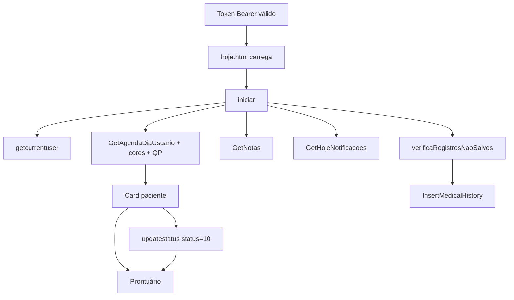

# Tela **Hoje** — Front Desk MEDX

Documento de referência sobre o funcionamento da página de recepção **Hoje**, com base na análise estática de:

- `pages_front_Desk/hoje.html`
- `pages_front_Desk/controllers/hoje.js` (cache local: `_rea-cache/hoje.controller.js`)
- Menu global `menuMEDX.html` + `menuController.js`
- Serviço HTTP `httpServicesMEDX.js` (padrão Bearer + `/api/`)

**URL:** [https://care-app65.medx.med.br/pages_front_Desk/hoje.html](https://care-app65.medx.med.br/pages_front_Desk/hoje.html)

**Papel no produto:** hub principal pós-login do ambiente **Front Desk** — visão do dia (agenda do usuário logado), lembretes, notificações administrativas, atalhos para contato/prontuário/finanças/agenda e fluxos de onboarding (trial, login unificado, 2FA, recuperação de rascunhos de prontuário).

---

## 1. Stack e dependências

| Camada            | Tecnologia                                                                      |
| ----------------- | ------------------------------------------------------------------------------- |
| Framework         | AngularJS 1.x (`ng-app="MEDX"`, controller `HojeCtrl`)                          |
| UI                | Bootstrap, Kendo UI (Calendar, Grid, Window, ComboBox, DateTimePicker)          |
| Estado local      | `ngStorage` / `localStorage` (`ngStorage-token`, `ngStorage-CurrentUser`, etc.) |
| Rascunhos offline | **Dexie** — banco IndexedDB `historico`                                         |
| Datas             | Moment.js, Day.js, locale `pt-BR`                                               |
| Chat              | `newChat.js` + Agora RTM SDK (menu lateral, compartilhado)                      |
| Tutoriais         | `tutorial-tour/tour.js`, `tutoriais/hoje.js`                                    |
| Analytics         | Google Analytics (`UA-39467779-7`)                                              |
| API               | `httpService` → base `/api/` + header `Authorization: Bearer`                   |

**Scripts principais da página**

- `controllers/hoje.js` — regra de negócio da tela
- `../menuController.js` — menu Front Desk (`menuPrinciapal`)
- `../menuMEDX.html` — layout do menu (incluído via `ng-include`)
- `../funcoes.js` — utilitários globais (load, alertas, datas)

---

## 2. Autenticação e entrada na página

### 2.1 Sem sessão válida

Qualquer chamada que retorne **401** redireciona para `../erro401.html` (“Credenciais inválidas, tempo de sessão expirou”).

O token fica em `localStorage` (`ngStorage-token`). O controller expõe `window.token1` para código fora do Angular.

### 2.2 Token na URL (IBM / SSO)

No **primeiro script** do `<head>`, se existir `?token=...` na URL:

1. Grava o valor em `localStorage` (`ngStorage-token`)
2. Remove o query string com `history.replaceState`

Isso permite login federado/redirecionamento entre ambientes sem expor o token na barra de endereços.

### 2.3 Redirecionamento IBM ↔ care-app65

Na função `iniciar()`:

- Se a origem **não** for `care-app65` e **não** veio `?token=`, consulta `hoje/getIbm`.
- Se o backend indicar redirecionamento, navega para `prefixoIBM + pages_front_Desk/hoje.html?token=...`
- Em `care-app65`, chama `hoje/UpdateIbmLogin` (marca/atualiza login IBM no tenant atual).

### 2.4 Bootstrap após login (`iniciar()`)

Ordem resumida:

1. IBM / token (acima)
2. `security/getcurrentuser` → grava `ngStorage-CurrentUser`
3. `hoje/IsOTPOrExpired` — se senha padrão/expirada → redirect `pages_ajustes/ajustes_trocasenha.html?padrao=true`
4. Classificação comercial do usuário (GOLD/SILVER/etc.) → textos de desconto no banner de eventos
5. `usuarioService` — permissões globais
6. Paralelo funcional:
   - `hoje/GetUltimosAtendidos`
   - `parametrosCores/getallparametroscores` → cores/labels de status da agenda → `hoje/GetAgendaDiaUsuario`
   - `hoje/GetHojeNotificacoes`
   - `hoje/GetNotas`
   - `adm/infosTrial` (+ popup trial se aplicável)
   - `adm/getchannels` (como conheceu o MEDX)
7. `loginunificado/verificaCelularLoginUnificado` — se celular não validado → popup **Autenticação 2 fatores** (cargo, especialidade, SMS)
8. `verificaRegistrosNaoSalvos()` — Dexie → popup rascunhos de prontuário

**Sync legado (uma vez por sessão de aba):** `SyncVersion/SyncData55To60` (sessionStorage `bancoAtualizado`). Em **Safari**, abre aviso para usar Chrome.

---

## 3. Layout da tela (colunas)

A área `#conteudo` usa três blocos principais (`hoje-containers`):

```
┌─────────────────┬──────────────────────────┬─────────────────┐
│ Calendário      │ Abas: Agenda | Atendidos│ Notificações    │
│ + Notas         │ (lista do dia)           │ + Patrocinado   │
└─────────────────┴──────────────────────────┴─────────────────┘
         ▲                    ▲                        ▲
    coluna esquerda      coluna central           coluna direita
```

O **menu MEDX** (`#menuNav`) fica acima/ao lado (navegação para Contatos, Agenda global, Finanças, Marketing, Sessões, Ajustes, etc.).

---

## 4. Coluna esquerda

### 4.1 Calendário Kendo (`#calendar`)

- Intervalo: 1900–2050
- Valor inicial: **hoje**
- **change:** atualiza `$scope.dia` e recarrega agenda com  
  `hoje/GetAgendaDiaUsuario?Id={UserId}&Dt={yyyy-M-d}`
- Botão **“Hoje”** (`onclick="teste()"`) — atalho para voltar ao dia atual (função global, não está no controller analisado)

### 4.2 Notas (lembretes)

**Lista compacta (`#gridNotas`):**

- Dados: `hoje/GetNotas`
- Ordenação: `orderBy:'Data'`
- Clique na linha → abre edição (`insertObjetInNotasEdit`)
- Classes visuais: `quandoAlerta(data)` → `hoje` | `atrasadas` | `futuras`
- Filtro de tempo relativo no template: pipe `quantoTempo`

**Botão “Ver cadastro de notas”** → `popupNotas()`:

- Kendo Grid `#gridNotasPopup` (CRUD completo)
- Ações: **Novo**, **Editar** (item selecionado no grid)

**Popup edição (`#popup-editnotas` / `#windowEditNotas`):**

| Campo     | Descrição                                        |
| --------- | ------------------------------------------------ |
| Id        | `0` = nova nota                                  |
| Data      | Kendo DateTimePicker                             |
| Usuário   | ComboBox — datasource `mobile/getusers` (Bearer) |
| Lembrete  | Texto (`Memo`)                                   |
| Concluído | Checkbox                                         |

**APIs:**

| Ação      | Método | Endpoint                  |
| --------- | ------ | ------------------------- |
| Listar    | GET    | `hoje/GetNotas`           |
| Criar     | POST   | `hoje/InsertNota`         |
| Atualizar | PUT    | `hoje/UpdateNota`         |
| Excluir   | DELETE | `hoje/DeleteNotaById?Id=` |

**Tutorial:** item de menu em `#popup-tutoriais` pode iniciar tour de cadastro de notas (`turoriaisService` + `tourCadastroNotas`).

---

## 5. Coluna central — abas

### 5.1 Aba “Ver agenda {dd/MM/yyyy}”

**Fonte:** `hoje/GetAgendaDiaUsuario?Id={UserId}&Dt={data}`

**Enriquecimento no client:**

- Cores da borda direita: `parametrosCores` → `corAgendamento = Colors[Status]`, `nomeStatusAgendamento = Labels[Status]`
- Tipo/consulta: `diagnosticoqp/GetAllDiagnosticoQP` cruzado com `Id_do_Diagnostico_QP` → `TipoAgendamento.StrDiagnosticoQP`
- Foto: `azure/getfileurl?blobname={DbId}-{Vinculado_a}.jpg` ou fallback `/images/blank-pic.jpg`
- Fuso: ajuste `Chegada` / `Atendido_As` quando diferentes de `0001-01-01T00:00:00`
- Itens com `Status == 0` **não** são exibidos (`ng-if="agendamentox.Status != 0"`)

**Informações por card:**

- Nome social ou nome civil
- Status textual (`nomeStatusAgendamento`)
- Horário início/fim
- Descrição (função `descricaoAgendamento` remove o nome repetido do texto)
- “Chegou às …” se `Chegada` preenchida e ainda não atendido
- “Já foi atendido” + horários se `Atendido_As` preenchido

**Atalhos por paciente** (`Vinculado_a` = Id do cliente):

| Ícone              | Destino                                                                          |
| ------------------ | -------------------------------------------------------------------------------- |
| Contatos           | `/pages_front_Desk/contatoedit.html?id=`                                         |
| Prontuário         | `../pages_prontuario/prontuario.html?id=`                                        |
| Fatura             | `../pages_financas/financas_faturamento.html?id=` (oculto se plano **Nutrição**) |
| Agenda do paciente | `/pages_front_Desk/agenda.html?id=`                                              |

**Iniciar consulta** (botão):

- Condições: paciente vinculado, ainda não atendido (`Atendido_As` vazio)
- Ação: `PUT agenda/updatestatus` com `{ id_do_agendamento, status: 10 }`
- Sucesso: redirect `../pages_prontuario/prontuario.html?id={Vinculado_a}`

O status **10** representa “em atendimento / consulta iniciada” no fluxo agenda → prontuário.

**Expandir card:** funções `mostrar` / `esconder` (JS global) alternam visibilidade dos links (`#id-mostra`).

### 5.2 Aba “Ver pacientes atendidos”

**Fonte:** `hoje/GetUltimosAtendidos`

- Lista ordenada por `-Ultimo` (atendimento mais recente primeiro)
- Mesmos atalhos: contato, prontuário, fatura, agenda
- Foto de perfil via Azure blob (mesmo padrão da agenda)

---

## 6. Coluna direita

### 6.1 Notificações

**Fonte:** `hoje/GetHojeNotificacoes`

Dois tipos na UI:

1. **Informativas** (`IddoBoleto == 0`): HTML em `Notificacao` (`ng-bind-html` + filtro `trustAsHtml`)
2. **Cobrança** (`IddoBoleto > 0`): texto em vermelho + link **“Clique aqui para pagar”** → `popupPagamento(chaveboleto)`

**Popup pagamento** (`#popup-opcoesPagamento`):

- Cartão: `http://apoio.medx.med.br/ecommerce.aspx?id={idFaturamento}`
- Boleto: `http://apoio.medx.med.br/boleto.aspx?id={idFaturamento}`

### 6.2 Patrocinado (marketing / eventos)

- Mesmo payload de notificações; filtra `Status == 'Event'`
- Escolhe **um** evento aleatório para exibir banner (`urlImge` extraída do HTML da notificação)
- Link **“Ver todos”** → `../pages_marketing/marketing_eventos.html`
- Ícone olho: `escondeAviso()` — persiste preferência em `localStorage.avisos` (mostrar/ocultar lista)
- Clique no banner: `selecionaEvento(evento)` — abre URL externa ou URL + `?ident={token}`

**Cupons (popup `#popup_dadosUsuarioEvento`):**

- Formulário nome/email do indicado
- `POST hoje/createCupom` com `{ IddoEvento, Url, Convidado, Email }`
- Detalhe extra: `hoje/getEventInfo?iddoevento=`

---

## 7. Popups e fluxos transversais

### 7.1 Trial (`#popup_dadosTrial`)

- Disparo: `adm/infosTrial` → `isTrial` e falta celular cadastrado
- Campos: celular, “como conheceu” (`adm/getchannels`), senha + confirmação
- Senha: validação forte + **criptografia RSA** (`criptografaSenhaUsuario` + chaves em `$storage.chavePublica`)
- Envio: `POST adm/infosTrial`

### 7.2 Login unificado (`#popup_atualizaEmail`)

- Após trial (conta normal): `LoginUnificado/getLoginUnificado`
- Se email não validado: modal obrigatório (sem botão fechar)
- `POST LoginUnificado/AtualizaLoginUnificado` — envia link de verificação
- Após validado: `notaCliente()` (NPS)

### 7.3 NPS / feedback (`#popup_clientesNotas`)

- `hoje/GetVerificaInfoPopup` → se true, abre estrelas 1–5 + comentário (255 chars)
- `POST hoje/InsertNotaCliente` `{ nota, observacao }`

### 7.4 Autenticação 2 fatores (`#autenticacaoDoisFatores`)

Quando `loginunificado/verificaCelularLoginUnificado` retorna falso:

1. Celular + cargo (`adm/getlistaCargos`) + até 3 especialidades (`adm/getListaEspecialidade`) se médico
2. `PUT hoje/UpdateCargo`
3. SMS: `loginunificado/solicitaCodigoAutenticacaoDoisFatores?celular=`
4. Confirma: `POST loginunificado/confirmarCodigo2fa`

### 7.5 Rascunhos de prontuário não salvos (Dexie)

**IndexedDB:** `Dexie('historico')` — store `{ idPaciente, userId, data, texto }`

Ao abrir Hoje:

1. Busca registros do `userId` atual
2. `POST contatos/NomePacientesRegistrosNaoSalvos` — resolve nomes
3. Popup `#notificaRegistrosNaoSalvos` lista pacientes/data
4. **Visualizar** → `#previaHistorico` (HTML do rascunho)
5. **Salvar** → `POST prontuario/InsertMedicalHistory` + remove do IndexedDB
6. **Ir para prontuário** → redirect `prontuario.html?id=`

Também expõe `redirecionaReceituario(id)` → `receituarios.html?id=&versao=61` (uso a partir do fluxo de recuperação).

### 7.6 Novidades V6.5 (`#novasFuncoes`)

Carrossel estático (imagens + textos) sobre injetáveis, estoque, etc. — controle `$scope.arrayDados`, navegação por setas/indicadores.

### 7.7 Comercial (`#popup_compra_sistema`)

Tabela de planos Enterprise/Business/Individual (HTML estático + CSS `popupPreco.css`). Abertura comentada no código (`// $("#popup_compra_sistema")...`) — disponível para campanhas.

### 7.8 Safari (`#popup-safari`)

Aviso de incompatibilidade do componente de agenda no Safari.

---

## 8. Menu global (Front Desk)

Incluído de `menuMEDX.html` com `ng-controller="menuPrinciapal"`.

Atalhos típicos a partir de Hoje:

| Destino   | Rota (padrão `encaminhaPage`)        |
| --------- | ------------------------------------ |
| Home Hoje | `pages_front_Desk/hoje`              |
| Contatos  | `pages_front_Desk/contatos`          |
| Agenda    | `pages_front_Desk/agenda`            |
| Finanças  | `pages_financas/financas`            |
| Marketing | `pages_marketing/marketing`          |
| Insights  | `pages_marketing/marketing_insights` |
| Estoque   | `pages_financas/financas_estoque`    |
| Sessões   | `pages_sessoes/pages_sessoes`        |
| Ajustes   | `pages_ajustes/ajustes`              |

Chat/suporte integrados via `newChat.js` (Agora) no menu.

---

## 9. Mapa de APIs (Hoje + fluxos acoplados)

### Núcleo “Hoje”

| Endpoint                                            | Uso                    |
| --------------------------------------------------- | ---------------------- |
| `security/getcurrentuser`                           | Usuário logado         |
| `hoje/GetAgendaDiaUsuario`                          | Agenda do dia          |
| `hoje/GetUltimosAtendidos`                          | Aba atendidos          |
| `hoje/GetNotas`                                     | Lembretes              |
| `hoje/InsertNota` / `UpdateNota` / `DeleteNotaById` | CRUD notas             |
| `hoje/GetHojeNotificacoes`                          | Notificações + eventos |
| `hoje/createCupom`                                  | Indicação cupom evento |
| `hoje/getEventInfo`                                 | Detalhe evento         |
| `hoje/IsOTPOrExpired`                               | Força troca de senha   |
| `hoje/getIbm` / `hoje/UpdateIbmLogin`               | Ponte IBM              |
| `hoje/GetVerificaInfoPopup` / `InsertNotaCliente`   | NPS                    |
| `hoje/UpdateCargo`                                  | 2FA / perfil           |

### Agenda e prontuário

| Endpoint                                   | Uso                          |
| ------------------------------------------ | ---------------------------- |
| `agenda/updatestatus`                      | Iniciar consulta (status 10) |
| `parametrosCores/getallparametroscores`    | Cores status agenda          |
| `diagnosticoqp/GetAllDiagnosticoQP`        | Tipo de agendamento          |
| `prontuario/InsertMedicalHistory`          | Salvar rascunho Dexie        |
| `contatos/NomePacientesRegistrosNaoSalvos` | Nomes no popup rascunho      |

### Admin / trial / login

| Endpoint                                                      | Uso                    |
| ------------------------------------------------------------- | ---------------------- |
| `adm/infosTrial`                                              | GET/POST trial         |
| `adm/getchannels`                                             | Canais “como conheceu” |
| `adm/getListaCargos` / `getListaEspecialidade`                | 2FA                    |
| `LoginUnificado/getLoginUnificado` / `AtualizaLoginUnificado` | Email unificado        |
| `loginunificado/verificaCelularLoginUnificado`                | Gate 2FA               |
| `loginunificado/solicitaCodigoAutenticacaoDoisFatores`        | SMS                    |
| `loginunificado/confirmarCodigo2fa`                           | Valida código          |
| `SyncVersion/SyncData55To60`                                  | Migração dados 5.5→6.0 |

### Infra

| Endpoint           | Uso                      |
| ------------------ | ------------------------ |
| `azure/getfileurl` | Fotos paciente/usuário   |
| `mobile/getusers`  | Combo usuários nas notas |

---

## 10. Diagrama — fluxo principal do dia



---

## 11. Observações operacionais e de produto

1. **Hoje é a “home” clínica/recepção** no legado care-app65; o SPA novel (`care-app.medx.med.br/app/...`) convive, mas esta tela continua sendo o centro da operação diária no Front Desk.
2. **Iniciar consulta** é o elo formal entre **agenda** e **prontuário** (status 10 + redirect).
3. **Notas** são lembretes por usuário (não confundir com histórico clínico do prontuário).
4. **Dexie** protege texto digitado no prontuário que não chegou ao servidor — Hoje é o ponto de recuperação.
5. Vários popups competem na abertura (trial, login unificado, 2FA, NPS, rascunhos) — ordem depende de flags do backend e `sessionStorage`.
6. **Notificações HTML** exigem cuidado de segurança (XSS mitigado pelo Angular/`trustAsHtml` apenas onde aplicado).
7. Pagamentos de boleto redirecionam para domínio **apoio.medx.med.br** (fora do care-app65).

---

## 12. Artefatos locais para estudo

Cópias analisadas no workspace:

- `_rea-cache/hoje.html`
- `_rea-cache/hoje.controller.js`
- `_rea-cache/menuMEDX.html` (parcial)
- `_rea-cache/httpServicesMEDX.js`

Para atualizar o cache a partir do ambiente:

```text
https://care-app65.medx.med.br/pages_front_Desk/hoje.html
https://care-app65.medx.med.br/pages_front_Desk/controllers/hoje.js
```

---

_Documento gerado para o projeto APRENDIZADO MEDX. Versão do bundle referenciada no HTML: `?version=20260907`._
