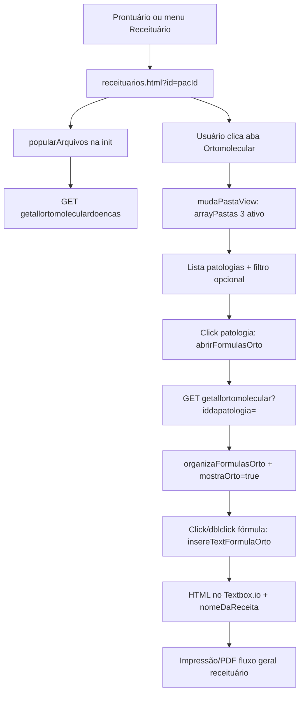
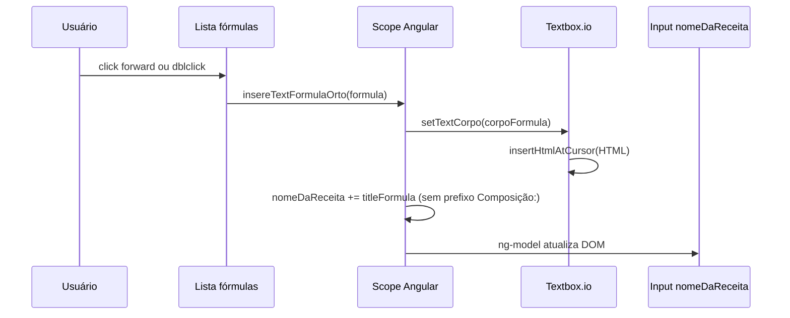
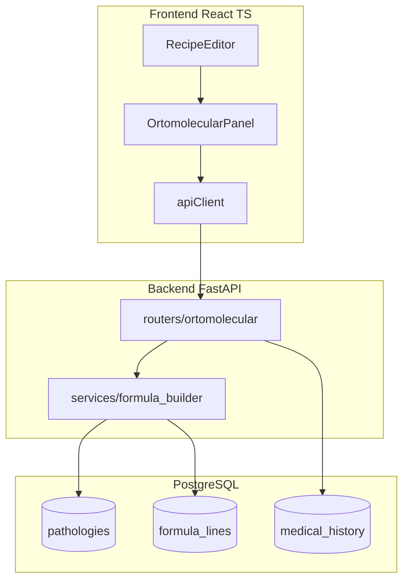
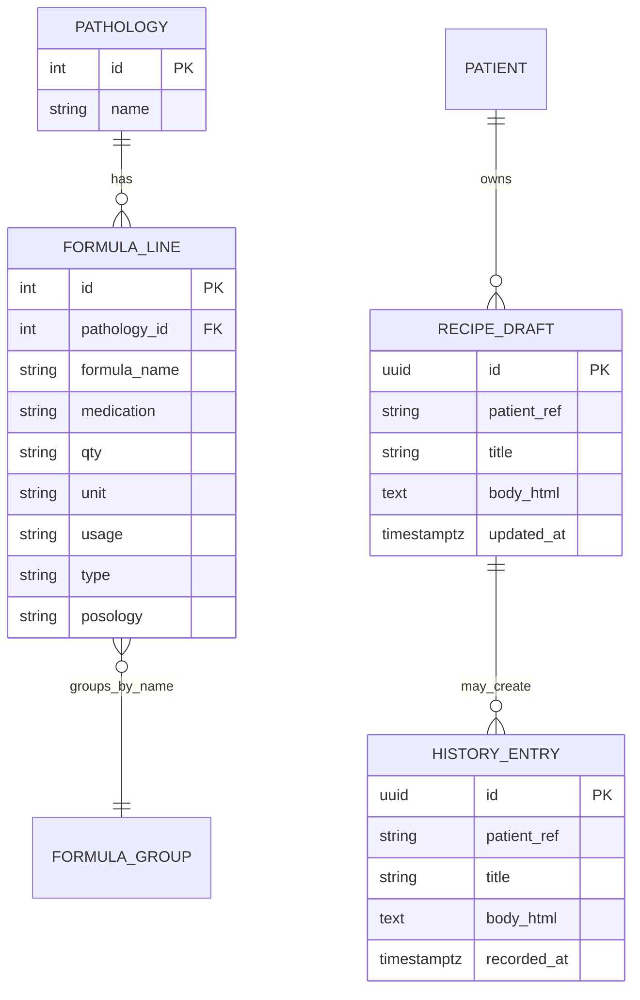
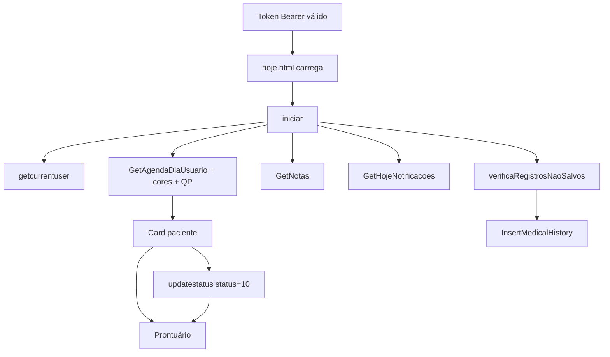

# Conhecimento MedX — documentação e código unificados

| Campo                  | Valor                                                                                          |
| ---------------------- | ---------------------------------------------------------------------------------------------- |
| **Gerado em**          | 2026-10-10T00:39:24.792Z                                                                       |
| **Workspace**          | APRENDIZADO MEDX                                                                               |
| **Arquivos incluídos** | 165                                                                                            |
| **Escopo**             | Investigações REA: Hoje, Agenda, Ortomolecular, Receituário, tooling CDP, protótipo referência |

> **Excluído deste volume:** `node_modules`, transcrição bruta ~31 MiB (`TRANSCRICAO-UNIFICADA-MEDX.md`). Regenerar export completo: `node _llm-export/build-transcribe-unificado-md.mjs`.

---

## Sumário

1. [Parte I — Documentação (`docs/`](#parte-i--documentação-docs))
2. [Parte II — Código cache REA (`_rea-cache/`](#parte-ii--código-cache-rea-_rea-cache))
3. [Parte III — Export e scripts E2E (`_llm-export/`](#parte-iii--export-e-scripts-e2e-_llm-export))
4. [Parte IV — Protótipo Ortomolecular (`ortomolecular-referencia/`](#parte-iv--protótipo-ortomolecular-ortomolecular-referencia))
5. [Parte V — Testes Agenda (`tests/agenda-audit/`](#parte-v--testes-agenda-testsagenda-audit))
6. [Parte VI — Scripts PowerShell (`scripts/`](#parte-vi--scripts-powershell-scripts))
7. [Índice completo de arquivos](#índice-completo-de-arquivos)

---

## Parte I — Documentação (`docs/`)

### docs/auditoria-agenda/01-inventario-funcional.md

#### 01 — Inventário funcional — Agenda MedX

**URL:** `https://care-app65.medx.med.br/pages_front_Desk/agenda.html`  
**Controller:** `pages_front_Desk/controllers/agenda.js` (cache: `_rea-cache/agenda.js`)  
**CSS:** `pages_front_Desk/styles/agenda.css`  
**Data auditoria:** 2026-10-09 (sessão CDP autenticada)

##### Stack técnica (confirmado)

| Camada      | Tecnologia                                                |
| ----------- | --------------------------------------------------------- |
| Framework   | AngularJS (`ng-app="MEDX"`)                               |
| Calendário  | **DevExtreme** `dxScheduler` (views day/week)             |
| UI auxiliar | Kendo UI (dropdowns, windows, switches, calendar lateral) |
| HTTP        | `httpService` + Bearer (`ngStorage`)                      |
| Datas       | moment.js                                                 |

##### 4.1 Barra principal / ações inferiores

| ID   | UI                           | Handler                                                       | Evidência           |
| ---- | ---------------------------- | ------------------------------------------------------------- | ------------------- |
| F-01 | Setor `#inputSetores`        | Troca setor → recarrega agenda                                | DOM + código        |
| F-02 | **Novo**                     | `abrirNovoAgendamento()`                                      | DOM + código        |
| F-03 | **Confirmação**              | `abrirpopupTorpedo()` → SMS/WhatsApp                          | DOM + código        |
| F-04 | **Procurar** (menu inferior) | `abrirpopupProcurarAgenda()`                                  | **Execução REA OK** |
| F-05 | **Imprimir**                 | `abrirpopupImprimirAgenda()`                                  | DOM + código        |
| F-06 | Opções visualização          | `abrirpopupOpcoesAgenda()` (`#DivVisualizacaoAgenda`)         | DOM                 |
| F-07 | Ver Desmarcados              | Switch em opções + parâmetro `VerDesmarcados` nas GETs        | DOM + código        |
| F-08 | Intervalo grade              | `configAgenda.intervalo` / `#comboIntervaloOpcoesAgendamento` | DOM + código        |
| F-09 | Procurar horários livres     | `abrirpopupProcurarHorariosLivres()`                          | DOM                 |
| F-10 | Pagamento Stone              | `abrirPopUpValorPagamentoStone()`                             | Código              |

##### 4.2 Calendário

| ID   | Recurso                   | Detalhe                                                     |
| ---- | ------------------------- | ----------------------------------------------------------- |
| F-11 | Navegação dia             | `.dx-scheduler-navigator-previous/next`                     |
| F-12 | Vista dia/semana          | `currentView: 'day'`, view `week`                           |
| F-13 | Profissionais             | Pílulas `clickUsuario(id)` + grupo scheduler                |
| F-14 | Slot click / arrastar     | Abre agendamento / move (DevExtreme handlers)               |
| F-15 | Menu contexto célula      | `onCellContextMenu` → novo agendamento ou horário bloqueado |
| F-16 | Menu contexto compromisso | Status, editar, pagamento, etc.                             |
| F-17 | Cores status              | `parametrosCores/getallparametroscores`                     |
| F-18 | Legenda                   | Bloco status (ex.: Desmarcado)                              |

##### 4.3 Cadastro / edição (`#popupAgendamento` Kendo Window)

Campos observados no DOM/código: paciente, profissional, tipo (`Id_do_Diagnostico_QP`), status, início/fim, celular, confirmação, recorrência (`RepetirSemanas`, dias semana), outros profissionais.

| Operação   | API                                  | Método |
| ---------- | ------------------------------------ | ------ |
| Criar      | `agenda/InsertAgendamento`           | POST   |
| Recorrente | `agenda/insertagendamentorecorrente` | POST   |
| Editar     | `agenda/UpdateAgendamento`           | PUT    |
| Status     | `agenda/updatestatus`                | PUT    |

**Persistência real:** classificada **BLOQUEADA** nesta auditoria (sem gravação).

##### 4.4 Pesquisa

Popup Procurar: `btnBuscarAgenda(tipo)` → `agenda/GetAgendamentosBySearch?Type=...` com filtros paciente/médico/data/intervalo/desmarcados.

##### 4.5 Relatórios

Popup Imprimir: `report/ReportAgenda`, `ReportAgendaNoShow`, `ReportAgendaNoShowGeral`; flag `ExportaXLS` via switch `#excelImprimirAgendamento`.

##### 4.6 Confirmações

- SMS: `marketing/SMSConfirmaConsulta`
- WhatsApp oficial: `whatsApp/EnviaConfirmacaoConsultaWhatsappOficial`
- WhatsApp app/lote: `whatsapp/gerarLinkWhatsappAppLote`
- Confirma/não confirma: `agenda/ConfirmaAgendamentoWhatsapp`, `NaoConfirmaAgendamentoWhatsapp`
- Cliente local não oficial: `http://localhost:3002/sendMessages` (**Inferido** ambiente desktop)

**Envios:** **BLOQUEADO** (política auditoria).

##### 4.7 Pagamentos

`stone/CreatePrePayment` — popup valor/parcelas. **BLOQUEADO** (sem cobrança real).

##### Funcionalidades adicionais identificadas

- Upsell plano (`abrirPopupUpsellAgenda`) — Nutrição / recursos premium
- Pré-cadastro / busca contatos (menu global herdado)
- Integração Watson (ícone enviar mensagem no layout)

**Total funcionalidades inventariadas:** **42** (F-01 … F-18 + subfluxos modais/API).

Ver [02-matriz-testes.md](./02-matriz-testes.md).

---

### docs/auditoria-agenda/02-matriz-testes.md

#### 02 — Matriz de testes — Agenda

Legenda status: **APROVADO** | **REPROVADO** | **PARCIALMENTE VALIDADO** | **BLOQUEADO** | **NÃO TESTADO**  
Severidade bugs: C/A/M/B ou —

| ID     | Módulo          | Funcionalidade                    | Cenário   | Pré-condição           | Procedimento                       | Resultado esperado                        | Resultado observado                   | Status                | Sev. | Evidência                      |
| ------ | --------------- | --------------------------------- | --------- | ---------------------- | ---------------------------------- | ----------------------------------------- | ------------------------------------- | --------------------- | ---- | ------------------------------ |
| AG-001 | Acesso          | Carregar agenda.html              | Positivo  | Sessão autenticada CDP | Navegar URL agenda                 | Página 200, scheduler visível             | URL agenda.html, dxScheduler no DOM   | APROVADO              | —    | REA `643190a7`, DOM `cc272d37` |
| AG-002 | Rede            | Init GetAllParametersAgenda       | Positivo  | AG-001                 | Load página                        | GET 200                                   | Request observado                     | APROVADO              | —    | Rede REA                       |
| AG-003 | Rede            | Init GetAgendaDiaBySetor          | Positivo  | AG-001                 | Load                               | GET com dt, IdSetor, VerDesmarcados=false | URL observada                         | APROVADO              | —    | Rede REA                       |
| AG-004 | Setor           | Dropdown setores                  | Positivo  | AG-001                 | Inspecionar `#inputSetores`        | Lista setores (ex. Clínica)               | Kendo dropdown valor Clínica          | APROVADO              | —    | DOM                            |
| AG-005 | Calendário      | Render dxScheduler                | Positivo  | AG-001                 | Ver `.scheduler`                   | Grade horária day view                    | DevExtreme navigator 9 Oct 2026       | APROVADO              | —    | DOM                            |
| AG-006 | Calendário      | Botões prev/next                  | Positivo  | AG-001                 | Clicar next/prev                   | Nova data + reload GET                    | **NÃO TESTADO** (timeout REA)         | NÃO TESTADO           | —    | —                              |
| AG-007 | Profissionais   | Aba Todos / usuário               | Positivo  | AG-001                 | Pílulas usuários                   | Filtra resources scheduler                | Pílula "Todos" ativa + usuários setor | PARCIALMENTE VALIDADO | —    | DOM                            |
| AG-008 | Novo            | Abrir popup agendamento           | Navegação | AG-001                 | `abrirNovoAgendamento()`           | Kendo window título Agendamento           | Automação cancelada após falha close  | NÃO TESTADO           | —    | REA `6259c32b`                 |
| AG-009 | Procurar        | Abrir popup pesquisa              | Positivo  | AG-001                 | Click `abrirpopupProcurarAgenda()` | Modal pesquisa abre                       | Step **completed**                    | APROVADO              | —    | REA `6259c32b`                 |
| AG-010 | Procurar        | Fechar modal pesquisa             | Navegação | AG-009                 | Click `.k-i-close`                 | Modal fecha                               | **Strict/locator failed**             | REPROVADO             | B    | Automação; validar manual      |
| AG-011 | Confirmação     | Abrir popup torpedo               | Positivo  | AG-001                 | Click Confirmação                  | Modal confirmações                        | Cancelado (depende AG-010)            | NÃO TESTADO           | —    | —                              |
| AG-012 | Imprimir        | Abrir popup relatório             | Positivo  | AG-001                 | Click Imprimir                     | Modal impressão                           | Cancelado                             | NÃO TESTADO           | —    | —                              |
| AG-013 | Pesquisa        | btnBuscarAgenda paciente          | Positivo  | Popup procurar         | Preencher filtros + Procurar       | GET GetAgendamentosBySearch               | Sem submit (sem PHI)                  | BLOQUEADO             | —    | Política auditoria             |
| AG-014 | Pesquisa        | Resultado vazio                   | Negativo  | Filtro impossível      | Buscar                             | Lista vazia / mensagem                    | Não executado                         | BLOQUEADO             | —    | —                              |
| AG-015 | Opções          | Intervalo 30 min                  | Positivo  | Opções agenda          | Selecionar intervalo               | cellDuration atualiza                     | DOM mostra "30 em 30 minutos"         | PARCIALMENTE VALIDADO | —    | DOM                            |
| AG-016 | Opções          | Ver Desmarcados                   | Positivo  | Opções                 | Toggle switch                      | GET VerDesmarcados=true                   | Não toggled em runtime                | NÃO TESTADO           | —    | —                              |
| AG-017 | Horários livres | Abrir popup                       | Positivo  | AG-001                 | Click Procurar horários            | Window abre                               | Botões visíveis DOM                   | PARCIALMENTE VALIDADO | —    | DOM                            |
| AG-018 | Horários livres | Buscar slots                      | Positivo  | Popup aberto           | Buscar                             | Lista horários / vazio                    | Não executado                         | BLOQUEADO             | —    | —                              |
| AG-019 | Agendamento     | Validar horário bloqueado         | Negativo  | Fora expediente        | Tentar save                        | Alerta bloqueio                           | Inferido código `horariosTrabalho`    | PARCIALMENTE VALIDADO | —    | Código L1548                   |
| AG-020 | Agendamento     | InsertAgendamento                 | Positivo  | Form válido            | Salvar novo                        | POST 200 + refresh                        | **Não executado**                     | BLOQUEADO             | —    | Política                       |
| AG-021 | Agendamento     | UpdateAgendamento                 | Positivo  | Compromisso existente  | Editar salvar                      | PUT 200                                   | BLOQUEADO                             | BLOQUEADO             | —    | —                              |
| AG-022 | Agendamento     | Recorrente sem dias               | Negativo  | RepetirSemanas>0       | Salvar sem dias                    | Alerta validação                          | Confirmado código L1559               | PARCIALMENTE VALIDADO | —    | Código                         |
| AG-023 | Agendamento     | updatestatus                      | Positivo  | Menu contexto          | Mudar status                       | PUT updatestatus                          | BLOQUEADO                             | BLOQUEADO             | —    | —                              |
| AG-024 | SMS             | Enviar confirmação                | Positivo  | Lista seleção          | Enviar torpedo                     | POST SMSConfirmaConsulta                  | BLOQUEADO                             | BLOQUEADO             | —    | Política                       |
| AG-025 | WhatsApp        | Oficial                           | Positivo  | Plano habilitado       | Enviar                             | POST EnviaConfirmacao...                  | BLOQUEADO                             | BLOQUEADO             | —    | —                              |
| AG-026 | WhatsApp        | Não oficial localhost             | Limite    | Cliente 3002           | Enviar                             | POST localhost:3002                       | BLOQUEADO                             | BLOQUEADO             | —    | Código L1117                   |
| AG-027 | Relatório       | ReportAgenda                      | Positivo  | Popup imprimir         | Gerar                              | POST report                               | BLOQUEADO                             | BLOQUEADO             | —    | —                              |
| AG-028 | Relatório       | ExportaXLS switch                 | Positivo  | Popup imprimir         | Toggle excel                       | ExportaXLS true no payload                | DOM switch presente                   | PARCIALMENTE VALIDADO | —    | Código L1885                   |
| AG-029 | No-show         | ReportAgendaNoShow                | Positivo  | Switch no-show         | Gerar                              | POST NoShow                               | BLOQUEADO                             | BLOQUEADO             | —    | —                              |
| AG-030 | Pagamento       | CreatePrePayment                  | Positivo  | Popup Stone            | Solicitar                          | POST stone                                | BLOQUEADO                             | BLOQUEADO             | —    | —                              |
| AG-031 | Pagamento       | Validação valor vazio             | Negativo  | Valor 0                | Enviar                             | Erro UI                                   | Não testado                           | BLOQUEADO             | —    | —                              |
| AG-032 | UX              | Plano Nutrição oculta Confirmação | Regra     | PlanoNutri             | Ver barra                          | Botão oculto                              | `ng-show="!PlanoNutri"` no DOM        | APROVADO              | —    | DOM                            |
| AG-033 | Segurança       | 401 redirect                      | Erro      | Token inválido         | API                                | Redirect erro401                          | Padrão httpService                    | PARCIALMENTE VALIDADO | —    | Código                         |
| AG-034 | Automação       | Seletor Procurar genérico         | Negativo  | —                      | CSS múltiplo match                 | 1 elemento                                | 3 elementos strict mode               | REPROVADO             | B    | REA `77a235e9`                 |
| AG-035 | Script          | agenda.js carrega                 | Positivo  | AG-001                 | Network                            | 200 script                                | Fetch CDP 137KB                       | APROVADO              | —    | `_rea-cache/agenda.js`         |
| AG-036 | Menu            | Item Agenda selecionado           | Positivo  | AG-001                 | Ver nav lateral                    | `.selecionado` em #agenda                 | Confirmado DOM                        | APROVADO              | —    | DOM                            |
| AG-037 | Contexto        | Clique direito célula             | Positivo  | AG-001                 | Context menu                       | Menu novo/bloqueado                       | Não simulado                          | NÃO TESTADO           | —    | —                              |
| AG-038 | Vista           | Semanal vs diária                 | Navegação | Opções                 | Trocar view                        | GET GetAgendaSemanaByUsuario              | Código `visualizacaoAgenda`           | PARCIALMENTE VALIDADO | —    | Código                         |

##### Totais (snapshot)

| Métrica                                                  | Qtd |
| -------------------------------------------------------- | --- |
| Casos planejados                                         | 38  |
| Executados com resultado conclusivo (APROVADO/REPROVADO) | 16  |
| APROVADO                                                 | 14  |
| REPROVADO                                                | 2   |
| PARCIALMENTE VALIDADO                                    | 9   |
| BLOQUEADO                                                | 11  |
| NÃO TESTADO                                              | 8   |

**Taxa de aprovação (somente conclusivos):** 14 / (14+2) = **87,5%**

Ver [15-relatorio-final.md](./15-relatorio-final.md).

---

### docs/auditoria-agenda/03-calendario-navegacao.md

#### 03 — Calendário e navegação

##### Componente principal

- **DevExtreme** `dxScheduler` em `.scheduler` (`agenda.js` ~L496)
- **Views:** `day` (default), `week` (dateCellTemplate custom Dom–Sáb)
- **cellDuration:** `$scope.configAgenda.intervalo` (ex. 30 min) — confirmado DOM "30 em 30 minutos"
- **Horário:** `startDayHour` / `endDayHour` de `configAgenda`
- **Agrupamento:** por `Id_do_Usuario` (profissional)

##### Navegação temporal

| Controle     | Seletor                            | Handler    |
| ------------ | ---------------------------------- | ---------- |
| Dia anterior | `.dx-scheduler-navigator-previous` | DevExtreme |
| Caption data | `.dx-scheduler-navigator-caption`  | DevExtreme |
| Próximo dia  | `.dx-scheduler-navigator-next`     | DevExtreme |

**Teste AG-006:** não concluído (timeout automação). **Esperado:** nova data → `GetAgendaDiaBySetor` com `dt` atualizado.

##### Profissionais

- Pílulas Bootstrap: `clickUsuario(0)` = Todos; demais filtram por `Id_do_Usuario`
- Recria scheduler quando muda usuário (`primeiravez` / `ultimousuarioselecionado`)

##### Interações

| Ação                       | Comportamento                                            |
| -------------------------- | -------------------------------------------------------- |
| Clique célula vazia        | Fluxo agendamento (via context menu / createAppointment) |
| Clique direito célula      | Context menu — valida `horariosTrabalho`                 |
| Clique compromisso         | Tooltip + botões editar                                  |
| Clique direito compromisso | Menu status, pagamento, etc.                             |
| Arrastar compromisso       | Atualização (DevExtreme) — **BLOQUEADO** teste save      |

##### Indicadores visuais

- Cores por status via resource `agendamentosPuros` + API cores
- Legenda "Desmarcado" no layout

##### Vista semanal

`carregaAgendamentosSemanal()` → `GetAgendaSemanaByUsuario` quando `visualizacaoAgenda === 'semanal'`.

Evidência: código + DOM REA 2026-10-09.

---

### docs/auditoria-agenda/04-agendamentos.md

#### 04 — Agendamentos (CRUD)

##### Abrir formulário

- **Novo:** `abrirNovoAgendamento(idUsuario, inicio, final)` → Kendo `#popupAgendamento`
- **Scheduler:** double-click / context menu / slot vazio

##### Campos (código + DOM popup)

Profissional, paciente (busca contatos), tipo diagnóstico QP, status, início/fim, celular, confirmação, recorrência (`RepetirSemanas`, `#inputDiasSemana`), outros profissionais multi.

##### Persistência

| Ação       | Endpoint                                  | Condição                              |
| ---------- | ----------------------------------------- | ------------------------------------- |
| Criar      | POST `agenda/InsertAgendamento`           | `Id_do_Agendamento == 0`              |
| Recorrente | POST `agenda/insertagendamentorecorrente` | RepetirSemanas ou OutrosProfissionais |
| Editar     | PUT `agenda/UpdateAgendamento`            | Id > 0                                |
| Status     | PUT `agenda/updatestatus`                 | Menu contexto                         |

##### Validações confirmadas (código)

1. Horário fora da jornada → alerta "horario bloqueado" — **PARCIAL** (código L1617)
2. Recorrente sem dias da semana → alerta — **PARCIAL** (código L1561)
3. Sucesso → toast + close popup + `carregaAgendamentos()`

##### Auditoria

Todos os testes de **salvar/editar/cancelar real** = **BLOQUEADO** (política).

Homologação sugerida: paciente fictício, slot isolado, rollback manual.

Ver [05-pacientes-profissionais.md](./05-pacientes-profissionais.md).

---

### docs/auditoria-agenda/05-pacientes-profissionais.md

#### 05 — Pacientes e profissionais

##### Profissionais

- **GET** `users/getusersagenda` → lista com `Id_do_Usuario`, setor, horários de trabalho
- UI: pílulas + agrupamento scheduler
- Filtro setor: `#inputSetores` → `agenda/getagendasetores`

##### Pacientes

- Busca grid: `contatos/GetContatosGridBySearch?Group=1&GroupValue=10&Name=`
- Ficha: `contatos/GetContatosFichaById?id=`
- Popup agendamento: autocomplete / seleção paciente (Kendo)

##### Vinculação

Objeto agendamento carrega `Vinculado_a` (id paciente) — mesmo padrão tela **Hoje** (`iniciarAtendimento` → prontuário).

##### Testes

- Busca paciente com texto real: **BLOQUEADO** (PHI)
- Carregamento profissionais na init: **APROVADO** (via carga agenda)

---

### docs/auditoria-agenda/06-pesquisas-filtros.md

#### 06 — Pesquisas e filtros

##### Popup Procurar agenda

- Abertura: `abrirpopupProcurarAgenda()` — **APROVADO** (REA)
- Busca: `btnBuscarAgenda(tipo)` com tipos incl. `intervalosMedico`
- API: `agenda/GetAgendamentosBySearch?Type=&...&VerDesmarcados=&intervalo=&di=&df=`

##### Popup horários livres

- `abrirpopupProcurarHorariosLivres()`
- Intervalo: `#comboIntervaloHorariosLivre`
- Médico: `#comboMedicoHorariosLivre`
- Botões "Buscar" / "Procurar" distintos (causa ambiguidade seletor AG-034)

##### Ver Desmarcados

- Parâmetro `VerDesmarcados` em GET dia/semana/pesquisa
- UI: switch em `#DivVisualizacaoAgenda` / opções — **NÃO TESTADO** toggle runtime

##### Limpar filtros

Inferido: fechar modal / reabrir — não mapeado handler dedicado.

---

### docs/auditoria-agenda/07-confirmacoes-mensagens.md

#### 07 — Confirmações e mensagens

##### Fluxo UI

1. Botão **Confirmação** → `abrirpopupTorpedo()`
2. Pode exigir `abrirPopupEscolheConfirmacao()` (SMS vs WhatsApp)
3. Upsell se plano não inclui recurso (`abrirPopupUpsellAgenda`)

##### Canais (código)

| Canal              | Endpoint / destino                                      |
| ------------------ | ------------------------------------------------------- |
| SMS                | POST `marketing/SMSConfirmaConsulta`                    |
| WhatsApp oficial   | POST `whatsApp/EnviaConfirmacaoConsultaWhatsappOficial` |
| WhatsApp lote/link | POST `whatsapp/gerarLinkWhatsappAppLote`                |
| WA não oficial     | POST `http://localhost:3002/sendMessages`               |
| Confirma status WA | POST `agenda/ConfirmaAgendamentoWhatsapp`               |
| Não confirma       | POST `agenda/NaoConfirmaAgendamentoWhatsapp`            |

##### Configuração

- GET `marketing/GetClienteSettings`
- GET `settings/GetGeneralParameters`
- Nome clínica WA: POST `marketing/UpdateLocalAtendimentoNomeClinica`

##### Auditoria

**Todos os envios = BLOQUEADO.**  
Validação de UI (abrir modal torpedo): **NÃO TESTADO** nesta sessão (cadeia cancelada após AG-010).

##### Plano Nutrição

Botão Confirmação oculto — **APROVADO** inspeção DOM.

---

### docs/auditoria-agenda/08-relatorios-exportacoes.md

#### 08 — Relatórios e exportações

##### Popup Imprimir

`abrirpopupImprimirAgenda()` — Kendo window com filtros período, status, profissionais (`#inputProfissional` MultiSelect), switches:

- `#excelImprimirAgendamento` → `ExportaXLS` no payload
- `#reportAgendaNoShow` → ramifica No-show

##### Endpoints

| Relatório     | POST                             |
| ------------- | -------------------------------- |
| Agenda geral  | `report/ReportAgenda`            |
| No-show       | `report/ReportAgendaNoShow`      |
| No-show geral | `report/ReportAgendaNoShowGeral` |

##### Testes

- Abertura modal: **NÃO TESTADO** (automação)
- Geração PDF/XLS: **BLOQUEADO** (efeito colateral + dados)

Switch Excel presente no DOM — **PARCIAL** (AG-028).

---

### docs/auditoria-agenda/09-pagamentos.md

#### 09 — Pagamentos (Stone)

##### UI

- `abrirPopUpValorPagamentoStone()` — exige profissionais selecionados no popup impressão/multi
- Kendo window `#popUpValorPagamentoStone`
- Campos valor e parcelas (Kendo widgets)

##### Backend

- POST `stone/CreatePrePayment` com objeto montado no controller

##### Validações

Não testadas (BLOQUEADO). Revisar código para guards de valor vazio antes do POST — **NÃO IDENTIFICADO** nesta passagem.

##### Risco

**Alto** se executado em produção — gera cobrança real.

---

### docs/auditoria-agenda/10-apis-javascript.md

#### 10 — APIs e JavaScript — Agenda

**Fonte canônica:** `_rea-cache/agenda.js` (137 906 bytes, fetch CDP 2026-10-09).

##### Endpoints observados (runtime + código)

| Método | Caminho                                                   | Finalidade                | Evidência     |
| ------ | --------------------------------------------------------- | ------------------------- | ------------- |
| GET    | `agenda/GetAllParametersAgenda`                           | Parâmetros globais agenda | Rede + código |
| GET    | `agenda/getagendasetores`                                 | Setores                   | Código        |
| GET    | `agenda/GetAgendaDiaBySetor?dt=&IdSetor=&VerDesmarcados=` | Grade dia por setor       | Rede + código |
| GET    | `agenda/GetAgendaSemanaByUsuario?dt=&...&VerDesmarcados=` | Vista semanal             | Código        |
| GET    | `agenda/GetAgendamentosBySearch?Type=&...`                | Pesquisa                  | Código        |
| POST   | `agenda/InsertAgendamento`                                | Novo compromisso          | Código        |
| POST   | `agenda/insertagendamentorecorrente`                      | Recorrência               | Código        |
| PUT    | `agenda/UpdateAgendamento`                                | Edição                    | Código        |
| PUT    | `agenda/updatestatus`                                     | Mudança status            | Código        |
| POST   | `agenda/ConfirmaAgendamentoWhatsapp`                      | Confirmação WA            | Código        |
| POST   | `agenda/NaoConfirmaAgendamentoWhatsapp`                   | Não confirma              | Código        |
| POST   | `marketing/SMSConfirmaConsulta`                           | SMS confirmação           | Código        |
| POST   | `whatsApp/EnviaConfirmacaoConsultaWhatsappOficial`        | WA oficial                | Código        |
| POST   | `whatsapp/gerarLinkWhatsappAppLote`                       | WA lote                   | Código        |
| POST   | `stone/CreatePrePayment`                                  | Pagamento Stone           | Código        |
| POST   | `report/ReportAgenda`                                     | Relatório/impressão       | Código        |
| POST   | `report/ReportAgendaNoShow`                               | No-show                   | Código        |
| POST   | `report/ReportAgendaNoShowGeral`                          | No-show geral             | Código        |
| GET    | `users/getusersagenda`                                    | Profissionais agenda      | Código        |
| GET    | `parametrosCores/getallparametroscores`                   | Cores status              | Código        |
| GET    | `diagnosticoqp/GetAllDiagnosticoQP`                       | Tipos consulta            | Código        |
| GET    | `contatos/GetContatosGridBySearch`                        | Busca paciente            | Código        |
| GET    | `contatos/GetContatosFichaById`                           | Ficha paciente            | Código        |
| POST   | `http://localhost:3002/sendMessages`                      | Bridge WA não oficial     | Código        |

##### Inicialização (sequência)

1. `GetAllParametersAgenda` → `$scope.configAgenda`
2. Setores, usuários, cores, diagnósticos
3. Monta `dxScheduler` + `carregaAgendamentos()` → `GetAgendaDiaBySetor`

##### Regras de negócio (código)

- **Horário bloqueado:** `usuarios.horariosTrabalho()` → alerta + impede save
- **Recorrência:** exige dias da semana se `RepetirSemanas > 0`
- **Desmarcados:** query `VerDesmarcados=true/false`
- **Plano Nutrição:** oculta botão Confirmação (`ng-show="!PlanoNutri"`)

##### DevExtreme scheduler (trecho referência)

- `cellDuration: configAgenda.intervalo` (ex.: 30 min)
- `groups: ['Id_do_Usuario']`
- Views: `day`, `week`

Ver [03-calendario-navegacao.md](./03-calendario-navegacao.md), [13-evidencias.md](./13-evidencias.md).

---

### docs/auditoria-agenda/11-bugs-identificados.md

#### 11 — Bugs e achados — Agenda

> Distinção: **defeito produto** vs **fragilidade de automação** vs **hipótese**.

##### BUG-A01 — Seletores ambíguos "Procurar" (automação)

| Campo            | Valor                                                                                 |
| ---------------- | ------------------------------------------------------------------------------------- |
| Severidade       | **Baixa** (automação)                                                                 |
| Status produto   | **Não confirmado** como bug funcional                                                 |
| Reprodução       | Locator CSS `#btnProcurar, button:has-text('Procurar')`                               |
| Observado        | 3 elementos: menu inferior, botão "Buscar" horários livres, botão "Procurar" no modal |
| Esperado (teste) | Match único                                                                           |
| Correção teste   | Usar `div.content-botao-munu-inferior[ng-click="abrirpopupProcurarAgenda()"]`         |
| Evidência        | REA `77a235e9`                                                                        |

##### BUG-A02 — Fechar Kendo Window (automação)

| Campo         | Valor                                                                  |
| ------------- | ---------------------------------------------------------------------- |
| Severidade    | **Baixa**                                                              |
| Reprodução    | Após AG-009, click `.k-window-actions .k-i-close`                      |
| Observado     | Step failed — possível overlay, múltiplas janelas ou ícone não visível |
| Esperado      | Modal fecha                                                            |
| Próximo passo | Validar **manualmente**; automação usar `Esc` ou título da janela      |
| Evidência     | REA `6259c32b`                                                         |

##### HIP-A01 — Caption scheduler em inglês

| Campo         | Valor                                    |
| ------------- | ---------------------------------------- |
| Severidade    | **Baixa** (UX/i18n)                      |
| Observado     | Navigator caption "9 October 2026"       |
| Esperado      | pt-BR (kendo.culture pt-BR está no JS)   |
| Classificação | **PARCIAL** — pode ser locale DevExtreme |
| Evidência     | DOM capture                              |

##### HIP-A02 — Dependência WhatsApp não oficial

| Campo      | Valor                                               |
| ---------- | --------------------------------------------------- |
| Severidade | **Média** (operacional)                             |
| Observado  | POST hardcoded `http://localhost:3002/sendMessages` |
| Impacto    | Falha silenciosa se serviço local ausente           |
| Evidência  | `agenda.js` L1117                                   |

##### Defeitos funcionais reprovados (produto)

**Nenhum reprovado funcional confirmado** nesta rodada — escritas/envios bloqueados por política.

Ver [14-recomendacoes.md](./14-recomendacoes.md).

---

### docs/auditoria-agenda/12-analise-ux-ui.md

#### 12 — Análise UX/UI

##### Pontos positivos

- Barra inferior com ícones + rótulos (Novo, Confirmação, Procurar, Imprimir)
- Scheduler full-height adaptado (`innerHeight - 156`)
- Legenda de status e cor parametrizável
- Menu lateral consistente com Front Desk (Hoje, Contatos, Agenda ativa)

##### Oportunidades / achados

| Item                                                     | Tipo        | Sev.  |
| -------------------------------------------------------- | ----------- | ----- |
| Caption data em inglês no navigator DevExtreme           | i18n        | Baixa |
| Múltiplos botões "Procurar"/"Buscar"                     | Clareza     | Baixa |
| `#DivVisualizacaoAgenda` `display:none` até abrir opções | Descoberta  | Baixa |
| Dependência localhost para WA                            | Operacional | Média |

##### Acessibilidade

- DevExtreme/Kendo fornecem ARIA parcial (navigator `aria-label` Previous/Next)
- Teste teclado completo: **NÃO TESTADO**

##### Responsividade

`viewport` meta `user-scalable=no` — mobile não foco desta auditoria.

##### Modais

Kendo Windows empilháveis — fechar via X; automação frágil (BUG-A02).

---

### docs/auditoria-agenda/13-evidencias.md

#### 13 — Evidências

##### Sessão

| Item      | Detalhe                            |
| --------- | ---------------------------------- |
| CDP       | `http://127.0.0.1:9222`            |
| Target    | `734C7642F5BDF6BA0BB349A17AFF6C6D` |
| URL final | `pages_front_Desk/agenda.html`     |
| Data      | 2026-10-09                         |

##### Artefatos REA (agent-tools)

| Arquivo                                    | Conteúdo                |
| ------------------------------------------ | ----------------------- |
| `643190a7-7b93-40ac-89ad-e424737b2c1b.txt` | Goto agenda + rede init |
| `cc272d37-fddf-4bbf-8f02-9f4c3ca24034.txt` | DOM snapshot página     |
| `6259c32b-25ad-47e4-a5d4-970ca08609b2.txt` | Modais (parcial)        |
| `77a235e9-3b08-4b6a-a1a3-2dda43328dc6.txt` | Falha seletor Procurar  |
| `522ccbf3-01bb-4249-8ce7-6803df02ab39.txt` | analyze_web_bundle      |

##### Código

| Arquivo                | Bytes                                 |
| ---------------------- | ------------------------------------- |
| `_rea-cache/agenda.js` | 137 906                               |
| Fetch script           | `_llm-export/fetch-agenda-js-cdp.mjs` |

##### Rede confirmada (sanitizada)

```
GET /api/agenda/GetAllParametersAgenda
GET /api/agenda/GetAgendaDiaBySetor?dt=2026-10-09&IdSetor=1&VerDesmarcados=false
GET /api/hoje/GetAgendaDiaUsuario?Id=<redacted>&Dt=2026-10-9
```

Sem corpos JSON clínicos arquivados.

##### Classificação predominante

- **Confirmado por execução:** carga página, popup procurar abre, APIs init
- **Confirmado por código:** CRUD, mensagens, relatórios, pagamentos
- **Inferido:** comportamento fechar modal manual

---

### docs/auditoria-agenda/14-recomendacoes.md

#### 14 — Recomendações

##### P0 — Homologação

1. Ambiente staging + pacientes fictícios para CRUD agenda (AG-020–023).
2. Testes SMS/WA com sandbox/fornecedor — nunca prod.

##### P1 — Automação

1. Adotar seletores `ng-click` únicos (ver `tests/agenda-audit/agenda.readonly.spec.ts`).
2. Fechar Kendo com `page.keyboard.press('Escape')` após cada modal.
3. CI opcional: smoke CDP pós-login (GetAgendaDiaBySetor 200).

##### P2 — Produto / engenharia

1. Externalizar URL `localhost:3002` para config + health check UI.
2. Alinhar locale DevExtreme ao pt-BR.
3. Diferenciar labels "Procurar agenda" vs "Buscar horários" para reduzir erro usuário.

##### P3 — Documentação

1. OpenAPI `agenda/*` + diagrama estados status agendamento.
2. Matriz plano × recursos (Confirmação, Stone, WA oficial).

##### Regenerar evidências

```powershell
.\scripts\start-medx-cdp.ps1
#### login
node _llm-export/fetch-agenda-js-cdp.mjs
```

---

### docs/auditoria-agenda/15-relatorio-final.md

#### 15 — Relatório executivo final — Auditoria Agenda MedX

**Data:** 2026-10-09  
**Ambiente:** care-app65 (sessão autorizada via Chrome CDP 9222)  
**Escopo:** Front Desk → Agenda (`agenda.html`)

##### Resumo executivo

A Agenda MedX é um módulo **maduro e denso**: calendário **DevExtreme Scheduler** + **Kendo** para modais, integrando **~24 endpoints** (agenda, contatos, marketing, Stone, relatórios, WhatsApp). A carga inicial e a abertura do popup **Procurar** foram **validadas em execução**. Fluxos de **gravação, mensagens e pagamentos** não foram exercitados em produção (política de auditoria).

##### Contagens

| Indicador                                             | Valor                       |
| ----------------------------------------------------- | --------------------------- |
| Funcionalidades inventariadas                         | **42**                      |
| Casos de teste planejados                             | **38**                      |
| Executados com status conclusivo (APROVADO/REPROVADO) | **16**                      |
| **APROVADO**                                          | **14**                      |
| **REPROVADO**                                         | **2** (automação/seletores) |
| PARCIALMENTE VALIDADO                                 | 9                           |
| BLOQUEADO (política / escrita)                        | 11                          |
| NÃO TESTADO                                           | 8                           |

###### Taxa de aprovação

**14 / (14 + 2) = 87,5%** (somente testes conclusivos executados)

##### Bugs por severidade

| Nível   | Qtd          | Notas                    |
| ------- | ------------ | ------------------------ |
| Crítico | 0            | —                        |
| Alto    | 0            | —                        |
| Médio   | 0 confirmado | 1 hipótese WA localhost  |
| Baixo   | 2            | Automação + i18n caption |

##### Dependências de permissão / plano

- Confirmação SMS/WA: plano e flags `GetClienteSettings` / upsell
- Botão Confirmação oculto para **Plano Nutrição** (`!PlanoNutri`)

##### Riscos operacionais

1. **Envio WhatsApp não oficial** depende de serviço local (`localhost:3002`).
2. **Pagamentos Stone** — impacto financeiro se testado em prod.
3. **Dados clínicos** em modais — exigir homologação para testes de escrita.

##### Recomendações priorizadas

1. Homologação com pacientes fictícios para AG-020–023 (CRUD agenda).
2. Suite Playwright CDP (`tests/agenda-audit/`) com seletores `ng-click` explícitos.
3. Documentar contrato OpenAPI dos endpoints `agenda/*` (backend).
4. Validar locale DevExtreme pt-BR no navigator.

##### Artefatos

| Artefato     | Local                              |
| ------------ | ---------------------------------- |
| Controller   | `_rea-cache/agenda.js`             |
| DOM snapshot | `agent-tools/cc272d37-*.txt`       |
| Cenários REA | `643190a7`, `6259c32b`, `77a235e9` |
| Documentação | `docs/auditoria-agenda/`           |

##### Índice da auditoria

Ver [README](./README.md) nesta pasta.

---

### docs/auditoria-agenda/README.md

#### Auditoria funcional — Agenda MedX (Front Desk)

Índice dos entregáveis REA/QA (2026-10-09).

1. [01-inventario-funcional.md](./01-inventario-funcional.md)
2. [02-matriz-testes.md](./02-matriz-testes.md)
3. [03-calendario-navegacao.md](./03-calendario-navegacao.md)
4. [04-agendamentos.md](./04-agendamentos.md)
5. [05-pacientes-profissionais.md](./05-pacientes-profissionais.md)
6. [06-pesquisas-filtros.md](./06-pesquisas-filtros.md)
7. [07-confirmacoes-mensagens.md](./07-confirmacoes-mensagens.md)
8. [08-relatorios-exportacoes.md](./08-relatorios-exportacoes.md)
9. [09-pagamentos.md](./09-pagamentos.md)
10. [10-apis-javascript.md](./10-apis-javascript.md)
11. [11-bugs-identificados.md](./11-bugs-identificados.md)
12. [12-analise-ux-ui.md](./12-analise-ux-ui.md)
13. [13-evidencias.md](./13-evidencias.md)
14. [14-recomendacoes.md](./14-recomendacoes.md)
15. [15-relatorio-final.md](./15-relatorio-final.md)

**Testes automatizados (somente leitura):** [`../../tests/agenda-audit/`](../../tests/agenda-audit/)

---

### docs/MODULO-ORTOMOLECULAR-RECEITUARIO.md

#### Módulo Ortomolecular — Análise funcional e técnica (MedX care-app65)

**Escopo:** botão/aba **Ortomolecular** no fluxo de **Receituário & Impressos** (`receituarios.html` / `receituarios2.html`), acessado a partir do prontuário.  
**URL de referência (sessão autorizada):** `https://care-app65.medx.med.br/pages_prontuario/receituarios.html?id={pacId}&versao=61`  
**Data da investigação:** 2026-10-09  
**Ferramentas:** REA (`list_browser_targets`, `capture_browser_scenario`, `capture_web_screenshot`), inspeção de `_rea-cache/` e `_llm-export/javascript/sources/`.

> **Privacidade:** este documento não reproduz tokens, cookies, payloads clínicos nem nomes de patologias retornados pela API em produção.

---

##### 1. Visão geral

O **Ortomolecular** no MedX legado (AngularJS + Bootstrap pills + Textbox.io) é um **catálogo read-only de patologias e fórmulas ortomoleculares** usado para **montar receitas**: o médico escolhe patologia → fórmula → o sistema **injeta HTML formatado no editor** da receita e **concatena texto no campo “Nome da Receita”**. Não há CRUD de fórmulas ortomoleculares no front analisado; persistência clínica passa pelo **fluxo geral do receituário** (PDF/impressão e, na v2, histórico do prontuário).

**Deslocamento de módulo (confirmado):** no **prontuário**, o botão “Ortomolecular” na grade inferior **não abre** o catálogo — exibe alerta informando que o módulo **pertence a Receituário & Impressos**.

**Onde funciona de fato:** aba **“Ortomolecular”** no painel direito da tela de receituário (ao lado de Meus Documentos, Farmácias, Injetáveis, etc.).

---

##### 2. Inventário completo de funcionalidades

| #   | Funcionalidade                     | Finalidade                       | Como acessar                                                                                           | Comportamento (código + runtime)                                                                                                              | Cobertura                                                                                |
| --- | ---------------------------------- | -------------------------------- | ------------------------------------------------------------------------------------------------------ | --------------------------------------------------------------------------------------------------------------------------------------------- | ---------------------------------------------------------------------------------------- |
| 1   | Atalho Ortomolecular no prontuário | Informar redirecionamento        | Grade inferior do prontuário → ícone “Ortomolecular”                                                   | `menssagemAlerta('atencao', 'O modulo de Ortomolecular agora pertence ao modulo de Receituario & Impressos.')` — **não navega**               | **Confirmada** (código + HTML)                                                           |
| 2   | Entrada via Receituário            | Abrir editor de receitas         | Prontuário → Receituário (`receituarios.html?id={pacId}&versao=61`) com permissão `Prontuario_escreve` | Redirecionamento `window.location = 'receituarios.html?id=' + window.idPaciente + '&versao=61'`                                               | **Confirmada** (código)                                                                  |
| 3   | Aba “Ortomolecular”                | Ver patologias do catálogo       | Pílula “Ortomolecular” no painel direito                                                               | Bootstrap tab + `mudaPastaView` → `arrayPastas[3]` exibe `#container-Ortomolecular`; REA: clique na aba **concluído**, `aria-selected="true"` | **Confirmada** (código + REA CDP)                                                        |
| 4   | Ocultar aba (plano Nutrição)       | Restringir por plano             | Usuário com `CurrentUser.Plano === 'Nutrição'`                                                         | `ng-show="!PlanoNutri"` na aba                                                                                                                | **Confirmada** (código)                                                                  |
| 5   | Busca / filtro                     | Filtrar patologias ou fórmulas   | Campo “Buscar” acima da lista (`ng-model="filter"`)                                                    | Filtro Angular `\| filter: filter` em listas; `evaluateChangeFilter` só copia `$scope.filter`                                                 | **Confirmada** (código); **Parcial** (digitação não exercitada em runtime)               |
| 6   | Lista de patologias                | Escolher indicação               | Itens em `#container-Ortomolecular`                                                                    | `ng-click="abrirFormulasOrto(IddaPatologia, Patologia)"`; ícone `local_hospital`                                                              | **Confirmada** (código); **Parcial** (clique em item falhou no REA — ver §10)            |
| 7   | Carregar fórmulas da patologia     | Obter composições                | Após clicar patologia                                                                                  | `GET ortomolecular/getallortomolecular?iddapatologia=` → `organizaFormulasOrto`                                                               | **Confirmada** (código); **Não verificada** (resposta HTTP não capturada)                |
| 8   | Lista de fórmulas                  | Escolher fórmula                 | Painel `#content-formulas-orto` (`ng-if="mostraOrto"`)                                                 | Título da patologia; link “< Ver patologias”; linhas “Fórmula N:” + medicamentos; estado **VAZIO** se array vazio                             | **Confirmada** (código)                                                                  |
| 9   | Inserir fórmula na receita         | Preencher editor                 | Ícone `forward` ou **duplo clique** na fórmula                                                         | `insereTextFormulaOrto`: HTML no Textbox.io + append em `nomeDaReceita`                                                                       | **Confirmada** (código); **Não verificada** (não executado — evita alterar receita real) |
| 10  | Voltar à lista de patologias       | Navegação interna                | “< Ver patologias”                                                                                     | `mostraAllPastas()` zera flags `mostraOrto`, etc.                                                                                             | **Confirmada** (código)                                                                  |
| 11  | Pré-carga de patologias            | Popular aba ao abrir receituário | Init do controller                                                                                     | `popularArquivos()` → `carregarOrtomolecular()` no load da página                                                                             | **Confirmada** (código + REA: `getallortomoleculardoencas` na rede)                      |
| 12  | Impressão / PDF da receita         | Documento final                  | Barra inferior (Imprimir, etc.) — **fora do escopo orto**                                              | Conteúdo inserido no editor segue fluxo `report/reportreceituario` (v1)                                                                       | **Parcial** (integração inferida, não testada)                                           |
| 13  | Histórico prontuário (v2)          | Gravar evolução                  | `receituarios2.html`                                                                                   | `POST prontuario/InsertMedicalHistory` existe na v2, **não** na v1 analisada                                                                  | **Parcial** (código v2)                                                                  |

---

##### 3. Mapeamento de campos

| Nome (UI / scope)                           | Tipo              | Obrigatório                       | Valores / origem                                                       | Validação                                              | Dependências                                |
| ------------------------------------------- | ----------------- | --------------------------------- | ---------------------------------------------------------------------- | ------------------------------------------------------ | ------------------------------------------- |
| `id` (query)                                | string            | Sim                               | ID do paciente na URL                                                  | Ausência quebra `sessionStorage` do contato            | `window.idDoPaciente` / `window.idPaciente` |
| `versao` (query)                            | string            | Não usado no JS do receituário v1 | Ex.: `61`                                                              | **Nenhuma referência** em `receituarios.controller.js` | Apenas query string                         |
| `nomeDaReceita`                             | texto (max 500)   | Recomendado para impressão        | Manual + append ao inserir fórmula                                     | `maxlength="500"` no input                             | Atualizado em `insereTextFormulaOrto`       |
| `editReceita`                               | HTML (Textbox.io) | Conteúdo da receita               | Editor rico                                                            | Sem validação orto-specific                            | `setTextCorpo` → `insertHtmlAtCursor`       |
| `filter`                                    | texto             | Opcional                          | Busca local                                                            | Sem mínimo de caracteres (diferente da aba Anvisa)     | Angular filter nas listas                   |
| `arquivos.ortomolecular.pastas[]`           | array API         | —                                 | `IddaPatologia`, `Patologia`                                           | Erro API → toast + array vazio                         | `getallortomoleculardoencas`                |
| `formulasOrto[]`                            | objetos UI        | —                                 | Instâncias `formulaOrtomolecular`                                      | `organizaFormulasOrto` try/catch → log console         | `getallortomolecular?iddapatologia=`        |
| Campos API por linha de fórmula (inferidos) | —                 | —                                 | `Formula`, `Medicamento`, `Qtd`, `Unidade`, `Uso`, `Tipo`, `Posologia` | Agrupamento por `Formula`                              | Resposta GET (não inspecionada byte-a-byte) |

---

##### 4. Fluxos operacionais

###### 4.1 Fluxo principal (Receituário → Ortomolecular → editor)



1. **Acesso:** usuário autorizado abre receituário com `id` do paciente; contato vem de `sessionStorage` (`objContato-{id}`).
2. **Init:** paralelo a pastas Autodocs e injetáveis, ortomolecular carrega doenças.
3. **Aba:** usuário seleciona “Ortomolecular”; painel esquerdo continua sendo o editor; direita mostra `#container-Ortomolecular`.
4. **Patologia:** ao selecionar, esconde grid de pastas (`mostraAllPasta=false`) e exibe `#content-formulas-orto`.
5. **Fórmula:** inserção **não grava** catálogo orto — apenas compõe receita localmente no editor.
6. **Retorno:** “< Ver patologias” chama `mostraAllPastas()`.

###### 4.2 Fluxo no prontuário (botão inferior “Ortomolecular”)

1. Usuário clica módulo Ortomolecular na grade inferior.
2. Sistema exibe **alerta de atenção** (toast) com texto de redirecionamento para Receituário & Impressos.
3. **Fim** — sem navegação automática para receituário neste handler.

###### 4.3 Caminhos alternativos e cancelamento

| Situação                         | Comportamento                                                   |
| -------------------------------- | --------------------------------------------------------------- |
| API doenças falha (≠401)         | `menssagemAlerta('erro', 'Incapaz de processar!')`; lista vazia |
| 401                              | Redirect `erro401.html`                                         |
| Patologia sem fórmulas           | UI “VAZIO”                                                      |
| Erro em `organizaFormulasOrto`   | `console.log` + `escondeLoad()`                                 |
| Plano Nutrição                   | Aba Ortomolecular **oculta**                                    |
| Usuário sem permissão de escrita | Bloqueio ao entrar no receituário (mensagem no prontuário)      |

---

##### 5. Regras de negócio

###### Confirmadas (código)

- Catálogo ortomolecular é **somente leitura** no client: apenas **GET** `ortomolecular/*`.
- Fórmulas são **agrupadas pelo campo `Formula`**; cada grupo vira um item de UI com vários medicamentos.
- HTML gerado inclui **Uso**, **Tipo**, lista numerada (medicamento + quantidade + unidade com “pontos” alinhadores) e **Posologia** do **primeiro** registro do grupo (`arrayDeFormulas[0]`).
- Inserir fórmula **acumula** texto em `nomeDaReceita` (concatenação, não substitui).
- Módulo **saiu do prontuário** como tela própria; permanece **atalho informativo** na grade de módulos.
- Aba ortomolecular **indisponível** para plano **Nutrição**.

###### Hipóteses (exigem validação backend / QA)

- Conteúdo do catálogo é **global por tenant (DbId)** ou por clínica — front não envia `pacId` nos GET ortomolecular.
- Campo `versao=61` na URL pode ser usado por **outros scripts** (menu médico) — **não** pelo controller do receituário v1 cacheado.
- Persistência clínica após inserção depende de ação explícita de **impressão/salvar receita** (não automática ao inserir fórmula).

---

##### 6. Arquitetura e integrações

###### 6.1 Front-end

| Camada        | Detalhe                                                                                                     |
| ------------- | ----------------------------------------------------------------------------------------------------------- |
| Página        | `pages_prontuario/receituarios.html` (v1 cache); espelho em `receituarios2.html` / controllers equivalentes |
| Controller    | `receituarioCtrl` — `receituarios.controller.js`                                                            |
| Template HTML | `#container-Ortomolecular`, `#content-formulas-orto`, `#template-formula-ortomolecular`                     |
| CSS           | `styles/receituarios.css`, `menuInferior.css`                                                               |
| Tabs          | Bootstrap `shown.bs.tab` → `mudaPastaView(antigo, novo)` alterna `arrayPastas[]`                            |
| Editor        | Textbox.io `#editReceita`                                                                                   |
| Estado UI     | Flags: `mostraAllPasta`, `mostraOrto`, `mostraFormulas`, …                                                  |

###### 6.2 Endpoints (prefixo `/api/` via `httpService`, Bearer token)

| Método  | Endpoint                                               | Quando                                      | Payload |
| ------- | ------------------------------------------------------ | ------------------------------------------- | ------- |
| **GET** | `ortomolecular/getallortomoleculardoencas`             | Init `popularArquivos()`                    | —       |
| **GET** | `ortomolecular/getallortomolecular?iddapatologia={id}` | `abrirFormulasOrto` / `carregaFormulasOrto` | —       |

**Relacionados ao receituário (pós-inserção no editor, não exclusivos de orto):**

| Método | Endpoint                          | Versão                                      |
| ------ | --------------------------------- | ------------------------------------------- |
| POST   | `report/reportreceituario`        | v1 (`geraNomePDf`)                          |
| POST   | `report/reportreceituario2`       | v2                                          |
| POST   | `prontuario/InsertMedicalHistory` | **v2 apenas** (não presente no v1 cacheado) |
| GET    | `receituario/GetLastDocs?pacid=`  | Histórico lateral                           |

###### 6.3 Identificação do paciente

- URL `?id=` → `window.idDoPaciente` / `window.idPaciente`.
- Dados demográficos para impressão: `sessionStorage` `objContato-{id}`.
- APIs ortomolecular **não** recebem `pacId` — catálogo desacoplado do paciente.

###### 6.4 Classe `formulaOrtomolecular` (resumo técnico)

- `constroiNomeMedicamentos` → lista de strings `Medicamento`.
- `constroiTitleFormula` → tooltip “Composição: Qtd+Unidade de Medicamento; …”.
- `constroiCorpoFormulas` → clona `#template-formula-ortomolecular`, preenche DOM, retorna `innerHTML` para o editor.

---

##### 7. Estados e exceções

| Estado                | Indicador                                                 | Tratamento                                 |
| --------------------- | --------------------------------------------------------- | ------------------------------------------ |
| Carregando patologias | Parte de `popularArquivos` (sem load global dedicado)     | Falha silenciosa → `[]`                    |
| Carregando fórmulas   | `mostraLoad()` / `escondeLoad()` em `carregaFormulasOrto` | Erro → toast                               |
| Lista vazia           | “VAZIO”                                                   | UX estática                                |
| Aba ativa             | `arrayPastas[3]` + pill Ortomolecular                     | REA confirmou seleção                      |
| Offline               | `httpService`                                             | Mensagem genérica de rede (serviço global) |
| Sessão expirada       | HTTP 401                                                  | `erro401.html`                             |

---

##### 8. Problemas, riscos e melhorias (UX/UI e técnico)

**Observados / inferidos — não alterar produção nesta análise.**

1. **Duplicidade de entrada:** botão no prontuário só alerta; usuários podem achar que o módulo “não funciona”.
2. **`ng-click` duplicado** nas abas (`mostraAllPastas()` e `limpaBusca()` duas vezes) — possível confusão de intenção (só o primeiro handler Angular efetivo por elemento).
3. **`dataset.numeropasta` vs `data-numeroPasta`:** jQuery lê `numeropasta` em minúsculas (OK no HTML5), mas abas “Hormonal/Extras” usam `data-numeroPasta="0"` — risco de **índice de pasta incorreto** ao alternar tabs.
4. **Concatenação ilimitada** em `nomeDaReceita` vs `maxlength=500` — truncamento silencioso no input HTML.
5. **Bug de precedência** em `constroiCorpoFormulas`: `' Uso: ' + arrayDeFormulas[0].Uso + ' ' \|\| ''` — expressão `||` pode não fallback como esperado.
6. **Sem confirmação** ao inserir fórmula (diferente de outros fluxos que usam `kendo.confirm`).
7. **Acessibilidade:** dependência de duplo clique + ícone pequeno; tabs Bootstrap sem garantia de foco keyboard testada.
8. **Responsividade:** layout fixo `overflow: hidden` no body — não verificado em mobile.

---

##### 9. Evidências

| Descoberta                                  | Origem                                                                                                            |
| ------------------------------------------- | ----------------------------------------------------------------------------------------------------------------- |
| Aba Ortomolecular e containers HTML         | `_rea-cache/receituarios.html`                                                                                    |
| Lógica `abrirFormulasOrto`, APIs, inserção  | `_rea-cache/receituarios.controller.js` (espelho em `_llm-export/.../receituarios.controller.js`)                 |
| Alerta no prontuário                        | `_rea-cache/prontuario.html`, `prontuario.controller.js`                                                          |
| Template HTML da fórmula                    | `#template-formula-ortomolecular` em `receituarios.html`                                                          |
| Sessão CDP ativa em `receituarios.html`     | REA `list_browser_targets` (2026-10-09)                                                                           |
| Clique aba “Ortomolecular” OK               | REA `capture_browser_scenario` → step `click_orto_tab` **completed**                                              |
| Rede: `getallortomoleculardoencas` na carga | REA capture (URLs agregadas no artefato `ad6086a9-…`)                                                             |
| Clique automático 1ª patologia falhou       | REA scenario `pat1` **failed** (selector `#container-Ortomolecular ul li.row` — lista vazia, timing ou estrutura) |
| Screenshot viewport                         | REA `capture_web_screenshot` (artefato `86bd6b30-…`)                                                              |

---

##### 10. Cobertura da investigação

| Funcionalidade                           | Classificação                                                                              |
| ---------------------------------------- | ------------------------------------------------------------------------------------------ |
| Redirecionamento / alerta no prontuário  | **Confirmada**                                                                             |
| Aba Ortomolecular visível e selecionável | **Confirmada** (REA)                                                                       |
| GET listagem de doenças na init          | **Confirmada** (rede)                                                                      |
| Filtro busca                             | **Parcialmente analisada**                                                                 |
| Lista de patologias renderizada          | **Parcialmente analisada** (conteúdo depende de tenant; clique E2E falhou)                 |
| GET fórmulas por patologia               | **Parcialmente analisada** (código; resposta não capturada)                                |
| Inserir fórmula no editor                | **Não verificada** (evitar escrita clínica)                                                |
| Impressão/PDF/histórico pós-orto         | **Não verificada**                                                                         |
| Paridade v1 vs v2 ortomolecular          | **Parcialmente analisada** (grep: mesma lógica; v2 adiciona `InsertMedicalHistory` global) |
| CRUD catálogo ortomolecular              | **Não verificada** (inexistente no JS analisado)                                           |

---

##### Apêndice A — Referências de código (trechos)

**Prontuário — alerta em vez de abrir módulo:**

```201:207:_rea-cache/prontuario.controller.js
            value: 'Ortomolecular',
            text: 'Ortomolecular',
            click: function () {
                menssagemAlerta('atencao', 'O modulo de Ortomolecular agora pertence ao modulo de Receituario & Impressos.');
            },
            imagem: 'images/icons-modulos/botaoortomolecular.png',
```

**APIs ortomolecular:**

```1047:1064:_rea-cache/receituarios.controller.js
    const carregarOrtomolecular = function () {
        return new Promise((response) => {
            httpService.getMethodWithoutParameters('ortomolecular/getallortomoleculardoencas').then(
                ({ status, data }) => {
                    if (status == 200) response(data);
                },
                ...
            );
        });
    };
```

```1286:1305:_rea-cache/receituarios.controller.js
    const carregaFormulasOrto = function (idDaPatologia) {
        mostraLoad();
        httpService.getMethodWithoutParameters('ortomolecular/getallortomolecular?iddapatologia=' + idDaPatologia).then(
            function ({ status, data }) {
                if (status === 200) {
                    organizaFormulasOrto(data);
                    escondeLoad();
                }
            },
            ...
        );
    };
```

**Inserção no editor:**

```1383:1387:_rea-cache/receituarios.controller.js
    $scope.insereTextFormulaOrto = function (formula) {
        $scope.setTextCorpo(formula.corpoFormula);
        let nomeReceita = $scope.nomeDaReceita + formula.titleFormula.replace('Composição:', '') + ' ';
        $scope.nomeDaReceita = nomeReceita;
    };
```

---

##### 11. Execução dos próximos passos (2026-10-09, REA + CDP)

Artefatos: [`_llm-export/orto-e2e-result.json`](../_llm-export/orto-e2e-result.json), [`_llm-export/orto-api-contract.json`](../_llm-export/orto-api-contract.json). Scripts: `orto-fetch-bearer.mjs`, `parse-rea-steps.mjs`.

###### 11.1 Catálogo não vazio + patologia + `getallortomolecular`

| Item                | Resultado                                                                                                 |
| ------------------- | --------------------------------------------------------------------------------------------------------- |
| Tamanho do catálogo | **335** patologias (`getallortomoleculardoencas`) — evidência REA strict mode ao clicar `li.row` genérico |
| Seletor patologia   | **`#container-Ortomolecular li[id="1"]`** (válido; `li#1` é inválido em CSS)                              |
| Rede após patologia | **`GET /api/ortomolecular/getallortomolecular?iddapatologia=1`** — v1 e v2                                |
| Fluxo REA           | `tab_orto` → `pat` → `ins` → **todos completed** (capturas `52e395b1…` v1, `e294a8fc…` v2)                |

###### 11.2 Inserção de fórmula (paciente de teste, sessão CDP)

| Item            | Resultado                                                                                                                                            |
| --------------- | ---------------------------------------------------------------------------------------------------------------------------------------------------- |
| Ação            | Clique em `#content-formulas-orto ul > li:nth-child(4) i.esquerda` (1ª fórmula após cabeçalhos da lista)                                             |
| REA             | Passo **`ins` completed** em v1 e v2                                                                                                                 |
| HTML Textbox.io | **Não visível no DOM estático** do artefato REA (editor rico); inserção confirmada por passo + código `insereTextFormulaOrto` → `insertHtmlAtCursor` |
| Nome da receita | **`maxlength="500"`** no HTML (`receituarios.html`); runtime do comprimento após insert **não lido** (evaluate CDP timeout / DOM vazio no export)    |

###### 11.3 `receituarios.html` vs `receituarios2.html` (runtime)

| Aspecto                                                                    | v1                                                | v2                                                                                     |
| -------------------------------------------------------------------------- | ------------------------------------------------- | -------------------------------------------------------------------------------------- |
| Aba Ortomolecular + patologia `id=1` + insert                              | OK                                                | OK                                                                                     |
| Endpoints orto observados                                                  | Idênticos                                         | Idênticos                                                                              |
| Bloco JS ortomolecular (`carregarOrtomolecular` … `insereTextFormulaOrto`) | **Byte-a-byte igual** entre controllers cacheados |
| Diferença global v2                                                        | —                                                 | Outras features (ex.: `InsertMedicalHistory`, `reportreceituario2`) — **fora** do orto |

###### 11.4 Contrato JSON backend

Documentado em `orto-api-contract.json`:

- **`getallortomoleculardoencas`:** array `{ IddaPatologia, Patologia }` — **335** itens em runtime.
- **`getallortomolecular?iddapatologia=`:** array flat `{ Formula, Medicamento, Qtd, Unidade, Uso, Tipo, Posologia }`; front agrupa por `Formula`.

**Limitação:** corpo JSON completo não foi persistido (captura REA com `response_body` truncada ~8MB; fetch in-page na aba prontuário sem Bearer → 401). Chaves confirmadas por **uso no controller** + **rede** + contagem de patologias.

---

##### Apêndice B — QA opcional restante

1. Na aba **receituarios** logada, rodar `node _llm-export/orto-fetch-bearer.mjs` para materializar schemas com Bearer do `ngStorage`.
2. Validar manualmente comprimento de `nomeDaReceita` após várias inserções ortomoleculares (limite 500).

---

### docs/ortomolecular/01-visao-geral.md

#### 01 — Visão geral — Módulo Ortomolecular (MedX)

##### Escopo

| Item              | Valor                                                                            |
| ----------------- | -------------------------------------------------------------------------------- |
| Sistema           | MedX care-app65                                                                  |
| URL analisada     | `pages_prontuario/receituarios.html?id={paciente}&versao=61`                     |
| Módulo            | **Ortomolecular** dentro de **Receituário & Impressos**                          |
| Stack legado      | AngularJS 1.x (`receituarioCtrl`), Bootstrap pills, Textbox.io, Kendo UI, jQuery |
| Data investigação | 2026-10-09                                                                       |

##### O que o módulo faz

Catálogo **somente leitura** de **patologias** e **fórmulas ortomoleculares** para **montar receitas**: o médico escolhe patologia → carrega fórmulas → insere HTML formatado no editor rico e concatena texto em **Nome da Receita**. Não há CRUD de fórmulas no front analisado.

##### Onde NÃO funciona

No **prontuário**, o botão “Ortomolecular” exibe alerta e **não abre** o catálogo (`prontuario.controller.js` — **Confirmado por código**).

##### Mapa de documentos

| Arquivo                                                    | Conteúdo                       |
| ---------------------------------------------------------- | ------------------------------ |
| [02-interface-html-css.md](./02-interface-html-css.md)     | DOM, templates, seletores      |
| [03-javascript-runtime.md](./03-javascript-runtime.md)     | Funções, estado, init          |
| [04-patologias-formulas.md](./04-patologias-formulas.md)   | Modelos de dados, runtime      |
| [05-apis-endpoints.md](./05-apis-endpoints.md)             | Rede, contratos, clique manual |
| [06-insercao-formulas.md](./06-insercao-formulas.md)       | Fluxo de insert                |
| [07-impressao.md](./07-impressao.md)                       | PDF / report                   |
| [08-historico.md](./08-historico.md)                       | Prontuário v2                  |
| [09-regras-de-negocio.md](./09-regras-de-negocio.md)       | Tabela por funcionalidade      |
| [10-arquitetura-proposta.md](./10-arquitetura-proposta.md) | Sistema independente           |
| [11-modelagem-banco.md](./11-modelagem-banco.md)           | ER proposto                    |
| [12-guia-implementacao.md](./12-guia-implementacao.md)     | Códigos executáveis            |
| [13-evidencias.md](./13-evidencias.md)                     | Fontes e classificação         |
| [14-limitacoes.md](./14-limitacoes.md)                     | Lacunas                        |

##### Projeto de referência

Implementação independente (fictícia): [`../../ortomolecular-referencia/README.md`](../../ortomolecular-referencia/README.md).

##### Referências cruzadas legado

- HTML: `_rea-cache/receituarios.html`
- JS: `_llm-export/javascript/sources/receituarios.controller.js`
- Relatório consolidado: `docs/MODULO-ORTOMOLECULAR-RECEITUARIO.md`

---

### docs/ortomolecular/02-interface-html-css.md

#### 02 — Interface HTML/CSS — Ortomolecular

**Evidência:** **Confirmado por código** — `_rea-cache/receituarios.html` (cache local, espelha produção).

##### Navegação — abas (pílulas)

Aba Ortomolecular: `data-numeroPasta="3"`, `data-divLista="container-Ortomolecular"`, oculta se `PlanoNutri` (`ng-show="!PlanoNutri"`).

```html
<a
  ng-click="mostraAllPastas()"
  ng-click="limpaBusca()"
  class="nav-link"
  data-toggle="pill"
  role="tab"
  data-numeroPasta="3"
  data-divLista="container-Ortomolecular"
  aria-controls="Pastas"
  aria-selected="false"
  >Ortomolecular</a
>
```

**Eventos:** Bootstrap `shown.bs.tab` (jQuery) chama `mudaPastaView` no scope Angular (**Confirmado por código**, final de `receituarios.controller.js`).

##### Lista de patologias

Container visível quando `arrayPastas[3]` é true (toggle via `mudaPastaView`).

```html
<div id="container-Ortomolecular" class="contentGridReceitas" ng-if="arrayPastas[3]">
  <ul>
    <li
      ng-repeat="doencasOrto in arquivos.ortomolecular.pastas | filter: filter"
      id="{{doencasOrto.IddaPatologia}}"
      class="row"
      ng-click="abrirFormulasOrto(doencasOrto.IddaPatologia, doencasOrto.Patologia)"
    >
      <i class="material-icons">local_hospital</i>
      <span>{{doencasOrto.Patologia}}</span>
    </li>
  </ul>
</div>
```

| Elemento                            | Finalidade                         |
| ----------------------------------- | ---------------------------------- |
| `#container-Ortomolecular`          | Grid scrollável de patologias      |
| `li.row` + `id="{{IddaPatologia}}"` | Clique dispara `abrirFormulasOrto` |
| `\| filter: filter`                 | Busca local (campo “Buscar”)       |
| Ícone `local_hospital`              | Visual apenas                      |

**Seletor E2E estável:** `#container-Ortomolecular li[id="1"]` (**Confirmado por execução** REA 2026-10-09) — evita 335 matches em `li.row`.

##### Busca

Campo compartilhado entre abas (exceto injetáveis):

```html
<input
  type="text"
  class="form-control"
  ng-model="filter"
  ng-change="evaluateChangeFilter(this)"
  placeholder="Buscar"
/>
```

`evaluateChangeFilter` apenas copia `$scope.filter` (**Confirmado por código**). Filtro é **client-side** Angular `filter` pipe — **sem** chamada HTTP dedicada ao orto.

##### Painel de fórmulas

```html
<div id="content-formulas-orto" ng-if="mostraOrto" class="content-pastas">
  <div id="container-formulas-orto" class="contentGridReceitas">
    <ul>
      <li class="row"><span>{{pastaSelecionada.Pasta}}</span></li>
      <li ng-click="mostraAllPastas()" class="row"><a>< Ver patologias</a></li>
      <li ng-if="formulasOrto.length == 0" class="row"><span>VAZIO</span></li>
      <li
        ng-repeat="formulaOrto in formulasOrto | filter:filter"
        ng-dblclick="insereTextFormulaOrto(formulaOrto)"
      >
        <i ng-click="insereTextFormulaOrto(formulaOrto)" class="material-icons esquerda">forward</i>
        <span title="{{formulaOrto.titleFormula}}">
          <span style="font-weight: 600;"> Fórmula {{$index + 1}}: </span>
          <span ng-repeat="nomes in formulaOrto.nomeMedicamentos">{{nomes}}</span>
        </span>
      </li>
    </ul>
  </div>
</div>
```

##### Editor e nome da receita (contexto insert)

```html
<input id="nomeDaReceita" type="text" ng-model="nomeDaReceita" maxlength="500" ... />
<textarea id="editReceita" class="editorClass editReceita"></textarea>
```

Textbox.io substitui `#editReceita` em runtime (**Confirmado por execução** — API `textboxio.get('#editReceita')`).

##### Template HTML da fórmula (invisível até clonado)

```html
<template id="template-formula-ortomolecular">
  <div class="formular-content">
    <div class="formula-titulo">
      <span class="formula-uso"></span><span class="formula-tipo"></span>
    </div>
    <div class="formula-itens">
      <ol class="formula-itens-ol"></ol>
    </div>
    <span class="formula-posologia"></span>
  </div>
</template>
```

##### CSS observado

Classes usadas no HTML gerado: `formular-content`, `formula-titulo`, `formula-uso`, `formula-tipo`, `formula-itens`, `formula-itens-ol`, `formula-posologia`, `contentGridReceitas`, `content-pastas`, `esquerda` (ícone insert).

**Não identificado** no cache: arquivo CSS dedicado só ao orto; estilos provavelmente em folhas globais do receituário (**Inferido**).

##### Estados visuais

| Estado           | Condição Angular                                      | UI                                                                    |
| ---------------- | ----------------------------------------------------- | --------------------------------------------------------------------- |
| Lista patologias | `mostraAllPasta && arrayPastas[3]`                    | `#container-Ortomolecular`                                            |
| Lista fórmulas   | `mostraOrto === true`                                 | `#content-formulas-orto`                                              |
| Vazio            | `formulasOrto.length == 0`                            | Texto “VAZIO”                                                         |
| Loading global   | `mostraLoad()` / `escondeLoad()` durante GET fórmulas | Overlay app-wide (**Confirmado por código** em `carregaFormulasOrto`) |

##### Responsividade

Layout receituário: painel esquerdo editor + painel direito `containerReceitas` flex (**Confirmado por código** inline `style="display:flex"`). Ortomolecular herda scroll da grid — **sem** paginação server-side.

Ver também: [03-javascript-runtime.md](./03-javascript-runtime.md), [06-insercao-formulas.md](./06-insercao-formulas.md).

---

### docs/ortomolecular/03-javascript-runtime.md

#### 03 — JavaScript runtime — Ortomolecular

**Fonte:** `_llm-export/javascript/sources/receituarios.controller.js` (v1). Bloco orto **equivalente** em `receituarios2.controller.js` (**Confirmado por código** — diff anterior no repo).

##### Scripts e frameworks (página receituário)

| Tecnologia          | Uso orto                                                 | Evidência                 |
| ------------------- | -------------------------------------------------------- | ------------------------- |
| AngularJS 1.x       | Controller `receituarioCtrl`, scope, `$http` via service | **Confirmado por código** |
| jQuery              | Bootstrap tab `shown.bs.tab`                             | **Confirmado por código** |
| Bootstrap 3/4 pills | Abas painel direito                                      | **Confirmado por código** |
| Textbox.io          | Editor `#editReceita`                                    | **Confirmado por código** |
| Kendo UI            | Impressão, combos (fora insert orto)                     | **Confirmado por código** |
| Material Icons      | `local_hospital`, `forward`                              | **Confirmado por código** |

##### Inicialização

1. `await $scope.arquivos.popularArquivos()` — carrega pastas, **orto**, injetáveis (**Confirmado por código**).
2. Flags: `mostraOrto = false`, `arrayPastas = [false, true, false, false, false]` — pasta 1 (Meus Documentos) ativa inicialmente (**Confirmado por código**).
3. `window.idDoPaciente = getUrlParameter('id')` (**Confirmado por código**).

##### Estado Angular relevante

| Variável                        | Tipo / uso                   | Evidência                 |
| ------------------------------- | ---------------------------- | ------------------------- |
| `arquivos.ortomolecular.pastas` | Patologias API               | **Confirmado por código** |
| `formulasOrto`                  | `formulaOrtomolecular[]`     | **Confirmado por código** |
| `filter`                        | string busca local           | **Confirmado por código** |
| `mostraOrto`                    | exibe painel fórmulas        | **Confirmado por código** |
| `mostraAllPasta`                | exibe grid abas              | **Confirmado por código** |
| `pastaSelecionada.Pasta`        | título patologia selecionada | **Confirmado por código** |
| `nomeDaReceita`                 | string, max 500 HTML         | **Confirmado por código** |
| `arrayPastas[i]`                | toggles containers           | **Confirmado por código** |

##### Funções — catálogo

###### `carregarOrtomolecular()` (closure)

- **HTTP:** GET `ortomolecular/getallortomoleculardoencas`
- **Retorno:** Promise → array ou `[]` em erro
- **Evidência:** **Confirmado por código**

###### `$scope.abrirFormulasOrto(idDaPatologia, nomePatologia)`

- Seta título, `carregaFormulasOrto(id)`, flags UI (`mostraOrto=true`, demais false)
- **Gatilho:** `ng-click` na patologia
- **Evidência:** **Confirmado por código**

###### `carregaFormulasOrto(idDaPatologia)` (closure)

- `mostraLoad()` → GET com query → `organizaFormulasOrto` → `escondeLoad()`
- **Evidência:** **Confirmado por código**

###### `organizaFormulasOrto(arrayformulas)` (closure)

- Agrupa por `Formula`, instancia `formulaOrtomolecular`
- **Erro:** try/catch → console + `escondeLoad()`
- **Evidência:** **Confirmado por código**

###### `class formulaOrtomolecular`

| Método                     | Saída                                                     |
| -------------------------- | --------------------------------------------------------- |
| `constroiNomeMedicamentos` | `Medicamento[]`                                           |
| `constroiTitleFormula`     | string prefixo `Composição:`                              |
| `constroiCorpoFormulas`    | HTML via `<template id="template-formula-ortomolecular">` |
| constructor                | popula 3 propriedades UI                                  |

**Evidência:** **Confirmado por código** (linhas ~920–965).

###### `$scope.setTextCorpo(texto)`

- `textboxio.get('#editReceita')[0].content.insertHtmlAtCursor(texto)`
- **Evidência:** **Confirmado por código**

###### `$scope.insereTextFormulaOrto(formula)`

- Insert HTML + concat `nomeDaReceita`
- **Gatilho:** clique ícone `forward` ou `ng-dblclick`
- **HTTP:** nenhum
- **Evidência:** **Confirmado por código**; passo REA **Confirmado por execução**

###### `$scope.mudaPastaView(indexAntigo, indexNovo)`

- Toggle boolean em `arrayPastas`
- **Gatilho:** Bootstrap tab
- **Evidência:** **Confirmado por código**

###### `$scope.mostraAllPastas()`

- Volta à lista de abas; `mostraOrto=false`
- **Evidência:** **Confirmado por código**

###### `$scope.evaluateChangeFilter(e)`

- `$scope.filter = e.filter`
- **Evidência:** **Confirmado por código**

##### Impressão / histórico (fora insert, mesmo editor)

- `getObjImpressao()` — lê Textbox.io + switches Kendo (**Confirmado por código**)
- `geraNomePDf` → POST `report/reportreceituario` (v1)
- v2: `_salvaRegistroProntuario` → POST `prontuario/InsertMedicalHistory` com `Palavraschave` = HTML editor (**Confirmado por código**)

##### Variáveis globais

- `window.idDoPaciente`, `textboxio`, `angular`, `prefixoURL` (**Confirmado por código** / **Inferido** para prefixo)

##### Tratamento de erros orto

| Cenário                        | Comportamento            |
| ------------------------------ | ------------------------ |
| 401                            | Redirect erro401         |
| Outro status GET patologias    | Toast + array vazio      |
| Outro status GET fórmulas      | Toast + load hide        |
| Erro em `organizaFormulasOrto` | console.log, escondeLoad |

**Duplicatas:** insert **append** sempre — **sem** deduplicação (**Confirmado por código**).

Ver [06-insercao-formulas.md](./06-insercao-formulas.md), [09-regras-de-negocio.md](./09-regras-de-negocio.md).

---

### docs/ortomolecular/04-patologias-formulas.md

#### 04 — Patologias e fórmulas — estruturas de dados

##### 5.1 Patologias

| Aspecto       | Detalhe                                        | Evidência                              |
| ------------- | ---------------------------------------------- | -------------------------------------- |
| Origem        | `GET ortomolecular/getallortomoleculardoencas` | **Confirmado por código** + **rede**   |
| Momento       | `popularArquivos()` na init do controller      | **Confirmado por código**              |
| Armazenamento | `$scope.arquivos.ortomolecular.pastas`         | **Confirmado por código**              |
| Campos API    | `IddaPatologia`, `Patologia`                   | **Confirmado por código** (ng-repeat)  |
| Categorias    | Não há campo categoria no front                | **Confirmado por código**              |
| Ordem         | Ordem do array API                             | **Inferido**                           |
| Paginação     | Nenhuma                                        | **Confirmado por código**              |
| Busca         | `filter` pipe no `Patologia`                   | **Confirmado por código**              |
| Count runtime | 335 itens (sessão teste)                       | **Confirmado por execução** / **rede** |

###### TypeScript (adaptado aos dados reais MedX)

```typescript
/** Linha retornada por getallortomoleculardoencas — Confirmado por código */
export interface OrtomolecularPatologiaApi {
  IddaPatologia: number | string
  Patologia: string
}

/** Estado UI no painel esquerdo — Confirmado por código */
export interface OrtomolecularPatologiaView extends OrtomolecularPatologiaApi {
  // sem campos extras no legado
}
```

###### JSON sanitizado (fictício, forma fiel)

```json
[
  { "IddaPatologia": 1, "Patologia": "Patologia exemplo A" },
  { "IddaPatologia": 2, "Patologia": "Patologia exemplo B" }
]
```

##### 5.2 Fórmulas

| Aspecto             | Detalhe                                          | Evidência                                          |
| ------------------- | ------------------------------------------------ | -------------------------------------------------- |
| Origem              | `GET .../getallortomolecular?iddapatologia={id}` | **Confirmado por código**                          |
| Formato API         | Array **flat** (uma linha por medicamento)       | **Confirmado por código** (`organizaFormulasOrto`) |
| Agrupamento         | Por campo `Formula`                              | **Confirmado por código**                          |
| Edição antes insert | Não — insert direto do objeto UI                 | **Confirmado por código**                          |
| Objeto UI           | Instância `formulaOrtomolecular`                 | **Confirmado por código**                          |

###### Campos por linha API (flat)

```typescript
/** Confirmado por código — class formulaOrtomolecular */
export interface OrtomolecularFormulaLinhaApi {
  Formula: string
  Medicamento: string
  Qtd: string | number
  Unidade: string
  Uso: string
  Tipo: string
  Posologia: string
}
```

###### Objeto após agrupamento (front)

```typescript
export interface FormulaOrtomolecularUi {
  nomeMedicamentos: string[]
  titleFormula: string // ex.: "Composição: 10mg de Vitamina C;  ..."
  corpoFormula: string // HTML fragment
}
```

**Nota:** `formulaOrto.Id` no HTML `ng-repeat` **não** é definido no constructor — id de DOM `formulaOrto-{{formulaOrto.Id}}` pode ser indefinido (**Confirmado por código** — constructor só seta 3 propriedades).

###### Algoritmo de agrupamento (observado)

```javascript
// receituarios.controller.js — Confirmado por código
const organizaFormulasOrto = (arrayformulas) => {
  $scope.formulasOrto = []
  const countedNames = arrayformulas.reduce((all, { Formula }) => {
    all[Formula] = (all[Formula] || 0) + 1
    return all
  }, {})
  for (const key in countedNames) {
    const medicamentosDaFormula = arrayformulas.filter((f) => f.Formula == key)
    $scope.formulasOrto.push(new formulaOrtomolecular(medicamentosDaFormula))
  }
}
```

###### JSON sanitizado — resposta flat (fictício)

```json
[
  {
    "Formula": "Formula-001",
    "Medicamento": "Vitamina C",
    "Qtd": "10",
    "Unidade": "mg",
    "Uso": "ORAL",
    "Tipo": "Manipulado",
    "Posologia": "1x ao dia"
  },
  {
    "Formula": "Formula-001",
    "Medicamento": "Zinco",
    "Qtd": "5",
    "Unidade": "mg",
    "Uso": "ORAL",
    "Tipo": "Manipulado",
    "Posologia": "1x ao dia"
  }
]
```

##### 5.3 Relacionamento patologia ↔ fórmulas

- Chave: `iddapatologia` query = `IddaPatologia` da lista (**Confirmado por código**).
- Sem prefetch de todas as fórmulas — **sob demanda** ao clicar patologia (**Confirmado por código**).
- Cache em memória: apenas `$scope.formulasOrto` atual; trocar patologia **substitui** lista (**Confirmado por código**).

Ver: [05-apis-endpoints.md](./05-apis-endpoints.md), [06-insercao-formulas.md](./06-insercao-formulas.md).

---

### docs/ortomolecular/05-apis-endpoints.md

#### 05 — APIs e rede — Ortomolecular

##### Prefixo HTTP

`httpService.getMethodWithoutParameters` usa `prefixoURL + path` (tipicamente `/api/`). Header: `Authorization: Bearer {token}` de `$localStorage` (**Confirmado por código** — `httpServicesMEDX.js`).

##### Endpoints ortomolecular

###### 1. Listar patologias

| Campo        | Valor                                                                |
| ------------ | -------------------------------------------------------------------- |
| Método       | GET                                                                  |
| Caminho      | `ortomolecular/getallortomoleculardoencas`                           |
| Query        | —                                                                    |
| Body         | —                                                                    |
| Quando       | `carregarOrtomolecular()` dentro de `popularArquivos()`              |
| Sucesso      | `status === 200` → array atribuído a `arquivos.ortomolecular.pastas` |
| Erro 401     | redirect `erro401.html`                                              |
| Outros erros | toast + `response([])`                                               |

**Evidência:** **Confirmado por código**; count **335** **Confirmado por execução** (2026-10-09).

###### 2. Listar linhas de fórmulas por patologia

| Campo   | Valor                                                             |
| ------- | ----------------------------------------------------------------- |
| Método  | GET                                                               |
| Caminho | `ortomolecular/getallortomolecular?iddapatologia={IddaPatologia}` |
| Quando  | `abrirFormulasOrto` → `carregaFormulasOrto`                       |
| Sucesso | `organizaFormulasOrto(data)`                                      |
| Loading | `mostraLoad()` / `escondeLoad()`                                  |

**Evidência:** **Confirmado por código**; request `iddapatologia=1` **Confirmado por rede** (REA E2E).

##### Endpoints adjacentes (não orto, mas mesmo fluxo receituário)

| Endpoint                               | Uso          | Evidência                    |
| -------------------------------------- | ------------ | ---------------------------- |
| `report/reportreceituario` POST        | PDF v1       | **Confirmado por código**    |
| `report/reportreceituario2` POST       | PDF v2       | **Confirmado por código** v2 |
| `prontuario/InsertMedicalHistory` POST | Histórico v2 | **Confirmado por código** v2 |

Insert ortomolecular **não** chama API própria — só altera editor local até impressão/histórico.

---

##### Fase 3 — Captura manual (ação sua)

**Situação atual (2026-10-09):** CDP `127.0.0.1:9222` **indisponível** neste ambiente; aba Cursor em `erro401.html`. Para captura ao vivo, use Chrome CDP logado (`scripts/start-medx-cdp.ps1`) na URL do receituário.

###### Preparação

1. Abra: `https://care-app65.medx.med.br/pages_prontuario/receituarios.html?id=911916397&versao=61`
2. DevTools → **Network** → filtro `ortomolecular` → marque **Preserve log**
3. Clique na aba **Ortomolecular** (pílula direita)
4. **Aguardando você:** clique **uma patologia visível** na lista (ícone hospital + nome) — preferencialmente a que tiver `id` conhecido no DOM (ex.: inspecione `li` com `id="1"` se existir)

###### O que registrar após seu clique

| #   | Item                                                                                |
| --- | ----------------------------------------------------------------------------------- |
| 1   | URL exata do XHR (deve conter `getallortomolecular?iddapatologia=`)                 |
| 2   | Status HTTP                                                                         |
| 3   | **Schema** dos campos JSON (sem copiar nomes clínicos reais — use contagem e tipos) |
| 4   | Tempo entre clique e resposta                                                       |
| 5   | Se `mostraLoad` apareceu (overlay)                                                  |

###### Script local (sem credenciais MedX)

Com CDP ativo e sessão logada:

```powershell
$env:MEDX_PAC_ID = "911916397"
node "_llm-export/orto-cdp-network.mjs"
```

Gera captura de URLs ortomolecular via Puppeteer (**reconstrução** baseada em tooling do repo).

###### Exemplo fetch (mock local — NÃO usar token de produção)

```javascript
// Contrato demonstrativo — backend fictício localhost:8000
const res = await fetch(
  'http://127.0.0.1:8000/api/ortomolecular/getallortomolecular?iddapatologia=1',
)
const data = await res.json()
```

```python
import requests

r = requests.get(
    "http://127.0.0.1:8000/api/ortomolecular/getallortomolecular",
    params={"iddapatologia": 1},
    timeout=30,
)
r.raise_for_status()
rows = r.json()
```

##### Cache

Patologias carregadas **uma vez** na init; fórmulas **por patologia** sem cache HTTP explícito no front (**Inferido** — sempre novo GET ao `abrirFormulasOrto`).

Ver [13-evidencias.md](./13-evidencias.md).

---

### docs/ortomolecular/06-insercao-formulas.md

#### 06 — Inserção de fórmulas

##### Fluxograma



##### Sequência de eventos

1. Usuário seleciona patologia → `formulasOrto` populado (**Confirmado por código**).
2. Clique/dblclick em item → `$scope.insereTextFormulaOrto(formulaOrto)` (**Confirmado por código**).
3. `setTextCorpo` insere HTML no cursor do editor — **não** substitui documento inteiro (**Confirmado por código**).
4. `nomeDaReceita` concatenado sem trim de limite além do `maxlength` HTML (**Confirmado por código** — **sem** validação JS de 500 chars no insert).

##### Preparação do HTML (`constroiCorpoFormulas`)

**Confirmado por código:**

- Clona `#template-formula-ortomolecular`
- Preenche `.formula-uso`, `.formula-tipo`, `.formula-posologia` da **primeira** linha do grupo
- Para cada medicamento: `<li>` com pontos `.` até ~40 chars + `Qtd` + `Unidade`
- Retorna `div.innerHTML` do clone

##### Regras de negócio

| Regra                               | Evidência                                       |
| ----------------------------------- | ----------------------------------------------- | ------------------------------------ |
| Sem modal de confirmação            | **Confirmado por código**                       |
| Sem edição inline da fórmula        | **Confirmado por código**                       |
| Sem POST ao inserir                 | **Confirmado por código**                       |
| Duplicar insert acumula HTML e nome | **Inferido** do concat                          |
| Remoção                             | Manual no editor — **sem** função orto-specific | **Confirmado por código** (ausência) |

##### Código observado (trecho)

```javascript
$scope.insereTextFormulaOrto = function (formula) {
  $scope.setTextCorpo(formula.corpoFormula)
  let nomeReceita = $scope.nomeDaReceita + formula.titleFormula.replace('Composição:', '') + ' '
  $scope.nomeDaReceita = nomeReceita
}
```

##### Implementação equivalente (reconstrução — projeto referência)

Ver `ortomolecular-referencia/frontend/src/lib/formulaHtml.ts` e [12-guia-implementacao.md](./12-guia-implementacao.md).

##### Evidência runtime

- REA: passo insert **completed** v1/v2 (**Confirmado por execução**)
- DOM estático pós-insert often vazio para Textbox.io (**Confirmado por execução** — limitação captura)

Ver [07-impressao.md](./07-impressao.md) para persistência indireta via PDF/histórico.

---

### docs/ortomolecular/07-impressao.md

#### 07 — Impressão e PDF

Ortomolecular **não** possui fluxo de impressão próprio. O conteúdo inserido no editor segue o **fluxo geral do receituário**.

##### Montagem do documento (v1)

**Confirmado por código** — `getObjImpressao()`:

- `corpodotexto`: HTML completo do Textbox.io (`editor.content.get()`)
- `nomedodocumento`: `$scope.nomeDaReceita`
- `Iddopaciente`: `window.idDoPaciente`
- Switches Kendo: cabeçalho, carimbo, CPF, margens, papel, etc.

##### Geração PDF

| Versão | Endpoint                         | Evidência                    |
| ------ | -------------------------------- | ---------------------------- |
| v1     | `POST report/reportreceituario`  | **Confirmado por código**    |
| v2     | `POST report/reportreceituario2` | **Confirmado por código** v2 |

`geraNomePDf` remove parágrafos vazios **só do final** do HTML antes do POST (**Confirmado por código**).

##### Pós-processamento UI

- `ManipuladorGetPDF` → URL PDF em iframe Kendo Window (`#iframePDF`) (**Confirmado por código**)
- **Não** usa `window.print()` diretamente para orto (**Confirmado por código** — fluxo via servidor)
- pdf.js presente em v2 para preview (**Confirmado por código** v2)

##### Formatação

- `formataCurierNoTexto` aplicado ao corpo antes do PDF (**Confirmado por código** — função global no controller)
- HTML gerado por orto usa classes `formular-content` etc. — entra no `corpodotexto` como fragmento (**Confirmado por código**)

##### Demonstração independente

Projeto referência: `ortomolecular-referencia/frontend/src/lib/printRecipe.ts` — `@media print` + HTML fictício (**reconstrução proposta**).

##### Classificação

| Pergunta            | Resposta                                                                          | Evidência                    |
| ------------------- | --------------------------------------------------------------------------------- | ---------------------------- |
| Template HTML orto? | `<template id="template-formula-ortomolecular">` só para **fragmento** de fórmula | **Confirmado por código**    |
| PDF server-side?    | Sim, via `/api/report/...`                                                        | **Confirmado por código**    |
| Preview?            | iframe / pdf.js v2                                                                | **Confirmado por código** v2 |

Ver [08-historico.md](./08-historico.md).

---

### docs/ortomolecular/08-historico.md

#### 08 — Histórico e persistência

##### Ortomolecular isolado

**Não há** endpoint `ortomolecular/*` de escrita no front analisado (**Confirmado por código** — apenas GETs).

Insert de fórmula altera **somente** estado local (editor + nome) até o usuário acionar impressão ou fluxo v2 de histórico.

##### Receituário v2 — histórico médico

**Confirmado por código** — `receituarios2.controller.js`, `_salvaRegistroProntuario`:

```javascript
const obj = {
  Id_da_Assinatura: 0,
  Id_do_Historico: $scope.dadosReceitaPrevia.idHistorico,
  Id_do_Cliente: window.idDoPaciente,
  Historico: $scope.nomeDaReceita,
  Data: dayjs(new Date()).format('YYYY-MM-DD HH:mm'),
  Classe: $scope.dadosReceitaPrevia.nome,
  Palavraschave: texto, // HTML completo do editor
}
httpService.postMethodWithParameters('prontuario/InsertMedicalHistory', obj)
```

| Campo           | Conteúdo após insert orto      | Evidência                 |
| --------------- | ------------------------------ | ------------------------- |
| `Historico`     | Nome receita (concat orto)     | **Inferido**              |
| `Palavraschave` | HTML incluindo fragmentos orto | **Inferido**              |
| `Classe`        | Metadado fluxo receita v2      | **Confirmado por código** |

**Quando dispara:** integrado ao fluxo `geraDocumento` / salvamento v2 — **não** no clique orto (**Confirmado por código**).

##### Receituário v1

Sem `InsertMedicalHistory` no controller v1 analisado (**Confirmado por código**). Persistência clínica via PDF/impressão e possivelmente outros módulos — **Não identificado** escrita orto-specific v1.

##### Modelo proposto (sistema independente)

Ver [11-modelagem-banco.md](./11-modelagem-banco.md) — tabelas `recipe_draft`, `medical_history_entry` (**reconstrução proposta**).

##### Operações proibidas nesta investigação

- POST real em `InsertMedicalHistory` com paciente real
- Alteração de prontuário em produção

##### Classificação

| Afirmação                               | Status                                       |
| --------------------------------------- | -------------------------------------------- |
| Histórico acoplado ao HTML do editor v2 | **Confirmado por código**                    |
| Histórico no clique orto                | **Não identificado** (negativo por ausência) |
| Versionamento de fórmulas orto          | **Não identificado**                         |

---

### docs/ortomolecular/09-regras-de-negocio.md

#### 09 — Regras de negócio por funcionalidade

Legenda evidência: **C** código | **E** execução | **R** rede | **I** inferido | **N** não identificado

| Funcionalidade          | Objetivo          | Gatilho         | Entrada                | Processamento                | Saída                      | Interface       | API             | Persistência  | Validação              | Erros        | Evidência |
| ----------------------- | ----------------- | --------------- | ---------------------- | ---------------------------- | -------------------------- | --------------- | --------------- | ------------- | ---------------------- | ------------ | --------- |
| Pré-carga patologias    | Popular aba       | Init página     | —                      | GET doenças                  | `pastas[]`                 | Lista orto      | GET doencas     | Memória scope | —                      | 401 redirect | C,R       |
| Busca patologias        | Filtrar lista     | Digitar busca   | `filter`               | Angular filter pipe          | Lista reduzida             | Mesma grid      | —               | —             | —                      | —            | C         |
| Abrir aba Ortomolecular | Mostrar grid      | Tab pill        | —                      | `mudaPastaView` toggle `[3]` | `#container-Ortomolecular` | Tab ativa       | —               | —             | Plano Nutri oculta aba | —            | C         |
| Selecionar patologia    | Ver fórmulas      | Click `li`      | `IddaPatologia`        | GET fórmulas + agrupa        | `formulasOrto`             | Painel fórmulas | GET by id       | Memória       | —                      | Toast        | C,R,E     |
| Busca fórmulas          | Filtrar fórmulas  | `filter`        | string                 | filter pipe em UI objects    | Lista                      | Mesmo painel    | —               | —             | —                      | —            | C,I       |
| Inserir fórmula         | Preencher receita | Click/dblclick  | `formulaOrtomolecular` | HTML + concat nome           | Editor+nome                | Textbox.io      | —               | Local         | max 500 HTML input     | —            | C,E       |
| Voltar patologias       | Nav interna       | Link            | —                      | `mostraAllPastas`            | Grid patologias            | Toggle views    | —               | —             | —                      | —            | C         |
| Estado vazio fórmulas   | Feedback          | API retorna []  | —                      | length check                 | “VAZIO”                    | Mensagem        | —               | —             | —                      | —            | C         |
| Impressão               | PDF receita       | Botão impressão | HTML editor            | POST report                  | URL PDF                    | Popup iframe    | POST report     | Servidor      | Nome obrigatório       | Toast        | C         |
| Histórico v2            | Prontuário        | Fluxo salvar v2 | HTML+nome              | POST InsertMedicalHistory    | id histórico               | —               | POST prontuario | BD servidor   | —                      | 401          | C         |

##### Cenários de borda

| Cenário                          | Comportamento        | Evidência |
| -------------------------------- | -------------------- | --------- |
| API patologias falha             | `[]`, aba vazia      | C         |
| API fórmulas falha               | Toast, load hide     | C         |
| `organizaFormulasOrto` exception | console, escondeLoad | C         |
| Insert repetido                  | Acumula conteúdo     | I         |
| Busca sem match                  | Lista vazia (filter) | C         |
| Sessão expirada                  | erro401              | C         |

Ver [14-limitacoes.md](./14-limitacoes.md).

---

### docs/ortomolecular/10-arquitetura-proposta.md

#### 10 — Arquitetura proposta (sistema independente)

> **Proposta** para reimplementação — **não** descreve a infraestrutura interna MedX.

##### Diagrama



##### Frontend (React + TypeScript)

| Componente             | Responsabilidade                               |
| ---------------------- | ---------------------------------------------- |
| `OrtomolecularPanel`   | Abas, busca, listas                            |
| `PathologyList`        | Patologias + seleção                           |
| `FormulaList`          | Fórmulas agrupadas                             |
| `RecipeEditor`         | Nome + área rich text (contentEditable ou lib) |
| `useOrtomolecular`     | Estado, loading, erros                         |
| `lib/groupFormulas.ts` | Port de `organizaFormulasOrto`                 |
| `lib/formulaHtml.ts`   | Port de `constroiCorpoFormulas`                |

Estado sugerido: React Query para GETs; estado local para editor.

##### Backend (FastAPI)

| Rota                                                | Ação                            |
| --------------------------------------------------- | ------------------------------- |
| `GET /api/ortomolecular/getallortomoleculardoencas` | Lista patologias                |
| `GET /api/ortomolecular/getallortomolecular`        | Linhas flat por `iddapatologia` |
| `POST /api/recipes/print`                           | Mock PDF/HTML (**proposta**)    |
| `POST /api/prontuario/history`                      | Mock histórico (**proposta**)   |

Auth: JWT Bearer (**proposta**) — espelha padrão MedX sem copiar implementação.

##### Árvore referência

Ver [`../../ortomolecular-referencia/README.md`](../../ortomolecular-referencia/README.md).

##### Paridade com legado

| Capacidade            | Legado  | Proposta          |
| --------------------- | ------- | ----------------- |
| Catálogo read-only    | Sim     | Sim               |
| Agrupamento Formula   | Sim     | Sim               |
| HTML template fórmula | Sim     | Sim (equivalente) |
| PDF server Kendo      | Sim     | Mock/simple print |
| InsertMedicalHistory  | v2 only | Endpoint mock     |

Ver [12-guia-implementacao.md](./12-guia-implementacao.md).

---

### docs/ortomolecular/11-modelagem-banco.md

#### 11 — Modelagem de banco (proposta)

> **Reconstrução proposta** — schema MedX real **Não identificado**.

##### ER (proposto)



##### SQL

Arquivo: [`../../ortomolecular-referencia/database/schema.sql`](../../ortomolecular-referencia/database/schema.sql)

##### Mapeamento API legado → tabelas

| Campo API           | Coluna proposta             |
| ------------------- | --------------------------- |
| `IddaPatologia`     | `pathology.id`              |
| `Patologia`         | `pathology.name`            |
| `Formula`           | `formula_line.formula_name` |
| Demais campos linha | colunas homônimas           |

##### Auditoria (proposta)

- `history_entry` append-only
- `updated_at` em drafts
- Sem PHI real em ambientes dev — usar `patient_ref` fictício

---

### docs/ortomolecular/12-guia-implementacao.md

#### 12 — Guia de implementação — códigos executáveis

Todos os itens abaixo existem no projeto [`ortomolecular-referencia/`](../../ortomolecular-referencia/README.md). Linguagem indicada; **objetivo** = paridade comportamental MedX onde há evidência.

| #   | Funcionalidade        | Arquivo                                                        | Como executar             |
| --- | --------------------- | -------------------------------------------------------------- | ------------------------- |
| 1   | Carregar patologias   | `backend/app/routers/ortomolecular.py` + `frontend/src/api.ts` | uvicorn + npm dev         |
| 2   | Pesquisar patologias  | `frontend/src/App.tsx` (`filter`)                              | digitar no campo Buscar   |
| 3   | Selecionar patologia  | `App.tsx` `handleSelectPatologia`                              | clicar patologia          |
| 4   | Carregar fórmulas     | GET `getallortomolecular`                                      | automático ao selecionar  |
| 5   | Exibir detalhes       | lista + `title` tooltip                                        | UI painel direito         |
| 6   | Inserir no editor     | `handleInsert` + `formulaHtml.ts`                              | botão →                   |
| 7   | Editar fórmula        | editor `contentEditable`                                       | manual (**legado: idem**) |
| 8   | Remover fórmula       | limpar editor manualmente                                      | —                         |
| 9   | Preparar impressão    | `lib/printRecipe.ts`                                           | botão Imprimir            |
| 10  | Documento imprimível  | `openPrintPreview`                                             | nova janela + print       |
| 11  | Salvar histórico mock | `api.ts` `saveHistory`                                         | botão histórico           |
| 12  | Consultar histórico   | **Não impl.** — ver SQL proposto                               | —                         |
| 13  | Erros API             | try/catch `App.tsx`                                            | parar backend             |
| 14  | Loading               | `loading` state                                                | selecionar patologia      |
| 15  | Integração FE/BE      | Vite + CORS FastAPI                                            | ambos servidores          |

##### 1–4 — Backend (Python FastAPI)

**Arquivo:** `ortomolecular-referencia/backend/app/routers/ortomolecular.py`  
**Deps:** `requirements.txt`  
**Entrada:** query `iddapatologia`  
**Saída:** JSON array  
**Evidência MedX:** **Confirmado por código**

##### 6–7 — Agrupamento e HTML (TypeScript)

**Arquivo:** `frontend/src/lib/groupFormulas.ts`, `formulaHtml.ts`  
**Entrada:** linhas flat API  
**Saída:** `FormulaOrtomolecularUi[]` + HTML  
**Relação:** port de `formulaOrtomolecular` + `organizaFormulasOrto`

```typescript
// excerpt — buildTitleFormula / appendRecipeTitle
export function appendRecipeTitle(current: string, titleFormula: string, maxLen = 500): string {
  const chunk = titleFormula.replace('Composição:', '') + ' '
  return (current + chunk).slice(0, maxLen)
}
```

##### 9–10 — Impressão demonstrativa

**Arquivo:** `frontend/src/lib/printRecipe.ts`  
**Objetivo:** substituir pedagogicamente `report/reportreceituario` + iframe  
**Dados:** fictícios

##### 11 — Histórico mock

**Arquivo:** `backend/app/routers/recipes.py`  
**Paridade:** campos `Historico` / `Palavraschave` v2 (**Confirmado por código** MedX)

##### Scripts E2E MedX (repositório original — não MedX prod)

| Script                             | Objetivo            |
| ---------------------------------- | ------------------- |
| `_llm-export/orto-e2e-cdp.mjs`     | Fluxo v1/v2 via CDP |
| `_llm-export/orto-cdp-network.mjs` | Captura URLs        |
| `scripts/start-medx-cdp.ps1`       | Chrome debug 9222   |

##### fetch JavaScript (mock local)

```javascript
const patologias = await fetch(
  'http://127.0.0.1:8000/api/ortomolecular/getallortomoleculardoencas',
).then((r) => r.json())
```

##### requests Python (mock local)

```python
import requests
patologias = requests.get("http://127.0.0.1:8000/api/ortomolecular/getallortomoleculardoencas", timeout=30).json()
```

Ver [10-arquitetura-proposta.md](./10-arquitetura-proposta.md), [13-evidencias.md](./13-evidencias.md).

---

### docs/ortomolecular/13-evidencias.md

#### 13 — Evidências

##### Fontes primárias

| Fonte            | Caminho                                                      | Tipo                |
| ---------------- | ------------------------------------------------------------ | ------------------- |
| HTML receituário | `_rea-cache/receituarios.html`                               | Cache estático      |
| Controller v1    | `_llm-export/javascript/sources/receituarios.controller.js`  | JS                  |
| Controller v2    | `_llm-export/javascript/sources/receituarios2.controller.js` | JS                  |
| HTTP service     | `_llm-export/javascript/sources/httpServicesMEDX.js`         | JS                  |
| Contrato JSON    | `_llm-export/orto-api-contract.json`                         | Artefato            |
| E2E resumo       | `_llm-export/orto-e2e-result.json`                           | Artefato            |
| REA capturas     | `agent-tools/52e395b1…`, `e294a8fc…`                         | Execução 2026-10-09 |

##### Sessão atual (2026-10-09 continuação)

| Tentativa                           | Resultado              | Classificação                    |
| ----------------------------------- | ---------------------- | -------------------------------- |
| REA `list_browser_targets` CDP 9222 | `endpoint_unreachable` | Limitação ambiente               |
| Cursor browser tab                  | `erro401.html`         | Sessão não autenticada nesta aba |
| Análise código cache                | Completa orto v1/v2    | **Confirmado por código**        |

##### Matriz de classificação (resumo)

| Descoberta                    | Classificação                    |
| ----------------------------- | -------------------------------- |
| 2 endpoints GET orto          | C + R                            |
| Classe `formulaOrtomolecular` | C                                |
| 335 patologias runtime        | E + R                            |
| Insert REA completed          | E                                |
| Corpo JSON completo API       | N (artefato truncado / redigido) |
| Schema BD MedX                | N                                |
| CSS dedicado orto             | N                                |

##### Como reproduzir evidências de rede

1. `scripts/start-medx-cdp.ps1` + login
2. Navegar URL receituário
3. DevTools Preserve log OU `node _llm-export/orto-e2e-cdp.mjs`
4. Seguir [05-apis-endpoints.md](./05-apis-endpoints.md) — clique manual patologia

Ver [14-limitacoes.md](./14-limitacoes.md).

---

### docs/ortomolecular/14-limitacoes.md

#### 14 — Limitações

##### Técnicas

- **CDP 9222** indisponível nesta máquina/sessão — sem captura de rede ao vivo nesta rodada.
- **Corpos JSON completos** das APIs orto não persistidos (limite 8MB REA; política redação PHI).
- **Textbox.io** — conteúdo pós-insert não aparece em snapshot DOM estático.
- **Puppeteer `page.evaluate`** pode timeout na página MedX real.
- Alguns `.js` exportados são 404 HTML (~971 B) sem sessão — ver `docs/REA-MEDX-GUIA.md`.

##### Funcionais não verificados em runtime (esta sessão)

- Digitação no campo busca orto
- Comprimento exato `nomeDaReceita` após insert
- Impressão PDF com fragmento orto
- `InsertMedicalHistory` após orto (v2)
- CRUD catálogo ortomolecular no backend (ausente no front)

##### Jurídicas / segurança

- Não redistribuir código proprietário MedX — documentação baseada em **comportamento observado** e **trechos citados** para engenharia reversa autorizada.
- Sistema novo deve implementar auth, RBAC, auditoria e LGPD/HIPAA conforme política da organização.

##### Próximo passo recomendado

**Clique manual** em patologia com DevTools aberto (instruções em [05-apis-endpoints.md](./05-apis-endpoints.md)) e anexe screenshot da aba Network (URLs + status, sem response body clínico) para elevar contrato JSON de **Inferido** para **Confirmado por rede**.

---

### docs/ortomolecular/README.md

#### Documentação REA — Ortomolecular (MedX)

Investigação técnica para **reconstrução funcional** do módulo Ortomolecular.

##### Índice

1. [01-visao-geral.md](./01-visao-geral.md)
2. [02-interface-html-css.md](./02-interface-html-css.md)
3. [03-javascript-runtime.md](./03-javascript-runtime.md)
4. [04-patologias-formulas.md](./04-patologias-formulas.md)
5. [05-apis-endpoints.md](./05-apis-endpoints.md) — **inclui instrução de clique manual rede**
6. [06-insercao-formulas.md](./06-insercao-formulas.md)
7. [07-impressao.md](./07-impressao.md)
8. [08-historico.md](./08-historico.md)
9. [09-regras-de-negocio.md](./09-regras-de-negocio.md)
10. [10-arquitetura-proposta.md](./10-arquitetura-proposta.md)
11. [11-modelagem-banco.md](./11-modelagem-banco.md)
12. [12-guia-implementacao.md](./12-guia-implementacao.md)
13. [13-evidencias.md](./13-evidencias.md)
14. [14-limitacoes.md](./14-limitacoes.md)

##### Projeto executável

[`../../ortomolecular-referencia/README.md`](../../ortomolecular-referencia/README.md)

##### Relacionado

- `docs/MODULO-ORTOMOLECULAR-RECEITUARIO.md`
- `docs/PROMPT-LLM-REPRODUCAO-CODIGOS.md`

---

### docs/PROMPT-LLM-REPRODUCAO-CODIGOS.md

#### Prompt para LLM — reproduzir códigos MedX (Ortomolecular + tooling)

Use este arquivo de duas formas:

1. **Colar** os blocos **System** e **User** abaixo em outra LLM (ChatGPT, Claude, etc.).
2. **Anexar** o arquivo-fonte [`TRANSCRICAO-UNIFICADA-MEDX.md`](TRANSCRICAO-UNIFICADA-MEDX.md) (ou zip de `_llm-export/` sem `node_modules` + trechos da Seção I–III do `.md`).

> **Privacidade:** não cole tokens, cookies, IDs reais de pacientes nem corpos JSON clínicos completos. Use placeholders (`MEDX_PAC_ID`, `Bearer <token>`).

---

##### Mensagem pronta — System (copiar)

```text
Você é um engenheiro fullstack sênior especializado em reverse engineering de SPAs legadas (AngularJS 1.x, Kendo, Bootstrap 3, Textbox.io) e automação E2E via Chrome DevTools Protocol (CDP) com Node.js ESM.

Regras:
- Reproduza os artefatos pedidos com código completo, executável, sem TODOs nem placeholders vazios.
- Mantenha nomes de funções, endpoints, seletores DOM e caminhos de arquivo iguais aos da especificação, salvo correções documentadas (ex.: seletor de patologia).
- Use Node.js ≥18, ESM (`import`/`export`), `puppeteer-core` conectando em `http://127.0.0.1:9222` (não baixe Chromium embutido).
- Não invente APIs além do contrato inferido; marque incertezas como comentários `// INFERIDO`.
- Não inclua segredos; redija amostras JSON como `<string:N>` ou schemas.
- Entregue a árvore de arquivos final + instruções PowerShell para rodar.
- Se o anexo `TRANSCRICAO-UNIFICADA-MEDX.md` estiver presente, trate a Seção III (scripts `_llm-export`) como fonte canônica byte-a-byte para os `.mjs` listados.
```

---

##### Mensagem pronta — User (copiar e ajustar)

```text
##### Objetivo

Recriar do zero, no mesmo repositório lógico abaixo, todo o **tooling de investigação** do módulo **Ortomolecular** do MedX care-app65 e a **documentação** associada, com paridade funcional aos artefatos originais (2026-10-09).

##### Contexto do produto (legado MedX)

- **Base URL:** https://care-app65.medx.med.br
- **Telas:** `pages_prontuario/receituarios.html` (v1) e `receituarios2.html` (v2), query `?id={pacienteId}&versao=61`
- **Stack front:** AngularJS (`receituarioCtrl`), `httpService`, Textbox.io (`textboxio.get('#editReceita')`), abas Bootstrap `a[data-divLista="container-Ortomolecular"]`
- **Ortomolecular no prontuário:** botão só exibe alerta redirecionando para Receituário; catálogo funciona só na aba Ortomolecular do receituário.

##### APIs (contrato inferido — implemente mocks/tests compatíveis)

1. `GET /api/ortomolecular/getallortomoleculardoencas`
   - Resposta: array de `{ IddaPatologia, Patologia }`
   - Runtime observado: **335** itens (não hardcode; mock pode usar N configurável)

2. `GET /api/ortomolecular/getallortomolecular?iddapatologia={id}`
   - Resposta: array flat por linha de medicamento:
     `{ Formula, Medicamento, Qtd, Unidade, Uso, Tipo, Posologia }`
   - Front agrupa por `Formula` em `organizaFormulasOrto` → objetos `formulaOrtomolecular`

##### Comportamento front a espelhar (referência para testes E2E)

- Init: `popularArquivos()` → `carregarOrtomolecular()` chama endpoint (1).
- Click patologia: `abrirFormulasOrto(IddaPatologia, Patologia)` → `carregaFormulasOrto` → endpoint (2).
- Inserir fórmula: `insereTextFormulaOrto(formula)`:
  - `setTextCorpo(formula.corpoFormula)` → HTML no Textbox.io
  - `nomeDaReceita` += `formula.titleFormula.replace('Composição:', '') + ' '` (input `maxlength="500"`)

Fonte legado: `_rea-cache/receituarios.controller.js` ou `_llm-export/javascript/sources/receituarios.controller.js` (bloco orto idêntico em v2).

##### Seletores DOM e armadilhas (OBRIGATÓRIO nos scripts E2E)

| Passo | Seletor correto | Erro comum |
|-------|-----------------|------------|
| Aba Ortomolecular | `a[data-divLista="container-Ortomolecular"]` | — |
| Patologia específica (ex. id 1) | `#container-Ortomolecular li[id="1"]` | `li#1` inválido; `li.row` sozinho → **335 matches** (strict mode) |
| Inserir fórmula | `#content-formulas-orto li.row i.esquerda` ou `ul > li:nth-child(4) i.esquerda` | — |
| Scope Angular | `angular.element(document.getElementById('receituarioCtrl')).scope()` | Esperar `s.arquivos.ortomolecular` antes de interagir |

**Limitações conhecidas:** `page.evaluate` longo na página real pode **timeout**; preferir captura REA ou evaluate curto. Conteúdo Textbox.io **não** aparece no DOM estático após insert.

##### Entregáveis — árvore de arquivos a gerar

```

scripts/
start-medx-cdp.ps1 # Chrome --remote-debugging-port=9222, perfil medx-cdp-profile

docs/
REA-MEDX-GUIA.md # fluxo REA + CDP (pode resumir se anexo completo existir)
MODULO-ORTOMOLECULAR-RECEITUARIO.md
TRANSCRICAO-LLM-EXPORT-INDICE.md
PROMPT-LLM-REPRODUCAO-CODIGOS.md # este guia (opcional)

\_llm-export/
orto-api-contract.json
orto-e2e-result.json # schema de saída; valores podem ser simulados em CI
rea-orto-v1-summary.json
orto-e2e-cdp.mjs # E2E v1+v2 via puppeteer-core.connect
orto-e2e-inplace.mjs # variante in-page se existir no anexo
orto-cdp-min.mjs
orto-cdp-network.mjs
orto-fetch-bearer.mjs # Bearer de ngStorage; falha esperada fora do receituário
orto-fetch-only.mjs
extract-network-json.mjs
extract-rea-orto.mjs
parse-rea-api-contract.mjs
parse-rea-steps.mjs
parse-rea-lite.mjs
build-transcribe-unificado-md.mjs # gera docs/TRANSCRICAO-UNIFICADA-MEDX.md

javascript/ # export estático (se reproduzir pipeline REA)
sources/receituarios.controller.js
sources/receituarios2.controller.js
manifest.json
README.md

```

**Dependência:** `npm install puppeteer-core --no-save` dentro de `_llm-export/` (não commitar `node_modules` unless pedido).

##### Script principal — requisitos `orto-e2e-cdp.mjs`

- `CDP = http://127.0.0.1:9222`
- `MEDX_PAC_ID` via env (default placeholder)
- Conectar com `puppeteer.connect({ browserURL: CDP, protocolTimeout: 180000 })`
- Função `waitAngularScope`: aguardar `#receituarioCtrl` + `s.arquivos.ortomolecular`
- Listener `page.on('response')` para URLs contendo `/api/ortomolecular/` → inferir schema JSON (`inferSchema`) e amostra redigida (`redactSample`)
- Executar fluxo em `receituarios.html` e `receituarios2.html`
- Gravar `orto-e2e-result.json` com: `catalog.count`, `apiCaptures`, `formulaStep` (htmlHasFormulaClass / formula-uso), `domCompare`
- **Correção em relação à versão antiga:** ao clicar patologia de teste, usar `li[id="1"]` (ou primeiro `IddaPatologia` do scope), não o primeiro `li.row` genérico.

##### Script `build-transcribe-unificado-md.mjs`

- Entrada: pasta `_llm-export/` (+ docs MODULO e REA-GUIA)
- Saída: `docs/TRANSCRICAO-UNIFICADA-MEDX.md` com:
  - Sumário I–V
  - Parte I: docs embutidos (headings rebalanceados)
  - Parte I.3: JSONs E2E
  - Parte II: inventário + pacotes npm
  - Partes III–V: conteúdo integral de cada arquivo texto

##### Critérios de aceite

1. `node _llm-export/orto-e2e-cdp.mjs` conecta ao Chrome CDP **após** login manual e produz JSON válido (com rede ortomolecular capturada se sessão autorizada).
2. Seletor de patologia não dispara strict mode violation (match único).
3. `orto-api-contract.json` alinhado ao schema descrito acima.
4. `build-transcribe-unificado-md.mjs` roda sem erro e gera MD >30 MiB quando `node_modules` presente.
5. Documentação `MODULO-ORTOMOLECULAR-RECEITUARIO.md` inclui §11 (E2E REA 2026-10-09) e apêndice de trechos de código.

##### Anexo

[Cole aqui: anexe TRANSCRICAO-UNIFICADA-MEDX.md OU zip _llm-export excluindo node_modules OU diga "use apenas esta spec"]

##### Formato da sua resposta

1. Árvore de arquivos criados
2. Conteúdo completo de cada arquivo (blocos separados por path)
3. Comandos PowerShell para: CDP, npm install, run E2E, run transcribe
4. Notas de diferenças se algo no anexo estiver ambíguo
```

---

##### Variante curta (limite de contexto)

Se a LLM não aceitar anexo grande, envie só:

- Este **User** prompt (seção acima) **sem** anexo
- Mais estes 3 arquivos pequenos colados ou anexados:
  - `_llm-export/orto-api-contract.json`
  - `_llm-export/orto-e2e-result.json`
  - `_llm-export/orto-e2e-cdp.mjs` (copiar da Seção III de `TRANSCRICAO-UNIFICADA-MEDX.md` ou do disco)
- E **um** controller: `_llm-export/javascript/sources/receituarios.controller.js` (recortar só funções `carregarOrtomolecular`, `carregaFormulasOrto`, `organizaFormulasOrto`, `insereTextFormulaOrto`, `setTextCorpo`)

Peça explicitamente: _"Recrie os demais `.mjs` da lista de entregáveis com a mesma API e estilo do `orto-e2e-cdp.mjs`."_

---

##### Variante — reproduzir só o módulo Ortomolecular (greenfield)

Use este **User** alternativo se o objetivo for **reimplementar a feature** (não o tooling REA):

```text
Com base no contrato API e no fluxo UI descritos, implemente um módulo "Ortomolecular" em AngularJS 1.x:

- Componentes: lista de patologias, painel de fórmulas agrupadas, busca local (filter), inserção no editor rico simulado.
- Serviço `$http` com base `/api/` e os dois endpoints GET documentados.
- Função organizaFormulasOrto idêntica em regra de agrupamento por `Formula`.
- HTML gerado para corpo da fórmula: classes `formular-content`, `formula-uso`, etc. (inferir do legado se anexo presente).
- Testes: unitários para organizaFormulasOrto; e2e opcional com seletores documentados.

Não dependa do MedX real; use mocks JSON. Entregue arquivos separados: module.js, controller.js, service.js, template.html, mocks/*.json, README com fluxo mermaid.
```

---

##### Checklist antes de enviar à LLM

| Item                                                                                      | OK  |
| ----------------------------------------------------------------------------------------- | --- |
| Removi tokens / cookies / nomes clínicos reais                                            | ☐   |
| Defini `MEDX_PAC_ID` como env ou placeholder                                              | ☐   |
| Anexei `TRANSCRICAO-UNIFICADA-MEDX.md` **ou** subset (scripts + JSON + trecho controller) | ☐   |
| Escolhi variante: **tooling completo** vs **greenfield orto**                             | ☐   |
| Pedi saída em arquivos completos (não diff parcial)                                       | ☐   |

---

##### Referência local (sem anexo)

| Documento             | Caminho                                              |
| --------------------- | ---------------------------------------------------- |
| Transcrição única     | `docs/TRANSCRICAO-UNIFICADA-MEDX.md`                 |
| Relatório funcional   | `docs/MODULO-ORTOMOLECULAR-RECEITUARIO.md`           |
| Guia REA/CDP          | `docs/REA-MEDX-GUIA.md`                              |
| Regenerar transcrição | `node _llm-export/build-transcribe-unificado-md.mjs` |

_Gerado para o workspace APRENDIZADO MEDX — investigação Ortomolecular / Seleta Labs._

---

### docs/REA-MEDX-GUIA.md

#### REA + MEDX (care-app65) — guia de continuidade

Objetivo: mapear o front legado AngularJS/Kendo (`https://care-app65.medx.med.br`) com **REA** (MCP `user-rea`) — rotas, controllers, APIs `/api/`, fluxos de tela e evidências exportáveis.

---

##### O que já existe neste repositório

| Pasta / arquivo                | Uso                                                                             |
| ------------------------------ | ------------------------------------------------------------------------------- |
| `_rea-cache/`                  | HTML/JS capturados em análises anteriores                                       |
| `_llm-export/javascript/`      | 30 `.js`, JSON transcritos, `RESUMO-JAVASCRIPT.md` (código completo)            |
| `docs/TELA-HOJE-FRONT-DESK.md` | Documentação da tela **Hoje**                                                   |
| Sessão anterior                | Prontuário (reload `/api/`), exames (popup + `exames.html`), receituários v1/v2 |

**Lacunas conhecidas:** alguns `.js` na exportação são **404 HTML** (~971 bytes): `menuController.js`, `financas_estoque.js`, `pages_sessoes.js`, `marketing_insights.js`, `ContatoHistorico.controller.js`. Re-capturar **com sessão logada** no CDP.

---

##### 1. Preparar o Chrome (CDP loopback)

Use um **perfil separado** (não misture com o Chrome do dia a dia). Feche todas as janelas do Chrome antes.

**PowerShell** (ajuste o caminho do `chrome.exe` se necessário):

```powershell
$profile = "$env:LOCALAPPDATA\medx-cdp-profile"
& "${env:ProgramFiles}\Google\Chrome\Application\chrome.exe" `
  --remote-debugging-port=9222 `
  --user-data-dir="$profile" `
  "https://care-app65.medx.med.br/"
```

Atalho no projeto: `scripts/start-medx-cdp.ps1`

1. Faça **login** no MEDX nessa janela.
2. Confirme que o debug responde: abra `http://127.0.0.1:9222/json` no navegador — deve listar abas JSON.

**Segurança:** a porta 9222 permite controle remoto do browser **no seu PC**. Feche esse Chrome quando terminar (ou mate o processo que escuta na 9222).

---

##### 2. Ferramentas REA (ordem típica)

###### 2.1 Listar abas

- **`list_browser_targets`**
  - `cdp_endpoint`: `http://127.0.0.1:9222`
  - Opcional: `allowed_origins`: `["https://care-app65.medx.med.br"]`
  - Anote o **`target_id`** da aba que você quer (ex.: `hoje.html`, `prontuario.html?id=…`).

###### 2.2 Inspeção passiva (sem clicar)

- **`inspect_web_page`** — DOM, scripts, recursos, rede recente, storage (Evidence).  
  Use na aba **já carregada** (idealmente logo após F5 se quiser ver tráfego de carga).

###### 2.3 Bundle estático da página

- **`analyze_web_bundle`**
  - `cdp_endpoint`, `target_id`
  - `include_script_sources`: true
  - `fetch_source_maps`: false (MEDX legado raramente tem maps úteis)
  - Deriva candidatos de rotas/endpoints a partir dos scripts carregados.

###### 2.4 Cenário controlado (reload, navegação, rede)

- **`capture_browser_scenario`** com `browser.mode`: **`connect`**
  - Mesmo `cdp_endpoint` + `target_id`
  - `capture.events`: inclua **`network`**
  - `capture.network`: `header_values` true; `response_body` só se necessário (PII)
  - Ações úteis: `wait_for_timeout` após `goto` ou peça reload manual + wait

Exemplo de fluxo manual + REA: você navega até **Exames** ou **Receituário v2**; o agente conecta na aba e registra rede no reload.

###### 2.5 Observação enquanto você opera

- **`observe_web_session`** — você clica no MEDX; REA grava janela de observação (útil para popups e menus).

###### 2.6 Exportar scripts para o disco

- **`export_web_scripts`** — a partir do JSON/Evidence de `inspect_web_page` ou `capture_browser_scenario`
  - Destino recomendado: `_rea-cache/` (depois copiar para `_llm-export/javascript/sources/` e rodar `build-transcribe.mjs`).

###### 2.7 Análise offline (sem CDP)

- **`analyze_javascript_application`**
  - `input_path`: `_llm-export/javascript/sources`
  - `format`: `directory`
  - Grafo estático; complementa CDP quando a página já foi exportada.

---

##### 3. Roteiro sugerido (próximas sessões)

Prioridade alta (dados incompletos ou APIs só no runtime):

1. **Re-baixar JS 404** — abrir no MEDX: Contatos, Finanças/Estoque, Marketing Insights, Sessões; `export_web_scripts` ou cache do DevTools → `_rea-cache/`.
2. **`exames.html`** — reload com rede; CRUD + interpretador PDF + `InsertExamesAlterados`.
3. **`receituarios2.html`** — diff v1/v2: `reportreceituario2`, MEMED, PKI, `InsertMedicalHistory`.
4. **`menuControllerMedico.js`** — popup exames cruzados (`GetLoadCrossTableLabTests`) — já parcialmente mapeado; validar com cenário no prontuário.
5. **Menu recepção** (`menuController.js` real) — rotas do hub não-médico.

Prioridade média:

- Módulos financeiros (`financas_estoque.controller.js` já ok no cache).
- Integrações localhost (`19480`, `3002`) — anotar dependências de dev, não executar em prod.

---

##### 4. Pós-processamento no projeto

```powershell
cd "_llm-export"
node build-transcribe.mjs          # JSON + manifest
node build-resumo-full-md.mjs      # RESUMO-JAVASCRIPT.md com código
```

Documentação de tela: copiar achados para `docs/TELA-*.md` (modelo: `TELA-HOJE-FRONT-DESK.md`).

---

##### 5. Encerrar sessão CDP

Feche a janela do Chrome iniciada com `--remote-debugging-port=9222`.

PowerShell (se a porta ficar presa):

```powershell
Get-NetTCPConnection -LocalPort 9222 -ErrorAction SilentlyContinue |
  Select-Object -ExpandProperty OwningProcess -Unique |
  ForEach-Object { Stop-Process -Id $_ -Force }
```

---

##### 6. Troubleshooting REA

| Sintoma                                          | Ação                                                                                                         |
| ------------------------------------------------ | ------------------------------------------------------------------------------------------------------------ |
| `endpoint_unreachable` em `list_browser_targets` | Chrome não está com `--remote-debugging-port=9222` ou firewall bloqueou loopback                             |
| Rede vazia no `inspect_web_page`                 | Página já carregou; use F5 + `capture_browser_scenario` ou `observe_web_session`                             |
| `erro401.html`                                   | Sessão expirada — login de novo no perfil CDP                                                                |
| MCP REA sumiu                                    | Cursor: Settings → MCP → reconectar; ou `npx rea-agents@latest setup --client cursor` (após revisar dry-run) |

---

##### 7. Como pedir ajuda ao agente no Cursor

Exemplos de pedidos objetivos:

- “Com CDP aberto na aba do prontuário, capture cenário de reload e liste `/api/`.”
- “Exporte scripts da aba `exames.html` para `_rea-cache`.”
- “Documente a tela Receituário v2 como a Hoje.”
- “Compare rede de `receituarios.html` vs `receituarios2.html`.”

Sempre que for análise **live**, abra o Chrome CDP e avise: **“9222 está aberto, estou logado na aba X”**.

---

### docs/TELA-HOJE-FRONT-DESK.md

#### Tela **Hoje** — Front Desk MEDX

Documento de referência sobre o funcionamento da página de recepção **Hoje**, com base na análise estática de:

- `pages_front_Desk/hoje.html`
- `pages_front_Desk/controllers/hoje.js` (cache local: `_rea-cache/hoje.controller.js`)
- Menu global `menuMEDX.html` + `menuController.js`
- Serviço HTTP `httpServicesMEDX.js` (padrão Bearer + `/api/`)

**URL:** [https://care-app65.medx.med.br/pages_front_Desk/hoje.html](https://care-app65.medx.med.br/pages_front_Desk/hoje.html)

**Papel no produto:** hub principal pós-login do ambiente **Front Desk** — visão do dia (agenda do usuário logado), lembretes, notificações administrativas, atalhos para contato/prontuário/finanças/agenda e fluxos de onboarding (trial, login unificado, 2FA, recuperação de rascunhos de prontuário).

---

##### 1. Stack e dependências

| Camada            | Tecnologia                                                                      |
| ----------------- | ------------------------------------------------------------------------------- |
| Framework         | AngularJS 1.x (`ng-app="MEDX"`, controller `HojeCtrl`)                          |
| UI                | Bootstrap, Kendo UI (Calendar, Grid, Window, ComboBox, DateTimePicker)          |
| Estado local      | `ngStorage` / `localStorage` (`ngStorage-token`, `ngStorage-CurrentUser`, etc.) |
| Rascunhos offline | **Dexie** — banco IndexedDB `historico`                                         |
| Datas             | Moment.js, Day.js, locale `pt-BR`                                               |
| Chat              | `newChat.js` + Agora RTM SDK (menu lateral, compartilhado)                      |
| Tutoriais         | `tutorial-tour/tour.js`, `tutoriais/hoje.js`                                    |
| Analytics         | Google Analytics (`UA-39467779-7`)                                              |
| API               | `httpService` → base `/api/` + header `Authorization: Bearer`                   |

**Scripts principais da página**

- `controllers/hoje.js` — regra de negócio da tela
- `../menuController.js` — menu Front Desk (`menuPrinciapal`)
- `../menuMEDX.html` — layout do menu (incluído via `ng-include`)
- `../funcoes.js` — utilitários globais (load, alertas, datas)

---

##### 2. Autenticação e entrada na página

###### 2.1 Sem sessão válida

Qualquer chamada que retorne **401** redireciona para `../erro401.html` (“Credenciais inválidas, tempo de sessão expirou”).

O token fica em `localStorage` (`ngStorage-token`). O controller expõe `window.token1` para código fora do Angular.

###### 2.2 Token na URL (IBM / SSO)

No **primeiro script** do `<head>`, se existir `?token=...` na URL:

1. Grava o valor em `localStorage` (`ngStorage-token`)
2. Remove o query string com `history.replaceState`

Isso permite login federado/redirecionamento entre ambientes sem expor o token na barra de endereços.

###### 2.3 Redirecionamento IBM ↔ care-app65

Na função `iniciar()`:

- Se a origem **não** for `care-app65` e **não** veio `?token=`, consulta `hoje/getIbm`.
- Se o backend indicar redirecionamento, navega para `prefixoIBM + pages_front_Desk/hoje.html?token=...`
- Em `care-app65`, chama `hoje/UpdateIbmLogin` (marca/atualiza login IBM no tenant atual).

###### 2.4 Bootstrap após login (`iniciar()`)

Ordem resumida:

1. IBM / token (acima)
2. `security/getcurrentuser` → grava `ngStorage-CurrentUser`
3. `hoje/IsOTPOrExpired` — se senha padrão/expirada → redirect `pages_ajustes/ajustes_trocasenha.html?padrao=true`
4. Classificação comercial do usuário (GOLD/SILVER/etc.) → textos de desconto no banner de eventos
5. `usuarioService` — permissões globais
6. Paralelo funcional:
   - `hoje/GetUltimosAtendidos`
   - `parametrosCores/getallparametroscores` → cores/labels de status da agenda → `hoje/GetAgendaDiaUsuario`
   - `hoje/GetHojeNotificacoes`
   - `hoje/GetNotas`
   - `adm/infosTrial` (+ popup trial se aplicável)
   - `adm/getchannels` (como conheceu o MEDX)
7. `loginunificado/verificaCelularLoginUnificado` — se celular não validado → popup **Autenticação 2 fatores** (cargo, especialidade, SMS)
8. `verificaRegistrosNaoSalvos()` — Dexie → popup rascunhos de prontuário

**Sync legado (uma vez por sessão de aba):** `SyncVersion/SyncData55To60` (sessionStorage `bancoAtualizado`). Em **Safari**, abre aviso para usar Chrome.

---

##### 3. Layout da tela (colunas)

A área `#conteudo` usa três blocos principais (`hoje-containers`):

```
┌─────────────────┬──────────────────────────┬─────────────────┐
│ Calendário      │ Abas: Agenda | Atendidos│ Notificações    │
│ + Notas         │ (lista do dia)           │ + Patrocinado   │
└─────────────────┴──────────────────────────┴─────────────────┘
         ▲                    ▲                        ▲
    coluna esquerda      coluna central           coluna direita
```

O **menu MEDX** (`#menuNav`) fica acima/ao lado (navegação para Contatos, Agenda global, Finanças, Marketing, Sessões, Ajustes, etc.).

---

##### 4. Coluna esquerda

###### 4.1 Calendário Kendo (`#calendar`)

- Intervalo: 1900–2050
- Valor inicial: **hoje**
- **change:** atualiza `$scope.dia` e recarrega agenda com  
  `hoje/GetAgendaDiaUsuario?Id={UserId}&Dt={yyyy-M-d}`
- Botão **“Hoje”** (`onclick="teste()"`) — atalho para voltar ao dia atual (função global, não está no controller analisado)

###### 4.2 Notas (lembretes)

**Lista compacta (`#gridNotas`):**

- Dados: `hoje/GetNotas`
- Ordenação: `orderBy:'Data'`
- Clique na linha → abre edição (`insertObjetInNotasEdit`)
- Classes visuais: `quandoAlerta(data)` → `hoje` | `atrasadas` | `futuras`
- Filtro de tempo relativo no template: pipe `quantoTempo`

**Botão “Ver cadastro de notas”** → `popupNotas()`:

- Kendo Grid `#gridNotasPopup` (CRUD completo)
- Ações: **Novo**, **Editar** (item selecionado no grid)

**Popup edição (`#popup-editnotas` / `#windowEditNotas`):**

| Campo     | Descrição                                        |
| --------- | ------------------------------------------------ |
| Id        | `0` = nova nota                                  |
| Data      | Kendo DateTimePicker                             |
| Usuário   | ComboBox — datasource `mobile/getusers` (Bearer) |
| Lembrete  | Texto (`Memo`)                                   |
| Concluído | Checkbox                                         |

**APIs:**

| Ação      | Método | Endpoint                  |
| --------- | ------ | ------------------------- |
| Listar    | GET    | `hoje/GetNotas`           |
| Criar     | POST   | `hoje/InsertNota`         |
| Atualizar | PUT    | `hoje/UpdateNota`         |
| Excluir   | DELETE | `hoje/DeleteNotaById?Id=` |

**Tutorial:** item de menu em `#popup-tutoriais` pode iniciar tour de cadastro de notas (`turoriaisService` + `tourCadastroNotas`).

---

##### 5. Coluna central — abas

###### 5.1 Aba “Ver agenda {dd/MM/yyyy}”

**Fonte:** `hoje/GetAgendaDiaUsuario?Id={UserId}&Dt={data}`

**Enriquecimento no client:**

- Cores da borda direita: `parametrosCores` → `corAgendamento = Colors[Status]`, `nomeStatusAgendamento = Labels[Status]`
- Tipo/consulta: `diagnosticoqp/GetAllDiagnosticoQP` cruzado com `Id_do_Diagnostico_QP` → `TipoAgendamento.StrDiagnosticoQP`
- Foto: `azure/getfileurl?blobname={DbId}-{Vinculado_a}.jpg` ou fallback `/images/blank-pic.jpg`
- Fuso: ajuste `Chegada` / `Atendido_As` quando diferentes de `0001-01-01T00:00:00`
- Itens com `Status == 0` **não** são exibidos (`ng-if="agendamentox.Status != 0"`)

**Informações por card:**

- Nome social ou nome civil
- Status textual (`nomeStatusAgendamento`)
- Horário início/fim
- Descrição (função `descricaoAgendamento` remove o nome repetido do texto)
- “Chegou às …” se `Chegada` preenchida e ainda não atendido
- “Já foi atendido” + horários se `Atendido_As` preenchido

**Atalhos por paciente** (`Vinculado_a` = Id do cliente):

| Ícone              | Destino                                                                          |
| ------------------ | -------------------------------------------------------------------------------- |
| Contatos           | `/pages_front_Desk/contatoedit.html?id=`                                         |
| Prontuário         | `../pages_prontuario/prontuario.html?id=`                                        |
| Fatura             | `../pages_financas/financas_faturamento.html?id=` (oculto se plano **Nutrição**) |
| Agenda do paciente | `/pages_front_Desk/agenda.html?id=`                                              |

**Iniciar consulta** (botão):

- Condições: paciente vinculado, ainda não atendido (`Atendido_As` vazio)
- Ação: `PUT agenda/updatestatus` com `{ id_do_agendamento, status: 10 }`
- Sucesso: redirect `../pages_prontuario/prontuario.html?id={Vinculado_a}`

O status **10** representa “em atendimento / consulta iniciada” no fluxo agenda → prontuário.

**Expandir card:** funções `mostrar` / `esconder` (JS global) alternam visibilidade dos links (`#id-mostra`).

###### 5.2 Aba “Ver pacientes atendidos”

**Fonte:** `hoje/GetUltimosAtendidos`

- Lista ordenada por `-Ultimo` (atendimento mais recente primeiro)
- Mesmos atalhos: contato, prontuário, fatura, agenda
- Foto de perfil via Azure blob (mesmo padrão da agenda)

---

##### 6. Coluna direita

###### 6.1 Notificações

**Fonte:** `hoje/GetHojeNotificacoes`

Dois tipos na UI:

1. **Informativas** (`IddoBoleto == 0`): HTML em `Notificacao` (`ng-bind-html` + filtro `trustAsHtml`)
2. **Cobrança** (`IddoBoleto > 0`): texto em vermelho + link **“Clique aqui para pagar”** → `popupPagamento(chaveboleto)`

**Popup pagamento** (`#popup-opcoesPagamento`):

- Cartão: `http://apoio.medx.med.br/ecommerce.aspx?id={idFaturamento}`
- Boleto: `http://apoio.medx.med.br/boleto.aspx?id={idFaturamento}`

###### 6.2 Patrocinado (marketing / eventos)

- Mesmo payload de notificações; filtra `Status == 'Event'`
- Escolhe **um** evento aleatório para exibir banner (`urlImge` extraída do HTML da notificação)
- Link **“Ver todos”** → `../pages_marketing/marketing_eventos.html`
- Ícone olho: `escondeAviso()` — persiste preferência em `localStorage.avisos` (mostrar/ocultar lista)
- Clique no banner: `selecionaEvento(evento)` — abre URL externa ou URL + `?ident={token}`

**Cupons (popup `#popup_dadosUsuarioEvento`):**

- Formulário nome/email do indicado
- `POST hoje/createCupom` com `{ IddoEvento, Url, Convidado, Email }`
- Detalhe extra: `hoje/getEventInfo?iddoevento=`

---

##### 7. Popups e fluxos transversais

###### 7.1 Trial (`#popup_dadosTrial`)

- Disparo: `adm/infosTrial` → `isTrial` e falta celular cadastrado
- Campos: celular, “como conheceu” (`adm/getchannels`), senha + confirmação
- Senha: validação forte + **criptografia RSA** (`criptografaSenhaUsuario` + chaves em `$storage.chavePublica`)
- Envio: `POST adm/infosTrial`

###### 7.2 Login unificado (`#popup_atualizaEmail`)

- Após trial (conta normal): `LoginUnificado/getLoginUnificado`
- Se email não validado: modal obrigatório (sem botão fechar)
- `POST LoginUnificado/AtualizaLoginUnificado` — envia link de verificação
- Após validado: `notaCliente()` (NPS)

###### 7.3 NPS / feedback (`#popup_clientesNotas`)

- `hoje/GetVerificaInfoPopup` → se true, abre estrelas 1–5 + comentário (255 chars)
- `POST hoje/InsertNotaCliente` `{ nota, observacao }`

###### 7.4 Autenticação 2 fatores (`#autenticacaoDoisFatores`)

Quando `loginunificado/verificaCelularLoginUnificado` retorna falso:

1. Celular + cargo (`adm/getListaCargos`) + até 3 especialidades (`adm/getListaEspecialidade`) se médico
2. `PUT hoje/UpdateCargo`
3. SMS: `loginunificado/solicitaCodigoAutenticacaoDoisFatores?celular=`
4. Confirma: `POST loginunificado/confirmarCodigo2fa`

###### 7.5 Rascunhos de prontuário não salvos (Dexie)

**IndexedDB:** `Dexie('historico')` — store `{ idPaciente, userId, data, texto }`

Ao abrir Hoje:

1. Busca registros do `userId` atual
2. `POST contatos/NomePacientesRegistrosNaoSalvos` — resolve nomes
3. Popup `#notificaRegistrosNaoSalvos` lista pacientes/data
4. **Visualizar** → `#previaHistorico` (HTML do rascunho)
5. **Salvar** → `POST prontuario/InsertMedicalHistory` + remove do IndexedDB
6. **Ir para prontuário** → redirect `prontuario.html?id=`

Também expõe `redirecionaReceituario(id)` → `receituarios.html?id=&versao=61` (uso a partir do fluxo de recuperação).

###### 7.6 Novidades V6.5 (`#novasFuncoes`)

Carrossel estático (imagens + textos) sobre injetáveis, estoque, etc. — controle `$scope.arrayDados`, navegação por setas/indicadores.

###### 7.7 Comercial (`#popup_compra_sistema`)

Tabela de planos Enterprise/Business/Individual (HTML estático + CSS `popupPreco.css`). Abertura comentada no código (`// $("#popup_compra_sistema")...`) — disponível para campanhas.

###### 7.8 Safari (`#popup-safari`)

Aviso de incompatibilidade do componente de agenda no Safari.

---

##### 8. Menu global (Front Desk)

Incluído de `menuMEDX.html` com `ng-controller="menuPrinciapal"`.

Atalhos típicos a partir de Hoje:

| Destino   | Rota (padrão `encaminhaPage`)        |
| --------- | ------------------------------------ |
| Home Hoje | `pages_front_Desk/hoje`              |
| Contatos  | `pages_front_Desk/contatos`          |
| Agenda    | `pages_front_Desk/agenda`            |
| Finanças  | `pages_financas/financas`            |
| Marketing | `pages_marketing/marketing`          |
| Insights  | `pages_marketing/marketing_insights` |
| Estoque   | `pages_financas/financas_estoque`    |
| Sessões   | `pages_sessoes/pages_sessoes`        |
| Ajustes   | `pages_ajustes/ajustes`              |

Chat/suporte integrados via `newChat.js` (Agora) no menu.

---

##### 9. Mapa de APIs (Hoje + fluxos acoplados)

###### Núcleo “Hoje”

| Endpoint                                            | Uso                    |
| --------------------------------------------------- | ---------------------- |
| `security/getcurrentuser`                           | Usuário logado         |
| `hoje/GetAgendaDiaUsuario`                          | Agenda do dia          |
| `hoje/GetUltimosAtendidos`                          | Aba atendidos          |
| `hoje/GetNotas`                                     | Lembretes              |
| `hoje/InsertNota` / `UpdateNota` / `DeleteNotaById` | CRUD notas             |
| `hoje/GetHojeNotificacoes`                          | Notificações + eventos |
| `hoje/createCupom`                                  | Indicação cupom evento |
| `hoje/getEventInfo`                                 | Detalhe evento         |
| `hoje/IsOTPOrExpired`                               | Força troca de senha   |
| `hoje/getIbm` / `hoje/UpdateIbmLogin`               | Ponte IBM              |
| `hoje/GetVerificaInfoPopup` / `InsertNotaCliente`   | NPS                    |
| `hoje/UpdateCargo`                                  | 2FA / perfil           |

###### Agenda e prontuário

| Endpoint                                   | Uso                          |
| ------------------------------------------ | ---------------------------- |
| `agenda/updatestatus`                      | Iniciar consulta (status 10) |
| `parametrosCores/getallparametroscores`    | Cores status agenda          |
| `diagnosticoqp/GetAllDiagnosticoQP`        | Tipo de agendamento          |
| `prontuario/InsertMedicalHistory`          | Salvar rascunho Dexie        |
| `contatos/NomePacientesRegistrosNaoSalvos` | Nomes no popup rascunho      |

###### Admin / trial / login

| Endpoint                                                      | Uso                    |
| ------------------------------------------------------------- | ---------------------- |
| `adm/infosTrial`                                              | GET/POST trial         |
| `adm/getchannels`                                             | Canais “como conheceu” |
| `adm/getListaCargos` / `getListaEspecialidade`                | 2FA                    |
| `LoginUnificado/getLoginUnificado` / `AtualizaLoginUnificado` | Email unificado        |
| `loginunificado/verificaCelularLoginUnificado`                | Gate 2FA               |
| `loginunificado/solicitaCodigoAutenticacaoDoisFatores`        | SMS                    |
| `loginunificado/confirmarCodigo2fa`                           | Valida código          |
| `SyncVersion/SyncData55To60`                                  | Migração dados 5.5→6.0 |

###### Infra

| Endpoint           | Uso                      |
| ------------------ | ------------------------ |
| `azure/getfileurl` | Fotos paciente/usuário   |
| `mobile/getusers`  | Combo usuários nas notas |

---

##### 10. Diagrama — fluxo principal do dia



---

##### 11. Observações operacionais e de produto

1. **Hoje é a “home” clínica/recepção** no legado care-app65; o SPA novo (`care-app.medx.med.br/app/...`) convive, mas esta tela continua sendo o centro da operação diária no Front Desk.
2. **Iniciar consulta** é o elo formal entre **agenda** e **prontuário** (status 10 + redirect).
3. **Notas** são lembretes por usuário (não confundir com histórico clínico do prontuário).
4. **Dexie** protege texto digitado no prontuário que não chegou ao servidor — Hoje é o ponto de recuperação.
5. Vários popups competem na abertura (trial, login unificado, 2FA, NPS, rascunhos) — ordem depende de flags do backend e `sessionStorage`.
6. **Notificações HTML** exigem cuidado de segurança (XSS mitigado pelo Angular/`trustAsHtml` apenas onde aplicado).
7. Pagamentos de boleto redirecionam para domínio **apoio.medx.med.br** (fora do care-app65).

---

##### 12. Artefatos locais para estudo

Cópias analisadas no workspace:

- `_rea-cache/hoje.html`
- `_rea-cache/hoje.controller.js`
- `_rea-cache/menuMEDX.html` (parcial)
- `_rea-cache/httpServicesMEDX.js`

Para atualizar o cache a partir do ambiente:

```text
https://care-app65.medx.med.br/pages_front_Desk/hoje.html
https://care-app65.medx.med.br/pages_front_Desk/controllers/hoje.js
```

---

_Documento gerado para o projeto APRENDIZADO MEDX. Versão do bundle referenciada no HTML: `?version=20260907`._

---

### docs/TRANSCRICAO-LLM-EXPORT-INDICE.md

#### Transcrição MedX / `_llm-export`

##### Arquivo único (canônico)

**[`docs/TRANSCRICAO-UNIFICADA-MEDX.md`](TRANSCRICAO-UNIFICADA-MEDX.md)**

Estrutura:

| Seção     | Conteúdo                                                              |
| --------- | --------------------------------------------------------------------- |
| **I**     | Documentação da investigação (Ortomolecular, guia REA, JSONs E2E)     |
| **II**    | Inventário, pacotes npm, índice completo                              |
| **III–V** | Conteúdo integral: raiz `_llm-export`, `javascript/`, `node_modules/` |

##### Enviar a outra LLM (reproduzir códigos)

Ver **[`PROMPT-LLM-REPRODUCAO-CODIGOS.md`](PROMPT-LLM-REPRODUCAO-CODIGOS.md)** — blocos System/User prontos para colar + anexo `TRANSCRICAO-UNIFICADA-MEDX.md`.

##### Regenerar

```powershell
node "_llm-export/build-transcribe-unificado-md.mjs"
```

Arquivos antigos em `_llm-export/TRANSCRICAO-COMPLETA.md` e `TRANSCRICAO-OMITIDOS-GRANDES.md` foram substituídos por este volume único (podem ser removidos para economizar espaço).

---

## Parte II — Código cache REA (`_rea-cache/`)

### `_rea-cache/agenda.js`

| Bytes | 138025 | SHA-256 (16) | `56ff809ba601ea74` |

```javascript
kendo.culture('pt-BR')
moment.locale('pt-br')

// Globalize.locale(navigator.language || navigator.browserLanguage); https://www.devexpress.com/Support/Center/Question/Details/T411425/how-to-enable-the-24-hour-format
app2.controller('agendaCtrl', function ($scope, $localStorage, httpService, $filter) {
  //Globalize.locale('pt');
  let root = document.documentElement
  let duracao = sessionStorage.getItem('tamanhoDivAgenda') || 50
  root.style.setProperty('--tamanhocell', duracao)

  $scope.$storage = $localStorage.$default({})
  window.token1 = $scope.$storage.token

  $scope.primeiravez = true
  $scope.ultimousuarioselecionado = 0

  $scope.PlanoNutri = $scope.$storage.CurrentUser.Plano === 'Nutrição' ? true : false
  $scope.PlanoAtual = String($scope.$storage.CurrentUser.Plano).toLowerCase().trim()

  $scope.DataInicial =
    moment(new Date(new Date().setDate(new Date().getDate() - 30))).format('YYYY-MM-DD') + 'T00:00'
  $scope.DataFinal = moment(new Date()).format('YYYY-MM-DD') + 'T00:00'

  $scope.dataInicialBuscaHorariosLivres = new Date()

  const idPaciente = getUrlParameter('id')
  let agendamentoAssociado = idPaciente ? true : false
  // $scope.configAgenda.intervalo =
  var hoje = new Date()
  var transformaData = function (objData) {
    ano_atual = objData.getFullYear()
    mes_atual = objData.getMonth() + 1
    dia_atual = objData.getDate()
    return ano_atual + '-' + zeroPad(mes_atual, 2) + '-' + zeroPad(dia_atual, 2)
  }
  $scope.pacientesAgendamentos = {
    data: [],
  }
  $scope.usuarios = {
    selecionado: 0,
    data: [],
    mostrando: function () {
      this.selecionado = 0
      //IddoSetor

      let retorno = this.data.filter((u) => u.Id_do_Setor == $scope.setores.selecionado)
      return retorno
    },
    selecionaUsuario: function () {
      if (this.selecionado != 0) {
        //IddoSetor
        let retorno = this.data.filter((u) => u.Id_do_Usuario == this.selecionado)
        return retorno
      } else {
        let retorno = this.mostrando()
        return retorno
      }
    },
    horariosTrabalho: function (obj, dia) {
      let diaSelecionado = dia || $('#calendario').data('kendoCalendar').value()

      diaSelecionado = diaSelecionado ? diaSelecionado.getDay() : new Date().getDay()

      let usuario = this.data.find((element) => element.Id_do_Usuario == obj.groups.Id_do_Usuario)
      if (usuario != undefined) {
        let diaSemana = diaSelecionado
        if (diaSemana == 0) diaSemana = 7

        let horaAgenda = obj.endDate.getHours()
        let minutoAgenda = obj.endDate.getMinutes()

        let horaAgendaInicial = obj.startDate.getHours()
        let minutoAgendaInicial = obj.startDate.getMinutes()

        let inicioTrabalho = usuario['hora' + diaSemana + 'i']
        let finalTrabalho = usuario['hora' + diaSemana + 'f']

        inicioTrabalho = inicioTrabalho == '00:00' ? '06:00' : inicioTrabalho
        finalTrabalho = finalTrabalho == '00:00' ? '23:00' : finalTrabalho

        let trabalha =
          Date.parse('01/01/2011 ' + horaAgendaInicial + ':' + minutoAgendaInicial + ':00') >=
            Date.parse('01/01/2011 ' + inicioTrabalho + ':00') &&
          Date.parse('01/01/2011 ' + horaAgenda + ':' + minutoAgenda + ':00') <=
            Date.parse('01/01/2011 ' + finalTrabalho + ':00')
        return trabalha
      } else {
        return error
      }
    },
    usuariosComAgenda: function () {
      return this.data.filter((u) => u.Agenda == true)
    },
    construtor: function (dataResponse) {
      let self = this
      dataResponse.forEach((element) => {
        element.text = element.Usuario
        element.id = element.Id_do_Usuario
        self.data.push(element)
        let inputUsuario = $('#selectUsuarioHorarioLivre').data('kendoDropDownList')
        inputUsuario.setDataSource(dataResponse)
        // inputUsuario.select(self.selecionaUsuario);
      })
    },
    buscaUsuario: function (id) {
      return (usuario = this.data.find((element) => element.Id_do_Usuario == id))
    },
  }
  $scope.setores = {
    selecionado: 0,
    data: [],
    construtor: function (dataResponse, select = 0) {
      this.data = dataResponse
      this.selecionado = dataResponse[0].Id_do_Setor
      let inputSetor = $('#inputSetores').data('kendoDropDownList')
      inputSetor.setDataSource(dataResponse)
      inputSetor.select(select)
    },
  }
  $scope.agendamentos = {
    data: [],
    objAgenda: function () {
      let obj = []
      const startDayHour = $scope.configAgenda.startAgenda
      const endDayHour = $scope.configAgenda.endAgenda

      this.data.forEach((element) => {
        var gmt = getGMT(element.Inicio)
        element.color = '#e83e8c'
        element.text = element.Descricao
        element.employeeID = element.Id_do_Usuario
        element.startDate = new Date(element.Inicio + gmt.toString())
        element.endDate = new Date(element.Final + gmt.toString())
        element.msCortadosAllDay = 0

        // O DevExtreme 18.1 classifica como "all day" todo agendamento de 24h ou mais e
        // tambem os que comecam exatamente em startDayHour, terminam na hora de endDayHour
        // e cobrem a janela visivel inteira (appointmentTakesAllDay). Como a agenda roda
        // com showAllDayPanel:false, o prerenderFilter descarta esses agendamentos e eles
        // somem da tela sem nenhum aviso. Encurtar o fim para 1 minuto antes de endDayHour
        // tira o agendamento dessa classificacao; Inicio/Final seguem com o valor original.
        const duracaoEmHoras = (element.endDate - element.startDate) / 36e5
        const janelaEmHoras = endDayHour - startDayHour
        const viraAllDay =
          duracaoEmHoras >= 24 ||
          (duracaoEmHoras >= janelaEmHoras &&
            element.startDate.getHours() === startDayHour &&
            element.endDate.getHours() === endDayHour)

        if (viraAllDay) {
          let fimVisivel = new Date(element.startDate)
          fimVisivel.setHours(endDayHour, 0, 0, 0)
          fimVisivel.setMinutes(fimVisivel.getMinutes() - 1)

          if (fimVisivel > element.startDate && fimVisivel < element.endDate) {
            element.msCortadosAllDay = element.endDate - fimVisivel
            element.endDate = fimVisivel
          }
        }

        element.duracaoExibidaMs = element.endDate - element.startDate
        obj.push(element)
      })
      return obj
    },
    cores: {},
    TiposAgendamentos: [],
    bloqueios: function (horario) {
      let obj = []
      this.data.forEach((element) => {
        if (element.status == -1) {
          if (new Date(element.Inicio).getHours() == horario.endDate.getHours()) {
          }
        } else {
          return false
        }
      })
    },
  }
  $scope.objAgendamento = {
    agendamentoEdit: {},
    reiniciaObjAgendamento: function () {
      this.agendamentoEdit = {
        Id_da_Assinatura: null,
        Id_do_Agendamento: 0,
        Id_do_Usuario: null,
        Inicio: null,
        Final: null,
        Descricao: '',
        Status: null,
        Id_do_Procedimento: null,
        Vinculado_a: null,
        Id_do_Diagnostico_QP: null,
        Confirmacao: null,
        Chegada: null,
        SMS: '',
        Atendido_as: null,
        Saiu_as: null,
      }
    },
  }
  $scope.configAgenda = {
    data: {},
    intervalo: 30,
    startAgenda: 5,
    endAgenda: 22,
    construtor: function (data) {
      let duracao = 10
      if (!sessionStorage.getItem('duracaoAgenda')) {
        switch (data.duracao) {
          case '0010':
            duracao = 10
            break
          case '0015':
            duracao = 15
            break
          case '0020':
            duracao = 20
            break
          case '0030':
            duracao = 30
            break
          case '0100':
            duracao = 60
            break
          case '0130':
            duracao = 60
            break
          case '0200':
            duracao = 60
            break
          default:
            duracao = 30
            break
        }
      } else {
        duracao = sessionStorage.getItem('duracaoAgenda')
      }
      this.data = data
      this.intervalo = duracao //$scope.intervalo = response.data.aaaa.charAt(4);
      this.startAgenda = parseInt(data.horariode.substring(0, 2))
      var endHour = parseInt(data.horarioate.substring(0, 2))
      var endMin = parseInt(data.horarioate.substring(3, 5) || '0')
      this.endAgenda = endMin > 0 ? Math.min(endHour + 1, 24) : endHour
      $('#comboIntervaloOpcoesAgendamento').data('kendoDropDownList').value(duracao)
      $(document).ready(function () {
        setVariavelCss(duracao)
      })
    },
  }
  $scope.dataSelecionada = transformaData(hoje)
  $scope.verDesmarcados = false
  $scope.errosAgenda = []
  $scope.usuarioSelecionado = 0
  $scope.visualizacaoAgenda = 'diario'
  $scope.feitoCadastroNovoViaAgenda = false

  //---------Funções de loding-----------

  var initInfos = function () {
    httpService.getMethodWithoutParameters('agenda/GetAllParametersAgenda').then(
      async function (response) {
        if (response.status === 200) {
          $scope.usuarios.construtor(response.data.agendausuarios)
          $scope.agendamentos.cores = response.data.colorandlabels
          $scope.setores.construtor(response.data.agendasetores)
          $scope.configAgenda.construtor(response.data.parametrosgerais)
          $scope.agendamentos.TiposAgendamentos = (await getTodosTiposAgendamento()) || []
          carregaAgendamentos()
          let de = response.data.parametrosgerais.horariode
          let ate = response.data.parametrosgerais.horarioate
          $scope.stringHoraFuncionamento =
            'Horário de ' +
            de.substring(0, 2) +
            ':' +
            de.substring(2, 4) +
            ' às ' +
            ate.substring(0, 2) +
            ':' +
            ate.substring(2, 4)
        }
      },
      function (error) {
        if (error.status === 401) {
          escondeLoad()
          window.location = './../erro401.html'
        } else {
          escondeLoad()
          menssagemAlerta('erro', 'Incapaz de processar!')
          console.log(error.responseText)
        }
      },
    )
  }
  const carregarFichaContato = function (id) {
    return new Promise((resolve) => {
      httpService.getMethodWithoutParameters('contatos/GetContatosFichaById?Id=' + id).then(
        function ({ status, data }) {
          if (status === 200) {
            resolve(data[0])
          }
        },
        function (error) {
          if (error.status === 401) {
            window.location = './../erro401.html'
          } else {
            menssagemAlerta('erro', 'Incapaz de processar!')
            console.log(error.responseText)
          }
          resolve([])
        },
      )
    })
  }

  const getTodosTiposAgendamento = () => {
    return new Promise((resolve) => {
      mostraLoad()
      httpService.getMethodWithoutParameters('diagnosticoqp/GetAllDiagnosticoQP').then(
        ({ status, data }) => {
          if (status === 200) {
            escondeLoad()
            resolve(data)
          }
        },
        ({ status, responseText }) => {
          if (status === 401) {
            escondeLoad()
            redirecionarParaPaginaErro()
          } else {
            escondeLoad()
            menssagemAlerta('erro', 'Incapaz de processar!')
            console.log(responseText)
          }
          resolve(null)
        },
      )
    })
  }
  var carregarParametrosPreCadastro = function () {
    mostraLoad()
    httpService.getMethodWithoutParameters('settings/GetGeneralParameters').then(
      function (response) {
        if (response.status === 200) {
          $scope.configAgenda.construtor(response.data)
          carregaAgendamentos()
        }
      },
      function (error) {
        if (error.status === 401) {
          //alert('Credenciais inválidas, sem tempo de sessão expirou ! ');
          ////console.log(error.responseText);
          window.location = './../erro401.html'
        } else {
          menssagemAlerta('erro', 'Incapaz de processar!')
          console.log(error.responseText)
        }
      },
    )
  }
  var carregarUsuarios = function () {
    mostraLoad()
    httpService.getMethodWithoutParameters('users/getusersagenda').then(
      function (response) {
        if (response.status === 200) {
          carregaAgendamentos()
        }
      },
      function (error) {
        if (error.status === 401) {
          window.location = './../erro401.html'
        } else {
          menssagemAlerta('erro', 'Incapaz de processar!')
          console.log(error.responseText)
        }
      },
    )
  }

  var carregaCoresAgenda = function () {
    mostraLoad()
    httpService.getMethodWithoutParameters('parametrosCores/getallparametroscores').then(
      function (response) {
        if (response.status === 200) {
          carregaAgendamentos()
        }
      },
      function (error) {
        if (error.status === 401) {
          escondeLoad()
          window.location = './../erro401.html'
        } else {
          escondeLoad()
          menssagemAlerta('erro', 'Incapaz de processar!')
          console.log(error.responseText)
        }
      },
    )
  }
  var carregaSetores = function () {
    mostraLoad()
    httpService.getMethodWithoutParameters('agenda/getagendasetores').then(
      function (response) {
        if (response.status === 200) {
          $scope.setores.construtor(response.data)
          carregaAgendamentos()
        }
      },
      function (error) {
        if (error.status === 401) {
          window.location = './../erro401.html'
        } else {
          escondeLoad()
          menssagemAlerta('erro', 'Incapaz de processar!')
          console.log(error.responseText)
        }
      },
    )
  }
  var carregaAgendamentos = function () {
    mostraLoad()
    httpService
      .getMethodWithoutParameters(
        'agenda/GetAgendaDiaBySetor?dt=' +
          $scope.dataSelecionada +
          '&IdSetor=' +
          $scope.setores.selecionado +
          '&VerDesmarcados=' +
          $scope.verDesmarcados,
      )
      .then(
        function (response) {
          if (response.status === 200) {
            $scope.agendamentos.data = response.data
            criaAgenda()
          }
        },
        function (error) {
          if (error.status === 401) {
            window.location = './../erro401.html'
          } else {
            escondeLoad()
            menssagemAlerta('erro', 'Incapaz de processar!')
            console.log(error.responseText)
          }
        },
      )
  }
  var carregaAgendamentosSemanal = function () {
    mostraLoad()
    httpService
      .getMethodWithoutParameters(
        'agenda/GetAgendaSemanaByUsuario?dt=' +
          $scope.dataSelecionada +
          '&idusuario=' +
          $scope.usuarios.selecionado +
          '&VerDesmarcados=' +
          $scope.verDesmarcados,
      )
      .then(
        function (response) {
          if (response.status === 200) {
            $scope.agendamentos.data = response.data
            criaAgenda()
          }
        },
        function (error) {
          if (error.status === 401) {
            window.location = './../erro401.html'
          } else {
            escondeLoad()
            menssagemAlerta('erro', 'Incapaz de processar!')
            console.log(error.responseText)
          }
        },
      )
  }
  var criaAgenda = function (
    usuarios = $scope.usuarios.selecionaUsuario(),
    agendamentos = $scope.agendamentos.objAgenda(),
  ) {
    if (!usuarios || usuarios.length == 0) return
    const agendamentosPuros = $scope.agendamentos.data
    let divVisualizacao = document.getElementById('DivVisualizacaoAgenda')
    //recria somente se for a primeira vez ou se trocou usuarios
    if ($scope.primeiravez || $scope.usuarios.selecionado != $scope.ultimousuarioselecionado) {
      const dayOfWeekNames = ['Dom', 'Seg', 'Ter', 'Qua', 'Qui', 'Sex', 'Sab']
      const dateCellTemplate = function (cellData, index, container) {
        container.append(
          $('<div />').addClass('name').text(dayOfWeekNames[cellData.date.getDay()]),
          $('<div />').addClass('number').text(cellData.date.getDate()),
        )
      }
      $('.scheduler')
        .dxScheduler({
          dataSource: agendamentos,
          cellDuration: $scope.configAgenda.intervalo,
          views: ['day', { type: 'week', dateCellTemplate }],
          height: innerHeight - 156,
          currentView: 'day',
          currentDate: moment($scope.dataSelecionada).format(),
          firstDayOfWeek: 0,
          startDayHour: $scope.configAgenda.startAgenda,
          endDayHour: $scope.configAgenda.endAgenda,
          // timeZone: Intl.DateTimeFormat().resolvedOptions().timeZone,
          showAllDayPanel: false,
          groups: ['Id_do_Usuario'],
          resources: [
            (objResources = {
              fieldExpr: 'Id_do_Usuario',
              dataSource: usuarios,
            }),
            {
              fieldExpr: 'Id_do_Agendamento',
              dataSource: agendamentosPuros,
              useColorAsDefault: true,
            },
          ],
          timeCellTemplate: function templeteDeHorarios(data, index, element) {
            element.append($('<div>' + ConvertTimeformat(data.text) + '</div>'))
          },
          onCellContextMenu: function clickBotaoDireitoNaAgenda(e) {
            var contextMenuEvent = e

            let trabalha = $scope.usuarios.horariosTrabalho(
              contextMenuEvent.cellData,
              contextMenuEvent.cellData.startDate,
            )
            if (trabalha) {
              $('#context-menu').dxContextMenu({
                dataSource: cellContextMenuItems,
                width: 200,
                target: '.dx-scheduler-date-table-cell',
                onItemClick: function (e) {
                  //e.itemData.onItemClick(contextMenuEvent);
                  createAppointment(contextMenuEvent.cellData)
                },
              })
            } else {
              $('#context-menu').dxContextMenu({
                dataSource: {
                  text: 'Novo Agendamento',
                },
                width: 200,
                target: '.dx-scheduler-date-table-cell',
                onItemClick: function (e) {
                  //e.itemData.onItemClick(contextMenuEvent);
                  createAppointment(contextMenuEvent.cellData)
                },
              })
              menssagemAlerta('mensagem', 'Este horario esta bloqueado para este usuario neste dia')
            }
          },
          onAppointmentContextMenu: function clickBotaoDireitoEmAgendamento(e) {
            var contextMenuEvent = e

            $('#appointment-context-menu').dxContextMenu({
              dataSource: appointmentContextMenuItems,
              width: 200,
              target: '.dx-scheduler-appointment',
              itemTemplate: function (itemData) {
                var template = getAppointmentMenuTemplate(
                  itemData,
                  contextMenuEvent.appointmentData.Id_do_Agendamento,
                )
                return template
              },
              onItemClick: function (e) {
                if (e.itemData.text != 'Mudar Status') {
                  //evita que o percurso normal seja tomado em um click no SUBmenu
                  if (!e.itemData.items && e.itemData.onItemClick) {
                    e.itemData.onItemClick(contextMenuEvent, e)
                  }
                }
              },
            })
          },
          appointmentTooltipTemplate: function clickEmAgendamento(data, container) {
            var markup = getTooltipTemplate(getDadosAgendamentosPuro(data.Id_do_Agendamento))

            markup.find('.edit').dxButton({
              text: 'Edit details',
              type: 'default',
              onClick: function () {
                scheduler.showAppointmentPopup(data, false)
              },
            })
            return markup
          },
          appointmentTemplate: function templeteAgendamento(data, active, itemElement) {
            const cor = $scope.agendamentos.cores.Colors[data.Status]
            itemElement.css('background-color', cor)
            //var agendamentosInfo = getDadosAgendamentosPuro(data.Id_do_Agendamento) || {};
            let iconeSMS = ''

            if (
              data.Confirmacao == 'Mensagem Salva com Sucesso' ||
              data.Confirmacao == 'Mensagem Enviada com Sucesso' ||
              String(data.Confirmacao).toLowerCase() == 'confirmou a presença'
            ) {
              iconeSMS =
                "<i style='width:14px;' class='material-icons md-14 'title='" +
                data.Confirmacao +
                "' >check_circle_outline</i>"
            } else if (
              data.Confirmacao == 'Mensagem salva com sucesso, será enviada em até 1 minuto.'
            ) {
              iconeSMS =
                "<i style='width:14px;' class='material-icons md-14 'title='" +
                data.Confirmacao +
                "' >timer</i>"
            } else if (data.Confirmacao == '' || data.Confirmacao == null) {
              iconeSMS = ''
            } else {
              iconeSMS =
                "<i style='width:14px;' class='material-icons md-14 'title='" +
                data.Confirmacao +
                "' >error_outline</i>"
            }

            let iconePendente = ''
            if (data.Pendente) {
              iconePendente =
                "<i style='width:14px;color:#d80027;' class='material-icons md-14' title='Paciente com fatura pendente'>monetization_on</i>"
            }

            function getTipoConsulta() {
              let item = $scope.agendamentos.TiposAgendamentos.find(
                (tipo) => tipo.IddoDiagnosticoQP == data.Id_do_Diagnostico_QP,
              )
              if (item) return item.StrDiagnosticoQP
              return ''
            }
            let strTipoConsulta = data.Id_do_Diagnostico_QP ? '(' + getTipoConsulta() + ')' : ''

            return $(
              "<div class='showtime-preview corLetraAgendametos' title='" +
                data.Descricao +
                ' ' +
                strTipoConsulta +
                "'> " +
                "<div style='float:left;margin-right:4px;'>" +
                iconeSMS +
                iconePendente +
                '</div>' +
                '<div>' +
                data.Descricao +
                ' ' +
                moment(data.Inicio).format('LT') +
                ' - ' +
                moment(data.Final).format('LT') +
                ' ' +
                '</div>' +
                '</div>',
            )
          },
          dataCellTemplate: function templateDeCellAgenda(cellData, index, container) {
            // inclui ou não, cor de horario reservado na agenda
            let trabalha = true
            if ($scope.visualizacaoAgenda === 'semanal') {
              trabalha = $scope.usuarios.horariosTrabalho(cellData, cellData.startDate)
            } else {
              trabalha = $scope.usuarios.horariosTrabalho(cellData, cellData.startDate)
            }
            //let horarioBloqueado = $scope.agendamentos.bloqueios(cellData)
            if (!trabalha) {
              container.addClass('desabilitadoHorario')
            }
          },
          resourceCellTemplate: function ({ text }) {
            let dataCalendario = $('#calendario').data('kendoCalendar').value() || new Date()

            let name = $('<div>').addClass('nameScheduler').append($('<h6>').text(text))

            let data = $('<div>')
              .addClass('dataScheduler')
              .append($('<h6>'))
              .text(
                moment(dataCalendario).format('dddd') +
                  ', ' +
                  moment(dataCalendario).format('DD [de] MMM'),
              )

            return $('<div>').append([name, data])
          },
          onAppointmentDblClick: function duploClickAgendamento(e) {
            editarAgendamento(e.appointmentData.Id_do_Agendamento)
            e.cancel = true
          },
          onCellClick: function clickCellAgenda(e) {
            e.cancel = true
          },
          onAppointmentUpdated: function editarHorarioComMause(e) {
            let usuario = $scope.usuarios.data.find(
              (element) => element.Id_do_Usuario == e.appointmentData.Id_do_Usuario,
            )
            let voltaAgendamento = function () {
              let startAgendamento = new Date(e.appointmentData.Inicio)
              let endAgendamento = new Date(e.appointmentData.Final)
              let agendamento = $scope.agendamentos.data.find(
                (element) => element.Id_do_Agendamento == e.appointmentData.Id_do_Agendamento,
              )

              agendamento.startDate = startAgendamento
              agendamento.endDate = endAgendamento
              agendamento.Id_do_Usuario = e.appointmentData.employeeID

              criaAgenda()
            }
            kendo
              .confirm(
                'Voce esta editando este compromisso para o usuario ' +
                  usuario.Usuario +
                  ' e iniciar ' +
                  moment(e.appointmentData.startDate).format('LT') +
                  ' e finalizar ' +
                  moment(e.appointmentData.endDate).format('LT'),
              )
              .then(
                function () {
                  let objHorarios = {
                    endDate: e.appointmentData.endDate,
                    startDate: e.appointmentData.startDate,
                    groups: {
                      Id_do_Usuario: e.appointmentData.Id_do_Usuario,
                    },
                  }

                  if ($scope.usuarios.horariosTrabalho(objHorarios)) {
                    let objNovo = angular.copy(e.appointmentData)
                    objNovo.Final = e.appointmentData.endDate
                    objNovo.Inicio = e.appointmentData.startDate

                    // Se objAgenda() encurtou o fim para escapar da classificacao
                    // "all day" do DevExtreme e o usuario apenas arrastou o
                    // agendamento (duracao exibida intacta), devolve os
                    // milissegundos cortados para nao gravar um horario menor.
                    let msCortados = e.appointmentData.msCortadosAllDay || 0
                    let duracaoAtual = new Date(objNovo.Final) - new Date(objNovo.Inicio)
                    if (msCortados && duracaoAtual === e.appointmentData.duracaoExibidaMs) {
                      objNovo.Final = new Date(new Date(objNovo.Final).getTime() + msCortados)
                    }
                    delete objNovo.msCortadosAllDay
                    delete objNovo.duracaoExibidaMs
                    objNovo.Inicio = moment(objNovo.Inicio)
                      .format()
                      .replace(getGMT(objNovo.Inicio), '')
                    objNovo.Final = moment(objNovo.Final)
                      .format()
                      .replace(getGMT(objNovo.Inicio), '')
                    // objNovo.Inicio = moment(objNovo.Inicio).format().replace(getGMT(), "")
                    // objNovo.Final = moment(objNovo.Final).format().replace(getGMT(), "")
                    $scope.updateAgendamentos(objNovo)
                  } else {
                    voltaAgendamento()
                    menssagemAlerta('atencao', 'Agendamento sendo feito em horario bloqueado.')
                  }
                },
                function () {
                  menssagemAlerta('mensagem', 'Edicão de agendamento cancelada.')
                  voltaAgendamento()
                },
              )

            //showToast("Updated",e.appointmentData.text, "info");
          },
        })
        .dxScheduler('instance')

      $scope.primeiravez = !$scope.primeiravez
      $scope.ultimousuarioselecionado = $scope.usuarios.selecionado
      if ($scope.usuarios.selecionado !== 0) {
        divVisualizacao.style.display = 'block'
        if ($scope.visualizacaoAgenda === 'semanal') {
          $('.scheduler').dxScheduler({ currentView: 'week' })
          mostraLoad()
          carregaAgendamentosSemanal()
          escondeLoad()
        }
        //dx-tabs-wrapper
      } else {
        divVisualizacao.style.display = 'none'
      }
    } else {
      var obj = $('.scheduler').dxScheduler('instance')
      obj.option('currentDate', moment($scope.dataSelecionada).format())

      obj.option('dataSource', agendamentos)
    }
    function getDadosAgendamentosPuro(id) {
      return DevExpress.data
        .query($scope.agendamentos.data)
        .filter('Id_do_Agendamento', id)
        .toArray()[0]
    }

    var getAppointmentMenuTemplate = function (itemData, idAgendamento) {
      var template = $('<div class="dropdown-menu2"></div>')

      if (itemData.color) {
        template.append(
          "<div class='item-badge' style='background-color:" + itemData.color + ";'></div>",
        )
      }
      template.append(itemData.text)

      if (itemData.text == 'Mudar Status') {
        //verifica na hora de montes se a div vai receber o submenu de status
        let subMenu = angular.copy($('.dropdown-menu')) //todos submenu
        let listItensSubMenu = subMenu[0].children[0].children[0].children //lista de itens do subMenu

        for (let index = 0; index < listItensSubMenu.length; index++) {
          $(listItensSubMenu[index]).on('click', function () {
            editaStatus(idAgendamento, index)
          }) //inclui em cada item do submenu uma função para editar o status
        }
        template.append(subMenu)
      }
      return template
    }

    function getTooltipTemplate(agendamentoPurosData) {
      let btnEditar =
        "<div class='my-4'><button class='btn btn-primary' onclick='editarAgendamento(" +
        agendamentoPurosData.Id_do_Agendamento +
        ")'>Editar</button></div>"
      let criado =
        '<span class="row">Criando em ' +
        moment(agendamentoPurosData.CreationDate + 'Z').format('llll') +
        ' por ' +
        agendamentoPurosData.Quemcriounome +
        '</span>'
      let editado = ''
      if (agendamentoPurosData.Quemcriounome != null) {
        editado =
          '<span class="row">Editado em ' +
          moment(agendamentoPurosData.LastEditDate + 'Z').format('llll') +
          ' por ' +
          agendamentoPurosData.Quemeditounome +
          '</span>'
      }
      let chegou = ''
      let atendido = ''
      let esperou = ''
      if (agendamentoPurosData.Chegada != null) {
        chegou =
          '<span class="row">Chegou as: ' +
          moment(agendamentoPurosData.Chegada).format('LT') +
          '</span>'
      }
      if (agendamentoPurosData.Atendido_as != null) {
        atendido =
          '<span class="row">Atendido as: ' +
          moment(agendamentoPurosData.Atendido_as).format('LT') +
          '</span>'
      }
      if (chegou != '') {
        esperou =
          '<span class="row">Esperou por: ' +
          $filter('duracao')(agendamentoPurosData.Chegada, agendamentoPurosData.Atendido_as) +
          '</span>'
      }

      ;(function setImagem(params) {
        $scope
          .getFileUrl(
            $scope.$storage.CurrentUser.DbId + '-' + agendamentoPurosData.Vinculado_a + '.jpg',
          )
          .then((foto) => {
            document.getElementById('imagemPaciente').src = foto || './images/blank-pic.jpg'
          })
      })()

      let fotoPerfil = '' // await $scope.getFileUrl(
      //     $scope.$storage.CurrentUser.DbId + '-' + agendamentoPurosData.Vinculado_a + '.jpg',
      // );
      // if (fotoPerfil.includes('medxdata.blob.core.windows.net')) {
      //     //$scope.urlImagePerfil = fotoPerfil
      // } else {
      //     fotoPerfil = prefixoURLFILES + fotoPerfil;
      // }
      return $(
        '<div class="container" style="width: 400; max-height: 230;">' +
          '<div class="row" >' +
          '<div class="col-2 px-0">' +
          '' +
          '</div>' +
          '<div class="col-10 px-0">' +
          '<div class="container">' +
          '<span class="row">' +
          moment(agendamentoPurosData.Inicio).format('LT') +
          ' as ' +
          moment(agendamentoPurosData.Final).format('LT') +
          '</span>' +
          '<span class="row" style="overflow: hidden;" title="' +
          agendamentoPurosData.Descricao +
          '">' +
          agendamentoPurosData.Descricao +
          '</span>' +
          '</div>' +
          '</div>' +
          '</div>' +
          '<hr style=" margin-left: -30px; margin-right: -30px;">' +
          '<div class="row">' +
          '<div class="col-12">' +
          criado +
          editado +
          chegou +
          atendido +
          esperou +
          '</div>' +
          '</div>' +
          btnEditar +
          '</div>',
      )
    }

    var createAppointment = function (e) {
      $scope.abrirNovoAgendamento(e.groups.Id_do_Usuario, e.startDate, e.endDate)
      // $scope.openPopUpAgendamento({
      //    "Id_da_Assinatura": null,
      //    "Id_do_Agendamento": 0,
      //    "Id_do_Usuario": e.groups.Id_do_Usuario,
      //    "Inicio": e.startDate,
      //    "Final": e.endDate,
      //    "Descricao": "",
      //    "Status": 1,
      //    "Id_do_Procedimento": null,
      //    "Vinculado_a": null,
      //    "Id_do_Diagnostico_QP": null,
      //    "Confirmacao": null,
      //    "Chegada": null,
      //    "SMS": "",
      //    "Atendido_as": null,
      //    "Saiu_as": null

      // });
    }

    var mostraPopUpAgendamentos = function (e) {
      var scheduler = e.component,
        itemData = e.appointmentData

      $scope.openPopUpAgendamento(itemData)
      //console.log('a', itemData, scheduler);
    }
    var abrirProntuario = function (e) {
      var scheduler = e.component,
        itemData = e.appointmentData

      if (
        itemData.Vinculado_a == '' ||
        itemData.Vinculado_a == null ||
        itemData.Vinculado_a == undefined ||
        itemData.Vinculado_a == 0
      ) {
        menssagemAlerta('atencao', 'Agendamento não vinculado a um paciente.')
      } else {
        window.location = './../../pages_prontuario/prontuario.html?id=' + itemData.Vinculado_a
      }
    }
    var abrirFichaCadastral = function (e) {
      var scheduler = e.component,
        itemData = e.appointmentData
      if (
        itemData.Vinculado_a == '' ||
        itemData.Vinculado_a == null ||
        itemData.Vinculado_a == undefined ||
        itemData.Vinculado_a == 0
      ) {
        menssagemAlerta('atencao', 'Agendamento não vinculado a um paciente.')
      } else {
        window.location = '../pages_front_Desk/ContatoEdit.html?id=' + itemData.Vinculado_a
      }
    }
    var NovaFatura = function (e) {
      var scheduler = e.component,
        itemData = e.appointmentData
      if (
        itemData.Vinculado_a == '' ||
        itemData.Vinculado_a == null ||
        itemData.Vinculado_a == undefined ||
        itemData.Vinculado_a == 0
      ) {
        menssagemAlerta('atencao', 'Agendamento não vinculado a um paciente.')
      } else {
        window.location =
          './../../pages_financas/financas_faturamento_edit.html?id=0&IdPac=' + itemData.Vinculado_a
      }
    }

    var appointmentContextMenuItems = [
      {
        text: 'Mudar Status',
        onItemClick: mostraPopUpAgendamentos,
      },
      {
        text: 'Editar Agendamento',
        onItemClick: mostraPopUpAgendamentos,
      },
      {
        text: 'Abrir Prontuario',
        beginGroup: true,
        onItemClick: abrirProntuario,
      },
      {
        text: 'Abrir Ficha Cadastral',
        onItemClick: abrirFichaCadastral,
      },
      {
        text: 'Nova Fatura do Paciente',
        onItemClick: NovaFatura,
      },
    ]
    if ($scope.$storage.CurrentUser.Plano === 'Nutrição') {
      appointmentContextMenuItems.pop()
      $('#inputSetores').hide()
    }
    var cellContextMenuItems = [
      {
        text: 'Novo Agendamento',
        onItemClick: createAppointment,
      },
    ]
    escondeLoad()
  }
  if ($scope.$storage.CurrentUser.Plano === 'Nutrição') {
    $('#inputSetores').hide()
  }
  var carregaListaContatos = function (strBusca = '') {
    return new Promise((resolve) => {
      httpService
        .getMethodWithoutParameters(
          'contatos/GetContatosGridBySearch?Group=1&GroupValue=10&Name=' + strBusca,
        )
        .then(
          function (response) {
            if (response.status === 200) {
              resolve(response.data)
            }
          },
          function (error) {
            if (error.status === 401) {
              window.location = './../erro401.html'
            } else {
              escondeLoad()
              menssagemAlerta('erro', 'Incapaz de processar!')
              console.log(error.responseText)
            }
            resolve(error)
          },
        )
    })
  }
  var carregaDadosPacienteAgendamento = function (id) {
    return new Promise((resolve) => {
      httpService.getMethodWithoutParameters('contatos/GetContatosFichaById?id=' + id).then(
        function (response) {
          if (response.status === 200) {
            resolve(response.data[0])
          }
        },
        function (error) {
          if (error.status === 401) {
            window.location = './../erro401.html'
          } else {
            escondeLoad()
            menssagemAlerta('erro', 'Incapaz de processar!')
            console.log(error.responseText)
          }
          resolve(error)
        },
      )
    })
  }
  var buscarAgendamentos = function (objBuscaAgenda) {
    return new Promise((resolve) => {
      httpService
        .getMethodWithoutParameters(
          'agenda/GetAgendamentosBySearch?Type=' +
            objBuscaAgenda.type +
            '&Name=' +
            objBuscaAgenda.nome +
            '&VerDesmarcados=' +
            objBuscaAgenda.ver +
            '&ProId=' +
            objBuscaAgenda.proId +
            '&Intervalo=' +
            objBuscaAgenda.intervalo +
            '&di=' +
            objBuscaAgenda.di +
            '&df=' +
            objBuscaAgenda.df,
        )
        .then(
          function (response) {
            if (response.status === 200) {
              resolve(response.data)
            }
          },
          function (error) {
            if (error.status === 401) {
              window.location = './../erro401.html'
            } else {
              escondeLoad()
              menssagemAlerta('erro', 'Incapaz de processar!')
              console.log(error.responseText)
            }
            resolve(error)
          },
        )
    })
  }
  var postStoneSolicitaPagamento = function (obj) {
    return new Promise((resolve) => {
      httpService.postMethodWithParameters('stone/CreatePrePayment', obj).then(
        function ({ status, data }) {
          if (status === 200) {
            resolve(data)
          }
        },
        function (error) {
          if (error.status === 401) {
            window.location = './../erro401.html'
          } else {
            menssagemAlerta(
              'erro',
              'Erro, usuário sem cadastro no meio de pagamento Stone/Pagar.me - realizar o cadastro na área de Ajustes, Finanças, Integração Stone/Pagar.me.',
            )
            console.log(error.responseText)
          }
          resolve(null)
        },
      )
    })
  }
  const enviaMensagemConfirmacaoWhatsapp = function (obj) {
    return new Promise((resolve) => {
      mostraLoad()
      httpService.postMethodWithoutPrefix('http://localhost:3002/sendMessages', obj).then(
        function ({ status, data }) {
          if (status === 200) {
            escondeLoad()
            resolve(data)
          }
        },
        function (error) {
          if (error.status === 401) {
            window.location = './../erro401.html'
          } else {
            escondeLoad()
            resolve(error)
            console.log(error.responseText)
          }
          escondeLoad()
          resolve(null)
        },
      )
    })
  }
  var verificaStatusWhatsappLocal = function () {
    return new Promise((resolve) => {
      httpService.getMethodWithoutPrefix('http://localhost:3002/', '', '').then(
        function ({ status, data }) {
          if (status === 200) {
            resolve(data)
          }
        },
        function (error) {
          if (error.status === 401) {
            window.location = './../erro401.html'
          } else {
            console.log(error.responseText)
          }
          resolve(null)
        },
      )
    })
  }
  const alteraStatusEnvioWhatsappSucesso = function (Iddoagendamento) {
    return new Promise((resolve) => {
      httpService
        .postMethodWithParameters(
          'agenda/ConfirmaAgendamentoWhatsapp?Iddoagendamento=' + Iddoagendamento,
        )
        .then(
          function ({ status, data }) {
            if (status === 200) {
              resolve(data[0])
            }
          },
          function (error) {
            if (error.status === 401) {
              window.location = './../erro401.html'
            } else {
              menssagemAlerta('erro', 'Incapaz de processar!')
              console.log(error.responseText)
            }
            resolve([])
          },
        )
    })
  }
  const alteraStatusEnvioWhatsappFalha = function (Iddoagendamento) {
    return new Promise((resolve) => {
      httpService
        .postMethodWithParameters(
          'agenda/NaoConfirmaAgendamentoWhatsapp?Iddoagendamento=' + Iddoagendamento,
        )
        .then(
          function ({ status, data }) {
            if (status === 200) {
              resolve(data[0])
            }
          },
          function (error) {
            if (error.status === 401) {
              window.location = './../erro401.html'
            } else {
              menssagemAlerta('erro', 'Incapaz de processar!')
              console.log(error.responseText)
            }
            resolve([])
          },
        )
    })
  }
  $scope.clickUsuario = function (id) {
    mostraLoad()
    $scope.usuarios.selecionado = id
    criaAgenda()
  }
  $scope.getFileUrl = function (arquivo) {
    return new Promise((resolve) => {
      httpService.getMethodWithoutParameters('azure/getfileurl?blobname=' + arquivo).then(
        function (response) {
          if (response.status === 200) {
            resolve(response.data)
          }
        },
        function (error) {
          if (error.status === 401) {
            window.location = './../erro401.html'
          } else {
            escondeLoad()
            menssagemAlerta('erro', 'Incapaz de processar!')
            console.log(error.responseText)
          }

          resolve(error)
        },
      )
    })
  }
  $scope.verficaDadosMedico = function (idMedico) {
    return new Promise((resolve) => {
      httpService.getMethodWithoutParameters('Usuarios/GetByIdUsuarios?Id=' + idMedico).then(
        function (response) {
          let [usuario] = response.data
          resolve(usuario)
        },
        function (error) {
          if (error.status === 401) {
            escondeLoad()
            redirecionarParaPaginaErro()
          } else {
            escondeLoad()
            menssagemAlerta('erro', 'Incapaz de processar!')
            console.log(error.responseText)
          }
        },
      )
    })
  }
  //-------Códigos PopUps ----------
  $scope.solicitarPagamentoTelemedicina = async function () {
    mostraLoad()
    let idsMedicosSelecionados = $('#inputProfissional').data('kendoMultiSelect').value()
    let valor = parseFloat($('#valor_cobrado').val() || 0)

    if (valor < 1) {
      escondeLoad()
      return menssagemAlerta('atencao', 'O valor deve ser maior que R$1,00')
    }

    let paciente =
      $scope.pacientesAgendamentos.data.find(
        (paciente) => paciente.Id_do_Cliente == $scope.objAgendamento.agendamentoEdit.Vinculado_a,
      ) ||
      (await carregaDadosPacienteAgendamento($scope.objAgendamento.agendamentoEdit.Vinculado_a))

    if (!valor) {
      escondeLoad()
      return menssagemAlerta(
        'atencao',
        'Para enviar link de pagamento o campo de valor deve estar preenchido.',
      )
    }
    if (idsMedicosSelecionados.length < 1) {
      escondeLoad()
      return menssagemAlerta('atencao', 'Selecione um profissional')
    }

    let usuario = await $scope.verficaDadosMedico(idsMedicosSelecionados[0])

    let localizador = await postStoneSolicitaPagamento({
      PatientId: paciente.Id_do_Cliente,
      Value: valor,
      Clinica: usuario.NomeCompleto || 'Clinica Médica',
      EmailPaciente: paciente.Email,
      NomedoPaciente:
        paciente.Nome_Social &&
        paciente.Nome_Social != '' &&
        paciente.Nome_Social.trim().toLowerCase() != 'null'
          ? paciente.Nome_Social
          : paciente.Nome,
      Installments: $scope.installments ? parseInt($scope.installments) : 1,
    })

    if (localizador) {
      menssagemAlerta('sucesso', 'Link enviado com sucesso para chat e email do paciente.')
      $('#popUpValorPagamentoStone').data('kendoWindow').close()
    }

    escondeLoad()
  }
  $scope.abrirPopUpValorPagamentoStone = async function () {
    let idsMedicosSelecionados = $('#inputProfissional').data('kendoMultiSelect').value()

    if (!$scope.objAgendamento.agendamentoEdit.Vinculado_a) {
      escondeLoad()
      return menssagemAlerta('atencao', 'Nenhum paciente vinculado ao agendamento')
    }

    if (idsMedicosSelecionados.length == 0) {
      escondeLoad()
      return menssagemAlerta('atencao', 'Selecione um profissional')
    }

    let paciente =
      $scope.pacientesAgendamentos.data.find(
        (paciente) => paciente.Id_do_Cliente == $scope.objAgendamento.agendamentoEdit.Vinculado_a,
      ) ||
      (await carregaDadosPacienteAgendamento($scope.objAgendamento.agendamentoEdit.Vinculado_a))

    if (!paciente.Email) {
      escondeLoad()
      return menssagemAlerta(
        'atencao',
        'Para enviar link de pagamento o email do paciente deve estar preenchido em sua ficha.',
      )
    }
    if (!IsEmail(paciente.Email)) {
      escondeLoad()
      return menssagemAlerta(
        'atencao',
        'Para enviar link de pagamento um email valido do paciente deve estar preenchido em sua ficha.',
      )
    }

    $('#popUpValorPagamentoStone').data('kendoWindow').center().open()
  }
  $scope.openPopUpAgendamento = async function (objAgendamento = {}) {
    $('#vinculadoA').val('')
    $('#inputProfissional').data('kendoMultiSelect').value('')
    //$scope.objAgendamento.agendamentoEdit.Id_do_Usuario = null  não entendi o motivo deste null

    $scope.objAgendamento.reiniciaObjAgendamento()
    let status = function () {
      let obj = []
      $scope.agendamentos.cores.Labels.forEach(function (element, index) {
        obj.push({
          text: element,
          value: index,
        })
      })
      return obj
    }
    $('#inputDiasSemana').data('kendoMultiSelect').value([])
    $('#inputStatus').data('kendoDropDownList').setDataSource(status(status))
    $('#inputTipoAgendamento')
      .data('kendoDropDownList')
      .setDataSource($scope.agendamentos.TiposAgendamentos)
    $('#inputProfissional')
      .data('kendoMultiSelect')
      .setDataSource(await $scope.usuarios.usuariosComAgenda())

    if (!isEmpty(objAgendamento)) {
      //objAgendamento não esta vazio, popup sera para ediçao de agendamento

      //a copia é obrigatoria: sem ela agendamentoEdit fica sendo a mesma referencia do
      //item em $scope.agendamentos.data, e a conversao de Inicio/Final para Date logo
      //abaixo vaza para a agenda. O envio de confirmação serializa esse Date como ISO
      //UTC ("...Z") e a mensagem sai com o horario adiantado pelo offset do fuso.
      $scope.objAgendamento.agendamentoEdit = angular.copy(objAgendamento)
      $scope.objAgendamento.agendamentoEdit.RepetirSemanas = null
      $scope.objAgendamento.agendamentoEdit.Segunda = 0
      $scope.objAgendamento.agendamentoEdit.Terca = 0
      $scope.objAgendamento.agendamentoEdit.Quarta = 0
      $scope.objAgendamento.agendamentoEdit.Quinta = 0
      $scope.objAgendamento.agendamentoEdit.Sexta = 0
      $scope.objAgendamento.agendamentoEdit.Sabado = 0
      $scope.objAgendamento.agendamentoEdit.Domingo = 0
      $scope.objAgendamento.agendamentoEdit.OutrosProfissionais = []

      $scope.objAgendamento.agendamentoEdit.Inicio = new Date(
        $scope.objAgendamento.agendamentoEdit.Inicio,
      )
      $scope.objAgendamento.agendamentoEdit.Final = new Date(
        $scope.objAgendamento.agendamentoEdit.Final,
      )

      $('#inputProfissional').data('kendoMultiSelect').value(objAgendamento.Id_do_Usuario)
      $('#inputStatus').data('kendoDropDownList').value(objAgendamento.Status)
      $('#inputTipoAgendamento')
        .data('kendoDropDownList')
        .value(objAgendamento.Id_do_Diagnostico_QP)
      $('#inputDia').data('kendoDatePicker').value(new Date(objAgendamento.Inicio))

      //$("#inputDe").data("kendoTimePicker").value(new Date(objAgendamento.Inicio + getGMT(objAgendamento.Inicio)));
      //$("#inputAte").data("kendoTimePicker").value(new Date(objAgendamento.Final + getGMT(objAgendamento.Inicio)));
      if (
        objAgendamento.Vinculado_a != null &&
        objAgendamento.Vinculado_a != 0 &&
        objAgendamento.Vinculado_a != undefined
      ) {
        const objVinculo = await carregaDadosPacienteAgendamento(objAgendamento.Vinculado_a)
        if (objVinculo)
          $('#vinculadoA').val(
            objVinculo.Nome_Social && objVinculo.Nome_Social != ''
              ? objVinculo.Nome_Social
              : objVinculo.Nome,
          )
      }
    } else {
      $('#inputDia')
        .data('kendoDatePicker')
        .value(new Date($('#calendario').data('kendoCalendar').current())) //set dia de hoje no controle
      //$("#inputDe").data("kendoTimePicker").value("13:00"); //set hora de agora no controle
      //$("#inputAte").data("kendoTimePicker").value("13:10"); //set hora de agora no controle
      // $("#inputProfissional").data("kendoMultiSelect").value($scope.usuarios.data[0].Id_do_Usuario);
      // $scope.objAgendamento.agendamentoEdit.Id_do_Usuario = $scope.usuarios.data[0].Id_do_Usuario;
      $('#inputStatus').data('kendoDropDownList').select(1)
      $scope.objAgendamento.agendamentoEdit.Status = 1
    }

    // $scope.pacientesAgendamentos.data = await carregaListaContatos(); //carrega lista de pacientes grid

    if ($scope.pacientesAgendamentos.data.length < 0) {
    }
    $scope.$apply()
    $('#popupAgendamento').data('kendoWindow').center().open()
    //$scope.gravaHorasAgendamento();
  }
  $scope.gravaHorasAgendamento = function (inicio, final) {
    let startTime = inicio
    let endTime = final
    let dia = $('#inputDia').data('kendoDatePicker').value()

    let horarios = []
    horarios.push(new Date(dia.setHours(startTime.getHours(), startTime.getMinutes())))
    horarios.push(new Date(dia.setHours(endTime.getHours(), endTime.getMinutes())))
    return horarios

    // if (validaDateObject(startTime) && validaDateObject(endTime) && validaDateObject(dia)) {

    //     $scope.objAgendamento.agendamentoEdit.Inicio = new Date(dia.setHours(startTime.getHours(), startTime.getMinutes()));
    //     $scope.objAgendamento.agendamentoEdit.Final = new Date(dia.setHours(endTime.getHours(), endTime.getMinutes()));
    // } else {
    //     menssagemAlerta('atencao', 'Verifique se todos os campos de data e hora estão preenchidos corretamente.');
    // }
  }
  $scope.buscaContatosAgendamento = async function (texto) {
    if (!texto) {
      menssagemAlerta('atencao', 'Preencha o campo de busca com o nome do paciente.')
      return
    }
    mostraLoad()
    $scope.pacientesAgendamentos.data = await carregaListaContatos(texto)
    escondeLoad()
    $scope.$apply()
  }
  $scope.addVinculo = async function (obj) {
    mostraLoad()
    let dadosPaciente = await carregarFichaContato(obj.Id_do_Cliente)
    if (dadosPaciente.Pendente == 'true')
      menssagemAlerta('atencao', 'Atenção, este paciente possui faturas pendente')
    if ($scope.feitoCadastroNovoViaAgenda) obj = dadosPaciente
    let vincular = function (obj) {
      $('#vinculadoA').val(
        obj.Nome_Social && obj.Nome_Social != '' && obj.Nome_Social.trim().toLowerCase() != 'null'
          ? obj.Nome_Social
          : obj.Nome,
      )
      let assinatura = ''
      let convenio = ''
      if (obj.Id_da_Assinatura) assinatura = ' Nº prontuário ' + obj.Id_da_Assinatura

      if (obj.Convenio) convenio = ' Convênio: ' + obj.Convenio

      $scope.objAgendamento.agendamentoEdit.Descricao = `${obj.Nome_Social && obj.Nome_Social != '' && obj.Nome_Social.trim().toLowerCase() != 'null' ? obj.Nome_Social : obj.Nome}, ${convenio}, ${assinatura}, ${obj.Telefone_Residencial}, ${obj.Telefone_Residencial_1}, ${obj.Celular}`
      $scope.objAgendamento.agendamentoEdit.Vinculado_a = obj.Id_do_Cliente
      $scope.objAgendamento.agendamentoEdit.SMS = obj.Celular
      $scope.objAgendamento.agendamentoEdit.CPF_CGC = obj.CPF_CGC
      $scope.objAgendamento.agendamentoEdit.Pendente = dadosPaciente.Pendente === 'true'
      $scope.$apply()
      $scope.feitoCadastroNovoViaAgenda = false
    }
    if ($scope.objAgendamento.agendamentoEdit.Vinculado_a != null) {
      escondeLoad()
      kendo
        .confirm(
          'Esse compromisso já possui vinculo com outro paciente, tem certeza que deseja alterar? ',
        )
        .then(
          function () {
            vincular(obj)
          },
          function () {},
        )
    } else {
      escondeLoad()
      vincular(obj)
    }
  }
  $scope.desvincula = function () {
    $('#vinculadoA').val('Agendamento não vinculado a um paciente')
    $scope.objAgendamento.agendamentoEdit.Vinculado_a = null
  }
  $scope.salvarAgendamento = async function (obj) {
    mostraLoad()
    $scope.feitoCadastroNovoViaAgenda = false
    if (obj.Id_do_Agendamento == 0) {
      if (obj.Status == '0') {
        escondeLoad()
        kendo.alert(
          'Você está tentando cadastrar um novo agendamento com status DESMARCADO. Por favor corrija o status do agendamento.',
        )
        escondeLoad()
        return
      }
    }
    let dadosPaciente = null
    if (obj.Vinculado_a) {
      dadosPaciente = await carregarFichaContato(obj.Vinculado_a)
    }

    //verifica tipo de agendamento teleconsulta
    if (obj.Id_do_Diagnostico_QP == -1 && !obj.Vinculado_a) {
      escondeLoad()
      return menssagemAlerta(
        'atencao',
        'Para fazer um agendamento de uma teleconsulta algum paciente deve estar vinculado ao agendamento.',
      )
    } else if (obj.Id_do_Diagnostico_QP == -1 && !dadosPaciente.CPF_CGC) {
      escondeLoad()
      return menssagemAlerta(
        'atencao',
        'Para fazer um agendamento de uma teleconsulta o paciente vinculado deve ter o CPF cadastrado.',
      )
    }

    let diaAgendamento = $('#inputDia').data('kendoDatePicker').value()
    let horaInicio = $scope.objAgendamento.agendamentoEdit.Inicio
    let horaFinal = $scope.objAgendamento.agendamentoEdit.Final

    if (
      validaDateObject(horaInicio) &&
      validaDateObject(horaFinal) &&
      validaDateObject(diaAgendamento)
    ) {
      ;[obj.Inicio, obj.Final] = $scope.gravaHorasAgendamento(horaInicio, horaFinal)
    } else {
      escondeLoad()
      return menssagemAlerta(
        'atencao',
        'Verifique se todos os campos de data e hora estão preenchidos corretamente.',
      )
    }

    if (obj.Inicio > obj.Final) {
      escondeLoad()
      menssagemAlerta('atencao', 'Horário inicial deve ser maior que o horário final.')
      return
    }

    $scope.errosAgenda = []
    if (obj.Descricao == '') {
      escondeLoad()
      menssagemAlerta('atencao', 'Por favor preencha o campo "Compromisso".')
    } else if (
      !$scope.objAgendamento.agendamentoEdit.Inicio ||
      !$scope.objAgendamento.agendamentoEdit.Final ||
      !validaDateObject($('#inputDia').data('kendoDatePicker').value()) ||
      !$('#inputProfissional').data('kendoMultiSelect').value()[0]
    ) {
      escondeLoad()
      menssagemAlerta('atencao', 'Informe o profissional, data e hora corretamente.')
    } else {
      let objEnviar = angular.copy(obj)
      if (objEnviar.SMS != '' && objEnviar.SMS != undefined && objEnviar.SMS != null) {
        objEnviar.SMS = retiraCaracterEspecial(objEnviar.SMS)
      }
      let url = 'InsertAgendamento'
      let objetoHoraTrabalho = {
        endDate: objEnviar.Final,
        startDate: objEnviar.Inicio,
        groups: {
          Id_do_Usuario: objEnviar.Id_do_Usuario,
        },
      }

      if ($scope.usuarios.horariosTrabalho(objetoHoraTrabalho, diaAgendamento)) {
        mostraLoad()
        objEnviar.Inicio = moment(objEnviar.Inicio).format().replace(getGMT(objEnviar.Inicio), '')
        objEnviar.Final = moment(objEnviar.Final).format().replace(getGMT(objEnviar.Inicio), '')
        // objEnviar.Inicio = moment(objEnviar.Inicio).format().replace(getGMT(), "")
        // objEnviar.Final = moment(objEnviar.Final).format().replace(getGMT(), "")

        if (objEnviar.Id_do_Agendamento == 0) {
          if (verificaArray(objEnviar.OutrosProfissionais) || objEnviar.RepetirSemanas > 0) {
            let diasSemana = $('#inputDiasSemana').data('kendoMultiSelect').dataItems()
            if (objEnviar.RepetirSemanas > 0)
              if (!verificaArray(diasSemana)) {
                escondeLoad()
                menssagemAlerta(
                  'atencao',
                  'Por favor preencha o campo "Agend. recorrentes", informando os dias da semana.',
                )
                escondeLoad()
                return
              }

            url = 'insertagendamentorecorrente'
          }

          httpService.postMethodWithParameters('agenda/' + url, objEnviar).then(
            function (response) {
              if (response.status === 200) {
                escondeLoad()
                $('#window-procurarHorariosLivres').data('kendoWindow').center().close()
                if ($scope.visualizacaoAgenda === 'semanal') {
                  carregaAgendamentosSemanal()
                } else {
                  escondeLoad()
                  carregaAgendamentos()
                }
                if (url == 'insertagendamentorecorrente') {
                  let elementosErro = response.data.retorno.filter(
                    (element) => element.StatusAgendado == false,
                  )

                  elementosErro.forEach((element) => {
                    let Usuario = $scope.usuarios.buscaUsuario(element.iddousuario)
                    element.nome = Usuario.Usuario
                    $scope.errosAgenda.push(element)
                  })

                  if (verificaArray($scope.errosAgenda))
                    $('#popUpErroAgendamentoRecorrente').data('kendoWindow').center().open()
                }
                escondeLoad()
                menssagemAlerta('sucesso', 'Agendamento salvo com sucesso!') //!!!!!!!!
                $('#popupAgendamento').data('kendoWindow').close() //fecha popup
              }
            },
            function (error) {
              escondeLoad()
              if (error.status === 401) {
                window.location = '/erro401.html'
              } else {
                escondeLoad()
                menssagemAlerta('erro', error.data.Message)
                console.log(error.responseText)
              }
            },
          )
        } else {
          $scope.updateAgendamentos(objEnviar)
        }
      } else {
        escondeLoad()
        menssagemAlerta('atencao', 'Agendamento sendo feito em horario bloqueado.')
      }
    }
  }
  $scope.updateAgendamentos = function (objEnviar) {
    httpService.putMethodWithParameters('agenda/UpdateAgendamento', objEnviar).then(
      function (response) {
        if (response.status === 200) {
          carregaAgendamentos()
          menssagemAlerta('sucesso', 'Agendamento salvo com sucesso!')
          $('#popupAgendamento').data('kendoWindow').close() //fecha popup
        }
      },
      function (error) {
        escondeLoad()
        if (error.status === 401) {
          window.location = '/erro401.html'
        } else {
          menssagemAlerta('erro', 'Incapaz de processar!')
          console.log(error.responseText)
        }
      },
    )
  }

  $scope.editarStatusAgendamento = function (Agendamento, idStatus) {
    httpService
      .putMethodWithParameters('agenda/updatestatus', {
        id_do_agendamento: Agendamento,
        status: idStatus,
      })
      .then(
        function (response) {
          if (response.status === 200) {
            menssagemAlerta('sucesso', 'Status do agendamento atualizado com sucesso.')
            carregaAgendamentos()
          }
        },
        function (error) {
          if (error.status === 401) {
            window.location = '/erro401.html'
          } else {
            menssagemAlerta('erro', 'Incapaz de processar!')
            console.log(error.responseText)
          }
        },
      )
  }
  $scope.abrirpopupTorpedo = async function () {
    var someDate = new Date()
    var numberOfDaysToAdd = 30
    let periodoDeConfirmacao = new Date(someDate.setDate(someDate.getDate() + numberOfDaysToAdd))

    const timestampDataSelecionada = new Date(
      $scope.dataSelecionada.toString() + ' 23:59',
    ).getTime()
    const dataAtual = new Date()
    const diaAtual = dataAtual.getDate()
    const mesAtual = dataAtual.getMonth() + 1
    const anoAtual = dataAtual.getFullYear()
    // const timestampDataAtual = new Date(anoAtual.toString()+'-'+'0'+mesAtual.toString()+'-'+'0'+diaAtual.toString()+' 23:59').getTime();
    const timestampDataAtual = new Date().setHours(23, 59)

    const timestampDaqSeteDias = periodoDeConfirmacao.getTime()
    if (
      timestampDataSelecionada > timestampDataAtual &&
      timestampDataSelecionada < timestampDaqSeteDias
    ) {
      $scope.abrirPopupEscolheConfirmacao()
      return
      mostraLoad()
      const verifica = await verificaStatusWhatsappLocal()
      if (!verifica) {
        escondeLoad()

        $('#window-torpedoAgenda').data('kendoWindow').center().open()
        $('#dataEnviaSMS').html(
          'Confirma o envio de torpedos SMS para confirmação de consulta no dia: ' +
            moment($scope.dataSelecionada).format('L') +
            ' ?',
        )
      } else {
        escondeLoad()
        $('#window-WhatsappAberto').data('kendoWindow').center().open()
        menssagemAlerta('sucesso', 'Whatsapp aberto')
      }
    } else {
      escondeLoad()
      menssagemAlerta(
        'erro',
        'Os torpedos só podem ser enviados para dias posteriores até 30 dias da data de hoje!',
      )
    }
  }
  $scope.btnEnviarTorpedo = function () {
    const textoSMS = angular.element('#menuNav').scope().textoDasMensagens[0].Texto_SMS

    const dadosSMS = angular.element('#menuNav').scope().parametrosMenu

    if (dadosSMS.smsDDD == undefined) {
      dadosSMS.smsDDD = 0
    }

    const textoAtualizado = textoSMS.allReplace({
      '{{CLINICA}}': dadosSMS.smsclinica,
      '{{TELEFONE}}': dadosSMS.smsddd + ' ' + dadosSMS.smstel,
    })

    let listaEnvio = []
    listaEnvio[0] = $scope.dataSelecionada
    listaEnvio[1] = textoAtualizado

    mostraLoad()
    httpService.postMethodWithParameters('marketing/SMSConfirmaConsulta', listaEnvio).then(
      function (response) {
        if (response.status === 200) {
          escondeLoad()
          menssagemAlerta('sucesso', 'Torpedos Enviados')
          $scope.fecharPopupEscolheConfirmacao()
        }
      },
      function (error) {
        if (error.status === 401) {
          escondeLoad()
          window.location = './../erro401.html'
        } else {
          escondeLoad()
          menssagemAlerta('erro', error.data.Message)
          console.log(error.data.Message)
        }
      },
    )
  }
  $scope.abrirpopupProcurarAgenda = async function () {
    $('#comboMedicoHorariosLivre')
      .data('kendoDropDownList')
      .setDataSource(await $scope.usuarios.usuariosComAgenda())
    $('#comboMedicoHorariosLivre').data('kendoDropDownList').select(0)
    $('#window-procurarAgenda').data('kendoWindow').center().open()
  }
  $scope.btnBuscarAgenda = async function (tipo) {
    mostraLoad()
    let objBuscaAgenda = {}
    let arrayAgendamentos
    if (tipo == 'agendamentosPaciente') {
      let checkBox = 0
      if ($('#CheckBuscaContato').is(':checked') == true) {
        checkBox = 1
      }
      objBuscaAgenda = {
        type: '1',
        nome: $('#inputBuscaContato').val(),
        ver: checkBox,
        proId: '0',
        intervalo: '0',
        di: '1900-01-01',
        df: '1900-01-01',
      }
      arrayAgendamentos = await buscarAgendamentos(objBuscaAgenda)
      $('#gridProcurarAgendaAgendamentos').data('kendoGrid').setDataSource(arrayAgendamentos)
      $('#gridProcurarAgendaAgendamentos').data('kendoGrid').dataSource.read()
    } else if (tipo == 'intervalosMedico') {
      objBuscaAgenda = {
        type: '2',
        nome: '',
        ver: '0',
        proId: $('#comboMedicoHorariosLivre').data('kendoDropDownList').value(),
        intervalo: $('#comboIntervaloHorariosLivre').data('kendoDropDownList').value(),
        di: moment($scope.dataInicialBuscaHorariosLivres).format('YYYY-MM-DD'),
      }
      arrayAgendamentos = await buscarAgendamentos(objBuscaAgenda)
      $('#gridProcurarAgendaIntervalo')
        .data('kendoGrid')
        .setDataSource(
          arrayAgendamentos.map(({ Ate, Data, De }) => {
            return {
              Ate: Ate,
              Data: moment(Data).format('L'),
              De: De,
            }
          }),
        )
      $('#gridProcurarAgendaIntervalo').data('kendoGrid').dataSource.read()
    }
    escondeLoad()
  }
  $scope.abrirpopupImprimirAgenda = function () {
    $('#DataImprimirAgendamento').daterangepicker(
      {
        dateLimit: {
          days: 90,
        },
        autoApply: true,
        locale: {
          format: 'DD/MM/YYYY',
          separator: ' - ',
          fromLabel: 'From',
          toLabel: 'To',
          customRangeLabel: 'Custom',
          weekLabel: 'W',
          daysOfWeek: ['Dom', 'Seg', 'Ter', 'Qua', 'Qui', 'Sex', 'Sab'],
          monthNames: [
            'Janeiro',
            'Fevereiro',
            'Março',
            'Abril',
            'Maio',
            'Junho',
            'Julho',
            'Agosto',
            'Setembro',
            'Outubro',
            'Novembro',
            'Dezembro',
          ],
          firstDay: 1,
        },
        startDate: new Date(),
        endDate: new Date(),
      },
      function (start, end, label) {
        console.log(
          'O periodo selecionado foi de: ' +
            start.format('DD-MM-YYYY') +
            ' até: ' +
            end.format('DD-MM-YYYY') +
            ' (predefined range: ' +
            label +
            ')',
        )
      },
    )
    $('#window-ImprimirAgenda').data('kendoWindow').center().open()

    let dataCombo = angular.copy($scope.agendamentos.cores.Labels)
    dataCombo.splice(0, 0, 'Todos')
    console.log(dataCombo)
    let usuariosRelatorio = $scope.usuarios.data.map(function (obj) {
      return obj
    })

    let usuarioCombo = usuariosRelatorio
    usuarioCombo.splice(0, 0, { Usuario: 'Todos', Id_do_Usuario: 0 })
    console.log(usuarioCombo)

    $('#comboStatusImprimir').data('kendoDropDownList').setDataSource(dataCombo)
    $('#comboStatusImprimir').data('kendoDropDownList').select(0)
    $('#comboUsuarios').data('kendoDropDownList').setDataSource(usuarioCombo)
    $('#comboUsuarios').data('kendoDropDownList').select(0)
  }
  $scope.geraImprssao = function () {
    mostraLoad()
    let datas = $('#DataImprimirAgendamento').data('daterangepicker')
    let agendaNoShow = $('#reportAgendaNoShow').data('kendoMobileSwitch').check()
    usuarioids = []
    // console.log(usuarioids)

    usuarioselecionados = $scope.usuarios.selecionaUsuario()

    for (i = 0; i <= usuarioselecionados.length; i++) {
      if (usuarioselecionados[i] != undefined) {
        usuarioids.push(usuarioselecionados[i].Id_do_Usuario)
      }
    }

    let obj = {
      inicio: datas.startDate.format('YYYY-MM-DD'),
      final: datas.endDate.format('YYYY-MM-DD'),
      exibedesmarcados: $('#desmarcadosImprimirAgendamento').data('kendoMobileSwitch').check(),
      textobusca: $('#inputImprimirAgendamento').val(),
      idStatus: $('#comboStatusImprimir').data('kendoDropDownList').selectedIndex - 1,
      Usuarioid: usuarioids,
      ExportaXLS: $('#excelImprimirAgendamento').data('kendoMobileSwitch').check(),
      idUsuario: $('#comboUsuarios').data('kendoDropDownList').value(),
    }

    console.log(obj)

    if (agendaNoShow == true) {
      if (obj.idUsuario == 0) {
        httpService.postMethodWithParameters('report/ReportAgendaNoShowGeral', obj).then(
          function (response) {
            if (response.status === 200) {
              escondeLoad()

              let url = response.data.arquivo

              if (obj.ExportaXLS) {
                window.open(url, '_blank')
              } else {
                abreImprimirFrontDesk(url)
              }
            }
          },
          function (error) {
            if (error.status === 401) {
              window.location = './../erro401.html'
            } else {
              menssagemAlerta('erro', 'Incapaz de processar!')
              console.log(error.responseText)
            }
            escondeLoad()
          },
        )
      } else {
        httpService.postMethodWithParameters('report/ReportAgendaNoShow', obj).then(
          function (response) {
            if (response.status === 200) {
              escondeLoad()

              let url = response.data.arquivo

              if (obj.ExportaXLS) {
                window.open(url, '_blank')
              } else {
                abreImprimirFrontDesk(url)
              }
            }
          },
          function (error) {
            if (error.status === 401) {
              window.location = './../erro401.html'
            } else {
              menssagemAlerta('erro', 'Incapaz de processar!')
              console.log(error.responseText)
            }
            escondeLoad()
          },
        )
      }
    } else {
      httpService.postMethodWithParameters('report/ReportAgenda', obj).then(
        function (response) {
          if (response.status === 200) {
            escondeLoad()

            let url = response.data.arquivo

            if (obj.ExportaXLS) {
              window.open(url, '_blank')
            } else {
              abreImprimirFrontDesk(url)
            }
          }
        },
        function (error) {
          if (error.status === 401) {
            window.location = './../erro401.html'
          } else {
            menssagemAlerta('erro', 'Incapaz de processar!')
            console.log(error.responseText)
          }
          escondeLoad()
        },
      )
    }
  }
  $scope.abrirpopupOpcoesAgenda = function () {
    $('#CheckOpcoesAgendamento').prop('checked', $scope.verDesmarcados)
    $('#window-OpcoesAgenda').data('kendoWindow').center().open()
    $('#comboIntervaloOpcoesAgendamento')
      .data('kendoDropDownList')
      .value($scope.configAgenda.intervalo)
  }
  $scope.changeCheckBoxOpcoes = function (checkboxElem) {
    if (checkboxElem.checked) {
      $scope.verDesmarcados = true
    } else {
      $scope.verDesmarcados = false
    }
    carregaAgendamentos()
  }
  $scope.abrirNovoAgendamento = async function (idUsuario, inicio, final) {
    if (agendamentoAssociado) {
      agendamentoAssociado = false
      let agendamentoObjeto = await geraObjetoAgendamentoQueryString(idUsuario, inicio, final)
      $scope.openPopUpAgendamento(agendamentoObjeto)
    } else {
      !idUsuario
        ? $scope.openPopUpAgendamento()
        : $scope.openPopUpAgendamento({
            Id_da_Assinatura: null,
            Id_do_Agendamento: 0,
            Id_do_Usuario: idUsuario,
            Inicio: inicio,
            Final: final,
            Descricao: '',
            Status: 1,
            Id_do_Procedimento: null,
            Vinculado_a: null,
            Id_do_Diagnostico_QP: null,
            Confirmacao: null,
            Chegada: null,
            SMS: '',
            Atendido_as: null,
            Saiu_as: null,
          })
    }
    $scope.pacientesAgendamentos.data = []
    $scope.filtroAgendamentoContatos = ''
  }
  const geraObjetoAgendamentoQueryString = async function (idUsuario, inicio, final) {
    let paciente = await carregarFichaContato(idPaciente)
    await $scope.buscaContatosAgendamento(paciente.Nome)
    const dadosPacienteGridBusca = $scope.pacientesAgendamentos.data
    const dadoConvenio = dadosPacienteGridBusca.find(
      (pacienteInfo) => pacienteInfo.Nome == paciente.Nome,
    )
    let convenio = ''
    if (dadoConvenio) {
      convenio = ' Convênio: ' + dadoConvenio.Convenio
    }
    return new Promise((resolve) => {
      let assinatura = ''

      if (paciente.Id_da_Assinatura)
        assinatura = ' Nº prontuário ' + paciente.Id_da_Assinatura + ', '
      resolve({
        Id_da_Assinatura: null,
        Id_do_Agendamento: 0,
        Id_do_Usuario: idUsuario || null,
        Inicio: inicio || new Date().setHours(0, 0),
        Final: final || new Date().setHours(0, 0),
        Descricao: `${paciente.Nome_Social && paciente.Nome_Social != '' ? paciente.Nome_Social : paciente.Nome}, ${convenio}, ${assinatura}, ${paciente.Telefone_Residencial}, ${paciente.Telefone_Residencial_1}, ${paciente.Celular}`,
        Status: 1,
        Id_do_Procedimento: null,
        Vinculado_a: paciente.Id_do_Cliente,
        Id_do_Diagnostico_QP: null,
        Confirmacao: null,
        Chegada: null,
        SMS: paciente.Celular,
        Atendido_as: null,
        Saiu_as: null,
        endDate: new Date(),
        starDate: new Date(),
      })
    })
  }

  $scope.cadastrarPacienteAgenda = function () {
    angular.element('#menuNav').scope().popupPreCadastro()
    $scope.feitoCadastroNovoViaAgenda = true
    //$('#popupAgendamento').data('kendoWindow').close();
  }
  $scope.enviaZAP = async function () {
    const textoMensagens = function () {
      return new Promise((resolve) => {
        httpService.getMethodWithoutParameters('marketing/GetClienteSettings').then(
          function (response) {
            if (response.status === 200) {
              resolve(response.data)
            }
          },
          function (error) {
            if (error.status === 401) {
              //alert('Credenciais inválidas, sem tempo de sessão expirou ! ');
              window.location = './../erro401.html'
              resolve(null)
            } else {
              menssagemAlerta('erro', 'Incapaz de processar!')
              console.log(error.responseText)
              resolve(null)
            }
          },
        )
      })
    }
    const getDadosClinica = function () {
      return new Promise((resolve) => {
        httpService.getMethodWithoutParameters('settings/GetGeneralParameters').then(
          function (response) {
            if (response.status === 200) {
              resolve(response.data[0])
            }
          },
          function (error) {
            if (error.status === 401) {
              //alert('Credenciais inválidas, sem tempo de sessão expirou ! ');
              ////console.log(error.responseText);
              resolve(null)
              window.location = './../erro401.html'
            } else {
              menssagemAlerta('erro', 'Incapaz de processar!')
              console.log(error.responseText)
              resolve(null)
            }
          },
        )
      })
    }

    const mensagens = await textoMensagens()
    const dadosClinica = await getDadosClinica()
    const ListaNumeros = []
    function montaMensagem(mensagem, inicio) {
      let dataFormatada = mostraData(inicio)
      //buscar depois nome da clinica e telefone para contato.
      return mensagem
        .replace('{{DATA}}', dataFormatada)
        .replace('{{CLINICA}}', dadosClinica.smsclinica)
        .replace('{{TELEFONE}}', dadosClinica.smsddd + dadosClinica.smstel)
    }
    function mostraData(data) {
      let dia = new Date(data).getDate()
      if (dia.toString().length < 2) {
        dia = '0' + dia.toString()
      }
      let mes = new Date(data).getMonth() + 1
      if (mes.toString().length < 2) {
        mes = '0' + mes.toString()
      }
      let ano = new Date(data).getFullYear()

      let hora = new Date(data).getHours()
      if (hora.toString().length < 2) {
        hora = '0' + hora.toString()
      }
      let minutoAgendamento = new Date(data).getMinutes()
      if (minutoAgendamento.toString().length < 2) {
        minutoAgendamento = '0' + minutoAgendamento.toString()
      }
      return dia + '/' + mes + '/' + ano + ' ' + hora + ':' + minutoAgendamento
    }
    if ($scope.usuarios.selecionado != 0) {
      $scope.agendamentos.data
        .filter((agendamento) => agendamento.Id_do_Usuario == $scope.usuarios.selecionado)
        .forEach((item) => {
          if (item.SMS && item.Status !== 0 && (item.Confirmacao === '' || !item.Confirmacao)) {
            ListaNumeros.push({
              idAgendamento: item.Id_do_Agendamento,
              numero: '55' + item.SMS,
              mensagem: montaMensagem(mensagens[0].Texto_Whatsapp, item.Inicio),
            })
          }
        })
    } else {
      $scope.agendamentos.data.forEach((item) => {
        if (item.SMS && item.Status !== 0 && (item.Confirmacao === '' || !item.Confirmacao)) {
          ListaNumeros.push({
            idAgendamento: item.Id_do_Agendamento,
            numero: '55' + item.SMS,
            mensagem: montaMensagem(mensagens[0].Texto_Whatsapp, item.Inicio),
          })
        }
      })
    }
    let listaEnvio = []
    listaEnvio[0] = $scope.dataSelecionada
    //fazer um loop para realizar o envio um a um enviando o obj {message:"{mensagem do cliente}",numero:"55 + {numero do paciente}"}
    for await (const agendamento of ListaNumeros) {
      const resposta = await enviaMensagemConfirmacaoWhatsapp(agendamento)
      //console.log(resposta);
      if (resposta.message == 'Mensagem enviada com sucesso!') {
        await alteraStatusEnvioWhatsappSucesso(agendamento.idAgendamento)
        //  console.log('Chamar mensagem de sucesso.');
      } else {
        await alteraStatusEnvioWhatsappFalha(agendamento.idAgendamento)
        //console.log('Chamar mensagem de falha.');
      }

      // verificar o retorno e fazer o update no agendamento no campo de enviado para informar ao cliente que foi enviado com sucesso.
    }
    $('#window-WhatsappAberto').data('kendoWindow').center().close()
    return
  }
  function enviaLoteMensagensConfirmaConsulta(arrayAgendamentos) {
    return new Promise((resolve, reject) => {
      httpService
        .postMethodWithParameters('whatsapp/gerarLinkWhatsappAppLote', arrayAgendamentos)
        .then(
          function ({ status, data }) {
            if (status === 200) {
              resolve(data)
            }
          },
          function (error) {
            if (error.status === 401) {
              window.location = './../erro401.html'
            } else {
              menssagemAlerta('erro', 'Erro ao tentar gerar links de confirmação de consulta.')
              console.log(error.responseText)
            }
            resolve(null)
          },
        )
    })
  }
  async function enviaConfirmacaoLinkConfirmacao() {
    try {
      const agendamentosDia = $scope.agendamentos.data.filter(
        (agendamento) => !agendamento.Confirmacao,
      )
      const idUsuarioSelecionado = $scope.usuarios.selecionado

      if (Array.isArray(agendamentosDia)) {
        if (agendamentosDia.length == 0) {
          menssagemAlerta('atencao', 'O dia selecionado não possuí agendamentos.')
          return
        }
        let responseGerarLinkConfirmacaoConsulta
        if (idUsuarioSelecionado == 0) {
          //ENVIA ARRAY DE AGENDAMENTOS
          responseGerarLinkConfirmacaoConsulta =
            await enviaLoteMensagensConfirmaConsulta(agendamentosDia)
        } else {
          const agendamentosProfissionalSelecionado = agendamentosDia.filter(
            (x) => x.Id_do_Usuario == idUsuarioSelecionado,
          )
          if (agendamentosProfissionalSelecionado.length) {
            responseGerarLinkConfirmacaoConsulta = await enviaLoteMensagensConfirmaConsulta(
              agendamentosProfissionalSelecionado,
            )
          } else {
            menssagemAlerta(
              'atencao',
              'O profissional selecionado não possui agendamentos na data selecionada.',
            )
            return false
          }
        }

        if (Array.isArray(responseGerarLinkConfirmacaoConsulta)) {
          for (const mensagemConfirmacao of responseGerarLinkConfirmacaoConsulta) {
            let agendamento = {
              idAgendamento: mensagemConfirmacao.Id_do_Agendamento,
              numero: '55' + mensagemConfirmacao.SMS,
              mensagem: mensagemConfirmacao.mensagem,
            }
            const resposta = await enviaMensagemConfirmacaoWhatsapp(agendamento)
            //console.log(resposta);
            if (resposta.message == 'Mensagem enviada com sucesso!') {
              await alteraStatusEnvioWhatsappSucesso(agendamento.idAgendamento)
              //  console.log('Chamar mensagem de sucesso.');
            } else {
              await alteraStatusEnvioWhatsappFalha(agendamento.idAgendamento)
              //console.log('Chamar mensagem de falha.');
            }
          }
        } else {
          menssagemAlerta('erro', 'Erro ao tentar enviar mensagens de confirmação de consulta.')
          return false
        }
        return true
      }
      return false
    } catch (error) {
      console.error(error)
      menssagemAlerta('erro', 'Não foi possível enviar confirmação de consulta.')
      return false
    }
  }
  $scope.enviaWhatsappNaoOficial = async function (confirmacao) {
    mostraLoad()
    try {
      const verifica = await verificaStatusWhatsappLocal()
      if (!verifica) {
        $('#window-WhatsappFechado').data('kendoWindow').center().open()
      } else {
        // await $scope.enviaZAP()
        const responseEnvios = await enviaConfirmacaoLinkConfirmacao()
        if (confirmacao) {
          $('#window-WhatsappFechado').data('kendoWindow').close()
        }
        if (responseEnvios) {
          $scope.fecharPopupEscolheConfirmacao()
          menssagemAlerta('sucesso', 'Mensagens enviadas com sucesso.')
        }
      }
    } catch (error) {
      console.error(error)
      menssagemAlerta('erro', 'Não foi possível enviar mensagens via whatsapp.')
    }
    escondeLoad()
  }
  function formataDataHora(DataHora) {
    try {
      if (String(DataHora).length < 2) {
        return `0${DataHora}`
      } else {
        return String(DataHora)
      }
    } catch (error) {
      menssagemAlerta('erro', 'Não foi possível formatar a data ou hora.')
    }
  }
  function enviaWhatsappOficial(obj) {
    return new Promise((resolve, reject) => {
      httpService
        .postMethodWithParameters('whatsApp/EnviaConfirmacaoConsultaWhatsappOficial', obj)
        .then(
          function (response) {
            if (response.status === 200) {
              menssagemAlerta('sucesso', 'Mensagens enviadas com sucesso!')
              resolve(response.data)
            }
          },
          function (error) {
            if (error.status === 401) {
              //alert('Credenciais inválidas, sem tempo de sessão expirou ! ');
              //console.log(error.responseText);
              window.location = './../erro401.html'
            } else {
              menssagemAlerta('erro', 'Incapaz de processar!')
              console.log(error.responseText)
              reject(error)
            }
          },
        )
    })
  }

  $scope.enviaWhatsappOficial = async function () {
    mostraLoad()
    try {
      const resultChecaFranquia = await apiChecaFranquiaIA()
      if (typeof resultChecaFranquia != 'string') {
        escondeLoad()
        $scope.abrirPopupUpsellAgenda()
        return
      }
      let dadosUser = localStorage.getItem('ngStorage-CurrentUser')
      if (!dadosUser) {
        menssagemAlerta('erro', 'Erro ao carregar dados do usuário.')
        return
      }
      const userObj = JSON.parse(dadosUser)
      if (String(userObj.Plano).toLowerCase() == 'individual' && userObj.isTrial == false) {
        $scope.abrirPopupUpsellAgenda()
      } else {
        const textoMensagens = function () {
          return new Promise((resolve) => {
            httpService.getMethodWithoutParameters('marketing/GetClienteSettings').then(
              function (response) {
                if (response.status === 200) {
                  resolve(response.data)
                }
              },
              function (error) {
                if (error.status === 401) {
                  //alert('Credenciais inválidas, sem tempo de sessão expirou ! ');
                  window.location = './../erro401.html'
                  resolve(null)
                } else {
                  menssagemAlerta('erro', 'Incapaz de processar!')
                  console.log(error.responseText)
                  resolve(null)
                }
              },
            )
          })
        }
        const getDadosClinica = function () {
          return new Promise((resolve) => {
            httpService.getMethodWithoutParameters('settings/GetGeneralParameters').then(
              function (response) {
                if (response.status === 200) {
                  resolve(response.data[0])
                }
              },
              function (error) {
                if (error.status === 401) {
                  //alert('Credenciais inválidas, sem tempo de sessão expirou ! ');
                  ////console.log(error.responseText);
                  resolve(null)
                  window.location = './../erro401.html'
                } else {
                  menssagemAlerta('erro', 'Incapaz de processar!')
                  console.log(error.responseText)
                  resolve(null)
                }
              },
            )
          })
        }
        let textosConfig = await textoMensagens()
        let dadosClinica = await getDadosClinica()
        if (textosConfig[0].Locais_de_Atendimento == '' || dadosClinica.smsclinica == '') {
          $scope.nomeClinica = dadosClinica.smsclinica
          $scope.enderecoClinica = textosConfig[0].Locais_de_Atendimento

          $scope.abrirPopupDadoClinica()
          $scope.$apply()
          menssagemAlerta(
            'atencao',
            'Por favor, verifique as informações de endereço e nome da clínica.',
          )
        } else {
          if (Array.isArray($scope.agendamentos.data)) {
            let dadosAgendamento = {
              idUsuario: $scope.usuarios.selecionado ?? 0,
              dataSelecionada: new Date(`${$scope.dataSelecionada}T12:00`),
            }
            await enviaWhatsappOficial(dadosAgendamento)
            // console.log(dadosAgendamento);
          }
        }
      }
    } catch (error) {
      console.error(error)
      menssagemAlerta('erro', 'Não foi possível enviar confirmação de consulta.')
    }
    escondeLoad()
  }
  $scope.abrirpopupProcurarHorariosLivres = async function () {
    try {
      mostraLoad()
      let intervalo = $scope.configAgenda.intervalo
      let data = await buscarAgendamentos({
        ver: 0,
        type: '2',
        nome: '',
        proId: $scope.usuarioSelecionado,
        intervalo: intervalo,
        di: '1900-01-01',
        df: '1900-01-01',
      })
      let content = document.getElementById('window-procurarHorariosLivres')
      content.innerHTML = ''
      let DivMain = document.createElement('div')
      let newObj = {}

      data.forEach((item) => {
        if (newObj[new Date(item.Data).toLocaleDateString()]) {
          newObj[new Date(item.Data).toLocaleDateString()].push({
            inicio: new Date(item.De).toLocaleTimeString(),
            final: new Date(item.Ate).toLocaleTimeString(),
          })
        } else {
          newObj[new Date(item.Data).toLocaleDateString()] = [
            {
              inicio: new Date(item.De).toLocaleTimeString(),
              final: new Date(item.Ate).toLocaleTimeString(),
            },
          ]
        }
      })
      Object.keys(newObj).forEach((item) => {
        let divContainDateHours = document.createElement('div')
        let divContainsHourTitle = document.createElement('div')
        let divContainsHourBody = document.createElement('div')
        divContainsHourBody.style.display = 'flex'
        divContainsHourBody.style.flexWrap = 'wrap'
        let divHourTitle = document.createElement('h1')
        divContainsHourTitle.appendChild(divHourTitle)
        divHourTitle.innerHTML = item
        divContainDateHours.append(divContainsHourTitle)
        newObj[item].forEach((hour) => {
          let divInfo = document.createElement('div')
          divInfo.addEventListener('click', (event) => getAgendamentoInfo(item, hour))
          divInfo.classList.add('divOpcaoAgendamento')
          divInfo.innerText = hour.inicio.split(':')[0] + ':' + hour.inicio.split(':')[1]
          divContainsHourBody.appendChild(divInfo)
        })
        divContainDateHours.appendChild(divContainsHourBody)
        DivMain.appendChild(divContainDateHours)
      })

      function getAgendamentoInfo(data, hora) {
        let dataCorreta = data.split('/')[2] + '-' + data.split('/')[1] + '-' + data.split('/')[0]
        $scope.abrirNovoAgendamento(
          $scope.usuarioSelecionado,
          new Date(dataCorreta + ' ' + hora.inicio),
          new Date(dataCorreta + ' ' + hora.final),
        )
      }
      content.appendChild(DivMain)
      $('#window-procurarHorariosLivres').data('kendoWindow').center().open()
      escondeLoad()
    } catch (error) {
      console.log(error)
      escondeLoad()
    }
  }
  $scope.abrirPopupEscolheConfirmacao = function () {
    $('#popupEscolherConfirmacao').data('kendoWindow').center().open()
  }
  $scope.fecharPopupEscolheConfirmacao = function () {
    $('#popupEscolherConfirmacao').data('kendoWindow').close()
  }

  $scope.abrirPopupDadoClinica = function () {
    $('#popupConfirmarInformacoesClinica').data('kendoWindow').center().open()
  }

  $scope.fecharPopupDadoClinica = function () {
    $('#popupConfirmarInformacoesClinica').data('kendoWindow').close()
  }

  $scope.enviaDadosClinicaWhatsapp = async function () {
    mostraLoad()
    try {
      let responseAtualizaInformacoes = await enviaDadosClinica({
        NomeClinica: $scope.nomeClinica,
        EnderecoClinica: $scope.enderecoClinica,
      })
      if (responseAtualizaInformacoes == 'Success') {
        $('#popupConfirmarInformacoesClinica').data('kendoWindow').close()
        let dadosAgendamento = {
          idUsuario: $scope.usuarios.selecionado ?? 0,
          dataSelecionada: new Date(`${$scope.dataSelecionada}T12:00`),
        }
        await enviaWhatsappOficial(dadosAgendamento)
      } else {
        menssagemAlerta('erro', 'Erro ao atualizar os dados.')
      }
    } catch (error) {
      console.error(error)
      menssagemAlerta('erro', 'Não foi possível atualizar os dados.')
    }
    escondeLoad()
  }

  function enviaDadosClinica(obj) {
    return new Promise((resolve, reject) => {
      httpService.postMethodWithParameters('marketing/UpdateLocalAtendimentoNomeClinica', obj).then(
        function (response) {
          if (response.status === 200) {
            menssagemAlerta('sucesso', 'Torpedo enviado com sucesso!')
            resolve(response.data)
          }
        },
        function (error) {
          if (error.status === 401) {
            //alert('Credenciais inválidas, sem tempo de sessão expirou ! ');
            //console.log(error.responseText);
            window.location = './../erro401.html'
          } else {
            menssagemAlerta('erro', 'Incapaz de processar!')
            console.log(error.responseText)
            reject(error)
          }
        },
      )
    })
  }

  $scope.abrirPopupUpsellAgenda = function () {
    $('#popupSemPermissao').data('kendoWindow').center().open()
  }
  $scope.fecharPopupUpsellAgenda = function () {
    $('#popupSemPermissao').data('kendoWindow').close()
  }

  $scope.enviarMensagemComercialAgenda = function () {
    const textoUpSell =
      'Olá Yuri, quero saber como posso acessar as ferramentas de IA e a integração com o whatsapp oficial, na minha conta do MEDX'
    const janela = window.open(
      `https://api.whatsapp.com/send?phone=5521972255372&text=${encodeURIComponent(textoUpSell)}`,
      '_blank',
      'noopener,noreferrer',
    )
  }

  $(document).ready(function () {
    mostraLoad()
    initInfos()
    $('#desmarcadosImprimirAgendamento').kendoMobileSwitch({
      onLabel: 'SIM',
      offLabel: 'NÃO',
      change: function (e) {
        if (e.checked) {
          $('#comboStatusImprimir').data('kendoDropDownList').value('Todos')
        }
      },
    })
    $('#excelImprimirAgendamento').kendoMobileSwitch({
      onLabel: 'SIM',
      offLabel: 'NÃO',
    })
    $('#calendario').kendoCalendar({
      change: function () {
        $scope.dataSelecionada = transformaData(this.value())
        // $scope.primeiravez = true;
        if ($scope.visualizacaoAgenda === 'diario') {
          carregaAgendamentos()
        } else {
          carregaAgendamentosSemanal()
        }
      },
      footer: false,
    })
    $('#inputSetores').kendoDropDownList({
      dataTextField: 'Setor',
      dataValueField: 'Id_do_Setor',
      dataSource: $scope.setores.data,
      index: 0,
      select: function (e) {
        $scope.setores.selecionado = e.dataItem.Id_do_Setor
        $('#todos-tab').addClass('active')
        $scope.$apply()
        $scope.usuarios.selecionado = 0
        $scope.primeiravez = true
        carregaAgendamentos()
      },
    })
    $('#popupAgendamento').kendoWindow({
      width: '871px',
      title: 'Agendamento',
      visible: false,
      actions: ['Close'],
      modal: true,
      draggable: true,
      resizable: false,
    })
    $('#inputDia').kendoDatePicker({
      width: 100,
      // change: function () {
      //     $scope.gravaHorasAgendamento();
      // }
    })
    $('#inputProfissional').kendoMultiSelect({
      dataTextField: 'Usuario',
      dataValueField: 'Id_do_Usuario',
      dataSource: $scope.usuarios.data,
      index: 0,
      autoClose: false,
      filter: 'contains',
      change: function (e) {
        let database = $('#inputProfissional').data('kendoMultiSelect').dataItems()

        if (database.length > 0) {
          $scope.objAgendamento.agendamentoEdit.OutrosProfissionais = []
          database.forEach(function (elementos, index) {
            if (index == 0) {
              $scope.objAgendamento.agendamentoEdit.Id_do_Usuario = elementos.Id_do_Usuario
            } else {
              $scope.objAgendamento.agendamentoEdit.OutrosProfissionais.push(
                elementos.Id_do_Usuario,
              )
            }
          })
        }
      },
    })
    $('#inputDiasSemana').kendoMultiSelect({
      dataTextField: 'text',
      dataValueField: 'value',
      dataSource: [
        {
          value: 'Segunda',
          text: 'Segunda',
        },
        {
          value: 'Terca',
          text: 'Terça',
        },
        {
          value: 'Quarta',
          text: 'Quarta',
        },
        {
          value: 'Quinta',
          text: 'Quinta',
        },
        {
          value: 'Sexta',
          text: 'Sexta',
        },
        {
          value: 'Sabado',
          text: 'Sábado',
        },
        {
          value: 'Domingo',
          text: 'Domimgo',
        },
      ],
      autoClose: false,
      change: function (e) {
        let database = $('#inputDiasSemana').data('kendoMultiSelect').dataItems()
        $scope.objAgendamento.agendamentoEdit.Segunda = 0
        $scope.objAgendamento.agendamentoEdit.Terca = 0
        $scope.objAgendamento.agendamentoEdit.Quarta = 0
        $scope.objAgendamento.agendamentoEdit.Quinta = 0
        $scope.objAgendamento.agendamentoEdit.Sexta = 0
        $scope.objAgendamento.agendamentoEdit.Sabado = 0
        $scope.objAgendamento.agendamentoEdit.Domingo = 0

        if (database.length > 0) {
          database.forEach(function (elementos) {
            $scope.objAgendamento.agendamentoEdit[elementos.value] = 1
          })
        }
      },
    })
    $('#inputStatus').kendoDropDownList({
      dataTextField: 'text',
      dataValueField: 'value',
      dataSource: $scope.agendamentos.Labels,
      index: 0,
      select: function (e) {
        var dataItem = this.dataItem(e.item)
        $scope.objAgendamento.agendamentoEdit.Status = dataItem.value
      },
    })
    $('#inputTipoAgendamento').kendoDropDownList({
      dataTextField: 'StrDiagnosticoQP',
      dataValueField: 'IddoDiagnosticoQP',
      dataSource: [],
      index: 0,
      select: function (e) {
        var dataItem = this.dataItem(e.item)
        $scope.objAgendamento.agendamentoEdit.Id_do_Diagnostico_QP = dataItem.IddoDiagnosticoQP
        const tempo = dataItem.Tempo
        const tempoFinal = new Date($scope.objAgendamento.agendamentoEdit.Inicio)
        console.log(tempo)
        if ($scope.objAgendamento.agendamentoEdit.Id_do_Diagnostico_QP !== 0) {
          if (tempo !== null && tempo !== undefined && tempo !== '' && tempo !== 0) {
            const tempoAgendamento = parseFloat(tempo) // Se o tempo for uma string, você pode convertê-lo para um número, se necessário.
            tempoFinal.setMinutes(tempoFinal.getMinutes() + tempoAgendamento)
            $scope.objAgendamento.agendamentoEdit.Final = tempoFinal
          } else {
            if (tempo == null || tempo == 0) {
              const tempoAgendamentoNulo = parseFloat($scope.configAgenda.intervalo)
              tempoFinal.setMinutes(tempoFinal.getMinutes() + tempoAgendamentoNulo)
              $scope.objAgendamento.agendamentoEdit.Final = tempoFinal
            }
          }
        }
      },
    })
    $('#window-torpedoAgenda').kendoWindow({
      width: '500px',
      title: 'Enviar torpedo',
      visible: false,
      actions: ['Close'],
      modal: false,
      draggable: false,
      resizable: false,
    })
    $('#popupConfirmarInformacoesClinica').kendoWindow({
      title: 'Dados da clinica',
      visible: false,
      actions: ['Close'],
      modal: true,
      draggable: false,
      resizable: false,
    })
    $('#window-WhatsappAberto').kendoWindow({
      width: '500px',
      title: 'Enviar torpedo',
      visible: false,
      actions: ['Close'],
      modal: false,
      draggable: false,
      resizable: false,
    })
    $('#window-WhatsappFechado').kendoWindow({
      width: '500px',
      title: 'Enviar torpedo',
      visible: false,
      actions: ['Close'],
      modal: false,
      draggable: false,
      resizable: false,
    })
    $('#comboMedicoHorariosLivre').kendoDropDownList({
      dataTextField: 'Usuario',
      dataValueField: 'Id_do_Usuario',
      index: 0,
      filter: 'contains',
      dataSource: $scope.usuarios.data,
    })
    $('#comboIntervaloHorariosLivre').kendoDropDownList({
      dataTextField: 'text',
      dataValueField: 'value',
      placeholder: 'Selecione o intervalo',
      dataSource: [
        {
          text: '10 minutos',
          value: '10',
        },
        {
          text: '20 minutos',
          value: '20',
        },
        {
          text: '30 minutos',
          value: '30',
        },
        {
          text: '1 hora',
          value: '60',
        },
        {
          text: '1 hora e 30 minutos',
          value: '90',
        },
        {
          text: '2 horas',
          value: '120',
        },
      ],

      suggest: true,
    })
    $('#window-procurarAgenda').kendoWindow({
      width: innerWidth - 100,
      height: innerHeight - 100,
      title: 'Procurar na agenda',
      visible: false,
      actions: ['Close'],
      modal: true,
      draggable: true,
      resizable: false,
    })
    $('#gridProcurarAgendaAgendamentos').kendoGrid({
      dataSource: {},
      autoBind: false,
      height: '485px',
      groupable: true,
      pageable: false,
      scrollable: true,
      columns: [
        {
          //template: "<div class='customer-name'>#: Nome #</div>",
          field: 'Agendamento',
          title: 'Agendamento',
          width: '30%',
        },
        {
          field: 'Data',
          title: 'Data',
          format: '{0:d}',
          type: 'date',
        },
        {
          field: 'De',
          title: 'De',
          format: '{0:HH:mm}',
          type: 'date',
        },
        {
          field: 'Ate',
          title: 'Até',
          format: '{0:HH:mm}',
          type: 'date',
        },
        {
          field: 'Profissional',
          title: 'Profissional',
        },
        {
          field: 'Situacao',
          title: 'Situacao',
        },
      ],
    })
    $('#gridProcurarAgendaIntervalo').kendoGrid({
      dataSource: {},
      autoBind: false,
      height: '435px',
      selectable: 'row',
      groupable: true,
      pageable: false,
      scrollable: true,
      columns: [
        {
          field: 'Data',
          title: 'Dia',
          format: '{0:d}',
          type: 'date',
          width: 105,
        },
        {
          field: 'De',
          title: 'De',
          format: '{0:HH:mm}',
          type: 'date',
          width: 50,
        },
        {
          field: 'Ate',
          title: 'Até',
          format: '{0:HH:mm}',
          type: 'date',
          width: 50,
        },
      ],
      dataBound: function () {
        // Adiciona o evento de duplo clique após os dados serem renderizados
        const grid = this
        this.tbody.on('dblclick', 'tr', function (e) {
          const dataItem = grid.dataItem(this) // Obtém os dados da linha clicada
          const data = new Date(dataItem.Data).toLocaleDateString()
          const dataCorreta =
            data.split('/')[2] + '-' + data.split('/')[1] + '-' + data.split('/')[0]
          const hora = {
            inicio: new Date(dataItem.De).toLocaleTimeString(),
            final: new Date(dataItem.Ate).toLocaleTimeString(),
          }
          const dadosAgendamento = {
            usuario: $('#comboMedicoHorariosLivre').data('kendoDropDownList').value(),
            inicio: new Date(dataCorreta + ' ' + hora.inicio),
            final: new Date(dataCorreta + ' ' + hora.final),
          }
          $scope.abrirNovoAgendamento(
            $('#comboMedicoHorariosLivre').data('kendoDropDownList').value(),
            new Date(dataCorreta + ' ' + hora.inicio),
            new Date(dataCorreta + ' ' + hora.final),
          )
          console.log(dadosAgendamento)
          //alert(`Duplo clique na linha com ID: ${JSON.stringify(dataItem)}`);
        })
      },
    })
    $('#window-ImprimirAgenda').kendoWindow({
      width: '700px',
      height: '580px',
      title: 'Imprimir agenda',
      visible: false,
      actions: ['Close'],
      modal: true,
      draggable: true,
      resizable: false,
    })
    $('#reportAgendaNoShow').kendoMobileSwitch({
      onLabel: 'SIM',
      offLabel: 'NÃO',
      change: function () {
        $('#comboUsuarios').data('kendoDropDownList').enable(this.value())
      },
    })
    $('#window-OpcoesAgenda').kendoWindow({
      width: '500px',
      height: '120px',
      title: 'Opções da agenda',
      visible: false,
      actions: ['Close'],
      modal: true,
      draggable: true,
      resizable: false,
    })
    $('#popUpErroAgendamentoRecorrente').kendoWindow({
      width: '500px',
      height: '120px',
      title: 'Erros do agendamento recorrente',
      visible: false,
      actions: ['Close'],
      modal: true,
      draggable: false,
      resizable: false,
    })
    $('#popUpValorPagamentoStone').kendoWindow({
      title: 'Solicitar Pagamento.',
      visible: false,
      actions: ['Close'],
      modal: true,
      draggable: false,
      resizable: false,
    })
    $('#comboIntervaloOpcoesAgendamento').kendoDropDownList({
      dataTextField: 'text',
      dataValueField: 'value',
      dataSource: [
        {
          text: '10 em 10 minutos',
          value: '10',
        },
        {
          text: '15 em 15 minutos',
          value: '15',
        },
        {
          text: '20 em 20 minutos',
          value: '20',
        },
        {
          text: '30 em 30 minutos',
          value: '30',
        },
        {
          text: '60 em 60 minutos',
          value: '60',
        },
      ],
      index: 0,
      select: function (e) {
        mostraLoad()
        var dataItem = this.dataItem(e.item)
        let feito = setVariavelCss(dataItem.value)
        $scope.configAgenda.intervalo = dataItem.value
        sessionStorage.setItem('duracaoAgenda', dataItem.value)

        $scope.primeiravez = true

        location.reload()
      },
      value: sessionStorage.getItem('duracaoAgenda')
        ? sessionStorage.getItem('duracaoAgenda')
        : '30',
    })
    $('#comboStatusImprimir').kendoDropDownList({
      dataSource: [],
      change: function (e) {
        //console.log(e.sender.selectedIndex -1);
        if (e.sender.selectedIndex != 0)
          $('#desmarcadosImprimirAgendamento').data('kendoMobileSwitch').check(false)
      },
    })
    $('#comboUsuarios').kendoDropDownList({
      dataTextField: 'Usuario',
      dataValueField: 'Id_do_Usuario',
      dataSource: $scope.usuarios.agendausuarios,
      filter: 'contains',
      enable: false,
      select: function (e) {
        let obj = this.dataItem(e.item)
      },
    })
    $('#window-procurarHorariosLivres').kendoWindow({
      width: innerWidth - 100,
      height: innerHeight - 100,
      title: 'Horários livres',
      visible: false,
      actions: ['Close'],
      modal: true,
      draggable: true,
      resizable: false,
      close: () => {
        let elementSelected = document.getElementById('window-procurarHorariosLivres')
      },
    })
    $('#selectUsuarioHorarioLivre').kendoDropDownList({
      dataTextField: 'Usuario',
      dataValueField: 'Id_do_Usuario',
      dataSource: $scope.usuarios.data,
      index: 0,
      autoClose: false,
      select: function (e) {
        $scope.usuarioSelecionado = e.dataItem.Id_do_Usuario
        $scope.abrirpopupProcurarHorariosLivres()
      },
    })
    $('#selectVisualizacao').kendoDropDownList({
      dataSource: ['diario', 'semanal'],
      index: 0,
      autoClose: false,
      select: function (e) {
        if (e.dataItem === 'diario') {
          $('.scheduler').dxScheduler({ currentView: 'day' })
          $scope.visualizacaoAgenda = 'diario'
          carregaAgendamentos()
        } else {
          $('.scheduler').dxScheduler({ currentView: 'week' })
          carregaAgendamentosSemanal()
          $scope.visualizacaoAgenda = 'semanal'
        }
      },
    })
    $('#popupEscolherConfirmacao').kendoWindow({
      title: 'Confirmação de consulta',
      visible: false,
      actions: ['Close'],
      modal: true,
      draggable: false,
      resizable: false,
      close: () => {
        console.log('agenda')
      },
    })
    $('#popupAvisoUpsellAgenda').kendoWindow({
      title: 'Realizar upgrade no serviço',
      visible: false,
      actions: ['Close'],
      modal: true,
      draggable: false,
      resizable: false,
    })
    $('#popupSemPermissao').kendoWindow({
      title: 'AVISO IMPORTANTE',
      visible: false,
      width: '45%',
      modal: true,
      resizable: false,
      draggable: false,
    })
    // $('#periodo').daterangepicker(
    //     {
    //         autoApply: true,
    //         locale: {
    //             format: 'DD/MM/YYYY',
    //             separator: ' - ',
    //             fromLabel: 'From',
    //             toLabel: 'To',
    //             customRangeLabel: 'Custom',
    //             weekLabel: 'W',
    //             daysOfWeek: ['Dom', 'Seg', 'Ter', 'Qua', 'Qui', 'Sex', 'Sab'],
    //             monthNames: [
    //                 'Janeiro',
    //                 'Fevereiro',
    //                 'Março',
    //                 'Abril',
    //                 'Maio',
    //                 'Junho',
    //                 'Julho',
    //                 'Agosto',
    //                 'Setembro',
    //                 'Outubro',
    //                 'Novembro',
    //                 'Dezembro',
    //             ],
    //             firstDay: 1,
    //         },
    //         startDate: new Date(new Date().setDate(new Date().getDate() - 30)),
    //         endDate: new Date(),
    //     },
    //     function (start, end, label) {
    //         //console.log('O periodo selecionado foi de: ' + start.format('DD-MM-YYYY') + ' até: ' + end.format('DD-MM-YYYY') + ' (predefined range: ' + label + ')');

    //         //let dt1 = new Date(start) //.toISOString();
    //         //let dt2 = new Date(end) //.toISOString();

    //         $scope.DataInicial = start.format('YYYY-MM-DD') + 'T00:00:00';
    //         $scope.DataFinal = end.format('YYYY-MM-DD') + 'T00:00:00';

    //         //console.log($scope.obj);
    //     },
    // );
    let mensagemVinculoPacienteInit = async function () {
      let paciente = await carregaDadosPacienteAgendamento(idPaciente)
      menssagemAlerta(
        'mensagem',
        'Escolha um data e horario para fazer o agendamento do paciente: ' + paciente.Nome,
      )
    }
    if (idPaciente != undefined) {
      mensagemVinculoPacienteInit()
    }
  })
})

function editaStatus(idAgendamento, idStatus) {
  angular.element('#agendaCtrl').scope().editarStatusAgendamento(idAgendamento, idStatus)
}

function editarAgendamento(idAgendamento) {
  let agendamentos = angular.element('#agendaCtrl').scope().agendamentos.data

  let agendamento = agendamentos.find((element) => element.Id_do_Agendamento == idAgendamento)

  angular.element('#agendaCtrl').scope().openPopUpAgendamento(agendamento)
}

function changeCheckBoxOpcoes(checkboxElem) {
  angular.element('#agendaCtrl').scope().changeCheckBoxOpcoes(checkboxElem)
}

function setVariavelCss(valor) {
  let tamanho = 50
  if (valor == 10) {
    tamanho = innerHeight / 96
    sessionStorage.setItem('tamanhoDivAgenda', tamanho)
  } else if (valor == 15) {
    tamanho = innerHeight / 48
    sessionStorage.setItem('tamanhoDivAgenda', tamanho)
  } else if (valor == 30) {
    tamanho = innerHeight / 24
    sessionStorage.setItem('tamanhoDivAgenda', tamanho)
  } else {
    tamanho = innerHeight / 12
    sessionStorage.setItem('tamanhoDivAgenda', tamanho)
  }

  if (tamanho < 30) sessionStorage.setItem('tamanhoDivAgenda', 30)

  return true
}
async function apiChecaFranquiaIA() {
  try {
    const urlCompleta = prefixoURL + 'MedxIa/ChecaFranquiaIA?tipo=WhatsApp'
    const response = await fetch(urlCompleta, {
      method: 'GET',
      headers: {
        Authorization: `Bearer ${localStorage.getItem('ngStorage-token')}`,
      },
    })
    const data = await response.json()
    return data
  } catch (error) {
    return Error(error)
  }
}
```

---

### `_rea-cache/ContatoHistorico.controller.js`

| Bytes | 971 | SHA-256 (16) | `cfe4547d4114fd24` |

```javascript
<html>
	<head>
		<!-- Meta dados da pagina -->
		<meta charset="UTF-8" />
		<meta http-equiv="Content-Type" content="text/html; charset=utf-8">
		<meta name="viewport" content="width=device-width, user-scalable=no">
		<title>MEDX</title>
		<!-- FIM -->
		<link rel="stylesheet" href="/styles/bootstrap.min.css">
	</head>
	<body style="background-color:white;">
        <div class="jumbotron" style="height: 100%; text-align: center; background-color:white;">

            <div style="margin-bottom:10px;">
                
            </div>
            <h4>Alguma coisa deu errado. Esse link não existe ou não está mais disponível.</h4>
            <h4><a href="/Login_Unificado/loginUnificado.html">Voltar para home</a>.</h4>
            <!--<div>
                
            </div>-->
        </div>
	</body>
</html>
```

---

### `_rea-cache/ContatoHistorico.html`

| Bytes | 971 | SHA-256 (16) | `cfe4547d4114fd24` |

```html

<html>
  <head>
    <!-- Meta dados da pagina -->
    <meta charset="UTF-8" />
    <meta http-equiv="Content-Type" content="text/html; charset=utf-8" />
    <meta name="viewport" content="width=device-width, user-scalable=no" />
    <title>MEDX</title>
    <!-- FIM -->
    <link rel="stylesheet" href="/styles/bootstrap.min.css" />
  </head>
  <body style="background-color:white;">
    <div class="jumbotron" style="height: 100%; text-align: center; background-color:white;">
      <div style="margin-bottom:10px;">
        
      </div>
      <h4>Alguma coisa deu errado. Esse link não existe ou não está mais disponível.</h4>
      <h4><a href="/Login_Unificado/loginUnificado.html">Voltar para home</a>.</h4>
      <!--<div>
                
            </div>-->
    </div>
  </body>
</html>
```

---

### `_rea-cache/contatos.controller.js`

| Bytes | 62666 | SHA-256 (16) | `6788a8ac37550336` |

```javascript
const iconeProntuario =
  ''
const iconeContato =
  ' '
const iconeAgenda =
  ' '
const iconeFinanceiro =
  ''

app2.controller('contatoCtrl', function ($scope, $http, $localStorage, httpService) {
  $scope.$storage = $localStorage.$default({})
  $scope.srcPerfil = 'images/blank-pic.jpg'
  $scope.dadosFicha
  $scope.parametros
  $scope.tamanhoTextoSMS = 0
  $scope.listQuestionarios = []
  $scope.usuarios = null
  $scope.usuarioSelecionado = null
  $scope.arrayMeses = [
    1, 2, 3, 4, 5, 6, 7, 8, 9, 10, 11, 12, 13, 14, 15, 16, 17, 18, 19, 20, 21, 22, 23, 24,
  ]
  $scope.quantidadeMeses = null
  $scope.desligaPeriodo = false
  $scope.desligaUsuario = false
  $scope.desligaMeses = false
  //#region USADO EM NG-SHOW
  $scope.mostraPdf = true
  $scope.mostraXls = true
  $scope.mostraCsv = true
  //#endregion
  let questionariosSelecionadosPreCadastro = []
  window.token1 = $scope.$storage.token
  window.questionariosSelecionadosContatos = ''
  $scope.urlImagePerfil = ''
  var GroupBuscasAvancada = 1
  var GroupValueBuscasAvancada = ''
  $scope.pacientesSemRetorno = false
  $scope.contaCaracter = function () {
    $scope.tamanhoTextoSMS = $('#MessagemTorpedoContato').val().length
  }

  const linkFinancas =
    $scope.$storage.CurrentUser.Plano !== 'Nutrição'
      ? "<a title='Abrir Fatura' class='containerIconeMicro backGroundColorFinancas anchorGridBusca' href='./../pages_financas/financas_faturamento.html?id=#: Id_do_Cliente #'>" +
        iconeFinanceiro +
        '</a>'
      : ''
  const linkProntuario =
    "<a title='Abrir Prontuario' class='containerIconeMicro backGroundColorProntuario anchorGridBusca' href='./../pages_prontuario/prontuario.html?id=#: Id_do_Cliente #'>" +
    iconeProntuario +
    '</a>'
  const linkContato =
    "<a title='Abrir Contato' class='containerIconeMicro backGroundColorContatos anchorGridBusca' href='contatoedit.html?id=#: Id_do_Cliente #'>" +
    iconeContato +
    '</a>'
  const linkAgenda =
    "<a title='Abrir Agenda' class='containerIconeMicro backGroundColorAgenda anchorGridBusca' href='/pages_front_Desk/agenda.html?id=#: Id_do_Cliente #'>" +
    iconeAgenda +
    '</a>'

  $scope.PlanoNutri = linkFinancas === '' ? true : false
  $scope.ListaRelatorio = []
  //Funçoes HTTP
  $scope.enviaEmailContato = async function (e) {
    var obj = {
      FromAddresses: $('#EmailRemetenteEmailContato').val(),
      FromDisplayNames: $('#RemetenteEmailContato').val(),
      ToAddresses: $('#EmailDestinatarioEmailContato').val(),
      ToDisplayNames: $('#DestinatarioEmailContato').val(),
      Subject: $('#AssuntoEmailContato').val(),
      Body: $('#MensagemEmailContato').val(),
      BodyIsHTML: 1,
    }
    mostraLoad()
    const token = await criaCaptcha()
    httpService
      .postMethodWithParameters('notifications/InsertMailLogger', {
        ...obj,
        responseCaptcha: token,
      })
      .then(
        function (response) {
          if (response.status === 200) {
            menssagemAlerta('sucesso', 'Email enviado com sucesso!')
            var myWindow = $('#popup-Email')
            myWindow.data('kendoWindow').close() //fecha popup edit
          }
          escondeLoad()
        },
        function (error) {
          if (error.status === 401) {
            //alert('Credenciais inválidas, sem tempo de sessão expirou ! ');
            //console.log(error.responseText);
            window.location = './../erro401.html'
          } else {
            if (
              error?.data?.Message &&
              String(error.data.Message).toLowerCase().includes('não autorizado')
            ) {
              menssagemAlerta(
                'erro',
                'Não foi possível enviar o e-mail. O remetente deve ser o e-mail do usuário ou o e-mail cadastrado da clínica.',
              )
            } else if (
              error?.data?.Message &&
              String(error.data.Message).toLowerCase().includes('classificado como spam')
            ) {
              menssagemAlerta(
                'erro',
                'Este e-mail foi identificado como possível spam. Por favor, dê uma olhada no conteúdo antes de prosseguir!',
              )
            } else {
              menssagemAlerta('erro', 'Incapaz de processar!')
            }
            console.log(error.responseText)
            escondeLoad()
          }
        },
      )
  }

  $scope.enviaTorpedoContato = function () {
    var obj = {
      Mensagem: $('#MessagemTorpedoContato').val(), // + '\n' + $('#RemetenteTorpedoContato').val(),
      Telefone: $('#NumeroTorpedoContato').val(),
      Motivo: 'Avulso',
      Data: new Date(),
    }
    httpService.postMethodWithParameters('notifications/InsertSMSGateWay', obj).then(
      function (response) {
        if (response.status === 200) {
          menssagemAlerta('sucesso', 'Torpedo enviado com sucesso!')
          var myWindow = $('#popup-Torpedo')
          myWindow.data('kendoWindow').close() //fecha popup edit
        }
      },
      function (error) {
        if (error.status === 401) {
          //alert('Credenciais inválidas, sem tempo de sessão expirou ! ');
          //console.log(error.responseText);
          window.location = './../erro401.html'
        } else {
          menssagemAlerta('erro', 'Incapaz de processar!')
          console.log(error.responseText)
        }
      },
    )
  }

  $scope.getFileUrl = function (arquivo) {
    return new Promise((resolve) => {
      httpService.getMethodWithoutParameters('azure/getfileurl?blobname=' + arquivo).then(
        function (response) {
          if (response.status === 200) {
            resolve(response.data)
          }
        },
        function (error) {
          if (error.status === 401) {
            window.location = './../erro401.html'
          } else {
            escondeLoad()
            menssagemAlerta('erro', 'Incapaz de processar!')
            console.log(error.responseText)
          }

          resolve(error)
        },
      )
    })
  }

  $scope.carregarFichaContato = function (id) {
    httpService.getMethodWithoutParameters('contatos/GetContatosFichaById?Id=' + id).then(
      async function (response) {
        if (response.status === 200) {
          $scope.dadosFicha = response.data[0]
          let fotoPerfil = await $scope.getFileUrl(
            $scope.$storage.CurrentUser.DbId + '-' + $scope.dadosFicha.Id_do_Cliente + '.jpg',
          )
          if (fotoPerfil.indexOf('medxdata.blob.core.windows.net') == -1) {
            $scope.urlImagePerfil = '../Icones/perfil_roxo.png'
          } else {
            $scope.urlImagePerfil = fotoPerfil
          }
          $scope.$apply()
        }
      },
      function (error) {
        if (error.status === 401) {
          //alert('Credenciais inválidas, sem tempo de sessão expirou ! ');
          //console.log(error.responseText);
          window.location = './../erro401.html'
        } else {
          //menssagemAlerta('erro','Incapaz de processar!');
          $scope.urlImagePerfil = '../Icones/perfil_roxo.png'
          console.log(error.responseText)
        }
      },
    )
  }

  $scope.selecionaQuestionario = (questionario) => {
    let indexItem = questionariosSelecionadosPreCadastro.findIndex(
      (quest) => quest.Id == questionario.Id,
    )

    if (indexItem == -1) {
      questionariosSelecionadosPreCadastro.push(questionario)
    } else {
      questionariosSelecionadosPreCadastro.splice(indexItem, 1)
    }

    document
      .getElementById('contato-desmarcado-questionario-' + questionario.Id)
      .classList.toggle('d-none')
    document
      .getElementById('contato-marcado-questionario-' + questionario.Id)
      .classList.toggle('d-none')
  }

  $scope.enviarQuestionario = function () {
    mostraLoad()
    var remetente = $('#remeteneQuestionarioContato').val()
    var emailRemetente = $('#emailQuestionarioContato').val()
    var destinatario =
      $scope.dadosFicha.Nome_Social &&
      $scope.dadosFicha.Nome_Social != '' &&
      $scope.dadosFicha.Nome_Social.trim().toLowerCase() != 'null'
        ? $scope.dadosFicha.Nome_Social
        : $scope.dadosFicha.Nome
    var emailDestinatario = $scope.dadosFicha.Email
    var iddoCliente = $scope.dadosFicha.Id_do_Cliente
    let quest = ''

    if (!emailDestinatario || !IsEmail(emailDestinatario)) {
      escondeLoad()
      return menssagemAlerta('atencao', 'Email do destinatario inválido')
    }
    if (!emailRemetente || !IsEmail(emailRemetente)) {
      escondeLoad()
      return menssagemAlerta('atencao', 'Email do remetente inválido')
    }

    questionariosSelecionadosPreCadastro.forEach((element) => {
      if (quest == '') {
        quest += element.Id + ';' + element.Arquivo
        //quest = quest.substring(1);
      } else {
        quest += '|' + element.Id + ';' + element.Arquivo
      }
    })

    if (
      questionariosSelecionadosPreCadastro.length > 0 &&
      remetente != '' &&
      emailRemetente != '' &&
      destinatario != ''
    ) {
      if (emailDestinatario != '') {
        httpService.getMethodWithoutParameters('marketing/GetClienteSettings').then(
          function (response) {
            if (response.status === 200) {
              var corpoMensagem = response.data[0].Texto_Questionario
              var obj = {
                Id_do_Cliente: iddoCliente.toString(),
                FromAddresses: emailRemetente,
                FromDisplayNames: remetente,
                ToAddresses: emailDestinatario,
                ToDisplayNames: destinatario,
                BodyQuest: corpoMensagem,
                Quests: quest,
                /*'Sexo' : "",
                            'Telefone_Residencial' : "",
                            'Celular': "",
                            'Email' : "",*/
                Nascimento: $scope.dadosFicha.Nascimento,
                /*'BodyPre' :"",
                            'BodyQuest' : "",
                            'Quests' : "",
                            'Subject' : ""*/
              }
              //console.log(obj);
              httpService.postMethodWithParameters('marketing/InsertQuests', obj).then(
                function (response) {
                  if (response.status === 200) {
                    menssagemAlerta('sucesso', 'Questionarios enviados com sucesso!')
                    escondeLoad()
                    $('#popup-questionario').data('kendoWindow').close() //fecha popup edit
                  }
                },
                function (error) {
                  if (error.status === 401) {
                    window.location = './../erro401.html'
                  } else {
                    menssagemAlerta('erro', 'Incapaz de processar!')
                    console.log(error.responseText)
                  }
                  escondeLoad()
                },
              )
            }
          },
          function (error) {
            if (error.status === 401) {
              window.location = './../erro401.html'
            } else {
              menssagemAlerta('erro', 'Incapaz de processar!')
              console.log(error.responseText)
            }
            escondeLoad()
          },
        )
      } else {
        escondeLoad()
        menssagemAlerta(
          'atencao',
          'Paciente sem email cadastrado, por favor, vá até a ficha do contato e cadastre um email.',
          'Paciente sem email.',
        )
      }
    } else {
      escondeLoad()
      menssagemAlerta('atencao', 'Preencha todos os campos e selecione ao menos um questionario!')
    }
  }

  function carregaLinkQuestionario(questionario, idCliente) {
    escondeLoad()
    return new Promise((resolve, reject) => {
      httpService
        .getMethodWithoutParameters(
          `questionario/GetQuestionarioLink?IddoQuestionario=${questionario.Id}&NomedoQuestionario=${questionario.Arquivo}&PacId=${idCliente}`,
        )
        .then(
          ({ status, data }) => {
            resolve(data)
          },
          ({ status, responseText }) => {
            menssagemAlerta('erro', 'Incapaz de processar!')
            console.log(error.responseText)
            reject(responseText)
          },
        )
    })
  }

  $scope.resonderQuestionario = async () => {
    mostraLoad()
    if (questionariosSelecionadosPreCadastro.length > 0) {
      for (const questionario of questionariosSelecionadosPreCadastro) {
        let link = await carregaLinkQuestionario(questionario, $scope.dadosFicha.Id_do_Cliente)
        window.open(link)
      }
    } else {
      menssagemAlerta('atencao', 'Por favor, selecione ao menos 1 questionario.')
    }
    escondeLoad()
  }

  $scope.carregarParametros = function () {
    httpService.getMethodWithoutParameters('settings/GetGeneralParameters').then(
      function (response) {
        if (response.status === 200) {
          $scope.parametros = response.data[0]
        }
      },
      function (error) {
        if (error.status === 401) {
          //alert('Credenciais inválidas, sem tempo de sessão expirou ! ');
          ////console.log(error.responseText);
          window.location = './../erro401.html'
        } else {
          menssagemAlerta('erro', 'Incapaz de processar!')
          console.log(error.responseText)
        }
      },
    )
  }

  $scope.carregaListaRelatorio = function () {
    return new Promise((resolve) => {
      mostraLoad()
      httpService.getMethodWithoutParameters('report/listarelatorios').then((resposta) => {
        if (resposta.status == 200) {
          // $scope.ListaRelatorio =resposta.data
          const novaArr = resposta.data.filter((este, i) => resposta.data.indexOf(este) === i)
          novaArr.unshift('Lista de contatos')
          function renomeaRelatorio(nomeOriginal, nomeNovo) {
            const indexNomeOriginal = novaArr.findIndex((item) => item == nomeOriginal)
            if (indexNomeOriginal != -1) {
              novaArr[indexNomeOriginal] = nomeNovo
            }
          }
          renomeaRelatorio('IntegracaoSigecloud', 'Integração Sigecloud')
          renomeaRelatorio('AgendaQtd', 'Agenda Quantidade')
          renomeaRelatorio('PacientesIndicados', 'Pacientes Indicados')
          renomeaRelatorio('PacientesConsumiram', 'Pacientes Consumiram')
          renomeaRelatorio('NovosPacientes', 'Novos Pacientes')
          renomeaRelatorio('OrcamentosCriados', 'Orçamentos Criados')
          renomeaRelatorio('DescontosConcedidos', 'Descontos Concedidos')
          renomeaRelatorio('ConvenioProcedimento', 'Convênio Procedimento')
          renomeaRelatorio('PacientesSemRetorno', 'Pacientes Sem Retorno')

          $scope.ListaRelatorio = novaArr
          escondeLoad()
        } else {
          escondeLoad()
          menssagemAlerta('erro', 'Erro ao carregar lista de relatorio')
        }
      })
    })
  }
  var postGeraRelatorio = function (obj) {
    return new Promise((resolve) => {
      httpService.postMethodWithParameters('report/ReportListaContato', obj).then(
        function ({ status, data }) {
          if (status === 200) {
            resolve(data)
          }
        },
        function (error) {
          if (error.status === 401) {
            window.location = './../erro401.html'
          } else {
            menssagemAlerta('erro', 'Erro ao requisitar relatorio')
            console.log(error.responseText)
          }
          resolve(null)
        },
      )
    })
  }

  //FIM Funçoes HTTP
  $scope.redirecionarContatosEdit = function (tipo) {
    if (tipo == 'Novo') {
      window.location = 'contatoEdit.html?id=0'
    } else {
      if ($scope.dadosFicha == '') {
        menssagemAlerta('atencao', 'Selecione um contato para editar!')
      } else {
        var idCliente = $scope.dadosFicha.Id_do_Cliente

        window.location = 'contatoEdit.html?id=' + idCliente
        sessionStorage.setItem('objContato-' + idCliente, JSON.stringify($scope.dadosFicha))
      }
    }
  }

  $scope.redirecionarProntuario = function () {
    if ($scope.dadosFicha === undefined) {
      menssagemAlerta('atencao', 'Selecione um contato para editar!')
    } else {
      var idCliente = $scope.dadosFicha['Id_do_Cliente']
      window.location = '../pages_prontuario/prontuario.html?id=' + idCliente
    }
  }

  $scope.carregarParametros()

  $scope.buscaAvancadaContatos = function () {
    $('#gridContatos').data('kendoGrid').destroy() // destroi o controle
    $('#gridContatos').empty() // limpa a div da agenda

    $('#gridContatos').kendoGrid({
      dataSource: {
        transport: {
          read: {
            url:
              prefixoURL +
              'contatos/GetContatosGridBySearch?Group=' +
              GroupBuscasAvancada +
              '&GroupValue=' +
              GroupValueBuscasAvancada +
              '&Name=',
            type: 'GET',
            dataType: 'json',
            beforeSend: function (req) {
              req.setRequestHeader('Authorization', 'Bearer ' + window.token1)
            },
          },
          parameterMap: function (options, operation) {
            if (operation == 'read') {
              //kendo.stringify(options);
              return {
                top: options.take,
                skip: options.skip,
                //filter: $('#textbusca').val()
              }
            }
          },
        },
        requestEnd: function (e) {
          menssagemAlerta('sucesso', 'Pesquisa realizada com sucesso.')
          $('#popup-buscaAvancada').data('kendoWindow').close()
          // var response = e.response;
          // var type = e.type;
          // console.log(type); // displays "read"
          // console.log(response.length); // displays "77"
        },
        pageSize: 25,
        type: 'json',
        batch: true,
        scrollable: {
          virtual: true,
        },
        serverPaging: true,
        serverSorting: true,
        schema: {
          total: function (data) {
            if (!data) return 0
            if (data.length > 0) {
              return data[0].total
            }
            return 0
          },
          model: {
            id: 'Id_do_Cliente',
            fields: {
              Id_do_Cliente: {
                editable: false,
                nullable: true,
              },
              Nome: {
                validation: {
                  required: true,
                },
              },
              Id_da_Assinatura: {
                type: 'number',
              },
              Ultima_Consulta: {
                type: 'date',
              },
            },
          },
          data: function (response) {
            if (!response) return []
            return response.d ? response.d.results : response
          },
        },
      },
      height: innerHeight - 235,
      selectable: 'row',
      change: onChange,
      sortable: true,
      scrollable: {
        endless: true,
      },
      pageable: {
        numeric: false,
        previousNext: false,
      },
      columns: [
        {
          field: '',
          filterable: false,
          title: '',
          template:
            "<div class='customer-photo'>" +
            linkContato +
            linkProntuario +
            linkFinancas +
            linkAgenda +
            '</div>',
          width: linkFinancas !== '' ? 176 : 130,
        },
        {
          //template: "<div class='customer-name'>#: Nome #</div>",
          field: 'Id_da_Assinatura',
          title: "<span style='font-size:14px;font-weight: 600;'>Nº Prontuário</span>",
          width: 110,
        },
        {
          field: 'Nome',
          title: "<span style='font-size:14px;font-weight: 600;'>Nome</span>",
        },
      ],
    })
  }

  $scope.getkeys = function (event) {
    $scope.buscaContatos(event.keyCode)
  }

  var postStoneSolicitaPagamento = function (obj) {
    return new Promise((resolve) => {
      httpService.postMethodWithParameters('stone/CreatePrePayment', obj).then(
        function ({ status, data }) {
          if (status === 200) {
            resolve(data)
          }
        },
        function (error) {
          if (error.status === 401) {
            window.location = './../erro401.html'
          } else {
            menssagemAlerta(
              'erro',
              'Erro, usuário sem cadastro no meio de pagamento Stone/Pagar.me - realizar o cadastro na área de Ajustes, Finanças, Integração Stone/Pagar.me.',
            )
            console.log(error.responseText)
          }
          resolve(null)
        },
      )
    })
  }

  const getQuestionarios = function () {
    return new Promise((resolve) => {
      httpService.getMethodWithoutParameters('settings/XML_GetQuests').then(
        function (response) {
          if (response.status === 200) {
            resolve(response.data)
          }
        },
        function (error) {
          if (error.status === 401) {
            window.location = './../erro401.html'
          } else {
            menssagemAlerta('erro', 'Incapaz de processar!')
            console.log(error.responseText)
          }
          resolve([])
        },
      )
    })
  }
  getQuestionarios().then((resposta) => {
    $scope.listQuestionarios = resposta
    $scope.listQuestionarios.unshift({
      Arquivo: 'Recordatório alimentar das últimas 24h',
      Id: -999999999,
    })
    $scope.listQuestionarios.unshift({
      Arquivo: 'Perfil de risco cardíaco',
      Id: -99999998,
    })

    $scope.listQuestionarios.unshift({
      Arquivo: 'Qualidade de vida (WHO QOL) OMS',
      Id: -99999997,
    })

    $scope.$apply()
  })

  $(document).ready(function () {
    $("input[name='radioSexoAvancado']").change(function () {
      selected_value = $("input[name='radioSexoAvancado']:checked").val()
      console.log(selected_value)
      GroupBuscasAvancada = 3
      GroupValueBuscasAvancada = selected_value
      $scope.buscaAvancadaContatos()
    })
    $("input[name='buscaAvancadaMarketing']").change(function () {
      selected_value = $("input[name='buscaAvancadaMarketing']:checked").val()
      if (selected_value == -1) {
        GroupBuscasAvancada = 1
        GroupValueBuscasAvancada = 10
      } else {
        console.log(selected_value)
        GroupBuscasAvancada = 0
        GroupValueBuscasAvancada = selected_value
      }
      $scope.buscaAvancadaContatos()
    })
    $('#DataUltimaConsultaDe').daterangepicker(
      {
        autoApply: true,
        locale: {
          format: 'DD/MM/YYYY',
          separator: ' - ',
          fromLabel: 'From',
          toLabel: 'To',
          customRangeLabel: 'Custom',
          weekLabel: 'W',
          daysOfWeek: ['Dom', 'Seg', 'Ter', 'Qua', 'Qui', 'Sex', 'Sab'],
          monthNames: [
            'Janeiro',
            'Fevereiro',
            'Março',
            'Abril',
            'Maio',
            'Junho',
            'Julho',
            'Agosto',
            'Setembro',
            'Outubro',
            'Novembro',
            'Dezembro',
          ],
          firstDay: 1,
        },
        startDate: new Date(),
        endDate: new Date(),
      },
      function (start, end, label) {
        GroupBuscasAvancada = 2
        GroupValueBuscasAvancada = start.format('YYYY-MM-DD') + '|' + end.format('YYYY-MM-DD')
        $scope.buscaAvancadaContatos()

        //console.log('O periodo selecionado foi de: ' + start.format('DD/MM/YYYY') + ' até: ' + end.format('DD-MM-YYYY') + ' (predefined range: ' + label + ')');
      },
    )
    $('#tipoBuscaContato').kendoDropDownList({
      dataTextField: 'text',
      dataValueField: 'value',
      dataSource: [
        {
          text: '(sem classificação)',
          value: '0',
        },
        {
          text: 'Paciente',
          value: '1',
        },
        {
          text: 'Fornecedor',
          value: '2',
        },
        {
          text: 'Médico',
          value: '3',
        },
        {
          text: 'Amigos/Família',
          value: '4',
        },
        {
          text: 'Fidelidade',
          value: '5',
        },
        {
          text: 'Em andamento',
          value: '6',
        },
        {
          text: 'Não concluídos',
          value: '7',
        },
        {
          text: 'Outros',
          value: '8',
        },
        {
          text: 'Palestras',
          value: '9',
        },
        {
          text: 'Todos os contatos',
          value: '10',
        },
      ],
      index: 10,
      change: function (e) {
        $scope.buscaContatos('btn')
        //console.log(e.dataItem);
      },
    })
    $('#tipoBuscaAvancadoContato').kendoComboBox({
      dataTextField: 'text',
      dataValueField: 'value',
      dataSource: [
        {
          text: '(sem classificação)',
          value: '0',
        },
        {
          text: 'Paciente',
          value: '1',
        },
        {
          text: 'Fornecedor',
          value: '2',
        },
        {
          text: 'Médico',
          value: '3',
        },
        {
          text: 'Amigos/Família',
          value: '4',
        },
        {
          text: 'Fidelidade',
          value: '5',
        },
        {
          text: 'Em andamento',
          value: '6',
        },
        {
          text: 'Não concluídos',
          value: '7',
        },
        {
          text: 'Outros',
          value: '8',
        },
        {
          text: 'Palestras',
          value: '9',
        },
        {
          text: 'Todos os contatos',
          value: '10',
        },
      ],
      filter: 'contains',
      suggest: true,
      index: 10,
    })
    $('#periodo').daterangepicker(
      {
        autoApply: true,
        locale: {
          format: 'DD/MM/YYYY',
          separator: ' - ',
          fromLabel: 'From',
          toLabel: 'To',
          customRangeLabel: 'Custom',
          weekLabel: 'W',
          daysOfWeek: ['Dom', 'Seg', 'Ter', 'Qua', 'Qui', 'Sex', 'Sab'],
          monthNames: [
            'Janeiro',
            'Fevereiro',
            'Março',
            'Abril',
            'Maio',
            'Junho',
            'Julho',
            'Agosto',
            'Setembro',
            'Outubro',
            'Novembro',
            'Dezembro',
          ],
          firstDay: 1,
        },
        startDate: new Date(new Date().setDate(new Date().getDate() - 30)),
        endDate: new Date(),
      },
      function (start, end, label) {
        //console.log('O periodo selecionado foi de: ' + start.format('DD-MM-YYYY') + ' até: ' + end.format('DD-MM-YYYY') + ' (predefined range: ' + label + ')');

        //let dt1 = new Date(start) //.toISOString();
        //let dt2 = new Date(end) //.toISOString();

        $scope.relatorioSelecionado.inicio = start.format('YYYY-MM-DD') + 'T00:00:00'
        $scope.relatorioSelecionado.final = end.format('YYYY-MM-DD') + 'T00:00:00'

        //console.log($scope.obj);
      },
    )
    dataSourceGridContatos = new kendo.data.DataSource({
      transport: {
        read: {
          url: prefixoURL + 'Contatos/GetContatosGrid',
          type: 'GET',
          dataType: 'json',

          beforeSend: function (req) {
            req.setRequestHeader('Authorization', 'Bearer ' + window.token1)
          },
        },
        parameterMap: function (options, operation) {
          if (operation == 'read') {
            //kendo.stringify(options);
            return {
              top: options.take,
              skip: options.skip,
              //filter: $('#textbusca').val()
            }
          }
        },
      },
      pageSize: 25,
      type: 'json',
      batch: true,
      scrollable: {
        virtual: true,
      },
      serverPaging: true,
      serverSorting: true,
      schema: {
        total: function (data) {
          if (data.length > 0) {
            return data[0].total
          }
          return 0
        },
        model: {
          id: 'Id_do_Cliente',
          fields: {
            Id_do_Cliente: {
              editable: false,
              nullable: true,
            },
            Nome: {
              validation: {
                required: true,
              },
            },
            Id_da_Assinatura: {
              type: 'number',
            },
          },
        },
        data: function (response) {
          return response.d ? response.d.results : response
        },
      },
    })

    $('#gridContatos').kendoGrid({
      dataSource: dataSourceGridContatos,
      height: innerHeight - 255,
      selectable: 'row',
      theme: 'bootstrap (v3)',
      change: onChange,
      sortable: false,
      scrollable: {
        endless: true,
      },
      pageable: {
        numeric: false,
        previousNext: false,
      },
      columns: [
        {
          field: '',
          filterable: false,
          title: '',
          template:
            "<div class='customer-photo'>" +
            linkContato +
            linkProntuario +
            linkFinancas +
            linkAgenda +
            '</div>',
          width: linkFinancas !== '' ? 176 : 130,
        },
        {
          field: 'Id_da_Assinatura',
          title: "<span style='font-size:14px;font-weight: 600;'>Nº Prontuário</span>",
          width: 110,
        },
        {
          title: "<span style='font-size:14px;font-weight: 600;'>Nome</span>",
          template:
            "#= Nome_Social && Nome_Social != '' && Nome_Social.trim().toLowerCase() != 'null' ? Nome_Social : Nome #",
        },
      ],
    })

    $('#tipoContatoBuscaAvancada').kendoComboBox({
      dataTextField: 'text',
      dataValueField: 'value',
      dataSource: [
        {
          text: 'Cotton',
          value: '1',
        },
        {
          text: 'Polyester',
          value: '2',
        },
        {
          text: 'Cotton/Polyester',
          value: '3',
        },
        {
          text: 'Rib Knit',
          value: '4',
        },
      ],
      filter: 'contains',
      suggest: true,
      index: 3,
    })

    $('#popup-questionario').kendoWindow({
      width: '600px',
      maxHeight: '800px',
      title: 'Enviar questionários de apoio ao diagnóstico',
      visible: false,
      modal: true,
    })

    $('#popUpValorPagamentoStone').kendoWindow({
      title: 'Solicitar Pagamento.',
      visible: false,
      actions: ['Close'],
      modal: true,
      draggable: false,
      resizable: false,
    })
    $('#excelImprimirContato').kendoMobileSwitch({
      onLabel: 'SIM',
      offLabel: 'NÃO',
    })
    $('#popup-imprimir').kendoWindow({
      width: '600px',
      height: '500px',
      title: 'Imprimir',
      visible: false,
      actions: ['Close'],
      modal: true,
      draggable: false,
      resizable: false,
      close: function () {
        $scope.relatorioSelecionado.textobusca = ''
      },
    })
  })

  $scope.buscaAvancadaTAG = function () {
    GroupBuscasAvancada = 4
    GroupValueBuscasAvancada = $('#BuscaAvancadoTAG').val()
    if (GroupValueBuscasAvancada) {
      $scope.buscaAvancadaContatos()
    } else {
      menssagemAlerta('atencao', 'Preencha algo no campo de TAG para realizar a busca.')
    }
  }
  $scope.buscaAvancadaPalavra = function () {
    GroupBuscasAvancada = 5
    GroupValueBuscasAvancada = $('#BuscaAvancadoPalavras').val()
    if (GroupValueBuscasAvancada) {
      $scope.buscaAvancadaContatos()
    } else {
      menssagemAlerta('atencao', 'Preencha algo no campo de palavras para realizar a busca.')
    }
  }
  var onChange = function (arg) {
    $scope.urlImagePerfil = '../Icones/perfil_roxo.png'
    var Id_do_Cliente = this.dataItem(this.select()).Id_do_Cliente
    $scope.carregarFichaContato(Id_do_Cliente)
  }
  $scope.buscaContatos = function (e) {
    if (e == 13 || e == 'btn') {
      $('#gridContatos').data('kendoGrid').destroy() // destroi o controle
      $('#gridContatos').empty() // limpa a div da agenda
      let nome = document.getElementById('inputBuscaContatos').value
      let tipoBusca = 'GetContatosGridBySearch'
      let url =
        'contatos/' +
        tipoBusca +
        '?Group=1&GroupValue=' +
        $('#tipoBuscaContato').data('kendoDropDownList').value() +
        '&Name=' +
        nome
      $('#gridContatos').kendoGrid({
        dataSource: {
          transport: {
            read: {
              url: prefixoURL + url,
              type: 'GET',
              dataType: 'json',
              beforeSend: function (req) {
                req.setRequestHeader('Authorization', 'Bearer ' + window.token1)
              },
            },
            parameterMap: function (options, operation) {
              if (operation == 'read') {
                return {
                  top: options.take,
                  skip: options.skip,
                  //filter: $('#textbusca').val()
                }
              }
            },
          },
          pageSize: 25,
          type: 'json',
          batch: true,
          scrollable: {
            virtual: true,
          },
          serverPaging: true,
          serverSorting: true,
          schema: {
            total: function (data) {
              if (data.length > 0) {
                return data[0].total
              }
              return 0
            },
            model: {
              id: 'Id_do_Cliente',
              fields: {
                Id_do_Cliente: {
                  editable: false,
                  nullable: true,
                },
                Nome: {
                  validation: {
                    required: true,
                  },
                },
                Id_da_Assinatura: {
                  type: 'number',
                },
              },
            },
            data: function (response) {
              return response.d ? response.d.results : response
            },
          },
        },
        height: innerHeight - 250,
        selectable: 'row',
        change: onChange,
        sortable: false,
        scrollable: {
          endless: true,
        },
        pageable: {
          numeric: false,
          previousNext: false,
        },
        columns: [
          {
            field: '',
            filterable: false,
            title: '',
            template:
              "<div class='customer-photo'>" +
              linkContato +
              linkProntuario +
              linkFinancas +
              linkAgenda +
              '</div>',
            width: linkFinancas !== '' ? 176 : 130,
          },
          {
            field: 'Id_da_Assinatura',
            title: "<span style='font-size:14px;font-weight: 600;'>Nº Prontuário</span>",
            width: 110,
          },
          {
            title: "<span style='font-size:14px;font-weight: 600;'>Nome</span>",
            template: '#= Nome_Social ? Nome_Social : Nome #',
          },
        ],
      })
    }
  }
  $scope.clickBuscaAvancada = function () {
    var myWindow = $('#popup-buscaAvancada')
    myWindow
      .kendoWindow({
        width: '700px',
        title: 'Busca Avançada',
        visible: true,
        actions: ['Close'],
        modal: true,
      })
      .data('kendoWindow')
      .center()
      .open()
  }
  $scope.clickImprimir = function () {
    $scope.carregaListaRelatorio()
    $scope.carregaUsuarios()
    $('#popup-imprimir').data('kendoWindow').center().open()
  }
  $scope.clickEnviarQuestionario = function () {
    $('#popup-questionario').data('kendoWindow').center().open()
  }
  $scope.popupEmailContato = function () {
    $scope.RemetenteEmailContato = $scope.parametros.smsclinica
    $scope.EmailRemetenteEmailContato = $scope.parametros.smsemail
    $scope.DestinatarioEmailContato =
      $scope.dadosFicha.Nome_Social &&
      $scope.dadosFicha.Nome_Social != '' &&
      $scope.dadosFicha.Nome_Social.trim().toLowerCase() != 'null'
        ? $scope.dadosFicha.Nome_Social
        : $scope.dadosFicha.Nome
    $scope.EmailDestinatarioEmailContato = $scope.dadosFicha.Email
    var myWindow = $('#popup-Email')
    myWindow
      .kendoWindow({
        width: '600px',
        title: 'Enviar email',
        visible: true,
        actions: ['Close'],
        modal: true,
      })
      .data('kendoWindow')
      .center()
      .open()
  }
  $scope.popupTorpedoContato = function () {
    $('#MessagemTorpedoContato').val('De: ' + $scope.parametros.smsclinica)
    $('#NumeroTorpedoContato').val($scope.dadosFicha.Celular)
    $('#NumeroTorpedoContato').trigger('input')
    var a = $scope.parametros.smsclinica
    $scope.tamanhoTextoSMS = 0
    $scope.tamanhoTextoSMS = a.length + 4
    //console.log(a.length + 3)
    var myWindow = $('#popup-Torpedo')
    myWindow
      .kendoWindow({
        width: '600px',
        title: 'Enviar torpedo',
        visible: true,
        actions: ['Close'],
        modal: true,
      })
      .data('kendoWindow')
      .center()
      .open()
  }
  var getURLRelatorio = function (
    Tipo,
    IddoContato,
    Name,
    Group,
    GroupValue,
    ExportaXLS,
    ExportaRaw,
  ) {
    return new Promise((resolve) => {
      if (GroupValue == '') {
        GroupValue = 10
      }
      let obj = {
        Tipo: Tipo,
        IddoContato: IddoContato,
        Name: Name,
        Group: Group,
        GroupValue: GroupValue,
        ExportaXLS: ExportaXLS,
        ExportaRaw: ExportaRaw,
      }
      mostraLoad()
      httpService.postMethodWithParameters('report/ReportContato', obj).then(
        function (response) {
          if (response.status === 200) {
            escondeLoad()
            resolve(response.data)
          }
        },
        function (error) {
          if (error.status === 401) {
            window.location = './../erro401.html'
          } else {
            menssagemAlerta('erro', 'Incapaz de processar!')
            console.log(error.responseText)
          }
          escondeLoad()
          resolve('')
        },
      )
    })
  }
  $scope.gerarPDF = async function () {
    let Tipo = $('input[name=radioImprimir]:checked').val()
    let IddoContato = 0
    if (Tipo == 'Ficha' && !$scope.dadosFicha) {
      return menssagemAlerta('atencao', 'Selecione um paciente')
    }
    if ($scope.dadosFicha) {
      IddoContato = $scope.dadosFicha.Id_do_Cliente
    }
    let Name = $('#inputBuscaContatos').val()
    let Group = GroupBuscasAvancada
    let GroupValue = GroupValueBuscasAvancada
    let ExportaXLS = $('#excelImprimirContato').data('kendoMobileSwitch').check()
    let resposta = await getURLRelatorio(
      Tipo,
      IddoContato,
      Name,
      Group,
      GroupValue,
      ExportaXLS,
      ExportaRaw,
    )
    if (resposta.arquivo != '') {
      let url
      if (resposta.arquivo.includes('medxdata.blob.core.windows.net')) {
        url = resposta.arquivo
      } else {
        url = resposta.arquivo
      }
      abreImprimirFrontDesk(url)
    } else {
      menssagemAlerta('erro', resposta.mensagem)
    }
  }
  $scope.abrirPopUpValorPagamentoStone = function () {
    $('#popUpValorPagamentoStone').data('kendoWindow').center().open()
  }
  $scope.solicitarPagamentoTelemedicina = async function () {
    mostraLoad()
    let valor = parseFloat($('#valor_cobrado').val() || 0)

    if (valor < 1) {
      escondeLoad()
      return menssagemAlerta('atencao', 'O valor deve ser maior que R$1,00')
    }

    let paciente = $scope.dadosFicha

    if (!valor) {
      escondeLoad()
      return menssagemAlerta(
        'atencao',
        'Para enviar link de pagamento o campo de valor deve estar preenchido.',
      )
    }

    if (!$scope.parametros.smsclinica) {
      escondeLoad()
      return menssagemAlerta('atencao', 'Por favor preencha o campo de remetente.')
    }

    if (!paciente.Email) {
      escondeLoad()
      return menssagemAlerta(
        'atencao',
        'Para enviar link de pagamento o email do paciente deve estar preenchido em sua ficha.',
      )
    }

    if (!IsEmail(paciente.Email)) {
      escondeLoad()
      return menssagemAlerta('atencao', 'Email inválido')
    }

    let localizador = await postStoneSolicitaPagamento({
      PatientId: paciente.Id_do_Cliente,
      Value: valor,
      Clinica: $scope.parametros.smsclinica || 'Clinica Médica',
      EmailPaciente: paciente.Email,
      NomedoPaciente:
        paciente.Nome_Social &&
        paciente.Nome_Social != '' &&
        paciente.Nome_Social.trim().toLowerCase() != 'null'
          ? paciente.Nome_Social
          : paciente.Nome,
      Installments: $scope.installments ? parseInt($scope.installments) : 1,
    })

    if (localizador) {
      menssagemAlerta('sucesso', 'Link enviado com sucesso para chat e email do paciente.')
      $('#popUpValorPagamentoStone').data('kendoWindow').close()
    }

    escondeLoad()
  }
  $scope.verificaValorInputRadio = function () {
    const tipo = $('input[name=radioImprimir]:checked').val()
    if (tipo == 'Ficha') {
      $('#excelImprimirContato').data('kendoMobileSwitch').enable(false)
      $('#excelImprimirContato').data('kendoMobileSwitch').check(false)
    } else {
      $('#excelImprimirContato').data('kendoMobileSwitch').enable(true)
    }
  }
  $scope.relatorioSelecionado = {
    inicio: new Date(new Date().setDate(new Date().getDate() - 30)),
    final: new Date(),
    exibedesmarcados: false,
    textobusca: '',
    idStatus: '',
    Usuarioid: '',
    ExportaXLS: false,
    Tipo: '',
  }
  const geraRealtorioFichaOuLista = async function (isExportaXLS, isExportaRaw) {
    let Tipo = $scope.relatorioSelecionado.textobusca
    let IddoContato = 0
    if (Tipo == 'Ficha de contato' && !$scope.dadosFicha) {
      return menssagemAlerta('atencao', 'Selecione um paciente')
    }
    if ($scope.dadosFicha) {
      IddoContato = $scope.dadosFicha.Id_do_Cliente
    }
    let Name = $('#inputBuscaContatos').val()
    let Group = GroupBuscasAvancada
    let GroupValue = GroupValueBuscasAvancada
    if (Tipo == 'Ficha de contato') {
      Tipo = 'Ficha'
    }
    let resposta = await getURLRelatorio(
      Tipo,
      IddoContato,
      Name,
      Group,
      GroupValue,
      isExportaXLS,
      isExportaRaw,
    )
    if (resposta.arquivo != '') {
      let url
      if (resposta.arquivo.includes('medxdata.blob.core.windows.net')) {
        url = resposta.arquivo
      } else {
        url = resposta.arquivo
      }
      if (isExportaXLS) {
        window.open(url, '_blank').focus()
        return
      }
      abreImprimirFrontDesk(url)
      return
    } else {
      menssagemAlerta('erro', resposta.mensagem)
      return
    }
  }
  $scope.geraRelatorioPdf = async function () {
    $scope.relatorioSelecionado.Tipo = 'pdf'
    //GERANDO IMPRESSÃO DA FICHA DE CONTATO DO CLIENTE.
    if (
      $scope.relatorioSelecionado.textobusca == 'Ficha de contato' ||
      $scope.relatorioSelecionado.textobusca == 'Lista de contatos'
    ) {
      await geraRealtorioFichaOuLista(false, false)
      return
    }
    $scope.relatorioSelecionado.ExportaXLS = false
    $scope.geraRelatorio()
  }
  $scope.geraRelatorioExcel = async function () {
    if (
      $scope.relatorioSelecionado.textobusca == 'Ficha de contato' ||
      $scope.relatorioSelecionado.textobusca == 'Lista de contatos'
    ) {
      await geraRealtorioFichaOuLista(true, false)
      return
    }
    $scope.relatorioSelecionado.Tipo = 'xlsx'
    $scope.relatorioSelecionado.ExportaXLS = true
    $scope.geraRelatorio()
  }
  $scope.geraRelatorioCsv = async function () {
    if (
      $scope.relatorioSelecionado.textobusca == 'Ficha de contato' ||
      $scope.relatorioSelecionado.textobusca == 'Lista de contatos'
    ) {
      await geraRealtorioFichaOuLista(true, true)
      return
    }
    $scope.relatorioSelecionado.Tipo = 'csv'
    $scope.relatorioSelecionado.ExportaXLS = false
    $scope.geraRelatorio()
  }
  $scope.geraRelatorio = async function () {
    try {
      if ($scope.relatorioSelecionado.textobusca == '') {
        menssagemAlerta('atencao', 'Por favor, selecione o relatório.')
        return
      }
      function renomeaRelatorio(nomeAntigo, nomeNovo) {
        if ($scope.relatorioSelecionado.textobusca == nomeAntigo) {
          $scope.relatorioSelecionado.textobusca = nomeNovo
          return
        }
      }
      renomeaRelatorio('Integração Sigecloud', 'IntegracaoSigecloud')
      renomeaRelatorio('Agenda Quantidade', 'AgendaQtd')
      renomeaRelatorio('Pacientes Indicados', 'PacientesIndicados')
      renomeaRelatorio('Pacientes Consumiram', 'PacientesConsumiram')
      renomeaRelatorio('Novos Pacientes', 'NovosPacientes')
      renomeaRelatorio('Orçamentos Criados', 'OrcamentosCriados')
      renomeaRelatorio('Descontos Concedidos', 'DescontosConcedidos')
      renomeaRelatorio('Convênio Procedimento', 'ConvenioProcedimento')
      renomeaRelatorio('Pacientes Sem Retorno', 'PacientesSemRetorno')
      if ($scope.relatorioSelecionado.textobusca == 'PacientesSemRetorno') {
        $scope.relatorioSelecionado.meses = $scope.quantidadeMeses
      } else {
        $scope.relatorioSelecionado.meses = null
      }
      const dados = await postGeraRelatorio($scope.relatorioSelecionado)
      if (dados.arquivo != null) {
        if ($scope.relatorioSelecionado.Tipo === 'pdf') abreImprimirFrontDesk(dados.arquivo)
        else {
          window.open(dados.arquivo, '_blank').focus()
        }
      } else {
        menssagemAlerta('erro', dados.mensagem || 'Erro ao gerar relatório.')
      }
    } catch (error) {}
  }
  $scope.trocavalorRelatorio = function (relatorio) {
    try {
      $scope.relatorioSelecionado['textobusca'] = relatorio
    } catch (error) {
      console.log(error)
      menssagemAlerta('erro', 'Não foi possivel selecionar relatorio.')
    }
  }
  $scope.trocavalorTipoRelatorio = function (tipoRelatorio) {
    try {
      $scope.relatorioSelecionado['Tipo'] = tipoRelatorio
    } catch (error) {
      console.log(error)
      menssagemAlerta('erro', 'Não foi possivel selecionar o tipo do relatorio.')
    }
  }
  $scope.trocavalorInputInicio = function () {
    try {
      $scope.relatorioSelecionado['inicio'] = $('#inputInicio').val()
    } catch (error) {
      console.log(error)
      menssagemAlerta('erro', 'Não foi possivel selecionar o tipo do relatorio.')
    }
  }
  $scope.trocavalorInputFinal = function () {
    try {
      $scope.relatorioSelecionado['final'] = $('#inputFinal').val()
    } catch (error) {
      console.log(error)
      menssagemAlerta('erro', 'Não foi possivel selecionar o tipo do relatorio.')
    }
  }
  $scope.selecionaRelatorio = function (nomeRelatorio) {
    console.log(nomeRelatorio)
    if (nomeRelatorio == 'Pacientes Sem Retorno') {
      $scope.pacientesSemRetorno = true
    } else {
      $scope.pacientesSemRetorno = false
    }
    $scope.relatorioSelecionado['textobusca'] = nomeRelatorio
    if (
      nomeRelatorio === 'Ficha de contato' ||
      nomeRelatorio === 'Lista de contatos' ||
      nomeRelatorio === 'Integração Sigecloud'
    ) {
      $scope.desligaPeriodo = true
      $scope.desligaMeses = true
      $scope.desligaUsuario = true
    } else if (
      nomeRelatorio == 'Agenda Quantidade' ||
      nomeRelatorio == 'Pacientes Indicados' ||
      nomeRelatorio == 'Novos Pacientes'
    ) {
      $scope.desligaPeriodo = false
      $scope.desligaMeses = true
      $scope.desligaUsuario = true
    } else if (nomeRelatorio == 'Convênio Procedimento') {
      $scope.desligaPeriodo = false
      $scope.desligaMeses = true
      $scope.desligaUsuario = false
    } else if (nomeRelatorio == 'Pacientes Sem Retorno') {
      $scope.desligaPeriodo = true
      $scope.desligaMeses = false
      $scope.desligaUsuario = true
    } else {
      $scope.desligaPeriodo = false
      $scope.desligaMeses = false
      $scope.desligaUsuario = false
    }
    if (nomeRelatorio === 'Integração Sigecloud') {
      $scope.mostraPdf = false
      $scope.mostraXls = false
      $scope.mostraCsv = true
    } else if (nomeRelatorio === 'Lista de contatos') {
      $scope.mostraPdf = true
      $scope.mostraXls = false
      $scope.mostraCsv = true
    } else if (nomeRelatorio === 'Como Conheceu') {
      $scope.desligaUsuario = true
      $scope.usuarioSelecionado = null
    } else {
      $scope.mostraPdf = true
      $scope.mostraXls = true
      $scope.mostraCsv = true
    }
  }
  $scope.verificaselecionado = function (nomeRelatorio) {
    if ($scope.relatorioSelecionado['textobusca'] === nomeRelatorio) {
      return true
    } else {
      return false
    }
  }
  $scope.carregaUsuarios = function () {
    httpService.getMethodWithoutParameters('Users/GetUsers').then(
      function (response) {
        mostraLoad()
        if (response.status === 200) {
          let Users = response.data.filter((user) => user.Ativo == true)
          $scope.usuarios = Users
          escondeLoad()
        }
      },
      function (error) {
        if (error.status === 401) {
          //alert('Credenciais inválidas, sem tempo de sessão expirou ! ');
          //console.log(error.responseText);
          window.location = '/erro401.html'
          escondeLoad()
        } else {
          menssagemAlerta('erro', 'Incapaz de processar')
          console.log(error.responseText)
          escondeLoad()
        }
      },
    )
  }
  $scope.imprimiFicha = async function (isExportaXLS, isExportaRaw) {
    let IddoContato = $scope.dadosFicha.Id_do_Cliente

    let Name = $('#inputBuscaContatos').val()
    let Group = GroupBuscasAvancada
    let GroupValue = GroupValueBuscasAvancada
    let resposta = await getURLRelatorio(
      'Ficha',
      IddoContato,
      Name,
      Group,
      GroupValue,
      isExportaXLS,
      isExportaRaw,
    )
    if (resposta.arquivo != '') {
      let url
      if (resposta.arquivo.includes('medxdata.blob.core.windows.net')) {
        url = resposta.arquivo
      } else {
        url = resposta.arquivo
      }
      if (isExportaXLS) {
        window.open(url, '_blank').focus()
        return
      }
      abreImprimirFrontDesk(url)
      return
    } else {
      menssagemAlerta('erro', resposta.mensagem)
      return
    }
  }
})
```

---

### `_rea-cache/exames.controller.js`

| Bytes | 31242 | SHA-256 (16) | `00216f9ba35524a5` |

```javascript
app2.controller('examesCtrl', function ($scope, $http, $localStorage, httpService, $filter, $sce) {
  $scope.$storage = $localStorage.$default({})
  window.idPaciente = getUrlParameter('id')
  window.diaExame = getUrlParameter('dia')
  $scope.listaExames = []
  $scope.itemSelecionado = {}
  $scope.examesExportados = []
  $scope.exameInterpretados = []
  $scope.pdfInterpretar = null
  $scope.laboratorios = []
  $scope.ocultaDivPreviewPDF = false
  $scope.textoExamesAlterados = ''
  $('#dia').html('Exibindo resultados de ' + IsoParaNormal(new Date(window.diaExame)))
  var carregaListaExames = function () {
    httpService
      .getMethodWithoutParameters(
        'exames/GetLabTestResultList?intPacid=' + window.idPaciente + '&data=' + window.diaExame,
      )
      .then(
        function (response) {
          if (response.status === 200) {
            $scope.listaExames = organizaArraysComValor(
              response.data.map((exame) => {
                return { ...exame, Resultado: +exame.Resultado.toFixed(5) }
              }),
            )
          }
        },
        function (error) {
          if (error.status === 401) {
            window.location = './../erro401.html'
          } else {
            menssagemAlerta('erro', 'Incapaz de processar!')
            console.log(error.responseText)
          }
        },
      )
  }

  const updateExameInterpretador = (objetos) => {
    return new Promise((resolve) => {
      mostraLoad()
      httpService.postMethodWithParameters('exames/UpdateInterpretador', objetos).then(
        ({ status, data }) => {
          if (status === 200) {
            escondeLoad()
            resolve(data)
          }
        },
        ({ status, responseText }) => {
          if (status === 401) {
            escondeLoad()
            redirecionarParaPaginaErro()
          } else {
            escondeLoad()
            menssagemAlerta('erro', 'Incapaz de processar!')
            console.log(responseText)
          }
          resolve([])
        },
      )
    })
  }
  carregaListaExames()
  $scope.btnConversao = function (exame) {
    $scope.itemSelecionado = angular.copy(exame)
    $('#inputConvertResultado').val('0')
    $('#inputConvertPeso').data('kendoDropDownList').select(0)
    $('#inputConvertVolume').data('kendoDropDownList').select(0)
    $('#windowConversor')
      .kendoWindow({
        width: '300px',
        title: 'Converter Item',
        modal: true,
        visible: false,
        actions: ['Close'],
      })
      .data('kendoWindow')
      .center()
      .open()
  }
  $scope.btnConverter = function (itemSelecionado) {
    let peso_original = itemSelecionado.Peso
    let volume_original = itemSelecionado.Volume
    let peso_o = 0
    volume_o = 0

    valor_original = $('#inputConvertResultado').val()
    peso = $('#inputConvertPeso').data('kendoDropDownList').value()
    volume = $('#inputConvertVolume').data('kendoDropDownList').value()

    if (valor_original == 0) {
      return menssagemAlerta('erro', 'O valor inserido é ZERO')
    }

    if (peso_original == String.Empty || volume_original == String.Empty) {
      return valor_original
    }

    if (peso_original == 'g') {
      peso_o = 1
    } else if (peso_original == 'dg') {
      peso_o = 10
    } else if (peso_original == 'cg') {
      peso_o = 100
    } else if (peso_original == 'mg') {
      peso_o = 1000
    } else if (peso_original == 'mcg') {
      peso_o = 1000000
    } else if (peso_original == 'ng') {
      peso_o = 1000000000
    } else if (peso_original == 'pg') {
      peso_o = 1000000000000
    } else if (peso_original == 'U.I.') {
      peso_o = 1
    } else if (peso_original == 'd U.I.') {
      peso_o = 10
    } else if (peso_original == 'c U.I.') {
      peso_o = 100
    } else if (peso_original == 'mili U.I.') {
      peso_o = 1000
    } else if (peso_original == 'micro U.I.') {
      peso_o = 100000000
    } else if (peso_original == 'n U.I.') {
      peso_o = 1000000000
    } else if (peso_original == 'p U.I.') {
      peso_o = 1000000000000
    } else if (peso_original == 'mol') {
      peso_o = 1
    } else if (peso_original == 'dmol') {
      peso_o = 10
    } else if (peso_original == 'cmol') {
      peso_o = 100
    } else if (peso_original == 'milimol') {
      peso_o = 1000
    } else if (peso_original == 'micromol') {
      peso_o = 1000000
    } else if (peso_original == 'nmol') {
      peso_o = 1000000000
    } else if (peso_original == 'pmol') {
      peso_o = 1000000000000
    } else {
      return menssagemAlerta('erro', 'Unidade de peso não reconhecida!')
    }

    if (volume_original == 'l') {
      volume_o = 1
    } else if (volume_original == 'dl') {
      volume_o = 10
    } else if (volume_original == 'cl') {
      volume_o = 100
    } else if (volume_original == 'ml') {
      volume_o = 1000
    } else {
      return menssagemAlerta('erro', 'Unidade de volume não reconhecida!')
    }

    let razao_nominador
    let razao_denominador

    razao_nominador = peso_o / peso
    razao_denominador = volume_o / volume

    resultado = (valor_original * razao_nominador) / razao_denominador

    let index = $scope.listaExames.findIndex((x) => x.IddoExame == itemSelecionado.IddoExame)

    $('#windowConversor').data('kendoWindow').close()

    $scope.listaExames[index].Resultado = resultado

    $scope.salvaExames($scope.listaExames[index])
    return
  }
  $scope.salvaExames = function (lista) {
    lista.data = window.diaExame
    lista.IddoPaciente = window.idPaciente
    if ($scope.listaExames.find((item) => item.Resultado)) {
      httpService.postMethodWithParameters('exames/InsertOrUpdateLabTestResult', lista).then(
        function (response) {
          if (response.status === 200) {
            console.log('item Salvo:', lista)
            //menssagemAlerta('sucesso','Exames salvos com sucesso.');
          }
        },
        function (error) {
          if (error.status === 401) {
            window.location = './../erro401.html'
          } else {
            menssagemAlerta('erro', 'Incapaz de processar!')
            console.log(error.responseText)
          }
        },
      )
    }
  }
  $scope.excluirExames = function () {
    kendo
      .confirm(
        'Tem certeza que deseja excluir os resultados de exames da data ' +
          IsoParaNormal(new Date(window.diaExame) + ' ?'),
      )
      .then(
        function () {
          mostraLoad()
          httpService
            .deleteMethodWithParameters(
              'exames/DeleteTestResult?intPacid=' + window.idPaciente + '&data=' + window.diaExame,
            )
            .then(
              function (response) {
                if (response.status === 200) {
                  escondeLoad()
                  menssagemAlerta('sucesso', 'Exames excluidos com sucesso.')
                  $scope.redirecionar('prontuario')
                }
              },
              function (error) {
                if (error.status === 401) {
                  escondeLoad()
                  window.location = './../erro401.html'
                } else {
                  escondeLoad()
                  menssagemAlerta('erro', 'Incapaz de processar!')
                  console.log(error.responseText)
                }
              },
            )
        },
        function () {},
      )
  }
  $scope.enviaModulacao = function () {
    mostraLoad()
    $scope.examesExportados = []
    httpService
      .postMethodWithParameters(
        'exames/ExportLabTestsForAA?pacid=' + window.idPaciente + '&data=' + window.diaExame,
      )
      .then(
        function (response) {
          if (response.status === 200) {
            if (response.data.resultado == 'Success') {
              $scope.examesExportados = response.data.logs
              menssagemAlerta('sucesso', 'Exames exportatos com sucesso !')
              $('#popup-exportados').data('kendoWindow').center().open()
            } else {
              menssagemAlerta('atencao', response.data.resultado)
            }
            escondeLoad()
          }
        },
        function (error) {
          if (error.status === 401) {
            escondeLoad()
            window.location = './../erro401.html'
          } else {
            escondeLoad()
            menssagemAlerta('erro', 'Incapaz de processar!')
            console.log(error.responseText)
          }
        },
      )
  }

  $scope.redirecionar = async function (btn) {
    if (btn == 'prontuario') {
      window.location = 'prontuario.html?id=' + window.idPaciente
    } else {
      const filteredResultado = $scope.listaExames.filter((x) => x.Resultado > 0)
      if (filteredResultado.length > 0) {
        const textoExamesAlterados = await $scope.examesAlterados(false)
        $scope.textoExamesAlterados = textoExamesAlterados
        $('#textoExamesAlterados').html(textoExamesAlterados)
        $('#popup-alterados').data('kendoWindow').open().center()
        $scope.$apply()
      } else {
        window.location = 'prontuario.html?id=' + window.idPaciente
      }
    }
  }
  $scope.btnAlterados = async function (isInsertAlteradoProntuario) {
    try {
      mostraLoad()
      const reponseRegistraExamesAlterados = await $scope.examesAlterados(
        isInsertAlteradoProntuario,
      )
      if (isInsertAlteradoProntuario) {
        $('#popup-alterados').data('kendoWindow').close()
        menssagemAlerta('sucesso', 'Exames alterados inseridos com sucesso.')
        window.location = 'prontuario.html?id=' + window.idPaciente
      }
      escondeLoad()
    } catch (error) {
      console.error(error)
      menssagemAlerta('erro', 'Erro ao tentar registrar exames alterados')
    }
  }
  $scope.btnCancelarAlterados = function () {
    window.location = 'prontuario.html?id=' + window.idPaciente
  }
  $scope.examesAlterados = async function (isInsertAlteradoProntuario = false) {
    return new Promise((resolve, reject) => {
      try {
        httpService
          .postMethodWithParameters(
            `prontuario/InsertExamesAlterados?idpaciente=${window.idPaciente}&data=${window.diaExame}&insertProntuario=${isInsertAlteradoProntuario}`,
          )
          .then(
            function (response) {
              if (response.status === 200) {
                resolve(response.data)
              }
            },
            function (error) {
              if (error.status === 401) {
                window.location = './../erro401.html'
              } else {
                menssagemAlerta('erro', 'Incapaz de processar!')
                console.log(error.responseText)
                reject(error)
              }
            },
          )
      } catch (e) {
        console.error(e)
      }
    })
  }

  $scope.clickItemInterpretado = function (e) {
    if (e.Selecionado == undefined || e.Selecionado == false) {
      e.Selecionado = true
    } else {
      e.Selecionado = false
    }
  }

  function organizaArraysComValor(arrayResultados) {
    let arrayComValor = arrayResultados.filter((x) => x.Resultado != '0')
    let arraySemValor = arrayResultados.filter((x) => x.Resultado == '0')
    return arrayComValor.concat(arraySemValor)
  }

  $scope.transportaIntensInterpretados = function (e) {
    let itensSelecionados = e.filter((x) => x.Selecionado == true)
    if (itensSelecionados.length > 0) {
      itensSelecionados.forEach((item) => (item.Frase = ''))

      updateExameInterpretador({
        Iddopaciente: window.idPaciente,
        data: window.diaExame,
        Resultados: itensSelecionados,
      }).then((resposta) => {
        carregaListaExames()
        menssagemAlerta('sucesso', 'Exames transportados com sucesso.')

        $scope.exameInterpretados = []
      })
      // itensSelecionados.forEach(element => {

      //       let index = $scope.listaExames.findIndex(x => x.IddoExame == element.IddoExame);
      //       if(index != -1){
      //          $scope.listaExames[index].Resultado = element.Valor;

      //          $scope.salvaExames($scope.listaExames[index]);
      //       }
      // });
    } else {
      menssagemAlerta(
        'atencao',
        'Selecione ao menos 1 item para fazer o transporte para a lista de resultado de exames.',
      )
    }
    $('#popup-interpretados').data('kendoWindow').close()
  }

  $scope.cancelarPDF = () => {
    document.getElementById('arquivoParaInterpretar').value = ''
    $scope.pdfInterpretar = null
    $scope.laboratorioSelecionado = null
    document.getElementById('divTextoLaudo').style.display = 'block'
  }
  $scope.cancelarImportacao = () => {
    $('#popup-interpretados').data('kendoWindow').center().close()
    document.getElementById('arquivoParaInterpretar').value = ''
    $scope.pdfInterpretar = null
    $scope.laboratorioSelecionado = null
  }

  const postInterpretaPDF = function (obj) {
    return new Promise((resolve) => {
      httpService.postUploadFile('prontuario/NovoInterpretaPDF', obj).then(
        function (response) {
          if (response.status === 200) {
            escondeLoadExame()
            resolve(response.data)
          }
        },
        function (error) {
          escondeLoadExame()
          if (error.status === 401) {
            window.location = './../erro401.html'
          } else {
            const mensagem = JSON.parse(error.response)
            menssagemAlerta('erro', mensagem.Message || '', 'Incapaz de processar! ')
          }
          resolve(error)
        },
        (prog) => setProcentagem(prog),
      )
    })
  }

  $scope.interpretarExames = function (text = '') {
    //let text = $scope.interpretadorExames
    let obj = {
      Descricao: 'Arquivo Interpretado Exames',
      Id_do_Cliente: window.idPaciente,
      lab: $scope.laboratorioSelecionado,
      texto: text,
    }

    mostraLoad()
    $scope.exameInterpretados = []

    httpService.postMethodWithParameters('prontuario/NovoInterpretaPDF', obj).then(
      (response) => {
        if (response.status === 200) {
          $scope.exameInterpretados = response.data
          if (response.data.length > 0) $scope.exameInterpretados[0].Frase = ''
          $('#popup-interpretados').data('kendoWindow').center().open()
          $('.divInterpretador').width(innerWidth - 530)
          escondeLoad()
          //document.getElementById("divInterpretador").style.width = innerWidth - 530
        }
      },
      function (error) {
        if (error.status === 401) {
          escondeLoad()
          window.location = './../erro401.html'
        } else {
          escondeLoad()
          menssagemAlerta('erro', 'Incapaz de processar!')
          console.log(error.responseText)
        }
      },
    )
  }
  async function carregaLaboratorios() {
    const laboratorios = await $scope.getLaboratorios()
    $scope.laboratorios = [...laboratorios, 'Outro Laboratório']
  }

  function getBaseFromFile(file) {
    return new Promise((resolve, reject) => {
      let reader = new FileReader()
      reader.onload = function (e) {
        resolve(e.target.result.split(/,/)[1])
      }
      reader.readAsDataURL(file)
    })
  }

  function tamanhoMaximo(size) {
    if (isNaN(size)) return { motivo: 'Erro no carregamento do arquivo.', enviado: 'erro' }
    //Arquivo menor que 1Kb;
    if (size < 1024) return { motivo: '', enviado: 'sucesso' }

    //Transforma b em Kb
    size /= 1024

    if (size < 1024) return { motivo: '', enviado: 'sucesso' }

    //Transforma kb em mb
    size /= 1024

    if (size < 1024) {
      //Verifica se o arquivo é maior que 10MB
      if (size.toFixed(2) > 10) {
        return { motivo: 'Arquivo maior do que o permitido (10MB).', enviado: 'erro' }
      } else {
        return { motivo: '', enviado: 'sucesso' }
      }
    }
    //Transforma mb em gb
    size /= 1024

    if (size < 1024) {
      return { motivo: 'Arquivo maior do que o permitido (10MB).', enviado: 'erro' }
    }

    size /= 1024

    return { motivo: 'Arquivo maior do que o permitido (10MB).', enviado: 'erro' }
  }

  function mostraLoadExame() {
    let divLoading = document.getElementById('loadExame')
    divLoading.classList.add('active')
  }

  function escondeLoadExame() {
    let divLoading = document.getElementById('loadExame')
    divLoading.classList.remove('active')
  }

  $(document).ready(function () {
    $('#arquivoParaInterpretar').on('change', async function (e) {
      for (let i = 0; i < e.target.files.length; i++) {
        let file = e.target.files[i]
        let data = {
          Id_do_Cliente: window.idPaciente,
          filename: file.name,
          filetype: file.type,
          filesize: file.size,
          Descricao: 'Arquivo Interpretado Exames',
          file_base64: null,
          enviado: '',
          tamanhoMax: tamanhoMaximo(file.size),
          motivo: '',
        }

        if (data.tamanhoMax.enviado != 'sucesso') {
          menssagemAlerta('erro', data.tamanhoMax.motivo)
          return
        }

        data.file_base64 = await getBaseFromFile(e.target.files[i])
        // let reader = new FileReader();

        // reader.onload = function (e) {
        //     data.file_base64 = e.target.result.split(/,/)[1];
        // };
        // reader.readAsDataURL(e.target.files[i]);

        $scope.pdfInterpretar = {
          Descricao: 'Arquivo Interpretado Exames',
          Id_do_Cliente: window.idPaciente,
          arquivos: {
            file_base64: data.file_base64,
            filename: data.filename,
            filesize: data.filesize,
            filetype: data.filetype,
            enviado: data.enviado,
            tamanhoMax: data.tamanhoMax,
          },
        }
        document.getElementById('divTextoLaudo').style.display = 'none'

        const laboratorios = await $scope.getLaboratorios()
        $scope.laboratorios = [...laboratorios, 'Outro Laboratório']
        // console.log($scope.laboratorios);
        //document.getElementById('arquivoParaInterpretar').value = "";
        $scope.$apply()
      }
    })
    // $('#arquivoParaInterpretar').on('click',(e)=>{
    //     if($scope.laboratorioSelecionado == null){
    //         menssagemAlerta('atencao','Por favor selecione o laboratório!');
    //         e.preventDefault();
    //         return;
    //     }
    // })

    carregaLaboratorios()
  })

  $scope.uploadPDF = function () {
    mostraLoadExame()

    let file = document.getElementById('arquivoParaInterpretar').files[0]
    getBase64(file).then((data) => {
      postInterpretaPDF({
        Descricao: 'Arquivo Interpretado Exames',
        Id_do_Cliente: window.idPaciente,
        lab: $scope.laboratorioSelecionado,
        arquivos: [
          {
            file_base64: data,
            filename: new Date().getTime() + file.name,
            filesize: file.size,
            filetype: file.type,
          },
        ],
      }).then((retorno) => {
        if (retorno == null || retorno.length == 0) {
          $scope.textoAvisoInterpretador =
            'Infelizmente não foi possível obter o texto do arquivo PDF selecionado. Sugerimos selecionar o texto do PDF, copiar e colar na caixa de texto abaixo, clicando depois em interpretar.'
        } else {
          $scope.textoAvisoInterpretador = $sce.trustAsHtml(
            'O interpretador de exames é uma <b>FERRAMENTA EXCLUSIVA DA MEDX</b> para economizar seu tempo, reduzindo o trabalho de transcrever exames laboratoriais. Em virtude da <b>FALTA DE PADRONIZAÇÃO ENTRE OS LABORATÓRIOS</b>, não é possível garantir 100% de acurácia. Estamos constantemente acrescentando novos laboratórios para torná-lo cada vez mais eficiente.',
          )
        }

        if (retorno.status) return
        $scope.exameInterpretados = retorno
        if (!retorno.linkPDF) {
          $scope.ocultaDivPreviewPDF = false
        } else {
          $scope.ocultaDivPreviewPDF = true
          let examePDF = document.getElementById('examePDF')
          examePDF.src = retorno.linkPDF
        }

        // if (retorno > 0) $scope.exameInterpretados[0].Frase = '';

        $('#popup-avisoInterpretador').data('kendoWindow').center().open()
        $('.divInterpretador').width(innerWidth - 530)
        $scope.$apply()
        $scope.cancelarPDF()
      })
    })
  }

  function apiGetFileUrl(arquivo) {
    return new Promise((resolve) => {
      httpService.getMethodWithoutParameters('azure/getfileurl?blobname=' + arquivo).then(
        function (response) {
          if (response.status === 200) {
            resolve(response.data)
          }
        },
        function (error) {
          if (error.status === 401) {
            window.location = './../erro401.html'
          } else {
            escondeLoad()
            menssagemAlerta('erro', 'Incapaz de processar!')
            console.log(error.responseText)
          }
          resolve(error)
        },
      )
    })
  }

  $scope.changeNumber = function (item) {
    var isFirefox = typeof InstallTrigger !== 'undefined'
    if (isFirefox) $scope.salvaExames(item)
  }

  $scope.selecionaLaboratorio = function (e) {
    $scope.laboratorioSelecionado = e.laboratorioSelecionado
  }

  $scope.getLaboratorios = function () {
    return new Promise((resolve) => {
      httpService.getMethodWithoutParameters('interpretadorexames/listalaboratorios').then(
        function ({ status, data }) {
          if (status === 200) {
            escondeLoad()
            resolve(data)
          }
        },
        function (error) {
          if (error.status === 401) {
            window.location = './../erro401.html'
          } else {
            escondeLoad()
            console.log(error.responseText)
          }
          escondeLoad()
          resolve([])
        },
      )
    })
  }
})

$(document).ready(function () {
  kendo.culture('pt-BR')
  let dataConvertPeso = [
    {
      text: 'g',
      value: '1',
    },
    {
      text: 'dg',
      value: '10',
    },
    {
      text: 'cg',
      value: '100',
    },
    {
      text: 'mg',
      value: '1000',
    },
    {
      text: 'mcg',
      value: '1000000',
    },
    {
      text: 'ng',
      value: '1000000000',
    },
    {
      text: 'pg',
      value: '1000000000000',
    },
    {
      text: 'U.I.',
      value: '1',
    },
    {
      text: 'd U.I.',
      value: '10',
    },
    {
      text: 'c U.I.',
      value: '100',
    },
    {
      text: 'mili U.I.',
      value: '1000',
    },
    {
      text: 'micro U.I.',
      value: '1000000',
    },
    {
      text: 'n U.I.',
      value: '1000000000',
    },
    {
      text: 'p U.I.',
      value: '1000000000000',
    },
    {
      text: 'mol',
      value: '1',
    },
    {
      text: 'dmol',
      value: '10',
    },
    {
      text: 'cmol',
      value: '100',
    },
    {
      text: 'milimol',
      value: '1000',
    },
    {
      text: 'micromol',
      value: '1000000',
    },
    {
      text: 'nmol',
      value: '1000000000',
    },
    {
      text: 'pmol',
      value: '1000000000000',
    },
  ]
  let dataConvertVolume = [
    {
      text: 'l',
      value: '1',
    },
    {
      text: 'dl',
      value: '10',
    },
    {
      text: 'cl',
      value: '100',
    },
    {
      text: 'ml',
      value: '1000',
    },
  ]

  // create DropDownList from input HTML element
  $('#inputConvertPeso').kendoDropDownList({
    dataTextField: 'text',
    dataValueField: 'value',
    dataSource: dataConvertPeso,
    index: 0,
  })

  // create DropDownList from input HTML element
  $('#inputConvertVolume').kendoDropDownList({
    dataTextField: 'text',
    dataValueField: 'value',
    dataSource: dataConvertVolume,
    index: 0,
  })
  const alturaTela = $('#conteudo').height()
  // $('.divsExames').height(alturaTela - 216);
  //$('#interpretadorExames').height($('.divsExames').height() - 150);

  $('#popup-exportados').kendoWindow({
    width: '300px',
    title: 'Exportar exames para modulação hormonal',
    modal: true,
    visible: false,
    actions: ['Close'],
  })
  $('#popup-alterados').kendoWindow({
    width: '650px',
    title: 'Deseja inserir os exames alterados',
    modal: true,
    visible: false,
    actions: ['Close'],
    maxHeight: '500px',
  })

  $('#popup-interpretados').kendoWindow({
    width: '1300px',
    height: '620px',
    title: 'Exames Interpretados',
    modal: true,
    visible: false,
    draggable: {
      containment: '#container',
    },
    actions: [],
    close: function () {
      angular.element('#examesCtrl').scope().ocultaDivPreviewPDF = false
    },
  })
  $('#popup-avisoInterpretador').kendoWindow({
    width: '980px',
    height: '340px',
    title: 'Aviso sobre os arquivos interpretados',
    modal: true,
    visible: false,
    actions: [],
  })
  $('#botaoAvisoInterpretador').kendoButton({
    click: function (e) {
      $('#popup-interpretados').data('kendoWindow').center().open()
      $('#popup-avisoInterpretador').data('kendoWindow').close()
    },
  })
  $(function () {
    $("input[type='number']").on('click', function () {
      $(this).focus(console.log('oi'))
    })
  })
})
```

---

### `_rea-cache/exames.html`

| Bytes | 31935 | SHA-256 (16) | `786ecdb7285023ec` |

```html
<html lang="pt-br" ng-app="MEDX">
  <head>
    <!-- Meta dados da pagina -->
    <meta charset="utf-8" />
    <meta http-equiv="Content-Type" content="text/html; charset=utf-8" />
    <meta name="viewport" content="width=device-width, user-scalable=no" />
    <title>MEDX</title>
    <!-- FIM -->
    <!-- Arquivos kendo -->
    <script src="../js/jquery.min.js"></script>
    <script src="../js/angular.min.js"></script>
    <script src="../kendoFiles/kendo.all.min.js"></script>

    <script src="../js/app.js"></script>
    <script src="../js/ngStorage.min.js"></script>
    <script src="../services/httpServicesMEDX.js"></script>

    <script src="../services/usuario.js"></script>
    <script src="../js/angular-locale_pt-br.js"></script>
    <!-- FIM -->
    <script src="./../kendoFiles/kendoJS/cultures/kendo.culture.pt-BR.min.js"></script>
    <script src="./../kendoFiles/kendoJS/messages/kendo.messages.pt-BR.min.js"></script>
    <!-- Arquivos Com Fuções JS -->
    <script language="javascript" src="../funcoes.js?version=20260907"></script>
    <!-- FIM -->
    <!-- Arquivos Css kendo -->
    <link rel="stylesheet" href="../kendoFiles/all.css" />
    <script src="../js/moment.min.js"></script>
    <link rel="stylesheet" href="../styles/bootstrap.min.css" />
    <script src="../js/bootstrap.min.js"></script>

    <!-- FIM -->
    <!-- ARQUIVOS DA PAGINA -->
    <link rel="stylesheet" href="styles/menuInferior.css?version=20260907" />
    <link rel="stylesheet" href="styles/exames.css?version=20260907" />
    <script language="javascript" src="controllers/exames.js?version=20260907"></script>
    <!-- FIM DOS ARQUIVOS DA PAGINA   -->
    <!-- ARQUIVOS DE ALERTAS -->
    <link rel="stylesheet" href="../styles/toastr.min.css" />
    <script language="javascript" src="../js/toastr.min.js"></script>
    <!-- FIM ARQUIVOS DE ALERTAS   -->

    <script src="../menuControllerMedico.js?version=20260907"></script>
    <script src="../filters/dataFilters.js"></script>
    <script src="../filters/statusFilters.js"></script>
    <script src="../filters/textFilters.js"></script>
    <script src="../filters/htmlFilters.js"></script>
    <!-- ARQUIVOS TIMELINE -->
    <link rel="stylesheet" href="../styles/toastr.min.css" />
    <script language="javascript" src="../js/toastr.min.js"></script>
    <!-- FIM ARQUIVOS TIMELINE -->
    <!-- Icons -->
    <link rel="stylesheet" href="./../fonts/material-icons.css" />
    <!-- FIM Icons -->
    <!-- ARQUIVOS DO DATE RANGER -->
    <script src="../js/daterangepicker.js"></script>
    <link rel="stylesheet" href="../styles/daterangepicker.css" />
    <link rel="stylesheet" href="../styles/font-awesome.min.css" />
    <!-- FIM ARQUIVOS DO DATE RANGER -->

    <link rel="stylesheet" href="../js/loadTop/loading-bar.min.css" />
    <script src="../js/loadTop/loading-bar.min.js"></script>

    <script src="../js/agora-rtm-sdk-1.2.2.js"></script>
    <script src="../services/newChat.js?version=20260907"></script>
  </head>

  <body id="examesCtrl" ng-controller="examesCtrl">
    <div
      id="menuNav"
      ng-include="'../menuMedico.html?version=20260907'"
      ng-controller="menuPrinciapalMedicos"
    ></div>
    <div id="conteudo">
      <div id="divPrincipalExames">
        <div class="divsExames borderPanel">
          <div style="display:flex; flex-direction: column; height: 100%;">
            <div style=" margin-bottom:7px;">
              <label style="margin-top:8px;">
                <b id="dia"></b>
              </label>
              <div class="input-group">
                <div class="input-group-prepend" onclick="focoBusca()">
                  <span
                    class="input-group-text"
                    id="inputGroup-sizing-default"
                    data-toggle="tooltip"
                    title="Buscar exame"
                  >
                    <i class="material-icons">search</i>
                  </span>
                </div>
                <input
                  type="search"
                  name="search"
                  aria-label="Default"
                  class="form-control "
                  ng-model="filtroExames"
                  placeholder="Escreva aqui o nome do exame que deseja buscar."
                  aria-describedby="inputGroup-sizing-default"
                />
              </div>
            </div>
            <div id="griddeexames" style="display: flex; height: 100%; overflow-y:auto">
              <table class="table table-striped" style="margin-top: 5px;">
                <tbody>
                  <tr ng-repeat="exame in listaExames | filter:filtroExames">
                    <td style="vertical-align: middle;">
                      <i class="material-icons commandcolor" ng-click="btnConversao(exame)"
                        >cached</i
                      >
                      <label style="vertical-align:text-bottom; margin-left: 5px;"
                        >{{exame.Exame}}</label
                      >
                    </td>
                    <td>
                      <input
                        type="number"
                        class="form-control"
                        style="width: 90px; display: inline;"
                        min="0"
                        ng-blur="salvaExames(exame)"
                        ng-change="changeNumber(exame)"
                        ng-value="exame.Resultado"
                        ng-model="exame.Resultado"
                      />
                    </td>
                    <td style="vertical-align: middle">
                      {{exame.Peso}}<span
                        class="negrito inlineBlock juntaPesoVolume"
                        style="margin-left:4px;"
                        ng-if="exame.Volume != '' && exame.Peso != ''"
                        >/</span
                      >{{exame.Volume}}
                    </td>
                  </tr>
                </tbody>
              </table>
            </div>
          </div>
        </div>
        <div class=" divsExames borderPanel" style="margin-left: 14px;position: relative;">
          <div>
            <div style="margin-top:12px;">
              <label>
                <b>Digitador automático de exames</b>
              </label>
            </div>
          </div>
          <div style="border:1px solid #d5d5d5;display: flex;width: 100%;height: 42px;flex: 1;">
            <div
              style="padding: 4px;border-radius: 5px;width: 100%;display: flex;flex: 1;align-items: center;"
            >
              <input
                type="file"
                id="arquivoParaInterpretar"
                style="visibility: hidden;position: absolute;top:-110;width: 100%;"
              />
              <label
                id="labelAddArquivos"
                class="btn btn-primary btn-sm mt-2"
                for="arquivoParaInterpretar"
                style="width: 100%;height: 25px;/* margin-bottom: 100%; */display: inline;"
              >
                <i
                  class="material-icons commandcolor"
                  style="font-size: 17px; vertical-align: bottom; color: #fff;"
                  >cloud_upload</i
                >
                Adicionar PDF para interpretar
              </label>
            </div>
          </div>
          <div
            style="border:1px solid #d5d5d5;margin-top: 5px;height: 75px;"
            ng-if="pdfInterpretar != null"
          >
            <div
              ng-if="pdfInterpretar != null"
              style="text-align: center; font-size: 16px; font-weight: 400;margin-bottom: 10px;"
            >
              <span>Arquivo: </span>
              <span id="nomePDF" style="font-weight: 500; color: var(--blue);"
                >{{pdfInterpretar.arquivos.filename}}</span
              >
            </div>
            <div
              style="display: flex; justify-content: space-evenly;"
              ng-if="pdfInterpretar != null"
            >
              <button class="btn btn-secondary mr-3" ng-click="cancelarPDF()">Cancelar</button>
              <button
                class="btn btn-primary"
                ng-click="uploadPDF()"
                ng-if="pdfInterpretar.enviado != 'erro'"
              >
                Interpretar PDF
              </button>
            </div>

            <div>
              <span ng-if="pdfInterpretar.enviado == 'erro'">{{pdfInterpretar.motivo}}</span>
            </div>
          </div>

          <div id="divTextoLaudo" style="margin-top:8px;">
            <div>
              <label style="color: dimgray">
                <b>Ou copie e cole os resultados (OBSOLETO)</b>
              </label>
              <!--<label>
                        Copie o texto do laudo de exames laboratoriais e cole abaixo
                        (CTRL + V ou
                        Command + V).
                    </label>-->
              <textarea
                name="interpretador"
                id="interpretadorExames"
                ng-model="interpretadorExames"
                placeholder="Copie o texto do laudo de exames laboratoriais e cole aqui (CTRL + V ou Command + V)."
              >
              </textarea>
              <button
                class="btn btn-secondary"
                ng-click="interpretarExames(interpretadorExames)"
                ng-disabled="!interpretadorExames"
              >
                Interpretar Laudo (OBSOLETO)
              </button>
            </div>
          </div>
          <div
            id="loadExame"
            class="loading-bol"
            style="z-index:90000001;position: absolute!important;"
          >
            <h2>Analisando o documento</h2>
            <span class="loaderBol"></span>
            <p>A análise pode demorar de 30 segundos até 2 minutos!</p>
            <p>Por favor aguarde!</p>
          </div>
        </div>
      </div>
    </div>

    <div class="container-menu-inferior">
      <nav>
        <div class="content-botao-munu-inferior">
          <a ng-click="redirecionar('receituario')">
            <svg width="256" height="256" viewBox="0 0 256 256">
              <g id="_10_back_arrow" data-name="10_back_arrow" transform="translate(4 4)">
                <path
                  id="Path_52"
                  data-name="Path 52"
                  d="M124,0A124,124,0,1,0,248,124,124.141,124.141,0,0,0,124,0Zm0,225.455A101.455,101.455,0,1,1,225.455,124,101.569,101.569,0,0,1,124,225.455Z"
                  stroke="#fff"
                  stroke-width="8"
                  style="fill: #501055;"
                ></path>
                <path
                  id="Path_53"
                  data-name="Path 53"
                  d="M196.484,135.085l-78,0,25.846-25.847A11.273,11.273,0,1,0,128.393,93.3L83.3,138.392a11.271,11.271,0,0,0,0,15.942l45.091,45.09a11.272,11.272,0,0,0,15.941-15.942l-25.848-25.848,78,0a11.272,11.272,0,1,0,0-22.545Z"
                  transform="translate(-19.879 -22.363)"
                  stroke="#fff"
                  stroke-width="8"
                  style="fill: #501055;"
                ></path>
              </g>
            </svg>
            <span>Voltar</span>
          </a>
        </div>
        <div class="content-botao-munu-inferior">
          <a onclick="menssagemAlerta('sucesso','Exames salvos com sucesso.')">
            <svg
              id="_12_Save"
              data-name="12_Save"
              xmlns="http://www.w3.org/2000/svg"
              width="296.466"
              height="296.466"
              viewBox="0 0 296.466 296.466"
            >
              <path
                id="Path_81"
                data-name="Path 81"
                d="M227.224,3H22.5A19.5,19.5,0,0,0,3,22.5V266.219a19.5,19.5,0,0,0,19.5,19.5H266.219a19.5,19.5,0,0,0,19.5-19.5V42l-39-39Z"
                transform="translate(3.874 3.874)"
                fill="#eef9fa"
              ></path>
              <path
                id="Path_82"
                data-name="Path 82"
                d="M180.731,3V85.865a9.778,9.778,0,0,1-9.749,9.749H24.749A9.778,9.778,0,0,1,15,85.865V3Z"
                transform="translate(50.368 3.874)"
                fill="#ffd54f"
              ></path>
              <path
                id="Path_83"
                data-name="Path 83"
                d="M39,7H68.247V60.619H39Z"
                transform="translate(143.354 19.372)"
                fill="#fff"
              ></path>
              <path
                id="Path_84"
                data-name="Path 84"
                d="M213.726,31H28.5A19.5,19.5,0,0,0,9,50.5V177.233H233.224V50.5A19.5,19.5,0,0,0,213.726,31Z"
                transform="translate(27.121 112.358)"
                fill="#139ad3"
                style="fill: #9b39a3;"
              ></path>
              <path
                id="Path_85"
                data-name="Path 85"
                d="M3,56v4.874a19.5,19.5,0,0,0,19.5,19.5h9.749V56Z"
                transform="translate(3.874 209.219)"
                fill="#bddbff"
              ></path>
              <g id="Group_35" data-name="Group 35" transform="translate(2 2)">
                <path
                  id="Path_88"
                  data-name="Path 88"
                  d="M293.038,42.424l-39-39A4.875,4.875,0,0,0,250.6,2H26.372A24.4,24.4,0,0,0,2,26.372V270.094a24.4,24.4,0,0,0,24.372,24.372H270.094a24.4,24.4,0,0,0,24.372-24.372V45.87a4.874,4.874,0,0,0-1.427-3.445ZM226.224,11.749V89.74a4.874,4.874,0,0,1-4.874,4.874H75.116a4.874,4.874,0,0,1-4.874-4.874V11.749ZM41,284.717V162.856a14.623,14.623,0,0,1,14.623-14.623H240.847a14.623,14.623,0,0,1,14.623,14.623V284.717Zm243.722-14.623a14.623,14.623,0,0,1-14.623,14.623h-4.874V162.856a24.4,24.4,0,0,0-24.372-24.372H55.619a24.4,24.4,0,0,0-24.372,24.372V284.717H26.372a14.623,14.623,0,0,1-14.623-14.623V26.372A14.623,14.623,0,0,1,26.372,11.749H60.493V89.74a14.623,14.623,0,0,0,14.623,14.623H221.349A14.623,14.623,0,0,0,235.973,89.74V11.749h12.605l36.139,36.139Z"
                  transform="translate(-2 -2)"
                  fill="#083863"
                  stroke="#083863"
                  stroke-width="4"
                  style="fill: #501055;"
                ></path>
                <path
                  id="Path_89"
                  data-name="Path 89"
                  d="M42.874,69.368H72.121A4.874,4.874,0,0,0,77,64.493V10.874A4.874,4.874,0,0,0,72.121,6H42.874A4.874,4.874,0,0,0,38,10.874V64.493A4.874,4.874,0,0,0,42.874,69.368Zm4.874-53.619h19.5v43.87h-19.5Z"
                  transform="translate(137.479 13.498)"
                  fill="#083863"
                  stroke="#083863"
                  stroke-width="4"
                  style="fill: #501055;"
                ></path>
                <path
                  id="Path_90"
                  data-name="Path 90"
                  d="M167.107,45H20.874a4.874,4.874,0,1,0,0,9.749H167.107a4.874,4.874,0,1,0,0-9.749Z"
                  transform="translate(52.242 164.6)"
                  fill="#083863"
                  stroke="#083863"
                  stroke-width="4"
                  style="fill: #501055;"
                ></path>
                <path
                  id="Path_91"
                  data-name="Path 91"
                  d="M167.107,39H20.874a4.874,4.874,0,1,0,0,9.749H167.107a4.874,4.874,0,1,0,0-9.749Z"
                  transform="translate(52.242 141.354)"
                  fill="#083863"
                  stroke="#083863"
                  stroke-width="4"
                  style="fill: #501055;"
                ></path>
                <path
                  id="Path_92"
                  data-name="Path 92"
                  d="M167.107,51H20.874a4.874,4.874,0,1,0,0,9.749H167.107a4.874,4.874,0,1,0,0-9.749Z"
                  transform="translate(52.242 187.847)"
                  fill="#083863"
                  stroke="#083863"
                  stroke-width="4"
                  style="fill: #501055;"
                ></path>
              </g>
            </svg>

            <span>Salvar</span>
          </a>
        </div>
        <div class="content-botao-munu-inferior">
          <a ng-click="excluirExames()">
            <svg
              id="_3_Delete"
              data-name="3_Delete"
              xmlns="http://www.w3.org/2000/svg"
              width="233.652"
              height="315"
              viewBox="0 0 233.652 315"
            >
              <path
                id="Path_11"
                data-name="Path 11"
                d="M230.161,83.036v37.773H10V83.036A20.236,20.236,0,0,1,30.236,62.8h179.69A20.234,20.234,0,0,1,230.161,83.036Zm0,0"
                transform="translate(-3.254 -20.441)"
                fill="#ffd6d6"
              ></path>
              <path
                id="Path_12"
                data-name="Path 12"
                d="M220.181,149.069V327.682c0,16.924-12.081,29-26.981,29H65.583c-14.9,0-26.981-12.081-26.981-29V148.8H220.181Zm0,0"
                transform="translate(-12.564 -48.432)"
                fill="#9b39a3"
              ></path>
              <g id="Group_7" data-name="Group 7" transform="translate(0)">
                <path
                  id="Path_13"
                  data-name="Path 13"
                  d="M229.347,332.918a6.745,6.745,0,0,0,6.745-6.745V191.944a6.745,6.745,0,0,0-13.49,0V326.173A6.745,6.745,0,0,0,229.347,332.918Zm0,0"
                  transform="translate(-72.453 -60.279)"
                  fill="#fff"
                ></path>
                <path
                  id="Path_14"
                  data-name="Path 14"
                  d="M110.546,332.918a6.745,6.745,0,0,0,6.745-6.745V191.944a6.745,6.745,0,0,0-13.49,0V326.173A6.745,6.745,0,0,0,110.546,332.918Zm0,0"
                  transform="translate(-33.785 -60.279)"
                  fill="#fff"
                ></path>
                <path
                  id="Path_15"
                  data-name="Path 15"
                  d="M206.671,35.615H173.756V26.981A27.012,27.012,0,0,0,146.776,0h-59.9A27.009,27.009,0,0,0,59.9,26.981v8.634H26.98A27.009,27.009,0,0,0,0,62.6v37.773a6.745,6.745,0,0,0,6.745,6.745H19.292V279.25a36.68,36.68,0,0,0,9.759,25.5A32.762,32.762,0,0,0,53.018,315H180.636A32.762,32.762,0,0,0,204.6,304.747a36.675,36.675,0,0,0,9.759-25.5V107.114h12.544a6.745,6.745,0,0,0,6.745-6.745V62.6a27.009,27.009,0,0,0-26.981-26.981ZM73.387,26.981a13.506,13.506,0,0,1,13.49-13.49h59.9a13.508,13.508,0,0,1,13.49,13.49v8.634H73.387ZM200.871,279.25c0,12.689-8.7,22.259-20.236,22.259H53.018c-11.535,0-20.236-9.57-20.236-22.259V107.114H200.871Zm19.29-185.627H13.49V62.6a13.5,13.5,0,0,1,13.49-13.49H206.67a13.5,13.5,0,0,1,13.49,13.49Zm0,0"
                  transform="translate(0)"
                  fill="#501055"
                ></path>
              </g>
            </svg>

            <span>Excluir </span>
          </a>
        </div>
      </nav>
    </div>
    <div id="popup-conversor">
      <div id="windowConversor" style="display: none;">
        <form>
          <label> Item: <b> {{itemSelecionado.Exame}}</b>. </label>
          <br />
          <div class="form-group">
            <label for="">Resultado</label>
            <input type="number" class="form-control" id="inputConvertResultado" />
          </div>
          <div class="form-group">
            <label for="inputConvertPeso">Unidade Peso</label>
            <input class="form-control" id="inputConvertPeso" />
          </div>
          <div class="form-group">
            <label for="inputConvertVolume">Unidade Volume</label>
            <input class="form-control" id="inputConvertVolume" />
          </div>
          <button class="btn btn-primary" ng-click="btnConverter(itemSelecionado)">
            Converter
          </button>
        </form>
      </div>
    </div>
    <div id="popup-alterados" style="display: none;">
      <div>
        <div id="textoExamesAlterados"></div>
        <div style="display: flex;gap: 5px;margin-top:16px;">
          <button ng-click="btnCancelarAlterados()" class="w-100 btn btn-outline-primary">
            Não
          </button>
          <button ng-click="btnAlterados(true)" class="w-100 btn btn-primary">Sim</button>
        </div>
      </div>
    </div>
    <div id="popup-exportados">
      <div class="container">
        <div class="row">
          <table class="table">
            <tbody>
              <tr ng-repeat="exames in examesExportados">
                <td>{{exames}}</td>
              </tr>
            </tbody>
          </table>
        </div>
      </div>
    </div>
    <div id="popup-avisoInterpretador">
      <div
        style="max-width: 100%;
        max-height: 100%;
        display: flex;
        justify-content: center;"
      >
        <svg
          style="height:180px"
          id="Layer_1"
          data-name="Layer 1"
          xmlns="http://www.w3.org/2000/svg"
          viewBox="0 0 2389.04 2000"
        >
          <defs>
            <style>
              .cls-1 {
                fill: #fff !important;
              }

              .cls-2 {
                fill: #ff424d !important;
              }

              .cls-3 {
                fill: #dcf4ff !important;
              }

              .cls-4 {
                fill: #d3f0ef !important;
              }

              .cls-5 {
                fill: #b1e8fc !important;
              }

              .cls-6 {
                fill: #49263e !important;
              }

              .cls-7 {
                fill: #4cb7d8 !important;
              }
            </style>
          </defs>
          <path
            class="cls-4"
            d="m1679.12,1791.35c260.1-80.46,542.56-299.94,529.36-747.7-15.2-515.67-531.21-829.05-699.05-873.92-167.84-44.86-336.94-24.38-385.14,61.33-67.46,119.97-121.57,135.51-263.47,129.3-76.72-3.36-424.01-117.12-613.11,250.19-119.36,231.84-103.04,794.04,232.45,1068.78,280.4,229.63,938.86,192.48,1198.95,112.01Z"
          />
          <g>
            <path
              class="cls-6"
              d="m1742.11,1723.6c.03,18.48-14.83,33.49-33.2,33.52l-1025.12,1.84c-18.36.03-33.28-14.92-33.31-33.4l-2.45-1362.58c-.03-18.48,14.82-33.48,33.19-33.51l1025.12-1.85c18.37-.03,33.28,14.92,33.31,33.4l2.46,1362.58Z"
            />
            <path
              class="cls-7"
              d="m1195.2,241.03c-84.19,0-152.43,68.25-152.43,152.43,0,.11,0,.21,0,.32h304.86c0-.11,0-.21,0-.32,0-84.19-68.25-152.43-152.43-152.43Zm0,114.48c-14.9,0-26.98-12.08-26.98-26.98s12.08-26.98,26.98-26.98,26.98,12.08,26.98,26.98-12.08,26.98-26.98,26.98Z"
            />
            <path
              class="cls-1"
              d="m719.53,1607.36V457.65c0-35.27,28.59-63.87,63.87-63.87h823.61c35.27,0,63.87,28.59,63.87,63.87v957.04c0,16.57-6.44,32.48-17.95,44.39l-186.27,192.66c-12.03,12.45-28.6,19.47-45.91,19.47h-637.34c-35.27,0-63.87-28.59-63.87-63.87Z"
            />
            <path
              class="cls-5"
              d="m962.83,741.74h-152.4c-8.84,0-16-7.16-16-16v-152.4c0-8.84,7.16-16,16-16h152.4c8.84,0,16,7.16,16,16v152.4c0,8.84-7.16,16-16,16Zm-145.09-13.31h137.78c5.52,0,10-4.48,10-10v-137.78c0-5.52-4.48-10-10-10h-137.78c-5.52,0-10,4.48-10,10v137.78c0,5.52,4.48,10,10,10Z"
            />
            <path
              class="cls-5"
              d="m962.83,994.84h-152.4c-8.84,0-16-7.16-16-16v-152.4c0-8.84,7.16-16,16-16h152.4c8.84,0,16,7.16,16,16v152.4c0,8.84-7.16,16-16,16Zm-145.09-13.31h137.78c5.52,0,10-4.48,10-10v-137.78c0-5.52-4.48-10-10-10h-137.78c-5.52,0-10,4.48-10,10v137.78c0,5.52,4.48,10,10,10Z"
            />
            <path
              class="cls-5"
              d="m962.83,1247.95h-152.4c-8.84,0-16-7.16-16-16v-152.4c0-8.84,7.16-16,16-16h152.4c8.84,0,16,7.16,16,16v152.4c0,8.84-7.16,16-16,16Zm-145.09-13.31h137.78c5.52,0,10-4.48,10-10v-137.78c0-5.52-4.48-10-10-10h-137.78c-5.52,0-10,4.48-10,10v137.78c0,5.52,4.48,10,10,10Z"
            />
            <g>
              <rect
                class="cls-5"
                x="1025.28"
                y="587.66"
                width="564.54"
                height="18.93"
                rx="9.47"
                ry="9.47"
              />
              <rect
                class="cls-5"
                x="1025.28"
                y="671.29"
                width="564.54"
                height="18.94"
                rx="9.47"
                ry="9.47"
              />
            </g>
            <g>
              <rect
                class="cls-5"
                x="1025.28"
                y="851.36"
                width="564.54"
                height="18.93"
                rx="9.47"
                ry="9.47"
              />
              <rect
                class="cls-5"
                x="1025.28"
                y="934.99"
                width="564.54"
                height="18.93"
                rx="9.47"
                ry="9.47"
              />
            </g>
            <g>
              <rect
                class="cls-5"
                x="1025.28"
                y="1115.06"
                width="564.54"
                height="18.93"
                rx="9.47"
                ry="9.47"
              />
              <rect
                class="cls-5"
                x="1025.28"
                y="1198.69"
                width="564.54"
                height="18.93"
                rx="9.47"
                ry="9.47"
              />
            </g>
            <g>
              <rect
                class="cls-5"
                x="1025.28"
                y="1378.76"
                width="564.54"
                height="18.94"
                rx="9.47"
                ry="9.47"
              />
              <rect
                class="cls-5"
                x="1025.28"
                y="1462.39"
                width="564.54"
                height="18.93"
                rx="9.47"
                ry="9.47"
              />
            </g>
            <path
              class="cls-2"
              d="m906.43,951.55c-1.45,3.8-6.58,4.37-8.83.99l-61.96-92.99c-1.58-2.41-.95-5.68,1.4-7.3,2.35-1.62,5.53-.98,7.11,1.43l54.26,81.16c.9,1.35,2.95,1.12,3.53-.4l72.02-188.99c1.03-2.7,4-4.04,6.64-2.98,2.64,1.06,3.94,4.11,2.91,6.81l-77.08,202.26Z"
            />
            <path
              class="cls-2"
              d="m901.58,700.23c-1.45,3.8-6.58,4.37-8.83.99l-61.96-92.99c-1.58-2.41-.95-5.68,1.4-7.3,2.35-1.62,5.53-.98,7.11,1.43l54.26,81.16c.9,1.35,2.95,1.12,3.53-.4l72.02-188.99c1.03-2.7,4-4.04,6.64-2.98,2.64,1.06,3.94,4.11,2.91,6.81l-77.08,202.26Z"
            />
            <path
              class="cls-2"
              d="m906.43,1202.41c-1.45,3.8-6.58,4.37-8.83.99l-61.96-92.99c-1.58-2.41-.95-5.68,1.4-7.3,2.35-1.62,5.53-.98,7.11,1.43l53.18,79.55c1.35,2.03,4.43,1.68,5.3-.6l71.33-187.18c1.03-2.7,4-4.04,6.64-2.98,2.64,1.06,3.94,4.11,2.91,6.81l-77.08,202.26Z"
            />
            <path
              class="cls-3"
              d="m1657.24,1454.61l-195.13,201.83c-5.2,5.37-14.29,1.7-14.29-5.78v-201.83c0-4.59,3.72-8.31,8.31-8.31h195.13c7.34,0,11.08,8.82,5.98,14.09Z"
            />
            <path
              class="cls-5"
              d="m962.83,1519.01h-152.4c-8.84,0-16-7.16-16-16v-152.4c0-8.84,7.16-16,16-16h152.4c8.84,0,16,7.16,16,16v152.4c0,8.84-7.16,16-16,16Zm-145.09-13.31h137.78c5.52,0,10-4.48,10-10v-137.78c0-5.52-4.48-10-10-10h-137.78c-5.52,0-10,4.48-10,10v137.78c0,5.52,4.48,10,10,10Z"
            />
            <path
              class="cls-2"
              d="m906.43,1473.47c-1.45,3.8-6.58,4.37-8.83.99l-61.96-92.99c-1.58-2.41-.95-5.68,1.4-7.3,2.35-1.62,5.53-.98,7.11,1.43l53.18,79.55c1.35,2.03,4.43,1.68,5.3-.6l71.33-187.18c1.03-2.7,4-4.04,6.64-2.98,2.64,1.06,3.94,4.11,2.91,6.81l-77.08,202.26Z"
            />
          </g>
        </svg>
      </div>

      <div
        style="align-items: center;
            display: flex;
            flex-direction: column;
            max-height: 100%;"
      >
        <h3 ng-bind-html="textoAvisoInterpretador" style="text-align: center; font-size: 16px;">
          {{textoAvisoInterpretador}}
        </h3>
        <div style="height: 100%;margin-top: 25px;">
          <button
            class="btn btn-success"
            style="height: 35px;width: 128px;"
            id="botaoAvisoInterpretador"
            type="button"
          >
            <span
              class="k-icon k-font-icon k-i-check-circle k-i-checkmark-circle"
              style="margin-right: 6px;"
            ></span
            >Estou Ciente
          </button>
        </div>
      </div>
    </div>

    <div id="popup-interpretados" style="overflow-y: hidden;">
      <label style="text-align: center;font-size:11pt;">
        <b>Selecione os itens que deseja transportar</b>
        <!-- <span ng-bind="ocultaDivPreviewPDF">{{ocultaDivPreviewPDF}}</span> -->
      </label>
      <div
        class="container"
        style="height: 510px; margin-bottom: 15px; padding-left:0px;display: flex;overflow: hidden;"
      >
        <div style="overflow-y: auto;display: flex;flex: 1;">
          <table class="table table-bordered" style="font-size:10pt;">
            <thead>
              <tr>
                <th scope="col" style="text-align: center;">#</th>
                <th scope="col">Exame</th>
                <th scope="col">Valor</th>
                <th scope="col">Unidade</th>
                <!--<th scope="col">Vol.</th>-->
                <!-- <th scope="col" title="Parte do texto de onde foi retirado o resultado.">Frase</th> -->
              </tr>
            </thead>
            <tbody>
              <tr
                style="cursor: pointer;"
                ng-repeat="item in exameInterpretados.Resultados"
                id="item-{{item.IddoExame}}"
                class="itemInterpretado"
                ng-click="clickItemInterpretado(item)"
                ng-class="{itemSelecionadoExames: item.Selecionado == true}"
              >
                <td width="5%" style="text-align: center;">
                  <i class="material-icons commandcolor" ng-if="item.Selecionado != true"
                    >radio_button_unchecked</i
                  >
                  <i
                    class="material-icons"
                    style="cursor: pointer;"
                    ng-if="item.Selecionado == true"
                    >radio_button_checked</i
                  >
                </td>
                <td width="200px">
                  <span class="itens-td-table-interpretados">{{item.Exame}}</span>
                </td>
                <td width="50px">
                  <span class="itens-td-table-interpretados">{{item.Valor}}</span>
                </td>
                <td width="70px">
                  <span class="itens-td-table-interpretados">{{item.Peso}} {{item.Volume}}</span>
                </td>
                <!--<td width="30px"><span class="itens-td-table-interpretados"></span></td>-->
                <!-- <td width="640px">
                                <div class="divInterpretador">
                                    overflow: hidden;
                                    <span style="display: block; text-overflow: ellipsis; width:100%; "
                                        title="{{item.Frase}}">
                                        {{item.Frase}}
                                    </span> 
                                </div>
                            </td> -->
              </tr>
            </tbody>
          </table>
        </div>
        <div ng-show="ocultaDivPreviewPDF" class="carregaExame" style="display: flex;flex: 1;">
          <iframe
            id="examePDF"
            data=""
            type="application/pdf"
            frameborder="0"
            style="width: 100%;height: 100%;"
            allowfullscreen
          ></iframe>
        </div>
      </div>
      <div style="display: flex;justify-content: space-between;">
        <button
          class="btn btn-outline-primary mr-3"
          style="flex:1;"
          ng-click="cancelarImportacao()"
        >
          Cancelar Importação
        </button>
        <button
          class="btn btn-primary"
          style="flex:1;"
          ng-click="transportaIntensInterpretados(exameInterpretados.Resultados)"
        >
          Exportar itens selecionados
        </button>
      </div>
    </div>

    <script type="text/javascript">
      document.getElementById('griddeexames').style.height = innerHeight - 185 + 'px'
    </script>
  </body>
</html>
```

---

### `_rea-cache/financas_estoque.controller.js`

| Bytes | 87696 | SHA-256 (16) | `dcb4156138eb45be` |

```javascript
app2.controller(
  'f_estoqueCtrl',
  function ($scope, $http, $localStorage, httpService, $filter, $sce) {
    $scope.$storage = $localStorage.$default({})
    window.token1 = $scope.$storage.token
    kendo.culture('pt-BR')
    $scope.soNumero = function (event) {
      event.target.value = event.target.value.replace(/\D/g, '')
      // return numero
    }
    $scope.novoItem = {
      Item: '',
      Apresentacao: '',
      IddoItem: '',
      SaldoTotal: '',
      CustoMedio: '',
      CodigodeBarras: '',
      EstoqueMinimo: '',
      Marca: '',
      Lote: [
        {
          validade: '',
          numLote: '',
        },
      ],
    }
    $scope.ItensEstoque = []
    $scope.Item = {}
    $scope.ArrayUn = []
    $scope.itensConciliacao = []
    $scope.conciliacaoHeader = { IddaUN: '', data: new Date(), observacao: '' }
    $scope.movimentacao = {}
    $scope.itemSelecionado = null
    $scope.itemSelecionadoEntrada = null
    $scope.objMovimentacaoEntrada = {
      IddoContato: '',
      NomeContato: '',
      Data: '',
      DatadeVencimento: '',
      IddaUN: '',
      Parcelas: 1,
      Tipo: '',
      Observacao: '',
      TotaldaMovimentacao: 0,
      NumerodoDocumento: '',
      Itens: [
        {
          IddoItem: '',
          qtdMovi: '',
          ValorUnitario: '',
          lote: '',
          validade: '',
        },
      ],
    }
    $scope.listaModelosInjetaveis = []
    $scope.listaModelosInjetaveisCompleta = []
    $scope.listaModelosSelecionados = []
    $scope.ListaFornecedores = ['Todos']
    $scope.usoFiltro = 'Todos'
    $scope.fornecedorFiltro = $scope.ListaFornecedores[0]

    //relatorio do estoque
    $scope.desligaPeriodo = false
    $scope.rptsControleEstoque = [
      {
        id: 21,
        src: 'worker-loading-boxes.png',
        nome: 'Posição do estoque',
        descricao: 'Mostra as quantidades dos materiais em estoque.',
      },
      {
        id: 22,
        src: 'worker-loading-boxes.png',
        nome: 'Movimentação do estoque por período',
        descricao: 'Mostra as movimentações de estoque (entradas e saídas).',
      },
    ]
    $scope.obj = {
      IddoRelatorio: null,
      DataInicial: new Date(new Date().setDate(new Date().getDate() - 30)),
      DataFinal: new Date(),
      InicialParcial: false,
      TitulodoRelatorio: '',
      ExportaXLS: false,
      ExportaRaw: false,
    }

    $scope.objTransferencia = {
      loteSelecionado: null,
      validadeSelecionado: null,
      qtd: 0,
    }
    $scope.arrayResumo = []
    $scope.mostraFiltroItem = false
    $scope.mostrarItensOcultos = false
    $scope.mostrarLotesZerados = false
    //Relatorio estoque
    $scope.clickImprimir = function () {
      // $scope.carregaListaRelatorio();
      // $scope.carregaUsuarios();
      $('#popup-imprimir').data('kendoWindow').center().open()
    }
    $scope.verificaselecionado = function (obj) {
      if ($scope.obj.IddoRelatorio === obj.id) {
        return true
      } else {
        return false
      }
    }
    $scope.seleciona = function (index, item) {
      const { id } = item
      $scope.obj.IddoRelatorio = id
      if (id === 21) {
        $scope.desligaPeriodo = true
      } else {
        $scope.desligaPeriodo = false
      }
      if (id == 22) {
        $scope.mostraFiltroItem = true
      } else {
        $scope.mostraFiltroItem = false
      }
    }
    $scope.Imprimir = (exportar, raw) => {
      const idItemSelecionado = $('#listItems').data('kendoDropDownList').value()
      $scope.obj.IddoItemEstoque = idItemSelecionado ?? 0
      $scope.obj.ExportaRaw = raw
      $scope.obj.ExportaXLS = exportar
      let id = $scope.obj.IddoRelatorio

      if (id == null) {
        menssagemAlerta('atencao', 'Selecione o relatório desejado!')
        return
      }

      let alerta = []
      //

      if (alerta.length > 0) {
        menssagemAlerta('erro', alerta, 'Selecione o(s) item(ns) abaixo:')
        return
      } else {
        mostraLoad()
        httpService.postMethodWithParameters('report/reportfinanceiro', $scope.obj).then(
          function (response) {
            if (response.status === 200) {
              if (response.data.arquivo == '') {
                escondeLoad()
                menssagemAlerta(
                  'erro',
                  'Ops! Houve algum problema ao gerar esse relatório. ' + response.data.mensagem,
                )
                return
              } else {
                //let url = response.data.arquivo + '?token=' + encodeURIComponent( window.token1 );
                escondeLoad()
                let url
                if (response.data.arquivo.includes('medxdata.blob.core.windows.net')) {
                  url = response.data.arquivo
                } else {
                  url = response.data.arquivo
                }

                if (exportar) {
                  window.open(url, '_blank')
                } else {
                  abreImprimirPopUpGeral(url, true)
                }
              }
            }
          },
          function (error) {
            if (error.status === 401) {
              //alert('Credenciais inválidas, sem tempo de sessão expirou ! ');
              //console.log(error.responseText);
              escondeLoad()
              window.location = './../erro401.html'
            } else {
              escondeLoad()
              menssagemAlerta('erro', 'Incapaz de processar!')
              console.log(error.responseText)
            }
          },
        )
      }
    }

    $scope.abreAvisoEstoqueAtualizado = function () {
      setTimeout(() => {
        kendo
          .confirm(
            'Atualizamos nosso estoque, atualizando não poderá utilizar a versão antiga do sistema. Deseja prosseguir ?',
          )
          .done(function () {
            $scope.atulizaCarregaEstoqueV2()
          })
          .fail(function () {
            history.back()
          })
      }, 500)
    }
    $scope.atulizaCarregaEstoqueV2 = async function () {
      try {
        mostraLoad()
        const resultAjustaEstoqueV2 = await $scope.postAjustaEstoqueV2()
        if (resultAjustaEstoqueV2 === 'Success') {
          $scope.carregaItensEstoqueV2()
          $scope.carregaUN()
          const resultPostUpdateInfoEstoqueAtualizado =
            await $scope.postUpdateInfoEstoqueAtualizado()
          if (resultPostUpdateInfoEstoqueAtualizado == 'Success') {
            menssagemAlerta('sucesso', 'Estoque migrador para V2 com sucesso.')
          } else {
            menssagemAlerta('erro', 'Erro ao migrar estoque para V2.')
          }
        } else {
          menssagemAlerta('erro', 'Erro ao ajustar estoque para V2.')
        }
        escondeLoad()
      } catch (error) {
        escondeLoad()
        console.error(error)
      }
    }
    $scope.carregaItensEstoque = function () {
      httpService.getMethodWithoutParameters('EstoqueMovimentacaoItens/GetSaldoAtual').then(
        function (response) {
          if (response.status === 200) {
            // $scope.ItensEstoque = response.data;
          }
        },
        function (error) {
          if (error.status === 401) {
            window.location = '/erro401.html'
          } else {
            menssagemAlerta('erro', 'Incapaz de processar')
            console.log(error.responseText)
          }
        },
      )
    }
    $scope.carregaItensEstoqueV2 = function () {
      mostraLoad()
      httpService.getMethodWithoutParameters('Estoque/GetAllEstoqueV2').then(
        function (response) {
          if (response.status === 200) {
            // $scope.ItensEstoque = response.data;
            if (Array.isArray(response.data)) {
              if ($scope.mostrarItensOcultos == false) {
                response.data = response.data.filter((item) => item.IsOculto == false)
              }
              const arrayOrganizado = response.data
                .map((item) => {
                  if (item.Validade == null) {
                    item.Validade = ''
                  }
                  if (item.Lote == null) {
                    item.Lote = ''
                  }
                  return { ...item }
                })
                .reduce((newArray, item, index) => {
                  let busca = newArray.findIndex((itemArray) => itemArray.IddoItem == item.IddoItem)
                  if (busca == -1) {
                    return [
                      ...newArray,
                      {
                        Item: item.Item,
                        Apresentacao: item.Apresentacao,
                        IddoItem: item.IddoItem,
                        Marca: item.Marca,
                        SaldoTotal: item.Qtd,
                        CodigodeBarras: parseInt(item.CodigodeBarras),
                        EstoqueMinimo: item.EstoqueMinimo,
                        IsOculto: item.IsOculto,
                        Lote: [
                          {
                            id: item.IdUN + index + item.Qtd + item.Validade + item.Lote,
                            idUN: item.IdUN,
                            validade: item.Validade,
                            numLote: item.Lote,
                            saldo: item.Qtd,
                          },
                        ],
                      },
                    ]
                  } else {
                    newArray[busca] = {
                      Item: item.Item,
                      Apresentacao: item.Apresentacao,
                      IddoItem: item.IddoItem,
                      Marca: item.Marca,
                      SaldoTotal: (newArray[busca].SaldoTotal += item.Qtd),
                      CodigodeBarras: parseInt(item.CodigodeBarras),
                      EstoqueMinimo: item.EstoqueMinimo,
                      IsOculto: item.IsOculto,
                      Lote: [
                        ...newArray[busca].Lote,
                        {
                          id: item.IdUN + index + item.Qtd + item.Validade + item.Lote,
                          idUN: item.IdUN,
                          validade: item.Validade,
                          numLote: item.Lote,
                          saldo: item.Qtd,
                        },
                      ],
                    }
                    return newArray
                  }
                }, [])

              // Agrupa lotes com numLote e validade vazios por idUN dentro de cada item
              arrayOrganizado.forEach(function (item) {
                const lotesComInfo = item.Lote.filter(
                  (lote) => lote.numLote !== '' || lote.validade !== '',
                )
                const lotesSemInfo = item.Lote.filter(
                  (lote) => lote.numLote === '' && lote.validade === '',
                )

                if (lotesSemInfo.length > 0) {
                  const lotesSemInfoAgrupados = lotesSemInfo.reduce((acc, lote) => {
                    const existing = acc.find((l) => l.idUN === lote.idUN)
                    if (existing) {
                      existing.saldo += lote.saldo
                    } else {
                      acc.push({ ...lote })
                    }
                    return acc
                  }, [])
                  item.Lote = [...lotesComInfo, ...lotesSemInfoAgrupados]
                }
              })

              $('#listItems').data('kendoDropDownList').setDataSource(arrayOrganizado)
              $('#listItems').data('kendoDropDownList').value(0)
              $scope.ItensEstoque = arrayOrganizado
              escondeLoad()
            }
          }
        },
        function (error) {
          if (error.status === 401) {
            window.location = '/erro401.html'
          } else {
            menssagemAlerta('erro', 'Incapaz de processar')
            console.log(error.responseText)
          }
          escondeLoad()
        },
      )
    }
    $scope.carregaUN = function () {
      mostraLoad()
      httpService.getMethodWithoutParameters('UN/GetAllUN').then(
        function (response) {
          if (response.status === 200) {
            let UNs = response.data
            $scope.ArrayUn = response.data
            const dadosOrganizados = UNs.map((unidadeInfo) => ({
              UnidadedeNegocios: unidadeInfo.UnidadedeNegocios,
              IddaUnidadedeNegocios: unidadeInfo.IddaUnidadedeNegocios,
            }))
            const dropDownUnidade = $('#filtroUnidadeFilial').data('kendoDropDownList')
            dadosOrganizados.unshift({ IddaUnidadedeNegocios: null, UnidadedeNegocios: 'Todos' })
            dropDownUnidade.setDataSource(dadosOrganizados)
            //  $('#filtroUnidadeFilial').kendoDropDownList
            $('#popupUN').kendoDropDownList({
              dataTextField: 'UnidadedeNegocios',
              dataValueField: 'IddaUnidadedeNegocios',
              dataSource: [
                {
                  UnidadedeNegocios: 'Selecione a unidade da movimentação',
                  IddaUnidadedeNegocios: 0,
                },
                ...UNs,
              ],
              change: function () {
                try {
                  mostraLoad()
                  if (
                    $scope.objMovimentacaoEntrada.Itens &&
                    $scope.objMovimentacaoEntrada.Itens.length > 0
                  ) {
                    const itensTotais = $scope.objMovimentacaoEntrada.Itens.length
                    for (let i = itensTotais - 1; i >= 0; i--) {
                      $scope.removerItemArray(i)
                    }
                    $scope.novoItemMovimentacao()
                    $scope.$apply()
                  }
                } catch (error) {
                  console.error(error)
                } finally {
                  escondeLoad()
                }
              },
            })
            escondeLoad()
          }
        },
        function (error) {
          if (error.status === 401) {
            //alert('Credenciais inválidas, sem tempo de sessão expirou ! ');
            //console.log(error.responseText);
            window.location = '/erro401.html'
          } else {
            menssagemAlerta('erro', 'Incapaz de processar')
            console.log(error.responseText)
            escondeLoad()
          }
        },
      )
    }
    $('#inputCliente').kendoComboBox({
      // placeholder: "Selecione quem indicou...",
      placeholder: 'Digite o nome ou parte do nome para buscar.',
      dataTextField: 'Nome',
      dataValueField: 'Id_do_Cliente',
      minLength: 3,
      filter: 'contains',
      filtering: function (e) {
        angular.element(document.body).scope().filterCombo(e)
      },
      change: function (e) {
        //console.log(e.sender._old);
        $scope.movimentacao.IddoContato = e.sender._old
      },
      height: 250,
      dataSource: new kendo.data.DataSource({
        autoSync: true,
        batch: true,
        schema: {
          model: {
            id: 'Id_do_Cliente',
            fields: {
              Id_do_Cliente: {
                type: 'number',
              },
              Nome: {
                type: 'string',
              },
            },
          },
        },

        pageSize: 30,
        serverPaging: true,
        serverFiltering: true,
      }),
      noDataTemplate:
        'Cliente/Fornecedor não encontrado. <br> digite o nome ou parte do nome para buscar.',
    })
    $scope.filterCombo = function (e) {
      var combo = e.sender
      combo.dataSource.add({
        Id_do_Cliente: 0,
        Nome: 'Carregando...',
      })
      httpService
        .getMethodWithoutParameters(
          'contatos/GetContatosGridBySearch?Group=1&GroupValue=10&Name=' + e.filter.value,
        )
        .then(
          function (response) {
            if (response.status === 200) {
              $('#inputCliente').data('kendoComboBox').setDataSource()

              //console.log(response.data);
              for (var x = 0; x <= response.data.length - 1; x++) {
                combo.dataSource.add({
                  Id_do_Cliente: response.data[x].Id_do_Cliente,
                  Nome: response.data[x].Nome,
                })
              }
            }
          },
          function (error) {
            if (error.status === 401) {
              //alert('Credenciais inválidas, sem tempo de sessão expirou ! ');
              //console.log(error.responseText);
              window.location = '/erro401.html'
            } else {
              menssagemAlerta('erro', 'Incapaz de processar!')
              console.log(error.responseText)
            }
          },
        )
    }
    $scope.popupEstoque = async function (index, value) {
      $('#popupEstoque').data('kendoWindow').center().open()
    }
    $scope.novoCadastro = async function (index, value) {
      $scope.novoItem = {
        Item: '',
        Apresentacao: '',
        IddoItem: '',
        SaldoTotal: '',
        CustoMedio: '',
        CodigodeBarras: '',
        EstoqueMinimo: '',
        Marca: '',
        Lote: [
          {
            validade: '',
            numLote: '',
            saldo: '',
          },
        ],
      }
      $('#cadastroNovoItem').data('kendoWindow').center().open()
    }
    $scope.popupMovimentacao = function (tipo) {
      if ($scope.movimentacao == null || $scope.movimentacao == undefined) {
        $scope.movimentacao = {}
      }
      $scope.ItensMovimentacao = angular.copy($scope.ItensEstoque)

      $('#popupMovimentacao').data('kendoWindow').center().open()

      $scope.movimentacao.TotaldaMovimentacao = 0
      $scope.movimentacao.Parcelas = 1
      $('#popupUN').data('kendoDropDownList').value(0)
      $('#inputCliente').data('kendoComboBox').text('')
      $scope.movimentacao.Numerododocumento = ''
      $('#vcto').data('kendoDatePicker').value('')
      $('#Data').data('kendoDatePicker').value(new Date())
      $scope.movimentacao.Observacao = ''
      if (tipo == 'ENTRADA') {
        $scope.movimentacao.Tipo = 'E'
        $scope.objMovimentacaoEntrada.Tipo = 'E'
        $('#popupMovimentacao').data('kendoWindow').title('Registrar Entradas')
      } else if (tipo == 'SAIDA') {
        $scope.movimentacao.Tipo = 'S'
        $scope.objMovimentacaoEntrada.Tipo = 'S'
        $('#popupMovimentacao').data('kendoWindow').title('Registrar Saídas')
      }
    }
    //#region  Funções antigas REVISAR 21/04/2022
    $scope.atualizaTotais = function () {
      let movi = $scope.ItensMovimentacao.filter((x) => x.qtdMovi > 0)
      //$scope.movimentacao.TotaldaMovimentacao = $scope.ItensMovimentacao.reduce( (accum, curr) => accum + curr.qtdMovi );
      let tot = 0
      let vu = 0
      //movi.reduce( (accum, curr) => accum + parseInt(curr.qtdMovi) );
      for (let i = 0; i < movi.length; i++) {
        if (movi[i].ValorUnitario != undefined && movi[i].ValorUnitario != null) {
          vu = movi[i].ValorUnitario
        } else {
          vu = 0
        }
        tot += movi[i].qtdMovi * vu
      }

      $scope.movimentacao.TotaldaMovimentacao = tot
    }
    $scope.salvarMovimentacao = function () {
      let alerta = []
      let movi = $scope.ItensMovimentacao.filter((x) => x.qtdMovi > 0)
      let Data = $('#Data').data('kendoDatePicker').value().toISOString()
      let idFornecedor = parseInt($('#inputCliente').data('kendoComboBox').value())

      if (Data == undefined || Data == '' || Data == null) {
        alerta.push('Data')
      }
      if (
        $scope.movimentacao.IddaUn == undefined ||
        $scope.movimentacao.IddaUn == 0 ||
        $scope.movimentacao.IddaUn == null
      ) {
        alerta.push('Unidade/Filial')
      }
      if (!idFornecedor) {
        alerta.push('Cliente/Fornecedor')
      }
      if ($scope.movimentacao.TotaldaMovimentacao > 0) {
        if (
          $scope.movimentacao.DatadeVencimento == undefined ||
          $scope.movimentacao.DatadeVencimento == '' ||
          $scope.movimentacao.DatadeVencimento == null
        ) {
          alerta.push('Data do 1º Vencimento')
        } else {
          $scope.movimentacao.DatadeVencimento = $('#vcto')
            .data('kendoDatePicker')
            .value()
            .toISOString()
        }
      }
      if (movi.length == 0) {
        alerta.push('Pelo menos um item de estoque.')
      }

      if (alerta.length > 0) {
        menssagemAlerta('erro', alerta, 'Preencha o(s) item(ns) abaixo:')
        return
      } else {
        $scope.movimentacao.Data = $('#Data').data('kendoDatePicker').value().toISOString()
        $scope.movimentacao.NomeContato = $('#inputCliente').data('kendoComboBox').text()
        $scope.movimentacao.itens = movi

        httpService
          .postMethodWithParameters(
            'EstoqueMovimentacao/InsertEstoqueMovimentacaoGeral',
            $scope.movimentacao,
          )
          .then(
            function (response) {
              if (response.status === 200) {
                menssagemAlerta('sucesso', '', 'Movimentação realizada com sucesso.')

                $scope.carregaItensEstoque()
                $('#popupMovimentacao').data('kendoWindow').close()
              }
            },
            function (error) {
              if (error.status === 401) {
                //alert('Credenciais inválidas, sem tempo de sessão expirou ! ');
                //console.log(error.responseText);
                window.location = './../erro401.html'
              } else {
                menssagemAlerta('erro', 'Incapaz de processar!')
                console.log(error.responseText)
              }
            },
          )
      }
    }
    //#endregion
    $scope.salvarItem = function () {
      if ($scope.itemSelecionado.Item == '') {
        menssagemAlerta('erro', 'Preencha o nome do item.')
        return
      }
      if (!$scope.itemSelecionado) {
        menssagemAlerta('erro', 'Item não selecionado.')
        return
      }
      const objItemEditado = {
        IddoItem: $scope.itemSelecionado.IddoItem,
        Item: $scope.itemSelecionado.Item,
        Apresentacao: $scope.itemSelecionado.Apresentacao ?? '',
        Marca: $scope.itemSelecionado.Marca ?? '',
        CodigodeBarras: $scope.itemSelecionado.CodigodeBarras ?? null,
        Lote: null,
        Validade: null,
        Qtd: null,
        CustoMedio: $scope.itemSelecionado.CustoMedio ?? null,
        EstoqueMinimo: $scope.itemSelecionado.EstoqueMinimo ?? null,
        IsOculto: $scope.itemSelecionado.IsOculto ?? false,
      }
      httpService.putMethodWithParameters('Estoque/UpdateEstoque', objItemEditado).then(
        function (response) {
          if (response.status === 200) {
            menssagemAlerta('sucesso', '', 'Item de estoque salvo com sucesso.')
            $('#popupEstoque').data('kendoWindow').close()
            escondeLoad()
            $scope.carregaItensEstoqueV2()
            $scope.fecharPainelLotes()
          }
        },
        function (error) {
          if (error.status === 401) {
            //alert('Credenciais inválidas, sem tempo de sessão expirou ! ');
            //console.log(error.responseText);
            window.location = './../erro401.html'
            escondeLoad()
          } else {
            menssagemAlerta('erro', 'Incapaz de processar!')
            console.log(error.responseText)
            escondeLoad()
          }
        },
      )
    }
    $scope.cadastraItem = async function () {
      if ($scope.novoItem.Item === '') {
        menssagemAlerta('atencao', 'Informe o nome do item, por favor.')
        return
      }
      if ($scope.novoItem.Apresentacao === '') {
        menssagemAlerta('atencao', 'Informe a apresentação do item, por favor.')
        return
      }
      if ($scope.novoItem.Marca === '' || !$scope.novoItem.Marca) {
        menssagemAlerta('atencao', 'Informe a marca do item, por favor.')
        return
      }
      mostraLoad()
      const novoId = await httpService.getNewId()
      const cadastrarNovoItem = {
        IddoItem: novoId.data,
        Item: $scope.novoItem.Item,
        Apresentacao: $scope.novoItem.Apresentacao,
        Marca: $scope.novoItem.Marca,
        CodigodeBarras: $scope.novoItem.CodigodeBarras,
        Lote: null,
        Validade: null,
        Qtd: null,
        CustoMedio: $scope.novoItem.CustoMedio,
        EstoqueMinimo: $scope.novoItem.EstoqueMinimo,
      }
      kendo.confirm('Tem certeza que deseja salvar esse item no seu estoque?').then(
        function () {
          mostraLoad()
          httpService
            .postMethodWithParameters('Estoque/InsertEstoque', cadastrarNovoItem)
            .then(function (response) {
              if (response.status === 200) {
                menssagemAlerta('sucesso', '', 'Item de estoque salvo com sucesso.')
                $('#cadastroNovoItem').data('kendoWindow').center().close()
                $scope.carregaItensEstoqueV2()
              } else {
                menssagemAlerta('erro', 'Não foi possível cadastrar ')
              }
            })
        },
        function () {},
      )

      escondeLoad()
    }
    //#region FUNÇÃO OBSOLETA 26/04/2022
    $scope.deleteItem = function (index, value) {
      kendo.confirm('Tem certeza que deseja excluir esse item?').then(
        function () {
          httpService.deleteMethodWithParameters('Estoque/DeleteEstoque?Id=' + value.IddoItem).then(
            function (response) {
              if (response.status === 200) {
                if (response.data == 'negado') {
                  menssagemAlerta(
                    'erro',
                    'Esse item possui movimentação (entradas/saídas) que impedem sua exclusão!',
                  )
                } else {
                  $scope.ItensEstoque.splice(index, 1)
                  menssagemAlerta('sucesso', 'Item excluído com sucesso!')
                }
              }
            },
            function (error) {
              if (error.status === 401) {
                alert('Não foi possivel excluir pois sem tempo de sessão expirou!')
                //console.log(error.responseText);
                window.location = './../erro401.html'
              } else {
                if (error.data.Message == 'negado') {
                  menssagemAlerta(
                    'atencao',
                    'Esse item possui movimentação (entradas/saídas) que impedem sua exclusão!',
                  )
                } else {
                  menssagemAlerta('erro', 'Incapaz de processar!')
                }
                console.log(error.responseText)
              }
            },
          )
        },
        function () {},
      )
    }
    //#endregion
    $scope.voltarFinancas = function () {
      window.open('financas.html', '_self')
    }
    $scope.mostrarLotes = async function (item) {
      try {
        mostraLoad()
        function organizaFilialPorNome(a, b) {
          if (a.UN < b.UN) {
            return -1
          }
          if (a.UN > b.UN) {
            return 1
          }
          return 0
        }
        let lotesComNomeDasFiliais = item.Lote.map((lote) => {
          const findNomeUn = $scope.ArrayUn.find(
            (unidade) => unidade.IddaUnidadedeNegocios == lote.idUN,
          )
          if (findNomeUn) return { ...lote, UN: findNomeUn.UnidadedeNegocios }
          else {
            return { ...lote, UN: 'Sem unidade' }
          }
        })
        const lotesOrganizadosPorUnidade = lotesComNomeDasFiliais.sort(organizaFilialPorNome)
        const mediaMovel = parseFloat(await carregaMediaMovel(item.IddoItem)).toFixed(2)
        $scope.itemSelecionado = {
          ...item,
          Lote: lotesOrganizadosPorUnidade,
          mediaMovel: mediaMovel,
        }
        $scope.$apply()

        // Anima painel lateral: primeiro mostra (display flex), depois anima o slide
        var painel = document.querySelector('.ContainerInfoItemSelecionado')
        if (painel) {
          painel.classList.add('painel-aberto')
          // Força reflow para ativar a transição corretamente
          void painel.offsetWidth
          painel.classList.add('painel-animado')
        }

        //ORGANIZAR LOTE DOS ITENS
      } catch (error) {
        console.error(error)
        menssagemAlerta('erro', 'Não mostrou informações de lotes.')
      } finally {
        escondeLoad()
      }
    }
    $scope.fecharPainelLotes = function () {
      var painel = document.querySelector('.ContainerInfoItemSelecionado')
      if (painel) {
        painel.classList.remove('painel-animado')
        painel.addEventListener('transitionend', function handler(e) {
          // Garante que só reage à transição do próprio backdrop
          if (e.target !== painel) return
          painel.classList.remove('painel-aberto')
          painel.removeEventListener('transitionend', handler)
          $scope.itemSelecionado = null
          $scope.$apply()
        })
      } else {
        $scope.itemSelecionado = null
      }
    }
    $scope.verificaSelecaoItem = function () {
      if ($scope.itemSelecionado) {
        return true
      } else {
        return false
      }
    }
    $scope.postAjustaEstoqueV2 = function () {
      return new Promise(async (resolve) => {
        try {
          const responseAjustaEstoqueV2 =
            await httpService.postMethodWithoutParameters('Estoque/ajustaEstoqueV2')
          if (responseAjustaEstoqueV2.status === 200) {
            resolve(responseAjustaEstoqueV2.data)
          } else {
            if (responseAjustaEstoqueV2.status === 401) {
              window.location = './../erro401.html'
            } else {
              menssagemAlerta('erro', 'Incapaz de processar!')
              resolve('error')
            }
          }
        } catch (error) {
          console.error(error)
          resolve('error')
        }
      })
    }
    $scope.consolidaItensEstoque = function () {
      kendo.confirm('Tem certeza que deseja consolidar os itens do estoque?').then(function () {
        mostraLoad()
        httpService.postMethodWithoutParameters('Estoque/ajustaEstoqueV2').then(
          function (response) {
            if (response.status === 200) {
              escondeLoad()
              menssagemAlerta('sucesso', 'Estoque consolidade com sucesso!')
            }
          },
          function (error) {
            if (error.status === 401) {
              escondeLoad()
              window.location = './../erro401.html'
            } else {
              escondeLoad()
              menssagemAlerta('erro', 'Incapaz de processar!')
              console.log(error.responseText)
            }
          },
        )
      })
    }
    $scope.adicionaLote = function () {
      $scope.novoItem = {
        ...$scope.novoItem,
        Lote: [
          ...$scope.novoItem.Lote,
          {
            validade: '',
            numLote: '',
            saldo: '',
            unidadeFilial: '',
          },
        ],
      }
    }
    $scope.verificaLoteEntrada = function (idDoItem, index) {
      if (idDoItem) {
        const item = $scope.ItensEstoque.find((item) => item.IddoItem == idDoItem)
        $scope.itemSelecionadoEntrada = item
        if (item.Lote) {
          $('#inputLoteItemEntrada' + index).kendoDropDownList({
            // placeholder: "Selecione quem indicou...",
            placeholder: 'Informe o lote',
            minLength: 3,
            height: 250,
            autoWidth: true,
            dataSource: { data: retornaValoresLoteValidade(item.Lote, 'numLote') },
            change: function (e) {
              this.value()
              const findValidade = item.Lote.find((loteInfo) => loteInfo.numLote == this.value())
              if (findValidade) {
                $('#inputValidadeItemEntrada' + index)
                  .data('kendoDropDownList')
                  .value(findValidade.validade)
                $scope.objMovimentacaoEntrada.Itens[index].validade = findValidade.validade
                $scope.objMovimentacaoEntrada.Itens[index].Un = findValidade.idUN
                $scope.objMovimentacaoEntrada.Itens[index].saldo = findValidade.saldo
              } else {
                $('#inputValidadeItemEntrada' + index)
                  .data('kendoDropDownList')
                  .value(null)
                $scope.objMovimentacaoEntrada.Itens[index].validade = null
              }
            },
          })
          const dropDownListLote = $('#inputLoteItemEntrada' + index).data('kendoDropDownList')
          if (dropDownListLote.value() === null || dropDownListLote.value() === undefined) {
            dropDownListLote.value(retornaValoresLoteValidade(item.Lote, 'numLote')[0])
          }
          $('#inputValidadeItemEntrada' + index).kendoDropDownList({
            // placeholder: "Selecione quem indicou...",
            placeholder: 'Informe a validade',
            minLength: 3,
            height: 250,
            dataSource: { data: retornaValoresLoteValidade(item.Lote, 'validade') },
          })
          const dropDownListValidade = $('#inputValidadeItemEntrada' + index).data(
            'kendoDropDownList',
          )
          if (dropDownListValidade.value() === null || dropDownListValidade.value() === undefined) {
            dropDownListValidade.value(retornaValoresLoteValidade(item.Lote, 'validade')[0])
          }
          return true
        } else {
          return false
        }
      }
    }
    $scope.novoItemMovimentacao = function () {
      const novoItemMovimentacao = {
        IddoItem: '',
        qtdMovi: '',
        ValorUnitario: '',
        lote: '',
        validade: '',
      }
      $scope.objMovimentacaoEntrada.Itens.push(novoItemMovimentacao)
    }
    $scope.aplicaMascaraValidade = function (event) {
      const input = event.target
      const key = event.key
      if (key === 'Backspace' || key === 'Delete' || key === 'ArrowLeft' || key === 'ArrowRight')
        return
      let value = input.value.replace(/\D/g, '')
      if (value.length >= 2) {
        value = value.substring(0, 2) + '/' + value.substring(2, 4)
      }
      input.value = value
      // atualiza o ng-model do Angular
      angular.element(input).triggerHandler('input')
    }
    $scope.preencheValidade = function (index, event) {
      const InputValidade = document.getElementById('inputValidadeItemEntrada' + index)
      if (InputValidade.value.length == 2) {
        console.log(String(InputValidade.value).concat('/'))
        InputValidade.value = String(InputValidade.value).concat('/')
        InputValidade.innerText = String(InputValidade.value).concat('/')
      }
    }
    function pausaTransacao() {
      return new Promise((resolve, reject) => {
        kendo
          .confirm('Transação sem validade ou lote informado, deseja continuar ?')
          .done(function () {
            resolve('success')
          })
          .fail(function () {
            resolve('error')
          })
      })
    }
    $scope.salvaMovimentacaoEntradaEstoque = async function () {
      mostraLoad()
      $scope.objMovimentacaoEntrada.IddoContato = parseInt(
        $('#inputCliente').data('kendoComboBox').value(),
      )
      if (!$scope.objMovimentacaoEntrada.IddoContato) {
        escondeLoad()
        menssagemAlerta('atencao', 'Selecione o cliente/fornecedor da movimentação.')
        return
      }
      const Data = $('#Data').data('kendoDatePicker').value().toISOString()
      let DatadeVencimento = null
      if ($('#vcto').data('kendoDatePicker').value()) {
        DatadeVencimento = $('#vcto').data('kendoDatePicker').value().toISOString()
      }
      if ($scope.objMovimentacaoEntrada.TotaldaMovimentacao > 0 && !DatadeVencimento) {
        escondeLoad()
        menssagemAlerta('atencao', 'Preencha a data de vencimento.')
        return
      }
      mostraLoad()
      httpService
        .postMethodWithParameters('EstoqueMovimentacao/InsertEstoqueMovimentacaoGeralV2', {
          ...$scope.objMovimentacaoEntrada,
          Data,
          DatadeVencimento,
        })
        .then(
          function (response) {
            if (response.status === 200) {
              menssagemAlerta('sucesso', '', 'Movimentação realizada com sucesso.')

              $scope.carregaItensEstoqueV2()
              try {
                if ($scope.itemSelecionado != null) {
                  $scope.objMovimentacaoEntrada.Itens.forEach((item) => {
                    if ($scope.itemSelecionado.IddoItem == item.IddoItem) {
                      const resultFindIndexItem = $scope.itemSelecionado.Lote.findIndex(
                        (itemSelecionado) =>
                          itemSelecionado.numLote == item.lote &&
                          itemSelecionado.validade == item.validade,
                      )
                      if ($scope.objMovimentacaoEntrada.Tipo == 'E') {
                        $scope.itemSelecionado.Lote[resultFindIndexItem].saldo =
                          $scope.itemSelecionado.Lote[resultFindIndexItem].saldo + item.qtdMovi
                      } else {
                        $scope.itemSelecionado.Lote[resultFindIndexItem].saldo =
                          $scope.itemSelecionado.Lote[resultFindIndexItem].saldo - item.qtdMovi
                      }
                    }
                  })
                }
              } catch (error) {
                console.error(error)
              }
              $('#popupMovimentacao').data('kendoWindow').close()
              $scope.fechaConfirmacaoMovimentacao()
              escondeLoad()
            }
          },
          function (error) {
            if (error.status === 401) {
              //alert('Credenciais inválidas, sem tempo de sessão expirou ! ');
              //console.log(error.responseText);
              window.location = './../erro401.html'
              escondeLoad()
            } else {
              menssagemAlerta('erro', 'Incapaz de processar!')
              console.log(error.responseText)
              escondeLoad()
            }
          },
        )
    }
    $scope.somaValores = function () {
      let somaTotal = 0
      $scope.objMovimentacaoEntrada.Itens.forEach((item) => {
        if (item.ValorUnitario > 0) {
          somaTotal += item.ValorUnitario * item.qtdMovi
        }
      })
      $scope.objMovimentacaoEntrada.TotaldaMovimentacao = somaTotal
    }
    $scope.ocultaCamposQtdValoLoteValidade = function (index) {
      const itemSelecionado = document.getElementById('item' + index)
      itemSelecionado.style.display = 'none'
      const ocultaSelecionado = document.getElementById('oculta' + index)
      ocultaSelecionado.style.display = 'none'
      const mostraSelecionado = document.getElementById('mostra' + index)
      mostraSelecionado.style.display = 'block'
    }
    $scope.mostraCamposQtdValoLoteValidade = function (index) {
      const itemSelecionado = document.getElementById('item' + index)
      itemSelecionado.style.display = 'block'
      const ocultaSelecionado = document.getElementById('oculta' + index)
      ocultaSelecionado.style.display = 'block'
      const mostraSelecionado = document.getElementById('mostra' + index)
      mostraSelecionado.style.display = 'none'
    }
    $scope.removerItemArray = function (index) {
      $scope.objMovimentacaoEntrada.Itens.splice(index, 1)
    }
    $scope.deleteItemEstoque = function (item) {
      kendo.confirm('Tem certeza que deseja excluir esse item?').then(
        function () {
          httpService.deleteMethodWithParameters('Estoque/DeleteEstoque?Id=' + item.IddoItem).then(
            function (response) {
              if (response.status === 200) {
                if (response.data == 'negado') {
                  menssagemAlerta(
                    'erro',
                    'Esse item possui movimentação (entradas/saídas) que impedem sua exclusão!',
                  )
                } else {
                  menssagemAlerta('sucesso', 'Item excluído com sucesso!')
                  $scope.carregaItensEstoqueV2()
                  $scope.itemSelecionado = null
                }
              }
            },
            function (error) {
              if (error.status === 401) {
                alert('Não foi possivel excluir pois sem tempo de sessão expirou!')
                //console.log(error.responseText);
                window.location = './../erro401.html'
              } else {
                if (error.data.Message == 'negado') {
                  menssagemAlerta(
                    'atencao',
                    'Esse item possui movimentação (entradas/saídas) que impedem sua exclusão!',
                  )
                } else {
                  menssagemAlerta('erro', 'Incapaz de processar!')
                }
                console.log(error.responseText)
              }
            },
          )
        },
        function () {},
      )
    }
    $scope.selecionaLoteEspecifico = function (item) {
      $scope.popupMovimentacao('SAIDA')
      // console.log(item)
      $scope.objMovimentacaoEntrada.Itens[0] = {
        IddoItem: item.IddoItem,
        Item: item.Item,
        lote: item.Lote.numLote,
        validade: item.Lote.validade,
        Un: item.IdUn,
        saldo: item.Lote.saldo,
      }
      $scope.objMovimentacaoEntrada.IddaUN = item.IdUn
      $('#popupUN').data('kendoDropDownList').value(item.IdUn)
    }
    $scope.verificaSelecao = function (idItem) {
      if (idItem == $scope.objMovimentacaoEntrada.Itens[0].IddoItem) {
        return true
      }
    }
    $scope.getEstoqueIsAtualizado = function () {
      return new Promise(async (resolve) => {
        try {
          const responseEstoqueIsAtualizado = await httpService.getMethodWithoutParameters(
            'Estoque/EstoqueIsAtualizado',
          )
          if (responseEstoqueIsAtualizado.status === 200) {
            resolve(responseEstoqueIsAtualizado.data)
          } else {
            if (responseEstoqueIsAtualizado.status === 401) {
              window.location = './../erro401.html'
            } else {
              menssagemAlerta('erro', 'Incapaz de processar!')
              resolve('error')
            }
          }
        } catch (error) {
          menssagemAlerta('erro', 'Incapaz de processar!')
          resolve('error')
        }
      })
    }
    $scope.postUpdateInfoEstoqueAtualizado = function () {
      return new Promise(async (resolve) => {
        try {
          const responseUpdateInfoEstoqueAtualizado = await httpService.postMethodWithoutParameters(
            'Estoque/UpdateInfoEstoqueAtualizado',
          )
          if (responseUpdateInfoEstoqueAtualizado.status === 200) {
            resolve(responseUpdateInfoEstoqueAtualizado.data)
          } else {
            if (responseUpdateInfoEstoqueAtualizado.status === 401) {
              window.location = './../erro401.html'
            } else {
              menssagemAlerta('erro', 'Incapaz de processar!')
              resolve('error')
            }
          }
        } catch (error) {
          console.error(error)
          resolve('error')
        }
      })
    }
    $scope.init = async function () {
      mostraLoad()
      const responseEstoqueIsAtualizado = await $scope.getEstoqueIsAtualizado()
      if (responseEstoqueIsAtualizado == 'false') {
        $scope.abreAvisoEstoqueAtualizado()
      } else {
        $scope.carregaUN()
        $scope.carregaItensEstoqueV2()
      }

      // $scope.carregaItensEstoque();
    }
    function retornaValoresLoteValidade(objLote, campo) {
      const array = []
      objLote
        .filter((loteInfo) => loteInfo.idUN == $scope.objMovimentacaoEntrada.IddaUN)
        .map((loteInfo) => {
          array.push(loteInfo[campo] ?? '')
        })
      return array
    }
    $scope.validaPatternValidade = function (event) {
      try {
        if (event.target.value != '') {
          let reg = new RegExp(/(1[0-2]|0[1-9])\/(1[8-9]|[0-9]\d)/)
          if (!reg.test(event.target.value)) {
            menssagemAlerta('atencao', 'Informação de validade inválida.')
          }
        }
      } catch (error) {
        console.error(error)
        menssagemAlerta('erro', 'Não foi possível verificar validade.')
      }
    }
    $scope.buscaInjetavel = ''
    const match = function (item, val) {
      var regex = new RegExp(val, 'i')
      return item.Nome.toString().toLowerCase().includes(val)
    }

    $scope.verificaMarcado = function (modelo) {
      let findModelo = $scope.listaModelosSelecionados.find(
        (modeloSelecionado) => modeloSelecionado.IdModelo == modelo.IdModelo,
      )
      return findModelo
    }

    $scope.insertModelo = function (modelo) {
      let findIndexModelo = $scope.listaModelosSelecionados.findIndex(
        (modeloSelecionado) => modeloSelecionado.IdModelo == modelo.IdModelo,
      )
      if (findIndexModelo > -1) {
        $scope.listaModelosSelecionados.splice(findIndexModelo, 1)
      } else {
        $scope.listaModelosSelecionados.push(modelo)
      }
    }

    $scope.filtraModelos = function (value) {
      // No filter, so return everything
      if (!$scope.buscaInjetavel) return true
      let matched = true

      // Otherwise apply your matching logic
      $scope.buscaInjetavel.split(' ').forEach(function (token) {
        matched = matched && match(value, token)
      })

      return matched
    }
    $scope.importarInjetaveis = function () {
      let arrayInputs = $scope.getAllRowsChecked()
      if (arrayInputs.length > 0) {
        arrayInputs.forEach((input) => $scope.listaModelosSelecionados.push(input.value))
      }
      if ($scope.listaModelosSelecionados.length > 0) {
        kendo
          .confirm(`Gostaria de importar os modelos selecionados ?`)
          .done(function () {
            console.log('chama api de importar os modelos.')
            $scope.insertModelosInjetaveisEstoque()
          })
          .fail(function () {
            console.log('Não importar')
            console.log($scope.listaModelosSelecionados)
          })
      } else {
        menssagemAlerta('atencao', 'Por favor, selecione um dos modelos.')
      }
    }
    $scope.importarModelosInjetaveisSelecionados = function (event) {
      event.preventDefault()

      let form = document.querySelector('#formImportInjetaveis')
      let checksBox = form.querySelectorAll('input')
      checksBox.forEach((check) => {
        if (check.checked) {
          let findModelo = $scope.listaModelosSelecionados.find(
            (modelo) => modelo.IdModelo == JSON.parse(check.value).IdModelo,
          )
          if (!findModelo) {
            $scope.listaModelosSelecionados.push(check.value)
          }
        }
      })
      $scope.importarInjetaveis()
    }
    //chamada de api pra carrega os modelos de injetaveis da biblioteca
    $scope.getModelosInjetaveis = function () {
      return new Promise(async (resolve) => {
        try {
          const responseEstoqueIsAtualizado = await httpService.getMethodWithoutParameters(
            'injetaveis/carregaModelosInjetaveis',
          )
          if (responseEstoqueIsAtualizado.status === 200) {
            resolve(responseEstoqueIsAtualizado.data)
          } else {
            if (responseEstoqueIsAtualizado.status === 401) {
              window.location = './../erro401.html'
            } else {
              menssagemAlerta('erro', 'Incapaz de processar!')
              resolve('error')
            }
          }
        } catch (error) {
          menssagemAlerta('erro', 'Incapaz de processar!')
          resolve('error')
        }
      })
    }
    $scope.carregaModelosInjetaveis = async function () {
      try {
        mostraLoad()
        const listaModelosInjetaveis = await $scope.getModelosInjetaveis()
        await $scope.getFornecedoresInjetaveis()
        $scope.listaModelosInjetaveisCompleta = listaModelosInjetaveis
        $scope.listaModelosInjetaveis = listaModelosInjetaveis
        $scope.$apply()
        escondeLoad()
        $('#popupImporteInjetaveis').data('kendoWindow').center().open()
      } catch (error) {
        menssagemAlerta('erro', 'Erro ao carregar lista de ')
      }
    }
    //chamada de api para inserir os modelos de injetaveis na lista de itens do estoque
    $scope.insertModelosInjetaveisEstoque = function () {
      return new Promise((resolve) => {
        mostraLoad()
        httpService
          .postMethodWithParameters(
            'injetaveis/InsertModelosInjetaveisEstoque',
            JSON.stringify($scope.listaModelosSelecionados),
          )
          .then(
            function (response) {
              if (response.status === 200) {
                menssagemAlerta(
                  'sucesso',
                  '',
                  $scope.listaModelosSelecionados.length > 0
                    ? 'Itens importados com sucesso.'
                    : 'Item importado com sucesso.',
                )
                $scope.carregaItensEstoqueV2()
                $('#popupImporteInjetaveis').data('kendoWindow').close()
                escondeLoad()
                resolve(true)
              }
            },
            function (error) {
              if (error.status === 401) {
                //alert('Credenciais inválidas, sem tempo de sessão expirou ! ');
                //console.log(error.responseText);
                window.location = './../erro401.html'
                escondeLoad()
                resolve(false)
              } else {
                menssagemAlerta('erro', 'Incapaz de processar!')
                console.log(error.responseText)
                escondeLoad()
                resolve(false)
              }
            },
          )
      })
    }

    $scope.mostraMarcaItem = function () {
      console.log($scope.objMovimentacaoEntrada)
    }

    //carrega a lista de fornecedores dos injetaveis

    $scope.carregaFornecedoresModelosInjetaveis = function () {
      return new Promise(async (resolve) => {
        try {
          const responseListaFornecedores = await httpService.getMethodWithoutParameters(
            'injetaveis/GetFornecedoresModelosInjetaveis',
          )
          if (responseListaFornecedores.status === 200) {
            resolve(responseListaFornecedores.data)
          } else {
            if (responseListaFornecedores.status === 401) {
              window.location = './../erro401.html'
            } else {
              menssagemAlerta('erro', 'Incapaz de processar!')
              resolve('error')
            }
          }
        } catch (error) {
          resolve('error')
        }
      })
    }

    $scope.getFornecedoresInjetaveis = async function () {
      try {
        const listaFornecedores = await $scope.carregaFornecedoresModelosInjetaveis()
        $scope.ListaFornecedores = $scope.ListaFornecedores.concat(listaFornecedores)
        $scope.$apply()
      } catch (error) {
        console.error(error)
      }
    }

    $scope.selecionaModelo = function (obj) {
      let inputSelecionado = document.getElementById('modelo_' + obj.IdModelo)

      inputSelecionado.checked = !inputSelecionado.checked

      // if(inputSelecionado.checked){
      //     $scope.listaModelosSelecionados.push(obj);
      // }else{
      //     let findModelo = $scope.listaModelosSelecionados.find(modelo => modelo.IdModelo == obj.IdModelo)
      // }
    }

    $scope.getAllRowsChecked = function () {
      let elementos = document.querySelectorAll('input:checked')
      let arrayInputs = Array.from(elementos)
      return arrayInputs
    }

    $scope.injetavel = function (event) {
      if ($scope.usoFiltro != 'Todos') {
        console.log($scope.listaModelosInjetaveis)
        $scope.listaModelosInjetaveis = $scope.listaModelosInjetaveis.filter((modelo) =>
          String(modelo.Uso).toLocaleLowerCase().includes($scope.usoFiltro.toLocaleLowerCase()),
        )
      } else {
        $scope.listaModelosInjetaveis = $scope.listaModelosInjetaveisCompleta
      }
    }

    $scope.openPopupTransferirItens = function () {
      let unidadesItem = unificaUnidade($scope.itemSelecionado.Lote)
      $scope.unidadesItemSelecionado = unidadesItem
      const dadosOrganizados = $scope.ArrayUn.map((unidadeInfo) => ({
        UN: unidadeInfo.UnidadedeNegocios,
        idUN: unidadeInfo.IddaUnidadedeNegocios,
      }))
      $scope.unidadeItemDestinoList = dadosOrganizados
      $('#popupTransferirItens').data('kendoWindow').center().open()
    }

    $scope.changeValueUnidadeItemSelecionado = function () {
      $scope.loteValidadeUnidadeSelecionada = $scope.unidadeItemOrigem.lotes
    }
    $scope.verificaUnidadeItem = function () {
      if ($scope.unidadeItemOrigem) {
        return true
      } else {
        return false
      }
    }
    function unificaUnidade(arrayLotes) {
      let arrayUnidades = []
      arrayLotes.forEach((loteInfo) => {
        let findElement = arrayUnidades.find((unInfo) => unInfo.UN == loteInfo.UN)
        if (!findElement) {
          let filterLoteValidade = arrayLotes.filter((itemInfo) => itemInfo.idUN == loteInfo.idUN)
          let lotesUnidadeSelecionada = []
          if (Array.isArray(filterLoteValidade) && filterLoteValidade.length) {
            filterLoteValidade.forEach((loteValidadeInfo) => {
              let loteValidadeObj = {
                validade: loteValidadeInfo.validade,
                numLote: loteValidadeInfo.numLote,
              }
              lotesUnidadeSelecionada.push(loteValidadeObj)
            })
          }
          let obj = { idUN: loteInfo.idUN, UN: loteInfo.UN, lotes: lotesUnidadeSelecionada }
          arrayUnidades.push(obj)
        }
      })
      return arrayUnidades
    }
    function functionTransfereItem(dadosTransferenciaItem) {
      return new Promise((resolve, reject) => {
        httpService
          .postMethodWithParameters(
            'EstoqueMovimentacao/TransfereItemUnidade',
            dadosTransferenciaItem,
          )
          .then(
            function (response) {
              if (response.status === 200) {
                resolve(response.data)
              }
            },
            function (error) {
              console.error(error)
              if (error.status === 401) {
                //alert('Credenciais inválidas, sem tempo de sessão expirou ! ');
                //console.log(error.responseText);
                window.location = './../erro401.html'
                escondeLoad()
              } else {
                reject('error')
              }
            },
          )
      })
    }
    $scope.transferirItem = async function (event) {
      mostraLoad()
      try {
        event.preventDefault()
        if (!$scope.unidadeItemDestino) {
          menssagemAlerta('atencao', 'Selecione a unidade de destino.')
          escondeLoad()
          return
        }
        if ($scope.objTransferencia.qtd == 0 || !$scope.objTransferencia.qtd) {
          menssagemAlerta('atencao', 'A quantidade do item precisa ser maior que 0.')
          escondeLoad()
          return
        }
        if ($scope.unidadeItemOrigem.idUN == $scope.unidadeItemDestino.idUN) {
          menssagemAlerta('atencao', 'As unidades selecionada é a mesma.')
          escondeLoad()
          return
        }
        let objPost = {
          IddaUNOrigem: $scope.unidadeItemOrigem.idUN,
          IddaUNDestino: $scope.unidadeItemDestino.idUN,
          Itens: [
            {
              IddoItem: $scope.itemSelecionado.IddoItem,
              qtdMovi: $scope.objTransferencia.qtd,
              lote: $scope.objTransferencia.loteSelecionado.numLote,
              validade: $scope.objTransferencia.validadeSelecionado.validade,
            },
          ],
        }
        const resultTransfereItem = await functionTransfereItem(objPost)
        if (String(resultTransfereItem).toLowerCase() == 'success') {
          menssagemAlerta('sucesso', 'Item transferido com sucesso.')
          await $scope.init()
          $scope.itemSelecionado = null
          $scope.$apply()
          $('#popupTransferirItens').data('kendoWindow').close()
        } else {
          menssagemAlerta('erro', 'Não foi possível transferir o item.')
        }
      } catch (error) {
        menssagemAlerta('erro', 'Erro ao tentar realiar a transferencia do item')
      }
      escondeLoad()
    }
    $scope.mudaLote = function () {
      $scope.objTransferencia.validadeSelecionado = $scope.objTransferencia.loteSelecionado
    }
    $scope.mudaValidade = function () {
      $scope.objTransferencia.loteSelecionado = $scope.objTransferencia.validadeSelecionado
    }
    $scope.montaArrayResumo = async function () {
      try {
        mostraLoad()
        //#region VALIDAÇÃO DOS CAMPOS ANTES DE FAZER A CHAMADA DA API;
        const dropdownUnidadeFilial = $('#popupUN').data('kendoDropDownList')
        if ($scope.objMovimentacaoEntrada.IddaUN == '') {
          escondeLoad()
          menssagemAlerta('atencao', 'Infome a unidade/filial.')
          return dropdownUnidadeFilial.open()
        }
        const comboBoxUnidadeFilial = $('#inputCliente').data('kendoComboBox')
        if (comboBoxUnidadeFilial.value() == '') {
          escondeLoad()
          menssagemAlerta('atencao', 'Infome o cliente/fornecedor.')
          return comboBoxUnidadeFilial.open()
        }
        const objUnidadeFilial = $scope.ArrayUn.find(
          (un) => un.IddaUnidadedeNegocios == $scope.objMovimentacaoEntrada.IddaUN,
        )
        if (objUnidadeFilial) {
          $scope.objMovimentacaoEntrada.NomeUnidadeFilial = objUnidadeFilial.UnidadedeNegocios
        } else {
          escondeLoad()
          throw 'Unidade/filial selecionada inválida ou não encontrada.'
        }
        let islotesValidados = true
        let aceitouContinuar = false
        try {
          for (const item of $scope.objMovimentacaoEntrada.Itens) {
            if (item.IddoItem == '') {
              escondeLoad()
              throw 'Por favor selecione um item.'
            }
            if (!item.qtdMovi || item.qtdMovi == '') {
              escondeLoad()
              throw 'Informe a quantidade do item.'
            }
            if (item.validade == '' || item.lote == '') {
              islotesValidados = false
            }
            if ((item?.validade != '') & !item?.validade?.includes('/')) {
              escondeLoad()
              throw 'Validade inválida.'
            }
          }
        } catch (error) {
          if (error != '') menssagemAlerta('atencao', error)
          return
        }
        if (!islotesValidados) {
          escondeLoad()
          const responsePausa = await pausaTransacao()
          if (responsePausa == 'error') {
            return
          } else {
            aceitouContinuar = true
          }
        }
        //#endregion
        $scope.arrayResumo = $scope.objMovimentacaoEntrada.Itens.map((item) => {
          const findItemName = $scope.ItensEstoque.find(
            (itemEstoque) => itemEstoque.IddoItem == item.IddoItem,
          )
          return { ...item, Item: findItemName.Item }
        })
        $('#popupConfirmaMovimentacao').data('kendoWindow').center().open()
        if (aceitouContinuar) {
          $scope.$apply()
        }
        escondeLoad()
      } catch (error) {
        console.error(error)
      }
    }
    $scope.fechaConfirmacaoMovimentacao = function () {
      $('#popupConfirmaMovimentacao').data('kendoWindow').close()
    }
    $scope.selecionaItem = function (item, index) {
      const itemEscolhido = $scope.ItensEstoque.find(
        (itemArray) => itemArray.IddoItem == item.IddoItem,
      )
      if (itemEscolhido) {
        if (itemEscolhido.Lote) {
          if ($scope.objMovimentacaoEntrada.IddaUN) {
            if ($scope.movimentacao.Tipo == 'S') {
              const loteValidadeUnSelecionada = itemEscolhido.Lote.filter(
                (item) => item.idUN == $scope.objMovimentacaoEntrada.IddaUN,
              )
              $scope.objMovimentacaoEntrada.Itens[index].lote = loteValidadeUnSelecionada[0].numLote
              $scope.objMovimentacaoEntrada.Itens[index].validade =
                loteValidadeUnSelecionada[0].validade
              $scope.objMovimentacaoEntrada.Itens[index].saldo = loteValidadeUnSelecionada[0].saldo
            }
          } else {
            menssagemAlerta(
              'atencao',
              'Selecione a unidade/filial para carregar as informações de lote e validade do item.',
            )
          }
        }
      }
    }
    $scope.mostraSaldoTotalItemSelecionado = function (valorSaldo) {
      if (valorSaldo) {
        return Math.trunc(valorSaldo * 100) / 100
      } else {
        return '0.00'
      }
    }
    const carregaMediaMovel = function (idItem) {
      return new Promise(async (resolve, reject) => {
        httpService
          .getMethodWithoutParameters(`estoque/GetMediaMovelEstoque?idItem=${idItem}`)
          .then(
            function ({ status, data }) {
              if (status === 200) {
                resolve(data)
              }
            },
            function (error) {
              if (error.status === 401) {
                window.location = './../erro401.html'
              } else {
                menssagemAlerta('erro', 'Incapaz de processar!')
                console.log(error.responseText)
              }
              reject(error)
            },
          )
      })
    }
    $scope.mostraMediaMovelItem = function (idDoItem) {
      $scope.itemSelecionado
    }

    $scope.FilterUnidadeFilial = function (item) {
      if ($scope.filtroUnidadeFilial) {
        if ($scope.filtroEstoque) {
          return (
            item.Lote &&
            item.Lote.some((lote) => lote.idUN == $scope.filtroUnidadeFilial) &&
            item.Item.toLowerCase().includes($scope.filtroEstoque.toLowerCase())
          )
        }
        return item.Lote && item.Lote.some((lote) => lote.idUN == $scope.filtroUnidadeFilial)
      } else {
        if ($scope.filtroEstoque) {
          return item.Item.toLowerCase().includes($scope.filtroEstoque.toLowerCase())
        }
        return item
      }
    }

    $scope.openConciliarEstoque = function () {
      $scope.conciliacaoHeader = { IddaUN: '', data: new Date(), observacao: '' }
      $scope.itensConciliacao = []
      $('#popupConciliarEstoque').data('kendoWindow').center().open()
    }

    $scope.closeConciliarEstoque = function () {
      $('#popupConciliarEstoque').data('kendoWindow').close()
    }

    $scope.adicionarItemConciliacao = function () {
      $scope.itensConciliacao.push({
        IddoItem: '',
        entradas: [
          { qtdDesejada: '', qtdMovimentacao: '', lote: '', validade: '', valorUnitario: '' },
        ],
      })
    }

    $scope.adicionarEntradaConciliacao = function (itemConciliacao) {
      itemConciliacao.entradas.push({
        qtdDesejada: '',
        qtdMovimentacao: '',
        lote: '',
        validade: '',
        valorUnitario: '',
      })
    }

    $scope.removerEntradaConciliacao = function (itemConciliacao, entradaIndex) {
      itemConciliacao.entradas.splice(entradaIndex, 1)
    }

    $scope.removerItemConciliacao = function (index) {
      $scope.itensConciliacao.splice(index, 1)
    }

    $scope.salvarConciliacao = async function () {
      try {
        mostraLoad()
        const obj = {
          iddaUN: $scope.conciliacaoHeader.IddaUN,
          data: $scope.conciliacaoHeader.data,
          observacao: $scope.conciliacaoHeader.observacao,
          itens: [],
        }
        $scope.itensConciliacao.forEach(function (item) {
          item.entradas.forEach(function (entrada) {
            obj.itens.push({
              iddoItem: item.IddoItem,
              qtdDesejada: entrada.qtdDesejada,
              qtdMovimentacao: entrada.qtdMovimentacao,
              lote: entrada.lote,
              validade: entrada.validade,
              valorUnitario: entrada.valorUnitario || null,
            })
          })
        })
        const response = await $scope.requestConciliarEstoque(obj)
        await $scope.carregaItensEstoqueV2()
        menssagemAlerta('sucesso', 'Conciliação realizada com sucesso!')
        $scope.closeConciliarEstoque()
      } catch (error) {
        console.error('Erro ao salvar conciliação:', error)
        menssagemAlerta('erro', 'Erro ao salvar conciliação!')
      } finally {
        escondeLoad()
      }
    }

    $scope.filtrarUnsConciliacao = function (un) {
      return un.IddaUnidadedeNegocios !== null
    }

    $scope.getLotesConciliacao = function (IddoItem) {
      if (!IddoItem) return []
      const item = $scope.ItensEstoque.find(function (i) {
        return i.IddoItem == IddoItem
      })
      if (!item || !item.Lote) return []
      const IddaUN = $scope.conciliacaoHeader.IddaUN
      if (!IddaUN) return item.Lote
      return item.Lote.filter(function (lote) {
        return lote.idUN == IddaUN
      })
    }

    $scope.getItensFiltradosConciliacao = function (item) {
      const returnArray = []
      if (Array.isArray(item)) {
        item.forEach((item) => {
          if (Array.isArray(item.Lote)) {
            const arrayFiltered = item.Lote.filter(
              (lote) => lote.idUN == $scope.conciliacaoHeader.IddaUN,
            )
            if (arrayFiltered.length) {
              returnArray.push(item)
            }
          }
        })
      }
      return returnArray
    }

    $scope.getSaldoConciliacao = function (IddoItem, numLote, validade) {
      if (!IddoItem) return null
      const item = $scope.ItensEstoque.find(function (i) {
        return i.IddoItem == IddoItem
      })
      if (!item || !item.Lote) return null
      const IddaUN = $scope.conciliacaoHeader.IddaUN
      const lote = item.Lote.find(function (l) {
        return l.numLote == numLote && l.validade == validade && (!IddaUN || l.idUN == IddaUN)
      })
      return lote ? lote.saldo : null
    }

    $scope.atualizaValidadeEntradaConciliacao = function (itemConciliacao, entrada) {
      const lotes = $scope.getLotesConciliacao(itemConciliacao.IddoItem)
      const loteEncontrado = lotes.find(function (l) {
        return l.numLote == entrada.lote
      })
      entrada.validade = loteEncontrado ? loteEncontrado.validade : ''
    }

    $scope.resetEntradasConciliacao = function (itemConciliacao) {
      itemConciliacao.entradas = [
        { qtdDesejada: '', qtdMovimentacao: '', lote: '', validade: '', valorUnitario: '' },
      ]
    }

    $scope.resetTodosConciliacao = function () {
      $scope.itensConciliacao = []
    }

    $scope.requestConciliarEstoque = function (objPost) {
      return new Promise(async (resolve) => {
        try {
          const responseEstoqueIsAtualizado = await httpService.postMethodWithParameters(
            'EstoqueMovimentacao/ConciliarEstoque',
            objPost,
          )
          if (responseEstoqueIsAtualizado.status === 200) {
            resolve(responseEstoqueIsAtualizado.data)
          } else {
            if (responseEstoqueIsAtualizado.status === 401) {
              window.location = './../erro401.html'
            } else {
              menssagemAlerta('erro', 'Incapaz de processar!')
              resolve('error')
            }
          }
        } catch (error) {
          menssagemAlerta('erro', 'Incapaz de processar!')
          resolve('error')
        }
      })
    }

    $scope.abreInstrucoesConciliacao = function () {
      $('#popupInstrucoesConciliacao').data('kendoWindow').center().open()
    }

    $scope.fechaInstrucoesConciliacao = function () {
      $('#popupInstrucoesConciliacao').data('kendoWindow').close()
    }

    $scope.confirmaFluxoConciliacao = function () {
      $scope.fechaInstrucoesConciliacao()
      $scope.openConciliarEstoque()
    }

    $scope.ItensEstoqueSelect = function () {
      if ($scope.objMovimentacaoEntrada.IddaUN) {
        if ($scope.movimentacao.Tipo == 'E') {
          return $scope.ItensEstoque
        } else {
          return $scope.ItensEstoque.filter(
            (item) =>
              item.Lote &&
              item.Lote.some((lote) => lote.idUN == $scope.objMovimentacaoEntrada.IddaUN),
          )
        }
      } else {
        return []
      }
    }

    $scope.verificaSadoZeradoOuNegativo = function (saldo) {
      if (saldo) return saldo <= 0
      else return false
    }

    $(document).ready(function () {
      $('#popupEstoque').kendoWindow({
        width: '570px',
        title: 'Item de Estoque',
        visible: false,
        modal: true,
        actions: ['Close'],
        open: function () {
          setTimeout(() => {
            // console.log(Boolean($scope.itemSelecionado.IsOculto))
            const instanceSwitch = $('#ocultar-switch').data('kendoMobileSwitch')
            instanceSwitch.check(Boolean($scope.itemSelecionado.IsOculto))
          }, 100)
        },
        // position: {
        //     top: 50,
        //     left: "30%"
        // }
        //close: onClose
      })
      $('#cadastroNovoItem').kendoWindow({
        width: '570px',
        title: 'Cadastrar novo item',
        visible: false,
        modal: true,
        actions: ['Close'],
        // position: {
        //     top: 50,
        //     left: "30%"
        // }
        //close: onClose
      })
      $('#popupMovimentacao').kendoWindow({
        width: '1080px',
        //title: "Item de Estoque",
        visible: false,
        modal: true,
        actions: ['Close'],
        close: function () {
          $scope.objMovimentacaoEntrada = {
            IddoContato: '',
            NomeContato: '',
            Data: '',
            DatadeVencimento: '',
            IddaUN: '',
            Parcelas: 1,
            Tipo: '',
            Observacao: '',
            TotaldaMovimentacao: 0,
            NumerodoDocumento: '',
            Itens: [
              {
                IddoItem: '',
                qtdMovi: '',
                ValorUnitario: '',
                lote: '',
                validade: '',
              },
            ],
          }
        },
        // position: {
        //     top: 50,
        //     left: "30%"
        // }
        //close: onClose
      })
      $('#popupImporteInjetaveis').kendoWindow({
        title: 'Importação modelos injetáveis',
        visible: false,
        modal: true,
        resizable: false,
        minWidth: 600,
        width: '90%',
        height: '90%',
        actions: ['Close'],
        close: function () {
          $scope.listaModelosSelecionados = []
        },
      })
      $('#popupTransferirItens').kendoWindow({
        title: 'Transferência de item entre unidades',
        visible: false,
        modal: true,
        resizable: false,
        minWidth: 600,
        actions: ['Close'],
      })
      $('#vcto').kendoDatePicker({
        format: 'dd/MM/yyyy',
        parseFormats: ['yyyy-MM-dd'],
        culture: 'pt-BR',
        //change: cbBusca
      })
      $('#Data').kendoDatePicker({
        format: 'dd/MM/yyyy',
        parseFormats: ['yyyy-MM-dd'],
        culture: 'pt-BR',
        //change: cbBusca
      })
      $('#popup-imprimir').kendoWindow({
        width: '600px',
        title: 'Imprimir',
        visible: false,
        actions: ['Close'],
        modal: true,
        draggable: false,
        resizable: false,
        close: function () {
          $scope.obj.TitulodoRelatorio = ''
          $('#listItems').data('kendoDropDownList').value(0)
        },
      })
      $('#periodo').daterangepicker(
        {
          autoApply: true,
          locale: {
            format: 'DD/MM/YYYY',
            separator: ' - ',
            fromLabel: 'From',
            toLabel: 'To',
            customRangeLabel: 'Custom',
            weekLabel: 'W',
            daysOfWeek: ['Dom', 'Seg', 'Ter', 'Qua', 'Qui', 'Sex', 'Sab'],
            monthNames: [
              'Janeiro',
              'Fevereiro',
              'Março',
              'Abril',
              'Maio',
              'Junho',
              'Julho',
              'Agosto',
              'Setembro',
              'Outubro',
              'Novembro',
              'Dezembro',
            ],
            firstDay: 1,
          },
          startDate: new Date(new Date().setDate(new Date().getDate() - 30)),
          endDate: new Date(),
        },
        function (start, end, label) {
          //console.log('O periodo selecionado foi de: ' + start.format('DD-MM-YYYY') + ' até: ' + end.format('DD-MM-YYYY') + ' (predefined range: ' + label + ')');

          //let dt1 = new Date(start) //.toISOString();
          //let dt2 = new Date(end) //.toISOString();

          $scope.obj.DataInicial = start.format('YYYY-MM-DD') + 'T00:00:00'
          $scope.obj.DataFinal = end.format('YYYY-MM-DD') + 'T00:00:00'

          //console.log($scope.obj);
        },
      )
      $('#popupConfirmaMovimentacao').kendoWindow({
        title: 'Confirmação de movimentação',
        visible: false,
        modal: true,
        actions: ['Close'],
        resizable: false,
        minWidth: 600,
        width: '90%',
        height: '90%',
      })
      $('#listItems').kendoDropDownList({
        dataTextField: 'Item',
        dataValueField: 'IddoItem',
        dataSource: [],
      })
      $('#filtroUnidadeFilial').kendoDropDownList({
        dataTextField: 'UnidadedeNegocios',
        dataValueField: 'IddaUnidadedeNegocios',
        dataSource: [],
        optionLabel: 'Selecione uma unidade/filial',
        change: function () {
          // console.log(this.value());
          // $scope.filtroEstoque = this.value();
          // $scope.ItensEstoque = $scope.ItensEstoque.filter(item => {
          //     const hasItem = item.Lote.some(lote => lote.idUN == this.value());
          //     console.log(hasItem)
          //     return hasItem;
          // });
          $scope.$apply()
          // [0].Lote[0].idUN
        },
      })
      $('#ocultar-switch').kendoMobileSwitch({
        onLabel: 'Sim',
        offLabel: 'Não',
        change: function (e) {
          $scope.itemSelecionado.IsOculto = e.checked
        },
      })
      $('#switchMonstraItensOcultos').kendoMobileSwitch({
        onLabel: 'Sim',
        offLabel: 'Não',
        change: function (e) {
          $scope.mostrarItensOcultos = e.checked
          $scope.carregaItensEstoqueV2()
        },
      })
      $('#switchMonstraLotesOcultos').kendoMobileSwitch({
        onLabel: 'Sim',
        offLabel: 'Não',
        change: function (e) {
          $scope.mostrarLotesOcultos = e.checked
          // $scope.carregaItensEstoqueV2();
        },
      })
      $('#popupConciliarEstoque').kendoWindow({
        title: 'Conciliar Estoque',
        visible: false,
        modal: true,
        actions: ['Close'],
        resizable: false,
        minWidth: 600,
        width: '90%',
        height: '90%',
      })
      $('#popupInstrucoesConciliacao').kendoWindow({
        title: 'Confirmar conciliação de estoque',
        visible: false,
        modal: true,
        actions: ['Close'],
        resizable: false,
        minWidth: 600,
      })

      $scope.init()
    })
  },
)
function insertAfter(referenceNode, newNode) {
  referenceNode.parentNode.insertBefore(newNode, referenceNode.nextSibling)
}
```

---

### `_rea-cache/financas_estoque.js`

| Bytes | 971 | SHA-256 (16) | `cfe4547d4114fd24` |

```javascript
<html>
	<head>
		<!-- Meta dados da pagina -->
		<meta charset="UTF-8" />
		<meta http-equiv="Content-Type" content="text/html; charset=utf-8">
		<meta name="viewport" content="width=device-width, user-scalable=no">
		<title>MEDX</title>
		<!-- FIM -->
		<link rel="stylesheet" href="/styles/bootstrap.min.css">
	</head>
	<body style="background-color:white;">
        <div class="jumbotron" style="height: 100%; text-align: center; background-color:white;">

            <div style="margin-bottom:10px;">
                
            </div>
            <h4>Alguma coisa deu errado. Esse link não existe ou não está mais disponível.</h4>
            <h4><a href="/Login_Unificado/loginUnificado.html">Voltar para home</a>.</h4>
            <!--<div>
                
            </div>-->
        </div>
	</body>
</html>
```

---

### `_rea-cache/financas.controller.js`

| Bytes | 3828 | SHA-256 (16) | `507083bf3130504c` |

```javascript
app2.controller(
  'financasCtrl',
  function ($scope, $http, $localStorage, httpService, $filter, $sce) {
    $scope.$storage = $localStorage.$default({})
    window.token1 = $scope.$storage.token
    kendo.culture('pt-BR')

    $scope.faturas
    $scope.apagar
    $scope.alertaEstoque

    var m = moment('2015-11-32', 'YYYY-MM-DD')
    console.log(m.isValid())

    $scope.carregaLancamentosVencidos = function () {
      httpService.getMethodWithoutParameters('Lancamentos/GetLancamentosVencidos').then(
        function (response) {
          if (response.status === 200) {
            $scope.faturas = response.data.filter((x) => x.ValorOriginal > 0)
            $scope.apagar = response.data.filter(
              (x) => x.ValorPago > 0 && (x.ValorOriginal === 0 || x.ValorOriginal === null),
            )

            //montaGridPendentes(response.data);
          }
        },
        function (error) {
          if (error.status === 401) {
            //alert('Credenciais inválidas, sem tempo de sessão expirou ! ');
            //console.log(error.responseText);
            window.location = '/erro401.html'
          } else {
            menssagemAlerta('erro', 'Incapaz de processar')
            console.log(error.responseText)
          }
        },
      )
    }

    $scope.carregaLancamentosVencidos()

    $scope.carregaItensEstoque = function () {
      httpService.getMethodWithoutParameters('EstoqueMovimentacaoItens/GetSaldoAtual').then(
        function (response) {
          if (response.status === 200) {
            let allEstoque = response.data

            for (let i = 0; i < allEstoque.length; i++) {
              let dt = '30/' + allEstoque[i].Validade
              if (moment(dt).isValid()) {
                allEstoque[i].ValidadeFull = dt
              } else {
                allEstoque[i].ValidadeFull = null
              }

              if (allEstoque[i].EstoqueMinimo == null) {
                allEstoque[i].EstoqueMinimo = 0
              }
            }

            $scope.alertaEstoque = allEstoque.filter(
              (x) => (x.ValidadeFull != null && x.ValidadeFull <= new Date()) || x.Saldo <= 0,
            )
            //console.log(alertaEstoque);
          }
        },
        function (error) {
          if (error.status === 401) {
            //alert('Credenciais inválidas, sem tempo de sessão expirou ! ');
            //console.log(error.responseText);
            window.location = '/erro401.html'
          } else {
            menssagemAlerta('erro', 'Incapaz de processar')
            console.log(error.responseText)
          }
        },
      )
    }
    //$scope.carregaLancamentos($scope.busca, $("#inputFilter").data("kendoDropDownList").value());
    $scope.carregaItensEstoque()

    //$scope.tamanhoQ1 = function(){
    //if($('#quadro1').height() > ($('#conteudo').height() - 240)){
    $('#quadro1').height($('#conteudo').height() - 260)
    //}
    //}

    //$scope.tamanhoQ2 = function(){
    //if($('#quadro2').height() > ($('#conteudo').height() - 240)){
    $('#quadro2').height($('#conteudo').height() - 260)
    //}
    //}

    //$scope.tamanhoQ3 = function(){
    //if($('#quadro3').height() > ($('#conteudo').height() - 240)){
    $('#quadro3').height($('#conteudo').height() - 260)
    //}
    //}
  },
)

app2.directive('repeatEnd', function () {
  return {
    restrict: 'A',
    link: function (scope, element, attrs) {
      if (scope.$last) {
        scope.$eval(attrs.repeatEnd)
      }
    },
  }
})
```

---

### `_rea-cache/hoje.controller.js`

| Bytes | 81410 | SHA-256 (16) | `9a9e67c1676116a3` |

```javascript
Notification.requestPermission()
kendo.culture('pt-BR')
moment.locale('pt-br')
var OSNome = ''
let intervaloScroll
let direcao = 'baixo'
if (window.navigator.userAgent.indexOf('Windows NT 6.0') != -1) OSNome = 'Windows Vista'
if (window.navigator.userAgent.indexOf('Windows NT 5.1') != -1) OSNome = 'Windows XP'
if (window.navigator.userAgent.indexOf('Windows NT 5.0') != -1) OSNome = 'Windows 2000'
const isSafari =
  /constructor/i.test(window.HTMLElement) ||
  (function (p) {
    return p.toString() === '[object SafariRemoteNotification]'
  })(!window['safari'] || (typeof safari !== 'undefined' && safari.pushNotification))
app2.controller(
  'HojeCtrl',
  function ($scope, $localStorage, httpService, usuarioService, turoriaisService) {
    $scope.$storage = $localStorage.$default({})
    var transformaData = function (objData) {
      ano_atual = objData.getFullYear()
      mes_atual = objData.getMonth() + 1
      dia_atual = objData.getDate()
      return ano_atual + '-' + mes_atual + '-' + dia_atual
    }
    $scope.dia = new Date()
    $scope.atendimentos = []
    $scope.agendamentos = []
    $scope.notificacoes = []
    $scope.eventos = []
    $scope.notas = []
    $scope.canais = []
    $scope.TipoAgendamento = {}
    $scope.listaCargos = []
    $scope.listaEspecialidades = []
    window.token1 = $scope.$storage.token // Salva o token dentro de uma variavel global para ser liga fora do angular
    $scope.CurrentUser
    $scope.$storage.CurrentUser = ''
    $scope.tutorial = {}
    $scope.eventoSelecionado = null
    $scope.infosTrial = { conheceu: true }
    $scope.comoConheceuTrial = null
    $scope.clienteNotas = 0
    $scope.clienteNotasObservacao = ''
    $scope.textoCompraMEDX = 'Escolha o plano que mais se adequa a suas necessidades'
    let serviceUsuario
    var carregaUsuario = function () {
      return new Promise((resolve) => {
        httpService.getMethodWithoutParameters('security/getcurrentuser').then(
          function (response) {
            resolve(response.data)
          },
          function (error) {
            debugger
            if (error.status === 401) {
              window.location = './../erro401.html'
            } else {
              console.error(error.responseText)
            }
            resolve([])
          },
        )
      })
    }
    const sincronizaBanco = () => {
      return new Promise((resolve) => {
        httpService.getMethodWithoutParameters('SyncVersion/SyncData55To60').then(
          ({ status, data }) => {
            resolve(true)
          },
          ({ status, responseText }) => {
            resolve(false)
          },
        )
      })
    }

    $scope.testeTutoriais = function () {
      $('#popup-tutoriais').data('kendoWindow').close()
      $scope.tutorial = turoriaisService.construtor(tourCadastroNotas)

      $scope.tutorial.iniciaTutorial(
        $scope.tutorial.configuracaoTour,
        () => {
          alert('Parabens voce concluiu o treiamento de cadastro de notas')
          console.log('finalizado')
        },
        () => console.log('interrompido'),
      )
    }

    if (!JSON.parse(sessionStorage.getItem('bancoAtualizado'))) {
      sincronizaBanco().then((atualizado) => sessionStorage.setItem('bancoAtualizado', atualizado))
      if (isSafari) {
        $('#popup-safari')
          .kendoWindow({
            width: '600px',
            height: '200px',
            title: 'Atenção',
            visible: false,
            modal: true,
            resizable: false,
          })
          .data('kendoWindow')
          .center()
          .open()
      }
    }
    const carregaNotificacoes = function () {
      httpService.getMethodWithoutParameters('hoje/GetHojeNotificacoes').then(
        function (response) {
          if (response.status === 200) {
            function retiraUm(itens) {
              return itens[Math.floor(Math.random() * (itens.length + 1))]
            }
            $scope.notificacoes = [...response.data]
            $scope.eventos = [...response.data]
              .filter((e, i) => e.Status == 'Event')
              .sort(() => 0.5 - Math.random())
              .filter((e, i) => i == 0)
              .map((e) => ({ ...e, urlImge: e.Notificacao.split("'")[1] }))
            if ($scope.eventos.length) {
              if (!$scope.eventos[0].IddoEvento) {
                $scope.CurrentUser.ProcentagemDesconto = 'MAIS INFORMAÇÕES'
              }
            }
          }
        },
        function (error) {
          if (error.status === 401) {
            //alert('Credenciais inválidas, sem tempo de sessão expirou ! ');
            //console.log(error.responseText);
            window.location = './../erro401.html'
          } else {
            menssagemAlerta('erro', 'Incapaz de processar!')
            console.log(error.responseText)
          }
        },
      )
    }
    const carregaInfosTrial = function () {
      httpService.getMethodWithoutParameters('adm/infosTrial').then(
        function (res) {
          if (res.status === 200) {
            let retorno = res.data.message
            $scope.infosTrial = retorno
            if (retorno.isTrial) {
              if (retorno.celular) $('#popup_dadosTrial').data('kendoWindow').center().open()
              sessionStorage.setItem('isTrial', '1')
            } else {
              getUsuarioVerificado()
            }
          }
        },
        function (error) {
          if (error.status === 401) {
            //alert('Credenciais inválidas, sem tempo de sessão expirou ! ');
            //console.log(error.responseText);
            window.location = './../erro401.html'
          } else {
            menssagemAlerta('erro', 'Incapaz de processar!')
            console.log(error.responseText)
          }
        },
      )
    }
    const carregaCanais = function () {
      httpService.getMethodWithoutParameters('adm/getchannels').then(
        function (response) {
          if (response.status === 200) {
            $scope.canais = response.data
          }
        },
        function (error) {
          if (error.status === 401) {
            console.log(error.responseText)
            //window.location = "./../erro401.html";
          } else {
            alert('Erro ao processar')

            console.log(error.responseText)
            // window.open($scope.OopsURL, '_self');
          }
        },
      )
    }
    $scope.getFileUrl = function (arquivo) {
      return new Promise((resolve) => {
        httpService.getMethodWithoutParameters('azure/getfileurl?blobname=' + arquivo).then(
          function (response) {
            if (response.status === 200) {
              resolve(response.data)
            }
          },
          function (error) {
            if (error.status === 401) {
              window.location = './../erro401.html'
            } else {
              escondeLoad()
              menssagemAlerta('erro', 'Incapaz de processar!')
              console.log(error.responseText)
            }

            resolve(error)
          },
        )
      })
    }
    const carregarUltimosAtendimentos = function () {
      //Carrega os ultimos atendimentos
      httpService.getMethodWithoutParameters('hoje/GetUltimosAtendidos').then(
        function (response) {
          if (response.status === 200) {
            response.data.forEach(async (element) => {
              //element.urlImagePerfil = prefixoURLFILES + 'medxdata/' + $scope.$storage.CurrentUser.DbId + '/' + $scope.$storage.CurrentUser.DbId + '-' + element.Id_do_Cliente + '.jpg?token=' + encodeURIComponent( window.token1 );

              let fotoPerfil = await $scope.getFileUrl(
                $scope.$storage.CurrentUser.DbId + '-' + element.Id_do_Cliente + '.jpg',
              )

              if (fotoPerfil.includes('medxdata.blob.core.windows.net')) {
                element.urlImagePerfil = fotoPerfil
              } else {
                element.urlImagePerfil = prefixoURLFILES + fotoPerfil
              }

              $scope.$apply()
            })
            $scope.atendimentos = response.data
          }
        },
        function (error) {
          if (error.status === 401) {
            //alert('Credenciais inválidas, sem tempo de sessão expirou ! ');
            //console.log(error.responseText);
            window.location = './../erro401.html'
          } else {
            menssagemAlerta('erro', 'Incapaz de processar!')
            console.log(error.responseText)
          }
        },
      )
    }
    const carregaAgendamentos = function (id, dia) {
      //Carrega os agendamentos do usuario recebendo id  do usuario e dia
      $scope.agendamentos = []
      $('#hoje-loadAgendamentos').show()
      httpService
        .getMethodWithoutParameters('hoje/GetAgendaDiaUsuario?Id=' + id + '&Dt=' + dia)
        .then(
          async function (response) {
            if (response.status === 200) {
              $scope.TipoAgendamento = await getTodosTiposAgendamento()
              response.data.forEach((element) => {
                // console.log(getGMT(element.Chegada))
                element.Chegada =
                  element.Chegada == '0001-01-01T00:00:00'
                    ? '0001-01-01T00:00:00'
                    : new Date(ajustaFusoBrasiliaParaLocal(element.Chegada)).toISOString()
                element.Atendido_As =
                  element.Atendido_As == '0001-01-01T00:00:00'
                    ? '0001-01-01T00:00:00'
                    : new Date(ajustaFusoBrasiliaParaLocal(element.Atendido_As)).toISOString()
                element.corAgendamento = $scope.coresAgenda.Colors[element.Status]
                element.nomeStatusAgendamento = $scope.coresAgenda.Labels[element.Status]
                element.TipoAgendamento = $scope.TipoAgendamento.find(
                  (tipo) => tipo.IddoDiagnosticoQP == element.Id_do_Diagnostico_QP,
                )

                $scope.agendamentos.push(element)
              })

              for (let index = 0; index < $scope.agendamentos.length; index++) {
                if ($scope.agendamentos[index].Vinculado_a != 0) {
                  //element.urlImagePerfil = prefixoURLFILES + 'medxdata/' + $scope.$storage.CurrentUser.DbId + '/' + $scope.$storage.CurrentUser.DbId + '-' + element.Vinculado_a + '.jpg?token=' + encodeURIComponent( window.token1 );
                  let fotoPerfil = await $scope.getFileUrl(
                    $scope.$storage.CurrentUser.DbId +
                      '-' +
                      $scope.agendamentos[index].Vinculado_a +
                      '.jpg',
                  )
                  //debugger
                  if (fotoPerfil.includes('medxdata.blob.core.windows.net')) {
                    $scope.agendamentos[index].urlImagePerfil = fotoPerfil
                  } else {
                    $scope.agendamentos[index].urlImagePerfil = prefixoURLFILES + fotoPerfil
                  }
                } else {
                  $scope.agendamentos[index].urlImagePerfil = '/images/blank-pic.jpg'
                }
              }
              $scope.$apply()
            }
            $('#hoje-loadAgendamentos').hide()
          },
          function (error) {
            if (error.status === 401) {
              //alert('Credenciais inválidas, sem tempo de sessão expirou ! ');
              window.location = './../erro401.html'
            } else {
              menssagemAlerta('erro', 'Incapaz de processar!')
              console.log(error.responseText)
            }
            $('#hoje-loadAgendamentos').hide()
          },
        )
    }
    const carregaCoresAgenda = function () {
      httpService.getMethodWithoutParameters('parametrosCores/getallparametroscores').then(
        function (response) {
          if (response.status === 200) {
            $scope.coresAgenda = response.data
            if ($scope.CurrentUser != undefined) {
              carregaAgendamentos($scope.CurrentUser.UserId, transformaData(new Date()))
            }
          }
        },
        function (error) {
          if (error.status === 401) {
            window.location = './../erro401.html'
          } else {
            menssagemAlerta('erro', 'Incapaz de processar!')
            console.log(error.responseText)
          }
        },
      )
    }
    const carregaNotas = function () {
      httpService.getMethodWithoutParameters('hoje/GetNotas').then(
        function (response) {
          if (response.status === 200) {
            $scope.notas = response.data
          }
        },
        function (error) {
          if (error.status === 401) {
            window.location = './../erro401.html'
          } else {
            menssagemAlerta('erro', 'Incapaz de processar!')
            console.log(error.responseText)
          }
        },
      )
    }
    const getTodosTiposAgendamento = () => {
      return new Promise((resolve) => {
        mostraLoad()
        httpService.getMethodWithoutParameters('diagnosticoqp/GetAllDiagnosticoQP').then(
          ({ status, data }) => {
            if (status === 200) {
              escondeLoad()
              resolve(data)
            }
          },
          ({ status, responseText }) => {
            if (status === 401) {
              escondeLoad()
              redirecionarParaPaginaErro()
            } else {
              escondeLoad()
              menssagemAlerta('erro', 'Incapaz de processar!')
              console.log(responseText)
            }
            resolve(null)
          },
        )
      })
    }
    const editarStatusAgendamento = function (Agendamento, idStatus) {
      return new Promise((resolve) => {
        mostraLoad()
        httpService
          .putMethodWithParameters('agenda/updatestatus', {
            id_do_agendamento: Agendamento,
            status: idStatus,
          })
          .then(
            function (response) {
              if (response.status === 200) {
                resolve(response.data)
              }
            },
            function (error) {
              if (error.status === 401) {
                window.location = '/erro401.html'
              } else {
                menssagemAlerta('erro', 'Incapaz de processar!')
                console.log(error.responseText)
              }
              resolve([])
            },
          )
      })
    }
    const postResgatarCupons = (obj) => {
      return new Promise((resolve) => {
        httpService.postMethodWithParameters('hoje/createCupom', obj).then(
          function (response) {
            if (response.status === 200) {
              resolve(response)
            }
          },
          function (error) {
            if (error.status === 401) {
              window.location = './../erro401.html'
            } else {
              console.log(error.responseText)
            }
            resolve(error)
          },
        )
      })
    }
    const getInfoEvento = (id) => {
      return new Promise((resolve) => {
        httpService.getMethodWithoutParameters('hoje/getEventInfo?iddoevento=' + id).then(
          function (response) {
            if (response.status === 200) {
              resolve(response.data)
            }
          },
          function (error) {
            if (error.status === 401) {
              window.location = './../erro401.html'
            } else {
              menssagemAlerta('erro', 'Incapaz de processar!')
              console.log(error.responseText)
            }
            resolve(false)
          },
        )
      })
    }
    $scope.iniciarAtendimento = function (agendamento) {
      editarStatusAgendamento(agendamento.Id_Do_Agendamento, 10).then(
        (retorno) =>
          (window.location = './../pages_prontuario/prontuario.html?id=' + agendamento.Vinculado_a),
      )
    }
    const getUsuarioVerificado = function () {
      httpService.getMethodWithoutParameters('LoginUnificado/getLoginUnificado').then(
        function (response) {
          if (response.status === 200) {
            $scope.dadosUsuario = response.data
            let jaMostrou = sessionStorage.getItem('MostrouEmailUnificado')
            $scope.dadosUsuario.mensagem =
              'Em breve será obrigatório o uso do novo sistema de login em uma única etapa, que é feito a partir do email cadastro no seu usuário.'
            $scope.dadosUsuario.mensagem2 =
              'Por favor informe abaixo um email válido para associar ao seu cadastro de usuário.'
            $scope.dadosUsuario.textoAcao = 'Salvar'
            if (!$scope.dadosUsuario.Validado) {
              $('#popup_atualizaEmail').data('kendoWindow').center().open()
              if ($scope.dadosUsuario.Email) {
                $scope.dadosUsuario.mensagem =
                  'Seu email ja está salvo, porém ainda falta verificar o mesmo. Gostaria de reenviar o link de verificação para o seu email?'
                $('#popup_atualizaEmail').data('kendoWindow').title('Reenviar email de verificação')
                $scope.dadosUsuario.textoAcao = 'Enviar Link'
              }
            } else if (!$scope.dadosUsuario.Validado && $scope.dadosUsuario.Email) {
              menssagemAlerta(
                'atencao',
                'É muito importante que voce verifique seu email, por favor olhe a caixa de entrada do email: ' +
                  $scope.dadosUsuario.Email +
                  ', para fazer a verificação do mesmo.',
                'Faça a verificação de Email',
                12000,
              )
            } else if ($scope.dadosUsuario.Validado) {
              localStorage.setItem('LoginUnificadoValidado', true)
              $scope.$storage.LoginUnificadoValidado = true
              notaCliente()
            }
            sessionStorage.setItem('MostrouEmailUnificado', '1')
          }
        },
        function (error) {
          if (error.status === 401) {
            window.location = './../erro401.html'
          } else {
            menssagemAlerta('erro', 'Incapaz de processar ' + '[erro: ' + error.data.Message + ']')
            console.log(error.responseText)
          }
        },
      )
    }
    $scope.atualizaLoginUnificado = function (email) {
      return new Promise((resolve) => {
        const userName = JSON.parse(localStorage.getItem('ngStorage-CurrentUser'))
        httpService
          .postMethodWithParameters('LoginUnificado/AtualizaLoginUnificado', {
            email,
            UserId: $scope.CurrentUser.UserId,
            UserName: userName.Username,
          })
          .then(
            function (response) {
              if (response.status === 200) {
                menssagemAlerta('sucesso', 'Email salvo.')
                menssagemAlerta(
                  'atencao',
                  'Enviamos para você um email de verificação, por favor olhe a caixa de entrada do email: ' +
                    $scope.dadosUsuario.Email +
                    ', para fazer a verificação do mesmo.',
                  'Faça a verificação de Email',
                  12000,
                )
                $('#popup_atualizaEmail').data('kendoWindow').close()
                notaCliente()
                resolve('ok')
              }
            },
            function (error) {
              if (error.status === 401) {
                window.location = './../erro401.html'
              } else {
                menssagemAlerta(
                  'erro',
                  'Incapaz de processar ' + '[erro: ' + error.data.Message + ']',
                )
              }
              resolve('nok')
            },
          )
      })
    }
    $scope.updateLoginUnificado = () => {
      let emailAssinante = localStorage.getItem('emailLogin')
      let Email = $('#novoEmailUsuario').val()

      if (!Email || !Email.includes('@'))
        return menssagemAlerta('erro', 'Por favor, preencha um email válido.')

      if (Email == emailAssinante) {
        kendo
          .confirm(
            'Este email é o mesmo que o de assinante, tem certeza que gostaria de vincular ele a este usuário?',
          )
          .then(
            function () {
              $scope.atualizaLoginUnificado(Email)
            },
            function () {},
          )
      } else {
        $scope.atualizaLoginUnificado(Email)
      }
    }
    $scope.cleanNotasEdit = function () {
      let idUsuario = angular.element('#menuNav').scope().usuariox
      $scope.TextareaMemo = ' '
      $('#TextareaMemo').val(' ') //insere o valor no campo
      $('#TextareaMemo').trigger('input') //aciona input para o scope do angula detectar a mudança no model

      $scope.EditDataLembrete = dataAtualFormatada()
      $('#EditDataLembrete').val(dataAtualFormatada())
      $('#EditDataLembrete').trigger('input')

      $scope.gridCheck1 = false
      $('#gridCheck1').val(false)
      $('#gridCheck1').prop('checked', false)
      $('#gridCheck1').trigger('input')

      $scope.LabelIdLembrete = 0
      $('#LabelIdLembrete').val('0')
      $('#LabelIdLembrete').trigger('input')

      $scope.ComboBoxUsuarios = idUsuario.UserId
      $('#ComboBoxUsuarios').data('kendoComboBox').value(idUsuario.UserId)
      $('#ComboBoxUsuarios').val(idUsuario.UserId)
      $('#ComboBoxUsuarios').trigger('input')
    }
    $scope.salvaNotas = function () {
      mostraLoad()
      var concluida = $('#gridCheck1').prop('checked')
      /*if ($scope.gridCheck1 == null){
            concluida = false;
        }*/

      var obj = {
        Id: $scope.LabelIdLembrete,
        Data: kendo.toString(
          $('#EditDataLembrete').data('kendoDateTimePicker').value(),
          'yyyy-MM-ddTHH:mm:ss',
        ),
        Memo: $scope.TextareaMemo,
        Concluida: concluida,
        IddoUsuario: $scope.ComboBoxUsuarios,
      }
      //
      if (obj.Id == '0') {
        httpService.postMethodWithParameters('hoje/InsertNota', obj).then(
          function (response) {
            if (response.status === 200) {
              escondeLoad()
              //   $scope.tutorial.Tour.next()
              menssagemAlerta('sucesso', 'Nota salva com sucesso!')

              var myWindow = $('#windowEditNotas')
              myWindow.data('kendoWindow').close() //fecha popup edit

              carregaNotas()

              var grid1 = $('#gridNotasPopup').data('kendoGrid')
              grid1.dataSource.read() //atualiza gridNotas
            }
          },
          function (error) {
            if (error.status === 401) {
              escondeLoad()
              //alert('Credenciais inválidas, seu tempo de sessão expirou ! ');
              //console.log(error.responseText);
              window.location = '/erro401.html'
            } else {
              escondeLoad()
              menssagemAlerta(
                'erro',
                'Incapaz de processar ' + '[erro: ' + error.responseText + ']',
              )
              //menssagemAlerta('erro','Incapaz de processar!');
              //console.log(error.responseText);
            }
          },
        )
      } else {
        //console.log(obj);
        //console.log('put');
        httpService.putMethodWithParameters('hoje/UpdateNota', obj).then(
          function (response) {
            if (response.status === 200) {
              escondeLoad()
              menssagemAlerta('sucesso', 'Nota salva com sucesso!')

              var myWindow = $('#windowEditNotas')
              myWindow.data('kendoWindow').close() //fecha popup edit

              carregaNotas()

              var grid1 = $('#gridNotasPopup').data('kendoGrid')
              grid1.dataSource.read() //atualiza gridNotas
            }
          },
          function (error) {
            if (error.status === 401) {
              escondeLoad()
              alert('Credenciais inválidas, seu tempo de sessão expirou ! ')
              //console.log(error.responseText);
              window.location = './../erro401.html'
            } else {
              escondeLoad()
              menssagemAlerta(
                'erro',
                'Incapaz de processar ' + '[erro: ' + error.responseText + ']',
              )
            }
          },
        )
      }
    }
    $('#btnExcluirNota').on('click', function () {
      kendo.confirm('Voce tem certeza que deseja excluir essa nota?').then(
        function () {
          $scope.excluirNotas()
        },
        function () {},
      )
    })
    $scope.excluirNotas = function () {
      mostraLoad()
      var concluida = $scope.gridCheck1
      if ($scope.gridCheck1 == null) {
        concluida = 0
      }
      var str = $scope.EditDataLembrete
      var res = str.split('/')
      var d = new Date(res[1] + '/' + res[0] + '/' + res[2])
      var obj = {
        Id: parseInt($scope.LabelIdLembrete),
        Data: d.toISOString(),
        Memo: $scope.TextareaMemo,
        Concluida: concluida,
        IddoUsuario: parseInt($scope.ComboBoxUsuarios),
      }
      //console.log(obj);
      httpService
        .deleteMethodWithParameters('hoje/DeleteNotaById?Id=' + parseInt($scope.LabelIdLembrete))
        .then(
          function (response) {
            if (response.status === 200) {
              escondeLoad()
              menssagemAlerta('sucesso', 'Nota salva com sucesso!')
              var myWindow = $('#windowEditNotas')
              myWindow.data('kendoWindow').close() //fecha popup edit
              carregaNotas()
              var grid1 = $('#gridNotasPopup').data('kendoGrid')
              grid1.dataSource.read() //atualiza gridNotas
            }
          },
          function (error) {
            if (error.status === 401) {
              escondeLoad()
              //alert('Credenciais inválidas, seu tempo de sessão expirou ! ');
              //console.log(error.responseText);
              window.location = './../erro401.html'
            } else {
              escondeLoad()
              menssagemAlerta(
                'erro',
                'Incapaz de processar ' + '[erro: ' + error.responseText + ']',
              )
            }
          },
        )
    }

    function onChangeCalendarHoje() {
      escondeLoad()
      var dataClicada = transformaData(this.value())
      $scope.dia = this.value()
      carregaAgendamentos($scope.CurrentUser.UserId, transformaData(this.value()))
      $('#toggle').prop('checked', false)
    }
    $('#calendar').kendoCalendar({
      value: new Date(),
      min: new Date(1900, 0, 1),
      max: new Date(2050, 11, 31),
      footer: false,
      change: onChangeCalendarHoje,
      month: {
        content: '<div class="custom">#=data.value#</div>',
      },
    })

    $scope.mostraAngular = function (id) {
      $('#' + id + '-mostra').css('visibility', 'inherit')

      $('#' + id + '-btnVerMais').css('display', 'none')
      $('#' + id + '-btnVerMenos').css('display', 'inherit')

      $('#' + id).addClass('aumentaDiv')
      $('#' + id).removeClass('diminuiDiv')
    }
    $scope.esconderAngular = function (id) {
      $('#' + id + '-mostra').css('visibility', 'hidden')

      $('#' + id + '-btnVerMais').css('display', 'inherit')
      $('#' + id + '-btnVerMenos').css('display', 'none')

      $('#' + id).addClass('diminuiDiv')
      $('#' + id).removeClass('aumentaDiv')
    }
    $scope.popupPagamento = function (id) {
      var myWindow = $('#windowOpcoesPagamento'),
        undo = $('#undo')
      undo.click(function () {
        myWindow.data('kendoWindow').open()
        undo.fadeOut()
      })

      function onClose() {
        undo.fadeIn()
      }
      myWindow
        .kendoWindow({
          width: '400px',
          height: '310px',
          title: 'Tipo de pagamento',
          visible: false,
          actions: ['Close'],
          modal: true,
          draggable: false,
          resizable: false,
          close: onClose,
        })
        .data('kendoWindow')
        .center()
        .open()
      $scope.idFaturamento = id
    }
    $scope.quandoAlerta = function (data) {
      data = new Date(data)
      hoje = new Date()

      data.setHours(0, 0, 0, 0)
      hoje.setHours(0, 0, 0, 0)

      if (data > hoje) {
        return 'futuras'
      } else if (data < hoje) {
        return 'atrasadas'
      } else {
        return 'hoje'
      }
    }
    $scope.insertObjetInNotasEdit = function (item) {
      if (item == null) {
        menssagemAlerta('atencao', 'Selecione uma nota!')
      } else {
        $('#TextareaMemo').val(item.Memo) //insere o valor no campo
        $('#TextareaMemo').trigger('input') //aciona input para o scope do angula detectar a mudança no model

        //console.log(item.Data);

        $('#EditDataLembrete').val(item.Data)
        $('#EditDataLembrete').data('kendoDateTimePicker').value(new Date(item.Data))
        $('#EditDataLembrete').trigger('input')

        $('#gridCheck1').val(item.Concluida)
        if (item.Concluida == true) {
          //alert(item.Concluida);
          $('#gridCheck1').prop('checked', true)
          $('#gridCheck1').val(true)
          $('#gridCheck1').trigger('input')
        } else {
          //alert(item.Concluida);
          $('#gridCheck1').prop('checked', false)
          $('#gridCheck1').val(false)
          $('#gridCheck1').trigger('input')
        }
        $('#gridCheck1').trigger('input')

        $('#LabelIdLembrete').val(item.Id)
        $('#LabelIdLembrete').trigger('input')

        $('#ComboBoxUsuarios').val(item.IddoUsuario)
        $('#ComboBoxUsuarios').trigger('input')
        popupEditNotas('edit')
      }
    }
    $scope.descricaoAgendamento = function (descricao, nome) {
      if (nome) return descricao.replace(nome, '')
      return descricao
    }

    function verificaSenhaPadrao() {
      return new Promise((resolve) => {
        httpService.getMethodWithoutParameters('hoje/IsOTPOrExpired').then(
          ({ status, data }) => {
            if (status === 200) {
              resolve(data)
            }
          },
          ({ status, responseText }) => {
            if (status === 401) {
              redirecionarParaPaginaErro()
            } else {
              menssagemAlerta('erro', 'Incapaz de processar!')
              console.log(responseText)
            }
            resolve(false)
          },
        )
      })
    }
    function verificaRedirecionamentoAmbienteIbm() {
      return new Promise((resolve) => {
        httpService.getMethodWithoutParameters('hoje/getIbm').then(
          ({ status, data }) => {
            if (status === 200) {
              resolve(data)
            }
          },
          ({ status, responseText }) => {
            if (status === 401) {
              redirecionarParaPaginaErro()
            } else {
              menssagemAlerta('erro', 'Incapaz de processar!')
              console.log(responseText)
            }
            resolve(false)
          },
        )
      })
    }
    function notaCliente() {
      return new Promise((resolve) => {
        httpService.getMethodWithoutParameters('hoje/GetVerificaInfoPopup').then(
          ({ status, data }) => {
            if (status === 200) {
              resolve(data)
              if (data == true) {
                $('#popup_clientesNotas').data('kendoWindow').center().open()
              }
            }
          },
          ({ status, responseText }) => {
            if (status === 401) {
              redirecionarParaPaginaErro()
            } else {
              menssagemAlerta('erro', 'Incapaz de processar!')
              console.log(responseText)
            }
            resolve(false)
          },
        )
      })
    }
    $scope.setNota = function (nota) {
      $scope.clienteNotas = nota
    }
    $scope.enviarNotaCliente = async function () {
      const response = await PostNotaCliente()
      if (response) {
        menssagemAlerta('sucesso', 'Feedback enviado com sucesso!')
        $('#popup_clientesNotas').data('kendoWindow').close()
      } else {
        $('#popup_clientesNotas').data('kendoWindow').close()
      }
    }
    async function PostNotaCliente() {
      try {
        const response = await httpService.postMethodWithParameters('hoje/InsertNotaCliente', {
          nota: $scope.clienteNotas,
          observacao: $scope.clienteNotasObservacao,
        })
        const { status, data } = response

        if (status === 200) {
          return data
        } else {
          menssagemAlerta('erro', 'Incapaz de processar!')
          console.log(response)
        }
        return false
      } catch (error) {
        menssagemAlerta('erro', 'Ocorreu um erro na requisição!')
        console.error('Erro:', error)
        return false
      }
    }
    $(document).on('input', '#observacao', function () {
      var limite = 255
      var informativo = 'caracteres digitados.'
      var caracteresDigitados = $(this).val().length

      if (caracteresDigitados >= limite) {
        var comentario = $(this).val()
        $(this).val(comentario.substr(0, limite))
        $('.caracteres').text(limite + ' ' + informativo)
      } else {
        $('.caracteres').text(caracteresDigitados + '/255' + ' ' + informativo)
      }
    })
    const carregaListaCargos = function () {
      return new Promise((resolve) => {
        httpService.getMethodWithoutParameters('adm/getListaCargos').then(
          ({ status, data }) => {
            if (status === 200) {
              resolve(data)
            } else {
              resolve([])
            }
          },
          ({ status, responseText }) => {
            if (status === 401) {
              redirecionarParaPaginaErro()
            } else {
              menssagemAlerta('erro', 'Incapaz de processar!')
              console.log(responseText)
            }
            resolve([])
          },
        )
      })
    }

    const carregaListaEspecialidades = function () {
      return new Promise((resolve) => {
        httpService.getMethodWithoutParameters('adm/getListaEspecialidade').then(
          ({ status, data }) => {
            if (status === 200) {
              resolve(data)
            } else {
              resolve([])
            }
          },
          ({ status, responseText }) => {
            if (status === 401) {
              redirecionarParaPaginaErro()
            } else {
              menssagemAlerta('erro', 'Incapaz de processar!')
              console.log(responseText)
            }
            resolve([])
          },
        )
      })
    }

    const updateIbmLogin = function () {
      httpService.putMethodWithParameters('hoje/UpdateIbmLogin', {}).then(
        function (response) {},
        function (error) {},
      )
    }

    const iniciar = async function () {
      if (!window.location.origin.includes('care-app65')) {
        const chegouViaToken = /[?&]token=/.test(window.location.search)
        if (!chegouViaToken) {
          const redirecionaIbm = await verificaRedirecionamentoAmbienteIbm()
          if (redirecionaIbm) {
            const urlIbm = prefixoIBM + 'pages_front_Desk/hoje.html'
            const tokenIbm = encodeURIComponent($scope.$storage.token)
            window.location = urlIbm + '?token=' + tokenIbm
            return
          }
        }
      } else {
        if (window.location.origin.includes('care-app65')) {
          updateIbmLogin()
        }
      }
      const dadosUsuario = await carregaUsuario()
      if (Object.keys(dadosUsuario).length) {
        let stringReposta = JSON.stringify(dadosUsuario)
        localStorage.setItem('ngStorage-CurrentUser', stringReposta)

        let respVerficaSenha = await verificaSenhaPadrao()
        if (respVerficaSenha) {
          setTimeout(() => {
            return (window.location = '/pages_ajustes/ajustes_trocasenha.html?padrao=true')
          }, 1000)
          return menssagemAlerta(
            'atencao',
            'Por favor atualize sua senha.',
            ' Redirecionando para pagina de troca de senha.',
          )
        }
        $scope.CurrentUser = dadosUsuario
        if ($scope.CurrentUser.Classificacao === 'GOLD') {
          $scope.CurrentUser.ProcentagemDesconto = 'GANHE 30% OFF'
        } else if ($scope.CurrentUser.Classificacao === 'SILVER') {
          $scope.CurrentUser.ProcentagemDesconto = 'GANHE 20% OFF'
        } else {
          $scope.CurrentUser.ProcentagemDesconto = 'GANHE 10% OFF'
        }
        serviceUsuario = usuarioService.construirConfigUsuario()
        setTimeout(() => {
          if ($scope.$storage.nVerPropaganda)
            document.getElementById('divPaiticket').style.display = 'none'
        }, 2000)
        carregarUltimosAtendimentos()
        carregaCoresAgenda()
        carregaNotificacoes()
        carregaNotas()
        carregaInfosTrial()
        carregaCanais()

        // $("#popup_compra_sistema").data("kendoWindow").center().open();
      }
      try {
        const resultVerifcaAuth2Factors = await httpRequestValidaAuth2Factors()
        if (resultVerifcaAuth2Factors == false) {
          const [listaCargos, listaEspecialidades] = await Promise.all([
            carregaListaCargos(),
            carregaListaEspecialidades(),
          ])
          $scope.listaCargos = listaCargos
          $scope.listaEspecialidades = listaEspecialidades
          $scope.$apply()
          var win = $('#autenticacaoDoisFatores').data('kendoWindow')
          win.center().open()
          win.wrapper.css('top', '16px')
        }
      } catch (error) {}
      await verificaRegistrosNaoSalvos()
    }

    const stars = document.querySelectorAll('.stars i')
    stars.forEach((star, index1) => {
      // Add an event listener that runs a function when the "click" event is triggered
      star.addEventListener('click', () => {
        // Loop through the "stars" NodeList Again
        stars.forEach((star, index2) => {
          // Add the "active" class to the clicked star and any stars with a lower index
          // and remove the "active" class from any stars with a higher index
          index1 >= index2 ? star.classList.add('active') : star.classList.remove('active')
        })
      })
    })

    function httpRequestValidaAuth2Factors() {
      return new Promise((resolve, reject) => {
        httpService.getMethodWithoutParameters('loginunificado/verificaCelularLoginUnificado').then(
          ({ status, data }) => {
            if (status == 200) {
              resolve(data)
            }
          },
          ({ status, responseText }) => {
            if (status === 401) {
              redirecionarParaPaginaErro()
            } else {
              menssagemAlerta('erro', 'Incapaz de processar!')
              console.log(responseText)
            }
            reject()
          },
        )
      })
    }

    // --- Autenticação em 2 Fatores ---
    $scope.mostraCampoCodigoAuth2fa = false
    $scope.contador2fa = 0
    $scope.carregando2fa = false
    $scope.especialidades2fa = []

    $scope.isEspecialidadeSelecionada2fa = function (id) {
      return $scope.especialidades2fa.indexOf(id) !== -1
    }

    $scope.toggleEspecialidade2fa = function (id) {
      var idx = $scope.especialidades2fa.indexOf(id)
      if (idx !== -1) {
        $scope.especialidades2fa.splice(idx, 1)
      } else if ($scope.especialidades2fa.length < 3) {
        $scope.especialidades2fa.push(id)
      }
    }

    var _intervalo2fa = null

    function _iniciarContador2fa() {
      $scope.contador2fa = 60
      if (_intervalo2fa) clearInterval(_intervalo2fa)
      _intervalo2fa = setInterval(function () {
        $scope.$apply(function () {
          if ($scope.contador2fa > 0) {
            $scope.contador2fa--
          } else {
            clearInterval(_intervalo2fa)
          }
        })
      }, 1000)
    }

    function _solicitarCodigo2fa(celular) {
      return new Promise((resolve, reject) => {
        httpService
          .getMethodWithoutParameters(
            `loginunificado/solicitaCodigoAutenticacaoDoisFatores?celular=${celular.replace(/\D/g, '')}`,
          )
          .then(
            ({ status, data }) => {
              resolve(data)
            },
            ({ status, responseText }) => {
              if (status === 401) {
                redirecionarParaPaginaErro()
              } else {
                menssagemAlerta('erro', 'Erro ao solicitar o código de verificação!')
                console.log(responseText)
              }
              reject()
            },
          )
      })
    }

    function _atualizarCargo2fa() {
      return new Promise((resolve, reject) => {
        var obj = {
          idCargo: $scope.cargo2fa || 0,
          Especialidades: $scope.especialidades2fa.join(','),
          OutrosCargos: $scope.outroCargo2fa || '',
          OutrasEspecialidades: $scope.outraEspecialidade2fa || '',
        }
        httpService.putMethodWithParameters('hoje/UpdateCargo', obj).then(
          ({ status, data }) => {
            if (status === 200) {
              resolve(data)
            } else {
              menssagemAlerta('erro', 'Erro ao salvar dados do cargo!')
              reject()
            }
          },
          ({ status, responseText }) => {
            if (status === 401) {
              redirecionarParaPaginaErro()
            } else {
              menssagemAlerta('erro', 'Erro ao salvar dados do cargo!')
              console.log(responseText)
            }
            reject()
          },
        )
      })
    }

    $scope.ativarProtecao2fa = async function () {
      try {
        $scope.carregando2fa = true
        await _atualizarCargo2fa()
        await _solicitarCodigo2fa($scope.celular2fa)
        $scope.mostraCampoCodigoAuth2fa = true
        _iniciarContador2fa()
        menssagemAlerta('sucesso', 'Código enviado para o seu celular!')
      } catch (e) {
        // erros já tratados em _atualizarCargo2fa e _solicitarCodigo2fa
      } finally {
        $scope.carregando2fa = false
      }
    }

    $scope.solicitarNovoCodigo2fa = async function () {
      try {
        await _solicitarCodigo2fa($scope.celular2fa)
        _iniciarContador2fa()
        menssagemAlerta('sucesso', 'Novo código enviado para o seu celular!')
      } catch (e) {
        // erro já tratado em _solicitarCodigo2fa
      }
    }

    $scope.confirmarCodigo2fa = function () {
      if (!$scope.codigo2fa) return
      httpService
        .postMethodWithParameters('loginunificado/confirmarCodigo2fa', { codigo: $scope.codigo2fa })
        .then(
          ({ status, data }) => {
            if (status === 200) {
              menssagemAlerta('sucesso', 'Autenticação em 2 fatores ativada com sucesso!')
              if (_intervalo2fa) clearInterval(_intervalo2fa)
              $('#autenticacaoDoisFatores').data('kendoWindow').close()
            } else {
              menssagemAlerta('erro', 'Código inválido. Tente novamente.')
            }
          },
          ({ status, responseText }) => {
            if (status === 401) {
              redirecionarParaPaginaErro()
            } else {
              menssagemAlerta('erro', 'Código inválido. Tente novamente.')
            }
          },
        )
    }
    // --- Fim Autenticação em 2 Fatores ---

    $(document).ready(function () {
      $('#popup_dadosUsuarioEvento').kendoWindow({
        width: '400px',
        height: '350px',
        title: 'Evento',
        visible: false,
        actions: ['Close'],
        modal: true,
        draggable: false,
        resizable: false,
      })
      $('#popup_clientesNotas').kendoWindow({
        width: '600px',
        height: '310px',
        title: 'Pesquisa de satisfação MEDX',
        visible: false,
        actions: ['Close'],
        modal: true,
        draggable: true,
        resizable: false,
      })
      $('#popup_dadosTrial').kendoWindow({
        width: 500,
        title: '',
        visible: false,
        modal: true,
        actions: [],
        draggable: false,
        resizable: false,
        open: () => {
          document.getElementById('senhaTrial').removeAttribute('readonly')
          document.getElementById('confirmaSenhaTrial').removeAttribute('readonly')
        },
      })
      $('#popup_compra_sistema').kendoWindow({
        width: window.innerWidth - 50,
        height: window.innerHeight - 50,
        title: '',
        visible: false,
        modal: true,
        actions: ['close'],
        draggable: false,
        resizable: false,
        open: () => {},
      })
      $('#notificaRegistrosNaoSalvos').kendoWindow({
        title: 'Aviso sobre registros não salvos.',
        visible: false,
        modal: true,
        actions: ['close'],
        draggable: true,
        resizable: false,
      })
      $('#previaHistorico').kendoWindow({
        title: 'Registro não salvo.',
        visible: false,
        modal: true,
        actions: ['close'],
        draggable: false,
        resizable: false,
        close: () => {
          $scope.registroHistoricoNaoSavo = {}
        },
      })

      $('#celularTrial')
        .mask('(99) 9999-9999?9')
        .focusout(function (event) {
          var target, phone, element
          target = event.currentTarget ? event.currentTarget : event.srcElement
          phone = target.value.replace(/\D/g, '')
          element = $(target)
          element.unmask()
          if (phone.length > 10) {
            element.mask('(99) 99999-999?9')
          } else {
            element.mask('(99) 9999-9999?9')
          }
        })
      iniciar()
      $('#autenticacaoDoisFatores').kendoWindow({
        title: 'Atualização de Cadastro',
        visible: false,
        modal: true,
        actions: ['close'],
        draggable: false,
        resizable: false,
        width: '440px',
        position: { top: 16 },
      })
      $('#celular2fa')
        .mask('(99) 9999-9999?9')
        .focusout(function (event) {
          var target, phone, element
          target = event.currentTarget ? event.currentTarget : event.srcElement
          phone = target.value.replace(/\D/g, '')
          element = $(target)
          element.unmask()
          if (phone.length > 10) {
            element.mask('(99) 99999-999?9')
          } else {
            element.mask('(99) 9999-9999?9')
          }
        })
    })

    $scope.selecionaEvento = async function (evento) {
      if (evento.IddoEvento == 0 && evento.URLdoEvento) {
        window.open(evento.URLdoEvento, '_blank')
      } else {
        if (evento.URLdoEvento) {
          window.open(evento.URLdoEvento + '?ident=' + window.token1, '_blank')
        }
      }
    }

    $scope.resgatarCupons = async function (evento) {
      if ($scope.nomeconvidado == undefined || $scope.nomeconvidado == '') {
        alert('Preencha o nome da pessoa indicada!')
        return
      }

      if ($scope.emailconvidado == undefined || $scope.emailconvidado == '') {
        alert('Preencha o email da pessoa indicada!')
        return
      }
      let obj = {
        IddoEvento: evento.IddoEvento,
        Url: evento.URLdoEvento,
        Convidado: $scope.nomeconvidado,
        Email: $scope.emailconvidado,
      }
      let retorno = await postResgatarCupons(obj)

      if (retorno.status === 200) {
        menssagemAlerta('sucesso', retorno.data)
      } else {
        menssagemAlerta('atencao', retorno.data.Message)
      }
      setTimeout(() => {
        window.open(evento.URLdoEvento, '_blank ')
      }, 1000)
    }

    $scope.salvarDadosPopupTrial = function () {
      let comoConheceuTrial =
        document.getElementById('comoConheceuTrial') &&
        document.getElementById('comoConheceuTrial').value

      if (!$scope.telefoneContatoAssinante) {
        menssagemAlerta('erro', 'O campo de celular é obrigatório.')
        return
      }
      if (!$scope.senhaTrial) {
        menssagemAlerta('erro', 'O campo de senha é obrigatório.')
        return
      }

      if ($scope.senhaTrial != $scope.confirmaSenhaTrial) {
        menssagemAlerta('erro', 'Senha e confirmação de senha não conferem!')
        return
      }

      if ($scope.senhaTrial.length < 8) {
        menssagemAlerta(
          'erro',
          'Senha deve ter pelo menos OITO caracteres e no máximo 20 caracteres!',
        )
        return
      }

      const regex = /[0-9]/
      const regex2 = /[a-z]/
      const regex3 = /[A-Z]/
      const regexCelular =
        /^(?:(?:\+|00)?(55)\s?)?(?:\(?([1-9][0-9])\)?\s?)?(?:((?:9\d|[2-9])\d{3})\-?(\d{4}))$/
      const regexVerificaSenhaForte = /^(?=.*[a-z])(?=.*[A-Z])(?=.*\d).{8,20}$/

      if (!regex.test($scope.senhaTrial)) {
        menssagemAlerta('erro', 'Senha deve ter pelo menos 1 número!')
        return
      }

      if (!regex2.test($scope.senhaTrial)) {
        menssagemAlerta('erro', 'Senha deve conter pelo menos uma letra minúscula!')
        return
      }

      if (!regex3.test($scope.senhaTrial)) {
        menssagemAlerta('erro', 'Senha deve conter pelo menos uma letra maiúscula!')
        return
      }

      if (!regexCelular.test($scope.telefoneContatoAssinante)) {
        menssagemAlerta('erro', 'Senha deve ter pelo menos 1 número!')
        return
      }
      const somenteNumerosCelular = $scope.telefoneContatoAssinante.match(/\d+/g).join('')

      const chaves = $scope.$storage.chavePublica
      const objTrial = {
        celular: $scope.telefoneContatoAssinante.replace(/\D+/g, ''),
        comoConheceu: comoConheceuTrial,
        senha: criptografaSenhaUsuario(chaves.publicKey, $scope.senhaTrial),
        confirmaSenha: criptografaSenhaUsuario(chaves.publicKey, $scope.confirmaSenhaTrial),
        assymetricKeyId: chaves.keyId,
      }

      // const paraTeste = JSON.parse('{"celular":"21984438518","comoConheceu":"","senha":"iAgDpu1BMtPww/LxfbTSkNNCftvrENgtVM1cpw4e91fU+KcxIVuj68c2UZwI773WP+XSs062CG17LpEZI8p3tw==","confirmaSenha":"oGU8q143bmmC600b64EKrEVv6+LjN9AJLBCfRsG5B7UBymujdFPCU3EjJehLmHlGVAIrQftKMkwYKItXYZ3D7g==","assymetricKeyId":"3"}')
      httpService.postMethodWithParameters('adm/infosTrial', objTrial).then(
        function (response) {
          if (response.status === 200) {
            console.log('Restornou algo', response)
          }
        },
        function (error) {
          if (error.status === 401) {
            window.location = './../erro401.html'
          } else {
            menssagemAlerta('erro', error.data.Message || 'Incapaz de processar ')
            console.log(error.responseText)
          }
        },
      )
      $('#popup_dadosTrial').data('kendoWindow').close()

      console.log(
        $scope.senhaTrial,
        $scope.confirmaSenhaTrial,
        somenteNumerosCelular,
        comoConheceuTrial,
      )
    }

    //CONTROLE CARROSSEL APRESENTAÇÃO NOVAS FUNÇÕES
    $scope.arrayDados = [
      {
        imagem: './images/introducao.png',
        texto1: 'O MEDX V6.5 veio para otimizar ainda mais o seu tempo de consulta.',
        texto2: `Além do acesso unificado, trouxemos também uma mudança visual
            trazendo mais modernidade na plataforma e foram adicionadas novas funções no sistema.`,
      },
      {
        imagem: './images/injetaveis.png',
        texto1: 'Para você ter mais controle em cada aplicação de medicação com o paciente.',
        texto2: `Disponibilizamos o módulo de CONTROLE DE INJETÁVEIS e ENDOVENOSOS, com baixa no estoque, de medicamentos e insumos, por sessão.`,
      },
      {
        imagem: './images/controle_de_estoque.png',
        texto1:
          'Reformulamos o CONTROLE DE ESTOQUE como opção de colocar uma quantidade mínima e código de barras na criação do item.',
        texto2: `Além de registrar o lote e validade na entrada do item e realizar a consolidação dos itens.`,
      },
    ]
    $scope.selecaoEtapaApresentacao = 0
    $scope.avancaInformacao = function () {
      if ($scope.selecaoEtapaApresentacao >= $scope.arrayDados.length - 1)
        $scope.selecaoEtapaApresentacao = 0
      else {
        $scope.selecaoEtapaApresentacao++
      }
      reAnimar('animation')
    }
    $scope.voltaInformacao = function () {
      if ($scope.selecaoEtapaApresentacao == 0)
        $scope.selecaoEtapaApresentacao = $scope.arrayDados.length - 1
      else {
        $scope.selecaoEtapaApresentacao--
      }
      reAnimar('animationReverse')
    }
    $scope.avancarEtapa = function (etapa) {
      if (etapa > $scope.selecaoEtapaApresentacao) reAnimar('animation')
      else {
        reAnimar('animationReverse')
      }
      $scope.selecaoEtapaApresentacao = etapa
    }

    function reAnimar(animacaoNome) {
      let imagemApresentacao = document.getElementById('imagemNovaFuncao')
      imagemApresentacao.style.display = 'none'
      let arrayClassList = imagemApresentacao.classList
      arrayClassList.forEach((className) => {
        imagemApresentacao.classList.remove(className)
      })
      setTimeout(() => {
        imagemApresentacao.style.display = 'block'
        imagemApresentacao.classList.add(animacaoNome)
      }, 10)
    }

    //CONTROLE CARROSSEL APRESENTAÇÃO NOVAS FUNÇÕES

    function carregaNomePacientesRegistrosNaoSalvos(arrayId) {
      return new Promise((resolve, reject) => {
        httpService
          .postMethodWithParameters('contatos/NomePacientesRegistrosNaoSalvos', arrayId)
          .then(
            ({ status, data }) => {
              if (status === 200) {
                resolve(data)
              }
            },
            ({ status, responseText }) => {
              if (status === 401) {
                redirecionarParaPaginaErro()
              } else {
                menssagemAlerta('erro', 'Incapaz de processar!')
                console.log(responseText)
              }
              reject(false)
            },
          )
      })
    }
    function salvarProntuario(obj) {
      return new Promise((resolve, reject) => {
        httpService.postMethodWithParameters('prontuario/InsertMedicalHistory', obj).then(
          ({ status, data }) => {
            if (status === 200) {
              resolve(data)
            }
          },
          ({ status, responseText }) => {
            if (status === 401) {
              redirecionarParaPaginaErro()
            } else {
              menssagemAlerta('erro', 'Incapaz de processar!')
              console.log(responseText)
            }
            reject(false)
          },
        )
      })
    }
    const indexedDBHistorico = new Dexie('historico')
    indexedDBHistorico.version(1).stores({ historico: 'idPaciente,userId,data,texto' })

    async function buscaIndexedDbHistorico(userId) {
      try {
        const registro = await indexedDBHistorico.historico.where({ userId }).toArray()
        if (registro.length) {
          return registro
        } else {
          return false
        }
      } catch (error) {
        console.error(error)
        return false
      }
    }

    function removeInformacaoIndexedDB(idPaciente) {
      return new Promise(async (resolve, reject) => {
        indexedDBHistorico.historico
          .where('idPaciente')
          .equals(idPaciente)
          .delete()
          .then(function () {
            // console.log('Histórico removido.');
            resolve()
          })
          .catch(function (error) {
            console.log('Erro ao deletar histórico do armazenamento temporário.')
            console.log(error)
            reject(error)
          })
      })
    }

    $scope.registroHistoricoNaoSavo = {}
    async function verificaRegistrosNaoSalvos() {
      const registrosNaoSalvos = await buscaIndexedDbHistorico(
        JSON.parse(localStorage.getItem('ngStorage-CurrentUser')).UserId,
      )
      $scope.arrayRegistrosNaoSalvos = registrosNaoSalvos
      const arrayIdsPacientes = []

      if (registrosNaoSalvos.length) {
        $scope.textoNaoSalvosProntuario = []
        registrosNaoSalvos.forEach((registro) => {
          arrayIdsPacientes.push(String(registro.idPaciente))
        })

        const infoPacientes = await carregaNomePacientesRegistrosNaoSalvos(arrayIdsPacientes)

        registrosNaoSalvos.forEach((registro) => {
          let obj = {}
          obj.idPaciente = registro.idPaciente
          obj.nome = infoPacientes.find(
            (info) => String(info.IdCliente) == String(registro.idPaciente),
          ).Nome
          obj.texto = registro.texto
          obj.data = dayjs(registro.data).format('DD/MM/YYYY HH:mm')
          obj.userId = registro.userId
          $scope.textoNaoSalvosProntuario.push(obj)
        })

        if ($scope.textoNaoSalvosProntuario.length) {
          setTimeout(() => {
            $('#notificaRegistrosNaoSalvos').data('kendoWindow').center().open()
          }, 1000)
        }
      }
    }

    $scope.redirecionaReceituario = function (idPaciente) {
      let novaUrl =
        window.location.origin + `/pages_prontuario/receituarios.html?id=${idPaciente}&versao=61`
      window.location.href = novaUrl
    }

    $scope.abrePreviaHistorico = function (registro) {
      let divContentPreviaHistorico = document.getElementById('contentPreviaHistorico')
      if (divContentPreviaHistorico) {
        divContentPreviaHistorico.innerHTML = String(registro.texto).replace(/\\n/g, '<br/>')
        $('#previaHistorico').data('kendoWindow').center().open()
        $scope.registroHistoricoNaoSavo = registro
      } else {
        menssagemAlerta('erro', 'Erro ao tentar abrir registros armazenados.')
      }
    }

    $scope.redirecionaProntuario = function () {
      let novaUrl =
        window.location.origin +
        `/pages_prontuario/prontuario.html?id=${$scope.registroHistoricoNaoSavo.idPaciente}`
      window.location.href = novaUrl
    }

    $scope.salvarRegistroProntuario = async function () {
      mostraLoad()
      try {
        const objPost = {
          Classe: '',
          Data: moment().format('YYYY-MM-DD HH:mm'),
          Historico: $scope.registroHistoricoNaoSavo.texto,
          Id_da_Assinatura: 0,
          Id_do_Cliente: $scope.registroHistoricoNaoSavo.idPaciente,
          Id_do_Historico: 0,
          Id_do_Usuario: $scope.registroHistoricoNaoSavo.userId,
          Palavraschave: '',
        }
        const resultSalvarRegistro = await salvarProntuario(objPost)
        if (resultSalvarRegistro == 'Success') {
          await removeInformacaoIndexedDB($scope.registroHistoricoNaoSavo.idPaciente)
          $('#previaHistorico').data('kendoWindow').close()
          let indexElemento = $scope.textoNaoSalvosProntuario.findIndex(
            (textoNaoSalvo) =>
              textoNaoSalvo.idPaciente == $scope.registroHistoricoNaoSavo.idPaciente,
          )
          $scope.textoNaoSalvosProntuario.splice(indexElemento, 1)
          if (!$scope.textoNaoSalvosProntuario.length) {
            $('#notificaRegistrosNaoSalvos').data('kendoWindow').close()
            menssagemAlerta('sucesso', 'Todos os registros foram salvos.')
          }
          $scope.$apply()
          menssagemAlerta('sucesso', 'Registro salvo com sucesso.')
        }
      } catch (error) {
        console.error(error)
        menssagemAlerta('erro', 'Não foi possível salvar registro no prontuário.')
      }
      escondeLoad()
    }
  },
)

kendo.culture('pt-BR')

window.addEventListener('load', () => {
  verificaPropaganda()
})

function verificaPropaganda() {
  try {
    let optionPropaganda = document.getElementById('idPropaganda')
    let listaAviso = document.getElementById('list')
    let showHide = localStorage.getItem('avisos')

    if (!showHide) localStorage.setItem('avisos', true)
    if (showHide) {
      if (showHide.toLocaleLowerCase() == 'false') {
        optionPropaganda.src = '../Icones/icone_show.png'
        listaAviso.style.display = 'none'
      } else {
        optionPropaganda.src = '../Icones/icone_hide.png'
      }
    } else {
      optionPropaganda.src = '../Icones/icone_hide.png'
    }
  } catch (error) {
    console.log(error)
  }
}

function escondeAviso() {
  try {
    let verificaEscondeAvisos = localStorage.getItem('avisos')

    let listaAviso = document.getElementById('list')
    let optionPropaganda = document.getElementById('idPropaganda')
    if (verificaEscondeAvisos) {
      if (verificaEscondeAvisos.toLocaleLowerCase() == 'true') {
        listaAviso.style.display = 'none'
        optionPropaganda.src = '../Icones/icone_show.png'
        localStorage.setItem('avisos', false)
      } else {
        localStorage.setItem('avisos', true)
        listaAviso.style.display = 'block'
        optionPropaganda.src = '../Icones/icone_hide.png'
      }
    } else {
      localStorage.setItem('avisos', false)
      listaAviso.style.display = 'none'
      optionPropaganda.src = '../Icones/icone_show.png'
    }
  } catch (error) {
    console.log(error)
  }
}

function mostrar(objeto) {
  $('#' + objeto.id + '-mostra').css('visibility', 'inherit')
  $('#' + objeto.id).addClass('aumentaDiv')
  $('#' + objeto.id).removeClass('diminuiDiv')
}

function esconder(objeto) {
  $('#' + objeto.id + '-mostra').css('visibility', 'hidden')
  $('#' + objeto.id).addClass('diminuiDiv')
  $('#' + objeto.id).removeClass('aumentaDiv')
}

function insertObjetInNotasEdit(item) {
  if (item == null) {
    menssagemAlerta('atencao', 'Selecione uma nota!')
  } else {
    $('#TextareaMemo').val(item.Memo) //insere o valor no campo
    $('#TextareaMemo').trigger('input') //aciona input para o scope do angula detectar a mudança no model

    //console.log(item.Data);

    $('#EditDataLembrete').val(IsoParaNormal(item.Data))
    $('#EditDataLembrete').data('kendoDateTimePicker').value(new Date(item.Data))
    $('#EditDataLembrete').trigger('input')

    $('#gridCheck1').val(item.Concluida)
    if (item.Concluida == true) {
      //alert(item.Concluida);
      $('#gridCheck1').prop('checked', true)
      $('#gridCheck1').val(true)
      $('#gridCheck1').trigger('input')
    } else {
      //alert(item.Concluida);
      $('#gridCheck1').prop('checked', false)
      $('#gridCheck1').val(false)
      $('#gridCheck1').trigger('input')
    }
    $('#gridCheck1').trigger('input')

    $('#LabelIdLembrete').val(item.Id)
    $('#LabelIdLembrete').trigger('input')

    $('#ComboBoxUsuarios').val(item.IddoUsuario)
    $('#ComboBoxUsuarios').trigger('input')
    popupEditNotas('edit')
  }
}

$(document).ready(function () {
  kendo.culture('pt-BR')
  // create Calendar from div HTML element
  $('#gridNotas').height($('#conteudo').height() - 355)
  $('.notas-gridNotas').height($('#conteudo').height() - 360)
  kendo.ui.Window.fn._keydown = (function (originalFn) {
    var KEY_ESC = 27
    return function (e) {
      if (e.which !== KEY_ESC) {
        originalFn.call(this, e)
      }
    }
  })(kendo.ui.Window.fn._keydown)
  $('#popup_atualizaEmail').kendoWindow({
    width: '400px',
    height: '300px',
    title: 'Login unificado (Obrigatório)',
    visible: false,
    modal: true,
    draggable: false,
    resizable: false,
  })
  $('#popup_atualizaEmail').parent().find('.k-window-action').css('visibility', 'hidden')
  $('#ComboBoxUsuarios').kendoComboBox({
    placeholder: 'Selecione um usuário',
    dataTextField: 'UserName',
    dataValueField: 'UserId',
    dataSource: {
      batch: true,
      columns: [
        {
          field: '',
          width: 28,
          filterable: false,
          template:
            "<div class='customer-photo' ></div>",
        },
        {
          field: 'Memo',
          filterable: false,
          template: '<div >#: Memo #</div>',
        },
      ],
      transport: {
        read: {
          url: prefixoURL + 'mobile/getusers',
          type: 'GET',
          beforeSend: function (req) {
            req.setRequestHeader('Authorization', 'Bearer ' + window.token1)
          },
        },
        parameterMap: function (options, operation) {
          if (operation !== 'read' && options.models) {
            return {
              models: kendo.stringify(options.models),
            }
          }
        },
      },
      schema: {
        model: {
          id: 'Id',
          fields: {
            Id: {
              type: 'number',
            },
            Memo: {
              type: 'string',
            },
          },
        },
      },
    },
  })
  $('#EditDataLembrete').kendoDateTimePicker({
    value: new Date(),
    dateInput: true,
    min: new Date(1950, 0, 1),
    max: new Date(2049, 11, 31),
  })
  $('#pills-tab a').on('click', function (e) {
    e.preventDefault()
    $(this).tab('show')
  })
  //   intervaloScroll = setInterval(scrollEventos, 2000);

  //   document.getElementById("list").onmouseover = function () {
  //     $("#list").stop();
  //     clearTimeout(intervaloScroll);
  //   };

  //   document.getElementById("list").onmouseout = function () {
  //     let divScroll = document.getElementById("list");
  //     if ((direcao = "baixo")) {
  //       $("#list").animate(
  //         {
  //           scrollTop: divScroll.offsetHeight,
  //         },
  //         10000,
  //         "linear"
  //       );
  //     } else {
  //       $("#list").animate(
  //         {
  //           scrollTop: 0,
  //         },
  //         10000,
  //         "linear"
  //       );
  //     }
  //     intervaloScroll = setInterval(scrollEventos, 2000);
  //   };
})

function popupNotas() {
  var myWindow = $('#windowNotificacao')

  function onClose() {
    $('#gridNotasPopup').data('kendoGrid').destroy() // destroi o controle grid dentro do popup
    $('#gridNotasPopup').empty()
    window.objetoSelecionadoGridNotasPopup = null
  }
  myWindow
    .kendoWindow({
      width: '600px',
      height: '390px',
      title: 'Lembretes',
      visible: false,
      actions: ['Close'],
      modal: false,
      draggable: false,
      resizable: false,
      close: onClose,
    })
    .data('kendoWindow')
    .center()
    .open()

  function onChangeGridNotasPopup(e) {
    var grid = this
    var item = grid.dataItem(grid.select())
    //window.notaSelecionada = item;
    //insertObjetInNotasEdit(item);
    window.objetoSelecionadoGridNotasPopup = item
  }
  $('#gridNotasPopup').kendoGrid({
    selectable: true,
    height: '84%',
    filterable: false,
    sortable: false,
    pageable: false,
    change: onChangeGridNotasPopup,
    dataSource: {
      type: 'json',
      transport: {
        read: {
          url: prefixoURL + 'hoje/GetAllNotas',
          type: 'GET',
          beforeSend: function (req) {
            req.setRequestHeader('Authorization', 'Bearer ' + window.token1)
          },
        },
      },
      schema: {
        model: {
          id: 'Id',
          fields: {
            Id: {
              type: 'string',
            },
            Memo: {
              type: 'string',
            },
          },
        },
      },
      serverPaging: true,
      serverFiltering: true,
      serverSorting: true,
    },
    columns: [
      {
        field: 'Concluido',
        filterable: false,
        width: '34px',
        template: "<div style='width: 25px;'></div>",
      },
      {
        field: 'Memo',
        filterable: false,
        template: "<div class='#: Concluida #'>#: Memo #</div>",
      },
    ],
  })

  let treinamento = sessionStorage.getItem('fazendoTutorial')

  if (treinamento) {
    setTimeout(() => {
      let instanciaTour = angular.element('#HojeCtrl').scope().tutorial
      //instanciaTour.Tour.current.disableInteraction = true;
      instanciaTour.Tour.next()
    }, 500)
  }
}

function addNewOpcaoUsuarios() {
  var widget = $('#ComboBoxUsuarios').getKendoComboBox()
  var dataSource = widget.dataSource

  if (
    dataSource._view[dataSource.view().length - 1].UserName != 'Todos' &&
    dataSource._view[dataSource.view().length - 1].UserId != 0
  ) {
    dataSource.add({
      UserId: 0,
      UserName: 'Todos',
    })
    dataSource.one('sync', function () {
      widget.select(dataSource.view().length - 1)
    })
  }
}

function popupEditNotas(tipo) {
  // $("#windowNotificacao").data("kendoWindow").close();
  $('#windowEditNotas')
    .kendoWindow({
      width: '400px',
      height: '320px',
      title: 'Novo/Editar Lembrete',
      visible: false,
      actions: ['Close'],
      modal: true,
      draggable: false,
      resizable: false,
    })
    .data('kendoWindow')
    .center()
    .open()
  addNewOpcaoUsuarios()

  if (tipo == 'new') {
    angular.element('#HojeCtrl').scope().cleanNotasEdit()
  }

  let treinamento = sessionStorage.getItem('fazendoTutorial')

  if (treinamento) {
    setTimeout(() => {
      let instanciaTour = angular.element('#HojeCtrl').scope().tutorial
      //instanciaTour.Tour.current.disableInteraction = false;
      instanciaTour.Tour.next()
    }, 500)
  }
}

const criptografaSenhaUsuario = (publicKey, senhaUsuario) => {
  try {
    const data = System.Text.Encoding.UTF8.GetBytes(senhaUsuario)
    let rsa = new System.Security.Cryptography.RSACryptoServiceProvider()
    rsa.FromXmlString(publicKey)
    const encryptedBytes = rsa.Encrypt(data, true)
    const encryptedString = System.Convert.ToBase64String(encryptedBytes)
    return encryptedString
  } catch (err) {
    return false
  }
}

// function scrollEventos() {
//   let divScroll = document.getElementById("list");
//   if (divScroll.scrollTop == 0) {
//     direcao = "baixo";
//     $("#list").stop();
//     $("#list").animate(
//       {
//         scrollTop: divScroll.offsetHeight,
//       },
//       10000,
//       "linear"
//     );
//   } else if (
//     divScroll.offsetHeight + divScroll.scrollTop >=
//     divScroll.scrollHeight
//   ) {
//     direcao = "cima";
//     $("#list").stop();
//     $("#list").animate(
//       {
//         scrollTop: 0,
//       },
//       10000,
//       "linear"
//     );
//   }
//   // console.log(divScroll.scrollTop, divScroll.offsetHeight)
// }
```

---

### `_rea-cache/hoje.html`

| Bytes | 93263 | SHA-256 (16) | `2deb5c81ca634340` |

```html
<html lang="pt-br" ng-app="MEDX">

<head>
    <!-- Persistência de token IBM: deve ser o PRIMEIRO script a executar, antes do Angular -->
    <script>
        (function () {
            var match = /[?&]token=([^&]*)/.exec(window.location.search);
            if (match && match[1]) {
                localStorage.setItem('ngStorage-token', JSON.stringify(decodeURIComponent(match[1])));
                history.replaceState(null, '', window.location.pathname);
            }
        })();
    </script>
    <!-- Global site tag (gtag.js) - Google Analytics -->
    <script async src="https://www.googletagmanager.com/gtag/js?id=UA-39467779-7"></script>
    <script>
        window.dataLayer = window.dataLayer || [];
        function gtag() { dataLayer.push(arguments); }
        gtag('js', new Date());

        gtag('config', 'UA-39467779-7');
    </script>

    <script src="../js/System.js"></script>
    <script src="../js/System.IO.js"></script>
    <script src="../js/System.Text.js"></script>
    <script src="../js/System.Convert.js"></script>
    <script src="../js/System.BitConverter.js"></script>
    <script src="../js/System.BigInt.js"></script>
    <script src="../js/System.Security.Cryptography.SHA1.js"></script>
    <script src="../js/System.Security.Cryptography.js"></script>
    <script src="../js/System.Security.Cryptography.RSA.js"></script>

    <!-- Meta dados da pagina -->
    <meta charset="utf-8" />
    <meta http-equiv="Content-Type" content="text/html; charset=utf-8">
    <meta name="viewport" content="width=device-width, user-scalable=no">
    <meta http-equiv="X-UA-Compatible" content="ie=edge">
    <title>MEDX</title>

    <!-- FIM -->
    <!-- Arquivos kendo -->
    <script src="../js/jquery.min.js"></script>
    <script src="//cdnjs.cloudflare.com/ajax/libs/jquery.maskedinput/1.4.1/jquery.maskedinput.min.js"></script>
    <script src="../js/angular.min.js"></script>
    <script src="../kendoFiles/kendo.all.min.js"></script>
    <script src="../js/app.js"></script>
    <script src="../js/ngStorage.min.js"></script>
    <script src="../services/httpServicesMEDX.js"></script>

    <script src="../services/usuario.js?version=20260907"></script>
    <script src="../services/tutoriais.js?version=20260907"></script>

    <script src="../js/angular-locale_pt-br.js"></script>

    <!-- FIM -->
    <script src="./../kendoFiles/kendoJS/cultures/kendo.culture.pt-BR.min.js"></script>
    <script src="./../kendoFiles/kendoJS/messages/kendo.messages.pt-BR.min.js"></script>
    <!-- Arquivos Com Fuções JS -->
    <script language="javascript" src="../funcoes.js?version=20260907"></script>
    <!-- FIM -->
    <!-- Arquivos Css kendo -->
    <link rel="stylesheet" href="../kendoFiles/all.css" />
    <link rel="stylesheet" href="../styles/bootstrap.min.css">
    <script src="../js/bootstrap.min.js"></script>
    <!-- FIM -->
    <!-- Arquivos Controll AngularJS-->
    <!-- Icons -->
    <link rel="stylesheet" href="./../fonts/material-icons.css">
    <!-- FIM Icons -->
    <!-- Tutoriais -->
    <script src="../js/tutorial-tour/tour.js?version=20260907"></script>
    <link rel="stylesheet" href="../js/tutorial-tour/tour.css?version=20260907" type="text/css">
    <!-- FIM Tutoriais -->

    <script src="../js/moment.min.js"></script>
    <script src="../js/moment-with-locales.min.js"></script>

    <!-- ARQUIVOS DA PAGINA -->
    <script src="tutoriais/hoje.js?version=20260907"></script>
    <link rel="stylesheet" href="styles/menuInferior.css?version=20260907">
    <link rel="stylesheet" href="styles/scrollEventos.css?version=20260907">
    <link rel="stylesheet" href="styles/hoje.css?version=20260907">
    <link rel="stylesheet" href="styles/ticket.css?version=20260907">
    <link rel="stylesheet" href="styles/popupPreco.css?version=20260907">
    <link rel="stylesheet" href="https://cdnjs.cloudflare.com/ajax/libs/font-awesome/6.2.1/css/all.min.css" />
    <script language="javascript" src="controllers/hoje.js?version=20260907"></script>
    <!-- FIM DOS ARQUIVOS DA PAGINA   -->
    <!-- ARQUIVOS DE ALERTAS -->
    <link rel="stylesheet" href="../styles/toastr.min.css">
    <script language="javascript" src="../js/toastr.min.js"></script>
    <!-- FIM ARQUIVOS DE ALERTAS   -->

    <script src="../menuController.js?version=20260907"></script>
    <script src="../filters/dataFilters.js?version=20260907"></script>
    <script src="../filters/statusFilters.js?version=20260907"></script>
    <script src="../filters/htmlFilters.js?version=20260907"></script>

    <!-- <script src="https://socket1.medx.med.br/socket.io/socket.io.js"></script> -->
    <script src="../js/agora-rtm-sdk-1.2.2.js"></script>
    <script src="../services/newChat.js?version=20260907"></script>

    <link rel="preconnect" href="https://fonts.googleapis.com">
    <link rel="preconnect" href="https://fonts.gstatic.com" crossorigin>
    <link href="https://fonts.googleapis.com/css2?family=PT+Sans+Narrow&display=swap" rel="stylesheet">
    <link href="https://fonts.googleapis.com/css2?family=Abril+Fatface&display=swap" rel="stylesheet">

    <!-- BIBLIOTECA PARA MANIPULAR INDEXDB -->
    <!-- <script src="https://unpkg.com/dexie/dist/dexie.js"></script> -->
    <script src="../js/dexie/dist/dexie.js"></script>
    <!-- FIM BIBLIOTECA PARA MANIPULAR INDEXDB -->
    <script src="https://unpkg.com/dayjs@1.8.21/dayjs.min.js"></script>
</head>

<body id="HojeCtrl" ng-controller="HojeCtrl" id="body">

    <div id="menuNav" ng-include="'../menuMEDX.html?version=20260907'" ng-controller="menuPrinciapal"></div>

    <div id="conteudo" style="height: 100%;background-color: #e6e6e6;">
        {{messageERRO}}
        <div class="hoje-containers">
            <div>
                <div id="calendarioHoje" class="shadow">
                    <div class="demo-section k-content" style="text-align: center;">
                        <div id="calendar" style="width: 100%; height: 215px;"></div>
                        <button id="#set" class="k-button" style="margin-top: 10px;" onclick="teste()">Hoje</button>
                        <input id="value" value="10/10/2000" />
                    </div>
                </div>
                <div id="div-notas" class="shadow">
                    <h2 id="h2Notas">Notas</h2>
                    <div id="gridNotas"
                        style="overflow-x: hidden;margin: 0 10px; background-color: #fff; height: 379px!important;">
                        <div class="container px-0">
                            <table class="table table-hover mb-0">
                                <tbody>
                                    <tr class="notas-gridNotas" ng-repeat="nota in notas | orderBy:'Data'"
                                        style="font-size: 10pt; cursor: pointer;"
                                        ng-click="insertObjetInNotasEdit(nota)">
                                        <td class="px-0"><i
                                                class='material-icons commandcoloronly md-19 '>access_alarm</i>
                                        </td>
                                        <td class="px-0" title="{{nota.Memo}}" style="vertical-align: middle;"
                                            ng-class="{'hoje': quandoAlerta(nota.Data) == 'hoje', 'atrasadas': quandoAlerta(nota.Data) == 'atrasadas','futuras': quandoAlerta(nota.Data) == 'futuras'}">
                                            <span class="limitaTexto" style="padding-left: 2px;">
                                                {{nota.Memo}}
                                            </span>
                                        </td>
                                        <td class="px-0" style="vertical-align: middle;color: #c7c7c7;font-size: 8pt;">
                                            {{nota.Data |
                                            quantoTempo}}</td>
                                    </tr>
                                </tbody>
                            </table>
                        </div>
                    </div>
                    <button id="notasBtn" onclick="popupNotas()" class="k-button">
                        Ver cadastro de notas
                    </button>
                </div>
            </div>
        </div>
        <div id="hoje-container-meio" class="hoje-containers shadow">
            <ul class="nav nav-pills col-12 p-0" id="pills-tab" role="tablist"
                style="border-bottom: 1px solid #cecece;">
                <li class="nav-item " style=" width: 50%;text-align: center;">
                    <a class="nav-link active show" data-toggle="pill" role="tab" href="#pills-home"
                        style="border-radius: 0px;" aria-controls="pills-hoje-agendamentos" aria-selected="true"><label
                            for="toggle" style="cursor: pointer;">Ver agenda {{dia | date:'dd/MM/yyyy'}}</label></a>

                </li>
                <li class="nav-item" style=" width: 50%;text-align: center;">
                    <a class="nav-link " data-toggle="pill" role="tab" href="#pills-profile"
                        aria-controls="pills-hoje-ultimosPacientes" style="border-radius: 0px;" aria-selected="false">
                        <label style="cursor: pointer;" for="toggle">Ver pacientes atendidos</label></a>
                </li>
            </ul>
            <div class="tab-content" id="pills-tabContent">
                <div class="tab-pane fade show active" id="pills-home" role="tabpanel" aria-labelledby="pills-home-tab">
                    <div id="hoje-loadAgendamentos" class="spinner">
                        <div class="rect1"></div>
                        <div class="rect2"></div>
                        <div class="rect3"></div>
                        <div class="rect4"></div>
                        <div class="rect5"></div>
                    </div>
                    <div ng-repeat="agendamentox in agendamentos | orderBy: 'Inicio'"
                        class="hoje-container-agendamentos" id="{{agendamentox.Id_Do_Agendamento}}"
                        style="overflow: hidden;border-radius:6px;border-right: 10px solid {{agendamentox.corAgendamento}};"
                        ng-if="agendamentox.Status != 0">
                        <div style="width: 100%;">
                            <div class="hoje-container-img-agendamentos"
                                style="width: 75px; height: 100%; display: flex; flex-direction: column;">
                                
                            </div>
                            <div class="hoje-container-links-agendamentos" id="TESTE_CONTAINER"
                                style="min-height: 80px;">
                                <div>
                                    <div
                                        style="display: flex; flex-direction: column; justify-content: space-between; flex:1; width: 100%;">
                                        <div class="containerHorarioAgendamento"
                                            style="display:flex; justify-content: space-between; align-items: center;">
                                            <span
                                                ng-if="agendamentox.Chegada != '0001-01-01T00:00:00' && agendamentox.Atendido_As == '0001-01-01T00:00:00'"
                                                style="color:#6f6f6f; font-size: 12px; ">
                                                Chegou às {{agendamentox.Chegada | date:"HH:mm"}}h
                                            </span>
                                        </div>
                                        <div style="display: flex;justify-content: space-between;">
                                            <span ng-if="agendamentox.Nome" class="nomePacienteAgendamento"
                                                style="margin-bottom: 5px; margin-top: 5px;">
                                                <span
                                                    ng-bind="agendamentox.Nome_Social && agendamentox.Nome_Social != ''&& agendamentox.Nome_Social.trim().toLowerCase() != 'null' ? agendamentox.Nome_Social : agendamentox.Nome"></span>
                                                <span class="hoje-status-agendamentos">
                                                    ({{agendamentox.nomeStatusAgendamento}})
                                                </span>
                                            </span>
                                            <div style="display: flex;align-items: center;">
                                                <span
                                                    ng-if="agendamentox.TipoAgendamento">{{agendamentox.TipoAgendamento.StrDiagnosticoQP}}</span>
                                                <svg xmlns="http://www.w3.org/2000/svg" fill="none" viewBox="0 0 24 24"
                                                    stroke-width="1.5" stroke="currentColor"
                                                    style="width: 15px;height: 15px;margin-right: 4px;">
                                                    <path stroke-linecap="round" stroke-linejoin="round"
                                                        d="M12 6v6h4.5m4.5 0a9 9 0 1 1-18 0 9 9 0 0 1 18 0Z" />
                                                </svg>
                                                <span style="margin-right: 4px;">{{agendamentox.Inicio |
                                                    date:"HH:mm"}}</span>
                                                <spans style="margin-right: 4px;">até</spans>
                                                <span>{{agendamentox.Final | date:"HH:mm"}}</span>
                                            </div>
                                        </div>
                                        <div style="display: flex;justify-content: space-between;">
                                            <span class="hoje-nome-agendamentos" data-toggle="tooltip"
                                                data-placement="top" title="{{agendamentox.Descricao}}"
                                                style="text-overflow: ellipsis;white-space: nowrap; overflow: hidden; ">
                                                {{descricaoAgendamento(agendamentox.Descricao,agendamentox.Nome)}}
                                            </span>
                                            <span ng-if="agendamentox.Atendido_As != '0001-01-01T00:00:00'"
                                                style="color:#6f6f6f; font-size: 12px;">
                                                Já foi atendido
                                            </span>
                                        </div>
                                    </div>
                                </div>
                                <div class="hoje-links-agendamentos" id="{{agendamentox.Id_Do_Agendamento}}-mostra"
                                    style=" justify-content: space-between; align-items: flex-start; flex-direction: column;">
                                    <div style="display: flex;justify-content: space-between;width: 100%;">
                                        <ul ng-if="agendamentox.Vinculado_a != 0 && agendamentox.Vinculado_a != null"
                                            style="flex:1">
                                            <li><a class="novosIconesFaceliftLi linksAgendamento"
                                                    style="background-color: rgba(232, 223, 5, 0.3);position:relative;"
                                                    title="Abrir Contatos"
                                                    ng-href="/pages_front_Desk/contatoedit.html?id={{agendamentox.Vinculado_a}}">
                                                    <svg style="position:absolute;top:2px;left:6px;">
                                                        <g transform="matrix(1 0 0 1 -979 -313 )">
                                                            <path
                                                                d="M 2.999999999999999 6  C 3.0033073789780267 9.312337570497682  5.687662429502315 11.996692621021971  8.999999999999998 12  C 12.313708498984756 12  14.999999999999996 9.313708498984761  14.999999999999996 6  C 14.999999999999996 2.6862915010152393  12.313708498984756 0  8.999999999999998 0  C 5.686291501015238 0  2.999999999999999 2.6862915010152393  2.999999999999999 6  Z M 4.999999999999999 6  C 4.999999999999999 3.790861000676826  6.790861000676825 2  8.999999999999998 2  C 11.209138999323171 2  12.999999999999998 3.790861000676826  12.999999999999998 6  C 12.999999999999998 8.209138999323173  11.209138999323171 10  8.999999999999998 10  C 6.790861000676825 10  4.999999999999999 8.209138999323173  4.999999999999999 6  Z M 18 23  C 17.99448887104065 18.031721826423453  13.968278173576543 14.005511128959345  8.999999999999998 14  C 4.031721826423452 14.005511128959345  0.005511128959347022 18.031721826423453  0 23  C 0 23.552284749830793  0.4477152501692067 24  0.9999999999999998 24  C 1.5522847498307928 24  1.9999999999999996 23.552284749830793  1.9999999999999996 23  C 2.0000000576077874 19.134006791919305  5.134006791919302 16.00000010430813  8.999999999999996 16.00000010430813  C 12.865993248815549 16.00000010430813  15.999999999999993 19.134006855492576  15.999999999999993 23.00000010430813  C 15.999999999999996 23.552284749830793  16.447715250169203 24  16.999999999999996 24  C 17.55228474983079 24  17.999999999999996 23.552284749830793  17.999999999999996 23  Z "
                                                                fill-rule="nonzero" fill="#ffd462" stroke="none"
                                                                transform="matrix(1 0 0 1 979 313 )" />
                                                        </g>
                                                    </svg>
                                                </a>
                                            </li>
                                            <li><a class="linksAgendamento novosIconesFaceliftLi"
                                                    title="Abrir Prontuario"
                                                    style="background-color: rgba(255, 119, 119, 0.3);"
                                                    ng-href="./../pages_prontuario/prontuario.html?id={{agendamentox.Vinculado_a}}">
                                                    <svg style="position: absolute;top: 4px;left: 4px;">
                                                        <g transform="matrix(1 0 0 1 -1027 -313 )">
                                                            <path
                                                                d="M 22 11.815999999999999  C 23.19435086512694 11.393745447280487  23.994748606487093 10.266785427445392  24 9  C 24.00001713423981 8.995860676230022  24.000025701387237 8.99172132143018  24.000025701387237 8.98758196219778  C 24.000025701387237 7.330727712705399  22.656879950879617 5.987581962197779  21.000025701387237 5.987581962197779  C 19.343171451894857 5.987581962197779  18.000025701387237 7.330727712705399  18.000025701387237 8.98758196219778  C 18.000025701387237 10.258920938204977  18.801373969366743 11.392209449605822  20 11.815999999999999  L 20 16  C 20 19.313708409577792  17.31370849898476 21.999999910593033  13.999999999999998 21.999999910593033  C 10.686291535930831 21.999999910593033  8.000000049378103 19.313708464069165  8 16  L 8 15.920000000000002  C 11.439609535911439 15.420936990217772  13.99335270622343 12.475619867124603  14.000000000000002 9  L 14.000000000000002 5  C 13.99669388366542 2.2399468489904426  11.760053151009556 0.0033061163345791574  9 0  C 8.447715250169207 0  8 0.44771525016920655  8 1  C 8 1.5522847498307935  8.447715250169207 2  9 2  C 10.65685424949238 2  12 3.34314575050762  12 5  L 12 8.999999999999998  C 12 11.761423749153966  9.761423749153966 13.999999999999998  6.999999999999999 13.999999999999998  C 4.238576250846033 13.999999999999998  1.9999999999999998 11.761423749153966  2 9  L 2 5  C 2 3.34314575050762  3.3431457505076203 2  5 2  C 5.552284749830793 2  6 1.5522847498307935  6 1  C 6 0.44771525016920655  5.552284749830793 0  5 0  C 2.2399468489904426 0.0033061163345797697  0.0033061163345797697 2.2399468489904426  0 5  L 0 9  C 0.006647293776567395 12.475619867124603  2.5603904640885617 15.420936990217772  6 15.92  L 6 16  C 6 20.418277998646346  9.581722001353652 24  14.000000000000002 24  C 18.418277998646346 24  22 20.418277998646346  22 16  L 22 11.815999999999999  Z M 22 9  C 22 9.552284749830793  21.552284749830793 10  21 10  C 20.447715250169207 10  20 9.552284749830793  20 9  C 20 8.447715250169207  20.447715250169207 8  21 8  C 21.552284749830793 8  22 8.447715250169207  22 9  Z "
                                                                fill-rule="nonzero" fill="#ff7777" stroke="none"
                                                                transform="matrix(1 0 0 1 1027 313 )" />
                                                        </g>
                                                    </svg>
                                                </a>
                                            </li>
                                            <li ng-show="CurrentUser.Plano !== 'Nutrição'"><a
                                                    class="linksAgendamento novosIconesFaceliftLi" title="Abrir Fatura"
                                                    style="background-color: rgba(118, 167, 254, 0.3);"
                                                    ng-href="./../pages_financas/financas_faturamento.html?id={{agendamentox.Vinculado_a}}">
                                                    <svg style="position: absolute;top: 4px;left: 4px;">
                                                        <g transform="matrix(1 0 0 1 -1079 -313 )">
                                                            <path
                                                                d="M 22 18  C 22 13.123999999999999  18.246 7.148999999999999  13.541 5.472  C 14.736999999999998 4.452  16 2.9240000000000004  16 1  L 16 0  L 6 0  L 6 1  C 6 2.924  7.263 4.4510000000000005  8.459 5.472  C 3.7539999999999996 7.149  0 13.124000000000002  0 18  C 0 21.309  2.691 24  6 24  L 16 24  C 19.309 24  22 21.309  22 18  Z M 8.208000000000002 2.0000000000000004  L 8.207 2.0000000000000004  L 13.790000000000001 2.0000000000000004  C 13.269000000000002 3.2560000000000002  11.9 4.3100000000000005  11.007000000000001 4.852  C 10.255 4.392  8.756000000000002 3.3400000000000007  8.208000000000002 2.0000000000000004  Z M 20 18  C 20 20.206  18.206 22  16 22  L 6 22  C 3.7940000000000005 22  2 20.206  2 18  C 2 12.838999999999999  6.59 7.0169999999999995  10.998 7.0169999999999995  C 15.406 7.0169999999999995  20 12.84  20 18  Z M 10 11.999999999999998  C 9.449 11.999999999999998  9 12.448999999999998  9 13  C 9 13.378  9.271 13.698  9.644 13.760000000000002  L 12.686 14.267  C 14.027000000000001 14.49  15.001000000000001 15.639999999999999  15.001000000000001 17  C 15.001000000000001 18.654  13.655000000000001 20  12.001000000000001 20  L 12.001000000000001 21  L 10.001000000000001 21  L 10.001000000000001 20  C 8.347000000000001 20  7.001000000000001 18.654  7.001000000000001 17  L 9.001000000000001 17  C 9.001000000000001 17.551  9.450000000000001 18  10.001000000000001 18  L 12.001000000000001 18  C 12.552000000000001 18  13.001000000000001 17.551  13.001000000000001 17  C 13.001000000000001 16.622  12.73 16.302  12.357000000000003 16.24  L 9.315000000000001 15.732999999999997  C 7.974000000000002 15.509999999999998  7.000000000000003 14.36  7.000000000000003 13  C 7.000000000000003 11.345999999999998  8.346000000000002 9.999999999999998  10.000000000000002 9.999999999999998  L 10.000000000000002 8.999999999999998  L 12.000000000000002 8.999999999999998  L 12.000000000000002 9.999999999999998  C 13.654000000000003 9.999999999999998  14.999999999999998 11.345999999999998  14.999999999999998 13  L 13 13  C 13 12.448999999999998  12.551 11.999999999999998  12 11.999999999999998  L 10 11.999999999999998  Z "
                                                                fill-rule="nonzero" fill="#76a7fe" stroke="none"
                                                                transform="matrix(1 0 0 1 1079 313 )" />
                                                        </g>
                                                    </svg>
                                                </a>
                                            </li>
                                            <li><a class="linksAgendamento novosIconesFaceliftLi" title="Abrir Agenda"
                                                    style="background-color: rgba(79, 221, 176, 0.3);"
                                                    ng-href="/pages_front_Desk/agenda.html?id={{agendamentox.Vinculado_a}}">
                                                    <svg style="position: absolute;top: 4px;left: 4px;">
                                                        <g transform="matrix(1 0 0 1 -1129 -313 )">
                                                            <path
                                                                d="M 24 7  C 23.99669388366542 4.23994684899044  21.76005315100956 2.003306116334582  19 2  L 18 2  L 18 1  C 18 0.44771525016920655  17.552284749830793 0  17 0  C 16.447715250169207 0  16 0.44771525016920655  16 1  L 16 2  L 8 2  L 8 1  C 8 0.44771525016920655  7.552284749830793 0  7 0  C 6.447715250169207 0  6 0.44771525016920655  6 1  L 6 2  L 5 2  C 2.2399468489904426 2.0033061163345796  0.0033061163345797697 4.239946848990443  0 7  L 0 19  C 0.0033061163345822165 21.76005315100955  2.2399468489904457 23.99669388366542  5 24  L 19 24  C 21.760053151009554 23.99669388366542  23.99669388366542 21.760053151009554  24 19  L 24 7  Z M 2 8  L 2 6.999999999999999  C 2 5.343145750507619  3.34314575050762 4  5 4  L 19 4  C 20.65685424949238 4  22 5.343145750507619  22 7  L 22 8  L 2 8  Z M 22 19  C 22 20.65685424949238  20.65685424949238 22  19 22  L 5 22  C 3.3431457505076185 22  2 20.65685424949238  2 19  L 2 10  L 22 10  L 22 19  Z "
                                                                fill-rule="nonzero" fill="#4fddb0" stroke="none"
                                                                transform="matrix(1 0 0 1 1129 313 )" />
                                                        </g>
                                                    </svg>
                                                </a>
                                            </li>
                                        </ul>
                                        <button
                                            ng-if="agendamentox.Atendido_As == '0001-01-01T00:00:00' && (agendamentox.Vinculado_a != 0 && agendamentox.Vinculado_a != null )"
                                            class="hoje-iniciarConsulta-agendamentos btn"
                                            ng-click="iniciarAtendimento(agendamentox)"
                                            style="display: flex;align-items: center;">
                                            <svg xmlns="http://www.w3.org/2000/svg" fill="none" viewBox="0 0 24 24"
                                                stroke-width="1.5" stroke="currentColor"
                                                style="width: 20px;height: 20px;margin-right: 8px;">
                                                <path stroke-linecap="round" stroke-linejoin="round"
                                                    d="M5.25 5.653c0-.856.917-1.398 1.667-.986l11.54 6.347a1.125 1.125 0 0 1 0 1.972l-11.54 6.347a1.125 1.125 0 0 1-1.667-.986V5.653Z" />
                                            </svg>

                                            Iniciar consulta
                                        </button>
                                        <span ng-if="agendamentox.Atendido_As != '0001-01-01T00:00:00'"
                                            style="display: flex;align-items: center;">
                                            Chegou às {{agendamentox.Chegada | date:"HH:mm"}}, e foi
                                            atendido às {{agendamentox.Atendido_As | date:"HH:mm"}}
                                        </span>
                                    </div>
                                </div>
                            </div>
                        </div>
                    </div>
                </div>
                <div class="tab-pane fade" id="pills-profile" role="tabpanel" aria-labelledby="pills-profile-tab">
                    <div ng-repeat="atendimentosx in atendimentos | orderBy:'-Ultimo'"
                        class="hoje-container-agendamentos"
                        style="border-radius: 6px;flex-direction: row;padding:8px;height: 80px;">
                        <div class="hoje-ultimosPacientes-img"
                            style="margin-right: 8px;display: flex;align-items: center;">
                            
                        </div>
                        <div style="display: flex;flex-direction: column;width: 100%;">
                            <div
                                style=" margin-left: 5px; display: flex; justify-content: space-between;align-items: center;width: 100%;">
                                <span class="nomePacienteAgendamento " style="margin:0">{{atendimentosx.Nome_Social &&
                                    atendimentosx.Nome_Social != '' && atendimentosx.Nome_Social.trim().toLowerCase() !=
                                    'null' ? atendimentosx.Nome_Social : atendimentosx.Nome}}</span>
                                <div class="hoje-ultimosPacientes-data">
                                    <span>{{atendimentosx.Ultimo | date:'dd/MM' }}</span>
                                    <span>às</span>
                                    <span>{{atendimentosx.Ultimo | editarData }}</span>
                                </div>
                            </div>
                            <div class="hoje-ultimosPacientes-liks" style="margin:0">
                                <ul>
                                    <li style="background-color: rgba(232, 223, 5, 0.3);" class="novosIconesFaceliftLi">
                                        <a class="linksAgendamento" title="Abrir Contatos"
                                            ng-href="/pages_front_Desk/contatoedit.html?id={{atendimentosx.Id_do_Cliente}}">
                                            <svg style="margin-left: 4px;" version="1.1"
                                                xmlns:xlink="http://www.w3.org/1999/xlink" width="18px" height="24px"
                                                xmlns="http://www.w3.org/2000/svg">
                                                <g transform="matrix(1 0 0 1 -979 -313 )">
                                                    <path
                                                        d="M 2.999999999999999 6  C 3.0033073789780267 9.312337570497682  5.687662429502315 11.996692621021971  8.999999999999998 12  C 12.313708498984756 12  14.999999999999996 9.313708498984761  14.999999999999996 6  C 14.999999999999996 2.6862915010152393  12.313708498984756 0  8.999999999999998 0  C 5.686291501015238 0  2.999999999999999 2.6862915010152393  2.999999999999999 6  Z M 4.999999999999999 6  C 4.999999999999999 3.790861000676826  6.790861000676825 2  8.999999999999998 2  C 11.209138999323171 2  12.999999999999998 3.790861000676826  12.999999999999998 6  C 12.999999999999998 8.209138999323173  11.209138999323171 10  8.999999999999998 10  C 6.790861000676825 10  4.999999999999999 8.209138999323173  4.999999999999999 6  Z M 18 23  C 17.99448887104065 18.031721826423453  13.968278173576543 14.005511128959345  8.999999999999998 14  C 4.031721826423452 14.005511128959345  0.005511128959347022 18.031721826423453  0 23  C 0 23.552284749830793  0.4477152501692067 24  0.9999999999999998 24  C 1.5522847498307928 24  1.9999999999999996 23.552284749830793  1.9999999999999996 23  C 2.0000000576077874 19.134006791919305  5.134006791919302 16.00000010430813  8.999999999999996 16.00000010430813  C 12.865993248815549 16.00000010430813  15.999999999999993 19.134006855492576  15.999999999999993 23.00000010430813  C 15.999999999999996 23.552284749830793  16.447715250169203 24  16.999999999999996 24  C 17.55228474983079 24  17.999999999999996 23.552284749830793  17.999999999999996 23  Z "
                                                        fill-rule="nonzero" fill="#ffd462" stroke="none"
                                                        transform="matrix(1 0 0 1 979 313 )" />
                                                </g>
                                            </svg>
                                        </a>
                                    </li>
                                    <li class="novosIconesFaceliftLi"
                                        style="background-color: rgba(255, 119, 119, 0.3);"><a class="linksAgendamento"
                                            title="Abrir Prontuario"
                                            ng-href="./../pages_prontuario/prontuario.html?id={{atendimentosx.Id_do_Cliente}}">
                                            <svg version="1.1" xmlns:xlink="http://www.w3.org/1999/xlink" width="25px"
                                                height="24px" xmlns="http://www.w3.org/2000/svg">
                                                <g transform="matrix(1 0 0 1 -1027 -313 )">
                                                    <path
                                                        d="M 22 11.815999999999999  C 23.19435086512694 11.393745447280487  23.994748606487093 10.266785427445392  24 9  C 24.00001713423981 8.995860676230022  24.000025701387237 8.99172132143018  24.000025701387237 8.98758196219778  C 24.000025701387237 7.330727712705399  22.656879950879617 5.987581962197779  21.000025701387237 5.987581962197779  C 19.343171451894857 5.987581962197779  18.000025701387237 7.330727712705399  18.000025701387237 8.98758196219778  C 18.000025701387237 10.258920938204977  18.801373969366743 11.392209449605822  20 11.815999999999999  L 20 16  C 20 19.313708409577792  17.31370849898476 21.999999910593033  13.999999999999998 21.999999910593033  C 10.686291535930831 21.999999910593033  8.000000049378103 19.313708464069165  8 16  L 8 15.920000000000002  C 11.439609535911439 15.420936990217772  13.99335270622343 12.475619867124603  14.000000000000002 9  L 14.000000000000002 5  C 13.99669388366542 2.2399468489904426  11.760053151009556 0.0033061163345791574  9 0  C 8.447715250169207 0  8 0.44771525016920655  8 1  C 8 1.5522847498307935  8.447715250169207 2  9 2  C 10.65685424949238 2  12 3.34314575050762  12 5  L 12 8.999999999999998  C 12 11.761423749153966  9.761423749153966 13.999999999999998  6.999999999999999 13.999999999999998  C 4.238576250846033 13.999999999999998  1.9999999999999998 11.761423749153966  2 9  L 2 5  C 2 3.34314575050762  3.3431457505076203 2  5 2  C 5.552284749830793 2  6 1.5522847498307935  6 1  C 6 0.44771525016920655  5.552284749830793 0  5 0  C 2.2399468489904426 0.0033061163345797697  0.0033061163345797697 2.2399468489904426  0 5  L 0 9  C 0.006647293776567395 12.475619867124603  2.5603904640885617 15.420936990217772  6 15.92  L 6 16  C 6 20.418277998646346  9.581722001353652 24  14.000000000000002 24  C 18.418277998646346 24  22 20.418277998646346  22 16  L 22 11.815999999999999  Z M 22 9  C 22 9.552284749830793  21.552284749830793 10  21 10  C 20.447715250169207 10  20 9.552284749830793  20 9  C 20 8.447715250169207  20.447715250169207 8  21 8  C 21.552284749830793 8  22 8.447715250169207  22 9  Z "
                                                        fill-rule="nonzero" fill="#ff7777" stroke="none"
                                                        transform="matrix(1 0 0 1 1027 313 )" />
                                                </g>
                                            </svg>
                                        </a>
                                    </li>
                                    <li style="background-color: rgba(118, 167, 254, 0.3);"
                                        class="novosIconesFaceliftLi"><a class="linksAgendamento" title="Abrir Fatura"
                                            ng-href="./../pages_financas/financas_faturamento.html?id={{atendimentosx.Id_do_Cliente}}">
                                            <svg style="margin-left: 2px;" version="1.1"
                                                xmlns:xlink="http://www.w3.org/1999/xlink" width="22px" height="24px"
                                                xmlns="http://www.w3.org/2000/svg">
                                                <g transform="matrix(1 0 0 1 -1079 -313 )">
                                                    <path
                                                        d="M 22 18  C 22 13.123999999999999  18.246 7.148999999999999  13.541 5.472  C 14.736999999999998 4.452  16 2.9240000000000004  16 1  L 16 0  L 6 0  L 6 1  C 6 2.924  7.263 4.4510000000000005  8.459 5.472  C 3.7539999999999996 7.149  0 13.124000000000002  0 18  C 0 21.309  2.691 24  6 24  L 16 24  C 19.309 24  22 21.309  22 18  Z M 8.208000000000002 2.0000000000000004  L 8.207 2.0000000000000004  L 13.790000000000001 2.0000000000000004  C 13.269000000000002 3.2560000000000002  11.9 4.3100000000000005  11.007000000000001 4.852  C 10.255 4.392  8.756000000000002 3.3400000000000007  8.208000000000002 2.0000000000000004  Z M 20 18  C 20 20.206  18.206 22  16 22  L 6 22  C 3.7940000000000005 22  2 20.206  2 18  C 2 12.838999999999999  6.59 7.0169999999999995  10.998 7.0169999999999995  C 15.406 7.0169999999999995  20 12.84  20 18  Z M 10 11.999999999999998  C 9.449 11.999999999999998  9 12.448999999999998  9 13  C 9 13.378  9.271 13.698  9.644 13.760000000000002  L 12.686 14.267  C 14.027000000000001 14.49  15.001000000000001 15.639999999999999  15.001000000000001 17  C 15.001000000000001 18.654  13.655000000000001 20  12.001000000000001 20  L 12.001000000000001 21  L 10.001000000000001 21  L 10.001000000000001 20  C 8.347000000000001 20  7.001000000000001 18.654  7.001000000000001 17  L 9.001000000000001 17  C 9.001000000000001 17.551  9.450000000000001 18  10.001000000000001 18  L 12.001000000000001 18  C 12.552000000000001 18  13.001000000000001 17.551  13.001000000000001 17  C 13.001000000000001 16.622  12.73 16.302  12.357000000000003 16.24  L 9.315000000000001 15.732999999999997  C 7.974000000000002 15.509999999999998  7.000000000000003 14.36  7.000000000000003 13  C 7.000000000000003 11.345999999999998  8.346000000000002 9.999999999999998  10.000000000000002 9.999999999999998  L 10.000000000000002 8.999999999999998  L 12.000000000000002 8.999999999999998  L 12.000000000000002 9.999999999999998  C 13.654000000000003 9.999999999999998  14.999999999999998 11.345999999999998  14.999999999999998 13  L 13 13  C 13 12.448999999999998  12.551 11.999999999999998  12 11.999999999999998  L 10 11.999999999999998  Z "
                                                        fill-rule="nonzero" fill="#76a7fe" stroke="none"
                                                        transform="matrix(1 0 0 1 1079 313 )" />
                                                </g>
                                            </svg>
                                        </a>
                                    </li>
                                    <li class="novosIconesFaceliftLi"
                                        style="background-color: rgba(79, 221, 176, 0.3);">
                                        <a class="linksAgendamento" title="Abrir Agenda"
                                            ng-href="/pages_front_Desk/agenda.html?id={{atendimentosx.Id_do_Cliente}}">
                                            <svg version="1.1" xmlns:xlink="http://www.w3.org/1999/xlink" width="24px"
                                                height="24px" xmlns="http://www.w3.org/2000/svg">
                                                <g transform="matrix(1 0 0 1 -1129 -313 )">
                                                    <path
                                                        d="M 24 7  C 23.99669388366542 4.23994684899044  21.76005315100956 2.003306116334582  19 2  L 18 2  L 18 1  C 18 0.44771525016920655  17.552284749830793 0  17 0  C 16.447715250169207 0  16 0.44771525016920655  16 1  L 16 2  L 8 2  L 8 1  C 8 0.44771525016920655  7.552284749830793 0  7 0  C 6.447715250169207 0  6 0.44771525016920655  6 1  L 6 2  L 5 2  C 2.2399468489904426 2.0033061163345796  0.0033061163345797697 4.239946848990443  0 7  L 0 19  C 0.0033061163345822165 21.76005315100955  2.2399468489904457 23.99669388366542  5 24  L 19 24  C 21.760053151009554 23.99669388366542  23.99669388366542 21.760053151009554  24 19  L 24 7  Z M 2 8  L 2 6.999999999999999  C 2 5.343145750507619  3.34314575050762 4  5 4  L 19 4  C 20.65685424949238 4  22 5.343145750507619  22 7  L 22 8  L 2 8  Z M 22 19  C 22 20.65685424949238  20.65685424949238 22  19 22  L 5 22  C 3.3431457505076185 22  2 20.65685424949238  2 19  L 2 10  L 22 10  L 22 19  Z "
                                                        fill-rule="nonzero" fill="#4fddb0" stroke="none"
                                                        transform="matrix(1 0 0 1 1129 313 )" />
                                                </g>
                                            </svg>
                                        </a>
                                    </li>
                                </ul>
                            </div>
                        </div>

                    </div>
                </div>
            </div>
        </div>
        <div id="container-hoje-notificacoes" class="hoje-containers" style="padding:10px;">
            <div id="div-notificacao" class="shadow">
                <h2>Notificações</h2>
                <div style="overflow-y: auto; height: calc(100% - 35px);margin:0 0 0 10px">

                    <div style="color: DimGray;  float: left; border-bottom: 1px;"
                        ng-repeat="notificacoesx in notificacoes" ng-if="notificacoesx.Status != 'Event'">
                        <div ng-if="notificacoesx.IddoBoleto == '0' ">
                            <div style="float:left; width: 8% ">
                                
                            </div>
                            <div style="float: right; width: 92% " ng-bind-html='notificacoesx.Notificacao|trustAsHtml'>
                                <!-- {{notificacoesx.Notificacao}} -->
                            </div>
                        </div>
                        <div ng-if=" notificacoesx.IddoBoleto> 0 ">
                            <div style="float:left; width: 8% ">
                                
                            </div>
                            <div style="float: right; width: 92%; color: red; ">
                                {{notificacoesx.Notificacao}} <a href="#"
                                    ng-click="popupPagamento(notificacoesx.chaveboleto)">
                                    Clique aqui para pagar essa fatura.</a>
                            </div>
                        </div>
                    </div>


                </div>
            </div>
            <div class="shadow divEventos">
                <div class="divTituloEventos">
                    <div style="display: flex;align-items: center;">
                        <h2>Patrocinado</h2>
                        
                    </div>
                    <a href="../pages_marketing/marketing_eventos.html">Ver todos</a>
                </div>
                <div id="list" style="height: calc(100% - 45px); overflow-y:hidden;">
                    <div class="paiEventos" style="height: 100%;">
                        <div class="container-evento " ng-repeat="evento in eventos" style="width: 100%;padding:8px">
                            
                        </div>
                    </div>
                </div>
            </div>
        </div>
        <div id="popup_dadosUsuarioEvento" style="display: none;">
            <div class="container" style="display: flex; flex-direction: column;">
                <div class="row mb-4">
                    <span style="font-size: 14px;">{{textDescontoEventos}}</span>
                </div>
                <div class="row" style="margin-bottom:6px;">
                    <label class="col-form-label"><b>Preencha abaixo o nome e o email de um colega para o qual você
                            gostaria de enviar um dos cupons de desconto.</b></label>
                </div>
                <div class="row" style="margin-bottom:6px;">
                    <label class="col-form-label">Nome do seu indicado:</label>
                    <input type="text" class="form-control" id="nomeconvidado" ng-model="nomeconvidado"
                        placeholder="Digite o nome do seu indicado" autocomplete="off" />
                </div>
                <div class="row" style="margin-bottom:12px;">
                    <label class="col-form-label">Email do seu indicado:</label>
                    <input type="text" class="form-control" id="emailconvidado" ng-model="emailconvidado"
                        placeholder="Digite o email do seu indicado" autocomplete="off" />
                </div>
                <div class="row">
                    <button ng-click="resgatarCupons(eventoSelecionado)" class="btn btn-primary btn-block">Resgatar
                        Cupons</button>
                </div>
            </div>


        </div>
        <div id="popup-opcoesPagamento" style="display: none;">
            <div id="windowOpcoesPagamento">
                <div class="container">
                    <h5>Escolha as uma das formas de pagamento</h5>
                    <div class="row align-items-center" style="text-align: center; margin-top: 15px;">
                        <div class="col">
                            <a ng-href="http://apoio.medx.med.br/ecommerce.aspx?id={{idFaturamento}}">
                                
                            </a>
                        </div>
                        <div class="col">
                            <a ng-href="http://apoio.medx.med.br/boleto.aspx?id={{idFaturamento}}">
                                
                            </a>
                        </div>
                        <div class="w-100"></div>
                        <div class="col">
                            <a ng-href="http://apoio.medx.med.br/ecommerce.aspx?id={{idFaturamento}}">
                                <span style="width: 100%;">Cartão de crédito</span>
                            </a>
                        </div>
                        <div class="col">
                            <a ng-href="http://apoio.medx.med.br/boleto.aspx?id={{idFaturamento}}">
                                <span style="width: 100%;">Boleto bancário</span>
                            </a>
                        </div>
                    </div>
                </div>
            </div>
        </div>
        <div id="popup-notas" style="display: none;">
            <div id="windowNotificacao" style="overflow-x: hidden;">
                <div id="gridNotasPopup"></div>
                <div style="background-color: #f2f2f2; height: 70px;">
                    <div class="content-btns-perfil" style="display: flex;justify-content: center;">
                        <div style="    min-width: 61px;
                        width: 70px;
                        cursor: pointer;
                        display: flex;
                        flex-direction: column;
                        justify-content: center;
                        align-items: center;
                        padding-top: 8;
                        margin-right: 8px;" onclick="popupEditNotas('new')">
                            <!---->
                            <svg class="iconeAgenda" style="width: 100%; height: 30px"
                                xmlns="http://www.w3.org/2000/svg" width="270.013" height="270.012"
                                viewBox="0 0 270.013 270.012">
                                <g id="_1_Add_plus_" data-name="1_Add(plus)" transform="translate(1.5 1.5)">
                                    <g id="Group_295" data-name="Group 295">
                                        <path id="Path_877" data-name="Path 877"
                                            d="M133.506,267.012A133.506,133.506,0,1,1,267.013,133.506,133.489,133.489,0,0,1,133.506,267.012Zm0-247.94A114.434,114.434,0,1,0,247.94,133.506,114.362,114.362,0,0,0,133.506,19.072Z"
                                            fill="#083863" stroke="#fff" stroke-width="3" style="fill: #501055;"></path>
                                    </g>
                                    <circle id="Ellipse_91" data-name="Ellipse 91" cx="119.717" cy="119.717" r="119.717"
                                        transform="translate(13.789 13.789)" fill="#139ad3" style="fill: #9b39a3;">
                                    </circle>
                                    <path id="Path_878" data-name="Path 878"
                                        d="M232.552,168.977h-44.5v-44.5a9.536,9.536,0,0,0-19.072,0v44.5h-44.5a9.536,9.536,0,1,0,0,19.072h44.5v44.5a9.536,9.536,0,0,0,19.072,0v-44.5h44.5a9.536,9.536,0,1,0,0-19.072Z"
                                        transform="translate(-45.008 -45.007)" fill="#fff" stroke="#139ad3"
                                        stroke-width="3" style="stroke: #9b39a3;fill: #fff;"></path>
                                </g>
                            </svg>

                            <p>Novo</p>
                        </div>
                        <div style="    min-width: 61px;
                        width: 70px;
                        cursor: pointer;
                        display: flex;
                        flex-direction: column;
                        justify-content: center;
                        align-items: center;
                        padding-top: 8;" onclick="(insertObjetInNotasEdit(window.objetoSelecionadoGridNotasPopup))">
                            <svg style="width: 30px; height: 30px;" id="_2_Edit" data-name="2_Edit"
                                xmlns="http://www.w3.org/2000/svg" width="316.535" height="314.911"
                                viewBox="0 0 316.535 314.911">
                                <path id="Path_6" data-name="Path 6"
                                    d="M364.584,27.586a27.577,27.577,0,0,1,0,39.012L350.647,80.535,302.379,32.267,316.316,18.33a27.593,27.593,0,0,1,39.021,0Zm0,0"
                                    transform="translate(-64.013 -2.382)" fill="#00acea" style="fill: #9b39a3;">
                                </path>
                                <path id="Path_7" data-name="Path 7"
                                    d="M316.741,86.448,190.5,212.7h-.009l-48.268-48.268L268.473,38.18Zm0,0"
                                    transform="translate(-30.108 -8.295)" fill="#139ad3" style="fill: #9b39a3;">
                                </path>
                                <path id="Path_8" data-name="Path 8"
                                    d="M137.133,198.34,185.4,246.608l-.449.449-66.759,18.494,18.491-66.762Zm0,0"
                                    transform="translate(-25.021 -42.201)" fill="#fedb41"></path>
                                <g id="Group_6" data-name="Group 6" transform="translate(0 0)">
                                    <path id="Path_9" data-name="Path 9"
                                        d="M292.137,206.123a7.882,7.882,0,0,0-7.883,7.883V284A23.675,23.675,0,0,1,260.6,307.648H39.415A23.675,23.675,0,0,1,15.766,284V78.575A23.677,23.677,0,0,1,39.415,54.926h69.993a7.883,7.883,0,0,0,0-15.766H39.415A39.459,39.459,0,0,0,0,78.575V284a39.459,39.459,0,0,0,39.415,39.415H260.6A39.459,39.459,0,0,0,300.02,284V214.006A7.882,7.882,0,0,0,292.137,206.123Zm0,0"
                                        transform="translate(0 -8.503)" fill="#083863" style="fill: #501055;">
                                    </path>
                                    <path id="Path_10" data-name="Path 10"
                                        d="M319.8,10.644a35.516,35.516,0,0,0-50.171,0L128.992,151.285a7.916,7.916,0,0,0-2.023,3.467l-18.491,66.762a7.881,7.881,0,0,0,9.7,9.7l66.762-18.494a7.9,7.9,0,0,0,3.473-2.026l.447-.45L329.048,70.059a35.463,35.463,0,0,0,0-50.159ZM138.75,171.291,168.4,200.945l-41.016,11.363Zm44.539,33.389v-.006l5.139,5.139Zm0-11.147-37.124-37.124L261.27,41.3l37.121,37.118ZM317.9,58.912l-8.363,8.363L272.42,30.155l8.363-8.363a19.728,19.728,0,0,1,27.868,0l9.25,9.259a19.693,19.693,0,0,1,0,27.862Zm0,0"
                                        transform="translate(-22.904 -0.27)" fill="#083863" style="fill: #501055;">
                                    </path>
                                </g>
                            </svg>

                            <p>Editar</p>
                        </div>
                    </div>
                </div>
            </div>
        </div>
        <div id="popup-editnotas" style="display: none;">
            <div id="windowEditNotas" class="oi">
                <form>
                    <div class="form-group row">
                        <label for="inputEmail3" class="col-sm-2 col-form-label">Id</label>
                        <div class="col-sm-10">
                            <input style="border:none;" class="form-control" id="LabelIdLembrete"
                                ng-model="LabelIdLembrete" style="width: 100%" disabled></input>
                        </div>
                    </div>
                    <div class="form-group row">
                        <label for="inputEmail3" class="col-sm-2 col-form-label">Data</label>
                        <div class="col-sm-10">
                            <input id="EditDataLembrete" ng-model="EditDataLembrete" title="EditDataLembrete"
                                style="width: 100%" />
                        </div>
                    </div>
                    <div class="form-group row">
                        <label for="inputPassword3" class="col-sm-2 col-form-label">Usuario</label>
                        <div class="col-sm-10">
                            <input id="ComboBoxUsuarios" ng-model="ComboBoxUsuarios" style="width: 100%;" />
                        </div>
                    </div>
                    <div class="form-group row">
                        <div class="col-sm-2">Lembrete</div>
                        <div class="col-sm-10">
                            <textarea class="form-control" id="TextareaMemo" rows="3"
                                ng-model="TextareaMemo"></textarea>
                        </div>
                    </div>
                    <div class="form-group row">
                        <div class="col-sm-2">Concluido</div>
                        <div class="col-sm-10">
                            <div class="form-check">
                                <input class="form-check-input" type="checkbox" id="gridCheck1" ng-model="gridCheck1">
                            </div>
                        </div>
                    </div>
                    <div class="form-group row d-flex">
                        <div class="col-sm-6">
                            <button style="width: 100%;" type="submit" class="btn btn-danger"
                                id="btnExcluirNota">Excluir</button>
                        </div>
                        <div class="col-sm-6">
                            <button id="btnSalvarNovoLembrete" style="width: 100%;" type="submit"
                                class="btn btn-primary" ng-click="salvaNotas()">Salvar</button>
                        </div>

                    </div>
                </form>
            </div>
        </div>
    </div>
    <div id="popup-safari" style="display: none;">
        <div style="text-align: center;">
            <h2 style="color:#ec3030; font-weight: 600;">Atenção</h2>
            <span style="font-size: 18px;">A versão atual do componente da agenda apresenta incompatibilidade com o
                Safari. Sugerimos utilizar o Chrome para Mac.</span>
        </div>
    </div>
    <div id="popup-tutoriais" style="display: none;">
        <div style="text-align: center;">
            <h2 style="color:#007bff; font-weight: 600;">Olá Voce é novo aqui, gostaria de fazer um tour pelo sistema?
            </h2>
            <p><span style="font-size: 18px;">Escolha um dos perfis de tutoriais:</span></p>
            <ul class="list-group">
                <li class="list-group-item list-group-item-action maozinha">Tutoriais da Area Médica</li>
                <li class="list-group-item list-group-item-action maozinha" ng-click="testeTutoriais()">Tutoriais da
                    Area de Font Desk</li>
                <li class="list-group-item list-group-item-action maozinha">Tutoriais da Area de Ajuste</li>
            </ul>
        </div>
    </div>
    <div id="popup_atualizaEmail" style="display: none;">
        <div class="container">
            <div class="col">
                <div class="row mb-3">
                    <span style="font-size: 16px; font-weight: 600;">{{dadosUsuario.mensagem }}</span>
                    <br />
                    <span style="font-size: 16px; font-weight: 600;">{{dadosUsuario.mensagem2 }}</span>
                </div>
                <div class="row mb-3">
                    <span>Seu email de usuário:</span>
                    <input type="email" id='novoEmailUsuario' ng-model="dadosUsuario.Email" class="form-control"
                        placeholder="ex: meuEmail@gmail.com" />
                </div>
                <div class="row">
                    <button class="btn btn-primary" ng-click="updateLoginUnificado()"> {{dadosUsuario.textoAcao}}
                    </button>
                </div>
            </div>
        </div>
    </div>
    <div id="popup_clientesNotas" style="display: flex;flex-direction: column;gap: 15px;">
        <div class="notas">
            <p>Olá, tudo bem? Estamos muito felizes em ter você conosco! Gostaríamos de saber como foi sua experiência
                com o MEDX. Poderia nos ajudar dando uma nota?</p>
            <div class="stars" ">
                <i class=" fa-solid fa-star" ng-click="setNota(1)"></i>
                <i class="fa-solid fa-star" ng-click="setNota(2)"></i>
                <i class="fa-solid fa-star" ng-click="setNota(3)"></i>
                <i class="fa-solid fa-star" ng-click="setNota(4)"></i>
                <i class="fa-solid fa-star" ng-click="setNota(5)"></i>
            </div>
        </div>
        <div class="section_observacao">
            <textarea class="form-control" name="observacao" cols="90" rows="5" id="observacao" maxlength="255"
                placeholder="Deixe seu comentário " style="resize: none;" ng-model="clienteNotasObservacao"></textarea>
            <span class="caracteres"> 0/255 caracteres digitados.</span>
        </div>
        <div style="display: flex;">
            <button style="width: 30%;" ng-click="enviarNotaCliente()" class="btn btn-primary">Enviar</button>
        </div>
    </div>
    </div>
    <div id="popup_dadosTrial" style="display: none;">
        <div class="container">
            <div class="col p-0">
                <!-- <div class="row justify-content-md-center">
                    
                </div> -->
                <div class="row mb-3 justify-content-md-center">
                    <span style="font-size: 16px; font-weight: 600; text-align: center;">
                        Olá, seja bem-vindo ao MEDX! Estamos aqui para te ajudar transformar o dia-dia da sua
                        clínica/consultório, então conte conosco!
                    </span>
                    <span style="font-size: 14px; font-weight: 500; text-align: center; margin-top: 15px;">
                        Para finalizar o cadastro da sua conta trial, por favor preencha um número de telefone valido
                        e crie uma senha de usuário.
                    </span>
                </div>
                <div class="row mb-3">
                    <span>Celular de contato*:</span>
                    <input type="tel" id='celularTrial' class="form-control" ng-model="telefoneContatoAssinante"
                        placeholder="ex: 21 98888888" />
                </div>
                <div class="row mb-3" ng-if="infosTrial.conheceu">
                    <span>Como conheceu o MEDX:</span>
                    <select class="form-control" id='comoConheceuTrial' ng-model="comoConheceuTrial"
                        style="margin-bottom: 6px; color: black">
                        <option value="" selected="selected"></option>
                        <option ng-repeat="canal in canais" ng-value="canal.Canal">{{canal.Descricao}}</option>
                    </select>
                </div>
                <div class="row mb-3">
                    <span>Senha de usuário*:</span>
                    <input type="password" id='senhaTrial' ng-model="senhaTrial" class="form-control"
                        autocomplete="false" readonly placeholder="Senha de usuario" />
                </div>
                <div class=" row mb-3">
                    <span>Confirme a senha de usuário*:</span>
                    <input type="password" id='confirmaSenhaTrial' ng-model="confirmaSenhaTrial" class="form-control"
                        autocomplete="false" readonly placeholder="Confirme a senha de usuario" />
                </div>
                <div class="row " style="justify-content: flex-end;">
                    <button class="btn btn-primary" ng-click="salvarDadosPopupTrial()">Salvar</button>
                </div>
            </div>
        </div>
    </div>

    <div id="popup_compra_sistema" style="display: none;">
        <div style="display: flex; flex-direction: column; flex: 1; height: 100%;">
            <h2 class="titlePrecos">{{textoCompraMEDX}}</h2>
            <div class="containerPrecosItens">
                <div>
                    <div class="preco_acao">
                        <button> Quero o Enterprise! </button>
                    </div>
                    <div class="arrow-pulse-down"></div>
                    <div class="preco_head">
                        <h3>Enterprise</h3>

                    </div>
                    <div class="preco_preco">

                        <h2> <sub>R$</sub>375</h2>
                        <sub>por mês</sub>
                    </div>
                    <div class="preco_itens">
                        <ul>
                            <li>
                                <i class='material-icons itemqtduser'>checkbox</i>
                                <spna class="itemqtduser">
                                    Usuários ilimitados*
                                </spna>
                            </li>
                            <li>
                                <i class='material-icons'>checkbox</i>
                                <spna>

                                    Até 100.000 Pacientes
                                </spna>
                            </li>
                            <li>
                                <i class='material-icons'>checkbox</i>
                                <spna>

                                    Prontuário
                                </spna>
                            </li>
                            <li>
                                <i class='material-icons'>checkbox</i>
                                <spna>

                                    Exames
                                </spna>
                            </li>
                            <li>
                                <i class='material-icons'>checkbox</i>
                                <spna>

                                    Receituário
                                </spna>
                            </li>
                            <li>
                                <i class='material-icons'>checkbox</i>
                                <spna>

                                    Módulos Especialidades
                                </spna>
                            </li>
                            <li>
                                <i class='material-icons'>checkbox</i>
                                <spna>

                                    Confirma Consultas por SMS
                                </spna>
                            </li>
                            <li>
                                <i class='material-icons'>checkbox</i>
                                <spna>

                                    Confirma Consultas por WhatsApp
                                </spna>
                            </li>
                            <li>
                                <i class='material-icons'>checkbox</i>
                                <spna>

                                    Marketing de Relacionamento
                                </spna>
                            </li>
                            <li>
                                <i class='material-icons'>checkbox</i>
                                <spna>

                                    Pesquisa de Qualidade
                                </spna>
                            </li>
                            <li>
                                <i class='material-icons'>checkbox</i>
                                <spna>

                                    Módulo Financeiro
                                </spna>
                            </li>
                            <li>
                                <i class='material-icons'>checkbox</i>
                                <spna>

                                    Controle Estoque
                                </spna>
                            </li>
                            <li>
                                <i class='material-icons'>checkbox</i>
                                <spna>

                                    Acesso ao MEDX.Social
                                </spna>
                            </li>
                        </ul>
                    </div>
                    <div class="preco_footer">
                        <span>
                            R$4500,00/ano em 12x no cartão de crédito ou R$1000,00 + 5x R$700,00 (boleto) ou 10%
                            desconto à vista.
                        </span>
                    </div>
                </div>
                <div>
                    <div class="preco_acao">
                        <button> Quero o Business! </button>
                    </div>
                    <div class="arrow-pulse-down"></div>
                    <div class="preco_head">
                        <h3>Business</h3>

                    </div>
                    <div class="preco_preco">
                        <h2> <sub>R$</sub>300</h2>
                        <sub>por mês</sub>
                    </div>
                    <div class="preco_itens">
                        <ul>
                            <li>
                                <i class='material-icons itemqtduser'>checkbox</i>
                                <spna class="itemqtduser">
                                    7 Usuários*
                                </spna>
                            </li>
                            <li>
                                <i class='material-icons'>checkbox</i>
                                <spna>

                                    Até 25.000 Pacientes
                                </spna>
                            </li>
                            <li>
                                <i class='material-icons'>checkbox</i>
                                <spna>

                                    Prontuário
                                </spna>
                            </li>
                            <li>
                                <i class='material-icons'>checkbox</i>
                                <spna>

                                    Exames
                                </spna>
                            </li>
                            <li>
                                <i class='material-icons'>checkbox</i>
                                <spna>

                                    Receituário
                                </spna>
                            </li>
                            <li>
                                <i class='material-icons'>checkbox</i>
                                <spna>

                                    Módulos Especialidades
                                </spna>
                            </li>
                            <li>
                                <i class='material-icons'>checkbox</i>
                                <spna>

                                    Confirma Consultas por SMS
                                </spna>
                            </li>
                            <li>
                                <i class='material-icons'>checkbox</i>
                                <spna>

                                    Confirma Consultas por WhatsApp
                                </spna>
                            </li>
                            <li>
                                <i class='material-icons'>checkbox</i>
                                <spna>

                                    Marketing de Relacionamento
                                </spna>
                            </li>
                            <li>
                                <i class='material-icons'>checkbox</i>
                                <spna>

                                    Pesquisa de Qualidade
                                </spna>
                            </li>
                            <li>
                                <i class='material-icons'>checkbox</i>
                                <spna>

                                    Módulo Financeiro
                                </spna>
                            </li>
                            <li>
                                <i class='material-icons'>checkbox</i>
                                <spna>

                                    Controle Estoque
                                </spna>
                            </li>
                        </ul>
                    </div>
                    <div class="preco_footer">
                        <span>
                            R$3600,00/ano em 12x no Cartão de Crédito ou R$1000,00 + 5x R$520,00 (Boleto) ou 10%
                            desconto à vista.
                        </span>
                    </div>
                </div>
                <div>
                    <div class="preco_acao">
                        <button> Quero o Starter! </button>
                    </div>
                    <div class="arrow-pulse-down"></div>
                    <div class="preco_head">
                        <h3>Starter</h3>

                    </div>
                    <div class="preco_preco">
                        <h2><sub>R$</sub>250</h2>
                        <sub>por mês</sub>
                    </div>
                    <div class="preco_itens">
                        <ul>
                            <li>
                                <i class='material-icons itemqtduser'>checkbox</i>
                                <spna class="itemqtduser">
                                    3 Usuários*
                                </spna>
                            </li>
                            <li>
                                <i class='material-icons'>checkbox</i>
                                <spna>

                                    Até 15.000 Pacientes
                                </spna>
                            </li>
                            <li>
                                <i class='material-icons'>checkbox</i>
                                <spna>

                                    Prontuário
                                </spna>
                            </li>
                            <li>
                                <i class='material-icons'>checkbox</i>
                                <spna>

                                    Exames
                                </spna>
                            </li>
                            <li>
                                <i class='material-icons'>checkbox</i>
                                <spna>

                                    Receituário
                                </spna>
                            </li>
                            <li>
                                <i class='material-icons'>checkbox</i>
                                <spna>

                                    Módulos Especialidades
                                </spna>
                            </li>
                            <li>
                                <i class='material-icons'>checkbox</i>
                                <spna>

                                    Confirma Consultas por SMS
                                </spna>
                            </li>
                            <li>
                                <i class='material-icons'>checkbox</i>
                                <spna>

                                    Confirma Consultas por WhatsApp
                                </spna>
                            </li>
                            <li>
                                <i class='material-icons'>checkbox</i>
                                <spna>

                                    Marketing de Relacionamento
                                </spna>
                            </li>
                            <li>
                                <i class='material-icons'>checkbox</i>
                                <spna>

                                    Pesquisa de Qualidade
                                </spna>
                            </li>
                            <li>
                                <i class='material-icons'>checkbox</i>
                                <spna>

                                    Módulo Financeiro
                                </spna>
                            </li>
                            <li>
                                <i class='material-icons'>checkbox</i>
                                <spna>

                                    Controle Estoque
                                </spna>
                            </li>
                        </ul>
                    </div>
                    <div class="preco_footer">
                        <span>
                            R$3000,00/ano em 12x no Cartão de Crédito ou R$1000,00 + 5x R$400,00 (Boleto) ou 10%
                            desconto à vista.
                        </span>
                    </div>
                </div>
                <div>
                    <div class="preco_acao">
                        <button> Quero o Nutricionista! </button>
                    </div>
                    <div class="arrow-pulse-down"></div>
                    <div class="preco_head">
                        <h3>Nutricionista</h3>
                    </div>
                    <div class="preco_preco">
                        <h2><sub>R$</sub>120</h2>
                        <sub>por mês</sub>
                    </div>
                    <div class="preco_itens">
                        <ul>
                            <li>
                                <i class='material-icons itemqtduser'>checkbox</i>
                                <spna class="itemqtduser">
                                    1 Usuário*
                                </spna>
                            </li>
                            <li>
                                <i class='material-icons'>checkbox</i>
                                <spna>

                                    Até 15.000 Pacientes
                                </spna>
                            </li>
                            <li>
                                <i class='material-icons'>checkbox</i>
                                <spna>

                                    Prontuário
                                </spna>
                            </li>
                            <li>
                                <i class='material-icons'>checkbox</i>
                                <spna>

                                    Exames
                                </spna>
                            </li>
                            <li>
                                <i class='material-icons'>checkbox</i>
                                <spna>

                                    Receituário
                                </spna>
                            </li>

                            <li>
                                <i class='material-icons'>checkbox</i>
                                <spna>

                                    Confirma Consultas por WhatsApp
                                </spna>
                            </li>
                            <li>
                                <i class='material-icons'>checkbox</i>
                                <spna>

                                    Marketing de Relacionamento
                                </spna>
                            </li>
                            <li>
                                <i class='material-icons'>checkbox</i>
                                <spna>

                                    Pesquisa de Qualidade
                                </spna>
                            </li>
                        </ul>
                    </div>
                    <div class="preco_footer">
                        <span>
                            R$1440,00/ano em 12x no Cartão de Crédito ou R$400,00 + 5x R$208,00 (Boleto) ou 10% desconto
                            à vista.
                        </span>
                    </div>
                </div>
            </div>
            <div style="color: #02808c; font-weight: 600; font-size: 20px; margin-top: 20px;">
                <span>*Um usuário é qualquer pessoa que terá acesso ao sistema.</span>
            </div>
            <div style="display: flex; flex-direction: column; align-items: center;">
                <div class="containerListaComplementar">
                    <h2>Todos os planos de assinatura do MEDX incluem</h2>
                    <ul>
                        <li>Hospedagem do seu banco de dados e arquivos.</li>
                        <li>Máximo de 15.000 pacientes cadastrados.</li>
                        <li>Uptime de 99% durante a vigência do seu contrato.</li>
                        <li>Suporte técnico via chat, email e telefone ilimitado.</li>
                        <li>Backup diário de todo o seu banco de dados do MEDX.</li>
                        <li>Retenção de backups de 10 dias.</li>
                        <li>Acesse em quantos computadores, smartphones e tablets quiser</li>
                        <li>Acesso ilimitado às video-aulas através do site.</li>
                        <li>Importação de dados de outros sistemas incluso.</li>
                        <li>Treinamentos ilimitados durante a vigência do seu contrato (via acesso remoto).</li>
                        <li>Atualizações inclusas durante a vigência da sua assinatura.</li>
                    </ul>
                </div>
            </div>
        </div>
    </div>
    <div id="novasFuncoes" ng-show="mostrarNovasFuncoes" style="display: none;">
        <div id="containerNovasFuncoes">
            <div id="containerTituloNovasFuncoes" class="tituloNovasFuncoes">
                <h1>Conheça o MEDX V6.5</h1>
                <i class="material-icons md-16 commandcolor" ng-click="fechaPopup()">close</i>
            </div>
            <div id="imagemApresentacaoNovaFuncao">
                
            </div>
            <div id="containerTextoNovaFuncao">
                <p class="textoNovaFuncao">{{arrayDados[selecaoEtapaApresentacao].texto1}}</p>
                <p class="textoNovaFuncao">{{arrayDados[selecaoEtapaApresentacao].texto2}}</p>
            </div>
            <div id="navegacaoApresentacaoNovaFuncao">
                <i class="material-icons md-32 commandcolor" ng-click="voltaInformacao()">chevron_left</i>
                <i class="material-icons md-16 commandcolor" ng-click="avancarEtapa(0)">{{selecaoEtapaApresentacao == 0
                    ?"radio_button_checked":"radio_button_unchecked"}}</i>
                <i class="material-icons md-16 commandcolor" ng-click="avancarEtapa(1)">{{selecaoEtapaApresentacao == 1
                    ?"radio_button_checked":"radio_button_unchecked"}}</i>
                <i class="material-icons md-16 commandcolor" ng-click="avancarEtapa(2)">{{selecaoEtapaApresentacao == 2
                    ?"radio_button_checked":"radio_button_unchecked"}}</i>
                <i class="material-icons md-32 commandcolor" ng-click="avancaInformacao()">chevron_right</i>
            </div>
        </div>
    </div>
    <div id="notificaRegistrosNaoSalvos" style="display: none;">
        <div>
            <p style="font-size: 16px;">Identificamos que você possui alguns registros que não foram salvos no
                prontuário do paciente</p>
            <div style="display: flex;flex-direction:column;">
                <div ng-repeat="registro in textoNaoSalvosProntuario"
                    style="margin-bottom: 8px; border-bottom: 1px solid #e3e4e4;padding-bottom: 8px;">
                    <div style="margin-bottom: 8px;font-size: 14px;">Paciente: <b>{{registro.nome}}</b></div>
                    <div style="margin-bottom: 8px;font-size: 14px;">Data do registro: <b>{{registro.data}}</b></div>
                    <button class="btn btn-primary" ng-click="abrePreviaHistorico(registro)">
                        Visualizar registro
                    </button>
                </div>
            </div>
        </div>
    </div>
    <div id="previaHistorico" style="display: none;overflow: hidden;">
        <div style="position: relative;display: flex;flex-direction: column;">
            <div id="contentPreviaHistorico"
                style="flex:1;overflow: auto;max-height: 600px;max-width: 650px;margin-bottom: 16px;background: #e3e4e4;padding: 8px;border-radius: 4px;">
            </div>
            <div style="display: flex;">
                <button class="btn btn-primary" style="margin-right: 8px;flex:1;" ng-click="redirecionaProntuario()">Ir
                    para o prontuário
                </button>
                <button class="btn btn-primary" style="flex:1;" ng-click="salvarRegistroProntuario()">Salvar</button>
            </div>
        </div>
    </div>
    <div id="autenticacaoDoisFatores" style="display: none;">
        <div class="auth2fa-container">
            <!-- Formulário de dados -->
            <div class="auth2fa-body" ng-show="!mostraCampoCodigoAuth2fa">
                <p class="auth2fa-paragrafo">
                    Para garantir a segurança e a organização da plataforma, por favor complete os dados abaixo.
                </p>
                <!-- Celular -->
                <div class="form-group auth2fa-field-group">
                    <label class="auth2fa-label">Seu número de celular</label>
                    <div class="auth2fa-input-wrapper">
                        <span class="material-icons auth2fa-input-icon">smartphone</span>
                        <input type="text" class="form-control auth2fa-input" id="celular2fa" ng-model="celular2fa"
                            placeholder="(00) 00000-0000" />
                    </div>
                </div>
                <!-- Cargo -->
                <div class="form-group auth2fa-field-group">
                    <label class="auth2fa-label">Qual seu cargo?</label>
                    <div class="auth2fa-input-wrapper">
                        <span class="material-icons auth2fa-input-icon">badge</span>
                        <select class="form-control auth2fa-select" id="cargo2fa" ng-model="cargo2fa"
                            ng-options="c.id as c.Cargo for c in listaCargos">
                            <option value="" disabled selected>Selecione seu cargo</option>
                        </select>
                        <span class="material-icons auth2fa-select-arrow">expand_more</span>
                    </div>
                </div>
                <!-- Cargo Outros (id=6) -->
                <div class="form-group auth2fa-field-group" ng-show="cargo2fa == 6">
                    <label class="auth2fa-label">Qual é o seu cargo?</label>
                    <div class="auth2fa-input-wrapper">
                        <span class="material-icons auth2fa-input-icon">edit</span>
                        <input type="text" class="form-control auth2fa-input" id="outroCargo2fa"
                            ng-model="outroCargo2fa" placeholder="Informe seu cargo" maxlength="100" />
                    </div>
                    <small class="text-muted">Máximo 100 caracteres</small>
                </div>
                <!-- Especialidade (apenas para médico, id=1) -->
                <div class="form-group auth2fa-field-group" ng-show="cargo2fa == 1">
                    <label class="auth2fa-label">Qual sua especialidade?</label>
                    <p class="auth2fa-especialidades-hint">Selecione até 3 opções</p>
                    <div class="auth2fa-especialidades-grid">
                        <label class="auth2fa-esp-item" ng-repeat="e in listaEspecialidades" ng-class="{
                                'auth2fa-esp-item--checked': isEspecialidadeSelecionada2fa(e.id),
                                'auth2fa-esp-item--disabled': especialidades2fa.length >= 3 && !isEspecialidadeSelecionada2fa(e.id)
                            }">
                            <input type="checkbox" class="auth2fa-esp-checkbox"
                                ng-checked="isEspecialidadeSelecionada2fa(e.id)" ng-click="toggleEspecialidade2fa(e.id)"
                                ng-disabled="especialidades2fa.length >= 3 && !isEspecialidadeSelecionada2fa(e.id)" />
                            <span class="auth2fa-esp-label">{{e.Especialidade}}</span>
                        </label>
                    </div>
                    <div class="auth2fa-esp-limite" ng-show="especialidades2fa.length >= 3">
                        <span class="material-icons" style="font-size:14px;vertical-align:middle;">info</span>
                        Limite de 3 especialidades atingido
                    </div>
                </div>
                <!-- Especialidade Outros (id=52) -->
                <div class="form-group auth2fa-field-group"
                    ng-show="cargo2fa == 1 && isEspecialidadeSelecionada2fa(52)">
                    <label class="auth2fa-label">Qual é a sua especialidade?</label>
                    <div class="auth2fa-input-wrapper">
                        <span class="material-icons auth2fa-input-icon">edit</span>
                        <input type="text" class="form-control auth2fa-input" id="outraEspecialidade2fa"
                            ng-model="outraEspecialidade2fa" placeholder="Informe sua especialidade" maxlength="100" />
                    </div>
                    <small class="text-muted">Máximo 100 caracteres</small>
                </div>
                <!-- Botão Concluir -->
                <button class="btn auth2fa-btn-ativar" ng-click="ativarProtecao2fa()" ng-disabled="!celular2fa">
                    <span class="material-icons auth2fa-btn-icon">check_circle</span>
                    <span ng-if="!carregando2fa">Concluir cadastro</span>
                    <span ng-if="carregando2fa">Enviando...</span>
                </button>
            </div>
            <!-- Seção de código de verificação -->
            <div ng-show="mostraCampoCodigoAuth2fa" class="auth2fa-codigo-section">
                <p class="auth2fa-paragrafo">
                    Um código de verificação foi enviado para <strong>{{celular2fa}}</strong>. Insira o código abaixo
                    para confirmar.
                </p>
                <div class="form-group auth2fa-field-group">
                    <label class="auth2fa-label">Código de verificação</label>
                    <input type="text" class="form-control auth2fa-input-codigo" id="codigo2fa" ng-model="codigo2fa"
                        placeholder="Digite o código recebido" maxlength="6" />
                </div>
                <div class="auth2fa-actions">
                    <button class="btn btn-outline-secondary btn-sm auth2fa-btn-reenviar"
                        ng-click="solicitarNovoCodigo2fa()" ng-disabled="contador2fa > 0">
                        <i class="material-icons md-18 auth2fa-btn-icon">refresh</i>
                        <span ng-if="contador2fa > 0">Reenviar em {{contador2fa}}s</span>
                        <span ng-if="contador2fa === 0">Solicitar novo código</span>
                    </button>
                    <button class="btn btn-primary btn-sm auth2fa-btn-confirmar" ng-click="confirmarCodigo2fa()"
                        ng-disabled="!codigo2fa">
                        <i class="material-icons md-18 auth2fa-btn-icon">check_circle</i>
                        Confirmar
                    </button>
                </div>
            </div>
        </div>
    </div>
</body>

</html>
```

---

### `_rea-cache/httpServicesMEDX.js`

| Bytes | 17757 | SHA-256 (16) | `a1dd851cf99af2d6` |

```javascript
app2.service('httpService', [
  '$http',
  '$q',
  '$localStorage',
  function ($http, $q, $localStorage) {
    var storage = $localStorage.$default({})
    var token

    if (storage.token == undefined) {
      token = decodeURIComponent(getUrlParameter('token'))
    } else {
      token = storage.token
    }

    $http.defaults.headers.common['Authorization'] = 'Bearer ' + token // sessionstorage”

    let menssagemSemNet = 'Erro, não foi possivel conectar a rede: [Sem internet]'
    let retornoSemNet = []

    var salvaLog = function (error) {
      // const agora = new Date();
      // let obj = {
      //    url: error.config.url,
      //    status: error.status,
      //    statusText: error.statusText,
      //    headers: error.config.headers,
      //    method: error.config.method,
      //    date: agora.toISOString(),
      //    navegador: {
      //       vendor: navigator.vendor,
      //       appVersion: navigator.appVersion,
      //       language: navigator.language,
      //       connection: {
      //          downlink: navigator.connection.downlink,
      //          effectiveType: navigator.connection.effectiveType,
      //          rtt: navigator.connection.rtt
      //       },
      //       cookieEnabled: navigator.cookieEnabled
      //    },
      //    documento: document.body.innerHTML,
      //    size: {
      //       width: window.visualViewport.width,
      //       height: window.visualViewport.height
      //    }
      // };
      // let storageLog = [];
      // if (storage.storageLog != undefined) {
      //    storageLog = storage.storageLog
      // };
      // storageLog.push(obj);
      // storage.storageLog = storageLog;
    }

    this.getNewId = function (qtd = 1, headers) {
      var deferred = $q.defer()
      if (navigator.onLine) {
        $http
          .get(prefixoURL + 'Settings/GetNewId?qtd=' + qtd, {
            headers: headers,
          })
          .then(
            function (response) {
              deferred.resolve(response)
            },
            function (error) {
              if (error.status === 302 && error?.data?.url)
                return (window.location = error.data.url)

              if (error.status === 303) {
                return (window.location = '/usuariodeslogado.html')
              }
              if (error.status === 403) {
                window.location = '/erro403.html'
              } else if (error.status === 401) {
                window.location = '/erro401.html'
              } else {
                salvaLog(error)
                deferred.reject(error)
              }
            },
          )
      } else {
        deferred.reject(retornoSemNet)
        menssagemAlerta('erro', menssagemSemNet)
      } // true ou false, (há, não há conexão à internet)
      return deferred.promise
    }

    this.getMethodWithoutParameters = function (url, headers) {
      var deferred = $q.defer()
      if (navigator.onLine) {
        $http
          .get(prefixoURL + url, {
            headers: headers,
          })
          .then(
            function (response) {
              deferred.resolve(response)
            },
            function (error) {
              if (error.status === 302 && error?.data?.url)
                return (window.location = error.data.url)
              if (error.status === 303) {
                return (window.location = '/usuariodeslogado.html')
              }
              if (error.status === 403) {
                window.location = '/erro403.html'
              } else if (error.status === 401) {
                window.location = '/erro401.html'
              } else if (error.status === 402) {
                window.location = '/erro402.html'
              } else {
                salvaLog(error)
                deferred.reject(error)
              }
            },
          )
      } else {
        deferred.reject(retornoSemNet)
        menssagemAlerta('erro', menssagemSemNet)
      } // true ou false, (há, não há conexão à internet)
      return deferred.promise
    }

    this.getMethodWithParameters = function (url, data, headers) {
      var deferred = $q.defer()
      if (navigator.onLine) {
        $http
          .get(
            prefixoURL + url,
            {
              params: data,
            },
            {
              headers: headers,
            },
          )
          .then(
            function (response) {
              deferred.resolve(response)
            },
            function (error) {
              if (error.status === 302 && error?.data?.url)
                return (window.location = error.data.url)
              if (error.status === 303) {
                return (window.location = '/usuariodeslogado.html')
              }
              if (error.status === 403) {
                window.location = '/erro403.html'
              } else if (error.status === 401) {
                window.location = '/erro401.html'
              } else if (error.status === 402) {
                window.location = '/erro402.html'
              } else {
                salvaLog(error)
                deferred.reject(error)
              }
            },
          )
      } else {
        deferred.reject(retornoSemNet)
        menssagemAlerta('erro', menssagemSemNet)
      } // true ou false, (há, não há conexão à internet)
      return deferred.promise
    }

    this.postMethodWithoutParameters = function (url, headers) {
      var deferred = $q.defer()
      if (navigator.onLine) {
        $http
          .post(prefixoURL + url, {
            headers: headers,
          })
          .then(
            function (response) {
              deferred.resolve(response)
            },
            function (error) {
              if (error.status === 302 && error?.data?.url)
                return (window.location = error.data.url)
              if (error.status === 303) {
                return (window.location = '/usuariodeslogado.html')
              }
              if (error.status === 403) {
                window.location = '/erro403.html'
              } else if (error.status === 401) {
                window.location = '/erro401.html'
              } else if (error.status === 402) {
                window.location = '/erro402.html'
              } else {
                salvaLog(error)
                deferred.reject(error)
              }
            },
          )
      } else {
        deferred.reject(retornoSemNet)
        menssagemAlerta('erro', menssagemSemNet)
      } // true ou false, (há, não há conexão à internet)
      return deferred.promise
    }

    this.postMethodWithParameters = function (url, data, headers) {
      var deferred = $q.defer()
      if (navigator.onLine) {
        $http
          .post(prefixoURL + url, data, {
            headers: headers,
          })
          .then(
            function (response) {
              deferred.resolve(response)
            },
            function (error) {
              if (error.status === 302 && error?.data?.url)
                return (window.location = error.data.url)
              if (error.status === 303) {
                return (window.location = '/usuariodeslogado.html')
              }
              if (error.status === 403) {
                window.location = '/erro403.html'
              } else if (error.status === 401) {
                window.location = '/erro401.html'
              } else if (error.status === 402) {
                window.location = '/erro402.html'
              } else {
                salvaLog(error)
                deferred.reject(error)
              }
            },
          )
      } else {
        deferred.reject(retornoSemNet)
        menssagemAlerta('erro', menssagemSemNet)
      } // true ou false, (há, não há conexão à internet)
      return deferred.promise
    }

    this.postUploadFile = function (API_URL, data) {
      let xhttp = new XMLHttpRequest()
      let deferred = $q.defer()

      xhttp.upload.addEventListener('progress', function (e) {
        let procentagem = (e.loaded * 100) / e.total
        deferred.notify(procentagem.toFixed(2), e)
      })
      xhttp.upload.addEventListener('error', function (e) {
        deferred.reject(e)
      })
      xhttp.onreadystatechange = function () {
        if (xhttp.readyState === XMLHttpRequest.DONE) {
          if (xhttp.status === 200) {
            deferred.resolve({ status: xhttp.status, data: JSON.parse(xhttp.response) })
          } else {
            deferred.reject(xhttp)
          }
        }
      }

      xhttp.open('post', prefixoURL + API_URL, true)
      xhttp.setRequestHeader('Authorization', 'Bearer ' + token)
      xhttp.setRequestHeader('Accept', 'application/json, text/plain, */*')
      xhttp.setRequestHeader('Content-Type', 'application/json;charset=UTF-8')
      xhttp.send(JSON.stringify(data))

      return deferred.promise
    }

    this.putMethodWithParameters = function (url, data, headers) {
      var deferred = $q.defer()
      if (navigator.onLine) {
        $http
          .put(prefixoURL + url, data, {
            headers: headers,
          })
          .then(
            function (response) {
              deferred.resolve(response)
            },
            function (error) {
              if (error.status === 302 && error?.data?.url)
                return (window.location = error.data.url)
              if (error.status === 303) {
                return (window.location = '/usuariodeslogado.html')
              }
              if (error.status === 403) {
                window.location = '/erro403.html'
              } else if (error.status === 401) {
                window.location = '/erro401.html'
              } else if (error.status === 402) {
                window.location = '/erro402.html'
              } else {
                salvaLog(error)
                deferred.reject(error)
              }
            },
          )
      } else {
        deferred.reject(retornoSemNet)
        menssagemAlerta('erro', menssagemSemNet)
      } // true ou false, (há, não há conexão à internet)
      return deferred.promise
    }

    this.patchMethodWithParameters = function (url, data, headers) {
      var deferred = $q.defer()
      if (navigator.onLine) {
        $http
          .patch(prefixoURL + url, data, {
            headers: headers,
          })
          .then(
            function (response) {
              deferred.resolve(response)
            },
            function (error) {
              if (error.status === 302 && error?.data?.url)
                return (window.location = error.data.url)
              if (error.status === 303) {
                return (window.location = '/usuariodeslogado.html')
              }
              if (error.status === 403) {
                window.location = '/erro403.html'
              } else if (error.status === 401) {
                window.location = '/erro401.html'
              } else if (error.status === 402) {
                window.location = '/erro402.html'
              } else {
                salvaLog(error)
                deferred.reject(error)
              }
            },
          )
      } else {
        deferred.reject(retornoSemNet)
        menssagemAlerta('erro', menssagemSemNet)
      } // true ou false, (há, não há conexão à internet)
      return deferred.promise
    }

    this.deleteMethodWithParameters = function (url, data, headers) {
      var deferred = $q.defer()
      if (navigator.onLine) {
        $http
          .delete(prefixoURL + url, data, {
            headers: headers,
          })
          .then(
            function (response) {
              deferred.resolve(response)
            },
            function (error) {
              if (error.status === 302 && error?.data?.url)
                return (window.location = error.data.url)
              if (error.status === 303) {
                return (window.location = '/usuariodeslogado.html')
              }
              if (error.status === 403) {
                window.location = '/erro403.html'
              } else if (error.status === 401) {
                window.location = '/erro401.html'
              } else if (error.status === 402) {
                window.location = '/erro402.html'
              } else {
                salvaLog(error)
                deferred.reject(error)
              }
            },
          )
      } else {
        deferred.reject(retornoSemNet)
        menssagemAlerta('erro', menssagemSemNet)
      } // true ou false, (há, não há conexão à internet)
      return deferred.promise
    }

    this.showPreview = function (e, control) {
      var deferred = $q.defer()

      var output = {
        fileName: e.currentTarget.files[0].name,
        fileSize: e.currentTarget.files[0].size,
        fileType: e.currentTarget.files[0].type,
        fileUrl: URL.createObjectURL(e.currentTarget.files[0]),
      }

      deferred.resolve(output)
      return deferred.promise
    }

    this.getMethodWithoutPrefix = function (url, data, headers) {
      var deferred = $q.defer()
      if (navigator.onLine) {
        $http
          .get(
            url,
            {
              params: data,
            },
            {
              headers: headers,
            },
          )
          .then(
            function (response) {
              deferred.resolve(response)
            },
            function (error) {
              if (error.status === 302 && error?.data?.url)
                return (window.location = error.data.url)
              if (error.status === 303) {
                return (window.location = '/usuariodeslogado.html')
              }
              if (error.status === 403) {
                window.location = '/erro403.html'
              } else if (error.status === 401) {
                window.location = '/erro401.html'
              } else if (error.status === 402) {
                window.location = '/erro402.html'
              } else {
                salvaLog(error)
                deferred.reject(error)
              }
            },
          )
      } else {
        deferred.reject(retornoSemNet)
        menssagemAlerta('erro', menssagemSemNet)
      } // true ou false, (há, não há conexão à internet)
      return deferred.promise
    }

    this.postMethodWithoutPrefix = function (url, data, headers) {
      var deferred = $q.defer()
      if (navigator.onLine) {
        $http
          .post(url, data, {
            headers: headers,
          })
          .then(
            function (response) {
              deferred.resolve(response)
            },
            function (error) {
              if (error.status === 302 && error?.data?.url)
                return (window.location = error.data.url)
              if (error.status === 303) {
                return (window.location = '/usuariodeslogado.html')
              }
              if (error.status === 403) {
                window.location = '/erro403.html'
              } else if (error.status === 401) {
                window.location = '/erro401.html'
              } else if (error.status === 402) {
                window.location = '/erro402.html'
              } else {
                salvaLog(error)
                deferred.reject(error)
              }
            },
          )
      } else {
        deferred.reject(retornoSemNet)
        menssagemAlerta('erro', menssagemSemNet)
      } // true ou false, (há, não há conexão à internet)
      return deferred.promise
    }
    this.putMethodWithoutPrefix = function (url, data, headers) {
      var deferred = $q.defer()
      if (navigator.onLine) {
        $http
          .put(url, data, {
            headers: headers,
          })
          .then(
            function (response) {
              deferred.resolve(response)
            },
            function (error) {
              if (error.status === 302 && error?.data?.url)
                return (window.location = error.data.url)
              if (error.status === 303) {
                return (window.location = '/usuariodeslogado.html')
              }
              if (error.status === 403) {
                window.location = '/erro403.html'
              } else if (error.status === 401) {
                window.location = '/erro401.html'
              } else if (error.status === 402) {
                window.location = '/erro402.html'
              } else {
                salvaLog(error)
                deferred.reject(error)
              }
            },
          )
      } else {
        deferred.reject(retornoSemNet)
        menssagemAlerta('erro', menssagemSemNet)
      } // true ou false, (há, não há conexão à internet)
      return deferred.promise
    }

    this.deleteMethodWithoutPrefix = function (url, data, headers) {
      var deferred = $q.defer()
      if (navigator.onLine) {
        $http
          .delete(url, data, {
            headers: headers,
          })
          .then(
            function (response) {
              deferred.resolve(response)
            },
            function (error) {
              if (error.status === 302 && error?.data?.url)
                return (window.location = error.data.url)
              if (error.status === 303) {
                return (window.location = '/usuariodeslogado.html')
              }
              if (error.status === 403) {
                window.location = '/erro403.html'
              } else if (error.status === 401) {
                window.location = '/erro401.html'
              } else if (error.status === 402) {
                window.location = '/erro402.html'
              } else {
                salvaLog(error)
                deferred.reject(error)
              }
            },
          )
      } else {
        deferred.reject(retornoSemNet)
        menssagemAlerta('erro', menssagemSemNet)
      } // true ou false, (há, não há conexão à internet)
      return deferred.promise
    }
  },
])
```

---

### `_rea-cache/marketing_insights.controller.js`

| Bytes | 38620 | SHA-256 (16) | `dd048b023f8b8913` |

```javascript
app2.controller(
  'marketingInsightsCtrl',
  function ($scope, $http, $localStorage, httpService, $filter) {
    $scope.$storage = $localStorage.$default({})
    window.token1 = $scope.$storage.token

    $scope.periodoSelecionadoInicio = new Date(dayjs().add(-30, 'day').format('YYYY-MM-DD'))
    $scope.periodoSelecionadoFinal = new Date()

    $scope.periodoSelecionadoAgendaInicio = new Date(dayjs().add(-30, 'day').format('YYYY-MM-DD'))
    $scope.periodoSelecionadoAgendaFinal = new Date()

    $scope.periodoSelecionadoFinanceiroInicio = new Date(
      dayjs().add(-30, 'day').format('YYYY-MM-DD'),
    )
    $scope.periodoSelecionadoFinanceiroFinal = new Date()

    const optionsAgendamentoTotais = {
      chart: {
        type: 'bar',
        height: 400,
      },
      plotOptions: {
        bar: {
          horizontal: false,
        },
      },
      series: [],
      noData: {
        text: 'Loading...',
      },
    }
    const chartAgendamentoTotais = new ApexCharts(
      document.querySelector('#dashAgendamentos'),
      optionsAgendamentoTotais,
    )
    chartAgendamentoTotais.render()

    const optionsRelacaoMarcadoDesmarcado = {
      chart: {
        type: 'pie',
      },
      series: [],
      labels: ['Compareceu', 'Desmarcados'],
      colors: ['#2E93fA', '#9b39a3'],
      plotOptions: {
        pie: {
          size: 200,
        },
      },
    }
    const chartRelacaoMarcadoDesmarcado = new ApexCharts(
      document.querySelector('#relacaoMarcadoDesmarcado'),
      optionsRelacaoMarcadoDesmarcado,
    )
    chartRelacaoMarcadoDesmarcado.render()

    const optionsRelacaoPeriodoAnterior = {
      series: [
        {
          name: '',
          data: [],
        },
      ],
      chart: {
        width: '100%',
        height: 350,
        type: 'line',
        dropShadow: {
          enabled: true,
          color: '#000',
          top: 18,
          left: 7,
          blur: 10,
          opacity: 0.2,
        },
        zoom: {
          enabled: false,
        },
        toolbar: {
          show: false,
        },
      },
      colors: ['#77B6EA'],
      dataLabels: {
        enabled: true,
      },
      stroke: {
        curve: 'smooth',
      },
      title: {
        text: 'Tempo médio espera pacientes (em minutos)',
        align: 'left',
      },
      grid: {
        borderColor: '#e7e7e7',
        row: {
          colors: ['#f3f3f3', 'transparent'], // takes an array which will be repeated on columns
          opacity: 0.5,
        },
      },
      markers: {
        size: 1,
      },
      xaxis: {
        categories: [],
      },
      yaxis: {
        title: {
          text: '',
        },
        min: 0,
        max: 0,
      },
      legend: {
        position: 'top',
        horizontalAlign: 'right',
        floating: true,
        offsetY: -25,
        offsetX: -5,
      },
      noData: {
        text: 'Loading...',
      },
    }
    const chartRelacaoPeriodoAnterior = new ApexCharts(
      document.querySelector('#relacaoPeriodoAnterior'),
      optionsRelacaoPeriodoAnterior,
    )
    chartRelacaoPeriodoAnterior.render()

    const optionsRelacaoMediaTempoAtendimento = {
      series: [
        {
          name: '',
          data: [],
        },
      ],
      noData: { text: 'Loading...' },
      chart: {
        width: '100%',
        height: 350,
        type: 'line',
        dropShadow: {
          enabled: true,
          color: '#000',
          top: 18,
          left: 7,
          blur: 10,
          opacity: 0.2,
        },
        zoom: {
          enabled: true,
        },
        toolbar: {
          show: true,
        },
      },
      colors: ['#77B6EA'],
      dataLabels: {
        enabled: false,
      },
      stroke: {
        curve: 'smooth',
      },
      title: {
        text: 'Tempo médio espera pacientes (em minutos)',
        align: 'left',
      },
      grid: {
        borderColor: '#e7e7e7',
        row: {
          colors: ['#f3f3f3', 'transparent'], // takes an array which will be repeated on columns
          opacity: 0.5,
        },
      },
      markers: {
        size: 1,
      },
      xaxis: {
        categories: [],
      },
      yaxis: {
        title: {
          text: '',
        },
        min: 0,
        max: 0,
      },
      legend: {
        position: 'top',
        horizontalAlign: 'right',
        floating: true,
        offsetY: -25,
        offsetX: -5,
      },
    }
    const chartRelacaoMediaTempoAtendimento = new ApexCharts(
      document.querySelector('#relacaoMediaTempoAtendimento'),
      optionsRelacaoMediaTempoAtendimento,
    )
    chartRelacaoMediaTempoAtendimento.render()

    const optionsGraficoComparacaoAgendamentos = {
      series: [
        {
          name: '',
          data: [],
        },
      ],
      noData: { text: 'Loading...' },
      chart: {
        width: '100%',
        height: 350,
        type: 'line',
        dropShadow: {
          enabled: true,
          color: '#000',
          top: 18,
          left: 7,
          blur: 10,
          opacity: 0.2,
        },
        zoom: {
          enabled: false,
        },
        toolbar: {
          show: false,
        },
      },
      colors: ['#77B6EA'],
      dataLabels: {
        enabled: true,
      },
      stroke: {
        curve: 'smooth',
      },
      title: {
        text: 'Comparação agendamentos mês a mês ',
        align: 'left',
      },
      grid: {
        borderColor: '#e7e7e7',
        row: {
          colors: ['#f3f3f3', 'transparent'], // takes an array which will be repeated on columns
          opacity: 0.5,
        },
      },
      markers: {
        size: 1,
      },
      xaxis: {
        categories: [],
      },
      yaxis: {
        title: {
          text: '',
        },
        min: 0,
        max: 0,
      },
      legend: {
        position: 'top',
        horizontalAlign: 'right',
        floating: true,
        offsetY: -25,
        offsetX: -5,
      },
    }
    const chartGraficoComparacaoAgendamentos = new ApexCharts(
      document.querySelector('#graficoComparacaoAgendamentos'),
      optionsGraficoComparacaoAgendamentos,
    )
    chartGraficoComparacaoAgendamentos.render()

    const optionsGraficoDespesasReceitas = {
      series: [
        {
          name: 'Despesas',
          data: [],
        },
        {
          name: 'Receitas',
          data: [],
        },
      ],
      noData: { text: 'Loading...' },
      chart: {
        width: '100%',
        height: 350,
        type: 'line',
        dropShadow: {
          enabled: true,
          color: '#000',
          top: 18,
          left: 7,
          blur: 10,
          opacity: 0.2,
        },
        zoom: {
          enabled: false,
        },
        toolbar: {
          show: false,
        },
      },
      colors: ['#EA2320', '#77B6EA'],
      dataLabels: {
        enabled: true,
      },
      stroke: {
        curve: 'smooth',
      },
      title: {
        text: 'Comparação receitas e despesas mês a mês ',
        align: 'left',
      },
      grid: {
        borderColor: '#e7e7e7',
        row: {
          colors: ['#f3f3f3', 'transparent'], // takes an array which will be repeated on columns
          opacity: 0.5,
        },
      },
      markers: {
        size: 1,
      },
      xaxis: {
        categories: [],
        title: {
          text: '',
        },
      },
      yaxis: {
        title: {
          text: '',
        },
        min: 0,
        max: 0,
      },
      legend: {
        position: 'top',
        horizontalAlign: 'right',
        floating: true,
        offsetY: -25,
        offsetX: -5,
      },
    }
    const chartGraficoDespesasReceitas = new ApexCharts(
      document.querySelector('#graficoDespesasReceitas'),
      optionsGraficoDespesasReceitas,
    )
    chartGraficoDespesasReceitas.render()

    const optionsGraficoComparacaoStatusAgendamentos = {
      series: [
        {
          data: [],
        },
      ],
      noData: { text: 'Loading...' },
      chart: {
        type: 'bar',
        height: 380,
        width: '100%',
      },
      plotOptions: {
        bar: {
          barHeight: '100%',
          distributed: true,
          horizontal: true,
          dataLabels: {
            position: 'bottom',
          },
        },
      },
      colors: [],
      dataLabels: {
        enabled: true,
        textAnchor: 'start',
        style: {
          colors: ['#000000'],
        },
        formatter: function (val, opt) {
          return opt.w.globals.labels[opt.dataPointIndex] + ':  ' + val
        },
        offsetX: 0,
        dropShadow: {
          enabled: false,
        },
      },
      stroke: {
        width: 1,
        colors: ['#fff'],
      },
      xaxis: {
        categories: [],
      },
      yaxis: {
        labels: {
          show: false,
        },
      },
      title: {
        text: 'Status Agendamentos',
        align: 'center',
        floating: true,
      },
      subtitle: {
        text: '',
        align: 'center',
      },
      tooltip: {
        theme: 'dark',
        x: {
          show: false,
        },
        y: {
          title: {
            formatter: function () {
              return ''
            },
          },
        },
      },
    }
    const chartStatusAgendamentoGraficoComparacaoStatusAgendamentos = new ApexCharts(
      document.querySelector('#graficoComparacaoStatusAgendamentos'),
      optionsGraficoComparacaoStatusAgendamentos,
    )
    chartStatusAgendamentoGraficoComparacaoStatusAgendamentos.render()

    let optionsRelacaoComoConheceu = {
      chart: {
        type: 'pie',
      },
      series: [],
      noData: { text: 'Loading...' },
      labels: [],
      plotOptions: {
        pie: {
          size: 200,
        },
      },
    }
    const chartRelacaoComoConheceu = new ApexCharts(
      document.querySelector('#relacaoComoConheceu'),
      optionsRelacaoComoConheceu,
    )
    chartRelacaoComoConheceu.render()

    const optionsGraficoAnaliseDespesas = {
      chart: {
        type: 'donut',
      },
      dataLabels: {
        formatter: function (val, opts) {
          return val
        },
        style: {
          colors: ['#000000'],
        },
      },
      series: [],
      labels: [],
      plotOptions: {
        donut: {
          size: 200,
        },
      },
    }
    const chartGraficoAnaliseDespesas = new ApexCharts(
      document.querySelector('#graficoAnaliseDespesas'),
      optionsGraficoAnaliseDespesas,
    )
    chartGraficoAnaliseDespesas.render()

    $scope.totalPacientes = 0
    $scope.pacientesNovos = 0
    $scope.totalAgendamentos = 0
    $scope.pacientesCompareceu = 0
    $scope.pacientesDesmarcou = 0
    $scope.selectPeriodo = '30'
    $scope.selectPeriodoAgenda = '30'
    $scope.selectPeriodoFinanceiro = '30'
    $scope.totalFaturamento = 0
    $scope.totalContasAReceber = 0
    $scope.totalDespesas = 0
    $scope.generosContatos = { TotalHomens: 0, TotalMulheres: 0 }

    $scope.mudaPeriodo = async function () {
      try {
        if ($scope.selectPeriodo == 30) {
          $scope.periodoSelecionadoInicio = new Date(dayjs().add(-30, 'day').format('YYYY-MM-DD'))
          $scope.periodoSelecionadoFinal = new Date()
          mostraLoad()
          await carregaInformacoesContatosPeriodoSelecionado()
          escondeLoad()
        } else if ($scope.selectPeriodo == 60) {
          $scope.periodoSelecionadoInicio = new Date(dayjs().add(-60, 'day').format('YYYY-MM-DD'))
          $scope.periodoSelecionadoFinal = new Date()
          mostraLoad()
          await carregaInformacoesContatosPeriodoSelecionado()
          escondeLoad()
        }
      } catch (error) {
        menssagemAlerta('erro', 'Erro ao tentar carregar informações.')
        escondeLoad()
      }
    }

    $scope.mudaPeriodoAgenda = async function () {
      try {
        if ($scope.selectPeriodoAgenda == 30) {
          $scope.periodoSelecionadoAgendaInicio = new Date(
            dayjs().add(-30, 'day').format('YYYY-MM-DD'),
          )
          $scope.periodoSelecionadoAgendaFinal = new Date()
          mostraLoad()
          await carregaInformacoesAgendaPeriodoSelecionado()
          escondeLoad()
        } else if ($scope.selectPeriodoAgenda == 60) {
          $scope.periodoSelecionadoAgendaInicio = new Date(
            dayjs().add(-60, 'day').format('YYYY-MM-DD'),
          )
          $scope.periodoSelecionadoAgendaFinal = new Date()
          mostraLoad()
          await carregaInformacoesAgendaPeriodoSelecionado()
          escondeLoad()
        }
      } catch (error) {
        menssagemAlerta('erro', 'Erro ao tentar carregar informações.')
        escondeLoad()
      }
    }
    $scope.mudaPeriodoFinanceiro = async function () {
      try {
        if ($scope.selectPeriodoFinanceiro == 30) {
          $scope.periodoSelecionadoFinanceiroInicio = new Date(
            dayjs().add(-30, 'day').format('YYYY-MM-DD'),
          )
          $scope.periodoSelecionadoFinanceiroFinal = new Date()
          mostraLoad()
          await carregaInformacoesFinanceiroPeriodoSelecionado()
          escondeLoad()
        } else if ($scope.selectPeriodoFinanceiro == 60) {
          $scope.periodoSelecionadoFinanceiroInicio = new Date(
            dayjs().add(-60, 'day').format('YYYY-MM-DD'),
          )
          $scope.periodoSelecionadoFinanceiroFinal = new Date()
          mostraLoad()
          await carregaInformacoesFinanceiroPeriodoSelecionado()
          escondeLoad()
        }
      } catch (error) {
        menssagemAlerta('erro', 'Erro ao tentar carregar informações.')
        escondeLoad()
      }
    }

    function montaGraficoAgendamentosTotais(arrayAgendamentos) {
      try {
        const seriesData = arrayAgendamentos.map((agendamentoInfo) => ({
          x: agendamentoInfo.Medico,
          y: agendamentoInfo.QuantidadeAgendamentos,
        }))
        chartAgendamentoTotais.updateSeries([
          {
            name: 'Agendamentos',
            data: seriesData,
          },
        ])
      } catch (error) {
        menssagemAlerta('erro', 'Erro ao tentar montar gráfico.')
      }
    }

    function montaRelacaoMarcadoDesmarcado(objInfoCompareceuAtendido) {
      $scope.pacientesDesmarcou = objInfoCompareceuAtendido?.AgendamentosDesmarcados ?? 0
      $scope.pacientesCompareceu = objInfoCompareceuAtendido?.AgendamentosPacienteAtendido ?? 0
      chartRelacaoMarcadoDesmarcado.updateSeries([
        objInfoCompareceuAtendido?.AgendamentosPacienteAtendido ?? 0,
        objInfoCompareceuAtendido?.AgendamentosDesmarcados ?? 0,
      ])
    }

    function montaGraficoComparacaoAnteriores(arrayInfoAgendamentosAno) {
      try {
        function _menorMaiorNumero(arrayNumeros) {
          let result = { maior: arrayNumeros[0], menor: arrayNumeros[0] }
          arrayNumeros.forEach((numero) => {
            if (numero > result.maior) {
              result.maior = numero
            }
            if (numero < result.menor) {
              result.menor = numero
            }
          })
          return result
        }
        const seriesData = arrayInfoAgendamentosAno.map((info) => info.QuantidadeAgendamentos)
        const seriesLegend = arrayInfoAgendamentosAno.map((info) => `${info.Mes}/${info.Ano}`)
        const options = {
          series: [
            {
              name: '',
              data: seriesData,
            },
          ],
          chart: {
            width: '100%',
            height: 350,
            type: 'line',
            dropShadow: {
              enabled: true,
              color: '#000',
              top: 18,
              left: 7,
              blur: 10,
              opacity: 0.2,
            },
            zoom: {
              enabled: false,
            },
            toolbar: {
              show: false,
            },
          },
          colors: ['#77B6EA'],
          dataLabels: {
            enabled: true,
          },
          stroke: {
            curve: 'smooth',
          },
          title: {
            text: 'Quantidade de Agendamentos',
            align: 'left',
          },
          grid: {
            borderColor: '#e7e7e7',
            row: {
              colors: ['#f3f3f3', 'transparent'], // takes an array which will be repeated on columns
              opacity: 0.5,
            },
          },
          markers: {
            size: 1,
          },
          xaxis: {
            categories: seriesLegend,
          },
          yaxis: {
            title: {
              text: '',
            },
            min: _menorMaiorNumero(seriesData).menor - 1,
            max: _menorMaiorNumero(seriesData).maior + 1,
          },
          legend: {
            position: 'top',
            horizontalAlign: 'right',
            floating: true,
            offsetY: -25,
            offsetX: -5,
          },
        }

        // var chart = new ApexCharts(document.querySelector("#relacaoPeriodoAnterior"), options);

        // chart.render();
        chartRelacaoPeriodoAnterior.updateOptions(options)
      } catch (error) {
        console.error(error)
      }
    }

    function montaGraficoTempoMedioAtendimento(arrayTemposMedios) {
      try {
        function _somarTemposMedios(total, media) {
          return total + media
        }

        function _agrupaGeraMedia(paramArrayDatas) {
          const arrayDatas = []
          if (Array.isArray(paramArrayDatas)) {
            paramArrayDatas.forEach((dataInfo) => {
              const dataFind = arrayDatas.find(
                (dataFindInfo) =>
                  dataFindInfo.dataString == dayjs(dataInfo.Inicio).format('YYYY-MM-DD'),
              )
              if (!dataFind) {
                const dataObj = {
                  dataString: dayjs(dataInfo.Inicio).format('YYYY-MM-DD'),
                  tempoMedio: 0,
                }
                const dataFiltered = paramArrayDatas.filter(
                  (dataFilteredInfo) =>
                    dayjs(dataFilteredInfo.Inicio).format('YYYY-MM-DD') ==
                    dayjs(dataInfo.Inicio).format('YYYY-MM-DD'),
                )
                const arrayTempoMedioEspera = dataFiltered.map(
                  (dataFilteredInfo) => dataFilteredInfo.DiferencaEmMinutos,
                )
                const acumuladorTempoMedioEspera = arrayTempoMedioEspera.reduce(_somarTemposMedios)
                const mediaTempoMedioEspera = acumuladorTempoMedioEspera / dataFiltered.length
                dataObj.tempoMedio = mediaTempoMedioEspera
                arrayDatas.push(dataObj)
              }
            })
          }
          return arrayDatas
        }
        function _ordenaDatasCrescente(paramArrayDatas) {
          const arrayOrdenado = paramArrayDatas.sort((a, b) => {
            return new Date(a.dataString) - new Date(b.dataString)
          })
          return arrayOrdenado
        }
        function _menorMaiorNumero(arrayNumeros) {
          let result = { maior: arrayNumeros[0], menor: arrayNumeros[0] }
          arrayNumeros.forEach((numero) => {
            if (numero > result.maior) {
              result.maior = numero
            }
            if (numero < result.menor) {
              result.menor = numero
            }
          })
          return result
        }
        const seriesData = _ordenaDatasCrescente(_agrupaGeraMedia(arrayTemposMedios)).map(
          (info) => ({ name: info.dataString, data: info.tempoMedio }),
        )

        const options = {
          series: [
            {
              name: '',
              data: seriesData.map((infoData) => infoData.data),
            },
          ],
          chart: {
            width: '100%',
            height: 350,
            type: 'line',
            dropShadow: {
              enabled: true,
              color: '#000',
              top: 18,
              left: 7,
              blur: 10,
              opacity: 0.2,
            },
            zoom: {
              enabled: true,
            },
            toolbar: {
              show: true,
            },
          },
          colors: ['#77B6EA'],
          dataLabels: {
            enabled: false,
          },
          stroke: {
            curve: 'smooth',
          },
          title: {
            text: 'Tempo médio espera pacientes (em minutos)',
            align: 'left',
          },
          grid: {
            borderColor: '#e7e7e7',
            row: {
              colors: ['#f3f3f3', 'transparent'], // takes an array which will be repeated on columns
              opacity: 0.5,
            },
          },
          markers: {
            size: 1,
          },
          xaxis: {
            categories: seriesData.map((infoData) => dayjs(infoData.name).format('DD/MM/YYYY')),
          },
          yaxis: {
            title: {
              text: '',
            },
            min: _menorMaiorNumero(seriesData.map((infoData) => infoData.data)).menor - 1,
            max: _menorMaiorNumero(seriesData.map((infoData) => infoData.data)).maior + 1,
          },
          legend: {
            position: 'top',
            horizontalAlign: 'right',
            floating: true,
            offsetY: -25,
            offsetX: -5,
          },
        }

        chartRelacaoMediaTempoAtendimento.updateOptions(options)
      } catch (error) {}
    }

    function montaGraficoComparacaoAgendamentosMes(arrayAgendamentosInfo) {
      try {
        if (Array.isArray(arrayAgendamentosInfo) && arrayAgendamentosInfo.length > 0) {
          function _menorMaiorNumero(arrayNumeros) {
            let result = {
              maior: arrayAgendamentosInfo[0].Total,
              menor: arrayAgendamentosInfo[0].Total,
            }
            arrayNumeros.forEach((numero) => {
              if (numero > result.maior) {
                result.maior = numero
              }
              if (numero < result.menor) {
                result.menor = numero
              }
            })
            return result
          }
          const dataChart = arrayAgendamentosInfo.map((agendamentoInfo) => agendamentoInfo.Total)
          const legendChart = arrayAgendamentosInfo.map(
            (agendamentoInfo) => agendamentoInfo.Ano_Mes,
          )
          const options = {
            series: [
              {
                name: '',
                data: dataChart,
              },
            ],
            chart: {
              width: '100%',
              height: 350,
              type: 'line',
              dropShadow: {
                enabled: true,
                color: '#000',
                top: 18,
                left: 7,
                blur: 10,
                opacity: 0.2,
              },
              zoom: {
                enabled: false,
              },
              toolbar: {
                show: false,
              },
            },
            colors: ['#77B6EA'],
            dataLabels: {
              enabled: true,
            },
            stroke: {
              curve: 'smooth',
            },
            title: {
              text: 'Comparação agendamentos mês a mês ',
              align: 'left',
            },
            grid: {
              borderColor: '#e7e7e7',
              row: {
                colors: ['#f3f3f3', 'transparent'], // takes an array which will be repeated on columns
                opacity: 0.5,
              },
            },
            markers: {
              size: 1,
            },
            xaxis: {
              categories: legendChart,
            },
            yaxis: {
              title: {
                text: '',
              },
              min: _menorMaiorNumero(dataChart).menor - 1,
              max: _menorMaiorNumero(dataChart).maior + 1,
            },
            legend: {
              position: 'top',
              horizontalAlign: 'right',
              floating: true,
              offsetY: -25,
              offsetX: -5,
            },
          }

          chartGraficoComparacaoAgendamentos.updateOptions(options)
        }
      } catch (error) {
        console.error(error)
        debugger
      }
    }

    function montaGraficoDespesasReceitas(arrayDespesas, arrayReceitas) {
      function _menorMaiorNumero(arrayNumeros) {
        let result = { maior: arrayNumeros[0], menor: arrayNumeros[0] }
        arrayNumeros.forEach((numero) => {
          if (numero > result.maior) {
            result.maior = numero
          }
          if (numero < result.menor) {
            result.menor = numero
          }
        })
        return result
      }

      const arrayDespesasOrganizado = arrayDespesas.map((despesa) => despesa.TotalPago)
      const arrayReceitasOrganizado = arrayReceitas.map((despesa) => despesa.TotalOriginal)

      function _montaMesesGrafico(arrayDespesasParam) {
        const arrayMeses = [
          'Jan',
          'Fev',
          'Mar',
          'Abr',
          'Mai',
          'Jun',
          'Jul',
          'Ago',
          'Set',
          'Out',
          'Nov',
          'Dez',
        ]
        return arrayDespesasParam.map((despesa) => arrayMeses[despesa.MesPagamento - 1])
      }

      const options = {
        series: [
          {
            name: 'Despesas',
            data: arrayDespesasOrganizado,
          },
          {
            name: 'Receitas',
            data: arrayReceitasOrganizado,
          },
        ],
        chart: {
          width: '100%',
          height: 350,
          type: 'line',
          dropShadow: {
            enabled: true,
            color: '#000',
            top: 18,
            left: 7,
            blur: 10,
            opacity: 0.2,
          },
          zoom: {
            enabled: false,
          },
          toolbar: {
            show: false,
          },
        },
        colors: ['#EA2320', '#77B6EA'],
        dataLabels: {
          enabled: true,
        },
        stroke: {
          curve: 'smooth',
        },
        title: {
          text: 'Comparação receitas e despesas mês a mês ',
          align: 'left',
        },
        grid: {
          borderColor: '#e7e7e7',
          row: {
            colors: ['#f3f3f3', 'transparent'], // takes an array which will be repeated on columns
            opacity: 0.5,
          },
        },
        markers: {
          size: 1,
        },
        xaxis: {
          categories: _montaMesesGrafico(
            arrayDespesas.length > arrayReceitas.length ? arrayDespesas : arrayReceitas,
          ),
          title: {
            text: '',
          },
        },
        yaxis: {
          title: {
            text: '',
          },
          min: _menorMaiorNumero(arrayDespesasOrganizado.concat(arrayReceitasOrganizado)).menor,
          max: _menorMaiorNumero(arrayDespesasOrganizado.concat(arrayReceitasOrganizado)).maior,
        },
        legend: {
          position: 'top',
          horizontalAlign: 'right',
          floating: true,
          offsetY: -25,
          offsetX: -5,
        },
      }

      chartGraficoDespesasReceitas.updateOptions(options)
    }

    function montaGraficoComparacaoStatusAgendamentos(arrayStatusAgendamentos, arrayStatusTotais) {
      const arrayLabelsFiltradas = []
      const dataChart = []
      arrayStatusAgendamentos.Labels.forEach((label, index) => {
        const findStatus = arrayStatusTotais.find(
          (statusTotalInfo) => statusTotalInfo.IdStatus == index,
        )
        if (findStatus) {
          arrayLabelsFiltradas.push({
            Color: arrayStatusAgendamentos.Colors[index],
            Label: arrayStatusAgendamentos.Labels[index],
          })
          dataChart.push(findStatus.Total)
        }
      })
      // const dataChart = arrayStatusTotais.map(statusTotalInfo => statusTotalInfo.Total);
      var options = {
        series: [
          {
            data: dataChart,
          },
        ],
        chart: {
          type: 'bar',
          height: 380,
          width: '100%',
        },
        plotOptions: {
          bar: {
            barHeight: '100%',
            distributed: true,
            horizontal: true,
            dataLabels: {
              position: 'bottom',
            },
          },
        },
        colors: arrayLabelsFiltradas.map((label) => label.Color),
        dataLabels: {
          enabled: true,
          textAnchor: 'start',
          style: {
            colors: ['#000000'],
          },
          formatter: function (val, opt) {
            return opt.w.globals.labels[opt.dataPointIndex] + ':  ' + val
          },
          offsetX: 0,
          dropShadow: {
            enabled: false,
          },
        },
        stroke: {
          width: 1,
          colors: ['#fff'],
        },
        xaxis: {
          categories: arrayLabelsFiltradas.map((label) => label.Label),
        },
        yaxis: {
          labels: {
            show: false,
          },
        },
        title: {
          text: 'Status Agendamentos',
          align: 'center',
          floating: true,
        },
        subtitle: {
          text: '',
          align: 'center',
        },
        tooltip: {
          theme: 'dark',
          x: {
            show: false,
          },
          y: {
            title: {
              formatter: function () {
                return ''
              },
            },
          },
        },
      }

      chartStatusAgendamentoGraficoComparacaoStatusAgendamentos.updateOptions(options)
    }

    function montaGraficoComoConheceu(arrayComoConheceu) {
      try {
        if (Array.isArray(arrayComoConheceu)) {
          const seriesData = arrayComoConheceu.map((info) => info.Total)
          const labelsData = arrayComoConheceu.map((info) => info.Categoria)
          let options = {
            chart: {
              type: 'pie',
            },
            series: seriesData,
            labels: labelsData,
            plotOptions: {
              pie: {
                size: 200,
              },
            },
          }
          chartRelacaoComoConheceu.updateOptions(options)
        }
      } catch (error) {
        console.error(error)
        menssagemAlerta('erro', 'Erro ao tentar montar gráfico.')
      }
    }

    function montaGraficoAnaliseDespesas(arrayDespesas) {
      try {
        const seriesData = arrayDespesas.map((despesaInfo) => despesaInfo.Total)
        const seriesLegend = arrayDespesas.map((despesaInfo) => despesaInfo.Despesa ?? 'Outros')
        let options = {
          chart: {
            type: 'donut',
          },
          dataLabels: {
            formatter: function (val, opts) {
              return `${parseFloat(val).toPrecision(2)}% (${seriesData[opts.seriesIndex].toLocaleString('pt-BR', { style: 'currency', currency: 'BRL' })})`
            },
            style: {
              colors: ['#000000'],
            },
          },
          series: seriesData,
          labels: seriesLegend,
          plotOptions: {
            donut: {
              size: 200,
            },
          },
        }
        chartGraficoAnaliseDespesas.updateOptions(options)
      } catch (error) {
        console.error(error)
      }
    }

    function carregaInformacoesFinanceiroPeriodoSelecionado() {
      return new Promise((resolve, reject) => {
        try {
          httpService
            .getMethodWithoutParameters(
              'Dashboard/GetInsigthsFinanceiro?dti=' +
                dayjs($scope.periodoSelecionadoFinanceiroInicio).format('YYYY-MM-DD') +
                '&dtf=' +
                dayjs($scope.periodoSelecionadoFinanceiroFinal).format('YYYY-MM-DD'),
            )
            .then(
              function (response) {
                if (response.status === 200) {
                  const infoData = response.data
                  $scope.totalFaturamento = infoData.Faturamentos.reduce((acc, current) => {
                    return acc + current.Total
                  }, 0)
                  $scope.totalFaturamento = $scope.totalFaturamento.toLocaleString('pt-BR', {
                    style: 'currency',
                    currency: 'BRL',
                  })
                  $scope.totalDespesas = infoData.Despesas.reduce((acc, current) => {
                    return acc + current.Total
                  }, 0)
                  $scope.totalDespesas = $scope.totalDespesas.toLocaleString('pt-BR', {
                    style: 'currency',
                    currency: 'BRL',
                  })
                  $scope.totalContasAReceber = infoData.Contas_a_Receber.toLocaleString('pt-BR', {
                    style: 'currency',
                    currency: 'BRL',
                  })
                  montaGraficoDespesasReceitas(infoData.DespesasAno, infoData.ReceitasAno)
                  montaGraficoAnaliseDespesas(infoData.Despesas)
                  resolve()
                }
              },
              function (error) {
                if (error.status === 401) {
                  window.location = '/erro401.html'
                } else {
                  menssagemAlerta('erro', 'Incapaz de processar')
                  console.log(error.responseText)
                }
              },
            )
        } catch (error) {
          console.error(error)
          reject(error)
        }
      })
    }

    function carregaInformacoesAgendaPeriodoSelecionado() {
      return new Promise((resolve, reject) => {
        try {
          httpService
            .getMethodWithoutParameters(
              'Dashboard/GetInsigthsAgenda?dti=' +
                dayjs($scope.periodoSelecionadoAgendaInicio).format('YYYY-MM-DD') +
                '&dtf=' +
                dayjs($scope.periodoSelecionadoAgendaFinal).format('YYYY-MM-DD'),
            )
            .then(
              function (response) {
                if (response.status === 200) {
                  const infoData = response.data
                  console.log(infoData)
                  montaGraficoComparacaoAgendamentosMes(infoData.Agendamentos)
                  montaGraficoAgendamentosTotais(infoData.AgendametosPorUsuario)
                  montaGraficoComparacaoAnteriores(infoData.ListaAgendamentosAno)
                  montaGraficoComparacaoStatusAgendamentos(
                    infoData.Status_Agendamentos,
                    infoData.Status_Totais,
                  )
                  montaRelacaoMarcadoDesmarcado(infoData.InfoCompareceuAtendido)
                  montaGraficoTempoMedioAtendimento(infoData.TempoMedioEspera)
                  $scope.totalAgendamentos = infoData.totalAgendamentos
                  resolve()
                }
              },
              function (error) {
                if (error.status === 401) {
                  window.location = '/erro401.html'
                } else {
                  menssagemAlerta('erro', 'Incapaz de processar')
                  console.log(error.responseText)
                }
              },
            )
        } catch (error) {
          console.error(error)
          reject(error)
        }
      })
    }

    function carregaInformacoesContatosPeriodoSelecionado() {
      return new Promise((resolve, reject) => {
        try {
          httpService
            .getMethodWithoutParameters(
              'Dashboard/GetInsigthsContatos?dti=' +
                dayjs($scope.periodoSelecionadoInicio).format('YYYY-MM-DD') +
                '&dtf=' +
                dayjs($scope.periodoSelecionadoFinal).format('YYYY-MM-DD'),
            )
            .then(
              function (response) {
                if (response.status === 200) {
                  const infoData = response.data
                  $scope.generosContatos = infoData.GenerosContatos
                  montaGraficoComoConheceu(infoData.Insights)
                  $scope.totalPacientes = infoData.totalPacientes
                  $scope.pacientesNovos = infoData.totalPacientesNovos
                  resolve()
                }
              },
              function (error) {
                if (error.status === 401) {
                  window.location = '/erro401.html'
                } else {
                  menssagemAlerta('erro', 'Incapaz de processar')
                  console.log(error.responseText)
                }
              },
            )
        } catch (error) {
          console.error(error)
          reject(error)
        }
      })
    }

    function carregaListaUsuarios() {
      return new Promise((resolve, reject) => {
        try {
          httpService.getMethodWithoutParameters('Usuarios/GetAllUsuarios').then(
            function (response) {
              if (response.status === 200) {
                resolve(response.data)
              }
            },
            function (error) {
              if (error.status === 401) {
                window.location = '/erro401.html'
              } else {
                menssagemAlerta('erro', 'Incapaz de processar')
                console.log(error.responseText)
              }
            },
          )
        } catch (error) {
          console.error(error)
          reject(error)
        }
      })
    }

    async function init() {
      try {
        mostraLoad()
        await carregaInformacoesContatosPeriodoSelecionado()
        await carregaInformacoesAgendaPeriodoSelecionado()
        await carregaInformacoesFinanceiroPeriodoSelecionado()
        const listaUsuarios = await carregaListaUsuarios()
        escondeLoad()
      } catch (error) {
        console.error(error)
        menssagemAlerta('erro', 'Erro ao tentar carrega dados.')
        escondeLoad()
      }
    }

    $(document).ready(function () {
      $('#periodo').daterangepicker(
        {
          autoApply: true,
          locale: {
            format: 'DD/MM/YYYY',
            separator: ' - ',
            fromLabel: 'From',
            toLabel: 'To',
            customRangeLabel: 'Custom',
            weekLabel: 'W',
            daysOfWeek: ['Dom', 'Seg', 'Ter', 'Qua', 'Qui', 'Sex', 'Sab'],
            monthNames: [
              'Janeiro',
              'Fevereiro',
              'Março',
              'Abril',
              'Maio',
              'Junho',
              'Julho',
              'Agosto',
              'Setembro',
              'Outubro',
              'Novembro',
              'Dezembro',
            ],
            firstDay: 1,
          },
          startDate: new Date(new Date().setDate(new Date().getDate() - 30)),
          endDate: new Date(),
        },
        async function (start, end, label) {
          $scope.periodoSelecionadoInicio = start.format('YYYY-MM-DD') + 'T00:00:00'
          $scope.periodoSelecionadoFinal = end.format('YYYY-MM-DD') + 'T00:00:00'
          mostraLoad()
          await carregaInformacoesContatosPeriodoSelecionado()
          escondeLoad()
        },
      )
      $('#periodoAgenda').daterangepicker(
        {
          autoApply: true,
          locale: {
            format: 'DD/MM/YYYY',
            separator: ' - ',
            fromLabel: 'From',
            toLabel: 'To',
            customRangeLabel: 'Custom',
            weekLabel: 'W',
            daysOfWeek: ['Dom', 'Seg', 'Ter', 'Qua', 'Qui', 'Sex', 'Sab'],
            monthNames: [
              'Janeiro',
              'Fevereiro',
              'Março',
              'Abril',
              'Maio',
              'Junho',
              'Julho',
              'Agosto',
              'Setembro',
              'Outubro',
              'Novembro',
              'Dezembro',
            ],
            firstDay: 1,
          },
          startDate: new Date(new Date().setDate(new Date().getDate() - 30)),
          endDate: new Date(),
        },
        async function (start, end, label) {
          $scope.periodoSelecionadoAgendaInicio = start.format('YYYY-MM-DD') + 'T00:00:00'
          $scope.periodoSelecionadoAgendaFinal = end.format('YYYY-MM-DD') + 'T00:00:00'
          mostraLoad()
          await carregaInformacoesAgendaPeriodoSelecionado()
          escondeLoad()
        },
      )
      $('#periodoFinanceiro').daterangepicker(
        {
          autoApply: true,
          locale: {
            format: 'DD/MM/YYYY',
            separator: ' - ',
            fromLabel: 'From',
            toLabel: 'To',
            customRangeLabel: 'Custom',
            weekLabel: 'W',
            daysOfWeek: ['Dom', 'Seg', 'Ter', 'Qua', 'Qui', 'Sex', 'Sab'],
            monthNames: [
              'Janeiro',
              'Fevereiro',
              'Março',
              'Abril',
              'Maio',
              'Junho',
              'Julho',
              'Agosto',
              'Setembro',
              'Outubro',
              'Novembro',
              'Dezembro',
            ],
            firstDay: 1,
          },
          startDate: new Date(new Date().setDate(new Date().getDate() - 30)),
          endDate: new Date(),
        },
        async function (start, end, label) {
          $scope.periodoSelecionadoFinanceiroInicio = start.format('YYYY-MM-DD') + 'T00:00:00'
          $scope.periodoSelecionadoFinanceiroFinal = end.format('YYYY-MM-DD') + 'T00:00:00'
          mostraLoad()
          await carregaInformacoesFinanceiroPeriodoSelecionado()
          escondeLoad()
        },
      )
      setTimeout(() => {
        init()
      }, 100)
    })
  },
)
```

---

### `_rea-cache/marketing_insights.js`

| Bytes | 971 | SHA-256 (16) | `cfe4547d4114fd24` |

```javascript
<html>
	<head>
		<!-- Meta dados da pagina -->
		<meta charset="UTF-8" />
		<meta http-equiv="Content-Type" content="text/html; charset=utf-8">
		<meta name="viewport" content="width=device-width, user-scalable=no">
		<title>MEDX</title>
		<!-- FIM -->
		<link rel="stylesheet" href="/styles/bootstrap.min.css">
	</head>
	<body style="background-color:white;">
        <div class="jumbotron" style="height: 100%; text-align: center; background-color:white;">

            <div style="margin-bottom:10px;">
                
            </div>
            <h4>Alguma coisa deu errado. Esse link não existe ou não está mais disponível.</h4>
            <h4><a href="/Login_Unificado/loginUnificado.html">Voltar para home</a>.</h4>
            <!--<div>
                
            </div>-->
        </div>
	</body>
</html>
```

---

### `_rea-cache/menuController.js`

| Bytes | 971 | SHA-256 (16) | `cfe4547d4114fd24` |

```javascript
<html>
	<head>
		<!-- Meta dados da pagina -->
		<meta charset="UTF-8" />
		<meta http-equiv="Content-Type" content="text/html; charset=utf-8">
		<meta name="viewport" content="width=device-width, user-scalable=no">
		<title>MEDX</title>
		<!-- FIM -->
		<link rel="stylesheet" href="/styles/bootstrap.min.css">
	</head>
	<body style="background-color:white;">
        <div class="jumbotron" style="height: 100%; text-align: center; background-color:white;">

            <div style="margin-bottom:10px;">
                
            </div>
            <h4>Alguma coisa deu errado. Esse link não existe ou não está mais disponível.</h4>
            <h4><a href="/Login_Unificado/loginUnificado.html">Voltar para home</a>.</h4>
            <!--<div>
                
            </div>-->
        </div>
	</body>
</html>
```

---

### `_rea-cache/menuControllerMedico.js`

| Bytes | 113338 | SHA-256 (16) | `f6ee4a56ca381298` |

```javascript
var intViewportHeight = window.innerHeight
const escreverNoProntuarioMenu = 'Pw'
Date.prototype.addDays = function (days) {
  var date = new Date(this.valueOf())
  date.setDate(date.getDate() + days)
  return date
}

let idConversando = 0
app2.controller(
  'menuPrinciapalMedicos',
  async function ($scope, httpService, $filter, $localStorage, usuarioService) {
    $scope.isTrial = sessionStorage.getItem('isTrial')
    const IdHistoricosDeletados = -3
    const IdHistoricosAnexoHistoricoDoContato = -4
    const IdHistoricosFavoritos = -5
    $scope.$storage = $localStorage.$default({})
    window.idDoPaciente = getUrlParameter('id')
    $scope.parametrosGerais = []
    $scope.dadosFicha = {}
    $scope.historicoPaciente = []
    $scope.idDoPaciente = window.idDoPaciente
    $scope.alergias = 'Ainda não há registros aqui'
    $scope.diagnostico = 'Ainda não há registros aqui'
    $scope.hpp = 'Ainda não há registros aqui'
    $scope.livre = 'Ainda não há registros aqui'
    $scope.medicamentos = 'Ainda não há registros aqui'
    window.token1 = $scope.$storage.token
    $scope.HistoricoPacienteMenu = []
    $scope.infosModulos = []
    $scope.gruposExames = []
    $scope.email = {}
    $scope.filtroTableExames2
    $scope.tipoModulo = ''
    $scope.usuariox = []
    $scope.urlImagePerfil = ''
    $scope.listaFotos = []
    $scope.fotoSelecionada = {}
    $scope.fotoSelecionada2 = {}
    $scope.prefixoIMG = ''
    $scope.sofixo = '?token=' + encodeURIComponent(window.token1)
    $scope.filtro = ''
    $scope.nomeConvenioPaciente = ''
    $scope.campanhasRecorrentes = []
    $scope.listaFarmaciasParceitas = []
    $scope.fichaUsuario = {}
    $scope.telemedicinaEmAberto =
      localStorage.getItem($scope.usuariox.UserId + '-Telemedicina-' + $scope.idDoPaciente) || false
    //$scope.mostrarecorrentes = false;

    $scope.PlanoNutri = $scope.$storage.CurrentUser.Plano === 'Nutrição' ? true : false

    var step = 25
    var scrolling = false
    $scope.erroCamera = ''
    $scope.itensUpload = {
      status: false,
      tipo: 'file',
      data: [],
    }
    $scope.todosExames = []
    $scope.resultadoExames = []
    $scope.historicoResumo = ''
    $scope.horoscopo = ''
    var usuario = usuarioService.construirConfigUsuario()
    $scope.escondeAreasPorPermissoes = () => usuario.verificaPermissao(escreverNoProntuarioMenu)
    $scope.gruposDalistaDeImagens = function (lista) {
      let itens = []
      itens.push({ text: 'Todos os Grupos' })
      lista.forEach((elemento) => {
        if (elemento.Palavraschave != '') {
          let teste = itens.find((e) => e.text == elemento.Palavraschave)
          if (teste == undefined) {
            itens.push({ text: elemento.Palavraschave })
          }
        }
      })
      return itens
    }
    var carregaHistoricoPaciente = function (id) {
      return new Promise((resolve) => {
        const pacId = id || window.idDoPaciente || window.idPaciente
        httpService
          .getMethodWithoutParameters(
            'prontuario/GetProntuarioPage?pacId=' + pacId + '&page=1&pageSize=100',
          )
          .then(
            function ({ status, data }) {
              if (status === 200) {
                if (!data) {
                  resolve([])
                  menssagemAlerta('atenção', 'Nenhum histórico encontrado para este paciente!')
                  return
                }
                if (Array.isArray(data.Items)) {
                  resolve(data.Items)
                  return
                }
              } else {
                resolve([])
              }
            },
            function (error) {
              if (error.status === 401) {
                window.location = './../erro401.html'
              } else {
                menssagemAlerta('erro', 'Incapaz de processar!')
                console.log(error.responseText || error)
              }
              resolve([])
            },
          )
      })
    }
    $scope.abrirGridTelaImagens = async function (listFotos) {
      try {
        mostraLoad()
        let girada = []
        // $scope.fotoSelecionada = {};
        if (listFotos) girada = listFotos.filter((item) => item.girada)
        criaComboGrupo()
        griaDropDownListGrupoFotos()

        if (!listFotos) {
          let hist = await angular.element('#prontuarioCtrl').scope().carregaAllPhotos()
          const registroExcluido = -3
          listFotos = hist.filter(
            (historico) =>
              historico.TipoDoc == 'img' && historico.Id_da_Assinatura != registroExcluido,
          )
        }

        $scope.itensUpload.status = false //closeWebCan() //fecha camera caso esteja aberta
        $('#popUpVerFotos').hide()
        $scope.listaFotos = angular.copy(listFotos)

        if ($scope.listaFotos.length > 0) {
          for (let i = 0; i < $scope.listaFotos.length; i++) {
            if (
              !$scope.listaFotos[i].Classe.includes('https://') &&
              !$scope.listaFotos[i].Classe.includes('http://')
            ) {
              const urlFoto = await $scope.getFileUrl($scope.listaFotos[i].Classe)
              $scope.listaFotos[i].Classe = urlFoto
            }
          }
        }

        $('#select-grupo')
          .data('kendoComboBox')
          .setDataSource($scope.gruposDalistaDeImagens(listFotos))
        $('#inputGruposFotos')
          .data('kendoDropDownList')
          .setDataSource($scope.gruposDalistaDeImagens(listFotos))
        if ($scope.filtro == '') $('#inputGruposFotos').data('kendoDropDownList').select(0)

        $('#verGridImages').show()
      } catch (e) {
        menssagemAlerta('erro', 'Incapaz de processar!')
        console.error(e)
      } finally {
        try {
          $scope.$apply()
        } catch {}
        escondeLoad()
      }
    }
    $scope.verGaleriaModulo = function () {
      window.location = 'galeriaImagens.html?id=' + window.idDoPaciente
    }
    $scope.fechaGridTelaImagens = function () {
      $('#verGridImages').hide()
      $scope.listaFotos = []
    }

    $scope.atualizaListaFotosUrl = function (listaFotos) {
      return listaFotos.map((foto) => ({
        ...foto,
        fileUrl: foto.Classe,
      }))
    }
    $scope.abrirTelaImagens = async function (listFotos, fotoSelecionada, grupo = '') {
      //$scope.listaFotos = await $scope.atualizaListaFotosUrl(listFotos);
      listFotos = await $scope.atualizaListaFotosUrl(listFotos)
      debugger
      criaComboGrupo()
      griaDropDownListGrupoFotos()
      let tamanhoDivFoto = innerHeight - 165
      $('#inputGruposFotos')
        .data('kendoDropDownList')
        .setDataSource($scope.gruposDalistaDeImagens(listFotos))
      $('#verGridImages').hide()

      $('#divFotoSelecionada').height(tamanhoDivFoto)
      $('#idFoto').css('max-height', tamanhoDivFoto - 50) //set max height
      $('#idFoto2').css('max-height', tamanhoDivFoto - 50) //set max height
      $('#idFoto').css('max-width', innerWidth - 100)

      $scope.listaFotos = angular.copy(listFotos)
      $scope.$apply()
      //debugger
      $('#select-grupo')
        .data('kendoComboBox')
        .setDataSource($scope.gruposDalistaDeImagens(listFotos))

      $scope.listaFotos.forEach(function (element) {
        if (element.Classe == fotoSelecionada) {
          //$('#idFoto').attr("src", prefixo + element.Classe);
          // debugger;
          // if ( element.Classe.indexOf( "medxdata.blob.core.windows.net" ) == -1 ) {

          //     element.Classe = prefixoURLFILES + element.Classe;
          // }

          $scope.fotoSelecionada = element
          $scope.$apply()
        }
        // element.Classe = element.Classe.replace( "http://", "" ).replace(
        //     "http:\\\\",
        //     ""
        // );

        //element.Classe = element.Classe + '?token=' + encodeURIComponent(window.token1);
      })

      // Wire up events for the 'scrollUp' link:
      $('#scrollRight')
        .bind('click', function (event) {
          event.preventDefault()
          // Animates the scrollTop property by the specified
          // step.
          $('.listaImg').animate({
            scrollLeft: '-=' + step + 'px',
          })
        })
        .bind('mouseover', function (event) {
          scrolling = true
          scrollContent('up')
        })
        .bind('mouseout', function (event) {
          scrolling = false
        })

      $('#scrollLeft')
        .bind('click', function (event) {
          event.preventDefault()

          $('.listaImg').animate({
            scrollLeft: '+=' + step + 'px',
          })
        })
        .bind('mouseover', function (event) {
          scrolling = true
          scrollContent('down')
        })
        .bind('mouseout', function (event) {
          scrolling = false
        })

      function scrollContent(direction) {
        var amount = direction === 'up' ? '-=1px' : '+=1px'
        $('.divImgsList').animate(
          {
            scrollLeft: amount,
          },
          1,
          function () {
            if (scrolling) {
              scrollContent(direction)
            }
          },
        )
      }
      $('#popUpVerFotos').show()
    }
    const trocaIconesFotosEditar = () => {
      document.getElementById('li-girar').classList.toggle('d-none')
      document.getElementById('li-mesclar').classList.toggle('d-none')

      document.getElementById('icone-umaFoto').classList.toggle('itemMenuFotoSelecionado')
      document.getElementById('icone-duasFotos').classList.toggle('itemMenuFotoSelecionado')
    }
    $scope.comparaImagens = function (quantidadeFotos) {
      trocaIconesFotosEditar()
      if (quantidadeFotos == 2) {
        $('#idFoto').css('max-width', (innerWidth - 100) / 2)
        $('#idFoto2').css('max-width', (innerWidth - 100) / 2)
        document.getElementById('idFoto2').classList.remove('d-none')
        $('.divImgsList').css('width', innerWidth / 2)
        $('#scrollLeft').css('right', '49%')
        $('#discricaoFoto1').css('width', '50%')
        document.getElementById('discricaoFoto2').classList.remove('d-none')
        document.getElementById('listaImg2').classList.remove('d-none')
        document.getElementById('scrollRight').classList.add('d-none')
        document.getElementById('scrollLeft').classList.add('d-none')
      } else {
        $('#idFoto').css('max-width', innerWidth - 100)
        document.getElementById('idFoto2').classList.add('d-none')
        $('.divImgsList').css('width', '100%')
        $('#discricaoFoto1').css('width', '100%')
        document.getElementById('discricaoFoto2').classList.add('d-none')
        $('#scrollLeft').css('right', '1')
        document.getElementById('listaImg2').classList.add('d-none')
        document.getElementById('scrollRight').classList.remove('d-none')
        document.getElementById('scrollLeft').classList.remove('d-none')
      }
    }
    const griaDropDownListGrupoFotos = function () {
      if (!$('#inputGruposFotos').data('kendoDropDownList'))
        $('#inputGruposFotos').kendoDropDownList({
          dataTextField: 'text',
          dataValueField: 'text',
          dataSource: [],
          index: 0,
          noDataTemplate: 'Sem grupos cadastrados',
          select: function (e) {
            $scope.fitroFotos = e.dataItem.text
            if (e.dataItem.text == 'Todos os Grupos') $scope.fitroFotos = ''
            $scope.$apply()
          },
        })
    }
    $scope.fechaTelaImagens = function () {
      $('#popUpVerFotos').hide()
      $scope.listaFotos = []
      $scope.fecharCamera()
    }
    $scope.selecionaImagemList = function (e) {
      closeWebCan() //fecha camera caso esteja aberta
      $scope.itensUpload.status = false
      $scope.fotoSelecionada = e

      $('#idFoto').css('max-width', innerWidth - 100)
      document.getElementById('idFoto2').classList.add('d-none')
      $('.divImgsList').css('width', '100%')
      $('#discricaoFoto1').css('width', '100%')
      document.getElementById('discricaoFoto2').classList.add('d-none')
      $('#scrollLeft').css('right', '1')
      document.getElementById('listaImg2').classList.add('d-none')
      document.getElementById('scrollRight').classList.remove('d-none')
      document.getElementById('scrollLeft').classList.remove('d-none')
    }
    $scope.selecionaImagemList2 = function (e) {
      closeWebCan() //fecha camera caso esteja aberta
      $scope.itensUpload.status = false
      $scope.fotoSelecionada2 = e
    }
    $scope.geraURLFoto = function (prefixoIMG, foto, sofixo) {
      if (foto.girada) {
        return prefixoIMG + foto.Classe + sofixo
        //  + "&t=" + new Date().getTime();
      }

      return prefixoIMG + foto.Classe + sofixo
    }
    $scope.giraImagem = async function (Arquivo) {
      let nomeArquivo = Arquivo.Classe
      mostraLoad()

      postGiraImagem(nomeArquivo).then((resposta) => {
        escondeLoad()
        let caminhoAtual = document.getElementById('idFoto').src
        caminhoAtual = caminhoAtual.replace(getprefixoURL(), '')

        loadImgAjaxNoCacha(caminhoAtual, 'fotoLista-' + Arquivo.Id_do_Historico)
        Arquivo.girada = true
        return

        loadImgAjaxNoCacha(caminhoAtual, idFoto)
      })
    }
    $scope.MesclaImagem = async function (nome1, nome2) {
      mostraLoad()
      postMesclaImagem(nome1, nome2).then((resposta) => {
        if (resposta.Mensagem == 'Success') {
          let objArquivo = resposta.registro
          $scope.fotoSelecionada = objArquivo
          $scope.listaFotos.push(objArquivo)
          $scope.comparaImagens(1)
          if (window.location.pathname == '/pages_prontuario/prontuario.html')
            angular.element('#prontuarioCtrl').scope().chamaCarregaHistoricoPaciente()
        } else {
          escondeLoad()
          alert(resposta.Mensagem)
        }
        escondeLoad()
      })
    }
    var carregaUsuario = function () {
      return new Promise((resolve) => {
        httpService.getMethodWithoutParameters('security/getcurrentuser').then(
          function (response) {
            if (response.status === 200) {
              localStorage.setItem('ngStorage-CurrentUser', JSON.stringify(response.data))
              $scope.usuariox = response.data
              $scope.prefixoIMG = prefixoURLFILES + 'medxdata/' + response.data.DbId + '/'
            }
            resolve(response.data)
          },
          function (error) {
            if (error.status === 401) {
              //alert('Credenciais inválidas, sem tempo de sessão expirou ! ');
              //console.log(error.responseText);
              window.location = './../erro401.html'
            } else {
              menssagemAlerta('erro', 'Incapaz de processar!')
              console.log(error.responseText)
            }
            resolve(null)
          },
        )
      })
    }
    await carregaUsuario()
    if (!localStorage.getItem('ngStorage-CurrentUser')) {
      alert(
        'Ocorreu um erro em seu usuario, por favor faça o login novamente, caso o erro persista entre em contato com suporte.',
      )
      window.location = './../logoff.html'
    }

    $scope.enviaMensagemWatson = function () {
      if ($('#digitacaowatson').val() != undefined && $('#digitacaowatson').val() != '') {
        var frase = $('#digitacaowatson').val()

        var obj = {
          mensagem: frase,
          conversation_id: $scope.conversation_id,
        }

        $scope.watsoncom(obj)

        $('#digitacaowatson').val('')

        if (frase != '') {
          var to = $('#watsoncomdiv').html() + "<div class='whatsoncom2'>" + frase + '</div>'

          $('#watsoncomdiv').html(to)

          $('#watsoncomdiv').scrollTop($('#watsoncomdiv')[0].scrollHeight)

          var objDiv = document.getElementById('divConversaWatson')
          objDiv.scrollTop = objDiv.scrollHeight

          //$("#watsoncomdiv").scrollTop = $("#watsoncomdiv").scrollHeight;
        }
      } else {
        menssagemAlerta('atencao', 'Digite alguma mensagem!')
      }
    }
    $scope.enterTecladoWatson = function (e) {
      if (event.which === 13) {
        e.preventDefault()
        $scope.enviaMensagemWatson()
      }
    }
    $scope.watsoncom = function (obj) {
      httpService.postMethodWithParameters('whatson/whatson', obj).then(
        function (response) {
          if (response.status === 200) {
            $scope.watson = response.data

            if ($scope.watson.mensagem === '') {
              $('#watsoncomdiv').html('')
            }

            var segundos = $scope.watson.mensagem.length / 20 + 1

            for (i = 0; i <= segundos - 1; i++) {
              $('#digitandodiv').fadeIn(500).fadeOut(300).fadeIn(200).fadeOut(100).fadeIn(50)
            }

            var from =
              $('#watsoncomdiv').html() +
              "<div class='whatsoncom1'>" +
              $scope.watson.mensagem +
              '</div>'

            $('#watsoncomdiv').html(from)

            var objDiv = document.getElementById('divConversaWatson')
            objDiv.scrollTop = objDiv.scrollHeight

            $scope.conversation_id = $scope.watson.conversation_id
          }
        },
        function (error) {
          if (error.status === 401) {
            window.location = './../erro401.html'
          } else {
            menssagemAlerta('erro', 'Incapaz de processar ' + '[erro: ' + error.responseText + ']')
          }
        },
      )
    }
    $scope.popupWatson = function () {
      $('#windowChat').data('kendoWindow').close()
      let position = $('#icon-chat').position()

      $('#popup-watson')
        .kendoWindow({
          title: 'Art Bot',
          visible: false,
          actions: ['Close'],
          modal: false,
          draggable: false,
          position: { top: position.top + 36, left: position.left },
          resizable: false,
          width: 300,
          height: 500,
        })
        .data('kendoWindow')
        .open()

      var obj = {
        mensagem: '',
        conversation_id: '',
      }

      $scope.watsoncom(obj)
    }
    const carregarParametrosGerais = function () {
      return new Promise((resolve) => {
        httpService.getMethodWithoutParameters('settings/GetGeneralParameters').then(
          function ({ status, data }) {
            if (status === 200) {
              resolve(data)
            }
          },
          function (error) {
            if (error.status === 401) {
              window.location = './../erro401.html'
            } else {
              menssagemAlerta('erro', 'Incapaz de processar!')
              console.log(error.responseText)
            }
            resolve([])
          },
        )
      })
    }

    const carregaConvenios = () => {
      return new Promise((resolve) => {
        httpService.getMethodWithoutParameters('contatos/GetContatosConvenios').then(
          function (response) {
            if (response.status === 200) {
              resolve(response.data)
            }
          },
          function (error) {
            if (error.status === 401) {
              window.location = '/erro401.html'
            } else {
              menssagemAlerta('erro', 'Incapaz de processar!')
              console.log(error.responseText)
            }
            resolve([])
          },
        )
      })
    }
    $scope.getFileUrl = function (arquivo) {
      return new Promise((resolve) => {
        httpService.getMethodWithoutParameters('azure/getfileurl?blobname=' + arquivo).then(
          function (response) {
            if (response.status === 200) {
              resolve(response.data)
            }
          },
          function (error) {
            if (error.status === 401) {
              window.location = './../erro401.html'
            } else {
              escondeLoad()
              menssagemAlerta('erro', 'Incapaz de processar!')
              console.log(error.responseText)
            }

            resolve(error)
          },
        )
      })
    }
    var textoMensagens = function () {
      httpService.getMethodWithoutParameters('marketing/GetClienteSettings').then(
        async function (response) {
          if (response.status === 200) {
            $scope.textoDasMensagens = response.data
            let fotoPerfil = await $scope.getFileUrl(
              $scope.$storage.CurrentUser.DbId + '-' + getUrlParameter('id') + '.jpg',
            )

            if (fotoPerfil.includes('medxdata.blob.core.windows.net')) {
              $scope.urlImagePerfil = fotoPerfil
            } else {
              $scope.urlImagePerfil = '../../Icones/perfil_roxo.png'
            }
            $scope.$apply()
          }
        },
        function (error) {
          if (error.status === 401) {
            //alert('Credenciais inválidas, sem tempo de sessão expirou ! ');
            window.location = './../erro401.html'
          } else {
            menssagemAlerta('erro', 'Incapaz de processar!')
            console.log(error.responseText)
          }
        },
      )
    }
    textoMensagens()

    var carregaGrupos = function () {
      mostraLoad()
      httpService.getMethodWithoutParameters('exames/GetExamesModeloGrupos').then(
        function (response) {
          if (response.status === 200) {
            escondeLoad()
            $scope.gruposExames = response.data
          }
        },
        function (error) {
          if (error.status === 401) {
            escondeLoad()
            window.location = './../erro401.html'
          } else {
            escondeLoad()
            menssagemAlerta('erro', 'Incapaz de processar!')
            console.log(error.responseText)
          }
        },
      )
    }

    $scope.mudagrupo = function (e) {
      let todosExames = angular.copy($scope.todosExames)
      if (e == '') {
        $scope.tituloExames = Object.keys(todosExames[0])
        delete $scope.tituloExames.$$hashKey
        $scope.resultadoExames = todosExames
        return
      }
      let datasDosExames = []
      let cont2 = 0
      let cont1 = 0
      itensDoGrupo = todosExames.filter((item) => item.grupo == e)
      if (itensDoGrupo.length == 0)
        return menssagemAlerta('atencao', '"Grupo"' + e + ' sem exames lançados')
      const itemZero = itensDoGrupo[0]
      Object.keys(itemZero).forEach((datas) => {
        if (cont2 > 8) {
          datasDosExames.push({
            datas: datas,
            itens: (() => {
              let itens = itensDoGrupo.filter((itensDoGrupox) => itensDoGrupox[datas] != null)
              return itens.length
            })(),
          })
        }
        ++cont2
      })
      // datasDosExames.splice(datasDosExames.length - 1 ,1)

      datasDosExames.forEach((data) => {
        if (data.itens == 0) {
          itensDoGrupo.forEach((itemDoGrupo) => delete itemDoGrupo[data.datas])
        }
      })
      $scope.tituloExames.splice(9, $scope.tituloExames.length - 8)
      let arrayDatas = datasDosExames.filter((x) => x.itens > 0)
      arrayDatas.forEach((datas) => {
        $scope.tituloExames.push(datas.datas)
      })
      //$scope.tituloExames.slice($scope.tituloExames0,-1)

      $scope.resultadoExames = itensDoGrupo
    }

    var carregaFichaPaciente = function (id) {
      return new Promise((resolve) => {
        httpService.getMethodWithoutParameters('contatos/GetContatosFichaById?Id=' + id).then(
          function ({ status, data }) {
            if (status === 200) {
              resolve(data[0])
            }
          },
          function (error) {
            if (error.status === 401) {
              window.location = '/erro401.html'
            } else {
              menssagemAlerta('erro', 'Incapaz de processar!')
              console.log(error.responseText)
            }
            resolve([])
          },
        )
      })
    }

    var carregaInfosImportantes = function () {
      httpService
        .getMethodWithoutParameters(
          'prontuario/GetMedicalHistorySummary?Pacid=' + window.idDoPaciente,
        )
        .then(
          function (response) {
            if (response.status === 200) {
              if (response.data.alergias != '') {
                $scope.alergias = response.data.alergias
              }
              if (response.data.diagnostico != '') {
                $scope.diagnostico = response.data.diagnostico
              }
              if (response.data.hpp != '') {
                $scope.hpp = response.data.hpp
              }
              if (response.data.livre != '') {
                $scope.livre = response.data.livre
              }
              if (response.data.medicamentos != '') {
                $scope.medicamentos = response.data.medicamentos
              }
            }
          },
          function (error) {
            if (error.status === 401) {
              window.location = '/erro401.html'
            } else {
              menssagemAlerta('erro', 'Incapaz de processar!')
              console.log(error.responseText)
            }
          },
        )
    }
    carregaInfosImportantes()

    var carregaExames = function () {
      httpService
        .getMethodWithoutParameters(
          'prontuario/GetLoadCrossTableLabTests?PacId=' + window.idDoPaciente,
        )
        .then(
          function (response) {
            if (response.status === 200) {
              let exames = response.data
              exames = exames.map((item) => {
                if (item.grupo == null) item.grupo = ''
                return item
              })

              $scope.todosExames = exames
              $scope.resultadoExames = exames
              if (exames.length > 0) {
                $scope.tituloExames = Object.keys(exames[0])
              }
              carregaGrupos()
              escondeLoad()
            }
          },
          function (error) {
            if (error.status === 401) {
              //alert('Credenciais inválidas, sem tempo de sessão expirou ! ');
              //console.log(error.responseText);
              escondeLoad()
              window.location = '/erro401.html'
            } else {
              escondeLoad()
              menssagemAlerta('erro', 'Incapaz de processar!')
              console.log(error.responseText)
            }
          },
        )
    }
    const postGiraImagem = (nome) => {
      return new Promise((resolve) => {
        httpService
          .postMethodWithoutParameters('/fotografias/RotateImage?filename=' + nome + '&Rotation=90')
          .then(
            ({ status, data }) => {
              if (status === 200) {
                resolve(data)
              }
            },
            ({ status, responseText }) => {
              if (status === 401) {
                escondeLoad()
                redirecionarParaPaginaErro()
              } else {
                escondeLoad()
                menssagemAlerta('erro', 'Incapaz de processar!')
                console.log(responseText)
              }
              resolve('erro')
            },
          )
      })
    }
    const postMesclaImagem = (nome1, nome2) => {
      return new Promise((resolve) => {
        httpService
          .postMethodWithoutParameters(
            '/fotografias/CombineImages?filename1=' +
              nome1 +
              '&filename2=' +
              nome2 +
              '&Pacid=' +
              window.idDoPaciente,
          )
          .then(
            ({ status, data }) => {
              if (status === 200) {
                resolve(data)
              }
            },
            (erro) => {
              if (erro.status === 401) {
                escondeLoad()
                redirecionarParaPaginaErro()
              } else {
                escondeLoad()
                menssagemAlerta('erro', 'Incapaz de processar!')
                console.log(erro.data.Message)
              }
              resolve({ Mensagem: erro.data.Message })
            },
          )
      })
    }
    const getRecorrentes = () => {
      return new Promise((resolve) => {
        mostraLoad()
        httpService.getMethodWithoutParameters('marketing/Mkt_GetAcoesRecorrentes').then(
          ({ status, data }) => {
            if (status === 200) {
              escondeLoad()
              resolve(data)
            }
          },
          ({ status, responseText }) => {
            if (status === 401) {
              escondeLoad()
              redirecionarParaPaginaErro()
            } else {
              escondeLoad()
              menssagemAlerta('erro', 'Incapaz de processar!')
              console.log(responseText)
            }
            resolve([])
          },
        )
      })
    }

    const getVideos = (pasta) => {
      return new Promise((resolve) => {
        mostraLoad()
        httpService.getMethodWithoutParameters('ajuda/GetAllVideosByArquivo?arquivo=' + pasta).then(
          ({ status, data }) => {
            if (status === 200) {
              escondeLoad()
              resolve(data)
            }
          },
          ({ status, responseText }) => {
            if (status === 401) {
              escondeLoad()
              redirecionarParaPaginaErro()
            } else {
              escondeLoad()
              menssagemAlerta('erro', 'Incapaz de processar!')
              console.log(responseText)
            }
            resolve([])
          },
        )
      })
    }
    const getFotosAjuda = (pagina) => {
      return new Promise((resolve) => {
        mostraLoad()
        httpService.getMethodWithoutParameters('ajuda/getallhelpfiles?folder=' + pagina).then(
          ({ status, data }) => {
            if (status === 200) {
              escondeLoad()
              resolve(data)
            }
          },
          ({ status, responseText }) => {
            if (status === 401) {
              escondeLoad()
              redirecionarParaPaginaErro()
            } else {
              escondeLoad()
              menssagemAlerta('erro', 'Incapaz de processar!')
              console.log(responseText)
            }
            resolve([])
          },
        )
      })
    }
    $scope.carregaDatasModulos = function (tipo = '') {
      $scope.tipoModulo = tipo
      if ($scope.tipoModulo != '') {
        $scope.infosModulos = []
        httpService
          .getMethodWithoutParameters(
            'modulos/GetRecords?pacid=' + window.idDoPaciente + '&modulo=' + tipo,
          )
          .then(
            function (response) {
              if (response.status === 200) {
                let resposta = response.data
                for (let index = 0; index < resposta.length; index++) {
                  resposta[index].Data = resposta[index].Data.replace('Z', '')
                  resposta[index].tipoData = tipo
                }
                $scope.infosModulos = resposta
                $scope.popupEscolherModulos($scope.tipoModulo)
              }
            },
            function (error) {
              if (error.status === 401) {
                //alert('Credenciais inválidas, sem tempo de sessão expirou ! ');
                //console.log(error.responseText);
                window.location = '/erro401.html'
              } else {
                menssagemAlerta('erro', 'Incapaz de processar!')
                console.log(error.responseText)
              }
            },
          )
      }
    }
    const criarPopUp = function () {
      if ($('#windowExame').data('kendoWindow'))
        return $('#windowExame').data('kendoWindow').center().open()
      $('#windowExame')
        .kendoWindow({
          width: innerWidth - 100,
          height: innerHeight - 200,
          title: 'Exames',
          actions: ['Minimize', 'Close'],
        })
        .data('kendoWindow')
        .center()
        .open()
    }

    $scope.popupExames = function () {
      mostraLoad()
      carregaExames()
      criarPopUp()
    }

    $scope.popupHistoricoProntuario = async function () {
      try {
        mostraLoad()
        let hist = await carregaHistoricoPaciente(window.idDoPaciente)
        $scope.historicoPaciente = filtraHistorico(hist)
        $scope.HistoricoPacienteMenu = $scope.historicoPaciente

        // garante que o digest do Angular rode antes de abrir o popup
        try {
          $scope.$apply()
        } catch (e) {}

        // abre o kendoWindow em next tick para garantir que o HTML ligado ao scope
        // já esteja atualizado/compilado
        setTimeout(() => {
          const popup = $('#popup-historicoProntuario').data('kendoWindow')
          if (!popup) {
            $('#popup-historicoProntuario')
              .kendoWindow({
                width: innerWidth - 500,
                height: '700px',
                title: 'Últimos 100 registros',
                actions: ['Minimize', 'Close'],
              })
              .data('kendoWindow')
              .center()
              .open()
          } else {
            $('#popup-historicoProntuario').data('kendoWindow').center().open()
          }
        }, 0)
      } catch (err) {
        console.error(err)
        menssagemAlerta('erro', 'Incapaz de processar!')
      } finally {
        escondeLoad()
      }
    }

    $scope.geratexto = function (resultado, item) {
      let str = ''

      if (resultado) {
        resultado = resultado.toFixed(3)

        if (item.peso != '') {
          if (item.volume != '') {
            str = resultado.toString().replace('.', ',') + ' ' + item.peso + '/' + item.volume
          } else {
            str = resultado.toString().replace('.', ',') + ' ' + item.peso
          }
        } else {
          str = resultado.toString().replace('.', ',')
        }

        if ($scope.dadosFicha.Sexo == 'M') {
          let tooltip =
            'data-toggle="tooltip" title="Os valores de referencia para homens do item ' +
            item.exame +
            ', são de ' +
            item.Homem_de +
            ' ' +
            item.peso +
            '/' +
            item.volume +
            ' até ' +
            item.Homem_ate +
            ' ' +
            item.peso +
            '/' +
            item.volume +
            '"'
          if (
            (item.Homem_de != 0 || item.Homem_ate != 0) &&
            (resultado < item.Homem_de || resultado > item.Homem_ate)
          ) {
            str =
              '<b style="color:red; vertical-align: bottom; font-weight: 500; ' +
              tooltip +
              ' >' +
              str +
              '</b><i class="material-icons md-19" ' +
              tooltip +
              '>help_outline</i>'
          } else {
            str = '<label ' + tooltip + '>' + str + '</label>'
          }
        } else {
          let tooltip =
            'data-toggle="tooltip" title="Os valores de referencia para mulheres do item ' +
            item.exame +
            ', são de ' +
            item.Mulher_de +
            ' ' +
            item.peso +
            '/' +
            item.volume +
            ' até ' +
            item.Mulher_ate +
            ' ' +
            item.peso +
            '/' +
            item.volume +
            '"'
          if (
            (item.Mulher_de != 0 || item.Mulher_ate != 0) &&
            (resultado < item.Mulher_de || resultado > item.Mulher_ate)
          ) {
            str =
              '<b style="color:red; vertical-align: bottom; font-weight: 500; ' +
              tooltip +
              ' >' +
              str +
              '</b><i class="material-icons md-19" ' +
              tooltip +
              '>help_outline</i>'
          } else {
            str = '<label ' + tooltip + '>' + str + '</label>'
          }
        }

        return str
      }
    }

    $scope.abreGrafico = function (objetoItem) {
      let item = angular.copy(objetoItem) // joga em item um copia do objeto para eu pode manipula-lo
      delete item.$$hashKey // exclui o item de hashkey para não atrapalhar na criação do gráfico

      const valoresReferencia = {}
      if ($scope.dadosFicha.Sexo == 'F') {
        //salva no objeto os valores de referencia de acordo com sexo
        valoresReferencia.de = item.Mulher_de
        valoresReferencia.ate = item.Mulher_ate
      } else {
        valoresReferencia.de = item.Homem_de
        valoresReferencia.ate = item.Homem_ate
      }
      //Cria array do eixo x(datas)

      let datas = []
      let valores = []
      let cont = 0
      Object.keys(item).forEach(function (itens) {
        //faz um forEach dentro de um array de nomes de cada item do objeto
        if (cont > 8) {
          if (item[itens] != null && item[itens] != 0) {
            datas.unshift($filter('nomarlisaData')(itens))
            valores.unshift(item[itens])
          }
        }
        ++cont
      })

      valoresReferencia.linhaReferenciaMax = new Array(valores.length)
      valoresReferencia.linhaReferenciaMin = new Array(valores.length)

      valoresReferencia.linhaReferenciaMin[0] = valoresReferencia.de
      valoresReferencia.linhaReferenciaMin[valores.length - 1] = valoresReferencia.de
      valoresReferencia.linhaReferenciaMax[0] = valoresReferencia.ate
      valoresReferencia.linhaReferenciaMax[valores.length - 1] = valoresReferencia.ate

      const id = item.Id_do_Exame
      let verifica = $('#grafico' + id) //verifica se ja existe o grafico daquele item
      if (verifica.length == 0) {
        let larguraGrafico = innerWidth - 150
        let quantidadeTD = $scope.tituloExames.length - 6
        let newrow =
          "<tr id='grafico" +
          id +
          "'><td colspan='" +
          quantidadeTD +
          "'><div id='divGrafico" +
          id +
          "'></div></td></tr>"
        $('#' + id).after(newrow)
        // console.log(valores,datas);

        $('#divGrafico' + id).kendoChart({
          chartArea: {
            width: larguraGrafico,
          },
          title: {
            text:
              item.exame +
              '\n Valores Referencia ' +
              valoresReferencia.de +
              ' ' +
              item.peso +
              '/' +
              item.volume +
              ' até ' +
              valoresReferencia.ate +
              ' ' +
              item.peso +
              '/' +
              item.volume +
              ' ' +
              '*Grafico em ordem crescente',
          },
          legend: {
            position: 'bottom',
          },
          seriesDefaults: {
            type: 'area',
            area: {
              line: {
                sstyle: 'smooth',
              },
            },
          },
          series: [
            {
              name: item.exame,
              data: valores,
              color: '#007bff',
              type: 'line',
            },
            {
              name: 'Valor de Referencia maximo',
              data: valoresReferencia.linhaReferenciaMax,
              color: '#ff0000',
              type: 'line',
            },
            {
              name: 'Valor de Referencia Minimo',
              data: valoresReferencia.linhaReferenciaMin,
              color: '#ff5400',
              type: 'line',
            },
          ],
          valueAxis: {
            labels: {
              format: '{0} ' + item.peso + '/' + item.volume,
            },
            line: {
              visible: true,
            },
            axisCrossingValue: -10,
          },
          categoryAxis: {
            categories: datas,
            majorGridLines: {
              visible: false,
            },
            labels: {
              rotation: 'auto',
            },
          },
          tooltip: {
            visible: true,
            format: '{0} ' + item.peso + '/' + item.volume,
            //template: '#= series.name #: #= value # ' + item.peso + '/' + item.volume + '. Os valores de referencia deste item, são de ' + valoresReferencia.de + ' ' + item.peso + '/' + item.volume +' até ' + valoresReferencia.ate + ' ' + item.peso + '/' + item.volume
            template: '#= series.name #: #= value # ' + item.peso + '/' + item.volume + '.',
          },
        })
        kendo
          .fx($('#grafico' + id))
          .slideIn('down')
          .play()
        $('#grafico' + id).scrollTo()
      } else {
        $('#divGrafico' + id).slideUp(300)
        $('#grafico' + id).remove()
      }
    }

    $scope.popupEscolherModulos = function (tipo = '') {
      let cabecalho = ''
      switch (tipo) {
        case 'Exames':
          cabecalho = 'Novo/Editar Exames'
          break
        case 'Estetica':
          cabecalho = 'Novo/Editar Estetica'
          break
        case 'Nutrologia':
          cabecalho = 'Novo/Editar Nutrologia'
          break
        case 'CP':
          cabecalho = 'Novo/Editar Cirurgia Plastica'
          break
        case 'Obstetricia':
          cabecalho = 'Novo/Editar Obstetricia'
          break
        case 'Hormonal':
          cabecalho = 'Novo/Editar Hormonal'
          break
        default:
          break
      }
      var horizontalCenter = Math.floor(window.innerWidth / 2)
      var verticalCener = Math.floor(window.innerHeight / 2)
      $('#inputDataModulos').kendoDatePicker()
      $('#inputDataModulos').data('kendoDatePicker').value(new Date())
      $('#windowModulos')
        .kendoWindow({
          width: '600px',
          height: '330px',
          top: verticalCener,
          title: cabecalho,
          visible: false,
          actions: ['Close'],
          modal: true,
        })
        .data('kendoWindow')
        .center()
        .open()
    }

    $scope.abrirModulo = function (data, tipo) {
      var dia = data
      if (dia == 'novo') {
        dia = $('#inputDataModulos').data('kendoDatePicker').value()
      } else {
        dia = new Date(data + getGMT(data))
      }

      let isDate = dia instanceof Date && !isNaN(dia.valueOf())
      if (!isDate)
        return menssagemAlerta('atencao', 'Dada invalida, por favor verifique a data inserida.')

      switch ($scope.tipoModulo) {
        case 'Exames':
          window.location = 'exames.html?id=' + window.idDoPaciente + '&dia=' + formataData(dia)
          break
        case 'Obstetricia':
          window.location =
            'Obstetricia.html?id=' + window.idDoPaciente + '&dia=' + formataData(dia)
          break
        case 'CP':
          window.location =
            'cirurgiaplastica.html?id=' + window.idDoPaciente + '&dia=' + formataData(dia)
          break
        case 'Nutrologia':
          window.location = 'nutrologia.html?id=' + window.idDoPaciente + '&dia=' + formataData(dia)
          break
        case 'Estetica':
          window.location = 'estetica.html?id=' + window.idDoPaciente + '&dia=' + formataData(dia)
          break
        default:
          console.log('pagina de: "' + $scope.tipoModulo + '", ainda não cadastrado')
          break
      }
    }

    $scope.logOff = function () {
      window.location = './../logoff.html'
    }

    $scope.ouveUpdate = function () {
      $('#uploadfotos').on('change', function (e) {
        $scope.itensUpload.data = []
        for (let i = 0; i < e.target.files.length; i++) {
          let file = e.target.files[i]
          let data = {
            Id_do_Cliente: window.idDoPaciente,
            filename: generateUUID() + '.' + file.name.split('.').pop(),
            filetype: file.type,
            filesize: file.size,
            Descricao: '',
            file_base64: null,
            enviado: '',
            tamanhoMax: function () {
              let size = this.filesize
              if (isNaN(size)) return false

              if (size < 1024) return true

              size /= 1024

              if (size < 1024) return true

              size /= 1024

              if (size < 1024) {
                if (size.toFixed(2) > 5) {
                  this.motivo = 'Arquivo maior do que o permitido (5MB).'
                  this.enviado = 'erro'
                  return false
                } else {
                  return true
                }
              }
              size /= 1024

              if (size < 1024) {
                this.motivo = 'Arquivo maior do que o permitido (5MB).'
                this.enviado = 'erro'
                return false
              }

              size /= 1024
              this.motivo = 'Arquivo maior do que o permitido (5MB).'
              this.enviado = 'erro'

              return false
            },
            motivo: '',
          }
          let reader = new FileReader()
          reader.onload = function (e) {
            data.file_base64 = e.target.result.split(/,/)[1]
          }
          reader.readAsDataURL(e.target.files[i])

          $scope.itensUpload.data.push(data)
          $scope.$apply()
        }
      })
    }

    $scope.uploadFotosGrid = function (listFotos, fotoSelecionada, tipo) {
      $scope.abrirTelaImagens(listFotos, fotoSelecionada)
      $scope.uploadFotos(tipo)
    }

    $scope.uploadFotos = async function (tipo) {
      $scope.itensUpload.tipo = tipo
      $scope.itensUpload.status = true
      $scope.itensUpload.data = []
      $('.divUplaodFotos').width(window.innerWidth - 180)
      //css('width', $(window).width() - 180);
      if (tipo == 'file') {
      } else {
        $('#divAoVivo').show()
        $('#divCanvas').hide()

        let devices = await navigator.mediaDevices
          .enumerateDevices()
          .then((e) => e.filter((device) => device.kind == 'videoinput'))
        let selectWebCam = document.getElementById('opcaoesWebCam')

        devices.forEach((device) => {
          const option = document.createElement('option')
          option.value = device.deviceId
          option.text = device.label
          selectWebCam.appendChild(option)
        })
        iniciarTransmissaoWebCam(devices[0].deviceId, 'player')
      }
      $scope.itensUpload.tipo = tipo
      $scope.itensUpload.status = true
      $scope.itensUpload.data = []

      $('.divUplaodFotos').width(window.innerWidth - 180)
      $('.divUplaodFotos').height(window.innerHeight - 200)
      $('#divContentListUploadImg').height(window.innerHeight - 260)
      //css('width', $(window).width() - 180);
    }

    $scope.fecharCamera = function () {
      closeWebCan()
      $scope.itensUpload.status = false
    }

    $scope.capturarFoto = function (base64) {
      let data = {
        Id_do_Cliente: window.idDoPaciente,
        filename: 'foto webCam' + makeid(5) + '.jpg',
        filetype: 'image/jpeg',
        filesize: '100',
        Descricao: '',
        file_base64: base64.split(/,/)[1],
        enviado: '',
        motivo: '',
        tamanhoMax: function () {
          return true
        },
      }
      $scope.itensUpload.tipo = 'file'
      $scope.itensUpload.data = [data]
      $scope.itensUpload.status = true
      $scope.$apply()
    }
    let postArquivos = function (obj) {
      return new Promise((resolve) => {
        httpService.postMethodWithParameters('prontuario/AttachFiles', obj).then(
          function (response) {
            if (response.status === 200) {
              resolve(response.data)
            }
          },
          function (error) {
            if (error.status === 401) {
              window.location = './../erro401.html'
            } else {
              escondeLoad()
              menssagemAlerta('erro', 'Incapaz de processar!')
              console.log(error.responseText)
            }

            resolve(error)
          },
        )
      })
    }
    $scope.uploadArquivos = async function () {
      try {
        if (
          document.getElementById('inputDescricaoFotos').value &&
          $('#select-grupo').data('kendoComboBox').value()
        ) {
          $scope.itensUpload.data.forEach((element) => (element.enviado = 'esperando'))

          for (const item in $scope.itensUpload.data) {
            if (
              $scope.itensUpload.data[item].tamanhoMax() ||
              $scope.itensUpload.data[item].enviado != 'enviado'
            ) {
              let obj = {
                Id_do_Cliente: window.idPaciente,
                Descricao: document.getElementById('inputDescricaoFotos').value,
                Palavraschave: $('#select-grupo').data('kendoComboBox').value(),
                arquivos: [
                  {
                    file_base64: $scope.itensUpload.data[item].file_base64,
                    filename: makeid(3) + $scope.itensUpload.data[item].filename,
                    filesize: $scope.itensUpload.data[item].filesize,
                    filetype: $scope.itensUpload.data[item].filetype,
                  },
                ],
              }

              let resposta = await postArquivos(obj)

              if (resposta == 'Success') {
                $scope.itensUpload.data[item].enviado = 'enviado'
                menssagemAlerta(
                  'sucesso',
                  'Item:' + $scope.itensUpload.data[item].filename + ' enviado com sucesso.',
                )
                //$scope.itensUpload.data.splice(item)
              } else {
                $scope.itensUpload.data[item].enviado = 'erro'
                $scope.itensUpload.data[item].motivo = resposta
              }
            }
            if ($scope.itensUpload.data.length - 1 == item) {
              const path = window.location.pathname
              const page = path.split('/').pop()

              let listaHistorico = await carregaHistoricoPaciente(window.idDoPaciente)
              let listaFotos = listaHistorico.filter((element) => element.TipoDoc == 'img')
              $scope.abrirGridTelaImagens(listaFotos)

              if (window.location.pathname == '/pages_prontuario/prontuario.html')
                angular.element('#prontuarioCtrl').scope().chamaCarregaHistoricoPaciente()
            }
          }
        } else {
          menssagemAlerta('atencao', 'Preencha os campos de grupo e descrição.')
        }
      } catch (error) {
        console.log(error)
      }
    }
    $scope.buttonEditaFoto = function (acao) {
      alert(acao)
    }
    const criaComboGrupo = () => {
      if (document.getElementById('select-grupo'))
        $('#select-grupo').kendoComboBox({
          dataTextField: 'text',
          dataValueField: 'text',
          dataSource: [],
          filter: 'contains',
          suggest: true,
          noDataTemplate: '',
          placeholder: 'Selecione o digite o nome do grupo',
        })
    }
    $scope.selecionaFotoAoLado = function (e) {
      console.log(e)
      debugger
    }

    $scope.$on('LastRepeaterElement', function () {
      if (!window.lendo) {
        var objDiv = document.getElementById('divConversa')
        objDiv.scrollTop = objDiv.scrollHeight
      }
    })

    $scope.enviaReceita = async (linkPDF) => {
      let corpo = ''
      let textoDigitado = document.getElementById('enviaEmailMensagem').value || ''

      if (document.getElementById('dadosContatoAtivo').checked) {
        corpo = $(
          '<div><div style="margin-button:5px;">' +
            'Informações do paciente <br>' +
            '<h4>' +
            ($scope.dadosFicha.Nome_Social &&
            $scope.dadosFicha.Nome_Social != '' &&
            $scope.dadosFicha.Nome_Social.trim().toLowerCase() != 'null'
              ? $scope.dadosFicha.Nome_Social
              : $scope.dadosFicha.Nome) +
            ',' +
            $filter('convertSexo')($scope.dadosFicha.Sexo) +
            ', ' +
            $filter('mostraIdade')($scope.dadosFicha.Nascimento) +
            '</h4>' +
            'Telefone Residencial: ' +
            $scope.dadosFicha.Telefone_Residencial +
            '<br>Telefone Comercial: ' +
            $scope.dadosFicha.Telefone_Comercial +
            '<br>Celular: ' +
            $scope.dadosFicha.Celular +
            '<br>Email: ' +
            $scope.dadosFicha.Email +
            '</div>' +
            '<div>Mensagem: ' +
            textoDigitado +
            '</div> </div>',
        )
      } else {
        corpo = $('<div> Mensagem: ' + textoDigitado + '</div>')
      }

      let linkArquivo = document.getElementById('objetoPDF').src || ''
      let FromHistorico = false

      if (linkArquivo) {
        let verificacao = new RegExp('tempfiles')
        let linkArquivoTemporario = verificacao.test(linkArquivo)
        if (linkArquivoTemporario) {
          linkArquivo = linkArquivo.replace('https://app6.medx.med.br/', '').split('?')[0]
          FromHistorico = true
        } else {
          linkArquivo = linkArquivo.split('/')[5].split('?')[0] || ''
        }
      } else {
        menssagemAlerta('erro', 'Email enviado')
        return
      }

      let mensagem = {
        FromDisplayNames: document.getElementById('enviaEmailNomeremetente').value || '',
        FromAddresses: document.getElementById('enviaEmailRemetente').value || '',
        ToAddresses: document.getElementById('enviaEmailDestinatarioEmail').value || '',
        ToDisplayNames: document.getElementById('enviaEmailDestinatarioNome').value || '',
        idFarmacias:
          $('#copiaEmail')
            .data('kendoMultiSelect')
            .dataItems()
            .map((item) => item.Id_do_Cliente)
            .filter((item) => item != '')
            .join('|') || null,

        Subject: document.getElementById('enviaEmailAssunto').value || '',
        Body: corpo.html(),
        BodyIsHTML: 1,
        FromHistorico: FromHistorico,
        Attachment: linkArquivo || '',
      }

      if (
        mensagem.FromDisplayNames &&
        mensagem.FromAddresses &&
        mensagem.Subject &&
        mensagem.ToAddresses &&
        mensagem.ToDisplayNames
      ) {
        mostraLoad()

        if (!IsEmail(mensagem.FromAddresses) || !IsEmail(mensagem.ToAddresses)) {
          escondeLoad()
          return menssagemAlerta('atencao', 'Por favor preencha um email valido.')
        }
        const token = await criaCaptcha()

        httpService
          .postMethodWithParameters('notifications/Insertmaillogger', {
            ...mensagem,
            responseCaptcha: token,
          })
          .then(
            function (response) {
              if (response.status === 200) {
                escondeLoad()
                menssagemAlerta('sucesso', 'Email enviado')
              }
            },
            function (error) {
              if (error.status === 401) {
                escondeLoad()
                redirecionarParaPaginaErro()
              } else {
                escondeLoad()
                if (
                  error?.data?.Message &&
                  String(error.data.Message).toLowerCase().includes('não autorizado')
                ) {
                  menssagemAlerta(
                    'erro',
                    'Não foi possível enviar o e-mail. O remetente deve ser o e-mail do usuário ou o e-mail cadastrado da clínica.',
                  )
                } else if (
                  error?.data?.Message &&
                  String(error.data.Message).toLowerCase().includes('classificado como spam')
                ) {
                  menssagemAlerta(
                    'erro',
                    'Este e-mail foi identificado como possível spam. Por favor, dê uma olhada no conteúdo antes de prosseguir!',
                  )
                } else {
                  menssagemAlerta('erro', 'Incapaz de processar!')
                }
                console.log(error.responseText)
              }
            },
          )
      } else {
        menssagemAlerta(
          'atencao',
          [
            'Nome do remetente',
            'Email do remetente',
            'Assunto',
            'Destinatario',
            'Email do destinatario',
          ],
          'Preencha todos os campos',
        )
      }
    }

    $scope.salvaRegistroProntuario = function (objeto) {
      return new Promise((resolve) => {
        httpService.postMethodWithParameters('prontuario/InsertMedicalHistory', objeto).then(
          ({ status, data }) => {
            resolve(data)
          },
          (error) => {
            if (error.status === 401) {
              window.location = '/erro401.html'
            } else {
              menssagemAlerta('erro', 'Incapaz de processar!')
              console.log(error.responseText)
            }
            resolve([])
          },
        )
      })
    }

    const filtraHistorico = (historicoPaciente) => {
      return historicoPaciente.filter(
        (u) =>
          u.Id_da_Assinatura != IdHistoricosDeletados &&
          u.Id_da_Assinatura != IdHistoricosAnexoHistoricoDoContato,
      )
    }

    $scope.initMenuMedico = async function () {
      let ficha_Paciente =
        JSON.parse(sessionStorage.getItem('objContato-' + window.idDoPaciente)) ||
        (await carregaFichaPaciente(window.idDoPaciente))
      let birthday = new Date(ficha_Paciente['Nascimento']) // pega a data de nascimento e salva como tipo data em birthday

      //console.log(JSON.parse(sessionStorage.getItem('objHistorico-' + window.idDoPaciente)));
      ficha_Paciente.nomeFiltrado = nomeGrande(
        ficha_Paciente.Nome_Social &&
          ficha_Paciente.Nome_Social != '' &&
          ficha_Paciente.Nome_Social.trim().toLowerCase() != 'null'
          ? ficha_Paciente.Nome_Social
          : ficha_Paciente.Nome,
      )
      $scope.dadosFicha = ficha_Paciente

      let historicoSession = JSON.parse(
        sessionStorage.getItem('objHistorico-' + window.idDoPaciente),
      )

      // $scope.historicoPaciente = await carregaHistoricoPaciente(window.idDoPaciente)

      // $scope.historicoPaciente.filter(u => u.Id_da_Assinatura != IdHistoricosDeletados && u.Id_da_Assinatura != IdHistoricosAnexoHistoricoDoContato);

      ficha_Paciente.Exclui_Mkt = $filter('intToBit')(ficha_Paciente.Exclui_Mkt)
      $scope.idade = calcularIdade(
        birthday.getFullYear(),
        birthday.getMonth() + 1,
        birthday.getDate(),
      ) //joga em scope.idade o resultado da função de calcular idade passando como parametro os dados do aniversario
      window.sexoPaciente = ficha_Paciente.Sexo
      let convenios = await carregaConvenios()

      $scope.parametrosGerais =
        JSON.parse(sessionStorage.getItem('parametrosGerais')) || (await carregarParametrosGerais())
      $scope.parametrosGerais = $scope.parametrosGerais[0]

      $scope.email.Nomeremetente = $scope.parametrosGerais.smsclinica
      $scope.email.remetente = $scope.parametrosGerais.smsemail

      if (ficha_Paciente.Id_do_Convenio && ficha_Paciente.Id_do_Convenio != 0) {
        $scope.nomeConvenioPaciente = { Convenio } =
          convenios.find((convenio) => convenio.Id_do_Convenio == ficha_Paciente.Id_do_Convenio) ||
          ''
        $scope.$apply()
      }
    }

    $scope.getVideosSuporte = async () => {
      let caminho = window.location.pathname.split('/')
      let [pagina] = caminho[2].split('.')
      // let [videos] = await getVideos(caminho[2]);
      let FotosAjuda = await getFotosAjuda(pagina)
      if (FotosAjuda && FotosAjuda.length > 0) {
        $scope.fotosAjudaContextual = FotosAjuda.map((foto) => prefixoURLFILES + foto)
        let divFoto = document.getElementById('divFotoContextual')
        divFoto.style.backgroundImage =
          'url(' + $scope.fotosAjudaContextual[0].replace('\\', '/') + ')'
        divFoto.dataset.indexFoto = 0
        criaAbrePopUpAjuda()
      } else {
        menssagemAlerta('atencao', 'Esta pagina ainda não possui ajuda contextual.')
      }

      // if (videos) {
      //    popUpContextualYoutube()
      //    document.getElementById('youtubeVideo').src = 'https://www.youtube.com/embed/' + videos.YouTube
      // } else {
      //    menssagemAlerta('atencao', 'Esta pagina ainda não possui ajuda contextual.')
      // }
    }

    $scope.navegaFotosContextual = (comando) => {
      let divFoto = document.getElementById('divFotoContextual')
      let indexFotoAtual = +divFoto.dataset.indexFoto

      let indexProximaFoto = null

      if (comando == 'anterior') {
        if (indexFotoAtual == 0) {
          indexProximaFoto = $scope.fotosAjudaContextual.length - 1
        } else {
          indexProximaFoto = indexFotoAtual - 1
        }
      } else {
        if (indexFotoAtual == $scope.fotosAjudaContextual.length - 1) {
          indexProximaFoto = 0
        } else {
          indexProximaFoto = indexFotoAtual + 1
        }
      }

      if (indexProximaFoto != null) {
        $('#popUp-contextual')
          .data('kendoWindow')
          .title('Ajuda Contextual - ' + (indexProximaFoto + 1) + '')
        divFoto.style.backgroundImage =
          'url(' + $scope.fotosAjudaContextual[indexProximaFoto].replace('\\', '/') + ')'
        divFoto.dataset.indexFoto = indexProximaFoto
      }
    }

    $scope.acoesRecorrentes = async () => {
      let campanhasRecorrentes = (await getRecorrentes()) || []

      if (campanhasRecorrentes.length > 0) {
        criaAbrePopUpRecorrente()
        var hoje = new Date()
        $scope.campanhasRecorrentes = campanhasRecorrentes.map((campanha) => {
          campanha.data = hoje.addDays(campanha.Recorrencia)
          campanha.enviar = false
          return campanha
        })
        $scope.$apply()
      } else {
        menssagemAlerta('atencao', 'Não existem campanhas recorrentes cadastradas.')
      }
    }

    $scope.cadastrarCampanhasRecorrentes = async () => {
      let campanhasEnviar = $scope.campanhasRecorrentes.filter((item) => item.enviar)
      if (campanhasEnviar.length > 0) {
        let stringTags = campanhasEnviar.map((item) => item.Palavra_Chave).join(',')
        let d = new Date()
        let textoRegistro = campanhasEnviar.map((camapanha) => {
          return (
            '<span>' +
            '<b>Campanha:</b> ' +
            camapanha.Nome_da_Campanha +
            '.</br> <b>Agendada para:</b> ' +
            $filter('date')(camapanha.data, 'dd/MM/yyyy') +
            '</span>'
          )
        })
        let objHistoricoNovo = {
          Id_da_Assinatura: 0,
          Id_do_Historico: 0,
          Id_do_Cliente: parseInt($scope.idDoPaciente),
          Historico:
            '<h3 style="color: #007bff;"> Campanhas Agendadas </h3></br>' +
            textoRegistro.join('</br></br>'),
          Data: moment(d).format().replace(getGMT(), ''),
          Id_do_Usuario: $scope.$storage.CurrentUser.UserId,
          Classe: '',
          Palavraschave: stringTags,
        }
        $scope.salvaRegistroProntuario(objHistoricoNovo).then((retorno) => {
          menssagemAlerta('sucesso', 'Campanhas Agendadas')
          $('#popUp-recorrente').data('kendoWindow').close()

          if (window.location.pathname == '/pages_prontuario/prontuario.html')
            angular.element('#prontuarioCtrl').scope().chamaCarregaHistoricoPaciente()
        })
      } else {
        $scope.cancelarPopUpRecorrente()
      }
      sessionStorage.setItem('campanhaJaVinculadaHoje' + $scope.idDoPaciente, 'true')
    }

    $scope.cancelarPopUpRecorrente = function () {
      $scope.campanhasRecorrentes = []
      $('#popUp-recorrente').data('kendoWindow').close()
      menssagemAlerta('sucesso', 'Nenhuma camapanha vinculado.')

      sessionStorage.setItem('campanhaJaVinculadaHoje' + $scope.idDoPaciente, 'true')
    }

    function criaAbrePopUpRecorrente() {
      let mostraCampanha = document.getElementById('mostrarecorrentes').checked
      let mostrouHoje = sessionStorage.getItem('campanhaJaVinculadaHoje' + $scope.idDoPaciente)

      if (mostraCampanha == undefined) {
        mostraCampanha = true
      }

      if (mostrouHoje == 'true') return

      if (mostraCampanha) {
        let popup = $('#popUp-recorrente').data('kendoWindow')

        if (popup) {
          popup.center().open()
        } else {
          $('#popUp-recorrente')
            .kendoWindow({
              width: '950px',
              height: '400px',
              title: 'Ações Recorrentes de Marketing de Relacionamento',
              visible: false,
            })
            .data('kendoWindow')
            .center()
            .open()
        }
      }
    }

    const getFarmaciasParceiras = function getFarmaciasParceiras() {
      return new Promise((resolve) => {
        httpService.getMethodWithoutParameters('autodocs/getallfolders').then(
          function ({ status, data }) {
            if (status === 200) {
              resolve(data.filter((item) => item.Id.substring(0, 1) == 'P'))
            }
          },
          function (error) {
            if (error.status === 401) {
              window.location = './../erro401.html'
            } else {
              menssagemAlerta('erro', 'Incapaz de processar!')
              console.log(error.responseText)
            }
            resolve([])
          },
        )
      })
    }

    $scope.farmaciasParceitas = async function () {
      const farmacias = await getFarmaciasParceiras()

      $scope.listaFarmaciasParceitas = farmacias.map((farm) => {
        farm.selecionado = false
        return farm
      })
      $scope.$apply()
    }

    $scope.selecionarFarmacia = function (farmacia) {
      farmacia.selecionado = !farmacia.selecionado
    }

    $scope.cotarComFarmacias = function () {
      const nomeReceita = document.getElementById('nomeDaReceita').value
      const corpoReceita = textboxio.getActiveEditor().content.get()
      const farmaciasSelecionadas = $scope.listaFarmaciasParceitas
        .filter((farmacia) => farmacia.selecionado)
        .map((farmacia) => farmacia.Id.replace('P|', ''))
      const idPaciente = window.idDoPaciente

      if (farmaciasSelecionadas.length == 0)
        return menssagemAlerta('atencao', 'Selelcione pelo menos uma farmácia')

      enviarReceitaPrescreva(nomeReceita, corpoReceita, farmaciasSelecionadas, idPaciente)
    }

    function enviarReceitaPrescreva(nomeReceita, corpoReceita, farmaciaSelecionadas, IdPaciente) {
      fetch('http://localhost:3000/receitas', {
        method: 'post',
        headers: {
          'Content-type': 'application/json; charset=UTF-8',
        },
        body: JSON.stringify({
          nome: nomeReceita,
          receita: corpoReceita,
          farmacias: farmaciaSelecionadas,
        }),
      })
        .then((response) => {
          if (response.status == 201 || response.status == 200) return response.json()
          throw response.status
        })
        .then((data) =>
          menssagemAlerta(
            'sucesso',
            'Receita enviada para as farmacias para orçamento com paciente.',
          ),
        )
        .catch((error) => console.error(error))
    }

    $scope.initMenuMedico()

    $(document).ready(() => {
      kendo.culture('pt-BR')
      $('#popupAvisoUpsellMenuMedico').kendoWindow({
        title: 'Realizar upgrade no serviço',
        visible: false,
        actions: ['Close'],
        modal: true,
        draggable: false,
        resizable: false,
      })
      $('#popupSemPermissao2')
        .kendoWindow({
          title: 'AVISO IMPORTANTE',
          visible: false,
          width: '45%',
          modal: true,
          resizable: false,
          draggable: false,
        })
        .data('kendoWindow')
    })

    $scope.abrePopupSelecaoWhatsapp = function () {
      let popup = $('#popupSelecionaWhatsappEnvioReceita').data('kendoWindow')
      if (popup) {
        $('#popupSelecionaWhatsappEnvioReceita').data('kendoWindow').center().open()
      } else {
        $('#popupSelecionaWhatsappEnvioReceita').kendoWindow({
          title: 'Escolher versão do whatsapp',
          visible: false,
          actions: ['Close'],
          modal: true,
          draggable: false,
          resizable: false,
        })
        $('#popupSelecionaWhatsappEnvioReceita').data('kendoWindow').center().open()
      }
    }

    $scope.getSalaExistenteTelemedicina = function getSalaExistenteTelemedicina(sessionId) {
      return new Promise((resolve, reject) => {
        httpService.getMethodWithoutParameters(urlGetSalaTelemedicina(sessionId)).then(
          function ({ status, data }) {
            if (status === 200) {
              resolve(normalizaSalaTelemedicina(data, $scope.usuariox.UserId))
            }
          },
          function (error) {
            if (error.status === 401) {
              window.location = './../erro401.html'
            } else {
              menssagemAlerta('erro', (error.data && error.data.Message) || 'Incapaz de processar!')
              console.log(error.responseText)
            }
            reject('Erro ao tentar abrir sala')
          },
        )
      })
    }

    function gerarSalaTelemedicina(iddomedico, iddopaciente) {
      return new Promise((resolve, reject) => {
        httpService
          .postMethodWithParameters(
            urlCriaSalaTelemedicina(iddomedico, iddopaciente, new Date().toISOString()),
          )
          .then(
            function ({ status, data }) {
              if (status === 200) {
                resolve(normalizaSalaTelemedicina(data, iddomedico))
              }
            },
            function (error) {
              if (error.status === 401) {
                window.location = './../erro401.html'
              } else {
                menssagemAlerta(
                  'erro',
                  (error.data && error.data.Message) || 'Incapaz de processar!',
                )
                console.log(error.responseText)
              }
              reject('Erro ao criar sala')
            },
          )
      })
    }

    function getDadosUsuario(idUsuario) {
      return new Promise((resolve) => {
        httpService.getMethodWithoutParameters('usuarios/GetByIdUsuarios?id=' + idUsuario).then(
          function ({ status, data }) {
            resolve(data)
          },
          function (error) {
            if (error.status === 401) {
              window.location = './../erro401.html'
            } else {
              menssagemAlerta('erro', 'Incapaz de processar!')
              console.log(error.responseText)
            }
            resolve([])
          },
        )
      })
    }

    function paginaTelemedicinaMedico(sessionId) {
      return (
        'telemedicina.html?id=' +
        $scope.dadosFicha.Id_do_Cliente +
        '&sessionId=' +
        encodeURIComponent(sessionId) +
        '&idUsuario=' +
        $scope.usuariox.UserId
      )
    }

    // reabre uma sala já existente (o JWT é reutilizável dentro da janela da consulta)
    $scope.reabrirTelemedicina = function (sessionId) {
      window.open(paginaTelemedicinaMedico(sessionId), '_blank')
      menssagemAlerta(
        'atencao',
        'A página de telemedicina será aberta em outra aba do seu navegador.',
      )
    }

    $scope.abrirTelemedicina = async function () {
      mostraLoad()
      try {
        $('#comboCabecalhoTelemedicina').kendoDropDownList({
          dataTextField: 'Esquema',
          dataValueField: 'Id',
          width: '100%',
          dataSource: {
            transport: {
              read: {
                dataType: 'json',
                url: prefixoURL + 'parametrosgerais/Getallparametrosgeraislista',
                type: 'GET',
                beforeSend: function (req) {
                  req.setRequestHeader('Authorization', 'Bearer ' + window.token1)
                },
              },
            },
          },
        })
        const [usuario] = await getDadosUsuario($scope.usuariox.UserId) // pega dados usuario por api
        const fichaPacienteAtualizada = await carregaFichaPaciente(window.idDoPaciente)

        if (
          !usuario.NomeCompleto ||
          !usuario.ConselhoProfissional ||
          !usuario.UFConselho ||
          !usuario.NumerodoConselho
        ) {
          // verifica se dados estão preenchidos
          escondeLoad()
          return menssagemAlerta(
            'atencao',
            'Os campos "Nome Completo,  Conselho Profissional, UF do Conselho e Número no Conselho" do usuario criador da sala, devem estar preenchidos na ficha de usuario. Para corrigir isso, va em (Ajustes > Usuários do sistema > selecione o usuario criador da sala e edite a ficha preenchendo os dados do mesmo)',
            'Campos obrigatórios',
            20000,
          )
        }

        if (
          !fichaPacienteAtualizada.Nome ||
          !fichaPacienteAtualizada.Celular ||
          !fichaPacienteAtualizada.Email ||
          !fichaPacienteAtualizada.CPF_CGC
        ) {
          // verifica se dados estão preenchidos
          escondeLoad()
          return menssagemAlerta(
            'atencao',
            'Por favor atualize a ficha cadastral do paciente com os campos obrigatórios da telemedicina (Nome, Email, Celular e CPF)',
            'Campos obrigatórios',
            10000,
          )
        }
        const sala = await gerarSalaTelemedicina($scope.usuariox.UserId, window.idDoPaciente)

        if (!sala || !sala.SessionId) {
          escondeLoad()
          return menssagemAlerta('erro', 'Não foi possível criar a sala da teleconsulta.')
        }

        // o convite (e-mail + SMS) do paciente já é enviado pelo backend no CriaSala
        window.open(paginaTelemedicinaMedico(sala.SessionId), '_blank')
        escondeLoad()
        menssagemAlerta(
          'atencao',
          'A página de telemedicina ser aberta em outra aba do seu navegador.',
        )
      } catch (error) {
        console.log(error)
        escondeLoad()
        menssagemAlerta('erro', 'Ops, algo deu errado, por favor entre em contato com suporte.')
      }
    }

    $scope.setTempRelatorioTelemedicina = function () {
      let textos = JSON.parse(
        localStorage.getItem(
          $scope.usuariox.UserId + '-Telemedicina-Relatorio-' + $scope.dadosFicha.Id_do_Cliente,
        ),
      )

      if (!textos) return
      $('#telemedicina-Motivo').val(textos.motivo)
      $('#telemedicina-tecnologia').val(textos.tecnologia)
      $('#telemedicina-Historia').val(textos.historia)
      $('#telemedicina-Diagnosticos').val(textos.diagnosticos)
      $('#telemedicina-decisao').val(textos.decisao)
    }

    $scope.tempRelatorioTelemedicina = function () {
      let motivo = $('#telemedicina-Motivo').val()
      let tecnologia = $('#telemedicina-tecnologia').val()
      let historia = $('#telemedicina-Historia').val()
      let diagnosticos = $('#telemedicina-Diagnosticos').val()
      let decisao = $('#telemedicina-decisao').val()
      localStorage.setItem(
        $scope.usuariox.UserId + '-Telemedicina-Relatorio-' + $scope.dadosFicha.Id_do_Cliente,
        JSON.stringify({ motivo, tecnologia, historia, diagnosticos, decisao }),
      )
    }

    $scope.encaminhaPage = function (pasta, arquivo, queryString = '') {
      if (window.location.href.includes('alternativo')) {
        return (window.location.href = '/' + pasta + '/' + arquivo + '.html' + queryString)
      }
      const token = localStorage.getItem('ngStorage-token').replace(/"/g, '')
      const permissoes = token.split('-').pop()
      if (!permissoes.includes('Co') && arquivo == 'ajustes') {
        return (window.location = './../erro403.html')
      }
      if (window.location.origin.includes('v65') || window.location.origin.includes('teste')) {
        if (arquivo == 'ajustes') {
          // return window.location = `https://localhost:5173?path=configuracoes&token=${token.toString()}`;
          return (window.location = `${prefixoURLV7MedxAzure}?path=configuracoes&token=${token.toString()}`)
        }
        if (arquivo == 'suporte') {
          const token = localStorage.getItem('ngStorage-token').replace(/"/g, '')
          // return window.location = `https://localhost:5173?path=configuracoes&token=${token.toString()}`;
          return (window.location = `${prefixoURLV7MedxAzure}?path=ajuda&token=${token.toString()}`)
        }
        return (window.location.href = '/' + pasta + '/' + arquivo + '.html' + queryString)
      } else if (window.location.origin.includes('care-app65')) {
        if (arquivo == 'ajustes') {
          // return window.location = `https://localhost:5173?path=configuracoes&token=${token.toString()}`;
          return (window.location = `${prefixoURLV7MedxIBM}?path=configuracoes&token=${token.toString()}`)
        }
        if (arquivo == 'suporte') {
          const token = localStorage.getItem('ngStorage-token').replace(/"/g, '')
          // return window.location = `https://localhost:5173?path=configuracoes&token=${token.toString()}`;
          return (window.location = `${prefixoURLV7MedxIBM}?path=ajuda&token=${token.toString()}`)
        }
        return (window.location.href = '/' + pasta + '/' + arquivo + '.html' + queryString)
      } else {
        return (window.location.href = '/' + pasta + '/' + arquivo + '.html' + queryString)
      }
    }
    //CHAT MOVIDESK
    $scope.abreConversaMovidesk = function () {
      movidesk()
    }

    $scope.abrePopupEnviaZap = async function () {
      mostraLoad()
      if (!$scope.dadosFicha.Celular || $scope.dadosFicha.Celular == '') {
        menssagemAlerta('atencao', 'Paciente não possuí numero de celular cadastrado.')
        escondeLoad()
        return
      }
      await enviaReceitaZAP()
      escondeLoad()
    }

    async function enviaReceitaZAP() {
      try {
        let linkArquivo = document.getElementById('objetoPDF').src || ''
        let resposta = await enviaReceitaWhatsapp2({
          numero: 55 + $scope.dadosFicha.Celular,
          linkDocument: linkArquivo,
          fileName: 'Documento',
        })
        if (resposta) {
          if (resposta.message === 'Mensagem enviada com sucesso!') {
            menssagemAlerta('sucesso', 'Mensagem enviada com sucesso!')
            let popup = $('#popupSelecionaWhatsappEnvioReceita').data('kendoWindow')
            if (popup) {
              popup.close()
            }
          }
        } else {
          menssagemAlerta('erro', 'Não foi possível realizar o envio.')
        }
        console.log('foi', resposta)
      } catch (error) {
        menssagemAlerta('erro', 'Incapaz de processar.')
      }
    }

    let enviaReceitaWhatsapp2 = function (obj) {
      return new Promise((resolve) => {
        mostraLoad()
        httpService.postMethodWithoutPrefix('http://localhost:3002/sendDocuments', obj).then(
          function ({ status, data }) {
            if (status === 200) {
              escondeLoad()
              resolve(data)
            }
          },
          function (error) {
            if (error.status === -1) {
              let popUp = $('#popup-enviaZap').data('kendoWindow')
              if (popUp) {
                popUp.center().open()
              } else {
                $('#popup-enviaZap')
                  .kendoWindow({
                    title: 'Aviso',
                    visible: false,
                    modal: true,
                    resizable: false,
                    width: 750,
                  })
                  .data('kendoWindow')
                  .center()
                  .open()
              }
            }
            if (error.status === 401) {
              window.location = './../erro401.html'
            } else {
              escondeLoad()
              console.log(error.responseText)
            }
            escondeLoad()
            resolve(null)
          },
        )
      })
    }
    const carregaResumoHistoricoPaciente = function () {
      return new Promise((resolve, reject) => {
        httpService
          .getMethodWithoutParameters(
            `prontuario/GetProntuarioResumo?idPaciente=${$scope.dadosFicha.Id_do_Cliente}`,
          )
          .then(
            function (response) {
              if (response.status === 200) {
                menssagemAlerta('sucesso', 'Mensagem gerada com sucesso.')
                resolve(response.data)
              }
            },
            function (error) {
              if (error.status === 401) {
                //alert('Credenciais inválidas, seu tempo de sessão expirou ! ');
                //console.log(error.responseText);
                window.location = './../erro401.html'
              } else {
                menssagemAlerta(
                  'erro',
                  'Incapaz de processar ' + '[erro: ' + error.responseText + ']',
                )
                //menssagemAlerta('erro','Incapaz de processar!');
                //console.log(error.responseText);
                resolve(null)
              }
            },
          )
      })
    }
    const carregaHoroscopoPaciente = function () {
      return new Promise((resolve, reject) => {
        httpService
          .postMethodWithParameters('integration/SolicitaTexto', {
            texto: String($scope.dadosFicha.Nascimento).split('T')[0],
            area: 'horoscopo',
            criatividade: 'muitocriativo',
            chamada: 'Horoscopo',
          })
          .then(
            function (response) {
              if (response.status === 200) {
                menssagemAlerta('sucesso', 'Mensagem gerada com sucesso.')
                resolve(response.data)
              }
            },
            function (error) {
              if (error.status === 401) {
                //alert('Credenciais inválidas, seu tempo de sessão expirou ! ');
                //console.log(error.responseText);
                window.location = './../erro401.html'
              } else {
                menssagemAlerta(
                  'erro',
                  `Incapaz de processar [erro: ${error.responseText || error.data.Message}]`,
                )
                //menssagemAlerta('erro','Incapaz de processar!');
                //console.log(error.responseText);
                resolve(null)
              }
            },
          )
      })
    }
    $scope.resumirProntuarioPaciente = async function () {
      mostraLoad()
      try {
        let result = await carregaResumoHistoricoPaciente()
        $scope.historicoResumo = result
        $scope.$apply()
        let popUp = $('#popupResumoHistorico').data('kendoWindow')
        if (popUp) {
          popUp.center().open()
        } else {
          $('#popupResumoHistorico')
            .kendoWindow({
              title: 'Resumo do prontuário',
              visible: false,
              modal: true,
              resizable: false,
              width: 750,
            })
            .data('kendoWindow')
            .center()
            .open()
        }
      } catch (error) {
        menssagemAlerta('erro', 'Erro ao gerar resumo do relatorio.')
        console.error(error)
      }
      escondeLoad()
    }
    $scope.getHoroscopoPaciente = async function () {
      mostraLoad()
      try {
        if ($scope.dadosFicha.Nascimento) {
          const response = await carregaHoroscopoPaciente()
          $scope.horoscopo = response
          $scope.$apply()
          if (response) {
            let popUp = $('#popupHoroscopo').data('kendoWindow')
            if (popUp) {
              popUp.center().open()
            } else {
              $('#popupHoroscopo')
                .kendoWindow({
                  title: 'Horoscopo Paciente',
                  visible: false,
                  modal: true,
                  resizable: false,
                  width: 750,
                })
                .data('kendoWindow')
                .center()
                .open()
            }
          }
        } else {
          menssagemAlerta('atencao', 'Paciente sem data de nascimento registrada.')
        }
      } catch (error) {
        console.error(error)
        menssagemAlerta('erro', 'Não foi possível carregar o horoscopo do paciente.')
      }
      escondeLoad()
    }

    $scope.enviaReceitaWhatsappOficialProntuario = async function () {
      mostraLoad()
      try {
        if (await $scope.verificaPlanoClienteMenuController()) {
          if (
            $scope.parametrosGerais.smsclinica == '' ||
            !$scope.parametrosGerais ||
            $scope.parametrosGerais.smsclinica == undefined
          ) {
            let popup = $('#popupNomeClinica').data('kendoWindow')
            $scope.enderecoClinica = $scope.textoDasMensagens[0].Locais_de_Atendimento
            if (popup) {
              $('#popupNomeClinica').data('kendoWindow').center().open()
            } else {
              $('#popupNomeClinica').kendoWindow({
                title: 'Nome da clínica',
                visible: false,
                actions: ['Close'],
                modal: true,
                draggable: false,
                resizable: false,
              })
              $('#popupNomeClinica').data('kendoWindow').center().open()
            }
          } else {
            let linkArquivo = document.getElementById('objetoPDF').src || ''
            if (linkArquivo == '') throw ''
            let obj = {
              numero: 55 + $scope.dadosFicha.Celular,
              caminhoArquivo: linkArquivo
                .replace('https://medxdata.blob.core.windows.net/medxdata/', '')
                .split('?')[0],
              nomeArquivo: 'Documento',
              nomePaciente:
                $scope.dadosFicha.Nome_Social &&
                $scope.dadosFicha.Nome_Social != '' &&
                $scope.dadosFicha.Nome_Social.trim().toLowerCase() != 'null'
                  ? $scope.dadosFicha.Nome_Social
                  : $scope.dadosFicha.Nome,
            }
            const responseEnviaReceitaWhatsappOficial = await enviaReceitaWhatsappOficial(obj)
            if (String(responseEnviaReceitaWhatsappOficial).toLowerCase() == 'success') {
              menssagemAlerta('sucesso', 'Mensagem enviada com sucesso.')
              $('#popupSelecionaWhatsappEnvioReceita').data('kendoWindow').close()
            } else {
              throw ''
            }
          }
        }
      } catch (error) {
        console.error(error)
        menssagemAlerta('erro', 'Não foi possível enviar documento via whatsapp')
      }
      escondeLoad()
    }

    const enviaReceitaWhatsappOficial = function (obj) {
      return new Promise((resolve, reject) => {
        httpService.postMethodWithParameters('whatsapp/EnviaDocumentoWhatsappOficial', obj).then(
          function ({ status, data }) {
            if (status === 200) {
              resolve(data)
            }
          },
          function (error) {
            if (error.status === -1) {
            }
            if (error.status === 401) {
              window.location = './../erro401.html'
            } else {
              console.log(error.responseText)
            }
            reject(null)
          },
        )
      })
    }

    function enviaDadosClinica(obj) {
      return new Promise((resolve, reject) => {
        httpService
          .postMethodWithParameters('marketing/UpdateLocalAtendimentoNomeClinica', obj)
          .then(
            function (response) {
              if (response.status === 200) {
                menssagemAlerta('sucesso', 'Informações atualizadas com sucesso.')
                resolve(response.data)
              }
            },
            function (error) {
              if (error.status === 401) {
                //alert('Credenciais inválidas, sem tempo de sessão expirou ! ');
                //console.log(error.responseText);
                window.location = './../erro401.html'
              } else {
                menssagemAlerta('erro', 'Incapaz de processar!')
                console.log(error.responseText)
                reject(error)
              }
            },
          )
      })
    }

    $scope.enviaDadosClinicaWhatsapp = async function () {
      mostraLoad()
      try {
        let inputNomeClinica = document.getElementById('nomeClinica')
        let valueNomeClinica = inputNomeClinica.value
        if (!valueNomeClinica || valueNomeClinica == '') throw 'Nome da clinica esta em branco.'
        let responseAtualizaInformacoes = await enviaDadosClinica({
          NomeClinica: valueNomeClinica,
          EnderecoClinica: $scope.enderecoClinica,
        })
        if (responseAtualizaInformacoes == 'Success') {
          $('#popupNomeClinica').data('kendoWindow').close()
          $scope.parametrosGerais.smsclinica = valueNomeClinica
          await $scope.enviaReceitaWhatsappOficialProntuario()
        } else {
          menssagemAlerta('erro', 'Erro ao atualizar os dados.')
        }
      } catch (error) {
        console.error(error)
        menssagemAlerta('erro', 'Não foi possível atualizar os dados.')
      }
      escondeLoad()
    }

    $scope.enviarMensagemComercialMenuControllerMedico = function () {
      const textoUpSell =
        'Olá Yuri, quero saber como posso acessar as ferramentas de IA e a integração com o whatsapp oficial, na minha conta do MEDX'
      const janela = window.open(
        `https://api.whatsapp.com/send?phone=5521972255372&text=${encodeURIComponent(textoUpSell)}`,
        '_blank',
        'noopener,noreferrer',
      )
    }

    $scope.abrirPopupUpsellMenuController = function () {
      $('#popupAvisoUpsellMenuMedico').data('kendoWindow').center().open()
    }
    $scope.fecharPopupUpsellMenuController = function () {
      $('#popupAvisoUpsellMenuMedico').data('kendoWindow').close()
    }

    $scope.verificaPlanoClienteMenuController = async function () {
      try {
        let dadosUser = localStorage.getItem('ngStorage-CurrentUser')
        if (!dadosUser) {
          menssagemAlerta('erro', 'Erro ao carregar dados do usuário.')
          return false
        }
        mostraLoad()
        const resultChecaFranquia = await apiChecaFranquiaIA()
        escondeLoad()
        if (typeof resultChecaFranquia != 'string') {
          let popup = $('#popupSemPermissao2').data('kendoWindow')
          $scope.enderecoClinica = $scope.textoDasMensagens[0].Locais_de_Atendimento
          if (popup) {
            $('#popupSemPermissao2').data('kendoWindow').center().open()
          } else {
            $('#popupSemPermissao2')
              .kendoWindow({
                title: 'AVISO IMPORTANTE',
                visible: false,
                width: '45%',
                modal: true,
                resizable: false,
                draggable: false,
              })
              .data('kendoWindow')
            $('#popupSemPermissao2').data('kendoWindow').center().open()
          }
          return false
        }
        const userObj = JSON.parse(dadosUser)
        if (String(userObj.Plano).toLowerCase() == 'individual' && userObj.isTrial == false) {
          $('#popupSemPermissao2').data('kendoWindow').center().open()
          return false
        } else {
          return true
        }
      } catch (error) {
        console.error(error)
        menssagemAlerta('erro', 'Não foi possível verificar o plano de serviço.')
        return false
      }
    }
    async function apiChecaFranquiaIA() {
      try {
        const urlCompleta = prefixoURL + 'MedxIa/ChecaFranquiaIA?tipo=WhatsApp'
        const response = await fetch(urlCompleta, {
          method: 'GET',
          headers: {
            Authorization: `Bearer ${localStorage.getItem('ngStorage-token')}`,
          },
        })
        const data = await response.json()
        return data
      } catch (error) {
        return Error(error)
      }
    }
  },
)

function popUpCategoriaAssinantes() {
  let popUp = $('#popUp-categoria-asinantes').data('kendoWindow')

  if (popUp) {
    popUp.center().open()
  } else {
    $('#popUp-categoria-asinantes')
      .kendoWindow({
        title: 'Planos',
        visible: false,
        modal: true,
        resizable: false,
        width: 750,
      })
      .data('kendoWindow')
      .center()
      .open()
  }
}

function abrirAtualizarUsuario() {
  let popUp = $('#popUpEditarUsuario').data('kendoWindow')

  if (popUp) {
    popUp.center().open()
  } else {
    $('#popUpEditarUsuario')
      .kendoWindow({
        title: 'Dados Usuário',
        visible: false,
        modal: true,
        resizable: false,
      })
      .data('kendoWindow')
      .center()
      .open()

    $('#Tipo3').kendoDropDownList({
      optionLabel: 'Selecione um Estado...',
      dataTextField: 'text',
      dataValueField: 'value',
      dataSource: [
        { value: 'AC', text: 'Acre' },
        { value: 'AL', text: 'Alagoas' },
        { value: 'AP', text: 'Amapá' },
        { value: 'AM', text: 'Amazonas' },
        { value: 'BA', text: 'Bahia' },
        { value: 'CE', text: 'Ceará' },
        { value: 'DF', text: 'Distrito Federal' },
        { value: 'ES', text: 'Espírito Santo' },
        { value: 'GO', text: 'Goiás' },
        { value: 'MA', text: 'Maranhão' },
        { value: 'MT', text: 'Mato Grosso' },
        { value: 'MS', text: 'Mato Grosso do Sul' },
        { value: 'MG', text: 'Minas Gerais' },
        { value: 'PA', text: 'Pará' },
        { value: 'PB', text: 'Paraíba' },
        { value: 'PR', text: 'Paraná' },
        { value: 'PE', text: 'Pernambuco' },
        { value: 'PI', text: 'Piauí' },
        { value: 'RJ', text: 'Rio de Janeiro' },
        { value: 'RN', text: 'Rio Grande do Norte' },
        { value: 'RS', text: 'Rio Grande do Sul' },
        { value: 'RO', text: 'Rondônia' },
        { value: 'RR', text: 'Roraima' },
        { value: 'SC', text: 'Santa Catarina' },
        { value: 'SP', text: 'São Paulo' },
        { value: 'SE', text: 'Sergipe' },
        { value: 'TO', text: 'Tocantins' },
      ],
    })
  }
}

function criaAbrePopUpAjuda() {
  let popUp = $('#popUp-contextual').data('kendoWindow')

  if (popUp) {
    popUp.center().open()
  } else {
    $('#popUp-contextual')
      .kendoWindow({
        title: 'Ajuda Contextual',
        visible: false,
        modal: true,
        actions: ['Minimize', 'Close'],
        resizable: false,
        width: '980px',
        height: '530px',
      })
      .data('kendoWindow')
      .center()
      .open()
  }
}

function closeWebCan() {
  let tipo = angular.element('#menuNav').scope().itensUpload.tipo
  let status = angular.element('#menuNav').scope().itensUpload.status

  if (tipo == 'webcam' && status == true) {
    let player = document.getElementById('player')
    player.pause()
    //player.src = "";
    player.srcObject.getTracks()[0].stop()
  }
}

function snapshot() {
  // let razao = resolucaoX/resolucaoY
  // razao * larguraMaxima

  document.getElementById('btns-cofirmaFoto').classList.remove('d-none')
  let canvas = document.getElementById('myCanvaswebcam')
  let ctx = canvas.getContext('2d')
  let video = document.querySelector('#player')

  canvas.width = video.clientWidth
  canvas.height = video.clientHeight

  // Draws current image from the video element into the canvas
  ctx.drawImage(video, 0, 0, video.videoWidth, video.videoHeight)
}

function getCanvaBase64() {
  let canvas = document.getElementById('myCanvaswebcam')
  let jpegUrl = canvas.toDataURL('image/jpeg')
  // let pngUrl = canvas.toDataURL(); // PNG is the default

  angular.element('#menuNav').scope().capturarFoto(jpegUrl)
}

function getDataMenu() {
  var d = new Date()
  var Month = new Array(12)
  Month[1] = 'Jan'
  Month[2] = 'Fev'
  Month[3] = 'Mar'
  Month[4] = 'Abr'
  Month[5] = 'Mai'
  Month[6] = 'Jun'
  Month[7] = 'Jul'
  Month[8] = 'Ago'
  Month[9] = 'Set'
  Month[10] = 'Out'
  Month[11] = 'Nov'
  Month[12] = 'Dez'
  var n = Month[d.getMonth() + 1]
  //document.getElementById("ctl00_master_mes").innerHTML = n;
  //document.getElementById("ctl00_master_dia").innerHTML = d.getDate();
}

function verMaisInfo() {
  let p = $('#sexoPaciente')
  let position = p.position()

  $('#poup-MaisInfo')
    .kendoWindow({
      width: '800px',
      height: '400px',
      position: {
        top: position.top + 36, // or "100px"
        left: window.innerWidth / 2 - 400,
      },
      title: 'Informações do Paciente',
      visible: false,
      draggable: false,
      modal: true,
      actions: ['Minimize', 'Close'],
    })
    .data('kendoWindow')
    .open()
}

function ouveUpdate() {
  //  angular
  //      .element("#menuNav")
  //      .scope()
  //      .ouveUpdate();
}

function iniciaVerificacao() {
  //  angular
  //      .element("#menuNav")
  //      .scope()
  //      .ligaIntervaloVerificaMensagens();
}

angular.module('MEDX').directive('emitLastRepeaterElement', function () {
  return function (scope) {
    if (scope.$last) {
      scope.$emit('LastRepeaterElement')
    }
  }
})

function selecionaFotoAoLado(e) {
  console.log(e)
  debugger
}

async function abrirPopUpTele(sessionId) {
  try {
    const scope = angular.element('#menuNav').scope()
    const sala = await scope.getSalaExistenteTelemedicina(sessionId)

    if (!sala || !sala.SessionId) return menssagemAlerta('erro', 'Sala não existente.')

    if (salaTelemedicinaEncerrada(sala))
      return menssagemAlerta(
        'atencao',
        'Esta teleconsulta já foi encerrada. Consulte o prontuário do paciente.',
      )

    if (sala.ExpiresAtUtc && new Date(sala.ExpiresAtUtc) < new Date())
      return menssagemAlerta(
        'atencao',
        'Os links desta teleconsulta expiraram. Crie uma nova teleconsulta.',
      )

    // reabre a MESMA sala — o link/JWT é reutilizável dentro da janela da consulta
    scope.reabrirTelemedicina(sala.SessionId)
  } catch (error) {
    console.log(error)
    menssagemAlerta('erro', 'Ops, algo deu errado, por favor entre em contato com suporte.')
  }
}

// criaTextoRelatorio() vive em pages_prontuario/controllers/telemedicina.js — os campos
// #telemedicina-* só existem na página da teleconsulta, não no prontuário.

function nomeGrande(input) {
  let arrayNomes = input.split(' ')
  if (arrayNomes.length == 1) return input

  return arrayNomes[0] + ' ' + arrayNomes[arrayNomes.length - 1]
}
function movidesk() {
  let botaoChatMovidesk = document.getElementsByClassName('md-chat-widget-btn-title').item(0)
  if (botaoChatMovidesk) {
    botaoChatMovidesk.click()
    setTimeout(() => {
      let widget = document.getElementById('md-app-widget')

      if (widget.style.pointerEvents != 'inherit') widget.style.pointerEvents = 'inherit'
      else {
        widget.style.pointerEvents = 'none'
      }
      widget.addEventListener('click', () => {
        escondeChat()
        console.log(widget.style.pointerEvents)
        if (widget.style.pointerEvents != 'none') widget.style.pointerEvents = 'none'
        else {
          widget.style.pointerEvents = 'inherit'
        }
      })
    }, 500)
  }
}
function escondeChat() {
  let chatMovidesk = document.getElementById('md-app-widget')
  if (chatMovidesk) {
    if (!chatMovidesk.children.item(0).classList.contains('minimized')) {
      movidesk()
      escondeLoad()
      return
    } else {
      escondeLoad()
    }
  } else {
    setTimeout(() => {
      escondeChat()
    }, 1000)
  }
}
```

---

### `_rea-cache/menuMedico.html`

| Bytes | 326851 | SHA-256 (16) | `df9cd92e9b3304d8` |

```html
<html ng-app="MEDX" lang="pt-br">
<link rel="stylesheet" href="../../styles/menuMedico.css?version=20260907">
<link rel="stylesheet" href="../fonts/material-icons.css">
<script>
    var organization_token = "7ff3bfce42cb3f6178a40b5e2663a832f0e7f101";
    var icon_color = "#450045";
    var init_minimal = true;
    var show_chat_icon = true;
    var script = document.createElement('script');

    var name = window.usuarioName ?? '';
    var mail = window.usuarioEmail ?? '';
    script.type = 'text/javascript';
    script.src = 'https://public-assets.tiflux.com/chat_widget.js?organization_token=' + organization_token;
    document.head.appendChild(script);
</script>

<style>
    :root {
        --cor-bg-facelift: #9b39a3;
        --cor-roxo-facelift: rgb(96, 6, 96);
    }

    #tiflux--chat header {
        /* bottom: 50% !important; */
        width: 50px !important;
        height: 50px !important;

    }

    .svgMenuModulos:hover {
        fill: #007bff;
    }

    .row-content-user {
        cursor: default;
    }

    .row-content-user:hover {
        background-color: var(--cor-bg-facelift);
        color: #fff !important;
    }

    .row-content-user:hover .dropdown-content {
        background-color: var(--cor-bg-facelift);
        border-color: var(--cor-bg-facelift);
        color: #fff;
        visibility: visible;
        opacity: 1;
    }

    .td-tableExames {
        padding: 5px !important;
        font-size: 13px;
    }

    .th-tableExames {
        font-size: 13px;
    }

    #gridChat .k-grid-content {
        height: 100% !important;
    }

    .whatsoncom1 {
        border-radius: 12px;
        background-color: lightblue;
        padding: 8px;
        width: 70%;
        min-height: 32px;
        margin-left: 25%;
        margin-bottom: 10px;
        font-size: 14px;
    }

    .whatsondigita {
        color: lightgray;
        font-size: 24px;
        font-weight: bolder;
        margin-left: 0;
        vertical-align: top;
        height: 26px;
    }

    .whatsoncom2 {
        border-radius: 12px;
        background-color: lightgreen;
        padding: 8px;
        width: 70%;
        min-height: 32px;
        margin-right: 25%;
        margin-bottom: 10px;
        font-size: 14px;
    }

    .labelImpressao {
        /* position: relative; */
        /* top: 8px; */
        /* left: 12px; */
        /* background-color: #fff; */
        /* color: #ced4da; */
        /* color: #80bdff; */
        padding: 0;
        /* visibility: hidden; */
        color: inherit;
    }

    .labelImpressaoDesligado {
        visibility: visible;
    }

    .desabilidado {
        color: #d4d4d4;
    }

    .divImgsList {
        height: 130px;
        overflow: auto;
        white-space: nowrap;
        padding-inline-end: 30px;
        padding-inline-start: 30px;
    }

    .liImgsList {
        display: inline;
        margin: 0 10px;
        cursor: pointer;
    }

    .liImgsList img {
        height: 100px;
        cursor: poin ter;
    }

    #idFoto {
        display: block;
        margin-left: auto;
        margin-right: auto;
        object-fit: contain;
    }

    #idFoto2 {
        display: block;
        margin-left: auto;
        margin-right: auto;
        object-fit: contain;
    }

    .imagemSelecionada {
        border: 3px solid #007bff;
    }

    .imagemSelecionada2 {
        border: 3px solid #ff0000;
    }

    .divsFotosGrid {
        display: inline-block;
    }

    .divsFotosGrid img {
        cursor: pointer;
        display: initial;
        margin: 5px;
        border: 3px solid #007bff00;
    }

    .divsFotosGrid img:hover {
        border-color: #007bff;
    }

    .divInputGruposFotos .k-dropdown .k-dropdown-wrap {
        background-color: #fff;
        color: #000;
    }

    .divBtns-addFt {
        display: inline-block;
        margin: 30px;
    }

    .divBtns-addFt span {
        display: block;
        color: #fff;
        cursor: pointer;
    }

    #div-semFoto {
        position: absolute;
        top: 50%;
        left: 50%;
        margin-left: -150px;
        margin-top: -90px;
    }

    .divUplaodFotos {
        height: 600px;
        overflow: auto;
        text-align: center;
    }

    .divUplaodFotos ::placeholder {
        /* Chrome, Firefox, Opera, Safari 10.1+ */
        color: #fff;
        opacity: 1;
        /* Firefox */
    }

    .divUplaodFotos :-ms-input-placeholder {
        /* Internet Explorer 10-11 */
        color: #fff;
    }

    .divUplaodFotos ::-ms-input-placeholder {
        /* Microsoft Edge */
        color: #fff;
    }

    .divUplaodFotos {
        height: 600px;
        overflow: auto;
        text-align: center;
    }

    .itemTableSelecionado {
        background-color: var(--cor-bg-facelift);
        color: #fff;
    }

    .table-hover-custom tbody tr:hover {
        background-color: var(--secondary);
        color: #000;
    }

    .containerGraficoExames {
        width: 100%;
        overflow: auto;
        height: calc(100vh - 320px);
    }

    .iconesFarmaciasParceiras {
        width: 70px;
        margin: 5px 2px;
        text-align: center;
        cursor: pointer;
        display: inline-block;
        padding: 5px;
    }

    .iconesFarmaciasParceiras:hover {
        background-color: #cececece;
    }

    .cotarComFarmacia {
        background-color: #b5b5b5;
    }
</style>
<!-- TESTE MENU -->
<div id="verGridImages" style="width: 100%; height: 100%; display: none; position: absolute;z-index: 110;">
    <div style="width: 100%; height: 100%; background: #e6e6e6eb;">
        <h3 style="text-align: center; color:#000; background:#fff; margin:0; font-size: 16px">Visualizador Rápido de
            Imagens</h3>
        <div style="display: block; background: #fff;" class="py-1">

        </div>
        <div id="divMenuFotos">
            <ul>
                <li>
                    <input id="inputGruposFotos" style="padding: 5px 0;">
                </li>
                <li>
                    <button style="margin: auto;display: block;" class="btn btn-primary"
                        ng-click="verGaleriaModulo()">Ir Para o
                        Modulo de Galeria de Imagens</button>
                </li>
            </ul>
        </div>
        <!-- <div ng-show="listaFotos.length > 0" style="text-align: center; background: #fff;" class="divInputGruposFotos">
            <input id="inputGruposFotos" style="padding: 5px 0;">
        </div> -->
        <i class='material-icons commandcolor' style="position: absolute; top:1; right:1; font-size: 35px;"
            ng-click="fechaGridTelaImagens()">clear</i>
        <div id="container">
            <div id="row" style="height: 89%;overflow-y: auto;">
                <div ng-show="escondeAreasPorPermissoes()" class="divsFotosGrid px-2" ng-if="listaFotos.length > 0">
                    <label for="uploadfotos">
                        <!-- <i for="uploadfotos" class='material-icons commandcolor'
                            style=" width: 43px; font-size:43px;vertical-align: middle;"
                            title="Inserir Arquivo do Computador"
                            ng-click="uploadFotosGrid(listaFotos,listaFotos[0],'file')">add_to_photos</i> -->
                        <script>
                            ouveUpdate();
                        </script>
                    </label>
                </div>
                <div ng-show="escondeAreasPorPermissoes()" class="divsFotosGrid px-2" ng-if="listaFotos.length > 0">
                    <!-- <i class='material-icons commandcolor' style="width: 43px; font-size:43px;vertical-align: middle;"
                        title="Tirar Foto da Webcam"
                        ng-click="uploadFotosGrid(listaFotos,listaFotos[0],'webcam')">add_a_photo</i> -->
                </div>
                <div class="divsFotosGrid" ng-repeat="foto in listaFotos | filter:fitroFotos"
                    ng-click="abrirTelaImagens(listaFotos, foto)">
                    
                </div>
            </div>
        </div>
    </div>
</div>
<div style="position:absolute; left: 73px; top: 5px; z-index: 9;" class="pulsar" ng-if="isTrial">
    <a class="btn btn-success" target="_blank" style="padding: .375rem .75rem; margin: 0;"
        href="https://api.whatsapp.com/send?phone=5521972255372&text=Ol%C3%A1%2C%20gostaria%20de%20adquirir%20o%20MEDX!%20%F0%9F%98%81">
        Quero assinar o MEDX!
    </a>
</div>
</div>
<div id="popUpVerFotos" style="width: 100%; height: 100%; display: none; position: absolute;z-index: 10000;"
    onkeypress="selecionaFotoAoLado()" ng-keypress="selecionaFotoAoLado()">
    <div style="width: 100%; height: 100%; background: #e6e6e6eb;">
        <span
            style="position: absolute; top:4; left:20; color: dimgray; font-weight: 600; font-size: 16; cursor: pointer;"
            onclick="closeWebCan()" ng-click="abrirGridTelaImagens(listaFotos)">
            <i class='material-icons commandcolor' style="vertical-align: middle;">filter</i> Ver Todas Imagens
        </span> <i class='material-icons commandcolor' style="position: absolute; top:1; right:1;font-size: 35px;"
            ng-click="fechaTelaImagens()">clear</i>
        <div id="container">
            <div id="divMenuFotos">
                <h3 style="text-align: center; color:#000; background:#fff; margin:0;font-size: 16px;">Visualizador
                    Rápido de Imagens</h3>
                <div style="display: block; background: #fff;" class="py-1">
                    <button style="margin: auto; display: block;" class="btn btn-primary btn-sm"
                        ng-click="verGaleriaModulo()">
                        Ir Para o Módulo de Galeria de Imagens
                    </button>
                </div>
                <!-- <ul>
                    <li ng-click="uploadFotos('file')">
                        <label for="uploadfotos">
                            <i style="vertical-align: middle;" class="material-icons commandcolor"
                                title="Inserir Arquivo do Computador">add_to_photos</i>
                        </label>
                    </li>
                    <li ng-click="uploadFotos('webcam')">
                        <i style="vertical-align: middle;" class="material-icons commandcolor"
                            title="Tirar Foto da Webcam">add_a_photo</i>
                    </li>
                    <li id="li-girar" ng-if="itensUpload.status == false">
                        <i style="vertical-align: middle;transform: scaleX(-1);" class='material-icons commandcolor'
                            title="Girar 90°" ng-click="giraImagem(fotoSelecionada,90)">rotate_90_degrees_ccw</i>
                    </li>
                    <li id="li-mesclar" class="d-none" ng-if="itensUpload.status == false">
                        <i style="vertical-align: middle;" class='material-icons commandcolor'
                            ng-click="MesclaImagem(fotoSelecionada.Classe,fotoSelecionada2.Classe)"
                            title="Mesclar Fotos">compare</i>
                    </li>
                    <li ng-if="itensUpload.status == false">
                        <i id="icone-umaFoto" ng-click="comparaImagens(1)" style="vertical-align: middle;"
                            class='material-icons commandcolor itemMenuFotoSelecionado mr-2'
                            title="Ver 1 foto por vez">image</i>
                        <i id="icone-duasFotos" ng-click="comparaImagens(2)" style="vertical-align: middle;"
                            class='material-icons commandcolor' title="Comparar 2 fotos(lado a lado)">filter_2</i>
                    </li>
                </ul> -->
            </div>
            <div class="row" id="divFotoSelecionada" style="    align-items: end;">
                

                

                <div ng-class="{'d-none': itensUpload.status == false}" style="margin-left: auto; margin-right: auto;">
                    <div id="divUplaodFotos-file" class="divUplaodFotos"
                        ng-class="{'d-none': itensUpload.tipo != 'file'}">
                        <input type="file" id="uploadfotos" multiple />
                        <!-- <label id="labelAddFotos" class="btn btn-primary btn-sm mt-3" for="uploadfotos"> -->
                        <!-- <i class='material-icons commandcolor' style="font-size: 17px; vertical-align: bottom; color: #fff;">cloud_upload</i> -->
                        Adicionar arquivos
                        <script>
                            ouveUpdate();
                        </script>
                        </label>
                        <!-- <p class="timeline-event-thumbnail">Inserir novo registro - {{usuario.Username}}</p>                             -->
                        <div ng-class="{'d-none': itensUpload.data.length < 0}">
                            <div class="container row px-0 mx-0" id="divContentListUploadImg"
                                style=" overflow-y: auto;overflow-x: hidden;">
                                <ul class="p-0 mb-3" style="list-style: inherit; width: 100%;">
                                    <li>
                                        <div class="card-body p-0 mb-2">
                                            <label style="color: #000;">
                                                Digite aqui uma descrição para o(s)
                                                arquivo(s)
                                            </label>
                                            <input id="inputDescricaoFotos" type="text"
                                                ng-disabled="item.enviado == 'enviado' || item.enviado == 'esperando'"
                                                class="w-100 form-control" style="padding: 6px 7px;"
                                                placeholder="Digite aqui uma descrição para o(s) arquivo(s)"></input>
                                        </div>
                                    </li>
                                    <li>
                                        <div class="card-body p-0 mb-5">
                                            <label for="select-grupo" style="color: #000;">
                                                Digite ou selecione um
                                                grupo
                                            </label>
                                            <input id="select-grupo" style="width: 100%;">
                                        </div>
                                    </li>
                                    <li ng-repeat="item in itensUpload.data track by $index">
                                        <div class="card mb-2 border-primary"
                                            ng-class="{'border-danger': item.enviado == 'erro' || !item.tamanhoMax(), 'border-success': item.enviado == 'enviado'}"
                                            style="    background-color: #0000;">
                                            <div class="card-header bg-transparent border-primary"
                                                ng-class="{'border-danger': item.enviado == 'erro' || !item.tamanhoMax(), 'border-success': item.enviado == 'enviado'}"
                                                style="padding: 5px 7px;">
                                                <div class="row">
                                                    <div class="col-1">
                                                        <i id="image-{{item.filename}}" class='material-icons '
                                                            style="color:dimgray;font-size: 21px; cursor: default;">image</i>
                                                    </div>
                                                    <div class="col-11">
                                                        <label for="image-{{item.filename}}"
                                                            style="color:#fff; width: 85%;    text-overflow: ellipsis; white-space: nowrap; overflow: hidden;"
                                                            ng-style="item.enviado == 'erro' && {'color':'red'} || item.tamanhoMax() != true && {'color':'red'}"
                                                            title="{{item.filename}}">{{item.filename}}</label>
                                                        <i ng-if="item.enviado == 'enviado'"
                                                            class='material-icons float-right sucessoUpload'
                                                            title="Item enviado com sucesso">check_circle_outline</i>
                                                        <div class="spinner" ng-if="item.enviado == 'esperando'">
                                                            <div class="rect1"></div>
                                                            <div class="rect2"></div>
                                                            <div class="rect3"></div>
                                                            <div class="rect4"></div>
                                                            <div class="rect5"></div>
                                                        </div>
                                                        <i ng-if="item.enviado == 'esperando'"
                                                            class='material-icons float-right esperandoUpload'
                                                            title="Item sendo enviado, espere.">schedule</i>
                                                        <i ng-if="item.enviado == ''"
                                                            class='material-icons float-right excluirUpload'
                                                            title="Retirar item"
                                                            ng-click="itensUpload.data.splice($index, 1);">close</i>
                                                    </div>
                                                </div>
                                                <div class="row" ng-if="item.enviado == 'erro' || !item.tamanhoMax()"
                                                    style="color:#fff;">
                                                    <span class="col-12"
                                                        style="font-weight: 300; vertical-align: middle;">
                                                        Tamanho: {{item.filesize | Filesize}}.
                                                    </span>
                                                    <span class="col-12"
                                                        ng-if="item.enviado == 'erro' || !item.tamanhoMax()"
                                                        class="maxAtingido">{{item.motivo}}</span>
                                                    <span class="col-12"
                                                        style="font-weight: 300; vertical-align: middle;">
                                                        {{item.filetype}}
                                                    </span>
                                                </div>
                                            </div>

                                        </div>
                                    </li>
                                </ul>
                            </div>
                            <div class="container row mx-0">
                                <div class="col">
                                    <button id="btnCancelarUploads" class="btn btn-secondary"
                                        ng-click="itensUpload.status = false" style="margin-right: 20px">
                                        Cancelar
                                    </button>
                                    <button id="btnEnviarUploads" class="btn btn-primary" ng-click="uploadArquivos()"
                                        ng-if="itensUpload.data.length != 0">
                                        Enviar
                                    </button>
                                </div>

                            </div>
                        </div>
                    </div>
                    <div id="divUplaodFotos-webcam" class="divUplaodFotos" style=" overflow-y: hidden;"
                        ng-class="{'d-none': itensUpload.tipo != 'webcam'}">
                        <div class="row mx-0"
                            style="margin: 0; position: relative; top: 50%; left: 50%; -ms-transform: translate(-50%, -50%); transform: translate(-50%, -50%);">
                            <div class="col-6 p-0">
                                <video id="player" autoplay></video>
                                <div style="position: relative; top: -45px;">
                                    <button class="btn btn-primary" onclick="snapshot()">Tirar Foto</button>
                                    <button class="btn btn-secundary" ng-click="selecionaImagemList(fotoSelecionada)">
                                        Cancelar
                                    </button>
                                    <select style="width: 200px; display: inline-block;" class="form-control"
                                        id="opcaoesWebCam"></select>
                                </div>
                            </div>
                            <div class="col-6 p-0" id='content-webCamFoto'
                                style="    margin: auto; text-align: center;">
                                <canvas id="myCanvaswebcam" width=100 height=100></canvas>
                                <div style="position: relative; top: -45px;" id="btns-cofirmaFoto" class="d-none">
                                    <button class="btn btn-primary" onclick="getCanvaBase64()">Confirmar Foto</button>
                                    <button class="btn btn-secundary" onclick="snapshot()">Tirar outra Foto</button>
                                </div>
                            </div>
                        </div>
                    </div>
                </div>
                <div id="discricaoFoto1" ng-class="{'d-none': itensUpload.status == true}"
                    style="width: 100%;text-align: center;  color: #000;">
                    <span>{{fotoSelecionada.Historico}} {{fotoSelecionada.Data |date:'dd/MM/yyyy HH:mm'}}</span>
                </div>
                <div id="discricaoFoto2" class="d-none" style="width: 50%;text-align: center;  color: #000;">
                    <span>{{fotoSelecionada2.Historico}} {{fotoSelecionada2.Data |date:'dd/MM/yyyy HH:mm'}}</span>
                </div>
            </div>
            <i style="left: 1; position: absolute; bottom: 65px; " id="scrollRight"
                class='material-icons commandcolor'>keyboard_arrow_left</i>
            <i style="right: 1; position: absolute; bottom: 65px; " id="scrollLeft"
                class='material-icons commandcolor'>keyboard_arrow_right</i>

            <div class="row" style="height: 130px;">
                <ul id="listaImg" class="divImgsList">
                    <!-- <li ng-show="escondeAreasPorPermissoes()" class="liImgsList" ng-click="uploadFotos('file')">
                            <label for="uploadfotos">
                                <i style="vertical-align: middle;" class='material-icons commandcolor'
                                    title="Inserir Arquivo do Computador">add_to_photos</i>
                            </label>
                        </li>
                        <li ng-show="escondeAreasPorPermissoes()" class="liImgsList" ng-click="uploadFotos('webcam')">
                            <i style="vertical-align: middle;" class='material-icons commandcolor'
                                title="Tirar Foto da Webcam">add_a_photo</i>
                        </li> -->
                    <li class="liImgsList" ng-repeat="foto in listaFotos" ng-click="selecionaImagemList(foto)">
                        
                    </li>
                </ul>
                <ul id="listaImg2" style="    margin-left: 10px;" class="divImgsList d-none">
                    <li class="liImgsList" ng-repeat="foto in listaFotos" ng-click="selecionaImagemList2(foto)">
                        
                    </li>
                </ul>
            </div>

        </div>
    </div>
</div>

<div id="popup-escolherModulos" style="display: none;">
    <div id="windowModulos">
        <div style="max-height: 300px; overflow: auto;">
            <table class="table" style="margin-bottom:0;">
                <tbody>
                    <tr>
                        <td style="padding-left: 0;">
                            <div>
                                <input style="font-size: 11pt;" id="inputDataModulos" class="form-control">
                            </div>
                        </td>
                        <td style="width: 150px;">
                            <button ng-click="abrirModulo('novo', infosModulos[0].tipoData)" class="btn btn-primary"
                                style="width: 110px;">
                                Lançar
                                Novo
                            </button>
                        </td>
                    </tr>
                    <tr ng-repeat="infos in infosModulos">
                        <td style="vertical-align: middle;">
                            {{infos.Data | date:'dd/MM/yyyy'}}
                        </td>
                        <td style="width: 150px;">
                            <button ng-click="abrirModulo(infos.Data, infos.tipoData)" class="btn btn-secondary"
                                style="width: 110px;">
                                Editar
                            </button>
                        </td>
                    </tr>
                </tbody>
            </table>
        </div>
    </div>
</div>

<div id="popup-watson1" style="display:none;">
    <div id="popup-watson">

        <div style="height:30px; display:inline-block">
            <div id="digitandodiv" class="whatsondigita">...</div>
        </div>

        <div id="divConversaWatson" class="container" style="overflow-y:auto; height: 380px;">
            <!--<div>-->

            <div id="watsoncomdiv">

            </div>


            <!--</div>-->
        </div>


        <div class="container" style="margin-top:5px;">
            <div class="row">
                <div class="col-10" style="padding:0px!important;">
                    <textarea class="form-control" name="digitacaowatson" id="digitacaowatson" cols="30" rows="2"
                        placeholder="Escreva aqui sua mensagem !" ng-model="digitacaowatson"
                        ng-keypress="enterTecladoWatson($event)"></textarea>
                </div>
                <div class="col-2">
                    <i class="material-icons commandcolor md-23" ng-click="enviaMensagemWatson()"
                        style="padding-top: 10px;">send</i>
                </div>
            </div>
        </div>


    </div>

</div>

<div id="popup-chat">
    <div id="windowChat">
        <div class="container" style="max-height: 450px; overflow-y: auto; overflow-x: hidden;">
            <table class="table table-hover">
                <tbody id='tbodyListaUsariosChat'></tbody>
            </table>
        </div>
    </div>
</div>

<div id="popup-conversa">
    <div id="windowConversa" style="padding: 15px 0px;">
        <div id="divConversa" class="container" style="overflow-y:auto; height: 370px;"
            onmouseover="window.lendo = true;" onmouseout="window.lendo = false;">
            <div id="containerMensagensChat">

            </div>
            <div class="container" style="margin-top:5px;">
                <div class="row">
                    <div class="col-10" style="padding:0px!important;">
                        <textarea class="form-control" name="digitacao" id="digitacao" cols="30" rows="2"
                            placeholder="Escreva aqui sua mensagem !"
                            onkeypress="enviaMensagemChatTeclado(event)"></textarea>
                    </div>
                    <div class="col-2">
                        <i class="material-icons commandcolor md-23" onclick="enviaMensagemChat()"
                            style="padding-top: 10px;">send</i>
                    </div>
                </div>
            </div>
        </div>

    </div>
</div>


<div id="popup-exames" style="display: none;">
    <div id="windowExame">
        <div class="input-group mb-1">
            <div class="input-group-prepend">
                <button ng-show="escondeAreasPorPermissoes()" ng-click="carregaDatasModulos('Exames')"
                    class="btn btn-primary " style="margin-right: 4px; padding: 7px;">
                    Adicionar,
                    Alterar ou Excluir Exames
                </button>
                <span class="input-group-text" id="inputGroup-sizing-default" data-toggle="tooltip"
                    title="Busque aqui o nome do exame ou os grupos que deseja visualizar">
                    <i class="material-icons">search</i>
                </span>
            </div>
            <input id="filtroTableExames" type="search" ng-model="filtroTableExames"
                placeholder="Busque aqui o nome do exame ou os grupos que deseja visualizar" aria-label="Default"
                class="form-control " aria-describedby="inputGroup-sizing-default">
        </div>
        <div class="btn-group" role="group" aria-label="Basic example">
            <button type="button" class="btn btn-secondary" ng-click="mudagrupo('')">Todos</button>
            <button type="button" ng-repeat="grupos in gruposExames" class="btn btn-secondary"
                ng-click="mudagrupo(grupos.Grupo)">
                {{grupos.Grupo}}
            </button>
        </div>
        <div class="containerGraficoExames">
            <table id="tableExames" class="table table-striped table-bordered" style="width: 100%;">
                <thead>
                    <tr>
                        <th class="th-tableExames" style="width:32px;"></th>
                        <th class="th-tableExames">Exame</th>
                        <th class="th-tableExames">Grupo</th>
                        <th class="th-tableExames" ng-repeat="item in tituloExames track by $index" ng-if=" $index > 8">
                            {{
                            item
                            | nomarlisaData
                            }}
                        </th>
                    </tr>
                </thead>
                <tbody>
                    <tr ng-repeat="itens in resultadoExames | filter:filtroTableExames | filter: filtroTableExames2"
                        id="{{itens.Id_do_Exame}}" ng-click="abreGrafico(itens)" class="tr-itemExames">
                        <td class="td-tableExames" style="cursor: pointer; width:32px;">
                            <i class="material-icons commandcolor" data-toggle="tooltip"
                                title="Ver grafico do item: {{itens.exame}}">timeline</i>
                        </td>
                        <td class="td-tableExames" style="cursor: default;">{{itens.exame}}</td>
                        <td class="td-tableExames" style="cursor: default;">{{itens.grupo}}</td>
                        <td class="td-tableExames" style="text-align: center; cursor: default;"
                            ng-repeat="item in tituloExames track by $index" ng-if=" $index > 8"
                            ng-bind-html="geratexto(itens[item], itens, id) | trustAsHtml"></td>
                    </tr>
                </tbody>
            </table>
        </div>
    </div>
</div>

<div id="poup-MaisInfo" style="display: none;">
    <div class="container">
        <div class="row">
            <div class="col-2">
                
            </div>
            <div class="col-10">
                <h5 class="card-title">
                    {{ dadosFicha.Nome_Social && dadosFicha.Nome_Social != '' &&
                    dadosFicha.Nome_Social.trim().toLowerCase() != 'null' ? dadosFicha.Nome_Social :
                    dadosFicha.Nome}},
                    <small>
                        {{dadosFicha.Sexo | convertSexo}}, {{dadosFicha.Nascimento | mostraIdade}}
                    </small>
                </h5>
                <ul id="maisInfoPaciente" style=" list-style: none; padding: 0px;">

                    <li>
                        <span class="textosFicha">CPF:</span>
                        <span>{{dadosFicha.CPF_CGC}}</span>
                    </li>
                    <li>
                        <span class="textosFicha">Nº do prontuario:</span>
                        <span>{{dadosFicha.Id_da_Assinatura}}</span>
                    </li>
                    <li>
                        <span class="textosFicha">Data de nascimento:</span>
                        <span>{{dadosFicha.Nascimento | date:'dd/MM/yyyy'}}</span>
                    </li>
                    <li ng-show="sofixo.includes('Pa')">
                        <span class="textosFicha">1º Tel.Residencial:</span>
                        <span>{{dadosFicha.Telefone_Residencial}}</span>
                    </li>
                    <li ng-show="sofixo.includes('Pa')">
                        <span class="textosFicha">2º Tel.Residencial:</span>
                        <span>{{dadosFicha.Telefone_Residencial_1}}</span>
                    </li>
                    <li ng-show="sofixo.includes('Pa')">
                        <span class="textosFicha">Tel. Comercial: </span>
                        <span>{{dadosFicha.Telefone_Comercial}}</span>
                    </li>
                    <li ng-show="sofixo.includes('Pa')">
                        <span class="textosFicha">Celular:</span>
                        <span>{{dadosFicha.Celular}}</span>
                    </li>
                    <li ng-show="sofixo.includes('Pa')">
                        <span class="textosFicha">Email:</span>
                        <span>{{dadosFicha.Email}}</span>
                    </li>
                    <li ng-show="sofixo.includes('Pa')">
                        <span class="textosFicha">Endereço:</span>
                        <span>{{dadosFicha.Endereco_Residencial}}, {{contatox.Bairro_Residencial}}</span>
                    </li>
                    <li>
                        <span class="textosFicha">Referências:</span>
                        <span>{{dadosFicha.Referencias}}</span>
                    </li>
                    <li>
                        <span class="textosFicha">Profissão:</span>
                        <span>{{dadosFicha.Profissao}}</span>
                    </li>
                    <li>
                        <span class="textosFicha">Cônjuge:</span>
                        <span>{{dadosFicha.Conjugue}}</span>
                    </li>
                    <li>
                        <span class="textosFicha">Convênio:</span>
                        <span>{{nomeConvenioPaciente.Convenio}}</span>
                    </li>
                    <li>
                        <span class="textosFicha">Observação:</span>
                        <span>{{dadosFicha.Observacoes}}</span>
                    </li>
                </ul>
            </div>
        </div>
        <div style="display: flex;width: 100%;justify-content: end;">
            <a ng-show="sofixo.includes('Pa')"
                href="../pages_front_Desk/ContatoEdit.html?id={{dadosFicha.Id_do_Cliente}}" class="btn btn-secondary"
                style="color: #fff;margin-right: 4px;">
                Abrir
                ficha cadastral
            </a>
            <a href="../pages_financas/financas_faturamento.html?id={{idDoPaciente}}" class="btn btn-secondary"
                style="color: #fff;">Ver Faturas</a>
        </div>
    </div>
</div>

<div id="popup-historicoProntuario" style="display: none;">
    <div class="container">
        <div id="maisInfosImportantesPaciente" class="row">
            <h5 class="card-title" style="width: 100%;">Informações Importantes</h5>
            <form style="width: 100%;">
                <div class="form-group row">
                    <label class="col-sm-4 "><strong>Diagnósticos do paciente</strong></label>
                    <label class="col-sm-8">{{diagnostico}}</label>
                </div>
                <div class="form-group row">
                    <label class="col-sm-4 "><strong>Pontos chava de HPP</strong></label>
                    <label class="col-sm-8">{{hpp}} </label>
                </div>
                <div class="form-group row">
                    <label class="col-sm-4 "><strong>Medicamentos em uso </strong></label>
                    <label class="col-sm-8">{{medicamentos}}</label>
                </div>
                <div class="form-group row">
                    <label class="col-sm-4 "><strong>Alergias</strong></label>
                    <label class="col-sm-8">{{alergias}}</label>
                </div>
                <div class="form-group row">
                    <label class="col-sm-4 "><strong>Observações</strong></label>
                    <label class="col-sm-8">{{livre}}</label>
                </div>
            </form>
        </div>
        <div class="row">
            <div class="input-group mb-3">
                <div class="input-group-prepend">
                    <span class="input-group-text" id="inputGroup-sizing-default">
                        <i class="material-icons">search</i>
                    </span>
                </div>
                <input type="search" name="search" aria-label="Default" class="form-control" style=" width: 360px; "
                    ng-model="filtroMenu" placeholder="Escreva aqui o texto que deseja buscar no prontuario!"
                    aria-describedby="inputGroup-sizing-default">
            </div>
            <div ng-repeat="historicoPacienteMenu in HistoricoPacienteMenu | filter:filtroMenu" style="width: 100%;">
                <p style=" background-color: #eaeaea; display: inline-block;  padding: 1px 5px;">
                    {{historicoPacienteMenu.Data | date:'dd/MM/yyyy HH:mm'}} -{{historicoPacienteMenu.Usuario}}
                </p>
                <p style="margin-left: 20px" ng-bind-html="historicoPacienteMenu.Historico|trustAsHtml"
                    style="border-bottom: 1px solid #f1f1f1 "></p>
            </div>
        </div>
    </div>
</div>

<div class="mastermenulateral" style="top:70px;">
    <div style="display: none;">
        <div class="containerPaiMenuOpcao" id="menuPerfil" style="width: 100%;">
            <div class="container py-2 row-content-user " style="cursor: pointer;">
                <div class="row"
                    style="height: 50px;overflow: hidden;padding: 0 0 0 16px;margin-right: -15px;margin-left: -15px;">
                    <div class="col px-0">
                        <div style="position: relative; text-align: start;">
                            <svg class="imgsMenu"
                                style=" border-radius: 50%; border: 1px solid #cecece;max-width: 30px; max-height: 30px;display: flex;"
                                xmlns="http://www.w3.org/2000/svg" viewBox="0 0 24 24" width="24" height="24"
                                class="cui5-icon cui5-icon--color-undefined fe-root-avatar-menu-item__link__icon">
                                <path
                                    d="M3.5 12c0-.3.02-.6.05-.9 2.6-.86 4.7-2.8 5.76-5.3 1.8 2.54 4.78 4.2 8.14 4.2.94 0 1.85-.13 2.71-.37.22.75.34 1.55.34 2.37 0 4.7-3.8 8.5-8.5 8.5S3.5 16.7 3.5 12Zm4.37-9.11C4.41 4.46 2 7.95 2 12c0 5.52 4.48 10 10 10s10-4.48 10-10S17.52 2 12 2c-1.47 0-2.87.32-4.13.89ZM10 12.5c0 .83-.67 1.5-1.5 1.5S7 13.33 7 12.5 7.67 11 8.5 11s1.5.67 1.5 1.5Zm5.5 1.5c.83 0 1.5-.67 1.5-1.5s-.67-1.5-1.5-1.5-1.5.67-1.5 1.5.67 1.5 1.5 1.5Z">
                                </path>
                            </svg>
                            <svg ng-show="usuariox.Classificacao == 'GOLD'" class="someicone"
                                style="position: absolute;top: 16px;left: 12px; width: 29px;height: 30px;"
                                xmlns="http://www.w3.org/2000/svg" width="312.781" height="357.959"
                                viewBox="0 0 312.781 357.959">
                                <g id="_66_Gold_Medal" data-name="66_Gold_Medal" transform="translate(-3.463 65.918)">
                                    <g id="Group_279" data-name="Group 279" transform="translate(3.463 -65.918)">
                                        <path id="Path_747" data-name="Path 747"
                                            d="M256,351.039l29.939,86.017,28.127-27.5,39.126,4.1L323.42,328.112A110.112,110.112,0,0,1,256,351.039Z"
                                            transform="translate(-99.58 -84.052)" fill="#eef9fa" />
                                        <path id="Path_748" data-name="Path 748"
                                            d="M196.278,351.04a110.115,110.115,0,0,1-67.42-22.927L99.086,413.648l39.126-4.1,28.127,27.5Z"
                                            transform="translate(-39.858 -84.053)" fill="#eef9fa" />
                                        <circle id="Ellipse_77" data-name="Ellipse 77" cx="110.601" cy="110.601"
                                            r="110.601" transform="translate(0 156.391) rotate(-45)" fill="#ffe27a" />
                                        <path id="Path_751" data-name="Path 751"
                                            d="M188.037,282.591A110.6,110.6,0,0,1,77.575,177.564q-.138,2.771-.139,5.575a110.6,110.6,0,0,0,221.2,0q0-2.8-.139-5.575A110.6,110.6,0,0,1,188.037,282.591Z"
                                            transform="translate(-31.618 -26.753)" fill="#f9cf58" />
                                        <circle id="Ellipse_78" data-name="Ellipse 78" cx="87.13" cy="87.13" r="87.13"
                                            transform="translate(33.188 156.391) rotate(-45)" fill="#ffba57" />
                                        <path id="Path_752" data-name="Path 752"
                                            d="M202.46,259.12a87.13,87.13,0,0,1-86.948-81.556c-.116,1.844-.183,3.7-.183,5.575a87.13,87.13,0,0,0,174.26,0c0-1.873-.066-3.731-.183-5.575A87.128,87.128,0,0,1,202.46,259.12Z"
                                            transform="translate(-46.04 -26.753)" fill="#ffac3e" />
                                        <path id="Path_753" data-name="Path 753"
                                            d="M243.749,208.581A10.953,10.953,0,0,1,232.8,197.628V130.886l-1.662,2.806a10.954,10.954,0,0,1-18.848-11.166l13.5-22.8a10.954,10.954,0,0,1,9.424-5.371h8.535A10.953,10.953,0,0,1,254.7,105.313v92.315a10.953,10.953,0,0,1-10.953,10.953Z"
                                            transform="translate(-82.359 4.915)" fill="#ffe27a" />
                                        <g id="Group_278" data-name="Group 278" transform="translate(128.396 126.796)">
                                            <path id="Path_754" data-name="Path 754"
                                                d="M231.29,139.19a11.155,11.155,0,0,1-14.244,4.593,10.93,10.93,0,0,1-4.764-4.338,10.953,10.953,0,0,0,3.669,14.892,11.188,11.188,0,0,0,15.329-3.981L232.8,147.8V139.6A.809.809,0,0,0,231.29,139.19Z"
                                                transform="translate(-210.755 -138.792)" fill="#f9cf58" />
                                            <path id="Path_755" data-name="Path 755"
                                                d="M257.292,254.037a10.953,10.953,0,0,1-10.953-10.953v11.149a10.953,10.953,0,0,0,21.907,0V243.084a10.953,10.953,0,0,1-10.953,10.953Z"
                                                transform="translate(-224.299 -178.486)" fill="#f9cf58" />
                                        </g>
                                    </g>
                                    <g id="Group_280" data-name="Group 280" transform="translate(44.398 -25.089)">
                                        <path id="Path_756" data-name="Path 756"
                                            d="M251.843,150.547a4.655,4.655,0,0,0,4.655-4.655V102.169a15.648,15.648,0,0,0-15.631-15.631h-8.552A15.7,15.7,0,0,0,218.866,94.2l-13.533,22.843a15.627,15.627,0,0,0,19.9,22.2v55.432a15.631,15.631,0,1,0,31.262,0V164.512a4.655,4.655,0,0,0-9.311,0v30.163a6.321,6.321,0,1,1-12.642,0V127.8a4.655,4.655,0,0,0-8.66-2.372l-1.665,2.812a6.321,6.321,0,0,1-10.877-6.444l13.533-22.843a6.349,6.349,0,0,1,5.439-3.1h8.552a6.328,6.328,0,0,1,6.321,6.321v43.722a4.654,4.654,0,0,0,4.655,4.655Z"
                                            transform="translate(-120.401 -32.937)" fill="#083863" />
                                        <path id="Path_757" data-name="Path 757"
                                            d="M291.455,129.938a91.966,91.966,0,0,0-183.932,0,4.655,4.655,0,1,0,9.31,0A82.428,82.428,0,1,1,118.7,147.5a4.655,4.655,0,0,0-9.1,1.967,91.976,91.976,0,0,0,181.853-19.526Z"
                                            transform="translate(-84.003 -14.452)" fill="#083863" />
                                        <path id="Path_758" data-name="Path 758"
                                            d="M272.725,247.014a4.655,4.655,0,1,0-8.792,3.061l11.69,33.585-31.916-3.342a4.653,4.653,0,0,0-3.739,1.3l-22.944,22.436-25.5-73.271a114.776,114.776,0,0,0,58.723-20.039l7.563,21.728c2.337,5.864,10.527,2.59,8.792-3.061l-8.538-24.531a115.485,115.485,0,1,0-146.049,0l-28.764,82.64c-1.052,2.733,1.36,6.6,4.881,6.16l37.031-3.877,26.621,26.033a4.733,4.733,0,0,0,7.651-1.8l25.6-73.564,25.6,73.564a4.709,4.709,0,0,0,7.651,1.8l26.621-26.033,37.031,3.877a4.726,4.726,0,0,0,4.881-6.16ZM78.861,115.485A106.175,106.175,0,1,1,185.036,221.661,106.3,106.3,0,0,1,78.861,115.485Zm74.188,188.571-22.944-22.436a4.661,4.661,0,0,0-3.739-1.3l-31.916,3.342,25.378-72.914a114.775,114.775,0,0,0,58.723,20.039Z"
                                            transform="translate(-69.551 0)" fill="#083863" />
                                    </g>
                                </g>
                            </svg>
                            <svg ng-show="usuariox.Classificacao == 'SILVER'" class="someicone"
                                style="position: absolute; top: 16px;left: 12px; width: 29px;height: 30px;"
                                xmlns="http://www.w3.org/2000/svg" width="312.781" height="357.959"
                                viewBox="0 0 312.781 357.959">
                                <g id="_66_Silver_Medal" data-name="66_Silver_Medal"
                                    transform="translate(-3.463 65.918)">
                                    <g id="Group_273" data-name="Group 273" transform="translate(3.463 -65.918)">
                                        <path id="Path_724" data-name="Path 724"
                                            d="M256,351.04l29.939,86.016,28.127-27.5,39.126,4.1L323.42,328.112A110.112,110.112,0,0,1,256,351.04Z"
                                            transform="translate(-99.58 -84.052)" fill="#eef9fa" />
                                        <path id="Path_725" data-name="Path 725"
                                            d="M196.278,351.04a110.115,110.115,0,0,1-67.42-22.927L99.086,413.648l39.126-4.1,28.127,27.5Z"
                                            transform="translate(-39.858 -84.053)" fill="#eef9fa" />
                                        <circle id="Ellipse_73" data-name="Ellipse 73" cx="110.602" cy="110.602"
                                            r="110.602" transform="translate(0 156.391) rotate(-45)" fill="#e0e0e0" />
                                        <path id="Path_728" data-name="Path 728"
                                            d="M188.038,282.591A110.6,110.6,0,0,1,77.575,177.564q-.138,2.771-.139,5.575a110.6,110.6,0,1,0,221.2,0q0-2.8-.139-5.575A110.6,110.6,0,0,1,188.038,282.591Z"
                                            transform="translate(-31.618 -26.753)" fill="#cecece" />
                                        <circle id="Ellipse_74" data-name="Ellipse 74" cx="87.13" cy="87.13" r="87.13"
                                            transform="translate(33.188 156.391) rotate(-45)" fill="#9e9e9e" />
                                        <path id="Path_729" data-name="Path 729"
                                            d="M202.46,259.12a87.13,87.13,0,0,1-86.948-81.556c-.116,1.844-.183,3.7-.183,5.575a87.13,87.13,0,0,0,174.26,0c0-1.873-.066-3.731-.183-5.575A87.128,87.128,0,0,1,202.46,259.12Z"
                                            transform="translate(-46.04 -26.753)" fill="#898989" />
                                        <path id="Path_730" data-name="Path 730"
                                            d="M259.074,208.581H209.131a10.953,10.953,0,0,1-10.953-10.953,39.632,39.632,0,0,1,9.365-25.568l35.14-41.531a8.719,8.719,0,0,0,1.293-9.264,8.12,8.12,0,0,0-7.29-4.99c-.134,0-.274-.007-.414-.007a11.863,11.863,0,0,0-11.849,11.849,10.953,10.953,0,0,1-21.907,0A33.794,33.794,0,0,1,236.271,94.36q.577,0,1.15.019A30.009,30.009,0,0,1,264,112.384a30.494,30.494,0,0,1-4.6,32.3l-35.14,41.531q-.194.229-.38.465h35.187a10.953,10.953,0,1,1,0,21.906Z"
                                            transform="translate(-77.573 4.915)" fill="#e0e0e0" />
                                        <g id="Group_272" data-name="Group 272" transform="translate(120.605 195.204)">
                                            <path id="Path_731" data-name="Path 731"
                                                d="M259.074,256.379H209.131a10.947,10.947,0,0,1-10.258-7.143,39.479,39.479,0,0,0-.695,7.339,10.953,10.953,0,0,0,10.953,10.953h49.942A10.937,10.937,0,0,0,268.49,251,10.936,10.936,0,0,1,259.074,256.379Z"
                                                transform="translate(-198.178 -249.236)" fill="#cecece" />
                                        </g>
                                    </g>
                                    <g id="Group_274" data-name="Group 274" transform="translate(44.398 -25.089)">
                                        <path id="Path_732" data-name="Path 732"
                                            d="M201.029,166.048a44.377,44.377,0,0,0-10.485,28.628,15.648,15.648,0,0,0,15.631,15.631h50.046a15.631,15.631,0,1,0,0-31.262H230.985l8.637-10.207a4.655,4.655,0,1,0-7.108-6.014l-14.727,17.4c-.164.195-.324.39-.482.59a4.655,4.655,0,0,0,3.656,7.537h35.26a6.321,6.321,0,1,1,0,12.642H206.175a6.328,6.328,0,0,1-6.321-6.321,35.057,35.057,0,0,1,8.283-22.615l35.213-41.616a13.415,13.415,0,0,0,2-14.179,12.737,12.737,0,0,0-11.4-7.766c-.186-.006-.378-.01-.572-.01a16.547,16.547,0,0,0-16.529,16.529,6.321,6.321,0,0,1-12.642,0,29.2,29.2,0,0,1,29.17-29.17c.334,0,.666.006,1,.017A25.452,25.452,0,0,1,256.9,111.143a25.935,25.935,0,0,1-3.9,27.468l-8.458,10a4.655,4.655,0,1,0,7.108,6.014l8.458-10a35.18,35.18,0,0,0,5.307-37.256,34.7,34.7,0,0,0-30.737-20.808q-.65-.021-1.307-.022a38.524,38.524,0,0,0-38.48,38.48,15.631,15.631,0,0,0,31.262,0,7.227,7.227,0,0,1,7.218-7.218c.088,0,.175,0,.258,0a3.44,3.44,0,0,1,3.207,2.235,4.015,4.015,0,0,1-.593,4.391Z"
                                            transform="translate(-115.602 -32.937)" fill="#083863" />
                                        <path id="Path_733" data-name="Path 733"
                                            d="M291.455,129.938a91.966,91.966,0,1,0-183.932,0,4.655,4.655,0,1,0,9.311,0A82.428,82.428,0,1,1,118.7,147.5a4.655,4.655,0,1,0-9.1,1.968,91.976,91.976,0,0,0,181.853-19.526Z"
                                            transform="translate(-84.003 -14.452)" fill="#083863" />
                                        <path id="Path_734" data-name="Path 734"
                                            d="M272.726,247.015a4.655,4.655,0,0,0-8.793,3.06l11.69,33.585-31.916-3.342a4.669,4.669,0,0,0-3.74,1.3l-22.943,22.436-25.5-73.271a114.776,114.776,0,0,0,58.723-20.039l7.563,21.728c2.336,5.864,10.526,2.592,8.792-3.06l-8.538-24.532a115.486,115.486,0,1,0-146.049,0L83.247,287.523c-1.054,2.732,1.363,6.6,4.881,6.16l37.032-3.877,26.62,26.033a4.733,4.733,0,0,0,7.651-1.8l25.6-73.564,25.6,73.564a4.709,4.709,0,0,0,7.651,1.8l26.62-26.033,37.032,3.877a4.726,4.726,0,0,0,4.881-6.16ZM78.861,115.485A106.175,106.175,0,1,1,185.036,221.661,106.3,106.3,0,0,1,78.861,115.485Zm74.187,188.571-22.943-22.436a4.653,4.653,0,0,0-3.74-1.3L94.45,283.661l25.379-72.914a114.776,114.776,0,0,0,58.723,20.039Z"
                                            transform="translate(-69.551 0)" fill="#083863" />
                                    </g>
                                </g>
                            </svg>
                            <svg ng-show="usuariox.Classificacao == 'BRONZE'"
                                style="position: absolute; top: 16px;left: 12px; width: 29px; height: 30px;"
                                class="someicone" xmlns="http://www.w3.org/2000/svg" width="311.979" height="357.041"
                                viewBox="0 0 311.979 357.041">
                                <g id="_67_Bronze_medel" data-name="67_Bronze_medel"
                                    transform="translate(-3.463 65.918)">
                                    <g id="Group_276" data-name="Group 276" transform="translate(3.463 -65.918)">
                                        <circle id="Ellipse_75" data-name="Ellipse 75" cx="110.318" cy="110.318"
                                            r="110.318" transform="translate(0 155.989) rotate(-45)" fill="#ff9838" />
                                        <path id="Path_735" data-name="Path 735"
                                            d="M187.754,282.322A110.321,110.321,0,0,1,77.575,177.564q-.137,2.763-.139,5.56a110.318,110.318,0,0,0,220.635,0q0-2.8-.139-5.56A110.321,110.321,0,0,1,187.754,282.322Z"
                                            transform="translate(-31.735 -27.14)" fill="#ff8709" />
                                        <path id="Path_736" data-name="Path 736"
                                            d="M256,350.981l29.862,85.8,28.055-27.434,39.026,4.086-29.7-85.316A109.829,109.829,0,0,1,256,350.981Z"
                                            transform="translate(-99.982 -84.678)" fill="#eef9fa" />
                                        <path id="Path_737" data-name="Path 737"
                                            d="M196.028,350.981a109.833,109.833,0,0,1-67.247-22.868l-29.7,85.316,39.026-4.086,28.055,27.434Z"
                                            transform="translate(-40.01 -84.679)" fill="#eef9fa" />
                                        <circle id="Ellipse_76" data-name="Ellipse 76" cx="86.907" cy="86.907"
                                            r="86.907" transform="translate(33.103 155.989) rotate(-45)"
                                            fill="#ce7430" />
                                        <path id="Path_738" data-name="Path 738"
                                            d="M202.236,258.91a86.907,86.907,0,0,1-86.725-81.346c-.116,1.839-.182,3.692-.182,5.56a86.907,86.907,0,1,0,173.813,0c0-1.868-.066-3.721-.182-5.56A86.9,86.9,0,0,1,202.236,258.91Z"
                                            transform="translate(-46.218 -27.14)" fill="#bc672e" />
                                        <path id="Path_741" data-name="Path 741"
                                            d="M235.179,208.288a33.983,33.983,0,0,1-33.945-33.945,10.925,10.925,0,0,1,21.851,0,12.094,12.094,0,1,0,12.094-12.095,10.925,10.925,0,1,1,0-21.851A12.094,12.094,0,1,0,223.085,128.3a10.925,10.925,0,1,1-21.851,0,33.945,33.945,0,1,1,58.87,23.019,33.928,33.928,0,0,1-24.925,56.965Z"
                                            transform="translate(-79.05 4.661)" fill="#ffaa5c" />
                                        <g id="Group_275" data-name="Group 275" transform="translate(122.184 150.424)">
                                            <path id="Path_742" data-name="Path 742"
                                                d="M249.419,182.928a10.909,10.909,0,0,1-9.393-5.365,10.909,10.909,0,0,0,9.393,16.486,12.1,12.1,0,0,1,10.729,6.535,12.077,12.077,0,0,0-10.729-17.655Z"
                                                transform="translate(-215.475 -177.563)" fill="#ea9957" />
                                            <path id="Path_743" data-name="Path 743"
                                                d="M235.179,243.211A34,34,0,0,1,202,216.4a10.883,10.883,0,0,0-.761,3.985,33.945,33.945,0,1,0,67.426-5.556A33.995,33.995,0,0,1,235.179,243.211Z"
                                                transform="translate(-201.234 -191.807)" fill="#ea9957" />
                                        </g>
                                    </g>
                                    <g id="Group_277" data-name="Group 277" transform="translate(44.293 -25.193)">
                                        <path id="Path_744" data-name="Path 744"
                                            d="M232.263,178.808a7.484,7.484,0,0,1-7.476-7.476,15.591,15.591,0,0,0-31.182,0,38.659,38.659,0,1,0,69.666-23.068,38.6,38.6,0,0,0,1.965-43.233,4.643,4.643,0,0,0-7.915,4.857,29.314,29.314,0,0,1-3.489,35.224,4.643,4.643,0,0,0,0,6.3,29.366,29.366,0,1,1-50.94,19.916,6.305,6.305,0,0,1,12.61,0,16.762,16.762,0,1,0,16.762-16.762,6.305,6.305,0,0,1,0-12.61A16.762,16.762,0,1,0,215.5,125.2a6.305,6.305,0,0,1-12.61,0,29.4,29.4,0,0,1,29.372-29.372A28.98,28.98,0,0,1,245.532,99a4.643,4.643,0,0,0,4.213-8.276,38.178,38.178,0,0,0-17.483-4.184A38.7,38.7,0,0,0,193.6,125.2a15.591,15.591,0,0,0,31.182,0,7.476,7.476,0,1,1,7.476,7.476,15.591,15.591,0,0,0,0,31.182,7.476,7.476,0,1,1,0,14.951Z"
                                            transform="translate(-116.963 -33.075)" fill="#083863" />
                                        <path id="Path_745" data-name="Path 745"
                                            d="M290.983,129.7a91.73,91.73,0,1,0-183.46,0,4.643,4.643,0,0,0,9.287,0,82.231,82.231,0,1,1,1.864,17.514,4.644,4.644,0,0,0-9.077,1.962A91.74,91.74,0,0,0,290.983,129.7Z"
                                            transform="translate(-84.064 -14.513)" fill="#083863" />
                                        <path id="Path_746" data-name="Path 746"
                                            d="M272.2,246.381a4.643,4.643,0,0,0-8.77,3.053l11.66,33.5L243.26,279.6a4.652,4.652,0,0,0-3.73,1.3l-22.884,22.379-25.438-73.083a114.482,114.482,0,0,0,58.572-19.987l7.543,21.673a4.643,4.643,0,0,0,8.77-3.053l-8.516-24.469a115.189,115.189,0,1,0-145.675,0L83.212,286.787c-1.052,2.726,1.359,6.58,4.869,6.144l36.937-3.868,26.552,25.966a4.722,4.722,0,0,0,7.632-1.793L184.74,239.86l25.539,73.375a4.7,4.7,0,0,0,7.632,1.793l26.552-25.966,36.937,3.868a4.714,4.714,0,0,0,4.869-6.144ZM78.837,115.19a105.9,105.9,0,1,1,105.9,105.9,106.023,106.023,0,0,1-105.9-105.9Zm74,188.087L129.95,280.9a4.637,4.637,0,0,0-3.73-1.3l-31.834,3.334L119.7,210.206a114.481,114.481,0,0,0,58.572,19.987Z"
                                            transform="translate(-69.551 0)" fill="#083863" />
                                    </g>
                                </g>
                            </svg>
                        </div>
                    </div>
                </div>
                <div class="dropdown-content" style="top: 0px;">
                    <div class="primeiroItemSubmenuusuario" style="cursor: pointer!important;"
                        title="Ver as categorias de assinante do MEDX e benefícios associados."
                        onclick="popUpCategoriaAssinantes()">
                        <span style="float:left;">
                            <svg ng-show="usuariox.Classificacao == 'GOLD'"
                                style="width: 33px; vertical-align:middle; margin-right: 2px; height: 33px;"
                                src="../Icones/66_Gold_Medal.svg" alt="" xmlns="http://www.w3.org/2000/svg"
                                width="312.781" height="357.959" viewBox="0 0 312.781 357.959">
                                <g id="_66_Gold_Medal" data-name="66_Gold_Medal" transform="translate(-3.463 65.918)">
                                    <g id="Group_279" data-name="Group 279" transform="translate(3.463 -65.918)">
                                        <path id="Path_747" data-name="Path 747"
                                            d="M256,351.039l29.939,86.017,28.127-27.5,39.126,4.1L323.42,328.112A110.112,110.112,0,0,1,256,351.039Z"
                                            transform="translate(-99.58 -84.052)" fill="#eef9fa" />
                                        <path id="Path_748" data-name="Path 748"
                                            d="M196.278,351.04a110.115,110.115,0,0,1-67.42-22.927L99.086,413.648l39.126-4.1,28.127,27.5Z"
                                            transform="translate(-39.858 -84.053)" fill="#eef9fa" />
                                        <circle id="Ellipse_77" data-name="Ellipse 77" cx="110.601" cy="110.601"
                                            r="110.601" transform="translate(0 156.391) rotate(-45)" fill="#ffe27a" />
                                        <path id="Path_751" data-name="Path 751"
                                            d="M188.037,282.591A110.6,110.6,0,0,1,77.575,177.564q-.138,2.771-.139,5.575a110.6,110.6,0,0,0,221.2,0q0-2.8-.139-5.575A110.6,110.6,0,0,1,188.037,282.591Z"
                                            transform="translate(-31.618 -26.753)" fill="#f9cf58" />
                                        <circle id="Ellipse_78" data-name="Ellipse 78" cx="87.13" cy="87.13" r="87.13"
                                            transform="translate(33.188 156.391) rotate(-45)" fill="#ffba57" />
                                        <path id="Path_752" data-name="Path 752"
                                            d="M202.46,259.12a87.13,87.13,0,0,1-86.948-81.556c-.116,1.844-.183,3.7-.183,5.575a87.13,87.13,0,0,0,174.26,0c0-1.873-.066-3.731-.183-5.575A87.128,87.128,0,0,1,202.46,259.12Z"
                                            transform="translate(-46.04 -26.753)" fill="#ffac3e" />
                                        <path id="Path_753" data-name="Path 753"
                                            d="M243.749,208.581A10.953,10.953,0,0,1,232.8,197.628V130.886l-1.662,2.806a10.954,10.954,0,0,1-18.848-11.166l13.5-22.8a10.954,10.954,0,0,1,9.424-5.371h8.535A10.953,10.953,0,0,1,254.7,105.313v92.315a10.953,10.953,0,0,1-10.953,10.953Z"
                                            transform="translate(-82.359 4.915)" fill="#ffe27a" />
                                        <g id="Group_278" data-name="Group 278" transform="translate(128.396 126.796)">
                                            <path id="Path_754" data-name="Path 754"
                                                d="M231.29,139.19a11.155,11.155,0,0,1-14.244,4.593,10.93,10.93,0,0,1-4.764-4.338,10.953,10.953,0,0,0,3.669,14.892,11.188,11.188,0,0,0,15.329-3.981L232.8,147.8V139.6A.809.809,0,0,0,231.29,139.19Z"
                                                transform="translate(-210.755 -138.792)" fill="#f9cf58" />
                                            <path id="Path_755" data-name="Path 755"
                                                d="M257.292,254.037a10.953,10.953,0,0,1-10.953-10.953v11.149a10.953,10.953,0,0,0,21.907,0V243.084a10.953,10.953,0,0,1-10.953,10.953Z"
                                                transform="translate(-224.299 -178.486)" fill="#f9cf58" />
                                        </g>
                                    </g>
                                    <g id="Group_280" data-name="Group 280" transform="translate(44.398 -25.089)">
                                        <path id="Path_756" data-name="Path 756"
                                            d="M251.843,150.547a4.655,4.655,0,0,0,4.655-4.655V102.169a15.648,15.648,0,0,0-15.631-15.631h-8.552A15.7,15.7,0,0,0,218.866,94.2l-13.533,22.843a15.627,15.627,0,0,0,19.9,22.2v55.432a15.631,15.631,0,1,0,31.262,0V164.512a4.655,4.655,0,0,0-9.311,0v30.163a6.321,6.321,0,1,1-12.642,0V127.8a4.655,4.655,0,0,0-8.66-2.372l-1.665,2.812a6.321,6.321,0,0,1-10.877-6.444l13.533-22.843a6.349,6.349,0,0,1,5.439-3.1h8.552a6.328,6.328,0,0,1,6.321,6.321v43.722a4.654,4.654,0,0,0,4.655,4.655Z"
                                            transform="translate(-120.401 -32.937)" fill="#083863" />
                                        <path id="Path_757" data-name="Path 757"
                                            d="M291.455,129.938a91.966,91.966,0,0,0-183.932,0,4.655,4.655,0,1,0,9.31,0A82.428,82.428,0,1,1,118.7,147.5a4.655,4.655,0,0,0-9.1,1.967,91.976,91.976,0,0,0,181.853-19.526Z"
                                            transform="translate(-84.003 -14.452)" fill="#083863" />
                                        <path id="Path_758" data-name="Path 758"
                                            d="M272.725,247.014a4.655,4.655,0,1,0-8.792,3.061l11.69,33.585-31.916-3.342a4.653,4.653,0,0,0-3.739,1.3l-22.944,22.436-25.5-73.271a114.776,114.776,0,0,0,58.723-20.039l7.563,21.728c2.337,5.864,10.527,2.59,8.792-3.061l-8.538-24.531a115.485,115.485,0,1,0-146.049,0l-28.764,82.64c-1.052,2.733,1.36,6.6,4.881,6.16l37.031-3.877,26.621,26.033a4.733,4.733,0,0,0,7.651-1.8l25.6-73.564,25.6,73.564a4.709,4.709,0,0,0,7.651,1.8l26.621-26.033,37.031,3.877a4.726,4.726,0,0,0,4.881-6.16ZM78.861,115.485A106.175,106.175,0,1,1,185.036,221.661,106.3,106.3,0,0,1,78.861,115.485Zm74.188,188.571-22.944-22.436a4.661,4.661,0,0,0-3.739-1.3l-31.916,3.342,25.378-72.914a114.775,114.775,0,0,0,58.723,20.039Z"
                                            transform="translate(-69.551 0)" fill="#083863" />
                                    </g>
                                </g>
                            </svg>
                            <svg ng-show="usuariox.Classificacao == 'SILVER'"
                                style="width: 33px; vertical-align:middle; margin-right: 2px;height: 33px;"
                                src="../Icones/66_Gold_Medal.svg" alt="" xmlns="http://www.w3.org/2000/svg"
                                width="312.781" height="357.959" viewBox="0 0 312.781 357.959">
                                <g id="_66_Silver_Medal" data-name="66_Silver_Medal"
                                    transform="translate(-3.463 65.918)">
                                    <g id="Group_273" data-name="Group 273" transform="translate(3.463 -65.918)">
                                        <path id="Path_724" data-name="Path 724"
                                            d="M256,351.04l29.939,86.016,28.127-27.5,39.126,4.1L323.42,328.112A110.112,110.112,0,0,1,256,351.04Z"
                                            transform="translate(-99.58 -84.052)" fill="#eef9fa" />
                                        <path id="Path_725" data-name="Path 725"
                                            d="M196.278,351.04a110.115,110.115,0,0,1-67.42-22.927L99.086,413.648l39.126-4.1,28.127,27.5Z"
                                            transform="translate(-39.858 -84.053)" fill="#eef9fa" />
                                        <circle id="Ellipse_73" data-name="Ellipse 73" cx="110.602" cy="110.602"
                                            r="110.602" transform="translate(0 156.391) rotate(-45)" fill="#e0e0e0" />
                                        <path id="Path_728" data-name="Path 728"
                                            d="M188.038,282.591A110.6,110.6,0,0,1,77.575,177.564q-.138,2.771-.139,5.575a110.6,110.6,0,1,0,221.2,0q0-2.8-.139-5.575A110.6,110.6,0,0,1,188.038,282.591Z"
                                            transform="translate(-31.618 -26.753)" fill="#cecece" />
                                        <circle id="Ellipse_74" data-name="Ellipse 74" cx="87.13" cy="87.13" r="87.13"
                                            transform="translate(33.188 156.391) rotate(-45)" fill="#9e9e9e" />
                                        <path id="Path_729" data-name="Path 729"
                                            d="M202.46,259.12a87.13,87.13,0,0,1-86.948-81.556c-.116,1.844-.183,3.7-.183,5.575a87.13,87.13,0,0,0,174.26,0c0-1.873-.066-3.731-.183-5.575A87.128,87.128,0,0,1,202.46,259.12Z"
                                            transform="translate(-46.04 -26.753)" fill="#898989" />
                                        <path id="Path_730" data-name="Path 730"
                                            d="M259.074,208.581H209.131a10.953,10.953,0,0,1-10.953-10.953,39.632,39.632,0,0,1,9.365-25.568l35.14-41.531a8.719,8.719,0,0,0,1.293-9.264,8.12,8.12,0,0,0-7.29-4.99c-.134,0-.274-.007-.414-.007a11.863,11.863,0,0,0-11.849,11.849,10.953,10.953,0,0,1-21.907,0A33.794,33.794,0,0,1,236.271,94.36q.577,0,1.15.019A30.009,30.009,0,0,1,264,112.384a30.494,30.494,0,0,1-4.6,32.3l-35.14,41.531q-.194.229-.38.465h35.187a10.953,10.953,0,1,1,0,21.906Z"
                                            transform="translate(-77.573 4.915)" fill="#e0e0e0" />
                                        <g id="Group_272" data-name="Group 272" transform="translate(120.605 195.204)">
                                            <path id="Path_731" data-name="Path 731"
                                                d="M259.074,256.379H209.131a10.947,10.947,0,0,1-10.258-7.143,39.479,39.479,0,0,0-.695,7.339,10.953,10.953,0,0,0,10.953,10.953h49.942A10.937,10.937,0,0,0,268.49,251,10.936,10.936,0,0,1,259.074,256.379Z"
                                                transform="translate(-198.178 -249.236)" fill="#cecece" />
                                        </g>
                                    </g>
                                    <g id="Group_274" data-name="Group 274" transform="translate(44.398 -25.089)">
                                        <path id="Path_732" data-name="Path 732"
                                            d="M201.029,166.048a44.377,44.377,0,0,0-10.485,28.628,15.648,15.648,0,0,0,15.631,15.631h50.046a15.631,15.631,0,1,0,0-31.262H230.985l8.637-10.207a4.655,4.655,0,1,0-7.108-6.014l-14.727,17.4c-.164.195-.324.39-.482.59a4.655,4.655,0,0,0,3.656,7.537h35.26a6.321,6.321,0,1,1,0,12.642H206.175a6.328,6.328,0,0,1-6.321-6.321,35.057,35.057,0,0,1,8.283-22.615l35.213-41.616a13.415,13.415,0,0,0,2-14.179,12.737,12.737,0,0,0-11.4-7.766c-.186-.006-.378-.01-.572-.01a16.547,16.547,0,0,0-16.529,16.529,6.321,6.321,0,0,1-12.642,0,29.2,29.2,0,0,1,29.17-29.17c.334,0,.666.006,1,.017A25.452,25.452,0,0,1,256.9,111.143a25.935,25.935,0,0,1-3.9,27.468l-8.458,10a4.655,4.655,0,1,0,7.108,6.014l8.458-10a35.18,35.18,0,0,0,5.307-37.256,34.7,34.7,0,0,0-30.737-20.808q-.65-.021-1.307-.022a38.524,38.524,0,0,0-38.48,38.48,15.631,15.631,0,0,0,31.262,0,7.227,7.227,0,0,1,7.218-7.218c.088,0,.175,0,.258,0a3.44,3.44,0,0,1,3.207,2.235,4.015,4.015,0,0,1-.593,4.391Z"
                                            transform="translate(-115.602 -32.937)" fill="#083863" />
                                        <path id="Path_733" data-name="Path 733"
                                            d="M291.455,129.938a91.966,91.966,0,1,0-183.932,0,4.655,4.655,0,1,0,9.311,0A82.428,82.428,0,1,1,118.7,147.5a4.655,4.655,0,1,0-9.1,1.968,91.976,91.976,0,0,0,181.853-19.526Z"
                                            transform="translate(-84.003 -14.452)" fill="#083863" />
                                        <path id="Path_734" data-name="Path 734"
                                            d="M272.726,247.015a4.655,4.655,0,0,0-8.793,3.06l11.69,33.585-31.916-3.342a4.669,4.669,0,0,0-3.74,1.3l-22.943,22.436-25.5-73.271a114.776,114.776,0,0,0,58.723-20.039l7.563,21.728c2.336,5.864,10.526,2.592,8.792-3.06l-8.538-24.532a115.486,115.486,0,1,0-146.049,0L83.247,287.523c-1.054,2.732,1.363,6.6,4.881,6.16l37.032-3.877,26.62,26.033a4.733,4.733,0,0,0,7.651-1.8l25.6-73.564,25.6,73.564a4.709,4.709,0,0,0,7.651,1.8l26.62-26.033,37.032,3.877a4.726,4.726,0,0,0,4.881-6.16ZM78.861,115.485A106.175,106.175,0,1,1,185.036,221.661,106.3,106.3,0,0,1,78.861,115.485Zm74.187,188.571-22.943-22.436a4.653,4.653,0,0,0-3.74-1.3L94.45,283.661l25.379-72.914a114.776,114.776,0,0,0,58.723,20.039Z"
                                            transform="translate(-69.551 0)" fill="#083863" />
                                    </g>
                                </g>
                            </svg>
                            <svg ng-show="usuariox.Classificacao == 'BRONZE'"
                                style="width: 33px; vertical-align:middle; margin-right: 2px;height: 33px;"
                                src="../Icones/66_Gold_Medal.svg" alt="" xmlns="http://www.w3.org/2000/svg"
                                width="311.979" height="357.041" viewBox="0 0 311.979 357.041">
                                <g id="_67_Bronze_medel" data-name="67_Bronze_medel"
                                    transform="translate(-3.463 65.918)">
                                    <g id="Group_276" data-name="Group 276" transform="translate(3.463 -65.918)">
                                        <circle id="Ellipse_75" data-name="Ellipse 75" cx="110.318" cy="110.318"
                                            r="110.318" transform="translate(0 155.989) rotate(-45)" fill="#ff9838" />
                                        <path id="Path_735" data-name="Path 735"
                                            d="M187.754,282.322A110.321,110.321,0,0,1,77.575,177.564q-.137,2.763-.139,5.56a110.318,110.318,0,0,0,220.635,0q0-2.8-.139-5.56A110.321,110.321,0,0,1,187.754,282.322Z"
                                            transform="translate(-31.735 -27.14)" fill="#ff8709" />
                                        <path id="Path_736" data-name="Path 736"
                                            d="M256,350.981l29.862,85.8,28.055-27.434,39.026,4.086-29.7-85.316A109.829,109.829,0,0,1,256,350.981Z"
                                            transform="translate(-99.982 -84.678)" fill="#eef9fa" />
                                        <path id="Path_737" data-name="Path 737"
                                            d="M196.028,350.981a109.833,109.833,0,0,1-67.247-22.868l-29.7,85.316,39.026-4.086,28.055,27.434Z"
                                            transform="translate(-40.01 -84.679)" fill="#eef9fa" />
                                        <circle id="Ellipse_76" data-name="Ellipse 76" cx="86.907" cy="86.907"
                                            r="86.907" transform="translate(33.103 155.989) rotate(-45)"
                                            fill="#ce7430" />
                                        <path id="Path_738" data-name="Path 738"
                                            d="M202.236,258.91a86.907,86.907,0,0,1-86.725-81.346c-.116,1.839-.182,3.692-.182,5.56a86.907,86.907,0,1,0,173.813,0c0-1.868-.066-3.721-.182-5.56A86.9,86.9,0,0,1,202.236,258.91Z"
                                            transform="translate(-46.218 -27.14)" fill="#bc672e" />
                                        <path id="Path_741" data-name="Path 741"
                                            d="M235.179,208.288a33.983,33.983,0,0,1-33.945-33.945,10.925,10.925,0,0,1,21.851,0,12.094,12.094,0,1,0,12.094-12.095,10.925,10.925,0,1,1,0-21.851A12.094,12.094,0,1,0,223.085,128.3a10.925,10.925,0,1,1-21.851,0,33.945,33.945,0,1,1,58.87,23.019,33.928,33.928,0,0,1-24.925,56.965Z"
                                            transform="translate(-79.05 4.661)" fill="#ffaa5c" />
                                        <g id="Group_275" data-name="Group 275" transform="translate(122.184 150.424)">
                                            <path id="Path_742" data-name="Path 742"
                                                d="M249.419,182.928a10.909,10.909,0,0,1-9.393-5.365,10.909,10.909,0,0,0,9.393,16.486,12.1,12.1,0,0,1,10.729,6.535,12.077,12.077,0,0,0-10.729-17.655Z"
                                                transform="translate(-215.475 -177.563)" fill="#ea9957" />
                                            <path id="Path_743" data-name="Path 743"
                                                d="M235.179,243.211A34,34,0,0,1,202,216.4a10.883,10.883,0,0,0-.761,3.985,33.945,33.945,0,1,0,67.426-5.556A33.995,33.995,0,0,1,235.179,243.211Z"
                                                transform="translate(-201.234 -191.807)" fill="#ea9957" />
                                        </g>
                                    </g>
                                    <g id="Group_277" data-name="Group 277" transform="translate(44.293 -25.193)">
                                        <path id="Path_744" data-name="Path 744"
                                            d="M232.263,178.808a7.484,7.484,0,0,1-7.476-7.476,15.591,15.591,0,0,0-31.182,0,38.659,38.659,0,1,0,69.666-23.068,38.6,38.6,0,0,0,1.965-43.233,4.643,4.643,0,0,0-7.915,4.857,29.314,29.314,0,0,1-3.489,35.224,4.643,4.643,0,0,0,0,6.3,29.366,29.366,0,1,1-50.94,19.916,6.305,6.305,0,0,1,12.61,0,16.762,16.762,0,1,0,16.762-16.762,6.305,6.305,0,0,1,0-12.61A16.762,16.762,0,1,0,215.5,125.2a6.305,6.305,0,0,1-12.61,0,29.4,29.4,0,0,1,29.372-29.372A28.98,28.98,0,0,1,245.532,99a4.643,4.643,0,0,0,4.213-8.276,38.178,38.178,0,0,0-17.483-4.184A38.7,38.7,0,0,0,193.6,125.2a15.591,15.591,0,0,0,31.182,0,7.476,7.476,0,1,1,7.476,7.476,15.591,15.591,0,0,0,0,31.182,7.476,7.476,0,1,1,0,14.951Z"
                                            transform="translate(-116.963 -33.075)" fill="#083863" />
                                        <path id="Path_745" data-name="Path 745"
                                            d="M290.983,129.7a91.73,91.73,0,1,0-183.46,0,4.643,4.643,0,0,0,9.287,0,82.231,82.231,0,1,1,1.864,17.514,4.644,4.644,0,0,0-9.077,1.962A91.74,91.74,0,0,0,290.983,129.7Z"
                                            transform="translate(-84.064 -14.513)" fill="#083863" />
                                        <path id="Path_746" data-name="Path 746"
                                            d="M272.2,246.381a4.643,4.643,0,0,0-8.77,3.053l11.66,33.5L243.26,279.6a4.652,4.652,0,0,0-3.73,1.3l-22.884,22.379-25.438-73.083a114.482,114.482,0,0,0,58.572-19.987l7.543,21.673a4.643,4.643,0,0,0,8.77-3.053l-8.516-24.469a115.189,115.189,0,1,0-145.675,0L83.212,286.787c-1.052,2.726,1.359,6.58,4.869,6.144l36.937-3.868,26.552,25.966a4.722,4.722,0,0,0,7.632-1.793L184.74,239.86l25.539,73.375a4.7,4.7,0,0,0,7.632,1.793l26.552-25.966,36.937,3.868a4.714,4.714,0,0,0,4.869-6.144ZM78.837,115.19a105.9,105.9,0,1,1,105.9,105.9,106.023,106.023,0,0,1-105.9-105.9Zm74,188.087L129.95,280.9a4.637,4.637,0,0,0-3.73-1.3l-31.834,3.334L119.7,210.206a114.481,114.481,0,0,0,58.572,19.987Z"
                                            transform="translate(-69.551 0)" fill="#083863" />
                                    </g>
                                </g>
                            </svg>
                        </span>
                        <span style="float:left; padding-left:4px; vertical-align:middle; cursor:pointer;">Assinante
                            {{usuariox.Classificacao}}</span><br />
                        <i onclick="popUpCategoriaAssinantes()" class='material-icons'
                            style="cursor:pointer; font-size: 16px; margin-top: 2px; margin-left: 4px;">help_outline</i><label
                            style="cursor:pointer;font-size:11px;margin-left:2px;vertical-align:top;padding-top:2px;">o
                            que é isso?</label>
                    </div>
                    <div style="float:left;width:100%">
                        <hr />
                    </div>
                    <div onclick="window.open('/pages_ajustes/ajustes_trocasenha.html','_self');"
                        class="submenuusuario">
                        <span style="float:left;" class="iconeOpcaoSubMenu">
                            <svg style="width:30px; height:30px;" class="iconeNono" xmlns="http://www.w3.org/2000/svg"
                                width="337.005" height="311" viewBox="0 0 337.005 311">
                                <g id="_19_change_password" data-name="19_change_password"
                                    transform="translate(0 -19.73)">
                                    <g id="Group_486" data-name="Group 486" transform="translate(5.051 24.854)">
                                        <path id="Path_1754" data-name="Path 1754"
                                            d="M288.417,140.857H256.032V94.978a35.084,35.084,0,1,0-70.168,0v45.879H153.479V94.978a67.47,67.47,0,1,1,134.939,0v45.88Z"
                                            transform="translate(-57.386 -27.506)" fill="#139ad3" />
                                        <path id="Path_1756" data-name="Path 1756"
                                            d="M285.757,338.016H139.38a10.474,10.474,0,0,1-10.474-10.474V191.961a10.474,10.474,0,0,1,10.474-10.474H285.756a10.474,10.474,0,0,1,10.474,10.474V327.542A10.474,10.474,0,0,1,285.757,338.016Z"
                                            transform="translate(-49.007 -80.011)" fill="#eef9fa" />
                                        <path id="Path_1757" data-name="Path 1757"
                                            d="M262.35,319.447H228.714a3.133,3.133,0,0,1-3.117-3.48l5.074-45.132a3.982,3.982,0,0,0-.623-2.6,18.406,18.406,0,1,1,30.971,0,3.991,3.991,0,0,0-.625,2.606l5.074,45.131A3.134,3.134,0,0,1,262.35,319.447Z"
                                            transform="translate(-81.971 -99.922)" fill="#139ad3" />
                                        <path id="Path_1759" data-name="Path 1759"
                                            d="M318.835,431.6H23.621A15.951,15.951,0,0,1,7.67,415.651V345.46a15.951,15.951,0,0,1,15.951-15.951H318.835a15.951,15.951,0,0,1,15.951,15.951v70.191A15.951,15.951,0,0,1,318.835,431.6Z"
                                            transform="translate(-7.667 -130.485)" fill="#eef9fa" />
                                    </g>
                                    <g id="Group_487" data-name="Group 487" transform="translate(0 19.73)">
                                        <path id="Path_1761" data-name="Path 1761"
                                            d="M70.126,425.049a4.943,4.943,0,0,0,4.943-4.943V404.3l13.688,7.9a4.942,4.942,0,1,0,4.943-8.561l-13.688-7.9,13.688-7.9a4.942,4.942,0,0,0-4.943-8.561l-13.688,7.9V371.373a4.943,4.943,0,0,0-9.885,0v15.806l-13.688-7.9a4.942,4.942,0,0,0-4.943,8.561l13.688,7.9-13.688,7.9A4.942,4.942,0,1,0,51.5,412.2l13.688-7.9v15.806a4.943,4.943,0,0,0,4.943,4.944Z"
                                            transform="translate(-15.031 -137.951)" fill="#083863" />
                                        <path id="Path_1762" data-name="Path 1762"
                                            d="M274.193,410.395a4.94,4.94,0,0,0,6.752,1.809l13.688-7.9v15.806a4.943,4.943,0,1,0,9.885,0V404.3l13.688,7.9a4.942,4.942,0,1,0,4.943-8.561l-13.688-7.9,13.688-7.9a4.942,4.942,0,1,0-4.943-8.561l-13.688,7.9V371.373a4.943,4.943,0,0,0-9.885,0v15.806l-13.688-7.9A4.942,4.942,0,1,0,276,387.836l13.688,7.9L276,403.642a4.944,4.944,0,0,0-1.809,6.753Z"
                                            transform="translate(-93.271 -137.951)" fill="#083863" />
                                        <path id="Path_1763" data-name="Path 1763"
                                            d="M159.468,410.4a4.94,4.94,0,0,0,6.752,1.809l13.688-7.9v15.806a4.943,4.943,0,0,0,9.885,0V404.3l13.688,7.9a4.942,4.942,0,1,0,4.943-8.561l-13.688-7.9,13.688-7.9a4.942,4.942,0,1,0-4.943-8.561l-13.688,7.9V371.376a4.943,4.943,0,0,0-9.885,0v15.806l-13.688-7.9a4.942,4.942,0,0,0-4.943,8.561l13.688,7.9-13.688,7.9a4.941,4.941,0,0,0-1.809,6.75Z"
                                            transform="translate(-54.151 -137.952)" fill="#083863" />
                                        <path id="Path_1764" data-name="Path 1764"
                                            d="M388.918,410.4a4.94,4.94,0,0,0,6.752,1.809l13.688-7.9v15.806a4.943,4.943,0,0,0,9.885,0V404.3l13.688,7.9a4.942,4.942,0,1,0,4.943-8.561l-13.688-7.9,13.688-7.9a4.942,4.942,0,1,0-4.943-8.561l-13.688,7.9V371.376a4.943,4.943,0,1,0-9.885,0v15.806l-13.688-7.9a4.942,4.942,0,0,0-4.943,8.561l13.688,7.9-13.688,7.9a4.94,4.94,0,0,0-1.809,6.75Z"
                                            transform="translate(-132.39 -137.952)" fill="#083863" />
                                        <path id="Path_1765" data-name="Path 1765"
                                            d="M316.108,218.751h-59v-47.3a4.943,4.943,0,0,0-9.885,0v47.3H190.944l-2.629-23.365a23.349,23.349,0,1,0-39.624,0l-2.629,23.36H89.784V136.619a5.536,5.536,0,0,1,5.529-5.529h146.38a5.536,5.536,0,0,1,5.529,5.529v11.763a4.943,4.943,0,0,0,9.885,0V136.619A15.432,15.432,0,0,0,241.692,121.2h-.778V92.142a72.412,72.412,0,1,0-144.824,0V121.2h-.778A15.432,15.432,0,0,0,79.9,136.619v82.133h-59A20.921,20.921,0,0,0,0,239.649v70.185a20.921,20.921,0,0,0,20.9,20.9h34.2a4.943,4.943,0,0,0,0-9.885H20.9A11.024,11.024,0,0,1,9.885,309.833V239.649A11.024,11.024,0,0,1,20.9,228.636H316.108a11.024,11.024,0,0,1,11.012,11.012v70.185a11.024,11.024,0,0,1-11.012,11.012H78.159a4.943,4.943,0,0,0,0,9.885H316.108a20.921,20.921,0,0,0,20.9-20.9V239.649a20.921,20.921,0,0,0-20.9-20.9ZM198.646,121.2H138.359V92.142a30.143,30.143,0,1,1,60.286,0Zm-92.67-29.062a62.527,62.527,0,1,1,125.054,0V121.2h-22.5V92.142a40.028,40.028,0,0,0-80.057,0v29.062h-22.5Zm51.2,98.169a13.409,13.409,0,0,1-2.11-8.1A13.6,13.6,0,0,1,167.63,169.6a13.46,13.46,0,0,1,12.2,20.7,9.016,9.016,0,0,0-1.383,5.839L181,218.751H156.008l2.547-22.634a8.943,8.943,0,0,0-1.382-5.806Z"
                                            transform="translate(0 -19.73)" fill="#083863" />
                                    </g>
                                </g>
                            </svg>
                        </span>
                        <span style="float:left; padding-left:6px; vertical-align: middle;     margin-top: 2px;">Trocar
                            Senha</span>
                    </div>
                    <div onclick="window.open('/pages_ajustes/ajustes_localizadorICS.html','_self');"
                        class="submenuusuario"
                        title="URL para sincronizar agenda com calendários de smartphones através da assinatura de calendários.">
                        <span style="float:left;" class="iconeOpcaoSubMenu">
                            <svg style="width:25px; height:25px;" class="iconeNono" xmlns="http://www.w3.org/2000/svg"
                                width="311" height="311" viewBox="0 0 311 311">
                                <g id="_18_calender_sync" data-name="18_calender_sync"
                                    transform="translate(-4552.583 -12481.656)">
                                    <g id="calendar" transform="translate(4552.583 12481.656)">
                                        <path id="Path_1723" data-name="Path 1723"
                                            d="M247.722,8a20.388,20.388,0,0,1,20.393,20.393V230.5A20.388,20.388,0,0,1,247.722,250.9H23.393A20.388,20.388,0,0,1,3,230.5V28.393A20.388,20.388,0,0,1,23.393,8Z"
                                            transform="translate(2.098 22.59)" fill="#eef9fa" />
                                        <circle id="Ellipse_132" data-name="Ellipse 132" cx="56.224" cy="56.224"
                                            r="56.224" transform="translate(193.547 193.782)" fill="#fff" />
                                        <path id="Path_1726" data-name="Path 1726"
                                            d="M268.115,58.984H3V28.393A20.393,20.393,0,0,1,23.393,8H247.722a20.393,20.393,0,0,1,20.393,20.393Z"
                                            transform="translate(2.098 22.59)" fill="#eef9fa" />
                                        <path id="Path_1727" data-name="Path 1727"
                                            d="M20.2,53.984A10.2,10.2,0,0,1,10,43.787V13.2a10.2,10.2,0,1,1,20.393,0v30.59A10.2,10.2,0,0,1,20.2,53.984Z"
                                            transform="translate(30.787 2.098)" fill="#fedb41" />
                                        <path id="Path_1728" data-name="Path 1728"
                                            d="M31.2,53.984A10.2,10.2,0,0,1,21,43.787V13.2a10.2,10.2,0,1,1,20.393,0v30.59A10.2,10.2,0,0,1,31.2,53.984Z"
                                            transform="translate(75.869 2.098)" fill="#fedb41" />
                                        <path id="Path_1729" data-name="Path 1729"
                                            d="M43.2,53.984A10.2,10.2,0,0,1,33,43.787V13.2a10.2,10.2,0,1,1,20.393,0v30.59A10.2,10.2,0,0,1,43.2,53.984Z"
                                            transform="translate(125.049 2.098)" fill="#fedb41" />
                                        <path id="Path_1730" data-name="Path 1730"
                                            d="M54.2,53.984A10.2,10.2,0,0,1,44,43.787V13.2a10.2,10.2,0,0,1,20.393,0v30.59A10.2,10.2,0,0,1,54.2,53.984Z"
                                            transform="translate(170.131 2.098)" fill="#fedb41" />
                                        <path id="Path_1731" data-name="Path 1731" d="M9,23H39.59V53.59H9Z"
                                            transform="translate(26.689 84.066)" fill="#139ad3" />
                                        <path id="Path_1732" data-name="Path 1732" d="M20,23H50.59V53.59H20Z"
                                            transform="translate(71.771 84.066)" fill="#139ad3" />
                                        <path id="Path_1733" data-name="Path 1733" d="M31,23H61.59V53.59H31Z"
                                            transform="translate(116.853 84.066)" fill="#139ad3" />
                                        <path id="Path_1734" data-name="Path 1734" d="M42,23H72.59V53.59H42Z"
                                            transform="translate(161.935 84.066)" fill="#139ad3" />
                                        <path id="Path_1735" data-name="Path 1735" d="M9,34H39.59V64.59H9Z"
                                            transform="translate(26.689 129.148)" fill="#139ad3" />
                                        <path id="Path_1736" data-name="Path 1736" d="M20,34H50.59V64.59H20Z"
                                            transform="translate(71.771 129.148)" fill="#139ad3" />
                                        <path id="Path_1737" data-name="Path 1737" d="M31,34H61.59V64.59H31Z"
                                            transform="translate(116.853 129.148)" fill="#139ad3" />
                                        <path id="Path_1738" data-name="Path 1738" d="M42,34H72.59V64.59H42Z"
                                            transform="translate(161.935 129.148)" fill="#139ad3" />
                                        <path id="Path_1739" data-name="Path 1739" d="M9,45H39.59V75.59H9Z"
                                            transform="translate(26.689 174.23)" fill="#139ad3" />
                                        <path id="Path_1740" data-name="Path 1740" d="M20,45H50.59V75.59H20Z"
                                            transform="translate(71.771 174.23)" fill="#139ad3" />
                                        <path id="Path_1741" data-name="Path 1741" d="M31,45H61.59V75.59H31Z"
                                            transform="translate(116.853 174.23)" fill="#139ad3" />
                                        <g id="Group_485" data-name="Group 485" transform="translate(0 0)">
                                            <path id="Path_1742" data-name="Path 1742"
                                                d="M277.312,196.275V52.984A25.522,25.522,0,0,0,251.82,27.492h-10.2V17.3a15.3,15.3,0,1,0-30.59,0v10.2H185.541V17.3a15.3,15.3,0,1,0-30.59,0v10.2h-30.59V17.3a15.3,15.3,0,1,0-30.59,0v10.2H68.279V17.3a15.3,15.3,0,1,0-30.59,0v10.2h-10.2A25.522,25.522,0,0,0,2,52.984V256.918A25.522,25.522,0,0,0,27.492,282.41H198.917a61.132,61.132,0,1,0,78.4-86.135ZM221.23,17.3a5.1,5.1,0,0,1,10.2,0v30.59a5.1,5.1,0,0,1-10.2,0Zm-56.082,0a5.1,5.1,0,1,1,10.2,0v30.59a5.1,5.1,0,1,1-10.2,0Zm-61.18,0a5.1,5.1,0,0,1,10.2,0v30.59a5.1,5.1,0,1,1-10.2,0Zm-56.082,0a5.1,5.1,0,1,1,10.2,0v30.59a5.1,5.1,0,1,1-10.2,0ZM27.492,37.689h10.2v10.2a15.3,15.3,0,1,0,30.59,0v-10.2H93.771v10.2a15.3,15.3,0,1,0,30.59,0v-10.2h30.59v10.2a15.3,15.3,0,1,0,30.59,0v-10.2h25.492v10.2a15.3,15.3,0,1,0,30.59,0v-10.2h10.2a15.312,15.312,0,0,1,15.3,15.3V78.475H12.2V52.984A15.312,15.312,0,0,1,27.492,37.689Zm0,234.525a15.312,15.312,0,0,1-15.3-15.3V88.672H267.115v103.98a58.221,58.221,0,0,0-25.492-1.092V165.147a5.1,5.1,0,0,0-5.1-5.1h-30.59a5.1,5.1,0,0,0-5.1,5.1v30.59a5.1,5.1,0,0,0,5.1,5.1h12.138a60.836,60.836,0,0,0-23.865,71.377ZM231.426,190.64H211.033V170.246h20.393ZM251.82,302.8A50.984,50.984,0,1,1,302.8,251.82,51.044,51.044,0,0,1,251.82,302.8Z"
                                                transform="translate(-2 -2)" fill="#083863" />
                                            <path id="Path_1744" data-name="Path 1744"
                                                d="M43.689,22H13.1A5.1,5.1,0,0,0,8,27.1v30.59a5.1,5.1,0,0,0,5.1,5.1h30.59a5.1,5.1,0,0,0,5.1-5.1V27.1A5.1,5.1,0,0,0,43.689,22Zm-5.1,30.59H18.2V32.2H38.59Z"
                                                transform="translate(22.59 79.967)" fill="#083863" />
                                            <path id="Path_1745" data-name="Path 1745"
                                                d="M54.689,22H24.1A5.1,5.1,0,0,0,19,27.1v30.59a5.1,5.1,0,0,0,5.1,5.1h30.59a5.1,5.1,0,0,0,5.1-5.1V27.1A5.1,5.1,0,0,0,54.689,22Zm-5.1,30.59H29.2V32.2H49.59Z"
                                                transform="translate(67.672 79.967)" fill="#083863" />
                                            <path id="Path_1746" data-name="Path 1746"
                                                d="M65.689,22H35.1A5.1,5.1,0,0,0,30,27.1v30.59a5.1,5.1,0,0,0,5.1,5.1h30.59a5.1,5.1,0,0,0,5.1-5.1V27.1A5.1,5.1,0,0,0,65.689,22Zm-5.1,30.59H40.2V32.2H60.59Z"
                                                transform="translate(112.754 79.967)" fill="#083863" />
                                            <path id="Path_1747" data-name="Path 1747"
                                                d="M46.1,62.787h30.59a5.1,5.1,0,0,0,5.1-5.1V27.1a5.1,5.1,0,0,0-5.1-5.1H46.1A5.1,5.1,0,0,0,41,27.1v30.59A5.1,5.1,0,0,0,46.1,62.787ZM51.2,32.2H71.59V52.59H51.2Z"
                                                transform="translate(157.836 79.967)" fill="#083863" />
                                            <path id="Path_1748" data-name="Path 1748"
                                                d="M43.689,33H13.1A5.1,5.1,0,0,0,8,38.1v30.59a5.1,5.1,0,0,0,5.1,5.1h30.59a5.1,5.1,0,0,0,5.1-5.1V38.1A5.1,5.1,0,0,0,43.689,33Zm-5.1,30.59H18.2V43.2H38.59Z"
                                                transform="translate(22.59 125.049)" fill="#083863" />
                                            <path id="Path_1749" data-name="Path 1749"
                                                d="M54.689,33H24.1A5.1,5.1,0,0,0,19,38.1v30.59a5.1,5.1,0,0,0,5.1,5.1h30.59a5.1,5.1,0,0,0,5.1-5.1V38.1A5.1,5.1,0,0,0,54.689,33Zm-5.1,30.59H29.2V43.2H49.59Z"
                                                transform="translate(67.672 125.049)" fill="#083863" />
                                            <path id="Path_1750" data-name="Path 1750"
                                                d="M65.689,33H35.1A5.1,5.1,0,0,0,30,38.1v30.59a5.1,5.1,0,0,0,5.1,5.1h30.59a5.1,5.1,0,0,0,5.1-5.1V38.1A5.1,5.1,0,0,0,65.689,33Zm-5.1,30.59H40.2V43.2H60.59Z"
                                                transform="translate(112.754 125.049)" fill="#083863" />
                                            <path id="Path_1751" data-name="Path 1751"
                                                d="M43.689,44H13.1A5.1,5.1,0,0,0,8,49.1v30.59a5.1,5.1,0,0,0,5.1,5.1h30.59a5.1,5.1,0,0,0,5.1-5.1V49.1A5.1,5.1,0,0,0,43.689,44Zm-5.1,30.59H18.2V54.2H38.59Z"
                                                transform="translate(22.59 170.131)" fill="#083863" />
                                            <path id="Path_1752" data-name="Path 1752"
                                                d="M54.689,44H24.1A5.1,5.1,0,0,0,19,49.1v30.59a5.1,5.1,0,0,0,5.1,5.1h30.59a5.1,5.1,0,0,0,5.1-5.1V49.1A5.1,5.1,0,0,0,54.689,44Zm-5.1,30.59H29.2V54.2H49.59Z"
                                                transform="translate(67.672 170.131)" fill="#083863" />
                                            <path id="Path_1753" data-name="Path 1753"
                                                d="M65.689,44H35.1A5.1,5.1,0,0,0,30,49.1v30.59a5.1,5.1,0,0,0,5.1,5.1h30.59a5.1,5.1,0,0,0,5.1-5.1V49.1A5.1,5.1,0,0,0,65.689,44Zm-5.1,30.59H40.2V54.2H60.59Z"
                                                transform="translate(112.754 170.131)" fill="#083863" />
                                        </g>
                                    </g>
                                    <path id="sync"
                                        d="M86.185,52.243a3.405,3.405,0,0,1-4.194-2.365,26.313,26.313,0,0,0-9.208-13.664,25.974,25.974,0,0,0-36.3,4.5L33.8,41.5l-.42-7.565a32.82,32.82,0,0,1,43.564-3.11,33.165,33.165,0,0,1,11.6,17.223A3.4,3.4,0,0,1,86.185,52.243ZM78.868,72.314l-2.685.79a26.03,26.03,0,0,1-45.506-9.167,3.4,3.4,0,0,0-6.558,1.829A33.165,33.165,0,0,0,35.725,82.988a32.763,32.763,0,0,0,43.564-3.11ZM29.494,52.229l19.291-5.674a3.4,3.4,0,1,0-1.921-6.532l-15.17,4.462-.9-16.136a3.4,3.4,0,1,0-6.8.378l1.135,20.425a3.4,3.4,0,0,0,4.359,3.077ZM85.46,88.674a3.4,3.4,0,0,0,3.21-3.588L87.535,64.661a3.4,3.4,0,0,0-4.36-3.077l-19.29,5.674a3.4,3.4,0,1,0,1.921,6.532l15.169-4.462.9,16.136a3.4,3.4,0,0,0,3.4,3.216Q85.363,88.68,85.46,88.674Z"
                                        transform="translate(4746.631 12674.452)" fill="#083863" stroke="#083863"
                                        stroke-width="3" />
                                </g>
                            </svg>

                            <!--  -->
                        </span>
                        <span style="float:left; padding-left:4px; vertical-align:middle;     margin-top: 2px;">Sync
                            Agenda</span>

                    </div>

                    <div class="submenuusuario" onclick="window.open('../logoff.html','_self');">


                        <span style="float:left;" class="iconeOpcaoSubMenu">

                            <svg style="width:25px; height:25px;" class="iconeNono" xmlns="http://www.w3.org/2000/svg"
                                width="271.23" height="259.438" viewBox="0 0 271.23 259.438">
                                <g id="_17_logout" data-name="17_logout" transform="translate(0 -0.332)">
                                    <path id="Path_1719" data-name="Path 1719"
                                        d="M257.747,137.206A120.873,120.873,0,1,1,136.874,16.332,120.873,120.873,0,0,1,257.747,137.206Zm0,0"
                                        transform="translate(-7.156 -7.156)" fill="#eef9fa" />
                                    <path id="Path_1720" data-name="Path 1720"
                                        d="M329.17,236.689H158.176a8.844,8.844,0,1,1,0-17.689H329.17a8.844,8.844,0,1,1,0,17.689Zm0,0"
                                        transform="translate(-66.785 -97.794)" fill="#083863" />
                                    <path id="Path_1721" data-name="Path 1721"
                                        d="M205.352,245.689A8.775,8.775,0,0,1,199.1,243.1l-47.169-47.17a8.849,8.849,0,0,1,0-12.513L199.1,136.244a8.847,8.847,0,0,1,12.513,12.511l-40.921,40.921L211.614,230.6a8.838,8.838,0,0,1-6.262,15.093Zm0,0"
                                        transform="translate(-66.788 -59.624)" fill="#083863" />
                                    <path id="Path_1722" data-name="Path 1722"
                                        d="M129.719,259.77C58.2,259.77,0,201.573,0,130.051S58.2.332,129.719.332A129.049,129.049,0,0,1,250.451,82.6a8.845,8.845,0,1,1-16.462,6.474,112.024,112.024,0,1,0,0,81.971,8.845,8.845,0,1,1,16.462,6.474A129.056,129.056,0,0,1,129.719,259.77Zm0,0"
                                        fill="#083863" />
                                </g>
                            </svg>

                            <!--  -->
                        </span>
                        <span style="float:left; padding-left:4px;     margin-top: 2px;">Sair (logout)</span>

                    </div>
                    <div style="float:left;width:100%">
                        <hr />
                    </div>
                    <div style="float: left; font-size: 12px; padding: 0px 12px;">
                        <span id="info-perfil-2">Último login:
                            {{usuariox.LastLogin | date:'dd/MM/yyyy HH:mm'}}</span>
                    </div>

                </div>
            </div>
        </div>
        <div id="menuNavegacao" style="width: 100%;">
            <div class="containerPaiMenuOpcao" data-toggle="tooltip" data-placement="right" title="Home" id="home">
                <a href="./../pages_front_Desk/hoje.html">
                    <div class="containerIconeMenu">
                        <svg style="max-width: 40px;max-height: 40px;">
                            <g transform="matrix(1 0 0 1 -25 -31 )">
                                <path
                                    d="M 23.076923076923077 10.2948  C 23.079015966244388 9.562417629974048  22.786811787507073 8.859688187928336  22.26553846153846 8.343480000000001  L 15.264 1.36436  C 13.459797909794855 -0.42856798808662794  10.540202090205144 -0.42856798808662744  8.735999999999999 1.36436  L 1.7344615384615385 8.343480000000001  C 1.2131882124929274 8.859688187928336  0.920984033755609 9.562417629974046  0.9230769230769231 10.2948  L 0.9230769230769231 19.326439999999998  C 0.9230769230769231 20.850745909532986  2.1629037696993407 22.08644  3.6923076923076925 22  L 20.307692307692307 22  C 21.83709623030066 22.08644  23.076923076923077 20.850745909532986  23.076923076923077 19.326439999999998  L 23.076923076923077 10.2948  Z M 14.76923076923077 16.62716  L 14.76923076923077 20.24644  L 9.230769230769232 20.24644  L 9.230769230769232 16.62716  C 9.230769230769232 15.102854090467007  10.470596077391649 13.867159999999998  12 13.867159999999998  C 13.529403922608351 13.867159999999998  14.76923076923077 15.102854090467007  14.76923076923077 16.62716  Z M 21.23076923076923 10.2948  L 21.23076923076923 19.32644  C 21.23076923076923 19.83454196984433  20.817493615228425 20.24644  20.307692307692307 20.24644  L 16.615384615384613 20.24644  L 16.615384615384613 16.627159999999996  C 16.615384615384613 14.086650150778349  14.549006537680583 12.027159999999999  12 12.027159999999999  C 9.450993462319415 12.027159999999999  7.384615384615385 14.086650150778349  7.384615384615385 16.627159999999996  L 7.384615384615385 20.24644  L 3.6923076923076925 20.24644  C 3.1825063847715755 20.24644  2.769230769230769 19.83454196984433  2.769230769230769 19.32644  L 2.769230769230769 10.2948  C 2.770086616532587 10.05098092672751  2.8672514750151925 9.81730662719152  3.039692307692308 9.644359999999999  L 10.04123076923077 2.6679999999999997  C 11.124507138467473 1.5933698051867982  12.875492861532525 1.5933698051867982  13.958769230769231 2.6679999999999997  L 20.960307692307694 9.647120000000001  C 21.132077711656123 9.819386544417476  21.22918783235953 10.051938216403649  21.23076923076923 10.2948  Z "
                                    fill-rule="nonzero" fill="#ffffff" stroke="none"
                                    transform="matrix(1 0 0 1 25 31 )" />
                            </g>
                        </svg>
                        <span class="textoMenu">Hoje</span>
                    </div>
                </a>
                <div class="customTooltip">
                    <div id="menuHome" class="balao">
                        <span>Sua agenda do dia, notas, lembretes e notificações.</span>
                    </div>
                </div>
            </div>
            <div class="containerPaiMenuOpcao" data-toggle="tooltip" data-placement="right" title=" Contatos"
                id="contatos">
                <a href="./../pages_front_Desk/contatos.html">
                    <div class="containerIconeMenu">
                        <svg style="max-width: 50px;max-height: 40px;">
                            <g transform="matrix(1 0 0 1 -26 -126 )">
                                <path
                                    d="M 22 5  C 21.99669388366542 2.2399468489904413  19.760053151009558 0.003306116334580997  17 0  L 6.999999999999998 0  C 5.014276443227824 0.002612254632282443  3.2182883917690965 1.1800519736830217  2.424 3  L 1 3  C 0.4477152501692065 3  0 3.4477152501692068  0 4  C 0 4.552284749830793  0.4477152501692065 5  1 5  L 2 5  L 2 7  L 1 7  C 0.4477152501692065 7  0 7.447715250169207  0 8  C 0 8.552284749830793  0.4477152501692065 9  1 9  L 2 9  L 2 11  L 1 11  C 0.4477152501692065 11  0 11.447715250169207  0 12  C 0 12.552284749830793  0.4477152501692065 13  1 13  L 2 13  L 2 15  L 1 15  C 0.4477152501692065 15  0 15.447715250169207  0 16  C 0 16.552284749830793  0.4477152501692065 17  1 17  L 2 17  L 2 19  L 1 19  C 0.4477152501692065 19  0 19.447715250169207  0 20  C 0 20.552284749830793  0.4477152501692065 21  1 21  L 2.424 20.999999999999996  C 3.2182883917690965 22.819948026316975  5.014276443227823 23.997387745367718  7 24  L 17 24  C 19.760053151009558 23.99669388366542  21.99669388366542 21.760053151009554  22 19  L 22 5  Z M 20 5  L 20 19  C 20 20.65685424949238  18.65685424949238 22  17 22  L 7 22  C 5.3431457505076185 22  4 20.65685424949238  4 19  L 4 5  C 4 3.3431457505076185  5.3431457505076185 2  7 2  L 17 2  C 18.65685424949238 2  20 3.34314575050762  20 5  Z M 12 12  C 13.656854249492381 12  14.999999999999998 10.65685424949238  14.999999999999998 9  C 14.999999999999998 7.34314575050762  13.656854249492381 6  12 6  C 10.34314575050762 6  9 7.34314575050762  9 9  C 9 10.65685424949238  10.34314575050762 12  12 12  Z M 7 18  C 7.211 11.392  16.791 11.394  17 18  C 17 18.552284749830793  16.552284749830793 19  16 19  C 15.447715250169207 19  14.999999999999998 18.552284749830793  14.999999999999998 18  C 14.999999999999998 16.34314575050762  13.656854249492381 15  12 15  C 10.34314575050762 15  9 16.34314575050762  9 18  C 9 18.552284749830793  8.552284749830793 19  8 19  C 7.447715250169207 19  7 18.552284749830793  7 18  Z "
                                    fill-rule="nonzero" fill="#ffffff" stroke="none"
                                    transform="matrix(1 0 0 1 26 126 )" />
                            </g>
                        </svg>
                        <span class="textoMenu">Contatos</span>
                    </div>
                </a>
                <div class="customTooltip">
                    <div id="menuContatos" class="balao">
                        <span>Cadastro de pacientes e demais contatos, como fornecedores, médicos, prestadores de
                            serviço
                            entre
                            outros.</span>
                    </div>
                </div>
            </div>
            <div class="containerPaiMenuOpcao" data-toggle="tooltip" data-placement="right" title=" Agenda" id="agenda">
                <a href="./../pages_front_Desk/agenda.html">
                    <div class="containerIconeMenu">
                        <svg version="1.1" xmlns:xlink="http://www.w3.org/1999/xlink" width="24px" height="24px"
                            xmlns="http://www.w3.org/2000/svg">
                            <g transform="matrix(1 0 0 1 -25 -221 )">
                                <path
                                    d="M 24 7  C 23.99669388366542 4.23994684899044  21.76005315100956 2.003306116334582  19 2  L 18 2  L 18 1  C 18 0.44771525016920655  17.552284749830793 0  17 0  C 16.447715250169207 0  16 0.44771525016920655  16 1  L 16 2  L 8 2  L 8 1  C 8 0.44771525016920655  7.552284749830793 0  7 0  C 6.447715250169207 0  6 0.44771525016920655  6 1  L 6 2  L 5 2  C 2.2399468489904426 2.0033061163345796  0.0033061163345797697 4.239946848990443  0 7  L 0 19  C 0.0033061163345822165 21.76005315100955  2.2399468489904457 23.99669388366542  5 24  L 19 24  C 21.760053151009554 23.99669388366542  23.99669388366542 21.760053151009554  24 19  L 24 7  Z M 2 8  L 2 6.999999999999999  C 2 5.343145750507619  3.34314575050762 4  5 4  L 19 4  C 20.65685424949238 4  22 5.343145750507619  22 7  L 22 8  L 2 8  Z M 22 19  C 22 20.65685424949238  20.65685424949238 22  19 22  L 5 22  C 3.3431457505076185 22  2 20.65685424949238  2 19  L 2 10  L 22 10  L 22 19  Z "
                                    fill-rule="nonzero" fill="#ffffff" stroke="none"
                                    transform="matrix(1 0 0 1 25 221 )" />
                            </g>
                        </svg>
                        <span class="textoMenu">Agenda</span>
                    </div>
                </a>
                <div class="customTooltip">
                    <div class="balao">
                        <span>Agenda de consultas e procedimentos e envio de confirmação de consultas.</span>
                    </div>
                </div>
            </div>
            <div class="containerPaiMenuOpcao" ng-show="!PlanoNutri" id="financas">
                <a class="itemComSubMenu">
                    <div class="containerIconeMenu" ng-click='encaminhaPage("pages_financas","financas")'>
                        <svg>
                            <g transform="matrix(1 0 0 1 -25 -412 )">
                                <path
                                    d="M 18.240000000000002 11.5  C 18.240000000000002 12.029272885254509  17.810193359837562 12.458333333333332  17.28 12.458333333333332  C 16.74980664016244 12.458333333333332  16.32 12.029272885254509  16.32 11.5  C 16.32 10.97072711474549  16.74980664016244 10.541666666666666  17.28 10.541666666666666  C 17.810193359837562 10.541666666666666  18.240000000000002 10.97072711474549  18.240000000000002 11.5  Z M 6.720000000000001 3.833333333333333  C 6.720000000000001 4.362606218587843  7.1498066401624385 4.791666666666667  7.68 4.791666666666667  C 8.210193359837561 4.791666666666667  8.64 4.362606218587843  8.64 3.833333333333333  C 8.64 2.776291666666667  9.50112 1.9166666666666665  10.56 1.9166666666666665  C 11.61888 1.9166666666666665  12.48 2.776291666666667  12.48 3.833333333333333  C 12.48 4.362606218587843  12.909806640162438 4.791666666666667  13.440000000000001 4.791666666666667  C 13.970193359837562 4.791666666666667  14.399999999999999 4.362606218587843  14.399999999999999 3.833333333333333  C 14.399999999999999 1.71925  12.67776 0  10.56 0  C 8.44224 0  6.720000000000001 1.71925  6.720000000000001 3.833333333333333  Z M 24 12.458333333333332  L 24 14.375  C 24 15.434916666666668  23.28192 16.079875  22.494719999999994 16.247583333333335  C 21.85197776427558 17.842999257000706  20.691905347251513 19.177195912925484  19.200000000000003 20.036833333333334  L 19.200000000000003 20.125  C 19.200000000000003 21.710083333333333  17.90784 23  16.32 23  C 15.099850763367236 22.9985139757551  14.012499426453187 22.231130749048596  13.60416 21.083333333333332  L 11.35488 21.083333333333332  C 10.946540573546809 22.231130749048596  9.859189236632762 22.9985139757551  8.639039999999998 23  C 7.051199999999999 23  5.759039999999999 21.710083333333333  5.759039999999999 20.125  L 5.759039999999999 20.049291666666665  C 3.22107834536536 18.59528440552924  1.7366273591622532 15.823142354126485  1.9353599999999989 12.908749999999998  C 1.995839999999999 11.971499999999999  2.232959999999999 11.081208333333333  2.612159999999999 10.267583333333333  C 1.6033874754084834 9.792828945411184  0.9592600625087475 8.779986928297257  0.9580799999999999 7.666666666666666  C 0.9580799999999999 6.081583333333334  2.2502400000000002 4.791666666666667  3.83808 4.791666666666667  C 4.368273359837562 4.791666666666667  4.798080000000001 5.22072711474549  4.798080000000001 5.75  C 4.798080000000001 6.27927288525451  4.368273359837562 6.708333333333334  3.83808 6.708333333333334  C 3.308323601906236 6.708949276988729  2.8791981249865923 7.137828975825335  2.8791981249865923 7.666666016649263  C 2.8791981249865923 8.130079988809117  3.211367294178671 8.527102649072072  3.6681600000000003 8.609666666666667  C 5.203507957749424 6.7885015768745935  7.469031932418115 5.741072294304646  9.853439999999999 5.75  L 15.001919999999998 5.75  C 15.7056 4.333583333333333  17.019840000000002 3.3426666666666667  18.771839999999997 2.9267499999999993  C 19.33635591078869 2.792760830522859  19.93124383947567 2.9248856498517726  20.385599999999997 3.285166666666667  C 20.849641201918377 3.6493059682824347  21.12011460661174 4.206277225493033  21.11904 4.7955  L 21.11904 8.355708333333332  C 21.701151628573502 9.015481181861634  22.166078896351156 9.769676348232723  22.493759999999995 10.585749999999999  C 23.28192 10.753458333333334  23.99904 11.398416666666666  23.99904 12.458333333333332  Z M 22.080000000000002 12.460249999999997  L 22.080000000000002 12.458333333333332  L 21.797759999999997 12.458333333333332  C 21.37313321166519 12.458109706986034  20.999098592425703 12.179434909167163  20.87808 11.773124999999999  C 20.608340716868934 10.880458478143723  20.126505719032387 10.066081696293683  19.473600000000005 9.399333333333335  C 19.298380875031768 9.220592553317632  19.200179789889674 8.980503582059237  19.200000000000003 8.730416666666667  L 19.200000000000003 4.7955  C 18.263999999999996 5.017833333333333  17.0256 5.590916666666667  16.54656 7.033208333333333  C 16.4112 7.438583333333333  16.01568 7.717458333333332  15.596160000000001 7.688708333333333  C 15.53088 7.685833333333333  9.855360000000001 7.667624999999999  9.855360000000001 7.667624999999999  C 6.68448 7.667624999999999  4.04736 10.024166666666666  3.85248 13.033333333333333  C 3.6921348866654284 15.387973541158475  4.9941984530403465 17.599959105636092  7.1328 18.606041666666666  C 7.467129997047186 18.765000144959558  7.680063362759379 19.10174577974243  7.68 19.471416666666663  L 7.68 20.125958333333333  C 7.68 20.65495833333333  8.11104 21.084291666666665  8.64 21.084291666666665  C 9.16896 21.084291666666665  9.600000000000001 20.65495833333333  9.600000000000001 20.125958333333333  C 9.600000000000001 19.596958333333333  10.03008 19.167624999999997  10.56 19.167624999999997  L 14.399999999999999 19.167624999999997  C 14.92992 19.167624999999997  15.36 19.595999999999997  15.36 20.125958333333333  C 15.36 20.65523121858784  15.789806640162439 21.084291666666665  16.32 21.084291666666665  C 16.85019335983756 21.084291666666665  17.28 20.65523121858784  17.28 20.125958333333333  L 17.28 19.460874999999998  C 17.280130135310024 19.09176866254516  17.492596912142268 18.755543151768325  17.82624 18.596458333333327  C 19.297430142332963 17.90088136872939  20.405813227647034 16.617263851255224  20.878079999999997 15.062124999999996  C 20.9990985924257 14.655815090832835  21.373133211665188 14.377140293013966  21.797759999999997 14.376916666666665  L 22.080000000000002 14.376916666666665  L 22.080000000000002 12.460249999999997  Z "
                                    fill-rule="nonzero" fill="#ffffff" stroke="none"
                                    transform="matrix(1 0 0 1 25 412 )" />
                            </g>
                        </svg>
                        <span class="textoMenu">Finanças</span>
                    </div>
                </a>
                <div class="customTooltip">
                    <div class="balao">
                        <span>Controle de vendas, lançamentos financeiros, conciliação bancária e relatórios
                            financeiros.</span>
                    </div>
                </div>
            </div>
            <div class="containerPaiMenuOpcao" id="marketing">
                <a class="itemComSubMenu">
                    <div class="containerIconeMenu" ng-click='encaminhaPage("pages_marketing","marketing")'>
                        <svg>
                            <g transform="matrix(1 0 0 1 -25 -316 )">
                                <path
                                    d="M 17.538461538461533 8.769230769230768  C 17.538461538461533 10.043734038071062  16.50527249960952 11.076923076923075  15.23076923076923 11.076923076923075  C 13.956265961928937 11.076923076923075  12.923076923076923 10.043734038071062  12.923076923076923 8.769230769230768  C 12.923076923076923 7.494727500390477  13.956265961928937 6.461538461538462  15.23076923076923 6.461538461538462  C 16.50527249960952 6.461538461538462  17.538461538461533 7.494727500390477  17.538461538461533 8.769230769230768  Z M 23.07692307692308 3.6923076923076925  C 23.108615476808808 8.153254757959653  21.05868624773081 12.373938215631735  17.532923076923076 15.10707692307692  C 17.482219166769656 16.573720930430046  17.116062297208007 18.0122168350106  16.45938461538461 19.324615384615385  C 15.22587775782192 21.65733072803787  12.792461028565373 23.105411390375433  10.153846153846153 23.076923076923077  L 9.230769230769232 23.076923076923077  L 9.230769230769232 18  C 9.222182354268849 16.219264352009695  7.780735647990305 14.777817645731153  6 14.76923076923077  L 0.9230769230769231 14.76923076923077  L 0.9230769230769231 13.846153846153845  C 0.8945886096245668 11.207538971434623  2.3426692719621247 8.774122242178075  4.6753846153846155 7.540615384615384  C 5.987783164989395 6.883937702791991  7.4262790695699525 6.51778083323034  8.892923076923077 6.467076923076924  C 11.618691062865883 2.946293350363964  15.829315693274909 0.8966085124456122  20.281846153846157 0.9230769230769231  C 20.287696321026917 0.9230399562804256  20.2935465904025 0.9230214727438006  20.299396874377393 0.9230214727438006  C 21.830167293673448 0.9230214727438006  23.072375061447335 2.161544029246982  23.07692307692308 3.6923076923076925  Z M 5.503384615384616 9.191076923076926  C 4.076936562221324 9.94432305455314  3.091514774425253 11.328638651516139  2.846769230769231 12.923076923076923  L 4.934769230769231 12.923076923076923  C 5.6202857855217525 11.396295557160334  6.425569495719692 9.926166652724616  7.343076923076923 8.52646153846154  C 6.705796767474929 8.67472394712155  6.08828007327228 8.89781076088267  5.503384615384616 9.191076923076926  Z M 14.808923076923076 18.496615384615385  C 15.102189239117326 17.911719926727727  15.32527605287845 17.294203232525064  15.473538461538459 16.65692307692308  C 14.073833347275386 17.574430504280308  12.603704442839668 18.379714214478245  11.076923076923077 19.06523076923077  L 11.076923076923078 21.153230769230774  C 12.67136134848386 20.90848522557475  14.055676945446866 19.923063437778676  14.808923076923076 18.496615384615385  Z M 14.937230769230768 14.789538461538465  C 19.270153846153846 11.676923076923076  21.095076923076924 8.455384615384617  21.23076923076923 3.6664615384615384  C 21.216772740546446 3.1667815042114236  20.807568292267646 2.769034780484429  20.307692307692307 2.769230769230769  C 15.544615384615383 2.9049230769230765  12.323076923076922 4.729846153846154  9.214153846153843 9.066461538461539  C 8.346595425033357 10.315573401525738  7.583694109158883 11.63421019638607  6.933230769230768 13.008923076923079  C 8.996411064105082 13.393177207216231  10.610515100476078 15.007281243587228  10.99476923076923 17.070461538461537  C 12.369482111306235 16.419998198533424  13.688118906166567 15.65709688265895  14.937230769230768 14.789538461538465  Z M 2.6575384615384614 17.425846153846155  C 3.7538403623991767 16.380182489707835  5.47834495589176 16.380588924917234  6.5741538461538465 17.42676923076923  C 7.647633020778949 18.511280881680232  7.647633020778949 20.257949887550538  6.5741538461538465 21.34246153846154  C 5.736923076923077 22.178769230769234  3.230769230769231 22.694769230769232  2.191384615384615 22.87846153846154  L 0.8935384615384613 23.10646153846154  L 1.1215384615384614 21.80861538461539  C 1.306153846153846 20.769230769230774  1.8212307692307692 18.263076923076927  2.6575384615384614 17.425846153846155  Z M 5.268923076923077 20.036307692307695  C 5.442085379587897 19.863716447508708  5.539122416174451 19.629099502885047  5.538461538461539 19.384615384615387  C 5.539124800192996 19.139678238023148  5.441728679394983 18.904664390227254  5.268 18.732  C 4.907538598628479 18.371647441538897  4.323230632140752 18.371647441538897  3.9627692307692306 18.732  C 3.6108389803023755 19.36731077483182  3.3636658831463206 20.055218751406112  3.230769230769231 20.769230769230774  C 3.9450521491530783 20.635766814145924  4.633223105720997 20.388299540814884  5.268923076923077 20.036307692307695  Z "
                                    fill-rule="nonzero" fill="#ffffff" stroke="none"
                                    transform="matrix(1 0 0 1 25 316 )" />
                            </g>
                        </svg>
                        <span class="textoMenu">Marketing</span>
                    </div>
                </a>
                <div class="customTooltip">
                    <div class="balao">
                        <span>Campanhas de mail marketing de relacionamento e conteúdos para redes socias.</span>
                    </div>
                </div>
            </div>
            <div class="containerPaiMenuOpcao" id="qualidadeAtendimento">
                <a class="itemComSubMenu">
                    <div class="containerIconeMenu" ng-click='encaminhaPage("pages_marketing","marketing_dashboard")'>
                        <svg style="max-width: 50px;max-height: 40px;" version="1.1" id="Layer_1"
                            xmlns="http://www.w3.org/2000/svg" xmlns:xlink="http://www.w3.org/1999/xlink" x="0px"
                            y="0px" viewBox="0 0 511.999 511.999" style="enable-background:new 0 0 511.999 511.999;"
                            xml:space="preserve">
                            <g>
                                <g>
                                    <path d="M466.45,49.374c-7.065-8.308-17.368-13.071-28.267-13.071H402.41v-11.19C402.41,11.266,391.143,0,377.297,0H134.705
                        c-13.848,0-25.112,11.266-25.112,25.112v11.19H73.816c-10.899,0-21.203,4.764-28.267,13.071
                        c-6.992,8.221-10.014,19.019-8.289,29.624c9.4,57.8,45.775,108.863,97.4,136.872c4.717,11.341,10.059,22.083,16.008,32.091
                        c19.002,31.975,42.625,54.073,68.627,64.76c2.635,26.644-15.094,51.885-41.794,57.9c-0.057,0.013-0.097,0.033-0.153,0.046
                        c-5.211,1.245-9.09,5.921-9.09,11.513v54.363h-21.986c-19.602,0-35.549,15.947-35.549,35.549v28.058
                        c0,6.545,5.305,11.85,11.85,11.85H390.56c6.545,0,11.85-5.305,11.85-11.85v-28.058c0-19.602-15.947-35.549-35.549-35.549h-21.988
                        V382.18c0-5.603-3.893-10.286-9.118-11.52c-0.049-0.012-0.096-0.028-0.145-0.04c-26.902-6.055-44.664-31.55-41.752-58.394
                        c25.548-10.86,48.757-32.761,67.479-64.264c5.949-10.009,11.29-20.752,16.008-32.095c51.622-28.01,87.995-79.072,97.395-136.87
                        C476.465,68.392,473.443,57.595,466.45,49.374z M60.652,75.192c-0.616-3.787,0.431-7.504,2.949-10.466
                        c2.555-3.004,6.277-4.726,10.214-4.726h35.777v21.802c0,34.186,4.363,67.3,12.632,97.583
                        C89.728,153.706,67.354,116.403,60.652,75.192z M366.861,460.243c6.534,0,11.85,5.316,11.85,11.85v16.208H134.422v-16.208
                        c0-6.534,5.316-11.85,11.85-11.85H366.861z M321.173,394.03v42.513H191.96V394.03H321.173z M223.037,370.331
                        c2.929-3.224,5.607-6.719,8.002-10.46c7.897-12.339,12.042-26.357,12.228-40.674c4.209,0.573,8.457,0.88,12.741,0.88
                        c4.661,0,9.279-0.358,13.852-1.036c0.27,19.239,7.758,37.45,20.349,51.289H223.037z M378.709,81.803
                        c0,58.379-13.406,113.089-37.747,154.049c-23.192,39.03-53.364,60.525-84.956,60.525c-31.597,0-61.771-21.494-84.966-60.523
                        c-24.342-40.961-37.748-95.671-37.748-154.049V25.112c0-0.78,0.634-1.413,1.412-1.413h242.591c0.78,0,1.414,0.634,1.414,1.413
                        V81.803z M451.348,75.192c-6.702,41.208-29.074,78.51-61.569,104.191c8.268-30.283,12.631-63.395,12.631-97.58V60.001h35.773
                        c3.938,0,7.66,1.723,10.214,4.726C450.915,67.688,451.963,71.405,451.348,75.192z" />
                                </g>
                            </g>
                            <g>
                                <g>
                                    <path d="M327.941,121.658c-1.395-4.288-5.103-7.414-9.566-8.064l-35.758-5.196l-15.991-32.402
                        c-1.997-4.044-6.116-6.605-10.626-6.605c-4.511,0-8.63,2.561-10.626,6.605l-15.991,32.402l-35.758,5.196
                        c-4.464,0.648-8.172,3.775-9.566,8.065c-1.393,4.291-0.231,8.999,2.999,12.148l25.875,25.221l-6.109,35.613
                        c-0.763,4.446,1.064,8.938,4.714,11.59c3.648,2.651,8.487,3,12.479,0.902L256,190.32l31.982,16.813
                        c1.734,0.911,3.627,1.36,5.512,1.36c2.456,0,4.902-0.763,6.966-2.263c3.65-2.652,5.477-7.144,4.714-11.59l-6.109-35.613
                        l25.875-25.221C328.172,130.658,329.334,125.949,327.941,121.658z M278.064,146.405c-2.793,2.722-4.068,6.644-3.408,10.489
                        l3.102,18.09l-16.245-8.541c-1.725-0.908-3.62-1.36-5.514-1.36c-1.894,0-3.788,0.454-5.514,1.36l-16.245,8.541l3.102-18.09
                        c0.66-3.844-0.615-7.766-3.408-10.489l-13.141-12.81l18.162-2.64c3.859-0.56,7.196-2.985,8.922-6.482l8.123-16.458l8.122,16.458
                        c1.727,3.497,5.062,5.921,8.922,6.482l18.162,2.64L278.064,146.405z" />
                                </g>
                            </g>
                        </svg>
                        <span class="textoMenu">Qualidade</span>
                    </div>
                </a>
                <div class="customTooltip">
                    <div class="balao">
                        <span>Resultado de pesquisa de qualidade de atendimento junto aos pacientes.</span>
                    </div>
                </div>
            </div>
            <div class="containerPaiMenuOpcao" id="insights">
                <a class="itemComSubMenu">
                    <div class="containerIconeMenu" ng-click='encaminhaPage("pages_marketing","marketing_insights")'>
                        <svg style="max-width: 50px;max-height: 40px;" xmlns="http://www.w3.org/2000/svg"
                            viewBox="0 0 24 24" width="24" height="24">
                            <path
                                d="M2.75 3c-.41 0-.75.34-.75.75 0 4.09-.02 11.18 0 15.27 0 1.1.9 1.98 2 1.98h17.25c.41 0 .75-.34.75-.75s-.34-.75-.75-.75H4c-.28 0-.5-.22-.5-.5v-.52L8 13.06 10.59 15c.3.25.76.22 1.03-.07l4.63-5.02V12c0 .41.34.75.75.75s.75-.34.75-.75V8c0-.41-.34-.75-.75-.75h-4c-.41 0-.75.34-.75.75s.34.75.75.75h2.29L11 13.4l-2.52-1.98c-.32-.26-.8-.22-1.06.1l-3.92 4.7V3.76c0-.41-.34-.75-.75-.75Z">
                            </path>
                        </svg>
                        <span class="textoMenu">Insights</span>
                    </div>
                </a>
                <div class="customTooltip">
                    <div class="balao">
                        <span>Painéis com principais indicadores financeiros, de agenda e marketing.</span>
                    </div>
                </div>
            </div>
            <div class="containerPaiMenuOpcao" id="estoque">
                <a class="itemComSubMenu">
                    <div class="containerIconeMenu" ng-click='encaminhaPage("pages_financas","financas_estoque")'>
                        <svg style="max-width: 50px;max-height: 40px;" xmlns="http://www.w3.org/2000/svg"
                            viewBox="0 0 24 24" width="24" height="24"
                            class="cui5-icon cui5-icon--color-undefined undefined">
                            <path
                                d="M10.62 1.16c.85-.5 1.9-.5 2.76 0L21 5.57c.62.36 1 1.02 1 1.73v8.84c0 .98-.52 1.89-1.37 2.38L13 22.94c-.62.36-1.38.36-2 0l-7.63-4.42C2.52 18.03 2 17.12 2 16.14V7.3c0-.7.38-1.37 1-1.73l7.62-4.41Zm2 1.3c-.38-.23-.86-.23-1.25 0L8.87 3.9l7.76 4.49 3.12-1.82-7.12-4.12Zm7.88 5.43-7.75 4.48v8.98l7.13-4.13c.38-.22.62-.63.62-1.08V7.9Zm-9.25 13.46v-8.98L3.5 7.9v8.25c0 .45.24.86.62 1.08l7.13 4.13Zm-7-14.77 7.75 4.5 3.13-1.82-7.76-4.49-3.12 1.81Z">
                            </path>
                        </svg>
                        <span class="textoMenu">Estoque</span>
                    </div>
                </a>
                <div class="customTooltip">
                    <div class="balao">
                        <span>Controle de estoque, avaliação de estoques mínimos e validades.</span>
                    </div>
                </div>
            </div>
            <div class="containerPaiMenuOpcao" id="sessoes">
                <a class="itemComSubMenu">
                    <div class="containerIconeMenu" ng-click='encaminhaPage("pages_sessoes","pages_sessoes")'>
                        <svg style="max-width: 50px;max-height: 40px;" clip-rule="evenodd" fill-rule="evenodd"
                            height="512" stroke-linejoin="round" stroke-miterlimit="2" viewBox="0 0 24 24" width="512"
                            xmlns="http://www.w3.org/2000/svg">
                            <g id="Icon">
                                <path
                                    d="m3.75 9v-2c0-.862.342-1.689.952-2.298.609-.61 1.436-.952 2.298-.952h2c.414 0 .75-.336.75-.75s-.336-.75-.75-.75h-2c-1.26 0-2.468.5-3.359 1.391s-1.391 2.099-1.391 3.359v2c0 .414.336.75.75.75s.75-.336.75-.75z" />
                                <path
                                    d="m15 3.75h2c.862 0 1.689.342 2.298.952.61.609.952 1.436.952 2.298v2c0 .414.336.75.75.75s.75-.336.75-.75v-2c0-1.26-.5-2.468-1.391-3.359s-2.099-1.391-3.359-1.391c-1.102 0-2 0-2 0-.414 0-.75.336-.75.75s.336.75.75.75z" />
                                <path
                                    d="m2.25 15v2c0 1.26.5 2.468 1.391 3.359s2.099 1.391 3.359 1.391h2c.414 0 .75-.336.75-.75s-.336-.75-.75-.75h-2c-.862 0-1.689-.342-2.298-.952-.61-.609-.952-1.436-.952-2.298 0-1.102 0-2 0-2 0-.414-.336-.75-.75-.75s-.75.336-.75.75z" />
                                <path
                                    d="m15 21.75h2c1.26 0 2.468-.5 3.359-1.391s1.391-2.099 1.391-3.359c0-1.102 0-2 0-2 0-.414-.336-.75-.75-.75s-.75.336-.75.75v2c0 .862-.342 1.689-.952 2.298-.609.61-1.436.952-2.298.952-1.102 0-2 0-2 0-.414 0-.75.336-.75.75s.336.75.75.75z" />
                                <path
                                    d="m14.75 8.5v1c0 .414.336.75.75.75s.75-.336.75-.75v-1c0-.414-.336-.75-.75-.75s-.75.336-.75.75z" />
                                <path
                                    d="m7.75 8.5v1c0 .414.336.75.75.75s.75-.336.75-.75v-1c0-.414-.336-.75-.75-.75s-.75.336-.75.75z" />
                                <path
                                    d="m11.75 12.536v-2.536c0-.414.336-.75.75-.75s.75.336.75.75v3c0 .284-.161.544-.415.671l-1 .5c-.37.185-.821.035-1.006-.336-.185-.37-.035-.821.336-1.006z" />
                                <path
                                    d="m14.97 14.97c.136-.136.323-.22.53-.22.414 0 .75.336.75.75 0 .207-.084.394-.22.53s0 .001-.001.002c-2.225 2.225-5.833 2.225-8.058 0-.001-.001-.001-.002-.001-.002-.136-.136-.22-.323-.22-.53 0-.414.336-.75.75-.75.207 0 .394.084.53.22s.001 0 .002.001c1.639 1.639 4.297 1.639 5.936 0 .001-.001.002-.001.002-.001z" />
                            </g>
                        </svg>
                        <span class="textoMenu">Sessões</span>
                    </div>
                </a>
                <div class="customTooltip">
                    <div class="balao">
                        <span>Controle de procedimentos realizados em sessões e controle de injetáveis por biometria
                            facial.</span>
                    </div>
                </div>
            </div>
        </div>
        <div id="menuBottom" style="width: 100%;">
            <div class="containerPaiMenuOpcao" id="configuracoes">
                <a class="itemComSubMenu">
                    <div class="containerIconeMenu" ng-click='encaminhaPage("pages_ajustes","ajustes")'>
                        <svg xmlns="http://www.w3.org/2000/svg" viewBox="0 0 24 24" width="24" height="24"
                            class="cui5-icon cui5-icon--color-undefined fe-root-avatar-menu-item__link__icon">
                            <path
                                d="m5.2 6.91 2.21.44.54-.44c.5-.4 1.07-.72 1.67-.96l.64-.25.74-2.14c.33-.04.66-.06 1-.06.34 0 .68.02 1 .06l.74 2.14.64.25c.6.24 1.17.56 1.67.96l.54.44 2.22-.44c.4.53.74 1.12 1 1.74l-1.48 1.7.1.69c.05.31.07.63.07.96 0 .33-.02.65-.07.96l-.1.69 1.48 1.7c-.26.62-.6 1.2-1 1.74l-2.22-.44-.54.44c-.5.4-1.07.72-1.67.96l-.64.25-.74 2.14c-.32.04-.66.06-1 .06-.34 0-.67-.02-1-.06l-.74-2.14-.64-.25c-.6-.24-1.17-.56-1.67-.96l-.54-.43-2.22.43c-.4-.53-.74-1.12-1-1.74l1.48-1.7-.1-.69c-.05-.31-.07-.63-.07-.96 0-.33.02-.65.07-.96l.1-.69-1.48-1.7c.26-.62.6-1.2 1-1.74Zm1.82-1.17-1.86-.36c-.34-.07-.7.04-.92.31-.66.82-1.2 1.74-1.58 2.74-.13.33-.05.7.18.96l1.25 1.43C4.03 11.2 4 11.6 4 12c0 .4.03.8.09 1.18l-1.25 1.43c-.23.27-.3.63-.18.96.38 1 .92 1.92 1.58 2.74.22.27.58.38.92.31l1.86-.36c.61.5 1.3.9 2.05 1.19l.61 1.79c.12.33.4.58.74.64.52.08 1.04.12 1.58.12s1.07-.04 1.58-.12c.35-.06.62-.31.74-.64l.61-1.8c.75-.29 1.44-.69 2.05-1.18l1.86.36c.34.07.7-.04.92-.31.66-.82 1.2-1.74 1.58-2.74.13-.33.05-.7-.18-.96l-1.25-1.43c.06-.38.09-.78.09-1.18 0-.4-.03-.8-.09-1.18l1.25-1.43c.23-.27.3-.63.18-.96-.38-1-.92-1.92-1.58-2.74-.22-.27-.58-.38-.92-.31l-1.86.36c-.61-.5-1.3-.9-2.05-1.19l-.61-1.79c-.12-.33-.4-.58-.74-.64C13.07 2.04 12.54 2 12 2s-1.06.04-1.58.12c-.35.06-.62.31-.74.64l-.61 1.8c-.74.29-1.44.69-2.05 1.18ZM9.25 12c0-1.52 1.23-2.75 2.75-2.75s2.75 1.23 2.75 2.75-1.23 2.75-2.75 2.75S9.25 13.52 9.25 12ZM12 7.75c-2.35 0-4.25 1.9-4.25 4.25s1.9 4.25 4.25 4.25 4.25-1.9 4.25-4.25-1.9-4.25-4.25-4.25Z">
                            </path>
                        </svg>
                        <span class="textoMenu">Config.</span>
                    </div>
                </a>
                <div class="customTooltip">
                    <div class="balao">
                        <span>Cadastro de usuários do sistema, setores da agenda, configurações financeiras entre
                            outras.</span>
                    </div>
                </div>
            </div>
            <div class="containerPaiMenuOpcao" title="Vídeos tutoriais" id="videosTutoriais">
                <a class="itemComSubMenu" style="cursor: pointer;" ng-click='encaminhaPage("pages_suporte","suporte")'>
                    <div class="containerIconeMenu">
                        <svg style="max-width: 40px;max-height: 40px;" xmlns="http://www.w3.org/2000/svg"
                            viewBox="0 0 24 24" width="24" height="24">
                            <path
                                d="M12 7.25c-1.3 0-2.25.96-2.25 2 0 .42-.34.76-.75.76s-.75-.34-.75-.75c0-2 1.74-3.51 3.75-3.51s3.75 1.51 3.75 3.5c0 1.4-1 2.48-2.11 3.04-.59.3-.89.72-.89 1.08v1.13c0 .41-.34.75-.75.75s-.75-.34-.75-.75v-1.13c0-1.2.92-2.02 1.71-2.42.82-.4 1.29-1.07 1.29-1.7 0-1.04-.95-2-2.25-2Zm0 9.25c.41 0 .75.34.75.75v.5c0 .41-.34.75-.75.75s-.75-.34-.75-.75v-.5c0-.41.34-.75.75-.75Z">
                            </path>
                            <path
                                d="M12 2C6.48 2 2 6.48 2 12s4.48 10 10 10 10-4.48 10-10S17.52 2 12 2ZM3.46 12c0-4.71 3.83-8.54 8.54-8.54 4.71 0 8.54 3.83 8.54 8.54 0 4.71-3.83 8.54-8.54 8.54-4.71 0-8.54-3.83-8.54-8.54Z">
                            </path>
                        </svg>
                        <span class="textoMenu">Ajuda</span>
                    </div>
                </a>
                <div class="customTooltip">
                    <div class="balao">
                        <span>Ajuda do sistema por inteligência artificial, acesso a vídeos do Youtube e
                            tutoriais.</span>
                    </div>
                </div>
            </div>
        </div>
    </div>
    <div class="d-flex"
        style="background: var(--cor-roxo-facelift);border-radius: 50px;flex-direction: column;padding:22px 0px;min-width: 50px;">
        <div id="home" class="contentButtonMenuNovoNavegacaoLateral"
            ng-click='encaminhaPage("pages_front_Desk","hoje")'>
            <svg version="1.1" xmlns:xlink="http://www.w3.org/1999/xlink" width="24px" height="23px"
                xmlns="http://www.w3.org/2000/svg">
                <g transform="matrix(1 0 0 1 -25 -31 )">
                    <path
                        d="M 23.076923076923077 10.2948  C 23.079015966244388 9.562417629974048  22.786811787507073 8.859688187928336  22.26553846153846 8.343480000000001  L 15.264 1.36436  C 13.459797909794855 -0.42856798808662794  10.540202090205144 -0.42856798808662744  8.735999999999999 1.36436  L 1.7344615384615385 8.343480000000001  C 1.2131882124929274 8.859688187928336  0.920984033755609 9.562417629974046  0.9230769230769231 10.2948  L 0.9230769230769231 19.326439999999998  C 0.9230769230769231 20.850745909532986  2.1629037696993407 22.08644  3.6923076923076925 22  L 20.307692307692307 22  C 21.83709623030066 22.08644  23.076923076923077 20.850745909532986  23.076923076923077 19.326439999999998  L 23.076923076923077 10.2948  Z M 14.76923076923077 16.62716  L 14.76923076923077 20.24644  L 9.230769230769232 20.24644  L 9.230769230769232 16.62716  C 9.230769230769232 15.102854090467007  10.470596077391649 13.867159999999998  12 13.867159999999998  C 13.529403922608351 13.867159999999998  14.76923076923077 15.102854090467007  14.76923076923077 16.62716  Z M 21.23076923076923 10.2948  L 21.23076923076923 19.32644  C 21.23076923076923 19.83454196984433  20.817493615228425 20.24644  20.307692307692307 20.24644  L 16.615384615384613 20.24644  L 16.615384615384613 16.627159999999996  C 16.615384615384613 14.086650150778349  14.549006537680583 12.027159999999999  12 12.027159999999999  C 9.450993462319415 12.027159999999999  7.384615384615385 14.086650150778349  7.384615384615385 16.627159999999996  L 7.384615384615385 20.24644  L 3.6923076923076925 20.24644  C 3.1825063847715755 20.24644  2.769230769230769 19.83454196984433  2.769230769230769 19.32644  L 2.769230769230769 10.2948  C 2.770086616532587 10.05098092672751  2.8672514750151925 9.81730662719152  3.039692307692308 9.644359999999999  L 10.04123076923077 2.6679999999999997  C 11.124507138467473 1.5933698051867982  12.875492861532525 1.5933698051867982  13.958769230769231 2.6679999999999997  L 20.960307692307694 9.647120000000001  C 21.132077711656123 9.819386544417476  21.22918783235953 10.051938216403649  21.23076923076923 10.2948  Z "
                        fill-rule="nonzero" fill="inherit" stroke="none" transform="matrix(1 0 0 1 25 31 )" />
                </g>
            </svg>
            <div class="titleOpMenu">
                <span>Hoje</span>
            </div>
        </div>
        <div id="contatos" class="contentButtonMenuNovoNavegacaoLateral"
            ng-click='encaminhaPage("pages_front_Desk","contatos")'>
            <svg version="1.1" xmlns:xlink="http://www.w3.org/1999/xlink" width="22px" height="24px"
                xmlns="http://www.w3.org/2000/svg">
                <g transform="matrix(1 0 0 1 -26 -126 )">
                    <path
                        d="M 22 5  C 21.99669388366542 2.2399468489904413  19.760053151009558 0.003306116334580997  17 0  L 6.999999999999998 0  C 5.014276443227824 0.002612254632282443  3.2182883917690965 1.1800519736830217  2.424 3  L 1 3  C 0.4477152501692065 3  0 3.4477152501692068  0 4  C 0 4.552284749830793  0.4477152501692065 5  1 5  L 2 5  L 2 7  L 1 7  C 0.4477152501692065 7  0 7.447715250169207  0 8  C 0 8.552284749830793  0.4477152501692065 9  1 9  L 2 9  L 2 11  L 1 11  C 0.4477152501692065 11  0 11.447715250169207  0 12  C 0 12.552284749830793  0.4477152501692065 13  1 13  L 2 13  L 2 15  L 1 15  C 0.4477152501692065 15  0 15.447715250169207  0 16  C 0 16.552284749830793  0.4477152501692065 17  1 17  L 2 17  L 2 19  L 1 19  C 0.4477152501692065 19  0 19.447715250169207  0 20  C 0 20.552284749830793  0.4477152501692065 21  1 21  L 2.424 20.999999999999996  C 3.2182883917690965 22.819948026316975  5.014276443227823 23.997387745367718  7 24  L 17 24  C 19.760053151009558 23.99669388366542  21.99669388366542 21.760053151009554  22 19  L 22 5  Z M 20 5  L 20 19  C 20 20.65685424949238  18.65685424949238 22  17 22  L 7 22  C 5.3431457505076185 22  4 20.65685424949238  4 19  L 4 5  C 4 3.3431457505076185  5.3431457505076185 2  7 2  L 17 2  C 18.65685424949238 2  20 3.34314575050762  20 5  Z M 12 12  C 13.656854249492381 12  14.999999999999998 10.65685424949238  14.999999999999998 9  C 14.999999999999998 7.34314575050762  13.656854249492381 6  12 6  C 10.34314575050762 6  9 7.34314575050762  9 9  C 9 10.65685424949238  10.34314575050762 12  12 12  Z M 7 18  C 7.211 11.392  16.791 11.394  17 18  C 17 18.552284749830793  16.552284749830793 19  16 19  C 15.447715250169207 19  14.999999999999998 18.552284749830793  14.999999999999998 18  C 14.999999999999998 16.34314575050762  13.656854249492381 15  12 15  C 10.34314575050762 15  9 16.34314575050762  9 18  C 9 18.552284749830793  8.552284749830793 19  8 19  C 7.447715250169207 19  7 18.552284749830793  7 18  Z "
                        fill-rule="nonzero" fill="#ffffff" stroke="none" transform="matrix(1 0 0 1 26 126 )" />
                </g>
            </svg>
            <div class="titleOpMenu">
                <span>Contatos</span>
            </div>
        </div>
        <div id="agenda" class="contentButtonMenuNovoNavegacaoLateral"
            ng-click='encaminhaPage("pages_front_Desk","agenda")'>
            <svg version="1.1" xmlns:xlink="http://www.w3.org/1999/xlink" width="24px" height="24px"
                xmlns="http://www.w3.org/2000/svg">
                <g transform="matrix(1 0 0 1 -25 -221 )">
                    <path
                        d="M 24 7  C 23.99669388366542 4.23994684899044  21.76005315100956 2.003306116334582  19 2  L 18 2  L 18 1  C 18 0.44771525016920655  17.552284749830793 0  17 0  C 16.447715250169207 0  16 0.44771525016920655  16 1  L 16 2  L 8 2  L 8 1  C 8 0.44771525016920655  7.552284749830793 0  7 0  C 6.447715250169207 0  6 0.44771525016920655  6 1  L 6 2  L 5 2  C 2.2399468489904426 2.0033061163345796  0.0033061163345797697 4.239946848990443  0 7  L 0 19  C 0.0033061163345822165 21.76005315100955  2.2399468489904457 23.99669388366542  5 24  L 19 24  C 21.760053151009554 23.99669388366542  23.99669388366542 21.760053151009554  24 19  L 24 7  Z M 2 8  L 2 6.999999999999999  C 2 5.343145750507619  3.34314575050762 4  5 4  L 19 4  C 20.65685424949238 4  22 5.343145750507619  22 7  L 22 8  L 2 8  Z M 22 19  C 22 20.65685424949238  20.65685424949238 22  19 22  L 5 22  C 3.3431457505076185 22  2 20.65685424949238  2 19  L 2 10  L 22 10  L 22 19  Z "
                        fill-rule="nonzero" fill="#ffffff" stroke="none" transform="matrix(1 0 0 1 25 221 )" />
                </g>
            </svg>
            <div class="titleOpMenu">
                <span>Agenda</span>
            </div>
        </div>
        <div id="marketing" class="contentButtonMenuNovoNavegacaoLateral"
            ng-click='encaminhaPage("pages_marketing","marketing")'>
            <svg version="1.1" xmlns:xlink="http://www.w3.org/1999/xlink" width="24px" height="24px"
                xmlns="http://www.w3.org/2000/svg">
                <g transform="matrix(1 0 0 1 -25 -316 )">
                    <path
                        d="M 17.538461538461533 8.769230769230768  C 17.538461538461533 10.043734038071062  16.50527249960952 11.076923076923075  15.23076923076923 11.076923076923075  C 13.956265961928937 11.076923076923075  12.923076923076923 10.043734038071062  12.923076923076923 8.769230769230768  C 12.923076923076923 7.494727500390477  13.956265961928937 6.461538461538462  15.23076923076923 6.461538461538462  C 16.50527249960952 6.461538461538462  17.538461538461533 7.494727500390477  17.538461538461533 8.769230769230768  Z M 23.07692307692308 3.6923076923076925  C 23.108615476808808 8.153254757959653  21.05868624773081 12.373938215631735  17.532923076923076 15.10707692307692  C 17.482219166769656 16.573720930430046  17.116062297208007 18.0122168350106  16.45938461538461 19.324615384615385  C 15.22587775782192 21.65733072803787  12.792461028565373 23.105411390375433  10.153846153846153 23.076923076923077  L 9.230769230769232 23.076923076923077  L 9.230769230769232 18  C 9.222182354268849 16.219264352009695  7.780735647990305 14.777817645731153  6 14.76923076923077  L 0.9230769230769231 14.76923076923077  L 0.9230769230769231 13.846153846153845  C 0.8945886096245668 11.207538971434623  2.3426692719621247 8.774122242178075  4.6753846153846155 7.540615384615384  C 5.987783164989395 6.883937702791991  7.4262790695699525 6.51778083323034  8.892923076923077 6.467076923076924  C 11.618691062865883 2.946293350363964  15.829315693274909 0.8966085124456122  20.281846153846157 0.9230769230769231  C 20.287696321026917 0.9230399562804256  20.2935465904025 0.9230214727438006  20.299396874377393 0.9230214727438006  C 21.830167293673448 0.9230214727438006  23.072375061447335 2.161544029246982  23.07692307692308 3.6923076923076925  Z M 5.503384615384616 9.191076923076926  C 4.076936562221324 9.94432305455314  3.091514774425253 11.328638651516139  2.846769230769231 12.923076923076923  L 4.934769230769231 12.923076923076923  C 5.6202857855217525 11.396295557160334  6.425569495719692 9.926166652724616  7.343076923076923 8.52646153846154  C 6.705796767474929 8.67472394712155  6.08828007327228 8.89781076088267  5.503384615384616 9.191076923076926  Z M 14.808923076923076 18.496615384615385  C 15.102189239117326 17.911719926727727  15.32527605287845 17.294203232525064  15.473538461538459 16.65692307692308  C 14.073833347275386 17.574430504280308  12.603704442839668 18.379714214478245  11.076923076923077 19.06523076923077  L 11.076923076923078 21.153230769230774  C 12.67136134848386 20.90848522557475  14.055676945446866 19.923063437778676  14.808923076923076 18.496615384615385  Z M 14.937230769230768 14.789538461538465  C 19.270153846153846 11.676923076923076  21.095076923076924 8.455384615384617  21.23076923076923 3.6664615384615384  C 21.216772740546446 3.1667815042114236  20.807568292267646 2.769034780484429  20.307692307692307 2.769230769230769  C 15.544615384615383 2.9049230769230765  12.323076923076922 4.729846153846154  9.214153846153843 9.066461538461539  C 8.346595425033357 10.315573401525738  7.583694109158883 11.63421019638607  6.933230769230768 13.008923076923079  C 8.996411064105082 13.393177207216231  10.610515100476078 15.007281243587228  10.99476923076923 17.070461538461537  C 12.369482111306235 16.419998198533424  13.688118906166567 15.65709688265895  14.937230769230768 14.789538461538465  Z M 2.6575384615384614 17.425846153846155  C 3.7538403623991767 16.380182489707835  5.47834495589176 16.380588924917234  6.5741538461538465 17.42676923076923  C 7.647633020778949 18.511280881680232  7.647633020778949 20.257949887550538  6.5741538461538465 21.34246153846154  C 5.736923076923077 22.178769230769234  3.230769230769231 22.694769230769232  2.191384615384615 22.87846153846154  L 0.8935384615384613 23.10646153846154  L 1.1215384615384614 21.80861538461539  C 1.306153846153846 20.769230769230774  1.8212307692307692 18.263076923076927  2.6575384615384614 17.425846153846155  Z M 5.268923076923077 20.036307692307695  C 5.442085379587897 19.863716447508708  5.539122416174451 19.629099502885047  5.538461538461539 19.384615384615387  C 5.539124800192996 19.139678238023148  5.441728679394983 18.904664390227254  5.268 18.732  C 4.907538598628479 18.371647441538897  4.323230632140752 18.371647441538897  3.9627692307692306 18.732  C 3.6108389803023755 19.36731077483182  3.3636658831463206 20.055218751406112  3.230769230769231 20.769230769230774  C 3.9450521491530783 20.635766814145924  4.633223105720997 20.388299540814884  5.268923076923077 20.036307692307695  Z "
                        fill-rule="nonzero" fill="#ffffff" stroke="none" transform="matrix(1 0 0 1 25 316 )" />
                </g>
            </svg>
            <div class="titleOpMenu">
                <span>Marketing</span>
            </div>
        </div>
        <div id="financas" class="contentButtonMenuNovoNavegacaoLateral" ng-show="!PlanoNutri"
            ng-click='encaminhaPage("pages_financas","financas")'>
            <svg version="1.1" xmlns:xlink="http://www.w3.org/1999/xlink" width="24px" height="23px"
                xmlns="http://www.w3.org/2000/svg">
                <g transform="matrix(1 0 0 1 -25 -412 )">
                    <path
                        d="M 18.240000000000002 11.5  C 18.240000000000002 12.029272885254509  17.810193359837562 12.458333333333332  17.28 12.458333333333332  C 16.74980664016244 12.458333333333332  16.32 12.029272885254509  16.32 11.5  C 16.32 10.97072711474549  16.74980664016244 10.541666666666666  17.28 10.541666666666666  C 17.810193359837562 10.541666666666666  18.240000000000002 10.97072711474549  18.240000000000002 11.5  Z M 6.720000000000001 3.833333333333333  C 6.720000000000001 4.362606218587843  7.1498066401624385 4.791666666666667  7.68 4.791666666666667  C 8.210193359837561 4.791666666666667  8.64 4.362606218587843  8.64 3.833333333333333  C 8.64 2.776291666666667  9.50112 1.9166666666666665  10.56 1.9166666666666665  C 11.61888 1.9166666666666665  12.48 2.776291666666667  12.48 3.833333333333333  C 12.48 4.362606218587843  12.909806640162438 4.791666666666667  13.440000000000001 4.791666666666667  C 13.970193359837562 4.791666666666667  14.399999999999999 4.362606218587843  14.399999999999999 3.833333333333333  C 14.399999999999999 1.71925  12.67776 0  10.56 0  C 8.44224 0  6.720000000000001 1.71925  6.720000000000001 3.833333333333333  Z M 24 12.458333333333332  L 24 14.375  C 24 15.434916666666668  23.28192 16.079875  22.494719999999994 16.247583333333335  C 21.85197776427558 17.842999257000706  20.691905347251513 19.177195912925484  19.200000000000003 20.036833333333334  L 19.200000000000003 20.125  C 19.200000000000003 21.710083333333333  17.90784 23  16.32 23  C 15.099850763367236 22.9985139757551  14.012499426453187 22.231130749048596  13.60416 21.083333333333332  L 11.35488 21.083333333333332  C 10.946540573546809 22.231130749048596  9.859189236632762 22.9985139757551  8.639039999999998 23  C 7.051199999999999 23  5.759039999999999 21.710083333333333  5.759039999999999 20.125  L 5.759039999999999 20.049291666666665  C 3.22107834536536 18.59528440552924  1.7366273591622532 15.823142354126485  1.9353599999999989 12.908749999999998  C 1.995839999999999 11.971499999999999  2.232959999999999 11.081208333333333  2.612159999999999 10.267583333333333  C 1.6033874754084834 9.792828945411184  0.9592600625087475 8.779986928297257  0.9580799999999999 7.666666666666666  C 0.9580799999999999 6.081583333333334  2.2502400000000002 4.791666666666667  3.83808 4.791666666666667  C 4.368273359837562 4.791666666666667  4.798080000000001 5.22072711474549  4.798080000000001 5.75  C 4.798080000000001 6.27927288525451  4.368273359837562 6.708333333333334  3.83808 6.708333333333334  C 3.308323601906236 6.708949276988729  2.8791981249865923 7.137828975825335  2.8791981249865923 7.666666016649263  C 2.8791981249865923 8.130079988809117  3.211367294178671 8.527102649072072  3.6681600000000003 8.609666666666667  C 5.203507957749424 6.7885015768745935  7.469031932418115 5.741072294304646  9.853439999999999 5.75  L 15.001919999999998 5.75  C 15.7056 4.333583333333333  17.019840000000002 3.3426666666666667  18.771839999999997 2.9267499999999993  C 19.33635591078869 2.792760830522859  19.93124383947567 2.9248856498517726  20.385599999999997 3.285166666666667  C 20.849641201918377 3.6493059682824347  21.12011460661174 4.206277225493033  21.11904 4.7955  L 21.11904 8.355708333333332  C 21.701151628573502 9.015481181861634  22.166078896351156 9.769676348232723  22.493759999999995 10.585749999999999  C 23.28192 10.753458333333334  23.99904 11.398416666666666  23.99904 12.458333333333332  Z M 22.080000000000002 12.460249999999997  L 22.080000000000002 12.458333333333332  L 21.797759999999997 12.458333333333332  C 21.37313321166519 12.458109706986034  20.999098592425703 12.179434909167163  20.87808 11.773124999999999  C 20.608340716868934 10.880458478143723  20.126505719032387 10.066081696293683  19.473600000000005 9.399333333333335  C 19.298380875031768 9.220592553317632  19.200179789889674 8.980503582059237  19.200000000000003 8.730416666666667  L 19.200000000000003 4.7955  C 18.263999999999996 5.017833333333333  17.0256 5.590916666666667  16.54656 7.033208333333333  C 16.4112 7.438583333333333  16.01568 7.717458333333332  15.596160000000001 7.688708333333333  C 15.53088 7.685833333333333  9.855360000000001 7.667624999999999  9.855360000000001 7.667624999999999  C 6.68448 7.667624999999999  4.04736 10.024166666666666  3.85248 13.033333333333333  C 3.6921348866654284 15.387973541158475  4.9941984530403465 17.599959105636092  7.1328 18.606041666666666  C 7.467129997047186 18.765000144959558  7.680063362759379 19.10174577974243  7.68 19.471416666666663  L 7.68 20.125958333333333  C 7.68 20.65495833333333  8.11104 21.084291666666665  8.64 21.084291666666665  C 9.16896 21.084291666666665  9.600000000000001 20.65495833333333  9.600000000000001 20.125958333333333  C 9.600000000000001 19.596958333333333  10.03008 19.167624999999997  10.56 19.167624999999997  L 14.399999999999999 19.167624999999997  C 14.92992 19.167624999999997  15.36 19.595999999999997  15.36 20.125958333333333  C 15.36 20.65523121858784  15.789806640162439 21.084291666666665  16.32 21.084291666666665  C 16.85019335983756 21.084291666666665  17.28 20.65523121858784  17.28 20.125958333333333  L 17.28 19.460874999999998  C 17.280130135310024 19.09176866254516  17.492596912142268 18.755543151768325  17.82624 18.596458333333327  C 19.297430142332963 17.90088136872939  20.405813227647034 16.617263851255224  20.878079999999997 15.062124999999996  C 20.9990985924257 14.655815090832835  21.373133211665188 14.377140293013966  21.797759999999997 14.376916666666665  L 22.080000000000002 14.376916666666665  L 22.080000000000002 12.460249999999997  Z "
                        fill-rule="nonzero" fill="#ffffff" stroke="none" transform="matrix(1 0 0 1 25 412 )" />
                </g>
            </svg>
            <div class="titleOpMenu">
                <span>Finanças</span>
            </div>
        </div>
        <div id="insights" class="contentButtonMenuNovoNavegacaoLateral"
            ng-click='encaminhaPage("pages_marketing","marketing_insights")'>
            <svg style="max-width: 50px;max-height: 40px;" xmlns="http://www.w3.org/2000/svg" viewBox="0 0 24 24"
                width="24" height="24">
                <path
                    d="M2.75 3c-.41 0-.75.34-.75.75 0 4.09-.02 11.18 0 15.27 0 1.1.9 1.98 2 1.98h17.25c.41 0 .75-.34.75-.75s-.34-.75-.75-.75H4c-.28 0-.5-.22-.5-.5v-.52L8 13.06 10.59 15c.3.25.76.22 1.03-.07l4.63-5.02V12c0 .41.34.75.75.75s.75-.34.75-.75V8c0-.41-.34-.75-.75-.75h-4c-.41 0-.75.34-.75.75s.34.75.75.75h2.29L11 13.4l-2.52-1.98c-.32-.26-.8-.22-1.06.1l-3.92 4.7V3.76c0-.41-.34-.75-.75-.75Z">
                </path>
            </svg>
            <div class="titleOpMenu">
                <span>Insights</span>
            </div>
        </div>
        <div id="estoque" class="contentButtonMenuNovoNavegacaoLateral"
            ng-click='encaminhaPage("pages_financas","financas_estoque")'>
            <svg style="max-width: 50px;max-height: 40px;" xmlns="http://www.w3.org/2000/svg" viewBox="0 0 24 24"
                width="24" height="24" class="cui5-icon cui5-icon--color-undefined undefined">
                <path
                    d="M10.62 1.16c.85-.5 1.9-.5 2.76 0L21 5.57c.62.36 1 1.02 1 1.73v8.84c0 .98-.52 1.89-1.37 2.38L13 22.94c-.62.36-1.38.36-2 0l-7.63-4.42C2.52 18.03 2 17.12 2 16.14V7.3c0-.7.38-1.37 1-1.73l7.62-4.41Zm2 1.3c-.38-.23-.86-.23-1.25 0L8.87 3.9l7.76 4.49 3.12-1.82-7.12-4.12Zm7.88 5.43-7.75 4.48v8.98l7.13-4.13c.38-.22.62-.63.62-1.08V7.9Zm-9.25 13.46v-8.98L3.5 7.9v8.25c0 .45.24.86.62 1.08l7.13 4.13Zm-7-14.77 7.75 4.5 3.13-1.82-7.76-4.49-3.12 1.81Z">
                </path>
            </svg>
            <div class="titleOpMenu">
                <span>Estoque</span>
            </div>
        </div>
        <div id="sessoes" class="contentButtonMenuNovoNavegacaoLateral"
            ng-click='encaminhaPage("pages_sessoes","pages_sessoes")'>
            <svg style="max-width: 50px;max-height: 40px;" clip-rule="evenodd" fill-rule="evenodd" height="23px"
                stroke-linejoin="round" stroke-miterlimit="2" viewBox="0 0 24 24" width="24px"
                xmlns="http://www.w3.org/2000/svg">
                <g id="Icon">
                    <path
                        d="m3.75 9v-2c0-.862.342-1.689.952-2.298.609-.61 1.436-.952 2.298-.952h2c.414 0 .75-.336.75-.75s-.336-.75-.75-.75h-2c-1.26 0-2.468.5-3.359 1.391s-1.391 2.099-1.391 3.359v2c0 .414.336.75.75.75s.75-.336.75-.75z" />
                    <path
                        d="m15 3.75h2c.862 0 1.689.342 2.298.952.61.609.952 1.436.952 2.298v2c0 .414.336.75.75.75s.75-.336.75-.75v-2c0-1.26-.5-2.468-1.391-3.359s-2.099-1.391-3.359-1.391c-1.102 0-2 0-2 0-.414 0-.75.336-.75.75s.336.75.75.75z" />
                    <path
                        d="m2.25 15v2c0 1.26.5 2.468 1.391 3.359s2.099 1.391 3.359 1.391h2c.414 0 .75-.336.75-.75s-.336-.75-.75-.75h-2c-.862 0-1.689-.342-2.298-.952-.61-.609-.952-1.436-.952-2.298 0-1.102 0-2 0-2 0-.414-.336-.75-.75-.75s-.75.336-.75.75z" />
                    <path
                        d="m15 21.75h2c1.26 0 2.468-.5 3.359-1.391s1.391-2.099 1.391-3.359c0-1.102 0-2 0-2 0-.414-.336-.75-.75-.75s-.75.336-.75.75v2c0 .862-.342 1.689-.952 2.298-.609.61-1.436.952-2.298.952-1.102 0-2 0-2 0-.414 0-.75.336-.75.75s.336.75.75.75z" />
                    <path
                        d="m14.75 8.5v1c0 .414.336.75.75.75s.75-.336.75-.75v-1c0-.414-.336-.75-.75-.75s-.75.336-.75.75z" />
                    <path
                        d="m7.75 8.5v1c0 .414.336.75.75.75s.75-.336.75-.75v-1c0-.414-.336-.75-.75-.75s-.75.336-.75.75z" />
                    <path
                        d="m11.75 12.536v-2.536c0-.414.336-.75.75-.75s.75.336.75.75v3c0 .284-.161.544-.415.671l-1 .5c-.37.185-.821.035-1.006-.336-.185-.37-.035-.821.336-1.006z" />
                    <path
                        d="m14.97 14.97c.136-.136.323-.22.53-.22.414 0 .75.336.75.75 0 .207-.084.394-.22.53s0 .001-.001.002c-2.225 2.225-5.833 2.225-8.058 0-.001-.001-.001-.002-.001-.002-.136-.136-.22-.323-.22-.53 0-.414.336-.75.75-.75.207 0 .394.084.53.22s.001 0 .002.001c1.639 1.639 4.297 1.639 5.936 0 .001-.001.002-.001.002-.001z" />
                </g>
            </svg>
            <div class="titleOpMenu">
                <span>Sessões</span>
            </div>
        </div>
        <div id="configuracoes" class="contentButtonMenuNovoNavegacaoLateral"
            ng-click='encaminhaPage("pages_ajustes","ajustes")'>
            <svg xmlns="http://www.w3.org/2000/svg" viewBox="0 0 24 24" width="24" height="24"
                class="cui5-icon cui5-icon--color-undefined fe-root-avatar-menu-item__link__icon">
                <path
                    d="m5.2 6.91 2.21.44.54-.44c.5-.4 1.07-.72 1.67-.96l.64-.25.74-2.14c.33-.04.66-.06 1-.06.34 0 .68.02 1 .06l.74 2.14.64.25c.6.24 1.17.56 1.67.96l.54.44 2.22-.44c.4.53.74 1.12 1 1.74l-1.48 1.7.1.69c.05.31.07.63.07.96 0 .33-.02.65-.07.96l-.1.69 1.48 1.7c-.26.62-.6 1.2-1 1.74l-2.22-.44-.54.44c-.5.4-1.07.72-1.67.96l-.64.25-.74 2.14c-.32.04-.66.06-1 .06-.34 0-.67-.02-1-.06l-.74-2.14-.64-.25c-.6-.24-1.17-.56-1.67-.96l-.54-.43-2.22.43c-.4-.53-.74-1.12-1-1.74l1.48-1.7-.1-.69c-.05-.31-.07-.63-.07-.96 0-.33.02-.65.07-.96l.1-.69-1.48-1.7c.26-.62.6-1.2 1-1.74Zm1.82-1.17-1.86-.36c-.34-.07-.7.04-.92.31-.66.82-1.2 1.74-1.58 2.74-.13.33-.05.7.18.96l1.25 1.43C4.03 11.2 4 11.6 4 12c0 .4.03.8.09 1.18l-1.25 1.43c-.23.27-.3.63-.18.96.38 1 .92 1.92 1.58 2.74.22.27.58.38.92.31l1.86-.36c.61.5 1.3.9 2.05 1.19l.61 1.79c.12.33.4.58.74.64.52.08 1.04.12 1.58.12s1.07-.04 1.58-.12c.35-.06.62-.31.74-.64l.61-1.8c.75-.29 1.44-.69 2.05-1.18l1.86.36c.34.07.7-.04.92-.31.66-.82 1.2-1.74 1.58-2.74.13-.33.05-.7-.18-.96l-1.25-1.43c.06-.38.09-.78.09-1.18 0-.4-.03-.8-.09-1.18l1.25-1.43c.23-.27.3-.63.18-.96-.38-1-.92-1.92-1.58-2.74-.22-.27-.58-.38-.92-.31l-1.86.36c-.61-.5-1.3-.9-2.05-1.19l-.61-1.79c-.12-.33-.4-.58-.74-.64C13.07 2.04 12.54 2 12 2s-1.06.04-1.58.12c-.35.06-.62.31-.74.64l-.61 1.8c-.74.29-1.44.69-2.05 1.18ZM9.25 12c0-1.52 1.23-2.75 2.75-2.75s2.75 1.23 2.75 2.75-1.23 2.75-2.75 2.75S9.25 13.52 9.25 12ZM12 7.75c-2.35 0-4.25 1.9-4.25 4.25s1.9 4.25 4.25 4.25 4.25-1.9 4.25-4.25-1.9-4.25-4.25-4.25Z">
                </path>
            </svg>
            <div class="titleOpMenu">
                <span>Config.</span>
            </div>
        </div>
    </div>
</div>

<div id="topbuttons" class="topbuttons">
    <div class="containerMenu" style="display: none;">
        <div id="div-contentDadosBarraSuperior" onclick="verMaisInfo()">
            

            <span class="nomePacienteBarraSuperior" title="Abrir dados de: {{dadosFicha.Nome}}">
                {{dadosFicha.nomeFiltrado}},
            </span>
            <small id="sexoPaciente">
                {{dadosFicha.Nascimento | mostraIdade}}
            </small>
            <!-- <small id="sexoPaciente">
                {{dadosFicha.Sexo | convertSexo}}, {{dadosFicha.Nascimento | mostraIdade}}
            </small> -->
            <i id="icone-VerMaisInfo" title="Ver mais informações sobre o paciente."
                class='material-icons commandcolor md-19'>keyboard_arrow_down</i>
            <i ng-show="!escondeAreasPorPermissoes()" class='material-icons md-18'
                style="vertical-align: text-bottom; color: #d80027;"
                title="Seu usuário não tem pemissão de escrever dados no prontuário.">lock</i>
            <i ng-if="dadosFicha.Pendente == 'true' " title="Paciente com fatura pendente"
                class='material-icons commandcolor md-18'
                style="vertical-align: baseline; color: #d80027;">monetization_on</i>
        </div>
        <div class="topbuttonssubdiv">
            <div ng-click="popupHistoricoProntuario()"
                title="Resumo dos utlimos 100 registros no prontuario do paciente"
                style="display: initial; padding-right: 2px; cursor: pointer;">
                <svg style="width: 25px;height: 25px;" class="iconeNono novoIconeTopMenu" viewBox="0 0 291.365 314.064">
                    <g id="_5_Stethoscope" data-name="5_Stethoscope" transform="translate(-18.505 0.001)">
                        <g id="Group_17" data-name="Group 17" transform="translate(23.105 4.649)">
                            <g id="Group_20" data-name="Group 20">
                                <path id="Path_33" data-name="Path 33"
                                    d="M141.484,124.793c-4.505-3.368-8.2-3.818-10.483-1.539-3.938,3.938-5.279,11.038-5.279,11.038L129.28,147.3s12.719-5.176,16.656-9.113C148.215,135.911,144.857,128.166,141.484,124.793Z"
                                    transform="translate(-64.565 -51.764)" style="fill: none;">
                                </path>
                                <path id="Path_34" data-name="Path 34"
                                    d="M147.326,129.8a33.413,33.413,0,0,0-3.6-3.148c3.368,4.5,3.817,8.2,1.539,10.483-3.937,3.937-11.033,5.279-11.038,5.279l-2.705,6.746h9.452s7.1-1.341,11.038-5.279c2.86-2.86,1.437-7.956-4.688-14.081Z"
                                    transform="translate(-66.809 -53.626)" style="fill: none;">
                                </path>
                                <path id="Path_35" data-name="Path 35"
                                    d="M221.206,45.071c-3.368-4.505-3.818-8.2-1.539-10.483C223.6,30.65,230.7,29.309,230.7,29.309l13.011,3.558S238.54,45.587,234.6,49.524C232.324,51.8,224.579,48.444,221.206,45.071Z"
                                    transform="translate(-100.347 -15.983)" fill="#fedb41">
                                </path>
                                <path id="Path_36" data-name="Path 36"
                                    d="M226.216,50.912a33.415,33.415,0,0,1-3.148-3.6c4.5,3.368,8.2,3.817,10.483,1.539,3.937-3.937,5.279-11.033,5.279-11.038l6.746-2.705v9.452s-1.341,7.1-5.279,11.038c-2.86,2.86-7.956,1.438-14.081-4.688Z"
                                    transform="translate(-102.208 -18.226)" fill="#fedb41" style="fill: none;">
                                </path>
                            </g>
                            <path id="Path_37" data-name="Path 37"
                                d="M246.087,195.721c-4.607,4.607-16.032,12.085-36.481,7.22-28.1-10.741-81.572-37.741-98.971-58.3q-1.2-1.711-2.1-3.277c-10.119-17.526-1.6-40.875,8.787-51.261l6.264,6.264c-9.419,21.412-6.264,29.876,3.941,40.035,10.141,12.009,40.751,35.1,118.562,59.315Zm46.048-46.048c4.607-4.607,12.085-16.032,7.22-36.481-10.741-28.1-37.74-81.572-58.3-98.971q-1.711-1.2-3.277-2.1C220.256,2,196.907,10.52,186.521,20.906l6.264,6.264c21.412-9.419,29.876-6.264,40.035,3.941C244.829,41.252,267.923,71.862,292.135,149.673Z"
                                transform="translate(-56.164 -7.58)" style="fill: none;">
                            </path>
                            <path id="Path_38" data-name="Path 38"
                                d="M127.77,100.558l6.746,6.746c-5.713,5.713-10.966,20.213-5.863,29.051a29.919,29.919,0,0,0,3.058,4.237c-5.247-4.594-8.281-8.345-9.8-10.983C116.8,120.772,122.057,106.271,127.77,100.558Zm98.252-75.064c-8.837-5.1-23.338.15-29.052,5.864l6.746,6.746c5.713-5.714,20.215-10.967,29.052-5.864a29.918,29.918,0,0,1,4.237,3.058c-4.593-5.247-8.344-8.281-10.983-9.8ZM234.241,205.2C177.311,186.554,134,165.585,114.82,148.832c9.9,14.092,35.854,35.453,98.971,58.3C224.3,208.712,231.595,207.845,234.241,205.2Zm69.3-87.821c-22.843-63.117-44.2-89.075-58.3-98.971C262,37.583,282.967,80.9,301.613,137.828,304.259,135.181,305.125,127.889,303.542,117.378Z"
                                transform="translate(-60.35 -11.767)" style="fill: none;">
                            </path>
                            <path id="Path_39" data-name="Path 39"
                                d="M85.1,429.937a32.28,32.28,0,0,0-9.146-21.626,31.382,31.382,0,0,0-43.866,43.866,31.639,31.639,0,0,0,21.626,9.146A31.386,31.386,0,0,0,85.1,429.937Z"
                                transform="translate(-25.006 -158.189)" style="fill: none;">
                            </path>
                            <g id="Group_19" data-name="Group 19">
                                <path id="Path_31" data-name="Path 31"
                                    d="M114.7,370.711c27.623-27.624,53.391-14.622,90.144,11.88,22.443,16.183,45.036,32.917,70.668,32.917,13.225,0,24.431-3.31,33.782-12.661,20.195-20.195,19.858-50.159-3.063-73.08l-7.1-7.1-13.01,13.011,13.606,13.606a31.11,31.11,0,0,1-22,53.109c-19.69,0-40.447-14.967-60.521-29.442-16.863-12.16-34.3-24.733-52.5-29.7-22.034-6.013-41.522-.161-59.577,17.9l-13.26,15.093,7.081,1.731Z"
                                    transform="translate(-45.044 -129.42)" style="fill: none;">
                                </path>
                                <path id="Path_32" data-name="Path 32"
                                    d="M316.835,340.748l-6.5-6.5a49.566,49.566,0,0,1,0,70.014c-9.351,9.351-20.557,12.661-33.782,12.661-25.633,0-47-17.961-69.442-34.143-36.753-26.5-63.748-38.277-91.371-10.653l-13,12.365L106.512,390l15.728-11.367c27.623-27.624,51.551-12.783,88.3,13.72,22.443,16.183,45.65,32.917,71.282,32.917a49.51,49.51,0,0,0,35.008-84.519Z"
                                    transform="translate(-49.146 -133.9)" style="fill: none;">
                                </path>
                                <path id="Path_41" data-name="Path 41"
                                    d="M394.97,255.1c-5.081-18.732-13.455-27.907-18.063-41.975a85.322,85.322,0,0,1-5.291,16.032q4.425,14.22,8.881,30.588c2.175,8.018.662,15.376-4.152,20.19s-12.174,6.327-20.191,4.152q-16.394-4.447-30.587-8.881a85.234,85.234,0,0,1-16.032,5.291c14.069,4.608,23.243,12.981,41.975,18.063C379.8,306.231,402.645,283.388,394.97,255.1Z"
                                    transform="translate(-135.645 -87.063)" style="fill: none;">
                                </path>
                                <path id="Path_42" data-name="Path 42"
                                    d="M385.361,242.032c-6.5-23.975-13.019-44.571-19.418-62.251a81.871,81.871,0,0,1-1.93,20.45c4.608,14.069,9.074,28.966,13.3,44.539,6.38,23.519-12.611,42.511-36.131,36.131-15.574-4.224-30.471-8.691-44.54-13.3a81.9,81.9,0,0,1-20.45,1.93c17.68,6.4,38.276,12.914,62.251,19.418,30.541,8.285,55.2-16.377,46.917-46.917Z"
                                    transform="translate(-122.751 -74.169)" style="fill: none;">
                                </path>
                            </g>
                        </g>
                        <g id="Group_18" data-name="Group 18" transform="translate(18.505 -0.001)" style="fill: none;">
                            <path id="Path_43" data-name="Path 43"
                                d="M54.491,314.063a35.986,35.986,0,1,1,13.744-69.245l11.7-11.7a4.6,4.6,0,0,1,6.5,6.5L76.466,249.6a36.283,36.283,0,0,1,6.5,6.5l9.977-9.977c14.207-14.207,28.543-18.86,45.115-14.643,14.979,3.812,30.456,14.416,49.132,27.884,21.85,15.756,44.444,32.048,68.592,32.048a44.91,44.91,0,0,0,31.756-76.666l-4.41-4.41a39.509,39.509,0,0,1-6.5,6.505l4.41,4.41a35.71,35.71,0,0,1-25.251,60.962c-21.176,0-42.545-15.409-63.21-30.31-16.531-11.921-33.625-24.247-51.02-28.995-15.211-4.152-28.9-2.212-41.836,5.931a4.6,4.6,0,1,1-4.9-7.786c15.03-9.458,31.569-11.821,49.158-7.021,19,5.187,36.783,18.008,53.978,30.407,19.482,14.048,39.625,28.573,57.83,28.573a26.51,26.51,0,0,0,18.746-45.257l-5.977-5.977c-9.187,4.217-20.056,5.043-30.96,2.085-121.849-33.055-156.371-66.272-166.1-83.13-11.463-19.855-1.9-44.5,8.569-55.826.67-2.648,2.454-8.251,6.229-12.026,1.865-1.865,8.86-7.038,20.586,4.689s6.553,18.721,4.688,20.586c-3.7,3.7-9.149,5.485-11.86,6.186a27.916,27.916,0,0,0-4.961,10.332c-1.271,4.978-1.04,9.332.651,12.26a4.6,4.6,0,0,1-7.967,4.6c-5.439-9.422-1.885-22.925,3.666-31.027l-6.576-6.576a48.075,48.075,0,0,0-7.855,17.235c-1.519,6.549-2.267,16.2,2.8,24.969,5.832,10.1,26.429,33.274,97.989,59.3a77.645,77.645,0,0,0,21.082-2.472,515.173,515.173,0,0,1-51.62-19.975c-19.988-9.145-35.755-18.467-46.861-27.709a4.6,4.6,0,0,1,5.884-7.071c12.342,10.27,41.819,29.26,106.767,49.659a86.356,86.356,0,0,0,41.452-41.453c-3.122-9.952-6.314-19.406-9.555-28.3a4.6,4.6,0,0,1,8.644-3.151q3.035,8.328,6.006,17.281a77.458,77.458,0,0,0,2.48-20.691c-14.835-40.818-35.518-84.649-59.3-98.381-8.773-5.065-18.42-4.317-24.97-2.8a48.07,48.07,0,0,0-17.235,7.855l6.577,6.577c8.1-5.552,21.606-9.108,31.028-3.666,5.4,3.12,24.87,17.806,48.468,75.773a4.6,4.6,0,1,1-8.52,3.468C214.7,43.7,196.616,31.063,193.225,29.105c-2.927-1.691-7.282-1.922-12.259-.651a27.93,27.93,0,0,0-10.334,4.962c-.7,2.711-2.489,8.163-6.186,11.86-1.865,1.864-8.86,7.037-20.586-4.688-3.524-3.524-5.826-6.929-6.843-10.121-1.276-4-.491-7.82,2.156-10.465,3.774-3.774,9.377-5.558,12.026-6.228C162.522,3.305,187.169-6.26,207.024,5.2c16.858,9.733,50.075,44.255,83.13,166.1,2.958,10.9,2.134,21.773-2.084,30.959l5.977,5.977a54.109,54.109,0,0,1-38.261,92.371c-27.119,0-50.938-17.176-73.972-33.786-17.258-12.445-32.633-23.024-46.02-26.431-13.291-3.382-24.5.391-36.341,12.232l-11.7,11.7a35.987,35.987,0,0,1-33.258,49.73Zm0-62.773a26.787,26.787,0,1,0,26.786,26.787A26.817,26.817,0,0,0,54.491,251.29Zm143.577-48.759c12.619,4.119,26.549,8.283,41.936,12.458,12.919,3.506,25.154.694,33.561-7.712s11.217-20.639,7.712-33.561c-2.928-10.795-7.161-25.518-12.5-41.755a90.633,90.633,0,0,1-4.817,15.006q4.32,13.989,8.437,29.157c2.619,9.653.673,18.636-5.338,24.647s-15,7.957-24.648,5.339q-15.188-4.121-29.159-8.435a90.665,90.665,0,0,1-15.185,4.856Zm27.069-10.876q9.39,2.78,19.683,5.577c6.382,1.731,12.118.651,15.733-2.965s4.7-9.35,2.965-15.733q-2.739-10.095-5.577-19.684a95.8,95.8,0,0,1-32.805,32.805ZM89.376,85.785l9.287,9.287a16.706,16.706,0,0,0,6.394-3.418.3.3,0,0,0,.05-.058c.139-.318-.126-2.906-4.737-7.517s-7.2-4.877-7.518-4.737-.02.011-.058.05A16.686,16.686,0,0,0,89.376,85.785Zm62.7-62.7a16.7,16.7,0,0,0-6.394,3.418.325.325,0,0,0-.05.058c-.139.318.128,2.908,4.737,7.517s7.2,4.878,7.518,4.737.02-.011.058-.05a16.771,16.771,0,0,0,3.419-6.393Z"
                                transform="translate(-18.505 0.001)" style="fill: var(--cor-bg-facelift);"></path>
                        </g>
                    </g>
                </svg>

            </div>
            <div ng-click="abrirTelemedicina()" title="Sistema de telemedicina"
                style="display: initial; padding-right: 2px; cursor: pointer; position: relative;">
                <svg style="width: 25px; height: 25px;" class="iconeNono novoIconeTopMenu"
                    xmlns="http://www.w3.org/2000/svg" width="277.834" height="277.602" viewBox="0 0 277.834 277.602">
                    <g id="_28_Telemedicine" data-name="28_Telemedicine" transform="translate(-153.861 -277.535)">
                        <path id="Path_893" data-name="Path 893"
                            d="M153.861,555.136H333.874V504.87c1.7-.5,3.185-.961,4.688-1.37,34.117-9.247,59.158-40.141,60.3-74.775.133-4,1.389-5.564,5.155-6.889,15.446-5.434,24.969-16.479,27.2-32.686,2.284-16.56-3.687-30.284-17.737-39.59-14.034-9.294-28.9-9.453-43.279-.8-14.174,8.535-21.086,21.672-19.6,38.109,1.581,17.453,11.276,29.462,27.994,35.137,3.693,1.252,4.521,2.848,4.228,6.428q-2.54,30.908-27.379,49.307a53.567,53.567,0,0,1-21.541,9.88V277.861H153.862C153.861,370.517,153.861,462.73,153.861,555.136ZM419.529,304.978,430.6,294.2c-18.61-21.755-59.086-22.594-79.091-.227l10.73,11.161C381.752,288.244,405.122,291.526,419.529,304.978Zm-44.822,11.885c4.2,9.295,11.873,10.914,20.542,10.438.749-.041,1.9.515,2.21.181,3.33-3.531,6.53-7.187,9.76-10.8C398.521,307.622,383.153,307.7,374.708,316.862Z"
                            transform="translate(0 0)" fill-rule="evenodd" style="fill: none;">
                        </path>
                        <path id="Path_894" data-name="Path 894"
                            d="M153.861,555.151V277.877H333.908V487.643a53.567,53.567,0,0,0,21.541-9.88q24.889-18.355,27.379-49.307c.294-3.58-.535-5.176-4.228-6.428-16.718-5.675-26.412-17.684-27.994-35.137-1.49-16.436,5.422-29.573,19.6-38.109,14.379-8.658,29.245-8.5,43.279.795,14.051,9.305,20.021,23.03,17.738,39.59-2.235,16.207-11.757,27.252-27.2,32.686-3.766,1.325-5.022,2.887-5.155,6.889-1.141,34.634-26.183,65.528-60.3,74.775-1.5.409-2.992.872-4.688,1.37v50.266Zm163.651-228.53H170.1c-.124,1.64-.324,3.044-.324,4.448q.009,76.99-.034,153.981c-.009,4.009,1.148,5.109,5.106,5.088,29.01-.147,58.021-.073,87.032-.067,1.813,0,3.624,0,5.831,0-.54-1.069-.609-1.42-.822-1.6-19.409-15.948-29.948-36.422-31.182-61.536-.147-3-1.516-3.481-3.966-4.072-20.328-4.891-34.639-16.908-42.161-36.547-5.361-13.994-2.68-28.6-3.347-43.153h32.2v15.918H203.1c-2.851,17.448,4.3,33.634,18.431,42.369,14.968,9.252,33.2,8.578,47.122-1.74,12.5-9.262,19.212-26.522,15.61-40.816H268.641V343.065h33.271c-.662,12.386.245,24.744-2.274,36.361-5.08,23.426-20.639,37.71-43.9,43.418-2.637.649-4.277,1.106-3.966,4.46,2.513,27.136,15.932,46.559,40.851,57.692a55.348,55.348,0,0,0,24.887,4.852C317.512,435.368,317.512,381.251,317.512,326.621ZM170.128,538.977H317.372v-32.4H251.626v15.583H235.449v-15.51H170.128C170.128,517.611,170.128,528.209,170.128,538.977ZM317.5,294.164H169.841c0,3.938.22,7.447-.058,10.916-.313,3.895.98,5.165,5.033,5.154,45.883-.137,91.765-.081,137.649-.1,1.656,0,3.312-.258,5.038-.4C317.5,304.245,317.5,299.342,317.5,294.164Zm73.589,64.883A24.493,24.493,0,0,0,366.472,383a24.9,24.9,0,0,0,24.259,24.983A24.573,24.573,0,0,0,415.473,383.6,24.138,24.138,0,0,0,391.092,359.047Z"
                            transform="translate(0 -0.015)" fill="#083863" fill-rule="evenodd"
                            style="fill:var(--cor-bg-facelift);">
                        </path>
                        <path id="Path_895" data-name="Path 895"
                            d="M428.483,304.978c-14.408-13.452-37.778-16.735-57.29.153l-10.73-11.161c20-22.367,60.481-21.529,79.091.227Q434.017,299.59,428.483,304.978Z"
                            transform="translate(-8.953 0)" fill="#141d25" fill-rule="evenodd" style="fill: #9b39a3;">
                        </path>
                        <path id="Path_896" data-name="Path 896"
                            d="M384.712,318.33c8.445-9.166,23.814-9.24,32.51-.183-3.23,3.615-6.43,7.271-9.76,10.8-.314.333-1.46-.222-2.21-.181C396.585,329.244,388.912,327.625,384.712,318.33Z"
                            transform="translate(-10.004 -1.468)" fill-rule="evenodd"
                            style="fill: var(--cor-bg-facelift);">
                        </path>
                        <path id="Path_897" data-name="Path 897"
                            d="M318.231,328.829V492.055a55.363,55.363,0,0,1-24.887-4.852c-24.919-11.133-38.338-30.555-40.851-57.692-.311-3.354,1.329-3.811,3.966-4.46,23.258-5.708,38.818-19.992,43.9-43.418,2.519-11.617,1.612-23.975,2.274-36.361H269.36V361.1h15.625c3.6,14.294-3.114,31.554-15.61,40.816-13.923,10.319-32.154,10.992-47.122,1.74-14.131-8.734-21.282-24.921-18.431-42.369h15.331V345.373h-32.2c.668,14.555-2.013,29.159,3.347,43.153,7.522,19.638,21.833,31.655,42.161,36.547,2.451.59,3.819,1.067,3.966,4.072,1.234,25.114,11.774,45.589,31.182,61.536.213.176.282.527.822,1.6-2.207,0-4.018,0-5.831,0-29.01-.006-58.021-.08-87.032.067-3.958.02-5.114-1.078-5.106-5.088q.162-76.987.034-153.981c0-1.4.2-2.808.324-4.448Z"
                            transform="translate(-0.719 -2.223)" fill-rule="evenodd" style="fill: none;">
                        </path>
                        <path id="Path_898" data-name="Path 898"
                            d="M170.865,549.337V517.011h65.321v15.51h16.177V516.938h65.746v32.4Z"
                            transform="translate(-0.737 -10.375)" fill-rule="evenodd" style="fill: none;">
                        </path>
                        <path id="Path_899" data-name="Path 899"
                            d="M318.221,294.9v15.564c-1.726.143-3.381.4-5.038.4-45.883.022-91.766-.033-137.649.1-4.052.011-5.346-1.259-5.033-5.154.278-3.47.058-6.979.058-10.916Z"
                            transform="translate(-0.719 -0.753)" fill="#139ad3" fill-rule="evenodd" style="fill: none;">
                        </path>
                        <path id="Path_900" data-name="Path 900"
                            d="M400.723,362.724A24.138,24.138,0,0,1,425.1,387.28a24.573,24.573,0,0,1-24.742,24.385A24.9,24.9,0,0,1,376.1,386.682,24.492,24.492,0,0,1,400.723,362.724Zm-7.994,32.181h15.66V379.493h-15.66Z"
                            transform="translate(-9.631 -3.692)" fill-rule="evenodd" style="fill: none;">
                        </path>
                        <path id="Path_901" data-name="Path 901" d="M393.482,395.665V380.253h15.66v15.412Z"
                            transform="translate(-10.384 -4.451)" fill-rule="evenodd" style="fill: none;">
                        </path>
                    </g>
                </svg>
                <div ng-show="telemedicinaEmAberto"
                    style="width: 10px; height: 10px; background-color: red; border-radius: 50%; position: absolute;top: -10px;left: 15px;">

                </div>
            </div>
            <div title="Acessar a galeria de imagens do paciente" ng-click="abrirGridTelaImagens()"
                style="display: initial; padding-right: 2px; cursor: pointer;">
                <svg style="width: 25px; height: 25px;" class="iconeNono novoIconeTopMenu"
                    xmlns="http://www.w3.org/2000/svg" width="339.637" height="297.687" viewBox="0 0 339.637 297.687">
                    <g id="_26_Image_gallery" data-name="26_Image_gallery" transform="translate(0 -26.569)">
                        <g id="Group_72" data-name="Group 72" transform="translate(7.023 35.352)">
                            <path id="Path_174" data-name="Path 174"
                                d="M323.211,63.04a24.746,24.746,0,0,1,21.447,27.222L325.685,258.129a24.334,24.334,0,0,1-26.833,21.548q-.4-.044-.8-.1h-1.237V125.732a24.748,24.748,0,0,0-24.747-24.747H65.843L70.792,59.74A24.335,24.335,0,0,1,97.308,37.8q.353.033.706.077Z"
                                transform="translate(-20.886 -37.694)" style="fill: none;">
                            </path>
                            <path id="Path_175" data-name="Path 175"
                                d="M284.824,322.855V337.7a24.747,24.747,0,0,1-24.747,24.747H33.643A24.747,24.747,0,0,1,8.9,337.7V303.057L76.95,253.564a28.046,28.046,0,0,1,35.883,1.65l45.369,39.6a29.284,29.284,0,0,0,33.821,2.887l92.8-54.443Z"
                                transform="translate(-8.896 -80.974)" style="fill: none;">
                            </path>
                            <path id="Path_176" data-name="Path 176"
                                d="M284.824,142.612v74.241l-92.8,54.443a29.284,29.284,0,0,1-33.821-2.887l-45.369-39.6a28.047,28.047,0,0,0-35.883-1.65L8.9,276.658V142.612a24.747,24.747,0,0,1,24.747-24.747H260.077A24.746,24.746,0,0,1,284.824,142.612Zm-84.552,42.895a26.4,26.4,0,0,0-52.793-.023v.023a26.4,26.4,0,0,0,52.793.023Z"
                                transform="translate(-8.896 -54.574)" style="fill: none;">
                            </path>
                            <circle id="Ellipse_11" data-name="Ellipse 11" cx="26.397" cy="26.397" r="26.397"
                                transform="translate(138.582 104.536)" fill="#fff">
                            </circle>
                        </g>
                        <g id="Group_73" data-name="Group 73" transform="translate(0 26.569)">
                            <path id="Path_177" data-name="Path 177"
                                d="M208.635,228.952a34.646,34.646,0,1,1,34.646-34.646A34.646,34.646,0,0,1,208.635,228.952Zm0-52.793a18.148,18.148,0,1,0,18.148,18.148,18.148,18.148,0,0,0-18.148-18.148Z"
                                transform="translate(-36.633 -54.591)" style="fill: var(--cor-bg-facelift);">
                            </path>
                            <path id="Path_178" data-name="Path 178"
                                d="M332.033,64.822a32.993,32.993,0,0,0-21.86-12.373L84.976,26.877a30.93,30.93,0,0,0-24.334,7.012A31.345,31.345,0,0,0,48.681,55.336L44.557,89.157H31.77C13.622,89.157.011,105.243.011,123.39V292.082a31.346,31.346,0,0,0,30.508,32.163q.625.017,1.251.008H258.2c18.148,0,34.646-14.023,34.646-32.171v-6.6a41.243,41.243,0,0,0,15.673-6.6,34.235,34.235,0,0,0,11.961-22.272L339.457,89.158A32.586,32.586,0,0,0,332.033,64.822ZM31.77,105.655H258.2a18.973,18.973,0,0,1,18.148,17.735v69.291l-89.914,52.381A21.034,21.034,0,0,1,162.1,243l-45.369-39.6a36.3,36.3,0,0,0-45.782-2.062l-54.444,39.6V123.39C16.509,114.316,22.7,105.655,31.77,105.655ZM258.2,307.755H31.77a14.848,14.848,0,0,1-15.278-14.406c-.013-.422-.007-.845.017-1.267V261.561l63.93-47.019a19.8,19.8,0,0,1,25.572,1.237l44.957,39.6a38.773,38.773,0,0,0,24.334,9.074,37.532,37.532,0,0,0,19.8-5.362l81.252-47.019v80.015C276.352,301.155,267.278,307.755,258.2,307.755ZM322.959,87.094,303.574,254.548a14.023,14.023,0,0,1-5.362,11.136c-1.65,1.65-5.362,2.475-5.362,3.3V123.39A35.47,35.47,0,0,0,258.2,89.157H61.054l3.712-32.171a18.974,18.974,0,0,1,6.187-10.724,18.971,18.971,0,0,1,12.373-3.3L308.111,68.946a15.26,15.26,0,0,1,11.136,6.187A16.091,16.091,0,0,1,322.959,87.094Z"
                                transform="translate(0 -26.569)" style="fill: var(--cor-bg-facelift);">
                            </path>
                        </g>
                    </g>
                </svg>


            </div>
            <div title="Acesse a planilha de resultado de exames laboratoriais"
                style="display: initial; padding-right: 2px; cursor: pointer;" ng-click='popupExames()'>
                <svg style="width: 25px; height: 25px;" class="iconeNono novoIconeTopMenu"
                    xmlns="http://www.w3.org/2000/svg" width="302.741" height="316" viewBox="0 0 302.741 316">
                    <g id="_27_Lab_test_result" data-name="27_Lab_test_result" transform="translate(-10.741)">
                        <g id="Group_74" data-name="Group 74" transform="translate(38.229 26.148)">
                            <path id="Path_179" data-name="Path 179"
                                d="M55.278,230.824c19.577-11.792,70.136-6.491,99.072,16.848,27.9-14.7,55.7-23.793,83.31-23.146l-43.614-57.454c-6.666-8.765-13.611-26.365-13.646-41.568l-.193-83.137H117.524l-.193,83.137c-.035,15.2-6.98,32.8-13.628,41.568Z"
                                transform="translate(-55.278 -42.366)" fill-rule="evenodd" style="fill: none;">
                            </path>
                        </g>
                        <g id="Group_75" data-name="Group 75" transform="translate(18.023 200.692)">
                            <path id="Path_180" data-name="Path 180"
                                d="M22.539,375.79c63.785,8.748,96.01-15.046,119.278-37.352-28.936-23.338-79.5-11.145-99.072.647l-7.873,10.357A75.689,75.689,0,0,0,22.539,375.79Z"
                                transform="translate(-22.539 -325.172)" fill-rule="evenodd" style="fill: none;">
                            </path>
                        </g>
                        <g id="Group_76" data-name="Group 76" transform="translate(15.429 198.074)">
                            <path id="Path_181" data-name="Path 181"
                                d="M55.342,434.227H214.107c13.436,0,22.708-4.829,28.621-12.352,13.489-21.379,3.954-59.028-6-73.322l-13.208-17.39c-32.173-18.492-55.406-9.045-83.31,5.651-29.321,15.448-63.8,36.688-119.279,37.352C13.653,402.123,20.65,434.227,55.342,434.227Z"
                                transform="translate(-18.337 -320.929)" fill-rule="evenodd" style="fill: none;">
                            </path>
                        </g>
                        <g id="Group_77" data-name="Group 77" transform="translate(233.819 48.507)">
                            <path id="Path_182" data-name="Path 182"
                                d="M402.642,194.743c8.4,5.616,22.043,5.616,30.458,0V78.593H372.184v116.15C380.6,189.128,394.227,189.128,402.642,194.743Z"
                                transform="translate(-372.184 -78.593)" fill-rule="evenodd" style="fill: none;">
                            </path>
                        </g>
                        <g id="Group_78" data-name="Group 78" transform="translate(219.701 26.988)">
                            <path id="Path_183" data-name="Path 183"
                                d="M363.427,71.421H425.6c7.068,0,12.859-6.228,12.859-13.839,0-7.628-5.79-13.856-12.858-13.856H362.168c-7.085,0-12.858,6.228-12.858,13.856,0,7.611,5.773,13.839,12.858,13.839Z"
                                transform="translate(-349.309 -43.727)" fill-rule="evenodd" style="fill: none;">
                            </path>
                        </g>
                        <g id="Group_79" data-name="Group 79" transform="translate(83.803 4.63)">
                            <path id="Path_184" data-name="Path 184"
                                d="M145.791,35.2h65.5a13.847,13.847,0,1,0,0-27.694H142.975a13.847,13.847,0,1,0,0,27.694Z"
                                transform="translate(-129.119 -7.501)" fill-rule="evenodd" style="fill: none;">
                            </path>
                        </g>
                        <g id="Group_80" data-name="Group 80" transform="translate(119.596 147.511)">
                            <path id="Path_185" data-name="Path 185"
                                d="M187.114,251.218a12.22,12.22,0,1,0,12.211-12.212A12.226,12.226,0,0,0,187.114,251.218Z"
                                transform="translate(-187.114 -239.006)" fill-rule="evenodd" style="fill: none;">
                            </path>
                        </g>
                        <g id="Group_81" data-name="Group 81" transform="translate(161.094 247.321)">
                            <path id="Path_186" data-name="Path 186"
                                d="M254.35,419.46a18.746,18.746,0,1,0,18.737-18.737A18.752,18.752,0,0,0,254.35,419.46Z"
                                transform="translate(-254.35 -400.723)" fill-rule="evenodd" style="fill: none;">
                            </path>
                        </g>
                        <g id="Group_82" data-name="Group 82" transform="translate(62.774 265.166)">
                            <path id="Path_187" data-name="Path 187"
                                d="M106.454,452.432a11.4,11.4,0,1,0-11.406-11.407,11.409,11.409,0,0,0,11.406,11.407Z"
                                transform="translate(-95.048 -429.636)" fill-rule="evenodd" style="fill: none;">
                            </path>
                        </g>
                        <g id="Group_83" data-name="Group 83" transform="translate(143.809 32.324)">
                            <path id="Path_188" data-name="Path 188"
                                d="M245.886,129.334l-.193-76.961H226.345l.193,76.961c.035,15.2,6.98,32.8,13.646,41.568l36.267,47.779c8.345,1.155,17.128,4.181,26.7,9.675L259.533,170.9C252.867,162.137,245.922,144.537,245.886,129.334Z"
                                transform="translate(-226.345 -52.373)" fill-rule="evenodd" style="fill: none;">
                            </path>
                        </g>
                        <g id="Group_84" data-name="Group 84" transform="translate(183.05 198.632)">
                            <path id="Path_189" data-name="Path 189"
                                d="M340.152,348.164l-12.666-16.655c-9.569-5.494-18.352-8.52-26.7-9.675l7.366,9.675c18.894,24.913,23.565,103.064-18.229,103.064h28.149c13.436,0,22.708-4.829,28.621-12.352a30.317,30.317,0,0,1-6-18.108V348.9Z"
                                transform="translate(-289.925 -321.834)" fill-rule="evenodd" style="fill: none;">
                            </path>
                        </g>
                        <g id="Group_85" data-name="Group 85" transform="translate(146.626 4.629)">
                            <path id="Path_190" data-name="Path 190"
                                d="M264.114,21.339A13.9,13.9,0,0,0,250.258,7.5h-19.3a13.847,13.847,0,0,1-.052,27.694h19.349A13.887,13.887,0,0,0,264.114,21.339Z"
                                transform="translate(-230.909 -7.5)" fill-rule="evenodd" style="fill: none;">
                            </path>
                        </g>
                        <g id="Group_86" data-name="Group 86" transform="translate(279.095 54.682)">
                            <path id="Path_191" data-name="Path 191"
                                d="M461.183,192.4V88.6h-15.64v108A28.082,28.082,0,0,0,461.183,192.4Z"
                                transform="translate(-445.543 -88.599)" fill-rule="evenodd" style="fill: none;">
                            </path>
                        </g>
                        <g id="Group_87" data-name="Group 87" transform="translate(280.354 26.988)">
                            <path id="Path_192" data-name="Path 192"
                                d="M476.082,57.583c0-7.628-5.79-13.856-12.859-13.856H447.618c7.05.017,12.823,6.246,12.823,13.856s-5.79,13.839-12.858,13.839h15.64c7.068,0,12.859-6.228,12.859-13.839Z"
                                transform="translate(-447.583 -43.727)" fill-rule="evenodd" style="fill: none;">
                            </path>
                        </g>
                        <g id="Group_88" data-name="Group 88" transform="translate(233.819 154.27)">
                            <path id="Path_193" data-name="Path 193"
                                d="M372.184,321.384V376.6A30.541,30.541,0,0,0,402,407.058h1.295A30.569,30.569,0,0,0,433.1,376.6V254.168c-8.415,5.616-22.061,5.616-30.458,0-8.415-5.616-22.043-5.616-30.458,0v67.216Z"
                                transform="translate(-372.184 -249.956)" fill-rule="evenodd" style="fill: none;">
                            </path>
                        </g>
                        <g id="Group_89" data-name="Group 89" transform="translate(253.361 192.019)">
                            <path id="Path_194" data-name="Path 194"
                                d="M414.763,332.936a10.908,10.908,0,1,0-10.917-10.9A10.9,10.9,0,0,0,414.763,332.936Z"
                                transform="translate(-403.846 -311.12)" fill-rule="evenodd" style="fill: none;">
                            </path>
                        </g>
                        <g id="Group_90" data-name="Group 90" transform="translate(256.458 158.481)">
                            <path id="Path_195" data-name="Path 195"
                                d="M447.142,379.211V256.78a28.076,28.076,0,0,1-15.64,4.2V379.211a30.617,30.617,0,0,1-22.638,29.444,30.2,30.2,0,0,0,7.173,1.015h1.295A30.569,30.569,0,0,0,447.142,379.211Z"
                                transform="translate(-408.864 -256.78)" fill-rule="evenodd" style="fill: none;">
                            </path>
                        </g>
                        <g id="Group_91" data-name="Group 91" transform="translate(10.741 0)">
                            <path id="Path_196" data-name="Path 196"
                                d="M162.806,406.306l-.052.052a4.629,4.629,0,1,0,6.527,6.564l.052-.052a4.629,4.629,0,1,0-6.527-6.564Z"
                                transform="translate(-68.411 -155.024)" style="fill: none;">
                            </path>
                            <path id="Path_197" data-name="Path 197"
                                d="M224.023,382.305l-.052.052a4.629,4.629,0,1,0,6.546,6.546l.052-.052a4.629,4.629,0,0,0-6.546-6.546Z"
                                transform="translate(-91.849 -145.832)" style="fill: none;">
                            </path>
                            <path id="Path_198" data-name="Path 198"
                                d="M213.312,248.347A16.849,16.849,0,1,0,196.471,265.2,16.86,16.86,0,0,0,213.312,248.347Zm-24.44,0a7.591,7.591,0,1,1,7.6,7.6A7.6,7.6,0,0,1,188.872,248.347Z"
                                transform="translate(-75.388 -88.623)" style="fill: var(--cor-bg-facelift);">
                            </path>
                            <path id="Path_199" data-name="Path 199"
                                d="M270.216,393.223A23.375,23.375,0,1,0,293.6,416.589a23.392,23.392,0,0,0-23.383-23.366Zm0,37.492a14.117,14.117,0,1,1,14.125-14.126A14.133,14.133,0,0,1,270.216,430.715Z"
                                transform="translate(-101.127 -150.531)" style="fill: var(--cor-bg-facelift);">
                            </path>
                            <path id="Path_200" data-name="Path 200"
                                d="M103.583,422.137a16.027,16.027,0,1,0,16.035,16.018,16.045,16.045,0,0,0-16.035-16.018Zm0,22.8a6.769,6.769,0,1,1,6.777-6.778A6.785,6.785,0,0,1,103.583,444.933Z"
                                transform="translate(-40.144 -161.599)" style="fill: var(--cor-bg-facelift);">
                            </path>
                            <path id="Path_201" data-name="Path 201"
                                d="M403.849,386.359l-.052.052a4.629,4.629,0,1,0,6.546,6.546l.052-.052a4.629,4.629,0,0,0-6.546-6.546Z"
                                transform="translate(-160.689 -147.384)" style="fill: var(--cor-bg-facelift);">
                            </path>
                            <path id="Path_202" data-name="Path 202"
                                d="M419.846,443.638l-.052.052a4.629,4.629,0,1,0,6.527,6.564l.052-.052a4.629,4.629,0,0,0-6.527-6.564Z"
                                transform="translate(-166.809 -169.315)" style="fill: var(--cor-bg-facelift);">
                            </path>
                            <path id="Path_203" data-name="Path 203"
                                d="M411.892,334.694a15.537,15.537,0,1,0-15.546-15.528A15.546,15.546,0,0,0,411.892,334.694Zm0-21.816a6.279,6.279,0,1,1-6.288,6.288A6.286,6.286,0,0,1,411.892,312.878Z"
                                transform="translate(-158.356 -116.23)" style="fill: var(--cor-bg-facelift);">
                            </path>
                            <path id="Path_204" data-name="Path 204"
                                d="M296,22.359H232.559c-9.643,0-17.487,8.293-17.487,18.485,0,8.966,6.082,16.457,14.118,18.12V211.927l-48.51-63.876c-6.218-8.177-12.669-24.917-12.7-38.778L167.8,36.862A18.475,18.475,0,0,0,165.975,0H97.658a18.476,18.476,0,0,0-1.824,36.862v72.411c-.032,13.847-6.657,30.593-12.867,38.78L67.5,168.418a4.629,4.629,0,1,0,7.373,5.6l15.467-20.367c6.791-8.953,14.01-26.686,14.537-42.641h15.715a4.629,4.629,0,1,0,0-9.258H104.93l.039-15.428h15.625a4.629,4.629,0,0,0,0-9.258h-15.6l.039-15.428h15.563a4.629,4.629,0,1,0,0-9.258h-15.54l.039-15.428h53.448v72.339c.038,16.4,7.727,35.1,14.769,44.36l32.66,43.006a64.588,64.588,0,0,0-33.156-1.89c-11.807,2.34-22.975,7.453-35.054,13.732-24.323-17.473-60.513-13.665-84.686-5.518l9.05-11.783a4.629,4.629,0,1,0-7.343-5.639l-28.1,36.585c-7.2,9.381-12.593,22.282-14.81,35.4-2.388,14.124-.97,27.444,3.993,37.506C20.582,304.605,30.753,316,52.435,316H211.2c11.65,0,21.385-3.47,28.509-10.071a35.064,35.064,0,0,0,59.657-25.018V126.028a4.629,4.629,0,0,0-9.258,0v29.758c-6.953,3.376-17.046,3-23.26-1.155-7.81-5.212-19.083-6.345-28.4-3.4V133.385h15.49a4.629,4.629,0,1,0,0-9.258h-15.49V108.682h15.49a4.629,4.629,0,1,0,0-9.258h-15.49V84h15.49a4.629,4.629,0,1,0,0-9.258h-15.49V59.312h51.659v45.355a4.629,4.629,0,0,0,9.258,0v-45.7c8.036-1.663,14.118-9.155,14.118-18.12,0-10.193-7.845-18.485-17.487-18.485ZM97.658,27.7a9.219,9.219,0,1,1,0-18.437h68.316a9.219,9.219,0,1,1,0,18.437ZM34.028,227.782l7.474-9.731c18.584-10.694,60.31-19.874,86.885-4.586l-1.041.557C100.506,228.4,70.228,244.6,24.309,246.5a67.092,67.092,0,0,1,9.719-18.719ZM211.2,306.742H52.435c-13.587,0-23.1-5.313-28.265-15.791-4.85-9.832-5.122-22.778-2.474-35.095,49.765-1.409,83.111-19.257,110.022-33.673,30.928-16.568,53.343-28.569,85.817-10.3l11.655,15.347v53.677a34.868,34.868,0,0,0,4.807,17.7C228.538,304.008,220.887,306.742,211.2,306.742ZM261.7,162.329a32.345,32.345,0,0,0,17.8,5,35.349,35.349,0,0,0,10.606-1.6v115.18a25.829,25.829,0,1,1-51.659,0V161.177c6.948-3.371,17.041-3,23.256,1.152ZM296,50.054H232.559c-4.538,0-8.23-4.131-8.23-9.21s3.692-9.227,8.23-9.227H296c4.538,0,8.23,4.139,8.23,9.227s-3.692,9.21-8.23,9.21Z"
                                transform="translate(-10.741 0)" style="fill: var(--cor-bg-facelift);">
                            </path>
                        </g>
                    </g>
                </svg>
            </div>
            <div id="icon-chat" title="Acessa o comunicador (chat) entre os usuários" onclick="openPopUpListaChats()"
                style="display: initial; padding-right: 2px; cursor: pointer; position: relative;">

                <div id="nTotalNaoLidas" onclick="openPopUpListaChats()"
                    style="z-index: 100; cursor: pointer; position: absolute; top: 13px; left:0px; width: 15px; height: 15px;     padding: 2px;"
                    class="badge badge-primary badge-pill">
                </div>
                <svg id="Capa_1" style="width: 25px; height: 25px;fill: var(--cor-bg-facelift);margin-top: -6px;"
                    class="iconeNono novoIconeTopMenu" enable-background="new 0 0 512 512" height="512"
                    viewBox="0 0 512 512" width="512" xmlns="http://www.w3.org/2000/svg">
                    <g>
                        <g>
                            <g>
                                <path
                                    d="m504.5 261.426c0-61.918-64.567-112.113-144.214-112.113s-144.214 50.195-144.214 112.113 64.567 112.113 144.214 112.113c.196 0 .391 0 .586-.001 3.928-.012 7.579 2.045 9.542 5.447 18.704 32.414 63.091 40.689 80.513 42.72 2.845.332 4.798-2.779 3.251-5.189-5.901-9.192-16.804-28.168-21.215-48.904-1.042-4.9 1.348-9.867 5.819-12.127 39.557-19.99 65.718-54.648 65.718-94.059z"
                                    style="fill: none;">
                                </path>
                                <path
                                    d="m438.782 355.486c39.556-19.991 65.718-54.649 65.718-94.06 0-61.918-64.567-112.113-144.214-112.113-10.818 0-21.354.933-31.492 2.689 64.5 11.17 112.723 55.916 112.723 109.425 0 39.411-26.162 74.07-65.718 94.06-4.471 2.26-6.862 7.227-5.819 12.127 1.437 6.754 3.564 13.318 5.981 19.421 20.818 25.773 59.088 32.821 74.967 34.672 2.845.332 4.798-2.779 3.251-5.189-5.901-9.192-16.804-28.168-21.215-48.904-1.043-4.901 1.348-9.868 5.818-12.128z"
                                    style="fill: none;">
                                </path>
                                <path
                                    d="m196.963 90.269c-104.638 0-189.463 65.944-189.463 147.29 0 34.685 15.424 66.568 41.227 91.734 3.045 2.97 4.191 7.387 3.071 11.49-9.077 33.256-30.093 62.899-39.544 75.081-1.881 2.424-.104 5.942 2.964 5.865 20.966-.523 79.784-5.216 115.397-40.23 2.9-2.851 7.059-3.977 11.016-3.039 17.504 4.151 36.08 6.389 55.331 6.389 104.637 0 189.463-65.944 189.463-147.29.001-81.346-84.825-147.29-189.462-147.29z"
                                    style="fill: none;">
                                </path>
                                <g style="fill: none;">
                                    <path
                                        d="m81.247 368.177c-21.287 22.663-33.49 32.548-65.259 42.743-1.374 1.866-2.634 3.527-3.733 4.943-1.881 2.424-.104 5.942 2.964 5.865 20.967-.523 79.784-5.216 115.397-40.23 2.9-2.851 7.06-3.977 11.017-3.039-.009-.017-.02-.033-.028-.05-14.459-3.421-28.183-8.149-40.947-14.008-6.616-3.034-14.429-1.529-19.411 3.776z">
                                    </path>
                                    <path
                                        d="m196.963 90.269c-10.731 0-21.248.704-31.492 2.037 89.646 11.661 157.971 72.249 157.971 145.253 0 72.985-68.29 133.561-157.902 145.244 10.224 1.329 20.714 2.046 31.423 2.046 104.637 0 189.463-65.944 189.463-147.29s-84.826-147.29-189.463-147.29z">
                                    </path>
                                </g>
                            </g>
                            <g fill="#f0f7ff">
                                <circle cx="80.258" cy="236.726" r="18.493"></circle>
                                <circle cx="154.411" cy="236.726" r="18.493"></circle>
                                <circle cx="228.564" cy="236.726" r="18.493"></circle>
                                <circle cx="302.716" cy="236.726" r="18.493"></circle>
                            </g>
                        </g>
                        <g>
                            <path
                                d="m393.926 237.559c0-93.502-98.562-154.79-196.963-154.79-98.794 0-196.963 61.576-196.963 154.79 0 35.265 15.445 69.75 43.491 97.104 1.073 1.047 1.484 2.636 1.072 4.146-8.809 32.271-29.673 61.423-38.234 72.459-2.663 3.433-3.101 7.973-1.142 11.85 1.915 3.791 5.701 6.113 9.931 6.113.096 0 .191-.001.287-.003 41.893-1.045 90.452-12.869 120.468-42.379 1.049-1.032 2.554-1.44 4.028-1.089 18.442 4.374 37.641 6.591 57.062 6.591 98.765-.002 196.963-61.553 196.963-154.792zm-250.564 133.604c-6.521-1.549-13.254.317-18.005 4.988-30.017 29.513-79.032 36.222-102.235 37.713 10.599-14.631 27.832-41.502 35.912-71.106 1.847-6.766-.096-13.982-5.07-18.834-25.49-24.861-38.964-54.726-38.964-86.365 0-77.08 81.628-139.79 181.963-139.79s181.963 62.709 181.963 139.79-81.628 139.79-181.963 139.79c-18.257 0-36.29-2.082-53.601-6.186z">
                            </path>
                            <path
                                d="m442.165 362.18c43.729-22.099 69.835-59.764 69.835-100.754 0-57.931-52.367-107.431-124.518-117.702-4.095-.582-7.898 2.267-8.481 6.368-.584 4.101 2.267 7.898 6.368 8.482 64.684 9.208 111.631 52.463 111.631 102.852 0 35.212-23.028 67.873-61.601 87.367-7.5 3.791-11.519 12.171-9.772 20.381 3.657 17.185 11.442 33.098 17.669 43.884-44.291-7.372-61.078-28.624-66.386-37.822-3.277-5.678-9.405-9.198-16.018-9.198-.02 0-.039 0-.058 0l-.55.001c-8.317 0-16.645-.577-24.75-1.716-4.091-.575-7.894 2.282-8.47 6.384s2.282 7.894 6.384 8.47c8.794 1.235 17.823 1.861 26.836 1.861l.61-.001h.011c1.255 0 2.407.649 3.012 1.696 20.313 35.203 67.008 44.191 86.141 46.421 4.226.492 8.252-1.439 10.507-5.05 2.249-3.603 2.221-8.063-.075-11.64-5.763-8.976-16.048-26.94-20.191-46.412-.331-1.556.436-3.149 1.866-3.872z">
                            </path>
                            <path
                                d="m80.258 210.733c-14.333 0-25.993 11.661-25.993 25.993s11.66 25.993 25.993 25.993 25.993-11.661 25.993-25.993-11.66-25.993-25.993-25.993zm0 36.987c-6.062 0-10.993-4.932-10.993-10.993s4.932-10.993 10.993-10.993 10.993 4.932 10.993 10.993-4.932 10.993-10.993 10.993z">
                            </path>
                            <path
                                d="m154.411 210.733c-14.333 0-25.993 11.661-25.993 25.993s11.66 25.993 25.993 25.993 25.993-11.661 25.993-25.993-11.66-25.993-25.993-25.993zm0 36.987c-6.062 0-10.993-4.932-10.993-10.993s4.932-10.993 10.993-10.993 10.993 4.932 10.993 10.993-4.931 10.993-10.993 10.993z">
                            </path>
                            <path
                                d="m228.563 210.733c-14.333 0-25.993 11.661-25.993 25.993s11.66 25.993 25.993 25.993 25.993-11.661 25.993-25.993-11.66-25.993-25.993-25.993zm0 36.987c-6.062 0-10.993-4.932-10.993-10.993s4.932-10.993 10.993-10.993 10.993 4.932 10.993 10.993-4.931 10.993-10.993 10.993z">
                            </path>
                            <path
                                d="m302.717 210.733c-14.333 0-25.993 11.661-25.993 25.993s11.66 25.993 25.993 25.993 25.993-11.661 25.993-25.993-11.66-25.993-25.993-25.993zm0 36.987c-6.062 0-10.993-4.932-10.993-10.993s4.932-10.993 10.993-10.993 10.993 4.932 10.993 10.993-4.932 10.993-10.993 10.993z">
                            </path>
                        </g>
                    </g>
                </svg>
            </div>
            <div onclick="location.reload(true);" style="display: initial; padding-right: 2px; cursor: pointer;">
                <svg style="width: 25px; height: 25px;" class="iconeNono novoIconeTopMenu" width="290.993" height="291"
                    viewBox="0 0 290.993 291">
                    <g id="_4_Refresh" data-name="4_Refresh" transform="translate(-2 -1.999)">
                        <path id="Path_1612" data-name="Path 1612"
                            d="M263.924,31.977A18.963,18.963,0,0,1,282.61,53.84,140.647,140.647,0,0,1,32.1,117.737h0v25.9a14.55,14.55,0,0,1-14.55,14.55h0A14.55,14.55,0,0,1,3,143.636V61.188H85.448A14.55,14.55,0,0,1,100,75.737h0a14.55,14.55,0,0,1-14.55,14.55H60.132a102.027,102.027,0,0,0,110.189,40.254,99.869,99.869,0,0,0,73.854-81.793,19.555,19.555,0,0,1,19.264-16.771Z"
                            transform="translate(3.85 115.412)" style="fill: none;"></path>
                        <path id="Path_1613" data-name="Path 1613"
                            d="M268.507,17.563a14.55,14.55,0,0,0-14.55,14.55v25.9a140.647,140.647,0,0,0-250.414,63.2,19.4,19.4,0,1,0,38.367,5.82A101.809,101.809,0,0,1,225.925,85.461H200.609a14.55,14.55,0,0,0,0,29.1h82.448V32.112A14.55,14.55,0,0,0,268.507,17.563Z"
                            transform="translate(5.086 3.841)" fill="#eef9fa"></path>
                        <path id="Path_1614" data-name="Path 1614"
                            d="M147.5,181.435A144.216,144.216,0,0,1,40.8,134.876v12.61a19.4,19.4,0,1,1-38.8,0V65.038a4.85,4.85,0,0,1,4.85-4.85H89.3a19.4,19.4,0,0,1,0,38.8H73.832A97.585,97.585,0,0,0,173,129.7a95.339,95.339,0,0,0,70.241-77.87A24.346,24.346,0,0,1,267.2,30.977h.616a23.813,23.813,0,0,1,23.454,27.455A144.652,144.652,0,0,1,147.5,181.435Zm-111.547-64.7a4.85,4.85,0,0,1,3.846,1.9,135.8,135.8,0,0,0,241.883-61.7,14.108,14.108,0,0,0-13.919-16.266H267.2a14.7,14.7,0,0,0-14.385,12.687A105.015,105.015,0,0,1,175.383,139.1,107.008,107.008,0,0,1,59.995,96.906a4.85,4.85,0,0,1,3.987-7.619H89.3a9.7,9.7,0,0,0,0-19.4H11.7v77.6a9.7,9.7,0,1,0,19.4,0v-25.9A4.85,4.85,0,0,1,35.949,116.737Z"
                            transform="translate(0 111.562)" style="fill: var(--cor-bg-facelift);"></path>
                        <path id="Path_1615" data-name="Path 1615"
                            d="M26.6,152.351A24.249,24.249,0,0,1,2.619,124.289,145.525,145.525,0,0,1,252.97,48.563V35.953a19.4,19.4,0,0,1,38.8,0V118.4a4.85,4.85,0,0,1-4.85,4.85H204.471a19.4,19.4,0,0,1,0-38.8h15.461A96.968,96.968,0,0,0,50.561,131.666,24.356,24.356,0,0,1,26.6,152.351ZM146.273,11.7A135.127,135.127,0,0,0,12.193,125.822,14.556,14.556,0,1,0,40.987,130.1,106.663,106.663,0,0,1,233.774,86.533a4.85,4.85,0,0,1-3.987,7.619H204.471a9.7,9.7,0,0,0,0,19.4h77.6v-77.6a9.7,9.7,0,1,0-19.4,0v25.9a4.85,4.85,0,0,1-8.7,2.949,134.73,134.73,0,0,0-107.7-53.1Z"
                            transform="translate(1.223 0)" style="fill: var(--cor-bg-facelift);"></path>
                    </g>
                </svg>
            </div>

        </div>
    </div>
    <div style="height: 30px;width: 100%;background: #fff;padding-left: 70px;padding-right: 10px;justify-content: space-between;"
        class="d-flex">
        <div id="div-contentDadosBarraSuperior" style="border-radius: 8px;padding:0;
            display: flex;align-items: end;justify-content: center;" onclick="verMaisInfo()">
            

            <span style="margin-bottom:5px;" class="nomePacienteBarraSuperior"
                title="Abrir dados de: {{dadosFicha.Nome}}">
                {{dadosFicha.nomeFiltrado}},
            </span>
            <small id="sexoPaciente" style="margin-bottom:5px;margin-left: 2px;">
                {{dadosFicha.Nascimento | mostraIdade}}
            </small>

            <!-- <small id="sexoPaciente">
                {{dadosFicha.Sexo | convertSexo}}, {{dadosFicha.Nascimento | mostraIdade}}
            </small> -->
            <i id="icone-VerMaisInfo" title="Ver mais informações sobre o paciente."
                class='material-icons commandcolor md-19'>keyboard_arrow_down</i>
            <div style="margin-bottom:5px;">
                <i ng-show="!escondeAreasPorPermissoes()" class='material-icons md-18' style="color: #d80027;"
                    title="Seu usuário não tem pemissão de escrever dados no prontuário.">lock</i>

            </div>
            <div style="margin-bottom:5px;">
                <i ng-if="dadosFicha.Pendente == 'true' " title="Paciente com fatura pendente"
                    class='material-icons commandcolor md-18' style="color: #d80027;">monetization_on</i>
            </div>
        </div>
        <div class="d-flex" style="height: 100%;">
            <div class="d-flex mr-3">
                <div class="contentButtonMenuNovo" id="idProntuario"
                    title="Resumo dos utlimos 100 registros no prontuario do paciente"
                    ng-click="popupHistoricoProntuario()">
                    <svg style="transform: scale(0.8);" version="1.1" xmlns:xlink="http://www.w3.org/1999/xlink"
                        width="27px" height="26px" xmlns="http://www.w3.org/2000/svg">
                        <g transform="matrix(1 0 0 1 -32 -145 )">
                            <path
                                d="M 23.833333333333332 12.800666666666665  C 25.12721343722085 12.34322423455386  25.994310990361015 11.122350879732506  26 9.75  C 26.000018562093125 9.745515732582524  26.000027843169505 9.741031431549361  26.000027843169505 9.73654712571426  C 26.000027843169505 7.941621688764182  24.544953280119582 6.48654712571426  22.750027843169505 6.48654712571426  C 20.955102406219428 6.48654712571426  19.500027843169505 7.941621688764182  19.500027843169505 9.73654712571426  C 19.500027843169505 11.113831016388724  20.368155133480638 12.341560237072974  21.666666666666664 12.800666666666665  L 21.666666666666664 17.333333333333332  C 21.666666666666664 20.92318411037594  18.756517540566822 23.833333236475784  15.166666666666664 23.833333236475784  C 11.576815830591732 23.833333236475784  8.666666720159611 20.923184169408263  8.666666666666666 17.333333333333332  L 8.666666666666666 17.246666666666666  C 12.392910330570725 16.70601507273592  15.15946543174205 13.515254856051653  15.166666666666664 9.75  L 15.166666666666664 5.416666666666666  C 15.163085040637538 2.426609086406313  12.740057580260352 0.0035816260291274193  9.75 0  C 9.15169152101664 0  8.666666666666666 0.4850248543499737  8.666666666666666 1.0833333333333333  C 8.666666666666666 1.681641812316693  9.15169152101664 2.1666666666666665  9.75 2.1666666666666665  C 11.544925436950077 2.1666666666666665  13 3.621741229716588  13 5.416666666666666  L 13 9.749999999999998  C 13 12.741542394916795  10.57487572825013 15.166666666666664  7.583333333333332 15.166666666666664  C 4.591790938416535 15.166666666666664  2.166666666666666 12.741542394916795  2.1666666666666665 9.75  L 2.1666666666666665 5.416666666666666  C 2.1666666666666665 3.621741229716588  3.6217412297165876 2.1666666666666665  5.416666666666666 2.1666666666666665  C 6.014975145650026 2.1666666666666665  6.5 1.681641812316693  6.5 1.0833333333333333  C 6.5 0.4850248543499737  6.014975145650026 0  5.416666666666666 0  C 2.426609086406313 0.0035816260291280833  0.003581626029128084 2.426609086406313  0 5.416666666666666  L 0 9.75  C 0.007201234924614677 13.515254856051653  2.773756336095942 16.70601507273592  6.5 17.246666666666666  L 6.5 17.333333333333332  C 6.5 22.119801165200208  10.38019883479979 26  15.166666666666664 26  C 19.95313449853354 26  23.833333333333332 22.119801165200208  23.833333333333332 17.333333333333332  L 23.833333333333332 12.800666666666665  Z M 23.833333333333332 9.75  C 23.833333333333332 10.348308478983359  23.34830847898336 10.833333333333332  22.75 10.833333333333332  C 22.151691521016637 10.833333333333332  21.666666666666664 10.348308478983359  21.666666666666664 9.75  C 21.666666666666664 9.15169152101664  22.151691521016637 8.666666666666666  22.75 8.666666666666666  C 23.34830847898336 8.666666666666666  23.833333333333332 9.15169152101664  23.833333333333332 9.75  Z "
                                fill-rule="nonzero" fill="#6f147b" stroke="none" transform="matrix(1 0 0 1 32 145 )" />
                        </g>
                    </svg>
                </div>
                <div class="contentButtonMenuNovo" id="idTelemedicina" ng-click="abrirTelemedicina()"
                    title="Sistema de telemedicina">
                    <svg style="transform: scale(0.8);" version="1.1" xmlns:xlink="http://www.w3.org/1999/xlink"
                        width="28px" height="22px" xmlns="http://www.w3.org/2000/svg">
                        <g transform="matrix(1 0 0 1 -898 -144 )">
                            <path
                                d="M 28 17.875  C 28 16.380833333333335  27.02466666666667 15.107812500000003  25.666666666666664 14.634583333333332  L 25.666666666666664 6.416666666666667  C 25.666666666666664 3.2576041666666673  23.049833333333336 0.6875  19.833333333333336 1  L 8.166666666666668 1  C 4.950166666666668 0.6875  2.333333333333333 3.2576041666666673  2.333333333333333 6.416666666666667  L 2.333333333333333 14.634583333333332  C 0.9753333333333336 15.107812500000003  0 16.380833333333335  0 17.875  C 0 19.770208333333333  1.5703333333333336 21.3125  3.5 21  L 24.5 21  C 26.429666666666666 21.3125  28 19.770208333333333  28 17.875  Z M 4.6666666666666625 6.416666666666667  C 4.6666666666666625 4.521458333333333  6.2369999999999965 2.9791666666666665  8.166666666666668 3  L 19.833333333333336 3  C 21.762999999999998 2.9791666666666665  23.333333333333336 4.521458333333333  23.333333333333336 6.416666666666667  L 23.333333333333336 14.4375  L 18.083333333333336 14.4375  C 17.774166666666666 14.4375  17.47666666666667 14.5578125  17.2585 14.773229166666667  L 16.433666666666667 15.583333333333334  L 11.566333333333333 15.583333333333334  L 10.741499999999995 14.773229166666667  C 10.522166666666664 14.557812499999997  10.22583333333333 14.4375  9.916666666666664 14.4375  L 4.6666666666666625 14.4375  L 4.6666666666666625 6.416666666666667  Z M 25.666666666666668 17.875  C 25.666666666666668 18.506354166666668  25.142833333333336 19.020833333333336  24.5 19  L 3.5 19  C 2.857166666666666 19.020833333333336  2.333333333333333 18.506354166666668  2.333333333333333 17.875  C 2.333333333333333 17.243645833333332  2.857166666666666 16.729166666666664  3.5 16.729166666666664  L 9.433666666666666 16.729166666666664  L 10.2585 17.539270833333333  C 10.477833333333336 17.7546875  10.774166666666668 17.875  11.083333333333334 17.875  L 16.916666666666668 17.875  C 17.225833333333338 17.875  17.523333333333333 17.7546875  17.741500000000002 17.539270833333333  L 18.566333333333336 16.729166666666664  L 24.500000000000004 16.729166666666664  C 25.142833333333336 16.729166666666664  25.666666666666668 17.243645833333332  25.666666666666668 17.875  Z M 10.5 9.854166666666668  C 9.856000000000002 9.854166666666668  9.333333333333332 9.340833333333332  9.333333333333332 8.708333333333332  C 9.333333333333332 8.075833333333334  9.856000000000002 7.5625  10.5 7.5625  L 12.833333333333332 7.5625  L 12.833333333333332 5.270833333333334  C 12.833333333333332 4.638333333333334  13.356000000000002 4.125  14 4.125  C 14.644 4.125  15.166666666666666 4.638333333333334  15.166666666666666 5.270833333333334  L 15.166666666666666 7.5625  L 17.5 7.5625  C 18.144 7.5625  18.666666666666664 8.075833333333334  18.666666666666664 8.708333333333332  C 18.666666666666664 9.340833333333332  18.144 9.854166666666668  17.5 9.854166666666668  L 15.166666666666666 9.854166666666668  L 15.166666666666666 12.145833333333334  C 15.166666666666666 12.77833333333333  14.644 13.291666666666666  14 13.291666666666666  C 13.356000000000002 13.291666666666666  12.833333333333332 12.77833333333333  12.833333333333332 12.145833333333334  L 12.833333333333332 9.854166666666668  L 10.5 9.854166666666668  Z "
                                fill-rule="nonzero" fill="#6f147b" stroke="none" transform="matrix(1 0 0 1 898 144 )" />
                        </g>
                    </svg>
                </div>
                <div title="Acessar a galeria de imagens do paciente" class="contentButtonMenuNovo" id="idGaleriaImagem"
                    ng-click="abrirGridTelaImagens()">
                    <div style="position: relative;">
                        <svg version="1.1" xmlns:xlink="http://www.w3.org/1999/xlink" width="20px" height="20px"
                            xmlns="http://www.w3.org/2000/svg">
                            <g transform="matrix(1 0 0 1 -635 -301 )">
                                <path
                                    d="M 20 4.166666666666667  C 19.997244903054515 1.8666223741587014  18.1333776258413 0.0027550969454851852  15.833333333333336 0  L 4.166666666666667 0  C 1.8666223741587022 0.0027550969454831417  0.0027550969454831417 1.8666223741587022  0 4.166666666666667  L 0 15.833333333333336  C 0.0027550969454851804 18.133377625841295  1.866622374158705 19.997244903054515  4.166666666666667 20  L 15.833333333333336 20  C 18.133377625841295 19.997244903054515  19.997244903054515 18.133377625841295  20 15.833333333333336  L 20 4.166666666666667  Z M 1.666666666666667 4.166666666666667  C 1.666666666666667 2.785954792089683  2.785954792089683 1.666666666666667  4.166666666666667 2  L 15.833333333333336 2  C 17.214045207910317 1.666666666666667  18.333333333333336 2.785954792089683  18 4.166666666666667  L 18 15.83333333333333  C 18.331896070545515 16.20457234656981  18.246426206804262 16.570668262928187  18.083333333333332 16.90416666666667  L 10.447499999999998 9.268333333333333  C 9.6660668646766 8.486694122548238  8.606092398357504 8.047556458676317  7.500833333333333 8.047556458676317  C 6.395574268309159 8.047556458676317  5.335599801990067 8.486694122548238  4.554166666666666 9.268333333333334  L 1.666666666666667 12.155000000000001  L 1.666666666666667 4.166666666666667  Z M 15.83333333333333 18  L 4.166666666666667 18  C 2.785954792089682 18.333333333333336  1.666666666666667 17.214045207910317  1.666666666666667 15.833333333333336  L 1.666666666666667 14.51166666666667  L 5.731666666666666 10.446666666666665  C 6.20055358618313 9.977479146376625  6.836681168298718 9.713867057743531  7.5 9.713867057743531  C 8.163318831701286 9.713867057743531  8.79944641381687 9.977479146376625  9.268333333333334 10.446666666666669  L 16.904166666666665 18.083333333333332  C 16.570668262928187 18.246426206804262  16.204572346569815 18.331896070545515  15.83333333333333 18  Z "
                                    fill-rule="nonzero" fill="#6f147b" stroke="none"
                                    transform="matrix(1 0 0 1 635 301 )" />
                            </g>
                        </svg>
                        <svg style="position: absolute;top:2px;right: 2px;" version="1.1"
                            xmlns:xlink="http://www.w3.org/1999/xlink" width="7px" height="7px"
                            xmlns="http://www.w3.org/2000/svg">
                            <g transform="matrix(1 0 0 1 -645 -303 )">
                                <path
                                    d="M 0.41666666666666785 3.833333333333334  C 0.41666666666666785 5.444163853673147  1.7225028129935183 6.75  3.333333333333334 6.75  C 4.944163853673146 6.75  6.25 5.444163853673147  6.25 3.833333333333334  C 6.25 2.222502812993519  4.944163853673146 0.916666666666667  3.333333333333334 0.916666666666667  C 1.7225028129935183 0.916666666666667  0.41666666666666785 2.222502812993519  0.41666666666666785 3.833333333333334  Z M 2.083333333333334 3.833333333333333  C 2.083333333333334 3.1429773960448415  2.6429773960448415 2.583333333333334  3.333333333333334 2.583333333333334  C 4.023689270621825 2.583333333333333  4.583333333333334 3.1429773960448415  4.583333333333334 3.833333333333333  C 4.583333333333334 4.523689270621825  4.023689270621825 5.083333333333334  3.333333333333334 5.083333333333334  C 2.6429773960448415 5.083333333333334  2.083333333333334 4.523689270621825  2.083333333333334 3.833333333333333  Z "
                                    fill-rule="nonzero" fill="#6f147b" stroke="none"
                                    transform="matrix(1 0 0 1 645 303 )" />
                            </g>
                        </svg>
                    </div>
                </div>
                <div title="Acesse a planilha de resultado de exames laboratoriais" class="contentButtonMenuNovo"
                    id="idExames" ng-click="popupExames()">
                    <svg version="1.1" xmlns:xlink="http://www.w3.org/1999/xlink" width="20px" height="20px"
                        xmlns="http://www.w3.org/2000/svg">
                        <g transform="matrix(1 0 0 1 -318 -238 )">
                            <path
                                d="M 19.990101167608458 4.823434500941795  C 19.990101167608458 4.614634953785423  19.909027730270523 4.413992607186362  19.763972222222222 4.263805555555555  L 15.736194444444443 0.2360277777777779  C 15.586007392813638 0.09097226972947374  15.385365046214577 0.009898832391536584  15.176565499058203 0.009898832391536584  C 14.731669450583398 0.009898832391536584  14.371009943502646 0.37055833947228634  14.371009943502646 0.8154543879470921  C 14.371009943502646 1.0242539351034634  14.452083380840584 1.2248962817025277  14.597138888888887 1.3750833333333334  L 16.0415 2.8194444444444438  L 14.84444444444444 4.014083333333333  C 13.246065029083677 2.840463439302151  11.031255853089476 3.0048398030813845  9.623638888888888 4.401555555555555  L 4.73472222222222 9.29288888888889  C 3.6739729884092847 10.34794648039304  3.079338191225781 11.783481900520433  3.083333333333332 13.279583333333333  L 3.083333333333332 15.776805555555555  L 0.902694444444443 17.95825  C 0.7455284813458625 18.11004596628082  0.6567678342751287 18.319174538472428  0.6567678342751287 18.537676610169314  C 0.6567678342751287 18.98257265864412  1.0174273413558785 19.34323216572487  1.462323389830684 19.34323216572487  C 1.6808254615275728 19.34323216572487  1.8899540337191787 19.25447151865413  2.0417499999999986 19.097305555555554  L 4.222388888888887 16.916666666666668  L 6.719611111111109 16.916666666666668  C 8.215712543924008 16.920661808774216  9.651247964051402 16.326027011590714  10.706305555555556 15.265277777777776  L 15.597638888888884 10.373944444444446  C 16.995557857927608 8.967936362895987  17.160364507919724 6.752962340802786  15.985916666666665 5.155555555555555  L 17.180555555555554 3.9585000000000004  L 18.624916666666664 5.402861111111111  C 18.77510371829747 5.547916619159416  18.97574606489653 5.628990056497351  19.184545612052904 5.628990056497351  C 19.62944166052771 5.628990056497351  19.990101167608458 5.268330549416601  19.990101167608458 4.823434500941795  Z M 14.459388888888888 5.817722222222223  C 15.402811906526637 6.761430196646273  15.402811906526637 8.291180914464839  14.459388888888888 9.234888888888888  L 9.568055555555556 14.126222222222221  C 8.814412302653572 14.883826675449201  7.78902982891836 15.308482953114932  6.720416666666667 15.305555555555554  L 4.694444444444444 15.305555555555554  L 4.694444444444444 13.279583333333333  C 4.694690475865559 13.015661964328022  4.720317703898175 12.752375916329761  4.7709722222222215 12.493361111111112  L 5.737638888888888 13.460027777777777  C 5.889434855169711 13.61719374087637  6.098563427361327 13.705954387947115  6.317065499058227 13.705954387947115  C 6.7619615475330335 13.705954387947115  7.122621054613782 13.345294880866366  7.122621054613782 12.90039883239156  C 7.122621054613782 12.68189676069466  7.033860407543038 12.472768188503045  6.8766944444444436 12.320972222222222  L 5.474222222222221 10.9185  C 5.595644899799778 10.747111176849822  5.730316722366271 10.585504989770032  5.877 10.435166666666667  L 6.708333333333333 9.59738888888889  L 8.152694444444444 11.04175  C 8.302881496075248 11.18680550804829  8.503523842674298 11.267878945386219  8.712323389830662 11.267878945386219  C 9.157219438305468 11.267878945386219  9.517878945386217 10.907219438305466  9.517878945386217 10.462323389830662  C 9.517878945386217 10.2535238426743  9.436805508048291 10.05288149607525  9.29175 9.902694444444446  L 7.847388888888887 8.458333333333334  L 9.125 7.180722222222223  L 10.56936111111111 8.625083333333333  C 10.719548162741916 8.770138841381623  10.920190509340964 8.85121227871955  11.12899005649733 8.85121227871955  C 11.573886104972132 8.85121227871955  11.934545612052885 8.4905527716388  11.934545612052885 8.045656723163995  C 11.934545612052885 7.836857176007632  11.853472174714955 7.636214829408582  11.708416666666665 7.486027777777778  L 10.264055555555554 6.041666666666666  L 10.765111111111107 5.540611111111112  C 11.721516043024629 4.6283628826444385  13.225872845864256 4.6283628826444385  14.182277777777774 5.540611111111112  L 14.459388888888888 5.817722222222223  Z "
                                fill-rule="nonzero" fill="#6f147b" stroke="none" transform="matrix(1 0 0 1 318 238 )" />
                        </g>
                    </svg>
                </div>
                <div id="menuConfig" class="d-flex" title="Configurações do sistema">
                    <a class="contentButtonMenuNovo" style="position: relative;width: 30px;height: 30px;padding: 4px;"
                        ng-click='encaminhaPage("pages_ajustes","ajustes")'>
                        <svg data-name="Camada 2" xmlns="http://www.w3.org/2000/svg" viewBox="0 0 1080 1080"
                            style="fill:#6f147b ;">
                            <defs>
                            </defs>
                            <path
                                d="M987.26,626.46c-13.3-17.61-29.78-32.16-48.98-43.24l-4.8-2.77c-12.09-6.98-19.39-19.97-19.16-33.93.03-2.1.05-4.2.05-6.3,0-.07,0-.15,0-.22,0-13.78,7.24-26.54,19.17-33.43l5.3-3.06c19.2-11.08,35.68-25.63,48.98-43.23,12.83-16.98,22.13-36.03,27.65-56.63,5.52-20.6,6.99-41.75,4.37-62.86-2.72-21.9-9.72-42.73-20.8-61.93-14.7-25.46-35.95-46.53-61.46-60.94-24.68-13.94-52.71-21.31-81.05-21.31h-.01c-28.76,0-57.16,7.63-82.14,22.05l-2.15,1.24c-12.03,6.95-26.92,6.91-38.82-.28-2.84-1.72-5.71-3.4-8.6-5.04-11.92-6.77-19.19-19.51-19.19-33.22v-3.05c0-22.17-4.36-43.72-12.95-64.04-8.29-19.59-20.14-37.17-35.22-52.25-15.08-15.08-32.66-26.93-52.25-35.22-20.32-8.59-41.87-12.95-64.04-12.95s-43.71,4.36-64.04,12.95c-19.59,8.29-37.17,20.14-52.25,35.22-15.08,15.08-26.93,32.66-35.21,52.25-8.6,20.32-12.96,41.87-12.96,64.04v1.78c0,13.94-7.6,26.72-19.76,33.54-2.84,1.59-5.65,3.22-8.45,4.88-12,7.15-26.89,7.36-38.98.37l-2.12-1.22c-24.98-14.42-53.39-22.04-82.14-22.05h-.01c-28.33.01-56.36,7.37-81.04,21.31-25.51,14.41-46.77,35.49-61.46,60.94-11.09,19.2-18.09,40.04-20.8,61.94-2.62,21.11-1.15,42.26,4.37,62.86,5.52,20.6,14.82,39.65,27.64,56.62,13.3,17.61,29.78,32.15,48.98,43.24l3.62,2.09c11.94,6.89,19.24,19.66,19.17,33.45,0,.71,0,1.43,0,2.14,0,1.89.01,3.79.04,5.68.21,13.95-7.08,26.94-19.17,33.91l-4.21,2.43c-19.2,11.09-35.68,25.64-48.98,43.24-12.83,16.97-22.13,36.03-27.65,56.62-5.52,20.6-6.99,41.75-4.37,62.86,2.72,21.9,9.72,42.74,20.8,61.94,14.7,25.45,35.95,46.53,61.47,60.94,24.68,13.94,52.7,21.31,81.04,21.31s57.17-7.63,82.15-22.05l6.12-3.53c11.91-6.88,26.59-6.85,38.47.08,1.55.9,3.1,1.79,4.66,2.68,12.05,6.8,19.5,19.55,19.5,33.38v7.74c0,22.17,4.35,43.71,12.95,64.04,8.29,19.59,20.14,37.17,35.22,52.25,15.08,15.08,32.66,26.93,52.25,35.21,20.32,8.6,41.87,12.96,64.04,12.96s43.71-4.36,64.03-12.96c19.6-8.28,37.18-20.13,52.26-35.21,15.08-15.08,26.93-32.66,35.21-52.25,8.6-20.33,12.96-41.87,12.96-64.04v-7.74c0-13.84,7.46-26.6,19.52-33.4,1.37-.78,2.74-1.56,4.1-2.35,11.88-6.91,26.54-6.93,38.44-.06l7.25,4.18c24.98,14.43,53.39,22.05,82.14,22.05s56.37-7.37,81.05-21.31c25.51-14.41,46.77-35.48,61.46-60.93,11.09-19.2,18.09-40.04,20.8-61.94,2.62-21.11,1.15-42.26-4.37-62.86-5.52-20.6-14.82-39.65-27.64-56.62ZM934.52,770.95c-1.31,2.27-2.71,4.46-4.18,6.58-.43.62-.87,1.23-1.32,1.84-1.67,2.29-3.44,4.47-5.3,6.56-.45.5-.9,1-1.36,1.49-.28.3-.57.61-.86.91-.28.31-.57.61-.87.9-.48.49-.97.98-1.47,1.46-.44.43-.89.86-1.34,1.27-.4.37-.8.74-1.2,1.1-.17.16-.34.31-.51.45-.31.29-.62.56-.94.83-.24.21-.47.41-.71.6-.39.33-.78.66-1.18.98-.26.21-.52.42-.78.62-1.42,1.15-2.88,2.23-4.35,3.27-.8.56-1.62,1.12-2.44,1.65-.49.32-.99.64-1.49.95-.49.31-.98.61-1.47.9-.26.16-.52.32-.79.47-.42.26-.84.5-1.27.74-.21.12-.43.24-.64.35-.64.36-1.28.7-1.93,1.04-.54.28-1.08.56-1.62.82-.48.24-.96.48-1.45.71-.97.47-1.95.91-2.93,1.33-.32.15-.65.29-.98.42-.33.14-.66.27-.98.41-.91.36-1.82.72-2.73,1.05-.91.35-1.83.67-2.75.96-.47.17-.94.33-1.42.46-.47.16-.94.3-1.42.43-.45.15-.89.28-1.35.39-.7.2-1.41.39-2.12.57-.7.18-1.41.35-2.12.51-.45.12-.92.22-1.38.31-.85.18-1.7.35-2.55.5-.6.11-1.2.21-1.8.31-.68.12-1.36.22-2.04.31-.76.11-1.53.21-2.3.29-.97.12-1.94.21-2.91.28-.49.04-.97.08-1.46.11-.98.07-1.95.12-2.93.14-.49.03-.97.04-1.46.04-.25,0-.49,0-.74,0-.24.01-.49.01-.73.01s-.48,0-.72-.01c-.24,0-.48,0-.72,0-.48,0-.96-.01-1.44-.04-.72-.02-1.45-.05-2.17-.09-.72-.04-1.44-.09-2.16-.15-.49-.04-.97-.08-1.45-.13-.48-.03-.96-.08-1.44-.15-.48-.05-.96-.11-1.44-.17-.48-.05-.96-.12-1.44-.2-.48-.06-.96-.13-1.44-.22-.74-.12-1.49-.25-2.23-.39-.7-.13-1.39-.27-2.08-.41-1.12-.24-2.24-.5-3.35-.78-.68-.17-1.36-.35-2.04-.54-.25-.07-.49-.14-.74-.21-.81-.23-1.62-.47-2.42-.73-1.42-.45-2.82-.94-4.22-1.46-.93-.35-1.86-.71-2.79-1.09-3.71-1.53-7.36-3.32-10.93-5.38l-3.33-1.92-35.91-20.74-12.83-7.41c-13.76-7.94-30.85-6.8-43.61,2.67-3.46,2.57-6.98,5.06-10.55,7.48v1.23l-.98-.57c-11.44,7.67-23.45,14.56-35.94,20.6v1.28l-1.22-.71c-3.83,1.83-7.71,3.58-11.63,5.25-14.67,6.24-24.08,20.76-24.08,36.7v59.47c0,.69,0,1.37-.03,2.06,0,.24-.01.47-.02.7-.03,1.24-.09,2.48-.18,3.71-.02.26-.04.53-.06.79-.05.67-.11,1.34-.18,2-.08.77-.16,1.52-.26,2.28-.09.7-.18,1.4-.29,2.1-.05.35-.11.69-.17,1.03-.07.46-.14.91-.23,1.37-.11.63-.23,1.26-.36,1.88-.12.65-.26,1.29-.41,1.93-.06.31-.13.62-.21.93-.09.39-.18.78-.28,1.16-.09.38-.19.75-.29,1.13,0,.03-.01.06-.02.09-.04.18-.09.36-.15.54,0,.03-.01.07-.03.1-.14.55-.29,1.1-.46,1.64-.08.3-.17.61-.27.91-.08.31-.18.61-.28.91-.14.47-.29.94-.45,1.4-.12.35-.24.7-.36,1.04-.44,1.28-.91,2.55-1.41,3.8-.26.66-.53,1.32-.81,1.97-.2.49-.42.98-.64,1.46-.17.4-.35.8-.54,1.19-.12.27-.24.53-.37.79-.12.27-.25.53-.38.79-.41.86-.86,1.72-1.28,2.54-.54,1.05-1.12,2.08-1.72,3.1-.32.55-.65,1.1-.98,1.65-.25.41-.5.82-.76,1.22-.32.52-.65,1.04-.99,1.55-.43.65-.87,1.3-1.32,1.94-.59.85-1.19,1.69-1.81,2.52-.87,1.16-1.76,2.3-2.69,3.42-1.85,2.24-3.8,4.39-5.85,6.44-2.08,2.08-4.26,4.06-6.54,5.93h-.01c-.51.43-1.02.85-1.54,1.25l-1.26.97c-1.31,1-2.65,1.97-4.02,2.89-.31.21-.63.42-.95.63-.45.3-.91.6-1.38.89-.46.29-.92.58-1.39.86-1.24.76-2.51,1.49-3.79,2.18-1.93,1.05-3.9,2.03-5.9,2.94-3.35,1.51-6.8,2.82-10.35,3.93-1.42.44-2.85.85-4.29,1.22l-.19.04c-1.38.36-2.79.68-4.2.97-1.47.3-2.96.57-4.46.8-.75.11-1.5.22-2.26.31-.76.1-1.51.18-2.28.26-.42.05-.82.09-1.25.12l-.62.05c-.16.01-.33.03-.5.04-.37.03-.74.06-1.12.07-.91.07-1.83.11-2.76.13-.31.02-.61.03-.92.03-.7.02-1.39.03-2.09.03-50.05,0-90.62-40.57-90.62-90.61v-59.57c0-16.07-9.7-30.46-24.47-36.77-3.99-1.7-7.94-3.49-11.84-5.37h-.01l-.6.35v-.63c-12.69-6.13-24.87-13.14-36.47-20.95l-.45.26v-.57c-3.66-2.48-7.26-5.03-10.8-7.66-12.89-9.58-30.18-10.74-44.08-2.71l-12.53,7.23-35.9,20.73-2.36,1.36c-3.57,2.06-7.22,3.85-10.93,5.38-.93.38-1.86.74-2.79,1.09-1.4.52-2.8,1.01-4.22,1.46-.8.26-1.61.5-2.42.73-1.03.29-2.05.57-3.08.82-.52.13-1.03.25-1.55.37-.5.12-1.01.23-1.51.34-1.31.29-2.63.52-3.95.74-.59.1-1.19.2-1.78.28-.45.07-.91.13-1.37.19-.05.01-.1.02-.15.02-.45.06-.9.12-1.36.16-.96.12-1.92.21-2.89.28-.43.04-.86.07-1.29.1-.67.04-1.33.08-2,.1-.79.04-1.57.06-2.36.08-.52.01-1.04.01-1.56.01-3.43,0-6.84-.19-10.23-.58-.97-.11-1.93-.23-2.9-.37-3.37-.5-6.71-1.18-10-2.04-.94-.25-1.88-.51-2.81-.79-6.99-2.08-13.73-5-20.07-8.71-.85-.5-1.68-1.01-2.51-1.53-.57-.36-1.14-.72-1.69-1.09l-.34-.23c-5.05-3.38-9.79-7.28-14.13-11.7l-3.09-3.3c-2.35-2.64-4.56-5.44-6.62-8.4-.59-.85-1.17-1.71-1.73-2.58-.38-.59-.76-1.18-1.13-1.79l-1.32-2.21c-25.02-43.34-10.17-98.76,33.17-123.79l1.4-.81,35.8-20.66,12.06-6.96c14.01-8.09,21.62-23.83,19.56-39.87-.56-4.39-1.03-8.81-1.39-13.26-.07-.75-.13-1.51-.18-2.27-.55-7.31-.83-14.69-.83-22.14,0-6.03.18-12.02.55-17.96.04-.87.1-1.74.17-2.61.32-4.61.74-9.2,1.27-13.75,1.86-15.94-5.8-31.49-19.7-39.51l-12.4-7.16-35.75-20.64s-.11-.06-.16-.1c-43.22-25.07-58-80.4-33-123.69l14.95-19.34c.36-.36.72-.7,1.08-1.05l11.55-9.3c.81-.55,1.63-1.09,2.46-1.61h.01c.83-.52,1.66-1.03,2.51-1.53l20.47-8.83c.8-.23,1.6-.46,2.4-.67l10-2.04c.97-.14,1.93-.26,2.9-.37,3.39-.39,6.8-.58,10.23-.58,8.31,0,16.67,1.14,24.86,3.49.81.23,1.62.47,2.42.73,1.42.45,2.82.94,4.22,1.46.93.35,1.86.71,2.79,1.09,3.46,1.43,6.88,3.09,10.23,4.98.23.13.47.27.7.4l35.1,20.27,12.11,6.99c14.05,8.11,31.54,6.83,44.46-2.99,3.51-2.67,7.09-5.27,10.72-7.78,1.27-.89,2.55-1.76,3.84-2.62,10.43-6.99,21.33-13.32,32.64-18.95,1.42-.71,2.85-1.4,4.28-2.08,4.03-1.93,8.12-3.77,12.25-5.51,14.9-6.3,24.68-20.77,24.68-36.95v-53.68c0-.56.01-1.11.02-1.67.89-49.28,41.11-88.95,90.59-88.95,25.03,0,47.68,10.14,64.08,26.54s26.24,38.39,26.53,62.97c0,.37,0,.74,0,1.11v54.64c0,16.05,9.63,30.46,24.37,36.82,4.24,1.83,8.42,3.75,12.55,5.77,1.29.62,2.57,1.26,3.84,1.91,11.48,5.81,22.53,12.35,33.08,19.56,1.05.71,2.09,1.43,3.13,2.17,3.61,2.53,7.15,5.14,10.64,7.83,12.81,9.87,30.25,11.2,44.25,3.11l12.1-6.99,35.55-20.52c.07-.04.14-.08.21-.12.88-.51,1.77-1,2.67-1.47.39-.21.78-.42,1.17-.61.69-.36,1.39-.71,2.09-1.04.23-.11.45-.21.67-.32.73-.34,1.94-.89,2.68-1.21.48-.21.95-.41,1.43-.6h.01c.93-.39,1.86-.75,2.79-1.1,1.4-.52,2.8-1.01,4.22-1.46.8-.26,1.61-.5,2.42-.73.02-.01.04-.01.05-.01,1.19-.34,2.37-.66,3.56-.94.84-.21,1.68-.4,2.52-.58.95-.21,1.91-.39,2.87-.56.48-.08.96-.16,1.44-.24.48-.09.96-.16,1.44-.22.48-.08.96-.15,1.44-.2.48-.06.96-.12,1.44-.17.48-.07.96-.12,1.44-.15.48-.05.96-.09,1.45-.13.72-.06,1.44-.11,2.16-.15.36-.02.72-.04,1.09-.05.36-.02.72-.03,1.08-.04.48-.03.96-.04,1.44-.04.24,0,.48-.01.72-.01.24,0,.48,0,.72,0,.39,0,.79,0,1.18,0,.56,0,1.12.02,1.68.04.16,0,.32.01.48.02.34.01.68.03,1.02.04.07.01.14.01.2.01.43.03.87.05,1.3.08h.05c.23.01.45.02.68.04.44.03.88.07,1.32.11.3.03.6.05.89.09.3.02.61.05.91.09.16.01.32.03.47.05.99.11,1.97.24,2.95.38.48.07.96.15,1.44.23.39.06.77.13,1.16.19,1.13.2,2.25.42,3.37.66.36.08.72.16,1.08.24.47.11.95.22,1.43.34.51.12,1.01.25,1.52.38.47.13.94.25,1.41.39.35.09.7.19,1.05.3.35.1.7.21,1.05.32.65.2,1.3.4,1.95.62.04.01.09.02.13.04.34.11.69.23,1.03.35.58.19,1.15.4,1.72.61.46.16.91.34,1.37.52.32.12.65.25.97.38.49.19.97.39,1.45.59,1.44.61,2.87,1.25,4.28,1.93.88.42,1.75.86,2.61,1.31,2.16,1.13,4.29,2.36,6.37,3.67.58.37,1.15.74,1.72,1.12.3.19.6.39.89.6.36.23.71.48,1.07.73.4.28.8.56,1.2.86.79.57,1.58,1.16,2.36,1.77.39.3.78.61,1.17.93.39.3.77.62,1.15.94,1.33,1.1,2.64,2.26,3.91,3.45.32.3.64.6.95.9.48.46.94.92,1.4,1.38.47.46.93.94,1.38,1.42.7.73,1.38,1.47,2.05,2.22.63.72,1.26,1.44,1.87,2.18.04.04.07.08.11.13.57.69,1.14,1.4,1.69,2.11l.72.93c.29.37.57.75.85,1.13.47.63.93,1.27,1.38,1.92.59.85,1.17,1.71,1.73,2.58.19.29.38.59.57.89.19.29.37.59.56.9.45.73.89,1.46,1.32,2.21,2.05,3.54,3.83,7.17,5.34,10.85l.04.08c.38.93.74,1.86,1.09,2.79.52,1.4,1.01,2.8,1.46,4.22.26.8.5,1.61.73,2.42h0c2.35,8.2,3.49,16.56,3.49,24.86,0,.38,0,.76-.01,1.14,0,.21,0,.42-.01.63,0,.39,0,.78-.03,1.16-.01.29-.02.57-.03.85,0,.03,0,.05,0,.08,0,.01,0,.03,0,.04-.01.2-.02.4-.03.59-.03.94-.1,1.89-.18,2.83-.07.97-.17,1.94-.28,2.91-.11.97-.23,1.93-.37,2.9-.14.96-.3,1.92-.47,2.88-.13.72-.27,1.44-.42,2.16-.1.5-.2,1-.32,1.49-.1.49-.21.99-.34,1.49-.06.27-.12.53-.19.79-.13.54-.27,1.08-.42,1.62-.46,1.73-.98,3.45-1.55,5.16-.1.31-.2.63-.32.94-.46,1.36-.96,2.71-1.5,4.05-.19.49-.39.97-.59,1.45-.24.58-.49,1.16-.75,1.73-.28.63-.57,1.27-.87,1.9-.33.69-.66,1.38-1,2.06-.31.61-.62,1.21-.94,1.81-.36.69-.74,1.38-1.13,2.07-.41.72-.83,1.44-1.26,2.16-.18.3-.35.58-.53.86-.47.77-.95,1.53-1.45,2.29-.38.56-.75,1.13-1.14,1.68-.39.56-.79,1.12-1.19,1.68-.16.22-.32.44-.49.66-.42.57-.85,1.14-1.29,1.7-.6.78-1.22,1.55-1.86,2.32-1.42,1.71-2.92,3.38-4.48,4.99-.17.18-.35.36-.53.54-.44.45-.89.9-1.34,1.33-.44.44-.9.88-1.36,1.3-.4.38-.8.75-1.21,1.11-.49.44-.98.88-1.48,1.31-.04.04-.08.07-.12.11-.77.66-1.55,1.3-2.34,1.94-.63.5-1.26.99-1.9,1.47-.59.45-1.19.89-1.79,1.33-.59.43-1.19.85-1.79,1.26-.02.02-.05.04-.07.05-.3.21-.61.42-.92.62-.34.23-.68.45-1.02.67-.58.38-1.17.75-1.76,1.11-.29.18-.59.36-.89.54-.45.28-.89.54-1.35.8l-1.07.62-35.94,20.75-12.62,7.28c-13.83,7.98-21.49,23.4-19.73,39.27.52,4.65.92,9.34,1.22,14.06.03.46.06.92.08,1.39h0c.34,5.73.51,11.49.51,17.29,0,8.14-.33,16.21-.99,24.18-.02.28-.04.56-.07.84-.37,4.44-.85,8.86-1.42,13.24-2.09,16.02,5.5,31.76,19.49,39.83l12.06,6.96,35.79,20.67,2.12,1.22c.91.52,1.8,1.06,2.69,1.61,1.77,1.1,3.48,2.26,5.15,3.46.34.25.69.5,1.03.76.35.26.69.52,1.03.78.34.25.67.51,1.01.78.35.28.7.56,1.05.84.63.52,1.26,1.04,1.88,1.57.03.03.06.05.09.08.64.55,1.27,1.11,1.89,1.68.28.25.55.51.83.77.65.6,1.28,1.21,1.9,1.83.15.14.31.29.46.46.16.15.32.31.47.47.31.31.61.62.91.94.86.91,1.71,1.84,2.53,2.78.42.47.83.94,1.22,1.42.39.46.78.93,1.16,1.4.31.39.62.78.92,1.17.47.6.93,1.21,1.38,1.82.11.14.22.29.31.43.11.14.22.29.32.44.5.69.99,1.39,1.47,2.09,0,0,.01.01.01.02.4.59.79,1.19,1.18,1.79.54.84,1.06,1.68,1.57,2.53.22.37.44.74.65,1.11.22.37.43.74.63,1.11.37.66.73,1.32,1.08,1.99.17.34.35.67.52,1,.18.33.34.67.51,1.01.26.51.51,1.02.75,1.54.52,1.1,1.02,2.21,1.5,3.33.38.9.74,1.8,1.09,2.71.22.57.43,1.14.64,1.71.63,1.71,1.2,3.44,1.72,5.19.28.93.54,1.87.79,2.81.1.39.2.79.3,1.19.07.26.13.52.19.79.16.64.3,1.28.44,1.92.08.35.15.71.22,1.07.09.41.17.83.25,1.25.1.52.19,1.04.28,1.57.13.74.25,1.47.36,2.21.14.96.26,1.93.37,2.89.14,1.2.25,2.39.33,3.58.03.41.06.81.08,1.22.08,1.26.13,2.52.15,3.77.01.28.01.56.01.83.01.28.01.55.01.83,0,15.38-3.92,30.96-12.16,45.23Z" />
                            <g>
                                <circle style="fill: none;" cx="540.05" cy="540.22" r="151.22" />
                                <path
                                    d="M540.05,737.76c-108.92,0-197.54-88.62-197.54-197.54s88.62-197.54,197.54-197.54,197.54,88.62,197.54,197.54-88.62,197.54-197.54,197.54ZM540.05,435.33c-57.84,0-104.9,47.06-104.9,104.9s47.06,104.9,104.9,104.9,104.9-47.06,104.9-104.9-47.06-104.9-104.9-104.9Z" />
                            </g>
                        </svg>
                    </a>
                </div>
                <div id="menuVideosTutoriais" title="Ajuda a utilizar o sistema" class="contentButtonMenuNovo">
                    <a ng-click='encaminhaPage("pages_suporte","suporte")'>

                        <svg version="1.1" xmlns:xlink="http://www.w3.org/1999/xlink" width="18px" height="18px"
                            xmlns="http://www.w3.org/2000/svg">
                            <g transform="matrix(1 0 0 1 -200 -18 )">
                                <path
                                    d="M 18 14.25  C 17.997520412749065 16.320039863257165  16.320039863257165 17.997520412749065  14.25 18  L 3.75 18  C 1.679960136742831 17.997520412749065  0.0024795872509366665 16.320039863257172  0 14.25  L 0 3.75  C 0.0024795872509348273 1.679960136742832  1.679960136742832 0.0024795872509348273  3.75 0  L 14.25 0  C 16.320039863257165 0.002479587250936664  17.997520412749065 1.6799601367428334  18 3.75  L 18 14.25  Z M 14.25 1.5  L 3.75 1.5  C 2.507359312880715 1.5  1.5 2.507359312880715  1.5 3.75  L 1.5 14.25  C 1.5 15.492640687119284  2.507359312880715 16.5  3.75 16.5  L 14.25 16.5  C 15.492640687119284 16.5  16.5 15.492640687119284  16.5 14.25  L 16.5 3.75  C 16.5 2.507359312880714  15.492640687119284 1.5  14.25 1.5  Z M 7.832249999999998 12.537  C 7.580781386223309 12.680440253089786  7.295998685966775 12.755192478679374  7.006499999999999 12.753750000000002  C 6.693845392133105 12.752703834988338  6.3870076468545225 12.669138411948726  6.116999999999999 12.511500000000002  C 5.573928473034087 12.200674152568535  5.240334595300486 11.621470349390176  5.244 10.995750000000001  L 5.244 7.004250000000002  C 5.243999600036611 7.00376659698102  5.243999400054893 7.003283193816347  5.243999400054893 7.002799790631903  C 5.243999400054893 6.03478269536598  6.028732304788969 5.250049790631903  6.996749400054892 5.250049790631903  C 7.302807696477434 5.250049790631903  7.603531242919783 5.330191038269726  7.869 5.482500000000002  L 11.8275 7.458750000000003  C 12.39408159585787 7.764605928165087  12.74724585088946 8.356590560991144  12.74724585088946 9.00045588352263  C 12.74724585088946 9.629268298340993  12.410259490314559 10.209854681798303  11.864249999999998 10.52175  L 7.832249999999998 12.537  Z M 7.158749999999999 6.804750000000002  C 7.107179967769021 6.7731126829852215  7.048224962062841 6.75552961110794  6.987749999999998 6.75375  C 6.946415750813741 6.753734487767232  6.905805463873914 6.764598386184255  6.869999999999999 6.785250000000001  C 6.790735498509111 6.829335019243272  6.742273141151095 6.91356721179411  6.744 7.004250000000002  L 6.744 10.995749999999997  C 6.744806258945156 11.134765515053694  6.857727896084622 11.247034131092866  6.996745749179578 11.247034131092866  C 7.039508632081189 11.247034131092866  7.08157239051215 11.23618425009716  7.119 11.2155  L 11.151 9.1995  C 11.211955504450492 9.151825879884672  11.245599706193921 9.077247899353406  11.240999999999996 9  C 11.242916469062745 8.909069868866442  11.19404889978144 8.824635962179212  11.114249999999998 8.781  L 7.158749999999999 6.804750000000002  Z "
                                    fill-rule="nonzero" fill="#6f147b" stroke="none"
                                    transform="matrix(1 0 0 1 200 18 )" />
                            </g>
                        </svg>
                    </a>
                </div>
                <div id="menuChat" title="Acessa o comunicador (chat) entre os usuários" class="contentButtonMenuNovo"
                    onclick="openPopUpListaChats()" style="position: relative;width: 30px;height: 30px;padding: 4px;">
                    <svg data-name="Camada 2" xmlns="http://www.w3.org/2000/svg" viewBox="0 0 1080 1080"
                        style="fill: #6f147b;">
                        <path
                            d="M857.52,1000.18h-317.52c-62.11,0-122.38-12.17-179.14-36.18-54.8-23.18-104.01-56.36-146.26-98.6-42.25-42.25-75.42-91.46-98.6-146.26-24.01-56.76-36.18-117.03-36.18-179.14s12.17-122.38,36.18-179.14c23.18-54.8,56.36-104.01,98.6-146.26,42.25-42.25,91.46-75.42,146.26-98.6,56.76-24.01,117.03-36.18,179.14-36.18s122.38,12.17,179.14,36.18c54.8,23.18,104.01,56.35,146.26,98.6,42.25,42.25,75.42,91.46,98.6,146.26,24.01,56.76,36.18,117.03,36.18,179.14v317.52c0,78.79-63.87,142.67-142.67,142.67ZM523.71,165.17c-193.95,8.32-350.23,164.6-358.55,358.55-9.24,215.25,162.17,391.47,377.62,391.47h314.73c31.85,0,57.67-25.82,57.67-57.67v-314.73c0-215.45-176.22-386.86-391.47-377.62Z" />
                        <g>
                            <rect x="300" y="357.79" width="395.53" height="85" rx="42.5" ry="42.5" />
                            <rect x="300" y="497.56" width="480" height="85" rx="42.5" ry="42.5" />
                            <rect x="300" y="637.21" width="480" height="85" rx="42.5" ry="42.5" />
                        </g>
                    </svg>
                </div>
            </div>
            <div id="fotoPerfil" class="row-content-user">
                <div>
                    <svg style=" border-radius: 50%;max-width: 30px; max-height: 30px;"
                        xmlns="http://www.w3.org/2000/svg" viewBox="0 0 24 24" width="24" height="24">
                        <path
                            d="M3.5 12c0-.3.02-.6.05-.9 2.6-.86 4.7-2.8 5.76-5.3 1.8 2.54 4.78 4.2 8.14 4.2.94 0 1.85-.13 2.71-.37.22.75.34 1.55.34 2.37 0 4.7-3.8 8.5-8.5 8.5S3.5 16.7 3.5 12Zm4.37-9.11C4.41 4.46 2 7.95 2 12c0 5.52 4.48 10 10 10s10-4.48 10-10S17.52 2 12 2c-1.47 0-2.87.32-4.13.89ZM10 12.5c0 .83-.67 1.5-1.5 1.5S7 13.33 7 12.5 7.67 11 8.5 11s1.5.67 1.5 1.5Zm5.5 1.5c.83 0 1.5-.67 1.5-1.5s-.67-1.5-1.5-1.5-1.5.67-1.5 1.5.67 1.5 1.5 1.5Z">
                        </path>
                    </svg>
                </div>
                <div class="dropdown-content" style="top: 4px;right: 50px !important;left: unset;bottom: unset;">
                    <div class="primeiroItemSubmenuusuario" style="cursor: pointer!important;text-align: start;"
                        title="Ver as categorias de assinante do MEDX e benefícios associados."
                        onclick="popUpCategoriaAssinantes()">
                        <span style="float:left;">
                            <svg ng-show="usuariox.Classificacao == 'GOLD'"
                                style="width: 33px; vertical-align:middle; margin-right: 2px; height: 33px;"
                                src="../Icones/66_Gold_Medal.svg" alt="" xmlns="http://www.w3.org/2000/svg"
                                width="312.781" height="357.959" viewBox="0 0 312.781 357.959">
                                <g id="_66_Gold_Medal" data-name="66_Gold_Medal" transform="translate(-3.463 65.918)">
                                    <g id="Group_279" data-name="Group 279" transform="translate(3.463 -65.918)">
                                        <path id="Path_747" data-name="Path 747"
                                            d="M256,351.039l29.939,86.017,28.127-27.5,39.126,4.1L323.42,328.112A110.112,110.112,0,0,1,256,351.039Z"
                                            transform="translate(-99.58 -84.052)" fill="#eef9fa" />
                                        <path id="Path_748" data-name="Path 748"
                                            d="M196.278,351.04a110.115,110.115,0,0,1-67.42-22.927L99.086,413.648l39.126-4.1,28.127,27.5Z"
                                            transform="translate(-39.858 -84.053)" fill="#eef9fa" />
                                        <circle id="Ellipse_77" data-name="Ellipse 77" cx="110.601" cy="110.601"
                                            r="110.601" transform="translate(0 156.391) rotate(-45)" fill="#ffe27a" />
                                        <path id="Path_751" data-name="Path 751"
                                            d="M188.037,282.591A110.6,110.6,0,0,1,77.575,177.564q-.138,2.771-.139,5.575a110.6,110.6,0,0,0,221.2,0q0-2.8-.139-5.575A110.6,110.6,0,0,1,188.037,282.591Z"
                                            transform="translate(-31.618 -26.753)" fill="#f9cf58" />
                                        <circle id="Ellipse_78" data-name="Ellipse 78" cx="87.13" cy="87.13" r="87.13"
                                            transform="translate(33.188 156.391) rotate(-45)" fill="#ffba57" />
                                        <path id="Path_752" data-name="Path 752"
                                            d="M202.46,259.12a87.13,87.13,0,0,1-86.948-81.556c-.116,1.844-.183,3.7-.183,5.575a87.13,87.13,0,0,0,174.26,0c0-1.873-.066-3.731-.183-5.575A87.128,87.128,0,0,1,202.46,259.12Z"
                                            transform="translate(-46.04 -26.753)" fill="#ffac3e" />
                                        <path id="Path_753" data-name="Path 753"
                                            d="M243.749,208.581A10.953,10.953,0,0,1,232.8,197.628V130.886l-1.662,2.806a10.954,10.954,0,0,1-18.848-11.166l13.5-22.8a10.954,10.954,0,0,1,9.424-5.371h8.535A10.953,10.953,0,0,1,254.7,105.313v92.315a10.953,10.953,0,0,1-10.953,10.953Z"
                                            transform="translate(-82.359 4.915)" fill="#ffe27a" />
                                        <g id="Group_278" data-name="Group 278" transform="translate(128.396 126.796)">
                                            <path id="Path_754" data-name="Path 754"
                                                d="M231.29,139.19a11.155,11.155,0,0,1-14.244,4.593,10.93,10.93,0,0,1-4.764-4.338,10.953,10.953,0,0,0,3.669,14.892,11.188,11.188,0,0,0,15.329-3.981L232.8,147.8V139.6A.809.809,0,0,0,231.29,139.19Z"
                                                transform="translate(-210.755 -138.792)" fill="#f9cf58" />
                                            <path id="Path_755" data-name="Path 755"
                                                d="M257.292,254.037a10.953,10.953,0,0,1-10.953-10.953v11.149a10.953,10.953,0,0,0,21.907,0V243.084a10.953,10.953,0,0,1-10.953,10.953Z"
                                                transform="translate(-224.299 -178.486)" fill="#f9cf58" />
                                        </g>
                                    </g>
                                    <g id="Group_280" data-name="Group 280" transform="translate(44.398 -25.089)">
                                        <path id="Path_756" data-name="Path 756"
                                            d="M251.843,150.547a4.655,4.655,0,0,0,4.655-4.655V102.169a15.648,15.648,0,0,0-15.631-15.631h-8.552A15.7,15.7,0,0,0,218.866,94.2l-13.533,22.843a15.627,15.627,0,0,0,19.9,22.2v55.432a15.631,15.631,0,1,0,31.262,0V164.512a4.655,4.655,0,0,0-9.311,0v30.163a6.321,6.321,0,1,1-12.642,0V127.8a4.655,4.655,0,0,0-8.66-2.372l-1.665,2.812a6.321,6.321,0,0,1-10.877-6.444l13.533-22.843a6.349,6.349,0,0,1,5.439-3.1h8.552a6.328,6.328,0,0,1,6.321,6.321v43.722a4.654,4.654,0,0,0,4.655,4.655Z"
                                            transform="translate(-120.401 -32.937)" fill="#083863" />
                                        <path id="Path_757" data-name="Path 757"
                                            d="M291.455,129.938a91.966,91.966,0,0,0-183.932,0,4.655,4.655,0,1,0,9.31,0A82.428,82.428,0,1,1,118.7,147.5a4.655,4.655,0,0,0-9.1,1.967,91.976,91.976,0,0,0,181.853-19.526Z"
                                            transform="translate(-84.003 -14.452)" fill="#083863" />
                                        <path id="Path_758" data-name="Path 758"
                                            d="M272.725,247.014a4.655,4.655,0,1,0-8.792,3.061l11.69,33.585-31.916-3.342a4.653,4.653,0,0,0-3.739,1.3l-22.944,22.436-25.5-73.271a114.776,114.776,0,0,0,58.723-20.039l7.563,21.728c2.337,5.864,10.527,2.59,8.792-3.061l-8.538-24.531a115.485,115.485,0,1,0-146.049,0l-28.764,82.64c-1.052,2.733,1.36,6.6,4.881,6.16l37.031-3.877,26.621,26.033a4.733,4.733,0,0,0,7.651-1.8l25.6-73.564,25.6,73.564a4.709,4.709,0,0,0,7.651,1.8l26.621-26.033,37.031,3.877a4.726,4.726,0,0,0,4.881-6.16ZM78.861,115.485A106.175,106.175,0,1,1,185.036,221.661,106.3,106.3,0,0,1,78.861,115.485Zm74.188,188.571-22.944-22.436a4.661,4.661,0,0,0-3.739-1.3l-31.916,3.342,25.378-72.914a114.775,114.775,0,0,0,58.723,20.039Z"
                                            transform="translate(-69.551 0)" fill="#083863" />
                                    </g>
                                </g>
                            </svg>
                            <svg ng-show="usuariox.Classificacao == 'SILVER'"
                                style="width: 33px; vertical-align:middle; margin-right: 2px;height: 33px;"
                                src="../Icones/66_Gold_Medal.svg" alt="" xmlns="http://www.w3.org/2000/svg"
                                width="312.781" height="357.959" viewBox="0 0 312.781 357.959">
                                <g id="_66_Silver_Medal" data-name="66_Silver_Medal"
                                    transform="translate(-3.463 65.918)">
                                    <g id="Group_273" data-name="Group 273" transform="translate(3.463 -65.918)">
                                        <path id="Path_724" data-name="Path 724"
                                            d="M256,351.04l29.939,86.016,28.127-27.5,39.126,4.1L323.42,328.112A110.112,110.112,0,0,1,256,351.04Z"
                                            transform="translate(-99.58 -84.052)" fill="#eef9fa" />
                                        <path id="Path_725" data-name="Path 725"
                                            d="M196.278,351.04a110.115,110.115,0,0,1-67.42-22.927L99.086,413.648l39.126-4.1,28.127,27.5Z"
                                            transform="translate(-39.858 -84.053)" fill="#eef9fa" />
                                        <circle id="Ellipse_73" data-name="Ellipse 73" cx="110.602" cy="110.602"
                                            r="110.602" transform="translate(0 156.391) rotate(-45)" fill="#e0e0e0" />
                                        <path id="Path_728" data-name="Path 728"
                                            d="M188.038,282.591A110.6,110.6,0,0,1,77.575,177.564q-.138,2.771-.139,5.575a110.6,110.6,0,1,0,221.2,0q0-2.8-.139-5.575A110.6,110.6,0,0,1,188.038,282.591Z"
                                            transform="translate(-31.618 -26.753)" fill="#cecece" />
                                        <circle id="Ellipse_74" data-name="Ellipse 74" cx="87.13" cy="87.13" r="87.13"
                                            transform="translate(33.188 156.391) rotate(-45)" fill="#9e9e9e" />
                                        <path id="Path_729" data-name="Path 729"
                                            d="M202.46,259.12a87.13,87.13,0,0,1-86.948-81.556c-.116,1.844-.183,3.7-.183,5.575a87.13,87.13,0,0,0,174.26,0c0-1.873-.066-3.731-.183-5.575A87.128,87.128,0,0,1,202.46,259.12Z"
                                            transform="translate(-46.04 -26.753)" fill="#898989" />
                                        <path id="Path_730" data-name="Path 730"
                                            d="M259.074,208.581H209.131a10.953,10.953,0,0,1-10.953-10.953,39.632,39.632,0,0,1,9.365-25.568l35.14-41.531a8.719,8.719,0,0,0,1.293-9.264,8.12,8.12,0,0,0-7.29-4.99c-.134,0-.274-.007-.414-.007a11.863,11.863,0,0,0-11.849,11.849,10.953,10.953,0,0,1-21.907,0A33.794,33.794,0,0,1,236.271,94.36q.577,0,1.15.019A30.009,30.009,0,0,1,264,112.384a30.494,30.494,0,0,1-4.6,32.3l-35.14,41.531q-.194.229-.38.465h35.187a10.953,10.953,0,1,1,0,21.906Z"
                                            transform="translate(-77.573 4.915)" fill="#e0e0e0" />
                                        <g id="Group_272" data-name="Group 272" transform="translate(120.605 195.204)">
                                            <path id="Path_731" data-name="Path 731"
                                                d="M259.074,256.379H209.131a10.947,10.947,0,0,1-10.258-7.143,39.479,39.479,0,0,0-.695,7.339,10.953,10.953,0,0,0,10.953,10.953h49.942A10.937,10.937,0,0,0,268.49,251,10.936,10.936,0,0,1,259.074,256.379Z"
                                                transform="translate(-198.178 -249.236)" fill="#cecece" />
                                        </g>
                                    </g>
                                    <g id="Group_274" data-name="Group 274" transform="translate(44.398 -25.089)">
                                        <path id="Path_732" data-name="Path 732"
                                            d="M201.029,166.048a44.377,44.377,0,0,0-10.485,28.628,15.648,15.648,0,0,0,15.631,15.631h50.046a15.631,15.631,0,1,0,0-31.262H230.985l8.637-10.207a4.655,4.655,0,1,0-7.108-6.014l-14.727,17.4c-.164.195-.324.39-.482.59a4.655,4.655,0,0,0,3.656,7.537h35.26a6.321,6.321,0,1,1,0,12.642H206.175a6.328,6.328,0,0,1-6.321-6.321,35.057,35.057,0,0,1,8.283-22.615l35.213-41.616a13.415,13.415,0,0,0,2-14.179,12.737,12.737,0,0,0-11.4-7.766c-.186-.006-.378-.01-.572-.01a16.547,16.547,0,0,0-16.529,16.529,6.321,6.321,0,0,1-12.642,0,29.2,29.2,0,0,1,29.17-29.17c.334,0,.666.006,1,.017A25.452,25.452,0,0,1,256.9,111.143a25.935,25.935,0,0,1-3.9,27.468l-8.458,10a4.655,4.655,0,1,0,7.108,6.014l8.458-10a35.18,35.18,0,0,0,5.307-37.256,34.7,34.7,0,0,0-30.737-20.808q-.65-.021-1.307-.022a38.524,38.524,0,0,0-38.48,38.48,15.631,15.631,0,0,0,31.262,0,7.227,7.227,0,0,1,7.218-7.218c.088,0,.175,0,.258,0a3.44,3.44,0,0,1,3.207,2.235,4.015,4.015,0,0,1-.593,4.391Z"
                                            transform="translate(-115.602 -32.937)" fill="#083863" />
                                        <path id="Path_733" data-name="Path 733"
                                            d="M291.455,129.938a91.966,91.966,0,1,0-183.932,0,4.655,4.655,0,1,0,9.311,0A82.428,82.428,0,1,1,118.7,147.5a4.655,4.655,0,1,0-9.1,1.968,91.976,91.976,0,0,0,181.853-19.526Z"
                                            transform="translate(-84.003 -14.452)" fill="#083863" />
                                        <path id="Path_734" data-name="Path 734"
                                            d="M272.726,247.015a4.655,4.655,0,0,0-8.793,3.06l11.69,33.585-31.916-3.342a4.669,4.669,0,0,0-3.74,1.3l-22.943,22.436-25.5-73.271a114.776,114.776,0,0,0,58.723-20.039l7.563,21.728c2.336,5.864,10.526,2.592,8.792-3.06l-8.538-24.532a115.486,115.486,0,1,0-146.049,0L83.247,287.523c-1.054,2.732,1.363,6.6,4.881,6.16l37.032-3.877,26.62,26.033a4.733,4.733,0,0,0,7.651-1.8l25.6-73.564,25.6,73.564a4.709,4.709,0,0,0,7.651,1.8l26.62-26.033,37.032,3.877a4.726,4.726,0,0,0,4.881-6.16ZM78.861,115.485A106.175,106.175,0,1,1,185.036,221.661,106.3,106.3,0,0,1,78.861,115.485Zm74.187,188.571-22.943-22.436a4.653,4.653,0,0,0-3.74-1.3L94.45,283.661l25.379-72.914a114.776,114.776,0,0,0,58.723,20.039Z"
                                            transform="translate(-69.551 0)" fill="#083863" />
                                    </g>
                                </g>
                            </svg>
                            <svg ng-show="usuariox.Classificacao == 'BRONZE'"
                                style="width: 33px; vertical-align:middle; margin-right: 2px;height: 33px;"
                                src="../Icones/66_Gold_Medal.svg" alt="" xmlns="http://www.w3.org/2000/svg"
                                width="311.979" height="357.041" viewBox="0 0 311.979 357.041">
                                <g id="_67_Bronze_medel" data-name="67_Bronze_medel"
                                    transform="translate(-3.463 65.918)">
                                    <g id="Group_276" data-name="Group 276" transform="translate(3.463 -65.918)">
                                        <circle id="Ellipse_75" data-name="Ellipse 75" cx="110.318" cy="110.318"
                                            r="110.318" transform="translate(0 155.989) rotate(-45)" fill="#ff9838" />
                                        <path id="Path_735" data-name="Path 735"
                                            d="M187.754,282.322A110.321,110.321,0,0,1,77.575,177.564q-.137,2.763-.139,5.56a110.318,110.318,0,0,0,220.635,0q0-2.8-.139-5.56A110.321,110.321,0,0,1,187.754,282.322Z"
                                            transform="translate(-31.735 -27.14)" fill="#ff8709" />
                                        <path id="Path_736" data-name="Path 736"
                                            d="M256,350.981l29.862,85.8,28.055-27.434,39.026,4.086-29.7-85.316A109.829,109.829,0,0,1,256,350.981Z"
                                            transform="translate(-99.982 -84.678)" fill="#eef9fa" />
                                        <path id="Path_737" data-name="Path 737"
                                            d="M196.028,350.981a109.833,109.833,0,0,1-67.247-22.868l-29.7,85.316,39.026-4.086,28.055,27.434Z"
                                            transform="translate(-40.01 -84.679)" fill="#eef9fa" />
                                        <circle id="Ellipse_76" data-name="Ellipse 76" cx="86.907" cy="86.907"
                                            r="86.907" transform="translate(33.103 155.989) rotate(-45)"
                                            fill="#ce7430" />
                                        <path id="Path_738" data-name="Path 738"
                                            d="M202.236,258.91a86.907,86.907,0,0,1-86.725-81.346c-.116,1.839-.182,3.692-.182,5.56a86.907,86.907,0,1,0,173.813,0c0-1.868-.066-3.721-.182-5.56A86.9,86.9,0,0,1,202.236,258.91Z"
                                            transform="translate(-46.218 -27.14)" fill="#bc672e" />
                                        <path id="Path_741" data-name="Path 741"
                                            d="M235.179,208.288a33.983,33.983,0,0,1-33.945-33.945,10.925,10.925,0,0,1,21.851,0,12.094,12.094,0,1,0,12.094-12.095,10.925,10.925,0,1,1,0-21.851A12.094,12.094,0,1,0,223.085,128.3a10.925,10.925,0,1,1-21.851,0,33.945,33.945,0,1,1,58.87,23.019,33.928,33.928,0,0,1-24.925,56.965Z"
                                            transform="translate(-79.05 4.661)" fill="#ffaa5c" />
                                        <g id="Group_275" data-name="Group 275" transform="translate(122.184 150.424)">
                                            <path id="Path_742" data-name="Path 742"
                                                d="M249.419,182.928a10.909,10.909,0,0,1-9.393-5.365,10.909,10.909,0,0,0,9.393,16.486,12.1,12.1,0,0,1,10.729,6.535,12.077,12.077,0,0,0-10.729-17.655Z"
                                                transform="translate(-215.475 -177.563)" fill="#ea9957" />
                                            <path id="Path_743" data-name="Path 743"
                                                d="M235.179,243.211A34,34,0,0,1,202,216.4a10.883,10.883,0,0,0-.761,3.985,33.945,33.945,0,1,0,67.426-5.556A33.995,33.995,0,0,1,235.179,243.211Z"
                                                transform="translate(-201.234 -191.807)" fill="#ea9957" />
                                        </g>
                                    </g>
                                    <g id="Group_277" data-name="Group 277" transform="translate(44.293 -25.193)">
                                        <path id="Path_744" data-name="Path 744"
                                            d="M232.263,178.808a7.484,7.484,0,0,1-7.476-7.476,15.591,15.591,0,0,0-31.182,0,38.659,38.659,0,1,0,69.666-23.068,38.6,38.6,0,0,0,1.965-43.233,4.643,4.643,0,0,0-7.915,4.857,29.314,29.314,0,0,1-3.489,35.224,4.643,4.643,0,0,0,0,6.3,29.366,29.366,0,1,1-50.94,19.916,6.305,6.305,0,0,1,12.61,0,16.762,16.762,0,1,0,16.762-16.762,6.305,6.305,0,0,1,0-12.61A16.762,16.762,0,1,0,215.5,125.2a6.305,6.305,0,0,1-12.61,0,29.4,29.4,0,0,1,29.372-29.372A28.98,28.98,0,0,1,245.532,99a4.643,4.643,0,0,0,4.213-8.276,38.178,38.178,0,0,0-17.483-4.184A38.7,38.7,0,0,0,193.6,125.2a15.591,15.591,0,0,0,31.182,0,7.476,7.476,0,1,1,7.476,7.476,15.591,15.591,0,0,0,0,31.182,7.476,7.476,0,1,1,0,14.951Z"
                                            transform="translate(-116.963 -33.075)" fill="#083863" />
                                        <path id="Path_745" data-name="Path 745"
                                            d="M290.983,129.7a91.73,91.73,0,1,0-183.46,0,4.643,4.643,0,0,0,9.287,0,82.231,82.231,0,1,1,1.864,17.514,4.644,4.644,0,0,0-9.077,1.962A91.74,91.74,0,0,0,290.983,129.7Z"
                                            transform="translate(-84.064 -14.513)" fill="#083863" />
                                        <path id="Path_746" data-name="Path 746"
                                            d="M272.2,246.381a4.643,4.643,0,0,0-8.77,3.053l11.66,33.5L243.26,279.6a4.652,4.652,0,0,0-3.73,1.3l-22.884,22.379-25.438-73.083a114.482,114.482,0,0,0,58.572-19.987l7.543,21.673a4.643,4.643,0,0,0,8.77-3.053l-8.516-24.469a115.189,115.189,0,1,0-145.675,0L83.212,286.787c-1.052,2.726,1.359,6.58,4.869,6.144l36.937-3.868,26.552,25.966a4.722,4.722,0,0,0,7.632-1.793L184.74,239.86l25.539,73.375a4.7,4.7,0,0,0,7.632,1.793l26.552-25.966,36.937,3.868a4.714,4.714,0,0,0,4.869-6.144ZM78.837,115.19a105.9,105.9,0,1,1,105.9,105.9,106.023,106.023,0,0,1-105.9-105.9Zm74,188.087L129.95,280.9a4.637,4.637,0,0,0-3.73-1.3l-31.834,3.334L119.7,210.206a114.481,114.481,0,0,0,58.572,19.987Z"
                                            transform="translate(-69.551 0)" fill="#083863" />
                                    </g>
                                </g>
                            </svg>
                        </span>
                        <span style="float:left; padding-left:4px; vertical-align:middle; cursor:pointer;">Assinante
                            {{usuariox.Classificacao}}</span><br />
                        <i onclick="popUpCategoriaAssinantes()" class='material-icons'
                            style="cursor:pointer; font-size: 16px; margin-top: 2px; margin-left: 4px;">help_outline</i><label
                            style="cursor:pointer;font-size:11px;margin-left:2px;vertical-align:top;padding-top:2px;">o
                            que é isso?</label>
                    </div>
                    <div style="float:left;width:100%">
                        <hr />
                    </div>
                    <div onclick="window.open('/pages_ajustes/ajustes_trocasenha.html','_self');"
                        class="submenuusuario">
                        <span style="float:left;" class="iconeOpcaoSubMenu">
                            <svg style="width:30px; height:30px;" class="iconeNono" xmlns="http://www.w3.org/2000/svg"
                                width="337.005" height="311" viewBox="0 0 337.005 311">
                                <g id="_19_change_password" data-name="19_change_password"
                                    transform="translate(0 -19.73)">
                                    <g id="Group_486" data-name="Group 486" transform="translate(5.051 24.854)">
                                        <path id="Path_1754" data-name="Path 1754"
                                            d="M288.417,140.857H256.032V94.978a35.084,35.084,0,1,0-70.168,0v45.879H153.479V94.978a67.47,67.47,0,1,1,134.939,0v45.88Z"
                                            transform="translate(-57.386 -27.506)" fill="#139ad3" />
                                        <path id="Path_1756" data-name="Path 1756"
                                            d="M285.757,338.016H139.38a10.474,10.474,0,0,1-10.474-10.474V191.961a10.474,10.474,0,0,1,10.474-10.474H285.756a10.474,10.474,0,0,1,10.474,10.474V327.542A10.474,10.474,0,0,1,285.757,338.016Z"
                                            transform="translate(-49.007 -80.011)" fill="#eef9fa" />
                                        <path id="Path_1757" data-name="Path 1757"
                                            d="M262.35,319.447H228.714a3.133,3.133,0,0,1-3.117-3.48l5.074-45.132a3.982,3.982,0,0,0-.623-2.6,18.406,18.406,0,1,1,30.971,0,3.991,3.991,0,0,0-.625,2.606l5.074,45.131A3.134,3.134,0,0,1,262.35,319.447Z"
                                            transform="translate(-81.971 -99.922)" fill="#139ad3" />
                                        <path id="Path_1759" data-name="Path 1759"
                                            d="M318.835,431.6H23.621A15.951,15.951,0,0,1,7.67,415.651V345.46a15.951,15.951,0,0,1,15.951-15.951H318.835a15.951,15.951,0,0,1,15.951,15.951v70.191A15.951,15.951,0,0,1,318.835,431.6Z"
                                            transform="translate(-7.667 -130.485)" fill="#eef9fa" />
                                    </g>
                                    <g id="Group_487" data-name="Group 487" transform="translate(0 19.73)">
                                        <path id="Path_1761" data-name="Path 1761"
                                            d="M70.126,425.049a4.943,4.943,0,0,0,4.943-4.943V404.3l13.688,7.9a4.942,4.942,0,1,0,4.943-8.561l-13.688-7.9,13.688-7.9a4.942,4.942,0,0,0-4.943-8.561l-13.688,7.9V371.373a4.943,4.943,0,0,0-9.885,0v15.806l-13.688-7.9a4.942,4.942,0,0,0-4.943,8.561l13.688,7.9-13.688,7.9A4.942,4.942,0,1,0,51.5,412.2l13.688-7.9v15.806a4.943,4.943,0,0,0,4.943,4.944Z"
                                            transform="translate(-15.031 -137.951)" fill="#083863" />
                                        <path id="Path_1762" data-name="Path 1762"
                                            d="M274.193,410.395a4.94,4.94,0,0,0,6.752,1.809l13.688-7.9v15.806a4.943,4.943,0,1,0,9.885,0V404.3l13.688,7.9a4.942,4.942,0,1,0,4.943-8.561l-13.688-7.9,13.688-7.9a4.942,4.942,0,1,0-4.943-8.561l-13.688,7.9V371.373a4.943,4.943,0,0,0-9.885,0v15.806l-13.688-7.9A4.942,4.942,0,1,0,276,387.836l13.688,7.9L276,403.642a4.944,4.944,0,0,0-1.809,6.753Z"
                                            transform="translate(-93.271 -137.951)" fill="#083863" />
                                        <path id="Path_1763" data-name="Path 1763"
                                            d="M159.468,410.4a4.94,4.94,0,0,0,6.752,1.809l13.688-7.9v15.806a4.943,4.943,0,0,0,9.885,0V404.3l13.688,7.9a4.942,4.942,0,1,0,4.943-8.561l-13.688-7.9,13.688-7.9a4.942,4.942,0,1,0-4.943-8.561l-13.688,7.9V371.376a4.943,4.943,0,0,0-9.885,0v15.806l-13.688-7.9a4.942,4.942,0,0,0-4.943,8.561l13.688,7.9-13.688,7.9a4.941,4.941,0,0,0-1.809,6.75Z"
                                            transform="translate(-54.151 -137.952)" fill="#083863" />
                                        <path id="Path_1764" data-name="Path 1764"
                                            d="M388.918,410.4a4.94,4.94,0,0,0,6.752,1.809l13.688-7.9v15.806a4.943,4.943,0,0,0,9.885,0V404.3l13.688,7.9a4.942,4.942,0,1,0,4.943-8.561l-13.688-7.9,13.688-7.9a4.942,4.942,0,1,0-4.943-8.561l-13.688,7.9V371.376a4.943,4.943,0,1,0-9.885,0v15.806l-13.688-7.9a4.942,4.942,0,0,0-4.943,8.561l13.688,7.9-13.688,7.9a4.94,4.94,0,0,0-1.809,6.75Z"
                                            transform="translate(-132.39 -137.952)" fill="#083863" />
                                        <path id="Path_1765" data-name="Path 1765"
                                            d="M316.108,218.751h-59v-47.3a4.943,4.943,0,0,0-9.885,0v47.3H190.944l-2.629-23.365a23.349,23.349,0,1,0-39.624,0l-2.629,23.36H89.784V136.619a5.536,5.536,0,0,1,5.529-5.529h146.38a5.536,5.536,0,0,1,5.529,5.529v11.763a4.943,4.943,0,0,0,9.885,0V136.619A15.432,15.432,0,0,0,241.692,121.2h-.778V92.142a72.412,72.412,0,1,0-144.824,0V121.2h-.778A15.432,15.432,0,0,0,79.9,136.619v82.133h-59A20.921,20.921,0,0,0,0,239.649v70.185a20.921,20.921,0,0,0,20.9,20.9h34.2a4.943,4.943,0,0,0,0-9.885H20.9A11.024,11.024,0,0,1,9.885,309.833V239.649A11.024,11.024,0,0,1,20.9,228.636H316.108a11.024,11.024,0,0,1,11.012,11.012v70.185a11.024,11.024,0,0,1-11.012,11.012H78.159a4.943,4.943,0,0,0,0,9.885H316.108a20.921,20.921,0,0,0,20.9-20.9V239.649a20.921,20.921,0,0,0-20.9-20.9ZM198.646,121.2H138.359V92.142a30.143,30.143,0,1,1,60.286,0Zm-92.67-29.062a62.527,62.527,0,1,1,125.054,0V121.2h-22.5V92.142a40.028,40.028,0,0,0-80.057,0v29.062h-22.5Zm51.2,98.169a13.409,13.409,0,0,1-2.11-8.1A13.6,13.6,0,0,1,167.63,169.6a13.46,13.46,0,0,1,12.2,20.7,9.016,9.016,0,0,0-1.383,5.839L181,218.751H156.008l2.547-22.634a8.943,8.943,0,0,0-1.382-5.806Z"
                                            transform="translate(0 -19.73)" fill="#083863" />
                                    </g>
                                </g>
                            </svg>
                        </span>
                        <span style="float:left; padding-left:6px; vertical-align: middle;     margin-top: 2px;">Trocar
                            Senha</span>
                    </div>
                    <div onclick="window.open('/pages_ajustes/ajustes_localizadorICS.html','_self');"
                        class="submenuusuario"
                        title="URL para sincronizar agenda com calendários de smartphones através da assinatura de calendários.">
                        <span style="float:left;" class="iconeOpcaoSubMenu">
                            <svg style="width:25px; height:25px;" class="iconeNono" xmlns="http://www.w3.org/2000/svg"
                                width="311" height="311" viewBox="0 0 311 311">
                                <g id="_18_calender_sync" data-name="18_calender_sync"
                                    transform="translate(-4552.583 -12481.656)">
                                    <g id="calendar" transform="translate(4552.583 12481.656)">
                                        <path id="Path_1723" data-name="Path 1723"
                                            d="M247.722,8a20.388,20.388,0,0,1,20.393,20.393V230.5A20.388,20.388,0,0,1,247.722,250.9H23.393A20.388,20.388,0,0,1,3,230.5V28.393A20.388,20.388,0,0,1,23.393,8Z"
                                            transform="translate(2.098 22.59)" fill="#eef9fa" />
                                        <circle id="Ellipse_132" data-name="Ellipse 132" cx="56.224" cy="56.224"
                                            r="56.224" transform="translate(193.547 193.782)" fill="#fff" />
                                        <path id="Path_1726" data-name="Path 1726"
                                            d="M268.115,58.984H3V28.393A20.393,20.393,0,0,1,23.393,8H247.722a20.393,20.393,0,0,1,20.393,20.393Z"
                                            transform="translate(2.098 22.59)" fill="#eef9fa" />
                                        <path id="Path_1727" data-name="Path 1727"
                                            d="M20.2,53.984A10.2,10.2,0,0,1,10,43.787V13.2a10.2,10.2,0,1,1,20.393,0v30.59A10.2,10.2,0,0,1,20.2,53.984Z"
                                            transform="translate(30.787 2.098)" fill="#fedb41" />
                                        <path id="Path_1728" data-name="Path 1728"
                                            d="M31.2,53.984A10.2,10.2,0,0,1,21,43.787V13.2a10.2,10.2,0,1,1,20.393,0v30.59A10.2,10.2,0,0,1,31.2,53.984Z"
                                            transform="translate(75.869 2.098)" fill="#fedb41" />
                                        <path id="Path_1729" data-name="Path 1729"
                                            d="M43.2,53.984A10.2,10.2,0,0,1,33,43.787V13.2a10.2,10.2,0,1,1,20.393,0v30.59A10.2,10.2,0,0,1,43.2,53.984Z"
                                            transform="translate(125.049 2.098)" fill="#fedb41" />
                                        <path id="Path_1730" data-name="Path 1730"
                                            d="M54.2,53.984A10.2,10.2,0,0,1,44,43.787V13.2a10.2,10.2,0,0,1,20.393,0v30.59A10.2,10.2,0,0,1,54.2,53.984Z"
                                            transform="translate(170.131 2.098)" fill="#fedb41" />
                                        <path id="Path_1731" data-name="Path 1731" d="M9,23H39.59V53.59H9Z"
                                            transform="translate(26.689 84.066)" fill="#139ad3" />
                                        <path id="Path_1732" data-name="Path 1732" d="M20,23H50.59V53.59H20Z"
                                            transform="translate(71.771 84.066)" fill="#139ad3" />
                                        <path id="Path_1733" data-name="Path 1733" d="M31,23H61.59V53.59H31Z"
                                            transform="translate(116.853 84.066)" fill="#139ad3" />
                                        <path id="Path_1734" data-name="Path 1734" d="M42,23H72.59V53.59H42Z"
                                            transform="translate(161.935 84.066)" fill="#139ad3" />
                                        <path id="Path_1735" data-name="Path 1735" d="M9,34H39.59V64.59H9Z"
                                            transform="translate(26.689 129.148)" fill="#139ad3" />
                                        <path id="Path_1736" data-name="Path 1736" d="M20,34H50.59V64.59H20Z"
                                            transform="translate(71.771 129.148)" fill="#139ad3" />
                                        <path id="Path_1737" data-name="Path 1737" d="M31,34H61.59V64.59H31Z"
                                            transform="translate(116.853 129.148)" fill="#139ad3" />
                                        <path id="Path_1738" data-name="Path 1738" d="M42,34H72.59V64.59H42Z"
                                            transform="translate(161.935 129.148)" fill="#139ad3" />
                                        <path id="Path_1739" data-name="Path 1739" d="M9,45H39.59V75.59H9Z"
                                            transform="translate(26.689 174.23)" fill="#139ad3" />
                                        <path id="Path_1740" data-name="Path 1740" d="M20,45H50.59V75.59H20Z"
                                            transform="translate(71.771 174.23)" fill="#139ad3" />
                                        <path id="Path_1741" data-name="Path 1741" d="M31,45H61.59V75.59H31Z"
                                            transform="translate(116.853 174.23)" fill="#139ad3" />
                                        <g id="Group_485" data-name="Group 485" transform="translate(0 0)">
                                            <path id="Path_1742" data-name="Path 1742"
                                                d="M277.312,196.275V52.984A25.522,25.522,0,0,0,251.82,27.492h-10.2V17.3a15.3,15.3,0,1,0-30.59,0v10.2H185.541V17.3a15.3,15.3,0,1,0-30.59,0v10.2h-30.59V17.3a15.3,15.3,0,1,0-30.59,0v10.2H68.279V17.3a15.3,15.3,0,1,0-30.59,0v10.2h-10.2A25.522,25.522,0,0,0,2,52.984V256.918A25.522,25.522,0,0,0,27.492,282.41H198.917a61.132,61.132,0,1,0,78.4-86.135ZM221.23,17.3a5.1,5.1,0,0,1,10.2,0v30.59a5.1,5.1,0,0,1-10.2,0Zm-56.082,0a5.1,5.1,0,1,1,10.2,0v30.59a5.1,5.1,0,1,1-10.2,0Zm-61.18,0a5.1,5.1,0,0,1,10.2,0v30.59a5.1,5.1,0,1,1-10.2,0Zm-56.082,0a5.1,5.1,0,1,1,10.2,0v30.59a5.1,5.1,0,1,1-10.2,0ZM27.492,37.689h10.2v10.2a15.3,15.3,0,1,0,30.59,0v-10.2H93.771v10.2a15.3,15.3,0,1,0,30.59,0v-10.2h30.59v10.2a15.3,15.3,0,1,0,30.59,0v-10.2h25.492v10.2a15.3,15.3,0,1,0,30.59,0v-10.2h10.2a15.312,15.312,0,0,1,15.3,15.3V78.475H12.2V52.984A15.312,15.312,0,0,1,27.492,37.689Zm0,234.525a15.312,15.312,0,0,1-15.3-15.3V88.672H267.115v103.98a58.221,58.221,0,0,0-25.492-1.092V165.147a5.1,5.1,0,0,0-5.1-5.1h-30.59a5.1,5.1,0,0,0-5.1,5.1v30.59a5.1,5.1,0,0,0,5.1,5.1h12.138a60.836,60.836,0,0,0-23.865,71.377ZM231.426,190.64H211.033V170.246h20.393ZM251.82,302.8A50.984,50.984,0,1,1,302.8,251.82,51.044,51.044,0,0,1,251.82,302.8Z"
                                                transform="translate(-2 -2)" fill="#083863" />
                                            <path id="Path_1744" data-name="Path 1744"
                                                d="M43.689,22H13.1A5.1,5.1,0,0,0,8,27.1v30.59a5.1,5.1,0,0,0,5.1,5.1h30.59a5.1,5.1,0,0,0,5.1-5.1V27.1A5.1,5.1,0,0,0,43.689,22Zm-5.1,30.59H18.2V32.2H38.59Z"
                                                transform="translate(22.59 79.967)" fill="#083863" />
                                            <path id="Path_1745" data-name="Path 1745"
                                                d="M54.689,22H24.1A5.1,5.1,0,0,0,19,27.1v30.59a5.1,5.1,0,0,0,5.1,5.1h30.59a5.1,5.1,0,0,0,5.1-5.1V27.1A5.1,5.1,0,0,0,54.689,22Zm-5.1,30.59H29.2V32.2H49.59Z"
                                                transform="translate(67.672 79.967)" fill="#083863" />
                                            <path id="Path_1746" data-name="Path 1746"
                                                d="M65.689,22H35.1A5.1,5.1,0,0,0,30,27.1v30.59a5.1,5.1,0,0,0,5.1,5.1h30.59a5.1,5.1,0,0,0,5.1-5.1V27.1A5.1,5.1,0,0,0,65.689,22Zm-5.1,30.59H40.2V32.2H60.59Z"
                                                transform="translate(112.754 79.967)" fill="#083863" />
                                            <path id="Path_1747" data-name="Path 1747"
                                                d="M46.1,62.787h30.59a5.1,5.1,0,0,0,5.1-5.1V27.1a5.1,5.1,0,0,0-5.1-5.1H46.1A5.1,5.1,0,0,0,41,27.1v30.59A5.1,5.1,0,0,0,46.1,62.787ZM51.2,32.2H71.59V52.59H51.2Z"
                                                transform="translate(157.836 79.967)" fill="#083863" />
                                            <path id="Path_1748" data-name="Path 1748"
                                                d="M43.689,33H13.1A5.1,5.1,0,0,0,8,38.1v30.59a5.1,5.1,0,0,0,5.1,5.1h30.59a5.1,5.1,0,0,0,5.1-5.1V38.1A5.1,5.1,0,0,0,43.689,33Zm-5.1,30.59H18.2V43.2H38.59Z"
                                                transform="translate(22.59 125.049)" fill="#083863" />
                                            <path id="Path_1749" data-name="Path 1749"
                                                d="M54.689,33H24.1A5.1,5.1,0,0,0,19,38.1v30.59a5.1,5.1,0,0,0,5.1,5.1h30.59a5.1,5.1,0,0,0,5.1-5.1V38.1A5.1,5.1,0,0,0,54.689,33Zm-5.1,30.59H29.2V43.2H49.59Z"
                                                transform="translate(67.672 125.049)" fill="#083863" />
                                            <path id="Path_1750" data-name="Path 1750"
                                                d="M65.689,33H35.1A5.1,5.1,0,0,0,30,38.1v30.59a5.1,5.1,0,0,0,5.1,5.1h30.59a5.1,5.1,0,0,0,5.1-5.1V38.1A5.1,5.1,0,0,0,65.689,33Zm-5.1,30.59H40.2V43.2H60.59Z"
                                                transform="translate(112.754 125.049)" fill="#083863" />
                                            <path id="Path_1751" data-name="Path 1751"
                                                d="M43.689,44H13.1A5.1,5.1,0,0,0,8,49.1v30.59a5.1,5.1,0,0,0,5.1,5.1h30.59a5.1,5.1,0,0,0,5.1-5.1V49.1A5.1,5.1,0,0,0,43.689,44Zm-5.1,30.59H18.2V54.2H38.59Z"
                                                transform="translate(22.59 170.131)" fill="#083863" />
                                            <path id="Path_1752" data-name="Path 1752"
                                                d="M54.689,44H24.1A5.1,5.1,0,0,0,19,49.1v30.59a5.1,5.1,0,0,0,5.1,5.1h30.59a5.1,5.1,0,0,0,5.1-5.1V49.1A5.1,5.1,0,0,0,54.689,44Zm-5.1,30.59H29.2V54.2H49.59Z"
                                                transform="translate(67.672 170.131)" fill="#083863" />
                                            <path id="Path_1753" data-name="Path 1753"
                                                d="M65.689,44H35.1A5.1,5.1,0,0,0,30,49.1v30.59a5.1,5.1,0,0,0,5.1,5.1h30.59a5.1,5.1,0,0,0,5.1-5.1V49.1A5.1,5.1,0,0,0,65.689,44Zm-5.1,30.59H40.2V54.2H60.59Z"
                                                transform="translate(112.754 170.131)" fill="#083863" />
                                        </g>
                                    </g>
                                    <path id="sync"
                                        d="M86.185,52.243a3.405,3.405,0,0,1-4.194-2.365,26.313,26.313,0,0,0-9.208-13.664,25.974,25.974,0,0,0-36.3,4.5L33.8,41.5l-.42-7.565a32.82,32.82,0,0,1,43.564-3.11,33.165,33.165,0,0,1,11.6,17.223A3.4,3.4,0,0,1,86.185,52.243ZM78.868,72.314l-2.685.79a26.03,26.03,0,0,1-45.506-9.167,3.4,3.4,0,0,0-6.558,1.829A33.165,33.165,0,0,0,35.725,82.988a32.763,32.763,0,0,0,43.564-3.11ZM29.494,52.229l19.291-5.674a3.4,3.4,0,1,0-1.921-6.532l-15.17,4.462-.9-16.136a3.4,3.4,0,1,0-6.8.378l1.135,20.425a3.4,3.4,0,0,0,4.359,3.077ZM85.46,88.674a3.4,3.4,0,0,0,3.21-3.588L87.535,64.661a3.4,3.4,0,0,0-4.36-3.077l-19.29,5.674a3.4,3.4,0,1,0,1.921,6.532l15.169-4.462.9,16.136a3.4,3.4,0,0,0,3.4,3.216Q85.363,88.68,85.46,88.674Z"
                                        transform="translate(4746.631 12674.452)" fill="#083863" stroke="#083863"
                                        stroke-width="3" />
                                </g>
                            </svg>

                            <!--  -->
                        </span>
                        <span style="float:left; padding-left:4px; vertical-align:middle;     margin-top: 2px;">Sync
                            Agenda</span>

                    </div>

                    <div class="submenuusuario" onclick="window.open('../logoff.html','_self');">


                        <span style="float:left;" class="iconeOpcaoSubMenu">

                            <svg style="width:25px; height:25px;" class="iconeNono" xmlns="http://www.w3.org/2000/svg"
                                width="271.23" height="259.438" viewBox="0 0 271.23 259.438">
                                <g id="_17_logout" data-name="17_logout" transform="translate(0 -0.332)">
                                    <path id="Path_1719" data-name="Path 1719"
                                        d="M257.747,137.206A120.873,120.873,0,1,1,136.874,16.332,120.873,120.873,0,0,1,257.747,137.206Zm0,0"
                                        transform="translate(-7.156 -7.156)" fill="#eef9fa" />
                                    <path id="Path_1720" data-name="Path 1720"
                                        d="M329.17,236.689H158.176a8.844,8.844,0,1,1,0-17.689H329.17a8.844,8.844,0,1,1,0,17.689Zm0,0"
                                        transform="translate(-66.785 -97.794)" fill="#083863" />
                                    <path id="Path_1721" data-name="Path 1721"
                                        d="M205.352,245.689A8.775,8.775,0,0,1,199.1,243.1l-47.169-47.17a8.849,8.849,0,0,1,0-12.513L199.1,136.244a8.847,8.847,0,0,1,12.513,12.511l-40.921,40.921L211.614,230.6a8.838,8.838,0,0,1-6.262,15.093Zm0,0"
                                        transform="translate(-66.788 -59.624)" fill="#083863" />
                                    <path id="Path_1722" data-name="Path 1722"
                                        d="M129.719,259.77C58.2,259.77,0,201.573,0,130.051S58.2.332,129.719.332A129.049,129.049,0,0,1,250.451,82.6a8.845,8.845,0,1,1-16.462,6.474,112.024,112.024,0,1,0,0,81.971,8.845,8.845,0,1,1,16.462,6.474A129.056,129.056,0,0,1,129.719,259.77Zm0,0"
                                        fill="#083863" />
                                </g>
                            </svg>

                            <!--  -->
                        </span>
                        <span style="float:left; padding-left:4px;     margin-top: 2px;">Sair (logout)</span>

                    </div>
                    <div style="float:left;width:100%">
                        <hr />
                    </div>
                    <div style="float: left; font-size: 12px; padding: 0px 12px;">
                        <span class="d-flex mb-1">Usuário: <span class="ml-1" ng-bind="usuariox.Username"></span></span>
                        <span id="info-perfil-2">Último login:
                            {{usuariox.LastLogin | date:'dd/MM/yyyy HH:mm'}}</span>
                    </div>

                </div>
            </div>
        </div>
    </div>
</div>
<!--  Loader  -->
<div class="loading-spinner" style="z-index:90000001 ">
    <div id="hourglass" class="loader"></div>
</div>


<div id="popupGeralImpressao" style="display: none;">
    <div class="container" style="height: 600px; max-width: initial;">
        <div class="row" style="height: 95%;">
            <div id="btnPrint" class="col">
                <iframe id="objetoPDF" data="" type="application/pdf" width="100%" height="100%"></iframe>
            </div>
            <div class="col-4" id="containerEnviaEmailPDF">
                <h4>Enviar Email</h4>
                <form>
                    <div class="form-row">
                        <div class="form-group col-12">
                            <label class="col-form-label labelImpressao "
                                ng-class="{'labelImpressaoDesligado': email.Nomeremetente.length > 0 }" for="">
                                Nome do
                                Remente
                            </label>
                            <input onfocusin="tornafoco(this)" onfocusout="tirafoco(this)"
                                ng-model="email.Nomeremetente" class="form-control" id="enviaEmailNomeremetente"
                                placeholder="Nome do Remente">
                        </div>
                    </div>
                    <div class="form-row">
                        <div class="form-group col-12">
                            <label class="col-form-label labelImpressao "
                                ng-class="{'labelImpressaoDesligado': email.remetente.length > 0 }" for="">
                                Email do
                                Remente
                            </label>
                            <input onfocusin="tornafoco(this)" onfocusout="tirafoco(this)" ng-model="email.remetente"
                                class="form-control" id="enviaEmailRemetente" placeholder="Email do Remente">
                        </div>
                    </div>

                    <div class="form-row" title="Os dados do destinatario são cadastrados na ficha do mesmo.">
                        <div class="form-group col-12">
                            <label class="col-form-label labelImpressao "
                                ng-class="{'labelImpressaoDesligado': dadosFicha.Nome != '' }" for="">
                                Nome
                                Destinatario
                            </label>
                            <input onfocusin="tornafoco(this)" onfocusout="tirafoco(this)"
                                value="{{dadosFicha.Nome_Social && dadosFicha.Nome_Social != '' && dadosFicha.Nome_Social.trim().toLowerCase() != 'null' ? dadosFicha.Nome_Social : dadosFicha.Nome}}"
                                class="form-control" id="enviaEmailDestinatarioNome" placeholder="Destinatario">
                        </div>
                    </div>
                    <div class="form-row" title="Os dados do destinatario são cadastrados na ficha do mesmo.">
                        <div class="form-group col-12">
                            <label class="col-form-label labelImpressao "
                                ng-class="{'labelImpressaoDesligado': dadosFicha.Email != '' }" for="">
                                Email
                                Destinatario
                            </label>
                            <input onfocusin="tornafoco(this)" onfocusout="tirafoco(this)" value="{{dadosFicha.Email}}"
                                class="form-control" id="enviaEmailDestinatarioEmail" placeholder="Destinatario">
                        </div>
                    </div>
                    <div class="form-row">
                        <div class="form-group col-12">
                            <label class="col-form-label labelImpressao" style="z-index: 100;"
                                ng-class="{'labelImpressaoDesligado': email.cco.length > 0 }" for="">Cco</label>
                            <input onfocusin="tornafoco(this)" onfocusout="tirafoco(this)" class="form-control"
                                id="copiaEmail" placeholder="Cco">
                        </div>
                    </div>
                    <div class="form-row">
                        <div class="form-group col-12">
                            <label class="col-form-label labelImpressao "
                                ng-class="{'labelImpressaoDesligado': email.assunto.length > 0 }" for="">Assunto</label>
                            <input onfocusin="tornafoco(this)" onfocusout="tirafoco(this)" ng-model="email.assunto"
                                class="form-control" id="enviaEmailAssunto" placeholder="Assunto">
                        </div>
                    </div>
                    <div class="form-row">
                        <div class="form-group col-12">
                            <label class="col-form-label labelImpressao "
                                ng-class="{'labelImpressaoDesligado': email.mensagem.length > 0 }"
                                for="">Mensagem</label>
                            <textarea onfocusin="tornafoco(this)" onfocusout="tirafoco(this)" ng-model="email.mensagem"
                                class="form-control w-100" rows="5" placeholder="Mensagem"
                                id="enviaEmailMensagem"></textarea>
                        </div>
                    </div> <br>
                    <div class="form-row">
                        <div class="form-group col-12">
                            <div class="custom-control custom-checkbox">
                                <input type="checkbox" class="custom-control-input" id="dadosContatoAtivo"
                                    ng-model="dadosContatoAtivo">
                                <label class="custom-control-label" for="dadosContatoAtivo">
                                    Enviar Dados do
                                    Paciente
                                </label>
                            </div>
                        </div>
                    </div>
                    <div class="form-row" style="margin-top:8px;">
                        <div class="form-group col-6">
                            <button class="btn btn-primary" style="width: 100%;"
                                ng-click="enviaReceita(dadosContatoAtivo)">
                                Enviar
                                Email
                            </button>
                        </div>
                        <div class="form-group col-6" style="width: 100%;">
                            <button style="width: 100%;" class="btn btn-success" ng-click="abrePopupSelecaoWhatsapp()">
                                <!-- ng-click="abrePopupEnviaZap()" -->
                                Enviar
                                Whatsapp
                            </button>
                        </div>
                    </div>
                    <!-- <div class="form-row">
                                <div class="form-group col-12">
                                    <label class="col-form-label" for="">Farmacias</label>
                                    <input onfocusin="tornafoco(this)" onfocusout="tirafoco(this)" class="form-control" id="">
                                </div>
                            </div> -->
                    <script>
                        $("#copiaEmail").kendoMultiSelect({
                            placeholder: "Cco",
                            dataTextField: "Nome",
                            dataValueField: "Id_do_Cliente",
                            autoClose: false,
                            change: function (e) {
                                let itens = this.dataItems().map((e) => e.Email).filter((email) => email != '');
                                window.listaEmails = itens;
                            },
                            dataSource: {
                                type: "json",
                                transport: {
                                    read: {
                                        url: prefixoURL +
                                            "contatos/GetContatosGridBySearch?Group=1&GroupValue=8&Name=&top=100&skip=0",
                                        type: 'GET',
                                        beforeSend: function (req) {
                                            req.setRequestHeader('Authorization', 'Bearer ' + window.token1);
                                        }
                                    }
                                }
                            }
                        });

                        function tornafoco(element) {
                            let input = $(element);
                            let curr = input.prev();
                            curr.css("color", "inherit");
                        }

                        function tirafoco(element) {
                            let input = $(element);
                            let curr = input.prev();
                            curr.css("color", "inherit");
                        }

                    </script>

                </form>

            </div>
        </div>
    </div>
</div>
<div id="popUp-recorrente" style="display: none; overflow: hidden;">
    <div class="container">
        <div class="row" style="height: 300px; overflow-x: hidden;   overflow-y: auto;">
            <div class="col">
                <table class="table table-sm table-hover-custom" style="font-size:10pt;">
                    <thead>
                        <tr>
                            <th></th>
                            <th>Campanha</th>
                            <th>Palavra Chave</th>
                            <th>Data Envio</th>
                        </tr>
                    </thead>
                    <tbody>
                        <tr style="cursor: pointer;" ng-repeat="campanha in campanhasRecorrentes"
                            ng-click="campanha.enviar = !campanha.enviar"
                            ng-class="{'itemTableSelecionado': campanha.enviar}">
                            <td>
                                <span style="font-weight: 600; width: 30px; display: inline-block;"
                                    ng-if="campanha.enviar">
                                    <i class='material-icons commandcolor'>radio_button_checked</i>
                                </span>
                                <span style="font-weight: 600; width: 30px; display: inline-block;"
                                    ng-if="!campanha.enviar">
                                    <i class='material-icons commandcolor'>radio_button_unchecked</i>
                                </span>
                            </td>
                            <td>{{campanha.Nome_da_Campanha}}</td>
                            <td>{{campanha.Palavra_Chave}}</td>
                            <td>{{campanha.data | date:'dd/MM/yyyy'}}</td>
                        </tr>
                    </tbody>
                </table>

            </div>
        </div>

    </div>

    <div class="row" style="max-width:950px!important">
        <div class="col-6" style="text-align: right;">
            <button class="btn btn-secondary" ng-click="cancelarPopUpRecorrente()">Não Agendar Campanhas</button>
        </div>
        <div class="col-6" style="text-align: left;">
            <button class="btn btn-primary" ng-click="cadastrarCampanhasRecorrentes()">Agendar Campanhas</button>
        </div>
    </div>

</div>
<div id="popUp-categoria-asinantes" style="display: none;">
    <div class="container">

        <p>
        <div>
            
            <span style="font-size: 18px;">Assinante Gold:</span>
        </div>

        <div style="padding-left: 50px;">
            Assinante há 3 anos ou mais que utiliza seis ou mais módulos chave do
            sistema<sup>*1</sup>.
            Desconto de 15% <sup>*2</sup> ou mais em cursos organizados pelo MEDX. Bonificação de dois meses a
            mais na vigência do seu plano para cada indicação que for convertida em um novo assinante do MEDX.
        </div>
        </p>

        <p>
        <div>
            
            <span style="font-size: 18px;">Assinante Silver:</span>
        </div>

        <div style="padding-left: 50px;">
            Assinante há 1 ano ou mais e que utiliza quatro ou mais módulos chave do sistema <sup>*1</sup>.
            Desconto de 15% <sup>*2</sup> em cursos organizados pelo MEDX. Bonificação de um mês a mais na vigência
            do seu plano para cada indicação que for convertida em um novo assinante do MEDX.

        </div>
        </p>

        <p>
        <div>
            
            <span style="font-size: 18px;">Assinante Bronze:</span>
        </div>

        <div style="padding-left: 50px;">
            Assinante há menos de 1 ano ou utiliza menos que quatro módulos chave do sistema <sup>*1</sup>.
            Desconto de 15% em cursos organizados pelo MEDX. Bonificação de um mês a mais na vigência do seu plano para
            cada indicação que for convertida
            em um novo assinante do MEDX.
        </div>
        </p>

        <p>
        <div>
            
            <span style="font-size: 18px;">Assinante Corporativo:</span>
        </div>

        <div style="padding-left: 50px;">
            Conta corporativa do MEDX (limitada), através de canal parceiro. Não dá direito a desconto em cursos/eventos
            do MEDX. Não dá direito a treinamento remoto nem suporte por chat/WhatsApp - somente através de email.
        </div>
        </p>


        <p>
            <sup>*1</sup> - Módulos chave do sistema: Agenda, Pacientes, Prontuário, Envio de SMS/WhatsApp, Faturamento,
            Lançamentos Financeiros, Marketing, Pesquisa de Qualidade, Telemedicina e Assinatura Digital.
        </p>
        <p><sup>*2</sup> - Desconto válido para <b>duas inscrições por curso</b>.</p>
        <!--<p>
            INSCRIÇÃO 1 -<b>o próprio assinante do MEDX (ou em caso de clínicas algum(a) médico(a) da equipe)</b> e;</br>
            INSCRIÇÃO 2 - algum(a) colega médico(a) convidado(a) que <b>não seja usuária do MEDX</b>.
        </p>-->
    </div>
</div>
<div id="popUp-contextual" style="display: none;">
    <div style="display: flex; flex-direction: row;">
        <div id='voltarFotoContextual'
            style="display: flex; flex-direction: column; justify-content: center; align-items: center;"
            ng-click="navegaFotosContextual('anterior')">
            <i class='material-icons commandcolor' style="font-size: 50px;">keyboard_arrow_left</i>
            <!--<span>Anterior</span>-->
        </div>
        <div id='divFotoContextual'
            style="width: 900px; height:500px;background-position: center; background-repeat: no-repeat; background-size: 100% 100%;">
        </div>
        <div id='proseguirFotoContextual'
            style="display: flex; flex-direction: column; justify-content: center; align-items: center;"
            ng-click="navegaFotosContextual('proxima')">
            <i class='material-icons commandcolor' style="font-size: 50px;">keyboard_arrow_right</i>
            <!--<span>Próximo</span>-->
        </div>
    </div>
    <!--<a style="font-size: 15px; color: blue;text-decoration: underline;" href="https://get.teamviewer.com/66h46iq">Baixar Acesso Remoto</a>-->
</div>
<div id="popUpEditarUsuario" style="display: none;">
    <div class="container">
        <form name="formulario">

            <div class="form-group">
                <label class="form-label" style="width: 100%">Usuário</label>
                <input class=" form-control" type="text" placeholder="*Usuario" style="width: 100%;" maxlength="15"
                    ng-required="true" ng-model="fichaUsuario.Usuario">
            </div>

            <div class="form-group">
                <label class="form-label" style="width: 100%">Nome Completo</label>
                <input class=" form-control" type="text" placeholder="*Nome Completo" style="width: 100%;"
                    maxlength="70" ng-required="true" ng-model="fichaUsuario.Nomecompleto">
            </div>
            <div class="row">
                <div class="form-group col-6 ">
                    <label class="form-label" style="width: 100%">CPF (para uso com certificado digital)</label>
                    <input class=" form-control" type="text" placeholder="*CPF" style="width: 100%;" maxlength="14"
                        ng-required="true" ng-model="fichaUsuario.CPF">
                </div>
                <div class="form-group col-6 ">
                    <label class="form-label" style="width: 100%">Telefone</label>
                    <input id='telefoneDoUsuario' class=" form-control" type="text" placeholder="Telefone"
                        style="width: 100%;" maxlength="150" ng-required="false" ng-model="fichaUsuario.Telefone">
                </div>

            </div>
            <div class="form-group">
                <div class="form-group">
                    <label class="form-label" style="width: 100%">Endereço (para receituário controlado)</label>
                    <input class=" form-control" type="text" placeholder="Endereço" style="width: 100%;" maxlength="150"
                        ng-required="false" ng-model="fichaUsuario.Endereco">
                </div>
                <div class="form-group">
                    <label class="form-label" style="width: 100%">Email</label>
                    <input class=" form-control" type="text" placeholder="*Email" style="width: 100%;" maxlength="250"
                        ng-required="true" ng-model="fichaUsuario.Email">
                </div>
            </div>
            <div class="row">
                <div class="form-group col-4 ">
                    <label class="form-label" style="width: 100%">Conselho Profissional</label>
                    <input class=" form-control" type="text" placeholder="Conselho Profissional (CRM, CRF, CRN...)"
                        style="width: 100%;" maxlength="7" ng-required="false"
                        ng-model="fichaUsuario.Conselhoprofissional">
                </div>
                <div class="form-group col-4 ">
                    <label class="form-label" style="width: 100%">UF do Conselho</label>
                    <select id="Tipo3" placeholder="Setor" style="width: 100%;" ng-model="fichaUsuario.UFdoconselho"
                        ng-required="false"></select>
                </div>
                <div class="form-group col-4 ">
                    <label class="form-label" style="width: 100%">Número no Conselho</label>
                    <input class=" form-control" type="text"
                        placeholder="Número no Conselho Profissional (CRM, CRF, CRN...)" style="width: 100%;"
                        maxlength="15" ng-required="false" ng-model="fichaUsuario.Numeroconselho">
                </div>
            </div>
            <div class="row">
                <div class="col" style="text-align:right;">
                    <button type="submit" class="btn btn-primary" ng-click="salvaItem();">Salvar</button>
                </div>
            </div>
        </form>
    </div>
</div>
<div id="popup-enviaZap" style="display: none;">
    <div>
        <p>Programa MedxWhats está fechado, ou não está instalado.<br />Por favor, abra o programa ou clique no
            botão para baixar o programa, caso não o tenha instalado.</p>
        <div style="width: 100%; text-align: center; margin:0 5px;">
            <button class="btn btn-info"
                onclick="window.location.href='https://medx.med.br/downloads/medxmessage.exe'">Baixe
                agora</button>
        </div>
    </div>
</div>
<div id="popupResumoHistorico" style="display: none;">
    <div ng-bind="historicoResumo">

    </div>
</div>
<div id="popupHoroscopo" style="display: none;">
    <textarea ng-bind="horoscopo" disabled readonly style="resize: none;width: 100%;height: 180px;">

  </textarea>
</div>
<div id="popupSelecionaWhatsappEnvioReceita"
    style="display: none;background-color: #E6E6E6;  height: calc(100vh - 48px);">
    <div style=" display: flex; height: 100%;">
        <div class="containerOpcaoEnvioConfirmacaoConsulta shadow" style="
            height: 100%;
            display: flex;
            flex-direction: column;
            ">
            <div class="tituloSelecaoWhatsapp">
                
                <h5>Whatsapp Oficial</h5>
            </div>
            <div style="flex:1;margin-bottom: 8px; overflow: hidden auto;">
                <ol class="listasExplicaoFormaEnvio">
                    <li>Confiabilidade: Confiabilidade para o envio de mensagens em massa e contato com
                        pacientes.</li>
                    <li>Compatibilidade: Funciona em múltiplos sistemas operacionais, incluindo Windows e macOS,
                        sem necessidade de instalação adicional.</li>
                    <li>Eficácia de Campanhas: Garante o envio de mensagens sem risco de bloqueio do número.</li>
                    <li>Identificação: As mensagens são enviadas com um número da MEDX, sem possibilidade de
                        personalização com o número da clínica ou consultório.</li>
                    <li>Custo Adicional: Cobra R$ 0,35 por conversa que exceda a franquia do plano. Uma "conversa"
                        é definida como todas as mensagens enviadas para um mesmo paciente em um intervalo de 24
                        horas.</li>
                    <li>Suporte e Atualizações: Atualizações automáticas diretamente pela Meta Platforms
                        (Facebook). </li>
                </ol>
            </div>
            <button class="btn btn-success" ng-click="enviaReceitaWhatsappOficialProntuario()">
                Utilizar whatsapp Oficial
            </button>
        </div>
        <div class="containerOpcaoEnvioConfirmacaoConsulta shadow" style="
            height: 100%;
            display: flex;
            flex-direction: column;
            ">
            <div class="tituloSelecaoWhatsapp">
                
                <h5>Whatsapp não oficial</h5>
            </div>
            <div style="flex:1;margin-bottom: 8px; overflow: hidden auto;">
                <ol class="listasExplicaoFormaEnvio">
                    <li>Custo: É ilimitado e gratuito, ideal para clínicas que buscam uma solução econômica.</li>
                    <li>Número de Celular: Utiliza o número de celular pessoal do usuário para enviar mensagens.
                    </li>
                    <li>Funcionamento: Funciona como o WhatsApp Web e requer a infraestrutura para manter o
                        computador sempre conectado à internet durante a utilização.</li>
                    <li>Falta de Compatibilidade: Funciona somente no sistema operacional Windows e possui
                        necessidade de instalação do aplicativo.</li>
                    <li>Riscos: Possibilidade de instabilidade após atualizações do WhatsApp e um nível de segurança
                        menor (possibilidade de bloquei do numero dependendo da quantidade ou conteúdo das
                        mensagens).</li>
                    <li>Mitigação de Riscos: Riscos podem ser mitigados com boas práticas, como não enviar mensagens
                        em massa, mensagens com conteúdo possam ser confundidos com phishing (mensagem que visam
                        enganar o recebedor para aplicação do golpes) e manter backups regulares.</li>
                </ol>
            </div>
            <button class="btn btn-primary" ng-click="abrePopupEnviaZap()">Utilizar whatsapp não
                oficial</button>
        </div>
    </div>
</div>
<div id="popupNomeClinica" style="display: none;">
    <div style="min-width: 300px;">
        <form>
            <div class="contentInfoClinica">
                <label>Nome clinica</label>
                <input class="form-control" type="text" id="nomeClinica" ng-model="nomeClinica" />
            </div>
            <!-- <div class="contentInfoClinica">
                <label>Endereço clinica</label>
                <input class="form-control" type="text" ng-model="enderecoClinica" />
            </div> -->
            <div style="display: flex;">
                <button class="btn btn-secondary" style="margin-right: 8px;"
                    ng-click="fecharPopupDadoClinica()">Fechar</button>
                <button class="btn btn-primary" style="flex:1;" ng-click="enviaDadosClinicaWhatsapp()">
                    Salvar e enviar
                </button>
            </div>
        </form>
    </div>
</div>
<div id="popupAvisoUpsellMenuMedico" style="display: none;">
    <div style="display: flex;flex-direction: column;">
        <p>Seu plano não contempla esse recurso, por favor, <br>clique no botão abaixo e entre em contato com nosso
            setor de
            vendas<br /> para realizar um
            upgrade no seu plano de serviço</p>
        <button class="btn btn-success mt-1" ng-click="enviarMensagemComercialMenuControllerMedico()">Enviar
            mensagem</button>
    </div>
</div>
<div id="popupSemPermissao2" style="display: none;">
    <div
        style="height: 300px; display: flex;justify-content: center;align-items: center; flex-direction: column; gap:25px;">
        <div id="mensagemPopup" style="display: flex;
        width: 100%;
        justify-content: center;
        align-items: center;">

            
            <div id="texto" style="
            display: flex;
            flex-direction: column;
            width: 65%;
        ">
                <h6 style="font-size: 24px;
                text-align: center;
                margin-left: 25px;font-weight: bold;">Seu plano não tem acesso à essa funcionalidade.</h6>
                <p style="font-weight: 500;
                font-size: 16px;
                text-align: center;
                margin-top: 10px;
                width: 75%;
                margin-left: 15%;">Caso queira utilizar esta nova funcionalidade do MEDX,
                    entre em contato com o número a seguir: <a
                        href="https://api.whatsapp.com/send?phone=5521972255372&text=Utilizo%20o%20sististema%20MEDX%20e%20gostaria%20de%20utilizar%20a%20funcionalidade%20%22R1%20-%20Evolu%C3%A7%C3%A3o%20Inteligente%22.">21
                        97225-5372</a> </p>

            </div>
        </div>
    </div>
</div>
<style>
    #popupGeralImpressao .form-group {
        margin-bottom: 0 !important;
    }

    #desliga:hover path {
        color: red;
    }

    .icones-nav-superior {
        font-size: 31px;
        padding-right: 10px;
        cursor: pointer;
    }

    .loading-spinner {
        background: #333;
        background: rgba(0, 0, 0, 0.8);
        position: fixed;
        top: 0;
        right: 0;
        bottom: 0;
        left: 0;
        overflow: hidden;
        display: none;
    }

    .loading-spinner.active {
        display: block;
    }

    #hourglass {
        /* centraliza no meio da tela */
        position: absolute;
        top: 50%;
        left: 50%;
        margin: -32px 0 0 -32px;
    }

    .loader {
        border: 16px solid #f3f3f3;
        /* Light grey */
        border-top: 16px solid var(--cor-bg-facelift);
        /* Blue */
        border-radius: 50%;
        width: 120px;
        height: 120px;
        animation: spin 2s linear infinite;
    }

    @keyframes spin {
        0% {
            transform: rotate(0deg);
        }

        100% {
            transform: rotate(360deg);
        }
    }

    #versao {
        position: absolute;
        bottom: 1;
        display: inline;
        color: gray;
        text-decoration: none;
    }
</style>

<!-- Fim Loader  -->

<!-- loader ia -->

<div class="containerDivLoaderIa">
    <div id="letreiro" class="letreiro-container">
        <p class="blink">Carregando informações e trabalhando no texto</p>
    </div>
    <!-- <span class="loader2"></span> -->
    <div class="loadingio-spinner-ripple-9cjxepa6qv">
        <div class="ldio-y3k2a7uuwvi">
            <div></div>
            <div></div>
        </div>
    </div>
</div>

</html>

<style type="text/css">
    @keyframes ldio-y3k2a7uuwvi {
        0% {
            top: 98px;
            left: 98px;
            width: 0;
            height: 0;
            opacity: 1;
        }

        100% {
            top: 15px;
            left: 15px;
            width: 166px;
            height: 166px;
            opacity: 0;
        }
    }

    .ldio-y3k2a7uuwvi div {
        position: absolute;
        border-width: 2px;
        border-style: solid;
        opacity: 1;
        border-radius: 50%;
        animation: ldio-y3k2a7uuwvi 2s cubic-bezier(0, 0.2, 0.8, 1) infinite;
    }

    .ldio-y3k2a7uuwvi div:nth-child(1) {
        border-color: #a51eb8;
        animation-delay: 0s;
    }

    .ldio-y3k2a7uuwvi div:nth-child(2) {
        border-color: #751583;
        animation-delay: -1s;
    }

    .loadingio-spinner-ripple-9cjxepa6qv {
        width: 200px;
        height: 200px;
        display: inline-block;
        overflow: hidden;
        background: none;
    }

    .ldio-y3k2a7uuwvi {
        width: 100%;
        height: 100%;
        position: relative;
        transform: translateZ(0) scale(1);
        backface-visibility: hidden;
        transform-origin: 0 0;
        /* see note above */
    }

    .ldio-y3k2a7uuwvi div {
        box-sizing: content-box;
    }

    /* generated by https://loading.io/ */

    .blink {
        color: #fefefe;
        animation: blink 3s infinite;
    }

    .esconde {
        display: none;
    }

    .mostra {
        display: flex;
    }

    @keyframes blink {
        0% {
            opacity: 1;
        }

        50% {
            opacity: 0;
            transform: scale(2);
        }

        51% {
            opacity: 0;
            transform: scale(0);
        }

        100% {
            transform: scale(1);
            opacity: 1;
        }
    }
</style>

<!-- fim loader ia -->

<!-- tela matrix-->

<div id="loadingGota">
    <div class="loading-spinner active" style="z-index:90000001 ">
        <div id="hourglass" class="loader"></div>
    </div>
    <div class="loading-bol active" style="z-index:90000001 ">
        <h2>Gerando Análise</h2>
        <span class="loaderBol"></span>
        <p>A análise pode demorar de 30 segundos até 2 minutos!</p>
        <p>Por favor aguarde!</p>
    </div>
</div>
<div id="captcha"></div>
<!-- fim tela matrix-->
<script>
    try {
        criaPopUpListaChats();
        getDataMenu();
    } catch (error) {
        console.log(error);

    }
</script>

<script src="./../js/imagemEditor/croppic.min.js"></script>
<script src="https://www.google.com/recaptcha/api.js" async defer></script>
<link rel="stylesheet" href="./../js/imagemEditor/croppic.css" type="text/css" />
```

---

### `_rea-cache/menuMEDX.html`

| Bytes | 228645 | SHA-256 (16) | `e1fec08f0da52832` |

```html
<html ng-app="MEDX" lang="pt-br">
<link rel="manifest" href="/manifest.json">
<link rel="stylesheet" href="../../styles/menuMedx.css?version=20260907">

<link rel="stylesheet" href="../fonts/material-icons.css">
<link rel="stylesheet" href="../fonts/style.css">
<script>  var organization_token = "7ff3bfce42cb3f6178a40b5e2663a832f0e7f101";
  var icon_color = "#450045";
  var init_minimal = true;
  var show_chat_icon = true;
  var script = document.createElement('script');

  var name = window.usuarioName ?? '';
  var mail = window.usuarioEmail ?? '';
  script.type = 'text/javascript';
  script.src = 'https://public-assets.tiflux.com/chat_widget.js?organization_token=' + organization_token;
  document.head.appendChild(script);
</script>
<!-- Chat do Blip -->
<!-- <script type="text/javascript">var mdChatClient = "02FE371B2872471EAF1B819C752500CF";</script>
<script src="https://chat.movidesk.com/Scripts/chat-widget.min.js"></script> -->
<!-- <script src="https://unpkg.com/blip-chat-widget" type="text/javascript"></script>
<script>
  (function () {
    window.onload = function () {
      new BlipChat()
        .withAppKey('YXJ0NToxOGFmYTkzYS00YjNkLTRiYzItOWQ0NC0xYjZhNTkwZDA0MTM=')
        .withButton({ "color": "#407FEE", "icon": "https://blipmediastore.blip.ai/public-medias/Media_4f527c29-25a1-4239-9fe2-aaa1e335de37" })
        .withCustomCommonUrl('https://medx.chat.blip.ai/')
        .build();
    }
  })();
</script> -->
<!-- Chat do Blip fim -->
<style>
  :root {
    --cor-bg-facelift: #9b39a3;
    --cor-roxo-facelift: rgb(96, 6, 96);
  }

  .row-content-user {
    cursor: default;
    transition: 1s;
  }

  .row-content-user:hover {
    background-color: var(--cor-bg-facelift);
    color: #fff !important;
  }

  .row-content-user:hover .dropdown-content {
    background-color: var(--cor-bg-facelift);
    border-color: var(--cor-bg-facelift);
    color: #fff;
    visibility: visible;
    opacity: 1;
  }

  #gridBusca .k-grid-content,
  #gridChat .k-grid-content {
    height: 100% !important;
  }


  .whatsoncom1 {
    border-radius: 12px;
    background-color: lightblue;
    padding: 8px;
    width: 70%;
    min-height: 32px;
    margin-left: 25%;
    margin-bottom: 10px;
    font-size: 14px;
  }

  .whatsondigita {
    color: lightgray;
    font-size: 24px;
    font-weight: bolder;
    margin-left: 0;
    vertical-align: top;
    height: 26px;
  }

  .whatsoncom2 {
    border-radius: 12px;
    background-color: lightgreen;
    padding: 8px;
    width: 70%;
    min-height: 32px;
    margin-right: 25%;
    margin-bottom: 10px;
    font-size: 14px;
  }
</style>

<div id="popup-watson1" style="display:none;">
  <div id="popup-watson">

    <div style="height:30px; display:inline-block">
      <div id="digitandodiv" class="whatsondigita">...</div>
    </div>

    <div id="divConversaWatson" class="container" style="overflow-y:auto; height: 380px;">
      <!--<div>-->
      <div id="watsoncomdiv">

      </div>
      <!--</div>-->
    </div>
    <div class="container" style="margin-top:5px;">
      <div class="row">
        <div class="col-10" style="padding:0px!important;">
          <textarea class="form-control" name="digitacaowatson" id="digitacaowatson" cols="30" rows="2"
            placeholder="Escreva aqui sua mensagem !" ng-model="digitacaowatson"
            ng-keypress="enterTecladoWatson($event)"></textarea>
        </div>
        <div class="col-2">
          <i class="material-icons commandcolor md-23" ng-click="enviaMensagemWatson()"
            style="padding-top: 10px;">send</i>
        </div>
      </div>
    </div>


  </div>

</div>

<div id="popup-chat">
  <div id="windowChat">
    <div class="container" style="max-height: 450px; overflow-y: auto; overflow-x: hidden;">
      <table class="table table-hover">
        <tbody id='tbodyListaUsariosChat'></tbody>
      </table>
    </div>
  </div>
</div>

<div id="popup-conversa">
  <div id="windowConversa" style="padding: 15px 0px;">
    <div id="divConversa" class="container" style="overflow-y:auto; height: 370px;" onmouseover="window.lendo = true;"
      onmouseout="window.lendo = false;">
      <div id="containerMensagensChat">

      </div>
      <div class="container" style="margin-top:5px;">
        <div class="row">
          <div class="col-10" style="padding:0px!important;">
            <textarea class="form-control" name="digitacao" id="digitacao" cols="30" rows="2"
              placeholder="Escreva aqui sua mensagem !" onkeypress="enviaMensagemChatTeclado(event)"></textarea>
          </div>
          <div class="col-2">
            <i class="material-icons commandcolor md-23" onclick="enviaMensagemChat()"
              style="padding-top: 10px;">send</i>
          </div>
        </div>
      </div>
    </div>

  </div>
</div>

<div id="popup-busca">
  <div id="windowBusca">
    <div class="demo-section k-content">
      <ul id="fieldlist">
        <li>
          <input type="text" id="fullname" name="fullname" class="k-textbox dentro"
            placeholder="Digite o nome ou parte do nome..." validationMessage="Enter {0}" onkeypress="fcbusca(event);"
            style="width: 100%; height:32px" />
        </li>
      </ul>
    </div>
    <div id="gridBusca"></div>
  </div>
</div>

<div id="popup-cadastro">
  <div id="windowPreCadastro" ng-controller="menuPrinciapal">
    <div class="demo-section k-content form-group">
      <form name="formPreCadastro">
        <div style="width:50%;display:inline-block; float:left;">
          <div>
            <ul class="fieldlist">
              <li>
                <span class="titulo-questionario" style="font-size:10pt">Remetente</span>
              </li>
              <li>
                <input id="nomeRemetentePre" class=" form-control" type="text" placeholder="* Nome do remetente"
                  style="width: 100%;" ng-model="nomeRemetentePre">
              </li>
              <li>
                <input id="emailRemetentePre" class=" form-control" type="text" placeholder="* Email do remetente"
                  style="width: 100%;" ng-model="emailRemetentePre">
              </li>
              <li>
                <span class="titulo-questionario" style="font-size:10pt">Novo Paciente</span>
              </li>
              <li>
                <input class="form-control" placeholder="* Nome do paciente" style="width: 100%;" type="text"
                  ng-model="nomePacientePre">
              </li>
              <li>

                <input id="datepickerPreCadastro" class="form-control" title="datepickerPreCadastro" style="width: 50%"
                  ng-model="nascimentoPacientePre" placeholder="* Data de nascimento">
              </li>
              <li>
                <div class="form-group" style="margin-bottom:0!important;">
                  <!--<label for="formGroupExampleInput" style="padding-bottom:0!important; text-transform: none;">Sexo</label>-->
                  <div class="form-check form-check-inline">
                    <input class="form-check-input" type="radio" name="radioSexoPrecadastro"
                      ng-model="radioSexoPrecadastro" id="radioSexoPrecadastroMasculino" value="M">
                    <label class="form-check-label" for="inlineRadio1"
                      style="padding-bottom:0!important; text-transform: none;">Masculino</label>
                  </div>
                  <div class="form-check form-check-inline">
                    <input class="form-check-input" type="radio" name="radioSexoPrecadastro"
                      ng-model="radioSexoPrecadastro" id="radioSexoPrecadastroFeminino" value="F">
                    <label class="form-check-label" for="inlineRadio2"
                      style="padding-bottom:0!important;text-transform: none;">Feminino</label>
                  </div>
                </div>
              </li>
              <li>
                <input class="form-control" placeholder="* Email do paciente" style="width: 100%;" type="text"
                  ng-model="EmailPacientePre">
              </li>
              <li>
                <input class="form-control" placeholder="* Celular do paciente" style="width: 50%;" type="text"
                  ng-model="celularPacientePre">
              </li>
              <li>
                <input class="form-control" placeholder="CPF do paciente" style="width: 50%;" type="text"
                  ng-model="cpfPacientePre">
              </li>
              <li>
                <div style="display: flex;">
                  <div style="width: 50%;">
                    <span class="titulo-questionario" style="font-size:10pt">Pagamento</span>
                  </div>
                  <div>
                    <span class="titulo-questionario" style="font-size:10pt">Parcelas</span>
                  </div>
                </div>
              </li>
              <li>
                <div style="display: flex;">
                  <input class="form-control" placeholder="Valor" style="width: 49%;margin-right: 8px;" type="number"
                    ng-model="valorConsultaPagamentoPre" min="0" step=".1">
                  <select class="form-control" style="width: 50%;" ng-model="installments">
                    <option value="1">1</option>
                    <option value="2">2</option>
                    <option value="3">3</option>
                    <option value="4">4</option>
                    <option value="5">5</option>
                    <option value="6">6</option>
                    <option value="7">7</option>
                    <option value="8">8</option>
                    <option value="9">9</option>
                    <option value="10">10</option>
                  </select>
                </div>
              </li>
              <li>
                <!--<input class="form-control" placeholder="Telefone do paciente" style="width: 100%;" type="text" ng-model="telefonePacientePre"
                                >-->
              </li>
              <li><span class="titulo-questionario" style="font-size:10pt">Enviar por whatsapp <span
                    id="whatsappSelecionadoEnvio"></span></span>
              </li>
              <li>
                <input type="checkbox" id="ativo-switch2" ng-model="switchEnvioWhatsapp" />
              </li>
              <!-- <li><span class="titulo-questionario" style="font-size:10pt">Enviar por whatsapp (SERVER)</span></li>
              <li>
                <input type="checkbox" id="ativo-switch3" ng-model="switchEnvioWhatsapp2" />
              </li> -->
            </ul>
          </div>

        </div>
        <div style="width:50%; display:inline-block; float:left;padding-left:8px;">
          <div style="border-left-style:solid;border-left-width:1px;padding-left:8px;border-color:gray;">
            <ul class="fieldlist">

              <li>
                <span class="titulo-questionario" style="font-size:10pt">Mensagem de email</span>
              </li>
              <li>
                <input id="assunto-precastro" placeholder="* Assunto do email" type="text" class="form-control"
                  style="width: 100%; " ng-model="AssuntoPacientePre">
              </li>
              <li>
                <!-- <textarea id="mensagem-precadastro" placeholder="* Mensagem Menssagem do email" class="form-control" style="width: 100%;height: 100px;"
                                ng-model="MensagemPacientePre"></textarea> -->
                <div class="form-control" style=" width: 100%; border: 1px solid; border: 1px solid #ced4da; max-height: 175px; overflow:
                  auto;outline: none;" id="mensagem-precadastro" contenteditable="true"></div>
              </li>
              <li>
                <span class="titulo-questionario" style="font-size:10pt">Enviar também os
                  questionários:</span>
              </li>
              <li>
                <div style="height: 230px; overflow-y: auto;">
                  <table class="table">
                    <tbody>
                      <tr style="cursor: pointer; font-size: 10pt;" ng-repeat="questionario in listQuestionarios"
                        ng-click="selecionaQuestionario(questionario)">
                        <td class="p-0" id="td-questionario-{{questionario.Id}}">
                          <i id="desmarcado-questionario-{{questionario.Id}}"
                            class='material-icons commandcolor'>check_box_outline_blank</i>
                          <i id="marcado-questionario-{{questionario.Id}}"
                            class='material-icons commandcolor d-none'>check_box</i>
                        </td>
                        <td class="p-0">
                          <span>{{questionario.Arquivo}}</span>
                        </td>
                      </tr>
                    </tbody>
                  </table>
                </div>
              </li>
            </ul>
          </div>

        </div>

      </form>
      <div class="row col-12">
        <button class="btn btn-primary" style="margin-right: 16px;" ng-click="enviarPreCadastro()">
          Enviar
        </button>
      </div>

    </div>
  </div>
  <div class="responsive-message"></div>
</div>


<div class="mastermenulateral" style="top:40px;">
  <div style="display: none;">
    <div class="containerPaiMenuOpcao" id="menuPerfil" style="width: 100%;">
      <div class="container py-2 row-content-user " style="cursor: pointer;">
        <div class="row"
          style="height: 50px;overflow: hidden;padding: 0 0 0 16px;margin-right: -15px;margin-left: -15px;">
          <div class="col px-0">
            <div style="position: relative; text-align: start;">
              <svg class="imgsMenu"
                style=" border-radius: 50%; border: 1px solid #cecece;max-width: 30px; max-height: 30px;display: flex;"
                xmlns="http://www.w3.org/2000/svg" viewBox="0 0 24 24" width="24" height="24"
                class="cui5-icon cui5-icon--color-undefined fe-root-avatar-menu-item__link__icon">
                <path
                  d="M3.5 12c0-.3.02-.6.05-.9 2.6-.86 4.7-2.8 5.76-5.3 1.8 2.54 4.78 4.2 8.14 4.2.94 0 1.85-.13 2.71-.37.22.75.34 1.55.34 2.37 0 4.7-3.8 8.5-8.5 8.5S3.5 16.7 3.5 12Zm4.37-9.11C4.41 4.46 2 7.95 2 12c0 5.52 4.48 10 10 10s10-4.48 10-10S17.52 2 12 2c-1.47 0-2.87.32-4.13.89ZM10 12.5c0 .83-.67 1.5-1.5 1.5S7 13.33 7 12.5 7.67 11 8.5 11s1.5.67 1.5 1.5Zm5.5 1.5c.83 0 1.5-.67 1.5-1.5s-.67-1.5-1.5-1.5-1.5.67-1.5 1.5.67 1.5 1.5 1.5Z">
                </path>
              </svg>
              <svg ng-show="usuariox.Classificacao == 'GOLD'" class="someicone"
                style="position: absolute;top: 16px;left: 12px; width: 29px;height: 30px;"
                xmlns="http://www.w3.org/2000/svg" width="312.781" height="357.959" viewBox="0 0 312.781 357.959">
                <g id="_66_Gold_Medal" data-name="66_Gold_Medal" transform="translate(-3.463 65.918)">
                  <g id="Group_279" data-name="Group 279" transform="translate(3.463 -65.918)">
                    <path id="Path_747" data-name="Path 747"
                      d="M256,351.039l29.939,86.017,28.127-27.5,39.126,4.1L323.42,328.112A110.112,110.112,0,0,1,256,351.039Z"
                      transform="translate(-99.58 -84.052)" fill="#eef9fa" />
                    <path id="Path_748" data-name="Path 748"
                      d="M196.278,351.04a110.115,110.115,0,0,1-67.42-22.927L99.086,413.648l39.126-4.1,28.127,27.5Z"
                      transform="translate(-39.858 -84.053)" fill="#eef9fa" />
                    <circle id="Ellipse_77" data-name="Ellipse 77" cx="110.601" cy="110.601" r="110.601"
                      transform="translate(0 156.391) rotate(-45)" fill="#ffe27a" />
                    <path id="Path_751" data-name="Path 751"
                      d="M188.037,282.591A110.6,110.6,0,0,1,77.575,177.564q-.138,2.771-.139,5.575a110.6,110.6,0,0,0,221.2,0q0-2.8-.139-5.575A110.6,110.6,0,0,1,188.037,282.591Z"
                      transform="translate(-31.618 -26.753)" fill="#f9cf58" />
                    <circle id="Ellipse_78" data-name="Ellipse 78" cx="87.13" cy="87.13" r="87.13"
                      transform="translate(33.188 156.391) rotate(-45)" fill="#ffba57" />
                    <path id="Path_752" data-name="Path 752"
                      d="M202.46,259.12a87.13,87.13,0,0,1-86.948-81.556c-.116,1.844-.183,3.7-.183,5.575a87.13,87.13,0,0,0,174.26,0c0-1.873-.066-3.731-.183-5.575A87.128,87.128,0,0,1,202.46,259.12Z"
                      transform="translate(-46.04 -26.753)" fill="#ffac3e" />
                    <path id="Path_753" data-name="Path 753"
                      d="M243.749,208.581A10.953,10.953,0,0,1,232.8,197.628V130.886l-1.662,2.806a10.954,10.954,0,0,1-18.848-11.166l13.5-22.8a10.954,10.954,0,0,1,9.424-5.371h8.535A10.953,10.953,0,0,1,254.7,105.313v92.315a10.953,10.953,0,0,1-10.953,10.953Z"
                      transform="translate(-82.359 4.915)" fill="#ffe27a" />
                    <g id="Group_278" data-name="Group 278" transform="translate(128.396 126.796)">
                      <path id="Path_754" data-name="Path 754"
                        d="M231.29,139.19a11.155,11.155,0,0,1-14.244,4.593,10.93,10.93,0,0,1-4.764-4.338,10.953,10.953,0,0,0,3.669,14.892,11.188,11.188,0,0,0,15.329-3.981L232.8,147.8V139.6A.809.809,0,0,0,231.29,139.19Z"
                        transform="translate(-210.755 -138.792)" fill="#f9cf58" />
                      <path id="Path_755" data-name="Path 755"
                        d="M257.292,254.037a10.953,10.953,0,0,1-10.953-10.953v11.149a10.953,10.953,0,0,0,21.907,0V243.084a10.953,10.953,0,0,1-10.953,10.953Z"
                        transform="translate(-224.299 -178.486)" fill="#f9cf58" />
                    </g>
                  </g>
                  <g id="Group_280" data-name="Group 280" transform="translate(44.398 -25.089)">
                    <path id="Path_756" data-name="Path 756"
                      d="M251.843,150.547a4.655,4.655,0,0,0,4.655-4.655V102.169a15.648,15.648,0,0,0-15.631-15.631h-8.552A15.7,15.7,0,0,0,218.866,94.2l-13.533,22.843a15.627,15.627,0,0,0,19.9,22.2v55.432a15.631,15.631,0,1,0,31.262,0V164.512a4.655,4.655,0,0,0-9.311,0v30.163a6.321,6.321,0,1,1-12.642,0V127.8a4.655,4.655,0,0,0-8.66-2.372l-1.665,2.812a6.321,6.321,0,0,1-10.877-6.444l13.533-22.843a6.349,6.349,0,0,1,5.439-3.1h8.552a6.328,6.328,0,0,1,6.321,6.321v43.722a4.654,4.654,0,0,0,4.655,4.655Z"
                      transform="translate(-120.401 -32.937)" fill="#083863" />
                    <path id="Path_757" data-name="Path 757"
                      d="M291.455,129.938a91.966,91.966,0,0,0-183.932,0,4.655,4.655,0,1,0,9.31,0A82.428,82.428,0,1,1,118.7,147.5a4.655,4.655,0,0,0-9.1,1.967,91.976,91.976,0,0,0,181.853-19.526Z"
                      transform="translate(-84.003 -14.452)" fill="#083863" />
                    <path id="Path_758" data-name="Path 758"
                      d="M272.725,247.014a4.655,4.655,0,1,0-8.792,3.061l11.69,33.585-31.916-3.342a4.653,4.653,0,0,0-3.739,1.3l-22.944,22.436-25.5-73.271a114.776,114.776,0,0,0,58.723-20.039l7.563,21.728c2.337,5.864,10.527,2.59,8.792-3.061l-8.538-24.531a115.485,115.485,0,1,0-146.049,0l-28.764,82.64c-1.052,2.733,1.36,6.6,4.881,6.16l37.031-3.877,26.621,26.033a4.733,4.733,0,0,0,7.651-1.8l25.6-73.564,25.6,73.564a4.709,4.709,0,0,0,7.651,1.8l26.621-26.033,37.031,3.877a4.726,4.726,0,0,0,4.881-6.16ZM78.861,115.485A106.175,106.175,0,1,1,185.036,221.661,106.3,106.3,0,0,1,78.861,115.485Zm74.188,188.571-22.944-22.436a4.661,4.661,0,0,0-3.739-1.3l-31.916,3.342,25.378-72.914a114.775,114.775,0,0,0,58.723,20.039Z"
                      transform="translate(-69.551 0)" fill="#083863" />
                  </g>
                </g>
              </svg>
              <svg ng-show="usuariox.Classificacao == 'SILVER'" class="someicone"
                style="position: absolute; top: 16px;left: 12px; width: 29px;height: 30px;"
                xmlns="http://www.w3.org/2000/svg" width="312.781" height="357.959" viewBox="0 0 312.781 357.959">
                <g id="_66_Silver_Medal" data-name="66_Silver_Medal" transform="translate(-3.463 65.918)">
                  <g id="Group_273" data-name="Group 273" transform="translate(3.463 -65.918)">
                    <path id="Path_724" data-name="Path 724"
                      d="M256,351.04l29.939,86.016,28.127-27.5,39.126,4.1L323.42,328.112A110.112,110.112,0,0,1,256,351.04Z"
                      transform="translate(-99.58 -84.052)" fill="#eef9fa" />
                    <path id="Path_725" data-name="Path 725"
                      d="M196.278,351.04a110.115,110.115,0,0,1-67.42-22.927L99.086,413.648l39.126-4.1,28.127,27.5Z"
                      transform="translate(-39.858 -84.053)" fill="#eef9fa" />
                    <circle id="Ellipse_73" data-name="Ellipse 73" cx="110.602" cy="110.602" r="110.602"
                      transform="translate(0 156.391) rotate(-45)" fill="#e0e0e0" />
                    <path id="Path_728" data-name="Path 728"
                      d="M188.038,282.591A110.6,110.6,0,0,1,77.575,177.564q-.138,2.771-.139,5.575a110.6,110.6,0,1,0,221.2,0q0-2.8-.139-5.575A110.6,110.6,0,0,1,188.038,282.591Z"
                      transform="translate(-31.618 -26.753)" fill="#cecece" />
                    <circle id="Ellipse_74" data-name="Ellipse 74" cx="87.13" cy="87.13" r="87.13"
                      transform="translate(33.188 156.391) rotate(-45)" fill="#9e9e9e" />
                    <path id="Path_729" data-name="Path 729"
                      d="M202.46,259.12a87.13,87.13,0,0,1-86.948-81.556c-.116,1.844-.183,3.7-.183,5.575a87.13,87.13,0,0,0,174.26,0c0-1.873-.066-3.731-.183-5.575A87.128,87.128,0,0,1,202.46,259.12Z"
                      transform="translate(-46.04 -26.753)" fill="#898989" />
                    <path id="Path_730" data-name="Path 730"
                      d="M259.074,208.581H209.131a10.953,10.953,0,0,1-10.953-10.953,39.632,39.632,0,0,1,9.365-25.568l35.14-41.531a8.719,8.719,0,0,0,1.293-9.264,8.12,8.12,0,0,0-7.29-4.99c-.134,0-.274-.007-.414-.007a11.863,11.863,0,0,0-11.849,11.849,10.953,10.953,0,0,1-21.907,0A33.794,33.794,0,0,1,236.271,94.36q.577,0,1.15.019A30.009,30.009,0,0,1,264,112.384a30.494,30.494,0,0,1-4.6,32.3l-35.14,41.531q-.194.229-.38.465h35.187a10.953,10.953,0,1,1,0,21.906Z"
                      transform="translate(-77.573 4.915)" fill="#e0e0e0" />
                    <g id="Group_272" data-name="Group 272" transform="translate(120.605 195.204)">
                      <path id="Path_731" data-name="Path 731"
                        d="M259.074,256.379H209.131a10.947,10.947,0,0,1-10.258-7.143,39.479,39.479,0,0,0-.695,7.339,10.953,10.953,0,0,0,10.953,10.953h49.942A10.937,10.937,0,0,0,268.49,251,10.936,10.936,0,0,1,259.074,256.379Z"
                        transform="translate(-198.178 -249.236)" fill="#cecece" />
                    </g>
                  </g>
                  <g id="Group_274" data-name="Group 274" transform="translate(44.398 -25.089)">
                    <path id="Path_732" data-name="Path 732"
                      d="M201.029,166.048a44.377,44.377,0,0,0-10.485,28.628,15.648,15.648,0,0,0,15.631,15.631h50.046a15.631,15.631,0,1,0,0-31.262H230.985l8.637-10.207a4.655,4.655,0,1,0-7.108-6.014l-14.727,17.4c-.164.195-.324.39-.482.59a4.655,4.655,0,0,0,3.656,7.537h35.26a6.321,6.321,0,1,1,0,12.642H206.175a6.328,6.328,0,0,1-6.321-6.321,35.057,35.057,0,0,1,8.283-22.615l35.213-41.616a13.415,13.415,0,0,0,2-14.179,12.737,12.737,0,0,0-11.4-7.766c-.186-.006-.378-.01-.572-.01a16.547,16.547,0,0,0-16.529,16.529,6.321,6.321,0,0,1-12.642,0,29.2,29.2,0,0,1,29.17-29.17c.334,0,.666.006,1,.017A25.452,25.452,0,0,1,256.9,111.143a25.935,25.935,0,0,1-3.9,27.468l-8.458,10a4.655,4.655,0,1,0,7.108,6.014l8.458-10a35.18,35.18,0,0,0,5.307-37.256,34.7,34.7,0,0,0-30.737-20.808q-.65-.021-1.307-.022a38.524,38.524,0,0,0-38.48,38.48,15.631,15.631,0,0,0,31.262,0,7.227,7.227,0,0,1,7.218-7.218c.088,0,.175,0,.258,0a3.44,3.44,0,0,1,3.207,2.235,4.015,4.015,0,0,1-.593,4.391Z"
                      transform="translate(-115.602 -32.937)" fill="#083863" />
                    <path id="Path_733" data-name="Path 733"
                      d="M291.455,129.938a91.966,91.966,0,1,0-183.932,0,4.655,4.655,0,1,0,9.311,0A82.428,82.428,0,1,1,118.7,147.5a4.655,4.655,0,1,0-9.1,1.968,91.976,91.976,0,0,0,181.853-19.526Z"
                      transform="translate(-84.003 -14.452)" fill="#083863" />
                    <path id="Path_734" data-name="Path 734"
                      d="M272.726,247.015a4.655,4.655,0,0,0-8.793,3.06l11.69,33.585-31.916-3.342a4.669,4.669,0,0,0-3.74,1.3l-22.943,22.436-25.5-73.271a114.776,114.776,0,0,0,58.723-20.039l7.563,21.728c2.336,5.864,10.526,2.592,8.792-3.06l-8.538-24.532a115.486,115.486,0,1,0-146.049,0L83.247,287.523c-1.054,2.732,1.363,6.6,4.881,6.16l37.032-3.877,26.62,26.033a4.733,4.733,0,0,0,7.651-1.8l25.6-73.564,25.6,73.564a4.709,4.709,0,0,0,7.651,1.8l26.62-26.033,37.032,3.877a4.726,4.726,0,0,0,4.881-6.16ZM78.861,115.485A106.175,106.175,0,1,1,185.036,221.661,106.3,106.3,0,0,1,78.861,115.485Zm74.187,188.571-22.943-22.436a4.653,4.653,0,0,0-3.74-1.3L94.45,283.661l25.379-72.914a114.776,114.776,0,0,0,58.723,20.039Z"
                      transform="translate(-69.551 0)" fill="#083863" />
                  </g>
                </g>
              </svg>
              <svg ng-show="usuariox.Classificacao == 'BRONZE'"
                style="position: absolute; top: 16px;left: 12px; width: 29px; height: 30px;" class="someicone"
                xmlns="http://www.w3.org/2000/svg" width="311.979" height="357.041" viewBox="0 0 311.979 357.041">
                <g id="_67_Bronze_medel" data-name="67_Bronze_medel" transform="translate(-3.463 65.918)">
                  <g id="Group_276" data-name="Group 276" transform="translate(3.463 -65.918)">
                    <circle id="Ellipse_75" data-name="Ellipse 75" cx="110.318" cy="110.318" r="110.318"
                      transform="translate(0 155.989) rotate(-45)" fill="#ff9838" />
                    <path id="Path_735" data-name="Path 735"
                      d="M187.754,282.322A110.321,110.321,0,0,1,77.575,177.564q-.137,2.763-.139,5.56a110.318,110.318,0,0,0,220.635,0q0-2.8-.139-5.56A110.321,110.321,0,0,1,187.754,282.322Z"
                      transform="translate(-31.735 -27.14)" fill="#ff8709" />
                    <path id="Path_736" data-name="Path 736"
                      d="M256,350.981l29.862,85.8,28.055-27.434,39.026,4.086-29.7-85.316A109.829,109.829,0,0,1,256,350.981Z"
                      transform="translate(-99.982 -84.678)" fill="#eef9fa" />
                    <path id="Path_737" data-name="Path 737"
                      d="M196.028,350.981a109.833,109.833,0,0,1-67.247-22.868l-29.7,85.316,39.026-4.086,28.055,27.434Z"
                      transform="translate(-40.01 -84.679)" fill="#eef9fa" />
                    <circle id="Ellipse_76" data-name="Ellipse 76" cx="86.907" cy="86.907" r="86.907"
                      transform="translate(33.103 155.989) rotate(-45)" fill="#ce7430" />
                    <path id="Path_738" data-name="Path 738"
                      d="M202.236,258.91a86.907,86.907,0,0,1-86.725-81.346c-.116,1.839-.182,3.692-.182,5.56a86.907,86.907,0,1,0,173.813,0c0-1.868-.066-3.721-.182-5.56A86.9,86.9,0,0,1,202.236,258.91Z"
                      transform="translate(-46.218 -27.14)" fill="#bc672e" />
                    <path id="Path_741" data-name="Path 741"
                      d="M235.179,208.288a33.983,33.983,0,0,1-33.945-33.945,10.925,10.925,0,0,1,21.851,0,12.094,12.094,0,1,0,12.094-12.095,10.925,10.925,0,1,1,0-21.851A12.094,12.094,0,1,0,223.085,128.3a10.925,10.925,0,1,1-21.851,0,33.945,33.945,0,1,1,58.87,23.019,33.928,33.928,0,0,1-24.925,56.965Z"
                      transform="translate(-79.05 4.661)" fill="#ffaa5c" />
                    <g id="Group_275" data-name="Group 275" transform="translate(122.184 150.424)">
                      <path id="Path_742" data-name="Path 742"
                        d="M249.419,182.928a10.909,10.909,0,0,1-9.393-5.365,10.909,10.909,0,0,0,9.393,16.486,12.1,12.1,0,0,1,10.729,6.535,12.077,12.077,0,0,0-10.729-17.655Z"
                        transform="translate(-215.475 -177.563)" fill="#ea9957" />
                      <path id="Path_743" data-name="Path 743"
                        d="M235.179,243.211A34,34,0,0,1,202,216.4a10.883,10.883,0,0,0-.761,3.985,33.945,33.945,0,1,0,67.426-5.556A33.995,33.995,0,0,1,235.179,243.211Z"
                        transform="translate(-201.234 -191.807)" fill="#ea9957" />
                    </g>
                  </g>
                  <g id="Group_277" data-name="Group 277" transform="translate(44.293 -25.193)">
                    <path id="Path_744" data-name="Path 744"
                      d="M232.263,178.808a7.484,7.484,0,0,1-7.476-7.476,15.591,15.591,0,0,0-31.182,0,38.659,38.659,0,1,0,69.666-23.068,38.6,38.6,0,0,0,1.965-43.233,4.643,4.643,0,0,0-7.915,4.857,29.314,29.314,0,0,1-3.489,35.224,4.643,4.643,0,0,0,0,6.3,29.366,29.366,0,1,1-50.94,19.916,6.305,6.305,0,0,1,12.61,0,16.762,16.762,0,1,0,16.762-16.762,6.305,6.305,0,0,1,0-12.61A16.762,16.762,0,1,0,215.5,125.2a6.305,6.305,0,0,1-12.61,0,29.4,29.4,0,0,1,29.372-29.372A28.98,28.98,0,0,1,245.532,99a4.643,4.643,0,0,0,4.213-8.276,38.178,38.178,0,0,0-17.483-4.184A38.7,38.7,0,0,0,193.6,125.2a15.591,15.591,0,0,0,31.182,0,7.476,7.476,0,1,1,7.476,7.476,15.591,15.591,0,0,0,0,31.182,7.476,7.476,0,1,1,0,14.951Z"
                      transform="translate(-116.963 -33.075)" fill="#083863" />
                    <path id="Path_745" data-name="Path 745"
                      d="M290.983,129.7a91.73,91.73,0,1,0-183.46,0,4.643,4.643,0,0,0,9.287,0,82.231,82.231,0,1,1,1.864,17.514,4.644,4.644,0,0,0-9.077,1.962A91.74,91.74,0,0,0,290.983,129.7Z"
                      transform="translate(-84.064 -14.513)" fill="#083863" />
                    <path id="Path_746" data-name="Path 746"
                      d="M272.2,246.381a4.643,4.643,0,0,0-8.77,3.053l11.66,33.5L243.26,279.6a4.652,4.652,0,0,0-3.73,1.3l-22.884,22.379-25.438-73.083a114.482,114.482,0,0,0,58.572-19.987l7.543,21.673a4.643,4.643,0,0,0,8.77-3.053l-8.516-24.469a115.189,115.189,0,1,0-145.675,0L83.212,286.787c-1.052,2.726,1.359,6.58,4.869,6.144l36.937-3.868,26.552,25.966a4.722,4.722,0,0,0,7.632-1.793L184.74,239.86l25.539,73.375a4.7,4.7,0,0,0,7.632,1.793l26.552-25.966,36.937,3.868a4.714,4.714,0,0,0,4.869-6.144ZM78.837,115.19a105.9,105.9,0,1,1,105.9,105.9,106.023,106.023,0,0,1-105.9-105.9Zm74,188.087L129.95,280.9a4.637,4.637,0,0,0-3.73-1.3l-31.834,3.334L119.7,210.206a114.481,114.481,0,0,0,58.572,19.987Z"
                      transform="translate(-69.551 0)" fill="#083863" />
                  </g>
                </g>
              </svg>
            </div>
          </div>
        </div>
        <div class="dropdown-content" style="top: 0px;">
          <div class="primeiroItemSubmenuusuario" style="cursor: pointer!important;"
            title="Ver as categorias de assinante do MEDX e benefícios associados."
            onclick="popUpCategoriaAssinantes()">
            <span style="float:left;">
              <svg ng-show="usuariox.Classificacao == 'GOLD'"
                style="width: 33px; vertical-align:middle; margin-right: 2px; height: 33px;"
                src="../Icones/66_Gold_Medal.svg" alt="" xmlns="http://www.w3.org/2000/svg" width="312.781"
                height="357.959" viewBox="0 0 312.781 357.959">
                <g id="_66_Gold_Medal" data-name="66_Gold_Medal" transform="translate(-3.463 65.918)">
                  <g id="Group_279" data-name="Group 279" transform="translate(3.463 -65.918)">
                    <path id="Path_747" data-name="Path 747"
                      d="M256,351.039l29.939,86.017,28.127-27.5,39.126,4.1L323.42,328.112A110.112,110.112,0,0,1,256,351.039Z"
                      transform="translate(-99.58 -84.052)" fill="#eef9fa" />
                    <path id="Path_748" data-name="Path 748"
                      d="M196.278,351.04a110.115,110.115,0,0,1-67.42-22.927L99.086,413.648l39.126-4.1,28.127,27.5Z"
                      transform="translate(-39.858 -84.053)" fill="#eef9fa" />
                    <circle id="Ellipse_77" data-name="Ellipse 77" cx="110.601" cy="110.601" r="110.601"
                      transform="translate(0 156.391) rotate(-45)" fill="#ffe27a" />
                    <path id="Path_751" data-name="Path 751"
                      d="M188.037,282.591A110.6,110.6,0,0,1,77.575,177.564q-.138,2.771-.139,5.575a110.6,110.6,0,0,0,221.2,0q0-2.8-.139-5.575A110.6,110.6,0,0,1,188.037,282.591Z"
                      transform="translate(-31.618 -26.753)" fill="#f9cf58" />
                    <circle id="Ellipse_78" data-name="Ellipse 78" cx="87.13" cy="87.13" r="87.13"
                      transform="translate(33.188 156.391) rotate(-45)" fill="#ffba57" />
                    <path id="Path_752" data-name="Path 752"
                      d="M202.46,259.12a87.13,87.13,0,0,1-86.948-81.556c-.116,1.844-.183,3.7-.183,5.575a87.13,87.13,0,0,0,174.26,0c0-1.873-.066-3.731-.183-5.575A87.128,87.128,0,0,1,202.46,259.12Z"
                      transform="translate(-46.04 -26.753)" fill="#ffac3e" />
                    <path id="Path_753" data-name="Path 753"
                      d="M243.749,208.581A10.953,10.953,0,0,1,232.8,197.628V130.886l-1.662,2.806a10.954,10.954,0,0,1-18.848-11.166l13.5-22.8a10.954,10.954,0,0,1,9.424-5.371h8.535A10.953,10.953,0,0,1,254.7,105.313v92.315a10.953,10.953,0,0,1-10.953,10.953Z"
                      transform="translate(-82.359 4.915)" fill="#ffe27a" />
                    <g id="Group_278" data-name="Group 278" transform="translate(128.396 126.796)">
                      <path id="Path_754" data-name="Path 754"
                        d="M231.29,139.19a11.155,11.155,0,0,1-14.244,4.593,10.93,10.93,0,0,1-4.764-4.338,10.953,10.953,0,0,0,3.669,14.892,11.188,11.188,0,0,0,15.329-3.981L232.8,147.8V139.6A.809.809,0,0,0,231.29,139.19Z"
                        transform="translate(-210.755 -138.792)" fill="#f9cf58" />
                      <path id="Path_755" data-name="Path 755"
                        d="M257.292,254.037a10.953,10.953,0,0,1-10.953-10.953v11.149a10.953,10.953,0,0,0,21.907,0V243.084a10.953,10.953,0,0,1-10.953,10.953Z"
                        transform="translate(-224.299 -178.486)" fill="#f9cf58" />
                    </g>
                  </g>
                  <g id="Group_280" data-name="Group 280" transform="translate(44.398 -25.089)">
                    <path id="Path_756" data-name="Path 756"
                      d="M251.843,150.547a4.655,4.655,0,0,0,4.655-4.655V102.169a15.648,15.648,0,0,0-15.631-15.631h-8.552A15.7,15.7,0,0,0,218.866,94.2l-13.533,22.843a15.627,15.627,0,0,0,19.9,22.2v55.432a15.631,15.631,0,1,0,31.262,0V164.512a4.655,4.655,0,0,0-9.311,0v30.163a6.321,6.321,0,1,1-12.642,0V127.8a4.655,4.655,0,0,0-8.66-2.372l-1.665,2.812a6.321,6.321,0,0,1-10.877-6.444l13.533-22.843a6.349,6.349,0,0,1,5.439-3.1h8.552a6.328,6.328,0,0,1,6.321,6.321v43.722a4.654,4.654,0,0,0,4.655,4.655Z"
                      transform="translate(-120.401 -32.937)" fill="#083863" />
                    <path id="Path_757" data-name="Path 757"
                      d="M291.455,129.938a91.966,91.966,0,0,0-183.932,0,4.655,4.655,0,1,0,9.31,0A82.428,82.428,0,1,1,118.7,147.5a4.655,4.655,0,0,0-9.1,1.967,91.976,91.976,0,0,0,181.853-19.526Z"
                      transform="translate(-84.003 -14.452)" fill="#083863" />
                    <path id="Path_758" data-name="Path 758"
                      d="M272.725,247.014a4.655,4.655,0,1,0-8.792,3.061l11.69,33.585-31.916-3.342a4.653,4.653,0,0,0-3.739,1.3l-22.944,22.436-25.5-73.271a114.776,114.776,0,0,0,58.723-20.039l7.563,21.728c2.337,5.864,10.527,2.59,8.792-3.061l-8.538-24.531a115.485,115.485,0,1,0-146.049,0l-28.764,82.64c-1.052,2.733,1.36,6.6,4.881,6.16l37.031-3.877,26.621,26.033a4.733,4.733,0,0,0,7.651-1.8l25.6-73.564,25.6,73.564a4.709,4.709,0,0,0,7.651,1.8l26.621-26.033,37.031,3.877a4.726,4.726,0,0,0,4.881-6.16ZM78.861,115.485A106.175,106.175,0,1,1,185.036,221.661,106.3,106.3,0,0,1,78.861,115.485Zm74.188,188.571-22.944-22.436a4.661,4.661,0,0,0-3.739-1.3l-31.916,3.342,25.378-72.914a114.775,114.775,0,0,0,58.723,20.039Z"
                      transform="translate(-69.551 0)" fill="#083863" />
                  </g>
                </g>
              </svg>
              <svg ng-show="usuariox.Classificacao == 'SILVER'"
                style="width: 33px; vertical-align:middle; margin-right: 2px;height: 33px;"
                src="../Icones/66_Gold_Medal.svg" alt="" xmlns="http://www.w3.org/2000/svg" width="312.781"
                height="357.959" viewBox="0 0 312.781 357.959">
                <g id="_66_Silver_Medal" data-name="66_Silver_Medal" transform="translate(-3.463 65.918)">
                  <g id="Group_273" data-name="Group 273" transform="translate(3.463 -65.918)">
                    <path id="Path_724" data-name="Path 724"
                      d="M256,351.04l29.939,86.016,28.127-27.5,39.126,4.1L323.42,328.112A110.112,110.112,0,0,1,256,351.04Z"
                      transform="translate(-99.58 -84.052)" fill="#eef9fa" />
                    <path id="Path_725" data-name="Path 725"
                      d="M196.278,351.04a110.115,110.115,0,0,1-67.42-22.927L99.086,413.648l39.126-4.1,28.127,27.5Z"
                      transform="translate(-39.858 -84.053)" fill="#eef9fa" />
                    <circle id="Ellipse_73" data-name="Ellipse 73" cx="110.602" cy="110.602" r="110.602"
                      transform="translate(0 156.391) rotate(-45)" fill="#e0e0e0" />
                    <path id="Path_728" data-name="Path 728"
                      d="M188.038,282.591A110.6,110.6,0,0,1,77.575,177.564q-.138,2.771-.139,5.575a110.6,110.6,0,1,0,221.2,0q0-2.8-.139-5.575A110.6,110.6,0,0,1,188.038,282.591Z"
                      transform="translate(-31.618 -26.753)" fill="#cecece" />
                    <circle id="Ellipse_74" data-name="Ellipse 74" cx="87.13" cy="87.13" r="87.13"
                      transform="translate(33.188 156.391) rotate(-45)" fill="#9e9e9e" />
                    <path id="Path_729" data-name="Path 729"
                      d="M202.46,259.12a87.13,87.13,0,0,1-86.948-81.556c-.116,1.844-.183,3.7-.183,5.575a87.13,87.13,0,0,0,174.26,0c0-1.873-.066-3.731-.183-5.575A87.128,87.128,0,0,1,202.46,259.12Z"
                      transform="translate(-46.04 -26.753)" fill="#898989" />
                    <path id="Path_730" data-name="Path 730"
                      d="M259.074,208.581H209.131a10.953,10.953,0,0,1-10.953-10.953,39.632,39.632,0,0,1,9.365-25.568l35.14-41.531a8.719,8.719,0,0,0,1.293-9.264,8.12,8.12,0,0,0-7.29-4.99c-.134,0-.274-.007-.414-.007a11.863,11.863,0,0,0-11.849,11.849,10.953,10.953,0,0,1-21.907,0A33.794,33.794,0,0,1,236.271,94.36q.577,0,1.15.019A30.009,30.009,0,0,1,264,112.384a30.494,30.494,0,0,1-4.6,32.3l-35.14,41.531q-.194.229-.38.465h35.187a10.953,10.953,0,1,1,0,21.906Z"
                      transform="translate(-77.573 4.915)" fill="#e0e0e0" />
                    <g id="Group_272" data-name="Group 272" transform="translate(120.605 195.204)">
                      <path id="Path_731" data-name="Path 731"
                        d="M259.074,256.379H209.131a10.947,10.947,0,0,1-10.258-7.143,39.479,39.479,0,0,0-.695,7.339,10.953,10.953,0,0,0,10.953,10.953h49.942A10.937,10.937,0,0,0,268.49,251,10.936,10.936,0,0,1,259.074,256.379Z"
                        transform="translate(-198.178 -249.236)" fill="#cecece" />
                    </g>
                  </g>
                  <g id="Group_274" data-name="Group 274" transform="translate(44.398 -25.089)">
                    <path id="Path_732" data-name="Path 732"
                      d="M201.029,166.048a44.377,44.377,0,0,0-10.485,28.628,15.648,15.648,0,0,0,15.631,15.631h50.046a15.631,15.631,0,1,0,0-31.262H230.985l8.637-10.207a4.655,4.655,0,1,0-7.108-6.014l-14.727,17.4c-.164.195-.324.39-.482.59a4.655,4.655,0,0,0,3.656,7.537h35.26a6.321,6.321,0,1,1,0,12.642H206.175a6.328,6.328,0,0,1-6.321-6.321,35.057,35.057,0,0,1,8.283-22.615l35.213-41.616a13.415,13.415,0,0,0,2-14.179,12.737,12.737,0,0,0-11.4-7.766c-.186-.006-.378-.01-.572-.01a16.547,16.547,0,0,0-16.529,16.529,6.321,6.321,0,0,1-12.642,0,29.2,29.2,0,0,1,29.17-29.17c.334,0,.666.006,1,.017A25.452,25.452,0,0,1,256.9,111.143a25.935,25.935,0,0,1-3.9,27.468l-8.458,10a4.655,4.655,0,1,0,7.108,6.014l8.458-10a35.18,35.18,0,0,0,5.307-37.256,34.7,34.7,0,0,0-30.737-20.808q-.65-.021-1.307-.022a38.524,38.524,0,0,0-38.48,38.48,15.631,15.631,0,0,0,31.262,0,7.227,7.227,0,0,1,7.218-7.218c.088,0,.175,0,.258,0a3.44,3.44,0,0,1,3.207,2.235,4.015,4.015,0,0,1-.593,4.391Z"
                      transform="translate(-115.602 -32.937)" fill="#083863" />
                    <path id="Path_733" data-name="Path 733"
                      d="M291.455,129.938a91.966,91.966,0,1,0-183.932,0,4.655,4.655,0,1,0,9.311,0A82.428,82.428,0,1,1,118.7,147.5a4.655,4.655,0,1,0-9.1,1.968,91.976,91.976,0,0,0,181.853-19.526Z"
                      transform="translate(-84.003 -14.452)" fill="#083863" />
                    <path id="Path_734" data-name="Path 734"
                      d="M272.726,247.015a4.655,4.655,0,0,0-8.793,3.06l11.69,33.585-31.916-3.342a4.669,4.669,0,0,0-3.74,1.3l-22.943,22.436-25.5-73.271a114.776,114.776,0,0,0,58.723-20.039l7.563,21.728c2.336,5.864,10.526,2.592,8.792-3.06l-8.538-24.532a115.486,115.486,0,1,0-146.049,0L83.247,287.523c-1.054,2.732,1.363,6.6,4.881,6.16l37.032-3.877,26.62,26.033a4.733,4.733,0,0,0,7.651-1.8l25.6-73.564,25.6,73.564a4.709,4.709,0,0,0,7.651,1.8l26.62-26.033,37.032,3.877a4.726,4.726,0,0,0,4.881-6.16ZM78.861,115.485A106.175,106.175,0,1,1,185.036,221.661,106.3,106.3,0,0,1,78.861,115.485Zm74.187,188.571-22.943-22.436a4.653,4.653,0,0,0-3.74-1.3L94.45,283.661l25.379-72.914a114.776,114.776,0,0,0,58.723,20.039Z"
                      transform="translate(-69.551 0)" fill="#083863" />
                  </g>
                </g>
              </svg>
              <svg ng-show="usuariox.Classificacao == 'BRONZE'"
                style="width: 33px; vertical-align:middle; margin-right: 2px;height: 33px;"
                src="../Icones/66_Gold_Medal.svg" alt="" xmlns="http://www.w3.org/2000/svg" width="311.979"
                height="357.041" viewBox="0 0 311.979 357.041">
                <g id="_67_Bronze_medel" data-name="67_Bronze_medel" transform="translate(-3.463 65.918)">
                  <g id="Group_276" data-name="Group 276" transform="translate(3.463 -65.918)">
                    <circle id="Ellipse_75" data-name="Ellipse 75" cx="110.318" cy="110.318" r="110.318"
                      transform="translate(0 155.989) rotate(-45)" fill="#ff9838" />
                    <path id="Path_735" data-name="Path 735"
                      d="M187.754,282.322A110.321,110.321,0,0,1,77.575,177.564q-.137,2.763-.139,5.56a110.318,110.318,0,0,0,220.635,0q0-2.8-.139-5.56A110.321,110.321,0,0,1,187.754,282.322Z"
                      transform="translate(-31.735 -27.14)" fill="#ff8709" />
                    <path id="Path_736" data-name="Path 736"
                      d="M256,350.981l29.862,85.8,28.055-27.434,39.026,4.086-29.7-85.316A109.829,109.829,0,0,1,256,350.981Z"
                      transform="translate(-99.982 -84.678)" fill="#eef9fa" />
                    <path id="Path_737" data-name="Path 737"
                      d="M196.028,350.981a109.833,109.833,0,0,1-67.247-22.868l-29.7,85.316,39.026-4.086,28.055,27.434Z"
                      transform="translate(-40.01 -84.679)" fill="#eef9fa" />
                    <circle id="Ellipse_76" data-name="Ellipse 76" cx="86.907" cy="86.907" r="86.907"
                      transform="translate(33.103 155.989) rotate(-45)" fill="#ce7430" />
                    <path id="Path_738" data-name="Path 738"
                      d="M202.236,258.91a86.907,86.907,0,0,1-86.725-81.346c-.116,1.839-.182,3.692-.182,5.56a86.907,86.907,0,1,0,173.813,0c0-1.868-.066-3.721-.182-5.56A86.9,86.9,0,0,1,202.236,258.91Z"
                      transform="translate(-46.218 -27.14)" fill="#bc672e" />
                    <path id="Path_741" data-name="Path 741"
                      d="M235.179,208.288a33.983,33.983,0,0,1-33.945-33.945,10.925,10.925,0,0,1,21.851,0,12.094,12.094,0,1,0,12.094-12.095,10.925,10.925,0,1,1,0-21.851A12.094,12.094,0,1,0,223.085,128.3a10.925,10.925,0,1,1-21.851,0,33.945,33.945,0,1,1,58.87,23.019,33.928,33.928,0,0,1-24.925,56.965Z"
                      transform="translate(-79.05 4.661)" fill="#ffaa5c" />
                    <g id="Group_275" data-name="Group 275" transform="translate(122.184 150.424)">
                      <path id="Path_742" data-name="Path 742"
                        d="M249.419,182.928a10.909,10.909,0,0,1-9.393-5.365,10.909,10.909,0,0,0,9.393,16.486,12.1,12.1,0,0,1,10.729,6.535,12.077,12.077,0,0,0-10.729-17.655Z"
                        transform="translate(-215.475 -177.563)" fill="#ea9957" />
                      <path id="Path_743" data-name="Path 743"
                        d="M235.179,243.211A34,34,0,0,1,202,216.4a10.883,10.883,0,0,0-.761,3.985,33.945,33.945,0,1,0,67.426-5.556A33.995,33.995,0,0,1,235.179,243.211Z"
                        transform="translate(-201.234 -191.807)" fill="#ea9957" />
                    </g>
                  </g>
                  <g id="Group_277" data-name="Group 277" transform="translate(44.293 -25.193)">
                    <path id="Path_744" data-name="Path 744"
                      d="M232.263,178.808a7.484,7.484,0,0,1-7.476-7.476,15.591,15.591,0,0,0-31.182,0,38.659,38.659,0,1,0,69.666-23.068,38.6,38.6,0,0,0,1.965-43.233,4.643,4.643,0,0,0-7.915,4.857,29.314,29.314,0,0,1-3.489,35.224,4.643,4.643,0,0,0,0,6.3,29.366,29.366,0,1,1-50.94,19.916,6.305,6.305,0,0,1,12.61,0,16.762,16.762,0,1,0,16.762-16.762,6.305,6.305,0,0,1,0-12.61A16.762,16.762,0,1,0,215.5,125.2a6.305,6.305,0,0,1-12.61,0,29.4,29.4,0,0,1,29.372-29.372A28.98,28.98,0,0,1,245.532,99a4.643,4.643,0,0,0,4.213-8.276,38.178,38.178,0,0,0-17.483-4.184A38.7,38.7,0,0,0,193.6,125.2a15.591,15.591,0,0,0,31.182,0,7.476,7.476,0,1,1,7.476,7.476,15.591,15.591,0,0,0,0,31.182,7.476,7.476,0,1,1,0,14.951Z"
                      transform="translate(-116.963 -33.075)" fill="#083863" />
                    <path id="Path_745" data-name="Path 745"
                      d="M290.983,129.7a91.73,91.73,0,1,0-183.46,0,4.643,4.643,0,0,0,9.287,0,82.231,82.231,0,1,1,1.864,17.514,4.644,4.644,0,0,0-9.077,1.962A91.74,91.74,0,0,0,290.983,129.7Z"
                      transform="translate(-84.064 -14.513)" fill="#083863" />
                    <path id="Path_746" data-name="Path 746"
                      d="M272.2,246.381a4.643,4.643,0,0,0-8.77,3.053l11.66,33.5L243.26,279.6a4.652,4.652,0,0,0-3.73,1.3l-22.884,22.379-25.438-73.083a114.482,114.482,0,0,0,58.572-19.987l7.543,21.673a4.643,4.643,0,0,0,8.77-3.053l-8.516-24.469a115.189,115.189,0,1,0-145.675,0L83.212,286.787c-1.052,2.726,1.359,6.58,4.869,6.144l36.937-3.868,26.552,25.966a4.722,4.722,0,0,0,7.632-1.793L184.74,239.86l25.539,73.375a4.7,4.7,0,0,0,7.632,1.793l26.552-25.966,36.937,3.868a4.714,4.714,0,0,0,4.869-6.144ZM78.837,115.19a105.9,105.9,0,1,1,105.9,105.9,106.023,106.023,0,0,1-105.9-105.9Zm74,188.087L129.95,280.9a4.637,4.637,0,0,0-3.73-1.3l-31.834,3.334L119.7,210.206a114.481,114.481,0,0,0,58.572,19.987Z"
                      transform="translate(-69.551 0)" fill="#083863" />
                  </g>
                </g>
              </svg>
            </span>
            <span style="float:left; padding-left:4px; vertical-align:middle; cursor:pointer;">Assinante
              {{usuariox.Classificacao}}</span><br />
            <i onclick="popUpCategoriaAssinantes()" class='material-icons'
              style="cursor:pointer; font-size: 16px; margin-top: 2px; margin-left: 4px;">help_outline</i><label
              style="cursor:pointer;font-size:11px;margin-left:2px;vertical-align:top;padding-top:2px;">o
              que é isso?</label>
          </div>
          <div style="float:left;width:100%">
            <hr />
          </div>
          <div onclick="window.open('/pages_ajustes/ajustes_trocasenha.html','_self');" class="submenuusuario">
            <span style="float:left;" class="iconeOpcaoSubMenu">
              <svg style="width:30px; height:30px;" class="iconeNono" xmlns="http://www.w3.org/2000/svg" width="337.005"
                height="311" viewBox="0 0 337.005 311">
                <g id="_19_change_password" data-name="19_change_password" transform="translate(0 -19.73)">
                  <g id="Group_486" data-name="Group 486" transform="translate(5.051 24.854)">
                    <path id="Path_1754" data-name="Path 1754"
                      d="M288.417,140.857H256.032V94.978a35.084,35.084,0,1,0-70.168,0v45.879H153.479V94.978a67.47,67.47,0,1,1,134.939,0v45.88Z"
                      transform="translate(-57.386 -27.506)" fill="#139ad3" />
                    <path id="Path_1756" data-name="Path 1756"
                      d="M285.757,338.016H139.38a10.474,10.474,0,0,1-10.474-10.474V191.961a10.474,10.474,0,0,1,10.474-10.474H285.756a10.474,10.474,0,0,1,10.474,10.474V327.542A10.474,10.474,0,0,1,285.757,338.016Z"
                      transform="translate(-49.007 -80.011)" fill="#eef9fa" />
                    <path id="Path_1757" data-name="Path 1757"
                      d="M262.35,319.447H228.714a3.133,3.133,0,0,1-3.117-3.48l5.074-45.132a3.982,3.982,0,0,0-.623-2.6,18.406,18.406,0,1,1,30.971,0,3.991,3.991,0,0,0-.625,2.606l5.074,45.131A3.134,3.134,0,0,1,262.35,319.447Z"
                      transform="translate(-81.971 -99.922)" fill="#139ad3" />
                    <path id="Path_1759" data-name="Path 1759"
                      d="M318.835,431.6H23.621A15.951,15.951,0,0,1,7.67,415.651V345.46a15.951,15.951,0,0,1,15.951-15.951H318.835a15.951,15.951,0,0,1,15.951,15.951v70.191A15.951,15.951,0,0,1,318.835,431.6Z"
                      transform="translate(-7.667 -130.485)" fill="#eef9fa" />
                  </g>
                  <g id="Group_487" data-name="Group 487" transform="translate(0 19.73)">
                    <path id="Path_1761" data-name="Path 1761"
                      d="M70.126,425.049a4.943,4.943,0,0,0,4.943-4.943V404.3l13.688,7.9a4.942,4.942,0,1,0,4.943-8.561l-13.688-7.9,13.688-7.9a4.942,4.942,0,0,0-4.943-8.561l-13.688,7.9V371.373a4.943,4.943,0,0,0-9.885,0v15.806l-13.688-7.9a4.942,4.942,0,0,0-4.943,8.561l13.688,7.9-13.688,7.9A4.942,4.942,0,1,0,51.5,412.2l13.688-7.9v15.806a4.943,4.943,0,0,0,4.943,4.944Z"
                      transform="translate(-15.031 -137.951)" fill="#083863" />
                    <path id="Path_1762" data-name="Path 1762"
                      d="M274.193,410.395a4.94,4.94,0,0,0,6.752,1.809l13.688-7.9v15.806a4.943,4.943,0,1,0,9.885,0V404.3l13.688,7.9a4.942,4.942,0,1,0,4.943-8.561l-13.688-7.9,13.688-7.9a4.942,4.942,0,1,0-4.943-8.561l-13.688,7.9V371.373a4.943,4.943,0,0,0-9.885,0v15.806l-13.688-7.9A4.942,4.942,0,1,0,276,387.836l13.688,7.9L276,403.642a4.944,4.944,0,0,0-1.809,6.753Z"
                      transform="translate(-93.271 -137.951)" fill="#083863" />
                    <path id="Path_1763" data-name="Path 1763"
                      d="M159.468,410.4a4.94,4.94,0,0,0,6.752,1.809l13.688-7.9v15.806a4.943,4.943,0,0,0,9.885,0V404.3l13.688,7.9a4.942,4.942,0,1,0,4.943-8.561l-13.688-7.9,13.688-7.9a4.942,4.942,0,1,0-4.943-8.561l-13.688,7.9V371.376a4.943,4.943,0,0,0-9.885,0v15.806l-13.688-7.9a4.942,4.942,0,0,0-4.943,8.561l13.688,7.9-13.688,7.9a4.941,4.941,0,0,0-1.809,6.75Z"
                      transform="translate(-54.151 -137.952)" fill="#083863" />
                    <path id="Path_1764" data-name="Path 1764"
                      d="M388.918,410.4a4.94,4.94,0,0,0,6.752,1.809l13.688-7.9v15.806a4.943,4.943,0,0,0,9.885,0V404.3l13.688,7.9a4.942,4.942,0,1,0,4.943-8.561l-13.688-7.9,13.688-7.9a4.942,4.942,0,1,0-4.943-8.561l-13.688,7.9V371.376a4.943,4.943,0,1,0-9.885,0v15.806l-13.688-7.9a4.942,4.942,0,0,0-4.943,8.561l13.688,7.9-13.688,7.9a4.94,4.94,0,0,0-1.809,6.75Z"
                      transform="translate(-132.39 -137.952)" fill="#083863" />
                    <path id="Path_1765" data-name="Path 1765"
                      d="M316.108,218.751h-59v-47.3a4.943,4.943,0,0,0-9.885,0v47.3H190.944l-2.629-23.365a23.349,23.349,0,1,0-39.624,0l-2.629,23.36H89.784V136.619a5.536,5.536,0,0,1,5.529-5.529h146.38a5.536,5.536,0,0,1,5.529,5.529v11.763a4.943,4.943,0,0,0,9.885,0V136.619A15.432,15.432,0,0,0,241.692,121.2h-.778V92.142a72.412,72.412,0,1,0-144.824,0V121.2h-.778A15.432,15.432,0,0,0,79.9,136.619v82.133h-59A20.921,20.921,0,0,0,0,239.649v70.185a20.921,20.921,0,0,0,20.9,20.9h34.2a4.943,4.943,0,0,0,0-9.885H20.9A11.024,11.024,0,0,1,9.885,309.833V239.649A11.024,11.024,0,0,1,20.9,228.636H316.108a11.024,11.024,0,0,1,11.012,11.012v70.185a11.024,11.024,0,0,1-11.012,11.012H78.159a4.943,4.943,0,0,0,0,9.885H316.108a20.921,20.921,0,0,0,20.9-20.9V239.649a20.921,20.921,0,0,0-20.9-20.9ZM198.646,121.2H138.359V92.142a30.143,30.143,0,1,1,60.286,0Zm-92.67-29.062a62.527,62.527,0,1,1,125.054,0V121.2h-22.5V92.142a40.028,40.028,0,0,0-80.057,0v29.062h-22.5Zm51.2,98.169a13.409,13.409,0,0,1-2.11-8.1A13.6,13.6,0,0,1,167.63,169.6a13.46,13.46,0,0,1,12.2,20.7,9.016,9.016,0,0,0-1.383,5.839L181,218.751H156.008l2.547-22.634a8.943,8.943,0,0,0-1.382-5.806Z"
                      transform="translate(0 -19.73)" fill="#083863" />
                  </g>
                </g>
              </svg>
            </span>
            <span style="float:left; padding-left:6px; vertical-align: middle;     margin-top: 2px;">Trocar
              Senha</span>
          </div>
          <div onclick="window.open('/pages_ajustes/ajustes_localizadorICS.html','_self');" class="submenuusuario"
            title="URL para sincronizar agenda com calendários de smartphones através da assinatura de calendários.">
            <span style="float:left;" class="iconeOpcaoSubMenu">
              <svg style="width:25px; height:25px;" class="iconeNono" xmlns="http://www.w3.org/2000/svg" width="311"
                height="311" viewBox="0 0 311 311">
                <g id="_18_calender_sync" data-name="18_calender_sync" transform="translate(-4552.583 -12481.656)">
                  <g id="calendar" transform="translate(4552.583 12481.656)">
                    <path id="Path_1723" data-name="Path 1723"
                      d="M247.722,8a20.388,20.388,0,0,1,20.393,20.393V230.5A20.388,20.388,0,0,1,247.722,250.9H23.393A20.388,20.388,0,0,1,3,230.5V28.393A20.388,20.388,0,0,1,23.393,8Z"
                      transform="translate(2.098 22.59)" fill="#eef9fa" />
                    <circle id="Ellipse_132" data-name="Ellipse 132" cx="56.224" cy="56.224" r="56.224"
                      transform="translate(193.547 193.782)" fill="#fff" />
                    <path id="Path_1726" data-name="Path 1726"
                      d="M268.115,58.984H3V28.393A20.393,20.393,0,0,1,23.393,8H247.722a20.393,20.393,0,0,1,20.393,20.393Z"
                      transform="translate(2.098 22.59)" fill="#eef9fa" />
                    <path id="Path_1727" data-name="Path 1727"
                      d="M20.2,53.984A10.2,10.2,0,0,1,10,43.787V13.2a10.2,10.2,0,1,1,20.393,0v30.59A10.2,10.2,0,0,1,20.2,53.984Z"
                      transform="translate(30.787 2.098)" fill="#fedb41" />
                    <path id="Path_1728" data-name="Path 1728"
                      d="M31.2,53.984A10.2,10.2,0,0,1,21,43.787V13.2a10.2,10.2,0,1,1,20.393,0v30.59A10.2,10.2,0,0,1,31.2,53.984Z"
                      transform="translate(75.869 2.098)" fill="#fedb41" />
                    <path id="Path_1729" data-name="Path 1729"
                      d="M43.2,53.984A10.2,10.2,0,0,1,33,43.787V13.2a10.2,10.2,0,1,1,20.393,0v30.59A10.2,10.2,0,0,1,43.2,53.984Z"
                      transform="translate(125.049 2.098)" fill="#fedb41" />
                    <path id="Path_1730" data-name="Path 1730"
                      d="M54.2,53.984A10.2,10.2,0,0,1,44,43.787V13.2a10.2,10.2,0,0,1,20.393,0v30.59A10.2,10.2,0,0,1,54.2,53.984Z"
                      transform="translate(170.131 2.098)" fill="#fedb41" />
                    <path id="Path_1731" data-name="Path 1731" d="M9,23H39.59V53.59H9Z"
                      transform="translate(26.689 84.066)" fill="#139ad3" />
                    <path id="Path_1732" data-name="Path 1732" d="M20,23H50.59V53.59H20Z"
                      transform="translate(71.771 84.066)" fill="#139ad3" />
                    <path id="Path_1733" data-name="Path 1733" d="M31,23H61.59V53.59H31Z"
                      transform="translate(116.853 84.066)" fill="#139ad3" />
                    <path id="Path_1734" data-name="Path 1734" d="M42,23H72.59V53.59H42Z"
                      transform="translate(161.935 84.066)" fill="#139ad3" />
                    <path id="Path_1735" data-name="Path 1735" d="M9,34H39.59V64.59H9Z"
                      transform="translate(26.689 129.148)" fill="#139ad3" />
                    <path id="Path_1736" data-name="Path 1736" d="M20,34H50.59V64.59H20Z"
                      transform="translate(71.771 129.148)" fill="#139ad3" />
                    <path id="Path_1737" data-name="Path 1737" d="M31,34H61.59V64.59H31Z"
                      transform="translate(116.853 129.148)" fill="#139ad3" />
                    <path id="Path_1738" data-name="Path 1738" d="M42,34H72.59V64.59H42Z"
                      transform="translate(161.935 129.148)" fill="#139ad3" />
                    <path id="Path_1739" data-name="Path 1739" d="M9,45H39.59V75.59H9Z"
                      transform="translate(26.689 174.23)" fill="#139ad3" />
                    <path id="Path_1740" data-name="Path 1740" d="M20,45H50.59V75.59H20Z"
                      transform="translate(71.771 174.23)" fill="#139ad3" />
                    <path id="Path_1741" data-name="Path 1741" d="M31,45H61.59V75.59H31Z"
                      transform="translate(116.853 174.23)" fill="#139ad3" />
                    <g id="Group_485" data-name="Group 485" transform="translate(0 0)">
                      <path id="Path_1742" data-name="Path 1742"
                        d="M277.312,196.275V52.984A25.522,25.522,0,0,0,251.82,27.492h-10.2V17.3a15.3,15.3,0,1,0-30.59,0v10.2H185.541V17.3a15.3,15.3,0,1,0-30.59,0v10.2h-30.59V17.3a15.3,15.3,0,1,0-30.59,0v10.2H68.279V17.3a15.3,15.3,0,1,0-30.59,0v10.2h-10.2A25.522,25.522,0,0,0,2,52.984V256.918A25.522,25.522,0,0,0,27.492,282.41H198.917a61.132,61.132,0,1,0,78.4-86.135ZM221.23,17.3a5.1,5.1,0,0,1,10.2,0v30.59a5.1,5.1,0,0,1-10.2,0Zm-56.082,0a5.1,5.1,0,1,1,10.2,0v30.59a5.1,5.1,0,1,1-10.2,0Zm-61.18,0a5.1,5.1,0,0,1,10.2,0v30.59a5.1,5.1,0,1,1-10.2,0Zm-56.082,0a5.1,5.1,0,1,1,10.2,0v30.59a5.1,5.1,0,1,1-10.2,0ZM27.492,37.689h10.2v10.2a15.3,15.3,0,1,0,30.59,0v-10.2H93.771v10.2a15.3,15.3,0,1,0,30.59,0v-10.2h30.59v10.2a15.3,15.3,0,1,0,30.59,0v-10.2h25.492v10.2a15.3,15.3,0,1,0,30.59,0v-10.2h10.2a15.312,15.312,0,0,1,15.3,15.3V78.475H12.2V52.984A15.312,15.312,0,0,1,27.492,37.689Zm0,234.525a15.312,15.312,0,0,1-15.3-15.3V88.672H267.115v103.98a58.221,58.221,0,0,0-25.492-1.092V165.147a5.1,5.1,0,0,0-5.1-5.1h-30.59a5.1,5.1,0,0,0-5.1,5.1v30.59a5.1,5.1,0,0,0,5.1,5.1h12.138a60.836,60.836,0,0,0-23.865,71.377ZM231.426,190.64H211.033V170.246h20.393ZM251.82,302.8A50.984,50.984,0,1,1,302.8,251.82,51.044,51.044,0,0,1,251.82,302.8Z"
                        transform="translate(-2 -2)" fill="#083863" />
                      <path id="Path_1744" data-name="Path 1744"
                        d="M43.689,22H13.1A5.1,5.1,0,0,0,8,27.1v30.59a5.1,5.1,0,0,0,5.1,5.1h30.59a5.1,5.1,0,0,0,5.1-5.1V27.1A5.1,5.1,0,0,0,43.689,22Zm-5.1,30.59H18.2V32.2H38.59Z"
                        transform="translate(22.59 79.967)" fill="#083863" />
                      <path id="Path_1745" data-name="Path 1745"
                        d="M54.689,22H24.1A5.1,5.1,0,0,0,19,27.1v30.59a5.1,5.1,0,0,0,5.1,5.1h30.59a5.1,5.1,0,0,0,5.1-5.1V27.1A5.1,5.1,0,0,0,54.689,22Zm-5.1,30.59H29.2V32.2H49.59Z"
                        transform="translate(67.672 79.967)" fill="#083863" />
                      <path id="Path_1746" data-name="Path 1746"
                        d="M65.689,22H35.1A5.1,5.1,0,0,0,30,27.1v30.59a5.1,5.1,0,0,0,5.1,5.1h30.59a5.1,5.1,0,0,0,5.1-5.1V27.1A5.1,5.1,0,0,0,65.689,22Zm-5.1,30.59H40.2V32.2H60.59Z"
                        transform="translate(112.754 79.967)" fill="#083863" />
                      <path id="Path_1747" data-name="Path 1747"
                        d="M46.1,62.787h30.59a5.1,5.1,0,0,0,5.1-5.1V27.1a5.1,5.1,0,0,0-5.1-5.1H46.1A5.1,5.1,0,0,0,41,27.1v30.59A5.1,5.1,0,0,0,46.1,62.787ZM51.2,32.2H71.59V52.59H51.2Z"
                        transform="translate(157.836 79.967)" fill="#083863" />
                      <path id="Path_1748" data-name="Path 1748"
                        d="M43.689,33H13.1A5.1,5.1,0,0,0,8,38.1v30.59a5.1,5.1,0,0,0,5.1,5.1h30.59a5.1,5.1,0,0,0,5.1-5.1V38.1A5.1,5.1,0,0,0,43.689,33Zm-5.1,30.59H18.2V43.2H38.59Z"
                        transform="translate(22.59 125.049)" fill="#083863" />
                      <path id="Path_1749" data-name="Path 1749"
                        d="M54.689,33H24.1A5.1,5.1,0,0,0,19,38.1v30.59a5.1,5.1,0,0,0,5.1,5.1h30.59a5.1,5.1,0,0,0,5.1-5.1V38.1A5.1,5.1,0,0,0,54.689,33Zm-5.1,30.59H29.2V43.2H49.59Z"
                        transform="translate(67.672 125.049)" fill="#083863" />
                      <path id="Path_1750" data-name="Path 1750"
                        d="M65.689,33H35.1A5.1,5.1,0,0,0,30,38.1v30.59a5.1,5.1,0,0,0,5.1,5.1h30.59a5.1,5.1,0,0,0,5.1-5.1V38.1A5.1,5.1,0,0,0,65.689,33Zm-5.1,30.59H40.2V43.2H60.59Z"
                        transform="translate(112.754 125.049)" fill="#083863" />
                      <path id="Path_1751" data-name="Path 1751"
                        d="M43.689,44H13.1A5.1,5.1,0,0,0,8,49.1v30.59a5.1,5.1,0,0,0,5.1,5.1h30.59a5.1,5.1,0,0,0,5.1-5.1V49.1A5.1,5.1,0,0,0,43.689,44Zm-5.1,30.59H18.2V54.2H38.59Z"
                        transform="translate(22.59 170.131)" fill="#083863" />
                      <path id="Path_1752" data-name="Path 1752"
                        d="M54.689,44H24.1A5.1,5.1,0,0,0,19,49.1v30.59a5.1,5.1,0,0,0,5.1,5.1h30.59a5.1,5.1,0,0,0,5.1-5.1V49.1A5.1,5.1,0,0,0,54.689,44Zm-5.1,30.59H29.2V54.2H49.59Z"
                        transform="translate(67.672 170.131)" fill="#083863" />
                      <path id="Path_1753" data-name="Path 1753"
                        d="M65.689,44H35.1A5.1,5.1,0,0,0,30,49.1v30.59a5.1,5.1,0,0,0,5.1,5.1h30.59a5.1,5.1,0,0,0,5.1-5.1V49.1A5.1,5.1,0,0,0,65.689,44Zm-5.1,30.59H40.2V54.2H60.59Z"
                        transform="translate(112.754 170.131)" fill="#083863" />
                    </g>
                  </g>
                  <path id="sync"
                    d="M86.185,52.243a3.405,3.405,0,0,1-4.194-2.365,26.313,26.313,0,0,0-9.208-13.664,25.974,25.974,0,0,0-36.3,4.5L33.8,41.5l-.42-7.565a32.82,32.82,0,0,1,43.564-3.11,33.165,33.165,0,0,1,11.6,17.223A3.4,3.4,0,0,1,86.185,52.243ZM78.868,72.314l-2.685.79a26.03,26.03,0,0,1-45.506-9.167,3.4,3.4,0,0,0-6.558,1.829A33.165,33.165,0,0,0,35.725,82.988a32.763,32.763,0,0,0,43.564-3.11ZM29.494,52.229l19.291-5.674a3.4,3.4,0,1,0-1.921-6.532l-15.17,4.462-.9-16.136a3.4,3.4,0,1,0-6.8.378l1.135,20.425a3.4,3.4,0,0,0,4.359,3.077ZM85.46,88.674a3.4,3.4,0,0,0,3.21-3.588L87.535,64.661a3.4,3.4,0,0,0-4.36-3.077l-19.29,5.674a3.4,3.4,0,1,0,1.921,6.532l15.169-4.462.9,16.136a3.4,3.4,0,0,0,3.4,3.216Q85.363,88.68,85.46,88.674Z"
                    transform="translate(4746.631 12674.452)" fill="#083863" stroke="#083863" stroke-width="3" />
                </g>
              </svg>

              <!--  -->
            </span>
            <span style="float:left; padding-left:4px; vertical-align:middle;     margin-top: 2px;">Sync
              Agenda</span>

          </div>

          <div class="submenuusuario" onclick="window.open('../logoff.html','_self');">


            <span style="float:left;" class="iconeOpcaoSubMenu">

              <svg style="width:25px; height:25px;" class="iconeNono" xmlns="http://www.w3.org/2000/svg" width="271.23"
                height="259.438" viewBox="0 0 271.23 259.438">
                <g id="_17_logout" data-name="17_logout" transform="translate(0 -0.332)">
                  <path id="Path_1719" data-name="Path 1719"
                    d="M257.747,137.206A120.873,120.873,0,1,1,136.874,16.332,120.873,120.873,0,0,1,257.747,137.206Zm0,0"
                    transform="translate(-7.156 -7.156)" fill="#eef9fa" />
                  <path id="Path_1720" data-name="Path 1720"
                    d="M329.17,236.689H158.176a8.844,8.844,0,1,1,0-17.689H329.17a8.844,8.844,0,1,1,0,17.689Zm0,0"
                    transform="translate(-66.785 -97.794)" fill="#083863" />
                  <path id="Path_1721" data-name="Path 1721"
                    d="M205.352,245.689A8.775,8.775,0,0,1,199.1,243.1l-47.169-47.17a8.849,8.849,0,0,1,0-12.513L199.1,136.244a8.847,8.847,0,0,1,12.513,12.511l-40.921,40.921L211.614,230.6a8.838,8.838,0,0,1-6.262,15.093Zm0,0"
                    transform="translate(-66.788 -59.624)" fill="#083863" />
                  <path id="Path_1722" data-name="Path 1722"
                    d="M129.719,259.77C58.2,259.77,0,201.573,0,130.051S58.2.332,129.719.332A129.049,129.049,0,0,1,250.451,82.6a8.845,8.845,0,1,1-16.462,6.474,112.024,112.024,0,1,0,0,81.971,8.845,8.845,0,1,1,16.462,6.474A129.056,129.056,0,0,1,129.719,259.77Zm0,0"
                    fill="#083863" />
                </g>
              </svg>

              <!--  -->
            </span>
            <span style="float:left; padding-left:4px;     margin-top: 2px;">Sair (logout)</span>

          </div>
          <div style="float:left;width:100%">
            <hr />
          </div>
          <div style="float: left; font-size: 12px; padding: 0px 12px;">
            <span id="info-perfil-2">Último login:
              {{usuariox.LastLogin | date:'dd/MM/yyyy HH:mm'}}</span>
          </div>

        </div>
      </div>
    </div>
    <div id="menuNavegacao" style="width: 100%;">
      <div class="containerPaiMenuOpcao" data-toggle="tooltip" data-placement="right" title="Home" id="home_old">
        <a href="./../pages_front_Desk/hoje.html">
          <div class="containerIconeMenu">
            <svg style="max-width: 40px;max-height: 40px;">
              <g transform="matrix(1 0 0 1 -25 -31 )">
                <path
                  d="M 23.076923076923077 10.2948  C 23.079015966244388 9.562417629974048  22.786811787507073 8.859688187928336  22.26553846153846 8.343480000000001  L 15.264 1.36436  C 13.459797909794855 -0.42856798808662794  10.540202090205144 -0.42856798808662744  8.735999999999999 1.36436  L 1.7344615384615385 8.343480000000001  C 1.2131882124929274 8.859688187928336  0.920984033755609 9.562417629974046  0.9230769230769231 10.2948  L 0.9230769230769231 19.326439999999998  C 0.9230769230769231 20.850745909532986  2.1629037696993407 22.08644  3.6923076923076925 22  L 20.307692307692307 22  C 21.83709623030066 22.08644  23.076923076923077 20.850745909532986  23.076923076923077 19.326439999999998  L 23.076923076923077 10.2948  Z M 14.76923076923077 16.62716  L 14.76923076923077 20.24644  L 9.230769230769232 20.24644  L 9.230769230769232 16.62716  C 9.230769230769232 15.102854090467007  10.470596077391649 13.867159999999998  12 13.867159999999998  C 13.529403922608351 13.867159999999998  14.76923076923077 15.102854090467007  14.76923076923077 16.62716  Z M 21.23076923076923 10.2948  L 21.23076923076923 19.32644  C 21.23076923076923 19.83454196984433  20.817493615228425 20.24644  20.307692307692307 20.24644  L 16.615384615384613 20.24644  L 16.615384615384613 16.627159999999996  C 16.615384615384613 14.086650150778349  14.549006537680583 12.027159999999999  12 12.027159999999999  C 9.450993462319415 12.027159999999999  7.384615384615385 14.086650150778349  7.384615384615385 16.627159999999996  L 7.384615384615385 20.24644  L 3.6923076923076925 20.24644  C 3.1825063847715755 20.24644  2.769230769230769 19.83454196984433  2.769230769230769 19.32644  L 2.769230769230769 10.2948  C 2.770086616532587 10.05098092672751  2.8672514750151925 9.81730662719152  3.039692307692308 9.644359999999999  L 10.04123076923077 2.6679999999999997  C 11.124507138467473 1.5933698051867982  12.875492861532525 1.5933698051867982  13.958769230769231 2.6679999999999997  L 20.960307692307694 9.647120000000001  C 21.132077711656123 9.819386544417476  21.22918783235953 10.051938216403649  21.23076923076923 10.2948  Z "
                  fill-rule="nonzero" fill="#ffffff" stroke="none" transform="matrix(1 0 0 1 25 31 )" />
              </g>
            </svg>
            <span class="textoMenu">Hoje</span>
          </div>
        </a>
        <div class="customTooltip">
          <div id="menuHome" class="balao">
            <span>Sua agenda do dia, notas, lembretes e notificações.</span>
          </div>
        </div>
      </div>
      <div class="containerPaiMenuOpcao" data-toggle="tooltip" data-placement="right" title=" Contatos"
        id="contatos_old">
        <a href="./../pages_front_Desk/contatos.html">
          <div class="containerIconeMenu">
            <svg style="max-width: 50px;max-height: 40px;">
              <g transform="matrix(1 0 0 1 -26 -126 )">
                <path
                  d="M 22 5  C 21.99669388366542 2.2399468489904413  19.760053151009558 0.003306116334580997  17 0  L 6.999999999999998 0  C 5.014276443227824 0.002612254632282443  3.2182883917690965 1.1800519736830217  2.424 3  L 1 3  C 0.4477152501692065 3  0 3.4477152501692068  0 4  C 0 4.552284749830793  0.4477152501692065 5  1 5  L 2 5  L 2 7  L 1 7  C 0.4477152501692065 7  0 7.447715250169207  0 8  C 0 8.552284749830793  0.4477152501692065 9  1 9  L 2 9  L 2 11  L 1 11  C 0.4477152501692065 11  0 11.447715250169207  0 12  C 0 12.552284749830793  0.4477152501692065 13  1 13  L 2 13  L 2 15  L 1 15  C 0.4477152501692065 15  0 15.447715250169207  0 16  C 0 16.552284749830793  0.4477152501692065 17  1 17  L 2 17  L 2 19  L 1 19  C 0.4477152501692065 19  0 19.447715250169207  0 20  C 0 20.552284749830793  0.4477152501692065 21  1 21  L 2.424 20.999999999999996  C 3.2182883917690965 22.819948026316975  5.014276443227823 23.997387745367718  7 24  L 17 24  C 19.760053151009558 23.99669388366542  21.99669388366542 21.760053151009554  22 19  L 22 5  Z M 20 5  L 20 19  C 20 20.65685424949238  18.65685424949238 22  17 22  L 7 22  C 5.3431457505076185 22  4 20.65685424949238  4 19  L 4 5  C 4 3.3431457505076185  5.3431457505076185 2  7 2  L 17 2  C 18.65685424949238 2  20 3.34314575050762  20 5  Z M 12 12  C 13.656854249492381 12  14.999999999999998 10.65685424949238  14.999999999999998 9  C 14.999999999999998 7.34314575050762  13.656854249492381 6  12 6  C 10.34314575050762 6  9 7.34314575050762  9 9  C 9 10.65685424949238  10.34314575050762 12  12 12  Z M 7 18  C 7.211 11.392  16.791 11.394  17 18  C 17 18.552284749830793  16.552284749830793 19  16 19  C 15.447715250169207 19  14.999999999999998 18.552284749830793  14.999999999999998 18  C 14.999999999999998 16.34314575050762  13.656854249492381 15  12 15  C 10.34314575050762 15  9 16.34314575050762  9 18  C 9 18.552284749830793  8.552284749830793 19  8 19  C 7.447715250169207 19  7 18.552284749830793  7 18  Z "
                  fill-rule="nonzero" fill="#ffffff" stroke="none" transform="matrix(1 0 0 1 26 126 )" />
              </g>
            </svg>
            <span class="textoMenu">Contatos</span>
          </div>
        </a>
        <div class="customTooltip">
          <div id="menuContatos" class="balao">
            <span>Cadastro de pacientes e demais contatos, como fornecedores, médicos, prestadores de serviço
              entre
              outros.</span>
          </div>
        </div>
      </div>
      <div class="containerPaiMenuOpcao" data-toggle="tooltip" data-placement="right" title=" Agenda" id="agenda_old">
        <a href="./../pages_front_Desk/agenda.html">
          <div class="containerIconeMenu">
            <svg version="1.1" xmlns:xlink="http://www.w3.org/1999/xlink" width="24px" height="24px"
              xmlns="http://www.w3.org/2000/svg">
              <g transform="matrix(1 0 0 1 -25 -221 )">
                <path
                  d="M 24 7  C 23.99669388366542 4.23994684899044  21.76005315100956 2.003306116334582  19 2  L 18 2  L 18 1  C 18 0.44771525016920655  17.552284749830793 0  17 0  C 16.447715250169207 0  16 0.44771525016920655  16 1  L 16 2  L 8 2  L 8 1  C 8 0.44771525016920655  7.552284749830793 0  7 0  C 6.447715250169207 0  6 0.44771525016920655  6 1  L 6 2  L 5 2  C 2.2399468489904426 2.0033061163345796  0.0033061163345797697 4.239946848990443  0 7  L 0 19  C 0.0033061163345822165 21.76005315100955  2.2399468489904457 23.99669388366542  5 24  L 19 24  C 21.760053151009554 23.99669388366542  23.99669388366542 21.760053151009554  24 19  L 24 7  Z M 2 8  L 2 6.999999999999999  C 2 5.343145750507619  3.34314575050762 4  5 4  L 19 4  C 20.65685424949238 4  22 5.343145750507619  22 7  L 22 8  L 2 8  Z M 22 19  C 22 20.65685424949238  20.65685424949238 22  19 22  L 5 22  C 3.3431457505076185 22  2 20.65685424949238  2 19  L 2 10  L 22 10  L 22 19  Z "
                  fill-rule="nonzero" fill="#ffffff" stroke="none" transform="matrix(1 0 0 1 25 221 )" />
              </g>
            </svg>
            <span class="textoMenu">Agenda</span>
          </div>
        </a>
        <div class="customTooltip">
          <div class="balao">
            <span>Agenda de consultas e procedimentos e envio de confirmação de consultas.</span>
          </div>
        </div>
      </div>
      <div class="containerPaiMenuOpcao" ng-show="!PlanoNutri" id="financas_old">
        <a class="itemComSubMenu">
          <div class="containerIconeMenu" ng-click='encaminhaPage("pages_financas","financas")'>
            <svg>
              <g transform="matrix(1 0 0 1 -25 -412 )">
                <path
                  d="M 18.240000000000002 11.5  C 18.240000000000002 12.029272885254509  17.810193359837562 12.458333333333332  17.28 12.458333333333332  C 16.74980664016244 12.458333333333332  16.32 12.029272885254509  16.32 11.5  C 16.32 10.97072711474549  16.74980664016244 10.541666666666666  17.28 10.541666666666666  C 17.810193359837562 10.541666666666666  18.240000000000002 10.97072711474549  18.240000000000002 11.5  Z M 6.720000000000001 3.833333333333333  C 6.720000000000001 4.362606218587843  7.1498066401624385 4.791666666666667  7.68 4.791666666666667  C 8.210193359837561 4.791666666666667  8.64 4.362606218587843  8.64 3.833333333333333  C 8.64 2.776291666666667  9.50112 1.9166666666666665  10.56 1.9166666666666665  C 11.61888 1.9166666666666665  12.48 2.776291666666667  12.48 3.833333333333333  C 12.48 4.362606218587843  12.909806640162438 4.791666666666667  13.440000000000001 4.791666666666667  C 13.970193359837562 4.791666666666667  14.399999999999999 4.362606218587843  14.399999999999999 3.833333333333333  C 14.399999999999999 1.71925  12.67776 0  10.56 0  C 8.44224 0  6.720000000000001 1.71925  6.720000000000001 3.833333333333333  Z M 24 12.458333333333332  L 24 14.375  C 24 15.434916666666668  23.28192 16.079875  22.494719999999994 16.247583333333335  C 21.85197776427558 17.842999257000706  20.691905347251513 19.177195912925484  19.200000000000003 20.036833333333334  L 19.200000000000003 20.125  C 19.200000000000003 21.710083333333333  17.90784 23  16.32 23  C 15.099850763367236 22.9985139757551  14.012499426453187 22.231130749048596  13.60416 21.083333333333332  L 11.35488 21.083333333333332  C 10.946540573546809 22.231130749048596  9.859189236632762 22.9985139757551  8.639039999999998 23  C 7.051199999999999 23  5.759039999999999 21.710083333333333  5.759039999999999 20.125  L 5.759039999999999 20.049291666666665  C 3.22107834536536 18.59528440552924  1.7366273591622532 15.823142354126485  1.9353599999999989 12.908749999999998  C 1.995839999999999 11.971499999999999  2.232959999999999 11.081208333333333  2.612159999999999 10.267583333333333  C 1.6033874754084834 9.792828945411184  0.9592600625087475 8.779986928297257  0.9580799999999999 7.666666666666666  C 0.9580799999999999 6.081583333333334  2.2502400000000002 4.791666666666667  3.83808 4.791666666666667  C 4.368273359837562 4.791666666666667  4.798080000000001 5.22072711474549  4.798080000000001 5.75  C 4.798080000000001 6.27927288525451  4.368273359837562 6.708333333333334  3.83808 6.708333333333334  C 3.308323601906236 6.708949276988729  2.8791981249865923 7.137828975825335  2.8791981249865923 7.666666016649263  C 2.8791981249865923 8.130079988809117  3.211367294178671 8.527102649072072  3.6681600000000003 8.609666666666667  C 5.203507957749424 6.7885015768745935  7.469031932418115 5.741072294304646  9.853439999999999 5.75  L 15.001919999999998 5.75  C 15.7056 4.333583333333333  17.019840000000002 3.3426666666666667  18.771839999999997 2.9267499999999993  C 19.33635591078869 2.792760830522859  19.93124383947567 2.9248856498517726  20.385599999999997 3.285166666666667  C 20.849641201918377 3.6493059682824347  21.12011460661174 4.206277225493033  21.11904 4.7955  L 21.11904 8.355708333333332  C 21.701151628573502 9.015481181861634  22.166078896351156 9.769676348232723  22.493759999999995 10.585749999999999  C 23.28192 10.753458333333334  23.99904 11.398416666666666  23.99904 12.458333333333332  Z M 22.080000000000002 12.460249999999997  L 22.080000000000002 12.458333333333332  L 21.797759999999997 12.458333333333332  C 21.37313321166519 12.458109706986034  20.999098592425703 12.179434909167163  20.87808 11.773124999999999  C 20.608340716868934 10.880458478143723  20.126505719032387 10.066081696293683  19.473600000000005 9.399333333333335  C 19.298380875031768 9.220592553317632  19.200179789889674 8.980503582059237  19.200000000000003 8.730416666666667  L 19.200000000000003 4.7955  C 18.263999999999996 5.017833333333333  17.0256 5.590916666666667  16.54656 7.033208333333333  C 16.4112 7.438583333333333  16.01568 7.717458333333332  15.596160000000001 7.688708333333333  C 15.53088 7.685833333333333  9.855360000000001 7.667624999999999  9.855360000000001 7.667624999999999  C 6.68448 7.667624999999999  4.04736 10.024166666666666  3.85248 13.033333333333333  C 3.6921348866654284 15.387973541158475  4.9941984530403465 17.599959105636092  7.1328 18.606041666666666  C 7.467129997047186 18.765000144959558  7.680063362759379 19.10174577974243  7.68 19.471416666666663  L 7.68 20.125958333333333  C 7.68 20.65495833333333  8.11104 21.084291666666665  8.64 21.084291666666665  C 9.16896 21.084291666666665  9.600000000000001 20.65495833333333  9.600000000000001 20.125958333333333  C 9.600000000000001 19.596958333333333  10.03008 19.167624999999997  10.56 19.167624999999997  L 14.399999999999999 19.167624999999997  C 14.92992 19.167624999999997  15.36 19.595999999999997  15.36 20.125958333333333  C 15.36 20.65523121858784  15.789806640162439 21.084291666666665  16.32 21.084291666666665  C 16.85019335983756 21.084291666666665  17.28 20.65523121858784  17.28 20.125958333333333  L 17.28 19.460874999999998  C 17.280130135310024 19.09176866254516  17.492596912142268 18.755543151768325  17.82624 18.596458333333327  C 19.297430142332963 17.90088136872939  20.405813227647034 16.617263851255224  20.878079999999997 15.062124999999996  C 20.9990985924257 14.655815090832835  21.373133211665188 14.377140293013966  21.797759999999997 14.376916666666665  L 22.080000000000002 14.376916666666665  L 22.080000000000002 12.460249999999997  Z "
                  fill-rule="nonzero" fill="#ffffff" stroke="none" transform="matrix(1 0 0 1 25 412 )" />
              </g>
            </svg>
            <span class="textoMenu">Finanças</span>
          </div>
        </a>
        <div class="customTooltip">
          <div class="balao">
            <span>Controle de vendas, lançamentos financeiros, conciliação bancária e relatórios
              financeiros.</span>
          </div>
        </div>
      </div>
      <div class="containerPaiMenuOpcao" id="marketing_old">
        <a class="itemComSubMenu">
          <div class="containerIconeMenu" ng-click='encaminhaPage("pages_marketing","marketing")'>
            <svg>
              <g transform="matrix(1 0 0 1 -25 -316 )">
                <path
                  d="M 17.538461538461533 8.769230769230768  C 17.538461538461533 10.043734038071062  16.50527249960952 11.076923076923075  15.23076923076923 11.076923076923075  C 13.956265961928937 11.076923076923075  12.923076923076923 10.043734038071062  12.923076923076923 8.769230769230768  C 12.923076923076923 7.494727500390477  13.956265961928937 6.461538461538462  15.23076923076923 6.461538461538462  C 16.50527249960952 6.461538461538462  17.538461538461533 7.494727500390477  17.538461538461533 8.769230769230768  Z M 23.07692307692308 3.6923076923076925  C 23.108615476808808 8.153254757959653  21.05868624773081 12.373938215631735  17.532923076923076 15.10707692307692  C 17.482219166769656 16.573720930430046  17.116062297208007 18.0122168350106  16.45938461538461 19.324615384615385  C 15.22587775782192 21.65733072803787  12.792461028565373 23.105411390375433  10.153846153846153 23.076923076923077  L 9.230769230769232 23.076923076923077  L 9.230769230769232 18  C 9.222182354268849 16.219264352009695  7.780735647990305 14.777817645731153  6 14.76923076923077  L 0.9230769230769231 14.76923076923077  L 0.9230769230769231 13.846153846153845  C 0.8945886096245668 11.207538971434623  2.3426692719621247 8.774122242178075  4.6753846153846155 7.540615384615384  C 5.987783164989395 6.883937702791991  7.4262790695699525 6.51778083323034  8.892923076923077 6.467076923076924  C 11.618691062865883 2.946293350363964  15.829315693274909 0.8966085124456122  20.281846153846157 0.9230769230769231  C 20.287696321026917 0.9230399562804256  20.2935465904025 0.9230214727438006  20.299396874377393 0.9230214727438006  C 21.830167293673448 0.9230214727438006  23.072375061447335 2.161544029246982  23.07692307692308 3.6923076923076925  Z M 5.503384615384616 9.191076923076926  C 4.076936562221324 9.94432305455314  3.091514774425253 11.328638651516139  2.846769230769231 12.923076923076923  L 4.934769230769231 12.923076923076923  C 5.6202857855217525 11.396295557160334  6.425569495719692 9.926166652724616  7.343076923076923 8.52646153846154  C 6.705796767474929 8.67472394712155  6.08828007327228 8.89781076088267  5.503384615384616 9.191076923076926  Z M 14.808923076923076 18.496615384615385  C 15.102189239117326 17.911719926727727  15.32527605287845 17.294203232525064  15.473538461538459 16.65692307692308  C 14.073833347275386 17.574430504280308  12.603704442839668 18.379714214478245  11.076923076923077 19.06523076923077  L 11.076923076923078 21.153230769230774  C 12.67136134848386 20.90848522557475  14.055676945446866 19.923063437778676  14.808923076923076 18.496615384615385  Z M 14.937230769230768 14.789538461538465  C 19.270153846153846 11.676923076923076  21.095076923076924 8.455384615384617  21.23076923076923 3.6664615384615384  C 21.216772740546446 3.1667815042114236  20.807568292267646 2.769034780484429  20.307692307692307 2.769230769230769  C 15.544615384615383 2.9049230769230765  12.323076923076922 4.729846153846154  9.214153846153843 9.066461538461539  C 8.346595425033357 10.315573401525738  7.583694109158883 11.63421019638607  6.933230769230768 13.008923076923079  C 8.996411064105082 13.393177207216231  10.610515100476078 15.007281243587228  10.99476923076923 17.070461538461537  C 12.369482111306235 16.419998198533424  13.688118906166567 15.65709688265895  14.937230769230768 14.789538461538465  Z M 2.6575384615384614 17.425846153846155  C 3.7538403623991767 16.380182489707835  5.47834495589176 16.380588924917234  6.5741538461538465 17.42676923076923  C 7.647633020778949 18.511280881680232  7.647633020778949 20.257949887550538  6.5741538461538465 21.34246153846154  C 5.736923076923077 22.178769230769234  3.230769230769231 22.694769230769232  2.191384615384615 22.87846153846154  L 0.8935384615384613 23.10646153846154  L 1.1215384615384614 21.80861538461539  C 1.306153846153846 20.769230769230774  1.8212307692307692 18.263076923076927  2.6575384615384614 17.425846153846155  Z M 5.268923076923077 20.036307692307695  C 5.442085379587897 19.863716447508708  5.539122416174451 19.629099502885047  5.538461538461539 19.384615384615387  C 5.539124800192996 19.139678238023148  5.441728679394983 18.904664390227254  5.268 18.732  C 4.907538598628479 18.371647441538897  4.323230632140752 18.371647441538897  3.9627692307692306 18.732  C 3.6108389803023755 19.36731077483182  3.3636658831463206 20.055218751406112  3.230769230769231 20.769230769230774  C 3.9450521491530783 20.635766814145924  4.633223105720997 20.388299540814884  5.268923076923077 20.036307692307695  Z "
                  fill-rule="nonzero" fill="#ffffff" stroke="none" transform="matrix(1 0 0 1 25 316 )" />
              </g>
            </svg>
            <span class="textoMenu">Marketing</span>
          </div>
        </a>
        <div class="customTooltip">
          <div class="balao">
            <span>Campanhas de mail marketing de relacionamento e conteúdos para redes socias.</span>
          </div>
        </div>
      </div>
      <div class="containerPaiMenuOpcao" id="qualidadeAtendimento_old">
        <a class="itemComSubMenu">
          <div class="containerIconeMenu" ng-click='encaminhaPage("pages_marketing","marketing_dashboard")'>
            <svg style="max-width: 50px;max-height: 40px;" version="1.1" id="Layer_1" xmlns="http://www.w3.org/2000/svg"
              xmlns:xlink="http://www.w3.org/1999/xlink" x="0px" y="0px" viewBox="0 0 511.999 511.999"
              style="enable-background:new 0 0 511.999 511.999;" xml:space="preserve">
              <g>
                <g>
                  <path d="M466.45,49.374c-7.065-8.308-17.368-13.071-28.267-13.071H402.41v-11.19C402.41,11.266,391.143,0,377.297,0H134.705
                      c-13.848,0-25.112,11.266-25.112,25.112v11.19H73.816c-10.899,0-21.203,4.764-28.267,13.071
                      c-6.992,8.221-10.014,19.019-8.289,29.624c9.4,57.8,45.775,108.863,97.4,136.872c4.717,11.341,10.059,22.083,16.008,32.091
                      c19.002,31.975,42.625,54.073,68.627,64.76c2.635,26.644-15.094,51.885-41.794,57.9c-0.057,0.013-0.097,0.033-0.153,0.046
                      c-5.211,1.245-9.09,5.921-9.09,11.513v54.363h-21.986c-19.602,0-35.549,15.947-35.549,35.549v28.058
                      c0,6.545,5.305,11.85,11.85,11.85H390.56c6.545,0,11.85-5.305,11.85-11.85v-28.058c0-19.602-15.947-35.549-35.549-35.549h-21.988
                      V382.18c0-5.603-3.893-10.286-9.118-11.52c-0.049-0.012-0.096-0.028-0.145-0.04c-26.902-6.055-44.664-31.55-41.752-58.394
                      c25.548-10.86,48.757-32.761,67.479-64.264c5.949-10.009,11.29-20.752,16.008-32.095c51.622-28.01,87.995-79.072,97.395-136.87
                      C476.465,68.392,473.443,57.595,466.45,49.374z M60.652,75.192c-0.616-3.787,0.431-7.504,2.949-10.466
                      c2.555-3.004,6.277-4.726,10.214-4.726h35.777v21.802c0,34.186,4.363,67.3,12.632,97.583
                      C89.728,153.706,67.354,116.403,60.652,75.192z M366.861,460.243c6.534,0,11.85,5.316,11.85,11.85v16.208H134.422v-16.208
                      c0-6.534,5.316-11.85,11.85-11.85H366.861z M321.173,394.03v42.513H191.96V394.03H321.173z M223.037,370.331
                      c2.929-3.224,5.607-6.719,8.002-10.46c7.897-12.339,12.042-26.357,12.228-40.674c4.209,0.573,8.457,0.88,12.741,0.88
                      c4.661,0,9.279-0.358,13.852-1.036c0.27,19.239,7.758,37.45,20.349,51.289H223.037z M378.709,81.803
                      c0,58.379-13.406,113.089-37.747,154.049c-23.192,39.03-53.364,60.525-84.956,60.525c-31.597,0-61.771-21.494-84.966-60.523
                      c-24.342-40.961-37.748-95.671-37.748-154.049V25.112c0-0.78,0.634-1.413,1.412-1.413h242.591c0.78,0,1.414,0.634,1.414,1.413
                      V81.803z M451.348,75.192c-6.702,41.208-29.074,78.51-61.569,104.191c8.268-30.283,12.631-63.395,12.631-97.58V60.001h35.773
                      c3.938,0,7.66,1.723,10.214,4.726C450.915,67.688,451.963,71.405,451.348,75.192z" />
                </g>
              </g>
              <g>
                <g>
                  <path d="M327.941,121.658c-1.395-4.288-5.103-7.414-9.566-8.064l-35.758-5.196l-15.991-32.402
                      c-1.997-4.044-6.116-6.605-10.626-6.605c-4.511,0-8.63,2.561-10.626,6.605l-15.991,32.402l-35.758,5.196
                      c-4.464,0.648-8.172,3.775-9.566,8.065c-1.393,4.291-0.231,8.999,2.999,12.148l25.875,25.221l-6.109,35.613
                      c-0.763,4.446,1.064,8.938,4.714,11.59c3.648,2.651,8.487,3,12.479,0.902L256,190.32l31.982,16.813
                      c1.734,0.911,3.627,1.36,5.512,1.36c2.456,0,4.902-0.763,6.966-2.263c3.65-2.652,5.477-7.144,4.714-11.59l-6.109-35.613
                      l25.875-25.221C328.172,130.658,329.334,125.949,327.941,121.658z M278.064,146.405c-2.793,2.722-4.068,6.644-3.408,10.489
                      l3.102,18.09l-16.245-8.541c-1.725-0.908-3.62-1.36-5.514-1.36c-1.894,0-3.788,0.454-5.514,1.36l-16.245,8.541l3.102-18.09
                      c0.66-3.844-0.615-7.766-3.408-10.489l-13.141-12.81l18.162-2.64c3.859-0.56,7.196-2.985,8.922-6.482l8.123-16.458l8.122,16.458
                      c1.727,3.497,5.062,5.921,8.922,6.482l18.162,2.64L278.064,146.405z" />
                </g>
              </g>
            </svg>
            <span class="textoMenu">Qualidade</span>
          </div>
        </a>
        <div class="customTooltip">
          <div class="balao">
            <span>Resultado de pesquisa de qualidade de atendimento junto aos pacientes.</span>
          </div>
        </div>
      </div>
      <div class="containerPaiMenuOpcao" id="insights_old">
        <a class="itemComSubMenu">
          <div class="containerIconeMenu" ng-click='encaminhaPage("pages_marketing","marketing_insights")'>
            <svg style="max-width: 50px;max-height: 40px;" xmlns="http://www.w3.org/2000/svg" viewBox="0 0 24 24"
              width="24" height="24">
              <path
                d="M2.75 3c-.41 0-.75.34-.75.75 0 4.09-.02 11.18 0 15.27 0 1.1.9 1.98 2 1.98h17.25c.41 0 .75-.34.75-.75s-.34-.75-.75-.75H4c-.28 0-.5-.22-.5-.5v-.52L8 13.06 10.59 15c.3.25.76.22 1.03-.07l4.63-5.02V12c0 .41.34.75.75.75s.75-.34.75-.75V8c0-.41-.34-.75-.75-.75h-4c-.41 0-.75.34-.75.75s.34.75.75.75h2.29L11 13.4l-2.52-1.98c-.32-.26-.8-.22-1.06.1l-3.92 4.7V3.76c0-.41-.34-.75-.75-.75Z">
              </path>
            </svg>
            <span class="textoMenu">Insights</span>
          </div>
        </a>
        <div class="customTooltip">
          <div class="balao">
            <span>Painéis com principais indicadores financeiros, de agenda e marketing.</span>
          </div>
        </div>
      </div>
      <div class="containerPaiMenuOpcao" id="estoque_old">
        <a class="itemComSubMenu">
          <div class="containerIconeMenu" ng-click='encaminhaPage("pages_financas","financas_estoque")'>
            <svg style="max-width: 50px;max-height: 40px;" xmlns="http://www.w3.org/2000/svg" viewBox="0 0 24 24"
              width="24" height="24" class="cui5-icon cui5-icon--color-undefined undefined">
              <path
                d="M10.62 1.16c.85-.5 1.9-.5 2.76 0L21 5.57c.62.36 1 1.02 1 1.73v8.84c0 .98-.52 1.89-1.37 2.38L13 22.94c-.62.36-1.38.36-2 0l-7.63-4.42C2.52 18.03 2 17.12 2 16.14V7.3c0-.7.38-1.37 1-1.73l7.62-4.41Zm2 1.3c-.38-.23-.86-.23-1.25 0L8.87 3.9l7.76 4.49 3.12-1.82-7.12-4.12Zm7.88 5.43-7.75 4.48v8.98l7.13-4.13c.38-.22.62-.63.62-1.08V7.9Zm-9.25 13.46v-8.98L3.5 7.9v8.25c0 .45.24.86.62 1.08l7.13 4.13Zm-7-14.77 7.75 4.5 3.13-1.82-7.76-4.49-3.12 1.81Z">
              </path>
            </svg>
            <span class="textoMenu">Estoque</span>
          </div>
        </a>
        <div class="customTooltip">
          <div class="balao">
            <span>Controle de estoque, avaliação de estoques mínimos e validades.</span>
          </div>
        </div>
      </div>
      <div class="containerPaiMenuOpcao" id="sessoes_old">
        <a class="itemComSubMenu">
          <div class="containerIconeMenu" ng-click='encaminhaPage("pages_sessoes","pages_sessoes")'>
            <svg style="max-width: 50px;max-height: 40px;" clip-rule="evenodd" fill-rule="evenodd" height="512"
              stroke-linejoin="round" stroke-miterlimit="2" viewBox="0 0 24 24" width="512"
              xmlns="http://www.w3.org/2000/svg">
              <g id="Icon">
                <path
                  d="m3.75 9v-2c0-.862.342-1.689.952-2.298.609-.61 1.436-.952 2.298-.952h2c.414 0 .75-.336.75-.75s-.336-.75-.75-.75h-2c-1.26 0-2.468.5-3.359 1.391s-1.391 2.099-1.391 3.359v2c0 .414.336.75.75.75s.75-.336.75-.75z" />
                <path
                  d="m15 3.75h2c.862 0 1.689.342 2.298.952.61.609.952 1.436.952 2.298v2c0 .414.336.75.75.75s.75-.336.75-.75v-2c0-1.26-.5-2.468-1.391-3.359s-2.099-1.391-3.359-1.391c-1.102 0-2 0-2 0-.414 0-.75.336-.75.75s.336.75.75.75z" />
                <path
                  d="m2.25 15v2c0 1.26.5 2.468 1.391 3.359s2.099 1.391 3.359 1.391h2c.414 0 .75-.336.75-.75s-.336-.75-.75-.75h-2c-.862 0-1.689-.342-2.298-.952-.61-.609-.952-1.436-.952-2.298 0-1.102 0-2 0-2 0-.414-.336-.75-.75-.75s-.75.336-.75.75z" />
                <path
                  d="m15 21.75h2c1.26 0 2.468-.5 3.359-1.391s1.391-2.099 1.391-3.359c0-1.102 0-2 0-2 0-.414-.336-.75-.75-.75s-.75.336-.75.75v2c0 .862-.342 1.689-.952 2.298-.609.61-1.436.952-2.298.952-1.102 0-2 0-2 0-.414 0-.75.336-.75.75s.336.75.75.75z" />
                <path
                  d="m14.75 8.5v1c0 .414.336.75.75.75s.75-.336.75-.75v-1c0-.414-.336-.75-.75-.75s-.75.336-.75.75z" />
                <path d="m7.75 8.5v1c0 .414.336.75.75.75s.75-.336.75-.75v-1c0-.414-.336-.75-.75-.75s-.75.336-.75.75z" />
                <path
                  d="m11.75 12.536v-2.536c0-.414.336-.75.75-.75s.75.336.75.75v3c0 .284-.161.544-.415.671l-1 .5c-.37.185-.821.035-1.006-.336-.185-.37-.035-.821.336-1.006z" />
                <path
                  d="m14.97 14.97c.136-.136.323-.22.53-.22.414 0 .75.336.75.75 0 .207-.084.394-.22.53s0 .001-.001.002c-2.225 2.225-5.833 2.225-8.058 0-.001-.001-.001-.002-.001-.002-.136-.136-.22-.323-.22-.53 0-.414.336-.75.75-.75.207 0 .394.084.53.22s.001 0 .002.001c1.639 1.639 4.297 1.639 5.936 0 .001-.001.002-.001.002-.001z" />
              </g>
            </svg>
            <span class="textoMenu">Sessões</span>
          </div>
        </a>
        <div class="customTooltip">
          <div class="balao">
            <span>Controle de procedimentos realizados em sessões e controle de injetáveis por biometria
              facial.</span>
          </div>
        </div>
      </div>
    </div>
    <div id="menuBottom" style="width: 100%;">
      <div class="containerPaiMenuOpcao" id="configuracoes_old">
        <a class="itemComSubMenu">
          <div class="containerIconeMenu" ng-click='encaminhaPage("pages_ajustes","ajustes")'>
            <svg xmlns="http://www.w3.org/2000/svg" viewBox="0 0 24 24" width="24" height="24"
              class="cui5-icon cui5-icon--color-undefined fe-root-avatar-menu-item__link__icon">
              <path
                d="m5.2 6.91 2.21.44.54-.44c.5-.4 1.07-.72 1.67-.96l.64-.25.74-2.14c.33-.04.66-.06 1-.06.34 0 .68.02 1 .06l.74 2.14.64.25c.6.24 1.17.56 1.67.96l.54.44 2.22-.44c.4.53.74 1.12 1 1.74l-1.48 1.7.1.69c.05.31.07.63.07.96 0 .33-.02.65-.07.96l-.1.69 1.48 1.7c-.26.62-.6 1.2-1 1.74l-2.22-.44-.54.44c-.5.4-1.07.72-1.67.96l-.64.25-.74 2.14c-.32.04-.66.06-1 .06-.34 0-.67-.02-1-.06l-.74-2.14-.64-.25c-.6-.24-1.17-.56-1.67-.96l-.54-.43-2.22.43c-.4-.53-.74-1.12-1-1.74l1.48-1.7-.1-.69c-.05-.31-.07-.63-.07-.96 0-.33.02-.65.07-.96l.1-.69-1.48-1.7c.26-.62.6-1.2 1-1.74Zm1.82-1.17-1.86-.36c-.34-.07-.7.04-.92.31-.66.82-1.2 1.74-1.58 2.74-.13.33-.05.7.18.96l1.25 1.43C4.03 11.2 4 11.6 4 12c0 .4.03.8.09 1.18l-1.25 1.43c-.23.27-.3.63-.18.96.38 1 .92 1.92 1.58 2.74.22.27.58.38.92.31l1.86-.36c.61.5 1.3.9 2.05 1.19l.61 1.79c.12.33.4.58.74.64.52.08 1.04.12 1.58.12s1.07-.04 1.58-.12c.35-.06.62-.31.74-.64l.61-1.8c.75-.29 1.44-.69 2.05-1.18l1.86.36c.34.07.7-.04.92-.31.66-.82 1.2-1.74 1.58-2.74.13-.33.05-.7-.18-.96l-1.25-1.43c.06-.38.09-.78.09-1.18 0-.4-.03-.8-.09-1.18l1.25-1.43c.23-.27.3-.63.18-.96-.38-1-.92-1.92-1.58-2.74-.22-.27-.58-.38-.92-.31l-1.86.36c-.61-.5-1.3-.9-2.05-1.19l-.61-1.79c-.12-.33-.4-.58-.74-.64C13.07 2.04 12.54 2 12 2s-1.06.04-1.58.12c-.35.06-.62.31-.74.64l-.61 1.8c-.74.29-1.44.69-2.05 1.18ZM9.25 12c0-1.52 1.23-2.75 2.75-2.75s2.75 1.23 2.75 2.75-1.23 2.75-2.75 2.75S9.25 13.52 9.25 12ZM12 7.75c-2.35 0-4.25 1.9-4.25 4.25s1.9 4.25 4.25 4.25 4.25-1.9 4.25-4.25-1.9-4.25-4.25-4.25Z">
              </path>
            </svg>
            <span class="textoMenu">Config.</span>
          </div>
        </a>
        <div class="customTooltip">
          <div class="balao">
            <span>Cadastro de usuários do sistema, setores da agenda, configurações financeiras entre
              outras.</span>
          </div>
        </div>
      </div>
      <div class="containerPaiMenuOpcao" title="Vídeos tutoriais" id="videosTutoriais_old">
        <a class="itemComSubMenu" style="cursor: pointer;" href="./../pages_suporte/suporte.html">
          <div class="containerIconeMenu">
            <svg style="max-width: 40px;max-height: 40px;" xmlns="http://www.w3.org/2000/svg" viewBox="0 0 24 24"
              width="24" height="24">
              <path
                d="M12 7.25c-1.3 0-2.25.96-2.25 2 0 .42-.34.76-.75.76s-.75-.34-.75-.75c0-2 1.74-3.51 3.75-3.51s3.75 1.51 3.75 3.5c0 1.4-1 2.48-2.11 3.04-.59.3-.89.72-.89 1.08v1.13c0 .41-.34.75-.75.75s-.75-.34-.75-.75v-1.13c0-1.2.92-2.02 1.71-2.42.82-.4 1.29-1.07 1.29-1.7 0-1.04-.95-2-2.25-2Zm0 9.25c.41 0 .75.34.75.75v.5c0 .41-.34.75-.75.75s-.75-.34-.75-.75v-.5c0-.41.34-.75.75-.75Z">
              </path>
              <path
                d="M12 2C6.48 2 2 6.48 2 12s4.48 10 10 10 10-4.48 10-10S17.52 2 12 2ZM3.46 12c0-4.71 3.83-8.54 8.54-8.54 4.71 0 8.54 3.83 8.54 8.54 0 4.71-3.83 8.54-8.54 8.54-4.71 0-8.54-3.83-8.54-8.54Z">
              </path>
            </svg>
            <span class="textoMenu">Ajuda</span>
          </div>
        </a>
        <div class="customTooltip">
          <div class="balao">
            <span>Ajuda do sistema por inteligência artificial, acesso a vídeos do Youtube e tutoriais.</span>
          </div>
        </div>
      </div>
    </div>
  </div>
  <div class="d-flex"
    style="background: var(--cor-roxo-facelift);border-radius: 50px;flex-direction: column;padding:22px 0px;min-width: 50px;">
    <div id="home" class="contentButtonMenuNovoNavegacaoLateral" ng-click='encaminhaPage("pages_front_Desk","hoje")'>
      <svg version="1.1" xmlns:xlink="http://www.w3.org/1999/xlink" width="24px" height="23px"
        xmlns="http://www.w3.org/2000/svg">
        <g transform="matrix(1 0 0 1 -25 -31 )">
          <path
            d="M 23.076923076923077 10.2948  C 23.079015966244388 9.562417629974048  22.786811787507073 8.859688187928336  22.26553846153846 8.343480000000001  L 15.264 1.36436  C 13.459797909794855 -0.42856798808662794  10.540202090205144 -0.42856798808662744  8.735999999999999 1.36436  L 1.7344615384615385 8.343480000000001  C 1.2131882124929274 8.859688187928336  0.920984033755609 9.562417629974046  0.9230769230769231 10.2948  L 0.9230769230769231 19.326439999999998  C 0.9230769230769231 20.850745909532986  2.1629037696993407 22.08644  3.6923076923076925 22  L 20.307692307692307 22  C 21.83709623030066 22.08644  23.076923076923077 20.850745909532986  23.076923076923077 19.326439999999998  L 23.076923076923077 10.2948  Z M 14.76923076923077 16.62716  L 14.76923076923077 20.24644  L 9.230769230769232 20.24644  L 9.230769230769232 16.62716  C 9.230769230769232 15.102854090467007  10.470596077391649 13.867159999999998  12 13.867159999999998  C 13.529403922608351 13.867159999999998  14.76923076923077 15.102854090467007  14.76923076923077 16.62716  Z M 21.23076923076923 10.2948  L 21.23076923076923 19.32644  C 21.23076923076923 19.83454196984433  20.817493615228425 20.24644  20.307692307692307 20.24644  L 16.615384615384613 20.24644  L 16.615384615384613 16.627159999999996  C 16.615384615384613 14.086650150778349  14.549006537680583 12.027159999999999  12 12.027159999999999  C 9.450993462319415 12.027159999999999  7.384615384615385 14.086650150778349  7.384615384615385 16.627159999999996  L 7.384615384615385 20.24644  L 3.6923076923076925 20.24644  C 3.1825063847715755 20.24644  2.769230769230769 19.83454196984433  2.769230769230769 19.32644  L 2.769230769230769 10.2948  C 2.770086616532587 10.05098092672751  2.8672514750151925 9.81730662719152  3.039692307692308 9.644359999999999  L 10.04123076923077 2.6679999999999997  C 11.124507138467473 1.5933698051867982  12.875492861532525 1.5933698051867982  13.958769230769231 2.6679999999999997  L 20.960307692307694 9.647120000000001  C 21.132077711656123 9.819386544417476  21.22918783235953 10.051938216403649  21.23076923076923 10.2948  Z "
            fill-rule="nonzero" fill="inherit" stroke="none" transform="matrix(1 0 0 1 25 31 )" />
        </g>
      </svg>
      <div class="titleOpMenu">
        <span>Hoje</span>
      </div>
    </div>
    <div id="contatos" class="contentButtonMenuNovoNavegacaoLateral"
      ng-click='encaminhaPage("pages_front_Desk","contatos")'>
      <svg version="1.1" xmlns:xlink="http://www.w3.org/1999/xlink" width="22px" height="24px"
        xmlns="http://www.w3.org/2000/svg">
        <g transform="matrix(1 0 0 1 -26 -126 )">
          <path
            d="M 22 5  C 21.99669388366542 2.2399468489904413  19.760053151009558 0.003306116334580997  17 0  L 6.999999999999998 0  C 5.014276443227824 0.002612254632282443  3.2182883917690965 1.1800519736830217  2.424 3  L 1 3  C 0.4477152501692065 3  0 3.4477152501692068  0 4  C 0 4.552284749830793  0.4477152501692065 5  1 5  L 2 5  L 2 7  L 1 7  C 0.4477152501692065 7  0 7.447715250169207  0 8  C 0 8.552284749830793  0.4477152501692065 9  1 9  L 2 9  L 2 11  L 1 11  C 0.4477152501692065 11  0 11.447715250169207  0 12  C 0 12.552284749830793  0.4477152501692065 13  1 13  L 2 13  L 2 15  L 1 15  C 0.4477152501692065 15  0 15.447715250169207  0 16  C 0 16.552284749830793  0.4477152501692065 17  1 17  L 2 17  L 2 19  L 1 19  C 0.4477152501692065 19  0 19.447715250169207  0 20  C 0 20.552284749830793  0.4477152501692065 21  1 21  L 2.424 20.999999999999996  C 3.2182883917690965 22.819948026316975  5.014276443227823 23.997387745367718  7 24  L 17 24  C 19.760053151009558 23.99669388366542  21.99669388366542 21.760053151009554  22 19  L 22 5  Z M 20 5  L 20 19  C 20 20.65685424949238  18.65685424949238 22  17 22  L 7 22  C 5.3431457505076185 22  4 20.65685424949238  4 19  L 4 5  C 4 3.3431457505076185  5.3431457505076185 2  7 2  L 17 2  C 18.65685424949238 2  20 3.34314575050762  20 5  Z M 12 12  C 13.656854249492381 12  14.999999999999998 10.65685424949238  14.999999999999998 9  C 14.999999999999998 7.34314575050762  13.656854249492381 6  12 6  C 10.34314575050762 6  9 7.34314575050762  9 9  C 9 10.65685424949238  10.34314575050762 12  12 12  Z M 7 18  C 7.211 11.392  16.791 11.394  17 18  C 17 18.552284749830793  16.552284749830793 19  16 19  C 15.447715250169207 19  14.999999999999998 18.552284749830793  14.999999999999998 18  C 14.999999999999998 16.34314575050762  13.656854249492381 15  12 15  C 10.34314575050762 15  9 16.34314575050762  9 18  C 9 18.552284749830793  8.552284749830793 19  8 19  C 7.447715250169207 19  7 18.552284749830793  7 18  Z "
            fill-rule="nonzero" fill="#ffffff" stroke="none" transform="matrix(1 0 0 1 26 126 )" />
        </g>
      </svg>
      <div class="titleOpMenu">
        <span>Contatos</span>
      </div>
    </div>
    <div id="agenda" class="contentButtonMenuNovoNavegacaoLateral"
      ng-click='encaminhaPage("pages_front_Desk","agenda")'>
      <svg version="1.1" xmlns:xlink="http://www.w3.org/1999/xlink" width="24px" height="24px"
        xmlns="http://www.w3.org/2000/svg">
        <g transform="matrix(1 0 0 1 -25 -221 )">
          <path
            d="M 24 7  C 23.99669388366542 4.23994684899044  21.76005315100956 2.003306116334582  19 2  L 18 2  L 18 1  C 18 0.44771525016920655  17.552284749830793 0  17 0  C 16.447715250169207 0  16 0.44771525016920655  16 1  L 16 2  L 8 2  L 8 1  C 8 0.44771525016920655  7.552284749830793 0  7 0  C 6.447715250169207 0  6 0.44771525016920655  6 1  L 6 2  L 5 2  C 2.2399468489904426 2.0033061163345796  0.0033061163345797697 4.239946848990443  0 7  L 0 19  C 0.0033061163345822165 21.76005315100955  2.2399468489904457 23.99669388366542  5 24  L 19 24  C 21.760053151009554 23.99669388366542  23.99669388366542 21.760053151009554  24 19  L 24 7  Z M 2 8  L 2 6.999999999999999  C 2 5.343145750507619  3.34314575050762 4  5 4  L 19 4  C 20.65685424949238 4  22 5.343145750507619  22 7  L 22 8  L 2 8  Z M 22 19  C 22 20.65685424949238  20.65685424949238 22  19 22  L 5 22  C 3.3431457505076185 22  2 20.65685424949238  2 19  L 2 10  L 22 10  L 22 19  Z "
            fill-rule="nonzero" fill="#ffffff" stroke="none" transform="matrix(1 0 0 1 25 221 )" />
        </g>
      </svg>
      <div class="titleOpMenu">
        <span>Agenda</span>
      </div>
    </div>
    <div id="marketing" class="contentButtonMenuNovoNavegacaoLateral"
      ng-click='encaminhaPage("pages_marketing","marketing")'>
      <svg version="1.1" xmlns:xlink="http://www.w3.org/1999/xlink" width="24px" height="24px"
        xmlns="http://www.w3.org/2000/svg">
        <g transform="matrix(1 0 0 1 -25 -316 )">
          <path
            d="M 17.538461538461533 8.769230769230768  C 17.538461538461533 10.043734038071062  16.50527249960952 11.076923076923075  15.23076923076923 11.076923076923075  C 13.956265961928937 11.076923076923075  12.923076923076923 10.043734038071062  12.923076923076923 8.769230769230768  C 12.923076923076923 7.494727500390477  13.956265961928937 6.461538461538462  15.23076923076923 6.461538461538462  C 16.50527249960952 6.461538461538462  17.538461538461533 7.494727500390477  17.538461538461533 8.769230769230768  Z M 23.07692307692308 3.6923076923076925  C 23.108615476808808 8.153254757959653  21.05868624773081 12.373938215631735  17.532923076923076 15.10707692307692  C 17.482219166769656 16.573720930430046  17.116062297208007 18.0122168350106  16.45938461538461 19.324615384615385  C 15.22587775782192 21.65733072803787  12.792461028565373 23.105411390375433  10.153846153846153 23.076923076923077  L 9.230769230769232 23.076923076923077  L 9.230769230769232 18  C 9.222182354268849 16.219264352009695  7.780735647990305 14.777817645731153  6 14.76923076923077  L 0.9230769230769231 14.76923076923077  L 0.9230769230769231 13.846153846153845  C 0.8945886096245668 11.207538971434623  2.3426692719621247 8.774122242178075  4.6753846153846155 7.540615384615384  C 5.987783164989395 6.883937702791991  7.4262790695699525 6.51778083323034  8.892923076923077 6.467076923076924  C 11.618691062865883 2.946293350363964  15.829315693274909 0.8966085124456122  20.281846153846157 0.9230769230769231  C 20.287696321026917 0.9230399562804256  20.2935465904025 0.9230214727438006  20.299396874377393 0.9230214727438006  C 21.830167293673448 0.9230214727438006  23.072375061447335 2.161544029246982  23.07692307692308 3.6923076923076925  Z M 5.503384615384616 9.191076923076926  C 4.076936562221324 9.94432305455314  3.091514774425253 11.328638651516139  2.846769230769231 12.923076923076923  L 4.934769230769231 12.923076923076923  C 5.6202857855217525 11.396295557160334  6.425569495719692 9.926166652724616  7.343076923076923 8.52646153846154  C 6.705796767474929 8.67472394712155  6.08828007327228 8.89781076088267  5.503384615384616 9.191076923076926  Z M 14.808923076923076 18.496615384615385  C 15.102189239117326 17.911719926727727  15.32527605287845 17.294203232525064  15.473538461538459 16.65692307692308  C 14.073833347275386 17.574430504280308  12.603704442839668 18.379714214478245  11.076923076923077 19.06523076923077  L 11.076923076923078 21.153230769230774  C 12.67136134848386 20.90848522557475  14.055676945446866 19.923063437778676  14.808923076923076 18.496615384615385  Z M 14.937230769230768 14.789538461538465  C 19.270153846153846 11.676923076923076  21.095076923076924 8.455384615384617  21.23076923076923 3.6664615384615384  C 21.216772740546446 3.1667815042114236  20.807568292267646 2.769034780484429  20.307692307692307 2.769230769230769  C 15.544615384615383 2.9049230769230765  12.323076923076922 4.729846153846154  9.214153846153843 9.066461538461539  C 8.346595425033357 10.315573401525738  7.583694109158883 11.63421019638607  6.933230769230768 13.008923076923079  C 8.996411064105082 13.393177207216231  10.610515100476078 15.007281243587228  10.99476923076923 17.070461538461537  C 12.369482111306235 16.419998198533424  13.688118906166567 15.65709688265895  14.937230769230768 14.789538461538465  Z M 2.6575384615384614 17.425846153846155  C 3.7538403623991767 16.380182489707835  5.47834495589176 16.380588924917234  6.5741538461538465 17.42676923076923  C 7.647633020778949 18.511280881680232  7.647633020778949 20.257949887550538  6.5741538461538465 21.34246153846154  C 5.736923076923077 22.178769230769234  3.230769230769231 22.694769230769232  2.191384615384615 22.87846153846154  L 0.8935384615384613 23.10646153846154  L 1.1215384615384614 21.80861538461539  C 1.306153846153846 20.769230769230774  1.8212307692307692 18.263076923076927  2.6575384615384614 17.425846153846155  Z M 5.268923076923077 20.036307692307695  C 5.442085379587897 19.863716447508708  5.539122416174451 19.629099502885047  5.538461538461539 19.384615384615387  C 5.539124800192996 19.139678238023148  5.441728679394983 18.904664390227254  5.268 18.732  C 4.907538598628479 18.371647441538897  4.323230632140752 18.371647441538897  3.9627692307692306 18.732  C 3.6108389803023755 19.36731077483182  3.3636658831463206 20.055218751406112  3.230769230769231 20.769230769230774  C 3.9450521491530783 20.635766814145924  4.633223105720997 20.388299540814884  5.268923076923077 20.036307692307695  Z "
            fill-rule="nonzero" fill="#ffffff" stroke="none" transform="matrix(1 0 0 1 25 316 )" />
        </g>
      </svg>
      <div class="titleOpMenu">
        <span>Marketing</span>
      </div>
    </div>
    <div id="financas" class="contentButtonMenuNovoNavegacaoLateral" ng-show="!PlanoNutri"
      ng-click='encaminhaPage("pages_financas","financas")'>
      <svg version="1.1" xmlns:xlink="http://www.w3.org/1999/xlink" width="24px" height="23px"
        xmlns="http://www.w3.org/2000/svg">
        <g transform="matrix(1 0 0 1 -25 -412 )">
          <path
            d="M 18.240000000000002 11.5  C 18.240000000000002 12.029272885254509  17.810193359837562 12.458333333333332  17.28 12.458333333333332  C 16.74980664016244 12.458333333333332  16.32 12.029272885254509  16.32 11.5  C 16.32 10.97072711474549  16.74980664016244 10.541666666666666  17.28 10.541666666666666  C 17.810193359837562 10.541666666666666  18.240000000000002 10.97072711474549  18.240000000000002 11.5  Z M 6.720000000000001 3.833333333333333  C 6.720000000000001 4.362606218587843  7.1498066401624385 4.791666666666667  7.68 4.791666666666667  C 8.210193359837561 4.791666666666667  8.64 4.362606218587843  8.64 3.833333333333333  C 8.64 2.776291666666667  9.50112 1.9166666666666665  10.56 1.9166666666666665  C 11.61888 1.9166666666666665  12.48 2.776291666666667  12.48 3.833333333333333  C 12.48 4.362606218587843  12.909806640162438 4.791666666666667  13.440000000000001 4.791666666666667  C 13.970193359837562 4.791666666666667  14.399999999999999 4.362606218587843  14.399999999999999 3.833333333333333  C 14.399999999999999 1.71925  12.67776 0  10.56 0  C 8.44224 0  6.720000000000001 1.71925  6.720000000000001 3.833333333333333  Z M 24 12.458333333333332  L 24 14.375  C 24 15.434916666666668  23.28192 16.079875  22.494719999999994 16.247583333333335  C 21.85197776427558 17.842999257000706  20.691905347251513 19.177195912925484  19.200000000000003 20.036833333333334  L 19.200000000000003 20.125  C 19.200000000000003 21.710083333333333  17.90784 23  16.32 23  C 15.099850763367236 22.9985139757551  14.012499426453187 22.231130749048596  13.60416 21.083333333333332  L 11.35488 21.083333333333332  C 10.946540573546809 22.231130749048596  9.859189236632762 22.9985139757551  8.639039999999998 23  C 7.051199999999999 23  5.759039999999999 21.710083333333333  5.759039999999999 20.125  L 5.759039999999999 20.049291666666665  C 3.22107834536536 18.59528440552924  1.7366273591622532 15.823142354126485  1.9353599999999989 12.908749999999998  C 1.995839999999999 11.971499999999999  2.232959999999999 11.081208333333333  2.612159999999999 10.267583333333333  C 1.6033874754084834 9.792828945411184  0.9592600625087475 8.779986928297257  0.9580799999999999 7.666666666666666  C 0.9580799999999999 6.081583333333334  2.2502400000000002 4.791666666666667  3.83808 4.791666666666667  C 4.368273359837562 4.791666666666667  4.798080000000001 5.22072711474549  4.798080000000001 5.75  C 4.798080000000001 6.27927288525451  4.368273359837562 6.708333333333334  3.83808 6.708333333333334  C 3.308323601906236 6.708949276988729  2.8791981249865923 7.137828975825335  2.8791981249865923 7.666666016649263  C 2.8791981249865923 8.130079988809117  3.211367294178671 8.527102649072072  3.6681600000000003 8.609666666666667  C 5.203507957749424 6.7885015768745935  7.469031932418115 5.741072294304646  9.853439999999999 5.75  L 15.001919999999998 5.75  C 15.7056 4.333583333333333  17.019840000000002 3.3426666666666667  18.771839999999997 2.9267499999999993  C 19.33635591078869 2.792760830522859  19.93124383947567 2.9248856498517726  20.385599999999997 3.285166666666667  C 20.849641201918377 3.6493059682824347  21.12011460661174 4.206277225493033  21.11904 4.7955  L 21.11904 8.355708333333332  C 21.701151628573502 9.015481181861634  22.166078896351156 9.769676348232723  22.493759999999995 10.585749999999999  C 23.28192 10.753458333333334  23.99904 11.398416666666666  23.99904 12.458333333333332  Z M 22.080000000000002 12.460249999999997  L 22.080000000000002 12.458333333333332  L 21.797759999999997 12.458333333333332  C 21.37313321166519 12.458109706986034  20.999098592425703 12.179434909167163  20.87808 11.773124999999999  C 20.608340716868934 10.880458478143723  20.126505719032387 10.066081696293683  19.473600000000005 9.399333333333335  C 19.298380875031768 9.220592553317632  19.200179789889674 8.980503582059237  19.200000000000003 8.730416666666667  L 19.200000000000003 4.7955  C 18.263999999999996 5.017833333333333  17.0256 5.590916666666667  16.54656 7.033208333333333  C 16.4112 7.438583333333333  16.01568 7.717458333333332  15.596160000000001 7.688708333333333  C 15.53088 7.685833333333333  9.855360000000001 7.667624999999999  9.855360000000001 7.667624999999999  C 6.68448 7.667624999999999  4.04736 10.024166666666666  3.85248 13.033333333333333  C 3.6921348866654284 15.387973541158475  4.9941984530403465 17.599959105636092  7.1328 18.606041666666666  C 7.467129997047186 18.765000144959558  7.680063362759379 19.10174577974243  7.68 19.471416666666663  L 7.68 20.125958333333333  C 7.68 20.65495833333333  8.11104 21.084291666666665  8.64 21.084291666666665  C 9.16896 21.084291666666665  9.600000000000001 20.65495833333333  9.600000000000001 20.125958333333333  C 9.600000000000001 19.596958333333333  10.03008 19.167624999999997  10.56 19.167624999999997  L 14.399999999999999 19.167624999999997  C 14.92992 19.167624999999997  15.36 19.595999999999997  15.36 20.125958333333333  C 15.36 20.65523121858784  15.789806640162439 21.084291666666665  16.32 21.084291666666665  C 16.85019335983756 21.084291666666665  17.28 20.65523121858784  17.28 20.125958333333333  L 17.28 19.460874999999998  C 17.280130135310024 19.09176866254516  17.492596912142268 18.755543151768325  17.82624 18.596458333333327  C 19.297430142332963 17.90088136872939  20.405813227647034 16.617263851255224  20.878079999999997 15.062124999999996  C 20.9990985924257 14.655815090832835  21.373133211665188 14.377140293013966  21.797759999999997 14.376916666666665  L 22.080000000000002 14.376916666666665  L 22.080000000000002 12.460249999999997  Z "
            fill-rule="nonzero" fill="#ffffff" stroke="none" transform="matrix(1 0 0 1 25 412 )" />
        </g>
      </svg>
      <div class="titleOpMenu">
        <span>Finanças</span>
      </div>
    </div>
    <div id="insights" class="contentButtonMenuNovoNavegacaoLateral"
      ng-click='encaminhaPage("pages_marketing","marketing_insights")'>
      <svg style="max-width: 50px;max-height: 40px;" xmlns="http://www.w3.org/2000/svg" viewBox="0 0 24 24" width="24"
        height="24">
        <path
          d="M2.75 3c-.41 0-.75.34-.75.75 0 4.09-.02 11.18 0 15.27 0 1.1.9 1.98 2 1.98h17.25c.41 0 .75-.34.75-.75s-.34-.75-.75-.75H4c-.28 0-.5-.22-.5-.5v-.52L8 13.06 10.59 15c.3.25.76.22 1.03-.07l4.63-5.02V12c0 .41.34.75.75.75s.75-.34.75-.75V8c0-.41-.34-.75-.75-.75h-4c-.41 0-.75.34-.75.75s.34.75.75.75h2.29L11 13.4l-2.52-1.98c-.32-.26-.8-.22-1.06.1l-3.92 4.7V3.76c0-.41-.34-.75-.75-.75Z">
        </path>
      </svg>
      <div class="titleOpMenu">
        <span>Insights</span>
      </div>
    </div>
    <div id="estoque" class="contentButtonMenuNovoNavegacaoLateral"
      ng-click='encaminhaPage("pages_financas","financas_estoque")'>
      <svg style="max-width: 50px;max-height: 40px;" xmlns="http://www.w3.org/2000/svg" viewBox="0 0 24 24" width="24"
        height="24" class="cui5-icon cui5-icon--color-undefined undefined">
        <path
          d="M10.62 1.16c.85-.5 1.9-.5 2.76 0L21 5.57c.62.36 1 1.02 1 1.73v8.84c0 .98-.52 1.89-1.37 2.38L13 22.94c-.62.36-1.38.36-2 0l-7.63-4.42C2.52 18.03 2 17.12 2 16.14V7.3c0-.7.38-1.37 1-1.73l7.62-4.41Zm2 1.3c-.38-.23-.86-.23-1.25 0L8.87 3.9l7.76 4.49 3.12-1.82-7.12-4.12Zm7.88 5.43-7.75 4.48v8.98l7.13-4.13c.38-.22.62-.63.62-1.08V7.9Zm-9.25 13.46v-8.98L3.5 7.9v8.25c0 .45.24.86.62 1.08l7.13 4.13Zm-7-14.77 7.75 4.5 3.13-1.82-7.76-4.49-3.12 1.81Z">
        </path>
      </svg>
      <div class="titleOpMenu">
        <span>Estoque</span>
      </div>
    </div>
    <div id="sessoes" class="contentButtonMenuNovoNavegacaoLateral"
      ng-click='encaminhaPage("pages_sessoes","pages_sessoes")'>
      <svg style="max-width: 50px;max-height: 40px;" clip-rule="evenodd" fill-rule="evenodd" height="23px"
        stroke-linejoin="round" stroke-miterlimit="2" viewBox="0 0 24 24" width="24px"
        xmlns="http://www.w3.org/2000/svg">
        <g id="Icon">
          <path
            d="m3.75 9v-2c0-.862.342-1.689.952-2.298.609-.61 1.436-.952 2.298-.952h2c.414 0 .75-.336.75-.75s-.336-.75-.75-.75h-2c-1.26 0-2.468.5-3.359 1.391s-1.391 2.099-1.391 3.359v2c0 .414.336.75.75.75s.75-.336.75-.75z" />
          <path
            d="m15 3.75h2c.862 0 1.689.342 2.298.952.61.609.952 1.436.952 2.298v2c0 .414.336.75.75.75s.75-.336.75-.75v-2c0-1.26-.5-2.468-1.391-3.359s-2.099-1.391-3.359-1.391c-1.102 0-2 0-2 0-.414 0-.75.336-.75.75s.336.75.75.75z" />
          <path
            d="m2.25 15v2c0 1.26.5 2.468 1.391 3.359s2.099 1.391 3.359 1.391h2c.414 0 .75-.336.75-.75s-.336-.75-.75-.75h-2c-.862 0-1.689-.342-2.298-.952-.61-.609-.952-1.436-.952-2.298 0-1.102 0-2 0-2 0-.414-.336-.75-.75-.75s-.75.336-.75.75z" />
          <path
            d="m15 21.75h2c1.26 0 2.468-.5 3.359-1.391s1.391-2.099 1.391-3.359c0-1.102 0-2 0-2 0-.414-.336-.75-.75-.75s-.75.336-.75.75v2c0 .862-.342 1.689-.952 2.298-.609.61-1.436.952-2.298.952-1.102 0-2 0-2 0-.414 0-.75.336-.75.75s.336.75.75.75z" />
          <path d="m14.75 8.5v1c0 .414.336.75.75.75s.75-.336.75-.75v-1c0-.414-.336-.75-.75-.75s-.75.336-.75.75z" />
          <path d="m7.75 8.5v1c0 .414.336.75.75.75s.75-.336.75-.75v-1c0-.414-.336-.75-.75-.75s-.75.336-.75.75z" />
          <path
            d="m11.75 12.536v-2.536c0-.414.336-.75.75-.75s.75.336.75.75v3c0 .284-.161.544-.415.671l-1 .5c-.37.185-.821.035-1.006-.336-.185-.37-.035-.821.336-1.006z" />
          <path
            d="m14.97 14.97c.136-.136.323-.22.53-.22.414 0 .75.336.75.75 0 .207-.084.394-.22.53s0 .001-.001.002c-2.225 2.225-5.833 2.225-8.058 0-.001-.001-.001-.002-.001-.002-.136-.136-.22-.323-.22-.53 0-.414.336-.75.75-.75.207 0 .394.084.53.22s.001 0 .002.001c1.639 1.639 4.297 1.639 5.936 0 .001-.001.002-.001.002-.001z" />
        </g>
      </svg>
      <div class="titleOpMenu">
        <span>Sessões</span>
      </div>
    </div>
    <div id="configuracoes" class="contentButtonMenuNovoNavegacaoLateral"
      ng-click='encaminhaPage("pages_ajustes","ajustes")'>
      <svg xmlns="http://www.w3.org/2000/svg" viewBox="0 0 24 24" width="24" height="24"
        class="cui5-icon cui5-icon--color-undefined fe-root-avatar-menu-item__link__icon">
        <path
          d="m5.2 6.91 2.21.44.54-.44c.5-.4 1.07-.72 1.67-.96l.64-.25.74-2.14c.33-.04.66-.06 1-.06.34 0 .68.02 1 .06l.74 2.14.64.25c.6.24 1.17.56 1.67.96l.54.44 2.22-.44c.4.53.74 1.12 1 1.74l-1.48 1.7.1.69c.05.31.07.63.07.96 0 .33-.02.65-.07.96l-.1.69 1.48 1.7c-.26.62-.6 1.2-1 1.74l-2.22-.44-.54.44c-.5.4-1.07.72-1.67.96l-.64.25-.74 2.14c-.32.04-.66.06-1 .06-.34 0-.67-.02-1-.06l-.74-2.14-.64-.25c-.6-.24-1.17-.56-1.67-.96l-.54-.43-2.22.43c-.4-.53-.74-1.12-1-1.74l1.48-1.7-.1-.69c-.05-.31-.07-.63-.07-.96 0-.33.02-.65.07-.96l.1-.69-1.48-1.7c.26-.62.6-1.2 1-1.74Zm1.82-1.17-1.86-.36c-.34-.07-.7.04-.92.31-.66.82-1.2 1.74-1.58 2.74-.13.33-.05.7.18.96l1.25 1.43C4.03 11.2 4 11.6 4 12c0 .4.03.8.09 1.18l-1.25 1.43c-.23.27-.3.63-.18.96.38 1 .92 1.92 1.58 2.74.22.27.58.38.92.31l1.86-.36c.61.5 1.3.9 2.05 1.19l.61 1.79c.12.33.4.58.74.64.52.08 1.04.12 1.58.12s1.07-.04 1.58-.12c.35-.06.62-.31.74-.64l.61-1.8c.75-.29 1.44-.69 2.05-1.18l1.86.36c.34.07.7-.04.92-.31.66-.82 1.2-1.74 1.58-2.74.13-.33.05-.7-.18-.96l-1.25-1.43c.06-.38.09-.78.09-1.18 0-.4-.03-.8-.09-1.18l1.25-1.43c.23-.27.3-.63.18-.96-.38-1-.92-1.92-1.58-2.74-.22-.27-.58-.38-.92-.31l-1.86.36c-.61-.5-1.3-.9-2.05-1.19l-.61-1.79c-.12-.33-.4-.58-.74-.64C13.07 2.04 12.54 2 12 2s-1.06.04-1.58.12c-.35.06-.62.31-.74.64l-.61 1.8c-.74.29-1.44.69-2.05 1.18ZM9.25 12c0-1.52 1.23-2.75 2.75-2.75s2.75 1.23 2.75 2.75-1.23 2.75-2.75 2.75S9.25 13.52 9.25 12ZM12 7.75c-2.35 0-4.25 1.9-4.25 4.25s1.9 4.25 4.25 4.25 4.25-1.9 4.25-4.25-1.9-4.25-4.25-4.25Z">
        </path>
      </svg>
      <div class="titleOpMenu">
        <span>Config.</span>
      </div>
    </div>
  </div>
</div>

<div id="topbuttons" class="topbuttons">
  <div class="topbuttonssubdiv" style="display: none;">
    <div id="buscaRapidaIcon" title="Busca rápida de pacientes e contatos"
      style="display: initial; padding-right: 2px; cursor: pointer;" ng-click="popupBusca()">
      <svg style="width: 30px; height: 30px;" class="iconeNono novoIconeTopMenu" height="512pt" viewBox="0 0 512 512"
        width="512pt" xmlns="http://www.w3.org/2000/svg">
        <path
          d="m378.871094 374.449219c-3.855469 3.953125-7.835938 7.785156-11.941406 11.480469-3.695313 4.105468-7.527344 8.085937-11.480469 11.941406l95.339843 95.339844c5.859376 5.859374 13.53125 8.789062 21.210938 8.789062 3.199219 0 6.398438-.515625 9.464844-1.535156 3.460937-10.429688 1.046875-22.378906-7.253906-30.675782zm0 0"
          fill="#4dbbeb" style="fill: none;stroke: none;"></path>
        <path
          d="m354.21875 396.640625c4.636719-3.648437 9.125-7.472656 13.492188-11.429687 3.957031-4.367188 7.78125-8.855469 11.429687-13.492188l-41.199219-41.199219c-4.042968 4.269531-8.277344 8.347657-12.691406 12.230469-3.878906 4.414062-7.960938 8.648438-12.230469 12.691406zm0 0"
          fill="#fff5cd" style="fill: none;"></path>
        <path
          d="m226 11.785156c-92.511719 12.71875-164 92.265625-164 188.214844 0 95.960938 71.503906 175.515625 164.027344 188.21875 31.578125-4.347656 60.710937-16.480469 85.382812-34.398438 16.269532-11.808593 30.601563-26.140624 42.410156-42.410156 22.75-31.320312 36.179688-69.832031 36.179688-111.410156 0-95.949219-71.488281-175.496094-164-188.214844zm0 0"
          fill="#4dbbeb" style="fill: none;"></path>
        <path
          d="m200 50c82.710938 0 150 67.289062 150 150s-67.289062 150-150 150-150-67.289062-150-150 67.289062-150 150-150zm0 0"
          fill="#fff" style="fill: none;"></path>
        <path
          d="m225 52.09375c-70.851562 11.9375-125 73.714844-125 147.90625s54.148438 135.96875 125 147.90625c70.851562-11.9375 125-73.714844 125-147.90625s-54.148438-135.96875-125-147.90625zm0 0"
          fill="#bee7f4" style="fill: none;"></path>
        <path
          d="m500.28125 443.71875-133.480469-133.480469c21.746094-32.753906 33.199219-70.683593 33.199219-110.238281 0-110.28125-89.71875-200-200-200s-200 89.71875-200 200 89.71875 200 200 200c39.554688 0 77.484375-11.453125 110.238281-33.199219l36.894531 36.894531c.007813.007813.011719.011719.015626.019532l96.570312 96.566406c7.558594 7.558594 17.601562 11.71875 28.28125 11.71875s20.722656-4.160156 28.277344-11.714844c7.558594-7.554687 11.722656-17.597656 11.722656-28.285156s-4.164062-20.730469-11.71875-28.28125zm-173.765625-88.925781c10.351563-8.46875 19.8125-17.929688 28.277344-28.277344l28.371093 28.371094c-8.628906 10.183593-18.09375 19.648437-28.277343 28.277343zm-306.515625-154.792969c0-99.253906 80.746094-180 180-180s180 80.746094 180 180c0 38.175781-11.851562 74.667969-34.273438 105.535156-11.214843 15.453125-24.738281 28.976563-40.191406 40.191406v.003907c-30.867187 22.417969-67.359375 34.269531-105.535156 34.269531-99.253906 0-180-80.746094-180-180zm466.140625 286.140625c-3.78125 3.777344-8.800781 5.859375-14.140625 5.859375s-10.359375-2.082031-14.140625-5.859375l-88.792969-88.796875c10.125-8.691406 19.585938-18.148438 28.277344-28.277344l88.796875 88.796875c3.777344 3.777344 5.859375 8.792969 5.859375 14.136719s-2.082031 10.359375-5.859375 14.140625zm0 0"
          style="fill: var(--cor-bg-facelift);"></path>
        <path
          d="m360 200c0-88.226562-71.773438-160-160-160s-160 71.773438-160 160 71.773438 160 160 160 160-71.773438 160-160zm-160 140c-77.195312 0-140-62.804688-140-140s62.804688-140 140-140 140 62.804688 140 140-62.804688 140-140 140zm0 0"
          style="fill: var(--cor-bg-facelift);"></path>
        <path
          d="m306.316406 169.996094c5.15625-1.980469 7.730469-7.765625 5.75-12.921875-8.613281-22.414063-23.605468-41.574219-43.363281-55.414063-20.222656-14.171875-43.980469-21.660156-68.703125-21.660156-5.523438 0-10 4.476562-10 10s4.476562 10 10 10c41.097656 0 78.632812 25.816406 93.394531 64.246094 1.53125 3.976562 5.320313 6.417968 9.339844 6.417968 1.191406 0 2.402344-.214843 3.582031-.667968zm0 0"
          style="fill: var(--cor-bg-facelift);"></path>
        <path d="m310 190c-5.519531 0-10 4.480469-10 10s4.480469 10 10 10 10-4.480469 10-10-4.480469-10-10-10zm0 0"
          style="fill: var(--cor-bg-facelift);"></path>
      </svg>
    </div>
    <div title="Realização de pré-cadastro de pacientes novos" ng-click="popupPreCadastro()"
      style="display: initial; padding-right: 2px; cursor: pointer;">
      <svg style="width: 30px; height: 30px;" class="iconeNono novoIconeTopMenu" xmlns="http://www.w3.org/2000/svg"
        width="320.953" height="307.012" viewBox="0 0 320.953 307.012">
        <g id="_7_Send_email" data-name="7_Send_email" transform="translate(0 -11.12)">
          <path id="Path_62" data-name="Path 62"
            d="M318.158,25.493,200.8,110.336l-19.257,13.955a28.89,28.89,0,0,1-34.328,0l-19.257-13.955-117.5-84.7A34.668,34.668,0,0,1,38.791,11.12h251.18A34.846,34.846,0,0,1,318.158,25.493Z"
            transform="translate(-3.904 0)" style="fill: none;"></path>
          <g id="Group_34" data-name="Group 34" transform="translate(0 25.492)">
            <path id="Path_63" data-name="Path 63"
              d="M6.559,34.271l117.5,84.7L10.187,232.843A34.889,34.889,0,0,1,0,208.143V54.645A34.42,34.42,0,0,1,6.559,34.271Z"
              transform="translate(0 -34.131)" style="fill: none;"></path>
            <path id="Path_64" data-name="Path 64"
              d="M438.156,54.561v153.5a34.892,34.892,0,0,1-10.186,24.7L314.1,118.892,431.458,34.048A34.713,34.713,0,0,1,438.156,54.561Z"
              transform="translate(-117.203 -34.048)" style="fill: none;"></path>
          </g>
          <path id="Path_65" data-name="Path 65"
            d="M259.155,353.67c-9.266,0-13.954-6.977-13.954-20.931a35.3,35.3,0,1,0-8.5,22.564,24.87,24.87,0,0,0,22.453,12.322c27.909,0,27.909-26.262,27.909-34.886a76.752,76.752,0,1,0-23.388,55.148,7,7,0,1,0-9.768-10.034h0a62.8,62.8,0,1,1,19.2-45.129C273.11,348.382,269.594,353.67,259.155,353.67Zm-48.841,0a20.931,20.931,0,1,1,20.931-20.931A20.939,20.939,0,0,1,210.315,353.67Z"
            transform="translate(-49.839 -91.371)" style="fill: var(--cor-bg-facelift);"></path>
          <path id="Path_66" data-name="Path 66"
            d="M202.961,169.4,183.7,183.35a28.89,28.89,0,0,1-34.328,0L130.119,169.4,16.251,283.263a34.889,34.889,0,0,0,24.7,10.186H76.186a90.606,90.606,0,0,1,180.7,0h35.249a34.891,34.891,0,0,0,24.7-10.186Z"
            transform="translate(-6.064 -59.059)" style="fill: none;"></path>
          <path id="Path_67" data-name="Path 67"
            d="M286.066,234.391H258.157a6.977,6.977,0,1,1,0-13.954h27.909A20.957,20.957,0,0,0,307,199.506V46.006a20.957,20.957,0,0,0-20.931-20.931H34.887A20.948,20.948,0,0,0,13.955,46.006v153.5a20.957,20.957,0,0,0,20.931,20.931H62.8a6.977,6.977,0,1,1,0,13.954H34.887A34.934,34.934,0,0,1,0,199.5V46.006A34.935,34.935,0,0,1,34.887,11.12h251.18a34.916,34.916,0,0,1,34.885,34.886v153.5A34.926,34.926,0,0,1,286.066,234.391Z"
            transform="translate(0 0)" fill="#083863" style="fill: var(--cor-bg-facelift);"></path>
          <path id="Path_68" data-name="Path 68"
            d="M177.1,153.523a36.048,36.048,0,0,1-21.308-6.991L47.424,68.262a6.977,6.977,0,0,1,8.164-11.317l108.426,78.3a22.047,22.047,0,0,0,26.137.028l108.44-78.326a6.975,6.975,0,1,1,8.177,11.3l-108.426,78.3A35.862,35.862,0,0,1,177.1,153.523Z"
            transform="translate(-16.613 -16.605)" style="fill:var(--cor-bg-facelift) ;"></path>
          <path id="Path_69" data-name="Path 69"
            d="M51.5,272.94a6.97,6.97,0,0,1-4.94-11.9l69.772-69.772a6.976,6.976,0,1,1,9.866,9.866L56.424,270.9A6.954,6.954,0,0,1,51.5,272.94Z"
            transform="translate(-16.611 -66.458)" style="fill: var(--cor-bg-facelift);"></path>
          <path id="Path_70" data-name="Path 70"
            d="M410.661,272.94a7.008,7.008,0,0,1-4.94-2.037L335.949,201.13a6.976,6.976,0,1,1,9.866-9.866l69.772,69.772a6.971,6.971,0,0,1-4.926,11.9Z"
            transform="translate(-124.595 -66.458)" style="fill: var(--cor-bg-facelift);"></path>
          <path id="Path_71" data-name="Path 71"
            d="M210.384,409.512c-.433,0-.865,0-1.3-.014a76.756,76.756,0,1,1,78.005-76.75,6.977,6.977,0,1,1-13.954,0,62.812,62.812,0,0,0-61.776-62.781,64.143,64.143,0,0,0-44.7,17.681,62.789,62.789,0,0,0,42.645,107.9c16.829.586,32.626-6,44.7-17.666a6.977,6.977,0,1,1,9.7,10.033A76.175,76.175,0,0,1,210.384,409.512Z"
            transform="translate(-49.866 -91.38)" fill="#083863" style="fill: var(--cor-bg-facelift)"></path>
          <path id="Path_72" data-name="Path 72"
            d="M235.234,392.544a34.886,34.886,0,1,1,34.886-34.886A34.935,34.935,0,0,1,235.234,392.544Zm0-55.817a20.931,20.931,0,1,0,20.931,20.931A20.957,20.957,0,0,0,235.234,336.727Z"
            transform="translate(-74.758 -116.29)" style="fill: var(--cor-bg-facelift);"></path>
          <path id="Path_73" data-name="Path 73"
            d="M317.3,409.157c-17.471,0-27.909-13.047-27.909-34.886a6.977,6.977,0,0,1,13.954,0c0,13.885,4.7,20.931,13.955,20.931,10.438,0,13.955-5.289,13.955-20.931a6.977,6.977,0,0,1,13.954,0C345.209,382.895,345.209,409.157,317.3,409.157Z"
            transform="translate(-107.984 -132.903)" style="fill: var(--cor-bg-facelift);"></path>
        </g>
      </svg>

    </div>
    <div id="icon-chat" onclick="openPopUpListaChats()" title="Acessa o comunicador (chat) entre os usuários"
      style="display: inherit;width: fit-content; padding-right: 2px; cursor: pointer; position:relative">
      <svg id="Capa_1" style="width: 40px;height: 40px;fill: var(--cor-bg-facelift);margin-top: -6px;"
        class="iconeNono novoIconeTopMenu" enable-background="new 0 0 512 512" height="512" viewBox="0 0 512 512"
        width="512" xmlns="http://www.w3.org/2000/svg">
        <g>
          <g>
            <g>
              <path
                d="m504.5 261.426c0-61.918-64.567-112.113-144.214-112.113s-144.214 50.195-144.214 112.113 64.567 112.113 144.214 112.113c.196 0 .391 0 .586-.001 3.928-.012 7.579 2.045 9.542 5.447 18.704 32.414 63.091 40.689 80.513 42.72 2.845.332 4.798-2.779 3.251-5.189-5.901-9.192-16.804-28.168-21.215-48.904-1.042-4.9 1.348-9.867 5.819-12.127 39.557-19.99 65.718-54.648 65.718-94.059z"
                style="fill: none;">
              </path>
              <path
                d="m438.782 355.486c39.556-19.991 65.718-54.649 65.718-94.06 0-61.918-64.567-112.113-144.214-112.113-10.818 0-21.354.933-31.492 2.689 64.5 11.17 112.723 55.916 112.723 109.425 0 39.411-26.162 74.07-65.718 94.06-4.471 2.26-6.862 7.227-5.819 12.127 1.437 6.754 3.564 13.318 5.981 19.421 20.818 25.773 59.088 32.821 74.967 34.672 2.845.332 4.798-2.779 3.251-5.189-5.901-9.192-16.804-28.168-21.215-48.904-1.043-4.901 1.348-9.868 5.818-12.128z"
                style="fill: none;">
              </path>
              <path
                d="m196.963 90.269c-104.638 0-189.463 65.944-189.463 147.29 0 34.685 15.424 66.568 41.227 91.734 3.045 2.97 4.191 7.387 3.071 11.49-9.077 33.256-30.093 62.899-39.544 75.081-1.881 2.424-.104 5.942 2.964 5.865 20.966-.523 79.784-5.216 115.397-40.23 2.9-2.851 7.059-3.977 11.016-3.039 17.504 4.151 36.08 6.389 55.331 6.389 104.637 0 189.463-65.944 189.463-147.29.001-81.346-84.825-147.29-189.462-147.29z"
                style="fill: none;">
              </path>
              <g style="fill: none;">
                <path
                  d="m81.247 368.177c-21.287 22.663-33.49 32.548-65.259 42.743-1.374 1.866-2.634 3.527-3.733 4.943-1.881 2.424-.104 5.942 2.964 5.865 20.967-.523 79.784-5.216 115.397-40.23 2.9-2.851 7.06-3.977 11.017-3.039-.009-.017-.02-.033-.028-.05-14.459-3.421-28.183-8.149-40.947-14.008-6.616-3.034-14.429-1.529-19.411 3.776z">
                </path>
                <path
                  d="m196.963 90.269c-10.731 0-21.248.704-31.492 2.037 89.646 11.661 157.971 72.249 157.971 145.253 0 72.985-68.29 133.561-157.902 145.244 10.224 1.329 20.714 2.046 31.423 2.046 104.637 0 189.463-65.944 189.463-147.29s-84.826-147.29-189.463-147.29z">
                </path>
              </g>
            </g>
            <g fill="#f0f7ff">
              <circle cx="80.258" cy="236.726" r="18.493"></circle>
              <circle cx="154.411" cy="236.726" r="18.493"></circle>
              <circle cx="228.564" cy="236.726" r="18.493"></circle>
              <circle cx="302.716" cy="236.726" r="18.493"></circle>
            </g>
          </g>
          <g>
            <path
              d="m393.926 237.559c0-93.502-98.562-154.79-196.963-154.79-98.794 0-196.963 61.576-196.963 154.79 0 35.265 15.445 69.75 43.491 97.104 1.073 1.047 1.484 2.636 1.072 4.146-8.809 32.271-29.673 61.423-38.234 72.459-2.663 3.433-3.101 7.973-1.142 11.85 1.915 3.791 5.701 6.113 9.931 6.113.096 0 .191-.001.287-.003 41.893-1.045 90.452-12.869 120.468-42.379 1.049-1.032 2.554-1.44 4.028-1.089 18.442 4.374 37.641 6.591 57.062 6.591 98.765-.002 196.963-61.553 196.963-154.792zm-250.564 133.604c-6.521-1.549-13.254.317-18.005 4.988-30.017 29.513-79.032 36.222-102.235 37.713 10.599-14.631 27.832-41.502 35.912-71.106 1.847-6.766-.096-13.982-5.07-18.834-25.49-24.861-38.964-54.726-38.964-86.365 0-77.08 81.628-139.79 181.963-139.79s181.963 62.709 181.963 139.79-81.628 139.79-181.963 139.79c-18.257 0-36.29-2.082-53.601-6.186z">
            </path>
            <path
              d="m442.165 362.18c43.729-22.099 69.835-59.764 69.835-100.754 0-57.931-52.367-107.431-124.518-117.702-4.095-.582-7.898 2.267-8.481 6.368-.584 4.101 2.267 7.898 6.368 8.482 64.684 9.208 111.631 52.463 111.631 102.852 0 35.212-23.028 67.873-61.601 87.367-7.5 3.791-11.519 12.171-9.772 20.381 3.657 17.185 11.442 33.098 17.669 43.884-44.291-7.372-61.078-28.624-66.386-37.822-3.277-5.678-9.405-9.198-16.018-9.198-.02 0-.039 0-.058 0l-.55.001c-8.317 0-16.645-.577-24.75-1.716-4.091-.575-7.894 2.282-8.47 6.384s2.282 7.894 6.384 8.47c8.794 1.235 17.823 1.861 26.836 1.861l.61-.001h.011c1.255 0 2.407.649 3.012 1.696 20.313 35.203 67.008 44.191 86.141 46.421 4.226.492 8.252-1.439 10.507-5.05 2.249-3.603 2.221-8.063-.075-11.64-5.763-8.976-16.048-26.94-20.191-46.412-.331-1.556.436-3.149 1.866-3.872z">
            </path>
            <path
              d="m80.258 210.733c-14.333 0-25.993 11.661-25.993 25.993s11.66 25.993 25.993 25.993 25.993-11.661 25.993-25.993-11.66-25.993-25.993-25.993zm0 36.987c-6.062 0-10.993-4.932-10.993-10.993s4.932-10.993 10.993-10.993 10.993 4.932 10.993 10.993-4.932 10.993-10.993 10.993z">
            </path>
            <path
              d="m154.411 210.733c-14.333 0-25.993 11.661-25.993 25.993s11.66 25.993 25.993 25.993 25.993-11.661 25.993-25.993-11.66-25.993-25.993-25.993zm0 36.987c-6.062 0-10.993-4.932-10.993-10.993s4.932-10.993 10.993-10.993 10.993 4.932 10.993 10.993-4.931 10.993-10.993 10.993z">
            </path>
            <path
              d="m228.563 210.733c-14.333 0-25.993 11.661-25.993 25.993s11.66 25.993 25.993 25.993 25.993-11.661 25.993-25.993-11.66-25.993-25.993-25.993zm0 36.987c-6.062 0-10.993-4.932-10.993-10.993s4.932-10.993 10.993-10.993 10.993 4.932 10.993 10.993-4.931 10.993-10.993 10.993z">
            </path>
            <path
              d="m302.717 210.733c-14.333 0-25.993 11.661-25.993 25.993s11.66 25.993 25.993 25.993 25.993-11.661 25.993-25.993-11.66-25.993-25.993-25.993zm0 36.987c-6.062 0-10.993-4.932-10.993-10.993s4.932-10.993 10.993-10.993 10.993 4.932 10.993 10.993-4.932 10.993-10.993 10.993z">
            </path>
          </g>
        </g>
      </svg>
      <div id="nTotalNaoLidas" onclick="openPopUpListaChats()"
        style="z-index: 100;cursor: pointer;position: absolute;bottom: 2px;right: 4px;width: 15px;height: 15px;padding: 2px;font-size: 10px;"
        class="badge badge-primary badge-pill">
      </div>
    </div>
    <div onclick="location.reload(true);" style="display: initial;margin-top: 3px;cursor: pointer;">

      <svg style="width: 25px; height: 25px;" class="iconeNono novoIconeTopMenu" width="290.993" height="291"
        viewBox="0 0 290.993 291">
        <g id="_4_Refresh" data-name="4_Refresh" transform="translate(-2 -1.999)">
          <path id="Path_1612" data-name="Path 1612"
            d="M263.924,31.977A18.963,18.963,0,0,1,282.61,53.84,140.647,140.647,0,0,1,32.1,117.737h0v25.9a14.55,14.55,0,0,1-14.55,14.55h0A14.55,14.55,0,0,1,3,143.636V61.188H85.448A14.55,14.55,0,0,1,100,75.737h0a14.55,14.55,0,0,1-14.55,14.55H60.132a102.027,102.027,0,0,0,110.189,40.254,99.869,99.869,0,0,0,73.854-81.793,19.555,19.555,0,0,1,19.264-16.771Z"
            transform="translate(3.85 115.412)" style="fill: none;"></path>
          <path id="Path_1613" data-name="Path 1613"
            d="M268.507,17.563a14.55,14.55,0,0,0-14.55,14.55v25.9a140.647,140.647,0,0,0-250.414,63.2,19.4,19.4,0,1,0,38.367,5.82A101.809,101.809,0,0,1,225.925,85.461H200.609a14.55,14.55,0,0,0,0,29.1h82.448V32.112A14.55,14.55,0,0,0,268.507,17.563Z"
            transform="translate(5.086 3.841)" fill="#eef9fa"></path>
          <path id="Path_1614" data-name="Path 1614"
            d="M147.5,181.435A144.216,144.216,0,0,1,40.8,134.876v12.61a19.4,19.4,0,1,1-38.8,0V65.038a4.85,4.85,0,0,1,4.85-4.85H89.3a19.4,19.4,0,0,1,0,38.8H73.832A97.585,97.585,0,0,0,173,129.7a95.339,95.339,0,0,0,70.241-77.87A24.346,24.346,0,0,1,267.2,30.977h.616a23.813,23.813,0,0,1,23.454,27.455A144.652,144.652,0,0,1,147.5,181.435Zm-111.547-64.7a4.85,4.85,0,0,1,3.846,1.9,135.8,135.8,0,0,0,241.883-61.7,14.108,14.108,0,0,0-13.919-16.266H267.2a14.7,14.7,0,0,0-14.385,12.687A105.015,105.015,0,0,1,175.383,139.1,107.008,107.008,0,0,1,59.995,96.906a4.85,4.85,0,0,1,3.987-7.619H89.3a9.7,9.7,0,0,0,0-19.4H11.7v77.6a9.7,9.7,0,1,0,19.4,0v-25.9A4.85,4.85,0,0,1,35.949,116.737Z"
            transform="translate(0 111.562)" style="fill: var(--cor-bg-facelift);"></path>
          <path id="Path_1615" data-name="Path 1615"
            d="M26.6,152.351A24.249,24.249,0,0,1,2.619,124.289,145.525,145.525,0,0,1,252.97,48.563V35.953a19.4,19.4,0,0,1,38.8,0V118.4a4.85,4.85,0,0,1-4.85,4.85H204.471a19.4,19.4,0,0,1,0-38.8h15.461A96.968,96.968,0,0,0,50.561,131.666,24.356,24.356,0,0,1,26.6,152.351ZM146.273,11.7A135.127,135.127,0,0,0,12.193,125.822,14.556,14.556,0,1,0,40.987,130.1,106.663,106.663,0,0,1,233.774,86.533a4.85,4.85,0,0,1-3.987,7.619H204.471a9.7,9.7,0,0,0,0,19.4h77.6v-77.6a9.7,9.7,0,1,0-19.4,0v25.9a4.85,4.85,0,0,1-8.7,2.949,134.73,134.73,0,0,0-107.7-53.1Z"
            transform="translate(1.223 0)" style="fill: var(--cor-bg-facelift);"></path>
        </g>
      </svg>
    </div>
    <div onclick="mostraNotificacoes()" style="display: initial;margin-top: 3px;cursor: pointer;position: relative;">
      <svg xmlns="http://www.w3.org/2000/svg" style="width: 25px; height: 25px;" class="iconeNono novoIconeTopMenu"
        height="512pt" viewBox="-20 0 512 512.00102" width="512pt">
        <path
          d="m426.492188 356.484375h-381.910157c17.5 0 27.394531-9.15625 33.011719-24.332031 27.167969-73.285156-45.199219-286.851563 157.949219-286.851563 203.144531 0 130.765625 213.566407 157.9375 286.851563 5.625 15.175781 15.523437 24.332031 33.011719 24.332031zm0 0"
          fill="#f7d360" style="fill: none;" />
        <path
          d="m463.46875 393.457031c0 20.421875-16.558594 36.976563-36.976562 36.976563h-381.910157c-10.210937 0-19.457031-4.136719-26.148437-10.828125-6.691406-6.691407-10.828125-15.9375-10.828125-26.148438 0-20.417969 16.554687-36.972656 36.976562-36.972656h381.910157c10.210937 0 19.457031 4.136719 26.148437 10.828125s10.828125 15.9375 10.828125 26.144531zm0 0"
          fill="#e58e13" style="fill: none;" />
        <path
          d="m393.480469 332.152344h-198.5c-21.398438 0-38.511719-17.714844-37.847657-39.105469 2.796876-90.5-11.636718-246.027344 76.921876-247.738281-243.09375 1.257812-87.699219 311.175781-189.46875 311.175781h381.90625c-17.488282 0-27.386719-9.15625-33.011719-24.332031zm0 0"
          fill="#e58e13" style="fill: none;" />
        <path
          d="m463.46875 393.457031c0 20.421875-16.558594 36.976563-36.976562 36.976563h-275.0625c-10.207032 0-19.453126-4.136719-26.144532-10.828125-6.691406-6.691407-10.828125-15.9375-10.828125-26.148438 0-20.417969 16.554688-36.972656 36.972657-36.972656h275.0625c10.210937 0 19.457031 4.136719 26.148437 10.828125s10.828125 15.9375 10.828125 26.144531zm0 0"
          fill="#f7d360" style="fill: none;" />
        <path
          d="m309.492188 430.433594c0 34.003906-22.945313 62.636718-54.179688 71.285156-6.296875 1.742188-12.925781 2.675781-19.769531 2.675781-40.851563 0-73.960938-33.113281-73.960938-73.960937zm0 0"
          fill="#e58e13" style="fill: none;" />
        <path
          d="m305.914062 453.246094c-7.613281 23.5-26.675781 41.851562-50.601562 48.472656-15.042969-4.160156-28.160156-12.953125-37.722656-24.746094-7.707032-9.507812-.753906-23.726562 11.484375-23.726562zm0 0"
          fill="#f7d360" style="fill: none;" />
        <path
          d="m273.125 48.128906c.082031-.933594.113281-1.875.113281-2.828125 0-20.816406-16.882812-37.695312-37.695312-37.695312-20.828125 0-37.695313 16.878906-37.695313 37.695312 0 .953125.027344 1.894531.109375 2.828125"
          fill="#e58e13" style="fill: none;" />
        <path
          d="m426.492188 348.875h-.03125c-14.722657-.007812-23.035157-7.648438-27.792969-25.53125-4.863281-18.289062-5.027344-44.8125-5.199219-72.894531-.207031-34.023438-.441406-72.585938-8.898438-107.074219-1-4.078125-5.121093-6.574219-9.199218-5.574219-4.074219 1-6.570313 5.117188-5.574219 9.195313 8.035156 32.75 8.261719 70.363281 8.464844 103.546875.179687 29.078125.34375 56.542969 5.707031 76.707031 2.332031 8.769531 5.675781 15.976562 9.996094 21.625h-316.855469c4.320313-5.648438 7.664063-12.855469 9.996094-21.625 5.363281-20.164062 5.53125-47.628906 5.707031-76.707031.269531-44.394531.578125-94.710938 18.742188-133.21875 20.445312-43.347657 61-64.421875 123.984374-64.421875 34.589844 0 62.894532 6.5 84.125 19.324218 18.410157 11.117188 31.925782 26.917969 41.320313 48.304688 1.6875 3.84375 6.175781 5.59375 10.019531 3.902344 3.84375-1.6875 5.59375-6.171875 3.90625-10.019532-10.550781-24.015624-26.492187-42.589843-47.382812-55.207031-13.335938-8.054687-28.996094-13.863281-46.832032-17.402343-1.796874-23.347657-21.355468-41.804688-45.15625-41.804688-23.800781 0-43.363281 18.460938-45.148437 41.8125-17.015625 3.371094-32.058594 8.804688-44.96875 16.285156-20.773437 12.039063-36.796875 29.785156-47.625 52.738282-19.59375 41.542968-19.914063 93.644531-20.191406 139.613281-.171875 28.082031-.332031 54.605469-5.199219 72.894531-4.757812 17.882812-13.070312 25.523438-27.792969 25.53125h-.03125c-24.582031 0-44.582031 20-44.582031 44.585938 0 24.582031 20 44.582031 44.582031 44.582031h48.128907c4.199218 0 7.605468-3.40625 7.605468-7.605469s-3.40625-7.601562-7.605468-7.601562h-48.128907c-16.195312 0-29.375-13.179688-29.375-29.375 0-16.195313 13.175781-29.371094 29.371094-29.375h.003906.027344 381.851563.027343.007813c16.191406.003906 29.367187 13.179687 29.367187 29.375 0 16.195312-13.179687 29.375-29.375 29.375h-303.359375c-4.199218 0-7.601562 3.402343-7.601562 7.601562s3.402344 7.605469 7.601562 7.605469h31.214844c3.847656 41.421875 38.785156 73.957031 81.195312 73.957031 42.40625 0 77.34375-32.535156 81.191407-73.957031h109.761719c24.582031 0 44.582031-20 44.582031-44.582031 0-24.585938-20-44.585938-44.582031-44.585938zm-190.953126-333.667969c14.5625 0 26.742188 10.402344 29.503907 24.164063-9.335938-1.101563-19.164063-1.675782-29.503907-1.675782-10.339843 0-20.167968.570313-29.5 1.671876 2.761719-13.761719 14.9375-24.160157 29.5-24.160157zm0 481.585938c-34.015624 0-62.121093-25.734375-65.90625-58.75h131.808594c-3.785156 33.015625-31.890625 58.75-65.902344 58.75zm0 0"
          style="fill: #9b39a3;" />
        <path
          d="m357.632812 47.722656c.136719.074219 13.675782 7.800782 26.996094 25.75 17.84375 24.039063 26.886719 54.070313 26.886719 89.261719 0 4.199219 3.40625 7.605469 7.605469 7.605469 4.199218 0 7.605468-3.40625 7.605468-7.605469 0-48.445313-16.542968-80.601563-30.421874-99.042969-15.25-20.265625-30.644532-28.910156-31.292969-29.269531-3.667969-2.023437-8.269531-.695313-10.308594 2.960937-2.039063 3.660157-.722656 8.285157 2.929687 10.339844zm0 0"
          style="fill: #9b39a3;" />
        <path
          d="m415.003906 50.511719c1.222656.800781 29.96875 20.09375 29.96875 68.632812 0 4.199219 3.40625 7.601563 7.605469 7.601563s7.601563-3.402344 7.601563-7.601563c0-57.25-35.464844-80.480469-36.976563-81.441406-3.527344-2.246094-8.191406-1.207031-10.457031 2.3125-2.265625 3.515625-1.246094 8.210937 2.257812 10.496094zm0 0"
          style="fill: #9b39a3;" />
        <path
          d="m51.949219 170.339844c4.199219 0 7.605469-3.40625 7.605469-7.605469 0-35.191406 9.046874-65.222656 26.886718-89.261719 13.238282-17.835937 26.695313-25.578125 26.992188-25.75 3.660156-2.035156 4.988281-6.652344 2.960937-10.320312-2.035156-3.675782-6.660156-5.007813-10.335937-2.980469-.648438.359375-16.042969 9.003906-31.292969 29.269531-13.875 18.441406-30.417969 50.597656-30.417969 99.042969 0 4.199219 3.402344 7.605469 7.601563 7.605469zm0 0"
          style="fill: #9b39a3;" />
        <path
          d="m18.496094 126.746094c4.199218 0 7.601562-3.402344 7.601562-7.601563 0-48.5 28.703125-67.804687 29.96875-68.628906 3.515625-2.261719 4.546875-6.945313 2.300782-10.476563-2.253907-3.542968-6.953126-4.585937-10.5-2.332031-1.507813.960938-36.976563 24.1875-36.976563 81.4375 0 4.199219 3.40625 7.601563 7.605469 7.601563zm0 0"
          style="fill: #9b39a3;" />
      </svg>
      <span style="position: absolute;bottom: 0;right: 0;" class="badge badge-pill badge-info"
        id="quantidadesNotificacoes_1" ng-bind="quantidadeNotificacoes"></span>
    </div>
  </div>
  <div style="height: 30px;width: 100%;background: #fff;padding-left: 70px;padding-right: 10px;justify-content:end;"
    class="d-flex">

    <div class="d-flex" style="height: 100%;">
      <div class="d-flex mr-3">
        <div title="Busca rápida de pacientes e contatos" class="contentButtonMenuNovo" id="buscaContatos"
          ng-click="popupBusca()">
          <svg version="1.1" xmlns:xlink="http://www.w3.org/1999/xlink" width="19px" height="19px"
            xmlns="http://www.w3.org/2000/svg">
            <g transform="matrix(1 0 0 1 -680 -36 )">
              <path
                d="M 18.65243338673165 18.65324701361949  C 19.114758374225534 18.190922026125598  19.114758374225534 17.44134976418446  18.65243338673165 16.979061759730918  L 14.97506175194504 13.298509583473642  C 17.726673920533166 9.621396829969495  16.976398980825273 4.409857732083176  13.299286227321142 1.6582455634950115  C 9.622173473817014 -1.0933666050931468  4.410634375930693 -0.34309166538523694  1.6590222073424787 3.334021088118908  C -1.0925899612456456 7.011133841623048  -0.3423150215377528 12.22267293950937  3.3347977319663755 14.974285108097531  C 6.288559199141957 17.184613498031144  10.345487777105168 17.184613498031144  13.299286227321142 14.974285108097531  L 16.978248132843127 18.65324701361949  C 17.440573120337014 19.11557200111338  18.190145382278068 19.11557200111338  18.65243338673165 18.65324701361949  Z M 8.347700920099072 2.429637819246364  C 11.615744264222437 2.429637819246364  14.264987377104381 5.078880932128335  14.264987377104381 8.346924276251627  C 14.26151097131085 11.613488298760675  11.614301925648547 14.260734327463405  8.347700920099072 14.264210733256903  C 5.079657575975797 14.264210733256903  2.430414463093854 11.614967620374925  2.430414463093854 8.346924276251627  C 2.430414463093854 5.078880932128335  5.079657575975797 2.429637819246364  8.347700920099072 2.429637819246364  Z "
                fill-rule="nonzero" fill="#6f147b" stroke="none" transform="matrix(1 0 0 1 680 36 )" />
            </g>
          </svg>
        </div>
        <div title="Notificações" class="contentButtonMenuNovo" id="notificacoes" onclick="mostraNotificacoes()">
          <svg version="1.1" xmlns:xlink="http://www.w3.org/1999/xlink" width="18px" height="20px"
            xmlns="http://www.w3.org/2000/svg">
            <g transform="matrix(1 0 0 1 -17 -16 )">
              <path
                d="M 17.795230073761875 12.000000009774181  C 17.795230073761875 11.638244979433686  17.747222915546466 11.278161857759807  17.652521739130464 10.929599999999999  L 16.16478260869563 5.4608  C 15.28706564700471 2.234364187033242  12.412832204702068 0.0018123723540043103  9.136768881385686 0.0018123723540043103  C 5.718132210976759 0.0018123723540043103  2.7580673226191763 2.428715210531152  2.016000000000017 5.839999999999997  L 0.8647826086956664 11.132  C 0.8028078357654364 11.416988081398337  0.7715410578659786 11.708055347286654  0.7715410578659786 12.000000001612698  C 0.7715410578659786 14.209139000935876  2.5234702976584074 16.0000000016127  4.684584536126849 16.0000000016127  L 5.556521739130364 16  C 5.926846277661832 17.864259182736077  7.530353522113451 19.204010050314693  9.391304347826086 19.204010050314693  C 11.252255173538723 19.204010050314693  12.855762417990341 17.864259182736077  13.226086956521812 16  L 13.881913043478306 16  C 16.043027281946568 16  17.795230073761875 14.20913900909735  17.795230073761875 12.000000009774181  Z M 7.187478260869541 16  L 11.595130434782632 16  C 11.264670350045593 16.955480692101553  10.38270163887038 17.595798885189676  9.391304347826086 17.6  C 8.399907056781796 17.595798885189676  7.517938345606581 16.955480692101553  7.187478260869541 16  Z M 14.656695652173966 5.888800000000003  L 16.14365217391299 11.357600000000003  C 16.342864461811804 12.080012589173252  16.197275409202675 12.856152404472994  15.750782608695635 13.451999999999998  C 15.308613001355198 14.051622388924308  14.615698344312358 14.402962121545135  13.881130434782671 14.399999999999999  L 4.6846956521739935 14.399999999999999  C 3.388184462982755 14.399772573993193  2.337272453332606 13.325322603800169  2.337272453332606 12.000000035336074  C 2.337272453332606 11.824833230969489  2.3560325225935426 11.650192859771863  2.393217391304342 11.479200000000002  L 3.5436521739130593 6.186399999999997  C 4.126424919976295 3.506983472797469  6.451391450633685 1.60072292404285  9.136563242113425 1.60072292404285  C 11.709842516970994 1.60072292404285  13.967452005740183 3.3544496059628726  14.656695652173966 5.888800000000003  Z "
                fill-rule="nonzero" fill="#6f147b" stroke="none" transform="matrix(1 0 0 1 17 16 )" />
            </g>
          </svg>
          <span style="position: absolute;bottom: 0;right: 0;" class="badge badge-pill badge-info"
            id="quantidadesNotificacoes" ng-bind="quantidadeNotificacoes"></span>
        </div>
        <div title="Realização de pré-cadastro de pacientes novos" class="contentButtonMenuNovo" id="menuPrecadasto"
          ng-click="popupPreCadastro()">
          <svg version="1.1" xmlns:xlink="http://www.w3.org/1999/xlink" width="19px" height="19px"
            xmlns="http://www.w3.org/2000/svg">
            <g transform="matrix(1 0 0 1 -244 -17 )">
              <path
                d="M 19 4.75  C 18.997382657901788 2.5649579221174332  17.226708744549228 0.7942840087648776  15.041666666666666 1  L 3.958333333333333 1  C 1.773291255450767 0.7942840087648753  0.0026173420982089847 2.5649579221174332  0 4.75  L 0 14.25  C 0.0026173420982099523 16.43504207788256  1.7732912554507685 18.205715991235124  3.958333333333333 18  L 15.041666666666666 18  C 17.226708744549228 18.205715991235124  18.997382657901788 16.435042077882567  19 14.25  L 19 4.75  Z M 1.7574999999999996 3.8688749999999996  C 2.1172980519919697 2.9682757641233177  2.988524082514832 2.3769075916065407  3.958333333333333 2.375  L 15.041666666666666 2.375  C 16.011475917485168 2.3769075916065407  16.88270194800803 2.9682757641233177  17.2425 3.868875  L 11.179916666666665 9.932249999999998  C 10.251035939302378 10.857411063769606  8.74896406069762 10.857411063769604  7.820083333333333 9.932249999999998  L 1.7574999999999996 3.8688749999999996  Z M 17.416666666666664 14.25  C 17.416666666666664 15.561676280848133  16.3533429475148 16.625  15.041666666666666 16.625  L 3.958333333333333 16.625  C 2.646657052485198 16.625  1.5833333333333333 15.561676280848133  1.5833333333333333 14.25  L 1.5833333333333333 5.9375  L 6.700666666666667 11.051666666666666  C 8.247840628268557 12.594929384328196  10.752159371731445 12.594929384328196  12.299333333333333 11.051666666666666  L 17.416666666666664 5.9375  L 17.416666666666664 14.25  Z "
                fill-rule="nonzero" fill="#6f147b" stroke="none" transform="matrix(1 0 0 1 244 17 )" />
            </g>
          </svg>
        </div>
        <div id="menuConfig" class="d-flex" title="Configurações do sistema">
          <a class="contentButtonMenuNovo" style="position: relative;width: 30px;height: 30px;padding: 4px;"
            ng-click='encaminhaPage("pages_ajustes","ajustes")'>
            <svg data-name="Camada 2" xmlns="http://www.w3.org/2000/svg" viewBox="0 0 1080 1080" style="fill:#6f147b ;">
              <path
                d="M987.26,626.46c-13.3-17.61-29.78-32.16-48.98-43.24l-4.8-2.77c-12.09-6.98-19.39-19.97-19.16-33.93.03-2.1.05-4.2.05-6.3,0-.07,0-.15,0-.22,0-13.78,7.24-26.54,19.17-33.43l5.3-3.06c19.2-11.08,35.68-25.63,48.98-43.23,12.83-16.98,22.13-36.03,27.65-56.63,5.52-20.6,6.99-41.75,4.37-62.86-2.72-21.9-9.72-42.73-20.8-61.93-14.7-25.46-35.95-46.53-61.46-60.94-24.68-13.94-52.71-21.31-81.05-21.31h-.01c-28.76,0-57.16,7.63-82.14,22.05l-2.15,1.24c-12.03,6.95-26.92,6.91-38.82-.28-2.84-1.72-5.71-3.4-8.6-5.04-11.92-6.77-19.19-19.51-19.19-33.22v-3.05c0-22.17-4.36-43.72-12.95-64.04-8.29-19.59-20.14-37.17-35.22-52.25-15.08-15.08-32.66-26.93-52.25-35.22-20.32-8.59-41.87-12.95-64.04-12.95s-43.71,4.36-64.04,12.95c-19.59,8.29-37.17,20.14-52.25,35.22-15.08,15.08-26.93,32.66-35.21,52.25-8.6,20.32-12.96,41.87-12.96,64.04v1.78c0,13.94-7.6,26.72-19.76,33.54-2.84,1.59-5.65,3.22-8.45,4.88-12,7.15-26.89,7.36-38.98.37l-2.12-1.22c-24.98-14.42-53.39-22.04-82.14-22.05h-.01c-28.33.01-56.36,7.37-81.04,21.31-25.51,14.41-46.77,35.49-61.46,60.94-11.09,19.2-18.09,40.04-20.8,61.94-2.62,21.11-1.15,42.26,4.37,62.86,5.52,20.6,14.82,39.65,27.64,56.62,13.3,17.61,29.78,32.15,48.98,43.24l3.62,2.09c11.94,6.89,19.24,19.66,19.17,33.45,0,.71,0,1.43,0,2.14,0,1.89.01,3.79.04,5.68.21,13.95-7.08,26.94-19.17,33.91l-4.21,2.43c-19.2,11.09-35.68,25.64-48.98,43.24-12.83,16.97-22.13,36.03-27.65,56.62-5.52,20.6-6.99,41.75-4.37,62.86,2.72,21.9,9.72,42.74,20.8,61.94,14.7,25.45,35.95,46.53,61.47,60.94,24.68,13.94,52.7,21.31,81.04,21.31s57.17-7.63,82.15-22.05l6.12-3.53c11.91-6.88,26.59-6.85,38.47.08,1.55.9,3.1,1.79,4.66,2.68,12.05,6.8,19.5,19.55,19.5,33.38v7.74c0,22.17,4.35,43.71,12.95,64.04,8.29,19.59,20.14,37.17,35.22,52.25,15.08,15.08,32.66,26.93,52.25,35.21,20.32,8.6,41.87,12.96,64.04,12.96s43.71-4.36,64.03-12.96c19.6-8.28,37.18-20.13,52.26-35.21,15.08-15.08,26.93-32.66,35.21-52.25,8.6-20.33,12.96-41.87,12.96-64.04v-7.74c0-13.84,7.46-26.6,19.52-33.4,1.37-.78,2.74-1.56,4.1-2.35,11.88-6.91,26.54-6.93,38.44-.06l7.25,4.18c24.98,14.43,53.39,22.05,82.14,22.05s56.37-7.37,81.05-21.31c25.51-14.41,46.77-35.48,61.46-60.93,11.09-19.2,18.09-40.04,20.8-61.94,2.62-21.11,1.15-42.26-4.37-62.86-5.52-20.6-14.82-39.65-27.64-56.62ZM934.52,770.95c-1.31,2.27-2.71,4.46-4.18,6.58-.43.62-.87,1.23-1.32,1.84-1.67,2.29-3.44,4.47-5.3,6.56-.45.5-.9,1-1.36,1.49-.28.3-.57.61-.86.91-.28.31-.57.61-.87.9-.48.49-.97.98-1.47,1.46-.44.43-.89.86-1.34,1.27-.4.37-.8.74-1.2,1.1-.17.16-.34.31-.51.45-.31.29-.62.56-.94.83-.24.21-.47.41-.71.6-.39.33-.78.66-1.18.98-.26.21-.52.42-.78.62-1.42,1.15-2.88,2.23-4.35,3.27-.8.56-1.62,1.12-2.44,1.65-.49.32-.99.64-1.49.95-.49.31-.98.61-1.47.9-.26.16-.52.32-.79.47-.42.26-.84.5-1.27.74-.21.12-.43.24-.64.35-.64.36-1.28.7-1.93,1.04-.54.28-1.08.56-1.62.82-.48.24-.96.48-1.45.71-.97.47-1.95.91-2.93,1.33-.32.15-.65.29-.98.42-.33.14-.66.27-.98.41-.91.36-1.82.72-2.73,1.05-.91.35-1.83.67-2.75.96-.47.17-.94.33-1.42.46-.47.16-.94.3-1.42.43-.45.15-.89.28-1.35.39-.7.2-1.41.39-2.12.57-.7.18-1.41.35-2.12.51-.45.12-.92.22-1.38.31-.85.18-1.7.35-2.55.5-.6.11-1.2.21-1.8.31-.68.12-1.36.22-2.04.31-.76.11-1.53.21-2.3.29-.97.12-1.94.21-2.91.28-.49.04-.97.08-1.46.11-.98.07-1.95.12-2.93.14-.49.03-.97.04-1.46.04-.25,0-.49,0-.74,0-.24.01-.49.01-.73.01s-.48,0-.72-.01c-.24,0-.48,0-.72,0-.48,0-.96-.01-1.44-.04-.72-.02-1.45-.05-2.17-.09-.72-.04-1.44-.09-2.16-.15-.49-.04-.97-.08-1.45-.13-.48-.03-.96-.08-1.44-.15-.48-.05-.96-.11-1.44-.17-.48-.05-.96-.12-1.44-.2-.48-.06-.96-.13-1.44-.22-.74-.12-1.49-.25-2.23-.39-.7-.13-1.39-.27-2.08-.41-1.12-.24-2.24-.5-3.35-.78-.68-.17-1.36-.35-2.04-.54-.25-.07-.49-.14-.74-.21-.81-.23-1.62-.47-2.42-.73-1.42-.45-2.82-.94-4.22-1.46-.93-.35-1.86-.71-2.79-1.09-3.71-1.53-7.36-3.32-10.93-5.38l-3.33-1.92-35.91-20.74-12.83-7.41c-13.76-7.94-30.85-6.8-43.61,2.67-3.46,2.57-6.98,5.06-10.55,7.48v1.23l-.98-.57c-11.44,7.67-23.45,14.56-35.94,20.6v1.28l-1.22-.71c-3.83,1.83-7.71,3.58-11.63,5.25-14.67,6.24-24.08,20.76-24.08,36.7v59.47c0,.69,0,1.37-.03,2.06,0,.24-.01.47-.02.7-.03,1.24-.09,2.48-.18,3.71-.02.26-.04.53-.06.79-.05.67-.11,1.34-.18,2-.08.77-.16,1.52-.26,2.28-.09.7-.18,1.4-.29,2.1-.05.35-.11.69-.17,1.03-.07.46-.14.91-.23,1.37-.11.63-.23,1.26-.36,1.88-.12.65-.26,1.29-.41,1.93-.06.31-.13.62-.21.93-.09.39-.18.78-.28,1.16-.09.38-.19.75-.29,1.13,0,.03-.01.06-.02.09-.04.18-.09.36-.15.54,0,.03-.01.07-.03.1-.14.55-.29,1.1-.46,1.64-.08.3-.17.61-.27.91-.08.31-.18.61-.28.91-.14.47-.29.94-.45,1.4-.12.35-.24.7-.36,1.04-.44,1.28-.91,2.55-1.41,3.8-.26.66-.53,1.32-.81,1.97-.2.49-.42.98-.64,1.46-.17.4-.35.8-.54,1.19-.12.27-.24.53-.37.79-.12.27-.25.53-.38.79-.41.86-.86,1.72-1.28,2.54-.54,1.05-1.12,2.08-1.72,3.1-.32.55-.65,1.1-.98,1.65-.25.41-.5.82-.76,1.22-.32.52-.65,1.04-.99,1.55-.43.65-.87,1.3-1.32,1.94-.59.85-1.19,1.69-1.81,2.52-.87,1.16-1.76,2.3-2.69,3.42-1.85,2.24-3.8,4.39-5.85,6.44-2.08,2.08-4.26,4.06-6.54,5.93h-.01c-.51.43-1.02.85-1.54,1.25l-1.26.97c-1.31,1-2.65,1.97-4.02,2.89-.31.21-.63.42-.95.63-.45.3-.91.6-1.38.89-.46.29-.92.58-1.39.86-1.24.76-2.51,1.49-3.79,2.18-1.93,1.05-3.9,2.03-5.9,2.94-3.35,1.51-6.8,2.82-10.35,3.93-1.42.44-2.85.85-4.29,1.22l-.19.04c-1.38.36-2.79.68-4.2.97-1.47.3-2.96.57-4.46.8-.75.11-1.5.22-2.26.31-.76.1-1.51.18-2.28.26-.42.05-.82.09-1.25.12l-.62.05c-.16.01-.33.03-.5.04-.37.03-.74.06-1.12.07-.91.07-1.83.11-2.76.13-.31.02-.61.03-.92.03-.7.02-1.39.03-2.09.03-50.05,0-90.62-40.57-90.62-90.61v-59.57c0-16.07-9.7-30.46-24.47-36.77-3.99-1.7-7.94-3.49-11.84-5.37h-.01l-.6.35v-.63c-12.69-6.13-24.87-13.14-36.47-20.95l-.45.26v-.57c-3.66-2.48-7.26-5.03-10.8-7.66-12.89-9.58-30.18-10.74-44.08-2.71l-12.53,7.23-35.9,20.73-2.36,1.36c-3.57,2.06-7.22,3.85-10.93,5.38-.93.38-1.86.74-2.79,1.09-1.4.52-2.8,1.01-4.22,1.46-.8.26-1.61.5-2.42.73-1.03.29-2.05.57-3.08.82-.52.13-1.03.25-1.55.37-.5.12-1.01.23-1.51.34-1.31.29-2.63.52-3.95.74-.59.1-1.19.2-1.78.28-.45.07-.91.13-1.37.19-.05.01-.1.02-.15.02-.45.06-.9.12-1.36.16-.96.12-1.92.21-2.89.28-.43.04-.86.07-1.29.1-.67.04-1.33.08-2,.1-.79.04-1.57.06-2.36.08-.52.01-1.04.01-1.56.01-3.43,0-6.84-.19-10.23-.58-.97-.11-1.93-.23-2.9-.37-3.37-.5-6.71-1.18-10-2.04-.94-.25-1.88-.51-2.81-.79-6.99-2.08-13.73-5-20.07-8.71-.85-.5-1.68-1.01-2.51-1.53-.57-.36-1.14-.72-1.69-1.09l-.34-.23c-5.05-3.38-9.79-7.28-14.13-11.7l-3.09-3.3c-2.35-2.64-4.56-5.44-6.62-8.4-.59-.85-1.17-1.71-1.73-2.58-.38-.59-.76-1.18-1.13-1.79l-1.32-2.21c-25.02-43.34-10.17-98.76,33.17-123.79l1.4-.81,35.8-20.66,12.06-6.96c14.01-8.09,21.62-23.83,19.56-39.87-.56-4.39-1.03-8.81-1.39-13.26-.07-.75-.13-1.51-.18-2.27-.55-7.31-.83-14.69-.83-22.14,0-6.03.18-12.02.55-17.96.04-.87.1-1.74.17-2.61.32-4.61.74-9.2,1.27-13.75,1.86-15.94-5.8-31.49-19.7-39.51l-12.4-7.16-35.75-20.64s-.11-.06-.16-.1c-43.22-25.07-58-80.4-33-123.69l14.95-19.34c.36-.36.72-.7,1.08-1.05l11.55-9.3c.81-.55,1.63-1.09,2.46-1.61h.01c.83-.52,1.66-1.03,2.51-1.53l20.47-8.83c.8-.23,1.6-.46,2.4-.67l10-2.04c.97-.14,1.93-.26,2.9-.37,3.39-.39,6.8-.58,10.23-.58,8.31,0,16.67,1.14,24.86,3.49.81.23,1.62.47,2.42.73,1.42.45,2.82.94,4.22,1.46.93.35,1.86.71,2.79,1.09,3.46,1.43,6.88,3.09,10.23,4.98.23.13.47.27.7.4l35.1,20.27,12.11,6.99c14.05,8.11,31.54,6.83,44.46-2.99,3.51-2.67,7.09-5.27,10.72-7.78,1.27-.89,2.55-1.76,3.84-2.62,10.43-6.99,21.33-13.32,32.64-18.95,1.42-.71,2.85-1.4,4.28-2.08,4.03-1.93,8.12-3.77,12.25-5.51,14.9-6.3,24.68-20.77,24.68-36.95v-53.68c0-.56.01-1.11.02-1.67.89-49.28,41.11-88.95,90.59-88.95,25.03,0,47.68,10.14,64.08,26.54s26.24,38.39,26.53,62.97c0,.37,0,.74,0,1.11v54.64c0,16.05,9.63,30.46,24.37,36.82,4.24,1.83,8.42,3.75,12.55,5.77,1.29.62,2.57,1.26,3.84,1.91,11.48,5.81,22.53,12.35,33.08,19.56,1.05.71,2.09,1.43,3.13,2.17,3.61,2.53,7.15,5.14,10.64,7.83,12.81,9.87,30.25,11.2,44.25,3.11l12.1-6.99,35.55-20.52c.07-.04.14-.08.21-.12.88-.51,1.77-1,2.67-1.47.39-.21.78-.42,1.17-.61.69-.36,1.39-.71,2.09-1.04.23-.11.45-.21.67-.32.73-.34,1.94-.89,2.68-1.21.48-.21.95-.41,1.43-.6h.01c.93-.39,1.86-.75,2.79-1.1,1.4-.52,2.8-1.01,4.22-1.46.8-.26,1.61-.5,2.42-.73.02-.01.04-.01.05-.01,1.19-.34,2.37-.66,3.56-.94.84-.21,1.68-.4,2.52-.58.95-.21,1.91-.39,2.87-.56.48-.08.96-.16,1.44-.24.48-.09.96-.16,1.44-.22.48-.08.96-.15,1.44-.2.48-.06.96-.12,1.44-.17.48-.07.96-.12,1.44-.15.48-.05.96-.09,1.45-.13.72-.06,1.44-.11,2.16-.15.36-.02.72-.04,1.09-.05.36-.02.72-.03,1.08-.04.48-.03.96-.04,1.44-.04.24,0,.48-.01.72-.01.24,0,.48,0,.72,0,.39,0,.79,0,1.18,0,.56,0,1.12.02,1.68.04.16,0,.32.01.48.02.34.01.68.03,1.02.04.07.01.14.01.2.01.43.03.87.05,1.3.08h.05c.23.01.45.02.68.04.44.03.88.07,1.32.11.3.03.6.05.89.09.3.02.61.05.91.09.16.01.32.03.47.05.99.11,1.97.24,2.95.38.48.07.96.15,1.44.23.39.06.77.13,1.16.19,1.13.2,2.25.42,3.37.66.36.08.72.16,1.08.24.47.11.95.22,1.43.34.51.12,1.01.25,1.52.38.47.13.94.25,1.41.39.35.09.7.19,1.05.3.35.1.7.21,1.05.32.65.2,1.3.4,1.95.62.04.01.09.02.13.04.34.11.69.23,1.03.35.58.19,1.15.4,1.72.61.46.16.91.34,1.37.52.32.12.65.25.97.38.49.19.97.39,1.45.59,1.44.61,2.87,1.25,4.28,1.93.88.42,1.75.86,2.61,1.31,2.16,1.13,4.29,2.36,6.37,3.67.58.37,1.15.74,1.72,1.12.3.19.6.39.89.6.36.23.71.48,1.07.73.4.28.8.56,1.2.86.79.57,1.58,1.16,2.36,1.77.39.3.78.61,1.17.93.39.3.77.62,1.15.94,1.33,1.1,2.64,2.26,3.91,3.45.32.3.64.6.95.9.48.46.94.92,1.4,1.38.47.46.93.94,1.38,1.42.7.73,1.38,1.47,2.05,2.22.63.72,1.26,1.44,1.87,2.18.04.04.07.08.11.13.57.69,1.14,1.4,1.69,2.11l.72.93c.29.37.57.75.85,1.13.47.63.93,1.27,1.38,1.92.59.85,1.17,1.71,1.73,2.58.19.29.38.59.57.89.19.29.37.59.56.9.45.73.89,1.46,1.32,2.21,2.05,3.54,3.83,7.17,5.34,10.85l.04.08c.38.93.74,1.86,1.09,2.79.52,1.4,1.01,2.8,1.46,4.22.26.8.5,1.61.73,2.42h0c2.35,8.2,3.49,16.56,3.49,24.86,0,.38,0,.76-.01,1.14,0,.21,0,.42-.01.63,0,.39,0,.78-.03,1.16-.01.29-.02.57-.03.85,0,.03,0,.05,0,.08,0,.01,0,.03,0,.04-.01.2-.02.4-.03.59-.03.94-.1,1.89-.18,2.83-.07.97-.17,1.94-.28,2.91-.11.97-.23,1.93-.37,2.9-.14.96-.3,1.92-.47,2.88-.13.72-.27,1.44-.42,2.16-.1.5-.2,1-.32,1.49-.1.49-.21.99-.34,1.49-.06.27-.12.53-.19.79-.13.54-.27,1.08-.42,1.62-.46,1.73-.98,3.45-1.55,5.16-.1.31-.2.63-.32.94-.46,1.36-.96,2.71-1.5,4.05-.19.49-.39.97-.59,1.45-.24.58-.49,1.16-.75,1.73-.28.63-.57,1.27-.87,1.9-.33.69-.66,1.38-1,2.06-.31.61-.62,1.21-.94,1.81-.36.69-.74,1.38-1.13,2.07-.41.72-.83,1.44-1.26,2.16-.18.3-.35.58-.53.86-.47.77-.95,1.53-1.45,2.29-.38.56-.75,1.13-1.14,1.68-.39.56-.79,1.12-1.19,1.68-.16.22-.32.44-.49.66-.42.57-.85,1.14-1.29,1.7-.6.78-1.22,1.55-1.86,2.32-1.42,1.71-2.92,3.38-4.48,4.99-.17.18-.35.36-.53.54-.44.45-.89.9-1.34,1.33-.44.44-.9.88-1.36,1.3-.4.38-.8.75-1.21,1.11-.49.44-.98.88-1.48,1.31-.04.04-.08.07-.12.11-.77.66-1.55,1.3-2.34,1.94-.63.5-1.26.99-1.9,1.47-.59.45-1.19.89-1.79,1.33-.59.43-1.19.85-1.79,1.26-.02.02-.05.04-.07.05-.3.21-.61.42-.92.62-.34.23-.68.45-1.02.67-.58.38-1.17.75-1.76,1.11-.29.18-.59.36-.89.54-.45.28-.89.54-1.35.8l-1.07.62-35.94,20.75-12.62,7.28c-13.83,7.98-21.49,23.4-19.73,39.27.52,4.65.92,9.34,1.22,14.06.03.46.06.92.08,1.39h0c.34,5.73.51,11.49.51,17.29,0,8.14-.33,16.21-.99,24.18-.02.28-.04.56-.07.84-.37,4.44-.85,8.86-1.42,13.24-2.09,16.02,5.5,31.76,19.49,39.83l12.06,6.96,35.79,20.67,2.12,1.22c.91.52,1.8,1.06,2.69,1.61,1.77,1.1,3.48,2.26,5.15,3.46.34.25.69.5,1.03.76.35.26.69.52,1.03.78.34.25.67.51,1.01.78.35.28.7.56,1.05.84.63.52,1.26,1.04,1.88,1.57.03.03.06.05.09.08.64.55,1.27,1.11,1.89,1.68.28.25.55.51.83.77.65.6,1.28,1.21,1.9,1.83.15.14.31.29.46.46.16.15.32.31.47.47.31.31.61.62.91.94.86.91,1.71,1.84,2.53,2.78.42.47.83.94,1.22,1.42.39.46.78.93,1.16,1.4.31.39.62.78.92,1.17.47.6.93,1.21,1.38,1.82.11.14.22.29.31.43.11.14.22.29.32.44.5.69.99,1.39,1.47,2.09,0,0,.01.01.01.02.4.59.79,1.19,1.18,1.79.54.84,1.06,1.68,1.57,2.53.22.37.44.74.65,1.11.22.37.43.74.63,1.11.37.66.73,1.32,1.08,1.99.17.34.35.67.52,1,.18.33.34.67.51,1.01.26.51.51,1.02.75,1.54.52,1.1,1.02,2.21,1.5,3.33.38.9.74,1.8,1.09,2.71.22.57.43,1.14.64,1.71.63,1.71,1.2,3.44,1.72,5.19.28.93.54,1.87.79,2.81.1.39.2.79.3,1.19.07.26.13.52.19.79.16.64.3,1.28.44,1.92.08.35.15.71.22,1.07.09.41.17.83.25,1.25.1.52.19,1.04.28,1.57.13.74.25,1.47.36,2.21.14.96.26,1.93.37,2.89.14,1.2.25,2.39.33,3.58.03.41.06.81.08,1.22.08,1.26.13,2.52.15,3.77.01.28.01.56.01.83.01.28.01.55.01.83,0,15.38-3.92,30.96-12.16,45.23Z" />
              <g>
                <circle style="fill: none;" cx="540.05" cy="540.22" r="151.22" />
                <path
                  d="M540.05,737.76c-108.92,0-197.54-88.62-197.54-197.54s88.62-197.54,197.54-197.54,197.54,88.62,197.54,197.54-88.62,197.54-197.54,197.54ZM540.05,435.33c-57.84,0-104.9,47.06-104.9,104.9s47.06,104.9,104.9,104.9,104.9-47.06,104.9-104.9-47.06-104.9-104.9-104.9Z" />
              </g>
            </svg>
          </a>
        </div>
        <div title="Ajuda a utilizar o sistema" id="menuVideosTutoriais" class="contentButtonMenuNovo">
          <a ng-click='encaminhaPage("pages_suporte","suporte")'>

            <svg version="1.1" xmlns:xlink="http://www.w3.org/1999/xlink" width="18px" height="18px"
              xmlns="http://www.w3.org/2000/svg">
              <g transform="matrix(1 0 0 1 -200 -18 )">
                <path
                  d="M 18 14.25  C 17.997520412749065 16.320039863257165  16.320039863257165 17.997520412749065  14.25 18  L 3.75 18  C 1.679960136742831 17.997520412749065  0.0024795872509366665 16.320039863257172  0 14.25  L 0 3.75  C 0.0024795872509348273 1.679960136742832  1.679960136742832 0.0024795872509348273  3.75 0  L 14.25 0  C 16.320039863257165 0.002479587250936664  17.997520412749065 1.6799601367428334  18 3.75  L 18 14.25  Z M 14.25 1.5  L 3.75 1.5  C 2.507359312880715 1.5  1.5 2.507359312880715  1.5 3.75  L 1.5 14.25  C 1.5 15.492640687119284  2.507359312880715 16.5  3.75 16.5  L 14.25 16.5  C 15.492640687119284 16.5  16.5 15.492640687119284  16.5 14.25  L 16.5 3.75  C 16.5 2.507359312880714  15.492640687119284 1.5  14.25 1.5  Z M 7.832249999999998 12.537  C 7.580781386223309 12.680440253089786  7.295998685966775 12.755192478679374  7.006499999999999 12.753750000000002  C 6.693845392133105 12.752703834988338  6.3870076468545225 12.669138411948726  6.116999999999999 12.511500000000002  C 5.573928473034087 12.200674152568535  5.240334595300486 11.621470349390176  5.244 10.995750000000001  L 5.244 7.004250000000002  C 5.243999600036611 7.00376659698102  5.243999400054893 7.003283193816347  5.243999400054893 7.002799790631903  C 5.243999400054893 6.03478269536598  6.028732304788969 5.250049790631903  6.996749400054892 5.250049790631903  C 7.302807696477434 5.250049790631903  7.603531242919783 5.330191038269726  7.869 5.482500000000002  L 11.8275 7.458750000000003  C 12.39408159585787 7.764605928165087  12.74724585088946 8.356590560991144  12.74724585088946 9.00045588352263  C 12.74724585088946 9.629268298340993  12.410259490314559 10.209854681798303  11.864249999999998 10.52175  L 7.832249999999998 12.537  Z M 7.158749999999999 6.804750000000002  C 7.107179967769021 6.7731126829852215  7.048224962062841 6.75552961110794  6.987749999999998 6.75375  C 6.946415750813741 6.753734487767232  6.905805463873914 6.764598386184255  6.869999999999999 6.785250000000001  C 6.790735498509111 6.829335019243272  6.742273141151095 6.91356721179411  6.744 7.004250000000002  L 6.744 10.995749999999997  C 6.744806258945156 11.134765515053694  6.857727896084622 11.247034131092866  6.996745749179578 11.247034131092866  C 7.039508632081189 11.247034131092866  7.08157239051215 11.23618425009716  7.119 11.2155  L 11.151 9.1995  C 11.211955504450492 9.151825879884672  11.245599706193921 9.077247899353406  11.240999999999996 9  C 11.242916469062745 8.909069868866442  11.19404889978144 8.824635962179212  11.114249999999998 8.781  L 7.158749999999999 6.804750000000002  Z "
                  fill-rule="nonzero" fill="#6f147b" stroke="none" transform="matrix(1 0 0 1 200 18 )" />
              </g>
            </svg>
          </a>
        </div>
        <div title="Acessa o comunicador (chat) entre os usuários" id="menuChat" class="contentButtonMenuNovo"
          onclick="openPopUpListaChats()" style="position: relative;width: 30px;height: 30px;padding: 4px;">
          <svg data-name="Camada 2" xmlns="http://www.w3.org/2000/svg" viewBox="0 0 1080 1080" style="fill: #6f147b;">
            <path
              d="M857.52,1000.18h-317.52c-62.11,0-122.38-12.17-179.14-36.18-54.8-23.18-104.01-56.36-146.26-98.6-42.25-42.25-75.42-91.46-98.6-146.26-24.01-56.76-36.18-117.03-36.18-179.14s12.17-122.38,36.18-179.14c23.18-54.8,56.36-104.01,98.6-146.26,42.25-42.25,91.46-75.42,146.26-98.6,56.76-24.01,117.03-36.18,179.14-36.18s122.38,12.17,179.14,36.18c54.8,23.18,104.01,56.35,146.26,98.6,42.25,42.25,75.42,91.46,98.6,146.26,24.01,56.76,36.18,117.03,36.18,179.14v317.52c0,78.79-63.87,142.67-142.67,142.67ZM523.71,165.17c-193.95,8.32-350.23,164.6-358.55,358.55-9.24,215.25,162.17,391.47,377.62,391.47h314.73c31.85,0,57.67-25.82,57.67-57.67v-314.73c0-215.45-176.22-386.86-391.47-377.62Z" />
            <g>
              <rect x="300" y="357.79" width="395.53" height="85" rx="42.5" ry="42.5" />
              <rect x="300" y="497.56" width="480" height="85" rx="42.5" ry="42.5" />
              <rect x="300" y="637.21" width="480" height="85" rx="42.5" ry="42.5" />
            </g>
          </svg>
        </div>
      </div>
      <div id="fotoPerfil" class="row-content-user">
        <div>
          <svg style=" border-radius: 50%;max-width: 30px; max-height: 30px;" xmlns="http://www.w3.org/2000/svg"
            viewBox="0 0 24 24" width="24" height="24">
            <path
              d="M3.5 12c0-.3.02-.6.05-.9 2.6-.86 4.7-2.8 5.76-5.3 1.8 2.54 4.78 4.2 8.14 4.2.94 0 1.85-.13 2.71-.37.22.75.34 1.55.34 2.37 0 4.7-3.8 8.5-8.5 8.5S3.5 16.7 3.5 12Zm4.37-9.11C4.41 4.46 2 7.95 2 12c0 5.52 4.48 10 10 10s10-4.48 10-10S17.52 2 12 2c-1.47 0-2.87.32-4.13.89ZM10 12.5c0 .83-.67 1.5-1.5 1.5S7 13.33 7 12.5 7.67 11 8.5 11s1.5.67 1.5 1.5Zm5.5 1.5c.83 0 1.5-.67 1.5-1.5s-.67-1.5-1.5-1.5-1.5.67-1.5 1.5.67 1.5 1.5 1.5Z">
            </path>
          </svg>
        </div>
        <div class="dropdown-content" style="top: 4px;right: 50px !important;left: unset;bottom: unset;">
          <div class="primeiroItemSubmenuusuario" style="cursor: pointer!important;"
            title="Ver as categorias de assinante do MEDX e benefícios associados."
            onclick="popUpCategoriaAssinantes()">
            <span style="float:left;">
              <svg ng-show="usuariox.Classificacao == 'GOLD'"
                style="width: 33px; vertical-align:middle; margin-right: 2px; height: 33px;"
                src="../Icones/66_Gold_Medal.svg" alt="" xmlns="http://www.w3.org/2000/svg" width="312.781"
                height="357.959" viewBox="0 0 312.781 357.959">
                <g id="_66_Gold_Medal" data-name="66_Gold_Medal" transform="translate(-3.463 65.918)">
                  <g id="Group_279" data-name="Group 279" transform="translate(3.463 -65.918)">
                    <path id="Path_747" data-name="Path 747"
                      d="M256,351.039l29.939,86.017,28.127-27.5,39.126,4.1L323.42,328.112A110.112,110.112,0,0,1,256,351.039Z"
                      transform="translate(-99.58 -84.052)" fill="#eef9fa" />
                    <path id="Path_748" data-name="Path 748"
                      d="M196.278,351.04a110.115,110.115,0,0,1-67.42-22.927L99.086,413.648l39.126-4.1,28.127,27.5Z"
                      transform="translate(-39.858 -84.053)" fill="#eef9fa" />
                    <circle id="Ellipse_77" data-name="Ellipse 77" cx="110.601" cy="110.601" r="110.601"
                      transform="translate(0 156.391) rotate(-45)" fill="#ffe27a" />
                    <path id="Path_751" data-name="Path 751"
                      d="M188.037,282.591A110.6,110.6,0,0,1,77.575,177.564q-.138,2.771-.139,5.575a110.6,110.6,0,0,0,221.2,0q0-2.8-.139-5.575A110.6,110.6,0,0,1,188.037,282.591Z"
                      transform="translate(-31.618 -26.753)" fill="#f9cf58" />
                    <circle id="Ellipse_78" data-name="Ellipse 78" cx="87.13" cy="87.13" r="87.13"
                      transform="translate(33.188 156.391) rotate(-45)" fill="#ffba57" />
                    <path id="Path_752" data-name="Path 752"
                      d="M202.46,259.12a87.13,87.13,0,0,1-86.948-81.556c-.116,1.844-.183,3.7-.183,5.575a87.13,87.13,0,0,0,174.26,0c0-1.873-.066-3.731-.183-5.575A87.128,87.128,0,0,1,202.46,259.12Z"
                      transform="translate(-46.04 -26.753)" fill="#ffac3e" />
                    <path id="Path_753" data-name="Path 753"
                      d="M243.749,208.581A10.953,10.953,0,0,1,232.8,197.628V130.886l-1.662,2.806a10.954,10.954,0,0,1-18.848-11.166l13.5-22.8a10.954,10.954,0,0,1,9.424-5.371h8.535A10.953,10.953,0,0,1,254.7,105.313v92.315a10.953,10.953,0,0,1-10.953,10.953Z"
                      transform="translate(-82.359 4.915)" fill="#ffe27a" />
                    <g id="Group_278" data-name="Group 278" transform="translate(128.396 126.796)">
                      <path id="Path_754" data-name="Path 754"
                        d="M231.29,139.19a11.155,11.155,0,0,1-14.244,4.593,10.93,10.93,0,0,1-4.764-4.338,10.953,10.953,0,0,0,3.669,14.892,11.188,11.188,0,0,0,15.329-3.981L232.8,147.8V139.6A.809.809,0,0,0,231.29,139.19Z"
                        transform="translate(-210.755 -138.792)" fill="#f9cf58" />
                      <path id="Path_755" data-name="Path 755"
                        d="M257.292,254.037a10.953,10.953,0,0,1-10.953-10.953v11.149a10.953,10.953,0,0,0,21.907,0V243.084a10.953,10.953,0,0,1-10.953,10.953Z"
                        transform="translate(-224.299 -178.486)" fill="#f9cf58" />
                    </g>
                  </g>
                  <g id="Group_280" data-name="Group 280" transform="translate(44.398 -25.089)">
                    <path id="Path_756" data-name="Path 756"
                      d="M251.843,150.547a4.655,4.655,0,0,0,4.655-4.655V102.169a15.648,15.648,0,0,0-15.631-15.631h-8.552A15.7,15.7,0,0,0,218.866,94.2l-13.533,22.843a15.627,15.627,0,0,0,19.9,22.2v55.432a15.631,15.631,0,1,0,31.262,0V164.512a4.655,4.655,0,0,0-9.311,0v30.163a6.321,6.321,0,1,1-12.642,0V127.8a4.655,4.655,0,0,0-8.66-2.372l-1.665,2.812a6.321,6.321,0,0,1-10.877-6.444l13.533-22.843a6.349,6.349,0,0,1,5.439-3.1h8.552a6.328,6.328,0,0,1,6.321,6.321v43.722a4.654,4.654,0,0,0,4.655,4.655Z"
                      transform="translate(-120.401 -32.937)" fill="#083863" />
                    <path id="Path_757" data-name="Path 757"
                      d="M291.455,129.938a91.966,91.966,0,0,0-183.932,0,4.655,4.655,0,1,0,9.31,0A82.428,82.428,0,1,1,118.7,147.5a4.655,4.655,0,0,0-9.1,1.967,91.976,91.976,0,0,0,181.853-19.526Z"
                      transform="translate(-84.003 -14.452)" fill="#083863" />
                    <path id="Path_758" data-name="Path 758"
                      d="M272.725,247.014a4.655,4.655,0,1,0-8.792,3.061l11.69,33.585-31.916-3.342a4.653,4.653,0,0,0-3.739,1.3l-22.944,22.436-25.5-73.271a114.776,114.776,0,0,0,58.723-20.039l7.563,21.728c2.337,5.864,10.527,2.59,8.792-3.061l-8.538-24.531a115.485,115.485,0,1,0-146.049,0l-28.764,82.64c-1.052,2.733,1.36,6.6,4.881,6.16l37.031-3.877,26.621,26.033a4.733,4.733,0,0,0,7.651-1.8l25.6-73.564,25.6,73.564a4.709,4.709,0,0,0,7.651,1.8l26.621-26.033,37.031,3.877a4.726,4.726,0,0,0,4.881-6.16ZM78.861,115.485A106.175,106.175,0,1,1,185.036,221.661,106.3,106.3,0,0,1,78.861,115.485Zm74.188,188.571-22.944-22.436a4.661,4.661,0,0,0-3.739-1.3l-31.916,3.342,25.378-72.914a114.775,114.775,0,0,0,58.723,20.039Z"
                      transform="translate(-69.551 0)" fill="#083863" />
                  </g>
                </g>
              </svg>
              <svg ng-show="usuariox.Classificacao == 'SILVER'"
                style="width: 33px; vertical-align:middle; margin-right: 2px;height: 33px;"
                src="../Icones/66_Gold_Medal.svg" alt="" xmlns="http://www.w3.org/2000/svg" width="312.781"
                height="357.959" viewBox="0 0 312.781 357.959">
                <g id="_66_Silver_Medal" data-name="66_Silver_Medal" transform="translate(-3.463 65.918)">
                  <g id="Group_273" data-name="Group 273" transform="translate(3.463 -65.918)">
                    <path id="Path_724" data-name="Path 724"
                      d="M256,351.04l29.939,86.016,28.127-27.5,39.126,4.1L323.42,328.112A110.112,110.112,0,0,1,256,351.04Z"
                      transform="translate(-99.58 -84.052)" fill="#eef9fa" />
                    <path id="Path_725" data-name="Path 725"
                      d="M196.278,351.04a110.115,110.115,0,0,1-67.42-22.927L99.086,413.648l39.126-4.1,28.127,27.5Z"
                      transform="translate(-39.858 -84.053)" fill="#eef9fa" />
                    <circle id="Ellipse_73" data-name="Ellipse 73" cx="110.602" cy="110.602" r="110.602"
                      transform="translate(0 156.391) rotate(-45)" fill="#e0e0e0" />
                    <path id="Path_728" data-name="Path 728"
                      d="M188.038,282.591A110.6,110.6,0,0,1,77.575,177.564q-.138,2.771-.139,5.575a110.6,110.6,0,1,0,221.2,0q0-2.8-.139-5.575A110.6,110.6,0,0,1,188.038,282.591Z"
                      transform="translate(-31.618 -26.753)" fill="#cecece" />
                    <circle id="Ellipse_74" data-name="Ellipse 74" cx="87.13" cy="87.13" r="87.13"
                      transform="translate(33.188 156.391) rotate(-45)" fill="#9e9e9e" />
                    <path id="Path_729" data-name="Path 729"
                      d="M202.46,259.12a87.13,87.13,0,0,1-86.948-81.556c-.116,1.844-.183,3.7-.183,5.575a87.13,87.13,0,0,0,174.26,0c0-1.873-.066-3.731-.183-5.575A87.128,87.128,0,0,1,202.46,259.12Z"
                      transform="translate(-46.04 -26.753)" fill="#898989" />
                    <path id="Path_730" data-name="Path 730"
                      d="M259.074,208.581H209.131a10.953,10.953,0,0,1-10.953-10.953,39.632,39.632,0,0,1,9.365-25.568l35.14-41.531a8.719,8.719,0,0,0,1.293-9.264,8.12,8.12,0,0,0-7.29-4.99c-.134,0-.274-.007-.414-.007a11.863,11.863,0,0,0-11.849,11.849,10.953,10.953,0,0,1-21.907,0A33.794,33.794,0,0,1,236.271,94.36q.577,0,1.15.019A30.009,30.009,0,0,1,264,112.384a30.494,30.494,0,0,1-4.6,32.3l-35.14,41.531q-.194.229-.38.465h35.187a10.953,10.953,0,1,1,0,21.906Z"
                      transform="translate(-77.573 4.915)" fill="#e0e0e0" />
                    <g id="Group_272" data-name="Group 272" transform="translate(120.605 195.204)">
                      <path id="Path_731" data-name="Path 731"
                        d="M259.074,256.379H209.131a10.947,10.947,0,0,1-10.258-7.143,39.479,39.479,0,0,0-.695,7.339,10.953,10.953,0,0,0,10.953,10.953h49.942A10.937,10.937,0,0,0,268.49,251,10.936,10.936,0,0,1,259.074,256.379Z"
                        transform="translate(-198.178 -249.236)" fill="#cecece" />
                    </g>
                  </g>
                  <g id="Group_274" data-name="Group 274" transform="translate(44.398 -25.089)">
                    <path id="Path_732" data-name="Path 732"
                      d="M201.029,166.048a44.377,44.377,0,0,0-10.485,28.628,15.648,15.648,0,0,0,15.631,15.631h50.046a15.631,15.631,0,1,0,0-31.262H230.985l8.637-10.207a4.655,4.655,0,1,0-7.108-6.014l-14.727,17.4c-.164.195-.324.39-.482.59a4.655,4.655,0,0,0,3.656,7.537h35.26a6.321,6.321,0,1,1,0,12.642H206.175a6.328,6.328,0,0,1-6.321-6.321,35.057,35.057,0,0,1,8.283-22.615l35.213-41.616a13.415,13.415,0,0,0,2-14.179,12.737,12.737,0,0,0-11.4-7.766c-.186-.006-.378-.01-.572-.01a16.547,16.547,0,0,0-16.529,16.529,6.321,6.321,0,0,1-12.642,0,29.2,29.2,0,0,1,29.17-29.17c.334,0,.666.006,1,.017A25.452,25.452,0,0,1,256.9,111.143a25.935,25.935,0,0,1-3.9,27.468l-8.458,10a4.655,4.655,0,1,0,7.108,6.014l8.458-10a35.18,35.18,0,0,0,5.307-37.256,34.7,34.7,0,0,0-30.737-20.808q-.65-.021-1.307-.022a38.524,38.524,0,0,0-38.48,38.48,15.631,15.631,0,0,0,31.262,0,7.227,7.227,0,0,1,7.218-7.218c.088,0,.175,0,.258,0a3.44,3.44,0,0,1,3.207,2.235,4.015,4.015,0,0,1-.593,4.391Z"
                      transform="translate(-115.602 -32.937)" fill="#083863" />
                    <path id="Path_733" data-name="Path 733"
                      d="M291.455,129.938a91.966,91.966,0,1,0-183.932,0,4.655,4.655,0,1,0,9.311,0A82.428,82.428,0,1,1,118.7,147.5a4.655,4.655,0,1,0-9.1,1.968,91.976,91.976,0,0,0,181.853-19.526Z"
                      transform="translate(-84.003 -14.452)" fill="#083863" />
                    <path id="Path_734" data-name="Path 734"
                      d="M272.726,247.015a4.655,4.655,0,0,0-8.793,3.06l11.69,33.585-31.916-3.342a4.669,4.669,0,0,0-3.74,1.3l-22.943,22.436-25.5-73.271a114.776,114.776,0,0,0,58.723-20.039l7.563,21.728c2.336,5.864,10.526,2.592,8.792-3.06l-8.538-24.532a115.486,115.486,0,1,0-146.049,0L83.247,287.523c-1.054,2.732,1.363,6.6,4.881,6.16l37.032-3.877,26.62,26.033a4.733,4.733,0,0,0,7.651-1.8l25.6-73.564,25.6,73.564a4.709,4.709,0,0,0,7.651,1.8l26.62-26.033,37.032,3.877a4.726,4.726,0,0,0,4.881-6.16ZM78.861,115.485A106.175,106.175,0,1,1,185.036,221.661,106.3,106.3,0,0,1,78.861,115.485Zm74.187,188.571-22.943-22.436a4.653,4.653,0,0,0-3.74-1.3L94.45,283.661l25.379-72.914a114.776,114.776,0,0,0,58.723,20.039Z"
                      transform="translate(-69.551 0)" fill="#083863" />
                  </g>
                </g>
              </svg>
              <svg ng-show="usuariox.Classificacao == 'BRONZE'"
                style="width: 33px; vertical-align:middle; margin-right: 2px;height: 33px;"
                src="../Icones/66_Gold_Medal.svg" alt="" xmlns="http://www.w3.org/2000/svg" width="311.979"
                height="357.041" viewBox="0 0 311.979 357.041">
                <g id="_67_Bronze_medel" data-name="67_Bronze_medel" transform="translate(-3.463 65.918)">
                  <g id="Group_276" data-name="Group 276" transform="translate(3.463 -65.918)">
                    <circle id="Ellipse_75" data-name="Ellipse 75" cx="110.318" cy="110.318" r="110.318"
                      transform="translate(0 155.989) rotate(-45)" fill="#ff9838" />
                    <path id="Path_735" data-name="Path 735"
                      d="M187.754,282.322A110.321,110.321,0,0,1,77.575,177.564q-.137,2.763-.139,5.56a110.318,110.318,0,0,0,220.635,0q0-2.8-.139-5.56A110.321,110.321,0,0,1,187.754,282.322Z"
                      transform="translate(-31.735 -27.14)" fill="#ff8709" />
                    <path id="Path_736" data-name="Path 736"
                      d="M256,350.981l29.862,85.8,28.055-27.434,39.026,4.086-29.7-85.316A109.829,109.829,0,0,1,256,350.981Z"
                      transform="translate(-99.982 -84.678)" fill="#eef9fa" />
                    <path id="Path_737" data-name="Path 737"
                      d="M196.028,350.981a109.833,109.833,0,0,1-67.247-22.868l-29.7,85.316,39.026-4.086,28.055,27.434Z"
                      transform="translate(-40.01 -84.679)" fill="#eef9fa" />
                    <circle id="Ellipse_76" data-name="Ellipse 76" cx="86.907" cy="86.907" r="86.907"
                      transform="translate(33.103 155.989) rotate(-45)" fill="#ce7430" />
                    <path id="Path_738" data-name="Path 738"
                      d="M202.236,258.91a86.907,86.907,0,0,1-86.725-81.346c-.116,1.839-.182,3.692-.182,5.56a86.907,86.907,0,1,0,173.813,0c0-1.868-.066-3.721-.182-5.56A86.9,86.9,0,0,1,202.236,258.91Z"
                      transform="translate(-46.218 -27.14)" fill="#bc672e" />
                    <path id="Path_741" data-name="Path 741"
                      d="M235.179,208.288a33.983,33.983,0,0,1-33.945-33.945,10.925,10.925,0,0,1,21.851,0,12.094,12.094,0,1,0,12.094-12.095,10.925,10.925,0,1,1,0-21.851A12.094,12.094,0,1,0,223.085,128.3a10.925,10.925,0,1,1-21.851,0,33.945,33.945,0,1,1,58.87,23.019,33.928,33.928,0,0,1-24.925,56.965Z"
                      transform="translate(-79.05 4.661)" fill="#ffaa5c" />
                    <g id="Group_275" data-name="Group 275" transform="translate(122.184 150.424)">
                      <path id="Path_742" data-name="Path 742"
                        d="M249.419,182.928a10.909,10.909,0,0,1-9.393-5.365,10.909,10.909,0,0,0,9.393,16.486,12.1,12.1,0,0,1,10.729,6.535,12.077,12.077,0,0,0-10.729-17.655Z"
                        transform="translate(-215.475 -177.563)" fill="#ea9957" />
                      <path id="Path_743" data-name="Path 743"
                        d="M235.179,243.211A34,34,0,0,1,202,216.4a10.883,10.883,0,0,0-.761,3.985,33.945,33.945,0,1,0,67.426-5.556A33.995,33.995,0,0,1,235.179,243.211Z"
                        transform="translate(-201.234 -191.807)" fill="#ea9957" />
                    </g>
                  </g>
                  <g id="Group_277" data-name="Group 277" transform="translate(44.293 -25.193)">
                    <path id="Path_744" data-name="Path 744"
                      d="M232.263,178.808a7.484,7.484,0,0,1-7.476-7.476,15.591,15.591,0,0,0-31.182,0,38.659,38.659,0,1,0,69.666-23.068,38.6,38.6,0,0,0,1.965-43.233,4.643,4.643,0,0,0-7.915,4.857,29.314,29.314,0,0,1-3.489,35.224,4.643,4.643,0,0,0,0,6.3,29.366,29.366,0,1,1-50.94,19.916,6.305,6.305,0,0,1,12.61,0,16.762,16.762,0,1,0,16.762-16.762,6.305,6.305,0,0,1,0-12.61A16.762,16.762,0,1,0,215.5,125.2a6.305,6.305,0,0,1-12.61,0,29.4,29.4,0,0,1,29.372-29.372A28.98,28.98,0,0,1,245.532,99a4.643,4.643,0,0,0,4.213-8.276,38.178,38.178,0,0,0-17.483-4.184A38.7,38.7,0,0,0,193.6,125.2a15.591,15.591,0,0,0,31.182,0,7.476,7.476,0,1,1,7.476,7.476,15.591,15.591,0,0,0,0,31.182,7.476,7.476,0,1,1,0,14.951Z"
                      transform="translate(-116.963 -33.075)" fill="#083863" />
                    <path id="Path_745" data-name="Path 745"
                      d="M290.983,129.7a91.73,91.73,0,1,0-183.46,0,4.643,4.643,0,0,0,9.287,0,82.231,82.231,0,1,1,1.864,17.514,4.644,4.644,0,0,0-9.077,1.962A91.74,91.74,0,0,0,290.983,129.7Z"
                      transform="translate(-84.064 -14.513)" fill="#083863" />
                    <path id="Path_746" data-name="Path 746"
                      d="M272.2,246.381a4.643,4.643,0,0,0-8.77,3.053l11.66,33.5L243.26,279.6a4.652,4.652,0,0,0-3.73,1.3l-22.884,22.379-25.438-73.083a114.482,114.482,0,0,0,58.572-19.987l7.543,21.673a4.643,4.643,0,0,0,8.77-3.053l-8.516-24.469a115.189,115.189,0,1,0-145.675,0L83.212,286.787c-1.052,2.726,1.359,6.58,4.869,6.144l36.937-3.868,26.552,25.966a4.722,4.722,0,0,0,7.632-1.793L184.74,239.86l25.539,73.375a4.7,4.7,0,0,0,7.632,1.793l26.552-25.966,36.937,3.868a4.714,4.714,0,0,0,4.869-6.144ZM78.837,115.19a105.9,105.9,0,1,1,105.9,105.9,106.023,106.023,0,0,1-105.9-105.9Zm74,188.087L129.95,280.9a4.637,4.637,0,0,0-3.73-1.3l-31.834,3.334L119.7,210.206a114.481,114.481,0,0,0,58.572,19.987Z"
                      transform="translate(-69.551 0)" fill="#083863" />
                  </g>
                </g>
              </svg>
            </span>
            <span style="float:left; padding-left:4px; vertical-align:middle; cursor:pointer;">Assinante
              {{usuariox.Classificacao}}</span><br />
            <i onclick="popUpCategoriaAssinantes()" class='material-icons'
              style="cursor:pointer; font-size: 16px; margin-top: 2px; margin-left: 4px;">help_outline</i><label
              style="cursor:pointer;font-size:11px;margin-left:2px;vertical-align:top;padding-top:2px;">o
              que é isso?</label>
          </div>
          <div style="float:left;width:100%">
            <hr />
          </div>
          <div onclick="window.open('/pages_ajustes/ajustes_trocasenha.html','_self');" class="submenuusuario">
            <span style="float:left;" class="iconeOpcaoSubMenu">
              <svg style="width:30px; height:30px;" class="iconeNono" xmlns="http://www.w3.org/2000/svg" width="337.005"
                height="311" viewBox="0 0 337.005 311">
                <g id="_19_change_password" data-name="19_change_password" transform="translate(0 -19.73)">
                  <g id="Group_486" data-name="Group 486" transform="translate(5.051 24.854)">
                    <path id="Path_1754" data-name="Path 1754"
                      d="M288.417,140.857H256.032V94.978a35.084,35.084,0,1,0-70.168,0v45.879H153.479V94.978a67.47,67.47,0,1,1,134.939,0v45.88Z"
                      transform="translate(-57.386 -27.506)" fill="#139ad3" />
                    <path id="Path_1756" data-name="Path 1756"
                      d="M285.757,338.016H139.38a10.474,10.474,0,0,1-10.474-10.474V191.961a10.474,10.474,0,0,1,10.474-10.474H285.756a10.474,10.474,0,0,1,10.474,10.474V327.542A10.474,10.474,0,0,1,285.757,338.016Z"
                      transform="translate(-49.007 -80.011)" fill="#eef9fa" />
                    <path id="Path_1757" data-name="Path 1757"
                      d="M262.35,319.447H228.714a3.133,3.133,0,0,1-3.117-3.48l5.074-45.132a3.982,3.982,0,0,0-.623-2.6,18.406,18.406,0,1,1,30.971,0,3.991,3.991,0,0,0-.625,2.606l5.074,45.131A3.134,3.134,0,0,1,262.35,319.447Z"
                      transform="translate(-81.971 -99.922)" fill="#139ad3" />
                    <path id="Path_1759" data-name="Path 1759"
                      d="M318.835,431.6H23.621A15.951,15.951,0,0,1,7.67,415.651V345.46a15.951,15.951,0,0,1,15.951-15.951H318.835a15.951,15.951,0,0,1,15.951,15.951v70.191A15.951,15.951,0,0,1,318.835,431.6Z"
                      transform="translate(-7.667 -130.485)" fill="#eef9fa" />
                  </g>
                  <g id="Group_487" data-name="Group 487" transform="translate(0 19.73)">
                    <path id="Path_1761" data-name="Path 1761"
                      d="M70.126,425.049a4.943,4.943,0,0,0,4.943-4.943V404.3l13.688,7.9a4.942,4.942,0,1,0,4.943-8.561l-13.688-7.9,13.688-7.9a4.942,4.942,0,0,0-4.943-8.561l-13.688,7.9V371.373a4.943,4.943,0,0,0-9.885,0v15.806l-13.688-7.9a4.942,4.942,0,0,0-4.943,8.561l13.688,7.9-13.688,7.9A4.942,4.942,0,1,0,51.5,412.2l13.688-7.9v15.806a4.943,4.943,0,0,0,4.943,4.944Z"
                      transform="translate(-15.031 -137.951)" fill="#083863" />
                    <path id="Path_1762" data-name="Path 1762"
                      d="M274.193,410.395a4.94,4.94,0,0,0,6.752,1.809l13.688-7.9v15.806a4.943,4.943,0,1,0,9.885,0V404.3l13.688,7.9a4.942,4.942,0,1,0,4.943-8.561l-13.688-7.9,13.688-7.9a4.942,4.942,0,1,0-4.943-8.561l-13.688,7.9V371.373a4.943,4.943,0,0,0-9.885,0v15.806l-13.688-7.9A4.942,4.942,0,1,0,276,387.836l13.688,7.9L276,403.642a4.944,4.944,0,0,0-1.809,6.753Z"
                      transform="translate(-93.271 -137.951)" fill="#083863" />
                    <path id="Path_1763" data-name="Path 1763"
                      d="M159.468,410.4a4.94,4.94,0,0,0,6.752,1.809l13.688-7.9v15.806a4.943,4.943,0,0,0,9.885,0V404.3l13.688,7.9a4.942,4.942,0,1,0,4.943-8.561l-13.688-7.9,13.688-7.9a4.942,4.942,0,1,0-4.943-8.561l-13.688,7.9V371.376a4.943,4.943,0,0,0-9.885,0v15.806l-13.688-7.9a4.942,4.942,0,0,0-4.943,8.561l13.688,7.9-13.688,7.9a4.941,4.941,0,0,0-1.809,6.75Z"
                      transform="translate(-54.151 -137.952)" fill="#083863" />
                    <path id="Path_1764" data-name="Path 1764"
                      d="M388.918,410.4a4.94,4.94,0,0,0,6.752,1.809l13.688-7.9v15.806a4.943,4.943,0,0,0,9.885,0V404.3l13.688,7.9a4.942,4.942,0,1,0,4.943-8.561l-13.688-7.9,13.688-7.9a4.942,4.942,0,1,0-4.943-8.561l-13.688,7.9V371.376a4.943,4.943,0,1,0-9.885,0v15.806l-13.688-7.9a4.942,4.942,0,0,0-4.943,8.561l13.688,7.9-13.688,7.9a4.94,4.94,0,0,0-1.809,6.75Z"
                      transform="translate(-132.39 -137.952)" fill="#083863" />
                    <path id="Path_1765" data-name="Path 1765"
                      d="M316.108,218.751h-59v-47.3a4.943,4.943,0,0,0-9.885,0v47.3H190.944l-2.629-23.365a23.349,23.349,0,1,0-39.624,0l-2.629,23.36H89.784V136.619a5.536,5.536,0,0,1,5.529-5.529h146.38a5.536,5.536,0,0,1,5.529,5.529v11.763a4.943,4.943,0,0,0,9.885,0V136.619A15.432,15.432,0,0,0,241.692,121.2h-.778V92.142a72.412,72.412,0,1,0-144.824,0V121.2h-.778A15.432,15.432,0,0,0,79.9,136.619v82.133h-59A20.921,20.921,0,0,0,0,239.649v70.185a20.921,20.921,0,0,0,20.9,20.9h34.2a4.943,4.943,0,0,0,0-9.885H20.9A11.024,11.024,0,0,1,9.885,309.833V239.649A11.024,11.024,0,0,1,20.9,228.636H316.108a11.024,11.024,0,0,1,11.012,11.012v70.185a11.024,11.024,0,0,1-11.012,11.012H78.159a4.943,4.943,0,0,0,0,9.885H316.108a20.921,20.921,0,0,0,20.9-20.9V239.649a20.921,20.921,0,0,0-20.9-20.9ZM198.646,121.2H138.359V92.142a30.143,30.143,0,1,1,60.286,0Zm-92.67-29.062a62.527,62.527,0,1,1,125.054,0V121.2h-22.5V92.142a40.028,40.028,0,0,0-80.057,0v29.062h-22.5Zm51.2,98.169a13.409,13.409,0,0,1-2.11-8.1A13.6,13.6,0,0,1,167.63,169.6a13.46,13.46,0,0,1,12.2,20.7,9.016,9.016,0,0,0-1.383,5.839L181,218.751H156.008l2.547-22.634a8.943,8.943,0,0,0-1.382-5.806Z"
                      transform="translate(0 -19.73)" fill="#083863" />
                  </g>
                </g>
              </svg>
            </span>
            <span style="float:left; padding-left:6px; vertical-align: middle;     margin-top: 2px;">Trocar
              Senha</span>
          </div>
          <div onclick="window.open('/pages_ajustes/ajustes_localizadorICS.html','_self');" class="submenuusuario"
            title="URL para sincronizar agenda com calendários de smartphones através da assinatura de calendários.">
            <span style="float:left;" class="iconeOpcaoSubMenu">
              <svg style="width:25px; height:25px;" class="iconeNono" xmlns="http://www.w3.org/2000/svg" width="311"
                height="311" viewBox="0 0 311 311">
                <g id="_18_calender_sync" data-name="18_calender_sync" transform="translate(-4552.583 -12481.656)">
                  <g id="calendar" transform="translate(4552.583 12481.656)">
                    <path id="Path_1723" data-name="Path 1723"
                      d="M247.722,8a20.388,20.388,0,0,1,20.393,20.393V230.5A20.388,20.388,0,0,1,247.722,250.9H23.393A20.388,20.388,0,0,1,3,230.5V28.393A20.388,20.388,0,0,1,23.393,8Z"
                      transform="translate(2.098 22.59)" fill="#eef9fa" />
                    <circle id="Ellipse_132" data-name="Ellipse 132" cx="56.224" cy="56.224" r="56.224"
                      transform="translate(193.547 193.782)" fill="#fff" />
                    <path id="Path_1726" data-name="Path 1726"
                      d="M268.115,58.984H3V28.393A20.393,20.393,0,0,1,23.393,8H247.722a20.393,20.393,0,0,1,20.393,20.393Z"
                      transform="translate(2.098 22.59)" fill="#eef9fa" />
                    <path id="Path_1727" data-name="Path 1727"
                      d="M20.2,53.984A10.2,10.2,0,0,1,10,43.787V13.2a10.2,10.2,0,1,1,20.393,0v30.59A10.2,10.2,0,0,1,20.2,53.984Z"
                      transform="translate(30.787 2.098)" fill="#fedb41" />
                    <path id="Path_1728" data-name="Path 1728"
                      d="M31.2,53.984A10.2,10.2,0,0,1,21,43.787V13.2a10.2,10.2,0,1,1,20.393,0v30.59A10.2,10.2,0,0,1,31.2,53.984Z"
                      transform="translate(75.869 2.098)" fill="#fedb41" />
                    <path id="Path_1729" data-name="Path 1729"
                      d="M43.2,53.984A10.2,10.2,0,0,1,33,43.787V13.2a10.2,10.2,0,1,1,20.393,0v30.59A10.2,10.2,0,0,1,43.2,53.984Z"
                      transform="translate(125.049 2.098)" fill="#fedb41" />
                    <path id="Path_1730" data-name="Path 1730"
                      d="M54.2,53.984A10.2,10.2,0,0,1,44,43.787V13.2a10.2,10.2,0,0,1,20.393,0v30.59A10.2,10.2,0,0,1,54.2,53.984Z"
                      transform="translate(170.131 2.098)" fill="#fedb41" />
                    <path id="Path_1731" data-name="Path 1731" d="M9,23H39.59V53.59H9Z"
                      transform="translate(26.689 84.066)" fill="#139ad3" />
                    <path id="Path_1732" data-name="Path 1732" d="M20,23H50.59V53.59H20Z"
                      transform="translate(71.771 84.066)" fill="#139ad3" />
                    <path id="Path_1733" data-name="Path 1733" d="M31,23H61.59V53.59H31Z"
                      transform="translate(116.853 84.066)" fill="#139ad3" />
                    <path id="Path_1734" data-name="Path 1734" d="M42,23H72.59V53.59H42Z"
                      transform="translate(161.935 84.066)" fill="#139ad3" />
                    <path id="Path_1735" data-name="Path 1735" d="M9,34H39.59V64.59H9Z"
                      transform="translate(26.689 129.148)" fill="#139ad3" />
                    <path id="Path_1736" data-name="Path 1736" d="M20,34H50.59V64.59H20Z"
                      transform="translate(71.771 129.148)" fill="#139ad3" />
                    <path id="Path_1737" data-name="Path 1737" d="M31,34H61.59V64.59H31Z"
                      transform="translate(116.853 129.148)" fill="#139ad3" />
                    <path id="Path_1738" data-name="Path 1738" d="M42,34H72.59V64.59H42Z"
                      transform="translate(161.935 129.148)" fill="#139ad3" />
                    <path id="Path_1739" data-name="Path 1739" d="M9,45H39.59V75.59H9Z"
                      transform="translate(26.689 174.23)" fill="#139ad3" />
                    <path id="Path_1740" data-name="Path 1740" d="M20,45H50.59V75.59H20Z"
                      transform="translate(71.771 174.23)" fill="#139ad3" />
                    <path id="Path_1741" data-name="Path 1741" d="M31,45H61.59V75.59H31Z"
                      transform="translate(116.853 174.23)" fill="#139ad3" />
                    <g id="Group_485" data-name="Group 485" transform="translate(0 0)">
                      <path id="Path_1742" data-name="Path 1742"
                        d="M277.312,196.275V52.984A25.522,25.522,0,0,0,251.82,27.492h-10.2V17.3a15.3,15.3,0,1,0-30.59,0v10.2H185.541V17.3a15.3,15.3,0,1,0-30.59,0v10.2h-30.59V17.3a15.3,15.3,0,1,0-30.59,0v10.2H68.279V17.3a15.3,15.3,0,1,0-30.59,0v10.2h-10.2A25.522,25.522,0,0,0,2,52.984V256.918A25.522,25.522,0,0,0,27.492,282.41H198.917a61.132,61.132,0,1,0,78.4-86.135ZM221.23,17.3a5.1,5.1,0,0,1,10.2,0v30.59a5.1,5.1,0,0,1-10.2,0Zm-56.082,0a5.1,5.1,0,1,1,10.2,0v30.59a5.1,5.1,0,1,1-10.2,0Zm-61.18,0a5.1,5.1,0,0,1,10.2,0v30.59a5.1,5.1,0,1,1-10.2,0Zm-56.082,0a5.1,5.1,0,1,1,10.2,0v30.59a5.1,5.1,0,1,1-10.2,0ZM27.492,37.689h10.2v10.2a15.3,15.3,0,1,0,30.59,0v-10.2H93.771v10.2a15.3,15.3,0,1,0,30.59,0v-10.2h30.59v10.2a15.3,15.3,0,1,0,30.59,0v-10.2h25.492v10.2a15.3,15.3,0,1,0,30.59,0v-10.2h10.2a15.312,15.312,0,0,1,15.3,15.3V78.475H12.2V52.984A15.312,15.312,0,0,1,27.492,37.689Zm0,234.525a15.312,15.312,0,0,1-15.3-15.3V88.672H267.115v103.98a58.221,58.221,0,0,0-25.492-1.092V165.147a5.1,5.1,0,0,0-5.1-5.1h-30.59a5.1,5.1,0,0,0-5.1,5.1v30.59a5.1,5.1,0,0,0,5.1,5.1h12.138a60.836,60.836,0,0,0-23.865,71.377ZM231.426,190.64H211.033V170.246h20.393ZM251.82,302.8A50.984,50.984,0,1,1,302.8,251.82,51.044,51.044,0,0,1,251.82,302.8Z"
                        transform="translate(-2 -2)" fill="#083863" />
                      <path id="Path_1744" data-name="Path 1744"
                        d="M43.689,22H13.1A5.1,5.1,0,0,0,8,27.1v30.59a5.1,5.1,0,0,0,5.1,5.1h30.59a5.1,5.1,0,0,0,5.1-5.1V27.1A5.1,5.1,0,0,0,43.689,22Zm-5.1,30.59H18.2V32.2H38.59Z"
                        transform="translate(22.59 79.967)" fill="#083863" />
                      <path id="Path_1745" data-name="Path 1745"
                        d="M54.689,22H24.1A5.1,5.1,0,0,0,19,27.1v30.59a5.1,5.1,0,0,0,5.1,5.1h30.59a5.1,5.1,0,0,0,5.1-5.1V27.1A5.1,5.1,0,0,0,54.689,22Zm-5.1,30.59H29.2V32.2H49.59Z"
                        transform="translate(67.672 79.967)" fill="#083863" />
                      <path id="Path_1746" data-name="Path 1746"
                        d="M65.689,22H35.1A5.1,5.1,0,0,0,30,27.1v30.59a5.1,5.1,0,0,0,5.1,5.1h30.59a5.1,5.1,0,0,0,5.1-5.1V27.1A5.1,5.1,0,0,0,65.689,22Zm-5.1,30.59H40.2V32.2H60.59Z"
                        transform="translate(112.754 79.967)" fill="#083863" />
                      <path id="Path_1747" data-name="Path 1747"
                        d="M46.1,62.787h30.59a5.1,5.1,0,0,0,5.1-5.1V27.1a5.1,5.1,0,0,0-5.1-5.1H46.1A5.1,5.1,0,0,0,41,27.1v30.59A5.1,5.1,0,0,0,46.1,62.787ZM51.2,32.2H71.59V52.59H51.2Z"
                        transform="translate(157.836 79.967)" fill="#083863" />
                      <path id="Path_1748" data-name="Path 1748"
                        d="M43.689,33H13.1A5.1,5.1,0,0,0,8,38.1v30.59a5.1,5.1,0,0,0,5.1,5.1h30.59a5.1,5.1,0,0,0,5.1-5.1V38.1A5.1,5.1,0,0,0,43.689,33Zm-5.1,30.59H18.2V43.2H38.59Z"
                        transform="translate(22.59 125.049)" fill="#083863" />
                      <path id="Path_1749" data-name="Path 1749"
                        d="M54.689,33H24.1A5.1,5.1,0,0,0,19,38.1v30.59a5.1,5.1,0,0,0,5.1,5.1h30.59a5.1,5.1,0,0,0,5.1-5.1V38.1A5.1,5.1,0,0,0,54.689,33Zm-5.1,30.59H29.2V43.2H49.59Z"
                        transform="translate(67.672 125.049)" fill="#083863" />
                      <path id="Path_1750" data-name="Path 1750"
                        d="M65.689,33H35.1A5.1,5.1,0,0,0,30,38.1v30.59a5.1,5.1,0,0,0,5.1,5.1h30.59a5.1,5.1,0,0,0,5.1-5.1V38.1A5.1,5.1,0,0,0,65.689,33Zm-5.1,30.59H40.2V43.2H60.59Z"
                        transform="translate(112.754 125.049)" fill="#083863" />
                      <path id="Path_1751" data-name="Path 1751"
                        d="M43.689,44H13.1A5.1,5.1,0,0,0,8,49.1v30.59a5.1,5.1,0,0,0,5.1,5.1h30.59a5.1,5.1,0,0,0,5.1-5.1V49.1A5.1,5.1,0,0,0,43.689,44Zm-5.1,30.59H18.2V54.2H38.59Z"
                        transform="translate(22.59 170.131)" fill="#083863" />
                      <path id="Path_1752" data-name="Path 1752"
                        d="M54.689,44H24.1A5.1,5.1,0,0,0,19,49.1v30.59a5.1,5.1,0,0,0,5.1,5.1h30.59a5.1,5.1,0,0,0,5.1-5.1V49.1A5.1,5.1,0,0,0,54.689,44Zm-5.1,30.59H29.2V54.2H49.59Z"
                        transform="translate(67.672 170.131)" fill="#083863" />
                      <path id="Path_1753" data-name="Path 1753"
                        d="M65.689,44H35.1A5.1,5.1,0,0,0,30,49.1v30.59a5.1,5.1,0,0,0,5.1,5.1h30.59a5.1,5.1,0,0,0,5.1-5.1V49.1A5.1,5.1,0,0,0,65.689,44Zm-5.1,30.59H40.2V54.2H60.59Z"
                        transform="translate(112.754 170.131)" fill="#083863" />
                    </g>
                  </g>
                  <path id="sync"
                    d="M86.185,52.243a3.405,3.405,0,0,1-4.194-2.365,26.313,26.313,0,0,0-9.208-13.664,25.974,25.974,0,0,0-36.3,4.5L33.8,41.5l-.42-7.565a32.82,32.82,0,0,1,43.564-3.11,33.165,33.165,0,0,1,11.6,17.223A3.4,3.4,0,0,1,86.185,52.243ZM78.868,72.314l-2.685.79a26.03,26.03,0,0,1-45.506-9.167,3.4,3.4,0,0,0-6.558,1.829A33.165,33.165,0,0,0,35.725,82.988a32.763,32.763,0,0,0,43.564-3.11ZM29.494,52.229l19.291-5.674a3.4,3.4,0,1,0-1.921-6.532l-15.17,4.462-.9-16.136a3.4,3.4,0,1,0-6.8.378l1.135,20.425a3.4,3.4,0,0,0,4.359,3.077ZM85.46,88.674a3.4,3.4,0,0,0,3.21-3.588L87.535,64.661a3.4,3.4,0,0,0-4.36-3.077l-19.29,5.674a3.4,3.4,0,1,0,1.921,6.532l15.169-4.462.9,16.136a3.4,3.4,0,0,0,3.4,3.216Q85.363,88.68,85.46,88.674Z"
                    transform="translate(4746.631 12674.452)" fill="#083863" stroke="#083863" stroke-width="3" />
                </g>
              </svg>

              <!--  -->
            </span>
            <span style="float:left; padding-left:4px; vertical-align:middle;     margin-top: 2px;">Sync
              Agenda</span>

          </div>

          <div class="submenuusuario" onclick="window.open('../logoff.html','_self');">


            <span style="float:left;" class="iconeOpcaoSubMenu">

              <svg style="width:25px; height:25px;" class="iconeNono" xmlns="http://www.w3.org/2000/svg" width="271.23"
                height="259.438" viewBox="0 0 271.23 259.438">
                <g id="_17_logout" data-name="17_logout" transform="translate(0 -0.332)">
                  <path id="Path_1719" data-name="Path 1719"
                    d="M257.747,137.206A120.873,120.873,0,1,1,136.874,16.332,120.873,120.873,0,0,1,257.747,137.206Zm0,0"
                    transform="translate(-7.156 -7.156)" fill="#eef9fa" />
                  <path id="Path_1720" data-name="Path 1720"
                    d="M329.17,236.689H158.176a8.844,8.844,0,1,1,0-17.689H329.17a8.844,8.844,0,1,1,0,17.689Zm0,0"
                    transform="translate(-66.785 -97.794)" fill="#083863" />
                  <path id="Path_1721" data-name="Path 1721"
                    d="M205.352,245.689A8.775,8.775,0,0,1,199.1,243.1l-47.169-47.17a8.849,8.849,0,0,1,0-12.513L199.1,136.244a8.847,8.847,0,0,1,12.513,12.511l-40.921,40.921L211.614,230.6a8.838,8.838,0,0,1-6.262,15.093Zm0,0"
                    transform="translate(-66.788 -59.624)" fill="#083863" />
                  <path id="Path_1722" data-name="Path 1722"
                    d="M129.719,259.77C58.2,259.77,0,201.573,0,130.051S58.2.332,129.719.332A129.049,129.049,0,0,1,250.451,82.6a8.845,8.845,0,1,1-16.462,6.474,112.024,112.024,0,1,0,0,81.971,8.845,8.845,0,1,1,16.462,6.474A129.056,129.056,0,0,1,129.719,259.77Zm0,0"
                    fill="#083863" />
                </g>
              </svg>

              <!--  -->
            </span>
            <span style="float:left; padding-left:4px;     margin-top: 2px;">Sair (logout)</span>

          </div>
          <div style="float:left;width:100%">
            <hr />
          </div>
          <div style="float: left; font-size: 12px; padding: 0px 12px;">
            <span class="d-flex mb-1">Usuário: <span class="ml-1" ng-bind="usuariox.Username"></span></span>
            <span id="info-perfil-2">Último login:
              {{usuariox.LastLogin | date:'dd/MM/yyyy HH:mm'}}</span>
          </div>

        </div>
      </div>
    </div>
  </div>
</div>
<div id="popup-detalhes-Notificacoes">

</div>
<div style="position:absolute; left: 73px; top: 5px; z-index: 1;" class="pulsar" ng-if="isTrial">
  <a class="btn btn-success" target="_blank" style="padding: .375rem .75rem; margin: 0;"
    href="https://api.whatsapp.com/send?phone=5521972255372&text=Ol%C3%A1%2C%20gostaria%20de%20adquirir%20o%20MEDX!%20%F0%9F%98%81">
    Quero assinar o MEDX!
  </a>
</div>
</div>
<div id="popupGeralImpressao" style="display: none;">
  <div style="height: 550px;">
    <div class="row" style="height: 100%;">
      <div id="btnPrint" class="col-12">
        <iframe id="objetoPDF" data="" type="application/pdf" width="100%" height="100%"></iframe>
      </div>
    </div>
  </div>
</div>
<!--  Loader  -->
<div class="loading-spinner" style="z-index:90000000">
  <div id="hourglass" class="loader"></div>
</div>

<div id="popUp-contextual" style="display: none;">
  <div style="display: flex; flex-direction: row;">
    <div id='voltarFotoContextual'
      style="display: flex; flex-direction: column; justify-content: center; align-items: center;"
      ng-click="navegaFotosContextual('anterior')">
      <i class='material-icons commandcolor' style="font-size: 50px;">keyboard_arrow_left</i>
      <!--<span>Anterior</span>-->
    </div>
    <div id='divFotoContextual'
      style="width: 900px; height:500px;background-position: center; background-repeat: no-repeat; background-size: 100% 100%;">
    </div>
    <div id='proseguirFotoContextual'
      style="display: flex; flex-direction: column ;justify-content: center; align-items: center;"
      ng-click="navegaFotosContextual('proxima')">
      <i class='material-icons commandcolor' style="font-size: 50px;">keyboard_arrow_right</i>
      <!--<span>Próximo</span>-->
    </div>
  </div>
  <!--<a style="font-size: 15px; color: blue;text-decoration: underline;" href="https://get.teamviewer.com/66h46iq">Baixar Acesso Remoto</a>-->
</div>

<div id="popUp-categoria-asinantes" style="display: none;">
  <div class="container">

    <p>
    <div>
      
      <span style="font-size: 18px;">Assinante Gold:</span>
    </div>

    <div style="padding-left: 50px;">
      Assinante há 3 anos ou mais que utiliza seis ou mais módulos chave do
      sistema<sup>*1</sup>.
      Desconto de 15% <sup>*2</sup> ou mais em cursos organizados pelo MEDX. Bonificação de dois meses a
      mais na vigência do seu plano para cada indicação que for convertida em um novo assinante do MEDX.
    </div>
    </p>

    <p>
    <div>
      
      <span style="font-size: 18px;">Assinante Silver:</span>
    </div>

    <div style="padding-left: 50px;">
      Assinante há 1 ano ou mais e que utiliza quatro ou mais módulos chave do sistema <sup>*1</sup>.
      Desconto de 15% <sup>*2</sup> em cursos organizados pelo MEDX. Bonificação de um mês a mais na vigência
      do seu plano para cada indicação que for convertida em um novo assinante do MEDX.

    </div>
    </p>

    <p>
    <div>
      
      <span style="font-size: 18px;">Assinante Bronze:</span>
    </div>

    <div style="padding-left: 50px;">
      Assinante há menos de 1 ano ou utiliza menos que quatro módulos chave do sistema <sup>*1</sup>.
      Desconto de 15% em cursos organizados pelo MEDX. Bonificação de um mês a mais na vigência do seu plano para
      cada indicação que for convertida
      em um novo assinante do MEDX.
    </div>
    </p>

    <p>
    <div>
      
      <span style="font-size: 18px;">Assinante Corporativo:</span>
    </div>

    <div style="padding-left: 50px;">
      Conta corporativa do MEDX (limitada), através de canal parceiro. Não dá direito a desconto em cursos/eventos
      do MEDX. Não dá direito a treinamento remoto nem suporte por chat/WhatsApp - somente através de email.
    </div>
    </p>


    <p>
      <sup>*1</sup> - Módulos chave do sistema: Agenda, Pacientes, Prontuário, Envio de SMS/WhatsApp, Faturamento,
      Lançamentos Financeiros, Marketing, Pesquisa de Qualidade, Telemedicina e Assinatura Digital.
    </p>
    <p><sup>*2</sup> - Desconto válido para <b>duas inscrições por curso</b>.</p>
    <!--<p>
            INSCRIÇÃO 1 -<b>o próprio assinante do MEDX (ou em caso de clínicas algum(a) médico(a) da equipe)</b> e;</br>
            INSCRIÇÃO 2 - algum(a) colega médico(a) convidado(a) que <b>não seja usuária do MEDX</b>.
        </p>-->
  </div>

</div>
<div id="popup-enviaZap" style="display: none;">
  <div>
    <p>Programa MedxWhats está fechado, ou não está instalado.<br />Por favor, abra o programa ou clique no
      botão para baixar o programa, caso não o tenha instalado. <br />Após abrir o programa <b>selecione
        novamente</b> a
      opção
      de whatsapp não oficial</p>
    <div style="width: 100%; text-align: center; margin:0 5px;">
      <button class="btn btn-info" onclick="window.location.href='https://medx.med.br/downloads/medxmessage.exe'">Baixe
        agora</button>
    </div>
  </div>
</div>
<style>
  #desliga:hover path {
    color: red;
  }

  .icones-nav-superior {
    font-size: 31px;
    padding-right: 10px;
    cursor: pointer;
  }

  .loading-spinner {
    background: #333;
    background: rgba(0, 0, 0, 0.8);
    position: fixed;
    top: 0;
    right: 0;
    bottom: 0;
    left: 0;
    overflow: hidden;
    display: none;
  }

  .loading-spinner.active {
    display: block;
  }

  #hourglass {
    /* centraliza no meio da tela */
    position: absolute;
    top: 50%;
    left: 50%;
    margin: -32px 0 0 -32px;
  }

  .loader {
    border: 16px solid #f3f3f3;
    /* Light grey */
    border-top: 16px solid var(--cor-bg-facelift);
    /* Blue */
    border-radius: 50%;
    width: 120px;
    height: 120px;
    animation: spin 2s linear infinite;
  }

  @keyframes spin {
    0% {
      transform: rotate(0deg);
    }

    100% {
      transform: rotate(360deg);
    }
  }

  #versao {
    position: absolute;
    bottom: 1;
    display: inline;
    color: gray;
    text-decoration: none;
  }

  .svgAlterado {
    height: 35px !important;
  }
</style>
<!--  Loader  -->

<!-- loader ia -->

<div class="containerDivLoaderIa">
  <div id="letreiro" class="letreiro-container">
    <p class="blink">Carregando informações e trabalhando no texto</p>
  </div>
  <!-- <span class="loader2"></span> -->
  <div class="loadingio-spinner-ripple-9cjxepa6qv">
    <div class="ldio-y3k2a7uuwvi">
      <div></div>
      <div></div>
    </div>
  </div>
</div>

<style type="text/css">
  @keyframes ldio-y3k2a7uuwvi {
    0% {
      top: 98px;
      left: 98px;
      width: 0;
      height: 0;
      opacity: 1;
    }

    100% {
      top: 15px;
      left: 15px;
      width: 166px;
      height: 166px;
      opacity: 0;
    }
  }

  .ldio-y3k2a7uuwvi div {
    position: absolute;
    border-width: 2px;
    border-style: solid;
    opacity: 1;
    border-radius: 50%;
    animation: ldio-y3k2a7uuwvi 2s cubic-bezier(0, 0.2, 0.8, 1) infinite;
  }

  .ldio-y3k2a7uuwvi div:nth-child(1) {
    border-color: #a51eb8;
    animation-delay: 0s;
  }

  .ldio-y3k2a7uuwvi div:nth-child(2) {
    border-color: #751583;
    animation-delay: -1s;
  }

  .loadingio-spinner-ripple-9cjxepa6qv {
    width: 200px;
    height: 200px;
    display: inline-block;
    overflow: hidden;
    background: none;
  }

  .ldio-y3k2a7uuwvi {
    width: 100%;
    height: 100%;
    position: relative;
    transform: translateZ(0) scale(1);
    backface-visibility: hidden;
    transform-origin: 0 0;
    /* see note above */
  }

  .ldio-y3k2a7uuwvi div {
    box-sizing: content-box;
  }

  /* generated by https://loading.io/ */

  .blink {
    color: #fefefe;
    animation: blink 3s infinite;
  }

  .esconde {
    display: none;
  }

  .mostra {
    display: flex;
  }

  @keyframes blink {
    0% {
      opacity: 1;
    }

    50% {
      opacity: 0;
      transform: scale(2);
    }

    51% {
      opacity: 0;
      transform: scale(0);
    }

    100% {
      transform: scale(1);
      opacity: 1;
    }
  }
</style>

<!-- fim loader ia -->
<!-- tela matrix-->
<div id="loadingGota">
  <div class="loading-spinner active" style="z-index:90000001 ">
    <div id="hourglass" class="loader"></div>
  </div>
  <div class="loading-bol active" style="z-index:90000001 ">
    <h2>Gerando Análise</h2>
    <span class="loaderBol"></span>
    <p>A análise pode demorar de 30 segundos até 2 minutos!</p>
    <p>Por favor aguarde!</p>
  </div>
</div>
<div id="captcha"></div>
<!-- fim tela matrix-->

<div id="popupEscolherConfirmacaoEnvioWhatsapp"
  style="display: none;background-color: #E6E6E6;height: calc(100vh - 80px);">
  <div style="display: flex; height: 100%;">
    <div class="containerOpcaoEnvioConfirmacaoConsulta shadow" style="
      height: 100%;
      display: flex;
      flex-direction: column;">
      <div class="tituloSelecaoWhatsapp">
        
        <h5>Whatsapp Oficial</h5>
      </div>
      <div style="flex:1;margin-bottom: 8px; overflow: hidden auto;">
        <ol class="listasExplicaoFormaEnvio">
          <li>Confiabilidade: Confiabilidade para o envio de mensagens em massa e contato com
            pacientes.</li>
          <li>Compatibilidade: Funciona em múltiplos sistemas operacionais, incluindo Windows e macOS,
            sem necessidade de instalação adicional.</li>
          <li>Eficácia de Campanhas: Garante o envio de mensagens sem risco de bloqueio do número.</li>
          <li>Identificação: As mensagens são enviadas com um número da MEDX, sem possibilidade de
            personalização com o número da clínica ou consultório.</li>
          <li>Custo Adicional: Cobra R$ 0,35 por conversa que exceda a franquia do plano. Uma "conversa"
            é definida como todas as mensagens enviadas para um mesmo paciente em um intervalo de 24
            horas.</li>
          <li>Suporte e Atualizações: Atualizações automáticas diretamente pela Meta Platforms
            (Facebook). </li>
        </ol>
      </div>
      <button class="btn btn-success" ng-click="selecionarWhatsappOficial()">
        Utilizar whatsapp Oficial
      </button>
    </div>
    <div class="containerOpcaoEnvioConfirmacaoConsulta shadow" style="
      height: 100%;
      display: flex;
      flex-direction: column;">
      <div class="tituloSelecaoWhatsapp">
        
        <h5>Whatsapp não oficial</h5>
      </div>
      <div style="flex:1;margin-bottom: 8px; overflow: hidden auto;">
        <ol class="listasExplicaoFormaEnvio">
          <li>Custo: É ilimitado e gratuito, ideal para clínicas que buscam uma solução econômica.</li>
          <li>Número de Celular: Utiliza o número de celular pessoal do usuário para enviar mensagens.
          </li>
          <li>Funcionamento: Funciona como o WhatsApp Web e requer a infraestrutura para manter o
            computador sempre conectado à internet durante a utilização.</li>
          <li>Falta de Compatibilidade: Funciona somente no sistema operacional Windows e possui
            necessidade de instalação do aplicativo.</li>
          <li>Riscos: Possibilidade de instabilidade após atualizações do WhatsApp e um nível de segurança
            menor (possibilidade de bloquei do numero dependendo da quantidade ou conteúdo das
            mensagens).</li>
          <li>Mitigação de Riscos: Riscos podem ser mitigados com boas práticas, como não enviar mensagens
            em massa, mensagens com conteúdo possam ser confundidos com phishing (mensagem que visam
            enganar o recebedor para aplicação do golpes) e manter backups regulares.</li>
        </ol>
      </div>
      <button class="btn btn-primary" ng-click="selecionarWhatsappNaoOficial()">
        Utilizar whatsapp não oficial
      </button>
    </div>
  </div>
</div>

<div id="popupAvisoUpsell" style="display: none;">
  <div style="display: flex;flex-direction: column;">
    <p>Seu plano não contempla esse recurso, por favor, <br>clique no botão abaixo e entre em contato com nosso
      setor de
      vendas<br /> para realizar um
      upgrade no seu plano de serviço</p>
    <button class="btn btn-success mt-1" ng-click="enviarMensagemComercial()">Enviar mensagem</button>
  </div>
</div>

<div id="popupSemPermissao2" style="display: none;">
  <div
    style="height: 300px; display: flex;justify-content: center;align-items: center; flex-direction: column; gap:25px;">
    <div id="mensagemPopup" style="display: flex;
      width: 100%;
      justify-content: center;
      align-items: center;">

      
      <div id="texto" style="
          display: flex;
          flex-direction: column;
          width: 65%;
      ">
        <h6 style="font-size: 24px;
              text-align: center;
              margin-left: 25px;font-weight: bold;">Seu plano não tem acesso à essa funcionalidade.</h6>
        <p style="font-weight: 500;
              font-size: 16px;
              text-align: center;
              margin-top: 10px;
              width: 75%;
              margin-left: 15%;">Caso queira utilizar esta nova funcionalidade do MEDX,
          entre em contato com o número a seguir: <a
            href="https://api.whatsapp.com/send?phone=5521972255372&text=Utilizo%20o%20sististema%20MEDX%20e%20gostaria%20de%20utilizar%20a%20funcionalidade%20%22R1%20-%20Evolu%C3%A7%C3%A3o%20Inteligente%22.">21
            97225-5372</a> </p>

      </div>
    </div>
  </div>
</div>

<div id="popupNotificacoes" style="display: none">
  <div class="container" style="max-height: 450px; overflow-y: auto; overflow-x: hidden;">
    <ul id="listaNotificacoes" class="list-group" style="min-width: 600px;max-width: 600px;">
    </ul>
  </div>
</div>

<div id="popupChatAssistente" style="display: none">
  <div class="container" style="max-height: 450px; overflow-y: auto; overflow-x: hidden;">
    <div style="min-width: 600px;max-width: 600px;">
      <h1>Assistente MEDX</h1>
    </div>
  </div>
</div>

</html>
<script src="https://www.google.com/recaptcha/api.js" async defer></script>
<script>
  try {
    criaPopUpListaChats();
    getDataMenu();

  } catch (error) {
    console.error(error);

  }
  function verificaSelecaoMenu() {
    let pathname = String(window.location.pathname).toLowerCase();
    if (pathname.includes("hoje.html")) {
      let liHoje = document.getElementById("home");
      liHoje.classList.add("selecionado");
    }
    if (pathname.includes("contatos.html") || pathname.includes("contatoedit") || pathname.includes("contato_upload") || pathname.includes("contatos_telefonemas")) {
      let liContatos = document.getElementById("contatos");
      liContatos.classList.add("selecionado");
    }
    if (pathname.includes("agenda.html")) {
      let liAgendas = document.getElementById("agenda");
      liAgendas.classList.add("selecionado");
    }
    if (pathname.includes("pages_marketing/") && !pathname.includes("marketing_insights") && (!pathname.includes("marketing_dashboard"))) {
      let liAgendas = document.getElementById("marketing");
      liAgendas.classList.add("selecionado");
    }
    if (pathname.includes("pages_marketing/") && pathname.includes("marketing_insights")) {
      let liAgendas = document.getElementById("insights");
      liAgendas.classList.add("selecionado");
    }
    if (pathname.includes("pages_financas/") && (!pathname.includes("financas_estoque"))) {
      let liAgendas = document.getElementById("financas");
      liAgendas.classList.add("selecionado");
    }
    if (pathname.includes("pages_ajustes/")) {
      let liAgendas = document.getElementById("configuracoes");
      liAgendas.classList.add("selecionado");
    }
    if (pathname.includes("/marketing_dashboard.html")) {
      let liAgendas = document.getElementById("marketing");
      liAgendas.classList.add("selecionado");
    }
    if (pathname.includes("/financas_estoque")) {
      let liAgendas = document.getElementById("estoque");
      liAgendas.classList.add("selecionado");
    }
    if (pathname.includes("pages_sessoes/pages_sessoes")) {
      let liAgendas = document.getElementById("sessoes");
      liAgendas.classList.add("selecionado");
    }
  }

  verificaSelecaoMenu()
</script>
```

---

### `_rea-cache/pages_sessoes.controller.js`

| Bytes | 60216 | SHA-256 (16) | `658965ed5f9f668c` |

```javascript
app2.controller('page_sessoesCtrl', function ($scope, $http, $localStorage, httpService, $filter) {
  $scope.$storage = $localStorage.$default({})
  window.token1 = $scope.$storage.token

  $scope.DadosClinica = null
  $scope.listaProcedimentos = []
  $scope.sessaoSelecionada = { procedimento: '', restam: 0, dataVenda: null }
  $scope.listaSessoesProcedimentoSelecionado = []
  $scope.listaSessoesRawProcedimentoSelecionado = []
  $scope.novoItemSelecionado = null
  $scope.procedimentoSelecionado = null
  $scope.isInjetavel = false
  $scope.usuarios = []
  $scope.AllPartesCorpo = []
  $scope.stringBusca = ''
  $scope.mostrarSessoesSaldoZero = false
  $scope.unidadesFiliais = []
  const dataSource = new kendo.data.DataSource({
    autoSync: true,
    batch: true,
    schema: {
      model: {
        id: 'Id_do_Cliente',
        fields: {
          Id_do_Cliente: {
            type: 'number',
          },
          Nome: {
            type: 'string',
          },
        },
      },
    },

    pageSize: 30,
    serverPaging: true,
    serverFiltering: true,
  })

  const sessaoVazia = {
    Data: new Date(),
    Itens: [],
  }
  $scope.novaSessao = sessaoVazia

  $scope.ItensEstoque = []
  $scope.ItensEstoqueFiltrados = []
  $scope.itensOcultosVinculados = []
  $scope.verificaTamanhoItensUtilizados = function (arrayItensVinculados) {
    let semItensAssociados = 'Nenhum item associado'
    if (Array.isArray(arrayItensVinculados)) {
      let filterItens = arrayItensVinculados.filter((item) => item.Qtd > 0)
      if (filterItens.length > 0) {
        return 'Itens Utilizados'
      } else {
        return semItensAssociados
      }
    } else {
      return semItensAssociados
    }
  }

  async function atualizaListaSessoesProcedimentoSelecionado(objSessao) {
    try {
      $scope.sessaoSelecionada.restam = $scope.sessaoSelecionada.restam - 1
      $scope.procedimentoSelecionado.SessoesRealizadas++
      const objRequestCarregaSessoesProcedimento = {
        idItemAtendimento: objSessao.IddoItemdoAtendimento,
        qtdSessoes: objSessao.Sessoes * objSessao.Qtd,
        idProcedimento: objSessao.IdProcedimento,
        procedimento: objSessao.Procedimento,
        unidade: objSessao.Unidade,
        paciente: objSessao.Paciente,
      }
      const resultListaSessoesProcedimentoSelecionado = await carregaSessoesProcedimento(
        objRequestCarregaSessoesProcedimento,
      )
      const responseCarregaListaSessoes = await carregaListaSessoes(100, 0, '')
      $scope.listaProcedimentos = responseCarregaListaSessoes.listaSessoes
      if (Array.isArray(resultListaSessoesProcedimentoSelecionado)) {
        $scope.listaSessoesRawProcedimentoSelecionado = resultListaSessoesProcedimentoSelecionado
        $scope.listaSessoesProcedimentoSelecionado =
          resultListaSessoesProcedimentoSelecionado.filter(
            (sessaoDataInfo) => !sessaoDataInfo.Vazia,
          )
        $scope.$apply()
      } else {
        menssagemAlerta('erro', 'Erro ao carrega lista de sessões do procedimento selecionado.')
      }
    } catch (error) {
      console.error(error)
    }
  }

  $scope.abreDetalhesSessaoSelecionada = async function (sessaoInfo, biometria) {
    try {
      mostraLoad()
      $scope.sessaoSelecionada = {
        procedimento: sessaoInfo.Procedimento,
        restam: sessaoInfo.Sessoes * sessaoInfo.Qtd - sessaoInfo.SessoesRealizadas,
        dataVenda: dayjs(sessaoInfo.Data).format('DD/MM/YYYY'),
      }
      $scope.procedimentoSelecionado = sessaoInfo
      const objRequestCarregaSessoesProcedimento = {
        idItemAtendimento: sessaoInfo.IddoItemdoAtendimento,
        qtdSessoes: sessaoInfo.Sessoes * sessaoInfo.Qtd,
        idProcedimento: sessaoInfo.IdProcedimento,
        procedimento: sessaoInfo.Procedimento,
        unidade: sessaoInfo.Unidade,
        paciente: sessaoInfo.Paciente,
      }
      const resultListaSessoesProcedimentoSelecionado = await carregaSessoesProcedimento(
        objRequestCarregaSessoesProcedimento,
      )
      if (Array.isArray(resultListaSessoesProcedimentoSelecionado)) {
        $scope.listaSessoesRawProcedimentoSelecionado = resultListaSessoesProcedimentoSelecionado
        $scope.listaSessoesProcedimentoSelecionado =
          resultListaSessoesProcedimentoSelecionado.filter(
            (sessaoDataInfo) => !sessaoDataInfo.Vazia,
          )
        $scope.$apply()
      } else {
        menssagemAlerta('erro', 'Erro ao carrega lista de sessões do procedimento selecionado.')
      }
      if (biometria) {
        $scope.abrePopupNovaSessao()
      } else {
        $('#popupDetalheSessaoSelecionada').data('kendoWindow').center().open()
      }
    } catch (error) {
      menssagemAlerta('erro', 'Erro ao tentar carregar detalhes da sessão selecionada.')
    } finally {
      escondeLoad()
    }
    //console.log(sessaoInfo)
  }

  $scope.analizarRosto = async function () {
    try {
      console.log('Analizando imagem')
      mostraLoad()
      const photo = document.getElementById('photoBiometria')
      const { descriptor } = await faceapi
        .detectSingleFace(photo)
        .withFaceLandmarks()
        .withFaceDescriptor()

      const retorno = await $scope.salvarFaceDescriptor({
        pacienteId: $scope.IddoContatoSelecionado,
        vetor: JSON.stringify([...descriptor]),
      })
      if (retorno) {
        menssagemAlerta(
          'sucesso',
          'Dados salvos, agora você pode usar a biometria deste paciente para dar baixa em suas sessões. ',
        )
        $('#popupSalvaBiometria').data('kendoWindow').close()
        init()
      } else {
        menssagemAlerta('erro', 'Erro ao tentar salvar dados.')
        throw 'Erro ao tentar salvar dados faciais.'
      }
    } catch (error) {
      console.log(error)
    } finally {
      console.log('Analise de imagem completa')
      escondeLoad()
    }
  }

  $scope.takepicture = async function () {
    console.log('Capturando foto')
    const canvas = document.getElementById('canvasCamera')
    const context = canvas.getContext('2d')
    const video = document.getElementById('videoCadastroBiometria')
    const btnTirarFoto = document.getElementById('tirarFotoCadastroBiometria')
    btnTirarFoto.innerText = 'Tirar nova foto'
    const width = video.offsetWidth // We will scale the photo width to this
    const height = video.offsetHeight // This will be computed based on the input stream

    canvas.width = width
    canvas.height = height
    context.drawImage(video, 0, 0, width, height)

    const data = canvas.toDataURL('image/png')

    const containerPhoto = document.getElementById('capturaCadastroBiometria')
    containerPhoto.style.visibility = 'visible'
    const photo = document.getElementById('photoBiometria')
    photo.setAttribute('src', data)
    $scope.urlFotoCapturadaBiometria = data

    const detectionsWithLandmarks = await faceapi.detectAllFaces(photo).withFaceLandmarks()

    const detectionsWithLandmarksForSize = faceapi.resizeResults(detectionsWithLandmarks, {
      width: photo.offsetWidth,
      height: photo.offsetHeight,
    })

    if (
      detectionsWithLandmarksForSize.length == 0 ||
      detectionsWithLandmarksForSize[0].detection.score < 0.75
    ) {
      photo.setAttribute('src', '')
      $scope.urlFotoCapturadaBiometria = null
      containerPhoto.style.visibility = 'hidden'
      menssagemAlerta('erro', 'Nenhum rosto detectado, por favor tente novamente.')
      return
    }
    // draw them into a canvas
    const canvasOverlay = document.getElementById('overlay')
    canvasOverlay.width = video.offsetWidth
    canvasOverlay.height = video.offsetHeight
    const drawOptions = {
      label:
        'Rosto detectado com ' +
        (detectionsWithLandmarksForSize[0].detection.score * 100).toFixed(1) +
        '% de precisão!',
      lineWidth: 1,
    }
    const drawBox = new faceapi.draw.DrawBox(
      detectionsWithLandmarksForSize[0].detection.box,
      drawOptions,
    )
    drawBox.draw(canvasOverlay)
  }

  // Sem barra no final: o face-api concatena '/<arquivo>' e o blob storage devolve 404 em '//'.
  const urlModelosBiometria =
    'https://medxdata.blob.core.windows.net/public-files/MEDXSolucoes/faceApi/models'

  $scope.openPopUpCdastrarBiometria = async function (type = 1) {
    mostraLoad()
    console.log('Carregando dados modelos para biometria')

    await faceapi.loadSsdMobilenetv1Model(urlModelosBiometria)
    await faceapi.loadFaceLandmarkModel(urlModelosBiometria)
    await faceapi.loadFaceRecognitionModel(urlModelosBiometria)
    await faceapi.loadFaceExpressionModel(urlModelosBiometria)
    await faceapi.loadMtcnnModel(urlModelosBiometria)
    await faceapi.loadFaceLandmarkTinyModel(urlModelosBiometria)

    if (type == 1) {
      $('#popupSalvaBiometria').data('kendoWindow').center().open()
    } else {
      $('#popupBiometria').data('kendoWindow').center().open()
    }

    escondeLoad()
  }

  $scope.salvarFaceDescriptor = function (faceDescriptor) {
    return new Promise((resolve) => {
      try {
        httpService.postMethodWithParameters('facematch/salvarFaceDescriptor', faceDescriptor).then(
          function (response) {
            if (response.status === 200) {
              resolve(true)
            }
          },
          function (error) {
            if (error.status === 401) {
              window.location = './../erro401.html'
            } else {
              menssagemAlerta('erro', 'Incapaz de processar!')
              console.log(error.responseText)
            }
            resolve(false)
          },
        )
      } catch (error) {
        console.error(error)
        resolve(false)
      }
    })
  }

  $scope.buscarFaceDescriptor = function (vertorArrayString, tipoCalculo = 'euclidiana') {
    return new Promise((resolve) => {
      try {
        httpService
          .postMethodWithParameters('facematch/faceMatcher', {
            vetor: vertorArrayString,
            tipoCalculo,
          })
          .then(
            function (response) {
              if (response.status === 200) {
                resolve(response.data)
              }
            },
            function (error) {
              if (error.status === 401) {
                window.location = './../erro401.html'
              } else {
                menssagemAlerta('erro', 'Incapaz de processar!')
                console.log(error.responseText)
              }
              resolve(false)
            },
          )
      } catch (error) {
        console.error(error)
        resolve(false)
      }
    })
  }

  $scope.buscarRosto = async function () {
    try {
      mostraLoad()
      const video = document.getElementById('videoVerificarBiometria')
      const { descriptor } = await faceapi
        .detectSingleFace(video)
        .withFaceLandmarks()
        .withFaceDescriptor()

      const result = await $scope.buscarFaceDescriptor(JSON.stringify([...descriptor]))
      $scope.sessoesDoPacienteById = await $scope.carregaSessoesPacienteById(result.Id_do_Cliente)

      if (result) {
        $scope.idPacinteAchadoBiometria = result
        $scope.$apply()
        return
      } else {
        return menssagemAlerta(
          'erro',
          'Incapaz de processar, erro ao tentar buscar paciente por biometria.',
        )
      }
    } catch (error) {
      menssagemAlerta('erro', 'Incapaz de processar, erro ao tentar buscar paciente por biometria.')
      console.error(error)
    } finally {
      escondeLoad()
    }
  }

  $scope.carregaSessoesPacienteById = function (id) {
    return new Promise((resolve) => {
      try {
        mostraLoad()
        httpService
          .getMethodWithoutParameters('Sessoes/GetAllSessoesUnificadasByPacId?PacId=' + id)
          .then(
            function (response) {
              if (response.status === 200) {
                resolve(response.data)
              }
            },
            function (error) {
              if (error.status === 401) {
                window.location = '/erro401.html'
              } else {
                menssagemAlerta('erro', 'Incapaz carrega sessões do paciente!')
                console.log(error.responseText)
                throw error.responseText
              }
            },
          )
      } catch (error) {
        resolve(null)
        escondeLoad()
      }
    })
  }

  $scope.selecionaValidade = function (indexItem, itemObj) {
    const dadosItens = $scope.novaSessao.Itens[indexItem]
    const dadosLote = dadosItens.LoteValidade.find((infoItem) => infoItem.Lote == itemObj.Lote)
    $scope.novaSessao.Itens[indexItem].Validade = dadosLote.Validade
  }

  $scope.saldoItem = function (item) {
    try {
      const selectUnidadeFilial = document.getElementById('selectUnidadeFilial')
      const dadosItem = $scope.ItensEstoque.find((itemInfo) => itemInfo.IddoItem == item.IdItem)
      const listaLotes = dadosItem.Lote.filter(
        (loteInfo) => loteInfo.IdUN == selectUnidadeFilial.value,
      )
      const saldoItem = listaLotes.reduce((acc, loteInfo) => acc + parseInt(loteInfo.saldo), 0)
      return saldoItem
    } catch (error) {
      console.error(error)
      menssagemAlerta('erro', `Não foi possível calcular saldo do item: ${item.Item}.`)
      return 0
    }
  }

  $scope.atualizaSaldoItensVinculados = function () {
    const selectUnidadeFilial = document.getElementById('selectUnidadeFilial')
    $scope.novaSessao.Itens = $scope.novaSessao.Itens.map((item) => {
      const dadosItem = $scope.ItensEstoque.find((itemInfo) => itemInfo.IddoItem == item.IddoItem)
      const dadosLote = dadosItem.Lote.filter(
        (loteInfo) => loteInfo.IdUN == selectUnidadeFilial.value,
      )
      if (Array.isArray(dadosLote) && dadosLote.length > 0) {
        return {
          ...item,
          SaldoUnidade: $scope.saldoItem({ IdItem: item.IdItem, Item: item.Item }),
          LoteValidade: dadosLote.map((loteInfo) => ({
            Lote: loteInfo.numLote,
            Validade: loteInfo.validade,
          })),
          Lote: dadosLote[0].numLote,
          Validade: dadosLote[0].validade,
        }
      } else {
        return {
          ...item,
          SaldoUnidade: $scope.saldoItem({ IdItem: item.IdItem, Item: item.Item }),
          LoteValidade: [{ Lote: null, Validade: null }],
          Lote: null,
          Validade: null,
        }
      }
    })
    $scope.$apply()
  }
  function removerDuplicados(lista) {
    const mapa = new Map()

    for (const item of lista) {
      if (!mapa.has(item.IddoItem)) {
        mapa.set(item.IddoItem, item)
      }
    }

    return Array.from(mapa.values())
  }

  $scope.abrePopupNovaSessao = async function () {
    mostraLoad()
    try {
      if (
        $scope.procedimentoSelecionado.Sessoes * $scope.procedimentoSelecionado.Qtd ==
        $scope.procedimentoSelecionado.SessoesRealizadas
      ) {
        menssagemAlerta('atencao', 'Não possui mais sessões disponíveis.')
        escondeLoad()
        return
      }
      const selectUnidadeFilial = document.getElementById('selectUnidadeFilial')
      //ESSA CHAMADA TRAZ OS ITENS QUE ESTÃO VINCULADOS AO PROCEDIMENTO DENTRO DO CADASTRO DE PROCEDIMENTO COM AS QUANTIDADES PRE DETERMINADAS;
      const itensVinculadosProcedimento = await carregaItensVinculadoProcedimento()
      //ESSA CHAMADA TRAZ OS ITENS QUE FORAM INSERIDOS DENTRO DO PROCEDIMENTO NA HORA DE CRIAR A FATURA;
      const arrayItensVinculadoItemAtendimento = await carregaItensAssociadosAVenda(
        $scope.procedimentoSelecionado.IddoItemdoAtendimento,
      )
      console.log($scope.ItensEstoque)
      $scope.$apply()
      let itensOcultos = []
      if (
        Array.isArray(arrayItensVinculadoItemAtendimento) &&
        arrayItensVinculadoItemAtendimento.length > 0
      ) {
        const itensUnicos = removerDuplicados(
          itensVinculadosProcedimento.concat(arrayItensVinculadoItemAtendimento),
        )
        const itensViculadosComLoteValidade = itensUnicos
          .map((itemInfo) => {
            const resultFindDadosItemEstoque = $scope.ItensEstoque.find(
              (itemEstoque) => itemEstoque.IddoItem == itemInfo.IddoItem,
            )
            if (resultFindDadosItemEstoque) {
              if (
                resultFindDadosItemEstoque?.Lote &&
                Array.isArray(resultFindDadosItemEstoque.Lote)
              ) {
                const listaLotesFiltradosPorUnidade = resultFindDadosItemEstoque.Lote.filter(
                  (loteInfo) => loteInfo.IdUN == $scope.procedimentoSelecionado.IdUn,
                )
                return {
                  ...itemInfo,
                  ...resultFindDadosItemEstoque,
                  Item: resultFindDadosItemEstoque.Item,
                  Lote: listaLotesFiltradosPorUnidade,
                }
              } else {
                return {
                  ...itemInfo,
                  ...resultFindDadosItemEstoque,
                  Item: resultFindDadosItemEstoque.Item,
                  Lote: [],
                }
              }
            }
          })
          .filter((item) => item != undefined)
        const arrayObjItemLoteValidade = itensViculadosComLoteValidade.map((item) => {
          const findIdItemVinculado = itensVinculadosProcedimento.find(
            (itenVinculado) => itenVinculado.IddoItem == item.IddoItem,
          )
          if (findIdItemVinculado) {
            item.Qtd = findIdItemVinculado.Qtd
          } else {
            item.Qtd = 0
          }
          item.IdItem = item.IddoItem
          item.SaldoUnidade = item.Lote.reduce((acc, loteInfo) => acc + parseInt(loteInfo.saldo), 0)
          item.LoteValidade = item.Lote.map((loteInfo) => ({
            Lote: loteInfo.numLote,
            Validade: loteInfo.validade,
          }))
          return item
        })
        console.log(arrayObjItemLoteValidade)
        $scope.novaSessao.Itens = arrayObjItemLoteValidade.map((itemInfo) => ({
          ...itemInfo,
          Lote: itemInfo.LoteValidade[0]?.Lote ?? '',
          Validade: itemInfo.LoteValidade[0]?.Validade ?? '',
        }))

        // Verifica se há itens ocultos vinculados ao procedimento
        itensOcultos = arrayObjItemLoteValidade.filter((itemInfo) => itemInfo.IsOculto)
        $scope.$apply()
      }

      $('#novaSessao').data('kendoWindow').open().center()

      if (itensOcultos && itensOcultos.length > 0) {
        $scope.itensOcultosVinculados = itensOcultos
        $scope.$applyAsync(function () {
          $('#popupAvisoItensOcultos').data('kendoWindow').center().open()
        })
      }
    } catch (error) {
      console.error(error)
      menssagemAlerta('erro', 'Não foi possível carregar lista de itens vinculados ao atendimento.')
    }
    escondeLoad()
  }

  async function handleSubmitSessao() {
    try {
      mostraLoad()
      const dadosPaciente = await carregaDadosPaciente($scope.procedimentoSelecionado.IddoPaciente)
      let objUsuario = $scope.usuarios.find(
        (usuario) => usuario.Id_do_Usuario == $scope.novaSessao.IdUsuario,
      )
      if (!objUsuario) {
        menssagemAlerta('atencao', 'Por favor, selecione um profissional.')
        return
      }
      let itensUtilizadoSessao = []
      for (
        let indexItemSessao = 0;
        indexItemSessao < $scope.novaSessao.Itens.length;
        indexItemSessao++
      ) {
        const item = $scope.novaSessao.Itens[indexItemSessao]
        const keysFromItemObj = Object.keys(item)
        let idItem = 0

        const findIdItem = keysFromItemObj.find((key) => key.toLowerCase() == 'iditem')
        if (findIdItem) idItem = item[findIdItem]
        else {
          const findIddoItem = keysFromItemObj.find((key) => key.toLowerCase() == 'iddoitem')
          if (findIddoItem) {
            idItem = item[findIddoItem]
          } else {
            throw `Erro ao identificar item selecionado ${JSON.stringify(item)}`
          }
        }
        if (item.Qtd && item.Qtd > 0) {
          itensUtilizadoSessao.push({
            Qtd: item.Qtd,
            IdItem: idItem,
            Item: item.Item,
            NumLote: item.Lote ?? '',
            Lote: item.Lote ?? '',
            Validade: item.Validade ?? '',
          })
        }
      }
      const selectUnidadeFilial = document.getElementById('selectUnidadeFilial')
      if ($scope.isInjetavel) {
        if (!$scope.novaSessao.ParteCorpo || $scope.novaSessao.ParteCorpo == '') {
          menssagemAlerta('atencao', 'Por favor, selecione o local da aplicação.')
          return
        }
        const sessoesVazias = $scope.listaSessoesRawProcedimentoSelecionado.filter(
          (sessaoInfo) => sessaoInfo.Vazia,
        )
        if (sessoesVazias.length == 0) {
          menssagemAlerta('atencao', 'Procedimento não possuí sessões vazia')
          return
        }
        const resultFindUnidadeFilial = $scope.unidadesFiliais.find(
          (unidadeInfo) => unidadeInfo.IddaUnidadedeNegocios == selectUnidadeFilial.value,
        )
        if (!resultFindUnidadeFilial) {
          throw 'Erro ao tentar identificar unidade filial selecionada.'
        }
        const nomeUnidadeFilial = resultFindUnidadeFilial.UnidadedeNegocios
        sessoesVazias[0].IdUnidade = selectUnidadeFilial.value
        sessoesVazias[0].IdContato = $scope.procedimentoSelecionado.IddoPaciente
        sessoesVazias[0].Data = dayjs($scope.novaSessao.Data).format('YYYY-MM-DD HH:mm')
        sessoesVazias[0].FC = $scope.novaSessao.FC
        sessoesVazias[0].PA = $scope.novaSessao.PA
        sessoesVazias[0].SATO2 = $scope.novaSessao.SATO2
        sessoesVazias[0].IdUsuario = $scope.novaSessao.IdUsuario
        sessoesVazias[0].Usuario = objUsuario.Usuario
        sessoesVazias[0].Observacoes = $scope.novaSessao.Observacoes ?? ''
        sessoesVazias[0].ParteCorpo = $scope.novaSessao.ParteCorpo
        sessoesVazias[0].Procedimento = $scope.procedimentoSelecionado.Procedimento
        sessoesVazias[0].NomePaciente = $scope.procedimentoSelecionado.Paciente
        sessoesVazias[0].Unidade = nomeUnidadeFilial
        sessoesVazias[0].Itens = itensUtilizadoSessao
        let arraySessoesCompleto = $scope.listaSessoesProcedimentoSelecionado.concat(sessoesVazias)

        const objSessoes = {
          IdContato: $scope.procedimentoSelecionado.IddoPaciente,
          IdUn: selectUnidadeFilial.value,
          IdItemAtendimento: $scope.procedimentoSelecionado.IddoItemdoAtendimento,
          Sessoes: arraySessoesCompleto,
          Procedimento: $scope.procedimentoSelecionado.Procedimento,
          Unidade: $scope.unidadesFiliais.find(
            (unidadeInfo) => unidadeInfo.IddaUnidadedeNegocios == selectUnidadeFilial.value,
          ).UnidadedeNegocios,
          NomeClinica: $scope.DadosClinica?.smsemail ?? '',
          EmailClinica: $scope.DadosClinica?.smsemail ?? '',
          PacienteNome: $scope.procedimentoSelecionado.Paciente,
          PacienteEmail: dadosPaciente[0].Email ?? '',
          novaSessao: {
            IdUsuario: $scope.novaSessao.IdUsuario,
            IdItemAtendimento: $scope.procedimentoSelecionado.IddoItemdoAtendimento,
            Data: dayjs($scope.novaSessao.Data).format('YYYY-MM-DD HH:mm'),
          },
        }
        const responseInsertSessaoInjetavel = await insertSessaoInjetavel(objSessoes)
        if (String(responseInsertSessaoInjetavel).toLowerCase() == 'success') {
          await atualizaListaSessoesProcedimentoSelecionado($scope.procedimentoSelecionado)
          $('#novaSessao').data('kendoWindow').close()
        }
      } else {
        const newId = await httpService.getNewId()
        if (newId.data != 0) {
          const novaSessaoComum = {
            Id: newId.data,
            IddoItemdoAtendimento: $scope.procedimentoSelecionado.IddoItemdoAtendimento,
            Data: dayjs($scope.novaSessao.Data).format('YYYY-MM-DD HH:mm'),
            IddoUsuario: $scope.novaSessao.IdUsuario,
            Usuario: objUsuario.Usuario,
            IdUn: selectUnidadeFilial.value,
            IddoPaciente: $scope.procedimentoSelecionado.IddoPaciente,
            Itens: itensUtilizadoSessao,
          }
          const responseInsertSessoesComum = await insertSessoesComum(novaSessaoComum)
          if (String(responseInsertSessoesComum).toLowerCase() == 'success') {
            await atualizaListaSessoesProcedimentoSelecionado($scope.procedimentoSelecionado)
            $('#novaSessao').data('kendoWindow').close()
            menssagemAlerta('sucesso', 'Sessão salva com sucesso.')
          }
        } else {
          menssagemAlerta('erro', 'Erro ao tentar salvar sessão.')
        }
      }
    } catch (error) {
      console.error(error)
      menssagemAlerta('erro', 'Não foi possível salvar nova sessão.')
    } finally {
      escondeLoad()
    }
  }

  $scope.submitSessao = async function (event) {
    try {
      event.preventDefault()

      const itensComDecimalInvalido = ($scope.novaSessao.Itens || []).filter((item) => {
        if (!item.Qtd) return false
        const partes = String(item.Qtd).split('.')
        return partes.length > 1 && partes[1].length > 2
      })
      if (itensComDecimalInvalido.length > 0) {
        menssagemAlerta('atencao', 'A quantidade dos itens não pode ter mais de 2 casas decimais.')
        return
      }

      let verificaMesmaUnidadeFilial = false
      const selectUnidadeFilial = document.getElementById('selectUnidadeFilial')
      if ($scope.procedimentoSelecionado.IdUn != selectUnidadeFilial.value) {
        try {
          await kendo
            .confirm(
              `A unidade de negócio selecionada para a sessão é diferente da unidade de negócio do procedimento. Deseja continuar ?`,
            )
            .done(function () {
              verificaMesmaUnidadeFilial = true
            })
            .fail(function () {
              verificaMesmaUnidadeFilial = false
            })
        } catch (error) {}
      } else {
        verificaMesmaUnidadeFilial = true
      }

      if (!verificaMesmaUnidadeFilial) {
        return
      }

      const isArrayValid = Array.isArray($scope.novaSessao.Itens)
      const hasInvalidLoteOrValidade =
        isArrayValid &&
        $scope.novaSessao.Itens.filter(
          (itemInfo) =>
            itemInfo.Lote == null ||
            itemInfo.Lote == '' ||
            itemInfo.Validade == null ||
            itemInfo.Validade == '',
        ).length > 0
      const hasSaldoNegativo =
        $scope.novaSessao.Itens.filter((itemInfoInner) => itemInfoInner.SaldoUnidade <= 0).length >
        0
      if (isArrayValid) {
        if (hasInvalidLoteOrValidade) {
          kendo
            .confirm(`Existem itens sem lote ou validade selecionados. Deseja continuar ?`)
            .done(function () {
              if (hasSaldoNegativo) {
                kendo
                  .confirm(
                    `Existem itens selecionados que não possuem saldo na unidade selecionada. Deseja continuar ?`,
                  )
                  .done(function () {
                    handleSubmitSessao()
                  })
                  .fail(function () {})
              } else {
                handleSubmitSessao()
              }
            })
            .fail(function () {})
        } else {
          if (hasSaldoNegativo) {
            kendo
              .confirm(
                `Existem itens selecionados que não possuem saldo na unidade selecionada. Deseja continuar ?`,
              )
              .done(function () {
                handleSubmitSessao()
              })
              .fail(function () {})
          } else {
            handleSubmitSessao()
          }
        }
      } else {
        handleSubmitSessao()
      }
    } catch (error) {
      console.error(error)
      menssagemAlerta('erro', 'Não foi possível salvar nova sessão.')
    } finally {
    }
  }

  $scope.carregaUsuarios = function () {
    mostraLoad()
    httpService.getMethodWithoutParameters('Users/GetUsers').then(
      function (response) {
        if (response.status === 200) {
          $scope.usuarios = response.data.filter((usuario) => usuario.Ativo == true)
          escondeLoad()
        }
      },
      function (error) {
        if (error.status === 401) {
          //alert('Credenciais inválidas, sem tempo de sessão expirou ! ');
          //console.log(error.responseText);
          window.location = '/erro401.html'
        } else {
          escondeLoad()
          menssagemAlerta('erro', 'Incapaz de processar')
          console.log(error.responseText)
        }
      },
    )
  }

  $scope.toggleInputsInjetaveis = function () {
    $scope.isInjetavel = !$scope.isInjetavel
  }

  function carregaSessoesProcedimento({
    idItemAtendimento,
    qtdSessoes,
    idProcedimento,
    procedimento,
    unidade,
    paciente,
  }) {
    return new Promise((resolve) => {
      httpService
        .postMethodWithParameters(`injetaveis/CarregaSessoesProcedimento`, {
          idItemAtendimento,
          qtdSessoes,
          idProcedimento,
          procedimento,
          unidade,
          paciente,
        })
        .then(
          function (response) {
            resolve(response.data)
          },
          function (error) {
            if (error.status === 401) {
              //alert('Credenciais inválidas, sem tempo de sessão expirou ! ');
              //console.log(error.responseText);
              window.location = '/erro401.html'
            } else {
              menssagemAlerta('erro', 'Incapaz de processar')
              console.log(error.responseText)
              resolve('error')
            }
          },
        )
    })
  }

  $scope.buscaPorEnter = async function (event) {
    if (event.keyCode === 13) {
      event.preventDefault()
      var valorBusca = document.getElementById('inputBuscaProntuario').value
      const responseCarregaListaSessoes = await carregaListaSessoes(
        1000,
        0,
        String(valorBusca).trim(),
      )
      $scope.listaProcedimentos = responseCarregaListaSessoes.listaSessoes
      $scope.$apply()
    }
  }

  function carregaListaSessoes(take = 100, skip = 0, busca = '') {
    return new Promise((resolve, reject) => {
      try {
        httpService
          .getMethodWithoutParameters(
            `sessoes/getsessoesunificado?take=${take}&skip=${skip}&busca=${busca}`,
          )
          .then(
            function (response) {
              if (response.status === 200) {
                resolve(response.data)
              }
            },
            function (error) {
              if (error.status === 401) {
                window.location = '/erro401.html'
              } else {
                menssagemAlerta('erro', 'Incapaz de processar')
                console.log(error.responseText)
              }
            },
          )
      } catch (error) {
        console.error(error)
        reject(error)
      }
    })
  }

  function ligarVideoBaixaBiometria() {
    const video = document.getElementById('videoVerificarBiometria')
    navigator.mediaDevices
      .getUserMedia({ video: true, audio: false })
      .then((stream) => {
        video.srcObject = stream
        video.play()
        const videoVerficaBiometria = document.getElementById('videoVerificarBiometria')
        const canvasOverlayVerificarBiometria = document.getElementById('overlayVerificarBiometria')
        window.analizandoRostoRealTime = true
        // setTimeout(() => mostrarfacemark(videoVerficaBiometria, canvasOverlayVerificarBiometria), 1000);
      })
      .catch((err) => {
        console.error(`An error occurred: ${err}`)
      })
  }

  function carregaItensVinculadoProcedimento() {
    return new Promise((resolve, reject) => {
      try {
        httpService
          .getMethodWithParameters(
            `Procedimentos_Estoque/GetByIddoProcedimentos?Id=${$scope.procedimentoSelecionado.IdProcedimento}`,
          )
          .then(
            function ({ status, data }) {
              if (status == 200) {
                resolve(data)
              }
            },
            function (error) {
              if (error.status === 401) {
                window.location = './../erro401.html'
              } else {
                if (error.status == 404) {
                  escondeLoad()
                  resolve([])
                }
                escondeLoad()
                menssagemAlerta('erro', 'Incapaz de processar!')
                console.error(error)
              }
            },
          )
      } catch (error) {
        console.error(error)
        resolve('error')
      }
    })
  }

  function carregaItensAssociadosAVenda(idAtendimento) {
    return new Promise((resolve, reject) => {
      try {
        httpService
          .getMethodWithParameters(
            'EstoqueMovimentacaoItens/GetLoteValidadeItensByIdItemAtendimento?idAtendimento=' +
              idAtendimento,
          )
          .then(
            function ({ status, data }) {
              if (status == 200) {
                resolve(data)
              }
            },
            function (error) {
              if (error.status === 401) {
                window.location = './../erro401.html'
              } else {
                if (error.status == 404) {
                  escondeLoad()
                  resolve([])
                }
                escondeLoad()
                menssagemAlerta('erro', 'Incapaz de processar!')
                console.error(error)
              }
            },
          )
      } catch (error) {
        console.error(error)
        resolve('error')
      }
    })
  }

  function insertSessoesComum(objSessao) {
    return new Promise((resolve, reject) => {
      httpService.postMethodWithParameters('Sessoes/InsertSessoes', objSessao).then(
        function (response) {
          if (response.status === 200) {
            menssagemAlerta('sucesso', '', 'Sessão incluída com sucesso.')
            resolve(response.data)
          }
        },
        function (error) {
          if (error.status === 401) {
            window.location = './../erro401.html'
          } else {
            menssagemAlerta('erro', 'Incapaz de processar!')
            console.log(error.responseText)
            reject()
          }
        },
      )
    })
  }

  function insertSessaoInjetavel(objSessoes) {
    return new Promise((resolve, reject) => {
      try {
        httpService.postMethodWithParameters('injetaveis/SalvaSessoes', objSessoes).then(
          async function (response) {
            if (response.status === 200) {
              menssagemAlerta('sucesso', 'Sessão salvas com sucesso.')
              resolve(response.data)
            }
          },
          function (error) {
            if (error.status === 401) {
              window.location = './../erro401.html'
            } else {
              menssagemAlerta('erro', 'Incapaz de processar.')
              throw error
            }
          },
        )
      } catch (error) {
        console.error(error)
        menssagemAlerta('erro', 'Erro ao tentar salvar sessão.')
        reject()
      }
    })
  }

  function carregaDadosClinica() {
    return new Promise((resolve, reject) => {
      try {
        httpService.getMethodWithParameters('Parametros/GetAllParametros').then(
          function ({ status, data }) {
            if (status === 200) {
              $scope.DadosClinica = data
              resolve()
            }
          },
          function (error) {
            if (error.status === 401) {
              window.location = './../erro401.html'
            } else {
              throw error
            }
          },
        )
      } catch (error) {
        console.error(error)
        menssagemAlerta('erro', 'Erro ao carregar dados da clinica.')
        reject()
      }
    })
  }

  function carregaDadosPaciente(idPaciente) {
    return new Promise((resolve, reject) => {
      try {
        httpService.getMethodWithParameters('contatos/GetContatosFichaById?Id=' + idPaciente).then(
          function ({ status, data }) {
            if (status === 200) {
              resolve(data)
            }
          },
          function (error) {
            if (error.status === 401) {
              window.location = './../erro401.html'
            } else {
              throw error
            }
          },
        )
      } catch (error) {
        console.error(error)
        menssagemAlerta('error', 'Não foi possível carregar dados dos paciente.')
        reject()
      }
    })
  }

  $scope.removeItemAssociadoNovaSessao = function (item) {
    kendo
      .confirm(`Deseja remover o item ${item.Item} da lista ?`)
      .done(function () {
        let findIndexItem = $scope.novaSessao.Itens.findIndex(
          (itemNovaSessao) => itemNovaSessao.IdItem == item.IdItem,
        )
        if (findIndexItem != -1) {
          $scope.novaSessao.Itens.splice(findIndexItem, 1)
          $scope.$apply()
        } else {
          menssagemAlerta('erro', 'Item não encontrado.')
        }
      })
      .fail(function () {
        return null
      })
  }

  $scope.fecharAvisoItensOcultos = function () {
    $('#popupAvisoItensOcultos').data('kendoWindow').close()
  }

  $scope.adicionaNovoItem = function () {
    const selectUnidadeFilial = document.getElementById('selectUnidadeFilial')
    const idUnidadeFilial = selectUnidadeFilial.value
    const itensFiltered = $scope.ItensEstoque.filter((item) =>
      item.Lote.some((loteInfo) => loteInfo.IdUN == idUnidadeFilial),
    )
    if (itensFiltered.length == 0) {
      return menssagemAlerta('atencao', 'Não existem itens para a unidade selecionada.')
    } else {
      $('#popupNovoItem').data('kendoWindow').center().open()
    }
  }

  $scope.fechaSelecaoNovoItem = function () {
    $('#popupNovoItem').data('kendoWindow').center().close()
  }

  $scope.atualizaItensVinculados = function () {
    try {
      const itemSelecionado = $scope.ItensEstoque.find(
        (item) => item.IddoItem == $scope.novoItemSelecionado,
      )
      const findItemSelecionado = $scope.novaSessao.Itens.find(
        (item) => item.IdItem == itemSelecionado.IddoItem,
      )
      if (findItemSelecionado) {
        menssagemAlerta('atencao', 'Item selecionado, já está associado.')
      } else {
        let loteInfo = []
        if (Array.isArray(itemSelecionado.Lote) && itemSelecionado.Lote.length) {
          const selectUnidadeFilial = document.getElementById('selectUnidadeFilial')
          loteInfo = itemSelecionado.Lote.filter(
            (itemInfo) => itemInfo.IdUN == selectUnidadeFilial.value,
          ).map((item) => {
            return { Lote: item.numLote, Validade: item.validade }
          })
        } else {
          loteInfo = [{ Lote: null, Validade: null }]
        }

        $scope.novaSessao.Itens.push({
          Qtd: 0,
          IdItem: itemSelecionado.IddoItem,
          IddoItem: itemSelecionado.IddoItem,
          Item: itemSelecionado.Item,
          Lote: loteInfo[0].Lote ?? null,
          Validade: loteInfo[0].Validade ?? null,
          IdMovimentacaoItem: 0,
          SaldoUnidade: $scope.saldoItem({
            IdItem: itemSelecionado.IddoItem,
            Item: itemSelecionado.Item,
          }),
          LoteValidade: loteInfo,
        })
        $scope.fechaSelecaoNovoItem()
      }
    } catch (error) {
      console.error(error)
      menssagemAlerta('erro', 'Erro ao encontrar item selecionado.')
    }
  }

  $scope.carregaItensEstoqueV2 = function () {
    httpService.getMethodWithoutParameters('Estoque/GetAllEstoqueV2').then(
      function (response) {
        if (response.status === 200) {
          // $scope.ItensEstoque = response.data;
          if (Array.isArray(response.data)) {
            const arrayOrganizado = response.data.reduce((newArray, item) => {
              let busca = newArray.findIndex((itemArray) => itemArray.IddoItem == item.IddoItem)
              if (busca == -1) {
                return [
                  ...newArray,
                  {
                    Item: item.Item,
                    Apresentacao: item.Apresentacao,
                    IddoItem: item.IddoItem,
                    SaldoTotal: item.Qtd,
                    IsOculto: item.IsOculto,
                    Lote: [
                      {
                        validade: item.Validade,
                        numLote: item.Lote,
                        saldo: item.Qtd,
                        IdUN: item.IdUN,
                      },
                    ],
                  },
                ]
              } else {
                newArray[busca] = {
                  Item: item.Item,
                  Apresentacao: item.Apresentacao,
                  IddoItem: item.IddoItem,
                  SaldoTotal: (newArray[busca].SaldoTotal += item.Qtd),
                  IsOculto: item.IsOculto,
                  Lote: [
                    ...newArray[busca].Lote,
                    {
                      validade: item.Validade,
                      numLote: item.Lote,
                      saldo: item.Qtd,
                      IdUN: item.IdUN,
                    },
                  ],
                }
                return newArray
              }
            }, [])
            $scope.ItensEstoque = arrayOrganizado
          }
        }
      },
      function (error) {
        if (error.status === 401) {
          window.location = '/erro401.html'
        } else {
          menssagemAlerta('erro', 'Incapaz de processar')
          console.log(error.responseText)
        }
      },
    )
  }

  $scope.carregaPartesDoCorpo = function () {
    try {
      httpService.getMethodWithParameters('injetaveis/GetAllPartesCorpo').then(
        function ({ status, data }) {
          if (status === 200) {
            escondeLoad()
            if (data.length === 0) {
              menssagemAlerta('atencao', 'Lista de partes do corpo está vazia.')
            } else {
              data.forEach((parteCorpo) => {
                const objParteCorpo = parteCorpo.replace(/'/g, '').replace(/"/g, '')
                $scope.AllPartesCorpo.push(objParteCorpo)
              })
              $(`#inputParteCorpoSessao`).data('kendoComboBox').setDataSource($scope.AllPartesCorpo)
            }
          }
        },
        function (error) {
          if (error.status === 401) {
            window.location = './../erro401.html'
          } else {
            escondeLoad()
            menssagemAlerta('erro', 'Incapaz de processar!')
            console.log(error.responseText)
          }
        },
      )
    } catch (error) {
      menssagemAlerta('erro', '')
    }
  }

  $scope.mostraInfoSessao = function (info) {
    if (info) return info
    else {
      return 'Não informado.'
    }
  }

  $scope.myFilter = function (item) {
    return (
      String(item.Procedimento).toLowerCase().includes(String($scope.stringBusca).toLowerCase()) ||
      String(item.Paciente).toLowerCase().includes(String($scope.stringBusca).toLowerCase())
    )
  }

  $scope.filtroSessoesSaldoZero = function (procedimento) {
    if ($scope.mostrarSessoesSaldoZero) return true
    const saldo = procedimento.Sessoes * procedimento.Qtd - procedimento.SessoesRealizadas
    return saldo > 0
  }

  $scope.mostraDataSessao = function (dateString) {
    return new Date(dateString).toLocaleDateString()
  }

  function carregaUnidadesFiliaisApi() {
    return new Promise((resolve, reject) => {
      httpService.getMethodWithoutParameters('UN/GetAllUN').then(
        function ({ status, data }) {
          if (status === 200) {
            resolve(data)
          }
        },
        function (error) {
          if (error.status === 401) {
            window.location = './../erro401.html'
          } else {
            reject(error)
          }
        },
      )
    })
  }

  $scope.carregaUnidadesFiliais = async function () {
    mostraLoad()
    try {
      const responseGetUnidades = await carregaUnidadesFiliaisApi()
      if (responseGetUnidades && Array.isArray(responseGetUnidades)) {
        $scope.unidadesFiliais = responseGetUnidades
      }
    } catch (error) {
      console.error(error)
      menssagemAlerta('erro', 'Erro ao carregar unidades filiais.')
    }
    escondeLoad()
  }

  async function init() {
    try {
      const responseCarregaListaSessoes = await carregaListaSessoes(100, 0, '')
      $scope.listaProcedimentos = responseCarregaListaSessoes.listaSessoes
      await $scope.carregaItensEstoqueV2()
      await $scope.carregaUsuarios()
      await $scope.carregaPartesDoCorpo()
      await carregaDadosClinica()
      await $scope.carregaUnidadesFiliais()
    } catch (error) {
      console.error(error)
    }
  }

  $(document).ready(function () {
    $('#popupDetalheSessaoSelecionada').kendoWindow({
      title: 'Sessão detalhes',
      visible: false,
      modal: true,
      actions: ['Close'],
      width: '100%',
      height: '100%',
    })
    $('#popupSalvaBiometria').kendoWindow({
      width: '615px',
      title: 'Cadastrar Biometria',
      visible: false,
      modal: true,
      actions: ['Close'],
      open: () => {},
      close: () => {
        const video = document.getElementById('videoCadastroBiometria')
        if (video.srcObject)
          video.srcObject.getTracks().forEach((track) => {
            track.stop()
          })
      },
    })
    $('#popupBiometria').kendoWindow({
      width: window.innerWidth - 200,
      width: 700,
      title: 'Dar Baixa Com Biometria',
      visible: false,
      modal: true,
      actions: ['Close'],
      close: () => {
        window.analizandoRostoRealTime = false
        const video = document.getElementById('videoVerificarBiometria')
        if (video.srcObject)
          video.srcObject.getTracks().forEach((track) => {
            track.stop()
          })
      },
      open: () => {
        ligarVideoBaixaBiometria()
      },
    })
    $('#inputCliente').kendoComboBox({
      // placeholder: "Selecione quem indicou...",
      placeholder: 'Digite o nome ou parte do nome para buscar.',
      dataTextField: 'Nome',
      dataValueField: 'Id_do_Cliente',
      minLength: 3,
      filter: 'contains',
      filtering: function (e) {
        const combo = e.sender

        combo.dataSource.add({
          Id_do_Cliente: 0,
          Nome: 'Carregando...',
        })

        httpService
          .getMethodWithoutParameters(
            'contatos/GetContatosGridBySearch?Group=1&GroupValue=10&Name=' + e.filter.value,
          )
          .then(
            function (response) {
              if (response.status === 200) {
                $('#inputCliente').data('kendoComboBox').setDataSource()

                for (var x = 0; x <= response.data.length - 1; x++) {
                  combo.dataSource.add({
                    Id_do_Cliente: response.data[x].Id_do_Cliente,
                    Nome: response.data[x].Nome,
                  })
                }
              }
            },
            function (error) {
              if (error.status === 401) {
                window.location = '/erro401.html'
              } else {
                menssagemAlerta('erro', 'Incapaz de processar!')
                console.log(error.responseText)
              }
            },
          )
      },
      change: (e) => {
        console.log(e.sender._old)
        $scope.IddoContatoSelecionado = e.sender._old
        const div = document.getElementById('webCamCadastroBiometria')
        const streaming = false
        const video = document.getElementById('videoCadastroBiometria')

        if (e.sender._old) {
          div.style.visibility = 'visible'
          navigator.mediaDevices
            .getUserMedia({ video: true, audio: false })
            .then((stream) => {
              video.srcObject = stream
              video.play()
            })
            .catch((err) => {
              console.error(`An error occurred: ${err}`)
            })
        } else {
          div.style.visibility = 'hidden'

          video.srcObject.getTracks().forEach((track) => {
            track.stop()
          })
        }
      },
      // select:(e) => {
      //     console.log(e)
      // },
      height: 250,
      dataSource: dataSource,
      noDataTemplate: 'Cliente não encontrado. <br> digite o nome ou parte do nome para buscar.',
    })
    $('#novaSessao').kendoWindow({
      title: 'Nova Sessão',
      visible: false,
      modal: true,
      actions: ['Close'],
      draggable: true,
      resizable: false,
      close: function () {
        $scope.novaSessao = {
          Data: new Date(),
          Itens: [],
        }
        $scope.isInjetavel = false
        $scope.$apply()
      },
      open: function () {
        try {
          const selectUnidadeFilial = document.getElementById('selectUnidadeFilial')
          selectUnidadeFilial.value = $scope.procedimentoSelecionado.IdUn
        } catch (error) {
          console.error(error)
          menssagemAlerta('erro', 'Erro ao tentar setar unidade filial selecionada.')
        }
      },
    })
    $('#popupNovoItem').kendoWindow({
      width: '500px',
      title: 'Adicionar Novo Item',
      visible: false,
      modal: true,
      actions: ['Close'],
      draggable: false,
      resizable: false,
      open: function () {
        const selectUnidadeFilial = document.getElementById('selectUnidadeFilial')
        const idUnidadeFilial = selectUnidadeFilial.value
        const itensFiltered = $scope.ItensEstoque.filter((item) =>
          item.Lote.some((loteInfo) => loteInfo.IdUN == idUnidadeFilial),
        )
        if (itensFiltered.length == 0) {
          menssagemAlerta('atencao', 'Não existem itens para a unidade selecionada.')
        } else {
          $scope.ItensEstoqueFiltrados = itensFiltered.filter((item) => item.IsOculto == false)
        }
      },
    })
    $('#popupAvisoItensOcultos').kendoWindow({
      modal: true,
      resizable: false,
      visible: false,
      title: 'Atenção — Itens ocultos vinculados',
      width: 480,
    })
    $(`#inputParteCorpoSessao`).kendoComboBox({
      placeholder: 'Informe a parte do corpo da aplicação.',
      change: function (e) {
        let parteSelecionada = e.sender._old
        console.log('change input')
        if (parteSelecionada.trim() == '') {
          $(`#inputParteCorpoSessao`).data('kendoComboBox').value('')
          return
        }
        let optionList = e.sender.dataSource.options.data
        const findParteCorpo = optionList.find((el) => el == parteSelecionada)
        if (findParteCorpo) {
          $scope.novaSessao.ParteCorpo = findParteCorpo
        } else {
          $(`#inputParteCorpoSessao`).data('kendoComboBox').value('')
          return
        }
      },
      height: 250,
      dataSource: { data: $scope.AllPartesCorpo },
    })
    $('#switchMostrarSessoesSaldoZero').kendoMobileSwitch({
      onLabel: 'Sim',
      offLabel: 'Não',
      change: function (e) {
        $scope.$apply(function () {
          $scope.mostrarSessoesSaldoZero = e.checked
        })
      },
    })
    const selectUnidadeFilial = document.getElementById('selectUnidadeFilial')
    selectUnidadeFilial.addEventListener('change', function () {
      $scope.atualizaSaldoItensVinculados()
    })
    init()
  })
})
```

---

### `_rea-cache/pages_sessoes.js`

| Bytes | 971 | SHA-256 (16) | `cfe4547d4114fd24` |

```javascript
<html>
	<head>
		<!-- Meta dados da pagina -->
		<meta charset="UTF-8" />
		<meta http-equiv="Content-Type" content="text/html; charset=utf-8">
		<meta name="viewport" content="width=device-width, user-scalable=no">
		<title>MEDX</title>
		<!-- FIM -->
		<link rel="stylesheet" href="/styles/bootstrap.min.css">
	</head>
	<body style="background-color:white;">
        <div class="jumbotron" style="height: 100%; text-align: center; background-color:white;">

            <div style="margin-bottom:10px;">
                
            </div>
            <h4>Alguma coisa deu errado. Esse link não existe ou não está mais disponível.</h4>
            <h4><a href="/Login_Unificado/loginUnificado.html">Voltar para home</a>.</h4>
            <!--<div>
                
            </div>-->
        </div>
	</body>
</html>
```

---

### `_rea-cache/prontuario.controller.js`

| Bytes | 206440 | SHA-256 (16) | `91de23e249e0dca1` |

````javascript
var tamanhoTela = window.innerHeight
var defaultTools = kendo.ui.Editor.defaultTools
// defaultTools["insertLineBreak"].options.shift = false;
delete defaultTools['insertParagraph'].options
const escreverNoProntuario = 'Pw'
const tiposDeRegistrosIAInteligente = [
  {
    name: 'Consulta Medica',
    value: 'consultamedica',
    description:
      'Registro detalhado de queixa, histórico médico, medicamentos, histórico familiar, social, hipóteses diagnósticas e conduta terapêutica.',
  },
  {
    name: 'Evolução Medica',
    value: 'evolucaomedica',
    description:
      ' Registro da evolução do paciente, intercorrências, medicamentos em uso, resultados de exames e conduta terapêutica.',
  },
]
app2.controller('prontuarioCtrl', function ($scope, $localStorage, httpService, usuarioService) {
  $scope.$storage = $localStorage.$default({})
  $scope.prefixoURLFILES = prefixoURLFILES
  // $scope.mostrarecorrentes = !$scope.$storage.naomostrarecorrentes || true
  $scope.vendoHistoricoChatTelemedicina = {}
  $scope.gravandoAudio = false
  $scope.mostrandoTelaGravandoAudio = false
  $scope.textoResumoAudioIA = null
  $scope.fraseTesteMic =
    '"Ao longo da carreira médica, é crucial manter-se atualizado com os avanços científicos e tecnológicos para oferecer o melhor cuidado aos pacientes. A constante busca pelo conhecimento é fundamental para garantir práticas clínicas eficazes e seguras."'
  $scope.textoGeradoTeste = ''
  $scope.testandoMic = false
  $scope.fatura = {}
  const transformaData = function (objData) {
    ano_atual = objData.getFullYear()
    mes_atual = objData.getMonth() + 1
    dia_atual = objData.getDate()
    return ano_atual + '-' + mes_atual + '-' + dia_atual
  }
  $scope.usuario = []
  const IdHistoricosDeletados = -3
  const IdHistoricosAnexoHistoricoDoContato = -4
  const IdHistoricosFavoritos = -5
  const IdHistoricosImagensFavoritos = -6
  const IdHistoricosPublico = -9
  var date = new Date()
  let menssagensAtualizadas = false

  function subtractTimeFromDate() {
    const timeZone = new Date().getTimezoneOffset()
    return new Date(moment().subtract(30 + timeZone, 'minutes'))
  }
  //calculo para remover 30 minutos da hora atual para poder editar ou não registro no prontuário.
  var ontemObj = subtractTimeFromDate()
  var usuario = usuarioService.construirConfigUsuario()
  let indexedDBHistorico
  $scope.idUsuarioCorrent = usuario.getCurrentUser().UserId
  $scope.nomeUsuario = usuario.getCurrentUser().UserFullName
  $scope.PlanoNutri = $scope.$storage.CurrentUser.Plano === 'Nutrição' ? true : false

  $scope.escondeAreasPorPermissoes = () => usuario.verificaPermissao(escreverNoProntuario)
  $scope.ontem = ontemObj.toISOString().replace('Z', '')
  window.token1 = $scope.$storage.token
  window.idPaciente = getUrlParameter('id')
  $scope.historicoPaciente = []
  $scope.objHistorico = {
    Id_da_Assinatura: null,
    Id_do_Historico: null,
    Id_do_Cliente: null,
    Historico: '',
    Data: '',
    Id_do_Usuario: '',
    Classe: '',
    Palavraschave: '',
  }

  $scope.idHistoricoEvolucao = 0
  $scope.dadosEditar = {}
  $scope.diasmModulo = {}
  $scope.itens = [] //[{filename: "20180512_141210.jpg", enviado:'enviado'},{filename: "artur.jpg"},{filename: "souza.jpg"},{filename: "garciasaddsadasdsadsadasddasdadasdasdasdasdadadasdadasdasdaadadssasdasadasdsda.jpg"}];
  $scope.itensModulosEscolhidos = []

  $scope.horaAtual = new Date().getTime()
  //Finalizar Consulta
  $scope.convenios = []
  $scope.procedimentos = []
  $scope.unidades = []
  $scope.statusAgenda = []
  $scope.agendamentoPaciente = {}
  $scope.historicoResumo2 = ''
  $scope.horoscopo2 = ''
  $scope.mensagensAssistente = []
  $scope.drawerAberto = false
  $scope.toggleDrawerR1 = async function () {
    try {
      const resultVerificaPermissao = await $scope.verificaPlanoCliente()
      if (resultVerificaPermissao) {
        $scope.drawerAberto = !$scope.drawerAberto
        if ($scope.agenteAtivo == 'obesidade' && $scope.drawerAberto) {
          $scope.mensagensAssistente = []
          await $scope.initAgenteObesidade()
        }
        $scope.$apply()
      }
    } catch (error) {
      console.error('Erro ao alternar o drawer:', error)
    }
  }
  $scope.fecharDrawerR1 = function () {
    $scope.drawerAberto = false
  }
  $scope.agenteAtivo = 'obesidade'
  $scope.agenteTitulo = 'R1 · Agente Obesidade'
  $scope.selecionarAgente = function (agente, titulo) {
    $scope.agenteAtivo = agente
    $scope.agenteTitulo = titulo
  }
  // [
  //     {
  //         texto: 'Olá, como posso ajudar você hoje?',
  //         me: false,
  //         createdAt: new Date(),
  //     },
  //     {
  //         texto: 'Gostaria de saber mais sobre o seu histórico médico.',
  //         me: true,
  //         createdAt: new Date(),
  //     },
  //     {
  //         texto: 'Claro, vou te ajudar com isso.',
  //         me: false,
  //         createdAt: new Date(),
  //     },
  //     {
  //         texto: 'Qual é a sua idade?',
  //         me: true,
  //         createdAt: new Date(),
  //     }
  // ];
  let modulos = [
    {
      value: 'Bioimpedância InBody',
      text: 'Bioimpedância',
      link: function () {
        window.location = 'inbody.html?id=' + window.idPaciente
      },
      imagem: 'images/icons-modulos/btn-inbody.png',
      icone: '  ',
      // icone: '<svg class="svgMenuModulos" xmlns="http://www.w3.org/2000/svg" viewBox="0 0 512 512" width="512" height="512"> <g id="Out_line" data-name="Out line"> <path d="M366.9668,209.15723A63.99823,63.99823,0,0,0,310.88867,176H288V128h64A104.11791,104.11791,0,0,0,456,24a8.00008,8.00008,0,0,0-8-8H64a8.00008,8.00008,0,0,0-8,8A104.11791,104.11791,0,0,0,160,128h64v48H201.11133a63.99823,63.99823,0,0,0-56.07813,33.15723l-2.647,4.8125A570.15831,570.15831,0,0,0,72,488a8.00008,8.00008,0,0,0,8,8H432a8.00008,8.00008,0,0,0,8-8,570.15831,570.15831,0,0,0-70.38623-274.03027ZM72.36035,32h367.2793A88.11922,88.11922,0,0,1,352,112H160A88.11922,88.11922,0,0,1,72.36035,32ZM240,128h32v48H240ZM88.05859,480a554.21712,554.21712,0,0,1,68.34717-258.31934l2.647-4.8125A47.99926,47.99926,0,0,1,201.11133,192H310.88867a47.99926,47.99926,0,0,1,42.0586,24.86816l2.647,4.8125A554.21712,554.21712,0,0,1,423.94141,480Z" /> <path d="M256,216A120,120,0,1,0,376,336,120.13623,120.13623,0,0,0,256,216Zm58.75415,205.76514L306.92822,408.21l-13.85644,8,7.84137,13.582A103.21058,103.21058,0,0,1,264,439.69531V424H248v15.69531a103.21058,103.21058,0,0,1-36.91315-9.90332l7.84137-13.582-13.85644-8-7.82593,13.55518a104.85016,104.85016,0,0,1-27.01129-27.01123l13.555-7.82618-8-13.85546-13.5813,7.8413A103.21051,103.21051,0,0,1,152.30475,344H168V328H152.30475a103.21051,103.21051,0,0,1,9.9035-36.91357l13.5813,7.8413,8-13.85546-13.555-7.82618a104.85016,104.85016,0,0,1,27.01129-27.01123L205.07178,263.79l13.85644-8-7.84137-13.582A103.21058,103.21058,0,0,1,248,232.30469V248h16V232.30469a103.21058,103.21058,0,0,1,36.91315,9.90332l-7.84137,13.582,13.85644,8,7.82593-13.55518a104.85016,104.85016,0,0,1,27.01129,27.01123l-13.555,7.82618,8,13.85546,13.5813-7.8413A103.21051,103.21051,0,0,1,359.69525,328H344v16h15.69525a103.21051,103.21051,0,0,1-9.9035,36.91357l-13.5813-7.8413-8,13.85546,13.555,7.82618A104.85016,104.85016,0,0,1,314.75415,421.76514Z" /> <path d="M264,313.37622V272H248v41.37622a24,24,0,1,0,16,0ZM256,344a8,8,0,1,1,8-8A8.00917,8.00917,0,0,1,256,344Z" /> </g> </svg>'
    },
    {
      value: 'Cirurgia Plástica',
      text: 'Cirurgia Plástica',
      link: function () {
        $scope.carregaDiasModulos('CP', 'Cirurgia Plastica')
      },
      imagem: 'images/icons-modulos/botaocirurgiaplastica.png',
      icone: '  ',
      // icone: '<svg class="svgMenuModulos" height="512pt" viewBox="-53 0 512 512.00048" width="512pt" xmlns="http://www.w3.org/2000/svg"> <path d="m65.71875 416.457031c1.238281 2.792969 3.976562 4.457031 6.847656 4.457031 1.011719 0 2.039063-.207031 3.023438-.644531 3.78125-1.671875 5.488281-6.089843 3.816406-9.871093-2.007812-4.535157-3.941406-9.097657-5.746094-13.554688-1.550781-3.828125-5.914062-5.675781-9.742187-4.128906-3.832031 1.550781-5.679688 5.914062-4.128907 9.746094 1.863282 4.605468 3.859376 9.3125 5.929688 13.996093zm0 0" /> <path d="m84.410156 454.570312c1.351563 2.515626 3.933594 3.949219 6.601563 3.949219 1.191406 0 2.40625-.285156 3.53125-.890625 3.640625-1.953125 5.007812-6.492187 3.054687-10.132812-2.347656-4.375-4.640625-8.785156-6.824218-13.105469-1.859376-3.6875-6.363282-5.167969-10.050782-3.308594-3.6875 1.863281-5.171875 6.363281-3.308594 10.050781 2.238282 4.433594 4.589844 8.953126 6.996094 13.4375zm0 0" /> <path d="m110.671875 470.691406c-2.101563-3.558594-6.6875-4.738281-10.246094-2.640625-3.5625 2.101563-4.742187 6.6875-2.644531 10.246094 2.523438 4.28125 5.152344 8.632813 7.816406 12.941406 1.414063 2.289063 3.863282 3.550781 6.371094 3.550781 1.34375 0 2.703125-.363281 3.929688-1.121093 3.515624-2.171875 4.601562-6.78125 2.429687-10.296875-2.609375-4.222656-5.183594-8.488282-7.65625-12.679688zm0 0" /> <path d="m39.542969 335.21875c.660156 3.605469 3.808593 6.132812 7.347656 6.132812.449219 0 .90625-.042968 1.363281-.125 4.066406-.75 6.753906-4.648437 6.007813-8.714843-.898438-4.871094-1.625-9.683594-2.171875-14.308594-.480469-4.105469-4.191406-7.046875-8.304688-6.558594-4.101562.480469-7.039062 4.199219-6.554687 8.304688.578125 4.945312 1.355469 10.082031 2.3125 15.269531zm0 0" /> <path d="m43.515625 299.675781c3.976563 0 7.285156-3.125 7.46875-7.136719.394531-8.542968 1.5625-12.96875 1.605469-13.136718 1.117187-3.957032-1.171875-8.082032-5.128906-9.222656-3.96875-1.148438-8.117188 1.144531-9.261719 5.117187-.171875.59375-1.683594 6.085937-2.164063 16.554687-.1875 4.128907 3.003906 7.628907 7.132813 7.816407.117187.007812.234375.007812.347656.007812zm0 0" /> <path d="m50.324219 376.722656c1.035156 3.148438 3.960937 5.144532 7.105469 5.144532.773437 0 1.5625-.121094 2.339843-.378907 3.925781-1.292969 6.0625-5.519531 4.769531-9.445312-1.554687-4.714844-2.996093-9.421875-4.289062-14-1.121094-3.976563-5.257812-6.292969-9.234375-5.167969s-6.289063 5.257812-5.167969 9.234375c1.351563 4.78125 2.855469 9.699219 4.476563 14.613281zm0 0" /> <path d="m362.878906 299.675781c.117188 0 .234375 0 .351563-.007812 4.128906-.1875 7.320312-3.6875 7.128906-7.816407-.480469-10.46875-1.988281-15.960937-2.160156-16.554687-1.140625-3.953125-5.246094-6.222656-9.210938-5.109375-3.960937 1.117188-6.273437 5.242188-5.183593 9.210938.015624.042968 1.207031 4.472656 1.605468 13.136718.1875 4.015625 3.496094 7.140625 7.46875 7.140625zm0 0" /> <path d="m346.148438 358.042969c-1.296876 4.582031-2.738282 9.292969-4.285157 13.996093-1.296875 3.925782.839844 8.15625 4.761719 9.449219.777344.257813 1.566406.378907 2.34375.378907 3.144531 0 6.070312-1.996094 7.105469-5.144532 1.617187-4.910156 3.125-9.824218 4.472656-14.613281 1.125-3.976563-1.191406-8.113281-5.167969-9.234375-3.972656-1.121094-8.109375 1.191406-9.230468 5.167969zm0 0" /> <path d="m358.144531 341.226562c.457031.082032.910157.125 1.359375.125 3.542969 0 6.691406-2.527343 7.351563-6.132812.953125-5.195312 1.730469-10.332031 2.3125-15.269531.484375-4.105469-2.453125-7.824219-6.558594-8.304688-4.097656-.480469-7.820313 2.449219-8.304687 6.554688-.542969 4.621093-1.273438 9.4375-2.167969 14.316406-.746094 4.0625 1.945312 7.964844 6.007812 8.710937zm0 0" /> <path d="m332.734375 396.847656c-1.804687 4.460938-3.734375 9.019532-5.742187 13.550782-1.675782 3.78125.035156 8.199218 3.8125 9.871093.984374.4375 2.011718.644531 3.023437.644531 2.871094 0 5.609375-1.664062 6.847656-4.457031 2.070313-4.675781 4.066407-9.386719 5.933594-13.996093 1.546875-3.832032-.300781-8.191407-4.132813-9.742188-3.828124-1.550781-8.191406.296875-9.742187 4.128906zm0 0" /> <path d="m305.972656 468.050781c-3.558594-2.097656-8.148437-.917969-10.246094 2.644531-2.476562 4.195313-5.054687 8.457032-7.65625 12.671876-2.175781 3.515624-1.085937 8.128906 2.429688 10.300781 1.226562.757812 2.585938 1.121093 3.929688 1.121093 2.503906 0 4.953124-1.261718 6.371093-3.550781 2.660157-4.300781 5.289063-8.65625 7.816407-12.941406 2.097656-3.558594.914062-8.144531-2.644532-10.246094zm0 0" /> <path d="m315.386719 458.519531c2.667969 0 5.25-1.433593 6.597656-3.949219 2.410156-4.484374 4.761719-9.003906 7-13.4375 1.859375-3.6875.378906-8.1875-3.308594-10.050781-3.695312-1.863281-8.191406-.378906-10.054687 3.308594-2.175782 4.320313-4.472656 8.730469-6.820313 13.105469-1.957031 3.640625-.585937 8.175781 3.054688 10.128906 1.125.605469 2.335937.894531 3.53125.894531zm0 0" /> <path d="m129.003906 373.289062c-3.058594-2.777343-7.792968-2.542968-10.566406.519532-2.777344 3.058594-2.542969 7.792968.515625 10.566406l9.21875 8.355469h-22.371094c-4.128906 0-7.480469 3.351562-7.480469 7.484375 0 4.132812 3.351563 7.480468 7.480469 7.480468h22.390625l-9.230468 8.351563c-3.066407 2.769531-3.304688 7.503906-.53125 10.566406 1.476562 1.636719 3.511718 2.464844 5.550781 2.464844 1.789062 0 3.585937-.636719 5.019531-1.933594l23.613281-21.359375c1.570313-1.417968 2.464844-3.429687 2.464844-5.542968 0-2.113282-.890625-4.128907-2.457031-5.550782zm0 0" /> <path d="m287.4375 416.046875-9.230469-8.351563h22.390625c4.132813 0 7.480469-3.347656 7.480469-7.480468 0-4.132813-3.347656-7.484375-7.480469-7.484375h-22.371094l9.21875-8.355469c3.058594-2.773438 3.292969-7.507812.515626-10.566406-2.773438-3.0625-7.503907-3.296875-10.566407-.519532l-23.617187 21.40625c-1.566406 1.417969-2.457032 3.433594-2.457032 5.546876 0 2.113281.894532 4.128906 2.464844 5.546874l23.613282 21.359376c1.433593 1.292968 3.226562 1.933593 5.019531 1.933593 2.039062 0 4.074219-.832031 5.550781-2.464843 2.773438-3.066407 2.53125-7.796876-.53125-10.570313zm0 0" /> <path d="m214.9375 148.859375c.613281.105469 1.226562.21875 1.839844.34375 3.632812.742187 7.160156 1.910156 10.492187 3.460937 1.023438.476563 2.097657.703126 3.15625.703126 2.820313 0 5.519531-1.601563 6.789063-4.324219 1.746094-3.746094.125-8.195313-3.621094-9.945313-4.390625-2.042968-9.035156-3.578125-13.8125-4.554687-.785156-.160157-1.570312-.308594-2.363281-.441407-4.074219-.6875-7.933594 2.0625-8.621094 6.136719-.683594 4.078125 2.0625 7.9375 6.140625 8.621094zm0 0" /> <path d="m175.292969 154.773438c1.042969 0 2.105469-.222657 3.117187-.683594 2.585938-1.1875 5.382813-2.246094 8.3125-3.148438 1.449219-.445312 2.933594-.84375 4.402344-1.1875 4.027344-.933594 6.53125-4.957031 5.59375-8.984375-.9375-4.023437-4.960938-6.53125-8.984375-5.589843-1.808594.421874-3.628906.910156-5.410156 1.457031-3.554688 1.09375-6.972657 2.390625-10.15625 3.851562-3.757813 1.722657-5.40625 6.164063-3.679688 9.917969 1.257813 2.746094 3.972657 4.367188 6.804688 4.367188zm0 0" /> <path d="m145.621094 184.296875c.726562.21875 1.453125.324219 2.171875.324219 3.210937 0 6.179687-2.085938 7.160156-5.316406 1.226563-4.058594 3.074219-7.800782 5.488281-11.128907 2.421875-3.347656 1.675782-8.027343-1.667968-10.453125-3.347657-2.425781-8.023438-1.675781-10.449219 1.667969-3.394531 4.679687-5.980469 9.921875-7.695313 15.578125-1.195312 3.953125 1.039063 8.128906 4.992188 9.328125zm0 0" /> <path d="m251.777344 178.34375c1.183594 2.902344 3.980468 4.660156 6.933594 4.660156.9375 0 1.894531-.179687 2.820312-.554687 3.828125-1.5625 5.664062-5.929688 4.105469-9.753907-2.097657-5.148437-4.957031-10.082031-8.496094-14.660156-2.527344-3.269531-7.226563-3.871094-10.496094-1.347656-3.269531 2.527344-3.875 7.226562-1.347656 10.5 2.714844 3.507812 4.894531 7.261719 6.480469 11.15625zm0 0" /> <path d="m51.078125 39.996094c4.132813 0 7.484375-3.351563 7.484375-7.484375v-25.027344c0-4.132813-3.351562-7.48046875-7.484375-7.48046875s-7.480469 3.34765575-7.480469 7.48046875v25.027344c0 4.132812 3.347656 7.484375 7.480469 7.484375zm0 0" /> <path d="m399.351562 245.605469c-1.292968-4.550781-2.777343-9.039063-4.445312-13.449219-9.207031-24.308594-23.71875-45.765625-38.128906-66.964844-9.6875-14.261718-19.039063-28.027344-26.652344-42.460937 7.652344-.570313 16.296875-3.140625 23.257812-10.355469 5.835938-6.050781 9.046876-14.226562 9.046876-23.019531v-81.871094c0-4.132813-3.351563-7.48046875-7.484376-7.48046875-4.132812 0-7.480468 3.34765575-7.480468 7.48046875v81.871094c0 4.828125-1.769532 9.433593-4.851563 12.628906-5.5625 5.761719-13.71875 6.296875-19.585937 5.738281-1.660156-3.980468-3.183594-8.027344-4.507813-12.179687-9.449219-29.59375-10.996093-60.210938-4.355469-86.207031 1.023438-4.003907-1.394531-8.078126-5.398437-9.101563-3.996094-1.023437-8.078125 1.394531-9.101563 5.398437-7.324218 28.679688-5.691406 62.226563 4.597657 94.460938 8.6875 27.214844 24.675781 50.75 40.140625 73.507812.1875.28125.378906.5625.570312.84375-30.589844 10.824219-64.417968 18.246094-88.375 22.691407-4.0625.753906-6.746094 4.660156-5.992187 8.722656.753906 4.066406 4.652343 6.746094 8.722656 5.992187 25.4375-4.722656 61.804687-12.738281 94.261719-24.601562 10.425781 15.742188 20.316406 32.054688 26.882812 49.507812.410156 1.089844.808594 2.183594 1.195313 3.285157-1.675781-4.761719-73.925781 17.117187-80.335938 19.914062-23.960937 10.457031-44.746093 24.808594-60.101562 41.496094-16.265625 17.679687-28.621094 33.625-38.136719 49.304687-9.519531-15.679687-21.875-31.625-38.140625-49.304687-15.359375-16.691406-36.144531-31.042969-60.113281-41.503906-15.535156-6.777344-32.988282-11.054688-49.410156-14.90625-2.570313-.605469-30.660157-6.050781-31.09375-5.035157.304687-.855468.621093-1.710937.945312-2.5625 1.25-3.300781 22.957031-51.71875 27.140625-50.257812 32.5 11.898438 68.953125 19.933594 94.433594 24.664062 12.3125 2.289063 21.792969 3.773438 30.742187 4.820313 14.699219 1.714844 30.039063 1.789063 46.890625.214844 4.113281-.382813 7.136719-4.03125 6.753907-8.144531-.382813-4.113282-4.039063-7.140626-8.144532-6.757813-15.796875 1.476563-30.113281 1.414063-43.761718-.179687-8.605469-1.003907-17.777344-2.445313-29.75-4.667969-24-4.453125-57.910157-11.894531-88.546876-22.753907.175782-.257812.355469-.519531.53125-.78125 15.464844-22.757812 31.453126-46.292968 40.140626-73.507812 10.289062-32.230469 11.921874-65.777344 4.597656-94.460938-1.019532-4.003906-5.09375-6.417968-9.101563-5.398437-4.003906 1.023437-6.421875 5.097656-5.398437 9.101563 6.640625 25.996093 5.089844 56.613281-4.355469 86.207031-1.324219 4.152343-2.847656 8.203125-4.511719 12.183593-5.863281.550782-13.988281 0-19.53125-5.742187-3.082031-3.199219-4.851562-7.800781-4.851562-12.632813v-21.667968c0-4.132813-3.351563-7.484375-7.484375-7.484375-4.128907 0-7.480469 3.351562-7.480469 7.484375v21.671875c0 8.792969 3.210938 16.96875 9.042969 23.019531 6.949219 7.199219 15.570312 9.773438 23.214843 10.347656-7.617187 14.4375-16.96875 28.207032-26.660156 42.46875-1.957031 2.878906-3.917968 5.773438-5.878906 8.683594-.003906.007812-.011719.015625-.019531.023438-3.703125 5.46875-7.554688 11.308593-11.351563 17.460937-28.855468 46.726563-39.738281 101.269531-26.109375 155.035156 6.734375 26.546875 20.171875 53.332031 31.753907 78.015625 13.40625 28.558594 27.414062 56.867188 43.636718 83.953125 1.402344 2.339844 3.882813 3.636719 6.425782 3.636719 1.308593 0 2.636718-.34375 3.839843-1.0625 3.546875-2.125 4.699219-6.71875 2.574219-10.265625-18.289062-30.539063-33.675781-62.65625-48.65625-94.914063-8.933594-19.234374-19.828125-42.4375-25.066406-63.050781-7.425782-29.289062-7.476563-60.003906-.359375-88.265625 1.757812-4.65625 75.617187 17.804688 78.875 19.226563 22.074219 9.632812 41.121093 22.746093 55.085937 37.921875 18.929688 20.574218 32.234375 38.546875 41.773438 56.4375v136.488281c0 4.132813 3.351562 7.484375 7.484375 7.484375 4.132812 0 7.480469-3.351562 7.480469-7.484375v-136.875c9.527343-17.765625 22.769531-35.628906 41.566406-56.050781 13.949218-15.164063 32.984375-28.269532 55.042968-37.902344 7.492188-3.273438 15.292969-5.695312 23.207032-7.707031 6.132812-1.5625 55.066406-13.234375 55.503906-11.503907 7.105469 28.222657 7.058594 58.890626-.347656 88.148438-6.285156 24.851562-17.554688 45.039062-27.445313 68.207031-13.148437 30.808594-29.09375 61.117188-46.296875 89.839844-2.125 3.546875-.972656 8.140625 2.574219 10.265625 1.203125.71875 2.527344 1.0625 3.835937 1.0625 2.546876 0 5.027344-1.296875 6.425782-3.636719 16.601562-27.714843 30.875-56.703125 44.566406-85.9375 11.738281-25.0625 23.976562-49.007812 30.828125-76.039062 8.25-32.554688 8.480469-68.226563-.789063-100.78125zm0 0" /> </svg>'
    },
    {
      value: 'Galeria de Imagens',
      text: 'Imagens',
      link: function () {
        window.location = 'galeriaImagens.html?id=' + window.idPaciente
      },
      imagem: 'images/botaofotos.png',
      icone: '  ',
      // icone: '<svg class="svgMenuModulos" version="1.1" id="Capa_1" xmlns="http://www.w3.org/2000/svg" xmlns:xlink="http://www.w3.org/1999/xlink" x="0px" y="0px" viewBox="0 0 512 512" style="enable-background:new 0 0 512 512;" xml:space="preserve"> <g> <g> <g> <path d="M379.879,131.063c-28.418,0-51.537,23.12-51.537,51.537s23.119,51.537,51.537,51.537 c28.417,0,51.537-23.119,51.537-51.537C431.416,154.181,408.297,131.063,379.879,131.063z M379.879,214.137 c-17.39,0-31.537-14.147-31.537-31.537s14.147-31.537,31.537-31.537c17.389,0,31.537,14.147,31.537,31.537 C411.416,199.988,397.269,214.137,379.879,214.137z" /> <path d="M380.23,451.181c-0.25-0.61-0.56-1.19-0.92-1.73c-0.36-0.55-0.78-1.06-1.24-1.52c-0.46-0.46-0.97-0.88-1.52-1.24 c-0.54-0.36-1.12-0.67-1.73-0.92c-0.6-0.25-1.23-0.45-1.87-0.57c-1.29-0.26-2.61-0.26-3.9,0c-0.64,0.12-1.27,0.32-1.87,0.57 c-0.61,0.25-1.19,0.56-1.73,0.92c-0.55,0.36-1.06,0.78-1.52,1.24c-0.46,0.46-0.88,0.97-1.24,1.52c-0.36,0.54-0.67,1.12-0.92,1.73 c-0.25,0.6-0.45,1.23-0.57,1.87c-0.13,0.64-0.2,1.3-0.2,1.95c0,0.65,0.07,1.31,0.2,1.95c0.12,0.64,0.32,1.27,0.57,1.87 c0.25,0.61,0.56,1.19,0.92,1.73c0.36,0.55,0.78,1.06,1.24,1.52c0.229,0.229,0.471,0.448,0.723,0.655 c0.255,0.208,0.521,0.405,0.797,0.585c0.54,0.36,1.12,0.67,1.73,0.92c0.6,0.25,1.23,0.45,1.87,0.57c0.64,0.13,1.3,0.2,1.95,0.2 c0.65,0,1.31-0.07,1.95-0.2c0.64-0.12,1.27-0.32,1.87-0.57c0.61-0.25,1.19-0.56,1.73-0.92c0.276-0.181,0.542-0.377,0.797-0.585 c0.253-0.207,0.494-0.426,0.723-0.655c0.46-0.46,0.88-0.97,1.24-1.52c0.36-0.54,0.67-1.12,0.92-1.73 c0.25-0.6,0.45-1.23,0.58-1.87c0.13-0.64,0.19-1.3,0.19-1.95s-0.06-1.31-0.19-1.95C380.68,452.41,380.48,451.78,380.23,451.181z" /> <path d="M222.85,55.451c-0.25-0.6-0.56-1.18-0.92-1.73c-0.36-0.54-0.78-1.06-1.24-1.52c-0.46-0.46-0.97-0.88-1.52-1.24 c-0.54-0.36-1.12-0.67-1.73-0.92c-0.6-0.25-1.23-0.44-1.87-0.57c-1.29-0.26-2.61-0.26-3.9,0c-0.64,0.13-1.27,0.32-1.88,0.57 c-0.6,0.25-1.18,0.56-1.72,0.92c-0.55,0.36-1.06,0.78-1.52,1.24c-0.46,0.46-0.88,0.98-1.25,1.52c-0.36,0.55-0.66,1.13-0.91,1.73 c-0.25,0.6-0.45,1.23-0.57,1.87c-0.13,0.65-0.2,1.3-0.2,1.96c0,0.65,0.07,1.3,0.2,1.95c0.12,0.64,0.32,1.27,0.57,1.87 c0.25,0.6,0.55,1.18,0.91,1.73c0.37,0.54,0.79,1.06,1.25,1.52c0.46,0.46,0.97,0.88,1.52,1.24c0.54,0.36,1.12,0.67,1.72,0.92 c0.61,0.25,1.24,0.44,1.88,0.57c0.64,0.13,1.3,0.2,1.95,0.2c0.65,0,1.31-0.07,1.95-0.2c0.64-0.13,1.27-0.32,1.87-0.57 c0.61-0.25,1.19-0.56,1.73-0.92c0.55-0.36,1.06-0.78,1.52-1.24c0.46-0.46,0.88-0.98,1.24-1.52c0.36-0.55,0.67-1.13,0.92-1.73 c0.25-0.6,0.45-1.23,0.57-1.87c0.13-0.65,0.2-1.3,0.2-1.95c0-0.66-0.07-1.31-0.2-1.96C223.3,56.681,223.1,56.051,222.85,55.451z" /> <path d="M456.128,49.318c-5.996-25.349-28.8-44.274-55.956-44.274H86.417C38.767,5.043,0,43.81,0,91.46v313.755 c0,31.161,24.917,56.595,55.872,57.468c5.996,25.349,28.8,44.274,55.956,44.274H454.49c31.711,0,57.51-25.799,57.51-57.51 v-75.458V106.785C512,75.625,487.083,50.191,456.128,49.318z M492,449.449c0,20.683-16.827,37.51-37.51,37.51H111.828 c-16.01,0-29.702-10.085-35.075-24.233c-1.569-4.13-2.435-8.603-2.435-13.277v-6.723v-46.329l114.725-194.524 c3.493-5.922,9.722-9.38,16.556-9.27c6.875,0.118,12.942,3.792,16.23,9.831l49.396,90.702l71.801,131.843 c1.814,3.332,5.247,5.219,8.791,5.219c1.616,0,3.255-0.393,4.774-1.22c4.85-2.642,6.641-8.715,4-13.565l-23.3-42.785 c10.23,0.472,20.292-2.841,28.305-9.488l44.971-37.306c7.212-5.983,17.861-5.72,24.769,0.613l2.348,2.152l20,18.333L492,378.389 V449.449z M492,351.257l-34.317-31.458l-20-15.229c-13.031-5.45-28.525-3.554-39.886,5.87l-44.971,37.306 c-4.946,4.104-11.404,5.762-17.716,4.549c-6.312-1.212-11.695-5.146-14.769-10.79l-31.552-57.936l-17.618-32.351v-0.001 l-31.777-58.35c-6.778-12.445-19.284-20.02-33.453-20.262c-14.165-0.222-26.926,6.901-34.125,19.107L74.317,357.027V106.785 c0-20.683,16.827-37.51,37.51-37.51h61.792c5.523,0,10-4.477,10-10s-4.477-10-10-10h-61.792c-31.711,0-57.51,25.799-57.51,57.51 v286.882v48.912C35.124,440.952,20,424.822,20,405.215V91.46c0-36.623,29.795-66.417,66.417-66.417h313.755 c16.01,0,29.702,10.085,35.075,24.233H253.619c-5.523,0-10,4.477-10,10c0,5.523,4.477,10,10,10h184.063l20,0.146 C476.876,71.048,492,87.178,492,106.785V351.257z" /> </g> </g> </g> </svg>'
    },
    {
      value: 'Guia Simplificado de Medicação',
      text: 'Guia Medicação',
      link: function () {
        window.location = 'guiademedicamentos.html?id=' + window.idDoPaciente
      },
      imagem: 'images/icons-modulos/botaoimprimirguiademedicamentos.png',
      icone: '  ',
      // icone: ' <svg class="svgMenuModulos" version="1.1" id="Capa_1" xmlns="http://www.w3.org/2000/svg" xmlns:xlink="http://www.w3.org/1999/xlink" x="0px" y="0px" viewBox="0 0 480.053 480.053" style="enable-background:new 0 0 480.053 480.053;" xml:space="preserve"> <g> <g> <path d="M397.863,240.195c1.419-7.986,2.137-16.081,2.144-24.192c0.045-75.067-60.773-135.956-135.839-136.001 c-19.431-0.012-38.639,4.143-56.329,12.185c-55.063-44.186-135.52-35.369-179.706,19.694 c-32.865,40.955-37.341,97.843-11.286,143.434c-31.308,48.155-17.651,112.572,30.504,143.88 c16.863,10.963,36.543,16.802,56.656,16.808h288c48.601,0.026,88.021-39.353,88.046-87.954 C480.077,281.686,444.125,243.256,397.863,240.195z M78.58,91.502c15.379-7.564,32.288-11.498,49.427-11.499 c23.037-0.012,45.513,7.106,64.344,20.376c-0.992,0.616-1.928,1.28-2.896,1.912c-0.968,0.632-2.152,1.384-3.2,2.112 c-1.44,0.992-2.832,2.04-4.216,3.08c-0.952,0.72-1.92,1.408-2.848,2.144c-1.512,1.2-2.968,2.456-4.432,3.72 c-0.736,0.64-1.504,1.248-2.232,1.904c-2.133,1.941-4.216,3.944-6.248,6.008c-0.104,0.104-0.192,0.216-0.288,0.312 c-1.909,1.973-3.755,4-5.536,6.08c-0.632,0.744-1.216,1.52-1.84,2.272c-1.2,1.472-2.4,2.944-3.544,4.464 c-0.688,0.912-1.32,1.848-1.984,2.776c-1.008,1.416-2.008,2.832-2.96,4.28c-0.656,1.008-1.28,2.04-1.912,3.064 c-0.88,1.424-1.744,2.848-2.576,4.304c-0.608,1.072-1.184,2.16-1.76,3.248c-0.8,1.456-1.528,2.912-2.24,4.4 c-0.552,1.12-1.072,2.256-1.6,3.4c-0.672,1.499-1.317,3.003-1.936,4.512c-0.472,1.16-0.936,2.328-1.376,3.504 c-0.584,1.544-1.128,3.112-1.648,4.688c-0.4,1.176-0.8,2.344-1.152,3.536c-0.496,1.6-0.936,3.264-1.368,4.912 c-0.312,1.168-0.632,2.336-0.904,3.512c-0.408,1.736-0.752,3.496-1.096,5.248c-0.216,1.12-0.456,2.224-0.648,3.352 c-0.328,1.96-0.576,3.944-0.8,5.928c-0.112,0.944-0.272,1.888-0.368,2.84c-0.296,2.944-0.52,5.912-0.632,8.904 c-7.898-1.869-15.988-2.806-24.104-2.792c-3.898,0.013-7.792,0.248-11.664,0.704c-1.256,0.136-2.488,0.4-3.744,0.592 c-2.576,0.384-5.144,0.8-7.68,1.384c-1.448,0.336-2.864,0.752-4.288,1.144c-2.296,0.632-4.576,1.304-6.824,2.088 c-1.456,0.504-2.888,1.064-4.32,1.6c-2.168,0.864-4.288,1.792-6.4,2.8c-1.384,0.664-2.76,1.336-4.112,2.064 c-2.104,1.12-4.144,2.344-6.168,3.608c-1.24,0.8-2.488,1.52-3.696,2.352c-2.144,1.464-4.192,3.064-6.232,4.688 c-0.968,0.8-1.976,1.504-2.928,2.32c-2.745,2.365-5.365,4.873-7.848,7.512c-0.168,0.176-0.352,0.328-0.512,0.504l-0.08,0.072 C0.21,185.93,23.075,118.802,78.58,91.502z M392.007,400.003h-288c-48.601,0-88-39.399-88-88c0-48.601,39.399-88,88-88 c10.037-0.035,20.004,1.673,29.456,5.048c4.158,1.494,8.74-0.666,10.233-4.825c0.394-1.096,0.543-2.264,0.439-3.423 c-0.128-1.6-0.128-3.2-0.128-4.8c-0.003-8.449,0.874-16.876,2.616-25.144c6.394-30.326,24.375-56.957,50.112-74.224 c4.357-2.956,8.899-5.628,13.6-8c59.276-29.642,131.358-5.62,161,53.656c8.339,16.676,12.678,35.067,12.672,53.712 c-0.018,10.161-1.281,20.282-3.76,30.136c-1.073,4.286,1.532,8.63,5.818,9.703c0.794,0.199,1.614,0.274,2.43,0.225 c1.112-0.064,2.304-0.064,3.512-0.064c39.765,0,72,32.235,72,72C464.007,367.767,431.771,400.003,392.007,400.003z" /> </g> </g> </svg>'
    },
    {
      value: 'Modulação Hormonal',
      text: 'Fisiologia Hormonal',
      link: function () {
        $scope.carregaDiasModulos('Hormonal', 'Fisiologia Hormonal')
      },
      imagem: 'images/icons-modulos/botaoantiaging.png',
      icone: '  ',
      // icone: '<svg class="svgMenuModulos" id="Layer_1" enable-background="new 0 0 511.99 511.99" height="512" viewBox="0 0 511.99 511.99" width="512" xmlns="http://www.w3.org/2000/svg"> <g> <path d="m504.49 496.916h-33.73c1.345-3.067 2.097-6.451 2.097-10.009v-33.334c0-11.245-18.486-8.405-15 2.332v7.841h-106.497v-125.638h106.496v75.494c0 9.386 15 9.813 15 0v-93.39c0-19.083-13.687-35.03-31.759-38.541v-12.999c24.302-6.854 19.285-43.855-6.058-43.855h-60.863c-25.343 0-30.357 37.002-6.057 43.855v12.999c-9.962 1.935-18.585 7.654-24.324 15.588-5.739-7.935-14.362-13.653-24.324-15.588v-12.999c24.301-6.854 19.286-43.855-6.057-43.855h-5.098l14.453-18.636c23.398 18.387 50.929-18.433 28.142-36.347l-26.82-21.095 43.871-56.508 14.146 11.129c22.994 18.072 51.321-18.126 28.294-36.23l-78.938-62.1c-23.139-18.186-51.206 18.22-28.439 36.116l14.117 11.106-43.874 56.512-26.495-20.84c-23.147-18.191-50.529 17.712-28.322 36.208l-134.812 173.824c-14.963 19.294-13.527 46.303 2.18 63.936l-6.193 7.986c-6.763 8.721-6.394 20.797.184 29.055l-78.246 100.886c-5.803 7.484 5.989 16.753 11.854 9.193l78.182-100.805c9.714 4.458 21.554 1.498 28.095-6.933l6.128-7.901c21.014 11.154 47.707 5.234 62.223-13.481l26.69-34.414v141.429c0 3.558.752 6.942 2.097 10.009h-33.731c-4.143 0-7.5 3.358-7.5 7.5s3.357 7.5 7.5 7.5h321.388c4.143 0 7.5-3.358 7.5-7.5s-3.357-7.5-7.5-7.5zm-137.661-249.751c0-4.052 3.296-7.348 7.348-7.348h60.863c9.193 0 9.614 14.696 0 14.696-19.801-.223-39.616-.027-59.42-.027-4.304 0-8.791-2.302-8.791-7.321zm59.268 22.348v11.439h-42.977v-11.439zm-50.477 26.439h57.977c14.78 0 25.125 12.972 24.26 27.156h-106.497c0-15.192 10.883-27.156 24.26-27.156zm-62.204-56.135c9.192 0 9.612 14.696 0 14.696-20.275-.225-40.588-.225-60.863 0-9.193 0-9.614-14.696 0-14.696zm-8.943 29.696v11.439h-42.978v-11.439zm7.828-240.159c-7.44-5.848 1.845-18.863 9.895-12.534l78.937 62.1c7.58 5.959-1.495 19.139-9.749 12.648zm16.633 32.171 27.242 21.432-43.871 56.508-27.244-21.429zm-98.689 71.879 14.257 11.213c3.257 2.56 7.97 1.998 10.532-1.258 2.561-3.256 1.997-7.971-1.259-10.532l-26.166-20.581c-7.547-5.931 1.938-18.788 9.896-12.533l104.138 81.911c7.447 5.856-1.307 19.284-9.604 12.762l-48.699-38.305c-3.254-2.561-7.971-1.998-10.531 1.258-2.562 3.256-1.998 7.971 1.258 10.532l36.915 29.035-21.646 27.909h-36.783c-8.263 0-15.487 4.51-19.354 11.195l-51.26-40.323zm-122.402 258.676c-7.073 9.117-23.376-3.968-16.364-13.01l5.644-7.277c5.474 4.312 10.948 8.624 16.422 12.936zm106.893-71.869v.79l-38.544 49.698c-11.542 14.883-33.668 17.706-48.551 6.04-8.715-6.865-17.43-13.731-26.145-20.596-15.072-11.85-17.766-33.828-6.004-48.994l77.253-99.606 58.366 45.912c2.16 7.35 8.001 13.136 15.384 15.218v12.999c-18.072 3.509-31.759 19.456-31.759 38.539zm121.496 166.696c0 5.519-4.49 10.009-10.009 10.009h-86.479c-5.519 0-10.009-4.49-10.009-10.009v-8.162h106.496v8.162zm0-23.162h-106.496v-125.637h106.496zm0-140.637h-106.496c-.756-14.181 9.416-27.156 24.259-27.156h57.978c14.853 0 24.972 12.982 24.259 27.156zm121.625 163.799c0 5.519-4.49 10.009-10.009 10.009h-86.479c-5.519 0-10.009-4.49-10.009-10.009v-8.162h106.496v8.162z" /> <path d="m426.777 396.932c.037 4.119 3.388 7.432 7.499 7.432h.068c4.143-.037 7.47-3.425 7.433-7.567l-.215-23.786c-.037-4.089-3.343-7.395-7.433-7.432l-23.786-.215c-.022 0-.046 0-.068 0-4.11 0-7.462 3.313-7.499 7.432-.037 4.142 3.29 7.53 7.433 7.567l5.908.053-9.376 9.376c-10.095-5.503-23.028-3.996-31.561 4.537h-.001c-10.374 10.375-10.374 27.255.001 37.631 5.187 5.187 12.001 7.78 18.814 7.78 6.814 0 13.629-2.594 18.816-7.781 8.532-8.533 10.041-21.465 4.537-31.561l9.376-9.376zm-24.572 24.421c-4.526 4.525-11.892 4.527-16.418 0s-4.526-11.891 0-16.417h-.001c4.525-4.526 11.891-4.528 16.418 0 4.527 4.527 4.527 11.891.001 16.417z" /> <path d="m275.677 409.172v4.853h-4.708c-4.143 0-7.5 3.358-7.5 7.5s3.357 7.5 7.5 7.5h4.708v5.115c0 4.142 3.357 7.5 7.5 7.5s7.5-3.358 7.5-7.5v-5.115h4.707c4.143 0 7.5-3.358 7.5-7.5s-3.357-7.5-7.5-7.5h-4.707v-4.853c11.031-3.247 19.108-13.457 19.108-25.526 0-14.672-11.937-26.609-26.608-26.609s-26.608 11.937-26.608 26.609c-.001 12.068 8.077 22.279 19.108 25.526zm7.5-37.135c6.401 0 11.608 5.208 11.608 11.609s-5.207 11.609-11.608 11.609-11.608-5.208-11.608-11.609 5.206-11.609 11.608-11.609z" /> </g> </svg>'
    },
    {
      value: 'Nova Consulta (anamnese)',
      text: '(OBSOLETO) Nova Consulta (anamnese)',
      link: function () {
        alert('Modulo não existe mais, agora ele é integrado a tela de prontuario.')
      },
      imagem: '',
    },
    {
      value: 'Nutrologia',
      text: $scope.PlanoNutri ? 'Plano alimentar' : 'Nutrologia',
      link: function () {
        $scope.carregaDiasModulos(
          'Nutrologia',
          $scope.PlanoNutri ? 'Plano Alimentar' : 'Nutrologia',
        )
      },
      imagem: 'images/icons-modulos/botaonutrologia.png',
      icone: '  ',
      // icone: '<svg  class="svgMenuModulos" version="1.1" id="Layer_1" xmlns="http://www.w3.org/2000/svg" xmlns:xlink="http://www.w3.org/1999/xlink" x="0px" y="0px" viewBox="0 0 512.001 512.001" style="enable-background:new 0 0 512.001 512.001;" xml:space="preserve"> <path style="fill:#F94848;" d="M450.182,289.227c0,58.102-37.783,138.399-83.466,182.264c-20.261,19.48-42.082,31.772-62.856,31.772 c-13.13,0-26.226-2.109-37.492-5.511c-15.437-4.672-31.853-4.672-47.29,0c-11.266,3.402-24.362,5.511-37.492,5.511 c-21.764,0-44.692-13.503-65.768-34.626c-44.366-44.424-80.553-122.554-80.553-179.41c0-83.885,50.18-134.566,97.365-146.799 c22.602-5.86,48.828-2.085,70.009,3.425c21.903,5.709,44.669,6.664,66.852,2.866c4.474-0.769,8.913-1.724,13.317-2.866 c21.181-5.511,47.395-9.286,70.009-3.425C400.003,154.661,450.182,205.342,450.182,289.227z"/> <path style="fill:#DD2C2C;" d="M366.714,471.488c-56.062,9.907-99.243,7.162-131.78-0.717 c-53.13-12.865-92.654-57.677-99.241-111.944c-16.497-135.912,72.306-175.481,72.306-175.481 c26.028,11.826,55.294,5.511,55.294,5.511c-18.676-18.665,6.198-40.137,6.198-40.137c-22.183,3.798-44.949,2.843-66.852-2.866 c-21.181-5.511-47.407-9.286-70.009-3.425c-47.185,12.233-97.365,62.914-97.365,146.799c0,83.874,78.747,214.036,146.322,214.036 c13.13,0,26.226-2.109,37.492-5.511c15.437-4.672,31.853-4.672,47.29,0c11.266,3.402,24.362,5.511,37.492,5.511 c20.773,0,42.595-12.292,62.856-31.772C366.714,471.488,366.716,471.491,366.714,471.488z"/> <path style="fill:#23B75F;" d="M476.734,13.932c0,0-11.651,81.217-73.015,104.857c-58.661,22.602-110.95-38.506-132.399-33.694 c-0.967,0.198-1.864,0.548-2.703,1.049c-0.035,0.012-0.047,0.023-0.047,0.023l0.012-0.047c0.722-2.19,24.245-72.258,84.654-76.848 C414.601,4.611,447.992,32.573,476.734,13.932z"/> <path style="fill:#A3E261;" d="M476.734,13.932c0,0-37.282,45.438-89.711,45.438c-46.102,0-102.713,20.715-115.703,25.725 c-1.561,0.594-2.482,0.967-2.703,1.049c-0.035,0.012-0.047,0.023-0.047,0.023l0.012-0.047c0.722-2.19,24.245-72.258,84.654-76.848 C414.601,4.611,447.992,32.573,476.734,13.932z"/> <ellipse transform="matrix(-0.0989 -0.9951 0.9951 -0.0989 168.2671 659.9136)" style="fill:#FC8181;" cx="382.923" cy="253.771" rx="41.935" ry="27.135"/> <path d="M428.965,203.384c-4.319,2.153-6.075,7.399-3.923,11.718c10.883,21.832,16.401,46.771,16.401,74.123 c0,38.699-17.777,89.927-46.393,133.692c-29.319,44.838-63.407,71.607-91.186,71.607c-11.574,0-23.992-1.826-34.967-5.141 c-17.122-5.172-35.224-5.172-52.346,0c-10.976,3.316-23.395,5.141-34.969,5.141c-27.779,0-61.867-26.77-91.186-71.607 c-28.617-43.765-46.393-94.993-46.393-133.692c0-36.561,10.115-69.423,29.25-95.034c16.099-21.547,38.541-37.329,61.568-43.3 c17.205-4.461,39.891-3.277,65.611,3.419c2.811,0.732,5.687,1.402,8.545,1.989c4.726,0.969,9.346-2.074,10.318-6.801 c0.972-4.727-2.074-9.346-6.801-10.318c-2.562-0.527-5.138-1.125-7.657-1.781c-29.003-7.552-54.035-8.703-74.402-3.424 c-27.197,7.051-52.477,24.722-71.183,49.756c-21.409,28.654-32.726,65.133-32.726,105.494c0,41.911,18.868,96.804,49.243,143.256 c33.044,50.535,71.611,79.519,105.812,79.519c13.43,0,27.27-2.037,40.021-5.887c13.815-4.173,28.422-4.173,42.239,0 c12.752,3.852,26.59,5.887,40.021,5.887c34.201,0,72.768-28.984,105.812-79.519c30.373-46.453,49.243-101.345,49.243-143.256 c0-30.082-6.135-57.644-18.236-81.92C438.53,202.987,433.284,201.231,428.965,203.384z"/> <path d="M408.88,189.942c1.727,2.124,4.246,3.226,6.785,3.226c1.938,0,3.887-0.641,5.507-1.958 c3.745-3.044,4.312-8.548,1.268-12.293c-18.244-22.437-42.191-38.399-67.43-44.942c-20.366-5.28-45.399-4.129-74.403,3.424 c-6.283,1.637-12.735,2.877-19.177,3.686c-4.788,0.601-8.182,4.97-7.581,9.759s4.977,8.186,9.759,7.581 c7.191-0.903,14.392-2.287,21.405-4.114c25.723-6.697,48.41-7.878,65.612-3.419C372.282,156.508,392.971,170.375,408.88,189.942z"/> <path d="M481.442,6.571c-2.887-1.845-6.586-1.834-9.463,0.03c-12.548,8.138-26.645,5.153-47.985,0.636 c-1.855-0.393-3.745-0.792-5.673-1.193c-4.724-0.981-9.351,2.054-10.332,6.78c-0.981,4.726,2.054,9.351,6.78,10.332 c1.905,0.395,3.773,0.791,5.605,1.179c16.031,3.394,30.528,6.463,44.187,3.795c-6.571,23.479-23.847,67.041-63.981,82.506 c-33.939,13.077-65.831-5.257-91.457-19.988c-10.281-5.91-19.364-11.131-27.436-13.401c9.093-19.298,31.648-56.181,72.21-59.261 c11.803-0.897,23.541-0.606,35.882,0.887c4.795,0.576,9.145-2.835,9.725-7.625c0.58-4.791-2.835-9.145-7.625-9.725 c-13.489-1.632-26.348-1.947-39.304-0.964c-27.732,2.106-52.546,17.247-71.758,43.783c-12.302,16.993-18.561,33.428-20.151,37.945 l-23,34.928c-6.473-19.576-12.894-31.846-13.41-32.818c-2.264-4.262-7.554-5.882-11.816-3.619 c-4.262,2.264-5.882,7.553-3.619,11.815c0.217,0.407,20.374,38.904,24.442,89.348c-6.698-0.751-12.855-2.288-17.652-4.461 c-5.79-2.623-7.589-5.284-7.589-5.956c0-4.826-3.912-8.738-8.738-8.738c-4.826,0-8.738,3.912-8.738,8.738 c0,5.148,2.32,14.837,17.854,21.874c9.311,4.219,21.499,6.542,34.318,6.542c12.824,0,25.015-2.323,34.328-6.541 c15.535-7.037,17.856-16.726,17.856-21.874c0-4.826-3.912-8.738-8.738-8.738s-8.738,3.912-8.738,8.738 c0,0.672-1.799,3.332-7.59,5.955c-5.125,2.322-11.806,3.913-19.038,4.601c-1.146-15.528-3.693-29.963-6.791-42.719l30.164-45.806 c1.029,0.043,2.889,0.365,6.023,1.603c5.508,2.179,12.326,6.098,20.221,10.636c20.497,11.782,46.669,26.832,76.079,26.829 c9.794,0,19.952-1.671,30.371-5.686c65.39-25.197,78.013-108.246,78.519-111.769C485.871,11.781,484.329,8.416,481.442,6.571z"/> <g> </g> </svg> '
    },
    {
      value: 'Ortomolecular',
      text: 'Ortomolecular',
      link: function () {
        menssagemAlerta(
          'atencao',
          'O modulo de Ortomolecular agora pertence ao modulo de Receituario & Impressos.',
        )
        $scope.redirecionar('receituario')
      },
      imagem: 'images/icons-modulos/botaoortomolecular.png',
      icone: '  ',
      // icone: '<svg class="svgMenuModulos" version="1.1" id="Layer_1" xmlns="http://www.w3.org/2000/svg" xmlns:xlink="http://www.w3.org/1999/xlink" x="0px" y="0px" viewBox="0 0 226.263 226.263" style="enable-background:new 0 0 226.263 226.263;" xml:space="preserve"> <g> <g> <g> <path d="M56.566,24.242c-17.823,0-32.323,14.501-32.323,32.323c0,2.233,1.807,4.04,4.04,4.04c2.233,0,4.04-1.807,4.04-4.04 c0-13.368,10.874-24.242,24.242-24.242c2.233,0,4.04-1.807,4.04-4.04C60.605,26.05,58.8,24.242,56.566,24.242z" /> <path d="M96.971,167.677c0,2.233,1.807,4.04,4.04,4.04c2.233,0,4.04-1.807,4.04-4.04c0-18.935,15.408-34.343,34.343-34.343 c2.233,0,4.04-1.807,4.04-4.04c0-2.233-1.807-4.04-4.04-4.04C116.001,125.253,96.971,144.283,96.971,167.677z" /> <path d="M183.839,68.687c18.935,0,34.343-15.408,34.343-34.343S202.774,0,183.839,0c-18.936,0-34.343,15.408-34.343,34.343 c0,0.108,0.015,0.213,0.016,0.321l-46.195,9.239C97.727,23.299,78.915,8.081,56.566,8.081c-26.736,0-48.485,21.749-48.485,48.485 c0,26.736,21.749,48.485,48.485,48.485c8.715,0,16.879-2.343,23.954-6.384l18.832,26.364 c-11.383,10.695-18.543,25.833-18.543,42.646c0,32.303,26.282,58.586,58.586,58.586s58.586-26.282,58.586-58.586 c0-22.119-12.329-41.406-30.47-51.374l15.88-47.638C183.542,68.666,183.688,68.687,183.839,68.687z M183.839,8.081 c14.481,0,26.263,11.782,26.263,26.263s-11.782,26.263-26.263,26.263s-26.263-11.782-26.263-26.263S169.359,8.081,183.839,8.081z M56.566,96.97c-22.277,0-40.404-18.127-40.404-40.404c0-22.278,18.126-40.404,40.404-40.404 c22.278,0,40.404,18.126,40.404,40.404C96.971,78.844,78.844,96.97,56.566,96.97z M189.899,167.677 c0,27.849-22.656,50.505-50.505,50.505s-50.505-22.656-50.505-50.505s22.656-50.505,50.505-50.505 C167.244,117.172,189.899,139.828,189.899,167.677z M160.115,112.946c-6.453-2.452-13.418-3.855-20.72-3.855 c-12.584,0-24.224,4.026-33.783,10.805L87.195,94.112c10.888-8.898,17.857-22.42,17.857-37.546c0-1.594-0.088-3.166-0.239-4.721 l45.754-9.151c3.052,12.146,12.568,21.722,24.68,24.861L160.115,112.946z" /> <path d="M169.698,38.384c2.233,0,4.04-1.807,4.04-4.04c0-5.571,4.53-10.101,10.101-10.101c2.233,0,4.04-1.807,4.04-4.04 c0-2.233-1.807-4.04-4.04-4.04c-10.026,0-18.182,8.156-18.182,18.182C165.657,36.577,167.464,38.384,169.698,38.384z" /> </g> </g> </g></svg>'
    },
    {
      value: 'Percentis',
      text: 'Percentis',
      link: function () {
        window.location = 'percentil.html?id=' + window.idDoPaciente
      },
      imagem: 'images/icons-modulos/botaopercentis.jpg',
      icone: '  ',
      // icone: '<svg class="svgMenuModulos" height="475.312pt" viewBox="0 0 475.312 475.312" width="475.312pt" xmlns="http://www.w3.org/2000/svg"> <path d="m435.710938 395.710938-11.3125 11.3125 20.289062 20.289062h-396.6875v-396.6875l20.289062 20.285156 11.3125-11.308594-39.601562-39.601562-39.601562 39.601562 11.3125 11.308594 20.289062-20.285156v396.6875h-32v16h32v32h16v-32h396.6875l-20.289062 20.289062 11.3125 11.308594 39.601562-39.597656zm0 0" /> <path d="m104 395.3125c13.253906 0 24-10.746094 24-24-.027344-2.671875-.511719-5.320312-1.425781-7.832031l44.800781-35.832031c3.78125 2.386718 8.15625 3.65625 12.625 3.664062 13.253906 0 24-10.746094 24-24-.027344-2.671875-.511719-5.320312-1.425781-7.832031l44.800781-35.832031c3.78125 2.386718 8.15625 3.65625 12.625 3.664062 13.253906 0 24-10.746094 24-24-.027344-2.671875-.511719-5.320312-1.425781-7.832031l44.800781-35.832031c3.78125 2.386718 8.15625 3.65625 12.625 3.664062 13.253906 0 24-10.746094 24-24-.027344-2.671875-.511719-5.320312-1.425781-7.832031l44.800781-35.832031c3.78125 2.386718 8.15625 3.65625 12.625 3.664062 13.253906 0 24-10.746094 24-24s-10.746094-24-24-24-24 10.746094-24 24c.027344 2.671875.511719 5.320312 1.425781 7.832031l-44.800781 35.832031c-3.78125-2.386718-8.15625-3.65625-12.625-3.664062-13.253906 0-24 10.746094-24 24 .027344 2.671875.511719 5.320312 1.425781 7.832031l-44.800781 35.832031c-3.78125-2.386718-8.15625-3.65625-12.625-3.664062-13.253906 0-24 10.746094-24 24 .027344 2.671875.511719 5.320312 1.425781 7.832031l-44.800781 35.832031c-3.78125-2.386718-8.15625-3.65625-12.625-3.664062-13.253906 0-24 10.746094-24 24 .027344 2.671875.511719 5.320312 1.425781 7.832031l-44.800781 35.832031c-3.78125-2.386718-8.15625-3.65625-12.625-3.664062-13.253906 0-24 10.746094-24 24s10.746094 24 24 24zm320-288c4.417969 0 8 3.582031 8 8s-3.582031 8-8 8-8-3.582031-8-8 3.582031-8 8-8zm-80 64c4.417969 0 8 3.582031 8 8s-3.582031 8-8 8-8-3.582031-8-8 3.582031-8 8-8zm-80 64c4.417969 0 8 3.582031 8 8s-3.582031 8-8 8-8-3.582031-8-8 3.582031-8 8-8zm-80 64c4.417969 0 8 3.582031 8 8s-3.582031 8-8 8-8-3.582031-8-8 3.582031-8 8-8zm-80 64c4.417969 0 8 3.582031 8 8s-3.582031 8-8 8-8-3.582031-8-8 3.582031-8 8-8zm0 0" /> </svg>'
    },
    {
      value: 'Receituário',
      text: 'Receituário',
      link: function () {
        // $scope.openSelecaoVersaoProntuario();
        $scope.redirecionar('receituario')
      },
      imagem: 'images/botaoreceituario.png',
      icone: ' ',
      // icone: '<svg class="svgMenuModulos" id="Capa_1" enable-background="new 0 0 512 512" height="512" viewBox="0 0 512 512" width="512" xmlns="http://www.w3.org/2000/svg"><g><path d="m500.099 115.853c-.946-1.751-2.548-3.055-4.456-3.624l-24.951-7.442 4.484-14.996c1.27-4.187.821-8.624-1.264-12.494-.82-1.522-1.858-2.874-3.063-4.039l8.314-27.79c4.366-14.685-4.014-30.183-18.668-34.542-7.103-2.126-14.624-1.35-21.174 2.188-6.54 3.534-11.303 9.385-13.408 16.464l-8.315 27.791c-5.417 1.017-10.136 4.722-12.237 10.079l-64.33-61.272-1.126-1.077c-1.346-1.294-2.611-2.494-4.073-3.41-.065-.045-.131-.089-.198-.132-.027-.016-.053-.033-.079-.048-.577-.366-1.205-.657-1.875-.855-1.127-.403-2.385-.654-3.89-.654h-304.588c-7.831 0-14.202 6.368-14.202 14.195v214.613c0 4.143 3.358 7.5 7.5 7.5s7.5-3.357 7.5-7.5v-213.808h298.043l-.049 43.31c0 19.012 15.466 34.479 34.477 34.479h39.242l-30.837 103.119c-1.187 3.968 1.068 8.147 5.037 9.334 3.97 1.191 8.147-1.068 9.334-5.037l33.634-112.47c.063-.184.118-.37.168-.56l4.226-14.132c.207-.697 1.027-1.118 1.74-.908l38.888 11.607c.436.129.678.435.803.668.125.232.246.599.107 1.057l-6.629 22.169c-.005.017-.013.033-.018.05s-.007.034-.012.05l-81.782 273.504-13.571-4.048-27.969-8.344 40.502-135.422c1.187-3.969-1.068-8.148-5.037-9.335-3.967-1.188-8.147 1.068-9.334 5.036l-42.653 142.612c-.013.044-.02.089-.033.134-.025.089-.044.179-.066.269-.045.189-.084.379-.114.569-.015.095-.029.189-.041.285-.025.208-.04.416-.047.625-.003.075-.009.148-.01.223-.002.285.011.569.042.853.001.009 0 .018.001.027l4.147 37.002 2.966 26.194c-2.842-1.863-4.977-5.107-7.54-9.289-3.148-5.136-7.461-12.168-15.719-10.617-6.937 1.338-10.199 7.135-13.354 12.74-1.637 2.908-3.33 5.916-5.689 8.91-1.744 2.218-2.921 2.848-3.299 2.87-.302.025-2.046-.142-6.962-5.033-12.863-12.763-22.868-4.056-27.676.126-1.795 1.563-3.83 3.332-5.167 3.573-1.265.214-3.569-1.074-6.189-3.478-3.054-2.8-7.797-2.595-10.597.46-2.799 3.053-2.594 7.797.459 10.597 15.351 14.077 26.15 4.681 31.34.164 1.268-1.103 3.39-2.949 4.117-3.085.01.001 1.027.186 3.141 2.283 4.698 4.676 10.422 9.395 17.48 9.395.319 0 .641-.01.965-.029 5.185-.314 9.956-3.198 14.176-8.563 3.075-3.902 5.238-7.745 6.976-10.833.623-1.105 1.366-2.428 2.048-3.515.401.631.807 1.293 1.165 1.876 4.212 6.867 11.992 19.535 29.287 18.09.03 0 .062.007.092.007 1.114 0 2.104-.258 2.973-.645.128-.054.25-.116.374-.177.025-.013.051-.025.076-.038.365-.185.712-.396 1.037-.635 1.063-.745 1.857-1.604 2.373-2.164.086-.093.169-.188.25-.286l45.889-55.262c.068-.082.123-.173.188-.257.082-.108.162-.215.239-.327.158-.233.3-.473.43-.72.039-.075.085-.144.122-.22.162-.334.293-.679.403-1.031.01-.031.025-.057.034-.088l21.095-70.549v174.83h-379.692v-233.524c0-4.143-3.358-7.5-7.5-7.5s-7.5 3.357-7.5 7.5v234.301c0 7.842 6.371 14.223 14.202 14.223h381.261c7.847 0 14.23-6.381 14.23-14.224v-225.773l45.703-152.845 17.769 5.3-30.478 101.918c-1.187 3.968 1.068 8.147 5.037 9.334.717.214 1.44.316 2.152.316 3.229 0 6.21-2.102 7.183-5.354l32.628-109.108c.569-1.906.358-3.96-.588-5.711zm-59.811-81.988c.965-3.245 3.154-5.928 6.165-7.554 3.02-1.633 6.479-1.992 9.753-1.013 6.741 2.006 10.59 9.136 8.584 15.882l-7.79 26.04-24.502-7.313zm-101.294 24.453.037-33.338 55.439 52.808h-36c-10.739 0-19.476-8.738-19.476-19.47zm-3.689 371.218-5.091-45.22 34.174 10.195z"/><path d="m105.932 202.453c0 4.143 3.358 7.5 7.5 7.5h203.637c4.142 0 7.5-3.357 7.5-7.5s-3.358-7.5-7.5-7.5h-203.637c-4.142 0-7.5 3.358-7.5 7.5z"/><path d="m113.432 268.252h191.227c4.142 0 7.5-3.357 7.5-7.5s-3.358-7.5-7.5-7.5h-191.227c-4.142 0-7.5 3.357-7.5 7.5s3.358 7.5 7.5 7.5z"/><path d="m113.432 326.551h176.432c4.142 0 7.5-3.357 7.5-7.5s-3.358-7.5-7.5-7.5h-176.432c-4.142 0-7.5 3.357-7.5 7.5s3.358 7.5 7.5 7.5z"/><path d="m113.432 384.85h120.83c4.142 0 7.5-3.357 7.5-7.5s-3.358-7.5-7.5-7.5h-120.83c-4.142 0-7.5 3.357-7.5 7.5s3.358 7.5 7.5 7.5z"/><path d="m293.214 152.307c6.954 0 12.612-5.655 12.612-12.606v-30.241c0-6.951-5.658-12.606-12.612-12.606h-165.044c-6.954 0-12.611 5.655-12.611 12.606v30.24c0 6.951 5.657 12.606 12.611 12.606h165.044zm-162.655-40.454h160.268v25.454h-160.268z"/></g></svg>'
    },
    {
      value: 'Resultados de Exames',
      text: 'Exames',
      link: function () {
        angular.element('#menuNav').scope().popupExames()
      },
      imagem: 'images/botaoresultadoexames.png',
      icone: '  ',
      // icone: ' <svg class="svgMenuModulos"  version="1.0" xmlns="http://www.w3.org/2000/svg" width="528.000000pt" height="643.000000pt" viewBox="0 0 528.000000 643.000000" preserveAspectRatio="xMidYMid meet"><g transform="translate(0.000000,643.000000) scale(0.100000,-0.100000)" fill="#000000" stroke="none"> <path d="M1694 6417 c-3 -8 -4 -54 -2 -103 l3 -89 108 -3 107 -3 -5 -212 c-3 -117 -10 -420 -15 -673 l-9 -462 -251 -501 c-792 -1584 -1399 -2842 -1547 -3206 -56 -139 -73 -210 -73 -310 0 -237 138 -467 392 -656 150 -111 125 -106 588 -128 1530 -76 2728 -91 3327 -40 485 41 726 169 868 464 68 142 80 201 80 405 l0 175 -962 1896 -963 1896 0 676 0 676 73 3 72 3 0 100 0 100 -893 3 c-737 2 -893 0 -898 -11z m1299 -207 l147 0 0 -695 0 -696 966 -1905 966 -1905 -4 -137 c-4 -115 -9 -149 -31 -215 -78 -226 -245 -355 -517 -401 -464 -76 -1691 -73 -3425 9 -482 23 -463 20 -537 68 -89 57 -246 218 -285 292 -66 126 -79 240 -43 359 68 220 468 1059 1346 2826 l505 1015 14 695 c8 382 14 697 15 699 0 2 165 1 368 -2 202 -4 433 -7 515 -7z"/> <path d="M2563 3583 l-133 -4 0 -101 0 -101 210 7 210 7 0 -266 0 -265 -88 0 c-49 0 -144 -3 -210 -7 l-122 -6 0 -99 0 -99 205 7 205 7 0 -245 c0 -135 -3 -306 -7 -381 l-6 -137 -234 0 -233 0 0 -100 0 -100 241 0 242 0 -7 -53 c-3 -28 -6 -159 -6 -289 l0 -238 -235 0 -235 0 0 -100 0 -100 333 0 334 0 6 517 c4 285 10 886 14 1336 l6 817 -179 -2 c-98 -1 -239 -4 -311 -5z"/> </g> </svg>'
      // icone: ' <svg class="svgMenuModulos" xmlns="http://www.w3.org/2000/svg" width="512" height="512" viewBox="0 0 128 128"> <g> <path d="M30.624,37.833a1.751,1.751,0,0,0,1.75-1.75V29.5a1.75,1.75,0,0,0-3.5,0v6.583A1.75,1.75,0,0,0,30.624,37.833Z" /> <path d="M60.365,80.737a1.749,1.749,0,0,0-1.7-1.317H14.57a1.748,1.748,0,0,0-1.7,1.317,24.274,24.274,0,0,0-.755,6.013,24.5,24.5,0,1,0,48.245-6.013ZM36.62,107.75a21.024,21.024,0,0,1-21-21,20.8,20.8,0,0,1,.355-3.83H57.266A20.991,20.991,0,0,1,36.62,107.75Z" /> <path d="M121.5,113.75h-6.562V109.5a1.75,1.75,0,0,0-1.75-1.75H111.94V31.942h7.186a1.75,1.75,0,0,0,1.75-1.75v-6a1.751,1.751,0,0,0-1.75-1.75H111.94V15.19a1.751,1.751,0,0,0-1.75-1.75h-6a1.751,1.751,0,0,0-1.75,1.75v7.252H94.88V14.224a4.74,4.74,0,0,0-.254-9.474h-21a4.74,4.74,0,0,0-.246,9.475v8.217H70.626a1.751,1.751,0,0,0-1.75,1.75v6a1.75,1.75,0,0,0,1.75,1.75H73.38V77.12a10.744,10.744,0,0,0,18.344,7.6,10.641,10.641,0,0,0,3.156-7.6V31.942h7.56V107.75h-1.252a1.751,1.751,0,0,0-1.75,1.75v4.25H50.783a30.485,30.485,0,0,0-.413-54.219V53.783c0-.012,0-.022,0-.034s0-.022,0-.034V47.033c0-.012,0-.022,0-.034s0-.022,0-.034V40.283c0-.012,0-.022,0-.034s0-.022,0-.034V33.533c0-.012,0-.022,0-.034s0-.022,0-.034V26.783c0-.012,0-.022,0-.034s0-.022,0-.034V21a4.74,4.74,0,0,0-.246-9.475h-27A4.741,4.741,0,0,0,22.87,21V59.531a30.485,30.485,0,0,0-.412,54.219H6.5a1.751,1.751,0,0,0-1.75,1.75v6a1.751,1.751,0,0,0,1.75,1.75h115a1.751,1.751,0,0,0,1.75-1.75v-6A1.751,1.751,0,0,0,121.5,113.75ZM105.94,16.94h2.5v5.5h-2.5ZM72.376,9.5a1.252,1.252,0,0,1,1.25-1.25h21a1.25,1.25,0,0,1,0,2.5h-21A1.252,1.252,0,0,1,72.376,9.5Zm4.5,4.75h14.5v8.192H76.88Zm-4.5,11.692h45v2.5h-45Zm19,9.25H87.126a1.75,1.75,0,0,0,0,3.5H91.38v3.25H87.126a1.75,1.75,0,0,0,0,3.5H91.38v3.25H87.126a1.75,1.75,0,0,0,0,3.5H91.38v3.25H87.126a1.75,1.75,0,0,0,0,3.5H91.38v3.25H87.126a1.75,1.75,0,0,0,0,3.5H91.38V77.12a7.264,7.264,0,0,1-7.25,7.25,7.258,7.258,0,0,1-7.25-7.25V31.942h14.5Zm14.56-3.25h2.5V107.75h-2.5Zm-3,79.308h8.5v2.5h-8.5ZM21.874,16.275a1.251,1.251,0,0,1,1.25-1.25h27a1.25,1.25,0,1,1,0,2.5h-27A1.25,1.25,0,0,1,21.874,16.275ZM9.62,86.75A27.073,27.073,0,0,1,25.351,62.22a1.75,1.75,0,0,0,1.019-1.59V21.025h20.5V25H42.624a1.75,1.75,0,0,0,0,3.5H46.87v3.25H42.624a1.75,1.75,0,1,0,0,3.5H46.87V38.5H42.624a1.75,1.75,0,0,0,0,3.5H46.87v3.25H42.624a1.75,1.75,0,0,0,0,3.5H46.87V52H42.624a1.75,1.75,0,0,0,0,3.5H46.87V60.63a1.75,1.75,0,0,0,1.02,1.59A27,27,0,1,1,9.62,86.75Zm110.13,33H8.25v-2.5h111.5Z" /> <path d="M32.137,89.792a4.75,4.75,0,1,0,4.75,4.75A4.755,4.755,0,0,0,32.137,89.792Zm0,6a1.25,1.25,0,1,1,1.25-1.25A1.251,1.251,0,0,1,32.137,95.792Z" /> <path d="M48.624,83.917a4.75,4.75,0,1,0,4.75,4.75A4.754,4.754,0,0,0,48.624,83.917Zm0,6a1.25,1.25,0,1,1,1.25-1.25A1.251,1.251,0,0,1,48.624,89.917Z" /> <path d="M30.387,67.388a4.75,4.75,0,1,0,4.75-4.75A4.756,4.756,0,0,0,30.387,67.388Zm4.75-1.25a1.25,1.25,0,1,1-1.25,1.25A1.251,1.251,0,0,1,35.137,66.138Z" /> </g> </svg>'
    },
    {
      value: 'Urologia',
      text: 'Urologia',
      link: function () {
        alert('Modulo inexistente.')
      },
      imagem: '',
    },
    {
      value: 'Obstetricia',
      text: 'Obstetrícia',
      link: function () {
        $scope.carregaDiasModulos('Obstetricia', 'Obstetricia')
      },
      imagem: 'images/icons-modulos/btn_obstetricia.png',
      icone: '  ',
      // icone: '<svg class="svgMenuModulos" id="Capa_1" enable-background="new 0 0 508.161 508.161" height="512" viewBox="0 0 508.161 508.161" width="512" xmlns="http://www.w3.org/2000/svg"> <g> <path d="m442.081 28.832c-14.233-18.323-35.703-28.832-58.905-28.832h-97.574l-91.055 58.799-.184.12c-18.116 12.078-28.931 32.287-28.931 54.059 0 14.97 5.088 28.771 13.626 39.77-13.729 3.354-27.033 8.434-39.513 15.137l-4.815 2.586c-50.739 27.255-83.052 79.336-84.328 135.913-.028 1.225-.042 2.45-.042 3.678 0 46.621 20.05 91.051 55.01 121.898l1.382 1.219c18.633 16.441 40.597 28.249 64.159 34.773v40.21h30v-34.877c4.441.367 8.909.562 13.396.562h31.879v-30h-31.879c-32.322 0-63.47-11.777-87.708-33.164l-1.382-1.219c-28.507-25.154-44.857-61.385-44.857-99.402 0-.999.011-1.996.034-2.997.217-9.604 1.557-19.047 3.898-28.185l251.871 59.533c4.237 1.002 8.519 1.496 12.774 1.496 9.883 0 19.621-2.67 28.294-7.868 8.391-5.03 15.157-12.059 19.808-20.404l10.529 20.893c25.183 49.968 23.499 108.723-4.502 157.167l25.973 15.013c33.082-57.233 35.07-126.647 5.32-185.682l-24.301-48.22 11.728-45.935 19.727-74.523-.655-.173 14.588-57.135c5.74-22.483.869-45.886-13.365-64.21zm-321.873 188.921 33.864 6.946-19.252 35.296-39.571-9.353c6.461-12.137 14.884-23.254 24.959-32.889zm253.001 73.393c-3.52 13.296-16.763 21.235-30.146 18.069l-177.973-42.065 19.716-36.146 154.8 31.753 38.592-162.089-29.184-6.949-31.859 133.808-162.989-33.433c19.826-10.56 42.159-16.145 64.623-16.145h27.398v-30h-15.784c-19.283 0-34.971-15.688-34.971-34.971 0-11.686 5.789-22.534 15.49-29.042l83.524-53.936h88.73c13.87 0 26.705 6.282 35.213 17.235 8.509 10.954 11.421 24.944 7.989 38.383l-33.608 131.63z" /> </g> </svg>'
    },
    {
      value: 'Medicina Estética',
      text: 'Estética',
      link: function () {
        $scope.carregaDiasModulos('Estetica', 'Estética')
      },
      imagem: 'images/icons-modulos/botaomedicinaestetica.png',
      icone: '  ',
      // icone: '<svg class="svgMenuModulos" height="511pt" viewBox="0 0 511.99993 511" width="511pt" xmlns="http://www.w3.org/2000/svg"> <path d="m504.539062 225.824219c-18.992187-30.382813-51.527343-82.441407-62.4375-99.902344 9.726563-31.421875 14.65625-64.003906 14.65625-96.960937v-13.460938c0-8.285156-6.71875-15-15-15-8.285156 0-15 6.714844-15 15v13.460938c0 32.105468-5.148437 63.816406-15.296874 94.257812-.671876 2.003906-1.878907 7.273438 1.507812 12.695312 0 0 43.058594 68.902344 66.132812 105.8125 4.636719 7.421876 3.554688 16.925782-2.636718 23.117188l-29.25 29.25c-2.207032 2.210938-3.675782 5.058594-4.1875 8.140625l-15.695313 94.042969-15.058593 30.113281c-1.949219 3.894531-1.582032 6.054687-1.582032 16.125 0 21.972656-17.878906 39.851563-39.851562 39.851563-30.800782 0-143.128906 4.667968-239.8125-92.007813-5.855469-5.855469-15.355469-5.855469-21.210938.003906-5.859375 5.855469-5.859375 15.355469 0 21.210938 13.492188 13.492187 27.957032 25.730469 43.292969 36.691406l-14.785156 44.355469c-3.160157 9.492187 3.777343 19.746094 14.234375 19.746094 6.28125 0 12.132812-3.972657 14.226562-10.257813l12.332032-36.992187c89.351562 52.3125 170.832031 47.246093 191.722656 47.246093 38.515625 0 69.851562-31.332031 69.851562-69.851562v-5.871094c15.582032-31.171875 15.351563-30.148437 15.863282-33.210937l15.273437-91.523438 25.851563-25.851562c16.125-16.125 18.949218-40.890626 6.859374-60.230469zm0 0" /> <path d="m126.398438 288.632812c0-8.28125-6.714844-15-15-15h-14.121094c-30.375 0-67.277344-24.761718-67.277344-64.144531 0-36.679687 29.84375-66.519531 66.523438-66.519531 22.375 0 82.070312 3.292969 135.1875-49.835938l67.027343-67.027343c2.714844-2.710938 4.394531-6.460938 4.394531-10.605469 0-8.285156-6.71875-15-15-15-4.144531 0-7.898437 1.683594-10.613281 4.398438l-67.027343 67.023437c-44.523438 44.535156-95.140626 41.046875-113.972657 41.046875-53.21875 0-96.519531 43.296875-96.519531 96.523438 0 46.933593 40.828125 94.140624 97.277344 94.140624h14.121094c8.285156 0 15-6.714843 15-15zm0 0" /> <path d="m95.332031 191.167969c8.285157 0 15-6.71875 15-15 0-8.285157-6.714843-15-15-15-25.988281 0-47.132812 21.144531-47.132812 47.132812s21.144531 47.132813 47.132812 47.132813c8.285157 0 15-6.714844 15-15s-6.714843-15-15-15c-9.445312 0-17.132812-7.6875-17.132812-17.132813 0-9.449219 7.6875-17.132812 17.132812-17.132812zm0 0" /> <path d="m193.121094 402.777344c2.042968 7.632812 10.011718 12.84375 18.371094 10.609375 6.792968-1.820313 11.222656-8.027344 11.101562-14.757813l47.910156 27.664063c8.195313 4.730469 16.96875.613281 20.492188-5.492188 4.140625-7.171875 1.683594-16.347656-5.492188-20.488281l-47.910156-27.664062c5.886719-3.257813 9.042969-10.195313 7.222656-16.988282-2.144531-8.003906-10.375-12.75-18.371094-10.605468l-31.035156 8.316406c-8 2.144531-12.75 10.367187-10.605468 18.371094zm0 0" /> <path d="m261.730469 126.773438c-5.859375-5.859376-15.355469-5.859376-21.210938 0l-22.71875 22.71875c-5.855469 5.859374-5.855469 15.355468 0 21.210937l22.71875 22.722656c5.859375 5.859375 15.355469 5.859375 21.210938.003907 4.976562-4.972657 5.710937-12.566407 2.238281-18.328126h55.328125c8.285156 0 15-6.71875 15-15 0-8.285156-6.714844-15-15-15h-55.328125c3.472656-5.769531 2.734375-13.355468-2.238281-18.328124zm0 0" /> <path d="m227.339844 224.367188c0-8.285157-6.714844-15-15-15h-32.132813c-8.285156 0-15 6.714843-15 15v32.132812c0 8.285156 6.714844 15 15 15 7.03125 0 12.917969-4.847656 14.542969-11.378906l39.117188 39.117187c5.859374 5.859375 15.355468 5.859375 21.214843 0 5.855469-5.855469 5.855469-15.351562 0-21.210937l-39.121093-39.121094c6.53125-1.621094 11.378906-7.507812 11.378906-14.539062zm0 0" /> </svg>'
    },
    {
      value: 'Hipertrofia',
      text: 'Hipertrofia',
      link: function () {
        window.location = 'hipertrifia.html?id=' + window.idDoPaciente
      },
      imagem: 'images/icons-modulos/btnhipertrofia.png',
      icone: '  ',
      // icone: '<svg class="svgMenuModulos" height="512pt" viewBox="0 0 512.00012 512" width="512pt" xmlns="http://www.w3.org/2000/svg"> <path d="m507.558594 4.441406c-3.476563-3.480468-8.429688-5.054687-13.277344-4.222656l-257.121094 43.980469c-4.628906.792969-8.628906 3.683593-10.832031 7.832031l-65.421875 123.144531-156.464844 156.460938c-2.84375 2.84375-4.441406 6.699219-4.441406 10.722656 0 4.019531 1.597656 7.875 4.441406 10.71875l154.472656 154.476563c2.960938 2.957031 6.84375 4.4375 10.722657 4.4375 3.878906 0 7.757812-1.480469 10.71875-4.4375l156.464843-156.46875 123.144532-65.421876c4.148437-2.203124 7.039062-6.203124 7.832031-10.832031l43.984375-257.113281c.832031-4.847656-.742188-9.796875-4.222656-13.277344zm-334.328125 201.289063 118.582031 118.582031 14.453125 14.449219-40.152344 40.152343-133.035156-133.035156zm-3.59375 269.660156-133.035157-133.03125 75.035157-75.039063 133.035156 133.035157zm269.527343-213.007813-108.667968 57.730469-138.617188-138.617187 57.734375-108.664063 202.796875-34.691406-70.484375 70.488281c-8.027343-4.453125-17.089843-6.832031-26.523437-6.832031-14.632813 0-28.394532 5.699219-38.746094 16.046875-10.347656 10.351562-16.046875 24.109375-16.046875 38.746094 0 14.636718 5.699219 28.398437 16.046875 38.746094 10.351562 10.351562 24.109375 16.050781 38.746094 16.050781 14.636718 0 28.398437-5.699219 38.746094-16.050781 10.351562-10.347657 16.050781-24.109376 16.050781-38.746094 0-9.433594-2.378907-18.492188-6.832031-26.519532l70.496093-70.496093zm-59.289062-105.789062c0 6.535156-2.546875 12.683594-7.167969 17.304688-4.621093 4.621093-10.765625 7.167968-17.304687 7.167968-6.539063 0-12.683594-2.546875-17.304688-7.167968-4.621094-4.621094-7.167968-10.769532-7.167968-17.304688 0-6.539062 2.546874-12.683594 7.167968-17.308594 4.621094-4.621094 10.765625-7.167968 17.304688-7.167968 6.539062 0 12.683594 2.546874 17.304687 7.171874 4.621094 4.621094 7.167969 10.765626 7.167969 17.304688zm0 0" /> </svg>'
    },
  ]
  let modulosNutro = [modulos[9], modulos[10], modulos[2], modulos[0], modulos[6]]
  let listaFotos = []
  $scope.verificaSePodeEditar = function (data) {
    //CALCULA SE O HORARIO DO REGISTRO DO PRONTUÁRIO ESTÁ DENTRO DE UM PERIODO DE 8 HORAS.
    const horaParametros = new Date(data)
    const horasAntes = new Date().setHours(new Date().getHours() - 8)
    return horaParametros > horasAntes
  }
  //console.log($scope.$storage.['storico-' + window.idPaciente] = a)
  var carregarFichaContato = function (id) {
    httpService
      .getMethodWithoutParameters('contatos/GetContatosFichaById?Id=' + window.idPaciente)
      .then(
        function (response) {
          if (response.status === 200) {
            sessionStorage.setItem(
              'objContato-' + window.idPaciente,
              JSON.stringify(response.data[0]),
            )
            $scope.dadosFicha = response.data[0]
            //$scope.$storage.objContato = response.data[0];
          }
        },
        function (error) {
          if (error.status === 401) {
            window.location = './../erro401.html'
          } else {
            menssagemAlerta('erro', 'Incapaz de processar!')
            console.log(error.responseText)
          }
        },
      )
  }
  carregarFichaContato()
  var carregaUsuario = function () {
    httpService.getMethodWithoutParameters('security/getcurrentuser').then(
      function (response) {
        if (response.status === 200) {
          $scope.usuario = response.data
        }
      },
      function (error) {
        if (error.status === 401) {
          //alert('Credenciais inválidas, sem tempo de sessão expirou ! ');

          window.location = './../erro401.html'
        } else {
          menssagemAlerta('erro', 'Incapaz de processar!')
          console.log(error.responseText)
        }
      },
    )
  }
  carregaUsuario()
  // Variáveis globais
  let currentPage = 1
  let totalCount = 0
  let pageSize = 50
  let carregandoMais = false
  let filtroAtual = 'null'

  $scope.carregaAllPhotos = async function () {
    return httpService
      .getMethodWithoutParameters(
        `prontuario/GetProntuario?PacId=${window.idPaciente}&galeria=true`,
      )
      .then(
        function ({ status, data }) {
          return data
        },
        function (error) {
          menssagemAlerta('erro', 'Incapaz de processar!')
          return []
        },
      )
  }

  const chamadaApiGetProntuarioFiltro = function (filtro) {
    return httpService
      .getMethodWithoutParameters(
        `prontuario/GetProntuario?pacId=${window.idPaciente}&filtro=${filtro}`,
      )
      .then(
        function (response) {
          return response.data
        },
        function (error) {
          menssagemAlerta('erro', 'Incapaz de processar!')
        },
      )
  }

  $scope.filtraRegistrosProntuario = async function (filtro) {
    try {
      filtroAtual = filtro

      if (filtro == 'null') {
        await carregaHistoricoPaciente()
        return
      }

      const arrayRegistrosProntuario = await chamadaApiGetProntuarioFiltro(filtro)
      $scope.historicoPacientes = arrayRegistrosProntuario
      $scope.$apply()
    } catch (error) {
      menssagemAlerta('erro', 'Ocorreu um erro ao filtrar os registros do prontuário.')
      console.error('Erro ao filtrar registros do prontuário:', error)
    }
  }

  // Função de carregamento paginado
  const carregaHistoricoPaciente = function (pagina = 1) {
    if (carregandoMais) return
    carregandoMais = true
    $('#hoje-loadAgendamentos').show()
    filtroAtual = 'null'
    return httpService
      .getMethodWithoutParameters(
        'prontuario/GetProntuarioPage?pacId=' +
          window.idPaciente +
          '&page=' +
          pagina +
          '&pageSize=' +
          pageSize,
      )
      .then(
        async function ({ status, data }) {
          if (status === 200 && data) {
            try {
              totalCount = data.TotalCount || 0
              currentPage = data.Page || pagina

              let registros = (data.Items || []).map((registro) => ({
                ...registro,
                Classe: registro.Classe
                  ? registro.Classe.replace('http://', '').replace('http:\\\\', '')
                  : '',
                Historico: registro.Historico
                  ? registro.Historico.replace('```html', '').replace('```', '')
                  : '',
              }))

              if (pagina === 1) {
                $scope.historicoPacientes = registros
              } else {
                $scope.historicoPacientes = $scope.historicoPacientes.concat(registros)
              }

              $scope.hisotoricoNormal = $scope.historicoPacientes.filter(
                (u) =>
                  u.Id_da_Assinatura != IdHistoricosDeletados &&
                  u.Id_da_Assinatura != IdHistoricosAnexoHistoricoDoContato,
              )

              $scope.historicoSoFavoritos = $scope.historicoPacientes.filter(
                (u) => u.Id_da_Assinatura == IdHistoricosFavoritos,
              )

              $scope.historicoSoImagensFavoritos = $scope.historicoPacientes.filter(
                (u) => u.Id_da_Assinatura == IdHistoricosImagensFavoritos,
              )

              $scope.historicoSoExcluidos = $scope.historicoPacientes.filter(
                (u) => u.Id_da_Assinatura == IdHistoricosDeletados,
              )

              listaFotos = $scope.historicoPacientes.filter(
                (element) =>
                  element.TipoDoc == 'img' &&
                  element.Id_da_Assinatura != IdHistoricosDeletados &&
                  element.Id_da_Assinatura != IdHistoricosAnexoHistoricoDoContato,
              )

              $scope.historicoSoHistoricoPublico = $scope.historicoPacientes.filter(
                (u) => u.Id_da_Assinatura == IdHistoricosPublico,
              )

              sessionStorage.setItem(
                'objHistorico-' + window.idPaciente,
                JSON.stringify($scope.historicoPacientes),
              )

              $scope.historicoPacientes = $scope.hisotoricoNormal
              try {
                $scope.$apply()
              } catch (error) {}
            } catch (error) {
              console.error('Erro ao processar dados do prontuário:', error)
            }
          }

          carregandoMais = false
          $('#hoje-loadAgendamentos').hide()

          // Muitas páginas vêm cheias de anexos (Id_da_Assinatura == -4), sobrando poucos
          // registros "reais" (Id_da_Assinatura == null). Enquanto não juntarmos ao menos
          // pageSize registros reais, busca a próxima página automaticamente.
          const totalPaginas = Math.ceil(totalCount / pageSize)
          const qtdRegistrosReais = $scope.historicoPacientes.filter(
            (u) => u.Id_da_Assinatura == null,
          ).length

          if (qtdRegistrosReais < pageSize && pagina < totalPaginas) {
            carregaHistoricoPaciente(pagina + 1)
          }
        },
        function (error) {
          carregandoMais = false
          $('#hoje-loadAgendamentos').hide()

          if (error.status === 401) {
            window.location = './../erro401.html'
          } else {
            menssagemAlerta('erro', 'Incapaz de processar!')
            console.log(error.responseText)
          }
        },
      )
  }

  // Scroll infinito
  $('#containerHistorico').on('scroll', function () {
    const $this = $(this)
    const scrollPos = $this.scrollTop() + $this.innerHeight()
    const scrollHeight = this.scrollHeight

    if (filtroAtual !== 'null') return

    if (scrollPos >= scrollHeight - 1200) {
      const totalPaginas = Math.ceil(totalCount / pageSize)

      if (currentPage < totalPaginas && !carregandoMais) {
        $('#inlineLoader').show()

        carregaHistoricoPaciente(currentPage + 1).then(() => {
          $('#inlineLoader').hide()
        })
      }
    }
  })

  $(document).ready(function () {
    carregaHistoricoPaciente(1)
  })

  carregaHistoricoPaciente()
  var carregaInfosImportantesProntuario = function () {
    httpService
      .getMethodWithoutParameters('prontuario/GetMedicalHistorySummary?Pacid=' + window.idPaciente)
      .then(
        function (response) {
          if (response.status === 200) {
            $scope.infosImportantesProntuario = response.data
          }
        },
        function (error) {
          if (error.status === 401) {
            window.location = '/erro401.html'
          } else {
            menssagemAlerta('erro', 'Incapaz de processar!')
            console.log(error.responseText)
          }
        },
      )
  }
  carregaInfosImportantesProntuario()
  var carregaFormularios = function () {
    httpService.getMethodWithoutParameters('formularios/getformularios').then(
      function (response) {
        if (response.status === 200) {
          response.data.unshift({
            Id: '1',
            Arquivo: 'Área Evolução',
          }) //inser elemento padrão no inicio do array
          /* Insere o Response no DataSouece do controle*/
          var dataSourcex = new kendo.data.DataSource({
            data: response.data,
          })
          var dropdownlist = $('#tipoEvolucao').data('kendoDropDownList')
          dropdownlist.setDataSource(dataSourcex)
          /* FIM  Insere o Response no DataSouece do controle*/

          dropdownlist.select(function (dataItem) {
            //seta o item com Id 1 como selecionado
            return dataItem.Id === '1'
          })
        }
      },
      function (error) {
        if (error.status === 401) {
          window.location = '/erro401.html'
        } else {
          menssagemAlerta('erro', 'Incapaz de processar!')
          console.log(error.responseText)
        }
      },
    )
  }
  carregaFormularios()
  var carregarParametrosPreCadastro = function () {
    httpService.getMethodWithoutParameters('settings/GetGeneralParameters').then(
      function ({ status, data }) {
        if (status === 200) {
          sessionStorage.setItem('parametrosGerais', JSON.stringify(data))
          if (!$scope.PlanoNutri) {
            data[0].botaopref1.split('|').forEach((nomeModulo) => {
              if (nomeModulo != 'undefined') {
                if (
                  $scope.itensModulosEscolhidos.findIndex(
                    (elemento) => elemento.value == nomeModulo,
                  ) == -1
                ) {
                  $scope.itensModulosEscolhidos.push(
                    modulos.filter((item) => item.value == nomeModulo)[0],
                  )
                }
              }
            })
          } else {
            $scope.itensModulosEscolhidos = modulosNutro
          }
        }
      },
      function (error) {
        if (error.status === 401) {
          //alert('Credenciais inválidas, sem tempo de sessão expirou ! ');
          ////console.log(error.responseText);
          window.location = './../erro401.html'
        } else {
          menssagemAlerta('erro', 'Incapaz de processar!')
          console.log(error.responseText)
        }
      },
    )
  }
  carregarParametrosPreCadastro()
  const carregaTags = function () {
    return new Promise((resolve) => {
      httpService.getMethodWithoutParameters('prontuario/GetMedicalKeywords').then(
        ({ status, data }) => {
          if (status === 200) {
            resolve(data)
          }
        },
        ({ status, responseText }) => {
          if (status === 401) {
            window.location = './../erro401.html'
          } else {
            menssagemAlerta('erro', 'Incapaz de processar!')
            console.log(responseText)
          }
          resolve([])
        },
      )
    })
  }
  const carregaAgendamentoDia = (dia, usuario) => {
    return new Promise((resolve) => {
      mostraLoad()
      httpService
        .getMethodWithoutParameters('hoje/GetAgendaDiaUsuario?Id=' + usuario + '&Dt=' + dia)
        .then(
          ({ status, data }) => {
            if (status === 200) {
              escondeLoad()
              resolve(data)
            }
          },
          ({ status, responseText }) => {
            if (status === 401) {
              escondeLoad()
              redirecionarParaPaginaErro()
            } else {
              escondeLoad()
              menssagemAlerta('erro', 'Incapaz de processar!')
              console.log(responseText)
            }
            resolve([])
          },
        )
    })
  }
  const carregaTodosConvenios = () => {
    return new Promise((resolve) => {
      mostraLoad()
      httpService.getMethodWithoutParameters('Convenios/GetAllConvenios').then(
        ({ status, data }) => {
          if (status === 200) {
            escondeLoad()
            resolve(data)
          }
        },
        ({ status, responseText }) => {
          if (status === 401) {
            escondeLoad()
            redirecionarParaPaginaErro()
          } else {
            escondeLoad()
            menssagemAlerta('erro', 'Incapaz de processar!')
            console.log(responseText)
          }
          resolve([])
        },
      )
    })
  }
  const carregaItensEstoque = (idProc) => {
    return new Promise((resolve) => {
      mostraLoad()
      httpService
        .getMethodWithoutParameters('Procedimentos_Estoque/GetByIddoProcedimentos?Id=' + idProc)
        .then(
          ({ status, data }) => {
            if (status === 200) {
              escondeLoad()
              resolve(data)
            }
          },
          ({ status, responseText }) => {
            if (status === 401) {
              escondeLoad()
              redirecionarParaPaginaErro()
            } else {
              escondeLoad()
              menssagemAlerta('erro', 'Incapaz de processar!')
              console.log(responseText)
            }
            resolve([])
          },
        )
    })
  }
  const carregaProcedConvenio = (idConvenio) => {
    return new Promise((resolve) => {
      httpService
        .getMethodWithoutParameters(
          'Convenios/GetProcedimentosByIdConvenio?IddoConvenio=' + idConvenio,
        )
        .then(
          ({ status, data }) => {
            if (status === 200) {
              resolve(data)
            }
          },
          ({ status, responseText }) => {
            if (status === 401) {
              redirecionarParaPaginaErro()
            } else {
              menssagemAlerta('erro', 'Incapaz de processar!')
              console.log(responseText)
            }
            resolve([])
          },
        )
    })
  }
  const carregaTodosProcedimentos = () => {
    return new Promise((resolve) => {
      mostraLoad()
      httpService.getMethodWithoutParameters('Procedimentos/GetAllProcedimentos').then(
        ({ status, data }) => {
          if (status === 200) {
            escondeLoad()
            resolve(data)
          }
        },
        ({ status, responseText }) => {
          if (status === 401) {
            escondeLoad()
            redirecionarParaPaginaErro()
          } else {
            escondeLoad()
            menssagemAlerta('erro', 'Incapaz de processar!')
            console.log(responseText)
          }
          resolve([])
        },
      )
    })
  }
  const carregaTodasUnidades = () => {
    return new Promise((resolve) => {
      mostraLoad()
      httpService.getMethodWithoutParameters('UN/GetAllUN').then(
        ({ status, data }) => {
          if (status === 200) {
            escondeLoad()
            resolve(data)
          }
        },
        ({ status, responseText }) => {
          if (status === 401) {
            escondeLoad()
            redirecionarParaPaginaErro()
          } else {
            escondeLoad()
            menssagemAlerta('erro', 'Incapaz de processar!')
            console.log(responseText)
          }
          resolve([])
        },
      )
    })
  }
  const carregaStatusAgenda = () => {
    return new Promise((resolve) => {
      mostraLoad()
      httpService.getMethodWithoutParameters('parametrosCores/getallparametroscores').then(
        function ({ status, data }) {
          if (status === 200) {
            escondeLoad()
            resolve(data.Labels)
          }
        },
        function (error) {
          if (error.status === 401) {
            escondeLoad()
            redirecionarParaPaginaErro()
          } else {
            escondeLoad()
            menssagemAlerta('erro', 'Incapaz de processar!')
            console.log(error.responseText)
          }
          resolve([])
        },
      )
    })
  }
  const carregaInfoGraficoQuestionario = (IddoHistorico, PacId, PacSexo) => {
    mostraLoad()
    return new Promise((resolve) => {
      httpService
        .getMethodWithoutParameters(
          'Questionario/GetQuestionarioGrafico?IddoHistorico=' +
            IddoHistorico +
            '&PacId=' +
            PacId +
            '&PacSexo=' +
            PacSexo,
        )
        .then(
          ({ status, data }) => {
            if (status === 200) {
              escondeLoad()
              resolve(data)
            }
          },
          ({ status, responseText }) => {
            if (status === 401) {
              escondeLoad()
              redirecionarParaPaginaErro()
            } else {
              escondeLoad()
              resolve([])
              menssagemAlerta('erro', 'Incapaz de processar!')
              console.log(responseText)
            }
          },
        )
    })
  }
  const finalizaAgendamento = (objAgendamento) => {
    return new Promise((resolve) => {
      httpService.putMethodWithParameters('agenda/updatestatus', objAgendamento).then(
        ({ status, data }) => {
          if (status === 200) {
            menssagemAlerta('sucesso', 'Agendamento Atualizado')
            resolve(data)
          }
        },
        ({ status, responseText }) => {
          if (status === 401) {
            escondeLoad()
            redirecionarParaPaginaErro()
          } else {
            menssagemAlerta('erro', 'Incapaz de processar!')
            console.log(responseText)
          }
          resolve([])
        },
      )
    })
  }
  const finalizaFatura = (objFatura) => {
    return new Promise((resolve) => {
      httpService.postMethodWithParameters('Atendimentos/UpdateFaturaGeral', objFatura).then(
        ({ status, data }) => {
          if (status === 200) {
            menssagemAlerta('sucesso', 'Fatura Criada')
            resolve(data)
          }
        },
        ({ status, responseText }) => {
          if (status === 401) {
            escondeLoad()
            redirecionarParaPaginaErro()
          } else {
            menssagemAlerta('erro', 'Incapaz de processar!')
            console.log(responseText)
          }
          resolve([])
        },
      )
    })
  }
  $scope.gerarPDFHistorico = function () {
    mostraLoad()
    let periodo = $('#periodoImprimirPorntuario').data('daterangepicker')
    let objeto = {
      IddoCabecalhoRodape: $('#selectLayoutsImprimirReceitas').data('kendoDropDownList').value(),
      Iddopaciente: window.idPaciente,
      Paciente:
        JSON.parse(sessionStorage.getItem('objContato-' + window.idDoPaciente)).Nome_Social &&
        JSON.parse(sessionStorage.getItem('objContato-' + window.idDoPaciente)).Nome_Social !==
          '' &&
        JSON.parse(sessionStorage.getItem('objContato-' + window.idDoPaciente))
          .Nome_Social.trim()
          .toLowerCase() !== 'null'
          ? JSON.parse(sessionStorage.getItem('objContato-' + window.idDoPaciente)).Nome_Social
          : JSON.parse(sessionStorage.getItem('objContato-' + window.idDoPaciente)).Nome,
      DataInicial: periodo.startDate.format('YYYY-MM-DD'),
      DataFinal: periodo.endDate.format('YYYY-MM-DD'),
    }

    httpService.postMethodWithParameters('/report/reportprontuario', objeto).then(
      function (response) {
        if (response.status === 200) {
          escondeLoad()
          $('#popUpImprimirHistorico').data('kendoWindow').close()
          let url
          if (response.data.arquivo.includes('medxdata.blob.core.windows.net')) {
            url = response.data.arquivo
          } else {
            url = prefixoURLFILES + response.data.arquivo
          }
          abreImprimirPopUpGeral(url)
        }
      },
      function (error) {
        if (error.status === 401) {
          escondeLoad()
          redirecionarParaPaginaErro()
        } else {
          escondeLoad()
          menssagemAlerta('erro', 'Incapaz de processar!')
          console.log(error.responseText)
        }
      },
    )
  }
  $scope.carregaFormularioSelecionado = function (value) {
    httpService
      .getMethodWithoutParameters('formularios/GetFormulariosHTML?iddoformulario=' + value)
      .then(
        function (response) {
          if (response.status === 200) {
            let formulario = response.data
            //console.log(formulario);
            if (
              formulario ==
              "<div id='" + $('#tipoEvolucao').data('kendoDropDownList').value() + "'></div>"
            ) {
              $('#rowConteudoFormulario').html(
                '<div class="jumbotron"><h1 class="display-4">Formulário em branco!</h1><hr class="my-4"><p>Este formulário não possui conteudo, caso queira edita-lo, clique no botão abaixo.</p><a class="btn btn-primary btn-lg" href="#" role="button">Editar Formulário</a></div>',
              )
            } else {
              $('#rowConteudoFormulario').html(formulario)
              $('#' + value).keypress(function (e) {
                let id = e.currentTarget.id
                $scope.$storage['historico-' + window.idPaciente] = transformFormularioToString(id)
              })
            }

            kendo.fx($('#rowConteudoFormulario')).slideIn('left').play() //adiciona efeito de mudança de formulario
            $('.formtextbox').addClass('form-control') //adiciona a class do bootstrap
            $('.formcheckdiv').addClass('containerCheck')

            /*Cria um span dentro da label e embaixo do input*/
            let newrow = '<span class="checkmark" value="oi"></span>'
            $('.formcheckdiv input').after(newrow)
          }
        },
        function (error) {
          if (error.status === 401) {
            window.location = './../erro401.html'
          } else {
            menssagemAlerta('erro', 'Incapaz de processar!')
            console.log(error.responseText)
          }
        },
      )
  }
  $scope.chamaFuncaoMenuTop = function (data, tipo) {
    let dia
    if (data == 'novo') {
      let isDate =
        $('#dataModuloNovo').data('kendoDatePicker').value() instanceof Date &&
        !isNaN($('#dataModuloNovo').data('kendoDatePicker').value().valueOf())
      if (!isDate)
        return menssagemAlerta('atencao', 'Dada invalida, por favor verifique a data inserida.')

      data = formataData($('#dataModuloNovo').data('kendoDatePicker').value())
      dia = new Date(data + 'T00:00:00' + getGMT())
    } else {
      dia = new Date(data + getGMT(data))
    }

    switch (tipo) {
      case 'Exames':
        window.location = 'exames.html?id=' + window.idDoPaciente + '&dia=' + formataData(dia)
        break
      case 'Obstetricia':
        window.location = 'Obstetricia.html?id=' + window.idDoPaciente + '&dia=' + formataData(dia)
        break
      case 'CP':
        window.location =
          'cirurgiaplastica.html?id=' + window.idDoPaciente + '&dia=' + formataData(dia)
        break
      case 'Nutrologia':
        window.location = 'nutrologia.html?id=' + window.idDoPaciente + '&dia=' + formataData(dia)
        break
      case 'Estetica':
        window.location = 'estetica.html?id=' + window.idDoPaciente + '&dia=' + formataData(dia)
        break
      case 'Hormonal':
        window.location = 'hormonal.html?id=' + window.idDoPaciente + '&dia=' + formataData(dia)
        break
      default:
        console.log('pagina de: "' + tipo + '", ainda não cadastrado')
        break
    }
    //angular.element('#menuNav').scope().abrirModulo(data, tipo);
  }
  $scope.carregaDiasModulos = function (tipo, nome) {
    httpService
      .getMethodWithoutParameters(
        'modulos/GetRecords?pacid=' + window.idDoPaciente + '&modulo=' + tipo,
      )
      .then(
        function (response) {
          if (response.status === 200) {
            let resposta = response.data

            popupModulos()

            for (let index = 0; index < resposta.length; index++) {
              resposta[index].Data = resposta[index].Data.replace('Z', '')
              resposta[index].tipoData = tipo
            }

            $('#listModulos').hide()
            kendo.fx($('#selectedModulo')).slideIn('left').play()
            $('#tituloEscolhaModulo').html(nome)
            $scope.diasmModulo.tipo = tipo
            $scope.diasmModulo.resposta = resposta
          }
        },
        function (error) {
          if (error.status === 401) {
            window.location = '/erro401.html'
          } else {
            menssagemAlerta('erro', 'Incapaz de processar!')
            console.log(error.responseText)
          }
        },
      )
  }
  $scope.voltarEscolherModulos = function () {
    try {
      $('#tituloEscolhaModulo').html('Nome do modulo')
      $scope.diasmModulo = {}
      $('#selectedModulo').hide()
      kendo.fx($('#listModulos')).slideIn('right').play()
    } catch (error) {
      menssagemAlerta('atencao', error)
    }
  }
  $scope.salvaHistoricoAsyn = async function (objHistorico) {
    return new Promise((resolve, reject) => {
      httpService.postMethodWithParameters('prontuario/InsertMedicalHistory', objHistorico).then(
        function (response) {
          if (response.status === 200) {
            resolve(response.data)
          }
        },
        function (error) {
          if (error.status === 401) {
            window.location = '/erro401.html'
          } else {
            reject(error)
            menssagemAlerta('erro', 'Incapaz de processar!')
            console.log(error.responseText)
          }
        },
      )
    })
  }
  $scope.posthistorico = function (obj, apagaHistorico = true) {
    obj.Data = moment($('#dataEvolucao').data('kendoDateTimePicker').value())
      .format()
      .replace('-03:00', '')
      .replace('-02:00', '')
      .replace('-04:00', '')

    httpService.postMethodWithParameters('prontuario/InsertMedicalHistory', obj).then(
      async function (response) {
        if (response.status === 200) {
          menssagemAlerta('sucesso', 'Histórico clinico salvo com sucesso!')
          carregaHistoricoPaciente()
          if ($('#tipoEvolucao').data('kendoDropDownList').value() != 1) {
            $('#tipoEvolucao').data('kendoDropDownList').value(1)
            $('#rowEditorTelerik').show()
            $('#rowFormulario').hide()
            kendo.fx($('#rowEditorTelerik')).slideIn('left').play()
            $('#rowConteudoFormulario').html('<h3>Carregando...</h3>')
            $('#dataEvolucao').data('kendoDateTimePicker').value(new Date())
          }
          let registroIndexedDB = await buscaIndexedDbHistorico({ idPaciente: window.idPaciente })
          if (registroIndexedDB.length && apagaHistorico) {
            await removeInformacaoIndexedDB({ idPaciente: window.idPaciente })
          }

          // if ($scope.$storage['historico-' + window.idPaciente] != undefined && apagaHistorico) {
          //     delete $scope.$storage['historico-' + window.idPaciente];
          // }
          if (apagaHistorico) $scope.apagaDadosDivEdicao()
          escondeLoad()
        }
      },
      function (error) {
        if (error.status === 401) {
          window.location = '/erro401.html'
        } else {
          menssagemAlerta('erro', 'Incapaz de processar!')
          console.log(error.responseText)
        }
      },
    )
  }
  $scope.putHistorico = function (obj) {
    httpService.putMethodWithParameters('prontuario/UpdateMedicalHistory', obj).then(
      function (response) {
        if (response.status === 200) {
          menssagemAlerta('sucesso', 'Histórico clinico editado com sucesso')
          if ($('#tipoEvolucao').data('kendoDropDownList').value() != 1) {
            $('#tipoEvolucao').data('kendoDropDownList').value(1)
            $('#rowEditorTelerik').show()
            $('#rowFormulario').hide()
            kendo.fx($('#rowEditorTelerik')).slideIn('left').play()
            $('#rowConteudoFormulario').html('<h3>Carregando...</h3>')
            $('#dataEvolucao').data('kendoDateTimePicker').value(new Date())
          }
          carregaHistoricoPaciente()

          $scope.apagaDadosDivEdicao()
        }
      },
      function (error) {
        if (error.status === 401) {
          window.location = '/erro401.html'
        } else {
          menssagemAlerta('erro', 'Incapaz de processar!')
          console.log(error.responseText)
        }
      },
    )
  }
  $scope.postInformacaoImportante = function () {
    mostraLoad()
    let infoImportante = {
      diagnostico: $scope.infosImportantesProntuario.diagnostico,
      hpp: $scope.infosImportantesProntuario.hpp,
      medicamentos: $scope.infosImportantesProntuario.medicamentos,
      alergias: $scope.infosImportantesProntuario.alergias,
      livre: $scope.infosImportantesProntuario.livre,
    }

    httpService
      .postMethodWithParameters(
        'prontuario/InsertOrUpdateMedicalHistorySummary?intPacid=' + window.idPaciente,
        $scope.infosImportantesProntuario,
      )
      .then(
        function (response) {
          if (response.status === 200) {
            let d = new Date()
            let dia = d.toISOString()
            let novoHistorico = {
              Id_da_Assinatura: 0,
              Id_do_Historico: 0,
              Id_do_Cliente: parseInt(window.idPaciente),
              Historico: infoImportante,
              Data: dia.replace(getGMT(), ''),
              Id_do_Usuario: $scope.usuario.UserId,
            }
            novoHistorico.Historico =
              '<p>Diagnóstico: ' +
              infoImportante.diagnostico +
              '</p>' +
              '<p>Pontos chaves da HPP: ' +
              infoImportante.hpp +
              '</p>' +
              '<p>Medicamentos em uso: ' +
              infoImportante.medicamentos +
              '</p>' +
              '<p>Alergias: ' +
              infoImportante.alergias +
              '</p>' +
              '<p>Observações: ' +
              infoImportante.livre +
              '</p>'

            $scope.posthistorico(novoHistorico, false)

            menssagemAlerta('sucesso', 'Dados salvos com sucesso!')
          }
          escondeLoad()
        },
        function (error) {
          escondeLoad()
          if (error.status === 401) {
            window.location = '/erro401.html'
          } else {
            menssagemAlerta('erro', 'Incapaz de processar!')
            console.log(error.responseText)
          }
        },
      )
  }
  $scope.salvarRapido = function () {
    //Acionado quando se clica no botão de salvar do textarea na timeline
    var d = new Date()
    var dia = d.toISOString()
    var objHistorico = {
      Id_da_Assinatura: 0,
      Id_do_Historico: 0,
      Id_do_Cliente: parseInt(window.idPaciente),
      Historico: $('#addHistorico').val(),
      Data: dia,
      Id_do_Usuario: $scope.usuario.UserId,
      Classe: '',
      Palavraschave: '',
    }
    $scope.posthistorico(objHistorico)
  }
  $scope.salvaEvolucao = function () {
    //Acionado quando se clica no botão de salvar do Editor
    var tipoFormulario = $('#tipoEvolucao').data('kendoDropDownList').value()
    let editor = textboxio.getActiveEditor()
    const texto = editor.content.get()
    if (pegaSomenteTexto(texto).length > 10000) {
      menssagemAlerta('erro', 'O texto ultrapassou o limite de caracteres permitidos')
      return
    }

    const contemHtml = /<\/?[^>]+(>|$)/.test(texto)

    if (contemHtml) {
      const elementosEncontrados = parseHtmlElements(texto)

      const hasImgOrHasSvg = elementosEncontrados.some(
        (element) => element.tag.toLowerCase() === 'img' || element.tag.toLowerCase() === 'svg',
      )

      if (hasImgOrHasSvg) {
        $scope.abrirAvisoAtencaoConteudo()
        return
      }
    } else {
      console.log('O texto não contém elementos HTML.')
    }

    var arrayPalavraChave = []

    arrayPalavraChave = $('#comboTAGs').dxTagBox('instance').option().value
    let stringPalavraChave = arrayPalavraChave ? arrayPalavraChave.join(',') : ''

    /* FIM Pega os objetos do array retornado pelo MultiSelect e coloca em uma string --------------------------------*/

    if (tipoFormulario == 1) {
      // verifica se não esta aberto em algum formulario
      if ($scope.dadosEditar.Id_do_Historico == undefined) {
        //se o objto de editar estiver vazio, então é um item novo de historico
        var d = moment($('#dataEvolucao').data('kendoDateTimePicker').value()).format()
        if (new Date(d) > new Date()) {
          menssagemAlerta('erro', 'Não é possível salvar registro com data futura.')
          return
        }
        var objHistoricoNovo = {
          Id_da_Assinatura: 0,
          Id_do_Historico: 0,
          Id_do_Cliente: parseInt(window.idPaciente),
          Historico: texto,
          Data: d.replace(getGMT(), ''),
          Id_do_Usuario: $scope.usuario.UserId,
          Classe: '',
          Palavraschave: stringPalavraChave,
        }
        $scope.posthistorico(objHistoricoNovo)
        angular.element('#menuNav').scope().acoesRecorrentes()
      } else {
        //se o objto de editar estiver com algum valor, então é um item de histórico a ser editado
        $scope.dadosEditar.Historico = texto
        $scope.dadosEditar.Palavraschave = stringPalavraChave
        $scope.putHistorico($scope.dadosEditar)
      }
    }
  }
  var preencheDivEdicao = function (e) {
    //formata a div para receber os dados a serem editados no editor/evolucao
    $scope.dadosEditar = angular.copy(e)
    let editor = textboxio.getActiveEditor()
    editor.content.insertHtmlAtCursor($scope.dadosEditar.Historico)

    // $("#editorEvolucao").data("kendoEditor").value($scope.dadosEditar.Historico);
    $('#dadosEditar').show()
    $('#rowEditorTelerik').show()
    $('#rowFormulario').hide()
    $('#tipoEvolucao').data('kendoDropDownList').value(1)
    $('#tipoEvolucao').data('kendoDropDownList').enable(false)

    var stringsPlavrasChave = e.Palavraschave.split(',')
    if (verificaArray(stringsPlavrasChave)) {
      $('#comboTAGs').dxTagBox('instance').option().value = stringsPlavrasChave
      $('#comboTAGs').dxTagBox('instance').repaint()
    }
  }
  $scope.limparDivEdicao = function () {
    kendo
      .confirm('Deseja realmente apagar os dados digitados?')
      .done(function () {
        $scope.apagaDadosDivEdicao()
      })
      .fail(function () {})
  }

  $scope.apagaDadosDivEdicao = function () {
    $scope.dadosEditar = {}
    limpaEditor()

    // $("#editorEvolucao").data("kendoEditor").value("");

    if ($scope.$storage['historico-' + window.idPaciente] != undefined) {
      delete $scope.$storage['historico-' + window.idPaciente]
    }
    $('#dadosEditar').hide()
    $('#tipoEvolucao').data('kendoDropDownList').enable(true)

    $('#comboTAGs').dxTagBox('instance').reset()
  }
  $scope.redirecionar = function (btn) {
    // funçao que redireciona o cliente para outras paginas
    switch (btn) {
      case 'receituario':
        if (usuario.verificaPermissao(escreverNoProntuario)) {
          window.location = 'receituarios.html?id=' + window.idPaciente + '&versao=61'
        } else {
          menssagemAlerta(
            'mensagem',
            'Seu usuário não tem autorização para escrever dados no prontuário!',
          )
        }
        break
      case 'receituario2':
        if (usuario.verificaPermissao(escreverNoProntuario)) {
          window.location = 'receituarios2.html?id=' + window.idPaciente + '&versao=61'
        } else {
          menssagemAlerta(
            'mensagem',
            'Seu usuário não tem autorização para escrever dados no prontuário!',
          )
        }
        break
      case 'galeria':
        window.location = 'contato_upload.html?id=' + window.idPaciente
        break
      case 'exames':
        window.location = 'ContatoHistorico.html?id=' + window.idPaciente
    }
  }
  $scope.EditaHistorico = function (e) {
    //é chamada assim que se clica em editar no historico, funcao de confirmacao, caso algo ja esteja sendo escrito no editor
    let editor = textboxio.getActiveEditor()
    const texto = editor.content.get()
    if (texto == '') {
      preencheDivEdicao(e)
    } else {
      kendo
        .confirm('Você já esta usando o editor, deseja sobrescrever oque esta escrito nele?')
        .then(
          function () {
            preencheDivEdicao(e)
          },
          function () {},
        )
    }
  }
  $scope.mudaTipoHisotorico = function (e, tipo) {
    //Muda o tipo de item do historic (excluido ou favorito ou normal)
    var MsgTipo = ''
    if (tipo == '-5') {
      MsgTipo = 'Tem que certeza que deseja incluir este item na lista de items importantes?'
    } else if (tipo == '-6') {
      MsgTipo =
        'Tem que certeza que deseja incluir esse item na lista de imagens de exame importantes?'
    } else if (tipo == '-3') {
      MsgTipo = 'Tem que certeza que deseja excluir esse item historico?'
    } else if (tipo == '0') {
      MsgTipo = 'Tem que certeza que deseja recuperar esse item da lixeira?'
    } else if (tipo == '-9') {
      MsgTipo = 'Tem que certeza que deseja incluir esse item na lista de registros públicos ?'
    } else {
      MsgTipo = 'Tem que certeza que deseja retirar esse item da lista de items importantes?'
    }
    kendo.confirm(MsgTipo).then(
      function () {
        e.Id_da_Assinatura = tipo
        $scope.putHistorico(e)
        $('#comboTipoHistorico').data('kendoDropDownList').value('null')
      },
      function () {},
    )
  }

  function transformFormularioToString(id) {
    let objFormulario = $('#' + id)
    let str = ''

    for (let index = 0; index < objFormulario[0].children.length; index++) {
      let elemento = $(objFormulario[0].children[index])

      if (elemento[0].className == 'formlabel') {
        str +=
          '<h6 class="formlabel-res" style="padding: 5px 0;">' + elemento[0].innerHTML + '</h6>'
      } else if (elemento[0].className == 'formsecao') {
        str +=
          '<h5 class="formlabel-res" style="color:blue;padding: 5px 0;" >' +
          elemento[0].innerHTML +
          '</h5>'
      } else if (elemento[0].className == 'formtextareainput') {
        str +=
          '<span class="formtextareainput-res" style="color: #171717; padding-left: 5px;">' +
          elemento[0].value +
          '</span></br>'
      } else if (elemento[0].className == 'formtextbox form-control') {
        str +=
          '<span class="formtextbox-res" style="color: #171717; padding-left: 5px; white-space: pre-wrap;">' +
          elemento[0].value +
          '</span></br>'
      } else {
        if (elemento[0].children[0].checked) {
          //str += '<label><input type="checkbox" checked class="checkboxAfter">' + elemento[0].children[0].value + "</label></br>"
          str +=
            '<label class="formcheck-res" style="color: #909090; padding-left: 5px;"> &bull; ' +
            elemento[0].children[0].value +
            '</label> </br>'
        }
      }
    }

    return str
  }
  $scope.salvaFormulario = function () {
    var d = new Date()
    var dia = d.toISOString()
    let idComboEvolucao = $('#tipoEvolucao').data('kendoDropDownList').value()
    let str = transformFormularioToString(idComboEvolucao)

    let objHistorico = {
      Id_da_Assinatura: 0,
      Id_do_Historico: 0,
      Id_do_Cliente: parseInt(window.idPaciente),
      Historico: str,
      Data: dia,
      Id_do_Usuario: $scope.usuario.UserId,
      Classe: '',
      Palavraschave: '',
    }
    $scope.posthistorico(objHistorico)
    angular.element('#menuNav').scope().acoesRecorrentes()
  }
  let salvaArquivos = function (obj) {
    mostraLoad()
    return new Promise((resolve) => {
      httpService.postMethodWithParameters('prontuario/AttachFiles', obj).then(
        function (response) {
          if (response.status === 200) {
            escondeLoad()
            resolve(response.data)
          }
        },
        function (error) {
          if (error.status === 401) {
            escondeLoad()
            window.location = './../erro401.html'
          } else {
            escondeLoad()
            menssagemAlerta('erro', 'Incapaz de processar!')
            console.log(error.responseText)
          }

          resolve(error)
        },
      )
    })
  }
  $scope.uploadArquivos = async function () {
    $('#btnCancelarUploads').prop('disabled', true)
    $('#btnEnviarUploads').prop('disabled', true)
    $('#labelAddArquivos').hide()
    $scope.itens.forEach((element) => (element.enviado = 'esperando'))

    for (const item in $scope.itens) {
      if ($scope.itens[item].tamanhoMax() && $scope.itens[item].enviado != 'enviado') {
        if ($scope.itens[item].Descricao == '') {
          $scope.itens[item].enviado = 'erro'
          $scope.itens[item].motivo = 'Campo de descrição não preenchido'
        } else {
          let obj = {
            Id_do_Cliente: window.idPaciente,
            Descricao: $scope.itens[item].Descricao,
            arquivos: [
              {
                file_base64: $scope.itens[item].file_base64,
                filename: generateUUID() + '.' + $scope.itens[item].filename.split('.').pop(),
                filesize: $scope.itens[item].filesize,
                filetype: $scope.itens[item].filetype,
              },
            ],
          }
          let resposta = await salvaArquivos(obj)

          if (resposta == 'Success') {
            $scope.itens[item].enviado = 'enviado'
            menssagemAlerta(
              'sucesso',
              'Item:' + $scope.itens[item].filename + ' enviado com sucesso.',
            )
            //$scope.itens.splice(item)
          } else {
            $scope.itens[item].enviado = 'erro'
            $scope.itens[item].motivo = resposta
          }
          carregaHistoricoPaciente()
        }
      }
    }

    $scope.itens = $scope.itens.filter((item) => item.enviado != 'enviado')

    $('#labelAddArquivos').show()
    $('#btnCancelarUploads').prop('disabled', false)
    $('#btnEnviarUploads').prop('disabled', false)

    if ($scope.itens.length > 0) {
      return
    } else {
      $scope.cancelarUpload()
    }
  }

  $scope.cancelarUpload = function () {
    const inputFile = document.getElementById('arquivos')
    const dataTransfer = new DataTransfer()
    inputFile.files = dataTransfer.files
    $scope.itens = []
  }

  $scope.removeItemListaUpload = function (infoArquivo) {
    if ($scope.itens.length > 0) {
      $scope.itens = $scope.itens.filter((item) => item.filename != infoArquivo.filename)
    }
    const inputFile = document.getElementById('arquivos')
    const dataTransfer = new DataTransfer()
    $scope.itens.forEach((arquivo) => {
      dataTransfer.items.add(
        new File([arquivo.file_base64], arquivo.filename, { type: arquivo.filetype }),
      )
    })
    inputFile.files = dataTransfer.files
  }

  $('#arquivos').on('change', function (e) {
    $scope.itens = []
    for (let i = 0; i < e.target.files.length; i++) {
      let file = e.target.files[i]
      let data = {
        Id_do_Cliente: window.idPaciente,
        filename: file.name,
        filetype: file.type,
        filesize: file.size,
        Descricao: '',
        file_base64: null,
        enviado: '',
        tamanhoMax: function () {
          let size = this.filesize

          if (isNaN(size)) return false

          size /= 1024 //byte to kb

          size /= 1024 //kb to mb

          if (size > 11) {
            this.motivo = 'Arquivo maior do que o permitido (10MB).'
            this.enviado = 'erro'
            return false
          } else {
            return true
          }
        },
        motivo: '',
      }
      let reader = new FileReader()
      reader.onload = function (e) {
        data.file_base64 = e.target.result.split(/,/)[1]
      }
      reader.readAsDataURL(e.target.files[i])

      $scope.itens.push(data)
      $scope.$apply()
    }
  })

  function apiGetFileUrl(arquivo) {
    return new Promise((resolve) => {
      httpService.getMethodWithoutParameters('azure/getfileurl?blobname=' + arquivo).then(
        function (response) {
          if (response.status === 200) {
            resolve(response.data)
          }
        },
        function (error) {
          if (error.status === 401) {
            window.location = './../erro401.html'
          } else {
            escondeLoad()
            menssagemAlerta('erro', 'Incapaz de processar!')
            console.log(error.responseText)
          }
          resolve(error)
        },
      )
    })
  }

  $scope.getFileUrl = async function (arquivo, tipo) {
    try {
      mostraLoad()
      // if(arquivo.includes('https://integrations.memed.com.br')){
      //     const urlMemed = arquivo.replace('.pdf', '');
      //     return abreImprimirPopUpGeral(urlMemed);
      // }
      const prefixoMedxMedx = 'memed//'
      if (arquivo.includes(prefixoMedxMedx)) {
        const urlMemed = arquivo.replace(prefixoMedxMedx, PREFIXO_URL_API_MEMED).replace('.pdf', '')
        function showFile(blob) {
          // It is necessary to create a new blob object with mime-type explicitly set
          // otherwise only Chrome works like it should
          var newBlob = new Blob([blob], { type: 'application/pdf' })

          // IE doesn't allow using a blob object directly as link href
          // instead it is necessary to use msSaveOrOpenBlob
          if (window.navigator && window.navigator.msSaveOrOpenBlob) {
            window.navigator.msSaveOrOpenBlob(newBlob)
            return
          }

          // For other browsers:
          // Create a link pointing to the ObjectURL containing the blob.
          const data = window.URL.createObjectURL(newBlob)

          setTimeout(function () {
            // For Firefox it is necessary to delay revoking the ObjectURL
            abreImprimirPopUpGeral(
              data,
              false,
              'Visualizador de receita do Memed',
              screen.width - 200,
              true,
              false,
            )
          }, 100)
        }

        fetch(urlMemed, {})
          .then((r) => r.blob())
          .then(showFile)

        return
        // return abreImprimirPopUpGeral(urlMemed);
      }

      let strUrl = await apiGetFileUrl(arquivo)
      if (strUrl.indexOf('medxdata.blob.core.windows.net') == -1) {
        strUrl = prefixoURLFILES + strUrl
      }
      switch (tipo) {
        case 'pdf':
          abreImprimirPopUpGeral(strUrl)
          break
        case 'img':
          const todasAsFotosReal = await $scope.carregaAllPhotos()
          let arrayOrganizado = todasAsFotosReal.map((fotoInfo) => ({
            ...fotoInfo,
            Classe: fotoInfo.fileUrl,
          }))
          const fotoSelecionadaObj = arrayOrganizado.find((foto) => foto.Classe.includes(arquivo))
          angular
            .element('#menuNav')
            .scope()
            .abrirTelaImagens(arrayOrganizado, fotoSelecionadaObj.Classe)
          break
        case 'xml':
          break
        default:
          window.open(strUrl, '_blank')
          break
      }
    } catch (error) {
      console.error('Erro no getFile url')
      console.error(error)
    } finally {
      escondeLoad()
    }
  }

  $scope.verGaleria = function () {
    angular.element('#menuNav').scope().abrirGridTelaImagens(listaFotos)
    $('#popupModulosMedicos').data('kendoWindow').close()
  }
  $scope.verGaleriaModulo = function () {
    window.location = 'galeriaImagens.html?id=' + window.idPaciente
  }
  $scope.popUpImprimirHistorico = function () {
    $('#popUpImprimirHistorico').data('kendoWindow').center().open()
  }
  $scope.chamaCarregaHistoricoPaciente = function () {
    carregaHistoricoPaciente()
  }

  function onSelectcomboTipoHistorico(e) {
    const dataItem = this.dataItem(e.item)
    $scope.filtraRegistrosProntuario(dataItem.Id)
  }
  var dataTipoHistorico = [
    {
      Arquivo: 'Ver Histórico',
      Id: 'null',
    },
    {
      Arquivo: 'Ver excluidos do histórico',
      Id: '-3',
    },
    {
      Arquivo: 'Ver importantes do histórico',
      Id: '-5',
    },
    {
      Arquivo: 'Ver marcados como exames de imagens',
      Id: '-6',
    },
    {
      Arquivo: 'Ver marcados como registros públicos',
      Id: '-9',
    },
  ]
  $('#comboTipoHistorico').kendoDropDownList({
    dataTextField: 'Arquivo',
    dataValueField: 'Id',
    Width: 500,
    dataSource: dataTipoHistorico,
    index: 0,
    select: onSelectcomboTipoHistorico,
  })

  function carregaItensEstoqueV2() {
    return new Promise(async (resolve, reject) => {
      try {
        httpService.getMethodWithoutParameters('Estoque/GetAllEstoqueV2').then(
          function (response) {
            if (response.status === 200) {
              resolve(organizaItensEstoque(response.data))
            }
          },
          function (error) {
            if (error.status === 401) {
              window.location = '/erro401.html'
            } else {
              console.error(error)
              throw 'Erro ao processar a solicitação de itens do estoque.'
            }
          },
        )
      } catch (error) {
        console.error(error)
        reject(error)
      }
    })
  }

  $scope.abrirPopUpFinalizar = async function () {
    $('#popUp-finalizarAtendimento').data('kendoWindow').center().open()
    carregaTodosConvenios().then((resposta) => {
      $scope.convenios = resposta
      $scope.$apply()
    })
    carregaTodosProcedimentos().then((resposta) => {
      $scope.procedimentos = resposta.map((item) => {
        item.qtn = 0
        return item
      })
      $scope.$apply()
    })
    carregaItensEstoqueV2().then((resposta) => {
      $scope.itensEstoque = resposta
      $scope.$apply()
    })
    carregaTodasUnidades().then((resposta) => {
      $scope.unidades = resposta
      $scope.$apply()
    })
    carregaStatusAgenda().then((resposta) => {
      $scope.statusAgenda = resposta
      let hoje = transformaData(new Date())
      if ($scope.idUsuarioCorrent) {
        carregaAgendamentoDia(hoje, $scope.idUsuarioCorrent).then((resposta) => {
          let agendamento =
            resposta.find(
              (agendamento) =>
                agendamento.Vinculado_a == window.idPaciente && agendamento.Status > 0,
            ) || null
          $scope.agendamentoPaciente = agendamento
          if (agendamento && agendamento.Status > 0) $scope.agendamentoPaciente = agendamento
          document.getElementById('finalizaconsulta-statusAgendamento').value = 11

          $scope.$apply()
        })
      } else {
        menssagemAlerta('error', 'Erro ao tentar carregar informações do usuário.')
      }
    })
  }

  const getProcedimentoSelecionados = async (idAtendimento) => {
    let resposta = {
      procedimentos: [],
      valor: 0,
    }

    let procedimentosSelecionados = $scope.procedimentos.filter((item) => item.qtn > 0)
    if (procedimentosSelecionados.length > 0) {
      let idDoItemAtendimento = await httpService.getNewId(procedimentosSelecionados.length)
      procedimentosSelecionados.forEach((procedimento, index) => {
        resposta.procedimentos.push({
          Acao: 'INSERT',
          Comissao: procedimento.Comissao,
          Iddoatendimento: idAtendimento,
          Iddoitemdoatendimento: idDoItemAtendimento.data.split('|')[index],
          Iddoprocedimento: procedimento.IddoProcedimento,
          ItensEstoque: [],
          Procedimento: procedimento.Procedimento,
          Qtd: procedimento.qtn,
          RateioPerc1: 100,
          RateioPerc2: 0,
          RateioPerc3: 0,
          RateioPerc4: 0,
          RateioProf1: $scope.idUsuarioCorrent,
          RateioProf2: '',
          RateioProf3: '',
          RateioProf4: '',
          ValorUnitario: procedimento.PrecoBase,
          index: -1,
          Sessoes: procedimento.Sessoes,
        })
      })
    }

    for (count in resposta.procedimentos) {
      let itensEstoque = await carregaItensEstoque(resposta.procedimentos[count].Iddoprocedimento)
      const itensEstoqueOrganizados = []
      itensEstoque.forEach((itemDoEstoque) => {
        itemDoEstoque.qtdUsado = itemDoEstoque.Qtd
        const resultFindItem = $scope.itensEstoque.find(
          (item) => item.IddoItem == itemDoEstoque.IddoItem,
        )
        if (resultFindItem) {
          itensEstoqueOrganizados.push({ ...itemDoEstoque, NomeItem: resultFindItem.Item })
        }
      })
      resposta.procedimentos[count].ItensEstoque = itensEstoqueOrganizados
    }
    return resposta
  }

  const getInfoLoteValidadeItemDentroDaUnEscolhida = (idItem) => {
    let itemEstoqueFiltrado = $scope.itensEstoque.filter((item) => item.IddoItem == idItem)
    return itemEstoqueFiltrado
  }

  $scope.mostraResumoFinalizarConsulta = async () => {
    try {
      mostraLoad()
      let objagendamento = {}
      if (
        !$scope.agendamentoPaciente &&
        !$scope.procedimentos.filter((item) => item.qtn > 0).length
      ) {
        return menssagemAlerta(
          'atencao',
          'Nenhum procedimento selecionado para finalizar o atendimento.',
        )
      }
      if ($scope.procedimentos.filter((item) => item.qtn > 0).length > 0) {
        //cadastra fatura

        let idAtendimento = await httpService.getNewId()
        let paciente = JSON.parse(sessionStorage.getItem('objContato-' + window.idPaciente))
        let procedimentos = await getProcedimentoSelecionados(idAtendimento.data)

        procedimentos.procedimentos = procedimentos.procedimentos.map((procedimentoInfo) => {
          const objOrganizado = {}
          procedimentoInfo.ItensEstoque.forEach((item) => {
            objOrganizado[item.IddoItem] = { ...item, qtdUsado: 0 }
          })

          procedimentoInfo.ItensEstoque = Object.values(objOrganizado).sort((a, b) =>
            a.NomeItem.localeCompare(b.NomeItem, 'pt-BR', { sensitivity: 'base' }),
          )

          // procedimentoInfo.ItensEstoque = procedimentoInfo.ItensEstoque.map(itemInfo => (

          //     { ...itemInfo, qtdUsado: 0 }))

          return procedimentoInfo
        })

        let idConvenio = document.getElementById('finalizaconsulta-convenioFatura').value
        let precosProcedConvenio = await carregaProcedConvenio(idConvenio)
        $scope.fatura = {
          Acao: 'INSERT',
          Converteu: 0,
          Data: new Date().toISOString(),
          Desc_perc: null,
          Desc_real: 0,
          Desconto: 2,
          Fechado: 0,
          Filial: '',
          IddaAssinatura: null,
          IddaUnidadedeNegocios: document.getElementById('finalizaconsulta-unidadeFatura').value,
          IddoConvenio: idConvenio,
          Iddoatendimento: idAtendimento.data,
          Iddocliente: window.idPaciente,
          Iddousuario: 0,
          NF: '',
          NomeCliente: paciente.Nome,
          NumerodaGuia: '',
          Observacoes: 'Pendência\n Fatura criada a partir do prontuario.',
          Orcamento: 0,
          Recibo: '',
          Subtotal: 0,
          Tabela: '',
          TotPgto: 0,
          Valor_Fatura: 0,
          pagamentos: [],
          procedimentos: procedimentos.procedimentos,
        }
        //verificar se tem procedimento selecionado e acima de quantidade 1
        if (procedimentos.procedimentos.length > 0) {
          precosProcedConvenio.forEach((convenio) => {
            let procedimento = procedimentos.procedimentos.find(
              (procedimento) => procedimento.Procedimento == convenio.Procedimento,
            )
            if (procedimento) procedimento.ValorUnitario = convenio.Valor
          })
          let valorFatura =
            procedimentos.procedimentos
              .map((item) => item.ValorUnitario * item.Qtd)
              .reduce((Acumulador, valorAtual) => Acumulador + valorAtual) || 0
          $scope.fatura.Valor_Fatura = valorFatura
          $scope.fatura.Subtotal = valorFatura
        }
        $('#popupResumoFinalizarConsulta').data('kendoWindow').center().open()
      } else {
        //altera o status do agendamento;
        if ($scope.agendamentoPaciente) {
          objagendamento = {
            id_do_agendamento: $scope.agendamentoPaciente.Id_Do_Agendamento,
            status: document.getElementById('finalizaconsulta-statusAgendamento').value,
          }
          await finalizaAgendamento(objagendamento)
          $('#popUp-finalizarAtendimento').data('kendoWindow').close()
        }
      }
      $scope.$apply()
    } catch (error) {
      console.error(error)
      menssagemAlerta('erro', 'Erro ao tentar finalizar consulta')
    } finally {
      escondeLoad()
    }
  }
  $scope.postFinalizaAtendimento = async () => {
    try {
      mostraLoad()
      let objagendamento = {}
      if ($scope.agendamentoPaciente) {
        objagendamento = {
          id_do_agendamento: $scope.agendamentoPaciente.Id_Do_Agendamento,
          status: document.getElementById('finalizaconsulta-statusAgendamento').value,
        }
        await Promise.all([finalizaAgendamento(objagendamento), finalizaFatura($scope.fatura)])
      } else {
        await finalizaFatura($scope.fatura)
      }
      $('#popupResumoFinalizarConsulta').data('kendoWindow').close()
      $('#popUp-finalizarAtendimento').data('kendoWindow').close()
    } catch (error) {
      console.error('Erro ao finalizar atendimento')
    } finally {
      escondeLoad()
    }
  }
  $scope.getNomeStatus = (status, statusAgendamento) => {
    return status[statusAgendamento]
  }
  $('.row table.k-editor').height(tamanhoTela - 304)

  $scope.abrirGraficoQuestionario = function ({ Id_do_Cliente, Id_do_Historico }) {
    let chart = $('#GraficosQuestionario').data('kendoChart')
    carregaInfoGraficoQuestionario(
      Id_do_Historico,
      Id_do_Cliente,
      JSON.parse(sessionStorage.getItem('objContato-' + Id_do_Cliente)).Sexo,
    )
      .then((dadosGrafico) => {
        console.log(
          dadosGrafico.slice(null, 10).map((dados) => parseInt(dados.pontuacao.toFixed(2))),
        )

        chart.setOptions({
          series: [
            {
              name: 'Valores',
              data: dadosGrafico
                .slice(null, 10)
                .map((dados) => parseInt(dados.pontuacao.toFixed(2))),
            },
          ],
          categoryAxis: {
            categories: dadosGrafico.slice(null, 10).map((dados) => dados.alerta),
            line: {
              visible: true,
            },
            labels: {
              padding: {
                top: 1,
              },
            },
          },
        })
      })
      .then($('#popUpGraficoQuestionario').data('kendoWindow').center().open())
  }

  const carregaAllFormulas = function (idDaPasta, textFiltro) {
    mostraLoad()
    httpService
      .getMethodWithoutParameters('autodocs/getfoldersdocs?filter=' + idDaPasta + '|' + textFiltro)
      .then(
        function (response) {
          if (response.status === 200) {
            $scope.formulas = response.data
            escondeLoad()
          }
        },
        function (error) {
          if (error.status === 401) {
            window.location = './../erro401.html'
            escondeLoad()
          } else {
            menssagemAlerta('erro', 'Incapaz de processar!')
            console.log(error.responseText)
            escondeLoad()
          }
        },
      )
  }

  /**
   * O histórico de chat da teleconsulta existe em dois formatos que precisam conviver
   * (registros antigos não são migrados):
   *
   *  - LEGADO (motor Agora): { usuarios: [{_id, idMedx, nome}], mensagens: [{userId, corpo, midiaURL, createdAt}] }
   *  - NOVO (MedxVideoCall): { sessionId, endReason, messages: [{author:{role,name}, text, sentAtUtc, attachments[]}] }
   *
   * O formato é identificado por sniffing e normalizado para o que o popup já sabe desenhar.
   * No formato novo os anexos viram registros próprios do prontuário (abrem pelo getFileUrl),
   * por isso não há midiaURL inline.
   */
  function normalizaChatTeleconsulta(payload, idUsuarioCorrente, dbId, token) {
    // formato NOVO: tem "messages"
    if (payload && Array.isArray(payload.messages)) {
      return {
        endReason: payload.endReason,
        mensagens: payload.messages.map((m) => ({
          corpo: m.text,
          createdAt: m.sentAtUtc,
          usuarioNome: (m.author && m.author.name) || (m.author && m.author.role) || '',
          // no motor novo o papel é confiável (vem do JWT, não do client)
          ehDoMedico: !!(m.author && m.author.role === 'doctor'),
          anexos: m.attachments || [],
          midiaURL: '',
        })),
      }
    }

    // formato LEGADO: tem "mensagens" + "usuarios"
    const usuarios = (payload && payload.usuarios) || []
    return {
      mensagens: ((payload && payload.mensagens) || []).map((m) => {
        const u = usuarios.find((x) => x._id == m.userId) || {}
        return {
          corpo: m.corpo || m.Message,
          createdAt: m.createdAt,
          usuarioNome: u.nome,
          ehDoMedico: u.idMedx == idUsuarioCorrente,
          anexos: [],
          midiaURL: m.midiaURL
            ? prefixoURLFILES + 'medxdata/' + dbId + '/' + m.midiaURL + '?token=' + token
            : '',
        }
      }),
    }
  }

  $scope.verConversaTelemedicina = function (historico) {
    $('#popUp-verConversaTelemedicina')
      .data('kendoWindow')
      .title('Conversa Teleconsulta: ' + moment(historico.Data).format('DD/MM/YYYY'))
      .center()
      .open()

    let payload = null
    try {
      payload = JSON.parse(historico.Palavraschave)
    } catch (error) {
      console.log('Histórico de teleconsulta em formato inesperado', error)
    }

    $scope.vendoHistoricoChatTelemedicina = historico
    $scope.vendoHistoricoChatTelemedicina.chat = normalizaChatTeleconsulta(
      payload,
      $scope.idUsuarioCorrent,
      $scope.$storage.CurrentUser.DbId,
      window.token1,
    )
  }

  const carregaResumoHistoricoPaciente = function (arrayRegistros) {
    return new Promise((resolve, reject) => {
      httpService.postMethodWithParameters(`prontuario/ProntuarioResumo`, arrayRegistros).then(
        function (response) {
          if (response.status === 200) {
            menssagemAlerta('sucesso', 'Histórico resumido com sucesso.')
            resolve(response.data)
          }
        },
        function (error) {
          if (error.status === 401) {
            //alert('Credenciais inválidas, seu tempo de sessão expirou ! ');
            //console.log(error.responseText);
            window.location = './../erro401.html'
          } else {
            menssagemAlerta('erro', 'Incapaz de processar ' + '[erro: ' + error.responseText + ']')
            //menssagemAlerta('erro','Incapaz de processar!');
            //console.log(error.responseText);
            reject(null)
          }
        },
      )
    })
  }
  const carregaResumoHistoricoPacienteRecente = function (bool) {
    return new Promise((resolve, reject) => {
      httpService
        .getMethodWithoutParameters(
          `prontuario/GetProntuarioResumo20Registros?idPaciente=${window.idPaciente}&desc=${bool}`,
        )
        .then(
          function (response) {
            if (response.status === 200) {
              menssagemAlerta('sucesso', 'Histórico resumido com sucesso.')
              resolve(response.data)
            }
          },
          function (error) {
            if (error.status === 401) {
              //alert('Credenciais inválidas, seu tempo de sessão expirou ! ');
              //console.log(error.responseText);
              window.location = './../erro401.html'
            } else {
              menssagemAlerta(
                'erro',
                'Incapaz de processar ' + '[erro: ' + error.responseText + ']',
              )
              //menssagemAlerta('erro','Incapaz de processar!');
              //console.log(error.responseText);
              resolve(null)
            }
          },
        )
    })
  }
  const carregaHoroscopoPaciente = function () {
    return new Promise((resolve, reject) => {
      httpService
        .postMethodWithParameters('medxia/IAProntuario', {
          texto: String($scope.dadosFicha.Nascimento).split('T')[0],
          area: 'horoscopo',
          assunto: '',
        })
        .then(
          function (response) {
            if (response.status === 200) {
              menssagemAlerta('sucesso', 'Mensagem gerada com sucesso.')
              resolve(response.data)
            }
          },
          function (error) {
            if (error.status === 401) {
              //alert('Credenciais inválidas, seu tempo de sessão expirou ! ');
              //console.log(error.responseText);
              window.location = './../erro401.html'
            } else {
              menssagemAlerta(
                'erro',
                `Incapaz de processar [erro: ${error.responseText || error.data.Message}]`,
              )
              //menssagemAlerta('erro','Incapaz de processar!');
              //console.log(error.responseText);
              resolve(null)
            }
          },
        )
    })
  }
  function agrupaRegistroData(arrayHistorico) {
    let registrosOrganizados = []
    arrayHistorico.forEach((historicoInfo) => {
      let obj = { data: '', historico: '' }
      obj.data = historicoInfo.Data.split('T')[0]
      if (historicoInfo.TipoDoc != '') {
        obj.historico = `documento anexo: ${historicoInfo.Historico}`
      } else {
        obj.historico = historicoInfo.Historico.replace(/<[^>]*>/g, '')
      }
      if (registrosOrganizados.length) {
        let findIndexHistorico = registrosOrganizados.findIndex(
          (historicoInfoFind) => historicoInfoFind.data == obj.data,
        )
        if (findIndexHistorico != -1) {
          registrosOrganizados[findIndexHistorico].historico += `\n${obj.historico}`
        } else {
          registrosOrganizados.push(obj)
        }
      } else {
        registrosOrganizados.push(obj)
      }
    })
    if (registrosOrganizados.length) {
      let arrayOrdemDecrescente = registrosOrganizados.sort((a, b) => {
        // Convertendo as datas para objetos Date para comparar
        const dataA = new Date(a.data)
        const dataB = new Date(b.data)

        // Ordenando de forma decrescente
        return dataB - dataA
      })
      return arrayOrdemDecrescente
    } else {
      return registrosOrganizados
    }
  }
  $scope.resumirProntuarioPaciente = async function () {
    if (await $scope.verificaPlanoCliente()) {
      mostraLoadIa()
      try {
        let historicoCompleto = $scope.historicoPacientes
        let registrosAgrupados = agrupaRegistroData(historicoCompleto)
        if (registrosAgrupados.length >= 6) {
          let registrosRecentes = [
            registrosAgrupados[0],
            registrosAgrupados[1],
            registrosAgrupados[2],
          ]
          let registrosAntigos = [
            registrosAgrupados[registrosAgrupados.length - 3],
            registrosAgrupados[registrosAgrupados.length - 2],
            registrosAgrupados[registrosAgrupados.length - 1],
          ]
          let arrayRegistros = registrosRecentes.concat(registrosAntigos)
          let result = await carregaResumoHistoricoPaciente(arrayRegistros)
          $scope.historicoResumo2 = result
          $scope.$apply()
          let dialog = $('#popupResumoHistorico2').data('kendoWindow')
          if (dialog) {
            dialog.center().open()
          } else {
            $('#popupResumoHistorico2')
              .kendoWindow({
                title: 'Resumo do prontuário',
                visible: false,
                modal: true,
                resizable: false,
                width: '750px',
              })
              .data('kendoWindow')
              .center()
              .open()
          }
        } else {
          menssagemAlerta('atencao', 'Quantidade de registros inferior a 6 atendimentos.')
        }
      } catch (error) {
        menssagemAlerta('erro', 'Erro ao gerar resumo do relatorio.')
        console.error(error)
      }
      escondeLoadIa()
    }
  }
  //NÃO ESTAR SENDO UTILIZADA

  $scope.resumirProntuarioRecente = async function (bool) {
    mostraLoadIa()
    try {
      let result = await carregaResumoHistoricoPacienteRecente(bool)
      $scope.historicoResumo2 = result
      $scope.$apply()
      let dialog = $('#popupResumoHistorico2').data('kendoWindow')
      if (dialog) {
        dialog.center().open()
      } else {
        $('#popupResumoHistorico2')
          .kendoWindow({
            title: 'Resumo do prontuário',
            visible: false,
            modal: true,
            resizable: false,
            width: '750px',
          })
          .data('kendoWindow')
          .center()
          .open()
      }
    } catch (error) {
      menssagemAlerta('erro', 'Erro ao gerar resumo do relatorio.')
      console.error(error)
    }
    escondeLoadIa()
  }
  //FIM NÃO ESTAR SENDO UTILIZADA
  $scope.getHoroscopoPaciente = async function () {
    if (await $scope.verificaPlanoCliente()) {
      mostraLoadIa()
      try {
        if ($scope.dadosFicha.Nascimento) {
          const response = await carregaHoroscopoPaciente()
          $scope.horoscopo2 = response
          $scope.$apply()
          if (response) $('#popupHoroscopo2').data('kendoWindow').center().open()
          else {
            throw 'Nenhum retorno do carregamento da api.'
          }
        } else {
          menssagemAlerta('atencao', 'Paciente sem data de nascimento registrada.')
        }
      } catch (error) {
        console.error(error)
        menssagemAlerta('erro', 'Não foi possível carregar o horoscopo do paciente.')
      }
      escondeLoadIa()
    }
  }
  $scope.popupModulosIaAbrir = function () {
    $('#popupModulosIa').data('kendoWindow').center().open()
  }
  $scope.closePopupHoroscopo = function () {
    $('#popupHoroscopo2').data('kendoWindow').close()
  }
  $scope.closePopupResumo = function () {
    $('#popupResumoHistorico2').data('kendoWindow').close()
  }
  $scope.copiaTexto = function (texto) {
    navigator.clipboard.writeText(texto)
    menssagemAlerta('sucesso', 'Texto copiado para a área de transferência!')
  }

  $scope.devicePopulateSelect = async function (params) {
    devicePopulateSelect()
  }

  $scope.testarQualidadeMicrofone = async function () {
    $('#popupTesteMic').data('kendoWindow').open()
  }

  $scope.escolherTipoDeRegistro = function () {
    if ($scope.gravandoAudio) {
      $scope.iniciarOuPausarGravacao()
    } else {
      $('#popUpEscolheTipoRegistro').data('kendoWindow').center().open()
    }
  }
  $scope.iniciarGravacaoTesteMic = async function () {
    try {
      $scope.textoGeradoTeste = ''
      $scope.testandoMic = true

      const dispositivoSelecionado = $('#dispositivoSelecionado').getKendoDropDownList().value()
      if (!dispositivoSelecionado) return menssagemAlerta('erro', 'Nenhum dipositivo selecionado.')

      const newId = await $scope.getNewId()
      window.iniciarTestMic(dispositivoSelecionado, window.idPaciente, newId)
      $scope.$apply()
    } catch (error) {
      console.log(error)
    } finally {
      escondeLoad()
    }
  }

  $scope.pausaGravacaoTesteMic = async function () {
    try {
      mostraLoadIa()
      const textoGeradoTeste = await window.pausaTestMic()
      $scope.textoGeradoTeste = textoGeradoTeste
      $scope.testandoMic = false
      menssagemAlerta('sucesso', 'Texto gerado, porfavor, verifique se o texto está correto!')
      $scope.$apply()
    } catch (error) {
      console.log(error)
    } finally {
      escondeLoadIa()
    }
  }

  $scope.iniciarOuPausarGravacao = async function () {
    try {
      const dispositivoSelecionado = $('#dispositivoSelecionado').getKendoDropDownList().value()

      if (!dispositivoSelecionado) return menssagemAlerta('erro', 'Nenhum dipositivo selecionado.')

      if ($scope.gravandoAudio) {
        menssagemAlerta(
          'atencao',
          'O tempo para de interpretação pode variar entre 30 segundos até 3 minutos.',
        )
        mostraLoadIa()
        const textoResumoAudio = await window.paraTelaGravacao()
        menssagemAlerta('sucesso', 'Texto gerado por IA com sucesso.')
        menssagemAlerta('sucesso', 'Edite e salve o texto para que ele seja salvo no prontuário.')
        console.log('Texto completo na tela de prontuario >>>>>>>>', textoResumoAudio)
        $scope.gravandoAudio = false
        $scope.textoResumoAudioIA = textoResumoAudio
        $scope.$apply()

        const editor = textboxio.get('#textoResumoAudioIA')
        console.log('editor', editor)
        editor[0].content.set(textoResumoAudio)
      } else {
        menssagemAlerta('atencao', 'Gravação iniciada.')
        const newId = await $scope.getNewId()
        window.iniciaTelaGravacao(dispositivoSelecionado, window.idPaciente, newId)
        $scope.gravandoAudio = true
        $scope.$apply()
        $('#popUpEscolheTipoRegistro').data('kendoWindow').close()
      }
    } catch (error) {
      console.log(error)
    } finally {
      escondeLoadIa()
    }
  }

  $scope.getNewId = function () {
    return new Promise((resolve) => {
      httpService.getNewId().then(
        function (response) {
          if (response.status === 200) {
            resolve(response.data)
          }
        },
        function (error) {
          if (error.status === 401) {
            window.location = '/erro401.html'
          } else {
            menssagemAlerta('erro', 'Incapaz de processar!')
            console.log(error.responseText)
          }
          resolve(null)
        },
      )
    })
  }

  $scope.abrirMenuIA = function () {
    $('#popupModulosIa').data('kendoWindow').center().open()
  }

  $scope.fecharMenuIA = function () {
    $('#popupModulosIa').data('kendoWindow').close()
  }

  $scope.redirectR1 = function () {
    alert('Uma nova abra sera aberta no seu navegador.')
    window.open('/pages_prontuario/evolucaoInteligente.html?id=' + getUrlParameter('id'), '_blank')
  }

  $scope.salvarResumoAudioIA = async function () {
    try {
      mostraLoad()
      const objHistorico = {
        Id_da_Assinatura: 0,
        Id_do_Historico: 0,
        Id_do_Cliente: parseInt(window.idPaciente),
        Historico: $scope.textoResumoAudioIA,
        Data: new Date().toISOString(),
        Id_do_Usuario: $scope.usuario.UserId,
        Classe: '',
        Palavraschave: 'RESUMO_CONSULTA_R1_IA',
      }
      if (!objHistorico.Historico) {
        return menssagemAlerta('erro', 'Nenhum texto para salvar.')
      }
      const retorno = await $scope.salvaHistoricoAsyn(objHistorico)
      if (retorno != 'Success') {
        return menssagemAlerta(
          'erro',
          'Não foi possível salvar o resumo no prontuario do paciente.',
        )
      }
      menssagemAlerta('sucesso', 'Texto salvo com sucesso.')
      $scope.textoResumoAudioIA = null
      $scope.mostrandoTelaGravandoAudio = false
      $scope.$apply()
      carregaHistoricoPaciente()
    } catch (error) {
      console.error(error)
    } finally {
      escondeLoad()
    }
  }

  $scope.descartarResumoAudioIA = async function () {
    try {
      $scope.textoResumoAudioIA = null
      $scope.mostrandoTelaGravandoAudio = false
      $scope.$apply()
    } catch (error) {
      console.error(error)
    }
  }

  // function salvaInformacaoIndexDB(objInfo){
  //     let db;

  // // Abrir ou criar o banco de dados
  //     const request = indexedDB.open('historico', 1);

  //     request.onupgradeneeded = function(event) {
  //     // Verifica se a tabela já existe
  //     if (!event.target.result.objectStoreNames.contains('historico')) {
  //         // Se não existir, cria a tabela
  //         var db = event.target.result;
  //         var objectStore = db.createObjectStore('historico', { keyPath: 'idPaciente' });

  //         // Adiciona um índice para buscar por idPaciente
  //         objectStore.createIndex('porIdPaciente', 'idPaciente', { unique: false });
  //     }
  //     };

  //     request.onsuccess = function(event) {
  //     db = event.target.result;
  //     adicionarOuAtualizarInformacao();
  //     };

  //     request.onerror = function(event) {
  //     console.log('Erro ao abrir o banco de dados:', event.target.errorCode);
  //     };

  //     function adicionarOuAtualizarInformacao() {
  //         // Inicia uma transação de leitura/gravação na tabela "historico-idPaciente"
  //         const transaction = db.transaction(['historico'], 'readwrite');

  //         // Acessa o objeto de armazenamento de objetos (tabela)
  //         const objectStore = transaction.objectStore('historico');

  //         // Verifica se a informação já existe pelo ID
  //         const index = objectStore.index('porIdPaciente');

  //         const requesInsertOrUpdate = objectStore.get(objInfo.idPaciente);

  //         requesInsertOrUpdate.onsuccess = function(event) {
  //             var existingData = event.target.result;
  //             // Se a informação já existe, atualiza-a
  //             if (existingData) {
  //                 objectStore.put(objInfo);
  //                 console.log('Informação atualizada com sucesso.');
  //             } else {
  //             // Se não existir, adiciona a informação
  //             var novaInformacao = objInfo;
  //             objectStore.add(novaInformacao);
  //             console.log('Informação adicionada com sucesso.');
  //             }
  //         };

  //         requesInsertOrUpdate.onerror = function() {
  //             console.error('Erro ao verificar informação existente.');
  //         };

  //     }

  // }

  async function buscaIndexedDbHistorico(objInfo) {
    try {
      const registro = await indexedDBHistorico.historico
        .where({ idPaciente: objInfo.idPaciente })
        .toArray()
      if (registro.length) {
        return registro
      } else {
        return false
      }
    } catch (error) {
      console.error(error)
      return false
    }
  }

  function atualizaInfoIndexDb(objInfo) {
    return new Promise((resolve, reject) => {
      indexedDBHistorico.historico
        .where('idPaciente')
        .equals(objInfo.idPaciente)
        .modify(objInfo)
        .then(() => {
          console.log('Att com sucesso')
          resolve(true)
        })
        .catch((error) => {
          console.error(error)
          reject(false)
        })
    })
  }

  function salvaInformacaoIndexDB(objInfo) {
    return new Promise(async (resolve, reject) => {
      let existRegistro = await buscaIndexedDbHistorico(objInfo)
      if (existRegistro) {
        const resultAttInfo = await atualizaInfoIndexDb(objInfo)
        if (resultAttInfo) {
          return resolve()
        } else {
          return reject('Erro ao atualizar.')
        }
      } else {
        indexedDBHistorico.historico
          .add(objInfo)
          .then(() => {
            console.log('Info salva')
            return resolve()
          })
          .catch((error) => {
            return reject(error)
          })
      }
    })
  }

  function removeInformacaoIndexedDB(objInfo) {
    return new Promise(async (resolve, reject) => {
      indexedDBHistorico.historico
        .where('idPaciente')
        .equals(objInfo.idPaciente)
        .delete()
        .then(function () {
          resolve()
        })
        .catch(function (error) {
          console.log('Erro ao deletar histórico do armazenamento temporário.')
          console.log(error)
          reject(error)
        })
    })
  }
  function getRegistroNaoSalvo(idPaciente) {
    return new Promise(async (resolve, reject) => {
      try {
        const registro = await buscaIndexedDbHistorico({ idPaciente })
        if (registro.length) {
          resolve(registro[0])
        } else {
          resolve({ texto: '' })
        }
      } catch (error) {
        console.error(error)
        reject()
      }
    })
  }

  async function initEditorTextto() {
    mostraLoad()
    let registroNaoSalvo = await getRegistroNaoSalvo(window.idPaciente)
    let editor = textboxio.getActiveEditor()
    editor.content.set(registroNaoSalvo.texto)
    escondeLoad()
  }
  $scope.abreAviso = function (callback) {
    let dialog = $('#popupAviso').data('kendoWindow')
    if (dialog) {
      dialog.center().open()
    } else {
      $('#popupAviso')
        .kendoWindow({
          title: 'Aviso utilização R1 I.A',
          visible: false,
          modal: true,
          resizable: false,
          close: function () {
            callback()
          },
        })
        .data('kendoWindow')
        .center()
        .open()
    }
  }
  $scope.fecharAviso = function () {
    $('#popupAviso').data('kendoWindow').close()
  }
  $scope.enviarMensagemComercialProntuarioIA = function () {
    const textoUpSell =
      'Olá Yuri, quero saber como posso acessar as ferramentas de IA e a integração com o whatsapp oficial, na minha conta do MEDX'
    const janela = window.open(
      `https://api.whatsapp.com/send?phone=5521972255372&text=${encodeURIComponent(textoUpSell)}`,
      '_blank',
      'noopener,noreferrer',
    )
  }
  $scope.abrirPopupUpsellProntuarioIa = function () {
    $('#popupAvisoUpsellProntuarioIA').data('kendoWindow').center().open()
  }

  $scope.fecharPopupUpsellProntuarioIa = function () {
    $('#popupAvisoUpsellProntuarioIA').data('kendoWindow').close()
  }
  $scope.verificaPlanoCliente = async function () {
    try {
      let dadosUser = localStorage.getItem('ngStorage-CurrentUser')
      if (!dadosUser) {
        menssagemAlerta('erro', 'Erro ao carregar dados do usuário.')
        return
      }

      const resultChecaFranquia = await apiChecaFranquiaIA()

      if (typeof resultChecaFranquia != 'string') {
        $('#popupSemPermissao').data('kendoWindow').center().open()
        return false
      } else {
        const userObj = JSON.parse(dadosUser)
        if (String(userObj.Plano).toLowerCase() != 'full' && userObj.isTrial == false) {
          $('#popupSemPermissao').data('kendoWindow').center().open()
          return false
        } else {
          return true
        }
      }
    } catch (error) {
      console.error(error)
      menssagemAlerta('erro', 'Não foi possível verificar o plano de serviço.')
    }
  }
  $scope.carregaConversaAssistente = async function () {
    try {
      const response = await httpService.getMethodWithoutParameters(
        'medxia/GetMessagesAssistenteProntuario?pacienteId=' + window.idPaciente,
      )
      if (response) {
        $scope.mensagensAssistente = response.data.reduce((mensagens, mensagem) => {
          const pergunta = {
            texto: mensagem.Pergunta,
            me: true,
            dateTime: mensagem.Date,
            rawData: mensagem,
          }
          const resposta = {
            texto: mensagem.Resposta,
            me: false,
            dateTime: mensagem.Date,
            rawData: mensagem,
          }
          return [...mensagens, pergunta, resposta]
        }, [])
        // const mensagemInicial = {texto:textoHtmlDicasParaUsuario, me:false, dateTime:new Date().toISOString(), rawData: null};
        // $scope.mensagensAssistente = [mensagemInicial, ...$scope.mensagensAssistente];
        $scope.$apply()
        const divContainerMensangens = document.getElementById('containerScrollMensagens')
        divContainerMensangens.scrollTop = divContainerMensangens.scrollHeight
      } else {
        menssagemAlerta('erro', 'Erro ao carregar conversa com assistente.')
      }
    } catch (error) {
      console.error(error)
      menssagemAlerta('erro', 'Erro ao carregar conversa com assistente.')
    }
  }
  $scope.enviaPerguntaAssistente = async function (perguntaEnviada) {
    if (await $scope.verificaPlanoCliente()) {
      const containerMensangens = document.getElementById('containerScrollMensagens')
      try {
        const textArea = document.getElementById('textareaAssistente')
        const textoPergunta = perguntaEnviada || textArea.value
        const pergunta = {
          texto: textoPergunta,
          me: true,
          dateTime: new Date().toISOString(),
          rawData: null,
        }
        const resposta = { loading: true, me: false }
        $scope.mensagensAssistente = [...$scope.mensagensAssistente, pergunta, resposta]
        textArea.value = ''
        containerMensangens.scrollTop = containerMensangens.scrollHeight
        textArea.focus()
        if (!textoPergunta) {
          menssagemAlerta('erro', 'Nenhuma pergunta foi digitada.')
          return
        }
        const response = await httpService.postMethodWithParameters(
          'medxia/EnviaMensagenAssisitenteProntuario',
          {
            pergunta: textoPergunta,
            pacienteId: window.idPaciente,
          },
        )

        if (response) {
          containerMensangens.scrollTop = containerMensangens.scrollHeight
        } else {
          menssagemAlerta('erro', 'Erro ao enviar pergunta.')
        }
      } catch (error) {
        console.error(error)
        menssagemAlerta('erro', 'Erro ao enviar pergunta.')
      } finally {
        $scope.carregaConversaAssistente()
      }
    } else {
      menssagemAlerta(
        'erro',
        'Você não tem permissão para utilizar essa funcionalidade. Favor fazer contato com a area comercial.',
      )
      return
    }
  }

  $scope.enviaPerguntaPadraoAssistente = async function (idPergunta, textoPadrao) {
    let perguntaEnviada = textoPadrao
    if (await $scope.verificaPlanoCliente()) {
      const containerMensangens = document.getElementById('containerScrollMensagens')
      try {
        const textArea = document.getElementById('textareaAssistente')
        const textoPergunta = perguntaEnviada || textArea.value
        const pergunta = {
          texto: textoPergunta,
          me: true,
          dateTime: new Date().toISOString(),
          rawData: null,
        }
        const resposta = { loading: true, me: false }
        $scope.mensagensAssistente = [...$scope.mensagensAssistente, pergunta, resposta]
        textArea.value = ''
        textArea.focus()
        setTimeout(() => (containerMensangens.scrollTop = containerMensangens.scrollHeight), 500)

        if (!textoPergunta) {
          menssagemAlerta('erro', 'Nenhuma pergunta foi digitada.')
          return
        }

        const response = await httpService.postMethodWithParameters(
          'medxia/EnviaMensagemPadraoAssisente',
          {
            id: idPergunta,
            pacienteId: window.idPaciente,
            pergunta: textoPadrao,
          },
        )

        if (response) {
          containerMensangens.scrollTop = containerMensangens.scrollHeight
        } else {
          menssagemAlerta('erro', 'Erro ao enviar pergunta.')
        }
      } catch (error) {
        console.error(error)
        menssagemAlerta('erro', 'Erro ao enviar pergunta.')
      } finally {
        $scope.carregaConversaAssistente()
      }
    } else {
      menssagemAlerta(
        'erro',
        'Você não tem permissão para utilizar essa funcionalidade. Favor fazer contato com a area comercial.',
      )
      return
    }
  }

  $scope.abrirAvisoAtencaoConteudo = function () {
    $('#avisoConteudoComCaracteres').data('kendoWindow').center().open()
  }

  $scope.fecharAvisoAtencaoConteudo = function () {
    $('#avisoConteudoComCaracteres').data('kendoWindow').close()
  }

  $scope.removerCaracteres = function () {
    let editor = textboxio.getActiveEditor()
    //.replace(/<\/?[^>]+(>|$)/g, "")
    editor.content.set(editor.content.get().replace(/<\/?[^>]+(>|$)/g, ''))
    $scope.fecharAvisoAtencaoConteudo()
  }

  function parseHtmlElements(inputString) {
    const parser = new DOMParser()
    const doc = parser.parseFromString(inputString, 'text/html')

    // Se o conteúdo for inválido ou não contiver elementos HTML
    if (!doc.body || doc.body.childElementCount === 0) {
      return []
    }

    const elements = []

    // Função recursiva para percorrer os elementos
    function traverseElements(nodeList) {
      nodeList.forEach((node) => {
        if (node.nodeType === 1) {
          // Verifica se é um elemento (Node.ELEMENT_NODE)
          const attributes = {}
          for (let attr of node.attributes) {
            attributes[attr.name] = attr.value
          }

          elements.push({
            tag: node.tagName.toLowerCase(),
            attributes: attributes,
          })

          if (node.children.length > 0) {
            traverseElements(Array.from(node.children))
          }
        }
      })
    }

    traverseElements(Array.from(doc.body.children))

    return elements
  }

  function pegaSomenteTexto(htmlString) {
    const parser = new DOMParser()
    const doc = parser.parseFromString(htmlString, 'text/html')
    return doc.body.textContent || ''
  }

  $scope.contadorEditor = '0/10000'

  $scope.openSelecaoVersaoProntuario = function () {
    if ($scope.verificaMemorizacao()) {
      return $scope.redirecionar(sessionStorage.getItem('pathMemorizado'))
    } else {
      $('#popupSelecaoVersaoReceituario').data('kendoWindow').center().open()
    }
  }

  $scope.memorizado = false

  $scope.verificaMemorizacao = function () {
    const pathMemorizado = sessionStorage.getItem('pathMemorizado')
    return pathMemorizado && (pathMemorizado == 'receituario' || pathMemorizado == 'receituario2')
  }

  $scope.acessarVersaoReceituario = function (versao) {
    if ($scope.memorizado) {
      sessionStorage.setItem('pathMemorizado', versao)
    }
    return $scope.redirecionar(versao)
  }

  $scope.buscaRegistroProntuario = function (event, value) {
    if (event?.type == 'keypress' && event?.charCode == 13) {
      mostraLoad()
      httpService
        .getMethodWithParameters('prontuario/GetProntuarioBusca', {
          PacId: window.idPaciente,
          busca: $scope.filtro,
        })
        .then(
          function (response) {
            if (response.status === 200) {
              escondeLoad()
              const dados = response.data
              let registros = (dados || []).map((registro) => ({
                ...registro,
                Classe: registro.Classe
                  ? registro.Classe.replace('http://', '').replace('http:\\\\', '')
                  : '',
                Historico: registro.Historico
                  ? registro.Historico.replace('```html', '').replace('```', '')
                  : '',
              }))

              $scope.historicoPacientes = registros

              $scope.hisotoricoNormal = $scope.historicoPacientes.filter(
                (u) =>
                  u.Id_da_Assinatura != IdHistoricosDeletados &&
                  u.Id_da_Assinatura != IdHistoricosAnexoHistoricoDoContato,
              )

              $scope.historicoSoFavoritos = $scope.historicoPacientes.filter(
                (u) => u.Id_da_Assinatura == IdHistoricosFavoritos,
              )

              $scope.historicoSoImagensFavoritos = $scope.historicoPacientes.filter(
                (u) => u.Id_da_Assinatura == IdHistoricosImagensFavoritos,
              )

              $scope.historicoSoExcluidos = $scope.historicoPacientes.filter(
                (u) => u.Id_da_Assinatura == IdHistoricosDeletados,
              )

              listaFotos = $scope.historicoPacientes.filter(
                (element) =>
                  element.TipoDoc == 'img' &&
                  element.Id_da_Assinatura != IdHistoricosDeletados &&
                  element.Id_da_Assinatura != IdHistoricosAnexoHistoricoDoContato,
              )

              $scope.historicoSoHistoricoPublico = $scope.historicoPacientes.filter(
                (u) => u.Id_da_Assinatura == IdHistoricosPublico,
              )

              sessionStorage.setItem(
                'objHistorico-' + window.idPaciente,
                JSON.stringify($scope.historicoPacientes),
              )
            }
          },
          function (error) {
            if (error.status === 401) {
              window.location = './../erro401.html'
            } else {
              menssagemAlerta('erro', 'Incapaz de processar!')
              console.log(error.responseText)
            }
            escondeLoad()
          },
        )
    } else {
      if (value == '') {
        mostraLoad()
        carregaHistoricoPaciente().then(function () {
          escondeLoad()
        })
      }
    }
  }
  const _CHAVE_CONVERSA_OBESIDADE = () => 'agenteObesidade_conversa_' + window.idPaciente
  const _TTL_CONVERSA_OBESIDADE_MS = 3 * 24 * 60 * 60 * 1000 // 3 dias em ms

  function _salvaConversaObesidadeLocalStorage(mensagens) {
    try {
      const payload = { timestamp: Date.now(), mensagens: mensagens }
      localStorage.setItem(_CHAVE_CONVERSA_OBESIDADE(), JSON.stringify(payload))
    } catch (error) {
      console.error('Erro ao salvar conversa do agente de obesidade no localStorage:', error)
    }
  }

  function _carregaConversaObesidadeLocalStorage() {
    try {
      const raw = localStorage.getItem(_CHAVE_CONVERSA_OBESIDADE())
      if (!raw) return null
      const payload = JSON.parse(raw)
      if (!payload || !payload.timestamp || !payload.mensagens) return null
      if (Date.now() - payload.timestamp > _TTL_CONVERSA_OBESIDADE_MS) {
        localStorage.removeItem(_CHAVE_CONVERSA_OBESIDADE())
        return null
      }
      return payload.mensagens
    } catch (error) {
      console.error('Erro ao carregar conversa do agente de obesidade do localStorage:', error)
      return null
    }
  }

  function initAgenteObesidade() {
    return new Promise((resolve, reject) => {
      httpService
        .getMethodWithoutParameters(
          'medxia/AgenteObesidadeResumeProntuario?pacId=' + window.idPaciente,
        )
        .then(
          function (response) {
            if (response.status === 200) {
              menssagemAlerta('sucesso', 'Mensagem gerada com sucesso.')
              resolve(response.data)
            }
          },
          function (error) {
            if (error.status === 401) {
              //alert('Credenciais inválidas, seu tempo de sessão expirou ! ');
              //console.log(error.responseText);
              window.location = './../erro401.html'
            } else {
              menssagemAlerta(
                'erro',
                `Incapaz de processar [erro: ${error.responseText || error.data.Message}]`,
              )
              //menssagemAlerta('erro','Incapaz de processar!');
              //console.log(error.responseText);
              reject(null)
            }
          },
        )
    })
  }

  function postAgenteObesidade(listaMensagem, tipo) {
    return new Promise((resolve, reject) => {
      httpService
        .postMethodWithParameters('medxia/AgenteObesidade', {
          mensagens: listaMensagem,
          tipo: tipo,
        })
        .then(
          function (response) {
            if (response.status === 200) {
              menssagemAlerta('sucesso', 'Mensagem gerada com sucesso.')
              resolve(response.data)
            }
          },
          function (error) {
            if (error.status === 401) {
              //alert('Credenciais inválidas, seu tempo de sessão expirou ! ');
              //console.log(error.responseText);
              window.location = './../erro401.html'
            } else {
              menssagemAlerta(
                'erro',
                `Incapaz de processar [erro: ${error.responseText || error.data.Message}]`,
              )
              //menssagemAlerta('erro','Incapaz de processar!');
              //console.log(error.responseText);
              reject(null)
            }
          },
        )
    })
  }

  $scope.handlePostAgenteObesidade = async function (tipo, mensagem = '') {
    try {
      let mensagemUser = ''
      switch (tipo) {
        case 'obesidade_completo':
          mensagemUser = `Analise este caso clínico e proponha um protocolo terapêutico principal e um alternativo para tratamento da obesidade, com medicações, doses, posologia e justificativa clínica. Considere fenótipos dominantes, comorbidades, perfil metabólico, contraindicações, efeitos adversos e follow-up.`
          break
        case 'obesidade_analogos_glp1':
          mensagemUser = `Quero que você analise este paciente e defina a melhor escolha medicamentosa para obesidade com base em perfil clínico, comorbidades, riscos, interações e evidências de eficácia. Inclua também os principais cuidados de monitorização e acompanhamento.`
          break
        case 'obesidade_anfetaminicos_dopaminergicos':
          mensagemUser =
            'Estruture a melhor estratégia para este caso considerando o uso de medicações anfetamínicas e dopaminérgicas em obesidade, com foco em indicação, limitações, riscos e monitorização. Use apenas os dados disponíveis e sinalize qualquer lacuna relevante.'
          break
        case 'obesidade_anticonvulsivantes':
          mensagemUser =
            'Analise este caso clínico com foco no uso de topiramato em obesidade, considerando eficácia, segurança, contraindicações, interações e perfil do paciente. Inclua também os principais riscos metabólicos, cognitivos e o follow-up clínico e laboratorial necessário'
          break
        case 'obesidade_fenotipos':
          mensagemUser = `Analise este caso clínico com base nos fenótipos de obesidade e identifique qual ou quais perfis predominam no paciente, correlacionando achados clínicos e fisiopatologia. A partir disso, sugira as classes terapêuticas mais compatíveis com o fenótipo identificado.`
          break
        case 'obesidade_fitoterapicos':
          mensagemUser = `Estruture a avaliação deste caso com foco no uso de adjuvantes fitoterápicos/nutracêuticos em obesidade, destacando indicação, limitações, riscos e utilidade clínica real. Use apenas os dados disponíveis e sinalize qualquer lacuna relevante.`
          break
        case 'obesidade_outros_medicamentos':
          mensagemUser = `Analise este caso clínico com foco no uso de outros medicamentos adjuvantes em obesidade, especialmente orlistat, metformina e inibidores de SGLT2, considerando eficácia, segurança, contraindicações, interações e perfil do paciente. Inclua também o follow-up clínico e laboratorial necessário`
          break
        default:
          let inputTextAgenteObesidade = document.getElementById('textareaAssistente').value
          mensagemUser = inputTextAgenteObesidade
          break
      }
      $scope.mensagensAssistente = [
        ...$scope.mensagensAssistente,
        { texto: mensagemUser, me: true, dateTime: new Date().toISOString(), rawData: null },
        { loading: true, texto: '', me: false, dateTime: new Date().toISOString(), rawData: null },
      ]
      //scroll
      setTimeout(() => {
        const divContainerMensangens = document.getElementById('containerScrollMensagens')
        divContainerMensangens.scrollTop = divContainerMensangens.scrollHeight
      }, 500)

      if (tipo == 'conversacional') {
        document.getElementById('textareaAssistente').value = ''
      }
      const resposta = await postAgenteObesidade(
        $scope.mensagensAssistente.filter(
          (msgInfo) => msgInfo.texto && msgInfo.texto.trim() !== '',
        ),
        tipo,
      )
      if (resposta) {
        $scope.mensagensAssistente.pop()
        $scope.mensagensAssistente = [
          ...$scope.mensagensAssistente,
          { texto: resposta, me: false, dateTime: new Date().toISOString(), rawData: null },
        ]
        _salvaConversaObesidadeLocalStorage($scope.mensagensAssistente)
        $scope.$apply()
        const divContainerMensangens = document.getElementById('containerScrollMensagens')
        divContainerMensangens.scrollTop = divContainerMensangens.scrollHeight
      } else {
        menssagemAlerta('erro', 'Erro ao processar resposta do agente de obesidade.')
      }
    } catch (error) {
      console.error(error)
      menssagemAlerta('erro', 'Erro ao processar resposta do agente de obesidade.')
    }
  }

  $scope.initAgenteObesidade = async function () {
    try {
      const conversaSalva = _carregaConversaObesidadeLocalStorage()
      if (conversaSalva && conversaSalva.length > 0) {
        $scope.mensagensAssistente = conversaSalva
        // $scope.$apply();
        const divContainerMensangens = document.getElementById('containerScrollMensagens')
        divContainerMensangens.scrollTop = divContainerMensangens.scrollHeight
        return
      }

      $scope.mensagensAssistente = [
        ...$scope.mensagensAssistente,
        {
          texto:
            'Analise este prontuário e monte para mim um resumo clínico objetivo do caso, direcionado para avaliação em obesidade.',
          me: true,
          dateTime: new Date().toISOString(),
          rawData: null,
        },
        { loading: true, me: false, dateTime: new Date().toISOString(), rawData: null },
      ]
      const divContainerMensangens = document.getElementById('containerScrollMensagens')
      divContainerMensangens.scrollTop = divContainerMensangens.scrollHeight
      var mensagemInicial = await initAgenteObesidade()
      $scope.mensagensAssistente.pop()
      $scope.mensagensAssistente = [
        ...$scope.mensagensAssistente,
        { texto: mensagemInicial, me: false, dateTime: new Date().toISOString(), rawData: null },
      ]
      _salvaConversaObesidadeLocalStorage($scope.mensagensAssistente)
      $scope.$apply()
      divContainerMensangens.scrollTop = divContainerMensangens.scrollHeight
    } catch (error) {
      console.error(error)
    }
  }
  $scope.recomecar = function () {
    localStorage.removeItem(_CHAVE_CONVERSA_OBESIDADE())
    $scope.mensagensAssistente = []
    $scope.initAgenteObesidade()
  }
  $(document).ready(() => {
    try {
      indexedDBHistorico = new Dexie('historico')
      indexedDBHistorico.version(1).stores({ historico: 'idPaciente,userId,data,texto' })
    } catch (error) {
      menssagemAlerta('erro', 'Erro ao inicializar indexDB')
    }
    carregaTags().then((tags) => {
      $('#comboTAGs').dxTagBox({
        items: tags.map((item) => item.Keywords),
        placeholder: 'Digite as tags desejadas',
        acceptCustomValue: true,
        onCustomItemCreating: function (args) {
          var newValue = args.text,
            component = args.component,
            currentItems = component.option('items')
          currentItems.unshift(newValue)
          component.option('items', currentItems)
          args.customItem = newValue
        },
        onFocusOut: function (e) {
          var values = e.component.option('value')
          var inputValue = e.element.find('input').val()
          if (inputValue && inputValue.length > 0) {
            if (values == undefined) {
              values = []
            }

            var elemento = e.element.find('input')
            elemento[0].value = ''

            values.push(inputValue)

            e.component.option('value', values)
          }
        },
      })
    })
    document.getElementById('mostrarecorrentes').checked =
      $scope.$storage.naomostrarecorrentes == undefined
        ? true
        : !$scope.$storage.naomostrarecorrentes

    textboxio.replace('#editorEvolucao', {
      macros: {
        allowed: ['link'],
      },
      css: {
        documentStyles: 'p { margin:0; } ', // a string of CSS
      },
      codeview: {
        enabled: true,
        showButton: false,
      },
      ui: {
        toolbar: {
          items: [
            {
              label: 'Custom Toolbar Group',
              items: [
                {
                  id: 'custom1',
                  text: 'Limpar Editor',
                  icon: './img/backspaceBlack.png',
                  action: function () {
                    limpaEditor()
                  },
                },
              ],
            },
            {
              label: 'group.format',
              items: ['font-face', 'font-size', 'font-color'],
            },
            'undo',
            'emphasis',
            'align',
            'listindent',
            'tools',
            'format',
            {
              label: 'group.insert',
              items: ['table'],
            },
          ],
        },
      },
    })

    let editor = textboxio.getActiveEditor()

    editor.events.change.addListener((e) => {
      let textoDentroEditor = editor.content.get()
      let contador = pegaSomenteTexto(textoDentroEditor).length
      $scope.contadorEditor = `${contador}/10000`
      if (textoDentroEditor.replace(/<[^>]*>/g, '').trim() != '') {
        salvaInformacaoIndexDB({
          idPaciente: window.idPaciente,
          userId: JSON.parse(localStorage.getItem('ngStorage-CurrentUser')).UserId,
          data: new Date().toISOString(),
          texto: textoDentroEditor,
        })
      } else {
        removeInformacaoIndexedDB({ idPaciente: window.idPaciente })
      }
      $scope.$apply()
    })

    if ($scope.$storage['historico-' + window.idPaciente] != undefined) {
      salvaInformacaoIndexDB({
        idPaciente: window.idPaciente,
        userId: JSON.parse(localStorage.getItem('ngStorage-CurrentUser')).UserId,
        data: new Date().toISOString(),
        texto: $scope.$storage['historico-' + window.idPaciente],
      })
      let editor = textboxio.getActiveEditor()
      let conteudoEditor = editor.content.get()
      if (conteudoEditor == '' || !conteudoEditor) {
        editor.content.set($scope.$storage['historico-' + window.idPaciente])
        delete $scope.$storage['historico-' + window.idPaciente]
      }

      // $("#editorEvolucao").data("kendoEditor").value($scope.$storage['historico-' + window.idPaciente]);
    } else {
      initEditorTextto()
    }

    textboxio.replace('#textoResumoAudioIA', {
      macros: {
        allowed: ['link'],
      },
      css: {
        documentStyles: 'p { margin:0; } ', // a string of CSS
      },
      codeview: {
        enabled: true,
        showButton: false,
      },
      ui: {
        toolbar: {
          items: [
            {
              label: 'Custom Toolbar Group',
              items: [
                {
                  id: 'custom1',
                  text: 'Limpar Editor',
                  icon: './img/backspaceBlack.png',
                  action: function () {
                    limpaEditor()
                  },
                },
              ],
            },
            {
              label: 'group.format',
              items: ['font-face', 'font-size', 'font-color'],
            },
            'undo',
            'emphasis',
            'align',
            'listindent',
            'tools',
            'format',
            {
              label: 'group.insert',
              items: ['table'],
            },
          ],
        },
      },
    })

    $('#popupTesteMic')
      .kendoWindow({
        width: window.innerWidth - 100,
        position: {
          left: 50,
          top: 50,
        },
        title: 'Teste de Microfone',
        visible: false,
        modal: true,
        resizable: false,
        draggable: false,
        close: function (e) {
          if ($scope.testandoMic) {
            menssagemAlerta(
              'atencao',
              'Teste de microfone em andamento, primeiro pause o teste para fechar a janela.',
            )
            e.preventDefault()
          }
        },
      })
      .data('kendoWindow')

    $('#popUpEscolheTipoRegistro')
      .kendoWindow({
        width: 600,
        title: 'Escolha o tipo de registro',
        visible: false,
        modal: true,
        resizable: false,
        draggable: false,
      })
      .data('kendoWindow')
    $('#popupAvisoUpsellProntuarioIA').kendoWindow({
      title: 'Realizar upgrade no serviço',
      visible: false,
      actions: ['Close'],
      modal: true,
      draggable: false,
      resizable: false,
    })
    $('#popupSemPermissao')
      .kendoWindow({
        title: 'AVISO IMPORTANTE',
        visible: false,
        width: '45%',
        modal: true,
        resizable: false,
        draggable: false,
      })
      .data('kendoWindow')

    $('#avisoConteudoComCaracteres')
      .kendoWindow({
        title: 'Atenção ao conteúdo',
        visible: false,
        modal: true,
        resizable: false,
        draggable: false,
      })
      .data('kendoWindow')

    $('#popupSelecaoVersaoReceituario')
      .kendoWindow({
        title: 'Selecione a versão do receituário',
        visible: false,
        modal: true,
        resizable: false,
        draggable: false,
      })
      .data('kendoWindow')

    $('#popupResumoFinalizarConsulta')
      .kendoWindow({
        title: 'Resumo criação de fatura',
        width: '460px',
        height: '450px',
        visible: false,
        modal: true,
        resizable: false,
        draggable: false,
      })
      .data('kendoWindow')

    $scope.carregaConversaAssistente()
    document.getElementById('textareaAssistente').addEventListener('keydown', function (event) {
      if (event.key == 'Enter') {
        event.preventDefault()
        if ($scope.agenteAtivo == 'obesidade') {
          return $scope.handlePostAgenteObesidade('conversacional')
        } else {
          $scope.enviaPerguntaAssistente()
        }
      }
    })
  })
})

$('[data-toggle="tooltip"]').tooltip()

function focoBusca() {
  document.getElementById('inputBuscaProntuario').focus()
}

function abrirExames() {
  angular.element('#menuNav').scope().popupExames()
}

function popupModulos() {
  $('#popupModulosMedicos')
    .kendoWindow({
      width: '600px',
      title: 'Módulos de Especialidades Médicas',
      visible: false,
      modal: true,
      actions: ['Close'],
    })
    .data('kendoWindow')
    .center()
    .open()
  $('#dataModuloNovo').kendoDatePicker()
  $('#dataModuloNovo').data('kendoDatePicker').value(new Date())
}

function abrirTelemedicina() {
  angular.element('#menuNav').scope().abrirTelemedicina()
}

function abrirImprimirHistorico() {
  $('#popUp-ImprimirHistorico').data('kendoWindow').center().open()
}

function mudaTamanhaInput(element) {
  element.style.height = element.scrollHeight + 'px'
  document.getElementById(element.dataset.nomespan).style.height = element.scrollHeight + 'px'
}

$(document).ready(function () {
  $('#popupHoroscopo2')
    .kendoWindow({
      title: 'Horoscopo Paciente',
      visible: false,
      modal: true,
      resizable: false,
      width: '750px',
    })
    .data('kendoWindow')
  $('#popUpImprimirHistorico').kendoWindow({
    width: '650px',
    title: 'Imprimir histórico',
    visible: false,
  })
  $('#popupMenuIA').kendoWindow({
    width: '650px',
    title: 'IA MEDX R1',
    visible: false,
  })
  kendo.culture('pt-BR')
  $('#periodoImprimirPorntuario').daterangepicker(
    {
      dateLimit: {
        days: 90,
      },
      autoApply: true,
      locale: {
        format: 'DD/MM/YYYY',
        separator: ' - ',
        fromLabel: 'From',
        toLabel: 'To',
        customRangeLabel: 'Custom',
        weekLabel: 'W',
        daysOfWeek: ['Dom', 'Seg', 'Ter', 'Qua', 'Qui', 'Sex', 'Sab'],
        monthNames: [
          'Janeiro',
          'Fevereiro',
          'Março',
          'Abril',
          'Maio',
          'Junho',
          'Julho',
          'Agosto',
          'Setembro',
          'Outubro',
          'Novembro',
          'Dezembro',
        ],
        firstDay: 1,
      },
      startDate: new Date(),
      endDate: new Date(),
    },
    function (start, end, label) {
      console.log(
        'O periodo selecionado foi de: ' +
          start.format('DD-MM-YYYY') +
          ' até: ' +
          end.format('DD-MM-YYYY') +
          ' (predefined range: ' +
          label +
          ')',
      )
    },
  )

  $('#dataEvolucao').kendoDateTimePicker({
    value: new Date(),
  })
  // $(".rowTimeLine").height(tamanhoTela - 139);
  // $( "#rowConteudoFormulario" ).height( tamanhoTela - 247 );

  var $input = document.getElementById('input-file'),
    $fileName = document.getElementById('file-name')

  $('#tipoEvolucao').kendoDropDownList({
    dataTextField: 'Arquivo',
    dataValueField: 'Id',
    index: 0,
    change: onChange,
  })

  $('#dispositivoSelecionado').kendoDropDownList({
    dataTextField: 'text',
    dataValueField: 'deviceId',
  })
  $('#dispositivoSelecionadoTeste').kendoDropDownList({
    dataTextField: 'text',
    dataValueField: 'deviceId',
    change: function (e) {
      $('#dispositivoSelecionado').data('kendoDropDownList').value(e.sender.value())
    },
  })

  $('#tipoEvolucaoInteligente').kendoDropDownList({
    dataTextField: 'name',
    dataValueField: 'value',
    template:
      '<span class="opcoesSelectTipoConsulta"><h3>#: data.name #</h3><p>#: data.description #</p></span>',
    dataSource: tiposDeRegistrosIAInteligente,
  })

  $('#tipoEvolucaoInteligente2').kendoDropDownList({
    dataTextField: 'name',
    dataValueField: 'value',
    template:
      '<span class="opcoesSelectTipoConsulta"><h3>#: data.name #</h3><p>#: data.description #</p></span>',
    dataSource: tiposDeRegistrosIAInteligente,
    change: function (e) {
      $('#tipoEvolucaoInteligente').data('kendoDropDownList').value(e.sender.value())
    },
  })

  function onChange() {
    var value = $('#tipoEvolucao').val()

    if (value == 1) {
      $('#rowEditorTelerik').show()
      $('#rowComboTags').show()
      $('#rowFormulario').hide()
      $('#rowBotoesEvolucao').show()
      kendo.fx($('#rowEditorTelerik')).slideIn('left').play()
      $('#rowConteudoFormulario').html('<h3>Carregando...</h3>')
    } else {
      $('#rowEditorTelerik').hide()
      $('#rowComboTags').hide()
      $('#rowBotoesEvolucao').hide()
      $('#rowFormulario').show()
      angular.element('#prontuarioCtrl').scope().carregaFormularioSelecionado(value)
    }
  }
  $('#selectLayoutsImprimirReceitas').kendoDropDownList({
    dataTextField: 'Esquema',
    dataValueField: 'Id',
    dataSource: {
      transport: {
        read: {
          dataType: 'json',
          url: prefixoURL + 'parametrosgerais/Getallparametrosgeraislista',
          type: 'GET',
          beforeSend: function (req) {
            req.setRequestHeader('Authorization', 'Bearer ' + window.token1)
          },
        },
      },
    },
  })

  $('#popUpGraficoQuestionario')
    .kendoWindow({
      width: '90%',
      title: 'Diagnósticos Diferenciais',
      visible: false,
    })
    .data('kendoWindow')
  $('#popUp-finalizarAtendimento')
    .kendoWindow({
      width: '800px',
      title: 'Finalizar Consultas',
      visible: false,
      modal: true,
    })
    .data('kendoWindow')
  $('#GraficosQuestionario').kendoChart({
    theme: 'bootstrap',
    seriesDefaults: {
      type: 'column',
    },
    legend: {
      visible: false,
    },
    series: [
      {
        name: 'Valores Não Carregado',
        data: [],
      },
    ],
    valueAxis: {
      labels: {
        format: '{0}%',
      },
      line: {
        visible: true,
      },
      axisCrossingValue: 0,
    },
    categoryAxis: {
      categories: [],
      line: {
        visible: false,
      },
    },
    tooltip: {
      visible: true,
      format: '{0}%',
      template: ' #= value #%',
    },
  })
  $('#popUp-verConversaTelemedicina')
    .kendoWindow({
      width: '850px',
      height: '650px',
      title: 'Conversa Teleconsulta',
      visible: false,
      modal: true,
    })
    .data('kendoWindow')
  $('#popupModulosIa')
    .kendoWindow({
      title: 'R1 I.A',
      visible: false,
      modal: true,
      actions: ['Close'],
    })
    .data('kendoWindow')
  // $("#popUpDocumentosPadraoes").kendoWindow({
  // 	width: "700px",
  // 	title: "Documentos",
  //     visible: false,
  //     modal:false
  // })
  // $("#popUpOpcoesImprimirEvolucao").kendoWindow({
  // 	width: "650px",
  // 	title: "Opções de impressão",
  //     visible: false,
  //     modal:true,
  // })

  // Auto-resize do textarea do chat R1
  const textareaR1 = document.getElementById('textareaAssistente')
  if (textareaR1) {
    textareaR1.addEventListener('input', function () {
      this.style.height = 'auto'
      this.style.height = Math.min(this.scrollHeight, 140) + 'px'
    })
  }
})

function abreExames() {
  angular.element('#menuNav').scope().popupExames()
  $('#popupModulosMedicos').data('kendoWindow').close()
}

function limpaEditor() {
  let editor = textboxio.getActiveEditor()
  editor.content.set('')
}

function mostrarCampanhasRecorrentes(e) {
  if (e.checked) {
    localStorage.setItem('ngStorage-naomostrarecorrentes', !e.checked)
  } else {
    kendo
      .confirm('Desmarcando esta opção, o sistema não ira mais sugerir capanhas de marketing você.')
      .then(
        function () {
          localStorage.setItem('ngStorage-naomostrarecorrentes', !e.checked)
        },
        function () {
          e.checked = true
        },
      )
  }
}

function limpaSessionStorage() {
  try {
    let listaRegistrosPacientes = []

    for (let index = 0; index < sessionStorage.length - 1; index++) {
      let nomeRegistro = sessionStorage.key(index)
      if (nomeRegistro.includes('objHistorico') || nomeRegistro.includes('objContato'))
        listaRegistrosPacientes.push(nomeRegistro)
    }
    listaRegistrosPacientes = listaRegistrosPacientes.filter(
      (registro) => !registro.includes(getUrlParameter('id')),
    )
    listaRegistrosPacientes.forEach((element) => {
      sessionStorage.removeItem(element)
    })
  } catch (error) {}
}
function moduloInjetaveis() {
  window.location.pathname = '/pages_prontuario/injetaveis.html'
}
function moduloUnikka() {
  window.location.pathname = '/pages_prontuario/unikka.html'
}
async function apiChecaFranquiaIA() {
  mostraLoad()
  try {
    const urlCompleta = prefixoURL + 'MedxIa/ChecaFranquiaIA?tipo=IA'
    const response = await fetch(urlCompleta, {
      method: 'GET',
      headers: {
        Authorization: `Bearer ${localStorage.getItem('ngStorage-token')}`,
      },
    })
    const data = await response.json()
    return data
  } catch (error) {
    return Error(error)
  } finally {
    escondeLoad()
  }
}

function montaHtmlMensagemRecebida(mensagem) {
  const divMensagem = document.createElement('div')
  divMensagem.classList.add('msg-recebida')
  const divAvatar = document.createElement('div')
  divAvatar.classList.add('avatar')
  divAvatar.title = 'Seu R1'
  const spanAvatar = document.createElement('span')
  spanAvatar.innerText = '🤖'
  divAvatar.appendChild(spanAvatar)
  divMensagem.appendChild(divAvatar)
  const divMsg = document.createElement('div')
  divMsg.classList.add('msg')
  const pMsg = document.createElement('p')
  pMsg.innerText = mensagem
  divMsg.appendChild(pMsg)
  divMensagem.appendChild(divMsg)
  return divMensagem
}

function montaHtmlMensagemEnviada(mensagem) {
  const divMensagem = document.createElement('div')
  divMensagem.classList.add('msg-enviada')

  // const divAvatar = document.createElement('div');
  // divAvatar.classList.add('avatar');
  // divAvatar.title = 'Você';
  // const spanAvatar = document.createElement('span');
  // spanAvatar.innerText = '👤';
  // divAvatar.appendChild(spanAvatar);
  // divMensagem.appendChild(divAvatar);
  const divMsg = document.createElement('div')
  divMsg.classList.add('msg')
  const pMsg = document.createElement('p')
  pMsg.innerText = mensagem
  divMsg.appendChild(pMsg)
  divMensagem.appendChild(divMsg)
  return divMensagem
}
````

---

### `_rea-cache/prontuario.html`

| Bytes | 322925 | SHA-256 (16) | `8e7a10421d376a1e` |

```html
<html lang="pt-br" ng-app="MEDX">

<head>
    <!-- Meta dados da pagina -->
    <meta charset="utf-8" />
    <meta http-equiv="Content-Type" content="text/html; charset=utf-8">
    <meta name="viewport" content="width=device-width, user-scalable=no">
    <title>MEDX</title>
    <!-- FIM -->
    <!-- Arquivos kendo -->

    <script src="../js/jquery.min.js"></script>
    <script src="../js/angular.min.js"></script>
    <script src="../kendoFiles/kendo.all.min.js"></script>

    <script src="../js/app.js"></script>
    <script src="../js/ngStorage.min.js"></script>
    <script src="../services/httpServicesMEDX.js"></script>

    <script src="../services/usuario.js"></script>
    <script src="../js/angular-locale_pt-br.js"></script>
    <!-- FIM -->
    <script src="./../kendoFiles/kendoJS/cultures/kendo.culture.pt-BR.min.js"></script>
    <script src="./../kendoFiles/kendoJS/messages/kendo.messages.pt-BR.min.js"></script>
    <!-- Arquivos Com Fuções JS -->
    <script language="javascript" src="../funcoes.js?version=20260907"></script>
    <!-- FIM -->

    <!-- Arquivos Css kendo -->
    <link rel="stylesheet" href="../kendoFiles/all.css" />
    <script src="../js/moment.min.js"></script>
    <script src="../js/popper.min.js"></script>
    <link rel="stylesheet" href="../styles/bootstrap.min.css">
    <script src="../js/bootstrap.min.js"></script>
    <!-- FIM -->

    <!-- ARQUIVOS DA PAGINA -->
    <script language="javascript" src="../js/textboxio/textboxio.js"></script>
    <!-- FIM ARQUIVOS DA PAGINA -->

    <!-- ARQUIVOS DA PAGINA -->
    <link rel="stylesheet" href="styles/prontuario.css?version=20260907">
    <link rel="stylesheet" href="styles/prontuarioChatR1.css?version=20260907">
    <script language="javascript" src="controllers/prontuario.js?version=20260907"></script>
    <link rel="stylesheet" href="styles/formularios.css?version=20260907">
    <link rel="stylesheet" href="styles/menuInferior.css?version=20260907">
    <link rel="stylesheet" href="../pages_front_Desk/styles/hoje.css?version=20260907">
    <!-- FIM DOS ARQUIVOS DA PAGINA   -->

    <!-- ARQUIVOS DE ALERTAS -->
    <link rel="stylesheet" href="../styles/toastr.min.css">
    <script language="javascript" src="../js/toastr.min.js"></script>
    <!-- FIM ARQUIVOS DE ALERTAS   -->

    <script src="../menuControllerMedico.js?version=20260907"></script>
    <script src="../filters/dataFilters.js"></script>
    <script src="../filters/statusFilters.js"></script>
    <script src="../filters/textFilters.js"></script>
    <script src="../filters/htmlFilters.js"></script>
    <!-- ARQUIVOS TIMELINE -->
    <link rel="stylesheet" href="../styles/toastr.min.css">
    <script language="javascript" src="../js/toastr.min.js"></script>
    <!-- FIM ARQUIVOS TIMELINE -->
    <!-- Icons -->
    <link rel="stylesheet" href="./../fonts/material-icons.css">
    <!-- FIM Icons -->
    <!-- ARQUIVOS DO DATE RANGER -->
    <script src="../js/daterangepicker.js"></script>
    <link rel="stylesheet" href="../styles/daterangepicker.css">
    <link rel="stylesheet" href="../styles/font-awesome.min.css">
    <!-- FIM ARQUIVOS DO DATE RANGER -->
    <!-- ARQUIVOS DO DEVEXPRES -->
    <link rel="stylesheet" type="text/css" href="../js/devExpress/dx.common.css" />
    <link rel="stylesheet" type="text/css" href="https://code.jquery.com/ui/1.12.1/themes/base/jquery-ui.css" />
    <link rel="dx-theme" data-theme="generic.light" href="https://cdn3.devexpress.com/jslib/18.2.6/css/dx.light.css" />
    <script src="../js/devExpress/dx.all.js"></script>
    <!-- <link rel="stylesheet" type="text/css" href="https://cdn3.devexpress.com/jslib/18.2.6/css/dx.common.css" /> -->
    <!-- <link rel="dx-theme" data-theme="generic.light" href="./../js/devExpress/dx.light.css" /> -->
    <!-- <script src="https://cdn3.devexpress.com/jslib/18.2.6/js/dx.all.js"></script> -->
    <!-- FIM ARQUIVOS DO DEVEXPRES -->
    <script src="../js/agora-rtm-sdk-1.2.2.js"></script>
    <script src="../services/newChat.js?version=20260907"></script>
    <script src="https://code.jquery.com/ui/1.12.1/jquery-ui.min.js"
        integrity="sha256-VazP97ZCwtekAsvgPBSUwPFKdrwD3unUfSGVYrahUqU=" crossorigin="anonymous"></script>

    <!-- BIBLIOTECA PARA MANIPULAR INDEXDB -->
    <!-- <script src="https://unpkg.com/dexie/dist/dexie.js"></script> -->
    <script src="../js/dexie/dist/dexie.js"></script>
    <!-- FIM BIBLIOTECA PARA MANIPULAR INDEXDB -->


    <style>
        .material-icons.md-18 {
            font-size: 16px;
            vertical-align: bottom;
        }

        .csAD7A2888 {
            margin: 0 !important;
        }

        .k-window .k-window-content {
            padding: 8px;
        }

        #ephox_tipoEvolucao {
            width: 100% !important;
        }

        .editorClass {
            border: none;
        }

        .ephox-polish-editor-container .ephox-chameleon-toolbar-primary .ephox-chameleon-toolbar-group {
            border-color: #dadada;
        }

        .ephox-polish-editor-container.ephox-polish-editor-main:not(.ephox-polish-no-toolbar) {
            border: 1px solid #dadada;
        }

        .ephox-polish-editor-container .ephox-chameleon-toolstrip {
            background: #ffffff99;
            border-bottom: 1px solid #dadada;
        }

        .ephox-polish-editor-container :not(hr) {
            color: #000000;
        }

        .ephox-polish-editor-container .ephox-chameleon-toolbar-more .ephox-pastry-dropbutton,
        .ephox-polish-editor-container .ephox-chameleon-toolbar-primary .ephox-chameleon-toolbar-inline-widget .ephox-pastry-independent-button,
        .ephox-polish-editor-container .ephox-chameleon-toolbar-primary .ephox-chameleon-toolbar-group>.ephox-pastry-statebutton.ephox-pastry-statebutton-selected,
        .ephox-polish-editor-container .ephox-chameleon-toolbar-primary .ephox-pastry-dropbutton,
        .ephox-polish-editor-container .ephox-chameleon-toolbar-primary .ephox-chameleon-toolbar-group>.ephox-pastry-independent-button,
        .ephox-polish-editor-container .ephox-chameleon-toolbar-primary .ephox-chameleon-toolbar-group>.ephox-pastry-statebutton {
            background: #ffffff;
            border: none;
        }

        .ephox-polish-editor-container .ephox-chameleon-toolbar-more .ephox-pastry-dropbutton:hover,
        .ephox-polish-editor-container .ephox-chameleon-toolbar-primary .ephox-chameleon-toolbar-inline-widget .ephox-pastry-independent-button:hover,
        .ephox-polish-editor-container .ephox-chameleon-toolbar-primary .ephox-chameleon-toolbar-group>.ephox-pastry-statebutton.ephox-pastry-statebutton-selected:hover,
        .ephox-polish-editor-container .ephox-chameleon-toolbar-primary .ephox-pastry-dropbutton:hover,
        .ephox-polish-editor-container .ephox-chameleon-toolbar-primary .ephox-chameleon-toolbar-group>.ephox-pastry-independent-button:hover,
        .ephox-polish-editor-container .ephox-chameleon-toolbar-primary .ephox-chameleon-toolbar-group>.ephox-pastry-statebutton:hover {
            background: #dadada;
            border: none;
        }

        .ephox-polish-editor-container .ephox-chameleon-toolbar-more {
            background: #ffffff;
        }

        .ephox-polish-editor-container .ephox-chameleon-toolbar-more .ephox-chameleon-toolbar-group>.ephox-pastry-independent-button,
        .ephox-polish-editor-container .ephox-chameleon-toolbar-more .ephox-chameleon-toolbar-group>.ephox-pastry-statebutton {
            background: #fff;
            border: none;
        }

        .ephox-polish-editor-container .ephox-chameleon-toolbar-more .ephox-chameleon-toolbar-group>.ephox-pastry-independent-button:hover,
        .ephox-polish-editor-container .ephox-chameleon-toolbar-more .ephox-chameleon-toolbar-group>.ephox-pastry-statebutton:hover {
            border: none;
            background: #dadada;
        }

        .paragrafoHistorico p {
            margin-bottom: 0px;
        }
    </style>
</head>

<body id="prontuarioCtrl" ng-controller="prontuarioCtrl">
    <div id="menuNav" ng-include="'../menuMedico.html?version=20260907'" ng-controller="menuPrinciapalMedicos"></div>
    <div id="conteudo">
        <!-- <button class="btn btn-primary" onclick="angular.element('#menuNav').scope().acoesRecorrentes()">Teste</button> -->
        <div id="PaiDeTodos"
            style="display: flex; height: 100%; padding: 10px; overflow: hidden;     position: relative;">
            <div class=" rowTimeLine borderPanel panelLeft resizable" id="panelLeft" style="width: 60%;">
                <div style="display:flex; flex-direction: column; height: 100%; overflow-y: auto;"
                    id="containerHistorico">
                    <div style="margin-top: 13px; margin-left: 20px;">
                        <div class="input-group ">
                            <div class="input-group-prepend" onclick="focoBusca()">
                                <span class="input-group-text" id="inputGroup-sizing-default" data-toggle="tooltip"
                                    title="Buscar no histórico"><i class="material-icons">search</i></span>
                            </div>
                            <input id="inputBuscaProntuario" type="search" name="search" aria-label="Default"
                                class="form-control " ng-model="filtro"
                                placeholder="Escreva aqui o texto que deseja buscar no prontuario!"
                                ng-keypress="buscaRegistroProntuario($event)"
                                ng-change="buscaRegistroProntuario($event,filtro)"
                                aria-describedby="inputGroup-sizing-default">
                            <div class="input-group-append" ng-click="popUpImprimirHistorico()">
                                <span id="btnImprimirReceita" class="input-group-text" data-toggle="tooltip"
                                    title="Imprimir histórico"><i class="material-icons">print</i></span>
                            </div>
                        </div>
                    </div>
                    <input id="comboTipoHistorico" value="1" style="width: 100%; padding: 10px 0px 0 15px;" />
                    <ul id="timelineUL" class="timeline">
                        <li class="timeline-event" ng-show="escondeAreasPorPermissoes()">
                            <label class="timeline-event-icon"></label>
                            <div class="timeline-event-copy">
                                <input type="file" id="arquivos" multiple
                                    accept=".jpg, .jpeg, .png, .mp4, .xls, .xlsx, .xdoc, .doc, .docx, .pdf, .JPEG, .JPG, .png, .PDF, .csv" />
                                <label id="labelAddArquivos" class="btn btn-primary btn-sm" for="arquivos">
                                    <i class='material-icons commandcolor'
                                        style="font-size: 17px; vertical-align: bottom; color: #fff;">cloud_upload</i>
                                    Adicionar arquivos
                                </label>
                                <!-- <p class="timeline-event-thumbnail">Inserir novo registro - {{usuario.Username}}</p>                             -->
                                <div ng-class="{'d-none': itens.length == 0}">
                                    <div class="container row">
                                        <h4>Itens para a serem salvos no prontuario:</h4>
                                        <ul class="p-0 mb-3" style="list-style: inherit; width: 100%;">
                                            <li ng-repeat="item in itens track by $index">
                                                <div class="card mb-2 border-primary"
                                                    ng-class="{'border-danger': item.enviado == 'erro' || !item.tamanhoMax(), 'border-success': item.enviado == 'enviado'}"
                                                    style="width: 98%;">
                                                    <div class="card-header bg-transparent border-primary"
                                                        ng-class="{'border-danger': item.enviado == 'erro' || !item.tamanhoMax(), 'border-success': item.enviado == 'enviado'}"
                                                        style="padding: 5px 7px;">
                                                        <div class="row">
                                                            <div class="col-1">
                                                                <i id="image-{{item.filename}}" class='material-icons '
                                                                    style="color:dimgray;font-size: 21px; cursor: default;">image</i>
                                                            </div>
                                                            <div class="col-11">
                                                                <label for="image-{{item.filename}}"
                                                                    style="color:dimgray; width: 85%;    text-overflow: ellipsis; white-space: nowrap; overflow: hidden;"
                                                                    ng-style="item.enviado == 'erro' && {'color':'red'} || item.tamanhoMax() != true && {'color':'red'}"
                                                                    title="{{item.filename}}"> {{item.filename}}
                                                                </label>
                                                                <i ng-if="item.enviado == 'enviado'"
                                                                    class='material-icons float-right sucessoUpload'
                                                                    title="Item enviado com sucesso">check_circle_outline</i>
                                                                <div class="spinner"
                                                                    ng-if="item.enviado == 'esperando'">
                                                                    <div class="rect1"></div>
                                                                    <div class="rect2"></div>
                                                                    <div class="rect3"></div>
                                                                    <div class="rect4"></div>
                                                                    <div class="rect5"></div>
                                                                </div>
                                                                <i ng-if="item.enviado == 'esperando'"
                                                                    class='material-icons float-right esperandoUpload'
                                                                    title="Item sendo enviado, espere.">schedule</i>
                                                                <i ng-if="item.enviado == ''"
                                                                    class='material-icons float-right excluirUpload'
                                                                    title="Retirar item"
                                                                    ng-click="removeItemListaUpload(item)">close</i>
                                                            </div>
                                                        </div>
                                                        <div class="row"
                                                            ng-if="item.enviado == 'erro' || !item.tamanhoMax()">
                                                            <span class="col-12"
                                                                style="font-weight: 300; vertical-align: middle;">
                                                                Tamanho: {{item.filesize | Filesize}}.
                                                            </span>
                                                            <span class="col-12"
                                                                ng-if="item.enviado == 'erro' || !item.tamanhoMax()"
                                                                class="maxAtingido"
                                                                style="color: red;">{{item.motivo}}</span>
                                                            <span class="col-12"
                                                                style="font-weight: 300; vertical-align: middle;">
                                                                {{item.filetype}}</span>
                                                        </div>
                                                    </div>
                                                    <div class="card-body p-0">
                                                        <input type="text"
                                                            ng-disabled="item.enviado == 'enviado' || item.enviado == 'esperando'"
                                                            ng-model="item.Descricao" class="w-100 form-control"
                                                            style="border-top: hidden; padding: 6px 7px;"
                                                            ng-style="item.enviado == 'erro' && {'color':'red'} || item.tamanhoMax() != true && {'color':'red'}"
                                                            title="{{item.filename}}"
                                                            placeholder="Digite aqui uma descrição para o arquivo!"></input>
                                                    </div>
                                                </div>
                                            </li>
                                        </ul>
                                    </div>
                                    <div class="container row">
                                        <div class="col-10"><button id="btnCancelarUploads"
                                                class="btn btn-outline-primary"
                                                ng-click="cancelarUpload()">Cancelar</button>
                                        </div>
                                        <div class="col-2"><button id="btnEnviarUploads" class="btn btn-primary"
                                                ng-click="uploadArquivos()">Enviar</button></div>
                                    </div>
                                </div>
                            </div>
                        </li>
                        <li class="timeline-event" ng-show="escondeAreasPorPermissoes()">
                            <label class="timeline-event-icon"></label>
                            <div class="timeline-event-copy">
                                <p class="timeline-event-thumbnail">Dados Importantes</p>
                                <div>
                                    <div class="container row">
                                        <form
                                            style="width: 100%; overflow-y: auto; overflow-x: hidden; margin-top: 10px; margin-left: 10px;">
                                            <div class="form-group row" style="margin-bottom: 0px">
                                                <div class="input-group mb-1" style="padding: 0 25px 0 15px;">
                                                    <div class="input-group-prepend">
                                                        <span class="input-group-text input-group-text-width"
                                                            id="inputGroup-sizing-diagnostico" data-toggle="tooltip"
                                                            title="Digite aqui os principais diagnósticos do paciente.">Diagnósticos</span>
                                                    </div>
                                                    <textarea onkeydown="mudaTamanhaInput(this)" maxlength="250"
                                                        onmouseover="mudaTamanhaInput(this)"
                                                        ng-model="infosImportantesProntuario.diagnostico"
                                                        placeholder="Digite aqui os principais diagnósticos do paciente."
                                                        aria-label="Default" class="form-control "
                                                        data-nomeSpan="inputGroup-sizing-diagnostico"
                                                        style="height: 31px"></textarea>
                                                    <!-- <input id="" type="text" ng-model="infosImportantesProntuario.diagnostico"
                                           placeholder="Digite aqui os principais diagnósticos do paciente." aria-label="Default"
                                           class="form-control " data-nomeSpan="inputGroup-sizing-default"> -->
                                                </div>
                                            </div>
                                            <div class="form-group row" style="margin-bottom: 0px">
                                                <div class="input-group mb-1" style="padding: 0 25px 0 15px;">
                                                    <div class="input-group-prepend">
                                                        <span class="input-group-text input-group-text-width"
                                                            id="inputGroup-sizing-hpp" data-toggle="tooltip"
                                                            title="Coloque aqui os pontos chaves da história patológica pregressa do paciente">Pontos
                                                            chaves da HPP</span>
                                                    </div>
                                                    <textarea onkeydown="mudaTamanhaInput(this)" maxlength="250"
                                                        onmouseover="mudaTamanhaInput(this)" type="text"
                                                        ng-model="infosImportantesProntuario.hpp"
                                                        placeholder="Coloque aqui os pontos chaves da história patológica pregressa do paciente"
                                                        aria-label="Default" class="form-control "
                                                        data-nomeSpan="inputGroup-sizing-hpp"
                                                        style="height: 31px"></textarea>
                                                    <!-- <input type="text" ng-model="infosImportantesProntuario.hpp" placeholder="Coloque aqui os pontos chaves da história patológica pregressa do paciente"
                                           aria-label="Default" class="form-control " data-nomeSpan="inputGroup-sizing-default"> -->
                                                </div>
                                            </div>
                                            <div class="form-group row" style="margin-bottom: 0px">
                                                <div class="input-group mb-1" style="padding: 0 25px 0 15px;">
                                                    <div class="input-group-prepend">
                                                        <span class="input-group-text input-group-text-width"
                                                            id="inputGroup-sizing-medicamentos" data-toggle="tooltip"
                                                            title="Coloque os medicamentos que o paciente esta utilizando.">Medicamentos
                                                            em uso</span>
                                                    </div>
                                                    <textarea onkeydown="mudaTamanhaInput(this)" maxlength="250"
                                                        onmouseover="mudaTamanhaInput(this)" type="text"
                                                        ng-model="infosImportantesProntuario.medicamentos"
                                                        placeholder="Coloque os medicamentos que o paciente esta utilizando."
                                                        aria-label="Default" class="form-control "
                                                        data-nomeSpan="inputGroup-sizing-medicamentos"
                                                        style="height: 31px"></textarea>
                                                    <!-- <input type="text" ng-model="infosImportantesProntuario.medicamentos"
                                           placeholder="Coloque os medicamentos que o paciente esta utilizando." aria-label="Default"
                                           class="form-control " data-nomeSpan="inputGroup-sizing-default"> -->
                                                </div>
                                            </div>
                                            <div class="form-group row" style="margin-bottom: 0px">
                                                <div class="input-group mb-1" style="padding: 0 25px 0 15px;">
                                                    <div class="input-group-prepend">
                                                        <span class="input-group-text input-group-text-width"
                                                            id="inputGroup-sizing-alergias" data-toggle="tooltip"
                                                            title="Coloque aqui as alergias do paciente.">Alergias</span>
                                                    </div>
                                                    <textarea onkeydown="mudaTamanhaInput(this)" maxlength="250"
                                                        onmouseover="mudaTamanhaInput(this)" type="text"
                                                        ng-model="infosImportantesProntuario.alergias"
                                                        placeholder="Coloque aqui as alergias do paciente."
                                                        aria-label="Default" class="form-control "
                                                        data-nomeSpan="inputGroup-sizing-alergias"
                                                        style="height: 31px"></textarea>
                                                    <!-- <input type="text" ng-model="infosImportantesProntuario.alergias" placeholder="Coloque aqui as alergias do paciente."
                                           aria-label="Default" class="form-control " data-nomeSpan="inputGroup-sizing-default"> -->
                                                </div>
                                            </div>
                                            <div class="form-group row" style="margin-bottom: 0px">
                                                <div class="input-group mb-1" style="padding: 0 25px 0 15px;">
                                                    <div class="input-group-prepend">
                                                        <span class="input-group-text input-group-text-width"
                                                            id="inputGroup-sizing-livre" data-toggle="tooltip"
                                                            title="Coloque aqui observações importantes sobre esse paciente.">Observações</span>
                                                    </div>
                                                    <textarea onkeydown="mudaTamanhaInput(this)" maxlength="250"
                                                        onmouseover="mudaTamanhaInput(this)" type="text"
                                                        ng-model="infosImportantesProntuario.livre"
                                                        placeholder="Coloque aqui observações importantes sobre esse paciente."
                                                        aria-label="Default" class="form-control "
                                                        data-nomeSpan="inputGroup-sizing-livre"
                                                        style="height: 31px"></textarea>
                                                    <!-- <input type="text" ng-model="infosImportantesProntuario.livre" placeholder="Coloque aqui observações importantes sobre esse paciente."
                                           aria-label="Default" class="form-control " data-nomeSpan="inputGroup-sizing-default"> -->
                                                </div>
                                            </div>
                                            <button ng-click="postInformacaoImportante()"
                                                class="btn btn-primary">Salvar</button>
                                        </form>
                                    </div>
                                </div>
                        </li>

                        <div id="hoje-loadAgendamentos" class="spinner">
                            <div class="rect1"></div>
                            <div class="rect2"></div>
                            <div class="rect3"></div>
                            <div class="rect4"></div>
                            <div class="rect5"></div>
                        </div>
                        <li class="timeline-event" ng-repeat="HitoricoDoPaciente in historicoPacientes | filter:filtro">
                            <label class="timeline-event-icon"></label>
                            <div class="timeline-event-copy">
                                <span class="timeline-event-thumbnail">
                                    {{HitoricoDoPaciente.Data | date:'dd/MM/yyyy HH:mm'}} -
                                    {{HitoricoDoPaciente.Usuario}}
                                    <div id="contentIconesEditarProntuario" ng-show="escondeAreasPorPermissoes()"
                                        ng-switch on="HitoricoDoPaciente.Id_da_Assinatura"
                                        style="margin-left:8px;display: inline-block; background-color: var(--color-label-prontuario); border-bottom: 2px solid var(--color-label-prontuario);">
                                        <i style="vertical-align: text-bottom!important;user-select: none;"
                                            ng-click="mudaTipoHisotorico(HitoricoDoPaciente,null)" ng-switch-when="-5"
                                            class="material-icons md-18 estrelaCheia" data-toggle="tooltip"
                                            title="Desmarcar da lista de importantes">star</i>
                                        <i style="vertical-align: text-bottom!important;user-select: none;"
                                            ng-click="mudaTipoHisotorico(HitoricoDoPaciente,-5)" ng-switch-default
                                            class="material-icons md-18 estrelas" data-toggle="tooltip"
                                            title="Marcar como importantes">star_border</i>
                                        <i style="vertical-align: text-bottom!important;user-select: none;"
                                            ng-click="mudaTipoHisotorico(HitoricoDoPaciente,null)" ng-switch-when="-9"
                                            class="material-icons md-18 estrelaCheia" data-toggle="tooltip"
                                            title="Desmarcar da lista de públicos">person</i>
                                        <i style="vertical-align: text-bottom!important;user-select: none;"
                                            ng-click="mudaTipoHisotorico(HitoricoDoPaciente,-9)" ng-switch-default
                                            class="material-icons md-18 estrelas" data-toggle="tooltip"
                                            title="Marcar como registro publico">person</i>
                                        <i style="vertical-align: text-bottom!important;user-select: none;"
                                            ng-click="mudaTipoHisotorico(HitoricoDoPaciente,null)" ng-switch-when="-6"
                                            class="material-icons md-18 estrelaCheia" data-toggle="tooltip1"
                                            title="Desmarcar da lista de exames de imagens">collections</i>
                                        <i style="vertical-align: text-bottom!important;user-select: none;"
                                            ng-click="mudaTipoHisotorico(HitoricoDoPaciente,-6)" ng-switch-default
                                            class="material-icons md-18 estrelas" data-toggle="tooltip1"
                                            title="Marcar como exames de imagens">filter</i>


                                        <i style="vertical-align: text-bottom !important;user-select: none;"
                                            ng-if="HitoricoDoPaciente.Id_da_Assinatura == -3"
                                            ng-click="mudaTipoHisotorico(HitoricoDoPaciente, 0)"
                                            class="material-icons md-18 commandcolor" data-toggle="tooltip"
                                            title="Recuperar Registro">undo</i>

                                        <i style="vertical-align: text-bottom!important;user-select: none;"
                                            ng-if="HitoricoDoPaciente.Id_da_Assinatura != -3 && HitoricoDoPaciente.Id_do_Usuario == idUsuarioCorrent"
                                            ng-click="mudaTipoHisotorico(HitoricoDoPaciente,-3)"
                                            class="material-icons md-18 lixeiras" data-toggle="tooltip"
                                            title="Deletar Registro">delete</i>

                                        <i style="vertical-align: text-bottom!important;user-select: none;"
                                            ng-if="verificaSePodeEditar(HitoricoDoPaciente.Data) && HitoricoDoPaciente.TipoDoc != 'pdf' && HitoricoDoPaciente.TipoDoc != 'img' && HitoricoDoPaciente.Id_do_Usuario == idUsuarioCorrent"
                                            ng-click="EditaHistorico(HitoricoDoPaciente)"
                                            class="material-icons md-18 lixeiras" data-toggle="tooltip"
                                            title="Editar registro">edit</i>
                                    </div>
                                </span>
                                <div ng-switch on="HitoricoDoPaciente.TipoDoc">
                                    <div ng-switch-when="pdf">
                                        <a class="link-prontuario"
                                            ng-click="getFileUrl(HitoricoDoPaciente.Classe, HitoricoDoPaciente.TipoDoc)"
                                            data-toggle="tooltip" title="Abrir Arquivo">
                                            <div class="container row">
                                                <div class="col" style="max-width: 35px;">
                                                    <svg style="width: 30px; height: 30px;" id="_10_pdf_document"
                                                        data-name="10_pdf_document" xmlns="http://www.w3.org/2000/svg"
                                                        width="241.039" height="266.03" viewBox="0 0 241.039 266.03">
                                                        <g id="Group_473" data-name="Group 473"
                                                            transform="translate(3.896 3.897)">
                                                            <path id="Path_1675" data-name="Path 1675"
                                                                d="M60.7,297.337h-8.33a20.826,20.826,0,0,1-20.826-20.826,12.5,12.5,0,0,1,12.5-12.5H60.7Z"
                                                                transform="translate(-31.548 -130.733)" fill="#9b39a3">
                                                            </path>
                                                            <path id="Path_1676" data-name="Path 1676"
                                                                d="M285.46,46.711,248.688,9.94A8.33,8.33,0,0,0,242.8,7.5H87.975a8.33,8.33,0,0,0-8.33,8.33v130.14l8.33,119.765H279.569a8.33,8.33,0,0,0,8.33-8.33V52.6a8.328,8.328,0,0,0-2.439-5.891Z"
                                                                transform="translate(-54.654 -7.5)" fill="#eef9fa">
                                                            </path>
                                                            <path id="Path_1677" data-name="Path 1677"
                                                                d="M438.091,52.6a8.33,8.33,0,0,0-2.44-5.891L398.878,9.94a8.33,8.33,0,0,0-5.89-2.439h-.713V49.152a4.165,4.165,0,0,0,4.165,4.165h41.651Z"
                                                                transform="translate(-204.845 -7.5)" fill="#d2f4f7">
                                                            </path>
                                                            <path id="Path_1678" data-name="Path 1678"
                                                                d="M92.141,244.91V7.5H87.976a8.33,8.33,0,0,0-8.33,8.33V257.405a8.331,8.331,0,0,0,8.33,8.33H279.57a8.33,8.33,0,0,0,8.33-8.33V253.24H100.471a8.339,8.339,0,0,1-8.33-8.33Z"
                                                                transform="translate(-54.655 -7.5)" fill="#d2f4f7">
                                                            </path>
                                                            <path id="Path_1679" data-name="Path 1679"
                                                                d="M173.162,300.56H44.044a12.5,12.5,0,0,1-12.5-12.5v74.971a12.5,12.5,0,0,0,12.5,12.5H173.162a8.33,8.33,0,0,0,8.33-8.33V308.89a8.33,8.33,0,0,0-8.33-8.33Z"
                                                                transform="translate(-31.548 -142.286)" fill="#9b39a3">
                                                            </path>
                                                            <path id="Path_1680" data-name="Path 1680"
                                                                d="M44.044,375.532H173.162a8.33,8.33,0,0,0,8.33-8.33v-4.165H52.374a8.34,8.34,0,0,1-8.33-8.33V300.56a12.5,12.5,0,0,1-12.5-12.5v74.971a12.5,12.5,0,0,0,12.5,12.5Z"
                                                                transform="translate(-31.548 -142.286)" fill="#9b39a3">
                                                            </path>
                                                        </g>
                                                        <g id="Group_474" data-name="Group 474"
                                                            transform="translate(0 0)">
                                                            <path id="Path_1681" data-name="Path 1681"
                                                                d="M261.506,40.352,224.734,3.581A12.149,12.149,0,0,0,216.088,0H61.266A12.241,12.241,0,0,0,49.039,12.227V133.283h-8.6a16.411,16.411,0,0,0-16.392,16.392v74.972a16.411,16.411,0,0,0,16.392,16.393H169.559a12.241,12.241,0,0,0,12.227-12.227V170.5a12.241,12.241,0,0,0-12.227-12.227H40.441a8.6,8.6,0,1,1,0-17.2h8.6v4.435a3.9,3.9,0,0,0,7.794,0V12.227a4.438,4.438,0,0,1,4.433-4.433H211.478V45.548a8.071,8.071,0,0,0,8.062,8.062h37.754V253.8a4.438,4.438,0,0,1-4.433,4.433H61.266a4.438,4.438,0,0,1-4.433-4.433,3.9,3.9,0,1,0-7.794,0A12.241,12.241,0,0,0,61.266,266.03H252.86A12.241,12.241,0,0,0,265.087,253.8V49A12.145,12.145,0,0,0,261.506,40.352ZM40.441,166.067H169.559a4.438,4.438,0,0,1,4.433,4.434v58.311a4.438,4.438,0,0,1-4.433,4.433H40.441a8.608,8.608,0,0,1-8.6-8.6V163.626A16.285,16.285,0,0,0,40.441,166.067ZM219.272,45.548V9.141l36.676,36.675H219.54A.269.269,0,0,1,219.272,45.548Z"
                                                                transform="translate(-24.049 0)" fill="#600660"></path>
                                                            <path id="Path_1682" data-name="Path 1682"
                                                                d="M232.968,385.8a3.9,3.9,0,0,0,3.9-3.9V368.947h8.444a3.9,3.9,0,1,0,0-7.794h-8.444v-8.431h9.509a3.9,3.9,0,1,0,0-7.794H232.968a3.9,3.9,0,0,0-3.9,3.9V381.9A3.9,3.9,0,0,0,232.968,385.8Z"
                                                                transform="translate(-122.544 -165.707)" fill="#fff">
                                                            </path>
                                                            <path id="Path_1683" data-name="Path 1683"
                                                                d="M156.615,384.64a3.9,3.9,0,0,0,2.745,1.131h.015c.277,0,6.806-.026,9.413-.072,9.63-.168,16.619-8.576,16.619-19.993,0-12-6.813-20.064-16.955-20.064h-9.158a3.9,3.9,0,0,0-3.9,3.9v.025h0v31.777a5.482,5.482,0,0,0,1.217,3.291Zm11.838-31.2c6.755,0,9.161,6.338,9.161,12.271,0,8.32-4.5,12.122-8.961,12.2-1.24.022-3.452.039-5.408.051-.012-3.823-.038-20.545-.045-24.521Z"
                                                                transform="translate(-87.15 -166.05)" fill="#fff">
                                                            </path>
                                                            <path id="Path_1684" data-name="Path 1684"
                                                                d="M91.842,385.807a3.9,3.9,0,0,0,3.9-3.9v-10.6c1.935-.01,4.135-.02,5.381-.02a13.3,13.3,0,1,0,0-26.6H91.842a3.9,3.9,0,0,0-3.9,3.9h0V381.91a3.9,3.9,0,0,0,3.9,3.9Zm9.278-33.321a5.509,5.509,0,1,1,0,11.013c-1.238,0-3.41.01-5.338.02-.01-1.991-.026-8.949-.032-11.032h5.369Z"
                                                                transform="translate(-54.745 -165.594)" fill="#fff">
                                                            </path>
                                                            <path id="Path_1685" data-name="Path 1685"
                                                                d="M209.532,152.465c-9.578,3.023-19.408,7.207-24.651,12.62-4.327,4.466-5.111,9.647-2.152,14.216,2.008,3.1,4.769,4.721,7.873,4.721a10.362,10.362,0,0,0,3.7-.724c4.579-1.751,9.525-6.732,15.119-15.229,1.806-2.743,3.635-5.791,5.455-9.089q.994-.292,2.029-.582a194.382,194.382,0,0,1,34.359-6.243c6.656,6.437,13.537,11.452,19.4,12.82,6.453,1.505,11.569-1.445,13.682-7.894,1.28-3.906-.194-7.589-3.943-9.851-3.854-2.327-10.552-3.451-19.9-3.344-1.992.023-4.094.1-6.281.24A148.877,148.877,0,0,1,241.443,128.9,150.221,150.221,0,0,1,232.8,115.82q.4-1.385.764-2.729c2.664-9.879,3.614-17.443,2.824-22.482-1.142-7.277-5.838-8.31-7.8-8.416-6.695-.362-11.2,3.016-12.062,9.035-.682,4.782.926,11.361,4.779,19.554.916,1.947,1.943,3.955,3.071,6q-.631,2.023-1.37,4.213a223.914,223.914,0,0,1-13.473,31.465Zm-18.714,23.742c-.278.035-.747.094-1.548-1.144a2.4,2.4,0,0,1-.131-2.8c1.3-2.425,5.743-5.829,14.339-9.344-6,9.3-10.483,13.02-12.66,13.292Zm86.192-21.819a1.389,1.389,0,0,1-.064.266c-.973,2.97-2.281,3.25-4.505,2.731-2.715-.633-6.164-2.64-10.011-5.71C272.845,151.758,276.479,153.634,277.01,154.388ZM224.24,92.329c.159-1.114.337-2.367,3.3-2.367q.28,0,.593.015c.887,1.081,1.344,5.892-.709,15.413-2.419-5.547-3.6-10.154-3.186-13.061Zm5.427,33.256c1.71,2.629,3.55,5.283,5.5,7.932,2.8,3.8,5.958,7.746,9.3,11.512-3.867.467-7.855,1.069-11.845,1.793-2.7.49-7.407,1.414-12.916,2.789q1.833-3.8,3.606-7.861c2.343-5.367,4.5-10.858,6.355-16.164Z"
                                                                transform="translate(-99.432 -39.474)" fill="#600660">
                                                            </path>
                                                        </g>
                                                    </svg>
                                                </div>
                                                <div class="col" style="padding-top: 10px;">
                                                    {{HitoricoDoPaciente.Historico}}</div>
                                            </div>
                                        </a>
                                    </div>
                                    <div ng-switch-when="img">
                                        <a class="link-prontuario"
                                            ng-click="getFileUrl(HitoricoDoPaciente.Classe, HitoricoDoPaciente.TipoDoc)"
                                            data-toggle="tooltip" title="Abrir Arquivo">
                                            <div class="container row">
                                                <div class="col" style="max-width: 35px;">
                                                    <svg style="width: 30px; height: 30px;"
                                                        xmlns="http://www.w3.org/2000/svg" width="339.637"
                                                        height="297.687" viewBox="0 0 339.637 297.687">
                                                        <g id="_26_Image_gallery" data-name="26_Image_gallery"
                                                            transform="translate(0 -26.569)">
                                                            <g id="Group_72" data-name="Group 72"
                                                                transform="translate(7.023 35.352)">
                                                                <path id="Path_174" data-name="Path 174"
                                                                    d="M323.211,63.04a24.746,24.746,0,0,1,21.447,27.222L325.685,258.129a24.334,24.334,0,0,1-26.833,21.548q-.4-.044-.8-.1h-1.237V125.732a24.748,24.748,0,0,0-24.747-24.747H65.843L70.792,59.74A24.335,24.335,0,0,1,97.308,37.8q.353.033.706.077Z"
                                                                    transform="translate(-20.886 -37.694)"
                                                                    fill="#ffd54f" />
                                                                <path id="Path_175" data-name="Path 175"
                                                                    d="M284.824,322.855V337.7a24.747,24.747,0,0,1-24.747,24.747H33.643A24.747,24.747,0,0,1,8.9,337.7V303.057L76.95,253.564a28.046,28.046,0,0,1,35.883,1.65l45.369,39.6a29.284,29.284,0,0,0,33.821,2.887l92.8-54.443Z"
                                                                    transform="translate(-8.896 -80.974)" fill="#fff" />
                                                                <path id="Path_176" data-name="Path 176"
                                                                    d="M284.824,142.612v74.241l-92.8,54.443a29.284,29.284,0,0,1-33.821-2.887l-45.369-39.6a28.047,28.047,0,0,0-35.883-1.65L8.9,276.658V142.612a24.747,24.747,0,0,1,24.747-24.747H260.077A24.746,24.746,0,0,1,284.824,142.612Zm-84.552,42.895a26.4,26.4,0,0,0-52.793-.023v.023a26.4,26.4,0,0,0,52.793.023Z"
                                                                    transform="translate(-8.896 -54.574)"
                                                                    fill="#139ad3" />
                                                                <circle id="Ellipse_11" data-name="Ellipse 11"
                                                                    cx="26.397" cy="26.397" r="26.397"
                                                                    transform="translate(138.582 104.536)"
                                                                    fill="#fff" />
                                                            </g>
                                                            <g id="Group_73" data-name="Group 73"
                                                                transform="translate(0 26.569)">
                                                                <path id="Path_177" data-name="Path 177"
                                                                    d="M208.635,228.952a34.646,34.646,0,1,1,34.646-34.646A34.646,34.646,0,0,1,208.635,228.952Zm0-52.793a18.148,18.148,0,1,0,18.148,18.148,18.148,18.148,0,0,0-18.148-18.148Z"
                                                                    transform="translate(-36.633 -54.591)"
                                                                    fill="#083863" />
                                                                <path id="Path_178" data-name="Path 178"
                                                                    d="M332.033,64.822a32.993,32.993,0,0,0-21.86-12.373L84.976,26.877a30.93,30.93,0,0,0-24.334,7.012A31.345,31.345,0,0,0,48.681,55.336L44.557,89.157H31.77C13.622,89.157.011,105.243.011,123.39V292.082a31.346,31.346,0,0,0,30.508,32.163q.625.017,1.251.008H258.2c18.148,0,34.646-14.023,34.646-32.171v-6.6a41.243,41.243,0,0,0,15.673-6.6,34.235,34.235,0,0,0,11.961-22.272L339.457,89.158A32.586,32.586,0,0,0,332.033,64.822ZM31.77,105.655H258.2a18.973,18.973,0,0,1,18.148,17.735v69.291l-89.914,52.381A21.034,21.034,0,0,1,162.1,243l-45.369-39.6a36.3,36.3,0,0,0-45.782-2.062l-54.444,39.6V123.39C16.509,114.316,22.7,105.655,31.77,105.655ZM258.2,307.755H31.77a14.848,14.848,0,0,1-15.278-14.406c-.013-.422-.007-.845.017-1.267V261.561l63.93-47.019a19.8,19.8,0,0,1,25.572,1.237l44.957,39.6a38.773,38.773,0,0,0,24.334,9.074,37.532,37.532,0,0,0,19.8-5.362l81.252-47.019v80.015C276.352,301.155,267.278,307.755,258.2,307.755ZM322.959,87.094,303.574,254.548a14.023,14.023,0,0,1-5.362,11.136c-1.65,1.65-5.362,2.475-5.362,3.3V123.39A35.47,35.47,0,0,0,258.2,89.157H61.054l3.712-32.171a18.974,18.974,0,0,1,6.187-10.724,18.971,18.971,0,0,1,12.373-3.3L308.111,68.946a15.26,15.26,0,0,1,11.136,6.187A16.091,16.091,0,0,1,322.959,87.094Z"
                                                                    transform="translate(0 -26.569)" fill="#083863" />
                                                            </g>
                                                        </g>
                                                    </svg>

                                                </div>
                                                <div class="col" style="padding-top: 10px;">
                                                    {{HitoricoDoPaciente.Historico}}</div>
                                            </div>
                                        </a>
                                    </div>
                                    <div ng-switch-when="xml">
                                        <a class="link-prontuario"
                                            ng-click="abrirGraficoQuestionario(HitoricoDoPaciente)"
                                            data-toggle="tooltip" title="Abrir gráfico">
                                            <div class="container row">
                                                <div class="col" style="max-width: 35px;">
                                                    <svg style="width: 30px; height: 30px;" id="_11_bar-chart"
                                                        data-name="11_bar-chart" xmlns="http://www.w3.org/2000/svg"
                                                        width="311" height="311" viewBox="0 0 311 311">
                                                        <g id="Group_475" data-name="Group 475"
                                                            transform="translate(20.733 5.183)">
                                                            <rect id="Rectangle_68" data-name="Rectangle 68"
                                                                width="51.833" height="93.3"
                                                                transform="translate(0 186.6)" fill="#eef9fa" />
                                                            <rect id="Rectangle_69" data-name="Rectangle 69"
                                                                width="51.833" height="155.5"
                                                                transform="translate(145.134 124.4)" fill="#eef9fa" />
                                                            <rect id="Rectangle_70" data-name="Rectangle 70"
                                                                width="51.833" height="217.7"
                                                                transform="translate(72.567 62.2)" fill="#139ad3" />
                                                            <rect id="Rectangle_71" data-name="Rectangle 71"
                                                                width="51.833" height="279.9"
                                                                transform="translate(217.7)" fill="#139ad3" />
                                                        </g>
                                                        <g id="Group_476" data-name="Group 476">
                                                            <rect id="Rectangle_72" data-name="Rectangle 72" width="311"
                                                                height="10.367" transform="translate(0 300.633)"
                                                                fill="#083863" />
                                                            <path id="Path_1686" data-name="Path 1686"
                                                                d="M82.617,410.867H30.783a5.185,5.185,0,0,1-5.183-5.183v-93.3a5.185,5.185,0,0,1,5.183-5.183H82.616a5.185,5.185,0,0,1,5.183,5.183v93.3A5.184,5.184,0,0,1,82.617,410.867ZM35.967,400.5H77.434V317.567H35.967Z"
                                                                transform="translate(-10.05 -120.6)" fill="#083863" />
                                                            <path id="Path_1687" data-name="Path 1687"
                                                                d="M321.55,370.667H269.717a5.185,5.185,0,0,1-5.183-5.183v-155.5a5.185,5.185,0,0,1,5.183-5.183H321.55a5.185,5.185,0,0,1,5.183,5.183v155.5A5.185,5.185,0,0,1,321.55,370.667ZM274.9,360.3h41.467V215.167H274.9Z"
                                                                transform="translate(-103.85 -80.4)" fill="#083863" />
                                                            <path id="Path_1688" data-name="Path 1688"
                                                                d="M202.083,330.467H150.25a5.185,5.185,0,0,1-5.183-5.183v-217.7a5.185,5.185,0,0,1,5.183-5.183h51.833a5.185,5.185,0,0,1,5.183,5.183v217.7A5.184,5.184,0,0,1,202.083,330.467ZM155.433,320.1H196.9V112.767H155.433Z"
                                                                transform="translate(-56.95 -40.2)" fill="#083863" />
                                                            <path id="Path_1689" data-name="Path 1689"
                                                                d="M441.017,290.267H389.184A5.185,5.185,0,0,1,384,285.084V5.183A5.184,5.184,0,0,1,389.184,0h51.833A5.185,5.185,0,0,1,446.2,5.183v279.9A5.184,5.184,0,0,1,441.017,290.267ZM394.367,279.9h41.467V10.367H394.367Z"
                                                                transform="translate(-150.75)" fill="#083863" />
                                                        </g>
                                                    </svg>

                                                </div>
                                                <p ng-bind-html="HitoricoDoPaciente.Historico|trustAsHtml" class="col">
                                                </p>
                                                <!--<div class="col-11" style="padding-top: 10px;">{{HitoricoDoPaciente.Historico}}</div>-->
                                            </div>
                                        </a>
                                    </div>
                                    <div ng-switch-when="tel">
                                        <a class="link-prontuario"
                                            ng-click="verConversaTelemedicina(HitoricoDoPaciente)" data-toggle="tooltip"
                                            title="Abrir Arquivo">
                                            <div class="container row">
                                                <div class="col" style="max-width: 35px;">
                                                    <svg style="width: 30px; height: 30px;"
                                                        xmlns="http://www.w3.org/2000/svg" width="277.834"
                                                        height="277.602" viewBox="0 0 277.834 277.602">
                                                        <g id="_28_Telemedicine" data-name="28_Telemedicine"
                                                            transform="translate(-153.861 -277.535)">
                                                            <path id="Path_893" data-name="Path 893"
                                                                d="M153.861,555.136H333.874V504.87c1.7-.5,3.185-.961,4.688-1.37,34.117-9.247,59.158-40.141,60.3-74.775.133-4,1.389-5.564,5.155-6.889,15.446-5.434,24.969-16.479,27.2-32.686,2.284-16.56-3.687-30.284-17.737-39.59-14.034-9.294-28.9-9.453-43.279-.8-14.174,8.535-21.086,21.672-19.6,38.109,1.581,17.453,11.276,29.462,27.994,35.137,3.693,1.252,4.521,2.848,4.228,6.428q-2.54,30.908-27.379,49.307a53.567,53.567,0,0,1-21.541,9.88V277.861H153.862C153.861,370.517,153.861,462.73,153.861,555.136ZM419.529,304.978,430.6,294.2c-18.61-21.755-59.086-22.594-79.091-.227l10.73,11.161C381.752,288.244,405.122,291.526,419.529,304.978Zm-44.822,11.885c4.2,9.295,11.873,10.914,20.542,10.438.749-.041,1.9.515,2.21.181,3.33-3.531,6.53-7.187,9.76-10.8C398.521,307.622,383.153,307.7,374.708,316.862Z"
                                                                transform="translate(0 0)" fill="#fff"
                                                                fill-rule="evenodd" />
                                                            <path id="Path_894" data-name="Path 894"
                                                                d="M153.861,555.151V277.877H333.908V487.643a53.567,53.567,0,0,0,21.541-9.88q24.889-18.355,27.379-49.307c.294-3.58-.535-5.176-4.228-6.428-16.718-5.675-26.412-17.684-27.994-35.137-1.49-16.436,5.422-29.573,19.6-38.109,14.379-8.658,29.245-8.5,43.279.795,14.051,9.305,20.021,23.03,17.738,39.59-2.235,16.207-11.757,27.252-27.2,32.686-3.766,1.325-5.022,2.887-5.155,6.889-1.141,34.634-26.183,65.528-60.3,74.775-1.5.409-2.992.872-4.688,1.37v50.266Zm163.651-228.53H170.1c-.124,1.64-.324,3.044-.324,4.448q.009,76.99-.034,153.981c-.009,4.009,1.148,5.109,5.106,5.088,29.01-.147,58.021-.073,87.032-.067,1.813,0,3.624,0,5.831,0-.54-1.069-.609-1.42-.822-1.6-19.409-15.948-29.948-36.422-31.182-61.536-.147-3-1.516-3.481-3.966-4.072-20.328-4.891-34.639-16.908-42.161-36.547-5.361-13.994-2.68-28.6-3.347-43.153h32.2v15.918H203.1c-2.851,17.448,4.3,33.634,18.431,42.369,14.968,9.252,33.2,8.578,47.122-1.74,12.5-9.262,19.212-26.522,15.61-40.816H268.641V343.065h33.271c-.662,12.386.245,24.744-2.274,36.361-5.08,23.426-20.639,37.71-43.9,43.418-2.637.649-4.277,1.106-3.966,4.46,2.513,27.136,15.932,46.559,40.851,57.692a55.348,55.348,0,0,0,24.887,4.852C317.512,435.368,317.512,381.251,317.512,326.621ZM170.128,538.977H317.372v-32.4H251.626v15.583H235.449v-15.51H170.128C170.128,517.611,170.128,528.209,170.128,538.977ZM317.5,294.164H169.841c0,3.938.22,7.447-.058,10.916-.313,3.895.98,5.165,5.033,5.154,45.883-.137,91.765-.081,137.649-.1,1.656,0,3.312-.258,5.038-.4C317.5,304.245,317.5,299.342,317.5,294.164Zm73.589,64.883A24.493,24.493,0,0,0,366.472,383a24.9,24.9,0,0,0,24.259,24.983A24.573,24.573,0,0,0,415.473,383.6,24.138,24.138,0,0,0,391.092,359.047Z"
                                                                transform="translate(0 -0.015)" fill="#083863"
                                                                fill-rule="evenodd" />
                                                            <path id="Path_895" data-name="Path 895"
                                                                d="M428.483,304.978c-14.408-13.452-37.778-16.735-57.29.153l-10.73-11.161c20-22.367,60.481-21.529,79.091.227Q434.017,299.59,428.483,304.978Z"
                                                                transform="translate(-8.953 0)" fill="#141d25"
                                                                fill-rule="evenodd" />
                                                            <path id="Path_896" data-name="Path 896"
                                                                d="M384.712,318.33c8.445-9.166,23.814-9.24,32.51-.183-3.23,3.615-6.43,7.271-9.76,10.8-.314.333-1.46-.222-2.21-.181C396.585,329.244,388.912,327.625,384.712,318.33Z"
                                                                transform="translate(-10.004 -1.468)" fill="#141d25"
                                                                fill-rule="evenodd" />
                                                            <path id="Path_897" data-name="Path 897"
                                                                d="M318.231,328.829V492.055a55.363,55.363,0,0,1-24.887-4.852c-24.919-11.133-38.338-30.555-40.851-57.692-.311-3.354,1.329-3.811,3.966-4.46,23.258-5.708,38.818-19.992,43.9-43.418,2.519-11.617,1.612-23.975,2.274-36.361H269.36V361.1h15.625c3.6,14.294-3.114,31.554-15.61,40.816-13.923,10.319-32.154,10.992-47.122,1.74-14.131-8.734-21.282-24.921-18.431-42.369h15.331V345.373h-32.2c.668,14.555-2.013,29.159,3.347,43.153,7.522,19.638,21.833,31.655,42.161,36.547,2.451.59,3.819,1.067,3.966,4.072,1.234,25.114,11.774,45.589,31.182,61.536.213.176.282.527.822,1.6-2.207,0-4.018,0-5.831,0-29.01-.006-58.021-.08-87.032.067-3.958.02-5.114-1.078-5.106-5.088q.162-76.987.034-153.981c0-1.4.2-2.808.324-4.448Z"
                                                                transform="translate(-0.719 -2.223)" fill="#eef9fa"
                                                                fill-rule="evenodd" />
                                                            <path id="Path_898" data-name="Path 898"
                                                                d="M170.865,549.337V517.011h65.321v15.51h16.177V516.938h65.746v32.4Z"
                                                                transform="translate(-0.737 -10.375)" fill="#139ad3"
                                                                fill-rule="evenodd" />
                                                            <path id="Path_899" data-name="Path 899"
                                                                d="M318.221,294.9v15.564c-1.726.143-3.381.4-5.038.4-45.883.022-91.766-.033-137.649.1-4.052.011-5.346-1.259-5.033-5.154.278-3.47.058-6.979.058-10.916Z"
                                                                transform="translate(-0.719 -0.753)" fill="#139ad3"
                                                                fill-rule="evenodd" />
                                                            <path id="Path_900" data-name="Path 900"
                                                                d="M400.723,362.724A24.138,24.138,0,0,1,425.1,387.28a24.573,24.573,0,0,1-24.742,24.385A24.9,24.9,0,0,1,376.1,386.682,24.492,24.492,0,0,1,400.723,362.724Zm-7.994,32.181h15.66V379.493h-15.66Z"
                                                                transform="translate(-9.631 -3.692)" fill="#ffd54f"
                                                                fill-rule="evenodd" />
                                                            <path id="Path_901" data-name="Path 901"
                                                                d="M393.482,395.665V380.253h15.66v15.412Z"
                                                                transform="translate(-10.384 -4.451)"
                                                                fill-rule="evenodd" />
                                                        </g>
                                                    </svg>

                                                </div>
                                                <div class="col" style="padding-top: 10px;">Histórico da teleconsulta
                                                </div>
                                            </div>
                                        </a>
                                    </div>
                                    <div ng-switch-default>
                                        <a ng-if="HitoricoDoPaciente.Classe" class="link-prontuario"
                                            ng-click="getFileUrl(HitoricoDoPaciente.Classe, HitoricoDoPaciente.TipoDoc)"
                                            data-toggle="tooltip" title="Abrir Arquivo">
                                            <div class="container row">
                                                <div class="col" style="max-width: 35px;">
                                                    <svg style="width: 30px; height: 30px;"
                                                        xmlns="http://www.w3.org/2000/svg" width="228.056" height="311"
                                                        viewBox="0 0 228.056 311">
                                                        <g id="_12_Blank_documnet" data-name="12_Blank_documnet"
                                                            transform="translate(-0.366 0.001)">
                                                            <path id="Path_1690" data-name="Path 1690"
                                                                d="M187.724,68.194a5.183,5.183,0,0,1-5.183-5.183V16.363H27.048A10.367,10.367,0,0,0,16.683,26.729V306.615a10.366,10.366,0,0,0,10.365,10.367H224.006a10.366,10.366,0,0,0,10.365-10.367V68.194Zm0,0"
                                                                transform="translate(-11.133 -11.165)" fill="#eef9fa" />
                                                            <path id="Path_1691" data-name="Path 1691"
                                                                d="M538.789,16.363,590.62,68.195,540,16.363Zm0,0"
                                                                transform="translate(-367.381 -11.166)"
                                                                fill="#ffeb99" />
                                                            <path id="Path_1692" data-name="Path 1692"
                                                                d="M538.789,63.011a5.183,5.183,0,0,0,5.183,5.183H590.62L538.789,16.363Zm0,0"
                                                                transform="translate(-367.381 -11.166)"
                                                                fill="#139ad3" />
                                                            <path id="Path_1695" data-name="Path 1695"
                                                                d="M489.844,639.736v14.658H504.5l7.334-7.329L497.173,632.4Zm0,0"
                                                                transform="translate(-333.985 -431.506)"
                                                                fill="#eef9fa" />
                                                            <g id="Group_477" data-name="Group 477"
                                                                transform="translate(0.366 -0.001)">
                                                                <path id="Path_1696" data-name="Path 1696"
                                                                    d="M223.239,72.887a5.184,5.184,0,0,0-5.183,5.183V295.45a5.183,5.183,0,0,1-5.183,5.183H15.915a5.183,5.183,0,0,1-5.183-5.183V15.564a5.183,5.183,0,0,1,5.183-5.183H166.224V51.845a10.366,10.366,0,0,0,10.367,10.367h41.465V82.944a5.183,5.183,0,1,0,10.367,0V57.029c0-.114-.057-.213-.063-.326A5.1,5.1,0,0,0,228.1,55.4c-.057-.171-.1-.331-.176-.519a5.066,5.066,0,0,0-.871-1.331c-.041-.047-.062-.114-.1-.161L176.322,1.554A5.187,5.187,0,0,0,172.61,0H15.915A15.549,15.549,0,0,0,.366,15.549v279.9A15.549,15.549,0,0,0,15.915,311H212.872a15.549,15.549,0,0,0,15.549-15.55V78.07a5.183,5.183,0,0,0-5.182-5.183ZM176.591,51.846V17.71l34.136,34.136Zm0,0"
                                                                    transform="translate(-0.366 0.001)"
                                                                    fill="#083863" />
                                                            </g>
                                                        </g>
                                                    </svg>

                                                </div>
                                                <div class="col" style="padding-top: 10px;">
                                                    <p style="margin:0" class="texto"
                                                        ng-bind-html="HitoricoDoPaciente.Historico|trustAsHtml"></p>
                                                </div>
                                            </div>
                                        </a>
                                        <style>

                                        </style>
                                        <p style="word-wrap: break-word;" class="paragrafoHistorico"
                                            ng-if="!HitoricoDoPaciente.Classe"
                                            ng-bind-html="HitoricoDoPaciente.Historico|trustAsHtml"></p>
                                    </div>
                                    <div ng-if="HitoricoDoPaciente.TipoDoc != 'pdf' && HitoricoDoPaciente.TipoDoc != 'img' && HitoricoDoPaciente.TipoDoc != 'tel'"
                                        data-toggle="tooltip" title="Palavras chave">
                                        <i class="material-icons md-24"
                                            ng-if="HitoricoDoPaciente.Palavraschave">local_offer</i>
                                        <b style="vertical-align: top;">{{HitoricoDoPaciente.Palavraschave}}</b>
                                    </div>
                                </div>
                            </div>
                        </li>
                    </ul>
                    <div id="inlineLoader"
                        style="display:none; text-align:center; padding:12px; color:#666; font-size:18px;">
                        Carregando mais registros...
                    </div>
                </div>

            </div>
            <!-- <div id="resizer" class="containerResizer">
                <i class="material-icons">settings_ethernet</i>
            </div> -->


            <div class=" rowTimeLine  panelRight" id="panelRight" style="padding: 0px; overflow: initial;z-index: 1;"
                ng-show="escondeAreasPorPermissoes()">
                <div class="rowTimeLine borderPanel panelRight" style="margin-left: 0px;">
                    <div id="rowSelectFormularios">
                        <div>
                            <input id="tipoEvolucao" value="1" style="width: 100%;" />
                        </div>
                        <div>
                            <input id="dataEvolucao" style="width: 100%;">
                        </div>
                    </div>
                    <div id="rowEditorTelerik" style="position:relative;">
                        <div style="width: 100%; margin-left: 10px; display: none;">
                            <label id="dadosEditar" style="display: none;">Você esta editando o registro do dia: <b>
                                    {{dadosEditar.Data | date:'dd/MM/yyyy HH:mm'}}</b>, inserido originalmente pelo
                                usuario:
                                <b>
                                    {{dadosEditar.Usuario}}</b></label>
                        </div>
                        <div class="divContentEditor">
                            <textarea id="editorEvolucao" placeholder="Ola" style="height:100%"
                                aria-label="editorEvolucao"></textarea>
                        </div>
                        <div style="color: #919191;text-align: end;" ng-bind="contadorEditor">

                        </div>
                    </div>
                    <div id="rowFormulario" style="display: none;">
                        <div id="rowConteudoFormulario" style="flex:1;">
                            <h3>Carregando...</h3>
                        </div>
                        <button class="btn btn-primary btn-formulario"
                            ng-click="salvaFormulario('rowConteudoFormulario')">Salvar Formulário</button>
                    </div>
                    <div style="height: 30px;" id="rowComboTags">
                        <div id="comboTAGs">
                        </div>
                    </div>
                    <div id="rowBotoesEvolucao"
                        style="display: flex; flex-direction: row; width: 100%; align-items: center; justify-content: space-between;height: 30px;margin-top: 20px;">
                        <div style="display: flex;">
                            <button class=" btn btn-outline-primary" ng-click="limparDivEdicao();">
                                Cancelar
                            </button>
                            <button ng-click="salvaEvolucao()" class="btn btn-primary"
                                style="margin-left: 10px; margin-right: 10px;">
                                Salvar no histórico
                            </button>
                        </div>
                        <div class="custom-control custom-checkbox" style="display: inline-block;">
                            <input type="checkbox" class="custom-control-input" id="mostrarecorrentes"
                                onclick="mostrarCampanhasRecorrentes(this)">
                            <label class="custom-control-label" for="mostrarecorrentes">Sugerir Campanhas de
                                Marketing</label>
                        </div>
                    </div>
                </div>
                <!-- Botão trigger - abre o drawer Chat R1 -->
                <div id="container-input" ng-click="toggleDrawerR1()" title="Abrir Chat R1">
                    <div class="content-aviso">
                        <div style="margin-left: 10px; margin-right: 5px;">
                            <svg xmlns="http://www.w3.org/2000/svg" height="22" viewBox="0 0 24 24" width="22">
                                <path d="M0 0h24v24H0z" fill="none" />
                                <path fill="#600660"
                                    d="M19 9l1.25-2.75L23 5l-2.75-1.25L19 1l-1.25 2.75L15 5l2.75 1.25L19 9zm-7.5.5L9 4 6.5 9.5 1 12l5.5 2.5L9 20l2.5-5.5L17 12l-5.5-2.5zM19 15l-1.25 2.75L15 19l2.75 1.25L19 23l1.25-2.75L23 19l-2.75-1.25L19 15z" />
                            </svg>
                        </div>
                        <p>Chat R1 &middot; Pergunte sobre este paciente</p>
                        <i class="material-icons"
                            style="margin-left: auto; margin-right: 10px; color: #600660; font-size: 18px;">open_in_new</i>
                    </div>
                </div>

            </div>
        </div>
    </div>

    <!-- Overlay do drawer -->
    <div id="r1-drawer-overlay" ng-class="{'aberto': drawerAberto}" ng-click="fecharDrawerR1()"></div>

    <!-- Drawer Chat R1 (75% da tela) -->
    <div id="r1-chat-container" ng-class="{'aberto': drawerAberto}">

        <!-- Sidebar: seleção de agente -->
        <aside id="r1-chat-sidebar">
            <div class="r1-sidebar-titulo">
                <span>Agentes</span>
            </div>
            <div class="r1-agentes-lista">
                <button class="r1-agente-item" ng-class="{'r1-agente-ativo': agenteAtivo === 'obesidade'}"
                    ng-click="selecionarAgente('obesidade', 'R1 · Agente Obesidade'); initAgenteObesidade()"
                    title="R1 - Agente Obesidade">
                    <div class="r1-agente-icone">
                        <svg xmlns="http://www.w3.org/2000/svg" height="20" viewBox="0 0 24 24" width="20">
                            <path d="M0 0h24v24H0z" fill="none" />
                            <path fill="currentColor"
                                d="M19 9l1.25-2.75L23 5l-2.75-1.25L19 1l-1.25 2.75L15 5l2.75 1.25L19 9zm-7.5.5L9 4 6.5 9.5 1 12l5.5 2.5L9 20l2.5-5.5L17 12l-5.5-2.5zM19 15l-1.25 2.75L15 19l2.75 1.25L19 23l1.25-2.75L23 19l-2.75-1.25L19 15z" />
                        </svg>
                    </div>
                    <div class="r1-agente-texto">
                        <p class="r1-agente-nome">R1</p>
                        <p class="r1-agente-sub">Obesidade</p>
                    </div>
                </button>
                <button class="r1-agente-item" ng-class="{'r1-agente-ativo': agenteAtivo === 'prontuario'}"
                    ng-click="selecionarAgente('prontuario', 'R1 · Assistente do Prontuário')"
                    title="R1 – Assistente do Prontuário">
                    <div class="r1-agente-icone">
                        <svg xmlns="http://www.w3.org/2000/svg" height="20" viewBox="0 0 24 24" width="20">
                            <path d="M0 0h24v24H0z" fill="none" />
                            <path fill="currentColor"
                                d="M19 9l1.25-2.75L23 5l-2.75-1.25L19 1l-1.25 2.75L15 5l2.75 1.25L19 9zm-7.5.5L9 4 6.5 9.5 1 12l5.5 2.5L9 20l2.5-5.5L17 12l-5.5-2.5zM19 15l-1.25 2.75L15 19l2.75 1.25L19 23l1.25-2.75L23 19l-2.75-1.25L19 15z" />
                        </svg>
                    </div>
                    <div class="r1-agente-texto">
                        <p class="r1-agente-nome">R1</p>
                        <p class="r1-agente-sub">Prontuário</p>
                    </div>
                </button>
            </div>
        </aside>

        <!-- Área principal de chat -->
        <section id="r1-chat-main">

            <!-- Header do chat -->
            <header class="r1-chat-header">
                <div class="r1-chat-header-info">
                    <div class="r1-status-dot"></div>
                    <div>
                        <h2 class="r1-chat-titulo">{{agenteTitulo}}</h2>
                        <p class="r1-chat-subtitulo">Analisando prontuário do paciente...</p>
                    </div>
                </div>
                <div class="r1-header-acoes">
                    <button class="r1-btn-fechar" ng-click="fecharDrawerR1()" title="Fechar">
                        <i class="material-icons">close</i>
                    </button>
                </div>
            </header>

            <!-- Histórico de mensagens -->
            <div id="container-mensagens">
                <div class="mensagens" id="containerMensagensAssistente">
                    <div id="containerScrollMensagens">

                        <!-- Mensagem inicial do bot -->
                        <div class="msg-recebida">
                            <div class="avatar" title="Seu R1"><span>R1</span></div>
                            <div class="msg-balao">
                                <p class="text-justify">Olá <b>{{nomeUsuario}}</b>, sou seu R1, a
                                    assistente virtual do MedX. Estou aqui para te ajudar com
                                    dúvidas sobre o prontuário eletrônico. Fique à vontade para
                                    perguntar.</p>
                            </div>
                        </div>

                        <!-- Mensagens dinâmicas -->
                        <div ng-repeat="mensagem in mensagensAssistente track by $index"
                            ng-class="{'msg-enviada': mensagem.me, 'msg-recebida': !mensagem.me}">
                            <div class="avatar" title="R1" ng-if="!mensagem.me"><span>R1</span></div>
                            <div class="msg-balao" ng-class="{'msg-balao-enviada': mensagem.me}">
                                <p ng-if="!mensagem.loading" ng-bind-html="mensagem.texto|trustAsHtml"></p>
                                <div id="loadingAssistente" ng-if="mensagem.loading == true">
                                    <div class="loaderAssistente"></div>
                                    <span>Gerando resposta...</span>
                                </div>
                            </div>
                        </div>

                    </div>
                </div>
            </div>

            <!-- Sugestões rápidas -->
            <div class="r1-quick-actions" id="r1-prontuario" ng-show="agenteAtivo === 'prontuario'">
                <button class="r1-quick-btn" title="Clique para usar o exemplo"
                    ng-click="enviaPerguntaPadraoAssistente('UltimaReceita', 'Qual foi a última receita prescrita para o paciente?')">
                    Última receita
                </button>
                <button class="r1-quick-btn" title="Clique para usar o exemplo"
                    ng-click="enviaPerguntaPadraoAssistente('ExamesForaDaReferencia', 'Quais exames estão fora do valor de referência?')">
                    Exames fora da referência
                </button>
                <button class="r1-quick-btn" title="Clique para usar o exemplo"
                    ng-click="enviaPerguntaPadraoAssistente('ResumoProntuario', 'Crie um resumo do prontuário do paciente.')">
                    Resumo do prontuário
                </button>
            </div>
            <div class="r1-quick-actions" id="r1-obesidade" ng-show="agenteAtivo === 'obesidade'">
                <button class="r1-quick-btn" title="Clique para usar o exemplo"
                    ng-click="handlePostAgenteObesidade('obesidade_completo')">
                    Analise Completa
                </button>
                <button class="r1-quick-btn" title="Clique para usar o exemplo"
                    ng-click="handlePostAgenteObesidade('obesidade_analogos_glp1')">
                    Análogos de glp1
                </button>
                <button class="r1-quick-btn" title="Clique para usar o exemplo"
                    ng-click="handlePostAgenteObesidade('obesidade_anfetaminicos_dopaminergicos')">
                    Anfetamínicos e Dopaminérgicos
                </button>
                <button class="r1-quick-btn" title="Clique para usar o exemplo"
                    ng-click="handlePostAgenteObesidade('obesidade_anticonvulsivantes')">
                    Anticonvulsivantes
                </button>
                <button class="r1-quick-btn" title="Clique para usar o exemplo"
                    ng-click="handlePostAgenteObesidade('obesidade_fenotipos')">
                    Fenótipos
                </button>
                <button class="r1-quick-btn" title="Clique para usar o exemplo"
                    ng-click="handlePostAgenteObesidade('obesidade_fitoterapicos')">
                    Fitoterapicos
                </button>
                <button class="r1-quick-btn" title="Clique para usar o exemplo"
                    ng-click="handlePostAgenteObesidade('obesidade_outros_medicamentos')">
                    Outros medicamentos
                </button>
                <button class="r1-quick-btn" title="Clique para usar o exemplo" ng-click="recomecar()">
                    Iniciar novo chat
                </button>
            </div>

            <!-- Área de input -->
            <div id="container-input-chat">
                <div class="r1-input-wrapper">
                    <textarea id="textareaAssistente" rows="1"
                        placeholder="Pergunte algo sobre o prontuário deste paciente..."></textarea>
                    <div class="r1-input-acoes">
                        <button id="enviaMensagemAssistente" ng-show="agenteAtivo === 'prontuario'"
                            ng-click="enviaPerguntaAssistente()" title="Enviar">
                            <i class="material-icons">arrow_upward</i>
                        </button>
                        <button id="enviaMensagemAgenteObesidade" ng-show="agenteAtivo === 'obesidade'"
                            ng-click="handlePostAgenteObesidade('conversacional')" title="Enviar">
                            <i class="material-icons">arrow_upward</i>
                        </button>
                    </div>
                </div>
                <p class="r1-disclaimer">As respostas da IA devem ser verificadas por um profissional
                    médico</p>
            </div>

        </section>
    </div>
    <div class='container-menu-inferior' style=" margin-left: 0px;left:0;">
        <nav id="navInferior" class="navbar navbar-light " style=" padding-top:0px; padding-bottom: 0px;display: flex;">
            <a class="navbar-brand cursorMao" ng-show="!PlanoNutri" ng-click="abrirPopUpFinalizar()" style="margin: 0;">
                <div class="containerSVGMenuModulos">
                    <svg style="width: 100%; height: 30px;" class="iconeNono" xmlns="http://www.w3.org/2000/svg"
                        width="282.359" height="316" viewBox="0 0 282.359 316">
                        <g id="_23_Finish_race_flag" data-name="23_Finish_race_flag" transform="translate(-27.253 0)"
                            style="fill: var(--cor-bg-facelift);">
                            <path id="Path_124" data-name="Path 124"
                                d="M288.449,238.789v42.152c-16.3-4.451-32.609-10.117-48.911-14.567V224.222c16.3,4.45,32.609,10.116,48.911,14.567Z"
                                transform="translate(-81.265 -85.835)" fill="#ffd54f"
                                style="fill: var(--cor-bg-facelift);">
                            </path>
                            <path id="Path_125" data-name="Path 125"
                                d="M121.09,212.421v42.152a94.816,94.816,0,0,0-48.9,14.567l-14.3-21.076,14.3-21.076A94.805,94.805,0,0,1,121.09,212.421Z"
                                transform="translate(-11.728 -81.317)" style="fill: var(--cor-bg-facelift);">
                            </path>
                            <path id="Path_126" data-name="Path 126"
                                d="M209.2,219.683v42.152c-16.3-4.451-32.609-7.691-48.911-7.283V212.4C176.592,211.992,192.9,215.226,209.2,219.683Z"
                                transform="translate(-50.928 -81.296)" fill="#fff"></path>
                            <path id="Path_127" data-name="Path 127"
                                d="M209.2,151.432v42.152c-16.3-4.451-32.609-7.691-48.911-7.283V144.149C176.592,143.741,192.9,146.975,209.2,151.432Z"
                                transform="translate(-50.928 -55.169)" style="fill: var(--cor-bg-facelift);">
                            </path>
                            <path id="Path_128" data-name="Path 128"
                                d="M121.09,75.807v42.152a94.816,94.816,0,0,0-48.9,14.567l-14.3-22.772,14.3-19.38a94.816,94.816,0,0,1,48.9-14.567Z"
                                transform="translate(-11.728 -29.02)" style="fill: var(--cor-bg-facelift);">
                            </path>
                            <path id="Path_129" data-name="Path 129"
                                d="M209.2,83.181v42.152c-16.3-4.451-32.609-7.691-48.911-7.283V75.9C176.592,75.49,192.9,78.724,209.2,83.181Z"
                                transform="translate(-50.928 -29.041)" fill="#fff">
                            </path>
                            <path id="Path_130" data-name="Path 130"
                                d="M209.2,14.93V57.082c-16.3-4.451-32.609-7.691-48.911-7.283V7.647c16.3-.407,32.609,2.827,48.911,7.283Z"
                                transform="translate(-50.928 -2.914)" style="fill: var(--cor-bg-facelift);">
                            </path>
                            <g id="Group_66" data-name="Group 66" transform="translate(46.161 4.629)">
                                <path id="Path_131" data-name="Path 131"
                                    d="M121.09,144.114v42.152a94.816,94.816,0,0,0-48.9,14.567l-14.3-22.358,14.3-19.794A94.81,94.81,0,0,1,121.09,144.114Z"
                                    transform="translate(-57.889 -59.798)" fill="#fff"></path>
                                <path id="Path_132" data-name="Path 132"
                                    d="M121.09,7.5V49.652a94.816,94.816,0,0,0-48.9,14.567l-14.3-23.473,14.3-18.679A94.816,94.816,0,0,1,121.09,7.5Z"
                                    transform="translate(-57.889 -7.5)" fill="#fff"></path>
                                <path id="Path_133" data-name="Path 133"
                                    d="M367.691,255.107v42.152c-16.3.407-32.6-2.827-48.9-7.283V247.824C335.088,252.275,351.389,255.515,367.691,255.107Z"
                                    transform="translate(-157.764 -99.499)" fill="#fff"></path>
                            </g>
                            <path id="Path_134" data-name="Path 134"
                                d="M446.935,236.023v36.591a9.627,9.627,0,0,1-4.975,8.462,94.538,94.538,0,0,1-43.936,11.666V250.59A94.831,94.831,0,0,0,446.935,236.023Z"
                                transform="translate(-141.936 -90.353)" style="fill: var(--cor-bg-facelift);">
                            </path>
                            <path id="Path_135" data-name="Path 135"
                                d="M367.691,186.829v42.152c-16.3.407-32.6-2.827-48.9-7.283V179.546c16.3,4.45,32.6,7.691,48.9,7.283Z"
                                transform="translate(-111.602 -68.733)" style="fill: var(--cor-bg-facelift);">
                            </path>
                            <path id="Path_136" data-name="Path 136"
                                d="M398.024,224.464V182.312a94.837,94.837,0,0,0,48.911-14.567v42.141a94.831,94.831,0,0,1-48.911,14.567"
                                transform="translate(-141.936 -64.215)" fill="#fff">
                            </path>
                            <path id="Path_137" data-name="Path 137"
                                d="M398.024,156.185V114.033a94.837,94.837,0,0,0,48.911-14.567v42.141a94.831,94.831,0,0,1-48.911,14.567"
                                transform="translate(-141.936 -38.077)" style="fill: var(--cor-bg-facelift);">
                            </path>
                            <path id="Path_138" data-name="Path 138"
                                d="M367.691,118.55V160.7c-16.3.407-32.6-2.827-48.9-7.283V111.267C335.088,115.718,351.389,118.958,367.691,118.55Z"
                                transform="translate(-111.602 -42.594)" fill="#fff">
                            </path>
                            <path id="Path_139" data-name="Path 139"
                                d="M367.691,50.271V92.424c-16.3.407-32.6-2.827-48.9-7.283V42.988C335.088,47.439,351.389,50.679,367.691,50.271Z"
                                transform="translate(-111.602 -16.456)" fill="#ffd54f"
                                style="fill: var(--cor-bg-facelift);">
                            </path>
                            <path id="Path_140" data-name="Path 140"
                                d="M435.018,41a94.811,94.811,0,0,1-36.994,8.218V91.364A94.837,94.837,0,0,0,446.935,76.8V48.667A8.431,8.431,0,0,0,435.018,41Z"
                                transform="translate(-141.936 -15.408)" fill="#fff">
                            </path>
                            <path id="Path_141" data-name="Path 141"
                                d="M288.449,170.487v42.152c-16.3-4.451-32.609-10.117-48.911-14.567V155.92C255.84,160.37,272.147,166.036,288.449,170.487Z"
                                transform="translate(-81.265 -59.688)" fill="#fff"></path>
                            <path id="Path_142" data-name="Path 142"
                                d="M288.449,102.185v42.152c-16.3-4.451-32.609-10.117-48.911-14.567V87.618C255.84,92.069,272.147,97.735,288.449,102.185Z"
                                transform="translate(-81.265 -33.541)" fill="#ffd54f"
                                style="fill: var(--cor-bg-facelift);">
                            </path>
                            <path id="Path_143" data-name="Path 143"
                                d="M288.449,33.883V76.035c-16.3-4.451-32.609-10.117-48.911-14.567V19.316C255.84,23.767,272.147,29.433,288.449,33.883Z"
                                transform="translate(-81.265 -7.395)" fill="#fff">
                            </path>
                            <path id="Path_148" data-name="Path 148"
                                d="M55.894,19.085H42.15a7.422,7.422,0,0,0-7.422,7.422V311.255a7.422,7.422,0,0,0,7.422,7.422H55.894a7.422,7.422,0,0,0,7.422-7.422V26.507a7.422,7.422,0,0,0-7.422-7.422Z"
                                transform="translate(-2.862 -7.306)" style="fill: var(--cor-bg-facelift);">
                            </path>
                            <path id="Path_149" data-name="Path 149"
                                d="M31.881,61.639a4.628,4.628,0,0,0,4.628-4.628V19.233A2.8,2.8,0,0,1,39.3,16.44H53.045a2.8,2.8,0,0,1,2.793,2.79c-.063,72.67,0,219.825,0,219.825a4.628,4.628,0,0,0,9.257,0v-48.6a92.428,92.428,0,0,1,44.389-12.56c24.642-.606,48.61,7.144,71.87,14.359,23.311,7.231,47.2,14.809,71.854,14.809A101.773,101.773,0,0,0,302.227,194.8a14.24,14.24,0,0,0,7.385-12.524V33.289A13.191,13.191,0,0,0,291.176,21.4C256.15,37.1,218.682,25.546,184.1,14.816,159.914,7.314,134.869-.6,109.254.035a98.945,98.945,0,0,0-46.283,12.38,12.041,12.041,0,0,0-9.926-5.233H39.3a12.064,12.064,0,0,0-12.05,12.05V57.01a4.628,4.628,0,0,0,4.628,4.629Zm34.959,1.35a90.862,90.862,0,0,1,37.9-11.312V84.539a99.911,99.911,0,0,0-31.707,7.323q-4.014,1.668-7.937,3.7V64l.08-.048q.826-.489,1.664-.96ZM168.149,61.76c11.478,3.438,22.87,7.17,34.4,10.427v32.52c-6.175-1.784-12.315-3.689-18.454-5.594-7.046-2.187-14.1-4.372-21.195-6.379V60.215q2.627.76,5.247,1.545Zm95.057,18.448A98.957,98.957,0,0,0,300.355,69.38V100.93c-.094.056-.188.115-.283.169a90.879,90.879,0,0,1-28.958,10.835,93.387,93.387,0,0,1-10.408,1.316V80.407c.834-.055,1.667-.127,2.5-.2Zm35.973,63.539a90.219,90.219,0,0,1-26.144,9.94,94.489,94.489,0,0,1-12.329,1.7V122.543q2.869-.187,5.723-.533a99.4,99.4,0,0,0,33.926-10.494v31.551C300.262,143.122,299.478,143.579,299.18,143.747ZM184.1,141.265c-7.047-2.184-14.095-4.373-21.195-6.379v-32.52c.844.244,1.689.5,2.534.744,5.321,1.566,10.621,3.205,15.919,4.849,7.047,2.186,14.1,4.373,21.2,6.38v32.52C200.8,146.352,188.495,142.629,184.1,141.265ZM66.847,105.153A91,91,0,0,1,104.74,93.83v32.862a99.976,99.976,0,0,0-31.72,7.329q-4.009,1.665-7.924,3.7V106.151l.08-.048c.555-.324,1.113-.637,1.672-.949ZM114,93.646c11.538.184,24.075,2.154,39.649,6.224v32.536c-15.295-3.872-27.891-5.757-39.649-5.927Zm39.649-3.359C138.35,86.414,125.754,84.529,114,84.359V51.526c11.538.184,24.075,2.154,39.649,6.224ZM65.1,179.871V148.3l.087-.052a90.844,90.844,0,0,1,28.725-10.861,92.133,92.133,0,0,1,10.83-1.407v32.862A98.229,98.229,0,0,0,65.47,179.683c-.124.064-.249.124-.373.188Zm146.711-63.023c15.3,3.873,27.888,5.756,39.643,5.926v32.867c-11.535-.184-24.069-2.154-39.643-6.224Zm39.643-3.343c-11.535-.184-24.069-2.154-39.643-6.224V74.712c15.3,3.873,27.887,5.756,39.643,5.926ZM114,135.765c11.537.183,24.075,2.154,39.649,6.224v32.56c-15.314-3.874-27.906-5.758-39.649-5.929ZM162.9,177.036v-32.52c6.175,1.784,12.313,3.69,18.452,5.593,7.048,2.184,14.1,4.373,21.2,6.38v32.52c-6.177-1.785-12.394-3.714-18.454-5.594C177.156,181.262,170.011,179.045,162.9,177.036Zm48.905-18.051c15.3,3.873,27.887,5.756,39.643,5.926v32.884c-11.552-.183-24.086-2.158-39.643-6.229Zm88.549,23.29a4.988,4.988,0,0,1-2.566,4.4,89.134,89.134,0,0,1-37.083,10.874v-32.87q2.869-.187,5.724-.533a99.626,99.626,0,0,0,33.925-10.494ZM294.962,29.851a3.832,3.832,0,0,1,5.394,3.437V58.794c-.094.055-.881.509-1.181.68a90.644,90.644,0,0,1-28.649,10.432,94.735,94.735,0,0,1-9.818,1.209V38.272A98.008,98.008,0,0,0,294.962,29.851ZM251.45,71.369c-11.535-.185-24.069-2.154-39.643-6.224V32.568c15.314,3.874,27.9,5.758,39.643,5.929Zm-48.9-41.332v32.52c-13.263-3.833-26.362-8.218-39.649-11.973V18.064c6.177,1.784,12.393,3.713,18.452,5.593C188.3,25.811,195.441,28.028,202.551,30.037ZM153.645,48.168C138.351,44.295,125.754,42.411,114,42.24V9.373c11.555.183,24.092,2.157,39.649,6.229ZM104.74,42.385a99.711,99.711,0,0,0-31.717,7.328q-4.01,1.666-7.927,3.7V21.842A89.574,89.574,0,0,1,104.739,9.517V42.385Z"
                                transform="translate(0 0)" fill="#083863" style="fill: var(--cor-roxo-facelift);">
                            </path>
                            <path id="Path_150" data-name="Path 150"
                                d="M39.3,359.973H53.046a12.055,12.055,0,0,0,12.027-11.588c.015-.152.023-46.844.023-46.844a4.628,4.628,0,1,0-9.257,0s-.064,31,0,46.385a2.8,2.8,0,0,1-2.793,2.79H39.3a2.8,2.8,0,0,1-2.793-2.793V119.5a4.628,4.628,0,0,0-9.257,0V347.923A12.062,12.062,0,0,0,39.3,359.973Z"
                                transform="translate(0 -43.973)" fill="#083863" style="fill: var(--cor-roxo-facelift);">
                            </path>
                        </g>
                    </svg>
                    <span>Finalizar Consulta</span>
                </div>
            </a>
            <a class="navbar-brand cursorMao" ng-repeat="botao in itensModulosEscolhidos" ng-click="botao.link()"
                style="margin: 0;">
                <div class="containerSVGMenuModulos">
                    <div style="text-align: center;" ng-bind-html="botao.icone|trustAsHtml"></div>
                    <span>{{botao.text}}</span>
                </div>
            </a>

            <div>
                <div
                    style=" height: 100%;border: 1px solid #c3c3c3; width: 0px; border-right-color: #fff; margin: 0px 10px;">

                </div>
            </div>

            <a class="navbar-brand cursorMao" onclick="popupModulos()" ng-click="voltarEscolherModulos()"
                ng-show="!PlanoNutri" style="margin: 0;">
                <div class="containerSVGMenuModulos">
                    <svg style="width: 100%; height: 30px;" class="iconeNono" xmlns="http://www.w3.org/2000/svg"
                        id="_38_All_modules" data-name="38_All_modules" width="315" height="315" viewBox="0 0 315 315">
                        <path xmlns="http://www.w3.org/2000/svg" id="Path_629" data-name="Path 629"
                            d="M72,17,30,38V80l42,21,42-21V38Z" transform="translate(127.5 72.25)" fill="#96291a" />
                        <path id="Path_630" data-name="Path 630" d="M56,17,14,38V80l42,21L98,80V38Z"
                            transform="translate(59.5 72.25)" fill="#c49318" />
                        <path id="Path_631" data-name="Path 631" d="M64,29,22,50V92l42,21,42-21V50Z"
                            transform="translate(93.5 123.25)" fill="#c1691a" />
                        <ellipse id="Ellipse_65" data-name="Ellipse 65" cx="21.211" cy="20.894" rx="21.211" ry="20.894"
                            transform="translate(5.065 136.452)" fill="#ffd54f" style="fill: #9b39a3;" />
                        <circle id="Ellipse_66" data-name="Ellipse 66" cx="20.894" cy="20.894" r="20.894"
                            transform="translate(267.822 136.452)" fill="#ffd54f" style="fill: #9b39a3;" />
                        <ellipse id="Ellipse_67" data-name="Ellipse 67" cx="20.894" cy="21.211" rx="20.894" ry="21.211"
                            transform="translate(136.76 267.514)" fill="#ffd54f" style="fill: #9b39a3;" />
                        <circle id="Ellipse_68" data-name="Ellipse 68" cx="20.894" cy="20.894" r="20.894"
                            transform="translate(136.76 5.39)" fill="#ffd54f" style="fill: #9b39a3;" />
                        <path id="Path_632" data-name="Path 632" d="M56,84,14,63V21L56,42Z"
                            transform="translate(59.5 89.25)" fill="#29afe8" style="fill: #fff;" />
                        <path id="Path_633" data-name="Path 633" d="M22,84,64,63V21L22,42Z"
                            transform="translate(93.5 89.25)" fill="#29afe8" style="fill: #fff;" />
                        <path id="Path_634" data-name="Path 634" d="M56,59,14,38,56,17,98,38Z"
                            transform="translate(59.5 72.25)" fill="#139ad3" style="fill: #fff;" />
                        <path id="Path_635" data-name="Path 635" d="M72,84,30,63V21L72,42Z"
                            transform="translate(127.5 89.25)" fill="#29afe8" style="fill: #fff;" />
                        <path id="Path_636" data-name="Path 636" d="M38,84,80,63V21L38,42Z"
                            transform="translate(161.5 89.25)" fill="#29afe8" style="fill: #fff;" />
                        <path id="Path_637" data-name="Path 637" d="M72,59,30,38,72,17l42,21Z"
                            transform="translate(127.5 72.25)" fill="#139ad3" style="fill: #fff;" />
                        <path id="Path_638" data-name="Path 638" d="M64,96,22,75V33L64,54Z"
                            transform="translate(93.5 140.25)" fill="#29afe8" style="fill: #fff;" />
                        <path id="Path_639" data-name="Path 639" d="M30,96,72,75V33L30,54Z"
                            transform="translate(127.5 140.25)" fill="#29afe8" style="fill: #fff;" />
                        <path id="Path_640" data-name="Path 640" d="M64,71,22,50,64,29l42,21Z"
                            transform="translate(93.5 123.25)" fill="#139ad3" style="fill: #fff;" />
                        <g id="Group_265" data-name="Group 265">
                            <path id="Path_641" data-name="Path 641"
                                d="M26.25,77.5A26.25,26.25,0,1,1,52.5,51.25,26.28,26.28,0,0,1,26.25,77.5Zm0-42A15.75,15.75,0,1,0,42,51.25,15.769,15.769,0,0,0,26.25,35.5Z"
                                transform="translate(0 106.25)" fill="#083863" style="fill: #451549;" />
                            <path id="Path_642" data-name="Path 642"
                                d="M76.25,77.5A26.25,26.25,0,1,1,102.5,51.25,26.28,26.28,0,0,1,76.25,77.5Zm0-42A15.75,15.75,0,1,0,92,51.25,15.769,15.769,0,0,0,76.25,35.5Z"
                                transform="translate(212.5 106.25)" fill="#083863" style="fill: #451549;" />
                            <path id="Path_643" data-name="Path 643"
                                d="M51.25,102.5A26.25,26.25,0,1,1,77.5,76.25,26.28,26.28,0,0,1,51.25,102.5Zm0-42A15.75,15.75,0,1,0,67,76.25,15.769,15.769,0,0,0,51.25,60.5Z"
                                transform="translate(106.25 212.5)" fill="#083863" style="fill: #451549;" />
                            <path id="Path_644" data-name="Path 644"
                                d="M51.25,52.5A26.25,26.25,0,1,1,77.5,26.25,26.28,26.28,0,0,1,51.25,52.5Zm0-42A15.75,15.75,0,1,0,67,26.25,15.769,15.769,0,0,0,51.25,10.5Z"
                                transform="translate(106.25)" fill="#083863" style="fill: #451549;" />
                            <path id="Path_645" data-name="Path 645"
                                d="M65.937,60.011a5.253,5.253,0,0,1-5.177-4.426A125.408,125.408,0,0,0,52.45,26.574a5.251,5.251,0,0,1,9.671-4.1A135.534,135.534,0,0,1,71.13,53.931a5.249,5.249,0,0,1-4.357,6.011,5.018,5.018,0,0,1-.835.068Z"
                                transform="translate(221.143 81.907)" fill="#083863" style="fill: #451549;" />
                            <path id="Path_646" data-name="Path 646"
                                d="M73.322,43.5a5.244,5.244,0,0,1-4.158-2.042A126.836,126.836,0,0,0,46.3,18.6a5.249,5.249,0,1,1,6.421-8.306A137.226,137.226,0,0,1,77.475,35.042,5.251,5.251,0,0,1,73.322,43.5Z"
                                transform="translate(188.101 39.098)" fill="#083863" style="fill: #451549;" />
                            <path id="Path_647" data-name="Path 647"
                                d="M68.45,23.484a5.2,5.2,0,0,1-2.042-.415,125.387,125.387,0,0,0-29.017-8.316A5.25,5.25,0,1,1,39.045,4.385,135.73,135.73,0,0,1,70.5,13.4,5.25,5.25,0,0,1,68.45,23.484Z"
                                transform="translate(140.111 18.342)" fill="#083863" style="fill: #451549;" />
                            <path id="Path_648" data-name="Path 648"
                                d="M38.211,71.2a5.251,5.251,0,0,1-.819-10.437,125.389,125.389,0,0,0,29.017-8.316,5.251,5.251,0,0,1,4.1,9.67,135.729,135.729,0,0,1-31.453,9.014,5.175,5.175,0,0,1-.84.068Z"
                                transform="translate(140.115 221.14)" fill="#083863" style="fill: #451549;" />
                            <path id="Path_649" data-name="Path 649"
                                d="M49.519,78.573a5.25,5.25,0,0,1-3.213-9.4A126.865,126.865,0,0,0,69.164,46.3a5.249,5.249,0,1,1,8.311,6.416A136.918,136.918,0,0,1,52.726,77.475,5.216,5.216,0,0,1,49.519,78.573Z"
                                transform="translate(188.133 188.101)" fill="#083863" style="fill: #451549;" />
                            <path id="Path_650" data-name="Path 650"
                                d="M57.282,73.7a5.249,5.249,0,0,1-4.83-7.3,125.223,125.223,0,0,0,8.311-29.012,5.25,5.25,0,0,1,10.369,1.654A135.717,135.717,0,0,1,62.122,70.5a5.263,5.263,0,0,1-4.841,3.2Z"
                                transform="translate(221.141 140.113)" fill="#083863" style="fill: #451549;" />
                            <path id="Path_651" data-name="Path 651"
                                d="M18.228,73.7a5.245,5.245,0,0,1-4.835-3.2A135.534,135.534,0,0,1,4.384,39.048a5.25,5.25,0,1,1,10.369-1.654,125.408,125.408,0,0,0,8.311,29.012,5.25,5.25,0,0,1-2.788,6.883,5.344,5.344,0,0,1-2.047.415Z"
                                transform="translate(18.349 140.113)" fill="#083863" style="fill: #451549;" />
                            <path id="Path_652" data-name="Path 652"
                                d="M38.261,78.571a5.216,5.216,0,0,1-3.208-1.1A137.226,137.226,0,0,1,10.3,52.725,5.249,5.249,0,0,1,18.61,46.31,126.836,126.836,0,0,0,41.474,69.168a5.25,5.25,0,0,1-3.213,9.4Z"
                                transform="translate(39.124 188.134)" fill="#083863" style="fill: #451549;" />
                            <path id="Path_653" data-name="Path 653"
                                d="M54.766,71.2a5.066,5.066,0,0,1-.835-.068,135.73,135.73,0,0,1-31.453-9.014,5.251,5.251,0,1,1,4.1-9.67A125.388,125.388,0,0,0,55.59,60.764,5.251,5.251,0,0,1,54.766,71.2Z"
                                transform="translate(81.907 221.14)" fill="#083863" style="fill: #451549;" />
                            <path id="Path_654" data-name="Path 654"
                                d="M24.525,23.484A5.25,5.25,0,0,1,22.478,13.4,135.73,135.73,0,0,1,53.931,4.385a5.25,5.25,0,1,1,1.654,10.369,125.387,125.387,0,0,0-29.017,8.316A5.3,5.3,0,0,1,24.525,23.484Z"
                                transform="translate(81.913 18.343)" fill="#083863" style="fill: #451549;" />
                            <path id="Path_655" data-name="Path 655"
                                d="M14.446,43.518a5.25,5.25,0,0,1-4.153-8.458A136.917,136.917,0,0,1,35.042,10.3a5.249,5.249,0,1,1,6.421,8.306A126.866,126.866,0,0,0,18.6,41.476a5.236,5.236,0,0,1-4.158,2.042Z"
                                transform="translate(39.099 39.122)" fill="#083863" style="fill: #451549;" />
                            <path id="Path_656" data-name="Path 656"
                                d="M9.575,60.011a5.018,5.018,0,0,1-.835-.068,5.252,5.252,0,0,1-4.358-6.011,135.718,135.718,0,0,1,9.009-31.453,5.251,5.251,0,1,1,9.67,4.1,125.224,125.224,0,0,0-8.311,29.012A5.244,5.244,0,0,1,9.575,60.011Z"
                                transform="translate(18.345 81.907)" fill="#083863" style="fill: #451549;" />
                            <path id="Path_657" data-name="Path 657"
                                d="M60.25,93.5a5.274,5.274,0,0,1-2.347-.551l-42-21a5.256,5.256,0,0,1-2.9-4.7v-42a5.25,5.25,0,0,1,7.6-4.7l42,21a5.256,5.256,0,0,1,2.9,4.7v42a5.244,5.244,0,0,1-5.25,5.25ZM23.5,64.008,55,79.758V49.5L23.5,33.747Z"
                                transform="translate(55.25 84.997)" fill="#083863" style="fill: #451549;" />
                            <path id="Path_658" data-name="Path 658"
                                d="M26.25,93.5A5.244,5.244,0,0,1,21,88.253v-42a5.256,5.256,0,0,1,2.9-4.7l42-21a5.25,5.25,0,0,1,7.6,4.7v42a5.256,5.256,0,0,1-2.9,4.7l-42,21a5.274,5.274,0,0,1-2.347.551ZM31.5,49.5V79.758L63,64.008V33.747Z"
                                transform="translate(89.25 84.997)" fill="#083863" style="fill: #451549;" />
                            <path id="Path_659" data-name="Path 659"
                                d="M60.25,68.5a5.258,5.258,0,0,1-2.347-.551l-42-21a5.254,5.254,0,0,1,0-9.4l42-21a5.249,5.249,0,0,1,4.7,0l42,21a5.256,5.256,0,0,1-.005,9.4l-42,21A5.258,5.258,0,0,1,60.25,68.5ZM29.989,42.253,60.25,57.384l30.261-15.13L60.25,27.123Z"
                                transform="translate(55.25 67.997)" fill="#083863" style="fill: #451549;" />
                            <path id="Path_660" data-name="Path 660"
                                d="M76.25,93.5a5.274,5.274,0,0,1-2.347-.551l-42-21a5.256,5.256,0,0,1-2.9-4.7v-42a5.25,5.25,0,0,1,7.6-4.7l42,21a5.256,5.256,0,0,1,2.9,4.7v42a5.244,5.244,0,0,1-5.25,5.25ZM39.5,64.008,71,79.758V49.5L39.5,33.747Z"
                                transform="translate(123.25 84.997)" fill="#083863" style="fill: #451549;" />
                            <path id="Path_661" data-name="Path 661"
                                d="M42.25,93.5A5.244,5.244,0,0,1,37,88.253v-42a5.256,5.256,0,0,1,2.9-4.7l42-21a5.25,5.25,0,0,1,7.6,4.7v42a5.256,5.256,0,0,1-2.9,4.7l-42,21A5.274,5.274,0,0,1,42.25,93.5ZM47.5,49.5V79.758L79,64.008V33.747Z"
                                transform="translate(157.25 84.997)" fill="#083863" style="fill: #451549;" />
                            <path id="Path_662" data-name="Path 662"
                                d="M76.25,68.5a5.258,5.258,0,0,1-2.347-.551l-42-21a5.254,5.254,0,0,1,0-9.4l42-21a5.249,5.249,0,0,1,4.7,0l42,21a5.256,5.256,0,0,1-.005,9.4l-42,21A5.258,5.258,0,0,1,76.25,68.5ZM45.989,42.253,76.25,57.384l30.261-15.13L76.25,27.123Z"
                                transform="translate(123.25 67.997)" fill="#083863" style="fill: #451549;" />
                            <path id="Path_663" data-name="Path 663"
                                d="M68.25,105.5a5.274,5.274,0,0,1-2.347-.551l-42-21a5.256,5.256,0,0,1-2.9-4.7v-42a5.25,5.25,0,0,1,7.6-4.7l42,21a5.256,5.256,0,0,1,2.9,4.7v42a5.244,5.244,0,0,1-5.25,5.25ZM31.5,76.008,63,91.758V61.5L31.5,45.747Z"
                                transform="translate(89.25 135.997)" fill="#083863" style="fill: #451549;" />
                            <path id="Path_664" data-name="Path 664"
                                d="M34.25,105.5a5.244,5.244,0,0,1-5.25-5.25v-42a5.256,5.256,0,0,1,2.9-4.7l42-21a5.25,5.25,0,0,1,7.6,4.7v42a5.256,5.256,0,0,1-2.9,4.7l-42,21a5.275,5.275,0,0,1-2.347.551ZM39.5,61.5V91.758L71,76.008V45.747Z"
                                transform="translate(123.25 135.997)" fill="#083863" style="fill: #451549;" />
                            <path id="Path_665" data-name="Path 665"
                                d="M68.25,80.5a5.258,5.258,0,0,1-2.347-.551l-42-21a5.254,5.254,0,0,1,0-9.4l42-21a5.248,5.248,0,0,1,4.7,0l42,21a5.256,5.256,0,0,1-.005,9.4l-42,21a5.258,5.258,0,0,1-2.347.551ZM37.989,54.253,68.25,69.384,98.511,54.253,68.25,39.123Z"
                                transform="translate(89.25 118.997)" fill="#083863" style="fill: #451549;" />
                        </g>
                    </svg>
                    <span style="color:var(--cor-bg-facelift);">Todos Módulos</span>
                </div>
            </a>

            <a class="navbar-brand cursorMao" onclick="abrirTelemedicina()" style="margin: 0;">
                <div class="containerSVGMenuModulos">
                    <svg style="width: 100%; height: 30px;" class="iconeNono" xmlns="http://www.w3.org/2000/svg"
                        width="277.834" height="277.602" viewBox="0 0 277.834 277.602">
                        <g id="_28_Telemedicine" data-name="28_Telemedicine" transform="translate(-153.861 -277.535)">
                            <path id="Path_893" data-name="Path 893"
                                d="M153.861,555.136H333.874V504.87c1.7-.5,3.185-.961,4.688-1.37,34.117-9.247,59.158-40.141,60.3-74.775.133-4,1.389-5.564,5.155-6.889,15.446-5.434,24.969-16.479,27.2-32.686,2.284-16.56-3.687-30.284-17.737-39.59-14.034-9.294-28.9-9.453-43.279-.8-14.174,8.535-21.086,21.672-19.6,38.109,1.581,17.453,11.276,29.462,27.994,35.137,3.693,1.252,4.521,2.848,4.228,6.428q-2.54,30.908-27.379,49.307a53.567,53.567,0,0,1-21.541,9.88V277.861H153.862C153.861,370.517,153.861,462.73,153.861,555.136ZM419.529,304.978,430.6,294.2c-18.61-21.755-59.086-22.594-79.091-.227l10.73,11.161C381.752,288.244,405.122,291.526,419.529,304.978Zm-44.822,11.885c4.2,9.295,11.873,10.914,20.542,10.438.749-.041,1.9.515,2.21.181,3.33-3.531,6.53-7.187,9.76-10.8C398.521,307.622,383.153,307.7,374.708,316.862Z"
                                transform="translate(0 0)" fill="#fff" fill-rule="evenodd" />
                            <path id="Path_894" data-name="Path 894"
                                d="M153.861,555.151V277.877H333.908V487.643a53.567,53.567,0,0,0,21.541-9.88q24.889-18.355,27.379-49.307c.294-3.58-.535-5.176-4.228-6.428-16.718-5.675-26.412-17.684-27.994-35.137-1.49-16.436,5.422-29.573,19.6-38.109,14.379-8.658,29.245-8.5,43.279.795,14.051,9.305,20.021,23.03,17.738,39.59-2.235,16.207-11.757,27.252-27.2,32.686-3.766,1.325-5.022,2.887-5.155,6.889-1.141,34.634-26.183,65.528-60.3,74.775-1.5.409-2.992.872-4.688,1.37v50.266Zm163.651-228.53H170.1c-.124,1.64-.324,3.044-.324,4.448q.009,76.99-.034,153.981c-.009,4.009,1.148,5.109,5.106,5.088,29.01-.147,58.021-.073,87.032-.067,1.813,0,3.624,0,5.831,0-.54-1.069-.609-1.42-.822-1.6-19.409-15.948-29.948-36.422-31.182-61.536-.147-3-1.516-3.481-3.966-4.072-20.328-4.891-34.639-16.908-42.161-36.547-5.361-13.994-2.68-28.6-3.347-43.153h32.2v15.918H203.1c-2.851,17.448,4.3,33.634,18.431,42.369,14.968,9.252,33.2,8.578,47.122-1.74,12.5-9.262,19.212-26.522,15.61-40.816H268.641V343.065h33.271c-.662,12.386.245,24.744-2.274,36.361-5.08,23.426-20.639,37.71-43.9,43.418-2.637.649-4.277,1.106-3.966,4.46,2.513,27.136,15.932,46.559,40.851,57.692a55.348,55.348,0,0,0,24.887,4.852C317.512,435.368,317.512,381.251,317.512,326.621ZM170.128,538.977H317.372v-32.4H251.626v15.583H235.449v-15.51H170.128C170.128,517.611,170.128,528.209,170.128,538.977ZM317.5,294.164H169.841c0,3.938.22,7.447-.058,10.916-.313,3.895.98,5.165,5.033,5.154,45.883-.137,91.765-.081,137.649-.1,1.656,0,3.312-.258,5.038-.4C317.5,304.245,317.5,299.342,317.5,294.164Zm73.589,64.883A24.493,24.493,0,0,0,366.472,383a24.9,24.9,0,0,0,24.259,24.983A24.573,24.573,0,0,0,415.473,383.6,24.138,24.138,0,0,0,391.092,359.047Z"
                                transform="translate(0 -0.015)" fill="#083863" fill-rule="evenodd"
                                style="    fill: #501055;" />
                            <path id="Path_895" data-name="Path 895"
                                d="M428.483,304.978c-14.408-13.452-37.778-16.735-57.29.153l-10.73-11.161c20-22.367,60.481-21.529,79.091.227Q434.017,299.59,428.483,304.978Z"
                                transform="translate(-8.953 0)" fill="#141d25" fill-rule="evenodd"
                                style="    fill: #501055;" />
                            <path id="Path_896" data-name="Path 896"
                                d="M384.712,318.33c8.445-9.166,23.814-9.24,32.51-.183-3.23,3.615-6.43,7.271-9.76,10.8-.314.333-1.46-.222-2.21-.181C396.585,329.244,388.912,327.625,384.712,318.33Z"
                                transform="translate(-10.004 -1.468)" fill="#141d25" fill-rule="evenodd"
                                style="    fill: #501055;" />
                            <path id="Path_897" data-name="Path 897"
                                d="M318.231,328.829V492.055a55.363,55.363,0,0,1-24.887-4.852c-24.919-11.133-38.338-30.555-40.851-57.692-.311-3.354,1.329-3.811,3.966-4.46,23.258-5.708,38.818-19.992,43.9-43.418,2.519-11.617,1.612-23.975,2.274-36.361H269.36V361.1h15.625c3.6,14.294-3.114,31.554-15.61,40.816-13.923,10.319-32.154,10.992-47.122,1.74-14.131-8.734-21.282-24.921-18.431-42.369h15.331V345.373h-32.2c.668,14.555-2.013,29.159,3.347,43.153,7.522,19.638,21.833,31.655,42.161,36.547,2.451.59,3.819,1.067,3.966,4.072,1.234,25.114,11.774,45.589,31.182,61.536.213.176.282.527.822,1.6-2.207,0-4.018,0-5.831,0-29.01-.006-58.021-.08-87.032.067-3.958.02-5.114-1.078-5.106-5.088q.162-76.987.034-153.981c0-1.4.2-2.808.324-4.448Z"
                                transform="translate(-0.719 -2.223)" fill="#eef9fa" fill-rule="evenodd" />
                            <path id="Path_898" data-name="Path 898"
                                d="M170.865,549.337V517.011h65.321v15.51h16.177V516.938h65.746v32.4Z"
                                transform="translate(-0.737 -10.375)" fill="#139ad3" fill-rule="evenodd"
                                style="    fill: #9b39a3;" />
                            <path id="Path_899" data-name="Path 899"
                                d="M318.221,294.9v15.564c-1.726.143-3.381.4-5.038.4-45.883.022-91.766-.033-137.649.1-4.052.011-5.346-1.259-5.033-5.154.278-3.47.058-6.979.058-10.916Z"
                                transform="translate(-0.719 -0.753)" fill="#139ad3" fill-rule="evenodd"
                                style="    fill: #9b39a3;" />
                            <path id="Path_900" data-name="Path 900"
                                d="M400.723,362.724A24.138,24.138,0,0,1,425.1,387.28a24.573,24.573,0,0,1-24.742,24.385A24.9,24.9,0,0,1,376.1,386.682,24.492,24.492,0,0,1,400.723,362.724Zm-7.994,32.181h15.66V379.493h-15.66Z"
                                transform="translate(-9.631 -3.692)" fill="#ffd54f" fill-rule="evenodd"
                                style="    fill: none;" />
                            <path id="Path_901" data-name="Path 901" d="M393.482,395.665V380.253h15.66v15.412Z"
                                transform="translate(-10.384 -4.451)" fill-rule="evenodd" style="    fill: none;" />
                        </g>
                    </svg>
                    <span>Telemedicina</span>
                </div>
            </a>
            <a class="navbar-brand cursorMao menuSubContainer" ng-show="!PlanoNutri"
                style="margin: 0;position: relative;" ng-click="redirectR1()">
                <div class="containerSVGMenuModulos">
                    
                    <span style="width: 100%;transition: .3s;">Evolução Inteligente</span>
                </div>
            </a>
            <a class="navbar-brand cursorMao menuSubContainer" ng-show="!PlanoNutri"
                style="margin: 0;position: relative;" ng-click="toggleDrawerR1()">
                <div class="containerSVGMenuModulos">
                    <svg style="width: 100%;max-width: 30px;height: 30px;transition: .3s;fill: var(--cor-bg-facelift);"
                        class="iconeNono" id="Layer_1" height="512" viewBox="0 0 64 64" width="512"
                        xmlns="http://www.w3.org/2000/svg" data-name="Layer 1">
                        <path d="m3 31c15.042 0 19 19 19 19s3.958-19 19-19c-15.042 0-19-19-19-19s-3.958 19-19 19z" />
                        <path
                            d="m33 50c9.31 2.013 10 11 10 11s.69-8.987 10-11c-9.31-2.013-10-11-10-11s-.69 8.987-10 11z" />
                        <path
                            d="m35 17a16.17 16.17 0 0 1 13 14 16.17 16.17 0 0 1 13-14 16.17 16.17 0 0 1 -13-14 16.17 16.17 0 0 1 -13 14z" />
                    </svg>
                    <span>R1 <strong>I.A</strong></span>
                </div>
            </a>

        </nav>
    </div>
    <div id="popUp-finalizarAtendimento" style="display: none;">
        <div class="container">
            <h4 ng-if="agendamentoPaciente != null" class="titulosPopUpFinalizar font-titulos-sessoes ">Atualizar
                agendamento</h4>
            <div ng-if="agendamentoPaciente != null" class="pl-4 pr-4 " style="border:1px solid #bbbbbb;">
                <div class="row mb-2 mt-4">
                    <div class="col">
                        <span>{{agendamentoPaciente.Nome}}, de {{agendamentoPaciente.Inicio | date:'h:mm'}} até
                            {{agendamentoPaciente.Final | date:'h:mm'}}; Status atual:
                            {{getNomeStatus(statusAgenda,agendamentoPaciente.Status)}}</span>
                    </div>
                </div>
                <div class="row mb-4">
                    <div class="col">
                        <span class="fonteWight">Atualizar status para:</span>
                        <select id="finalizaconsulta-statusAgendamento" class="form-control"
                            placeholder="Status do agendamento" style="width:250px;">
                            <option ng-repeat="status in statusAgenda track by $index" ng-value="$index">{{status}}
                            </option>
                        </select>
                    </div>
                </div>
            </div>
            <h4 class="titulosPopUpFinalizar font-titulos-sessoes">Criar Fatura</h4>
            <div class="pl-4 pr-4 " style="border:1px solid #bbbbbb;">
                <div class="row mb-2 mt-4">
                    <div class="col-6">
                        <span class="fonteWight">Unidade: </span>
                        <select id="finalizaconsulta-unidadeFatura" class="form-control" placeholder="Unidade">
                            <option ng-repeat="unidade in unidades track by $index"
                                ng-value="unidade.IddaUnidadedeNegocios">
                                {{unidade.UnidadedeNegocios}}</option>
                        </select>
                    </div>
                    <div class="col-6">
                        <span class="fonteWight">Tabela/Convênio:</span>
                        <select id="finalizaconsulta-convenioFatura" class="form-control" placeholder="Tabela/Convênio">
                            <option ng-repeat="convenio in convenios track by $index" ng-value="convenio.IddoConvenio">
                                {{convenio.Convenio}}</option>
                        </select>
                    </div>
                </div>
                <div class="row mb-2" style="padding-right: 16px;">
                    <span class="fonteWight mb-2" style="width: 100%; padding-left: 15px;">Procedimentos: </span>
                    <input type="text" style="width: 100%; margin-left: 15px;" placeholder="Buscar Procedimentos"
                        class="form-control mb-2" ng-model='buscaProcedimentosNovaFatura'>
                    <div class="col" style="height: 200px; overflow-y: auto;">
                        <ul style="list-style: none; padding: 0;">
                            <li class="mb-2"
                                ng-repeat="procedimento in procedimentos | filter: buscaProcedimentosNovaFatura"
                                id="procedimento-{{procedimento.IddoProcedimento}}">
                                <span style="width: 400px; display: inline-block;">{{procedimento.Procedimento}}:
                                </span>
                                <input type="number" min="0" class="form-control"
                                    style="display: inline-block;width: 50px;" ng-model="procedimento.qtn">
                            </li>
                        </ul>
                    </div>
                </div>
            </div>
            <div class="row mb-2 mt-4">
                <div class="col">
                    <button class="btn btn-primary" ng-click="mostraResumoFinalizarConsulta()">Finalizar
                        Consulta</button>
                </div>
            </div>
        </div>
    </div>
    <div id="popUpImprimirHistorico" style="display: none; overflow: hidden;">
        <form>
            <div class="container">
                <div class="form-group row">
                    <label for="inputImprimirHistorico" class="col-2 col-form-label">Layout</label>
                    <div class="col-10">
                        <input value="1" style="width: 100%;" id="selectLayoutsImprimirReceitas">
                    </div>
                </div>
                <div class="form-group row">
                    <label for="inputImprimirHistorico" class="col-2 col-form-label">Período</label>
                    <div class="col-5">
                        <input type="text" name="periodoImprimirPorntuario" style="width: 100%;"
                            id="periodoImprimirPorntuario" class="form-control">
                    </div>
                </div>
            </div>
        </form>
        <button class="btn btn-primary" ng-click="gerarPDFHistorico()"> Gerar Impressão </button>
    </div>
    <div id="popupModulosMedicos" style="display: none;">
        <div id="listModulos" class="container">
            <div class="row mb-3">
                <div class="col-3 containerOpcaoModulo"
                    onclick="window.location = 'inbody.html?id=' + window.idPaciente">
                    <div class="containerIconeModulos">
                        <svg xmlns="http://www.w3.org/2000/svg" width="308" height="308" viewBox="0 0 308 308">
                            <g id="_29_Body_Composition" data-name="29_Body_Composition" transform="translate(0 0)">
                                <path id="Path_293" data-name="Path 293"
                                    d="M352.265,222.96a9.023,9.023,0,0,0,0-12.761l-51.47-51.47a14.437,14.437,0,0,0-20.418,0l-2.552,2.552L339.5,222.96a9.026,9.026,0,0,0,12.762,0Z"
                                    transform="translate(-110.696 -61.559)" fill="#ebad88"></path>
                                <path id="Path_294" data-name="Path 294"
                                    d="M303.347,186.8l12.761-12.761L300.8,158.728a14.437,14.437,0,0,0-20.418,0l-2.552,2.552Z"
                                    transform="translate(-110.696 -61.558)" fill="#139ad3" style="
    fill: #9b39a3;
"></path>
                                <path id="Path_295" data-name="Path 295"
                                    d="M108.68,222.96a9.023,9.023,0,0,1,0-12.761l51.47-51.47a14.437,14.437,0,0,1,20.418,0l2.552,2.552L121.442,222.96A9.026,9.026,0,0,1,108.68,222.96Z"
                                    transform="translate(-42.249 -61.559)" fill="#ebad88"></path>
                                <path id="Path_296" data-name="Path 296"
                                    d="M183.3,186.8l-12.761-12.761,15.313-15.313a14.437,14.437,0,0,1,20.418,0l2.552,2.552Z"
                                    transform="translate(-67.948 -61.558)" fill="#139ad3" style="
    fill: #9b39a3;
"></path>
                                <path id="Path_297" data-name="Path 297" d="M211,154.5h54.141v66.172H211Z"
                                    transform="translate(-84.07 -61.559)" fill="#ffd54f"></path>
                                <path id="Path_298" data-name="Path 298" d="M271,154.5h18.047v66.172H271Z"
                                    transform="translate(-107.977 -61.559)" fill="#ffd54f"></path>
                                <path id="Path_299" data-name="Path 299"
                                    d="M265.141,264.5V372.781H247.094V291.57a9.023,9.023,0,0,0-18.047,0v81.211H211V264.5Z"
                                    transform="translate(-84.07 -105.387)" fill="#139ad3" style="
    fill: #9b39a3;
"></path>
                                <g id="Group_113" data-name="Group 113" transform="translate(163.023 159.113)">
                                    <path id="Path_300" data-name="Path 300" d="M271,264.5h18.047V372.781H271Z"
                                        transform="translate(-271 -264.5)" fill="#139ad3" style="
    fill: #9b39a3;
"></path>
                                </g>
                                <path id="Path_301" data-name="Path 301"
                                    d="M229.047,431.75H211V421.523a9.023,9.023,0,0,1,18.047,0Z"
                                    transform="translate(-84.07 -164.356)" fill="#ffd54f"></path>
                                <path id="Path_302" data-name="Path 302"
                                    d="M289.047,431.75H271V421.523a9.023,9.023,0,0,1,18.047,0Z"
                                    transform="translate(-107.977 -164.356)" fill="#ffd54f"></path>
                                <path id="Path_303" data-name="Path 303"
                                    d="M250.023,154.578A9.024,9.024,0,0,1,241,145.555V124.5h18.047v21.055A9.024,9.024,0,0,1,250.023,154.578Z"
                                    transform="translate(-96.024 -49.605)" fill="#e8916f"></path>
                                <path id="Path_304" data-name="Path 304"
                                    d="M244.047,113.219A18.047,18.047,0,0,1,226,95.172V85.547a18.047,18.047,0,0,1,36.094,0v9.625A18.047,18.047,0,0,1,244.047,113.219Z"
                                    transform="translate(-90.047 -26.894)" fill="#ebad88"></path>
                                <path id="Path_305" data-name="Path 305"
                                    d="M244.047,67.5A18.047,18.047,0,0,0,226,85.547v.577a37.665,37.665,0,0,0,36.094,0v-.577A18.047,18.047,0,0,0,244.047,67.5Z"
                                    transform="translate(-90.047 -26.894)" fill="#5f7883"></path>
                                <g id="Group_114" data-name="Group 114" transform="translate(0 0)">
                                    <path id="Path_306" data-name="Path 306"
                                        d="M264.877,188.388a13.536,13.536,0,1,0,19.143-19.143l-9.014-9.016a4.513,4.513,0,1,0-6.38,6.383l9.014,9.016a4.511,4.511,0,1,1-6.379,6.38L238.3,149.036l6.381-6.383L255.019,153a4.513,4.513,0,0,0,6.38-6.383L232.55,117.758a18.915,18.915,0,0,0-11.1-5.407,4.5,4.5,0,0,0-1.121-.146H206.8v-2.119a22.547,22.547,0,0,0,9.023-18.04V82.419a22.559,22.559,0,1,0-45.117,0v9.628a22.546,22.546,0,0,0,9.023,18.04v2.119H166.19a4.511,4.511,0,0,0-1.126.147,18.936,18.936,0,0,0-11.093,5.4L102.5,169.243a13.536,13.536,0,1,0,19.139,19.146l40.038-40.046v2.866a4.512,4.512,0,1,0,9.023,0V121.231h9.109a13.533,13.533,0,0,0,26.9,0h9.109V178.4H170.7v-7.793a4.512,4.512,0,1,0-9.023,0V291.228a4.512,4.512,0,0,0,4.512,4.513h18.047a4.512,4.512,0,0,0,4.512-4.513V209.991a4.512,4.512,0,1,1,9.023,0v81.237a4.512,4.512,0,0,0,4.512,4.513H220.33a4.512,4.512,0,0,0,4.512-4.513V254.74a4.512,4.512,0,1,0-9.023,0v13.5a13.5,13.5,0,0,0-9.023,0V209.992a13.535,13.535,0,1,0-27.07,0v58.244a13.5,13.5,0,0,0-9.023,0v-80.81h45.117v47.722a4.512,4.512,0,1,0,9.023,0v-86.8Zm-53.57,88.1A4.517,4.517,0,0,1,215.819,281v5.717H206.8V281A4.517,4.517,0,0,1,211.307,276.486Zm-36.094,0A4.517,4.517,0,0,1,179.725,281v5.717H170.7V281A4.517,4.517,0,0,1,175.213,276.486Zm63.082-140.215-6.381,6.383-7.072-7.074V123.028a9.891,9.891,0,0,1,1.328,1.113ZM193.26,105.587a13.553,13.553,0,0,1-13.535-13.539V89.988a44.108,44.108,0,0,0,27.07,0v2.059A13.553,13.553,0,0,1,193.26,105.587Zm0-36.707a13.558,13.558,0,0,1,13.379,11.483,34.193,34.193,0,0,1-26.759,0A13.558,13.558,0,0,1,193.26,68.879Zm-78,113.131a4.511,4.511,0,0,1-6.376-6.383l32.964-32.974,6.381,6.383Zm39.349-39.357-6.381-6.383,12.126-12.13a9.883,9.883,0,0,1,1.327-1.112V135.58Zm43.166-22.925a4.512,4.512,0,1,1-9.023,0v-5.569a22.636,22.636,0,0,0,9.023,0Z"
                                        transform="translate(-39.26 -23.848)" fill="#083863" style="
    fill: #501055;
"></path>
                                    <path id="Path_307" data-name="Path 307"
                                        d="M187.936,19.891a4.508,4.508,0,0,0,1.746-.354c2.6-1.1,5.288-2.086,7.975-2.945a4.513,4.513,0,0,0-2.747-8.6c-2.94.94-5.876,2.024-8.725,3.223a4.514,4.514,0,0,0,1.751,8.675Z"
                                        transform="translate(-73.082 -3.1)" fill="#083863" style="
    fill: #501055;
"></path>
                                    <path id="Path_308" data-name="Path 308"
                                        d="M149.738,40.933a4.494,4.494,0,0,0,2.773-.955c2.229-1.741,4.562-3.4,6.931-4.937a4.512,4.512,0,0,0-4.905-7.575c-2.591,1.678-5.14,3.494-7.578,5.4a4.513,4.513,0,0,0,2.78,8.07Z"
                                        transform="translate(-57.862 -10.654)" fill="#083863" style="
    fill: #501055;
"></path>
                                    <path id="Path_309" data-name="Path 309"
                                        d="M230.671,9.813a4.5,4.5,0,0,0,.6-.04c2.795-.371,5.646-.623,8.477-.75a4.513,4.513,0,0,0-.4-9.017c-3.092.138-6.208.413-9.262.819a4.513,4.513,0,0,0,.588,8.987Z"
                                        transform="translate(-90.113 0)" fill="#083863" style="
    fill: #501055;
"></path>
                                    <path id="Path_310" data-name="Path 310"
                                        d="M274.388,10.246c2.8.366,5.622.862,8.377,1.473a4.513,4.513,0,0,0,1.954-8.812c-3.014-.669-6.1-1.21-9.163-1.611a4.513,4.513,0,0,0-1.168,8.95Z"
                                        transform="translate(-107.762 -0.502)" fill="#083863" style="
    fill: #501055;
"></path>
                                    <path id="Path_311" data-name="Path 311"
                                        d="M115.973,70.5a4.511,4.511,0,0,0,6.318-.893c1.7-2.259,3.52-4.47,5.411-6.572A4.513,4.513,0,0,0,120.994,57c-2.068,2.3-4.058,4.715-5.915,7.184A4.513,4.513,0,0,0,115.973,70.5Z"
                                        transform="translate(-45.491 -22.116)" fill="#083863" style="
    fill: #501055;
"></path>
                                    <path id="Path_312" data-name="Path 312"
                                        d="M85.012,311.487A4.512,4.512,0,0,0,80.5,316v8.914a4.512,4.512,0,1,0,9.023,0V316A4.512,4.512,0,0,0,85.012,311.487Z"
                                        transform="translate(-32.074 -124.109)" fill="#083863" style="
    fill: #501055;
"></path>
                                    <path id="Path_313" data-name="Path 313"
                                        d="M89.523,271.546a4.512,4.512,0,1,0-9.023,0v8.914a4.512,4.512,0,1,0,9.023,0Z"
                                        transform="translate(-32.074 -106.396)" fill="#083863" style="
    fill: #501055;
"></path>
                                    <path id="Path_314" data-name="Path 314"
                                        d="M95.269,108.887a4.508,4.508,0,0,0,5.863-2.517c1.049-2.625,2.228-5.234,3.5-7.755a4.512,4.512,0,1,0-8.049-4.079c-1.4,2.758-2.687,5.614-3.835,8.486a4.515,4.515,0,0,0,2.516,5.865Z"
                                        transform="translate(-36.827 -36.681)" fill="#083863" style="
    fill: #501055;
"></path>
                                    <path id="Path_315" data-name="Path 315"
                                        d="M420.511,166.078l.132,0a4.513,4.513,0,0,0,4.38-4.641c-.089-3.094-.316-6.215-.674-9.278a4.512,4.512,0,1,0-8.962,1.049c.327,2.8.535,5.658.617,8.49A4.512,4.512,0,0,0,420.511,166.078Z"
                                        transform="translate(-165.493 -59.036)" fill="#083863" style="
    fill: #501055;
"></path>
                                    <path id="Path_316" data-name="Path 316"
                                        d="M89.523,227.092a4.512,4.512,0,1,0-9.023,0v8.915a4.512,4.512,0,1,0,9.023,0Z"
                                        transform="translate(-32.074 -88.684)" fill="#083863" style="
    fill: #501055;
"></path>
                                    <path id="Path_317" data-name="Path 317"
                                        d="M425.523,197.084a4.512,4.512,0,1,0-9.023,0V206a4.512,4.512,0,1,0,9.023,0Z"
                                        transform="translate(-165.949 -76.728)" fill="#083863" style="
    fill: #501055;
"></path>
                                    <path id="Path_318" data-name="Path 318"
                                        d="M425.523,285.99a4.512,4.512,0,1,0-9.023,0V294.9a4.512,4.512,0,1,0,9.023,0Z"
                                        transform="translate(-165.949 -112.151)" fill="#083863" style="
    fill: #501055;
"></path>
                                    <path id="Path_319" data-name="Path 319"
                                        d="M404.758,111.425c1.053,2.621,2,5.321,2.82,8.027a4.512,4.512,0,1,0,8.637-2.611c-.895-2.96-1.932-5.915-3.085-8.782a4.512,4.512,0,1,0-8.372,3.367Z"
                                        transform="translate(-161.141 -41.927)" fill="#083863" style="
    fill: #501055;
"></path>
                                    <path id="Path_320" data-name="Path 320"
                                        d="M388.36,80.914a4.512,4.512,0,1,0,7.649-4.788c-1.637-2.617-3.412-5.2-5.276-7.663a4.512,4.512,0,1,0-7.2,5.442c1.7,2.257,3.328,4.615,4.826,7.009Z"
                                        transform="translate(-152.451 -26.564)" fill="#083863" style="
    fill: #501055;
"></path>
                                    <path id="Path_321" data-name="Path 321"
                                        d="M353.251,43.2c2.232,1.736,4.414,3.591,6.485,5.515a4.512,4.512,0,1,0,6.141-6.613c-2.263-2.1-4.648-4.131-7.088-6.028a4.513,4.513,0,0,0-5.538,7.127Z"
                                        transform="translate(-140.054 -13.994)" fill="#083863" style="
    fill: #501055;
"></path>
                                    <path id="Path_322" data-name="Path 322"
                                        d="M420.292,343.852c.106.007.212.011.316.011a4.512,4.512,0,0,0,4.5-4.2c.17-2.449.256-4.941.256-7.406v-1.811a4.512,4.512,0,1,0-9.023,0v1.811c0,2.258-.079,4.54-.234,6.782a4.514,4.514,0,0,0,4.189,4.815Z"
                                        transform="translate(-165.787 -129.864)" fill="#083863" style="
    fill: #501055;
"></path>
                                    <path id="Path_323" data-name="Path 323"
                                        d="M316.017,21.445c2.605,1.089,5.2,2.31,7.7,3.627a4.513,4.513,0,0,0,4.2-7.987c-2.737-1.441-5.57-2.777-8.421-3.969a4.513,4.513,0,0,0-3.48,8.328Z"
                                        transform="translate(-124.808 -5.087)" fill="#083863" style="
    fill: #501055;
"></path>
                                    <path id="Path_324" data-name="Path 324"
                                        d="M425.523,241.538a4.512,4.512,0,1,0-9.023,0v8.913a4.512,4.512,0,1,0,9.023,0Z"
                                        transform="translate(-165.949 -94.44)" fill="#083863" style="
    fill: #501055;
"></path>
                                    <path id="Path_325" data-name="Path 325"
                                        d="M330.6,474.5c-2.435,1.434-4.962,2.775-7.513,3.987a4.513,4.513,0,1,0,3.872,8.153c2.79-1.326,5.555-2.794,8.217-4.361A4.513,4.513,0,0,0,330.6,474.5Z"
                                        transform="translate(-127.703 -188.812)" fill="#083863" style="
    fill: #501055;
"></path>
                                    <path id="Path_326" data-name="Path 326"
                                        d="M290.344,491.256c-2.723.742-5.515,1.372-8.3,1.87a4.514,4.514,0,1,0,1.591,8.886c3.044-.546,6.1-1.234,9.078-2.046a4.513,4.513,0,0,0-2.373-8.709Z"
                                        transform="translate(-110.898 -195.671)" fill="#083863" style="
    fill: #501055;
"></path>
                                    <path id="Path_327" data-name="Path 327"
                                        d="M204.656,489.562c-2.728-.738-5.454-1.606-8.1-2.581a4.513,4.513,0,0,0-3.115,8.472c2.9,1.067,5.883,2.017,8.867,2.823a4.513,4.513,0,0,0,2.353-8.714Z"
                                        transform="translate(-75.895 -193.921)" fill="#083863" style="
    fill: #501055;
"></path>
                                    <path id="Path_328" data-name="Path 328"
                                        d="M398.68,411.707a4.51,4.51,0,0,0-6.143,1.725c-1.383,2.463-2.894,4.9-4.491,7.231a4.512,4.512,0,1,0,7.447,5.1c1.746-2.554,3.4-5.214,4.911-7.908A4.515,4.515,0,0,0,398.68,411.707Z"
                                        transform="translate(-154.298 -163.809)" fill="#083863" style="
    fill: #501055;
"></path>
                                    <path id="Path_329" data-name="Path 329"
                                        d="M416,384.484c1.015-2.921,1.911-5.922,2.662-8.92a4.512,4.512,0,1,0-8.752-2.2c-.687,2.74-1.506,5.483-2.433,8.152A4.512,4.512,0,1,0,416,384.484Z"
                                        transform="translate(-162.254 -147.403)" fill="#083863" style="
    fill: #501055;
"></path>
                                    <path id="Path_330" data-name="Path 330"
                                        d="M365.456,447.931c-1.98,2.02-4.072,3.976-6.219,5.813a4.513,4.513,0,1,0,5.866,6.86c2.346-2.009,4.633-4.146,6.8-6.353a4.513,4.513,0,0,0-6.443-6.32Z"
                                        transform="translate(-142.505 -177.934)" fill="#083863" style="
    fill: #501055;
"></path>
                                    <path id="Path_331" data-name="Path 331"
                                        d="M165.566,471.479c-2.439-1.429-4.844-2.984-7.147-4.621a4.512,4.512,0,0,0-5.227,7.357c2.519,1.791,5.148,3.491,7.815,5.052a4.512,4.512,0,1,0,4.559-7.788Z"
                                        transform="translate(-60.281 -185.681)" fill="#083863" style="
    fill: #501055;
"></path>
                                    <path id="Path_332" data-name="Path 332"
                                        d="M247.343,496.738h-.224c-2.835,0-5.7-.124-8.5-.369a4.513,4.513,0,0,0-.784,8.993c3.068.267,6.192.4,9.324.4h.188a4.514,4.514,0,0,0,0-9.027Z"
                                        transform="translate(-93.119 -197.766)" fill="#083863" style="
    fill: #501055;
"></path>
                                    <path id="Path_333" data-name="Path 333"
                                        d="M93.323,367.947c-.692-2.735-1.271-5.539-1.72-8.332a4.511,4.511,0,1,0-8.909,1.432c.491,3.055,1.124,6.122,1.882,9.114a4.511,4.511,0,1,0,8.747-2.215Z"
                                        transform="translate(-32.926 -141.772)" fill="#083863" style="
    fill: #501055;
"></path>
                                    <path id="Path_334" data-name="Path 334"
                                        d="M89.523,182.639a4.512,4.512,0,1,0-9.023,0v8.913a4.512,4.512,0,1,0,9.023,0Z"
                                        transform="translate(-32.074 -70.972)" fill="#083863" style="
    fill: #501055;
"></path>
                                    <path id="Path_335" data-name="Path 335"
                                        d="M126.85,437.473a4.512,4.512,0,1,0-6.959,5.745c1.966,2.383,4.062,4.708,6.229,6.91a4.512,4.512,0,1,0,6.43-6.333c-1.983-2.014-3.9-4.142-5.7-6.322Z"
                                        transform="translate(-47.358 -173.652)" fill="#083863" style="
    fill: #501055;
"></path>
                                    <path id="Path_336" data-name="Path 336"
                                        d="M91.936,139.337a4.512,4.512,0,1,0-8.839-1.814c-.621,3.023-1.114,6.115-1.466,9.189a4.512,4.512,0,0,0,3.968,5,4.611,4.611,0,0,0,.52.03,4.514,4.514,0,0,0,4.477-4C90.918,144.929,91.369,142.1,91.936,139.337Z"
                                        transform="translate(-32.513 -53.358)" fill="#083863" style="
    fill: #501055;
"></path>
                                    <path id="Path_337" data-name="Path 337"
                                        d="M104.026,400.9a4.512,4.512,0,1,0-8.219,3.725c1.275,2.814,2.692,5.605,4.211,8.3a4.512,4.512,0,1,0,7.858-4.438C106.487,406.02,105.192,403.469,104.026,400.9Z"
                                        transform="translate(-38.013 -158.676)" fill="#083863" style="
    fill: #501055;
"></path>
                                    <path id="Path_338" data-name="Path 338"
                                        d="M479.6,240.841H457.4l3.728-3.728a4.513,4.513,0,0,0-6.38-6.383l-11.43,11.433a4.515,4.515,0,0,0,0,6.383l11.43,11.433a4.513,4.513,0,1,0,6.38-6.383l-3.728-3.728H479.6a4.513,4.513,0,0,0,0-9.026Z"
                                        transform="translate(-176.11 -91.405)" fill="#083863" style="
    fill: #501055;
"></path>
                                    <path id="Path_339" data-name="Path 339"
                                        d="M434.4,449.808h5.271a4.513,4.513,0,0,0,0-9.026H423.509A4.512,4.512,0,0,0,419,445.295v16.169a4.512,4.512,0,1,0,9.023,0v-5.273l15.693,15.7a4.513,4.513,0,0,0,6.38-6.383Z"
                                        transform="translate(-166.944 -175.625)" fill="#083863" style="
    fill: #501055;
"></path>
                                    <path id="Path_340" data-name="Path 340"
                                        d="M423.509,49.574h16.164a4.513,4.513,0,0,0,0-9.026H434.4l15.693-15.7a4.513,4.513,0,0,0-6.38-6.383l-15.693,15.7V28.892a4.512,4.512,0,1,0-9.023,0V45.061A4.511,4.511,0,0,0,423.509,49.574Z"
                                        transform="translate(-166.945 -6.832)" fill="#083863" style="
    fill: #501055;
"></path>
                                    <path id="Path_341" data-name="Path 341"
                                        d="M29.358,259.98l11.43-11.433a4.515,4.515,0,0,0,0-6.383l-11.43-11.433a4.513,4.513,0,1,0-6.38,6.383l3.728,3.728H4.512a4.513,4.513,0,0,0,0,9.026H26.705L22.977,253.6a4.513,4.513,0,0,0,6.381,6.384Z"
                                        transform="translate(0 -91.406)" fill="#083863" style="
    fill: #501055;
"></path>
                                    <path id="Path_342" data-name="Path 342"
                                        d="M67.019,440.782H50.855a4.513,4.513,0,0,0,0,9.026h5.271l-15.693,15.7a4.513,4.513,0,1,0,6.38,6.383l15.693-15.7v5.273a4.512,4.512,0,1,0,9.023,0V445.294A4.511,4.511,0,0,0,67.019,440.782Z"
                                        transform="translate(-15.584 -175.625)" fill="#083863" style="
    fill: #501055;
"></path>
                                    <path id="Path_343" data-name="Path 343"
                                        d="M56.127,40.547H50.856a4.513,4.513,0,0,0,0,9.026H67.02a4.512,4.512,0,0,0,4.512-4.513V28.891a4.512,4.512,0,1,0-9.023,0v5.273l-15.693-15.7a4.513,4.513,0,0,0-6.38,6.383Z"
                                        transform="translate(-15.584 -6.831)" fill="#083863" style="
    fill: #501055;
"></path>
                                </g>
                            </g>
                        </svg>

                    </div>
                    <div class="containerTextoModulos">
                        <span>Exportar Inbody</span>
                    </div>
                </div>
                <div class="col-3 containerOpcaoModulo" ng-click="carregaDiasModulos('CP', 'Cirurgia Plastica')">
                    <div class="containerIconeModulos">
                        <svg xmlns="http://www.w3.org/2000/svg" width="278.6" height="309.556"
                            viewBox="0 0 278.6 309.556">
                            <g id="_30_Plastic_surgery" data-name="30_Plastic_surgery" transform="translate(-5 -2)">
                                <path id="Path_277" data-name="Path 277"
                                    d="M79.07,230.856C48.115,205.194,12,158.317,12,123.636V51.407L53.274,30.692a139.233,139.233,0,0,1,123.822,0L218.37,51.407v72.23c0,34.613-36.115,81.558-67.07,107.22-28.582,23.691-41.274,20.529-72.23,0Z"
                                    transform="translate(29.115 58.938)" fill="#ffd782"></path>
                                <path id="Path_278" data-name="Path 278"
                                    d="M31.8,23h5.159V95.23H31.8A25.8,25.8,0,0,1,6,69.433V48.8A25.8,25.8,0,0,1,31.8,23Z"
                                    transform="translate(4.159 87.344)" fill="#ffd54f"></path>
                                <path id="Path_279" data-name="Path 279"
                                    d="M25.8,0h5.159V72.23H25.8A25.8,25.8,0,0,1,0,46.433V25.8A25.8,25.8,0,0,1,25.8,0Z"
                                    transform="translate(278.441 182.574) rotate(180)" fill="#ffd54f"></path>
                                <path id="Path_280" data-name="Path 280"
                                    d="M235.008,106.185,193.733,85.548a138.573,138.573,0,0,0-123.822,0L28.637,106.185,8,70.07C8,27.331,32.331,3,75.07,3H183.415c42.739,0,72.23,24.331,72.23,67.07Z"
                                    transform="translate(12.478 4.159)" fill="#139ad3" style="
    fill: #9b39a3;
"></path>
                                <path id="Path_282" data-name="Path 282"
                                    d="M35.956,187.733h.32c3.286,38.622,42.094,84.044,68.618,106.033.144.113.294.227.444.325,16.948,11.242,29.16,17.464,41.166,17.464,11.35,0,22.494-5.593,37.209-17.784,26.519-21.994,65.321-67.416,68.613-106.038h.32A30.987,30.987,0,0,0,283.6,156.778V136.141a30.987,30.987,0,0,0-27.344-30.729l16.355-28.624a5.159,5.159,0,0,0,.671-2.559C273.282,30.376,242.9,2,195.893,2H87.548c-45.917,0-72.23,26.312-72.23,72.23A5.159,5.159,0,0,0,16,76.809l16.355,28.624A30.987,30.987,0,0,0,5,136.141v20.637a30.987,30.987,0,0,0,30.956,30.956Zm206.37-5.159c0,31.951-33.6,77.043-65.2,103.247-26.23,21.741-36.579,19.218-65.853-.175-31.554-26.23-65-71.193-65-103.072V113.528L84.685,94.253a134.048,134.048,0,0,1,119.215,0l38.426,19.275Zm30.956-46.433v20.637a20.637,20.637,0,0,1-20.637,20.637V115.5A20.637,20.637,0,0,1,273.282,136.141ZM25.637,72.873c.516-39.066,22.443-60.554,61.911-60.554H195.893c40.882,0,66.462,23.165,67.07,60.559l-17.541,30.667L224.078,92.834l17.371-26.059-8.585-5.727L214.806,88.17l-6.377-3.2a161.364,161.364,0,0,0-21.638-8.379l8.843-26.529-9.8-3.261L176.8,73.853A145.922,145.922,0,0,0,149.459,70.1V43.274H139.141V70.061A140.1,140.1,0,0,0,111.7,73.616l-8.941-26.828-9.8,3.261,8.771,26.312a145.8,145.8,0,0,0-21.669,8.673l-9.849,4.943L56.03,61.6,46.8,66.212,60.983,94.588l-17.8,8.956ZM15.319,136.141A20.637,20.637,0,0,1,35.956,115.5v61.911a20.637,20.637,0,0,1-20.637-20.637Z"
                                    fill="#083863" style="
    fill: #501055;
"></path>
                                <g id="Group_115" data-name="Group 115">
                                    <path id="Path_281" data-name="Path 281"
                                        d="M52.578,69.5V51H42.259V69.5L35.588,62.83l-7.3,7.3L43.771,85.6a5.159,5.159,0,0,0,7.3,0L66.544,70.125l-7.3-7.3Z"
                                        transform="translate(96.882 203.804)" fill="#083863" style="
    fill: #501055;
"></path>
                                    <path id="Path_283" data-name="Path 283"
                                        d="M43.8,53.8A25.827,25.827,0,0,0,69.593,28H59.274a15.478,15.478,0,1,1-30.956,0H18A25.827,25.827,0,0,0,43.8,53.8Z"
                                        transform="translate(54.07 108.141)" fill="#083863" style="
    fill: #501055;
"></path>
                                    <path id="Path_284" data-name="Path 284"
                                        d="M61.8,43.478A15.478,15.478,0,0,1,46.319,28H36a25.8,25.8,0,1,0,51.593,0H77.274A15.478,15.478,0,0,1,61.8,43.478Z"
                                        transform="translate(128.937 108.141)" fill="#083863" style="
    fill: #501055;
"></path>
                                    <path id="Path_285" data-name="Path 285" d="M28,47H69.274V57.319H28Z"
                                        transform="translate(95.663 187.167)" fill="#083863" style="
    fill: #501055;
"></path>
                                    <path id="Path_286" data-name="Path 286"
                                        d="M34.159,84.593h25.8V74.274H39.319V33H29V79.433A5.159,5.159,0,0,0,34.159,84.593Z"
                                        transform="translate(99.822 128.937)" fill="#083863" style="
    fill: #501055;
"></path>
                                    <path id="Path_287" data-name="Path 287" d="M20,23H56.115V33.319H20Z"
                                        transform="translate(62.389 87.344)" fill="#083863" style="
    fill: #501055;
"></path>
                                    <path id="Path_288" data-name="Path 288" d="M37,23H73.115V33.319H37Z"
                                        transform="translate(133.096 87.344)" fill="#083863" style="
    fill: #501055;
"></path>
                                    <path id="Path_289" data-name="Path 289"
                                        d="M58.686,57.216A43.4,43.4,0,0,0,76.274,39.674l-9.049-4.963A33.1,33.1,0,0,1,53.857,48.125a34.2,34.2,0,0,1-25.038,2.218l5.3-5.3-7.3-7.3L16.509,48.063a5.159,5.159,0,0,0-1.243,5.278l5.159,15.478,9.8-3.261L28.68,60.884A49.4,49.4,0,0,0,39.06,62a41.537,41.537,0,0,0,19.626-4.783Z"
                                        transform="translate(41.595 136.054)" fill="#fff"></path>
                                    <path id="Path_290" data-name="Path 290"
                                        d="M84.578,50.154A34.18,34.18,0,0,1,59.54,47.93,33.1,33.1,0,0,1,46.172,34.516l-9.049,4.963A43.4,43.4,0,0,0,54.711,57.021,41.527,41.527,0,0,0,74.316,61.8a49.393,49.393,0,0,0,10.406-1.145l-1.548,4.674,9.8,3.261,5.159-15.478a5.159,5.159,0,0,0-1.243-5.278L86.575,37.519l-7.3,7.3Z"
                                        transform="translate(133.608 135.243)" fill="#fff"></path>
                                    <path id="Path_291" data-name="Path 291"
                                        d="M37.543,57.618a19.152,19.152,0,0,1-4.685,2.544l2.368-7.115-9.8-3.261L20.265,65.264a5.159,5.159,0,0,0,1.243,5.278L31.827,80.86l7.3-7.3L35.727,70.17a30.167,30.167,0,0,0,8.007-4.3,33.066,33.066,0,0,0,12.382-24.61L45.8,40.974A22.4,22.4,0,0,1,37.543,57.618Z"
                                        transform="translate(62.387 162.103)" fill="#fff"></path>
                                    <path id="Path_292" data-name="Path 292"
                                        d="M67.687,49.813l-9.8,3.261,2.368,7.115a19.151,19.151,0,0,1-4.679-2.554A22.4,22.4,0,0,1,47.319,40.97L37,41.259a33.066,33.066,0,0,0,12.382,24.61A30.166,30.166,0,0,0,57.4,70.187L54,73.582l7.3,7.3L71.619,70.558a5.159,5.159,0,0,0,1.243-5.278Z"
                                        transform="translate(133.096 162.086)" fill="#fff"></path>
                                </g>
                            </g>
                        </svg>

                    </div>
                    <div class="containerTextoModulos">
                        <span>Cirurgia Plástica</span>
                    </div>
                </div>
                <div class="col-3 containerOpcaoModulo" ng-click="carregaDiasModulos('Estetica', 'Estética New')">
                    <div class="containerIconeModulos">
                        <svg xmlns="http://www.w3.org/2000/svg" width="214.03" height="306.999"
                            viewBox="0 0 214.03 306.999">
                            <g id="_31_Facial_Aesthetics" data-name="31_Facial_Aesthetics"
                                transform="translate(-77.524)">
                                <g id="Group_212" data-name="Group 212" transform="translate(77.524 0)">
                                    <g id="Group_192" data-name="Group 192" transform="translate(76.306 4.495)">
                                        <path id="Path_551" data-name="Path 551"
                                            d="M235.494,7.5s-38.618-.715-29.242,37.555c-.2-.821,8.131-4.1,8.764-4.345A60.066,60.066,0,0,1,251.744,39.3a45.731,45.731,0,0,1,12.992,5.756C274.112,6.782,235.494,7.5,235.494,7.5Z"
                                            transform="translate(-204.784 -7.496)" fill="#139ad3" style="
    fill: #9b39a3;
"></path>
                                    </g>
                                    <g id="Group_195" data-name="Group 195" transform="translate(4.495 225.815)">
                                        <g id="Group_194" data-name="Group 194">
                                            <path id="Path_553" data-name="Path 553"
                                                d="M290.062,453.295a24,24,0,0,0-17.517-23.109l-47.58-13.352A14.744,14.744,0,0,1,214.346,400.6L216.56,376.6H158.522l2.214,23.992a14.744,14.744,0,0,1-10.618,16.237l-47.58,13.352A24,24,0,0,0,85.02,453.295Z"
                                                transform="translate(-85.02 -376.604)" fill="#eef9fa"></path>
                                        </g>
                                    </g>
                                    <g id="Group_199" data-name="Group 199" transform="translate(35.893 63.246)">
                                        <g id="Group_198" data-name="Group 198">
                                            <path id="Path_555" data-name="Path 555"
                                                d="M270.407,132.177l-61.9-26.689v-.008l-.01,0-.01,0v.008l-61.9,26.689L137.6,169.814c.06,9.175-.519,23.455,0,33.331,1.263,24.018,12.42,44.5,27.92,62.28a109.848,109.848,0,0,0,17.864,16.092,42.539,42.539,0,0,0,50.246,0A109.823,109.823,0,0,0,251.5,265.425c15.5-17.778,26.657-38.262,27.92-62.28.48-9.131,0-33.33,0-33.33Z"
                                                transform="translate(-137.384 -105.479)" fill="#ffd54f"></path>
                                        </g>
                                    </g>
                                    <g id="Group_202" data-name="Group 202" transform="translate(51.545 132.59)">
                                        <ellipse id="Ellipse_41" data-name="Ellipse 41" cx="24.211" cy="17.336"
                                            rx="24.211" ry="17.336" fill="#ffcebf"></ellipse>
                                    </g>
                                    <g id="Group_203" data-name="Group 203" transform="translate(114.065 132.59)">
                                        <ellipse id="Ellipse_42" data-name="Ellipse 42" cx="24.211" cy="17.336"
                                            rx="24.211" ry="17.336" fill="#ffcebf"></ellipse>
                                    </g>
                                    <g id="Group_204" data-name="Group 204" transform="translate(82.805 188.701)">
                                        <ellipse id="Ellipse_43" data-name="Ellipse 43" cx="24.211" cy="17.336"
                                            rx="24.211" ry="17.336" fill="#ffcebf"></ellipse>
                                    </g>
                                    <g id="Group_205" data-name="Group 205" transform="translate(19.566 33.364)">
                                        <path id="Path_557" data-name="Path 557"
                                            d="M126.319,177.649c6.325-47.872,47.385-90.6,96.984-90.6a97.708,97.708,0,0,1,29.065,4.395s-18.575-46.055-83.335-33.7c0,0-37.077,7.963-53.32,47.512-5.833,14.956-8.125,35.607-1.659,50.349A103.156,103.156,0,0,0,120.01,167.1l6.31,10.553Z"
                                            transform="translate(-110.156 -55.643)" fill="#139ad3" style="
    fill: #9b39a3;
"></path>
                                    </g>
                                    <g id="Group_206" data-name="Group 206" transform="translate(36.495 33.363)">
                                        <path id="Path_558" data-name="Path 558"
                                            d="M263.672,91.442a97.706,97.706,0,0,0-29.066-4.39,88.235,88.235,0,0,0-37.572,8.5,119.051,119.051,0,0,0-47.768-10.262c-3.906-.024-7.7.072-10.878.371a80.681,80.681,0,0,1,20.13-18.2c11.857-7.574,21.82-9.712,21.82-9.712,39.884-7.61,62.247,6.935,73.549,19.228A53.648,53.648,0,0,1,263.672,91.442Z"
                                            transform="translate(-138.389 -55.641)" fill="#139ad3" style="
    fill: #9b39a3;
"></path>
                                    </g>
                                    <g id="Group_208" data-name="Group 208" transform="translate(43.532 32.079)">
                                        <g id="Group_207" data-name="Group 207">
                                            <path id="Path_559" data-name="Path 559"
                                                d="M284.583,176.791c-4.979-37.683-32.4-66.859-65.444-85.278A118.567,118.567,0,0,0,167.13,76.768c-6.971-.338-13.594-.273-17.006.788,3.267-3.3,8.514-7.415,7.431-6.544,7.177-4.991,14.126-9.94,22.337-12.7a96.272,96.272,0,0,1,27.538-4.752,125.912,125.912,0,0,1,17.584.7c24.946,2.688,47.1,13.423,61.742,34.656,12.4,17.982,19.249,44.951,10.074,65.865a103,103,0,0,1-5.946,11.47Z"
                                                transform="translate(-150.124 -53.499)" fill="#139ad3" style="
    fill: #9b39a3;
"></path>
                                        </g>
                                    </g>
                                    <g id="Group_210" data-name="Group 210" transform="translate(113.048 32.375)">
                                        <g id="Group_209" data-name="Group 209">
                                            <path id="Path_560" data-name="Path 560"
                                                d="M343.248,154.983a102.164,102.164,0,0,1-5.943,11.469L331,176.988a92.769,92.769,0,0,0-3.495-15.746c1.356-2.491,2.616-5.042,3.757-7.646,9.175-20.913,2.329-47.882-10.071-65.861-13.332-19.342-32.9-29.968-55.133-33.743,1.792.119,3.584.281,5.376.472,24.944,2.688,47.1,13.422,61.739,34.651C345.578,107.1,352.423,134.07,343.248,154.983Z"
                                                transform="translate(-266.061 -53.993)" fill="#139ad3" style="
    fill: #9b39a3;
"></path>
                                        </g>
                                    </g>
                                    <g id="Group_211" data-name="Group 211">
                                        <path id="Path_561" data-name="Path 561"
                                            d="M213.4,235.464c0-6.12-3.185-11.772-8.969-15.912a35.868,35.868,0,0,0-39.472,0c-5.784,4.141-8.969,9.793-8.969,15.912s3.185,11.772,8.969,15.912a35.868,35.868,0,0,0,39.472,0C210.218,247.234,213.4,241.583,213.4,235.464ZM184.7,248.305c-10.688,0-19.717-5.881-19.717-12.842s9.029-12.842,19.717-12.842,19.717,5.881,19.717,12.842S195.385,248.305,184.7,248.305Z"
                                            transform="translate(-108.942 -85.537)" fill="#083863" style="
    fill: #501055;
"></path>
                                        <path id="Path_562" data-name="Path 562"
                                            d="M205.685,240.365a4.5,4.5,0,0,0-6.251,1.151,3.942,3.942,0,0,1-3.494,1.62,4.022,4.022,0,0,1-2.777-1.686,4.494,4.494,0,1,0-7.4,5.106,13.007,13.007,0,0,0,9.284,5.524q.608.06,1.215.061a12.973,12.973,0,0,0,10.57-5.524A4.494,4.494,0,0,0,205.685,240.365Z"
                                            transform="translate(-120.545 -95.897)" fill="#083863" style="
    fill: #501055;
"></path>
                                        <path id="Path_563" data-name="Path 563"
                                            d="M317.671,235.464c0-6.12-3.185-11.772-8.969-15.912a35.868,35.868,0,0,0-39.472,0c-5.784,4.141-8.969,9.793-8.969,15.912s3.185,11.771,8.969,15.912a35.868,35.868,0,0,0,39.472,0C314.486,247.234,317.671,241.583,317.671,235.464Zm-28.705,12.842c-10.687,0-19.717-5.881-19.717-12.842s9.029-12.842,19.717-12.842,19.717,5.881,19.717,12.842S299.654,248.305,288.966,248.305Z"
                                            transform="translate(-150.69 -85.537)" fill="#083863" style="
    fill: #501055;
"></path>
                                        <path id="Path_564" data-name="Path 564"
                                            d="M309.957,240.3a4.5,4.5,0,0,0-6.251,1.146,4.026,4.026,0,0,1-2.777,1.686,3.94,3.94,0,0,1-3.493-1.62,4.494,4.494,0,1,0-7.4,5.1,12.973,12.973,0,0,0,10.57,5.524,12.122,12.122,0,0,0,1.215-.061,13,13,0,0,0,9.285-5.524,4.494,4.494,0,0,0-1.146-6.252Z"
                                            transform="translate(-162.293 -95.897)" fill="#083863" style="
    fill: #501055;
"></path>
                                        <path id="Path_565" data-name="Path 565"
                                            d="M256.568,313.13a35.868,35.868,0,0,0-39.472,0c-5.784,4.141-8.969,9.793-8.969,15.912s3.185,11.772,8.969,15.912a35.868,35.868,0,0,0,39.472,0c5.784-4.141,8.969-9.793,8.969-15.912S262.352,317.271,256.568,313.13Zm-19.736,28.754c-10.688,0-19.717-5.881-19.717-12.842s9.029-12.842,19.717-12.842,19.717,5.881,19.717,12.842S247.52,341.884,236.832,341.884Z"
                                            transform="translate(-129.816 -123.005)" fill="#083863" style="
    fill: #501055;
"></path>
                                        <path id="Path_566" data-name="Path 566"
                                            d="M253.979,335.036a15.834,15.834,0,0,1-5.644,1.36,17.359,17.359,0,0,1-7.938-1.371,4.494,4.494,0,0,0-3.778,8.156,26.068,26.068,0,0,0,10.7,2.232q.775,0,1.545-.046a24.683,24.683,0,0,0,8.926-2.191,4.494,4.494,0,0,0-3.81-8.141Z"
                                            transform="translate(-140.181 -133.974)" fill="#083863" style="
    fill: #501055;
"></path>
                                        <path id="Path_567" data-name="Path 567"
                                            d="M270.758,275.069l-47.581-13.352a10.286,10.286,0,0,1-7.382-11.288c.01-.07.018-.139.025-.209l.992-10.748a108,108,0,0,0,14.1-13.327c18.334-21.028,27.826-42.289,29.021-65,.068-1.3.118-2.9.152-4.67l5.584-9.338a108.058,108.058,0,0,0,6.2-11.971c10.188-23.225,2.072-52-10.49-70.221a84.55,84.55,0,0,0-5.954-7.659,4.494,4.494,0,0,0-6.764,5.919,75.531,75.531,0,0,1,5.319,6.842c15.469,22.434,16,47.057,9.658,61.508a98.87,98.87,0,0,1-5.687,10.969l-.288.481a106.377,106.377,0,0,0-20.864-40.333C225.491,88.728,210.086,76.1,192.259,66.167a123.684,123.684,0,0,0-53.98-15.308q-1.851-.09-3.538-.136c5.7-3.921,11.267-7.471,17.515-9.572,13.69-4.6,28.959-5.374,43.208-3.839,14.618,1.575,27.493,5.93,38.267,12.942a4.494,4.494,0,0,0,4.9-7.533,87.066,87.066,0,0,0-18.982-9.233c.518-8.484-1.461-15.6-5.949-21.209C203.951.082,186.1-.019,184.54,0c-1.557-.02-19.412.082-29.163,12.276-4.336,5.422-6.326,12.248-5.989,20.356a54.868,54.868,0,0,0-6.37,2.62A85.194,85.194,0,0,0,98.491,81.274l-.03.074a88.831,88.831,0,0,0-5.742,26.638c-.571,10.263.866,19.651,4.155,27.149a108.1,108.1,0,0,0,6.213,11.989L108.994,157c.035,1.443.085,2.833.154,4.146,1.194,22.708,10.687,43.969,29.021,65a107.967,107.967,0,0,0,14.1,13.323l.992,10.752c.007.07.014.14.025.209a10.286,10.286,0,0,1-7.382,11.288L133.852,265.1a4.494,4.494,0,1,0,2.428,8.654l12.051-3.382A19.306,19.306,0,0,0,162.2,249.3l-.287-3.111a46.8,46.8,0,0,0,45.251,0l-.287,3.108a19.306,19.306,0,0,0,13.87,21.075l47.581,13.352a19.593,19.593,0,0,1,13.708,14.288h-195a19.591,19.591,0,0,1,13.708-14.288l15.6-4.377a4.494,4.494,0,1,0-2.429-8.654l-15.6,4.377a28.594,28.594,0,0,0-20.8,27.436A4.494,4.494,0,0,0,82.018,307H287.06a4.494,4.494,0,0,0,4.494-4.494,28.592,28.592,0,0,0-20.8-27.436ZM162.37,17.924c6.985-8.78,21.131-8.935,22.051-8.935h.191c.145,0,14.911-.1,22.1,8.935,2.674,3.361,4.016,7.695,4.034,12.936a110.038,110.038,0,0,0-14.317-2.485,130.962,130.962,0,0,0-18.212-.727,105.746,105.746,0,0,0-19.872,2.5,19.959,19.959,0,0,1,4.026-12.222ZM110.8,142.511a99.226,99.226,0,0,1-5.7-10.986c-6.052-13.8-3.5-33.474,1.715-46.872a76.432,76.432,0,0,1,15.743-24.276c1.525-.43,5.467-1.015,15.282-.54a115.615,115.615,0,0,1,36.482,7.8A104.21,104.21,0,0,0,142.4,88.887a113.511,113.511,0,0,0-31.347,54.041Zm96.212,93.144a37.948,37.948,0,0,1-44.942,0,104.477,104.477,0,0,1-17.128-15.417c-16.962-19.455-25.735-38.938-26.82-59.563-.1-1.93-.158-4.059-.187-6.29a105.312,105.312,0,0,1,30.7-59.033,93.468,93.468,0,0,1,37.3-22.377c.649.344,1.3.687,1.94,1.043,49.17,27.408,60.687,63.1,63.177,81.941.01.073.032.142.046.214-.032,1.723-.079,3.262-.145,4.5-1.085,20.624-9.858,40.107-26.82,59.563A104.5,104.5,0,0,1,207.013,235.655Z"
                                            transform="translate(-77.524 0)" fill="#083863" style="
    fill: #501055;
"></path>
                                    </g>
                                </g>
                            </g>
                        </svg>

                    </div>
                    <div class="containerTextoModulos">
                        <span>Estética (Novo)</span>
                    </div>
                </div>
                <div class="col-3 containerOpcaoModulo"
                    onclick="window.location = 'guiademedicamentos.html?id=' + window.idDoPaciente">
                    <div class="containerIconeModulos">
                        <svg id="_32_Sun_Moon" data-name="32_Sun_Moon" xmlns="http://www.w3.org/2000/svg"
                            width="315.015" height="315" viewBox="0 0 315.015 315">
                            <g id="_001---Day-and-Night" data-name="001---Day-and-Night">
                                <path id="Shape"
                                    d="M289.752,150.094a152.25,152.25,0,0,1-284.466,66.3,5.25,5.25,0,0,1,6.185-7.518A152.318,152.318,0,0,0,196.995,10.906a5.25,5.25,0,0,1,7.114-6.615,152.187,152.187,0,0,1,85.643,145.8Z"
                                    transform="translate(19.751 16.184)" fill="#139ad3" style="
    fill: #9b39a3;
"></path>
                                <circle id="Oval" cx="52.5" cy="52.5" r="52.5" transform="translate(47 47)"
                                    fill="#ffd54f"></circle>
                                <path id="Shape-2" data-name="Shape"
                                    d="M134.389,127.651c4.048.116,8.059,0,12.075-.2A152.024,152.024,0,0,1,21.036,50.581a4.924,4.924,0,0,1,.095-5.092C17.917,44.77,14.7,44,11.47,43.063a5.25,5.25,0,0,0-6.185,7.518A152.066,152.066,0,0,0,134.389,127.651Z"
                                    transform="translate(19.751 181.993)" fill="#fff"></path>
                                <path id="Shape-3" data-name="Shape"
                                    d="M53.626,113.268a53.082,53.082,0,0,0,15.692,0,52.426,52.426,0,0,1,0-103.666,53.025,53.025,0,0,0-15.687,0,52.426,52.426,0,0,0,0,103.687Z"
                                    transform="translate(38.249 38.326)" fill="#fff"></path>
                                <path id="Shape-4" data-name="Shape"
                                    d="M25.546,11.112l7.313,7.534A47.035,47.035,0,0,0,18.5,52.524H8A57.566,57.566,0,0,1,25.546,11.112Z"
                                    transform="translate(34 47.226)" fill="#fff"></path>
                                <g id="Group_266" data-name="Group 266">
                                    <g id="Group_267" data-name="Group 267">
                                        <path id="Shape-5" data-name="Shape"
                                            d="M204.946,71.844A147.1,147.1,0,0,1,17.211,208.1a10.61,10.61,0,0,0-11.324,3.622A10.322,10.322,0,0,0,5,223.275,157.122,157.122,0,0,0,142.062,303.1c1.775,0,3.56-.031,5.339-.089A157.5,157.5,0,0,0,210.679,3.846a10.321,10.321,0,0,0-11.466,1.638,10.584,10.584,0,0,0-2.872,11.487,146.223,146.223,0,0,1,8.6,54.873Zm83.848,82.236a147.85,147.85,0,0,1-141.75,138.432A146.281,146.281,0,0,1,14.292,218.188a157.6,157.6,0,0,0,201.148-146A155.563,155.563,0,0,0,206.08,13.3,146.822,146.822,0,0,1,288.794,154.08Z"
                                            transform="translate(15.47 11.904)" fill="#083863" style="
    fill: #501055;
"></path>
                                        <path id="Shape-6" data-name="Shape"
                                            d="M59.9,30.3a130.972,130.972,0,0,1-7.5,75.736A5.251,5.251,0,1,0,62.124,110,141.461,141.461,0,0,0,70.188,28.2,5.251,5.251,0,1,0,59.9,30.3Z"
                                            transform="translate(221.03 101.999)" fill="#083863" style="
    fill: #501055;
"></path>
                                        <path id="Shape-7" data-name="Shape"
                                            d="M59.435,39.8a5.25,5.25,0,0,0,9.607-4.231,136.283,136.283,0,0,0-9.067-17.251,5.256,5.256,0,0,0-8.925,5.554A126.047,126.047,0,0,1,59.435,39.8Z"
                                            transform="translate(213.591 67.302)" fill="#083863" style="
    fill: #501055;
"></path>
                                        <path id="Shape-8" data-name="Shape"
                                            d="M32.859,31.873A47.218,47.218,0,1,1,18.5,65.751a5.25,5.25,0,1,0-10.5,0A57.829,57.829,0,1,0,25.546,24.339a5.093,5.093,0,0,0,.073,7.6,5.455,5.455,0,0,0,7.24-.063Z"
                                            transform="translate(34 33.999)" fill="#083863" style="
    fill: #501055;
"></path>
                                        <path id="Shape-9" data-name="Shape"
                                            d="M14.084,24.588a5.25,5.25,0,0,1-.058-10.5h.058a5.25,5.25,0,0,1,0,10.5Z"
                                            transform="translate(37.423 59.874)" fill="#083863" style="
    fill: #501055;
"></path>
                                        <path id="Shape-10" data-name="Shape"
                                            d="M22.5,48.75A26.282,26.282,0,0,1,48.75,22.5a5.25,5.25,0,1,0,0-10.5A36.792,36.792,0,0,0,12,48.75a5.25,5.25,0,1,0,10.5,0Z"
                                            transform="translate(51 51)" fill="#083863" style="
    fill: #501055;
"></path>
                                        <path id="Shape-11" data-name="Shape"
                                            d="M23.25,31.5a5.25,5.25,0,0,0,5.25-5.25v-21a5.25,5.25,0,1,0-10.5,0v21A5.25,5.25,0,0,0,23.25,31.5Z"
                                            transform="translate(76.5)" fill="#083863" style="
    fill: #501055;
"></path>
                                        <path id="Shape-12" data-name="Shape"
                                            d="M28.5,58.25v-21a5.25,5.25,0,1,0-10.5,0v21a5.25,5.25,0,0,0,10.5,0Z"
                                            transform="translate(76.5 136)" fill="#083863" style="
    fill: #501055;
"></path>
                                        <path id="Shape-13" data-name="Shape"
                                            d="M32,23.25a5.25,5.25,0,0,0,5.25,5.25h21a5.25,5.25,0,0,0,0-10.5h-21A5.25,5.25,0,0,0,32,23.25Z"
                                            transform="translate(136 76.5)" fill="#083863" style="
    fill: #501055;
"></path>
                                        <path id="Shape-14" data-name="Shape"
                                            d="M5.25,28.5h21a5.25,5.25,0,1,0,0-10.5h-21a5.25,5.25,0,1,0,0,10.5Z"
                                            transform="translate(0 76.5)" fill="#083863" style="
    fill: #501055;
"></path>
                                        <path id="Shape-15" data-name="Shape"
                                            d="M21.61,29.034a5.25,5.25,0,0,0,7.424-7.424L14.182,6.758a5.25,5.25,0,0,0-7.424,7.424Z"
                                            transform="translate(22.458 22.458)" fill="#083863" style="
    fill: #501055;
"></path>
                                        <path id="Shape-16" data-name="Shape"
                                            d="M47.949,53.2a5.25,5.25,0,0,0,3.712-8.962L36.809,29.385a5.25,5.25,0,0,0-7.423,7.423L44.237,51.661A5.25,5.25,0,0,0,47.949,53.2Z"
                                            transform="translate(118.623 118.623)" fill="#083863" style="
    fill: #501055;
"></path>
                                        <path id="Shape-17" data-name="Shape"
                                            d="M33.149,30.676a5.25,5.25,0,0,0,3.712-1.538L51.713,14.285A5.25,5.25,0,1,0,44.29,6.862L29.432,21.719a5.25,5.25,0,0,0,3.717,8.957Z"
                                            transform="translate(118.576 22.349)" fill="#083863" style="
    fill: #501055;
"></path>
                                        <path id="Shape-18" data-name="Shape"
                                            d="M14.286,51.661,29.138,36.809a5.25,5.25,0,0,0-7.424-7.423L6.863,44.237a5.25,5.25,0,1,0,7.423,7.424Z"
                                            transform="translate(22.354 118.623)" fill="#083863" style="
    fill: #501055;
"></path>
                                    </g>
                                </g>
                            </g>
                        </svg>

                    </div>
                    <div class="containerTextoModulos">
                        <span>Guia de Medicações</span>
                    </div>
                </div>
            </div>
            <div class="row mb-3">
                <div class="col-3 containerOpcaoModulo"
                    ng-click="carregaDiasModulos('Hormonal', 'Fisiologia Hormonal')">
                    <div class="containerIconeModulos">
                        <svg xmlns="http://www.w3.org/2000/svg" width="286.368" height="313.618"
                            viewBox="0 0 286.368 313.618">
                            <g id="_33_Hormone_replacement_therapy" data-name="33_Hormone_replacement_therapy"
                                transform="translate(-10.138 -5.202)">
                                <g id="Group_235" data-name="Group 235" transform="translate(10.138 5.202)">
                                    <g id="Group_234" data-name="Group 234">
                                        <path id="Path_571" data-name="Path 571"
                                            d="M119.336,104.859a51.136,51.136,0,1,0-62.055,49.932v19.439H33.646a10.916,10.916,0,0,0,0,21.833H57.281V219.7a10.916,10.916,0,1,0,21.833,0V196.063h23.635a10.916,10.916,0,0,0,0-21.833H79.114V154.792A51.2,51.2,0,0,0,119.336,104.859Zm-80.434,0a29.3,29.3,0,1,1,29.3,29.3,29.334,29.334,0,0,1-29.3-29.3Z"
                                            transform="translate(2.058 80.236)" fill="#eef9fa"
                                            style="    fill: #fff;" />
                                        <g id="Group_219" data-name="Group 219" transform="translate(195.804 69.588)">
                                            <g id="Group_218" data-name="Group 218">
                                                <g id="Group_217" data-name="Group 217">
                                                    <g id="Group_215" data-name="Group 215"
                                                        transform="translate(14.972)">
                                                        <path id="Path_573" data-name="Path 573"
                                                            d="M86.483,182.7h57.856V42.567a5.52,5.52,0,0,0-5.522-5.522H92a5.52,5.52,0,0,0-5.522,5.522Z"
                                                            transform="translate(-86.483 -18.719)" fill="#eef9fa" />
                                                        <path id="Path_574" data-name="Path 574"
                                                            d="M0,0H57.856V107.576H0Z"
                                                            transform="translate(57.856 163.982) rotate(180)"
                                                            fill="#139ad3" style="     fill: #9b39a3; " />
                                                        <path id="Path_575" data-name="Path 575"
                                                            d="M92.067,48.733h27.026V38.419a8.011,8.011,0,0,0-8.012-8.012h-11a8.011,8.011,0,0,0-8.012,8.012Z"
                                                            transform="translate(-76.65 -30.407)" fill="#139ad3"
                                                            style="     fill: #9b39a3; " />
                                                    </g>
                                                    <g id="Group_216" data-name="Group 216"
                                                        transform="translate(0 163.982)">
                                                        <path id="Path_576" data-name="Path 576"
                                                            d="M85.894,103.45h78.132a4.834,4.834,0,0,0,4.834-4.834V94.637a4.834,4.834,0,0,0-4.834-4.834H85.894a4.834,4.834,0,0,0-4.834,4.834v3.978a4.834,4.834,0,0,0,4.834,4.834Z"
                                                            transform="translate(-81.06 -89.803)" fill="#eef9fa" />
                                                        <path id="Path_577" data-name="Path 577"
                                                            d="M88.727,126.5h62.489a4.834,4.834,0,0,0,4.834-4.834v-3.978a4.834,4.834,0,0,0-4.834-4.834H88.727a4.834,4.834,0,0,0-4.834,4.834v3.978A4.834,4.834,0,0,0,88.727,126.5Z"
                                                            transform="translate(-76.072 -49.216)" fill="#eef9fa" />
                                                        <path id="Path_578" data-name="Path 578"
                                                            d="M0,0H24.182V49.99H0Z"
                                                            transform="translate(55.99 63.64) rotate(180)"
                                                            fill="#eef9fa" />
                                                    </g>
                                                </g>
                                            </g>
                                        </g>
                                        <g id="Group_233" data-name="Group 233">
                                            <g id="Group_227" data-name="Group 227" transform="translate(2.761 2.775)">
                                                <path id="Path_579" data-name="Path 579"
                                                    d="M126.9,58.6l-27.942-48.4H43.077L15.135,58.6,43.077,107H98.962Z"
                                                    transform="translate(-4.1 0.836)" fill="#eef9fa"
                                                    style="    fill: #fff;" />
                                                <g id="Group_226" data-name="Group 226">
                                                    <g id="Group_221" data-name="Group 221"
                                                        transform="translate(27.934)">
                                                        <g id="Group_220" data-name="Group 220">
                                                            <circle id="Ellipse_44" data-name="Ellipse 44" cx="11.043"
                                                                cy="11.043" r="11.043" fill="#ffd54f"
                                                                style="     fill: none; " />
                                                            <circle id="Ellipse_45" data-name="Ellipse 45" cx="11.043"
                                                                cy="11.043" r="11.043"
                                                                transform="translate(55.885 96.792)" fill="#139ad3"
                                                                style="     fill: #9b39a3; " />
                                                        </g>
                                                    </g>
                                                    <g id="Group_223" data-name="Group 223"
                                                        transform="translate(0 48.408)">
                                                        <g id="Group_222" data-name="Group 222"
                                                            transform="translate(0 0)">
                                                            <circle id="Ellipse_46" data-name="Ellipse 46" cx="11.041"
                                                                cy="11.041" r="11.041" fill="#139ad3"
                                                                style="     fill: #9b39a3; " />
                                                            <circle id="Ellipse_47" data-name="Ellipse 47" cx="11.041"
                                                                cy="11.041" r="11.041"
                                                                transform="translate(111.77 0.003)" fill="#ffd54f"
                                                                style="     fill: none; " />
                                                        </g>
                                                    </g>
                                                    <g id="Group_225" data-name="Group 225"
                                                        transform="translate(27.942 0.011)">
                                                        <g id="Group_224" data-name="Group 224">
                                                            <circle id="Ellipse_48" data-name="Ellipse 48" cx="11.041"
                                                                cy="11.041" r="11.041" transform="translate(0 96.798)"
                                                                fill="#ffd54f" style="     fill: none; " />
                                                            <circle id="Ellipse_49" data-name="Ellipse 49" cx="11.041"
                                                                cy="11.041" r="11.041" transform="translate(55.885)"
                                                                fill="#139ad3" style="     fill: #9b39a3; " />
                                                        </g>
                                                    </g>
                                                </g>
                                            </g>
                                            <g id="Group_232" data-name="Group 232">
                                                <circle id="Ellipse_50" data-name="Ellipse 50" cx="11.041" cy="11.041"
                                                    r="11.041" transform="translate(149.336 158.909)" fill="#ffd54f"
                                                    style="    fill: none;" />
                                                <g id="Group_231" data-name="Group 231">
                                                    <g id="Group_230" data-name="Group 230">
                                                        <g id="Group_229" data-name="Group 229">
                                                            <circle id="Ellipse_51" data-name="Ellipse 51" cx="11.041"
                                                                cy="11.041" r="11.041"
                                                                transform="translate(149.336 103.024)" fill="#ffd54f"
                                                                style="    fill: none;" />
                                                            <g id="Group_228" data-name="Group 228">
                                                                <path id="Path_580" data-name="Path 580"
                                                                    d="M123.854,106.618a53.894,53.894,0,1,0-67.571,52.108v14.505H35.408a13.679,13.679,0,0,0,0,27.357H56.283v20.875a13.679,13.679,0,0,0,27.357,0V200.589h20.875a13.679,13.679,0,1,0,0-27.357H83.64V158.726A54.224,54.224,0,0,0,123.854,106.618ZM80.877,178.753h23.635a8.157,8.157,0,1,1,0,16.314H80.877a2.762,2.762,0,0,0-2.761,2.761v23.635a8.157,8.157,0,0,1-16.314,0V197.828a2.762,2.762,0,0,0-2.761-2.761H35.406a8.157,8.157,0,0,1,0-16.314H59.041a2.762,2.762,0,0,0,2.761-2.761V156.551a2.761,2.761,0,0,0-2.173-2.7,48.374,48.374,0,1,1,20.654,0,2.764,2.764,0,0,0-2.173,2.7v19.442a2.77,2.77,0,0,0,2.766,2.761Z"
                                                                    transform="translate(0.3 78.477)" fill="#083863"
                                                                    style="    fill: #501055;" />
                                                                <path id="Path_581" data-name="Path 581"
                                                                    d="M88.1,92.694a32.062,32.062,0,1,0-32.062,32.062A32.1,32.1,0,0,0,88.1,92.694Zm-32.062,26.54a26.54,26.54,0,1,1,26.54-26.54A26.57,26.57,0,0,1,56.036,119.233Z"
                                                                    transform="translate(14.225 92.402)" fill="#083863"
                                                                    style="    fill: #501055;" />
                                                                <path id="Path_582" data-name="Path 582"
                                                                    d="M109.2,68.1a2.762,2.762,0,0,0-2.761,2.761V94.33a2.761,2.761,0,0,0,5.522,0V70.863A2.76,2.76,0,0,0,109.2,68.1Z"
                                                                    transform="translate(159.432 105.555)"
                                                                    fill="#083863" style="    fill: none;" />
                                                                <path id="Path_583" data-name="Path 583"
                                                                    d="M117.182,45.758H94.64a2.761,2.761,0,0,0,0,5.522h22.542a2.761,2.761,0,0,0,0-5.522Z"
                                                                    transform="translate(133.794 66.211)" fill="#083863"
                                                                    style="     fill: #501055; " />
                                                                <path id="Path_584" data-name="Path 584"
                                                                    d="M117.182,55.5H94.64a2.761,2.761,0,0,0,0,5.522h22.542a2.761,2.761,0,0,0,0-5.522Z"
                                                                    transform="translate(133.794 83.367)" fill="#083863"
                                                                    style="     fill: #501055; " />
                                                                <path id="Path_585" data-name="Path 585"
                                                                    d="M117.182,65.243H94.64a2.761,2.761,0,0,0,0,5.522h22.542a2.761,2.761,0,0,0,0-5.522Z"
                                                                    transform="translate(133.794 100.521)"
                                                                    fill="#083863" style="     fill: #501055; " />
                                                                <path id="Path_586" data-name="Path 586"
                                                                    d="M117.182,74.986H94.64a2.761,2.761,0,0,0,0,5.522h22.542a2.761,2.761,0,0,0,0-5.522Z"
                                                                    transform="translate(133.794 117.677)"
                                                                    fill="#083863" style="     fill: #501055; " />
                                                                <path id="Path_587" data-name="Path 587"
                                                                    d="M165.783,229.682h-7.377V210.555a2.761,2.761,0,1,0-5.522,0v19.127H100.55V92.311a2.765,2.765,0,0,1,2.761-2.761h46.813a2.765,2.765,0,0,1,2.761,2.761V162.7a2.761,2.761,0,1,0,5.522,0V92.311a8.293,8.293,0,0,0-8.283-8.282h-7.131V76.475A10.785,10.785,0,0,0,132.222,65.7h-2.742V11.557a2.761,2.761,0,1,0-5.522,0V65.7h-2.741a10.785,10.785,0,0,0-10.773,10.773v7.554h-7.131a8.293,8.293,0,0,0-8.283,8.282V229.682H87.654a7.6,7.6,0,0,0-7.592,7.592v3.978a7.6,7.6,0,0,0,7.592,7.6H111.87v44.469H95.476a7.6,7.6,0,0,0-7.592,7.592v3.978a7.6,7.6,0,0,0,7.592,7.6h62.489a7.6,7.6,0,0,0,7.592-7.592v-3.981a7.6,7.6,0,0,0-7.592-7.592H141.571V248.85h24.215a7.6,7.6,0,0,0,7.6-7.592v-3.981A7.607,7.607,0,0,0,165.783,229.682ZM115.967,76.472a5.256,5.256,0,0,1,5.251-5.251h11a5.256,5.256,0,0,1,5.248,5.251v7.554h-21.5V76.472Zm44.068,224.442V304.9a2.073,2.073,0,0,1-2.071,2.071H95.473a2.074,2.074,0,0,1-2.071-2.073v-3.978a2.071,2.071,0,0,1,2.071-2.071h62.491a2.071,2.071,0,0,1,2.071,2.071Zm-23.986-7.6h-18.66V248.85h18.66Zm31.808-52.061a2.074,2.074,0,0,1-2.073,2.071H87.651a2.074,2.074,0,0,1-2.071-2.073v-3.978a2.071,2.071,0,0,1,2.071-2.071h78.132a2.076,2.076,0,0,1,2.073,2.071Z"
                                                                    transform="translate(112.987 1.127)" fill="#083863"
                                                                    style="     fill: #501055; " />
                                                                <path id="Path_588" data-name="Path 588"
                                                                    d="M203.2,205.225a2.761,2.761,0,1,0,3.481-4.288L182.723,181.49a13.793,13.793,0,0,0-5.306-18.293,13.635,13.635,0,0,0-4.141-1.5V132.767a13.793,13.793,0,1,0-9.663-25.455,13.6,13.6,0,0,0-3.365,2.824L125.731,90.208l5.629-9.749a13.617,13.617,0,0,0,4.348.77,13.8,13.8,0,1,0,0-27.606,13.622,13.622,0,0,0-4.337.765L116.891,29.31a13.744,13.744,0,0,0-2.225-22.239,13.817,13.817,0,0,0-18.854,5.052,13.741,13.741,0,0,0-1.513,4.13H65.338a13.767,13.767,0,0,0-26.794-.812,13.657,13.657,0,0,0,4.2,13.881l-14.47,25.06a13.647,13.647,0,0,0-4.329-.762,13.8,13.8,0,1,0,0,27.606,13.565,13.565,0,0,0,4.34-.768L42.76,105.537a13.776,13.776,0,0,0,9.1,24.094,13.9,13.9,0,0,0,3.595-.475,13.507,13.507,0,0,0,9.9-10.585H94.294a13.807,13.807,0,1,0,22.6-13.045l6.082-10.535,34.51,19.925a13.708,13.708,0,0,0,9.461,17.683c.271.072.541.108.812.163v28.931a13.768,13.768,0,0,0,2.736,27.26,13.864,13.864,0,0,0,8.771-3.156Zm-59.212-137.8a8.282,8.282,0,1,1-8.282-8.283A8.29,8.29,0,0,1,143.991,67.429ZM100.6,14.89a8.28,8.28,0,1,1,9.315,12.137,8.192,8.192,0,0,1-6.281-.828A8.282,8.282,0,0,1,100.6,14.89ZM43.875,16.875a8.292,8.292,0,0,1,7.987-6.143,8.34,8.34,0,0,1,2.156.287,8.284,8.284,0,1,1-10.143,5.856ZM15.66,67.426a8.281,8.281,0,1,1,8.282,8.283,8.29,8.29,0,0,1-8.282-8.283Zm43.392,52.539a8.284,8.284,0,1,1,.825-6.284A8.2,8.2,0,0,1,59.052,119.965Zm52.851,3.02a8.279,8.279,0,1,1,3.031-11.311A8.3,8.3,0,0,1,111.9,122.985Zm-.569-20.5a13.808,13.808,0,0,0-16.907,9.762c-.072.268-.08.541-.135.812H65.346c-.055-.265-.061-.536-.133-.8a13.8,13.8,0,0,0-16.9-9.762c-.268.072-.508.2-.768.287L33.064,77.7a13.626,13.626,0,0,0-.008-20.563l14.47-25.06a13.866,13.866,0,0,0,4.379.737,13.682,13.682,0,0,0,13.44-11.041H94.3c.055.273.063.549.135.823a13.77,13.77,0,0,0,16.9,9.76c.268-.072.508-.2.77-.29L126.59,57.145a13.627,13.627,0,0,0-.008,20.549l-14.472,25.071c-.268-.083-.508-.213-.776-.284Zm52.009,20.927a8.28,8.28,0,1,1,11.311,3.031A8.29,8.29,0,0,1,163.342,123.408Zm3.031,58.916a8.281,8.281,0,1,1,11.314-3.031A8.293,8.293,0,0,1,166.373,182.324Z"
                                                                    transform="translate(-10.138 -5.202)" fill="#083863"
                                                                    style="     fill: #501055; " />
                                                            </g>
                                                        </g>
                                                    </g>
                                                </g>
                                            </g>
                                        </g>
                                    </g>
                                </g>
                            </g>
                        </svg>

                    </div>
                    <div class="containerTextoModulos">
                        <span>Fisiologia Hormonal</span>
                    </div>

                </div>
                <div class="col-3 containerOpcaoModulo"
                    onclick='menssagemAlerta("atencao","O modulo de Ortomolecular agora pertence ao modulo de Receituario & Impressos.")'>
                    <div class="containerIconeModulos">
                        <svg xmlns="http://www.w3.org/2000/svg" width="293.201" height="313.688"
                            viewBox="0 0 293.201 313.688">
                            <g id="_34_Molecule" data-name="34_Molecule" transform="translate(-16.719)">
                                <g id="Group_237" data-name="Group 237" transform="translate(16.719 0)">
                                    <g id="Group_236" data-name="Group 236" transform="translate(4.518 4.614)">
                                        <circle id="Ellipse_52" data-name="Ellipse 52" cx="13.301" cy="13.301"
                                            r="13.301" transform="translate(122.057)" fill="#6ed6a2"></circle>
                                        <circle id="Ellipse_53" data-name="Ellipse 53" cx="13.301" cy="13.301"
                                            r="13.301" transform="translate(135.353 277.897)" fill="#60b9fe"></circle>
                                        <circle id="Ellipse_54" data-name="Ellipse 54" cx="13.301" cy="13.301"
                                            r="13.301" transform="translate(147.014 43.46)" fill="#ffe02f"></circle>
                                        <circle id="Ellipse_55" data-name="Ellipse 55" cx="13.301" cy="13.301"
                                            r="13.301" transform="translate(257.408 107.119)" fill="#8896e0"></circle>
                                        <circle id="Ellipse_56" data-name="Ellipse 56" cx="13.301" cy="13.301"
                                            r="13.301" transform="translate(110.261 107.119)" fill="#60b9fe"></circle>
                                        <circle id="Ellipse_57" data-name="Ellipse 57" cx="13.301" cy="13.301"
                                            r="13.301" transform="translate(36.497 107.119)" fill="#8896e0"></circle>
                                        <circle id="Ellipse_58" data-name="Ellipse 58" cx="13.301" cy="13.301"
                                            r="13.301" transform="translate(110.261 234.436)" fill="#98d829"></circle>
                                        <circle id="Ellipse_59" data-name="Ellipse 59" cx="13.301" cy="13.301"
                                            r="13.301" transform="translate(36.497 234.436)" fill="#ffe02f"></circle>
                                        <circle id="Ellipse_60" data-name="Ellipse 60" cx="13.301" cy="13.301"
                                            r="13.301" transform="translate(220.482 43.46)" fill="#60b9fe"></circle>
                                        <circle id="Ellipse_61" data-name="Ellipse 61" cx="13.301" cy="13.301"
                                            r="13.301" transform="translate(147.014 170.777)" fill="#8896e0"></circle>
                                        <circle id="Ellipse_62" data-name="Ellipse 62" cx="13.301" cy="13.301"
                                            r="13.301" transform="translate(0 170.777)" fill="#60b9fe"></circle>
                                        <circle id="Ellipse_63" data-name="Ellipse 63" cx="13.301" cy="13.301"
                                            r="13.301" transform="translate(220.482 170.777)" fill="#ffe02f"></circle>
                                        <path id="Path_589" data-name="Path 589"
                                            d="M236.027,20.833a13.3,13.3,0,0,1,6.945-11.686,13.3,13.3,0,1,0,0,23.372,13.3,13.3,0,0,1-6.945-11.686Z"
                                            transform="translate(-101.257 -7.531)" fill="#00c479"></path>
                                        <path id="Path_590" data-name="Path 590"
                                            d="M257.729,474.415a13.3,13.3,0,0,1,6.945-11.686,13.3,13.3,0,1,0,0,23.372A13.3,13.3,0,0,1,257.729,474.415Z"
                                            transform="translate(-109.663 -183.217)" fill="#139ad3"></path>
                                        <path id="Path_591" data-name="Path 591"
                                            d="M276.763,91.768a13.3,13.3,0,0,1,6.945-11.686,13.3,13.3,0,1,0,0,23.373A13.3,13.3,0,0,1,276.763,91.768Z"
                                            transform="translate(-117.036 -35.007)" fill="#ffd54f"></path>
                                        <path id="Path_592" data-name="Path 592"
                                            d="M456.949,195.671a13.3,13.3,0,0,1,6.945-11.686,13.3,13.3,0,1,0,0,23.372,13.3,13.3,0,0,1-6.945-11.686Z"
                                            transform="translate(-186.827 -75.251)" fill="#6b7ed9"></path>
                                        <path id="Path_593" data-name="Path 593"
                                            d="M216.774,195.671a13.3,13.3,0,0,1,6.945-11.686,13.3,13.3,0,1,0,0,23.372,13.3,13.3,0,0,1-6.945-11.686Z"
                                            transform="translate(-93.8 -75.251)" fill="#139ad3"></path>
                                        <path id="Path_594" data-name="Path 594"
                                            d="M96.377,195.671a13.3,13.3,0,0,1,6.945-11.686,13.3,13.3,0,1,0,0,23.372,13.3,13.3,0,0,1-6.945-11.686Z"
                                            transform="translate(-47.167 -75.251)" fill="#6b7ed9"></path>
                                        <path id="Path_595" data-name="Path 595"
                                            d="M216.774,403.479a13.3,13.3,0,0,1,6.945-11.686,13.3,13.3,0,1,0,0,23.372,13.3,13.3,0,0,1-6.945-11.686Z"
                                            transform="translate(-93.8 -155.742)" fill="#8cc825"></path>
                                        <path id="Path_596" data-name="Path 596"
                                            d="M96.377,403.479a13.3,13.3,0,0,1,6.945-11.686,13.3,13.3,0,1,0,0,23.372A13.3,13.3,0,0,1,96.377,403.479Z"
                                            transform="translate(-47.167 -155.742)" fill="#ffd54f"></path>
                                        <path id="Path_597" data-name="Path 597"
                                            d="M396.676,91.768a13.3,13.3,0,0,1,6.945-11.686,13.3,13.3,0,1,0,0,23.373A13.3,13.3,0,0,1,396.676,91.768Z"
                                            transform="translate(-163.482 -35.007)" fill="#139ad3"></path>
                                        <path id="Path_598" data-name="Path 598"
                                            d="M276.763,299.575a13.3,13.3,0,0,1,6.945-11.686,13.3,13.3,0,1,0,0,23.372A13.3,13.3,0,0,1,276.763,299.575Z"
                                            transform="translate(-117.036 -115.497)" fill="#139ad3"></path>
                                        <path id="Path_599" data-name="Path 599"
                                            d="M36.806,299.575a13.3,13.3,0,0,1,6.945-11.686,13.3,13.3,0,1,0,0,23.372A13.3,13.3,0,0,1,36.806,299.575Z"
                                            transform="translate(-24.093 -115.497)" fill="#139ad3"></path>
                                        <path id="Path_600" data-name="Path 600"
                                            d="M396.676,299.575a13.3,13.3,0,0,1,6.945-11.686,13.3,13.3,0,1,0,0,23.372A13.3,13.3,0,0,1,396.676,299.575Z"
                                            transform="translate(-163.482 -115.497)" fill="#ffd54f"></path>
                                    </g>
                                    <path id="Path_601" data-name="Path 601"
                                        d="M34.616,206.569a17.866,17.866,0,0,0,4.668-.621L58.656,239.5a17.89,17.89,0,1,0,29.752,17.426H97.4a4.6,4.6,0,1,0,0-9.19h-8.99A17.938,17.938,0,0,0,66.665,235l-19.427-33.65a17.865,17.865,0,0,0,0-25.346l19.427-33.65a18.365,18.365,0,0,0,5.36.537,17.927,17.927,0,0,0,16.392-13.279h39.161a17.923,17.923,0,0,0,21.966,12.68L169.007,176a17.865,17.865,0,0,0,0,25.346l-19.463,33.712a18.224,18.224,0,0,0-4.668-.621,17.945,17.945,0,0,0-17.3,13.3h-8.734a4.6,4.6,0,1,0,0,9.19h8.737a17.887,17.887,0,0,0,21.962,12.68l7.8,13.512a17.874,17.874,0,1,0,7.955-4.6l-7.8-13.512a17.865,17.865,0,0,0,0-25.346l19.463-33.712a17.888,17.888,0,0,0,21.963-12.68H237.8a17.894,17.894,0,1,0,30.026-17.157l4.295-7.438a4.595,4.595,0,1,0-7.959-4.6l-4.251,7.363a18.121,18.121,0,0,0-4.816-.664,17.939,17.939,0,0,0-17.3,13.3h-38.87a17.941,17.941,0,0,0-17.3-13.3,18.245,18.245,0,0,0-4.668.621l-4.318-7.479L157.5,137.688a17.867,17.867,0,0,0,.019-25.327l19.531-33.7A17.935,17.935,0,0,0,198.928,65.95H237.8a17.925,17.925,0,0,0,22.116,12.639L279.4,112.342a17.865,17.865,0,0,0,0,25.346l-4.509,7.812a4.595,4.595,0,1,0,7.959,4.6l4.506-7.8a17.9,17.9,0,1,0,0-34.549L267.829,73.917A17.891,17.891,0,1,0,237.8,56.76H198.925a17.894,17.894,0,0,0-21.847-12.712L169.3,30.569a17.873,17.873,0,1,0-7.955,4.6l7.753,13.43a17.859,17.859,0,0,0-.022,25.491l-19.5,33.656a17.885,17.885,0,0,0-21.989,12.671H88.408a17.893,17.893,0,1,0-29.752,17.426L39.283,171.4a17.9,17.9,0,1,0-4.667,35.17Zm36.5,37.057a8.706,8.706,0,1,1-8.706,8.706A8.716,8.716,0,0,1,71.113,243.626Zm73.763,17.412a8.706,8.706,0,1,1,8.706-8.706A8.716,8.716,0,0,1,144.876,261.038Zm25.093,26.048a8.706,8.706,0,1,1-8.706,8.706A8.716,8.716,0,0,1,169.969,287.086ZM255.1,179.967a8.706,8.706,0,1,1-8.706,8.706A8.737,8.737,0,0,1,255.1,179.967Zm-73.467,0a8.706,8.706,0,1,1-8.706,8.706A8.716,8.716,0,0,1,181.63,179.967Zm110.394-63.658a8.706,8.706,0,1,1-8.706,8.706A8.716,8.716,0,0,1,292.024,116.309ZM255.1,52.65a8.706,8.706,0,1,1-8.706,8.705A8.716,8.716,0,0,1,255.1,52.65Zm-73.467,0a8.706,8.706,0,1,1-8.706,8.706,8.716,8.716,0,0,1,8.706-8.706ZM156.672,26.6a8.706,8.706,0,1,1,8.705-8.706,8.716,8.716,0,0,1-8.705,8.706Zm-11.8,89.707a8.706,8.706,0,1,1-8.706,8.706A8.739,8.739,0,0,1,144.876,116.309Zm-73.763,0a8.706,8.706,0,1,1-8.706,8.706A8.716,8.716,0,0,1,71.113,116.309Zm-36.5,63.658a8.706,8.706,0,1,1-8.706,8.706A8.74,8.74,0,0,1,34.616,179.967Z"
                                        transform="translate(-16.719 0)" fill="#083863" style="
    fill: #501055;
"></path>
                                </g>
                            </g>
                        </svg>

                    </div>
                    <div class="containerTextoModulos">
                        <span>Ortomolecular</span>
                    </div>
                </div>
                <div class="col-3 containerOpcaoModulo"
                    onclick="window.location = 'percentil.html?id=' + window.idDoPaciente">
                    <div class="containerIconeModulos">
                        <svg xmlns="http://www.w3.org/2000/svg" width="274.393" height="315" viewBox="0 0 274.393 315">
                            <g id="_35_Percentil_Child_growth" data-name="35_Percentil_Child_growth"
                                transform="translate(-33.001)">
                                <g id="Group_262" data-name="Group 262" transform="translate(33.001 0)">
                                    <g id="Group_238" data-name="Group 238" transform="translate(32.97 225.734)">
                                        <path id="Path_602" data-name="Path 602"
                                            d="M134.462,429.131l5.685-25.044-5.685-31.67L121.3,366.906l-11.405,5.511v29.246c0,5.372-.122,6.418-5.511,7.813-8.824,2.267-19.114,10.359-17.649,19.655Z"
                                            transform="translate(-86.591 -366.906)" fill="#ffeee6" fill-rule="evenodd">
                                        </path>
                                    </g>
                                    <g id="Group_239" data-name="Group 239" transform="translate(107.523 131.245)">
                                        <path id="Path_603" data-name="Path 603"
                                            d="M234,221.608l-11.685-8.284-10.533,8.284-4.011,16.9,4.011,17.841c1.325,5.965,4.988,11.126,11.109,11.126A11.153,11.153,0,0,0,234,256.349V221.608Z"
                                            transform="translate(-207.769 -213.324)" fill="#ffeee6" fill-rule="evenodd">
                                        </path>
                                    </g>
                                    <g id="Group_240" data-name="Group 240" transform="translate(27.913 133.704)">
                                        <path id="Path_604" data-name="Path 604"
                                            d="M100.606,223.146,89.5,217.321l-11.127,5.825v34.74a11.118,11.118,0,1,0,22.235,0l5.546-16.62Z"
                                            transform="translate(-78.371 -217.321)" fill="#ffeee6" fill-rule="evenodd">
                                        </path>
                                    </g>
                                    <g id="Group_241" data-name="Group 241" transform="translate(50.148 165.095)">
                                        <path id="Path_605" data-name="Path 605"
                                            d="M175.9,331.424V277.518L145.2,268.345l-30.693,9.173v53.906a3.074,3.074,0,0,0,3.069,3.069h55.248a3.085,3.085,0,0,0,3.07-3.069Z"
                                            transform="translate(-114.511 -268.345)" fill="#ffd54f" fill-rule="evenodd">
                                        </path>
                                    </g>
                                    <g id="Group_242" data-name="Group 242" transform="translate(27.913 93.121)">
                                        <path id="Path_606" data-name="Path 606"
                                            d="M115.656,151.359c-23.142,0-37.285,16.69-37.285,40.983v5.424h22.235v34.74h61.386v-34.74h22.218v-5.424c0-24.294-14.143-40.983-37.268-40.983C140.037,166.148,122.667,167,115.656,151.359Z"
                                            transform="translate(-78.371 -151.359)" fill="#139ad3" fill-rule="evenodd"
                                            style="
    fill: #9b39a3;
"></path>
                                    </g>
                                    <g id="Group_243" data-name="Group 243" transform="translate(65.198 87.563)">
                                        <path id="Path_607" data-name="Path 607"
                                            d="M139.253,148.092c-.1-.07-.192-.14-.279-.209V154.2c0,9.47,7.028,17.213,15.643,17.213,8.6,0,15.643-7.743,15.643-17.213v-6.313C158.559,139.7,148.88,141.221,139.253,148.092Z"
                                            transform="translate(-138.974 -142.325)" fill="#ffcebf" fill-rule="evenodd">
                                        </path>
                                    </g>
                                    <g id="Group_244" data-name="Group 244" transform="translate(80.842 231.245)">
                                        <path id="Path_608" data-name="Path 608"
                                            d="M194.466,412.923c-5.371-1.4-5.493-2.442-5.493-7.813V375.864H164.4v56.714h47.731c1.465-9.3-8.842-17.388-17.666-19.655Z"
                                            transform="translate(-164.401 -375.864)" fill="#ffeee6" fill-rule="evenodd">
                                        </path>
                                    </g>
                                    <g id="Group_247" data-name="Group 247" transform="translate(49.12 41.89)">
                                        <path id="Path_611" data-name="Path 611"
                                            d="M154.816,122.441c12-5.581,21.468-18.835,21.468-29.543V83.2c-12.853-.89-10.935-17.178-19.793-14.894-6.854,1.761-9.382,2.651-11.929,2.651s-5.075-.89-11.929-2.651c-8.859-2.284-6.958,14-19.793,14.894v9.7c0,10.708,9.452,23.962,21.45,29.543.767.349,1.534.68,2.319.976a20.67,20.67,0,0,0,15.887,0c.785-.3,1.569-.628,2.319-.976Z"
                                            transform="translate(-112.84 -68.088)" fill="#ffeee6" fill-rule="evenodd">
                                        </path>
                                    </g>
                                    <g id="Group_248" data-name="Group 248" transform="translate(49.12 21.252)">
                                        <path id="Path_612" data-name="Path 612"
                                            d="M176.284,70.294c0-23.561-15.87-35.49-31.722-35.751-15.87.261-31.722,12.19-31.722,35.751,12.835-.89,10.935-10.708,19.793-8.423,6.854,1.761,9.382,2.651,11.929,2.651s5.075-.89,11.929-2.651C165.35,59.586,163.431,69.4,176.284,70.294Z"
                                            transform="translate(-112.84 -34.543)" fill="#eef9fa" fill-rule="evenodd">
                                        </path>
                                    </g>
                                    <g id="Group_249" data-name="Group 249" transform="translate(188.757 18.252)">
                                        <path id="Path_613" data-name="Path 613"
                                            d="M394.285,299.373V40.741l-30.1-11.074L339.8,40.741V299.373l25.252,11.074Z"
                                            transform="translate(-339.805 -29.667)" fill="#edf4ff" fill-rule="evenodd">
                                        </path>
                                    </g>
                                    <g id="Group_250" data-name="Group 250" transform="translate(156.563 4.614)">
                                        <path id="Path_614" data-name="Path 614"
                                            d="M381.616,10.6a3.111,3.111,0,0,0-3.1-3.1H287.478V19.847a12.385,12.385,0,0,0,12.347,12.365h78.686a3.123,3.123,0,0,0,3.1-3.1Z"
                                            transform="translate(-287.478 -7.5)" fill="#f9f7f8" fill-rule="evenodd">
                                        </path>
                                    </g>
                                    <g id="Group_251" data-name="Group 251" transform="translate(4.614 287.958)">
                                        <path id="Path_615" data-name="Path 615"
                                            d="M279.124,468.046H51.7a11.235,11.235,0,0,0-11.2,11.214v8.2a3.014,3.014,0,0,0,3,3.017H302.318a3.36,3.36,0,0,0,3.348-3.349V471.394a3.349,3.349,0,0,0-3.348-3.349H279.124Z"
                                            transform="translate(-40.501 -468.045)" fill="#eef9fa" fill-rule="evenodd">
                                        </path>
                                    </g>
                                    <g id="Group_254" data-name="Group 254" transform="translate(227.088 4.614)">
                                        <path id="Path_618" data-name="Path 618"
                                            d="M425.721,29.108V10.6a3.111,3.111,0,0,0-3.1-3.1H402.108a3.111,3.111,0,0,1,3.1,3.1v18.5a3.123,3.123,0,0,1-3.1,3.1h20.508A3.124,3.124,0,0,0,425.721,29.108Z"
                                            transform="translate(-402.108 -7.5)" fill="#f0f0f0" fill-rule="evenodd">
                                        </path>
                                    </g>
                                    <path id="Path_626" data-name="Path 626"
                                        d="M299.432,283.344h-18.58l-.009-124.911a4.614,4.614,0,1,0-9.229,0l.009,124.911H226.372V266.71h17.272a4.614,4.614,0,1,0,0-9.229H226.372V240.847H233.7a4.614,4.614,0,0,0,0-9.229h-7.332V214.984h17.272a4.614,4.614,0,1,0,0-9.229H226.372V189.12H233.7a4.614,4.614,0,0,0,0-9.229h-7.332V163.257h17.272a4.614,4.614,0,0,0,0-9.229H226.372V137.394H233.7a4.614,4.614,0,0,0,0-9.229h-7.332V111.531h17.272a4.614,4.614,0,1,0,0-9.229H226.372V85.668H233.7a4.614,4.614,0,0,0,0-9.229h-7.332V59.8h17.272a4.614,4.614,0,1,0,0-9.229H226.372V33.941h45.252V137.222a4.614,4.614,0,1,0,9.229,0V33.928a7.722,7.722,0,0,0,7.464-7.706V7.719A7.728,7.728,0,0,0,280.6,0h-141.5a4.614,4.614,0,1,0,0,9.229H184.95v7.733a16.989,16.989,0,0,0,16.961,16.979h15.231v249.4H166.062c-1.689-9.272-11.27-17.008-20.994-19.506a17.564,17.564,0,0,1-1.971-.6c-.068-.706-.068-1.939-.068-2.743V235.7a7.7,7.7,0,0,0,6.121-7.523V188.6a15.71,15.71,0,0,0,22.218-14.329V134.105c0-13.2-3.85-24.5-11.132-32.672a37.846,37.846,0,0,0-20.092-11.746c6.077-6.864,10.035-15.32,10.035-22.986V57c0-12.16-3.9-22.49-11.265-29.873a35.917,35.917,0,0,0-25-10.492c-.05,0-.1,0-.152,0a35.918,35.918,0,0,0-25,10.493C81.4,34.512,77.507,44.841,77.507,57v9.7c0,7.668,3.954,16.122,10.027,22.986a37.86,37.86,0,0,0-20.1,11.745C60.15,109.6,56.3,120.9,56.3,134.1v40.164A15.724,15.724,0,0,0,78.535,188.6v39.577a7.7,7.7,0,0,0,6.121,7.523v24.793c0,.8,0,2.034-.068,2.739a17.283,17.283,0,0,1-1.977.6c-9.726,2.5-19.3,10.235-20.989,19.509H48.811A15.837,15.837,0,0,0,33,299.172v8.2A7.631,7.631,0,0,0,40.615,315H299.432a7.972,7.972,0,0,0,7.962-7.962v-15.73a7.971,7.971,0,0,0-7.962-7.963ZM194.179,16.961V9.229h84.909V24.712H201.911a7.75,7.75,0,0,1-7.733-7.751ZM156.521,283.344H118.457V235.859H133.8v24.632c0,6.767.883,10.185,8.959,12.282C148.038,274.13,154.576,278.412,156.521,283.344Zm5.618-109.076a6.495,6.495,0,1,1-12.989,0V144.143H162.14Zm-48.3-148.4c11.746.228,24.273,8.195,26.691,25.081a15.072,15.072,0,0,1-3.194-2.705c-1.872-1.911-4.518-4.615-9.147-4.615a14.259,14.259,0,0,0-3.57.484c-1.663.427-9.451,2.505-10.78,2.505s-9.117-2.078-10.776-2.5c-6.929-1.784-10.419,1.776-12.729,4.132a15.183,15.183,0,0,1-3.186,2.7c2.421-16.883,14.946-24.85,26.69-25.077ZM86.735,66.7V60.947A20.1,20.1,0,0,0,96.93,54.7c1.99-2.031,2.067-2.11,3.837-1.654,1.631.42,10.537,2.8,13.077,2.8s11.446-2.377,13.081-2.8c1.761-.456,1.839-.375,3.821,1.65a20.082,20.082,0,0,0,10.206,6.25V66.7c0,9.677-9.9,22.162-20.781,26.195a16.123,16.123,0,0,1-12.675,0C96.629,88.865,86.735,76.381,86.735,66.7Zm38.043,34.292c-.675,6.213-5.317,11.041-10.935,11.041S103.587,107.209,102.909,101q.688.289,1.382.548a25.249,25.249,0,0,0,19.09,0c.468-.173.933-.359,1.4-.554ZM93.586,98v1.432c0,12.035,9.088,21.828,20.257,21.828S134.1,111.47,134.1,99.434V98C151.517,100,162.14,113.44,162.14,134.1v.81h-17.6a4.614,4.614,0,0,0-4.614,4.614v30.126H123.731a4.614,4.614,0,1,0,0,9.229h16.191V226.63H118.457V202.95h4.733a4.614,4.614,0,1,0,0-9.229H104.5a4.614,4.614,0,1,0,0,9.229h4.733v23.68H87.764V178.883h16.347a4.614,4.614,0,1,0,0-9.229H87.764V139.529a4.614,4.614,0,0,0-4.614-4.614H65.529v-.81c0-20.665,10.629-34.11,28.057-36.1ZM72.041,180.781a6.519,6.519,0,0,1-6.512-6.512V144.143H78.536v30.126A6.512,6.512,0,0,1,72.041,180.781Zm12.875,91.99c8.084-2.092,8.969-5.511,8.969-12.28V235.859h15.343v47.486H71.162C73.1,278.41,79.636,274.128,84.916,272.771Zm213.25,33H42.23v-6.6a6.6,6.6,0,0,1,6.582-6.6H298.166Z"
                                        transform="translate(-33.001 0)" fill="#083863" style="
    fill: #501055;
"></path>
                                </g>
                            </g>
                        </svg>

                    </div>
                    <div class="containerTextoModulos">
                        <span>Percentil</span>
                    </div>
                </div>
                <div class="col-3 containerOpcaoModulo" ng-click="carregaDiasModulos('Nutrologia', 'Nutrologia')">
                    <div class="containerIconeModulos">
                        <svg xmlns="http://www.w3.org/2000/svg" width="800px" height="800px" viewBox="0 0 150 150"
                            id="ART">
                            <defs>
                                <style>
                                    .cls-1 {
                                        fill: none;
                                    }

                                    .cls-1,
                                    .cls-2,
                                    .cls-4 {
                                        stroke: #000000;
                                        stroke-linecap: round;
                                        stroke-linejoin: round;
                                        stroke-width: 4px;
                                    }

                                    .cls-2 {
                                        fill: #880d9e;
                                    }

                                    .cls-3 {
                                        fill: #ffffff;
                                    }

                                    .cls-4 {
                                        fill: #478413;
                                    }
                                </style>
                            </defs>
                            <title></title>
                            <path class="cls-1" d="M75.21,50.92c2.63-10.87,3.5-36.5-6.62-45.13"></path>
                            <circle class="cls-2" cx="74.88" cy="124.16" r="20.05"></circle>
                            <circle class="cls-2" cx="54.84" cy="93.38" r="20.05"></circle>
                            <circle class="cls-2" cx="94.93" cy="93.38" r="20.05"></circle>
                            <circle class="cls-2" cx="34.91" cy="62.14" r="20.05"></circle>
                            <circle class="cls-2" cx="75" cy="62.14" r="20.05"></circle>
                            <circle class="cls-2" cx="115.09" cy="62.14" r="20.05"></circle>
                            <circle class="cls-3" cx="71.64" cy="119.22" r="7.3"></circle>
                            <circle class="cls-3" cx="51.59" cy="88.43" r="7.3"></circle>
                            <circle class="cls-3" cx="91.68" cy="88.43" r="7.3"></circle>
                            <circle class="cls-3" cx="31.55" cy="57.2" r="7.3"></circle>
                            <circle class="cls-3" cx="71.64" cy="57.2" r="7.3"></circle>
                            <circle class="cls-3" cx="111.73" cy="57.2" r="7.3"></circle>
                            <path class="cls-4"
                                d="M74.63,39.88c5-15.8-26.78-32.17-44.7-20.06C42.49,30.12,48.15,53.6,74.63,39.88Z">
                            </path>
                        </svg>
                    </div>
                    <div class="containerTextoModulos">
                        <span>Nutrologia</span>
                    </div>
                </div>
            </div>
            <div class="row mb-3">
                <div class="col-3 containerOpcaoModulo" ng-click="carregaDiasModulos('Obstetricia', 'Obstetricia')">
                    <div class="containerIconeModulos">
                        <svg xmlns="http://www.w3.org/2000/svg" width="220.611" height="315" viewBox="0 0 220.611 315">
                            <g id="_36_Women_pregnant" data-name="36_Women_pregnant" transform="translate(1453.29 826)">
                                <g id="Group_185" data-name="Group 185" transform="translate(-1453.29 -826)">
                                    <g id="Group_179" data-name="Group 179" transform="translate(30.566 6.152)">
                                        <path id="Path_517" data-name="Path 517"
                                            d="M304.373,89.1l5.807-55.737C311.523,20.586,299.664,10,286.812,10h-22.74c-5.65,55.283-60.635,43.023-90.4,41.8-46.753-3.069-63.391,50.225-28.984,75.112a30.89,30.89,0,0,1,25.949-7.481L261.247,135.6l2.407-56.207Z"
                                            transform="translate(-126.393 -10)" fill="#139ad3" fill-rule="evenodd"
                                            style="
    fill: #9b39a3;
"></path>
                                    </g>
                                    <g id="Group_180" data-name="Group 180" transform="translate(6.149 136.197)">
                                        <path id="Path_518" data-name="Path 518"
                                            d="M273.6,394.025C293.654,330.2,278.22,284.4,249.01,249.8l-112.5-25.775c-5.947-1.36-10.428-.418-11.963-2.651C74.934,251.353,69.005,322.89,137.592,348.962c-6.1,8.458-12.207,30.135-4.883,45.063ZM178.051,288.778l-26.891,25.95-26.909-25.95a17.31,17.31,0,0,1,24.048-24.9l2.86,2.756,2.86-2.756a17.3,17.3,0,0,1,24.03,24.9Z"
                                            transform="translate(-86.704 -221.375)" fill="#139ad3" fill-rule="evenodd"
                                            style="
    fill: #9b39a3;
"></path>
                                    </g>
                                    <g id="Group_181" data-name="Group 181" transform="translate(38.443 173.864)">
                                        <path id="Path_519" data-name="Path 519"
                                            d="M198.247,312.335a17.3,17.3,0,0,0-24.03-24.9l-2.86,2.756-2.86-2.756a17.31,17.31,0,0,0-24.048,24.9l26.909,25.95Z"
                                            transform="translate(-139.195 -282.598)" fill="#ffd54f" fill-rule="evenodd">
                                        </path>
                                    </g>
                                    <g id="Group_182" data-name="Group 182" transform="translate(43.426 75.543)">
                                        <path id="Path_520" data-name="Path 520"
                                            d="M306.224,191.708l6.191-59.206-40.72-9.714L269.289,179l-90.612-16.167a30.893,30.893,0,0,0-25.949,7.481,16.409,16.409,0,0,0-5.092,8.092c-.541,2.546-.418,4.081.226,5.04,1.534,2.232,6.016,1.291,11.963,2.651l112.5,25.775,7.08,1.622c12.957,2.965,25.164-5.876,26.821-21.781Z"
                                            transform="translate(-147.294 -122.788)" fill="#ffdcd5" fill-rule="evenodd">
                                        </path>
                                    </g>
                                    <g id="Group_183" data-name="Group 183" transform="translate(77.842 6.152)">
                                        <path id="Path_521" data-name="Path 521"
                                            d="M203.234,51.8C233,53.023,287.987,65.283,293.638,10h-50.05c-20.09,33.867-14.352,42.291-40.354,41.8Z"
                                            transform="translate(-203.234 -10)" fill="#ffdcd5" fill-rule="evenodd">
                                        </path>
                                    </g>
                                    <g id="Group_184" data-name="Group 184">
                                        <path id="Path_522" data-name="Path 522"
                                            d="M290.417,10.106A31.035,31.035,0,0,0,267.7,0h-72.79a6.154,6.154,0,0,0-5.292,3.013c-5.6,9.446-9.191,16.849-12.075,22.8-7.268,15-7.882,16.271-22.733,15.995-12.2-.773-23.475,1.949-32.612,7.876A45.79,45.79,0,0,0,103.9,72.77a47.158,47.158,0,0,0-.807,29.3,48.619,48.619,0,0,0,13.835,21.849,18.974,18.974,0,0,0-2.471,5.965,20.905,20.905,0,0,0-.452,3.3C88.94,149.96,74.5,177.881,76.987,205.406c2.4,26.546,19.761,48.615,47.99,61.392-5.555,12.032-8.541,30.684-1.635,44.758A6.153,6.153,0,0,0,128.865,315h45.271a6.152,6.152,0,1,0,0-12.3H133.025c-3.3-10.588-.137-24.022,3.592-31.671a60.9,60.9,0,0,0,13.626,1.437c21.315,0,46.437-8.92,55.25-21.656a6.152,6.152,0,1,0-10.118-7c-3.687,5.329-13.84,10.757-25.864,13.83-12.835,3.281-25.4,3.425-33.616.385-27.914-10.623-44.482-29.7-46.653-53.719-2.087-23.093,10.277-46.662,31.691-60.949,2.558-.154,13.546,2.225,13.546,2.225L241.744,170.15C272.6,207.632,280.3,251.045,265.191,302.7H229.383a6.152,6.152,0,1,0,0,12.3h40.37a6.153,6.153,0,0,0,5.869-4.308c9.726-30.955,11.856-59.952,6.331-86.184a140.714,140.714,0,0,0-22.684-51.614,26.428,26.428,0,0,0,13.458-4.9c7.018-5.022,11.443-13.151,12.457-22.89l6.142-58.846a6.287,6.287,0,0,0,.077-.738l5.778-55.356a25.732,25.732,0,0,0-6.766-20.057Zm-91.978,2.2h39.376c-3.052,14.926-10.883,24.012-24.286,28.359-9.491,3.078-20.824,3.408-31.641,2.948a94.092,94.092,0,0,0,6.725-12.433c2.465-5.085,5.463-11.271,9.826-18.873Zm74.508,131.522c-.644,6.187-3.265,11.216-7.378,14.159a14.629,14.629,0,0,1-11.95,2.263l-119.585-27.4a69.4,69.4,0,0,0-7.369-1.021,14.428,14.428,0,0,1,3.566-4.743,24.811,24.811,0,0,1,20.206-5.445l90.612,16.167a6.152,6.152,0,0,0,7.228-5.794l2.088-48.755,28.2,6.728Zm12-114.944-5.089,48.762-33.891-8.085a6.153,6.153,0,0,0-7.575,5.722l-2.106,49.178L152.6,109.529a37.2,37.2,0,0,0-26.989,5.658c-11.072-10.008-15.06-24.579-10.137-38.245,4.319-11.989,16.757-24.287,38.672-22.847l.116,0c.012,0,.023,0,.036,0,3.59.147,7.633.466,11.915.8,7.124.562,15.046,1.186,23.11,1.186,9.5,0,19.19-.867,28-3.724C235.7,46.41,246.771,32.941,250.317,12.3H267.7a18.542,18.542,0,0,1,13.577,6.036,13.581,13.581,0,0,1,3.672,10.541Z"
                                            transform="translate(-76.71)" fill="#083863" style="
    fill: #501055;
"></path>
                                        <path id="Path_523" data-name="Path 523"
                                            d="M167.5,277.9a23.462,23.462,0,0,0-31.176,35.019l26.908,25.95a6.152,6.152,0,0,0,8.543,0l26.889-25.948A23.459,23.459,0,0,0,167.5,277.9Zm26.008,18.331a11.064,11.064,0,0,1-3.387,7.833L167.5,325.889l-22.63-21.824a11.141,11.141,0,0,1,7.555-19.16l.205,0a11.077,11.077,0,0,1,7.742,3.112l2.86,2.756a6.153,6.153,0,0,0,8.538,0l2.868-2.763a11.133,11.133,0,0,1,18.87,8.221Z"
                                            transform="translate(-96.896 -104.886)" fill="#083863" style="
    fill: #501055;
"></path>
                                        <path id="Path_524" data-name="Path 524"
                                            d="M276.116,492a6.152,6.152,0,0,0,0,12.3h.035a6.152,6.152,0,1,0-.035-12.3Z"
                                            transform="translate(-151.068 -189.305)" fill="#083863" style="
    fill: #501055;
"></path>
                                    </g>
                                </g>
                            </g>
                        </svg>

                    </div>
                    <div class="containerTextoModulos">
                        <span>Obstetrícia</span>
                    </div>
                </div>
                <div class="col-3 containerOpcaoModulo"
                    onclick="window.location = 'hipertrofia.html?id=' + window.idDoPaciente">
                    <div class="containerIconeModulos">
                        <svg xmlns="http://www.w3.org/2000/svg" width="315.005" height="315" viewBox="0 0 315.005 315">
                            <g id="_37_Muscle_mass" data-name="37_Muscle_mass" transform="translate(0 -0.004)">
                                <g id="Group_187" data-name="Group 187" transform="translate(4.609 4.974)">
                                    <path id="Path_525" data-name="Path 525"
                                        d="M140,267.631C75.371,263.592,35.7,229.1,28.925,222.764a3.693,3.693,0,0,0-2.524-1H17.7a10.193,10.193,0,0,1-9.859-12.79c26.4-99.581,89.18-154.351,95.906-159.995a3.693,3.693,0,0,0,.933-1.194c14.337-29.018,40.939-37.662,48.54-39.592a3.684,3.684,0,0,1,3.515.969l41.418,41.418a3.692,3.692,0,0,1-.4,5.564L163.237,82.032a3.691,3.691,0,0,1-5.087-.634l-5.884-7.286a3.683,3.683,0,0,0-4.665-.906,49.41,49.41,0,0,1-19.907,5.684,3.681,3.681,0,0,0-3.333,3.251l-8.307,71.973a3.693,3.693,0,0,0,5.042,3.855,106.542,106.542,0,0,1,39.292-7.55c25.646,0,43.839,9.065,51.268,13.548a3.683,3.683,0,0,0,5.309-1.739c13.448-32.272,49.6-51.467,92.526-52.532a3.7,3.7,0,0,1,3.783,3.7V309.805a3.691,3.691,0,0,1-3.691,3.691H285.477c-27.8,0-52.024-23.145-64.711-57.389a3.686,3.686,0,0,0-5.109-2.038C206.263,258.8,179.334,270.09,140,267.631Z"
                                        transform="translate(-7.492 -8.081)" fill="#eef9fa"></path>
                                    <path id="Path_526" data-name="Path 526"
                                        d="M140,267.631C75.371,263.592,35.7,229.1,28.925,222.764a3.693,3.693,0,0,0-2.524-1H17.7a10.193,10.193,0,0,1-9.859-12.79c26.4-99.581,89.18-154.351,95.906-159.995a3.693,3.693,0,0,0,.933-1.194c14.337-29.018,40.939-37.662,48.54-39.592a3.684,3.684,0,0,1,3.515.969l41.418,41.418a3.692,3.692,0,0,1-.4,5.564L163.237,82.032a3.691,3.691,0,0,1-5.087-.634l-5.884-7.286a3.683,3.683,0,0,0-4.665-.906,49.41,49.41,0,0,1-19.907,5.684,3.681,3.681,0,0,0-3.333,3.251l-8.307,71.973a3.693,3.693,0,0,0,5.042,3.855,106.542,106.542,0,0,1,39.292-7.55c25.646,0,43.839,9.065,51.268,13.548a3.683,3.683,0,0,0,5.309-1.739c13.448-32.272,49.6-51.467,92.526-52.532a3.7,3.7,0,0,1,3.783,3.7V309.805a3.691,3.691,0,0,1-3.691,3.691H285.477c-27.8,0-52.024-23.145-64.711-57.389a3.686,3.686,0,0,0-5.109-2.038C206.263,258.8,179.334,270.09,140,267.631Z"
                                        transform="translate(-7.492 -8.081)" fill="#eef9fa"></path>
                                    <path id="Path_530" data-name="Path 530"
                                        d="M116.413,104.5l45.5,40.585,4.353-37.719a3.683,3.683,0,0,1,.993-2.11L146.188,73.647a3.642,3.642,0,0,1-.536.562C142.95,76.475,131.207,86.671,116.413,104.5Z"
                                        transform="translate(-49.401 -33.309)" fill="#139ad3" style="
    fill: #9b39a3;
"></path>
                                </g>
                                <path id="Path_532" data-name="Path 532"
                                    d="M310.391,101.928c-23.925,0-46.062,5.384-64.017,15.57-16.834,9.55-29.23,22.926-36.152,38.915C195.25,147.6,176.712,142.7,157.505,142.7a107.564,107.564,0,0,0-39.573,7.3l4.55-39.421,3.494-30.273a52.176,52.176,0,0,0,20.318-5.787l7.623,9.438a4.613,4.613,0,0,0,6.358.792l40.77-30.577a4.615,4.615,0,0,0,.494-6.955L155.672,1.355A4.623,4.623,0,0,0,151.607.074c-1.481.262-36.175,6.773-53.867,42.392C94.031,45.584,78.462,59.228,60.014,83.33A348.356,348.356,0,0,0,.5,204.646a14.817,14.817,0,0,0,14.309,18.627h8.338c3.783,3.512,14.932,13.159,32.775,22.8a4.614,4.614,0,1,0,4.386-8.119,170.587,170.587,0,0,1-23.266-15.066,4.613,4.613,0,0,0-1.85-8.84H14.813a5.588,5.588,0,0,1-5.389-7.032A339.107,339.107,0,0,1,67.144,89.2q2.558-3.348,5.037-6.418l40.087,35.8-4.15,35.96c-1.337.716-2.66,1.45-3.953,2.228a4.614,4.614,0,0,0,4.755,7.909c13.679-8.224,30.934-12.754,48.586-12.754,22.3,0,43.507,7.147,58.17,19.608a4.614,4.614,0,0,0,5.976-7.032q-1.745-1.483-3.6-2.872c12.02-29.7,45.754-49.077,87.726-50.4V305.776H282.593c-25.177,0-48.142-20.9-60.54-54.8a110.778,110.778,0,0,0,24.652-20.693,56.194,56.194,0,0,1,8.109,29.147,4.614,4.614,0,0,0,9.229,0A65.422,65.422,0,0,0,251.1,220.291a4.569,4.569,0,0,0-.627-.826,65.7,65.7,0,0,0-52.2-25.8H177.89a4.614,4.614,0,0,0,0,9.229h20.385a56.432,56.432,0,0,1,42.884,19.735,101.53,101.53,0,0,1-26.614,22.132,4.5,4.5,0,0,0-.608.34c-20.71,11.73-46.3,16.712-76.528,14.824A186.919,186.919,0,0,1,77.4,246.076,4.614,4.614,0,0,0,73.87,254.6a196.116,196.116,0,0,0,62.962,14.528q6.435.4,12.634.4c19.939,0,38.039-3.114,53.941-9.294q5.414-2.1,10.5-4.688C227.816,292.369,253.784,315,282.593,315h27.8a4.614,4.614,0,0,0,4.614-4.614V106.542a4.614,4.614,0,0,0-4.614-4.614ZM150.966,9.7,191.25,49.985,158.3,74.7l-4.487-5.556c6.314-5.877,8.026-11.9,8.152-12.374a4.614,4.614,0,1,0-8.9-2.428c-.11.375-1.75,5.616-8.2,10.194a4.65,4.65,0,0,0-.446.315l0,0C140.06,67.815,133.627,70.44,124.2,71.2l-17.42-26.13c13.3-25.245,36.849-33.383,44.187-35.366ZM78.076,75.669a259.147,259.147,0,0,1,22.443-23.356l16.536,24.8-3.491,30.248Z"
                                    transform="translate(0 0)" fill="#083863" style="
    fill: #501055;
"></path>
                            </g>
                        </svg>

                    </div>
                    <div class="containerTextoModulos">
                        <span>Protocolos de Hipertrofia</span>
                    </div>
                </div>
                <div class="col-3 containerOpcaoModulo" ng-click="redirecionar('receituario')">
                    <div class="containerIconeModulos">
                        <svg xmlns="http://www.w3.org/2000/svg" width="315.347" height="315" viewBox="0 0 315.347 315">
                            <g id="_25_Write_documnet" data-name="25_Write_documnet" transform="translate(0 -0.277)">
                                <g id="Group_69" data-name="Group 69" transform="translate(5.25 5.527)">
                                    <path id="Path_158" data-name="Path 158"
                                        d="M17.893,7.67h189a10.5,10.5,0,0,1,10.5,10.5v283.5a10.5,10.5,0,0,1-10.5,10.5h-189a10.5,10.5,0,0,1-10.5-10.5V18.17A10.5,10.5,0,0,1,17.893,7.67Z"
                                        transform="translate(-7.393 -7.67)" fill="#a4c2f7" style="     fill: none; " />
                                    <g id="Group_67" data-name="Group 67">
                                        <path id="Path_159" data-name="Path 159"
                                            d="M17.893,7.67h173.25a10.5,10.5,0,0,1,10.5,10.5v283.5a10.5,10.5,0,0,1-10.5,10.5H17.893a10.5,10.5,0,0,1-10.5-10.5V18.17A10.5,10.5,0,0,1,17.893,7.67Z"
                                            transform="translate(-7.393 -7.67)" fill="#139ad3"
                                            style="     fill:#9b39a3; " />
                                        <path id="Path_160" data-name="Path 160"
                                            d="M80.029,374.369,57.754,426.338l51.97-22.276,5.78-9.224-26.25-26.25Z"
                                            transform="translate(-26.254 -142.839)" fill="#ffd54f" />
                                    </g>
                                    <path id="Path_161" data-name="Path 161"
                                        d="M332.689,72.386,123.057,282.018,93.342,252.3,302.974,42.671l16.59,16.59Z"
                                        transform="translate(-39.582 -20.778)" fill="#a4c2f7" />
                                    <g id="Group_68" data-name="Group 68" transform="translate(53.76 21.893)">
                                        <path id="Path_162" data-name="Path 162"
                                            d="M319.565,59.261,290.69,88.136,109.932,268.894,93.342,252.3,302.974,42.671Z"
                                            transform="translate(-93.342 -42.671)" fill="#e3e7f2" />
                                        <rect id="Rectangle_19" data-name="Rectangle 19" width="22.643" height="18.564"
                                            transform="translate(226.493 42.57) rotate(135)" fill="#e3e7f2" />
                                    </g>
                                    <rect id="Rectangle_20" data-name="Rectangle 20" width="22.643" height="23.462"
                                        transform="translate(267.121 51.346) rotate(135)" fill="#f5f5f5" />
                                    <path id="Path_163" data-name="Path 163"
                                        d="M456.176,59.636,437.643,78.169,424.728,65.253l-16.8-16.8,18.533-18.533a21.012,21.012,0,0,1,29.715,29.715Z"
                                        transform="translate(-157.398 -13.698)" fill="#ffd54f" />
                                    <path id="Path_164" data-name="Path 164"
                                        d="M443.261,46.721,424.728,65.254l-16.8-16.8,18.533-18.533a21.063,21.063,0,0,1,21.788-4.988A21.062,21.062,0,0,1,443.261,46.721Z"
                                        transform="translate(-157.398 -13.699)" fill="#ffd54f" />
                                    <path id="Path_165" data-name="Path 165"
                                        d="M17.893,312.17h15.75a10.532,10.532,0,0,1-10.5-10.5V18.17a10.532,10.532,0,0,1,10.5-10.5H17.893a10.532,10.532,0,0,0-10.5,10.5v283.5A10.532,10.532,0,0,0,17.893,312.17Z"
                                        transform="translate(-7.393 -7.67)" fill="#fff" />
                                </g>
                                <g id="Group_71" data-name="Group 71" transform="translate(0 0.277)">
                                    <path id="Path_166" data-name="Path 166" d="M10.5,25.457v283.5H0V25.457Z"
                                        transform="translate(0 -9.707)" fill="#083863" />
                                    <g id="Group_70" data-name="Group 70">
                                        <path id="Path_167" data-name="Path 167"
                                            d="M5.25,42.277a5.25,5.25,0,0,0,5.25-5.25v-21a5.25,5.25,0,0,1,5.25-5.25h189a5.25,5.25,0,0,1,5.25,5.25v31.5a5.25,5.25,0,0,0,10.5,0v-31.5A15.75,15.75,0,0,0,204.748.277h-189A15.75,15.75,0,0,0,0,16.027v21A5.25,5.25,0,0,0,5.25,42.277Z"
                                            transform="translate(0 -0.277)" fill="#083863" />
                                        <path id="Path_168" data-name="Path 168"
                                            d="M7.262,84.631a3.364,3.364,0,0,0-.945-.315,7.878,7.878,0,0,0-1.05-.105A5.524,5.524,0,0,0,1.54,85.733a5.419,5.419,0,0,0-1.1,1.733,5.361,5.361,0,0,0,1.1,5.723,5.419,5.419,0,0,0,1.733,1.1,5.249,5.249,0,0,0,2,.42,5.524,5.524,0,0,0,3.727-1.522,5.324,5.324,0,0,0,0-7.455l-.787-.63A3.965,3.965,0,0,0,7.262,84.631Z"
                                            transform="translate(-0.017 -31.711)" fill="#083863" />
                                        <path id="Path_169" data-name="Path 169"
                                            d="M15.75,359.286h189a15.75,15.75,0,0,0,15.75-15.75v-126a5.25,5.25,0,0,0-10.5,0v126a5.25,5.25,0,0,1-5.25,5.25h-189a5.25,5.25,0,0,1-5.25-5.25v-220.5a5.25,5.25,0,0,0-10.5,0v220.5A15.75,15.75,0,0,0,15.75,359.286Z"
                                            transform="translate(0 -44.286)" fill="#083863" />
                                        <path id="Path_170" data-name="Path 170"
                                            d="M289.487,24.1,254.922,58.665,74.175,239.423c-.053.048-.068.116-.116.163a5.211,5.211,0,0,0-1,1.481l-.042.089-22.234,51.88a5.25,5.25,0,0,0,4.825,7.319,5.194,5.194,0,0,0,2.068-.425L109.555,277.7l.089-.042a5.089,5.089,0,0,0,1.481-1c.048-.048.116-.063.163-.116L292.039,95.8,326.6,61.233A26.25,26.25,0,0,0,289.477,24.11Zm-1.155,60.548-22.27-22.27,8.574-8.579,22.276,22.275ZM258.638,69.805l22.271,22.27L107.586,265.4,85.31,243.129ZM65.586,285.129l14.049-32.781L98.367,271.08Zm253.575-231.3L304.308,68.677l-22.249-22.3,14.852-14.826A15.751,15.751,0,1,1,319.187,53.83Z"
                                            transform="translate(-18.861 -6.354)" fill="#083863" />
                                        <path id="Path_171" data-name="Path 171"
                                            d="M198.4,75.818H72.4a5.25,5.25,0,0,0,0,10.5h126a5.25,5.25,0,1,0,0-10.5Z"
                                            transform="translate(-25.148 -28.568)" fill="#fff" />
                                        <path id="Path_172" data-name="Path 172"
                                            d="M203.648,131.429a5.25,5.25,0,0,0-5.25-5.25H72.4a5.25,5.25,0,0,0,0,10.5h126A5.249,5.249,0,0,0,203.648,131.429Z"
                                            transform="translate(-25.148 -47.429)" fill="#fff" />
                                        <path id="Path_173" data-name="Path 173"
                                            d="M72.4,176.539a5.25,5.25,0,0,0,0,10.5h94.5a5.25,5.25,0,1,0,0-10.5Z"
                                            transform="translate(-25.148 -66.289)" fill="#fff" />
                                    </g>
                                </g>
                            </g>
                        </svg>

                    </div>
                    <div class="containerTextoModulos">
                        <span>Receituários & Impressos</span>
                    </div>
                </div>
                <div class="col-3 containerOpcaoModulo" onclick="abreExames()">
                    <div class="containerIconeModulos">
                        <svg xmlns="http://www.w3.org/2000/svg" width="302.741" height="316" viewBox="0 0 302.741 316">
                            <g id="_27_Lab_test_result" data-name="27_Lab_test_result" transform="translate(-10.741)">
                                <g id="Group_74" data-name="Group 74" transform="translate(38.229 26.148)">
                                    <path id="Path_179" data-name="Path 179"
                                        d="M55.278,230.824c19.577-11.792,70.136-6.491,99.072,16.848,27.9-14.7,55.7-23.793,83.31-23.146l-43.614-57.454c-6.666-8.765-13.611-26.365-13.646-41.568l-.193-83.137H117.524l-.193,83.137c-.035,15.2-6.98,32.8-13.628,41.568Z"
                                        transform="translate(-55.278 -42.366)" fill="#f9f7f8" fill-rule="evenodd" />
                                </g>
                                <g id="Group_75" data-name="Group 75" transform="translate(18.023 200.692)">
                                    <path id="Path_180" data-name="Path 180"
                                        d="M22.539,375.79c63.785,8.748,96.01-15.046,119.278-37.352-28.936-23.338-79.5-11.145-99.072.647l-7.873,10.357A75.689,75.689,0,0,0,22.539,375.79Z"
                                        transform="translate(-22.539 -325.172)" fill="#139ad3" fill-rule="evenodd"
                                        style="     fill: #9b39a3; " />
                                </g>
                                <g id="Group_76" data-name="Group 76" transform="translate(15.429 198.074)">
                                    <path id="Path_181" data-name="Path 181"
                                        d="M55.342,434.227H214.107c13.436,0,22.708-4.829,28.621-12.352,13.489-21.379,3.954-59.028-6-73.322l-13.208-17.39c-32.173-18.492-55.406-9.045-83.31,5.651-29.321,15.448-63.8,36.688-119.279,37.352C13.653,402.123,20.65,434.227,55.342,434.227Z"
                                        transform="translate(-18.337 -320.929)" fill="#139ad3" fill-rule="evenodd"
                                        style="fill: #9b39a3;" />
                                </g>
                                <g id="Group_77" data-name="Group 77" transform="translate(233.819 48.507)">
                                    <path id="Path_182" data-name="Path 182"
                                        d="M402.642,194.743c8.4,5.616,22.043,5.616,30.458,0V78.593H372.184v116.15C380.6,189.128,394.227,189.128,402.642,194.743Z"
                                        transform="translate(-372.184 -78.593)" fill="#f9f7f8" fill-rule="evenodd" />
                                </g>
                                <g id="Group_78" data-name="Group 78" transform="translate(219.701 26.988)">
                                    <path id="Path_183" data-name="Path 183"
                                        d="M363.427,71.421H425.6c7.068,0,12.859-6.228,12.859-13.839,0-7.628-5.79-13.856-12.858-13.856H362.168c-7.085,0-12.858,6.228-12.858,13.856,0,7.611,5.773,13.839,12.858,13.839Z"
                                        transform="translate(-349.309 -43.727)" fill="#139ad3" fill-rule="evenodd"
                                        style="     fill: #9b39a3; " />
                                </g>
                                <g id="Group_79" data-name="Group 79" transform="translate(83.803 4.63)">
                                    <path id="Path_184" data-name="Path 184"
                                        d="M145.791,35.2h65.5a13.847,13.847,0,1,0,0-27.694H142.975a13.847,13.847,0,1,0,0,27.694Z"
                                        transform="translate(-129.119 -7.501)" fill="#139ad3" fill-rule="evenodd"
                                        style="     fill: #9b39a3; " />
                                </g>
                                <g id="Group_80" data-name="Group 80" transform="translate(119.596 147.511)">
                                    <path id="Path_185" data-name="Path 185"
                                        d="M187.114,251.218a12.22,12.22,0,1,0,12.211-12.212A12.226,12.226,0,0,0,187.114,251.218Z"
                                        transform="translate(-187.114 -239.006)" fill="#139ad3" fill-rule="evenodd"
                                        style="     fill: #9b39a3; " />
                                </g>
                                <g id="Group_81" data-name="Group 81" transform="translate(161.094 247.321)">
                                    <path id="Path_186" data-name="Path 186"
                                        d="M254.35,419.46a18.746,18.746,0,1,0,18.737-18.737A18.752,18.752,0,0,0,254.35,419.46Z"
                                        transform="translate(-254.35 -400.723)" fill="#fff" fill-rule="evenodd"
                                        style="    fill: #9b39a3;" />
                                </g>
                                <g id="Group_82" data-name="Group 82" transform="translate(62.774 265.166)">
                                    <path id="Path_187" data-name="Path 187"
                                        d="M106.454,452.432a11.4,11.4,0,1,0-11.406-11.407,11.409,11.409,0,0,0,11.406,11.407Z"
                                        transform="translate(-95.048 -429.636)" fill="#fff" fill-rule="evenodd"
                                        style="    fill: #9b39a3;" />
                                </g>
                                <g id="Group_83" data-name="Group 83" transform="translate(143.809 32.324)">
                                    <path id="Path_188" data-name="Path 188"
                                        d="M245.886,129.334l-.193-76.961H226.345l.193,76.961c.035,15.2,6.98,32.8,13.646,41.568l36.267,47.779c8.345,1.155,17.128,4.181,26.7,9.675L259.533,170.9C252.867,162.137,245.922,144.537,245.886,129.334Z"
                                        transform="translate(-226.345 -52.373)" fill="#dddaec" fill-rule="evenodd" />
                                </g>
                                <g id="Group_84" data-name="Group 84" transform="translate(183.05 198.632)">
                                    <path id="Path_189" data-name="Path 189"
                                        d="M340.152,348.164l-12.666-16.655c-9.569-5.494-18.352-8.52-26.7-9.675l7.366,9.675c18.894,24.913,23.565,103.064-18.229,103.064h28.149c13.436,0,22.708-4.829,28.621-12.352a30.317,30.317,0,0,1-6-18.108V348.9Z"
                                        transform="translate(-289.925 -321.834)" fill="#0593fc" fill-rule="evenodd"
                                        style="     fill: #9b39a3; " />
                                </g>
                                <g id="Group_85" data-name="Group 85" transform="translate(146.626 4.629)">
                                    <path id="Path_190" data-name="Path 190"
                                        d="M264.114,21.339A13.9,13.9,0,0,0,250.258,7.5h-19.3a13.847,13.847,0,0,1-.052,27.694h19.349A13.887,13.887,0,0,0,264.114,21.339Z"
                                        transform="translate(-230.909 -7.5)" fill="#80b4fb" fill-rule="evenodd"
                                        style="     fill: #9b39a3; " />
                                </g>
                                <g id="Group_86" data-name="Group 86" transform="translate(279.095 54.682)">
                                    <path id="Path_191" data-name="Path 191"
                                        d="M461.183,192.4V88.6h-15.64v108A28.082,28.082,0,0,0,461.183,192.4Z"
                                        transform="translate(-445.543 -88.599)" fill="#dddaec" fill-rule="evenodd" />
                                </g>
                                <g id="Group_87" data-name="Group 87" transform="translate(280.354 26.988)">
                                    <path id="Path_192" data-name="Path 192"
                                        d="M476.082,57.583c0-7.628-5.79-13.856-12.859-13.856H447.618c7.05.017,12.823,6.246,12.823,13.856s-5.79,13.839-12.858,13.839h15.64c7.068,0,12.859-6.228,12.859-13.839Z"
                                        transform="translate(-447.583 -43.727)" fill="#80b4fb" fill-rule="evenodd"
                                        style="     fill: #9b39a3; " />
                                </g>
                                <g id="Group_88" data-name="Group 88" transform="translate(233.819 154.27)">
                                    <path id="Path_193" data-name="Path 193"
                                        d="M372.184,321.384V376.6A30.541,30.541,0,0,0,402,407.058h1.295A30.569,30.569,0,0,0,433.1,376.6V254.168c-8.415,5.616-22.061,5.616-30.458,0-8.415-5.616-22.043-5.616-30.458,0v67.216Z"
                                        transform="translate(-372.184 -249.956)" fill="#ffd54f" fill-rule="evenodd"
                                        style="     fill: #9b39a3; " />
                                </g>
                                <g id="Group_89" data-name="Group 89" transform="translate(253.361 192.019)">
                                    <path id="Path_194" data-name="Path 194"
                                        d="M414.763,332.936a10.908,10.908,0,1,0-10.917-10.9A10.9,10.9,0,0,0,414.763,332.936Z"
                                        transform="translate(-403.846 -311.12)" fill="#e2f2ff" fill-rule="evenodd"
                                        style="    fill: #9b39a3;" />
                                </g>
                                <g id="Group_90" data-name="Group 90" transform="translate(256.458 158.481)">
                                    <path id="Path_195" data-name="Path 195"
                                        d="M447.142,379.211V256.78a28.076,28.076,0,0,1-15.64,4.2V379.211a30.617,30.617,0,0,1-22.638,29.444,30.2,30.2,0,0,0,7.173,1.015h1.295A30.569,30.569,0,0,0,447.142,379.211Z"
                                        transform="translate(-408.864 -256.78)" fill="#e0b220" fill-rule="evenodd"
                                        style="     fill: #9b39a3; " />
                                </g>
                                <g id="Group_91" data-name="Group 91" transform="translate(10.741 0)">
                                    <path id="Path_196" data-name="Path 196"
                                        d="M162.806,406.306l-.052.052a4.629,4.629,0,1,0,6.527,6.564l.052-.052a4.629,4.629,0,1,0-6.527-6.564Z"
                                        transform="translate(-68.411 -155.024)" fill="#083863"
                                        style="     fill: #9b39a3; " />
                                    <path id="Path_197" data-name="Path 197"
                                        d="M224.023,382.305l-.052.052a4.629,4.629,0,1,0,6.546,6.546l.052-.052a4.629,4.629,0,0,0-6.546-6.546Z"
                                        transform="translate(-91.849 -145.832)" fill="#083863" style="fill: #501055;" />
                                    <path id="Path_198" data-name="Path 198"
                                        d="M213.312,248.347A16.849,16.849,0,1,0,196.471,265.2,16.86,16.86,0,0,0,213.312,248.347Zm-24.44,0a7.591,7.591,0,1,1,7.6,7.6A7.6,7.6,0,0,1,188.872,248.347Z"
                                        transform="translate(-75.388 -88.623)" fill="#083863"
                                        style="    fill: #501055;" />
                                    <path id="Path_199" data-name="Path 199"
                                        d="M270.216,393.223A23.375,23.375,0,1,0,293.6,416.589a23.392,23.392,0,0,0-23.383-23.366Zm0,37.492a14.117,14.117,0,1,1,14.125-14.126A14.133,14.133,0,0,1,270.216,430.715Z"
                                        transform="translate(-101.127 -150.531)" fill="#083863"
                                        style="fill: #501055;" />
                                    <path id="Path_200" data-name="Path 200"
                                        d="M103.583,422.137a16.027,16.027,0,1,0,16.035,16.018,16.045,16.045,0,0,0-16.035-16.018Zm0,22.8a6.769,6.769,0,1,1,6.777-6.778A6.785,6.785,0,0,1,103.583,444.933Z"
                                        transform="translate(-40.144 -161.599)" fill="#083863" style="fill: #501055;" />
                                    <path id="Path_201" data-name="Path 201"
                                        d="M403.849,386.359l-.052.052a4.629,4.629,0,1,0,6.546,6.546l.052-.052a4.629,4.629,0,0,0-6.546-6.546Z"
                                        transform="translate(-160.689 -147.384)" fill="#083863"
                                        style="fill: #501055;" />
                                    <path id="Path_202" data-name="Path 202"
                                        d="M419.846,443.638l-.052.052a4.629,4.629,0,1,0,6.527,6.564l.052-.052a4.629,4.629,0,0,0-6.527-6.564Z"
                                        transform="translate(-166.809 -169.315)" fill="#083863"
                                        style="fill: #501055;" />
                                    <path id="Path_203" data-name="Path 203"
                                        d="M411.892,334.694a15.537,15.537,0,1,0-15.546-15.528A15.546,15.546,0,0,0,411.892,334.694Zm0-21.816a6.279,6.279,0,1,1-6.288,6.288A6.286,6.286,0,0,1,411.892,312.878Z"
                                        transform="translate(-158.356 -116.23)" fill="#083863" style="fill: #501055;" />
                                    <path id="Path_204" data-name="Path 204"
                                        d="M296,22.359H232.559c-9.643,0-17.487,8.293-17.487,18.485,0,8.966,6.082,16.457,14.118,18.12V211.927l-48.51-63.876c-6.218-8.177-12.669-24.917-12.7-38.778L167.8,36.862A18.475,18.475,0,0,0,165.975,0H97.658a18.476,18.476,0,0,0-1.824,36.862v72.411c-.032,13.847-6.657,30.593-12.867,38.78L67.5,168.418a4.629,4.629,0,1,0,7.373,5.6l15.467-20.367c6.791-8.953,14.01-26.686,14.537-42.641h15.715a4.629,4.629,0,1,0,0-9.258H104.93l.039-15.428h15.625a4.629,4.629,0,0,0,0-9.258h-15.6l.039-15.428h15.563a4.629,4.629,0,1,0,0-9.258h-15.54l.039-15.428h53.448v72.339c.038,16.4,7.727,35.1,14.769,44.36l32.66,43.006a64.588,64.588,0,0,0-33.156-1.89c-11.807,2.34-22.975,7.453-35.054,13.732-24.323-17.473-60.513-13.665-84.686-5.518l9.05-11.783a4.629,4.629,0,1,0-7.343-5.639l-28.1,36.585c-7.2,9.381-12.593,22.282-14.81,35.4-2.388,14.124-.97,27.444,3.993,37.506C20.582,304.605,30.753,316,52.435,316H211.2c11.65,0,21.385-3.47,28.509-10.071a35.064,35.064,0,0,0,59.657-25.018V126.028a4.629,4.629,0,0,0-9.258,0v29.758c-6.953,3.376-17.046,3-23.26-1.155-7.81-5.212-19.083-6.345-28.4-3.4V133.385h15.49a4.629,4.629,0,1,0,0-9.258h-15.49V108.682h15.49a4.629,4.629,0,1,0,0-9.258h-15.49V84h15.49a4.629,4.629,0,1,0,0-9.258h-15.49V59.312h51.659v45.355a4.629,4.629,0,0,0,9.258,0v-45.7c8.036-1.663,14.118-9.155,14.118-18.12,0-10.193-7.845-18.485-17.487-18.485ZM97.658,27.7a9.219,9.219,0,1,1,0-18.437h68.316a9.219,9.219,0,1,1,0,18.437ZM34.028,227.782l7.474-9.731c18.584-10.694,60.31-19.874,86.885-4.586l-1.041.557C100.506,228.4,70.228,244.6,24.309,246.5a67.092,67.092,0,0,1,9.719-18.719ZM211.2,306.742H52.435c-13.587,0-23.1-5.313-28.265-15.791-4.85-9.832-5.122-22.778-2.474-35.095,49.765-1.409,83.111-19.257,110.022-33.673,30.928-16.568,53.343-28.569,85.817-10.3l11.655,15.347v53.677a34.868,34.868,0,0,0,4.807,17.7C228.538,304.008,220.887,306.742,211.2,306.742ZM261.7,162.329a32.345,32.345,0,0,0,17.8,5,35.349,35.349,0,0,0,10.606-1.6v115.18a25.829,25.829,0,1,1-51.659,0V161.177c6.948-3.371,17.041-3,23.256,1.152ZM296,50.054H232.559c-4.538,0-8.23-4.131-8.23-9.21s3.692-9.227,8.23-9.227H296c4.538,0,8.23,4.139,8.23,9.227s-3.692,9.21-8.23,9.21Z"
                                        transform="translate(-10.741 0)" fill="#083863" style="fill: #501055;" />
                                </g>
                            </g>
                        </svg>

                    </div>
                    <div class="containerTextoModulos">
                        <span>Exames & Gráficos</span>
                    </div>
                </div>

            </div>
            <div class="row mb-3">
                <div class="col-3 containerOpcaoModulo" ng-click="verGaleriaModulo()">
                    <div class="containerIconeModulos">
                        <svg xmlns="http://www.w3.org/2000/svg" width="339.637" height="297.687"
                            viewBox="0 0 339.637 297.687">
                            <g id="_26_Image_gallery" data-name="26_Image_gallery" transform="translate(0 -26.569)">
                                <g id="Group_72" data-name="Group 72" transform="translate(7.023 35.352)">
                                    <path id="Path_174" data-name="Path 174"
                                        d="M323.211,63.04a24.746,24.746,0,0,1,21.447,27.222L325.685,258.129a24.334,24.334,0,0,1-26.833,21.548q-.4-.044-.8-.1h-1.237V125.732a24.748,24.748,0,0,0-24.747-24.747H65.843L70.792,59.74A24.335,24.335,0,0,1,97.308,37.8q.353.033.706.077Z"
                                        transform="translate(-20.886 -37.694)" fill="#ffd54f"
                                        style="     fill: none; " />
                                    <path id="Path_175" data-name="Path 175"
                                        d="M284.824,322.855V337.7a24.747,24.747,0,0,1-24.747,24.747H33.643A24.747,24.747,0,0,1,8.9,337.7V303.057L76.95,253.564a28.046,28.046,0,0,1,35.883,1.65l45.369,39.6a29.284,29.284,0,0,0,33.821,2.887l92.8-54.443Z"
                                        transform="translate(-8.896 -80.974)" fill="#fff" />
                                    <path id="Path_176" data-name="Path 176"
                                        d="M284.824,142.612v74.241l-92.8,54.443a29.284,29.284,0,0,1-33.821-2.887l-45.369-39.6a28.047,28.047,0,0,0-35.883-1.65L8.9,276.658V142.612a24.747,24.747,0,0,1,24.747-24.747H260.077A24.746,24.746,0,0,1,284.824,142.612Zm-84.552,42.895a26.4,26.4,0,0,0-52.793-.023v.023a26.4,26.4,0,0,0,52.793.023Z"
                                        transform="translate(-8.896 -54.574)" fill="#139ad3"
                                        style="     fill: #9b39a3; " />
                                    <circle id="Ellipse_11" data-name="Ellipse 11" cx="26.397" cy="26.397" r="26.397"
                                        transform="translate(138.582 104.536)" fill="#fff" style="color: #501055;" />
                                </g>
                                <g id="Group_73" data-name="Group 73" transform="translate(0 26.569)">
                                    <path id="Path_177" data-name="Path 177"
                                        d="M208.635,228.952a34.646,34.646,0,1,1,34.646-34.646A34.646,34.646,0,0,1,208.635,228.952Zm0-52.793a18.148,18.148,0,1,0,18.148,18.148,18.148,18.148,0,0,0-18.148-18.148Z"
                                        transform="translate(-36.633 -54.591)" fill="#083863"
                                        style="    fill: #501055;" />
                                    <path id="Path_178" data-name="Path 178"
                                        d="M332.033,64.822a32.993,32.993,0,0,0-21.86-12.373L84.976,26.877a30.93,30.93,0,0,0-24.334,7.012A31.345,31.345,0,0,0,48.681,55.336L44.557,89.157H31.77C13.622,89.157.011,105.243.011,123.39V292.082a31.346,31.346,0,0,0,30.508,32.163q.625.017,1.251.008H258.2c18.148,0,34.646-14.023,34.646-32.171v-6.6a41.243,41.243,0,0,0,15.673-6.6,34.235,34.235,0,0,0,11.961-22.272L339.457,89.158A32.586,32.586,0,0,0,332.033,64.822ZM31.77,105.655H258.2a18.973,18.973,0,0,1,18.148,17.735v69.291l-89.914,52.381A21.034,21.034,0,0,1,162.1,243l-45.369-39.6a36.3,36.3,0,0,0-45.782-2.062l-54.444,39.6V123.39C16.509,114.316,22.7,105.655,31.77,105.655ZM258.2,307.755H31.77a14.848,14.848,0,0,1-15.278-14.406c-.013-.422-.007-.845.017-1.267V261.561l63.93-47.019a19.8,19.8,0,0,1,25.572,1.237l44.957,39.6a38.773,38.773,0,0,0,24.334,9.074,37.532,37.532,0,0,0,19.8-5.362l81.252-47.019v80.015C276.352,301.155,267.278,307.755,258.2,307.755ZM322.959,87.094,303.574,254.548a14.023,14.023,0,0,1-5.362,11.136c-1.65,1.65-5.362,2.475-5.362,3.3V123.39A35.47,35.47,0,0,0,258.2,89.157H61.054l3.712-32.171a18.974,18.974,0,0,1,6.187-10.724,18.971,18.971,0,0,1,12.373-3.3L308.111,68.946a15.26,15.26,0,0,1,11.136,6.187A16.091,16.091,0,0,1,322.959,87.094Z"
                                        transform="translate(0 -26.569)" fill="#083863" style="     fill: #501055; " />
                                </g>
                            </g>
                        </svg>

                    </div>
                    <div class="containerTextoModulos">
                        <span>Galeria de Imagens</span>
                    </div>
                </div>
                <div class="col-3 containerOpcaoModulo" ng-click="carregaDiasModulos('Estetica', 'Estética OLD')">
                    <div class="containerIconeModulos">
                        <svg xmlns="http://www.w3.org/2000/svg" width="214.03" height="306.999"
                            viewBox="0 0 214.03 306.999">
                            <g id="_31_Facial_Aesthetics" data-name="31_Facial_Aesthetics"
                                transform="translate(-77.524)">
                                <g id="Group_212" data-name="Group 212" transform="translate(77.524 0)">
                                    <g id="Group_192" data-name="Group 192" transform="translate(76.306 4.495)">
                                        <path id="Path_551" data-name="Path 551"
                                            d="M235.494,7.5s-38.618-.715-29.242,37.555c-.2-.821,8.131-4.1,8.764-4.345A60.066,60.066,0,0,1,251.744,39.3a45.731,45.731,0,0,1,12.992,5.756C274.112,6.782,235.494,7.5,235.494,7.5Z"
                                            transform="translate(-204.784 -7.496)" fill="#139ad3" style="
    fill: #9b39a3;
"></path>
                                    </g>
                                    <g id="Group_195" data-name="Group 195" transform="translate(4.495 225.815)">
                                        <g id="Group_194" data-name="Group 194">
                                            <path id="Path_553" data-name="Path 553"
                                                d="M290.062,453.295a24,24,0,0,0-17.517-23.109l-47.58-13.352A14.744,14.744,0,0,1,214.346,400.6L216.56,376.6H158.522l2.214,23.992a14.744,14.744,0,0,1-10.618,16.237l-47.58,13.352A24,24,0,0,0,85.02,453.295Z"
                                                transform="translate(-85.02 -376.604)" fill="#eef9fa"></path>
                                        </g>
                                    </g>
                                    <g id="Group_199" data-name="Group 199" transform="translate(35.893 63.246)">
                                        <g id="Group_198" data-name="Group 198">
                                            <path id="Path_555" data-name="Path 555"
                                                d="M270.407,132.177l-61.9-26.689v-.008l-.01,0-.01,0v.008l-61.9,26.689L137.6,169.814c.06,9.175-.519,23.455,0,33.331,1.263,24.018,12.42,44.5,27.92,62.28a109.848,109.848,0,0,0,17.864,16.092,42.539,42.539,0,0,0,50.246,0A109.823,109.823,0,0,0,251.5,265.425c15.5-17.778,26.657-38.262,27.92-62.28.48-9.131,0-33.33,0-33.33Z"
                                                transform="translate(-137.384 -105.479)" fill="#ffd54f"></path>
                                        </g>
                                    </g>
                                    <g id="Group_202" data-name="Group 202" transform="translate(51.545 132.59)">
                                        <ellipse id="Ellipse_41" data-name="Ellipse 41" cx="24.211" cy="17.336"
                                            rx="24.211" ry="17.336" fill="#ffcebf"></ellipse>
                                    </g>
                                    <g id="Group_203" data-name="Group 203" transform="translate(114.065 132.59)">
                                        <ellipse id="Ellipse_42" data-name="Ellipse 42" cx="24.211" cy="17.336"
                                            rx="24.211" ry="17.336" fill="#ffcebf"></ellipse>
                                    </g>
                                    <g id="Group_204" data-name="Group 204" transform="translate(82.805 188.701)">
                                        <ellipse id="Ellipse_43" data-name="Ellipse 43" cx="24.211" cy="17.336"
                                            rx="24.211" ry="17.336" fill="#ffcebf"></ellipse>
                                    </g>
                                    <g id="Group_205" data-name="Group 205" transform="translate(19.566 33.364)">
                                        <path id="Path_557" data-name="Path 557"
                                            d="M126.319,177.649c6.325-47.872,47.385-90.6,96.984-90.6a97.708,97.708,0,0,1,29.065,4.395s-18.575-46.055-83.335-33.7c0,0-37.077,7.963-53.32,47.512-5.833,14.956-8.125,35.607-1.659,50.349A103.156,103.156,0,0,0,120.01,167.1l6.31,10.553Z"
                                            transform="translate(-110.156 -55.643)" fill="#139ad3" style="
    fill: #9b39a3;
"></path>
                                    </g>
                                    <g id="Group_206" data-name="Group 206" transform="translate(36.495 33.363)">
                                        <path id="Path_558" data-name="Path 558"
                                            d="M263.672,91.442a97.706,97.706,0,0,0-29.066-4.39,88.235,88.235,0,0,0-37.572,8.5,119.051,119.051,0,0,0-47.768-10.262c-3.906-.024-7.7.072-10.878.371a80.681,80.681,0,0,1,20.13-18.2c11.857-7.574,21.82-9.712,21.82-9.712,39.884-7.61,62.247,6.935,73.549,19.228A53.648,53.648,0,0,1,263.672,91.442Z"
                                            transform="translate(-138.389 -55.641)" fill="#139ad3" style="
    fill: #9b39a3;
"></path>
                                    </g>
                                    <g id="Group_208" data-name="Group 208" transform="translate(43.532 32.079)">
                                        <g id="Group_207" data-name="Group 207">
                                            <path id="Path_559" data-name="Path 559"
                                                d="M284.583,176.791c-4.979-37.683-32.4-66.859-65.444-85.278A118.567,118.567,0,0,0,167.13,76.768c-6.971-.338-13.594-.273-17.006.788,3.267-3.3,8.514-7.415,7.431-6.544,7.177-4.991,14.126-9.94,22.337-12.7a96.272,96.272,0,0,1,27.538-4.752,125.912,125.912,0,0,1,17.584.7c24.946,2.688,47.1,13.423,61.742,34.656,12.4,17.982,19.249,44.951,10.074,65.865a103,103,0,0,1-5.946,11.47Z"
                                                transform="translate(-150.124 -53.499)" fill="#139ad3" style="
    fill: #9b39a3;
"></path>
                                        </g>
                                    </g>
                                    <g id="Group_210" data-name="Group 210" transform="translate(113.048 32.375)">
                                        <g id="Group_209" data-name="Group 209">
                                            <path id="Path_560" data-name="Path 560"
                                                d="M343.248,154.983a102.164,102.164,0,0,1-5.943,11.469L331,176.988a92.769,92.769,0,0,0-3.495-15.746c1.356-2.491,2.616-5.042,3.757-7.646,9.175-20.913,2.329-47.882-10.071-65.861-13.332-19.342-32.9-29.968-55.133-33.743,1.792.119,3.584.281,5.376.472,24.944,2.688,47.1,13.422,61.739,34.651C345.578,107.1,352.423,134.07,343.248,154.983Z"
                                                transform="translate(-266.061 -53.993)" fill="#139ad3" style="
    fill: #9b39a3;
"></path>
                                        </g>
                                    </g>
                                    <g id="Group_211" data-name="Group 211">
                                        <path id="Path_561" data-name="Path 561"
                                            d="M213.4,235.464c0-6.12-3.185-11.772-8.969-15.912a35.868,35.868,0,0,0-39.472,0c-5.784,4.141-8.969,9.793-8.969,15.912s3.185,11.772,8.969,15.912a35.868,35.868,0,0,0,39.472,0C210.218,247.234,213.4,241.583,213.4,235.464ZM184.7,248.305c-10.688,0-19.717-5.881-19.717-12.842s9.029-12.842,19.717-12.842,19.717,5.881,19.717,12.842S195.385,248.305,184.7,248.305Z"
                                            transform="translate(-108.942 -85.537)" fill="#083863" style="
    fill: #501055;
"></path>
                                        <path id="Path_562" data-name="Path 562"
                                            d="M205.685,240.365a4.5,4.5,0,0,0-6.251,1.151,3.942,3.942,0,0,1-3.494,1.62,4.022,4.022,0,0,1-2.777-1.686,4.494,4.494,0,1,0-7.4,5.106,13.007,13.007,0,0,0,9.284,5.524q.608.06,1.215.061a12.973,12.973,0,0,0,10.57-5.524A4.494,4.494,0,0,0,205.685,240.365Z"
                                            transform="translate(-120.545 -95.897)" fill="#083863" style="
    fill: #501055;
"></path>
                                        <path id="Path_563" data-name="Path 563"
                                            d="M317.671,235.464c0-6.12-3.185-11.772-8.969-15.912a35.868,35.868,0,0,0-39.472,0c-5.784,4.141-8.969,9.793-8.969,15.912s3.185,11.771,8.969,15.912a35.868,35.868,0,0,0,39.472,0C314.486,247.234,317.671,241.583,317.671,235.464Zm-28.705,12.842c-10.687,0-19.717-5.881-19.717-12.842s9.029-12.842,19.717-12.842,19.717,5.881,19.717,12.842S299.654,248.305,288.966,248.305Z"
                                            transform="translate(-150.69 -85.537)" fill="#083863" style="
    fill: #501055;
"></path>
                                        <path id="Path_564" data-name="Path 564"
                                            d="M309.957,240.3a4.5,4.5,0,0,0-6.251,1.146,4.026,4.026,0,0,1-2.777,1.686,3.94,3.94,0,0,1-3.493-1.62,4.494,4.494,0,1,0-7.4,5.1,12.973,12.973,0,0,0,10.57,5.524,12.122,12.122,0,0,0,1.215-.061,13,13,0,0,0,9.285-5.524,4.494,4.494,0,0,0-1.146-6.252Z"
                                            transform="translate(-162.293 -95.897)" fill="#083863" style="
    fill: #501055;
"></path>
                                        <path id="Path_565" data-name="Path 565"
                                            d="M256.568,313.13a35.868,35.868,0,0,0-39.472,0c-5.784,4.141-8.969,9.793-8.969,15.912s3.185,11.772,8.969,15.912a35.868,35.868,0,0,0,39.472,0c5.784-4.141,8.969-9.793,8.969-15.912S262.352,317.271,256.568,313.13Zm-19.736,28.754c-10.688,0-19.717-5.881-19.717-12.842s9.029-12.842,19.717-12.842,19.717,5.881,19.717,12.842S247.52,341.884,236.832,341.884Z"
                                            transform="translate(-129.816 -123.005)" fill="#083863" style="
    fill: #501055;
"></path>
                                        <path id="Path_566" data-name="Path 566"
                                            d="M253.979,335.036a15.834,15.834,0,0,1-5.644,1.36,17.359,17.359,0,0,1-7.938-1.371,4.494,4.494,0,0,0-3.778,8.156,26.068,26.068,0,0,0,10.7,2.232q.775,0,1.545-.046a24.683,24.683,0,0,0,8.926-2.191,4.494,4.494,0,0,0-3.81-8.141Z"
                                            transform="translate(-140.181 -133.974)" fill="#083863" style="
    fill: #501055;
"></path>
                                        <path id="Path_567" data-name="Path 567"
                                            d="M270.758,275.069l-47.581-13.352a10.286,10.286,0,0,1-7.382-11.288c.01-.07.018-.139.025-.209l.992-10.748a108,108,0,0,0,14.1-13.327c18.334-21.028,27.826-42.289,29.021-65,.068-1.3.118-2.9.152-4.67l5.584-9.338a108.058,108.058,0,0,0,6.2-11.971c10.188-23.225,2.072-52-10.49-70.221a84.55,84.55,0,0,0-5.954-7.659,4.494,4.494,0,0,0-6.764,5.919,75.531,75.531,0,0,1,5.319,6.842c15.469,22.434,16,47.057,9.658,61.508a98.87,98.87,0,0,1-5.687,10.969l-.288.481a106.377,106.377,0,0,0-20.864-40.333C225.491,88.728,210.086,76.1,192.259,66.167a123.684,123.684,0,0,0-53.98-15.308q-1.851-.09-3.538-.136c5.7-3.921,11.267-7.471,17.515-9.572,13.69-4.6,28.959-5.374,43.208-3.839,14.618,1.575,27.493,5.93,38.267,12.942a4.494,4.494,0,0,0,4.9-7.533,87.066,87.066,0,0,0-18.982-9.233c.518-8.484-1.461-15.6-5.949-21.209C203.951.082,186.1-.019,184.54,0c-1.557-.02-19.412.082-29.163,12.276-4.336,5.422-6.326,12.248-5.989,20.356a54.868,54.868,0,0,0-6.37,2.62A85.194,85.194,0,0,0,98.491,81.274l-.03.074a88.831,88.831,0,0,0-5.742,26.638c-.571,10.263.866,19.651,4.155,27.149a108.1,108.1,0,0,0,6.213,11.989L108.994,157c.035,1.443.085,2.833.154,4.146,1.194,22.708,10.687,43.969,29.021,65a107.967,107.967,0,0,0,14.1,13.323l.992,10.752c.007.07.014.14.025.209a10.286,10.286,0,0,1-7.382,11.288L133.852,265.1a4.494,4.494,0,1,0,2.428,8.654l12.051-3.382A19.306,19.306,0,0,0,162.2,249.3l-.287-3.111a46.8,46.8,0,0,0,45.251,0l-.287,3.108a19.306,19.306,0,0,0,13.87,21.075l47.581,13.352a19.593,19.593,0,0,1,13.708,14.288h-195a19.591,19.591,0,0,1,13.708-14.288l15.6-4.377a4.494,4.494,0,1,0-2.429-8.654l-15.6,4.377a28.594,28.594,0,0,0-20.8,27.436A4.494,4.494,0,0,0,82.018,307H287.06a4.494,4.494,0,0,0,4.494-4.494,28.592,28.592,0,0,0-20.8-27.436ZM162.37,17.924c6.985-8.78,21.131-8.935,22.051-8.935h.191c.145,0,14.911-.1,22.1,8.935,2.674,3.361,4.016,7.695,4.034,12.936a110.038,110.038,0,0,0-14.317-2.485,130.962,130.962,0,0,0-18.212-.727,105.746,105.746,0,0,0-19.872,2.5,19.959,19.959,0,0,1,4.026-12.222ZM110.8,142.511a99.226,99.226,0,0,1-5.7-10.986c-6.052-13.8-3.5-33.474,1.715-46.872a76.432,76.432,0,0,1,15.743-24.276c1.525-.43,5.467-1.015,15.282-.54a115.615,115.615,0,0,1,36.482,7.8A104.21,104.21,0,0,0,142.4,88.887a113.511,113.511,0,0,0-31.347,54.041Zm96.212,93.144a37.948,37.948,0,0,1-44.942,0,104.477,104.477,0,0,1-17.128-15.417c-16.962-19.455-25.735-38.938-26.82-59.563-.1-1.93-.158-4.059-.187-6.29a105.312,105.312,0,0,1,30.7-59.033,93.468,93.468,0,0,1,37.3-22.377c.649.344,1.3.687,1.94,1.043,49.17,27.408,60.687,63.1,63.177,81.941.01.073.032.142.046.214-.032,1.723-.079,3.262-.145,4.5-1.085,20.624-9.858,40.107-26.82,59.563A104.5,104.5,0,0,1,207.013,235.655Z"
                                            transform="translate(-77.524 0)" fill="#083863" style="
    fill: #501055;
"></path>
                                    </g>
                                </g>
                            </g>
                        </svg>

                    </div>
                    <div class="containerTextoModulos">
                        <span>Estética (Antigo)</span>
                    </div>
                </div>
                <div class="col-3 containerOpcaoModulo" onclick="moduloInjetaveis()">
                    <div class="containerIconeModulos">
                        <svg width="286.368" height="313.618" viewBox="0 0 286.368 313.618">
                            <g id="_33_Hormone_replacement_therapy" data-name="33_Hormone_replacement_therapy"
                                transform="translate(-110 -6)">
                                <g id="Group_235" data-name="Group 235" transform="translate(10.138 5.202)">
                                    <g id="Group_234" data-name="Group 234">
                                        <g id="Group_219" data-name="Group 219" transform="translate(195.804 69.588)">
                                            <g id="Group_218" data-name="Group 218">
                                                <g id="Group_217" data-name="Group 217">
                                                    <g id="Group_215" data-name="Group 215"
                                                        transform="translate(14.972)">
                                                        <path id="Path_573" data-name="Path 573"
                                                            d="M86.483,182.7h57.856V42.567a5.52,5.52,0,0,0-5.522-5.522H92a5.52,5.52,0,0,0-5.522,5.522Z"
                                                            transform="translate(-86.483 -18.719)" fill="#eef9fa">
                                                        </path>
                                                        <path id="Path_574" data-name="Path 574"
                                                            d="M0,0H57.856V107.576H0Z"
                                                            transform="translate(57.856 163.982) rotate(180)"
                                                            fill="#139ad3" style="fill: #9b39a3;">
                                                        </path>
                                                        <path id="Path_575" data-name="Path 575"
                                                            d="M92.067,48.733h27.026V38.419a8.011,8.011,0,0,0-8.012-8.012h-11a8.011,8.011,0,0,0-8.012,8.012Z"
                                                            transform="translate(-76.65 -30.407)" fill="#139ad3"
                                                            style="fill: #9b39a3;">
                                                        </path>
                                                    </g>
                                                    <g id="Group_216" data-name="Group 216"
                                                        transform="translate(0 163.982)">
                                                        <path id="Path_576" data-name="Path 576"
                                                            d="M85.894,103.45h78.132a4.834,4.834,0,0,0,4.834-4.834V94.637a4.834,4.834,0,0,0-4.834-4.834H85.894a4.834,4.834,0,0,0-4.834,4.834v3.978a4.834,4.834,0,0,0,4.834,4.834Z"
                                                            transform="translate(-81.06 -89.803)" fill="#eef9fa"></path>
                                                        <path id="Path_577" data-name="Path 577"
                                                            d="M88.727,126.5h62.489a4.834,4.834,0,0,0,4.834-4.834v-3.978a4.834,4.834,0,0,0-4.834-4.834H88.727a4.834,4.834,0,0,0-4.834,4.834v3.978A4.834,4.834,0,0,0,88.727,126.5Z"
                                                            transform="translate(-76.072 -49.216)" fill="#eef9fa">
                                                        </path>
                                                        <path id="Path_578" data-name="Path 578"
                                                            d="M0,0H24.182V49.99H0Z"
                                                            transform="translate(55.99 63.64) rotate(180)"
                                                            fill="#eef9fa">
                                                        </path>
                                                    </g>
                                                </g>
                                            </g>
                                        </g>
                                        <g id="Group_233" data-name="Group 233">
                                            <g id="Group_232" data-name="Group 232">
                                                <g id="Group_231" data-name="Group 231">
                                                    <g id="Group_230" data-name="Group 230">
                                                        <g id="Group_229" data-name="Group 229">
                                                            <g id="Group_228" data-name="Group 228">

                                                                <path id="Path_582" data-name="Path 582"
                                                                    d="M109.2,68.1a2.762,2.762,0,0,0-2.761,2.761V94.33a2.761,2.761,0,0,0,5.522,0V70.863A2.76,2.76,0,0,0,109.2,68.1Z"
                                                                    transform="translate(159.432 105.555)"
                                                                    fill="#083863" style="fill: #501055;">
                                                                </path>
                                                                <path id="Path_583" data-name="Path 583"
                                                                    d="M117.182,45.758H94.64a2.761,2.761,0,0,0,0,5.522h22.542a2.761,2.761,0,0,0,0-5.522Z"
                                                                    transform="translate(133.794 66.211)" fill="#083863"
                                                                    style="fill: #501055;">
                                                                </path>
                                                                <path id="Path_584" data-name="Path 584"
                                                                    d="M117.182,55.5H94.64a2.761,2.761,0,0,0,0,5.522h22.542a2.761,2.761,0,0,0,0-5.522Z"
                                                                    transform="translate(133.794 83.367)" fill="#083863"
                                                                    style="fill: #501055;">
                                                                </path>
                                                                <path id="Path_585" data-name="Path 585"
                                                                    d="M117.182,65.243H94.64a2.761,2.761,0,0,0,0,5.522h22.542a2.761,2.761,0,0,0,0-5.522Z"
                                                                    transform="translate(133.794 100.521)"
                                                                    fill="#083863" style="fill: #501055;">
                                                                </path>
                                                                <path id="Path_586" data-name="Path 586"
                                                                    d="M117.182,74.986H94.64a2.761,2.761,0,0,0,0,5.522h22.542a2.761,2.761,0,0,0,0-5.522Z"
                                                                    transform="translate(133.794 117.677)"
                                                                    fill="#083863" style="fill: #501055;">
                                                                </path>
                                                                <path id="Path_587" data-name="Path 587"
                                                                    d="M165.783,229.682h-7.377V210.555a2.761,2.761,0,1,0-5.522,0v19.127H100.55V92.311a2.765,2.765,0,0,1,2.761-2.761h46.813a2.765,2.765,0,0,1,2.761,2.761V162.7a2.761,2.761,0,1,0,5.522,0V92.311a8.293,8.293,0,0,0-8.283-8.282h-7.131V76.475A10.785,10.785,0,0,0,132.222,65.7h-2.742V11.557a2.761,2.761,0,1,0-5.522,0V65.7h-2.741a10.785,10.785,0,0,0-10.773,10.773v7.554h-7.131a8.293,8.293,0,0,0-8.283,8.282V229.682H87.654a7.6,7.6,0,0,0-7.592,7.592v3.978a7.6,7.6,0,0,0,7.592,7.6H111.87v44.469H95.476a7.6,7.6,0,0,0-7.592,7.592v3.978a7.6,7.6,0,0,0,7.592,7.6h62.489a7.6,7.6,0,0,0,7.592-7.592v-3.981a7.6,7.6,0,0,0-7.592-7.592H141.571V248.85h24.215a7.6,7.6,0,0,0,7.6-7.592v-3.981A7.607,7.607,0,0,0,165.783,229.682ZM115.967,76.472a5.256,5.256,0,0,1,5.251-5.251h11a5.256,5.256,0,0,1,5.248,5.251v7.554h-21.5V76.472Zm44.068,224.442V304.9a2.073,2.073,0,0,1-2.071,2.071H95.473a2.074,2.074,0,0,1-2.071-2.073v-3.978a2.071,2.071,0,0,1,2.071-2.071h62.491a2.071,2.071,0,0,1,2.071,2.071Zm-23.986-7.6h-18.66V248.85h18.66Zm31.808-52.061a2.074,2.074,0,0,1-2.073,2.071H87.651a2.074,2.074,0,0,1-2.071-2.073v-3.978a2.071,2.071,0,0,1,2.071-2.071h78.132a2.076,2.076,0,0,1,2.073,2.071Z"
                                                                    transform="translate(112.987 1.127)" fill="#083863"
                                                                    style="fill: #501055;">
                                                                </path>
                                                            </g>
                                                        </g>
                                                    </g>
                                                </g>
                                            </g>
                                        </g>
                                    </g>
                                </g>
                            </g>
                        </svg>
                    </div>
                    <div class="containerTextoModulos">
                        <span>Injetáveis</span>
                    </div>
                </div>
                <div class="col-3 containerOpcaoModulo" ng-click="redirecionar('receituario2')">
                    <div class="containerIconeModulos">
                        <svg xmlns="http://www.w3.org/2000/svg" width="315.347" height="315" viewBox="0 0 315.347 315">
                            <g id="_25_Write_documnet" data-name="25_Write_documnet" transform="translate(0 -0.277)">
                                <g id="Group_69" data-name="Group 69" transform="translate(5.25 5.527)">
                                    <path id="Path_158" data-name="Path 158"
                                        d="M17.893,7.67h189a10.5,10.5,0,0,1,10.5,10.5v283.5a10.5,10.5,0,0,1-10.5,10.5h-189a10.5,10.5,0,0,1-10.5-10.5V18.17A10.5,10.5,0,0,1,17.893,7.67Z"
                                        transform="translate(-7.393 -7.67)" fill="#a4c2f7" style="     fill: none; " />
                                    <g id="Group_67" data-name="Group 67">
                                        <path id="Path_159" data-name="Path 159"
                                            d="M17.893,7.67h173.25a10.5,10.5,0,0,1,10.5,10.5v283.5a10.5,10.5,0,0,1-10.5,10.5H17.893a10.5,10.5,0,0,1-10.5-10.5V18.17A10.5,10.5,0,0,1,17.893,7.67Z"
                                            transform="translate(-7.393 -7.67)" fill="#139ad3"
                                            style="     fill:#9b39a3; " />
                                        <path id="Path_160" data-name="Path 160"
                                            d="M80.029,374.369,57.754,426.338l51.97-22.276,5.78-9.224-26.25-26.25Z"
                                            transform="translate(-26.254 -142.839)" fill="#ffd54f" />
                                    </g>
                                    <path id="Path_161" data-name="Path 161"
                                        d="M332.689,72.386,123.057,282.018,93.342,252.3,302.974,42.671l16.59,16.59Z"
                                        transform="translate(-39.582 -20.778)" fill="#a4c2f7" />
                                    <g id="Group_68" data-name="Group 68" transform="translate(53.76 21.893)">
                                        <path id="Path_162" data-name="Path 162"
                                            d="M319.565,59.261,290.69,88.136,109.932,268.894,93.342,252.3,302.974,42.671Z"
                                            transform="translate(-93.342 -42.671)" fill="#e3e7f2" />
                                        <rect id="Rectangle_19" data-name="Rectangle 19" width="22.643" height="18.564"
                                            transform="translate(226.493 42.57) rotate(135)" fill="#e3e7f2" />
                                    </g>
                                    <rect id="Rectangle_20" data-name="Rectangle 20" width="22.643" height="23.462"
                                        transform="translate(267.121 51.346) rotate(135)" fill="#f5f5f5" />
                                    <path id="Path_163" data-name="Path 163"
                                        d="M456.176,59.636,437.643,78.169,424.728,65.253l-16.8-16.8,18.533-18.533a21.012,21.012,0,0,1,29.715,29.715Z"
                                        transform="translate(-157.398 -13.698)" fill="#ffd54f" />
                                    <path id="Path_164" data-name="Path 164"
                                        d="M443.261,46.721,424.728,65.254l-16.8-16.8,18.533-18.533a21.063,21.063,0,0,1,21.788-4.988A21.062,21.062,0,0,1,443.261,46.721Z"
                                        transform="translate(-157.398 -13.699)" fill="#ffd54f" />
                                    <path id="Path_165" data-name="Path 165"
                                        d="M17.893,312.17h15.75a10.532,10.532,0,0,1-10.5-10.5V18.17a10.532,10.532,0,0,1,10.5-10.5H17.893a10.532,10.532,0,0,0-10.5,10.5v283.5A10.532,10.532,0,0,0,17.893,312.17Z"
                                        transform="translate(-7.393 -7.67)" fill="#fff" />
                                </g>
                                <g id="Group_71" data-name="Group 71" transform="translate(0 0.277)">
                                    <path id="Path_166" data-name="Path 166" d="M10.5,25.457v283.5H0V25.457Z"
                                        transform="translate(0 -9.707)" fill="#083863" />
                                    <g id="Group_70" data-name="Group 70">
                                        <path id="Path_167" data-name="Path 167"
                                            d="M5.25,42.277a5.25,5.25,0,0,0,5.25-5.25v-21a5.25,5.25,0,0,1,5.25-5.25h189a5.25,5.25,0,0,1,5.25,5.25v31.5a5.25,5.25,0,0,0,10.5,0v-31.5A15.75,15.75,0,0,0,204.748.277h-189A15.75,15.75,0,0,0,0,16.027v21A5.25,5.25,0,0,0,5.25,42.277Z"
                                            transform="translate(0 -0.277)" fill="#083863" />
                                        <path id="Path_168" data-name="Path 168"
                                            d="M7.262,84.631a3.364,3.364,0,0,0-.945-.315,7.878,7.878,0,0,0-1.05-.105A5.524,5.524,0,0,0,1.54,85.733a5.419,5.419,0,0,0-1.1,1.733,5.361,5.361,0,0,0,1.1,5.723,5.419,5.419,0,0,0,1.733,1.1,5.249,5.249,0,0,0,2,.42,5.524,5.524,0,0,0,3.727-1.522,5.324,5.324,0,0,0,0-7.455l-.787-.63A3.965,3.965,0,0,0,7.262,84.631Z"
                                            transform="translate(-0.017 -31.711)" fill="#083863" />
                                        <path id="Path_169" data-name="Path 169"
                                            d="M15.75,359.286h189a15.75,15.75,0,0,0,15.75-15.75v-126a5.25,5.25,0,0,0-10.5,0v126a5.25,5.25,0,0,1-5.25,5.25h-189a5.25,5.25,0,0,1-5.25-5.25v-220.5a5.25,5.25,0,0,0-10.5,0v220.5A15.75,15.75,0,0,0,15.75,359.286Z"
                                            transform="translate(0 -44.286)" fill="#083863" />
                                        <path id="Path_170" data-name="Path 170"
                                            d="M289.487,24.1,254.922,58.665,74.175,239.423c-.053.048-.068.116-.116.163a5.211,5.211,0,0,0-1,1.481l-.042.089-22.234,51.88a5.25,5.25,0,0,0,4.825,7.319,5.194,5.194,0,0,0,2.068-.425L109.555,277.7l.089-.042a5.089,5.089,0,0,0,1.481-1c.048-.048.116-.063.163-.116L292.039,95.8,326.6,61.233A26.25,26.25,0,0,0,289.477,24.11Zm-1.155,60.548-22.27-22.27,8.574-8.579,22.276,22.275ZM258.638,69.805l22.271,22.27L107.586,265.4,85.31,243.129ZM65.586,285.129l14.049-32.781L98.367,271.08Zm253.575-231.3L304.308,68.677l-22.249-22.3,14.852-14.826A15.751,15.751,0,1,1,319.187,53.83Z"
                                            transform="translate(-18.861 -6.354)" fill="#083863" />
                                        <path id="Path_171" data-name="Path 171"
                                            d="M198.4,75.818H72.4a5.25,5.25,0,0,0,0,10.5h126a5.25,5.25,0,1,0,0-10.5Z"
                                            transform="translate(-25.148 -28.568)" fill="#fff" />
                                        <path id="Path_172" data-name="Path 172"
                                            d="M203.648,131.429a5.25,5.25,0,0,0-5.25-5.25H72.4a5.25,5.25,0,0,0,0,10.5h126A5.249,5.249,0,0,0,203.648,131.429Z"
                                            transform="translate(-25.148 -47.429)" fill="#fff" />
                                        <path id="Path_173" data-name="Path 173"
                                            d="M72.4,176.539a5.25,5.25,0,0,0,0,10.5h94.5a5.25,5.25,0,1,0,0-10.5Z"
                                            transform="translate(-25.148 -66.289)" fill="#fff" />
                                    </g>
                                </g>
                            </g>
                        </svg>

                    </div>
                    <div class="containerTextoModulos">
                        <span>Receituários & Impressos (novo)</span>
                    </div>
                </div>
            </div>
        </div>
        <div id="selectedModulo" style="display: none;">
            <div>
                <a ng-click="voltarEscolherModulos()" ng-show="!PlanoNutri"
                    style="text-decoration: none; color:var(--cor-bg-facelift);">
                    <i class="material-icons md-18"
                        style="vertical-align: middle; cursor: pointer;">keyboard_arrow_left</i>
                    <label style="vertical-align: text-top; cursor: pointer; text-decoration: underline;">Voltar</label>
                </a>
                <h5 id="tituloEscolhaModulo" style="text-align: center;">Nome do módulo</h5>
            </div>
            <div style="max-height: 300px; overflow: auto;">
                <table class="table" style="margin-bottom:0;">
                    <tbody>
                        <tr>
                            <td style="padding-left: 0;">
                                <div>
                                    <input style="font-size: 11pt;" id="dataModuloNovo" class="form-control">
                                </div>
                            </td>
                            <td style="width: 150px;">
                                <button ng-click="chamaFuncaoMenuTop('novo', diasmModulo.tipo)" class="btn btn-primary"
                                    style="width: 110px;">Lançar
                                    Novo</button>
                            </td>
                        </tr>
                        <tr ng-repeat="infos in diasmModulo.resposta">
                            <td style="vertical-align: middle;">
                                {{infos.Data | date:'dd/MM/yyyy'}}
                            </td>
                            <td style="width: 150px;">
                                <button ng-click="chamaFuncaoMenuTop(infos.Data, infos.tipoData)"
                                    class="btn btn-secondary" style="width: 110px;">Editar</button>
                            </td>
                        </tr>
                    </tbody>
                </table>
            </div>
        </div>
    </div>
    <div id="popUp-verImagem" style="display: none;  max-height:800px;">
        <div style="width: 100%; height: 100%;">
            
        </div>
    </div>
    <div id="popUpGraficoQuestionario" style="display: none;">
        <div class="container">
            <div class="row" id="GraficosQuestionario"></div>
        </div>
    </div>
    <div id="popUp-verConversaTelemedicina" style="display: none;">
        <div class="container"
            style=" height: 100%;overflow-y: scroll; width: 100%;  overflow-x: hidden;     padding: 0 50px;">
            <div class="row" ng-repeat="mensagem in vendoHistoricoChatTelemedicina.chat.mensagens">
                <div class="col-6">
                    <div style="float: left;" ng-if="!mensagem.ehDoMedico">
                        <div class="aparecenciaItemMensagem" style="background-color: #c5c5c5;">
                            <div ng-if="mensagem.midiaURL == ''">{{ mensagem.corpo }}</div>
                            <div ng-if="mensagem.midiaURL != ''">
                                <a style="color:#000;" href="{{mensagem.midiaURL}}" target="_blank">
                                    <i class='material-icons'
                                        style="transform: rotate(90deg); color: #000; vertical-align: bottom;">attachment</i>
                                    Abrir Anexo
                                </a>
                            </div>
                            <div ng-repeat="anexo in mensagem.anexos" style="font-style: italic;">
                                <i class='material-icons'
                                    style="transform: rotate(90deg); color: #000; vertical-align: bottom;">attachment</i>
                                {{anexo.fileName}}
                            </div>
                            <span style=" right: -40px;    bottom: 10px;">{{mensagem.createdAt | date:'HH:mm'}}</span>
                        </div>
                    </div>
                </div>
                <div class="col-6">
                    <div style="float: right;" ng-if="mensagem.ehDoMedico">
                        <div class="aparecenciaItemMensagem" style="background-color: #007bff; color:#fff;">
                            <div ng-if="mensagem.midiaURL == ''">{{ mensagem.corpo }}</div>
                            <div ng-if="mensagem.midiaURL != ''">
                                <a style="color: #fff;" href="{{mensagem.midiaURL}}" target="_blank">
                                    <i class='material-icons'
                                        style="transform: rotate(90deg); color: #fff; vertical-align: bottom;">attachment</i>
                                    Abrir Anexo
                                </a>
                            </div>
                            <div ng-repeat="anexo in mensagem.anexos" style="font-style: italic;">
                                <i class='material-icons'
                                    style="transform: rotate(90deg); color: #fff; vertical-align: bottom;">attachment</i>
                                {{anexo.fileName}}
                            </div>
                            <span style=" left: -40px;     bottom: 10px;">{{mensagem.createdAt | date:'HH:mm'}}</span>
                        </div>
                    </div>
                </div>
            </div>

        </div>
    </div>
    <div id="popupResumoHistorico2" style="display: none;">
        <div style="padding: 8px 16px; display: flex;flex-direction: column;">
            <h6>O texto abaixo é gerado com base nas três primeiras consultas e nas três últimas consultas.</h6>
            <textarea style="width: 100%;height:300px;padding: 8px;resize: none;" ng-model="historicoResumo2"
                disabled></textarea>
            <div id="disclaimer" style="margin-top:16px;display: flex;align-items: center;">
                
                <span>Aviso: Ferramentas de I.A. podem estar sujeitas a erros. Considere checar
                    sempre
                    informações importantes.</span>
            </div>
            <div style="display: flex;margin-top:16px;">
                <button class="btn btn-secundary" style="border: 1px solid #e2e6ea;flex:1;margin-right: 16px;"
                    ng-click="closePopupResumo()">
                    Fechar
                </button>
                <button class="btn btn-primary" style="flex:1;" ng-click="copiaTexto(historicoResumo2)">
                    Copiar Texto
                </button>
            </div>
        </div>
    </div>
    <div id="popupHoroscopo2" style="display: none;">
        <textarea ng-bind="horoscopo2" disabled readonly style="resize: none;width: 100%;height: 300px;">

    </textarea>
        <div id="disclaimer" style="margin-top:16px;display: flex;align-items: center;">
            
            <span>Aviso: Ferramentas de I.A. podem estar sujeitas a erros. Considere checar
                sempre
                informações importantes.</span>
        </div>
        <div style="margin-top:16px;display: flex;">
            <button style="flex:1;margin-right: 16px;border: 1px solid #e2e6ea;" class="btn btn-secondary" type="button"
                ng-click="closePopupHoroscopo()">
                Fechar
            </button>
            <button style="flex:1;" class="btn btn-primary" type="button" ng-click="copiaTexto(horoscopo2)">
                Copiar texto
            </button>
        </div>
    </div>
    <div id="popupModulosIa" style="display: none;">
        <div style="display: flex;flex-direction: row;padding:8px;">
            <div style="display: flex;width: 100%;">
                <div class=" containerOpcaoModulo" ng-click="resumirProntuarioPaciente()">
                    <div class=" containerIconeModulos">
                        
                    </div>
                    <div class="containerTextoModulos">
                        <span>Resumo prontuário</span>
                    </div>
                </div>

                <div class=" containerOpcaoModulo" ng-click="getHoroscopoPaciente()">
                    <div class="containerIconeModulos">
                        
                    </div>
                    <div class="containerTextoModulos">
                        <span>Caracteristicas do signo<br />FUN ZONE 😎</span>
                    </div>
                </div>
            </div>


        </div>
    </div>
    </div>
    <div id="TelaGravandoAudio" style="display: none;" ng-show="mostrandoTelaGravandoAudio">
        <div ng-show="textoResumoAudioIA == null">
            <i class='material-icons' ng-show="!gravandoAudio"
                ng-click="mostrandoTelaGravandoAudio = false; textoResumoAudioIA = null">close</i>
            <div>
                <h1>R1 - Evolução Inteligente</h1>
            </div>
            <div>
                <span style="font-size: 16px; text-align: center; display: block;">
                    Utilize o R1(IA da MEDX) para escutar e analisar suas interações com o paciente durante a consulta e
                    de
                    maneira automática o R1 transforma áudio em prontuários precisos, seguindo as melhores práticas de
                    anamnese. Simplifique a documentação médica com a nossa evolução inteligente.
                </span>
            </div>
            <div id="containerConfiguracoesEvolucaoInteligente" style=" display: flex;
            width: 100%;
            flex-direction: row;
            align-items: center;
            justify-content: center;
            gap: 10px;
            padding: 10px;">
                <div class="containerSelectMic">
                    <span>Microfone selecionado</span>
                    <!-- <select name="" id="micSelect"></select> -->
                    <div id="dispositivoSelecionado" style="width: 300px; "></div>
                </div>
                <div class="containerSelectMic">
                    <span>Tipo de Registro</span>
                    <!-- <select name="" id="micSelect"></select> -->
                    <div id="tipoEvolucaoInteligente" style="width: 300px; "></div>
                </div>
            </div>
            <div class="containerSelectMic">
                <span>Testar Qualidade do Microfone</span>
                <button class="btn btn-primary btn-sm" ng-click="testarQualidadeMicrofone()">Testar Microfone</button>
            </div>

            <div style="flex:1; display: flex; justify-content: center; align-items: center;" title="Iniciar Gravação">
                <div class="containerMicRecordIcone" title="Iniciar Gravação" ng-click='escolherTipoDeRegistro()'>
                    <i class="material-icons">mic</i>
                    <div ng-class="{'red': gravandoAudio}" class="blob"></div>
                </div>
            </div>
        </div>
        <canvas ng-show="textoResumoAudioIA == null" id="canvaAnimacaoAudio"></canvas>
        <article ng-show="textoResumoAudioIA != null" id="containerEditandoResumoAudio">
            <div>
                <h1 style="text-align: center;">R1 Evolução Inteligente</h1>
            </div>
            <div style="width: 80%; margin:auto">
                <span style="font-size: 16px; text-align: center; display: block; margin-bottom: 10px; ">
                    Este texto é resultante da analise da I.A. sobre o áudio gravado.
                    Você deve revisar o texto fazer as alterações necessárias e salvar ele no prontuario do paciente.
                </span>
            </div>
            <div style="flex:1">
                <textarea id="textoResumoAudioIA" ng-model="textoResumoAudioIA"
                    style="border-radius: 6px; width: 100%; height: 100%; resize: none;" autofocus></textarea>
            </div>
            <div style="display: flex; justify-content: space-around; align-items: center; margin-top: 20px;">
                <button class="btn btn-secondary"
                    title="Esta opção ira descatar todo o resumo gerado a partir do audio."
                    ng-click="descartarResumoAudioIA()">Descartar Resumo</button>
                <button class="btn btn-primary" title="Esta opção ira salvar o resmo no prontuario do paciente"
                    ng-click="salvarResumoAudioIA()">Salvar no Prontuario</button>
            </div>
        </article>
    </div>
    <div id="popupTesteMic" style="display: none;">
        <div class="containerTestMic">
            <span style="width: 100%; text-align: center; font-weight: 500;
            font-size: 14px; display: block;">
                Caro usuário, bem-vindo ao teste do R1 Evolução Inteligente. Este teste tem como objetivo assegurar a
                qualidade do áudio antes do início da sua consulta. Para isso, siga as instruções abaixo:
            </span>
            <div class="containerSelectMic">
                <div>
                    <span>Selecione um Microfone</span>
                    <div id="dispositivoSelecionadoTeste" style="width: 100%;"></div>
                </div>
                <div ng-show="!testandoMic">
                    <span>Gravação</span>
                    <button class="btn btn-primary w-100" ng-click="iniciarGravacaoTesteMic()">Iniciar
                        Gravação</button>

                </div>
                <div ng-show="testandoMic">
                    <span>Gravação</span>
                    <button class="btn btn-success w-100" ng-click="pausaGravacaoTesteMic()">Parar Gravação</button>
                    <span class="textGravandoTeste pulsar">Gravando...</span>
                </div>
                <div>
                    <span style="width: 100%; text-align: center;">Leia o parágrafo a seguir:</span>
                    <p>{{fraseTesteMic}}</p>
                </div>

                <div ng-show="textoGeradoTeste"
                    style="box-shadow: 0px 0px 13px 0px #007bff;  padding: 10px; border-radius: 8px; background: #007bff; ">
                    <span style="color: #000;width: 100%; text-align: center; font-weight: 600;">Verifique se o texto
                        gerado está de
                        acordo com o que
                        foi dito:</span>
                    <p style="color: #fff; font-size: 14px; font-weight: 600;">{{textoGeradoTeste}}</p>
                </div>
            </div>
        </div>
    </div>
    <div id="popUpEscolheTipoRegistro">
        <div>
            <h4>Escolha o tipo de consulta que ira fazer:</h4>
        </div>
        <div class="containerSelectMic">
            <!-- <select name="" id="micSelect"></select> -->
            <div id="tipoEvolucaoInteligente2" style="width: 500px;"></div>
        </div>
        <div>
            <button style="width: 300px;" class="btn btn-primary mt-1" ng-click="iniciarOuPausarGravacao()">Iniciar
                Gravação</button>
        </div>
    </div>
    <div id="popupAviso" style="display: none;">
        <div style="display: flex;flex-direction: column;">
            <div style="display: flex;align-items: center;margin-bottom: 16px;">
                
                <span>Atenção: Esse recurso está disponível até <b>31/01/2024</b><br /> após isso somente será acessivel
                    para as contas no plano <b>ENTERPRISE</b></span>
            </div>
            <button class="btn btn-primary" ng-click="fecharAviso()">Entendi</button>
        </div>
    </div>
    <div id="popupAvisoUpsellProntuarioIA" style="display: none;">
        <div style="display: flex;flex-direction: column;">
            <p>Seu plano não contempla esse recurso, por favor, <br>clique no botão abaixo e entre em contato com nosso
                setor de
                vendas<br /> para realizar um
                upgrade no seu plano de serviço</p>
            <button class="btn btn-success mt-1" ng-click="enviarMensagemComercialProntuarioIA()">Enviar
                mensagem</button>
        </div>
    </div>
    <div id="popupSemPermissao" style="display: none;">
        <div
            style="height: 300px; display: flex;justify-content: center;align-items: center; flex-direction: column; gap:25px;">
            <div id="mensagemPopup" style="display: flex;
            width: 100%;
            justify-content: center;
            align-items: center;">

                
                <div id="texto" style="
                display: flex;
                flex-direction: column;
                width: 65%;
            ">
                    <h6 style="font-size: 24px;
                    text-align: center;
                    margin-left: 25px;font-weight: bold;">Seu plano não tem acesso à essa funcionalidade.</h6>
                    <p style="font-weight: 500;
                    font-size: 16px;
                    text-align: center;
                    margin-top: 10px;
                    width: 75%;
                    margin-left: 15%;">Caso queira utilizar esta nova funcionalidade do MEDX,
                        entre em contato com o número a seguir: <a
                            href="https://api.whatsapp.com/send?phone=5521972255372&text=Utilizo%20o%20sististema%20MEDX%20e%20gostaria%20de%20utilizar%20a%20funcionalidade%20%22R1%20-%20Evolu%C3%A7%C3%A3o%20Inteligente%22.">21
                            97225-5372</a> </p>

                </div>
            </div>
        </div>
    </div>

    <div id="avisoConteudoComCaracteres" style="display: none;">
        <div>
            <h4>Atenção!</h4>
            <p>O conteúdo possuí imagens, <br> por favor as remova e tente salvar novamente.</p>
            <div class="d-flex" style="gap:8px">
                <button class="w-100 btn btn-primary" ng-click="fecharAvisoAtencaoConteudo()">Entendi</button>
            </div>

        </div>
    </div>

    <div id="popupSelecaoVersaoReceituario" class="d-flex flex-column p-4 shadow-lg rounded-3">
        <h3 class="text-center mb-4 text-primary fw-bold">Nova Versão de Receituários e Documentos</h3>

        <div class="container-md px-4">
            <p class="mb-4 text-muted fs-5 text-center" style="font-size: 14pt;">
                Deixe seu dia a dia mais simples, rápido e organizado.
            </p>
        </div>

        <div class="container-md px-4">
            <h5 class="mb-3 fw-bold text-primary">O que muda para você:</h5>

            <ul class="list-group list-group-flush">
                <li class="list-group-item d-flex align-items-center border-0 py-2 pl-0">
                    <i class="material-icons text-success mr-3">check_circle</i>
                    Reaproveite documentos prontos, sem ter que criar tudo de novo.
                </li>
                <li class="list-group-item d-flex align-items-center border-0 py-2 pl-0">
                    <i class="material-icons text-success mr-3">check_circle</i>
                    Quando editar, o documento antigo é atualizado automaticamente.
                </li>
                <li class="list-group-item d-flex align-items-center border-0 py-2 pl-0">
                    <i class="material-icons text-success mr-3">check_circle</i>
                    Veja o histórico dos pacientes de forma fácil.
                </li>
                <li class="list-group-item d-flex align-items-center border-0 py-2 pl-0">
                    <i class="material-icons text-success mr-3">check_circle</i>
                    Controle melhor suas receitas e documentos.
                </li>
                <li class="list-group-item d-flex align-items-center border-0 py-2 pl-0">
                    <i class="material-icons text-success mr-3">check_circle</i>
                    Use uma tela mais simples e prática.
                </li>
                <li class="list-group-item d-flex align-items-center border-0 py-2 pl-0">
                    <i class="material-icons text-success mr-3">check_circle</i>
                    Evite bagunça: menos documentos repetidos no sistema.
                </li>
            </ul>
            <div class="d-flex mt-3 mb-3" style="height: 18px;gap: 8px;">
                <input type="checkbox" ng-model="memorizado" ng-checked="memorizado" class="form-control"
                    id="naoMostrarHoje" style="width:18px" ng-change="memorizaSelecaoVersaoProntuario($event)" />
                <label class="" for="naoMostrarHoje" style="cursor: pointer; font-size: 14px; color: #6c757d;">
                    Não mostrar mais hoje
                </label>
            </div>
            <div class="d-flex justify-content-center mt-4">
                <button class="btn btn-outline-secondary px-4 py-2 mr-3"
                    ng-click="acessarVersaoReceituario('receituario')">
                    Continuar com versão anterior
                </button>
                <button class="btn btn-primary px-4 py-2" ng-click="acessarVersaoReceituario('receituario2')">
                    Experimentar nova versão
                </button>
            </div>
        </div>
    </div>

    <div id="popupResumoFinalizarConsulta">
        <div class="d-flex" style="height:100%;flex-direction:column;overflow:hidden;gap:12px;">
            <!-- Cabeçalho -->
            <div style="text-align:center;border-bottom:2px solid #f0f0f0;">
                <p style="font-size: 16px;margin: 0 0 8px 0;">Confira as informações antes de confirmar</p>
            </div>

            <!-- Lista de procedimentos -->
            <div id="descricaoProcedimentos"
                style="flex:1;overflow:hidden auto;display:flex;flex-direction:column;gap:10px;padding-right:4px;">
                <div ng-repeat="item in fatura.procedimentos"
                    style="background:#fafafa;border-radius:8px;padding:12px;border-left:3px solid #9b39a3;">
                    <div style="display:flex;gap:8px;margin-bottom:8px;">
                        <span style="font-weight:600;font-size:16px;color:#333;">Procedimento: <strong
                                ng-bind="item.Procedimento"></strong></span>
                    </div>
                    <div style="border-top:1px solid #e8e8e8;margin-top:4px;">
                        <button type="button" ng-click="item._collapsed = !item._collapsed"
                            style="display:flex;align-items:center;justify-content:space-between;width:100%;background:none;border:none;padding:6px 0;cursor:pointer;font-size:13px;color:#9b39a3;font-weight:600;letter-spacing:.4px;text-transform:uppercase;">
                            <span>Itens vinculados ({{item.ItensEstoque.length}})</span>
                            <i class="material-icons" style="font-size:18px;transition:transform .2s;"
                                ng-style="{'transform': item._collapsed ? 'rotate(-90deg)' : 'rotate(0deg)'}">expand_more</i>
                        </button>
                        <ol ng-hide="item._collapsed" style="margin:4px 0 0 0;padding-left:16px;">
                            <li ng-repeat="estoque in item.ItensEstoque"
                                style="font-size:14px;color:#555;padding:2px 0;">
                                <strong ng-bind="estoque.NomeItem"></strong>
                            </li>
                        </ol>
                    </div>
                </div>
            </div>

            <!-- Botão confirmar -->
            <button class="w-100 btn" ng-click="postFinalizaAtendimento()"
                style="background:linear-gradient(135deg,#9b39a3,#7b2d8e);color:#fff;border:none;border-radius:8px;padding:10px;font-weight:600;font-size:13px;letter-spacing:.3px;transition:opacity .2s;cursor:pointer;"
                onmouseover="this.style.opacity='0.9'" onmouseout="this.style.opacity='1'">
                <i class="material-icons"
                    style="font-size:16px;vertical-align:middle;margin-right:4px;">check_circle</i>
                Confirmar
            </button>
        </div>
    </div>

</body>
<script>
    $(document).ready(function () {
        $("#panelLeft").resizable({
            containment: 'parent',
            handles: 'e'
        });
    });
</script>

<!-- <script src="https://unpkg.com/dexie/dist/dexie.js"></script> -->
<script src="../js/speechToText/index.js"></script>


</html>
```

---

### `_rea-cache/receituarios.controller.js`

| Bytes | 162884 | SHA-256 (16) | `361c6bc9ebc48b2b` |

```javascript
var regexCel = new RegExp('(([1-9][0-9])?|[1-9][0-9])s?([9]{1})?([0-9]{4})-?([0-9]{4})$')
moment.locale('pt-br')

app2.controller(
  'receituarioCtrl',
  async function ($scope, $http, $localStorage, httpService, $filter, usuarioService) {
    $scope.$storage = $localStorage.$default({})
    /* Dados de impressão */
    let objConfigImpressao = $scope.$storage.objImpressao
    let objConfigImpressaoControlada = $scope.$storage.objImpressaoControlada
    let jaIndicouEnvioCotacao = false
    let memedIsActive = false
    $scope.mostrarReceita = false

    //pki
    $scope.desligabotao = true
    $scope.tokenMedico = null
    $scope.dadosGerais = null
    $scope.todosDadosUsuarioLogado = null
    var pki
    //fim pki
    $scope.estados = [
      { value: 'AC', text: 'Acre' },
      { value: 'AL', text: 'Alagoas' },
      { value: 'AP', text: 'Amapá' },
      { value: 'AM', text: 'Amazonas' },
      { value: 'BA', text: 'Bahia' },
      { value: 'CE', text: 'Ceará' },
      { value: 'DF', text: 'Distrito Federal' },
      { value: 'ES', text: 'Espírito Santo' },
      { value: 'GO', text: 'Goiás' },
      { value: 'MA', text: 'Maranhão' },
      { value: 'MT', text: 'Mato Grosso' },
      { value: 'MS', text: 'Mato Grosso do Sul' },
      { value: 'MG', text: 'Minas Gerais' },
      { value: 'PA', text: 'Pará' },
      { value: 'PB', text: 'Paraíba' },
      { value: 'PR', text: 'Paraná' },
      { value: 'PE', text: 'Pernambuco' },
      { value: 'PI', text: 'Piauí' },
      { value: 'RJ', text: 'Rio de Janeiro' },
      { value: 'RN', text: 'Rio Grande do Norte' },
      { value: 'RS', text: 'Rio Grande do Sul' },
      { value: 'RO', text: 'Rondônia' },
      { value: 'RR', text: 'Roraima' },
      { value: 'SC', text: 'Santa Catarina' },
      { value: 'SP', text: 'São Paulo' },
      { value: 'SE', text: 'Sergipe' },
      { value: 'TO', text: 'Tocantins' },
    ]
    $scope.listaCampos = [
      {
        descricao: 'Nome do Paciente',
        campo: '{{PACIENTE}}',
      },
      {
        descricao: 'Sexo do Paciente',
        campo: '{{SEXO}}',
      },
      {
        descricao: 'Nascimento do Paciente',
        campo: '{{NASCIMENTO}}',
      },
      {
        descricao: 'Idade do Paciente',
        campo: '{{IDADE}}',
      },
      {
        descricao: 'CPF do Paciente',
        campo: '{{CPF}}',
      },
      {
        descricao: 'RG do Paciente',
        campo: '{{RG}}',
      },
      {
        descricao: 'Email do Paciente',
        campo: '{{EMAIL}}',
      },
      {
        descricao: 'Plano do Paciente',
        campo: '{{PLANO}}',
      },
      {
        descricao: 'CEP do Paciente',
        campo: '{{CEP}}',
      },
      {
        descricao: 'Endereço do Paciente',
        campo: '{{ENDEREÇO}}',
      },
      {
        descricao: 'Bairro do Paciente',
        campo: '{{BAIRRO}}',
      },
      {
        descricao: 'Cidade do Paciente',
        campo: '{{CIDADE}}',
      },
      {
        descricao: 'Estado do Paciente',
        campo: '{{ESTADO}}',
      },
      {
        descricao: 'Telefone do Paciente',
        campo: '{{TELEFONE}}',
      },
      {
        descricao: 'Nome do Médico',
        campo: '{{MEDICO}}',
      },
      {
        descricao: 'Nº Conselho do Médico',
        campo: '{{NÚMEROCONSELHO}}',
      },
    ]

    $scope.url = ''
    window.idPaciente = getUrlParameter('id')
    $scope.dadosEmailReceita = {}
    $scope.dadosReceitaContacao = {}
    $scope.dadosDoContato = JSON.parse(sessionStorage.getItem('objContato-' + idPaciente))
    $scope.PlanoNutri = $scope.$storage.CurrentUser.Plano === 'Nutrição' ? true : false
    ;[$scope.parametrosGerais] = JSON.parse(sessionStorage.getItem('parametrosGerais'))
    $scope.dadosUsuarioGeraReceita = {}
    $scope.farmaciasCadastradas = []
    $scope.UFConselho = ''
    $scope.numeroConselho = ''
    $scope.dadosEmailReceita.Nomeremetente = $scope.parametrosGerais.smsclinica
    $scope.dadosEmailReceita.remetente = $scope.parametrosGerais.smsemail
    $scope.dadosEmailReceita.assunto = 'Segue em anexo documentos da sua consulta.'
    $scope.dadosEmailReceita.mensagem = 'Segue em anexo documentos da sua consulta.'

    $scope.ListaMedicamentoDopping = []

    $scope.enviaReceitaZAP = async function (params) {
      try {
        let pdf = document.getElementById('iframePDF')
        let titulo = document.getElementById('nomeDaReceita').value
        let resposta = await enviaReceitaWhatsapp({
          numero: 55 + $scope.dadosDoContato.Celular,
          linkDocument: pdf.src,
          fileName: titulo,
        })
        if (resposta) {
          if (resposta.message === 'Mensagem enviada com sucesso!') {
            menssagemAlerta('sucesso', 'Mensagem enviada com sucesso!')
            $('#popupSelecionaWhatsapp').data('kendoWindow').close()
          }
        } else {
          menssagemAlerta('erro', 'Não foi possível realizar o envio.')
        }
        console.log('foi', resposta)
      } catch (error) {
        menssagemAlerta('erro', 'Incapaz de processar.')
      }
    }

    $scope.enviaReceitaWhatsappOficial = async function () {
      mostraLoad()
      try {
        const responsePlanoClienteWhatsapp = await $scope.verificaPlanoClienteWhatsapp()
        if (responsePlanoClienteWhatsapp) {
          let infoNomeClinica = JSON.parse(sessionStorage.getItem('parametrosGerais'))[0].smsclinica
          if (!infoNomeClinica || infoNomeClinica == '') {
            $('#popupNomeClinicaWhatsapp').data('kendoWindow').center().open()
          } else {
            let titulo = document.getElementById('nomeDaReceita').value
            let obj = {
              numero: 55 + $scope.dadosDoContato.Celular,
              caminhoArquivo: document
                .getElementById('iframePDF')
                .src.replace('https://medxdata.blob.core.windows.net/medxdata/', '')
                .split('?')[0],
              nomeArquivo: titulo,
              nomePaciente:
                $scope.dadosDoContato.Nome_Social &&
                $scope.dadosDoContato.Nome_Social != '' &&
                $scope.dadosDoContato.Nome_Social.trim().toLowerCase() != 'null'
                  ? $scope.dadosDoContato.Nome_Social
                  : $scope.dadosDoContato.Nome,
            }
            const responseEnviaReceitaWhatsappOficial = await enviaReceitaWhatsappOficial(obj)
            if (String(responseEnviaReceitaWhatsappOficial).toLowerCase() == 'success') {
              menssagemAlerta('sucesso', 'Mensagem enviada com sucesso.')
              $('#popupSelecionaWhatsapp').data('kendoWindow').close()
            } else {
              throw ''
            }
          }
        }
      } catch (error) {
        console.error(error)
        menssagemAlerta('erro', 'Não foi possível enviar receita via whatsapp.')
      }
      escondeLoad()
    }

    const enviaReceitaWhatsapp = function (obj) {
      return new Promise((resolve) => {
        mostraLoad()
        httpService.postMethodWithoutPrefix('http://localhost:3002/sendDocuments', obj).then(
          function ({ status, data }) {
            if (status === 200) {
              escondeLoad()
              resolve(data)
            }
          },
          function (error) {
            if (error.status === -1) {
              $('#popupEnvioReceitaWhatsapp').data('kendoWindow').center().open()
            }
            if (error.status === 401) {
              window.location = './../erro401.html'
            } else {
              escondeLoad()
              console.log(error.responseText)
            }
            escondeLoad()
            resolve(null)
          },
        )
      })
    }

    const enviaReceitaWhatsappOficial = function (obj) {
      return new Promise((resolve, reject) => {
        httpService.postMethodWithParameters('whatsapp/EnviaDocumentoWhatsappOficial', obj).then(
          function ({ status, data }) {
            if (status === 200) {
              resolve(data)
            }
          },
          function (error) {
            if (error.status === -1) {
            }
            if (error.status === 401) {
              window.location = './../erro401.html'
            } else {
              console.log(error.responseText)
            }
            reject(null)
          },
        )
      })
    }

    if ($scope.dadosDoContato) {
      $scope.dadosEmailReceita.Nome =
        $scope.dadosDoContato.Nome_Social &&
        $scope.dadosDoContato.Nome_Social.trim() != '' &&
        $scope.dadosDoContato.Nome_Social.trim().toLowerCase() != 'null'
          ? $scope.dadosDoContato.Nome_Social
          : $scope.dadosDoContato.Nome
      $scope.dadosEmailReceita.Email = $scope.dadosDoContato.Email
    }
    function isValidEmail(email) {
      var emailRegex = /^[A-Za-z0-9._%+-]+@[A-Za-z0-9.-]+\.[A-Za-z]{2,}$/
      return emailRegex.test(email)
    }

    $(document).ready(function () {
      if (objConfigImpressao != undefined) {
        $('#switchImprimeCarimbo')
          .data('kendoMobileSwitch')
          .check($scope.$storage.objImpressao.switchImprimeCarimbo)
        $('#switchCabecalho')
          .data('kendoMobileSwitch')
          .check($scope.$storage.objImpressao.switchCabecalho)
        $('#switchData').data('kendoMobileSwitch').check($scope.$storage.objImpressao.switchData)
        $('#switchCPF').data('kendoMobileSwitch').check($scope.$storage.objImpressao.switchCPF)
        $('#switchNome').data('kendoMobileSwitch').check($scope.$storage.objImpressao.switchNome)
        $('#switchEndereco')
          .data('kendoMobileSwitch')
          .check($scope.$storage.objImpressao.switchEndereco)
        $('#switchTelefone')
          .data('kendoMobileSwitch')
          .check($scope.$storage.objImpressao.switchTelefone)
        $('#switchNumDePaginas')
          .data('kendoMobileSwitch')
          .check($scope.$storage.objImpressao.switchNumDePaginas)
        $('#switchQRCode')
          .data('kendoMobileSwitch')
          .check($scope.$storage.objImpressao.switchQRCode)
        $('#switchCarimboTodasPags')
          .data('kendoMobileSwitch')
          .check($scope.$storage.objImpressao.switchCarimboTodasPags)
        $('#comboCabecalho')
          .data('kendoDropDownList')
          .value($scope.$storage.objImpressao.comboCabecalho)
        $('#configMargemInferior')
          .data('kendoNumericTextBox')
          .value($scope.$storage.objImpressao.configMargemInferior)
        $('#configMargemSuperior')
          .data('kendoNumericTextBox')
          .value($scope.$storage.objImpressao.configMargemSuperior)
        $('#configMargemEsquerda')
          .data('kendoNumericTextBox')
          .value($scope.$storage.objImpressao.configMargemEsquerda)
        $('#configMargemDireita')
          .data('kendoNumericTextBox')
          .value($scope.$storage.objImpressao.configMargemDireita)
        $('#configTipoPapel')
          .data('kendoDropDownList')
          .value($scope.$storage.objImpressao.configTipoPapel)
        $('#configOrientacaoPapel')
          .data('kendoDropDownList')
          .value($scope.$storage.objImpressao.configOrientacaoPapel)

        if ($scope.$storage.objImpressao.switchNome == false) {
          $('#switchEndereco').data('kendoMobileSwitch').enable(false)
          $('#switchTelefone').data('kendoMobileSwitch').enable(false)
          $('#switchCPF').data('kendoMobileSwitch').enable(false)
          //  $("#switchQRCode").data("kendoMobileSwitch").value(false);
          $('#switchEndereco').data('kendoMobileSwitch').check(false)
          $('#switchTelefone').data('kendoMobileSwitch').check(false)
          $('#switchCPF').data('kendoMobileSwitch').check(false)

          $("label[for='switchEndereco']").toggleClass('desabilidado')
          $("label[for='switchTelefone']").toggleClass('desabilidado')
          $("label[for='switchCPF']").toggleClass('desabilidado')
        }
      } else {
        $('#comboCabecalho').data('kendoDropDownList').select(0)
        $('#configOrientacaoPapel').data('kendoDropDownList').value('Portrait')
        $('#configMargemInferior').data('kendoNumericTextBox').value(1)
        $('#configMargemSuperior').data('kendoNumericTextBox').value(1)
        $('#configMargemEsquerda').data('kendoNumericTextBox').value(1)
        $('#configMargemDireita').data('kendoNumericTextBox').value(1)
        $('#switchCPF').data('kendoMobileSwitch').check(0)
        $('#switchEndereco').data('kendoMobileSwitch').check(0)
        $('#switchTelefone').data('kendoMobileSwitch').check(0)
      }

      if (objConfigImpressaoControlada != undefined) {
        $scope.controlado = objConfigImpressaoControlada
      }

      $('#popUpeditaNomeReceita').kendoWindow({
        width: '600px',
        title: 'Editar titulo da receita.',
        visible: false,
        close: () => {},
      })
      $('ufDoConselho').kendoDropDownList({
        optionLabel: 'Selecione um Estado...',
        dataTextField: 'text',
        dataValueField: 'value',
        dataSource: [
          { value: 'AC', text: 'Acre' },
          { value: 'AL', text: 'Alagoas' },
          { value: 'AP', text: 'Amapá' },
          { value: 'AM', text: 'Amazonas' },
          { value: 'BA', text: 'Bahia' },
          { value: 'CE', text: 'Ceará' },
          { value: 'DF', text: 'Distrito Federal' },
          { value: 'ES', text: 'Espírito Santo' },
          { value: 'GO', text: 'Goiás' },
          { value: 'MA', text: 'Maranhão' },
          { value: 'MT', text: 'Mato Grosso' },
          { value: 'MS', text: 'Mato Grosso do Sul' },
          { value: 'MG', text: 'Minas Gerais' },
          { value: 'PA', text: 'Pará' },
          { value: 'PB', text: 'Paraíba' },
          { value: 'PR', text: 'Paraná' },
          { value: 'PE', text: 'Pernambuco' },
          { value: 'PI', text: 'Piauí' },
          { value: 'RJ', text: 'Rio de Janeiro' },
          { value: 'RN', text: 'Rio Grande do Norte' },
          { value: 'RS', text: 'Rio Grande do Sul' },
          { value: 'RO', text: 'Rondônia' },
          { value: 'RR', text: 'Roraima' },
          { value: 'SC', text: 'Santa Catarina' },
          { value: 'SP', text: 'São Paulo' },
          { value: 'SE', text: 'Sergipe' },
          { value: 'TO', text: 'Tocantins' },
        ],
      })

      $('#popupNovoImpressaoECotacao').kendoWindow({
        width: '93vw',
        height: '93vh',
        modal: true,
        title: 'Previa de Receita',
        visible: false,
        actions: ['Close'],
        resizable: false,
        draggable: false,
        open: () => {
          if (!localStorage.getItem('naoMostarPopUpFarmasCotacao')) {
            document.getElementById('containerMostrarNovamenteCotacao').style.display = 'none'
          } else {
            document.getElementById('containerMostrarNovamenteCotacao').style.display = 'flex'
          }
        },
        close: (event) => {
          if (!jaIndicouEnvioCotacao) {
            if (!localStorage.getItem('naoMostarPopUpFarmasCotacao')) $scope.popupCotacaoReceita()
          }
        },
      })
      $('#popupPrencherEmail').kendoWindow({
        width: '500px',
        modal: true,
        title: 'Preencha o E-mail de remetente',
        visible: false,
        actions: ['Close'],
      })
      $('#popupCotacaoReceita').kendoWindow({
        width: '93vw',
        height: '93vh',
        modal: true,
        title: 'Cotação de Receita',
        visible: false,
        actions: ['Close'],
      })

      $('#popupPrencherCelularCotacao').kendoWindow({
        width: '500px',
        modal: true,
        title: 'Preencha o telefone para contato',
        visible: false,
        actions: ['Close'],
      })

      $('#popUpEmailFarmaciasParceiras').kendoWindow({
        width: '700px',
        modal: true,
        title: 'Solictar farmácia no MEDX.',
        visible: false,
        actions: ['Close'],
      })

      $('#popUpAtualizaDadosMedico').kendoWindow({
        width: '700px',
        modal: true,
        title: 'Atualizar Dados Cadastrais Do Medico',
        visible: false,
        actions: ['Close'],
      })

      $('#popUpConfirmaCotar').kendoWindow({
        width: '700px',
        modal: true,
        title: 'Cotar receitas com farmácias',
        visible: false,
        actions: ['Close'],
      })

      $('#popUpCamposSubst').kendoWindow({
        width: '400px',
        title: 'Inserir Campos',
        visible: false,
        actions: ['Close'],
        modal: false,
        draggable: true,
        position: {
          top: 122,
          left: 190,
        },
      })

      $('#copiaEmailReceita').kendoMultiSelect({
        placeholder: 'Cco',
        dataTextField: 'Nome',
        dataValueField: 'Id_do_Cliente',
        autoClose: false,
        change: function (e) {
          let itens = this.dataItems()
            .map((e) => e.Email)
            .filter((email) => email != '')
          window.listaEmails = itens
        },
        dataSource: {
          type: 'json',
          transport: {
            read: {
              url:
                prefixoURL +
                'contatos/GetContatosGridBySearch?Group=1&GroupValue=8&Name=&top=50&skip=0',
              type: 'GET',
              beforeSend: function (req) {
                req.setRequestHeader('Authorization', 'Bearer ' + window.token1)
              },
            },
          },
        },
      })

      $('#popup-addFormula').kendoWindow({
        modal: true,
        resizable: false,
        visible: false,
        title: 'Adicionar Formula',
        width: 900,
        height: 525,
        close: () => {},
      })
      $('#popAvisoReceita').kendoWindow({
        modal: true,
        width: '600px',
        height: '300px',
        title: 'Aviso',
        visible: false,
        actions: ['Close'],
      })

      $('#pastasDoCliente').kendoDropDownList({
        dataTextField: 'Pasta',
        dataValueField: 'Id',
      })
      $('#Bloqueio').kendoDropDownList({
        dataTextField: 'Usuario',
        dataValueField: 'IddoUsuario',
      })
      var SPMaskBehavior = function (val) {
          return val.replace(/\D/g, '').length === 11 ? '(00) 00000-0000' : '(00) 0000-00009'
        },
        spOptions = {
          onKeyPress: function (val, e, field, options) {
            field.mask(SPMaskBehavior.apply({}, arguments), options)
          },
        }
      $('#telefoneContacao').mask(SPMaskBehavior, spOptions)
      $('#telefoneAtualizaDadosMedico').mask(SPMaskBehavior, spOptions)
      $('#popupEnvioReceitaWhatsapp').kendoWindow({
        modal: true,
        resizable: false,
        visible: false,
        title: 'Envio de receita via whatsapp',
        width: '500px',
        close: () => {},
      })
      $('#popupVerificaDoppingReceita').kendoWindow({
        modal: true,
        resizable: false,
        visible: false,
        title: 'Analise de dopping na receita.',
        width: '800px',
        actions: ['Close'],
      })
      $('#popupSelecaoR1Ia').kendoWindow({
        modal: true,
        resizable: false,
        visible: false,
        title: 'R1 I.A',
        width: '300px',
        actions: ['Close'],
        close: () => {},
      })
      $('#popupSelecionaWhatsapp').kendoWindow({
        title: 'Escolher versão do whatsapp',
        visible: false,
        actions: ['Close'],
        modal: true,
        draggable: false,
        resizable: false,
        height: 480,
      })

      $('#popupNomeClinicaWhatsapp').kendoWindow({
        title: 'Informações da clínica',
        visible: false,
        actions: ['Close'],
        modal: true,
        draggable: false,
        resizable: false,
      })
      $('#popupAvisoUpsellReceituarioIA').kendoWindow({
        title: 'Realizar upgrade no serviço',
        visible: false,
        actions: ['Close'],
        modal: true,
        draggable: false,
        resizable: false,
      })
      $('#popupSemPermissao')
        .kendoWindow({
          title: 'AVISO IMPORTANTE',
          visible: false,
          width: '45%',
          modal: true,
          resizable: false,
          draggable: false,
        })
        .data('kendoWindow')
    })
    const abrirPopupConfirmarReceita = (abrir) => {
      if (abrir) {
        $('#popupConfirmarReceita').data('kendoConfirm').open()
        popupConfirmarReceitaCriado = true
      } else {
        popupConfirmarReceitaCriado = false
        // Outras ações, se necessário
      }
    }
    abrirPopupConfirmarReceita(false)
    const getReceitasAnvisa = (busca = '', skip = 0, take = 50) => {
      return new Promise((resolve) => {
        // httpService.getMethodWithoutPrefix('http://localhost:19480/api/receituario/GetAnvisaTemplates?nome='+ busca +'&skip='+ skip+'&take=' + take).then(
        httpService
          .getMethodWithoutParameters(
            'receituario/GetAnvisaTemplates?nome=' + busca + '&skip=' + skip + '&take=' + take,
          )
          .then(
            function (response) {
              if (response.status === 200) {
                resolve(response.data)
              }
            },
            function (error) {
              resolve([])
              if (error.status === 401) {
                window.location = './../erro401.html'
              } else {
                menssagemAlerta(
                  'erro',
                  'Incapaz de processar ' + '[erro: ' + error.data.Message + ']',
                )
                console.log(error.responseText)
              }
            },
          )
      })
    }

    const getApresentacoesAnvisa = (IdProduto) => {
      return new Promise((resolve) => {
        // httpService.getMethodWithoutPrefix('http://localhost:19480/api/receituario/GetAnvisaTemplatesDetail?id=' + IdProduto).then(
        httpService
          .getMethodWithoutParameters('receituario/GetAnvisaTemplatesDetail?id=' + IdProduto)
          .then(
            function (response) {
              if (response.status === 200) {
                resolve(JSON.parse(response.data))
              }
            },
            function (error) {
              escondeLoad()
              resolve('')
              if (error.status === 401) {
                window.location = './../erro401.html'
              } else if (error.status === 404) {
                menssagemAlerta('erro', 'Medicamento não encontrado.')
              } else {
                menssagemAlerta(
                  'erro',
                  'Incapaz de processar ' + '[erro: ' + error.data.Message + ']',
                )
                console.log(error.responseText)
              }
            },
          )
      })
    }

    const getAllUsuarios = () => {
      return new Promise((resolve) => {
        httpService.getMethodWithoutParameters('Usuarios/GetAllUsuarios').then(
          function (response) {
            if (response.status === 200) {
              resolve([
                {
                  IddoUsuario: 0,
                  Usuario: 'Todos',
                },
                ...response.data,
              ])
            }
          },
          function (error) {
            resolve(null)
            if (error.status === 401) {
              window.location = './../erro401.html'
            } else {
              menssagemAlerta(
                'erro',
                'Incapaz de processar ' + '[erro: ' + error.data.Message + ']',
              )
              console.log(error.responseText)
            }
          },
        )
      })
    }

    const getFarmaciasCadastradas = () => {
      return new Promise((resolve) => {
        httpService
          .getMethodWithoutParameters(
            'contatos/GetContatosGridBySearch?Group=1&GroupValue=8&Name=&top=50&skip=0',
          )
          .then(
            function (response) {
              if (response.status === 200) {
                let farmacias = response.data.filter((farmacia) => farmacia.Email != '')
                farmacias.forEach((element) => {
                  element.favorito = false
                })
                resolve(farmacias)
              }
            },
            function (error) {
              resolve(null)
              if (error.status === 401) {
                window.location = './../erro401.html'
              } else {
                menssagemAlerta(
                  'erro',
                  'Incapaz de processar ' + '[erro: ' + error.data.Message + ']',
                )
                console.log(error.responseText)
              }
            },
          )
      })
    }

    $scope.salvaSettingsImpressao = function (e) {
      if (!stringIsEmpty(document.getElementById('nomeDaReceita').value)) {
        let objConfigImpressao = {}
        objConfigImpressao.switchImprimeCarimbo = $('#switchImprimeCarimbo')
          .data('kendoMobileSwitch')
          .check()
        objConfigImpressao.switchCabecalho = $('#switchCabecalho').data('kendoMobileSwitch').check()
        objConfigImpressao.switchData = $('#switchData').data('kendoMobileSwitch').check()
        objConfigImpressao.switchCPF = $('#switchCPF').data('kendoMobileSwitch').check()
        objConfigImpressao.switchNome = $('#switchNome').data('kendoMobileSwitch').check()
        objConfigImpressao.switchEndereco = $('#switchEndereco').data('kendoMobileSwitch').check()
        objConfigImpressao.switchTelefone = $('#switchTelefone').data('kendoMobileSwitch').check()
        objConfigImpressao.switchNumDePaginas = $('#switchNumDePaginas')
          .data('kendoMobileSwitch')
          .check()
        objConfigImpressao.switchQRCode = $('#switchQRCode').data('kendoMobileSwitch').check()
        objConfigImpressao.switchCarimboTodasPags = $('#switchCarimboTodasPags')
          .data('kendoMobileSwitch')
          .check()
        objConfigImpressao.comboImprimeCarimbo = $('#comboImprimeCarimbo')
          .data('kendoDropDownList')
          .value()
        objConfigImpressao.comboCabecalho = $('#comboCabecalho').data('kendoDropDownList').value()
        objConfigImpressao.dateDataImpressao = $('#dateDataImpressao')
          .data('kendoDatePicker')
          .value()
          .toISOString()
        objConfigImpressao.configMargemInferior = $('#configMargemInferior')
          .data('kendoNumericTextBox')
          .value()
        objConfigImpressao.configMargemSuperior = $('#configMargemSuperior')
          .data('kendoNumericTextBox')
          .value()
        objConfigImpressao.configMargemEsquerda = $('#configMargemEsquerda')
          .data('kendoNumericTextBox')
          .value()
        objConfigImpressao.configMargemDireita = $('#configMargemDireita')
          .data('kendoNumericTextBox')
          .value()
        objConfigImpressao.configTipoPapel = $('#configTipoPapel').data('kendoDropDownList').value()
        objConfigImpressao.configOrientacaoPapel = $('#configOrientacaoPapel')
          .data('kendoDropDownList')
          .value()

        $scope.$storage.objImpressao = objConfigImpressao
        delete $scope.$storage['receita-' + window.idDoPaciente]
        $('#popupSettingsNormal').data('kendoWindow').close()

        $scope.ManipuladorGetPDF(getObjImpressao())
      } else {
        menssagemAlerta('atencao', 'Por favor preencha o nome da receita')
        $('#popupSettingsNormal').data('kendoWindow').close()
        document.getElementById('nomeDaReceita').focus()
      }
    }
    $scope.salvarDados = function () {
      const dadosConselho = {
        UF_Conselho: $scope.ufConselho,
        Numero_do_Conselho: $scope.numeroConselho,
      }

      httpService.postMethodWithParameters('Usuarios/ChangeMeuConselho', dadosConselho).then(
        function (response) {
          if (dadosConselho.UF_Conselho) {
            if (response.status === 200) {
              $scope.key = response.data
              menssagemAlerta('sucesso', 'Dados Médicos salvos com sucesso')
              $('#popupAddDadosAssinatura').data('kendoWindow').close()
            }
          } else {
            return menssagemAlerta('erro', 'Por favor preencher os dados acima')
          }
        },
        function (error) {
          if (error.status === 401) {
            window.location = './../erro401.html'
          } else {
            menssagemAlerta('erro', '[erro: ' + error.data.Message + ']')
            console.log(error.responseText)
          }
        },
      )
    }
    const getObjImpressao = () => {
      let [editor] = textboxio.get('#editReceita')
      const texto = editor.content.get()
      return {
        imprimecabecalhorodape: $('#switchCabecalho').data('kendoMobileSwitch').check(),
        corpodotexto: texto,
        IddoCabecalhoRodape: $('#comboCabecalho').data('kendoDropDownList').value(),
        Iddopaciente: window.idDoPaciente,
        imprimenomedopaciente: $('#switchNome').data('kendoMobileSwitch').check(),
        imprimecpfdopaciente: $('#switchCPF').data('kendoMobileSwitch').check(),
        imprimetelefonedopaciente: $('#switchTelefone').data('kendoMobileSwitch').check(),
        imprimenumerosdaspaginas: $('#switchNumDePaginas').data('kendoMobileSwitch').check(),
        assinaturaeletronica: $('#switchQRCode').data('kendoMobileSwitch').check(),
        imprimircarimboemtodasaspaginas: $('#switchCarimboTodasPags')
          .data('kendoMobileSwitch')
          .check(),
        imprimeendereco: $('#switchEndereco').data('kendoMobileSwitch').check(),
        imprimedata: $('#switchData').data('kendoMobileSwitch').check(),
        data: dayjs($('#dateDataImpressao').data('kendoDatePicker').value().toISOString()).format(),
        iddousuario: +$('#comboImprimeCarimbo').data('kendoDropDownList').value(),
        imprimecarimbo: $('#switchImprimeCarimbo').data('kendoMobileSwitch').check(),
        formatodepapel: $('#configTipoPapel').data('kendoDropDownList').value(),
        orientacaodopapel: $('#configOrientacaoPapel').data('kendoDropDownList').value(),
        margemtop: $('#configMargemSuperior').data('kendoNumericTextBox').value(),
        margembottom: $('#configMargemInferior').data('kendoNumericTextBox').value(),
        margemesquerda: $('#configMargemEsquerda').data('kendoNumericTextBox').value(),
        margemdireita: $('#configMargemDireita').data('kendoNumericTextBox').value(),
        controlado: false,
        nomedodocumento: $scope.nomeDaReceita,
      }
    }

    const getObjImpressaoControlado = () => {
      const texto = editor.content.get()
      return {
        imprimecabecalhorodape: false,
        corpodotexto: texto,
        IddoCabecalhoRodape: 0,
        Iddopaciente: window.idDoPaciente,
        imprimenomedopaciente: false,
        imprimecpfdopaciente: false,
        imprimetelefonedopaciente: false,
        imprimenumerosdaspaginas: false,
        imprimeenderecodopaciente: false,
        imprimedata: $('#switchControladoData').data('kendoMobileSwitch').check(),
        controladoMesmaFolha: $('#controladoMesmaFolha').data('kendoMobileSwitch').check(),
        data: dayjs(
          $('#configControladoData').data('kendoDatePicker').value().toISOString(),
        ).format(),
        iddousuario: $('#controladocomboImprimeCarimbo').data('kendoDropDownList').value(),
        imprimecarimbo: $('#controladoswitchImprimeCarimbo').data('kendoMobileSwitch').check(),
        formatodepapel: '',
        orientacaodopapel: '',
        margemtop: 0,
        margembottom: 0,
        margemesquerda: 0,
        margemdireita: 0,
        controlado: true,
        assinaturaeletronica: $('#controladoswitchImprimeQRCode').data('kendoMobileSwitch').check(),
        nomedodocumento: $scope.nomeDaReceita,
      }
    }

    $scope.salvaSettingsImpressaoControlado = async function (obj) {
      // $scope.salvaSettingsImpressao ()
      if (
        $('#controladoswitchImprimeCarimbo').data('kendoMobileSwitch').check() == false &&
        $('#controladoswitchImprimeQRCode').data('kendoMobileSwitch').check() == true
      ) {
        menssagemAlerta(
          'atencao',
          'Para imprimir o QR Code de assinatura eletrônica só é possível se a opção imprimir carimbo estiver marcada.',
        )
        return
      }

      if (!stringIsEmpty(document.getElementById('nomeDaReceita').value)) {
        $scope.$storage.objImpressaoControlada = obj
        delete $scope.$storage['receita-' + window.idDoPaciente]
        let data = $('#configControladoData').data('kendoDatePicker').value()
        $('#popupSettingsControlado').data('kendoWindow').close()
        let [editor] = textboxio.get('#editReceita')
        $scope.ManipuladorGetPDF(getObjImpressaoControlado())
      } else {
        menssagemAlerta('atencao', 'Por favor preencha o nome da receita')
        $('#popupSettingsControlado').data('kendoWindow').close()
        document.getElementById('nomeDaReceita').focus()
      }
    }

    /* Fim Dados de impressão */

    let usuario = usuarioService.construirConfigUsuario()
    window.token1 = usuario.getToken()
    let dadosUsuario = usuario.getCurrentUser()
    $scope.carregaUsuarios = function () {
      httpService.getMethodWithoutParameters('users/getusers').then(
        function (response) {
          if (response.status === 200) {
            const usuarios = response.data.filter(
              (u) => u.Ativo == true && u.Prontuario_escreve == true,
            )
            var dataSource = new kendo.data.DataSource({
              data: usuarios,
            })
            const comboCarimbo = $('#comboImprimeCarimbo').data('kendoDropDownList')
            comboCarimbo.setDataSource(dataSource)
            comboCarimbo.value(dadosUsuario.UserId)
            const controladocomboCarimbo = $('#controladocomboImprimeCarimbo').data(
              'kendoDropDownList',
            )
            controladocomboCarimbo.setDataSource(dataSource)
            controladocomboCarimbo.value(dadosUsuario.UserId)
          }
        },
        function (error) {
          if (error.status === 401) {
            window.location = './../erro401.html'
          } else {
            menssagemAlerta('erro', 'Incapaz de processar!')
            console.log(error.responseText)
          }
        },
      )
    }
    window.idDoPaciente = getUrlParameter('id')
    const diagnosticos = getUrlParameter('diagnosticos')
    const receitasExtras = getUrlParameter('receitasExtras')

    $scope.formulas = []
    $scope.formulasOrto = []
    $scope.formulasAnvisa = null
    $scope.pastasOUfarmaciasOUdoencas = []
    $scope.modelosInjetaveis = []
    $scope.buscaInjetavel = ''
    $scope.arquivos = {
      popularArquivos: async () => {
        try {
          const pastasEFarmacias = await carregaPastasEFarmacias()
          const doencasOrto = await carregarOrtomolecular()
          const modeloInjetaveis = await carregaModeloInjetaveis()
          pastasEFarmacias.forEach((pasta, index) => (pastasEFarmacias[index].favorito = false))

          $scope.arquivos.ortomolecular.pastas = doencasOrto
          $scope.arquivos.pasta.pastas = pastasEFarmacias.filter((pastas) => pastas.Id[0] == 'M')
          $scope.arquivos.farmacia.pastas = pastasEFarmacias.filter(
            (farmacias) => farmacias.Id[0] == 'P',
          )
          $scope.arquivos.injetaveis = modeloInjetaveis
          $scope.modelosInjetaveis = modeloInjetaveis
          let dataSource = new kendo.data.DataSource({
            data: $scope.arquivos.pasta.pastas
              .filter((item) => item.Id != 'M|0')
              .map((pasta) => {
                return {
                  Id: pasta.Id.split('|')[1],
                  Pasta: pasta.Pasta,
                }
              }),
          })
          let dropdownlist = $('#pastasDoCliente').data('kendoDropDownList')
          dropdownlist.setDataSource(dataSource)

          carregaFarmaciasFavoritas().then((farmaciasFavoritas) => {
            farmaciasFavoritas.forEach((farmacia) => {
              let past = pastasEFarmacias.find(
                (pasta) => pasta.Id.split('|')[1] == farmacia.Id_da_Farmacia,
              )
              if (past) {
                pasta = past
                pasta.favorito = true
              }
            })
            $scope.arquivos.farmacia.favoritas = farmaciasFavoritas
          })
        } catch (error) {
          console.log(error)
        }
      },
      ativar: (ativar) => {
        $scope.arquivos.pasta.ativo = false
        $scope.arquivos.farmacia.ativo = false
        $scope.arquivos.ortomolecular.ativo = false
        $scope.arquivos[ativar].ativo = true
        $scope.pastasOUfarmaciasOuDoencas = $scope.arquivos[ativar].pastas
      },
      pasta: {
        pastas: [],
        ativo: false,
      },
      farmacia: {
        pastas: [],
        ativo: false,
        favoritas: [],
      },
      ortomolecular: {
        pastas: [],
        ativo: false,
      },
      anvisa: {
        pastas: [],
        ativo: false,
      },
    }

    class formulaOrtomolecular {
      constroiNomeMedicamentos(arrayDeFormulas) {
        return arrayDeFormulas.map((medicamento) => medicamento.Medicamento)
      }
      constroiTitleFormula(arrayDeFormulas) {
        let texto = 'Composição: '
        arrayDeFormulas.forEach((medicamento) => {
          texto += medicamento.Qtd + medicamento.Unidade + ' de ' + medicamento.Medicamento + ';  '
        })
        return texto
      }
      constroiCorpoFormulas(arrayDeFormulas) {
        const tempalte = document.querySelector('#template-formula-ortomolecular')

        let cloneTemplate = document.importNode(tempalte.content, true)
        let uso = cloneTemplate.querySelector('.formula-uso')
        let tipo = cloneTemplate.querySelector('.formula-tipo')
        let posologia = cloneTemplate.querySelector('.formula-posologia')
        let ol = cloneTemplate.querySelector('.formula-itens-ol')

        uso.textContent = ' Uso: ' + arrayDeFormulas[0].Uso + ' ' || ''
        tipo.textContent = ' - ' + arrayDeFormulas[0].Tipo || ''
        posologia.textContent = arrayDeFormulas[0].Posologia || ''

        arrayDeFormulas.forEach((medicamento) => {
          let li = document.createElement('LI')
          let pontos = ''
          for (let index = 0; index <= 40 - medicamento.Medicamento.length; index++) {
            pontos += '.'
          }
          let textLI = document.createTextNode(
            medicamento.Medicamento + ' ' + pontos + ' ' + medicamento.Qtd + medicamento.Unidade,
          )
          li.appendChild(textLI)
          ol.appendChild(li)
        })
        let div = document.createElement('div')
        div.appendChild(cloneTemplate.cloneNode(true))
        return div.innerHTML
      }
      constructor(arrayDeFormulas) {
        this.nomeMedicamentos = this.constroiNomeMedicamentos(arrayDeFormulas)
        this.titleFormula = this.constroiTitleFormula(arrayDeFormulas)
        this.corpoFormula = this.constroiCorpoFormulas(arrayDeFormulas)
      }
    }

    $scope.pastaSelecionada = {}
    $scope.pastaSelecionada.Pasta = 'Todas as Minhas Fórmulas'
    $scope.pastaSelecionada.Id = 'M|0'
    $scope.corpoReceita = ''
    $scope.nomeDaReceita = ''
    $scope.listaUltimosDocs = []
    $scope.allCondutas = []
    $scope.doencas = []
    $scope.receitasExtras = {}
    $scope.condutasExibindo = []

    const carregaFarmaciasFavoritas = function () {
      let DbId = $scope.$storage.CurrentUser.DbId
      let UserId = $scope.$storage.CurrentUser.UserId
      return new Promise((response) => {
        httpService
          .getMethodWithoutPrefix(
            prefixoURLPrescreva +
              'FarmaciasFavoritasMedx/GetAll?SoftId=' +
              DbId +
              '&Id_Usuario=' +
              UserId,
          )
          .then(
            function ({ status, data }) {
              if (status === 200) {
                response(data)
              }
            },
            function ({ status, responseText }) {
              if (status === 401) {
                window.location = './../erro401.html'
              } else {
                menssagemAlerta('erro', 'Incapaz de processar!')
                console.log(responseText)
              }
              response([])
            },
          )
      })
    }

    const carregaPastasEFarmacias = function () {
      return new Promise((response) => {
        httpService.getMethodWithoutParameters('autodocs/getallfolders').then(
          function ({ status, data }) {
            if (status === 200) {
              response(data)
            }
          },
          function ({ status, responseText }) {
            if (status === 401) {
              window.location = './../erro401.html'
            } else {
              menssagemAlerta('erro', 'Incapaz de processar!')
              console.log(responseText)
            }
            response([])
          },
        )
      })
    }

    const GetSignedDoc = function (chave) {
      return new Promise((response) => {
        httpService.getMethodWithoutParameters('certisign/GetSignedDoc?chave=' + chave).then(
          function ({ status, data }) {
            if (status === 200) {
              response(true)
            }
          },
          function ({ status, responseText }) {
            if (status === 401) {
              window.location = './../erro401.html'
            } else {
              menssagemAlerta('erro', 'Incapaz de processar!')
              console.log(responseText)
            }
            response(false)
          },
        )
      })
    }

    const carregarOrtomolecular = function () {
      return new Promise((response) => {
        httpService.getMethodWithoutParameters('ortomolecular/getallortomoleculardoencas').then(
          ({ status, data }) => {
            if (status == 200) response(data)
          },
          ({ status, responseText }) => {
            if (status === 401) {
              window.location = './../erro401.html'
            } else {
              menssagemAlerta('erro', 'Incapaz de processar! /n' + responseText)
              console.log(responseText)
            }
            response([])
          },
        )
      })
    }

    const carregaModeloInjetaveis = function () {
      return new Promise((resolve) => {
        try {
          httpService.getMethodWithoutParameters('injetaveis/CarregaModelosInjetaveis').then(
            ({ status, data }) => {
              if (status == 200) resolve(data)
            },
            ({ status, responseText }) => {
              if (status === 401) {
                window.location = './../erro401.html'
              } else {
                menssagemAlerta('erro', 'Incapaz de processar! /n' + responseText)
                console.log(responseText)
              }
              resolve([])
            },
          )
        } catch (error) {
          menssagemAlerta('erro', 'Erro ao carregar modelos injetáveis')
          resolve([])
        }
      })
    }

    const updateDadosUsuario = function ({
      IddoUsuario,
      NomeCompleto,
      ConselhoProfissional,
      NumerodoConselho,
      UFConselho,
      Endereco,
      Telefone,
      CPF,
      Email,
    }) {
      return new Promise((resolve) => {
        httpService
          .putMethodWithParameters('usuarios/UpdateUsuarioReceita', {
            IddoUsuario,
            NomeCompleto,
            ConselhoProfissional,
            NumerodoConselho,
            UFConselho,
            Endereco,
            Telefone,
            CPF,
            Email,
          })
          .then(
            function (response) {
              if (response.status === 200) {
                resolve(true)
              }
              escondeLoad()
            },
            function (error) {
              if (error.status === 401) {
                escondeLoad()
                window.location = './../erro401.html'
              } else {
                escondeLoad()
                menssagemAlerta('erro', 'Incapaz de processar!')
                console.log(error.responseText)
              }
              resolve(false)
            },
          )
      })
    }

    await $scope.arquivos.popularArquivos()

    $scope.mostraAllPasta = false
    $scope.mostraFormulas = true
    $scope.mostraHormonal = false
    $scope.mostraOrto = false
    $scope.mostraExtras = false
    $scope.mostraAnvisa = false
    $scope.mostraInjetaveis = false
    $scope.arrayPastas = [false, true, false, false, false]

    $scope.abrirFormulas = function (idDaPasta, nomePasta) {
      $scope.pastaSelecionada.Id = idDaPasta
      $scope.pastaSelecionada.Pasta = nomePasta
      carregaAllFormulas(idDaPasta, '')

      $scope.mostraAllPasta = !$scope.mostraAllPasta
      $scope.mostraFormulas = !$scope.mostraFormulas

      // document.getElementById("content-AllPastas").style.display = "none";
      // document.getElementById("content-formulas").style.display = "contents";
    }

    $scope.abrirFormulasOrto = function (idDaPatologia, nomePatologia) {
      $scope.pastaSelecionada.Pasta = nomePatologia
      carregaFormulasOrto(idDaPatologia)

      $scope.mostraAllPasta = false
      $scope.mostraFormulas = false
      $scope.mostraHormonal = false
      $scope.mostraExtras = false
      $scope.mostraOrto = true
      $scope.mostraAnvisa = false
      $scope.mostraInjetaveis = false
      // document.getElementById("content-AllPastas").style.display = "none";
      // document.getElementById("content-formulas").style.display = "none";
      // document.getElementById("content-formulas-Hormonal").style.display = "none";
      // document.getElementById("content-formulas-orto").style.display = "contents";
    }

    $scope.abrirFormulasAnvisa = async function (IdProduto, nomeMedicamento) {
      $scope.pastaSelecionada.Pasta = nomeMedicamento
      mostraLoad()
      const objMeditamento = await getApresentacoesAnvisa(IdProduto)
      if (objMeditamento) {
        $scope.mostraAllPasta = false
        $scope.mostraFormulas = false
        $scope.mostraHormonal = false
        $scope.mostraExtras = false
        $scope.mostraOrto = false
        $scope.mostraAnvisa = true
        $scope.mostraInjetaveis = false
        $scope.formulasAnvisa = objMeditamento
        $scope.$apply()
        console.log(`Aprensetações ${nomeMedicamento}`, $scope.formulasAnvisa)
      }

      escondeLoad()

      // document.getElementById("content-AllPastas").style.display = "none";
      // document.getElementById("content-formulas").style.display = "none";
      // document.getElementById("content-formulas-Hormonal").style.display = "none";
      // document.getElementById("content-formulas-orto").style.display = "contents";
    }

    $scope.buscarAnvisa = async function (busca) {
      if (!busca || busca.length < 3)
        return menssagemAlerta('atecao', 'A busca teve conter pelo menos 3 caracteres!')

      const resultadoBusca = await getReceitasAnvisa(busca, 0, 200)
      if (resultadoBusca.length === 199)
        menssagemAlerta('mensagem', 'Busca retornando apenas os 200 primeiros registros.')
      $scope.abrirReceitasAnvisa(resultadoBusca)
      console.log('Resultado busca', resultadoBusca)
    }

    $scope.abrirFormulasHormonal = function (nomePatologia) {
      $scope.pastaSelecionada.Pasta = nomePatologia
      $scope.condutasExibindo = $scope.allCondutas.filter(
        (condutas) => condutas.Indicacao == nomePatologia,
      )

      $scope.mostraAllPasta = false
      $scope.mostraFormulas = false
      $scope.mostraOrto = false
      $scope.mostraHormonal = true
      $scope.mostraExtras = false
      $scope.mostraAnvisa = false
      $scope.mostraInjetaveis = false
      // document.getElementById("content-AllPastas").style.display = "none";
      // document.getElementById("content-formulas").style.display = "none";
      // document.getElementById("content-formulas-orto").style.display = "none";
      // document.getElementById("content-formulas-Hormonal").style.display = "contents";
    }

    $scope.abrirReceitasExtra = function () {
      $scope.mostraAllPasta = false
      $scope.mostraFormulas = false
      $scope.mostraOrto = false
      $scope.mostraHormonal = false
      $scope.mostraExtras = true
      $scope.mostraAnvisa = false
      $scope.mostraInjetaveis = false
    }
    $scope.abrirModelosInjetaveis = function () {
      $scope.mostraAllPasta = false
      $scope.mostraFormulas = false
      $scope.mostraOrto = false
      $scope.mostraHormonal = false
      $scope.mostraExtras = false
      $scope.mostraAnvisa = false
      $scope.mostraInjetaveis = true
    }

    $scope.abrirReceitasAnvisa = async function (receitasBuscadas = null) {
      $scope.mostraAllPasta = true
      $scope.mostraFormulas = false
      $scope.mostraOrto = false
      $scope.mostraExtras = false
      $scope.mostraHormonal = false
      $scope.mostraAnvisa = false
      $scope.mostraInjetaveis = false

      const receitas = receitasBuscadas || (await getReceitasAnvisa())
      $scope.arquivos.anvisa.pastas = receitas
      $scope.$apply()
      console.log('Receitas anvisa', $scope.arquivos.anvisa.pastas)
    }

    const organizaFormulasOrto = (arrayformulas) => {
      try {
        $scope.formulasOrto = []

        let countedNames = arrayformulas.reduce(function (allNames, { Formula }) {
          if (Formula in allNames) {
            allNames[Formula]++
          } else {
            allNames[Formula] = 1
          }
          return allNames
        }, {})

        for (const key in countedNames) {
          let medicamentosDaFormula = arrayformulas.filter((formula) => formula.Formula == key)
          let formula = new formulaOrtomolecular(medicamentosDaFormula)

          $scope.formulasOrto.push(formula)
        }
      } catch (error) {
        console.log('erro na execução do codigo organizar formulas de ortomolecular', error)
        escondeLoad()
      }
    }

    const carregaFormulasOrto = function (idDaPatologia) {
      mostraLoad()
      httpService
        .getMethodWithoutParameters(
          'ortomolecular/getallortomolecular?iddapatologia=' + idDaPatologia,
        )
        .then(
          function ({ status, data }) {
            if (status === 200) {
              organizaFormulasOrto(data)
              escondeLoad()
            }
          },
          function ({ status, responseText }) {
            if (status === 401) {
              window.location = './../erro401.html'
              escondeLoad()
            } else {
              menssagemAlerta('erro', 'Incapaz de processar!')
              console.log(responseText)
              escondeLoad()
            }
          },
        )
    }

    const carregaParamentrosGerais = function () {
      mostraLoad()
      httpService.getMethodWithoutParameters('/Parametros/GetAllParametros').then(
        function ({ status, data }) {
          if (status === 200) {
            $scope.dadosGerais = data
          }
        },
        function ({ status, responseText }) {
          if (status === 401) {
            window.location = './../erro401.html'
            escondeLoad()
          } else {
            menssagemAlerta('erro', 'Incapaz de processar!')
            console.log(responseText)
            escondeLoad()
          }
        },
      )
    }

    const carregaTodosDadosUsuarioLogado = function () {
      mostraLoad()
      httpService.getMethodWithoutParameters('/usuarios/getMe').then(
        function ({ status, data }) {
          if (status === 200) {
            console.log(data[0])
            $scope.todosDadosUsuarioLogado = data[0]
          }
        },
        function ({ status, responseText }) {
          if (status === 401) {
            window.location = './../erro401.html'
            escondeLoad()
          } else {
            menssagemAlerta('erro', 'Incapaz de processar!')
            console.log(responseText)
            escondeLoad()
          }
        },
      )
    }

    const carregaAllFormulas = function (idDaPasta, textFiltro) {
      mostraLoad()
      httpService
        .getMethodWithoutParameters(
          'autodocs/getfoldersdocs?filter=' + idDaPasta + '|' + textFiltro,
        )
        .then(
          function (response) {
            if (response.status === 200) {
              $scope.formulas = response.data
              escondeLoad()
            }
          },
          function (error) {
            if (error.status === 401) {
              window.location = './../erro401.html'
              escondeLoad()
            } else {
              menssagemAlerta('erro', 'Incapaz de processar!')
              console.log(error.responseText)
              escondeLoad()
            }
          },
        )
    }

    carregaParamentrosGerais()
    carregaTodosDadosUsuarioLogado()
    carregaAllFormulas('M|0', '')

    $scope.setTextCorpo = function (texto) {
      let [editor] = textboxio.get('#editReceita')
      editor.content.insertHtmlAtCursor(texto)
    }

    $scope.insereTextFormulaOrto = function (formula) {
      $scope.setTextCorpo(formula.corpoFormula)
      let nomeReceita = $scope.nomeDaReceita + formula.titleFormula.replace('Composição:', '') + ' '
      $scope.nomeDaReceita = nomeReceita
    }

    $scope.insereTextFormulaAnvisa = function (codigoAprensentacao) {
      const apresentacaoSelecionada = $scope.formulasAnvisa.loadAnvisaData.apresentacoes.find(
        (item) => item.codigo == codigoAprensentacao,
      )

      const corpo =
        '</br><div> <b><span > USO - ' +
        apresentacaoSelecionada.formasFarmaceuticas[0] +
        '</span></b></br></br>' +
        "<font face='courier new'> <span>" +
        $scope.formulasAnvisa.nomeProduto +
        ' ' +
        apresentacaoSelecionada.apresentacao +
        '</span></font></div>'
      $scope.setTextCorpo(corpo)
      $scope.nomeDaReceita = $scope.nomeDaReceita + $scope.formulasAnvisa.nomeProduto + ' '
    }

    $scope.insereTextFormulaHormonal = function (formula) {
      $scope.setTextCorpo(formula.Text)
      let nomeReceita = $scope.nomeDaReceita + formula.Medicamento + ' '
      $scope.nomeDaReceita = nomeReceita
    }

    $scope.insereReceitasExtras = function (formula) {
      $scope.setTextCorpo(formula.corpo)
      let nomeReceita = $scope.nomeDaReceita + formula.nome + ' '
      $scope.nomeDaReceita = nomeReceita
    }

    const carregaTextoFormula = function (idDaPasta, idItem) {
      mostraLoad()
      httpService
        .getMethodWithoutParameters(
          'autodocs/GetByIdDocs?idPasta=' + idDaPasta + '&idItem=' + idItem,
        )
        .then(
          function (response) {
            if (response.status === 200) {
              $scope.setTextCorpo(response.data.replaceAll('<div></div>', ''))
              escondeLoad()
            }
          },
          function (error) {
            if (error.status === 401) {
              window.location = './../erro401.html'
            } else {
              menssagemAlerta('erro', 'Incapaz de processar!')
              console.log(error.responseText)
              escondeLoad()
            }
          },
        )
    }

    $scope.carregaTextoFormula = function (formula) {
      carregaTextoFormula($scope.pastaSelecionada.Id, formula.Id)
      let nomeReceita = $scope.nomeDaReceita + formula.Nome + ' '
      $scope.nomeDaReceita = nomeReceita
    }

    $scope.limpaBusca = function () {
      $scope.filter = ''
    }

    const carregaListaUltimosDocs = function () {
      httpService
        .getMethodWithoutParameters('receituario/GetLastDocs?pacid=' + window.idDoPaciente)
        .then(
          function (response) {
            if (response.status === 200) {
              $scope.listaUltimosDocs = response.data
            }
          },
          function (error) {
            if (error.status === 401) {
              window.location = './../erro401.html'
            } else {
              menssagemAlerta('erro', 'Incapaz de processar!')
              console.log(error.responseText)
            }
          },
        )
    }
    carregaListaUltimosDocs()

    $scope.carregaFormulaUltimosDocs = function (IddoHistorico) {
      $('.loading-spinner').addClass('active')
      httpService
        .getMethodWithoutParameters(
          'receituario/GetHistoricoTextTemplate?Pacid=' +
            window.idDoPaciente +
            '&IddoHistorico=' +
            IddoHistorico,
        )
        .then(
          function (response) {
            if (response.status === 200) {
              let [editor] = textboxio.get('#editReceita')
              editor.content.insertHtmlAtCursor(response.data[0].Texto)
              $scope.corpoReceita = editor.content.get()

              var nomeReceita = $scope.nomeDaReceita + response.data[0].Biblioteca + ' '
              $scope.nomeDaReceita = nomeReceita
              $('.loading-spinner').removeClass('active')
            }
          },
          function (error) {
            if (error.status === 401) {
              window.location = './../erro401.html'
            } else {
              menssagemAlerta('erro', 'Incapaz de processar!')
              console.log(error.responseText)
            }
          },
        )
    }

    $scope.redirecionar = function () {
      kendo.confirm('Tem certeza que deseja voltar para pagina do prontuario?').then(
        function () {
          window.location = '/pages_prontuario/prontuario.html?id=' + window.idDoPaciente
        },
        function () {},
      )
    }

    let defaultConfig = {
      macros: {
        allowed: ['link'],
      },
      css: {
        documentStyles: 'p { margin:0; } ', // a string of CSS
      },
      codeview: {
        enabled: true,
        showButton: false,
      },
      ui: {
        toolbar: {
          items: [
            {
              label: 'Custom Toolbar Group',
              items: [
                {
                  id: 'custom1',
                  text: 'Limpar Editor',
                  icon: './img/backspaceBlack.png',
                  action: function () {
                    limpaEditor()
                  },
                },
                {
                  id: 'custom3',
                  text: 'Inserir Campos',
                  icon: './img/baseline_list_black_18dp.png',
                  action: function () {
                    popUpCamposSubst()
                  },
                },
              ],
            },

            {
              label: 'group.format',
              items: ['font-face', 'font-size', 'font-color'],
            },
            'undo',
            'emphasis',
            'align',
            'listindent',
            'tools',
            'format',
            {
              label: 'group.insert',
              items: ['table'],
            },
          ],
        },
      },
    }

    textboxio.replace('#editReceita', defaultConfig)
    textboxio.replace('#editorFormulaAdd', defaultConfig)

    let [editor] = textboxio.get('#editReceita')
    if ($scope.$storage['receita-' + window.idDoPaciente] != undefined) {
      try {
        editor.content.set($scope.$storage['receita-' + window.idDoPaciente])
      } catch (error) {
        console.log('erro na hora de jogar o conteudo do storage dentro do editor', error)
      }
    }

    editor.events.change.addListener((e) => {
      try {
        $scope.$storage['receita-' + window.idDoPaciente] = editor.content.get()
      } catch (error) {
        console.log(error, 'Erro ao salvar no storage o texto inserido no editor')
      }
    })

    $scope.ManipuladorGetPDF = async function ManipuladorGetPDF(objGeradorPDF) {
      function verificaQuantCarcteresTitulo(tamanahoTitulo) {
        if (tamanahoTitulo > 500) return false
        return true
      }

      function criaUrlPdf(nome) {
        return nome.substring(1) + '?token=' + encodeURIComponent(window.token1)
      }

      function formataCurierNoTexto(texto) {
        return texto.replaceAll('Courier New', 'Courier').replaceAll('Courier', 'Courier New')
      }

      function prepareFrame(url) {
        var ifrm = document.createElement('contentPDF')
        ifrm.setAttribute('src', url)
        ifrm.style.width = '640px'
        ifrm.style.height = '480px'
        document.body.appendChild(ifrm)
      }

      objGeradorPDF.corpodotexto = formataCurierNoTexto(objGeradorPDF.corpodotexto)
      const excedeuLimiteCaracteres = !verificaQuantCarcteresTitulo(
        objGeradorPDF.nomedodocumento.length,
      )

      if (excedeuLimiteCaracteres) {
        const inputEditorTitulo = document.getElementById('editorTitulo')
        inputEditorTitulo.onkeyup = function (e) {
          document.getElementById('tituloEditado').value = e.target.value.substring(0, 500)
        }
        inputEditorTitulo.onkeypress = function (e) {
          document.getElementById('tituloEditado').value = e.target.value.substring(0, 500)
        }
        document.getElementById('tituloEditado').value = objGeradorPDF.nomedodocumento.substring(
          0,
          500,
        )
        inputEditorTitulo.value = objGeradorPDF.nomedodocumento
        $('#popUpeditaNomeReceita').data('kendoWindow').center().open()
      } else {
        const nomePDF = await $scope.geraNomePDf(objGeradorPDF)
        document.getElementById('nomeDaReceita').value = objGeradorPDF.nomedodocumento
        $scope.nomeDaReceita = objGeradorPDF.nomedodocumento
        //const UrlPdf = criaUrlPdf( nomePDF );
        const UrlPdf = nomePDF

        if (UrlPdf != '') {
          let objetoPDF = document.querySelector('#iframePDF')
          objetoPDF.src = UrlPdf
          // let objetoPDF = document.querySelector('#iframePDF');
          // if (UrlPdf.includes('medxdata.blob.core.windows.net')) {
          //     objetoPDF.src = UrlPdf;
          // } else {
          //     objetoPDF.src = prefixoURLFILES + UrlPdf;
          // }
          $('#popupNovoImpressaoECotacao').data('kendoWindow').center().open()
        }
      }
    }

    $scope.salvaTituloNovo = function () {
      $('#popUpeditaNomeReceita').data('kendoWindow').close()
      const objImpressao = getObjImpressaoControlado()
      const tituloNovo = document.getElementById('tituloEditado').value
      objImpressao.nomedodocumento = tituloNovo
      $scope.ManipuladorGetPDF(objImpressao)
    }

    // Remove apenas as linhas em branco do fim do texto. As do meio sao
    // espacamento intencional do usuario e precisam ser preservadas.
    function removeParagrafosVaziosDoFinal(texto) {
      return texto.replace(/(?:\s*<p>\s*<br\s*\/?>\s*<\/p>)+\s*$/i, '')
    }

    $scope.geraNomePDf = function (obj) {
      mostraLoad()
      const objEnvio = { ...obj }
      if (typeof objEnvio.corpodotexto === 'string') {
        objEnvio.corpodotexto = removeParagrafosVaziosDoFinal(objEnvio.corpodotexto)
      }

      return new Promise((resolve) => {
        httpService.postMethodWithParameters('report/reportreceituario', objEnvio).then(
          function (response) {
            if (response.status === 200) {
              resolve(response.data.arquivo)
              // let url = response.data.arquivo.substring(1) + '?token=' + encodeURIComponent(window.token1);
              // abreImprimirPopUpGeral(url);
            }
            escondeLoad()
          },
          function (error) {
            if (error.status === 401) {
              escondeLoad()
              window.location = './../erro401.html'
            } else {
              escondeLoad()
              menssagemAlerta('erro', 'Incapaz de processar!')
              console.log(error.responseText)
            }
            resolve(false)
          },
        )
      })
    }

    //$scope.SignatureURL = function (obj) {
    //    mostraLoad();
    //    return new Promise(resolve => {
    //        httpService.postMethodWithParameters('certisign/SignatureURL', obj).then(
    //            function (response) {
    //                if (response.status === 200) {
    //                    resolve(response.data)

    //                }
    //                escondeLoad();
    //            },
    //            function (error) {
    //                if (error.status === 401) {
    //                    escondeLoad();
    //                    window.location = './../erro401.html';
    //                } else {
    //                    escondeLoad();
    //                    let erro = JSON.parse(error.data.Message.replace('Erro, ', ''));
    //                    console.log(erro.message);
    //                    if (erro.message == 'Erro de validação') {
    //                        menssagemAlerta('erro', 'CPF cadastrado no usuário selecionado não é o mesmo do CPF cadastrado na assinatura.')
    //                    } else {
    //                        menssagemAlerta('erro', 'Incapaz de processar!');
    //                    }
    //                }
    //                resolve(false)
    //            }
    //        );
    //    })
    //};

    const carregarDiagnosticos = function (diagnosticos) {
      return new Promise((resolve) => {
        httpService
          .getMethodWithoutParameters('antiaging/getcondutas?conclusoes=' + diagnosticos)
          .then(
            function (response) {
              if (response.status === 200) {
                resolve(response.data)
              }
            },
            function (error) {
              if (error.status === 401) {
                window.location = './../erro401.html'
              } else {
                resolve([])
                menssagemAlerta('erro', 'Incapaz de processar!')
                console.log(error.responseText)
              }
            },
          )
      })
    }

    $scope.mudaPastaView = function (indexPastaAntiga, indexPastaNova) {
      $scope.arrayPastas[indexPastaAntiga] = !$scope.arrayPastas[indexPastaAntiga]
      $scope.arrayPastas[indexPastaNova] = !$scope.arrayPastas[indexPastaNova]
      $scope.$apply()
    }

    $scope.mostraAllPastas = function () {
      $scope.mostraAllPasta = true
      $scope.mostraFormulas = false
      $scope.mostraOrto = false
      $scope.mostraExtras = false
      $scope.mostraHormonal = false
      $scope.mostraAnvisa = false
      $scope.mostraInjetaveis = false
      // document.getElementById("content-AllPastas").style.display = "contents";
      // document.getElementById("content-formulas").style.display = "none";
      // document.getElementById("content-formulas-orto").style.display = "none";
      // document.getElementById("content-formulas-Hormonal").style.display = "none";
    }

    if (diagnosticos) {
      $scope.allCondutas = await carregarDiagnosticos(encodeURIComponent(diagnosticos))
      $scope.doencas = $scope.allCondutas
        .map((conduta) => conduta.Indicacao)
        .reduce(
          (arrayFinal, item) =>
            arrayFinal.find((elemento) => elemento == item) ? arrayFinal : arrayFinal.concat(item),
          [],
        )
      $scope.$apply()
      $('[data-divLista="container-Hormonal"]').trigger('click')
    } else if (receitasExtras) {
      const dadosReceitasExtras = sessionStorage.getItem(
        'objetoReceitasExtra-' + window.idDoPaciente,
      )
      $scope.receitasExtras = JSON.parse(dadosReceitasExtras)
      $('[data-divLista="container-ReceitasExtras"]').trigger('click')
      // console.log($scope.receitasExtras );
    }

    $scope.manipulaFarmaciasFavoritas = function manipulaFarmaciasFavoritas(id, parceira) {
      const DbId = $scope.$storage.CurrentUser.DbId
      const UserId = $scope.$storage.CurrentUser.UserId

      if (parceira) {
        $scope.arquivos.farmacia.pastas.forEach((farmacia) => {
          if (farmacia.Id.split('|')[1] == id.split('|')[1]) {
            farmacia.favorito = !farmacia.favorito

            let farmaFav = $scope.arquivos.farmacia.favoritas.find(
              (element) => element.Id_da_Farmacia == id.split('|')[1],
            )

            if (farmacia.favorito) {
              //adicionandoFarmacia
              if (!farmaFav) {
                $scope.arquivos.farmacia.favoritas.push({
                  Acao: 'INSERT',
                  Id_da_Farmacia: id.split('|')[1],
                  Id_Usuario_Medx: UserId,
                  SoftId_MEDX: DbId,
                })
              } else {
                farmaFav.Acao = ''
              }
            } else {
              //removendoFarmarcia
              if (farmaFav.Acao == 'INSERT') {
                $scope.arquivos.farmacia.favoritas.splice(
                  $scope.arquivos.farmacia.favoritas.findIndex(
                    (element) => element.Id_da_Farmacia == id.split('|')[1],
                  ),
                  1,
                )
              } else {
                farmaFav.Acao = 'DELETE'
              }
            }
          }
        })
      } else {
        let indexOutra = $scope.farmaciasCadastradas.findIndex((outra) => outra.Id_do_Cliente == id)
        $scope.farmaciasCadastradas[indexOutra].favorito =
          !$scope.farmaciasCadastradas[indexOutra].favorito
      }
    }

    $scope.cotarComFarmacias = async function () {
      let iddousuario = $('#comboImprimeCarimbo').data('kendoDropDownList').value()
      let dadosUsuario = await $scope.verficaDadosMedico(iddousuario)

      if (
        !dadosUsuario.NomeCompleto ||
        !dadosUsuario.ConselhoProfissional ||
        !dadosUsuario.UFConselho ||
        !dadosUsuario.NumerodoConselho ||
        !dadosUsuario.Endereco ||
        !dadosUsuario.CPF ||
        !dadosUsuario.Telefone ||
        !dadosUsuario.Email
      ) {
        $('#popUpAtualizaDadosMedico').data('kendoWindow').center().open()
        $scope.$apply()
        menssagemAlerta('atencao', 'Por favor preencha os campos')
        return
      }

      if (
        $scope.arquivos.farmacia.favoritas.filter((farm) => farm.Acao != 'DELETE').length == 0 &&
        $scope.farmaciasCadastradas.length == 0
      ) {
        return menssagemAlerta('atencao', 'Selecione pelo menos uma farmácia.')
      }

      const DbId = $scope.$storage.CurrentUser.DbId
      const UserId = $scope.$storage.CurrentUser.UserId
      const pacienteID = getUrlParameter('id')
      const dadosPaciente = JSON.parse(sessionStorage.getItem('objContato-' + pacienteID))
      const dadosMedico = dadosUsuario
      let [editor] = textboxio.get('#editReceita')

      let receita = {
        Id_da_Receita: '',
        SoftId_MEDX: DbId,
        Id_Usuario_MEDX: UserId,
        Corpo_da_Receita: editor.content.get(),
        Id_Paciente_Medx: pacienteID,
        DadosPacienteMedx: {
          Nome_Paciente: dadosPaciente.Nome,
          Data_Nascimento_Paciente: dadosPaciente.Nascimento,
          Sexo_Paciente: dadosPaciente.Sexo,
          Email_Paciente: dadosPaciente.Email,
          Telefone1_Paciente: dadosPaciente.Telefone_Residencial,
          Telefone2_Paciente: dadosPaciente.Telefone_Residencial_1,
          Celular_Paciente: dadosPaciente.Celular,
          Cidade_Paciente: dadosPaciente.Cidade_Residencial,
          UF_Paciente: dadosPaciente.Estado_Residencial,
          Observacoes: dadosPaciente.Observacoes,
        },
        DadosMedicoMedx: {
          Nome: dadosMedico.NomeCompleto,
          Email: dadosMedico.Email,
          Conselho: dadosMedico.ConselhoProfissional,
          Numero_Conselho: dadosMedico.NumerodoConselho,
          UF_Conselho: dadosMedico.UFConselho,
          Telefone: dadosMedico.Telefone,
          CPF: dadosMedico.CPF,
          Endereco: dadosMedico.Endereco,
        },
        Data: new Date().toISOString(),
        Status: '',
        Observacao: '',
        UrlPdf: document.getElementById('iframePDF').src || '',
        Farmacias: $scope.arquivos.farmacia.favoritas,
      }
      let celularDoPaciente = receita.DadosPacienteMedx.Celular_Paciente
        ? receita.DadosPacienteMedx.Celular_Paciente.replace(/\s/g, '')
        : ''

      if (
        !celularDoPaciente ||
        !regexCel.test(
          celularDoPaciente ||
            celularDoPaciente
              .replace(/\D/g, '')
              .replace(/[^0-9.]/g, '')
              .replace(/[^0-9.]/g, '').length > 12,
        )
      ) {
        $scope.dadosReceitaContacao = receita

        $('#popupPrencherCelularCotacao').data('kendoWindow').center().open()
        $('#popupNovoImpressaoECotacao').data('kendoWindow').close()
        return menssagemAlerta('atencao', 'Preencha o telefone de contato do paciente.')
      }
      if (
        !document.getElementById('enviaEmailReceitaRemetente').value ||
        !isValidEmail(document.getElementById('enviaEmailReceitaRemetente').value)
      ) {
        $('#popupPrencherEmail').data('kendoWindow').center().open()
        return
      }
      $scope.controllerEnviaCotacao(receita)

      // let emailsFarma = receita.Farmacias.map( ( farmacia ) => {
      //     let { Email_da_Farmacia } = $scope.arquivos.farmacia.pastas.find( ( farm ) => farm.Id.split( "|" )[ 1 ] == farmacia.Id_da_Farmacia );
      //     return Email_da_Farmacia;
      // } )

      //TEMPORARIAenviaReceita( emailsFarma ); //enviando para o email das farmacias *temporario

      let textoDigitado = document.getElementById('enviaEmailReceitaMensagem').value || ''

      let corpo = $(
        '<div><div style="margin-button:5px;">' +
          'Informações do paciente <br>' +
          '<h4>' +
          ($scope.dadosDoContato.Nome_Social && $scope.dadosDoContato.Nome_Social.trim() !== ''
            ? $scope.dadosDoContato.Nome_Social
            : $scope.dadosDoContato.Nome) +
          ',' +
          $filter('convertSexo')($scope.dadosDoContato.Sexo) +
          ', ' +
          $filter('mostraIdade')($scope.dadosDoContato.Nascimento) +
          '</h4>' +
          'Telefone Residencial: ' +
          $scope.dadosDoContato.Telefone_Residencial +
          '<br>Telefone Comercial: ' +
          $scope.dadosDoContato.Telefone_Comercial +
          '<br>Celular: ' +
          celularDoPaciente +
          '<br>Email: ' +
          $scope.dadosDoContato.Email +
          '</div>' +
          '<div>Mensagem: ' +
          textoDigitado +
          '</div> </div>',
      )

      let linkArquivo = document.getElementById('iframePDF').src || ''
      let FromHistorico = false

      // if (linkArquivo) {
      //     let verificacao = new RegExp('tempfiles');
      //     let linkArquivoTemporario = verificacao.test(linkArquivo);
      //     if (linkArquivoTemporario) {
      //         let [prefixo, docName] = linkArquivo.split('tempfiles/');
      //         linkArquivo = docName.split('?')[0];
      //         // linkArquivo = linkArquivo.replace('https://app6.medx.med.br/tempfiles/', '').split('?')[0];
      //         FromHistorico = true;
      //     }
      // } else {
      //     menssagemAlerta('erro', 'Não foi possivel enviar arquivo.');
      //     return;
      // }
      if (linkArquivo) {
        let verificacao = new RegExp('tempfiles')
        let linkArquivoTemporario = verificacao.test(linkArquivo)
        if (linkArquivoTemporario) {
          // linkArquivo = linkArquivo.replace('https://app6.medx.med.br/tempfiles/', '').split('?')[0];
          let [prefixo, docName] = linkArquivo.split('tempfiles/')
          debugger
          linkArquivo = docName.split('?')[0]
          FromHistorico = true
        } else {
          linkArquivo = linkArquivo.split('/')[5].split('?')[0] || ''
        }
      } else {
        menssagemAlerta('erro', 'Não foi possivel enviar arquivo.')
        return
      }
      let emailPaciente =
        dadosPaciente.Email || document.getElementById('enviaEmailReceitaDestinatarioEmail').value
      if (!emailPaciente || !IsEmail(emailPaciente))
        return menssagemAlerta(
          'atencao',
          'Por favor, atualize o cadastro do email do paciente, email invalido ',
        )

      let mensagem = {
        FromDisplayNames: document.getElementById('enviaEmailReceitaNomeremetente').value || '',
        FromAddresses: document.getElementById('enviaEmailReceitaRemetente').value || '',
        ToAddresses: emailPaciente || '',
        ToDisplayNames: document.getElementById('enviaEmailReceitaDestinatarioNome').value || '',
        BCCAddresses:
          $scope.farmaciasCadastradas
            .filter((farma) => farma.favorito)
            .map((item) => item.Email)
            .filter((item) => item != '')
            .join('|') || '',
        BCCDisplayNames:
          $scope.farmaciasCadastradas
            .filter((farma) => farma.favorito)
            .map((item) => item.Nome)
            .filter((item) => item != '')
            .join('|') || '',
        Subject: document.getElementById('enviaEmailReceitaAssunto').value || '',
        Body: corpo.html(),
        BodyIsHTML: 1,
        FromHistorico: FromHistorico,
        Attachment: linkArquivo || '',
      }

      mostraLoad()
      const token = await criaCaptcha()
      httpService
        .postMethodWithParameters('notifications/Insertmaillogger', {
          ...mensagem,
          responseCaptcha: token,
        })
        .then(
          function (response) {
            if (response.status === 200) {
              escondeLoad()
              menssagemAlerta('sucesso', 'Email enviado para a(s) farmácia(s).')
              $('#popupCotacaoReceita').data('kendoWindow').close()
            }
          },
          function (error) {
            if (error.status === 401) {
              escondeLoad()
              redirecionarParaPaginaErro()
            } else {
              escondeLoad()
              if (
                error?.data?.Message &&
                String(error.data.Message).toLowerCase().includes('não autorizado')
              ) {
                menssagemAlerta(
                  'erro',
                  'Não foi possível enviar o e-mail. O remetente deve ser o e-mail do usuário ou o e-mail cadastrado da clínica.',
                )
              } else if (
                error?.data?.Message &&
                String(error.data.Message).toLowerCase().includes('classificado como spam')
              ) {
                menssagemAlerta('erro', error.data.Message)
              } else {
                menssagemAlerta('erro', 'Incapaz de processar!')
              }
              console.log(error.responseText)
            }
          },
        )
    }

    $scope.enviarContacaoComCelular = async function (receita) {
      if (!regexCel.test(receita.DadosPacienteMedx.Celular_Paciente))
        return menssagemAlerta('atencao', 'Preencha o telefone de contato do paciente.')

      // enviar por email para farmacia
      // let emailsFarma = receita.Farmacias.map( ( farmacia ) => {
      //     let { Email_da_Farmacia } = $scope.arquivos.farmacia.pastas.find( ( farm ) => farm.Id.split( "|" )[ 1 ] == farmacia.Id_da_Farmacia );
      //     return Email_da_Farmacia;
      // } );

      const dadosPaciente = JSON.parse(
        sessionStorage.getItem('objContato-' + receita.Id_Paciente_Medx),
      )
      dadosPaciente.Celular = receita.DadosPacienteMedx.Celular_Paciente
      sessionStorage.setItem(
        'objContato-' + receita.Id_Paciente_Medx,
        JSON.stringify(dadosPaciente),
      )

      $scope.cotarComFarmacias()

      // TEMPORARIAenviaReceita( emailsFarma, receita.DadosPacienteMedx.Celular_Paciente ); //enviando para o email das farmacias *temporario

      // $scope.controllerEnviaCotacao( receita );
      $('#popupPrencherCelularCotacao').data('kendoWindow').close()
    }
    $scope.atualizaEmailRemetente = function (emailRemetente) {
      document.getElementById('enviaEmailReceitaRemetente').value = emailRemetente
      $('#popupPrencherEmail').data('kendoWindow').close()

      $scope.cotarComFarmacias()
    }
    $scope.controllerEnviaCotacao = async function (receita) {
      let nomesFarmacias = receita.Farmacias.map((farm) => {
        let farmacia = $scope.arquivos.farmacia.pastas.find((farmacia) => {
          return farmacia.Id.split('|')[1] == farm.Id_da_Farmacia
        })

        return farmacia ? farmacia.Pasta : ''
      })
      receita.Titulo_da_Receita = document.getElementById('nomeDaReceita').value
      if (receita.Farmacias) {
        let qtdFarmacias = receita.Farmacias.filter((f) => f.ACAO != 'DELETE')

        if (qtdFarmacias.length > 0) {
          const idReceitaPrescreva = await $scope.enviarReceitaPrescreva(receita)

          //const link = "https://teste.prescreva.com/liberaReceita.html?Receita=" + idReceitaPrescreva;
          const link =
            'https://prescreva.medx.med.br/liberaReceita.html?Receita=' + idReceitaPrescreva

          let mensagemSMS =
            'Olá ' +
            receita.DadosPacienteMedx.Nome_Paciente +
            ',' +
            'Sua consulta médica foi realizada usando a plataforma MEDX que oferece o serviço de cotação de medicações e fórmulas magistrais.\n' +
            'Você receberá automaticamente orçamento(s) dos seus medicamentos da(s) farmácia(s)' +
            nomesFarmacias.join(', ') +
            '\nCaso não queira receber o(s) orçamento(s), clique no link abaixo para cancelar: \n' +
            encodeURI(link)

          if (
            $scope.arquivos.farmacia.favoritas.filter((farm) => farm.Acao != 'DELETE').length > 0
          ) {
            menssagemAlerta('sucesso', 'Receita enviada para cotação com sucesso.')
            $('#popUpConfirmaCotar').data('kendoWindow').close()
            const enviouSMSPaciente = await $scope.enviaTorpedoContato(
              mensagemSMS,
              receita.DadosPacienteMedx.Celular_Paciente,
            )
            document.getElementById('textoAvisoSMSCotacao').innerHTML =
              "<span style='color:red; padding: 0 10px;'>As solicatações de cotação com as farmácias foram envidas, porem para que a receita chegue as farmácias o paciente precisa autorizar. </br> <strong>Enviamos um mensagem de whatsapp para o paciente solicitando autorização do envio da receita para as farmácias. </strong></span>"
          }
        }
      }
    }

    $scope.enviarReceitaPrescreva = function (receita) {
      mostraLoad()
      // receita.Farmacias = receita.Farmacias.filter(farma => farma.Acao != '')
      return new Promise((resolve) => {
        //httpService.postMethodWithoutPrefix(prefixoURLPrescreva + 'ReceitasMedx/InsertReceitaMedx', receita).then(
        httpService
          .postMethodWithoutPrefix(prefixoURLPrescreva + 'ReceitasMedx/InsertReceitaMedx', receita)
          .then(
            function (response) {
              if (response.status === 200) {
                resolve(response.data.split('|')[1])
                escondeLoad()
              }
            },
            function (error) {
              if (error.status === 401) {
                escondeLoad()
                window.location = './../erro401.html'
              } else {
                escondeLoad()
                menssagemAlerta('erro', 'Incapaz de processar!')
                console.log(error.responseText)
              }
              resolve(false)
            },
          )
      })
    }

    $scope.enviaTorpedoContato = function (mensagem, telefone) {
      mostraLoad()
      return new Promise((resolve) => {
        var obj = {
          Mensagem: mensagem,
          Telefone: telefone,
          Motivo: 'Avulso',
          Data: new Date(),
        }

        httpService.postMethodWithParameters('notifications/InsertSMSGateWay', obj).then(
          function (response) {
            if (response.status === 200) {
              menssagemAlerta(
                'atencao',
                'Solicite que o paciente autorize o envio da receita para as farmacias via whatapp.',
              )
              escondeLoad()
              resolve(true)
            }
          },
          function (error) {
            resolve(false)
            if (error.status === 401) {
              window.location = './../erro401.html'
            } else {
              menssagemAlerta('erro', 'Incapaz de processar!')
              console.log(error.responseText)
            }
            escondeLoad()
          },
        )
      })
    }

    $scope.popupCotacaoReceita = async () => {
      $scope.farmaciasCadastradas = await getFarmaciasCadastradas()
      $scope.$apply()
      console.log($scope.farmaciasCadastradas)

      $('#popupCotacaoReceita').data('kendoWindow').center().open()
    }

    $scope.enviaReceita = async () => {
      let iddousuario = $('#comboImprimeCarimbo').data('kendoDropDownList').value()
      let dadosUsuario = await $scope.verficaDadosMedico(iddousuario)
      $scope.dadosUsuarioGeraReceita = dadosUsuario

      if (
        !dadosUsuario.NomeCompleto ||
        !dadosUsuario.ConselhoProfissional ||
        !dadosUsuario.UFConselho ||
        !dadosUsuario.NumerodoConselho ||
        !dadosUsuario.Endereco ||
        !dadosUsuario.CPF ||
        !dadosUsuario.Telefone ||
        !dadosUsuario.Email
      ) {
        $('#popUpAtualizaDadosMedico').data('kendoWindow').center().open()
        $scope.$apply()
        menssagemAlerta('atencao', 'Por favor preencha os campos')
        return
      }
      let emailPac =
        document.getElementById('enviaEmailReceitaDestinatarioEmail').value ||
        $scope.dadosDoContato.Email

      if (!emailPac) {
        return menssagemAlerta('atencao', 'Por favor preencha um email.')
      }
      if (!IsEmail(emailPac) || !IsEmail(emailPac)) {
        return menssagemAlerta('atencao', 'Por favor preencha um email valido.')
      }

      let textoDigitado = document.getElementById('enviaEmailReceitaMensagem').value || ''
      let corpo = $(
        '<div><div style="margin-button:5px;">' +
          'Informações do paciente <br>' +
          '<h4>' +
          ($scope.dadosDoContato.Nome_Social && $scope.dadosDoContato.Nome_Social.trim() !== ''
            ? $scope.dadosDoContato.Nome_Social
            : $scope.dadosDoContato.Nome) +
          ',' +
          $filter('convertSexo')($scope.dadosDoContato.Sexo) +
          ', ' +
          $filter('mostraIdade')($scope.dadosDoContato.Nascimento) +
          '</h4>' +
          'Telefone Residencial: ' +
          $scope.dadosDoContato.Telefone_Residencial +
          '<br>Telefone Comercial: ' +
          $scope.dadosDoContato.Telefone_Comercial +
          '<br>Celular: ' +
          $scope.dadosDoContato.Celular +
          '<br>Email: ' +
          emailPac +
          '</div>' +
          '<div>Mensagem: ' +
          textoDigitado +
          '</div> </div>',
      )

      let linkArquivo = document.getElementById('iframePDF').src || ''
      let FromHistorico = false

      if (linkArquivo) {
        let verificacao = new RegExp('tempfiles')
        let linkArquivoTemporario = verificacao.test(linkArquivo)
        if (linkArquivoTemporario) {
          // linkArquivo = linkArquivo.replace('https://app6.medx.med.br/tempfiles/', '').split('?')[0];
          let [prefixo, docName] = linkArquivo.split('tempfiles/')
          debugger
          linkArquivo = docName.split('?')[0]
          FromHistorico = true
        } else {
          linkArquivo = linkArquivo.split('/')[5].split('?')[0] || ''
        }
      } else {
        menssagemAlerta('erro', 'Não foi possivel enviar arquivo.')
        return
      }

      let mensagem = {
        FromDisplayNames: document.getElementById('enviaEmailReceitaNomeremetente').value || '',
        FromAddresses: document.getElementById('enviaEmailReceitaRemetente').value || '',
        ToAddresses: document.getElementById('enviaEmailReceitaDestinatarioEmail').value || '',
        ToDisplayNames: document.getElementById('enviaEmailReceitaDestinatarioNome').value || '',
        idFarmacias:
          $('#copiaEmailReceita')
            .data('kendoMultiSelect')
            .dataItems()
            .map((item) => item.Id_do_Cliente)
            .filter((item) => item != '')
            .join('|') || null,

        Subject: document.getElementById('enviaEmailReceitaAssunto').value || '',
        Body: corpo.html(),
        BodyIsHTML: 1,
        FromHistorico: FromHistorico,
        Attachment: linkArquivo || '',
      }
      if (
        mensagem.FromDisplayNames &&
        mensagem.FromAddresses &&
        mensagem.Subject &&
        mensagem.ToAddresses &&
        mensagem.ToDisplayNames
      ) {
        mostraLoad()
        const token = await criaCaptcha()
        httpService
          .postMethodWithParameters('notifications/Insertmaillogger', {
            ...mensagem,
            responseCaptcha: token,
          })
          .then(
            function (response) {
              if (response.status === 200) {
                escondeLoad()
                menssagemAlerta('sucesso', 'Email enviado')
                if (!localStorage.getItem('naoMostarPopUpFarmasCotacao')) {
                  $scope.popupCotacaoReceita()
                  jaIndicouEnvioCotacao = true
                }
                // if ( verificaReceitaManipulada( editor.content.get() ) ) {
                //     if ( !localStorage.getItem( 'naoMostarPopUpFarmasCotacao' ) ) {
                //         $scope.popupCotacaoReceita();
                //         jaIndicouEnvioCotacao = true;
                //     }
                // }
              }
            },
            function (error) {
              if (error.status === 401) {
                escondeLoad()
                redirecionarParaPaginaErro()
              } else {
                escondeLoad()
                if (
                  error?.data?.Message &&
                  String(error.data.Message).toLowerCase().includes('não autorizado')
                ) {
                  menssagemAlerta(
                    'erro',
                    'Não foi possível enviar o e-mail. O remetente deve ser o e-mail do usuário ou o e-mail cadastrado da clínica.',
                  )
                } else if (
                  error?.data?.Message &&
                  String(error.data.Message).toLowerCase().includes('classificado como spam')
                ) {
                  menssagemAlerta('erro', error.data.Message)
                } else {
                  menssagemAlerta('erro', 'Incapaz de processar!')
                }
                console.log(error.responseText)
              }
            },
          )
      } else {
        menssagemAlerta(
          'atencao',
          [
            'Nome do remetente',
            'Email do remetente',
            'Assunto',
            'Destinatario',
            'Email do destinatario',
          ],
          'Preencha todos os campos',
        )
      }
    }

    $scope.abrePopupSelecaoWhatsapp = function () {
      $('#popupSelecionaWhatsapp').data('kendoWindow').center().open()
    }

    $scope.verficaDadosMedico = function (idMedico) {
      return new Promise((resolve, reject) => {
        httpService.getMethodWithoutParameters('Usuarios/GetByIdUsuarios?Id=' + idMedico).then(
          function (response) {
            let [usuario] = response.data
            resolve(usuario)
          },
          function (error) {
            reject(error)
            if (error.status === 401) {
              escondeLoad()
              redirecionarParaPaginaErro()
            } else {
              escondeLoad()
              menssagemAlerta('erro', 'Incapaz de processar!')
              console.log(error.responseText)
            }
          },
        )
      })
    }

    $scope.getUrlAssinatura = function (nomeArquivo, certificadoraEscolhida) {
      return new Promise((resolve) => {
        const url =
          'pki/SubmitSignatureRequestCloud?arquivo=' +
          encodeURIComponent(nomeArquivo) +
          '&certificadora=' +
          encodeURIComponent(certificadoraEscolhida)

        console.log('GET:', url)

        httpService.getMethodWithoutParameters(url).then(
          function (response) {
            console.log('Resposta API:', response)
            resolve(response && response.data ? response.data : null)
          },
          function (error) {
            console.error('Erro GET SubmitSignatureRequestCloud:', error)
            menssagemAlerta('erro', 'Falha ao processar assinatura digital.')
            resolve(null)
          },
        )
      })
    }

    $scope.salvaDadosMedico = async function () {
      let dadosUsuario = $scope.dadosUsuarioGeraReceita
      if (
        !dadosUsuario.NomeCompleto ||
        !dadosUsuario.ConselhoProfissional ||
        !dadosUsuario.UFConselho ||
        !dadosUsuario.NumerodoConselho ||
        !dadosUsuario.Endereco ||
        !dadosUsuario.CPF ||
        !dadosUsuario.Telefone ||
        !dadosUsuario.Email
      )
        return menssagemAlerta('atencao', 'Todos os campos são obrigatórios.')

      $scope.dadosUsuarioGeraReceita = {}
      let response = await updateDadosUsuario(dadosUsuario)
      if (response) {
        menssagemAlerta(
          'sucesso',
          'Dados atualizados com sucesso, agora voce pode gerar receita para esse usuario normalmente.',
        )
        $('#popUpAtualizaDadosMedico').data('kendoWindow').close()
      }
    }

    $scope.enviaEmailFarma = async function enviaEmailFarma() {
      let email = {
        FromDisplayNames: document.getElementById('inputEmailSeuNome').value,
        FromAddresses: document.getElementById('inputEmailSeuEmail').value,
        ToAddresses: document.getElementById('inputEmailFarmaEmail').value,
        ToDisplayNames: document.getElementById('inputEmailFarmaNome').value,
        Subject: document.getElementById('inputEmailAssunto').value,
        Body: document.getElementById('inputEmailCorpo').value,
        BodyIsHTML: 0,
      }

      if (
        !email.FromAddresses ||
        !email.ToAddresses ||
        !email.ToDisplayNames ||
        !email.FromDisplayNames ||
        !email.Subject ||
        !email.Body
      ) {
        return menssagemAlerta('atencao', 'Por favor preencha os campos obrigatorios')
      }
      try {
        const token = await criaCaptcha()
        return new Promise((resolve) => {
          httpService
            .postMethodWithParameters('marketing/InsertMailLogger', {
              ...email,
              responseCaptcha: token,
            })
            .then(
              function (response) {
                if (response.status === 200) {
                  menssagemAlerta('sucesso', 'Email enviado com sucesso.')
                  $('#popUpEmailFarmaciasParceiras').data('kendoWindow').close()
                  resolve(response.data)
                }
                escondeLoad()
              },
              function (error) {
                if (error.status === 401) {
                  window.location = '/erro401.html'
                } else {
                  if (
                    error?.data?.Message &&
                    String(error.data.Message).toLowerCase().includes('não autorizado')
                  ) {
                    menssagemAlerta(
                      'erro',
                      'Não foi possível enviar o e-mail. O remetente deve ser o e-mail do usuário ou o e-mail cadastrado da clínica.',
                    )
                  } else if (
                    error?.data?.Message &&
                    String(error.data.Message).toLowerCase().includes('classificado como spam')
                  ) {
                    menssagemAlerta('erro', error.data.Message)
                  } else {
                    menssagemAlerta('erro', 'Incapaz de processar!')
                  }
                  console.log(error.responseText)
                }
                escondeLoad()
              },
            )
        })
      } catch (error) {
        console.error('Erro ao enviar email:', error)
        return menssagemAlerta(
          'erro',
          'Erro ao enviar email. Por favor, tente novamente mais tarde.',
        )
      } finally {
        escondeLoad()
      }
    }

    $scope.abrePopUpNovaFormula = async function () {
      let usuarios = await getAllUsuarios()

      let dataSourceBloqueio = new kendo.data.DataSource({
        data: usuarios,
      })
      let BloqueiokendoDropDownList = $('#Bloqueio').data('kendoDropDownList')
      BloqueiokendoDropDownList.setDataSource(dataSourceBloqueio)

      $('#popup-addFormula').data('kendoWindow').center().open()
    }

    function popUpCamposSubst() {
      $('#popUpCamposSubst').data('kendoWindow').open()
    }

    $scope.insereCampo = function (campo) {
      $scope.setTextCorpo(campo)
    }

    $scope.salvaFormulaNova = async function () {
      mostraLoad()
      let [editor] = textboxio.get('#editorFormulaAdd')
      let obj = {
        IddoTexto: 0,
        Biblioteca: $scope.ModeloFormulaAdd,
        Pai: $('#pastasDoCliente').data('kendoDropDownList').value(),
        Bloqueio: $('#Bloqueio').data('kendoDropDownList').value(),
        Texto: editor.content.get(),
      }

      if (!obj.Pai) {
        escondeLoad()
        menssagemAlerta('erro', 'Selecione a pasta do documento!')
        return
      }

      if (!obj.Bloqueio) {
        escondeLoad()
        menssagemAlerta('erro', 'Selecione se esse modelo tem algum usuário exclusivo!')
        return
      }

      if (!$scope.ModeloFormulaAdd) {
        escondeLoad()
        menssagemAlerta('erro', 'Digite o nome do modelo de texto!')
        return
      }

      if (obj.Texto == '<p><br /></p>') {
        escondeLoad()
        menssagemAlerta('erro', 'Digite o texto do modelo!')
        return
      }

      let resposta = await postFormulaNova(obj)

      if (resposta) {
        window.location.reload()
      } else {
        escondeLoad()
        menssagemAlerta('erro', 'Ops, algo deu errado na sua requisição.')
      }
    }

    const postFormulaNova = async function (objeto) {
      return new Promise((resolve) => {
        httpService.postMethodWithParameters('autodocs/InsertAutodocs', objeto).then(
          function (response) {
            if (response.status === 200) {
              resolve(true)
            }
          },
          function (error) {
            resolve(false)
            if (error.status === 401) {
              window.location = '/erro401.html'
            } else {
              menssagemAlerta(
                'erro',
                'Incapaz de processar ' + '[erro: ' + error.responseText + ']',
              )
            }
          },
        )
      })
    }

    //PKI

    $scope.sign = function (response) {
      mostraLoad()

      var selectedCertThumb = $('#certificateSelect').val()

      pki
        .signHash({
          thumbprint: selectedCertThumb, // as returned by the listCertificates method
          hash: response.data.ToSignHashField, // hash encoded in Base64 (typically given by server)
          digestAlgorithm: response.data.DigestAlgorithmField, // for instance 'SHA-256' (typically given by server)
        })
        .success(function (signature) {
          // signature contains the result of the signature operation (encoded in Base64)

          var objsignature = {
            PDFFile: response.data.PDFFile,
            Signature: signature,
            TransferDataFileIdField: response.data.TransferDataFileIdField,
            thumbprint: selectedCertThumb, // as returned by the listCertificates method
            ToSignHashField: response.data.ToSignHashField, // hash encoded in Base64 (typically given by server)
            DigestAlgorithmField: response.data.DigestAlgorithmField, // for instance 'SHA-256' (typically given by server)
          }

          //Pega dados do certificado com documento pdf e manda pra assinar

          httpService.postMethodWithParameters('pki/submitsignature', objsignature).then(
            function (response) {
              if (response.status === 200) {
                escondeLoad()
                debugger

                if (response.data != 'Erro') {
                  $('#popupAssinaDigital').data('kendoWindow').close()
                  document.querySelector('#iframePDF').src =
                    document.querySelector('#iframePDF').src + '&refresh=' + makeid(4)

                  menssagemAlerta('sucesso', 'Receita assinada com sucesso.')
                }
              }
            },
            function (error) {
              escondeLoad()

              if (error.status === 401) {
                //window.location = "./../erro401.html";
              } else {
                alert(error.responseText || 'Erro ao processar')

                console.log(error.responseText)
              }
            },
          )
        })
        .fail(function (ex) {
          escondeLoad()
          alert('An error has occurred while signing: ' + ex.userMessage)
        })
    }

    $scope.assina = function () {
      //arquivo
      mostraLoad()
      const dbid = $scope.$storage.CurrentUser.DbId
      // let docName = document.querySelector('#iframePDF').src;
      const urlFile = document.querySelector('#iframePDF').src
      let docName = document.querySelector('#iframePDF').src
      docName = docName.split('/medxdata/')[1].split('?')[0]
      docName = docName.replace(/^(\d+\/)/, '')
      // if (docName.indexOf('medxdata.blob.core.windows.net') == -1) {
      //     docName = docName.split('/' + dbid + '/');
      //     docName = docName[1].split('?token')[0];
      //     docName = '/medxdata/' + dbid + '/' + docName;
      // }

      //le o certificado

      var selectedCertThumb = $('#certificateSelect').val()
      console.log('Reading certificate: ' + selectedCertThumb)
      pki
        .readCertificate(selectedCertThumb)
        .success(function (certEncoding) {
          $scope.CertificateField = certEncoding
          obj = {
            PDFFile: docName,
            CertificateString: certEncoding,
          }

          httpService.postMethodWithParameters('pki/submitcertificate', obj).then(
            function (response) {
              if (response.status === 200) {
                escondeLoad()

                if (response.data != 'Erro') {
                  $scope.sign(response)
                }
              }
            },
            function (error) {
              escondeLoad()

              if (error.status === 401) {
                //window.location = "./../erro401.html";
              } else {
                alert(error.responseText || 'Erro ao processar')
                console.log(error.responseText)
              }
            },
          )
        })
        .fail(function (ex) {
          escondeLoad()
          alert('An error has occurred while retrieving the certificate: ' + ex.userMessage)
        })
    }

    function onWebPkiReady() {
      console.log('Component ready, listing certificates ...')
      pki.listCertificates().success(function (certs) {
        console.log(certs.length + ' certificates found.')
        var select = $('#certificateSelect')
        select.html(null)
        select.append($('<option />').val(null).text(''))
        $.each(certs, function () {
          select.append(
            $('<option />')
              .val(this.thumbprint)
              .text(this.subjectName + ' (issued by ' + this.issuerName + ')'),
          )
        })
      })

      escondeLoad()
    }

    function onWebPkiFail(ex) {
      alert(ex.userMessage + ' (' + ex.code + ')')
      console.log('Web PKI error originated at ' + ex.origin + ': (' + ex.code + ') ' + ex.error)
    }

    $scope.assinarDigitalmente = async function () {
      try {
        mostraLoad()

        pki = new LacunaWebPKI(
          //'AhgAdjY1Lm1lZHgubWVkLmJyLHhkZW0uYXBwpABhbHRlcm5hdGl2by5tZWR4Lm1lZC5icixpcDQ6MTAuMC4wLjAvOCxpcDQ6MTI3LjAuMC4wLzgsaXA0OjE3Mi4xNi4wLjAvMTIsaXA0OjE5Mi4xNjguMC4wLzE2LGxvY2FsZGV2Lm1lZHgubWVkLmJyLG1lZHg2NS12NjV0ZXN0ZS5henVyZXdlYnNpdGVzLm5ldCx0ZXN0ZS5tZWR4Lm1lZC5icgMAUHJvCAAAGGyy0nndCAABsIVCSE+gOZH7WjhYUvkvO0IT0zgFLvxKCnt11myDxCKf89Qigw9t3h0x12OI8ZqY4vNbWavVkMciRnwoUV9lZzG4pi2Y/Ww3cspNtSyMLxd94FdUg+4LLjayG2RjzJgHsrxqSg2JoJT44F0Md16mZY0A9XAXVp1HOcnCHgbyvsx9ojN/4qyoNYSu0UwTX59KgK0+W5JGftflZ96RJtFhHa73Db38APPxfwCknFlrL/vDYSfnh8A5JhmyNbyuvKHeAOYPIMe1hsYK6FcdwPVnv/gq5hgpyVYmIKc5GKXdEopzDUAtGEMHOyXX5uvjRw52jHAvpv55A99m3JE4XlsAXw==',
          //2025 'AhgAdjY1Lm1lZHgubWVkLmJyLHhkZW0uYXBwpABhbHRlcm5hdGl2by5tZWR4Lm1lZC5icixpcDQ6MTAuMC4wLjAvOCxpcDQ6MTI3LjAuMC4wLzgsaXA0OjE3Mi4xNi4wLjAvMTIsaXA0OjE5Mi4xNjguMC4wLzE2LGxvY2FsZGV2Lm1lZHgubWVkLmJyLG1lZHg2NS12NjV0ZXN0ZS5henVyZXdlYnNpdGVzLm5ldCx0ZXN0ZS5tZWR4Lm1lZC5icgMAUHJvCAAA2DIrpJjeCAABGDnDrriZdrmGLmxSXq7i4aGFuaS8ZcV0SGcVUQrZEwmzSMzSV1Oa7ApPWZq5Q8OnqSH/7j/HAVl9ZXGw4LmtfdTUjlaJ+YZFe5h52rHJwqX8GmE2negc6UOBaYr7JbYC/aURT9z3Diy/xDzYGSkjdYTdkCzdho/NVCyWqosIiKaZt9ZW1npodJnf79a3kaVMEWjlSX6Lfc4lCK7rDS45v73y4fJIAc9E+e6/b+5XlSQTZDSWNxo44NoMmKSKbXVif4wq5Q59UXFAtmWGEVkjPE494y0dju7Y6fIR7489hoBwR9knTnZL5xKWOxJdoww8s2V4x6Sj9xKDkAO9aaIqLA=='
          //'AhgAdjY1Lm1lZHgubWVkLmJyLHhkZW0uYXBwpABhbHRlcm5hdGl2by5tZWR4Lm1lZC5icixpcDQ6MTAuMC4wLjAvOCxpcDQ6MTI3LjAuMC4wLzgsaXA0OjE3Mi4xNi4wLjAvMTIsaXA0OjE5Mi4xNjguMC4wLzE2LGxvY2FsZGV2Lm1lZHgubWVkLmJyLG1lZHg2NS12NjV0ZXN0ZS5henVyZXdlYnNpdGVzLm5ldCx0ZXN0ZS5tZWR4Lm1lZC5icgMAUHJvCAAAmPmjdbffCAABibvXkxVkLuNd4u0bJGP/Yt2q7cf+j0k+hSKsqlu9Nl0P5AwvU9DNEI6k+92XAAolwIWkZXE0AxoXpY+vWBU1wO9ckCHb0jAAOwI26OYDabT7q4DlBuhTpkJjnAMqbpDavUEbJocdW8YL6C56l/FlmQjYWogsQycOVWC5u+36FyyapMRdmGnGOQPHnPhyPrC7tTS7Eg2iZp/6o9R7BMeR4Jhwy/DEVUz87fjdPMJVzd83pivtf5fX6zlcdtKivLfAXFERy+lQKAu9nMJq/pWEmwl2xw5VuU0tuzNLGnD5ngYdwCn6sllWFg7+ag8pPaJ7/LJj4mnP98ch0qZZTdQXhg=='
          'AiYAY2FyZS1hcHA2NS5tZWR4Lm1lZC5icix2NjUubWVkeC5tZWQuYnKkAGFsdGVybmF0aXZvLm1lZHgubWVkLmJyLGlwNDoxMC4wLjAuMC84LGlwNDoxMjcuMC4wLjAvOCxpcDQ6MTcyLjE2LjAuMC8xMixpcDQ6MTkyLjE2OC4wLjAvMTYsbG9jYWxkZXYubWVkeC5tZWQuYnIsbWVkeDY1LXY2NXRlc3RlLmF6dXJld2Vic2l0ZXMubmV0LHRlc3RlLm1lZHgubWVkLmJyAwBQcm8IAACY+aN1t98IAAFukV60P6zbTbWyfAa/sRXb6rgwd9Z9/GBKurIpQqrcWWq1/QPlKT6FN3rOEcVzHPOc1APuKAmWtH/KxbH+vaGWO9X8XuKxVonKjCucHW+GGAEEf65M1RjEWoTOx01t2HYibbWIzrw8Nh4oX0ONGB2E6/zi/7wYhJsPQO0yCwDES/TzkB5uIsdGbm6L96Pq/GDBdI8/SkePmWv52rMOcsTrZelr1KVPaHDr04foTdRwNh/4Mwr86/r5cIKoAtwjYyzISnPc0eiXfvvL4fadgmkKUB6XXpyDf8CwlXHX9PTyyzSDeajPsEgorDTNy2yw4T4YBLHSJgEfew2kBMUHHe1/',
        )
        pki.init(onWebPkiReady)
        let iddousuario = $('#comboImprimeCarimbo').data('kendoDropDownList').value()
        let dadosUsuario = await $scope.verficaDadosMedico(iddousuario)

        const dbid = $scope.$storage.CurrentUser.DbId
        const individualIdentificationCode = dadosUsuario.CPF
        let docName = document.querySelector('#iframePDF').src

        // docName = docName.split('/' + dbid + '/');
        // docName = docName[1].split('?token')[0];
        // docName = '/medxdata/' + dbid + '/' + docName;
        if (dadosUsuario.UFConselho == '' || dadosUsuario.NumerodoConselho == '') {
          // alert('Por favor, preencher o Número do Conselho e UF do Conselho')
          $('#popupAddDadosAssinatura').data('kendoWindow').open()
        } else {
          $('#popupAssinaDigital').data('kendoWindow').open()
        }
      } catch (erro) {
        console.log(erro)
        menssagemAlerta('erro', erro.message)
      } finally {
        escondeLoad()
      }
    }

    $scope.assinarDigitalmenteOnline = async function () {
      try {
        mostraLoad()

        const urlArquivo = document.querySelector('#iframePDF').src
        let docName = urlArquivo.split('/medxdata/')[1].split('?')[0]
        docName = docName.replace(/^(\d+\/)/, '')

        let certificadoraEscolhida = localStorage.getItem(
          `certificadoraEscolhida-${dadosUsuario.UserId}`,
        )

        if (!certificadoraEscolhida) {
          const certificadoras = await $scope.verificarCertificadoras()

          if (!certificadoras || certificadoras.length === 0) {
            escondeLoad()
            menssagemAlerta('erro', 'Nenhuma certificadora em nuvem encontrada para este CPF.')
            return
          }

          if (certificadoras.length > 1) {
            escondeLoad()
            certificadoraEscolhida = await $scope.popupEscolhaCertificadora(certificadoras)

            if (!certificadoraEscolhida) {
              menssagemAlerta('aviso', 'Escolha cancelada. Assinatura não iniciada.')
              return
            }

            mostraLoad()
          } else {
            certificadoraEscolhida = certificadoras[0]
          }

          localStorage.setItem(
            `certificadoraEscolhida-${dadosUsuario.UserId}`,
            certificadoraEscolhida,
          )
        }

        const urlAssinatura = await $scope.getUrlAssinatura(docName, certificadoraEscolhida)

        if (urlAssinatura) {
          if (urlAssinatura.includes('concluída com sucesso!')) {
            menssagemAlerta('sucesso', urlAssinatura)
            document.getElementById('iframeAssinarOnline').src = urlAssinatura
            $('#popupAssinaDigitalOnline').data('kendoWindow').open()
            setTimeout(() => $('#popupAssinaDigitalOnline').data('kendoWindow').close(), 200)
          } else {
            document.getElementById('iframeAssinarOnline').src = urlAssinatura
            $('#popupAssinaDigitalOnline').data('kendoWindow').open()
          }
        } else {
          menssagemAlerta('erro', 'Erro ao gerar link para assinatura.')
        }
      } catch (error) {
        console.error('Erro na assinatura online:', error)
        menssagemAlerta('erro', 'Falha ao processar assinatura digital.')
      } finally {
        escondeLoad()
      }
    }

    $scope.verificarCertificadoras = function () {
      return new Promise((resolve) => {
        httpService.getMethodWithoutParameters('pki/VerificarCertificadora').then(
          function (response) {
            let lista = []
            if (response.data && typeof response.data === 'string') {
              lista = response.data
                .split(';')
                .map((item) => item.trim())
                .filter((item) => item && !item.includes('Erro'))
            }
            resolve(lista)
          },
          function (error) {
            console.error('Erro ao verificar certificadoras:', error)
            resolve([])
          },
        )
      })
    }

    $scope.popupEscolhaCertificadora = function (certificadoras) {
      return new Promise((resolve) => {
        if (!document.getElementById('popupEscolhaCertificadora')) {
          const htmlPopup = `
                <div id="popupEscolhaCertificadora" style="display:none; text-align:center; padding:20px;">
                    <h4 style="margin-bottom: 20px;">Escolha sua certificadora:</h4>
                    <div id="listaCertificadoras"></div>
                </div>`
          $('body').append(htmlPopup)
        }

        const container = $('#listaCertificadoras')
        container.empty()

        certificadoras.forEach((cert) => {
          container.append(`
                <button class="btn-inline-roxo" onclick="window._resolverCertificadora('${cert}')">
                    ${cert}
                </button>
            `)
        })

        const popup = $('#popupEscolhaCertificadora')
          .kendoWindow({
            width: '300px',
            title: 'Selecionar Certificadora',
            modal: true,
            visible: false,
            close: function () {
              if (!window._resolverCertificadora) resolve(null)
            },
          })
          .data('kendoWindow')

        popup.center().open()

        window._resolverCertificadora = function (cert) {
          popup.close()
          delete window._resolverCertificadora
          resolve(cert)
        }
      })
    }

    $scope.certificadoraSalva =
      localStorage.getItem(`certificadoraEscolhida-${dadosUsuario.UserId}`) || null

    $scope.redefinirCertificadora = function (event) {
      if (!event.target.checked) {
        kendo.confirm('Tem certeza que deseja redefinir sua certificadora salva?').then(
          function () {
            localStorage.removeItem(`certificadoraEscolhida-${dadosUsuario.UserId}`)
            $scope.certificadoraSalva = null
            menssagemAlerta(
              'sucesso',
              'Certificadora redefinida. Você poderá escolher novamente na próxima assinatura.',
            )
            $scope.$applyAsync()
          },
          function () {
            event.target.checked = true
          },
        )
      } else {
        event.preventDefault()
        event.target.checked = true
      }
    }

    $scope.abrirMemed = async function () {
      mostraLoad()
      const objmemed = await pegarTokenMemed()

      escondeLoad()
      if (!objmemed) return menssagemAlerta('erro', 'Erro ao tentar pegar dados memed.')

      const token = objmemed.attributes.token
      console.log('token memed', token)

      initMemed(token)
    }

    function pegarTokenMemed() {
      return new Promise((resolve) => {
        httpService.getMethodWithoutParameters('receituario/GetTokeMedicoMemede').then(
          function (response) {
            if (response.status === 200) {
              resolve(response.data)
            }
          },
          function (error) {
            escondeLoad()
            if (error.status === 401) {
              window.location = './../erro401.html'
            } else {
              menssagemAlerta(
                'erro',
                'Incapaz de processar ' + '[erro: ' + error.data.Message + ']',
              )
              console.log(error.responseText)
            }
            resolve(null)
          },
        )
      })
    }

    function salvaPdfMemed(idReceita, corpoReceita) {
      return new Promise((resolve) => {
        httpService
          .postMethodWithParameters('receituario/SalvaDocumentoMEMED', {
            idReceita,
            corpoReceita,
            idCliente: window.idPaciente,
          })
          .then(
            function (response) {
              if (response.status === 200) {
                resolve(response.data)
              }
            },
            function (error) {
              escondeLoad()
              if (error.status === 401) {
                window.location = './../erro401.html'
              } else {
                menssagemAlerta(
                  'erro',
                  'Incapaz de processar ' + '[erro: ' + error.data.Message + ']',
                )
                console.log(error.responseText)
              }
              resolve(null)
            },
          )
      })
    }

    function initMemed(token) {
      $scope.tokenMedico = token

      escondeLoad()
      if (memedIsActive) {
        // initEventsMemed();
        MdHub.module.show('plataforma.prescricao')
      } else {
        mostraLoad()
        var script = document.createElement('script')
        script.setAttribute('type', 'text/javascript')
        script.setAttribute('data-color', '#007bff')
        script.setAttribute('data-token', token)
        script.src =
          'https://memed.com.br/modulos/plataforma.sinapse-prescricao/build/sinapse-prescricao.min.js'
        // TESTE script.src = 'https://integrations.memed.com.br/modulos/plataforma.sinapse-prescricao/build/sinapse-prescricao.min.js';
        script.onload = function () {
          memedIsActive = true
          // Obs: Essa função é responsável por inicializar eventos e executar comandos antes da abertura do módulo da Memed.
          // Exemplo de implementação: https://github.com/MemedDev/example-integration-php/blob/master/src/js/main.js
          initEventsMemed()
        }
        document.getElementById('memedContainer').appendChild(script)
      }
    }

    function initEventsMemed() {
      MdSinapsePrescricao.event.add('core:moduleInit', function moduleInitHandler(module) {
        if (module.name === 'plataforma.prescricao') {
          // Evento é chamado quando o usuário clica em "Emitir e enviar"
          // https://ajuda.memed.com.br/pt-BR/articles/2519513-formas-de-recuperacao-da-receita-medica
          MdHub.event.add('prescricaoImpressa', async function (prescriptionData) {
            // No objeto "prescriptionData" é retornado as informações da prescrição gerada.
            // Implementar ações, callbacks, etc. para salvar informações da prescrição em banco
            console.log(prescriptionData)
            const nomeReceita = prescriptionData.prescricao.medicamentos
              .map(({ descricao, nome }) => nome || descricao)
              .join(' | ')
            const hashName = generateUUID() + '.pdf'

            const corpoReceita = prescriptionData.prescricao.medicamentos
              .map(({ nome, descricao, posologia, quantidade, unit }) => {
                return `<div style="margin-bottom: 8px;">
                        <p><strong>${nome}</strong></p>
                        <p>${descricao}</p>
                        <p>Quantidade: ${quantidade} ${unit}</p>
                        ${posologia}
                        </div>`
              })
              .join('<hr/>')
            const { data } = await salvaPdfMemed(prescriptionData.prescricao.id, corpoReceita)
          })

          /**
           * Evento é chamado em dois momentos:
           * - Usuário exclui uma receita;
           * - Usuário edita uma receita (é feita a exclusão da anterior e a criação de uma nova).
           * https://ajuda.memed.com.br/pt-BR/articles/2620604-capturando-o-evento-de-prescricao-excluida
           */
          MdHub.event.add('prescricaoExcluida', function (idPrescricao) {
            console.log('REMOVEU', idPrescricao)
            // Implementar ações, callbacks, etc. para excluir informações da prescrição em banco
          })

          // Definindo features que estarão inativas
          // https://ajuda.memed.com.br/pt-BR/articles/2519417-ativar-ou-desativar-recursos-via-feature-toggle
          MdHub.command.send('plataforma.prescricao', 'setFeatureToggle', {
            // Desativa a opção de excluir um paciente (obrigatório)
            deletePatient: false,
            // Desabilita a opção de remover/trocar o paciente (obrigatório)
            removePatient: false,
            // Esconde o formulário de edição do paciente (obrigatório)
            editPatient: false,
          })

          MdHub.command.send('plataforma.prescricao', 'setWorkplace', {
            city: $scope.todosDadosUsuarioLogado.Cidade || '',
            state: $scope.todosDadosUsuarioLogado.UFConselho || '',
            cnes: '',
            local_name: $scope.dadosGerais.smsclinica || '',
            address: $scope.todosDadosUsuarioLogado.Endereco || '',
            phone:
              $scope.dadosGerais.smstel || $scope.todosDadosUsuarioLogado.Telefone
                ? $scope.dadosGerais.smstel || $scope.todosDadosUsuarioLogado.Telefone
                : '',
          })

          // Define o pacientes
          MdHub.command
            .send('plataforma.prescricao', 'setPaciente', {
              nome: $scope.dadosDoContato.Nome,
              endereco: $scope.dadosDoContato.Endereco_Residencial,
              data_nascimento: new Date($scope.dadosDoContato.Nascimento).toLocaleDateString(),
              cidade: $scope.dadosDoContato.Cidade_Residencial,
              telefone:
                $scope.dadosDoContato.Celular || $scope.dadosDoContato.Telefone_Residencial_1,
              cpf: $scope.dadosDoContato.CPF_CGC,
              idExterno: window.idPaciente,
            })
            .then(function success() {
              escondeLoad()
              // Definindo local de trabalho do médico
              // https://ajuda.memed.com.br/pt-BR/articles/3459202-definir-local-de-trabalho

              // Definindo dados adicionais e configuração de cabeçalho
              // https://ajuda.memed.com.br/pt-BR/articles/2519497-metadados-e-informacoes-de-impressao-adicionais-no-cabecalho-e-rodape

              // MdHub.command.send('plataforma.prescricao', 'setAdditionalData', {
              //     // Campos de exemplo para sair na impressão.
              //     "header": [
              //     // cada item do array se transforma em uma linha.
              //     {
              //         "Registro": "2911116",
              //         "Paciente": "Jose da Silva"
              //     },
              //     {
              //         "Sexo": "Masculino",
              //         "Estado Civil": "Solteiro",
              //         "Data de Nasc": "17\/09\/1991"
              //     },
              //     {
              //         "Endereço": "Rua  Arthur prado, 513"
              //     },
              //     {
              //         "Profissional": "Nome do medico(CRM: 33221100SP)"
              //     }
              //     ],
              //     // Para pular de linha no ropapé, envie a string com um "\n"
              //     'footer': "Rodapé da prescrição \n Segunda linha do rodapé",
              //     // Definindo dados adicionais
              //     'numeroProntuario': 123,
              //     'atendimento': 321,
              //     'outraInformacao': 'Campo retornado após a prescrição é gerada',
              // });

              // Definindo alergia a amoxicilina
              // https://ajuda.memed.com.br/pt-BR/articles/2519488-definir-alergias
              // MdHub.command.send('plataforma.prescricao', 'setAllergy', [174]);

              // Exibe a UI da Memed
              MdHub.module.show(module.name)
            })
        }
      })
    }

    $scope.evaluateChangeFilter = (e) => {
      $scope.filter = e.filter
    }

    $scope.selecionaModeloInjetavel = function (modelo) {
      $scope.setTextCorpo(`<div>
            <h4>${modelo.Nome}</h4>
            <p>Uso: ${modelo.Uso ?? ''}</p>
            <p>${modelo.Apresentacao}</p>
            <p>${modelo.Descricao}</p>
            <p>Posologia: ${modelo.Posologia}</p>
            <p>Fornecedor: ${modelo.Fornecedor}</p>
        </div>`)
    }

    $scope.selecionaCertificado = function () {
      if ($scope.certificateSelect) {
        $scope.desligabotao = false
      } else {
        $scope.desligabotao = true
      }
    }
    // chamar a função "initMemed()" no momento desejado
    // para injetar o script Memed dinamicamente

    //FIM PKI

    //CERTISIGN
    //$scope.assinarDigitalmente = async function () {

    //    alert('O serviço de assinatura digital é realizado por um serviço externo e tem o custo de R$ 1,00 por documento assinado. A cobrança é realizada mensalmente.');

    //   let iddousuario = $("#comboImprimeCarimbo").data("kendoDropDownList").value();
    //   let dadosUsuario = await $scope.verficaDadosMedico(iddousuario);

    //   const dbid = $scope.$storage.CurrentUser.DbId;
    //   const individualIdentificationCode = dadosUsuario.CPF;
    //   let docName = document.querySelector("#iframePDF").src;
    //   docName = docName.split('/'+ dbid + '/')
    //   docName = docName[1].split('?token')[0];
    //   docName = '/medxdata/' + dbid + '/' +  docName;

    //   let {signUrl, chave} = await $scope.SignatureURL({docName, individualIdentificationCode});
    //   if(signUrl && chave){

    //      //const confirmConfig = {
    //      //   textOkButton: 'Sim',
    //      //   textCancelButton: 'Não',
    //      //   textMessage:
    //      //        'Interromper o processo de assinatura causará inconsistência no status da assinatura. No entanto, da próxima vez que tentar assinar o status será atualizado. Deseja realmente interromper o processo de assinatura?'
    //      //};

    //      let certisignIntegration = new window.CertisignIntegration(signUrl, 700, 530, false);
    //      $("#popupNovoImpressaoECotacao").data("kendoWindow").close();

    //      certisignIntegration.sign().onSignCompleted(async function (signStatus, statusObj) {
    //         if (signStatus >= 0 ) {
    //            certisignIntegration.closeModal();
    //            let arquivoAtualizado = await GetSignedDoc(chave)
    //            if(arquivoAtualizado){
    //               $("#popupNovoImpressaoECotacao").data("kendoWindow").center().open();
    //               document.querySelector("#iframePDF").src = document.querySelector("#iframePDF").src + "&refresh=" + makeid(4)
    //               menssagemAlerta('sucesso','Receita assinada');
    //            }
    //         } else {
    //            menssagemAlerta('erro','Erro ao tentar assinar a receita.');
    //         }
    //      });

    //   }
    //}

    //#region IA VERIFICA DOPPING

    $scope.verificaDoppingReceita = async function () {
      mostraLoadIa()
      try {
        if (await $scope.verificaPlanoCliente('IA')) {
          let editor = textboxio.getActiveEditor()
          let texto = editor.content.get()
          if (String(texto).replace(/<.*?>/g, '').trim() == '') {
            menssagemAlerta('atencao', 'Receita em branco.')
          } else {
            const responseListaMedicamentosDopping = await verificaDoppingReceita(texto)
            $scope.ListaMedicamentoDopping = responseListaMedicamentosDopping
            $scope.$apply()
            $('#popupVerificaDoppingReceita').data('kendoWindow').center().open()
          }
        }
      } catch (error) {
        console.error(error)
        menssagemAlerta('erro', 'Não foi possível fazer a solicitação.')
      }
      escondeLoadIa()
    }

    function verificaDoppingReceita(texto) {
      return new Promise((resolve) => {
        httpService
          .postMethodWithParameters('receituario/verificadoppingReceita', { texto: texto })
          .then(
            function (response) {
              if (response.status === 200) {
                resolve(response.data)
              }
            },
            function (error) {
              if (error.status === 401) {
                escondeLoad()
                window.location = './../erro401.html'
              } else {
                escondeLoad()
                menssagemAlerta('erro', 'Incapaz de processar!')
                console.log(error.responseText)
              }
              resolve(false)
            },
          )
      })
    }

    $scope.abrePopupIaR1 = function () {
      $('#popupSelecaoR1Ia').data('kendoWindow').center().open()
    }
    $scope.fechaPopupVerificaDoppingReceita = function () {
      $('#popupVerificaDoppingReceita').data('kendoWindow').close()
    }

    $scope.avisoEmBreve = function () {
      menssagemAlerta('mensagem', 'Esta funcionalidade estará disponível em breve.')
      return
    }

    //#endregion

    function enviaDadosClinica(obj) {
      return new Promise((resolve, reject) => {
        httpService
          .postMethodWithParameters('marketing/UpdateLocalAtendimentoNomeClinica', obj)
          .then(
            function (response) {
              if (response.status === 200) {
                menssagemAlerta('sucesso', 'Informações atualizadas com sucesso.')
                resolve(response.data)
              }
            },
            function (error) {
              if (error.status === 401) {
                //alert('Credenciais inválidas, sem tempo de sessão expirou ! ');
                //console.log(error.responseText);
                window.location = './../erro401.html'
              } else {
                menssagemAlerta('erro', 'Incapaz de processar!')
                console.log(error.responseText)
                reject(error)
              }
            },
          )
      })
    }

    $scope.enviaDadosClinicaWhatsapp = async function (event) {
      mostraLoad()
      try {
        event.preventDefault()
        let inputNomeClinica = document.getElementById('nomeClinicaWhatsapp')
        let valueNomeClinica = inputNomeClinica.value
        if (!valueNomeClinica || valueNomeClinica == '') throw 'Nome da clinica esta em branco.'
        let responseAtualizaInformacoes = await enviaDadosClinica({
          NomeClinica: valueNomeClinica,
          EnderecoClinica: '',
        })
        if (responseAtualizaInformacoes == 'Success') {
          $('#popupNomeClinicaWhatsapp').data('kendoWindow').close()
          let dadosParametros = JSON.parse(sessionStorage.getItem('parametrosGerais'))
          dadosParametros[0].smsclinica = inputNomeClinica.value
          sessionStorage.setItem('parametrosGerais', JSON.stringify(dadosParametros))
          await $scope.enviaReceitaWhatsappOficial()
        } else {
          menssagemAlerta('erro', 'Erro ao atualizar os dados.')
        }
      } catch (error) {
        console.error(error)
        menssagemAlerta('erro', 'Não foi possível atualizar os dados.')
      }
      escondeLoad()
    }

    $scope.fecharPopupDadoClinica = function () {
      $('#popupNomeClinicaWhatsapp').data('kendoWindow').close()
    }

    $scope.enviarMensagemComercialReceituarioIA = function () {
      const textoUpSell =
        'Olá Yuri, quero saber como posso acessar as ferramentas de IA e a integração com o whatsapp oficial, na minha conta do MEDX'
      const janela = window.open(
        `https://api.whatsapp.com/send?phone=5521972255372&text=${encodeURIComponent(textoUpSell)}`,
        '_blank',
        'noopener,noreferrer',
      )
    }
    $scope.abrirPopupUpsellReceituarioIa = function () {
      $('#popupAvisoUpsellReceituarioIA').data('kendoWindow').center().open()
    }

    $scope.fecharPopupUpsellReceituarioIa = function () {
      $('#popupAvisoUpsellReceituarioIA').data('kendoWindow').close()
    }
    $scope.verificaPlanoCliente = async function (tipoServico) {
      try {
        mostraLoad()
        const resultChecaFranquia = await apiChecaFranquiaIA(tipoServico)
        escondeLoad()
        if (typeof resultChecaFranquia != 'string') {
          $('#popupSemPermissao').data('kendoWindow').center().open()
          return false
        } else {
          let dadosUser = localStorage.getItem('ngStorage-CurrentUser')
          if (!dadosUser) {
            menssagemAlerta('erro', 'Erro ao carregar dados do usuário.')
            return
          }
          const userObj = JSON.parse(dadosUser)
          if (String(userObj.Plano).toLowerCase() != 'full' && userObj.isTrial == false) {
            $scope.abrirPopupUpsellReceituarioIa()
            return false
          } else {
            return true
          }
        }
      } catch (error) {
        console.error(error)
        menssagemAlerta('erro', 'Não foi possível verificar o plano de serviço.')
      }
    }
    $scope.verificaPlanoClienteWhatsapp = async function () {
      try {
        mostraLoad()
        const resultChecaFranquia = await apiChecaFranquiaIA('Whatsapp')
        escondeLoad()
        if (typeof resultChecaFranquia != 'string') {
          $('#popupSemPermissao').data('kendoWindow').center().open()
          return false
        }
        let dadosUser = localStorage.getItem('ngStorage-CurrentUser')
        if (!dadosUser) {
          menssagemAlerta('erro', 'Erro ao carregar dados do usuário.')
          return false
        }
        const userObj = JSON.parse(dadosUser)
        if (String(userObj.Plano).toLowerCase() == 'individual' && userObj.isTrial == false) {
          $('#popupSemPermissao').data('kendoWindow').center().open()
          return false
        } else {
          return true
        }
      } catch (error) {
        console.error(error)
        menssagemAlerta('erro', 'Não foi possível verificar o plano de serviço.')
        return false
      }
    }

    $scope.moduloUnikka = function () {
      window.location.pathname = '/pages_prontuario/unikka.html'
    }

    $scope.acessarReceituarioNovo = function () {
      window.location.pathname = '/pages_prontuario/receituarios2.html'
    }
  },
)

$('[data-toggle="tooltip"]').tooltip()

function tipoPastaDoArquivo(e) {
  var arrayID = e.split('|')
  return arrayID[0]
}

function popUpImpressaoSettingsNormal() {
  if ($('#switchNome').data('kendoMobileSwitch').check() == false) {
    $('#switchCPF').data('kendoMobileSwitch').check(false)
    $('#switchEndereco').data('kendoMobileSwitch').check(false)
    $('#switchTelefone').data('kendoMobileSwitch').check(false)
  }
  //BUG, SE TIVER PREENCHIDO QUE QUER IMPRIMIR NOME, NÃO OBEDECE SETTINGS LOCAIS DE IMPRIMIR CPF, ENDEREÇO E TELEFONE
  //} else {
  //   $("#switchCPF").data("kendoMobileSwitch").check(true);
  //   $("#switchEndereco").data("kendoMobileSwitch").check(true);
  //   $("#switchTelefone").data("kendoMobileSwitch").check(true);
  //}
  $('#popupSettingsNormal').data('kendoWindow').open()
  angular.element('#receituarioCtrl').scope().carregaUsuarios()
}

function popUpUltimosDocumentos() {
  $('#popupUltimosDocs').data('kendoWindow').open()
}

function popUpImpressaoSettingsControlado() {
  $('#popupSettingsControlado').data('kendoWindow').open()
  let switchImprimiControlado = $('#controladoMesmaFolha').data('kendoMobileSwitch')
  switchImprimiControlado.check(false)
  angular.element('#receituarioCtrl').scope().carregaUsuarios()
}

var data = [
  {
    Usuario: 'Carregando...',
    Id_do_Usuario: '0',
  },
]

$(document).ready(function () {
  $('[data-toggle="pill"]').on('shown.bs.tab', function (e) {
    // mostraAllPastas();
    //document.getElementById("container-formulas").style.display = "none";
    let selecionado = e.target
    let antigoSelecionado = e.relatedTarget

    angular
      .element('#receituarioCtrl')
      .scope()
      .mudaPastaView(antigoSelecionado.dataset.numeropasta, selecionado.dataset.numeropasta)

    //document.getElementById(antigoSelecionado.dataset.divlista).style.display = "none";
    //document.getElementById(selecionado.dataset.divlista).style.display = "block";
  })
  $('#right-button').click(function () {
    event.preventDefault()
    $('#content').animate(
      {
        scrollLeft: '+=300px',
      },
      'slow',
    )
  })
  $('#left-button').click(function () {
    event.preventDefault()
    $('#content').animate(
      {
        scrollLeft: '-=300px',
      },
      'slow',
    )
  })
  //$("#rowConteudo").height($(document).height() - 155);

  //popup da assinatura digital PKI
  $('#popupAssinaDigital')
    .kendoWindow({
      width: '400px',
      modal: true,
      title: 'Assinatura com Certificado Digital',
      visible: false,
      actions: ['Close'],
      close: () => {
        angular.element('#receituarioCtrl').scope().certificateSelect = ''
        angular.element('#receituarioCtrl').scope().desligabotao = true
      },
    })
    .data('kendoWindow')
    .center()

  $('#popupAssinaDigitalOnline')
    .kendoWindow({
      width: (window.innerWidth / 3) * 2,
      height: (window.innerHeight / 3) * 2,
      modal: true,
      title: 'Assinatura com Certificado Digital Online',
      visible: false,
      actions: ['Close'],
      close: () => {
        document.querySelector('#iframePDF').src =
          document.querySelector('#iframePDF').src + '&refresh=' + makeid(4)
      },
    })
    .data('kendoWindow')
    .center()

  $('#popupAddDadosAssinatura')
    .kendoWindow({
      width: '500px',
      height: '150px',
      modal: true,
      title: 'Preencha os dados abaixo',
      visible: false,
    })
    .data('kendoWindow')
    .center()
  //controles popup  Impressão Normal
  $('#popupSettingsNormal')
    .kendoWindow({
      width: '700px',
      modal: true,
      title: 'Parametros da Impressão',
      visible: false,
      actions: ['Close'],
    })
    .data('kendoWindow')
    .center()
  $('#switchImprimeCarimbo').kendoMobileSwitch({
    onLabel: 'SIM',
    offLabel: 'NÃO',
  })

  $('#controladoswitchImprimeCarimbo').kendoMobileSwitch({
    onLabel: 'SIM',
    offLabel: 'NÃO',
  })

  $('#controladoswitchImprimeQRCode').kendoMobileSwitch({
    onLabel: 'SIM',
    offLabel: 'NÃO',
  })

  $('#switchCabecalho').kendoMobileSwitch({
    onLabel: 'SIM',
    offLabel: 'NÃO',
  })
  $('#switchData').kendoMobileSwitch({
    onLabel: 'SIM',
    offLabel: 'NÃO',
  })
  $('#switchCPF').kendoMobileSwitch({
    onLabel: 'SIM',
    offLabel: 'NÃO',
  })
  $('#switchNome').kendoMobileSwitch({
    onLabel: 'SIM',
    offLabel: 'NÃO',
    change: function (e) {
      $('#switchEndereco').data('kendoMobileSwitch').enable(e.checked)
      $('#switchTelefone').data('kendoMobileSwitch').enable(e.checked)
      $('#switchCPF').data('kendoMobileSwitch').enable(e.checked)

      $('#switchEndereco').data('kendoMobileSwitch').check(e.checked)
      $('#switchTelefone').data('kendoMobileSwitch').check(e.checked)
      $('#switchCPF').data('kendoMobileSwitch').check(e.checked)

      $("label[for='switchEndereco']").toggleClass('desabilidado')
      $("label[for='switchTelefone']").toggleClass('desabilidado')
      $("label[for='switchCPF']").toggleClass('desabilidado')
    },
  })
  $('#switchEndereco').kendoMobileSwitch({
    onLabel: 'SIM',
    offLabel: 'NÃO',
  })
  $('#switchTelefone').kendoMobileSwitch({
    onLabel: 'SIM',
    offLabel: 'NÃO',
  })
  $('#switchNumDePaginas').kendoMobileSwitch({
    onLabel: 'SIM',
    offLabel: 'NÃO',
  })
  $('#switchQRCode').kendoMobileSwitch({
    onLabel: 'SIM',
    offLabel: 'NÃO',
  })
  $('#switchCarimboTodasPags').kendoMobileSwitch({
    onLabel: 'SIM',
    offLabel: 'NÃO',
  })
  $('#controladocomboImprimeCarimbo').kendoDropDownList({
    dataTextField: 'Usuario',
    dataValueField: 'Id_do_Usuario',
    dataSource: data,
    index: 0,
    select: function (params) {
      console.log(params)
    },
  })
  $('#comboImprimeCarimbo').kendoDropDownList({
    dataTextField: 'Usuario',
    dataValueField: 'Id_do_Usuario',
    dataSource: data,
    index: 0,
  })
  $('#comboCabecalho').kendoDropDownList({
    dataTextField: 'Esquema',
    dataValueField: 'Id',
    dataSource: {
      transport: {
        read: {
          dataType: 'json',
          url: prefixoURL + 'parametrosgerais/Getallparametrosgeraislista',
          type: 'GET',
          beforeSend: function (req) {
            req.setRequestHeader('Authorization', 'Bearer ' + window.token1)
          },
        },
      },
    },
    select: ({ dataItem }) => {
      if (dataItem) {
        $('#configMargemSuperior')
          .data('kendoNumericTextBox')
          .value(dataItem.Margem_sup / 10)
        $('#configMargemInferior')
          .data('kendoNumericTextBox')
          .value(dataItem.Margem_inf / 10)
        $('#configMargemEsquerda')
          .data('kendoNumericTextBox')
          .value(dataItem.Margem_esq / 10)
        $('#configMargemDireita')
          .data('kendoNumericTextBox')
          .value(dataItem.Margem_dir / 10)
      } else {
        menssagemAlerta('erro', 'Erro')
      }
    },
  })
  $('#dateDataImpressao').kendoDatePicker({
    value: new Date(),
    format: 'dd/MM/yyyy',
  })
  $('#configMargemSuperior').kendoNumericTextBox({
    format: '#.0 cm',
    min: 0,
    max: 10,
    step: 0.5,
  })
  $('#configMargemInferior').kendoNumericTextBox({
    format: '#.0 cm',
    min: 0,
    max: 10,
    step: 0.5,
  })
  $('#configMargemEsquerda').kendoNumericTextBox({
    format: '#.0 cm',
    min: 0,
    max: 10,
    step: 0.5,
  })
  $('#configMargemDireita').kendoNumericTextBox({
    format: '#.0 cm',
    min: 0,
    max: 10,
    step: 0.5,
  })
  $('#configTipoPapel').kendoDropDownList({
    dataTextField: 'text',
    dataValueField: 'value',
    dataSource: [
      {
        text: 'A4',
        value: 'A4',
      },
      {
        text: 'A5',
        value: 'A5',
      },
      {
        text: 'Letter',
        value: 'Letter',
      },
      {
        text: 'Ofício',
        value: 'Legal ',
      },
      {
        text: 'Custom (19,3 x 26,5)',
        value: 'Custom',
      },
    ],
  })
  $('#configOrientacaoPapel').kendoDropDownList({
    dataTextField: 'text',
    dataValueField: 'value',
    dataSource: [
      {
        text: 'Retrato',
        value: 'Portrait',
      },
      {
        text: 'Paisagem',
        value: 'Landscape',
      },
    ],
  })

  //controles popup Impressão Controlada
  $('#popupSettingsControlado')
    .kendoWindow({
      width: '550px',
      modal: true,
      title: 'Parametros da Impressão',
      visible: false,
      actions: ['Close'],
    })
    .data('kendoWindow')
    .center()
  $('#configControladoData').kendoDatePicker({
    value: new Date(),
    format: 'dd/MM/yyyy',
  })
  $('#switchControladoData').kendoMobileSwitch({
    onLabel: 'SIM',
    offLabel: 'NÃO',
  })
  $('#controladoMesmaFolha').kendoMobileSwitch({
    onLabel: 'SIM',
    offLabel: 'NÃO',
  })

  // controles popup previa de impressao
  $('#popupUltimosDocs')
    .kendoWindow({
      width: 500,
      height: 400,
      title: 'Ultimos Documentos Impressos',
      visible: false,
      modal: true,
      actions: ['Close'],
      close: (e) => {
        let listaDeItensMarcados = document.getElementsByClassName('addMarcadoGird')
        while (listaDeItensMarcados[0]) listaDeItensMarcados[0].classList.remove('addMarcadoGird')
      },
    })
    .data('kendoWindow')
    .center()

  document.getElementById('NaoMostrarCotacaoPopUp').addEventListener('change', function () {
    if (this.checked) {
      localStorage.setItem('naoMostarPopUpFarmasCotacao', '1')
    } else {
      localStorage.removeItem('naoMostarPopUpFarmasCotacao')
    }
  })

  document.getElementById('MostrarCotacaoPopUp').addEventListener('change', function () {
    if (this.checked) {
      localStorage.removeItem('naoMostarPopUpFarmasCotacao')
    } else {
      localStorage.setItem('naoMostarPopUpFarmasCotacao', '1')
    }
  })

  if (!localStorage.getItem('naoMostarPopUpFarmasCotacao')) {
    document.getElementById('containerMostrarNovamenteCotacao').style.display = 'none'
  }

  // controles popup previa de impressao
})

function limpaEditor() {
  let editor = textboxio.getActiveEditor()
  editor.content.set('')
  $('#nomeDaReceita').val('')
  angular.element('#receituarioCtrl').scope().nomeDaReceita = ''
}

function addMarcadoGird(element) {
  element.classList.add('addMarcadoGird')
}

const criptografaDados = (publicKey, string) => {
  try {
    const data = System.Text.Encoding.UTF8.GetBytes(string)
    let rsa = new System.Security.Cryptography.RSACryptoServiceProvider()
    rsa.FromXmlString(publicKey)
    const encryptedBytes = rsa.Encrypt(data, true)
    const encryptedString = System.Convert.ToBase64String(encryptedBytes)

    return encryptedString
  } catch (err) {
    return false
  }
}

const verificaReceitaManipulada = (corpoReceita) => {
  if (!corpoReceita) return false
  const tipos = [
    'USO INTERNO',
    'USO EXTERNO',
    'USO INTRAVENOSO',
    'USO INTRAMUSCULAR',
    'USO SUBCUTÂNEO',
    'USO SUBCUTANEO',
    'USO VAGINAL',
    'USO TÓPICO',
    'USO TOPICO',
    'USO ORAL',
    'USO TRANSDÉRMICO',
    'USO TRANSDERMICO',
    'USO SUBLINGUAL',
    'USO NASAL',
    'USO OFTÁLMICO',
    'USO OFTALMICO',
    'USO INJETÁVEL',
    'USO INJETAVEL',
    'USO AURICULAR',
    'USO ANAL',
  ]

  const returnStr = (string) =>
    string
      .normalize('NFD')
      .replace(/([\u0300-\u036f]|[^0-9a-zA-Z])/g, '')
      .replace(/\s/g, '')
      .toUpperCase()

  return !!tipos.find((tipo) => returnStr(corpoReceita).includes(returnStr(tipo)))
}
async function apiChecaFranquiaIA(tipo) {
  mostraLoad()
  try {
    const urlCompleta = prefixoURL + `MedxIa/ChecaFranquiaIA?tipo=${tipo}`
    const response = await fetch(urlCompleta, {
      method: 'GET',
      headers: {
        Authorization: `Bearer ${localStorage.getItem('ngStorage-token')}`,
      },
    })
    const data = await response.json()
    return data
  } catch (error) {
    return Error(error)
  } finally {
    escondeLoad()
  }
}

angular.module('MEDX').directive('emitLastRepeaterElement', function () {
  return function (scope) {
    if (scope.$last) {
      scope.$emit('LastRepeaterElement')
    }
  }
})
// const verificaReceitaManipulada = (corpoReceita) => {
//     if (!corpoReceita) return false;

//     if (corpoReceita.toUpperCase().includes('USO INTERNO')) return true;
//     if (corpoReceita.toUpperCase().includes('USO EXTERNO')) return true;
//     if (corpoReceita.toUpperCase().includes('USO INTRAVENOSO')) return true;
//     if (corpoReceita.toUpperCase().includes('USO INTRAMUSCULAR')) return true;
//     if (corpoReceita.toUpperCase().includes('USO SUBCUTÂNEO')) return true;
//     if (corpoReceita.toUpperCase().includes('USO SUBCUTANEO')) return true;
//     if (corpoReceita.toUpperCase().includes('USO VAGINAL')) return true;
//     if (corpoReceita.toUpperCase().includes('USO TÓPICO')) return true;
//     if (corpoReceita.toUpperCase().includes('USO TOPICO')) return true;
//     if (corpoReceita.toUpperCase().includes('USO ORAL')) return true;
//     if (corpoReceita.toUpperCase().includes('USO TRANSDÉRMICO')) return true;
//     if (corpoReceita.toUpperCase().includes('USO TRANSDERMICO')) return true;
//     if (corpoReceita.toUpperCase().includes('USO SUBLINGUAL')) return true;
//     if (corpoReceita.toUpperCase().includes('USO NASAL')) return true;
//     if (corpoReceita.toUpperCase().includes('USO OFTÁLMICO')) return true;
//     if (corpoReceita.toUpperCase().includes('USO OFTALMICO')) return true;
//     if (corpoReceita.toUpperCase().includes('USO INJETÁVEL')) return true;
//     if (corpoReceita.toUpperCase().includes('USO INJETAVEL')) return true;
//     if (corpoReceita.toUpperCase().includes('USO AURICULAR')) return true;
//     if (corpoReceita.toUpperCase().includes('USO ANAL')) return true;

//     return false;
// };
```

---

### `_rea-cache/receituarios.html`

| Bytes | 124088 | SHA-256 (16) | `9972d11b8d050c14` |

```html
<!DOCTYPE html>
<html lang="pt-br" ng-app="MEDX">

<head>
    <!-- Meta dados da pagina -->
    <meta charset="utf-8" />
    <meta http-equiv="Content-Type" content="text/html; charset=utf-8">
    <meta name="viewport" content="width=device-width, user-scalable=no">
    <title>MEDX</title>
    <!-- FIM -->
    <!-- Arquivos kendo -->
    <script src="../js/jquery.min.js"></script>
    <script src="../js/angular.min.js"></script>
    <script src="../kendoFiles/kendo.all.min.js"></script>

    <script src="../js/app.js"></script>
    <script src="../js/ngStorage.min.js"></script>
    <script src="../services/httpServicesMEDX.js"></script>

    <script src="../services/usuario.js"></script>
    <script src="../js/angular-locale_pt-br.js"></script>
    <!-- FIM -->
    <script src="./../kendoFiles/kendoJS/cultures/kendo.culture.pt-BR.min.js"></script>
    <script src="./../kendoFiles/kendoJS/messages/kendo.messages.pt-BR.min.js"></script>

    <!-- Arquivos Com Fuções JS -->
    <script language="javascript" src="../funcoes.js?version=20260907"></script>
    <!-- FIM -->
    <!-- Arquivos Css kendo -->
    <link rel="stylesheet" href="../kendoFiles/all.css" />
    <script src="../js/moment.min.js"></script>
    <script src="../js/moment-with-locales.min.js"></script>
    <link rel="stylesheet" href="../styles/bootstrap.min.css">
    <script src="../js/bootstrap.min.js"></script>
    <script src="https://unpkg.com/dayjs@1.8.21/dayjs.min.js"></script>
    <!-- FIM -->
    <!-- ARQUIVOS DA PAGINA -->
    <script language="javascript" src="../js/textboxio/textboxio.js"></script>

    <!-- ARQUIVOS DA PAGINA -->
    <script language="javascript" src="../js/jquery.mask.js"></script>

    <link rel="stylesheet" href="styles/receituarios.css?version=20260907">
    <link rel="stylesheet" href="styles/menuInferior.css?version=20260907">
    <script language="javascript" src="controllers/receituarios.js?version=20260907"></script>
    <!-- FIM DOS ARQUIVOS DA PAGINA   -->
    <!-- ARQUIVOS DE ALERTAS -->
    <link rel="stylesheet" href="../styles/toastr.min.css">
    <script language="javascript" src="../js/toastr.min.js"></script>
    <!-- FIM ARQUIVOS DE ALERTAS   -->

    <script src="../menuControllerMedico.js?version=20260907"></script>
    <script src="../filters/dataFilters.js"></script>
    <script src="../filters/statusFilters.js"></script>
    <script src="../filters/textFilters.js"></script>
    <script src="../filters/htmlFilters.js"></script>
    <script src="../js/bootstrap.min.js"></script>
    <!-- ARQUIVOS TIMELINE -->
    <link rel="stylesheet" href="../styles/toastr.min.css">
    <script language="javascript" src="../js/toastr.min.js"></script>
    <!-- FIM ARQUIVOS TIMELINE -->
    <!-- Icons -->
    <link rel="stylesheet" href="./../fonts/material-icons.css">
    <!-- FIM Icons -->
    <!-- ARQUIVOS DO DATE RANGER -->
    <script src="../js/daterangepicker.js"></script>
    <link rel="stylesheet" href="../styles/daterangepicker.css">
    <link rel="stylesheet" href="../styles/font-awesome.min.css">
    <!-- FIM ARQUIVOS DO DATE RANGER -->
    <!-- <script src="//mozilla.github.io/pdf.js/build/pdf.js"></script> -->
    <!-- <script src="../js/pdf.js"></script>
    <script src="../js/pdf.worker.js"></script> -->
    <!-- <script src="../js/pdfobject.min.js"></script> -->
    <!-- Arquivos de cryptofrafia -->
    <script src="../js/System.js"></script>
    <script src="../js/System.IO.js"></script>
    <script src="../js/System.Text.js"></script>
    <script src="../js/System.Convert.js"></script>
    <script src="../js/System.BitConverter.js"></script>
    <script src="../js/System.BigInt.js"></script>
    <script src="../js/System.Security.Cryptography.SHA1.js"></script>
    <script src="../js/System.Security.Cryptography.js"></script>
    <script src="../js/System.Security.Cryptography.RSA.js"></script>
    <!-- FIM Arquivos de cryptofrafia -->
    <!-- Arquivos da assinatura digital CERTISIGN-->
    <!--<script src="https://portaldeassinaturas.com.br/Scripts/Integration/certisign-client-integration-min.js"></script>
    <link href="https://portaldeassinaturas.com.br/Content/Integration/certisign-client-integration-min.css" rel="stylesheet">-->
    <!-- FIM Arquivos da assinatura digital -->
    <!-- Arquivos da assinatura digital PKI-->
    <!-- <script type="text/javascript" src="https://cdn.lacunasoftware.com/libs/web-pki/lacuna-web-pki-2.14.1.min.js"
        integrity="sha256-osjtqNLA+8qEEXommLFj37W2lmtjBNDw7i0BC57G6Kw=" crossorigin="anonymous"></script> -->
    <script type="text/javascript" src="../js/lacuna-web-pki-2.14.1.min.js"></script>
    <!-- FIM Arquivos da assinatura digital -->
    <link href="https://fonts.googleapis.com/css2?family=Roboto:wght@300;400;500;700&display=swap" rel="stylesheet">
    <script src="../js/agora-rtm-sdk-1.2.2.js"></script>
    <script src="../services/newChat.js"></script>
    <style>
        p {
            margin: 0;
        }

        .material-icons.md-18 {
            font-size: 16px;
            vertical-align: bottom;
        }

        .csAD7A2888 {
            margin: 0 !important;
        }

        .calendaricon {
            top: 142px !important;
        }

        .k-editor-toolbar-wrap {
            border-bottom: 1px solid #e3e4e4;
        }

        #ephox_editReceita {
            width: 100% !important;
            height: 100% !important;
        }

        .editorClass {
            border: none;
        }

        .ephox-polish-editor-container .ephox-chameleon-toolbar-primary .ephox-chameleon-toolbar-group {
            border-color: #dadada;
        }

        .ephox-polish-editor-container.ephox-polish-editor-main:not(.ephox-polish-no-toolbar) {
            border: 1px solid #dadada;
        }

        .ephox-polish-editor-container .ephox-chameleon-toolstrip {
            background: #ffffff99;
            border-bottom: 1px solid #dadada;
        }

        .ephox-polish-editor-container :not(hr) {
            color: #000000;
        }

        .ephox-polish-editor-container .ephox-chameleon-toolbar-more .ephox-pastry-dropbutton,
        .ephox-polish-editor-container .ephox-chameleon-toolbar-primary .ephox-chameleon-toolbar-inline-widget .ephox-pastry-independent-button,
        .ephox-polish-editor-container .ephox-chameleon-toolbar-primary .ephox-chameleon-toolbar-group>.ephox-pastry-statebutton.ephox-pastry-statebutton-selected,
        .ephox-polish-editor-container .ephox-chameleon-toolbar-primary .ephox-pastry-dropbutton,
        .ephox-polish-editor-container .ephox-chameleon-toolbar-primary .ephox-chameleon-toolbar-group>.ephox-pastry-independent-button,
        .ephox-polish-editor-container .ephox-chameleon-toolbar-primary .ephox-chameleon-toolbar-group>.ephox-pastry-statebutton {
            background: #ffffff;
            border: none;
        }

        .ephox-polish-editor-container .ephox-chameleon-toolbar-more .ephox-pastry-dropbutton:hover,
        .ephox-polish-editor-container .ephox-chameleon-toolbar-primary .ephox-chameleon-toolbar-inline-widget .ephox-pastry-independent-button:hover,
        .ephox-polish-editor-container .ephox-chameleon-toolbar-primary .ephox-chameleon-toolbar-group>.ephox-pastry-statebutton.ephox-pastry-statebutton-selected:hover,
        .ephox-polish-editor-container .ephox-chameleon-toolbar-primary .ephox-pastry-dropbutton:hover,
        .ephox-polish-editor-container .ephox-chameleon-toolbar-primary .ephox-chameleon-toolbar-group>.ephox-pastry-independent-button:hover,
        .ephox-polish-editor-container .ephox-chameleon-toolbar-primary .ephox-chameleon-toolbar-group>.ephox-pastry-statebutton:hover {
            background: #dadada;
            border: none;
        }

        .ephox-polish-editor-container .ephox-chameleon-toolbar-more {
            background: #ffffff;
        }

        .ephox-polish-editor-container .ephox-chameleon-toolbar-more .ephox-chameleon-toolbar-group>.ephox-pastry-independent-button,
        .ephox-polish-editor-container .ephox-chameleon-toolbar-more .ephox-chameleon-toolbar-group>.ephox-pastry-statebutton {
            background: #fff;
            border: none;
        }

        .ephox-polish-editor-container .ephox-chameleon-toolbar-more .ephox-chameleon-toolbar-group>.ephox-pastry-independent-button:hover,
        .ephox-polish-editor-container .ephox-chameleon-toolbar-more .ephox-chameleon-toolbar-group>.ephox-pastry-statebutton:hover {
            border: none;
            background: #dadada;
        }

        #modalSign {
            z-index: 10010 !important;
        }
    </style>
</head>

<body id="receituarioCtrl" ng-controller="receituarioCtrl" style="overflow: hidden;">
    <div id="menuNav" ng-include="'../menuMedico.html?version=20260907'" ng-controller="menuPrinciapalMedicos"
        style="height: 0px; ">
    </div>

    <div id="conteudox">
        <div id="rowConteudo">
            <div class='borderPanel containerEditor'
                style="margin-right: 14px; display:flex; height: 100%; flex-direction: column;">
                <div>
                    <div class="input-group my-2">
                        <div class="input-group-prepend">
                            <span class="input-group-text" id="inputGroup-sizing-default" data-toggle="tooltip"
                                title="Buscar no histórico">
                                Nome
                                da Receita
                            </span>
                        </div>
                        <input id="nomeDaReceita" type="text" class="form-control" ng-model="nomeDaReceita"
                            placeholder="Digite aqui o nome da receita" aria-label="Default" maxlength="500"
                            aria-describedby="inputGroup-sizing-default">
                    </div>
                </div>
                <div id="rowEditorReceita" style=" display:flex; height: 100%; flex-direction: column;">
                    <textarea style="z-index:1;" id="editReceita" class="editorClass editReceita"
                        aria-label="editor"></textarea>
                </div>
            </div>
            <div class='borderPanel containerReceitas' style="display:flex; height: 100%; flex-direction: column;">
                <div class="" style="margin-left: 0;">
                    <ul class="nav nav-pills nav-fill col-12 p-0" id="pills-tab" role="tablist"
                        style="background-color: #f1f1f1; border-radius: 5px;">
                        <li class="nav-item" style="cursor: pointer;">
                            <a ng-click="mostraAllPastas()" ng-click="limpaBusca()" class="nav-link active show"
                                data-toggle="pill" role="tab" data-numeroPasta="1" data-divLista="container-Pastas"
                                aria-controls="Pastas" aria-selected="true">Meus Documentos</a>
                        </li>
                        <li class="nav-item" style="cursor: pointer;">
                            <a ng-click="mostraAllPastas()" ng-click="limpaBusca()" class="nav-link" data-toggle="pill"
                                role="tab" data-numeroPasta="2" data-divLista="container-Farmacias"
                                aria-controls="Pastas" aria-selected="false">Farmácias</a>
                        </li>
                        <li class="nav-item" style="cursor: pointer;" ng-show="!PlanoNutri">
                            <a ng-click="mostraAllPastas()" ng-click="limpaBusca()" class="nav-link" data-toggle="pill"
                                role="tab" data-numeroPasta="3" data-divLista="container-Ortomolecular"
                                aria-controls="Pastas" aria-selected="false">Ortomolecular</a>
                        </li>
                        <li class="nav-item" style="cursor: pointer;" ng-show="!PlanoNutri">
                            <a ng-click="abrirModelosInjetaveis()" ng-click="limpaBusca()" class="nav-link"
                                data-toggle="pill" role="tab" data-numeroPasta="4"
                                data-divLista="container-formulas-injetaveis" aria-controls="Pastas"
                                aria-selected="false">Injetáveis</a>
                        </li>
                        <!-- <li class="nav-item" style="cursor: pointer;">
                            <a ng-click="abrirReceitasAnvisa()" ng-click="limpaBusca()" class="nav-link"
                                data-toggle="pill" role="tab" data-numeroPasta="4" data-divLista="container-anvisa"
                                aria-controls="Pastas" aria-selected="false">Anvisa</a>
                        </li> -->
                        <li class="nav-item" style="cursor: pointer;" ng-show="doencas.length > 0">
                            <a ng-click="mostraAllPastas()" ng-click="limpaBusca()" class="nav-link" data-toggle="pill"
                                role="tab" data-numeroPasta="0" data-divLista="container-Hormonal"
                                aria-controls="Pastas" aria-selected="false">Modulacão Hormonal</a>
                        </li>
                        <li class="nav-item" style="cursor: pointer;" ng-show="receitasExtras.arrayReceitas.length > 0">
                            <a ng-click="abrirReceitasExtra()" ng-click="limpaBusca()" class="nav-link"
                                data-toggle="pill" role="tab" data-numeroPasta="0"
                                data-divLista="container-ReceitasExtras" aria-controls="Pastas"
                                aria-selected="false">{{receitasExtras.nomeBotao}}</a>
                        </li>
                    </ul>
                </div>
                <div style="margin-left: 0;" ng-if="!arrayPastas[4]">
                    <div class="input-group my-2">
                        <div class="input-group-prepend">
                            <span class="input-group-text" id="inputGroup-sizing-default" data-toggle="tooltip"
                                title="Buscar">
                                <i class="material-icons  commandcolor" style="font-size: 16px;">search</i>
                            </span>
                        </div>
                        <input type="text" class="form-control" ng-model="filter" ng-change="evaluateChangeFilter(this)"
                            placeholder="Buscar" aria-label="Default" aria-describedby="inputGroup-sizing-default">
                    </div>
                </div>
                <div id="content-AllPastas" ng-if="mostraAllPasta" class="content-pastas">
                    <div id="container-Hormonal" class=" contentGridReceitas" ng-if="arrayPastas[0]">
                        <ul>
                            <li ng-repeat="doencasHormonal in doencas | filter: filter" id="id-{{doencasHormonal}}"
                                class="row" ng-click="abrirFormulasHormonal(doencasHormonal)">
                                <div class="px-0" style="display: inline-block; width: 30px;">
                                    <i class='material-icons'>local_hospital</i>
                                </div>
                                <div class="px-0">
                                    <span
                                        style="display: inline-block; vertical-align:middle;">{{doencasHormonal}}</span>
                                </div>
                            </li>
                        </ul>
                    </div>
                    <div id="container-Pastas" class=" contentGridReceitas" ng-if="arrayPastas[1]">
                        <ul>
                            <li ng-repeat="pasta in arquivos.pasta.pastas | filter: filter" id="{{pasta.Id}}"
                                class="row" ng-click="abrirFormulas(pasta.Id, pasta.Pasta)">
                                <div class="px-0">
                                    <i ng-if="pasta.Id != 'M|0'" class='material-icons '>folder</i><i
                                        ng-if="pasta.Id == 'M|0'" class='material-icons corAzul'>library_books</i>
                                </div>
                                <div class="px-0" ng-class="{'corAzul': pasta.Id == 'M|0'}"> {{pasta.Pasta}} </div>
                            </li>
                        </ul>
                    </div>
                    <div id="container-Farmacias" class=" contentGridReceitas" ng-if="arrayPastas[2]">
                        <ul>
                            <li ng-repeat="farmacia in arquivos.farmacia.pastas | filter: filter" id="{{farmacia.Id}}"
                                class="row" ng-click="abrirFormulas(farmacia.Id, farmacia.Pasta)">
                                <div class="px-0" style="display: inline-block; width: 50px;">
                                    
                                </div>
                                <div class="px-0 ml-2">
                                    <span style="display: inline-block; padding-top: 13px;">{{farmacia.Pasta}}</span>
                                </div>
                            </li>
                        </ul>
                    </div>
                    <div id="container-Ortomolecular" class=" contentGridReceitas" ng-if="arrayPastas[3]">
                        <ul>
                            <li ng-repeat="doencasOrto in arquivos.ortomolecular.pastas | filter: filter"
                                id="{{doencasOrto.IddaPatologia}}" class="row"
                                ng-click="abrirFormulasOrto(doencasOrto.IddaPatologia, doencasOrto.Patologia)">
                                <div class="px-0" style="display: inline-block; width: 30px;">
                                    <i class='material-icons'>local_hospital</i>
                                </div>
                                <div class="px-0">
                                    <span
                                        style="display: inline-block; vertical-align:middle;">{{doencasOrto.Patologia}}</span>
                                </div>
                            </li>
                        </ul>
                    </div>
                    <div id="container-Anvisa" class=" contentGridReceitas" ng-if="arrayPastas[4]"
                        style="overflow: hidden!important;">
                        <div class="input-group my-2" style="border-radius:4px; overflow: hidden;">
                            <div class="input-group-prepend">
                                <span class="input-group-text" id="inputGroup-sizing-default" data-toggle="tooltip"
                                    title="Buscar no histórico"
                                    style="display: flex; height: 100%; align-items: center;">
                                    <i class="material-icons  commandcolor"
                                        style="font-size: 16px; cursor: default;">search</i>
                                </span>
                            </div>
                            <input type="text" class="form-control" ng-model="filter" placeholder="Buscar"
                                aria-label="Default" aria-describedby="inputGroup-sizing-default">
                            <div class="input-group-prepend">
                                <button class="btn btn-primary" style="width: 150px;"
                                    ng-click="buscarAnvisa(filter)">Buscar</button>
                            </div>
                        </div>
                        <ul style="overflow-y: auto; height: calc(100% - 45px);">
                            <li ng-repeat="medicamento in arquivos.anvisa.pastas" id="{{medicamento.NumProcesso}}"
                                class="row"
                                ng-click="abrirFormulasAnvisa(medicamento.IdProduto, medicamento.NomeComercial)">
                                <div class="px-0" style="display: inline-block; width: 30px;">
                                    <i class='material-icons'>local_hospital</i>
                                </div>
                                <div class="px-0" style="width: calc(100% - 35px);">
                                    <span style="
                                        display: inline-block;
                                        vertical-align:middle;
                                        text-overflow: ellipsis;
                                        white-space: nowrap;
                                        overflow: hidden;
                                        width: 100%;">
                                        {{medicamento.NomeComercial}} - {{medicamento.PrincipioAtivo}}
                                    </span>
                                </div>
                            </li>
                        </ul>
                    </div>
                </div>
                <div id="content-formulas" ng-if="mostraFormulas" class="content-pastas">
                    <div id="container-formulas" class="contentGridReceitas">
                        <ul>
                            <li style="background-color: #fff; text-align: center;">
                                <span style="margin: 0 auto; height: 10pt;">{{pastaSelecionada.Pasta}}</span>
                            </li>
                            <li ng-click="mostraAllPastas()" ng-click="limpaBusca()"
                                style="background-color: #fff; text-align: center;">
                                <a ng-if="pastaSelecionada.Id != 'M|0'"
                                    style="text-decoration: underline; padding-bottom: 5px;">
                                    < Voltar </a> <a ng-if="pastaSelecionada.Id == 'M|0'"
                                            style="text-decoration: underline; padding-bottom: 5px;">
                                            < Ver minhas pastas </a>
                            </li>
                            <li ng-if="formulas.length == 0">
                                <span style="margin: auto;">VAZIO</span>
                            </li>
                            <li ng-repeat="formula in formulas | filter:filter track by $index"
                                id="formula-{{formula.Id}}" ng-dblclick="carregaTextoFormula(formula)">
                                <div class="px-0" style="display: inline-block; width: 30px;">
                                    <i ng-click="carregaTextoFormula(formula)"
                                        class='material-icons esquerda'>forward</i>
                                </div>
                                <div class="px-0" style=" display: inline-block;  vertical-align: super; width: 90%;">
                                    <span
                                        style="text-overflow: ellipsis; white-space: nowrap;  width: 100%; overflow: hidden; display: block;">
                                        {{formula.Nome}}
                                    </span>
                                </div>
                            </li>
                        </ul>
                    </div>
                </div>
                <div id="content-formulas-orto" ng-if="mostraOrto" class="content-pastas">
                    <div id="container-formulas-orto" class=" contentGridReceitas">
                        <ul>
                            <li class="row" style="background-color: #fff;">
                                <span style="margin: 0 auto; height: 10pt;">{{pastaSelecionada.Pasta}}</span>
                            </li>
                            <li ng-click="mostraAllPastas()" ng-click="limpaBusca()" class="row"
                                style="background-color: #fff;">
                                <a style="text-decoration: underline; padding-bottom: 5px;">
                                    < Ver patologias </a>
                            </li>
                            <li ng-if="formulasOrto.length == 0" class="row">
                                <span style="margin: auto;">VAZIO</span>
                            </li>
                            <li ng-repeat="formulaOrto in formulasOrto | filter:filter track by $index"
                                id="formulaOrto-{{formulaOrto.Id}}" class="row"
                                ng-dblclick="insereTextFormulaOrto(formulaOrto)">

                                <div class="px-0" style="display: inline-block; width: 30px;">
                                    <i ng-click="insereTextFormulaOrto(formulaOrto)"
                                        class='material-icons esquerda'>forward</i>
                                </div>
                                <div class="px-0" style=" display: inline-block;  vertical-align: super; width: 90%;">
                                    <span
                                        style="text-overflow: ellipsis; white-space: nowrap;  width: 100%; overflow: hidden; display: block;"
                                        title="{{formulaOrto.titleFormula}}">
                                        <span style="font-weight: 600;"> Fórmula {{$index + 1}}: </span> <span
                                            ng-repeat="nomes in formulaOrto.nomeMedicamentos">{{nomes}}</span>
                                    </span>
                                </div>
                            </li>
                        </ul>
                    </div>
                </div>
                <div id="content-formulas-Hormonal" ng-if="mostraHormonal" class="content-pastas">
                    <div id="container-formulas-Hormonal" class=" contentGridReceitas">
                        <ul>
                            <li class="row" style="background-color: #fff;">
                                <span style="margin: 0 auto; height: 10pt;">
                                    Formulas indicadas para
                                    {{pastaSelecionada.Pasta}}
                                </span>
                            </li>
                            <li ng-click="mostraAllPastas()" ng-click="limpaBusca()" class="row"
                                style="background-color: #fff;">
                                <a style="text-decoration: underline; padding-bottom: 5px;">
                                    < Ver patologias </a>
                            </li>
                            <li ng-if="condutasExibindo.length == 0" class="row">
                                <span style="margin: auto;">VAZIO</span>
                            </li>
                            <li ng-repeat="conduta in condutasExibindo | filter:filter track by $index"
                                id="formulaHormonal-{{$index}}" class="row"
                                ng-dblclick="insereTextFormulaHormonal(conduta)">
                                <div class="px-0" style="display: inline-block; width: 30px;">
                                    <i ng-click="insereTextFormulaHormonal(conduta)"
                                        class='material-icons esquerda'>forward</i>
                                </div>
                                <div class="px-0" style=" display: inline-block;  vertical-align: super; width: 90%;">
                                    <span
                                        style="text-overflow: ellipsis; white-space: nowrap;  width: 100%; overflow: hidden; display: block;"
                                        title="Indicação: {{conduta.Indicacao}}, Medicamento: {{conduta.Medicamento}}">
                                        <span style="font-weight: 600;"> {{conduta.Medicamento}} </span>
                                    </span>
                                </div>
                            </li>
                        </ul>
                    </div>
                </div>
                <div id="content-formulas-Extras" ng-if="mostraExtras" class="content-pastas">
                    <div id="container-formulas-Extras" class=" contentGridReceitas">
                        <ul>
                            <li ng-repeat="receita in receitasExtras.arrayReceitas | filter:filter track by $index"
                                id="receitaExtra-{{$index}}" class="row" ng-dblclick="insereReceitasExtras(receita)">
                                <div class="px-0" style="display: inline-block; width: 30px;">
                                    <i ng-click="insereReceitasExtras(receita)"
                                        class='material-icons esquerda'>forward</i>
                                </div>
                                <div class="px-0" style=" display: inline-block;  vertical-align: super; width: 90%;">
                                    <span
                                        style="text-overflow: ellipsis; white-space: nowrap;  width: 100%; overflow: hidden; display: block;"
                                        title="{{receita.corpo}}">
                                        <span style="font-weight: 600;"> {{receita.nome}} </span>
                                    </span>
                                </div>
                            </li>
                        </ul>
                    </div>
                </div>
                <div id="content-formulas-anvisa" ng-if="mostraAnvisa" class="content-pastas">
                    <div id="container-formulas-anvisa" class=" contentGridReceitas">
                        <ul>
                            <li class="row" style="background-color: #fff; height: 10pt; justify-content: center;">
                                <span>Apresentações de: </span>
                                <span style="font-weight: 700; margin-left: 5px;">{{pastaSelecionada.Pasta}}</span>
                            </li>
                            <li ng-click="mostraAllPastas()" ng-click="limpaBusca()" class="row"
                                style="background-color: #fff;">
                                <a style="text-decoration: underline; padding-bottom: 5px;">
                                    < Ver Medicamentos </a>
                            </li>
                            <li ng-if="formulasAnvisa.length == 0" class="row">
                                <span style="margin: auto;">VAZIO</span>
                            </li>
                            <li ng-repeat="formulaAnvisa in formulasAnvisa.loadAnvisaData.apresentacoes track by $index"
                                id="formulaAnvisa-{{formulasAnvisa.idProduto}}" class="row"
                                ng-dblclick="insereTextFormulaAnvisa(formulaAnvisa.codigo)">

                                <div class="px-0" style="display: inline-block; width: 30px;">
                                    <i ng-click="insereTextFormulaAnvisa(formulaAnvisa.codigo)"
                                        class='material-icons esquerda'>forward</i>
                                </div>
                                <div class="px-0" style=" display: inline-block;  vertical-align: super; width: 90%;">
                                    <span
                                        style="text-overflow: ellipsis; white-space: nowrap;  width: 100%; overflow: hidden; display: block;"
                                        title="{{formulaAnvisa.apresentacao}}">
                                        <span style="font-weight: 600;"> Apresentação {{$index + 1}}: </span>
                                        <span>{{formulaAnvisa.apresentacao}}</span>
                                    </span>
                                </div>
                            </li>
                        </ul>
                    </div>
                </div>
                <div id="content-formulas-injetaveis" ng-if="mostraInjetaveis" class="content-pastas">
                    <div id="container-formulas-injetaveis" class="contentGridReceitas">
                        <ul>
                            <li>
                                <div class="input-group my-2">
                                    <div class="input-group-prepend">
                                        <span class="input-group-text" id="inputGroup-sizing-default"
                                            data-toggle="tooltip" title="Buscar">
                                            <i class="material-icons  commandcolor" style="font-size: 16px;">search</i>
                                        </span>
                                    </div>
                                    <input type="text" class="form-control" ng-model="filter"
                                        ng-change="evaluateChangeFilter(this)" placeholder="Buscar" aria-label="Default"
                                        aria-describedby="inputGroup-sizing-default">
                                </div>
                            </li>
                            <li ng-if="formulas.length == 0">
                                <span style="margin: auto;">VAZIO</span>
                            </li>
                            <!-- <li ng-repeat="modeloInjetavel in arquivos.injetaveis | filter:filter track by $index" -->
                            <li ng-repeat="modeloInjetavel in arquivos.injetaveis | filter:filter track by $index"
                                id="formula-{{modeloInjetavel.IdModelo}}"
                                ng-dblclick="selecionaModeloInjetavel(modeloInjetavel)">
                                <div class="px-0" style="display: inline-block; width: 30px;">
                                    <i ng-click="selecionaModeloInjetavel(modeloInjetavel)"
                                        class='material-icons esquerda'>forward</i>
                                </div>
                                <div class="px-0" style=" display: inline-block;  vertical-align: super; width: 90%;">
                                    <span
                                        style="text-overflow: ellipsis; white-space: nowrap;  width: 100%; overflow: hidden; display: block;">
                                        {{modeloInjetavel.Nome}} ({{modeloInjetavel.Fornecedor}}) Uso:
                                        {{modeloInjetavel.Uso}}
                                    </span>
                                </div>
                            </li>
                        </ul>
                    </div>
                </div>
            </div>
        </div>
    </div>


    <div class='container-menu-inferior'>
        <nav>
            <div class="content-botao-munu-inferior">
                <a ng-click="redirecionar()">
                    <svg width="256" height="256" viewBox="0 0 256 256">
                        <g id="_10_back_arrow" data-name="10_back_arrow" transform="translate(4 4)">
                            <path id="Path_52" data-name="Path 52"
                                d="M124,0A124,124,0,1,0,248,124,124.141,124.141,0,0,0,124,0Zm0,225.455A101.455,101.455,0,1,1,225.455,124,101.569,101.569,0,0,1,124,225.455Z"
                                stroke="#fff" stroke-width="8" style="fill: #501055;">
                            </path>
                            <path id="Path_53" data-name="Path 53"
                                d="M196.484,135.085l-78,0,25.846-25.847A11.273,11.273,0,1,0,128.393,93.3L83.3,138.392a11.271,11.271,0,0,0,0,15.942l45.091,45.09a11.272,11.272,0,0,0,15.941-15.942l-25.848-25.848,78,0a11.272,11.272,0,1,0,0-22.545Z"
                                transform="translate(-19.879 -22.363)" stroke="#fff" stroke-width="8"
                                style="fill: #501055;">
                            </path>
                        </g>
                    </svg>

                    <span>Voltar</span>
                </a>
            </div>
            <div class="content-botao-munu-inferior">
                <a onclick="popUpImpressaoSettingsNormal()">
                    <svg width="357" height="345" viewBox="0 0 357 345">
                        <defs>
                            <clipPath id="clip-path">
                                <rect id="Rectangle_10" data-name="Rectangle 10" width="357" height="159"
                                    transform="translate(0 0.263)" fill="#fff" stroke="#707070" stroke-width="1">
                                </rect>
                            </clipPath>
                        </defs>
                        <g id="_4_Print" data-name="4_Print" transform="translate(-1567 -205)">
                            <g id="Group_22" data-name="Group 22" transform="translate(1041 -1725)">
                                <path id="Subtraction_2" data-name="Subtraction 2"
                                    d="M301,172H24A24,24,0,0,1,0,148V24A24,24,0,0,1,24,0H301a24,24,0,0,1,24,24V148a24,24,0,0,1-24,24ZM30.121,14.1a16.018,16.018,0,0,0-16,16V140.664a16.018,16.018,0,0,0,16,16H294.879a16.018,16.018,0,0,0,16-16V30.1a16.018,16.018,0,0,0-16-16Z"
                                    transform="translate(542 1995)" fill="#083863" style="fill: #501055;"></path>
                                <path id="Subtraction_3" data-name="Subtraction 3"
                                    d="M17,1H284a16,16,0,0,1,16,16V132a16,16,0,0,1-16,16H17A16,16,0,0,1,1,132V17A16,16,0,0,1,17,1Z"
                                    transform="translate(553 2006)" fill="#139ad3" style="fill: #9b39a3;"></path>
                                <path id="Subtraction_5" data-name="Subtraction 5"
                                    d="M169,76H156.9V28.678a16.018,16.018,0,0,0-16-16H29.335a16.018,16.018,0,0,0-16,16V76H0V24A24,24,0,0,1,24,0H145a24,24,0,0,1,24,24V76Z"
                                    transform="translate(620 1930)" fill="#083863" style="fill: #501055;"></path>
                                <g id="Mask_Group_2" data-name="Mask Group 2" transform="translate(526 2115.737)"
                                    clip-path="url(#clip-path)">
                                    <g id="Group_21" data-name="Group 21" transform="translate(92.868 -188.832)">
                                        <path id="Subtraction_6" data-name="Subtraction 6"
                                            d="M24,0H289a24,24,0,0,1,24,24V145a24,24,0,0,1-24,24H24A24,24,0,0,1,0,145V24A24,24,0,0,1,24,0Z"
                                            transform="translate(0.132 313.096) rotate(-90)" fill="#083863"
                                            style="fill: #501055;"></path>
                                        <rect id="Rectangle_9" data-name="Rectangle 9" width="292.132" height="148.037"
                                            rx="16" transform="translate(10.896 302.491) rotate(-90)" fill="#fff">
                                        </rect>
                                    </g>
                                </g>
                                <rect id="Rectangle_11" data-name="Rectangle 11" width="169" height="12"
                                    transform="translate(619 2114)" fill="#083863" style="fill: #501055;"></rect>
                                <rect id="Rectangle_12" data-name="Rectangle 12" width="40" height="12" rx="6"
                                    transform="translate(650 2152)" fill="#083863" style="fill: #501055;"></rect>
                                <rect id="Rectangle_13" data-name="Rectangle 13" width="64" height="12" rx="6"
                                    transform="translate(650 2189)" fill="#083863" style="fill: #501055;"></rect>
                            </g>
                            <circle id="Ellipse_5" data-name="Ellipse 5" cx="14" cy="14" r="14"
                                transform="translate(1614 297)" fill="#fedb41" style="fill: #791281;"></circle>
                        </g>
                    </svg>
                    <span>Imprimir</span>
                </a>
            </div>

            <div class="content-botao-munu-inferior" ng-show="!PlanoNutri">
                <a onclick="popUpImpressaoSettingsControlado()">
                    <svg width="357" height="345" viewBox="0 0 357 345">
                        <defs>
                            <clipPath id="clip-path">
                                <rect id="Rectangle_10" data-name="Rectangle 10" width="357" height="159"
                                    transform="translate(0 0.263)" fill="#fff" stroke="#707070" stroke-width="1">
                                </rect>
                            </clipPath>
                        </defs>
                        <g id="_4_Print" data-name="4_Print" transform="translate(-1567 -205)">
                            <g id="Group_22" data-name="Group 22" transform="translate(1041 -1725)">
                                <path id="Subtraction_2" data-name="Subtraction 2"
                                    d="M301,172H24A24,24,0,0,1,0,148V24A24,24,0,0,1,24,0H301a24,24,0,0,1,24,24V148a24,24,0,0,1-24,24ZM30.121,14.1a16.018,16.018,0,0,0-16,16V140.664a16.018,16.018,0,0,0,16,16H294.879a16.018,16.018,0,0,0,16-16V30.1a16.018,16.018,0,0,0-16-16Z"
                                    transform="translate(542 1995)" fill="#083863" style="fill: #501055;"></path>
                                <path id="Subtraction_3" data-name="Subtraction 3"
                                    d="M17,1H284a16,16,0,0,1,16,16V132a16,16,0,0,1-16,16H17A16,16,0,0,1,1,132V17A16,16,0,0,1,17,1Z"
                                    transform="translate(553 2006)" fill="#139ad3" style="fill: #9b39a3;"></path>
                                <path id="Subtraction_5" data-name="Subtraction 5"
                                    d="M169,76H156.9V28.678a16.018,16.018,0,0,0-16-16H29.335a16.018,16.018,0,0,0-16,16V76H0V24A24,24,0,0,1,24,0H145a24,24,0,0,1,24,24V76Z"
                                    transform="translate(620 1930)" fill="#083863" style="fill: #501055;"></path>
                                <g id="Mask_Group_2" data-name="Mask Group 2" transform="translate(526 2115.737)"
                                    clip-path="url(#clip-path)">
                                    <g id="Group_21" data-name="Group 21" transform="translate(92.868 -188.832)">
                                        <path id="Subtraction_6" data-name="Subtraction 6"
                                            d="M24,0H289a24,24,0,0,1,24,24V145a24,24,0,0,1-24,24H24A24,24,0,0,1,0,145V24A24,24,0,0,1,24,0Z"
                                            transform="translate(0.132 313.096) rotate(-90)" fill="#083863"
                                            style="fill: #501055;"></path>
                                        <rect id="Rectangle_9" data-name="Rectangle 9" width="292.132" height="148.037"
                                            rx="16" transform="translate(10.896 302.491) rotate(-90)" fill="#fff">
                                        </rect>
                                    </g>
                                </g>
                                <rect id="Rectangle_11" data-name="Rectangle 11" width="169" height="12"
                                    transform="translate(619 2114)" fill="#083863" style="fill: #501055;"></rect>
                                <rect id="Rectangle_12" data-name="Rectangle 12" width="40" height="12" rx="6"
                                    transform="translate(650 2152)" fill="#083863" style="fill: #501055;"></rect>
                                <rect id="Rectangle_13" data-name="Rectangle 13" width="64" height="12" rx="6"
                                    transform="translate(650 2189)" fill="#083863" style="fill: #501055;"></rect>
                            </g>
                            <circle id="Ellipse_5" data-name="Ellipse 5" cx="14" cy="14" r="14"
                                transform="translate(1614 297)" fill="#fedb41" style="fill: #791281;"></circle>
                        </g>
                    </svg>
                    <span>Imprimir Controlado</span>
                </a>
            </div>
            <div class="content-botao-munu-inferior">
                <a onclick="popUpUltimosDocumentos()">
                    <svg x="0px" y="0px" width="296px" height="379.865px" viewBox="0 0 296 379.865"
                        enable-background="new 0 0 296 379.865" xml:space="preserve">
                        <g>
                            <g>
                                <path fill="#501055" d="M7.964,372.283c0.025-0.828,0.07-1.656,0.07-2.484c0.003-119.758,0.003-239.515,0-359.273
			c0-0.828-0.046-1.656-0.07-2.484c70.904,0,141.807,0,212.711,0c17.971,18.562,35.941,37.126,53.915,55.685
			c4.701,4.855,9.345,9.769,14.162,14.506c1.756,1.727,2.33,3.512,2.329,5.939c-0.059,94.615-0.051,189.23-0.047,283.846
			c0,1.422,0.046,2.843,0.07,4.265C196.724,372.283,102.344,372.283,7.964,372.283z"></path>
                                <path fill="#9b39a3" d="M277.719,82.691c2.081,1.181,2.603,2.958,2.601,5.315c-0.054,90.08-0.055,180.161,0.003,270.241
			c0.002,2.456-0.314,3.441-3.181,3.438c-80.124-0.091-160.248-0.073-240.372-0.078c-0.59,0-1.18-0.071-1.77-0.109
			c-1.746-3.332-1.546-6.686-0.114-10.055c1.812-1.212,3.879-0.901,5.867-0.904c15.877-0.029,31.755-0.003,47.632-0.022
			c4.875-0.006,6.591-2.561,5.05-7.294c-0.349-1.073-1.011-1.527-2.021-1.679c-1.295-0.195-2.601-0.142-3.903-0.142
			c-15.64-0.005-31.281,0.012-46.921-0.02c-1.982-0.004-4.062,0.325-5.83-1.02c-1.083-1.583-0.906-3.401-0.906-5.161
			c-0.018-103.655-0.017-207.31,0.005-310.965c0-1.858-0.316-3.835,1.143-5.408c1.064-0.038,2.127-0.109,3.191-0.109
			c58.178-0.005,116.356,0.002,174.533-0.031c2.1-0.001,4.021,0.028,5.112,2.196c1.878,3.968,1.092,8.112,0.716,12.201
			c-0.221,2.396-3.224,1.717-4.159,3.423c-0.475,1.257-0.418,2.564-0.418,3.862c-0.003,14.059-0.016,28.119,0.006,42.178
			c0.007,4.562,0.202,4.749,4.828,4.755c13.35,0.018,26.701,0.01,40.051,0.003c1.297-0.001,2.606,0.06,3.823-0.501
			c1.804-1.167,0.702-4.56,3.534-4.835C270.075,81.591,273.98,80.976,277.719,82.691z"></path>
                                <path fill="#9b39a3" d="M35,18.827c-0.004,106.468-0.008,212.935-0.01,319.403c0,0.711,0.03,1.422,0.046,2.133
			c-0.723,3.732-0.722,7.463,0,11.195c-0.012,3.313-0.024,6.627-0.035,9.94c-4.62,0.038-9.242,0.003-13.859,0.15
			c-1.857,0.059-2.647-0.514-2.382-2.398c0.082-0.581,0.012-1.184,0.012-1.776c0-111.541,0.018-223.081-0.085-334.622
			c-0.003-3.439,0.789-4.517,4.238-4.212C26.924,18.993,30.973,18.789,35,18.827z"></path>
                                <path fill="#9b39a3" d="M212.925,34.901c4.999-1.524,5.006-1.524,4.995-7.297c-0.005-2.241-0.054-4.481-0.083-6.722
			c7.354,7.582,14.708,15.163,22.061,22.744c0.842,7.673,0.224,15.37,0.368,23.054c0.199,10.605-1.295,9.12,9.265,9.254
			c3.67,0.046,7.346-0.125,11.008,0.088c1.328,0.077,3.289-0.488,3.472,1.897c-1.307,1.081-2.892,0.952-4.416,0.957
			c-10.43,0.033-20.86,0.058-31.29-0.004c-5.098-0.03-5.87-0.838-5.901-6.119c-0.063-10.548,0.009-21.097-0.033-31.646
			c-0.018-4.563-0.226-4.717-4.82-4.909C215.914,36.132,214.184,36.339,212.925,34.901z"></path>
                                <path fill="#9b39a3" d="M264.061,77.636c-2.036-1.42-4.324-0.554-6.478-0.616c-5.181-0.15-10.37-0.059-15.555-0.043
			c-1.482,0.004-2.825,0.089-2.811-2.09c0.064-10.017,0.035-20.034,0.078-30.052c0.002-0.404,0.393-0.806,0.603-1.209
			c12.697,12.935,25.515,25.752,37.821,39.064c-3.162,0.016-6.33,0.171-9.482,0.005c-2.478-0.131-3.846,0.457-3.472,3.25
			c0.117,0.875,0.246,1.935-0.955,2.36C262.588,84.718,262.331,81.154,264.061,77.636z"></path>
                                <path fill="#501055" d="M264.061,77.636c0.033,3.559,0.368,7.125-0.252,10.669c-15.756-0.043-31.512-0.159-47.267-0.062
			c-2.812,0.017-3.829-0.461-3.791-3.579c0.202-16.585,0.142-33.173,0.173-49.762c2.363-0.051,4.738,0.038,7.083-0.186
			c2.675-0.256,3.622,0.518,3.579,3.424c-0.179,11.932,0.04,23.87-0.154,35.802c-0.05,3.07,0.922,3.643,3.77,3.616
			C239.487,77.445,251.775,77.587,264.061,77.636z"></path>
                                <path fill="#501055" d="M35.036,351.558c-0.585-0.279-1.436-0.236-1.434-1.218c0.005-2.919,0.005-5.839,0-8.758
			c-0.002-0.982,0.848-0.94,1.434-1.219c12.764,0.067,25.527,0.144,38.29,0.196c6.267,0.026,12.537,0.099,18.801-0.046
			c2.203-0.051,2.765,0.614,2.779,2.786c0.052,8.058,0.138,8.058-7.744,8.058c-16.082,0-32.164-0.005-48.247,0.009
			C37.622,351.367,36.329,351.491,35.036,351.558z"></path>
                                <path fill="#9b39a3" d="M128.006,40.063c-9.353,0-18.706-0.057-28.057,0.041c-2.258,0.024-3.083-0.605-3.115-2.988
			c-0.104-7.727-0.2-7.726,7.571-7.726c17.048,0,34.096,0.073,51.142-0.068c3.048-0.025,4.135,0.665,4.028,3.905
			c-0.226,6.83-0.042,6.836-6.707,6.836C144.58,40.063,136.293,40.063,128.006,40.063z"></path>
                                <path fill="#501055" d="M207.111,340.558c5.03,0,5.03,0,5.029,6.43c-0.001,4.377-0.001,4.377-6.374,4.375
			c-4.316-0.001-4.316-0.001-4.312-6.784C201.456,340.558,201.456,340.558,207.111,340.558z"></path>
                                <path fill="#501055" d="M229.925,346.035c0,5.329,0,5.329-6.13,5.329c-4.562-0.001-4.562-0.001-4.556-6.895
			c0.003-3.914,0.003-3.914,6.477-3.911C229.925,340.56,229.925,340.56,229.925,346.035z"></path>
                                <path fill="#501055" d="M237.024,345.744c0-5.187,0-5.187,6.265-5.186c4.424,0.001,4.424,0.001,4.421,6.683
			c-0.002,4.127-0.002,4.127-6.628,4.122C237.024,351.361,237.024,351.361,237.024,345.744z"></path>
                                <path fill="#501055" d="M265.496,345.947c-0.001,5.418-0.001,5.418-6.399,5.416c-4.293-0.001-4.293-0.001-4.289-6.808
			c0.003-4.005,0.035-3.594,6.734-4.128C266.831,340.006,265.328,343.313,265.496,345.947z"></path>
                                <path fill="#9b39a3" d="M189.829,29.389c6.004,0.065,5.211-0.665,5.219,5.703c0.007,5.793,0.627,4.93-5.951,4.958
			c-5.537,0.023-4.645,0.44-4.696-5.866C184.363,29.389,184.395,29.389,189.829,29.389z"></path>
                                <path fill="#9b39a3" d="M172.065,40.063c-6.167-0.067-5.439,0.7-5.442-5.482c-0.004-5.961-0.665-5.166,5.732-5.176
			c5.755-0.009,4.861-0.614,4.916,5.998C177.31,40.062,177.276,40.063,172.065,40.063z"></path>
                            </g>
                            <g>
                                <path fill="#F26A6C" d="M84.98,206.911c0,23.375,12.003,43.938,30.172,55.894c2.768-2.788,5.535-5.574,8.303-8.359
			c-4.234-2.44-8.142-5.386-11.591-8.826c-10.039-10.051-16.232-23.873-16.235-39.201c0.002-9.47,2.396-18.342,6.569-26.124
			l-6.271,0.995c-0.621,0.098-1.254-0.102-1.704-0.546c-0.45-0.441-0.663-1.069-0.573-1.694l0.935-6.687
			C88.49,182.448,84.98,194.268,84.98,206.911z"></path>
                                <path fill="#FBD849" d="M188.861,244.214c9.69-9.7,15.653-23.009,15.657-37.795c-0.004-14.788-5.966-28.098-15.657-37.796
			c-9.698-9.689-23.004-15.652-37.796-15.658c-7.974,0.002-15.498,1.763-22.275,4.884l12.431,13.093
			c0.43,0.452,0.602,1.079,0.504,1.686c0.625-0.995,1.727-1.664,2.992-1.664c1.958,0,3.545,1.589,3.545,3.545v30.475l23.623,24.523
			c1.359,1.406,1.316,3.654-0.093,5.012c-1.413,1.354-3.656,1.315-5.012-0.097l-24.615-25.549c-0.638-0.663-0.99-1.541-0.99-2.457
			v-31.907c0-0.34,0.061-0.662,0.151-0.973c-0.303,0.383-0.737,0.659-1.235,0.738l-34.349,5.457l-2.014,0.321l-1.529,0.244
			c-4.173,7.782-6.567,16.654-6.569,26.124c0.002,15.328,6.196,29.15,16.235,39.201c3.448,3.441,7.357,6.387,11.591,8.826
			c0.127-0.124,0.25-0.249,0.374-0.373c0.614-0.616,1.565-0.763,2.333-0.358c0.892,0.468,1.794,0.91,2.714,1.331l-0.007-0.003
			l0.282,0.128c0.854,0.386,1.729,0.75,2.606,1.09l0.012,0.005l0.254,0.101c1.941,0.741,3.931,1.375,5.971,1.889l0.153,0.035
			l0.022,0.006c0.893,0.221,1.802,0.418,2.727,0.594l0.004,0.002c0.24,0.046,0.511,0.092,0.812,0.145
			c0.721,0.127,1.443,0.239,2.176,0.339l-0.012-0.002c0.354,0.046,0.68,0.091,0.99,0.126c0.718,0.083,1.444,0.148,2.174,0.202
			c0.354,0.026,0.661,0.056,0.937,0.072l-0.008-0.001c1.037,0.059,2.066,0.096,3.098,0.096
			C165.858,259.864,179.164,253.902,188.861,244.214z"></path>
                                <path fill="#501055" d="M126.161,253.714c-0.768-0.404-1.719-0.258-2.333,0.358c-0.124,0.124-0.247,0.25-0.374,0.373
			c-2.768,2.785-5.535,5.571-8.303,8.359c-0.017,0.016-0.027,0.03-0.043,0.047c-0.431,0.432-0.637,1.04-0.564,1.647
			c0.078,0.605,0.428,1.144,0.952,1.457c10.396,6.224,22.571,9.818,35.568,9.817c19.135,0,36.514-7.779,49.042-20.314
			c12.532-12.522,20.312-29.904,20.312-49.027v-0.002v-0.011v-0.015c0-19.123-7.779-36.503-20.312-49.027
			c-12.523-12.537-29.906-20.314-49.042-20.313c-12.229-0.001-23.701,3.222-33.674,8.779l-13.789-14.523
			c-0.524-0.551-1.32-0.757-2.046-0.524c-0.725,0.233-1.259,0.864-1.363,1.616l-5.171,36.838l-0.438,3.114l-0.935,6.687
			c-0.09,0.625,0.123,1.253,0.573,1.694c0.45,0.444,1.083,0.644,1.704,0.546l6.271-0.995l1.529-0.244l2.014-0.321l34.349-5.457
			c0.498-0.078,0.932-0.354,1.235-0.738c0.092-0.322,0.226-0.629,0.4-0.908c0.098-0.607-0.074-1.234-0.504-1.686l-12.431-13.093
			c6.777-3.121,14.301-4.882,22.275-4.884c14.792,0.006,28.098,5.969,37.796,15.658c9.69,9.698,15.653,23.007,15.657,37.796
			c-0.004,14.786-5.966,28.096-15.657,37.795c-9.698,9.689-23.004,15.651-37.796,15.657c-1.032,0-2.062-0.036-3.098-0.096
			l0.008,0.001c-0.276-0.016-0.583-0.047-0.937-0.072c-0.73-0.055-1.456-0.119-2.174-0.202c-0.311-0.035-0.637-0.08-0.99-0.126
			l0.012,0.002c-0.733-0.1-1.455-0.213-2.176-0.339c-0.301-0.053-0.572-0.099-0.812-0.145l-0.004-0.002
			c-0.925-0.176-1.833-0.373-2.727-0.594l-0.022-0.006l-0.153-0.035c-2.04-0.514-4.03-1.148-5.971-1.889l-0.254-0.101l-0.012-0.005
			c-0.877-0.34-1.752-0.705-2.606-1.09l-0.282-0.128l0.007,0.003C127.955,254.624,127.054,254.182,126.161,253.714z">
                                </path>
                                <path fill="#FFFDFA" d="M144.717,170.964c-1.265,0-2.367,0.669-2.992,1.664c-0.174,0.279-0.308,0.585-0.4,0.908
			c-0.09,0.312-0.151,0.634-0.151,0.973v31.907c0,0.916,0.352,1.794,0.99,2.457l24.615,25.549c1.356,1.412,3.599,1.452,5.012,0.097
			c1.41-1.359,1.452-3.607,0.093-5.012l-23.623-24.523v-30.475C148.262,172.552,146.675,170.964,144.717,170.964z"></path>
                            </g>
                        </g>
                    </svg>
                    <span>Últimos Documentos</span>
                </a>
            </div>
            <div class="content-botao-munu-inferior">
                <a ng-click="abrePopUpNovaFormula()">
                    <svg id="medical_forms" xmlns="http://www.w3.org/2000/svg" width="282.488" height="311"
                        viewBox="0 0 282.488 311">
                        <path id="Path_1155" data-name="Path 1155"
                            d="M215.864,169.979V8H75.914V75.383H8.531v233.25H215.864V213.987L163.98,265.871l-47.634,25.659L142,243.892Zm-93.3-110.146H143.3V39.1h20.733V59.833h20.733V80.567H164.031V101.3H143.3V80.567H122.564Zm0,0"
                            transform="translate(-3.328 -2.817)" fill="#9b39a3"></path>
                        <path id="Path_1156" data-name="Path 1156" d="M378.555,208.028l0-.005,21.991,21.991,0,.005Zm0,0"
                            transform="translate(-133.607 -73.241)" fill="#9bc9ff"></path>
                        <g id="Group_340" data-name="Group 340" transform="translate(0 0)">
                            <path id="Path_1157" data-name="Path 1157"
                                d="M278.436,131.137l-7.345-7.345a15.932,15.932,0,0,0-21.994,0l-7.256,7.259c-.035.03-.084.046-.114.076L227.008,145.9l-8.813,8.813V5.183A5.184,5.184,0,0,0,213.012,0H73.087a2.633,2.633,0,0,0-.306.063,5.035,5.035,0,0,0-1.367.268c-.162.058-.316.1-.468.167a5.205,5.205,0,0,0-1.524,1.035L2.039,68.917A5.1,5.1,0,0,0,1,70.435c-.073.162-.114.321-.172.488a4.892,4.892,0,0,0-.263,1.331c0,.114-.068.213-.068.326V305.816A5.184,5.184,0,0,0,5.683,311H213.037a5.184,5.184,0,0,0,5.183-5.183v-92.5L256.348,175.2l14.773-14.72c.035-.03.048-.084.078-.114l7.256-7.256a15.552,15.552,0,0,0-.02-21.968Zm-14.659,0,7.314,7.314a5.187,5.187,0,0,1,0,7.335l-3.665,3.66-14.649-14.679,3.67-3.66a5.293,5.293,0,0,1,7.33.03Zm-18.344,10.969,14.69,14.684-7.411,7.39c-1.038-1.035-14.576-14.543-14.679-14.641Zm-105,107.559,12.128,12.128-26.284,14.155ZM67.9,17.7V67.383H18.217ZM207.854,223.68v76.953H10.887V77.75h62.2a5.184,5.184,0,0,0,5.183-5.183v-62.2H207.854v154.65L135.5,237.4a5.028,5.028,0,0,0-.519.78c-.109.154-.283.253-.377.425L108.945,286.24a5.183,5.183,0,0,0,7.023,7.023L163.6,267.605c.172-.094.271-.268.425-.377a5.073,5.073,0,0,0,.785-.519Zm-46.7,32.044L146.5,241.075l84.239-84.244c.82.82,11.073,11.1,14.629,14.674Zm0,0"
                                transform="translate(-0.5 0)" fill="#501055"></path>
                            <path id="Path_1158" data-name="Path 1158"
                                d="M197.264,120.567h31.1V99.833H249.1v-31.1H228.364V48h-31.1V68.733H176.531v31.1h20.733ZM186.9,89.467V79.1h20.733V58.367H218V79.1h20.733V89.467H218V110.2H207.631V89.467Zm0,0"
                                transform="translate(-62.478 -16.9)" fill="#501055"></path>
                            <path id="Path_1159" data-name="Path 1159" d="M48.531,232H69.265v10.367H48.531Zm0,0"
                                transform="translate(-17.411 -81.683)" fill="#fff"></path>
                            <path id="Path_1160" data-name="Path 1160" d="M48.531,280H69.265v10.367H48.531Zm0,0"
                                transform="translate(-17.411 -98.583)" fill="#fff"></path>
                            <path id="Path_1161" data-name="Path 1161" d="M48.531,328H69.265v10.367H48.531Zm0,0"
                                transform="translate(-17.411 -115.483)" fill="#fff"></path>
                            <path id="Path_1162" data-name="Path 1162" d="M96.531,328h67.383v10.367H96.531Zm0,0"
                                transform="translate(-34.311 -115.483)" fill="#fff"></path>
                            <path id="Path_1163" data-name="Path 1163" d="M96.531,280h98.483v10.367H96.531Zm0,0"
                                transform="translate(-34.311 -98.583)" fill="#fff"></path>
                            <path id="Path_1164" data-name="Path 1164" d="M96.531,232h124.4v10.367H96.531Zm0,0"
                                transform="translate(-34.311 -81.683)" fill="#fff"></path>
                            <path id="Path_1165" data-name="Path 1165" d="M48.531,424H58.9v10.367H48.531Zm0,0"
                                transform="translate(-17.411 -149.283)" fill="#501055"></path>
                            <path id="Path_1166" data-name="Path 1166" d="M80.531,424H90.9v10.367H80.531Zm0,0"
                                transform="translate(-28.678 -149.283)" fill="#501055"></path>
                            <path id="Path_1167" data-name="Path 1167" d="M112.531,424H122.9v10.367H112.531Zm0,0"
                                transform="translate(-39.944 -149.283)" fill="#501055"></path>
                            <path id="Path_1168" data-name="Path 1168" d="M144.531,424H154.9v10.367H144.531Zm0,0"
                                transform="translate(-51.211 -149.283)" fill="#501055"></path>
                        </g>
                    </svg>
                    <span>Nova Formula</span>
                </a>
            </div>
            <div class="content-botao-munu-inferior" id="novoReceituario">
                <a ng-click="acessarReceituarioNovo()">
                    <svg xmlns="http://www.w3.org/2000/svg" width="315.347" height="315" viewBox="0 0 315.347 315">
                        <g id="_25_Write_documnet" data-name="25_Write_documnet" transform="translate(0 -0.277)">
                            <g id="Group_69" data-name="Group 69" transform="translate(5.25 5.527)">
                                <path id="Path_158" data-name="Path 158"
                                    d="M17.893,7.67h189a10.5,10.5,0,0,1,10.5,10.5v283.5a10.5,10.5,0,0,1-10.5,10.5h-189a10.5,10.5,0,0,1-10.5-10.5V18.17A10.5,10.5,0,0,1,17.893,7.67Z"
                                    transform="translate(-7.393 -7.67)" fill="#a4c2f7" style="     fill: none; " />
                                <g id="Group_67" data-name="Group 67">
                                    <path id="Path_159" data-name="Path 159"
                                        d="M17.893,7.67h173.25a10.5,10.5,0,0,1,10.5,10.5v283.5a10.5,10.5,0,0,1-10.5,10.5H17.893a10.5,10.5,0,0,1-10.5-10.5V18.17A10.5,10.5,0,0,1,17.893,7.67Z"
                                        transform="translate(-7.393 -7.67)" fill="#139ad3"
                                        style="     fill:#9b39a3; " />
                                    <path id="Path_160" data-name="Path 160"
                                        d="M80.029,374.369,57.754,426.338l51.97-22.276,5.78-9.224-26.25-26.25Z"
                                        transform="translate(-26.254 -142.839)" fill="#ffd54f" />
                                </g>
                                <path id="Path_161" data-name="Path 161"
                                    d="M332.689,72.386,123.057,282.018,93.342,252.3,302.974,42.671l16.59,16.59Z"
                                    transform="translate(-39.582 -20.778)" fill="#a4c2f7" />
                                <g id="Group_68" data-name="Group 68" transform="translate(53.76 21.893)">
                                    <path id="Path_162" data-name="Path 162"
                                        d="M319.565,59.261,290.69,88.136,109.932,268.894,93.342,252.3,302.974,42.671Z"
                                        transform="translate(-93.342 -42.671)" fill="#e3e7f2" />
                                    <rect id="Rectangle_19" data-name="Rectangle 19" width="22.643" height="18.564"
                                        transform="translate(226.493 42.57) rotate(135)" fill="#e3e7f2" />
                                </g>
                                <rect id="Rectangle_20" data-name="Rectangle 20" width="22.643" height="23.462"
                                    transform="translate(267.121 51.346) rotate(135)" fill="#f5f5f5" />
                                <path id="Path_163" data-name="Path 163"
                                    d="M456.176,59.636,437.643,78.169,424.728,65.253l-16.8-16.8,18.533-18.533a21.012,21.012,0,0,1,29.715,29.715Z"
                                    transform="translate(-157.398 -13.698)" fill="#ffd54f" />
                                <path id="Path_164" data-name="Path 164"
                                    d="M443.261,46.721,424.728,65.254l-16.8-16.8,18.533-18.533a21.063,21.063,0,0,1,21.788-4.988A21.062,21.062,0,0,1,443.261,46.721Z"
                                    transform="translate(-157.398 -13.699)" fill="#ffd54f" />
                                <path id="Path_165" data-name="Path 165"
                                    d="M17.893,312.17h15.75a10.532,10.532,0,0,1-10.5-10.5V18.17a10.532,10.532,0,0,1,10.5-10.5H17.893a10.532,10.532,0,0,0-10.5,10.5v283.5A10.532,10.532,0,0,0,17.893,312.17Z"
                                    transform="translate(-7.393 -7.67)" fill="#fff" />
                            </g>
                            <g id="Group_71" data-name="Group 71" transform="translate(0 0.277)">
                                <path id="Path_166" data-name="Path 166" d="M10.5,25.457v283.5H0V25.457Z"
                                    transform="translate(0 -9.707)" fill="#083863" />
                                <g id="Group_70" data-name="Group 70">
                                    <path id="Path_167" data-name="Path 167"
                                        d="M5.25,42.277a5.25,5.25,0,0,0,5.25-5.25v-21a5.25,5.25,0,0,1,5.25-5.25h189a5.25,5.25,0,0,1,5.25,5.25v31.5a5.25,5.25,0,0,0,10.5,0v-31.5A15.75,15.75,0,0,0,204.748.277h-189A15.75,15.75,0,0,0,0,16.027v21A5.25,5.25,0,0,0,5.25,42.277Z"
                                        transform="translate(0 -0.277)" fill="#083863" />
                                    <path id="Path_168" data-name="Path 168"
                                        d="M7.262,84.631a3.364,3.364,0,0,0-.945-.315,7.878,7.878,0,0,0-1.05-.105A5.524,5.524,0,0,0,1.54,85.733a5.419,5.419,0,0,0-1.1,1.733,5.361,5.361,0,0,0,1.1,5.723,5.419,5.419,0,0,0,1.733,1.1,5.249,5.249,0,0,0,2,.42,5.524,5.524,0,0,0,3.727-1.522,5.324,5.324,0,0,0,0-7.455l-.787-.63A3.965,3.965,0,0,0,7.262,84.631Z"
                                        transform="translate(-0.017 -31.711)" fill="#083863" />
                                    <path id="Path_169" data-name="Path 169"
                                        d="M15.75,359.286h189a15.75,15.75,0,0,0,15.75-15.75v-126a5.25,5.25,0,0,0-10.5,0v126a5.25,5.25,0,0,1-5.25,5.25h-189a5.25,5.25,0,0,1-5.25-5.25v-220.5a5.25,5.25,0,0,0-10.5,0v220.5A15.75,15.75,0,0,0,15.75,359.286Z"
                                        transform="translate(0 -44.286)" fill="#083863" />
                                    <path id="Path_170" data-name="Path 170"
                                        d="M289.487,24.1,254.922,58.665,74.175,239.423c-.053.048-.068.116-.116.163a5.211,5.211,0,0,0-1,1.481l-.042.089-22.234,51.88a5.25,5.25,0,0,0,4.825,7.319,5.194,5.194,0,0,0,2.068-.425L109.555,277.7l.089-.042a5.089,5.089,0,0,0,1.481-1c.048-.048.116-.063.163-.116L292.039,95.8,326.6,61.233A26.25,26.25,0,0,0,289.477,24.11Zm-1.155,60.548-22.27-22.27,8.574-8.579,22.276,22.275ZM258.638,69.805l22.271,22.27L107.586,265.4,85.31,243.129ZM65.586,285.129l14.049-32.781L98.367,271.08Zm253.575-231.3L304.308,68.677l-22.249-22.3,14.852-14.826A15.751,15.751,0,1,1,319.187,53.83Z"
                                        transform="translate(-18.861 -6.354)" fill="#083863" />
                                    <path id="Path_171" data-name="Path 171"
                                        d="M198.4,75.818H72.4a5.25,5.25,0,0,0,0,10.5h126a5.25,5.25,0,1,0,0-10.5Z"
                                        transform="translate(-25.148 -28.568)" fill="#fff" />
                                    <path id="Path_172" data-name="Path 172"
                                        d="M203.648,131.429a5.25,5.25,0,0,0-5.25-5.25H72.4a5.25,5.25,0,0,0,0,10.5h126A5.249,5.249,0,0,0,203.648,131.429Z"
                                        transform="translate(-25.148 -47.429)" fill="#fff" />
                                    <path id="Path_173" data-name="Path 173"
                                        d="M72.4,176.539a5.25,5.25,0,0,0,0,10.5h94.5a5.25,5.25,0,1,0,0-10.5Z"
                                        transform="translate(-25.148 -66.289)" fill="#fff" />
                                </g>
                            </g>
                        </g>
                    </svg>
                    <span>Nova versão</span>
                </a>
            </div>
            <div class="content-botao-munu-inferior" id="memedContainer"
                ng-if="!document.location.hostname.includes('192')">
                <a ng-click="abrirMemed()">
                    
                    <span>Memed</span>
                </a>
            </div>
        </nav>
    </div>

    <div id="popUpCamposSubst">
        <div class="contentGridReceitas listaCampos">
            <ul>
                <li ng-repeat="item in listaCampos" ng-click="insereCampo(item.campo)">
                    {{item.descricao}} ({{item.campo}})
                </li>
            </ul>
        </div>
    </div>

    <!--ASSINATURA DIGITAL PKI-->
    <div id="popupAssinaDigital" style="display: none;">

        <div class="form-group">
            <label for="certificateSelect">Selecione um certificado</label>
            <select id="certificateSelect" class="form-control" ng-model="certificateSelect"
                ng-change="selecionaCertificado()"></select>
        </div>
        <div class="form-group">
            <br />
            <a href="https://chrome.google.com/webstore/detail/web-pki/dcngeagmmhegagicpcmpinaoklddcgon"
                target="_blank">Para assinar digitalmente seus documentos, você precisa instalar uma extensão no Chrome.
                Clique aqui para instalar.</a>
        </div>
        <br />
        <button ng-click="assina();" class="btn btn-primary" ng-disabled="desligabotao">Assinar</button>

    </div>

    <div id="popupAssinaDigitalOnline" style="display: none;">
        <iframe id="iframeAssinarOnline" src="" style="width: 100%; height: calc(100% - 5px);">

        </iframe>
    </div>
    <div id="popupAddDadosAssinatura" style="display: none;">

        <div class="form-group col-7" style="max-width: 100%;display: flex;margin-bottom: 10px;">
            <label class="form-label" style="width: 100%">UF do Conselho Profissional</label>
            <select id="ufDoConselho" style="width: 100%;" ng-model="ufConselho" kendo-drop-down-list k-options="{
                optionLabel: 'Selecione um Estado...',
                dataTextField: 'text',
                dataValueField: 'value',
                dataSource: estados
            }"></select>
        </div>
        <div class="form-group col-7" style="max-width: 100%;display: flex;">
            <label class="form-label" style="width: 100%">Número do Conselho Profissional</label>
            <input class=" form-control" placeholder="Número no Conselho Profissional" style="width: 100%;"
                maxlength="15" ng-required="false" ng-model="numeroConselho" type="text">
        </div>
        <div style="display: flex;
        flex-direction: row-reverse;
        margin-top: 11px;
        margin-right: 15px">
            <button type="submit" class="btn btn-primary" ng-click="salvarDados()">Salvar</button>
        </div>
    </div>
    <div id="popupSettingsNormal" style="display: none;">
        <form>
            <div class="form-row">
                <label class="col-md-4 col-form-label" for="comboImprimeCarimbo"> Responsável pela receita</label>
                <div style="width: 6em;"></div>
                <div class="form-group col-md-5">
                    <input class="form-control" id="comboImprimeCarimbo">
                </div>
            </div>
            <div class="form-row">
                <label class="col-md-4 col-form-label" for="comboCabecalho"> Exibir Cabeçalho e Rodapé</label>
                <input class="col-md-3" type="checkbox" id="switchCabecalho" aria-label="Notifications Switch"
                    checked="checked" />
                <div class="form-group col-md-5">
                    <input class="form-control" id="comboCabecalho">
                </div>
            </div>
            <div class="form-row">
                <label class="col-md-4 col-form-label" for="dateDataImpressao"> Exibir data</label>
                <input class="col-md-3" type="checkbox" id="switchData" aria-label="Notifications Switch"
                    checked="checked" />
                <div class="form-group col-md-5">
                    <input class="form-control" id="dateDataImpressao">
                </div>
            </div>
            <div class="form-row">
                <label class="col-md-4 col-form-label" for="switchImprimeCarimbo"> Exibir carimbo do médico</label>
                <input class="col-md-3" type="checkbox" id="switchImprimeCarimbo" aria-label="Notifications Switch"
                    checked="checked" />
                <label class="col-md-4 col-form-label" for="switchCarimboTodasPags"> Carimbo em todas as páginas</label>
                <input class="col-md-2" type="checkbox" id="switchCarimboTodasPags" aria-label="Notifications Switch"
                    checked="checked" />

            </div>
            <div class="form-row">
                <label class="col-md-4 col-form-label" for="switchNome">Exibir nome do paciente</label>
                <input class="col-md-2" type="checkbox" id="switchNome" aria-label="Notifications Switch"
                    checked="checked" data-role="switch" data-change="onChangeNome" ng-click="oi()" />
                <label class="col-md-4 col-form-label" for="switchCPF"> Exibir CPF</label>
                <input class="col-md-2" type="checkbox" id="switchCPF" aria-label="Notifications Switch"
                    checked="checked" />
            </div>
            <div class="form-row">
                <label class="col-md-4 col-form-label" for="switchEndereco"> Exibir endereço</label>
                <input class="col-md-2" type="checkbox" id="switchEndereco" aria-label="Notifications Switch"
                    checked="checked" />

                <label class="col-md-4 col-form-label" for="switchTelefone"> Exibir telefone</label>
                <input class="col-md-2" type="checkbox" id="switchTelefone" aria-label="Notifications Switch"
                    checked="checked" />
            </div>
            <div class="form-row">
                <label class="col-md-4 col-form-label" for="switchNumDePaginas"> Exibir nº de páginas</label>
                <input class="col-md-2" type="checkbox" id="switchNumDePaginas" aria-label="Notifications Switch"
                    checked="checked" />
                <label class="col-md-4 col-form-label" for="switchQRCode"> Autenticação digital (QR Code)</label>
                <input class="col-md-2" type="checkbox" id="switchQRCode" aria-label="Notifications Switch"
                    checked="checked" />

            </div>
        </form>
        <form style="border-top:1px solid #f1f1f1; padding-top: 10px; margin-top: 10px;">
            <div class="form-row">
                <label class="col-3 col-form-label" for="configMargemSuperior">Margem Superior</label>
                <div class="form-group col-3">
                    <input type="number" class="form-control" id="configMargemSuperior">
                </div>
                <label class="col-md-3 col-form-label" for="configMargemInferior">Margem Inferior</label>
                <div class="form-group col-md-3">
                    <input type="number" max="10" min="0" step="1" value="0" class="form-control"
                        id="configMargemInferior">
                </div>
            </div>
            <div class="form-row">
                <label class="col-3 col-form-label" for="configMargemEsquerda">Margem Esquerda</label>
                <div class="form-group col-3">
                    <input type="number" max="10" min="0" step="1" value="0" class="form-control"
                        id="configMargemEsquerda">
                </div>
                <label class="col-3 col-form-label" for="configMargemDireita">Margem Direita</label>
                <div class="form-group col-3">
                    <input type="number" max="10" min="0" step="1" value="0" class="form-control"
                        id="configMargemDireita">
                </div>
            </div>
            <div class="form-row">
                <label class="col-3 col-form-label" for="configTipoPapel">Tipo de Papel</label>
                <div class="form-group col-3">
                    <input class="form-control" id="configTipoPapel">
                </div>
                <label class="col-3 col-form-label" for="configOrientacaoPapel">Orientação do Papel</label>
                <div class="form-group col-3">
                    <input type="text" class="form-control" id="configOrientacaoPapel">
                </div>
            </div>
        </form>
        <button class="btn btn-primary float-right" ng-click="salvaSettingsImpressao(itens)">
            Gerar Prévia de
            Impressão
        </button>
    </div>

    <div id="popupSettingsControlado" style="display: none;">
        <form>
            <div class="form-row">
                <label class="col-md-5 col-form-label" for="controladoswitchImprimeCarimbo">Exibir Carimbo</label>
                <input class="col-md-3" type="checkbox" id="controladoswitchImprimeCarimbo"
                    aria-label="Notifications Switch" checked="checked" />

                <div class="form-group col-md-5">
                    <input class="form-control" id="controladocomboImprimeCarimbo">
                </div>

                <label class="col-md-5 col-form-label" for="controladoswitchImprimeQRCode">Autenticação digital (QR
                    Code)</label>
                <input class="col-md-3" type="checkbox" id="controladoswitchImprimeQRCode"
                    aria-label="Notifications Switch" checked="checked" />
            </div>

            <div class="form-row">
                <label class="col-md-5 col-form-label" for="configControladoData">Exibir Data</label>
                <input class="col-md-3" type="checkbox" id="switchControladoData" aria-label="Notifications Switch"
                    checked="checked" />

                <div class="form-group col-md-5">
                    <input class="form-control" id="configControladoData">
                </div>
            </div>

            <div class="form-row">
                <label class="col-md-5 col-form-label">Gerar receita na mesma folha</label>
                <input class="col-md-3" type="checkbox" id="controladoMesmaFolha" aria-label="Notifications Switch"
                    checked="checked" />
            </div>


        </form>
        <button class="btn btn-primary float-right" ng-click="salvaSettingsImpressaoControlado(controlado)">
            Gerar Prévia de
            Impressão
        </button>
    </div>

    <div id="popupUltimosDocs" style="display: none;">
        <table class="table table-hover">
            <thead>
                <tr>
                    <th scope="col">Nome</th>
                    <th scope="col">Data</th>
                </tr>
            </thead>
            <tbody>
                <tr ng-repeat="itens in listaUltimosDocs" style="cursor: pointer;"
                    ng-click="carregaFormulaUltimosDocs(itens.IddoHistorico)" onclick="addMarcadoGird(this)">
                    <td style="overflow-wrap: break-word;max-width: 370px;">
                        <span style="display: none;">
                            <i class="material-icons"
                                style="font-size: 10pt; vertical-align: middle;">radio_button_checked</i>
                        </span>{{itens.Historico}}
                    </td>
                    <td>{{itens.Data | date:'dd/MM/yyyy'}}</td>
                </tr>
            </tbody>
        </table>
    </div>

    <div id="popUpeditaNomeReceita">
        <div class="container">
            <div class="row mb-4">
                <span>O nome do documento ultrapassou o limite de 500 caracteres.</span>
            </div>
            <div class="row" style="color: #dc3545">
                <span>Edite o titulo aqui:</span>
            </div>
            <div class="row">
                <Textarea class="form-control mb-4 mt-2" id="editorTitulo" style="height: 220px">

            </Textarea>
            </div>
            <div class="row" style="color: #007bff">
                <span>Como o titulo sera salvo, no prontuario:</span>
            </div>
            <div class="row">
                <textarea class="form-control mb-4 mt-2" id="tituloEditado" style="height:170px;" readonly>
            </textarea>
            </div>
            <div class="row">
                <div>
                    <button class="btn btn-primary mr-4" ng-click="salvaTituloNovo()">Salvar</button>
                </div>
                <div>
                    <button class="btn btn-danger" onclick='$("#popUpeditaNomeReceita").data("kendoWindow").close()'>
                        Cancelar
                    </button>
                </div>
            </div>
        </div>
    </div>

    <div id="popupNovoImpressaoECotacao" style="display: none;">
        <div class="container" style="height: 100%; max-height: calc(100vh - 100px); max-width: initial;">
            <div class="row" style="height: 100%;">
                <div id="contentPDF" class="col" style="max-width: 800px;">
                    <iframe id="iframePDF" type="application/pdf" width="100%"
                        style="height: calc(100% - 30px);"></iframe>
                    <button class="btn btn-success" ng-click="assinarDigitalmente()" title="">
                        <svg xmlns="http://www.w3.org/2000/svg" enable-background="new 0 0 24 24" viewBox="0 0 24 24"
                            fill="#fff" width="18px" height="18px" style="vertical-align: bottom;">
                            <g>
                                <rect fill="none" height="24" width="24" />
                            </g>
                            <g>
                                <g>
                                    <path
                                        d="M9,4v1.38c-0.83-0.33-1.72-0.5-2.61-0.5c-1.79,0-3.58,0.68-4.95,2.05l3.33,3.33h1.11v1.11c0.86,0.86,1.98,1.31,3.11,1.36 V15H6v3c0,1.1,0.9,2,2,2h10c1.66,0,3-1.34,3-3V4H9z M7.89,10.41V8.26H5.61L4.57,7.22C5.14,7,5.76,6.88,6.39,6.88 c1.34,0,2.59,0.52,3.54,1.46l1.41,1.41l-0.2,0.2c-0.51,0.51-1.19,0.8-1.92,0.8C8.75,10.75,8.29,10.63,7.89,10.41z M19,17 c0,0.55-0.45,1-1,1s-1-0.45-1-1v-2h-6v-2.59c0.57-0.23,1.1-0.57,1.56-1.03l0.2-0.2L15.59,14H17v-1.41l-6-5.97V6h8V17z" />
                                </g>
                            </g>
                        </svg>
                        Assinar Certificado Token
                    </button>
                    <button class="btn btn-success" ng-click="assinarDigitalmenteOnline()" title="">
                        <svg xmlns="http://www.w3.org/2000/svg" enable-background="new 0 0 24 24" viewBox="0 0 24 24"
                            fill="#fff" width="18px" height="18px" style="vertical-align: bottom;">
                            <g>
                                <rect fill="none" height="24" width="24" />
                            </g>
                            <g>
                                <g>
                                    <path
                                        d="M9,4v1.38c-0.83-0.33-1.72-0.5-2.61-0.5c-1.79,0-3.58,0.68-4.95,2.05l3.33,3.33h1.11v1.11c0.86,0.86,1.98,1.31,3.11,1.36 V15H6v3c0,1.1,0.9,2,2,2h10c1.66,0,3-1.34,3-3V4H9z M7.89,10.41V8.26H5.61L4.57,7.22C5.14,7,5.76,6.88,6.39,6.88 c1.34,0,2.59,0.52,3.54,1.46l1.41,1.41l-0.2,0.2c-0.51,0.51-1.19,0.8-1.92,0.8C8.75,10.75,8.29,10.63,7.89,10.41z M19,17 c0,0.55-0.45,1-1,1s-1-0.45-1-1v-2h-6v-2.59c0.57-0.23,1.1-0.57,1.56-1.03l0.2-0.2L15.59,14H17v-1.41l-6-5.97V6h8V17z" />
                                </g>
                            </g>
                        </svg>
                        Assinar Certificado Nuvem
                    </button>
                    <span ng-if="certificadoraSalva" style="margin-left:10px;">
                        <input type="checkbox" id="redefinirCert" ng-click="redefinirCertificadora($event)"
                            ng-checked="true" />
                        <label for="redefinirCert" style="font-weight:400; cursor:pointer;">
                            Certificado em Nuvem: {{ certificadoraSalva }} - Clique aqui</span>
                    </label>
                    </span>
                </div>
                <div class="col">
                    <div class="row">
                        <div class="col">
                            <form>
                                <div>
                                    <i class="material-icons" style="vertical-align: text-bottom;">email </i>
                                    <h3 style="display: inline;">Envio por email</h3>
                                </div>
                                <div class="form-row">
                                    <div class="form-group col-lg-6 .col-md-12">
                                        <label class="col-form-label labelImpressao "
                                            ng-class="{'labelImpressaoDesligado': dadosEmailReceita.Nomeremetente.length > 0 }"
                                            for="">
                                            Nome do Remente
                                        </label>
                                        <input ng-model="dadosEmailReceita.Nomeremetente" class="form-control"
                                            id="enviaEmailReceitaNomeremetente" placeholder="Nome do Remente">
                                    </div>
                                    <div class="form-group col-lg-6 .col-md-12">
                                        <label class="col-form-label labelImpressao "
                                            ng-class="{'labelImpressaoDesligado': dadosEmailReceita.remetente.length > 0 }"
                                            for="">
                                            Email do
                                            Remente
                                        </label>
                                        <input ng-model="dadosEmailReceita.remetente" class="form-control"
                                            id="enviaEmailReceitaRemetente" placeholder="Email do Remente">
                                    </div>
                                </div>

                                <div class="form-row"
                                    title="Os dados do destinatario são cadastrados na ficha do mesmo.">
                                    <div class="form-group col-lg-6 .col-md-12">
                                        <label class="col-form-label labelImpressao "
                                            ng-class="{'labelImpressaoDesligado': dadosFicha.Nome != '' }" for="">
                                            Nome
                                            Destinatario
                                        </label>
                                        <input
                                            value="{{dadosEmailReceita.Nome_Social && dadosEmailReceita.Nome_Social != '' && dadosEmailReceita.Nome_Social.trim().toLowerCase() != 'null' ? dadosEmailReceita.Nome_Social : dadosEmailReceita.Nome}}"
                                            class="form-control" id="enviaEmailReceitaDestinatarioNome"
                                            placeholder="Destinatario">
                                    </div>
                                    <div class="form-group col-lg-6 .col-md-12">
                                        <label class="col-form-label labelImpressao "
                                            ng-class="{'labelImpressaoDesligado': dadosFicha.Email != '' }" for="">
                                            Email
                                            Destinatario
                                        </label>
                                        <input value="{{dadosEmailReceita.Email}}" class="form-control"
                                            id="enviaEmailReceitaDestinatarioEmail" placeholder="Destinatario">
                                    </div>
                                </div>

                                <div class="form-row">
                                    <div class="form-group col-12">
                                        <label class="col-form-label labelImpressao"
                                            style="z-index: 100; color:#000; visibility: initial;" for="">
                                            Cco

                                        </label>
                                        <input class="form-control" id="copiaEmailReceita" placeholder="Cco">
                                    </div>
                                </div>
                                <div class="form-row">
                                    <div class="form-group col-12">
                                        <label class="col-form-label labelImpressao "
                                            ng-class="{'labelImpressaoDesligado': dadosEmailReceita.assunto.length > 0 }"
                                            for="">
                                            Assunto
                                        </label>
                                        <input ng-model="dadosEmailReceita.assunto" class="form-control"
                                            id="enviaEmailReceitaAssunto" placeholder="Assunto" />
                                    </div>
                                </div>
                                <div class="form-row">
                                    <div class="form-group col-12">
                                        <label class="col-form-label labelImpressao "
                                            ng-class="{'labelImpressaoDesligado': dadosEmailReceita.mensagem.length > 0 }"
                                            for="">Mensagem</label>
                                        <textarea ng-model="dadosEmailReceita.mensagem" class="form-control w-100"
                                            rows="3" placeholder="Mensagem" id="enviaEmailReceitaMensagem"></textarea>
                                    </div>
                                </div>
                                <!-- <div class="form-row my-2">
                                    <div class="form-group col-12">
                                        <div class="custom-control custom-checkbox">
                                            <input type="checkbox" class="custom-control-input" id="dadosContatoAtivo2"
                                                ng-model="dadosContatoAtivo2">
                                            <label class="custom-control-label" for="dadosContatoAtivo2">
                                                Enviar Dados do
                                                Paciente
                                            </label>
                                        </div>
                                    </div>
                                </div> -->
                                <div class="row mt-3">
                                    <div class="form-group col-6">
                                        <button class="btn btn-primary btn-block"
                                            ng-click="enviaReceita(dadosContatoAtivo2)">
                                            Enviar por email
                                        </button>

                                    </div>
                                    <div class="form-group col-6">
                                        <button class="btn btn-primary btn-block" ng-click="abrePopupSelecaoWhatsapp()">
                                            <!-- ng-click="enviaReceitaZAP()" -->
                                            Enviar por whatsapp
                                        </button>

                                    </div>
                                </div>
                                <div class="row mt-1" style="justify-content: center; padding: 15px;">
                                    <div class="form-group col" style="
                                        border: 1px solid #28a745;
                                        color: #28a745;
                                        padding: 5px;
                                        border-radius: 5px;
                                        font-size: 16px;
                                        display: flex;
                                        ">

                                        
                                        <span>
                                            Não imprima. Utilize seu certificado digital A3 ICP Brasil e assine
                                            digitalmente suas receitas, atestados e documentos. A natureza agradece.
                                        </span>
                                    </div>
                                </div>
                                <div id="containerMostrarNovamenteCotacao" class=" row mx-2" style="display: flex;
                                align-items: center;">
                                    <label for="MostrarCotacaoPopUp" style="margin-right: 10px;margin-bottom: 0;">
                                        Mostrar novamente opções de farmácias.
                                    </label>
                                    <input style="margin-top: 2px;" type="checkbox" name="MostrarCotacaoPopUp"
                                        id="MostrarCotacaoPopUp">
                                </div>

                            </form>
                        </div>
                    </div>
                </div>
            </div>
        </div>
    </div>

    <div id="popupCotacaoReceita">
        <div style="display: flex; flex-direction: column; height: 100%; width: 100%; overflow: hidden;">
            <div
                style="display: flex; flex-direction: row; position: relative; height: calc(100% - 60px);  width: 100%;">
                <div
                    style="display: flex; flex-direction: column; height: 100%; width: 100%; overflow: hidden; padding-right: 15px;">
                    <h4>Farmácias parceiras:</h4>
                    <div class="row" style="padding: 0px 10px; overflow-y: auto; position: relative; ">
                        <div style="width: 100%; display: flex; flex-direction: row; flex-wrap: wrap;">
                            <div ng-repeat="farmacia in arquivos.farmacia.pastas"
                                ng-click="manipulaFarmaciasFavoritas(farmacia.Id, true)"
                                class="containerFarmaciasSelecionadas">
                                <div ng-if="farmacia.favorito" class="farmaciaSelecionada">
                                    <div>
                                        
                                    </div>
                                    <div>
                                        <span>{{farmacia.Pasta}}</span>
                                    </div>
                                </div>
                                <div ng-if="!farmacia.favorito" class="farmaciaSelecionada farmaciaNaoSelecionada">
                                    <div>
                                        
                                    </div>
                                    <div>
                                        <span>{{farmacia.Pasta}}</span>
                                    </div>
                                </div>
                            </div>
                        </div>
                    </div>
                    <div style="width: 100%; margin: 10px 0; border-top: 1px solid #cccccc;"></div>
                    <div class="row" style="padding: 0px 10px; overflow-y: auto; position: relative;">
                        <div style="width: 100%; display: flex; flex-direction: row; flex-wrap: wrap;">
                            <div ng-repeat="farmaciaCad in farmaciasCadastradas"
                                ng-click="manipulaFarmaciasFavoritas(farmaciaCad.Id_do_Cliente, false)"
                                class="containerFarmaciasSelecionadas">
                                <div ng-if="farmaciaCad.favorito" class="farmaciaSelecionada">
                                    <div>
                                        
                                    </div>
                                    <div>
                                        <span>{{farmaciaCad.Nome}}</span>
                                    </div>
                                </div>
                                <div ng-if="!farmaciaCad.favorito" class="farmaciaSelecionada farmaciaNaoSelecionada">
                                    <div>
                                        
                                    </div>
                                    <div>
                                        <span>{{farmaciaCad.Nome}}</span>
                                    </div>
                                </div>
                            </div>
                        </div>
                    </div>
                </div>
                <div class="containerInfosFarms">
                    
                    <!-- <h4>Farmacias Parceiras</h4>
                    <span>
                        As farmacias parceiraas são farmacias que receberam a receita de maneira bla bla bla..
                    </span> -->
                </div>
            </div>
            <div
                style="display: flex; flex-direction: row; margin-top: 20px; width: 100%; height: 100%; max-height: 40px;">
                <button class="btn btn-danger " onclick='$("#popupCotacaoReceita").data("kendoWindow").close()'
                    style="font-size: 18px; margin-right: 20px;">
                    Cancelar
                </button>
                <button class="btn btn-primary " ng-click="cotarComFarmacias()"
                    style="font-size: 18px; margin-right: 20px;">
                    Solicitar cotação
                </button>

                <div class="mx-2" style="display: flex; justify-content: center;
                align-items: center;" id="NaoMostrarCotacaoPopUpOpcao">
                    <input style="margin-top: 2px;" type="checkbox" name="NaoMostrarCotacaoPopUp"
                        id="NaoMostrarCotacaoPopUp">
                    <label for="NaoMostrarCotacaoPopUp" style="margin-left: 10px;margin-bottom: 0;">Não mostrar
                        novamente essa tela.</label>
                </div>
            </div>
        </div>
    </div>

    <div id="popupPrencherCelularCotacao">
        <div class="container">
            <div class="row mb-4">
                <span style="font-size: 14px; font-weight: 600; ">
                    Para que a farmácia possa fazer contato com o paciente é preciso que o telefone esteja preenchido de
                    forma correta.
                </span>
            </div>
            <div class="row mb-4">
                <input id='telefoneContacao' class="form-control" placeholder="Telefone para contato com paciente"
                    type="text" ng-model="dadosReceitaContacao.DadosPacienteMedx.Celular_Paciente">
            </div>
            <div class="row">
                <button ng-click="enviarContacaoComCelular(dadosReceitaContacao)" class="btn btn-primary">
                    Enviar para
                    farmacias
                </button>
            </div>
        </div>
    </div>
    <div id="popupConfirmarReceita">
        <div id="popupPrencherEmail">
            <div class="container">
                <div class="row mb-4">
                    <span style="font-size: 14px; font-weight: 600; ">
                        Para que a farmácia possa fazer contato com o paciente é preciso que o E-mail de remetente
                        esteja preenchido de
                        forma correta.
                    </span><br>
                    <span>Caso queira alterar de forma permanente, acesse:<b> Configurações > Parametros do sistema ou
                            acesse clicando <a style="color: #0069d9;"
                                href="/pages_ajustes/ajustes_parametros.html">aqui</a></b></span>
                </div>
                <div class="row mb-4">
                    <input id='emailCotacao' class="form-control" ng-model="novoEmailRemetente"
                        placeholder="E-mail de remetente" type="email">
                </div>
                <div class="row">
                    <button ng-click="atualizaEmailRemetente(novoEmailRemetente)" class="btn btn-primary">
                        Enviar para
                        farmacias
                    </button>
                </div>
            </div>
        </div>

    </div>
    <div id="popUpAtualizaDadosMedico">
        <div class="container">
            <div class="row">
                <div class="col">
                    <span>Por motivos de segurança todos os dados referentes do medico referente a receita devem estar
                        devidamente cadastrados.</span>
                </div>
            </div>
            <div class="row mb-2">
                <div class="col">
                    <span>*Nome Completo:</span>
                </div>
                <div class="col">
                    <input placeholder="Nome completo do medico" class="form-control" type="text"
                        ng-model="dadosUsuarioGeraReceita.NomeCompleto">
                </div>
            </div>
            <div class="row mb-2">
                <div class="col">
                    <span>*Conselho Profissional:</span>
                </div>
                <div class="col">
                    <input placeholder="Conselho" class="form-control" type="text"
                        ng-model="dadosUsuarioGeraReceita.ConselhoProfissional">
                </div>
            </div>
            <div class="row mb-2">
                <div class="col">
                    <span>*UF Conselho:</span>
                </div>
                <div class="col">
                    <input placeholder="UF conselho" class="form-control" type="text"
                        ng-model="dadosUsuarioGeraReceita.UFConselho">
                </div>
            </div>
            <div class="row mb-2">
                <div class="col">
                    <span>*Numero do Conselho:</span>
                </div>
                <div class="col">
                    <input placeholder="Numero do conselho" class="form-control" type="text"
                        ng-model="dadosUsuarioGeraReceita.NumerodoConselho">
                </div>
            </div>
            <div class="row mb-2">
                <div class="col">
                    <span>*Endereco:</span>
                </div>
                <div class="col">
                    <input placeholder="Endereço" class="form-control" type="text"
                        ng-model="dadosUsuarioGeraReceita.Endereco">
                </div>
            </div>
            <div class="row mb-2">
                <div class="col">
                    <span>*CPF:</span>
                </div>
                <div class="col">
                    <input placeholder="CPF" class="form-control" type="text" ng-model="dadosUsuarioGeraReceita.CPF">
                </div>
            </div>
            <div class="row mb-2">
                <div class="col">
                    <span>*Telefone:</span>
                </div>
                <div class="col">
                    <input placeholder="Telefone do medico" id='telefoneAtualizaDadosMedico' class="form-control"
                        type="text" ng-model="dadosUsuarioGeraReceita.Telefone">
                </div>
            </div>
            <div class="row mb-2">
                <div class="col">
                    <span>*Email:</span>
                </div>
                <div class="col">
                    <input placeholder="Email do medico" class="form-control" type="text"
                        ng-model="dadosUsuarioGeraReceita.Email">
                </div>
            </div>
            <div class="row mb-2 float-right">
                <div class="col">
                    <button class="btn btn-primary" ng-click="salvaDadosMedico()">Atualizar Dados do Médico</button>
                </div>
            </div>
        </div>
    </div>

    <div id="popUpEmailFarmaciasParceiras">
        <div class="container">
            <div class="row">
                <div class="col">
                    <h4>O que são farmacias parceiras:</h4>
                </div>
            </div>
            <div class="row">
                <div class="col">
                    <span style="    color: rgba(0, 0, 0, .87); font-size: 15px;">
                        Farmácias parceiras são aquelas que
                        compartilham suas fórmulas para os usuários do MEDX e que fazem parte do nosso sistema de
                        cotação de fórmulas magistrais para conveniência dos pacientes.
                    </span>
                </div>
            </div>
            <div class="row mt-4 mb-2">
                <div class="col">
                    <h4>Gostaria de indicar uma farmácia para ser parceira do MEDX?</h4>
                    <!-- <span>Envie a farmácia uma um email</span> -->
                </div>
            </div>
            <div class="form-group row mb-2">
                <label for="inputEmailSeuNome" class="col-sm-3 col-form-label">Seu Nome: </label>
                <div class="col-sm-9">
                    <input ng-value="dadosEmailReceita.Nomeremetente " type="text" id="inputEmailSeuNome"
                        class="form-control" placeholder="Preencha aqui seu nome">
                </div>
            </div>
            <div class="form-group row mb-2">
                <label for="inputEmailSeuEmail" class="col-sm-3 col-form-label">Seu Email: </label>
                <div class="col-sm-9">
                    <input type="text" id="inputEmailSeuEmail" class="form-control"
                        placeholder="Preencha aqui seu email" ng-value="dadosEmailReceita.remetente">
                </div>
            </div>
            <div class="form-group row mb-2">
                <label for="inputEmailFarmaEmail" class="col-sm-3 col-form-label">Email Fármacia: </label>
                <div class="col-sm-9">
                    <input type="text" id="inputEmailFarmaEmail" class="form-control"
                        placeholder="Preencha aqui o email da farmácia">
                </div>
            </div>
            <div class="form-group row mb-2">
                <label for="inputEmailFarmaNome" class="col-sm-3 col-form-label">Nome Fármacia: </label>
                <div class="col-sm-9">
                    <input type="text" id="inputEmailFarmaNome" class="form-control"
                        placeholder="Preencha aqui o nome da farmácia">
                </div>
            </div>
            <div class="form-group row mb-2">
                <label for="inputEmailAssunto" class="col-sm-3 col-form-label">Assunto Email: </label>
                <div class="col-sm-9">
                    <input id="inputEmailAssunto" type="text" class="form-control"
                        placeholder="Preencha aqui o Assunto do Email"
                        value="Estou indicando o sistema de prescrição que utilizo (MEDX) para que vocês possam fazer parte das farmácias parceiras do sistema.">
                </div>
            </div>
            <div class="form-group row mb-2">
                <label for="inputEmailCorpo" class="col-sm-3 col-form-label">Mensagem: </label>
                <div class="col-sm-9">
                    <textarea id="inputEmailCorpo" style="height: 300px;" type="text" class="form-control"
                        placeholder="Preencha aqui a mensagem">
    Estou indicando o sistema de prescrição que utilizo (MEDX) para que vocês possam fazer parte das farmácias parceiras do sistema.

    Caso esteja interessado entre em contato pelos telefones ou email a seguir:
    (21) 3042-3360 | (21) 3042-3362 | medx@medx.med.br

    Responsáveis:
    Artur Garcia ou Leandro Figueiredo

                        </textarea>
                </div>
            </div>
            <div class="row" style="float: right;">
                <div class="col">
                    <button ng-click="enviaEmailFarma()" class="btn btn-primary">Enviar Email</button>
                </div>
            </div>
        </div>
    </div>

    <div id="popUpConfirmaCotar">
        <div class="container">
            <div class="row">
                <div class="col">
                    <h4>Gostaria de enviar também esta receita para as fármacias que estão selecionadas?</h4>
                </div>
            </div>
            <div class="row">
                <div class="col">
                    <div style="width: 70px;  margin: 5px 2px; text-align: center; display: inline-block; padding: 5px;"
                        ng-repeat="farmacia in arquivos.farmacia.pastas" ng-if="farmacia.favorito == true">
                        <div>
                            
                            <span style="color:#000">{{farmacia.Pasta}}</span>
                        </div>
                    </div>
                </div>
            </div>
            <div class="row mt-4 float-right">
                <div class="col">
                    <button class="btn btn-secundary mx-2" style="width: 150px;"
                        onclick='$("#popUpConfirmaCotar").data("kendoWindow").close()'>Não enviar</button>
                    <button class="btn btn-primary" style="width: 150px;" ng-click='cotarComFarmacias()'>Enviar</button>
                </div>
            </div>
        </div>
    </div>

    <div id="popup-addFormula">
        <div id="window">
            <div>
                <form name="formulario">
                    <div>
                        <div style="display:inline-block; width:432px;">
                            <div class="form-group">
                                <label class="form-label" style="width: 100%">Pasta do documento</label><br />
                                <div style="display:inline-block; width:100%;">
                                    <select id="pastasDoCliente" placeholder="Selecione a pasta" style="width: 100%;"
                                        ng-model="pastasDoCliente" ng-required="true"></select>
                                </div>
                            </div>
                        </div>
                        <div style="display:inline-block; width:432px;">
                            <div class="form-group">
                                <label class="form-label" style="width: 100%">Documento para uso exclusivo
                                    por</label><br />
                                <select id="Bloqueio" placeholder="Selecione um usuário" style="width: 100%;"
                                    ng-model="Bloqueio" ng-required="true"></select>
                            </div>
                        </div>
                    </div>

                    <div class="form-group">
                        <label class="form-label" style="width: 100%">Título do documento/modelo</label><br />
                        <input class=" form-control" type="text" placeholder="*Título do documento ou modelo"
                            style="width: 100%;" maxlength="250" ng-required="true" ng-model="ModeloFormulaAdd">
                    </div>
                    <div class="form-group my-3">
                        <div style="height: 320px" id="editorFormulaAdd"></div>
                    </div>
                </form>
                <div>

                    <div style="text-align:right;">
                        <button type="submit" class="btn btn-primary" ng-click="salvaFormulaNova();">Salvar</button>
                    </div>
                </div>

            </div>
        </div>
        <div class="responsive-message"></div>
    </div>
    <div id="popupEnvioReceitaWhatsapp">
        <div>
            <p>Programa Medx Whats está fechado, ou não está instalado.<br />Por favor, abre o o programa ou clique no
                botão para baixar o programa, caso não o tenha instalado.</p>
            <div style="width: 100%; text-align: center; margin:0 5px;">
                <button class="btn btn-info"
                    onclick="window.location.href='https://medx.med.br/downloads/medxmessage.exe'">Baixe agora</button>
            </div>
        </div>
    </div>
    <div id="popupSelecionaWhatsapp" style="display: none;background-color: #E6E6E6;">
        <div style=" display: flex; height: 100%;">
            <div class="containerOpcaoEnvioConfirmacaoConsulta shadow" style="
                height: 100%;
                display: flex;
                flex-direction: column;
                ">
                <div class="tituloSelecaoWhatsapp">
                    
                    <h5>Whatsapp Oficial</h5>
                </div>
                <div style="flex:1;margin-bottom: 8px; overflow: hidden auto;">
                    <ol class="listasExplicaoFormaEnvio">
                        <li>Confiabilidade: Confiabilidade para o envio de mensagens em massa e contato com
                            pacientes.</li>
                        <li>Compatibilidade: Funciona em múltiplos sistemas operacionais, incluindo Windows e macOS,
                            sem necessidade de instalação adicional.</li>
                        <li>Eficácia de Campanhas: Garante o envio de mensagens sem risco de bloqueio do número.</li>
                        <li>Identificação: As mensagens são enviadas com um número da MEDX, sem possibilidade de
                            personalização com o número da clínica ou consultório.</li>
                        <li>Custo Adicional: Cobra R$ 0,35 por conversa que exceda a franquia do plano. Uma "conversa"
                            é definida como todas as mensagens enviadas para um mesmo paciente em um intervalo de 24
                            horas.</li>
                        <li>Suporte e Atualizações: Atualizações automáticas diretamente pela Meta Platforms
                            (Facebook). </li>
                    </ol>
                </div>
                <button class="btn btn-success" ng-click="enviaReceitaWhatsappOficial()">
                    Utilizar whatsapp Oficial
                </button>
            </div>
            <div class="containerOpcaoEnvioConfirmacaoConsulta shadow" style="
            height: 100%;
            display: flex;
            flex-direction: column;
            ">
                <div class="tituloSelecaoWhatsapp">
                    
                    <h5>Whatsapp não oficial</h5>
                </div>
                <div style="flex:1;margin-bottom: 8px; overflow: hidden auto;">
                    <ol class="listasExplicaoFormaEnvio">
                        <li>Custo: É ilimitado e gratuito, ideal para clínicas que buscam uma solução econômica.</li>
                        <li>Número de Celular: Utiliza o número de celular pessoal do usuário para enviar mensagens.
                        </li>
                        <li>Funcionamento: Funciona como o WhatsApp Web e requer a infraestrutura para manter o
                            computador sempre conectado à internet durante a utilização.</li>
                        <li>Falta de Compatibilidade: Funciona somente no sistema operacional Windows e possui
                            necessidade de instalação do aplicativo.</li>
                        <li>Riscos: Possibilidade de instabilidade após atualizações do WhatsApp e um nível de segurança
                            menor (possibilidade de bloquei do numero dependendo da quantidade ou conteúdo das
                            mensagens).</li>
                        <li>Mitigação de Riscos: Riscos podem ser mitigados com boas práticas, como não enviar mensagens
                            em massa, mensagens com conteúdo possam ser confundidos com phishing (mensagem que visam
                            enganar o recebedor para aplicação do golpes) e manter backups regulares.</li>
                    </ol>
                </div>
                <button class="btn btn-primary" ng-click="enviaReceitaZAP()">Utilizar whatsapp não
                    oficial</button>
            </div>
        </div>
    </div>
    <div id="popupSelecaoR1Ia" style="display: none;">
        <div style="display: flex;">
            <div class="containerOpcoesIa" ng-click="verificaDoppingReceita()">
                
                <span style="text-align: center;">Verificar dopping<br> na receita</span>
            </div>
            <div class="containerOpcoesIa" ng-click="avisoEmBreve()">
                
                <span style="text-align: center;">Verificar interação<br> medicamentosa na receita</span>
            </div>
        </div>
    </div>
    <div id="popupVerificaDoppingReceita"
        style="max-height: 800px;display: flex;flex-direction: column;overflow: hidden;">
        <p>De acordo com o arquivo do WADA 2023 <a style="color: #007bff;"
                href="https://www.wada-ama.org/sites/default/files/2022-09/2023list_en_final_9_september_2022.pdf"
                target="_blank">Link</a> segue a analise da sua receita:</p>
        <ul style="list-style: none;padding: 0 8px 0 0;flex:1;overflow:hidden auto;">
            <li style="margin-bottom: 8px;" class="form-control" ng-repeat="medicamento in ListaMedicamentoDopping">
                <span>{{medicamento.nomeMedicamento}}</span><br><strong>{{medicamento.repostaDopping}}</strong>
            </li>
        </ul>
        <div id="disclaimer" style="margin-top:16px;display: flex;align-items: center;">
            
            <span>Aviso: Ferramentas de I.A. podem estar sujeitas a erros. Considere checar
                sempre
                informações importantes.</span>
        </div>
        <div style="display: flex;margin-top:16px;">
            <button class="btn btn-primary" style="border: 1px solid #e2e6ea;flex:1;margin-right: 16px;"
                ng-click="fechaPopupVerificaDoppingReceita()">
                Fechar
            </button>
        </div>
    </div>
    <template id="template-formula-ortomolecular">
        <div class="formular-content">
            <div class="formula-titulo">
                <span class="formula-uso"></span><span class="formula-tipo"></span>
            </div>
            <div class="formula-itens">
                <ol class="formula-itens-ol"></ol>
            </div>
            <span class="formula-posologia"></span>
        </div>
    </template>
    <div id="popupNomeClinicaWhatsapp" style="display: none;">
        <div style="min-width: 300px;">
            <form ng-submit="enviaDadosClinicaWhatsapp($event)">
                <div class="contentInfoClinica">
                    <label>Nome clinica</label>
                    <input class="form-control" type="text" required id="nomeClinicaWhatsapp" ng-model="nomeClinica" />
                </div>
                <!-- <div class="contentInfoClinica">
                    <label>Endereço clinica</label>
                    <input class="form-control" type="text" required ng-model="enderecoClinica" />
                </div> -->
                <div style="display: flex;">
                    <button class="btn btn-secondary" style="margin-right: 8px;" type="button"
                        ng-click="fecharPopupDadoClinica()">Fechar</button>
                    <button class="btn btn-primary" style="flex:1;" type="submit">
                        Salvar e enviar
                    </button>
                </div>
            </form>
        </div>
    </div>
    <div id="popupAvisoUpsellReceituarioIA" style="display: none;">
        <div style="display: flex;flex-direction: column;">
            <p>Seu plano não contempla esse recurso, por favor, <br>clique no botão abaixo e entre em contato com nosso
                setor de
                vendas<br /> para realizar um
                upgrade no seu plano de serviço</p>
            <button class="btn btn-success mt-1" ng-click="enviarMensagemComercialReceituarioIA()">Enviar
                mensagem</button>
        </div>
    </div>
    <div id="popupSemPermissao" style="display: none;">
        <div
            style="height: 300px; display: flex;justify-content: center;align-items: center; flex-direction: column; gap:25px;">
            <div id="mensagemPopup" style="display: flex;
            width: 100%;
            justify-content: center;
            align-items: center;">

                
                <div id="texto" style="
                display: flex;
                flex-direction: column;
                width: 65%;
            ">
                    <h6 style="font-size: 24px;
                    text-align: center;
                    margin-left: 25px;font-weight: bold;">Seu plano não tem acesso à essa funcionalidade.</h6>
                    <p style="font-weight: 500;
                    font-size: 16px;
                    text-align: center;
                    margin-top: 10px;
                    width: 75%;
                    margin-left: 15%;">Caso queira utilizar esta nova funcionalidade do MEDX,
                        entre em contato com o número a seguir: <a
                            href="https://api.whatsapp.com/send?phone=5521972255372&text=Utilizo%20o%20sististema%20MEDX%20e%20gostaria%20de%20utilizar%20a%20funcionalidade%20%22R1%20-%20Evolu%C3%A7%C3%A3o%20Inteligente%22.">21
                            97225-5372</a>
                    </p>
                </div>
            </div>
        </div>
    </div>
</body>

</html>
```

---

### `_rea-cache/receituarios2.controller.js`

| Bytes | 179325 | SHA-256 (16) | `8f791a7bca2e4cbc` |

```javascript
var regexCel = new RegExp('(([1-9][0-9])?|[1-9][0-9])s?([9]{1})?([0-9]{4})-?([0-9]{4})$')
kendo.culture('pt-BR')
moment.locale('pt-br')

app2.controller(
  'receituarioCtrl',
  async function ($scope, $http, $localStorage, httpService, $filter, usuarioService) {
    $scope.$storage = $localStorage.$default({})
    /* Dados de impressão */
    let objConfigImpressao = $scope.$storage.objImpressao
    let objConfigImpressaoControlada = $scope.$storage.objImpressaoControlada
    let jaIndicouEnvioCotacao = false
    let memedIsActive = false
    $scope.mostrarReceita = false

    //pki
    $scope.desligabotao = true
    $scope.tokenMedico = null
    $scope.dadosGerais = null
    $scope.todosDadosUsuarioLogado = null
    var pki
    //fim pki
    $scope.estados = [
      { value: 'AC', text: 'Acre' },
      { value: 'AL', text: 'Alagoas' },
      { value: 'AP', text: 'Amapá' },
      { value: 'AM', text: 'Amazonas' },
      { value: 'BA', text: 'Bahia' },
      { value: 'CE', text: 'Ceará' },
      { value: 'DF', text: 'Distrito Federal' },
      { value: 'ES', text: 'Espírito Santo' },
      { value: 'GO', text: 'Goiás' },
      { value: 'MA', text: 'Maranhão' },
      { value: 'MT', text: 'Mato Grosso' },
      { value: 'MS', text: 'Mato Grosso do Sul' },
      { value: 'MG', text: 'Minas Gerais' },
      { value: 'PA', text: 'Pará' },
      { value: 'PB', text: 'Paraíba' },
      { value: 'PR', text: 'Paraná' },
      { value: 'PE', text: 'Pernambuco' },
      { value: 'PI', text: 'Piauí' },
      { value: 'RJ', text: 'Rio de Janeiro' },
      { value: 'RN', text: 'Rio Grande do Norte' },
      { value: 'RS', text: 'Rio Grande do Sul' },
      { value: 'RO', text: 'Rondônia' },
      { value: 'RR', text: 'Roraima' },
      { value: 'SC', text: 'Santa Catarina' },
      { value: 'SP', text: 'São Paulo' },
      { value: 'SE', text: 'Sergipe' },
      { value: 'TO', text: 'Tocantins' },
    ]
    $scope.listaCampos = [
      {
        descricao: 'Nome do Paciente',
        campo: '{{PACIENTE}}',
      },
      {
        descricao: 'Sexo do Paciente',
        campo: '{{SEXO}}',
      },
      {
        descricao: 'Nascimento do Paciente',
        campo: '{{NASCIMENTO}}',
      },
      {
        descricao: 'Idade do Paciente',
        campo: '{{IDADE}}',
      },
      {
        descricao: 'CPF do Paciente',
        campo: '{{CPF}}',
      },
      {
        descricao: 'RG do Paciente',
        campo: '{{RG}}',
      },
      {
        descricao: 'Email do Paciente',
        campo: '{{EMAIL}}',
      },
      {
        descricao: 'Plano do Paciente',
        campo: '{{PLANO}}',
      },
      {
        descricao: 'CEP do Paciente',
        campo: '{{CEP}}',
      },
      {
        descricao: 'Endereço do Paciente',
        campo: '{{ENDEREÇO}}',
      },
      {
        descricao: 'Bairro do Paciente',
        campo: '{{BAIRRO}}',
      },
      {
        descricao: 'Cidade do Paciente',
        campo: '{{CIDADE}}',
      },
      {
        descricao: 'Estado do Paciente',
        campo: '{{ESTADO}}',
      },
      {
        descricao: 'Telefone do Paciente',
        campo: '{{TELEFONE}}',
      },
      {
        descricao: 'Nome do Médico',
        campo: '{{MEDICO}}',
      },
      {
        descricao: 'Nº Conselho do Médico',
        campo: '{{NÚMEROCONSELHO}}',
      },
    ]

    $scope.edicaoOpen = false
    $scope.abreCofiguracoesImpressao = false

    $scope.url = ''
    window.idPaciente = getUrlParameter('id')
    $scope.dadosEmailReceita = {}
    $scope.dadosReceitaContacao = {}
    $scope.dadosDoContato = JSON.parse(sessionStorage.getItem('objContato-' + idPaciente))
    $scope.PlanoNutri = $scope.$storage.CurrentUser.Plano === 'Nutrição' ? true : false
    ;[$scope.parametrosGerais] = JSON.parse(sessionStorage.getItem('parametrosGerais'))
    $scope.dadosUsuarioGeraReceita = {}
    $scope.farmaciasCadastradas = []
    $scope.UFConselho = ''
    $scope.numeroConselho = ''
    $scope.dadosEmailReceita.Nomeremetente = $scope.parametrosGerais.smsclinica
    $scope.dadosEmailReceita.remetente = $scope.parametrosGerais.smsemail
    $scope.dadosEmailReceita.assunto = 'Segue em anexo documentos da sua consulta.'
    $scope.dadosEmailReceita.mensagem = 'Segue em anexo documentos da sua consulta.'
    $scope.documentoAssinadoDigitalmente = false
    $scope.ListaMedicamentoDopping = []
    $scope.dadosReceitaPrevia = { nome: '', url: '', idHistorico: 0 }
    $scope.mostraInputNomeReceita = true
    $scope.stringVoltar = '< Voltar'
    $scope.stringMinhasPastas = '< Ver minhas pastas'
    $scope.isControlado = false
    $scope.enviaReceitaZAP = async function (params) {
      try {
        let titulo = document.getElementById('nomeDaReceita').value
        let resposta = await enviaReceitaWhatsapp({
          numero: 55 + $scope.dadosDoContato.Celular,
          linkDocument: $scope.dadosReceitaPrevia.url,
          fileName: titulo,
        })
        if (resposta) {
          if (resposta.message === 'Mensagem enviada com sucesso!') {
            menssagemAlerta('sucesso', 'Mensagem enviada com sucesso!')
            $('#popupSelecionaWhatsapp').data('kendoWindow').close()
          }
        } else {
          menssagemAlerta('erro', 'Não foi possível realizar o envio.')
        }
        console.log('foi', resposta)
      } catch (error) {
        menssagemAlerta('erro', 'Incapaz de processar.')
      }
    }

    $scope.enviaReceitaWhatsappOficial = async function () {
      mostraLoad()
      try {
        const responsePlanoClienteWhatsapp = await $scope.verificaPlanoClienteWhatsapp()
        if (responsePlanoClienteWhatsapp) {
          let infoNomeClinica = JSON.parse(sessionStorage.getItem('parametrosGerais'))[0].smsclinica
          if (!infoNomeClinica || infoNomeClinica == '') {
            $('#popupNomeClinicaWhatsapp').data('kendoWindow').center().open()
          } else {
            let linkArquivo = $scope.dadosReceitaPrevia.url || ''
            linkArquivo = linkArquivo
              .replace('https://medxdata.blob.core.windows.net/medxdata/', '')
              .split('?')[0]
            let titulo = document.getElementById('nomeDaReceita').value
            let obj = {
              numero: 55 + $scope.dadosDoContato.Celular,
              caminhoArquivo: linkArquivo,
              nomeArquivo: titulo,
              nomePaciente:
                $scope.dadosDoContato.Nome_Social &&
                $scope.dadosDoContato.Nome_Social != '' &&
                $scope.dadosDoContato.Nome_Social.trim().toLowerCase() != 'null'
                  ? $scope.dadosDoContato.Nome_Social
                  : $scope.dadosDoContato.Nome,
            }
            const responseEnviaReceitaWhatsappOficial = await enviaReceitaWhatsappOficial(obj)
            if (String(responseEnviaReceitaWhatsappOficial).toLowerCase() == 'success') {
              menssagemAlerta('sucesso', 'Mensagem enviada com sucesso.')
              $('#popupSelecionaWhatsapp').data('kendoWindow').close()
            } else {
              throw ''
            }
          }
        }
      } catch (error) {
        console.error(error)
        menssagemAlerta('erro', 'Não foi possível enviar receita via whatsapp.')
      }
      escondeLoad()
    }

    const enviaReceitaWhatsapp = function (obj) {
      return new Promise((resolve) => {
        mostraLoad()
        httpService.postMethodWithoutPrefix('http://localhost:3002/sendDocuments', obj).then(
          function ({ status, data }) {
            if (status === 200) {
              escondeLoad()
              resolve(data)
            }
          },
          function (error) {
            if (error.status === -1) {
              $('#popupEnvioReceitaWhatsapp').data('kendoWindow').center().open()
            }
            if (error.status === 401) {
              window.location = './../erro401.html'
            } else {
              escondeLoad()
              console.log(error.responseText)
            }
            escondeLoad()
            resolve(null)
          },
        )
      })
    }

    const enviaReceitaWhatsappOficial = function (obj) {
      return new Promise((resolve, reject) => {
        httpService.postMethodWithParameters('whatsapp/EnviaDocumentoWhatsappOficial', obj).then(
          function ({ status, data }) {
            if (status === 200) {
              resolve(data)
            }
          },
          function (error) {
            if (error.status === -1) {
            }
            if (error.status === 401) {
              window.location = './../erro401.html'
            } else {
              console.log(error.responseText)
            }
            reject(null)
          },
        )
      })
    }

    if ($scope.dadosDoContato) {
      $scope.dadosEmailReceita.Nome =
        $scope.dadosDoContato.Nome_Social &&
        $scope.dadosDoContato.Nome_Social != '' &&
        $scope.dadosDoContato.Nome_Social.trim().toLowerCase() !== 'null'
          ? $scope.dadosDoContato.Nome_Social
          : $scope.dadosDoContato.Nome
      $scope.dadosEmailReceita.Email = $scope.dadosDoContato.Email
    }
    function isValidEmail(email) {
      var emailRegex = /^[A-Za-z0-9._%+-]+@[A-Za-z0-9.-]+\.[A-Za-z]{2,}$/
      return emailRegex.test(email)
    }

    $(document).ready(function () {
      localStorage.setItem('arquivoSalvo', false)
      if (objConfigImpressao != undefined) {
        $('#switchImprimeCarimbo')
          .data('kendoMobileSwitch')
          .check($scope.$storage.objImpressao.switchImprimeCarimbo)
        $('#switchCabecalho')
          .data('kendoMobileSwitch')
          .check($scope.$storage.objImpressao.switchCabecalho)
        $('#switchData').data('kendoMobileSwitch').check($scope.$storage.objImpressao.switchData)
        $('#switchCPF').data('kendoMobileSwitch').check($scope.$storage.objImpressao.switchCPF)
        $('#switchNome').data('kendoMobileSwitch').check($scope.$storage.objImpressao.switchNome)
        $('#switchEndereco')
          .data('kendoMobileSwitch')
          .check($scope.$storage.objImpressao.switchEndereco)
        $('#switchTelefone')
          .data('kendoMobileSwitch')
          .check($scope.$storage.objImpressao.switchTelefone)
        $('#switchNumDePaginas')
          .data('kendoMobileSwitch')
          .check($scope.$storage.objImpressao.switchNumDePaginas)
        $('#switchQRCode')
          .data('kendoMobileSwitch')
          .check($scope.$storage.objImpressao.switchQRCode)
        $('#switchCarimboTodasPags')
          .data('kendoMobileSwitch')
          .check($scope.$storage.objImpressao.switchCarimboTodasPags)
        $('#comboCabecalho')
          .data('kendoDropDownList')
          .value($scope.$storage.objImpressao.comboCabecalho)
        $('#configMargemInferior')
          .data('kendoNumericTextBox')
          .value($scope.$storage.objImpressao.configMargemInferior)
        $('#configMargemSuperior')
          .data('kendoNumericTextBox')
          .value($scope.$storage.objImpressao.configMargemSuperior)
        $('#configMargemEsquerda')
          .data('kendoNumericTextBox')
          .value($scope.$storage.objImpressao.configMargemEsquerda)
        $('#configMargemDireita')
          .data('kendoNumericTextBox')
          .value($scope.$storage.objImpressao.configMargemDireita)
        $('#configTipoPapel')
          .data('kendoDropDownList')
          .value($scope.$storage.objImpressao.configTipoPapel)
        $('#configOrientacaoPapel')
          .data('kendoDropDownList')
          .value($scope.$storage.objImpressao.configOrientacaoPapel)

        if ($scope.$storage.objImpressao.switchNome == false) {
          $('#switchEndereco').data('kendoMobileSwitch').enable(false)
          $('#switchTelefone').data('kendoMobileSwitch').enable(false)
          $('#switchCPF').data('kendoMobileSwitch').enable(false)
          //  $("#switchQRCode").data("kendoMobileSwitch").value(false);
          $('#switchEndereco').data('kendoMobileSwitch').check(false)
          $('#switchTelefone').data('kendoMobileSwitch').check(false)
          $('#switchCPF').data('kendoMobileSwitch').check(false)

          $("label[for='switchEndereco']").toggleClass('desabilidado')
          $("label[for='switchTelefone']").toggleClass('desabilidado')
          $("label[for='switchCPF']").toggleClass('desabilidado')
        }
      } else {
        $('#comboCabecalho').data('kendoDropDownList').select(0)
        $('#configOrientacaoPapel').data('kendoDropDownList').value('Portrait')
        $('#configMargemInferior').data('kendoNumericTextBox').value(1)
        $('#configMargemSuperior').data('kendoNumericTextBox').value(1)
        $('#configMargemEsquerda').data('kendoNumericTextBox').value(1)
        $('#configMargemDireita').data('kendoNumericTextBox').value(1)
        $('#switchCPF').data('kendoMobileSwitch').check(0)
        $('#switchEndereco').data('kendoMobileSwitch').check(0)
        $('#switchTelefone').data('kendoMobileSwitch').check(0)
      }

      if (objConfigImpressaoControlada != undefined) {
        $scope.controlado = objConfigImpressaoControlada
      }

      $('#popUpeditaNomeReceita').kendoWindow({
        width: '600px',
        title: 'Editar titulo da receita.',
        visible: false,
        close: () => {},
      })
      $('ufDoConselho').kendoDropDownList({
        optionLabel: 'Selecione um Estado...',
        dataTextField: 'text',
        dataValueField: 'value',
        dataSource: [
          { value: 'AC', text: 'Acre' },
          { value: 'AL', text: 'Alagoas' },
          { value: 'AP', text: 'Amapá' },
          { value: 'AM', text: 'Amazonas' },
          { value: 'BA', text: 'Bahia' },
          { value: 'CE', text: 'Ceará' },
          { value: 'DF', text: 'Distrito Federal' },
          { value: 'ES', text: 'Espírito Santo' },
          { value: 'GO', text: 'Goiás' },
          { value: 'MA', text: 'Maranhão' },
          { value: 'MT', text: 'Mato Grosso' },
          { value: 'MS', text: 'Mato Grosso do Sul' },
          { value: 'MG', text: 'Minas Gerais' },
          { value: 'PA', text: 'Pará' },
          { value: 'PB', text: 'Paraíba' },
          { value: 'PR', text: 'Paraná' },
          { value: 'PE', text: 'Pernambuco' },
          { value: 'PI', text: 'Piauí' },
          { value: 'RJ', text: 'Rio de Janeiro' },
          { value: 'RN', text: 'Rio Grande do Norte' },
          { value: 'RS', text: 'Rio Grande do Sul' },
          { value: 'RO', text: 'Rondônia' },
          { value: 'RR', text: 'Roraima' },
          { value: 'SC', text: 'Santa Catarina' },
          { value: 'SP', text: 'São Paulo' },
          { value: 'SE', text: 'Sergipe' },
          { value: 'TO', text: 'Tocantins' },
        ],
      })

      $('#popupNovoImpressaoECotacao').kendoWindow({
        width: '93vw',
        height: '93vh',
        modal: true,
        title: 'Previa de Receita',
        visible: false,
        actions: ['Close'],
        resizable: false,
        draggable: false,
        open: () => {
          if (!localStorage.getItem('naoMostarPopUpFarmasCotacao')) {
            document.getElementById('containerMostrarNovamenteCotacao').style.display = 'none'
          } else {
            document.getElementById('containerMostrarNovamenteCotacao').style.display = 'flex'
          }
        },
        close: (event) => {
          if (!jaIndicouEnvioCotacao) {
            if (!localStorage.getItem('naoMostarPopUpFarmasCotacao')) $scope.popupCotacaoReceita()
          }
        },
      })
      $('#popupPrencherEmail').kendoWindow({
        width: '500px',
        modal: true,
        title: 'Preencha o E-mail de remetente',
        visible: false,
        actions: ['Close'],
      })
      $('#popupCotacaoReceita').kendoWindow({
        width: '93vw',
        height: '93vh',
        modal: true,
        title: 'Cotação de Receita',
        visible: false,
        actions: ['Close'],
      })

      $('#popupPrencherCelularCotacao').kendoWindow({
        width: '500px',
        modal: true,
        title: 'Preencha o telefone para contato',
        visible: false,
        actions: ['Close'],
      })

      $('#popUpEmailFarmaciasParceiras').kendoWindow({
        width: '700px',
        modal: true,
        title: 'Solictar farmácia no MEDX.',
        visible: false,
        actions: ['Close'],
      })

      $('#popUpAtualizaDadosMedico').kendoWindow({
        width: '700px',
        modal: true,
        title: 'Atualizar Dados Cadastrais Do Medico',
        visible: false,
        actions: ['Close'],
      })

      $('#popUpConfirmaCotar').kendoWindow({
        width: '700px',
        modal: true,
        title: 'Cotar receitas com farmácias',
        visible: false,
        actions: ['Close'],
      })

      $('#popUpCamposSubst').kendoWindow({
        width: '400px',
        title: 'Inserir Campos',
        visible: false,
        actions: ['Close'],
        modal: false,
        draggable: true,
        position: {
          top: 122,
          left: 190,
        },
      })

      $('#copiaEmailReceita').kendoMultiSelect({
        placeholder: 'Cco',
        dataTextField: 'Nome',
        dataValueField: 'Id_do_Cliente',
        autoClose: false,
        change: function (e) {
          let itens = this.dataItems()
            .map((e) => e.Email)
            .filter((email) => email != '')
          window.listaEmails = itens
        },
        dataSource: {
          type: 'json',
          transport: {
            read: {
              url:
                prefixoURL +
                'contatos/GetContatosGridBySearch?Group=1&GroupValue=8&Name=&top=50&skip=0',
              type: 'GET',
              beforeSend: function (req) {
                req.setRequestHeader('Authorization', 'Bearer ' + window.token1)
              },
            },
          },
        },
      })

      $('#popup-addFormula').kendoWindow({
        modal: true,
        resizable: false,
        visible: false,
        title: 'Adicionar Formula',
        width: 900,
        height: 525,
        close: () => {},
      })
      $('#popAvisoReceita').kendoWindow({
        modal: true,
        width: '600px',
        height: '300px',
        title: 'Aviso',
        visible: false,
        actions: ['Close'],
      })

      $('#pastasDoCliente').kendoDropDownList({
        dataTextField: 'Pasta',
        dataValueField: 'Id',
      })
      $('#Bloqueio').kendoDropDownList({
        dataTextField: 'Usuario',
        dataValueField: 'IddoUsuario',
      })
      var SPMaskBehavior = function (val) {
          return val.replace(/\D/g, '').length === 11 ? '(00) 00000-0000' : '(00) 0000-00009'
        },
        spOptions = {
          onKeyPress: function (val, e, field, options) {
            field.mask(SPMaskBehavior.apply({}, arguments), options)
          },
        }
      $('#telefoneContacao').mask(SPMaskBehavior, spOptions)
      $('#telefoneAtualizaDadosMedico').mask(SPMaskBehavior, spOptions)
      $('#popupEnvioReceitaWhatsapp').kendoWindow({
        modal: true,
        resizable: false,
        visible: false,
        title: 'Envio de receita via whatsapp',
        width: '500px',
        close: () => {},
      })
      $('#popupVerificaDoppingReceita').kendoWindow({
        modal: true,
        resizable: false,
        visible: false,
        title: 'Analise de dopping na receita.',
        width: '800px',
        actions: ['Close'],
      })
      $('#popupSelecaoR1Ia').kendoWindow({
        modal: true,
        resizable: false,
        visible: false,
        title: 'R1 I.A',
        width: '300px',
        actions: ['Close'],
        close: () => {},
      })
      $('#popupSelecionaWhatsapp').kendoWindow({
        title: 'Escolher versão do whatsapp',
        visible: false,
        actions: ['Close'],
        modal: true,
        draggable: false,
        resizable: false,
      })

      $('#popupNomeClinicaWhatsapp').kendoWindow({
        title: 'Informações da clínica',
        visible: false,
        actions: ['Close'],
        modal: true,
        draggable: false,
        resizable: false,
      })
      $('#popupAvisoUpsellReceituarioIA').kendoWindow({
        title: 'Realizar upgrade no serviço',
        visible: false,
        actions: ['Close'],
        modal: true,
        draggable: false,
        resizable: false,
      })
      $('#popupSemPermissao')
        .kendoWindow({
          title: 'AVISO IMPORTANTE',
          visible: false,
          width: '45%',
          modal: true,
          resizable: false,
          draggable: false,
        })
        .data('kendoWindow')

      $('#popupAssinaDigitalOnline')
        .kendoWindow({
          width: (window.innerWidth / 3) * 2,
          height: (window.innerHeight / 3) * 2,
          modal: true,
          title: 'Assinatura com Certificado Digital Online',
          visible: false,
          actions: ['Close'],
          close: () => {
            _atualizaIframeAssinaturaDigitalOnline()
          },
        })
        .data('kendoWindow')
        .center()
    })
    const abrirPopupConfirmarReceita = (abrir) => {
      if (abrir) {
        $('#popupConfirmarReceita').data('kendoConfirm').open()
        popupConfirmarReceitaCriado = true
      } else {
        popupConfirmarReceitaCriado = false
        // Outras ações, se necessário
      }
    }
    abrirPopupConfirmarReceita(false)
    const getReceitasAnvisa = (busca = '', skip = 0, take = 50) => {
      return new Promise((resolve) => {
        // httpService.getMethodWithoutPrefix('http://localhost:19480/api/receituario/GetAnvisaTemplates?nome='+ busca +'&skip='+ skip+'&take=' + take).then(
        httpService
          .getMethodWithoutParameters(
            'receituario/GetAnvisaTemplates?nome=' + busca + '&skip=' + skip + '&take=' + take,
          )
          .then(
            function (response) {
              if (response.status === 200) {
                resolve(response.data)
              }
            },
            function (error) {
              resolve([])
              if (error.status === 401) {
                window.location = './../erro401.html'
              } else {
                menssagemAlerta(
                  'erro',
                  'Incapaz de processar ' + '[erro: ' + error.data.Message + ']',
                )
                console.log(error.responseText)
              }
            },
          )
      })
    }

    const getApresentacoesAnvisa = (IdProduto) => {
      return new Promise((resolve) => {
        // httpService.getMethodWithoutPrefix('http://localhost:19480/api/receituario/GetAnvisaTemplatesDetail?id=' + IdProduto).then(
        httpService
          .getMethodWithoutParameters('receituario/GetAnvisaTemplatesDetail?id=' + IdProduto)
          .then(
            function (response) {
              if (response.status === 200) {
                resolve(JSON.parse(response.data))
              }
            },
            function (error) {
              escondeLoad()
              resolve('')
              if (error.status === 401) {
                window.location = './../erro401.html'
              } else if (error.status === 404) {
                menssagemAlerta('erro', 'Medicamento não encontrado.')
              } else {
                menssagemAlerta(
                  'erro',
                  'Incapaz de processar ' + '[erro: ' + error.data.Message + ']',
                )
                console.log(error.responseText)
              }
            },
          )
      })
    }

    const getAllUsuarios = () => {
      return new Promise((resolve) => {
        httpService.getMethodWithoutParameters('Usuarios/GetAllUsuarios').then(
          function (response) {
            if (response.status === 200) {
              resolve([
                {
                  IddoUsuario: 0,
                  Usuario: 'Todos',
                },
                ...response.data,
              ])
            }
          },
          function (error) {
            resolve(null)
            if (error.status === 401) {
              window.location = './../erro401.html'
            } else {
              menssagemAlerta(
                'erro',
                'Incapaz de processar ' + '[erro: ' + error.data.Message + ']',
              )
              console.log(error.responseText)
            }
          },
        )
      })
    }

    const getFarmaciasCadastradas = () => {
      return new Promise((resolve) => {
        httpService
          .getMethodWithoutParameters(
            'contatos/GetContatosGridBySearch?Group=1&GroupValue=8&Name=&top=50&skip=0',
          )
          .then(
            function (response) {
              if (response.status === 200) {
                let farmacias = response.data.filter((farmacia) => farmacia.Email != '')
                farmacias.forEach((element) => {
                  element.favorito = false
                })
                resolve(farmacias)
              }
            },
            function (error) {
              resolve(null)
              if (error.status === 401) {
                window.location = './../erro401.html'
              } else {
                menssagemAlerta(
                  'erro',
                  'Incapaz de processar ' + '[erro: ' + error.data.Message + ']',
                )
                console.log(error.responseText)
              }
            },
          )
      })
    }

    $scope.salvaSettingsImpressao = function (e) {
      if (!stringIsEmpty(document.getElementById('nomeDaReceita').value)) {
        let objConfigImpressao = {}
        objConfigImpressao.switchImprimeCarimbo = $('#switchImprimeCarimbo')
          .data('kendoMobileSwitch')
          .check()
        objConfigImpressao.switchCabecalho = $('#switchCabecalho').data('kendoMobileSwitch').check()
        objConfigImpressao.switchData = $('#switchData').data('kendoMobileSwitch').check()
        objConfigImpressao.switchCPF = $('#switchCPF').data('kendoMobileSwitch').check()
        objConfigImpressao.switchNome = $('#switchNome').data('kendoMobileSwitch').check()
        objConfigImpressao.switchEndereco = $('#switchEndereco').data('kendoMobileSwitch').check()
        objConfigImpressao.switchTelefone = $('#switchTelefone').data('kendoMobileSwitch').check()
        objConfigImpressao.switchNumDePaginas = $('#switchNumDePaginas')
          .data('kendoMobileSwitch')
          .check()
        objConfigImpressao.switchQRCode = $('#switchQRCode').data('kendoMobileSwitch').check()
        objConfigImpressao.switchCarimboTodasPags = $('#switchCarimboTodasPags')
          .data('kendoMobileSwitch')
          .check()
        objConfigImpressao.comboImprimeCarimbo = $('#comboImprimeCarimbo')
          .data('kendoDropDownList')
          .value()
        objConfigImpressao.comboCabecalho = $('#comboCabecalho').data('kendoDropDownList').value()
        objConfigImpressao.dateDataImpressao = $('#dateDataImpressao')
          .data('kendoDatePicker')
          .value()
          .toISOString()
        objConfigImpressao.configMargemInferior = $('#configMargemInferior')
          .data('kendoNumericTextBox')
          .value()
        objConfigImpressao.configMargemSuperior = $('#configMargemSuperior')
          .data('kendoNumericTextBox')
          .value()
        objConfigImpressao.configMargemEsquerda = $('#configMargemEsquerda')
          .data('kendoNumericTextBox')
          .value()
        objConfigImpressao.configMargemDireita = $('#configMargemDireita')
          .data('kendoNumericTextBox')
          .value()
        objConfigImpressao.configTipoPapel = $('#configTipoPapel').data('kendoDropDownList').value()
        objConfigImpressao.configOrientacaoPapel = $('#configOrientacaoPapel')
          .data('kendoDropDownList')
          .value()

        $scope.$storage.objImpressao = objConfigImpressao
        delete $scope.$storage['receita-' + window.idDoPaciente]
        $('#popupSettingsNormal').data('kendoWindow').close()

        $scope.ManipuladorGetPDF(getObjImpressao())
      } else {
        menssagemAlerta('atencao', 'Por favor preencha o nome da receita')
        $('#popupSettingsNormal').data('kendoWindow').close()
        document.getElementById('nomeDaReceita').focus()
      }
    }
    $scope.salvarDados = function () {
      const dadosConselho = {
        UF_Conselho: $scope.ufConselho,
        Numero_do_Conselho: $scope.numeroConselho,
      }

      httpService.postMethodWithParameters('Usuarios/ChangeMeuConselho', dadosConselho).then(
        function (response) {
          if (dadosConselho.UF_Conselho) {
            if (response.status === 200) {
              $scope.key = response.data
              menssagemAlerta('sucesso', 'Dados Médicos salvos com sucesso')
              $('#popupAddDadosAssinatura').data('kendoWindow').close()
            }
          } else {
            return menssagemAlerta('erro', 'Por favor preencher os dados acima')
          }
        },
        function (error) {
          if (error.status === 401) {
            window.location = './../erro401.html'
          } else {
            menssagemAlerta('erro', '[erro: ' + error.data.Message + ']')
            console.log(error.responseText)
          }
        },
      )
    }
    const getObjImpressao = () => {
      let [editor] = textboxio.get('#editReceita')
      const texto = editor.content.get()
      return {
        imprimecabecalhorodape: $('#switchCabecalho').data('kendoMobileSwitch').check(),
        corpodotexto: texto,
        IddoCabecalhoRodape: $('#comboCabecalho').data('kendoDropDownList').value(),
        Iddopaciente: window.idDoPaciente,
        imprimenomedopaciente: $('#switchNome').data('kendoMobileSwitch').check(),
        imprimecpfdopaciente: $('#switchCPF').data('kendoMobileSwitch').check(),
        imprimetelefonedopaciente: $('#switchTelefone').data('kendoMobileSwitch').check(),
        imprimenumerosdaspaginas: $('#switchNumDePaginas').data('kendoMobileSwitch').check(),
        assinaturaeletronica: $('#switchQRCode').data('kendoMobileSwitch').check(),
        imprimircarimboemtodasaspaginas: $('#switchCarimboTodasPags')
          .data('kendoMobileSwitch')
          .check(),
        imprimeendereco: $('#switchEndereco').data('kendoMobileSwitch').check(),
        imprimedata: $('#switchData').data('kendoMobileSwitch').check(),
        data: dayjs($('#dateDataImpressao').data('kendoDatePicker').value().toISOString()).format(),
        iddousuario: +$('#comboImprimeCarimbo').data('kendoDropDownList').value(),
        imprimecarimbo: $('#switchImprimeCarimbo').data('kendoMobileSwitch').check(),
        formatodepapel: $('#configTipoPapel').data('kendoDropDownList').value(),
        orientacaodopapel: $('#configOrientacaoPapel').data('kendoDropDownList').value(),
        margemtop: $('#configMargemSuperior').data('kendoNumericTextBox').value(),
        margembottom: $('#configMargemInferior').data('kendoNumericTextBox').value(),
        margemesquerda: $('#configMargemEsquerda').data('kendoNumericTextBox').value(),
        margemdireita: $('#configMargemDireita').data('kendoNumericTextBox').value(),
        controlado: false,
        nomedodocumento: $scope.nomeDaReceita,
      }
    }

    const getObjImpressaoControlado = () => {
      const texto = editor.content.get()
      return {
        imprimecabecalhorodape: false,
        corpodotexto: texto,
        IddoCabecalhoRodape: 0,
        Iddopaciente: window.idDoPaciente,
        imprimenomedopaciente: false,
        imprimecpfdopaciente: false,
        imprimetelefonedopaciente: false,
        imprimenumerosdaspaginas: false,
        imprimeenderecodopaciente: false,
        imprimedata: $('#switchControladoData').data('kendoMobileSwitch').check(),
        controladoMesmaFolha: $('#controladoMesmaFolha').data('kendoMobileSwitch').check(),
        data: dayjs(
          $('#configControladoData').data('kendoDatePicker').value().toISOString(),
        ).format(),
        iddousuario: $('#controladocomboImprimeCarimbo').data('kendoDropDownList').value(),
        imprimecarimbo: $('#controladoswitchImprimeCarimbo').data('kendoMobileSwitch').check(),
        formatodepapel: '',
        orientacaodopapel: '',
        margemtop: 0,
        margembottom: 0,
        margemesquerda: 0,
        margemdireita: 0,
        controlado: true,
        assinaturaeletronica: $('#controladoswitchImprimeQRCode').data('kendoMobileSwitch').check(),
        nomedodocumento: $scope.nomeDaReceita,
      }
    }

    $scope.salvaSettingsImpressaoControlado = async function (obj) {
      // $scope.salvaSettingsImpressao ()
      if (
        $('#controladoswitchImprimeCarimbo').data('kendoMobileSwitch').check() == false &&
        $('#controladoswitchImprimeQRCode').data('kendoMobileSwitch').check() == true
      ) {
        menssagemAlerta(
          'atencao',
          'Para imprimir o QR Code de assinatura eletrônica só é possível se a opção imprimir carimbo estiver marcada.',
        )
        return
      }

      if (!stringIsEmpty(document.getElementById('nomeDaReceita').value)) {
        $scope.$storage.objImpressaoControlada = obj
        delete $scope.$storage['receita-' + window.idDoPaciente]
        let data = $('#configControladoData').data('kendoDatePicker').value()
        $('#popupSettingsControlado').data('kendoWindow').close()
        let [editor] = textboxio.get('#editReceita')
        $scope.ManipuladorGetPDF({ ...getObjImpressaoControlado(), isArquivoTemporario: true })
      } else {
        menssagemAlerta('atencao', 'Por favor preencha o nome da receita')
        $('#popupSettingsControlado').data('kendoWindow').close()
        document.getElementById('nomeDaReceita').focus()
      }
    }

    /* Fim Dados de impressão */

    let usuario = usuarioService.construirConfigUsuario()
    window.token1 = usuario.getToken()
    let dadosUsuario = usuario.getCurrentUser()
    $scope.carregaUsuarios = function () {
      httpService.getMethodWithoutParameters('users/getusers').then(
        function (response) {
          if (response.status === 200) {
            const usuarios = response.data.filter(
              (u) => u.Ativo == true && u.Prontuario_escreve == true,
            )
            var dataSource = new kendo.data.DataSource({
              data: usuarios,
            })
            const comboCarimbo = $('#comboImprimeCarimbo').data('kendoDropDownList')
            comboCarimbo.setDataSource(dataSource)
            comboCarimbo.value(dadosUsuario.UserId)
            const controladocomboCarimbo = $('#controladocomboImprimeCarimbo').data(
              'kendoDropDownList',
            )
            controladocomboCarimbo.setDataSource(dataSource)
            controladocomboCarimbo.value(dadosUsuario.UserId)
          }
        },
        function (error) {
          if (error.status === 401) {
            window.location = './../erro401.html'
          } else {
            menssagemAlerta('erro', 'Incapaz de processar!')
            console.log(error.responseText)
          }
        },
      )
    }
    window.idDoPaciente = getUrlParameter('id')
    const diagnosticos = getUrlParameter('diagnosticos')
    const receitasExtras = getUrlParameter('receitasExtras')

    $scope.formulas = []
    $scope.formulasOrto = []
    $scope.formulasAnvisa = null
    $scope.pastasOUfarmaciasOUdoencas = []
    $scope.modelosInjetaveis = []
    $scope.buscaInjetavel = ''
    $scope.arquivos = {
      popularArquivos: async () => {
        try {
          const pastasEFarmacias = await carregaPastasEFarmacias()
          const doencasOrto = await carregarOrtomolecular()
          const modeloInjetaveis = await carregaModeloInjetaveis()
          pastasEFarmacias.forEach((pasta, index) => (pastasEFarmacias[index].favorito = false))

          $scope.arquivos.ortomolecular.pastas = doencasOrto
          $scope.arquivos.pasta.pastas = pastasEFarmacias.filter((pastas) => pastas.Id[0] == 'M')
          $scope.arquivos.farmacia.pastas = pastasEFarmacias.filter(
            (farmacias) => farmacias.Id[0] == 'P',
          )
          $scope.arquivos.injetaveis = modeloInjetaveis
          $scope.modelosInjetaveis = modeloInjetaveis
          let dataSource = new kendo.data.DataSource({
            data: $scope.arquivos.pasta.pastas
              .filter((item) => item.Id != 'M|0')
              .map((pasta) => {
                return {
                  Id: pasta.Id.split('|')[1],
                  Pasta: pasta.Pasta,
                }
              }),
          })
          let dropdownlist = $('#pastasDoCliente').data('kendoDropDownList')
          dropdownlist.setDataSource(dataSource)

          carregaFarmaciasFavoritas().then((farmaciasFavoritas) => {
            farmaciasFavoritas.forEach((farmacia) => {
              let past = pastasEFarmacias.find(
                (pasta) => pasta.Id.split('|')[1] == farmacia.Id_da_Farmacia,
              )
              if (past) {
                pasta = past
                pasta.favorito = true
              }
            })
            $scope.arquivos.farmacia.favoritas = farmaciasFavoritas
          })
        } catch (error) {
          console.log(error)
        }
      },
      ativar: (ativar) => {
        $scope.arquivos.pasta.ativo = false
        $scope.arquivos.farmacia.ativo = false
        $scope.arquivos.ortomolecular.ativo = false
        $scope.arquivos[ativar].ativo = true
        $scope.pastasOUfarmaciasOuDoencas = $scope.arquivos[ativar].pastas
      },
      pasta: {
        pastas: [],
        ativo: false,
      },
      farmacia: {
        pastas: [],
        ativo: false,
        favoritas: [],
      },
      ortomolecular: {
        pastas: [],
        ativo: false,
      },
      anvisa: {
        pastas: [],
        ativo: false,
      },
    }

    class formulaOrtomolecular {
      constroiNomeMedicamentos(arrayDeFormulas) {
        return arrayDeFormulas.map((medicamento) => medicamento.Medicamento)
      }
      constroiTitleFormula(arrayDeFormulas) {
        let texto = 'Composição: '
        arrayDeFormulas.forEach((medicamento) => {
          texto += medicamento.Qtd + medicamento.Unidade + ' de ' + medicamento.Medicamento + ';  '
        })
        return texto
      }
      constroiCorpoFormulas(arrayDeFormulas) {
        const tempalte = document.querySelector('#template-formula-ortomolecular')

        let cloneTemplate = document.importNode(tempalte.content, true)
        let uso = cloneTemplate.querySelector('.formula-uso')
        let tipo = cloneTemplate.querySelector('.formula-tipo')
        let posologia = cloneTemplate.querySelector('.formula-posologia')
        let ol = cloneTemplate.querySelector('.formula-itens-ol')

        uso.textContent = ' Uso: ' + arrayDeFormulas[0].Uso + ' ' || ''
        tipo.textContent = ' - ' + arrayDeFormulas[0].Tipo || ''
        posologia.textContent = arrayDeFormulas[0].Posologia || ''

        arrayDeFormulas.forEach((medicamento) => {
          let li = document.createElement('LI')
          let pontos = ''
          for (let index = 0; index <= 40 - medicamento.Medicamento.length; index++) {
            pontos += '.'
          }
          let textLI = document.createTextNode(
            medicamento.Medicamento + ' ' + pontos + ' ' + medicamento.Qtd + medicamento.Unidade,
          )
          li.appendChild(textLI)
          ol.appendChild(li)
        })
        let div = document.createElement('div')
        div.appendChild(cloneTemplate.cloneNode(true))
        return div.innerHTML
      }
      constructor(arrayDeFormulas) {
        this.nomeMedicamentos = this.constroiNomeMedicamentos(arrayDeFormulas)
        this.titleFormula = this.constroiTitleFormula(arrayDeFormulas)
        this.corpoFormula = this.constroiCorpoFormulas(arrayDeFormulas)
      }
    }

    $scope.pastaSelecionada = {}
    $scope.pastaSelecionada.Pasta = 'Todas as Minhas Fórmulas'
    $scope.pastaSelecionada.Id = 'M|0'
    $scope.corpoReceita = ''
    $scope.nomeDaReceita = ''
    $scope.listaUltimosDocs = []
    $scope.allCondutas = []
    $scope.doencas = []
    $scope.receitasExtras = {}
    $scope.condutasExibindo = []

    const carregaFarmaciasFavoritas = function () {
      let DbId = $scope.$storage.CurrentUser.DbId
      let UserId = $scope.$storage.CurrentUser.UserId
      return new Promise((response) => {
        httpService
          .getMethodWithoutPrefix(
            prefixoURLPrescreva +
              'FarmaciasFavoritasMedx/GetAll?SoftId=' +
              DbId +
              '&Id_Usuario=' +
              UserId,
          )
          .then(
            function ({ status, data }) {
              if (status === 200) {
                response(data)
              }
            },
            function ({ status, responseText }) {
              if (status === 401) {
                window.location = './../erro401.html'
              } else {
                menssagemAlerta('erro', 'Incapaz de processar!')
                console.log(responseText)
              }
              response([])
            },
          )
      })
    }

    const carregaPastasEFarmacias = function () {
      return new Promise((response) => {
        httpService.getMethodWithoutParameters('autodocs/getallfolders').then(
          function ({ status, data }) {
            if (status === 200) {
              response(data)
            }
          },
          function ({ status, responseText }) {
            if (status === 401) {
              window.location = './../erro401.html'
            } else {
              menssagemAlerta('erro', 'Incapaz de processar!')
              console.log(responseText)
            }
            response([])
          },
        )
      })
    }

    const GetSignedDoc = function (chave) {
      return new Promise((response) => {
        httpService.getMethodWithoutParameters('certisign/GetSignedDoc?chave=' + chave).then(
          function ({ status, data }) {
            if (status === 200) {
              response(true)
            }
          },
          function ({ status, responseText }) {
            if (status === 401) {
              window.location = './../erro401.html'
            } else {
              menssagemAlerta('erro', 'Incapaz de processar!')
              console.log(responseText)
            }
            response(false)
          },
        )
      })
    }

    const carregarOrtomolecular = function () {
      return new Promise((response) => {
        httpService.getMethodWithoutParameters('ortomolecular/getallortomoleculardoencas').then(
          ({ status, data }) => {
            if (status == 200) response(data)
          },
          ({ status, responseText }) => {
            if (status === 401) {
              window.location = './../erro401.html'
            } else {
              menssagemAlerta('erro', 'Incapaz de processar! /n' + responseText)
              console.log(responseText)
            }
            response([])
          },
        )
      })
    }

    const carregaModeloInjetaveis = function () {
      return new Promise((resolve) => {
        try {
          httpService.getMethodWithoutParameters('injetaveis/CarregaModelosInjetaveis').then(
            ({ status, data }) => {
              if (status == 200) resolve(data)
            },
            ({ status, responseText }) => {
              if (status === 401) {
                window.location = './../erro401.html'
              } else {
                menssagemAlerta('erro', 'Incapaz de processar! /n' + responseText)
                console.log(responseText)
              }
              resolve([])
            },
          )
        } catch (error) {
          menssagemAlerta('erro', 'Erro ao carregar modelos injetáveis')
          resolve([])
        }
      })
    }

    const updateDadosUsuario = function ({
      IddoUsuario,
      NomeCompleto,
      ConselhoProfissional,
      NumerodoConselho,
      UFConselho,
      Endereco,
      Telefone,
      CPF,
      Email,
    }) {
      return new Promise((resolve) => {
        httpService
          .putMethodWithParameters('usuarios/UpdateUsuarioReceita', {
            IddoUsuario,
            NomeCompleto,
            ConselhoProfissional,
            NumerodoConselho,
            UFConselho,
            Endereco,
            Telefone,
            CPF,
            Email,
          })
          .then(
            function (response) {
              if (response.status === 200) {
                resolve(true)
              }
              escondeLoad()
            },
            function (error) {
              if (error.status === 401) {
                escondeLoad()
                window.location = './../erro401.html'
              } else {
                escondeLoad()
                menssagemAlerta('erro', 'Incapaz de processar!')
                console.log(error.responseText)
              }
              resolve(false)
            },
          )
      })
    }

    await $scope.arquivos.popularArquivos()

    $scope.mostraAllPasta = false
    $scope.mostraFormulas = true
    $scope.mostraHormonal = false
    $scope.mostraOrto = false
    $scope.mostraExtras = false
    $scope.mostraAnvisa = false
    $scope.mostraInjetaveis = false
    $scope.arrayPastas = [false, true, false, false, false]

    $scope.abrirFormulas = function (idDaPasta, nomePasta) {
      $scope.pastaSelecionada.Id = idDaPasta
      $scope.pastaSelecionada.Pasta = nomePasta
      carregaAllFormulas(idDaPasta, '')

      $scope.mostraAllPasta = !$scope.mostraAllPasta
      $scope.mostraFormulas = !$scope.mostraFormulas

      // document.getElementById("content-AllPastas").style.display = "none";
      // document.getElementById("content-formulas").style.display = "contents";
    }

    $scope.abrirFormulasOrto = function (idDaPatologia, nomePatologia) {
      $scope.pastaSelecionada.Pasta = nomePatologia
      carregaFormulasOrto(idDaPatologia)

      $scope.mostraAllPasta = false
      $scope.mostraFormulas = false
      $scope.mostraHormonal = false
      $scope.mostraExtras = false
      $scope.mostraOrto = true
      $scope.mostraAnvisa = false
      $scope.mostraInjetaveis = false
      // document.getElementById("content-AllPastas").style.display = "none";
      // document.getElementById("content-formulas").style.display = "none";
      // document.getElementById("content-formulas-Hormonal").style.display = "none";
      // document.getElementById("content-formulas-orto").style.display = "contents";
    }

    $scope.abrirFormulasAnvisa = async function (IdProduto, nomeMedicamento) {
      $scope.pastaSelecionada.Pasta = nomeMedicamento
      mostraLoad()
      const objMeditamento = await getApresentacoesAnvisa(IdProduto)
      if (objMeditamento) {
        $scope.mostraAllPasta = false
        $scope.mostraFormulas = false
        $scope.mostraHormonal = false
        $scope.mostraExtras = false
        $scope.mostraOrto = false
        $scope.mostraAnvisa = true
        $scope.mostraInjetaveis = false
        $scope.formulasAnvisa = objMeditamento
        $scope.$apply()
        console.log(`Aprensetações ${nomeMedicamento}`, $scope.formulasAnvisa)
      }

      escondeLoad()

      // document.getElementById("content-AllPastas").style.display = "none";
      // document.getElementById("content-formulas").style.display = "none";
      // document.getElementById("content-formulas-Hormonal").style.display = "none";
      // document.getElementById("content-formulas-orto").style.display = "contents";
    }

    $scope.buscarAnvisa = async function (busca) {
      if (!busca || busca.length < 3)
        return menssagemAlerta('atecao', 'A busca teve conter pelo menos 3 caracteres!')

      const resultadoBusca = await getReceitasAnvisa(busca, 0, 200)
      if (resultadoBusca.length === 199)
        menssagemAlerta('mensagem', 'Busca retornando apenas os 200 primeiros registros.')
      $scope.abrirReceitasAnvisa(resultadoBusca)
      console.log('Resultado busca', resultadoBusca)
    }

    $scope.abrirFormulasHormonal = function (nomePatologia) {
      $scope.pastaSelecionada.Pasta = nomePatologia
      $scope.condutasExibindo = $scope.allCondutas.filter(
        (condutas) => condutas.Indicacao == nomePatologia,
      )

      $scope.mostraAllPasta = false
      $scope.mostraFormulas = false
      $scope.mostraOrto = false
      $scope.mostraHormonal = true
      $scope.mostraExtras = false
      $scope.mostraAnvisa = false
      $scope.mostraInjetaveis = false
      // document.getElementById("content-AllPastas").style.display = "none";
      // document.getElementById("content-formulas").style.display = "none";
      // document.getElementById("content-formulas-orto").style.display = "none";
      // document.getElementById("content-formulas-Hormonal").style.display = "contents";
    }

    $scope.abrirReceitasExtra = function () {
      $scope.mostraAllPasta = false
      $scope.mostraFormulas = false
      $scope.mostraOrto = false
      $scope.mostraHormonal = false
      $scope.mostraExtras = true
      $scope.mostraAnvisa = false
      $scope.mostraInjetaveis = false
    }
    $scope.abrirModelosInjetaveis = function () {
      $scope.mostraAllPasta = false
      $scope.mostraFormulas = false
      $scope.mostraOrto = false
      $scope.mostraHormonal = false
      $scope.mostraExtras = false
      $scope.mostraAnvisa = false
      $scope.mostraInjetaveis = true
    }

    $scope.abrirReceitasAnvisa = async function (receitasBuscadas = null) {
      $scope.mostraAllPasta = true
      $scope.mostraFormulas = false
      $scope.mostraOrto = false
      $scope.mostraExtras = false
      $scope.mostraHormonal = false
      $scope.mostraAnvisa = false
      $scope.mostraInjetaveis = false

      const receitas = receitasBuscadas || (await getReceitasAnvisa())
      $scope.arquivos.anvisa.pastas = receitas
      $scope.$apply()
      console.log('Receitas anvisa', $scope.arquivos.anvisa.pastas)
    }

    const organizaFormulasOrto = (arrayformulas) => {
      try {
        $scope.formulasOrto = []

        let countedNames = arrayformulas.reduce(function (allNames, { Formula }) {
          if (Formula in allNames) {
            allNames[Formula]++
          } else {
            allNames[Formula] = 1
          }
          return allNames
        }, {})

        for (const key in countedNames) {
          let medicamentosDaFormula = arrayformulas.filter((formula) => formula.Formula == key)
          let formula = new formulaOrtomolecular(medicamentosDaFormula)

          $scope.formulasOrto.push(formula)
        }
      } catch (error) {
        console.log('erro na execução do codigo organizar formulas de ortomolecular', error)
        escondeLoad()
      }
    }

    const carregaFormulasOrto = function (idDaPatologia) {
      mostraLoad()
      httpService
        .getMethodWithoutParameters(
          'ortomolecular/getallortomolecular?iddapatologia=' + idDaPatologia,
        )
        .then(
          function ({ status, data }) {
            if (status === 200) {
              organizaFormulasOrto(data)
              escondeLoad()
            }
          },
          function ({ status, responseText }) {
            if (status === 401) {
              window.location = './../erro401.html'
              escondeLoad()
            } else {
              menssagemAlerta('erro', 'Incapaz de processar!')
              console.log(responseText)
              escondeLoad()
            }
          },
        )
    }

    const carregaParamentrosGerais = function () {
      mostraLoad()
      httpService.getMethodWithoutParameters('/Parametros/GetAllParametros').then(
        function ({ status, data }) {
          if (status === 200) {
            $scope.dadosGerais = data
          }
        },
        function ({ status, responseText }) {
          if (status === 401) {
            window.location = './../erro401.html'
            escondeLoad()
          } else {
            menssagemAlerta('erro', 'Incapaz de processar!')
            console.log(responseText)
            escondeLoad()
          }
        },
      )
    }

    const carregaTodosDadosUsuarioLogado = function () {
      mostraLoad()
      httpService.getMethodWithoutParameters('/usuarios/getMe').then(
        function ({ status, data }) {
          if (status === 200) {
            console.log(data[0])
            $scope.todosDadosUsuarioLogado = data[0]
          }
        },
        function ({ status, responseText }) {
          if (status === 401) {
            window.location = './../erro401.html'
            escondeLoad()
          } else {
            menssagemAlerta('erro', 'Incapaz de processar!')
            console.log(responseText)
            escondeLoad()
          }
        },
      )
    }

    const carregaAllFormulas = function (idDaPasta, textFiltro) {
      mostraLoad()
      httpService
        .getMethodWithoutParameters(
          'autodocs/getfoldersdocs?filter=' + idDaPasta + '|' + textFiltro,
        )
        .then(
          function (response) {
            if (response.status === 200) {
              $scope.formulas = response.data
              escondeLoad()
            }
          },
          function (error) {
            if (error.status === 401) {
              window.location = './../erro401.html'
              escondeLoad()
            } else {
              menssagemAlerta('erro', 'Incapaz de processar!')
              console.log(error.responseText)
              escondeLoad()
            }
          },
        )
    }

    carregaParamentrosGerais()
    carregaTodosDadosUsuarioLogado()
    carregaAllFormulas('M|0', '')

    $scope.setTextCorpo = function (texto) {
      let [editor] = textboxio.get('#editReceita')
      editor.content.insertHtmlAtCursor(texto)
    }

    $scope.insereTextFormulaOrto = function (formula) {
      $scope.setTextCorpo(formula.corpoFormula)
      let nomeReceita = $scope.nomeDaReceita + formula.titleFormula.replace('Composição:', '') + ' '
      $scope.nomeDaReceita = nomeReceita
    }

    $scope.insereTextFormulaAnvisa = function (codigoAprensentacao) {
      const apresentacaoSelecionada = $scope.formulasAnvisa.loadAnvisaData.apresentacoes.find(
        (item) => item.codigo == codigoAprensentacao,
      )

      const corpo =
        '</br><div> <b><span > USO - ' +
        apresentacaoSelecionada.formasFarmaceuticas[0] +
        '</span></b></br></br>' +
        "<font face='courier new'> <span>" +
        $scope.formulasAnvisa.nomeProduto +
        ' ' +
        apresentacaoSelecionada.apresentacao +
        '</span></font></div>'
      $scope.setTextCorpo(corpo)
      $scope.nomeDaReceita = $scope.nomeDaReceita + $scope.formulasAnvisa.nomeProduto + ' '
    }

    $scope.insereTextFormulaHormonal = function (formula) {
      $scope.setTextCorpo(formula.Text)
      let nomeReceita = $scope.nomeDaReceita + formula.Medicamento + ' '
      $scope.nomeDaReceita = nomeReceita
    }

    $scope.insereReceitasExtras = function (formula) {
      $scope.setTextCorpo(formula.corpo)
      let nomeReceita = $scope.nomeDaReceita + formula.nome + ' '
      $scope.nomeDaReceita = nomeReceita
    }

    const carregaTextoFormula = function (idDaPasta, idItem) {
      mostraLoad()
      httpService
        .getMethodWithoutParameters(
          'autodocs/GetByIdDocs?idPasta=' + idDaPasta + '&idItem=' + idItem,
        )
        .then(
          function (response) {
            if (response.status === 200) {
              $scope.setTextCorpo(response.data.replaceAll('<div></div>', ''))
              escondeLoad()
            }
          },
          function (error) {
            if (error.status === 401) {
              window.location = './../erro401.html'
            } else {
              menssagemAlerta('erro', 'Incapaz de processar!')
              console.log(error.responseText)
              escondeLoad()
            }
          },
        )
    }

    $scope.carregaTextoFormula = function (formula) {
      carregaTextoFormula($scope.pastaSelecionada.Id, formula.Id)
      let nomeReceita = $scope.nomeDaReceita + formula.Nome + ' '
      $scope.nomeDaReceita = nomeReceita
    }

    $scope.limpaBusca = function () {
      $scope.filter = ''
    }

    const carregaListaUltimosDocs = function () {
      httpService
        .getMethodWithoutParameters('receituario/GetLastDocs?pacid=' + window.idDoPaciente)
        .then(
          function (response) {
            if (response.status === 200) {
              $scope.listaUltimosDocs = response.data
            }
          },
          function (error) {
            if (error.status === 401) {
              window.location = './../erro401.html'
            } else {
              menssagemAlerta('erro', 'Incapaz de processar!')
              console.log(error.responseText)
            }
          },
        )
    }
    carregaListaUltimosDocs()

    $scope.carregaFormulaUltimosDocs = function (IddoHistorico) {
      $('.loading-spinner').addClass('active')
      httpService
        .getMethodWithoutParameters(
          'receituario/GetHistoricoTextTemplate?Pacid=' +
            window.idDoPaciente +
            '&IddoHistorico=' +
            IddoHistorico,
        )
        .then(
          function (response) {
            if (response.status === 200) {
              let [editor] = textboxio.get('#editReceita')
              editor.content.insertHtmlAtCursor(response.data[0].Texto)
              $scope.corpoReceita = editor.content.get()

              var nomeReceita = $scope.nomeDaReceita + response.data[0].Biblioteca + ' '
              $scope.nomeDaReceita = nomeReceita
              $('.loading-spinner').removeClass('active')
            }
          },
          function (error) {
            if (error.status === 401) {
              window.location = './../erro401.html'
            } else {
              menssagemAlerta('erro', 'Incapaz de processar!')
              console.log(error.responseText)
            }
          },
        )
    }

    $scope.redirecionar = function () {
      kendo.confirm('Tem certeza que deseja voltar para pagina do prontuario?').then(
        function () {
          window.location = '/pages_prontuario/prontuario.html?id=' + window.idDoPaciente
        },
        function () {},
      )
    }

    let defaultConfig = {
      macros: {
        allowed: ['link'],
      },
      css: {
        documentStyles: 'p { margin:0; } ', // a string of CSS
      },
      codeview: {
        enabled: true,
        showButton: false,
      },
      ui: {
        toolbar: {
          items: [
            {
              label: 'Custom Toolbar Group',
              items: [
                {
                  id: 'custom1',
                  text: 'Limpar Editor',
                  icon: './img/backspaceBlack.png',
                  action: function () {
                    limpaEditor()
                  },
                },
                {
                  id: 'custom3',
                  text: 'Inserir Campos',
                  icon: './img/baseline_list_black_18dp.png',
                  action: function () {
                    popUpCamposSubst()
                  },
                },
              ],
            },

            {
              label: 'group.format',
              items: ['font-face', 'font-size', 'font-color'],
            },
            'undo',
            'emphasis',
            'align',
            'listindent',
            'tools',
            'format',
            {
              label: 'group.insert',
              items: ['table'],
            },
          ],
        },
      },
    }

    textboxio.replace('#editReceita', defaultConfig)
    textboxio.replace('#editorFormulaAdd', defaultConfig)

    let [editor] = textboxio.get('#editReceita')
    if ($scope.$storage['receita-' + window.idDoPaciente] != undefined) {
      try {
        editor.content.set($scope.$storage['receita-' + window.idDoPaciente])
      } catch (error) {
        console.log('erro na hora de jogar o conteudo do storage dentro do editor', error)
      }
    }

    editor.events.change.addListener((e) => {
      try {
        $scope.$storage['receita-' + window.idDoPaciente] = editor.content.get()
      } catch (error) {
        console.log(error, 'Erro ao salvar no storage o texto inserido no editor')
      }
    })

    $scope.ManipuladorGetPDF = async function ManipuladorGetPDF(objGeradorPDF) {
      function verificaQuantCarcteresTitulo(tamanahoTitulo) {
        if (tamanahoTitulo > 500) return false
        return true
      }

      function formataCurierNoTexto(texto) {
        return texto.replaceAll('Courier New', 'Courier').replaceAll('Courier', 'Courier New')
      }

      objGeradorPDF.corpodotexto = formataCurierNoTexto(objGeradorPDF.corpodotexto)
      const excedeuLimiteCaracteres = !verificaQuantCarcteresTitulo(
        objGeradorPDF.nomedodocumento.length,
      )

      if (excedeuLimiteCaracteres) {
        const inputEditorTitulo = document.getElementById('editorTitulo')
        inputEditorTitulo.onkeyup = function (e) {
          document.getElementById('tituloEditado').value = e.target.value.substring(0, 500)
        }
        inputEditorTitulo.onkeypress = function (e) {
          document.getElementById('tituloEditado').value = e.target.value.substring(0, 500)
        }
        document.getElementById('tituloEditado').value = objGeradorPDF.nomedodocumento.substring(
          0,
          500,
        )
        inputEditorTitulo.value = objGeradorPDF.nomedodocumento
        $('#popUpeditaNomeReceita').data('kendoWindow').center().open()
      } else {
        const nomePDF = await $scope.geraNomePDf(objGeradorPDF)
        document.getElementById('nomeDaReceita').value = objGeradorPDF.nomedodocumento
        $scope.nomeDaReceita = objGeradorPDF.nomedodocumento
        //const UrlPdf = criaUrlPdf( nomePDF );
        const UrlPdf = nomePDF.arquivo

        if (UrlPdf != '') {
          let objetoPDF = document.querySelector('#iframePDF')
          objetoPDF.src = UrlPdf
          // let objetoPDF = document.querySelector('#iframePDF');
          // if (UrlPdf.includes('medxdata.blob.core.windows.net')) {
          //     objetoPDF.src = UrlPdf;
          // } else {
          //     objetoPDF.src = prefixoURLFILES + UrlPdf;
          // }
          $('#popupNovoImpressaoECotacao').data('kendoWindow').center().open()
        }
      }
    }

    $scope.salvaTituloNovo = function () {
      $('#popUpeditaNomeReceita').data('kendoWindow').close()
      const objImpressao = getObjImpressaoControlado()
      const tituloNovo = document.getElementById('tituloEditado').value
      objImpressao.nomedodocumento = tituloNovo
      $scope.ManipuladorGetPDF(objImpressao)
    }

    // Remove apenas as linhas em branco do fim do texto. As do meio sao
    // espacamento intencional do usuario e precisam ser preservadas.
    function removeParagrafosVaziosDoFinal(texto) {
      return texto.replace(/(?:\s*<p>\s*<br\s*\/?>\s*<\/p>)+\s*$/i, '')
    }

    $scope.geraNomePDf = function (obj) {
      mostraLoad()
      const objEnvio = { ...obj }
      if (typeof objEnvio.corpodotexto === 'string') {
        objEnvio.corpodotexto = removeParagrafosVaziosDoFinal(objEnvio.corpodotexto)
      }

      return new Promise((resolve, reject) => {
        httpService.postMethodWithParameters('report/reportreceituario2', objEnvio).then(
          function (response) {
            if (response.status === 200) {
              const { arquivo, idHistorico, mensagem } = response.data
              resolve({ arquivo, idHistorico, mensagem })
              // let url = response.data.arquivo.substring(1) + '?token=' + encodeURIComponent(window.token1);
              // abreImprimirPopUpGeral(url);
            }
            escondeLoad()
          },
          function (error) {
            if (error.status === 401) {
              escondeLoad()
              window.location = './../erro401.html'
            } else {
              escondeLoad()
              menssagemAlerta('erro', 'Incapaz de processar!')
              console.log(error.responseText)
            }
            reject(error)
          },
        )
      })
    }

    //$scope.SignatureURL = function (obj) {
    //    mostraLoad();
    //    return new Promise(resolve => {
    //        httpService.postMethodWithParameters('certisign/SignatureURL', obj).then(
    //            function (response) {
    //                if (response.status === 200) {
    //                    resolve(response.data)

    //                }
    //                escondeLoad();
    //            },
    //            function (error) {
    //                if (error.status === 401) {
    //                    escondeLoad();
    //                    window.location = './../erro401.html';
    //                } else {
    //                    escondeLoad();
    //                    let erro = JSON.parse(error.data.Message.replace('Erro, ', ''));
    //                    console.log(erro.message);
    //                    if (erro.message == 'Erro de validação') {
    //                        menssagemAlerta('erro', 'CPF cadastrado no usuário selecionado não é o mesmo do CPF cadastrado na assinatura.')
    //                    } else {
    //                        menssagemAlerta('erro', 'Incapaz de processar!');
    //                    }
    //                }
    //                resolve(false)
    //            }
    //        );
    //    })
    //};

    const carregarDiagnosticos = function (diagnosticos) {
      return new Promise((resolve) => {
        httpService
          .getMethodWithoutParameters('antiaging/getcondutas?conclusoes=' + diagnosticos)
          .then(
            function (response) {
              if (response.status === 200) {
                resolve(response.data)
              }
            },
            function (error) {
              if (error.status === 401) {
                window.location = './../erro401.html'
              } else {
                resolve([])
                menssagemAlerta('erro', 'Incapaz de processar!')
                console.log(error.responseText)
              }
            },
          )
      })
    }

    $scope.mudaPastaView = function (indexPastaAntiga, indexPastaNova) {
      $scope.arrayPastas[indexPastaAntiga] = !$scope.arrayPastas[indexPastaAntiga]
      $scope.arrayPastas[indexPastaNova] = !$scope.arrayPastas[indexPastaNova]
      $scope.$apply()
    }

    $scope.mostraAllPastas = function () {
      $scope.mostraAllPasta = true
      $scope.mostraFormulas = false
      $scope.mostraOrto = false
      $scope.mostraExtras = false
      $scope.mostraHormonal = false
      $scope.mostraAnvisa = false
      $scope.mostraInjetaveis = false
      // document.getElementById("content-AllPastas").style.display = "contents";
      // document.getElementById("content-formulas").style.display = "none";
      // document.getElementById("content-formulas-orto").style.display = "none";
      // document.getElementById("content-formulas-Hormonal").style.display = "none";
    }

    if (diagnosticos) {
      $scope.allCondutas = await carregarDiagnosticos(encodeURIComponent(diagnosticos))
      $scope.doencas = $scope.allCondutas
        .map((conduta) => conduta.Indicacao)
        .reduce(
          (arrayFinal, item) =>
            arrayFinal.find((elemento) => elemento == item) ? arrayFinal : arrayFinal.concat(item),
          [],
        )
      $scope.$apply()
      $('[data-divLista="container-Hormonal"]').trigger('click')
    } else if (receitasExtras) {
      const dadosReceitasExtras = sessionStorage.getItem(
        'objetoReceitasExtra-' + window.idDoPaciente,
      )
      $scope.receitasExtras = JSON.parse(dadosReceitasExtras)
      $('[data-divLista="container-ReceitasExtras"]').trigger('click')
      // console.log($scope.receitasExtras );
    }

    $scope.manipulaFarmaciasFavoritas = function manipulaFarmaciasFavoritas(id, parceira) {
      const DbId = $scope.$storage.CurrentUser.DbId
      const UserId = $scope.$storage.CurrentUser.UserId

      if (parceira) {
        $scope.arquivos.farmacia.pastas.forEach((farmacia) => {
          if (farmacia.Id.split('|')[1] == id.split('|')[1]) {
            farmacia.favorito = !farmacia.favorito

            let farmaFav = $scope.arquivos.farmacia.favoritas.find(
              (element) => element.Id_da_Farmacia == id.split('|')[1],
            )

            if (farmacia.favorito) {
              //adicionandoFarmacia
              if (!farmaFav) {
                $scope.arquivos.farmacia.favoritas.push({
                  Acao: 'INSERT',
                  Id_da_Farmacia: id.split('|')[1],
                  Id_Usuario_Medx: UserId,
                  SoftId_MEDX: DbId,
                })
              } else {
                farmaFav.Acao = ''
              }
            } else {
              //removendoFarmarcia
              if (farmaFav.Acao == 'INSERT') {
                $scope.arquivos.farmacia.favoritas.splice(
                  $scope.arquivos.farmacia.favoritas.findIndex(
                    (element) => element.Id_da_Farmacia == id.split('|')[1],
                  ),
                  1,
                )
              } else {
                farmaFav.Acao = 'DELETE'
              }
            }
          }
        })
      } else {
        let indexOutra = $scope.farmaciasCadastradas.findIndex((outra) => outra.Id_do_Cliente == id)
        $scope.farmaciasCadastradas[indexOutra].favorito =
          !$scope.farmaciasCadastradas[indexOutra].favorito
      }
    }

    $scope.cotarComFarmacias = async function () {
      let iddousuario = $('#comboImprimeCarimbo').data('kendoDropDownList').value()
      let dadosUsuario = await $scope.verficaDadosMedico(iddousuario)

      if (
        !dadosUsuario.NomeCompleto ||
        !dadosUsuario.ConselhoProfissional ||
        !dadosUsuario.UFConselho ||
        !dadosUsuario.NumerodoConselho ||
        !dadosUsuario.Endereco ||
        !dadosUsuario.CPF ||
        !dadosUsuario.Telefone ||
        !dadosUsuario.Email
      ) {
        $('#popUpAtualizaDadosMedico').data('kendoWindow').center().open()
        $scope.$apply()
        menssagemAlerta('atencao', 'Por favor preencha os campos')
        return
      }

      if (
        $scope.arquivos.farmacia.favoritas.filter((farm) => farm.Acao != 'DELETE').length == 0 &&
        $scope.farmaciasCadastradas.length == 0
      ) {
        return menssagemAlerta('atencao', 'Selecione pelo menos uma farmácia.')
      }

      const DbId = $scope.$storage.CurrentUser.DbId
      const UserId = $scope.$storage.CurrentUser.UserId
      const pacienteID = getUrlParameter('id')
      const dadosPaciente = JSON.parse(sessionStorage.getItem('objContato-' + pacienteID))
      const dadosMedico = dadosUsuario
      let [editor] = textboxio.get('#editReceita')

      let receita = {
        Id_da_Receita: '',
        SoftId_MEDX: DbId,
        Id_Usuario_MEDX: UserId,
        Corpo_da_Receita: editor.content.get(),
        Id_Paciente_Medx: pacienteID,
        DadosPacienteMedx: {
          Nome_Paciente: dadosPaciente.Nome,
          Data_Nascimento_Paciente: dadosPaciente.Nascimento,
          Sexo_Paciente: dadosPaciente.Sexo,
          Email_Paciente: dadosPaciente.Email,
          Telefone1_Paciente: dadosPaciente.Telefone_Residencial,
          Telefone2_Paciente: dadosPaciente.Telefone_Residencial_1,
          Celular_Paciente: dadosPaciente.Celular,
          Cidade_Paciente: dadosPaciente.Cidade_Residencial,
          UF_Paciente: dadosPaciente.Estado_Residencial,
          Observacoes: dadosPaciente.Observacoes,
        },
        DadosMedicoMedx: {
          Nome: dadosMedico.NomeCompleto,
          Email: dadosMedico.Email,
          Conselho: dadosMedico.ConselhoProfissional,
          Numero_Conselho: dadosMedico.NumerodoConselho,
          UF_Conselho: dadosMedico.UFConselho,
          Telefone: dadosMedico.Telefone,
          CPF: dadosMedico.CPF,
          Endereco: dadosMedico.Endereco,
        },
        Data: new Date().toISOString(),
        Status: '',
        Observacao: '',
        UrlPdf: document.getElementById('iframePDF').src || '',
        Farmacias: $scope.arquivos.farmacia.favoritas,
      }
      let celularDoPaciente = receita.DadosPacienteMedx.Celular_Paciente
        ? receita.DadosPacienteMedx.Celular_Paciente.replace(/\s/g, '')
        : ''

      if (
        !celularDoPaciente ||
        !regexCel.test(
          celularDoPaciente ||
            celularDoPaciente
              .replace(/\D/g, '')
              .replace(/[^0-9.]/g, '')
              .replace(/[^0-9.]/g, '').length > 12,
        )
      ) {
        $scope.dadosReceitaContacao = receita

        $('#popupPrencherCelularCotacao').data('kendoWindow').center().open()
        $('#popupNovoImpressaoECotacao').data('kendoWindow').close()
        return menssagemAlerta('atencao', 'Preencha o telefone de contato do paciente.')
      }
      if (
        !document.getElementById('enviaEmailReceitaRemetente').value ||
        !isValidEmail(document.getElementById('enviaEmailReceitaRemetente').value)
      ) {
        $('#popupPrencherEmail').data('kendoWindow').center().open()
        return
      }
      $scope.controllerEnviaCotacao(receita)

      // let emailsFarma = receita.Farmacias.map( ( farmacia ) => {
      //     let { Email_da_Farmacia } = $scope.arquivos.farmacia.pastas.find( ( farm ) => farm.Id.split( "|" )[ 1 ] == farmacia.Id_da_Farmacia );
      //     return Email_da_Farmacia;
      // } )

      //TEMPORARIAenviaReceita( emailsFarma ); //enviando para o email das farmacias *temporario

      let textoDigitado = document.getElementById('enviaEmailReceitaMensagem').value || ''

      let corpo = $(
        '<div><div style="margin-button:5px;">' +
          'Informações do paciente <br>' +
          '<h4>' +
          ($scope.dadosDoContato.Nome_Social && $scope.dadosDoContato.Nome_Social.trim() !== ''
            ? $scope.dadosDoContato.Nome_Social
            : $scope.dadosDoContato.Nome) +
          ',' +
          $filter('convertSexo')($scope.dadosDoContato.Sexo) +
          ', ' +
          $filter('mostraIdade')($scope.dadosDoContato.Nascimento) +
          '</h4>' +
          'Telefone Residencial: ' +
          $scope.dadosDoContato.Telefone_Residencial +
          '<br>Telefone Comercial: ' +
          $scope.dadosDoContato.Telefone_Comercial +
          '<br>Celular: ' +
          celularDoPaciente +
          '<br>Email: ' +
          $scope.dadosDoContato.Email +
          '</div>' +
          '<div>Mensagem: ' +
          textoDigitado +
          '</div> </div>',
      )

      let linkArquivo = document.getElementById('iframePDF').src || ''
      let FromHistorico = false

      // if (linkArquivo) {
      //     let verificacao = new RegExp('tempfiles');
      //     let linkArquivoTemporario = verificacao.test(linkArquivo);
      //     if (linkArquivoTemporario) {
      //         let [prefixo, docName] = linkArquivo.split('tempfiles/');
      //         linkArquivo = docName.split('?')[0];
      //         // linkArquivo = linkArquivo.replace('https://app6.medx.med.br/tempfiles/', '').split('?')[0];
      //         FromHistorico = true;
      //     }
      // } else {
      //     menssagemAlerta('erro', 'Não foi possivel enviar arquivo.');
      //     return;
      // }
      if (linkArquivo) {
        let verificacao = new RegExp('tempfiles')
        let linkArquivoTemporario = verificacao.test(linkArquivo)
        if (linkArquivoTemporario) {
          // linkArquivo = linkArquivo.replace('https://app6.medx.med.br/tempfiles/', '').split('?')[0];
          let [prefixo, docName] = linkArquivo.split('tempfiles/')
          debugger
          linkArquivo = docName.split('?')[0]
          FromHistorico = true
        } else {
          linkArquivo = linkArquivo.split('/')[5].split('?')[0] || ''
        }
      } else {
        menssagemAlerta('erro', 'Não foi possivel enviar arquivo.')
        return
      }
      let emailPaciente =
        dadosPaciente.Email || document.getElementById('enviaEmailReceitaDestinatarioEmail').value
      if (!emailPaciente || !IsEmail(emailPaciente))
        return menssagemAlerta(
          'atencao',
          'Por favor, atualize o cadastro do email do paciente, email invalido ',
        )

      let mensagem = {
        FromDisplayNames: document.getElementById('enviaEmailReceitaNomeremetente').value || '',
        FromAddresses: document.getElementById('enviaEmailReceitaRemetente').value || '',
        ToAddresses: emailPaciente || '',
        ToDisplayNames: document.getElementById('enviaEmailReceitaDestinatarioNome').value || '',
        BCCAddresses:
          $scope.farmaciasCadastradas
            .filter((farma) => farma.favorito)
            .map((item) => item.Email)
            .filter((item) => item != '')
            .join('|') || '',
        BCCDisplayNames:
          $scope.farmaciasCadastradas
            .filter((farma) => farma.favorito)
            .map((item) => item.Nome)
            .filter((item) => item != '')
            .join('|') || '',
        Subject: document.getElementById('enviaEmailReceitaAssunto').value || '',
        Body: corpo.html(),
        BodyIsHTML: 1,
        FromHistorico: FromHistorico,
        Attachment: linkArquivo || '',
      }

      mostraLoad()
      const token = await criaCaptcha()
      httpService
        .postMethodWithParameters('notifications/Insertmaillogger', {
          ...mensagem,
          responseCaptcha: token,
        })
        .then(
          function (response) {
            if (response.status === 200) {
              escondeLoad()
              menssagemAlerta('sucesso', 'Email enviado para a(s) farmácia(s).')
              $('#popupCotacaoReceita').data('kendoWindow').close()
            }
          },
          function (error) {
            if (error.status === 401) {
              escondeLoad()
              redirecionarParaPaginaErro()
            } else {
              escondeLoad()
              if (
                error?.data?.Message &&
                String(error.data.Message).toLowerCase().includes('não autorizado')
              ) {
                menssagemAlerta(
                  'erro',
                  'Não foi possível enviar o e-mail. O remetente deve ser o e-mail do usuário ou o e-mail cadastrado da clínica.',
                )
              } else if (
                error?.data?.Message &&
                String(error.data.Message).toLowerCase().includes('classificado como spam')
              ) {
                menssagemAlerta(
                  'erro',
                  'Este e-mail foi identificado como possível spam. Por favor, dê uma olhada no conteúdo antes de prosseguir!',
                )
              } else {
                menssagemAlerta('erro', 'Incapaz de processar!')
              }
              console.log(error.responseText)
            }
          },
        )
    }

    $scope.enviarContacaoComCelular = async function (receita) {
      if (!regexCel.test(receita.DadosPacienteMedx.Celular_Paciente))
        return menssagemAlerta('atencao', 'Preencha o telefone de contato do paciente.')

      // enviar por email para farmacia
      // let emailsFarma = receita.Farmacias.map( ( farmacia ) => {
      //     let { Email_da_Farmacia } = $scope.arquivos.farmacia.pastas.find( ( farm ) => farm.Id.split( "|" )[ 1 ] == farmacia.Id_da_Farmacia );
      //     return Email_da_Farmacia;
      // } );

      const dadosPaciente = JSON.parse(
        sessionStorage.getItem('objContato-' + receita.Id_Paciente_Medx),
      )
      dadosPaciente.Celular = receita.DadosPacienteMedx.Celular_Paciente
      sessionStorage.setItem(
        'objContato-' + receita.Id_Paciente_Medx,
        JSON.stringify(dadosPaciente),
      )

      $scope.cotarComFarmacias()

      // TEMPORARIAenviaReceita( emailsFarma, receita.DadosPacienteMedx.Celular_Paciente ); //enviando para o email das farmacias *temporario

      // $scope.controllerEnviaCotacao( receita );
      $('#popupPrencherCelularCotacao').data('kendoWindow').close()
    }
    $scope.atualizaEmailRemetente = function (emailRemetente) {
      document.getElementById('enviaEmailReceitaRemetente').value = emailRemetente
      $('#popupPrencherEmail').data('kendoWindow').close()

      $scope.cotarComFarmacias()
    }
    $scope.controllerEnviaCotacao = async function (receita) {
      let nomesFarmacias = receita.Farmacias.map((farm) => {
        let farmacia = $scope.arquivos.farmacia.pastas.find((farmacia) => {
          return farmacia.Id.split('|')[1] == farm.Id_da_Farmacia
        })

        return farmacia ? farmacia.Pasta : ''
      })
      receita.Titulo_da_Receita = document.getElementById('nomeDaReceita').value
      if (receita.Farmacias) {
        let qtdFarmacias = receita.Farmacias.filter((f) => f.ACAO != 'DELETE')

        if (qtdFarmacias.length > 0) {
          const idReceitaPrescreva = await $scope.enviarReceitaPrescreva(receita)

          //const link = "https://teste.prescreva.com/liberaReceita.html?Receita=" + idReceitaPrescreva;
          const link =
            'https://prescreva.medx.med.br/liberaReceita.html?Receita=' + idReceitaPrescreva

          let mensagemSMS =
            'Olá ' +
            receita.DadosPacienteMedx.Nome_Paciente +
            ',' +
            'Sua consulta médica foi realizada usando a plataforma MEDX que oferece o serviço de cotação de medicações e fórmulas magistrais.\n' +
            'Você receberá automaticamente orçamento(s) dos seus medicamentos da(s) farmácia(s)' +
            nomesFarmacias.join(', ') +
            '\nCaso não queira receber o(s) orçamento(s), clique no link abaixo para cancelar: \n' +
            encodeURI(link)

          if (
            $scope.arquivos.farmacia.favoritas.filter((farm) => farm.Acao != 'DELETE').length > 0
          ) {
            menssagemAlerta('sucesso', 'Receita enviada para cotação com sucesso.')
            $('#popUpConfirmaCotar').data('kendoWindow').close()
            const enviouSMSPaciente = await $scope.enviaTorpedoContato(
              mensagemSMS,
              receita.DadosPacienteMedx.Celular_Paciente,
            )
            document.getElementById('textoAvisoSMSCotacao').innerHTML =
              "<span style='color:red; padding: 0 10px;'>As solicatações de cotação com as farmácias foram envidas, porem para que a receita chegue as farmácias o paciente precisa autorizar. </br> <strong>Enviamos um mensagem de whatsapp para o paciente solicitando autorização do envio da receita para as farmácias. </strong></span>"
          }
        }
      }
    }

    $scope.enviarReceitaPrescreva = function (receita) {
      mostraLoad()
      // receita.Farmacias = receita.Farmacias.filter(farma => farma.Acao != '')
      return new Promise((resolve) => {
        //httpService.postMethodWithoutPrefix(prefixoURLPrescreva + 'ReceitasMedx/InsertReceitaMedx', receita).then(
        httpService
          .postMethodWithoutPrefix(prefixoURLPrescreva + 'ReceitasMedx/InsertReceitaMedx', receita)
          .then(
            function (response) {
              if (response.status === 200) {
                resolve(response.data.split('|')[1])
                escondeLoad()
              }
            },
            function (error) {
              if (error.status === 401) {
                escondeLoad()
                window.location = './../erro401.html'
              } else {
                escondeLoad()
                menssagemAlerta('erro', 'Incapaz de processar!')
                console.log(error.responseText)
              }
              resolve(false)
            },
          )
      })
    }

    $scope.enviaTorpedoContato = function (mensagem, telefone) {
      mostraLoad()
      return new Promise((resolve) => {
        var obj = {
          Mensagem: mensagem,
          Telefone: telefone,
          Motivo: 'Avulso',
          Data: new Date(),
        }

        httpService.postMethodWithParameters('notifications/InsertSMSGateWay', obj).then(
          function (response) {
            if (response.status === 200) {
              menssagemAlerta(
                'atencao',
                'Solicite que o paciente autorize o envio da receita para as farmacias via whatapp.',
              )
              escondeLoad()
              resolve(true)
            }
          },
          function (error) {
            resolve(false)
            if (error.status === 401) {
              window.location = './../erro401.html'
            } else {
              menssagemAlerta('erro', 'Incapaz de processar!')
              console.log(error.responseText)
            }
            escondeLoad()
          },
        )
      })
    }

    $scope.popupCotacaoReceita = async () => {
      $scope.farmaciasCadastradas = await getFarmaciasCadastradas()
      $scope.$apply()
      console.log($scope.farmaciasCadastradas)

      $('#popupCotacaoReceita').data('kendoWindow').center().open()
    }

    $scope.enviaReceita = async () => {
      let iddousuario = $('#comboImprimeCarimbo').data('kendoDropDownList').value()
      let dadosUsuario = await $scope.verficaDadosMedico(iddousuario)
      $scope.dadosUsuarioGeraReceita = dadosUsuario

      if (
        !dadosUsuario.NomeCompleto ||
        !dadosUsuario.ConselhoProfissional ||
        !dadosUsuario.UFConselho ||
        !dadosUsuario.NumerodoConselho ||
        !dadosUsuario.Endereco ||
        !dadosUsuario.CPF ||
        !dadosUsuario.Telefone ||
        !dadosUsuario.Email
      ) {
        $('#popUpAtualizaDadosMedico').data('kendoWindow').center().open()
        $scope.$apply()
        menssagemAlerta('atencao', 'Por favor preencha os campos')
        return
      }
      let emailPac =
        document.getElementById('enviaEmailReceitaDestinatarioEmail').value ||
        $scope.dadosDoContato.Email

      if (!emailPac) {
        return menssagemAlerta('atencao', 'Por favor preencha um email.')
      }
      if (!IsEmail(emailPac) || !IsEmail(emailPac)) {
        return menssagemAlerta('atencao', 'Por favor preencha um email valido.')
      }

      let textoDigitado = document.getElementById('enviaEmailReceitaMensagem').value || ''
      let corpo = $(
        '<div><div style="margin-button:5px;">' +
          'Informações do paciente <br>' +
          '<h4>' +
          ($scope.dadosDoContato.Nome_Social && $scope.dadosDoContato.Nome_Social.trim() !== ''
            ? $scope.dadosDoContato.Nome_Social
            : $scope.dadosDoContato.Nome) +
          ',' +
          $filter('convertSexo')($scope.dadosDoContato.Sexo) +
          ', ' +
          $filter('mostraIdade')($scope.dadosDoContato.Nascimento) +
          '</h4>' +
          'Telefone Residencial: ' +
          $scope.dadosDoContato.Telefone_Residencial +
          '<br>Telefone Comercial: ' +
          $scope.dadosDoContato.Telefone_Comercial +
          '<br>Celular: ' +
          $scope.dadosDoContato.Celular +
          '<br>Email: ' +
          emailPac +
          '</div>' +
          '<div>Mensagem: ' +
          textoDigitado +
          '</div> </div>',
      )

      let linkArquivo = $scope.dadosReceitaPrevia.url || ''
      let FromHistorico = false

      if (linkArquivo) {
        let verificacao = new RegExp('tempfiles')
        let linkArquivoTemporario = verificacao.test(linkArquivo)
        if (linkArquivoTemporario) {
          // linkArquivo = linkArquivo.replace('https://app6.medx.med.br/tempfiles/', '').split('?')[0];
          let [prefixo, docName] = linkArquivo.split('tempfiles/')
          debugger
          linkArquivo = docName.split('?')[0]
          FromHistorico = true
        } else {
          linkArquivo = decodeURIComponent(linkArquivo.split('file=')[1]).split('/')[
            decodeURIComponent(linkArquivo.split('file=')[1]).split('/').length - 1
          ]
          //= linkArquivo.split('file=')[1].split('?')[0].split('/')[linkArquivo.split('file=')[1].split('?')[0].split('/').length - 1];
        }
      } else {
        menssagemAlerta('erro', 'Não foi possivel enviar arquivo.')
        return
      }

      let mensagem = {
        FromDisplayNames: document.getElementById('enviaEmailReceitaNomeremetente').value || '',
        FromAddresses: document.getElementById('enviaEmailReceitaRemetente').value || '',
        ToAddresses: document.getElementById('enviaEmailReceitaDestinatarioEmail').value || '',
        ToDisplayNames: document.getElementById('enviaEmailReceitaDestinatarioNome').value || '',
        idFarmacias:
          $('#copiaEmailReceita')
            .data('kendoMultiSelect')
            .dataItems()
            .map((item) => item.Id_do_Cliente)
            .filter((item) => item != '')
            .join('|') || null,
        Subject: document.getElementById('enviaEmailReceitaAssunto').value || '',
        Body: corpo.html(),
        BodyIsHTML: 1,
        FromHistorico: FromHistorico,
        Attachment: $scope.dadosReceitaPrevia.nome || '',
      }
      if (
        mensagem.FromDisplayNames &&
        mensagem.FromAddresses &&
        mensagem.Subject &&
        mensagem.ToAddresses &&
        mensagem.ToDisplayNames
      ) {
        mostraLoad()
        const token = await criaCaptcha()
        httpService
          .postMethodWithParameters('notifications/Insertmaillogger', {
            ...mensagem,
            responseCaptcha: token,
          })
          .then(
            function (response) {
              if (response.status === 200) {
                escondeLoad()
                menssagemAlerta('sucesso', 'Email enviado')
                if (!localStorage.getItem('naoMostarPopUpFarmasCotacao')) {
                  $scope.popupCotacaoReceita()
                  jaIndicouEnvioCotacao = true
                }
                // if ( verificaReceitaManipulada( editor.content.get() ) ) {
                //     if ( !localStorage.getItem( 'naoMostarPopUpFarmasCotacao' ) ) {
                //         $scope.popupCotacaoReceita();
                //         jaIndicouEnvioCotacao = true;
                //     }
                // }
              }
            },
            function (error) {
              if (error.status === 401) {
                escondeLoad()
                redirecionarParaPaginaErro()
              } else {
                escondeLoad()
                if (
                  error?.data?.Message &&
                  String(error.data.Message).toLowerCase().includes('não autorizado')
                ) {
                  menssagemAlerta(
                    'erro',
                    'Não foi possível enviar o e-mail. O remetente deve ser o e-mail do usuário ou o e-mail cadastrado da clínica.',
                  )
                } else if (
                  error?.data?.Message &&
                  String(error.data.Message).toLowerCase().includes('classificado como spam')
                ) {
                  menssagemAlerta(
                    'erro',
                    'Este e-mail foi identificado como possível spam. Por favor, dê uma olhada no conteúdo antes de prosseguir!',
                  )
                } else {
                  menssagemAlerta('erro', 'Incapaz de processar!')
                }
                console.log(error.responseText)
              }
            },
          )
      } else {
        menssagemAlerta(
          'atencao',
          [
            'Nome do remetente',
            'Email do remetente',
            'Assunto',
            'Destinatario',
            'Email do destinatario',
          ],
          'Preencha todos os campos',
        )
      }
    }

    $scope.abrePopupSelecaoWhatsapp = function () {
      $('#popupSelecionaWhatsapp').data('kendoWindow').center().open()
    }

    $scope.verficaDadosMedico = function (idMedico) {
      return new Promise((resolve, reject) => {
        httpService.getMethodWithoutParameters('Usuarios/GetByIdUsuarios?Id=' + idMedico).then(
          function (response) {
            let [usuario] = response.data
            resolve(usuario)
          },
          function (error) {
            reject(error)
            if (error.status === 401) {
              escondeLoad()
              redirecionarParaPaginaErro()
            } else {
              escondeLoad()
              menssagemAlerta('erro', 'Incapaz de processar!')
              console.log(error.responseText)
            }
          },
        )
      })
    }

    $scope.getUrlAssinatura = function (nomeArquivo, certificadoraEscolhida) {
      return new Promise((resolve, reject) => {
        const url =
          'pki/SubmitSignatureRequestCloud?arquivo=' +
          encodeURIComponent(nomeArquivo) +
          (certificadoraEscolhida
            ? '&certificadora=' + encodeURIComponent(certificadoraEscolhida)
            : '')

        httpService.getMethodWithoutParameters(url).then(
          function (response) {
            resolve(response.data)
          },
          function (error) {
            if (error.status === 401) {
              escondeLoad()
              redirecionarParaPaginaErro()
            } else {
              escondeLoad()
              menssagemAlerta('erro', 'Incapaz de processar!')
              console.error(error.responseText)
            }
            reject()
          },
        )
      })
    }

    $scope.salvaDadosMedico = async function () {
      let dadosUsuario = $scope.dadosUsuarioGeraReceita
      if (
        !dadosUsuario.NomeCompleto ||
        !dadosUsuario.ConselhoProfissional ||
        !dadosUsuario.UFConselho ||
        !dadosUsuario.NumerodoConselho ||
        !dadosUsuario.Endereco ||
        !dadosUsuario.CPF ||
        !dadosUsuario.Telefone ||
        !dadosUsuario.Email
      )
        return menssagemAlerta('atencao', 'Todos os campos são obrigatórios.')

      $scope.dadosUsuarioGeraReceita = {}
      let response = await updateDadosUsuario(dadosUsuario)
      if (response) {
        menssagemAlerta(
          'sucesso',
          'Dados atualizados com sucesso, agora voce pode gerar receita para esse usuario normalmente.',
        )
        $('#popUpAtualizaDadosMedico').data('kendoWindow').close()
      }
    }

    $scope.enviaEmailFarma = async function enviaEmailFarma() {
      let email = {
        FromDisplayNames: document.getElementById('inputEmailSeuNome').value,
        FromAddresses: document.getElementById('inputEmailSeuEmail').value,
        ToAddresses: document.getElementById('inputEmailFarmaEmail').value,
        ToDisplayNames: document.getElementById('inputEmailFarmaNome').value,
        Subject: document.getElementById('inputEmailAssunto').value,
        Body: document.getElementById('inputEmailCorpo').value,
        BodyIsHTML: 0,
      }

      if (
        !email.FromAddresses ||
        !email.ToAddresses ||
        !email.ToDisplayNames ||
        !email.FromDisplayNames ||
        !email.Subject ||
        !email.Body
      ) {
        return menssagemAlerta('atencao', 'Por favor preencha os campos obrigatorios')
      }
      const token = await criaCaptcha()
      return new Promise((resolve) => {
        httpService
          .postMethodWithParameters('marketing/InsertMailLogger', {
            ...email,
            responseCaptcha: token,
          })
          .then(
            function (response) {
              if (response.status === 200) {
                menssagemAlerta('sucesso', 'Email enviado com sucesso.')
                $('#popUpEmailFarmaciasParceiras').data('kendoWindow').close()
                resolve(response.data)
              }
              escondeLoad()
            },
            function (error) {
              if (error.status === 401) {
                window.location = '/erro401.html'
              } else {
                if (
                  error?.data?.Message &&
                  String(error.data.Message).toLowerCase().includes('não autorizado')
                ) {
                  menssagemAlerta(
                    'erro',
                    'Não foi possível enviar o e-mail. O remetente deve ser o e-mail do usuário ou o e-mail cadastrado da clínica.',
                  )
                } else if (
                  error?.data?.Message &&
                  String(error.data.Message).toLowerCase().includes('classificado como spam')
                ) {
                  menssagemAlerta(
                    'erro',
                    'Este e-mail foi identificado como possível spam. Por favor, dê uma olhada no conteúdo antes de prosseguir!',
                  )
                } else {
                  menssagemAlerta('erro', 'Incapaz de processar!')
                }
                console.log(error.responseText)
              }
              escondeLoad()
            },
          )
      })
    }

    $scope.abrePopUpNovaFormula = async function () {
      let usuarios = await getAllUsuarios()

      let dataSourceBloqueio = new kendo.data.DataSource({
        data: usuarios,
      })
      let BloqueiokendoDropDownList = $('#Bloqueio').data('kendoDropDownList')
      BloqueiokendoDropDownList.setDataSource(dataSourceBloqueio)

      $('#popup-addFormula').data('kendoWindow').center().open()
    }

    function popUpCamposSubst() {
      $('#popUpCamposSubst').data('kendoWindow').open()
    }

    $scope.insereCampo = function (campo) {
      $scope.setTextCorpo(campo)
    }

    $scope.salvaFormulaNova = async function () {
      let [editor] = textboxio.get('#editorFormulaAdd')
      let obj = {
        IddoTexto: 0,
        Biblioteca: $scope.ModeloFormulaAdd,
        Pai: $('#pastasDoCliente').data('kendoDropDownList').value(),
        Bloqueio: $('#Bloqueio').data('kendoDropDownList').value(),
        Texto: editor.content.get(),
      }

      if (!obj.Pai) {
        menssagemAlerta('erro', 'Selecione a pasta do documento!')
        return
      }

      if (!obj.Bloqueio) {
        menssagemAlerta('erro', 'Selecione se esse modelo tem algum usuário exclusivo!')
        return
      }

      if (!$scope.ModeloFormulaAdd) {
        menssagemAlerta('erro', 'Digite o nome do modelo de texto!')
        return
      }

      if (obj.Texto == '<p><br /></p>') {
        menssagemAlerta('erro', 'Digite o texto do modelo!')
        return
      }

      let resposta = await postFormulaNova(obj)

      if (resposta) {
        window.location.reload()
      } else {
        menssagemAlerta('erro', 'Ops, algo deu errado na sua requisição.')
      }
    }

    const postFormulaNova = async function (objeto) {
      return new Promise((resolve) => {
        httpService.postMethodWithParameters('autodocs/InsertAutodocs', objeto).then(
          function (response) {
            if (response.status === 200) {
              resolve(true)
            }
          },
          function (error) {
            resolve(false)
            if (error.status === 401) {
              window.location = '/erro401.html'
            } else {
              menssagemAlerta(
                'erro',
                'Incapaz de processar ' + '[erro: ' + error.responseText + ']',
              )
            }
          },
        )
      })
    }

    //PKI

    function apiGetFileUrl(arquivo) {
      return new Promise((resolve) => {
        httpService.getMethodWithoutParameters('azure/getfileurl?blobname=' + arquivo).then(
          function (response) {
            if (response.status === 200) {
              resolve(response.data)
            }
          },
          function (error) {
            if (error.status === 401) {
              window.location = './../erro401.html'
            } else {
              escondeLoad()
              menssagemAlerta('erro', 'Incapaz de processar!')
              console.log(error.responseText)
            }
            resolve(error)
          },
        )
      })
    }

    $scope.sign = function (response) {
      mostraLoad()
      const arquivo = response.data.TransferDataFileIdField
      var selectedCertThumb = $('#certificateSelect').val()

      pki
        .signHash({
          thumbprint: selectedCertThumb, // as returned by the listCertificates method
          hash: response.data.ToSignHashField, // hash encoded in Base64 (typically given by server)
          digestAlgorithm: response.data.DigestAlgorithmField, // for instance 'SHA-256' (typically given by server)
        })
        .success(function (signature) {
          // signature contains the result of the signature operation (encoded in Base64)

          var objsignature = {
            PDFFile: response.data.PDFFile,
            Signature: signature,
            TransferDataFileIdField: response.data.TransferDataFileIdField,
            thumbprint: selectedCertThumb, // as returned by the listCertificates method
            ToSignHashField: response.data.ToSignHashField, // hash encoded in Base64 (typically given by server)
            DigestAlgorithmField: response.data.DigestAlgorithmField, // for instance 'SHA-256' (typically given by server)
          }

          //Pega dados do certificado com documento pdf e manda pra assinar

          httpService.postMethodWithParameters('pki/submitsignature', objsignature).then(
            async function (response) {
              if (response.status === 200) {
                // escondeLoad();
                // debugger;

                if (response.data != 'Erro') {
                  const urlAtualizada = await _baixaPdf(await apiGetFileUrl(arquivo))
                  $('#popupAssinaDigital').data('kendoWindow').close()
                  const link = `../pdfjsatt/web/viewer.html?file=${urlAtualizada}&refresh=${makeid(4)}`
                  document.querySelector('#iframePDFPreview').src = link
                  //document.querySelector('#iframePDFPreview').src + '&refresh=' + makeid(4);
                  escondeLoad()
                  await $scope.salvaDocumento()
                  menssagemAlerta('sucesso', 'Receita assinada e salva com sucesso.')
                }
              }
            },
            function (error) {
              escondeLoad()

              if (error.status === 401) {
                //window.location = "./../erro401.html";
              } else {
                alert(error.responseText || 'Erro ao processar')

                console.log(error.responseText)
              }
            },
          )
        })
        .fail(function (ex) {
          escondeLoad()
          alert('An error has occurred while signing: ' + ex.userMessage)
        })
    }

    $scope.assina = async function () {
      //arquivo
      mostraLoad()
      const dbid = $scope.$storage.CurrentUser.DbId
      let docName = $scope.dadosReceitaPrevia.nome.replace(/^(\d+\/)/, '')

      //le o certificado

      var selectedCertThumb = $('#certificateSelect').val()
      console.log('Reading certificate: ' + selectedCertThumb)
      pki
        .readCertificate(selectedCertThumb)
        .success(function (certEncoding) {
          $scope.CertificateField = certEncoding
          obj = {
            PDFFile: docName,
            CertificateString: certEncoding,
          }

          httpService.postMethodWithParameters('pki/submitcertificate', obj).then(
            async function (response) {
              if (response.status === 200) {
                if (response.data != 'Erro') {
                  await $scope.sign(response)
                }
              }
            },
            function (error) {
              escondeLoad()

              if (error.status === 401) {
                //window.location = "./../erro401.html";
              } else {
                alert(error.responseText || 'Erro ao processar')
                console.log(error.responseText)
              }
            },
          )
        })
        .fail(function (ex) {
          escondeLoad()
          alert('An error has occurred while retrieving the certificate: ' + ex.userMessage)
        })
    }

    function onWebPkiReady() {
      console.log('Component ready, listing certificates ...')
      pki.listCertificates().success(function (certs) {
        console.log(certs.length + ' certificates found.')
        var select = $('#certificateSelect')
        select.html(null)
        select.append($('<option />').val(null).text(''))
        $.each(certs, function () {
          select.append(
            $('<option />')
              .val(this.thumbprint)
              .text(this.subjectName + ' (issued by ' + this.issuerName + ')'),
          )
        })
      })

      escondeLoad()
    }

    function onWebPkiFail(ex) {
      alert(ex.userMessage + ' (' + ex.code + ')')
      console.log('Web PKI error originated at ' + ex.origin + ': (' + ex.code + ') ' + ex.error)
    }

    $scope.assinarDigitalmente = async function () {
      try {
        mostraLoad()

        pki = new LacunaWebPKI(
          //'AhgAdjY1Lm1lZHgubWVkLmJyLHhkZW0uYXBwpABhbHRlcm5hdGl2by5tZWR4Lm1lZC5icixpcDQ6MTAuMC4wLjAvOCxpcDQ6MTI3LjAuMC4wLzgsaXA0OjE3Mi4xNi4wLjAvMTIsaXA0OjE5Mi4xNjguMC4wLzE2LGxvY2FsZGV2Lm1lZHgubWVkLmJyLG1lZHg2NS12NjV0ZXN0ZS5henVyZXdlYnNpdGVzLm5ldCx0ZXN0ZS5tZWR4Lm1lZC5icgMAUHJvCAAA2DIrpJjeCAABGDnDrriZdrmGLmxSXq7i4aGFuaS8ZcV0SGcVUQrZEwmzSMzSV1Oa7ApPWZq5Q8OnqSH/7j/HAVl9ZXGw4LmtfdTUjlaJ+YZFe5h52rHJwqX8GmE2negc6UOBaYr7JbYC/aURT9z3Diy/xDzYGSkjdYTdkCzdho/NVCyWqosIiKaZt9ZW1npodJnf79a3kaVMEWjlSX6Lfc4lCK7rDS45v73y4fJIAc9E+e6/b+5XlSQTZDSWNxo44NoMmKSKbXVif4wq5Q59UXFAtmWGEVkjPE494y0dju7Y6fIR7489hoBwR9knTnZL5xKWOxJdoww8s2V4x6Sj9xKDkAO9aaIqLA==',
          //'AhgAdjY1Lm1lZHgubWVkLmJyLHhkZW0uYXBwpABhbHRlcm5hdGl2by5tZWR4Lm1lZC5icixpcDQ6MTAuMC4wLjAvOCxpcDQ6MTI3LjAuMC4wLzgsaXA0OjE3Mi4xNi4wLjAvMTIsaXA0OjE5Mi4xNjguMC4wLzE2LGxvY2FsZGV2Lm1lZHgubWVkLmJyLG1lZHg2NS12NjV0ZXN0ZS5henVyZXdlYnNpdGVzLm5ldCx0ZXN0ZS5tZWR4Lm1lZC5icgMAUHJvCAAAmPmjdbffCAABibvXkxVkLuNd4u0bJGP/Yt2q7cf+j0k+hSKsqlu9Nl0P5AwvU9DNEI6k+92XAAolwIWkZXE0AxoXpY+vWBU1wO9ckCHb0jAAOwI26OYDabT7q4DlBuhTpkJjnAMqbpDavUEbJocdW8YL6C56l/FlmQjYWogsQycOVWC5u+36FyyapMRdmGnGOQPHnPhyPrC7tTS7Eg2iZp/6o9R7BMeR4Jhwy/DEVUz87fjdPMJVzd83pivtf5fX6zlcdtKivLfAXFERy+lQKAu9nMJq/pWEmwl2xw5VuU0tuzNLGnD5ngYdwCn6sllWFg7+ag8pPaJ7/LJj4mnP98ch0qZZTdQXhg=='
          'AiYAY2FyZS1hcHA2NS5tZWR4Lm1lZC5icix2NjUubWVkeC5tZWQuYnKkAGFsdGVybmF0aXZvLm1lZHgubWVkLmJyLGlwNDoxMC4wLjAuMC84LGlwNDoxMjcuMC4wLjAvOCxpcDQ6MTcyLjE2LjAuMC8xMixpcDQ6MTkyLjE2OC4wLjAvMTYsbG9jYWxkZXYubWVkeC5tZWQuYnIsbWVkeDY1LXY2NXRlc3RlLmF6dXJld2Vic2l0ZXMubmV0LHRlc3RlLm1lZHgubWVkLmJyAwBQcm8IAACY+aN1t98IAAFukV60P6zbTbWyfAa/sRXb6rgwd9Z9/GBKurIpQqrcWWq1/QPlKT6FN3rOEcVzHPOc1APuKAmWtH/KxbH+vaGWO9X8XuKxVonKjCucHW+GGAEEf65M1RjEWoTOx01t2HYibbWIzrw8Nh4oX0ONGB2E6/zi/7wYhJsPQO0yCwDES/TzkB5uIsdGbm6L96Pq/GDBdI8/SkePmWv52rMOcsTrZelr1KVPaHDr04foTdRwNh/4Mwr86/r5cIKoAtwjYyzISnPc0eiXfvvL4fadgmkKUB6XXpyDf8CwlXHX9PTyyzSDeajPsEgorDTNy2yw4T4YBLHSJgEfew2kBMUHHe1/',
        )
        pki.init(onWebPkiReady)
        let iddousuario = $('#comboImprimeCarimbo').data('kendoDropDownList').value()
        let dadosUsuario = await $scope.verficaDadosMedico(iddousuario)

        const dbid = $scope.$storage.CurrentUser.DbId
        const individualIdentificationCode = dadosUsuario.CPF
        //let docName = document.querySelector('#iframePDFPreview').src;

        // docName = docName.split('/' + dbid + '/');
        // docName = docName[1].split('?token')[0];
        // docName = '/medxdata/' + dbid + '/' + docName;
        if (dadosUsuario.UFConselho == '' || dadosUsuario.NumerodoConselho == '') {
          // alert('Por favor, preencher o Número do Conselho e UF do Conselho')
          $('#popupAddDadosAssinatura').data('kendoWindow').open()
        } else {
          $('#popupAssinaDigital').data('kendoWindow').open()
        }
      } catch (erro) {
        escondeLoad()
        console.log(erro)
        menssagemAlerta('erro', erro.message)
      } finally {
        escondeLoad()
      }
    }

    $scope.assinarDigitalmenteOnline = async function () {
      try {
        mostraLoad()

        const docName = $scope.dadosReceitaPrevia.nome
        let certificadoraEscolhida = localStorage.getItem(
          `certificadoraEscolhida-${dadosUsuario.UserId}`,
        )

        if (!certificadoraEscolhida) {
          const certificadoras = await $scope.verificarCertificadoras()

          if (!certificadoras || certificadoras.length === 0) {
            escondeLoad()
            menssagemAlerta('erro', 'Nenhuma certificadora em nuvem encontrada para este CPF.')
            return
          }

          if (certificadoras.length > 1) {
            escondeLoad()
            certificadoraEscolhida = await $scope.popupEscolhaCertificadora(certificadoras)

            if (!certificadoraEscolhida) {
              menssagemAlerta('aviso', 'Escolha cancelada. Assinatura não iniciada.')
              return
            }

            mostraLoad()
          } else {
            certificadoraEscolhida = certificadoras[0]
          }

          localStorage.setItem(
            `certificadoraEscolhida-${dadosUsuario.UserId}`,
            certificadoraEscolhida,
          )
        }

        const urlAssinatura = await $scope.getUrlAssinatura(
          docName.replace(/^(\d+\/)/, ''),
          certificadoraEscolhida,
        )

        if (urlAssinatura) {
          if (urlAssinatura.includes('concluída com sucesso!')) {
            menssagemAlerta('sucesso', urlAssinatura)
            document.getElementById('iframeAssinarOnline').src = urlAssinatura
            $('#popupAssinaDigitalOnline').data('kendoWindow').open()
            setTimeout(() => $('#popupAssinaDigitalOnline').data('kendoWindow').close(), 200)
          } else if (String(urlAssinatura).toLowerCase().includes('erro')) {
            menssagemAlerta('erro', urlAssinatura)
          } else {
            document.getElementById('iframeAssinarOnline').src = urlAssinatura
            $('#popupAssinaDigitalOnline').data('kendoWindow').open()
          }
        } else {
          menssagemAlerta('erro', 'Erro ao gerar link para assinatura.')
        }
      } catch (error) {
        console.error('Erro get url assinatura online', error)
        menssagemAlerta('erro', 'Falha ao processar assinatura digital.')
      } finally {
        escondeLoad()
      }
    }

    $scope.verificarCertificadoras = function () {
      return new Promise((resolve) => {
        httpService.getMethodWithoutParameters('pki/VerificarCertificadora').then(
          function (response) {
            let lista = []
            if (response.data && typeof response.data === 'string') {
              lista = response.data
                .split(';')
                .map((item) => item.trim())
                .filter((item) => item && !item.includes('Erro'))
            }
            resolve(lista)
          },
          function (error) {
            console.error('Erro ao verificar certificadoras:', error)
            resolve([])
          },
        )
      })
    }

    $scope.popupEscolhaCertificadora = function (certificadoras) {
      return new Promise((resolve) => {
        if (!document.getElementById('popupEscolhaCertificadora')) {
          const htmlPopup = `
                <div id="popupEscolhaCertificadora" style="display:none; text-align:center; padding:20px;">
                    <h4 style="margin-bottom: 20px;">Escolha sua certificadora:</h4>
                    <div id="listaCertificadoras"></div>
                </div>`
          $('body').append(htmlPopup)
        }

        const container = $('#listaCertificadoras')
        container.empty()

        certificadoras.forEach((cert) => {
          container.append(`
                <button class="btn-inline-roxo" onclick="window._resolverCertificadora('${cert}')">
                    ${cert}
                </button>
            `)
        })

        const popup = $('#popupEscolhaCertificadora')
          .kendoWindow({
            width: '300px',
            title: 'Selecionar Certificadora',
            modal: true,
            visible: false,
            resizable: false,
            close: function () {
              if (!window._resolverCertificadora) resolve(null)
            },
          })
          .data('kendoWindow')

        popup.center().open()

        window._resolverCertificadora = function (cert) {
          popup.close()
          delete window._resolverCertificadora
          resolve(cert)
        }
      })
    }

    $scope.certificadoraSalva =
      localStorage.getItem(`certificadoraEscolhida-${dadosUsuario.UserId}`) || null

    $scope.redefinirCertificadora = function (event) {
      if (!event.target.checked) {
        kendo.confirm('Tem certeza que deseja redefinir sua certificadora salva?').then(
          function () {
            localStorage.removeItem(`certificadoraEscolhida-${dadosUsuario.UserId}`)
            $scope.certificadoraSalva = null
            menssagemAlerta(
              'sucesso',
              'Certificadora redefinida. Você poderá escolher novamente na próxima assinatura.',
            )
            $scope.$applyAsync()
          },
          function () {
            event.target.checked = true
          },
        )
      } else {
        event.preventDefault()
        event.target.checked = true
      }
    }

    $scope.abrirMemed = async function () {
      mostraLoad()
      const objmemed = await pegarTokenMemed()

      escondeLoad()
      if (!objmemed) return menssagemAlerta('erro', 'Erro ao tentar pegar dados memed.')

      const token = objmemed.attributes.token
      console.log('token memed', token)

      initMemed(token)
    }

    function pegarTokenMemed() {
      return new Promise((resolve) => {
        httpService.getMethodWithoutParameters('receituario/GetTokeMedicoMemede').then(
          function (response) {
            if (response.status === 200) {
              resolve(response.data)
            }
          },
          function (error) {
            escondeLoad()
            if (error.status === 401) {
              window.location = './../erro401.html'
            } else {
              menssagemAlerta(
                'erro',
                'Incapaz de processar ' + '[erro: ' + error.data.Message + ']',
              )
              console.log(error.responseText)
            }
            resolve(null)
          },
        )
      })
    }

    // function pegaLinkPdfMemed(idReceita, tokenMedico, nomeReceita) {
    //     return new Promise((resolve) => {
    //          httpService.getMethodWithoutPrefix('https://medx65-v65teste.azurewebsites.net/api/receituario/GetUrlPdfMemed?prescricao_id=' +idReceita + '&tokenMedico=' + tokenMedico  + '&nomeReceita=' + nomeReceita + '&idCliente=' + window.idPaciente).then(
    //             function (response) {
    //                 if (response.status === 200) {
    //                     resolve(response.data);
    //                 }
    //             },
    //             function (error) {
    //                 escondeLoad();
    //                 if (error.status === 401) {
    //                     window.location = './../erro401.html';
    //                 } else {
    //                     menssagemAlerta('erro', 'Incapaz de processar ' + '[erro: ' + error.data.Message + ']');
    //                     console.log(error.responseText);
    //                 }
    //                 resolve(null);
    //             },
    //         );
    //     });
    // }

    function salvaPdfMemed(idReceita, tokenMedico, nomeReceita, hashName) {
      const url =
        'receituario/salvaPDFMemed?prescricao_id=' +
        idReceita +
        '&tokenMedico=' +
        tokenMedico +
        '&nomeReceita=' +
        nomeReceita +
        '&idCliente=' +
        window.idPaciente +
        '&HashName=' +
        hashName
      return new Promise((resolve) => {
        httpService.getMethodWithoutParameters(url).then(
          function (response) {
            if (response.status === 200) {
              resolve(response.data)
            }
          },
          function (error) {
            escondeLoad()
            if (error.status === 401) {
              window.location = './../erro401.html'
            } else {
              menssagemAlerta(
                'erro',
                'Incapaz de processar ' + '[erro: ' + error.data.Message + ']',
              )
              console.log(error.responseText)
            }
            resolve(null)
          },
        )
      })
    }

    function initMemed(token) {
      $scope.tokenMedico = token

      escondeLoad()
      if (memedIsActive) {
        // initEventsMemed();
        MdHub.module.show('plataforma.prescricao')
      } else {
        mostraLoad()
        var script = document.createElement('script')
        script.setAttribute('type', 'text/javascript')
        script.setAttribute('data-color', '#007bff')
        script.setAttribute('data-token', token)
        script.src =
          'https://memed.com.br/modulos/plataforma.sinapse-prescricao/build/sinapse-prescricao.min.js'
        // TESTE script.src = 'https://integrations.memed.com.br/modulos/plataforma.sinapse-prescricao/build/sinapse-prescricao.min.js';
        script.onload = function () {
          memedIsActive = true
          // Obs: Essa função é responsável por inicializar eventos e executar comandos antes da abertura do módulo da Memed.
          // Exemplo de implementação: https://github.com/MemedDev/example-integration-php/blob/master/src/js/main.js
          initEventsMemed()
        }
        document.getElementById('memedContainer').appendChild(script)
      }
    }

    function initEventsMemed() {
      MdSinapsePrescricao.event.add('core:moduleInit', function moduleInitHandler(module) {
        if (module.name === 'plataforma.prescricao') {
          // Evento é chamado quando o usuário clica em "Emitir e enviar"
          // https://ajuda.memed.com.br/pt-BR/articles/2519513-formas-de-recuperacao-da-receita-medica
          MdHub.event.add('prescricaoImpressa', async function (prescriptionData) {
            console.log(prescriptionData)
            const nomeReceita = prescriptionData.prescricao.medicamentos
              .map(({ descricao, nome }) => nome || descricao)
              .join(' | ')
            console.log(prescriptionData)
            const hashName = generateUUID() + '.pdf'
            const { data } = await salvaPdfMemed(
              prescriptionData.prescricao.id,
              $scope.tokenMedico,
              nomeReceita,
              hashName,
            )
            // console.log('-----------------------------------')
            // console.log(nomeReceita)
            // console.log(JSON.parse(data))

            // No objeto "prescriptionData" é retornado as informações da prescrição gerada.
            // Implementar ações, callbacks, etc. para salvar informações da prescrição em banco
          })

          /**
           * Evento é chamado em dois momentos:
           * - Usuário exclui uma receita;
           * - Usuário edita uma receita (é feita a exclusão da anterior e a criação de uma nova).
           * https://ajuda.memed.com.br/pt-BR/articles/2620604-capturando-o-evento-de-prescricao-excluida
           */
          MdHub.event.add('prescricaoExcluida', function (idPrescricao) {
            console.log('REMOVEU', idPrescricao)
            // Implementar ações, callbacks, etc. para excluir informações da prescrição em banco
          })

          // Definindo features que estarão inativas
          // https://ajuda.memed.com.br/pt-BR/articles/2519417-ativar-ou-desativar-recursos-via-feature-toggle
          MdHub.command.send('plataforma.prescricao', 'setFeatureToggle', {
            // Desativa a opção de excluir um paciente (obrigatório)
            deletePatient: false,
            // Desabilita a opção de remover/trocar o paciente (obrigatório)
            removePatient: false,
            // Esconde o formulário de edição do paciente (obrigatório)
            editPatient: false,
          })

          MdHub.command.send('plataforma.prescricao', 'setWorkplace', {
            city: $scope.todosDadosUsuarioLogado.Cidade || '',
            state: $scope.todosDadosUsuarioLogado.UFConselho || '',
            cnes: '',
            local_name: $scope.dadosGerais.smsclinica || '',
            address: $scope.todosDadosUsuarioLogado.Endereco || '',
            phone:
              $scope.dadosGerais.smstel || $scope.todosDadosUsuarioLogado.Telefone
                ? $scope.dadosGerais.smstel || $scope.todosDadosUsuarioLogado.Telefone
                : '',
          })

          // Define o pacientes
          MdHub.command
            .send('plataforma.prescricao', 'setPaciente', {
              nome: $scope.dadosDoContato.Nome,
              endereco: $scope.dadosDoContato.Endereco_Residencial,
              data_nascimento: new Date($scope.dadosDoContato.Nascimento).toLocaleDateString(),
              cidade: $scope.dadosDoContato.Cidade_Residencial,
              telefone:
                $scope.dadosDoContato.Celular || $scope.dadosDoContato.Telefone_Residencial_1,
              cpf: $scope.dadosDoContato.CPF_CGC,
              idExterno: window.idPaciente,
            })
            .then(function success() {
              escondeLoad()
              // Definindo local de trabalho do médico
              // https://ajuda.memed.com.br/pt-BR/articles/3459202-definir-local-de-trabalho

              // Definindo dados adicionais e configuração de cabeçalho
              // https://ajuda.memed.com.br/pt-BR/articles/2519497-metadados-e-informacoes-de-impressao-adicionais-no-cabecalho-e-rodape

              // MdHub.command.send('plataforma.prescricao', 'setAdditionalData', {
              //     // Campos de exemplo para sair na impressão.
              //     "header": [
              //     // cada item do array se transforma em uma linha.
              //     {
              //         "Registro": "2911116",
              //         "Paciente": "Jose da Silva"
              //     },
              //     {
              //         "Sexo": "Masculino",
              //         "Estado Civil": "Solteiro",
              //         "Data de Nasc": "17\/09\/1991"
              //     },
              //     {
              //         "Endereço": "Rua  Arthur prado, 513"
              //     },
              //     {
              //         "Profissional": "Nome do medico(CRM: 33221100SP)"
              //     }
              //     ],
              //     // Para pular de linha no ropapé, envie a string com um "\n"
              //     'footer': "Rodapé da prescrição \n Segunda linha do rodapé",
              //     // Definindo dados adicionais
              //     'numeroProntuario': 123,
              //     'atendimento': 321,
              //     'outraInformacao': 'Campo retornado após a prescrição é gerada',
              // });

              // Definindo alergia a amoxicilina
              // https://ajuda.memed.com.br/pt-BR/articles/2519488-definir-alergias
              // MdHub.command.send('plataforma.prescricao', 'setAllergy', [174]);

              // Exibe a UI da Memed
              MdHub.module.show(module.name)
            })
        }
      })
    }

    $scope.evaluateChangeFilter = (e) => {
      $scope.filter = e.filter
    }

    $scope.selecionaModeloInjetavel = function (modelo) {
      $scope.setTextCorpo(`<div>
            <h4>${modelo.Nome}</h4>
            <p>Uso: ${modelo.Uso ?? ''}</p>
            <p>${modelo.Apresentacao}</p>
            <p>${modelo.Descricao}</p>
            <p>Posologia: ${modelo.Posologia}</p>
            <p>Fornecedor: ${modelo.Fornecedor}</p>
        </div>`)
    }

    $scope.selecionaCertificado = function () {
      if ($scope.certificateSelect) {
        $scope.desligabotao = false
      } else {
        $scope.desligabotao = true
      }
    }
    // chamar a função "initMemed()" no momento desejado
    // para injetar o script Memed dinamicamente

    //FIM PKI

    //CERTISIGN
    //$scope.assinarDigitalmente = async function () {

    //    alert('O serviço de assinatura digital é realizado por um serviço externo e tem o custo de R$ 1,00 por documento assinado. A cobrança é realizada mensalmente.');

    //   let iddousuario = $("#comboImprimeCarimbo").data("kendoDropDownList").value();
    //   let dadosUsuario = await $scope.verficaDadosMedico(iddousuario);

    //   const dbid = $scope.$storage.CurrentUser.DbId;
    //   const individualIdentificationCode = dadosUsuario.CPF;
    //   let docName = document.querySelector("#iframePDF").src;
    //   docName = docName.split('/'+ dbid + '/')
    //   docName = docName[1].split('?token')[0];
    //   docName = '/medxdata/' + dbid + '/' +  docName;

    //   let {signUrl, chave} = await $scope.SignatureURL({docName, individualIdentificationCode});
    //   if(signUrl && chave){

    //      //const confirmConfig = {
    //      //   textOkButton: 'Sim',
    //      //   textCancelButton: 'Não',
    //      //   textMessage:
    //      //        'Interromper o processo de assinatura causará inconsistência no status da assinatura. No entanto, da próxima vez que tentar assinar o status será atualizado. Deseja realmente interromper o processo de assinatura?'
    //      //};

    //      let certisignIntegration = new window.CertisignIntegration(signUrl, 700, 530, false);
    //      $("#popupNovoImpressaoECotacao").data("kendoWindow").close();

    //      certisignIntegration.sign().onSignCompleted(async function (signStatus, statusObj) {
    //         if (signStatus >= 0 ) {
    //            certisignIntegration.closeModal();
    //            let arquivoAtualizado = await GetSignedDoc(chave)
    //            if(arquivoAtualizado){
    //               $("#popupNovoImpressaoECotacao").data("kendoWindow").center().open();
    //               document.querySelector("#iframePDF").src = document.querySelector("#iframePDF").src + "&refresh=" + makeid(4)
    //               menssagemAlerta('sucesso','Receita assinada');
    //            }
    //         } else {
    //            menssagemAlerta('erro','Erro ao tentar assinar a receita.');
    //         }
    //      });

    //   }
    //}

    //#region IA VERIFICA DOPPING

    $scope.verificaDoppingReceita = async function () {
      mostraLoadIa()
      try {
        if (await $scope.verificaPlanoCliente('IA')) {
          let editor = textboxio.getActiveEditor()
          let texto = editor.content.get()
          if (String(texto).replace(/<.*?>/g, '').trim() == '') {
            menssagemAlerta('atencao', 'Receita em branco.')
          } else {
            const responseListaMedicamentosDopping = await verificaDoppingReceita(texto)
            $scope.ListaMedicamentoDopping = responseListaMedicamentosDopping
            $scope.$apply()
            $('#popupVerificaDoppingReceita').data('kendoWindow').center().open()
          }
        }
      } catch (error) {
        console.error(error)
        menssagemAlerta('erro', 'Não foi possível fazer a solicitação.')
      }
      escondeLoadIa()
    }

    function verificaDoppingReceita(texto) {
      return new Promise((resolve) => {
        httpService
          .postMethodWithParameters('receituario/verificadoppingReceita', { texto: texto })
          .then(
            function (response) {
              if (response.status === 200) {
                resolve(response.data)
              }
            },
            function (error) {
              if (error.status === 401) {
                escondeLoad()
                window.location = './../erro401.html'
              } else {
                escondeLoad()
                menssagemAlerta('erro', 'Incapaz de processar!')
                console.log(error.responseText)
              }
              resolve(false)
            },
          )
      })
    }

    $scope.abrePopupIaR1 = function () {
      $('#popupSelecaoR1Ia').data('kendoWindow').center().open()
    }
    $scope.fechaPopupVerificaDoppingReceita = function () {
      $('#popupVerificaDoppingReceita').data('kendoWindow').close()
    }

    $scope.avisoEmBreve = function () {
      menssagemAlerta('mensagem', 'Esta funcionalidade estará disponível em breve.')
      return
    }

    //#endregion

    function enviaDadosClinica(obj) {
      return new Promise((resolve, reject) => {
        httpService
          .postMethodWithParameters('marketing/UpdateLocalAtendimentoNomeClinica', obj)
          .then(
            function (response) {
              if (response.status === 200) {
                menssagemAlerta('sucesso', 'Informações atualizadas com sucesso.')
                resolve(response.data)
              }
            },
            function (error) {
              if (error.status === 401) {
                //alert('Credenciais inválidas, sem tempo de sessão expirou ! ');
                //console.log(error.responseText);
                window.location = './../erro401.html'
              } else {
                menssagemAlerta('erro', 'Incapaz de processar!')
                console.log(error.responseText)
                reject(error)
              }
            },
          )
      })
    }

    $scope.enviaDadosClinicaWhatsapp = async function (event) {
      mostraLoad()
      try {
        event.preventDefault()
        let inputNomeClinica = document.getElementById('nomeClinicaWhatsapp')
        let valueNomeClinica = inputNomeClinica.value
        if (!valueNomeClinica || valueNomeClinica == '') throw 'Nome da clinica esta em branco.'
        let responseAtualizaInformacoes = await enviaDadosClinica({
          NomeClinica: valueNomeClinica,
          EnderecoClinica: '',
        })
        if (responseAtualizaInformacoes == 'Success') {
          $('#popupNomeClinicaWhatsapp').data('kendoWindow').close()
          let dadosParametros = JSON.parse(sessionStorage.getItem('parametrosGerais'))
          dadosParametros[0].smsclinica = inputNomeClinica.value
          sessionStorage.setItem('parametrosGerais', JSON.stringify(dadosParametros))
          await $scope.enviaReceitaWhatsappOficial()
        } else {
          menssagemAlerta('erro', 'Erro ao atualizar os dados.')
        }
      } catch (error) {
        console.error(error)
        menssagemAlerta('erro', 'Não foi possível atualizar os dados.')
      }
      escondeLoad()
    }

    $scope.fecharPopupDadoClinica = function () {
      $('#popupNomeClinicaWhatsapp').data('kendoWindow').close()
    }

    $scope.enviarMensagemComercialReceituarioIA = function () {
      const textoUpSell =
        'Olá Yuri, quero saber como posso acessar as ferramentas de IA e a integração com o whatsapp oficial, na minha conta do MEDX'
      const janela = window.open(
        `https://api.whatsapp.com/send?phone=5521972255372&text=${encodeURIComponent(textoUpSell)}`,
        '_blank',
        'noopener,noreferrer',
      )
    }

    $scope.abrirPopupUpsellReceituarioIa = function () {
      $('#popupAvisoUpsellReceituarioIA').data('kendoWindow').center().open()
    }

    $scope.fecharPopupUpsellReceituarioIa = function () {
      $('#popupAvisoUpsellReceituarioIA').data('kendoWindow').close()
    }

    $scope.verificaPlanoCliente = async function (tipoServico) {
      try {
        mostraLoad()
        const resultChecaFranquia = await apiChecaFranquiaIA(tipoServico)
        escondeLoad()
        if (typeof resultChecaFranquia != 'string') {
          $('#popupSemPermissao').data('kendoWindow').center().open()
          return false
        } else {
          let dadosUser = localStorage.getItem('ngStorage-CurrentUser')
          if (!dadosUser) {
            menssagemAlerta('erro', 'Erro ao carregar dados do usuário.')
            return
          }
          const userObj = JSON.parse(dadosUser)
          if (String(userObj.Plano).toLowerCase() != 'full' && userObj.isTrial == false) {
            $scope.abrirPopupUpsellReceituarioIa()
            return false
          } else {
            return true
          }
        }
      } catch (error) {
        console.error(error)
        menssagemAlerta('erro', 'Não foi possível verificar o plano de serviço.')
      }
    }

    $scope.verificaPlanoClienteWhatsapp = async function () {
      try {
        mostraLoad()
        const resultChecaFranquia = await apiChecaFranquiaIA('WhatsApp')
        escondeLoad()
        if (typeof resultChecaFranquia != 'string') {
          $('#popupSemPermissao').data('kendoWindow').center().open()
          return false
        }
        let dadosUser = localStorage.getItem('ngStorage-CurrentUser')
        if (!dadosUser) {
          menssagemAlerta('erro', 'Erro ao carregar dados do usuário.')
          return false
        }
        const userObj = JSON.parse(dadosUser)
        if (String(userObj.Plano).toLowerCase() == 'individual' && userObj.isTrial == false) {
          $('#popupSemPermissao').data('kendoWindow').center().open()
          return false
        } else {
          return true
        }
      } catch (error) {
        console.error(error)
        menssagemAlerta('erro', 'Não foi possível verificar o plano de serviço.')
        return false
      }
    }

    //#region novo fluxo receituario

    function _salvaRegistroProntuario() {
      return new Promise((resolve, reject) => {
        let [editor] = textboxio.get('#editReceita')
        const texto = editor.content.get()
        const obj = {
          Id_da_Assinatura: 0,
          Id_do_Historico: $scope.dadosReceitaPrevia.idHistorico,
          Id_do_Cliente: window.idDoPaciente,
          Historico: $scope.nomeDaReceita,
          Data: dayjs(new Date()).format('YYYY-MM-DD HH:mm'),
          Classe: $scope.dadosReceitaPrevia.nome,
          Palavraschave: texto,
        }
        httpService.postMethodWithParameters('prontuario/InsertMedicalHistory', obj).then(
          function (response) {
            if (response.status === 200) {
              resolve(response.data)
            }
          },
          function (error) {
            if (error.status === 401) {
              window.location = './../erro401.html'
            } else {
              menssagemAlerta('erro', 'Incapaz de processar!')
              console.log(error.responseText)
            }
            reject(error)
          },
        )
      })
    }

    async function geraDocumento(temporario, isReplace, isControlado = false) {
      if (isControlado) {
        //IMPRESSAO RECEITUARIO CONTROLADO
        if (
          $('#controladoswitchImprimeCarimbo').data('kendoMobileSwitch').check() == false &&
          $('#controladoswitchImprimeQRCode').data('kendoMobileSwitch').check() == true
        ) {
          menssagemAlerta(
            'atencao',
            'Para imprimir o QR Code de assinatura eletrônica só é possível se a opção imprimir carimbo estiver marcada.',
          )
          return
        }

        if (!stringIsEmpty(document.getElementById('nomeDaReceita').value)) {
          $scope.$storage.objImpressaoControlada = obj
          delete $scope.$storage['receita-' + window.idDoPaciente]
          let data = $('#configControladoData').data('kendoDatePicker').value()
          $('#popupSettingsControlado').data('kendoWindow').close()
          let [editor] = textboxio.get('#editReceita')
          $scope.ManipuladorGetPDF({
            ...getObjImpressaoControlado(),
            isArquivoTemporario: true,
            isReplace: isReplace,
            nomeArquivoBlob: '',
          })
        } else {
          menssagemAlerta('atencao', 'Por favor preencha o nome da receita')
          $('#popupSettingsControlado').data('kendoWindow').close()
          document.getElementById('nomeDaReceita').focus()
        }
      } else {
        //IMPRESSAO RECEITUARIO COMUM
        const objImpressao = getObjImpressao()
        if (objImpressao.nomedodocumento == '') {
          menssagemAlerta('atencao', 'Por favor insira o nome do documento.')
          throw 'Nome do domcumento não pode estar em branco.'
        }
        let { arquivo, idHistorico } = await $scope.geraNomePDf({
          ...objImpressao,
          iddousuario: $scope.todosDadosUsuarioLogado.IddoUsuario,
          isArquivoTemporario: temporario,
          isReplace: isReplace,
        })
        return { arquivo, idHistorico }
      }
    }
    // Carrega e renderiza o PDF

    pdfjsLib.GlobalWorkerOptions.workerSrc = '../pdfjsatt/build/pdf.worker.mjs'

    function _baixaPdf(url) {
      return new Promise((resolve, reject) => {
        fetch(url)
          .then((response) => response.blob())
          .then((blob) => {
            // Criar um URL temporário para o Blob
            const objectUrl = URL.createObjectURL(blob)
            // Carregar o PDF no visualizador passando o Blob como file
            resolve(objectUrl)
          })
          .catch((error) => {
            console.error('Erro ao carregar o PDF:', error)
            reject(error)
          })
      })
    }

    function _imprimirDocumento() {
      let objetoPDF = document.getElementById('iframePDFPreview')

      const iframeDoc = objetoPDF.contentDocument || objetoPDF.contentWindow.document

      // Acessar o botão de impressão pelo ID e simular o clique
      const printBtn = iframeDoc.getElementById('print')
      if (printBtn) {
        printBtn.click() // Disparar o clique no botão de impressão
      } else {
        console.error('Botão de impressão não encontrado')
      }
    }

    $scope.arquivoIsControlado = false

    $scope.editarDocumento = async function (
      isTemporario,
      isReplace = false,
      isControlado = false,
    ) {
      try {
        $scope.arquivoIsControlado = isControlado
        let url = ''
        if (isControlado) {
          $scope.isControlado = true
          //VERIFICAÇÃO PARA IMPRESSÃO DO DOCUMENTO CONTROLADO;
          const objGeradorPDF = getObjImpressaoControlado()
          const switchImprimeCarimbo = $('#controladoswitchImprimeCarimbo')
            .data('kendoMobileSwitch')
            .check()
          const switchImprimeQrCode = $('#controladoswitchImprimeQRCode')
            .data('kendoMobileSwitch')
            .check()
          if (switchImprimeCarimbo == false && switchImprimeQrCode == true) {
            menssagemAlerta(
              'atencao',
              'Para imprimir o QR Code de assinatura eletrônica só é possível se a opção imprimir carimbo estiver marcada.',
            )
            return
          }

          if (!stringIsEmpty(document.getElementById('nomeDaReceita').value)) {
            $scope.$storage.objImpressaoControlada = $scope.controlado
            //remove receita do storage;
            delete $scope.$storage['receita-' + window.idDoPaciente]
            $('#popupSettingsControlado').data('kendoWindow').close()

            function verificaQuantCarcteresTitulo(tamanahoTitulo) {
              if (tamanahoTitulo > 500) return false
              return true
            }

            function formataCurierNoTexto(texto) {
              return texto.replaceAll('Courier New', 'Courier').replaceAll('Courier', 'Courier New')
            }

            objGeradorPDF.corpodotexto = formataCurierNoTexto(objGeradorPDF.corpodotexto)
            const excedeuLimiteCaracteres = !verificaQuantCarcteresTitulo(
              objGeradorPDF.nomedodocumento.length,
            )

            if (excedeuLimiteCaracteres) {
              const inputEditorTitulo = document.getElementById('editorTitulo')
              inputEditorTitulo.onkeyup = function (e) {
                document.getElementById('tituloEditado').value = e.target.value.substring(0, 500)
              }
              inputEditorTitulo.onkeypress = function (e) {
                document.getElementById('tituloEditado').value = e.target.value.substring(0, 500)
              }
              document.getElementById('tituloEditado').value =
                objGeradorPDF.nomedodocumento.substring(0, 500)
              inputEditorTitulo.value = objGeradorPDF.nomedodocumento
              $('#popUpeditaNomeReceita').data('kendoWindow').center().open()
              return
            } else {
              $('#controladoMesmaFolha').data('kendoMobileSwitch').check(false)
              const { arquivo, idHistorico } = await $scope.geraNomePDf({
                ...objGeradorPDF,
                controladoMesmaFolha: false,
                iddousuario: $scope.todosDadosUsuarioLogado.IddoUsuario,
                isArquivoTemporario: isTemporario,
                nomeArquivoBlob: '',
              })
              url = arquivo
              $scope.dadosReceitaPrevia = { ...$scope.dadosReceitaPrevia, idHistorico: idHistorico }
              document.getElementById('nomeDaReceita').value = objGeradorPDF.nomedodocumento
              $scope.nomeDaReceita = objGeradorPDF.nomedodocumento
            }
          } else {
            menssagemAlerta('atencao', 'Por favor preencha o nome da receita')
            $('#popupSettingsControlado').data('kendoWindow').close()
            document.getElementById('nomeDaReceita').focus()
            return
          }
        } else {
          $scope.isControlado = false
          //IMPRESSAO RECEITUARIO COMUM
          const { arquivo, idHistorico } = await geraDocumento(isTemporario, isReplace)
          $scope.dadosReceitaPrevia = { ...$scope.dadosReceitaPrevia, idHistorico: idHistorico }
          url = arquivo
        }
        angular.element('#receituarioCtrl').scope().carregaUsuarios()
        $scope.edicaoOpen = true
        const linkArquivo = url.split('?')[0]
        const nomeArquivo = linkArquivo.split('/')[linkArquivo.split('/').length - 1]
        $scope.dadosReceitaPrevia = { ...$scope.dadosReceitaPrevia, nome: nomeArquivo, url: url }
        let iframePdf = document.querySelector('#iframePDFPreview')
        const linkLocal = await _baixaPdf(url)
        iframePdf.src = `../pdfjsatt/web/viewer.html?file=${encodeURIComponent(linkLocal)}`
        localStorage.setItem('arquivoSalvo', !isTemporario)
        $scope.abreCofiguracoesImpressao = true
        $scope.mostraInputNomeReceita = false
        $scope.$apply()
      } catch (error) {
        console.error(error)
        menssagemAlerta('erro', 'Não foi possível gerar o documento.')
      }
    }
    $scope.abrirConfiguracoes = function () {
      $scope.abreCofiguracoesImpressao = !$scope.abreCofiguracoesImpressao
    }
    $scope.fecharPrevia = function () {
      if (localStorage.getItem('arquivoSalvo').toLowerCase() == 'true') {
        localStorage.setItem('arquivoSalvo', false)
        $scope.edicaoOpen = !$scope.edicaoOpen
        if (!$scope.mostraInputNomeReceita) {
          $scope.mostraInputNomeReceita = true
        }
      } else {
        kendo.confirm('Arquivo não salvo deseja retornar ?').then(
          function () {
            localStorage.setItem('arquivoSalvo', false)
            $scope.edicaoOpen = !$scope.edicaoOpen
            if (!$scope.mostraInputNomeReceita) {
              $scope.mostraInputNomeReceita = true
            }
            $scope.$apply()
          },
          function () {},
        )
      }
    }
    $scope.carregaNovamente = async function (salvar = false) {
      mostraLoad()
      localStorage.setItem('arquivoSalvo', salvar)
      let objImpressao = {}
      if ($scope.isControlado) {
        objImpressao = getObjImpressaoControlado()
      } else {
        objImpressao = getObjImpressao()
      }
      let objetoPDF = document.querySelector('#iframePDFPreview')
      objImpressao.nomeArquivoBlob = $scope.dadosReceitaPrevia.nome
      const { arquivo, idHistorico } = await $scope.geraNomePDf({
        ...objImpressao,
        isArquivoTemporario: !salvar,
        isReplace: true,
      })
      $scope.dadosReceitaPrevia = {
        ...$scope.dadosReceitaPrevia,
        url: arquivo,
        idHistorico: idHistorico,
      }
      const linkLocal = await _baixaPdf(arquivo)
      objetoPDF.src = `../pdfjsatt/web/viewer.html?file=${encodeURIComponent(linkLocal)}`
      escondeLoad()
      $scope.mostraInputNomeReceita = false
      $scope.$apply()
    }

    $scope.salvaDocumento = async function () {
      mostraLoad()
      const isArquivoSalvo = localStorage.getItem('arquivoSalvo')
      if (isArquivoSalvo && isArquivoSalvo.toLowerCase() == 'false') {
        const objImpressao = getObjImpressao()
        if (objImpressao.nomedodocumento == '') {
          escondeLoad()
          menssagemAlerta('atencao', 'Por favor insira o nome do documento.')
          return
        }
        objImpressao.nomeArquivoBlob = $scope.dadosReceitaPrevia.nome
        await _salvaRegistroProntuario()
        localStorage.setItem('arquivoSalvo', true)
      }
      escondeLoad()
      $scope.abreCofiguracoesImpressao = false
      //$scope.edicaoOpen = !$scope.edicaoOpen;

      $scope.$apply()
    }
    $scope.imprimirDocumento = function () {
      _imprimirDocumento()
    }
    $scope.salvarEnviarArquivoEmail = async function () {
      const isArquivoSalvo = localStorage.getItem('arquivoSalvo')
      if (isArquivoSalvo && isArquivoSalvo.toLowerCase() == 'true') {
        await $scope.enviaReceita()
      } else {
        await _salvaRegistroProntuario()
        localStorage.setItem('arquivoSalvo', true)
        await $scope.enviaReceita()
      }
    }
    $scope.SalvarEnviarArquivoZapOficial = async function () {
      const isArquivoSalvo = localStorage.getItem('arquivoSalvo')
      if (isArquivoSalvo && isArquivoSalvo.toLowerCase() == 'true') {
        await $scope.enviaReceitaWhatsappOficial()
      } else {
        await _salvaRegistroProntuario()
        localStorage.setItem('arquivoSalvo', true)
        await $scope.enviaReceitaWhatsappOficial()
      }
    }
    $scope.SalvarEnviarArquivoZap = async function () {
      const isArquivoSalvo = localStorage.getItem('arquivoSalvo')
      if (isArquivoSalvo && isArquivoSalvo.toLowerCase() == 'true') {
        await $scope.enviaReceitaZAP()
      } else {
        await _salvaRegistroProntuario()
        $scope.enviaReceitaZAP()
        localStorage.setItem('arquivoSalvo', true)
      }
    }

    async function _atualizaIframeAssinaturaDigitalOnline() {
      let objetoPDF = document.querySelector('#iframePDFPreview')
      const linkLocal = await _baixaPdf(await apiGetFileUrl($scope.dadosReceitaPrevia.nome))
      objetoPDF.src = `../pdfjsatt/web/viewer.html?file=${encodeURIComponent(linkLocal)}`
      await $scope.salvaDocumento()
      menssagemAlerta('sucesso', 'Receita assinada e salva com sucesso.')
    }

    $scope.abrirPopupAssinaDigitalOnline = function () {
      $('#popupAssinaDigitalOnline').data('kendoWindow').open()
    }

    $scope.editaTextoPdfFn = function () {
      $scope.mostraInputNomeReceita = true
    }
    //#endregion

    $scope.moduloUnikka = function () {
      window.location.pathname = '/pages_prontuario/unikka.html'
    }
    $scope.acessarReceituarioAntigo = function () {
      window.location.pathname = '/pages_prontuario/receituarios.html'
    }
  },
)

$('[data-toggle="tooltip"]').tooltip()

function tipoPastaDoArquivo(e) {
  var arrayID = e.split('|')
  return arrayID[0]
}

function popUpImpressaoSettingsNormal() {
  if ($('#switchNome').data('kendoMobileSwitch').check() == false) {
    $('#switchCPF').data('kendoMobileSwitch').check(false)
    $('#switchEndereco').data('kendoMobileSwitch').check(false)
    $('#switchTelefone').data('kendoMobileSwitch').check(false)
  }
  //BUG, SE TIVER PREENCHIDO QUE QUER IMPRIMIR NOME, NÃO OBEDECE SETTINGS LOCAIS DE IMPRIMIR CPF, ENDEREÇO E TELEFONE
  //} else {
  //   $("#switchCPF").data("kendoMobileSwitch").check(true);
  //   $("#switchEndereco").data("kendoMobileSwitch").check(true);
  //   $("#switchTelefone").data("kendoMobileSwitch").check(true);
  //}
  $('#popupSettingsNormal').data('kendoWindow').open()
  angular.element('#receituarioCtrl').scope().carregaUsuarios()
}

function popUpUltimosDocumentos() {
  $('#popupUltimosDocs').data('kendoWindow').open()
}

function popUpImpressaoSettingsControlado() {
  $('#popupSettingsControlado').data('kendoWindow').open()
  let switchImprimiControlado = $('#controladoMesmaFolha').data('kendoMobileSwitch')
  switchImprimiControlado.check(false)
  angular.element('#receituarioCtrl').scope().carregaUsuarios()
}

var data = [
  {
    Usuario: 'Carregando...',
    Id_do_Usuario: '0',
  },
]

$(document).ready(function () {
  $('[data-toggle="pill"]').on('shown.bs.tab', function (e) {
    // mostraAllPastas();
    //document.getElementById("container-formulas").style.display = "none";
    let selecionado = e.target
    let antigoSelecionado = e.relatedTarget

    angular
      .element('#receituarioCtrl')
      .scope()
      .mudaPastaView(antigoSelecionado.dataset.numeropasta, selecionado.dataset.numeropasta)

    //document.getElementById(antigoSelecionado.dataset.divlista).style.display = "none";
    //document.getElementById(selecionado.dataset.divlista).style.display = "block";
  })
  $('#right-button').click(function () {
    event.preventDefault()
    $('#content').animate(
      {
        scrollLeft: '+=300px',
      },
      'slow',
    )
  })
  $('#left-button').click(function () {
    event.preventDefault()
    $('#content').animate(
      {
        scrollLeft: '-=300px',
      },
      'slow',
    )
  })
  //$("#rowConteudo").height($(document).height() - 155);

  //popup da assinatura digital PKI
  $('#popupAssinaDigital')
    .kendoWindow({
      width: '400px',
      modal: true,
      title: 'Assinatura com Certificado Digital',
      visible: false,
      actions: ['Close'],
      close: () => {
        angular.element('#receituarioCtrl').scope().certificateSelect = ''
        angular.element('#receituarioCtrl').scope().desligabotao = true
      },
    })
    .data('kendoWindow')
    .center()

  $('#popupAddDadosAssinatura')
    .kendoWindow({
      width: '500px',
      height: '150px',
      modal: true,
      title: 'Preencha os dados abaixo',
      visible: false,
    })
    .data('kendoWindow')
    .center()
  //controles popup  Impressão Normal
  $('#popupSettingsNormal')
    .kendoWindow({
      width: '700px',
      modal: true,
      title: 'Parametros da Impressão',
      visible: false,
      actions: ['Close'],
    })
    .data('kendoWindow')
    .center()
  $('#switchImprimeCarimbo').kendoMobileSwitch({
    onLabel: 'SIM',
    offLabel: 'NÃO',
  })

  $('#controladoswitchImprimeCarimbo').kendoMobileSwitch({
    onLabel: 'SIM',
    offLabel: 'NÃO',
  })

  $('#controladoswitchImprimeQRCode').kendoMobileSwitch({
    onLabel: 'SIM',
    offLabel: 'NÃO',
  })

  $('#switchCabecalho').kendoMobileSwitch({
    onLabel: 'SIM',
    offLabel: 'NÃO',
  })
  $('#switchData').kendoMobileSwitch({
    onLabel: 'SIM',
    offLabel: 'NÃO',
  })
  $('#switchCPF').kendoMobileSwitch({
    onLabel: 'SIM',
    offLabel: 'NÃO',
  })
  $('#switchNome').kendoMobileSwitch({
    onLabel: 'SIM',
    offLabel: 'NÃO',
    change: function (e) {
      $('#switchEndereco').data('kendoMobileSwitch').enable(e.checked)
      $('#switchTelefone').data('kendoMobileSwitch').enable(e.checked)
      $('#switchCPF').data('kendoMobileSwitch').enable(e.checked)

      $('#switchEndereco').data('kendoMobileSwitch').check(e.checked)
      $('#switchTelefone').data('kendoMobileSwitch').check(e.checked)
      $('#switchCPF').data('kendoMobileSwitch').check(e.checked)

      $("label[for='switchEndereco']").toggleClass('desabilidado')
      $("label[for='switchTelefone']").toggleClass('desabilidado')
      $("label[for='switchCPF']").toggleClass('desabilidado')
    },
  })
  $('#switchEndereco').kendoMobileSwitch({
    onLabel: 'SIM',
    offLabel: 'NÃO',
  })
  $('#switchTelefone').kendoMobileSwitch({
    onLabel: 'SIM',
    offLabel: 'NÃO',
  })
  $('#switchNumDePaginas').kendoMobileSwitch({
    onLabel: 'SIM',
    offLabel: 'NÃO',
  })
  $('#switchQRCode').kendoMobileSwitch({
    onLabel: 'SIM',
    offLabel: 'NÃO',
  })
  $('#switchCarimboTodasPags').kendoMobileSwitch({
    onLabel: 'SIM',
    offLabel: 'NÃO',
  })
  $('#controladocomboImprimeCarimbo').kendoDropDownList({
    dataTextField: 'Usuario',
    dataValueField: 'Id_do_Usuario',
    dataSource: data,
    index: 0,
    select: function (params) {
      console.log(params)
    },
  })
  $('#comboImprimeCarimbo').kendoDropDownList({
    dataTextField: 'Usuario',
    dataValueField: 'Id_do_Usuario',
    dataSource: data,
    index: 0,
  })
  $('#comboCabecalho').kendoDropDownList({
    dataTextField: 'Esquema',
    dataValueField: 'Id',
    dataSource: {
      transport: {
        read: {
          dataType: 'json',
          url: prefixoURL + 'parametrosgerais/Getallparametrosgeraislista',
          type: 'GET',
          beforeSend: function (req) {
            req.setRequestHeader('Authorization', 'Bearer ' + window.token1)
          },
        },
      },
    },
    select: ({ dataItem }) => {
      if (dataItem) {
        $('#configMargemSuperior')
          .data('kendoNumericTextBox')
          .value(dataItem.Margem_sup / 10)
        $('#configMargemInferior')
          .data('kendoNumericTextBox')
          .value(dataItem.Margem_inf / 10)
        $('#configMargemEsquerda')
          .data('kendoNumericTextBox')
          .value(dataItem.Margem_esq / 10)
        $('#configMargemDireita')
          .data('kendoNumericTextBox')
          .value(dataItem.Margem_dir / 10)
      } else {
        menssagemAlerta('erro', 'Erro')
      }
    },
  })
  $('#dateDataImpressao').kendoDatePicker({
    value: new Date(),
    format: 'dd/MM/yyyy',
  })
  $('#configMargemSuperior').kendoNumericTextBox({
    format: '#.0 cm',
    min: 0,
    max: 10,
    step: 0.5,
  })
  $('#configMargemInferior').kendoNumericTextBox({
    format: '#.0 cm',
    min: 0,
    max: 10,
    step: 0.5,
  })
  $('#configMargemEsquerda').kendoNumericTextBox({
    format: '#.0 cm',
    min: 0,
    max: 10,
    step: 0.5,
  })
  $('#configMargemDireita').kendoNumericTextBox({
    format: '#.0 cm',
    min: 0,
    max: 10,
    step: 0.5,
  })
  $('#configTipoPapel').kendoDropDownList({
    dataTextField: 'text',
    dataValueField: 'value',
    dataSource: [
      {
        text: 'A4',
        value: 'A4',
      },
      {
        text: 'A5',
        value: 'A5',
      },
      {
        text: 'Letter',
        value: 'Letter',
      },
      {
        text: 'Ofício',
        value: 'Legal ',
      },
      {
        text: 'Custom (19,3 x 26,5)',
        value: 'Custom',
      },
    ],
  })
  $('#configOrientacaoPapel').kendoDropDownList({
    dataTextField: 'text',
    dataValueField: 'value',
    dataSource: [
      {
        text: 'Retrato',
        value: 'Portrait',
      },
      {
        text: 'Paisagem',
        value: 'Landscape',
      },
    ],
  })

  //controles popup Impressão Controlada
  $('#popupSettingsControlado')
    .kendoWindow({
      width: '550px',
      modal: true,
      title: 'Parametros da Impressão',
      visible: false,
      actions: ['Close'],
    })
    .data('kendoWindow')
    .center()
  $('#configControladoData').kendoDatePicker({
    value: new Date(),
    format: 'dd/MM/yyyy',
  })
  $('#switchControladoData').kendoMobileSwitch({
    onLabel: 'SIM',
    offLabel: 'NÃO',
  })
  $('#controladoMesmaFolha').kendoMobileSwitch({
    onLabel: 'SIM',
    offLabel: 'NÃO',
  })

  // controles popup previa de impressao
  $('#popupUltimosDocs')
    .kendoWindow({
      width: 500,
      height: 400,
      title: 'Ultimos Documentos Impressos',
      visible: false,
      modal: true,
      actions: ['Close'],
      close: (e) => {
        let listaDeItensMarcados = document.getElementsByClassName('addMarcadoGird')
        while (listaDeItensMarcados[0]) listaDeItensMarcados[0].classList.remove('addMarcadoGird')
      },
    })
    .data('kendoWindow')
    .center()

  document.getElementById('NaoMostrarCotacaoPopUp').addEventListener('change', function () {
    if (this.checked) {
      localStorage.setItem('naoMostarPopUpFarmasCotacao', '1')
    } else {
      localStorage.removeItem('naoMostarPopUpFarmasCotacao')
    }
  })

  document.getElementById('MostrarCotacaoPopUp').addEventListener('change', function () {
    if (this.checked) {
      localStorage.removeItem('naoMostarPopUpFarmasCotacao')
    } else {
      localStorage.setItem('naoMostarPopUpFarmasCotacao', '1')
    }
  })

  if (!localStorage.getItem('naoMostarPopUpFarmasCotacao')) {
    document.getElementById('containerMostrarNovamenteCotacao').style.display = 'none'
  }

  // controles popup previa de impressao
})

function limpaEditor() {
  let editor = textboxio.getActiveEditor()
  editor.content.set('')
  $('#nomeDaReceita').val('')
  angular.element('#receituarioCtrl').scope().nomeDaReceita = ''
}

function addMarcadoGird(element) {
  element.classList.add('addMarcadoGird')
}

const criptografaDados = (publicKey, string) => {
  try {
    const data = System.Text.Encoding.UTF8.GetBytes(string)
    let rsa = new System.Security.Cryptography.RSACryptoServiceProvider()
    rsa.FromXmlString(publicKey)
    const encryptedBytes = rsa.Encrypt(data, true)
    const encryptedString = System.Convert.ToBase64String(encryptedBytes)

    return encryptedString
  } catch (err) {
    return false
  }
}

const verificaReceitaManipulada = (corpoReceita) => {
  if (!corpoReceita) return false
  const tipos = [
    'USO INTERNO',
    'USO EXTERNO',
    'USO INTRAVENOSO',
    'USO INTRAMUSCULAR',
    'USO SUBCUTÂNEO',
    'USO SUBCUTANEO',
    'USO VAGINAL',
    'USO TÓPICO',
    'USO TOPICO',
    'USO ORAL',
    'USO TRANSDÉRMICO',
    'USO TRANSDERMICO',
    'USO SUBLINGUAL',
    'USO NASAL',
    'USO OFTÁLMICO',
    'USO OFTALMICO',
    'USO INJETÁVEL',
    'USO INJETAVEL',
    'USO AURICULAR',
    'USO ANAL',
  ]

  const returnStr = (string) =>
    string
      .normalize('NFD')
      .replace(/([\u0300-\u036f]|[^0-9a-zA-Z])/g, '')
      .replace(/\s/g, '')
      .toUpperCase()

  return !!tipos.find((tipo) => returnStr(corpoReceita).includes(returnStr(tipo)))
}
async function apiChecaFranquiaIA(tipo) {
  mostraLoad()
  try {
    const urlCompleta = prefixoURL + `MedxIa/ChecaFranquiaIA?tipo=${tipo}`
    const response = await fetch(urlCompleta, {
      method: 'GET',
      headers: {
        Authorization: `Bearer ${localStorage.getItem('ngStorage-token')}`,
      },
    })
    const data = await response.json()
    return data
  } catch (error) {
    return Error(error)
  } finally {
    escondeLoad()
  }
}

angular.module('MEDX').directive('emitLastRepeaterElement', function () {
  return function (scope) {
    if (scope.$last) {
      scope.$emit('LastRepeaterElement')
    }
  }
})
// const verificaReceitaManipulada = (corpoReceita) => {
//     if (!corpoReceita) return false;

//     if (corpoReceita.toUpperCase().includes('USO INTERNO')) return true;
//     if (corpoReceita.toUpperCase().includes('USO EXTERNO')) return true;
//     if (corpoReceita.toUpperCase().includes('USO INTRAVENOSO')) return true;
//     if (corpoReceita.toUpperCase().includes('USO INTRAMUSCULAR')) return true;
//     if (corpoReceita.toUpperCase().includes('USO SUBCUTÂNEO')) return true;
//     if (corpoReceita.toUpperCase().includes('USO SUBCUTANEO')) return true;
//     if (corpoReceita.toUpperCase().includes('USO VAGINAL')) return true;
//     if (corpoReceita.toUpperCase().includes('USO TÓPICO')) return true;
//     if (corpoReceita.toUpperCase().includes('USO TOPICO')) return true;
//     if (corpoReceita.toUpperCase().includes('USO ORAL')) return true;
//     if (corpoReceita.toUpperCase().includes('USO TRANSDÉRMICO')) return true;
//     if (corpoReceita.toUpperCase().includes('USO TRANSDERMICO')) return true;
//     if (corpoReceita.toUpperCase().includes('USO SUBLINGUAL')) return true;
//     if (corpoReceita.toUpperCase().includes('USO NASAL')) return true;
//     if (corpoReceita.toUpperCase().includes('USO OFTÁLMICO')) return true;
//     if (corpoReceita.toUpperCase().includes('USO OFTALMICO')) return true;
//     if (corpoReceita.toUpperCase().includes('USO INJETÁVEL')) return true;
//     if (corpoReceita.toUpperCase().includes('USO INJETAVEL')) return true;
//     if (corpoReceita.toUpperCase().includes('USO AURICULAR')) return true;
//     if (corpoReceita.toUpperCase().includes('USO ANAL')) return true;

//     return false;
// };
```

---

### `_rea-cache/receituarios2.html`

| Bytes | 161549 | SHA-256 (16) | `ce835cf4c22b0d8f` |

```html
<!DOCTYPE html>
<html lang="pt-br" ng-app="MEDX">
  <head>
    <!-- Meta dados da pagina -->
    <meta charset="utf-8" />
    <meta http-equiv="Content-Type" content="text/html; charset=utf-8" />
    <meta name="viewport" content="width=device-width, user-scalable=no" />
    <title>MEDX</title>
    <!-- FIM -->
    <!-- Arquivos kendo -->
    <script src="../js/jquery.min.js"></script>
    <script src="../js/angular.min.js"></script>
    <script src="../kendoFiles/kendo.all.min.js"></script>

    <script src="../js/app.js"></script>
    <script src="../js/ngStorage.min.js"></script>
    <script src="../services/httpServicesMEDX.js"></script>

    <script src="../services/usuario.js"></script>
    <script src="../js/angular-locale_pt-br.js"></script>
    <!-- FIM -->
    <script src="./../kendoFiles/kendoJS/cultures/kendo.culture.pt-BR.min.js"></script>
    <script src="./../kendoFiles/kendoJS/messages/kendo.messages.pt-BR.min.js"></script>

    <!-- Arquivos Com Fuções JS -->
    <script language="javascript" src="../funcoes.js?version=20260907"></script>
    <!-- FIM -->
    <!-- Arquivos Css kendo -->
    <link rel="stylesheet" href="../kendoFiles/all.css" />
    <script src="../js/moment.min.js"></script>
    <script src="../js/moment-with-locales.min.js"></script>
    <link rel="stylesheet" href="../styles/bootstrap.min.css" />
    <script src="../js/bootstrap.min.js"></script>
    <script src="https://unpkg.com/dayjs@1.8.21/dayjs.min.js"></script>
    <!-- FIM -->
    <!-- ARQUIVOS DA PAGINA -->
    <script language="javascript" src="../js/textboxio/textboxio.js"></script>

    <!-- ARQUIVOS DA PAGINA -->
    <script language="javascript" src="../js/jquery.mask.js"></script>

    <link rel="stylesheet" href="styles/receituarios2.css?version=20260907" />
    <link rel="stylesheet" href="styles/menuInferior.css?version=20260907" />
    <script language="javascript" src="controllers/receituarios2.js?version=20260907"></script>
    <!-- FIM DOS ARQUIVOS DA PAGINA   -->
    <!-- ARQUIVOS DE ALERTAS -->
    <link rel="stylesheet" href="../styles/toastr.min.css" />
    <script language="javascript" src="../js/toastr.min.js"></script>
    <!-- FIM ARQUIVOS DE ALERTAS   -->

    <script src="../menuControllerMedico.js?version=20260907"></script>
    <script src="../filters/dataFilters.js"></script>
    <script src="../filters/statusFilters.js"></script>
    <script src="../filters/textFilters.js"></script>
    <script src="../filters/htmlFilters.js"></script>
    <script src="../js/bootstrap.min.js"></script>
    <!-- ARQUIVOS TIMELINE -->
    <link rel="stylesheet" href="../styles/toastr.min.css" />
    <script language="javascript" src="../js/toastr.min.js"></script>
    <!-- FIM ARQUIVOS TIMELINE -->
    <!-- Icons -->
    <link rel="stylesheet" href="./../fonts/material-icons.css" />
    <!-- FIM Icons -->
    <!-- ARQUIVOS DO DATE RANGER -->
    <script src="../js/daterangepicker.js"></script>
    <link rel="stylesheet" href="../styles/daterangepicker.css" />
    <link rel="stylesheet" href="../styles/font-awesome.min.css" />
    <!-- FIM ARQUIVOS DO DATE RANGER -->
    <!-- <script src="//mozilla.github.io/pdf.js/build/pdf.js"></script> -->
    <!-- <script src="../js/pdf.js"></script>
    <script src="../js/pdf.worker.js"></script> -->
    <!-- <script src="../js/pdfobject.min.js"></script> -->
    <!-- Arquivos de cryptofrafia -->
    <script src="../js/System.js"></script>
    <script src="../js/System.IO.js"></script>
    <script src="../js/System.Text.js"></script>
    <script src="../js/System.Convert.js"></script>
    <script src="../js/System.BitConverter.js"></script>
    <script src="../js/System.BigInt.js"></script>
    <script src="../js/System.Security.Cryptography.SHA1.js"></script>
    <script src="../js/System.Security.Cryptography.js"></script>
    <script src="../js/System.Security.Cryptography.RSA.js"></script>
    <!-- FIM Arquivos de cryptofrafia -->
    <!-- Arquivos da assinatura digital CERTISIGN-->
    <!--<script src="https://portaldeassinaturas.com.br/Scripts/Integration/certisign-client-integration-min.js"></script>
    <link href="https://portaldeassinaturas.com.br/Content/Integration/certisign-client-integration-min.css" rel="stylesheet">-->
    <!-- FIM Arquivos da assinatura digital -->
    <!-- Arquivos da assinatura digital PKI-->
    <!-- <script type="text/javascript" src="https://cdn.lacunasoftware.com/libs/web-pki/lacuna-web-pki-2.14.1.min.js"
        integrity="sha256-osjtqNLA+8qEEXommLFj37W2lmtjBNDw7i0BC57G6Kw=" crossorigin="anonymous"></script> -->
    <script type="text/javascript" src="../js/lacuna-web-pki-2.14.1.min.js"></script>
    <!-- FIM Arquivos da assinatura digital -->
    <link
      href="https://fonts.googleapis.com/css2?family=Roboto:wght@300;400;500;700&display=swap"
      rel="stylesheet"
    />
    <script src="../js/agora-rtm-sdk-1.2.2.js"></script>
    <script src="../services/newChat.js"></script>
    <style>
      p {
        margin: 0;
      }

      .material-icons.md-18 {
        font-size: 16px;
        vertical-align: bottom;
      }

      .csAD7A2888 {
        margin: 0 !important;
      }

      .calendaricon {
        top: 142px !important;
      }

      .k-editor-toolbar-wrap {
        border-bottom: 1px solid #e3e4e4;
      }

      #ephox_editReceita {
        width: 100% !important;
        height: 100% !important;
      }

      .editorClass {
        border: none;
      }

      .ephox-polish-editor-container
        .ephox-chameleon-toolbar-primary
        .ephox-chameleon-toolbar-group {
        border-color: #dadada;
      }

      .ephox-polish-editor-container.ephox-polish-editor-main:not(.ephox-polish-no-toolbar) {
        border: 1px solid #dadada;
      }

      .ephox-polish-editor-container .ephox-chameleon-toolstrip {
        background: #ffffff99;
        border-bottom: 1px solid #dadada;
      }

      .ephox-polish-editor-container :not(hr) {
        color: #000000;
      }

      .ephox-polish-editor-container .ephox-chameleon-toolbar-more .ephox-pastry-dropbutton,
      .ephox-polish-editor-container
        .ephox-chameleon-toolbar-primary
        .ephox-chameleon-toolbar-inline-widget
        .ephox-pastry-independent-button,
      .ephox-polish-editor-container
        .ephox-chameleon-toolbar-primary
        .ephox-chameleon-toolbar-group
        > .ephox-pastry-statebutton.ephox-pastry-statebutton-selected,
      .ephox-polish-editor-container .ephox-chameleon-toolbar-primary .ephox-pastry-dropbutton,
      .ephox-polish-editor-container
        .ephox-chameleon-toolbar-primary
        .ephox-chameleon-toolbar-group
        > .ephox-pastry-independent-button,
      .ephox-polish-editor-container
        .ephox-chameleon-toolbar-primary
        .ephox-chameleon-toolbar-group
        > .ephox-pastry-statebutton {
        background: #ffffff;
        border: none;
      }

      .ephox-polish-editor-container .ephox-chameleon-toolbar-more .ephox-pastry-dropbutton:hover,
      .ephox-polish-editor-container
        .ephox-chameleon-toolbar-primary
        .ephox-chameleon-toolbar-inline-widget
        .ephox-pastry-independent-button:hover,
      .ephox-polish-editor-container
        .ephox-chameleon-toolbar-primary
        .ephox-chameleon-toolbar-group
        > .ephox-pastry-statebutton.ephox-pastry-statebutton-selected:hover,
      .ephox-polish-editor-container
        .ephox-chameleon-toolbar-primary
        .ephox-pastry-dropbutton:hover,
      .ephox-polish-editor-container
        .ephox-chameleon-toolbar-primary
        .ephox-chameleon-toolbar-group
        > .ephox-pastry-independent-button:hover,
      .ephox-polish-editor-container
        .ephox-chameleon-toolbar-primary
        .ephox-chameleon-toolbar-group
        > .ephox-pastry-statebutton:hover {
        background: #dadada;
        border: none;
      }

      .ephox-polish-editor-container .ephox-chameleon-toolbar-more {
        background: #ffffff;
      }

      .ephox-polish-editor-container
        .ephox-chameleon-toolbar-more
        .ephox-chameleon-toolbar-group
        > .ephox-pastry-independent-button,
      .ephox-polish-editor-container
        .ephox-chameleon-toolbar-more
        .ephox-chameleon-toolbar-group
        > .ephox-pastry-statebutton {
        background: #fff;
        border: none;
      }

      .ephox-polish-editor-container
        .ephox-chameleon-toolbar-more
        .ephox-chameleon-toolbar-group
        > .ephox-pastry-independent-button:hover,
      .ephox-polish-editor-container
        .ephox-chameleon-toolbar-more
        .ephox-chameleon-toolbar-group
        > .ephox-pastry-statebutton:hover {
        border: none;
        background: #dadada;
      }

      #modalSign {
        z-index: 10010 !important;
      }
    </style>
  </head>

  <body id="receituarioCtrl" ng-controller="receituarioCtrl" style="overflow: hidden;">
    <div
      id="menuNav"
      ng-include="'../menuMedico.html?version=20260907'"
      ng-controller="menuPrinciapalMedicos"
      style="height: 0px; "
    ></div>

    <div id="conteudox">
      <div id="rowConteudo">
        <div id="pdfEditor">
          <div
            id="divContainerEditor"
            class="borderPanel containerEditor"
            ng-show="mostraInputNomeReceita"
          >
            <div>
              <div ng-show="mostraInputNomeReceita" class="input-group my-2">
                <div class="input-group-prepend">
                  <span
                    class="input-group-text"
                    id="inputGroup-sizing-default"
                    data-toggle="tooltip"
                    title="Buscar no histórico"
                  >
                    Nome da Receita
                  </span>
                </div>
                <input
                  id="nomeDaReceita"
                  type="text"
                  class="form-control"
                  ng-model="nomeDaReceita"
                  placeholder="Digite aqui o nome da receita"
                  aria-label="Default"
                  maxlength="500"
                  aria-describedby="inputGroup-sizing-default"
                />
              </div>
            </div>
            <div id="rowEditorReceita">
              <textarea
                style="z-index:1;"
                id="editReceita"
                class="editorClass editReceita"
                aria-label="editor"
              >
              </textarea>
            </div>
          </div>
          <div
            id="contentPDF"
            class="col borderPanel containerEditor"
            ng-show="!mostraInputNomeReceita"
          >
            <div id="contentHeaderPDF">
              <button
                class="d-flex btn btn-outline-primary"
                style="justify-content: center;flex:1;"
                ng-click="editaTextoPdfFn()"
                id="botaoEditaTextoPdf"
              >
                <span>Editar Texto</span>
                <svg
                  style="width: 20px;height: 20px;margin-left:16px;"
                  id="_2_Edit"
                  data-name="2_Edit"
                  width="316.535"
                  height="314.911"
                  viewBox="0 0 316.535 314.911"
                >
                  <path
                    id="Path_6"
                    data-name="Path 6"
                    d="M364.584,27.586a27.577,27.577,0,0,1,0,39.012L350.647,80.535,302.379,32.267,316.316,18.33a27.593,27.593,0,0,1,39.021,0Zm0,0"
                    transform="translate(-64.013 -2.382)"
                    style="fill: #9b39a3;"
                  ></path>
                  <path
                    id="Path_7"
                    data-name="Path 7"
                    d="M316.741,86.448,190.5,212.7h-.009l-48.268-48.268L268.473,38.18Zm0,0"
                    transform="translate(-30.108 -8.295)"
                    style="fill: #9b39a3;"
                  ></path>
                  <path
                    id="Path_8"
                    data-name="Path 8"
                    d="M137.133,198.34,185.4,246.608l-.449.449-66.759,18.494,18.491-66.762Zm0,0"
                    transform="translate(-25.021 -42.201)"
                    fill="#fedb41"
                  ></path>
                  <g id="Group_6" data-name="Group 6" transform="translate(0 0)">
                    <path
                      id="Path_9"
                      data-name="Path 9"
                      d="M292.137,206.123a7.882,7.882,0,0,0-7.883,7.883V284A23.675,23.675,0,0,1,260.6,307.648H39.415A23.675,23.675,0,0,1,15.766,284V78.575A23.677,23.677,0,0,1,39.415,54.926h69.993a7.883,7.883,0,0,0,0-15.766H39.415A39.459,39.459,0,0,0,0,78.575V284a39.459,39.459,0,0,0,39.415,39.415H260.6A39.459,39.459,0,0,0,300.02,284V214.006A7.882,7.882,0,0,0,292.137,206.123Zm0,0"
                      transform="translate(0 -8.503)"
                      style="fill: #501055;"
                    ></path>
                    <path
                      id="Path_10"
                      data-name="Path 10"
                      d="M319.8,10.644a35.516,35.516,0,0,0-50.171,0L128.992,151.285a7.916,7.916,0,0,0-2.023,3.467l-18.491,66.762a7.881,7.881,0,0,0,9.7,9.7l66.762-18.494a7.9,7.9,0,0,0,3.473-2.026l.447-.45L329.048,70.059a35.463,35.463,0,0,0,0-50.159ZM138.75,171.291,168.4,200.945l-41.016,11.363Zm44.539,33.389v-.006l5.139,5.139Zm0-11.147-37.124-37.124L261.27,41.3l37.121,37.118ZM317.9,58.912l-8.363,8.363L272.42,30.155l8.363-8.363a19.728,19.728,0,0,1,27.868,0l9.25,9.259a19.693,19.693,0,0,1,0,27.862Zm0,0"
                      transform="translate(-22.904 -0.27)"
                      style="fill: #501055;"
                    ></path>
                  </g>
                </svg>
              </button>
            </div>
            <div id="contentIframePDFPreview" width="100%">
              <iframe
                id="iframePDFPreview"
                style="width: 100%;height: 100%;overflow: hidden auto;"
              ></iframe>
              <div id="hoverEdit" ng-show="abreCofiguracoesImpressao">
                <span style="font-size: 60px;pointer-events: auto;" ng-click="editaTextoPdfFn()"
                  >Clique para editar</span
                >
              </div>
            </div>
            <div class="d-flex my-2" ng-show="abreCofiguracoesImpressao">
              <button style="flex:1;" class="btn btn-primary mr-2" ng-click="assinarDigitalmente()">
                Assinar Token
              </button>
              <button
                style="flex:1;"
                class="btn btn-primary"
                ng-click="assinarDigitalmenteOnline()"
              >
                Assinar Nuvem
              </button>
            </div>
          </div>
        </div>
        <div
          class="borderPanel containerReceitas"
          style="display:flex; height: 100%; flex-direction: column; margin-left: 8px;"
        >
          <div
            id="listaModelos"
            ng-show="!edicaoOpen"
            style="flex: 1; overflow-y: auto; height: 100%;"
          >
            <div style="margin-left: 0;">
              <ul
                class="nav nav-pills nav-fill col-12 p-0"
                id="pills-tab"
                role="tablist"
                style="background-color: #f1f1f1; border-radius: 5px;"
              >
                <li class="nav-item" style="cursor: pointer;">
                  <a
                    ng-click="mostraAllPastas()"
                    ng-click="limpaBusca()"
                    class="nav-link active show"
                    data-toggle="pill"
                    role="tab"
                    data-numeroPasta="1"
                    data-divLista="container-Pastas"
                    aria-controls="Pastas"
                    aria-selected="true"
                    >Meus Documentos</a
                  >
                </li>
                <li class="nav-item" style="cursor: pointer;">
                  <a
                    ng-click="mostraAllPastas()"
                    ng-click="limpaBusca()"
                    class="nav-link"
                    data-toggle="pill"
                    role="tab"
                    data-numeroPasta="2"
                    data-divLista="container-Farmacias"
                    aria-controls="Pastas"
                    aria-selected="false"
                    >Farmácias</a
                  >
                </li>
                <li class="nav-item" style="cursor: pointer;" ng-show="!PlanoNutri">
                  <a
                    ng-click="mostraAllPastas()"
                    ng-click="limpaBusca()"
                    class="nav-link"
                    data-toggle="pill"
                    role="tab"
                    data-numeroPasta="3"
                    data-divLista="container-Ortomolecular"
                    aria-controls="Pastas"
                    aria-selected="false"
                    >Ortomolecular</a
                  >
                </li>
                <li class="nav-item" style="cursor: pointer;" ng-show="!PlanoNutri">
                  <a
                    ng-click="abrirModelosInjetaveis()"
                    ng-click="limpaBusca()"
                    class="nav-link"
                    data-toggle="pill"
                    role="tab"
                    data-numeroPasta="4"
                    data-divLista="container-formulas-injetaveis"
                    aria-controls="Pastas"
                    aria-selected="false"
                    >Injetáveis</a
                  >
                </li>
                <li class="nav-item" style="cursor: pointer;" ng-show="doencas.length > 0">
                  <a
                    ng-click="mostraAllPastas()"
                    ng-click="limpaBusca()"
                    class="nav-link"
                    data-toggle="pill"
                    role="tab"
                    data-numeroPasta="0"
                    data-divLista="container-Hormonal"
                    aria-controls="Pastas"
                    aria-selected="false"
                    >Modulacão Hormonal</a
                  >
                </li>
                <li
                  class="nav-item"
                  style="cursor: pointer;"
                  ng-show="receitasExtras.arrayReceitas.length > 0"
                >
                  <a
                    ng-click="abrirReceitasExtra()"
                    ng-click="limpaBusca()"
                    class="nav-link"
                    data-toggle="pill"
                    role="tab"
                    data-numeroPasta="0"
                    data-divLista="container-ReceitasExtras"
                    aria-controls="Pastas"
                    aria-selected="false"
                  >
                    <span>{{receitasExtras.nomeBotao}}</span>
                  </a>
                </li>
              </ul>
            </div>
            <div style="margin-left: 0;" ng-if="!arrayPastas[4]">
              <div class="input-group my-2">
                <div class="input-group-prepend">
                  <span
                    class="input-group-text"
                    id="inputGroup-sizing-default"
                    data-toggle="tooltip"
                    title="Buscar"
                  >
                    <i class="material-icons  commandcolor" style="font-size: 16px;">search</i>
                  </span>
                </div>
                <input
                  type="text"
                  class="form-control"
                  ng-model="filter"
                  ng-change="evaluateChangeFilter(this)"
                  placeholder="Buscar"
                  aria-label="Default"
                  aria-describedby="inputGroup-sizing-default"
                />
              </div>
            </div>
            <div id="content-AllPastas" ng-if="mostraAllPasta" class="content-pastas">
              <div id="container-Hormonal" class=" contentGridReceitas" ng-if="arrayPastas[0]">
                <ul>
                  <li
                    ng-repeat="doencasHormonal in doencas | filter: filter"
                    id="id-{{doencasHormonal}}"
                    class="row"
                    ng-click="abrirFormulasHormonal(doencasHormonal)"
                  >
                    <div class="px-0" style="display: inline-block; width: 30px;">
                      <i class="material-icons">local_hospital</i>
                    </div>
                    <div class="px-0">
                      <span style="display: inline-block; vertical-align:middle;"
                        >{{doencasHormonal}}</span
                      >
                    </div>
                  </li>
                </ul>
              </div>
              <div id="container-Pastas" class=" contentGridReceitas" ng-if="arrayPastas[1]">
                <ul>
                  <li
                    ng-repeat="pasta in arquivos.pasta.pastas | filter: filter"
                    id="{{pasta.Id}}"
                    class="row"
                    ng-click="abrirFormulas(pasta.Id, pasta.Pasta)"
                  >
                    <div class="px-0">
                      <i ng-if="pasta.Id != 'M|0'" class="material-icons ">folder</i
                      ><i ng-if="pasta.Id == 'M|0'" class="material-icons corAzul">library_books</i>
                    </div>
                    <div class="px-0" ng-class="{'corAzul': pasta.Id == 'M|0'}">
                      {{pasta.Pasta}}
                    </div>
                  </li>
                </ul>
              </div>
              <div id="container-Farmacias" class=" contentGridReceitas" ng-if="arrayPastas[2]">
                <ul>
                  <li
                    ng-repeat="farmacia in arquivos.farmacia.pastas | filter: filter"
                    id="{{farmacia.Id}}"
                    class="row"
                    ng-click="abrirFormulas(farmacia.Id, farmacia.Pasta)"
                  >
                    <div class="px-0" style="display: inline-block; width: 50px;">
                      
                    </div>
                    <div class="px-0 ml-2">
                      <span style="display: inline-block; padding-top: 13px;"
                        >{{farmacia.Pasta}}</span
                      >
                    </div>
                  </li>
                </ul>
              </div>
              <div id="container-Ortomolecular" class=" contentGridReceitas" ng-if="arrayPastas[3]">
                <ul>
                  <li
                    ng-repeat="doencasOrto in arquivos.ortomolecular.pastas | filter: filter"
                    id="{{doencasOrto.IddaPatologia}}"
                    class="row"
                    ng-click="abrirFormulasOrto(doencasOrto.IddaPatologia, doencasOrto.Patologia)"
                  >
                    <div class="px-0" style="display: inline-block; width: 30px;">
                      <i class="material-icons">local_hospital</i>
                    </div>
                    <div class="px-0">
                      <span style="display: inline-block; vertical-align:middle;"
                        >{{doencasOrto.Patologia}}</span
                      >
                    </div>
                  </li>
                </ul>
              </div>
              <div
                id="container-Anvisa"
                class=" contentGridReceitas"
                ng-if="arrayPastas[4]"
                style="overflow: hidden!important;"
              >
                <div class="input-group my-2" style="border-radius:4px; overflow: hidden;">
                  <div class="input-group-prepend">
                    <span
                      class="input-group-text"
                      id="inputGroup-sizing-default"
                      data-toggle="tooltip"
                      title="Buscar no histórico"
                      style="display: flex; height: 100%; align-items: center;"
                    >
                      <i
                        class="material-icons  commandcolor"
                        style="font-size: 16px; cursor: default;"
                        >search</i
                      >
                    </span>
                  </div>
                  <input
                    type="text"
                    class="form-control"
                    ng-model="filter"
                    placeholder="Buscar"
                    aria-label="Default"
                    aria-describedby="inputGroup-sizing-default"
                  />
                  <div class="input-group-prepend">
                    <button
                      class="btn btn-primary"
                      style="width: 150px;"
                      ng-click="buscarAnvisa(filter)"
                    >
                      Buscar
                    </button>
                  </div>
                </div>
                <ul style="overflow-y: auto; height: calc(100% - 45px);">
                  <li
                    ng-repeat="medicamento in arquivos.anvisa.pastas"
                    id="{{medicamento.NumProcesso}}"
                    class="row"
                    ng-click="abrirFormulasAnvisa(medicamento.IdProduto, medicamento.NomeComercial)"
                  >
                    <div class="px-0" style="display: inline-block; width: 30px;">
                      <i class="material-icons">local_hospital</i>
                    </div>
                    <div class="px-0" style="width: calc(100% - 35px);">
                      <span
                        style="
                                            display: inline-block; 
                                            vertical-align:middle; 
                                            text-overflow: ellipsis;
                                            white-space: nowrap;
                                            overflow: hidden;
                                            width: 100%;"
                      >
                        {{medicamento.NomeComercial}} - {{medicamento.PrincipioAtivo}}
                      </span>
                    </div>
                  </li>
                </ul>
              </div>
            </div>
            <div id="content-formulas" ng-if="mostraFormulas" class="content-pastas">
              <div id="container-formulas" class="contentGridReceitas">
                <ul>
                  <li style="background-color: #fff; text-align: center;">
                    <span style="margin: 0 auto; height: 10pt;">{{pastaSelecionada.Pasta}}</span>
                  </li>
                  <li
                    ng-click="mostraAllPastas()"
                    ng-click="limpaBusca()"
                    style="background-color: #fff; text-align: center;"
                  >
                    <a
                      ng-if="pastaSelecionada.Id != 'M|0'"
                      style="text-decoration: underline; padding-bottom: 5px;"
                    >
                      <span ng-bind="stringVoltar"></span>
                    </a>
                    <a
                      ng-if="pastaSelecionada.Id == 'M|0'"
                      style="text-decoration: underline; padding-bottom: 5px;"
                    >
                      <span ng-bind="stringMinhasPastas"></span>
                    </a>
                  </li>
                  <li ng-if="formulas.length == 0">
                    <span style="margin: auto;">VAZIO</span>
                  </li>
                  <li
                    ng-repeat="formula in formulas | filter:filter track by $index"
                    id="formula-{{formula.Id}}"
                    ng-dblclick="carregaTextoFormula(formula)"
                  >
                    <div class="px-0" style="display: inline-block; width: 30px;">
                      <i ng-click="carregaTextoFormula(formula)" class="material-icons esquerda"
                        >forward</i
                      >
                    </div>
                    <div
                      class="px-0"
                      style=" display: inline-block;  vertical-align: super; width: 90%;"
                    >
                      <span
                        style="text-overflow: ellipsis; white-space: nowrap;  width: 100%; overflow: hidden; display: block;"
                      >
                        {{formula.Nome}}
                      </span>
                    </div>
                  </li>
                </ul>
              </div>
            </div>
            <div id="content-formulas-orto" ng-if="mostraOrto" class="content-pastas">
              <div id="container-formulas-orto" class=" contentGridReceitas">
                <ul>
                  <li class="row" style="background-color: #fff;">
                    <span style="margin: 0 auto; height: 10pt;">{{pastaSelecionada.Pasta}}</span>
                  </li>
                  <li
                    ng-click="mostraAllPastas()"
                    ng-click="limpaBusca()"
                    class="row"
                    style="background-color: #fff;"
                  >
                    <a style="text-decoration: underline; padding-bottom: 5px;">
                      < Ver patologias
                    </a>
                  </li>
                  <li ng-if="formulasOrto.length == 0" class="row">
                    <span style="margin: auto;">VAZIO</span>
                  </li>
                  <li
                    ng-repeat="formulaOrto in formulasOrto | filter:filter track by $index"
                    id="formulaOrto-{{formulaOrto.Id}}"
                    class="row"
                    ng-dblclick="insereTextFormulaOrto(formulaOrto)"
                  >
                    <div class="px-0" style="display: inline-block; width: 30px;">
                      <i
                        ng-click="insereTextFormulaOrto(formulaOrto)"
                        class="material-icons esquerda"
                        >forward</i
                      >
                    </div>
                    <div
                      class="px-0"
                      style=" display: inline-block;  vertical-align: super; width: 90%;"
                    >
                      <span
                        style="text-overflow: ellipsis; white-space: nowrap;  width: 100%; overflow: hidden; display: block;"
                        title="{{formulaOrto.titleFormula}}"
                      >
                        <span style="font-weight: 600;"> Fórmula {{$index + 1}}: </span>
                        <span ng-repeat="nomes in formulaOrto.nomeMedicamentos">{{nomes}}</span>
                      </span>
                    </div>
                  </li>
                </ul>
              </div>
            </div>
            <div id="content-formulas-Hormonal" ng-if="mostraHormonal" class="content-pastas">
              <div id="container-formulas-Hormonal" class=" contentGridReceitas">
                <ul>
                  <li class="row" style="background-color: #fff;">
                    <span style="margin: 0 auto; height: 10pt;">
                      Formulas indicadas para {{pastaSelecionada.Pasta}}
                    </span>
                  </li>
                  <li
                    ng-click="mostraAllPastas()"
                    ng-click="limpaBusca()"
                    class="row"
                    style="background-color: #fff;"
                  >
                    <a style="text-decoration: underline; padding-bottom: 5px;">
                      < Ver patologias
                    </a>
                  </li>
                  <li ng-if="condutasExibindo.length == 0" class="row">
                    <span style="margin: auto;">VAZIO</span>
                  </li>
                  <li
                    ng-repeat="conduta in condutasExibindo | filter:filter track by $index"
                    id="formulaHormonal-{{$index}}"
                    class="row"
                    ng-dblclick="insereTextFormulaHormonal(conduta)"
                  >
                    <div class="px-0" style="display: inline-block; width: 30px;">
                      <i
                        ng-click="insereTextFormulaHormonal(conduta)"
                        class="material-icons esquerda"
                        >forward</i
                      >
                    </div>
                    <div
                      class="px-0"
                      style=" display: inline-block;  vertical-align: super; width: 90%;"
                    >
                      <span
                        style="text-overflow: ellipsis; white-space: nowrap;  width: 100%; overflow: hidden; display: block;"
                        title="Indicação: {{conduta.Indicacao}}, Medicamento: {{conduta.Medicamento}}"
                      >
                        <span style="font-weight: 600;"> {{conduta.Medicamento}} </span>
                      </span>
                    </div>
                  </li>
                </ul>
              </div>
            </div>
            <div id="content-formulas-Extras" ng-if="mostraExtras" class="content-pastas">
              <div id="container-formulas-Extras" class=" contentGridReceitas">
                <ul>
                  <li
                    ng-repeat="receita in receitasExtras.arrayReceitas | filter:filter track by $index"
                    id="receitaExtra-{{$index}}"
                    class="row"
                    ng-dblclick="insereReceitasExtras(receita)"
                  >
                    <div class="px-0" style="display: inline-block; width: 30px;">
                      <i ng-click="insereReceitasExtras(receita)" class="material-icons esquerda"
                        >forward</i
                      >
                    </div>
                    <div
                      class="px-0"
                      style=" display: inline-block;  vertical-align: super; width: 90%;"
                    >
                      <span
                        style="text-overflow: ellipsis; white-space: nowrap;  width: 100%; overflow: hidden; display: block;"
                        title="{{receita.corpo}}"
                      >
                        <span style="font-weight: 600;"> {{receita.nome}} </span>
                      </span>
                    </div>
                  </li>
                </ul>
              </div>
            </div>
            <div id="content-formulas-anvisa" ng-if="mostraAnvisa" class="content-pastas">
              <div id="container-formulas-anvisa" class=" contentGridReceitas">
                <ul>
                  <li
                    class="row"
                    style="background-color: #fff; height: 10pt; justify-content: center;"
                  >
                    <span>Apresentações de: </span>
                    <span style="font-weight: 700; margin-left: 5px;"
                      >{{pastaSelecionada.Pasta}}</span
                    >
                  </li>
                  <li
                    ng-click="mostraAllPastas()"
                    ng-click="limpaBusca()"
                    class="row"
                    style="background-color: #fff;"
                  >
                    <a style="text-decoration: underline; padding-bottom: 5px;">
                      < Ver Medicamentos
                    </a>
                  </li>
                  <li ng-if="formulasAnvisa.length == 0" class="row">
                    <span style="margin: auto;">VAZIO</span>
                  </li>
                  <li
                    ng-repeat="formulaAnvisa in formulasAnvisa.loadAnvisaData.apresentacoes track by $index"
                    id="formulaAnvisa-{{formulasAnvisa.idProduto}}"
                    class="row"
                    ng-dblclick="insereTextFormulaAnvisa(formulaAnvisa.codigo)"
                  >
                    <div class="px-0" style="display: inline-block; width: 30px;">
                      <i
                        ng-click="insereTextFormulaAnvisa(formulaAnvisa.codigo)"
                        class="material-icons esquerda"
                        >forward</i
                      >
                    </div>
                    <div
                      class="px-0"
                      style=" display: inline-block;  vertical-align: super; width: 90%;"
                    >
                      <span
                        style="text-overflow: ellipsis; white-space: nowrap;  width: 100%; overflow: hidden; display: block;"
                        title="{{formulaAnvisa.apresentacao}}"
                      >
                        <span style="font-weight: 600;"> Apresentação {{$index + 1}}: </span>
                        <span>{{formulaAnvisa.apresentacao}}</span>
                      </span>
                    </div>
                  </li>
                </ul>
              </div>
            </div>
            <div id="content-formulas-injetaveis" ng-if="mostraInjetaveis" class="content-pastas">
              <div id="container-formulas-injetaveis" class="contentGridReceitas">
                <ul>
                  <li>
                    <div class="input-group my-2">
                      <div class="input-group-prepend">
                        <span
                          class="input-group-text"
                          id="inputGroup-sizing-default"
                          data-toggle="tooltip"
                          title="Buscar"
                        >
                          <i class="material-icons  commandcolor" style="font-size: 16px;"
                            >search</i
                          >
                        </span>
                      </div>
                      <input
                        type="text"
                        class="form-control"
                        ng-model="filter"
                        ng-change="evaluateChangeFilter(this)"
                        placeholder="Buscar"
                        aria-label="Default"
                        aria-describedby="inputGroup-sizing-default"
                      />
                    </div>
                  </li>
                  <li ng-if="formulas.length == 0">
                    <span style="margin: auto;">VAZIO</span>
                  </li>
                  <!-- <li ng-repeat="modeloInjetavel in arquivos.injetaveis | filter:filter track by $index" -->
                  <li
                    ng-repeat="modeloInjetavel in arquivos.injetaveis | filter:filter track by $index"
                    id="formula-{{modeloInjetavel.IdModelo}}"
                    ng-dblclick="selecionaModeloInjetavel(modeloInjetavel)"
                  >
                    <div class="px-0" style="display: inline-block; width: 30px;">
                      <i
                        ng-click="selecionaModeloInjetavel(modeloInjetavel)"
                        class="material-icons esquerda"
                        >forward</i
                      >
                    </div>
                    <div
                      class="px-0"
                      style=" display: inline-block;  vertical-align: super; width: 90%;"
                    >
                      <span
                        style="text-overflow: ellipsis; white-space: nowrap;  width: 100%; overflow: hidden; display: block;"
                      >
                        {{modeloInjetavel.Nome}} ({{modeloInjetavel.Fornecedor}}) Uso:
                        {{modeloInjetavel.Uso}}
                      </span>
                    </div>
                  </li>
                </ul>
              </div>
            </div>
          </div>
          <div class="col" id="containerFormsAction" ng-show="edicaoOpen">
            <div class="row" ng-show="!abreCofiguracoesImpressao">
              <div class="col">
                <form>
                  <div>
                    <h3 style="display: inline;">Envio do documento</h3>
                  </div>
                  <div class="form-row">
                    <div class="form-group col-lg-6 .col-md-12">
                      <label
                        class="col-form-label labelImpressao "
                        ng-class="{'labelImpressaoDesligado': dadosEmailReceita.Nomeremetente.length > 0 }"
                        for=""
                      >
                        Nome do Remente
                      </label>
                      <input
                        ng-model="dadosEmailReceita.Nomeremetente"
                        class="form-control"
                        id="enviaEmailReceitaNomeremetente"
                        placeholder="Nome do Remente"
                      />
                    </div>
                    <div class="form-group col-lg-6 .col-md-12">
                      <label
                        class="col-form-label labelImpressao"
                        ng-class="{'labelImpressaoDesligado': dadosEmailReceita.remetente.length > 0 }"
                        for=""
                      >
                        Email do Remente
                      </label>
                      <input
                        ng-model="dadosEmailReceita.remetente"
                        class="form-control"
                        id="enviaEmailReceitaRemetente"
                        placeholder="Email do Remente"
                      />
                    </div>
                  </div>
                  <div
                    class="form-row"
                    title="Os dados do destinatario são cadastrados na ficha do mesmo."
                  >
                    <div class="form-group col-lg-6 .col-md-12">
                      <label
                        class="col-form-label labelImpressao "
                        ng-class="{'labelImpressaoDesligado': dadosFicha.Nome != '' }"
                        for=""
                      >
                        Nome Destinatario
                      </label>
                      <input
                        value="{{dadosEmailReceita.Nome}}"
                        class="form-control"
                        id="enviaEmailReceitaDestinatarioNome"
                        placeholder="Destinatario"
                      />
                    </div>
                    <div class="form-group col-lg-6 .col-md-12">
                      <label
                        class="col-form-label labelImpressao "
                        ng-class="{'labelImpressaoDesligado': dadosFicha.Email != '' }"
                        for=""
                      >
                        Email Destinatario
                      </label>
                      <input
                        value="{{dadosEmailReceita.Email}}"
                        class="form-control"
                        id="enviaEmailReceitaDestinatarioEmail"
                        placeholder="Destinatario"
                      />
                    </div>
                  </div>
                  <div class="form-row">
                    <div class="form-group col-12">
                      <label
                        class="col-form-label labelImpressao"
                        style="z-index: 100; color:#000; visibility: initial;"
                        for=""
                      >
                        Cco
                      </label>
                      <input class="form-control" id="copiaEmailReceita" placeholder="Cco" />
                    </div>
                  </div>
                  <div class="form-row">
                    <div class="form-group col-12">
                      <label
                        class="col-form-label labelImpressao "
                        ng-class="{'labelImpressaoDesligado': dadosEmailReceita.assunto.length > 0 }"
                        for=""
                      >
                        Assunto
                      </label>
                      <input
                        ng-model="dadosEmailReceita.assunto"
                        class="form-control"
                        id="enviaEmailReceitaAssunto"
                        placeholder="Assunto"
                      />
                    </div>
                  </div>
                  <div class="form-row">
                    <div class="form-group col-12">
                      <label
                        class="col-form-label labelImpressao "
                        ng-class="{'labelImpressaoDesligado': dadosEmailReceita.mensagem.length > 0 }"
                        for=""
                        >Mensagem</label
                      >
                      <textarea
                        ng-model="dadosEmailReceita.mensagem"
                        class="form-control w-100"
                        rows="3"
                        placeholder="Mensagem"
                        id="enviaEmailReceitaMensagem"
                      ></textarea>
                    </div>
                  </div>
                  <div class="row mt-3">
                    <div class="form-group col-6">
                      <button
                        class="btn btn-primary btn-block"
                        ng-click="salvarEnviarArquivoEmail(dadosContatoAtivo2)"
                      >
                        Enviar por email
                      </button>
                    </div>
                    <div class="form-group col-6">
                      <button
                        class="btn btn-primary btn-block"
                        ng-click="abrePopupSelecaoWhatsapp()"
                      >
                        Enviar por whatsapp
                      </button>
                    </div>
                  </div>
                  <div class="row mt-1" style="justify-content: center; padding: 15px;">
                    <div
                      class="form-group col"
                      style="
                                        border: 1px solid #28a745;
                                        color: #28a745;
                                        padding: 5px;
                                        border-radius: 5px;
                                        font-size: 16px;
                                        display: flex;
                                        "
                    >
                      
                      <span>
                        Não imprima. Utilize seu certificado digital A3 ICP Brasil e assine
                        digitalmente suas receitas, atestados e documentos. A natureza agradece.
                      </span>
                    </div>
                  </div>
                  <div
                    id="containerMostrarNovamenteCotacao"
                    class="row mx-2"
                    style="display: flex;
                                    align-items: center;"
                  >
                    <label for="MostrarCotacaoPopUp" style="margin-right: 10px;margin-bottom: 0;">
                      Mostrar novamente opções de farmácias.
                    </label>
                    <input
                      style="margin-top: 2px;"
                      type="checkbox"
                      name="MostrarCotacaoPopUp"
                      id="MostrarCotacaoPopUp"
                    />
                  </div>
                </form>
              </div>
            </div>
            <div ng-show="abreCofiguracoesImpressao" id="configuracoesImpressao">
              <h3>Configurações da impressão</h3>
              <div class="row" id="configPreviaDocumento">
                <div class="col" ng-show="!isControlado">
                  <form>
                    <div class="form-row">
                      <label class="col-md-4 col-form-label" for="comboImprimeCarimbo">
                        Responsável pela receita</label
                      >
                      <div style="width: 6em;"></div>
                      <div class="form-group col-md-5">
                        <input class="form-control" id="comboImprimeCarimbo" />
                      </div>
                    </div>
                    <div class="form-row">
                      <label class="col-md-4 col-form-label" for="comboCabecalho">
                        Cabeçalho/rodapé</label
                      >
                      <input
                        class="col-md-3"
                        type="checkbox"
                        id="switchCabecalho"
                        aria-label="Notifications Switch"
                        checked="checked"
                      />
                      <div class="form-group col-md-5">
                        <input class="form-control" id="comboCabecalho" />
                      </div>
                    </div>
                    <div class="form-row">
                      <label class="col-md-4 col-form-label" for="dateDataImpressao">
                        Exibir data</label
                      >
                      <input
                        class="col-md-3"
                        type="checkbox"
                        id="switchData"
                        aria-label="Notifications Switch"
                        checked="checked"
                      />
                      <div class="form-group col-md-5">
                        <input class="form-control" id="dateDataImpressao" />
                      </div>
                    </div>
                    <div class="form-row">
                      <label class="col-md-4 col-form-label" for="comboImprimeCarimbo">
                        Exibir carimbo do médico</label
                      >
                      <input
                        class="col-md-3"
                        type="checkbox"
                        id="switchImprimeCarimbo"
                        aria-label="Notifications Switch"
                        checked="checked"
                      />
                      <label class="col-md-4 col-form-label" for="switchCarimboTodasPags">
                        Carimbo em todas as páginas</label
                      >
                      <input
                        class="col-md-2"
                        type="checkbox"
                        id="switchCarimboTodasPags"
                        aria-label="Notifications Switch"
                        checked="checked"
                      />
                    </div>
                    <div class="form-row">
                      <label class="col-md-4 col-form-label" for="switchNome"
                        >Exibir nome do paciente</label
                      >
                      <input
                        class="col-md-2"
                        type="checkbox"
                        id="switchNome"
                        aria-label="Notifications Switch"
                        checked="checked"
                        data-role="switch"
                        data-change="onChangeNome"
                        ng-click="oi()"
                      />
                      <label class="col-md-4 col-form-label" for="switchCPF"> Exibir CPF</label>
                      <input
                        class="col-md-2"
                        type="checkbox"
                        id="switchCPF"
                        aria-label="Notifications Switch"
                        checked="checked"
                      />
                    </div>
                    <div class="form-row">
                      <label class="col-md-4 col-form-label" for="switchEndereco">
                        Exibir endereço</label
                      >
                      <input
                        class="col-md-2"
                        type="checkbox"
                        id="switchEndereco"
                        aria-label="Notifications Switch"
                        checked="checked"
                      />

                      <label class="col-md-4 col-form-label" for="switchTelefone">
                        Exibir telefone</label
                      >
                      <input
                        class="col-md-2"
                        type="checkbox"
                        id="switchTelefone"
                        aria-label="Notifications Switch"
                        checked="checked"
                      />
                    </div>
                    <div class="form-row">
                      <label class="col-md-4 col-form-label" for="switchNumDePaginas"
                        >Exibir nº de páginas</label
                      >
                      <input
                        class="col-md-2"
                        type="checkbox"
                        id="switchNumDePaginas"
                        aria-label="Notifications Switch"
                        checked="checked"
                      />
                      <label class="col-md-4 col-form-label" for="switchQRCode">
                        Autenticação digital (QR Code)</label
                      >
                      <input
                        class="col-md-2"
                        type="checkbox"
                        id="switchQRCode"
                        aria-label="Notifications Switch"
                        checked="checked"
                      />
                    </div>
                  </form>
                  <form style="border-top:1px solid #f1f1f1; padding-top: 10px; margin-top: 10px;">
                    <div class="form-row">
                      <label class="col-3 col-form-label" for="configMargemSuperior"
                        >Margem Superior</label
                      >
                      <div class="form-group col-3">
                        <input type="number" class="form-control" id="configMargemSuperior" />
                      </div>
                      <label class="col-md-3 col-form-label" for="configMargemInferior"
                        >Margem Inferior</label
                      >
                      <div class="form-group col-md-3">
                        <input
                          type="number"
                          max="10"
                          min="0"
                          step="1"
                          value="0"
                          class="form-control"
                          id="configMargemInferior"
                        />
                      </div>
                    </div>
                    <div class="form-row">
                      <label class="col-3 col-form-label" for="configMargemEsquerda"
                        >Margem Esquerda</label
                      >
                      <div class="form-group col-3">
                        <input
                          type="number"
                          max="10"
                          min="0"
                          step="1"
                          value="0"
                          class="form-control"
                          id="configMargemEsquerda"
                        />
                      </div>
                      <label class="col-3 col-form-label" for="configMargemDireita"
                        >Margem Direita</label
                      >
                      <div class="form-group col-3">
                        <input
                          type="number"
                          max="10"
                          min="0"
                          step="1"
                          value="0"
                          class="form-control"
                          id="configMargemDireita"
                        />
                      </div>
                    </div>
                    <div class="form-row">
                      <label class="col-3 col-form-label" for="configTipoPapel"
                        >Tipo de Papel</label
                      >
                      <div class="form-group col-3">
                        <input class="form-control" id="configTipoPapel" />
                      </div>
                      <label class="col-3 col-form-label" for="configOrientacaoPapel"
                        >Orientação do Papel</label
                      >
                      <div class="form-group col-3">
                        <input type="text" class="form-control" id="configOrientacaoPapel" />
                      </div>
                    </div>
                  </form>
                  <div
                    style="display: flex;flex: 1;border-top:1px solid #f1f1f1;margin: 8px 0;padding: 8px 0;"
                  >
                    <button ng-click="carregaNovamente()" style="flex:1" class="btn btn-primary">
                      Atualizar Prévia
                    </button>
                  </div>
                  <span ng-if="certificadoraSalva" style="margin-left:10px;">
                    <input
                      type="checkbox"
                      id="redefinirCert"
                      ng-click="redefinirCertificadora($event)"
                      ng-checked="true"
                    />
                    <label for="redefinirCert" style="font-weight:400; cursor:pointer;">
                      Certificado em Nuvem: {{ certificadoraSalva }} - Clique aqui
                    </label>
                  </span>
                </div>
                <div class="col d-flex flex-column" ng-show="isControlado">
                  <form>
                    <div class="form-row">
                      <label class="col-md-5 col-form-label" for="controladoswitchImprimeCarimbo"
                        >Imprimir Carimbo</label
                      >
                      <input
                        class="col-md-3"
                        type="checkbox"
                        id="controladoswitchImprimeCarimbo"
                        aria-label="Notifications Switch"
                        checked="checked"
                      />

                      <div class="form-group col-md-5">
                        <input class="form-control" id="controladocomboImprimeCarimbo" />
                      </div>

                      <label class="col-md-5 col-form-label" for="controladoswitchImprimeQRCode"
                        >Assinatura eletrônica (QR Code)</label
                      >
                      <input
                        class="col-md-3"
                        type="checkbox"
                        id="controladoswitchImprimeQRCode"
                        aria-label="Notifications Switch"
                        checked="checked"
                      />
                    </div>

                    <div class="form-row">
                      <label class="col-md-5 col-form-label" for="configControladoData"
                        >Imprimir Data</label
                      >
                      <input
                        class="col-md-3"
                        type="checkbox"
                        id="switchControladoData"
                        aria-label="Notifications Switch"
                        checked="checked"
                      />

                      <div class="form-group col-md-5">
                        <input class="form-control" id="configControladoData" />
                      </div>
                    </div>

                    <div class="form-row">
                      <label class="col-md-5 col-form-label">Gerar receita na mesma folha</label>
                      <input
                        class="col-md-3"
                        type="checkbox"
                        id="controladoMesmaFolha"
                        aria-label="Notifications Switch"
                        checked="checked"
                      />
                    </div>
                  </form>
                  <button class="btn btn-primary" ng-click="carregaNovamente()">
                    Gerar Prévia de Impressão Controlado
                  </button>
                  <span ng-if="certificadoraSalva" style="margin-left:10px;">
                    <input
                      type="checkbox"
                      id="redefinirCert"
                      ng-click="redefinirCertificadora($event)"
                      ng-checked="true"
                    />
                    <label
                      for="redefinirCert"
                      style="font-weight:400; cursor:pointer; margin-top: 15px;"
                    >
                      Certificado em Nuvem: {{ certificadoraSalva }} - Clique aqui
                    </label>
                  </span>
                </div>
              </div>
            </div>
          </div>
        </div>
      </div>
    </div>

    <div class="container-menu-inferior">
      <nav ng-show="!edicaoOpen">
        <div class="content-botao-munu-inferior">
          <a ng-click="redirecionar()">
            <svg width="256" height="256" viewBox="0 0 256 256">
              <g id="_10_back_arrow" data-name="10_back_arrow" transform="translate(4 4)">
                <path
                  id="Path_52"
                  data-name="Path 52"
                  d="M124,0A124,124,0,1,0,248,124,124.141,124.141,0,0,0,124,0Zm0,225.455A101.455,101.455,0,1,1,225.455,124,101.569,101.569,0,0,1,124,225.455Z"
                  stroke="#fff"
                  stroke-width="8"
                  style="fill: #501055;"
                ></path>
                <path
                  id="Path_53"
                  data-name="Path 53"
                  d="M196.484,135.085l-78,0,25.846-25.847A11.273,11.273,0,1,0,128.393,93.3L83.3,138.392a11.271,11.271,0,0,0,0,15.942l45.091,45.09a11.272,11.272,0,0,0,15.941-15.942l-25.848-25.848,78,0a11.272,11.272,0,1,0,0-22.545Z"
                  transform="translate(-19.879 -22.363)"
                  stroke="#fff"
                  stroke-width="8"
                  style="fill: #501055;"
                ></path>
              </g>
            </svg>

            <span>Voltar</span>
          </a>
        </div>
        <div class="content-botao-munu-inferior">
          <a ng-click="editarDocumento(true)">
            <svg width="357" height="345" viewBox="0 0 357 345">
              <defs>
                <clipPath id="clip-path">
                  <rect
                    id="Rectangle_10"
                    data-name="Rectangle 10"
                    width="357"
                    height="159"
                    transform="translate(0 0.263)"
                    fill="#fff"
                    stroke="#707070"
                    stroke-width="1"
                  ></rect>
                </clipPath>
              </defs>
              <g id="_4_Print" data-name="4_Print" transform="translate(-1567 -205)">
                <g id="Group_22" data-name="Group 22" transform="translate(1041 -1725)">
                  <path
                    id="Subtraction_2"
                    data-name="Subtraction 2"
                    d="M301,172H24A24,24,0,0,1,0,148V24A24,24,0,0,1,24,0H301a24,24,0,0,1,24,24V148a24,24,0,0,1-24,24ZM30.121,14.1a16.018,16.018,0,0,0-16,16V140.664a16.018,16.018,0,0,0,16,16H294.879a16.018,16.018,0,0,0,16-16V30.1a16.018,16.018,0,0,0-16-16Z"
                    transform="translate(542 1995)"
                    fill="#083863"
                    style="fill: #501055;"
                  ></path>
                  <path
                    id="Subtraction_3"
                    data-name="Subtraction 3"
                    d="M17,1H284a16,16,0,0,1,16,16V132a16,16,0,0,1-16,16H17A16,16,0,0,1,1,132V17A16,16,0,0,1,17,1Z"
                    transform="translate(553 2006)"
                    fill="#139ad3"
                    style="fill: #9b39a3;"
                  ></path>
                  <path
                    id="Subtraction_5"
                    data-name="Subtraction 5"
                    d="M169,76H156.9V28.678a16.018,16.018,0,0,0-16-16H29.335a16.018,16.018,0,0,0-16,16V76H0V24A24,24,0,0,1,24,0H145a24,24,0,0,1,24,24V76Z"
                    transform="translate(620 1930)"
                    fill="#083863"
                    style="fill: #501055;"
                  ></path>
                  <g
                    id="Mask_Group_2"
                    data-name="Mask Group 2"
                    transform="translate(526 2115.737)"
                    clip-path="url(#clip-path)"
                  >
                    <g id="Group_21" data-name="Group 21" transform="translate(92.868 -188.832)">
                      <path
                        id="Subtraction_6"
                        data-name="Subtraction 6"
                        d="M24,0H289a24,24,0,0,1,24,24V145a24,24,0,0,1-24,24H24A24,24,0,0,1,0,145V24A24,24,0,0,1,24,0Z"
                        transform="translate(0.132 313.096) rotate(-90)"
                        fill="#083863"
                        style="fill: #501055;"
                      ></path>
                      <rect
                        id="Rectangle_9"
                        data-name="Rectangle 9"
                        width="292.132"
                        height="148.037"
                        rx="16"
                        transform="translate(10.896 302.491) rotate(-90)"
                        fill="#fff"
                      ></rect>
                    </g>
                  </g>
                  <rect
                    id="Rectangle_11"
                    data-name="Rectangle 11"
                    width="169"
                    height="12"
                    transform="translate(619 2114)"
                    fill="#083863"
                    style="fill: #501055;"
                  ></rect>
                  <rect
                    id="Rectangle_12"
                    data-name="Rectangle 12"
                    width="40"
                    height="12"
                    rx="6"
                    transform="translate(650 2152)"
                    fill="#083863"
                    style="fill: #501055;"
                  ></rect>
                  <rect
                    id="Rectangle_13"
                    data-name="Rectangle 13"
                    width="64"
                    height="12"
                    rx="6"
                    transform="translate(650 2189)"
                    fill="#083863"
                    style="fill: #501055;"
                  ></rect>
                </g>
                <circle
                  id="Ellipse_5"
                  data-name="Ellipse 5"
                  cx="14"
                  cy="14"
                  r="14"
                  transform="translate(1614 297)"
                  fill="#fedb41"
                  style="fill: #791281;"
                ></circle>
              </g>
            </svg>
            <span>Gerar prévia</span>
          </a>
        </div>

        <div class="content-botao-munu-inferior" ng-show="!PlanoNutri">
          <a ng-click="editarDocumento(true,false,true)">
            <svg width="357" height="345" viewBox="0 0 357 345">
              <defs>
                <clipPath id="clip-path">
                  <rect
                    id="Rectangle_10"
                    data-name="Rectangle 10"
                    width="357"
                    height="159"
                    transform="translate(0 0.263)"
                    fill="#fff"
                    stroke="#707070"
                    stroke-width="1"
                  ></rect>
                </clipPath>
              </defs>
              <g id="_4_Print" data-name="4_Print" transform="translate(-1567 -205)">
                <g id="Group_22" data-name="Group 22" transform="translate(1041 -1725)">
                  <path
                    id="Subtraction_2"
                    data-name="Subtraction 2"
                    d="M301,172H24A24,24,0,0,1,0,148V24A24,24,0,0,1,24,0H301a24,24,0,0,1,24,24V148a24,24,0,0,1-24,24ZM30.121,14.1a16.018,16.018,0,0,0-16,16V140.664a16.018,16.018,0,0,0,16,16H294.879a16.018,16.018,0,0,0,16-16V30.1a16.018,16.018,0,0,0-16-16Z"
                    transform="translate(542 1995)"
                    fill="#083863"
                    style="fill: #501055;"
                  ></path>
                  <path
                    id="Subtraction_3"
                    data-name="Subtraction 3"
                    d="M17,1H284a16,16,0,0,1,16,16V132a16,16,0,0,1-16,16H17A16,16,0,0,1,1,132V17A16,16,0,0,1,17,1Z"
                    transform="translate(553 2006)"
                    fill="#139ad3"
                    style="fill: #9b39a3;"
                  ></path>
                  <path
                    id="Subtraction_5"
                    data-name="Subtraction 5"
                    d="M169,76H156.9V28.678a16.018,16.018,0,0,0-16-16H29.335a16.018,16.018,0,0,0-16,16V76H0V24A24,24,0,0,1,24,0H145a24,24,0,0,1,24,24V76Z"
                    transform="translate(620 1930)"
                    fill="#083863"
                    style="fill: #501055;"
                  ></path>
                  <g
                    id="Mask_Group_2"
                    data-name="Mask Group 2"
                    transform="translate(526 2115.737)"
                    clip-path="url(#clip-path)"
                  >
                    <g id="Group_21" data-name="Group 21" transform="translate(92.868 -188.832)">
                      <path
                        id="Subtraction_6"
                        data-name="Subtraction 6"
                        d="M24,0H289a24,24,0,0,1,24,24V145a24,24,0,0,1-24,24H24A24,24,0,0,1,0,145V24A24,24,0,0,1,24,0Z"
                        transform="translate(0.132 313.096) rotate(-90)"
                        fill="#083863"
                        style="fill: #501055;"
                      ></path>
                      <rect
                        id="Rectangle_9"
                        data-name="Rectangle 9"
                        width="292.132"
                        height="148.037"
                        rx="16"
                        transform="translate(10.896 302.491) rotate(-90)"
                        fill="#fff"
                      ></rect>
                    </g>
                  </g>
                  <rect
                    id="Rectangle_11"
                    data-name="Rectangle 11"
                    width="169"
                    height="12"
                    transform="translate(619 2114)"
                    fill="#083863"
                    style="fill: #501055;"
                  ></rect>
                  <rect
                    id="Rectangle_12"
                    data-name="Rectangle 12"
                    width="40"
                    height="12"
                    rx="6"
                    transform="translate(650 2152)"
                    fill="#083863"
                    style="fill: #501055;"
                  ></rect>
                  <rect
                    id="Rectangle_13"
                    data-name="Rectangle 13"
                    width="64"
                    height="12"
                    rx="6"
                    transform="translate(650 2189)"
                    fill="#083863"
                    style="fill: #501055;"
                  ></rect>
                </g>
                <circle
                  id="Ellipse_5"
                  data-name="Ellipse 5"
                  cx="14"
                  cy="14"
                  r="14"
                  transform="translate(1614 297)"
                  fill="#fedb41"
                  style="fill: #791281;"
                ></circle>
              </g>
            </svg>
            <span>Gerar Controlado</span>
          </a>
        </div>
        <div class="content-botao-munu-inferior">
          <a onclick="popUpUltimosDocumentos()">
            <svg
              x="0px"
              y="0px"
              width="296px"
              height="379.865px"
              viewBox="0 0 296 379.865"
              enable-background="new 0 0 296 379.865"
              xml:space="preserve"
            >
              <g>
                <g>
                  <path
                    fill="#501055"
                    d="M7.964,372.283c0.025-0.828,0.07-1.656,0.07-2.484c0.003-119.758,0.003-239.515,0-359.273
			c0-0.828-0.046-1.656-0.07-2.484c70.904,0,141.807,0,212.711,0c17.971,18.562,35.941,37.126,53.915,55.685
			c4.701,4.855,9.345,9.769,14.162,14.506c1.756,1.727,2.33,3.512,2.329,5.939c-0.059,94.615-0.051,189.23-0.047,283.846
			c0,1.422,0.046,2.843,0.07,4.265C196.724,372.283,102.344,372.283,7.964,372.283z"
                  ></path>
                  <path
                    fill="#9b39a3"
                    d="M277.719,82.691c2.081,1.181,2.603,2.958,2.601,5.315c-0.054,90.08-0.055,180.161,0.003,270.241
			c0.002,2.456-0.314,3.441-3.181,3.438c-80.124-0.091-160.248-0.073-240.372-0.078c-0.59,0-1.18-0.071-1.77-0.109
			c-1.746-3.332-1.546-6.686-0.114-10.055c1.812-1.212,3.879-0.901,5.867-0.904c15.877-0.029,31.755-0.003,47.632-0.022
			c4.875-0.006,6.591-2.561,5.05-7.294c-0.349-1.073-1.011-1.527-2.021-1.679c-1.295-0.195-2.601-0.142-3.903-0.142
			c-15.64-0.005-31.281,0.012-46.921-0.02c-1.982-0.004-4.062,0.325-5.83-1.02c-1.083-1.583-0.906-3.401-0.906-5.161
			c-0.018-103.655-0.017-207.31,0.005-310.965c0-1.858-0.316-3.835,1.143-5.408c1.064-0.038,2.127-0.109,3.191-0.109
			c58.178-0.005,116.356,0.002,174.533-0.031c2.1-0.001,4.021,0.028,5.112,2.196c1.878,3.968,1.092,8.112,0.716,12.201
			c-0.221,2.396-3.224,1.717-4.159,3.423c-0.475,1.257-0.418,2.564-0.418,3.862c-0.003,14.059-0.016,28.119,0.006,42.178
			c0.007,4.562,0.202,4.749,4.828,4.755c13.35,0.018,26.701,0.01,40.051,0.003c1.297-0.001,2.606,0.06,3.823-0.501
			c1.804-1.167,0.702-4.56,3.534-4.835C270.075,81.591,273.98,80.976,277.719,82.691z"
                  ></path>
                  <path
                    fill="#9b39a3"
                    d="M35,18.827c-0.004,106.468-0.008,212.935-0.01,319.403c0,0.711,0.03,1.422,0.046,2.133
			c-0.723,3.732-0.722,7.463,0,11.195c-0.012,3.313-0.024,6.627-0.035,9.94c-4.62,0.038-9.242,0.003-13.859,0.15
			c-1.857,0.059-2.647-0.514-2.382-2.398c0.082-0.581,0.012-1.184,0.012-1.776c0-111.541,0.018-223.081-0.085-334.622
			c-0.003-3.439,0.789-4.517,4.238-4.212C26.924,18.993,30.973,18.789,35,18.827z"
                  ></path>
                  <path
                    fill="#9b39a3"
                    d="M212.925,34.901c4.999-1.524,5.006-1.524,4.995-7.297c-0.005-2.241-0.054-4.481-0.083-6.722
			c7.354,7.582,14.708,15.163,22.061,22.744c0.842,7.673,0.224,15.37,0.368,23.054c0.199,10.605-1.295,9.12,9.265,9.254
			c3.67,0.046,7.346-0.125,11.008,0.088c1.328,0.077,3.289-0.488,3.472,1.897c-1.307,1.081-2.892,0.952-4.416,0.957
			c-10.43,0.033-20.86,0.058-31.29-0.004c-5.098-0.03-5.87-0.838-5.901-6.119c-0.063-10.548,0.009-21.097-0.033-31.646
			c-0.018-4.563-0.226-4.717-4.82-4.909C215.914,36.132,214.184,36.339,212.925,34.901z"
                  ></path>
                  <path
                    fill="#9b39a3"
                    d="M264.061,77.636c-2.036-1.42-4.324-0.554-6.478-0.616c-5.181-0.15-10.37-0.059-15.555-0.043
			c-1.482,0.004-2.825,0.089-2.811-2.09c0.064-10.017,0.035-20.034,0.078-30.052c0.002-0.404,0.393-0.806,0.603-1.209
			c12.697,12.935,25.515,25.752,37.821,39.064c-3.162,0.016-6.33,0.171-9.482,0.005c-2.478-0.131-3.846,0.457-3.472,3.25
			c0.117,0.875,0.246,1.935-0.955,2.36C262.588,84.718,262.331,81.154,264.061,77.636z"
                  ></path>
                  <path
                    fill="#501055"
                    d="M264.061,77.636c0.033,3.559,0.368,7.125-0.252,10.669c-15.756-0.043-31.512-0.159-47.267-0.062
			c-2.812,0.017-3.829-0.461-3.791-3.579c0.202-16.585,0.142-33.173,0.173-49.762c2.363-0.051,4.738,0.038,7.083-0.186
			c2.675-0.256,3.622,0.518,3.579,3.424c-0.179,11.932,0.04,23.87-0.154,35.802c-0.05,3.07,0.922,3.643,3.77,3.616
			C239.487,77.445,251.775,77.587,264.061,77.636z"
                  ></path>
                  <path
                    fill="#501055"
                    d="M35.036,351.558c-0.585-0.279-1.436-0.236-1.434-1.218c0.005-2.919,0.005-5.839,0-8.758
			c-0.002-0.982,0.848-0.94,1.434-1.219c12.764,0.067,25.527,0.144,38.29,0.196c6.267,0.026,12.537,0.099,18.801-0.046
			c2.203-0.051,2.765,0.614,2.779,2.786c0.052,8.058,0.138,8.058-7.744,8.058c-16.082,0-32.164-0.005-48.247,0.009
			C37.622,351.367,36.329,351.491,35.036,351.558z"
                  ></path>
                  <path
                    fill="#9b39a3"
                    d="M128.006,40.063c-9.353,0-18.706-0.057-28.057,0.041c-2.258,0.024-3.083-0.605-3.115-2.988
			c-0.104-7.727-0.2-7.726,7.571-7.726c17.048,0,34.096,0.073,51.142-0.068c3.048-0.025,4.135,0.665,4.028,3.905
			c-0.226,6.83-0.042,6.836-6.707,6.836C144.58,40.063,136.293,40.063,128.006,40.063z"
                  ></path>
                  <path
                    fill="#501055"
                    d="M207.111,340.558c5.03,0,5.03,0,5.029,6.43c-0.001,4.377-0.001,4.377-6.374,4.375
			c-4.316-0.001-4.316-0.001-4.312-6.784C201.456,340.558,201.456,340.558,207.111,340.558z"
                  ></path>
                  <path
                    fill="#501055"
                    d="M229.925,346.035c0,5.329,0,5.329-6.13,5.329c-4.562-0.001-4.562-0.001-4.556-6.895
			c0.003-3.914,0.003-3.914,6.477-3.911C229.925,340.56,229.925,340.56,229.925,346.035z"
                  ></path>
                  <path
                    fill="#501055"
                    d="M237.024,345.744c0-5.187,0-5.187,6.265-5.186c4.424,0.001,4.424,0.001,4.421,6.683
			c-0.002,4.127-0.002,4.127-6.628,4.122C237.024,351.361,237.024,351.361,237.024,345.744z"
                  ></path>
                  <path
                    fill="#501055"
                    d="M265.496,345.947c-0.001,5.418-0.001,5.418-6.399,5.416c-4.293-0.001-4.293-0.001-4.289-6.808
			c0.003-4.005,0.035-3.594,6.734-4.128C266.831,340.006,265.328,343.313,265.496,345.947z"
                  ></path>
                  <path
                    fill="#9b39a3"
                    d="M189.829,29.389c6.004,0.065,5.211-0.665,5.219,5.703c0.007,5.793,0.627,4.93-5.951,4.958
			c-5.537,0.023-4.645,0.44-4.696-5.866C184.363,29.389,184.395,29.389,189.829,29.389z"
                  ></path>
                  <path
                    fill="#9b39a3"
                    d="M172.065,40.063c-6.167-0.067-5.439,0.7-5.442-5.482c-0.004-5.961-0.665-5.166,5.732-5.176
			c5.755-0.009,4.861-0.614,4.916,5.998C177.31,40.062,177.276,40.063,172.065,40.063z"
                  ></path>
                </g>
                <g>
                  <path
                    fill="#F26A6C"
                    d="M84.98,206.911c0,23.375,12.003,43.938,30.172,55.894c2.768-2.788,5.535-5.574,8.303-8.359
			c-4.234-2.44-8.142-5.386-11.591-8.826c-10.039-10.051-16.232-23.873-16.235-39.201c0.002-9.47,2.396-18.342,6.569-26.124
			l-6.271,0.995c-0.621,0.098-1.254-0.102-1.704-0.546c-0.45-0.441-0.663-1.069-0.573-1.694l0.935-6.687
			C88.49,182.448,84.98,194.268,84.98,206.911z"
                  ></path>
                  <path
                    fill="#FBD849"
                    d="M188.861,244.214c9.69-9.7,15.653-23.009,15.657-37.795c-0.004-14.788-5.966-28.098-15.657-37.796
			c-9.698-9.689-23.004-15.652-37.796-15.658c-7.974,0.002-15.498,1.763-22.275,4.884l12.431,13.093
			c0.43,0.452,0.602,1.079,0.504,1.686c0.625-0.995,1.727-1.664,2.992-1.664c1.958,0,3.545,1.589,3.545,3.545v30.475l23.623,24.523
			c1.359,1.406,1.316,3.654-0.093,5.012c-1.413,1.354-3.656,1.315-5.012-0.097l-24.615-25.549c-0.638-0.663-0.99-1.541-0.99-2.457
			v-31.907c0-0.34,0.061-0.662,0.151-0.973c-0.303,0.383-0.737,0.659-1.235,0.738l-34.349,5.457l-2.014,0.321l-1.529,0.244
			c-4.173,7.782-6.567,16.654-6.569,26.124c0.002,15.328,6.196,29.15,16.235,39.201c3.448,3.441,7.357,6.387,11.591,8.826
			c0.127-0.124,0.25-0.249,0.374-0.373c0.614-0.616,1.565-0.763,2.333-0.358c0.892,0.468,1.794,0.91,2.714,1.331l-0.007-0.003
			l0.282,0.128c0.854,0.386,1.729,0.75,2.606,1.09l0.012,0.005l0.254,0.101c1.941,0.741,3.931,1.375,5.971,1.889l0.153,0.035
			l0.022,0.006c0.893,0.221,1.802,0.418,2.727,0.594l0.004,0.002c0.24,0.046,0.511,0.092,0.812,0.145
			c0.721,0.127,1.443,0.239,2.176,0.339l-0.012-0.002c0.354,0.046,0.68,0.091,0.99,0.126c0.718,0.083,1.444,0.148,2.174,0.202
			c0.354,0.026,0.661,0.056,0.937,0.072l-0.008-0.001c1.037,0.059,2.066,0.096,3.098,0.096
			C165.858,259.864,179.164,253.902,188.861,244.214z"
                  ></path>
                  <path
                    fill="#501055"
                    d="M126.161,253.714c-0.768-0.404-1.719-0.258-2.333,0.358c-0.124,0.124-0.247,0.25-0.374,0.373
			c-2.768,2.785-5.535,5.571-8.303,8.359c-0.017,0.016-0.027,0.03-0.043,0.047c-0.431,0.432-0.637,1.04-0.564,1.647
			c0.078,0.605,0.428,1.144,0.952,1.457c10.396,6.224,22.571,9.818,35.568,9.817c19.135,0,36.514-7.779,49.042-20.314
			c12.532-12.522,20.312-29.904,20.312-49.027v-0.002v-0.011v-0.015c0-19.123-7.779-36.503-20.312-49.027
			c-12.523-12.537-29.906-20.314-49.042-20.313c-12.229-0.001-23.701,3.222-33.674,8.779l-13.789-14.523
			c-0.524-0.551-1.32-0.757-2.046-0.524c-0.725,0.233-1.259,0.864-1.363,1.616l-5.171,36.838l-0.438,3.114l-0.935,6.687
			c-0.09,0.625,0.123,1.253,0.573,1.694c0.45,0.444,1.083,0.644,1.704,0.546l6.271-0.995l1.529-0.244l2.014-0.321l34.349-5.457
			c0.498-0.078,0.932-0.354,1.235-0.738c0.092-0.322,0.226-0.629,0.4-0.908c0.098-0.607-0.074-1.234-0.504-1.686l-12.431-13.093
			c6.777-3.121,14.301-4.882,22.275-4.884c14.792,0.006,28.098,5.969,37.796,15.658c9.69,9.698,15.653,23.007,15.657,37.796
			c-0.004,14.786-5.966,28.096-15.657,37.795c-9.698,9.689-23.004,15.651-37.796,15.657c-1.032,0-2.062-0.036-3.098-0.096
			l0.008,0.001c-0.276-0.016-0.583-0.047-0.937-0.072c-0.73-0.055-1.456-0.119-2.174-0.202c-0.311-0.035-0.637-0.08-0.99-0.126
			l0.012,0.002c-0.733-0.1-1.455-0.213-2.176-0.339c-0.301-0.053-0.572-0.099-0.812-0.145l-0.004-0.002
			c-0.925-0.176-1.833-0.373-2.727-0.594l-0.022-0.006l-0.153-0.035c-2.04-0.514-4.03-1.148-5.971-1.889l-0.254-0.101l-0.012-0.005
			c-0.877-0.34-1.752-0.705-2.606-1.09l-0.282-0.128l0.007,0.003C127.955,254.624,127.054,254.182,126.161,253.714z"
                  ></path>
                  <path
                    fill="#FFFDFA"
                    d="M144.717,170.964c-1.265,0-2.367,0.669-2.992,1.664c-0.174,0.279-0.308,0.585-0.4,0.908
			c-0.09,0.312-0.151,0.634-0.151,0.973v31.907c0,0.916,0.352,1.794,0.99,2.457l24.615,25.549c1.356,1.412,3.599,1.452,5.012,0.097
			c1.41-1.359,1.452-3.607,0.093-5.012l-23.623-24.523v-30.475C148.262,172.552,146.675,170.964,144.717,170.964z"
                  ></path>
                </g>
              </g>
            </svg>
            <span>Últimos Documentos</span>
          </a>
        </div>
        <div class="content-botao-munu-inferior">
          <a ng-click="abrePopUpNovaFormula()">
            <svg
              id="medical_forms"
              xmlns="http://www.w3.org/2000/svg"
              width="282.488"
              height="311"
              viewBox="0 0 282.488 311"
            >
              <path
                id="Path_1155"
                data-name="Path 1155"
                d="M215.864,169.979V8H75.914V75.383H8.531v233.25H215.864V213.987L163.98,265.871l-47.634,25.659L142,243.892Zm-93.3-110.146H143.3V39.1h20.733V59.833h20.733V80.567H164.031V101.3H143.3V80.567H122.564Zm0,0"
                transform="translate(-3.328 -2.817)"
                fill="#9b39a3"
              ></path>
              <path
                id="Path_1156"
                data-name="Path 1156"
                d="M378.555,208.028l0-.005,21.991,21.991,0,.005Zm0,0"
                transform="translate(-133.607 -73.241)"
                fill="#9bc9ff"
              ></path>
              <g id="Group_340" data-name="Group 340" transform="translate(0 0)">
                <path
                  id="Path_1157"
                  data-name="Path 1157"
                  d="M278.436,131.137l-7.345-7.345a15.932,15.932,0,0,0-21.994,0l-7.256,7.259c-.035.03-.084.046-.114.076L227.008,145.9l-8.813,8.813V5.183A5.184,5.184,0,0,0,213.012,0H73.087a2.633,2.633,0,0,0-.306.063,5.035,5.035,0,0,0-1.367.268c-.162.058-.316.1-.468.167a5.205,5.205,0,0,0-1.524,1.035L2.039,68.917A5.1,5.1,0,0,0,1,70.435c-.073.162-.114.321-.172.488a4.892,4.892,0,0,0-.263,1.331c0,.114-.068.213-.068.326V305.816A5.184,5.184,0,0,0,5.683,311H213.037a5.184,5.184,0,0,0,5.183-5.183v-92.5L256.348,175.2l14.773-14.72c.035-.03.048-.084.078-.114l7.256-7.256a15.552,15.552,0,0,0-.02-21.968Zm-14.659,0,7.314,7.314a5.187,5.187,0,0,1,0,7.335l-3.665,3.66-14.649-14.679,3.67-3.66a5.293,5.293,0,0,1,7.33.03Zm-18.344,10.969,14.69,14.684-7.411,7.39c-1.038-1.035-14.576-14.543-14.679-14.641Zm-105,107.559,12.128,12.128-26.284,14.155ZM67.9,17.7V67.383H18.217ZM207.854,223.68v76.953H10.887V77.75h62.2a5.184,5.184,0,0,0,5.183-5.183v-62.2H207.854v154.65L135.5,237.4a5.028,5.028,0,0,0-.519.78c-.109.154-.283.253-.377.425L108.945,286.24a5.183,5.183,0,0,0,7.023,7.023L163.6,267.605c.172-.094.271-.268.425-.377a5.073,5.073,0,0,0,.785-.519Zm-46.7,32.044L146.5,241.075l84.239-84.244c.82.82,11.073,11.1,14.629,14.674Zm0,0"
                  transform="translate(-0.5 0)"
                  fill="#501055"
                ></path>
                <path
                  id="Path_1158"
                  data-name="Path 1158"
                  d="M197.264,120.567h31.1V99.833H249.1v-31.1H228.364V48h-31.1V68.733H176.531v31.1h20.733ZM186.9,89.467V79.1h20.733V58.367H218V79.1h20.733V89.467H218V110.2H207.631V89.467Zm0,0"
                  transform="translate(-62.478 -16.9)"
                  fill="#501055"
                ></path>
                <path
                  id="Path_1159"
                  data-name="Path 1159"
                  d="M48.531,232H69.265v10.367H48.531Zm0,0"
                  transform="translate(-17.411 -81.683)"
                  fill="#fff"
                ></path>
                <path
                  id="Path_1160"
                  data-name="Path 1160"
                  d="M48.531,280H69.265v10.367H48.531Zm0,0"
                  transform="translate(-17.411 -98.583)"
                  fill="#fff"
                ></path>
                <path
                  id="Path_1161"
                  data-name="Path 1161"
                  d="M48.531,328H69.265v10.367H48.531Zm0,0"
                  transform="translate(-17.411 -115.483)"
                  fill="#fff"
                ></path>
                <path
                  id="Path_1162"
                  data-name="Path 1162"
                  d="M96.531,328h67.383v10.367H96.531Zm0,0"
                  transform="translate(-34.311 -115.483)"
                  fill="#fff"
                ></path>
                <path
                  id="Path_1163"
                  data-name="Path 1163"
                  d="M96.531,280h98.483v10.367H96.531Zm0,0"
                  transform="translate(-34.311 -98.583)"
                  fill="#fff"
                ></path>
                <path
                  id="Path_1164"
                  data-name="Path 1164"
                  d="M96.531,232h124.4v10.367H96.531Zm0,0"
                  transform="translate(-34.311 -81.683)"
                  fill="#fff"
                ></path>
                <path
                  id="Path_1165"
                  data-name="Path 1165"
                  d="M48.531,424H58.9v10.367H48.531Zm0,0"
                  transform="translate(-17.411 -149.283)"
                  fill="#501055"
                ></path>
                <path
                  id="Path_1166"
                  data-name="Path 1166"
                  d="M80.531,424H90.9v10.367H80.531Zm0,0"
                  transform="translate(-28.678 -149.283)"
                  fill="#501055"
                ></path>
                <path
                  id="Path_1167"
                  data-name="Path 1167"
                  d="M112.531,424H122.9v10.367H112.531Zm0,0"
                  transform="translate(-39.944 -149.283)"
                  fill="#501055"
                ></path>
                <path
                  id="Path_1168"
                  data-name="Path 1168"
                  d="M144.531,424H154.9v10.367H144.531Zm0,0"
                  transform="translate(-51.211 -149.283)"
                  fill="#501055"
                ></path>
              </g>
            </svg>
            <span>Nova Formula</span>
          </a>
        </div>
        <div class="content-botao-munu-inferior" id="novoReceituario">
          <a ng-click="acessarReceituarioAntigo()">
            <svg
              xmlns="http://www.w3.org/2000/svg"
              width="315.347"
              height="315"
              viewBox="0 0 315.347 315"
            >
              <g
                id="_25_Write_documnet"
                data-name="25_Write_documnet"
                transform="translate(0 -0.277)"
              >
                <g id="Group_69" data-name="Group 69" transform="translate(5.25 5.527)">
                  <path
                    id="Path_158"
                    data-name="Path 158"
                    d="M17.893,7.67h189a10.5,10.5,0,0,1,10.5,10.5v283.5a10.5,10.5,0,0,1-10.5,10.5h-189a10.5,10.5,0,0,1-10.5-10.5V18.17A10.5,10.5,0,0,1,17.893,7.67Z"
                    transform="translate(-7.393 -7.67)"
                    fill="#a4c2f7"
                    style="     fill: none; "
                  />
                  <g id="Group_67" data-name="Group 67">
                    <path
                      id="Path_159"
                      data-name="Path 159"
                      d="M17.893,7.67h173.25a10.5,10.5,0,0,1,10.5,10.5v283.5a10.5,10.5,0,0,1-10.5,10.5H17.893a10.5,10.5,0,0,1-10.5-10.5V18.17A10.5,10.5,0,0,1,17.893,7.67Z"
                      transform="translate(-7.393 -7.67)"
                      fill="#139ad3"
                      style="     fill:#9b39a3; "
                    />
                    <path
                      id="Path_160"
                      data-name="Path 160"
                      d="M80.029,374.369,57.754,426.338l51.97-22.276,5.78-9.224-26.25-26.25Z"
                      transform="translate(-26.254 -142.839)"
                      fill="#ffd54f"
                    />
                  </g>
                  <path
                    id="Path_161"
                    data-name="Path 161"
                    d="M332.689,72.386,123.057,282.018,93.342,252.3,302.974,42.671l16.59,16.59Z"
                    transform="translate(-39.582 -20.778)"
                    fill="#a4c2f7"
                  />
                  <g id="Group_68" data-name="Group 68" transform="translate(53.76 21.893)">
                    <path
                      id="Path_162"
                      data-name="Path 162"
                      d="M319.565,59.261,290.69,88.136,109.932,268.894,93.342,252.3,302.974,42.671Z"
                      transform="translate(-93.342 -42.671)"
                      fill="#e3e7f2"
                    />
                    <rect
                      id="Rectangle_19"
                      data-name="Rectangle 19"
                      width="22.643"
                      height="18.564"
                      transform="translate(226.493 42.57) rotate(135)"
                      fill="#e3e7f2"
                    />
                  </g>
                  <rect
                    id="Rectangle_20"
                    data-name="Rectangle 20"
                    width="22.643"
                    height="23.462"
                    transform="translate(267.121 51.346) rotate(135)"
                    fill="#f5f5f5"
                  />
                  <path
                    id="Path_163"
                    data-name="Path 163"
                    d="M456.176,59.636,437.643,78.169,424.728,65.253l-16.8-16.8,18.533-18.533a21.012,21.012,0,0,1,29.715,29.715Z"
                    transform="translate(-157.398 -13.698)"
                    fill="#ffd54f"
                  />
                  <path
                    id="Path_164"
                    data-name="Path 164"
                    d="M443.261,46.721,424.728,65.254l-16.8-16.8,18.533-18.533a21.063,21.063,0,0,1,21.788-4.988A21.062,21.062,0,0,1,443.261,46.721Z"
                    transform="translate(-157.398 -13.699)"
                    fill="#ffd54f"
                  />
                  <path
                    id="Path_165"
                    data-name="Path 165"
                    d="M17.893,312.17h15.75a10.532,10.532,0,0,1-10.5-10.5V18.17a10.532,10.532,0,0,1,10.5-10.5H17.893a10.532,10.532,0,0,0-10.5,10.5v283.5A10.532,10.532,0,0,0,17.893,312.17Z"
                    transform="translate(-7.393 -7.67)"
                    fill="#fff"
                  />
                </g>
                <g id="Group_71" data-name="Group 71" transform="translate(0 0.277)">
                  <path
                    id="Path_166"
                    data-name="Path 166"
                    d="M10.5,25.457v283.5H0V25.457Z"
                    transform="translate(0 -9.707)"
                    fill="#083863"
                  />
                  <g id="Group_70" data-name="Group 70">
                    <path
                      id="Path_167"
                      data-name="Path 167"
                      d="M5.25,42.277a5.25,5.25,0,0,0,5.25-5.25v-21a5.25,5.25,0,0,1,5.25-5.25h189a5.25,5.25,0,0,1,5.25,5.25v31.5a5.25,5.25,0,0,0,10.5,0v-31.5A15.75,15.75,0,0,0,204.748.277h-189A15.75,15.75,0,0,0,0,16.027v21A5.25,5.25,0,0,0,5.25,42.277Z"
                      transform="translate(0 -0.277)"
                      fill="#083863"
                    />
                    <path
                      id="Path_168"
                      data-name="Path 168"
                      d="M7.262,84.631a3.364,3.364,0,0,0-.945-.315,7.878,7.878,0,0,0-1.05-.105A5.524,5.524,0,0,0,1.54,85.733a5.419,5.419,0,0,0-1.1,1.733,5.361,5.361,0,0,0,1.1,5.723,5.419,5.419,0,0,0,1.733,1.1,5.249,5.249,0,0,0,2,.42,5.524,5.524,0,0,0,3.727-1.522,5.324,5.324,0,0,0,0-7.455l-.787-.63A3.965,3.965,0,0,0,7.262,84.631Z"
                      transform="translate(-0.017 -31.711)"
                      fill="#083863"
                    />
                    <path
                      id="Path_169"
                      data-name="Path 169"
                      d="M15.75,359.286h189a15.75,15.75,0,0,0,15.75-15.75v-126a5.25,5.25,0,0,0-10.5,0v126a5.25,5.25,0,0,1-5.25,5.25h-189a5.25,5.25,0,0,1-5.25-5.25v-220.5a5.25,5.25,0,0,0-10.5,0v220.5A15.75,15.75,0,0,0,15.75,359.286Z"
                      transform="translate(0 -44.286)"
                      fill="#083863"
                    />
                    <path
                      id="Path_170"
                      data-name="Path 170"
                      d="M289.487,24.1,254.922,58.665,74.175,239.423c-.053.048-.068.116-.116.163a5.211,5.211,0,0,0-1,1.481l-.042.089-22.234,51.88a5.25,5.25,0,0,0,4.825,7.319,5.194,5.194,0,0,0,2.068-.425L109.555,277.7l.089-.042a5.089,5.089,0,0,0,1.481-1c.048-.048.116-.063.163-.116L292.039,95.8,326.6,61.233A26.25,26.25,0,0,0,289.477,24.11Zm-1.155,60.548-22.27-22.27,8.574-8.579,22.276,22.275ZM258.638,69.805l22.271,22.27L107.586,265.4,85.31,243.129ZM65.586,285.129l14.049-32.781L98.367,271.08Zm253.575-231.3L304.308,68.677l-22.249-22.3,14.852-14.826A15.751,15.751,0,1,1,319.187,53.83Z"
                      transform="translate(-18.861 -6.354)"
                      fill="#083863"
                    />
                    <path
                      id="Path_171"
                      data-name="Path 171"
                      d="M198.4,75.818H72.4a5.25,5.25,0,0,0,0,10.5h126a5.25,5.25,0,1,0,0-10.5Z"
                      transform="translate(-25.148 -28.568)"
                      fill="#fff"
                    />
                    <path
                      id="Path_172"
                      data-name="Path 172"
                      d="M203.648,131.429a5.25,5.25,0,0,0-5.25-5.25H72.4a5.25,5.25,0,0,0,0,10.5h126A5.249,5.249,0,0,0,203.648,131.429Z"
                      transform="translate(-25.148 -47.429)"
                      fill="#fff"
                    />
                    <path
                      id="Path_173"
                      data-name="Path 173"
                      d="M72.4,176.539a5.25,5.25,0,0,0,0,10.5h94.5a5.25,5.25,0,1,0,0-10.5Z"
                      transform="translate(-25.148 -66.289)"
                      fill="#fff"
                    />
                  </g>
                </g>
              </g>
            </svg>
            <span>Versão Antiga</span>
          </a>
        </div>
        <div
          class="content-botao-munu-inferior"
          id="memedContainer"
          ng-if="!document.location.hostname.includes('192')"
        >
          <a ng-click="abrirMemed()">
            
            <span>Memed</span>
          </a>
        </div>
      </nav>
      <nav ng-show="edicaoOpen">
        <div class="content-botao-munu-inferior">
          <a ng-click="fecharPrevia()">
            <svg width="256" height="256" viewBox="0 0 256 256">
              <g id="_10_back_arrow" data-name="10_back_arrow" transform="translate(4 4)">
                <path
                  id="Path_52"
                  data-name="Path 52"
                  d="M124,0A124,124,0,1,0,248,124,124.141,124.141,0,0,0,124,0Zm0,225.455A101.455,101.455,0,1,1,225.455,124,101.569,101.569,0,0,1,124,225.455Z"
                  stroke="#fff"
                  stroke-width="8"
                  style="fill: #501055;"
                ></path>
                <path
                  id="Path_53"
                  data-name="Path 53"
                  d="M196.484,135.085l-78,0,25.846-25.847A11.273,11.273,0,1,0,128.393,93.3L83.3,138.392a11.271,11.271,0,0,0,0,15.942l45.091,45.09a11.272,11.272,0,0,0,15.941-15.942l-25.848-25.848,78,0a11.272,11.272,0,1,0,0-22.545Z"
                  transform="translate(-19.879 -22.363)"
                  stroke="#fff"
                  stroke-width="8"
                  style="fill: #501055;"
                ></path>
              </g>
            </svg>
            <span>Sair da prévia</span>
          </a>
        </div>
        <div
          class="content-botao-munu-inferior"
          style="margin-left: 8px;"
          ng-show="!mostraInputNomeReceita && abreCofiguracoesImpressao"
        >
          <a ng-click="imprimirDocumento()">
            <svg width="357" height="345" viewBox="0 0 357 345">
              <defs>
                <clipPath id="clip-path">
                  <rect
                    id="Rectangle_10"
                    data-name="Rectangle 10"
                    width="357"
                    height="159"
                    transform="translate(0 0.263)"
                    fill="#fff"
                    stroke="#707070"
                    stroke-width="1"
                  ></rect>
                </clipPath>
              </defs>
              <g id="_4_Print" data-name="4_Print" transform="translate(-1567 -205)">
                <g id="Group_22" data-name="Group 22" transform="translate(1041 -1725)">
                  <path
                    id="Subtraction_2"
                    data-name="Subtraction 2"
                    d="M301,172H24A24,24,0,0,1,0,148V24A24,24,0,0,1,24,0H301a24,24,0,0,1,24,24V148a24,24,0,0,1-24,24ZM30.121,14.1a16.018,16.018,0,0,0-16,16V140.664a16.018,16.018,0,0,0,16,16H294.879a16.018,16.018,0,0,0,16-16V30.1a16.018,16.018,0,0,0-16-16Z"
                    transform="translate(542 1995)"
                    fill="#083863"
                    style="fill: #501055;"
                  ></path>
                  <path
                    id="Subtraction_3"
                    data-name="Subtraction 3"
                    d="M17,1H284a16,16,0,0,1,16,16V132a16,16,0,0,1-16,16H17A16,16,0,0,1,1,132V17A16,16,0,0,1,17,1Z"
                    transform="translate(553 2006)"
                    fill="#139ad3"
                    style="fill: #9b39a3;"
                  ></path>
                  <path
                    id="Subtraction_5"
                    data-name="Subtraction 5"
                    d="M169,76H156.9V28.678a16.018,16.018,0,0,0-16-16H29.335a16.018,16.018,0,0,0-16,16V76H0V24A24,24,0,0,1,24,0H145a24,24,0,0,1,24,24V76Z"
                    transform="translate(620 1930)"
                    fill="#083863"
                    style="fill: #501055;"
                  ></path>
                  <g
                    id="Mask_Group_2"
                    data-name="Mask Group 2"
                    transform="translate(526 2115.737)"
                    clip-path="url(#clip-path)"
                  >
                    <g id="Group_21" data-name="Group 21" transform="translate(92.868 -188.832)">
                      <path
                        id="Subtraction_6"
                        data-name="Subtraction 6"
                        d="M24,0H289a24,24,0,0,1,24,24V145a24,24,0,0,1-24,24H24A24,24,0,0,1,0,145V24A24,24,0,0,1,24,0Z"
                        transform="translate(0.132 313.096) rotate(-90)"
                        fill="#083863"
                        style="fill: #501055;"
                      ></path>
                      <rect
                        id="Rectangle_9"
                        data-name="Rectangle 9"
                        width="292.132"
                        height="148.037"
                        rx="16"
                        transform="translate(10.896 302.491) rotate(-90)"
                        fill="#fff"
                      ></rect>
                    </g>
                  </g>
                  <rect
                    id="Rectangle_11"
                    data-name="Rectangle 11"
                    width="169"
                    height="12"
                    transform="translate(619 2114)"
                    fill="#083863"
                    style="fill: #501055;"
                  ></rect>
                  <rect
                    id="Rectangle_12"
                    data-name="Rectangle 12"
                    width="40"
                    height="12"
                    rx="6"
                    transform="translate(650 2152)"
                    fill="#083863"
                    style="fill: #501055;"
                  ></rect>
                  <rect
                    id="Rectangle_13"
                    data-name="Rectangle 13"
                    width="64"
                    height="12"
                    rx="6"
                    transform="translate(650 2189)"
                    fill="#083863"
                    style="fill: #501055;"
                  ></rect>
                </g>
                <circle
                  id="Ellipse_5"
                  data-name="Ellipse 5"
                  cx="14"
                  cy="14"
                  r="14"
                  transform="translate(1614 297)"
                  fill="#fedb41"
                  style="fill: #791281;"
                ></circle>
              </g>
            </svg>
            <span>
              <nobr>Imprimir</nobr>
            </span>
          </a>
        </div>
        <div
          class="content-botao-munu-inferior"
          style="margin-left: 8px;"
          ng-show="!mostraInputNomeReceita  && abreCofiguracoesImpressao"
        >
          <a ng-click="salvaDocumento()">
            <svg
              id="_12_Save"
              data-name="12_Save"
              xmlns="http://www.w3.org/2000/svg"
              width="296.466"
              height="296.466"
              viewBox="0 0 296.466 296.466"
            >
              <path
                id="Path_81"
                data-name="Path 81"
                d="M227.224,3H22.5A19.5,19.5,0,0,0,3,22.5V266.219a19.5,19.5,0,0,0,19.5,19.5H266.219a19.5,19.5,0,0,0,19.5-19.5V42l-39-39Z"
                transform="translate(3.874 3.874)"
                fill="#eef9fa"
              ></path>
              <path
                id="Path_82"
                data-name="Path 82"
                d="M180.731,3V85.865a9.778,9.778,0,0,1-9.749,9.749H24.749A9.778,9.778,0,0,1,15,85.865V3Z"
                transform="translate(50.368 3.874)"
                fill="#ffd54f"
              ></path>
              <path
                id="Path_83"
                data-name="Path 83"
                d="M39,7H68.247V60.619H39Z"
                transform="translate(143.354 19.372)"
                fill="#fff"
              ></path>
              <path
                id="Path_84"
                data-name="Path 84"
                d="M213.726,31H28.5A19.5,19.5,0,0,0,9,50.5V177.233H233.224V50.5A19.5,19.5,0,0,0,213.726,31Z"
                transform="translate(27.121 112.358)"
                fill="#139ad3"
                style="fill: #9b39a3;"
              ></path>
              <path
                id="Path_85"
                data-name="Path 85"
                d="M3,56v4.874a19.5,19.5,0,0,0,19.5,19.5h9.749V56Z"
                transform="translate(3.874 209.219)"
                fill="#bddbff"
              ></path>
              <g id="Group_35" data-name="Group 35" transform="translate(2 2)">
                <path
                  id="Path_88"
                  data-name="Path 88"
                  d="M293.038,42.424l-39-39A4.875,4.875,0,0,0,250.6,2H26.372A24.4,24.4,0,0,0,2,26.372V270.094a24.4,24.4,0,0,0,24.372,24.372H270.094a24.4,24.4,0,0,0,24.372-24.372V45.87a4.874,4.874,0,0,0-1.427-3.445ZM226.224,11.749V89.74a4.874,4.874,0,0,1-4.874,4.874H75.116a4.874,4.874,0,0,1-4.874-4.874V11.749ZM41,284.717V162.856a14.623,14.623,0,0,1,14.623-14.623H240.847a14.623,14.623,0,0,1,14.623,14.623V284.717Zm243.722-14.623a14.623,14.623,0,0,1-14.623,14.623h-4.874V162.856a24.4,24.4,0,0,0-24.372-24.372H55.619a24.4,24.4,0,0,0-24.372,24.372V284.717H26.372a14.623,14.623,0,0,1-14.623-14.623V26.372A14.623,14.623,0,0,1,26.372,11.749H60.493V89.74a14.623,14.623,0,0,0,14.623,14.623H221.349A14.623,14.623,0,0,0,235.973,89.74V11.749h12.605l36.139,36.139Z"
                  transform="translate(-2 -2)"
                  fill="#083863"
                  stroke="#083863"
                  stroke-width="4"
                  style="fill: #501055;"
                ></path>
                <path
                  id="Path_89"
                  data-name="Path 89"
                  d="M42.874,69.368H72.121A4.874,4.874,0,0,0,77,64.493V10.874A4.874,4.874,0,0,0,72.121,6H42.874A4.874,4.874,0,0,0,38,10.874V64.493A4.874,4.874,0,0,0,42.874,69.368Zm4.874-53.619h19.5v43.87h-19.5Z"
                  transform="translate(137.479 13.498)"
                  fill="#083863"
                  stroke="#083863"
                  stroke-width="4"
                  style="fill: #501055;"
                ></path>
                <path
                  id="Path_90"
                  data-name="Path 90"
                  d="M167.107,45H20.874a4.874,4.874,0,1,0,0,9.749H167.107a4.874,4.874,0,1,0,0-9.749Z"
                  transform="translate(52.242 164.6)"
                  fill="#083863"
                  stroke="#083863"
                  stroke-width="4"
                  style="fill: #501055;"
                ></path>
                <path
                  id="Path_91"
                  data-name="Path 91"
                  d="M167.107,39H20.874a4.874,4.874,0,1,0,0,9.749H167.107a4.874,4.874,0,1,0,0-9.749Z"
                  transform="translate(52.242 141.354)"
                  fill="#083863"
                  stroke="#083863"
                  stroke-width="4"
                  style="fill: #501055;"
                ></path>
                <path
                  id="Path_92"
                  data-name="Path 92"
                  d="M167.107,51H20.874a4.874,4.874,0,1,0,0,9.749H167.107a4.874,4.874,0,1,0,0-9.749Z"
                  transform="translate(52.242 187.847)"
                  fill="#083863"
                  stroke="#083863"
                  stroke-width="4"
                  style="fill: #501055;"
                ></path>
              </g>
            </svg>
            <span>
              <nobr>Salvar</nobr>
            </span>
          </a>
        </div>
      </nav>
    </div>

    <div id="popUpCamposSubst">
      <div class="contentGridReceitas listaCampos">
        <ul>
          <li ng-repeat="item in listaCampos" ng-click="insereCampo(item.campo)">
            {{item.descricao}} ({{item.campo}})
          </li>
        </ul>
      </div>
    </div>

    <!--ASSINATURA DIGITAL PKI-->
    <div id="popupAssinaDigital" style="display: none;">
      <div class="form-group">
        <label for="certificateSelect">Selecione um certificado</label>
        <select
          id="certificateSelect"
          class="form-control"
          ng-model="certificateSelect"
          ng-change="selecionaCertificado()"
        ></select>
      </div>
      <div class="form-group">
        <br />
        <a
          href="https://chrome.google.com/webstore/detail/web-pki/dcngeagmmhegagicpcmpinaoklddcgon"
          target="_blank"
          >Para assinar digitalmente seus documentos, você precisa instalar uma extensão no Chrome.
          Clique aqui para instalar.</a
        >
      </div>
      <br />
      <button ng-click="assina();" class="btn btn-primary" ng-disabled="desligabotao">
        Assinar
      </button>
    </div>

    <div id="popupAssinaDigitalOnline" style="display: none;">
      <iframe id="iframeAssinarOnline" src="" style="width: 100%; height: calc(100% - 5px);">
      </iframe>
    </div>
    <div id="popupAddDadosAssinatura" style="display: none;">
      <div class="form-group col-7" style="max-width: 100%;display: flex;margin-bottom: 10px;">
        <label class="form-label" style="width: 100%">UF do Conselho Profissional</label>
        <select
          id="ufDoConselho"
          style="width: 100%;"
          ng-model="ufConselho"
          kendo-drop-down-list
          k-options="{
                optionLabel: 'Selecione um Estado...',
                dataTextField: 'text',
                dataValueField: 'value',
                dataSource: estados
            }"
        ></select>
      </div>
      <div class="form-group col-7" style="max-width: 100%;display: flex;">
        <label class="form-label" style="width: 100%">Número do Conselho Profissional</label>
        <input
          class=" form-control"
          placeholder="Número no Conselho Profissional"
          style="width: 100%;"
          maxlength="15"
          ng-required="false"
          ng-model="numeroConselho"
          type="text"
        />
      </div>
      <div
        style="display: flex;
        flex-direction: row-reverse;
        margin-top: 11px;
        margin-right: 15px"
      >
        <button type="submit" class="btn btn-primary" ng-click="salvarDados()">Salvar</button>
      </div>
    </div>
    <div id="popupSettingsNormal" style="display: none;">
      <form>
        <div class="form-row">
          <label class="col-md-4 col-form-label" for="comboImprimeCarimbo">
            Responsável pela receita</label
          >
          <div style="width: 6em;"></div>
          <div class="form-group col-md-5">
            <input class="form-control" id="comboImprimeCarimbo" />
          </div>
        </div>
        <div class="form-row">
          <label class="col-md-4 col-form-label" for="comboCabecalho"> Cabeçalho/rodapé</label>
          <input
            class="col-md-3"
            type="checkbox"
            id="switchCabecalho"
            aria-label="Notifications Switch"
            checked="checked"
          />
          <div class="form-group col-md-5">
            <input class="form-control" id="comboCabecalho" />
          </div>
        </div>
        <div class="form-row">
          <label class="col-md-4 col-form-label" for="dateDataImpressao"> Imprimir data</label>
          <input
            class="col-md-3"
            type="checkbox"
            id="switchData"
            aria-label="Notifications Switch"
            checked="checked"
          />
          <div class="form-group col-md-5">
            <input class="form-control" id="dateDataImpressao" />
          </div>
        </div>
        <div class="form-row">
          <label class="col-md-4 col-form-label" for="switchImprimeCarimbo">
            Imprime carimbo do médico</label
          >
          <input
            class="col-md-3"
            type="checkbox"
            id="switchImprimeCarimbo"
            aria-label="Notifications Switch"
            checked="checked"
          />
          <label class="col-md-4 col-form-label" for="switchCarimboTodasPags">
            Carimbo em todas as paginas</label
          >
          <input
            class="col-md-2"
            type="checkbox"
            id="switchCarimboTodasPags"
            aria-label="Notifications Switch"
            checked="checked"
          />
        </div>
        <div class="form-row">
          <label class="col-md-4 col-form-label" for="switchNome">Imprimir nome do paciente</label>
          <input
            class="col-md-2"
            type="checkbox"
            id="switchNome"
            aria-label="Notifications Switch"
            checked="checked"
            data-role="switch"
            data-change="onChangeNome"
            ng-click="oi()"
          />
          <label class="col-md-4 col-form-label" for="switchCPF"> Imprimir CPF</label>
          <input
            class="col-md-2"
            type="checkbox"
            id="switchCPF"
            aria-label="Notifications Switch"
            checked="checked"
          />
        </div>
        <div class="form-row">
          <label class="col-md-4 col-form-label" for="switchEndereco"> Imprimir endereço</label>
          <input
            class="col-md-2"
            type="checkbox"
            id="switchEndereco"
            aria-label="Notifications Switch"
            checked="checked"
          />

          <label class="col-md-4 col-form-label" for="switchTelefone"> Imprimir telefone</label>
          <input
            class="col-md-2"
            type="checkbox"
            id="switchTelefone"
            aria-label="Notifications Switch"
            checked="checked"
          />
        </div>
        <div class="form-row">
          <label class="col-md-4 col-form-label" for="switchNumDePaginas">
            Imprimir nº de paginas</label
          >
          <input
            class="col-md-2"
            type="checkbox"
            id="switchNumDePaginas"
            aria-label="Notifications Switch"
            checked="checked"
          />
          <label class="col-md-4 col-form-label" for="switchQRCode">
            Assinatura eletrônica (QR Code)</label
          >
          <input
            class="col-md-2"
            type="checkbox"
            id="switchQRCode"
            aria-label="Notifications Switch"
            checked="checked"
          />
        </div>
      </form>
      <form style="border-top:1px solid #f1f1f1; padding-top: 10px; margin-top: 10px;">
        <div class="form-row">
          <label class="col-3 col-form-label" for="configMargemSuperior">Margem Superior</label>
          <div class="form-group col-3">
            <input type="number" class="form-control" id="configMargemSuperior" />
          </div>
          <label class="col-md-3 col-form-label" for="configMargemInferior">Margem Inferior</label>
          <div class="form-group col-md-3">
            <input
              type="number"
              max="10"
              min="0"
              step="1"
              value="0"
              class="form-control"
              id="configMargemInferior"
            />
          </div>
        </div>
        <div class="form-row">
          <label class="col-3 col-form-label" for="configMargemEsquerda">Margem Esquerda</label>
          <div class="form-group col-3">
            <input
              type="number"
              max="10"
              min="0"
              step="1"
              value="0"
              class="form-control"
              id="configMargemEsquerda"
            />
          </div>
          <label class="col-3 col-form-label" for="configMargemDireita">Margem Direita</label>
          <div class="form-group col-3">
            <input
              type="number"
              max="10"
              min="0"
              step="1"
              value="0"
              class="form-control"
              id="configMargemDireita"
            />
          </div>
        </div>
        <div class="form-row">
          <label class="col-3 col-form-label" for="configTipoPapel">Tipo de Papel</label>
          <div class="form-group col-3">
            <input class="form-control" id="configTipoPapel" />
          </div>
          <label class="col-3 col-form-label" for="configOrientacaoPapel"
            >Orientação do Papel</label
          >
          <div class="form-group col-3">
            <input type="text" class="form-control" id="configOrientacaoPapel" />
          </div>
        </div>
      </form>
      <button class="btn btn-primary float-right" ng-click="salvaSettingsImpressao(itens)">
        Gerar Prévia de Impressão
      </button>
    </div>

    <div id="popupSettingsControlado" style="display: none;">
      <form>
        <div class="form-row">
          <label class="col-md-5 col-form-label" for="controladoswitchImprimeCarimbo"
            >Imprimir Carimbo</label
          >
          <input
            class="col-md-3"
            type="checkbox"
            id="controladoswitchImprimeCarimbo"
            aria-label="Notifications Switch"
            checked="checked"
          />

          <div class="form-group col-md-5">
            <input class="form-control" id="controladocomboImprimeCarimbo" />
          </div>

          <label class="col-md-5 col-form-label" for="controladoswitchImprimeQRCode"
            >Assinatura eletrônica (QR Code)</label
          >
          <input
            class="col-md-3"
            type="checkbox"
            id="controladoswitchImprimeQRCode"
            aria-label="Notifications Switch"
            checked="checked"
          />
        </div>

        <div class="form-row">
          <label class="col-md-5 col-form-label" for="configControladoData">Imprimir Data</label>
          <input
            class="col-md-3"
            type="checkbox"
            id="switchControladoData"
            aria-label="Notifications Switch"
            checked="checked"
          />

          <div class="form-group col-md-5">
            <input class="form-control" id="configControladoData" />
          </div>
        </div>

        <div class="form-row">
          <label class="col-md-5 col-form-label">Gerar receita na mesma folha</label>
          <input
            class="col-md-3"
            type="checkbox"
            id="controladoMesmaFolha"
            aria-label="Notifications Switch"
            checked="checked"
          />
        </div>
      </form>
      <button class="btn btn-primary float-right" ng-click="editarDocumento(true,false,true)">
        Gerar Prévia de Impressão
      </button>
    </div>

    <div id="popupUltimosDocs" style="display: none;">
      <table class="table table-hover">
        <thead>
          <tr>
            <th scope="col">Nome</th>
            <th scope="col">Data</th>
          </tr>
        </thead>
        <tbody>
          <tr
            ng-repeat="itens in listaUltimosDocs"
            style="cursor: pointer;"
            ng-click="carregaFormulaUltimosDocs(itens.IddoHistorico)"
            onclick="addMarcadoGird(this)"
          >
            <td style="overflow-wrap: break-word;max-width: 370px;">
              <span style="display: none;">
                <i class="material-icons" style="font-size: 10pt; vertical-align: middle;"
                  >radio_button_checked</i
                > </span
              >{{itens.Historico}}
            </td>
            <td>{{itens.Data | date:'dd/MM/yyyy'}}</td>
          </tr>
        </tbody>
      </table>
    </div>

    <div id="popUpeditaNomeReceita">
      <div class="container">
        <div class="row mb-4">
          <span>O nome do documento ultrapassou o limite de 500 caracteres.</span>
        </div>
        <div class="row" style="color: #dc3545">
          <span>Edite o titulo aqui:</span>
        </div>
        <div class="row">
          <textarea class="form-control mb-4 mt-2" id="editorTitulo" style="height: 220px">
          </textarea>
        </div>
        <div class="row" style="color: #007bff">
          <span>Como o titulo sera salvo, no prontuario:</span>
        </div>
        <div class="row">
          <textarea
            class="form-control mb-4 mt-2"
            id="tituloEditado"
            style="height:170px;"
            readonly
          >
          </textarea>
        </div>
        <div class="row">
          <div>
            <button class="btn btn-primary mr-4" ng-click="salvaTituloNovo()">Salvar</button>
          </div>
          <div>
            <button
              class="btn btn-danger"
              onclick='$("#popUpeditaNomeReceita").data("kendoWindow").close()'
            >
              Cancelar
            </button>
          </div>
        </div>
      </div>
    </div>

    <div id="popupNovoImpressaoECotacao" style="display: none;">
      <div
        class="container"
        style="height: 100%; max-height: calc(100vh - 100px); max-width: initial;"
      >
        <div class="row">
          <div id="contentPDF" class="col" style="max-width: 800px;">
            <iframe
              id="iframePDF"
              type="application/pdf"
              width="100%"
              style="height: calc(100% - 30px);"
            ></iframe>
            <button class="btn btn-success" ng-click="assinarDigitalmente()" title="">
              <svg
                xmlns="http://www.w3.org/2000/svg"
                enable-background="new 0 0 24 24"
                viewBox="0 0 24 24"
                fill="#fff"
                width="18px"
                height="18px"
                style="vertical-align: bottom;"
              >
                <g>
                  <rect fill="none" height="24" width="24" />
                </g>
                <g>
                  <g>
                    <path
                      d="M9,4v1.38c-0.83-0.33-1.72-0.5-2.61-0.5c-1.79,0-3.58,0.68-4.95,2.05l3.33,3.33h1.11v1.11c0.86,0.86,1.98,1.31,3.11,1.36 V15H6v3c0,1.1,0.9,2,2,2h10c1.66,0,3-1.34,3-3V4H9z M7.89,10.41V8.26H5.61L4.57,7.22C5.14,7,5.76,6.88,6.39,6.88 c1.34,0,2.59,0.52,3.54,1.46l1.41,1.41l-0.2,0.2c-0.51,0.51-1.19,0.8-1.92,0.8C8.75,10.75,8.29,10.63,7.89,10.41z M19,17 c0,0.55-0.45,1-1,1s-1-0.45-1-1v-2h-6v-2.59c0.57-0.23,1.1-0.57,1.56-1.03l0.2-0.2L15.59,14H17v-1.41l-6-5.97V6h8V17z"
                    />
                  </g>
                </g>
              </svg>
              Assinar Certificado Token
            </button>
            <button class="btn btn-success" ng-click="assinarDigitalmenteOnline()" title="">
              <svg
                xmlns="http://www.w3.org/2000/svg"
                enable-background="new 0 0 24 24"
                viewBox="0 0 24 24"
                fill="#fff"
                width="18px"
                height="18px"
                style="vertical-align: bottom;"
              >
                <g>
                  <rect fill="none" height="24" width="24" />
                </g>
                <g>
                  <g>
                    <path
                      d="M9,4v1.38c-0.83-0.33-1.72-0.5-2.61-0.5c-1.79,0-3.58,0.68-4.95,2.05l3.33,3.33h1.11v1.11c0.86,0.86,1.98,1.31,3.11,1.36 V15H6v3c0,1.1,0.9,2,2,2h10c1.66,0,3-1.34,3-3V4H9z M7.89,10.41V8.26H5.61L4.57,7.22C5.14,7,5.76,6.88,6.39,6.88 c1.34,0,2.59,0.52,3.54,1.46l1.41,1.41l-0.2,0.2c-0.51,0.51-1.19,0.8-1.92,0.8C8.75,10.75,8.29,10.63,7.89,10.41z M19,17 c0,0.55-0.45,1-1,1s-1-0.45-1-1v-2h-6v-2.59c0.57-0.23,1.1-0.57,1.56-1.03l0.2-0.2L15.59,14H17v-1.41l-6-5.97V6h8V17z"
                    />
                  </g>
                </g>
              </svg>
              Assinar Certificado Nuvem
            </button>
          </div>
          <div class="col">
            <div class="row">
              <div class="col">
                <form>
                  <div>
                    <i class="material-icons" style="vertical-align: text-bottom;">email </i>
                    <h3 style="display: inline;">Envio por email</h3>
                  </div>
                  <div class="form-row">
                    <div class="form-group col-lg-6 .col-md-12">
                      <label
                        class="col-form-label labelImpressao "
                        ng-class="{'labelImpressaoDesligado': dadosEmailReceita.Nomeremetente.length > 0 }"
                        for=""
                      >
                        Nome do Remente
                      </label>
                      <input
                        ng-model="dadosEmailReceita.Nomeremetente"
                        class="form-control"
                        id="enviaEmailReceitaNomeremetente"
                        placeholder="Nome do Remente"
                      />
                    </div>
                    <div class="form-group col-lg-6 .col-md-12">
                      <label
                        class="col-form-label labelImpressao "
                        ng-class="{'labelImpressaoDesligado': dadosEmailReceita.remetente.length > 0 }"
                        for=""
                      >
                        Email do Remente
                      </label>
                      <input
                        ng-model="dadosEmailReceita.remetente"
                        class="form-control"
                        id="enviaEmailReceitaRemetente"
                        placeholder="Email do Remente"
                      />
                    </div>
                  </div>

                  <div
                    class="form-row"
                    title="Os dados do destinatario são cadastrados na ficha do mesmo."
                  >
                    <div class="form-group col-lg-6 .col-md-12">
                      <label
                        class="col-form-label labelImpressao "
                        ng-class="{'labelImpressaoDesligado': dadosFicha.Nome != '' }"
                        for=""
                      >
                        Nome Destinatario
                      </label>
                      <input
                        value="{{dadosEmailReceita.Nome}}"
                        class="form-control"
                        id="enviaEmailReceitaDestinatarioNome"
                        placeholder="Destinatario"
                      />
                    </div>
                    <div class="form-group col-lg-6 .col-md-12">
                      <label
                        class="col-form-label labelImpressao "
                        ng-class="{'labelImpressaoDesligado': dadosFicha.Email != '' }"
                        for=""
                      >
                        Email Destinatario
                      </label>
                      <input
                        value="{{dadosEmailReceita.Email}}"
                        class="form-control"
                        id="enviaEmailReceitaDestinatarioEmail"
                        placeholder="Destinatario"
                      />
                    </div>
                  </div>

                  <div class="form-row">
                    <div class="form-group col-12">
                      <label
                        class="col-form-label labelImpressao"
                        style="z-index: 100; color:#000; visibility: initial;"
                        for=""
                      >
                        Cco
                      </label>
                      <input class="form-control" id="copiaEmailReceita" placeholder="Cco" />
                    </div>
                  </div>
                  <div class="form-row">
                    <div class="form-group col-12">
                      <label
                        class="col-form-label labelImpressao "
                        ng-class="{'labelImpressaoDesligado': dadosEmailReceita.assunto.length > 0 }"
                        for=""
                      >
                        Assunto
                      </label>
                      <input
                        ng-model="dadosEmailReceita.assunto"
                        class="form-control"
                        id="enviaEmailReceitaAssunto"
                        placeholder="Assunto"
                      />
                    </div>
                  </div>
                  <div class="form-row">
                    <div class="form-group col-12">
                      <label
                        class="col-form-label labelImpressao "
                        ng-class="{'labelImpressaoDesligado': dadosEmailReceita.mensagem.length > 0 }"
                        for=""
                        >Mensagem</label
                      >
                      <textarea
                        ng-model="dadosEmailReceita.mensagem"
                        class="form-control w-100"
                        rows="3"
                        placeholder="Mensagem"
                        id="enviaEmailReceitaMensagem"
                      ></textarea>
                    </div>
                  </div>
                  <!-- <div class="form-row my-2">
                                    <div class="form-group col-12">
                                        <div class="custom-control custom-checkbox">
                                            <input type="checkbox" class="custom-control-input" id="dadosContatoAtivo2"
                                                ng-model="dadosContatoAtivo2">
                                            <label class="custom-control-label" for="dadosContatoAtivo2">
                                                Enviar Dados do
                                                Paciente
                                            </label>
                                        </div>
                                    </div>
                                </div> -->
                  <div class="row mt-3">
                    <div class="form-group col-6">
                      <button
                        class="btn btn-primary btn-block"
                        ng-click="enviaReceita(dadosContatoAtivo2)"
                      >
                        Enviar por email
                      </button>
                    </div>
                    <div class="form-group col-6">
                      <button
                        class="btn btn-primary btn-block"
                        ng-click="abrePopupSelecaoWhatsapp()"
                      >
                        <!-- ng-click="enviaReceitaZAP()" -->
                        Enviar por whatsapp
                      </button>
                    </div>
                  </div>
                  <div class="row mt-1" style="justify-content: center; padding: 15px;">
                    <div
                      class="form-group col"
                      style="
                                        border: 1px solid #28a745;
                                        color: #28a745;
                                        padding: 5px;
                                        border-radius: 5px;
                                        font-size: 16px;
                                        display: flex;
                                        "
                    >
                      
                      <span>
                        Não imprima. Utilize seu certificado digital A3 ICP Brasil e assine
                        digitalmente suas receitas, atestados e documentos. A natureza agradece.
                      </span>
                    </div>
                  </div>
                  <div
                    id="containerMostrarNovamenteCotacao"
                    class=" row mx-2"
                    style="display: flex;
                                align-items: center;"
                  >
                    <label for="MostrarCotacaoPopUp" style="margin-right: 10px;margin-bottom: 0;">
                      Mostrar novamente opções de farmácias.
                    </label>
                    <input
                      style="margin-top: 2px;"
                      type="checkbox"
                      name="MostrarCotacaoPopUp"
                      id="MostrarCotacaoPopUp"
                    />
                  </div>
                </form>
              </div>
            </div>
          </div>
        </div>
      </div>
    </div>

    <div id="popupCotacaoReceita">
      <div
        style="display: flex; flex-direction: column; height: 100%; width: 100%; overflow: hidden;"
      >
        <div
          style="display: flex; flex-direction: row; position: relative; height: calc(100% - 60px);  width: 100%;"
        >
          <div
            style="display: flex; flex-direction: column; height: 100%; width: 100%; overflow: hidden; padding-right: 15px;"
          >
            <h4>Farmácias parceiras:</h4>
            <div class="row" style="padding: 0px 10px; overflow-y: auto; position: relative; ">
              <div style="width: 100%; display: flex; flex-direction: row; flex-wrap: wrap;">
                <div
                  ng-repeat="farmacia in arquivos.farmacia.pastas"
                  ng-click="manipulaFarmaciasFavoritas(farmacia.Id, true)"
                  class="containerFarmaciasSelecionadas"
                >
                  <div ng-if="farmacia.favorito" class="farmaciaSelecionada">
                    <div>
                      
                    </div>
                    <div>
                      <span>{{farmacia.Pasta}}</span>
                    </div>
                  </div>
                  <div
                    ng-if="!farmacia.favorito"
                    class="farmaciaSelecionada farmaciaNaoSelecionada"
                  >
                    <div>
                      
                    </div>
                    <div>
                      <span>{{farmacia.Pasta}}</span>
                    </div>
                  </div>
                </div>
              </div>
            </div>
            <div style="width: 100%; margin: 10px 0; border-top: 1px solid #cccccc;"></div>
            <div class="row" style="padding: 0px 10px; overflow-y: auto; position: relative;">
              <div style="width: 100%; display: flex; flex-direction: row; flex-wrap: wrap;">
                <div
                  ng-repeat="farmaciaCad in farmaciasCadastradas"
                  ng-click="manipulaFarmaciasFavoritas(farmaciaCad.Id_do_Cliente, false)"
                  class="containerFarmaciasSelecionadas"
                >
                  <div ng-if="farmaciaCad.favorito" class="farmaciaSelecionada">
                    <div>
                      
                    </div>
                    <div>
                      <span>{{farmaciaCad.Nome}}</span>
                    </div>
                  </div>
                  <div
                    ng-if="!farmaciaCad.favorito"
                    class="farmaciaSelecionada farmaciaNaoSelecionada"
                  >
                    <div>
                      
                    </div>
                    <div>
                      <span>{{farmaciaCad.Nome}}</span>
                    </div>
                  </div>
                </div>
              </div>
            </div>
          </div>
          <div class="containerInfosFarms">
            
            <!-- <h4>Farmacias Parceiras</h4>
                    <span>
                        As farmacias parceiraas são farmacias que receberam a receita de maneira bla bla bla..
                    </span> -->
          </div>
        </div>
        <div
          style="display: flex; flex-direction: row; margin-top: 20px; width: 100%; height: 100%; max-height: 40px;"
        >
          <button
            class="btn btn-danger "
            onclick='$("#popupCotacaoReceita").data("kendoWindow").close()'
            style="font-size: 18px; margin-right: 20px;"
          >
            Cancelar
          </button>
          <button
            class="btn btn-primary "
            ng-click="cotarComFarmacias()"
            style="font-size: 18px; margin-right: 20px;"
          >
            Solicitar cotação
          </button>

          <div
            class="mx-2"
            style="display: flex; justify-content: center;
                align-items: center;"
            id="NaoMostrarCotacaoPopUpOpcao"
          >
            <input
              style="margin-top: 2px;"
              type="checkbox"
              name="NaoMostrarCotacaoPopUp"
              id="NaoMostrarCotacaoPopUp"
            />
            <label for="NaoMostrarCotacaoPopUp" style="margin-left: 10px;margin-bottom: 0;"
              >Não mostrar novamente essa tela.</label
            >
          </div>
        </div>
      </div>
    </div>

    <div id="popupPrencherCelularCotacao">
      <div class="container">
        <div class="row mb-4">
          <span style="font-size: 14px; font-weight: 600; ">
            Para que a farmácia possa fazer contato com o paciente é preciso que o telefone esteja
            preenchido de forma correta.
          </span>
        </div>
        <div class="row mb-4">
          <input
            id="telefoneContacao"
            class="form-control"
            placeholder="Telefone para contato com paciente"
            type="text"
            ng-model="dadosReceitaContacao.DadosPacienteMedx.Celular_Paciente"
          />
        </div>
        <div class="row">
          <button ng-click="enviarContacaoComCelular(dadosReceitaContacao)" class="btn btn-primary">
            Enviar para farmacias
          </button>
        </div>
      </div>
    </div>
    <div id="popupConfirmarReceita">
      <div id="popupPrencherEmail">
        <div class="container">
          <div class="row mb-4">
            <span style="font-size: 14px; font-weight: 600; ">
              Para que a farmácia possa fazer contato com o paciente é preciso que o E-mail de
              remetente esteja preenchido de forma correta. </span
            ><br />
            <span
              >Caso queira alterar de forma permanente, acesse:<b>
                Configurações > Parametros do sistema ou acesse clicando
                <a style="color: #0069d9;" href="/pages_ajustes/ajustes_parametros.html">aqui</a></b
              ></span
            >
          </div>
          <div class="row mb-4">
            <input
              id="emailCotacao"
              class="form-control"
              ng-model="novoEmailRemetente"
              placeholder="E-mail de remetente"
              type="email"
            />
          </div>
          <div class="row">
            <button ng-click="atualizaEmailRemetente(novoEmailRemetente)" class="btn btn-primary">
              Enviar para farmacias
            </button>
          </div>
        </div>
      </div>
    </div>
    <div id="popUpAtualizaDadosMedico">
      <div class="container">
        <div class="row">
          <div class="col">
            <span
              >Por motivos de segurança todos os dados referentes do medico referente a receita
              devem estar devidamente cadastrados.</span
            >
          </div>
        </div>
        <div class="row mb-2">
          <div class="col">
            <span>*Nome Completo:</span>
          </div>
          <div class="col">
            <input
              placeholder="Nome completo do medico"
              class="form-control"
              type="text"
              ng-model="dadosUsuarioGeraReceita.NomeCompleto"
            />
          </div>
        </div>
        <div class="row mb-2">
          <div class="col">
            <span>*Conselho Profissional:</span>
          </div>
          <div class="col">
            <input
              placeholder="Conselho"
              class="form-control"
              type="text"
              ng-model="dadosUsuarioGeraReceita.ConselhoProfissional"
            />
          </div>
        </div>
        <div class="row mb-2">
          <div class="col">
            <span>*UF Conselho:</span>
          </div>
          <div class="col">
            <input
              placeholder="UF conselho"
              class="form-control"
              type="text"
              ng-model="dadosUsuarioGeraReceita.UFConselho"
            />
          </div>
        </div>
        <div class="row mb-2">
          <div class="col">
            <span>*Numero do Conselho:</span>
          </div>
          <div class="col">
            <input
              placeholder="Numero do conselho"
              class="form-control"
              type="text"
              ng-model="dadosUsuarioGeraReceita.NumerodoConselho"
            />
          </div>
        </div>
        <div class="row mb-2">
          <div class="col">
            <span>*Endereco:</span>
          </div>
          <div class="col">
            <input
              placeholder="Endereço"
              class="form-control"
              type="text"
              ng-model="dadosUsuarioGeraReceita.Endereco"
            />
          </div>
        </div>
        <div class="row mb-2">
          <div class="col">
            <span>*CPF:</span>
          </div>
          <div class="col">
            <input
              placeholder="CPF"
              class="form-control"
              type="text"
              ng-model="dadosUsuarioGeraReceita.CPF"
            />
          </div>
        </div>
        <div class="row mb-2">
          <div class="col">
            <span>*Telefone:</span>
          </div>
          <div class="col">
            <input
              placeholder="Telefone do medico"
              id="telefoneAtualizaDadosMedico"
              class="form-control"
              type="text"
              ng-model="dadosUsuarioGeraReceita.Telefone"
            />
          </div>
        </div>
        <div class="row mb-2">
          <div class="col">
            <span>*Email:</span>
          </div>
          <div class="col">
            <input
              placeholder="Email do medico"
              class="form-control"
              type="text"
              ng-model="dadosUsuarioGeraReceita.Email"
            />
          </div>
        </div>
        <div class="row mb-2 float-right">
          <div class="col">
            <button class="btn btn-primary" ng-click="salvaDadosMedico()">
              Atualizar Dados do Médico
            </button>
          </div>
        </div>
      </div>
    </div>

    <div id="popUpEmailFarmaciasParceiras">
      <div class="container">
        <div class="row">
          <div class="col">
            <h4>O que são farmacias parceiras:</h4>
          </div>
        </div>
        <div class="row">
          <div class="col">
            <span style="    color: rgba(0, 0, 0, .87); font-size: 15px;">
              Farmácias parceiras são aquelas que compartilham suas fórmulas para os usuários do
              MEDX e que fazem parte do nosso sistema de cotação de fórmulas magistrais para
              conveniência dos pacientes.
            </span>
          </div>
        </div>
        <div class="row mt-4 mb-2">
          <div class="col">
            <h4>Gostaria de indicar uma farmácia para ser parceira do MEDX?</h4>
            <!-- <span>Envie a farmácia uma um email</span> -->
          </div>
        </div>
        <div class="form-group row mb-2">
          <label for="inputEmailSeuNome" class="col-sm-3 col-form-label">Seu Nome: </label>
          <div class="col-sm-9">
            <input
              ng-value="dadosEmailReceita.Nomeremetente "
              type="text"
              id="inputEmailSeuNome"
              class="form-control"
              placeholder="Preencha aqui seu nome"
            />
          </div>
        </div>
        <div class="form-group row mb-2">
          <label for="inputEmailSeuEmail" class="col-sm-3 col-form-label">Seu Email: </label>
          <div class="col-sm-9">
            <input
              type="text"
              id="inputEmailSeuEmail"
              class="form-control"
              placeholder="Preencha aqui seu email"
              ng-value="dadosEmailReceita.remetente"
            />
          </div>
        </div>
        <div class="form-group row mb-2">
          <label for="inputEmailFarmaEmail" class="col-sm-3 col-form-label">Email Fármacia: </label>
          <div class="col-sm-9">
            <input
              type="text"
              id="inputEmailFarmaEmail"
              class="form-control"
              placeholder="Preencha aqui o email da farmácia"
            />
          </div>
        </div>
        <div class="form-group row mb-2">
          <label for="inputEmailFarmaNome" class="col-sm-3 col-form-label">Nome Fármacia: </label>
          <div class="col-sm-9">
            <input
              type="text"
              id="inputEmailFarmaNome"
              class="form-control"
              placeholder="Preencha aqui o nome da farmácia"
            />
          </div>
        </div>
        <div class="form-group row mb-2">
          <label for="inputEmailAssunto" class="col-sm-3 col-form-label">Assunto Email: </label>
          <div class="col-sm-9">
            <input
              id="inputEmailAssunto"
              type="text"
              class="form-control"
              placeholder="Preencha aqui o Assunto do Email"
              value="Estou indicando o sistema de prescrição que utilizo (MEDX) para que vocês possam fazer parte das farmácias parceiras do sistema."
            />
          </div>
        </div>
        <div class="form-group row mb-2">
          <label for="inputEmailCorpo" class="col-sm-3 col-form-label">Mensagem: </label>
          <div class="col-sm-9">
            <textarea
              id="inputEmailCorpo"
              style="height: 300px;"
              type="text"
              class="form-control"
              placeholder="Preencha aqui a mensagem"
            >
    Estou indicando o sistema de prescrição que utilizo (MEDX) para que vocês possam fazer parte das farmácias parceiras do sistema.

    Caso esteja interessado entre em contato pelos telefones ou email a seguir:
    (21) 3042-3360 | (21) 3042-3362 | medx@medx.med.br

    Responsáveis:
    Artur Garcia ou Leandro Figueiredo

                        </textarea
            >
          </div>
        </div>
        <div class="row" style="float: right;">
          <div class="col">
            <button ng-click="enviaEmailFarma()" class="btn btn-primary">Enviar Email</button>
          </div>
        </div>
      </div>
    </div>

    <div id="popUpConfirmaCotar">
      <div class="container">
        <div class="row">
          <div class="col">
            <h4>
              Gostaria de enviar também esta receita para as fármacias que estão selecionadas?
            </h4>
          </div>
        </div>
        <div class="row">
          <div class="col">
            <div
              style="width: 70px;  margin: 5px 2px; text-align: center; display: inline-block; padding: 5px;"
              ng-repeat="farmacia in arquivos.farmacia.pastas"
              ng-if="farmacia.favorito == true"
            >
              <div>
                
                <span style="color:#000">{{farmacia.Pasta}}</span>
              </div>
            </div>
          </div>
        </div>
        <div class="row mt-4 float-right">
          <div class="col">
            <button
              class="btn btn-secundary mx-2"
              style="width: 150px;"
              onclick='$("#popUpConfirmaCotar").data("kendoWindow").close()'
            >
              Não enviar
            </button>
            <button class="btn btn-primary" style="width: 150px;" ng-click="cotarComFarmacias()">
              Enviar
            </button>
          </div>
        </div>
      </div>
    </div>

    <div id="popup-addFormula">
      <div id="window">
        <div>
          <form name="formulario">
            <div>
              <div style="display:inline-block; width:432px;">
                <div class="form-group">
                  <label class="form-label" style="width: 100%">Pasta do documento</label><br />
                  <div style="display:inline-block; width:100%;">
                    <select
                      id="pastasDoCliente"
                      placeholder="Selecione a pasta"
                      style="width: 100%;"
                      ng-model="pastasDoCliente"
                      ng-required="true"
                    ></select>
                  </div>
                </div>
              </div>
              <div style="display:inline-block; width:432px;">
                <div class="form-group">
                  <label class="form-label" style="width: 100%"
                    >Documento para uso exclusivo por</label
                  ><br />
                  <select
                    id="Bloqueio"
                    placeholder="Selecione um usuário"
                    style="width: 100%;"
                    ng-model="Bloqueio"
                    ng-required="true"
                  ></select>
                </div>
              </div>
            </div>

            <div class="form-group">
              <label class="form-label" style="width: 100%">Título do documento/modelo</label><br />
              <input
                class=" form-control"
                type="text"
                placeholder="*Título do documento ou modelo"
                style="width: 100%;"
                maxlength="250"
                ng-required="true"
                ng-model="ModeloFormulaAdd"
              />
            </div>
            <div class="form-group my-3">
              <div style="height: 320px" id="editorFormulaAdd"></div>
            </div>
          </form>
          <div>
            <div style="text-align:right;">
              <button type="submit" class="btn btn-primary" ng-click="salvaFormulaNova();">
                Salvar
              </button>
            </div>
          </div>
        </div>
      </div>
      <div class="responsive-message"></div>
    </div>
    <div id="popupEnvioReceitaWhatsapp">
      <div>
        <p>
          Programa Medx Whats está fechado, ou não está instalado.<br />Por favor, abre o o programa
          ou clique no botão para baixar o programa, caso não o tenha instalado.
        </p>
        <div style="width: 100%; text-align: center; margin:0 5px;">
          <button
            class="btn btn-info"
            onclick="window.location.href='https://medx.med.br/downloads/medxmessage.exe'"
          >
            Baixe agora
          </button>
        </div>
      </div>
    </div>
    <div id="popupSelecionaWhatsapp" style="display: none;background-color: #E6E6E6;">
      <div style=" display: flex;">
        <div class="containerOpcaoEnvioConfirmacaoConsulta shadow">
          <div class="tituloSelecaoWhatsapp">
            
            <h5>Whatsapp Oficial</h5>
          </div>
          <div style="flex:1;margin-bottom: 8px;">
            <ol class="listasExplicaoFormaEnvio">
              <li>
                Confiabilidade: Confiabilidade para o envio de mensagens em massa e contato com
                pacientes.
              </li>
              <li>
                Compatibilidade: Funciona em múltiplos sistemas operacionais, incluindo Windows e
                macOS, sem necessidade de instalação adicional.
              </li>
              <li>
                Eficácia de Campanhas: Garante o envio de mensagens sem risco de bloqueio do número.
              </li>
              <li>
                Identificação: As mensagens são enviadas com um número da MEDX, sem possibilidade de
                personalização com o número da clínica ou consultório.
              </li>
              <li>
                Custo Adicional: Cobra R$ 0,35 por conversa que exceda a franquia do plano. Uma
                "conversa" é definida como todas as mensagens enviadas para um mesmo paciente em um
                intervalo de 24 horas.
              </li>
              <li>
                Suporte e Atualizações: Atualizações automáticas diretamente pela Meta Platforms
                (Facebook).
              </li>
            </ol>
          </div>
          <button class="btn btn-success" ng-click="SalvarEnviarArquivoZapOficial()">
            Utilizar whatsapp Oficial
          </button>
        </div>
        <div class="containerOpcaoEnvioConfirmacaoConsulta shadow">
          <div class="tituloSelecaoWhatsapp">
            
            <h5>Whatsapp não oficial</h5>
          </div>
          <div style="flex:1;margin-bottom: 8px;">
            <ol class="listasExplicaoFormaEnvio">
              <li>
                Custo: É ilimitado e gratuito, ideal para clínicas que buscam uma solução econômica.
              </li>
              <li>
                Número de Celular: Utiliza o número de celular pessoal do usuário para enviar
                mensagens.
              </li>
              <li>
                Funcionamento: Funciona como o WhatsApp Web e requer a infraestrutura para manter o
                computador sempre conectado à internet durante a utilização.
              </li>
              <li>
                Falta de Compatibilidade: Funciona somente no sistema operacional Windows e possui
                necessidade de instalação do aplicativo.
              </li>
              <li>
                Riscos: Possibilidade de instabilidade após atualizações do WhatsApp e um nível de
                segurança menor (possibilidade de bloquei do numero dependendo da quantidade ou
                conteúdo das mensagens).
              </li>
              <li>
                Mitigação de Riscos: Riscos podem ser mitigados com boas práticas, como não enviar
                mensagens em massa, mensagens com conteúdo possam ser confundidos com phishing
                (mensagem que visam enganar o recebedor para aplicação do golpes) e manter backups
                regulares.
              </li>
            </ol>
          </div>
          <button class="btn btn-primary" ng-click="SalvarEnviarArquivoZap()">
            Utilizar whatsapp não oficial
          </button>
        </div>
      </div>
    </div>
    <div id="popupSelecaoR1Ia" style="display: none;">
      <div style="display: flex;">
        <div class="containerOpcoesIa" ng-click="verificaDoppingReceita()">
          
          <span style="text-align: center;"
            >Verificar dopping<br />
            na receita</span
          >
        </div>
        <div class="containerOpcoesIa" ng-click="avisoEmBreve()">
          
          <span style="text-align: center;"
            >Verificar interação<br />
            medicamentosa na receita</span
          >
        </div>
      </div>
    </div>
    <div
      id="popupVerificaDoppingReceita"
      style="max-height: 800px;display: flex;flex-direction: column;overflow: hidden;"
    >
      <p>
        De acordo com o arquivo do WADA 2023
        <a
          style="color: #007bff;"
          href="https://www.wada-ama.org/sites/default/files/2022-09/2023list_en_final_9_september_2022.pdf"
          target="_blank"
          >Link</a
        >
        segue a analise da sua receita:
      </p>
      <ul style="list-style: none;padding: 0 8px 0 0;flex:1;overflow:hidden auto;">
        <li
          style="margin-bottom: 8px;"
          class="form-control"
          ng-repeat="medicamento in ListaMedicamentoDopping"
        >
          <span>{{medicamento.nomeMedicamento}}</span><br /><strong
            >{{medicamento.repostaDopping}}</strong
          >
        </li>
      </ul>
      <div id="disclaimer" style="margin-top:16px;display: flex;align-items: center;">
        
        <span
          >Aviso: Ferramentas de I.A. podem estar sujeitas a erros. Considere checar sempre
          informações importantes.</span
        >
      </div>
      <div style="display: flex;margin-top:16px;">
        <button
          class="btn btn-primary"
          style="border: 1px solid #e2e6ea;flex:1;margin-right: 16px;"
          ng-click="fechaPopupVerificaDoppingReceita()"
        >
          Fechar
        </button>
      </div>
    </div>
    <template id="template-formula-ortomolecular">
      <div class="formular-content">
        <div class="formula-titulo">
          <span class="formula-uso"></span><span class="formula-tipo"></span>
        </div>
        <div class="formula-itens">
          <ol class="formula-itens-ol"></ol>
        </div>
        <span class="formula-posologia"></span>
      </div>
    </template>
    <div id="popupNomeClinicaWhatsapp" style="display: none;">
      <div style="min-width: 300px;">
        <form ng-submit="enviaDadosClinicaWhatsapp($event)">
          <div class="contentInfoClinica">
            <label>Nome clinica</label>
            <input
              class="form-control"
              type="text"
              required
              id="nomeClinicaWhatsapp"
              ng-model="nomeClinica"
            />
          </div>
          <!-- <div class="contentInfoClinica">
                    <label>Endereço clinica</label>
                    <input class="form-control" type="text" required ng-model="enderecoClinica" />
                </div> -->
          <div style="display: flex;">
            <button
              class="btn btn-secondary"
              style="margin-right: 8px;"
              type="button"
              ng-click="fecharPopupDadoClinica()"
            >
              Fechar
            </button>
            <button class="btn btn-primary" style="flex:1;" type="submit">Salvar e enviar</button>
          </div>
        </form>
      </div>
    </div>
    <div id="popupAvisoUpsellReceituarioIA" style="display: none;">
      <div style="display: flex;flex-direction: column;">
        <p>
          Seu plano não contempla esse recurso, por favor, <br />clique no botão abaixo e entre em
          contato com nosso setor de vendas<br />
          para realizar um upgrade no seu plano de serviço
        </p>
        <button class="btn btn-success mt-1" ng-click="enviarMensagemComercialReceituarioIA()">
          Enviar mensagem
        </button>
      </div>
    </div>
    <div id="popupSemPermissao" style="display: none;">
      <div
        style="height: 300px; display: flex;justify-content: center;align-items: center; flex-direction: column; gap:25px;"
      >
        <div
          id="mensagemPopup"
          style="display: flex;
            width: 100%;
            justify-content: center;
            align-items: center;"
        >
          
          <div
            id="texto"
            style="
                display: flex;
                flex-direction: column;
                width: 65%;
            "
          >
            <h6
              style="font-size: 24px;
                    text-align: center;
                    margin-left: 25px;font-weight: bold;"
            >
              Seu plano não tem acesso à essa funcionalidade.
            </h6>
            <p
              style="font-weight: 500;
                    font-size: 16px;
                    text-align: center;
                    margin-top: 10px;
                    width: 75%;
                    margin-left: 15%;"
            >
              Caso queira utilizar esta nova funcionalidade do MEDX, entre em contato com o número a
              seguir:
              <a
                href="https://api.whatsapp.com/send?phone=5521972255372&text=Utilizo%20o%20sististema%20MEDX%20e%20gostaria%20de%20utilizar%20a%20funcionalidade%20%22R1%20-%20Evolu%C3%A7%C3%A3o%20Inteligente%22."
                >21 97225-5372</a
              >
            </p>
          </div>
        </div>
      </div>
    </div>
  </body>
  <script src="../pdfjsatt/build/pdf.mjs" type="module"></script>
</html>
```

---

## Parte III — Export e scripts E2E (`_llm-export/`)

### `_llm-export/extract-network-json.mjs`

| Bytes | 1899 | SHA-256 (16) | `1163d320d9a0d487` |

```javascript
import fs from 'fs'

function schemaOf(v, d = 0) {
  if (d > 6) return '…'
  if (v === null) return null
  if (Array.isArray(v)) return v.length ? [schemaOf(v[0], d + 1)] : []
  if (typeof v === 'object') {
    const o = {}
    for (const k of Object.keys(v).sort()) o[k] = schemaOf(v[k], d + 1)
    return o
  }
  if (typeof v === 'number') return 0
  if (typeof v === 'boolean') return false
  return 'string'
}

const j = JSON.parse(fs.readFileSync(process.argv[2], 'utf8'))
const dom =
  j.result?.final_capture?.dom?.content ||
  j.result?.steps?.find((s) => s.artifacts?.dom?.content)?.artifacts?.dom?.content ||
  ''

const domHints = {
  formularContent: dom.includes('formular-content'),
  nomeMax500: dom.includes('maxlength="500"'),
  nomeValueLen: (dom.match(/id="nomeDaReceita"[^>]*value="([^"]*)"/) || [])[1]?.length ?? null,
}

const contracts = []
function walk(o) {
  if (!o || typeof o !== 'object') return
  if (Array.isArray(o)) return o.forEach(walk)
  const url = o.url || o.request_url || o.response_url
  if (typeof url === 'string' && url.includes('ortomolecular')) {
    let body = o.response_body || o.body || o.content
    if (typeof body === 'object' && body?.text) body = body.text
    if (typeof body === 'string' && (body.startsWith('[') || body.startsWith('{'))) {
      try {
        const parsed = JSON.parse(body)
        contracts.push({
          endpoint: url.split('/api/')[1].replace(/iddapatologia=\d+/, 'iddapatologia=<id>'),
          arrayLength: Array.isArray(parsed) ? parsed.length : null,
          keys: Array.isArray(parsed) && parsed[0] ? Object.keys(parsed[0]).sort() : null,
          schema: schemaOf(parsed),
        })
      } catch {}
    }
  }
  for (const v of Object.values(o)) walk(v)
}
walk(j.result)

console.log(
  JSON.stringify(
    { domHints, contracts, stepsOk: (j.result?.steps || []).every((s) => s.status !== 'failed') },
    null,
    2,
  ),
)
```

---

### `_llm-export/extract-rea-orto.mjs`

| Bytes | 2967 | SHA-256 (16) | `42c021a1d5db064c` |

```javascript
import fs from 'fs'

const file = process.argv[2]
const raw = fs.readFileSync(file, 'utf8')
const j = JSON.parse(raw)

function inferSchema(value, depth = 0) {
  if (depth > 6) return '…'
  if (value === null) return null
  if (Array.isArray(value)) return value.length ? [inferSchema(value[0], depth + 1)] : []
  if (typeof value === 'object') {
    const out = {}
    for (const k of Object.keys(value).sort()) out[k] = inferSchema(value[k], depth + 1)
    return out
  }
  if (typeof value === 'number') return 0
  if (typeof value === 'boolean') return false
  return 'string'
}

const steps = (j.result?.steps || []).map((s) => ({
  step_id: s.step_id,
  action: s.action,
  status: s.status || s.error || 'ok',
}))

const blob = JSON.stringify(j.result)
const ortoUrls = [...new Set([...blob.matchAll(/ortomolecular[^"\\]*/gi)].map((m) => m[0]))]

const api = []
const urlHits = [
  ...blob.matchAll(/https:\/\/care-app65\.medx\.med\.br\/api\/ortomolecular[^\s"\\]*/g),
].map((m) => m[0])

// Try to find parsed JSON bodies near ortomolecular in events
const bodyChunks = [...blob.matchAll(/getallortomolecular[^]{0,2000}/gi)].slice(0, 5)

// Parse network events if structured
const events = j.result?.events || j.result?.network_events || []
let networkSummary = []
if (Array.isArray(events)) {
  networkSummary = events.filter((e) => JSON.stringify(e).includes('ortomolecular')).slice(0, 10)
}

// DOM at end
let domHints = {}
const dom =
  j.result?.final_capture?.dom?.content ||
  j.result?.steps?.find((s) => s.artifacts?.dom?.content)?.artifacts?.dom?.content
if (dom) {
  domHints = {
    hasFormularContent: dom.includes('formular-content'),
    nomeMaxLength: dom.match(/id=\"nomeDaReceita\"[^>]*maxlength=\"(\d+)\"/)?.[1] ?? null,
    formulaOrtoCount: (dom.match(/formulaOrto-/g) || []).length,
    containerOrtoLi: (dom.match(/container-Ortomolecular/g) || []).length,
    mostraOrtoPanel: dom.includes('content-formulas-orto'),
  }
}

console.log(
  JSON.stringify(
    { steps, ortoUrls: urlHits.slice(0, 20), domHints, networkEventCount: networkSummary.length },
    null,
    2,
  ),
)

// Deep extract: walk result for response_body with ortomolecular
const found = []
function walk(o, path = '') {
  if (!o || typeof o !== 'object') return
  if (Array.isArray(o)) return o.forEach((x, i) => walk(x, `${path}[${i}]`))
  for (const [k, v] of Object.entries(o)) {
    const p = path ? `${path}.${k}` : k
    if (typeof v === 'string' && v.includes('ortomolecular') && v.startsWith('[')) {
      try {
        const parsed = JSON.parse(v)
        found.push({
          path: p,
          arrayLength: Array.isArray(parsed) ? parsed.length : null,
          schema: inferSchema(parsed),
        })
      } catch {}
    }
    if (k === 'url' && typeof v === 'string' && v.includes('ortomolecular')) {
      found.push({ path: p, url: v.replace(/iddapatologia=\d+/, 'iddapatologia=<id>') })
    }
    walk(v, p)
  }
}
walk(j.result)
console.log('API_SCHEMAS', JSON.stringify(found.slice(0, 15), null, 2))
```

---

### `_llm-export/fetch-agenda-js-cdp.mjs`

| Bytes | 1018 | SHA-256 (16) | `f62cf1c2a301ec66` |

```javascript
import puppeteer from 'puppeteer-core'
import fs from 'fs'
import path from 'path'
import { fileURLToPath } from 'url'

const CDP = 'http://127.0.0.1:9222'
const URL = 'https://care-app65.medx.med.br/pages_front_Desk/controllers/agenda.js?version=20260907'
const outDir = path.join(path.dirname(fileURLToPath(import.meta.url)), '..', '_rea-cache')

const browser = await puppeteer.connect({ browserURL: CDP, protocolTimeout: 120000 })
try {
  const page =
    (await browser.pages()).find((p) => p.url().includes('medx.med.br')) ||
    (await browser.newPage())
  const text = await page.evaluate(async (u) => {
    const r = await fetch(u, { credentials: 'include' })
    return { status: r.status, body: await r.text() }
  }, URL)
  if (text.status !== 200) throw new Error(`HTTP ${text.status}`)
  fs.mkdirSync(outDir, { recursive: true })
  const out = path.join(outDir, 'agenda.js')
  fs.writeFileSync(out, text.body, 'utf8')
  console.log(`Wrote ${out} (${text.body.length} bytes)`)
} finally {
  browser.disconnect()
}
```

---

### `_llm-export/javascript/json/app.js.json`

| Bytes | 9375 | SHA-256 (16) | `796dfb4623ff1da5` |

```json
{
  "schema": "medx-javascript-transcription/1.0",
  "purpose": "LLM-readable JSON transcription of MEDX legacy JavaScript source",
  "source_language": "javascript",
  "representation": "json",
  "file": {
    "name": "app.js",
    "relative_path_sources": "javascript/sources/app.js",
    "relative_path_json": "javascript/json/app.js.json",
    "byte_size": 4932,
    "sha256": "a6d25c44431b455fcae5f74f6a889d491aa91e1346275c5f09af3a3448b68e85"
  },
  "extracted": {
    "line_count": 119,
    "character_count": 4909,
    "angular_controllers": [],
    "angular_services": [],
    "scope_methods": [],
    "global_functions": [
      "getprefixoURL",
      "normalizaSalaTelemedicina",
      "salaTelemedicinaEncerrada",
      "urlCancelaSalaTelemedicina",
      "urlCriaSalaTelemedicina",
      "urlGetSalaTelemedicina",
      "urlGetTeleconsultas",
      "urlReenviaConviteTelemedicina"
    ],
    "api_endpoints": [],
    "preview_first_40_lines": [
      "var app = angular.module('acesso', ['ngStorage']);",
      "var app2 = angular.module('MEDX', ['ngStorage', 'kendo.directives']);",
      "var app3 = angular.module('Mobile', ['ngStorage', 'kendo.directives', 'ngCookies']);",
      "",
      "const prefixoURL = getprefixoURL() + 'api/';",
      "const prefixoURLFILES = getprefixoURL();",
      "const PREFIXO_URL_API_MEMED = \"https://integrations.api.memed.com.br\";",
      "// const prefixoURLPrescreva = 'http://localhost:57076/api/'",
      "const prefixoURLPrescreva = 'https://prescreva.medx.med.br/api/';",
      "const prefixoIBM = 'https://care-app65.medx.med.br/';",
      "const prefixoURLV7MedxIBM = window.location.hostname.includes('localhost') ? 'https://localhost:5173' : 'https://care-app.medx.med.br';",
      "const prefixoURLV7MedxAzure = window.location.hostname.includes('localhost') ? 'https://localhost:5173' : 'https://medx7.medx.med.br/';",
      "function getprefixoURL() {",
      "",
      "    if(window.location.origin.includes('localhost')){",
      "        //return 'https://medx65-v65teste.azurewebsites.net/'",
      "        return 'http://localhost:19480/';",
      "    }",
      "    return window.location.origin+'/';",
      "   ",
      "}",
      "",
      "const redirecionarParaPaginaErro = () => (window.location = './../erro401.html');",
      "",
      "/* =========================================================================",
      " * TELECONSULTA — motor de vídeo",
      " *",
      " * 'videocall' = MedxVideoCall (WebRTC P2P, connection-app.medx.med.br).",
      " *               O backend devolve os links prontos (com sessionId + JWT) e o",
      " *               encerramento da sala é feito pelo próprio MedxVideoCall via",
      " *               webhook — o front não finaliza mais sala.",
      " * 'legado'    = motor antigo (Agora.io dentro do medxtelemedicina1).",
      " *               Kill switch: só para voltar atrás sem deploy de backend.",
      " *",
      " * Toda a diferença entre os dois motores está concentrada aqui.",
      " * ========================================================================= */",
      "const TELEMEDICINA_ENGINE = 'videocall'; // 'videocall' | 'legado'",
      "const TELEMEDICINA_LEGADO = TELEMEDICINA_ENGINE === 'legado';",
      "const TELEMEDICINA_API = TELEMEDICINA_LEGADO ? 'telemedicina/' : 'telemedicinavideocall/';",
      "const TELEMEDICINA_URL_VIDEO_LEGADO = 'https://medxtelemedicina1.azurewebsites.net';"
    ],
    "preview_last_15_lines": [
      "            ? TELEMEDICINA_URL_VIDEO_LEGADO + '/chat?idSala=' + idSala + '&idUsuario=' + paciente.idMedx + '&view=pac'",
      "            : '',",
      "        SituacaoSala: sala.final ? 'Ended' : 'Active',",
      "        IdDoPaciente: paciente.idMedx || null,",
      "        NomeDoPaciente: paciente.nome || '',",
      "        ExpiresAtUtc: null,",
      "    };",
      "}",
      "",
      "const TELEMEDICINA_SITUACOES_ENCERRADAS = ['Ended', 'Revoked', 'NoShow'];",
      "",
      "function salaTelemedicinaEncerrada(sala) {",
      "    return !!sala && TELEMEDICINA_SITUACOES_ENCERRADAS.indexOf(sala.SituacaoSala) !== -1;",
      "}",
      ""
    ]
  },
  "source_text": "var app = angular.module('acesso', ['ngStorage']);\r\nvar app2 = angular.module('MEDX', ['ngStorage', 'kendo.directives']);\r\nvar app3 = angular.module('Mobile', ['ngStorage', 'kendo.directives', 'ngCookies']);\r\n\r\nconst prefixoURL = getprefixoURL() + 'api/';\r\nconst prefixoURLFILES = getprefixoURL();\r\nconst PREFIXO_URL_API_MEMED = \"https://integrations.api.memed.com.br\";\r\n// const prefixoURLPrescreva = 'http://localhost:57076/api/'\r\nconst prefixoURLPrescreva = 'https://prescreva.medx.med.br/api/';\r\nconst prefixoIBM = 'https://care-app65.medx.med.br/';\r\nconst prefixoURLV7MedxIBM = window.location.hostname.includes('localhost') ? 'https://localhost:5173' : 'https://care-app.medx.med.br';\r\nconst prefixoURLV7MedxAzure = window.location.hostname.includes('localhost') ? 'https://localhost:5173' : 'https://medx7.medx.med.br/';\r\nfunction getprefixoURL() {\r\n\r\n    if(window.location.origin.includes('localhost')){\r\n        //return 'https://medx65-v65teste.azurewebsites.net/'\r\n        return 'http://localhost:19480/';\r\n    }\r\n    return window.location.origin+'/';\r\n   \r\n}\r\n\r\nconst redirecionarParaPaginaErro = () => (window.location = './../erro401.html');\r\n\r\n/* =========================================================================\r\n * TELECONSULTA — motor de vídeo\r\n *\r\n * 'videocall' = MedxVideoCall (WebRTC P2P, connection-app.medx.med.br).\r\n *               O backend devolve os links prontos (com sessionId + JWT) e o\r\n *               encerramento da sala é feito pelo próprio MedxVideoCall via\r\n *               webhook — o front não finaliza mais sala.\r\n * 'legado'    = motor antigo (Agora.io dentro do medxtelemedicina1).\r\n *               Kill switch: só para voltar atrás sem deploy de backend.\r\n *\r\n * Toda a diferença entre os dois motores está concentrada aqui.\r\n * ========================================================================= */\r\nconst TELEMEDICINA_ENGINE = 'videocall'; // 'videocall' | 'legado'\r\nconst TELEMEDICINA_LEGADO = TELEMEDICINA_ENGINE === 'legado';\r\nconst TELEMEDICINA_API = TELEMEDICINA_LEGADO ? 'telemedicina/' : 'telemedicinavideocall/';\r\nconst TELEMEDICINA_URL_VIDEO_LEGADO = 'https://medxtelemedicina1.azurewebsites.net';\r\n\r\nfunction urlCriaSalaTelemedicina(iddomedico, iddopaciente, dataISO) {\r\n    return (\r\n        TELEMEDICINA_API +\r\n        'CriaSala?iddomedico=' +\r\n        iddomedico +\r\n        '&iddopaciente=' +\r\n        iddopaciente +\r\n        '&data=' +\r\n        dataISO\r\n    );\r\n}\r\n\r\nfunction urlGetSalaTelemedicina(sessionId) {\r\n    return (\r\n        TELEMEDICINA_API +\r\n        (TELEMEDICINA_LEGADO ? 'GetSala?tokensala=' : 'GetSala?sessionId=') +\r\n        encodeURIComponent(sessionId)\r\n    );\r\n}\r\n\r\nfunction urlReenviaConviteTelemedicina(sessionId, iddopaciente, iddomedico) {\r\n    return TELEMEDICINA_LEGADO\r\n        ? 'telemedicina/SendInvite?iddopaciente=' + iddopaciente + '&iddomedico=' + iddomedico\r\n        : 'telemedicinavideocall/ReenviaConvite?sessionId=' + encodeURIComponent(sessionId);\r\n}\r\n\r\nfunction urlCancelaSalaTelemedicina(sessionId) {\r\n    return TELEMEDICINA_API + 'CancelaSala?sessionId=' + encodeURIComponent(sessionId);\r\n}\r\n\r\nfunction urlGetTeleconsultas(di, df) {\r\n    return TELEMEDICINA_API + 'GetTeleconsultas?di=' + di + '&df=' + df;\r\n}\r\n\r\n/**\r\n * Normaliza a resposta de CriaSala/GetSala para o formato do motor novo\r\n * (PascalCase: SessionId, LinkMedico, LinkPaciente, SituacaoSala...).\r\n *\r\n * No motor 'videocall' o backend já devolve nesse formato — passa direto.\r\n * No 'legado' a resposta é uma string (idSala, no CriaSala) ou uma string JSON\r\n * com { idsala, usuarios[], final } (no GetSala) — é aqui que ela é traduzida.\r\n */\r\nfunction normalizaSalaTelemedicina(data, idUsuario) {\r\n    if (!data) return null;\r\n    if (!TELEMEDICINA_LEGADO) return data;\r\n\r\n    let sala = data;\r\n    if (typeof sala === 'string') {\r\n        try {\r\n            sala = JSON.parse(sala);\r\n        } catch (e) {\r\n            sala = { idsala: data }; // CriaSala legado devolve só o idSala\r\n        }\r\n    }\r\n\r\n    const idSala = sala.idsala || sala.idSala || sala._id;\r\n    const usuarios = sala.usuarios || [];\r\n    const paciente = usuarios.find((u) => u && u.idMedx != idUsuario) || {};\r\n\r\n    return {\r\n        SessionId: idSala,\r\n        LinkMedico: TELEMEDICINA_URL_VIDEO_LEGADO + '?idSala=' + idSala + '&idUsuario=' + idUsuario,\r\n        LinkPaciente: paciente.idMedx\r\n            ? TELEMEDICINA_URL_VIDEO_LEGADO + '/chat?idSala=' + idSala + '&idUsuario=' + paciente.idMedx + '&view=pac'\r\n            : '',\r\n        SituacaoSala: sala.final ? 'Ended' : 'Active',\r\n        IdDoPaciente: paciente.idMedx || null,\r\n        NomeDoPaciente: paciente.nome || '',\r\n        ExpiresAtUtc: null,\r\n    };\r\n}\r\n\r\nconst TELEMEDICINA_SITUACOES_ENCERRADAS = ['Ended', 'Revoked', 'NoShow'];\r\n\r\nfunction salaTelemedicinaEncerrada(sala) {\r\n    return !!sala && TELEMEDICINA_SITUACOES_ENCERRADAS.indexOf(sala.SituacaoSala) !== -1;\r\n}\r\n"
}
```

---

### `_llm-export/javascript/json/ContatoHistorico.controller.js.json`

| Bytes | 3914 | SHA-256 (16) | `a04bd48b77af5922` |

```json
{
  "schema": "medx-javascript-transcription/1.0",
  "purpose": "LLM-readable JSON transcription of MEDX legacy JavaScript source",
  "source_language": "javascript",
  "representation": "json",
  "file": {
    "name": "ContatoHistorico.controller.js",
    "relative_path_sources": "javascript/sources/ContatoHistorico.controller.js",
    "relative_path_json": "javascript/json/ContatoHistorico.controller.js.json",
    "byte_size": 971,
    "sha256": "cfe4547d4114fd2498e3f1a67f7843c82e6586d0e76c08b87dfc90fb686fd3a8"
  },
  "extracted": {
    "line_count": 24,
    "character_count": 965,
    "angular_controllers": [],
    "angular_services": [],
    "scope_methods": [],
    "global_functions": [],
    "api_endpoints": [],
    "preview_first_40_lines": [
      "<html>",
      "\t<head>",
      "\t\t<!-- Meta dados da pagina -->",
      "\t\t<meta charset=\"UTF-8\" />",
      "\t\t<meta http-equiv=\"Content-Type\" content=\"text/html; charset=utf-8\">",
      "\t\t<meta name=\"viewport\" content=\"width=device-width, user-scalable=no\">",
      "\t\t<title>MEDX</title>\t\t",
      "\t\t<!-- FIM -->",
      "\t\t<link rel=\"stylesheet\" href=\"/styles/bootstrap.min.css\">",
      "\t</head>",
      "\t<body style=\"background-color:white;\">",
      "        <div class=\"jumbotron\" style=\"height: 100%; text-align: center; background-color:white;\">",
      "",
      "            <div style=\"margin-bottom:10px;\">",
      "                ",
      "            </div>",
      "            <h4>Alguma coisa deu errado. Esse link não existe ou não está mais disponível.</h4>",
      "            <h4><a href=\"/Login_Unificado/loginUnificado.html\">Voltar para home</a>.</h4>",
      "            <!--<div>",
      "                ",
      "            </div>-->",
      "        </div>\t\t",
      "\t</body>",
      "</html>"
    ],
    "preview_last_15_lines": [
      "\t</head>",
      "\t<body style=\"background-color:white;\">",
      "        <div class=\"jumbotron\" style=\"height: 100%; text-align: center; background-color:white;\">",
      "",
      "            <div style=\"margin-bottom:10px;\">",
      "                ",
      "            </div>",
      "            <h4>Alguma coisa deu errado. Esse link não existe ou não está mais disponível.</h4>",
      "            <h4><a href=\"/Login_Unificado/loginUnificado.html\">Voltar para home</a>.</h4>",
      "            <!--<div>",
      "                ",
      "            </div>-->",
      "        </div>\t\t",
      "\t</body>",
      "</html>"
    ]
  },
  "source_text": "<html>\r\n\t<head>\r\n\t\t<!-- Meta dados da pagina -->\r\n\t\t<meta charset=\"UTF-8\" />\r\n\t\t<meta http-equiv=\"Content-Type\" content=\"text/html; charset=utf-8\">\r\n\t\t<meta name=\"viewport\" content=\"width=device-width, user-scalable=no\">\r\n\t\t<title>MEDX</title>\t\t\r\n\t\t<!-- FIM -->\r\n\t\t<link rel=\"stylesheet\" href=\"/styles/bootstrap.min.css\">\r\n\t</head>\r\n\t<body style=\"background-color:white;\">\r\n        <div class=\"jumbotron\" style=\"height: 100%; text-align: center; background-color:white;\">\r\n\r\n            <div style=\"margin-bottom:10px;\">\r\n                \r\n            </div>\r\n            <h4>Alguma coisa deu errado. Esse link não existe ou não está mais disponível.</h4>\r\n            <h4><a href=\"/Login_Unificado/loginUnificado.html\">Voltar para home</a>.</h4>\r\n            <!--<div>\r\n                \r\n            </div>-->\r\n        </div>\t\t\r\n\t</body>\r\n</html>"
}
```

---

### `_llm-export/javascript/json/contatos.controller.js.json`

| Bytes | 70954 | SHA-256 (16) | `ae2b204250d2d7a4` |

```json
{
  "schema": "medx-javascript-transcription/1.0",
  "purpose": "LLM-readable JSON transcription of MEDX legacy JavaScript source",
  "source_language": "javascript",
  "representation": "json",
  "file": {
    "name": "contatos.controller.js",
    "relative_path_sources": "javascript/sources/contatos.controller.js",
    "relative_path_json": "javascript/json/contatos.controller.js.json",
    "byte_size": 62666,
    "sha256": "6788a8ac37550336b42476d13e32d1c5774ea5cc06cfc7892adb082371097f3c"
  },
  "extracted": {
    "line_count": 1549,
    "character_count": 62584,
    "angular_controllers": ["contatoCtrl"],
    "angular_services": [],
    "scope_methods": [
      "abrirPopUpValorPagamentoStone",
      "buscaAvancadaContatos",
      "buscaAvancadaPalavra",
      "buscaAvancadaTAG",
      "buscaContatos",
      "carregaListaRelatorio",
      "carregaUsuarios",
      "carregarFichaContato",
      "carregarParametros",
      "clickBuscaAvancada",
      "clickEnviarQuestionario",
      "clickImprimir",
      "contaCaracter",
      "enviaTorpedoContato",
      "enviarQuestionario",
      "getFileUrl",
      "getkeys",
      "popupEmailContato",
      "popupTorpedoContato",
      "redirecionarContatosEdit",
      "redirecionarProntuario",
      "selecionaRelatorio",
      "trocavalorInputFinal",
      "trocavalorInputInicio",
      "trocavalorRelatorio",
      "trocavalorTipoRelatorio",
      "verificaValorInputRadio",
      "verificaselecionado"
    ],
    "global_functions": [],
    "api_endpoints": [
      "Users/GetUsers",
      "azure/getfileurl?blobname=",
      "contatos/GetContatosFichaById?Id=",
      "marketing/GetClienteSettings",
      "marketing/InsertQuests",
      "notifications/InsertMailLogger",
      "notifications/InsertSMSGateWay",
      "questionario/GetQuestionarioLink?IddoQuestionario=${questionario.Id}&NomedoQuestionario=${questionario.Arquivo}&PacId=${idCliente}",
      "report/ReportContato",
      "report/ReportListaContato",
      "report/listarelatorios",
      "settings/GetGeneralParameters",
      "settings/XML_GetQuests",
      "stone/CreatePrePayment"
    ],
    "preview_first_40_lines": [
      "const iconeProntuario = '';",
      "const iconeContato = ' ';",
      "const iconeAgenda = ' ';",
      "const iconeFinanceiro = '';",
      "",
      "app2.controller('contatoCtrl', function ($scope, $http, $localStorage, httpService) {",
      "    $scope.$storage = $localStorage.$default({});",
      "    $scope.srcPerfil = 'images/blank-pic.jpg';",
      "    $scope.dadosFicha;",
      "    $scope.parametros;",
      "    $scope.tamanhoTextoSMS = 0;",
      "    $scope.listQuestionarios = [];",
      "    $scope.usuarios = null;",
      "    $scope.usuarioSelecionado = null;",
      "    $scope.arrayMeses = [1, 2, 3, 4, 5, 6, 7, 8, 9, 10, 11, 12, 13, 14, 15, 16, 17, 18, 19, 20, 21, 22, 23, 24];",
      "    $scope.quantidadeMeses = null;",
      "    $scope.desligaPeriodo = false;",
      "    $scope.desligaUsuario = false;",
      "    $scope.desligaMeses = false;",
      "    //#region USADO EM NG-SHOW",
      "    $scope.mostraPdf = true",
      "    $scope.mostraXls = true",
      "    $scope.mostraCsv = true",
      "    //#endregion",
      "    let questionariosSelecionadosPreCadastro = [];",
      "    window.token1 = $scope.$storage.token;",
      "    window.questionariosSelecionadosContatos = '';",
      "    $scope.urlImagePerfil = '';",
      "    var GroupBuscasAvancada = 1;",
      "    var GroupValueBuscasAvancada = '';",
      "    $scope.pacientesSemRetorno = false;",
      "    $scope.contaCaracter = function () {",
      "        $scope.tamanhoTextoSMS = $('#MessagemTorpedoContato').val().length;",
      "    };",
      "",
      "    const linkFinancas =",
      "        $scope.$storage.CurrentUser.Plano !== 'Nutrição'",
      "            ? \"<a title='Abrir Fatura' class='containerIconeMicro backGroundColorFinancas anchorGridBusca' href='./../pages_financas/financas_faturamento.html?id=#: Id_do_Cliente #'>\" +",
      "            iconeFinanceiro +",
      "            '</a>'"
    ],
    "preview_last_15_lines": [
      "                window.open(url, '_blank').focus();",
      "                return;",
      "            }",
      "            abreImprimirFrontDesk(url);",
      "            return",
      "        } else {",
      "            menssagemAlerta('erro', resposta.mensagem);",
      "            return",
      "        }",
      "",
      "    }",
      "});",
      "",
      "",
      ""
    ]
  },
  "source_text": "const iconeProntuario = '';\r\nconst iconeContato = ' ';\r\nconst iconeAgenda = ' ';\r\nconst iconeFinanceiro = '';\r\n\r\napp2.controller('contatoCtrl', function ($scope, $http, $localStorage, httpService) {\r\n    $scope.$storage = $localStorage.$default({});\r\n    $scope.srcPerfil = 'images/blank-pic.jpg';\r\n    $scope.dadosFicha;\r\n    $scope.parametros;\r\n    $scope.tamanhoTextoSMS = 0;\r\n    $scope.listQuestionarios = [];\r\n    $scope.usuarios = null;\r\n    $scope.usuarioSelecionado = null;\r\n    $scope.arrayMeses = [1, 2, 3, 4, 5, 6, 7, 8, 9, 10, 11, 12, 13, 14, 15, 16, 17, 18, 19, 20, 21, 22, 23, 24];\r\n    $scope.quantidadeMeses = null;\r\n    $scope.desligaPeriodo = false;\r\n    $scope.desligaUsuario = false;\r\n    $scope.desligaMeses = false;\r\n    //#region USADO EM NG-SHOW\r\n    $scope.mostraPdf = true\r\n    $scope.mostraXls = true\r\n    $scope.mostraCsv = true\r\n    //#endregion\r\n    let questionariosSelecionadosPreCadastro = [];\r\n    window.token1 = $scope.$storage.token;\r\n    window.questionariosSelecionadosContatos = '';\r\n    $scope.urlImagePerfil = '';\r\n    var GroupBuscasAvancada = 1;\r\n    var GroupValueBuscasAvancada = '';\r\n    $scope.pacientesSemRetorno = false;\r\n    $scope.contaCaracter = function () {\r\n        $scope.tamanhoTextoSMS = $('#MessagemTorpedoContato').val().length;\r\n    };\r\n\r\n    const linkFinancas =\r\n        $scope.$storage.CurrentUser.Plano !== 'Nutrição'\r\n            ? \"<a title='Abrir Fatura' class='containerIconeMicro backGroundColorFinancas anchorGridBusca' href='./../pages_financas/financas_faturamento.html?id=#: Id_do_Cliente #'>\" +\r\n            iconeFinanceiro +\r\n            '</a>'\r\n            : '';\r\n    const linkProntuario =\r\n        \"<a title='Abrir Prontuario' class='containerIconeMicro backGroundColorProntuario anchorGridBusca' href='./../pages_prontuario/prontuario.html?id=#: Id_do_Cliente #'>\" +\r\n        iconeProntuario +\r\n        '</a>';\r\n    const linkContato =\r\n        \"<a title='Abrir Contato' class='containerIconeMicro backGroundColorContatos anchorGridBusca' href='contatoedit.html?id=#: Id_do_Cliente #'>\" +\r\n        iconeContato +\r\n        '</a>';\r\n    const linkAgenda =\r\n        \"<a title='Abrir Agenda' class='containerIconeMicro backGroundColorAgenda anchorGridBusca' href='/pages_front_Desk/agenda.html?id=#: Id_do_Cliente #'>\" +\r\n        iconeAgenda +\r\n        '</a>';\r\n\r\n    $scope.PlanoNutri = linkFinancas === '' ? true : false;\r\n    $scope.ListaRelatorio = [];\r\n    //Funçoes HTTP\r\n    $scope.enviaEmailContato = async function (e) {\r\n        var obj = {\r\n            FromAddresses: $('#EmailRemetenteEmailContato').val(),\r\n            FromDisplayNames: $('#RemetenteEmailContato').val(),\r\n            ToAddresses: $('#EmailDestinatarioEmailContato').val(),\r\n            ToDisplayNames: $('#DestinatarioEmailContato').val(),\r\n            Subject: $('#AssuntoEmailContato').val(),\r\n            Body: $('#MensagemEmailContato').val(),\r\n            BodyIsHTML: 1,\r\n        };\r\n        mostraLoad();\r\n        const token = await criaCaptcha();\r\n        httpService.postMethodWithParameters('notifications/InsertMailLogger', {...obj,responseCaptcha:token}).then(\r\n            function (response) {\r\n                if (response.status === 200) {\r\n                    menssagemAlerta('sucesso', 'Email enviado com sucesso!');\r\n                    var myWindow = $('#popup-Email');\r\n                    myWindow.data('kendoWindow').close(); //fecha popup edit\r\n                }\r\n                escondeLoad();\r\n            },\r\n            function (error) {\r\n                if (error.status === 401) {\r\n                    //alert('Credenciais inválidas, sem tempo de sessão expirou ! ');\r\n                    //console.log(error.responseText);\r\n                    window.location = './../erro401.html';\r\n                } else {\r\n\r\n                    if (error?.data?.Message && String(error.data.Message).toLowerCase().includes('não autorizado')) {\r\n                        menssagemAlerta('erro', 'Não foi possível enviar o e-mail. O remetente deve ser o e-mail do usuário ou o e-mail cadastrado da clínica.');\r\n\r\n                    } else if (error?.data?.Message && String(error.data.Message).toLowerCase().includes('classificado como spam')) {\r\n                        menssagemAlerta('erro', 'Este e-mail foi identificado como possível spam. Por favor, dê uma olhada no conteúdo antes de prosseguir!');\r\n                    } else {\r\n                        menssagemAlerta('erro', 'Incapaz de processar!');\r\n\r\n                    }\r\n                    console.log(error.responseText);\r\n                    escondeLoad();\r\n                }\r\n            },\r\n        );\r\n\r\n    };\r\n\r\n    $scope.enviaTorpedoContato = function () {\r\n        var obj = {\r\n            Mensagem: $('#MessagemTorpedoContato').val(), // + '\\n' + $('#RemetenteTorpedoContato').val(),\r\n            Telefone: $('#NumeroTorpedoContato').val(),\r\n            Motivo: 'Avulso',\r\n            Data: new Date(),\r\n        };\r\n        httpService.postMethodWithParameters('notifications/InsertSMSGateWay', obj).then(\r\n            function (response) {\r\n                if (response.status === 200) {\r\n                    menssagemAlerta('sucesso', 'Torpedo enviado com sucesso!');\r\n                    var myWindow = $('#popup-Torpedo');\r\n                    myWindow.data('kendoWindow').close(); //fecha popup edit\r\n                }\r\n            },\r\n            function (error) {\r\n                if (error.status === 401) {\r\n                    //alert('Credenciais inválidas, sem tempo de sessão expirou ! ');\r\n                    //console.log(error.responseText);\r\n                    window.location = './../erro401.html';\r\n                } else {\r\n                    menssagemAlerta('erro', 'Incapaz de processar!');\r\n                    console.log(error.responseText);\r\n                }\r\n            },\r\n        );\r\n    };\r\n\r\n    $scope.getFileUrl = function (arquivo) {\r\n        return new Promise((resolve) => {\r\n            httpService.getMethodWithoutParameters('azure/getfileurl?blobname=' + arquivo).then(\r\n                function (response) {\r\n                    if (response.status === 200) {\r\n                        resolve(response.data);\r\n                    }\r\n                },\r\n                function (error) {\r\n                    if (error.status === 401) {\r\n                        window.location = './../erro401.html';\r\n                    } else {\r\n                        escondeLoad();\r\n                        menssagemAlerta('erro', 'Incapaz de processar!');\r\n                        console.log(error.responseText);\r\n                    }\r\n\r\n                    resolve(error);\r\n                },\r\n            );\r\n        });\r\n    };\r\n\r\n    $scope.carregarFichaContato = function (id) {\r\n        httpService.getMethodWithoutParameters('contatos/GetContatosFichaById?Id=' + id).then(\r\n            async function (response) {\r\n                if (response.status === 200) {\r\n                    $scope.dadosFicha = response.data[0];\r\n                    let fotoPerfil = await $scope.getFileUrl(\r\n                        $scope.$storage.CurrentUser.DbId + '-' + $scope.dadosFicha.Id_do_Cliente + '.jpg',\r\n                    );\r\n                    if (fotoPerfil.indexOf('medxdata.blob.core.windows.net') == -1) {\r\n                        $scope.urlImagePerfil = '../Icones/perfil_roxo.png';\r\n                    } else {\r\n                        $scope.urlImagePerfil = fotoPerfil;\r\n                    }\r\n                    $scope.$apply();\r\n                }\r\n            },\r\n            function (error) {\r\n                if (error.status === 401) {\r\n                    //alert('Credenciais inválidas, sem tempo de sessão expirou ! ');\r\n                    //console.log(error.responseText);\r\n                    window.location = './../erro401.html';\r\n                } else {\r\n                    //menssagemAlerta('erro','Incapaz de processar!');\r\n                    $scope.urlImagePerfil = '../Icones/perfil_roxo.png';\r\n                    console.log(error.responseText);\r\n                }\r\n            },\r\n        );\r\n    };\r\n\r\n    $scope.selecionaQuestionario = (questionario) => {\r\n        let indexItem = questionariosSelecionadosPreCadastro.findIndex((quest) => quest.Id == questionario.Id);\r\n\r\n        if (indexItem == -1) {\r\n            questionariosSelecionadosPreCadastro.push(questionario);\r\n        } else {\r\n            questionariosSelecionadosPreCadastro.splice(indexItem, 1);\r\n        }\r\n\r\n        document.getElementById('contato-desmarcado-questionario-' + questionario.Id).classList.toggle('d-none');\r\n        document.getElementById('contato-marcado-questionario-' + questionario.Id).classList.toggle('d-none');\r\n    };\r\n\r\n    $scope.enviarQuestionario = function () {\r\n        mostraLoad();\r\n        var remetente = $('#remeteneQuestionarioContato').val();\r\n        var emailRemetente = $('#emailQuestionarioContato').val();\r\n        var destinatario = $scope.dadosFicha.Nome_Social && $scope.dadosFicha.Nome_Social != '' && $scope.dadosFicha.Nome_Social.trim().toLowerCase() != 'null' ? $scope.dadosFicha.Nome_Social : $scope.dadosFicha.Nome;\r\n        var emailDestinatario = $scope.dadosFicha.Email;\r\n        var iddoCliente = $scope.dadosFicha.Id_do_Cliente;\r\n        let quest = '';\r\n\r\n        if (!emailDestinatario || !IsEmail(emailDestinatario)) {\r\n            escondeLoad();\r\n            return menssagemAlerta('atencao', 'Email do destinatario inválido');\r\n        }\r\n        if (!emailRemetente || !IsEmail(emailRemetente)) {\r\n            escondeLoad();\r\n            return menssagemAlerta('atencao', 'Email do remetente inválido');\r\n        }\r\n\r\n        questionariosSelecionadosPreCadastro.forEach((element) => {\r\n            if (quest == '') {\r\n                quest += element.Id + ';' + element.Arquivo;\r\n                //quest = quest.substring(1);\r\n            } else {\r\n                quest += '|' + element.Id + ';' + element.Arquivo;\r\n            }\r\n        });\r\n\r\n        if (questionariosSelecionadosPreCadastro.length > 0 && remetente != '' && emailRemetente != '' && destinatario != '') {\r\n            if (emailDestinatario != '') {\r\n                httpService.getMethodWithoutParameters('marketing/GetClienteSettings').then(\r\n                    function (response) {\r\n                        if (response.status === 200) {\r\n                            var corpoMensagem = response.data[0].Texto_Questionario;\r\n                            var obj = {\r\n                                Id_do_Cliente: iddoCliente.toString(),\r\n                                FromAddresses: emailRemetente,\r\n                                FromDisplayNames: remetente,\r\n                                ToAddresses: emailDestinatario,\r\n                                ToDisplayNames: destinatario,\r\n                                BodyQuest: corpoMensagem,\r\n                                Quests: quest,\r\n                                /*'Sexo' : \"\",\r\n                            'Telefone_Residencial' : \"\",\r\n                            'Celular': \"\",\r\n                            'Email' : \"\",*/\r\n                                Nascimento: $scope.dadosFicha.Nascimento,\r\n                                /*'BodyPre' :\"\",\r\n                            'BodyQuest' : \"\",\r\n                            'Quests' : \"\",\r\n                            'Subject' : \"\"*/\r\n                            };\r\n                            //console.log(obj);\r\n                            httpService.postMethodWithParameters('marketing/InsertQuests', obj).then(\r\n                                function (response) {\r\n                                    if (response.status === 200) {\r\n                                        menssagemAlerta('sucesso', 'Questionarios enviados com sucesso!');\r\n                                        escondeLoad();\r\n                                        $('#popup-questionario').data('kendoWindow').close(); //fecha popup edit\r\n                                    }\r\n\r\n                                },\r\n                                function (error) {\r\n                                    if (error.status === 401) {\r\n                                        window.location = './../erro401.html';\r\n                                    } else {\r\n                                        menssagemAlerta('erro', 'Incapaz de processar!');\r\n                                        console.log(error.responseText);\r\n                                    }\r\n                                    escondeLoad();\r\n                                },\r\n                            );\r\n                        }\r\n                    },\r\n                    function (error) {\r\n                        if (error.status === 401) {\r\n                            window.location = './../erro401.html';\r\n                        } else {\r\n                            menssagemAlerta('erro', 'Incapaz de processar!');\r\n                            console.log(error.responseText);\r\n                        }\r\n                        escondeLoad();\r\n                    },\r\n                );\r\n            } else {\r\n                escondeLoad();\r\n                menssagemAlerta(\r\n                    'atencao',\r\n                    'Paciente sem email cadastrado, por favor, vá até a ficha do contato e cadastre um email.',\r\n                    'Paciente sem email.',\r\n                );\r\n            }\r\n        } else {\r\n            escondeLoad();\r\n            menssagemAlerta('atencao', 'Preencha todos os campos e selecione ao menos um questionario!');\r\n        }\r\n\r\n    };\r\n\r\n    function carregaLinkQuestionario(questionario, idCliente) {\r\n        escondeLoad();\r\n        return new Promise((resolve, reject) => {\r\n            httpService.getMethodWithoutParameters(`questionario/GetQuestionarioLink?IddoQuestionario=${questionario.Id}&NomedoQuestionario=${questionario.Arquivo}&PacId=${idCliente}`)\r\n                .then(\r\n                    ({ status, data }) => {\r\n                        resolve(data);\r\n                    },\r\n                    ({ status, responseText }) => {\r\n                        menssagemAlerta('erro', 'Incapaz de processar!');\r\n                        console.log(error.responseText);\r\n                        reject(responseText);\r\n                    },\r\n                );\r\n        })\r\n    }\r\n\r\n    $scope.resonderQuestionario = async () => {\r\n        mostraLoad();\r\n        if (questionariosSelecionadosPreCadastro.length > 0) {\r\n            for (const questionario of questionariosSelecionadosPreCadastro) {\r\n                let link = await carregaLinkQuestionario(questionario, $scope.dadosFicha.Id_do_Cliente);\r\n                window.open(link);\r\n            }\r\n        } else {\r\n            menssagemAlerta('atencao', 'Por favor, selecione ao menos 1 questionario.');\r\n        }\r\n        escondeLoad();\r\n    };\r\n\r\n    $scope.carregarParametros = function () {\r\n        httpService.getMethodWithoutParameters('settings/GetGeneralParameters').then(\r\n            function (response) {\r\n                if (response.status === 200) {\r\n                    $scope.parametros = response.data[0];\r\n                }\r\n            },\r\n            function (error) {\r\n                if (error.status === 401) {\r\n                    //alert('Credenciais inválidas, sem tempo de sessão expirou ! ');\r\n                    ////console.log(error.responseText);\r\n                    window.location = './../erro401.html';\r\n                } else {\r\n                    menssagemAlerta('erro', 'Incapaz de processar!');\r\n                    console.log(error.responseText);\r\n                }\r\n            },\r\n        );\r\n    };\r\n\r\n    $scope.carregaListaRelatorio = function () {\r\n        return new Promise((resolve) => {\r\n            mostraLoad();\r\n            httpService.getMethodWithoutParameters('report/listarelatorios').then((resposta) => {\r\n                if (resposta.status == 200) {\r\n                    // $scope.ListaRelatorio =resposta.data\r\n                    const novaArr = resposta.data.filter((este, i) => resposta.data.indexOf(este) === i);\r\n                    novaArr.unshift(\"Lista de contatos\")\r\n                    function renomeaRelatorio(nomeOriginal, nomeNovo) {\r\n                        const indexNomeOriginal = novaArr.findIndex(item => item == nomeOriginal)\r\n                        if (indexNomeOriginal != -1) {\r\n                            novaArr[indexNomeOriginal] = nomeNovo\r\n                        }\r\n                    }\r\n                    renomeaRelatorio(\"IntegracaoSigecloud\", \"Integração Sigecloud\");\r\n                    renomeaRelatorio(\"AgendaQtd\", \"Agenda Quantidade\");\r\n                    renomeaRelatorio(\"PacientesIndicados\", \"Pacientes Indicados\");\r\n                    renomeaRelatorio(\"PacientesConsumiram\", \"Pacientes Consumiram\");\r\n                    renomeaRelatorio(\"NovosPacientes\", \"Novos Pacientes\");\r\n                    renomeaRelatorio(\"OrcamentosCriados\", \"Orçamentos Criados\");\r\n                    renomeaRelatorio(\"DescontosConcedidos\", \"Descontos Concedidos\");\r\n                    renomeaRelatorio(\"ConvenioProcedimento\", \"Convênio Procedimento\");\r\n                    renomeaRelatorio(\"PacientesSemRetorno\", \"Pacientes Sem Retorno\");\r\n\r\n\r\n                    $scope.ListaRelatorio = novaArr\r\n                    escondeLoad();\r\n\r\n                } else {\r\n                    escondeLoad();\r\n                    menssagemAlerta('erro', \"Erro ao carregar lista de relatorio\");\r\n                }\r\n            }\r\n            )\r\n        })\r\n    }\r\n    var postGeraRelatorio = function (obj) {\r\n        return new Promise((resolve) => {\r\n            httpService\r\n                .postMethodWithParameters(\"report/ReportListaContato\", obj)\r\n                .then(\r\n                    function ({\r\n                        status,\r\n                        data\r\n                    }) {\r\n                        if (status === 200) {\r\n                            resolve(data);\r\n                        }\r\n                    },\r\n                    function (error) {\r\n                        if (error.status === 401) {\r\n                            window.location = \"./../erro401.html\";\r\n                        } else {\r\n                            menssagemAlerta(\r\n                                \"erro\",\r\n                                \"Erro ao requisitar relatorio\"\r\n                            );\r\n                            console.log(error.responseText);\r\n                        }\r\n                        resolve(null);\r\n                    }\r\n                );\r\n        });\r\n    };\r\n\r\n    //FIM Funçoes HTTP\r\n    $scope.redirecionarContatosEdit = function (tipo) {\r\n        if (tipo == 'Novo') {\r\n            window.location = 'contatoEdit.html?id=0';\r\n        } else {\r\n            if ($scope.dadosFicha == '') {\r\n                menssagemAlerta('atencao', 'Selecione um contato para editar!');\r\n            } else {\r\n                var idCliente = $scope.dadosFicha.Id_do_Cliente;\r\n\r\n                window.location = 'contatoEdit.html?id=' + idCliente;\r\n                sessionStorage.setItem('objContato-' + idCliente, JSON.stringify($scope.dadosFicha));\r\n            }\r\n        }\r\n    };\r\n\r\n    $scope.redirecionarProntuario = function () {\r\n        if ($scope.dadosFicha === undefined) {\r\n            menssagemAlerta('atencao', 'Selecione um contato para editar!');\r\n        } else {\r\n            var idCliente = $scope.dadosFicha['Id_do_Cliente'];\r\n            window.location = '../pages_prontuario/prontuario.html?id=' + idCliente;\r\n        }\r\n    };\r\n\r\n    $scope.carregarParametros();\r\n\r\n    $scope.buscaAvancadaContatos = function () {\r\n        $('#gridContatos').data('kendoGrid').destroy(); // destroi o controle\r\n        $('#gridContatos').empty(); // limpa a div da agenda\r\n\r\n        $('#gridContatos').kendoGrid({\r\n            dataSource: {\r\n                transport: {\r\n                    read: {\r\n                        url:\r\n                            prefixoURL +\r\n                            'contatos/GetContatosGridBySearch?Group=' +\r\n                            GroupBuscasAvancada +\r\n                            '&GroupValue=' +\r\n                            GroupValueBuscasAvancada +\r\n                            '&Name=',\r\n                        type: 'GET',\r\n                        dataType: 'json',\r\n                        beforeSend: function (req) {\r\n                            req.setRequestHeader('Authorization', 'Bearer ' + window.token1);\r\n                        },\r\n                    },\r\n                    parameterMap: function (options, operation) {\r\n                        if (operation == 'read') {\r\n                            //kendo.stringify(options);\r\n                            return {\r\n                                top: options.take,\r\n                                skip: options.skip,\r\n                                //filter: $('#textbusca').val()\r\n                            };\r\n                        }\r\n                    },\r\n                },\r\n                requestEnd: function (e) {\r\n                    menssagemAlerta('sucesso', 'Pesquisa realizada com sucesso.');\r\n                    $('#popup-buscaAvancada').data('kendoWindow').close();\r\n                    // var response = e.response;\r\n                    // var type = e.type;\r\n                    // console.log(type); // displays \"read\"\r\n                    // console.log(response.length); // displays \"77\"\r\n                },\r\n                pageSize: 25,\r\n                type: 'json',\r\n                batch: true,\r\n                scrollable: {\r\n                    virtual: true,\r\n                },\r\n                serverPaging: true,\r\n                serverSorting: true,\r\n                schema: {\r\n                    total: function (data) {\r\n                        if (!data) return 0;\r\n                        if (data.length > 0) {\r\n                            return data[0].total;\r\n                        }\r\n                        return 0;\r\n                    },\r\n                    model: {\r\n                        id: 'Id_do_Cliente',\r\n                        fields: {\r\n                            Id_do_Cliente: {\r\n                                editable: false,\r\n                                nullable: true,\r\n                            },\r\n                            Nome: {\r\n                                validation: {\r\n                                    required: true,\r\n                                },\r\n                            },\r\n                            Id_da_Assinatura: {\r\n                                type: 'number',\r\n                            },\r\n                            Ultima_Consulta: {\r\n                                type: 'date',\r\n                            },\r\n                        },\r\n                    },\r\n                    data: function (response) {\r\n                        if (!response) return [];\r\n                        return response.d ? response.d.results : response;\r\n                    },\r\n                },\r\n            },\r\n            height: innerHeight - 235,\r\n            selectable: 'row',\r\n            change: onChange,\r\n            sortable: true,\r\n            scrollable: {\r\n                endless: true,\r\n            },\r\n            pageable: {\r\n                numeric: false,\r\n                previousNext: false,\r\n            },\r\n            columns: [\r\n                {\r\n                    field: '',\r\n                    filterable: false,\r\n                    title: '',\r\n                    template:\r\n                        \"<div class='customer-photo'>\" + linkContato + linkProntuario + linkFinancas + linkAgenda + '</div>',\r\n                    width: linkFinancas !== '' ? 176 : 130,\r\n                },\r\n                {\r\n                    //template: \"<div class='customer-name'>#: Nome #</div>\",\r\n                    field: 'Id_da_Assinatura',\r\n                    title: \"<span style='font-size:14px;font-weight: 600;'>Nº Prontuário</span>\",\r\n                    width: 110,\r\n                },\r\n                {\r\n                    field: 'Nome',\r\n                    title: \"<span style='font-size:14px;font-weight: 600;'>Nome</span>\",\r\n                },\r\n            ],\r\n        });\r\n    };\r\n\r\n    $scope.getkeys = function (event) {\r\n        $scope.buscaContatos(event.keyCode);\r\n    };\r\n\r\n    var postStoneSolicitaPagamento = function (obj) {\r\n        return new Promise((resolve) => {\r\n            httpService.postMethodWithParameters('stone/CreatePrePayment', obj).then(\r\n                function ({ status, data }) {\r\n                    if (status === 200) {\r\n                        resolve(data);\r\n                    }\r\n                },\r\n                function (error) {\r\n                    if (error.status === 401) {\r\n                        window.location = './../erro401.html';\r\n                    } else {\r\n                        menssagemAlerta(\r\n                            'erro',\r\n                            'Erro, usuário sem cadastro no meio de pagamento Stone/Pagar.me - realizar o cadastro na área de Ajustes, Finanças, Integração Stone/Pagar.me.',\r\n                        );\r\n                        console.log(error.responseText);\r\n                    }\r\n                    resolve(null);\r\n                },\r\n            );\r\n        });\r\n    };\r\n\r\n    const getQuestionarios = function () {\r\n        return new Promise((resolve) => {\r\n            httpService.getMethodWithoutParameters('settings/XML_GetQuests').then(\r\n                function (response) {\r\n                    if (response.status === 200) {\r\n                        resolve(response.data);\r\n                    }\r\n                },\r\n                function (error) {\r\n                    if (error.status === 401) {\r\n                        window.location = './../erro401.html';\r\n                    } else {\r\n                        menssagemAlerta('erro', 'Incapaz de processar!');\r\n                        console.log(error.responseText);\r\n                    }\r\n                    resolve([]);\r\n                },\r\n            );\r\n        });\r\n    };\r\n    getQuestionarios().then((resposta) => {\r\n        $scope.listQuestionarios = resposta;\r\n        $scope.listQuestionarios.unshift({\r\n            Arquivo: 'Recordatório alimentar das últimas 24h',\r\n            Id: -999999999,\r\n        });\r\n        $scope.listQuestionarios.unshift({\r\n            Arquivo: 'Perfil de risco cardíaco',\r\n            Id: -99999998,\r\n        });\r\n\r\n        $scope.listQuestionarios.unshift({\r\n            Arquivo: 'Qualidade de vida (WHO QOL) OMS',\r\n            Id: -99999997,\r\n        });\r\n\r\n        $scope.$apply();\r\n    });\r\n\r\n    $(document).ready(function () {\r\n        $(\"input[name='radioSexoAvancado']\").change(function () {\r\n            selected_value = $(\"input[name='radioSexoAvancado']:checked\").val();\r\n            console.log(selected_value);\r\n            GroupBuscasAvancada = 3;\r\n            GroupValueBuscasAvancada = selected_value;\r\n            $scope.buscaAvancadaContatos();\r\n        });\r\n        $(\"input[name='buscaAvancadaMarketing']\").change(function () {\r\n            selected_value = $(\"input[name='buscaAvancadaMarketing']:checked\").val();\r\n            if(selected_value == -1)\r\n            {   GroupBuscasAvancada = 1 \r\n                GroupValueBuscasAvancada = 10\r\n            }else{\r\n                console.log(selected_value);\r\n                GroupBuscasAvancada = 0;\r\n                GroupValueBuscasAvancada = selected_value;\r\n            }\r\n            $scope.buscaAvancadaContatos();\r\n        });\r\n        $('#DataUltimaConsultaDe').daterangepicker(\r\n            {\r\n                autoApply: true,\r\n                locale: {\r\n                    format: 'DD/MM/YYYY',\r\n                    separator: ' - ',\r\n                    fromLabel: 'From',\r\n                    toLabel: 'To',\r\n                    customRangeLabel: 'Custom',\r\n                    weekLabel: 'W',\r\n                    daysOfWeek: ['Dom', 'Seg', 'Ter', 'Qua', 'Qui', 'Sex', 'Sab'],\r\n                    monthNames: [\r\n                        'Janeiro',\r\n                        'Fevereiro',\r\n                        'Março',\r\n                        'Abril',\r\n                        'Maio',\r\n                        'Junho',\r\n                        'Julho',\r\n                        'Agosto',\r\n                        'Setembro',\r\n                        'Outubro',\r\n                        'Novembro',\r\n                        'Dezembro',\r\n                    ],\r\n                    firstDay: 1,\r\n                },\r\n                startDate: new Date(),\r\n                endDate: new Date(),\r\n            },\r\n            function (start, end, label) {\r\n                GroupBuscasAvancada = 2;\r\n                GroupValueBuscasAvancada = start.format('YYYY-MM-DD') + '|' + end.format('YYYY-MM-DD');\r\n                $scope.buscaAvancadaContatos();\r\n\r\n                //console.log('O periodo selecionado foi de: ' + start.format('DD/MM/YYYY') + ' até: ' + end.format('DD-MM-YYYY') + ' (predefined range: ' + label + ')');\r\n            },\r\n        );\r\n        $('#tipoBuscaContato').kendoDropDownList({\r\n            dataTextField: 'text',\r\n            dataValueField: 'value',\r\n            dataSource: [\r\n                {\r\n                    text: '(sem classificação)',\r\n                    value: '0',\r\n                },\r\n                {\r\n                    text: 'Paciente',\r\n                    value: '1',\r\n                },\r\n                {\r\n                    text: 'Fornecedor',\r\n                    value: '2',\r\n                },\r\n                {\r\n                    text: 'Médico',\r\n                    value: '3',\r\n                },\r\n                {\r\n                    text: 'Amigos/Família',\r\n                    value: '4',\r\n                },\r\n                {\r\n                    text: 'Fidelidade',\r\n                    value: '5',\r\n                },\r\n                {\r\n                    text: 'Em andamento',\r\n                    value: '6',\r\n                },\r\n                {\r\n                    text: 'Não concluídos',\r\n                    value: '7',\r\n                },\r\n                {\r\n                    text: 'Outros',\r\n                    value: '8',\r\n                },\r\n                {\r\n                    text: 'Palestras',\r\n                    value: '9',\r\n                },\r\n                {\r\n                    text: 'Todos os contatos',\r\n                    value: '10',\r\n                },\r\n            ],\r\n            index: 10,\r\n            change: function (e) {\r\n                $scope.buscaContatos('btn');\r\n                //console.log(e.dataItem);\r\n            },\r\n        });\r\n        $('#tipoBuscaAvancadoContato').kendoComboBox({\r\n            dataTextField: 'text',\r\n            dataValueField: 'value',\r\n            dataSource: [\r\n                {\r\n                    text: '(sem classificação)',\r\n                    value: '0',\r\n                },\r\n                {\r\n                    text: 'Paciente',\r\n                    value: '1',\r\n                },\r\n                {\r\n                    text: 'Fornecedor',\r\n                    value: '2',\r\n                },\r\n                {\r\n                    text: 'Médico',\r\n                    value: '3',\r\n                },\r\n                {\r\n                    text: 'Amigos/Família',\r\n                    value: '4',\r\n                },\r\n                {\r\n                    text: 'Fidelidade',\r\n                    value: '5',\r\n                },\r\n                {\r\n                    text: 'Em andamento',\r\n                    value: '6',\r\n                },\r\n                {\r\n                    text: 'Não concluídos',\r\n                    value: '7',\r\n                },\r\n                {\r\n                    text: 'Outros',\r\n                    value: '8',\r\n                },\r\n                {\r\n                    text: 'Palestras',\r\n                    value: '9',\r\n                },\r\n                {\r\n                    text: 'Todos os contatos',\r\n                    value: '10',\r\n                },\r\n            ],\r\n            filter: 'contains',\r\n            suggest: true,\r\n            index: 10,\r\n        });\r\n        $('#periodo').daterangepicker(\r\n            {\r\n                autoApply: true,\r\n                locale: {\r\n                    format: 'DD/MM/YYYY',\r\n                    separator: ' - ',\r\n                    fromLabel: 'From',\r\n                    toLabel: 'To',\r\n                    customRangeLabel: 'Custom',\r\n                    weekLabel: 'W',\r\n                    daysOfWeek: ['Dom', 'Seg', 'Ter', 'Qua', 'Qui', 'Sex', 'Sab'],\r\n                    monthNames: [\r\n                        'Janeiro',\r\n                        'Fevereiro',\r\n                        'Março',\r\n                        'Abril',\r\n                        'Maio',\r\n                        'Junho',\r\n                        'Julho',\r\n                        'Agosto',\r\n                        'Setembro',\r\n                        'Outubro',\r\n                        'Novembro',\r\n                        'Dezembro',\r\n                    ],\r\n                    firstDay: 1,\r\n                },\r\n                startDate: new Date(new Date().setDate(new Date().getDate() - 30)),\r\n                endDate: new Date(),\r\n            },\r\n            function (start, end, label) {\r\n                //console.log('O periodo selecionado foi de: ' + start.format('DD-MM-YYYY') + ' até: ' + end.format('DD-MM-YYYY') + ' (predefined range: ' + label + ')');\r\n\r\n                //let dt1 = new Date(start) //.toISOString();\r\n                //let dt2 = new Date(end) //.toISOString();\r\n\r\n                $scope.relatorioSelecionado.inicio = start.format('YYYY-MM-DD') + 'T00:00:00';\r\n                $scope.relatorioSelecionado.final = end.format('YYYY-MM-DD') + 'T00:00:00';\r\n\r\n                //console.log($scope.obj);\r\n            },\r\n        );\r\n        dataSourceGridContatos = new kendo.data.DataSource({\r\n            transport: {\r\n                read: {\r\n                    url: prefixoURL + 'Contatos/GetContatosGrid',\r\n                    type: 'GET',\r\n                    dataType: 'json',\r\n\r\n                    beforeSend: function (req) {\r\n                        req.setRequestHeader('Authorization', 'Bearer ' + window.token1);\r\n                    },\r\n                },\r\n                parameterMap: function (options, operation) {\r\n                    if (operation == 'read') {\r\n                        //kendo.stringify(options);\r\n                        return {\r\n                            top: options.take,\r\n                            skip: options.skip,\r\n                            //filter: $('#textbusca').val()\r\n                        };\r\n                    }\r\n                },\r\n            },\r\n            pageSize: 25,\r\n            type: 'json',\r\n            batch: true,\r\n            scrollable: {\r\n                virtual: true,\r\n            },\r\n            serverPaging: true,\r\n            serverSorting: true,\r\n            schema: {\r\n                total: function (data) {\r\n                    if (data.length > 0) {\r\n                        return data[0].total;\r\n                    }\r\n                    return 0;\r\n                },\r\n                model: {\r\n                    id: 'Id_do_Cliente',\r\n                    fields: {\r\n                        Id_do_Cliente: {\r\n                            editable: false,\r\n                            nullable: true,\r\n                        },\r\n                        Nome: {\r\n                            validation: {\r\n                                required: true,\r\n                            },\r\n                        },\r\n                        Id_da_Assinatura: {\r\n                            type: 'number',\r\n                        },\r\n                    },\r\n                },\r\n                data: function (response) {\r\n                    return response.d ? response.d.results : response;\r\n                },\r\n            },\r\n        });\r\n\r\n        $('#gridContatos').kendoGrid({\r\n            dataSource: dataSourceGridContatos,\r\n            height: innerHeight - 255,\r\n            selectable: 'row', \r\n            theme: 'bootstrap (v3)',\r\n            change: onChange,\r\n            sortable: false,\r\n            scrollable: {\r\n            endless: true,\r\n            },\r\n            pageable: {\r\n            numeric: false,\r\n            previousNext: false,\r\n            },\r\n            columns: [\r\n            {\r\n                field: '',\r\n                filterable: false,\r\n                title: '',\r\n                template:\r\n                \"<div class='customer-photo'>\" + linkContato + linkProntuario + linkFinancas + linkAgenda + '</div>',\r\n                width: linkFinancas !== '' ? 176 : 130,\r\n            },\r\n            {\r\n                field: 'Id_da_Assinatura',\r\n                title: \"<span style='font-size:14px;font-weight: 600;'>Nº Prontuário</span>\",\r\n                width: 110,\r\n            },\r\n            {\r\n                title: \"<span style='font-size:14px;font-weight: 600;'>Nome</span>\",\r\n                template: \"#= Nome_Social && Nome_Social != '' && Nome_Social.trim().toLowerCase() != 'null' ? Nome_Social : Nome #\"\r\n            },\r\n            ], \r\n        });\r\n\r\n        $('#tipoContatoBuscaAvancada').kendoComboBox({\r\n            dataTextField: 'text',\r\n            dataValueField: 'value',\r\n            dataSource: [\r\n                {\r\n                    text: 'Cotton',\r\n                    value: '1',\r\n                },\r\n                {\r\n                    text: 'Polyester',\r\n                    value: '2',\r\n                },\r\n                {\r\n                    text: 'Cotton/Polyester',\r\n                    value: '3',\r\n                },\r\n                {\r\n                    text: 'Rib Knit',\r\n                    value: '4',\r\n                },\r\n            ],\r\n            filter: 'contains',\r\n            suggest: true,\r\n            index: 3,\r\n        });\r\n\r\n        $('#popup-questionario').kendoWindow({\r\n            width: '600px',\r\n            maxHeight: '800px',\r\n            title: 'Enviar questionários de apoio ao diagnóstico',\r\n            visible: false,\r\n            modal: true,\r\n        });\r\n\r\n        $('#popUpValorPagamentoStone').kendoWindow({\r\n            title: 'Solicitar Pagamento.',\r\n            visible: false,\r\n            actions: ['Close'],\r\n            modal: true,\r\n            draggable: false,\r\n            resizable: false,\r\n        });\r\n        $('#excelImprimirContato').kendoMobileSwitch({\r\n            onLabel: 'SIM',\r\n            offLabel: 'NÃO',\r\n        });\r\n        $('#popup-imprimir').kendoWindow({\r\n            width: '600px',\r\n            height: '500px',\r\n            title: 'Imprimir',\r\n            visible: false,\r\n            actions: ['Close'],\r\n            modal: true,\r\n            draggable: false,\r\n            resizable: false,\r\n            close: function () {\r\n                $scope.relatorioSelecionado.textobusca = '';\r\n            }\r\n        });\r\n    });\r\n\r\n    $scope.buscaAvancadaTAG = function () {\r\n        GroupBuscasAvancada = 4;\r\n        GroupValueBuscasAvancada = $('#BuscaAvancadoTAG').val();\r\n        if (GroupValueBuscasAvancada) {\r\n            $scope.buscaAvancadaContatos();\r\n        } else {\r\n            menssagemAlerta('atencao', 'Preencha algo no campo de TAG para realizar a busca.');\r\n        }\r\n    };\r\n    $scope.buscaAvancadaPalavra = function () {\r\n        GroupBuscasAvancada = 5;\r\n        GroupValueBuscasAvancada = $('#BuscaAvancadoPalavras').val();\r\n        if (GroupValueBuscasAvancada) {\r\n            $scope.buscaAvancadaContatos();\r\n        } else {\r\n            menssagemAlerta('atencao', 'Preencha algo no campo de palavras para realizar a busca.');\r\n        }\r\n    };\r\n    var onChange = function (arg) {\r\n        $scope.urlImagePerfil = '../Icones/perfil_roxo.png';\r\n        var Id_do_Cliente = this.dataItem(this.select()).Id_do_Cliente;\r\n        $scope.carregarFichaContato(Id_do_Cliente);\r\n    };\r\n    $scope.buscaContatos = function (e) {\r\n        if (e == 13 || e == 'btn') {\r\n            $('#gridContatos').data('kendoGrid').destroy(); // destroi o controle\r\n            $('#gridContatos').empty(); // limpa a div da agenda\r\n            let nome = document.getElementById('inputBuscaContatos').value;\r\n            let tipoBusca = 'GetContatosGridBySearch';\r\n            let url =\r\n                'contatos/' +\r\n                tipoBusca +\r\n                '?Group=1&GroupValue=' +\r\n                $('#tipoBuscaContato').data('kendoDropDownList').value() +\r\n                '&Name=' +\r\n                nome;\r\n            $('#gridContatos').kendoGrid({\r\n                dataSource: {\r\n                    transport: {\r\n                        read: {\r\n                            url: prefixoURL + url,\r\n                            type: 'GET',\r\n                            dataType: 'json',\r\n                            beforeSend: function (req) {\r\n                                req.setRequestHeader('Authorization', 'Bearer ' + window.token1);\r\n                            },\r\n                        },\r\n                        parameterMap: function (options, operation) {\r\n                            if (operation == 'read') {\r\n                                return {\r\n                                    top: options.take,\r\n                                    skip: options.skip,\r\n                                    //filter: $('#textbusca').val()\r\n                                };\r\n                            }\r\n                        },\r\n                    },\r\n                    pageSize: 25,\r\n                    type: 'json',\r\n                    batch: true,\r\n                    scrollable: {\r\n                        virtual: true,\r\n                    },\r\n                    serverPaging: true,\r\n                    serverSorting: true,\r\n                    schema: {\r\n                        total: function (data) {\r\n                            if (data.length > 0) {\r\n                                return data[0].total;\r\n                            }\r\n                            return 0;\r\n                        },\r\n                        model: {\r\n                            id: 'Id_do_Cliente',\r\n                            fields: {\r\n                                Id_do_Cliente: {\r\n                                    editable: false,\r\n                                    nullable: true,\r\n                                },\r\n                                Nome: {\r\n                                    validation: {\r\n                                        required: true,\r\n                                    },\r\n                                },\r\n                                Id_da_Assinatura: {\r\n                                    type: 'number',\r\n                                },\r\n                            },\r\n                        },\r\n                        data: function (response) {\r\n                            return response.d ? response.d.results : response;\r\n                        },\r\n                    },\r\n                },\r\n                height: innerHeight - 250,\r\n                selectable: 'row',\r\n                change: onChange,\r\n                sortable: false,\r\n                scrollable: {\r\n                    endless: true,\r\n                },\r\n                pageable: {\r\n                    numeric: false,\r\n                    previousNext: false,\r\n                },\r\n                 columns: [\r\n            {\r\n                field: '',\r\n                filterable: false,\r\n                title: '',\r\n                template:\r\n                \"<div class='customer-photo'>\" + linkContato + linkProntuario + linkFinancas + linkAgenda + '</div>',\r\n                width: linkFinancas !== '' ? 176 : 130,\r\n            },\r\n            {\r\n                field: 'Id_da_Assinatura',\r\n                title: \"<span style='font-size:14px;font-weight: 600;'>Nº Prontuário</span>\",\r\n                width: 110,\r\n            },\r\n            {\r\n                title: \"<span style='font-size:14px;font-weight: 600;'>Nome</span>\",\r\n                template: \"#= Nome_Social ? Nome_Social : Nome #\"\r\n            },\r\n            ],\r\n            });\r\n        }\r\n    };\r\n    $scope.clickBuscaAvancada = function () {\r\n        var myWindow = $('#popup-buscaAvancada');\r\n        myWindow\r\n            .kendoWindow({\r\n                width: '700px',\r\n                title: 'Busca Avançada',\r\n                visible: true,\r\n                actions: ['Close'],\r\n                modal: true,\r\n            })\r\n            .data('kendoWindow')\r\n            .center()\r\n            .open();\r\n    };\r\n    $scope.clickImprimir = function () {\r\n        $scope.carregaListaRelatorio();\r\n        $scope.carregaUsuarios();\r\n        $('#popup-imprimir').data('kendoWindow').center().open();\r\n\r\n    };\r\n    $scope.clickEnviarQuestionario = function () {\r\n        $('#popup-questionario').data('kendoWindow').center().open();\r\n    };\r\n    $scope.popupEmailContato = function () {\r\n        $scope.RemetenteEmailContato = $scope.parametros.smsclinica;\r\n        $scope.EmailRemetenteEmailContato = $scope.parametros.smsemail;\r\n        $scope.DestinatarioEmailContato = $scope.dadosFicha.Nome_Social && $scope.dadosFicha.Nome_Social != '' && $scope.dadosFicha.Nome_Social.trim().toLowerCase() != 'null' ? $scope.dadosFicha.Nome_Social : $scope.dadosFicha.Nome;\r\n        $scope.EmailDestinatarioEmailContato = $scope.dadosFicha.Email;\r\n        var myWindow = $('#popup-Email');\r\n        myWindow\r\n            .kendoWindow({\r\n                width: '600px',\r\n                title: 'Enviar email',\r\n                visible: true,\r\n                actions: ['Close'],\r\n                modal: true,\r\n            })\r\n            .data('kendoWindow')\r\n            .center()\r\n            .open();\r\n    };\r\n    $scope.popupTorpedoContato = function () {\r\n        $('#MessagemTorpedoContato').val('De: ' + $scope.parametros.smsclinica);\r\n        $('#NumeroTorpedoContato').val($scope.dadosFicha.Celular);\r\n        $('#NumeroTorpedoContato').trigger('input');\r\n        var a = $scope.parametros.smsclinica;\r\n        $scope.tamanhoTextoSMS = 0;\r\n        $scope.tamanhoTextoSMS = a.length + 4;\r\n        //console.log(a.length + 3)\r\n        var myWindow = $('#popup-Torpedo');\r\n        myWindow\r\n            .kendoWindow({\r\n                width: '600px',\r\n                title: 'Enviar torpedo',\r\n                visible: true,\r\n                actions: ['Close'],\r\n                modal: true,\r\n            })\r\n            .data('kendoWindow')\r\n            .center()\r\n            .open();\r\n    };\r\n    var getURLRelatorio = function (Tipo, IddoContato, Name, Group, GroupValue, ExportaXLS, ExportaRaw) {\r\n        return new Promise((resolve) => {\r\n            if (GroupValue == '') {\r\n                GroupValue = 10;\r\n            }\r\n            let obj = {\r\n                Tipo: Tipo,\r\n                IddoContato: IddoContato,\r\n                Name: Name,\r\n                Group: Group,\r\n                GroupValue: GroupValue,\r\n                ExportaXLS: ExportaXLS,\r\n                ExportaRaw: ExportaRaw\r\n            };\r\n            mostraLoad();\r\n            httpService.postMethodWithParameters('report/ReportContato', obj).then(\r\n                function (response) {\r\n                    if (response.status === 200) {\r\n                        escondeLoad();\r\n                        resolve(response.data);\r\n                    }\r\n                },\r\n                function (error) {\r\n                    if (error.status === 401) {\r\n                        window.location = './../erro401.html';\r\n                    } else {\r\n                        menssagemAlerta('erro', 'Incapaz de processar!');\r\n                        console.log(error.responseText);\r\n                    }\r\n                    escondeLoad();\r\n                    resolve('');\r\n                },\r\n            );\r\n        });\r\n    };\r\n    $scope.gerarPDF = async function () {\r\n        let Tipo = $('input[name=radioImprimir]:checked').val();\r\n        let IddoContato = 0;\r\n        if (Tipo == 'Ficha' && !$scope.dadosFicha) {\r\n            return menssagemAlerta('atencao', 'Selecione um paciente');\r\n        }\r\n        if ($scope.dadosFicha) {\r\n            IddoContato = $scope.dadosFicha.Id_do_Cliente;\r\n        }\r\n        let Name = $('#inputBuscaContatos').val();\r\n        let Group = GroupBuscasAvancada;\r\n        let GroupValue = GroupValueBuscasAvancada;\r\n        let ExportaXLS = $('#excelImprimirContato').data('kendoMobileSwitch').check()\r\n        let resposta = await getURLRelatorio(Tipo, IddoContato, Name, Group, GroupValue, ExportaXLS, ExportaRaw);\r\n        if (resposta.arquivo != '') {\r\n            let url;\r\n            if (resposta.arquivo.includes('medxdata.blob.core.windows.net')) {\r\n                url = resposta.arquivo;\r\n            } else {\r\n                url = resposta.arquivo;\r\n            }\r\n            abreImprimirFrontDesk(url);\r\n        } else {\r\n            menssagemAlerta('erro', resposta.mensagem);\r\n        }\r\n    };\r\n    $scope.abrirPopUpValorPagamentoStone = function () {\r\n        $('#popUpValorPagamentoStone').data('kendoWindow').center().open();\r\n    };\r\n    $scope.solicitarPagamentoTelemedicina = async function () {\r\n        mostraLoad();\r\n        let valor = parseFloat($('#valor_cobrado').val() || 0);\r\n\r\n        if (valor < 1) {\r\n            escondeLoad();\r\n            return menssagemAlerta('atencao', 'O valor deve ser maior que R$1,00');\r\n        }\r\n\r\n        let paciente = $scope.dadosFicha;\r\n\r\n        if (!valor) {\r\n            escondeLoad();\r\n            return menssagemAlerta('atencao', 'Para enviar link de pagamento o campo de valor deve estar preenchido.');\r\n        }\r\n\r\n        if (!$scope.parametros.smsclinica) {\r\n            escondeLoad();\r\n            return menssagemAlerta('atencao', 'Por favor preencha o campo de remetente.');\r\n        }\r\n\r\n        if (!paciente.Email) {\r\n            escondeLoad();\r\n            return menssagemAlerta(\r\n                'atencao',\r\n                'Para enviar link de pagamento o email do paciente deve estar preenchido em sua ficha.',\r\n            );\r\n        }\r\n\r\n        if (!IsEmail(paciente.Email)) {\r\n            escondeLoad();\r\n            return menssagemAlerta('atencao', 'Email inválido');\r\n        }\r\n\r\n        let localizador = await postStoneSolicitaPagamento({\r\n            PatientId: paciente.Id_do_Cliente,\r\n            Value: valor,\r\n            Clinica: $scope.parametros.smsclinica || 'Clinica Médica',\r\n            EmailPaciente: paciente.Email,\r\n            NomedoPaciente: paciente.Nome_Social && paciente.Nome_Social != '' && paciente.Nome_Social.trim().toLowerCase() != 'null' ? paciente.Nome_Social : paciente.Nome,\r\n            Installments: $scope.installments ? parseInt($scope.installments) : 1,\r\n        });\r\n\r\n        if (localizador) {\r\n            menssagemAlerta('sucesso', 'Link enviado com sucesso para chat e email do paciente.');\r\n            $('#popUpValorPagamentoStone').data('kendoWindow').close();\r\n        }\r\n\r\n        escondeLoad();\r\n    };\r\n    $scope.verificaValorInputRadio = function () {\r\n        const tipo = $('input[name=radioImprimir]:checked').val();\r\n        if (tipo == 'Ficha') {\r\n            $(\"#excelImprimirContato\").data(\"kendoMobileSwitch\").enable(false);\r\n            $('#excelImprimirContato').data('kendoMobileSwitch').check(false)\r\n        } else {\r\n            $(\"#excelImprimirContato\").data(\"kendoMobileSwitch\").enable(true);\r\n        }\r\n    }\r\n    $scope.relatorioSelecionado = {\r\n        inicio: new Date(new Date().setDate(new Date().getDate() - 30)),\r\n        final: new Date(),\r\n        exibedesmarcados: false,\r\n        textobusca: \"\",\r\n        idStatus: \"\",\r\n        Usuarioid: \"\",\r\n        ExportaXLS: false,\r\n        Tipo: \"\"\r\n\r\n    }\r\n    const geraRealtorioFichaOuLista = async function (isExportaXLS, isExportaRaw) {\r\n        let Tipo = $scope.relatorioSelecionado.textobusca;\r\n        let IddoContato = 0;\r\n        if (Tipo == 'Ficha de contato' && !$scope.dadosFicha) {\r\n            return menssagemAlerta('atencao', 'Selecione um paciente');\r\n        }\r\n        if ($scope.dadosFicha) {\r\n            IddoContato = $scope.dadosFicha.Id_do_Cliente;\r\n        }\r\n        let Name = $('#inputBuscaContatos').val();\r\n        let Group = GroupBuscasAvancada;\r\n        let GroupValue = GroupValueBuscasAvancada;\r\n        if (Tipo == 'Ficha de contato') {\r\n            Tipo = 'Ficha'\r\n        }\r\n        let resposta = await getURLRelatorio(Tipo, IddoContato, Name, Group, GroupValue, isExportaXLS, isExportaRaw);\r\n        if (resposta.arquivo != '') {\r\n            let url;\r\n            if (resposta.arquivo.includes('medxdata.blob.core.windows.net')) {\r\n                url = resposta.arquivo;\r\n            } else {\r\n                url = resposta.arquivo;\r\n            }\r\n            if (isExportaXLS) {\r\n                window.open(url, '_blank').focus();\r\n                return;\r\n            }\r\n            abreImprimirFrontDesk(url);\r\n            return\r\n        } else {\r\n            menssagemAlerta('erro', resposta.mensagem);\r\n            return\r\n        }\r\n    }\r\n    $scope.geraRelatorioPdf = async function () {\r\n        $scope.relatorioSelecionado.Tipo = \"pdf\";\r\n        //GERANDO IMPRESSÃO DA FICHA DE CONTATO DO CLIENTE.\r\n        if ($scope.relatorioSelecionado.textobusca == 'Ficha de contato' || $scope.relatorioSelecionado.textobusca == 'Lista de contatos') {\r\n            await geraRealtorioFichaOuLista(false, false)\r\n            return\r\n        }\r\n        $scope.relatorioSelecionado.ExportaXLS = false;\r\n        $scope.geraRelatorio();\r\n    }\r\n    $scope.geraRelatorioExcel = async function () {\r\n        if ($scope.relatorioSelecionado.textobusca == \"Ficha de contato\" || $scope.relatorioSelecionado.textobusca == \"Lista de contatos\") {\r\n            await geraRealtorioFichaOuLista(true, false)\r\n            return;\r\n        }\r\n        $scope.relatorioSelecionado.Tipo = \"xlsx\";\r\n        $scope.relatorioSelecionado.ExportaXLS = true;\r\n        $scope.geraRelatorio();\r\n    }\r\n    $scope.geraRelatorioCsv = async function () {\r\n        if ($scope.relatorioSelecionado.textobusca == \"Ficha de contato\" || $scope.relatorioSelecionado.textobusca == \"Lista de contatos\") {\r\n            await geraRealtorioFichaOuLista(true, true);\r\n            return;\r\n        }\r\n        $scope.relatorioSelecionado.Tipo = \"csv\";\r\n        $scope.relatorioSelecionado.ExportaXLS = false;\r\n        $scope.geraRelatorio();\r\n    }\r\n    $scope.geraRelatorio = async function () {\r\n        try {\r\n            if ($scope.relatorioSelecionado.textobusca == '') {\r\n                menssagemAlerta('atencao', \"Por favor, selecione o relatório.\");\r\n                return;\r\n            }\r\n            function renomeaRelatorio(nomeAntigo, nomeNovo) {\r\n                if ($scope.relatorioSelecionado.textobusca == nomeAntigo) {\r\n                    $scope.relatorioSelecionado.textobusca = nomeNovo;\r\n                    return;\r\n                }\r\n            }\r\n            renomeaRelatorio(\"Integração Sigecloud\", \"IntegracaoSigecloud\");\r\n            renomeaRelatorio(\"Agenda Quantidade\", \"AgendaQtd\");\r\n            renomeaRelatorio(\"Pacientes Indicados\", \"PacientesIndicados\");\r\n            renomeaRelatorio(\"Pacientes Consumiram\", \"PacientesConsumiram\");\r\n            renomeaRelatorio(\"Novos Pacientes\", \"NovosPacientes\");\r\n            renomeaRelatorio(\"Orçamentos Criados\", \"OrcamentosCriados\");\r\n            renomeaRelatorio(\"Descontos Concedidos\", \"DescontosConcedidos\");\r\n            renomeaRelatorio(\"Convênio Procedimento\", \"ConvenioProcedimento\");\r\n            renomeaRelatorio(\"Pacientes Sem Retorno\", \"PacientesSemRetorno\");\r\n            if ($scope.relatorioSelecionado.textobusca == \"PacientesSemRetorno\") {\r\n                $scope.relatorioSelecionado.meses = $scope.quantidadeMeses;\r\n            } else {\r\n                $scope.relatorioSelecionado.meses = null;\r\n            }\r\n            const dados = await postGeraRelatorio($scope.relatorioSelecionado);\r\n            if (dados.arquivo != null) {\r\n                if ($scope.relatorioSelecionado.Tipo === 'pdf')\r\n                    abreImprimirFrontDesk(dados.arquivo);\r\n                else {\r\n                    window.open(dados.arquivo, '_blank').focus();\r\n                }\r\n            } else {\r\n                menssagemAlerta(\"erro\", dados.mensagem || \"Erro ao gerar relatório.\")\r\n            }\r\n        } catch (error) {\r\n\r\n        }\r\n    }\r\n    $scope.trocavalorRelatorio = function (relatorio) {\r\n        try {\r\n            $scope.relatorioSelecionado[\"textobusca\"] = relatorio;\r\n        } catch (error) {\r\n            console.log(error);\r\n            menssagemAlerta('erro', 'Não foi possivel selecionar relatorio.')\r\n        }\r\n    }\r\n    $scope.trocavalorTipoRelatorio = function (tipoRelatorio) {\r\n        try {\r\n            $scope.relatorioSelecionado[\"Tipo\"] = tipoRelatorio;\r\n        } catch (error) {\r\n            console.log(error);\r\n            menssagemAlerta('erro', 'Não foi possivel selecionar o tipo do relatorio.')\r\n        }\r\n    }\r\n    $scope.trocavalorInputInicio = function () {\r\n        try {\r\n            $scope.relatorioSelecionado[\"inicio\"] = $(\"#inputInicio\").val();\r\n        } catch (error) {\r\n            console.log(error);\r\n            menssagemAlerta('erro', 'Não foi possivel selecionar o tipo do relatorio.')\r\n        }\r\n    }\r\n    $scope.trocavalorInputFinal = function () {\r\n        try {\r\n\r\n            $scope.relatorioSelecionado[\"final\"] = $(\"#inputFinal\").val();\r\n        } catch (error) {\r\n            console.log(error);\r\n            menssagemAlerta('erro', 'Não foi possivel selecionar o tipo do relatorio.')\r\n        }\r\n    }\r\n    $scope.selecionaRelatorio = function (nomeRelatorio) {\r\n        console.log(nomeRelatorio)\r\n        if (nomeRelatorio == \"Pacientes Sem Retorno\") {\r\n            $scope.pacientesSemRetorno = true;\r\n        } else {\r\n            $scope.pacientesSemRetorno = false;\r\n        }\r\n        $scope.relatorioSelecionado[\"textobusca\"] = nomeRelatorio\r\n        if (nomeRelatorio === \"Ficha de contato\" || nomeRelatorio === 'Lista de contatos' || nomeRelatorio === 'Integração Sigecloud') {\r\n            $scope.desligaPeriodo = true;\r\n            $scope.desligaMeses = true;\r\n            $scope.desligaUsuario = true;\r\n        } else if (nomeRelatorio == \"Agenda Quantidade\" || nomeRelatorio == \"Pacientes Indicados\" || nomeRelatorio == \"Novos Pacientes\") {\r\n            $scope.desligaPeriodo = false;\r\n            $scope.desligaMeses = true;\r\n            $scope.desligaUsuario = true;\r\n        } else if (nomeRelatorio == \"Convênio Procedimento\") {\r\n            $scope.desligaPeriodo = false;\r\n            $scope.desligaMeses = true;\r\n            $scope.desligaUsuario = false;\r\n        } else if (nomeRelatorio == \"Pacientes Sem Retorno\") {\r\n            $scope.desligaPeriodo = true;\r\n            $scope.desligaMeses = false;\r\n            $scope.desligaUsuario = true;\r\n        } else {\r\n            $scope.desligaPeriodo = false;\r\n            $scope.desligaMeses = false;\r\n            $scope.desligaUsuario = false;\r\n        }\r\n        if (nomeRelatorio === 'Integração Sigecloud') {\r\n            $scope.mostraPdf = false\r\n            $scope.mostraXls = false\r\n            $scope.mostraCsv = true\r\n        } else if (nomeRelatorio === 'Lista de contatos') {\r\n            $scope.mostraPdf = true\r\n            $scope.mostraXls = false\r\n            $scope.mostraCsv = true\r\n        } else if (nomeRelatorio === 'Como Conheceu') {\r\n            $scope.desligaUsuario = true;\r\n            $scope.usuarioSelecionado = null;\r\n        }\r\n        else {\r\n            $scope.mostraPdf = true\r\n            $scope.mostraXls = true\r\n            $scope.mostraCsv = true\r\n        }\r\n    }\r\n    $scope.verificaselecionado = function (nomeRelatorio) {\r\n        if ($scope.relatorioSelecionado[\"textobusca\"] === nomeRelatorio) {\r\n            return true;\r\n        } else {\r\n            return false;\r\n        }\r\n    }\r\n    $scope.carregaUsuarios = function () {\r\n        httpService.getMethodWithoutParameters(\"Users/GetUsers\").then(\r\n            function (response) {\r\n                mostraLoad()\r\n                if (response.status === 200) {\r\n                    let Users = response.data.filter(user => user.Ativo == true);\r\n                    $scope.usuarios = Users\r\n                    escondeLoad()\r\n                }\r\n            },\r\n            function (error) {\r\n                if (error.status === 401) {\r\n                    //alert('Credenciais inválidas, sem tempo de sessão expirou ! ');\r\n                    //console.log(error.responseText);\r\n                    window.location = \"/erro401.html\";\r\n                    escondeLoad()\r\n                } else {\r\n                    menssagemAlerta(\"erro\", \"Incapaz de processar\");\r\n                    console.log(error.responseText);\r\n                    escondeLoad()\r\n                }\r\n            }\r\n        );\r\n    }\r\n    $scope.imprimiFicha = async function (isExportaXLS, isExportaRaw) {\r\n        let IddoContato = $scope.dadosFicha.Id_do_Cliente;\r\n\r\n        let Name = $('#inputBuscaContatos').val();\r\n        let Group = GroupBuscasAvancada;\r\n        let GroupValue = GroupValueBuscasAvancada;\r\n        let resposta = await getURLRelatorio('Ficha', IddoContato, Name, Group, GroupValue, isExportaXLS, isExportaRaw);\r\n        if (resposta.arquivo != '') {\r\n            let url;\r\n            if (resposta.arquivo.includes('medxdata.blob.core.windows.net')) {\r\n                url = resposta.arquivo;\r\n            } else {\r\n                url = resposta.arquivo;\r\n            }\r\n            if (isExportaXLS) {\r\n                window.open(url, '_blank').focus();\r\n                return;\r\n            }\r\n            abreImprimirFrontDesk(url);\r\n            return\r\n        } else {\r\n            menssagemAlerta('erro', resposta.mensagem);\r\n            return\r\n        }\r\n\r\n    }\r\n});\r\n\r\n\r\n"
}
```

---

### `_llm-export/javascript/json/contatos.js.json`

| Bytes | 70921 | SHA-256 (16) | `df25ec231e5beb3f` |

```json
{
  "schema": "medx-javascript-transcription/1.0",
  "purpose": "LLM-readable JSON transcription of MEDX legacy JavaScript source",
  "source_language": "javascript",
  "representation": "json",
  "file": {
    "name": "contatos.js",
    "relative_path_sources": "javascript/sources/contatos.js",
    "relative_path_json": "javascript/json/contatos.js.json",
    "byte_size": 62666,
    "sha256": "6788a8ac37550336b42476d13e32d1c5774ea5cc06cfc7892adb082371097f3c"
  },
  "extracted": {
    "line_count": 1549,
    "character_count": 62584,
    "angular_controllers": ["contatoCtrl"],
    "angular_services": [],
    "scope_methods": [
      "abrirPopUpValorPagamentoStone",
      "buscaAvancadaContatos",
      "buscaAvancadaPalavra",
      "buscaAvancadaTAG",
      "buscaContatos",
      "carregaListaRelatorio",
      "carregaUsuarios",
      "carregarFichaContato",
      "carregarParametros",
      "clickBuscaAvancada",
      "clickEnviarQuestionario",
      "clickImprimir",
      "contaCaracter",
      "enviaTorpedoContato",
      "enviarQuestionario",
      "getFileUrl",
      "getkeys",
      "popupEmailContato",
      "popupTorpedoContato",
      "redirecionarContatosEdit",
      "redirecionarProntuario",
      "selecionaRelatorio",
      "trocavalorInputFinal",
      "trocavalorInputInicio",
      "trocavalorRelatorio",
      "trocavalorTipoRelatorio",
      "verificaValorInputRadio",
      "verificaselecionado"
    ],
    "global_functions": [],
    "api_endpoints": [
      "Users/GetUsers",
      "azure/getfileurl?blobname=",
      "contatos/GetContatosFichaById?Id=",
      "marketing/GetClienteSettings",
      "marketing/InsertQuests",
      "notifications/InsertMailLogger",
      "notifications/InsertSMSGateWay",
      "questionario/GetQuestionarioLink?IddoQuestionario=${questionario.Id}&NomedoQuestionario=${questionario.Arquivo}&PacId=${idCliente}",
      "report/ReportContato",
      "report/ReportListaContato",
      "report/listarelatorios",
      "settings/GetGeneralParameters",
      "settings/XML_GetQuests",
      "stone/CreatePrePayment"
    ],
    "preview_first_40_lines": [
      "const iconeProntuario = '';",
      "const iconeContato = ' ';",
      "const iconeAgenda = ' ';",
      "const iconeFinanceiro = '';",
      "",
      "app2.controller('contatoCtrl', function ($scope, $http, $localStorage, httpService) {",
      "    $scope.$storage = $localStorage.$default({});",
      "    $scope.srcPerfil = 'images/blank-pic.jpg';",
      "    $scope.dadosFicha;",
      "    $scope.parametros;",
      "    $scope.tamanhoTextoSMS = 0;",
      "    $scope.listQuestionarios = [];",
      "    $scope.usuarios = null;",
      "    $scope.usuarioSelecionado = null;",
      "    $scope.arrayMeses = [1, 2, 3, 4, 5, 6, 7, 8, 9, 10, 11, 12, 13, 14, 15, 16, 17, 18, 19, 20, 21, 22, 23, 24];",
      "    $scope.quantidadeMeses = null;",
      "    $scope.desligaPeriodo = false;",
      "    $scope.desligaUsuario = false;",
      "    $scope.desligaMeses = false;",
      "    //#region USADO EM NG-SHOW",
      "    $scope.mostraPdf = true",
      "    $scope.mostraXls = true",
      "    $scope.mostraCsv = true",
      "    //#endregion",
      "    let questionariosSelecionadosPreCadastro = [];",
      "    window.token1 = $scope.$storage.token;",
      "    window.questionariosSelecionadosContatos = '';",
      "    $scope.urlImagePerfil = '';",
      "    var GroupBuscasAvancada = 1;",
      "    var GroupValueBuscasAvancada = '';",
      "    $scope.pacientesSemRetorno = false;",
      "    $scope.contaCaracter = function () {",
      "        $scope.tamanhoTextoSMS = $('#MessagemTorpedoContato').val().length;",
      "    };",
      "",
      "    const linkFinancas =",
      "        $scope.$storage.CurrentUser.Plano !== 'Nutrição'",
      "            ? \"<a title='Abrir Fatura' class='containerIconeMicro backGroundColorFinancas anchorGridBusca' href='./../pages_financas/financas_faturamento.html?id=#: Id_do_Cliente #'>\" +",
      "            iconeFinanceiro +",
      "            '</a>'"
    ],
    "preview_last_15_lines": [
      "                window.open(url, '_blank').focus();",
      "                return;",
      "            }",
      "            abreImprimirFrontDesk(url);",
      "            return",
      "        } else {",
      "            menssagemAlerta('erro', resposta.mensagem);",
      "            return",
      "        }",
      "",
      "    }",
      "});",
      "",
      "",
      ""
    ]
  },
  "source_text": "const iconeProntuario = '';\r\nconst iconeContato = ' ';\r\nconst iconeAgenda = ' ';\r\nconst iconeFinanceiro = '';\r\n\r\napp2.controller('contatoCtrl', function ($scope, $http, $localStorage, httpService) {\r\n    $scope.$storage = $localStorage.$default({});\r\n    $scope.srcPerfil = 'images/blank-pic.jpg';\r\n    $scope.dadosFicha;\r\n    $scope.parametros;\r\n    $scope.tamanhoTextoSMS = 0;\r\n    $scope.listQuestionarios = [];\r\n    $scope.usuarios = null;\r\n    $scope.usuarioSelecionado = null;\r\n    $scope.arrayMeses = [1, 2, 3, 4, 5, 6, 7, 8, 9, 10, 11, 12, 13, 14, 15, 16, 17, 18, 19, 20, 21, 22, 23, 24];\r\n    $scope.quantidadeMeses = null;\r\n    $scope.desligaPeriodo = false;\r\n    $scope.desligaUsuario = false;\r\n    $scope.desligaMeses = false;\r\n    //#region USADO EM NG-SHOW\r\n    $scope.mostraPdf = true\r\n    $scope.mostraXls = true\r\n    $scope.mostraCsv = true\r\n    //#endregion\r\n    let questionariosSelecionadosPreCadastro = [];\r\n    window.token1 = $scope.$storage.token;\r\n    window.questionariosSelecionadosContatos = '';\r\n    $scope.urlImagePerfil = '';\r\n    var GroupBuscasAvancada = 1;\r\n    var GroupValueBuscasAvancada = '';\r\n    $scope.pacientesSemRetorno = false;\r\n    $scope.contaCaracter = function () {\r\n        $scope.tamanhoTextoSMS = $('#MessagemTorpedoContato').val().length;\r\n    };\r\n\r\n    const linkFinancas =\r\n        $scope.$storage.CurrentUser.Plano !== 'Nutrição'\r\n            ? \"<a title='Abrir Fatura' class='containerIconeMicro backGroundColorFinancas anchorGridBusca' href='./../pages_financas/financas_faturamento.html?id=#: Id_do_Cliente #'>\" +\r\n            iconeFinanceiro +\r\n            '</a>'\r\n            : '';\r\n    const linkProntuario =\r\n        \"<a title='Abrir Prontuario' class='containerIconeMicro backGroundColorProntuario anchorGridBusca' href='./../pages_prontuario/prontuario.html?id=#: Id_do_Cliente #'>\" +\r\n        iconeProntuario +\r\n        '</a>';\r\n    const linkContato =\r\n        \"<a title='Abrir Contato' class='containerIconeMicro backGroundColorContatos anchorGridBusca' href='contatoedit.html?id=#: Id_do_Cliente #'>\" +\r\n        iconeContato +\r\n        '</a>';\r\n    const linkAgenda =\r\n        \"<a title='Abrir Agenda' class='containerIconeMicro backGroundColorAgenda anchorGridBusca' href='/pages_front_Desk/agenda.html?id=#: Id_do_Cliente #'>\" +\r\n        iconeAgenda +\r\n        '</a>';\r\n\r\n    $scope.PlanoNutri = linkFinancas === '' ? true : false;\r\n    $scope.ListaRelatorio = [];\r\n    //Funçoes HTTP\r\n    $scope.enviaEmailContato = async function (e) {\r\n        var obj = {\r\n            FromAddresses: $('#EmailRemetenteEmailContato').val(),\r\n            FromDisplayNames: $('#RemetenteEmailContato').val(),\r\n            ToAddresses: $('#EmailDestinatarioEmailContato').val(),\r\n            ToDisplayNames: $('#DestinatarioEmailContato').val(),\r\n            Subject: $('#AssuntoEmailContato').val(),\r\n            Body: $('#MensagemEmailContato').val(),\r\n            BodyIsHTML: 1,\r\n        };\r\n        mostraLoad();\r\n        const token = await criaCaptcha();\r\n        httpService.postMethodWithParameters('notifications/InsertMailLogger', {...obj,responseCaptcha:token}).then(\r\n            function (response) {\r\n                if (response.status === 200) {\r\n                    menssagemAlerta('sucesso', 'Email enviado com sucesso!');\r\n                    var myWindow = $('#popup-Email');\r\n                    myWindow.data('kendoWindow').close(); //fecha popup edit\r\n                }\r\n                escondeLoad();\r\n            },\r\n            function (error) {\r\n                if (error.status === 401) {\r\n                    //alert('Credenciais inválidas, sem tempo de sessão expirou ! ');\r\n                    //console.log(error.responseText);\r\n                    window.location = './../erro401.html';\r\n                } else {\r\n\r\n                    if (error?.data?.Message && String(error.data.Message).toLowerCase().includes('não autorizado')) {\r\n                        menssagemAlerta('erro', 'Não foi possível enviar o e-mail. O remetente deve ser o e-mail do usuário ou o e-mail cadastrado da clínica.');\r\n\r\n                    } else if (error?.data?.Message && String(error.data.Message).toLowerCase().includes('classificado como spam')) {\r\n                        menssagemAlerta('erro', 'Este e-mail foi identificado como possível spam. Por favor, dê uma olhada no conteúdo antes de prosseguir!');\r\n                    } else {\r\n                        menssagemAlerta('erro', 'Incapaz de processar!');\r\n\r\n                    }\r\n                    console.log(error.responseText);\r\n                    escondeLoad();\r\n                }\r\n            },\r\n        );\r\n\r\n    };\r\n\r\n    $scope.enviaTorpedoContato = function () {\r\n        var obj = {\r\n            Mensagem: $('#MessagemTorpedoContato').val(), // + '\\n' + $('#RemetenteTorpedoContato').val(),\r\n            Telefone: $('#NumeroTorpedoContato').val(),\r\n            Motivo: 'Avulso',\r\n            Data: new Date(),\r\n        };\r\n        httpService.postMethodWithParameters('notifications/InsertSMSGateWay', obj).then(\r\n            function (response) {\r\n                if (response.status === 200) {\r\n                    menssagemAlerta('sucesso', 'Torpedo enviado com sucesso!');\r\n                    var myWindow = $('#popup-Torpedo');\r\n                    myWindow.data('kendoWindow').close(); //fecha popup edit\r\n                }\r\n            },\r\n            function (error) {\r\n                if (error.status === 401) {\r\n                    //alert('Credenciais inválidas, sem tempo de sessão expirou ! ');\r\n                    //console.log(error.responseText);\r\n                    window.location = './../erro401.html';\r\n                } else {\r\n                    menssagemAlerta('erro', 'Incapaz de processar!');\r\n                    console.log(error.responseText);\r\n                }\r\n            },\r\n        );\r\n    };\r\n\r\n    $scope.getFileUrl = function (arquivo) {\r\n        return new Promise((resolve) => {\r\n            httpService.getMethodWithoutParameters('azure/getfileurl?blobname=' + arquivo).then(\r\n                function (response) {\r\n                    if (response.status === 200) {\r\n                        resolve(response.data);\r\n                    }\r\n                },\r\n                function (error) {\r\n                    if (error.status === 401) {\r\n                        window.location = './../erro401.html';\r\n                    } else {\r\n                        escondeLoad();\r\n                        menssagemAlerta('erro', 'Incapaz de processar!');\r\n                        console.log(error.responseText);\r\n                    }\r\n\r\n                    resolve(error);\r\n                },\r\n            );\r\n        });\r\n    };\r\n\r\n    $scope.carregarFichaContato = function (id) {\r\n        httpService.getMethodWithoutParameters('contatos/GetContatosFichaById?Id=' + id).then(\r\n            async function (response) {\r\n                if (response.status === 200) {\r\n                    $scope.dadosFicha = response.data[0];\r\n                    let fotoPerfil = await $scope.getFileUrl(\r\n                        $scope.$storage.CurrentUser.DbId + '-' + $scope.dadosFicha.Id_do_Cliente + '.jpg',\r\n                    );\r\n                    if (fotoPerfil.indexOf('medxdata.blob.core.windows.net') == -1) {\r\n                        $scope.urlImagePerfil = '../Icones/perfil_roxo.png';\r\n                    } else {\r\n                        $scope.urlImagePerfil = fotoPerfil;\r\n                    }\r\n                    $scope.$apply();\r\n                }\r\n            },\r\n            function (error) {\r\n                if (error.status === 401) {\r\n                    //alert('Credenciais inválidas, sem tempo de sessão expirou ! ');\r\n                    //console.log(error.responseText);\r\n                    window.location = './../erro401.html';\r\n                } else {\r\n                    //menssagemAlerta('erro','Incapaz de processar!');\r\n                    $scope.urlImagePerfil = '../Icones/perfil_roxo.png';\r\n                    console.log(error.responseText);\r\n                }\r\n            },\r\n        );\r\n    };\r\n\r\n    $scope.selecionaQuestionario = (questionario) => {\r\n        let indexItem = questionariosSelecionadosPreCadastro.findIndex((quest) => quest.Id == questionario.Id);\r\n\r\n        if (indexItem == -1) {\r\n            questionariosSelecionadosPreCadastro.push(questionario);\r\n        } else {\r\n            questionariosSelecionadosPreCadastro.splice(indexItem, 1);\r\n        }\r\n\r\n        document.getElementById('contato-desmarcado-questionario-' + questionario.Id).classList.toggle('d-none');\r\n        document.getElementById('contato-marcado-questionario-' + questionario.Id).classList.toggle('d-none');\r\n    };\r\n\r\n    $scope.enviarQuestionario = function () {\r\n        mostraLoad();\r\n        var remetente = $('#remeteneQuestionarioContato').val();\r\n        var emailRemetente = $('#emailQuestionarioContato').val();\r\n        var destinatario = $scope.dadosFicha.Nome_Social && $scope.dadosFicha.Nome_Social != '' && $scope.dadosFicha.Nome_Social.trim().toLowerCase() != 'null' ? $scope.dadosFicha.Nome_Social : $scope.dadosFicha.Nome;\r\n        var emailDestinatario = $scope.dadosFicha.Email;\r\n        var iddoCliente = $scope.dadosFicha.Id_do_Cliente;\r\n        let quest = '';\r\n\r\n        if (!emailDestinatario || !IsEmail(emailDestinatario)) {\r\n            escondeLoad();\r\n            return menssagemAlerta('atencao', 'Email do destinatario inválido');\r\n        }\r\n        if (!emailRemetente || !IsEmail(emailRemetente)) {\r\n            escondeLoad();\r\n            return menssagemAlerta('atencao', 'Email do remetente inválido');\r\n        }\r\n\r\n        questionariosSelecionadosPreCadastro.forEach((element) => {\r\n            if (quest == '') {\r\n                quest += element.Id + ';' + element.Arquivo;\r\n                //quest = quest.substring(1);\r\n            } else {\r\n                quest += '|' + element.Id + ';' + element.Arquivo;\r\n            }\r\n        });\r\n\r\n        if (questionariosSelecionadosPreCadastro.length > 0 && remetente != '' && emailRemetente != '' && destinatario != '') {\r\n            if (emailDestinatario != '') {\r\n                httpService.getMethodWithoutParameters('marketing/GetClienteSettings').then(\r\n                    function (response) {\r\n                        if (response.status === 200) {\r\n                            var corpoMensagem = response.data[0].Texto_Questionario;\r\n                            var obj = {\r\n                                Id_do_Cliente: iddoCliente.toString(),\r\n                                FromAddresses: emailRemetente,\r\n                                FromDisplayNames: remetente,\r\n                                ToAddresses: emailDestinatario,\r\n                                ToDisplayNames: destinatario,\r\n                                BodyQuest: corpoMensagem,\r\n                                Quests: quest,\r\n                                /*'Sexo' : \"\",\r\n                            'Telefone_Residencial' : \"\",\r\n                            'Celular': \"\",\r\n                            'Email' : \"\",*/\r\n                                Nascimento: $scope.dadosFicha.Nascimento,\r\n                                /*'BodyPre' :\"\",\r\n                            'BodyQuest' : \"\",\r\n                            'Quests' : \"\",\r\n                            'Subject' : \"\"*/\r\n                            };\r\n                            //console.log(obj);\r\n                            httpService.postMethodWithParameters('marketing/InsertQuests', obj).then(\r\n                                function (response) {\r\n                                    if (response.status === 200) {\r\n                                        menssagemAlerta('sucesso', 'Questionarios enviados com sucesso!');\r\n                                        escondeLoad();\r\n                                        $('#popup-questionario').data('kendoWindow').close(); //fecha popup edit\r\n                                    }\r\n\r\n                                },\r\n                                function (error) {\r\n                                    if (error.status === 401) {\r\n                                        window.location = './../erro401.html';\r\n                                    } else {\r\n                                        menssagemAlerta('erro', 'Incapaz de processar!');\r\n                                        console.log(error.responseText);\r\n                                    }\r\n                                    escondeLoad();\r\n                                },\r\n                            );\r\n                        }\r\n                    },\r\n                    function (error) {\r\n                        if (error.status === 401) {\r\n                            window.location = './../erro401.html';\r\n                        } else {\r\n                            menssagemAlerta('erro', 'Incapaz de processar!');\r\n                            console.log(error.responseText);\r\n                        }\r\n                        escondeLoad();\r\n                    },\r\n                );\r\n            } else {\r\n                escondeLoad();\r\n                menssagemAlerta(\r\n                    'atencao',\r\n                    'Paciente sem email cadastrado, por favor, vá até a ficha do contato e cadastre um email.',\r\n                    'Paciente sem email.',\r\n                );\r\n            }\r\n        } else {\r\n            escondeLoad();\r\n            menssagemAlerta('atencao', 'Preencha todos os campos e selecione ao menos um questionario!');\r\n        }\r\n\r\n    };\r\n\r\n    function carregaLinkQuestionario(questionario, idCliente) {\r\n        escondeLoad();\r\n        return new Promise((resolve, reject) => {\r\n            httpService.getMethodWithoutParameters(`questionario/GetQuestionarioLink?IddoQuestionario=${questionario.Id}&NomedoQuestionario=${questionario.Arquivo}&PacId=${idCliente}`)\r\n                .then(\r\n                    ({ status, data }) => {\r\n                        resolve(data);\r\n                    },\r\n                    ({ status, responseText }) => {\r\n                        menssagemAlerta('erro', 'Incapaz de processar!');\r\n                        console.log(error.responseText);\r\n                        reject(responseText);\r\n                    },\r\n                );\r\n        })\r\n    }\r\n\r\n    $scope.resonderQuestionario = async () => {\r\n        mostraLoad();\r\n        if (questionariosSelecionadosPreCadastro.length > 0) {\r\n            for (const questionario of questionariosSelecionadosPreCadastro) {\r\n                let link = await carregaLinkQuestionario(questionario, $scope.dadosFicha.Id_do_Cliente);\r\n                window.open(link);\r\n            }\r\n        } else {\r\n            menssagemAlerta('atencao', 'Por favor, selecione ao menos 1 questionario.');\r\n        }\r\n        escondeLoad();\r\n    };\r\n\r\n    $scope.carregarParametros = function () {\r\n        httpService.getMethodWithoutParameters('settings/GetGeneralParameters').then(\r\n            function (response) {\r\n                if (response.status === 200) {\r\n                    $scope.parametros = response.data[0];\r\n                }\r\n            },\r\n            function (error) {\r\n                if (error.status === 401) {\r\n                    //alert('Credenciais inválidas, sem tempo de sessão expirou ! ');\r\n                    ////console.log(error.responseText);\r\n                    window.location = './../erro401.html';\r\n                } else {\r\n                    menssagemAlerta('erro', 'Incapaz de processar!');\r\n                    console.log(error.responseText);\r\n                }\r\n            },\r\n        );\r\n    };\r\n\r\n    $scope.carregaListaRelatorio = function () {\r\n        return new Promise((resolve) => {\r\n            mostraLoad();\r\n            httpService.getMethodWithoutParameters('report/listarelatorios').then((resposta) => {\r\n                if (resposta.status == 200) {\r\n                    // $scope.ListaRelatorio =resposta.data\r\n                    const novaArr = resposta.data.filter((este, i) => resposta.data.indexOf(este) === i);\r\n                    novaArr.unshift(\"Lista de contatos\")\r\n                    function renomeaRelatorio(nomeOriginal, nomeNovo) {\r\n                        const indexNomeOriginal = novaArr.findIndex(item => item == nomeOriginal)\r\n                        if (indexNomeOriginal != -1) {\r\n                            novaArr[indexNomeOriginal] = nomeNovo\r\n                        }\r\n                    }\r\n                    renomeaRelatorio(\"IntegracaoSigecloud\", \"Integração Sigecloud\");\r\n                    renomeaRelatorio(\"AgendaQtd\", \"Agenda Quantidade\");\r\n                    renomeaRelatorio(\"PacientesIndicados\", \"Pacientes Indicados\");\r\n                    renomeaRelatorio(\"PacientesConsumiram\", \"Pacientes Consumiram\");\r\n                    renomeaRelatorio(\"NovosPacientes\", \"Novos Pacientes\");\r\n                    renomeaRelatorio(\"OrcamentosCriados\", \"Orçamentos Criados\");\r\n                    renomeaRelatorio(\"DescontosConcedidos\", \"Descontos Concedidos\");\r\n                    renomeaRelatorio(\"ConvenioProcedimento\", \"Convênio Procedimento\");\r\n                    renomeaRelatorio(\"PacientesSemRetorno\", \"Pacientes Sem Retorno\");\r\n\r\n\r\n                    $scope.ListaRelatorio = novaArr\r\n                    escondeLoad();\r\n\r\n                } else {\r\n                    escondeLoad();\r\n                    menssagemAlerta('erro', \"Erro ao carregar lista de relatorio\");\r\n                }\r\n            }\r\n            )\r\n        })\r\n    }\r\n    var postGeraRelatorio = function (obj) {\r\n        return new Promise((resolve) => {\r\n            httpService\r\n                .postMethodWithParameters(\"report/ReportListaContato\", obj)\r\n                .then(\r\n                    function ({\r\n                        status,\r\n                        data\r\n                    }) {\r\n                        if (status === 200) {\r\n                            resolve(data);\r\n                        }\r\n                    },\r\n                    function (error) {\r\n                        if (error.status === 401) {\r\n                            window.location = \"./../erro401.html\";\r\n                        } else {\r\n                            menssagemAlerta(\r\n                                \"erro\",\r\n                                \"Erro ao requisitar relatorio\"\r\n                            );\r\n                            console.log(error.responseText);\r\n                        }\r\n                        resolve(null);\r\n                    }\r\n                );\r\n        });\r\n    };\r\n\r\n    //FIM Funçoes HTTP\r\n    $scope.redirecionarContatosEdit = function (tipo) {\r\n        if (tipo == 'Novo') {\r\n            window.location = 'contatoEdit.html?id=0';\r\n        } else {\r\n            if ($scope.dadosFicha == '') {\r\n                menssagemAlerta('atencao', 'Selecione um contato para editar!');\r\n            } else {\r\n                var idCliente = $scope.dadosFicha.Id_do_Cliente;\r\n\r\n                window.location = 'contatoEdit.html?id=' + idCliente;\r\n                sessionStorage.setItem('objContato-' + idCliente, JSON.stringify($scope.dadosFicha));\r\n            }\r\n        }\r\n    };\r\n\r\n    $scope.redirecionarProntuario = function () {\r\n        if ($scope.dadosFicha === undefined) {\r\n            menssagemAlerta('atencao', 'Selecione um contato para editar!');\r\n        } else {\r\n            var idCliente = $scope.dadosFicha['Id_do_Cliente'];\r\n            window.location = '../pages_prontuario/prontuario.html?id=' + idCliente;\r\n        }\r\n    };\r\n\r\n    $scope.carregarParametros();\r\n\r\n    $scope.buscaAvancadaContatos = function () {\r\n        $('#gridContatos').data('kendoGrid').destroy(); // destroi o controle\r\n        $('#gridContatos').empty(); // limpa a div da agenda\r\n\r\n        $('#gridContatos').kendoGrid({\r\n            dataSource: {\r\n                transport: {\r\n                    read: {\r\n                        url:\r\n                            prefixoURL +\r\n                            'contatos/GetContatosGridBySearch?Group=' +\r\n                            GroupBuscasAvancada +\r\n                            '&GroupValue=' +\r\n                            GroupValueBuscasAvancada +\r\n                            '&Name=',\r\n                        type: 'GET',\r\n                        dataType: 'json',\r\n                        beforeSend: function (req) {\r\n                            req.setRequestHeader('Authorization', 'Bearer ' + window.token1);\r\n                        },\r\n                    },\r\n                    parameterMap: function (options, operation) {\r\n                        if (operation == 'read') {\r\n                            //kendo.stringify(options);\r\n                            return {\r\n                                top: options.take,\r\n                                skip: options.skip,\r\n                                //filter: $('#textbusca').val()\r\n                            };\r\n                        }\r\n                    },\r\n                },\r\n                requestEnd: function (e) {\r\n                    menssagemAlerta('sucesso', 'Pesquisa realizada com sucesso.');\r\n                    $('#popup-buscaAvancada').data('kendoWindow').close();\r\n                    // var response = e.response;\r\n                    // var type = e.type;\r\n                    // console.log(type); // displays \"read\"\r\n                    // console.log(response.length); // displays \"77\"\r\n                },\r\n                pageSize: 25,\r\n                type: 'json',\r\n                batch: true,\r\n                scrollable: {\r\n                    virtual: true,\r\n                },\r\n                serverPaging: true,\r\n                serverSorting: true,\r\n                schema: {\r\n                    total: function (data) {\r\n                        if (!data) return 0;\r\n                        if (data.length > 0) {\r\n                            return data[0].total;\r\n                        }\r\n                        return 0;\r\n                    },\r\n                    model: {\r\n                        id: 'Id_do_Cliente',\r\n                        fields: {\r\n                            Id_do_Cliente: {\r\n                                editable: false,\r\n                                nullable: true,\r\n                            },\r\n                            Nome: {\r\n                                validation: {\r\n                                    required: true,\r\n                                },\r\n                            },\r\n                            Id_da_Assinatura: {\r\n                                type: 'number',\r\n                            },\r\n                            Ultima_Consulta: {\r\n                                type: 'date',\r\n                            },\r\n                        },\r\n                    },\r\n                    data: function (response) {\r\n                        if (!response) return [];\r\n                        return response.d ? response.d.results : response;\r\n                    },\r\n                },\r\n            },\r\n            height: innerHeight - 235,\r\n            selectable: 'row',\r\n            change: onChange,\r\n            sortable: true,\r\n            scrollable: {\r\n                endless: true,\r\n            },\r\n            pageable: {\r\n                numeric: false,\r\n                previousNext: false,\r\n            },\r\n            columns: [\r\n                {\r\n                    field: '',\r\n                    filterable: false,\r\n                    title: '',\r\n                    template:\r\n                        \"<div class='customer-photo'>\" + linkContato + linkProntuario + linkFinancas + linkAgenda + '</div>',\r\n                    width: linkFinancas !== '' ? 176 : 130,\r\n                },\r\n                {\r\n                    //template: \"<div class='customer-name'>#: Nome #</div>\",\r\n                    field: 'Id_da_Assinatura',\r\n                    title: \"<span style='font-size:14px;font-weight: 600;'>Nº Prontuário</span>\",\r\n                    width: 110,\r\n                },\r\n                {\r\n                    field: 'Nome',\r\n                    title: \"<span style='font-size:14px;font-weight: 600;'>Nome</span>\",\r\n                },\r\n            ],\r\n        });\r\n    };\r\n\r\n    $scope.getkeys = function (event) {\r\n        $scope.buscaContatos(event.keyCode);\r\n    };\r\n\r\n    var postStoneSolicitaPagamento = function (obj) {\r\n        return new Promise((resolve) => {\r\n            httpService.postMethodWithParameters('stone/CreatePrePayment', obj).then(\r\n                function ({ status, data }) {\r\n                    if (status === 200) {\r\n                        resolve(data);\r\n                    }\r\n                },\r\n                function (error) {\r\n                    if (error.status === 401) {\r\n                        window.location = './../erro401.html';\r\n                    } else {\r\n                        menssagemAlerta(\r\n                            'erro',\r\n                            'Erro, usuário sem cadastro no meio de pagamento Stone/Pagar.me - realizar o cadastro na área de Ajustes, Finanças, Integração Stone/Pagar.me.',\r\n                        );\r\n                        console.log(error.responseText);\r\n                    }\r\n                    resolve(null);\r\n                },\r\n            );\r\n        });\r\n    };\r\n\r\n    const getQuestionarios = function () {\r\n        return new Promise((resolve) => {\r\n            httpService.getMethodWithoutParameters('settings/XML_GetQuests').then(\r\n                function (response) {\r\n                    if (response.status === 200) {\r\n                        resolve(response.data);\r\n                    }\r\n                },\r\n                function (error) {\r\n                    if (error.status === 401) {\r\n                        window.location = './../erro401.html';\r\n                    } else {\r\n                        menssagemAlerta('erro', 'Incapaz de processar!');\r\n                        console.log(error.responseText);\r\n                    }\r\n                    resolve([]);\r\n                },\r\n            );\r\n        });\r\n    };\r\n    getQuestionarios().then((resposta) => {\r\n        $scope.listQuestionarios = resposta;\r\n        $scope.listQuestionarios.unshift({\r\n            Arquivo: 'Recordatório alimentar das últimas 24h',\r\n            Id: -999999999,\r\n        });\r\n        $scope.listQuestionarios.unshift({\r\n            Arquivo: 'Perfil de risco cardíaco',\r\n            Id: -99999998,\r\n        });\r\n\r\n        $scope.listQuestionarios.unshift({\r\n            Arquivo: 'Qualidade de vida (WHO QOL) OMS',\r\n            Id: -99999997,\r\n        });\r\n\r\n        $scope.$apply();\r\n    });\r\n\r\n    $(document).ready(function () {\r\n        $(\"input[name='radioSexoAvancado']\").change(function () {\r\n            selected_value = $(\"input[name='radioSexoAvancado']:checked\").val();\r\n            console.log(selected_value);\r\n            GroupBuscasAvancada = 3;\r\n            GroupValueBuscasAvancada = selected_value;\r\n            $scope.buscaAvancadaContatos();\r\n        });\r\n        $(\"input[name='buscaAvancadaMarketing']\").change(function () {\r\n            selected_value = $(\"input[name='buscaAvancadaMarketing']:checked\").val();\r\n            if(selected_value == -1)\r\n            {   GroupBuscasAvancada = 1 \r\n                GroupValueBuscasAvancada = 10\r\n            }else{\r\n                console.log(selected_value);\r\n                GroupBuscasAvancada = 0;\r\n                GroupValueBuscasAvancada = selected_value;\r\n            }\r\n            $scope.buscaAvancadaContatos();\r\n        });\r\n        $('#DataUltimaConsultaDe').daterangepicker(\r\n            {\r\n                autoApply: true,\r\n                locale: {\r\n                    format: 'DD/MM/YYYY',\r\n                    separator: ' - ',\r\n                    fromLabel: 'From',\r\n                    toLabel: 'To',\r\n                    customRangeLabel: 'Custom',\r\n                    weekLabel: 'W',\r\n                    daysOfWeek: ['Dom', 'Seg', 'Ter', 'Qua', 'Qui', 'Sex', 'Sab'],\r\n                    monthNames: [\r\n                        'Janeiro',\r\n                        'Fevereiro',\r\n                        'Março',\r\n                        'Abril',\r\n                        'Maio',\r\n                        'Junho',\r\n                        'Julho',\r\n                        'Agosto',\r\n                        'Setembro',\r\n                        'Outubro',\r\n                        'Novembro',\r\n                        'Dezembro',\r\n                    ],\r\n                    firstDay: 1,\r\n                },\r\n                startDate: new Date(),\r\n                endDate: new Date(),\r\n            },\r\n            function (start, end, label) {\r\n                GroupBuscasAvancada = 2;\r\n                GroupValueBuscasAvancada = start.format('YYYY-MM-DD') + '|' + end.format('YYYY-MM-DD');\r\n                $scope.buscaAvancadaContatos();\r\n\r\n                //console.log('O periodo selecionado foi de: ' + start.format('DD/MM/YYYY') + ' até: ' + end.format('DD-MM-YYYY') + ' (predefined range: ' + label + ')');\r\n            },\r\n        );\r\n        $('#tipoBuscaContato').kendoDropDownList({\r\n            dataTextField: 'text',\r\n            dataValueField: 'value',\r\n            dataSource: [\r\n                {\r\n                    text: '(sem classificação)',\r\n                    value: '0',\r\n                },\r\n                {\r\n                    text: 'Paciente',\r\n                    value: '1',\r\n                },\r\n                {\r\n                    text: 'Fornecedor',\r\n                    value: '2',\r\n                },\r\n                {\r\n                    text: 'Médico',\r\n                    value: '3',\r\n                },\r\n                {\r\n                    text: 'Amigos/Família',\r\n                    value: '4',\r\n                },\r\n                {\r\n                    text: 'Fidelidade',\r\n                    value: '5',\r\n                },\r\n                {\r\n                    text: 'Em andamento',\r\n                    value: '6',\r\n                },\r\n                {\r\n                    text: 'Não concluídos',\r\n                    value: '7',\r\n                },\r\n                {\r\n                    text: 'Outros',\r\n                    value: '8',\r\n                },\r\n                {\r\n                    text: 'Palestras',\r\n                    value: '9',\r\n                },\r\n                {\r\n                    text: 'Todos os contatos',\r\n                    value: '10',\r\n                },\r\n            ],\r\n            index: 10,\r\n            change: function (e) {\r\n                $scope.buscaContatos('btn');\r\n                //console.log(e.dataItem);\r\n            },\r\n        });\r\n        $('#tipoBuscaAvancadoContato').kendoComboBox({\r\n            dataTextField: 'text',\r\n            dataValueField: 'value',\r\n            dataSource: [\r\n                {\r\n                    text: '(sem classificação)',\r\n                    value: '0',\r\n                },\r\n                {\r\n                    text: 'Paciente',\r\n                    value: '1',\r\n                },\r\n                {\r\n                    text: 'Fornecedor',\r\n                    value: '2',\r\n                },\r\n                {\r\n                    text: 'Médico',\r\n                    value: '3',\r\n                },\r\n                {\r\n                    text: 'Amigos/Família',\r\n                    value: '4',\r\n                },\r\n                {\r\n                    text: 'Fidelidade',\r\n                    value: '5',\r\n                },\r\n                {\r\n                    text: 'Em andamento',\r\n                    value: '6',\r\n                },\r\n                {\r\n                    text: 'Não concluídos',\r\n                    value: '7',\r\n                },\r\n                {\r\n                    text: 'Outros',\r\n                    value: '8',\r\n                },\r\n                {\r\n                    text: 'Palestras',\r\n                    value: '9',\r\n                },\r\n                {\r\n                    text: 'Todos os contatos',\r\n                    value: '10',\r\n                },\r\n            ],\r\n            filter: 'contains',\r\n            suggest: true,\r\n            index: 10,\r\n        });\r\n        $('#periodo').daterangepicker(\r\n            {\r\n                autoApply: true,\r\n                locale: {\r\n                    format: 'DD/MM/YYYY',\r\n                    separator: ' - ',\r\n                    fromLabel: 'From',\r\n                    toLabel: 'To',\r\n                    customRangeLabel: 'Custom',\r\n                    weekLabel: 'W',\r\n                    daysOfWeek: ['Dom', 'Seg', 'Ter', 'Qua', 'Qui', 'Sex', 'Sab'],\r\n                    monthNames: [\r\n                        'Janeiro',\r\n                        'Fevereiro',\r\n                        'Março',\r\n                        'Abril',\r\n                        'Maio',\r\n                        'Junho',\r\n                        'Julho',\r\n                        'Agosto',\r\n                        'Setembro',\r\n                        'Outubro',\r\n                        'Novembro',\r\n                        'Dezembro',\r\n                    ],\r\n                    firstDay: 1,\r\n                },\r\n                startDate: new Date(new Date().setDate(new Date().getDate() - 30)),\r\n                endDate: new Date(),\r\n            },\r\n            function (start, end, label) {\r\n                //console.log('O periodo selecionado foi de: ' + start.format('DD-MM-YYYY') + ' até: ' + end.format('DD-MM-YYYY') + ' (predefined range: ' + label + ')');\r\n\r\n                //let dt1 = new Date(start) //.toISOString();\r\n                //let dt2 = new Date(end) //.toISOString();\r\n\r\n                $scope.relatorioSelecionado.inicio = start.format('YYYY-MM-DD') + 'T00:00:00';\r\n                $scope.relatorioSelecionado.final = end.format('YYYY-MM-DD') + 'T00:00:00';\r\n\r\n                //console.log($scope.obj);\r\n            },\r\n        );\r\n        dataSourceGridContatos = new kendo.data.DataSource({\r\n            transport: {\r\n                read: {\r\n                    url: prefixoURL + 'Contatos/GetContatosGrid',\r\n                    type: 'GET',\r\n                    dataType: 'json',\r\n\r\n                    beforeSend: function (req) {\r\n                        req.setRequestHeader('Authorization', 'Bearer ' + window.token1);\r\n                    },\r\n                },\r\n                parameterMap: function (options, operation) {\r\n                    if (operation == 'read') {\r\n                        //kendo.stringify(options);\r\n                        return {\r\n                            top: options.take,\r\n                            skip: options.skip,\r\n                            //filter: $('#textbusca').val()\r\n                        };\r\n                    }\r\n                },\r\n            },\r\n            pageSize: 25,\r\n            type: 'json',\r\n            batch: true,\r\n            scrollable: {\r\n                virtual: true,\r\n            },\r\n            serverPaging: true,\r\n            serverSorting: true,\r\n            schema: {\r\n                total: function (data) {\r\n                    if (data.length > 0) {\r\n                        return data[0].total;\r\n                    }\r\n                    return 0;\r\n                },\r\n                model: {\r\n                    id: 'Id_do_Cliente',\r\n                    fields: {\r\n                        Id_do_Cliente: {\r\n                            editable: false,\r\n                            nullable: true,\r\n                        },\r\n                        Nome: {\r\n                            validation: {\r\n                                required: true,\r\n                            },\r\n                        },\r\n                        Id_da_Assinatura: {\r\n                            type: 'number',\r\n                        },\r\n                    },\r\n                },\r\n                data: function (response) {\r\n                    return response.d ? response.d.results : response;\r\n                },\r\n            },\r\n        });\r\n\r\n        $('#gridContatos').kendoGrid({\r\n            dataSource: dataSourceGridContatos,\r\n            height: innerHeight - 255,\r\n            selectable: 'row', \r\n            theme: 'bootstrap (v3)',\r\n            change: onChange,\r\n            sortable: false,\r\n            scrollable: {\r\n            endless: true,\r\n            },\r\n            pageable: {\r\n            numeric: false,\r\n            previousNext: false,\r\n            },\r\n            columns: [\r\n            {\r\n                field: '',\r\n                filterable: false,\r\n                title: '',\r\n                template:\r\n                \"<div class='customer-photo'>\" + linkContato + linkProntuario + linkFinancas + linkAgenda + '</div>',\r\n                width: linkFinancas !== '' ? 176 : 130,\r\n            },\r\n            {\r\n                field: 'Id_da_Assinatura',\r\n                title: \"<span style='font-size:14px;font-weight: 600;'>Nº Prontuário</span>\",\r\n                width: 110,\r\n            },\r\n            {\r\n                title: \"<span style='font-size:14px;font-weight: 600;'>Nome</span>\",\r\n                template: \"#= Nome_Social && Nome_Social != '' && Nome_Social.trim().toLowerCase() != 'null' ? Nome_Social : Nome #\"\r\n            },\r\n            ], \r\n        });\r\n\r\n        $('#tipoContatoBuscaAvancada').kendoComboBox({\r\n            dataTextField: 'text',\r\n            dataValueField: 'value',\r\n            dataSource: [\r\n                {\r\n                    text: 'Cotton',\r\n                    value: '1',\r\n                },\r\n                {\r\n                    text: 'Polyester',\r\n                    value: '2',\r\n                },\r\n                {\r\n                    text: 'Cotton/Polyester',\r\n                    value: '3',\r\n                },\r\n                {\r\n                    text: 'Rib Knit',\r\n                    value: '4',\r\n                },\r\n            ],\r\n            filter: 'contains',\r\n            suggest: true,\r\n            index: 3,\r\n        });\r\n\r\n        $('#popup-questionario').kendoWindow({\r\n            width: '600px',\r\n            maxHeight: '800px',\r\n            title: 'Enviar questionários de apoio ao diagnóstico',\r\n            visible: false,\r\n            modal: true,\r\n        });\r\n\r\n        $('#popUpValorPagamentoStone').kendoWindow({\r\n            title: 'Solicitar Pagamento.',\r\n            visible: false,\r\n            actions: ['Close'],\r\n            modal: true,\r\n            draggable: false,\r\n            resizable: false,\r\n        });\r\n        $('#excelImprimirContato').kendoMobileSwitch({\r\n            onLabel: 'SIM',\r\n            offLabel: 'NÃO',\r\n        });\r\n        $('#popup-imprimir').kendoWindow({\r\n            width: '600px',\r\n            height: '500px',\r\n            title: 'Imprimir',\r\n            visible: false,\r\n            actions: ['Close'],\r\n            modal: true,\r\n            draggable: false,\r\n            resizable: false,\r\n            close: function () {\r\n                $scope.relatorioSelecionado.textobusca = '';\r\n            }\r\n        });\r\n    });\r\n\r\n    $scope.buscaAvancadaTAG = function () {\r\n        GroupBuscasAvancada = 4;\r\n        GroupValueBuscasAvancada = $('#BuscaAvancadoTAG').val();\r\n        if (GroupValueBuscasAvancada) {\r\n            $scope.buscaAvancadaContatos();\r\n        } else {\r\n            menssagemAlerta('atencao', 'Preencha algo no campo de TAG para realizar a busca.');\r\n        }\r\n    };\r\n    $scope.buscaAvancadaPalavra = function () {\r\n        GroupBuscasAvancada = 5;\r\n        GroupValueBuscasAvancada = $('#BuscaAvancadoPalavras').val();\r\n        if (GroupValueBuscasAvancada) {\r\n            $scope.buscaAvancadaContatos();\r\n        } else {\r\n            menssagemAlerta('atencao', 'Preencha algo no campo de palavras para realizar a busca.');\r\n        }\r\n    };\r\n    var onChange = function (arg) {\r\n        $scope.urlImagePerfil = '../Icones/perfil_roxo.png';\r\n        var Id_do_Cliente = this.dataItem(this.select()).Id_do_Cliente;\r\n        $scope.carregarFichaContato(Id_do_Cliente);\r\n    };\r\n    $scope.buscaContatos = function (e) {\r\n        if (e == 13 || e == 'btn') {\r\n            $('#gridContatos').data('kendoGrid').destroy(); // destroi o controle\r\n            $('#gridContatos').empty(); // limpa a div da agenda\r\n            let nome = document.getElementById('inputBuscaContatos').value;\r\n            let tipoBusca = 'GetContatosGridBySearch';\r\n            let url =\r\n                'contatos/' +\r\n                tipoBusca +\r\n                '?Group=1&GroupValue=' +\r\n                $('#tipoBuscaContato').data('kendoDropDownList').value() +\r\n                '&Name=' +\r\n                nome;\r\n            $('#gridContatos').kendoGrid({\r\n                dataSource: {\r\n                    transport: {\r\n                        read: {\r\n                            url: prefixoURL + url,\r\n                            type: 'GET',\r\n                            dataType: 'json',\r\n                            beforeSend: function (req) {\r\n                                req.setRequestHeader('Authorization', 'Bearer ' + window.token1);\r\n                            },\r\n                        },\r\n                        parameterMap: function (options, operation) {\r\n                            if (operation == 'read') {\r\n                                return {\r\n                                    top: options.take,\r\n                                    skip: options.skip,\r\n                                    //filter: $('#textbusca').val()\r\n                                };\r\n                            }\r\n                        },\r\n                    },\r\n                    pageSize: 25,\r\n                    type: 'json',\r\n                    batch: true,\r\n                    scrollable: {\r\n                        virtual: true,\r\n                    },\r\n                    serverPaging: true,\r\n                    serverSorting: true,\r\n                    schema: {\r\n                        total: function (data) {\r\n                            if (data.length > 0) {\r\n                                return data[0].total;\r\n                            }\r\n                            return 0;\r\n                        },\r\n                        model: {\r\n                            id: 'Id_do_Cliente',\r\n                            fields: {\r\n                                Id_do_Cliente: {\r\n                                    editable: false,\r\n                                    nullable: true,\r\n                                },\r\n                                Nome: {\r\n                                    validation: {\r\n                                        required: true,\r\n                                    },\r\n                                },\r\n                                Id_da_Assinatura: {\r\n                                    type: 'number',\r\n                                },\r\n                            },\r\n                        },\r\n                        data: function (response) {\r\n                            return response.d ? response.d.results : response;\r\n                        },\r\n                    },\r\n                },\r\n                height: innerHeight - 250,\r\n                selectable: 'row',\r\n                change: onChange,\r\n                sortable: false,\r\n                scrollable: {\r\n                    endless: true,\r\n                },\r\n                pageable: {\r\n                    numeric: false,\r\n                    previousNext: false,\r\n                },\r\n                 columns: [\r\n            {\r\n                field: '',\r\n                filterable: false,\r\n                title: '',\r\n                template:\r\n                \"<div class='customer-photo'>\" + linkContato + linkProntuario + linkFinancas + linkAgenda + '</div>',\r\n                width: linkFinancas !== '' ? 176 : 130,\r\n            },\r\n            {\r\n                field: 'Id_da_Assinatura',\r\n                title: \"<span style='font-size:14px;font-weight: 600;'>Nº Prontuário</span>\",\r\n                width: 110,\r\n            },\r\n            {\r\n                title: \"<span style='font-size:14px;font-weight: 600;'>Nome</span>\",\r\n                template: \"#= Nome_Social ? Nome_Social : Nome #\"\r\n            },\r\n            ],\r\n            });\r\n        }\r\n    };\r\n    $scope.clickBuscaAvancada = function () {\r\n        var myWindow = $('#popup-buscaAvancada');\r\n        myWindow\r\n            .kendoWindow({\r\n                width: '700px',\r\n                title: 'Busca Avançada',\r\n                visible: true,\r\n                actions: ['Close'],\r\n                modal: true,\r\n            })\r\n            .data('kendoWindow')\r\n            .center()\r\n            .open();\r\n    };\r\n    $scope.clickImprimir = function () {\r\n        $scope.carregaListaRelatorio();\r\n        $scope.carregaUsuarios();\r\n        $('#popup-imprimir').data('kendoWindow').center().open();\r\n\r\n    };\r\n    $scope.clickEnviarQuestionario = function () {\r\n        $('#popup-questionario').data('kendoWindow').center().open();\r\n    };\r\n    $scope.popupEmailContato = function () {\r\n        $scope.RemetenteEmailContato = $scope.parametros.smsclinica;\r\n        $scope.EmailRemetenteEmailContato = $scope.parametros.smsemail;\r\n        $scope.DestinatarioEmailContato = $scope.dadosFicha.Nome_Social && $scope.dadosFicha.Nome_Social != '' && $scope.dadosFicha.Nome_Social.trim().toLowerCase() != 'null' ? $scope.dadosFicha.Nome_Social : $scope.dadosFicha.Nome;\r\n        $scope.EmailDestinatarioEmailContato = $scope.dadosFicha.Email;\r\n        var myWindow = $('#popup-Email');\r\n        myWindow\r\n            .kendoWindow({\r\n                width: '600px',\r\n                title: 'Enviar email',\r\n                visible: true,\r\n                actions: ['Close'],\r\n                modal: true,\r\n            })\r\n            .data('kendoWindow')\r\n            .center()\r\n            .open();\r\n    };\r\n    $scope.popupTorpedoContato = function () {\r\n        $('#MessagemTorpedoContato').val('De: ' + $scope.parametros.smsclinica);\r\n        $('#NumeroTorpedoContato').val($scope.dadosFicha.Celular);\r\n        $('#NumeroTorpedoContato').trigger('input');\r\n        var a = $scope.parametros.smsclinica;\r\n        $scope.tamanhoTextoSMS = 0;\r\n        $scope.tamanhoTextoSMS = a.length + 4;\r\n        //console.log(a.length + 3)\r\n        var myWindow = $('#popup-Torpedo');\r\n        myWindow\r\n            .kendoWindow({\r\n                width: '600px',\r\n                title: 'Enviar torpedo',\r\n                visible: true,\r\n                actions: ['Close'],\r\n                modal: true,\r\n            })\r\n            .data('kendoWindow')\r\n            .center()\r\n            .open();\r\n    };\r\n    var getURLRelatorio = function (Tipo, IddoContato, Name, Group, GroupValue, ExportaXLS, ExportaRaw) {\r\n        return new Promise((resolve) => {\r\n            if (GroupValue == '') {\r\n                GroupValue = 10;\r\n            }\r\n            let obj = {\r\n                Tipo: Tipo,\r\n                IddoContato: IddoContato,\r\n                Name: Name,\r\n                Group: Group,\r\n                GroupValue: GroupValue,\r\n                ExportaXLS: ExportaXLS,\r\n                ExportaRaw: ExportaRaw\r\n            };\r\n            mostraLoad();\r\n            httpService.postMethodWithParameters('report/ReportContato', obj).then(\r\n                function (response) {\r\n                    if (response.status === 200) {\r\n                        escondeLoad();\r\n                        resolve(response.data);\r\n                    }\r\n                },\r\n                function (error) {\r\n                    if (error.status === 401) {\r\n                        window.location = './../erro401.html';\r\n                    } else {\r\n                        menssagemAlerta('erro', 'Incapaz de processar!');\r\n                        console.log(error.responseText);\r\n                    }\r\n                    escondeLoad();\r\n                    resolve('');\r\n                },\r\n            );\r\n        });\r\n    };\r\n    $scope.gerarPDF = async function () {\r\n        let Tipo = $('input[name=radioImprimir]:checked').val();\r\n        let IddoContato = 0;\r\n        if (Tipo == 'Ficha' && !$scope.dadosFicha) {\r\n            return menssagemAlerta('atencao', 'Selecione um paciente');\r\n        }\r\n        if ($scope.dadosFicha) {\r\n            IddoContato = $scope.dadosFicha.Id_do_Cliente;\r\n        }\r\n        let Name = $('#inputBuscaContatos').val();\r\n        let Group = GroupBuscasAvancada;\r\n        let GroupValue = GroupValueBuscasAvancada;\r\n        let ExportaXLS = $('#excelImprimirContato').data('kendoMobileSwitch').check()\r\n        let resposta = await getURLRelatorio(Tipo, IddoContato, Name, Group, GroupValue, ExportaXLS, ExportaRaw);\r\n        if (resposta.arquivo != '') {\r\n            let url;\r\n            if (resposta.arquivo.includes('medxdata.blob.core.windows.net')) {\r\n                url = resposta.arquivo;\r\n            } else {\r\n                url = resposta.arquivo;\r\n            }\r\n            abreImprimirFrontDesk(url);\r\n        } else {\r\n            menssagemAlerta('erro', resposta.mensagem);\r\n        }\r\n    };\r\n    $scope.abrirPopUpValorPagamentoStone = function () {\r\n        $('#popUpValorPagamentoStone').data('kendoWindow').center().open();\r\n    };\r\n    $scope.solicitarPagamentoTelemedicina = async function () {\r\n        mostraLoad();\r\n        let valor = parseFloat($('#valor_cobrado').val() || 0);\r\n\r\n        if (valor < 1) {\r\n            escondeLoad();\r\n            return menssagemAlerta('atencao', 'O valor deve ser maior que R$1,00');\r\n        }\r\n\r\n        let paciente = $scope.dadosFicha;\r\n\r\n        if (!valor) {\r\n            escondeLoad();\r\n            return menssagemAlerta('atencao', 'Para enviar link de pagamento o campo de valor deve estar preenchido.');\r\n        }\r\n\r\n        if (!$scope.parametros.smsclinica) {\r\n            escondeLoad();\r\n            return menssagemAlerta('atencao', 'Por favor preencha o campo de remetente.');\r\n        }\r\n\r\n        if (!paciente.Email) {\r\n            escondeLoad();\r\n            return menssagemAlerta(\r\n                'atencao',\r\n                'Para enviar link de pagamento o email do paciente deve estar preenchido em sua ficha.',\r\n            );\r\n        }\r\n\r\n        if (!IsEmail(paciente.Email)) {\r\n            escondeLoad();\r\n            return menssagemAlerta('atencao', 'Email inválido');\r\n        }\r\n\r\n        let localizador = await postStoneSolicitaPagamento({\r\n            PatientId: paciente.Id_do_Cliente,\r\n            Value: valor,\r\n            Clinica: $scope.parametros.smsclinica || 'Clinica Médica',\r\n            EmailPaciente: paciente.Email,\r\n            NomedoPaciente: paciente.Nome_Social && paciente.Nome_Social != '' && paciente.Nome_Social.trim().toLowerCase() != 'null' ? paciente.Nome_Social : paciente.Nome,\r\n            Installments: $scope.installments ? parseInt($scope.installments) : 1,\r\n        });\r\n\r\n        if (localizador) {\r\n            menssagemAlerta('sucesso', 'Link enviado com sucesso para chat e email do paciente.');\r\n            $('#popUpValorPagamentoStone').data('kendoWindow').close();\r\n        }\r\n\r\n        escondeLoad();\r\n    };\r\n    $scope.verificaValorInputRadio = function () {\r\n        const tipo = $('input[name=radioImprimir]:checked').val();\r\n        if (tipo == 'Ficha') {\r\n            $(\"#excelImprimirContato\").data(\"kendoMobileSwitch\").enable(false);\r\n            $('#excelImprimirContato').data('kendoMobileSwitch').check(false)\r\n        } else {\r\n            $(\"#excelImprimirContato\").data(\"kendoMobileSwitch\").enable(true);\r\n        }\r\n    }\r\n    $scope.relatorioSelecionado = {\r\n        inicio: new Date(new Date().setDate(new Date().getDate() - 30)),\r\n        final: new Date(),\r\n        exibedesmarcados: false,\r\n        textobusca: \"\",\r\n        idStatus: \"\",\r\n        Usuarioid: \"\",\r\n        ExportaXLS: false,\r\n        Tipo: \"\"\r\n\r\n    }\r\n    const geraRealtorioFichaOuLista = async function (isExportaXLS, isExportaRaw) {\r\n        let Tipo = $scope.relatorioSelecionado.textobusca;\r\n        let IddoContato = 0;\r\n        if (Tipo == 'Ficha de contato' && !$scope.dadosFicha) {\r\n            return menssagemAlerta('atencao', 'Selecione um paciente');\r\n        }\r\n        if ($scope.dadosFicha) {\r\n            IddoContato = $scope.dadosFicha.Id_do_Cliente;\r\n        }\r\n        let Name = $('#inputBuscaContatos').val();\r\n        let Group = GroupBuscasAvancada;\r\n        let GroupValue = GroupValueBuscasAvancada;\r\n        if (Tipo == 'Ficha de contato') {\r\n            Tipo = 'Ficha'\r\n        }\r\n        let resposta = await getURLRelatorio(Tipo, IddoContato, Name, Group, GroupValue, isExportaXLS, isExportaRaw);\r\n        if (resposta.arquivo != '') {\r\n            let url;\r\n            if (resposta.arquivo.includes('medxdata.blob.core.windows.net')) {\r\n                url = resposta.arquivo;\r\n            } else {\r\n                url = resposta.arquivo;\r\n            }\r\n            if (isExportaXLS) {\r\n                window.open(url, '_blank').focus();\r\n                return;\r\n            }\r\n            abreImprimirFrontDesk(url);\r\n            return\r\n        } else {\r\n            menssagemAlerta('erro', resposta.mensagem);\r\n            return\r\n        }\r\n    }\r\n    $scope.geraRelatorioPdf = async function () {\r\n        $scope.relatorioSelecionado.Tipo = \"pdf\";\r\n        //GERANDO IMPRESSÃO DA FICHA DE CONTATO DO CLIENTE.\r\n        if ($scope.relatorioSelecionado.textobusca == 'Ficha de contato' || $scope.relatorioSelecionado.textobusca == 'Lista de contatos') {\r\n            await geraRealtorioFichaOuLista(false, false)\r\n            return\r\n        }\r\n        $scope.relatorioSelecionado.ExportaXLS = false;\r\n        $scope.geraRelatorio();\r\n    }\r\n    $scope.geraRelatorioExcel = async function () {\r\n        if ($scope.relatorioSelecionado.textobusca == \"Ficha de contato\" || $scope.relatorioSelecionado.textobusca == \"Lista de contatos\") {\r\n            await geraRealtorioFichaOuLista(true, false)\r\n            return;\r\n        }\r\n        $scope.relatorioSelecionado.Tipo = \"xlsx\";\r\n        $scope.relatorioSelecionado.ExportaXLS = true;\r\n        $scope.geraRelatorio();\r\n    }\r\n    $scope.geraRelatorioCsv = async function () {\r\n        if ($scope.relatorioSelecionado.textobusca == \"Ficha de contato\" || $scope.relatorioSelecionado.textobusca == \"Lista de contatos\") {\r\n            await geraRealtorioFichaOuLista(true, true);\r\n            return;\r\n        }\r\n        $scope.relatorioSelecionado.Tipo = \"csv\";\r\n        $scope.relatorioSelecionado.ExportaXLS = false;\r\n        $scope.geraRelatorio();\r\n    }\r\n    $scope.geraRelatorio = async function () {\r\n        try {\r\n            if ($scope.relatorioSelecionado.textobusca == '') {\r\n                menssagemAlerta('atencao', \"Por favor, selecione o relatório.\");\r\n                return;\r\n            }\r\n            function renomeaRelatorio(nomeAntigo, nomeNovo) {\r\n                if ($scope.relatorioSelecionado.textobusca == nomeAntigo) {\r\n                    $scope.relatorioSelecionado.textobusca = nomeNovo;\r\n                    return;\r\n                }\r\n            }\r\n            renomeaRelatorio(\"Integração Sigecloud\", \"IntegracaoSigecloud\");\r\n            renomeaRelatorio(\"Agenda Quantidade\", \"AgendaQtd\");\r\n            renomeaRelatorio(\"Pacientes Indicados\", \"PacientesIndicados\");\r\n            renomeaRelatorio(\"Pacientes Consumiram\", \"PacientesConsumiram\");\r\n            renomeaRelatorio(\"Novos Pacientes\", \"NovosPacientes\");\r\n            renomeaRelatorio(\"Orçamentos Criados\", \"OrcamentosCriados\");\r\n            renomeaRelatorio(\"Descontos Concedidos\", \"DescontosConcedidos\");\r\n            renomeaRelatorio(\"Convênio Procedimento\", \"ConvenioProcedimento\");\r\n            renomeaRelatorio(\"Pacientes Sem Retorno\", \"PacientesSemRetorno\");\r\n            if ($scope.relatorioSelecionado.textobusca == \"PacientesSemRetorno\") {\r\n                $scope.relatorioSelecionado.meses = $scope.quantidadeMeses;\r\n            } else {\r\n                $scope.relatorioSelecionado.meses = null;\r\n            }\r\n            const dados = await postGeraRelatorio($scope.relatorioSelecionado);\r\n            if (dados.arquivo != null) {\r\n                if ($scope.relatorioSelecionado.Tipo === 'pdf')\r\n                    abreImprimirFrontDesk(dados.arquivo);\r\n                else {\r\n                    window.open(dados.arquivo, '_blank').focus();\r\n                }\r\n            } else {\r\n                menssagemAlerta(\"erro\", dados.mensagem || \"Erro ao gerar relatório.\")\r\n            }\r\n        } catch (error) {\r\n\r\n        }\r\n    }\r\n    $scope.trocavalorRelatorio = function (relatorio) {\r\n        try {\r\n            $scope.relatorioSelecionado[\"textobusca\"] = relatorio;\r\n        } catch (error) {\r\n            console.log(error);\r\n            menssagemAlerta('erro', 'Não foi possivel selecionar relatorio.')\r\n        }\r\n    }\r\n    $scope.trocavalorTipoRelatorio = function (tipoRelatorio) {\r\n        try {\r\n            $scope.relatorioSelecionado[\"Tipo\"] = tipoRelatorio;\r\n        } catch (error) {\r\n            console.log(error);\r\n            menssagemAlerta('erro', 'Não foi possivel selecionar o tipo do relatorio.')\r\n        }\r\n    }\r\n    $scope.trocavalorInputInicio = function () {\r\n        try {\r\n            $scope.relatorioSelecionado[\"inicio\"] = $(\"#inputInicio\").val();\r\n        } catch (error) {\r\n            console.log(error);\r\n            menssagemAlerta('erro', 'Não foi possivel selecionar o tipo do relatorio.')\r\n        }\r\n    }\r\n    $scope.trocavalorInputFinal = function () {\r\n        try {\r\n\r\n            $scope.relatorioSelecionado[\"final\"] = $(\"#inputFinal\").val();\r\n        } catch (error) {\r\n            console.log(error);\r\n            menssagemAlerta('erro', 'Não foi possivel selecionar o tipo do relatorio.')\r\n        }\r\n    }\r\n    $scope.selecionaRelatorio = function (nomeRelatorio) {\r\n        console.log(nomeRelatorio)\r\n        if (nomeRelatorio == \"Pacientes Sem Retorno\") {\r\n            $scope.pacientesSemRetorno = true;\r\n        } else {\r\n            $scope.pacientesSemRetorno = false;\r\n        }\r\n        $scope.relatorioSelecionado[\"textobusca\"] = nomeRelatorio\r\n        if (nomeRelatorio === \"Ficha de contato\" || nomeRelatorio === 'Lista de contatos' || nomeRelatorio === 'Integração Sigecloud') {\r\n            $scope.desligaPeriodo = true;\r\n            $scope.desligaMeses = true;\r\n            $scope.desligaUsuario = true;\r\n        } else if (nomeRelatorio == \"Agenda Quantidade\" || nomeRelatorio == \"Pacientes Indicados\" || nomeRelatorio == \"Novos Pacientes\") {\r\n            $scope.desligaPeriodo = false;\r\n            $scope.desligaMeses = true;\r\n            $scope.desligaUsuario = true;\r\n        } else if (nomeRelatorio == \"Convênio Procedimento\") {\r\n            $scope.desligaPeriodo = false;\r\n            $scope.desligaMeses = true;\r\n            $scope.desligaUsuario = false;\r\n        } else if (nomeRelatorio == \"Pacientes Sem Retorno\") {\r\n            $scope.desligaPeriodo = true;\r\n            $scope.desligaMeses = false;\r\n            $scope.desligaUsuario = true;\r\n        } else {\r\n            $scope.desligaPeriodo = false;\r\n            $scope.desligaMeses = false;\r\n            $scope.desligaUsuario = false;\r\n        }\r\n        if (nomeRelatorio === 'Integração Sigecloud') {\r\n            $scope.mostraPdf = false\r\n            $scope.mostraXls = false\r\n            $scope.mostraCsv = true\r\n        } else if (nomeRelatorio === 'Lista de contatos') {\r\n            $scope.mostraPdf = true\r\n            $scope.mostraXls = false\r\n            $scope.mostraCsv = true\r\n        } else if (nomeRelatorio === 'Como Conheceu') {\r\n            $scope.desligaUsuario = true;\r\n            $scope.usuarioSelecionado = null;\r\n        }\r\n        else {\r\n            $scope.mostraPdf = true\r\n            $scope.mostraXls = true\r\n            $scope.mostraCsv = true\r\n        }\r\n    }\r\n    $scope.verificaselecionado = function (nomeRelatorio) {\r\n        if ($scope.relatorioSelecionado[\"textobusca\"] === nomeRelatorio) {\r\n            return true;\r\n        } else {\r\n            return false;\r\n        }\r\n    }\r\n    $scope.carregaUsuarios = function () {\r\n        httpService.getMethodWithoutParameters(\"Users/GetUsers\").then(\r\n            function (response) {\r\n                mostraLoad()\r\n                if (response.status === 200) {\r\n                    let Users = response.data.filter(user => user.Ativo == true);\r\n                    $scope.usuarios = Users\r\n                    escondeLoad()\r\n                }\r\n            },\r\n            function (error) {\r\n                if (error.status === 401) {\r\n                    //alert('Credenciais inválidas, sem tempo de sessão expirou ! ');\r\n                    //console.log(error.responseText);\r\n                    window.location = \"/erro401.html\";\r\n                    escondeLoad()\r\n                } else {\r\n                    menssagemAlerta(\"erro\", \"Incapaz de processar\");\r\n                    console.log(error.responseText);\r\n                    escondeLoad()\r\n                }\r\n            }\r\n        );\r\n    }\r\n    $scope.imprimiFicha = async function (isExportaXLS, isExportaRaw) {\r\n        let IddoContato = $scope.dadosFicha.Id_do_Cliente;\r\n\r\n        let Name = $('#inputBuscaContatos').val();\r\n        let Group = GroupBuscasAvancada;\r\n        let GroupValue = GroupValueBuscasAvancada;\r\n        let resposta = await getURLRelatorio('Ficha', IddoContato, Name, Group, GroupValue, isExportaXLS, isExportaRaw);\r\n        if (resposta.arquivo != '') {\r\n            let url;\r\n            if (resposta.arquivo.includes('medxdata.blob.core.windows.net')) {\r\n                url = resposta.arquivo;\r\n            } else {\r\n                url = resposta.arquivo;\r\n            }\r\n            if (isExportaXLS) {\r\n                window.open(url, '_blank').focus();\r\n                return;\r\n            }\r\n            abreImprimirFrontDesk(url);\r\n            return\r\n        } else {\r\n            menssagemAlerta('erro', resposta.mensagem);\r\n            return\r\n        }\r\n\r\n    }\r\n});\r\n\r\n\r\n"
}
```

---

### `_llm-export/javascript/json/dataFilters.js.json`

| Bytes | 7696 | SHA-256 (16) | `fa5a6b88dbe33edf` |

```json
{
  "schema": "medx-javascript-transcription/1.0",
  "purpose": "LLM-readable JSON transcription of MEDX legacy JavaScript source",
  "source_language": "javascript",
  "representation": "json",
  "file": {
    "name": "dataFilters.js",
    "relative_path_sources": "javascript/sources/dataFilters.js",
    "relative_path_json": "javascript/json/dataFilters.js.json",
    "byte_size": 4536,
    "sha256": "603154c9c64f7031d8f73dc0e43b74e203f9f2597eb99f994615c3aa33a639c7"
  },
  "extracted": {
    "line_count": 155,
    "character_count": 4536,
    "angular_controllers": [],
    "angular_services": [],
    "scope_methods": [],
    "global_functions": [],
    "api_endpoints": [],
    "preview_first_40_lines": [
      "angular.module(\"MEDX\").filter(\"intToBit\", function() {",
      "   return function(input) {",
      "      if (input == 1) {",
      "         return true;",
      "      } else {",
      "         return false;",
      "      }",
      "   };",
      "});",
      "",
      "angular.module(\"MEDX\").filter(\"formatarData\", function() {",
      "   return function(input) {",
      "      let date = new Date(input);",
      "      return date.toLocaleString([\"pt-BR\"], {",
      "         day: \"2-digit\",",
      "         month: \"2-digit\",",
      "         year: \"numeric\"",
      "      });",
      "   };",
      "});",
      "",
      "angular.module(\"MEDX\").filter(\"editarData\", function() {",
      "   return function(input) {",
      "      let d = new Date(input);",
      "      let hora = d.getHours();",
      "      let minutos = d.getMinutes();",
      "      if (hora < 10) {",
      "         hora = \"0\" + hora;",
      "      }",
      "      if (minutos < 10) {",
      "         minutos = \"0\" + minutos;",
      "      }",
      "      return hora + \":\" + minutos;",
      "   };",
      "});",
      "angular.module(\"MEDX\").filter(\"editarDataDia\", function() {",
      "   return function(input) {",
      "      let d = new Date(input);",
      "",
      "      let ano = d.getFullYear();"
    ],
    "preview_last_15_lines": [
      "   return function(input) {",
      "      let res = input.split(\"-\");",
      "      return res[2] + \"/\" + res[1] + \"/\" + res[0];",
      "   };",
      "});",
      "angular.module(\"MEDX\").filter(\"quantoTempo\", function() {",
      "   return function(input) {",
      "      ",
      "      if(!navigator.platform.toUpperCase().indexOf('MAC')>=0)",
      "         return  moment(new Date(input), \"YYYYMMDD\").fromNow();",
      "      let data = new Date(input).toGMTString().replace(' GMT', '');",
      "      return moment(new Date(data), \"YYYYMMDD\").fromNow()",
      "   };",
      "});",
      ""
    ]
  },
  "source_text": "angular.module(\"MEDX\").filter(\"intToBit\", function() {\r\n   return function(input) {\r\n      if (input == 1) {\r\n         return true;\r\n      } else {\r\n         return false;\r\n      }\r\n   };\r\n});\r\n\r\nangular.module(\"MEDX\").filter(\"formatarData\", function() {\r\n   return function(input) {\r\n      let date = new Date(input);\r\n      return date.toLocaleString([\"pt-BR\"], {\r\n         day: \"2-digit\",\r\n         month: \"2-digit\",\r\n         year: \"numeric\"\r\n      });\r\n   };\r\n});\r\n\r\nangular.module(\"MEDX\").filter(\"editarData\", function() {\r\n   return function(input) {\r\n      let d = new Date(input);\r\n      let hora = d.getHours();\r\n      let minutos = d.getMinutes();\r\n      if (hora < 10) {\r\n         hora = \"0\" + hora;\r\n      }\r\n      if (minutos < 10) {\r\n         minutos = \"0\" + minutos;\r\n      }\r\n      return hora + \":\" + minutos;\r\n   };\r\n});\r\nangular.module(\"MEDX\").filter(\"editarDataDia\", function() {\r\n   return function(input) {\r\n      let d = new Date(input);\r\n\r\n      let ano = d.getFullYear();\r\n      let dia = d.getDate();\r\n      let mes = d.getMonth() + 1;\r\n      let hora = d.getHours();\r\n      let minutos = d.getMinutes();\r\n\r\n      return dia + \"/\" + mes + \"/\" + ano;\r\n   };\r\n});\r\nangular.module(\"MEDX\").filter(\"duracao\", function() {\r\n   return function(input, input2) {      \r\n      let inicio = new Date(input);\r\n      let final = new Date(input2);\r\n      let diffDays = final.getDate() - inicio.getDate();\r\n\r\n      let horas = Math.abs(\r\n         (inicio.getTime() - final.getTime()) / (60 * 60 * 1000)\r\n      );\r\n      let minutos = (((horas - Math.floor(horas)) * 60) / 100) * 100;\r\n      horas = Math.floor(horas);\r\n\r\n      if (diffDays == 0) {\r\n         if (horas < 10) {\r\n            horas = \"0\" + horas;\r\n         }\r\n         if (minutos < 10) {\r\n            minutos = \"0\" + minutos;\r\n         }         \r\n         return parseInt(horas).toFixed(2) + \"h:\" + parseInt(minutos).toFixed(2) + \"m\";\r\n      } else {\r\n         return \"\";\r\n      }\r\n      return \"\";\r\n   };\r\n});\r\nangular.module(\"MEDX\").filter(\"esperando\", function() {\r\n   return function(input, input2) {\r\n      let d = new Date(input);\r\n      let inputDia = d.getDate();\r\n      let inputMes = d.getMonth() + 1;\r\n      let inputAno = d.getFullYear();\r\n\r\n      let hoje = convertDate(new Date());\r\n      let dataInput = inputMes + \"/\" + inputDia + \"/\" + inputAno;\r\n\r\n      let date1 = new Date(input2);\r\n      let date2 = new Date(dataInput);\r\n      let diffDays = date2.getDate() - date1.getDate();\r\n\r\n      if (diffDays == 0) {\r\n         let horaAtendimento = d.getHours();\r\n         let minutoAtendimento = d.getMinutes();\r\n\r\n         let horaAgora = new Date().getHours();\r\n         let minutoAgora = new Date().getMinutes();\r\n\r\n         let horasEsperando = horaAgora - horaAtendimento;\r\n         if (horasEsperando < 10) {\r\n            horasEsperando = \"0\" + horasEsperando;\r\n         }\r\n\r\n         let minutosEsperando = minutoAgora - minutoAtendimento;\r\n         if (minutosEsperando < 10) {\r\n            minutosEsperando = \"0\" + minutosEsperando;\r\n         }\r\n\r\n         return horasEsperando + \":\" + minutosEsperando;\r\n      } else {\r\n         return \"\";\r\n      }\r\n   };\r\n});\r\nangular.module(\"MEDX\").filter(\"mostraIdade\", function() {\r\n   return function(input) {\r\n      let resultado = '';\r\n      if(input !== null){\r\n         let d = new Date(input);\r\n         let ano = d.getUTCFullYear();\r\n         let dia = d.getUTCDate();\r\n         let mes = d.getUTCMonth() + 1;\r\n         resultado = calcularIdade(ano, mes, dia) + ' anos.';\r\n      }\r\n\r\n    return resultado;\r\n   };\r\n});\r\nangular.module(\"MEDX\").filter(\"dataIsoOntem\", function() {\r\n   return function(input) {\r\n      //pegar a data de ontem e inserir nela a hora do agendameto\r\n\r\n      let hoje = new Date();\r\n      let date = new Date(input);\r\n      let ontem = new Date(hoje.setDate(hoje.getDate() - 1));\r\n      let final = ontem.setHours(date.getHours);\r\n\r\n      //console.log(final);\r\n      return final.toISOString();\r\n   };\r\n});\r\n\r\nangular.module(\"MEDX\").filter(\"nomarlisaData\", function() {\r\n   return function(input) {\r\n      let res = input.split(\"-\");\r\n      return res[2] + \"/\" + res[1] + \"/\" + res[0];\r\n   };\r\n});\r\nangular.module(\"MEDX\").filter(\"quantoTempo\", function() {\r\n   return function(input) {\r\n      \r\n      if(!navigator.platform.toUpperCase().indexOf('MAC')>=0)\r\n         return  moment(new Date(input), \"YYYYMMDD\").fromNow();\r\n      let data = new Date(input).toGMTString().replace(' GMT', '');\r\n      return moment(new Date(data), \"YYYYMMDD\").fromNow()\r\n   };\r\n});\r\n"
}
```

---

### `_llm-export/javascript/json/exames.controller.js.json`

| Bytes | 37290 | SHA-256 (16) | `cf97b0934e2b4a01` |

```json
{
  "schema": "medx-javascript-transcription/1.0",
  "purpose": "LLM-readable JSON transcription of MEDX legacy JavaScript source",
  "source_language": "javascript",
  "representation": "json",
  "file": {
    "name": "exames.controller.js",
    "relative_path_sources": "javascript/sources/exames.controller.js",
    "relative_path_json": "javascript/json/exames.controller.js.json",
    "byte_size": 31242,
    "sha256": "00216f9ba35524a55a4ace35827cdd1df563f5248d307421e20b281457f3e822"
  },
  "extracted": {
    "line_count": 841,
    "character_count": 31221,
    "angular_controllers": ["examesCtrl"],
    "angular_services": [],
    "scope_methods": [
      "btnCancelarAlterados",
      "btnConversao",
      "btnConverter",
      "changeNumber",
      "clickItemInterpretado",
      "enviaModulacao",
      "excluirExames",
      "getLaboratorios",
      "interpretarExames",
      "salvaExames",
      "selecionaLaboratorio",
      "transportaIntensInterpretados",
      "uploadPDF"
    ],
    "global_functions": [],
    "api_endpoints": [
      "azure/getfileurl?blobname=",
      "exames/DeleteTestResult?intPacid=",
      "exames/ExportLabTestsForAA?pacid=",
      "exames/GetLabTestResultList?intPacid=",
      "exames/InsertOrUpdateLabTestResult",
      "exames/UpdateInterpretador",
      "interpretadorexames/listalaboratorios",
      "prontuario/InsertExamesAlterados?idpaciente=${window.idPaciente}&data=${window.diaExame}&insertProntuario=${isInsertAlteradoProntuario}",
      "prontuario/NovoInterpretaPDF"
    ],
    "preview_first_40_lines": [
      "app2.controller('examesCtrl', function ($scope, $http, $localStorage, httpService, $filter, $sce) {",
      "    $scope.$storage = $localStorage.$default({});",
      "    window.idPaciente = getUrlParameter('id');",
      "    window.diaExame = getUrlParameter('dia');",
      "    $scope.listaExames = [];",
      "    $scope.itemSelecionado = {};",
      "    $scope.examesExportados = [];",
      "    $scope.exameInterpretados = [];",
      "    $scope.pdfInterpretar = null;",
      "    $scope.laboratorios = [];",
      "    $scope.ocultaDivPreviewPDF = false;",
      "    $scope.textoExamesAlterados =  ''; ",
      "    $('#dia').html('Exibindo resultados de ' + IsoParaNormal(new Date(window.diaExame)));",
      "    var carregaListaExames = function () {",
      "        httpService",
      "            .getMethodWithoutParameters('exames/GetLabTestResultList?intPacid=' + window.idPaciente + '&data=' + window.diaExame)",
      "            .then(",
      "                function (response) {",
      "                    if (response.status === 200) {",
      "                        $scope.listaExames = organizaArraysComValor(response.data.map((exame) => {",
      "                            return { ...exame, Resultado: +exame.Resultado.toFixed(5) };",
      "                        }));",
      "                    }",
      "                },",
      "                function (error) {",
      "                    if (error.status === 401) {",
      "                        window.location = './../erro401.html';",
      "                    } else {",
      "                        menssagemAlerta('erro', 'Incapaz de processar!');",
      "                        console.log(error.responseText);",
      "                    }",
      "                },",
      "            );",
      "    };",
      "",
      "    const updateExameInterpretador = (objetos) => {",
      "        return new Promise((resolve) => {",
      "            mostraLoad();",
      "            httpService.postMethodWithParameters('exames/UpdateInterpretador', objetos).then(",
      "                ({ status, data }) => {"
    ],
    "preview_last_15_lines": [
      "        actions: [],",
      "    });",
      "    $('#botaoAvisoInterpretador').kendoButton({",
      "        click: function (e) {",
      "            $('#popup-interpretados').data('kendoWindow').center().open();",
      "            $('#popup-avisoInterpretador').data('kendoWindow').close();",
      "        },",
      "    });",
      "    $(function () {",
      "        $(\"input[type='number']\").on('click', function () {",
      "            $(this).focus(console.log('oi'));",
      "        });",
      "    });",
      "});",
      ""
    ]
  },
  "source_text": "app2.controller('examesCtrl', function ($scope, $http, $localStorage, httpService, $filter, $sce) {\r\n    $scope.$storage = $localStorage.$default({});\r\n    window.idPaciente = getUrlParameter('id');\r\n    window.diaExame = getUrlParameter('dia');\r\n    $scope.listaExames = [];\r\n    $scope.itemSelecionado = {};\r\n    $scope.examesExportados = [];\r\n    $scope.exameInterpretados = [];\r\n    $scope.pdfInterpretar = null;\r\n    $scope.laboratorios = [];\r\n    $scope.ocultaDivPreviewPDF = false;\r\n    $scope.textoExamesAlterados =  ''; \r\n    $('#dia').html('Exibindo resultados de ' + IsoParaNormal(new Date(window.diaExame)));\r\n    var carregaListaExames = function () {\r\n        httpService\r\n            .getMethodWithoutParameters('exames/GetLabTestResultList?intPacid=' + window.idPaciente + '&data=' + window.diaExame)\r\n            .then(\r\n                function (response) {\r\n                    if (response.status === 200) {\r\n                        $scope.listaExames = organizaArraysComValor(response.data.map((exame) => {\r\n                            return { ...exame, Resultado: +exame.Resultado.toFixed(5) };\r\n                        }));\r\n                    }\r\n                },\r\n                function (error) {\r\n                    if (error.status === 401) {\r\n                        window.location = './../erro401.html';\r\n                    } else {\r\n                        menssagemAlerta('erro', 'Incapaz de processar!');\r\n                        console.log(error.responseText);\r\n                    }\r\n                },\r\n            );\r\n    };\r\n\r\n    const updateExameInterpretador = (objetos) => {\r\n        return new Promise((resolve) => {\r\n            mostraLoad();\r\n            httpService.postMethodWithParameters('exames/UpdateInterpretador', objetos).then(\r\n                ({ status, data }) => {\r\n                    if (status === 200) {\r\n                        escondeLoad();\r\n                        resolve(data);\r\n                    }\r\n                },\r\n                ({ status, responseText }) => {\r\n                    if (status === 401) {\r\n                        escondeLoad();\r\n                        redirecionarParaPaginaErro();\r\n                    } else {\r\n                        escondeLoad();\r\n                        menssagemAlerta('erro', 'Incapaz de processar!');\r\n                        console.log(responseText);\r\n                    }\r\n                    resolve([]);\r\n                },\r\n            );\r\n        });\r\n    };\r\n    carregaListaExames();\r\n    $scope.btnConversao = function (exame) {\r\n        $scope.itemSelecionado = angular.copy(exame);\r\n        $('#inputConvertResultado').val('0');\r\n        $('#inputConvertPeso').data('kendoDropDownList').select(0);\r\n        $('#inputConvertVolume').data('kendoDropDownList').select(0);\r\n        $('#windowConversor')\r\n            .kendoWindow({\r\n                width: '300px',\r\n                title: 'Converter Item',\r\n                modal: true,\r\n                visible: false,\r\n                actions: ['Close'],\r\n            })\r\n            .data('kendoWindow')\r\n            .center()\r\n            .open();\r\n    };\r\n    $scope.btnConverter = function (itemSelecionado) {\r\n        let peso_original = itemSelecionado.Peso;\r\n        let volume_original = itemSelecionado.Volume;\r\n        let peso_o = 0;\r\n        volume_o = 0;\r\n\r\n        valor_original = $('#inputConvertResultado').val();\r\n        peso = $('#inputConvertPeso').data('kendoDropDownList').value();\r\n        volume = $('#inputConvertVolume').data('kendoDropDownList').value();\r\n\r\n        if (valor_original == 0) {\r\n            return menssagemAlerta('erro', 'O valor inserido é ZERO');\r\n        }\r\n\r\n        if (peso_original == String.Empty || volume_original == String.Empty) {\r\n            return valor_original;\r\n        }\r\n\r\n        if (peso_original == 'g') {\r\n            peso_o = 1;\r\n        } else if (peso_original == 'dg') {\r\n            peso_o = 10;\r\n        } else if (peso_original == 'cg') {\r\n            peso_o = 100;\r\n        } else if (peso_original == 'mg') {\r\n            peso_o = 1000;\r\n        } else if (peso_original == 'mcg') {\r\n            peso_o = 1000000;\r\n        } else if (peso_original == 'ng') {\r\n            peso_o = 1000000000;\r\n        } else if (peso_original == 'pg') {\r\n            peso_o = 1000000000000;\r\n        } else if (peso_original == 'U.I.') {\r\n            peso_o = 1;\r\n        } else if (peso_original == 'd U.I.') {\r\n            peso_o = 10;\r\n        } else if (peso_original == 'c U.I.') {\r\n            peso_o = 100;\r\n        } else if (peso_original == 'mili U.I.') {\r\n            peso_o = 1000;\r\n        } else if (peso_original == 'micro U.I.') {\r\n            peso_o = 100000000;\r\n        } else if (peso_original == 'n U.I.') {\r\n            peso_o = 1000000000;\r\n        } else if (peso_original == 'p U.I.') {\r\n            peso_o = 1000000000000;\r\n        } else if (peso_original == 'mol') {\r\n            peso_o = 1;\r\n        } else if (peso_original == 'dmol') {\r\n            peso_o = 10;\r\n        } else if (peso_original == 'cmol') {\r\n            peso_o = 100;\r\n        } else if (peso_original == 'milimol') {\r\n            peso_o = 1000;\r\n        } else if (peso_original == 'micromol') {\r\n            peso_o = 1000000;\r\n        } else if (peso_original == 'nmol') {\r\n            peso_o = 1000000000;\r\n        } else if (peso_original == 'pmol') {\r\n            peso_o = 1000000000000;\r\n        } else {\r\n            return menssagemAlerta('erro', 'Unidade de peso não reconhecida!');\r\n        }\r\n\r\n        if (volume_original == 'l') {\r\n            volume_o = 1;\r\n        } else if (volume_original == 'dl') {\r\n            volume_o = 10;\r\n        } else if (volume_original == 'cl') {\r\n            volume_o = 100;\r\n        } else if (volume_original == 'ml') {\r\n            volume_o = 1000;\r\n        } else {\r\n            return menssagemAlerta('erro', 'Unidade de volume não reconhecida!');\r\n        }\r\n\r\n        let razao_nominador;\r\n        let razao_denominador;\r\n\r\n        razao_nominador = peso_o / peso;\r\n        razao_denominador = volume_o / volume;\r\n\r\n        resultado = (valor_original * razao_nominador) / razao_denominador;\r\n\r\n        let index = $scope.listaExames.findIndex((x) => x.IddoExame == itemSelecionado.IddoExame);\r\n\r\n        $('#windowConversor').data('kendoWindow').close();\r\n\r\n        $scope.listaExames[index].Resultado = resultado;\r\n\r\n        $scope.salvaExames($scope.listaExames[index]);\r\n        return;\r\n    };\r\n    $scope.salvaExames = function (lista) {\r\n        lista.data = window.diaExame;\r\n        lista.IddoPaciente = window.idPaciente;\r\n        if ($scope.listaExames.find((item) => item.Resultado)) {\r\n            httpService.postMethodWithParameters('exames/InsertOrUpdateLabTestResult', lista).then(\r\n                function (response) {\r\n                    if (response.status === 200) {\r\n                        console.log('item Salvo:', lista);\r\n                        //menssagemAlerta('sucesso','Exames salvos com sucesso.');\r\n                    }\r\n                },\r\n                function (error) {\r\n                    if (error.status === 401) {\r\n                        window.location = './../erro401.html';\r\n                    } else {\r\n                        menssagemAlerta('erro', 'Incapaz de processar!');\r\n                        console.log(error.responseText);\r\n                    }\r\n                },\r\n            );\r\n        }\r\n    };\r\n    $scope.excluirExames = function () {\r\n        kendo\r\n            .confirm(\r\n                'Tem certeza que deseja excluir os resultados de exames da data ' +\r\n                    IsoParaNormal(new Date(window.diaExame) + ' ?'),\r\n            )\r\n            .then(\r\n                function () {\r\n                    mostraLoad();\r\n                    httpService\r\n                        .deleteMethodWithParameters(\r\n                            'exames/DeleteTestResult?intPacid=' + window.idPaciente + '&data=' + window.diaExame,\r\n                        )\r\n                        .then(\r\n                            function (response) {\r\n                                if (response.status === 200) {\r\n                                    escondeLoad();\r\n                                    menssagemAlerta('sucesso', 'Exames excluidos com sucesso.');\r\n                                    $scope.redirecionar('prontuario');\r\n                                }\r\n                            },\r\n                            function (error) {\r\n                                if (error.status === 401) {\r\n                                    escondeLoad();\r\n                                    window.location = './../erro401.html';\r\n                                } else {\r\n                                    escondeLoad();\r\n                                    menssagemAlerta('erro', 'Incapaz de processar!');\r\n                                    console.log(error.responseText);\r\n                                }\r\n                            },\r\n                        );\r\n                },\r\n                function () {},\r\n            );\r\n    };\r\n    $scope.enviaModulacao = function () {\r\n        mostraLoad();\r\n        $scope.examesExportados = [];\r\n        httpService\r\n            .postMethodWithParameters('exames/ExportLabTestsForAA?pacid=' + window.idPaciente + '&data=' + window.diaExame)\r\n            .then(\r\n                function (response) {\r\n                    if (response.status === 200) {\r\n                        if (response.data.resultado == 'Success') {\r\n                            $scope.examesExportados = response.data.logs;\r\n                            menssagemAlerta('sucesso', 'Exames exportatos com sucesso !');\r\n                            $('#popup-exportados').data('kendoWindow').center().open();\r\n                        } else {\r\n                            menssagemAlerta('atencao', response.data.resultado);\r\n                        }\r\n                        escondeLoad();\r\n                    }\r\n                },\r\n                function (error) {\r\n                    if (error.status === 401) {\r\n                        escondeLoad();\r\n                        window.location = './../erro401.html';\r\n                    } else {\r\n                        escondeLoad();\r\n                        menssagemAlerta('erro', 'Incapaz de processar!');\r\n                        console.log(error.responseText);\r\n                    }\r\n                },\r\n            );\r\n    };\r\n\r\n    $scope.redirecionar = async function (btn) {\r\n        \r\n        if (btn == 'prontuario') {\r\n            window.location = 'prontuario.html?id=' + window.idPaciente;\r\n        } else {\r\n            const filteredResultado = $scope.listaExames.filter((x) => x.Resultado > 0);\r\n            if(filteredResultado.length > 0){\r\n                const textoExamesAlterados = await $scope.examesAlterados(false);\r\n                $scope.textoExamesAlterados = textoExamesAlterados;\r\n                $('#textoExamesAlterados').html(textoExamesAlterados);\r\n                $('#popup-alterados').data('kendoWindow').open().center();\r\n                $scope.$apply();\r\n            }else{\r\n                window.location = 'prontuario.html?id=' + window.idPaciente;\r\n            }\r\n        }\r\n    };\r\n    $scope.btnAlterados = async function (isInsertAlteradoProntuario) {\r\n        try {\r\n            mostraLoad();\r\n           const reponseRegistraExamesAlterados = await $scope.examesAlterados(isInsertAlteradoProntuario);\r\n           if(isInsertAlteradoProntuario){\r\n            $('#popup-alterados').data('kendoWindow').close()\r\n                menssagemAlerta('sucesso', 'Exames alterados inseridos com sucesso.');\r\n                window.location = 'prontuario.html?id=' + window.idPaciente;\r\n            }\r\n           escondeLoad();        \r\n        } catch (error) {\r\n            console.error(error);\r\n            menssagemAlerta('erro', 'Erro ao tentar registrar exames alterados');\r\n        }\r\n    };\r\n    $scope.btnCancelarAlterados = function () {\r\n        window.location = 'prontuario.html?id=' + window.idPaciente;\r\n    };\r\n    $scope.examesAlterados = async function (isInsertAlteradoProntuario = false) {\r\n        return new Promise((resolve,reject) => {\r\n            try {\r\n                httpService\r\n                    .postMethodWithParameters(\r\n                        `prontuario/InsertExamesAlterados?idpaciente=${window.idPaciente}&data=${window.diaExame}&insertProntuario=${isInsertAlteradoProntuario}`,\r\n                        \r\n                    )\r\n                    .then(\r\n                        function (response) {\r\n                            if (response.status === 200) {                                \r\n                                resolve(response.data);\r\n                            }\r\n                        },\r\n                        function (error) {\r\n                            if (error.status === 401) {\r\n                                window.location = './../erro401.html';\r\n                            } else {\r\n                                menssagemAlerta('erro', 'Incapaz de processar!');\r\n                                console.log(error.responseText);\r\n                                reject(error);\r\n                            }\r\n                        },\r\n                    );\r\n            } catch (e) {\r\n                console.error(e);\r\n            }\r\n        });\r\n        \r\n    };\r\n\r\n    $scope.clickItemInterpretado = function (e) {\r\n        if (e.Selecionado == undefined || e.Selecionado == false) {\r\n            e.Selecionado = true;\r\n        } else {\r\n            e.Selecionado = false;\r\n        }\r\n    };\r\n\r\n    function organizaArraysComValor(arrayResultados) {\r\n        let arrayComValor = arrayResultados.filter( x=> x.Resultado != '0');\r\n        let arraySemValor = arrayResultados.filter( x=> x.Resultado == '0');\r\n        return arrayComValor.concat(arraySemValor);\r\n        \r\n\r\n    }\r\n\r\n    $scope.transportaIntensInterpretados = function (e) {\r\n        let itensSelecionados = e.filter((x) => x.Selecionado == true);\r\n        if (itensSelecionados.length > 0) {\r\n            itensSelecionados.forEach((item) => (item.Frase = ''));\r\n\r\n            updateExameInterpretador({\r\n                Iddopaciente: window.idPaciente,\r\n                data: window.diaExame,\r\n                Resultados: itensSelecionados,\r\n            }).then((resposta) => {\r\n                carregaListaExames();\r\n                menssagemAlerta('sucesso', 'Exames transportados com sucesso.');\r\n\r\n                $scope.exameInterpretados = [];\r\n            });\r\n            // itensSelecionados.forEach(element => {\r\n\r\n            //       let index = $scope.listaExames.findIndex(x => x.IddoExame == element.IddoExame);\r\n            //       if(index != -1){\r\n            //          $scope.listaExames[index].Resultado = element.Valor;\r\n\r\n            //          $scope.salvaExames($scope.listaExames[index]);\r\n            //       }\r\n            // });\r\n        } else {\r\n            menssagemAlerta('atencao', 'Selecione ao menos 1 item para fazer o transporte para a lista de resultado de exames.');\r\n        }\r\n        $('#popup-interpretados').data('kendoWindow').close();\r\n    };\r\n\r\n    $scope.cancelarPDF = () => {\r\n        document.getElementById('arquivoParaInterpretar').value = '';\r\n        $scope.pdfInterpretar = null;\r\n        $scope.laboratorioSelecionado = null;\r\n        document.getElementById('divTextoLaudo').style.display = 'block';\r\n    };\r\n    $scope.cancelarImportacao = () => {\r\n        $('#popup-interpretados').data('kendoWindow').center().close();\r\n        document.getElementById('arquivoParaInterpretar').value = '';\r\n        $scope.pdfInterpretar = null;\r\n        $scope.laboratorioSelecionado = null;\r\n    };\r\n\r\n    const postInterpretaPDF = function (obj) {\r\n        return new Promise((resolve) => {\r\n            httpService.postUploadFile('prontuario/NovoInterpretaPDF', obj).then(\r\n                function (response) {\r\n                    if (response.status === 200) {\r\n                        escondeLoadExame();\r\n                        resolve(response.data);\r\n                    }\r\n                },\r\n                function (error) {\r\n                    escondeLoadExame();\r\n                    if (error.status === 401) {\r\n                        window.location = './../erro401.html';\r\n                    } else {\r\n                        const mensagem = JSON.parse(error.response);\r\n                        menssagemAlerta('erro', mensagem.Message || '', 'Incapaz de processar! ');\r\n                    }\r\n                    resolve(error);\r\n                },\r\n                (prog) => setProcentagem(prog),\r\n            );\r\n        });\r\n    };\r\n\r\n    $scope.interpretarExames = function (text = '') {\r\n        //let text = $scope.interpretadorExames\r\n        let obj = {\r\n            Descricao: 'Arquivo Interpretado Exames',\r\n            Id_do_Cliente: window.idPaciente,\r\n            lab: $scope.laboratorioSelecionado,\r\n            texto: text,\r\n        };\r\n\r\n        mostraLoad();\r\n        $scope.exameInterpretados = [];\r\n\r\n        httpService.postMethodWithParameters('prontuario/NovoInterpretaPDF', obj).then(\r\n            (response) => {\r\n                if (response.status === 200) {\r\n                    $scope.exameInterpretados = response.data;\r\n                    if (response.data.length > 0) $scope.exameInterpretados[0].Frase = '';\r\n                    $('#popup-interpretados').data('kendoWindow').center().open();\r\n                    $('.divInterpretador').width(innerWidth - 530);\r\n                    escondeLoad();\r\n                    //document.getElementById(\"divInterpretador\").style.width = innerWidth - 530\r\n                }\r\n            },\r\n            function (error) {\r\n                if (error.status === 401) {\r\n                    escondeLoad();\r\n                    window.location = './../erro401.html';\r\n                } else {\r\n                    escondeLoad();\r\n                    menssagemAlerta('erro', 'Incapaz de processar!');\r\n                    console.log(error.responseText);\r\n                }\r\n            },\r\n        );\r\n    };\r\n    async function carregaLaboratorios() {\r\n        const laboratorios = await $scope.getLaboratorios();\r\n        $scope.laboratorios = [...laboratorios, 'Outro Laboratório'];\r\n    }\r\n\r\n    function getBaseFromFile(file) {\r\n        return new Promise((resolve, reject) => {\r\n            let reader = new FileReader();\r\n            reader.onload = function (e) {\r\n                resolve(e.target.result.split(/,/)[1]);\r\n            };\r\n            reader.readAsDataURL(file);\r\n        });\r\n    }\r\n\r\n    function tamanhoMaximo(size) {\r\n        if (isNaN(size)) return { motivo: 'Erro no carregamento do arquivo.', enviado: 'erro' };\r\n        //Arquivo menor que 1Kb;\r\n        if (size < 1024) return { motivo: '', enviado: 'sucesso' };\r\n\r\n        //Transforma b em Kb\r\n        size /= 1024;\r\n\r\n        if (size < 1024) return { motivo: '', enviado: 'sucesso' };\r\n\r\n        //Transforma kb em mb\r\n        size /= 1024;\r\n\r\n        if (size < 1024) {\r\n            //Verifica se o arquivo é maior que 10MB\r\n            if (size.toFixed(2) > 10) {\r\n                return { motivo: 'Arquivo maior do que o permitido (10MB).', enviado: 'erro' };\r\n            } else {\r\n                return { motivo: '', enviado: 'sucesso' };\r\n            }\r\n        }\r\n        //Transforma mb em gb\r\n        size /= 1024;\r\n\r\n        if (size < 1024) {\r\n            return { motivo: 'Arquivo maior do que o permitido (10MB).', enviado: 'erro' };\r\n        }\r\n\r\n        size /= 1024;\r\n\r\n        return { motivo: 'Arquivo maior do que o permitido (10MB).', enviado: 'erro' };\r\n    }\r\n\r\n    function mostraLoadExame() {\r\n        let divLoading = document.getElementById('loadExame');\r\n        divLoading.classList.add('active');\r\n    }\r\n\r\n    function escondeLoadExame() {\r\n        let divLoading = document.getElementById('loadExame');\r\n        divLoading.classList.remove('active');\r\n    }\r\n\r\n    $(document).ready(function () {\r\n        $('#arquivoParaInterpretar').on('change', async function (e) {\r\n            for (let i = 0; i < e.target.files.length; i++) {\r\n                let file = e.target.files[i];\r\n                let data = {\r\n                    Id_do_Cliente: window.idPaciente,\r\n                    filename: file.name,\r\n                    filetype: file.type,\r\n                    filesize: file.size,\r\n                    Descricao: 'Arquivo Interpretado Exames',\r\n                    file_base64: null,\r\n                    enviado: '',\r\n                    tamanhoMax: tamanhoMaximo(file.size),\r\n                    motivo: '',\r\n                };\r\n\r\n                if (data.tamanhoMax.enviado != 'sucesso') {\r\n                    menssagemAlerta('erro', data.tamanhoMax.motivo);\r\n                    return;\r\n                }\r\n\r\n                data.file_base64 = await getBaseFromFile(e.target.files[i]);\r\n                // let reader = new FileReader();\r\n\r\n                // reader.onload = function (e) {\r\n                //     data.file_base64 = e.target.result.split(/,/)[1];\r\n                // };\r\n                // reader.readAsDataURL(e.target.files[i]);\r\n\r\n                $scope.pdfInterpretar = {\r\n                    Descricao: 'Arquivo Interpretado Exames',\r\n                    Id_do_Cliente: window.idPaciente,\r\n                    arquivos: {\r\n                        file_base64: data.file_base64,\r\n                        filename: data.filename,\r\n                        filesize: data.filesize,\r\n                        filetype: data.filetype,\r\n                        enviado: data.enviado,\r\n                        tamanhoMax: data.tamanhoMax,\r\n                    },\r\n                };\r\n                document.getElementById('divTextoLaudo').style.display = 'none';\r\n\r\n                const laboratorios = await $scope.getLaboratorios();\r\n                $scope.laboratorios = [...laboratorios, 'Outro Laboratório'];\r\n                // console.log($scope.laboratorios);\r\n                //document.getElementById('arquivoParaInterpretar').value = \"\";\r\n                $scope.$apply();\r\n            }\r\n        });\r\n        // $('#arquivoParaInterpretar').on('click',(e)=>{\r\n        //     if($scope.laboratorioSelecionado == null){\r\n        //         menssagemAlerta('atencao','Por favor selecione o laboratório!');\r\n        //         e.preventDefault();\r\n        //         return;\r\n        //     }\r\n        // })\r\n\r\n        carregaLaboratorios();\r\n    });\r\n\r\n    $scope.uploadPDF = function () {\r\n        mostraLoadExame();\r\n\r\n        let file = document.getElementById('arquivoParaInterpretar').files[0];\r\n        getBase64(file).then((data) => {\r\n            postInterpretaPDF({\r\n                Descricao: 'Arquivo Interpretado Exames',\r\n                Id_do_Cliente: window.idPaciente,\r\n                lab: $scope.laboratorioSelecionado,\r\n                arquivos: [\r\n                    {\r\n                        file_base64: data,\r\n                        filename: new Date().getTime() + file.name,\r\n                        filesize: file.size,\r\n                        filetype: file.type,\r\n                    },\r\n                ],\r\n            }).then((retorno) => {\r\n                if (retorno == null || retorno.length == 0) {\r\n                    $scope.textoAvisoInterpretador =\r\n                        'Infelizmente não foi possível obter o texto do arquivo PDF selecionado. Sugerimos selecionar o texto do PDF, copiar e colar na caixa de texto abaixo, clicando depois em interpretar.';\r\n                } else {\r\n                    $scope.textoAvisoInterpretador = $sce.trustAsHtml(\r\n                        'O interpretador de exames é uma <b>FERRAMENTA EXCLUSIVA DA MEDX</b> para economizar seu tempo, reduzindo o trabalho de transcrever exames laboratoriais. Em virtude da <b>FALTA DE PADRONIZAÇÃO ENTRE OS LABORATÓRIOS</b>, não é possível garantir 100% de acurácia. Estamos constantemente acrescentando novos laboratórios para torná-lo cada vez mais eficiente.',\r\n                    );\r\n                }\r\n\r\n                if (retorno.status) return;\r\n                $scope.exameInterpretados = retorno;\r\n                if(!retorno.linkPDF){\r\n                    $scope.ocultaDivPreviewPDF = false;\r\n                }else{\r\n                    $scope.ocultaDivPreviewPDF = true;\r\n                    let examePDF = document.getElementById('examePDF');\r\n                    examePDF.src = retorno.linkPDF;\r\n                }\r\n                \r\n                // if (retorno > 0) $scope.exameInterpretados[0].Frase = '';\r\n\r\n                $('#popup-avisoInterpretador').data('kendoWindow').center().open();\r\n                $('.divInterpretador').width(innerWidth - 530);\r\n                $scope.$apply();\r\n                $scope.cancelarPDF();\r\n            });\r\n        });\r\n    };\r\n\r\n    function apiGetFileUrl(arquivo) {\r\n        return new Promise((resolve) => {\r\n            httpService.getMethodWithoutParameters('azure/getfileurl?blobname=' + arquivo).then(\r\n                function (response) {\r\n                    if (response.status === 200) {\r\n                        resolve(response.data);\r\n                    }\r\n                },\r\n                function (error) {\r\n                    if (error.status === 401) {\r\n                        window.location = './../erro401.html';\r\n                    } else {\r\n                        escondeLoad();\r\n                        menssagemAlerta('erro', 'Incapaz de processar!');\r\n                        console.log(error.responseText);\r\n                    }\r\n                    resolve(error);\r\n                },\r\n            );\r\n        });\r\n    }\r\n\r\n    $scope.changeNumber = function (item) {\r\n        var isFirefox = typeof InstallTrigger !== 'undefined';\r\n        if (isFirefox) $scope.salvaExames(item);\r\n    };\r\n\r\n    $scope.selecionaLaboratorio = function (e) {\r\n        $scope.laboratorioSelecionado = e.laboratorioSelecionado;\r\n    };\r\n\r\n    $scope.getLaboratorios = function () {\r\n        return new Promise((resolve) => {\r\n            httpService.getMethodWithoutParameters('interpretadorexames/listalaboratorios').then(\r\n                function ({ status, data }) {\r\n                    if (status === 200) {\r\n                        escondeLoad();\r\n                        resolve(data);\r\n                    }\r\n                },\r\n                function (error) {\r\n                    if (error.status === 401) {\r\n                        window.location = './../erro401.html';\r\n                    } else {\r\n                        escondeLoad();\r\n                        console.log(error.responseText);\r\n                    }\r\n                    escondeLoad();\r\n                    resolve([]);\r\n                },\r\n            );\r\n        });\r\n    };\r\n});\r\n\r\n$(document).ready(function () {\r\n    kendo.culture('pt-BR');\r\n    let dataConvertPeso = [\r\n        {\r\n            text: 'g',\r\n            value: '1',\r\n        },\r\n        {\r\n            text: 'dg',\r\n            value: '10',\r\n        },\r\n        {\r\n            text: 'cg',\r\n            value: '100',\r\n        },\r\n        {\r\n            text: 'mg',\r\n            value: '1000',\r\n        },\r\n        {\r\n            text: 'mcg',\r\n            value: '1000000',\r\n        },\r\n        {\r\n            text: 'ng',\r\n            value: '1000000000',\r\n        },\r\n        {\r\n            text: 'pg',\r\n            value: '1000000000000',\r\n        },\r\n        {\r\n            text: 'U.I.',\r\n            value: '1',\r\n        },\r\n        {\r\n            text: 'd U.I.',\r\n            value: '10',\r\n        },\r\n        {\r\n            text: 'c U.I.',\r\n            value: '100',\r\n        },\r\n        {\r\n            text: 'mili U.I.',\r\n            value: '1000',\r\n        },\r\n        {\r\n            text: 'micro U.I.',\r\n            value: '1000000',\r\n        },\r\n        {\r\n            text: 'n U.I.',\r\n            value: '1000000000',\r\n        },\r\n        {\r\n            text: 'p U.I.',\r\n            value: '1000000000000',\r\n        },\r\n        {\r\n            text: 'mol',\r\n            value: '1',\r\n        },\r\n        {\r\n            text: 'dmol',\r\n            value: '10',\r\n        },\r\n        {\r\n            text: 'cmol',\r\n            value: '100',\r\n        },\r\n        {\r\n            text: 'milimol',\r\n            value: '1000',\r\n        },\r\n        {\r\n            text: 'micromol',\r\n            value: '1000000',\r\n        },\r\n        {\r\n            text: 'nmol',\r\n            value: '1000000000',\r\n        },\r\n        {\r\n            text: 'pmol',\r\n            value: '1000000000000',\r\n        },\r\n    ];\r\n    let dataConvertVolume = [\r\n        {\r\n            text: 'l',\r\n            value: '1',\r\n        },\r\n        {\r\n            text: 'dl',\r\n            value: '10',\r\n        },\r\n        {\r\n            text: 'cl',\r\n            value: '100',\r\n        },\r\n        {\r\n            text: 'ml',\r\n            value: '1000',\r\n        },\r\n    ];\r\n\r\n    // create DropDownList from input HTML element\r\n    $('#inputConvertPeso').kendoDropDownList({\r\n        dataTextField: 'text',\r\n        dataValueField: 'value',\r\n        dataSource: dataConvertPeso,\r\n        index: 0,\r\n    });\r\n\r\n    // create DropDownList from input HTML element\r\n    $('#inputConvertVolume').kendoDropDownList({\r\n        dataTextField: 'text',\r\n        dataValueField: 'value',\r\n        dataSource: dataConvertVolume,\r\n        index: 0,\r\n    });\r\n    const alturaTela = $('#conteudo').height();\r\n    // $('.divsExames').height(alturaTela - 216);\r\n    //$('#interpretadorExames').height($('.divsExames').height() - 150);\r\n\r\n    $('#popup-exportados').kendoWindow({\r\n        width: '300px',\r\n        title: 'Exportar exames para modulação hormonal',\r\n        modal: true,\r\n        visible: false,\r\n        actions: ['Close'],\r\n    });\r\n    $('#popup-alterados').kendoWindow({\r\n        width: '650px',\r\n        title: 'Deseja inserir os exames alterados',\r\n        modal: true,\r\n        visible: false,\r\n        actions: ['Close'],\r\n        maxHeight: '500px'        \r\n    });\r\n\r\n    $('#popup-interpretados').kendoWindow({\r\n        width: '1300px',\r\n        height: '620px',\r\n        title: 'Exames Interpretados',\r\n        modal: true,\r\n        visible: false,\r\n        draggable: {\r\n            containment: '#container',\r\n        },\r\n        actions: [],\r\n        close: function () {\r\n            angular.element('#examesCtrl').scope().ocultaDivPreviewPDF = false;            \r\n        },\r\n    });\r\n    $('#popup-avisoInterpretador').kendoWindow({\r\n        width: '980px',\r\n        height: '340px',\r\n        title: 'Aviso sobre os arquivos interpretados',\r\n        modal: true,\r\n        visible: false,\r\n        actions: [],\r\n    });\r\n    $('#botaoAvisoInterpretador').kendoButton({\r\n        click: function (e) {\r\n            $('#popup-interpretados').data('kendoWindow').center().open();\r\n            $('#popup-avisoInterpretador').data('kendoWindow').close();\r\n        },\r\n    });\r\n    $(function () {\r\n        $(\"input[type='number']\").on('click', function () {\r\n            $(this).focus(console.log('oi'));\r\n        });\r\n    });\r\n});\r\n"
}
```

---

### `_llm-export/javascript/json/exames.js.json`

| Bytes | 37257 | SHA-256 (16) | `cbec7ec80d9f476a` |

```json
{
  "schema": "medx-javascript-transcription/1.0",
  "purpose": "LLM-readable JSON transcription of MEDX legacy JavaScript source",
  "source_language": "javascript",
  "representation": "json",
  "file": {
    "name": "exames.js",
    "relative_path_sources": "javascript/sources/exames.js",
    "relative_path_json": "javascript/json/exames.js.json",
    "byte_size": 31242,
    "sha256": "00216f9ba35524a55a4ace35827cdd1df563f5248d307421e20b281457f3e822"
  },
  "extracted": {
    "line_count": 841,
    "character_count": 31221,
    "angular_controllers": ["examesCtrl"],
    "angular_services": [],
    "scope_methods": [
      "btnCancelarAlterados",
      "btnConversao",
      "btnConverter",
      "changeNumber",
      "clickItemInterpretado",
      "enviaModulacao",
      "excluirExames",
      "getLaboratorios",
      "interpretarExames",
      "salvaExames",
      "selecionaLaboratorio",
      "transportaIntensInterpretados",
      "uploadPDF"
    ],
    "global_functions": [],
    "api_endpoints": [
      "azure/getfileurl?blobname=",
      "exames/DeleteTestResult?intPacid=",
      "exames/ExportLabTestsForAA?pacid=",
      "exames/GetLabTestResultList?intPacid=",
      "exames/InsertOrUpdateLabTestResult",
      "exames/UpdateInterpretador",
      "interpretadorexames/listalaboratorios",
      "prontuario/InsertExamesAlterados?idpaciente=${window.idPaciente}&data=${window.diaExame}&insertProntuario=${isInsertAlteradoProntuario}",
      "prontuario/NovoInterpretaPDF"
    ],
    "preview_first_40_lines": [
      "app2.controller('examesCtrl', function ($scope, $http, $localStorage, httpService, $filter, $sce) {",
      "    $scope.$storage = $localStorage.$default({});",
      "    window.idPaciente = getUrlParameter('id');",
      "    window.diaExame = getUrlParameter('dia');",
      "    $scope.listaExames = [];",
      "    $scope.itemSelecionado = {};",
      "    $scope.examesExportados = [];",
      "    $scope.exameInterpretados = [];",
      "    $scope.pdfInterpretar = null;",
      "    $scope.laboratorios = [];",
      "    $scope.ocultaDivPreviewPDF = false;",
      "    $scope.textoExamesAlterados =  ''; ",
      "    $('#dia').html('Exibindo resultados de ' + IsoParaNormal(new Date(window.diaExame)));",
      "    var carregaListaExames = function () {",
      "        httpService",
      "            .getMethodWithoutParameters('exames/GetLabTestResultList?intPacid=' + window.idPaciente + '&data=' + window.diaExame)",
      "            .then(",
      "                function (response) {",
      "                    if (response.status === 200) {",
      "                        $scope.listaExames = organizaArraysComValor(response.data.map((exame) => {",
      "                            return { ...exame, Resultado: +exame.Resultado.toFixed(5) };",
      "                        }));",
      "                    }",
      "                },",
      "                function (error) {",
      "                    if (error.status === 401) {",
      "                        window.location = './../erro401.html';",
      "                    } else {",
      "                        menssagemAlerta('erro', 'Incapaz de processar!');",
      "                        console.log(error.responseText);",
      "                    }",
      "                },",
      "            );",
      "    };",
      "",
      "    const updateExameInterpretador = (objetos) => {",
      "        return new Promise((resolve) => {",
      "            mostraLoad();",
      "            httpService.postMethodWithParameters('exames/UpdateInterpretador', objetos).then(",
      "                ({ status, data }) => {"
    ],
    "preview_last_15_lines": [
      "        actions: [],",
      "    });",
      "    $('#botaoAvisoInterpretador').kendoButton({",
      "        click: function (e) {",
      "            $('#popup-interpretados').data('kendoWindow').center().open();",
      "            $('#popup-avisoInterpretador').data('kendoWindow').close();",
      "        },",
      "    });",
      "    $(function () {",
      "        $(\"input[type='number']\").on('click', function () {",
      "            $(this).focus(console.log('oi'));",
      "        });",
      "    });",
      "});",
      ""
    ]
  },
  "source_text": "app2.controller('examesCtrl', function ($scope, $http, $localStorage, httpService, $filter, $sce) {\r\n    $scope.$storage = $localStorage.$default({});\r\n    window.idPaciente = getUrlParameter('id');\r\n    window.diaExame = getUrlParameter('dia');\r\n    $scope.listaExames = [];\r\n    $scope.itemSelecionado = {};\r\n    $scope.examesExportados = [];\r\n    $scope.exameInterpretados = [];\r\n    $scope.pdfInterpretar = null;\r\n    $scope.laboratorios = [];\r\n    $scope.ocultaDivPreviewPDF = false;\r\n    $scope.textoExamesAlterados =  ''; \r\n    $('#dia').html('Exibindo resultados de ' + IsoParaNormal(new Date(window.diaExame)));\r\n    var carregaListaExames = function () {\r\n        httpService\r\n            .getMethodWithoutParameters('exames/GetLabTestResultList?intPacid=' + window.idPaciente + '&data=' + window.diaExame)\r\n            .then(\r\n                function (response) {\r\n                    if (response.status === 200) {\r\n                        $scope.listaExames = organizaArraysComValor(response.data.map((exame) => {\r\n                            return { ...exame, Resultado: +exame.Resultado.toFixed(5) };\r\n                        }));\r\n                    }\r\n                },\r\n                function (error) {\r\n                    if (error.status === 401) {\r\n                        window.location = './../erro401.html';\r\n                    } else {\r\n                        menssagemAlerta('erro', 'Incapaz de processar!');\r\n                        console.log(error.responseText);\r\n                    }\r\n                },\r\n            );\r\n    };\r\n\r\n    const updateExameInterpretador = (objetos) => {\r\n        return new Promise((resolve) => {\r\n            mostraLoad();\r\n            httpService.postMethodWithParameters('exames/UpdateInterpretador', objetos).then(\r\n                ({ status, data }) => {\r\n                    if (status === 200) {\r\n                        escondeLoad();\r\n                        resolve(data);\r\n                    }\r\n                },\r\n                ({ status, responseText }) => {\r\n                    if (status === 401) {\r\n                        escondeLoad();\r\n                        redirecionarParaPaginaErro();\r\n                    } else {\r\n                        escondeLoad();\r\n                        menssagemAlerta('erro', 'Incapaz de processar!');\r\n                        console.log(responseText);\r\n                    }\r\n                    resolve([]);\r\n                },\r\n            );\r\n        });\r\n    };\r\n    carregaListaExames();\r\n    $scope.btnConversao = function (exame) {\r\n        $scope.itemSelecionado = angular.copy(exame);\r\n        $('#inputConvertResultado').val('0');\r\n        $('#inputConvertPeso').data('kendoDropDownList').select(0);\r\n        $('#inputConvertVolume').data('kendoDropDownList').select(0);\r\n        $('#windowConversor')\r\n            .kendoWindow({\r\n                width: '300px',\r\n                title: 'Converter Item',\r\n                modal: true,\r\n                visible: false,\r\n                actions: ['Close'],\r\n            })\r\n            .data('kendoWindow')\r\n            .center()\r\n            .open();\r\n    };\r\n    $scope.btnConverter = function (itemSelecionado) {\r\n        let peso_original = itemSelecionado.Peso;\r\n        let volume_original = itemSelecionado.Volume;\r\n        let peso_o = 0;\r\n        volume_o = 0;\r\n\r\n        valor_original = $('#inputConvertResultado').val();\r\n        peso = $('#inputConvertPeso').data('kendoDropDownList').value();\r\n        volume = $('#inputConvertVolume').data('kendoDropDownList').value();\r\n\r\n        if (valor_original == 0) {\r\n            return menssagemAlerta('erro', 'O valor inserido é ZERO');\r\n        }\r\n\r\n        if (peso_original == String.Empty || volume_original == String.Empty) {\r\n            return valor_original;\r\n        }\r\n\r\n        if (peso_original == 'g') {\r\n            peso_o = 1;\r\n        } else if (peso_original == 'dg') {\r\n            peso_o = 10;\r\n        } else if (peso_original == 'cg') {\r\n            peso_o = 100;\r\n        } else if (peso_original == 'mg') {\r\n            peso_o = 1000;\r\n        } else if (peso_original == 'mcg') {\r\n            peso_o = 1000000;\r\n        } else if (peso_original == 'ng') {\r\n            peso_o = 1000000000;\r\n        } else if (peso_original == 'pg') {\r\n            peso_o = 1000000000000;\r\n        } else if (peso_original == 'U.I.') {\r\n            peso_o = 1;\r\n        } else if (peso_original == 'd U.I.') {\r\n            peso_o = 10;\r\n        } else if (peso_original == 'c U.I.') {\r\n            peso_o = 100;\r\n        } else if (peso_original == 'mili U.I.') {\r\n            peso_o = 1000;\r\n        } else if (peso_original == 'micro U.I.') {\r\n            peso_o = 100000000;\r\n        } else if (peso_original == 'n U.I.') {\r\n            peso_o = 1000000000;\r\n        } else if (peso_original == 'p U.I.') {\r\n            peso_o = 1000000000000;\r\n        } else if (peso_original == 'mol') {\r\n            peso_o = 1;\r\n        } else if (peso_original == 'dmol') {\r\n            peso_o = 10;\r\n        } else if (peso_original == 'cmol') {\r\n            peso_o = 100;\r\n        } else if (peso_original == 'milimol') {\r\n            peso_o = 1000;\r\n        } else if (peso_original == 'micromol') {\r\n            peso_o = 1000000;\r\n        } else if (peso_original == 'nmol') {\r\n            peso_o = 1000000000;\r\n        } else if (peso_original == 'pmol') {\r\n            peso_o = 1000000000000;\r\n        } else {\r\n            return menssagemAlerta('erro', 'Unidade de peso não reconhecida!');\r\n        }\r\n\r\n        if (volume_original == 'l') {\r\n            volume_o = 1;\r\n        } else if (volume_original == 'dl') {\r\n            volume_o = 10;\r\n        } else if (volume_original == 'cl') {\r\n            volume_o = 100;\r\n        } else if (volume_original == 'ml') {\r\n            volume_o = 1000;\r\n        } else {\r\n            return menssagemAlerta('erro', 'Unidade de volume não reconhecida!');\r\n        }\r\n\r\n        let razao_nominador;\r\n        let razao_denominador;\r\n\r\n        razao_nominador = peso_o / peso;\r\n        razao_denominador = volume_o / volume;\r\n\r\n        resultado = (valor_original * razao_nominador) / razao_denominador;\r\n\r\n        let index = $scope.listaExames.findIndex((x) => x.IddoExame == itemSelecionado.IddoExame);\r\n\r\n        $('#windowConversor').data('kendoWindow').close();\r\n\r\n        $scope.listaExames[index].Resultado = resultado;\r\n\r\n        $scope.salvaExames($scope.listaExames[index]);\r\n        return;\r\n    };\r\n    $scope.salvaExames = function (lista) {\r\n        lista.data = window.diaExame;\r\n        lista.IddoPaciente = window.idPaciente;\r\n        if ($scope.listaExames.find((item) => item.Resultado)) {\r\n            httpService.postMethodWithParameters('exames/InsertOrUpdateLabTestResult', lista).then(\r\n                function (response) {\r\n                    if (response.status === 200) {\r\n                        console.log('item Salvo:', lista);\r\n                        //menssagemAlerta('sucesso','Exames salvos com sucesso.');\r\n                    }\r\n                },\r\n                function (error) {\r\n                    if (error.status === 401) {\r\n                        window.location = './../erro401.html';\r\n                    } else {\r\n                        menssagemAlerta('erro', 'Incapaz de processar!');\r\n                        console.log(error.responseText);\r\n                    }\r\n                },\r\n            );\r\n        }\r\n    };\r\n    $scope.excluirExames = function () {\r\n        kendo\r\n            .confirm(\r\n                'Tem certeza que deseja excluir os resultados de exames da data ' +\r\n                    IsoParaNormal(new Date(window.diaExame) + ' ?'),\r\n            )\r\n            .then(\r\n                function () {\r\n                    mostraLoad();\r\n                    httpService\r\n                        .deleteMethodWithParameters(\r\n                            'exames/DeleteTestResult?intPacid=' + window.idPaciente + '&data=' + window.diaExame,\r\n                        )\r\n                        .then(\r\n                            function (response) {\r\n                                if (response.status === 200) {\r\n                                    escondeLoad();\r\n                                    menssagemAlerta('sucesso', 'Exames excluidos com sucesso.');\r\n                                    $scope.redirecionar('prontuario');\r\n                                }\r\n                            },\r\n                            function (error) {\r\n                                if (error.status === 401) {\r\n                                    escondeLoad();\r\n                                    window.location = './../erro401.html';\r\n                                } else {\r\n                                    escondeLoad();\r\n                                    menssagemAlerta('erro', 'Incapaz de processar!');\r\n                                    console.log(error.responseText);\r\n                                }\r\n                            },\r\n                        );\r\n                },\r\n                function () {},\r\n            );\r\n    };\r\n    $scope.enviaModulacao = function () {\r\n        mostraLoad();\r\n        $scope.examesExportados = [];\r\n        httpService\r\n            .postMethodWithParameters('exames/ExportLabTestsForAA?pacid=' + window.idPaciente + '&data=' + window.diaExame)\r\n            .then(\r\n                function (response) {\r\n                    if (response.status === 200) {\r\n                        if (response.data.resultado == 'Success') {\r\n                            $scope.examesExportados = response.data.logs;\r\n                            menssagemAlerta('sucesso', 'Exames exportatos com sucesso !');\r\n                            $('#popup-exportados').data('kendoWindow').center().open();\r\n                        } else {\r\n                            menssagemAlerta('atencao', response.data.resultado);\r\n                        }\r\n                        escondeLoad();\r\n                    }\r\n                },\r\n                function (error) {\r\n                    if (error.status === 401) {\r\n                        escondeLoad();\r\n                        window.location = './../erro401.html';\r\n                    } else {\r\n                        escondeLoad();\r\n                        menssagemAlerta('erro', 'Incapaz de processar!');\r\n                        console.log(error.responseText);\r\n                    }\r\n                },\r\n            );\r\n    };\r\n\r\n    $scope.redirecionar = async function (btn) {\r\n        \r\n        if (btn == 'prontuario') {\r\n            window.location = 'prontuario.html?id=' + window.idPaciente;\r\n        } else {\r\n            const filteredResultado = $scope.listaExames.filter((x) => x.Resultado > 0);\r\n            if(filteredResultado.length > 0){\r\n                const textoExamesAlterados = await $scope.examesAlterados(false);\r\n                $scope.textoExamesAlterados = textoExamesAlterados;\r\n                $('#textoExamesAlterados').html(textoExamesAlterados);\r\n                $('#popup-alterados').data('kendoWindow').open().center();\r\n                $scope.$apply();\r\n            }else{\r\n                window.location = 'prontuario.html?id=' + window.idPaciente;\r\n            }\r\n        }\r\n    };\r\n    $scope.btnAlterados = async function (isInsertAlteradoProntuario) {\r\n        try {\r\n            mostraLoad();\r\n           const reponseRegistraExamesAlterados = await $scope.examesAlterados(isInsertAlteradoProntuario);\r\n           if(isInsertAlteradoProntuario){\r\n            $('#popup-alterados').data('kendoWindow').close()\r\n                menssagemAlerta('sucesso', 'Exames alterados inseridos com sucesso.');\r\n                window.location = 'prontuario.html?id=' + window.idPaciente;\r\n            }\r\n           escondeLoad();        \r\n        } catch (error) {\r\n            console.error(error);\r\n            menssagemAlerta('erro', 'Erro ao tentar registrar exames alterados');\r\n        }\r\n    };\r\n    $scope.btnCancelarAlterados = function () {\r\n        window.location = 'prontuario.html?id=' + window.idPaciente;\r\n    };\r\n    $scope.examesAlterados = async function (isInsertAlteradoProntuario = false) {\r\n        return new Promise((resolve,reject) => {\r\n            try {\r\n                httpService\r\n                    .postMethodWithParameters(\r\n                        `prontuario/InsertExamesAlterados?idpaciente=${window.idPaciente}&data=${window.diaExame}&insertProntuario=${isInsertAlteradoProntuario}`,\r\n                        \r\n                    )\r\n                    .then(\r\n                        function (response) {\r\n                            if (response.status === 200) {                                \r\n                                resolve(response.data);\r\n                            }\r\n                        },\r\n                        function (error) {\r\n                            if (error.status === 401) {\r\n                                window.location = './../erro401.html';\r\n                            } else {\r\n                                menssagemAlerta('erro', 'Incapaz de processar!');\r\n                                console.log(error.responseText);\r\n                                reject(error);\r\n                            }\r\n                        },\r\n                    );\r\n            } catch (e) {\r\n                console.error(e);\r\n            }\r\n        });\r\n        \r\n    };\r\n\r\n    $scope.clickItemInterpretado = function (e) {\r\n        if (e.Selecionado == undefined || e.Selecionado == false) {\r\n            e.Selecionado = true;\r\n        } else {\r\n            e.Selecionado = false;\r\n        }\r\n    };\r\n\r\n    function organizaArraysComValor(arrayResultados) {\r\n        let arrayComValor = arrayResultados.filter( x=> x.Resultado != '0');\r\n        let arraySemValor = arrayResultados.filter( x=> x.Resultado == '0');\r\n        return arrayComValor.concat(arraySemValor);\r\n        \r\n\r\n    }\r\n\r\n    $scope.transportaIntensInterpretados = function (e) {\r\n        let itensSelecionados = e.filter((x) => x.Selecionado == true);\r\n        if (itensSelecionados.length > 0) {\r\n            itensSelecionados.forEach((item) => (item.Frase = ''));\r\n\r\n            updateExameInterpretador({\r\n                Iddopaciente: window.idPaciente,\r\n                data: window.diaExame,\r\n                Resultados: itensSelecionados,\r\n            }).then((resposta) => {\r\n                carregaListaExames();\r\n                menssagemAlerta('sucesso', 'Exames transportados com sucesso.');\r\n\r\n                $scope.exameInterpretados = [];\r\n            });\r\n            // itensSelecionados.forEach(element => {\r\n\r\n            //       let index = $scope.listaExames.findIndex(x => x.IddoExame == element.IddoExame);\r\n            //       if(index != -1){\r\n            //          $scope.listaExames[index].Resultado = element.Valor;\r\n\r\n            //          $scope.salvaExames($scope.listaExames[index]);\r\n            //       }\r\n            // });\r\n        } else {\r\n            menssagemAlerta('atencao', 'Selecione ao menos 1 item para fazer o transporte para a lista de resultado de exames.');\r\n        }\r\n        $('#popup-interpretados').data('kendoWindow').close();\r\n    };\r\n\r\n    $scope.cancelarPDF = () => {\r\n        document.getElementById('arquivoParaInterpretar').value = '';\r\n        $scope.pdfInterpretar = null;\r\n        $scope.laboratorioSelecionado = null;\r\n        document.getElementById('divTextoLaudo').style.display = 'block';\r\n    };\r\n    $scope.cancelarImportacao = () => {\r\n        $('#popup-interpretados').data('kendoWindow').center().close();\r\n        document.getElementById('arquivoParaInterpretar').value = '';\r\n        $scope.pdfInterpretar = null;\r\n        $scope.laboratorioSelecionado = null;\r\n    };\r\n\r\n    const postInterpretaPDF = function (obj) {\r\n        return new Promise((resolve) => {\r\n            httpService.postUploadFile('prontuario/NovoInterpretaPDF', obj).then(\r\n                function (response) {\r\n                    if (response.status === 200) {\r\n                        escondeLoadExame();\r\n                        resolve(response.data);\r\n                    }\r\n                },\r\n                function (error) {\r\n                    escondeLoadExame();\r\n                    if (error.status === 401) {\r\n                        window.location = './../erro401.html';\r\n                    } else {\r\n                        const mensagem = JSON.parse(error.response);\r\n                        menssagemAlerta('erro', mensagem.Message || '', 'Incapaz de processar! ');\r\n                    }\r\n                    resolve(error);\r\n                },\r\n                (prog) => setProcentagem(prog),\r\n            );\r\n        });\r\n    };\r\n\r\n    $scope.interpretarExames = function (text = '') {\r\n        //let text = $scope.interpretadorExames\r\n        let obj = {\r\n            Descricao: 'Arquivo Interpretado Exames',\r\n            Id_do_Cliente: window.idPaciente,\r\n            lab: $scope.laboratorioSelecionado,\r\n            texto: text,\r\n        };\r\n\r\n        mostraLoad();\r\n        $scope.exameInterpretados = [];\r\n\r\n        httpService.postMethodWithParameters('prontuario/NovoInterpretaPDF', obj).then(\r\n            (response) => {\r\n                if (response.status === 200) {\r\n                    $scope.exameInterpretados = response.data;\r\n                    if (response.data.length > 0) $scope.exameInterpretados[0].Frase = '';\r\n                    $('#popup-interpretados').data('kendoWindow').center().open();\r\n                    $('.divInterpretador').width(innerWidth - 530);\r\n                    escondeLoad();\r\n                    //document.getElementById(\"divInterpretador\").style.width = innerWidth - 530\r\n                }\r\n            },\r\n            function (error) {\r\n                if (error.status === 401) {\r\n                    escondeLoad();\r\n                    window.location = './../erro401.html';\r\n                } else {\r\n                    escondeLoad();\r\n                    menssagemAlerta('erro', 'Incapaz de processar!');\r\n                    console.log(error.responseText);\r\n                }\r\n            },\r\n        );\r\n    };\r\n    async function carregaLaboratorios() {\r\n        const laboratorios = await $scope.getLaboratorios();\r\n        $scope.laboratorios = [...laboratorios, 'Outro Laboratório'];\r\n    }\r\n\r\n    function getBaseFromFile(file) {\r\n        return new Promise((resolve, reject) => {\r\n            let reader = new FileReader();\r\n            reader.onload = function (e) {\r\n                resolve(e.target.result.split(/,/)[1]);\r\n            };\r\n            reader.readAsDataURL(file);\r\n        });\r\n    }\r\n\r\n    function tamanhoMaximo(size) {\r\n        if (isNaN(size)) return { motivo: 'Erro no carregamento do arquivo.', enviado: 'erro' };\r\n        //Arquivo menor que 1Kb;\r\n        if (size < 1024) return { motivo: '', enviado: 'sucesso' };\r\n\r\n        //Transforma b em Kb\r\n        size /= 1024;\r\n\r\n        if (size < 1024) return { motivo: '', enviado: 'sucesso' };\r\n\r\n        //Transforma kb em mb\r\n        size /= 1024;\r\n\r\n        if (size < 1024) {\r\n            //Verifica se o arquivo é maior que 10MB\r\n            if (size.toFixed(2) > 10) {\r\n                return { motivo: 'Arquivo maior do que o permitido (10MB).', enviado: 'erro' };\r\n            } else {\r\n                return { motivo: '', enviado: 'sucesso' };\r\n            }\r\n        }\r\n        //Transforma mb em gb\r\n        size /= 1024;\r\n\r\n        if (size < 1024) {\r\n            return { motivo: 'Arquivo maior do que o permitido (10MB).', enviado: 'erro' };\r\n        }\r\n\r\n        size /= 1024;\r\n\r\n        return { motivo: 'Arquivo maior do que o permitido (10MB).', enviado: 'erro' };\r\n    }\r\n\r\n    function mostraLoadExame() {\r\n        let divLoading = document.getElementById('loadExame');\r\n        divLoading.classList.add('active');\r\n    }\r\n\r\n    function escondeLoadExame() {\r\n        let divLoading = document.getElementById('loadExame');\r\n        divLoading.classList.remove('active');\r\n    }\r\n\r\n    $(document).ready(function () {\r\n        $('#arquivoParaInterpretar').on('change', async function (e) {\r\n            for (let i = 0; i < e.target.files.length; i++) {\r\n                let file = e.target.files[i];\r\n                let data = {\r\n                    Id_do_Cliente: window.idPaciente,\r\n                    filename: file.name,\r\n                    filetype: file.type,\r\n                    filesize: file.size,\r\n                    Descricao: 'Arquivo Interpretado Exames',\r\n                    file_base64: null,\r\n                    enviado: '',\r\n                    tamanhoMax: tamanhoMaximo(file.size),\r\n                    motivo: '',\r\n                };\r\n\r\n                if (data.tamanhoMax.enviado != 'sucesso') {\r\n                    menssagemAlerta('erro', data.tamanhoMax.motivo);\r\n                    return;\r\n                }\r\n\r\n                data.file_base64 = await getBaseFromFile(e.target.files[i]);\r\n                // let reader = new FileReader();\r\n\r\n                // reader.onload = function (e) {\r\n                //     data.file_base64 = e.target.result.split(/,/)[1];\r\n                // };\r\n                // reader.readAsDataURL(e.target.files[i]);\r\n\r\n                $scope.pdfInterpretar = {\r\n                    Descricao: 'Arquivo Interpretado Exames',\r\n                    Id_do_Cliente: window.idPaciente,\r\n                    arquivos: {\r\n                        file_base64: data.file_base64,\r\n                        filename: data.filename,\r\n                        filesize: data.filesize,\r\n                        filetype: data.filetype,\r\n                        enviado: data.enviado,\r\n                        tamanhoMax: data.tamanhoMax,\r\n                    },\r\n                };\r\n                document.getElementById('divTextoLaudo').style.display = 'none';\r\n\r\n                const laboratorios = await $scope.getLaboratorios();\r\n                $scope.laboratorios = [...laboratorios, 'Outro Laboratório'];\r\n                // console.log($scope.laboratorios);\r\n                //document.getElementById('arquivoParaInterpretar').value = \"\";\r\n                $scope.$apply();\r\n            }\r\n        });\r\n        // $('#arquivoParaInterpretar').on('click',(e)=>{\r\n        //     if($scope.laboratorioSelecionado == null){\r\n        //         menssagemAlerta('atencao','Por favor selecione o laboratório!');\r\n        //         e.preventDefault();\r\n        //         return;\r\n        //     }\r\n        // })\r\n\r\n        carregaLaboratorios();\r\n    });\r\n\r\n    $scope.uploadPDF = function () {\r\n        mostraLoadExame();\r\n\r\n        let file = document.getElementById('arquivoParaInterpretar').files[0];\r\n        getBase64(file).then((data) => {\r\n            postInterpretaPDF({\r\n                Descricao: 'Arquivo Interpretado Exames',\r\n                Id_do_Cliente: window.idPaciente,\r\n                lab: $scope.laboratorioSelecionado,\r\n                arquivos: [\r\n                    {\r\n                        file_base64: data,\r\n                        filename: new Date().getTime() + file.name,\r\n                        filesize: file.size,\r\n                        filetype: file.type,\r\n                    },\r\n                ],\r\n            }).then((retorno) => {\r\n                if (retorno == null || retorno.length == 0) {\r\n                    $scope.textoAvisoInterpretador =\r\n                        'Infelizmente não foi possível obter o texto do arquivo PDF selecionado. Sugerimos selecionar o texto do PDF, copiar e colar na caixa de texto abaixo, clicando depois em interpretar.';\r\n                } else {\r\n                    $scope.textoAvisoInterpretador = $sce.trustAsHtml(\r\n                        'O interpretador de exames é uma <b>FERRAMENTA EXCLUSIVA DA MEDX</b> para economizar seu tempo, reduzindo o trabalho de transcrever exames laboratoriais. Em virtude da <b>FALTA DE PADRONIZAÇÃO ENTRE OS LABORATÓRIOS</b>, não é possível garantir 100% de acurácia. Estamos constantemente acrescentando novos laboratórios para torná-lo cada vez mais eficiente.',\r\n                    );\r\n                }\r\n\r\n                if (retorno.status) return;\r\n                $scope.exameInterpretados = retorno;\r\n                if(!retorno.linkPDF){\r\n                    $scope.ocultaDivPreviewPDF = false;\r\n                }else{\r\n                    $scope.ocultaDivPreviewPDF = true;\r\n                    let examePDF = document.getElementById('examePDF');\r\n                    examePDF.src = retorno.linkPDF;\r\n                }\r\n                \r\n                // if (retorno > 0) $scope.exameInterpretados[0].Frase = '';\r\n\r\n                $('#popup-avisoInterpretador').data('kendoWindow').center().open();\r\n                $('.divInterpretador').width(innerWidth - 530);\r\n                $scope.$apply();\r\n                $scope.cancelarPDF();\r\n            });\r\n        });\r\n    };\r\n\r\n    function apiGetFileUrl(arquivo) {\r\n        return new Promise((resolve) => {\r\n            httpService.getMethodWithoutParameters('azure/getfileurl?blobname=' + arquivo).then(\r\n                function (response) {\r\n                    if (response.status === 200) {\r\n                        resolve(response.data);\r\n                    }\r\n                },\r\n                function (error) {\r\n                    if (error.status === 401) {\r\n                        window.location = './../erro401.html';\r\n                    } else {\r\n                        escondeLoad();\r\n                        menssagemAlerta('erro', 'Incapaz de processar!');\r\n                        console.log(error.responseText);\r\n                    }\r\n                    resolve(error);\r\n                },\r\n            );\r\n        });\r\n    }\r\n\r\n    $scope.changeNumber = function (item) {\r\n        var isFirefox = typeof InstallTrigger !== 'undefined';\r\n        if (isFirefox) $scope.salvaExames(item);\r\n    };\r\n\r\n    $scope.selecionaLaboratorio = function (e) {\r\n        $scope.laboratorioSelecionado = e.laboratorioSelecionado;\r\n    };\r\n\r\n    $scope.getLaboratorios = function () {\r\n        return new Promise((resolve) => {\r\n            httpService.getMethodWithoutParameters('interpretadorexames/listalaboratorios').then(\r\n                function ({ status, data }) {\r\n                    if (status === 200) {\r\n                        escondeLoad();\r\n                        resolve(data);\r\n                    }\r\n                },\r\n                function (error) {\r\n                    if (error.status === 401) {\r\n                        window.location = './../erro401.html';\r\n                    } else {\r\n                        escondeLoad();\r\n                        console.log(error.responseText);\r\n                    }\r\n                    escondeLoad();\r\n                    resolve([]);\r\n                },\r\n            );\r\n        });\r\n    };\r\n});\r\n\r\n$(document).ready(function () {\r\n    kendo.culture('pt-BR');\r\n    let dataConvertPeso = [\r\n        {\r\n            text: 'g',\r\n            value: '1',\r\n        },\r\n        {\r\n            text: 'dg',\r\n            value: '10',\r\n        },\r\n        {\r\n            text: 'cg',\r\n            value: '100',\r\n        },\r\n        {\r\n            text: 'mg',\r\n            value: '1000',\r\n        },\r\n        {\r\n            text: 'mcg',\r\n            value: '1000000',\r\n        },\r\n        {\r\n            text: 'ng',\r\n            value: '1000000000',\r\n        },\r\n        {\r\n            text: 'pg',\r\n            value: '1000000000000',\r\n        },\r\n        {\r\n            text: 'U.I.',\r\n            value: '1',\r\n        },\r\n        {\r\n            text: 'd U.I.',\r\n            value: '10',\r\n        },\r\n        {\r\n            text: 'c U.I.',\r\n            value: '100',\r\n        },\r\n        {\r\n            text: 'mili U.I.',\r\n            value: '1000',\r\n        },\r\n        {\r\n            text: 'micro U.I.',\r\n            value: '1000000',\r\n        },\r\n        {\r\n            text: 'n U.I.',\r\n            value: '1000000000',\r\n        },\r\n        {\r\n            text: 'p U.I.',\r\n            value: '1000000000000',\r\n        },\r\n        {\r\n            text: 'mol',\r\n            value: '1',\r\n        },\r\n        {\r\n            text: 'dmol',\r\n            value: '10',\r\n        },\r\n        {\r\n            text: 'cmol',\r\n            value: '100',\r\n        },\r\n        {\r\n            text: 'milimol',\r\n            value: '1000',\r\n        },\r\n        {\r\n            text: 'micromol',\r\n            value: '1000000',\r\n        },\r\n        {\r\n            text: 'nmol',\r\n            value: '1000000000',\r\n        },\r\n        {\r\n            text: 'pmol',\r\n            value: '1000000000000',\r\n        },\r\n    ];\r\n    let dataConvertVolume = [\r\n        {\r\n            text: 'l',\r\n            value: '1',\r\n        },\r\n        {\r\n            text: 'dl',\r\n            value: '10',\r\n        },\r\n        {\r\n            text: 'cl',\r\n            value: '100',\r\n        },\r\n        {\r\n            text: 'ml',\r\n            value: '1000',\r\n        },\r\n    ];\r\n\r\n    // create DropDownList from input HTML element\r\n    $('#inputConvertPeso').kendoDropDownList({\r\n        dataTextField: 'text',\r\n        dataValueField: 'value',\r\n        dataSource: dataConvertPeso,\r\n        index: 0,\r\n    });\r\n\r\n    // create DropDownList from input HTML element\r\n    $('#inputConvertVolume').kendoDropDownList({\r\n        dataTextField: 'text',\r\n        dataValueField: 'value',\r\n        dataSource: dataConvertVolume,\r\n        index: 0,\r\n    });\r\n    const alturaTela = $('#conteudo').height();\r\n    // $('.divsExames').height(alturaTela - 216);\r\n    //$('#interpretadorExames').height($('.divsExames').height() - 150);\r\n\r\n    $('#popup-exportados').kendoWindow({\r\n        width: '300px',\r\n        title: 'Exportar exames para modulação hormonal',\r\n        modal: true,\r\n        visible: false,\r\n        actions: ['Close'],\r\n    });\r\n    $('#popup-alterados').kendoWindow({\r\n        width: '650px',\r\n        title: 'Deseja inserir os exames alterados',\r\n        modal: true,\r\n        visible: false,\r\n        actions: ['Close'],\r\n        maxHeight: '500px'        \r\n    });\r\n\r\n    $('#popup-interpretados').kendoWindow({\r\n        width: '1300px',\r\n        height: '620px',\r\n        title: 'Exames Interpretados',\r\n        modal: true,\r\n        visible: false,\r\n        draggable: {\r\n            containment: '#container',\r\n        },\r\n        actions: [],\r\n        close: function () {\r\n            angular.element('#examesCtrl').scope().ocultaDivPreviewPDF = false;            \r\n        },\r\n    });\r\n    $('#popup-avisoInterpretador').kendoWindow({\r\n        width: '980px',\r\n        height: '340px',\r\n        title: 'Aviso sobre os arquivos interpretados',\r\n        modal: true,\r\n        visible: false,\r\n        actions: [],\r\n    });\r\n    $('#botaoAvisoInterpretador').kendoButton({\r\n        click: function (e) {\r\n            $('#popup-interpretados').data('kendoWindow').center().open();\r\n            $('#popup-avisoInterpretador').data('kendoWindow').close();\r\n        },\r\n    });\r\n    $(function () {\r\n        $(\"input[type='number']\").on('click', function () {\r\n            $(this).focus(console.log('oi'));\r\n        });\r\n    });\r\n});\r\n"
}
```

---

### `_llm-export/javascript/json/financas_estoque.controller.js.json`

| Bytes | 97837 | SHA-256 (16) | `e4aa6f6c6506451f` |

```json
{
  "schema": "medx-javascript-transcription/1.0",
  "purpose": "LLM-readable JSON transcription of MEDX legacy JavaScript source",
  "source_language": "javascript",
  "representation": "json",
  "file": {
    "name": "financas_estoque.controller.js",
    "relative_path_sources": "javascript/sources/financas_estoque.controller.js",
    "relative_path_json": "javascript/json/financas_estoque.controller.js.json",
    "byte_size": 87696,
    "sha256": "dcb4156138eb45be05c116f965262e3d5f5ac1602e4f729f6a4ab4f72dbd3c75"
  },
  "extracted": {
    "line_count": 2058,
    "character_count": 87575,
    "angular_controllers": ["f_estoqueCtrl"],
    "angular_services": [],
    "scope_methods": [
      "FilterUnidadeFilial",
      "ItensEstoqueSelect",
      "abreAvisoEstoqueAtualizado",
      "abreInstrucoesConciliacao",
      "adicionaLote",
      "adicionarEntradaConciliacao",
      "adicionarItemConciliacao",
      "aplicaMascaraValidade",
      "atualizaTotais",
      "atualizaValidadeEntradaConciliacao",
      "carregaFornecedoresModelosInjetaveis",
      "carregaItensEstoque",
      "carregaItensEstoqueV2",
      "carregaUN",
      "changeValueUnidadeItemSelecionado",
      "clickImprimir",
      "closeConciliarEstoque",
      "confirmaFluxoConciliacao",
      "consolidaItensEstoque",
      "deleteItem",
      "deleteItemEstoque",
      "fechaConfirmacaoMovimentacao",
      "fechaInstrucoesConciliacao",
      "fecharPainelLotes",
      "filterCombo",
      "filtraModelos",
      "filtrarUnsConciliacao",
      "getAllRowsChecked",
      "getEstoqueIsAtualizado",
      "getItensFiltradosConciliacao",
      "getLotesConciliacao",
      "getModelosInjetaveis",
      "getSaldoConciliacao",
      "importarInjetaveis",
      "importarModelosInjetaveisSelecionados",
      "injetavel",
      "insertModelo",
      "insertModelosInjetaveisEstoque",
      "mostraCamposQtdValoLoteValidade",
      "mostraMarcaItem",
      "mostraMediaMovelItem",
      "mostraSaldoTotalItemSelecionado",
      "mudaLote",
      "mudaValidade",
      "novoItemMovimentacao",
      "ocultaCamposQtdValoLoteValidade",
      "openConciliarEstoque",
      "openPopupTransferirItens",
      "popupMovimentacao",
      "postAjustaEstoqueV2",
      "postUpdateInfoEstoqueAtualizado",
      "preencheValidade",
      "removerEntradaConciliacao",
      "removerItemArray",
      "removerItemConciliacao",
      "requestConciliarEstoque",
      "resetEntradasConciliacao",
      "resetTodosConciliacao",
      "salvarItem",
      "salvarMovimentacao",
      "seleciona",
      "selecionaItem",
      "selecionaLoteEspecifico",
      "selecionaModelo",
      "soNumero",
      "somaValores",
      "validaPatternValidade",
      "verificaLoteEntrada",
      "verificaMarcado",
      "verificaSadoZeradoOuNegativo",
      "verificaSelecao",
      "verificaSelecaoItem",
      "verificaUnidadeItem",
      "verificaselecionado",
      "voltarFinancas"
    ],
    "global_functions": ["insertAfter"],
    "api_endpoints": [
      "Estoque/DeleteEstoque?Id=",
      "Estoque/EstoqueIsAtualizado",
      "Estoque/GetAllEstoqueV2",
      "Estoque/InsertEstoque",
      "Estoque/UpdateEstoque",
      "EstoqueMovimentacao/ConciliarEstoque",
      "EstoqueMovimentacao/InsertEstoqueMovimentacaoGeral",
      "EstoqueMovimentacao/InsertEstoqueMovimentacaoGeralV2",
      "EstoqueMovimentacao/TransfereItemUnidade",
      "EstoqueMovimentacaoItens/GetSaldoAtual",
      "UN/GetAllUN",
      "contatos/GetContatosGridBySearch?Group=1&GroupValue=10&Name=",
      "estoque/GetMediaMovelEstoque?idItem=${idItem}",
      "injetaveis/GetFornecedoresModelosInjetaveis",
      "injetaveis/InsertModelosInjetaveisEstoque",
      "injetaveis/carregaModelosInjetaveis",
      "report/reportfinanceiro"
    ],
    "preview_first_40_lines": [
      "app2.controller('f_estoqueCtrl', function ($scope, $http, $localStorage, httpService, $filter, $sce) {",
      "    $scope.$storage = $localStorage.$default({});",
      "    window.token1 = $scope.$storage.token;",
      "    kendo.culture('pt-BR');",
      "    $scope.soNumero = function (event) {",
      "        event.target.value = event.target.value.replace(/\\D/g, '');",
      "        // return numero",
      "    };",
      "    $scope.novoItem = {",
      "        Item: '',",
      "        Apresentacao: '',",
      "        IddoItem: '',",
      "        SaldoTotal: '',",
      "        CustoMedio: '',",
      "        CodigodeBarras: '',",
      "        EstoqueMinimo: '',",
      "        Marca: '',",
      "        Lote: [",
      "            {",
      "                validade: '',",
      "                numLote: '',",
      "            },",
      "        ],",
      "    };",
      "    $scope.ItensEstoque = [];",
      "    $scope.Item = {};",
      "    $scope.ArrayUn = [];",
      "    $scope.itensConciliacao = [];",
      "    $scope.conciliacaoHeader = { IddaUN: '', data: new Date(), observacao: '' };",
      "    $scope.movimentacao = {};",
      "    $scope.itemSelecionado = null;",
      "    $scope.itemSelecionadoEntrada = null;",
      "    $scope.objMovimentacaoEntrada = {",
      "        IddoContato: '',",
      "        NomeContato: '',",
      "        Data: '',",
      "        DatadeVencimento: '',",
      "        IddaUN: '',",
      "        Parcelas: 1,",
      "        Tipo: '',"
    ],
    "preview_last_15_lines": [
      "            title: 'Confirmar conciliação de estoque',",
      "            visible: false,",
      "            modal: true,",
      "            actions: ['Close'],",
      "            resizable: false,",
      "            minWidth: 600           ",
      "        });",
      "        ",
      "        $scope.init();",
      "    });",
      "});",
      "function insertAfter(referenceNode, newNode) {",
      "    referenceNode.parentNode.insertBefore(newNode, referenceNode.nextSibling);",
      "}",
      ""
    ]
  },
  "source_text": "app2.controller('f_estoqueCtrl', function ($scope, $http, $localStorage, httpService, $filter, $sce) {\r\n    $scope.$storage = $localStorage.$default({});\r\n    window.token1 = $scope.$storage.token;\r\n    kendo.culture('pt-BR');\r\n    $scope.soNumero = function (event) {\r\n        event.target.value = event.target.value.replace(/\\D/g, '');\r\n        // return numero\r\n    };\r\n    $scope.novoItem = {\r\n        Item: '',\r\n        Apresentacao: '',\r\n        IddoItem: '',\r\n        SaldoTotal: '',\r\n        CustoMedio: '',\r\n        CodigodeBarras: '',\r\n        EstoqueMinimo: '',\r\n        Marca: '',\r\n        Lote: [\r\n            {\r\n                validade: '',\r\n                numLote: '',\r\n            },\r\n        ],\r\n    };\r\n    $scope.ItensEstoque = [];\r\n    $scope.Item = {};\r\n    $scope.ArrayUn = [];\r\n    $scope.itensConciliacao = [];\r\n    $scope.conciliacaoHeader = { IddaUN: '', data: new Date(), observacao: '' };\r\n    $scope.movimentacao = {};\r\n    $scope.itemSelecionado = null;\r\n    $scope.itemSelecionadoEntrada = null;\r\n    $scope.objMovimentacaoEntrada = {\r\n        IddoContato: '',\r\n        NomeContato: '',\r\n        Data: '',\r\n        DatadeVencimento: '',\r\n        IddaUN: '',\r\n        Parcelas: 1,\r\n        Tipo: '',\r\n        Observacao: '',\r\n        TotaldaMovimentacao: 0,\r\n        NumerodoDocumento: '',\r\n        Itens: [\r\n            {\r\n                IddoItem: '',\r\n                qtdMovi: '',\r\n                ValorUnitario: '',\r\n                lote: '',\r\n                validade: '',\r\n            },\r\n        ],\r\n    };\r\n    $scope.listaModelosInjetaveis = [];\r\n    $scope.listaModelosInjetaveisCompleta = [];\r\n    $scope.listaModelosSelecionados = [];\r\n    $scope.ListaFornecedores = ['Todos'];\r\n    $scope.usoFiltro = 'Todos';\r\n    $scope.fornecedorFiltro = $scope.ListaFornecedores[0];\r\n\r\n    //relatorio do estoque\r\n    $scope.desligaPeriodo = false;\r\n    $scope.rptsControleEstoque = [\r\n        {\r\n            id: 21,\r\n            src: 'worker-loading-boxes.png',\r\n            nome: 'Posição do estoque',\r\n            descricao: 'Mostra as quantidades dos materiais em estoque.',\r\n        },\r\n        {\r\n            id: 22,\r\n            src: 'worker-loading-boxes.png',\r\n            nome: 'Movimentação do estoque por período',\r\n            descricao: 'Mostra as movimentações de estoque (entradas e saídas).',\r\n        },\r\n    ];\r\n    $scope.obj = {\r\n        IddoRelatorio: null,\r\n        DataInicial: new Date(new Date().setDate(new Date().getDate() - 30)),\r\n        DataFinal: new Date(),\r\n        InicialParcial: false,\r\n        TitulodoRelatorio: '',\r\n        ExportaXLS: false,\r\n        ExportaRaw: false,\r\n    };\r\n\r\n    $scope.objTransferencia = {\r\n        loteSelecionado: null,\r\n        validadeSelecionado: null,\r\n        qtd: 0,\r\n    };\r\n    $scope.arrayResumo = [];\r\n    $scope.mostraFiltroItem = false;\r\n    $scope.mostrarItensOcultos = false;\r\n    $scope.mostrarLotesZerados = false;\r\n    //Relatorio estoque\r\n    $scope.clickImprimir = function () {\r\n        // $scope.carregaListaRelatorio();\r\n        // $scope.carregaUsuarios();\r\n        $('#popup-imprimir').data('kendoWindow').center().open();\r\n    };\r\n    $scope.verificaselecionado = function (obj) {\r\n        if ($scope.obj.IddoRelatorio === obj.id) {\r\n            return true;\r\n        } else {\r\n            return false;\r\n        }\r\n    };\r\n    $scope.seleciona = function (index, item) {\r\n        const { id } = item;\r\n        $scope.obj.IddoRelatorio = id;\r\n        if (id === 21) {\r\n            $scope.desligaPeriodo = true;\r\n        } else {\r\n            $scope.desligaPeriodo = false;\r\n        }\r\n        if(id == 22){\r\n            $scope.mostraFiltroItem = true;\r\n        }else{\r\n            $scope.mostraFiltroItem  = false;\r\n        }\r\n    };\r\n    $scope.Imprimir = (exportar, raw) => {\r\n        const idItemSelecionado = $('#listItems').data('kendoDropDownList').value();\r\n        $scope.obj.IddoItemEstoque = idItemSelecionado??0;\r\n        $scope.obj.ExportaRaw = raw;\r\n        $scope.obj.ExportaXLS = exportar;\r\n        let id = $scope.obj.IddoRelatorio;\r\n\r\n        if (id == null) {\r\n            menssagemAlerta('atencao', 'Selecione o relatório desejado!');\r\n            return;\r\n        }\r\n\r\n        let alerta = [];\r\n        //\r\n\r\n        if (alerta.length > 0) {\r\n            menssagemAlerta('erro', alerta, 'Selecione o(s) item(ns) abaixo:');\r\n            return;\r\n        } else {\r\n            mostraLoad();\r\n            httpService.postMethodWithParameters('report/reportfinanceiro', $scope.obj).then(\r\n                function (response) {\r\n                    if (response.status === 200) {                        \r\n                        if (response.data.arquivo == '') {\r\n                            escondeLoad();\r\n                            menssagemAlerta(\r\n                                'erro',\r\n                                'Ops! Houve algum problema ao gerar esse relatório. ' + response.data.mensagem,\r\n                            );\r\n                            return;\r\n                        } else {\r\n                            //let url = response.data.arquivo + '?token=' + encodeURIComponent( window.token1 );\r\n                            escondeLoad();\r\n                            let url;\r\n                            if (response.data.arquivo.includes('medxdata.blob.core.windows.net')) {\r\n                                url = response.data.arquivo;\r\n                            } else {\r\n                                url = response.data.arquivo;\r\n                            }\r\n\r\n                            if (exportar) {\r\n                                window.open(url, '_blank');\r\n                            } else {\r\n                                abreImprimirPopUpGeral(url, true);\r\n                            }\r\n                        }\r\n                    }\r\n                },\r\n                function (error) {\r\n                    if (error.status === 401) {\r\n                        //alert('Credenciais inválidas, sem tempo de sessão expirou ! ');\r\n                        //console.log(error.responseText);\r\n                        escondeLoad();\r\n                        window.location = './../erro401.html';\r\n                    } else {\r\n                        escondeLoad();\r\n                        menssagemAlerta('erro', 'Incapaz de processar!');\r\n                        console.log(error.responseText);\r\n                    }\r\n                },\r\n            );\r\n        }\r\n    };\r\n\r\n    $scope.abreAvisoEstoqueAtualizado = function () {\r\n        setTimeout(() => {\r\n            kendo\r\n                .confirm(\r\n                    'Atualizamos nosso estoque, atualizando não poderá utilizar a versão antiga do sistema. Deseja prosseguir ?',\r\n                )\r\n                .done(function () {\r\n                    $scope.atulizaCarregaEstoqueV2();\r\n                })\r\n                .fail(function () {\r\n                    history.back();\r\n                });\r\n        }, 500);\r\n    };\r\n    $scope.atulizaCarregaEstoqueV2 = async function () {\r\n        try {\r\n            mostraLoad();\r\n            const resultAjustaEstoqueV2 = await $scope.postAjustaEstoqueV2();\r\n            if (resultAjustaEstoqueV2 === 'Success') {\r\n                $scope.carregaItensEstoqueV2();\r\n                $scope.carregaUN();\r\n                const resultPostUpdateInfoEstoqueAtualizado = await $scope.postUpdateInfoEstoqueAtualizado();\r\n                if (resultPostUpdateInfoEstoqueAtualizado == 'Success') {\r\n                    menssagemAlerta('sucesso', 'Estoque migrador para V2 com sucesso.');\r\n                } else {\r\n                    menssagemAlerta('erro', 'Erro ao migrar estoque para V2.');\r\n                }\r\n            } else {\r\n                menssagemAlerta('erro', 'Erro ao ajustar estoque para V2.');\r\n            }\r\n            escondeLoad();\r\n        } catch (error) {\r\n            escondeLoad();\r\n            console.error(error);\r\n        }\r\n    };\r\n    $scope.carregaItensEstoque = function () {\r\n        httpService.getMethodWithoutParameters('EstoqueMovimentacaoItens/GetSaldoAtual').then(\r\n            function (response) {\r\n                if (response.status === 200) {\r\n                    // $scope.ItensEstoque = response.data;\r\n                }\r\n            },\r\n            function (error) {\r\n                if (error.status === 401) {\r\n                    window.location = '/erro401.html';\r\n                } else {\r\n                    menssagemAlerta('erro', 'Incapaz de processar');\r\n                    console.log(error.responseText);\r\n                }\r\n            },\r\n        );\r\n    };\r\n    $scope.carregaItensEstoqueV2 = function () {\r\n        mostraLoad();\r\n        httpService.getMethodWithoutParameters('Estoque/GetAllEstoqueV2').then(\r\n            function (response) {\r\n                if (response.status === 200) {\r\n                    // $scope.ItensEstoque = response.data;\r\n                    if (Array.isArray(response.data)) {\r\n                        if($scope.mostrarItensOcultos == false){\r\n                            response.data = response.data.filter( item => item.IsOculto == false );\r\n                        }\r\n                        const arrayOrganizado = response.data.map(item => {\r\n                            if(item.Validade == null){\r\n                                item.Validade = '';\r\n                            }\r\n                            if(item.Lote == null){\r\n                                item.Lote = '';\r\n                            }\r\n                            return {...item};\r\n                        }).reduce((newArray, item, index) => {\r\n                            let busca = newArray.findIndex((itemArray) => itemArray.IddoItem == item.IddoItem);\r\n                            if (busca == -1) {\r\n                                return [\r\n                                    ...newArray,\r\n                                    {\r\n                                        Item: item.Item,\r\n                                        Apresentacao: item.Apresentacao,\r\n                                        IddoItem: item.IddoItem,\r\n                                        Marca: item.Marca,\r\n                                        SaldoTotal: item.Qtd,\r\n                                        CodigodeBarras: parseInt(item.CodigodeBarras),\r\n                                        EstoqueMinimo: item.EstoqueMinimo,\r\n                                        IsOculto: item.IsOculto,\r\n                                        Lote: [\r\n                                            {\r\n                                                id: item.IdUN + index + item.Qtd + item.Validade + item.Lote,\r\n                                                idUN: item.IdUN,\r\n                                                validade: item.Validade,\r\n                                                numLote: item.Lote,\r\n                                                saldo: item.Qtd,\r\n                                            },\r\n                                        ],\r\n                                    },\r\n                                ];\r\n                            } else {\r\n                                newArray[busca] = {\r\n                                    Item: item.Item,\r\n                                    Apresentacao: item.Apresentacao,\r\n                                    IddoItem: item.IddoItem,\r\n                                    Marca: item.Marca,\r\n                                    SaldoTotal: (newArray[busca].SaldoTotal += item.Qtd),\r\n                                    CodigodeBarras: parseInt(item.CodigodeBarras),\r\n                                    EstoqueMinimo: item.EstoqueMinimo,\r\n                                    IsOculto: item.IsOculto,\r\n                                    Lote: [\r\n                                        ...newArray[busca].Lote,\r\n                                        {\r\n                                            id: item.IdUN + index + item.Qtd + item.Validade + item.Lote,\r\n                                            idUN: item.IdUN,\r\n                                            validade: item.Validade,\r\n                                            numLote: item.Lote,\r\n                                            saldo: item.Qtd,\r\n                                        },\r\n                                    ],\r\n                                };\r\n                                return newArray;\r\n                            }\r\n                        }, []);\r\n\r\n                        // Agrupa lotes com numLote e validade vazios por idUN dentro de cada item\r\n                        arrayOrganizado.forEach(function (item) {\r\n                            const lotesComInfo = item.Lote.filter(lote => lote.numLote !== '' || lote.validade !== '');\r\n                            const lotesSemInfo = item.Lote.filter(lote => lote.numLote === '' && lote.validade === '');\r\n\r\n                            if (lotesSemInfo.length > 0) {\r\n                                const lotesSemInfoAgrupados = lotesSemInfo.reduce((acc, lote) => {\r\n                                    const existing = acc.find(l => l.idUN === lote.idUN);\r\n                                    if (existing) {\r\n                                        existing.saldo += lote.saldo;\r\n                                    } else {\r\n                                        acc.push({ ...lote });\r\n                                    }\r\n                                    return acc;\r\n                                }, []);\r\n                                item.Lote = [...lotesComInfo, ...lotesSemInfoAgrupados];\r\n                            }\r\n                        });\r\n\r\n                        $(\"#listItems\").data(\"kendoDropDownList\").setDataSource(arrayOrganizado);\r\n                        $(\"#listItems\").data(\"kendoDropDownList\").value(0);\r\n                        $scope.ItensEstoque = arrayOrganizado;                        \r\n                        escondeLoad();\r\n                    }\r\n                }\r\n            },\r\n            function (error) {\r\n                if (error.status === 401) {\r\n                    window.location = '/erro401.html';\r\n                } else {\r\n                    menssagemAlerta('erro', 'Incapaz de processar');\r\n                    console.log(error.responseText);\r\n                }\r\n                escondeLoad();\r\n            },\r\n        );\r\n    };    \r\n    $scope.carregaUN = function () {\r\n        mostraLoad();\r\n        httpService.getMethodWithoutParameters('UN/GetAllUN').then(\r\n            function (response) {\r\n                if (response.status === 200) {\r\n                    let UNs = response.data;\r\n                    $scope.ArrayUn = response.data;\r\n                    const dadosOrganizados = UNs.map( unidadeInfo => ({UnidadedeNegocios:unidadeInfo.UnidadedeNegocios,IddaUnidadedeNegocios:unidadeInfo.IddaUnidadedeNegocios}))\r\n                    const dropDownUnidade = $(\"#filtroUnidadeFilial\").data(\"kendoDropDownList\");\r\n                    dadosOrganizados.unshift({IddaUnidadedeNegocios: null, UnidadedeNegocios:\"Todos\"})\r\n                    dropDownUnidade.setDataSource(dadosOrganizados);\r\n                    //  $('#filtroUnidadeFilial').kendoDropDownList\r\n                    $('#popupUN').kendoDropDownList({\r\n                        dataTextField: 'UnidadedeNegocios',\r\n                        dataValueField: 'IddaUnidadedeNegocios',\r\n                        dataSource: [\r\n                            {\r\n                                UnidadedeNegocios: 'Selecione a unidade da movimentação',\r\n                                IddaUnidadedeNegocios: 0,\r\n                            },\r\n                            ...UNs,\r\n                        ],\r\n                        change:function(){\r\n                            try{\r\n                                mostraLoad();\r\n                                if($scope.objMovimentacaoEntrada.Itens && $scope.objMovimentacaoEntrada.Itens.length > 0){\r\n                                    const itensTotais = $scope.objMovimentacaoEntrada.Itens.length\r\n                                    for(let i = itensTotais -1; i >= 0; i--){\r\n                                        $scope.removerItemArray(i);\r\n                                    }                                    \r\n                                    $scope.novoItemMovimentacao();\r\n                                    $scope.$apply();\r\n                                }\r\n                                \r\n                            }catch(error){\r\n                                console.error(error);\r\n                            }finally{\r\n                                escondeLoad();\r\n                            }\r\n                        }\r\n                    });\r\n                    escondeLoad();\r\n                }\r\n            },\r\n            function (error) {\r\n                if (error.status === 401) {\r\n                    //alert('Credenciais inválidas, sem tempo de sessão expirou ! ');\r\n                    //console.log(error.responseText);\r\n                    window.location = '/erro401.html';\r\n                } else {\r\n                    menssagemAlerta('erro', 'Incapaz de processar');\r\n                    console.log(error.responseText);\r\n                    escondeLoad();\r\n                }\r\n            },\r\n        );\r\n    };\r\n    $('#inputCliente').kendoComboBox({\r\n        // placeholder: \"Selecione quem indicou...\",\r\n        placeholder: 'Digite o nome ou parte do nome para buscar.',\r\n        dataTextField: 'Nome',\r\n        dataValueField: 'Id_do_Cliente',\r\n        minLength: 3,\r\n        filter: 'contains',\r\n        filtering: function (e) {\r\n            angular.element(document.body).scope().filterCombo(e);\r\n        },\r\n        change: function (e) {\r\n            //console.log(e.sender._old);\r\n            $scope.movimentacao.IddoContato = e.sender._old;\r\n        },\r\n        height: 250,\r\n        dataSource: new kendo.data.DataSource({\r\n            autoSync: true,\r\n            batch: true,\r\n            schema: {\r\n                model: {\r\n                    id: 'Id_do_Cliente',\r\n                    fields: {\r\n                        Id_do_Cliente: {\r\n                            type: 'number',\r\n                        },\r\n                        Nome: {\r\n                            type: 'string',\r\n                        },\r\n                    },\r\n                },\r\n            },\r\n\r\n            pageSize: 30,\r\n            serverPaging: true,\r\n            serverFiltering: true,\r\n        }),\r\n        noDataTemplate: 'Cliente/Fornecedor não encontrado. <br> digite o nome ou parte do nome para buscar.',\r\n    });\r\n    $scope.filterCombo = function (e) {\r\n        var combo = e.sender;\r\n        combo.dataSource.add({\r\n            Id_do_Cliente: 0,\r\n            Nome: 'Carregando...',\r\n        });\r\n        httpService\r\n            .getMethodWithoutParameters('contatos/GetContatosGridBySearch?Group=1&GroupValue=10&Name=' + e.filter.value)\r\n            .then(\r\n                function (response) {\r\n                    if (response.status === 200) {\r\n                        $('#inputCliente').data('kendoComboBox').setDataSource();\r\n\r\n                        //console.log(response.data);\r\n                        for (var x = 0; x <= response.data.length - 1; x++) {\r\n                            combo.dataSource.add({\r\n                                Id_do_Cliente: response.data[x].Id_do_Cliente,\r\n                                Nome: response.data[x].Nome,\r\n                            });\r\n                        }\r\n                    }\r\n                },\r\n                function (error) {\r\n                    if (error.status === 401) {\r\n                        //alert('Credenciais inválidas, sem tempo de sessão expirou ! ');\r\n                        //console.log(error.responseText);\r\n                        window.location = '/erro401.html';\r\n                    } else {\r\n                        menssagemAlerta('erro', 'Incapaz de processar!');\r\n                        console.log(error.responseText);\r\n                    }\r\n                },\r\n            );\r\n    };\r\n    $scope.popupEstoque = async function (index, value) {\r\n        $('#popupEstoque').data('kendoWindow').center().open();\r\n    };\r\n    $scope.novoCadastro = async function (index, value) {\r\n        $scope.novoItem = {\r\n            Item: '',\r\n            Apresentacao: '',\r\n            IddoItem: '',\r\n            SaldoTotal: '',\r\n            CustoMedio: '',\r\n            CodigodeBarras: '',\r\n            EstoqueMinimo: '',\r\n            Marca: '',\r\n            Lote: [\r\n                {\r\n                    validade: '',\r\n                    numLote: '',\r\n                    saldo: '',\r\n                },\r\n            ],\r\n        };\r\n        $('#cadastroNovoItem').data('kendoWindow').center().open();\r\n    };\r\n    $scope.popupMovimentacao = function (tipo) {\r\n        if ($scope.movimentacao == null || $scope.movimentacao == undefined) {\r\n            $scope.movimentacao = {};\r\n        }\r\n        $scope.ItensMovimentacao = angular.copy($scope.ItensEstoque);\r\n\r\n        $('#popupMovimentacao').data('kendoWindow').center().open();\r\n\r\n        $scope.movimentacao.TotaldaMovimentacao = 0;\r\n        $scope.movimentacao.Parcelas = 1;\r\n        $('#popupUN').data('kendoDropDownList').value(0);\r\n        $('#inputCliente').data('kendoComboBox').text('');\r\n        $scope.movimentacao.Numerododocumento = '';\r\n        $('#vcto').data('kendoDatePicker').value('');\r\n        $('#Data').data('kendoDatePicker').value(new Date());\r\n        $scope.movimentacao.Observacao = '';\r\n        if (tipo == 'ENTRADA') {\r\n            $scope.movimentacao.Tipo = 'E';\r\n            $scope.objMovimentacaoEntrada.Tipo = 'E';\r\n            $('#popupMovimentacao').data('kendoWindow').title('Registrar Entradas');\r\n        } else if (tipo == 'SAIDA') {\r\n            $scope.movimentacao.Tipo = 'S';\r\n            $scope.objMovimentacaoEntrada.Tipo = 'S';\r\n            $('#popupMovimentacao').data('kendoWindow').title('Registrar Saídas');\r\n        }\r\n    };\r\n    //#region  Funções antigas REVISAR 21/04/2022\r\n    $scope.atualizaTotais = function () {\r\n        let movi = $scope.ItensMovimentacao.filter((x) => x.qtdMovi > 0);\r\n        //$scope.movimentacao.TotaldaMovimentacao = $scope.ItensMovimentacao.reduce( (accum, curr) => accum + curr.qtdMovi );\r\n        let tot = 0;\r\n        let vu = 0;\r\n        //movi.reduce( (accum, curr) => accum + parseInt(curr.qtdMovi) );\r\n        for (let i = 0; i < movi.length; i++) {\r\n            if (movi[i].ValorUnitario != undefined && movi[i].ValorUnitario != null) {\r\n                vu = movi[i].ValorUnitario;\r\n            } else {\r\n                vu = 0;\r\n            }\r\n            tot += movi[i].qtdMovi * vu;\r\n        }\r\n\r\n        $scope.movimentacao.TotaldaMovimentacao = tot;\r\n    };\r\n    $scope.salvarMovimentacao = function () {\r\n        let alerta = [];\r\n        let movi = $scope.ItensMovimentacao.filter((x) => x.qtdMovi > 0);\r\n        let Data = $('#Data').data('kendoDatePicker').value().toISOString();\r\n        let idFornecedor = parseInt($('#inputCliente').data('kendoComboBox').value());\r\n\r\n        if (Data == undefined || Data == '' || Data == null) {\r\n            alerta.push('Data');\r\n        }\r\n        if ($scope.movimentacao.IddaUn == undefined || $scope.movimentacao.IddaUn == 0 || $scope.movimentacao.IddaUn == null) {\r\n            alerta.push('Unidade/Filial');\r\n        }\r\n        if (!idFornecedor) {\r\n            alerta.push('Cliente/Fornecedor');\r\n        }\r\n        if ($scope.movimentacao.TotaldaMovimentacao > 0) {\r\n            if (\r\n                $scope.movimentacao.DatadeVencimento == undefined ||\r\n                $scope.movimentacao.DatadeVencimento == '' ||\r\n                $scope.movimentacao.DatadeVencimento == null\r\n            ) {\r\n                alerta.push('Data do 1º Vencimento');\r\n            } else {\r\n                $scope.movimentacao.DatadeVencimento = $('#vcto').data('kendoDatePicker').value().toISOString();\r\n            }\r\n        }\r\n        if (movi.length == 0) {\r\n            alerta.push('Pelo menos um item de estoque.');\r\n        }\r\n\r\n        if (alerta.length > 0) {\r\n            menssagemAlerta('erro', alerta, 'Preencha o(s) item(ns) abaixo:');\r\n            return;\r\n        } else {\r\n            $scope.movimentacao.Data = $('#Data').data('kendoDatePicker').value().toISOString();\r\n            $scope.movimentacao.NomeContato = $('#inputCliente').data('kendoComboBox').text();\r\n            $scope.movimentacao.itens = movi;\r\n\r\n            httpService.postMethodWithParameters('EstoqueMovimentacao/InsertEstoqueMovimentacaoGeral', $scope.movimentacao).then(\r\n                function (response) {\r\n                    if (response.status === 200) {\r\n                        menssagemAlerta('sucesso', '', 'Movimentação realizada com sucesso.');\r\n\r\n                        $scope.carregaItensEstoque();\r\n                        $('#popupMovimentacao').data('kendoWindow').close();\r\n                    }\r\n                },\r\n                function (error) {\r\n                    if (error.status === 401) {\r\n                        //alert('Credenciais inválidas, sem tempo de sessão expirou ! ');\r\n                        //console.log(error.responseText);\r\n                        window.location = './../erro401.html';\r\n                    } else {\r\n                        menssagemAlerta('erro', 'Incapaz de processar!');\r\n                        console.log(error.responseText);\r\n                    }\r\n                },\r\n            );\r\n        }\r\n    };\r\n    //#endregion\r\n    $scope.salvarItem = function () {\r\n        if ($scope.itemSelecionado.Item == '') {\r\n            menssagemAlerta('erro', 'Preencha o nome do item.');\r\n            return;\r\n        }\r\n        if (!$scope.itemSelecionado) {\r\n            menssagemAlerta('erro', 'Item não selecionado.');\r\n            return;\r\n        }\r\n        const objItemEditado = {\r\n            IddoItem: $scope.itemSelecionado.IddoItem,\r\n            Item: $scope.itemSelecionado.Item,\r\n            Apresentacao: $scope.itemSelecionado.Apresentacao ?? '',\r\n            Marca: $scope.itemSelecionado.Marca ?? '',\r\n            CodigodeBarras: $scope.itemSelecionado.CodigodeBarras ?? null,\r\n            Lote: null,\r\n            Validade: null,\r\n            Qtd: null,\r\n            CustoMedio: $scope.itemSelecionado.CustoMedio ?? null,\r\n            EstoqueMinimo: $scope.itemSelecionado.EstoqueMinimo ?? null,\r\n            IsOculto: $scope.itemSelecionado.IsOculto ?? false,\r\n        };\r\n        httpService.putMethodWithParameters('Estoque/UpdateEstoque', objItemEditado).then(\r\n            function (response) {\r\n                \r\n                if (response.status === 200) {\r\n                    menssagemAlerta('sucesso', '', 'Item de estoque salvo com sucesso.');\r\n                    $('#popupEstoque').data('kendoWindow').close();\r\n                    escondeLoad();\r\n                    $scope.carregaItensEstoqueV2()\r\n                    $scope.fecharPainelLotes();\r\n                }\r\n            },\r\n            function (error) {\r\n                if (error.status === 401) {\r\n                    //alert('Credenciais inválidas, sem tempo de sessão expirou ! ');\r\n                    //console.log(error.responseText);\r\n                    window.location = './../erro401.html';\r\n                    escondeLoad();\r\n                } else {\r\n                    menssagemAlerta('erro', 'Incapaz de processar!');\r\n                    console.log(error.responseText);\r\n                    escondeLoad();\r\n                }\r\n            },\r\n        );\r\n    };\r\n    $scope.cadastraItem = async function () {\r\n        if ($scope.novoItem.Item === '') {\r\n            menssagemAlerta('atencao', 'Informe o nome do item, por favor.');\r\n            return;\r\n        }\r\n        if ($scope.novoItem.Apresentacao === '') {\r\n            menssagemAlerta('atencao', 'Informe a apresentação do item, por favor.');\r\n            return;\r\n        }\r\n        if ($scope.novoItem.Marca === '' || !$scope.novoItem.Marca) {\r\n            menssagemAlerta('atencao', 'Informe a marca do item, por favor.');\r\n            return;\r\n        }\r\n        mostraLoad();\r\n        const novoId = await httpService.getNewId();\r\n        const cadastrarNovoItem = {\r\n            IddoItem: novoId.data,\r\n            Item: $scope.novoItem.Item,\r\n            Apresentacao: $scope.novoItem.Apresentacao,\r\n            Marca: $scope.novoItem.Marca,\r\n            CodigodeBarras: $scope.novoItem.CodigodeBarras,\r\n            Lote: null,\r\n            Validade: null,\r\n            Qtd: null,\r\n            CustoMedio: $scope.novoItem.CustoMedio,\r\n            EstoqueMinimo: $scope.novoItem.EstoqueMinimo,\r\n        };\r\n        kendo.confirm('Tem certeza que deseja salvar esse item no seu estoque?').then(\r\n            function () {\r\n                mostraLoad();\r\n                httpService.postMethodWithParameters('Estoque/InsertEstoque', cadastrarNovoItem).then(function (response) {\r\n                    if (response.status === 200) {\r\n                        menssagemAlerta('sucesso', '', 'Item de estoque salvo com sucesso.');\r\n                        $('#cadastroNovoItem').data('kendoWindow').center().close();\r\n                        $scope.carregaItensEstoqueV2();\r\n                    } else {\r\n                        menssagemAlerta('erro', 'Não foi possível cadastrar ');\r\n                    }\r\n                });\r\n            },\r\n            function () {},\r\n        );\r\n\r\n        escondeLoad();\r\n    };\r\n    //#region FUNÇÃO OBSOLETA 26/04/2022\r\n    $scope.deleteItem = function (index, value) {\r\n        kendo.confirm('Tem certeza que deseja excluir esse item?').then(\r\n            function () {\r\n                httpService.deleteMethodWithParameters('Estoque/DeleteEstoque?Id=' + value.IddoItem).then(\r\n                    function (response) {\r\n                        if (response.status === 200) {\r\n                            if (response.data == 'negado') {\r\n                                menssagemAlerta(\r\n                                    'erro',\r\n                                    'Esse item possui movimentação (entradas/saídas) que impedem sua exclusão!',\r\n                                );\r\n                            } else {\r\n                                $scope.ItensEstoque.splice(index, 1);\r\n                                menssagemAlerta('sucesso', 'Item excluído com sucesso!');\r\n                            }\r\n                        }\r\n                    },\r\n                    function (error) {\r\n                        if (error.status === 401) {\r\n                            alert('Não foi possivel excluir pois sem tempo de sessão expirou!');\r\n                            //console.log(error.responseText);\r\n                            window.location = './../erro401.html';\r\n                        } else {\r\n                            if (error.data.Message == 'negado') {\r\n                                menssagemAlerta(\r\n                                    'atencao',\r\n                                    'Esse item possui movimentação (entradas/saídas) que impedem sua exclusão!',\r\n                                );\r\n                            } else {\r\n                                menssagemAlerta('erro', 'Incapaz de processar!');\r\n                            }\r\n                            console.log(error.responseText);\r\n                        }\r\n                    },\r\n                );\r\n            },\r\n            function () {},\r\n        );\r\n    };\r\n    //#endregion\r\n    $scope.voltarFinancas = function () {\r\n        window.open('financas.html', '_self');\r\n    };\r\n    $scope.mostrarLotes = async function (item) {\r\n        try {\r\n            mostraLoad();\r\n            function organizaFilialPorNome(a, b) {\r\n                if (a.UN < b.UN) {\r\n                    return -1;\r\n                }\r\n                if (a.UN > b.UN) {\r\n                    return 1;\r\n                }\r\n                return 0;\r\n            }\r\n            let lotesComNomeDasFiliais = item.Lote.map((lote) => {\r\n                const findNomeUn = $scope.ArrayUn.find((unidade) => unidade.IddaUnidadedeNegocios == lote.idUN);\r\n                if (findNomeUn) return { ...lote, UN: findNomeUn.UnidadedeNegocios };\r\n                else {\r\n                    return { ...lote, UN: 'Sem unidade' };\r\n                }\r\n            });\r\n            const lotesOrganizadosPorUnidade = lotesComNomeDasFiliais.sort(organizaFilialPorNome);\r\n            const mediaMovel = parseFloat(await carregaMediaMovel(item.IddoItem)).toFixed(2);\r\n            $scope.itemSelecionado = { ...item, Lote: lotesOrganizadosPorUnidade,mediaMovel:mediaMovel };\r\n            $scope.$apply();\r\n\r\n            // Anima painel lateral: primeiro mostra (display flex), depois anima o slide\r\n            var painel = document.querySelector('.ContainerInfoItemSelecionado');\r\n            if (painel) {\r\n                painel.classList.add('painel-aberto');\r\n                // Força reflow para ativar a transição corretamente\r\n                void painel.offsetWidth;\r\n                painel.classList.add('painel-animado');\r\n            }\r\n\r\n            //ORGANIZAR LOTE DOS ITENS\r\n        } catch (error) {\r\n            console.error(error);\r\n            menssagemAlerta('erro', 'Não mostrou informações de lotes.');\r\n        } finally {\r\n            escondeLoad();\r\n        }\r\n    };\r\n    $scope.fecharPainelLotes = function () {\r\n        var painel = document.querySelector('.ContainerInfoItemSelecionado');\r\n        if (painel) {\r\n            painel.classList.remove('painel-animado');\r\n            painel.addEventListener('transitionend', function handler(e) {\r\n                // Garante que só reage à transição do próprio backdrop\r\n                if (e.target !== painel) return;\r\n                painel.classList.remove('painel-aberto');\r\n                painel.removeEventListener('transitionend', handler);\r\n                $scope.itemSelecionado = null;\r\n                $scope.$apply();\r\n            });\r\n        } else {\r\n            $scope.itemSelecionado = null;\r\n        }\r\n    };\r\n    $scope.verificaSelecaoItem = function () {\r\n        if ($scope.itemSelecionado) {\r\n            return true;\r\n        } else {\r\n            return false;\r\n        }\r\n    };\r\n    $scope.postAjustaEstoqueV2 = function () {\r\n        return new Promise(async (resolve) => {\r\n            try {\r\n                const responseAjustaEstoqueV2 = await httpService.postMethodWithoutParameters('Estoque/ajustaEstoqueV2');\r\n                if (responseAjustaEstoqueV2.status === 200) {\r\n                    resolve(responseAjustaEstoqueV2.data);\r\n                } else {\r\n                    if (responseAjustaEstoqueV2.status === 401) {\r\n                        window.location = './../erro401.html';\r\n                    } else {\r\n                        menssagemAlerta('erro', 'Incapaz de processar!');\r\n                        resolve('error');\r\n                    }\r\n                }\r\n            } catch (error) {\r\n                console.error(error);\r\n                resolve('error');\r\n            }\r\n        });\r\n    };\r\n    $scope.consolidaItensEstoque = function () {\r\n        kendo.confirm('Tem certeza que deseja consolidar os itens do estoque?').then(function () {\r\n            mostraLoad();\r\n            httpService.postMethodWithoutParameters('Estoque/ajustaEstoqueV2').then(\r\n                function (response) {\r\n                    if (response.status === 200) {\r\n                        escondeLoad();\r\n                        menssagemAlerta('sucesso', 'Estoque consolidade com sucesso!');\r\n                    }\r\n                },\r\n                function (error) {\r\n                    if (error.status === 401) {\r\n                        escondeLoad();\r\n                        window.location = './../erro401.html';\r\n                    } else {\r\n                        escondeLoad();\r\n                        menssagemAlerta('erro', 'Incapaz de processar!');\r\n                        console.log(error.responseText);\r\n                    }\r\n                },\r\n            );\r\n        });\r\n    };\r\n    $scope.adicionaLote = function () {\r\n        $scope.novoItem = {\r\n            ...$scope.novoItem,\r\n            Lote: [\r\n                ...$scope.novoItem.Lote,\r\n                {\r\n                    validade: '',\r\n                    numLote: '',\r\n                    saldo: '',\r\n                    unidadeFilial: '',\r\n                },\r\n            ],\r\n        };\r\n    };\r\n    $scope.verificaLoteEntrada = function (idDoItem, index) {\r\n        if (idDoItem) {\r\n            const item = $scope.ItensEstoque.find((item) => item.IddoItem == idDoItem);\r\n            $scope.itemSelecionadoEntrada = item;\r\n            if (item.Lote) {\r\n                $('#inputLoteItemEntrada' + index).kendoDropDownList({\r\n                    // placeholder: \"Selecione quem indicou...\",\r\n                    placeholder: 'Informe o lote',\r\n                    minLength: 3,\r\n                    height: 250,\r\n                    autoWidth: true,\r\n                    dataSource: { data: retornaValoresLoteValidade(item.Lote, 'numLote') },\r\n                    change: function (e) {\r\n                        this.value();\r\n                        const findValidade = item.Lote.find((loteInfo) => loteInfo.numLote == this.value());\r\n                        if (findValidade) {\r\n                            $('#inputValidadeItemEntrada' + index)\r\n                                .data('kendoDropDownList')\r\n                                .value(findValidade.validade);\r\n                            $scope.objMovimentacaoEntrada.Itens[index].validade = findValidade.validade;\r\n                            $scope.objMovimentacaoEntrada.Itens[index].Un = findValidade.idUN;\r\n                            $scope.objMovimentacaoEntrada.Itens[index].saldo = findValidade.saldo;\r\n                        } else {\r\n                            $('#inputValidadeItemEntrada' + index)\r\n                                .data('kendoDropDownList')\r\n                                .value(null);\r\n                            $scope.objMovimentacaoEntrada.Itens[index].validade = null;\r\n                        }\r\n                    },\r\n                });\r\n                const dropDownListLote = $('#inputLoteItemEntrada' + index).data(\"kendoDropDownList\");\r\n                if(dropDownListLote.value() === null || dropDownListLote.value() === undefined){\r\n                    dropDownListLote.value(retornaValoresLoteValidade(item.Lote, 'numLote')[0]);\r\n                }\r\n                $('#inputValidadeItemEntrada' + index).kendoDropDownList({\r\n                    // placeholder: \"Selecione quem indicou...\",\r\n                    placeholder: 'Informe a validade',\r\n                    minLength: 3,\r\n                    height: 250,\r\n                    dataSource: { data: retornaValoresLoteValidade(item.Lote, 'validade') },\r\n                });\r\n                const dropDownListValidade = $('#inputValidadeItemEntrada' + index).data(\"kendoDropDownList\");\r\n                if(dropDownListValidade.value() === null || dropDownListValidade.value() === undefined){\r\n                    dropDownListValidade.value(retornaValoresLoteValidade(item.Lote, 'validade')[0]);\r\n                }\r\n                return true;\r\n            } else {\r\n                return false;\r\n            }\r\n        }\r\n    };\r\n    $scope.novoItemMovimentacao = function () {\r\n        const novoItemMovimentacao = {\r\n            IddoItem: '',\r\n            qtdMovi: '',\r\n            ValorUnitario: '',\r\n            lote: '',\r\n            validade: '',\r\n        };\r\n        $scope.objMovimentacaoEntrada.Itens.push(novoItemMovimentacao);\r\n    };\r\n    $scope.aplicaMascaraValidade = function (event) {\r\n        const input = event.target;\r\n        const key = event.key;\r\n        if (key === 'Backspace' || key === 'Delete' || key === 'ArrowLeft' || key === 'ArrowRight') return;\r\n        let value = input.value.replace(/\\D/g, '');\r\n        if (value.length >= 2) {\r\n            value = value.substring(0, 2) + '/' + value.substring(2, 4);\r\n        }\r\n        input.value = value;\r\n        // atualiza o ng-model do Angular\r\n        angular.element(input).triggerHandler('input');\r\n    };\r\n    $scope.preencheValidade = function (index, event) {\r\n        const InputValidade = document.getElementById('inputValidadeItemEntrada' + index);\r\n        if (InputValidade.value.length == 2) {\r\n            console.log(String(InputValidade.value).concat('/'));\r\n            InputValidade.value = String(InputValidade.value).concat('/');\r\n            InputValidade.innerText = String(InputValidade.value).concat('/');\r\n        }\r\n    };\r\n    function pausaTransacao() {\r\n        return new Promise((resolve, reject) => {\r\n            kendo\r\n                .confirm('Transação sem validade ou lote informado, deseja continuar ?')\r\n                .done(function () {\r\n                    resolve('success');\r\n                })\r\n                .fail(function () {\r\n                    resolve('error');\r\n                });\r\n        });\r\n    }\r\n    $scope.salvaMovimentacaoEntradaEstoque = async function () {\r\n        mostraLoad();\r\n        $scope.objMovimentacaoEntrada.IddoContato = parseInt($('#inputCliente').data('kendoComboBox').value());\r\n        if(!$scope.objMovimentacaoEntrada.IddoContato){\r\n            escondeLoad();\r\n            menssagemAlerta('atencao', 'Selecione o cliente/fornecedor da movimentação.');\r\n            return;\r\n        }\r\n        const Data = $('#Data').data('kendoDatePicker').value().toISOString();\r\n        let DatadeVencimento = null;\r\n        if ($('#vcto').data('kendoDatePicker').value()) {\r\n            DatadeVencimento = $('#vcto').data('kendoDatePicker').value().toISOString();\r\n        }\r\n        if ($scope.objMovimentacaoEntrada.TotaldaMovimentacao > 0 && !DatadeVencimento) {\r\n            escondeLoad();\r\n            menssagemAlerta('atencao', 'Preencha a data de vencimento.');\r\n            return;\r\n        }        \r\n        mostraLoad();\r\n        httpService\r\n            .postMethodWithParameters('EstoqueMovimentacao/InsertEstoqueMovimentacaoGeralV2', {\r\n                ...$scope.objMovimentacaoEntrada,\r\n                Data,\r\n                DatadeVencimento,\r\n            })\r\n            .then(\r\n                function (response) {\r\n                    if (response.status === 200) {\r\n                        \r\n                        menssagemAlerta('sucesso', '', 'Movimentação realizada com sucesso.');\r\n\r\n                        $scope.carregaItensEstoqueV2();\r\n                        try {\r\n                            if($scope.itemSelecionado != null){                        \r\n                                $scope.objMovimentacaoEntrada.Itens.forEach(item => {\r\n                                    if($scope.itemSelecionado.IddoItem == item.IddoItem){\r\n                                        const resultFindIndexItem = $scope.itemSelecionado.Lote.findIndex(itemSelecionado => itemSelecionado.numLote == item.lote && itemSelecionado.validade == item.validade);\r\n                                        if($scope.objMovimentacaoEntrada.Tipo == 'E'){\r\n                                            $scope.itemSelecionado.Lote[resultFindIndexItem].saldo = $scope.itemSelecionado.Lote[resultFindIndexItem].saldo + item.qtdMovi\r\n                                        }else{\r\n                                            $scope.itemSelecionado.Lote[resultFindIndexItem].saldo = $scope.itemSelecionado.Lote[resultFindIndexItem].saldo - item.qtdMovi\r\n                                        }\r\n\r\n                                    }\r\n                                })\r\n                            }    \r\n                        } catch (error) {\r\n                            console.error(error)\r\n                        }\r\n                        $('#popupMovimentacao').data('kendoWindow').close();\r\n                        $scope.fechaConfirmacaoMovimentacao();\r\n                        escondeLoad();\r\n                    }\r\n                },\r\n                function (error) {\r\n                    if (error.status === 401) {\r\n                        //alert('Credenciais inválidas, sem tempo de sessão expirou ! ');\r\n                        //console.log(error.responseText);\r\n                        window.location = './../erro401.html';\r\n                        escondeLoad();\r\n                    } else {\r\n                        menssagemAlerta('erro', 'Incapaz de processar!');\r\n                        console.log(error.responseText);\r\n                        escondeLoad();\r\n                    }\r\n                },\r\n            );\r\n    };\r\n    $scope.somaValores = function () {\r\n        let somaTotal = 0;\r\n        $scope.objMovimentacaoEntrada.Itens.forEach((item) => {\r\n            if (item.ValorUnitario > 0) {\r\n                somaTotal += item.ValorUnitario * item.qtdMovi;\r\n            }\r\n        });\r\n        $scope.objMovimentacaoEntrada.TotaldaMovimentacao = somaTotal;\r\n    };\r\n    $scope.ocultaCamposQtdValoLoteValidade = function (index) {\r\n        const itemSelecionado = document.getElementById('item' + index);\r\n        itemSelecionado.style.display = 'none';\r\n        const ocultaSelecionado = document.getElementById('oculta' + index);\r\n        ocultaSelecionado.style.display = 'none';\r\n        const mostraSelecionado = document.getElementById('mostra' + index);\r\n        mostraSelecionado.style.display = 'block';\r\n    };\r\n    $scope.mostraCamposQtdValoLoteValidade = function (index) {\r\n        const itemSelecionado = document.getElementById('item' + index);\r\n        itemSelecionado.style.display = 'block';\r\n        const ocultaSelecionado = document.getElementById('oculta' + index);\r\n        ocultaSelecionado.style.display = 'block';\r\n        const mostraSelecionado = document.getElementById('mostra' + index);\r\n        mostraSelecionado.style.display = 'none';\r\n    };\r\n    $scope.removerItemArray = function (index) {\r\n        $scope.objMovimentacaoEntrada.Itens.splice(index, 1);\r\n    };\r\n    $scope.deleteItemEstoque = function (item) {\r\n        kendo.confirm('Tem certeza que deseja excluir esse item?').then(\r\n            function () {\r\n                httpService.deleteMethodWithParameters('Estoque/DeleteEstoque?Id=' + item.IddoItem).then(\r\n                    function (response) {\r\n                        if (response.status === 200) {\r\n                            if (response.data == 'negado') {\r\n                                menssagemAlerta(\r\n                                    'erro',\r\n                                    'Esse item possui movimentação (entradas/saídas) que impedem sua exclusão!',\r\n                                );\r\n                            } else {\r\n                                menssagemAlerta('sucesso', 'Item excluído com sucesso!');\r\n                                $scope.carregaItensEstoqueV2();\r\n                                $scope.itemSelecionado = null;\r\n                            }\r\n                        }\r\n                    },\r\n                    function (error) {\r\n                        if (error.status === 401) {\r\n                            alert('Não foi possivel excluir pois sem tempo de sessão expirou!');\r\n                            //console.log(error.responseText);\r\n                            window.location = './../erro401.html';\r\n                        } else {\r\n                            if (error.data.Message == 'negado') {\r\n                                menssagemAlerta(\r\n                                    'atencao',\r\n                                    'Esse item possui movimentação (entradas/saídas) que impedem sua exclusão!',\r\n                                );\r\n                            } else {\r\n                                menssagemAlerta('erro', 'Incapaz de processar!');\r\n                            }\r\n                            console.log(error.responseText);\r\n                        }\r\n                    },\r\n                );\r\n            },\r\n            function () {},\r\n        );\r\n    };\r\n    $scope.selecionaLoteEspecifico = function (item) {\r\n        $scope.popupMovimentacao('SAIDA');\r\n        // console.log(item)\r\n        $scope.objMovimentacaoEntrada.Itens[0] = {\r\n            IddoItem: item.IddoItem,\r\n            Item: item.Item,\r\n            lote: item.Lote.numLote,\r\n            validade: item.Lote.validade,\r\n            Un: item.IdUn,\r\n            saldo: item.Lote.saldo,\r\n        };\r\n        $scope.objMovimentacaoEntrada.IddaUN = item.IdUn;\r\n        $('#popupUN').data('kendoDropDownList').value(item.IdUn);\r\n    };\r\n    $scope.verificaSelecao = function (idItem) {\r\n        if (idItem == $scope.objMovimentacaoEntrada.Itens[0].IddoItem) {\r\n            return true;\r\n        }\r\n    };\r\n    $scope.getEstoqueIsAtualizado = function () {\r\n        return new Promise(async (resolve) => {\r\n            try {\r\n                const responseEstoqueIsAtualizado = await httpService.getMethodWithoutParameters('Estoque/EstoqueIsAtualizado');\r\n                if (responseEstoqueIsAtualizado.status === 200) {\r\n                    resolve(responseEstoqueIsAtualizado.data);\r\n                } else {\r\n                    if (responseEstoqueIsAtualizado.status === 401) {\r\n                        window.location = './../erro401.html';\r\n                    } else {\r\n                        menssagemAlerta('erro', 'Incapaz de processar!');\r\n                        resolve('error');\r\n                    }\r\n                }\r\n            } catch (error) {\r\n                menssagemAlerta('erro', 'Incapaz de processar!');\r\n                resolve('error');\r\n            }\r\n        });\r\n    };\r\n    $scope.postUpdateInfoEstoqueAtualizado = function () {\r\n        return new Promise(async (resolve) => {\r\n            try {\r\n                const responseUpdateInfoEstoqueAtualizado = await httpService.postMethodWithoutParameters(\r\n                    'Estoque/UpdateInfoEstoqueAtualizado',\r\n                );\r\n                if (responseUpdateInfoEstoqueAtualizado.status === 200) {\r\n                    resolve(responseUpdateInfoEstoqueAtualizado.data);\r\n                } else {\r\n                    if (responseUpdateInfoEstoqueAtualizado.status === 401) {\r\n                        window.location = './../erro401.html';\r\n                    } else {\r\n                        menssagemAlerta('erro', 'Incapaz de processar!');\r\n                        resolve('error');\r\n                    }\r\n                }\r\n            } catch (error) {\r\n                console.error(error);\r\n                resolve('error');\r\n            }\r\n        });\r\n    };\r\n    $scope.init = async function () {\r\n        mostraLoad();\r\n        const responseEstoqueIsAtualizado = await $scope.getEstoqueIsAtualizado();\r\n        if (responseEstoqueIsAtualizado == 'false') {\r\n            $scope.abreAvisoEstoqueAtualizado();\r\n        } else {\r\n            $scope.carregaUN();\r\n            $scope.carregaItensEstoqueV2();\r\n        }\r\n\r\n        // $scope.carregaItensEstoque();\r\n    };\r\n    function retornaValoresLoteValidade(objLote, campo) {\r\n        const array = [];\r\n        objLote.filter(loteInfo => loteInfo.idUN == $scope.objMovimentacaoEntrada.IddaUN).map((loteInfo) => {\r\n            array.push(loteInfo[campo] ?? '');\r\n        });\r\n        return array;\r\n    }\r\n    $scope.validaPatternValidade = function (event) {\r\n        try {\r\n            if (event.target.value != '') {\r\n                let reg = new RegExp(/(1[0-2]|0[1-9])\\/(1[8-9]|[0-9]\\d)/);\r\n                if (!reg.test(event.target.value)) {\r\n                    menssagemAlerta('atencao', 'Informação de validade inválida.');\r\n                }\r\n            }\r\n        } catch (error) {\r\n            console.error(error);\r\n            menssagemAlerta('erro', 'Não foi possível verificar validade.');\r\n        }\r\n    };\r\n    $scope.buscaInjetavel = '';\r\n    const match = function (item, val) {\r\n        var regex = new RegExp(val, 'i');\r\n        return item.Nome.toString().toLowerCase().includes(val);\r\n    };\r\n\r\n    $scope.verificaMarcado = function (modelo) {\r\n        let findModelo = $scope.listaModelosSelecionados.find(\r\n            (modeloSelecionado) => modeloSelecionado.IdModelo == modelo.IdModelo,\r\n        );\r\n        return findModelo;\r\n    };\r\n\r\n    $scope.insertModelo = function (modelo) {\r\n        let findIndexModelo = $scope.listaModelosSelecionados.findIndex(\r\n            (modeloSelecionado) => modeloSelecionado.IdModelo == modelo.IdModelo,\r\n        );\r\n        if (findIndexModelo > -1) {\r\n            $scope.listaModelosSelecionados.splice(findIndexModelo, 1);\r\n        } else {\r\n            $scope.listaModelosSelecionados.push(modelo);\r\n        }\r\n    };\r\n\r\n    $scope.filtraModelos = function (value) {\r\n        // No filter, so return everything\r\n        if (!$scope.buscaInjetavel) return true;\r\n        let matched = true;\r\n\r\n        // Otherwise apply your matching logic\r\n        $scope.buscaInjetavel.split(' ').forEach(function (token) {\r\n            matched = matched && match(value, token);\r\n        });\r\n\r\n        return matched;\r\n    };\r\n    $scope.importarInjetaveis = function () {\r\n        let arrayInputs = $scope.getAllRowsChecked();\r\n        if (arrayInputs.length > 0) {\r\n            arrayInputs.forEach((input) => $scope.listaModelosSelecionados.push(input.value));\r\n        }\r\n        if ($scope.listaModelosSelecionados.length > 0) {\r\n            kendo\r\n                .confirm(`Gostaria de importar os modelos selecionados ?`)\r\n                .done(function () {\r\n                    console.log('chama api de importar os modelos.');\r\n                    $scope.insertModelosInjetaveisEstoque();\r\n                })\r\n                .fail(function () {\r\n                    console.log('Não importar');\r\n                    console.log($scope.listaModelosSelecionados);\r\n                });\r\n        } else {\r\n            menssagemAlerta('atencao', 'Por favor, selecione um dos modelos.');\r\n        }\r\n    };\r\n    $scope.importarModelosInjetaveisSelecionados = function (event) {\r\n        event.preventDefault();\r\n\r\n        let form = document.querySelector('#formImportInjetaveis');\r\n        let checksBox = form.querySelectorAll('input');\r\n        checksBox.forEach((check) => {\r\n            if (check.checked) {\r\n                let findModelo = $scope.listaModelosSelecionados.find(\r\n                    (modelo) => modelo.IdModelo == JSON.parse(check.value).IdModelo,\r\n                );\r\n                if (!findModelo) {\r\n                    $scope.listaModelosSelecionados.push(check.value);\r\n                }\r\n            }\r\n        });\r\n        $scope.importarInjetaveis();\r\n    };\r\n    //chamada de api pra carrega os modelos de injetaveis da biblioteca\r\n    $scope.getModelosInjetaveis = function () {\r\n        return new Promise(async (resolve) => {\r\n            try {\r\n                const responseEstoqueIsAtualizado = await httpService.getMethodWithoutParameters(\r\n                    'injetaveis/carregaModelosInjetaveis',\r\n                );\r\n                if (responseEstoqueIsAtualizado.status === 200) {\r\n                    resolve(responseEstoqueIsAtualizado.data);\r\n                } else {\r\n                    if (responseEstoqueIsAtualizado.status === 401) {\r\n                        window.location = './../erro401.html';\r\n                    } else {\r\n                        menssagemAlerta('erro', 'Incapaz de processar!');\r\n                        resolve('error');\r\n                    }\r\n                }\r\n            } catch (error) {\r\n                menssagemAlerta('erro', 'Incapaz de processar!');\r\n                resolve('error');\r\n            }\r\n        });\r\n    };\r\n    $scope.carregaModelosInjetaveis = async function () {\r\n        try {\r\n            mostraLoad();\r\n            const listaModelosInjetaveis = await $scope.getModelosInjetaveis();\r\n            await $scope.getFornecedoresInjetaveis();\r\n            $scope.listaModelosInjetaveisCompleta = listaModelosInjetaveis;\r\n            $scope.listaModelosInjetaveis = listaModelosInjetaveis;\r\n            $scope.$apply();\r\n            escondeLoad();\r\n            $('#popupImporteInjetaveis').data('kendoWindow').center().open();\r\n        } catch (error) {\r\n            menssagemAlerta('erro', 'Erro ao carregar lista de ');\r\n        }\r\n    };\r\n    //chamada de api para inserir os modelos de injetaveis na lista de itens do estoque\r\n    $scope.insertModelosInjetaveisEstoque = function () {\r\n        return new Promise((resolve) => {\r\n            mostraLoad();\r\n            httpService\r\n                .postMethodWithParameters(\r\n                    'injetaveis/InsertModelosInjetaveisEstoque',\r\n                    JSON.stringify($scope.listaModelosSelecionados),\r\n                )\r\n                .then(\r\n                    function (response) {\r\n                        if (response.status === 200) {\r\n                            menssagemAlerta(\r\n                                'sucesso',\r\n                                '',\r\n                                $scope.listaModelosSelecionados.length > 0\r\n                                    ? 'Itens importados com sucesso.'\r\n                                    : 'Item importado com sucesso.',\r\n                            );\r\n                            $scope.carregaItensEstoqueV2();\r\n                            $('#popupImporteInjetaveis').data('kendoWindow').close();\r\n                            escondeLoad();\r\n                            resolve(true);\r\n                        }\r\n                    },\r\n                    function (error) {\r\n                        if (error.status === 401) {\r\n                            //alert('Credenciais inválidas, sem tempo de sessão expirou ! ');\r\n                            //console.log(error.responseText);\r\n                            window.location = './../erro401.html';\r\n                            escondeLoad();\r\n                            resolve(false);\r\n                        } else {\r\n                            menssagemAlerta('erro', 'Incapaz de processar!');\r\n                            console.log(error.responseText);\r\n                            escondeLoad();\r\n                            resolve(false);\r\n                        }\r\n                    },\r\n                );\r\n        });\r\n    };\r\n\r\n    $scope.mostraMarcaItem = function () {\r\n        console.log($scope.objMovimentacaoEntrada);\r\n    };\r\n\r\n    //carrega a lista de fornecedores dos injetaveis\r\n\r\n    $scope.carregaFornecedoresModelosInjetaveis = function () {\r\n        return new Promise(async (resolve) => {\r\n            try {\r\n                const responseListaFornecedores = await httpService.getMethodWithoutParameters(\r\n                    'injetaveis/GetFornecedoresModelosInjetaveis',\r\n                );\r\n                if (responseListaFornecedores.status === 200) {\r\n                    resolve(responseListaFornecedores.data);\r\n                } else {\r\n                    if (responseListaFornecedores.status === 401) {\r\n                        window.location = './../erro401.html';\r\n                    } else {\r\n                        menssagemAlerta('erro', 'Incapaz de processar!');\r\n                        resolve('error');\r\n                    }\r\n                }\r\n            } catch (error) {\r\n                resolve('error');\r\n            }\r\n        });\r\n    };\r\n\r\n    $scope.getFornecedoresInjetaveis = async function () {\r\n        try {\r\n            const listaFornecedores = await $scope.carregaFornecedoresModelosInjetaveis();\r\n            $scope.ListaFornecedores = $scope.ListaFornecedores.concat(listaFornecedores);\r\n            $scope.$apply();\r\n        } catch (error) {\r\n            console.error(error);\r\n        }\r\n    };\r\n\r\n    $scope.selecionaModelo = function (obj) {\r\n        let inputSelecionado = document.getElementById('modelo_' + obj.IdModelo);\r\n\r\n        inputSelecionado.checked = !inputSelecionado.checked;\r\n\r\n        // if(inputSelecionado.checked){\r\n        //     $scope.listaModelosSelecionados.push(obj);\r\n        // }else{\r\n        //     let findModelo = $scope.listaModelosSelecionados.find(modelo => modelo.IdModelo == obj.IdModelo)\r\n        // }\r\n    };\r\n\r\n    $scope.getAllRowsChecked = function () {\r\n        let elementos = document.querySelectorAll('input:checked');\r\n        let arrayInputs = Array.from(elementos);\r\n        return arrayInputs;\r\n    };\r\n\r\n    $scope.injetavel = function (event) {\r\n        if ($scope.usoFiltro != 'Todos') {\r\n            console.log($scope.listaModelosInjetaveis);\r\n            $scope.listaModelosInjetaveis = $scope.listaModelosInjetaveis.filter((modelo) =>\r\n                String(modelo.Uso).toLocaleLowerCase().includes($scope.usoFiltro.toLocaleLowerCase()),\r\n            );\r\n        } else {\r\n            $scope.listaModelosInjetaveis = $scope.listaModelosInjetaveisCompleta;\r\n        }\r\n    };\r\n\r\n    $scope.openPopupTransferirItens = function () {\r\n        let unidadesItem = unificaUnidade($scope.itemSelecionado.Lote);\r\n        $scope.unidadesItemSelecionado = unidadesItem;        \r\n        const dadosOrganizados = $scope.ArrayUn.map( unidadeInfo => ({UN:unidadeInfo.UnidadedeNegocios,idUN:unidadeInfo.IddaUnidadedeNegocios}))\r\n        $scope.unidadeItemDestinoList = dadosOrganizados;\r\n        $('#popupTransferirItens').data('kendoWindow').center().open();\r\n    };\r\n\r\n    $scope.changeValueUnidadeItemSelecionado = function () {\r\n        $scope.loteValidadeUnidadeSelecionada = $scope.unidadeItemOrigem.lotes;\r\n    };\r\n    $scope.verificaUnidadeItem = function () {\r\n        if ($scope.unidadeItemOrigem) {\r\n            return true;\r\n        } else {\r\n            return false;\r\n        }\r\n    };\r\n    function unificaUnidade(arrayLotes) {\r\n        let arrayUnidades = [];\r\n        arrayLotes.forEach((loteInfo) => {\r\n            let findElement = arrayUnidades.find((unInfo) => unInfo.UN == loteInfo.UN);\r\n            if (!findElement) {\r\n                let filterLoteValidade = arrayLotes.filter((itemInfo) => itemInfo.idUN == loteInfo.idUN);\r\n                let lotesUnidadeSelecionada = [];\r\n                if (Array.isArray(filterLoteValidade) && filterLoteValidade.length) {\r\n                    filterLoteValidade.forEach((loteValidadeInfo) => {\r\n                        let loteValidadeObj = { validade: loteValidadeInfo.validade, numLote: loteValidadeInfo.numLote };\r\n                        lotesUnidadeSelecionada.push(loteValidadeObj);\r\n                    });\r\n                }\r\n                let obj = { idUN: loteInfo.idUN, UN: loteInfo.UN, lotes: lotesUnidadeSelecionada };\r\n                arrayUnidades.push(obj);\r\n            }\r\n        });\r\n        return arrayUnidades;\r\n    }\r\n    function functionTransfereItem(dadosTransferenciaItem) {\r\n        return new Promise((resolve, reject) => {\r\n            httpService.postMethodWithParameters('EstoqueMovimentacao/TransfereItemUnidade', dadosTransferenciaItem).then(\r\n                function (response) {\r\n                    if (response.status === 200) {\r\n                        resolve(response.data);\r\n                    }\r\n                },\r\n                function (error) {\r\n                    console.error(error);\r\n                    if (error.status === 401) {\r\n                        //alert('Credenciais inválidas, sem tempo de sessão expirou ! ');\r\n                        //console.log(error.responseText);\r\n                        window.location = './../erro401.html';\r\n                        escondeLoad();\r\n                    } else {\r\n                        reject('error');\r\n                    }\r\n                },\r\n            );\r\n        });\r\n    }\r\n    $scope.transferirItem = async function (event) {\r\n        mostraLoad();\r\n        try {\r\n            event.preventDefault();\r\n            if (!$scope.unidadeItemDestino) {\r\n                menssagemAlerta('atencao', 'Selecione a unidade de destino.');\r\n                escondeLoad();\r\n                return;\r\n            }\r\n            if ($scope.objTransferencia.qtd == 0 || !$scope.objTransferencia.qtd) {\r\n                menssagemAlerta('atencao', 'A quantidade do item precisa ser maior que 0.');\r\n                escondeLoad();\r\n                return;\r\n            }\r\n            if ($scope.unidadeItemOrigem.idUN == $scope.unidadeItemDestino.idUN) {\r\n                menssagemAlerta('atencao', 'As unidades selecionada é a mesma.');\r\n                escondeLoad();\r\n                return;\r\n            }\r\n            let objPost = {\r\n                IddaUNOrigem: $scope.unidadeItemOrigem.idUN,\r\n                IddaUNDestino: $scope.unidadeItemDestino.idUN,\r\n                Itens: [\r\n                    {\r\n                        IddoItem: $scope.itemSelecionado.IddoItem,\r\n                        qtdMovi: $scope.objTransferencia.qtd,\r\n                        lote: $scope.objTransferencia.loteSelecionado.numLote,\r\n                        validade: $scope.objTransferencia.validadeSelecionado.validade,\r\n                    },\r\n                ],\r\n            };\r\n            const resultTransfereItem = await functionTransfereItem(objPost);\r\n            if (String(resultTransfereItem).toLowerCase() == 'success') {\r\n                menssagemAlerta('sucesso', 'Item transferido com sucesso.');\r\n                await $scope.init();\r\n                $scope.itemSelecionado = null;\r\n                $scope.$apply();\r\n                $('#popupTransferirItens').data('kendoWindow').close();\r\n            } else {\r\n                menssagemAlerta('erro', 'Não foi possível transferir o item.');\r\n            }\r\n        } catch (error) {\r\n            menssagemAlerta('erro', 'Erro ao tentar realiar a transferencia do item');\r\n        }\r\n        escondeLoad();\r\n    };\r\n    $scope.mudaLote = function () {\r\n        $scope.objTransferencia.validadeSelecionado = $scope.objTransferencia.loteSelecionado;\r\n    };\r\n    $scope.mudaValidade = function () {\r\n        $scope.objTransferencia.loteSelecionado = $scope.objTransferencia.validadeSelecionado;\r\n    };\r\n    $scope.montaArrayResumo = async function () {\r\n        try {\r\n            mostraLoad();\r\n            //#region VALIDAÇÃO DOS CAMPOS ANTES DE FAZER A CHAMADA DA API;\r\n            const dropdownUnidadeFilial =  $('#popupUN').data('kendoDropDownList');\r\n            if ($scope.objMovimentacaoEntrada.IddaUN == '') {\r\n                escondeLoad();\r\n                menssagemAlerta('atencao', 'Infome a unidade/filial.');\r\n                return dropdownUnidadeFilial.open();\r\n            }\r\n            const comboBoxUnidadeFilial = $('#inputCliente').data('kendoComboBox');\r\n            if (comboBoxUnidadeFilial.value() == '') {\r\n                escondeLoad();\r\n                menssagemAlerta('atencao', 'Infome o cliente/fornecedor.');\r\n                return comboBoxUnidadeFilial.open();\r\n            }\r\n            const objUnidadeFilial = $scope.ArrayUn.find((un) => un.IddaUnidadedeNegocios == $scope.objMovimentacaoEntrada.IddaUN);\r\n            if(objUnidadeFilial){\r\n                $scope.objMovimentacaoEntrada.NomeUnidadeFilial = objUnidadeFilial.UnidadedeNegocios;\r\n            }else{\r\n                escondeLoad();\r\n                throw 'Unidade/filial selecionada inválida ou não encontrada.';\r\n            }\r\n            let islotesValidados = true;\r\n            let aceitouContinuar = false;\r\n            try {\r\n                for (const item of $scope.objMovimentacaoEntrada.Itens) {\r\n                    if (item.IddoItem == '') {\r\n                        escondeLoad();\r\n                        throw 'Por favor selecione um item.';\r\n                    }\r\n                    if (!item.qtdMovi || item.qtdMovi == '') {\r\n                        escondeLoad();\r\n                        throw 'Informe a quantidade do item.';\r\n                    }\r\n                    if (item.validade == '' || item.lote == '') {\r\n                        islotesValidados = false;                                               \r\n                    }\r\n                    if ((item?.validade != '') & !item?.validade?.includes('/')) {\r\n                        escondeLoad();\r\n                        throw 'Validade inválida.';\r\n                    }\r\n                }\r\n            } catch (error) {\r\n                if (error != '') menssagemAlerta('atencao', error);\r\n                return;\r\n            }\r\n            if(!islotesValidados){\r\n                escondeLoad();\r\n                 const responsePausa = await pausaTransacao();\r\n                if(responsePausa == 'error'){\r\n                    return;\r\n                }else{\r\n                    aceitouContinuar = true;\r\n                }\r\n            }\r\n            //#endregion\r\n            $scope.arrayResumo = $scope.objMovimentacaoEntrada.Itens.map((item) => {\r\n                const findItemName = $scope.ItensEstoque.find((itemEstoque) => itemEstoque.IddoItem == item.IddoItem);\r\n                return { ...item, Item: findItemName.Item };\r\n            });            \r\n            $('#popupConfirmaMovimentacao').data('kendoWindow').center().open();\r\n            if(aceitouContinuar){\r\n                $scope.$apply();\r\n            }\r\n            escondeLoad();\r\n        } catch (error) {\r\n            console.error(error);\r\n        }\r\n    };\r\n    $scope.fechaConfirmacaoMovimentacao = function () {\r\n        $('#popupConfirmaMovimentacao').data('kendoWindow').close();\r\n    };\r\n    $scope.selecionaItem = function (item,index) {\r\n        const itemEscolhido = $scope.ItensEstoque.find((itemArray) => itemArray.IddoItem == item.IddoItem);                \r\n        if(itemEscolhido){\r\n            if (itemEscolhido.Lote) {                \r\n                if($scope.objMovimentacaoEntrada.IddaUN){\r\n                    if($scope.movimentacao.Tipo == 'S'){\r\n                        const loteValidadeUnSelecionada = itemEscolhido.Lote.filter(item => item.idUN == $scope.objMovimentacaoEntrada.IddaUN )\r\n                        $scope.objMovimentacaoEntrada.Itens[index].lote = loteValidadeUnSelecionada[0].numLote;\r\n                        $scope.objMovimentacaoEntrada.Itens[index].validade = loteValidadeUnSelecionada[0].validade;\r\n                        $scope.objMovimentacaoEntrada.Itens[index].saldo = loteValidadeUnSelecionada[0].saldo;\r\n                    }\r\n                }else{\r\n                  menssagemAlerta('atencao', 'Selecione a unidade/filial para carregar as informações de lote e validade do item.');                     \r\n                }                \r\n            }\r\n        }        \r\n    }\r\n    $scope.mostraSaldoTotalItemSelecionado = function(valorSaldo){\r\n        if(valorSaldo){\r\n            return Math.trunc(valorSaldo * 100) / 100            \r\n        }else{  \r\n            return \"0.00\";\r\n        }\r\n    }\r\n    const carregaMediaMovel = function(idItem){\r\n        return new Promise(async (resolve, reject) => {\r\n            httpService.getMethodWithoutParameters(`estoque/GetMediaMovelEstoque?idItem=${idItem}`).then(\r\n                function ({ status, data }) {\r\n                    if (status === 200) {\r\n                        resolve(data);\r\n                    }\r\n                },\r\n                function (error) {\r\n                    if (error.status === 401) {\r\n                        window.location = './../erro401.html';\r\n                    } else {\r\n                        menssagemAlerta('erro', 'Incapaz de processar!');\r\n                        console.log(error.responseText);\r\n                    }\r\n                    reject(error);\r\n                },\r\n            );\r\n        });\r\n    }\r\n    $scope.mostraMediaMovelItem = function(idDoItem){\r\n        $scope.itemSelecionado\r\n    }\r\n\r\n    $scope.FilterUnidadeFilial = function(item){          \r\n       if($scope.filtroUnidadeFilial){\r\n        if($scope.filtroEstoque){\r\n              return item.Lote && (item.Lote.some(lote => lote.idUN == $scope.filtroUnidadeFilial) ) &&\r\n              item.Item.toLowerCase().includes($scope.filtroEstoque.toLowerCase() );\r\n        }\r\n           return item.Lote && (item.Lote.some(lote => lote.idUN == $scope.filtroUnidadeFilial) );\r\n       }else{\r\n        if($scope.filtroEstoque ){\r\n            return item.Item.toLowerCase().includes($scope.filtroEstoque.toLowerCase());\r\n        } \r\n        return item;\r\n       }\r\n       \r\n    }\r\n\r\n\r\n    $scope.openConciliarEstoque = function(){\r\n        $scope.conciliacaoHeader = { IddaUN: '', data: new Date(), observacao: '' };\r\n        $scope.itensConciliacao = [];\r\n        $('#popupConciliarEstoque').data('kendoWindow').center().open();\r\n    };\r\n\r\n    $scope.closeConciliarEstoque = function(){\r\n        $('#popupConciliarEstoque').data('kendoWindow').close();\r\n    };\r\n\r\n    $scope.adicionarItemConciliacao = function() {\r\n        $scope.itensConciliacao.push({\r\n            IddoItem: '',\r\n            entradas: [{ qtdDesejada: '', qtdMovimentacao: '', lote: '', validade: '', valorUnitario: '' }]\r\n        });\r\n    };\r\n\r\n    $scope.adicionarEntradaConciliacao = function(itemConciliacao) {\r\n        itemConciliacao.entradas.push({ qtdDesejada: '', qtdMovimentacao: '', lote: '', validade: '', valorUnitario: '' });\r\n    };\r\n\r\n    $scope.removerEntradaConciliacao = function(itemConciliacao, entradaIndex) {\r\n        itemConciliacao.entradas.splice(entradaIndex, 1);\r\n    };\r\n\r\n    $scope.removerItemConciliacao = function(index) {\r\n        $scope.itensConciliacao.splice(index, 1);\r\n    };\r\n\r\n    $scope.salvarConciliacao = async function() {\r\n        try {\r\n            mostraLoad();\r\n            const obj = {\r\n                iddaUN: $scope.conciliacaoHeader.IddaUN,\r\n                data: $scope.conciliacaoHeader.data,\r\n                observacao: $scope.conciliacaoHeader.observacao,\r\n                itens: []\r\n            };\r\n            $scope.itensConciliacao.forEach(function(item) {\r\n                item.entradas.forEach(function(entrada) {\r\n                    obj.itens.push({\r\n                        iddoItem: item.IddoItem,\r\n                        qtdDesejada: entrada.qtdDesejada,\r\n                        qtdMovimentacao: entrada.qtdMovimentacao,\r\n                        lote: entrada.lote,\r\n                        validade: entrada.validade,\r\n                        valorUnitario: entrada.valorUnitario || null\r\n                    });\r\n                });\r\n            });\r\n            const response = await $scope.requestConciliarEstoque(obj);\r\n            await $scope.carregaItensEstoqueV2();\r\n            menssagemAlerta('sucesso', 'Conciliação realizada com sucesso!');\r\n            $scope.closeConciliarEstoque();\r\n        } catch (error) {\r\n            console.error('Erro ao salvar conciliação:', error);\r\n            menssagemAlerta('erro', 'Erro ao salvar conciliação!');\r\n        }finally{\r\n            escondeLoad();\r\n        }\r\n    };\r\n\r\n    $scope.filtrarUnsConciliacao = function(un) {\r\n        return un.IddaUnidadedeNegocios !== null;\r\n    };\r\n\r\n    $scope.getLotesConciliacao = function(IddoItem) {\r\n        if (!IddoItem) return [];\r\n        const item = $scope.ItensEstoque.find(function(i) { return i.IddoItem == IddoItem; });\r\n        if (!item || !item.Lote) return [];\r\n        const IddaUN = $scope.conciliacaoHeader.IddaUN;\r\n        if (!IddaUN) return item.Lote;\r\n        return item.Lote.filter(function(lote) { return lote.idUN == IddaUN; });\r\n    };\r\n\r\n    $scope.getItensFiltradosConciliacao = function(item) {\r\n        const returnArray = [];\r\n        if(Array.isArray(item)){\r\n            item.forEach(item => {\r\n                if(Array.isArray(item.Lote)){\r\n                    const arrayFiltered =  item.Lote.filter(lote => lote.idUN == $scope.conciliacaoHeader.IddaUN);\r\n                    if(arrayFiltered.length){\r\n                        returnArray.push(item);\r\n                    }\r\n                }\r\n            })\r\n        }\r\n        return returnArray;\r\n    }\r\n\r\n\r\n    $scope.getSaldoConciliacao = function(IddoItem, numLote, validade) {\r\n        if (!IddoItem) return null;\r\n        const item = $scope.ItensEstoque.find(function(i) { return i.IddoItem == IddoItem; });\r\n        if (!item || !item.Lote) return null;\r\n        const IddaUN = $scope.conciliacaoHeader.IddaUN;\r\n        const lote = item.Lote.find(function(l) {\r\n            return l.numLote == numLote &&\r\n                   l.validade == validade &&\r\n                   (!IddaUN || l.idUN == IddaUN);\r\n        });\r\n        return lote ? lote.saldo : null;\r\n    };\r\n\r\n    $scope.atualizaValidadeEntradaConciliacao = function(itemConciliacao, entrada) {\r\n        const lotes = $scope.getLotesConciliacao(itemConciliacao.IddoItem);\r\n        const loteEncontrado = lotes.find(function(l) { return l.numLote == entrada.lote; });\r\n        entrada.validade = loteEncontrado ? loteEncontrado.validade : '';\r\n    };\r\n\r\n    $scope.resetEntradasConciliacao = function(itemConciliacao) {\r\n        itemConciliacao.entradas = [{ qtdDesejada: '', qtdMovimentacao: '', lote: '', validade: '', valorUnitario: '' }];\r\n    };\r\n\r\n    $scope.resetTodosConciliacao = function() {\r\n        $scope.itensConciliacao = [];\r\n    };\r\n\r\n    $scope.requestConciliarEstoque = function (objPost) {\r\n        return new Promise(async (resolve) => {\r\n            try {\r\n                const responseEstoqueIsAtualizado = await httpService.postMethodWithParameters('EstoqueMovimentacao/ConciliarEstoque', objPost);\r\n                if (responseEstoqueIsAtualizado.status === 200) {\r\n                    resolve(responseEstoqueIsAtualizado.data);\r\n                } else {\r\n                    if (responseEstoqueIsAtualizado.status === 401) {\r\n                        window.location = './../erro401.html';\r\n                    } else {\r\n                        menssagemAlerta('erro', 'Incapaz de processar!');\r\n                        resolve('error');\r\n                    }\r\n                }\r\n            } catch (error) {\r\n                menssagemAlerta('erro', 'Incapaz de processar!');\r\n                resolve('error');\r\n            }\r\n        });\r\n    };\r\n\r\n    $scope.abreInstrucoesConciliacao = function() {\r\n        $('#popupInstrucoesConciliacao').data('kendoWindow').center().open();\r\n\r\n    }\r\n\r\n    $scope.fechaInstrucoesConciliacao = function() {\r\n        $('#popupInstrucoesConciliacao').data('kendoWindow').close();\r\n\r\n    }\r\n\r\n    $scope.confirmaFluxoConciliacao = function(){\r\n          $scope.fechaInstrucoesConciliacao();\r\n        $scope.openConciliarEstoque();\r\n    };\r\n\r\n    $scope.ItensEstoqueSelect = function (){\r\n        if($scope.objMovimentacaoEntrada.IddaUN){\r\n            if($scope.movimentacao.Tipo == 'E'){\r\n                return $scope.ItensEstoque\r\n            }else{\r\n                return $scope.ItensEstoque.filter(item => item.Lote && item.Lote.some(lote => lote.idUN == $scope.objMovimentacaoEntrada.IddaUN));\r\n            }\r\n        }else{\r\n            return []\r\n        }\r\n    }\r\n\r\n    $scope.verificaSadoZeradoOuNegativo = function(saldo){\r\n        if(saldo)\r\n            return saldo <= 0;\r\n        else\r\n            return false;\r\n    }\r\n\r\n    $(document).ready(function () {\r\n        $('#popupEstoque').kendoWindow({\r\n            width: '570px',\r\n            title: 'Item de Estoque',\r\n            visible: false,\r\n            modal: true,\r\n            actions: ['Close'],\r\n            open: function () {\r\n                setTimeout(() => {\r\n                    // console.log(Boolean($scope.itemSelecionado.IsOculto))\r\n                    const instanceSwitch = $(\"#ocultar-switch\").data(\"kendoMobileSwitch\");\r\n                    instanceSwitch.check(Boolean($scope.itemSelecionado.IsOculto));\r\n                },100)\r\n            }\r\n            // position: {\r\n            //     top: 50,\r\n            //     left: \"30%\"\r\n            // }\r\n            //close: onClose\r\n        });\r\n        $('#cadastroNovoItem').kendoWindow({\r\n            width: '570px',\r\n            title: 'Cadastrar novo item',\r\n            visible: false,\r\n            modal: true,\r\n            actions: ['Close'],\r\n            // position: {\r\n            //     top: 50,\r\n            //     left: \"30%\"\r\n            // }\r\n            //close: onClose\r\n        });\r\n        $('#popupMovimentacao').kendoWindow({\r\n            width: '1080px',\r\n            //title: \"Item de Estoque\",\r\n            visible: false,\r\n            modal: true,\r\n            actions: ['Close'],\r\n            close: function () {\r\n                $scope.objMovimentacaoEntrada = {\r\n                    IddoContato: '',\r\n                    NomeContato: '',\r\n                    Data: '',\r\n                    DatadeVencimento: '',\r\n                    IddaUN: '',\r\n                    Parcelas: 1,\r\n                    Tipo: '',\r\n                    Observacao: '',\r\n                    TotaldaMovimentacao: 0,\r\n                    NumerodoDocumento: '',\r\n                    Itens: [\r\n                        {\r\n                            IddoItem: '',\r\n                            qtdMovi: '',\r\n                            ValorUnitario: '',\r\n                            lote: '',\r\n                            validade: '',\r\n                        },\r\n                    ],\r\n                };\r\n            },\r\n            // position: {\r\n            //     top: 50,\r\n            //     left: \"30%\"\r\n            // }\r\n            //close: onClose\r\n        });\r\n        $('#popupImporteInjetaveis').kendoWindow({\r\n            title: 'Importação modelos injetáveis',\r\n            visible: false,\r\n            modal: true,\r\n            resizable: false,\r\n            minWidth: 600,\r\n            width: '90%',\r\n            height: '90%',\r\n            actions: ['Close'],\r\n            close: function () {\r\n                $scope.listaModelosSelecionados = [];\r\n            },\r\n        });\r\n        $('#popupTransferirItens').kendoWindow({\r\n            title: 'Transferência de item entre unidades',\r\n            visible: false,\r\n            modal: true,\r\n            resizable: false,\r\n            minWidth: 600,\r\n            actions: ['Close'],\r\n        });\r\n        $('#vcto').kendoDatePicker({\r\n            format: 'dd/MM/yyyy',\r\n            parseFormats: ['yyyy-MM-dd'],\r\n            culture: 'pt-BR',\r\n            //change: cbBusca\r\n        });\r\n        $('#Data').kendoDatePicker({\r\n            format: 'dd/MM/yyyy',\r\n            parseFormats: ['yyyy-MM-dd'],\r\n            culture: 'pt-BR',\r\n            //change: cbBusca\r\n        });\r\n        $('#popup-imprimir').kendoWindow({\r\n            width: '600px',            \r\n            title: 'Imprimir',\r\n            visible: false,\r\n            actions: ['Close'],\r\n            modal: true,\r\n            draggable: false,\r\n            resizable: false,\r\n            close: function () {\r\n                $scope.obj.TitulodoRelatorio = '';\r\n                $(\"#listItems\").data(\"kendoDropDownList\").value(0);\r\n            },\r\n        });\r\n        $('#periodo').daterangepicker(\r\n            {\r\n                autoApply: true,\r\n                locale: {\r\n                    format: 'DD/MM/YYYY',\r\n                    separator: ' - ',\r\n                    fromLabel: 'From',\r\n                    toLabel: 'To',\r\n                    customRangeLabel: 'Custom',\r\n                    weekLabel: 'W',\r\n                    daysOfWeek: ['Dom', 'Seg', 'Ter', 'Qua', 'Qui', 'Sex', 'Sab'],\r\n                    monthNames: [\r\n                        'Janeiro',\r\n                        'Fevereiro',\r\n                        'Março',\r\n                        'Abril',\r\n                        'Maio',\r\n                        'Junho',\r\n                        'Julho',\r\n                        'Agosto',\r\n                        'Setembro',\r\n                        'Outubro',\r\n                        'Novembro',\r\n                        'Dezembro',\r\n                    ],\r\n                    firstDay: 1,\r\n                },\r\n                startDate: new Date(new Date().setDate(new Date().getDate() - 30)),\r\n                endDate: new Date(),\r\n            },\r\n            function (start, end, label) {\r\n                //console.log('O periodo selecionado foi de: ' + start.format('DD-MM-YYYY') + ' até: ' + end.format('DD-MM-YYYY') + ' (predefined range: ' + label + ')');\r\n\r\n                //let dt1 = new Date(start) //.toISOString();\r\n                //let dt2 = new Date(end) //.toISOString();\r\n\r\n                $scope.obj.DataInicial = start.format('YYYY-MM-DD') + 'T00:00:00';\r\n                $scope.obj.DataFinal = end.format('YYYY-MM-DD') + 'T00:00:00';\r\n\r\n                //console.log($scope.obj);\r\n            },\r\n        );\r\n        $('#popupConfirmaMovimentacao').kendoWindow({\r\n            title: 'Confirmação de movimentação',\r\n            visible: false,\r\n            modal: true,\r\n            actions: ['Close'],\r\n            resizable: false,\r\n            minWidth: 600,\r\n            width: '90%',\r\n            height: '90%',\r\n        });\r\n        $('#listItems').kendoDropDownList({\r\n            dataTextField: 'Item',\r\n            dataValueField: 'IddoItem',\r\n            dataSource: []           \r\n        });\r\n        $('#filtroUnidadeFilial').kendoDropDownList({\r\n            dataTextField: 'UnidadedeNegocios',\r\n            dataValueField: 'IddaUnidadedeNegocios',\r\n            dataSource: [],\r\n            optionLabel: 'Selecione uma unidade/filial',\r\n            change: function(){\r\n                // console.log(this.value());           \r\n                // $scope.filtroEstoque = this.value();\r\n                // $scope.ItensEstoque = $scope.ItensEstoque.filter(item => {\r\n                //     const hasItem = item.Lote.some(lote => lote.idUN == this.value());\r\n                //     console.log(hasItem)\r\n                //     return hasItem;\r\n                // });\r\n                $scope.$apply();\r\n                // [0].Lote[0].idUN\r\n            }\r\n        });\r\n        $('#ocultar-switch').kendoMobileSwitch({\r\n            onLabel: 'Sim',\r\n            offLabel: 'Não',\r\n            change: function (e) {\r\n                $scope.itemSelecionado.IsOculto = e.checked;\r\n            },\r\n        });\r\n        $('#switchMonstraItensOcultos').kendoMobileSwitch({\r\n            onLabel: 'Sim',\r\n            offLabel: 'Não',\r\n            change: function (e) {\r\n                $scope.mostrarItensOcultos = e.checked;\r\n                $scope.carregaItensEstoqueV2();\r\n            },\r\n        });\r\n        $('#switchMonstraLotesOcultos').kendoMobileSwitch({\r\n            onLabel: 'Sim',\r\n            offLabel: 'Não',\r\n            change: function (e) {\r\n                $scope.mostrarLotesOcultos = e.checked;\r\n                // $scope.carregaItensEstoqueV2();\r\n            },\r\n        });\r\n        $('#popupConciliarEstoque').kendoWindow({\r\n            title: 'Conciliar Estoque',\r\n            visible: false,\r\n            modal: true,\r\n            actions: ['Close'],\r\n            resizable: false,\r\n            minWidth: 600,\r\n            width: '90%',\r\n            height: '90%',\r\n        });\r\n        $('#popupInstrucoesConciliacao').kendoWindow({\r\n            title: 'Confirmar conciliação de estoque',\r\n            visible: false,\r\n            modal: true,\r\n            actions: ['Close'],\r\n            resizable: false,\r\n            minWidth: 600           \r\n        });\r\n        \r\n        $scope.init();\r\n    });\r\n});\r\nfunction insertAfter(referenceNode, newNode) {\r\n    referenceNode.parentNode.insertBefore(newNode, referenceNode.nextSibling);\r\n}\r\n"
}
```

---

### `_llm-export/javascript/json/financas_estoque.js.json`

| Bytes | 3881 | SHA-256 (16) | `c49b002410b304f3` |

```json
{
  "schema": "medx-javascript-transcription/1.0",
  "purpose": "LLM-readable JSON transcription of MEDX legacy JavaScript source",
  "source_language": "javascript",
  "representation": "json",
  "file": {
    "name": "financas_estoque.js",
    "relative_path_sources": "javascript/sources/financas_estoque.js",
    "relative_path_json": "javascript/json/financas_estoque.js.json",
    "byte_size": 971,
    "sha256": "cfe4547d4114fd2498e3f1a67f7843c82e6586d0e76c08b87dfc90fb686fd3a8"
  },
  "extracted": {
    "line_count": 24,
    "character_count": 965,
    "angular_controllers": [],
    "angular_services": [],
    "scope_methods": [],
    "global_functions": [],
    "api_endpoints": [],
    "preview_first_40_lines": [
      "<html>",
      "\t<head>",
      "\t\t<!-- Meta dados da pagina -->",
      "\t\t<meta charset=\"UTF-8\" />",
      "\t\t<meta http-equiv=\"Content-Type\" content=\"text/html; charset=utf-8\">",
      "\t\t<meta name=\"viewport\" content=\"width=device-width, user-scalable=no\">",
      "\t\t<title>MEDX</title>\t\t",
      "\t\t<!-- FIM -->",
      "\t\t<link rel=\"stylesheet\" href=\"/styles/bootstrap.min.css\">",
      "\t</head>",
      "\t<body style=\"background-color:white;\">",
      "        <div class=\"jumbotron\" style=\"height: 100%; text-align: center; background-color:white;\">",
      "",
      "            <div style=\"margin-bottom:10px;\">",
      "                ",
      "            </div>",
      "            <h4>Alguma coisa deu errado. Esse link não existe ou não está mais disponível.</h4>",
      "            <h4><a href=\"/Login_Unificado/loginUnificado.html\">Voltar para home</a>.</h4>",
      "            <!--<div>",
      "                ",
      "            </div>-->",
      "        </div>\t\t",
      "\t</body>",
      "</html>"
    ],
    "preview_last_15_lines": [
      "\t</head>",
      "\t<body style=\"background-color:white;\">",
      "        <div class=\"jumbotron\" style=\"height: 100%; text-align: center; background-color:white;\">",
      "",
      "            <div style=\"margin-bottom:10px;\">",
      "                ",
      "            </div>",
      "            <h4>Alguma coisa deu errado. Esse link não existe ou não está mais disponível.</h4>",
      "            <h4><a href=\"/Login_Unificado/loginUnificado.html\">Voltar para home</a>.</h4>",
      "            <!--<div>",
      "                ",
      "            </div>-->",
      "        </div>\t\t",
      "\t</body>",
      "</html>"
    ]
  },
  "source_text": "<html>\r\n\t<head>\r\n\t\t<!-- Meta dados da pagina -->\r\n\t\t<meta charset=\"UTF-8\" />\r\n\t\t<meta http-equiv=\"Content-Type\" content=\"text/html; charset=utf-8\">\r\n\t\t<meta name=\"viewport\" content=\"width=device-width, user-scalable=no\">\r\n\t\t<title>MEDX</title>\t\t\r\n\t\t<!-- FIM -->\r\n\t\t<link rel=\"stylesheet\" href=\"/styles/bootstrap.min.css\">\r\n\t</head>\r\n\t<body style=\"background-color:white;\">\r\n        <div class=\"jumbotron\" style=\"height: 100%; text-align: center; background-color:white;\">\r\n\r\n            <div style=\"margin-bottom:10px;\">\r\n                \r\n            </div>\r\n            <h4>Alguma coisa deu errado. Esse link não existe ou não está mais disponível.</h4>\r\n            <h4><a href=\"/Login_Unificado/loginUnificado.html\">Voltar para home</a>.</h4>\r\n            <!--<div>\r\n                \r\n            </div>-->\r\n        </div>\t\t\r\n\t</body>\r\n</html>"
}
```

---

### `_llm-export/javascript/json/financas.controller.js.json`

| Bytes | 7464 | SHA-256 (16) | `1f4d9ecde667fbe1` |

```json
{
  "schema": "medx-javascript-transcription/1.0",
  "purpose": "LLM-readable JSON transcription of MEDX legacy JavaScript source",
  "source_language": "javascript",
  "representation": "json",
  "file": {
    "name": "financas.controller.js",
    "relative_path_sources": "javascript/sources/financas.controller.js",
    "relative_path_json": "javascript/json/financas.controller.js.json",
    "byte_size": 3828,
    "sha256": "507083bf3130504c1f4c532897957a5cdfc2c90eb53c4a8b6888509f67d7e4e6"
  },
  "extracted": {
    "line_count": 107,
    "character_count": 3824,
    "angular_controllers": ["financasCtrl"],
    "angular_services": [],
    "scope_methods": [
      "carregaItensEstoque",
      "carregaLancamentosVencidos",
      "tamanhoQ1",
      "tamanhoQ2",
      "tamanhoQ3"
    ],
    "global_functions": [],
    "api_endpoints": [
      "EstoqueMovimentacaoItens/GetSaldoAtual",
      "Lancamentos/GetLancamentosVencidos"
    ],
    "preview_first_40_lines": [
      "app2.controller( 'financasCtrl', function ( $scope, $http, $localStorage, httpService, $filter, $sce ) {",
      "    $scope.$storage = $localStorage.$default( {} );",
      "    window.token1 = $scope.$storage.token;",
      "    kendo.culture( \"pt-BR\" );",
      "",
      "    $scope.faturas;",
      "    $scope.apagar;",
      "    $scope.alertaEstoque;",
      "",
      "    var m = moment( '2015-11-32', 'YYYY-MM-DD' );",
      "    console.log( m.isValid() );",
      "",
      "    $scope.carregaLancamentosVencidos = function () {",
      "        httpService.getMethodWithoutParameters( \"Lancamentos/GetLancamentosVencidos\" ).then( function ( response ) {",
      "            if ( response.status === 200 ) {",
      "",
      "                $scope.faturas = response.data.filter( x => x.ValorOriginal > 0 );",
      "                $scope.apagar = response.data.filter( x => x.ValorPago > 0 && ( x.ValorOriginal === 0 || x.ValorOriginal === null ) );",
      "",
      "                //montaGridPendentes(response.data);",
      "            }",
      "        }, function ( error ) {",
      "            if ( error.status === 401 ) {",
      "                //alert('Credenciais inválidas, sem tempo de sessão expirou ! ');",
      "                //console.log(error.responseText);",
      "                window.location = \"/erro401.html\";",
      "            } else {",
      "                menssagemAlerta( 'erro', 'Incapaz de processar' );",
      "                console.log( error.responseText );",
      "            }",
      "        } );",
      "    };",
      "",
      "    $scope.carregaLancamentosVencidos();",
      "",
      "",
      "    $scope.carregaItensEstoque = function () {",
      "        httpService.getMethodWithoutParameters( \"EstoqueMovimentacaoItens/GetSaldoAtual\" ).then( function ( response ) {",
      "            if ( response.status === 200 ) {",
      ""
    ],
    "preview_last_15_lines": [
      "    //}",
      "    //}",
      "} );",
      "",
      "app2.directive( \"repeatEnd\", function () {",
      "    return {",
      "        restrict: \"A\",",
      "        link: function ( scope, element, attrs ) {",
      "            if ( scope.$last ) {",
      "                scope.$eval( attrs.repeatEnd );",
      "            }",
      "        }",
      "    };",
      "} );",
      ""
    ]
  },
  "source_text": "app2.controller( 'financasCtrl', function ( $scope, $http, $localStorage, httpService, $filter, $sce ) {\r\n    $scope.$storage = $localStorage.$default( {} );\r\n    window.token1 = $scope.$storage.token;\r\n    kendo.culture( \"pt-BR\" );\r\n\r\n    $scope.faturas;\r\n    $scope.apagar;\r\n    $scope.alertaEstoque;\r\n\r\n    var m = moment( '2015-11-32', 'YYYY-MM-DD' );\r\n    console.log( m.isValid() );\r\n\r\n    $scope.carregaLancamentosVencidos = function () {\r\n        httpService.getMethodWithoutParameters( \"Lancamentos/GetLancamentosVencidos\" ).then( function ( response ) {\r\n            if ( response.status === 200 ) {\r\n\r\n                $scope.faturas = response.data.filter( x => x.ValorOriginal > 0 );\r\n                $scope.apagar = response.data.filter( x => x.ValorPago > 0 && ( x.ValorOriginal === 0 || x.ValorOriginal === null ) );\r\n\r\n                //montaGridPendentes(response.data);\r\n            }\r\n        }, function ( error ) {\r\n            if ( error.status === 401 ) {\r\n                //alert('Credenciais inválidas, sem tempo de sessão expirou ! ');\r\n                //console.log(error.responseText);\r\n                window.location = \"/erro401.html\";\r\n            } else {\r\n                menssagemAlerta( 'erro', 'Incapaz de processar' );\r\n                console.log( error.responseText );\r\n            }\r\n        } );\r\n    };\r\n\r\n    $scope.carregaLancamentosVencidos();\r\n\r\n\r\n    $scope.carregaItensEstoque = function () {\r\n        httpService.getMethodWithoutParameters( \"EstoqueMovimentacaoItens/GetSaldoAtual\" ).then( function ( response ) {\r\n            if ( response.status === 200 ) {\r\n\r\n                let allEstoque = response.data;\r\n\r\n                for ( let i = 0; i < allEstoque.length; i++ ) {\r\n\r\n                    let dt = '30/' + allEstoque[ i ].Validade;\r\n                    if ( moment( dt ).isValid() ) {\r\n                        allEstoque[ i ].ValidadeFull = dt;\r\n                    } else {\r\n                        allEstoque[ i ].ValidadeFull = null;\r\n                    }\r\n\r\n                    if ( allEstoque[ i ].EstoqueMinimo == null ) {\r\n                        allEstoque[ i ].EstoqueMinimo = 0;\r\n                    }\r\n                }\r\n\r\n                $scope.alertaEstoque = allEstoque.filter( x => ( x.ValidadeFull != null && x.ValidadeFull <= new Date() ) || x.Saldo <= 0 );\r\n                //console.log(alertaEstoque);\r\n\r\n\r\n            }\r\n        }, function ( error ) {\r\n            if ( error.status === 401 ) {\r\n                //alert('Credenciais inválidas, sem tempo de sessão expirou ! ');\r\n                //console.log(error.responseText);\r\n                window.location = \"/erro401.html\";\r\n            } else {\r\n                menssagemAlerta( 'erro', 'Incapaz de processar' );\r\n                console.log( error.responseText );\r\n            }\r\n        } );\r\n    };\r\n    //$scope.carregaLancamentos($scope.busca, $(\"#inputFilter\").data(\"kendoDropDownList\").value());\r\n    $scope.carregaItensEstoque();\r\n\r\n\r\n\r\n    //$scope.tamanhoQ1 = function(){\r\n    //if($('#quadro1').height() > ($('#conteudo').height() - 240)){\r\n    $( '#quadro1' ).height( $( '#conteudo' ).height() - 260 );\r\n    //}\r\n    //}\r\n\r\n    //$scope.tamanhoQ2 = function(){\r\n    //if($('#quadro2').height() > ($('#conteudo').height() - 240)){\r\n    $( '#quadro2' ).height( $( '#conteudo' ).height() - 260 );\r\n    //}\r\n    //}\r\n\r\n    //$scope.tamanhoQ3 = function(){\r\n    //if($('#quadro3').height() > ($('#conteudo').height() - 240)){\r\n    $( '#quadro3' ).height( $( '#conteudo' ).height() - 260 );\r\n    //}\r\n    //}\r\n} );\r\n\r\napp2.directive( \"repeatEnd\", function () {\r\n    return {\r\n        restrict: \"A\",\r\n        link: function ( scope, element, attrs ) {\r\n            if ( scope.$last ) {\r\n                scope.$eval( attrs.repeatEnd );\r\n            }\r\n        }\r\n    };\r\n} );\r\n"
}
```

---

### `_llm-export/javascript/json/funcoes.js.json`

| Bytes | 43377 | SHA-256 (16) | `a9f05473ee486381` |

```json
{
  "schema": "medx-javascript-transcription/1.0",
  "purpose": "LLM-readable JSON transcription of MEDX legacy JavaScript source",
  "source_language": "javascript",
  "representation": "json",
  "file": {
    "name": "funcoes.js",
    "relative_path_sources": "javascript/sources/funcoes.js",
    "relative_path_json": "javascript/json/funcoes.js.json",
    "byte_size": 36673,
    "sha256": "13e2a106297816027a6a00101841d23453561e89b0b5f667faa7da0b64f92fe7"
  },
  "extracted": {
    "line_count": 1001,
    "character_count": 36650,
    "angular_controllers": [],
    "angular_services": [],
    "scope_methods": [],
    "global_functions": [
      "ConvertTimeformat",
      "IsEmail",
      "IsoParaNormal",
      "_cnpj",
      "abreImprimirFrontDesk",
      "abreImprimirPopUpGeral",
      "addZero",
      "adicionaFiltro",
      "ajustaFusoBrasiliaParaLocal",
      "alerta",
      "asyncForEach",
      "beep",
      "botaoEsondeMostraDiv",
      "calcularIdade",
      "chamaWebCam",
      "comparaDatas",
      "conectionAudiosToSpeechDatabase",
      "conectionEvolucaoDatabase",
      "convertBlobTextToBlobMP3",
      "convertDate",
      "convertEvolucaoLocalStorageToIndexDB",
      "criaCaptcha",
      "dataAtualFormatada",
      "escondeLoad",
      "escondeLoadIa",
      "formataData",
      "formataDataISO",
      "generateUUID",
      "getBase64",
      "getGMT",
      "getHourandMinutesString",
      "getTimeString",
      "get_browser",
      "iniciarTransmissaoWebCam",
      "insertHoraNaData",
      "isDate",
      "isEmpty",
      "loadImgAjaxNoCacha",
      "makeid",
      "menssagemAlerta",
      "mostraLoad",
      "mostraLoadIa",
      "msgDesabilitadoCorp",
      "nulodbl",
      "organizaItensEstoque",
      "replaceBadInputs",
      "retiraCaracterEspecial",
      "salveEvolucaoIndexDB",
      "setInputFilter",
      "setProcentagem",
      "sleep",
      "spawnNotification",
      "stringIsEmpty",
      "tempoEsperando",
      "toISODateLocal",
      "validaDateObject",
      "validadorCPF",
      "validateDate",
      "vericaObjetoIgual",
      "verificaArray",
      "verificaDexieExiste",
      "verificaHorarioPreenchido",
      "verificaSizeUpload",
      "zeroPad"
    ],
    "api_endpoints": [],
    "preview_first_40_lines": [
      "String.prototype.replaceAll = function (search, replacement) {",
      "    var target = this;",
      "    return target.replace(new RegExp(search, 'g'), replacement);",
      "};",
      "Date.prototype.addDays = function (days) {",
      "    var date = new Date(this.valueOf());",
      "    date.setDate(date.getDate() + days);",
      "    return date;",
      "};",
      "",
      "var getUrlParameter = function getUrlParameter(sParam) {",
      "    var sPageURL = decodeURIComponent(window.location.search.substring(1)),",
      "        sURLVariables = sPageURL.split('&'),",
      "        sParameterName,",
      "        i;",
      "",
      "    for (i = 0; i < sURLVariables.length; i++) {",
      "        sParameterName = sURLVariables[i].split('=');",
      "       ",
      "        if (sParameterName[0].toLowerCase() === sParam.toLowerCase()) {",
      "            return sParameterName[1] === undefined ? true : sParameterName[1];",
      "        }",
      "    }",
      "};",
      "",
      "function alerta(mensagem) {",
      "    $('#alertBtn').on('click', function () {",
      "        kendo.alert(mensagem);",
      "    });",
      "}",
      "",
      "function calcularIdade(ano_aniversario, mes_aniversario, dia_aniversario) {",
      "    var d = new Date(),",
      "        ano_atual = d.getFullYear(),",
      "        mes_atual = d.getMonth() + 1,",
      "        dia_atual = d.getDate(),",
      "        ano_aniversario = +ano_aniversario,",
      "        mes_aniversario = +mes_aniversario,",
      "        dia_aniversario = +dia_aniversario,",
      "        quantos_anos = ano_atual - ano_aniversario;"
    ],
    "preview_last_15_lines": [
      "                            },",
      "                        ],",
      "                    };",
      "                    return newArray;",
      "                }",
      "            }, []);                                               ",
      "            return arrayOrganizado;",
      "        }else{",
      "            throw 'Parametro recebido não é um array.';",
      "        }",
      "    }catch(error){",
      "        console.error(error);",
      "        throw 'Erro ao organizar os itens do estoque.';",
      "    }",
      "}"
    ]
  },
  "source_text": "String.prototype.replaceAll = function (search, replacement) {\r\n    var target = this;\r\n    return target.replace(new RegExp(search, 'g'), replacement);\r\n};\r\nDate.prototype.addDays = function (days) {\r\n    var date = new Date(this.valueOf());\r\n    date.setDate(date.getDate() + days);\r\n    return date;\r\n};\r\n\r\nvar getUrlParameter = function getUrlParameter(sParam) {\r\n    var sPageURL = decodeURIComponent(window.location.search.substring(1)),\r\n        sURLVariables = sPageURL.split('&'),\r\n        sParameterName,\r\n        i;\r\n\r\n    for (i = 0; i < sURLVariables.length; i++) {\r\n        sParameterName = sURLVariables[i].split('=');\r\n       \r\n        if (sParameterName[0].toLowerCase() === sParam.toLowerCase()) {\r\n            return sParameterName[1] === undefined ? true : sParameterName[1];\r\n        }\r\n    }\r\n};\r\n\r\nfunction alerta(mensagem) {\r\n    $('#alertBtn').on('click', function () {\r\n        kendo.alert(mensagem);\r\n    });\r\n}\r\n\r\nfunction calcularIdade(ano_aniversario, mes_aniversario, dia_aniversario) {\r\n    var d = new Date(),\r\n        ano_atual = d.getFullYear(),\r\n        mes_atual = d.getMonth() + 1,\r\n        dia_atual = d.getDate(),\r\n        ano_aniversario = +ano_aniversario,\r\n        mes_aniversario = +mes_aniversario,\r\n        dia_aniversario = +dia_aniversario,\r\n        quantos_anos = ano_atual - ano_aniversario;\r\n\r\n    if (mes_atual < mes_aniversario || (mes_atual == mes_aniversario && dia_atual < dia_aniversario)) {\r\n        quantos_anos--;\r\n    }\r\n    function calculaIdadeDias (ano,mes,dia){\r\n        let dataAniversario = new Date(`${ano}-${mes}-${dia}`);\r\n        let mesAniversario = dataAniversario.getMonth()+1;\r\n        let diaAniversario = dataAniversario.getDate();\r\n        let anoAniversario = dataAniversario.getFullYear();\r\n\r\n        let dataAtual = new Date();\r\n        let mesAtual = dataAtual.getMonth() +1;\r\n        let diaAtual = dataAtual.getDate();\r\n        let anoAtual = dataAtual.getFullYear();\r\n\r\n        if(mesAtual == mesAniversario && anoAtual==anoAniversario){\r\n            return '1';\r\n        }\r\n\r\n        if(mesAtual - mesAniversario <= 0){\r\n            if(diaAniversario > diaAtual){\r\n                return 11 - (mesAniversario - mesAtual)\r\n            }\r\n            return 12 - (mesAniversario - mesAtual)\r\n        }\r\n        return mesAtual - mesAniversario;\r\n    }\r\n    if(quantos_anos <= 0){\r\n        let mes = calculaIdadeDias(ano_aniversario,mes_aniversario,dia_aniversario);\r\n        return `0,${mes}`;\r\n    }else{\r\n        return quantos_anos\r\n    }\r\n    //return quantos_anos < 0 ? 0 : quantos_anos;\r\n}\r\n\r\nfunction convertDate(inputFormat) {\r\n    function pad(s) {\r\n        return s < 10 ? '0' + s : s;\r\n    }\r\n    var d = new Date(inputFormat);\r\n    return [pad(d.getMonth() + 1), pad(d.getDate()), d.getFullYear()].join('/');\r\n}\r\n\r\nfunction formataDataISO(data, hora) {\r\n    var res = data.split('/');\r\n    //var x = res[0]\r\n    var res2 = hora.split(':');\r\n\r\n    var x = new Date(res[2] + '-' + res[1] + '-' + res[0] + 'T' + res2[0] + ':' + res2[1] + ':00');\r\n\r\n    console.log(x);\r\n\r\n    return res[2] + '-' + res[1] + '-' + res[0] + 'T' + res2[0] + ':' + res2[1] + ':00';\r\n}\r\n\r\nfunction toISODateLocal(data) {\r\n    var d = new Date(data);\r\n    ano_atual = d.getFullYear();\r\n    mes_atual = d.getMonth() + 1;\r\n    dia_atual = d.getDate();\r\n    hora_atual = d.getHours();\r\n    minuto_atual = d.getMinutes();\r\n    segundo_atual = d.getSeconds();\r\n\r\n    return (\r\n        ano_atual +\r\n        '-' +\r\n        zeroPad(mes_atual, 2) +\r\n        '-' +\r\n        zeroPad(dia_atual, 2) +\r\n        'T' +\r\n        zeroPad(hora_atual, 2) +\r\n        ':' +\r\n        zeroPad(minuto_atual, 2) +\r\n        ':' +\r\n        zeroPad(segundo_atual, 2)\r\n    );\r\n}\r\n\r\nfunction zeroPad(num, places) {\r\n    var zero = places - num.toString().length + 1;\r\n    return Array(+(zero > 0 && zero)).join('0') + num;\r\n}\r\n\r\nfunction sleep(ms) {\r\n    return new Promise((resolve) => setTimeout(resolve, ms));\r\n}\r\n\r\nfunction formataData(data) {\r\n    var d = new Date(data),\r\n        ano_atual = d.getFullYear(),\r\n        mes_atual = d.getMonth() + 1,\r\n        dia_atual = d.getDate();\r\n    return ano_atual + '-' + addZero(mes_atual) + '-' + addZero(dia_atual);\r\n}\r\n\r\nfunction IsoParaNormal(dataISO) {\r\n    var d = new Date(dataISO);\r\n\r\n    var ano = d.getUTCFullYear();\r\n    var dia = d.getUTCDate();\r\n    var mes = d.getUTCMonth() + 1;\r\n    return dia + '/' + mes + '/' + ano;\r\n}\r\n\r\nfunction dataAtualFormatada() {\r\n    var data = new Date();\r\n    var dia = data.getDate();\r\n    if (dia.toString().length == 1) dia = '0' + dia;\r\n    var mes = data.getMonth() + 1;\r\n    if (mes.toString().length == 1) mes = '0' + mes;\r\n    var ano = data.getFullYear();\r\n    return dia + '/' + mes + '/' + ano;\r\n}\r\n\r\nfunction insertHoraNaData(dia, inicio, final) {\r\n    //recebe data, hora inicial e hora final. Retorna objeto com data + hora inicial e data + hora final, em ISO.\r\n    horaInicio = new Date(inicio).getHours();\r\n    minutoInicio = new Date(inicio).getMinutes();\r\n    horaFinal = new Date(final).getHours();\r\n    minutoFinal = new Date(final).getMinutes();\r\n\r\n    var inicio = new Date(dia); //inicializa duas variaveis do tipo Date, na data do parametro 'dia'\r\n    var final = new Date(dia);\r\n    var i = inicio.setHours(horaInicio, minutoInicio); //insere hora inical na data\r\n    var f = final.setHours(horaFinal, minutoFinal); //insere hora final na data\r\n    var offset = dia.getTimezoneOffset() / 60;\r\n\r\n    objHora = {\r\n        //cria o objeto que sera retornado e converte os valores para ISO\r\n        inicio: new Date(i),\r\n        final: new Date(f),\r\n    };\r\n    return objHora;\r\n}\r\n\r\nfunction menssagemAlerta(tipo, texto, title, time = 8000) {\r\n    // spawnNotification(texto, title)\r\n\r\n    if (tipo == 'sucesso') {\r\n        if (title == undefined) {\r\n            title = 'Sucesso';\r\n        }\r\n        $.toast({\r\n            heading: title,\r\n            text: texto,\r\n            showHideTransition: 'slide',\r\n            icon: 'success',\r\n            loaderBg: '#28a74554',\r\n            position: 'bottom-center',\r\n            hideAfter: time,\r\n            bgColor: '#28a745',\r\n        });\r\n    } else if (tipo == 'atencao') {\r\n        beep();\r\n        if (title == undefined) {\r\n            title = 'Atenção';\r\n        }\r\n        $.toast({\r\n            heading: title,\r\n            text: texto,\r\n            showHideTransition: 'slide',\r\n            icon: 'warning',\r\n            loaderBg: '#ffc10754',\r\n            position: 'bottom-center',\r\n            hideAfter: time,\r\n            bgColor: '#dea600',\r\n        });\r\n    } else if (tipo == 'erro') {\r\n        beep();\r\n        if (title == undefined) {\r\n            title = 'Erro';\r\n        }\r\n        $.toast({\r\n            heading: title,\r\n            text: texto,\r\n            loaderBg: '#dc354554',\r\n            showHideTransition: 'slide',\r\n            position: 'bottom-center',\r\n            icon: 'error',\r\n            hideAfter: time,\r\n            bgColor: '#dc3545',\r\n        });\r\n    } else if (tipo == 'mensagem') {\r\n        beep();\r\n        if (title == undefined) {\r\n            title = 'Info';\r\n        }\r\n        $.toast({\r\n            heading: title,\r\n            text: texto,\r\n            loaderBg: '#17a2b854',\r\n            showHideTransition: 'slide',\r\n            position: 'bottom-center',\r\n            icon: 'info',\r\n            hideAfter: time,\r\n            bgColor: '#17a2b8',\r\n        });\r\n    }\r\n}\r\n\r\nfunction msgDesabilitadoCorp(str) {\r\n    menssagemAlerta(\r\n        'atencao',\r\n        str ||\r\n            'Esta funcionalidade esta initiva pois o seu plano te da direito a utiliza-lo, caso queira utilizar atualize seu plano.',\r\n    );\r\n}\r\n\r\nfunction retiraCaracterEspecial(str) {\r\n    strFinal = str.replace(/[^0-9]/g, '');\r\n    return parseInt(strFinal);\r\n}\r\n\r\nfunction nulodbl(valor) {\r\n    if (valor == null) {\r\n        return 0;\r\n    } else {\r\n        return parseFloat(valor);\r\n    }\r\n}\r\n\r\nfunction abreImprimirFrontDesk(url = '', titulo = 'Impressão', largura = screen.width - 200, modal = true) {\r\n    if (url != '') {\r\n        $('#popupGeralImpressao')\r\n            .kendoWindow({\r\n                width: largura,\r\n                modal: modal,\r\n                title: titulo,\r\n                visible: false,\r\n                actions: ['Close'],\r\n            })\r\n            .data('kendoWindow')\r\n            .center()\r\n            .open();\r\n        let objetoPDF = document.querySelector('#objetoPDF');\r\n        //objetoPDF.src = prefixoURLFILES + url;\r\n        objetoPDF.src = url;\r\n    }\r\n}\r\n\r\nfunction abreImprimirPopUpGeral(\r\n    url = '',\r\n    rptFinanceiro = false,\r\n    titulo = 'Impressão',\r\n    largura = screen.width - 200,\r\n    modal = true,\r\n    showSendEmail = true\r\n) {\r\n    // popup de impressão da area medica\r\n    if (url != '') {\r\n        $('#popupGeralImpressao')\r\n            .kendoWindow({\r\n                width: largura,\r\n                modal: modal,\r\n                title: titulo,\r\n                visible: false,\r\n                actions: ['Close'],\r\n            })\r\n            .data('kendoWindow')\r\n            .center()\r\n            .open();\r\n\r\n        const containerSenderEmail = document.getElementById('containerEnviaEmailPDF');\r\n        if (containerSenderEmail)    \r\n            containerSenderEmail.style.display = showSendEmail ? 'block' : 'none'\r\n\r\n        let objetoPDF = document.querySelector('#objetoPDF');\r\n\r\n        if (url.includes('medxdata.blob.core.windows.net') || url.includes('/tempfiles/') ||  url.includes('blob:')) {\r\n            objetoPDF.src = url;\r\n        } else {\r\n            objetoPDF.src = prefixoURLFILES + url;\r\n        }\r\n    }\r\n}\r\n\r\n//ISDATE?\r\nfunction isDate(x) {\r\n    return null != x && !isNaN(x) && 'undefined' !== typeof x.getDate;\r\n}\r\n\r\n//RETORNA STRING HH:mm\r\nfunction getHourandMinutesString(data) {\r\n    return addZero(data.getHours()) + ':' + addZero(data.getMinutes());\r\n}\r\n\r\n//RETORNA STRING HH:mm:ss\r\nfunction getTimeString(data) {\r\n    return addZero(data.getHours()) + ':' + addZero(data.getMinutes()) + ':' + addZero(data.getSeconds());\r\n}\r\n\r\n//ADICIONA ZERO SE <10\r\nfunction addZero(i) {\r\n    if (i < 10) {\r\n        i = '0' + i;\r\n    }\r\n    return i;\r\n}\r\n\r\n//RETORNA O TEMPO ESPERANDO AGENDAMENTO\r\nfunction tempoEsperando(chegou, atendendido) {\r\n    if (atendendido == null) {\r\n        atendendido = new Date();\r\n    } else {\r\n        atendendido = new Date(atendendido);\r\n    }\r\n    var diffDays = chegou.getDate() - atendendido.getDate();\r\n\r\n    if (diffDays == 0) {\r\n        var horaAtendimento = chegou.getUTCHours();\r\n        var minutoAtendimento = chegou.getUTCMinutes();\r\n\r\n        var horaAgora = atendendido.getHours();\r\n        var minutoAgora = atendendido.getMinutes();\r\n\r\n        var horasEsperando = horaAtendimento - horaAgora;\r\n        var minutosEsperando = minutoAtendimento - minutoAgora;\r\n\r\n        return addZero(horasEsperando) + ':' + addZero(minutosEsperando);\r\n    } else {\r\n        return '';\r\n    }\r\n}\r\n\r\n//RETORNA UM HORARIO QUE VEIO COM GMT -3 PARA O GMT LOCAL DO USUARIO\r\nfunction ajustaFusoBrasiliaParaLocal(hora) {\r\n    if (hora == '0001-01-01T00:00:00') return '0001-01-01T00:00:00';\r\n    let newDate = new Date(hora).setTime(new Date(hora).getTime() + (3 + parseInt(getGMT())) * 60 * 60 * 1000);\r\n    return newDate;\r\n}\r\n\r\nfunction mostraLoad() {\r\n    $('.loading-spinner').addClass('active');\r\n}\r\n\r\nfunction escondeLoad() {\r\n    $('.loading-spinner').removeClass('active');\r\n}\r\nfunction mostraLoadIa() {    \r\n    $('#loadingGota').addClass('containerDivLoaderIaAtivo');\r\n}\r\n\r\nfunction escondeLoadIa() {\r\n    $('#loadingGota').removeClass('containerDivLoaderIaAtivo');   \r\n}\r\n\r\n//Faz um replace de varios campos, basta chmar passando como parm um objeto { 'palavraAntiga1': 'palavraNova1', 'palavraAntiga2': 'palavraNova2', ... }\r\nString.prototype.allReplace = function (obj) {\r\n    var retStr = this;\r\n    for (var x in obj) {\r\n        retStr = retStr.replace(new RegExp(x, 'g'), obj[x]);\r\n    }\r\n    return retStr;\r\n};\r\n\r\nfunction isEmpty(obj) {\r\n    //Verifica se um objeto esta vazio\r\n    for (var key in obj) {\r\n        if (obj.hasOwnProperty(key)) return false;\r\n    }\r\n    return true;\r\n}\r\n\r\nfunction validateDate(data) {\r\n    //validar string data\r\n    var RegExPattern =\r\n        /^((((0?[1-9]|[12]\\d|3[01])[\\.\\-\\/](0?[13578]|1[02])      [\\.\\-\\/]((1[6-9]|[2-9]\\d)?\\d{2}))|((0?[1-9]|[12]\\d|30)[\\.\\-\\/](0?[13456789]|1[012])[\\.\\-\\/]((1[6-9]|[2-9]\\d)?\\d{2}))|((0?[1-9]|1\\d|2[0-8])[\\.\\-\\/]0?2[\\.\\-\\/]((1[6-9]|[2-9]\\d)?\\d{2}))|(29[\\.\\-\\/]0?2[\\.\\-\\/]((1[6-9]|[2-9]\\d)?(0[48]|[2468][048]|[13579][26])|((16|[2468][048]|[3579][26])00)|00)))|(((0[1-9]|[12]\\d|3[01])(0[13578]|1[02])((1[6-9]|[2-9]\\d)?\\d{2}))|((0[1-9]|[12]\\d|30)(0[13456789]|1[012])((1[6-9]|[2-9]\\d)?\\d{2}))|((0[1-9]|1\\d|2[0-8])02((1[6-9]|[2-9]\\d)?\\d{2}))|(2902((1[6-9]|[2-9]\\d)?(0[48]|[2468][048]|[13579][26])|((16|[2468][048]|[3579][26])00)|00))))$/;\r\n\r\n    if (!(data.match(RegExPattern) && data != '' && data != null && data != undefined)) {\r\n        alert('Data inválida.');\r\n        id.focus();\r\n    } else alert('Data válidaa.');\r\n}\r\n\r\nfunction validaDateObject(obj) {\r\n    return obj instanceof Date && !isNaN(obj.valueOf());\r\n}\r\n\r\nfunction comparaDatas(data1, data2) {\r\n    //recebe datas com padrão: '2018-9-13', e verifica se a data1 é ou não maior que data2\r\n\r\n    data1 = data1.split('-');\r\n    data2 = data2.split('-');\r\n    if (parseInt(data1[0]) >= parseInt(data2[0])) {\r\n        if (parseInt(data1[1]) >= parseInt(data2[1])) {\r\n            if (parseInt(data1[2]) > parseInt(data2[2])) {\r\n                return true;\r\n            } else {\r\n                return false;\r\n            }\r\n        } else {\r\n            return false;\r\n        }\r\n    } else {\r\n        return false;\r\n    }\r\n}\r\n\r\nfunction verificaSizeUpload(size) {\r\n    if (isNaN(size)) return false;\r\n\r\n    if (size < 1024) return true;\r\n\r\n    size /= 1024;\r\n\r\n    if (size < 1024) return true;\r\n\r\n    size /= 1024;\r\n\r\n    if (size < 1024) {\r\n        if (size.toFixed(2) > 5) {\r\n            return false;\r\n        } else {\r\n            return true;\r\n        }\r\n    }\r\n    size /= 1024;\r\n\r\n    if (size < 1024) return false;\r\n\r\n    size /= 1024;\r\n\r\n    return false;\r\n}\r\n\r\nfunction replaceBadInputs(val) {\r\n    // Replace impossible inputs as they appear\r\n    val = val.replace(/[^\\dh:]/, '');\r\n    val = val.replace(/^[^0-2]/, '');\r\n    val = val.replace(/^([2-9])[4-9]/, '$1');\r\n    val = val.replace(/^\\d[:h]/, '');\r\n    val = val.replace(/^([01][0-9])[^:h]/, '$1');\r\n    val = val.replace(/^(2[0-3])[^:h]/, '$1');\r\n    val = val.replace(/^(\\d{2}[:h])[^0-5]/, '$1');\r\n    val = val.replace(/^(\\d{2}h)./, '$1');\r\n    val = val.replace(/^(\\d{2}:[0-5])[^0-9]/, '$1');\r\n    val = val.replace(/^(\\d{2}:\\d[0-9])./, '$1');\r\n    return val;\r\n}\r\n\r\nfunction verificaHorarioPreenchido(idOuClass) {\r\n    // Apply input rules as the user types or pastes input\r\n    $(idOuClass).keyup(function () {\r\n        var val = this.value;\r\n        var lastLength;\r\n        do {\r\n            // Loop over the input to apply rules repeately to pasted inputs\r\n            lastLength = val.length;\r\n            val = replaceBadInputs(val);\r\n        } while (val.length > 0 && lastLength !== val.length);\r\n        this.value = val;\r\n    });\r\n\r\n    // Check the final result when the input has lost focus\r\n    $(idOuClass).blur(function () {\r\n        var val = this.value;\r\n        val = /^(([01][0-9]|2[0-3])h)|(([01][0-9]|2[0-3]):[0-5][0-9])$/.test(val) ? val : '';\r\n        this.value = val;\r\n    });\r\n}\r\n\r\nfunction stringIsEmpty(str) {\r\n    if (str === undefined || str === '') return true;\r\n    return false;\r\n}\r\n\r\nfunction botaoEsondeMostraDiv(IdDiv, thisDoIcone) {\r\n    //esconde uma div e muda o icone de seta para baixo ou para cima\r\n    $(thisDoIcone).html($(thisDoIcone).html() == 'expand_less' ? 'expand_more' : 'expand_less');\r\n    $('#' + IdDiv).toggleClass('d-none');\r\n}\r\n\r\nfunction vericaObjetoIgual(objetNovo, objetoAntigo) {\r\n    for (key in objetNovo) {\r\n        if (objetNovo[key] != objetoAntigo[key]) return false;\r\n    }\r\n    return true;\r\n}\r\n\r\nfunction get_browser() {\r\n    var ua = navigator.userAgent,\r\n        tem,\r\n        M = ua.match(/(opera|chrome|safari|firefox|msie|trident(?=\\/))\\/?\\s*(\\d+)/i) || [];\r\n    if (/trident/i.test(M[1])) {\r\n        tem = /\\brv[ :]+(\\d+)/g.exec(ua) || [];\r\n        return {\r\n            name: 'IE',\r\n            version: tem[1] || '',\r\n        };\r\n    }\r\n    if (M[1] === 'Chrome') {\r\n        tem = ua.match(/\\bOPR\\/(\\d+)/);\r\n        if (tem != null) {\r\n            return {\r\n                name: 'Opera',\r\n                version: tem[1],\r\n            };\r\n        }\r\n    }\r\n    M = M[2] ? [M[1], M[2]] : [navigator.appName, navigator.appVersion, '-?'];\r\n    if ((tem = ua.match(/version\\/(\\d+)/i)) != null) {\r\n        M.splice(1, 1, tem[1]);\r\n    }\r\n    return {\r\n        name: M[0],\r\n        version: M[1],\r\n    };\r\n    // window.orientation > -1;\r\n}\r\n\r\nfunction verificaArray(array) {\r\n    if (!Array.isArray(array)) return false;\r\n    if (!array.length > 0) return false;\r\n    return true;\r\n}\r\n\r\nfunction getBase64(file) {\r\n    return new Promise((resolve, reject) => {\r\n        const reader = new FileReader();\r\n        reader.readAsDataURL(file);\r\n        reader.onload = () => resolve(reader.result.split(/,/)[1]);\r\n        reader.onerror = (error) => reject(error);\r\n    });\r\n}\r\n\r\nfunction getGMT(data = new Date().toISOString()) {\r\n    var gmt = (new Date(data).getTimezoneOffset() / 60) * -1;\r\n\r\n    if (new Date(data).getTimezoneOffset() > 0) {\r\n        gmt = '-' + addZero(Math.abs(new Date(data).getTimezoneOffset() / 60)) + ':00';\r\n    } else {\r\n        gmt = '+' + addZero(Math.abs(new Date(data).getTimezoneOffset() / 60)) + ':00';\r\n    }\r\n\r\n    return gmt;\r\n}\r\n\r\n// Restricts input for the given textbox to the given inputFilter.\r\nfunction setInputFilter(textbox, inputFilter) {\r\n    ['input', 'keydown', 'keyup', 'mousedown', 'mouseup', 'select', 'contextmenu', 'drop'].forEach(function (event) {\r\n        textbox.addEventListener(event, function () {\r\n            if (inputFilter(this.value)) {\r\n                this.oldValue = this.value;\r\n                this.oldSelectionStart = this.selectionStart;\r\n                this.oldSelectionEnd = this.selectionEnd;\r\n            } else if (this.hasOwnProperty('oldValue')) {\r\n                this.value = this.oldValue;\r\n                this.setSelectionRange(this.oldSelectionStart, this.oldSelectionEnd);\r\n            }\r\n        });\r\n    });\r\n}\r\n\r\nfunction adicionaFiltro(nameInput, typeFilter) {\r\n    let input = document.getElementById(nameInput);\r\n    switch (typeFilter) {\r\n        case 'int':\r\n            setInputFilter(input, function (value) {\r\n                return /^-?\\d*$/.test(value);\r\n            });\r\n            break;\r\n        case 'intPositivo':\r\n            setInputFilter(input, function (value) {\r\n                return /^\\d*$/.test(value);\r\n            });\r\n            break;\r\n        case 'float':\r\n            setInputFilter(input, function (value) {\r\n                return /^-?\\d*[.,]?\\d*$/.test(value);\r\n            });\r\n            break;\r\n        case 'currency':\r\n            setInputFilter(input, function (value) {\r\n                return /^-?\\d*[.,]?\\d{0,2}$/.test(value);\r\n            });\r\n            break;\r\n        case 'hexadecimal':\r\n            setInputFilter(input, function (value) {\r\n                return /^[0-9a-f]*$/i.test(value);\r\n            });\r\n            break;\r\n        default:\r\n            break;\r\n    }\r\n}\r\n\r\nfunction IsEmail(mail) {\r\n    //var er = new RegExp(/^[A-Za-z0-9_\\-\\.]+@[A-Za-z0-9_\\-\\.]{2,}\\.[A-Za-z0-9]{2,}(\\.[A-Za-z0-9])?/);\r\n    var er = new RegExp(/^\\w+[\\w-+\\.]*\\@\\w+([-\\.]\\w+)*\\.[a-zA-Z]{2,}$/);\r\n\r\n    if (typeof mail == 'string') {\r\n        if (er.test(mail)) {\r\n            return true;\r\n        }\r\n    } else if (typeof mail == 'object') {\r\n        if (er.test(mail.value)) {\r\n            return true;\r\n        }\r\n    } else {\r\n        return false;\r\n    }\r\n}\r\n\r\nfunction setProcentagem(procentagem) {\r\n    let element = document.getElementById('procentagem');\r\n    if (!element) {\r\n        $('body').append(\r\n            '<div id=\"content-procentagem\" style=\"z-index: 999999;position: absolute;top: -7px;\" class=\"w-100 mt-2 mb-2\">' +\r\n                '<div style=\"display: inline-block; height: 3px; background-color:#007bff73; width: ' +\r\n                procentagem +\r\n                '%;\" id=\"procentagem\"></div>' +\r\n                '</div>',\r\n        );\r\n    } else {\r\n        element.style.width = procentagem + '%';\r\n    }\r\n    if (procentagem == '100.00' || !procentagem) {\r\n        element.style.width = '0%';\r\n    }\r\n}\r\n\r\nfunction beep() {\r\n    try {\r\n        var snd = new Audio(\r\n            'data:audio/wav;base64,//uQRAAAAWMSLwUIYAAsYkXgoQwAEaYLWfkWgAI0wWs/ItAAAGDgYtAgAyN+QWaAAihwMWm4G8QQRDiMcCBcH3Cc+CDv/7xA4Tvh9Rz/y8QADBwMWgQAZG/ILNAARQ4GLTcDeIIIhxGOBAuD7hOfBB3/94gcJ3w+o5/5eIAIAAAVwWgQAVQ2ORaIQwEMAJiDg95G4nQL7mQVWI6GwRcfsZAcsKkJvxgxEjzFUgfHoSQ9Qq7KNwqHwuB13MA4a1q/DmBrHgPcmjiGoh//EwC5nGPEmS4RcfkVKOhJf+WOgoxJclFz3kgn//dBA+ya1GhurNn8zb//9NNutNuhz31f////9vt///z+IdAEAAAK4LQIAKobHItEIYCGAExBwe8jcToF9zIKrEdDYIuP2MgOWFSE34wYiR5iqQPj0JIeoVdlG4VD4XA67mAcNa1fhzA1jwHuTRxDUQ//iYBczjHiTJcIuPyKlHQkv/LHQUYkuSi57yQT//uggfZNajQ3Vmz+Zt//+mm3Wm3Q576v////+32///5/EOgAAADVghQAAAAA//uQZAUAB1WI0PZugAAAAAoQwAAAEk3nRd2qAAAAACiDgAAAAAAABCqEEQRLCgwpBGMlJkIz8jKhGvj4k6jzRnqasNKIeoh5gI7BJaC1A1AoNBjJgbyApVS4IDlZgDU5WUAxEKDNmmALHzZp0Fkz1FMTmGFl1FMEyodIavcCAUHDWrKAIA4aa2oCgILEBupZgHvAhEBcZ6joQBxS76AgccrFlczBvKLC0QI2cBoCFvfTDAo7eoOQInqDPBtvrDEZBNYN5xwNwxQRfw8ZQ5wQVLvO8OYU+mHvFLlDh05Mdg7BT6YrRPpCBznMB2r//xKJjyyOh+cImr2/4doscwD6neZjuZR4AgAABYAAAABy1xcdQtxYBYYZdifkUDgzzXaXn98Z0oi9ILU5mBjFANmRwlVJ3/6jYDAmxaiDG3/6xjQQCCKkRb/6kg/wW+kSJ5//rLobkLSiKmqP/0ikJuDaSaSf/6JiLYLEYnW/+kXg1WRVJL/9EmQ1YZIsv/6Qzwy5qk7/+tEU0nkls3/zIUMPKNX/6yZLf+kFgAfgGyLFAUwY//uQZAUABcd5UiNPVXAAAApAAAAAE0VZQKw9ISAAACgAAAAAVQIygIElVrFkBS+Jhi+EAuu+lKAkYUEIsmEAEoMeDmCETMvfSHTGkF5RWH7kz/ESHWPAq/kcCRhqBtMdokPdM7vil7RG98A2sc7zO6ZvTdM7pmOUAZTnJW+NXxqmd41dqJ6mLTXxrPpnV8avaIf5SvL7pndPvPpndJR9Kuu8fePvuiuhorgWjp7Mf/PRjxcFCPDkW31srioCExivv9lcwKEaHsf/7ow2Fl1T/9RkXgEhYElAoCLFtMArxwivDJJ+bR1HTKJdlEoTELCIqgEwVGSQ+hIm0NbK8WXcTEI0UPoa2NbG4y2K00JEWbZavJXkYaqo9CRHS55FcZTjKEk3NKoCYUnSQ0rWxrZbFKbKIhOKPZe1cJKzZSaQrIyULHDZmV5K4xySsDRKWOruanGtjLJXFEmwaIbDLX0hIPBUQPVFVkQkDoUNfSoDgQGKPekoxeGzA4DUvnn4bxzcZrtJyipKfPNy5w+9lnXwgqsiyHNeSVpemw4bWb9psYeq//uQZBoABQt4yMVxYAIAAAkQoAAAHvYpL5m6AAgAACXDAAAAD59jblTirQe9upFsmZbpMudy7Lz1X1DYsxOOSWpfPqNX2WqktK0DMvuGwlbNj44TleLPQ+Gsfb+GOWOKJoIrWb3cIMeeON6lz2umTqMXV8Mj30yWPpjoSa9ujK8SyeJP5y5mOW1D6hvLepeveEAEDo0mgCRClOEgANv3B9a6fikgUSu/DmAMATrGx7nng5p5iimPNZsfQLYB2sDLIkzRKZOHGAaUyDcpFBSLG9MCQALgAIgQs2YunOszLSAyQYPVC2YdGGeHD2dTdJk1pAHGAWDjnkcLKFymS3RQZTInzySoBwMG0QueC3gMsCEYxUqlrcxK6k1LQQcsmyYeQPdC2YfuGPASCBkcVMQQqpVJshui1tkXQJQV0OXGAZMXSOEEBRirXbVRQW7ugq7IM7rPWSZyDlM3IuNEkxzCOJ0ny2ThNkyRai1b6ev//3dzNGzNb//4uAvHT5sURcZCFcuKLhOFs8mLAAEAt4UWAAIABAAAAAB4qbHo0tIjVkUU//uQZAwABfSFz3ZqQAAAAAngwAAAE1HjMp2qAAAAACZDgAAAD5UkTE1UgZEUExqYynN1qZvqIOREEFmBcJQkwdxiFtw0qEOkGYfRDifBui9MQg4QAHAqWtAWHoCxu1Yf4VfWLPIM2mHDFsbQEVGwyqQoQcwnfHeIkNt9YnkiaS1oizycqJrx4KOQjahZxWbcZgztj2c49nKmkId44S71j0c8eV9yDK6uPRzx5X18eDvjvQ6yKo9ZSS6l//8elePK/Lf//IInrOF/FvDoADYAGBMGb7FtErm5MXMlmPAJQVgWta7Zx2go+8xJ0UiCb8LHHdftWyLJE0QIAIsI+UbXu67dZMjmgDGCGl1H+vpF4NSDckSIkk7Vd+sxEhBQMRU8j/12UIRhzSaUdQ+rQU5kGeFxm+hb1oh6pWWmv3uvmReDl0UnvtapVaIzo1jZbf/pD6ElLqSX+rUmOQNpJFa/r+sa4e/pBlAABoAAAAA3CUgShLdGIxsY7AUABPRrgCABdDuQ5GC7DqPQCgbbJUAoRSUj+NIEig0YfyWUho1VBBBA//uQZB4ABZx5zfMakeAAAAmwAAAAF5F3P0w9GtAAACfAAAAAwLhMDmAYWMgVEG1U0FIGCBgXBXAtfMH10000EEEEEECUBYln03TTTdNBDZopopYvrTTdNa325mImNg3TTPV9q3pmY0xoO6bv3r00y+IDGid/9aaaZTGMuj9mpu9Mpio1dXrr5HERTZSmqU36A3CumzN/9Robv/Xx4v9ijkSRSNLQhAWumap82WRSBUqXStV/YcS+XVLnSS+WLDroqArFkMEsAS+eWmrUzrO0oEmE40RlMZ5+ODIkAyKAGUwZ3mVKmcamcJnMW26MRPgUw6j+LkhyHGVGYjSUUKNpuJUQoOIAyDvEyG8S5yfK6dhZc0Tx1KI/gviKL6qvvFs1+bWtaz58uUNnryq6kt5RzOCkPWlVqVX2a/EEBUdU1KrXLf40GoiiFXK///qpoiDXrOgqDR38JB0bw7SoL+ZB9o1RCkQjQ2CBYZKd/+VJxZRRZlqSkKiws0WFxUyCwsKiMy7hUVFhIaCrNQsKkTIsLivwKKigsj8XYlwt/WKi2N4d//uQRCSAAjURNIHpMZBGYiaQPSYyAAABLAAAAAAAACWAAAAApUF/Mg+0aohSIRobBAsMlO//Kk4soosy1JSFRYWaLC4qZBYWFRGZdwqKiwkNBVmoWFSJkWFxX4FFRQWR+LsS4W/rFRb/////////////////////////////////////////////////////////////////////////////////////////////////////////////////////////////////////////////////////////////////////////////////////////////////////////////////////////////////////////////////////////////////////////////////////////////////////////////////////////////////////////////////////////////////////////////////////////////////////////////////////////////////VEFHAAAAAAAAAAAAAAAAAAAAAAAAAAAAAAAAAAAAAAAAU291bmRib3kuZGUAAAAAAAAAAAAAAAAAAAAAAAAAAAAAAAAAAAAAAAAAAAAAAAAAAAAAAAAAAAAAAAAAMjAwNGh0dHA6Ly93d3cuc291bmRib3kuZGUAAAAAAAAAACU=',\r\n        );\r\n        snd.play();\r\n    } catch (error) {\r\n        console.error(error);\r\n    }\r\n}\r\n\r\nfunction makeid(length) {\r\n    var text = '';\r\n    var possible = 'ABCDEFGHIJKLMNOPQRSTUVWXYZabcdefghijklmnopqrstuvwxyz0123456789';\r\n\r\n    for (var i = 0; i < length; i++) text += possible.charAt(Math.floor(Math.random() * possible.length));\r\n\r\n    return text;\r\n}\r\n\r\nfunction chamaWebCam(stream, idPlayer) {\r\n    let elementPlayer = document.getElementById(idPlayer);\r\n    elementPlayer.srcObject = stream;\r\n    return navigator.mediaDevices.enumerateDevices();\r\n}\r\n\r\nfunction iniciarTransmissaoWebCam(idDevice, idPlayer) {\r\n    if (window.stream) {\r\n        window.stream.getTracks().forEach((track) => {\r\n            track.stop();\r\n        });\r\n    }\r\n    const videoSource = idDevice;\r\n\r\n    navigator.mediaDevices\r\n        .getUserMedia({\r\n            video: { deviceId: videoSource ? { exact: videoSource } : undefined },\r\n        })\r\n        .then((stream) => chamaWebCam(stream, idPlayer))\r\n        .catch((error) => {\r\n            alert('Câmera não detectada.');\r\n            menssagemAlerta('erro', 'Câmera não detectada. ' + error.message);\r\n            console.log('navigator.MediaDevices.getUserMedia error: ', error.message, error.name);\r\n        });\r\n}\r\n\r\nfunction ConvertTimeformat(str) {\r\n    //convert string de horario ex:'6:00 PM' AM/PM em 24H ex: 18:00\r\n    if (str == '') return str;\r\n    var hours = Number(str.match(/^(\\d+)/)[1]);\r\n    var minutes = Number(str.match(/:(\\d+)/)[1]);\r\n    var AMPM = str.match(/\\s(.*)$/)[1];\r\n    if (AMPM == 'PM' && hours < 12) hours = hours + 12;\r\n    if (AMPM == 'AM' && hours == 12) hours = hours - 12;\r\n    var sHours = hours.toString();\r\n    var sMinutes = minutes.toString();\r\n    if (hours < 10) sHours = '0' + sHours;\r\n    if (minutes < 10) sMinutes = '0' + sMinutes;\r\n    return sHours + ':' + sMinutes;\r\n}\r\n\r\nfunction loadImgAjaxNoCacha(caminhoImgComToken, idAondeInserir) {\r\n    var url = getprefixoURL() + caminhoImgComToken;\r\n    console.log('atualiza foto em: ' + idAondeInserir);\r\n\r\n    $.ajax({\r\n        url: url,\r\n        processData: false,\r\n        cache: false,\r\n    }).always(function () {\r\n        $(idAondeInserir).attr('src', url).fadeIn();\r\n    });\r\n}\r\nasync function asyncForEach(array, callback) {\r\n    for (let index = 0; index < array.length; index++) {\r\n        await callback(array[index], index, array);\r\n    }\r\n}\r\nfunction validadorCPF() {\r\n    'user_strict';\r\n    function r(r) {\r\n        for (var t = null, n = 0; 9 > n; ++n) t += r.toString().charAt(n) * (10 - n);\r\n        var i = t % 11;\r\n        return (i = 2 > i ? 0 : 11 - i);\r\n    }\r\n    function t(r) {\r\n        for (var t = null, n = 0; 10 > n; ++n) t += r.toString().charAt(n) * (11 - n);\r\n        var i = t % 11;\r\n        return (i = 2 > i ? 0 : 11 - i);\r\n    }\r\n    var n = false,\r\n        i = true;\r\n    (this.gera = function () {\r\n        for (var n = '', i = 0; 9 > i; ++i) n += Math.floor(9 * Math.random()) + '';\r\n        var o = r(n),\r\n            a = n + '-' + o + t(n + '' + o);\r\n        return a;\r\n    }),\r\n        (this.valida = function (o) {\r\n            for (var a = o.replace(/\\D/g, ''), u = a.substring(0, 9), f = a.substring(9, 11), v = 0; 10 > v; v++)\r\n                if ('' + u + f == '' + v + v + v + v + v + v + v + v + v + v + v) return n;\r\n            var c = r(u),\r\n                e = t(u + '' + c);\r\n            return f.toString() === c.toString() + e.toString() ? i : n;\r\n        });\r\n}\r\n\r\nfunction _cnpj(cnpj) {\r\n    cnpj = cnpj.replace(/[^\\d]+/g, '');\r\n\r\n    if (cnpj == '') return false;\r\n\r\n    if (cnpj.length != 14) return false;\r\n\r\n    if (\r\n        cnpj == '00000000000000' ||\r\n        cnpj == '11111111111111' ||\r\n        cnpj == '22222222222222' ||\r\n        cnpj == '33333333333333' ||\r\n        cnpj == '44444444444444' ||\r\n        cnpj == '55555555555555' ||\r\n        cnpj == '66666666666666' ||\r\n        cnpj == '77777777777777' ||\r\n        cnpj == '88888888888888' ||\r\n        cnpj == '99999999999999'\r\n    )\r\n        return false;\r\n\r\n    tamanho = cnpj.length - 2;\r\n    numeros = cnpj.substring(0, tamanho);\r\n    digitos = cnpj.substring(tamanho);\r\n    soma = 0;\r\n    pos = tamanho - 7;\r\n    for (i = tamanho; i >= 1; i--) {\r\n        soma += numeros.charAt(tamanho - i) * pos--;\r\n        if (pos < 2) pos = 9;\r\n    }\r\n    resultado = soma % 11 < 2 ? 0 : 11 - (soma % 11);\r\n    if (resultado != digitos.charAt(0)) return false;\r\n    tamanho = tamanho + 1;\r\n    numeros = cnpj.substring(0, tamanho);\r\n    soma = 0;\r\n    pos = tamanho - 7;\r\n    for (i = tamanho; i >= 1; i--) {\r\n        soma += numeros.charAt(tamanho - i) * pos--;\r\n        if (pos < 2) pos = 9;\r\n    }\r\n    resultado = soma % 11 < 2 ? 0 : 11 - (soma % 11);\r\n    if (resultado != digitos.charAt(1)) return false;\r\n\r\n    return true;\r\n}\r\n\r\nfunction spawnNotification(corpo, titulo = 'Notificação') {\r\n    var opcoes = {\r\n        body: corpo,\r\n    };\r\n    var n = new Notification(titulo, opcoes);\r\n}\r\n\r\nfunction generateUUID() {\r\n    var d = new Date().getTime();\r\n    if (typeof performance !== 'undefined' && typeof performance.now === 'function') {\r\n        d += performance.now();\r\n    }\r\n    return 'xxxxxxxx-xxxx-4xxx-yxxx-xxxxxxxxxxxx'.replace(/[xy]/g, function (c) {\r\n        var r = (d + Math.random() * 16) % 16 | 0;\r\n        d = Math.floor(d / 16);\r\n        return (c === 'x' ? r : (r & 0x3) | 0x8).toString(16);\r\n    });\r\n}\r\n\r\nfunction convertBlobTextToBlobMP3(blobText) {\r\n    const blob = new Blob([blobText], {type: 'text/plain'});\r\n    const blobMP3 = new Blob([blob], {type: 'audio/mp3'});\r\n    return blobMP3;\r\n};\r\n\r\nfunction conectionAudiosToSpeechDatabase(versao){\r\n    if(versao == 1)\r\n        return {dbName:\"AudiosToSpeechDatabase\", filds:'++id, blob, name, isFinish, date, idRegistro, idPaciente ', version: 1};\r\n    if(versao == 2)\r\n        return  {dbName:\"AudiosToSpeechDatabase\", filds:'++id, blob, name, isFinish, date, idRegistro, idPaciente, status', version: 2};\r\n    if(versao == 3)\r\n        return {dbName:\"AudiosToSpeechDatabase\", filds:'++id, blob, name, isFinish, date, idRegistro, idPaciente, tempo', version: 3};\r\n    \r\n    return {dbName:\"AudiosToSpeechDatabase\", filds:'++id, blob, name, isFinish, date, idRegistro, idPaciente, tempo, status', version: 4};\r\n\r\n}\r\n\r\n\r\nfunction conectionEvolucaoDatabase(){\r\n    return {dbName:\"EvolucaoDatabase\", filds:'++id, idPacinete, text,', version: 1};\r\n}\r\n\r\nasync function salveEvolucaoIndexDB(idPacinete, text){\r\n    if(!verificaDexieExiste()){\r\n        throw new Error('Dexie não existe ou não foi importado');\r\n    }\r\n    return new Promise((resolve, reject) => {\r\n        const conection = conectionEvolucaoDatabase();\r\n        const db = new Dexie(conection.dbName);\r\n        db.version(conection.version).stores(conection.filds);\r\n        db.evolucao.add({\r\n            idPacinete: idPacinete,\r\n            text: text,\r\n        }).then(function(){\r\n            console.log('salvo no indexDB');\r\n            resolve(true);\r\n        }).catch(function(error) {\r\n            console.log('erro ao salvar no indexDB');\r\n            console.log(error);  \r\n            reject(error);            \r\n        });\r\n    });\r\n};\r\n\r\nfunction verificaDexieExiste() {\r\n    if(!window.Dexie){\r\n        console.log('Dexie não existe');\r\n        return false;\r\n    }else{\r\n        console.log('Dexie existe');\r\n        return true;\r\n    }\r\n}\r\n\r\nfunction convertEvolucaoLocalStorageToIndexDB(){\r\n    if(!verificaDexieExiste()){\r\n        throw new Error('Dexie não existe ou não foi importado');\r\n    }\r\n\r\n    const todosItens = Object.keys(localStorage);\r\n    const evolucoes = todosItens\r\n    .filter(item => item.includes('ngStorage-historico-'))\r\n    .map(item => ({idPacinete: item.split('ngStorage-historico-')[1], text: localStorage.getItem(item), key: item}));    \r\n\r\n    evolucoes.forEach(evolucao => {\r\n        if(evolucao){           \r\n            const conection = conectionEvolucaoDatabase();\r\n            const db = new Dexie(conection.dbName);\r\n            db.version(conection.version).stores(conection.filds);\r\n            db.evolucao.add({\r\n                idPacinete: evolucao.idPacinete,\r\n                text: evolucao.text,\r\n            }).then(function(){\r\n                console.log('salvo no indexDB');\r\n                localStorage.removeItem(evolucao.key);              \r\n            }).catch(function(error) {\r\n                console.log('erro ao salvar no indexDB');\r\n                console.log(error);              \r\n            });           \r\n        }\r\n    });\r\n}\r\n\r\nfunction criaCaptcha(){\r\n    return new Promise((resolve) => {\r\n        try {\r\n            grecaptcha.render(\"captcha\", {\r\n            sitekey: \"6LeH_qIZAAAAAHGUmmtN0tid4lU_naV5qi4PJ-ka\",\r\n            callback: function (token) {\r\n                resolve(token);\r\n            },\r\n            theme: \"ligth\",\r\n            size: \"invisible\",\r\n            });\r\n            grecaptcha.execute();\r\n        } catch (error) {\r\n            grecaptcha.reset();\r\n            resolve(grecaptcha.execute());\r\n            \r\n        }\r\n    })\r\n       \r\n}\r\n\r\nfunction organizaItensEstoque(arrayItensEstoque){\r\n    try{\r\n        if (Array.isArray(arrayItensEstoque)) {\r\n            const arrayOrganizado = arrayItensEstoque.reduce((newArray, item, index) => {\r\n                let busca = newArray.findIndex((itemArray) => itemArray.IddoItem == item.IddoItem);\r\n                if (busca == -1) {\r\n                    return [\r\n                        ...newArray,\r\n                        {\r\n                            Item: item.Item,\r\n                            Apresentacao: item.Apresentacao,\r\n                            IddoItem: item.IddoItem,\r\n                            Marca: item.Marca,\r\n                            SaldoTotal: item.Qtd,\r\n                            CodigodeBarras: parseInt(item.CodigodeBarras),\r\n                            EstoqueMinimo: item.EstoqueMinimo,\r\n                            IsOculto: item.IsOculto,\r\n                            Lote: [\r\n                                {\r\n                                    id: item.IdUN + index + item.Qtd + item.Validade + item.Lote,\r\n                                    idUN: item.IdUN,\r\n                                    validade: item.Validade,\r\n                                    numLote: item.Lote,\r\n                                    saldo: item.Qtd,\r\n                                },\r\n                            ],\r\n                        },\r\n                    ];\r\n                } else {\r\n                    newArray[busca] = {\r\n                        Item: item.Item,\r\n                        Apresentacao: item.Apresentacao,\r\n                        IddoItem: item.IddoItem,\r\n                        Marca: item.Marca,\r\n                        SaldoTotal: (newArray[busca].SaldoTotal += item.Qtd),\r\n                        CodigodeBarras: parseInt(item.CodigodeBarras),\r\n                        EstoqueMinimo: item.EstoqueMinimo,\r\n                        IsOculto: item.IsOculto,\r\n                        Lote: [\r\n                            ...newArray[busca].Lote,\r\n                            {\r\n                                id: item.IdUN + index + item.Qtd + item.Validade + item.Lote,\r\n                                idUN: item.IdUN,\r\n                                validade: item.Validade,\r\n                                numLote: item.Lote,\r\n                                saldo: item.Qtd,\r\n                            },\r\n                        ],\r\n                    };\r\n                    return newArray;\r\n                }\r\n            }, []);                                               \r\n            return arrayOrganizado;\r\n        }else{\r\n            throw 'Parametro recebido não é um array.';\r\n        }\r\n    }catch(error){\r\n        console.error(error);\r\n        throw 'Erro ao organizar os itens do estoque.';\r\n    }\r\n}"
}
```

---

### `_llm-export/javascript/json/hoje.controller.js.json`

| Bytes | 90929 | SHA-256 (16) | `f1244a5e714b9eb6` |

```json
{
  "schema": "medx-javascript-transcription/1.0",
  "purpose": "LLM-readable JSON transcription of MEDX legacy JavaScript source",
  "source_language": "javascript",
  "representation": "json",
  "file": {
    "name": "hoje.controller.js",
    "relative_path_sources": "javascript/sources/hoje.controller.js",
    "relative_path_json": "javascript/json/hoje.controller.js.json",
    "byte_size": 81410,
    "sha256": "9a9e67c1676116a3eb18031a1ec5171168b99794e01b4ead8284f5167a0ca92b"
  },
  "extracted": {
    "line_count": 2057,
    "character_count": 81284,
    "angular_controllers": ["HojeCtrl"],
    "angular_services": [],
    "scope_methods": [
      "abrePreviaHistorico",
      "atualizaLoginUnificado",
      "avancaInformacao",
      "avancarEtapa",
      "cleanNotasEdit",
      "confirmarCodigo2fa",
      "descricaoAgendamento",
      "esconderAngular",
      "excluirNotas",
      "getFileUrl",
      "iniciarAtendimento",
      "insertObjetInNotasEdit",
      "isEspecialidadeSelecionada2fa",
      "mostraAngular",
      "popupPagamento",
      "quandoAlerta",
      "redirecionaProntuario",
      "redirecionaReceituario",
      "salvaNotas",
      "salvarDadosPopupTrial",
      "setNota",
      "testeTutoriais",
      "toggleEspecialidade2fa",
      "voltaInformacao"
    ],
    "global_functions": [
      "addNewOpcaoUsuarios",
      "escondeAviso",
      "esconder",
      "insertObjetInNotasEdit",
      "mostrar",
      "popupEditNotas",
      "popupNotas",
      "verificaPropaganda"
    ],
    "api_endpoints": [
      "LoginUnificado/AtualizaLoginUnificado",
      "LoginUnificado/getLoginUnificado",
      "SyncVersion/SyncData55To60",
      "adm/getListaCargos",
      "adm/getListaEspecialidade",
      "adm/getchannels",
      "adm/infosTrial",
      "agenda/updatestatus",
      "azure/getfileurl?blobname=",
      "contatos/NomePacientesRegistrosNaoSalvos",
      "diagnosticoqp/GetAllDiagnosticoQP",
      "hoje/DeleteNotaById?Id=",
      "hoje/GetAgendaDiaUsuario?Id=",
      "hoje/GetHojeNotificacoes",
      "hoje/GetNotas",
      "hoje/GetUltimosAtendidos",
      "hoje/GetVerificaInfoPopup",
      "hoje/InsertNota",
      "hoje/InsertNotaCliente",
      "hoje/IsOTPOrExpired",
      "hoje/UpdateCargo",
      "hoje/UpdateIbmLogin",
      "hoje/UpdateNota",
      "hoje/createCupom",
      "hoje/getEventInfo?iddoevento=",
      "hoje/getIbm",
      "loginunificado/confirmarCodigo2fa",
      "loginunificado/solicitaCodigoAutenticacaoDoisFatores?celular=${celular.replace(/\\D/g, ",
      "loginunificado/verificaCelularLoginUnificado",
      "parametrosCores/getallparametroscores",
      "prontuario/InsertMedicalHistory",
      "security/getcurrentuser"
    ],
    "preview_first_40_lines": [
      "Notification.requestPermission();",
      "kendo.culture('pt-BR');",
      "moment.locale('pt-br');",
      "var OSNome = '';",
      "let intervaloScroll;",
      "let direcao = 'baixo';",
      "if (window.navigator.userAgent.indexOf('Windows NT 6.0') != -1) OSNome = 'Windows Vista';",
      "if (window.navigator.userAgent.indexOf('Windows NT 5.1') != -1) OSNome = 'Windows XP';",
      "if (window.navigator.userAgent.indexOf('Windows NT 5.0') != -1) OSNome = 'Windows 2000';",
      "const isSafari =",
      "    /constructor/i.test(window.HTMLElement) ||",
      "    (function (p) {",
      "        return p.toString() === '[object SafariRemoteNotification]';",
      "    })(!window['safari'] || (typeof safari !== 'undefined' && safari.pushNotification));",
      "app2.controller('HojeCtrl', function ($scope, $localStorage, httpService, usuarioService, turoriaisService) {",
      "    $scope.$storage = $localStorage.$default({});",
      "    var transformaData = function (objData) {",
      "        ano_atual = objData.getFullYear();",
      "        mes_atual = objData.getMonth() + 1;",
      "        dia_atual = objData.getDate();",
      "        return ano_atual + '-' + mes_atual + '-' + dia_atual;",
      "    };",
      "    $scope.dia = new Date();",
      "    $scope.atendimentos = [];",
      "    $scope.agendamentos = [];",
      "    $scope.notificacoes = [];",
      "    $scope.eventos = [];",
      "    $scope.notas = [];",
      "    $scope.canais = [];",
      "    $scope.TipoAgendamento = {};",
      "    $scope.listaCargos = [];",
      "    $scope.listaEspecialidades = [];",
      "    window.token1 = $scope.$storage.token; // Salva o token dentro de uma variavel global para ser liga fora do angular",
      "    $scope.CurrentUser;",
      "    $scope.$storage.CurrentUser = '';",
      "    $scope.tutorial = {};",
      "    $scope.eventoSelecionado = null;",
      "    $scope.infosTrial = { conheceu: true };",
      "    $scope.comoConheceuTrial = null;",
      "    $scope.clienteNotas = 0;"
    ],
    "preview_last_15_lines": [
      "//     divScroll.scrollHeight",
      "//   ) {",
      "//     direcao = \"cima\";",
      "//     $(\"#list\").stop();",
      "//     $(\"#list\").animate(",
      "//       {",
      "//         scrollTop: 0,",
      "//       },",
      "//       10000,",
      "//       \"linear\"",
      "//     );",
      "//   }",
      "//   // console.log(divScroll.scrollTop, divScroll.offsetHeight)",
      "// }",
      ""
    ]
  },
  "source_text": "Notification.requestPermission();\r\nkendo.culture('pt-BR');\r\nmoment.locale('pt-br');\r\nvar OSNome = '';\r\nlet intervaloScroll;\r\nlet direcao = 'baixo';\r\nif (window.navigator.userAgent.indexOf('Windows NT 6.0') != -1) OSNome = 'Windows Vista';\r\nif (window.navigator.userAgent.indexOf('Windows NT 5.1') != -1) OSNome = 'Windows XP';\r\nif (window.navigator.userAgent.indexOf('Windows NT 5.0') != -1) OSNome = 'Windows 2000';\r\nconst isSafari =\r\n    /constructor/i.test(window.HTMLElement) ||\r\n    (function (p) {\r\n        return p.toString() === '[object SafariRemoteNotification]';\r\n    })(!window['safari'] || (typeof safari !== 'undefined' && safari.pushNotification));\r\napp2.controller('HojeCtrl', function ($scope, $localStorage, httpService, usuarioService, turoriaisService) {\r\n    $scope.$storage = $localStorage.$default({});\r\n    var transformaData = function (objData) {\r\n        ano_atual = objData.getFullYear();\r\n        mes_atual = objData.getMonth() + 1;\r\n        dia_atual = objData.getDate();\r\n        return ano_atual + '-' + mes_atual + '-' + dia_atual;\r\n    };\r\n    $scope.dia = new Date();\r\n    $scope.atendimentos = [];\r\n    $scope.agendamentos = [];\r\n    $scope.notificacoes = [];\r\n    $scope.eventos = [];\r\n    $scope.notas = [];\r\n    $scope.canais = [];\r\n    $scope.TipoAgendamento = {};\r\n    $scope.listaCargos = [];\r\n    $scope.listaEspecialidades = [];\r\n    window.token1 = $scope.$storage.token; // Salva o token dentro de uma variavel global para ser liga fora do angular\r\n    $scope.CurrentUser;\r\n    $scope.$storage.CurrentUser = '';\r\n    $scope.tutorial = {};\r\n    $scope.eventoSelecionado = null;\r\n    $scope.infosTrial = { conheceu: true };\r\n    $scope.comoConheceuTrial = null;\r\n    $scope.clienteNotas = 0;\r\n    $scope.clienteNotasObservacao = '';\r\n    $scope.textoCompraMEDX = 'Escolha o plano que mais se adequa a suas necessidades';\r\n    let serviceUsuario;\r\n    var carregaUsuario = function () {\r\n        return new Promise((resolve) => {\r\n            httpService.getMethodWithoutParameters('security/getcurrentuser').then(\r\n                function (response) {\r\n                    resolve(response.data);\r\n                },\r\n                function (error) {\r\n                    debugger;\r\n                    if (error.status === 401) {\r\n                        window.location = './../erro401.html';\r\n                    } else {\r\n                        console.error(error.responseText);\r\n                    }\r\n                    resolve([]);\r\n                },\r\n            );\r\n        });\r\n    };\r\n    const sincronizaBanco = () => {\r\n        return new Promise((resolve) => {\r\n            httpService.getMethodWithoutParameters('SyncVersion/SyncData55To60').then(\r\n                ({ status, data }) => {\r\n                    resolve(true);\r\n                },\r\n                ({ status, responseText }) => {\r\n                    resolve(false);\r\n                },\r\n            );\r\n        });\r\n    };\r\n\r\n    $scope.testeTutoriais = function () {\r\n        $('#popup-tutoriais').data('kendoWindow').close();\r\n        $scope.tutorial = turoriaisService.construtor(tourCadastroNotas);\r\n\r\n        $scope.tutorial.iniciaTutorial(\r\n            $scope.tutorial.configuracaoTour,\r\n            () => {\r\n                alert('Parabens voce concluiu o treiamento de cadastro de notas');\r\n                console.log('finalizado');\r\n            },\r\n            () => console.log('interrompido'),\r\n        );\r\n    };\r\n\r\n    if (!JSON.parse(sessionStorage.getItem('bancoAtualizado'))) {\r\n        sincronizaBanco().then((atualizado) => sessionStorage.setItem('bancoAtualizado', atualizado));\r\n        if (isSafari) {\r\n            $('#popup-safari')\r\n                .kendoWindow({\r\n                    width: '600px',\r\n                    height: '200px',\r\n                    title: 'Atenção',\r\n                    visible: false,\r\n                    modal: true,\r\n                    resizable: false,\r\n                })\r\n                .data('kendoWindow')\r\n                .center()\r\n                .open();\r\n        }\r\n    }\r\n    const carregaNotificacoes = function () {\r\n        httpService.getMethodWithoutParameters('hoje/GetHojeNotificacoes').then(\r\n            function (response) {\r\n                if (response.status === 200) {\r\n                    function retiraUm(itens) {\r\n                        return itens[Math.floor(Math.random() * (itens.length + 1))];\r\n                    }\r\n                    $scope.notificacoes = [...response.data];\r\n                    $scope.eventos = [...response.data]\r\n                        .filter((e, i) => e.Status == 'Event')\r\n                        .sort(() => 0.5 - Math.random())\r\n                        .filter((e, i) => i == 0)\r\n                        .map((e) => ({ ...e, urlImge: e.Notificacao.split(\"'\")[1] }));\r\n                    if ($scope.eventos.length) {\r\n                        if (!$scope.eventos[0].IddoEvento) {\r\n                            $scope.CurrentUser.ProcentagemDesconto = 'MAIS INFORMAÇÕES';\r\n                        }\r\n                    }\r\n                }\r\n            },\r\n            function (error) {\r\n                if (error.status === 401) {\r\n                    //alert('Credenciais inválidas, sem tempo de sessão expirou ! ');\r\n                    //console.log(error.responseText);\r\n                    window.location = './../erro401.html';\r\n                } else {\r\n                    menssagemAlerta('erro', 'Incapaz de processar!');\r\n                    console.log(error.responseText);\r\n                }\r\n            },\r\n        );\r\n    };\r\n    const carregaInfosTrial = function () {\r\n        httpService.getMethodWithoutParameters('adm/infosTrial').then(\r\n            function (res) {\r\n                if (res.status === 200) {\r\n                    let retorno = res.data.message;\r\n                    $scope.infosTrial = retorno;\r\n                    if (retorno.isTrial) {\r\n                        if (retorno.celular) $('#popup_dadosTrial').data('kendoWindow').center().open();\r\n                        sessionStorage.setItem('isTrial', '1');\r\n                    } else {\r\n                        getUsuarioVerificado();\r\n                    }\r\n                }\r\n            },\r\n            function (error) {\r\n                if (error.status === 401) {\r\n                    //alert('Credenciais inválidas, sem tempo de sessão expirou ! ');\r\n                    //console.log(error.responseText);\r\n                    window.location = './../erro401.html';\r\n                } else {\r\n                    menssagemAlerta('erro', 'Incapaz de processar!');\r\n                    console.log(error.responseText);\r\n                }\r\n            },\r\n        );\r\n    };\r\n    const carregaCanais = function () {\r\n        httpService.getMethodWithoutParameters('adm/getchannels').then(\r\n            function (response) {\r\n                if (response.status === 200) {\r\n                    $scope.canais = response.data;\r\n                }\r\n            },\r\n            function (error) {\r\n                if (error.status === 401) {\r\n                    console.log(error.responseText);\r\n                    //window.location = \"./../erro401.html\";\r\n                } else {\r\n                    alert('Erro ao processar');\r\n\r\n                    console.log(error.responseText);\r\n                    // window.open($scope.OopsURL, '_self');\r\n                }\r\n            },\r\n        );\r\n    };\r\n    $scope.getFileUrl = function (arquivo) {\r\n        return new Promise((resolve) => {\r\n            httpService.getMethodWithoutParameters('azure/getfileurl?blobname=' + arquivo).then(\r\n                function (response) {\r\n                    if (response.status === 200) {\r\n                        resolve(response.data);\r\n                    }\r\n                },\r\n                function (error) {\r\n                    if (error.status === 401) {\r\n                        window.location = './../erro401.html';\r\n                    } else {\r\n                        escondeLoad();\r\n                        menssagemAlerta('erro', 'Incapaz de processar!');\r\n                        console.log(error.responseText);\r\n                    }\r\n\r\n                    resolve(error);\r\n                },\r\n            );\r\n        });\r\n    };\r\n    const carregarUltimosAtendimentos = function () {\r\n        //Carrega os ultimos atendimentos\r\n        httpService.getMethodWithoutParameters('hoje/GetUltimosAtendidos').then(\r\n            function (response) {\r\n                if (response.status === 200) {\r\n                    response.data.forEach(async (element) => {\r\n                        //element.urlImagePerfil = prefixoURLFILES + 'medxdata/' + $scope.$storage.CurrentUser.DbId + '/' + $scope.$storage.CurrentUser.DbId + '-' + element.Id_do_Cliente + '.jpg?token=' + encodeURIComponent( window.token1 );\r\n\r\n                        let fotoPerfil = await $scope.getFileUrl(\r\n                            $scope.$storage.CurrentUser.DbId + '-' + element.Id_do_Cliente + '.jpg',\r\n                        );\r\n\r\n                        if (fotoPerfil.includes('medxdata.blob.core.windows.net')) {\r\n                            element.urlImagePerfil = fotoPerfil;\r\n                        } else {\r\n                            element.urlImagePerfil = prefixoURLFILES + fotoPerfil;\r\n                        }\r\n\r\n                        $scope.$apply();\r\n                    });\r\n                    $scope.atendimentos = response.data;\r\n                }\r\n            },\r\n            function (error) {\r\n                if (error.status === 401) {\r\n                    //alert('Credenciais inválidas, sem tempo de sessão expirou ! ');\r\n                    //console.log(error.responseText);\r\n                    window.location = './../erro401.html';\r\n                } else {\r\n                    menssagemAlerta('erro', 'Incapaz de processar!');\r\n                    console.log(error.responseText);\r\n                }\r\n            },\r\n        );\r\n    };\r\n    const carregaAgendamentos = function (id, dia) {\r\n        //Carrega os agendamentos do usuario recebendo id  do usuario e dia\r\n        $scope.agendamentos = [];\r\n        $('#hoje-loadAgendamentos').show();\r\n        httpService.getMethodWithoutParameters('hoje/GetAgendaDiaUsuario?Id=' + id + '&Dt=' + dia).then(\r\n            async function (response) {\r\n                if (response.status === 200) {\r\n                    $scope.TipoAgendamento = await getTodosTiposAgendamento();\r\n                    response.data.forEach((element) => {\r\n                        // console.log(getGMT(element.Chegada))\r\n                        element.Chegada =\r\n                            element.Chegada == '0001-01-01T00:00:00'\r\n                                ? '0001-01-01T00:00:00'\r\n                                : new Date(ajustaFusoBrasiliaParaLocal(element.Chegada)).toISOString();\r\n                        element.Atendido_As =\r\n                            element.Atendido_As == '0001-01-01T00:00:00'\r\n                                ? '0001-01-01T00:00:00'\r\n                                : new Date(ajustaFusoBrasiliaParaLocal(element.Atendido_As)).toISOString();\r\n                        element.corAgendamento = $scope.coresAgenda.Colors[element.Status];\r\n                        element.nomeStatusAgendamento = $scope.coresAgenda.Labels[element.Status];\r\n                        element.TipoAgendamento = $scope.TipoAgendamento.find(\r\n                            (tipo) => tipo.IddoDiagnosticoQP == element.Id_do_Diagnostico_QP,\r\n                        );\r\n\r\n                        $scope.agendamentos.push(element);\r\n                    });\r\n\r\n                    for (let index = 0; index < $scope.agendamentos.length; index++) {\r\n                        if ($scope.agendamentos[index].Vinculado_a != 0) {\r\n                            //element.urlImagePerfil = prefixoURLFILES + 'medxdata/' + $scope.$storage.CurrentUser.DbId + '/' + $scope.$storage.CurrentUser.DbId + '-' + element.Vinculado_a + '.jpg?token=' + encodeURIComponent( window.token1 );\r\n                            let fotoPerfil = await $scope.getFileUrl(\r\n                                $scope.$storage.CurrentUser.DbId + '-' + $scope.agendamentos[index].Vinculado_a + '.jpg',\r\n                            );\r\n                            //debugger\r\n                            if (fotoPerfil.includes('medxdata.blob.core.windows.net')) {\r\n                                $scope.agendamentos[index].urlImagePerfil = fotoPerfil;\r\n                            } else {\r\n                                $scope.agendamentos[index].urlImagePerfil = prefixoURLFILES + fotoPerfil;\r\n                            }\r\n                        } else {\r\n                            $scope.agendamentos[index].urlImagePerfil = '/images/blank-pic.jpg';\r\n                        }\r\n                    }\r\n                    $scope.$apply();\r\n                }\r\n                $('#hoje-loadAgendamentos').hide();\r\n            },\r\n            function (error) {\r\n                if (error.status === 401) {\r\n                    //alert('Credenciais inválidas, sem tempo de sessão expirou ! ');\r\n                    window.location = './../erro401.html';\r\n                } else {\r\n                    menssagemAlerta('erro', 'Incapaz de processar!');\r\n                    console.log(error.responseText);\r\n                }\r\n                $('#hoje-loadAgendamentos').hide();\r\n            },\r\n        );\r\n    };\r\n    const carregaCoresAgenda = function () {\r\n        httpService.getMethodWithoutParameters('parametrosCores/getallparametroscores').then(\r\n            function (response) {\r\n                if (response.status === 200) {\r\n                    $scope.coresAgenda = response.data;\r\n                    if ($scope.CurrentUser != undefined) {\r\n                        carregaAgendamentos($scope.CurrentUser.UserId, transformaData(new Date()));\r\n                    }\r\n                }\r\n            },\r\n            function (error) {\r\n                if (error.status === 401) {\r\n                    window.location = './../erro401.html';\r\n                } else {\r\n                    menssagemAlerta('erro', 'Incapaz de processar!');\r\n                    console.log(error.responseText);\r\n                }\r\n            },\r\n        );\r\n    };\r\n    const carregaNotas = function () {\r\n        httpService.getMethodWithoutParameters('hoje/GetNotas').then(\r\n            function (response) {\r\n                if (response.status === 200) {\r\n                    $scope.notas = response.data;\r\n                }\r\n            },\r\n            function (error) {\r\n                if (error.status === 401) {\r\n                    window.location = './../erro401.html';\r\n                } else {\r\n                    menssagemAlerta('erro', 'Incapaz de processar!');\r\n                    console.log(error.responseText);\r\n                }\r\n            },\r\n        );\r\n    };\r\n    const getTodosTiposAgendamento = () => {\r\n        return new Promise((resolve) => {\r\n            mostraLoad();\r\n            httpService.getMethodWithoutParameters('diagnosticoqp/GetAllDiagnosticoQP').then(\r\n                ({ status, data }) => {\r\n                    if (status === 200) {\r\n                        escondeLoad();\r\n                        resolve(data);\r\n                    }\r\n                },\r\n                ({ status, responseText }) => {\r\n                    if (status === 401) {\r\n                        escondeLoad();\r\n                        redirecionarParaPaginaErro();\r\n                    } else {\r\n                        escondeLoad();\r\n                        menssagemAlerta('erro', 'Incapaz de processar!');\r\n                        console.log(responseText);\r\n                    }\r\n                    resolve(null);\r\n                },\r\n            );\r\n        });\r\n    };\r\n    const editarStatusAgendamento = function (Agendamento, idStatus) {\r\n        return new Promise((resolve) => {\r\n            mostraLoad();\r\n            httpService\r\n                .putMethodWithParameters('agenda/updatestatus', {\r\n                    id_do_agendamento: Agendamento,\r\n                    status: idStatus,\r\n                })\r\n                .then(\r\n                    function (response) {\r\n                        if (response.status === 200) {\r\n                            resolve(response.data);\r\n                        }\r\n                    },\r\n                    function (error) {\r\n                        if (error.status === 401) {\r\n                            window.location = '/erro401.html';\r\n                        } else {\r\n                            menssagemAlerta('erro', 'Incapaz de processar!');\r\n                            console.log(error.responseText);\r\n                        }\r\n                        resolve([]);\r\n                    },\r\n                );\r\n        });\r\n    };\r\n    const postResgatarCupons = (obj) => {\r\n        return new Promise((resolve) => {\r\n            httpService.postMethodWithParameters('hoje/createCupom', obj).then(\r\n                function (response) {\r\n                    if (response.status === 200) {\r\n                        resolve(response);\r\n                    }\r\n                },\r\n                function (error) {\r\n                    if (error.status === 401) {\r\n                        window.location = './../erro401.html';\r\n                    } else {\r\n                        console.log(error.responseText);\r\n                    }\r\n                    resolve(error);\r\n                },\r\n            );\r\n        });\r\n    };\r\n    const getInfoEvento = (id) => {\r\n        return new Promise((resolve) => {\r\n            httpService.getMethodWithoutParameters('hoje/getEventInfo?iddoevento=' + id).then(\r\n                function (response) {\r\n                    if (response.status === 200) {\r\n                        resolve(response.data);\r\n                    }\r\n                },\r\n                function (error) {\r\n                    if (error.status === 401) {\r\n                        window.location = './../erro401.html';\r\n                    } else {\r\n                        menssagemAlerta('erro', 'Incapaz de processar!');\r\n                        console.log(error.responseText);\r\n                    }\r\n                    resolve(false);\r\n                },\r\n            );\r\n        });\r\n    };\r\n    $scope.iniciarAtendimento = function (agendamento) {\r\n        editarStatusAgendamento(agendamento.Id_Do_Agendamento, 10).then(\r\n            (retorno) => (window.location = './../pages_prontuario/prontuario.html?id=' + agendamento.Vinculado_a),\r\n        );\r\n    };\r\n    const getUsuarioVerificado = function () {\r\n        httpService.getMethodWithoutParameters('LoginUnificado/getLoginUnificado').then(\r\n            function (response) {\r\n                if (response.status === 200) {\r\n                    $scope.dadosUsuario = response.data;\r\n                    let jaMostrou = sessionStorage.getItem('MostrouEmailUnificado');\r\n                    $scope.dadosUsuario.mensagem =\r\n                        'Em breve será obrigatório o uso do novo sistema de login em uma única etapa, que é feito a partir do email cadastro no seu usuário.';\r\n                    $scope.dadosUsuario.mensagem2 =\r\n                        'Por favor informe abaixo um email válido para associar ao seu cadastro de usuário.';\r\n                    $scope.dadosUsuario.textoAcao = 'Salvar';\r\n                    if (!$scope.dadosUsuario.Validado) {\r\n                        $('#popup_atualizaEmail').data('kendoWindow').center().open();\r\n                        if ($scope.dadosUsuario.Email) {\r\n                            $scope.dadosUsuario.mensagem =\r\n                                'Seu email ja está salvo, porém ainda falta verificar o mesmo. Gostaria de reenviar o link de verificação para o seu email?';\r\n                            $('#popup_atualizaEmail').data('kendoWindow').title('Reenviar email de verificação');\r\n                            $scope.dadosUsuario.textoAcao = 'Enviar Link';\r\n                        }\r\n                    } else if (!$scope.dadosUsuario.Validado && $scope.dadosUsuario.Email) {\r\n                        menssagemAlerta(\r\n                            'atencao',\r\n                            'É muito importante que voce verifique seu email, por favor olhe a caixa de entrada do email: ' +\r\n                                $scope.dadosUsuario.Email +\r\n                                ', para fazer a verificação do mesmo.',\r\n                            'Faça a verificação de Email',\r\n                            12000,\r\n                        );\r\n                    } else if ($scope.dadosUsuario.Validado) {\r\n                        localStorage.setItem('LoginUnificadoValidado', true);\r\n                        $scope.$storage.LoginUnificadoValidado = true;\r\n                        notaCliente();\r\n                    }\r\n                    sessionStorage.setItem('MostrouEmailUnificado', '1');\r\n                }\r\n            },\r\n            function (error) {\r\n                if (error.status === 401) {\r\n                    window.location = './../erro401.html';\r\n                } else {\r\n                    menssagemAlerta('erro', 'Incapaz de processar ' + '[erro: ' + error.data.Message + ']');\r\n                    console.log(error.responseText);\r\n                }\r\n            },\r\n        );\r\n    };\r\n    $scope.atualizaLoginUnificado = function (email) {\r\n        return new Promise((resolve) => {\r\n            const userName = JSON.parse(localStorage.getItem('ngStorage-CurrentUser'));\r\n            httpService\r\n                .postMethodWithParameters('LoginUnificado/AtualizaLoginUnificado', {\r\n                    email,\r\n                    UserId: $scope.CurrentUser.UserId,\r\n                    UserName: userName.Username,\r\n                })\r\n                .then(\r\n                    function (response) {\r\n                        if (response.status === 200) {\r\n                            menssagemAlerta('sucesso', 'Email salvo.');\r\n                            menssagemAlerta(\r\n                                'atencao',\r\n                                'Enviamos para você um email de verificação, por favor olhe a caixa de entrada do email: ' +\r\n                                    $scope.dadosUsuario.Email +\r\n                                    ', para fazer a verificação do mesmo.',\r\n                                'Faça a verificação de Email',\r\n                                12000,\r\n                            );\r\n                            $('#popup_atualizaEmail').data('kendoWindow').close();\r\n                            notaCliente();\r\n                            resolve('ok');\r\n                        }\r\n                    },\r\n                    function (error) {\r\n                        if (error.status === 401) {\r\n                            window.location = './../erro401.html';\r\n                        } else {\r\n                            menssagemAlerta('erro', 'Incapaz de processar ' + '[erro: ' + error.data.Message + ']');\r\n                        }\r\n                        resolve('nok');\r\n                    },\r\n                );\r\n        });\r\n    };\r\n    $scope.updateLoginUnificado = () => {\r\n        let emailAssinante = localStorage.getItem('emailLogin');\r\n        let Email = $('#novoEmailUsuario').val();\r\n\r\n        if (!Email || !Email.includes('@')) return menssagemAlerta('erro', 'Por favor, preencha um email válido.');\r\n\r\n        if (Email == emailAssinante) {\r\n            kendo\r\n                .confirm('Este email é o mesmo que o de assinante, tem certeza que gostaria de vincular ele a este usuário?')\r\n                .then(\r\n                    function () {\r\n                        $scope.atualizaLoginUnificado(Email);\r\n                    },\r\n                    function () {},\r\n                );\r\n        } else {\r\n            $scope.atualizaLoginUnificado(Email);\r\n        }\r\n    };\r\n    $scope.cleanNotasEdit = function () {\r\n        let idUsuario = angular.element('#menuNav').scope().usuariox;\r\n        $scope.TextareaMemo = ' ';\r\n        $('#TextareaMemo').val(' '); //insere o valor no campo\r\n        $('#TextareaMemo').trigger('input'); //aciona input para o scope do angula detectar a mudança no model\r\n\r\n        $scope.EditDataLembrete = dataAtualFormatada();\r\n        $('#EditDataLembrete').val(dataAtualFormatada());\r\n        $('#EditDataLembrete').trigger('input');\r\n\r\n        $scope.gridCheck1 = false;\r\n        $('#gridCheck1').val(false);\r\n        $('#gridCheck1').prop('checked', false);\r\n        $('#gridCheck1').trigger('input');\r\n\r\n        $scope.LabelIdLembrete = 0;\r\n        $('#LabelIdLembrete').val('0');\r\n        $('#LabelIdLembrete').trigger('input');\r\n\r\n        $scope.ComboBoxUsuarios = idUsuario.UserId;\r\n        $('#ComboBoxUsuarios').data('kendoComboBox').value(idUsuario.UserId);\r\n        $('#ComboBoxUsuarios').val(idUsuario.UserId);\r\n        $('#ComboBoxUsuarios').trigger('input');\r\n    };\r\n    $scope.salvaNotas = function () {\r\n        mostraLoad();\r\n        var concluida = $('#gridCheck1').prop('checked');\r\n        /*if ($scope.gridCheck1 == null){\r\n            concluida = false;\r\n        }*/\r\n\r\n        var obj = {\r\n            Id: $scope.LabelIdLembrete,\r\n            Data: kendo.toString($('#EditDataLembrete').data('kendoDateTimePicker').value(), 'yyyy-MM-ddTHH:mm:ss'),\r\n            Memo: $scope.TextareaMemo,\r\n            Concluida: concluida,\r\n            IddoUsuario: $scope.ComboBoxUsuarios,\r\n        };\r\n        //\r\n        if (obj.Id == '0') {\r\n            httpService.postMethodWithParameters('hoje/InsertNota', obj).then(\r\n                function (response) {\r\n                    if (response.status === 200) {\r\n                        escondeLoad();\r\n                        //   $scope.tutorial.Tour.next()\r\n                        menssagemAlerta('sucesso', 'Nota salva com sucesso!');\r\n\r\n                        var myWindow = $('#windowEditNotas');\r\n                        myWindow.data('kendoWindow').close(); //fecha popup edit\r\n\r\n                        carregaNotas();\r\n\r\n                        var grid1 = $('#gridNotasPopup').data('kendoGrid');\r\n                        grid1.dataSource.read(); //atualiza gridNotas\r\n                    }\r\n                },\r\n                function (error) {\r\n                    if (error.status === 401) {\r\n                        escondeLoad();\r\n                        //alert('Credenciais inválidas, seu tempo de sessão expirou ! ');\r\n                        //console.log(error.responseText);\r\n                        window.location = '/erro401.html';\r\n                    } else {\r\n                        escondeLoad();\r\n                        menssagemAlerta('erro', 'Incapaz de processar ' + '[erro: ' + error.responseText + ']');\r\n                        //menssagemAlerta('erro','Incapaz de processar!');\r\n                        //console.log(error.responseText);\r\n                    }\r\n                },\r\n            );\r\n        } else {\r\n            //console.log(obj);\r\n            //console.log('put');\r\n            httpService.putMethodWithParameters('hoje/UpdateNota', obj).then(\r\n                function (response) {\r\n                    if (response.status === 200) {\r\n                        escondeLoad();\r\n                        menssagemAlerta('sucesso', 'Nota salva com sucesso!');\r\n\r\n                        var myWindow = $('#windowEditNotas');\r\n                        myWindow.data('kendoWindow').close(); //fecha popup edit\r\n\r\n                        carregaNotas();\r\n\r\n                        var grid1 = $('#gridNotasPopup').data('kendoGrid');\r\n                        grid1.dataSource.read(); //atualiza gridNotas\r\n                    }\r\n                },\r\n                function (error) {\r\n                    if (error.status === 401) {\r\n                        escondeLoad();\r\n                        alert('Credenciais inválidas, seu tempo de sessão expirou ! ');\r\n                        //console.log(error.responseText);\r\n                        window.location = './../erro401.html';\r\n                    } else {\r\n                        escondeLoad();\r\n                        menssagemAlerta('erro', 'Incapaz de processar ' + '[erro: ' + error.responseText + ']');\r\n                    }\r\n                },\r\n            );\r\n        }\r\n    };\r\n    $('#btnExcluirNota').on('click', function () {\r\n        kendo.confirm('Voce tem certeza que deseja excluir essa nota?').then(\r\n            function () {\r\n                $scope.excluirNotas();\r\n            },\r\n            function () {},\r\n        );\r\n    });\r\n    $scope.excluirNotas = function () {\r\n        mostraLoad();\r\n        var concluida = $scope.gridCheck1;\r\n        if ($scope.gridCheck1 == null) {\r\n            concluida = 0;\r\n        }\r\n        var str = $scope.EditDataLembrete;\r\n        var res = str.split('/');\r\n        var d = new Date(res[1] + '/' + res[0] + '/' + res[2]);\r\n        var obj = {\r\n            Id: parseInt($scope.LabelIdLembrete),\r\n            Data: d.toISOString(),\r\n            Memo: $scope.TextareaMemo,\r\n            Concluida: concluida,\r\n            IddoUsuario: parseInt($scope.ComboBoxUsuarios),\r\n        };\r\n        //console.log(obj);\r\n        httpService.deleteMethodWithParameters('hoje/DeleteNotaById?Id=' + parseInt($scope.LabelIdLembrete)).then(\r\n            function (response) {\r\n                if (response.status === 200) {\r\n                    escondeLoad();\r\n                    menssagemAlerta('sucesso', 'Nota salva com sucesso!');\r\n                    var myWindow = $('#windowEditNotas');\r\n                    myWindow.data('kendoWindow').close(); //fecha popup edit\r\n                    carregaNotas();\r\n                    var grid1 = $('#gridNotasPopup').data('kendoGrid');\r\n                    grid1.dataSource.read(); //atualiza gridNotas\r\n                }\r\n            },\r\n            function (error) {\r\n                if (error.status === 401) {\r\n                    escondeLoad();\r\n                    //alert('Credenciais inválidas, seu tempo de sessão expirou ! ');\r\n                    //console.log(error.responseText);\r\n                    window.location = './../erro401.html';\r\n                } else {\r\n                    escondeLoad();\r\n                    menssagemAlerta('erro', 'Incapaz de processar ' + '[erro: ' + error.responseText + ']');\r\n                }\r\n            },\r\n        );\r\n    };\r\n\r\n    function onChangeCalendarHoje() {\r\n        escondeLoad();\r\n        var dataClicada = transformaData(this.value());\r\n        $scope.dia = this.value();\r\n        carregaAgendamentos($scope.CurrentUser.UserId, transformaData(this.value()));\r\n        $('#toggle').prop('checked', false);\r\n    }\r\n    $('#calendar').kendoCalendar({\r\n        value: new Date(),\r\n        min: new Date(1900, 0, 1),\r\n        max: new Date(2050, 11, 31),\r\n        footer: false,\r\n        change: onChangeCalendarHoje,\r\n        month: {\r\n            content: '<div class=\"custom\">#=data.value#</div>',\r\n        },\r\n    });\r\n\r\n    $scope.mostraAngular = function (id) {\r\n        $('#' + id + '-mostra').css('visibility', 'inherit');\r\n\r\n        $('#' + id + '-btnVerMais').css('display', 'none');\r\n        $('#' + id + '-btnVerMenos').css('display', 'inherit');\r\n\r\n        $('#' + id).addClass('aumentaDiv');\r\n        $('#' + id).removeClass('diminuiDiv');\r\n    };\r\n    $scope.esconderAngular = function (id) {\r\n        $('#' + id + '-mostra').css('visibility', 'hidden');\r\n\r\n        $('#' + id + '-btnVerMais').css('display', 'inherit');\r\n        $('#' + id + '-btnVerMenos').css('display', 'none');\r\n\r\n        $('#' + id).addClass('diminuiDiv');\r\n        $('#' + id).removeClass('aumentaDiv');\r\n    };\r\n    $scope.popupPagamento = function (id) {\r\n        var myWindow = $('#windowOpcoesPagamento'),\r\n            undo = $('#undo');\r\n        undo.click(function () {\r\n            myWindow.data('kendoWindow').open();\r\n            undo.fadeOut();\r\n        });\r\n\r\n        function onClose() {\r\n            undo.fadeIn();\r\n        }\r\n        myWindow\r\n            .kendoWindow({\r\n                width: '400px',\r\n                height: '310px',\r\n                title: 'Tipo de pagamento',\r\n                visible: false,\r\n                actions: ['Close'],\r\n                modal: true,\r\n                draggable: false,\r\n                resizable: false,\r\n                close: onClose,\r\n            })\r\n            .data('kendoWindow')\r\n            .center()\r\n            .open();\r\n        $scope.idFaturamento = id;\r\n    };\r\n    $scope.quandoAlerta = function (data) {\r\n        data = new Date(data);\r\n        hoje = new Date();\r\n\r\n        data.setHours(0, 0, 0, 0);\r\n        hoje.setHours(0, 0, 0, 0);\r\n\r\n        if (data > hoje) {\r\n            return 'futuras';\r\n        } else if (data < hoje) {\r\n            return 'atrasadas';\r\n        } else {\r\n            return 'hoje';\r\n        }\r\n    };\r\n    $scope.insertObjetInNotasEdit = function (item) {\r\n        if (item == null) {\r\n            menssagemAlerta('atencao', 'Selecione uma nota!');\r\n        } else {\r\n            $('#TextareaMemo').val(item.Memo); //insere o valor no campo\r\n            $('#TextareaMemo').trigger('input'); //aciona input para o scope do angula detectar a mudança no model\r\n\r\n            //console.log(item.Data);\r\n\r\n            $('#EditDataLembrete').val(item.Data);\r\n            $('#EditDataLembrete').data('kendoDateTimePicker').value(new Date(item.Data));\r\n            $('#EditDataLembrete').trigger('input');\r\n\r\n            $('#gridCheck1').val(item.Concluida);\r\n            if (item.Concluida == true) {\r\n                //alert(item.Concluida);\r\n                $('#gridCheck1').prop('checked', true);\r\n                $('#gridCheck1').val(true);\r\n                $('#gridCheck1').trigger('input');\r\n            } else {\r\n                //alert(item.Concluida);\r\n                $('#gridCheck1').prop('checked', false);\r\n                $('#gridCheck1').val(false);\r\n                $('#gridCheck1').trigger('input');\r\n            }\r\n            $('#gridCheck1').trigger('input');\r\n\r\n            $('#LabelIdLembrete').val(item.Id);\r\n            $('#LabelIdLembrete').trigger('input');\r\n\r\n            $('#ComboBoxUsuarios').val(item.IddoUsuario);\r\n            $('#ComboBoxUsuarios').trigger('input');\r\n            popupEditNotas('edit');\r\n        }\r\n    };\r\n    $scope.descricaoAgendamento = function (descricao, nome) {\r\n        if (nome) return descricao.replace(nome, '');\r\n        return descricao;\r\n    };\r\n\r\n    function verificaSenhaPadrao() {\r\n        return new Promise((resolve) => {\r\n            httpService.getMethodWithoutParameters('hoje/IsOTPOrExpired').then(\r\n                ({ status, data }) => {\r\n                    if (status === 200) {\r\n                        resolve(data);\r\n                    }\r\n                },\r\n                ({ status, responseText }) => {\r\n                    if (status === 401) {\r\n                        redirecionarParaPaginaErro();\r\n                    } else {\r\n                        menssagemAlerta('erro', 'Incapaz de processar!');\r\n                        console.log(responseText);\r\n                    }\r\n                    resolve(false);\r\n                },\r\n            );\r\n        });\r\n    }\r\n    function verificaRedirecionamentoAmbienteIbm() {\r\n        return new Promise((resolve) => {\r\n            httpService.getMethodWithoutParameters('hoje/getIbm').then(\r\n                ({ status, data }) => {\r\n                    if (status === 200) {\r\n                        resolve(data);\r\n                    }\r\n                },\r\n                ({ status, responseText }) => {\r\n                    if (status === 401) {\r\n                        redirecionarParaPaginaErro();\r\n                    } else {\r\n                        menssagemAlerta('erro', 'Incapaz de processar!');\r\n                        console.log(responseText);\r\n                    }\r\n                    resolve(false);\r\n                },\r\n            );\r\n        });\r\n    }\r\n    function notaCliente() {\r\n        return new Promise((resolve) => {\r\n            httpService.getMethodWithoutParameters('hoje/GetVerificaInfoPopup').then(\r\n                ({ status, data }) => {\r\n                    if (status === 200) {\r\n                        resolve(data);\r\n                        if (data == true) {\r\n                            $('#popup_clientesNotas').data('kendoWindow').center().open();\r\n                        }\r\n                    }\r\n                },\r\n                ({ status, responseText }) => {\r\n                    if (status === 401) {\r\n                        redirecionarParaPaginaErro();\r\n                    } else {\r\n                        menssagemAlerta('erro', 'Incapaz de processar!');\r\n                        console.log(responseText);\r\n                    }\r\n                    resolve(false);\r\n                },\r\n            );\r\n        });\r\n    }\r\n    $scope.setNota = function (nota) {\r\n        $scope.clienteNotas = nota;\r\n    };\r\n    $scope.enviarNotaCliente = async function () {\r\n        const response = await PostNotaCliente();\r\n        if (response) {\r\n            menssagemAlerta('sucesso', 'Feedback enviado com sucesso!');\r\n            $('#popup_clientesNotas').data('kendoWindow').close();\r\n        } else {\r\n            $('#popup_clientesNotas').data('kendoWindow').close();\r\n        }\r\n    };\r\n    async function PostNotaCliente() {\r\n        try {\r\n            const response = await httpService.postMethodWithParameters('hoje/InsertNotaCliente', {\r\n                nota: $scope.clienteNotas,\r\n                observacao: $scope.clienteNotasObservacao,\r\n            });\r\n            const { status, data } = response;\r\n\r\n            if (status === 200) {\r\n                return data;\r\n            } else {\r\n                menssagemAlerta('erro', 'Incapaz de processar!');\r\n                console.log(response);\r\n            }\r\n            return false;\r\n        } catch (error) {\r\n            menssagemAlerta('erro', 'Ocorreu um erro na requisição!');\r\n            console.error('Erro:', error);\r\n            return false;\r\n        }\r\n    }\r\n    $(document).on('input', '#observacao', function () {\r\n        var limite = 255;\r\n        var informativo = 'caracteres digitados.';\r\n        var caracteresDigitados = $(this).val().length;\r\n\r\n        if (caracteresDigitados >= limite) {\r\n            var comentario = $(this).val();\r\n            $(this).val(comentario.substr(0, limite));\r\n            $('.caracteres').text(limite + ' ' + informativo);\r\n        } else {\r\n            $('.caracteres').text(caracteresDigitados + '/255' + ' ' + informativo);\r\n        }\r\n    });\r\n    const carregaListaCargos = function () {\r\n        return new Promise((resolve) => {\r\n            httpService.getMethodWithoutParameters('adm/getListaCargos').then(\r\n                ({ status, data }) => {\r\n                    if (status === 200) {\r\n                        resolve(data);\r\n                    } else {\r\n                        resolve([]);\r\n                    }\r\n                },\r\n                ({ status, responseText }) => {\r\n                    if (status === 401) {\r\n                        redirecionarParaPaginaErro();\r\n                    } else {\r\n                        menssagemAlerta('erro', 'Incapaz de processar!');\r\n                        console.log(responseText);\r\n                    }\r\n                    resolve([]);\r\n                },\r\n            );\r\n        });\r\n    };\r\n\r\n    const carregaListaEspecialidades = function () {\r\n        return new Promise((resolve) => {\r\n            httpService.getMethodWithoutParameters('adm/getListaEspecialidade').then(\r\n                ({ status, data }) => {\r\n                    if (status === 200) {\r\n                        resolve(data);\r\n                    } else {\r\n                        resolve([]);\r\n                    }\r\n                },\r\n                ({ status, responseText }) => {\r\n                    if (status === 401) {\r\n                        redirecionarParaPaginaErro();\r\n                    } else {\r\n                        menssagemAlerta('erro', 'Incapaz de processar!');\r\n                        console.log(responseText);\r\n                    }\r\n                    resolve([]);\r\n                },\r\n            );\r\n        });\r\n    };\r\n\r\n    const updateIbmLogin = function () {\r\n        httpService.putMethodWithParameters('hoje/UpdateIbmLogin', {}).then(\r\n            function (response) {},\r\n            function (error) {},\r\n        );\r\n    };\r\n\r\n    const iniciar = async function () {\r\n        if(!window.location.origin.includes('care-app65')) {\r\n            const chegouViaToken = /[?&]token=/.test(window.location.search);        \r\n            if (!chegouViaToken) {\r\n                const redirecionaIbm = await verificaRedirecionamentoAmbienteIbm();\r\n                if (redirecionaIbm) {\r\n                    const urlIbm = prefixoIBM + 'pages_front_Desk/hoje.html';\r\n                    const tokenIbm = encodeURIComponent($scope.$storage.token);\r\n                    window.location = urlIbm + '?token=' + tokenIbm;\r\n                    return;\r\n                }\r\n            }\r\n        }else{\r\n            if(window.location.origin.includes('care-app65')){\r\n                updateIbmLogin();\r\n            }\r\n        }\r\n        const dadosUsuario = await carregaUsuario();\r\n        if (Object.keys(dadosUsuario).length) {\r\n            let stringReposta = JSON.stringify(dadosUsuario);\r\n            localStorage.setItem('ngStorage-CurrentUser', stringReposta);\r\n\r\n            let respVerficaSenha = await verificaSenhaPadrao();\r\n            if (respVerficaSenha) {\r\n                setTimeout(() => {\r\n                    return (window.location = '/pages_ajustes/ajustes_trocasenha.html?padrao=true');\r\n                }, 1000);\r\n                return menssagemAlerta(\r\n                    'atencao',\r\n                    'Por favor atualize sua senha.',\r\n                    ' Redirecionando para pagina de troca de senha.',\r\n                );\r\n            }\r\n            $scope.CurrentUser = dadosUsuario;\r\n            if ($scope.CurrentUser.Classificacao === 'GOLD') {\r\n                $scope.CurrentUser.ProcentagemDesconto = 'GANHE 30% OFF';\r\n            } else if ($scope.CurrentUser.Classificacao === 'SILVER') {\r\n                $scope.CurrentUser.ProcentagemDesconto = 'GANHE 20% OFF';\r\n            } else {\r\n                $scope.CurrentUser.ProcentagemDesconto = 'GANHE 10% OFF';\r\n            }\r\n            serviceUsuario = usuarioService.construirConfigUsuario();\r\n            setTimeout(() => {\r\n                if ($scope.$storage.nVerPropaganda) document.getElementById('divPaiticket').style.display = 'none';\r\n            }, 2000);\r\n            carregarUltimosAtendimentos();\r\n            carregaCoresAgenda();\r\n            carregaNotificacoes();\r\n            carregaNotas();\r\n            carregaInfosTrial();\r\n            carregaCanais();\r\n\r\n            // $(\"#popup_compra_sistema\").data(\"kendoWindow\").center().open();\r\n        }\r\n        try {\r\n            const resultVerifcaAuth2Factors = await httpRequestValidaAuth2Factors();\r\n            if(resultVerifcaAuth2Factors == false){\r\n                const [listaCargos, listaEspecialidades] = await Promise.all([\r\n                    carregaListaCargos(),\r\n                    carregaListaEspecialidades(),\r\n                ]);\r\n                $scope.listaCargos = listaCargos;\r\n                $scope.listaEspecialidades = listaEspecialidades;\r\n                $scope.$apply();\r\n                var win = $('#autenticacaoDoisFatores').data('kendoWindow');\r\n                win.center().open();\r\n                win.wrapper.css('top', '16px');\r\n            }\r\n            \r\n        } catch (error) {\r\n            \r\n        }\r\n        await verificaRegistrosNaoSalvos();\r\n    };\r\n\r\n    const stars = document.querySelectorAll('.stars i');\r\n    stars.forEach((star, index1) => {\r\n        // Add an event listener that runs a function when the \"click\" event is triggered\r\n        star.addEventListener('click', () => {\r\n            // Loop through the \"stars\" NodeList Again\r\n            stars.forEach((star, index2) => {\r\n                // Add the \"active\" class to the clicked star and any stars with a lower index\r\n                // and remove the \"active\" class from any stars with a higher index\r\n                index1 >= index2 ? star.classList.add('active') : star.classList.remove('active');\r\n            });\r\n        });\r\n    });\r\n\r\n\r\n    function httpRequestValidaAuth2Factors() {\r\n        return new Promise((resolve,reject) => {\r\n            httpService.getMethodWithoutParameters('loginunificado/verificaCelularLoginUnificado').then(\r\n                ({ status, data }) => {\r\n                    if (status == 200) {\r\n                        resolve(data);\r\n                    }\r\n                },\r\n                ({ status, responseText }) => {\r\n                    if (status === 401) {\r\n                        redirecionarParaPaginaErro();\r\n                    } else {\r\n                        menssagemAlerta('erro', 'Incapaz de processar!');\r\n                        console.log(responseText);\r\n                    }\r\n                    reject();\r\n                },\r\n            );\r\n        });\r\n    }\r\n\r\n    // --- Autenticação em 2 Fatores ---\r\n    $scope.mostraCampoCodigoAuth2fa = false;\r\n    $scope.contador2fa = 0;\r\n    $scope.carregando2fa = false;\r\n    $scope.especialidades2fa = [];\r\n\r\n    $scope.isEspecialidadeSelecionada2fa = function (id) {\r\n        return $scope.especialidades2fa.indexOf(id) !== -1;\r\n    };\r\n\r\n    $scope.toggleEspecialidade2fa = function (id) {\r\n        var idx = $scope.especialidades2fa.indexOf(id);\r\n        if (idx !== -1) {\r\n            $scope.especialidades2fa.splice(idx, 1);\r\n        } else if ($scope.especialidades2fa.length < 3) {\r\n            $scope.especialidades2fa.push(id);\r\n        }\r\n    };\r\n\r\n    var _intervalo2fa = null;\r\n\r\n    function _iniciarContador2fa() {\r\n        $scope.contador2fa = 60;\r\n        if (_intervalo2fa) clearInterval(_intervalo2fa);\r\n        _intervalo2fa = setInterval(function () {\r\n            $scope.$apply(function () {\r\n                if ($scope.contador2fa > 0) {\r\n                    $scope.contador2fa--;\r\n                } else {\r\n                    clearInterval(_intervalo2fa);\r\n                }\r\n            });\r\n        }, 1000);\r\n    }\r\n\r\n    function _solicitarCodigo2fa(celular) {\r\n        return new Promise((resolve, reject) => {\r\n            httpService.getMethodWithoutParameters(`loginunificado/solicitaCodigoAutenticacaoDoisFatores?celular=${celular.replace(/\\D/g, '')}`).then(\r\n                ({ status, data }) => {\r\n                    resolve(data);\r\n                },\r\n                ({ status, responseText }) => {\r\n                    if (status === 401) {\r\n                        redirecionarParaPaginaErro();\r\n                    } else {\r\n                        menssagemAlerta('erro', 'Erro ao solicitar o código de verificação!');\r\n                        console.log(responseText);\r\n                    }\r\n                    reject();\r\n                },\r\n            );\r\n        });\r\n    }\r\n\r\n    function _atualizarCargo2fa() {\r\n        return new Promise((resolve, reject) => {\r\n            var obj = {\r\n                idCargo: $scope.cargo2fa || 0,\r\n                Especialidades: $scope.especialidades2fa.join(','),\r\n                OutrosCargos: $scope.outroCargo2fa || '',\r\n                OutrasEspecialidades: $scope.outraEspecialidade2fa || '',\r\n            };\r\n            httpService.putMethodWithParameters('hoje/UpdateCargo', obj).then(\r\n                ({ status, data }) => {\r\n                    if (status === 200) {\r\n                        resolve(data);\r\n                    } else {\r\n                        menssagemAlerta('erro', 'Erro ao salvar dados do cargo!');\r\n                        reject();\r\n                    }\r\n                },\r\n                ({ status, responseText }) => {\r\n                    if (status === 401) {\r\n                        redirecionarParaPaginaErro();\r\n                    } else {\r\n                        menssagemAlerta('erro', 'Erro ao salvar dados do cargo!');\r\n                        console.log(responseText);\r\n                    }\r\n                    reject();\r\n                },\r\n            );\r\n        });\r\n    }\r\n\r\n    $scope.ativarProtecao2fa = async function () {\r\n        try {\r\n            $scope.carregando2fa = true;\r\n            await _atualizarCargo2fa();\r\n            await _solicitarCodigo2fa($scope.celular2fa);\r\n            $scope.mostraCampoCodigoAuth2fa = true;\r\n            _iniciarContador2fa();\r\n            menssagemAlerta('sucesso', 'Código enviado para o seu celular!');\r\n        } catch (e) {\r\n            // erros já tratados em _atualizarCargo2fa e _solicitarCodigo2fa\r\n        } finally {\r\n            $scope.carregando2fa = false;\r\n        }\r\n    };\r\n\r\n    $scope.solicitarNovoCodigo2fa = async function () {\r\n        try {\r\n            await _solicitarCodigo2fa($scope.celular2fa);\r\n            _iniciarContador2fa();\r\n            menssagemAlerta('sucesso', 'Novo código enviado para o seu celular!');\r\n        } catch (e) {\r\n            // erro já tratado em _solicitarCodigo2fa\r\n        }\r\n    };\r\n\r\n    $scope.confirmarCodigo2fa = function () {\r\n        if (!$scope.codigo2fa) return;\r\n        httpService.postMethodWithParameters('loginunificado/confirmarCodigo2fa', { codigo: $scope.codigo2fa }).then(\r\n            ({ status, data }) => {\r\n                if (status === 200) {\r\n                    menssagemAlerta('sucesso', 'Autenticação em 2 fatores ativada com sucesso!');\r\n                    if (_intervalo2fa) clearInterval(_intervalo2fa);\r\n                    $('#autenticacaoDoisFatores').data('kendoWindow').close();\r\n                } else {\r\n                    menssagemAlerta('erro', 'Código inválido. Tente novamente.');\r\n                }\r\n            },\r\n            ({ status, responseText }) => {\r\n                if (status === 401) {\r\n                    redirecionarParaPaginaErro();\r\n                } else {\r\n                    menssagemAlerta('erro', 'Código inválido. Tente novamente.');\r\n                }\r\n            },\r\n        );\r\n    };\r\n    // --- Fim Autenticação em 2 Fatores ---\r\n\r\n\r\n    $(document).ready(function () {\r\n        $('#popup_dadosUsuarioEvento').kendoWindow({\r\n            width: '400px',\r\n            height: '350px',\r\n            title: 'Evento',\r\n            visible: false,\r\n            actions: ['Close'],\r\n            modal: true,\r\n            draggable: false,\r\n            resizable: false,\r\n        });\r\n        $('#popup_clientesNotas').kendoWindow({\r\n            width: '600px',\r\n            height: '310px',\r\n            title: 'Pesquisa de satisfação MEDX',\r\n            visible: false,\r\n            actions: ['Close'],\r\n            modal: true,\r\n            draggable: true,\r\n            resizable: false,\r\n        });\r\n        $('#popup_dadosTrial').kendoWindow({\r\n            width: 500,\r\n            title: '',\r\n            visible: false,\r\n            modal: true,\r\n            actions: [],\r\n            draggable: false,\r\n            resizable: false,\r\n            open: () => {\r\n                document.getElementById('senhaTrial').removeAttribute('readonly');\r\n                document.getElementById('confirmaSenhaTrial').removeAttribute('readonly');\r\n            },\r\n        });\r\n        $('#popup_compra_sistema').kendoWindow({\r\n            width: window.innerWidth - 50,\r\n            height: window.innerHeight - 50,\r\n            title: '',\r\n            visible: false,\r\n            modal: true,\r\n            actions: ['close'],\r\n            draggable: false,\r\n            resizable: false,\r\n            open: () => {},\r\n        });\r\n        $('#notificaRegistrosNaoSalvos').kendoWindow({\r\n            title: 'Aviso sobre registros não salvos.',\r\n            visible: false,\r\n            modal: true,\r\n            actions: ['close'],\r\n            draggable: true,\r\n            resizable: false,\r\n        });\r\n        $('#previaHistorico').kendoWindow({\r\n            title: 'Registro não salvo.',\r\n            visible: false,\r\n            modal: true,\r\n            actions: ['close'],\r\n            draggable: false,\r\n            resizable: false,\r\n            close: () => {\r\n                $scope.registroHistoricoNaoSavo = {};\r\n            },\r\n        });\r\n\r\n        $('#celularTrial')\r\n            .mask('(99) 9999-9999?9')\r\n            .focusout(function (event) {\r\n                var target, phone, element;\r\n                target = event.currentTarget ? event.currentTarget : event.srcElement;\r\n                phone = target.value.replace(/\\D/g, '');\r\n                element = $(target);\r\n                element.unmask();\r\n                if (phone.length > 10) {\r\n                    element.mask('(99) 99999-999?9');\r\n                } else {\r\n                    element.mask('(99) 9999-9999?9');\r\n                }\r\n            });\r\n        iniciar();\r\n        $('#autenticacaoDoisFatores').kendoWindow({\r\n            title: 'Atualização de Cadastro',\r\n            visible: false,\r\n            modal: true,\r\n            actions: ['close'],\r\n            draggable: false,\r\n            resizable: false,\r\n            width: '440px',\r\n            position: { top: 16 },\r\n        });\r\n        $('#celular2fa')\r\n            .mask('(99) 9999-9999?9')\r\n            .focusout(function (event) {\r\n                var target, phone, element;\r\n                target = event.currentTarget ? event.currentTarget : event.srcElement;\r\n                phone = target.value.replace(/\\D/g, '');\r\n                element = $(target);\r\n                element.unmask();\r\n                if (phone.length > 10) {\r\n                    element.mask('(99) 99999-999?9');\r\n                } else {\r\n                    element.mask('(99) 9999-9999?9');\r\n                }\r\n            });\r\n    });\r\n\r\n    $scope.selecionaEvento = async function (evento) {\r\n        if (evento.IddoEvento == 0 && evento.URLdoEvento) {\r\n            window.open(evento.URLdoEvento, '_blank');\r\n        } else {\r\n            if (evento.URLdoEvento) {\r\n                window.open(evento.URLdoEvento + '?ident=' + window.token1, '_blank');\r\n            }\r\n        }\r\n    };\r\n\r\n    $scope.resgatarCupons = async function (evento) {\r\n        if ($scope.nomeconvidado == undefined || $scope.nomeconvidado == '') {\r\n            alert('Preencha o nome da pessoa indicada!');\r\n            return;\r\n        }\r\n\r\n        if ($scope.emailconvidado == undefined || $scope.emailconvidado == '') {\r\n            alert('Preencha o email da pessoa indicada!');\r\n            return;\r\n        }\r\n        let obj = {\r\n            IddoEvento: evento.IddoEvento,\r\n            Url: evento.URLdoEvento,\r\n            Convidado: $scope.nomeconvidado,\r\n            Email: $scope.emailconvidado,\r\n        };\r\n        let retorno = await postResgatarCupons(obj);\r\n\r\n        if (retorno.status === 200) {\r\n            menssagemAlerta('sucesso', retorno.data);\r\n        } else {\r\n            menssagemAlerta('atencao', retorno.data.Message);\r\n        }\r\n        setTimeout(() => {\r\n            window.open(evento.URLdoEvento, '_blank ');\r\n        }, 1000);\r\n    };\r\n\r\n    $scope.salvarDadosPopupTrial = function () {\r\n        let comoConheceuTrial =\r\n            document.getElementById('comoConheceuTrial') && document.getElementById('comoConheceuTrial').value;\r\n\r\n        if (!$scope.telefoneContatoAssinante) {\r\n            menssagemAlerta('erro', 'O campo de celular é obrigatório.');\r\n            return;\r\n        }\r\n        if (!$scope.senhaTrial) {\r\n            menssagemAlerta('erro', 'O campo de senha é obrigatório.');\r\n            return;\r\n        }\r\n\r\n        if ($scope.senhaTrial != $scope.confirmaSenhaTrial) {\r\n            menssagemAlerta('erro', 'Senha e confirmação de senha não conferem!');\r\n            return;\r\n        }\r\n\r\n        if ($scope.senhaTrial.length < 8) {\r\n            menssagemAlerta('erro', 'Senha deve ter pelo menos OITO caracteres e no máximo 20 caracteres!');\r\n            return;\r\n        }\r\n\r\n        const regex = /[0-9]/;\r\n        const regex2 = /[a-z]/;\r\n        const regex3 = /[A-Z]/;\r\n        const regexCelular = /^(?:(?:\\+|00)?(55)\\s?)?(?:\\(?([1-9][0-9])\\)?\\s?)?(?:((?:9\\d|[2-9])\\d{3})\\-?(\\d{4}))$/;\r\n        const regexVerificaSenhaForte = /^(?=.*[a-z])(?=.*[A-Z])(?=.*\\d).{8,20}$/;\r\n\r\n        if (!regex.test($scope.senhaTrial)) {\r\n            menssagemAlerta('erro', 'Senha deve ter pelo menos 1 número!');\r\n            return;\r\n        }\r\n\r\n        if (!regex2.test($scope.senhaTrial)) {\r\n            menssagemAlerta('erro', 'Senha deve conter pelo menos uma letra minúscula!');\r\n            return;\r\n        }\r\n\r\n        if (!regex3.test($scope.senhaTrial)) {\r\n            menssagemAlerta('erro', 'Senha deve conter pelo menos uma letra maiúscula!');\r\n            return;\r\n        }\r\n\r\n        if (!regexCelular.test($scope.telefoneContatoAssinante)) {\r\n            menssagemAlerta('erro', 'Senha deve ter pelo menos 1 número!');\r\n            return;\r\n        }\r\n        const somenteNumerosCelular = $scope.telefoneContatoAssinante.match(/\\d+/g).join('');\r\n\r\n        const chaves = $scope.$storage.chavePublica;\r\n        const objTrial = {\r\n            celular: $scope.telefoneContatoAssinante.replace(/\\D+/g, ''),\r\n            comoConheceu: comoConheceuTrial,\r\n            senha: criptografaSenhaUsuario(chaves.publicKey, $scope.senhaTrial),\r\n            confirmaSenha: criptografaSenhaUsuario(chaves.publicKey, $scope.confirmaSenhaTrial),\r\n            assymetricKeyId: chaves.keyId,\r\n        };\r\n\r\n        // const paraTeste = JSON.parse('{\"celular\":\"21984438518\",\"comoConheceu\":\"\",\"senha\":\"iAgDpu1BMtPww/LxfbTSkNNCftvrENgtVM1cpw4e91fU+KcxIVuj68c2UZwI773WP+XSs062CG17LpEZI8p3tw==\",\"confirmaSenha\":\"oGU8q143bmmC600b64EKrEVv6+LjN9AJLBCfRsG5B7UBymujdFPCU3EjJehLmHlGVAIrQftKMkwYKItXYZ3D7g==\",\"assymetricKeyId\":\"3\"}')\r\n        httpService.postMethodWithParameters('adm/infosTrial', objTrial).then(\r\n            function (response) {\r\n                if (response.status === 200) {\r\n                    console.log('Restornou algo', response);\r\n                }\r\n            },\r\n            function (error) {\r\n                if (error.status === 401) {\r\n                    window.location = './../erro401.html';\r\n                } else {\r\n                    menssagemAlerta('erro', error.data.Message || 'Incapaz de processar ');\r\n                    console.log(error.responseText);\r\n                }\r\n            },\r\n        );\r\n        $('#popup_dadosTrial').data('kendoWindow').close();\r\n\r\n        console.log($scope.senhaTrial, $scope.confirmaSenhaTrial, somenteNumerosCelular, comoConheceuTrial);\r\n    };\r\n\r\n    //CONTROLE CARROSSEL APRESENTAÇÃO NOVAS FUNÇÕES\r\n    $scope.arrayDados = [\r\n        {\r\n            imagem: './images/introducao.png',\r\n            texto1: 'O MEDX V6.5 veio para otimizar ainda mais o seu tempo de consulta.',\r\n            texto2: `Além do acesso unificado, trouxemos também uma mudança visual\r\n            trazendo mais modernidade na plataforma e foram adicionadas novas funções no sistema.`,\r\n        },\r\n        {\r\n            imagem: './images/injetaveis.png',\r\n            texto1: 'Para você ter mais controle em cada aplicação de medicação com o paciente.',\r\n            texto2: `Disponibilizamos o módulo de CONTROLE DE INJETÁVEIS e ENDOVENOSOS, com baixa no estoque, de medicamentos e insumos, por sessão.`,\r\n        },\r\n        {\r\n            imagem: './images/controle_de_estoque.png',\r\n            texto1: 'Reformulamos o CONTROLE DE ESTOQUE como opção de colocar uma quantidade mínima e código de barras na criação do item.',\r\n            texto2: `Além de registrar o lote e validade na entrada do item e realizar a consolidação dos itens.`,\r\n        },\r\n    ];\r\n    $scope.selecaoEtapaApresentacao = 0;\r\n    $scope.avancaInformacao = function () {\r\n        if ($scope.selecaoEtapaApresentacao >= $scope.arrayDados.length - 1) $scope.selecaoEtapaApresentacao = 0;\r\n        else {\r\n            $scope.selecaoEtapaApresentacao++;\r\n        }\r\n        reAnimar('animation');\r\n    };\r\n    $scope.voltaInformacao = function () {\r\n        if ($scope.selecaoEtapaApresentacao == 0) $scope.selecaoEtapaApresentacao = $scope.arrayDados.length - 1;\r\n        else {\r\n            $scope.selecaoEtapaApresentacao--;\r\n        }\r\n        reAnimar('animationReverse');\r\n    };\r\n    $scope.avancarEtapa = function (etapa) {\r\n        if (etapa > $scope.selecaoEtapaApresentacao) reAnimar('animation');\r\n        else {\r\n            reAnimar('animationReverse');\r\n        }\r\n        $scope.selecaoEtapaApresentacao = etapa;\r\n    };\r\n\r\n    function reAnimar(animacaoNome) {\r\n        let imagemApresentacao = document.getElementById('imagemNovaFuncao');\r\n        imagemApresentacao.style.display = 'none';\r\n        let arrayClassList = imagemApresentacao.classList;\r\n        arrayClassList.forEach((className) => {\r\n            imagemApresentacao.classList.remove(className);\r\n        });\r\n        setTimeout(() => {\r\n            imagemApresentacao.style.display = 'block';\r\n            imagemApresentacao.classList.add(animacaoNome);\r\n        }, 10);\r\n    }\r\n\r\n    //CONTROLE CARROSSEL APRESENTAÇÃO NOVAS FUNÇÕES\r\n\r\n    function carregaNomePacientesRegistrosNaoSalvos(arrayId) {\r\n        return new Promise((resolve, reject) => {\r\n            httpService.postMethodWithParameters('contatos/NomePacientesRegistrosNaoSalvos', arrayId).then(\r\n                ({ status, data }) => {\r\n                    if (status === 200) {\r\n                        resolve(data);\r\n                    }\r\n                },\r\n                ({ status, responseText }) => {\r\n                    if (status === 401) {\r\n                        redirecionarParaPaginaErro();\r\n                    } else {\r\n                        menssagemAlerta('erro', 'Incapaz de processar!');\r\n                        console.log(responseText);\r\n                    }\r\n                    reject(false);\r\n                },\r\n            );\r\n        });\r\n    }\r\n    function salvarProntuario(obj) {\r\n        return new Promise((resolve, reject) => {\r\n            httpService.postMethodWithParameters('prontuario/InsertMedicalHistory', obj).then(\r\n                ({ status, data }) => {\r\n                    if (status === 200) {\r\n                        resolve(data);\r\n                    }\r\n                },\r\n                ({ status, responseText }) => {\r\n                    if (status === 401) {\r\n                        redirecionarParaPaginaErro();\r\n                    } else {\r\n                        menssagemAlerta('erro', 'Incapaz de processar!');\r\n                        console.log(responseText);\r\n                    }\r\n                    reject(false);\r\n                },\r\n            );\r\n        });\r\n    }\r\n    const indexedDBHistorico = new Dexie('historico');\r\n    indexedDBHistorico.version(1).stores({ historico: 'idPaciente,userId,data,texto' });\r\n\r\n    async function buscaIndexedDbHistorico(userId) {\r\n        try {\r\n            const registro = await indexedDBHistorico.historico.where({ userId }).toArray();\r\n            if (registro.length) {\r\n                return registro;\r\n            } else {\r\n                return false;\r\n            }\r\n        } catch (error) {\r\n            console.error(error);\r\n            return false;\r\n        }\r\n    }\r\n\r\n    function removeInformacaoIndexedDB(idPaciente) {\r\n        return new Promise(async (resolve, reject) => {\r\n            indexedDBHistorico.historico\r\n                .where('idPaciente')\r\n                .equals(idPaciente)\r\n                .delete()\r\n                .then(function () {\r\n                    // console.log('Histórico removido.');\r\n                    resolve();\r\n                })\r\n                .catch(function (error) {\r\n                    console.log('Erro ao deletar histórico do armazenamento temporário.');\r\n                    console.log(error);\r\n                    reject(error);\r\n                });\r\n        });\r\n    }\r\n\r\n    $scope.registroHistoricoNaoSavo = {};\r\n    async function verificaRegistrosNaoSalvos() {\r\n        const registrosNaoSalvos = await buscaIndexedDbHistorico(\r\n            JSON.parse(localStorage.getItem('ngStorage-CurrentUser')).UserId,\r\n        );\r\n        $scope.arrayRegistrosNaoSalvos = registrosNaoSalvos;\r\n        const arrayIdsPacientes = [];\r\n\r\n        if (registrosNaoSalvos.length) {\r\n            $scope.textoNaoSalvosProntuario = [];\r\n            registrosNaoSalvos.forEach((registro) => {\r\n                arrayIdsPacientes.push(String(registro.idPaciente));\r\n            });\r\n\r\n            const infoPacientes = await carregaNomePacientesRegistrosNaoSalvos(arrayIdsPacientes);\r\n\r\n            registrosNaoSalvos.forEach((registro) => {\r\n                let obj = {};\r\n                obj.idPaciente = registro.idPaciente;\r\n                obj.nome = infoPacientes.find((info) => String(info.IdCliente) == String(registro.idPaciente)).Nome;\r\n                obj.texto = registro.texto;\r\n                obj.data = dayjs(registro.data).format('DD/MM/YYYY HH:mm');\r\n                obj.userId = registro.userId;\r\n                $scope.textoNaoSalvosProntuario.push(obj);\r\n            });\r\n\r\n            if ($scope.textoNaoSalvosProntuario.length) {\r\n                setTimeout(() => {\r\n                    $('#notificaRegistrosNaoSalvos').data('kendoWindow').center().open();\r\n                }, 1000);\r\n            }\r\n        }\r\n    }\r\n\r\n    $scope.redirecionaReceituario = function (idPaciente) {\r\n        let novaUrl = window.location.origin + `/pages_prontuario/receituarios.html?id=${idPaciente}&versao=61`;\r\n        window.location.href = novaUrl;\r\n    };\r\n\r\n    $scope.abrePreviaHistorico = function (registro) {\r\n        let divContentPreviaHistorico = document.getElementById('contentPreviaHistorico');\r\n        if (divContentPreviaHistorico) {\r\n            divContentPreviaHistorico.innerHTML = String(registro.texto).replace(/\\\\n/g, '<br/>');\r\n            $('#previaHistorico').data('kendoWindow').center().open();\r\n            $scope.registroHistoricoNaoSavo = registro;\r\n        } else {\r\n            menssagemAlerta('erro', 'Erro ao tentar abrir registros armazenados.');\r\n        }\r\n    };\r\n\r\n    $scope.redirecionaProntuario = function () {\r\n        let novaUrl =\r\n            window.location.origin + `/pages_prontuario/prontuario.html?id=${$scope.registroHistoricoNaoSavo.idPaciente}`;\r\n        window.location.href = novaUrl;\r\n    };\r\n\r\n    $scope.salvarRegistroProntuario = async function () {\r\n        mostraLoad();\r\n        try {\r\n            const objPost = {\r\n                Classe: '',\r\n                Data: moment().format('YYYY-MM-DD HH:mm'),\r\n                Historico: $scope.registroHistoricoNaoSavo.texto,\r\n                Id_da_Assinatura: 0,\r\n                Id_do_Cliente: $scope.registroHistoricoNaoSavo.idPaciente,\r\n                Id_do_Historico: 0,\r\n                Id_do_Usuario: $scope.registroHistoricoNaoSavo.userId,\r\n                Palavraschave: '',\r\n            };\r\n            const resultSalvarRegistro = await salvarProntuario(objPost);\r\n            if (resultSalvarRegistro == 'Success') {\r\n                await removeInformacaoIndexedDB($scope.registroHistoricoNaoSavo.idPaciente);\r\n                $('#previaHistorico').data('kendoWindow').close();\r\n                let indexElemento = $scope.textoNaoSalvosProntuario.findIndex(\r\n                    (textoNaoSalvo) => textoNaoSalvo.idPaciente == $scope.registroHistoricoNaoSavo.idPaciente,\r\n                );\r\n                $scope.textoNaoSalvosProntuario.splice(indexElemento, 1);\r\n                if (!$scope.textoNaoSalvosProntuario.length) {\r\n                    $('#notificaRegistrosNaoSalvos').data('kendoWindow').close();\r\n                    menssagemAlerta('sucesso', 'Todos os registros foram salvos.');\r\n                }\r\n                $scope.$apply();\r\n                menssagemAlerta('sucesso', 'Registro salvo com sucesso.');\r\n            }\r\n        } catch (error) {\r\n            console.error(error);\r\n            menssagemAlerta('erro', 'Não foi possível salvar registro no prontuário.');\r\n        }\r\n        escondeLoad();\r\n    };\r\n});\r\n\r\nkendo.culture('pt-BR');\r\n\r\nwindow.addEventListener('load', () => {\r\n    verificaPropaganda();\r\n});\r\n\r\nfunction verificaPropaganda() {\r\n    try {\r\n        let optionPropaganda = document.getElementById('idPropaganda');\r\n        let listaAviso = document.getElementById('list');\r\n        let showHide = localStorage.getItem('avisos');\r\n\r\n        if (!showHide) localStorage.setItem('avisos', true);\r\n        if (showHide) {\r\n            if (showHide.toLocaleLowerCase() == 'false') {\r\n                optionPropaganda.src = '../Icones/icone_show.png';\r\n                listaAviso.style.display = 'none';\r\n            } else {\r\n                optionPropaganda.src = '../Icones/icone_hide.png';\r\n            }\r\n        } else {\r\n            optionPropaganda.src = '../Icones/icone_hide.png';\r\n        }\r\n    } catch (error) {\r\n        console.log(error);\r\n    }\r\n}\r\n\r\nfunction escondeAviso() {\r\n    try {\r\n        let verificaEscondeAvisos = localStorage.getItem('avisos');\r\n\r\n        let listaAviso = document.getElementById('list');\r\n        let optionPropaganda = document.getElementById('idPropaganda');\r\n        if (verificaEscondeAvisos) {\r\n            if (verificaEscondeAvisos.toLocaleLowerCase() == 'true') {\r\n                listaAviso.style.display = 'none';\r\n                optionPropaganda.src = '../Icones/icone_show.png';\r\n                localStorage.setItem('avisos', false);\r\n            } else {\r\n                localStorage.setItem('avisos', true);\r\n                listaAviso.style.display = 'block';\r\n                optionPropaganda.src = '../Icones/icone_hide.png';\r\n            }\r\n        } else {\r\n            localStorage.setItem('avisos', false);\r\n            listaAviso.style.display = 'none';\r\n            optionPropaganda.src = '../Icones/icone_show.png';\r\n        }\r\n    } catch (error) {\r\n        console.log(error);\r\n    }\r\n}\r\n\r\nfunction mostrar(objeto) {\r\n    $('#' + objeto.id + '-mostra').css('visibility', 'inherit');\r\n    $('#' + objeto.id).addClass('aumentaDiv');\r\n    $('#' + objeto.id).removeClass('diminuiDiv');\r\n}\r\n\r\nfunction esconder(objeto) {\r\n    $('#' + objeto.id + '-mostra').css('visibility', 'hidden');\r\n    $('#' + objeto.id).addClass('diminuiDiv');\r\n    $('#' + objeto.id).removeClass('aumentaDiv');\r\n}\r\n\r\nfunction insertObjetInNotasEdit(item) {\r\n    if (item == null) {\r\n        menssagemAlerta('atencao', 'Selecione uma nota!');\r\n    } else {\r\n        $('#TextareaMemo').val(item.Memo); //insere o valor no campo\r\n        $('#TextareaMemo').trigger('input'); //aciona input para o scope do angula detectar a mudança no model\r\n\r\n        //console.log(item.Data);\r\n\r\n        $('#EditDataLembrete').val(IsoParaNormal(item.Data));\r\n        $('#EditDataLembrete').data('kendoDateTimePicker').value(new Date(item.Data));\r\n        $('#EditDataLembrete').trigger('input');\r\n\r\n        $('#gridCheck1').val(item.Concluida);\r\n        if (item.Concluida == true) {\r\n            //alert(item.Concluida);\r\n            $('#gridCheck1').prop('checked', true);\r\n            $('#gridCheck1').val(true);\r\n            $('#gridCheck1').trigger('input');\r\n        } else {\r\n            //alert(item.Concluida);\r\n            $('#gridCheck1').prop('checked', false);\r\n            $('#gridCheck1').val(false);\r\n            $('#gridCheck1').trigger('input');\r\n        }\r\n        $('#gridCheck1').trigger('input');\r\n\r\n        $('#LabelIdLembrete').val(item.Id);\r\n        $('#LabelIdLembrete').trigger('input');\r\n\r\n        $('#ComboBoxUsuarios').val(item.IddoUsuario);\r\n        $('#ComboBoxUsuarios').trigger('input');\r\n        popupEditNotas('edit');\r\n    }\r\n}\r\n\r\n$(document).ready(function () {\r\n    kendo.culture('pt-BR');\r\n    // create Calendar from div HTML element\r\n    $('#gridNotas').height($('#conteudo').height() - 355);\r\n    $('.notas-gridNotas').height($('#conteudo').height() - 360);\r\n    kendo.ui.Window.fn._keydown = (function (originalFn) {\r\n        var KEY_ESC = 27;\r\n        return function (e) {\r\n            if (e.which !== KEY_ESC) {\r\n                originalFn.call(this, e);\r\n            }\r\n        };\r\n    })(kendo.ui.Window.fn._keydown);\r\n    $('#popup_atualizaEmail').kendoWindow({\r\n        width: '400px',\r\n        height: '300px',\r\n        title: 'Login unificado (Obrigatório)',\r\n        visible: false,\r\n        modal: true,\r\n        draggable: false,\r\n        resizable: false,\r\n    });\r\n    $('#popup_atualizaEmail').parent().find('.k-window-action').css('visibility', 'hidden');\r\n    $('#ComboBoxUsuarios').kendoComboBox({\r\n        placeholder: 'Selecione um usuário',\r\n        dataTextField: 'UserName',\r\n        dataValueField: 'UserId',\r\n        dataSource: {\r\n            batch: true,\r\n            columns: [\r\n                {\r\n                    field: '',\r\n                    width: 28,\r\n                    filterable: false,\r\n                    template: \"<div class='customer-photo' ></div>\",\r\n                },\r\n                {\r\n                    field: 'Memo',\r\n                    filterable: false,\r\n                    template: '<div >#: Memo #</div>',\r\n                },\r\n            ],\r\n            transport: {\r\n                read: {\r\n                    url: prefixoURL + 'mobile/getusers',\r\n                    type: 'GET',\r\n                    beforeSend: function (req) {\r\n                        req.setRequestHeader('Authorization', 'Bearer ' + window.token1);\r\n                    },\r\n                },\r\n                parameterMap: function (options, operation) {\r\n                    if (operation !== 'read' && options.models) {\r\n                        return {\r\n                            models: kendo.stringify(options.models),\r\n                        };\r\n                    }\r\n                },\r\n            },\r\n            schema: {\r\n                model: {\r\n                    id: 'Id',\r\n                    fields: {\r\n                        Id: {\r\n                            type: 'number',\r\n                        },\r\n                        Memo: {\r\n                            type: 'string',\r\n                        },\r\n                    },\r\n                },\r\n            },\r\n        },\r\n    });\r\n    $('#EditDataLembrete').kendoDateTimePicker({\r\n        value: new Date(),\r\n        dateInput: true,\r\n        min: new Date(1950, 0, 1),\r\n        max: new Date(2049, 11, 31),\r\n    });\r\n    $('#pills-tab a').on('click', function (e) {\r\n        e.preventDefault();\r\n        $(this).tab('show');\r\n    });\r\n    //   intervaloScroll = setInterval(scrollEventos, 2000);\r\n\r\n    //   document.getElementById(\"list\").onmouseover = function () {\r\n    //     $(\"#list\").stop();\r\n    //     clearTimeout(intervaloScroll);\r\n    //   };\r\n\r\n    //   document.getElementById(\"list\").onmouseout = function () {\r\n    //     let divScroll = document.getElementById(\"list\");\r\n    //     if ((direcao = \"baixo\")) {\r\n    //       $(\"#list\").animate(\r\n    //         {\r\n    //           scrollTop: divScroll.offsetHeight,\r\n    //         },\r\n    //         10000,\r\n    //         \"linear\"\r\n    //       );\r\n    //     } else {\r\n    //       $(\"#list\").animate(\r\n    //         {\r\n    //           scrollTop: 0,\r\n    //         },\r\n    //         10000,\r\n    //         \"linear\"\r\n    //       );\r\n    //     }\r\n    //     intervaloScroll = setInterval(scrollEventos, 2000);\r\n    //   };\r\n});\r\n\r\nfunction popupNotas() {\r\n    var myWindow = $('#windowNotificacao');\r\n\r\n    function onClose() {\r\n        $('#gridNotasPopup').data('kendoGrid').destroy(); // destroi o controle grid dentro do popup\r\n        $('#gridNotasPopup').empty();\r\n        window.objetoSelecionadoGridNotasPopup = null;\r\n    }\r\n    myWindow\r\n        .kendoWindow({\r\n            width: '600px',\r\n            height: '390px',\r\n            title: 'Lembretes',\r\n            visible: false,\r\n            actions: ['Close'],\r\n            modal: false,\r\n            draggable: false,\r\n            resizable: false,\r\n            close: onClose,\r\n        })\r\n        .data('kendoWindow')\r\n        .center()\r\n        .open();\r\n\r\n    function onChangeGridNotasPopup(e) {\r\n        var grid = this;\r\n        var item = grid.dataItem(grid.select());\r\n        //window.notaSelecionada = item;\r\n        //insertObjetInNotasEdit(item);\r\n        window.objetoSelecionadoGridNotasPopup = item;\r\n    }\r\n    $('#gridNotasPopup').kendoGrid({\r\n        selectable: true,\r\n        height: '84%',\r\n        filterable: false,\r\n        sortable: false,\r\n        pageable: false,\r\n        change: onChangeGridNotasPopup,\r\n        dataSource: {\r\n            type: 'json',\r\n            transport: {\r\n                read: {\r\n                    url: prefixoURL + 'hoje/GetAllNotas',\r\n                    type: 'GET',\r\n                    beforeSend: function (req) {\r\n                        req.setRequestHeader('Authorization', 'Bearer ' + window.token1);\r\n                    },\r\n                },\r\n            },\r\n            schema: {\r\n                model: {\r\n                    id: 'Id',\r\n                    fields: {\r\n                        Id: {\r\n                            type: 'string',\r\n                        },\r\n                        Memo: {\r\n                            type: 'string',\r\n                        },\r\n                    },\r\n                },\r\n            },\r\n            serverPaging: true,\r\n            serverFiltering: true,\r\n            serverSorting: true,\r\n        },\r\n        columns: [\r\n            {\r\n                field: 'Concluido',\r\n                filterable: false,\r\n                width: '34px',\r\n                template: \"<div style='width: 25px;'></div>\",\r\n            },\r\n            {\r\n                field: 'Memo',\r\n                filterable: false,\r\n                template: \"<div class='#: Concluida #'>#: Memo #</div>\",\r\n            },\r\n        ],\r\n    });\r\n\r\n    let treinamento = sessionStorage.getItem('fazendoTutorial');\r\n\r\n    if (treinamento) {\r\n        setTimeout(() => {\r\n            let instanciaTour = angular.element('#HojeCtrl').scope().tutorial;\r\n            //instanciaTour.Tour.current.disableInteraction = true;\r\n            instanciaTour.Tour.next();\r\n        }, 500);\r\n    }\r\n}\r\n\r\nfunction addNewOpcaoUsuarios() {\r\n    var widget = $('#ComboBoxUsuarios').getKendoComboBox();\r\n    var dataSource = widget.dataSource;\r\n\r\n    if (\r\n        dataSource._view[dataSource.view().length - 1].UserName != 'Todos' &&\r\n        dataSource._view[dataSource.view().length - 1].UserId != 0\r\n    ) {\r\n        dataSource.add({\r\n            UserId: 0,\r\n            UserName: 'Todos',\r\n        });\r\n        dataSource.one('sync', function () {\r\n            widget.select(dataSource.view().length - 1);\r\n        });\r\n    }\r\n}\r\n\r\nfunction popupEditNotas(tipo) {\r\n    // $(\"#windowNotificacao\").data(\"kendoWindow\").close();\r\n    $('#windowEditNotas')\r\n        .kendoWindow({\r\n            width: '400px',\r\n            height: '320px',\r\n            title: 'Novo/Editar Lembrete',\r\n            visible: false,\r\n            actions: ['Close'],\r\n            modal: true,\r\n            draggable: false,\r\n            resizable: false,\r\n        })\r\n        .data('kendoWindow')\r\n        .center()\r\n        .open();\r\n    addNewOpcaoUsuarios();\r\n\r\n    if (tipo == 'new') {\r\n        angular.element('#HojeCtrl').scope().cleanNotasEdit();\r\n    }\r\n\r\n    let treinamento = sessionStorage.getItem('fazendoTutorial');\r\n\r\n    if (treinamento) {\r\n        setTimeout(() => {\r\n            let instanciaTour = angular.element('#HojeCtrl').scope().tutorial;\r\n            //instanciaTour.Tour.current.disableInteraction = false;\r\n            instanciaTour.Tour.next();\r\n        }, 500);\r\n    }\r\n}\r\n\r\nconst criptografaSenhaUsuario = (publicKey, senhaUsuario) => {\r\n    try {\r\n        const data = System.Text.Encoding.UTF8.GetBytes(senhaUsuario);\r\n        let rsa = new System.Security.Cryptography.RSACryptoServiceProvider();\r\n        rsa.FromXmlString(publicKey);\r\n        const encryptedBytes = rsa.Encrypt(data, true);\r\n        const encryptedString = System.Convert.ToBase64String(encryptedBytes);\r\n        return encryptedString;\r\n    } catch (err) {\r\n        return false;\r\n    }\r\n};\r\n\r\n// function scrollEventos() {\r\n//   let divScroll = document.getElementById(\"list\");\r\n//   if (divScroll.scrollTop == 0) {\r\n//     direcao = \"baixo\";\r\n//     $(\"#list\").stop();\r\n//     $(\"#list\").animate(\r\n//       {\r\n//         scrollTop: divScroll.offsetHeight,\r\n//       },\r\n//       10000,\r\n//       \"linear\"\r\n//     );\r\n//   } else if (\r\n//     divScroll.offsetHeight + divScroll.scrollTop >=\r\n//     divScroll.scrollHeight\r\n//   ) {\r\n//     direcao = \"cima\";\r\n//     $(\"#list\").stop();\r\n//     $(\"#list\").animate(\r\n//       {\r\n//         scrollTop: 0,\r\n//       },\r\n//       10000,\r\n//       \"linear\"\r\n//     );\r\n//   }\r\n//   // console.log(divScroll.scrollTop, divScroll.offsetHeight)\r\n// }\r\n"
}
```

---

### `_llm-export/javascript/json/hoje.js.json`

| Bytes | 90896 | SHA-256 (16) | `b630cc2b4b844864` |

```json
{
  "schema": "medx-javascript-transcription/1.0",
  "purpose": "LLM-readable JSON transcription of MEDX legacy JavaScript source",
  "source_language": "javascript",
  "representation": "json",
  "file": {
    "name": "hoje.js",
    "relative_path_sources": "javascript/sources/hoje.js",
    "relative_path_json": "javascript/json/hoje.js.json",
    "byte_size": 81410,
    "sha256": "9a9e67c1676116a3eb18031a1ec5171168b99794e01b4ead8284f5167a0ca92b"
  },
  "extracted": {
    "line_count": 2057,
    "character_count": 81284,
    "angular_controllers": ["HojeCtrl"],
    "angular_services": [],
    "scope_methods": [
      "abrePreviaHistorico",
      "atualizaLoginUnificado",
      "avancaInformacao",
      "avancarEtapa",
      "cleanNotasEdit",
      "confirmarCodigo2fa",
      "descricaoAgendamento",
      "esconderAngular",
      "excluirNotas",
      "getFileUrl",
      "iniciarAtendimento",
      "insertObjetInNotasEdit",
      "isEspecialidadeSelecionada2fa",
      "mostraAngular",
      "popupPagamento",
      "quandoAlerta",
      "redirecionaProntuario",
      "redirecionaReceituario",
      "salvaNotas",
      "salvarDadosPopupTrial",
      "setNota",
      "testeTutoriais",
      "toggleEspecialidade2fa",
      "voltaInformacao"
    ],
    "global_functions": [
      "addNewOpcaoUsuarios",
      "escondeAviso",
      "esconder",
      "insertObjetInNotasEdit",
      "mostrar",
      "popupEditNotas",
      "popupNotas",
      "verificaPropaganda"
    ],
    "api_endpoints": [
      "LoginUnificado/AtualizaLoginUnificado",
      "LoginUnificado/getLoginUnificado",
      "SyncVersion/SyncData55To60",
      "adm/getListaCargos",
      "adm/getListaEspecialidade",
      "adm/getchannels",
      "adm/infosTrial",
      "agenda/updatestatus",
      "azure/getfileurl?blobname=",
      "contatos/NomePacientesRegistrosNaoSalvos",
      "diagnosticoqp/GetAllDiagnosticoQP",
      "hoje/DeleteNotaById?Id=",
      "hoje/GetAgendaDiaUsuario?Id=",
      "hoje/GetHojeNotificacoes",
      "hoje/GetNotas",
      "hoje/GetUltimosAtendidos",
      "hoje/GetVerificaInfoPopup",
      "hoje/InsertNota",
      "hoje/InsertNotaCliente",
      "hoje/IsOTPOrExpired",
      "hoje/UpdateCargo",
      "hoje/UpdateIbmLogin",
      "hoje/UpdateNota",
      "hoje/createCupom",
      "hoje/getEventInfo?iddoevento=",
      "hoje/getIbm",
      "loginunificado/confirmarCodigo2fa",
      "loginunificado/solicitaCodigoAutenticacaoDoisFatores?celular=${celular.replace(/\\D/g, ",
      "loginunificado/verificaCelularLoginUnificado",
      "parametrosCores/getallparametroscores",
      "prontuario/InsertMedicalHistory",
      "security/getcurrentuser"
    ],
    "preview_first_40_lines": [
      "Notification.requestPermission();",
      "kendo.culture('pt-BR');",
      "moment.locale('pt-br');",
      "var OSNome = '';",
      "let intervaloScroll;",
      "let direcao = 'baixo';",
      "if (window.navigator.userAgent.indexOf('Windows NT 6.0') != -1) OSNome = 'Windows Vista';",
      "if (window.navigator.userAgent.indexOf('Windows NT 5.1') != -1) OSNome = 'Windows XP';",
      "if (window.navigator.userAgent.indexOf('Windows NT 5.0') != -1) OSNome = 'Windows 2000';",
      "const isSafari =",
      "    /constructor/i.test(window.HTMLElement) ||",
      "    (function (p) {",
      "        return p.toString() === '[object SafariRemoteNotification]';",
      "    })(!window['safari'] || (typeof safari !== 'undefined' && safari.pushNotification));",
      "app2.controller('HojeCtrl', function ($scope, $localStorage, httpService, usuarioService, turoriaisService) {",
      "    $scope.$storage = $localStorage.$default({});",
      "    var transformaData = function (objData) {",
      "        ano_atual = objData.getFullYear();",
      "        mes_atual = objData.getMonth() + 1;",
      "        dia_atual = objData.getDate();",
      "        return ano_atual + '-' + mes_atual + '-' + dia_atual;",
      "    };",
      "    $scope.dia = new Date();",
      "    $scope.atendimentos = [];",
      "    $scope.agendamentos = [];",
      "    $scope.notificacoes = [];",
      "    $scope.eventos = [];",
      "    $scope.notas = [];",
      "    $scope.canais = [];",
      "    $scope.TipoAgendamento = {};",
      "    $scope.listaCargos = [];",
      "    $scope.listaEspecialidades = [];",
      "    window.token1 = $scope.$storage.token; // Salva o token dentro de uma variavel global para ser liga fora do angular",
      "    $scope.CurrentUser;",
      "    $scope.$storage.CurrentUser = '';",
      "    $scope.tutorial = {};",
      "    $scope.eventoSelecionado = null;",
      "    $scope.infosTrial = { conheceu: true };",
      "    $scope.comoConheceuTrial = null;",
      "    $scope.clienteNotas = 0;"
    ],
    "preview_last_15_lines": [
      "//     divScroll.scrollHeight",
      "//   ) {",
      "//     direcao = \"cima\";",
      "//     $(\"#list\").stop();",
      "//     $(\"#list\").animate(",
      "//       {",
      "//         scrollTop: 0,",
      "//       },",
      "//       10000,",
      "//       \"linear\"",
      "//     );",
      "//   }",
      "//   // console.log(divScroll.scrollTop, divScroll.offsetHeight)",
      "// }",
      ""
    ]
  },
  "source_text": "Notification.requestPermission();\r\nkendo.culture('pt-BR');\r\nmoment.locale('pt-br');\r\nvar OSNome = '';\r\nlet intervaloScroll;\r\nlet direcao = 'baixo';\r\nif (window.navigator.userAgent.indexOf('Windows NT 6.0') != -1) OSNome = 'Windows Vista';\r\nif (window.navigator.userAgent.indexOf('Windows NT 5.1') != -1) OSNome = 'Windows XP';\r\nif (window.navigator.userAgent.indexOf('Windows NT 5.0') != -1) OSNome = 'Windows 2000';\r\nconst isSafari =\r\n    /constructor/i.test(window.HTMLElement) ||\r\n    (function (p) {\r\n        return p.toString() === '[object SafariRemoteNotification]';\r\n    })(!window['safari'] || (typeof safari !== 'undefined' && safari.pushNotification));\r\napp2.controller('HojeCtrl', function ($scope, $localStorage, httpService, usuarioService, turoriaisService) {\r\n    $scope.$storage = $localStorage.$default({});\r\n    var transformaData = function (objData) {\r\n        ano_atual = objData.getFullYear();\r\n        mes_atual = objData.getMonth() + 1;\r\n        dia_atual = objData.getDate();\r\n        return ano_atual + '-' + mes_atual + '-' + dia_atual;\r\n    };\r\n    $scope.dia = new Date();\r\n    $scope.atendimentos = [];\r\n    $scope.agendamentos = [];\r\n    $scope.notificacoes = [];\r\n    $scope.eventos = [];\r\n    $scope.notas = [];\r\n    $scope.canais = [];\r\n    $scope.TipoAgendamento = {};\r\n    $scope.listaCargos = [];\r\n    $scope.listaEspecialidades = [];\r\n    window.token1 = $scope.$storage.token; // Salva o token dentro de uma variavel global para ser liga fora do angular\r\n    $scope.CurrentUser;\r\n    $scope.$storage.CurrentUser = '';\r\n    $scope.tutorial = {};\r\n    $scope.eventoSelecionado = null;\r\n    $scope.infosTrial = { conheceu: true };\r\n    $scope.comoConheceuTrial = null;\r\n    $scope.clienteNotas = 0;\r\n    $scope.clienteNotasObservacao = '';\r\n    $scope.textoCompraMEDX = 'Escolha o plano que mais se adequa a suas necessidades';\r\n    let serviceUsuario;\r\n    var carregaUsuario = function () {\r\n        return new Promise((resolve) => {\r\n            httpService.getMethodWithoutParameters('security/getcurrentuser').then(\r\n                function (response) {\r\n                    resolve(response.data);\r\n                },\r\n                function (error) {\r\n                    debugger;\r\n                    if (error.status === 401) {\r\n                        window.location = './../erro401.html';\r\n                    } else {\r\n                        console.error(error.responseText);\r\n                    }\r\n                    resolve([]);\r\n                },\r\n            );\r\n        });\r\n    };\r\n    const sincronizaBanco = () => {\r\n        return new Promise((resolve) => {\r\n            httpService.getMethodWithoutParameters('SyncVersion/SyncData55To60').then(\r\n                ({ status, data }) => {\r\n                    resolve(true);\r\n                },\r\n                ({ status, responseText }) => {\r\n                    resolve(false);\r\n                },\r\n            );\r\n        });\r\n    };\r\n\r\n    $scope.testeTutoriais = function () {\r\n        $('#popup-tutoriais').data('kendoWindow').close();\r\n        $scope.tutorial = turoriaisService.construtor(tourCadastroNotas);\r\n\r\n        $scope.tutorial.iniciaTutorial(\r\n            $scope.tutorial.configuracaoTour,\r\n            () => {\r\n                alert('Parabens voce concluiu o treiamento de cadastro de notas');\r\n                console.log('finalizado');\r\n            },\r\n            () => console.log('interrompido'),\r\n        );\r\n    };\r\n\r\n    if (!JSON.parse(sessionStorage.getItem('bancoAtualizado'))) {\r\n        sincronizaBanco().then((atualizado) => sessionStorage.setItem('bancoAtualizado', atualizado));\r\n        if (isSafari) {\r\n            $('#popup-safari')\r\n                .kendoWindow({\r\n                    width: '600px',\r\n                    height: '200px',\r\n                    title: 'Atenção',\r\n                    visible: false,\r\n                    modal: true,\r\n                    resizable: false,\r\n                })\r\n                .data('kendoWindow')\r\n                .center()\r\n                .open();\r\n        }\r\n    }\r\n    const carregaNotificacoes = function () {\r\n        httpService.getMethodWithoutParameters('hoje/GetHojeNotificacoes').then(\r\n            function (response) {\r\n                if (response.status === 200) {\r\n                    function retiraUm(itens) {\r\n                        return itens[Math.floor(Math.random() * (itens.length + 1))];\r\n                    }\r\n                    $scope.notificacoes = [...response.data];\r\n                    $scope.eventos = [...response.data]\r\n                        .filter((e, i) => e.Status == 'Event')\r\n                        .sort(() => 0.5 - Math.random())\r\n                        .filter((e, i) => i == 0)\r\n                        .map((e) => ({ ...e, urlImge: e.Notificacao.split(\"'\")[1] }));\r\n                    if ($scope.eventos.length) {\r\n                        if (!$scope.eventos[0].IddoEvento) {\r\n                            $scope.CurrentUser.ProcentagemDesconto = 'MAIS INFORMAÇÕES';\r\n                        }\r\n                    }\r\n                }\r\n            },\r\n            function (error) {\r\n                if (error.status === 401) {\r\n                    //alert('Credenciais inválidas, sem tempo de sessão expirou ! ');\r\n                    //console.log(error.responseText);\r\n                    window.location = './../erro401.html';\r\n                } else {\r\n                    menssagemAlerta('erro', 'Incapaz de processar!');\r\n                    console.log(error.responseText);\r\n                }\r\n            },\r\n        );\r\n    };\r\n    const carregaInfosTrial = function () {\r\n        httpService.getMethodWithoutParameters('adm/infosTrial').then(\r\n            function (res) {\r\n                if (res.status === 200) {\r\n                    let retorno = res.data.message;\r\n                    $scope.infosTrial = retorno;\r\n                    if (retorno.isTrial) {\r\n                        if (retorno.celular) $('#popup_dadosTrial').data('kendoWindow').center().open();\r\n                        sessionStorage.setItem('isTrial', '1');\r\n                    } else {\r\n                        getUsuarioVerificado();\r\n                    }\r\n                }\r\n            },\r\n            function (error) {\r\n                if (error.status === 401) {\r\n                    //alert('Credenciais inválidas, sem tempo de sessão expirou ! ');\r\n                    //console.log(error.responseText);\r\n                    window.location = './../erro401.html';\r\n                } else {\r\n                    menssagemAlerta('erro', 'Incapaz de processar!');\r\n                    console.log(error.responseText);\r\n                }\r\n            },\r\n        );\r\n    };\r\n    const carregaCanais = function () {\r\n        httpService.getMethodWithoutParameters('adm/getchannels').then(\r\n            function (response) {\r\n                if (response.status === 200) {\r\n                    $scope.canais = response.data;\r\n                }\r\n            },\r\n            function (error) {\r\n                if (error.status === 401) {\r\n                    console.log(error.responseText);\r\n                    //window.location = \"./../erro401.html\";\r\n                } else {\r\n                    alert('Erro ao processar');\r\n\r\n                    console.log(error.responseText);\r\n                    // window.open($scope.OopsURL, '_self');\r\n                }\r\n            },\r\n        );\r\n    };\r\n    $scope.getFileUrl = function (arquivo) {\r\n        return new Promise((resolve) => {\r\n            httpService.getMethodWithoutParameters('azure/getfileurl?blobname=' + arquivo).then(\r\n                function (response) {\r\n                    if (response.status === 200) {\r\n                        resolve(response.data);\r\n                    }\r\n                },\r\n                function (error) {\r\n                    if (error.status === 401) {\r\n                        window.location = './../erro401.html';\r\n                    } else {\r\n                        escondeLoad();\r\n                        menssagemAlerta('erro', 'Incapaz de processar!');\r\n                        console.log(error.responseText);\r\n                    }\r\n\r\n                    resolve(error);\r\n                },\r\n            );\r\n        });\r\n    };\r\n    const carregarUltimosAtendimentos = function () {\r\n        //Carrega os ultimos atendimentos\r\n        httpService.getMethodWithoutParameters('hoje/GetUltimosAtendidos').then(\r\n            function (response) {\r\n                if (response.status === 200) {\r\n                    response.data.forEach(async (element) => {\r\n                        //element.urlImagePerfil = prefixoURLFILES + 'medxdata/' + $scope.$storage.CurrentUser.DbId + '/' + $scope.$storage.CurrentUser.DbId + '-' + element.Id_do_Cliente + '.jpg?token=' + encodeURIComponent( window.token1 );\r\n\r\n                        let fotoPerfil = await $scope.getFileUrl(\r\n                            $scope.$storage.CurrentUser.DbId + '-' + element.Id_do_Cliente + '.jpg',\r\n                        );\r\n\r\n                        if (fotoPerfil.includes('medxdata.blob.core.windows.net')) {\r\n                            element.urlImagePerfil = fotoPerfil;\r\n                        } else {\r\n                            element.urlImagePerfil = prefixoURLFILES + fotoPerfil;\r\n                        }\r\n\r\n                        $scope.$apply();\r\n                    });\r\n                    $scope.atendimentos = response.data;\r\n                }\r\n            },\r\n            function (error) {\r\n                if (error.status === 401) {\r\n                    //alert('Credenciais inválidas, sem tempo de sessão expirou ! ');\r\n                    //console.log(error.responseText);\r\n                    window.location = './../erro401.html';\r\n                } else {\r\n                    menssagemAlerta('erro', 'Incapaz de processar!');\r\n                    console.log(error.responseText);\r\n                }\r\n            },\r\n        );\r\n    };\r\n    const carregaAgendamentos = function (id, dia) {\r\n        //Carrega os agendamentos do usuario recebendo id  do usuario e dia\r\n        $scope.agendamentos = [];\r\n        $('#hoje-loadAgendamentos').show();\r\n        httpService.getMethodWithoutParameters('hoje/GetAgendaDiaUsuario?Id=' + id + '&Dt=' + dia).then(\r\n            async function (response) {\r\n                if (response.status === 200) {\r\n                    $scope.TipoAgendamento = await getTodosTiposAgendamento();\r\n                    response.data.forEach((element) => {\r\n                        // console.log(getGMT(element.Chegada))\r\n                        element.Chegada =\r\n                            element.Chegada == '0001-01-01T00:00:00'\r\n                                ? '0001-01-01T00:00:00'\r\n                                : new Date(ajustaFusoBrasiliaParaLocal(element.Chegada)).toISOString();\r\n                        element.Atendido_As =\r\n                            element.Atendido_As == '0001-01-01T00:00:00'\r\n                                ? '0001-01-01T00:00:00'\r\n                                : new Date(ajustaFusoBrasiliaParaLocal(element.Atendido_As)).toISOString();\r\n                        element.corAgendamento = $scope.coresAgenda.Colors[element.Status];\r\n                        element.nomeStatusAgendamento = $scope.coresAgenda.Labels[element.Status];\r\n                        element.TipoAgendamento = $scope.TipoAgendamento.find(\r\n                            (tipo) => tipo.IddoDiagnosticoQP == element.Id_do_Diagnostico_QP,\r\n                        );\r\n\r\n                        $scope.agendamentos.push(element);\r\n                    });\r\n\r\n                    for (let index = 0; index < $scope.agendamentos.length; index++) {\r\n                        if ($scope.agendamentos[index].Vinculado_a != 0) {\r\n                            //element.urlImagePerfil = prefixoURLFILES + 'medxdata/' + $scope.$storage.CurrentUser.DbId + '/' + $scope.$storage.CurrentUser.DbId + '-' + element.Vinculado_a + '.jpg?token=' + encodeURIComponent( window.token1 );\r\n                            let fotoPerfil = await $scope.getFileUrl(\r\n                                $scope.$storage.CurrentUser.DbId + '-' + $scope.agendamentos[index].Vinculado_a + '.jpg',\r\n                            );\r\n                            //debugger\r\n                            if (fotoPerfil.includes('medxdata.blob.core.windows.net')) {\r\n                                $scope.agendamentos[index].urlImagePerfil = fotoPerfil;\r\n                            } else {\r\n                                $scope.agendamentos[index].urlImagePerfil = prefixoURLFILES + fotoPerfil;\r\n                            }\r\n                        } else {\r\n                            $scope.agendamentos[index].urlImagePerfil = '/images/blank-pic.jpg';\r\n                        }\r\n                    }\r\n                    $scope.$apply();\r\n                }\r\n                $('#hoje-loadAgendamentos').hide();\r\n            },\r\n            function (error) {\r\n                if (error.status === 401) {\r\n                    //alert('Credenciais inválidas, sem tempo de sessão expirou ! ');\r\n                    window.location = './../erro401.html';\r\n                } else {\r\n                    menssagemAlerta('erro', 'Incapaz de processar!');\r\n                    console.log(error.responseText);\r\n                }\r\n                $('#hoje-loadAgendamentos').hide();\r\n            },\r\n        );\r\n    };\r\n    const carregaCoresAgenda = function () {\r\n        httpService.getMethodWithoutParameters('parametrosCores/getallparametroscores').then(\r\n            function (response) {\r\n                if (response.status === 200) {\r\n                    $scope.coresAgenda = response.data;\r\n                    if ($scope.CurrentUser != undefined) {\r\n                        carregaAgendamentos($scope.CurrentUser.UserId, transformaData(new Date()));\r\n                    }\r\n                }\r\n            },\r\n            function (error) {\r\n                if (error.status === 401) {\r\n                    window.location = './../erro401.html';\r\n                } else {\r\n                    menssagemAlerta('erro', 'Incapaz de processar!');\r\n                    console.log(error.responseText);\r\n                }\r\n            },\r\n        );\r\n    };\r\n    const carregaNotas = function () {\r\n        httpService.getMethodWithoutParameters('hoje/GetNotas').then(\r\n            function (response) {\r\n                if (response.status === 200) {\r\n                    $scope.notas = response.data;\r\n                }\r\n            },\r\n            function (error) {\r\n                if (error.status === 401) {\r\n                    window.location = './../erro401.html';\r\n                } else {\r\n                    menssagemAlerta('erro', 'Incapaz de processar!');\r\n                    console.log(error.responseText);\r\n                }\r\n            },\r\n        );\r\n    };\r\n    const getTodosTiposAgendamento = () => {\r\n        return new Promise((resolve) => {\r\n            mostraLoad();\r\n            httpService.getMethodWithoutParameters('diagnosticoqp/GetAllDiagnosticoQP').then(\r\n                ({ status, data }) => {\r\n                    if (status === 200) {\r\n                        escondeLoad();\r\n                        resolve(data);\r\n                    }\r\n                },\r\n                ({ status, responseText }) => {\r\n                    if (status === 401) {\r\n                        escondeLoad();\r\n                        redirecionarParaPaginaErro();\r\n                    } else {\r\n                        escondeLoad();\r\n                        menssagemAlerta('erro', 'Incapaz de processar!');\r\n                        console.log(responseText);\r\n                    }\r\n                    resolve(null);\r\n                },\r\n            );\r\n        });\r\n    };\r\n    const editarStatusAgendamento = function (Agendamento, idStatus) {\r\n        return new Promise((resolve) => {\r\n            mostraLoad();\r\n            httpService\r\n                .putMethodWithParameters('agenda/updatestatus', {\r\n                    id_do_agendamento: Agendamento,\r\n                    status: idStatus,\r\n                })\r\n                .then(\r\n                    function (response) {\r\n                        if (response.status === 200) {\r\n                            resolve(response.data);\r\n                        }\r\n                    },\r\n                    function (error) {\r\n                        if (error.status === 401) {\r\n                            window.location = '/erro401.html';\r\n                        } else {\r\n                            menssagemAlerta('erro', 'Incapaz de processar!');\r\n                            console.log(error.responseText);\r\n                        }\r\n                        resolve([]);\r\n                    },\r\n                );\r\n        });\r\n    };\r\n    const postResgatarCupons = (obj) => {\r\n        return new Promise((resolve) => {\r\n            httpService.postMethodWithParameters('hoje/createCupom', obj).then(\r\n                function (response) {\r\n                    if (response.status === 200) {\r\n                        resolve(response);\r\n                    }\r\n                },\r\n                function (error) {\r\n                    if (error.status === 401) {\r\n                        window.location = './../erro401.html';\r\n                    } else {\r\n                        console.log(error.responseText);\r\n                    }\r\n                    resolve(error);\r\n                },\r\n            );\r\n        });\r\n    };\r\n    const getInfoEvento = (id) => {\r\n        return new Promise((resolve) => {\r\n            httpService.getMethodWithoutParameters('hoje/getEventInfo?iddoevento=' + id).then(\r\n                function (response) {\r\n                    if (response.status === 200) {\r\n                        resolve(response.data);\r\n                    }\r\n                },\r\n                function (error) {\r\n                    if (error.status === 401) {\r\n                        window.location = './../erro401.html';\r\n                    } else {\r\n                        menssagemAlerta('erro', 'Incapaz de processar!');\r\n                        console.log(error.responseText);\r\n                    }\r\n                    resolve(false);\r\n                },\r\n            );\r\n        });\r\n    };\r\n    $scope.iniciarAtendimento = function (agendamento) {\r\n        editarStatusAgendamento(agendamento.Id_Do_Agendamento, 10).then(\r\n            (retorno) => (window.location = './../pages_prontuario/prontuario.html?id=' + agendamento.Vinculado_a),\r\n        );\r\n    };\r\n    const getUsuarioVerificado = function () {\r\n        httpService.getMethodWithoutParameters('LoginUnificado/getLoginUnificado').then(\r\n            function (response) {\r\n                if (response.status === 200) {\r\n                    $scope.dadosUsuario = response.data;\r\n                    let jaMostrou = sessionStorage.getItem('MostrouEmailUnificado');\r\n                    $scope.dadosUsuario.mensagem =\r\n                        'Em breve será obrigatório o uso do novo sistema de login em uma única etapa, que é feito a partir do email cadastro no seu usuário.';\r\n                    $scope.dadosUsuario.mensagem2 =\r\n                        'Por favor informe abaixo um email válido para associar ao seu cadastro de usuário.';\r\n                    $scope.dadosUsuario.textoAcao = 'Salvar';\r\n                    if (!$scope.dadosUsuario.Validado) {\r\n                        $('#popup_atualizaEmail').data('kendoWindow').center().open();\r\n                        if ($scope.dadosUsuario.Email) {\r\n                            $scope.dadosUsuario.mensagem =\r\n                                'Seu email ja está salvo, porém ainda falta verificar o mesmo. Gostaria de reenviar o link de verificação para o seu email?';\r\n                            $('#popup_atualizaEmail').data('kendoWindow').title('Reenviar email de verificação');\r\n                            $scope.dadosUsuario.textoAcao = 'Enviar Link';\r\n                        }\r\n                    } else if (!$scope.dadosUsuario.Validado && $scope.dadosUsuario.Email) {\r\n                        menssagemAlerta(\r\n                            'atencao',\r\n                            'É muito importante que voce verifique seu email, por favor olhe a caixa de entrada do email: ' +\r\n                                $scope.dadosUsuario.Email +\r\n                                ', para fazer a verificação do mesmo.',\r\n                            'Faça a verificação de Email',\r\n                            12000,\r\n                        );\r\n                    } else if ($scope.dadosUsuario.Validado) {\r\n                        localStorage.setItem('LoginUnificadoValidado', true);\r\n                        $scope.$storage.LoginUnificadoValidado = true;\r\n                        notaCliente();\r\n                    }\r\n                    sessionStorage.setItem('MostrouEmailUnificado', '1');\r\n                }\r\n            },\r\n            function (error) {\r\n                if (error.status === 401) {\r\n                    window.location = './../erro401.html';\r\n                } else {\r\n                    menssagemAlerta('erro', 'Incapaz de processar ' + '[erro: ' + error.data.Message + ']');\r\n                    console.log(error.responseText);\r\n                }\r\n            },\r\n        );\r\n    };\r\n    $scope.atualizaLoginUnificado = function (email) {\r\n        return new Promise((resolve) => {\r\n            const userName = JSON.parse(localStorage.getItem('ngStorage-CurrentUser'));\r\n            httpService\r\n                .postMethodWithParameters('LoginUnificado/AtualizaLoginUnificado', {\r\n                    email,\r\n                    UserId: $scope.CurrentUser.UserId,\r\n                    UserName: userName.Username,\r\n                })\r\n                .then(\r\n                    function (response) {\r\n                        if (response.status === 200) {\r\n                            menssagemAlerta('sucesso', 'Email salvo.');\r\n                            menssagemAlerta(\r\n                                'atencao',\r\n                                'Enviamos para você um email de verificação, por favor olhe a caixa de entrada do email: ' +\r\n                                    $scope.dadosUsuario.Email +\r\n                                    ', para fazer a verificação do mesmo.',\r\n                                'Faça a verificação de Email',\r\n                                12000,\r\n                            );\r\n                            $('#popup_atualizaEmail').data('kendoWindow').close();\r\n                            notaCliente();\r\n                            resolve('ok');\r\n                        }\r\n                    },\r\n                    function (error) {\r\n                        if (error.status === 401) {\r\n                            window.location = './../erro401.html';\r\n                        } else {\r\n                            menssagemAlerta('erro', 'Incapaz de processar ' + '[erro: ' + error.data.Message + ']');\r\n                        }\r\n                        resolve('nok');\r\n                    },\r\n                );\r\n        });\r\n    };\r\n    $scope.updateLoginUnificado = () => {\r\n        let emailAssinante = localStorage.getItem('emailLogin');\r\n        let Email = $('#novoEmailUsuario').val();\r\n\r\n        if (!Email || !Email.includes('@')) return menssagemAlerta('erro', 'Por favor, preencha um email válido.');\r\n\r\n        if (Email == emailAssinante) {\r\n            kendo\r\n                .confirm('Este email é o mesmo que o de assinante, tem certeza que gostaria de vincular ele a este usuário?')\r\n                .then(\r\n                    function () {\r\n                        $scope.atualizaLoginUnificado(Email);\r\n                    },\r\n                    function () {},\r\n                );\r\n        } else {\r\n            $scope.atualizaLoginUnificado(Email);\r\n        }\r\n    };\r\n    $scope.cleanNotasEdit = function () {\r\n        let idUsuario = angular.element('#menuNav').scope().usuariox;\r\n        $scope.TextareaMemo = ' ';\r\n        $('#TextareaMemo').val(' '); //insere o valor no campo\r\n        $('#TextareaMemo').trigger('input'); //aciona input para o scope do angula detectar a mudança no model\r\n\r\n        $scope.EditDataLembrete = dataAtualFormatada();\r\n        $('#EditDataLembrete').val(dataAtualFormatada());\r\n        $('#EditDataLembrete').trigger('input');\r\n\r\n        $scope.gridCheck1 = false;\r\n        $('#gridCheck1').val(false);\r\n        $('#gridCheck1').prop('checked', false);\r\n        $('#gridCheck1').trigger('input');\r\n\r\n        $scope.LabelIdLembrete = 0;\r\n        $('#LabelIdLembrete').val('0');\r\n        $('#LabelIdLembrete').trigger('input');\r\n\r\n        $scope.ComboBoxUsuarios = idUsuario.UserId;\r\n        $('#ComboBoxUsuarios').data('kendoComboBox').value(idUsuario.UserId);\r\n        $('#ComboBoxUsuarios').val(idUsuario.UserId);\r\n        $('#ComboBoxUsuarios').trigger('input');\r\n    };\r\n    $scope.salvaNotas = function () {\r\n        mostraLoad();\r\n        var concluida = $('#gridCheck1').prop('checked');\r\n        /*if ($scope.gridCheck1 == null){\r\n            concluida = false;\r\n        }*/\r\n\r\n        var obj = {\r\n            Id: $scope.LabelIdLembrete,\r\n            Data: kendo.toString($('#EditDataLembrete').data('kendoDateTimePicker').value(), 'yyyy-MM-ddTHH:mm:ss'),\r\n            Memo: $scope.TextareaMemo,\r\n            Concluida: concluida,\r\n            IddoUsuario: $scope.ComboBoxUsuarios,\r\n        };\r\n        //\r\n        if (obj.Id == '0') {\r\n            httpService.postMethodWithParameters('hoje/InsertNota', obj).then(\r\n                function (response) {\r\n                    if (response.status === 200) {\r\n                        escondeLoad();\r\n                        //   $scope.tutorial.Tour.next()\r\n                        menssagemAlerta('sucesso', 'Nota salva com sucesso!');\r\n\r\n                        var myWindow = $('#windowEditNotas');\r\n                        myWindow.data('kendoWindow').close(); //fecha popup edit\r\n\r\n                        carregaNotas();\r\n\r\n                        var grid1 = $('#gridNotasPopup').data('kendoGrid');\r\n                        grid1.dataSource.read(); //atualiza gridNotas\r\n                    }\r\n                },\r\n                function (error) {\r\n                    if (error.status === 401) {\r\n                        escondeLoad();\r\n                        //alert('Credenciais inválidas, seu tempo de sessão expirou ! ');\r\n                        //console.log(error.responseText);\r\n                        window.location = '/erro401.html';\r\n                    } else {\r\n                        escondeLoad();\r\n                        menssagemAlerta('erro', 'Incapaz de processar ' + '[erro: ' + error.responseText + ']');\r\n                        //menssagemAlerta('erro','Incapaz de processar!');\r\n                        //console.log(error.responseText);\r\n                    }\r\n                },\r\n            );\r\n        } else {\r\n            //console.log(obj);\r\n            //console.log('put');\r\n            httpService.putMethodWithParameters('hoje/UpdateNota', obj).then(\r\n                function (response) {\r\n                    if (response.status === 200) {\r\n                        escondeLoad();\r\n                        menssagemAlerta('sucesso', 'Nota salva com sucesso!');\r\n\r\n                        var myWindow = $('#windowEditNotas');\r\n                        myWindow.data('kendoWindow').close(); //fecha popup edit\r\n\r\n                        carregaNotas();\r\n\r\n                        var grid1 = $('#gridNotasPopup').data('kendoGrid');\r\n                        grid1.dataSource.read(); //atualiza gridNotas\r\n                    }\r\n                },\r\n                function (error) {\r\n                    if (error.status === 401) {\r\n                        escondeLoad();\r\n                        alert('Credenciais inválidas, seu tempo de sessão expirou ! ');\r\n                        //console.log(error.responseText);\r\n                        window.location = './../erro401.html';\r\n                    } else {\r\n                        escondeLoad();\r\n                        menssagemAlerta('erro', 'Incapaz de processar ' + '[erro: ' + error.responseText + ']');\r\n                    }\r\n                },\r\n            );\r\n        }\r\n    };\r\n    $('#btnExcluirNota').on('click', function () {\r\n        kendo.confirm('Voce tem certeza que deseja excluir essa nota?').then(\r\n            function () {\r\n                $scope.excluirNotas();\r\n            },\r\n            function () {},\r\n        );\r\n    });\r\n    $scope.excluirNotas = function () {\r\n        mostraLoad();\r\n        var concluida = $scope.gridCheck1;\r\n        if ($scope.gridCheck1 == null) {\r\n            concluida = 0;\r\n        }\r\n        var str = $scope.EditDataLembrete;\r\n        var res = str.split('/');\r\n        var d = new Date(res[1] + '/' + res[0] + '/' + res[2]);\r\n        var obj = {\r\n            Id: parseInt($scope.LabelIdLembrete),\r\n            Data: d.toISOString(),\r\n            Memo: $scope.TextareaMemo,\r\n            Concluida: concluida,\r\n            IddoUsuario: parseInt($scope.ComboBoxUsuarios),\r\n        };\r\n        //console.log(obj);\r\n        httpService.deleteMethodWithParameters('hoje/DeleteNotaById?Id=' + parseInt($scope.LabelIdLembrete)).then(\r\n            function (response) {\r\n                if (response.status === 200) {\r\n                    escondeLoad();\r\n                    menssagemAlerta('sucesso', 'Nota salva com sucesso!');\r\n                    var myWindow = $('#windowEditNotas');\r\n                    myWindow.data('kendoWindow').close(); //fecha popup edit\r\n                    carregaNotas();\r\n                    var grid1 = $('#gridNotasPopup').data('kendoGrid');\r\n                    grid1.dataSource.read(); //atualiza gridNotas\r\n                }\r\n            },\r\n            function (error) {\r\n                if (error.status === 401) {\r\n                    escondeLoad();\r\n                    //alert('Credenciais inválidas, seu tempo de sessão expirou ! ');\r\n                    //console.log(error.responseText);\r\n                    window.location = './../erro401.html';\r\n                } else {\r\n                    escondeLoad();\r\n                    menssagemAlerta('erro', 'Incapaz de processar ' + '[erro: ' + error.responseText + ']');\r\n                }\r\n            },\r\n        );\r\n    };\r\n\r\n    function onChangeCalendarHoje() {\r\n        escondeLoad();\r\n        var dataClicada = transformaData(this.value());\r\n        $scope.dia = this.value();\r\n        carregaAgendamentos($scope.CurrentUser.UserId, transformaData(this.value()));\r\n        $('#toggle').prop('checked', false);\r\n    }\r\n    $('#calendar').kendoCalendar({\r\n        value: new Date(),\r\n        min: new Date(1900, 0, 1),\r\n        max: new Date(2050, 11, 31),\r\n        footer: false,\r\n        change: onChangeCalendarHoje,\r\n        month: {\r\n            content: '<div class=\"custom\">#=data.value#</div>',\r\n        },\r\n    });\r\n\r\n    $scope.mostraAngular = function (id) {\r\n        $('#' + id + '-mostra').css('visibility', 'inherit');\r\n\r\n        $('#' + id + '-btnVerMais').css('display', 'none');\r\n        $('#' + id + '-btnVerMenos').css('display', 'inherit');\r\n\r\n        $('#' + id).addClass('aumentaDiv');\r\n        $('#' + id).removeClass('diminuiDiv');\r\n    };\r\n    $scope.esconderAngular = function (id) {\r\n        $('#' + id + '-mostra').css('visibility', 'hidden');\r\n\r\n        $('#' + id + '-btnVerMais').css('display', 'inherit');\r\n        $('#' + id + '-btnVerMenos').css('display', 'none');\r\n\r\n        $('#' + id).addClass('diminuiDiv');\r\n        $('#' + id).removeClass('aumentaDiv');\r\n    };\r\n    $scope.popupPagamento = function (id) {\r\n        var myWindow = $('#windowOpcoesPagamento'),\r\n            undo = $('#undo');\r\n        undo.click(function () {\r\n            myWindow.data('kendoWindow').open();\r\n            undo.fadeOut();\r\n        });\r\n\r\n        function onClose() {\r\n            undo.fadeIn();\r\n        }\r\n        myWindow\r\n            .kendoWindow({\r\n                width: '400px',\r\n                height: '310px',\r\n                title: 'Tipo de pagamento',\r\n                visible: false,\r\n                actions: ['Close'],\r\n                modal: true,\r\n                draggable: false,\r\n                resizable: false,\r\n                close: onClose,\r\n            })\r\n            .data('kendoWindow')\r\n            .center()\r\n            .open();\r\n        $scope.idFaturamento = id;\r\n    };\r\n    $scope.quandoAlerta = function (data) {\r\n        data = new Date(data);\r\n        hoje = new Date();\r\n\r\n        data.setHours(0, 0, 0, 0);\r\n        hoje.setHours(0, 0, 0, 0);\r\n\r\n        if (data > hoje) {\r\n            return 'futuras';\r\n        } else if (data < hoje) {\r\n            return 'atrasadas';\r\n        } else {\r\n            return 'hoje';\r\n        }\r\n    };\r\n    $scope.insertObjetInNotasEdit = function (item) {\r\n        if (item == null) {\r\n            menssagemAlerta('atencao', 'Selecione uma nota!');\r\n        } else {\r\n            $('#TextareaMemo').val(item.Memo); //insere o valor no campo\r\n            $('#TextareaMemo').trigger('input'); //aciona input para o scope do angula detectar a mudança no model\r\n\r\n            //console.log(item.Data);\r\n\r\n            $('#EditDataLembrete').val(item.Data);\r\n            $('#EditDataLembrete').data('kendoDateTimePicker').value(new Date(item.Data));\r\n            $('#EditDataLembrete').trigger('input');\r\n\r\n            $('#gridCheck1').val(item.Concluida);\r\n            if (item.Concluida == true) {\r\n                //alert(item.Concluida);\r\n                $('#gridCheck1').prop('checked', true);\r\n                $('#gridCheck1').val(true);\r\n                $('#gridCheck1').trigger('input');\r\n            } else {\r\n                //alert(item.Concluida);\r\n                $('#gridCheck1').prop('checked', false);\r\n                $('#gridCheck1').val(false);\r\n                $('#gridCheck1').trigger('input');\r\n            }\r\n            $('#gridCheck1').trigger('input');\r\n\r\n            $('#LabelIdLembrete').val(item.Id);\r\n            $('#LabelIdLembrete').trigger('input');\r\n\r\n            $('#ComboBoxUsuarios').val(item.IddoUsuario);\r\n            $('#ComboBoxUsuarios').trigger('input');\r\n            popupEditNotas('edit');\r\n        }\r\n    };\r\n    $scope.descricaoAgendamento = function (descricao, nome) {\r\n        if (nome) return descricao.replace(nome, '');\r\n        return descricao;\r\n    };\r\n\r\n    function verificaSenhaPadrao() {\r\n        return new Promise((resolve) => {\r\n            httpService.getMethodWithoutParameters('hoje/IsOTPOrExpired').then(\r\n                ({ status, data }) => {\r\n                    if (status === 200) {\r\n                        resolve(data);\r\n                    }\r\n                },\r\n                ({ status, responseText }) => {\r\n                    if (status === 401) {\r\n                        redirecionarParaPaginaErro();\r\n                    } else {\r\n                        menssagemAlerta('erro', 'Incapaz de processar!');\r\n                        console.log(responseText);\r\n                    }\r\n                    resolve(false);\r\n                },\r\n            );\r\n        });\r\n    }\r\n    function verificaRedirecionamentoAmbienteIbm() {\r\n        return new Promise((resolve) => {\r\n            httpService.getMethodWithoutParameters('hoje/getIbm').then(\r\n                ({ status, data }) => {\r\n                    if (status === 200) {\r\n                        resolve(data);\r\n                    }\r\n                },\r\n                ({ status, responseText }) => {\r\n                    if (status === 401) {\r\n                        redirecionarParaPaginaErro();\r\n                    } else {\r\n                        menssagemAlerta('erro', 'Incapaz de processar!');\r\n                        console.log(responseText);\r\n                    }\r\n                    resolve(false);\r\n                },\r\n            );\r\n        });\r\n    }\r\n    function notaCliente() {\r\n        return new Promise((resolve) => {\r\n            httpService.getMethodWithoutParameters('hoje/GetVerificaInfoPopup').then(\r\n                ({ status, data }) => {\r\n                    if (status === 200) {\r\n                        resolve(data);\r\n                        if (data == true) {\r\n                            $('#popup_clientesNotas').data('kendoWindow').center().open();\r\n                        }\r\n                    }\r\n                },\r\n                ({ status, responseText }) => {\r\n                    if (status === 401) {\r\n                        redirecionarParaPaginaErro();\r\n                    } else {\r\n                        menssagemAlerta('erro', 'Incapaz de processar!');\r\n                        console.log(responseText);\r\n                    }\r\n                    resolve(false);\r\n                },\r\n            );\r\n        });\r\n    }\r\n    $scope.setNota = function (nota) {\r\n        $scope.clienteNotas = nota;\r\n    };\r\n    $scope.enviarNotaCliente = async function () {\r\n        const response = await PostNotaCliente();\r\n        if (response) {\r\n            menssagemAlerta('sucesso', 'Feedback enviado com sucesso!');\r\n            $('#popup_clientesNotas').data('kendoWindow').close();\r\n        } else {\r\n            $('#popup_clientesNotas').data('kendoWindow').close();\r\n        }\r\n    };\r\n    async function PostNotaCliente() {\r\n        try {\r\n            const response = await httpService.postMethodWithParameters('hoje/InsertNotaCliente', {\r\n                nota: $scope.clienteNotas,\r\n                observacao: $scope.clienteNotasObservacao,\r\n            });\r\n            const { status, data } = response;\r\n\r\n            if (status === 200) {\r\n                return data;\r\n            } else {\r\n                menssagemAlerta('erro', 'Incapaz de processar!');\r\n                console.log(response);\r\n            }\r\n            return false;\r\n        } catch (error) {\r\n            menssagemAlerta('erro', 'Ocorreu um erro na requisição!');\r\n            console.error('Erro:', error);\r\n            return false;\r\n        }\r\n    }\r\n    $(document).on('input', '#observacao', function () {\r\n        var limite = 255;\r\n        var informativo = 'caracteres digitados.';\r\n        var caracteresDigitados = $(this).val().length;\r\n\r\n        if (caracteresDigitados >= limite) {\r\n            var comentario = $(this).val();\r\n            $(this).val(comentario.substr(0, limite));\r\n            $('.caracteres').text(limite + ' ' + informativo);\r\n        } else {\r\n            $('.caracteres').text(caracteresDigitados + '/255' + ' ' + informativo);\r\n        }\r\n    });\r\n    const carregaListaCargos = function () {\r\n        return new Promise((resolve) => {\r\n            httpService.getMethodWithoutParameters('adm/getListaCargos').then(\r\n                ({ status, data }) => {\r\n                    if (status === 200) {\r\n                        resolve(data);\r\n                    } else {\r\n                        resolve([]);\r\n                    }\r\n                },\r\n                ({ status, responseText }) => {\r\n                    if (status === 401) {\r\n                        redirecionarParaPaginaErro();\r\n                    } else {\r\n                        menssagemAlerta('erro', 'Incapaz de processar!');\r\n                        console.log(responseText);\r\n                    }\r\n                    resolve([]);\r\n                },\r\n            );\r\n        });\r\n    };\r\n\r\n    const carregaListaEspecialidades = function () {\r\n        return new Promise((resolve) => {\r\n            httpService.getMethodWithoutParameters('adm/getListaEspecialidade').then(\r\n                ({ status, data }) => {\r\n                    if (status === 200) {\r\n                        resolve(data);\r\n                    } else {\r\n                        resolve([]);\r\n                    }\r\n                },\r\n                ({ status, responseText }) => {\r\n                    if (status === 401) {\r\n                        redirecionarParaPaginaErro();\r\n                    } else {\r\n                        menssagemAlerta('erro', 'Incapaz de processar!');\r\n                        console.log(responseText);\r\n                    }\r\n                    resolve([]);\r\n                },\r\n            );\r\n        });\r\n    };\r\n\r\n    const updateIbmLogin = function () {\r\n        httpService.putMethodWithParameters('hoje/UpdateIbmLogin', {}).then(\r\n            function (response) {},\r\n            function (error) {},\r\n        );\r\n    };\r\n\r\n    const iniciar = async function () {\r\n        if(!window.location.origin.includes('care-app65')) {\r\n            const chegouViaToken = /[?&]token=/.test(window.location.search);        \r\n            if (!chegouViaToken) {\r\n                const redirecionaIbm = await verificaRedirecionamentoAmbienteIbm();\r\n                if (redirecionaIbm) {\r\n                    const urlIbm = prefixoIBM + 'pages_front_Desk/hoje.html';\r\n                    const tokenIbm = encodeURIComponent($scope.$storage.token);\r\n                    window.location = urlIbm + '?token=' + tokenIbm;\r\n                    return;\r\n                }\r\n            }\r\n        }else{\r\n            if(window.location.origin.includes('care-app65')){\r\n                updateIbmLogin();\r\n            }\r\n        }\r\n        const dadosUsuario = await carregaUsuario();\r\n        if (Object.keys(dadosUsuario).length) {\r\n            let stringReposta = JSON.stringify(dadosUsuario);\r\n            localStorage.setItem('ngStorage-CurrentUser', stringReposta);\r\n\r\n            let respVerficaSenha = await verificaSenhaPadrao();\r\n            if (respVerficaSenha) {\r\n                setTimeout(() => {\r\n                    return (window.location = '/pages_ajustes/ajustes_trocasenha.html?padrao=true');\r\n                }, 1000);\r\n                return menssagemAlerta(\r\n                    'atencao',\r\n                    'Por favor atualize sua senha.',\r\n                    ' Redirecionando para pagina de troca de senha.',\r\n                );\r\n            }\r\n            $scope.CurrentUser = dadosUsuario;\r\n            if ($scope.CurrentUser.Classificacao === 'GOLD') {\r\n                $scope.CurrentUser.ProcentagemDesconto = 'GANHE 30% OFF';\r\n            } else if ($scope.CurrentUser.Classificacao === 'SILVER') {\r\n                $scope.CurrentUser.ProcentagemDesconto = 'GANHE 20% OFF';\r\n            } else {\r\n                $scope.CurrentUser.ProcentagemDesconto = 'GANHE 10% OFF';\r\n            }\r\n            serviceUsuario = usuarioService.construirConfigUsuario();\r\n            setTimeout(() => {\r\n                if ($scope.$storage.nVerPropaganda) document.getElementById('divPaiticket').style.display = 'none';\r\n            }, 2000);\r\n            carregarUltimosAtendimentos();\r\n            carregaCoresAgenda();\r\n            carregaNotificacoes();\r\n            carregaNotas();\r\n            carregaInfosTrial();\r\n            carregaCanais();\r\n\r\n            // $(\"#popup_compra_sistema\").data(\"kendoWindow\").center().open();\r\n        }\r\n        try {\r\n            const resultVerifcaAuth2Factors = await httpRequestValidaAuth2Factors();\r\n            if(resultVerifcaAuth2Factors == false){\r\n                const [listaCargos, listaEspecialidades] = await Promise.all([\r\n                    carregaListaCargos(),\r\n                    carregaListaEspecialidades(),\r\n                ]);\r\n                $scope.listaCargos = listaCargos;\r\n                $scope.listaEspecialidades = listaEspecialidades;\r\n                $scope.$apply();\r\n                var win = $('#autenticacaoDoisFatores').data('kendoWindow');\r\n                win.center().open();\r\n                win.wrapper.css('top', '16px');\r\n            }\r\n            \r\n        } catch (error) {\r\n            \r\n        }\r\n        await verificaRegistrosNaoSalvos();\r\n    };\r\n\r\n    const stars = document.querySelectorAll('.stars i');\r\n    stars.forEach((star, index1) => {\r\n        // Add an event listener that runs a function when the \"click\" event is triggered\r\n        star.addEventListener('click', () => {\r\n            // Loop through the \"stars\" NodeList Again\r\n            stars.forEach((star, index2) => {\r\n                // Add the \"active\" class to the clicked star and any stars with a lower index\r\n                // and remove the \"active\" class from any stars with a higher index\r\n                index1 >= index2 ? star.classList.add('active') : star.classList.remove('active');\r\n            });\r\n        });\r\n    });\r\n\r\n\r\n    function httpRequestValidaAuth2Factors() {\r\n        return new Promise((resolve,reject) => {\r\n            httpService.getMethodWithoutParameters('loginunificado/verificaCelularLoginUnificado').then(\r\n                ({ status, data }) => {\r\n                    if (status == 200) {\r\n                        resolve(data);\r\n                    }\r\n                },\r\n                ({ status, responseText }) => {\r\n                    if (status === 401) {\r\n                        redirecionarParaPaginaErro();\r\n                    } else {\r\n                        menssagemAlerta('erro', 'Incapaz de processar!');\r\n                        console.log(responseText);\r\n                    }\r\n                    reject();\r\n                },\r\n            );\r\n        });\r\n    }\r\n\r\n    // --- Autenticação em 2 Fatores ---\r\n    $scope.mostraCampoCodigoAuth2fa = false;\r\n    $scope.contador2fa = 0;\r\n    $scope.carregando2fa = false;\r\n    $scope.especialidades2fa = [];\r\n\r\n    $scope.isEspecialidadeSelecionada2fa = function (id) {\r\n        return $scope.especialidades2fa.indexOf(id) !== -1;\r\n    };\r\n\r\n    $scope.toggleEspecialidade2fa = function (id) {\r\n        var idx = $scope.especialidades2fa.indexOf(id);\r\n        if (idx !== -1) {\r\n            $scope.especialidades2fa.splice(idx, 1);\r\n        } else if ($scope.especialidades2fa.length < 3) {\r\n            $scope.especialidades2fa.push(id);\r\n        }\r\n    };\r\n\r\n    var _intervalo2fa = null;\r\n\r\n    function _iniciarContador2fa() {\r\n        $scope.contador2fa = 60;\r\n        if (_intervalo2fa) clearInterval(_intervalo2fa);\r\n        _intervalo2fa = setInterval(function () {\r\n            $scope.$apply(function () {\r\n                if ($scope.contador2fa > 0) {\r\n                    $scope.contador2fa--;\r\n                } else {\r\n                    clearInterval(_intervalo2fa);\r\n                }\r\n            });\r\n        }, 1000);\r\n    }\r\n\r\n    function _solicitarCodigo2fa(celular) {\r\n        return new Promise((resolve, reject) => {\r\n            httpService.getMethodWithoutParameters(`loginunificado/solicitaCodigoAutenticacaoDoisFatores?celular=${celular.replace(/\\D/g, '')}`).then(\r\n                ({ status, data }) => {\r\n                    resolve(data);\r\n                },\r\n                ({ status, responseText }) => {\r\n                    if (status === 401) {\r\n                        redirecionarParaPaginaErro();\r\n                    } else {\r\n                        menssagemAlerta('erro', 'Erro ao solicitar o código de verificação!');\r\n                        console.log(responseText);\r\n                    }\r\n                    reject();\r\n                },\r\n            );\r\n        });\r\n    }\r\n\r\n    function _atualizarCargo2fa() {\r\n        return new Promise((resolve, reject) => {\r\n            var obj = {\r\n                idCargo: $scope.cargo2fa || 0,\r\n                Especialidades: $scope.especialidades2fa.join(','),\r\n                OutrosCargos: $scope.outroCargo2fa || '',\r\n                OutrasEspecialidades: $scope.outraEspecialidade2fa || '',\r\n            };\r\n            httpService.putMethodWithParameters('hoje/UpdateCargo', obj).then(\r\n                ({ status, data }) => {\r\n                    if (status === 200) {\r\n                        resolve(data);\r\n                    } else {\r\n                        menssagemAlerta('erro', 'Erro ao salvar dados do cargo!');\r\n                        reject();\r\n                    }\r\n                },\r\n                ({ status, responseText }) => {\r\n                    if (status === 401) {\r\n                        redirecionarParaPaginaErro();\r\n                    } else {\r\n                        menssagemAlerta('erro', 'Erro ao salvar dados do cargo!');\r\n                        console.log(responseText);\r\n                    }\r\n                    reject();\r\n                },\r\n            );\r\n        });\r\n    }\r\n\r\n    $scope.ativarProtecao2fa = async function () {\r\n        try {\r\n            $scope.carregando2fa = true;\r\n            await _atualizarCargo2fa();\r\n            await _solicitarCodigo2fa($scope.celular2fa);\r\n            $scope.mostraCampoCodigoAuth2fa = true;\r\n            _iniciarContador2fa();\r\n            menssagemAlerta('sucesso', 'Código enviado para o seu celular!');\r\n        } catch (e) {\r\n            // erros já tratados em _atualizarCargo2fa e _solicitarCodigo2fa\r\n        } finally {\r\n            $scope.carregando2fa = false;\r\n        }\r\n    };\r\n\r\n    $scope.solicitarNovoCodigo2fa = async function () {\r\n        try {\r\n            await _solicitarCodigo2fa($scope.celular2fa);\r\n            _iniciarContador2fa();\r\n            menssagemAlerta('sucesso', 'Novo código enviado para o seu celular!');\r\n        } catch (e) {\r\n            // erro já tratado em _solicitarCodigo2fa\r\n        }\r\n    };\r\n\r\n    $scope.confirmarCodigo2fa = function () {\r\n        if (!$scope.codigo2fa) return;\r\n        httpService.postMethodWithParameters('loginunificado/confirmarCodigo2fa', { codigo: $scope.codigo2fa }).then(\r\n            ({ status, data }) => {\r\n                if (status === 200) {\r\n                    menssagemAlerta('sucesso', 'Autenticação em 2 fatores ativada com sucesso!');\r\n                    if (_intervalo2fa) clearInterval(_intervalo2fa);\r\n                    $('#autenticacaoDoisFatores').data('kendoWindow').close();\r\n                } else {\r\n                    menssagemAlerta('erro', 'Código inválido. Tente novamente.');\r\n                }\r\n            },\r\n            ({ status, responseText }) => {\r\n                if (status === 401) {\r\n                    redirecionarParaPaginaErro();\r\n                } else {\r\n                    menssagemAlerta('erro', 'Código inválido. Tente novamente.');\r\n                }\r\n            },\r\n        );\r\n    };\r\n    // --- Fim Autenticação em 2 Fatores ---\r\n\r\n\r\n    $(document).ready(function () {\r\n        $('#popup_dadosUsuarioEvento').kendoWindow({\r\n            width: '400px',\r\n            height: '350px',\r\n            title: 'Evento',\r\n            visible: false,\r\n            actions: ['Close'],\r\n            modal: true,\r\n            draggable: false,\r\n            resizable: false,\r\n        });\r\n        $('#popup_clientesNotas').kendoWindow({\r\n            width: '600px',\r\n            height: '310px',\r\n            title: 'Pesquisa de satisfação MEDX',\r\n            visible: false,\r\n            actions: ['Close'],\r\n            modal: true,\r\n            draggable: true,\r\n            resizable: false,\r\n        });\r\n        $('#popup_dadosTrial').kendoWindow({\r\n            width: 500,\r\n            title: '',\r\n            visible: false,\r\n            modal: true,\r\n            actions: [],\r\n            draggable: false,\r\n            resizable: false,\r\n            open: () => {\r\n                document.getElementById('senhaTrial').removeAttribute('readonly');\r\n                document.getElementById('confirmaSenhaTrial').removeAttribute('readonly');\r\n            },\r\n        });\r\n        $('#popup_compra_sistema').kendoWindow({\r\n            width: window.innerWidth - 50,\r\n            height: window.innerHeight - 50,\r\n            title: '',\r\n            visible: false,\r\n            modal: true,\r\n            actions: ['close'],\r\n            draggable: false,\r\n            resizable: false,\r\n            open: () => {},\r\n        });\r\n        $('#notificaRegistrosNaoSalvos').kendoWindow({\r\n            title: 'Aviso sobre registros não salvos.',\r\n            visible: false,\r\n            modal: true,\r\n            actions: ['close'],\r\n            draggable: true,\r\n            resizable: false,\r\n        });\r\n        $('#previaHistorico').kendoWindow({\r\n            title: 'Registro não salvo.',\r\n            visible: false,\r\n            modal: true,\r\n            actions: ['close'],\r\n            draggable: false,\r\n            resizable: false,\r\n            close: () => {\r\n                $scope.registroHistoricoNaoSavo = {};\r\n            },\r\n        });\r\n\r\n        $('#celularTrial')\r\n            .mask('(99) 9999-9999?9')\r\n            .focusout(function (event) {\r\n                var target, phone, element;\r\n                target = event.currentTarget ? event.currentTarget : event.srcElement;\r\n                phone = target.value.replace(/\\D/g, '');\r\n                element = $(target);\r\n                element.unmask();\r\n                if (phone.length > 10) {\r\n                    element.mask('(99) 99999-999?9');\r\n                } else {\r\n                    element.mask('(99) 9999-9999?9');\r\n                }\r\n            });\r\n        iniciar();\r\n        $('#autenticacaoDoisFatores').kendoWindow({\r\n            title: 'Atualização de Cadastro',\r\n            visible: false,\r\n            modal: true,\r\n            actions: ['close'],\r\n            draggable: false,\r\n            resizable: false,\r\n            width: '440px',\r\n            position: { top: 16 },\r\n        });\r\n        $('#celular2fa')\r\n            .mask('(99) 9999-9999?9')\r\n            .focusout(function (event) {\r\n                var target, phone, element;\r\n                target = event.currentTarget ? event.currentTarget : event.srcElement;\r\n                phone = target.value.replace(/\\D/g, '');\r\n                element = $(target);\r\n                element.unmask();\r\n                if (phone.length > 10) {\r\n                    element.mask('(99) 99999-999?9');\r\n                } else {\r\n                    element.mask('(99) 9999-9999?9');\r\n                }\r\n            });\r\n    });\r\n\r\n    $scope.selecionaEvento = async function (evento) {\r\n        if (evento.IddoEvento == 0 && evento.URLdoEvento) {\r\n            window.open(evento.URLdoEvento, '_blank');\r\n        } else {\r\n            if (evento.URLdoEvento) {\r\n                window.open(evento.URLdoEvento + '?ident=' + window.token1, '_blank');\r\n            }\r\n        }\r\n    };\r\n\r\n    $scope.resgatarCupons = async function (evento) {\r\n        if ($scope.nomeconvidado == undefined || $scope.nomeconvidado == '') {\r\n            alert('Preencha o nome da pessoa indicada!');\r\n            return;\r\n        }\r\n\r\n        if ($scope.emailconvidado == undefined || $scope.emailconvidado == '') {\r\n            alert('Preencha o email da pessoa indicada!');\r\n            return;\r\n        }\r\n        let obj = {\r\n            IddoEvento: evento.IddoEvento,\r\n            Url: evento.URLdoEvento,\r\n            Convidado: $scope.nomeconvidado,\r\n            Email: $scope.emailconvidado,\r\n        };\r\n        let retorno = await postResgatarCupons(obj);\r\n\r\n        if (retorno.status === 200) {\r\n            menssagemAlerta('sucesso', retorno.data);\r\n        } else {\r\n            menssagemAlerta('atencao', retorno.data.Message);\r\n        }\r\n        setTimeout(() => {\r\n            window.open(evento.URLdoEvento, '_blank ');\r\n        }, 1000);\r\n    };\r\n\r\n    $scope.salvarDadosPopupTrial = function () {\r\n        let comoConheceuTrial =\r\n            document.getElementById('comoConheceuTrial') && document.getElementById('comoConheceuTrial').value;\r\n\r\n        if (!$scope.telefoneContatoAssinante) {\r\n            menssagemAlerta('erro', 'O campo de celular é obrigatório.');\r\n            return;\r\n        }\r\n        if (!$scope.senhaTrial) {\r\n            menssagemAlerta('erro', 'O campo de senha é obrigatório.');\r\n            return;\r\n        }\r\n\r\n        if ($scope.senhaTrial != $scope.confirmaSenhaTrial) {\r\n            menssagemAlerta('erro', 'Senha e confirmação de senha não conferem!');\r\n            return;\r\n        }\r\n\r\n        if ($scope.senhaTrial.length < 8) {\r\n            menssagemAlerta('erro', 'Senha deve ter pelo menos OITO caracteres e no máximo 20 caracteres!');\r\n            return;\r\n        }\r\n\r\n        const regex = /[0-9]/;\r\n        const regex2 = /[a-z]/;\r\n        const regex3 = /[A-Z]/;\r\n        const regexCelular = /^(?:(?:\\+|00)?(55)\\s?)?(?:\\(?([1-9][0-9])\\)?\\s?)?(?:((?:9\\d|[2-9])\\d{3})\\-?(\\d{4}))$/;\r\n        const regexVerificaSenhaForte = /^(?=.*[a-z])(?=.*[A-Z])(?=.*\\d).{8,20}$/;\r\n\r\n        if (!regex.test($scope.senhaTrial)) {\r\n            menssagemAlerta('erro', 'Senha deve ter pelo menos 1 número!');\r\n            return;\r\n        }\r\n\r\n        if (!regex2.test($scope.senhaTrial)) {\r\n            menssagemAlerta('erro', 'Senha deve conter pelo menos uma letra minúscula!');\r\n            return;\r\n        }\r\n\r\n        if (!regex3.test($scope.senhaTrial)) {\r\n            menssagemAlerta('erro', 'Senha deve conter pelo menos uma letra maiúscula!');\r\n            return;\r\n        }\r\n\r\n        if (!regexCelular.test($scope.telefoneContatoAssinante)) {\r\n            menssagemAlerta('erro', 'Senha deve ter pelo menos 1 número!');\r\n            return;\r\n        }\r\n        const somenteNumerosCelular = $scope.telefoneContatoAssinante.match(/\\d+/g).join('');\r\n\r\n        const chaves = $scope.$storage.chavePublica;\r\n        const objTrial = {\r\n            celular: $scope.telefoneContatoAssinante.replace(/\\D+/g, ''),\r\n            comoConheceu: comoConheceuTrial,\r\n            senha: criptografaSenhaUsuario(chaves.publicKey, $scope.senhaTrial),\r\n            confirmaSenha: criptografaSenhaUsuario(chaves.publicKey, $scope.confirmaSenhaTrial),\r\n            assymetricKeyId: chaves.keyId,\r\n        };\r\n\r\n        // const paraTeste = JSON.parse('{\"celular\":\"21984438518\",\"comoConheceu\":\"\",\"senha\":\"iAgDpu1BMtPww/LxfbTSkNNCftvrENgtVM1cpw4e91fU+KcxIVuj68c2UZwI773WP+XSs062CG17LpEZI8p3tw==\",\"confirmaSenha\":\"oGU8q143bmmC600b64EKrEVv6+LjN9AJLBCfRsG5B7UBymujdFPCU3EjJehLmHlGVAIrQftKMkwYKItXYZ3D7g==\",\"assymetricKeyId\":\"3\"}')\r\n        httpService.postMethodWithParameters('adm/infosTrial', objTrial).then(\r\n            function (response) {\r\n                if (response.status === 200) {\r\n                    console.log('Restornou algo', response);\r\n                }\r\n            },\r\n            function (error) {\r\n                if (error.status === 401) {\r\n                    window.location = './../erro401.html';\r\n                } else {\r\n                    menssagemAlerta('erro', error.data.Message || 'Incapaz de processar ');\r\n                    console.log(error.responseText);\r\n                }\r\n            },\r\n        );\r\n        $('#popup_dadosTrial').data('kendoWindow').close();\r\n\r\n        console.log($scope.senhaTrial, $scope.confirmaSenhaTrial, somenteNumerosCelular, comoConheceuTrial);\r\n    };\r\n\r\n    //CONTROLE CARROSSEL APRESENTAÇÃO NOVAS FUNÇÕES\r\n    $scope.arrayDados = [\r\n        {\r\n            imagem: './images/introducao.png',\r\n            texto1: 'O MEDX V6.5 veio para otimizar ainda mais o seu tempo de consulta.',\r\n            texto2: `Além do acesso unificado, trouxemos também uma mudança visual\r\n            trazendo mais modernidade na plataforma e foram adicionadas novas funções no sistema.`,\r\n        },\r\n        {\r\n            imagem: './images/injetaveis.png',\r\n            texto1: 'Para você ter mais controle em cada aplicação de medicação com o paciente.',\r\n            texto2: `Disponibilizamos o módulo de CONTROLE DE INJETÁVEIS e ENDOVENOSOS, com baixa no estoque, de medicamentos e insumos, por sessão.`,\r\n        },\r\n        {\r\n            imagem: './images/controle_de_estoque.png',\r\n            texto1: 'Reformulamos o CONTROLE DE ESTOQUE como opção de colocar uma quantidade mínima e código de barras na criação do item.',\r\n            texto2: `Além de registrar o lote e validade na entrada do item e realizar a consolidação dos itens.`,\r\n        },\r\n    ];\r\n    $scope.selecaoEtapaApresentacao = 0;\r\n    $scope.avancaInformacao = function () {\r\n        if ($scope.selecaoEtapaApresentacao >= $scope.arrayDados.length - 1) $scope.selecaoEtapaApresentacao = 0;\r\n        else {\r\n            $scope.selecaoEtapaApresentacao++;\r\n        }\r\n        reAnimar('animation');\r\n    };\r\n    $scope.voltaInformacao = function () {\r\n        if ($scope.selecaoEtapaApresentacao == 0) $scope.selecaoEtapaApresentacao = $scope.arrayDados.length - 1;\r\n        else {\r\n            $scope.selecaoEtapaApresentacao--;\r\n        }\r\n        reAnimar('animationReverse');\r\n    };\r\n    $scope.avancarEtapa = function (etapa) {\r\n        if (etapa > $scope.selecaoEtapaApresentacao) reAnimar('animation');\r\n        else {\r\n            reAnimar('animationReverse');\r\n        }\r\n        $scope.selecaoEtapaApresentacao = etapa;\r\n    };\r\n\r\n    function reAnimar(animacaoNome) {\r\n        let imagemApresentacao = document.getElementById('imagemNovaFuncao');\r\n        imagemApresentacao.style.display = 'none';\r\n        let arrayClassList = imagemApresentacao.classList;\r\n        arrayClassList.forEach((className) => {\r\n            imagemApresentacao.classList.remove(className);\r\n        });\r\n        setTimeout(() => {\r\n            imagemApresentacao.style.display = 'block';\r\n            imagemApresentacao.classList.add(animacaoNome);\r\n        }, 10);\r\n    }\r\n\r\n    //CONTROLE CARROSSEL APRESENTAÇÃO NOVAS FUNÇÕES\r\n\r\n    function carregaNomePacientesRegistrosNaoSalvos(arrayId) {\r\n        return new Promise((resolve, reject) => {\r\n            httpService.postMethodWithParameters('contatos/NomePacientesRegistrosNaoSalvos', arrayId).then(\r\n                ({ status, data }) => {\r\n                    if (status === 200) {\r\n                        resolve(data);\r\n                    }\r\n                },\r\n                ({ status, responseText }) => {\r\n                    if (status === 401) {\r\n                        redirecionarParaPaginaErro();\r\n                    } else {\r\n                        menssagemAlerta('erro', 'Incapaz de processar!');\r\n                        console.log(responseText);\r\n                    }\r\n                    reject(false);\r\n                },\r\n            );\r\n        });\r\n    }\r\n    function salvarProntuario(obj) {\r\n        return new Promise((resolve, reject) => {\r\n            httpService.postMethodWithParameters('prontuario/InsertMedicalHistory', obj).then(\r\n                ({ status, data }) => {\r\n                    if (status === 200) {\r\n                        resolve(data);\r\n                    }\r\n                },\r\n                ({ status, responseText }) => {\r\n                    if (status === 401) {\r\n                        redirecionarParaPaginaErro();\r\n                    } else {\r\n                        menssagemAlerta('erro', 'Incapaz de processar!');\r\n                        console.log(responseText);\r\n                    }\r\n                    reject(false);\r\n                },\r\n            );\r\n        });\r\n    }\r\n    const indexedDBHistorico = new Dexie('historico');\r\n    indexedDBHistorico.version(1).stores({ historico: 'idPaciente,userId,data,texto' });\r\n\r\n    async function buscaIndexedDbHistorico(userId) {\r\n        try {\r\n            const registro = await indexedDBHistorico.historico.where({ userId }).toArray();\r\n            if (registro.length) {\r\n                return registro;\r\n            } else {\r\n                return false;\r\n            }\r\n        } catch (error) {\r\n            console.error(error);\r\n            return false;\r\n        }\r\n    }\r\n\r\n    function removeInformacaoIndexedDB(idPaciente) {\r\n        return new Promise(async (resolve, reject) => {\r\n            indexedDBHistorico.historico\r\n                .where('idPaciente')\r\n                .equals(idPaciente)\r\n                .delete()\r\n                .then(function () {\r\n                    // console.log('Histórico removido.');\r\n                    resolve();\r\n                })\r\n                .catch(function (error) {\r\n                    console.log('Erro ao deletar histórico do armazenamento temporário.');\r\n                    console.log(error);\r\n                    reject(error);\r\n                });\r\n        });\r\n    }\r\n\r\n    $scope.registroHistoricoNaoSavo = {};\r\n    async function verificaRegistrosNaoSalvos() {\r\n        const registrosNaoSalvos = await buscaIndexedDbHistorico(\r\n            JSON.parse(localStorage.getItem('ngStorage-CurrentUser')).UserId,\r\n        );\r\n        $scope.arrayRegistrosNaoSalvos = registrosNaoSalvos;\r\n        const arrayIdsPacientes = [];\r\n\r\n        if (registrosNaoSalvos.length) {\r\n            $scope.textoNaoSalvosProntuario = [];\r\n            registrosNaoSalvos.forEach((registro) => {\r\n                arrayIdsPacientes.push(String(registro.idPaciente));\r\n            });\r\n\r\n            const infoPacientes = await carregaNomePacientesRegistrosNaoSalvos(arrayIdsPacientes);\r\n\r\n            registrosNaoSalvos.forEach((registro) => {\r\n                let obj = {};\r\n                obj.idPaciente = registro.idPaciente;\r\n                obj.nome = infoPacientes.find((info) => String(info.IdCliente) == String(registro.idPaciente)).Nome;\r\n                obj.texto = registro.texto;\r\n                obj.data = dayjs(registro.data).format('DD/MM/YYYY HH:mm');\r\n                obj.userId = registro.userId;\r\n                $scope.textoNaoSalvosProntuario.push(obj);\r\n            });\r\n\r\n            if ($scope.textoNaoSalvosProntuario.length) {\r\n                setTimeout(() => {\r\n                    $('#notificaRegistrosNaoSalvos').data('kendoWindow').center().open();\r\n                }, 1000);\r\n            }\r\n        }\r\n    }\r\n\r\n    $scope.redirecionaReceituario = function (idPaciente) {\r\n        let novaUrl = window.location.origin + `/pages_prontuario/receituarios.html?id=${idPaciente}&versao=61`;\r\n        window.location.href = novaUrl;\r\n    };\r\n\r\n    $scope.abrePreviaHistorico = function (registro) {\r\n        let divContentPreviaHistorico = document.getElementById('contentPreviaHistorico');\r\n        if (divContentPreviaHistorico) {\r\n            divContentPreviaHistorico.innerHTML = String(registro.texto).replace(/\\\\n/g, '<br/>');\r\n            $('#previaHistorico').data('kendoWindow').center().open();\r\n            $scope.registroHistoricoNaoSavo = registro;\r\n        } else {\r\n            menssagemAlerta('erro', 'Erro ao tentar abrir registros armazenados.');\r\n        }\r\n    };\r\n\r\n    $scope.redirecionaProntuario = function () {\r\n        let novaUrl =\r\n            window.location.origin + `/pages_prontuario/prontuario.html?id=${$scope.registroHistoricoNaoSavo.idPaciente}`;\r\n        window.location.href = novaUrl;\r\n    };\r\n\r\n    $scope.salvarRegistroProntuario = async function () {\r\n        mostraLoad();\r\n        try {\r\n            const objPost = {\r\n                Classe: '',\r\n                Data: moment().format('YYYY-MM-DD HH:mm'),\r\n                Historico: $scope.registroHistoricoNaoSavo.texto,\r\n                Id_da_Assinatura: 0,\r\n                Id_do_Cliente: $scope.registroHistoricoNaoSavo.idPaciente,\r\n                Id_do_Historico: 0,\r\n                Id_do_Usuario: $scope.registroHistoricoNaoSavo.userId,\r\n                Palavraschave: '',\r\n            };\r\n            const resultSalvarRegistro = await salvarProntuario(objPost);\r\n            if (resultSalvarRegistro == 'Success') {\r\n                await removeInformacaoIndexedDB($scope.registroHistoricoNaoSavo.idPaciente);\r\n                $('#previaHistorico').data('kendoWindow').close();\r\n                let indexElemento = $scope.textoNaoSalvosProntuario.findIndex(\r\n                    (textoNaoSalvo) => textoNaoSalvo.idPaciente == $scope.registroHistoricoNaoSavo.idPaciente,\r\n                );\r\n                $scope.textoNaoSalvosProntuario.splice(indexElemento, 1);\r\n                if (!$scope.textoNaoSalvosProntuario.length) {\r\n                    $('#notificaRegistrosNaoSalvos').data('kendoWindow').close();\r\n                    menssagemAlerta('sucesso', 'Todos os registros foram salvos.');\r\n                }\r\n                $scope.$apply();\r\n                menssagemAlerta('sucesso', 'Registro salvo com sucesso.');\r\n            }\r\n        } catch (error) {\r\n            console.error(error);\r\n            menssagemAlerta('erro', 'Não foi possível salvar registro no prontuário.');\r\n        }\r\n        escondeLoad();\r\n    };\r\n});\r\n\r\nkendo.culture('pt-BR');\r\n\r\nwindow.addEventListener('load', () => {\r\n    verificaPropaganda();\r\n});\r\n\r\nfunction verificaPropaganda() {\r\n    try {\r\n        let optionPropaganda = document.getElementById('idPropaganda');\r\n        let listaAviso = document.getElementById('list');\r\n        let showHide = localStorage.getItem('avisos');\r\n\r\n        if (!showHide) localStorage.setItem('avisos', true);\r\n        if (showHide) {\r\n            if (showHide.toLocaleLowerCase() == 'false') {\r\n                optionPropaganda.src = '../Icones/icone_show.png';\r\n                listaAviso.style.display = 'none';\r\n            } else {\r\n                optionPropaganda.src = '../Icones/icone_hide.png';\r\n            }\r\n        } else {\r\n            optionPropaganda.src = '../Icones/icone_hide.png';\r\n        }\r\n    } catch (error) {\r\n        console.log(error);\r\n    }\r\n}\r\n\r\nfunction escondeAviso() {\r\n    try {\r\n        let verificaEscondeAvisos = localStorage.getItem('avisos');\r\n\r\n        let listaAviso = document.getElementById('list');\r\n        let optionPropaganda = document.getElementById('idPropaganda');\r\n        if (verificaEscondeAvisos) {\r\n            if (verificaEscondeAvisos.toLocaleLowerCase() == 'true') {\r\n                listaAviso.style.display = 'none';\r\n                optionPropaganda.src = '../Icones/icone_show.png';\r\n                localStorage.setItem('avisos', false);\r\n            } else {\r\n                localStorage.setItem('avisos', true);\r\n                listaAviso.style.display = 'block';\r\n                optionPropaganda.src = '../Icones/icone_hide.png';\r\n            }\r\n        } else {\r\n            localStorage.setItem('avisos', false);\r\n            listaAviso.style.display = 'none';\r\n            optionPropaganda.src = '../Icones/icone_show.png';\r\n        }\r\n    } catch (error) {\r\n        console.log(error);\r\n    }\r\n}\r\n\r\nfunction mostrar(objeto) {\r\n    $('#' + objeto.id + '-mostra').css('visibility', 'inherit');\r\n    $('#' + objeto.id).addClass('aumentaDiv');\r\n    $('#' + objeto.id).removeClass('diminuiDiv');\r\n}\r\n\r\nfunction esconder(objeto) {\r\n    $('#' + objeto.id + '-mostra').css('visibility', 'hidden');\r\n    $('#' + objeto.id).addClass('diminuiDiv');\r\n    $('#' + objeto.id).removeClass('aumentaDiv');\r\n}\r\n\r\nfunction insertObjetInNotasEdit(item) {\r\n    if (item == null) {\r\n        menssagemAlerta('atencao', 'Selecione uma nota!');\r\n    } else {\r\n        $('#TextareaMemo').val(item.Memo); //insere o valor no campo\r\n        $('#TextareaMemo').trigger('input'); //aciona input para o scope do angula detectar a mudança no model\r\n\r\n        //console.log(item.Data);\r\n\r\n        $('#EditDataLembrete').val(IsoParaNormal(item.Data));\r\n        $('#EditDataLembrete').data('kendoDateTimePicker').value(new Date(item.Data));\r\n        $('#EditDataLembrete').trigger('input');\r\n\r\n        $('#gridCheck1').val(item.Concluida);\r\n        if (item.Concluida == true) {\r\n            //alert(item.Concluida);\r\n            $('#gridCheck1').prop('checked', true);\r\n            $('#gridCheck1').val(true);\r\n            $('#gridCheck1').trigger('input');\r\n        } else {\r\n            //alert(item.Concluida);\r\n            $('#gridCheck1').prop('checked', false);\r\n            $('#gridCheck1').val(false);\r\n            $('#gridCheck1').trigger('input');\r\n        }\r\n        $('#gridCheck1').trigger('input');\r\n\r\n        $('#LabelIdLembrete').val(item.Id);\r\n        $('#LabelIdLembrete').trigger('input');\r\n\r\n        $('#ComboBoxUsuarios').val(item.IddoUsuario);\r\n        $('#ComboBoxUsuarios').trigger('input');\r\n        popupEditNotas('edit');\r\n    }\r\n}\r\n\r\n$(document).ready(function () {\r\n    kendo.culture('pt-BR');\r\n    // create Calendar from div HTML element\r\n    $('#gridNotas').height($('#conteudo').height() - 355);\r\n    $('.notas-gridNotas').height($('#conteudo').height() - 360);\r\n    kendo.ui.Window.fn._keydown = (function (originalFn) {\r\n        var KEY_ESC = 27;\r\n        return function (e) {\r\n            if (e.which !== KEY_ESC) {\r\n                originalFn.call(this, e);\r\n            }\r\n        };\r\n    })(kendo.ui.Window.fn._keydown);\r\n    $('#popup_atualizaEmail').kendoWindow({\r\n        width: '400px',\r\n        height: '300px',\r\n        title: 'Login unificado (Obrigatório)',\r\n        visible: false,\r\n        modal: true,\r\n        draggable: false,\r\n        resizable: false,\r\n    });\r\n    $('#popup_atualizaEmail').parent().find('.k-window-action').css('visibility', 'hidden');\r\n    $('#ComboBoxUsuarios').kendoComboBox({\r\n        placeholder: 'Selecione um usuário',\r\n        dataTextField: 'UserName',\r\n        dataValueField: 'UserId',\r\n        dataSource: {\r\n            batch: true,\r\n            columns: [\r\n                {\r\n                    field: '',\r\n                    width: 28,\r\n                    filterable: false,\r\n                    template: \"<div class='customer-photo' ></div>\",\r\n                },\r\n                {\r\n                    field: 'Memo',\r\n                    filterable: false,\r\n                    template: '<div >#: Memo #</div>',\r\n                },\r\n            ],\r\n            transport: {\r\n                read: {\r\n                    url: prefixoURL + 'mobile/getusers',\r\n                    type: 'GET',\r\n                    beforeSend: function (req) {\r\n                        req.setRequestHeader('Authorization', 'Bearer ' + window.token1);\r\n                    },\r\n                },\r\n                parameterMap: function (options, operation) {\r\n                    if (operation !== 'read' && options.models) {\r\n                        return {\r\n                            models: kendo.stringify(options.models),\r\n                        };\r\n                    }\r\n                },\r\n            },\r\n            schema: {\r\n                model: {\r\n                    id: 'Id',\r\n                    fields: {\r\n                        Id: {\r\n                            type: 'number',\r\n                        },\r\n                        Memo: {\r\n                            type: 'string',\r\n                        },\r\n                    },\r\n                },\r\n            },\r\n        },\r\n    });\r\n    $('#EditDataLembrete').kendoDateTimePicker({\r\n        value: new Date(),\r\n        dateInput: true,\r\n        min: new Date(1950, 0, 1),\r\n        max: new Date(2049, 11, 31),\r\n    });\r\n    $('#pills-tab a').on('click', function (e) {\r\n        e.preventDefault();\r\n        $(this).tab('show');\r\n    });\r\n    //   intervaloScroll = setInterval(scrollEventos, 2000);\r\n\r\n    //   document.getElementById(\"list\").onmouseover = function () {\r\n    //     $(\"#list\").stop();\r\n    //     clearTimeout(intervaloScroll);\r\n    //   };\r\n\r\n    //   document.getElementById(\"list\").onmouseout = function () {\r\n    //     let divScroll = document.getElementById(\"list\");\r\n    //     if ((direcao = \"baixo\")) {\r\n    //       $(\"#list\").animate(\r\n    //         {\r\n    //           scrollTop: divScroll.offsetHeight,\r\n    //         },\r\n    //         10000,\r\n    //         \"linear\"\r\n    //       );\r\n    //     } else {\r\n    //       $(\"#list\").animate(\r\n    //         {\r\n    //           scrollTop: 0,\r\n    //         },\r\n    //         10000,\r\n    //         \"linear\"\r\n    //       );\r\n    //     }\r\n    //     intervaloScroll = setInterval(scrollEventos, 2000);\r\n    //   };\r\n});\r\n\r\nfunction popupNotas() {\r\n    var myWindow = $('#windowNotificacao');\r\n\r\n    function onClose() {\r\n        $('#gridNotasPopup').data('kendoGrid').destroy(); // destroi o controle grid dentro do popup\r\n        $('#gridNotasPopup').empty();\r\n        window.objetoSelecionadoGridNotasPopup = null;\r\n    }\r\n    myWindow\r\n        .kendoWindow({\r\n            width: '600px',\r\n            height: '390px',\r\n            title: 'Lembretes',\r\n            visible: false,\r\n            actions: ['Close'],\r\n            modal: false,\r\n            draggable: false,\r\n            resizable: false,\r\n            close: onClose,\r\n        })\r\n        .data('kendoWindow')\r\n        .center()\r\n        .open();\r\n\r\n    function onChangeGridNotasPopup(e) {\r\n        var grid = this;\r\n        var item = grid.dataItem(grid.select());\r\n        //window.notaSelecionada = item;\r\n        //insertObjetInNotasEdit(item);\r\n        window.objetoSelecionadoGridNotasPopup = item;\r\n    }\r\n    $('#gridNotasPopup').kendoGrid({\r\n        selectable: true,\r\n        height: '84%',\r\n        filterable: false,\r\n        sortable: false,\r\n        pageable: false,\r\n        change: onChangeGridNotasPopup,\r\n        dataSource: {\r\n            type: 'json',\r\n            transport: {\r\n                read: {\r\n                    url: prefixoURL + 'hoje/GetAllNotas',\r\n                    type: 'GET',\r\n                    beforeSend: function (req) {\r\n                        req.setRequestHeader('Authorization', 'Bearer ' + window.token1);\r\n                    },\r\n                },\r\n            },\r\n            schema: {\r\n                model: {\r\n                    id: 'Id',\r\n                    fields: {\r\n                        Id: {\r\n                            type: 'string',\r\n                        },\r\n                        Memo: {\r\n                            type: 'string',\r\n                        },\r\n                    },\r\n                },\r\n            },\r\n            serverPaging: true,\r\n            serverFiltering: true,\r\n            serverSorting: true,\r\n        },\r\n        columns: [\r\n            {\r\n                field: 'Concluido',\r\n                filterable: false,\r\n                width: '34px',\r\n                template: \"<div style='width: 25px;'></div>\",\r\n            },\r\n            {\r\n                field: 'Memo',\r\n                filterable: false,\r\n                template: \"<div class='#: Concluida #'>#: Memo #</div>\",\r\n            },\r\n        ],\r\n    });\r\n\r\n    let treinamento = sessionStorage.getItem('fazendoTutorial');\r\n\r\n    if (treinamento) {\r\n        setTimeout(() => {\r\n            let instanciaTour = angular.element('#HojeCtrl').scope().tutorial;\r\n            //instanciaTour.Tour.current.disableInteraction = true;\r\n            instanciaTour.Tour.next();\r\n        }, 500);\r\n    }\r\n}\r\n\r\nfunction addNewOpcaoUsuarios() {\r\n    var widget = $('#ComboBoxUsuarios').getKendoComboBox();\r\n    var dataSource = widget.dataSource;\r\n\r\n    if (\r\n        dataSource._view[dataSource.view().length - 1].UserName != 'Todos' &&\r\n        dataSource._view[dataSource.view().length - 1].UserId != 0\r\n    ) {\r\n        dataSource.add({\r\n            UserId: 0,\r\n            UserName: 'Todos',\r\n        });\r\n        dataSource.one('sync', function () {\r\n            widget.select(dataSource.view().length - 1);\r\n        });\r\n    }\r\n}\r\n\r\nfunction popupEditNotas(tipo) {\r\n    // $(\"#windowNotificacao\").data(\"kendoWindow\").close();\r\n    $('#windowEditNotas')\r\n        .kendoWindow({\r\n            width: '400px',\r\n            height: '320px',\r\n            title: 'Novo/Editar Lembrete',\r\n            visible: false,\r\n            actions: ['Close'],\r\n            modal: true,\r\n            draggable: false,\r\n            resizable: false,\r\n        })\r\n        .data('kendoWindow')\r\n        .center()\r\n        .open();\r\n    addNewOpcaoUsuarios();\r\n\r\n    if (tipo == 'new') {\r\n        angular.element('#HojeCtrl').scope().cleanNotasEdit();\r\n    }\r\n\r\n    let treinamento = sessionStorage.getItem('fazendoTutorial');\r\n\r\n    if (treinamento) {\r\n        setTimeout(() => {\r\n            let instanciaTour = angular.element('#HojeCtrl').scope().tutorial;\r\n            //instanciaTour.Tour.current.disableInteraction = false;\r\n            instanciaTour.Tour.next();\r\n        }, 500);\r\n    }\r\n}\r\n\r\nconst criptografaSenhaUsuario = (publicKey, senhaUsuario) => {\r\n    try {\r\n        const data = System.Text.Encoding.UTF8.GetBytes(senhaUsuario);\r\n        let rsa = new System.Security.Cryptography.RSACryptoServiceProvider();\r\n        rsa.FromXmlString(publicKey);\r\n        const encryptedBytes = rsa.Encrypt(data, true);\r\n        const encryptedString = System.Convert.ToBase64String(encryptedBytes);\r\n        return encryptedString;\r\n    } catch (err) {\r\n        return false;\r\n    }\r\n};\r\n\r\n// function scrollEventos() {\r\n//   let divScroll = document.getElementById(\"list\");\r\n//   if (divScroll.scrollTop == 0) {\r\n//     direcao = \"baixo\";\r\n//     $(\"#list\").stop();\r\n//     $(\"#list\").animate(\r\n//       {\r\n//         scrollTop: divScroll.offsetHeight,\r\n//       },\r\n//       10000,\r\n//       \"linear\"\r\n//     );\r\n//   } else if (\r\n//     divScroll.offsetHeight + divScroll.scrollTop >=\r\n//     divScroll.scrollHeight\r\n//   ) {\r\n//     direcao = \"cima\";\r\n//     $(\"#list\").stop();\r\n//     $(\"#list\").animate(\r\n//       {\r\n//         scrollTop: 0,\r\n//       },\r\n//       10000,\r\n//       \"linear\"\r\n//     );\r\n//   }\r\n//   // console.log(divScroll.scrollTop, divScroll.offsetHeight)\r\n// }\r\n"
}
```

---

### `_llm-export/javascript/json/hoje.tutorial.js.json`

| Bytes | 5194 | SHA-256 (16) | `cc64de06c499fde0` |

```json
{
  "schema": "medx-javascript-transcription/1.0",
  "purpose": "LLM-readable JSON transcription of MEDX legacy JavaScript source",
  "source_language": "javascript",
  "representation": "json",
  "file": {
    "name": "hoje.tutorial.js",
    "relative_path_sources": "javascript/sources/hoje.tutorial.js",
    "relative_path_json": "javascript/json/hoje.tutorial.js.json",
    "byte_size": 1979,
    "sha256": "a6ae04dfa5ea6935b7c28acd855b3c1ff5c8e582ca8ceb5746d4e10ab8358ff9"
  },
  "extracted": {
    "line_count": 57,
    "character_count": 1978,
    "angular_controllers": [],
    "angular_services": [],
    "scope_methods": [],
    "global_functions": [],
    "api_endpoints": [],
    "preview_first_40_lines": [
      "let tourCadastroNotas = [",
      "    {",
      "        before: () => {",
      "            let Tour = window.Tour.default;                ",
      "            Tour.current.showPrevious = false;       ",
      "            Tour.current.showNext = false;  ",
      "            ",
      "",
      "            return new Promise(resolve => resolve())   ",
      "        },",
      "        target: '#notasBtn',",
      "        content: 'Clique aqui para cadastrar uma nota nova.',",
      "    },",
      "    {",
      "        before: () => {",
      "            let Tour = window.Tour.default;                 ",
      "            Tour.current.showPrevious = false;       ",
      "            Tour.current.showNext = true;",
      "",
      "            Tour.current.disableInteraction = true; ",
      "            console.log(Tour.current.disableInteraction)",
      "            return new Promise(resolve => resolve())   ",
      "        },",
      "        target: '#windowNotificacao',",
      "        content: 'Aqui voce vera a lista de notas ja disponiveis.',",
      "        ",
      "    },",
      "    {",
      "        before: () => {",
      "            let Tour = window.Tour.default;",
      "            Tour.current.showNext = false;",
      "            Tour.current.disableInteraction = false;            ",
      "            console.log(Tour.current.disableInteraction)",
      "            return new Promise(resolve => resolve())   ",
      "        },",
      "        target: '#btn-novaNota',",
      "        content: 'Click aqui para adicionar uma nova nota.',",
      "    },",
      "    {",
      "        before: () => {"
    ],
    "preview_last_15_lines": [
      "            return new Promise(resolve => resolve())   ",
      "        },",
      "        target: '#windowEditNotas',",
      "        content: 'Nesta estapa você deve preencher os campos do lembrete.',",
      "    },",
      "    {",
      "        before: () => {",
      "            let Tour = window.Tour.default;            ",
      "            Tour.current.showNext = false;      ",
      "            return new Promise(resolve => resolve())   ",
      "        },",
      "        target: '#btnSalvarNovoLembrete',",
      "        content: 'Agora Basta clicar em salvar para concluir',",
      "    }",
      "]"
    ]
  },
  "source_text": "let tourCadastroNotas = [\r\n    {\r\n        before: () => {\r\n            let Tour = window.Tour.default;                \r\n            Tour.current.showPrevious = false;       \r\n            Tour.current.showNext = false;  \r\n            \r\n\r\n            return new Promise(resolve => resolve())   \r\n        },\r\n        target: '#notasBtn',\r\n        content: 'Clique aqui para cadastrar uma nota nova.',\r\n    },\r\n    {\r\n        before: () => {\r\n            let Tour = window.Tour.default;                 \r\n            Tour.current.showPrevious = false;       \r\n            Tour.current.showNext = true;\r\n\r\n            Tour.current.disableInteraction = true; \r\n            console.log(Tour.current.disableInteraction)\r\n            return new Promise(resolve => resolve())   \r\n        },\r\n        target: '#windowNotificacao',\r\n        content: 'Aqui voce vera a lista de notas ja disponiveis.',\r\n        \r\n    },\r\n    {\r\n        before: () => {\r\n            let Tour = window.Tour.default;\r\n            Tour.current.showNext = false;\r\n            Tour.current.disableInteraction = false;            \r\n            console.log(Tour.current.disableInteraction)\r\n            return new Promise(resolve => resolve())   \r\n        },\r\n        target: '#btn-novaNota',\r\n        content: 'Click aqui para adicionar uma nova nota.',\r\n    },\r\n    {\r\n        before: () => {\r\n            let Tour = window.Tour.default;            \r\n            Tour.current.showNext = true;      \r\n            return new Promise(resolve => resolve())   \r\n        },\r\n        target: '#windowEditNotas',\r\n        content: 'Nesta estapa você deve preencher os campos do lembrete.',\r\n    },\r\n    {\r\n        before: () => {\r\n            let Tour = window.Tour.default;            \r\n            Tour.current.showNext = false;      \r\n            return new Promise(resolve => resolve())   \r\n        },\r\n        target: '#btnSalvarNovoLembrete',\r\n        content: 'Agora Basta clicar em salvar para concluir',\r\n    }\r\n]"
}
```

---

### `_llm-export/javascript/json/htmlFilters.js.json`

| Bytes | 1832 | SHA-256 (16) | `8cf06873caf6f822` |

```json
{
  "schema": "medx-javascript-transcription/1.0",
  "purpose": "LLM-readable JSON transcription of MEDX legacy JavaScript source",
  "source_language": "javascript",
  "representation": "json",
  "file": {
    "name": "htmlFilters.js",
    "relative_path_sources": "javascript/sources/htmlFilters.js",
    "relative_path_json": "javascript/json/htmlFilters.js.json",
    "byte_size": 286,
    "sha256": "fc4b0f3ac2e4ed2d21de3509a848e865d3d487d708030cae6477fcf34a1a2543"
  },
  "extracted": {
    "line_count": 10,
    "character_count": 286,
    "angular_controllers": [],
    "angular_services": [],
    "scope_methods": [],
    "global_functions": [],
    "api_endpoints": [],
    "preview_first_40_lines": [
      "angular.module(\"MEDX\").filter('trustAsHtml',['$sce', function($sce) {",
      "    return function(text) {     ",
      "      //return text.innerHTML",
      "       ",
      "      var str = \"\" ",
      "      if(text != '' && text != undefined){str = $sce.trustAsHtml(text);}      ",
      "      ",
      "      return str ;",
      "    };",
      "}]);"
    ],
    "preview_last_15_lines": [
      "angular.module(\"MEDX\").filter('trustAsHtml',['$sce', function($sce) {",
      "    return function(text) {     ",
      "      //return text.innerHTML",
      "       ",
      "      var str = \"\" ",
      "      if(text != '' && text != undefined){str = $sce.trustAsHtml(text);}      ",
      "      ",
      "      return str ;",
      "    };",
      "}]);"
    ]
  },
  "source_text": "angular.module(\"MEDX\").filter('trustAsHtml',['$sce', function($sce) {\r\n    return function(text) {     \r\n      //return text.innerHTML\r\n       \r\n      var str = \"\" \r\n      if(text != '' && text != undefined){str = $sce.trustAsHtml(text);}      \r\n      \r\n      return str ;\r\n    };\r\n}]);"
}
```

---

### `_llm-export/javascript/json/httpServicesMEDX.js.json`

| Bytes | 21880 | SHA-256 (16) | `fe9b3deb33b8c951` |

```json
{
  "schema": "medx-javascript-transcription/1.0",
  "purpose": "LLM-readable JSON transcription of MEDX legacy JavaScript source",
  "source_language": "javascript",
  "representation": "json",
  "file": {
    "name": "httpServicesMEDX.js",
    "relative_path_sources": "javascript/sources/httpServicesMEDX.js",
    "relative_path_json": "javascript/json/httpServicesMEDX.js.json",
    "byte_size": 17757,
    "sha256": "a1dd851cf99af2d6b4f7f51521a249dbfb1c45f525d49d33894e752799d19a88"
  },
  "extracted": {
    "line_count": 504,
    "character_count": 17694,
    "angular_controllers": [],
    "angular_services": ["httpService"],
    "scope_methods": [],
    "global_functions": [],
    "api_endpoints": [],
    "preview_first_40_lines": [
      "",
      "app2.service('httpService', ['$http', '$q', '$localStorage', function ($http, $q, $localStorage, ) {",
      "",
      "    var storage = $localStorage.$default({});",
      "    var token;",
      "",
      "    if (storage.token == undefined) {",
      "        token = decodeURIComponent(getUrlParameter(\"token\"));",
      "    } else {",
      "        token = storage.token;",
      "    }",
      "",
      "   $http.defaults.headers.common['Authorization'] = 'Bearer ' + token; // sessionstorage”",
      "",
      "   let menssagemSemNet = 'Erro, não foi possivel conectar a rede: [Sem internet]';",
      "   let retornoSemNet = [];",
      "",
      "",
      "",
      "   var salvaLog = function (error) {",
      "      // const agora = new Date();",
      "      // let obj = {",
      "      //    url: error.config.url,",
      "      //    status: error.status,",
      "      //    statusText: error.statusText,",
      "      //    headers: error.config.headers,",
      "      //    method: error.config.method,",
      "      //    date: agora.toISOString(),",
      "      //    navegador: {",
      "      //       vendor: navigator.vendor,",
      "      //       appVersion: navigator.appVersion,",
      "      //       language: navigator.language,",
      "      //       connection: {",
      "      //          downlink: navigator.connection.downlink,",
      "      //          effectiveType: navigator.connection.effectiveType,",
      "      //          rtt: navigator.connection.rtt",
      "      //       },",
      "      //       cookieEnabled: navigator.cookieEnabled",
      "      //    },",
      "      //    documento: document.body.innerHTML,"
    ],
    "preview_last_15_lines": [
      "            } else {",
      "               salvaLog(error);",
      "               deferred.reject(error);",
      "            }",
      "",
      "         });",
      "      } else {",
      "         deferred.reject(retornoSemNet);",
      "         menssagemAlerta('erro', menssagemSemNet);",
      "      }; // true ou false, (há, não há conexão à internet)",
      "      return deferred.promise;",
      "   };",
      "",
      "}]);",
      ""
    ]
  },
  "source_text": "\r\napp2.service('httpService', ['$http', '$q', '$localStorage', function ($http, $q, $localStorage, ) {\r\n\r\n    var storage = $localStorage.$default({});\r\n    var token;\r\n\r\n    if (storage.token == undefined) {\r\n        token = decodeURIComponent(getUrlParameter(\"token\"));\r\n    } else {\r\n        token = storage.token;\r\n    }\r\n\r\n   $http.defaults.headers.common['Authorization'] = 'Bearer ' + token; // sessionstorage”\r\n\r\n   let menssagemSemNet = 'Erro, não foi possivel conectar a rede: [Sem internet]';\r\n   let retornoSemNet = [];\r\n\r\n\r\n\r\n   var salvaLog = function (error) {\r\n      // const agora = new Date();\r\n      // let obj = {\r\n      //    url: error.config.url,\r\n      //    status: error.status,\r\n      //    statusText: error.statusText,\r\n      //    headers: error.config.headers,\r\n      //    method: error.config.method,\r\n      //    date: agora.toISOString(),\r\n      //    navegador: {\r\n      //       vendor: navigator.vendor,\r\n      //       appVersion: navigator.appVersion,\r\n      //       language: navigator.language,\r\n      //       connection: {\r\n      //          downlink: navigator.connection.downlink,\r\n      //          effectiveType: navigator.connection.effectiveType,\r\n      //          rtt: navigator.connection.rtt\r\n      //       },\r\n      //       cookieEnabled: navigator.cookieEnabled\r\n      //    },\r\n      //    documento: document.body.innerHTML,\r\n      //    size: {\r\n      //       width: window.visualViewport.width,\r\n      //       height: window.visualViewport.height\r\n      //    }\r\n      // };\r\n      // let storageLog = [];\r\n      // if (storage.storageLog != undefined) {\r\n      //    storageLog = storage.storageLog\r\n      // };\r\n      // storageLog.push(obj);\r\n      // storage.storageLog = storageLog;\r\n\r\n   };\r\n\r\n   this.getNewId = function (qtd = 1, headers) {\r\n      var deferred = $q.defer();\r\n      if (navigator.onLine) {\r\n         $http.get(prefixoURL + 'Settings/GetNewId?qtd=' + qtd, {\r\n            headers: headers\r\n         }).then(function (response) {\r\n            deferred.resolve(response);\r\n         }, function (error) {            \r\n             if(error.status === 302 && error?.data?.url)\r\n                  return window.location = error.data.url;\r\n            \r\n             if(error.status === 303){\r\n               return window.location = \"/usuariodeslogado.html\";\r\n            }\r\n            if (error.status === 403) {\r\n                window.location = \"/erro403.html\";\r\n            } else if (error.status === 401) {\r\n               window.location = \"/erro401.html\";\r\n            } else {\r\n               salvaLog(error);\r\n               deferred.reject(error);\r\n            }\r\n\r\n         });\r\n      } else {\r\n         deferred.reject(retornoSemNet);\r\n         menssagemAlerta('erro', menssagemSemNet);\r\n      }; // true ou false, (há, não há conexão à internet)\r\n      return deferred.promise;\r\n   }\r\n\r\n   this.getMethodWithoutParameters = function (url, headers) {\r\n       var deferred = $q.defer();\r\n      if (navigator.onLine) {\r\n         $http.get(prefixoURL + url, {\r\n            headers: headers\r\n         }).then(function (response) {\r\n            deferred.resolve(response);\r\n         }, function (error) {\r\n            if(error.status === 302 && error?.data?.url)\r\n                 return window.location = error.data.url;\r\n                 if(error.status === 303){\r\n               return window.location = \"/usuariodeslogado.html\";\r\n            }\r\n            if (error.status === 403) {\r\n                window.location = \"/erro403.html\";\r\n            } else if (error.status === 401) {\r\n                window.location = \"/erro401.html\";\r\n            } else if (error.status === 402) {\r\n                window.location = \"/erro402.html\";\r\n            } else {\r\n               salvaLog(error);\r\n               deferred.reject(error);\r\n            }\r\n         });\r\n      } else {\r\n         deferred.reject(retornoSemNet);\r\n         menssagemAlerta('erro', menssagemSemNet);\r\n      }; // true ou false, (há, não há conexão à internet)\r\n      return deferred.promise;\r\n   };\r\n\r\n\r\n   this.getMethodWithParameters = function (url, data, headers) {\r\n      var deferred = $q.defer();\r\n      if (navigator.onLine) {\r\n         $http.get(prefixoURL + url, {\r\n            params: data\r\n         }, {\r\n            headers: headers\r\n         }).then(function (response) {\r\n            deferred.resolve(response);\r\n         }, function (error) {\r\n            \r\n            if(error.status === 302 && error?.data?.url)\r\n                 return window.location = error.data.url;\r\n                 if(error.status === 303){\r\n               return window.location = \"/usuariodeslogado.html\";\r\n            }\r\n            if (error.status === 403) {\r\n                window.location = \"/erro403.html\";\r\n            } else if (error.status === 401) {\r\n                window.location = \"/erro401.html\";\r\n            } else if (error.status === 402) {\r\n                window.location = \"/erro402.html\";\r\n            } else {\r\n               salvaLog(error);\r\n               deferred.reject(error);\r\n            }\r\n\r\n         });\r\n      } else {\r\n         deferred.reject(retornoSemNet);\r\n         menssagemAlerta('erro', menssagemSemNet);\r\n      }; // true ou false, (há, não há conexão à internet)\r\n      return deferred.promise;\r\n   };\r\n\r\n   this.postMethodWithoutParameters = function (url, headers) {\r\n      var deferred = $q.defer();\r\n      if (navigator.onLine) {\r\n         $http.post(prefixoURL + url, {\r\n            headers: headers\r\n         }).then(\r\n            function (response) {\r\n            deferred.resolve(response);\r\n         }, function (error) {\r\n\r\n             if(error.status === 302 && error?.data?.url)\r\n                  return window.location = error.data.url;\r\n                 if(error.status === 303){\r\n               return window.location = \"/usuariodeslogado.html\";\r\n            }\r\n            if (error.status === 403) {\r\n                window.location = \"/erro403.html\";\r\n            } else if (error.status === 401) {\r\n                window.location = \"/erro401.html\";\r\n            } else if (error.status === 402) {\r\n                window.location = \"/erro402.html\";\r\n            } else {\r\n               salvaLog(error);\r\n               deferred.reject(error);\r\n            }\r\n\r\n         });\r\n      } else {\r\n         deferred.reject(retornoSemNet);\r\n         menssagemAlerta('erro', menssagemSemNet);\r\n      }; // true ou false, (há, não há conexão à internet)\r\n      return deferred.promise;\r\n   };\r\n\r\n   this.postMethodWithParameters = function (url, data, headers) {\r\n      var deferred = $q.defer();\r\n      if (navigator.onLine) {\r\n         $http.post(prefixoURL + url, data, {\r\n            headers: headers\r\n         }).then(function (response) {\r\n\r\n            deferred.resolve(response);\r\n             }, function (error) {\r\n\r\n                 if(error.status === 302 && error?.data?.url)\r\n                      return window.location = error.data.url;\r\n                     if(error.status === 303){\r\n               return window.location = \"/usuariodeslogado.html\";\r\n            }\r\n            if (error.status === 403) {\r\n                window.location = \"/erro403.html\";\r\n            } else if (error.status === 401) {\r\n                window.location = \"/erro401.html\";\r\n            } else if (error.status === 402) {\r\n                window.location = \"/erro402.html\";\r\n            } else {\r\n               salvaLog(error);\r\n               deferred.reject(error);\r\n            }\r\n\r\n         });\r\n      } else {\r\n         deferred.reject(retornoSemNet);\r\n         menssagemAlerta('erro', menssagemSemNet);\r\n      }; // true ou false, (há, não há conexão à internet)\r\n      return deferred.promise;\r\n   };\r\n\r\n   this.postUploadFile = function(API_URL, data){\r\n      let xhttp = new XMLHttpRequest();\r\n      let deferred = $q.defer();\r\n\r\n\r\n\r\n      xhttp.upload.addEventListener(\"progress\",function (e) {\r\n         let procentagem = (e.loaded * 100) / e.total\r\n         deferred.notify(procentagem.toFixed(2),e);\r\n      });\r\n      xhttp.upload.addEventListener(\"error\",function (e) {\r\n         deferred.reject(e);\r\n      });\r\n      xhttp.onreadystatechange = function() {\r\n         if(xhttp.readyState === XMLHttpRequest.DONE ){\r\n\r\n            if (xhttp.status === 200) {\r\n               deferred.resolve({status: xhttp.status, data:JSON.parse(xhttp.response) });\r\n            }else{\r\n\r\n               deferred.reject(xhttp);\r\n            }\r\n         }\r\n      }\r\n\r\n      xhttp.open(\"post\",prefixoURL + API_URL, true);\r\n      xhttp.setRequestHeader('Authorization', 'Bearer ' + token);\r\n      xhttp.setRequestHeader('Accept', 'application/json, text/plain, */*');\r\n      xhttp.setRequestHeader('Content-Type', 'application/json;charset=UTF-8');\r\n      xhttp.send(JSON.stringify(data));\r\n\r\n      return deferred.promise;\r\n   }\r\n\r\n   this.putMethodWithParameters = function (url, data, headers) {\r\n      var deferred = $q.defer();\r\n      if (navigator.onLine) {\r\n         $http.put(prefixoURL + url, data, {\r\n            headers: headers\r\n         }).then(function (response) {\r\n            deferred.resolve(response);\r\n         }, function (error) {\r\n\r\n             if(error.status === 302 && error?.data?.url)\r\n                  return window.location = error.data.url;\r\n                 if(error.status === 303){\r\n               return window.location = \"/usuariodeslogado.html\";\r\n            }\r\n            if (error.status === 403) {\r\n                window.location = \"/erro403.html\";\r\n            } else if (error.status === 401) {\r\n                window.location = \"/erro401.html\";\r\n            } else if (error.status === 402) {\r\n                window.location = \"/erro402.html\";\r\n            } else {\r\n               salvaLog(error);\r\n               deferred.reject(error);\r\n            }\r\n\r\n         });\r\n      } else {\r\n         deferred.reject(retornoSemNet);\r\n         menssagemAlerta('erro', menssagemSemNet);\r\n      }; // true ou false, (há, não há conexão à internet)\r\n      return deferred.promise;\r\n   };\r\n\r\n   this.patchMethodWithParameters = function (url, data, headers) {\r\n      var deferred = $q.defer();\r\n      if (navigator.onLine) {\r\n         $http.patch(prefixoURL + url, data, {\r\n            headers: headers\r\n         }).then(function (response) {\r\n            deferred.resolve(response);\r\n         }, function (error) {\r\n\r\n             if(error.status === 302 && error?.data?.url)\r\n                  return window.location = error.data.url;\r\n                 if(error.status === 303){\r\n               return window.location = \"/usuariodeslogado.html\";\r\n            }\r\n            if (error.status === 403) {\r\n                window.location = \"/erro403.html\";\r\n            } else if (error.status === 401) {\r\n                window.location = \"/erro401.html\";\r\n            } else if (error.status === 402) {\r\n                window.location = \"/erro402.html\";\r\n            } else {\r\n               salvaLog(error);\r\n               deferred.reject(error);\r\n            }\r\n\r\n         });\r\n      } else {\r\n         deferred.reject(retornoSemNet);\r\n         menssagemAlerta('erro', menssagemSemNet);\r\n      }; // true ou false, (há, não há conexão à internet)\r\n      return deferred.promise;\r\n   };\r\n\r\n   this.deleteMethodWithParameters = function (url, data, headers) {\r\n      var deferred = $q.defer();\r\n      if (navigator.onLine) {\r\n         $http.delete(prefixoURL + url, data, {\r\n            headers: headers\r\n         }).then(function (response) {\r\n            deferred.resolve(response);\r\n         }, function (error) {\r\n\r\n             if(error.status === 302 && error?.data?.url)\r\n                  return window.location = error.data.url;\r\n                 if(error.status === 303){\r\n               return window.location = \"/usuariodeslogado.html\";\r\n            }\r\n            if (error.status === 403) {\r\n                window.location = \"/erro403.html\";\r\n            } else if (error.status === 401) {\r\n                window.location = \"/erro401.html\";\r\n            } else if (error.status === 402) {\r\n                window.location = \"/erro402.html\";\r\n            } else {\r\n               salvaLog(error);\r\n               deferred.reject(error);\r\n            }\r\n\r\n         });\r\n      } else {\r\n         deferred.reject(retornoSemNet);\r\n         menssagemAlerta('erro', menssagemSemNet);\r\n      }; // true ou false, (há, não há conexão à internet)\r\n      return deferred.promise;\r\n   };\r\n\r\n   this.showPreview = function (e, control) {\r\n      var deferred = $q.defer();\r\n\r\n      var output = {\r\n         \"fileName\": e.currentTarget.files[0].name,\r\n         \"fileSize\": e.currentTarget.files[0].size,\r\n         \"fileType\": e.currentTarget.files[0].type,\r\n         \"fileUrl\": URL.createObjectURL(e.currentTarget.files[0])\r\n      };\r\n\r\n      deferred.resolve(output);\r\n      return deferred.promise;\r\n   };\r\n\r\n   this.getMethodWithoutPrefix = function (url, data, headers) {\r\n      var deferred = $q.defer();\r\n      if (navigator.onLine) {\r\n         $http.get(url, {\r\n            params: data\r\n         }, {\r\n            headers: headers\r\n         }).then(function (response) {\r\n            deferred.resolve(response);\r\n         }, function (error) {\r\n\r\n             if(error.status === 302 && error?.data?.url)\r\n                  return window.location = error.data.url;\r\n                 if(error.status === 303){\r\n               return window.location = \"/usuariodeslogado.html\";\r\n            }\r\n            if (error.status === 403) {\r\n                window.location = \"/erro403.html\";\r\n            } else if (error.status === 401) {\r\n                window.location = \"/erro401.html\";\r\n            } else if (error.status === 402) {\r\n                window.location = \"/erro402.html\";\r\n            } else {\r\n               salvaLog(error);\r\n               deferred.reject(error);\r\n            }\r\n\r\n         });\r\n      } else {\r\n         deferred.reject(retornoSemNet);\r\n         menssagemAlerta('erro', menssagemSemNet);\r\n      }; // true ou false, (há, não há conexão à internet)\r\n      return deferred.promise;\r\n   };\r\n\r\n   this.postMethodWithoutPrefix = function (url, data, headers) {\r\n      var deferred = $q.defer();\r\n      if (navigator.onLine) {\r\n         $http.post(url, data, {\r\n            headers: headers\r\n         }).then(function (response) {\r\n\r\n            deferred.resolve(response);\r\n             }, function (error) {\r\n\r\n                 if(error.status === 302 && error?.data?.url)\r\n                      return window.location = error.data.url;\r\n                     if(error.status === 303){\r\n               return window.location = \"/usuariodeslogado.html\";\r\n            }\r\n            if (error.status === 403) {\r\n                window.location = \"/erro403.html\";\r\n            } else if (error.status === 401) {\r\n                window.location = \"/erro401.html\";\r\n            } else if (error.status === 402) {\r\n                window.location = \"/erro402.html\";\r\n            } else {\r\n               salvaLog(error);\r\n               deferred.reject(error);\r\n            }\r\n\r\n         });\r\n      } else {\r\n         deferred.reject(retornoSemNet);\r\n         menssagemAlerta('erro', menssagemSemNet);\r\n      }; // true ou false, (há, não há conexão à internet)\r\n      return deferred.promise;\r\n   };\r\n   this.putMethodWithoutPrefix = function (url, data, headers) {\r\n      var deferred = $q.defer();\r\n      if (navigator.onLine) {\r\n         $http.put(url, data, {\r\n            headers: headers\r\n         }).then(function (response) {\r\n\r\n            deferred.resolve(response);\r\n             }, function (error) {\r\n\r\n                 if(error.status === 302 && error?.data?.url)\r\n                      return window.location = error.data.url;\r\n                     if(error.status === 303){\r\n               return window.location = \"/usuariodeslogado.html\";\r\n            }\r\n            if (error.status === 403) {\r\n                window.location = \"/erro403.html\";\r\n            } else if (error.status === 401) {\r\n                window.location = \"/erro401.html\";\r\n            } else if (error.status === 402) {\r\n                window.location = \"/erro402.html\";\r\n            } else {\r\n               salvaLog(error);\r\n               deferred.reject(error);\r\n            }\r\n\r\n         });\r\n      } else {\r\n         deferred.reject(retornoSemNet);\r\n         menssagemAlerta('erro', menssagemSemNet);\r\n      }; // true ou false, (há, não há conexão à internet)\r\n      return deferred.promise;\r\n   };\r\n\r\n   this.deleteMethodWithoutPrefix = function (url, data, headers) {\r\n      var deferred = $q.defer();\r\n      if (navigator.onLine) {\r\n         $http.delete(url, data, {\r\n            headers: headers\r\n         }).then(function (response) {\r\n            deferred.resolve(response);\r\n         }, function (error) {\r\n\r\n             if(error.status === 302 && error?.data?.url)\r\n                  return window.location = error.data.url;\r\n                 if(error.status === 303){\r\n               return window.location = \"/usuariodeslogado.html\";\r\n            }\r\n            if (error.status === 403) {\r\n                window.location = \"/erro403.html\";\r\n            } else if (error.status === 401) {\r\n                window.location = \"/erro401.html\";\r\n            } else if (error.status === 402) {\r\n                window.location = \"/erro402.html\";\r\n            } else {\r\n               salvaLog(error);\r\n               deferred.reject(error);\r\n            }\r\n\r\n         });\r\n      } else {\r\n         deferred.reject(retornoSemNet);\r\n         menssagemAlerta('erro', menssagemSemNet);\r\n      }; // true ou false, (há, não há conexão à internet)\r\n      return deferred.promise;\r\n   };\r\n\r\n}]);\r\n"
}
```

---

### `_llm-export/javascript/json/marketing_insights.controller.js.json`

| Bytes | 44550 | SHA-256 (16) | `7d5abc2ef4e68e35` |

```json
{
  "schema": "medx-javascript-transcription/1.0",
  "purpose": "LLM-readable JSON transcription of MEDX legacy JavaScript source",
  "source_language": "javascript",
  "representation": "json",
  "file": {
    "name": "marketing_insights.controller.js",
    "relative_path_sources": "javascript/sources/marketing_insights.controller.js",
    "relative_path_json": "javascript/json/marketing_insights.controller.js.json",
    "byte_size": 38620,
    "sha256": "dd048b023f8b891381c514885034c6c40342a0a89ac3279f50f96b7cf9559bb1"
  },
  "extracted": {
    "line_count": 1356,
    "character_count": 38590,
    "angular_controllers": ["marketingInsightsCtrl"],
    "angular_services": [],
    "scope_methods": [],
    "global_functions": [],
    "api_endpoints": [
      "Dashboard/GetInsigthsAgenda?dti=",
      "Dashboard/GetInsigthsContatos?dti=",
      "Dashboard/GetInsigthsFinanceiro?dti=",
      "Usuarios/GetAllUsuarios"
    ],
    "preview_first_40_lines": [
      "app2.controller('marketingInsightsCtrl', function ($scope, $http, $localStorage, httpService, $filter) {",
      "  $scope.$storage = $localStorage.$default({});",
      "  window.token1 = $scope.$storage.token;",
      "",
      "  $scope.periodoSelecionadoInicio = new Date(dayjs().add(-30, 'day').format('YYYY-MM-DD'));",
      "  $scope.periodoSelecionadoFinal = new Date();",
      "",
      "  $scope.periodoSelecionadoAgendaInicio = new Date(dayjs().add(-30, 'day').format('YYYY-MM-DD'));",
      "  $scope.periodoSelecionadoAgendaFinal = new Date();",
      "",
      "  $scope.periodoSelecionadoFinanceiroInicio = new Date(dayjs().add(-30, 'day').format('YYYY-MM-DD'));",
      "  $scope.periodoSelecionadoFinanceiroFinal = new Date();",
      "",
      "",
      "",
      "  const optionsAgendamentoTotais = {",
      "    chart: {",
      "      type: 'bar', height: 400",
      "    },",
      "    plotOptions: {",
      "      bar: {",
      "        horizontal: false",
      "      }",
      "    },",
      "    series: [],",
      "    noData: {",
      "      text: 'Loading...'",
      "    }",
      "",
      "  }",
      "  const chartAgendamentoTotais = new ApexCharts(document.querySelector(\"#dashAgendamentos\"), optionsAgendamentoTotais);",
      "  chartAgendamentoTotais.render();",
      "",
      "  const optionsRelacaoMarcadoDesmarcado = {",
      "    chart: {",
      "      type: \"pie\",",
      "    },",
      "    series: [],",
      "    labels: ['Compareceu', 'Desmarcados'],",
      "    colors: ['#2E93fA', '#9b39a3'],"
    ],
    "preview_last_15_lines": [
      "        $scope.periodoSelecionadoFinanceiroInicio = start.format('YYYY-MM-DD') + 'T00:00:00';",
      "        $scope.periodoSelecionadoFinanceiroFinal = end.format('YYYY-MM-DD') + 'T00:00:00';",
      "        mostraLoad();",
      "        await carregaInformacoesFinanceiroPeriodoSelecionado();",
      "        escondeLoad();",
      "      },",
      "    );",
      "    setTimeout(() => {",
      "      init();",
      "    }, 100);",
      "  })",
      "",
      "})",
      "",
      ""
    ]
  },
  "source_text": "app2.controller('marketingInsightsCtrl', function ($scope, $http, $localStorage, httpService, $filter) {\r\n  $scope.$storage = $localStorage.$default({});\r\n  window.token1 = $scope.$storage.token;\r\n\r\n  $scope.periodoSelecionadoInicio = new Date(dayjs().add(-30, 'day').format('YYYY-MM-DD'));\r\n  $scope.periodoSelecionadoFinal = new Date();\r\n\r\n  $scope.periodoSelecionadoAgendaInicio = new Date(dayjs().add(-30, 'day').format('YYYY-MM-DD'));\r\n  $scope.periodoSelecionadoAgendaFinal = new Date();\r\n\r\n  $scope.periodoSelecionadoFinanceiroInicio = new Date(dayjs().add(-30, 'day').format('YYYY-MM-DD'));\r\n  $scope.periodoSelecionadoFinanceiroFinal = new Date();\r\n\r\n\r\n\r\n  const optionsAgendamentoTotais = {\r\n    chart: {\r\n      type: 'bar', height: 400\r\n    },\r\n    plotOptions: {\r\n      bar: {\r\n        horizontal: false\r\n      }\r\n    },\r\n    series: [],\r\n    noData: {\r\n      text: 'Loading...'\r\n    }\r\n\r\n  }\r\n  const chartAgendamentoTotais = new ApexCharts(document.querySelector(\"#dashAgendamentos\"), optionsAgendamentoTotais);\r\n  chartAgendamentoTotais.render();\r\n\r\n  const optionsRelacaoMarcadoDesmarcado = {\r\n    chart: {\r\n      type: \"pie\",\r\n    },\r\n    series: [],\r\n    labels: ['Compareceu', 'Desmarcados'],\r\n    colors: ['#2E93fA', '#9b39a3'],\r\n    plotOptions: {\r\n      pie: {\r\n        size: 200\r\n      }\r\n    }\r\n\r\n  };\r\n  const chartRelacaoMarcadoDesmarcado = new ApexCharts(document.querySelector(\"#relacaoMarcadoDesmarcado\"), optionsRelacaoMarcadoDesmarcado);\r\n  chartRelacaoMarcadoDesmarcado.render();\r\n\r\n  const optionsRelacaoPeriodoAnterior = {\r\n    series: [\r\n      {\r\n        name: \"\",\r\n        data: []\r\n      }\r\n    ],\r\n    chart: {\r\n      width: '100%',\r\n      height: 350,\r\n      type: 'line',\r\n      dropShadow: {\r\n        enabled: true,\r\n        color: '#000',\r\n        top: 18,\r\n        left: 7,\r\n        blur: 10,\r\n        opacity: 0.2\r\n      },\r\n      zoom: {\r\n        enabled: false\r\n      },\r\n      toolbar: {\r\n        show: false\r\n      }\r\n    },\r\n    colors: ['#77B6EA'],\r\n    dataLabels: {\r\n      enabled: true,\r\n    },\r\n    stroke: {\r\n      curve: 'smooth'\r\n    },\r\n    title: {\r\n      text: 'Tempo médio espera pacientes (em minutos)',\r\n      align: 'left'\r\n    },\r\n    grid: {\r\n      borderColor: '#e7e7e7',\r\n      row: {\r\n        colors: ['#f3f3f3', 'transparent'], // takes an array which will be repeated on columns\r\n        opacity: 0.5\r\n      },\r\n    },\r\n    markers: {\r\n      size: 1\r\n    },\r\n    xaxis: {\r\n      categories: [],\r\n    },\r\n    yaxis: {\r\n      title: {\r\n        text: ''\r\n      },\r\n      min: 0,\r\n      max: 0,\r\n    },\r\n    legend: {\r\n      position: 'top',\r\n      horizontalAlign: 'right',\r\n      floating: true,\r\n      offsetY: -25,\r\n      offsetX: -5\r\n    }, noData: {\r\n      text: 'Loading...'\r\n    }\r\n  };\r\n  const chartRelacaoPeriodoAnterior = new ApexCharts(document.querySelector(\"#relacaoPeriodoAnterior\"), optionsRelacaoPeriodoAnterior);\r\n  chartRelacaoPeriodoAnterior.render();\r\n\r\n  const optionsRelacaoMediaTempoAtendimento = {\r\n    series: [\r\n      {\r\n        name: \"\",\r\n        data: []\r\n      }\r\n    ],\r\n    noData: { text: 'Loading...' },\r\n    chart: {\r\n      width: '100%',\r\n      height: 350,\r\n      type: 'line',\r\n      dropShadow: {\r\n        enabled: true,\r\n        color: '#000',\r\n        top: 18,\r\n        left: 7,\r\n        blur: 10,\r\n        opacity: 0.2\r\n      },\r\n      zoom: {\r\n        enabled: true\r\n      },\r\n      toolbar: {\r\n        show: true\r\n      }\r\n    },\r\n    colors: ['#77B6EA'],\r\n    dataLabels: {\r\n      enabled: false,\r\n    },\r\n    stroke: {\r\n      curve: 'smooth'\r\n    },\r\n    title: {\r\n      text: 'Tempo médio espera pacientes (em minutos)',\r\n      align: 'left'\r\n    },\r\n    grid: {\r\n      borderColor: '#e7e7e7',\r\n      row: {\r\n        colors: ['#f3f3f3', 'transparent'], // takes an array which will be repeated on columns\r\n        opacity: 0.5\r\n      },\r\n    },\r\n    markers: {\r\n      size: 1\r\n    },\r\n    xaxis: {\r\n      categories: [],\r\n    },\r\n    yaxis: {\r\n      title: {\r\n        text: ''\r\n      },\r\n      min: 0,\r\n      max: 0,\r\n    },\r\n    legend: {\r\n      position: 'top',\r\n      horizontalAlign: 'right',\r\n      floating: true,\r\n      offsetY: -25,\r\n      offsetX: -5\r\n    }\r\n  };\r\n  const chartRelacaoMediaTempoAtendimento = new ApexCharts(document.querySelector(\"#relacaoMediaTempoAtendimento\"), optionsRelacaoMediaTempoAtendimento);\r\n  chartRelacaoMediaTempoAtendimento.render();\r\n\r\n  const optionsGraficoComparacaoAgendamentos = {\r\n    series: [\r\n      {\r\n        name: \"\",\r\n        data: []\r\n      }\r\n    ],\r\n    noData: { text: 'Loading...' },\r\n    chart: {\r\n      width: '100%',\r\n      height: 350,\r\n      type: 'line',\r\n      dropShadow: {\r\n        enabled: true,\r\n        color: '#000',\r\n        top: 18,\r\n        left: 7,\r\n        blur: 10,\r\n        opacity: 0.2\r\n      },\r\n      zoom: {\r\n        enabled: false\r\n      },\r\n      toolbar: {\r\n        show: false\r\n      }\r\n    },\r\n    colors: ['#77B6EA'],\r\n    dataLabels: {\r\n      enabled: true,\r\n    },\r\n    stroke: {\r\n      curve: 'smooth'\r\n    },\r\n    title: {\r\n      text: 'Comparação agendamentos mês a mês ',\r\n      align: 'left'\r\n    },\r\n    grid: {\r\n      borderColor: '#e7e7e7',\r\n      row: {\r\n        colors: ['#f3f3f3', 'transparent'], // takes an array which will be repeated on columns\r\n        opacity: 0.5\r\n      },\r\n    },\r\n    markers: {\r\n      size: 1\r\n    },\r\n    xaxis: {\r\n      categories: [],\r\n    },\r\n    yaxis: {\r\n      title: {\r\n        text: ''\r\n      },\r\n      min: 0,\r\n      max: 0,\r\n    },\r\n    legend: {\r\n      position: 'top',\r\n      horizontalAlign: 'right',\r\n      floating: true,\r\n      offsetY: -25,\r\n      offsetX: -5\r\n    }\r\n  };\r\n  const chartGraficoComparacaoAgendamentos = new ApexCharts(document.querySelector(\"#graficoComparacaoAgendamentos\"), optionsGraficoComparacaoAgendamentos);\r\n  chartGraficoComparacaoAgendamentos.render();\r\n\r\n  const optionsGraficoDespesasReceitas = {\r\n    series: [\r\n      {\r\n        name: \"Despesas\",\r\n        data: []\r\n      },\r\n      {\r\n        name: \"Receitas\",\r\n        data: []\r\n      }\r\n    ],\r\n    noData: { text: 'Loading...' },\r\n    chart: {\r\n      width: '100%',\r\n      height: 350,\r\n      type: 'line',\r\n      dropShadow: {\r\n        enabled: true,\r\n        color: '#000',\r\n        top: 18,\r\n        left: 7,\r\n        blur: 10,\r\n        opacity: 0.2\r\n      },\r\n      zoom: {\r\n        enabled: false\r\n      },\r\n      toolbar: {\r\n        show: false\r\n      }\r\n    },\r\n    colors: ['#EA2320', '#77B6EA'],\r\n    dataLabels: {\r\n      enabled: true,\r\n    },\r\n    stroke: {\r\n      curve: 'smooth'\r\n    },\r\n    title: {\r\n      text: 'Comparação receitas e despesas mês a mês ',\r\n      align: 'left'\r\n    },\r\n    grid: {\r\n      borderColor: '#e7e7e7',\r\n      row: {\r\n        colors: ['#f3f3f3', 'transparent'], // takes an array which will be repeated on columns\r\n        opacity: 0.5\r\n      },\r\n    },\r\n    markers: {\r\n      size: 1\r\n    },\r\n    xaxis: {\r\n      categories: [],\r\n      title: {\r\n        text: ''\r\n      }\r\n    },\r\n    yaxis: {\r\n      title: {\r\n        text: ''\r\n      },\r\n      min: 0,\r\n      max: 0\r\n    },\r\n    legend: {\r\n      position: 'top',\r\n      horizontalAlign: 'right',\r\n      floating: true,\r\n      offsetY: -25,\r\n      offsetX: -5\r\n    }\r\n  };\r\n  const chartGraficoDespesasReceitas = new ApexCharts(document.querySelector(\"#graficoDespesasReceitas\"), optionsGraficoDespesasReceitas);\r\n  chartGraficoDespesasReceitas.render();\r\n\r\n  const optionsGraficoComparacaoStatusAgendamentos = {\r\n    series: [{\r\n      data: []\r\n    }],\r\n    noData: { text: 'Loading...' },\r\n    chart: {\r\n      type: 'bar',\r\n      height: 380,\r\n      width: '100%'\r\n    },\r\n    plotOptions: {\r\n      bar: {\r\n        barHeight: '100%',\r\n        distributed: true,\r\n        horizontal: true,\r\n        dataLabels: {\r\n          position: 'bottom'\r\n        },\r\n      }\r\n    },\r\n    colors: [],\r\n    dataLabels: {\r\n      enabled: true,\r\n      textAnchor: 'start',\r\n      style: {\r\n        colors: ['#000000']\r\n      },\r\n      formatter: function (val, opt) {\r\n        return opt.w.globals.labels[opt.dataPointIndex] + \":  \" + val\r\n      },\r\n      offsetX: 0,\r\n      dropShadow: {\r\n        enabled: false\r\n      }\r\n    },\r\n    stroke: {\r\n      width: 1,\r\n      colors: ['#fff']\r\n    },\r\n    xaxis: {\r\n      categories: [],\r\n    },\r\n    yaxis: {\r\n      labels: {\r\n        show: false\r\n      }\r\n    },\r\n    title: {\r\n      text: 'Status Agendamentos',\r\n      align: 'center',\r\n      floating: true\r\n    },\r\n    subtitle: {\r\n      text: '',\r\n      align: 'center',\r\n    },\r\n    tooltip: {\r\n      theme: 'dark',\r\n      x: {\r\n        show: false\r\n      },\r\n      y: {\r\n        title: {\r\n          formatter: function () {\r\n            return ''\r\n          }\r\n        }\r\n      }\r\n    }\r\n  };\r\n  const chartStatusAgendamentoGraficoComparacaoStatusAgendamentos = new ApexCharts(document.querySelector(\"#graficoComparacaoStatusAgendamentos\"), optionsGraficoComparacaoStatusAgendamentos);\r\n  chartStatusAgendamentoGraficoComparacaoStatusAgendamentos.render();\r\n\r\n  let optionsRelacaoComoConheceu = {\r\n    chart: {\r\n      type: \"pie\",\r\n    },\r\n    series: [],\r\n    noData: { text: 'Loading...' },\r\n    labels: [],\r\n    plotOptions: {\r\n      pie: {\r\n        size: 200\r\n      }\r\n    }\r\n\r\n  };\r\n  const chartRelacaoComoConheceu = new ApexCharts(document.querySelector(\"#relacaoComoConheceu\"), optionsRelacaoComoConheceu);\r\n  chartRelacaoComoConheceu.render();\r\n\r\n  const optionsGraficoAnaliseDespesas = {\r\n    chart: {\r\n      type: \"donut\",\r\n    },\r\n    dataLabels: {\r\n      formatter: function (val, opts) {\r\n        return val;\r\n      },\r\n      style: {\r\n        colors: ['#000000']\r\n      }\r\n    },\r\n    series: [],\r\n    labels: [],\r\n    plotOptions: {\r\n      donut: {\r\n        size: 200\r\n      }\r\n    }\r\n\r\n  };\r\n  const chartGraficoAnaliseDespesas = new ApexCharts(document.querySelector(\"#graficoAnaliseDespesas\"), optionsGraficoAnaliseDespesas);\r\n  chartGraficoAnaliseDespesas.render();\r\n\r\n\r\n  $scope.totalPacientes = 0\r\n  $scope.pacientesNovos = 0\r\n  $scope.totalAgendamentos = 0\r\n  $scope.pacientesCompareceu = 0;\r\n  $scope.pacientesDesmarcou = 0;\r\n  $scope.selectPeriodo = \"30\";\r\n  $scope.selectPeriodoAgenda = \"30\";\r\n  $scope.selectPeriodoFinanceiro = \"30\";\r\n  $scope.totalFaturamento = 0;\r\n  $scope.totalContasAReceber = 0;\r\n  $scope.totalDespesas = 0;\r\n  $scope.generosContatos = { TotalHomens: 0, TotalMulheres: 0 };\r\n\r\n\r\n\r\n  $scope.mudaPeriodo = async function () {\r\n    try {\r\n      if ($scope.selectPeriodo == 30) {\r\n        $scope.periodoSelecionadoInicio = new Date(dayjs().add(-30, 'day').format('YYYY-MM-DD'));\r\n        $scope.periodoSelecionadoFinal = new Date();\r\n        mostraLoad();\r\n        await carregaInformacoesContatosPeriodoSelecionado()\r\n        escondeLoad();\r\n      } else if ($scope.selectPeriodo == 60) {\r\n        $scope.periodoSelecionadoInicio = new Date(dayjs().add(-60, 'day').format('YYYY-MM-DD'));\r\n        $scope.periodoSelecionadoFinal = new Date();\r\n        mostraLoad();\r\n        await carregaInformacoesContatosPeriodoSelecionado();\r\n        escondeLoad();\r\n      }\r\n    } catch (error) {\r\n      menssagemAlerta('erro', 'Erro ao tentar carregar informações.');\r\n      escondeLoad();\r\n    }\r\n  }\r\n\r\n  $scope.mudaPeriodoAgenda = async function () {\r\n    try {\r\n      if ($scope.selectPeriodoAgenda == 30) {\r\n        $scope.periodoSelecionadoAgendaInicio = new Date(dayjs().add(-30, 'day').format('YYYY-MM-DD'));\r\n        $scope.periodoSelecionadoAgendaFinal = new Date();\r\n        mostraLoad();\r\n        await carregaInformacoesAgendaPeriodoSelecionado()\r\n        escondeLoad();\r\n      } else if ($scope.selectPeriodoAgenda == 60) {\r\n        $scope.periodoSelecionadoAgendaInicio = new Date(dayjs().add(-60, 'day').format('YYYY-MM-DD'));\r\n        $scope.periodoSelecionadoAgendaFinal = new Date();\r\n        mostraLoad();\r\n        await carregaInformacoesAgendaPeriodoSelecionado();\r\n        escondeLoad();\r\n      }\r\n    } catch (error) {\r\n      menssagemAlerta('erro', 'Erro ao tentar carregar informações.');\r\n      escondeLoad();\r\n    }\r\n  }\r\n  $scope.mudaPeriodoFinanceiro = async function () {\r\n    try {\r\n      if ($scope.selectPeriodoFinanceiro == 30) {\r\n        $scope.periodoSelecionadoFinanceiroInicio = new Date(dayjs().add(-30, 'day').format('YYYY-MM-DD'));\r\n        $scope.periodoSelecionadoFinanceiroFinal = new Date();\r\n        mostraLoad();\r\n        await carregaInformacoesFinanceiroPeriodoSelecionado()\r\n        escondeLoad();\r\n      } else if ($scope.selectPeriodoFinanceiro == 60) {\r\n        $scope.periodoSelecionadoFinanceiroInicio = new Date(dayjs().add(-60, 'day').format('YYYY-MM-DD'));\r\n        $scope.periodoSelecionadoFinanceiroFinal = new Date();\r\n        mostraLoad();\r\n        await carregaInformacoesFinanceiroPeriodoSelecionado();\r\n        escondeLoad();\r\n      }\r\n    } catch (error) {\r\n      menssagemAlerta('erro', 'Erro ao tentar carregar informações.');\r\n      escondeLoad();\r\n    }\r\n  }\r\n\r\n  function montaGraficoAgendamentosTotais(arrayAgendamentos) {\r\n    try {\r\n      const seriesData = arrayAgendamentos.map(agendamentoInfo => ({ x: agendamentoInfo.Medico, y: agendamentoInfo.QuantidadeAgendamentos }));\r\n      chartAgendamentoTotais.updateSeries([{\r\n        name: 'Agendamentos',\r\n        data: seriesData\r\n      }])\r\n\r\n    } catch (error) {\r\n      menssagemAlerta('erro', 'Erro ao tentar montar gráfico.');\r\n    }\r\n  }\r\n\r\n  function montaRelacaoMarcadoDesmarcado(objInfoCompareceuAtendido) {\r\n    $scope.pacientesDesmarcou = objInfoCompareceuAtendido?.AgendamentosDesmarcados ?? 0;\r\n    $scope.pacientesCompareceu = objInfoCompareceuAtendido?.AgendamentosPacienteAtendido ?? 0;\r\n    chartRelacaoMarcadoDesmarcado.updateSeries([objInfoCompareceuAtendido?.AgendamentosPacienteAtendido ?? 0, objInfoCompareceuAtendido?.AgendamentosDesmarcados ?? 0])\r\n  }\r\n\r\n  function montaGraficoComparacaoAnteriores(arrayInfoAgendamentosAno) {\r\n    try {\r\n      function _menorMaiorNumero(arrayNumeros) {\r\n        let result = { maior: arrayNumeros[0], menor: arrayNumeros[0] }\r\n        arrayNumeros.forEach(numero => {\r\n          if (numero > result.maior) {\r\n            result.maior = numero\r\n          }\r\n          if (numero < result.menor) {\r\n            result.menor = numero\r\n          }\r\n        })\r\n        return result;\r\n      }\r\n      const seriesData = arrayInfoAgendamentosAno.map(info => info.QuantidadeAgendamentos);\r\n      const seriesLegend = arrayInfoAgendamentosAno.map(info => (`${info.Mes}/${info.Ano}`));\r\n      const options = {\r\n        series: [\r\n          {\r\n            name: \"\",\r\n            data: seriesData\r\n          }\r\n        ],\r\n        chart: {\r\n          width: '100%',\r\n          height: 350,\r\n          type: 'line',\r\n          dropShadow: {\r\n            enabled: true,\r\n            color: '#000',\r\n            top: 18,\r\n            left: 7,\r\n            blur: 10,\r\n            opacity: 0.2\r\n          },\r\n          zoom: {\r\n            enabled: false\r\n          },\r\n          toolbar: {\r\n            show: false\r\n          }\r\n        },\r\n        colors: ['#77B6EA'],\r\n        dataLabels: {\r\n          enabled: true,\r\n        },\r\n        stroke: {\r\n          curve: 'smooth'\r\n        },\r\n        title: {\r\n          text: 'Quantidade de Agendamentos',\r\n          align: 'left'\r\n        },\r\n        grid: {\r\n          borderColor: '#e7e7e7',\r\n          row: {\r\n            colors: ['#f3f3f3', 'transparent'], // takes an array which will be repeated on columns\r\n            opacity: 0.5\r\n          },\r\n        },\r\n        markers: {\r\n          size: 1\r\n        },\r\n        xaxis: {\r\n          categories: seriesLegend,\r\n        },\r\n        yaxis: {\r\n          title: {\r\n            text: ''\r\n          },\r\n          min: _menorMaiorNumero(seriesData).menor - 1,\r\n          max: _menorMaiorNumero(seriesData).maior + 1,\r\n        },\r\n        legend: {\r\n          position: 'top',\r\n          horizontalAlign: 'right',\r\n          floating: true,\r\n          offsetY: -25,\r\n          offsetX: -5\r\n        }\r\n      };\r\n\r\n      // var chart = new ApexCharts(document.querySelector(\"#relacaoPeriodoAnterior\"), options);\r\n\r\n      // chart.render();\r\n      chartRelacaoPeriodoAnterior.updateOptions(options)\r\n    } catch (error) {\r\n      console.error(error);\r\n    }\r\n\r\n  }\r\n\r\n  function montaGraficoTempoMedioAtendimento(arrayTemposMedios) {\r\n    try {\r\n\r\n      function _somarTemposMedios(total, media) {\r\n        return total + media;\r\n      }\r\n\r\n      function _agrupaGeraMedia(paramArrayDatas) {\r\n        const arrayDatas = [];\r\n        if (Array.isArray(paramArrayDatas)) {\r\n          paramArrayDatas.forEach(dataInfo => {\r\n            const dataFind = arrayDatas.find(dataFindInfo => dataFindInfo.dataString == dayjs(dataInfo.Inicio).format(\"YYYY-MM-DD\"))\r\n            if (!dataFind) {\r\n              const dataObj = { dataString: dayjs(dataInfo.Inicio).format(\"YYYY-MM-DD\"), tempoMedio: 0 }\r\n              const dataFiltered = paramArrayDatas.filter(dataFilteredInfo => dayjs(dataFilteredInfo.Inicio).format(\"YYYY-MM-DD\") == dayjs(dataInfo.Inicio).format(\"YYYY-MM-DD\"));\r\n              const arrayTempoMedioEspera = dataFiltered.map(dataFilteredInfo => dataFilteredInfo.DiferencaEmMinutos);\r\n              const acumuladorTempoMedioEspera = arrayTempoMedioEspera.reduce(_somarTemposMedios)\r\n              const mediaTempoMedioEspera = acumuladorTempoMedioEspera / dataFiltered.length;\r\n              dataObj.tempoMedio = mediaTempoMedioEspera;\r\n              arrayDatas.push(dataObj);\r\n            }\r\n\r\n          })\r\n        }\r\n        return arrayDatas;\r\n      }\r\n      function _ordenaDatasCrescente(paramArrayDatas) {\r\n        const arrayOrdenado = paramArrayDatas.sort((a, b) => {\r\n          return new Date(a.dataString) - new Date(b.dataString);\r\n        });\r\n        return arrayOrdenado;\r\n      }\r\n      function _menorMaiorNumero(arrayNumeros) {\r\n        let result = { maior: arrayNumeros[0], menor: arrayNumeros[0] }\r\n        arrayNumeros.forEach(numero => {\r\n          if (numero > result.maior) {\r\n            result.maior = numero\r\n          }\r\n          if (numero < result.menor) {\r\n            result.menor = numero\r\n          }\r\n        })\r\n        return result;\r\n      }\r\n      const seriesData = _ordenaDatasCrescente(_agrupaGeraMedia(arrayTemposMedios)).map(info => ({ name: info.dataString, data: info.tempoMedio }))\r\n\r\n      const options = {\r\n        series: [\r\n          {\r\n            name: \"\",\r\n            data: seriesData.map(infoData => infoData.data)\r\n          }\r\n        ],\r\n        chart: {\r\n          width: '100%',\r\n          height: 350,\r\n          type: 'line',\r\n          dropShadow: {\r\n            enabled: true,\r\n            color: '#000',\r\n            top: 18,\r\n            left: 7,\r\n            blur: 10,\r\n            opacity: 0.2\r\n          },\r\n          zoom: {\r\n            enabled: true\r\n          },\r\n          toolbar: {\r\n            show: true\r\n          }\r\n        },\r\n        colors: ['#77B6EA'],\r\n        dataLabels: {\r\n          enabled: false,\r\n        },\r\n        stroke: {\r\n          curve: 'smooth'\r\n        },\r\n        title: {\r\n          text: 'Tempo médio espera pacientes (em minutos)',\r\n          align: 'left'\r\n        },\r\n        grid: {\r\n          borderColor: '#e7e7e7',\r\n          row: {\r\n            colors: ['#f3f3f3', 'transparent'], // takes an array which will be repeated on columns\r\n            opacity: 0.5\r\n          },\r\n        },\r\n        markers: {\r\n          size: 1\r\n        },\r\n        xaxis: {\r\n          categories: seriesData.map(infoData => dayjs(infoData.name).format(\"DD/MM/YYYY\")),\r\n        },\r\n        yaxis: {\r\n          title: {\r\n            text: ''\r\n          },\r\n          min: _menorMaiorNumero(seriesData.map(infoData => infoData.data)).menor - 1,\r\n          max: _menorMaiorNumero(seriesData.map(infoData => infoData.data)).maior + 1,\r\n        },\r\n        legend: {\r\n          position: 'top',\r\n          horizontalAlign: 'right',\r\n          floating: true,\r\n          offsetY: -25,\r\n          offsetX: -5\r\n        }\r\n      };\r\n\r\n      chartRelacaoMediaTempoAtendimento.updateOptions(options)\r\n\r\n    } catch (error) {\r\n\r\n    }\r\n  }\r\n\r\n  function montaGraficoComparacaoAgendamentosMes(arrayAgendamentosInfo) {\r\n    try {\r\n      if (Array.isArray(arrayAgendamentosInfo) && arrayAgendamentosInfo.length > 0) {\r\n        function _menorMaiorNumero(arrayNumeros) {\r\n          let result = { maior: arrayAgendamentosInfo[0].Total, menor: arrayAgendamentosInfo[0].Total }\r\n          arrayNumeros.forEach(numero => {\r\n            if (numero > result.maior) {\r\n              result.maior = numero\r\n            }\r\n            if (numero < result.menor) {\r\n              result.menor = numero\r\n            }\r\n          })\r\n          return result;\r\n        }\r\n        const dataChart = arrayAgendamentosInfo.map(agendamentoInfo => agendamentoInfo.Total);\r\n        const legendChart = arrayAgendamentosInfo.map(agendamentoInfo => agendamentoInfo.Ano_Mes);\r\n        const options = {\r\n          series: [\r\n            {\r\n              name: \"\",\r\n              data: dataChart\r\n            }\r\n          ],\r\n          chart: {\r\n            width: '100%',\r\n            height: 350,\r\n            type: 'line',\r\n            dropShadow: {\r\n              enabled: true,\r\n              color: '#000',\r\n              top: 18,\r\n              left: 7,\r\n              blur: 10,\r\n              opacity: 0.2\r\n            },\r\n            zoom: {\r\n              enabled: false\r\n            },\r\n            toolbar: {\r\n              show: false\r\n            }\r\n          },\r\n          colors: ['#77B6EA'],\r\n          dataLabels: {\r\n            enabled: true,\r\n          },\r\n          stroke: {\r\n            curve: 'smooth'\r\n          },\r\n          title: {\r\n            text: 'Comparação agendamentos mês a mês ',\r\n            align: 'left'\r\n          },\r\n          grid: {\r\n            borderColor: '#e7e7e7',\r\n            row: {\r\n              colors: ['#f3f3f3', 'transparent'], // takes an array which will be repeated on columns\r\n              opacity: 0.5\r\n            },\r\n          },\r\n          markers: {\r\n            size: 1\r\n          },\r\n          xaxis: {\r\n            categories: legendChart,\r\n          },\r\n          yaxis: {\r\n            title: {\r\n              text: ''\r\n            },\r\n            min: _menorMaiorNumero(dataChart).menor - 1,\r\n            max: _menorMaiorNumero(dataChart).maior + 1,\r\n          },\r\n          legend: {\r\n            position: 'top',\r\n            horizontalAlign: 'right',\r\n            floating: true,\r\n            offsetY: -25,\r\n            offsetX: -5\r\n          }\r\n        };\r\n\r\n        chartGraficoComparacaoAgendamentos.updateOptions(options)\r\n      }\r\n    } catch (error) {\r\n      console.error(error);\r\n      debugger\r\n    }\r\n  }\r\n\r\n  function montaGraficoDespesasReceitas(arrayDespesas, arrayReceitas) {\r\n    function _menorMaiorNumero(arrayNumeros) {\r\n      let result = { maior: arrayNumeros[0], menor: arrayNumeros[0] }\r\n      arrayNumeros.forEach(numero => {\r\n        if (numero > result.maior) {\r\n          result.maior = numero\r\n        }\r\n        if (numero < result.menor) {\r\n          result.menor = numero\r\n        }\r\n      })\r\n      return result;\r\n    }\r\n\r\n    const arrayDespesasOrganizado = arrayDespesas.map(despesa => despesa.TotalPago);\r\n    const arrayReceitasOrganizado = arrayReceitas.map(despesa => despesa.TotalOriginal);\r\n\r\n    function _montaMesesGrafico(arrayDespesasParam) {\r\n      const arrayMeses = [\"Jan\", \"Fev\", \"Mar\", \"Abr\", \"Mai\", \"Jun\", \"Jul\", \"Ago\", \"Set\", \"Out\", \"Nov\", \"Dez\"];\r\n      return arrayDespesasParam.map(despesa => arrayMeses[despesa.MesPagamento - 1]);\r\n    }\r\n\r\n    const options = {\r\n      series: [\r\n        {\r\n          name: \"Despesas\",\r\n          data: arrayDespesasOrganizado\r\n        },\r\n        {\r\n          name: \"Receitas\",\r\n          data: arrayReceitasOrganizado\r\n        }\r\n      ],\r\n      chart: {\r\n        width: '100%',\r\n        height: 350,\r\n        type: 'line',\r\n        dropShadow: {\r\n          enabled: true,\r\n          color: '#000',\r\n          top: 18,\r\n          left: 7,\r\n          blur: 10,\r\n          opacity: 0.2\r\n        },\r\n        zoom: {\r\n          enabled: false\r\n        },\r\n        toolbar: {\r\n          show: false\r\n        }\r\n      },\r\n      colors: ['#EA2320', '#77B6EA'],\r\n      dataLabels: {\r\n        enabled: true,\r\n      },\r\n      stroke: {\r\n        curve: 'smooth'\r\n      },\r\n      title: {\r\n        text: 'Comparação receitas e despesas mês a mês ',\r\n        align: 'left'\r\n      },\r\n      grid: {\r\n        borderColor: '#e7e7e7',\r\n        row: {\r\n          colors: ['#f3f3f3', 'transparent'], // takes an array which will be repeated on columns\r\n          opacity: 0.5\r\n        },\r\n      },\r\n      markers: {\r\n        size: 1\r\n      },\r\n      xaxis: {\r\n        categories: _montaMesesGrafico(arrayDespesas.length > arrayReceitas.length ? arrayDespesas : arrayReceitas),\r\n        title: {\r\n          text: ''\r\n        }\r\n      },\r\n      yaxis: {\r\n        title: {\r\n          text: ''\r\n        },\r\n        min: _menorMaiorNumero(arrayDespesasOrganizado.concat(arrayReceitasOrganizado)).menor,\r\n        max: _menorMaiorNumero(arrayDespesasOrganizado.concat(arrayReceitasOrganizado)).maior\r\n      },\r\n      legend: {\r\n        position: 'top',\r\n        horizontalAlign: 'right',\r\n        floating: true,\r\n        offsetY: -25,\r\n        offsetX: -5\r\n      }\r\n    };\r\n\r\n    chartGraficoDespesasReceitas.updateOptions(options)\r\n  }\r\n\r\n  function montaGraficoComparacaoStatusAgendamentos(arrayStatusAgendamentos, arrayStatusTotais) {\r\n\r\n    const arrayLabelsFiltradas = [];\r\n    const dataChart = []\r\n    arrayStatusAgendamentos.Labels.forEach((label, index) => {\r\n      const findStatus = arrayStatusTotais.find(statusTotalInfo => statusTotalInfo.IdStatus == index);\r\n      if (findStatus) {\r\n        arrayLabelsFiltradas.push({ Color: arrayStatusAgendamentos.Colors[index], Label: arrayStatusAgendamentos.Labels[index] });\r\n        dataChart.push(findStatus.Total);\r\n      }\r\n    });\r\n    // const dataChart = arrayStatusTotais.map(statusTotalInfo => statusTotalInfo.Total);   \r\n    var options = {\r\n      series: [{\r\n        data: dataChart\r\n      }],\r\n      chart: {\r\n        type: 'bar',\r\n        height: 380,\r\n        width: '100%'\r\n      },\r\n      plotOptions: {\r\n        bar: {\r\n          barHeight: '100%',\r\n          distributed: true,\r\n          horizontal: true,\r\n          dataLabels: {\r\n            position: 'bottom'\r\n          },\r\n        }\r\n      },\r\n      colors: arrayLabelsFiltradas.map(label => label.Color),\r\n      dataLabels: {\r\n        enabled: true,\r\n        textAnchor: 'start',\r\n        style: {\r\n          colors: ['#000000']\r\n        },\r\n        formatter: function (val, opt) {\r\n          return opt.w.globals.labels[opt.dataPointIndex] + \":  \" + val\r\n        },\r\n        offsetX: 0,\r\n        dropShadow: {\r\n          enabled: false\r\n        }\r\n      },\r\n      stroke: {\r\n        width: 1,\r\n        colors: ['#fff']\r\n      },\r\n      xaxis: {\r\n        categories: arrayLabelsFiltradas.map(label => label.Label),\r\n      },\r\n      yaxis: {\r\n        labels: {\r\n          show: false\r\n        }\r\n      },\r\n      title: {\r\n        text: 'Status Agendamentos',\r\n        align: 'center',\r\n        floating: true\r\n      },\r\n      subtitle: {\r\n        text: '',\r\n        align: 'center',\r\n      },\r\n      tooltip: {\r\n        theme: 'dark',\r\n        x: {\r\n          show: false\r\n        },\r\n        y: {\r\n          title: {\r\n            formatter: function () {\r\n              return ''\r\n            }\r\n          }\r\n        }\r\n      }\r\n    };\r\n\r\n    chartStatusAgendamentoGraficoComparacaoStatusAgendamentos.updateOptions(options)\r\n\r\n  }\r\n\r\n  function montaGraficoComoConheceu(arrayComoConheceu) {\r\n    try {\r\n      if (Array.isArray(arrayComoConheceu)) {\r\n        const seriesData = arrayComoConheceu.map(info => info.Total);\r\n        const labelsData = arrayComoConheceu.map(info => info.Categoria);\r\n        let options = {\r\n          chart: {\r\n            type: \"pie\",\r\n          },\r\n          series: seriesData,\r\n          labels: labelsData,\r\n          plotOptions: {\r\n            pie: {\r\n              size: 200\r\n            }\r\n          }\r\n\r\n        };\r\n        chartRelacaoComoConheceu.updateOptions(options);\r\n      }\r\n    } catch (error) {\r\n      console.error(error);\r\n      menssagemAlerta('erro', 'Erro ao tentar montar gráfico.');\r\n    }\r\n  }\r\n\r\n  function montaGraficoAnaliseDespesas(arrayDespesas) {\r\n    try {\r\n      const seriesData = arrayDespesas.map(despesaInfo => despesaInfo.Total);\r\n      const seriesLegend = arrayDespesas.map(despesaInfo => despesaInfo.Despesa ?? \"Outros\");\r\n      let options = {\r\n        chart: {\r\n          type: \"donut\",\r\n        },\r\n        dataLabels: {\r\n          formatter: function (val, opts) {\r\n            return `${parseFloat(val).toPrecision(2)}% (${seriesData[opts.seriesIndex].toLocaleString('pt-BR', { style: 'currency', currency: 'BRL' })})`;\r\n          },\r\n          style: {\r\n            colors: ['#000000']\r\n          }\r\n        },\r\n        series: seriesData,\r\n        labels: seriesLegend,\r\n        plotOptions: {\r\n          donut: {\r\n            size: 200\r\n          }\r\n        }\r\n\r\n      };\r\n      chartGraficoAnaliseDespesas.updateOptions(options);\r\n\r\n    } catch (error) {\r\n      console.error(error);\r\n    }\r\n\r\n  }\r\n\r\n  function carregaInformacoesFinanceiroPeriodoSelecionado() {\r\n    return new Promise((resolve, reject) => {\r\n      try {\r\n        httpService.getMethodWithoutParameters('Dashboard/GetInsigthsFinanceiro?dti=' + dayjs($scope.periodoSelecionadoFinanceiroInicio).format('YYYY-MM-DD') + '&dtf=' + dayjs($scope.periodoSelecionadoFinanceiroFinal).format('YYYY-MM-DD')).then(\r\n          function (response) {\r\n            if (response.status === 200) {\r\n              const infoData = response.data;\r\n              $scope.totalFaturamento = infoData.Faturamentos.reduce((acc, current) => {\r\n                return acc + current.Total;\r\n              }, 0);\r\n              $scope.totalFaturamento = $scope.totalFaturamento.toLocaleString('pt-BR', { style: 'currency', currency: 'BRL' });\r\n              $scope.totalDespesas = infoData.Despesas.reduce((acc, current) => {\r\n                return acc + current.Total;\r\n              }, 0);\r\n              $scope.totalDespesas = $scope.totalDespesas.toLocaleString('pt-BR', { style: 'currency', currency: 'BRL' });\r\n              $scope.totalContasAReceber = infoData.Contas_a_Receber.toLocaleString('pt-BR', { style: 'currency', currency: 'BRL' });\r\n              montaGraficoDespesasReceitas(infoData.DespesasAno, infoData.ReceitasAno);\r\n              montaGraficoAnaliseDespesas(infoData.Despesas)\r\n              resolve();\r\n            }\r\n          },\r\n          function (error) {\r\n            if (error.status === 401) {\r\n              window.location = '/erro401.html';\r\n            } else {\r\n              menssagemAlerta('erro', 'Incapaz de processar');\r\n              console.log(error.responseText);\r\n            }\r\n          }\r\n        )\r\n      } catch (error) {\r\n        console.error(error);\r\n        reject(error);\r\n      }\r\n    })\r\n  }\r\n\r\n  function carregaInformacoesAgendaPeriodoSelecionado() {\r\n    return new Promise((resolve, reject) => {\r\n      try {\r\n        httpService.getMethodWithoutParameters('Dashboard/GetInsigthsAgenda?dti=' + dayjs($scope.periodoSelecionadoAgendaInicio).format('YYYY-MM-DD') + '&dtf=' + dayjs($scope.periodoSelecionadoAgendaFinal).format('YYYY-MM-DD')).then(\r\n          function (response) {\r\n            if (response.status === 200) {\r\n              const infoData = response.data;\r\n              console.log(infoData);\r\n              montaGraficoComparacaoAgendamentosMes(infoData.Agendamentos);\r\n              montaGraficoAgendamentosTotais(infoData.AgendametosPorUsuario);\r\n              montaGraficoComparacaoAnteriores(infoData.ListaAgendamentosAno);\r\n              montaGraficoComparacaoStatusAgendamentos(infoData.Status_Agendamentos, infoData.Status_Totais);\r\n              montaRelacaoMarcadoDesmarcado(infoData.InfoCompareceuAtendido);\r\n              montaGraficoTempoMedioAtendimento(infoData.TempoMedioEspera);\r\n              $scope.totalAgendamentos = infoData.totalAgendamentos;\r\n              resolve();\r\n            }\r\n          },\r\n          function (error) {\r\n            if (error.status === 401) {\r\n              window.location = '/erro401.html';\r\n            } else {\r\n              menssagemAlerta('erro', 'Incapaz de processar');\r\n              console.log(error.responseText);\r\n            }\r\n          }\r\n        )\r\n      } catch (error) {\r\n        console.error(error);\r\n        reject(error);\r\n      }\r\n    })\r\n  }\r\n\r\n  function carregaInformacoesContatosPeriodoSelecionado() {\r\n    return new Promise((resolve, reject) => {\r\n      try {\r\n        httpService.getMethodWithoutParameters('Dashboard/GetInsigthsContatos?dti=' + dayjs($scope.periodoSelecionadoInicio).format('YYYY-MM-DD') + '&dtf=' + dayjs($scope.periodoSelecionadoFinal).format('YYYY-MM-DD')).then(\r\n          function (response) {\r\n            if (response.status === 200) {\r\n              const infoData = response.data;\r\n              $scope.generosContatos = infoData.GenerosContatos;\r\n              montaGraficoComoConheceu(infoData.Insights);\r\n              $scope.totalPacientes = infoData.totalPacientes;\r\n              $scope.pacientesNovos = infoData.totalPacientesNovos;\r\n              resolve();\r\n            }\r\n          },\r\n          function (error) {\r\n            if (error.status === 401) {\r\n              window.location = '/erro401.html';\r\n            } else {\r\n              menssagemAlerta('erro', 'Incapaz de processar');\r\n              console.log(error.responseText);\r\n            }\r\n          }\r\n        )\r\n      } catch (error) {\r\n        console.error(error);\r\n        reject(error);\r\n      }\r\n    })\r\n  }\r\n\r\n  function carregaListaUsuarios() {\r\n    return new Promise((resolve, reject) => {\r\n      try {\r\n        httpService.getMethodWithoutParameters('Usuarios/GetAllUsuarios').then(\r\n          function (response) {\r\n            if (response.status === 200) {\r\n              resolve(response.data)\r\n            }\r\n          },\r\n          function (error) {\r\n            if (error.status === 401) {\r\n              window.location = '/erro401.html';\r\n            } else {\r\n              menssagemAlerta('erro', 'Incapaz de processar');\r\n              console.log(error.responseText);\r\n            }\r\n          }\r\n        )\r\n      } catch (error) {\r\n        console.error(error);\r\n        reject(error);\r\n      }\r\n    })\r\n\r\n  }\r\n\r\n  async function init() {\r\n    try {\r\n\r\n      mostraLoad();\r\n      await carregaInformacoesContatosPeriodoSelecionado();\r\n      await carregaInformacoesAgendaPeriodoSelecionado();\r\n      await carregaInformacoesFinanceiroPeriodoSelecionado();\r\n      const listaUsuarios = await carregaListaUsuarios();\r\n      escondeLoad()\r\n    } catch (error) {\r\n      console.error(error);\r\n      menssagemAlerta('erro', 'Erro ao tentar carrega dados.')\r\n      escondeLoad()\r\n    }\r\n  }\r\n\r\n  $(document).ready(function () {\r\n    $('#periodo').daterangepicker(\r\n      {\r\n        autoApply: true,\r\n        locale: {\r\n          format: 'DD/MM/YYYY',\r\n          separator: ' - ',\r\n          fromLabel: 'From',\r\n          toLabel: 'To',\r\n          customRangeLabel: 'Custom',\r\n          weekLabel: 'W',\r\n          daysOfWeek: ['Dom', 'Seg', 'Ter', 'Qua', 'Qui', 'Sex', 'Sab'],\r\n          monthNames: [\r\n            'Janeiro',\r\n            'Fevereiro',\r\n            'Março',\r\n            'Abril',\r\n            'Maio',\r\n            'Junho',\r\n            'Julho',\r\n            'Agosto',\r\n            'Setembro',\r\n            'Outubro',\r\n            'Novembro',\r\n            'Dezembro',\r\n          ],\r\n          firstDay: 1,\r\n        },\r\n        startDate: new Date(new Date().setDate(new Date().getDate() - 30)),\r\n        endDate: new Date(),\r\n      },\r\n      async function (start, end, label) {\r\n        $scope.periodoSelecionadoInicio = start.format('YYYY-MM-DD') + 'T00:00:00';\r\n        $scope.periodoSelecionadoFinal = end.format('YYYY-MM-DD') + 'T00:00:00';\r\n        mostraLoad();\r\n        await carregaInformacoesContatosPeriodoSelecionado();\r\n        escondeLoad();\r\n      },\r\n    );\r\n    $('#periodoAgenda').daterangepicker(\r\n      {\r\n        autoApply: true,\r\n        locale: {\r\n          format: 'DD/MM/YYYY',\r\n          separator: ' - ',\r\n          fromLabel: 'From',\r\n          toLabel: 'To',\r\n          customRangeLabel: 'Custom',\r\n          weekLabel: 'W',\r\n          daysOfWeek: ['Dom', 'Seg', 'Ter', 'Qua', 'Qui', 'Sex', 'Sab'],\r\n          monthNames: [\r\n            'Janeiro',\r\n            'Fevereiro',\r\n            'Março',\r\n            'Abril',\r\n            'Maio',\r\n            'Junho',\r\n            'Julho',\r\n            'Agosto',\r\n            'Setembro',\r\n            'Outubro',\r\n            'Novembro',\r\n            'Dezembro',\r\n          ],\r\n          firstDay: 1,\r\n        },\r\n        startDate: new Date(new Date().setDate(new Date().getDate() - 30)),\r\n        endDate: new Date(),\r\n      },\r\n      async function (start, end, label) {\r\n        $scope.periodoSelecionadoAgendaInicio = start.format('YYYY-MM-DD') + 'T00:00:00';\r\n        $scope.periodoSelecionadoAgendaFinal = end.format('YYYY-MM-DD') + 'T00:00:00';\r\n        mostraLoad();\r\n        await carregaInformacoesAgendaPeriodoSelecionado();\r\n        escondeLoad();\r\n      },\r\n    );\r\n    $('#periodoFinanceiro').daterangepicker(\r\n      {\r\n        autoApply: true,\r\n        locale: {\r\n          format: 'DD/MM/YYYY',\r\n          separator: ' - ',\r\n          fromLabel: 'From',\r\n          toLabel: 'To',\r\n          customRangeLabel: 'Custom',\r\n          weekLabel: 'W',\r\n          daysOfWeek: ['Dom', 'Seg', 'Ter', 'Qua', 'Qui', 'Sex', 'Sab'],\r\n          monthNames: [\r\n            'Janeiro',\r\n            'Fevereiro',\r\n            'Março',\r\n            'Abril',\r\n            'Maio',\r\n            'Junho',\r\n            'Julho',\r\n            'Agosto',\r\n            'Setembro',\r\n            'Outubro',\r\n            'Novembro',\r\n            'Dezembro',\r\n          ],\r\n          firstDay: 1,\r\n        },\r\n        startDate: new Date(new Date().setDate(new Date().getDate() - 30)),\r\n        endDate: new Date(),\r\n      },\r\n      async function (start, end, label) {\r\n        $scope.periodoSelecionadoFinanceiroInicio = start.format('YYYY-MM-DD') + 'T00:00:00';\r\n        $scope.periodoSelecionadoFinanceiroFinal = end.format('YYYY-MM-DD') + 'T00:00:00';\r\n        mostraLoad();\r\n        await carregaInformacoesFinanceiroPeriodoSelecionado();\r\n        escondeLoad();\r\n      },\r\n    );\r\n    setTimeout(() => {\r\n      init();\r\n    }, 100);\r\n  })\r\n\r\n})\r\n\r\n"
}
```

---

### `_llm-export/javascript/json/marketing_insights.js.json`

| Bytes | 3887 | SHA-256 (16) | `e4d9402e079868ac` |

```json
{
  "schema": "medx-javascript-transcription/1.0",
  "purpose": "LLM-readable JSON transcription of MEDX legacy JavaScript source",
  "source_language": "javascript",
  "representation": "json",
  "file": {
    "name": "marketing_insights.js",
    "relative_path_sources": "javascript/sources/marketing_insights.js",
    "relative_path_json": "javascript/json/marketing_insights.js.json",
    "byte_size": 971,
    "sha256": "cfe4547d4114fd2498e3f1a67f7843c82e6586d0e76c08b87dfc90fb686fd3a8"
  },
  "extracted": {
    "line_count": 24,
    "character_count": 965,
    "angular_controllers": [],
    "angular_services": [],
    "scope_methods": [],
    "global_functions": [],
    "api_endpoints": [],
    "preview_first_40_lines": [
      "<html>",
      "\t<head>",
      "\t\t<!-- Meta dados da pagina -->",
      "\t\t<meta charset=\"UTF-8\" />",
      "\t\t<meta http-equiv=\"Content-Type\" content=\"text/html; charset=utf-8\">",
      "\t\t<meta name=\"viewport\" content=\"width=device-width, user-scalable=no\">",
      "\t\t<title>MEDX</title>\t\t",
      "\t\t<!-- FIM -->",
      "\t\t<link rel=\"stylesheet\" href=\"/styles/bootstrap.min.css\">",
      "\t</head>",
      "\t<body style=\"background-color:white;\">",
      "        <div class=\"jumbotron\" style=\"height: 100%; text-align: center; background-color:white;\">",
      "",
      "            <div style=\"margin-bottom:10px;\">",
      "                ",
      "            </div>",
      "            <h4>Alguma coisa deu errado. Esse link não existe ou não está mais disponível.</h4>",
      "            <h4><a href=\"/Login_Unificado/loginUnificado.html\">Voltar para home</a>.</h4>",
      "            <!--<div>",
      "                ",
      "            </div>-->",
      "        </div>\t\t",
      "\t</body>",
      "</html>"
    ],
    "preview_last_15_lines": [
      "\t</head>",
      "\t<body style=\"background-color:white;\">",
      "        <div class=\"jumbotron\" style=\"height: 100%; text-align: center; background-color:white;\">",
      "",
      "            <div style=\"margin-bottom:10px;\">",
      "                ",
      "            </div>",
      "            <h4>Alguma coisa deu errado. Esse link não existe ou não está mais disponível.</h4>",
      "            <h4><a href=\"/Login_Unificado/loginUnificado.html\">Voltar para home</a>.</h4>",
      "            <!--<div>",
      "                ",
      "            </div>-->",
      "        </div>\t\t",
      "\t</body>",
      "</html>"
    ]
  },
  "source_text": "<html>\r\n\t<head>\r\n\t\t<!-- Meta dados da pagina -->\r\n\t\t<meta charset=\"UTF-8\" />\r\n\t\t<meta http-equiv=\"Content-Type\" content=\"text/html; charset=utf-8\">\r\n\t\t<meta name=\"viewport\" content=\"width=device-width, user-scalable=no\">\r\n\t\t<title>MEDX</title>\t\t\r\n\t\t<!-- FIM -->\r\n\t\t<link rel=\"stylesheet\" href=\"/styles/bootstrap.min.css\">\r\n\t</head>\r\n\t<body style=\"background-color:white;\">\r\n        <div class=\"jumbotron\" style=\"height: 100%; text-align: center; background-color:white;\">\r\n\r\n            <div style=\"margin-bottom:10px;\">\r\n                \r\n            </div>\r\n            <h4>Alguma coisa deu errado. Esse link não existe ou não está mais disponível.</h4>\r\n            <h4><a href=\"/Login_Unificado/loginUnificado.html\">Voltar para home</a>.</h4>\r\n            <!--<div>\r\n                \r\n            </div>-->\r\n        </div>\t\t\r\n\t</body>\r\n</html>"
}
```

---

### `_llm-export/javascript/json/menuController.js.json`

| Bytes | 3875 | SHA-256 (16) | `dcfda09567acd4ca` |

```json
{
  "schema": "medx-javascript-transcription/1.0",
  "purpose": "LLM-readable JSON transcription of MEDX legacy JavaScript source",
  "source_language": "javascript",
  "representation": "json",
  "file": {
    "name": "menuController.js",
    "relative_path_sources": "javascript/sources/menuController.js",
    "relative_path_json": "javascript/json/menuController.js.json",
    "byte_size": 971,
    "sha256": "cfe4547d4114fd2498e3f1a67f7843c82e6586d0e76c08b87dfc90fb686fd3a8"
  },
  "extracted": {
    "line_count": 24,
    "character_count": 965,
    "angular_controllers": [],
    "angular_services": [],
    "scope_methods": [],
    "global_functions": [],
    "api_endpoints": [],
    "preview_first_40_lines": [
      "<html>",
      "\t<head>",
      "\t\t<!-- Meta dados da pagina -->",
      "\t\t<meta charset=\"UTF-8\" />",
      "\t\t<meta http-equiv=\"Content-Type\" content=\"text/html; charset=utf-8\">",
      "\t\t<meta name=\"viewport\" content=\"width=device-width, user-scalable=no\">",
      "\t\t<title>MEDX</title>\t\t",
      "\t\t<!-- FIM -->",
      "\t\t<link rel=\"stylesheet\" href=\"/styles/bootstrap.min.css\">",
      "\t</head>",
      "\t<body style=\"background-color:white;\">",
      "        <div class=\"jumbotron\" style=\"height: 100%; text-align: center; background-color:white;\">",
      "",
      "            <div style=\"margin-bottom:10px;\">",
      "                ",
      "            </div>",
      "            <h4>Alguma coisa deu errado. Esse link não existe ou não está mais disponível.</h4>",
      "            <h4><a href=\"/Login_Unificado/loginUnificado.html\">Voltar para home</a>.</h4>",
      "            <!--<div>",
      "                ",
      "            </div>-->",
      "        </div>\t\t",
      "\t</body>",
      "</html>"
    ],
    "preview_last_15_lines": [
      "\t</head>",
      "\t<body style=\"background-color:white;\">",
      "        <div class=\"jumbotron\" style=\"height: 100%; text-align: center; background-color:white;\">",
      "",
      "            <div style=\"margin-bottom:10px;\">",
      "                ",
      "            </div>",
      "            <h4>Alguma coisa deu errado. Esse link não existe ou não está mais disponível.</h4>",
      "            <h4><a href=\"/Login_Unificado/loginUnificado.html\">Voltar para home</a>.</h4>",
      "            <!--<div>",
      "                ",
      "            </div>-->",
      "        </div>\t\t",
      "\t</body>",
      "</html>"
    ]
  },
  "source_text": "<html>\r\n\t<head>\r\n\t\t<!-- Meta dados da pagina -->\r\n\t\t<meta charset=\"UTF-8\" />\r\n\t\t<meta http-equiv=\"Content-Type\" content=\"text/html; charset=utf-8\">\r\n\t\t<meta name=\"viewport\" content=\"width=device-width, user-scalable=no\">\r\n\t\t<title>MEDX</title>\t\t\r\n\t\t<!-- FIM -->\r\n\t\t<link rel=\"stylesheet\" href=\"/styles/bootstrap.min.css\">\r\n\t</head>\r\n\t<body style=\"background-color:white;\">\r\n        <div class=\"jumbotron\" style=\"height: 100%; text-align: center; background-color:white;\">\r\n\r\n            <div style=\"margin-bottom:10px;\">\r\n                \r\n            </div>\r\n            <h4>Alguma coisa deu errado. Esse link não existe ou não está mais disponível.</h4>\r\n            <h4><a href=\"/Login_Unificado/loginUnificado.html\">Voltar para home</a>.</h4>\r\n            <!--<div>\r\n                \r\n            </div>-->\r\n        </div>\t\t\r\n\t</body>\r\n</html>"
}
```

---

### `_llm-export/javascript/json/menuControllerMedico.js.json`

| Bytes | 124875 | SHA-256 (16) | `41bc0a01eb6d4cc3` |

```json
{
  "schema": "medx-javascript-transcription/1.0",
  "purpose": "LLM-readable JSON transcription of MEDX legacy JavaScript source",
  "source_language": "javascript",
  "representation": "json",
  "file": {
    "name": "menuControllerMedico.js",
    "relative_path_sources": "javascript/sources/menuControllerMedico.js",
    "relative_path_json": "javascript/json/menuControllerMedico.js.json",
    "byte_size": 113338,
    "sha256": "f6ee4a56ca381298a98e44b4103aa86f6ab0dc9ee4eda660f2fff3ffc2c372c6"
  },
  "extracted": {
    "line_count": 2780,
    "character_count": 113205,
    "angular_controllers": ["menuPrinciapalMedicos"],
    "angular_services": [],
    "scope_methods": [
      "abreConversaMovidesk",
      "abreGrafico",
      "abrePopupSelecaoWhatsapp",
      "abrirModulo",
      "abrirPopupUpsellMenuController",
      "atualizaListaFotosUrl",
      "buttonEditaFoto",
      "cancelarPopUpRecorrente",
      "capturarFoto",
      "carregaDatasModulos",
      "comparaImagens",
      "cotarComFarmacias",
      "encaminhaPage",
      "enterTecladoWatson",
      "enviaMensagemWatson",
      "enviarMensagemComercialMenuControllerMedico",
      "fechaGridTelaImagens",
      "fechaTelaImagens",
      "fecharCamera",
      "fecharPopupUpsellMenuController",
      "geraURLFoto",
      "geratexto",
      "getFileUrl",
      "getSalaExistenteTelemedicina",
      "gruposDalistaDeImagens",
      "logOff",
      "mudagrupo",
      "ouveUpdate",
      "popupEscolherModulos",
      "popupExames",
      "popupWatson",
      "reabrirTelemedicina",
      "salvaRegistroProntuario",
      "selecionaFotoAoLado",
      "selecionaImagemList",
      "selecionaImagemList2",
      "selecionarFarmacia",
      "setTempRelatorioTelemedicina",
      "tempRelatorioTelemedicina",
      "uploadFotosGrid",
      "verGaleriaModulo",
      "watsoncom"
    ],
    "global_functions": [
      "abrirAtualizarUsuario",
      "abrirPopUpTele",
      "closeWebCan",
      "criaAbrePopUpAjuda",
      "escondeChat",
      "getCanvaBase64",
      "getDataMenu",
      "iniciaVerificacao",
      "movidesk",
      "nomeGrande",
      "ouveUpdate",
      "popUpCategoriaAssinantes",
      "selecionaFotoAoLado",
      "snapshot",
      "verMaisInfo"
    ],
    "api_endpoints": [
      "ajuda/GetAllVideosByArquivo?arquivo=",
      "ajuda/getallhelpfiles?folder=",
      "autodocs/getallfolders",
      "azure/getfileurl?blobname=",
      "contatos/GetContatosConvenios",
      "contatos/GetContatosFichaById?Id=",
      "exames/GetExamesModeloGrupos",
      "http://localhost:3002/sendDocuments",
      "integration/SolicitaTexto",
      "marketing/GetClienteSettings",
      "marketing/Mkt_GetAcoesRecorrentes",
      "marketing/UpdateLocalAtendimentoNomeClinica",
      "modulos/GetRecords?pacid=",
      "notifications/Insertmaillogger",
      "prontuario/AttachFiles",
      "prontuario/GetLoadCrossTableLabTests?PacId=",
      "prontuario/GetMedicalHistorySummary?Pacid=",
      "prontuario/GetProntuarioPage?pacId=",
      "prontuario/GetProntuarioResumo?idPaciente=${$scope.dadosFicha.Id_do_Cliente}",
      "prontuario/InsertMedicalHistory",
      "security/getcurrentuser",
      "settings/GetGeneralParameters",
      "usuarios/GetByIdUsuarios?id=",
      "whatsapp/EnviaDocumentoWhatsappOficial",
      "whatson/whatson"
    ],
    "preview_first_40_lines": [
      "var intViewportHeight = window.innerHeight;",
      "const escreverNoProntuarioMenu = 'Pw';",
      "Date.prototype.addDays = function (days) {",
      "    var date = new Date(this.valueOf());",
      "    date.setDate(date.getDate() + days);",
      "    return date;",
      "};",
      "",
      "let idConversando = 0;",
      "app2.controller('menuPrinciapalMedicos', async function ($scope, httpService, $filter, $localStorage, usuarioService) {",
      "    $scope.isTrial = sessionStorage.getItem('isTrial');",
      "    const IdHistoricosDeletados = -3;",
      "    const IdHistoricosAnexoHistoricoDoContato = -4;",
      "    const IdHistoricosFavoritos = -5;",
      "    $scope.$storage = $localStorage.$default({});",
      "    window.idDoPaciente = getUrlParameter('id');",
      "    $scope.parametrosGerais = [];",
      "    $scope.dadosFicha = {};",
      "    $scope.historicoPaciente = [];",
      "    $scope.idDoPaciente = window.idDoPaciente;",
      "    $scope.alergias = 'Ainda não há registros aqui';",
      "    $scope.diagnostico = 'Ainda não há registros aqui';",
      "    $scope.hpp = 'Ainda não há registros aqui';",
      "    $scope.livre = 'Ainda não há registros aqui';",
      "    $scope.medicamentos = 'Ainda não há registros aqui';",
      "    window.token1 = $scope.$storage.token;",
      "    $scope.HistoricoPacienteMenu = [];",
      "    $scope.infosModulos = [];",
      "    $scope.gruposExames = [];",
      "    $scope.email = {};",
      "    $scope.filtroTableExames2;",
      "    $scope.tipoModulo = '';",
      "    $scope.usuariox = [];",
      "    $scope.urlImagePerfil = '';",
      "    $scope.listaFotos = [];",
      "    $scope.fotoSelecionada = {};",
      "    $scope.fotoSelecionada2 = {};",
      "    $scope.prefixoIMG = '';",
      "    $scope.sofixo = '?token=' + encodeURIComponent(window.token1);",
      "    $scope.filtro = '';"
    ],
    "preview_last_15_lines": [
      "    if (chatMovidesk) {",
      "        if (!chatMovidesk.children.item(0).classList.contains(\"minimized\")) {",
      "            movidesk();",
      "            escondeLoad();",
      "            return;",
      "        } else {",
      "            escondeLoad();",
      "        }",
      "    } else {",
      "        setTimeout(() => {",
      "            escondeChat();",
      "",
      "        }, 1000);",
      "    }",
      "}"
    ]
  },
  "source_text": "var intViewportHeight = window.innerHeight;\r\nconst escreverNoProntuarioMenu = 'Pw';\r\nDate.prototype.addDays = function (days) {\r\n    var date = new Date(this.valueOf());\r\n    date.setDate(date.getDate() + days);\r\n    return date;\r\n};\r\n\r\nlet idConversando = 0;\r\napp2.controller('menuPrinciapalMedicos', async function ($scope, httpService, $filter, $localStorage, usuarioService) {\r\n    $scope.isTrial = sessionStorage.getItem('isTrial');\r\n    const IdHistoricosDeletados = -3;\r\n    const IdHistoricosAnexoHistoricoDoContato = -4;\r\n    const IdHistoricosFavoritos = -5;\r\n    $scope.$storage = $localStorage.$default({});\r\n    window.idDoPaciente = getUrlParameter('id');\r\n    $scope.parametrosGerais = [];\r\n    $scope.dadosFicha = {};\r\n    $scope.historicoPaciente = [];\r\n    $scope.idDoPaciente = window.idDoPaciente;\r\n    $scope.alergias = 'Ainda não há registros aqui';\r\n    $scope.diagnostico = 'Ainda não há registros aqui';\r\n    $scope.hpp = 'Ainda não há registros aqui';\r\n    $scope.livre = 'Ainda não há registros aqui';\r\n    $scope.medicamentos = 'Ainda não há registros aqui';\r\n    window.token1 = $scope.$storage.token;\r\n    $scope.HistoricoPacienteMenu = [];\r\n    $scope.infosModulos = [];\r\n    $scope.gruposExames = [];\r\n    $scope.email = {};\r\n    $scope.filtroTableExames2;\r\n    $scope.tipoModulo = '';\r\n    $scope.usuariox = [];\r\n    $scope.urlImagePerfil = '';\r\n    $scope.listaFotos = [];\r\n    $scope.fotoSelecionada = {};\r\n    $scope.fotoSelecionada2 = {};\r\n    $scope.prefixoIMG = '';\r\n    $scope.sofixo = '?token=' + encodeURIComponent(window.token1);\r\n    $scope.filtro = '';\r\n    $scope.nomeConvenioPaciente = '';\r\n    $scope.campanhasRecorrentes = [];\r\n    $scope.listaFarmaciasParceitas = [];\r\n    $scope.fichaUsuario = {};\r\n    $scope.telemedicinaEmAberto = localStorage.getItem($scope.usuariox.UserId + '-Telemedicina-' + $scope.idDoPaciente) || false;\r\n    //$scope.mostrarecorrentes = false;\r\n\r\n    $scope.PlanoNutri = $scope.$storage.CurrentUser.Plano === 'Nutrição' ? true : false;\r\n\r\n    var step = 25;\r\n    var scrolling = false;\r\n    $scope.erroCamera = '';\r\n    $scope.itensUpload = {\r\n        status: false,\r\n        tipo: 'file',\r\n        data: [],\r\n    };\r\n    $scope.todosExames = [];\r\n    $scope.resultadoExames = [];\r\n    $scope.historicoResumo = '';\r\n    $scope.horoscopo = '';\r\n    var usuario = usuarioService.construirConfigUsuario();\r\n    $scope.escondeAreasPorPermissoes = () => usuario.verificaPermissao(escreverNoProntuarioMenu);\r\n    $scope.gruposDalistaDeImagens = function (lista) {\r\n        let itens = [];\r\n        itens.push({ text: 'Todos os Grupos' });\r\n        lista.forEach((elemento) => {\r\n            if (elemento.Palavraschave != '') {\r\n                let teste = itens.find((e) => e.text == elemento.Palavraschave);\r\n                if (teste == undefined) {\r\n                    itens.push({ text: elemento.Palavraschave });\r\n                }\r\n            }\r\n        });\r\n        return itens;\r\n    };\r\n    var carregaHistoricoPaciente = function (id) {\r\n    return new Promise((resolve) => {\r\n        const pacId = id || window.idDoPaciente || window.idPaciente;\r\n        httpService.getMethodWithoutParameters('prontuario/GetProntuarioPage?pacId=' + pacId + '&page=1&pageSize=100').then(\r\n            function ({ status, data }) {\r\n                if (status === 200) {\r\n                    if (!data) {\r\n                        resolve([]);\r\n                        menssagemAlerta('atenção', 'Nenhum histórico encontrado para este paciente!');\r\n                        return;\r\n                    }\r\n                    if (Array.isArray(data.Items)) {\r\n                        resolve(data.Items);\r\n                        return;\r\n                    }\r\n                } else {\r\n                    resolve([]);\r\n                }\r\n            },\r\n            function (error) {\r\n                if (error.status === 401) {\r\n                    window.location = './../erro401.html';\r\n                } else {\r\n                    menssagemAlerta('erro', 'Incapaz de processar!');\r\n                    console.log(error.responseText || error);\r\n                }\r\n                resolve([]);\r\n            },\r\n        );\r\n    });\r\n};\r\n    $scope.abrirGridTelaImagens = async function (listFotos) {\r\n        try{\r\n            mostraLoad();\r\n            let girada = [];\r\n            // $scope.fotoSelecionada = {};\r\n            if (listFotos) girada = listFotos.filter((item) => item.girada);\r\n            criaComboGrupo();\r\n            griaDropDownListGrupoFotos();\r\n\r\n            if (!listFotos) {\r\n                let hist = await  angular.element('#prontuarioCtrl').scope().carregaAllPhotos();\r\n                const registroExcluido = -3;\r\n                listFotos = hist.filter((historico) => historico.TipoDoc == 'img' && historico.Id_da_Assinatura != registroExcluido);\r\n            }\r\n\r\n            $scope.itensUpload.status = false; //closeWebCan() //fecha camera caso esteja aberta\r\n            $('#popUpVerFotos').hide();\r\n            $scope.listaFotos = angular.copy(listFotos);\r\n\r\n            if($scope.listaFotos.length > 0){\r\n                for(let i = 0; i < $scope.listaFotos.length; i++){\r\n                    if(!$scope.listaFotos[i].Classe.includes('https://') && !$scope.listaFotos[i].Classe.includes('http://')){\r\n                        const urlFoto = await $scope.getFileUrl($scope.listaFotos[i].Classe);\r\n                        $scope.listaFotos[i].Classe = urlFoto;\r\n                    }\r\n                }\r\n            }\r\n\r\n            $('#select-grupo').data('kendoComboBox').setDataSource($scope.gruposDalistaDeImagens(listFotos));\r\n            $('#inputGruposFotos').data('kendoDropDownList').setDataSource($scope.gruposDalistaDeImagens(listFotos));\r\n            if ($scope.filtro == '') $('#inputGruposFotos').data('kendoDropDownList').select(0);\r\n\r\n            $('#verGridImages').show();\r\n          \r\n        }catch(e){\r\n            menssagemAlerta('erro', 'Incapaz de processar!');\r\n            console.error(e);\r\n        }finally{\r\n            try{\r\n                $scope.$apply();\r\n            }catch{}\r\n            escondeLoad();\r\n        }\r\n        \r\n    };\r\n    $scope.verGaleriaModulo = function () {\r\n        window.location = 'galeriaImagens.html?id=' + window.idDoPaciente;\r\n    };\r\n    $scope.fechaGridTelaImagens = function () {\r\n        $('#verGridImages').hide();\r\n        $scope.listaFotos = [];\r\n    };\r\n\r\n    $scope.atualizaListaFotosUrl = function (listaFotos) {\r\n        return listaFotos.map((foto) => ({\r\n            ...foto,fileUrl:foto.Classe\r\n        }))\r\n    };\r\n    $scope.abrirTelaImagens = async function (listFotos, fotoSelecionada, grupo = '') {\r\n        //$scope.listaFotos = await $scope.atualizaListaFotosUrl(listFotos);\r\n        listFotos = await $scope.atualizaListaFotosUrl(listFotos);\r\n        debugger\r\n        criaComboGrupo();\r\n        griaDropDownListGrupoFotos();\r\n        let tamanhoDivFoto = innerHeight - 165;\r\n        $('#inputGruposFotos').data('kendoDropDownList').setDataSource($scope.gruposDalistaDeImagens(listFotos));\r\n        $('#verGridImages').hide();\r\n\r\n        $('#divFotoSelecionada').height(tamanhoDivFoto);\r\n        $('#idFoto').css('max-height', tamanhoDivFoto - 50); //set max height\r\n        $('#idFoto2').css('max-height', tamanhoDivFoto - 50); //set max height\r\n        $('#idFoto').css('max-width', innerWidth - 100);\r\n\r\n        $scope.listaFotos = angular.copy(listFotos);\r\n        $scope.$apply();\r\n        //debugger\r\n        $('#select-grupo').data('kendoComboBox').setDataSource($scope.gruposDalistaDeImagens(listFotos));\r\n\r\n        $scope.listaFotos.forEach(function (element) {\r\n            if (element.Classe == fotoSelecionada) {\r\n                //$('#idFoto').attr(\"src\", prefixo + element.Classe);\r\n                // debugger;\r\n                // if ( element.Classe.indexOf( \"medxdata.blob.core.windows.net\" ) == -1 ) {\r\n\r\n                //     element.Classe = prefixoURLFILES + element.Classe;\r\n                // }\r\n\r\n                $scope.fotoSelecionada = element;\r\n                $scope.$apply();\r\n            }\r\n            // element.Classe = element.Classe.replace( \"http://\", \"\" ).replace(\r\n            //     \"http:\\\\\\\\\",\r\n            //     \"\"\r\n            // );\r\n\r\n            //element.Classe = element.Classe + '?token=' + encodeURIComponent(window.token1);\r\n        });\r\n\r\n        // Wire up events for the 'scrollUp' link:\r\n        $('#scrollRight')\r\n            .bind('click', function (event) {\r\n                event.preventDefault();\r\n                // Animates the scrollTop property by the specified\r\n                // step.\r\n                $('.listaImg').animate({\r\n                    scrollLeft: '-=' + step + 'px',\r\n                });\r\n            })\r\n            .bind('mouseover', function (event) {\r\n                scrolling = true;\r\n                scrollContent('up');\r\n            })\r\n            .bind('mouseout', function (event) {\r\n                scrolling = false;\r\n            });\r\n\r\n        $('#scrollLeft')\r\n            .bind('click', function (event) {\r\n                event.preventDefault();\r\n\r\n                $('.listaImg').animate({\r\n                    scrollLeft: '+=' + step + 'px',\r\n                });\r\n            })\r\n            .bind('mouseover', function (event) {\r\n                scrolling = true;\r\n                scrollContent('down');\r\n            })\r\n            .bind('mouseout', function (event) {\r\n                scrolling = false;\r\n            });\r\n\r\n        function scrollContent(direction) {\r\n            var amount = direction === 'up' ? '-=1px' : '+=1px';\r\n            $('.divImgsList').animate(\r\n                {\r\n                    scrollLeft: amount,\r\n                },\r\n                1,\r\n                function () {\r\n                    if (scrolling) {\r\n                        scrollContent(direction);\r\n                    }\r\n                },\r\n            );\r\n        }\r\n        $('#popUpVerFotos').show();\r\n    };\r\n    const trocaIconesFotosEditar = () => {\r\n        document.getElementById('li-girar').classList.toggle('d-none');\r\n        document.getElementById('li-mesclar').classList.toggle('d-none');\r\n\r\n        document.getElementById('icone-umaFoto').classList.toggle('itemMenuFotoSelecionado');\r\n        document.getElementById('icone-duasFotos').classList.toggle('itemMenuFotoSelecionado');\r\n    };\r\n    $scope.comparaImagens = function (quantidadeFotos) {\r\n        trocaIconesFotosEditar();\r\n        if (quantidadeFotos == 2) {\r\n            $('#idFoto').css('max-width', (innerWidth - 100) / 2);\r\n            $('#idFoto2').css('max-width', (innerWidth - 100) / 2);\r\n            document.getElementById('idFoto2').classList.remove('d-none');\r\n            $('.divImgsList').css('width', innerWidth / 2);\r\n            $('#scrollLeft').css('right', '49%');\r\n            $('#discricaoFoto1').css('width', '50%');\r\n            document.getElementById('discricaoFoto2').classList.remove('d-none');\r\n            document.getElementById('listaImg2').classList.remove('d-none');\r\n            document.getElementById('scrollRight').classList.add('d-none');\r\n            document.getElementById('scrollLeft').classList.add('d-none');\r\n        } else {\r\n            $('#idFoto').css('max-width', innerWidth - 100);\r\n            document.getElementById('idFoto2').classList.add('d-none');\r\n            $('.divImgsList').css('width', '100%');\r\n            $('#discricaoFoto1').css('width', '100%');\r\n            document.getElementById('discricaoFoto2').classList.add('d-none');\r\n            $('#scrollLeft').css('right', '1');\r\n            document.getElementById('listaImg2').classList.add('d-none');\r\n            document.getElementById('scrollRight').classList.remove('d-none');\r\n            document.getElementById('scrollLeft').classList.remove('d-none');\r\n        }\r\n    };\r\n    const griaDropDownListGrupoFotos = function () {\r\n        if (!$('#inputGruposFotos').data('kendoDropDownList'))\r\n            $('#inputGruposFotos').kendoDropDownList({\r\n                dataTextField: 'text',\r\n                dataValueField: 'text',\r\n                dataSource: [],\r\n                index: 0,\r\n                noDataTemplate: 'Sem grupos cadastrados',\r\n                select: function (e) {\r\n                    $scope.fitroFotos = e.dataItem.text;\r\n                    if (e.dataItem.text == 'Todos os Grupos') $scope.fitroFotos = '';\r\n                    $scope.$apply();\r\n                },\r\n            });\r\n    };\r\n    $scope.fechaTelaImagens = function () {\r\n        $('#popUpVerFotos').hide();\r\n        $scope.listaFotos = [];\r\n        $scope.fecharCamera();\r\n    };\r\n    $scope.selecionaImagemList = function (e) {\r\n        closeWebCan(); //fecha camera caso esteja aberta\r\n        $scope.itensUpload.status = false;\r\n        $scope.fotoSelecionada = e;\r\n\r\n        $('#idFoto').css('max-width', innerWidth - 100);\r\n        document.getElementById('idFoto2').classList.add('d-none');\r\n        $('.divImgsList').css('width', '100%');\r\n        $('#discricaoFoto1').css('width', '100%');\r\n        document.getElementById('discricaoFoto2').classList.add('d-none');\r\n        $('#scrollLeft').css('right', '1');\r\n        document.getElementById('listaImg2').classList.add('d-none');\r\n        document.getElementById('scrollRight').classList.remove('d-none');\r\n        document.getElementById('scrollLeft').classList.remove('d-none');\r\n    };\r\n    $scope.selecionaImagemList2 = function (e) {\r\n        closeWebCan(); //fecha camera caso esteja aberta\r\n        $scope.itensUpload.status = false;\r\n        $scope.fotoSelecionada2 = e;\r\n    };\r\n    $scope.geraURLFoto = function (prefixoIMG, foto, sofixo) {\r\n        if (foto.girada) {\r\n            return prefixoIMG + foto.Classe + sofixo;\r\n            //  + \"&t=\" + new Date().getTime();\r\n        }\r\n\r\n        return prefixoIMG + foto.Classe + sofixo;\r\n    };\r\n    $scope.giraImagem = async function (Arquivo) {\r\n        let nomeArquivo = Arquivo.Classe;\r\n        mostraLoad();\r\n\r\n        postGiraImagem(nomeArquivo).then((resposta) => {\r\n            escondeLoad();\r\n            let caminhoAtual = document.getElementById('idFoto').src;\r\n            caminhoAtual = caminhoAtual.replace(getprefixoURL(), '');\r\n\r\n            loadImgAjaxNoCacha(caminhoAtual, 'fotoLista-' + Arquivo.Id_do_Historico);\r\n            Arquivo.girada = true;\r\n            return;\r\n\r\n            loadImgAjaxNoCacha(caminhoAtual, idFoto);\r\n        });\r\n    };\r\n    $scope.MesclaImagem = async function (nome1, nome2) {\r\n        mostraLoad();\r\n        postMesclaImagem(nome1, nome2).then((resposta) => {\r\n            if (resposta.Mensagem == 'Success') {\r\n                let objArquivo = resposta.registro;\r\n                $scope.fotoSelecionada = objArquivo;\r\n                $scope.listaFotos.push(objArquivo);\r\n                $scope.comparaImagens(1);\r\n                if (window.location.pathname == '/pages_prontuario/prontuario.html')\r\n                    angular.element('#prontuarioCtrl').scope().chamaCarregaHistoricoPaciente();\r\n            } else {\r\n                escondeLoad();\r\n                alert(resposta.Mensagem);\r\n            }\r\n            escondeLoad();\r\n        });\r\n    };\r\n    var carregaUsuario = function () {\r\n        return new Promise((resolve) => {\r\n            httpService.getMethodWithoutParameters('security/getcurrentuser').then(\r\n                function (response) {\r\n                    if (response.status === 200) {\r\n                        localStorage.setItem('ngStorage-CurrentUser', JSON.stringify(response.data));\r\n                        $scope.usuariox = response.data;\r\n                        $scope.prefixoIMG = prefixoURLFILES + 'medxdata/' + response.data.DbId + '/';\r\n                    }\r\n                    resolve(response.data);\r\n                },\r\n                function (error) {\r\n                    if (error.status === 401) {\r\n                        //alert('Credenciais inválidas, sem tempo de sessão expirou ! ');\r\n                        //console.log(error.responseText);\r\n                        window.location = './../erro401.html';\r\n                    } else {\r\n                        menssagemAlerta('erro', 'Incapaz de processar!');\r\n                        console.log(error.responseText);\r\n                    }\r\n                    resolve(null);\r\n                },\r\n            );\r\n        });\r\n    };\r\n    await carregaUsuario();\r\n    if (!localStorage.getItem('ngStorage-CurrentUser')) {\r\n        alert(\r\n            'Ocorreu um erro em seu usuario, por favor faça o login novamente, caso o erro persista entre em contato com suporte.',\r\n        );\r\n        window.location = './../logoff.html';\r\n    }\r\n\r\n    $scope.enviaMensagemWatson = function () {\r\n        if ($('#digitacaowatson').val() != undefined && $('#digitacaowatson').val() != '') {\r\n            var frase = $('#digitacaowatson').val();\r\n\r\n            var obj = {\r\n                mensagem: frase,\r\n                conversation_id: $scope.conversation_id,\r\n            };\r\n\r\n            $scope.watsoncom(obj);\r\n\r\n            $('#digitacaowatson').val('');\r\n\r\n            if (frase != '') {\r\n                var to = $('#watsoncomdiv').html() + \"<div class='whatsoncom2'>\" + frase + '</div>';\r\n\r\n                $('#watsoncomdiv').html(to);\r\n\r\n                $('#watsoncomdiv').scrollTop($('#watsoncomdiv')[0].scrollHeight);\r\n\r\n                var objDiv = document.getElementById('divConversaWatson');\r\n                objDiv.scrollTop = objDiv.scrollHeight;\r\n\r\n                //$(\"#watsoncomdiv\").scrollTop = $(\"#watsoncomdiv\").scrollHeight;\r\n            }\r\n        } else {\r\n            menssagemAlerta('atencao', 'Digite alguma mensagem!');\r\n        }\r\n    };\r\n    $scope.enterTecladoWatson = function (e) {\r\n        if (event.which === 13) {\r\n            e.preventDefault();\r\n            $scope.enviaMensagemWatson();\r\n        }\r\n    };\r\n    $scope.watsoncom = function (obj) {\r\n        httpService.postMethodWithParameters('whatson/whatson', obj).then(\r\n            function (response) {\r\n                if (response.status === 200) {\r\n                    $scope.watson = response.data;\r\n\r\n                    if ($scope.watson.mensagem === '') {\r\n                        $('#watsoncomdiv').html('');\r\n                    }\r\n\r\n                    var segundos = $scope.watson.mensagem.length / 20 + 1;\r\n\r\n                    for (i = 0; i <= segundos - 1; i++) {\r\n                        $('#digitandodiv').fadeIn(500).fadeOut(300).fadeIn(200).fadeOut(100).fadeIn(50);\r\n                    }\r\n\r\n                    var from = $('#watsoncomdiv').html() + \"<div class='whatsoncom1'>\" + $scope.watson.mensagem + '</div>';\r\n\r\n                    $('#watsoncomdiv').html(from);\r\n\r\n                    var objDiv = document.getElementById('divConversaWatson');\r\n                    objDiv.scrollTop = objDiv.scrollHeight;\r\n\r\n                    $scope.conversation_id = $scope.watson.conversation_id;\r\n                }\r\n            },\r\n            function (error) {\r\n                if (error.status === 401) {\r\n                    window.location = './../erro401.html';\r\n                } else {\r\n                    menssagemAlerta('erro', 'Incapaz de processar ' + '[erro: ' + error.responseText + ']');\r\n                }\r\n            },\r\n        );\r\n    };\r\n    $scope.popupWatson = function () {\r\n        $('#windowChat').data('kendoWindow').close();\r\n        let position = $('#icon-chat').position();\r\n\r\n        $('#popup-watson')\r\n            .kendoWindow({\r\n                title: 'Art Bot',\r\n                visible: false,\r\n                actions: ['Close'],\r\n                modal: false,\r\n                draggable: false,\r\n                position: { top: position.top + 36, left: position.left },\r\n                resizable: false,\r\n                width: 300,\r\n                height: 500,\r\n            })\r\n            .data('kendoWindow')\r\n            .open();\r\n\r\n        var obj = {\r\n            mensagem: '',\r\n            conversation_id: '',\r\n        };\r\n\r\n        $scope.watsoncom(obj);\r\n    };\r\n    const carregarParametrosGerais = function () {\r\n        return new Promise((resolve) => {\r\n            httpService.getMethodWithoutParameters('settings/GetGeneralParameters').then(\r\n                function ({ status, data }) {\r\n                    if (status === 200) {\r\n                        resolve(data);\r\n                    }\r\n                },\r\n                function (error) {\r\n                    if (error.status === 401) {\r\n                        window.location = './../erro401.html';\r\n                    } else {\r\n                        menssagemAlerta('erro', 'Incapaz de processar!');\r\n                        console.log(error.responseText);\r\n                    }\r\n                    resolve([]);\r\n                },\r\n            );\r\n        });\r\n    };\r\n\r\n    const carregaConvenios = () => {\r\n        return new Promise((resolve) => {\r\n            httpService.getMethodWithoutParameters('contatos/GetContatosConvenios').then(\r\n                function (response) {\r\n                    if (response.status === 200) {\r\n                        resolve(response.data);\r\n                    }\r\n                },\r\n                function (error) {\r\n                    if (error.status === 401) {\r\n                        window.location = '/erro401.html';\r\n                    } else {\r\n                        menssagemAlerta('erro', 'Incapaz de processar!');\r\n                        console.log(error.responseText);\r\n                    }\r\n                    resolve([]);\r\n                },\r\n            );\r\n        });\r\n    };\r\n    $scope.getFileUrl = function (arquivo) {\r\n        return new Promise((resolve) => {\r\n            httpService.getMethodWithoutParameters('azure/getfileurl?blobname=' + arquivo).then(\r\n                function (response) {\r\n                    if (response.status === 200) {\r\n                        resolve(response.data);\r\n                    }\r\n                },\r\n                function (error) {\r\n                    if (error.status === 401) {\r\n                        window.location = './../erro401.html';\r\n                    } else {\r\n                        escondeLoad();\r\n                        menssagemAlerta('erro', 'Incapaz de processar!');\r\n                        console.log(error.responseText);\r\n                    }\r\n\r\n                    resolve(error);\r\n                },\r\n            );\r\n        });\r\n    };\r\n    var textoMensagens = function () {\r\n        httpService.getMethodWithoutParameters('marketing/GetClienteSettings').then(\r\n            async function (response) {\r\n                if (response.status === 200) {\r\n                    $scope.textoDasMensagens = response.data;\r\n                    let fotoPerfil = await $scope.getFileUrl(\r\n                        $scope.$storage.CurrentUser.DbId + '-' + getUrlParameter('id') + '.jpg',\r\n                    );\r\n\r\n                    if (fotoPerfil.includes('medxdata.blob.core.windows.net')) {\r\n                        $scope.urlImagePerfil = fotoPerfil;\r\n                    } else {\r\n                        $scope.urlImagePerfil = '../../Icones/perfil_roxo.png';\r\n                    }\r\n                    $scope.$apply();\r\n                }\r\n            },\r\n            function (error) {\r\n                if (error.status === 401) {\r\n                    //alert('Credenciais inválidas, sem tempo de sessão expirou ! ');\r\n                    window.location = './../erro401.html';\r\n                } else {\r\n                    menssagemAlerta('erro', 'Incapaz de processar!');\r\n                    console.log(error.responseText);\r\n                }\r\n            },\r\n        );\r\n    };\r\n    textoMensagens();\r\n\r\n    var carregaGrupos = function () {\r\n        mostraLoad();\r\n        httpService.getMethodWithoutParameters('exames/GetExamesModeloGrupos').then(\r\n            function (response) {\r\n                if (response.status === 200) {\r\n                    escondeLoad();\r\n                    $scope.gruposExames = response.data;\r\n                }\r\n            },\r\n            function (error) {\r\n                if (error.status === 401) {\r\n                    escondeLoad();\r\n                    window.location = './../erro401.html';\r\n                } else {\r\n                    escondeLoad();\r\n                    menssagemAlerta('erro', 'Incapaz de processar!');\r\n                    console.log(error.responseText);\r\n                }\r\n            },\r\n        );\r\n    };\r\n\r\n    $scope.mudagrupo = function (e) {\r\n        let todosExames = angular.copy($scope.todosExames);\r\n        if (e == '') {\r\n            $scope.tituloExames = Object.keys(todosExames[0]);\r\n            delete $scope.tituloExames.$$hashKey;\r\n            $scope.resultadoExames = todosExames;\r\n            return;\r\n        }\r\n        let datasDosExames = [];\r\n        let cont2 = 0;\r\n        let cont1 = 0;\r\n        itensDoGrupo = todosExames.filter((item) => item.grupo == e);\r\n        if (itensDoGrupo.length == 0) return menssagemAlerta('atencao', '\"Grupo\"' + e + ' sem exames lançados');\r\n        const itemZero = itensDoGrupo[0];\r\n        Object.keys(itemZero).forEach((datas) => {\r\n            if (cont2 > 8) {\r\n                datasDosExames.push({\r\n                    datas: datas,\r\n                    itens: (() => {\r\n                        let itens = itensDoGrupo.filter((itensDoGrupox) => itensDoGrupox[datas] != null);\r\n                        return itens.length;\r\n                    })(),\r\n                });\r\n            }\r\n            ++cont2;\r\n        });\r\n        // datasDosExames.splice(datasDosExames.length - 1 ,1)\r\n\r\n        datasDosExames.forEach((data) => {\r\n            if (data.itens == 0) {\r\n                itensDoGrupo.forEach((itemDoGrupo) => delete itemDoGrupo[data.datas]);\r\n            }\r\n        });\r\n        $scope.tituloExames.splice(9, $scope.tituloExames.length - 8);\r\n        let arrayDatas = datasDosExames.filter((x) => x.itens > 0);\r\n        arrayDatas.forEach((datas) => {\r\n            $scope.tituloExames.push(datas.datas);\r\n        });\r\n        //$scope.tituloExames.slice($scope.tituloExames0,-1)\r\n\r\n        $scope.resultadoExames = itensDoGrupo;\r\n    };\r\n\r\n    var carregaFichaPaciente = function (id) {\r\n        return new Promise((resolve) => {\r\n            httpService.getMethodWithoutParameters('contatos/GetContatosFichaById?Id=' + id).then(\r\n                function ({ status, data }) {\r\n                    if (status === 200) {\r\n                        resolve(data[0]);\r\n                    }\r\n                },\r\n                function (error) {\r\n                    if (error.status === 401) {\r\n                        window.location = '/erro401.html';\r\n                    } else {\r\n                        menssagemAlerta('erro', 'Incapaz de processar!');\r\n                        console.log(error.responseText);\r\n                    }\r\n                    resolve([]);\r\n                },\r\n            );\r\n        });\r\n    };\r\n\r\n    var carregaInfosImportantes = function () {\r\n        httpService.getMethodWithoutParameters('prontuario/GetMedicalHistorySummary?Pacid=' + window.idDoPaciente).then(\r\n            function (response) {\r\n                if (response.status === 200) {\r\n                    if (response.data.alergias != '') {\r\n                        $scope.alergias = response.data.alergias;\r\n                    }\r\n                    if (response.data.diagnostico != '') {\r\n                        $scope.diagnostico = response.data.diagnostico;\r\n                    }\r\n                    if (response.data.hpp != '') {\r\n                        $scope.hpp = response.data.hpp;\r\n                    }\r\n                    if (response.data.livre != '') {\r\n                        $scope.livre = response.data.livre;\r\n                    }\r\n                    if (response.data.medicamentos != '') {\r\n                        $scope.medicamentos = response.data.medicamentos;\r\n                    }\r\n                }\r\n            },\r\n            function (error) {\r\n                if (error.status === 401) {\r\n                    window.location = '/erro401.html';\r\n                } else {\r\n                    menssagemAlerta('erro', 'Incapaz de processar!');\r\n                    console.log(error.responseText);\r\n                }\r\n            },\r\n        );\r\n    };\r\n    carregaInfosImportantes();\r\n\r\n    var carregaExames = function () {\r\n        httpService.getMethodWithoutParameters('prontuario/GetLoadCrossTableLabTests?PacId=' + window.idDoPaciente).then(\r\n            function (response) {\r\n                if (response.status === 200) {\r\n                    let exames = response.data;\r\n                    exames = exames.map((item) => {\r\n                        if (item.grupo == null) item.grupo = '';\r\n                        return item;\r\n                    });\r\n\r\n                    $scope.todosExames = exames;\r\n                    $scope.resultadoExames = exames;\r\n                    if (exames.length > 0) {\r\n                        $scope.tituloExames = Object.keys(exames[0]);\r\n                    }\r\n                    carregaGrupos();\r\n                    escondeLoad();\r\n                }\r\n            },\r\n            function (error) {\r\n                if (error.status === 401) {\r\n                    //alert('Credenciais inválidas, sem tempo de sessão expirou ! ');\r\n                    //console.log(error.responseText);\r\n                    escondeLoad();\r\n                    window.location = '/erro401.html';\r\n                } else {\r\n                    escondeLoad();\r\n                    menssagemAlerta('erro', 'Incapaz de processar!');\r\n                    console.log(error.responseText);\r\n                }\r\n            },\r\n        );\r\n    };\r\n    const postGiraImagem = (nome) => {\r\n        return new Promise((resolve) => {\r\n            httpService.postMethodWithoutParameters('/fotografias/RotateImage?filename=' + nome + '&Rotation=90').then(\r\n                ({ status, data }) => {\r\n                    if (status === 200) {\r\n                        resolve(data);\r\n                    }\r\n                },\r\n                ({ status, responseText }) => {\r\n                    if (status === 401) {\r\n                        escondeLoad();\r\n                        redirecionarParaPaginaErro();\r\n                    } else {\r\n                        escondeLoad();\r\n                        menssagemAlerta('erro', 'Incapaz de processar!');\r\n                        console.log(responseText);\r\n                    }\r\n                    resolve('erro');\r\n                },\r\n            );\r\n        });\r\n    };\r\n    const postMesclaImagem = (nome1, nome2) => {\r\n        return new Promise((resolve) => {\r\n            httpService\r\n                .postMethodWithoutParameters(\r\n                    '/fotografias/CombineImages?filename1=' + nome1 + '&filename2=' + nome2 + '&Pacid=' + window.idDoPaciente,\r\n                )\r\n                .then(\r\n                    ({ status, data }) => {\r\n                        if (status === 200) {\r\n                            resolve(data);\r\n                        }\r\n                    },\r\n                    (erro) => {\r\n                        if (erro.status === 401) {\r\n                            escondeLoad();\r\n                            redirecionarParaPaginaErro();\r\n                        } else {\r\n                            escondeLoad();\r\n                            menssagemAlerta('erro', 'Incapaz de processar!');\r\n                            console.log(erro.data.Message);\r\n                        }\r\n                        resolve({ Mensagem: erro.data.Message });\r\n                    },\r\n                );\r\n        });\r\n    };\r\n    const getRecorrentes = () => {\r\n        return new Promise((resolve) => {\r\n            mostraLoad();\r\n            httpService.getMethodWithoutParameters('marketing/Mkt_GetAcoesRecorrentes').then(\r\n                ({ status, data }) => {\r\n                    if (status === 200) {\r\n                        escondeLoad();\r\n                        resolve(data);\r\n                    }\r\n                },\r\n                ({ status, responseText }) => {\r\n                    if (status === 401) {\r\n                        escondeLoad();\r\n                        redirecionarParaPaginaErro();\r\n                    } else {\r\n                        escondeLoad();\r\n                        menssagemAlerta('erro', 'Incapaz de processar!');\r\n                        console.log(responseText);\r\n                    }\r\n                    resolve([]);\r\n                },\r\n            );\r\n        });\r\n    };\r\n\r\n    const getVideos = (pasta) => {\r\n        return new Promise((resolve) => {\r\n            mostraLoad();\r\n            httpService.getMethodWithoutParameters('ajuda/GetAllVideosByArquivo?arquivo=' + pasta).then(\r\n                ({ status, data }) => {\r\n                    if (status === 200) {\r\n                        escondeLoad();\r\n                        resolve(data);\r\n                    }\r\n                },\r\n                ({ status, responseText }) => {\r\n                    if (status === 401) {\r\n                        escondeLoad();\r\n                        redirecionarParaPaginaErro();\r\n                    } else {\r\n                        escondeLoad();\r\n                        menssagemAlerta('erro', 'Incapaz de processar!');\r\n                        console.log(responseText);\r\n                    }\r\n                    resolve([]);\r\n                },\r\n            );\r\n        });\r\n    };\r\n    const getFotosAjuda = (pagina) => {\r\n        return new Promise((resolve) => {\r\n            mostraLoad();\r\n            httpService.getMethodWithoutParameters('ajuda/getallhelpfiles?folder=' + pagina).then(\r\n                ({ status, data }) => {\r\n                    if (status === 200) {\r\n                        escondeLoad();\r\n                        resolve(data);\r\n                    }\r\n                },\r\n                ({ status, responseText }) => {\r\n                    if (status === 401) {\r\n                        escondeLoad();\r\n                        redirecionarParaPaginaErro();\r\n                    } else {\r\n                        escondeLoad();\r\n                        menssagemAlerta('erro', 'Incapaz de processar!');\r\n                        console.log(responseText);\r\n                    }\r\n                    resolve([]);\r\n                },\r\n            );\r\n        });\r\n    };\r\n    $scope.carregaDatasModulos = function (tipo = '') {\r\n        $scope.tipoModulo = tipo;\r\n        if ($scope.tipoModulo != '') {\r\n            $scope.infosModulos = [];\r\n            httpService.getMethodWithoutParameters('modulos/GetRecords?pacid=' + window.idDoPaciente + '&modulo=' + tipo).then(\r\n                function (response) {\r\n                    if (response.status === 200) {\r\n                        let resposta = response.data;\r\n                        for (let index = 0; index < resposta.length; index++) {\r\n                            resposta[index].Data = resposta[index].Data.replace('Z', '');\r\n                            resposta[index].tipoData = tipo;\r\n                        }\r\n                        $scope.infosModulos = resposta;\r\n                        $scope.popupEscolherModulos($scope.tipoModulo);\r\n                    }\r\n                },\r\n                function (error) {\r\n                    if (error.status === 401) {\r\n                        //alert('Credenciais inválidas, sem tempo de sessão expirou ! ');\r\n                        //console.log(error.responseText);\r\n                        window.location = '/erro401.html';\r\n                    } else {\r\n                        menssagemAlerta('erro', 'Incapaz de processar!');\r\n                        console.log(error.responseText);\r\n                    }\r\n                },\r\n            );\r\n        }\r\n    };\r\n    const criarPopUp = function () {\r\n        if ($('#windowExame').data('kendoWindow')) return $('#windowExame').data('kendoWindow').center().open();\r\n        $('#windowExame')\r\n            .kendoWindow({\r\n                width: innerWidth - 100,\r\n                height: innerHeight - 200,\r\n                title: 'Exames',\r\n                actions: ['Minimize', 'Close'],\r\n            })\r\n            .data('kendoWindow')\r\n            .center()\r\n            .open();\r\n    };\r\n\r\n    $scope.popupExames = function () {\r\n        mostraLoad();\r\n        carregaExames();\r\n        criarPopUp();\r\n    };\r\n\r\n    $scope.popupHistoricoProntuario = async function () {\r\n    try {\r\n        mostraLoad();\r\n        let hist = await carregaHistoricoPaciente(window.idDoPaciente);\r\n        $scope.historicoPaciente = filtraHistorico(hist);\r\n        $scope.HistoricoPacienteMenu = $scope.historicoPaciente;\r\n\r\n        // garante que o digest do Angular rode antes de abrir o popup\r\n        try {\r\n            $scope.$apply();\r\n        } catch (e) {}\r\n\r\n        // abre o kendoWindow em next tick para garantir que o HTML ligado ao scope\r\n        // já esteja atualizado/compilado\r\n        setTimeout(() => {\r\n            const popup = $('#popup-historicoProntuario').data('kendoWindow');\r\n            if (!popup) {\r\n                $('#popup-historicoProntuario')\r\n                    .kendoWindow({\r\n                        width: innerWidth - 500,\r\n                        height: '700px',\r\n                        title: 'Últimos 100 registros',\r\n                        actions: ['Minimize', 'Close'],\r\n                    })\r\n                    .data('kendoWindow')\r\n                    .center()\r\n                    .open();\r\n            } else {\r\n                $('#popup-historicoProntuario').data('kendoWindow').center().open();\r\n            }\r\n        }, 0);\r\n    } catch (err) {\r\n        console.error(err);\r\n        menssagemAlerta('erro', 'Incapaz de processar!');\r\n    } finally {\r\n        escondeLoad();\r\n    }\r\n};\r\n\r\n    $scope.geratexto = function (resultado, item) {\r\n        let str = '';\r\n\r\n        if (resultado) {\r\n            resultado = resultado.toFixed(3);\r\n\r\n            if (item.peso != '') {\r\n                if (item.volume != '') {\r\n                    str = resultado.toString().replace('.', ',') + ' ' + item.peso + '/' + item.volume;\r\n                } else {\r\n                    str = resultado.toString().replace('.', ',') + ' ' + item.peso;\r\n                }\r\n            } else {\r\n                str = resultado.toString().replace('.', ',');\r\n            }\r\n\r\n            if ($scope.dadosFicha.Sexo == 'M') {\r\n                let tooltip =\r\n                    'data-toggle=\"tooltip\" title=\"Os valores de referencia para homens do item ' +\r\n                    item.exame +\r\n                    ', são de ' +\r\n                    item.Homem_de +\r\n                    ' ' +\r\n                    item.peso +\r\n                    '/' +\r\n                    item.volume +\r\n                    ' até ' +\r\n                    item.Homem_ate +\r\n                    ' ' +\r\n                    item.peso +\r\n                    '/' +\r\n                    item.volume +\r\n                    '\"';\r\n                if ((item.Homem_de != 0 || item.Homem_ate != 0) && (resultado < item.Homem_de || resultado > item.Homem_ate)) {\r\n                    str =\r\n                        '<b style=\"color:red; vertical-align: bottom; font-weight: 500; ' +\r\n                        tooltip +\r\n                        ' >' +\r\n                        str +\r\n                        '</b><i class=\"material-icons md-19\" ' +\r\n                        tooltip +\r\n                        '>help_outline</i>';\r\n                } else {\r\n                    str = '<label ' + tooltip + '>' + str + '</label>';\r\n                }\r\n            } else {\r\n                let tooltip =\r\n                    'data-toggle=\"tooltip\" title=\"Os valores de referencia para mulheres do item ' +\r\n                    item.exame +\r\n                    ', são de ' +\r\n                    item.Mulher_de +\r\n                    ' ' +\r\n                    item.peso +\r\n                    '/' +\r\n                    item.volume +\r\n                    ' até ' +\r\n                    item.Mulher_ate +\r\n                    ' ' +\r\n                    item.peso +\r\n                    '/' +\r\n                    item.volume +\r\n                    '\"';\r\n                if (\r\n                    (item.Mulher_de != 0 || item.Mulher_ate != 0) &&\r\n                    (resultado < item.Mulher_de || resultado > item.Mulher_ate)\r\n                ) {\r\n                    str =\r\n                        '<b style=\"color:red; vertical-align: bottom; font-weight: 500; ' +\r\n                        tooltip +\r\n                        ' >' +\r\n                        str +\r\n                        '</b><i class=\"material-icons md-19\" ' +\r\n                        tooltip +\r\n                        '>help_outline</i>';\r\n                } else {\r\n                    str = '<label ' + tooltip + '>' + str + '</label>';\r\n                }\r\n            }\r\n\r\n            return str;\r\n        }\r\n    };\r\n\r\n    $scope.abreGrafico = function (objetoItem) {\r\n        let item = angular.copy(objetoItem); // joga em item um copia do objeto para eu pode manipula-lo\r\n        delete item.$$hashKey; // exclui o item de hashkey para não atrapalhar na criação do gráfico\r\n\r\n        const valoresReferencia = {};\r\n        if ($scope.dadosFicha.Sexo == 'F') {\r\n            //salva no objeto os valores de referencia de acordo com sexo\r\n            valoresReferencia.de = item.Mulher_de;\r\n            valoresReferencia.ate = item.Mulher_ate;\r\n        } else {\r\n            valoresReferencia.de = item.Homem_de;\r\n            valoresReferencia.ate = item.Homem_ate;\r\n        }\r\n        //Cria array do eixo x(datas)\r\n\r\n        let datas = [];\r\n        let valores = [];\r\n        let cont = 0;\r\n        Object.keys(item).forEach(function (itens) {\r\n            //faz um forEach dentro de um array de nomes de cada item do objeto\r\n            if (cont > 8) {\r\n                if (item[itens] != null && item[itens] != 0) {\r\n                    datas.unshift($filter('nomarlisaData')(itens));\r\n                    valores.unshift(item[itens]);\r\n                }\r\n            }\r\n            ++cont;\r\n        });\r\n\r\n        valoresReferencia.linhaReferenciaMax = new Array(valores.length);\r\n        valoresReferencia.linhaReferenciaMin = new Array(valores.length);\r\n\r\n        valoresReferencia.linhaReferenciaMin[0] = valoresReferencia.de;\r\n        valoresReferencia.linhaReferenciaMin[valores.length - 1] = valoresReferencia.de;\r\n        valoresReferencia.linhaReferenciaMax[0] = valoresReferencia.ate;\r\n        valoresReferencia.linhaReferenciaMax[valores.length - 1] = valoresReferencia.ate;\r\n\r\n        const id = item.Id_do_Exame;\r\n        let verifica = $('#grafico' + id); //verifica se ja existe o grafico daquele item\r\n        if (verifica.length == 0) {\r\n            let larguraGrafico = innerWidth - 150;\r\n            let quantidadeTD = $scope.tituloExames.length - 6;\r\n            let newrow =\r\n                \"<tr id='grafico\" + id + \"'><td colspan='\" + quantidadeTD + \"'><div id='divGrafico\" + id + \"'></div></td></tr>\";\r\n            $('#' + id).after(newrow);\r\n            // console.log(valores,datas);\r\n\r\n            $('#divGrafico' + id).kendoChart({\r\n                chartArea: {\r\n                    width: larguraGrafico,\r\n                },\r\n                title: {\r\n                    text:\r\n                        item.exame +\r\n                        '\\n Valores Referencia ' +\r\n                        valoresReferencia.de +\r\n                        ' ' +\r\n                        item.peso +\r\n                        '/' +\r\n                        item.volume +\r\n                        ' até ' +\r\n                        valoresReferencia.ate +\r\n                        ' ' +\r\n                        item.peso +\r\n                        '/' +\r\n                        item.volume +\r\n                        ' ' +\r\n                        '*Grafico em ordem crescente',\r\n                },\r\n                legend: {\r\n                    position: 'bottom',\r\n                },\r\n                seriesDefaults: {\r\n                    type: 'area',\r\n                    area: {\r\n                        line: {\r\n                            sstyle: 'smooth',\r\n                        },\r\n                    },\r\n                },\r\n                series: [\r\n                    {\r\n                        name: item.exame,\r\n                        data: valores,\r\n                        color: '#007bff',\r\n                        type: 'line',\r\n                    },\r\n                    {\r\n                        name: 'Valor de Referencia maximo',\r\n                        data: valoresReferencia.linhaReferenciaMax,\r\n                        color: '#ff0000',\r\n                        type: 'line',\r\n                    },\r\n                    {\r\n                        name: 'Valor de Referencia Minimo',\r\n                        data: valoresReferencia.linhaReferenciaMin,\r\n                        color: '#ff5400',\r\n                        type: 'line',\r\n                    },\r\n                ],\r\n                valueAxis: {\r\n                    labels: {\r\n                        format: '{0} ' + item.peso + '/' + item.volume,\r\n                    },\r\n                    line: {\r\n                        visible: true,\r\n                    },\r\n                    axisCrossingValue: -10,\r\n                },\r\n                categoryAxis: {\r\n                    categories: datas,\r\n                    majorGridLines: {\r\n                        visible: false,\r\n                    },\r\n                    labels: {\r\n                        rotation: 'auto',\r\n                    },\r\n                },\r\n                tooltip: {\r\n                    visible: true,\r\n                    format: '{0} ' + item.peso + '/' + item.volume,\r\n                    //template: '#= series.name #: #= value # ' + item.peso + '/' + item.volume + '. Os valores de referencia deste item, são de ' + valoresReferencia.de + ' ' + item.peso + '/' + item.volume +' até ' + valoresReferencia.ate + ' ' + item.peso + '/' + item.volume\r\n                    template: '#= series.name #: #= value # ' + item.peso + '/' + item.volume + '.',\r\n                },\r\n            });\r\n            kendo\r\n                .fx($('#grafico' + id))\r\n                .slideIn('down')\r\n                .play();\r\n            $('#grafico' + id).scrollTo();\r\n        } else {\r\n            $('#divGrafico' + id).slideUp(300);\r\n            $('#grafico' + id).remove();\r\n        }\r\n    };\r\n\r\n    $scope.popupEscolherModulos = function (tipo = '') {\r\n        let cabecalho = '';\r\n        switch (tipo) {\r\n            case 'Exames':\r\n                cabecalho = 'Novo/Editar Exames';\r\n                break;\r\n            case 'Estetica':\r\n                cabecalho = 'Novo/Editar Estetica';\r\n                break;\r\n            case 'Nutrologia':\r\n                cabecalho = 'Novo/Editar Nutrologia';\r\n                break;\r\n            case 'CP':\r\n                cabecalho = 'Novo/Editar Cirurgia Plastica';\r\n                break;\r\n            case 'Obstetricia':\r\n                cabecalho = 'Novo/Editar Obstetricia';\r\n                break;\r\n            case 'Hormonal':\r\n                cabecalho = 'Novo/Editar Hormonal';\r\n                break;\r\n            default:\r\n                break;\r\n        }\r\n        var horizontalCenter = Math.floor(window.innerWidth / 2);\r\n        var verticalCener = Math.floor(window.innerHeight / 2);\r\n        $('#inputDataModulos').kendoDatePicker();\r\n        $('#inputDataModulos').data('kendoDatePicker').value(new Date());\r\n        $('#windowModulos')\r\n            .kendoWindow({\r\n                width: '600px',\r\n                height: '330px',\r\n                top: verticalCener,\r\n                title: cabecalho,\r\n                visible: false,\r\n                actions: ['Close'],\r\n                modal: true,\r\n            })\r\n            .data('kendoWindow')\r\n            .center()\r\n            .open();\r\n    };\r\n\r\n    $scope.abrirModulo = function (data, tipo) {\r\n        var dia = data;\r\n        if (dia == 'novo') {\r\n            dia = $('#inputDataModulos').data('kendoDatePicker').value();\r\n        } else {\r\n            dia = new Date(data + getGMT(data));\r\n        }\r\n\r\n        let isDate = dia instanceof Date && !isNaN(dia.valueOf());\r\n        if (!isDate) return menssagemAlerta('atencao', 'Dada invalida, por favor verifique a data inserida.');\r\n\r\n        switch ($scope.tipoModulo) {\r\n            case 'Exames':\r\n                window.location = 'exames.html?id=' + window.idDoPaciente + '&dia=' + formataData(dia);\r\n                break;\r\n            case 'Obstetricia':\r\n                window.location = 'Obstetricia.html?id=' + window.idDoPaciente + '&dia=' + formataData(dia);\r\n                break;\r\n            case 'CP':\r\n                window.location = 'cirurgiaplastica.html?id=' + window.idDoPaciente + '&dia=' + formataData(dia);\r\n                break;\r\n            case 'Nutrologia':\r\n                window.location = 'nutrologia.html?id=' + window.idDoPaciente + '&dia=' + formataData(dia);\r\n                break;\r\n            case 'Estetica':\r\n                window.location = 'estetica.html?id=' + window.idDoPaciente + '&dia=' + formataData(dia);\r\n                break;\r\n            default:\r\n                console.log('pagina de: \"' + $scope.tipoModulo + '\", ainda não cadastrado');\r\n                break;\r\n        }\r\n    };\r\n\r\n    $scope.logOff = function () {\r\n        window.location = './../logoff.html';\r\n    };\r\n\r\n    $scope.ouveUpdate = function () {\r\n        $('#uploadfotos').on('change', function (e) {\r\n            $scope.itensUpload.data = [];\r\n            for (let i = 0; i < e.target.files.length; i++) {\r\n                let file = e.target.files[i];\r\n                let data = {\r\n                    Id_do_Cliente: window.idDoPaciente,\r\n                    filename: generateUUID() + '.' + file.name.split('.').pop(),\r\n                    filetype: file.type,\r\n                    filesize: file.size,\r\n                    Descricao: '',\r\n                    file_base64: null,\r\n                    enviado: '',\r\n                    tamanhoMax: function () {\r\n                        let size = this.filesize;\r\n                        if (isNaN(size)) return false;\r\n\r\n                        if (size < 1024) return true;\r\n\r\n                        size /= 1024;\r\n\r\n                        if (size < 1024) return true;\r\n\r\n                        size /= 1024;\r\n\r\n                        if (size < 1024) {\r\n                            if (size.toFixed(2) > 5) {\r\n                                this.motivo = 'Arquivo maior do que o permitido (5MB).';\r\n                                this.enviado = 'erro';\r\n                                return false;\r\n                            } else {\r\n                                return true;\r\n                            }\r\n                        }\r\n                        size /= 1024;\r\n\r\n                        if (size < 1024) {\r\n                            this.motivo = 'Arquivo maior do que o permitido (5MB).';\r\n                            this.enviado = 'erro';\r\n                            return false;\r\n                        }\r\n\r\n                        size /= 1024;\r\n                        this.motivo = 'Arquivo maior do que o permitido (5MB).';\r\n                        this.enviado = 'erro';\r\n\r\n                        return false;\r\n                    },\r\n                    motivo: '',\r\n                };\r\n                let reader = new FileReader();\r\n                reader.onload = function (e) {\r\n                    data.file_base64 = e.target.result.split(/,/)[1];\r\n                };\r\n                reader.readAsDataURL(e.target.files[i]);\r\n\r\n                $scope.itensUpload.data.push(data);\r\n                $scope.$apply();\r\n            }\r\n        });\r\n    };\r\n\r\n    $scope.uploadFotosGrid = function (listFotos, fotoSelecionada, tipo) {\r\n        $scope.abrirTelaImagens(listFotos, fotoSelecionada);\r\n        $scope.uploadFotos(tipo);\r\n    };\r\n\r\n    $scope.uploadFotos = async function (tipo) {\r\n        $scope.itensUpload.tipo = tipo;\r\n        $scope.itensUpload.status = true;\r\n        $scope.itensUpload.data = [];\r\n        $('.divUplaodFotos').width(window.innerWidth - 180);\r\n        //css('width', $(window).width() - 180);\r\n        if (tipo == 'file') {\r\n        } else {\r\n            $('#divAoVivo').show();\r\n            $('#divCanvas').hide();\r\n\r\n            let devices = await navigator.mediaDevices\r\n                .enumerateDevices()\r\n                .then((e) => e.filter((device) => device.kind == 'videoinput'));\r\n            let selectWebCam = document.getElementById('opcaoesWebCam');\r\n\r\n            devices.forEach((device) => {\r\n                const option = document.createElement('option');\r\n                option.value = device.deviceId;\r\n                option.text = device.label;\r\n                selectWebCam.appendChild(option);\r\n            });\r\n            iniciarTransmissaoWebCam(devices[0].deviceId, 'player');\r\n        }\r\n        $scope.itensUpload.tipo = tipo;\r\n        $scope.itensUpload.status = true;\r\n        $scope.itensUpload.data = [];\r\n\r\n        $('.divUplaodFotos').width(window.innerWidth - 180);\r\n        $('.divUplaodFotos').height(window.innerHeight - 200);\r\n        $('#divContentListUploadImg').height(window.innerHeight - 260);\r\n        //css('width', $(window).width() - 180);\r\n    };\r\n\r\n    $scope.fecharCamera = function () {\r\n        closeWebCan();\r\n        $scope.itensUpload.status = false;\r\n    };\r\n\r\n    $scope.capturarFoto = function (base64) {\r\n        let data = {\r\n            Id_do_Cliente: window.idDoPaciente,\r\n            filename: 'foto webCam' + makeid(5) + '.jpg',\r\n            filetype: 'image/jpeg',\r\n            filesize: '100',\r\n            Descricao: '',\r\n            file_base64: base64.split(/,/)[1],\r\n            enviado: '',\r\n            motivo: '',\r\n            tamanhoMax: function () {\r\n                return true;\r\n            },\r\n        };\r\n        $scope.itensUpload.tipo = 'file';\r\n        $scope.itensUpload.data = [data];\r\n        $scope.itensUpload.status = true;\r\n        $scope.$apply();\r\n    };\r\n    let postArquivos = function (obj) {\r\n        return new Promise((resolve) => {\r\n            httpService.postMethodWithParameters('prontuario/AttachFiles', obj).then(\r\n                function (response) {\r\n                    if (response.status === 200) {\r\n                        resolve(response.data);\r\n                    }\r\n                },\r\n                function (error) {\r\n                    if (error.status === 401) {\r\n                        window.location = './../erro401.html';\r\n                    } else {\r\n                        escondeLoad();\r\n                        menssagemAlerta('erro', 'Incapaz de processar!');\r\n                        console.log(error.responseText);\r\n                    }\r\n\r\n                    resolve(error);\r\n                },\r\n            );\r\n        });\r\n    };\r\n    $scope.uploadArquivos = async function () {\r\n        try {\r\n            if (document.getElementById('inputDescricaoFotos').value && $('#select-grupo').data('kendoComboBox').value()) {\r\n                $scope.itensUpload.data.forEach((element) => (element.enviado = 'esperando'));\r\n\r\n                for (const item in $scope.itensUpload.data) {\r\n                    if ($scope.itensUpload.data[item].tamanhoMax() || $scope.itensUpload.data[item].enviado != 'enviado') {\r\n                        let obj = {\r\n                            Id_do_Cliente: window.idPaciente,\r\n                            Descricao: document.getElementById('inputDescricaoFotos').value,\r\n                            Palavraschave: $('#select-grupo').data('kendoComboBox').value(),\r\n                            arquivos: [\r\n                                {\r\n                                    file_base64: $scope.itensUpload.data[item].file_base64,\r\n                                    filename: makeid(3) + $scope.itensUpload.data[item].filename,\r\n                                    filesize: $scope.itensUpload.data[item].filesize,\r\n                                    filetype: $scope.itensUpload.data[item].filetype,\r\n                                },\r\n                            ],\r\n                        };\r\n\r\n                        let resposta = await postArquivos(obj);\r\n\r\n                        if (resposta == 'Success') {\r\n                            $scope.itensUpload.data[item].enviado = 'enviado';\r\n                            menssagemAlerta(\r\n                                'sucesso',\r\n                                'Item:' + $scope.itensUpload.data[item].filename + ' enviado com sucesso.',\r\n                            );\r\n                            //$scope.itensUpload.data.splice(item)\r\n                        } else {\r\n                            $scope.itensUpload.data[item].enviado = 'erro';\r\n                            $scope.itensUpload.data[item].motivo = resposta;\r\n                        }\r\n                    }\r\n                    if ($scope.itensUpload.data.length - 1 == item) {\r\n                        const path = window.location.pathname;\r\n                        const page = path.split('/').pop();\r\n\r\n                        let listaHistorico = await carregaHistoricoPaciente(window.idDoPaciente);\r\n                        let listaFotos = listaHistorico.filter((element) => element.TipoDoc == 'img');\r\n                        $scope.abrirGridTelaImagens(listaFotos);\r\n\r\n                        if (window.location.pathname == '/pages_prontuario/prontuario.html')\r\n                            angular.element('#prontuarioCtrl').scope().chamaCarregaHistoricoPaciente();\r\n                    }\r\n                }\r\n            } else {\r\n                menssagemAlerta('atencao', 'Preencha os campos de grupo e descrição.');\r\n            }\r\n        } catch (error) {\r\n            console.log(error);\r\n        }\r\n    };\r\n    $scope.buttonEditaFoto = function (acao) {\r\n        alert(acao);\r\n    };\r\n    const criaComboGrupo = () => {\r\n        if (document.getElementById('select-grupo'))\r\n            $('#select-grupo').kendoComboBox({\r\n                dataTextField: 'text',\r\n                dataValueField: 'text',\r\n                dataSource: [],\r\n                filter: 'contains',\r\n                suggest: true,\r\n                noDataTemplate: '',\r\n                placeholder: 'Selecione o digite o nome do grupo',\r\n            });\r\n    };\r\n    $scope.selecionaFotoAoLado = function (e) {\r\n        console.log(e);\r\n        debugger;\r\n    };\r\n\r\n    $scope.$on('LastRepeaterElement', function () {\r\n        if (!window.lendo) {\r\n            var objDiv = document.getElementById('divConversa');\r\n            objDiv.scrollTop = objDiv.scrollHeight;\r\n        }\r\n    });\r\n\r\n    $scope.enviaReceita = async (linkPDF) => {\r\n        let corpo = '';\r\n        let textoDigitado = document.getElementById('enviaEmailMensagem').value || '';\r\n\r\n        if (document.getElementById('dadosContatoAtivo').checked) {\r\n            corpo = $(\r\n                '<div><div style=\"margin-button:5px;\">' +\r\n                'Informações do paciente <br>' +\r\n                '<h4>' +\r\n                ($scope.dadosFicha.Nome_Social && $scope.dadosFicha.Nome_Social != '' && $scope.dadosFicha.Nome_Social.trim().toLowerCase() != 'null' ? $scope.dadosFicha.Nome_Social : $scope.dadosFicha.Nome) +\r\n                ',' +\r\n                $filter('convertSexo')($scope.dadosFicha.Sexo) +\r\n                ', ' +\r\n                $filter('mostraIdade')($scope.dadosFicha.Nascimento) +\r\n                '</h4>' +\r\n                'Telefone Residencial: ' +\r\n                $scope.dadosFicha.Telefone_Residencial +\r\n                '<br>Telefone Comercial: ' +\r\n                $scope.dadosFicha.Telefone_Comercial +\r\n                '<br>Celular: ' +\r\n                $scope.dadosFicha.Celular +\r\n                '<br>Email: ' +\r\n                $scope.dadosFicha.Email +\r\n                '</div>' +\r\n                '<div>Mensagem: ' +\r\n                textoDigitado +\r\n                '</div> </div>',\r\n            );\r\n        } else {\r\n            corpo = $('<div> Mensagem: ' + textoDigitado + '</div>');\r\n        }\r\n\r\n        let linkArquivo = document.getElementById('objetoPDF').src || '';\r\n        let FromHistorico = false;\r\n\r\n        if (linkArquivo) {\r\n            let verificacao = new RegExp('tempfiles');\r\n            let linkArquivoTemporario = verificacao.test(linkArquivo);\r\n            if (linkArquivoTemporario) {\r\n                linkArquivo = linkArquivo.replace('https://app6.medx.med.br/', '').split('?')[0];\r\n                FromHistorico = true;\r\n            } else {\r\n                linkArquivo = linkArquivo.split('/')[5].split('?')[0] || '';\r\n            }\r\n        } else {\r\n            menssagemAlerta('erro', 'Email enviado');\r\n            return;\r\n        }\r\n\r\n        let mensagem = {\r\n            FromDisplayNames: document.getElementById('enviaEmailNomeremetente').value || '',\r\n            FromAddresses: document.getElementById('enviaEmailRemetente').value || '',\r\n            ToAddresses: document.getElementById('enviaEmailDestinatarioEmail').value || '',\r\n            ToDisplayNames: document.getElementById('enviaEmailDestinatarioNome').value || '',\r\n            idFarmacias:\r\n                $('#copiaEmail')\r\n                    .data('kendoMultiSelect')\r\n                    .dataItems()\r\n                    .map((item) => item.Id_do_Cliente)\r\n                    .filter((item) => item != '')\r\n                    .join('|') || null,\r\n\r\n            Subject: document.getElementById('enviaEmailAssunto').value || '',\r\n            Body: corpo.html(),\r\n            BodyIsHTML: 1,\r\n            FromHistorico: FromHistorico,\r\n            Attachment: linkArquivo || '',\r\n        };\r\n\r\n\r\n\r\n        if (\r\n            mensagem.FromDisplayNames &&\r\n            mensagem.FromAddresses &&\r\n            mensagem.Subject &&\r\n            mensagem.ToAddresses &&\r\n            mensagem.ToDisplayNames\r\n        ) {\r\n            mostraLoad();\r\n           \r\n            if (!IsEmail(mensagem.FromAddresses) || !IsEmail(mensagem.ToAddresses)) {\r\n                escondeLoad();\r\n                return menssagemAlerta('atencao', 'Por favor preencha um email valido.');\r\n            }\r\n            const token = await criaCaptcha();\r\n           \r\n            httpService.postMethodWithParameters('notifications/Insertmaillogger', {...mensagem,responseCaptcha:token}).then(\r\n                function (response) {\r\n                    if (response.status === 200) {\r\n                        escondeLoad();\r\n                        menssagemAlerta('sucesso', 'Email enviado');\r\n                    }\r\n                },\r\n                function (error) {\r\n                    if (error.status === 401) {\r\n                        escondeLoad();\r\n                        redirecionarParaPaginaErro();\r\n                    } else {\r\n                        escondeLoad();\r\n                        if (error?.data?.Message && String(error.data.Message).toLowerCase().includes('não autorizado')) {\r\n                            menssagemAlerta('erro', 'Não foi possível enviar o e-mail. O remetente deve ser o e-mail do usuário ou o e-mail cadastrado da clínica.');\r\n\r\n                        } else if (error?.data?.Message && String(error.data.Message).toLowerCase().includes('classificado como spam')) {\r\n                            menssagemAlerta('erro', 'Este e-mail foi identificado como possível spam. Por favor, dê uma olhada no conteúdo antes de prosseguir!');\r\n                        } else {\r\n                            menssagemAlerta('erro', 'Incapaz de processar!');\r\n\r\n                        }\r\n                        console.log(error.responseText);\r\n                    }\r\n                },\r\n            );\r\n        } else {\r\n            menssagemAlerta(\r\n                'atencao',\r\n                ['Nome do remetente', 'Email do remetente', 'Assunto', 'Destinatario', 'Email do destinatario'],\r\n                'Preencha todos os campos',\r\n            );\r\n        }\r\n    };\r\n\r\n    $scope.salvaRegistroProntuario = function (objeto) {\r\n        return new Promise((resolve) => {\r\n            httpService.postMethodWithParameters('prontuario/InsertMedicalHistory', objeto).then(\r\n                ({ status, data }) => {\r\n                    resolve(data);\r\n                },\r\n                (error) => {\r\n                    if (error.status === 401) {\r\n                        window.location = '/erro401.html';\r\n                    } else {\r\n                        menssagemAlerta('erro', 'Incapaz de processar!');\r\n                        console.log(error.responseText);\r\n                    }\r\n                    resolve([]);\r\n                },\r\n            );\r\n        });\r\n    };\r\n\r\n    const filtraHistorico = (historicoPaciente) => {\r\n        return historicoPaciente.filter(\r\n            (u) => u.Id_da_Assinatura != IdHistoricosDeletados && u.Id_da_Assinatura != IdHistoricosAnexoHistoricoDoContato,\r\n        );\r\n    };\r\n\r\n    $scope.initMenuMedico = async function () {\r\n        let ficha_Paciente =\r\n            JSON.parse(sessionStorage.getItem('objContato-' + window.idDoPaciente)) ||\r\n            (await carregaFichaPaciente(window.idDoPaciente));\r\n        let birthday = new Date(ficha_Paciente['Nascimento']); // pega a data de nascimento e salva como tipo data em birthday\r\n\r\n        //console.log(JSON.parse(sessionStorage.getItem('objHistorico-' + window.idDoPaciente)));\r\n        ficha_Paciente.nomeFiltrado = nomeGrande(ficha_Paciente.Nome_Social && ficha_Paciente.Nome_Social != '' && ficha_Paciente.Nome_Social.trim().toLowerCase() != 'null' ?  ficha_Paciente.Nome_Social : ficha_Paciente.Nome);\r\n        $scope.dadosFicha = ficha_Paciente;\r\n\r\n        let historicoSession = JSON.parse(sessionStorage.getItem('objHistorico-' + window.idDoPaciente));\r\n\r\n        // $scope.historicoPaciente = await carregaHistoricoPaciente(window.idDoPaciente)\r\n\r\n        // $scope.historicoPaciente.filter(u => u.Id_da_Assinatura != IdHistoricosDeletados && u.Id_da_Assinatura != IdHistoricosAnexoHistoricoDoContato);\r\n\r\n        ficha_Paciente.Exclui_Mkt = $filter('intToBit')(ficha_Paciente.Exclui_Mkt);\r\n        $scope.idade = calcularIdade(birthday.getFullYear(), birthday.getMonth() + 1, birthday.getDate()); //joga em scope.idade o resultado da função de calcular idade passando como parametro os dados do aniversario\r\n        window.sexoPaciente = ficha_Paciente.Sexo;\r\n        let convenios = await carregaConvenios();\r\n\r\n        $scope.parametrosGerais = JSON.parse(sessionStorage.getItem('parametrosGerais')) || (await carregarParametrosGerais());\r\n        $scope.parametrosGerais = $scope.parametrosGerais[0];\r\n\r\n        $scope.email.Nomeremetente = $scope.parametrosGerais.smsclinica;\r\n        $scope.email.remetente = $scope.parametrosGerais.smsemail;\r\n\r\n        if (ficha_Paciente.Id_do_Convenio && ficha_Paciente.Id_do_Convenio != 0) {\r\n            $scope.nomeConvenioPaciente = { Convenio } =\r\n                convenios.find((convenio) => convenio.Id_do_Convenio == ficha_Paciente.Id_do_Convenio) || '';\r\n            $scope.$apply();\r\n        }\r\n    };\r\n\r\n    $scope.getVideosSuporte = async () => {\r\n        let caminho = window.location.pathname.split('/');\r\n        let [pagina] = caminho[2].split('.');\r\n        // let [videos] = await getVideos(caminho[2]);\r\n        let FotosAjuda = await getFotosAjuda(pagina);\r\n        if (FotosAjuda && FotosAjuda.length > 0) {\r\n            $scope.fotosAjudaContextual = FotosAjuda.map((foto) => prefixoURLFILES + foto);\r\n            let divFoto = document.getElementById('divFotoContextual');\r\n            divFoto.style.backgroundImage = 'url(' + $scope.fotosAjudaContextual[0].replace('\\\\', '/') + ')';\r\n            divFoto.dataset.indexFoto = 0;\r\n            criaAbrePopUpAjuda();\r\n        } else {\r\n            menssagemAlerta('atencao', 'Esta pagina ainda não possui ajuda contextual.');\r\n        }\r\n\r\n        // if (videos) {\r\n        //    popUpContextualYoutube()\r\n        //    document.getElementById('youtubeVideo').src = 'https://www.youtube.com/embed/' + videos.YouTube\r\n        // } else {\r\n        //    menssagemAlerta('atencao', 'Esta pagina ainda não possui ajuda contextual.')\r\n        // }\r\n    };\r\n\r\n    $scope.navegaFotosContextual = (comando) => {\r\n        let divFoto = document.getElementById('divFotoContextual');\r\n        let indexFotoAtual = +divFoto.dataset.indexFoto;\r\n\r\n        let indexProximaFoto = null;\r\n\r\n        if (comando == 'anterior') {\r\n            if (indexFotoAtual == 0) {\r\n                indexProximaFoto = $scope.fotosAjudaContextual.length - 1;\r\n            } else {\r\n                indexProximaFoto = indexFotoAtual - 1;\r\n            }\r\n        } else {\r\n            if (indexFotoAtual == $scope.fotosAjudaContextual.length - 1) {\r\n                indexProximaFoto = 0;\r\n            } else {\r\n                indexProximaFoto = indexFotoAtual + 1;\r\n            }\r\n        }\r\n\r\n        if (indexProximaFoto != null) {\r\n            $('#popUp-contextual')\r\n                .data('kendoWindow')\r\n                .title('Ajuda Contextual - ' + (indexProximaFoto + 1) + '');\r\n            divFoto.style.backgroundImage = 'url(' + $scope.fotosAjudaContextual[indexProximaFoto].replace('\\\\', '/') + ')';\r\n            divFoto.dataset.indexFoto = indexProximaFoto;\r\n        }\r\n    };\r\n\r\n    $scope.acoesRecorrentes = async () => {\r\n        let campanhasRecorrentes = (await getRecorrentes()) || [];\r\n\r\n        if (campanhasRecorrentes.length > 0) {\r\n            criaAbrePopUpRecorrente();\r\n            var hoje = new Date();\r\n            $scope.campanhasRecorrentes = campanhasRecorrentes.map((campanha) => {\r\n                campanha.data = hoje.addDays(campanha.Recorrencia);\r\n                campanha.enviar = false;\r\n                return campanha;\r\n            });\r\n            $scope.$apply();\r\n        } else {\r\n            menssagemAlerta('atencao', 'Não existem campanhas recorrentes cadastradas.');\r\n        }\r\n    };\r\n\r\n    $scope.cadastrarCampanhasRecorrentes = async () => {\r\n        let campanhasEnviar = $scope.campanhasRecorrentes.filter((item) => item.enviar);\r\n        if (campanhasEnviar.length > 0) {\r\n            let stringTags = campanhasEnviar.map((item) => item.Palavra_Chave).join(',');\r\n            let d = new Date();\r\n            let textoRegistro = campanhasEnviar.map((camapanha) => {\r\n                return (\r\n                    '<span>' +\r\n                    '<b>Campanha:</b> ' +\r\n                    camapanha.Nome_da_Campanha +\r\n                    '.</br> <b>Agendada para:</b> ' +\r\n                    $filter('date')(camapanha.data, 'dd/MM/yyyy') +\r\n                    '</span>'\r\n                );\r\n            });\r\n            let objHistoricoNovo = {\r\n                Id_da_Assinatura: 0,\r\n                Id_do_Historico: 0,\r\n                Id_do_Cliente: parseInt($scope.idDoPaciente),\r\n                Historico: '<h3 style=\"color: #007bff;\"> Campanhas Agendadas </h3></br>' + textoRegistro.join('</br></br>'),\r\n                Data: moment(d).format().replace(getGMT(), ''),\r\n                Id_do_Usuario: $scope.$storage.CurrentUser.UserId,\r\n                Classe: '',\r\n                Palavraschave: stringTags,\r\n            };\r\n            $scope.salvaRegistroProntuario(objHistoricoNovo).then((retorno) => {\r\n                menssagemAlerta('sucesso', 'Campanhas Agendadas');\r\n                $('#popUp-recorrente').data('kendoWindow').close();\r\n\r\n                if (window.location.pathname == '/pages_prontuario/prontuario.html')\r\n                    angular.element('#prontuarioCtrl').scope().chamaCarregaHistoricoPaciente();\r\n            });\r\n        } else {\r\n            $scope.cancelarPopUpRecorrente();\r\n        }\r\n        sessionStorage.setItem('campanhaJaVinculadaHoje' + $scope.idDoPaciente, 'true');\r\n    };\r\n\r\n    $scope.cancelarPopUpRecorrente = function () {\r\n        $scope.campanhasRecorrentes = [];\r\n        $('#popUp-recorrente').data('kendoWindow').close();\r\n        menssagemAlerta('sucesso', 'Nenhuma camapanha vinculado.');\r\n\r\n        sessionStorage.setItem('campanhaJaVinculadaHoje' + $scope.idDoPaciente, 'true');\r\n    };\r\n\r\n    function criaAbrePopUpRecorrente() {\r\n        let mostraCampanha = document.getElementById('mostrarecorrentes').checked;\r\n        let mostrouHoje = sessionStorage.getItem('campanhaJaVinculadaHoje' + $scope.idDoPaciente);\r\n\r\n        if (mostraCampanha == undefined) {\r\n            mostraCampanha = true;\r\n        }\r\n\r\n        if (mostrouHoje == 'true') return;\r\n\r\n        if (mostraCampanha) {\r\n            let popup = $('#popUp-recorrente').data('kendoWindow');\r\n\r\n            if (popup) {\r\n                popup.center().open();\r\n            } else {\r\n                $('#popUp-recorrente')\r\n                    .kendoWindow({\r\n                        width: '950px',\r\n                        height: '400px',\r\n                        title: 'Ações Recorrentes de Marketing de Relacionamento',\r\n                        visible: false,\r\n                    })\r\n                    .data('kendoWindow')\r\n                    .center()\r\n                    .open();\r\n            }\r\n        }\r\n    }\r\n\r\n    const getFarmaciasParceiras = function getFarmaciasParceiras() {\r\n        return new Promise((resolve) => {\r\n            httpService.getMethodWithoutParameters('autodocs/getallfolders').then(\r\n                function ({ status, data }) {\r\n                    if (status === 200) {\r\n                        resolve(data.filter((item) => item.Id.substring(0, 1) == 'P'));\r\n                    }\r\n                },\r\n                function (error) {\r\n                    if (error.status === 401) {\r\n                        window.location = './../erro401.html';\r\n                    } else {\r\n                        menssagemAlerta('erro', 'Incapaz de processar!');\r\n                        console.log(error.responseText);\r\n                    }\r\n                    resolve([]);\r\n                },\r\n            );\r\n        });\r\n    };\r\n\r\n    $scope.farmaciasParceitas = async function () {\r\n        const farmacias = await getFarmaciasParceiras();\r\n\r\n        $scope.listaFarmaciasParceitas = farmacias.map((farm) => {\r\n            farm.selecionado = false;\r\n            return farm;\r\n        });\r\n        $scope.$apply();\r\n    };\r\n\r\n    $scope.selecionarFarmacia = function (farmacia) {\r\n        farmacia.selecionado = !farmacia.selecionado;\r\n    };\r\n\r\n    $scope.cotarComFarmacias = function () {\r\n        const nomeReceita = document.getElementById('nomeDaReceita').value;\r\n        const corpoReceita = textboxio.getActiveEditor().content.get();\r\n        const farmaciasSelecionadas = $scope.listaFarmaciasParceitas\r\n            .filter((farmacia) => farmacia.selecionado)\r\n            .map((farmacia) => farmacia.Id.replace('P|', ''));\r\n        const idPaciente = window.idDoPaciente;\r\n\r\n        if (farmaciasSelecionadas.length == 0) return menssagemAlerta('atencao', 'Selelcione pelo menos uma farmácia');\r\n\r\n        enviarReceitaPrescreva(nomeReceita, corpoReceita, farmaciasSelecionadas, idPaciente);\r\n    };\r\n\r\n    function enviarReceitaPrescreva(nomeReceita, corpoReceita, farmaciaSelecionadas, IdPaciente) {\r\n        fetch('http://localhost:3000/receitas', {\r\n            method: 'post',\r\n            headers: {\r\n                'Content-type': 'application/json; charset=UTF-8',\r\n            },\r\n            body: JSON.stringify({\r\n                nome: nomeReceita,\r\n                receita: corpoReceita,\r\n                farmacias: farmaciaSelecionadas,\r\n            }),\r\n        })\r\n            .then((response) => {\r\n                if (response.status == 201 || response.status == 200) return response.json();\r\n                throw response.status;\r\n            })\r\n            .then((data) => menssagemAlerta('sucesso', 'Receita enviada para as farmacias para orçamento com paciente.'))\r\n            .catch((error) => console.error(error));\r\n    }\r\n\r\n    $scope.initMenuMedico();\r\n\r\n    $(document).ready(() => {\r\n        kendo.culture('pt-BR');\r\n        $('#popupAvisoUpsellMenuMedico').kendoWindow({\r\n            title: 'Realizar upgrade no serviço',\r\n            visible: false,\r\n            actions: ['Close'],\r\n            modal: true,\r\n            draggable: false,\r\n            resizable: false\r\n        });\r\n        $('#popupSemPermissao2').kendoWindow({\r\n            title: 'AVISO IMPORTANTE',\r\n            visible: false,\r\n            width: '45%',\r\n            modal: true,\r\n            resizable: false,\r\n            draggable: false,\r\n        })\r\n            .data('kendoWindow');\r\n    });\r\n\r\n    $scope.abrePopupSelecaoWhatsapp = function () {\r\n        let popup = $('#popupSelecionaWhatsappEnvioReceita').data('kendoWindow');\r\n        if (popup) {\r\n            $('#popupSelecionaWhatsappEnvioReceita').data('kendoWindow').center().open();\r\n        } else {\r\n            $('#popupSelecionaWhatsappEnvioReceita').kendoWindow({\r\n                title: 'Escolher versão do whatsapp',\r\n                visible: false,\r\n                actions: ['Close'],\r\n                modal: true,\r\n                draggable: false,\r\n                resizable: false,\r\n            })\r\n            $(\"#popupSelecionaWhatsappEnvioReceita\").data(\"kendoWindow\").center().open();\r\n        }\r\n\r\n    }\r\n\r\n    $scope.getSalaExistenteTelemedicina = function getSalaExistenteTelemedicina(sessionId) {\r\n        return new Promise((resolve, reject) => {\r\n            httpService.getMethodWithoutParameters(urlGetSalaTelemedicina(sessionId)).then(\r\n                function ({ status, data }) {\r\n                    if (status === 200) {\r\n                        resolve(normalizaSalaTelemedicina(data, $scope.usuariox.UserId));\r\n                    }\r\n                },\r\n                function (error) {\r\n                    if (error.status === 401) {\r\n                        window.location = './../erro401.html';\r\n                    } else {\r\n                        menssagemAlerta('erro', (error.data && error.data.Message) || 'Incapaz de processar!');\r\n                        console.log(error.responseText);\r\n                    }\r\n                    reject('Erro ao tentar abrir sala');\r\n                },\r\n            );\r\n        });\r\n    };\r\n\r\n    function gerarSalaTelemedicina(iddomedico, iddopaciente) {\r\n        return new Promise((resolve, reject) => {\r\n            httpService\r\n                .postMethodWithParameters(urlCriaSalaTelemedicina(iddomedico, iddopaciente, new Date().toISOString()))\r\n                .then(\r\n                    function ({ status, data }) {\r\n                        if (status === 200) {\r\n                            resolve(normalizaSalaTelemedicina(data, iddomedico));\r\n                        }\r\n                    },\r\n                    function (error) {\r\n                        if (error.status === 401) {\r\n                            window.location = './../erro401.html';\r\n                        } else {\r\n                            menssagemAlerta('erro', (error.data && error.data.Message) || 'Incapaz de processar!');\r\n                            console.log(error.responseText);\r\n                        }\r\n                        reject('Erro ao criar sala');\r\n                    },\r\n                );\r\n        });\r\n    }\r\n\r\n    function getDadosUsuario(idUsuario) {\r\n        return new Promise((resolve) => {\r\n            httpService.getMethodWithoutParameters('usuarios/GetByIdUsuarios?id=' + idUsuario).then(\r\n                function ({ status, data }) {\r\n                    resolve(data);\r\n                },\r\n                function (error) {\r\n                    if (error.status === 401) {\r\n                        window.location = './../erro401.html';\r\n                    } else {\r\n                        menssagemAlerta('erro', 'Incapaz de processar!');\r\n                        console.log(error.responseText);\r\n                    }\r\n                    resolve([]);\r\n                },\r\n            );\r\n        });\r\n    }\r\n\r\n    function paginaTelemedicinaMedico(sessionId) {\r\n        return (\r\n            'telemedicina.html?id=' +\r\n            $scope.dadosFicha.Id_do_Cliente +\r\n            '&sessionId=' +\r\n            encodeURIComponent(sessionId) +\r\n            '&idUsuario=' +\r\n            $scope.usuariox.UserId\r\n        );\r\n    }\r\n\r\n    // reabre uma sala já existente (o JWT é reutilizável dentro da janela da consulta)\r\n    $scope.reabrirTelemedicina = function (sessionId) {\r\n        window.open(paginaTelemedicinaMedico(sessionId), '_blank');\r\n        menssagemAlerta('atencao', 'A página de telemedicina será aberta em outra aba do seu navegador.');\r\n    };\r\n\r\n    $scope.abrirTelemedicina = async function () {\r\n        mostraLoad();\r\n        try {\r\n            $('#comboCabecalhoTelemedicina').kendoDropDownList({\r\n                dataTextField: 'Esquema',\r\n                dataValueField: 'Id',\r\n                width: '100%',\r\n                dataSource: {\r\n                    transport: {\r\n                        read: {\r\n                            dataType: 'json',\r\n                            url: prefixoURL + 'parametrosgerais/Getallparametrosgeraislista',\r\n                            type: 'GET',\r\n                            beforeSend: function (req) {\r\n                                req.setRequestHeader('Authorization', 'Bearer ' + window.token1);\r\n                            },\r\n                        },\r\n                    },\r\n                },\r\n            });\r\n            const [usuario] = await getDadosUsuario($scope.usuariox.UserId); // pega dados usuario por api\r\n            const fichaPacienteAtualizada = await carregaFichaPaciente(window.idDoPaciente);\r\n\r\n            if (!usuario.NomeCompleto || !usuario.ConselhoProfissional || !usuario.UFConselho || !usuario.NumerodoConselho){\r\n                // verifica se dados estão preenchidos\r\n                escondeLoad();\r\n                return menssagemAlerta(\r\n                    'atencao',\r\n                    'Os campos \"Nome Completo,  Conselho Profissional, UF do Conselho e Número no Conselho\" do usuario criador da sala, devem estar preenchidos na ficha de usuario. Para corrigir isso, va em (Ajustes > Usuários do sistema > selecione o usuario criador da sala e edite a ficha preenchendo os dados do mesmo)',\r\n                    'Campos obrigatórios',\r\n                    20000,\r\n                );\r\n            }\r\n\r\n            if (\r\n                !fichaPacienteAtualizada.Nome ||\r\n                !fichaPacienteAtualizada.Celular ||\r\n                !fichaPacienteAtualizada.Email ||\r\n                !fichaPacienteAtualizada.CPF_CGC\r\n            ){\r\n                // verifica se dados estão preenchidos\r\n                escondeLoad();\r\n                return menssagemAlerta(\r\n                    'atencao',\r\n                    'Por favor atualize a ficha cadastral do paciente com os campos obrigatórios da telemedicina (Nome, Email, Celular e CPF)',\r\n                    'Campos obrigatórios',\r\n                    10000,\r\n                );\r\n            }\r\n            const sala = await gerarSalaTelemedicina($scope.usuariox.UserId, window.idDoPaciente);\r\n\r\n            if (!sala || !sala.SessionId) {\r\n                escondeLoad();\r\n                return menssagemAlerta('erro', 'Não foi possível criar a sala da teleconsulta.');\r\n            }\r\n\r\n            // o convite (e-mail + SMS) do paciente já é enviado pelo backend no CriaSala\r\n            window.open(paginaTelemedicinaMedico(sala.SessionId), '_blank');\r\n            escondeLoad();\r\n            menssagemAlerta('atencao', 'A página de telemedicina ser aberta em outra aba do seu navegador.');\r\n\r\n        } catch (error) {\r\n            console.log(error);\r\n            escondeLoad();\r\n            menssagemAlerta('erro', 'Ops, algo deu errado, por favor entre em contato com suporte.');\r\n        }\r\n    };\r\n\r\n    $scope.setTempRelatorioTelemedicina = function () {\r\n        let textos = JSON.parse(\r\n            localStorage.getItem($scope.usuariox.UserId + '-Telemedicina-Relatorio-' + $scope.dadosFicha.Id_do_Cliente),\r\n        );\r\n\r\n        if (!textos) return;\r\n        $('#telemedicina-Motivo').val(textos.motivo);\r\n        $('#telemedicina-tecnologia').val(textos.tecnologia);\r\n        $('#telemedicina-Historia').val(textos.historia);\r\n        $('#telemedicina-Diagnosticos').val(textos.diagnosticos);\r\n        $('#telemedicina-decisao').val(textos.decisao);\r\n    };\r\n\r\n    $scope.tempRelatorioTelemedicina = function () {\r\n        let motivo = $('#telemedicina-Motivo').val();\r\n        let tecnologia = $('#telemedicina-tecnologia').val();\r\n        let historia = $('#telemedicina-Historia').val();\r\n        let diagnosticos = $('#telemedicina-Diagnosticos').val();\r\n        let decisao = $('#telemedicina-decisao').val();\r\n        localStorage.setItem(\r\n            $scope.usuariox.UserId + '-Telemedicina-Relatorio-' + $scope.dadosFicha.Id_do_Cliente,\r\n            JSON.stringify({ motivo, tecnologia, historia, diagnosticos, decisao }),\r\n        );\r\n    };\r\n\r\n     $scope.encaminhaPage = function (pasta, arquivo, queryString = '') {\r\n        if(window.location.href.includes('alternativo')){\r\n            return window.location.href = '/' + pasta + '/' + arquivo + '.html' + queryString;\r\n        }\r\n        const token = localStorage.getItem('ngStorage-token').replace(/\"/g, '');\r\n        const permissoes = token.split('-').pop();\r\n         if(!permissoes.includes('Co') && arquivo == 'ajustes'){\r\n            return window.location = './../erro403.html';\r\n        }\r\n        if(window.location.origin.includes('v65') || window.location.origin.includes('teste')){\r\n            if(arquivo == 'ajustes'){\r\n                // return window.location = `https://localhost:5173?path=configuracoes&token=${token.toString()}`;\r\n                return window.location = `${prefixoURLV7MedxAzure}?path=configuracoes&token=${token.toString()}`;\r\n            }\r\n            if(arquivo == 'suporte'){\r\n                const token = localStorage.getItem('ngStorage-token').replace(/\"/g, '');\r\n                // return window.location = `https://localhost:5173?path=configuracoes&token=${token.toString()}`;\r\n                return window.location = `${prefixoURLV7MedxAzure}?path=ajuda&token=${token.toString()}`;\r\n            }\r\n            return window.location.href = '/' + pasta + '/' + arquivo + '.html' + queryString;\r\n        }else if(window.location.origin.includes('care-app65')){\r\n            if(arquivo == 'ajustes'){\r\n                // return window.location = `https://localhost:5173?path=configuracoes&token=${token.toString()}`;\r\n                return window.location = `${prefixoURLV7MedxIBM}?path=configuracoes&token=${token.toString()}`;\r\n            }\r\n            if(arquivo == 'suporte'){\r\n                const token = localStorage.getItem('ngStorage-token').replace(/\"/g, '');\r\n                // return window.location = `https://localhost:5173?path=configuracoes&token=${token.toString()}`;\r\n                return window.location = `${prefixoURLV7MedxIBM}?path=ajuda&token=${token.toString()}`;\r\n            }\r\n            return window.location.href = '/' + pasta + '/' + arquivo + '.html' + queryString;\r\n        }else{\r\n            return window.location.href = '/' + pasta + '/' + arquivo + '.html' + queryString;\r\n        }\r\n    };\r\n    //CHAT MOVIDESK\r\n    $scope.abreConversaMovidesk = function () {\r\n        movidesk()\r\n    }\r\n\r\n    $scope.abrePopupEnviaZap = async function () {\r\n        mostraLoad();\r\n        if (!$scope.dadosFicha.Celular || $scope.dadosFicha.Celular == \"\") {\r\n            menssagemAlerta(\"atencao\", \"Paciente não possuí numero de celular cadastrado.\");\r\n            escondeLoad()\r\n            return;\r\n        }\r\n        await enviaReceitaZAP();\r\n        escondeLoad()\r\n    }\r\n\r\n    async function enviaReceitaZAP() {\r\n        try {\r\n            let linkArquivo = document.getElementById('objetoPDF').src || ''\r\n            let resposta = await enviaReceitaWhatsapp2({\r\n                numero: 55 + $scope.dadosFicha.Celular,\r\n                linkDocument: linkArquivo,\r\n                fileName: \"Documento\",\r\n            });\r\n            if (resposta) {\r\n                if (resposta.message === 'Mensagem enviada com sucesso!') {\r\n                    menssagemAlerta('sucesso', 'Mensagem enviada com sucesso!')\r\n                    let popup = $('#popupSelecionaWhatsappEnvioReceita').data('kendoWindow');\r\n                    if (popup) {\r\n                        popup.close();\r\n                    }\r\n                }\r\n            } else {\r\n                menssagemAlerta('erro', 'Não foi possível realizar o envio.');\r\n            }\r\n            console.log('foi', resposta);\r\n        } catch (error) {\r\n            menssagemAlerta('erro', 'Incapaz de processar.');\r\n        }\r\n    };\r\n\r\n    let enviaReceitaWhatsapp2 = function (obj) {\r\n        return new Promise((resolve) => {\r\n            mostraLoad();\r\n            httpService.postMethodWithoutPrefix('http://localhost:3002/sendDocuments', obj).then(\r\n                function ({ status, data }) {\r\n                    if (status === 200) {\r\n                        escondeLoad();\r\n                        resolve(data);\r\n                    }\r\n                },\r\n                function (error) {\r\n                    if (error.status === -1) {\r\n                        let popUp = $('#popup-enviaZap').data('kendoWindow');\r\n                        if (popUp) {\r\n                            popUp.center().open();\r\n                        } else {\r\n                            $('#popup-enviaZap')\r\n                                .kendoWindow({\r\n                                    title: 'Aviso',\r\n                                    visible: false,\r\n                                    modal: true,\r\n                                    resizable: false,\r\n                                    width: 750,\r\n                                })\r\n                                .data('kendoWindow')\r\n                                .center()\r\n                                .open();\r\n                        }\r\n                    }\r\n                    if (error.status === 401) {\r\n                        window.location = './../erro401.html';\r\n                    } else {\r\n                        escondeLoad();\r\n                        console.log(error.responseText);\r\n                    }\r\n                    escondeLoad();\r\n                    resolve(null);\r\n                },\r\n            );\r\n        });\r\n    };\r\n    const carregaResumoHistoricoPaciente = function () {\r\n        return new Promise((resolve, reject) => {\r\n            httpService.getMethodWithoutParameters(`prontuario/GetProntuarioResumo?idPaciente=${$scope.dadosFicha.Id_do_Cliente}`).then(\r\n                function (response) {\r\n                    if (response.status === 200) {\r\n                        menssagemAlerta('sucesso', 'Mensagem gerada com sucesso.');\r\n                        resolve(response.data)\r\n                    }\r\n                },\r\n                function (error) {\r\n                    if (error.status === 401) {\r\n                        //alert('Credenciais inválidas, seu tempo de sessão expirou ! ');\r\n                        //console.log(error.responseText);\r\n                        window.location = './../erro401.html';\r\n                    } else {\r\n                        menssagemAlerta('erro', 'Incapaz de processar ' + '[erro: ' + error.responseText + ']');\r\n                        //menssagemAlerta('erro','Incapaz de processar!');\r\n                        //console.log(error.responseText);\r\n                        resolve(null)\r\n                    }\r\n                },\r\n            );\r\n        })\r\n    }\r\n    const carregaHoroscopoPaciente = function () {\r\n        return new Promise((resolve, reject) => {\r\n            httpService.postMethodWithParameters('integration/SolicitaTexto', {\r\n                texto: String($scope.dadosFicha.Nascimento).split('T')[0],\r\n                area: 'horoscopo',\r\n                criatividade: 'muitocriativo',\r\n                chamada: 'Horoscopo'\r\n            }).then(\r\n                function (response) {\r\n                    if (response.status === 200) {\r\n                        menssagemAlerta('sucesso', 'Mensagem gerada com sucesso.');\r\n                        resolve(response.data)\r\n                    }\r\n                },\r\n                function (error) {\r\n                    if (error.status === 401) {\r\n                        //alert('Credenciais inválidas, seu tempo de sessão expirou ! ');\r\n                        //console.log(error.responseText);\r\n                        window.location = './../erro401.html';\r\n                    } else {\r\n                        menssagemAlerta('erro', `Incapaz de processar [erro: ${error.responseText || error.data.Message}]`);\r\n                        //menssagemAlerta('erro','Incapaz de processar!');\r\n                        //console.log(error.responseText);\r\n                        resolve(null)\r\n                    }\r\n                },\r\n            );\r\n        })\r\n    }\r\n    $scope.resumirProntuarioPaciente = async function () {\r\n        mostraLoad();\r\n        try {\r\n            let result = await carregaResumoHistoricoPaciente();\r\n            $scope.historicoResumo = result;\r\n            $scope.$apply();\r\n            let popUp = $('#popupResumoHistorico').data('kendoWindow');\r\n            if (popUp) {\r\n                popUp.center().open();\r\n            } else {\r\n                $('#popupResumoHistorico')\r\n                    .kendoWindow({\r\n                        title: 'Resumo do prontuário',\r\n                        visible: false,\r\n                        modal: true,\r\n                        resizable: false,\r\n                        width: 750,\r\n                    })\r\n                    .data('kendoWindow')\r\n                    .center()\r\n                    .open();\r\n            }\r\n        } catch (error) {\r\n            menssagemAlerta('erro', 'Erro ao gerar resumo do relatorio.')\r\n            console.error(error);\r\n        }\r\n        escondeLoad();\r\n    }\r\n    $scope.getHoroscopoPaciente = async function () {\r\n        mostraLoad()\r\n        try {\r\n            if ($scope.dadosFicha.Nascimento) {\r\n                const response = await carregaHoroscopoPaciente();\r\n                $scope.horoscopo = response;\r\n                $scope.$apply();\r\n                if (response) {\r\n                    let popUp = $('#popupHoroscopo').data('kendoWindow');\r\n                    if (popUp) {\r\n                        popUp.center().open();\r\n                    } else {\r\n                        $('#popupHoroscopo')\r\n                            .kendoWindow({\r\n                                title: 'Horoscopo Paciente',\r\n                                visible: false,\r\n                                modal: true,\r\n                                resizable: false,\r\n                                width: 750,\r\n                            }).data('kendoWindow')\r\n                            .center()\r\n                            .open();\r\n                    }\r\n                }\r\n            }\r\n            else {\r\n                menssagemAlerta('atencao', 'Paciente sem data de nascimento registrada.')\r\n            }\r\n        } catch (error) {\r\n            console.error(error);\r\n            menssagemAlerta('erro', 'Não foi possível carregar o horoscopo do paciente.')\r\n        }\r\n        escondeLoad()\r\n    }\r\n\r\n    $scope.enviaReceitaWhatsappOficialProntuario = async function () {\r\n        mostraLoad();\r\n        try {\r\n            if (await $scope.verificaPlanoClienteMenuController()) {\r\n                if ($scope.parametrosGerais.smsclinica == \"\" || !$scope.parametrosGerais || $scope.parametrosGerais.smsclinica == undefined) {\r\n                    let popup = $('#popupNomeClinica').data('kendoWindow');\r\n                    $scope.enderecoClinica = $scope.textoDasMensagens[0].Locais_de_Atendimento;\r\n                    if (popup) {\r\n                        $('#popupNomeClinica').data('kendoWindow').center().open();\r\n                    } else {\r\n                        $('#popupNomeClinica').kendoWindow({\r\n                            title: 'Nome da clínica',\r\n                            visible: false,\r\n                            actions: ['Close'],\r\n                            modal: true,\r\n                            draggable: false,\r\n                            resizable: false,\r\n                        })\r\n                        $(\"#popupNomeClinica\").data(\"kendoWindow\").center().open();\r\n                    }\r\n                } else {\r\n                    let linkArquivo = document.getElementById('objetoPDF').src || ''\r\n                    if (linkArquivo == '')\r\n                        throw ''\r\n                    let obj = {\r\n                        numero: 55 + $scope.dadosFicha.Celular,\r\n                        caminhoArquivo: linkArquivo.replace('https://medxdata.blob.core.windows.net/medxdata/', '').split('?')[0],\r\n                        nomeArquivo: \"Documento\",\r\n                        nomePaciente: $scope.dadosFicha.Nome_Social && $scope.dadosFicha.Nome_Social != '' && $scope.dadosFicha.Nome_Social.trim().toLowerCase() != 'null' ? $scope.dadosFicha.Nome_Social : $scope.dadosFicha.Nome,\r\n                    }\r\n                    const responseEnviaReceitaWhatsappOficial = await enviaReceitaWhatsappOficial(obj);\r\n                    if (String(responseEnviaReceitaWhatsappOficial).toLowerCase() == \"success\") {\r\n                        menssagemAlerta('sucesso', 'Mensagem enviada com sucesso.')\r\n                        $(\"#popupSelecionaWhatsappEnvioReceita\").data(\"kendoWindow\").close();\r\n                    } else {\r\n                        throw ''\r\n                    }\r\n                }\r\n            }\r\n\r\n        } catch (error) {\r\n            console.error(error);\r\n            menssagemAlerta('erro', 'Não foi possível enviar documento via whatsapp')\r\n        }\r\n        escondeLoad();\r\n    };\r\n\r\n    const enviaReceitaWhatsappOficial = function (obj) {\r\n        return new Promise((resolve, reject) => {\r\n            httpService.postMethodWithParameters('whatsapp/EnviaDocumentoWhatsappOficial', obj).then(\r\n                function ({ status, data }) {\r\n                    if (status === 200) {\r\n                        resolve(data);\r\n                    }\r\n                },\r\n                function (error) {\r\n                    if (error.status === -1) {\r\n                    }\r\n                    if (error.status === 401) {\r\n                        window.location = './../erro401.html';\r\n                    } else {\r\n                        console.log(error.responseText);\r\n                    }\r\n                    reject(null);\r\n                },\r\n            );\r\n        });\r\n    };\r\n\r\n    function enviaDadosClinica(obj) {\r\n        return new Promise((resolve, reject) => {\r\n            httpService.postMethodWithParameters('marketing/UpdateLocalAtendimentoNomeClinica', obj).then(\r\n                function (response) {\r\n                    if (response.status === 200) {\r\n                        menssagemAlerta('sucesso', 'Informações atualizadas com sucesso.');\r\n                        resolve(response.data)\r\n                    }\r\n                },\r\n                function (error) {\r\n                    if (error.status === 401) {\r\n                        //alert('Credenciais inválidas, sem tempo de sessão expirou ! ');\r\n                        //console.log(error.responseText);\r\n                        window.location = './../erro401.html';\r\n                    } else {\r\n                        menssagemAlerta('erro', 'Incapaz de processar!');\r\n                        console.log(error.responseText);\r\n                        reject(error);\r\n                    }\r\n                },\r\n            );\r\n        })\r\n    }\r\n\r\n    $scope.enviaDadosClinicaWhatsapp = async function () {\r\n        mostraLoad()\r\n        try {\r\n            let inputNomeClinica = document.getElementById(\"nomeClinica\");\r\n            let valueNomeClinica = inputNomeClinica.value;\r\n            if (!valueNomeClinica || valueNomeClinica == \"\")\r\n                throw \"Nome da clinica esta em branco.\"\r\n            let responseAtualizaInformacoes = await enviaDadosClinica({ NomeClinica: valueNomeClinica, EnderecoClinica: $scope.enderecoClinica });\r\n            if (responseAtualizaInformacoes == \"Success\") {\r\n                $('#popupNomeClinica').data('kendoWindow').close();\r\n                $scope.parametrosGerais.smsclinica = valueNomeClinica;\r\n                await $scope.enviaReceitaWhatsappOficialProntuario()\r\n            } else {\r\n                menssagemAlerta(\"erro\", \"Erro ao atualizar os dados.\")\r\n            }\r\n        } catch (error) {\r\n            console.error(error);\r\n            menssagemAlerta(\"erro\", \"Não foi possível atualizar os dados.\")\r\n        }\r\n        escondeLoad()\r\n    }\r\n\r\n    $scope.enviarMensagemComercialMenuControllerMedico = function () {\r\n        const textoUpSell = 'Olá Yuri, quero saber como posso acessar as ferramentas de IA e a integração com o whatsapp oficial, na minha conta do MEDX'\r\n        const janela = window.open(`https://api.whatsapp.com/send?phone=5521972255372&text=${encodeURIComponent(textoUpSell)}`, \"_blank\", \"noopener,noreferrer\");\r\n    };\r\n\r\n    $scope.abrirPopupUpsellMenuController = function () {\r\n        $('#popupAvisoUpsellMenuMedico').data('kendoWindow').center().open();\r\n    };\r\n    $scope.fecharPopupUpsellMenuController = function () {\r\n        $('#popupAvisoUpsellMenuMedico').data('kendoWindow').close()\r\n    };\r\n\r\n    $scope.verificaPlanoClienteMenuController = async function () {\r\n        try {\r\n            let dadosUser = localStorage.getItem(\"ngStorage-CurrentUser\");\r\n            if (!dadosUser) {\r\n                menssagemAlerta('erro', 'Erro ao carregar dados do usuário.')\r\n                return false;\r\n            }\r\n            mostraLoad();\r\n            const resultChecaFranquia = await apiChecaFranquiaIA();\r\n            escondeLoad();\r\n            if (typeof (resultChecaFranquia) != 'string') {\r\n                let popup = $('#popupSemPermissao2').data('kendoWindow');\r\n                $scope.enderecoClinica = $scope.textoDasMensagens[0].Locais_de_Atendimento;\r\n                if (popup) {\r\n                    $('#popupSemPermissao2').data('kendoWindow').center().open();\r\n                } else {\r\n                    $('#popupSemPermissao2').kendoWindow({\r\n                        title: 'AVISO IMPORTANTE',\r\n                        visible: false,\r\n                        width: '45%',\r\n                        modal: true,\r\n                        resizable: false,\r\n                        draggable: false,\r\n                    })\r\n                        .data('kendoWindow');\r\n                    $('#popupSemPermissao2').data('kendoWindow').center().open();\r\n                }\r\n                return false\r\n            }\r\n            const userObj = JSON.parse(dadosUser);\r\n            if (String(userObj.Plano).toLowerCase() == 'individual' && userObj.isTrial == false) {\r\n                $('#popupSemPermissao2').data('kendoWindow').center().open();\r\n                return false\r\n            } else {\r\n                return true\r\n            }\r\n        } catch (error) {\r\n            console.error(error);\r\n            menssagemAlerta('erro', 'Não foi possível verificar o plano de serviço.')\r\n            return false\r\n        }\r\n    }\r\n    async function apiChecaFranquiaIA() {\r\n        try {\r\n            const urlCompleta = prefixoURL + 'MedxIa/ChecaFranquiaIA?tipo=WhatsApp';\r\n            const response = await fetch(urlCompleta, {\r\n                method: 'GET',\r\n                headers: {\r\n                    'Authorization': `Bearer ${localStorage.getItem('ngStorage-token')}`,\r\n                }\r\n            });\r\n            const data = await response.json();\r\n            return data;\r\n        } catch (error) {\r\n            return Error(error);\r\n        }\r\n    }\r\n});\r\n\r\nfunction popUpCategoriaAssinantes() {\r\n    let popUp = $('#popUp-categoria-asinantes').data('kendoWindow');\r\n\r\n    if (popUp) {\r\n        popUp.center().open();\r\n    } else {\r\n        $('#popUp-categoria-asinantes')\r\n            .kendoWindow({\r\n                title: 'Planos',\r\n                visible: false,\r\n                modal: true,\r\n                resizable: false,\r\n                width: 750,\r\n            })\r\n            .data('kendoWindow')\r\n            .center()\r\n            .open();\r\n    }\r\n}\r\n\r\nfunction abrirAtualizarUsuario() {\r\n    let popUp = $('#popUpEditarUsuario').data('kendoWindow');\r\n\r\n    if (popUp) {\r\n        popUp.center().open();\r\n    } else {\r\n        $('#popUpEditarUsuario')\r\n            .kendoWindow({\r\n                title: 'Dados Usuário',\r\n                visible: false,\r\n                modal: true,\r\n                resizable: false,\r\n            })\r\n            .data('kendoWindow')\r\n            .center()\r\n            .open();\r\n\r\n        $('#Tipo3').kendoDropDownList({\r\n            optionLabel: 'Selecione um Estado...',\r\n            dataTextField: 'text',\r\n            dataValueField: 'value',\r\n            dataSource: [\r\n                { value: 'AC', text: 'Acre' },\r\n                { value: 'AL', text: 'Alagoas' },\r\n                { value: 'AP', text: 'Amapá' },\r\n                { value: 'AM', text: 'Amazonas' },\r\n                { value: 'BA', text: 'Bahia' },\r\n                { value: 'CE', text: 'Ceará' },\r\n                { value: 'DF', text: 'Distrito Federal' },\r\n                { value: 'ES', text: 'Espírito Santo' },\r\n                { value: 'GO', text: 'Goiás' },\r\n                { value: 'MA', text: 'Maranhão' },\r\n                { value: 'MT', text: 'Mato Grosso' },\r\n                { value: 'MS', text: 'Mato Grosso do Sul' },\r\n                { value: 'MG', text: 'Minas Gerais' },\r\n                { value: 'PA', text: 'Pará' },\r\n                { value: 'PB', text: 'Paraíba' },\r\n                { value: 'PR', text: 'Paraná' },\r\n                { value: 'PE', text: 'Pernambuco' },\r\n                { value: 'PI', text: 'Piauí' },\r\n                { value: 'RJ', text: 'Rio de Janeiro' },\r\n                { value: 'RN', text: 'Rio Grande do Norte' },\r\n                { value: 'RS', text: 'Rio Grande do Sul' },\r\n                { value: 'RO', text: 'Rondônia' },\r\n                { value: 'RR', text: 'Roraima' },\r\n                { value: 'SC', text: 'Santa Catarina' },\r\n                { value: 'SP', text: 'São Paulo' },\r\n                { value: 'SE', text: 'Sergipe' },\r\n                { value: 'TO', text: 'Tocantins' },\r\n            ],\r\n        });\r\n    }\r\n}\r\n\r\nfunction criaAbrePopUpAjuda() {\r\n    let popUp = $('#popUp-contextual').data('kendoWindow');\r\n\r\n    if (popUp) {\r\n        popUp.center().open();\r\n    } else {\r\n        $('#popUp-contextual')\r\n            .kendoWindow({\r\n                title: 'Ajuda Contextual',\r\n                visible: false,\r\n                modal: true,\r\n                actions: ['Minimize', 'Close'],\r\n                resizable: false,\r\n                width: '980px',\r\n                height: '530px',\r\n            })\r\n            .data('kendoWindow')\r\n            .center()\r\n            .open();\r\n    }\r\n}\r\n\r\nfunction closeWebCan() {\r\n    let tipo = angular.element('#menuNav').scope().itensUpload.tipo;\r\n    let status = angular.element('#menuNav').scope().itensUpload.status;\r\n\r\n    if (tipo == 'webcam' && status == true) {\r\n        let player = document.getElementById('player');\r\n        player.pause();\r\n        //player.src = \"\";\r\n        player.srcObject.getTracks()[0].stop();\r\n    }\r\n}\r\n\r\nfunction snapshot() {\r\n    // let razao = resolucaoX/resolucaoY\r\n    // razao * larguraMaxima\r\n\r\n    document.getElementById('btns-cofirmaFoto').classList.remove('d-none');\r\n    let canvas = document.getElementById('myCanvaswebcam');\r\n    let ctx = canvas.getContext('2d');\r\n    let video = document.querySelector('#player');\r\n\r\n    canvas.width = video.clientWidth;\r\n    canvas.height = video.clientHeight;\r\n\r\n    // Draws current image from the video element into the canvas\r\n    ctx.drawImage(video, 0, 0, video.videoWidth, video.videoHeight);\r\n}\r\n\r\nfunction getCanvaBase64() {\r\n    let canvas = document.getElementById('myCanvaswebcam');\r\n    let jpegUrl = canvas.toDataURL('image/jpeg');\r\n    // let pngUrl = canvas.toDataURL(); // PNG is the default\r\n\r\n    angular.element('#menuNav').scope().capturarFoto(jpegUrl);\r\n}\r\n\r\nfunction getDataMenu() {\r\n    var d = new Date();\r\n    var Month = new Array(12);\r\n    Month[1] = 'Jan';\r\n    Month[2] = 'Fev';\r\n    Month[3] = 'Mar';\r\n    Month[4] = 'Abr';\r\n    Month[5] = 'Mai';\r\n    Month[6] = 'Jun';\r\n    Month[7] = 'Jul';\r\n    Month[8] = 'Ago';\r\n    Month[9] = 'Set';\r\n    Month[10] = 'Out';\r\n    Month[11] = 'Nov';\r\n    Month[12] = 'Dez';\r\n    var n = Month[d.getMonth() + 1];\r\n    //document.getElementById(\"ctl00_master_mes\").innerHTML = n;\r\n    //document.getElementById(\"ctl00_master_dia\").innerHTML = d.getDate();\r\n}\r\n\r\nfunction verMaisInfo() {\r\n    let p = $('#sexoPaciente');\r\n    let position = p.position();\r\n\r\n    $('#poup-MaisInfo')\r\n        .kendoWindow({\r\n            width: '800px',\r\n            height: '400px',\r\n            position: {\r\n                top: position.top + 36, // or \"100px\"\r\n                left: window.innerWidth / 2 - 400,\r\n            },\r\n            title: 'Informações do Paciente',\r\n            visible: false,\r\n            draggable:false,\r\n            modal: true,\r\n            actions: ['Minimize', 'Close'],\r\n        })\r\n        .data('kendoWindow')\r\n        .open();\r\n}\r\n\r\nfunction ouveUpdate() {\r\n    //  angular\r\n    //      .element(\"#menuNav\")\r\n    //      .scope()\r\n    //      .ouveUpdate();\r\n}\r\n\r\nfunction iniciaVerificacao() {\r\n    //  angular\r\n    //      .element(\"#menuNav\")\r\n    //      .scope()\r\n    //      .ligaIntervaloVerificaMensagens();\r\n}\r\n\r\nangular.module('MEDX').directive('emitLastRepeaterElement', function () {\r\n    return function (scope) {\r\n        if (scope.$last) {\r\n            scope.$emit('LastRepeaterElement');\r\n        }\r\n    };\r\n});\r\n\r\nfunction selecionaFotoAoLado(e) {\r\n    console.log(e);\r\n    debugger;\r\n}\r\n\r\nasync function abrirPopUpTele(sessionId) {\r\n    try {\r\n        const scope = angular.element('#menuNav').scope();\r\n        const sala = await scope.getSalaExistenteTelemedicina(sessionId);\r\n\r\n        if (!sala || !sala.SessionId) return menssagemAlerta('erro', 'Sala não existente.');\r\n\r\n        if (salaTelemedicinaEncerrada(sala))\r\n            return menssagemAlerta('atencao', 'Esta teleconsulta já foi encerrada. Consulte o prontuário do paciente.');\r\n\r\n        if (sala.ExpiresAtUtc && new Date(sala.ExpiresAtUtc) < new Date())\r\n            return menssagemAlerta('atencao', 'Os links desta teleconsulta expiraram. Crie uma nova teleconsulta.');\r\n\r\n        // reabre a MESMA sala — o link/JWT é reutilizável dentro da janela da consulta\r\n        scope.reabrirTelemedicina(sala.SessionId);\r\n    } catch (error) {\r\n        console.log(error);\r\n        menssagemAlerta('erro', 'Ops, algo deu errado, por favor entre em contato com suporte.');\r\n    }\r\n}\r\n\r\n// criaTextoRelatorio() vive em pages_prontuario/controllers/telemedicina.js — os campos\r\n// #telemedicina-* só existem na página da teleconsulta, não no prontuário.\r\n\r\nfunction nomeGrande(input) {\r\n    let arrayNomes = input.split(\" \")\r\n    if (arrayNomes.length == 1)\r\n        return input\r\n\r\n    return arrayNomes[0] + \" \" + arrayNomes[arrayNomes.length - 1];\r\n};\r\nfunction movidesk() {\r\n    let botaoChatMovidesk = document.getElementsByClassName(\"md-chat-widget-btn-title\").item(0);\r\n    if (botaoChatMovidesk) {\r\n        botaoChatMovidesk.click();\r\n        setTimeout(() => {\r\n            let widget = document.getElementById(\"md-app-widget\");\r\n\r\n            if (widget.style.pointerEvents != \"inherit\")\r\n                widget.style.pointerEvents = \"inherit\";\r\n            else {\r\n                widget.style.pointerEvents = \"none\";\r\n            }\r\n            widget.addEventListener(\"click\", () => {\r\n                escondeChat();\r\n                console.log(widget.style.pointerEvents)\r\n                if (widget.style.pointerEvents != \"none\")\r\n                    widget.style.pointerEvents = \"none\";\r\n                else {\r\n                    widget.style.pointerEvents = \"inherit\";\r\n                }\r\n\r\n            });\r\n\r\n        }, 500);\r\n    }\r\n}\r\nfunction escondeChat() {\r\n\r\n    let chatMovidesk = document.getElementById(\"md-app-widget\");\r\n    if (chatMovidesk) {\r\n        if (!chatMovidesk.children.item(0).classList.contains(\"minimized\")) {\r\n            movidesk();\r\n            escondeLoad();\r\n            return;\r\n        } else {\r\n            escondeLoad();\r\n        }\r\n    } else {\r\n        setTimeout(() => {\r\n            escondeChat();\r\n\r\n        }, 1000);\r\n    }\r\n}"
}
```

---

### `_llm-export/javascript/json/newChat.js.json`

| Bytes | 28715 | SHA-256 (16) | `c942676725ef1f5b` |

```json
{
  "schema": "medx-javascript-transcription/1.0",
  "purpose": "LLM-readable JSON transcription of MEDX legacy JavaScript source",
  "source_language": "javascript",
  "representation": "json",
  "file": {
    "name": "newChat.js",
    "relative_path_sources": "javascript/sources/newChat.js",
    "relative_path_json": "javascript/json/newChat.js.json",
    "byte_size": 23917,
    "sha256": "bca97d0eff180313a110b6ad1844d881b0f74ca4593bd9e4449a73f331838645"
  },
  "extracted": {
    "line_count": 592,
    "character_count": 23869,
    "angular_controllers": [],
    "angular_services": [],
    "scope_methods": [],
    "global_functions": [],
    "api_endpoints": ["chat/UpdateExibida"],
    "preview_first_40_lines": [
      "",
      "   const _tokenMEDX = localStorage.getItem('ngStorage-token');",
      "   const usuarioCorrente = JSON.parse(localStorage.getItem('ngStorage-CurrentUser'));",
      "   let dadosUsuarioConversando = null;",
      "   let allUsuariosChat = [];",
      "   let me = null;",
      "   // let chatbox = null;",
      "   let mensagensNLidas = [];",
      "   let idUsuarioConversando = null;",
      "   const client = AgoraRTM.createInstance('148c231a0dcd404ebc39f2bd844e239a');",
      "   // socket = io(\"https://socket1.medx.med.br\",{query:{stringToken: _tokenMEDX, DbId:usuarioCorrente.DbId, UserId:usuarioCorrente.UserId, pagina: window.location }});",
      "   // console.log('Socket Conectado', socket);",
      "",
      "   const carregaConversa = (id) => {",
      "      return new Promise(resolve => {",
      "         $.ajax({",
      "            url : prefixoURL + \"chat/LoadMessageHistory?IddoRemetente=\" + id,",
      "            type : 'get',",
      "            beforeSend: function(xhr, settings) { xhr.setRequestHeader('Authorization','Bearer ' + _tokenMEDX ); }",
      "         })",
      "         .done(function(data, textStatus, {status}){",
      "            if (status != 200) {",
      "               consele.log(\"O 'status' da conversa retornou um valor difetente de 200\", status );",
      "            }",
      "            resolve(data);",
      "         })",
      "         .fail(function({status}, textStatus, msg){",
      "            if (status === 401) {",
      "               window.location = \"./../erro401.html\";",
      "               resolve(null);",
      "            } else {",
      "               console.log(msg,\"A conversa retornou erro na requisição\");",
      "               resolve(null);",
      "            }",
      "         });",
      "      });",
      "   };",
      "   const carregaUsuariosDoChat = () => {",
      "      return new Promise(resolve => {",
      "         $.ajax({"
    ],
    "preview_last_15_lines": [
      "",
      "      //            var notification = new Notification('Nova mensagem de - ' + corpo.MessageText , options);",
      "      //            setTimeout(notification.close.bind(notification), 10000);",
      "      //          }",
      "      //          carregaQTDLidasExibidas();",
      "      //       }",
      "      //    })",
      "      // }else{",
      "      //    menssagemAlerta('erro','Não foi possivel se conectar ao chat');",
      "      // }",
      "   } catch (error) {",
      "      console.error(error);",
      "",
      "   }",
      ""
    ]
  },
  "source_text": "\r\n   const _tokenMEDX = localStorage.getItem('ngStorage-token');\r\n   const usuarioCorrente = JSON.parse(localStorage.getItem('ngStorage-CurrentUser'));\r\n   let dadosUsuarioConversando = null;\r\n   let allUsuariosChat = [];\r\n   let me = null;\r\n   // let chatbox = null;\r\n   let mensagensNLidas = [];\r\n   let idUsuarioConversando = null;\r\n   const client = AgoraRTM.createInstance('148c231a0dcd404ebc39f2bd844e239a');\r\n   // socket = io(\"https://socket1.medx.med.br\",{query:{stringToken: _tokenMEDX, DbId:usuarioCorrente.DbId, UserId:usuarioCorrente.UserId, pagina: window.location }});\r\n   // console.log('Socket Conectado', socket);\r\n\r\n   const carregaConversa = (id) => {\r\n      return new Promise(resolve => {\r\n         $.ajax({\r\n            url : prefixoURL + \"chat/LoadMessageHistory?IddoRemetente=\" + id,\r\n            type : 'get',\r\n            beforeSend: function(xhr, settings) { xhr.setRequestHeader('Authorization','Bearer ' + _tokenMEDX ); }\r\n         })\r\n         .done(function(data, textStatus, {status}){\r\n            if (status != 200) {\r\n               consele.log(\"O 'status' da conversa retornou um valor difetente de 200\", status );\r\n            }\r\n            resolve(data);\r\n         })\r\n         .fail(function({status}, textStatus, msg){\r\n            if (status === 401) {\r\n               window.location = \"./../erro401.html\";\r\n               resolve(null);\r\n            } else {\r\n               console.log(msg,\"A conversa retornou erro na requisição\");\r\n               resolve(null);\r\n            }\r\n         });\r\n      });\r\n   };\r\n   const carregaUsuariosDoChat = () => {\r\n      return new Promise(resolve => {\r\n         $.ajax({\r\n            url : prefixoURL + \"chat/GetUsers\",\r\n            type : 'get',\r\n            beforeSend: function(xhr, settings) { xhr.setRequestHeader('Authorization','Bearer ' + _tokenMEDX ); }\r\n         })\r\n         .done(function(data, textStatus, {status}){\r\n            if (status != 200) {\r\n               consele.log(\"O 'status' da função GetUsers retornou um valor difetente de 200\", status );\r\n            }\r\n            resolve(data);\r\n         })\r\n         .fail(function({status}, textStatus, msg){\r\n            if (status === 401) {\r\n               window.location = \"./../erro401.html\";\r\n               resolve(null);\r\n            } else {\r\n               console.log(msg,\"A função GetUsers retornou erro na requisição\");\r\n               resolve(null);\r\n            }\r\n         });\r\n      });\r\n   };\r\n   const carregaTotalNLidos = () => {\r\n      return new Promise(resolve => {\r\n         $.ajax({\r\n            url : prefixoURL + \"chat/GetChatCount\",\r\n            type : 'get',\r\n            beforeSend: function(xhr, settings) { xhr.setRequestHeader('Authorization','Bearer ' + _tokenMEDX ); }\r\n         })\r\n         .done(function(data, textStatus, {status}){\r\n            if (status != 200) {\r\n               consele.log(\"O 'status' da função GetChatCount retornou um valor difetente de 200\", status );\r\n            }\r\n            resolve(data);\r\n         })\r\n         .fail(function({status}, textStatus, msg){\r\n            if (status === 401) {\r\n               window.location = \"./../erro401.html\";\r\n               resolve(null);\r\n            } else {\r\n               console.log(msg,\"A função GetChatCount retornou erro na requisição\");\r\n               resolve(null);\r\n            }\r\n         });\r\n      });\r\n   };\r\n   const carregaMensagensNExibidas = () => {\r\n      return new Promise(resolve => {\r\n         $.ajax({\r\n            url : prefixoURL + \"chat/GetIncomingMessage\",\r\n            type : 'get',\r\n            beforeSend: function(xhr, settings) { xhr.setRequestHeader('Authorization','Bearer ' + _tokenMEDX ); }\r\n         })\r\n         .done(function(data, textStatus, {status}){\r\n            if (status != 200) {\r\n               consele.log(\"O 'status' da função GetIncomingMessage retornou um valor difetente de 200\", status );\r\n            }\r\n            resolve(data);\r\n         })\r\n         .fail(function({status}, textStatus, msg){\r\n            if (status === 401) {\r\n               window.location = \"./../erro401.html\";\r\n               resolve(null);\r\n            } else {\r\n               console.log(msg,\"A função GetIncomingMessage retornou erro na requisição\");\r\n               resolve(null);\r\n            }\r\n         });\r\n      });\r\n   };\r\n   const verificaCaracteres = obj => {\r\n      for (const prop in obj) {\r\n        if (obj.hasOwnProperty(prop)) {\r\n          const value = obj[prop];\r\n          if (typeof value === 'string') {\r\n            // Define the regex pattern for special characters\r\n            const pattern = /[><&\\'\"()$~\\\\|;…\\0]/;\r\n            if (pattern.test(value)) {\r\n              return true; \r\n            }\r\n          }\r\n        }\r\n      }\r\n      return false; // No special characters found\r\n    };\r\n   const enviaMensagem = objDaMensagem => {\r\n      if (verificaCaracteres(objDaMensagem.MessageText)) {\r\n         menssagemAlerta('erro', 'Erro, A mensagem possui caracteres inválidos. Remova os seguintes: > < & \\' \" ( ) $ ~\\\\ | ; …\\0');\r\n         return Promise.resolve(false);\r\n       }\r\n      return new Promise(resolve => {\r\n         $.ajax({\r\n            url : prefixoURL + \"chat/SendChatMessage\",\r\n            type : 'POST',\r\n            data: objDaMensagem,\r\n            beforeSend: function(xhr, settings) { xhr.setRequestHeader('Authorization','Bearer ' + _tokenMEDX ); }\r\n         })\r\n         .done(function(data, textStatus, {status}){\r\n            if (status != 200) {\r\n               consele.log(\"O 'status' da função GetIncomingMessage retornou um valor difetente de 200\", status );\r\n            }\r\n            resolve(data);\r\n         })\r\n         .fail(function(error, textStatus, msg){\r\n            if (error.status === 401) {\r\n               window.location = \"./../erro401.html\";\r\n               resolve(false);\r\n            } else {\r\n               menssagemAlerta('erro', '[' + JSON.parse(error.responseText).Message + ']');\r\n               console.log(msg,\"A função GetIncomingMessage retornou erro na requisição\");\r\n               resolve(false);\r\n            }\r\n         });\r\n      });\r\n   };\r\n   const marcaMensagemComoLida = arrayIdsNLidas => {\r\n      return new Promise(resolve => {\r\n         $.ajax({\r\n            url : prefixoURL + \"chat/UpdateLida\",\r\n            type : 'PUT',\r\n            data:  { Ids: arrayIdsNLidas },\r\n            beforeSend: function(xhr, settings) { xhr.setRequestHeader('Authorization','Bearer ' + _tokenMEDX ); }\r\n         })\r\n         .done(function(data, textStatus, {status}){\r\n            if (status != 200) {\r\n               consele.log(\"O 'status' da função UpdateLida retornou um valor difetente de 200\", status );\r\n            }\r\n            resolve(true);\r\n         })\r\n         .fail(function({status}, textStatus, msg){\r\n            if (status === 401) {\r\n               window.location = \"./../erro401.html\";\r\n               resolve(false);\r\n            } else {\r\n               console.log(msg,\"A função UpdateLida retornou erro na requisição\");\r\n               resolve(false);\r\n            }\r\n         });\r\n      });\r\n   };\r\n\r\n\r\n   // const marcarMensagemComoExibida = arraysDeID => {\r\n   //    return new Promise(resolve => {\r\n   //       httpService.putMethodWithParameters(\"chat/UpdateExibida\", {Ids: arraysDeID})\r\n   //          .then(\r\n   //             ({ status, data }) => {\r\n   //                if (status != 200) {\r\n   //                   consele.log(\"O 'status' da função GetIncomingMessage retornou um valor difetente de 200\", status);\r\n   //                }\r\n   //                resolve(arraysDeID)\r\n   //             },\r\n   //             ({ responseText, status }) => {\r\n   //                if (status === 401) {\r\n   //                   window.location = \"./../erro401.html\";\r\n   //                   resolve(null);\r\n   //                } else {\r\n   //                   console.log(\r\n   //                      responseText,\r\n   //                      \"A função UpdateLida retornou erro na requisição\"\r\n   //                   );\r\n   //                   resolve(null);\r\n   //                }\r\n   //             }\r\n   //          );\r\n   //    });\r\n   // };\r\n\r\n\r\n   const criaPopUpListaChats = () => {      \r\n      console.log('PopUps Chat criados.')\r\n      $(\"#windowChat\").kendoWindow({\r\n         title: \"Sistema de chat\",\r\n         visible: false,\r\n         actions: [\"Close\"],\r\n         modal: false,\r\n         draggable: true,\r\n         position: {\r\n            top:  40,\r\n            left: (innerWidth/2) - 380 + 210\r\n         },\r\n         resizable: false,\r\n      }).data(\"kendoWindow\");\r\n\r\n      $(\"#windowConversa\").kendoWindow({\r\n         visible: false,\r\n         actions: [\"Close\", \"Minimize\"],\r\n         modal: false,\r\n         draggable: true,\r\n         position: {\r\n            top:  40,\r\n            left: (innerWidth/2) - 380 + 210\r\n         },\r\n         resizable: false,\r\n         close: () => {\r\n            dadosUsuarioConversando = null;\r\n            idUsuarioConversando = null;\r\n         }\r\n      }).data(\"kendoWindow\")\r\n      carregaQTDLidasExibidas();\r\n   };\r\n   const openPopUpListaChats = async () => {\r\n      let usuariosChat = await carregaUsuariosDoChat();\r\n      allUsuariosChat = usuariosChat;\r\n\r\n      popularListaUsuariosChat(usuariosChat);\r\n      $(\"#windowChat\").data(\"kendoWindow\").open();\r\n   };\r\n   const popularListaUsuariosChat = (usuariosChat) => {\r\n      let tbody = $(\"#tbodyListaUsariosChat\");\r\n      tbody.html('');\r\n      tbody.html(\r\n         '<tr style=\"cursor: pointer;\" onclick=\"angular.element(\\'#menuNav\\').scope().popupWatson()\">' +\r\n               '<td>Art (robô)</td>'+\r\n               '<td></td>'+\r\n         '</tr>'\r\n      )\r\n      function stringQuantidadeMensagensNLidas (total) {\r\n         let strTotal = total > 0 ? total : ''\r\n         return '<span style=\"margin-right: 5px;\" class=\"badge badge-primary badge-pill\">'+ strTotal + '</span>'\r\n      }\r\n      function getNome(usuarioChat){\r\n         return usuarioChat.UserFullName || usuarioChat.UserName\r\n      }\r\n      function ultimaMenagem (mensagemNLida) {\r\n         if(mensagemNLida){\r\n            let mensagem = mensagemNLida.lastMessage.body;\r\n\r\n            if(mensagem.length > 25)\r\n               mensagem = mensagem.slice(0, 25) + '...'\r\n            return '<span style=\" font-size: 13px;  color: #a2a2a2;\"> ' + mensagem + '</span>'\r\n         }\r\n         return ''\r\n      }\r\n      usuariosChat.forEach(usuarioChat => {\r\n         if(usuarioChat.UserId != usuarioCorrente.UserId){\r\n            let mensagemNLida = mensagensNLidas.find(mensagem => mensagem.lastMessage.senderId == usuarioCorrente.DbId.toString() + '-' + usuarioChat.UserId.toString() );\r\n\r\n            tbody.append(\r\n               '<tr style=\"cursor: pointer;\" onclick=\"abrePopUpConversa('+ usuarioChat.UserId +')\">'+\r\n               '<td>'+\r\n                  '<span style=\"display: block;\">' +  stringQuantidadeMensagensNLidas(usuarioChat.Total)  + getNome(usuarioChat)  + '</span>' +\r\n\r\n               '</td>'+\r\n               '<td>'+\r\n                  ''+\r\n               '</td>'+\r\n               '</tr>'\r\n            )\r\n         }\r\n      });\r\n   };\r\n   const abrePopUpConversa = async (idUsuario) => {\r\n      // try {\r\n      //    dadosUsuarioConversando = allUsuariosChat.find(usuario =>  usuario.UserId == idUsuario);\r\n      //    const containerMensagensChat = $(\"#containerMensagensChat\");\r\n      //    let other = new Talk.User({\r\n      //       id: usuarioCorrente.DbId.toString() + '-' + dadosUsuarioConversando.UserId.toString(),\r\n      //       name: dadosUsuarioConversando.UserFullName || dadosUsuarioConversando.UserName,\r\n      //       locale: \"pt-BR\",\r\n      //       email: null,\r\n      //       photoUrl: null,\r\n      //       welcomeMessage: null\r\n      //    });\r\n      //    idUsuarioConversando = usuarioCorrente.DbId.toString() + '-' + dadosUsuarioConversando.UserId.toString();\r\n\r\n      //    let conversation = talkSession.getOrCreateConversation(Talk.oneOnOneId(me, other));\r\n      //    conversation.setParticipant(me);\r\n      //    conversation.setParticipant(other);\r\n\r\n      //    $(\"#windowChat\").data(\"kendoWindow\").close();\r\n      //    $(\"#windowConversa\").data(\"kendoWindow\").title(dadosUsuarioConversando.UserFullName || dadosUsuarioConversando.UserName).open();\r\n\r\n      //    let chatbox = talkSession.createChatbox(conversation, {showChatHeader: false, messageField: {spellcheck:true }});\r\n      //    chatbox.mount(document.getElementById(\"containerMensagensChat\"));\r\n\r\n      //    $(\"#windowConversa\").data(\"kendoWindow\").bind(\"close\", () => {\r\n      //       console.log('Fechou popUp Conversa');\r\n\r\n      //       dadosUsuarioConversando = null;\r\n      //       idUsuarioConversando = null;\r\n      //       chatbox.destroy();\r\n      //    });\r\n      //    chatbox.on('sendMessage', function(mensagem) {\r\n      //       let objDaMensagem = {\r\n      //          MessageId: 0,\r\n      //          MessageDate: new Date(),\r\n      //          De: usuarioCorrente.UserId,\r\n      //          Para: idUsuario,\r\n      //          MessageText: mensagem.message.text,\r\n      //          Lida: \"\",\r\n      //          strDe: usuarioCorrente.UserFullName || usuarioCorrente.Username ,\r\n      //          strPara: \"\"\r\n      //       };\r\n      //       enviaMensagem(objDaMensagem);\r\n      //    })\r\n\r\n      // } catch (error) {\r\n      //    console.log(error);\r\n      // }\r\n\r\n      dadosUsuarioConversando = allUsuariosChat.find(usuario =>  usuario.UserId == idUsuario);\r\n      let conversa = await carregaConversa(idUsuario);\r\n      console.log(conversa);\r\n      const containerMensagensChat = $(\"#containerMensagensChat\");\r\n      containerMensagensChat.html('');\r\n\r\n      conversa.forEach(mensagem => {\r\n         if(usuarioCorrente.UserId == mensagem.De){\r\n            containerMensagensChat.prepend(corpoMensagemEnviada(mensagem));\r\n         }else{\r\n            containerMensagensChat.prepend(corpoMensagemRecebida(mensagem));\r\n         }\r\n      });\r\n\r\n      let idsMensagensCarregadas = conversa.filter(mensagem => mensagem.Para == usuarioCorrente.UserId && mensagem.Lida != 1 ).map(mensagem => mensagem.MessageId);\r\n\r\n      marcaMensagemComoLida(idsMensagensCarregadas);\r\n      carregaQTDLidasExibidas()\r\n      $(\"#windowChat\").data(\"kendoWindow\").close();\r\n      $(\"#windowConversa\").data(\"kendoWindow\").title(dadosUsuarioConversando.UserFullName || dadosUsuarioConversando.UserName).open();\r\n      scrollToFinishDivConversa();\r\n\r\n   };\r\n   const enviaMensagemChat = async () => {\r\n      let texto = $(\"#digitacao\").val();\r\n      if(!texto)\r\n         return menssagemAlerta('atencao', 'Não é possivel enviar uma mensagem em branco')\r\n      let objDaMensagem = {\r\n         MessageId: 0,\r\n         MessageDate: new Date(),\r\n         De: usuarioCorrente.UserId,\r\n         Para: dadosUsuarioConversando.UserId,\r\n         MessageText: texto,\r\n         Lida: \"\",\r\n         strDe: usuarioCorrente.UserFullName || usuarioCorrente.Username ,\r\n         strPara: \"\"\r\n      };\r\n      let idMensagem = await enviaMensagem(objDaMensagem);\r\n\r\n      if(idMensagem){\r\n         objDaMensagem.MessageId = +idMensagem;\r\n         $(\"#digitacao\").val('');\r\n         const containerMensagensChat = $(\"#containerMensagensChat\");\r\n         containerMensagensChat.append(corpoMensagemEnviada(objDaMensagem));\r\n         scrollToFinishDivConversa();\r\n         console.log('mensagem sendo enviada para' + usuarioCorrente.DbId.toString() + '-' + dadosUsuarioConversando.UserId.toString(), objDaMensagem);\r\n\r\n         client.sendMessageToPeer({text: JSON.stringify(objDaMensagem)} , usuarioCorrente.DbId.toString() + '-' + dadosUsuarioConversando.UserId.toString(), )\r\n            .then(sendResult => {\r\n               if (sendResult.hasPeerReceived) {\r\n                  console.log('Mensagem enviada com sucesso.');\r\n                  /* Your code for handling the event that the remote user receives the message. */\r\n               } else {\r\n                  console.log('O outro usuario não esta conectado.');\r\n                  /* Your code for handling the event that the message is received by the server but the remote user cannot be reached. */\r\n               }\r\n            }).catch(error => {\r\n               console.log(error);\r\n\r\n               /* Your code for handling the event of a message send failure. */\r\n            }\r\n         );\r\n      }\r\n\r\n\r\n\r\n      // let idMensagem = await enviaMensagem(objDaMensagem);\r\n      // if(idMensagem){\r\n      //    objDaMensagem.MessageId = +idMensagem;\r\n      //    $(\"#digitacao\").val('');\r\n      //    const containerMensagensChat = $(\"#containerMensagensChat\");\r\n      //    containerMensagensChat.append(corpoMensagemEnviada(objDaMensagem));\r\n      //    scrollToFinishDivConversa();\r\n\r\n      //    // socket.emit('enviaMensagem', {corpo: objDaMensagem, destinatario:dadosUsuarioConversando.UserId});\r\n      // }\r\n\r\n   };\r\n\r\n\r\n   function corpoMensagemEnviada (mensagem) {\r\n      function statusMensagem () {\r\n         if(mensagem.Exibida == 1 && mensagem.Lida == 0){\r\n            return '<i class=\"material-icons \" style=\"font-size: 7pt; vertical-align: middle;\">done</i>'\r\n         }\r\n         if(mensagem.Exibida == 1 && mensagem.Lida == 1){\r\n            return '<i class=\"material-icons \" style=\"font-size: 7pt; vertical-align: middle;\" >done_all</i>'\r\n         }\r\n         return ''\r\n      }\r\n      return '<div>'+\r\n         '<div class=\"col-12 mensagemChat de\">'+\r\n            '<blockquote class=\"blockquote text-right\">'+\r\n               '<p style=\"word-break: break-word;\" class=\"mb-0\">' + mensagem.MessageText + '</p>'+\r\n               '<footer class=\"blockquote-footer\">'+\r\n                  'Eu '+\r\n                  '<cite title=\"Source Title\">' + getHora(mensagem.MessageDate)  + '</cite> '+\r\n                  statusMensagem() +\r\n               '</footer>'+\r\n            '</blockquote>'+\r\n         '</div>'+\r\n      '</div>'\r\n\r\n   };\r\n   function corpoMensagemRecebida (mensagem) {\r\n      return '<div>' +\r\n         '<div class=\"col-12 mensagemChat para\">'+\r\n            '<blockquote class=\"blockquote text-left\">'+\r\n               '<p style=\"word-break: break-word;\" class=\"mb-0\">' + mensagem.MessageText + '</p>'+\r\n               '<footer class=\"blockquote-footer\">'+\r\n                  '<cite title=\"Source Title\">'+\r\n                  getHora(mensagem.MessageDate) +\r\n                  '</cite> '+\r\n                  mensagem.strDe +\r\n               '</footer>'+\r\n            '</blockquote>'+\r\n         '</div>'+\r\n      '</div>';\r\n   };\r\n   function enviaMensagemChatTeclado (e) {\r\n      if (e.keyCode === 13) {\r\n         e.preventDefault();\r\n         enviaMensagemChat();\r\n      }\r\n   };\r\n   function scrollToFinishDivConversa () {\r\n      const objDiv = document.getElementById(\"divConversa\");\r\n      objDiv.scrollTop = objDiv.scrollHeight;\r\n   };\r\n   async function carregaQTDLidasExibidas() {\r\n      let qtdMensagensNLidas = await carregaTotalNLidos();\r\n      // let mensagensNExibidas = carregaMensagensNExibidas();\r\n\r\n      $(\"#nTotalNaoLidas\").html( qtdMensagensNLidas > 0 ? qtdMensagensNLidas : '' );\r\n\r\n      window.title = qtdMensagensNLidas > 0 ? \"(\" + qtdMensagensNLidas + \") - MEDX\" : \"MEDX\";\r\n\r\n   };\r\n\r\n   function getHora(stringHora){\r\n      var d = new Date(stringHora);\r\n      var hora = d.getHours();\r\n      var minuto = d.getMinutes()\r\n      return hora + ':' + minuto\r\n   }\r\n   console.log(usuarioCorrente.DbId.toString() + '-' + usuarioCorrente.UserId.toString());\r\n\r\n   try {\r\n      client.on('ConnectionStateChange', (newState, reason) => {\r\n         console.log('on connection state changed to ' + newState + ' reason: ' + reason);\r\n      });\r\n      client.login({ token: null, uid: usuarioCorrente.DbId.toString() + '-' + usuarioCorrente.UserId.toString() }).then(() => {\r\n         console.log('AgoraRTM client login success');\r\n      }).catch(err => {\r\n         console.log('AgoraRTM client login failure', err);\r\n      });\r\n\r\n      client.on('MessageFromPeer', ({text}, peerId) => { // text: text of the received message; peerId: User ID of the sender.\r\n         let mensagem = JSON.parse(text);\r\n\r\n         if(dadosUsuarioConversando && usuarioCorrente.DbId.toString() + '-' + dadosUsuarioConversando.UserId == peerId) {\r\n            const containerMensagensChat = $(\"#containerMensagensChat\");\r\n            containerMensagensChat.append(corpoMensagemRecebida(mensagem));\r\n            scrollToFinishDivConversa();\r\n            marcaMensagemComoLida([mensagem.MessageId]);\r\n         }else{\r\n            menssagemAlerta('mensagem', mensagem.MessageText, mensagem.strDe + ', diz:', 10000);\r\n            carregaQTDLidasExibidas();\r\n         }\r\n      });\r\n  } catch (error) {\r\n     console.log(error);\r\n\r\n  }\r\n\r\n\r\n\r\n\r\n   // Talk.ready.then(function() {\r\n   //    me = new Talk.User({\r\n   //       id: usuarioCorrente.DbId.toString() + '-' + usuarioCorrente.UserId.toString(),\r\n   //       name: usuarioCorrente.UserFullName || usuarioCorrente.UserName,\r\n   //       locale: \"pt-BR\",\r\n   //       email: null,\r\n   //       photoUrl: null,\r\n   //       welcomeMessage: null\r\n   //    });\r\n   //    window.talkSession = new Talk.Session({\r\n   //       appId: \"IUEHeHSE\",\r\n   //       me: me\r\n   //    });\r\n   //    window.talkSession.unreads.on(\"change\", function(conversationIds) {\r\n   //       try {\r\n   //          var amountOfUnreads = conversationIds.length;\r\n   //          mensagensNLidas = conversationIds;\r\n\r\n   //          if(amountOfUnreads > 0) {\r\n   //             if(idUsuarioConversando != conversationIds[0].lastMessage.senderId){\r\n   //                $(\"#nTotalNaoLidas\").css(\"display\", \"inline-block\");\r\n   //                document.title = \"(\" + amountOfUnreads + \") MEDX\";\r\n\r\n   //                if(new Date().getTime() + 10000 - conversationIds[0].lastMessage.timestamp  < 15000)\r\n   //                   menssagemAlerta('mensagem', conversationIds[0].lastMessage.body.slice(0, 100) , conversationIds[0].lastMessage.sender.name + ', diz:', 10000);\r\n   //             }\r\n   //          }\r\n   //          else {\r\n   //             $(\"#nTotalNaoLidas\").css(\"display\", \"none\");\r\n   //             document.title = \"MEDX\";\r\n   //          }\r\n   //       } catch (error) {\r\n   //          console.log(error);\r\n\r\n   //       }\r\n   //    });\r\n   // });\r\n\r\n   try {\r\n\r\n\r\n      // if(usuarioCorrente.UserId  && usuarioCorrente.DbId){\r\n      //    socket.on(\"recebendoMensagem\", ({mensagem}) => {\r\n      //       let { corpo, data, remetente, nome} = mensagem;\r\n      //       console.log(\"Uma mensagem nova chegou\", mensagem);\r\n\r\n      //       if(dadosUsuarioConversando && dadosUsuarioConversando.UserId == remetente) {\r\n      //          const containerMensagensChat = $(\"#containerMensagensChat\");\r\n      //          containerMensagensChat.append(corpoMensagemRecebida(corpo));\r\n      //          scrollToFinishDivConversa();\r\n      //          marcaMensagemComoLida([corpo.MessageId]);\r\n      //       }else{\r\n      //          menssagemAlerta('mensagem', corpo.MessageText, corpo.MessageText + ', diz:', 10000);\r\n\r\n      //          if(!document.hasFocus()){\r\n      //             var options = {\r\n      //                body: corpo.MessageText,\r\n      //                data: mensagem,\r\n      //             };\r\n\r\n      //            var notification = new Notification('Nova mensagem de - ' + corpo.MessageText , options);\r\n      //            setTimeout(notification.close.bind(notification), 10000);\r\n      //          }\r\n      //          carregaQTDLidasExibidas();\r\n      //       }\r\n      //    })\r\n      // }else{\r\n      //    menssagemAlerta('erro','Não foi possivel se conectar ao chat');\r\n      // }\r\n   } catch (error) {\r\n      console.error(error);\r\n\r\n   }\r\n"
}
```

---

### `_llm-export/javascript/json/pages_sessoes.controller.js.json`

| Bytes | 65814 | SHA-256 (16) | `7f996795e96e7966` |

```json
{
  "schema": "medx-javascript-transcription/1.0",
  "purpose": "LLM-readable JSON transcription of MEDX legacy JavaScript source",
  "source_language": "javascript",
  "representation": "json",
  "file": {
    "name": "pages_sessoes.controller.js",
    "relative_path_sources": "javascript/sources/pages_sessoes.controller.js",
    "relative_path_json": "javascript/json/pages_sessoes.controller.js.json",
    "byte_size": 60216,
    "sha256": "658965ed5f9f668cbbcf80f98a584c0e902cf3f074f1ff5844d02ea8deebad93"
  },
  "extracted": {
    "line_count": 1358,
    "character_count": 60153,
    "angular_controllers": ["page_sessoesCtrl"],
    "angular_services": [],
    "scope_methods": [
      "adicionaNovoItem",
      "atualizaItensVinculados",
      "atualizaSaldoItensVinculados",
      "buscarFaceDescriptor",
      "carregaItensEstoqueV2",
      "carregaPartesDoCorpo",
      "carregaSessoesPacienteById",
      "carregaUsuarios",
      "fechaSelecaoNovoItem",
      "fecharAvisoItensOcultos",
      "filtroSessoesSaldoZero",
      "mostraDataSessao",
      "mostraInfoSessao",
      "myFilter",
      "removeItemAssociadoNovaSessao",
      "saldoItem",
      "salvarFaceDescriptor",
      "selecionaValidade",
      "toggleInputsInjetaveis",
      "verificaTamanhoItensUtilizados"
    ],
    "global_functions": [],
    "api_endpoints": [
      "Estoque/GetAllEstoqueV2",
      "Sessoes/GetAllSessoesUnificadasByPacId?PacId=",
      "Sessoes/InsertSessoes",
      "UN/GetAllUN",
      "Users/GetUsers",
      "contatos/GetContatosGridBySearch?Group=1&GroupValue=10&Name=",
      "facematch/faceMatcher",
      "facematch/salvarFaceDescriptor",
      "injetaveis/CarregaSessoesProcedimento",
      "injetaveis/SalvaSessoes",
      "sessoes/getsessoesunificado?take=${take}&skip=${skip}&busca=${busca}"
    ],
    "preview_first_40_lines": [
      "app2.controller('page_sessoesCtrl', function ($scope, $http, $localStorage, httpService, $filter) {",
      "    $scope.$storage = $localStorage.$default({});",
      "    window.token1 = $scope.$storage.token;",
      "",
      "    $scope.DadosClinica = null;    ",
      "    $scope.listaProcedimentos = [];",
      "    $scope.sessaoSelecionada = {procedimento:\"\",restam:0,dataVenda:null};",
      "    $scope.listaSessoesProcedimentoSelecionado = [];",
      "    $scope.listaSessoesRawProcedimentoSelecionado = [];",
      "    $scope.novoItemSelecionado = null;",
      "    $scope.procedimentoSelecionado = null;",
      "    $scope.isInjetavel = false;",
      "    $scope.usuarios = [];",
      "    $scope.AllPartesCorpo = [];",
      "    $scope.stringBusca = \"\";",
      "    $scope.mostrarSessoesSaldoZero = false;",
      "    $scope.unidadesFiliais = [];",
      "    const dataSource = new kendo.data.DataSource({",
      "        autoSync: true,",
      "        batch: true,",
      "        schema: {",
      "            model: {",
      "                id: 'Id_do_Cliente',",
      "                fields: {",
      "                    Id_do_Cliente: {",
      "                        type: 'number',",
      "                    },",
      "                    Nome: {",
      "                        type: 'string',",
      "                    },",
      "                },",
      "            },",
      "        },",
      "",
      "        pageSize: 30,",
      "        serverPaging: true,",
      "        serverFiltering: true,",
      "    });",
      "",
      "    const sessaoVazia = {"
    ],
    "preview_last_15_lines": [
      "                $scope.$apply(function () {",
      "                    $scope.mostrarSessoesSaldoZero = e.checked;",
      "                });",
      "            },",
      "        });",
      "         const selectUnidadeFilial = document.getElementById('selectUnidadeFilial');        ",
      "        selectUnidadeFilial.addEventListener('change', function(){",
      "             $scope.atualizaSaldoItensVinculados();",
      "        });",
      "        init()",
      "    })",
      "",
      "})",
      "",
      ""
    ]
  },
  "source_text": "app2.controller('page_sessoesCtrl', function ($scope, $http, $localStorage, httpService, $filter) {\n    $scope.$storage = $localStorage.$default({});\n    window.token1 = $scope.$storage.token;\n\n    $scope.DadosClinica = null;    \n    $scope.listaProcedimentos = [];\n    $scope.sessaoSelecionada = {procedimento:\"\",restam:0,dataVenda:null};\n    $scope.listaSessoesProcedimentoSelecionado = [];\n    $scope.listaSessoesRawProcedimentoSelecionado = [];\n    $scope.novoItemSelecionado = null;\n    $scope.procedimentoSelecionado = null;\n    $scope.isInjetavel = false;\n    $scope.usuarios = [];\n    $scope.AllPartesCorpo = [];\n    $scope.stringBusca = \"\";\n    $scope.mostrarSessoesSaldoZero = false;\n    $scope.unidadesFiliais = [];\n    const dataSource = new kendo.data.DataSource({\n        autoSync: true,\n        batch: true,\n        schema: {\n            model: {\n                id: 'Id_do_Cliente',\n                fields: {\n                    Id_do_Cliente: {\n                        type: 'number',\n                    },\n                    Nome: {\n                        type: 'string',\n                    },\n                },\n            },\n        },\n\n        pageSize: 30,\n        serverPaging: true,\n        serverFiltering: true,\n    });\n\n    const sessaoVazia = {\n        Data : new Date(),\n        Itens : []        \n    };\n    $scope.novaSessao = sessaoVazia;\n\n    $scope.ItensEstoque = [];\n    $scope.ItensEstoqueFiltrados = [];\n    $scope.itensOcultosVinculados = [];\n    $scope.verificaTamanhoItensUtilizados = function(arrayItensVinculados){\n        let semItensAssociados = 'Nenhum item associado'\n        if(Array.isArray(arrayItensVinculados)){\n            let filterItens = arrayItensVinculados.filter(item => item.Qtd > 0)\n            if(filterItens.length > 0){\n                return 'Itens Utilizados'\n            }else{\n                return semItensAssociados\n            }\n        }else{\n            return semItensAssociados\n        }\n    }\n\n    async function atualizaListaSessoesProcedimentoSelecionado(objSessao){\n        try {\n            $scope.sessaoSelecionada.restam = $scope.sessaoSelecionada.restam - 1;\n            $scope.procedimentoSelecionado.SessoesRealizadas ++\n            const objRequestCarregaSessoesProcedimento = {\n                idItemAtendimento:objSessao.IddoItemdoAtendimento,\n                qtdSessoes:objSessao.Sessoes * objSessao.Qtd,\n                idProcedimento:objSessao.IdProcedimento,\n                procedimento:objSessao.Procedimento,\n                unidade:objSessao.Unidade,\n                paciente:objSessao.Paciente\n            }\n            const resultListaSessoesProcedimentoSelecionado = await carregaSessoesProcedimento(objRequestCarregaSessoesProcedimento);\n            const responseCarregaListaSessoes = await carregaListaSessoes(100,0,'');\n            $scope.listaProcedimentos = responseCarregaListaSessoes.listaSessoes;\n            if(Array.isArray(resultListaSessoesProcedimentoSelecionado)){\n                $scope.listaSessoesRawProcedimentoSelecionado = resultListaSessoesProcedimentoSelecionado;\n                $scope.listaSessoesProcedimentoSelecionado = resultListaSessoesProcedimentoSelecionado.filter(sessaoDataInfo => !sessaoDataInfo.Vazia);\n                $scope.$apply();\n            }else{\n                menssagemAlerta('erro','Erro ao carrega lista de sessões do procedimento selecionado.')\n            }\n        } catch (error) {\n            console.error(error);\n        }\n    }\n\n    $scope.abreDetalhesSessaoSelecionada = async function(sessaoInfo,biometria){\n        try {\n            mostraLoad();\n            $scope.sessaoSelecionada = {\n                procedimento:sessaoInfo.Procedimento,\n                restam:(sessaoInfo.Sessoes * sessaoInfo.Qtd) - sessaoInfo.SessoesRealizadas,\n                dataVenda: dayjs(sessaoInfo.Data).format(\"DD/MM/YYYY\")\n            }\n            $scope.procedimentoSelecionado = sessaoInfo;\n            const objRequestCarregaSessoesProcedimento = {\n                idItemAtendimento:sessaoInfo.IddoItemdoAtendimento,\n                qtdSessoes:sessaoInfo.Sessoes * sessaoInfo.Qtd,\n                idProcedimento:sessaoInfo.IdProcedimento,\n                procedimento:sessaoInfo.Procedimento,\n                unidade:sessaoInfo.Unidade,\n                paciente:sessaoInfo.Paciente\n            }\n            const resultListaSessoesProcedimentoSelecionado = await carregaSessoesProcedimento(objRequestCarregaSessoesProcedimento);\n            if(Array.isArray(resultListaSessoesProcedimentoSelecionado)){\n                $scope.listaSessoesRawProcedimentoSelecionado = resultListaSessoesProcedimentoSelecionado;\n                $scope.listaSessoesProcedimentoSelecionado = resultListaSessoesProcedimentoSelecionado.filter(sessaoDataInfo => !sessaoDataInfo.Vazia);\n                $scope.$apply();\n            }else{\n                menssagemAlerta('erro','Erro ao carrega lista de sessões do procedimento selecionado.')\n            }\n            if(biometria){\n                $scope.abrePopupNovaSessao();\n            }else{\n                $(\"#popupDetalheSessaoSelecionada\").data(\"kendoWindow\").center().open()\n            }            \n        } catch (error) {\n            menssagemAlerta('erro','Erro ao tentar carregar detalhes da sessão selecionada.')\n        }finally{\n            escondeLoad();\n        }\n        //console.log(sessaoInfo)\n        \n    }\n\n    $scope.analizarRosto = async function () {\n        try {\n            console.log('Analizando imagem');\n            mostraLoad();\n            const photo = document.getElementById('photoBiometria');\n            const { descriptor } = await faceapi.detectSingleFace(photo).withFaceLandmarks().withFaceDescriptor();\n\n            const retorno = await $scope.salvarFaceDescriptor({\n                pacienteId: $scope.IddoContatoSelecionado,\n                vetor: JSON.stringify([...descriptor]),\n            });\n            if (retorno) {\n                menssagemAlerta(\n                    'sucesso',\n                    'Dados salvos, agora você pode usar a biometria deste paciente para dar baixa em suas sessões. ',\n                );\n                $('#popupSalvaBiometria').data('kendoWindow').close();\n                init();\n            } else {\n                menssagemAlerta('erro', 'Erro ao tentar salvar dados.');\n                throw 'Erro ao tentar salvar dados faciais.';\n            }            \n        } catch (error) {\n            console.log(error);\n        } finally {\n            console.log('Analise de imagem completa');\n            escondeLoad();\n        }\n    };\n\n    $scope.takepicture = async function () {\n        console.log('Capturando foto');\n        const canvas = document.getElementById('canvasCamera');\n        const context = canvas.getContext('2d');\n        const video = document.getElementById('videoCadastroBiometria');\n        const btnTirarFoto = document.getElementById('tirarFotoCadastroBiometria');\n        btnTirarFoto.innerText = 'Tirar nova foto';\n        const width = video.offsetWidth; // We will scale the photo width to this\n        const height = video.offsetHeight; // This will be computed based on the input stream\n\n        canvas.width = width;\n        canvas.height = height;\n        context.drawImage(video, 0, 0, width, height);\n\n        const data = canvas.toDataURL('image/png');\n\n        const containerPhoto = document.getElementById('capturaCadastroBiometria');\n        containerPhoto.style.visibility = 'visible';\n        const photo = document.getElementById('photoBiometria');\n        photo.setAttribute('src', data);\n        $scope.urlFotoCapturadaBiometria = data;\n\n        const detectionsWithLandmarks = await faceapi.detectAllFaces(photo).withFaceLandmarks();\n\n        const detectionsWithLandmarksForSize = faceapi.resizeResults(detectionsWithLandmarks, {\n            width: photo.offsetWidth,\n            height: photo.offsetHeight,\n        });\n\n        if (detectionsWithLandmarksForSize.length == 0 || detectionsWithLandmarksForSize[0].detection.score < 0.75) {\n            photo.setAttribute('src', '');\n            $scope.urlFotoCapturadaBiometria = null;\n            containerPhoto.style.visibility = 'hidden';\n            menssagemAlerta('erro', 'Nenhum rosto detectado, por favor tente novamente.');\n            return;\n        }\n        // draw them into a canvas\n        const canvasOverlay = document.getElementById('overlay');\n        canvasOverlay.width = video.offsetWidth;\n        canvasOverlay.height = video.offsetHeight;\n        const drawOptions = {\n            label:\n                'Rosto detectado com ' + (detectionsWithLandmarksForSize[0].detection.score * 100).toFixed(1) + '% de precisão!',\n            lineWidth: 1,\n        };\n        const drawBox = new faceapi.draw.DrawBox(detectionsWithLandmarksForSize[0].detection.box, drawOptions);\n        drawBox.draw(canvasOverlay);\n    };\n\n    // Sem barra no final: o face-api concatena '/<arquivo>' e o blob storage devolve 404 em '//'.\n    const urlModelosBiometria = 'https://medxdata.blob.core.windows.net/public-files/MEDXSolucoes/faceApi/models';\n\n    $scope.openPopUpCdastrarBiometria = async function (type = 1) {\n        mostraLoad();\n        console.log('Carregando dados modelos para biometria');\n\n        await faceapi.loadSsdMobilenetv1Model(urlModelosBiometria);\n        await faceapi.loadFaceLandmarkModel(urlModelosBiometria);\n        await faceapi.loadFaceRecognitionModel(urlModelosBiometria);\n        await faceapi.loadFaceExpressionModel(urlModelosBiometria);\n        await faceapi.loadMtcnnModel(urlModelosBiometria);\n        await faceapi.loadFaceLandmarkTinyModel(urlModelosBiometria);\n\n        if (type == 1) {\n            $('#popupSalvaBiometria').data('kendoWindow').center().open();\n        } else {\n            $('#popupBiometria').data('kendoWindow').center().open();\n        }\n\n        escondeLoad();\n    };\n\n    $scope.salvarFaceDescriptor = function (faceDescriptor) {\n        return new Promise((resolve) => {\n            try {\n                httpService.postMethodWithParameters('facematch/salvarFaceDescriptor', faceDescriptor).then(\n                    function (response) {\n                        if (response.status === 200) {\n                            resolve(true);\n                        }\n                    },\n                    function (error) {\n                        if (error.status === 401) {\n                            window.location = './../erro401.html';\n                        } else {\n                            menssagemAlerta('erro', 'Incapaz de processar!');\n                            console.log(error.responseText);\n                        }\n                        resolve(false);\n                    },\n                );\n            } catch (error) {\n                console.error(error);\n                resolve(false);\n            }\n        });\n    };\n\n    $scope.buscarFaceDescriptor = function (vertorArrayString, tipoCalculo = 'euclidiana') {\n        return new Promise((resolve) => {\n            try {\n                httpService.postMethodWithParameters('facematch/faceMatcher', { vetor: vertorArrayString, tipoCalculo }).then(\n                    function (response) {\n                        if (response.status === 200) {\n                            resolve(response.data);\n                        }\n                    },\n                    function (error) {\n                        if (error.status === 401) {\n                            window.location = './../erro401.html';\n                        } else {\n                            menssagemAlerta('erro', 'Incapaz de processar!');\n                            console.log(error.responseText);\n                        }\n                        resolve(false);\n                    },\n                );\n            } catch (error) {\n                console.error(error);\n                resolve(false);\n            }\n        });\n    };\n\n    $scope.buscarRosto = async function () {\n        try {\n            mostraLoad();\n            const video = document.getElementById('videoVerificarBiometria');\n            const { descriptor } = await faceapi.detectSingleFace(video).withFaceLandmarks().withFaceDescriptor();\n\n            const result = await $scope.buscarFaceDescriptor(JSON.stringify([...descriptor]));\n            $scope.sessoesDoPacienteById = await $scope.carregaSessoesPacienteById(result.Id_do_Cliente);\n\n            if (result) {\n                $scope.idPacinteAchadoBiometria = result;\n                $scope.$apply();\n                return;\n            } else {\n                return menssagemAlerta('erro', 'Incapaz de processar, erro ao tentar buscar paciente por biometria.');\n            }\n        } catch (error) {\n            menssagemAlerta('erro', 'Incapaz de processar, erro ao tentar buscar paciente por biometria.');\n            console.error(error);\n        } finally {\n            escondeLoad();\n        }\n    };\n\n    $scope.carregaSessoesPacienteById = function (id) {\n        return new Promise((resolve) => {\n            try {\n                mostraLoad();\n                httpService.getMethodWithoutParameters('Sessoes/GetAllSessoesUnificadasByPacId?PacId=' + id).then(\n                    function (response) {\n                        if (response.status === 200) {\n                            resolve(response.data);\n                        }\n                    },\n                    function (error) {\n                        if (error.status === 401) {\n                            window.location = '/erro401.html';\n                        } else {\n                            menssagemAlerta('erro', 'Incapaz carrega sessões do paciente!');\n                            console.log(error.responseText);\n                            throw error.responseText;\n                        }\n                    },\n                );\n            } catch (error) {\n                resolve(null);\n                escondeLoad();\n            }\n        });\n    };\n\n    $scope.selecionaValidade = function(indexItem, itemObj){\n        const dadosItens =  $scope.novaSessao.Itens[indexItem];\n        const dadosLote = dadosItens.LoteValidade.find(infoItem => infoItem.Lote == itemObj.Lote);\n        $scope.novaSessao.Itens[indexItem].Validade = dadosLote.Validade;\n    }\n\n    $scope.saldoItem = function(item){\n        try{\n            const selectUnidadeFilial = document.getElementById('selectUnidadeFilial');\n            const dadosItem = $scope.ItensEstoque.find(itemInfo => itemInfo.IddoItem == item.IdItem );\n            const listaLotes = dadosItem.Lote.filter(loteInfo => loteInfo.IdUN == selectUnidadeFilial.value);\n            const saldoItem = listaLotes.reduce((acc, loteInfo) =>acc + parseInt(loteInfo.saldo), 0);      \n            return saldoItem;        \n        }catch(error){\n            console.error(error);\n            menssagemAlerta('erro',`Não foi possível calcular saldo do item: ${item.Item}.`)\n            return 0;\n        }\n    }\n\n     $scope.atualizaSaldoItensVinculados = function(){\n        const selectUnidadeFilial = document.getElementById('selectUnidadeFilial');\n         $scope.novaSessao.Itens = $scope.novaSessao.Itens.map(item =>{\n            const dadosItem = $scope.ItensEstoque.find(itemInfo => itemInfo.IddoItem == item.IddoItem);\n            const dadosLote = dadosItem.Lote.filter(loteInfo => loteInfo.IdUN == selectUnidadeFilial.value);\n            if(Array.isArray(dadosLote) && dadosLote.length > 0){\n                \n                return {\n                    ...item,\n                    SaldoUnidade: $scope.saldoItem({IdItem:item.IdItem,Item:item.Item}),\n                    LoteValidade: dadosLote.map(loteInfo => ({Lote:loteInfo.numLote,Validade:loteInfo.validade})),\n                    Lote:dadosLote[0].numLote,\n                    Validade:dadosLote[0].validade,\n                }\n            }else{\n                return {\n                    ...item,\n                    SaldoUnidade: $scope.saldoItem({IdItem:item.IdItem,Item:item.Item}),\n                    LoteValidade:[{Lote:null,Validade:null}],\n                    Lote:null,\n                    Validade:null,\n                } \n            }\n         })\n         $scope.$apply();\n    }  \n    function removerDuplicados(lista) {\n        const mapa = new Map();\n\n        for (const item of lista) {\n            if (!mapa.has(item.IddoItem)) {\n            mapa.set(item.IddoItem, item);\n            }\n        }\n\n        return Array.from(mapa.values());\n    }\n\n    $scope.abrePopupNovaSessao = async function(){\n        mostraLoad(); \n        try {\n            if ($scope.procedimentoSelecionado.Sessoes * $scope.procedimentoSelecionado.Qtd == $scope.procedimentoSelecionado.SessoesRealizadas){\n                menssagemAlerta('atencao','Não possui mais sessões disponíveis.');\n                escondeLoad();\n                return;\n            }\n            const selectUnidadeFilial = document.getElementById('selectUnidadeFilial');\n            //ESSA CHAMADA TRAZ OS ITENS QUE ESTÃO VINCULADOS AO PROCEDIMENTO DENTRO DO CADASTRO DE PROCEDIMENTO COM AS QUANTIDADES PRE DETERMINADAS;\n            const itensVinculadosProcedimento = await carregaItensVinculadoProcedimento();           \n            //ESSA CHAMADA TRAZ OS ITENS QUE FORAM INSERIDOS DENTRO DO PROCEDIMENTO NA HORA DE CRIAR A FATURA;\n            const arrayItensVinculadoItemAtendimento = await carregaItensAssociadosAVenda($scope.procedimentoSelecionado.IddoItemdoAtendimento);\n            console.log($scope.ItensEstoque)\n            $scope.$apply();\n            let itensOcultos = [];\n            if(Array.isArray(arrayItensVinculadoItemAtendimento) && arrayItensVinculadoItemAtendimento.length > 0){\n                const itensUnicos = removerDuplicados(itensVinculadosProcedimento.concat(arrayItensVinculadoItemAtendimento));\n                const itensViculadosComLoteValidade = itensUnicos.map(itemInfo => {\n                   const resultFindDadosItemEstoque = $scope.ItensEstoque.find(itemEstoque => itemEstoque.IddoItem == itemInfo.IddoItem);\n                   if(resultFindDadosItemEstoque){\n                       if(resultFindDadosItemEstoque?.Lote && Array.isArray(resultFindDadosItemEstoque.Lote)){\n                           const listaLotesFiltradosPorUnidade = resultFindDadosItemEstoque.Lote.filter(loteInfo => loteInfo.IdUN ==  $scope.procedimentoSelecionado.IdUn);\n                           return {...itemInfo,...resultFindDadosItemEstoque,Item:resultFindDadosItemEstoque.Item,Lote:listaLotesFiltradosPorUnidade}\n                       }else{\n                           return {...itemInfo,...resultFindDadosItemEstoque,Item:resultFindDadosItemEstoque.Item,Lote:[]}\n                       }\n                   }\n                }).filter(item => item != undefined);\n                const arrayObjItemLoteValidade =  itensViculadosComLoteValidade.map(item =>{\n                    const findIdItemVinculado = itensVinculadosProcedimento.find(itenVinculado =>itenVinculado.IddoItem == item.IddoItem );\n                    if(findIdItemVinculado){\n                        item.Qtd = findIdItemVinculado.Qtd\n                    }else{\n                        item.Qtd = 0\n                    }\n                    item.IdItem = item.IddoItem;\n                    item.SaldoUnidade = item.Lote.reduce((acc, loteInfo) =>acc + parseInt(loteInfo.saldo), 0);\n                    item.LoteValidade = item.Lote.map(loteInfo => ({Lote:loteInfo.numLote,Validade:loteInfo.validade}));\n                    return item;\n                });\n                console.log(arrayObjItemLoteValidade);\n                $scope.novaSessao.Itens = arrayObjItemLoteValidade.map(itemInfo => ({...itemInfo,\n                    Lote:itemInfo.LoteValidade[0]?.Lote?? '',\n                    Validade:itemInfo.LoteValidade[0]?.Validade?? ''}));\n\n                // Verifica se há itens ocultos vinculados ao procedimento\n                itensOcultos = arrayObjItemLoteValidade.filter(itemInfo => itemInfo.IsOculto);\n                $scope.$apply();\n            }\n\n            $(\"#novaSessao\").data('kendoWindow').open().center();\n\n            if (itensOcultos && itensOcultos.length > 0) {\n                $scope.itensOcultosVinculados = itensOcultos;\n                $scope.$applyAsync(function () {\n                    $('#popupAvisoItensOcultos').data('kendoWindow').center().open();\n                });\n            }            \n        } catch (error) {\n            console.error(error);\n            menssagemAlerta('erro','Não foi possível carregar lista de itens vinculados ao atendimento.')\n        }     \n        escondeLoad();\n    };\n    \n    async function handleSubmitSessao(){\n        try {\n            mostraLoad();\n            const dadosPaciente = await carregaDadosPaciente($scope.procedimentoSelecionado.IddoPaciente)\n            let objUsuario = $scope.usuarios.find(usuario => usuario.Id_do_Usuario == $scope.novaSessao.IdUsuario);\n            if(!objUsuario){\n                menssagemAlerta('atencao','Por favor, selecione um profissional.');\n                return;\n            }\n            let itensUtilizadoSessao = [];\n            for(let indexItemSessao = 0; indexItemSessao < $scope.novaSessao.Itens.length; indexItemSessao++){\n                const item = $scope.novaSessao.Itens[indexItemSessao];\n                const keysFromItemObj = Object.keys(item);\n                let idItem = 0;\n\n                const findIdItem = keysFromItemObj.find(key => key.toLowerCase() == \"iditem\");\n                if(findIdItem) \n                    idItem = item[findIdItem];\n                else{\n                    const findIddoItem = keysFromItemObj.find(key => key.toLowerCase() == 'iddoitem');\n                    if(findIddoItem){\n                        idItem = item[findIddoItem];\n                    }else{\n                        throw `Erro ao identificar item selecionado ${JSON.stringify(item)}`\n                    }\n                }                \n                if(item.Qtd && item.Qtd > 0){\n                    itensUtilizadoSessao.push({\n                        \"Qtd\": item.Qtd,\n                        \"IdItem\": idItem,\n                        \"Item\": item.Item,\n                        \"NumLote\": item.Lote?? \"\",\n                        \"Lote\":item.Lote ?? \"\",\n                        \"Validade\": item.Validade ?? \"\",\n                    })\n                }\n            }\n            const selectUnidadeFilial = document.getElementById('selectUnidadeFilial');            \n            if($scope.isInjetavel){\n                if(!$scope.novaSessao.ParteCorpo || $scope.novaSessao.ParteCorpo == ''){\n\n                    menssagemAlerta('atencao','Por favor, selecione o local da aplicação.');\n                    return;\n                }                \n                const sessoesVazias = $scope.listaSessoesRawProcedimentoSelecionado.filter(sessaoInfo => sessaoInfo.Vazia);\n                if(sessoesVazias.length == 0){\n                    menssagemAlerta('atencao','Procedimento não possuí sessões vazia');\n                    return;\n                }\n                const resultFindUnidadeFilial = $scope.unidadesFiliais.find(unidadeInfo => unidadeInfo.IddaUnidadedeNegocios ==  selectUnidadeFilial.value);\n                if(!resultFindUnidadeFilial){\n                    throw 'Erro ao tentar identificar unidade filial selecionada.';\n                }\n                const nomeUnidadeFilial = resultFindUnidadeFilial.UnidadedeNegocios;\n                sessoesVazias[0].IdUnidade = selectUnidadeFilial.value\n                sessoesVazias[0].IdContato = $scope.procedimentoSelecionado.IddoPaciente\n                sessoesVazias[0].Data = dayjs($scope.novaSessao.Data).format(\"YYYY-MM-DD HH:mm\")\n                sessoesVazias[0].FC = $scope.novaSessao.FC\n                sessoesVazias[0].PA =  $scope.novaSessao.PA\n                sessoesVazias[0].SATO2 =  $scope.novaSessao.SATO2\n                sessoesVazias[0].IdUsuario = $scope.novaSessao.IdUsuario\n                sessoesVazias[0].Usuario = objUsuario.Usuario\n                sessoesVazias[0].Observacoes = $scope.novaSessao.Observacoes ?? \"\"\n                sessoesVazias[0].ParteCorpo = $scope.novaSessao.ParteCorpo\n                sessoesVazias[0].Procedimento = $scope.procedimentoSelecionado.Procedimento\n                sessoesVazias[0].NomePaciente = $scope.procedimentoSelecionado.Paciente\n                sessoesVazias[0].Unidade = nomeUnidadeFilial\n                sessoesVazias[0].Itens = itensUtilizadoSessao;\n                let arraySessoesCompleto =  $scope.listaSessoesProcedimentoSelecionado.concat(sessoesVazias);\n\n               \n                \n                const objSessoes = {\n                    IdContato: $scope.procedimentoSelecionado.IddoPaciente,\n                    IdUn: selectUnidadeFilial.value,\n                    IdItemAtendimento: $scope.procedimentoSelecionado.IddoItemdoAtendimento,\n                    Sessoes: arraySessoesCompleto,\n                    Procedimento:$scope.procedimentoSelecionado.Procedimento,\n                    Unidade: $scope.unidadesFiliais.find(unidadeInfo => unidadeInfo.IddaUnidadedeNegocios ==  selectUnidadeFilial.value).UnidadedeNegocios,\n                    NomeClinica: $scope.DadosClinica?.smsemail ?? '',\n                    EmailClinica: $scope.DadosClinica?.smsemail ?? '',\n                    PacienteNome: $scope.procedimentoSelecionado.Paciente,\n                    PacienteEmail: dadosPaciente[0].Email ?? '',\n                    novaSessao:{\n                        IdUsuario:$scope.novaSessao.IdUsuario,\n                        IdItemAtendimento:$scope.procedimentoSelecionado.IddoItemdoAtendimento,\n                        Data: dayjs($scope.novaSessao.Data).format(\"YYYY-MM-DD HH:mm\")\n\n                    }\n                }                     \n                const responseInsertSessaoInjetavel =  await insertSessaoInjetavel(objSessoes);\n                if(String(responseInsertSessaoInjetavel).toLowerCase() == \"success\"){\n                    await atualizaListaSessoesProcedimentoSelecionado($scope.procedimentoSelecionado)\n                    $(\"#novaSessao\").data('kendoWindow').close();\n                }\n            }else{\n                const newId = await httpService.getNewId();                \n                if(newId.data != 0){\n                    const novaSessaoComum = {\n                        Id:newId.data,\n                        IddoItemdoAtendimento:$scope.procedimentoSelecionado.IddoItemdoAtendimento,\n                        Data:dayjs($scope.novaSessao.Data).format(\"YYYY-MM-DD HH:mm\"),\n                        IddoUsuario:$scope.novaSessao.IdUsuario,\n                        Usuario:objUsuario.Usuario,\n                        IdUn:selectUnidadeFilial.value,\n                        IddoPaciente:$scope.procedimentoSelecionado.IddoPaciente,\n                        Itens:itensUtilizadoSessao\n                    }                    \n                    const responseInsertSessoesComum = await insertSessoesComum(novaSessaoComum);\n                    if(String(responseInsertSessoesComum).toLowerCase() == \"success\"){\n                        await atualizaListaSessoesProcedimentoSelecionado($scope.procedimentoSelecionado)\n                        $(\"#novaSessao\").data('kendoWindow').close();\n                        menssagemAlerta('sucesso','Sessão salva com sucesso.')\n                    }\n                }else{\n                    menssagemAlerta('erro','Erro ao tentar salvar sessão.')\n                }\n                \n            }\n        } catch (error) {\n            console.error(error);\n            menssagemAlerta('erro','Não foi possível salvar nova sessão.')                        \n        }finally{\n            escondeLoad();\n        }\n    }\n\n    $scope.submitSessao = async function(event){       \n        try {\n            event.preventDefault();\n\n            const itensComDecimalInvalido = ($scope.novaSessao.Itens || []).filter(item => {\n                if (!item.Qtd) return false;\n                const partes = String(item.Qtd).split('.');\n                return partes.length > 1 && partes[1].length > 2;\n            });\n            if (itensComDecimalInvalido.length > 0) {\n                menssagemAlerta('atencao', 'A quantidade dos itens não pode ter mais de 2 casas decimais.');\n                return;\n            }\n\n            let verificaMesmaUnidadeFilial = false;\n            const selectUnidadeFilial = document.getElementById('selectUnidadeFilial');\n            if($scope.procedimentoSelecionado.IdUn != selectUnidadeFilial.value){\n                try{\n                    await kendo.confirm(`A unidade de negócio selecionada para a sessão é diferente da unidade de negócio do procedimento. Deseja continuar ?`).done(function(){\n                        verificaMesmaUnidadeFilial = true;\n                    }).fail(function(){\n                        verificaMesmaUnidadeFilial = false;\n                    });\n                }catch(error){\n                    \n                }\n            }else{\n                verificaMesmaUnidadeFilial = true;\n            }\n            \n            if(!verificaMesmaUnidadeFilial){\n                return;\n            }\n                \n            const isArrayValid = Array.isArray($scope.novaSessao.Itens);        \n            const hasInvalidLoteOrValidade = isArrayValid && $scope.novaSessao.Itens.filter(itemInfo => (itemInfo.Lote == null || itemInfo.Lote == '') || (itemInfo.Validade == null || itemInfo.Validade == '')).length >0;\n            const hasSaldoNegativo =  $scope.novaSessao.Itens.filter(itemInfoInner => itemInfoInner.SaldoUnidade <= 0).length > 0\n            if(isArrayValid){\n                if(hasInvalidLoteOrValidade){\n                    kendo.confirm(`Existem itens sem lote ou validade selecionados. Deseja continuar ?`).done(function(){\n                        if(hasSaldoNegativo){\n                            kendo.confirm(`Existem itens selecionados que não possuem saldo na unidade selecionada. Deseja continuar ?`)\n                                .done(function(){\n                                    handleSubmitSessao();\n                                })\n                                .fail(function(){})\n                        }else{\n                            handleSubmitSessao();\n                        }                       \n                    }).fail(function(){});\n                }else{\n                    if(hasSaldoNegativo){\n                        kendo\n                            .confirm(`Existem itens selecionados que não possuem saldo na unidade selecionada. Deseja continuar ?`)\n                            .done(function(){\n                                handleSubmitSessao();\n                            })\n                            .fail(function(){})\n                    }else{\n                        handleSubmitSessao();\n                    }  \n                }\n            }else{\n                handleSubmitSessao();\n            }\n        } catch (error) {\n            console.error(error);\n            menssagemAlerta('erro','Não foi possível salvar nova sessão.')            \n        }finally{\n        }\n    };\n\n    $scope.carregaUsuarios = function () {\n        mostraLoad();\n        httpService.getMethodWithoutParameters('Users/GetUsers').then(\n            function (response) {\n                if (response.status === 200) {\n                    $scope.usuarios = response.data.filter((usuario) => usuario.Ativo == true)\n                    escondeLoad();\n                }\n            },\n            function (error) {\n                if (error.status === 401) {\n                    //alert('Credenciais inválidas, sem tempo de sessão expirou ! ');\n                    //console.log(error.responseText);\n                    window.location = '/erro401.html';\n                } else {\n                    escondeLoad()\n                    menssagemAlerta('erro', 'Incapaz de processar');\n                    console.log(error.responseText);\n                }\n            },\n        );\n    };\n\n    $scope.toggleInputsInjetaveis = function(){\n        $scope.isInjetavel = !$scope.isInjetavel;\n    };\n\n    function carregaSessoesProcedimento({idItemAtendimento, qtdSessoes, idProcedimento, procedimento, unidade, paciente}) {\n        return new Promise(resolve => {\n            httpService.postMethodWithParameters(`injetaveis/CarregaSessoesProcedimento`, { idItemAtendimento, qtdSessoes, idProcedimento, procedimento, unidade, paciente }).then(\n                function (response) {\n                    resolve(response.data);                    \n                },\n                function (error) {\n                    if (error.status === 401) {\n                        //alert('Credenciais inválidas, sem tempo de sessão expirou ! ');\n                        //console.log(error.responseText);\n                        window.location = '/erro401.html';\n                    } else {\n                        menssagemAlerta('erro', 'Incapaz de processar');\n                        console.log(error.responseText);\n                        resolve('error');\n                    }\n                },\n            );\n        })\n\n    };\n\n    $scope.buscaPorEnter = async function(event) {\n        if (event.keyCode === 13) {\n            event.preventDefault();\n            var valorBusca = document.getElementById('inputBuscaProntuario').value;\n            const responseCarregaListaSessoes = await carregaListaSessoes(1000, 0, String(valorBusca).trim());\n            $scope.listaProcedimentos = responseCarregaListaSessoes.listaSessoes;\n            $scope.$apply();\n        }\n    };\n\n    function carregaListaSessoes(take=100,skip=0,busca=''){\n        return new Promise((resolve, reject) => {\n            try {\n                httpService.getMethodWithoutParameters( `sessoes/getsessoesunificado?take=${take}&skip=${skip}&busca=${busca}`).then(\n                    function ( response ) {\n                    if ( response.status === 200 ) {\n                        resolve(response.data)                \n                    }\n                    },\n                    function ( error ) {\n                    if ( error.status === 401 ) {\t\t\t\t\t\n                        window.location = '/erro401.html';\n                    } else {\n                        menssagemAlerta( 'erro', 'Incapaz de processar' );\n                        console.log( error.responseText );\n                    }\n                    }\n            )\n        } catch (error) {\n            console.error(error);\n            reject(error);\n        }  \n        })        \n    };\n    \n    function ligarVideoBaixaBiometria() {\n        const video = document.getElementById('videoVerificarBiometria');\n        navigator.mediaDevices\n            .getUserMedia({ video: true, audio: false })\n            .then((stream) => {\n                video.srcObject = stream;\n                video.play();\n                const videoVerficaBiometria = document.getElementById('videoVerificarBiometria');\n                const canvasOverlayVerificarBiometria = document.getElementById('overlayVerificarBiometria');\n                window.analizandoRostoRealTime = true;\n                // setTimeout(() => mostrarfacemark(videoVerficaBiometria, canvasOverlayVerificarBiometria), 1000);\n            })\n            .catch((err) => {\n                console.error(`An error occurred: ${err}`);\n            });\n    };\n\n    function carregaItensVinculadoProcedimento(){\n        return new Promise((resolve, reject) => {\n            try {\n                httpService.getMethodWithParameters(`Procedimentos_Estoque/GetByIddoProcedimentos?Id=${$scope.procedimentoSelecionado.IdProcedimento}`).then(\n                    function ({ status, data }) {\n                        if (status == 200) {                            \n                            resolve(data);\n                        }\n                    },\n                    function (error) {\n                        if (error.status === 401) {\n                            window.location = './../erro401.html';\n                        } else {\n                            if(error.status == 404){                                \n                                escondeLoad();\n                                resolve([])\n                            }\n                            escondeLoad();\n                            menssagemAlerta('erro', 'Incapaz de processar!');\n                            console.error(error);\n                        }\n                    }\n                )\n            } catch (error) {\n                console.error(error);\n                resolve('error')\n            }\n        })\n    };\n\n    function carregaItensAssociadosAVenda(idAtendimento){\n        return new Promise((resolve, reject) => {\n            try {\n                httpService.getMethodWithParameters('EstoqueMovimentacaoItens/GetLoteValidadeItensByIdItemAtendimento?idAtendimento=' + idAtendimento).then(\n                    function ({ status, data }) {\n                        if (status == 200) {                            \n                            resolve(data);\n                        }\n                    },\n                    function (error) {\n                        if (error.status === 401) {\n                            window.location = './../erro401.html';\n                        } else {\n                            if(error.status == 404){                                \n                                escondeLoad();\n                                resolve([])\n                            }\n                            escondeLoad();\n                            menssagemAlerta('erro', 'Incapaz de processar!');\n                            console.error(error);\n                        }\n                    }\n                )\n            } catch (error) {\n                console.error(error);\n                resolve('error')\n            }\n        })\n    };\n\n    function insertSessoesComum(objSessao){\n        return new Promise((resolve, reject) => {\n            httpService.postMethodWithParameters('Sessoes/InsertSessoes', objSessao).then(\n                function (response) {\n                    if (response.status === 200) {\n                        menssagemAlerta('sucesso', '', 'Sessão incluída com sucesso.');\n                        resolve(response.data);\n                    }\n                },\n                function (error) {\n                    if (error.status === 401) {                        \n                        window.location = './../erro401.html';\n                    } else {\n                        menssagemAlerta('erro', 'Incapaz de processar!');\n                        console.log(error.responseText);\n                        reject();\n                    }\n                },\n            );    \n        })\n    };\n\n    function insertSessaoInjetavel(objSessoes){\n        return new Promise((resolve, reject) => {\n            try {               \n                httpService.postMethodWithParameters(\"injetaveis/SalvaSessoes\", objSessoes).then(\n                    async function (response) {\n                        if (response.status === 200) {                        \n                            menssagemAlerta(\"sucesso\",\"Sessão salvas com sucesso.\");\n                            resolve(response.data);\n                        }\n                    },\n                    function (error) {\n                        if (error.status === 401) {\n                            window.location = \"./../erro401.html\";\n                        } else {\n                            menssagemAlerta(\"erro\",\"Incapaz de processar.\");\n                            throw error;\n                        }\n                    }\n                );\n            } catch (error) {\n                console.error(error);                \n                menssagemAlerta(\"erro\", \"Erro ao tentar salvar sessão.\")\n                reject();\n                \n            }  \n        })\n    };\n    \n    function carregaDadosClinica(){\n        return new Promise((resolve, reject) => {\n            try {\n                httpService.getMethodWithParameters('Parametros/GetAllParametros').then(\n                    function ({ status, data }) {\n                        if (status === 200) {\n                            $scope.DadosClinica = data;\n                            resolve();\n                        }\n                    },\n                    function (error) {\n                        if (error.status === 401) {\n                            window.location = './../erro401.html';\n                        } else {                            \n                            throw error;\n                            \n                        }\n                    }\n                )\n            } catch (error) {\n                console.error(error);\n                menssagemAlerta('erro', 'Erro ao carregar dados da clinica.')\n                reject();\n            }\n        })\n    };\n\n    function carregaDadosPaciente(idPaciente){\n        return new Promise((resolve, reject) => {\n            try {\n                httpService.getMethodWithParameters('contatos/GetContatosFichaById?Id=' + idPaciente).then(\n                    function ({ status, data }) {\n                        if (status === 200) {                            \n                            resolve(data);\n                        }\n                    },\n                    function (error) {\n                        if (error.status === 401) {\n                            window.location = './../erro401.html';\n                        } else {\n                            throw error\n                        }\n                    }\n                )\n            } catch (error) {\n                console.error(error);\n                menssagemAlerta('error', 'Não foi possível carregar dados dos paciente.');\n                reject();\n            }\n        })\n    };\n\n    $scope.removeItemAssociadoNovaSessao = function(item){\n        kendo.confirm( `Deseja remover o item ${item.Item} da lista ?` )\n                        .done( function () {\n                            let  findIndexItem = $scope.novaSessao.Itens.findIndex(itemNovaSessao => itemNovaSessao.IdItem == item.IdItem);\n                            if(findIndexItem != -1){\n                                $scope.novaSessao.Itens.splice(findIndexItem,1);\n                                $scope.$apply();\n                            }else{\n                                menssagemAlerta('erro','Item não encontrado.')\n                            }\n                        } )\n                        .fail( function () {\n                            return null;\n                        } );       \n    };\n\n    $scope.fecharAvisoItensOcultos = function () {\n        $('#popupAvisoItensOcultos').data('kendoWindow').close();\n    };\n\n    $scope.adicionaNovoItem = function () {\n        const selectUnidadeFilial =  document.getElementById('selectUnidadeFilial');\n        const idUnidadeFilial = selectUnidadeFilial.value;\n        const itensFiltered = $scope.ItensEstoque.filter(item => item.Lote.some(loteInfo => loteInfo.IdUN == idUnidadeFilial));\n        if(itensFiltered.length == 0){\n            return menssagemAlerta('atencao','Não existem itens para a unidade selecionada.');                    \n        }else{\n            $(\"#popupNovoItem\").data('kendoWindow').center().open();                \n        }\n    };\n\n    $scope.fechaSelecaoNovoItem = function () {\n        $(\"#popupNovoItem\").data('kendoWindow').center().close();        \n    };\n\n    $scope.atualizaItensVinculados = function () {\n        try {\n            const itemSelecionado = $scope.ItensEstoque.find(item => item.IddoItem == $scope.novoItemSelecionado);           \n            const findItemSelecionado =  $scope.novaSessao.Itens.find(item => item.IdItem == itemSelecionado.IddoItem);\n            if (findItemSelecionado) {\n                menssagemAlerta('atencao', 'Item selecionado, já está associado.')\n            } else {                \n                let loteInfo = [];\n                if(Array.isArray(itemSelecionado.Lote) && itemSelecionado.Lote.length){\n                    const selectUnidadeFilial = document.getElementById('selectUnidadeFilial');\n                    loteInfo = itemSelecionado.Lote.filter(itemInfo => itemInfo.IdUN == selectUnidadeFilial.value).map(item => {return  {Lote:item.numLote,Validade:item.validade}})\n                 }else{\n                    loteInfo = [{Lote:null,Validade:null}];\n                 }\n                 \n                $scope.novaSessao.Itens.push({ \"Qtd\": 0,\n                    \"IdItem\": itemSelecionado.IddoItem,\n                    \"IddoItem\": itemSelecionado.IddoItem,\n                    \"Item\": itemSelecionado.Item,\n                    \"Lote\": loteInfo[0].Lote ?? null,\n                    \"Validade\": loteInfo[0].Validade ?? null,\n                    \"IdMovimentacaoItem\": 0,\n                    \"SaldoUnidade\":$scope.saldoItem({IdItem:itemSelecionado.IddoItem,Item:itemSelecionado.Item}),\n                    \"LoteValidade\":loteInfo\n                });                          \n                $scope.fechaSelecaoNovoItem();               \n            }\n        } catch (error) {\n            console.error(error);\n            menssagemAlerta('erro', 'Erro ao encontrar item selecionado.')\n        }\n\n    };\n\n    $scope.carregaItensEstoqueV2 = function () {\n        httpService.getMethodWithoutParameters(\"Estoque/GetAllEstoqueV2\").then(function (response) {\n            if (response.status === 200) {\n                // $scope.ItensEstoque = response.data;\n                if (Array.isArray(response.data)) {\n\n                    const arrayOrganizado = response.data.reduce((newArray, item) => {\n                        let busca = newArray.findIndex(itemArray => itemArray.IddoItem == item.IddoItem)\n                        if (busca == -1) {\n                            return [...newArray, {\n                                Item: item.Item,\n                                Apresentacao: item.Apresentacao,\n                                IddoItem: item.IddoItem,\n                                SaldoTotal: item.Qtd,\n                                IsOculto: item.IsOculto,\n                                Lote: [\n                                    {\n                                        validade: item.Validade,\n                                        numLote: item.Lote,\n                                        saldo: item.Qtd,\n                                        IdUN: item.IdUN\n                                    }\n                                ],\n                            }]\n                        } else {\n                            newArray[busca] = {\n                                Item: item.Item,\n                                Apresentacao: item.Apresentacao,\n                                IddoItem: item.IddoItem,\n                                SaldoTotal: newArray[busca].SaldoTotal += item.Qtd,\n                                IsOculto: item.IsOculto,\n                                Lote: [\n                                    ...newArray[busca].Lote,\n                                    {\n                                        validade: item.Validade,\n                                        numLote: item.Lote,\n                                        saldo: item.Qtd,\n                                        IdUN: item.IdUN\n                                    }\n                                ],\n                            }\n                            return newArray\n                        }\n                    }, [])\n                    $scope.ItensEstoque = arrayOrganizado;\n\n                }\n\n            }\n        }, function (error) {\n            if (error.status === 401) {\n                window.location = \"/erro401.html\";\n            } else {\n                menssagemAlerta('erro', 'Incapaz de processar');\n                console.log(error.responseText);\n            }\n        });\n    };\n\n    $scope.carregaPartesDoCorpo = function () {\n        try {\n            httpService.getMethodWithParameters('injetaveis/GetAllPartesCorpo').then(\n                function ({ status, data }) {\n                    if (status === 200) {\n                        escondeLoad();\n                        if (data.length === 0) {\n                            menssagemAlerta('atencao', 'Lista de partes do corpo está vazia.');\n                        } else {\n                            data.forEach(parteCorpo => {\n                                const objParteCorpo = parteCorpo.replace(/'/g, '').replace(/\"/g, '')\n                                $scope.AllPartesCorpo.push(objParteCorpo)\n                            })\n                            $(`#inputParteCorpoSessao`).data(\"kendoComboBox\").setDataSource($scope.AllPartesCorpo);\n                        }\n\n                    }\n                },\n                function (error) {\n                    if (error.status === 401) {\n                        window.location = './../erro401.html';\n                    } else {\n                        escondeLoad();\n                        menssagemAlerta('erro', 'Incapaz de processar!');\n                        console.log(error.responseText);\n                    }\n                }\n            )\n        } catch (error) {\n            menssagemAlerta('erro', '')\n        }\n    };\n\n    $scope.mostraInfoSessao = function(info){\n        if(info)\n            return info\n        else{\n            return 'Não informado.'\n        }\n    };\n\n    $scope.myFilter = function (item) {\n        return String(item.Procedimento).toLowerCase().includes(String($scope.stringBusca).toLowerCase()) || String(item.Paciente).toLowerCase().includes(String($scope.stringBusca).toLowerCase()); \n    };\n\n    $scope.filtroSessoesSaldoZero = function (procedimento) {\n        if ($scope.mostrarSessoesSaldoZero) return true;\n        const saldo = (procedimento.Sessoes * procedimento.Qtd) - procedimento.SessoesRealizadas;\n        return saldo > 0;\n    };\n\n    $scope.mostraDataSessao = function(dateString){\n        return new Date(dateString).toLocaleDateString()\n    }\n\n    function carregaUnidadesFiliaisApi(){\n        return new Promise((resolve, reject) => {\n            httpService.getMethodWithoutParameters('UN/GetAllUN').then(\n                function ({ status, data }) {\n                    if (status === 200) {\n                        resolve(data);\n                    }\n                },\n                function (error) {\n                    if (error.status === 401) {\n                        window.location = './../erro401.html';\n                    } else {\n                        reject(error);\n                    }\n                }\n            )\n        })\n    }\n\n    $scope.carregaUnidadesFiliais = async function () {\n        mostraLoad();\n        try {\n            const responseGetUnidades = await carregaUnidadesFiliaisApi();\n            if (responseGetUnidades && Array.isArray(responseGetUnidades)){\n                $scope.unidadesFiliais = responseGetUnidades;\n            }\n\n        } catch (error) {\n            console.error(error); \n            menssagemAlerta('erro', 'Erro ao carregar unidades filiais.')\n        }\n        escondeLoad();\n    }\n\n    async function init(){\n        try {\n            const responseCarregaListaSessoes = await carregaListaSessoes(100,0,'');\n            $scope.listaProcedimentos = responseCarregaListaSessoes.listaSessoes;\n            await $scope.carregaItensEstoqueV2();\n            await $scope.carregaUsuarios();\n            await $scope.carregaPartesDoCorpo(); \n            await carregaDadosClinica();\n            await $scope.carregaUnidadesFiliais();\n        } catch (error) {\n            console.error(error);\n        }\n    };\n\n    $(document).ready(function () {\n        $(\"#popupDetalheSessaoSelecionada\").kendoWindow({\n            title: \"Sessão detalhes\",\n            visible: false,\n            modal: true,\n            actions: [\"Close\"],\n            width:'100%',\n            height:'100%'\n        });\n        $('#popupSalvaBiometria').kendoWindow({\n            width: '615px',\n            title: 'Cadastrar Biometria',\n            visible: false,\n            modal: true,\n            actions: ['Close'],\n            open: () => {},\n            close: () => {\n                const video = document.getElementById('videoCadastroBiometria');\n                if (video.srcObject)\n                    video.srcObject.getTracks().forEach((track) => {\n                        track.stop();\n                    });\n            },\n        });\n        $('#popupBiometria').kendoWindow({\n            width: window.innerWidth - 200,            \n            width: 700,\n            title: 'Dar Baixa Com Biometria',\n            visible: false,\n            modal: true,\n            actions: ['Close'],\n            close: () => {\n                window.analizandoRostoRealTime = false;\n                const video = document.getElementById('videoVerificarBiometria');\n                if (video.srcObject)\n                    video.srcObject.getTracks().forEach((track) => {\n                        track.stop();\n                    });\n            },\n            open: () => {\n                ligarVideoBaixaBiometria();\n            },\n        });\n        $('#inputCliente').kendoComboBox({\n            // placeholder: \"Selecione quem indicou...\",\n            placeholder: 'Digite o nome ou parte do nome para buscar.',\n            dataTextField: 'Nome',\n            dataValueField: 'Id_do_Cliente',\n            minLength: 3,\n            filter: 'contains',\n            filtering: function (e) {\n                const combo = e.sender;\n\n                combo.dataSource.add({\n                    Id_do_Cliente: 0,\n                    Nome: 'Carregando...',\n                });\n\n                httpService\n                    .getMethodWithoutParameters('contatos/GetContatosGridBySearch?Group=1&GroupValue=10&Name=' + e.filter.value)\n                    .then(\n                        function (response) {\n                            if (response.status === 200) {\n                                $('#inputCliente').data('kendoComboBox').setDataSource();\n\n                                for (var x = 0; x <= response.data.length - 1; x++) {\n                                    combo.dataSource.add({\n                                        Id_do_Cliente: response.data[x].Id_do_Cliente,\n                                        Nome: response.data[x].Nome,\n                                    });\n                                }\n                            }\n                        },\n                        function (error) {\n                            if (error.status === 401) {\n                                window.location = '/erro401.html';\n                            } else {\n                                menssagemAlerta('erro', 'Incapaz de processar!');\n                                console.log(error.responseText);\n                            }\n                        },\n                    );\n            },\n            change: (e) => {\n                console.log(e.sender._old);\n                $scope.IddoContatoSelecionado = e.sender._old;\n                const div = document.getElementById('webCamCadastroBiometria');\n                const streaming = false;\n                const video = document.getElementById('videoCadastroBiometria');\n\n                if (e.sender._old) {\n                    div.style.visibility = 'visible';\n                    navigator.mediaDevices\n                        .getUserMedia({ video: true, audio: false })\n                        .then((stream) => {\n                            video.srcObject = stream;\n                            video.play();\n                        })\n                        .catch((err) => {\n                            console.error(`An error occurred: ${err}`);\n                        });\n                } else {\n                    div.style.visibility = 'hidden';\n\n                    video.srcObject.getTracks().forEach((track) => {\n                        track.stop();\n                    });\n                }\n            },\n            // select:(e) => {\n            //     console.log(e)\n            // },\n            height: 250,\n            dataSource: dataSource,\n            noDataTemplate: 'Cliente não encontrado. <br> digite o nome ou parte do nome para buscar.',\n        });\n        $(\"#novaSessao\").kendoWindow({\n            title: \"Nova Sessão\",\n            visible: false,\n            modal: true,\n            actions: [\"Close\"],\n            draggable: true,\n            resizable: false,            \n            close:function(){\n                $scope.novaSessao = {\n                    Data : new Date(),\n                    Itens : []        \n                };\n                $scope.isInjetavel = false;\n                $scope.$apply();\n            },\n            open:function(){\n                try{\n                    const selectUnidadeFilial = document.getElementById('selectUnidadeFilial');\n                    selectUnidadeFilial.value = $scope.procedimentoSelecionado.IdUn;\n                }catch(error){\n                    console.error(error);\n                    menssagemAlerta('erro','Erro ao tentar setar unidade filial selecionada.')\n                }\n            }\n        });\n        $(\"#popupNovoItem\").kendoWindow({\n            width: \"500px\",            \n            title: \"Adicionar Novo Item\",\n            visible: false,\n            modal: true,\n            actions: [\"Close\"],\n            draggable: false,\n            resizable: false,\n            open: function(){\n                const selectUnidadeFilial =  document.getElementById('selectUnidadeFilial');\n                const idUnidadeFilial = selectUnidadeFilial.value;\n                const itensFiltered = $scope.ItensEstoque.filter(item => item.Lote.some(loteInfo => loteInfo.IdUN == idUnidadeFilial));\n                if(itensFiltered.length == 0){\n                    menssagemAlerta('atencao','Não existem itens para a unidade selecionada.');                    \n                }else{\n                    $scope.ItensEstoqueFiltrados = itensFiltered.filter(item => item.IsOculto == false);\n                }\n            }\n        });\n        $('#popupAvisoItensOcultos').kendoWindow({\n            modal: true,\n            resizable: false,\n            visible: false,\n            title: 'Atenção — Itens ocultos vinculados',\n            width: 480,\n        });\n        $(`#inputParteCorpoSessao`).kendoComboBox({\n            placeholder: 'Informe a parte do corpo da aplicação.',\n            change: function (e) {\n                let parteSelecionada = e.sender._old;\n                console.log('change input')\n                if (parteSelecionada.trim() == \"\") {\n                    $(`#inputParteCorpoSessao`).data(\"kendoComboBox\").value(\"\");\n                    return;\n                }\n                let optionList = e.sender.dataSource.options.data\n                const findParteCorpo = optionList.find(el => el == parteSelecionada);\n                if (findParteCorpo) {\n                    $scope.novaSessao.ParteCorpo = findParteCorpo;\n                } else {\n                    $(`#inputParteCorpoSessao`).data(\"kendoComboBox\").value(\"\");\n                    return;\n                }\n            },            \n            height: 250,\n            dataSource: { data: $scope.AllPartesCorpo },\n\n        });\n        $('#switchMostrarSessoesSaldoZero').kendoMobileSwitch({\n            onLabel: 'Sim',\n            offLabel: 'Não',\n            change: function (e) {\n                $scope.$apply(function () {\n                    $scope.mostrarSessoesSaldoZero = e.checked;\n                });\n            },\n        });\n         const selectUnidadeFilial = document.getElementById('selectUnidadeFilial');        \n        selectUnidadeFilial.addEventListener('change', function(){\n             $scope.atualizaSaldoItensVinculados();\n        });\n        init()\n    })\n\n})\n\n"
}
```

---

### `_llm-export/javascript/json/pages_sessoes.js.json`

| Bytes | 3872 | SHA-256 (16) | `c1a353660fe7b2d6` |

```json
{
  "schema": "medx-javascript-transcription/1.0",
  "purpose": "LLM-readable JSON transcription of MEDX legacy JavaScript source",
  "source_language": "javascript",
  "representation": "json",
  "file": {
    "name": "pages_sessoes.js",
    "relative_path_sources": "javascript/sources/pages_sessoes.js",
    "relative_path_json": "javascript/json/pages_sessoes.js.json",
    "byte_size": 971,
    "sha256": "cfe4547d4114fd2498e3f1a67f7843c82e6586d0e76c08b87dfc90fb686fd3a8"
  },
  "extracted": {
    "line_count": 24,
    "character_count": 965,
    "angular_controllers": [],
    "angular_services": [],
    "scope_methods": [],
    "global_functions": [],
    "api_endpoints": [],
    "preview_first_40_lines": [
      "<html>",
      "\t<head>",
      "\t\t<!-- Meta dados da pagina -->",
      "\t\t<meta charset=\"UTF-8\" />",
      "\t\t<meta http-equiv=\"Content-Type\" content=\"text/html; charset=utf-8\">",
      "\t\t<meta name=\"viewport\" content=\"width=device-width, user-scalable=no\">",
      "\t\t<title>MEDX</title>\t\t",
      "\t\t<!-- FIM -->",
      "\t\t<link rel=\"stylesheet\" href=\"/styles/bootstrap.min.css\">",
      "\t</head>",
      "\t<body style=\"background-color:white;\">",
      "        <div class=\"jumbotron\" style=\"height: 100%; text-align: center; background-color:white;\">",
      "",
      "            <div style=\"margin-bottom:10px;\">",
      "                ",
      "            </div>",
      "            <h4>Alguma coisa deu errado. Esse link não existe ou não está mais disponível.</h4>",
      "            <h4><a href=\"/Login_Unificado/loginUnificado.html\">Voltar para home</a>.</h4>",
      "            <!--<div>",
      "                ",
      "            </div>-->",
      "        </div>\t\t",
      "\t</body>",
      "</html>"
    ],
    "preview_last_15_lines": [
      "\t</head>",
      "\t<body style=\"background-color:white;\">",
      "        <div class=\"jumbotron\" style=\"height: 100%; text-align: center; background-color:white;\">",
      "",
      "            <div style=\"margin-bottom:10px;\">",
      "                ",
      "            </div>",
      "            <h4>Alguma coisa deu errado. Esse link não existe ou não está mais disponível.</h4>",
      "            <h4><a href=\"/Login_Unificado/loginUnificado.html\">Voltar para home</a>.</h4>",
      "            <!--<div>",
      "                ",
      "            </div>-->",
      "        </div>\t\t",
      "\t</body>",
      "</html>"
    ]
  },
  "source_text": "<html>\r\n\t<head>\r\n\t\t<!-- Meta dados da pagina -->\r\n\t\t<meta charset=\"UTF-8\" />\r\n\t\t<meta http-equiv=\"Content-Type\" content=\"text/html; charset=utf-8\">\r\n\t\t<meta name=\"viewport\" content=\"width=device-width, user-scalable=no\">\r\n\t\t<title>MEDX</title>\t\t\r\n\t\t<!-- FIM -->\r\n\t\t<link rel=\"stylesheet\" href=\"/styles/bootstrap.min.css\">\r\n\t</head>\r\n\t<body style=\"background-color:white;\">\r\n        <div class=\"jumbotron\" style=\"height: 100%; text-align: center; background-color:white;\">\r\n\r\n            <div style=\"margin-bottom:10px;\">\r\n                \r\n            </div>\r\n            <h4>Alguma coisa deu errado. Esse link não existe ou não está mais disponível.</h4>\r\n            <h4><a href=\"/Login_Unificado/loginUnificado.html\">Voltar para home</a>.</h4>\r\n            <!--<div>\r\n                \r\n            </div>-->\r\n        </div>\t\t\r\n\t</body>\r\n</html>"
}
```

---

### `_llm-export/javascript/json/prontuario.controller.js.json`

| Bytes | 222066 | SHA-256 (16) | `7bc9cdb99e85b72d` |

````json
{
  "schema": "medx-javascript-transcription/1.0",
  "purpose": "LLM-readable JSON transcription of MEDX legacy JavaScript source",
  "source_language": "javascript",
  "representation": "json",
  "file": {
    "name": "prontuario.controller.js",
    "relative_path_sources": "javascript/sources/prontuario.controller.js",
    "relative_path_json": "javascript/json/prontuario.controller.js.json",
    "byte_size": 206440,
    "sha256": "91de23e249e0dca1a593723e7144a2f16bdffff70d9f6227830906538ff98ab9"
  },
  "extracted": {
    "line_count": 3702,
    "character_count": 206133,
    "angular_controllers": ["prontuarioCtrl"],
    "angular_services": [],
    "scope_methods": [
      "EditaHistorico",
      "abreAviso",
      "abrirAvisoAtencaoConteudo",
      "abrirGraficoQuestionario",
      "abrirMenuIA",
      "abrirPopupUpsellProntuarioIa",
      "acessarVersaoReceituario",
      "apagaDadosDivEdicao",
      "buscaRegistroProntuario",
      "cancelarUpload",
      "carregaDiasModulos",
      "carregaFormularioSelecionado",
      "chamaCarregaHistoricoPaciente",
      "chamaFuncaoMenuTop",
      "closePopupHoroscopo",
      "closePopupResumo",
      "copiaTexto",
      "enviarMensagemComercialProntuarioIA",
      "escolherTipoDeRegistro",
      "fecharAviso",
      "fecharAvisoAtencaoConteudo",
      "fecharDrawerR1",
      "fecharMenuIA",
      "fecharPopupUpsellProntuarioIa",
      "gerarPDFHistorico",
      "getNewId",
      "limparDivEdicao",
      "mudaTipoHisotorico",
      "openSelecaoVersaoProntuario",
      "popUpImprimirHistorico",
      "popupModulosIaAbrir",
      "postInformacaoImportante",
      "posthistorico",
      "putHistorico",
      "recomecar",
      "redirecionar",
      "redirectR1",
      "removeItemListaUpload",
      "removerCaracteres",
      "salvaEvolucao",
      "salvaFormulario",
      "salvarRapido",
      "selecionarAgente",
      "verConversaTelemedicina",
      "verGaleria",
      "verGaleriaModulo",
      "verificaMemorizacao",
      "verificaSePodeEditar",
      "voltarEscolherModulos"
    ],
    "global_functions": [
      "abreExames",
      "abrirExames",
      "abrirImprimirHistorico",
      "abrirTelemedicina",
      "apiChecaFranquiaIA",
      "focoBusca",
      "limpaEditor",
      "limpaSessionStorage",
      "moduloInjetaveis",
      "moduloUnikka",
      "montaHtmlMensagemEnviada",
      "montaHtmlMensagemRecebida",
      "mostrarCampanhasRecorrentes",
      "mudaTamanhaInput",
      "popupModulos"
    ],
    "api_endpoints": [
      "Atendimentos/UpdateFaturaGeral",
      "Convenios/GetAllConvenios",
      "Convenios/GetProcedimentosByIdConvenio?IddoConvenio=",
      "Estoque/GetAllEstoqueV2",
      "Procedimentos/GetAllProcedimentos",
      "Procedimentos_Estoque/GetByIddoProcedimentos?Id=",
      "Questionario/GetQuestionarioGrafico?IddoHistorico=",
      "UN/GetAllUN",
      "agenda/updatestatus",
      "autodocs/getfoldersdocs?filter=",
      "azure/getfileurl?blobname=",
      "contatos/GetContatosFichaById?Id=",
      "formularios/GetFormulariosHTML?iddoformulario=",
      "formularios/getformularios",
      "hoje/GetAgendaDiaUsuario?Id=",
      "medxia/AgenteObesidade",
      "medxia/AgenteObesidadeResumeProntuario?pacId=",
      "medxia/EnviaMensagemPadraoAssisente",
      "medxia/EnviaMensagenAssisitenteProntuario",
      "medxia/GetMessagesAssistenteProntuario?pacienteId=",
      "medxia/IAProntuario",
      "modulos/GetRecords?pacid=",
      "parametrosCores/getallparametroscores",
      "prontuario/AttachFiles",
      "prontuario/GetMedicalHistorySummary?Pacid=",
      "prontuario/GetMedicalKeywords",
      "prontuario/GetProntuario?PacId=${window.idPaciente}&galeria=true",
      "prontuario/GetProntuario?pacId=${window.idPaciente}&filtro=${filtro}",
      "prontuario/GetProntuarioPage?pacId=",
      "prontuario/GetProntuarioResumo20Registros?idPaciente=${window.idPaciente}&desc=${bool}",
      "prontuario/InsertMedicalHistory",
      "prontuario/InsertOrUpdateMedicalHistorySummary?intPacid=",
      "prontuario/ProntuarioResumo",
      "prontuario/UpdateMedicalHistory",
      "report/reportprontuario",
      "security/getcurrentuser",
      "settings/GetGeneralParameters"
    ],
    "preview_first_40_lines": [
      "",
      "",
      "var tamanhoTela = window.innerHeight;",
      "var defaultTools = kendo.ui.Editor.defaultTools;",
      "// defaultTools[\"insertLineBreak\"].options.shift = false;",
      "delete defaultTools['insertParagraph'].options;",
      "const escreverNoProntuario = 'Pw';",
      "const tiposDeRegistrosIAInteligente = [",
      "    { name: \"Consulta Medica\", value: \"consultamedica\", description: \"Registro detalhado de queixa, histórico médico, medicamentos, histórico familiar, social, hipóteses diagnósticas e conduta terapêutica.\" },",
      "    { name: \"Evolução Medica\", value: \"evolucaomedica\", description: \" Registro da evolução do paciente, intercorrências, medicamentos em uso, resultados de exames e conduta terapêutica.\" }",
      "];",
      "app2.controller('prontuarioCtrl', function ($scope, $localStorage, httpService, usuarioService) {",
      "    $scope.$storage = $localStorage.$default({});",
      "    $scope.prefixoURLFILES = prefixoURLFILES;",
      "    // $scope.mostrarecorrentes = !$scope.$storage.naomostrarecorrentes || true",
      "    $scope.vendoHistoricoChatTelemedicina = {};",
      "    $scope.gravandoAudio = false;",
      "    $scope.mostrandoTelaGravandoAudio = false;",
      "    $scope.textoResumoAudioIA = null;",
      "    $scope.fraseTesteMic = '\"Ao longo da carreira médica, é crucial manter-se atualizado com os avanços científicos e tecnológicos para oferecer o melhor cuidado aos pacientes. A constante busca pelo conhecimento é fundamental para garantir práticas clínicas eficazes e seguras.\"';",
      "    $scope.textoGeradoTeste = \"\";",
      "    $scope.testandoMic = false;",
      "    $scope.fatura = {};",
      "    const transformaData = function (objData) {",
      "        ano_atual = objData.getFullYear();",
      "        mes_atual = objData.getMonth() + 1;",
      "        dia_atual = objData.getDate();",
      "        return ano_atual + '-' + mes_atual + '-' + dia_atual;",
      "    };",
      "    $scope.usuario = [];",
      "    const IdHistoricosDeletados = -3;",
      "    const IdHistoricosAnexoHistoricoDoContato = -4;",
      "    const IdHistoricosFavoritos = -5;",
      "    const IdHistoricosImagensFavoritos = -6;",
      "    const IdHistoricosPublico = -9;",
      "    var date = new Date();",
      "    let menssagensAtualizadas = false;",
      "",
      "    function subtractTimeFromDate() {",
      "        const timeZone = new Date().getTimezoneOffset();"
    ],
    "preview_last_15_lines": [
      "    // const divAvatar = document.createElement('div');",
      "    // divAvatar.classList.add('avatar');",
      "    // divAvatar.title = 'Você';",
      "    // const spanAvatar = document.createElement('span');",
      "    // spanAvatar.innerText = '👤';",
      "    // divAvatar.appendChild(spanAvatar);",
      "    // divMensagem.appendChild(divAvatar);",
      "    const divMsg = document.createElement('div');",
      "    divMsg.classList.add('msg');",
      "    const pMsg = document.createElement('p');",
      "    pMsg.innerText = mensagem;",
      "    divMsg.appendChild(pMsg);",
      "    divMensagem.appendChild(divMsg);",
      "    return divMensagem;",
      "}"
    ]
  },
  "source_text": "\r\n\r\nvar tamanhoTela = window.innerHeight;\r\nvar defaultTools = kendo.ui.Editor.defaultTools;\r\n// defaultTools[\"insertLineBreak\"].options.shift = false;\r\ndelete defaultTools['insertParagraph'].options;\r\nconst escreverNoProntuario = 'Pw';\r\nconst tiposDeRegistrosIAInteligente = [\r\n    { name: \"Consulta Medica\", value: \"consultamedica\", description: \"Registro detalhado de queixa, histórico médico, medicamentos, histórico familiar, social, hipóteses diagnósticas e conduta terapêutica.\" },\r\n    { name: \"Evolução Medica\", value: \"evolucaomedica\", description: \" Registro da evolução do paciente, intercorrências, medicamentos em uso, resultados de exames e conduta terapêutica.\" }\r\n];\r\napp2.controller('prontuarioCtrl', function ($scope, $localStorage, httpService, usuarioService) {\r\n    $scope.$storage = $localStorage.$default({});\r\n    $scope.prefixoURLFILES = prefixoURLFILES;\r\n    // $scope.mostrarecorrentes = !$scope.$storage.naomostrarecorrentes || true\r\n    $scope.vendoHistoricoChatTelemedicina = {};\r\n    $scope.gravandoAudio = false;\r\n    $scope.mostrandoTelaGravandoAudio = false;\r\n    $scope.textoResumoAudioIA = null;\r\n    $scope.fraseTesteMic = '\"Ao longo da carreira médica, é crucial manter-se atualizado com os avanços científicos e tecnológicos para oferecer o melhor cuidado aos pacientes. A constante busca pelo conhecimento é fundamental para garantir práticas clínicas eficazes e seguras.\"';\r\n    $scope.textoGeradoTeste = \"\";\r\n    $scope.testandoMic = false;\r\n    $scope.fatura = {};\r\n    const transformaData = function (objData) {\r\n        ano_atual = objData.getFullYear();\r\n        mes_atual = objData.getMonth() + 1;\r\n        dia_atual = objData.getDate();\r\n        return ano_atual + '-' + mes_atual + '-' + dia_atual;\r\n    };\r\n    $scope.usuario = [];\r\n    const IdHistoricosDeletados = -3;\r\n    const IdHistoricosAnexoHistoricoDoContato = -4;\r\n    const IdHistoricosFavoritos = -5;\r\n    const IdHistoricosImagensFavoritos = -6;\r\n    const IdHistoricosPublico = -9;\r\n    var date = new Date();\r\n    let menssagensAtualizadas = false;\r\n\r\n    function subtractTimeFromDate() {\r\n        const timeZone = new Date().getTimezoneOffset();\r\n        return new Date(moment().subtract(30 + timeZone, 'minutes'));\r\n    }\r\n    //calculo para remover 30 minutos da hora atual para poder editar ou não registro no prontuário.\r\n    var ontemObj = subtractTimeFromDate();\r\n    var usuario = usuarioService.construirConfigUsuario();\r\n    let indexedDBHistorico;\r\n    $scope.idUsuarioCorrent = usuario.getCurrentUser().UserId;\r\n    $scope.nomeUsuario = usuario.getCurrentUser().UserFullName;\r\n    $scope.PlanoNutri = $scope.$storage.CurrentUser.Plano === 'Nutrição' ? true : false;\r\n\r\n    $scope.escondeAreasPorPermissoes = () => usuario.verificaPermissao(escreverNoProntuario);\r\n    $scope.ontem = ontemObj.toISOString().replace('Z', '');\r\n    window.token1 = $scope.$storage.token;\r\n    window.idPaciente = getUrlParameter('id');\r\n    $scope.historicoPaciente = [];\r\n    $scope.objHistorico = {\r\n        Id_da_Assinatura: null,\r\n        Id_do_Historico: null,\r\n        Id_do_Cliente: null,\r\n        Historico: '',\r\n        Data: '',\r\n        Id_do_Usuario: '',\r\n        Classe: '',\r\n        Palavraschave: '',\r\n    };\r\n\r\n    $scope.idHistoricoEvolucao = 0;\r\n    $scope.dadosEditar = {};\r\n    $scope.diasmModulo = {};\r\n    $scope.itens = []; //[{filename: \"20180512_141210.jpg\", enviado:'enviado'},{filename: \"artur.jpg\"},{filename: \"souza.jpg\"},{filename: \"garciasaddsadasdsadsadasddasdadasdasdasdasdadadasdadasdasdaadadssasdasadasdsda.jpg\"}];\r\n    $scope.itensModulosEscolhidos = [];\r\n\r\n    $scope.horaAtual = new Date().getTime();\r\n    //Finalizar Consulta\r\n    $scope.convenios = [];\r\n    $scope.procedimentos = [];\r\n    $scope.unidades = [];\r\n    $scope.statusAgenda = [];\r\n    $scope.agendamentoPaciente = {};\r\n    $scope.historicoResumo2 = '';\r\n    $scope.horoscopo2 = '';\r\n    $scope.mensagensAssistente = [];\r\n    $scope.drawerAberto = false;\r\n    $scope.toggleDrawerR1 = async function () {\r\n        try{\r\n            const resultVerificaPermissao = await $scope.verificaPlanoCliente();\r\n            if(resultVerificaPermissao){\r\n                $scope.drawerAberto = !$scope.drawerAberto;\r\n                if( $scope.agenteAtivo == 'obesidade' && $scope.drawerAberto){\r\n                    $scope.mensagensAssistente = [];\r\n                    await $scope.initAgenteObesidade();\r\n                }\r\n                $scope.$apply();\r\n            }\r\n        }catch(error){\r\n            console.error('Erro ao alternar o drawer:', error);\r\n        }\r\n\r\n    };\r\n    $scope.fecharDrawerR1 = function () {\r\n        $scope.drawerAberto = false;\r\n    };\r\n    $scope.agenteAtivo = 'obesidade';\r\n    $scope.agenteTitulo = 'R1 · Agente Obesidade';\r\n    $scope.selecionarAgente = function (agente, titulo) {\r\n        $scope.agenteAtivo = agente;\r\n        $scope.agenteTitulo = titulo;\r\n    };\r\n    // [\r\n    //     {\r\n    //         texto: 'Olá, como posso ajudar você hoje?',\r\n    //         me: false,\r\n    //         createdAt: new Date(),\r\n    //     },\r\n    //     {\r\n    //         texto: 'Gostaria de saber mais sobre o seu histórico médico.',\r\n    //         me: true,\r\n    //         createdAt: new Date(),\r\n    //     },\r\n    //     {\r\n    //         texto: 'Claro, vou te ajudar com isso.',\r\n    //         me: false,\r\n    //         createdAt: new Date(),\r\n    //     },\r\n    //     {\r\n    //         texto: 'Qual é a sua idade?',\r\n    //         me: true,\r\n    //         createdAt: new Date(),\r\n    //     }\r\n    // ];\r\n    let modulos = [\r\n        {\r\n            value: 'Bioimpedância InBody',\r\n            text: 'Bioimpedância',\r\n            link: function () {\r\n                window.location = 'inbody.html?id=' + window.idPaciente;\r\n            },\r\n            imagem: 'images/icons-modulos/btn-inbody.png',\r\n            icone: '  ',\r\n            // icone: '<svg class=\"svgMenuModulos\" xmlns=\"http://www.w3.org/2000/svg\" viewBox=\"0 0 512 512\" width=\"512\" height=\"512\"> <g id=\"Out_line\" data-name=\"Out line\"> <path d=\"M366.9668,209.15723A63.99823,63.99823,0,0,0,310.88867,176H288V128h64A104.11791,104.11791,0,0,0,456,24a8.00008,8.00008,0,0,0-8-8H64a8.00008,8.00008,0,0,0-8,8A104.11791,104.11791,0,0,0,160,128h64v48H201.11133a63.99823,63.99823,0,0,0-56.07813,33.15723l-2.647,4.8125A570.15831,570.15831,0,0,0,72,488a8.00008,8.00008,0,0,0,8,8H432a8.00008,8.00008,0,0,0,8-8,570.15831,570.15831,0,0,0-70.38623-274.03027ZM72.36035,32h367.2793A88.11922,88.11922,0,0,1,352,112H160A88.11922,88.11922,0,0,1,72.36035,32ZM240,128h32v48H240ZM88.05859,480a554.21712,554.21712,0,0,1,68.34717-258.31934l2.647-4.8125A47.99926,47.99926,0,0,1,201.11133,192H310.88867a47.99926,47.99926,0,0,1,42.0586,24.86816l2.647,4.8125A554.21712,554.21712,0,0,1,423.94141,480Z\" /> <path d=\"M256,216A120,120,0,1,0,376,336,120.13623,120.13623,0,0,0,256,216Zm58.75415,205.76514L306.92822,408.21l-13.85644,8,7.84137,13.582A103.21058,103.21058,0,0,1,264,439.69531V424H248v15.69531a103.21058,103.21058,0,0,1-36.91315-9.90332l7.84137-13.582-13.85644-8-7.82593,13.55518a104.85016,104.85016,0,0,1-27.01129-27.01123l13.555-7.82618-8-13.85546-13.5813,7.8413A103.21051,103.21051,0,0,1,152.30475,344H168V328H152.30475a103.21051,103.21051,0,0,1,9.9035-36.91357l13.5813,7.8413,8-13.85546-13.555-7.82618a104.85016,104.85016,0,0,1,27.01129-27.01123L205.07178,263.79l13.85644-8-7.84137-13.582A103.21058,103.21058,0,0,1,248,232.30469V248h16V232.30469a103.21058,103.21058,0,0,1,36.91315,9.90332l-7.84137,13.582,13.85644,8,7.82593-13.55518a104.85016,104.85016,0,0,1,27.01129,27.01123l-13.555,7.82618,8,13.85546,13.5813-7.8413A103.21051,103.21051,0,0,1,359.69525,328H344v16h15.69525a103.21051,103.21051,0,0,1-9.9035,36.91357l-13.5813-7.8413-8,13.85546,13.555,7.82618A104.85016,104.85016,0,0,1,314.75415,421.76514Z\" /> <path d=\"M264,313.37622V272H248v41.37622a24,24,0,1,0,16,0ZM256,344a8,8,0,1,1,8-8A8.00917,8.00917,0,0,1,256,344Z\" /> </g> </svg>'\r\n        },\r\n        {\r\n            value: 'Cirurgia Plástica',\r\n            text: 'Cirurgia Plástica',\r\n            link: function () {\r\n                $scope.carregaDiasModulos('CP', 'Cirurgia Plastica');\r\n            },\r\n            imagem: 'images/icons-modulos/botaocirurgiaplastica.png',\r\n            icone: '  ',\r\n            // icone: '<svg class=\"svgMenuModulos\" height=\"512pt\" viewBox=\"-53 0 512 512.00048\" width=\"512pt\" xmlns=\"http://www.w3.org/2000/svg\"> <path d=\"m65.71875 416.457031c1.238281 2.792969 3.976562 4.457031 6.847656 4.457031 1.011719 0 2.039063-.207031 3.023438-.644531 3.78125-1.671875 5.488281-6.089843 3.816406-9.871093-2.007812-4.535157-3.941406-9.097657-5.746094-13.554688-1.550781-3.828125-5.914062-5.675781-9.742187-4.128906-3.832031 1.550781-5.679688 5.914062-4.128907 9.746094 1.863282 4.605468 3.859376 9.3125 5.929688 13.996093zm0 0\" /> <path d=\"m84.410156 454.570312c1.351563 2.515626 3.933594 3.949219 6.601563 3.949219 1.191406 0 2.40625-.285156 3.53125-.890625 3.640625-1.953125 5.007812-6.492187 3.054687-10.132812-2.347656-4.375-4.640625-8.785156-6.824218-13.105469-1.859376-3.6875-6.363282-5.167969-10.050782-3.308594-3.6875 1.863281-5.171875 6.363281-3.308594 10.050781 2.238282 4.433594 4.589844 8.953126 6.996094 13.4375zm0 0\" /> <path d=\"m110.671875 470.691406c-2.101563-3.558594-6.6875-4.738281-10.246094-2.640625-3.5625 2.101563-4.742187 6.6875-2.644531 10.246094 2.523438 4.28125 5.152344 8.632813 7.816406 12.941406 1.414063 2.289063 3.863282 3.550781 6.371094 3.550781 1.34375 0 2.703125-.363281 3.929688-1.121093 3.515624-2.171875 4.601562-6.78125 2.429687-10.296875-2.609375-4.222656-5.183594-8.488282-7.65625-12.679688zm0 0\" /> <path d=\"m39.542969 335.21875c.660156 3.605469 3.808593 6.132812 7.347656 6.132812.449219 0 .90625-.042968 1.363281-.125 4.066406-.75 6.753906-4.648437 6.007813-8.714843-.898438-4.871094-1.625-9.683594-2.171875-14.308594-.480469-4.105469-4.191406-7.046875-8.304688-6.558594-4.101562.480469-7.039062 4.199219-6.554687 8.304688.578125 4.945312 1.355469 10.082031 2.3125 15.269531zm0 0\" /> <path d=\"m43.515625 299.675781c3.976563 0 7.285156-3.125 7.46875-7.136719.394531-8.542968 1.5625-12.96875 1.605469-13.136718 1.117187-3.957032-1.171875-8.082032-5.128906-9.222656-3.96875-1.148438-8.117188 1.144531-9.261719 5.117187-.171875.59375-1.683594 6.085937-2.164063 16.554687-.1875 4.128907 3.003906 7.628907 7.132813 7.816407.117187.007812.234375.007812.347656.007812zm0 0\" /> <path d=\"m50.324219 376.722656c1.035156 3.148438 3.960937 5.144532 7.105469 5.144532.773437 0 1.5625-.121094 2.339843-.378907 3.925781-1.292969 6.0625-5.519531 4.769531-9.445312-1.554687-4.714844-2.996093-9.421875-4.289062-14-1.121094-3.976563-5.257812-6.292969-9.234375-5.167969s-6.289063 5.257812-5.167969 9.234375c1.351563 4.78125 2.855469 9.699219 4.476563 14.613281zm0 0\" /> <path d=\"m362.878906 299.675781c.117188 0 .234375 0 .351563-.007812 4.128906-.1875 7.320312-3.6875 7.128906-7.816407-.480469-10.46875-1.988281-15.960937-2.160156-16.554687-1.140625-3.953125-5.246094-6.222656-9.210938-5.109375-3.960937 1.117188-6.273437 5.242188-5.183593 9.210938.015624.042968 1.207031 4.472656 1.605468 13.136718.1875 4.015625 3.496094 7.140625 7.46875 7.140625zm0 0\" /> <path d=\"m346.148438 358.042969c-1.296876 4.582031-2.738282 9.292969-4.285157 13.996093-1.296875 3.925782.839844 8.15625 4.761719 9.449219.777344.257813 1.566406.378907 2.34375.378907 3.144531 0 6.070312-1.996094 7.105469-5.144532 1.617187-4.910156 3.125-9.824218 4.472656-14.613281 1.125-3.976563-1.191406-8.113281-5.167969-9.234375-3.972656-1.121094-8.109375 1.191406-9.230468 5.167969zm0 0\" /> <path d=\"m358.144531 341.226562c.457031.082032.910157.125 1.359375.125 3.542969 0 6.691406-2.527343 7.351563-6.132812.953125-5.195312 1.730469-10.332031 2.3125-15.269531.484375-4.105469-2.453125-7.824219-6.558594-8.304688-4.097656-.480469-7.820313 2.449219-8.304687 6.554688-.542969 4.621093-1.273438 9.4375-2.167969 14.316406-.746094 4.0625 1.945312 7.964844 6.007812 8.710937zm0 0\" /> <path d=\"m332.734375 396.847656c-1.804687 4.460938-3.734375 9.019532-5.742187 13.550782-1.675782 3.78125.035156 8.199218 3.8125 9.871093.984374.4375 2.011718.644531 3.023437.644531 2.871094 0 5.609375-1.664062 6.847656-4.457031 2.070313-4.675781 4.066407-9.386719 5.933594-13.996093 1.546875-3.832032-.300781-8.191407-4.132813-9.742188-3.828124-1.550781-8.191406.296875-9.742187 4.128906zm0 0\" /> <path d=\"m305.972656 468.050781c-3.558594-2.097656-8.148437-.917969-10.246094 2.644531-2.476562 4.195313-5.054687 8.457032-7.65625 12.671876-2.175781 3.515624-1.085937 8.128906 2.429688 10.300781 1.226562.757812 2.585938 1.121093 3.929688 1.121093 2.503906 0 4.953124-1.261718 6.371093-3.550781 2.660157-4.300781 5.289063-8.65625 7.816407-12.941406 2.097656-3.558594.914062-8.144531-2.644532-10.246094zm0 0\" /> <path d=\"m315.386719 458.519531c2.667969 0 5.25-1.433593 6.597656-3.949219 2.410156-4.484374 4.761719-9.003906 7-13.4375 1.859375-3.6875.378906-8.1875-3.308594-10.050781-3.695312-1.863281-8.191406-.378906-10.054687 3.308594-2.175782 4.320313-4.472656 8.730469-6.820313 13.105469-1.957031 3.640625-.585937 8.175781 3.054688 10.128906 1.125.605469 2.335937.894531 3.53125.894531zm0 0\" /> <path d=\"m129.003906 373.289062c-3.058594-2.777343-7.792968-2.542968-10.566406.519532-2.777344 3.058594-2.542969 7.792968.515625 10.566406l9.21875 8.355469h-22.371094c-4.128906 0-7.480469 3.351562-7.480469 7.484375 0 4.132812 3.351563 7.480468 7.480469 7.480468h22.390625l-9.230468 8.351563c-3.066407 2.769531-3.304688 7.503906-.53125 10.566406 1.476562 1.636719 3.511718 2.464844 5.550781 2.464844 1.789062 0 3.585937-.636719 5.019531-1.933594l23.613281-21.359375c1.570313-1.417968 2.464844-3.429687 2.464844-5.542968 0-2.113282-.890625-4.128907-2.457031-5.550782zm0 0\" /> <path d=\"m287.4375 416.046875-9.230469-8.351563h22.390625c4.132813 0 7.480469-3.347656 7.480469-7.480468 0-4.132813-3.347656-7.484375-7.480469-7.484375h-22.371094l9.21875-8.355469c3.058594-2.773438 3.292969-7.507812.515626-10.566406-2.773438-3.0625-7.503907-3.296875-10.566407-.519532l-23.617187 21.40625c-1.566406 1.417969-2.457032 3.433594-2.457032 5.546876 0 2.113281.894532 4.128906 2.464844 5.546874l23.613282 21.359376c1.433593 1.292968 3.226562 1.933593 5.019531 1.933593 2.039062 0 4.074219-.832031 5.550781-2.464843 2.773438-3.066407 2.53125-7.796876-.53125-10.570313zm0 0\" /> <path d=\"m214.9375 148.859375c.613281.105469 1.226562.21875 1.839844.34375 3.632812.742187 7.160156 1.910156 10.492187 3.460937 1.023438.476563 2.097657.703126 3.15625.703126 2.820313 0 5.519531-1.601563 6.789063-4.324219 1.746094-3.746094.125-8.195313-3.621094-9.945313-4.390625-2.042968-9.035156-3.578125-13.8125-4.554687-.785156-.160157-1.570312-.308594-2.363281-.441407-4.074219-.6875-7.933594 2.0625-8.621094 6.136719-.683594 4.078125 2.0625 7.9375 6.140625 8.621094zm0 0\" /> <path d=\"m175.292969 154.773438c1.042969 0 2.105469-.222657 3.117187-.683594 2.585938-1.1875 5.382813-2.246094 8.3125-3.148438 1.449219-.445312 2.933594-.84375 4.402344-1.1875 4.027344-.933594 6.53125-4.957031 5.59375-8.984375-.9375-4.023437-4.960938-6.53125-8.984375-5.589843-1.808594.421874-3.628906.910156-5.410156 1.457031-3.554688 1.09375-6.972657 2.390625-10.15625 3.851562-3.757813 1.722657-5.40625 6.164063-3.679688 9.917969 1.257813 2.746094 3.972657 4.367188 6.804688 4.367188zm0 0\" /> <path d=\"m145.621094 184.296875c.726562.21875 1.453125.324219 2.171875.324219 3.210937 0 6.179687-2.085938 7.160156-5.316406 1.226563-4.058594 3.074219-7.800782 5.488281-11.128907 2.421875-3.347656 1.675782-8.027343-1.667968-10.453125-3.347657-2.425781-8.023438-1.675781-10.449219 1.667969-3.394531 4.679687-5.980469 9.921875-7.695313 15.578125-1.195312 3.953125 1.039063 8.128906 4.992188 9.328125zm0 0\" /> <path d=\"m251.777344 178.34375c1.183594 2.902344 3.980468 4.660156 6.933594 4.660156.9375 0 1.894531-.179687 2.820312-.554687 3.828125-1.5625 5.664062-5.929688 4.105469-9.753907-2.097657-5.148437-4.957031-10.082031-8.496094-14.660156-2.527344-3.269531-7.226563-3.871094-10.496094-1.347656-3.269531 2.527344-3.875 7.226562-1.347656 10.5 2.714844 3.507812 4.894531 7.261719 6.480469 11.15625zm0 0\" /> <path d=\"m51.078125 39.996094c4.132813 0 7.484375-3.351563 7.484375-7.484375v-25.027344c0-4.132813-3.351562-7.48046875-7.484375-7.48046875s-7.480469 3.34765575-7.480469 7.48046875v25.027344c0 4.132812 3.347656 7.484375 7.480469 7.484375zm0 0\" /> <path d=\"m399.351562 245.605469c-1.292968-4.550781-2.777343-9.039063-4.445312-13.449219-9.207031-24.308594-23.71875-45.765625-38.128906-66.964844-9.6875-14.261718-19.039063-28.027344-26.652344-42.460937 7.652344-.570313 16.296875-3.140625 23.257812-10.355469 5.835938-6.050781 9.046876-14.226562 9.046876-23.019531v-81.871094c0-4.132813-3.351563-7.48046875-7.484376-7.48046875-4.132812 0-7.480468 3.34765575-7.480468 7.48046875v81.871094c0 4.828125-1.769532 9.433593-4.851563 12.628906-5.5625 5.761719-13.71875 6.296875-19.585937 5.738281-1.660156-3.980468-3.183594-8.027344-4.507813-12.179687-9.449219-29.59375-10.996093-60.210938-4.355469-86.207031 1.023438-4.003907-1.394531-8.078126-5.398437-9.101563-3.996094-1.023437-8.078125 1.394531-9.101563 5.398437-7.324218 28.679688-5.691406 62.226563 4.597657 94.460938 8.6875 27.214844 24.675781 50.75 40.140625 73.507812.1875.28125.378906.5625.570312.84375-30.589844 10.824219-64.417968 18.246094-88.375 22.691407-4.0625.753906-6.746094 4.660156-5.992187 8.722656.753906 4.066406 4.652343 6.746094 8.722656 5.992187 25.4375-4.722656 61.804687-12.738281 94.261719-24.601562 10.425781 15.742188 20.316406 32.054688 26.882812 49.507812.410156 1.089844.808594 2.183594 1.195313 3.285157-1.675781-4.761719-73.925781 17.117187-80.335938 19.914062-23.960937 10.457031-44.746093 24.808594-60.101562 41.496094-16.265625 17.679687-28.621094 33.625-38.136719 49.304687-9.519531-15.679687-21.875-31.625-38.140625-49.304687-15.359375-16.691406-36.144531-31.042969-60.113281-41.503906-15.535156-6.777344-32.988282-11.054688-49.410156-14.90625-2.570313-.605469-30.660157-6.050781-31.09375-5.035157.304687-.855468.621093-1.710937.945312-2.5625 1.25-3.300781 22.957031-51.71875 27.140625-50.257812 32.5 11.898438 68.953125 19.933594 94.433594 24.664062 12.3125 2.289063 21.792969 3.773438 30.742187 4.820313 14.699219 1.714844 30.039063 1.789063 46.890625.214844 4.113281-.382813 7.136719-4.03125 6.753907-8.144531-.382813-4.113282-4.039063-7.140626-8.144532-6.757813-15.796875 1.476563-30.113281 1.414063-43.761718-.179687-8.605469-1.003907-17.777344-2.445313-29.75-4.667969-24-4.453125-57.910157-11.894531-88.546876-22.753907.175782-.257812.355469-.519531.53125-.78125 15.464844-22.757812 31.453126-46.292968 40.140626-73.507812 10.289062-32.230469 11.921874-65.777344 4.597656-94.460938-1.019532-4.003906-5.09375-6.417968-9.101563-5.398437-4.003906 1.023437-6.421875 5.097656-5.398437 9.101563 6.640625 25.996093 5.089844 56.613281-4.355469 86.207031-1.324219 4.152343-2.847656 8.203125-4.511719 12.183593-5.863281.550782-13.988281 0-19.53125-5.742187-3.082031-3.199219-4.851562-7.800781-4.851562-12.632813v-21.667968c0-4.132813-3.351563-7.484375-7.484375-7.484375-4.128907 0-7.480469 3.351562-7.480469 7.484375v21.671875c0 8.792969 3.210938 16.96875 9.042969 23.019531 6.949219 7.199219 15.570312 9.773438 23.214843 10.347656-7.617187 14.4375-16.96875 28.207032-26.660156 42.46875-1.957031 2.878906-3.917968 5.773438-5.878906 8.683594-.003906.007812-.011719.015625-.019531.023438-3.703125 5.46875-7.554688 11.308593-11.351563 17.460937-28.855468 46.726563-39.738281 101.269531-26.109375 155.035156 6.734375 26.546875 20.171875 53.332031 31.753907 78.015625 13.40625 28.558594 27.414062 56.867188 43.636718 83.953125 1.402344 2.339844 3.882813 3.636719 6.425782 3.636719 1.308593 0 2.636718-.34375 3.839843-1.0625 3.546875-2.125 4.699219-6.71875 2.574219-10.265625-18.289062-30.539063-33.675781-62.65625-48.65625-94.914063-8.933594-19.234374-19.828125-42.4375-25.066406-63.050781-7.425782-29.289062-7.476563-60.003906-.359375-88.265625 1.757812-4.65625 75.617187 17.804688 78.875 19.226563 22.074219 9.632812 41.121093 22.746093 55.085937 37.921875 18.929688 20.574218 32.234375 38.546875 41.773438 56.4375v136.488281c0 4.132813 3.351562 7.484375 7.484375 7.484375 4.132812 0 7.480469-3.351562 7.480469-7.484375v-136.875c9.527343-17.765625 22.769531-35.628906 41.566406-56.050781 13.949218-15.164063 32.984375-28.269532 55.042968-37.902344 7.492188-3.273438 15.292969-5.695312 23.207032-7.707031 6.132812-1.5625 55.066406-13.234375 55.503906-11.503907 7.105469 28.222657 7.058594 58.890626-.347656 88.148438-6.285156 24.851562-17.554688 45.039062-27.445313 68.207031-13.148437 30.808594-29.09375 61.117188-46.296875 89.839844-2.125 3.546875-.972656 8.140625 2.574219 10.265625 1.203125.71875 2.527344 1.0625 3.835937 1.0625 2.546876 0 5.027344-1.296875 6.425782-3.636719 16.601562-27.714843 30.875-56.703125 44.566406-85.9375 11.738281-25.0625 23.976562-49.007812 30.828125-76.039062 8.25-32.554688 8.480469-68.226563-.789063-100.78125zm0 0\" /> </svg>'\r\n        },\r\n        {\r\n            value: 'Galeria de Imagens',\r\n            text: 'Imagens',\r\n            link: function () {\r\n                window.location = 'galeriaImagens.html?id=' + window.idPaciente;\r\n            },\r\n            imagem: 'images/botaofotos.png',\r\n            icone: '  ',\r\n            // icone: '<svg class=\"svgMenuModulos\" version=\"1.1\" id=\"Capa_1\" xmlns=\"http://www.w3.org/2000/svg\" xmlns:xlink=\"http://www.w3.org/1999/xlink\" x=\"0px\" y=\"0px\" viewBox=\"0 0 512 512\" style=\"enable-background:new 0 0 512 512;\" xml:space=\"preserve\"> <g> <g> <g> <path d=\"M379.879,131.063c-28.418,0-51.537,23.12-51.537,51.537s23.119,51.537,51.537,51.537 c28.417,0,51.537-23.119,51.537-51.537C431.416,154.181,408.297,131.063,379.879,131.063z M379.879,214.137 c-17.39,0-31.537-14.147-31.537-31.537s14.147-31.537,31.537-31.537c17.389,0,31.537,14.147,31.537,31.537 C411.416,199.988,397.269,214.137,379.879,214.137z\" /> <path d=\"M380.23,451.181c-0.25-0.61-0.56-1.19-0.92-1.73c-0.36-0.55-0.78-1.06-1.24-1.52c-0.46-0.46-0.97-0.88-1.52-1.24 c-0.54-0.36-1.12-0.67-1.73-0.92c-0.6-0.25-1.23-0.45-1.87-0.57c-1.29-0.26-2.61-0.26-3.9,0c-0.64,0.12-1.27,0.32-1.87,0.57 c-0.61,0.25-1.19,0.56-1.73,0.92c-0.55,0.36-1.06,0.78-1.52,1.24c-0.46,0.46-0.88,0.97-1.24,1.52c-0.36,0.54-0.67,1.12-0.92,1.73 c-0.25,0.6-0.45,1.23-0.57,1.87c-0.13,0.64-0.2,1.3-0.2,1.95c0,0.65,0.07,1.31,0.2,1.95c0.12,0.64,0.32,1.27,0.57,1.87 c0.25,0.61,0.56,1.19,0.92,1.73c0.36,0.55,0.78,1.06,1.24,1.52c0.229,0.229,0.471,0.448,0.723,0.655 c0.255,0.208,0.521,0.405,0.797,0.585c0.54,0.36,1.12,0.67,1.73,0.92c0.6,0.25,1.23,0.45,1.87,0.57c0.64,0.13,1.3,0.2,1.95,0.2 c0.65,0,1.31-0.07,1.95-0.2c0.64-0.12,1.27-0.32,1.87-0.57c0.61-0.25,1.19-0.56,1.73-0.92c0.276-0.181,0.542-0.377,0.797-0.585 c0.253-0.207,0.494-0.426,0.723-0.655c0.46-0.46,0.88-0.97,1.24-1.52c0.36-0.54,0.67-1.12,0.92-1.73 c0.25-0.6,0.45-1.23,0.58-1.87c0.13-0.64,0.19-1.3,0.19-1.95s-0.06-1.31-0.19-1.95C380.68,452.41,380.48,451.78,380.23,451.181z\" /> <path d=\"M222.85,55.451c-0.25-0.6-0.56-1.18-0.92-1.73c-0.36-0.54-0.78-1.06-1.24-1.52c-0.46-0.46-0.97-0.88-1.52-1.24 c-0.54-0.36-1.12-0.67-1.73-0.92c-0.6-0.25-1.23-0.44-1.87-0.57c-1.29-0.26-2.61-0.26-3.9,0c-0.64,0.13-1.27,0.32-1.88,0.57 c-0.6,0.25-1.18,0.56-1.72,0.92c-0.55,0.36-1.06,0.78-1.52,1.24c-0.46,0.46-0.88,0.98-1.25,1.52c-0.36,0.55-0.66,1.13-0.91,1.73 c-0.25,0.6-0.45,1.23-0.57,1.87c-0.13,0.65-0.2,1.3-0.2,1.96c0,0.65,0.07,1.3,0.2,1.95c0.12,0.64,0.32,1.27,0.57,1.87 c0.25,0.6,0.55,1.18,0.91,1.73c0.37,0.54,0.79,1.06,1.25,1.52c0.46,0.46,0.97,0.88,1.52,1.24c0.54,0.36,1.12,0.67,1.72,0.92 c0.61,0.25,1.24,0.44,1.88,0.57c0.64,0.13,1.3,0.2,1.95,0.2c0.65,0,1.31-0.07,1.95-0.2c0.64-0.13,1.27-0.32,1.87-0.57 c0.61-0.25,1.19-0.56,1.73-0.92c0.55-0.36,1.06-0.78,1.52-1.24c0.46-0.46,0.88-0.98,1.24-1.52c0.36-0.55,0.67-1.13,0.92-1.73 c0.25-0.6,0.45-1.23,0.57-1.87c0.13-0.65,0.2-1.3,0.2-1.95c0-0.66-0.07-1.31-0.2-1.96C223.3,56.681,223.1,56.051,222.85,55.451z\" /> <path d=\"M456.128,49.318c-5.996-25.349-28.8-44.274-55.956-44.274H86.417C38.767,5.043,0,43.81,0,91.46v313.755 c0,31.161,24.917,56.595,55.872,57.468c5.996,25.349,28.8,44.274,55.956,44.274H454.49c31.711,0,57.51-25.799,57.51-57.51 v-75.458V106.785C512,75.625,487.083,50.191,456.128,49.318z M492,449.449c0,20.683-16.827,37.51-37.51,37.51H111.828 c-16.01,0-29.702-10.085-35.075-24.233c-1.569-4.13-2.435-8.603-2.435-13.277v-6.723v-46.329l114.725-194.524 c3.493-5.922,9.722-9.38,16.556-9.27c6.875,0.118,12.942,3.792,16.23,9.831l49.396,90.702l71.801,131.843 c1.814,3.332,5.247,5.219,8.791,5.219c1.616,0,3.255-0.393,4.774-1.22c4.85-2.642,6.641-8.715,4-13.565l-23.3-42.785 c10.23,0.472,20.292-2.841,28.305-9.488l44.971-37.306c7.212-5.983,17.861-5.72,24.769,0.613l2.348,2.152l20,18.333L492,378.389 V449.449z M492,351.257l-34.317-31.458l-20-15.229c-13.031-5.45-28.525-3.554-39.886,5.87l-44.971,37.306 c-4.946,4.104-11.404,5.762-17.716,4.549c-6.312-1.212-11.695-5.146-14.769-10.79l-31.552-57.936l-17.618-32.351v-0.001 l-31.777-58.35c-6.778-12.445-19.284-20.02-33.453-20.262c-14.165-0.222-26.926,6.901-34.125,19.107L74.317,357.027V106.785 c0-20.683,16.827-37.51,37.51-37.51h61.792c5.523,0,10-4.477,10-10s-4.477-10-10-10h-61.792c-31.711,0-57.51,25.799-57.51,57.51 v286.882v48.912C35.124,440.952,20,424.822,20,405.215V91.46c0-36.623,29.795-66.417,66.417-66.417h313.755 c16.01,0,29.702,10.085,35.075,24.233H253.619c-5.523,0-10,4.477-10,10c0,5.523,4.477,10,10,10h184.063l20,0.146 C476.876,71.048,492,87.178,492,106.785V351.257z\" /> </g> </g> </g> </svg>'\r\n        },\r\n        {\r\n            value: 'Guia Simplificado de Medicação',\r\n            text: 'Guia Medicação',\r\n            link: function () {\r\n                window.location = 'guiademedicamentos.html?id=' + window.idDoPaciente;\r\n            },\r\n            imagem: 'images/icons-modulos/botaoimprimirguiademedicamentos.png',\r\n            icone: '  ',\r\n            // icone: ' <svg class=\"svgMenuModulos\" version=\"1.1\" id=\"Capa_1\" xmlns=\"http://www.w3.org/2000/svg\" xmlns:xlink=\"http://www.w3.org/1999/xlink\" x=\"0px\" y=\"0px\" viewBox=\"0 0 480.053 480.053\" style=\"enable-background:new 0 0 480.053 480.053;\" xml:space=\"preserve\"> <g> <g> <path d=\"M397.863,240.195c1.419-7.986,2.137-16.081,2.144-24.192c0.045-75.067-60.773-135.956-135.839-136.001 c-19.431-0.012-38.639,4.143-56.329,12.185c-55.063-44.186-135.52-35.369-179.706,19.694 c-32.865,40.955-37.341,97.843-11.286,143.434c-31.308,48.155-17.651,112.572,30.504,143.88 c16.863,10.963,36.543,16.802,56.656,16.808h288c48.601,0.026,88.021-39.353,88.046-87.954 C480.077,281.686,444.125,243.256,397.863,240.195z M78.58,91.502c15.379-7.564,32.288-11.498,49.427-11.499 c23.037-0.012,45.513,7.106,64.344,20.376c-0.992,0.616-1.928,1.28-2.896,1.912c-0.968,0.632-2.152,1.384-3.2,2.112 c-1.44,0.992-2.832,2.04-4.216,3.08c-0.952,0.72-1.92,1.408-2.848,2.144c-1.512,1.2-2.968,2.456-4.432,3.72 c-0.736,0.64-1.504,1.248-2.232,1.904c-2.133,1.941-4.216,3.944-6.248,6.008c-0.104,0.104-0.192,0.216-0.288,0.312 c-1.909,1.973-3.755,4-5.536,6.08c-0.632,0.744-1.216,1.52-1.84,2.272c-1.2,1.472-2.4,2.944-3.544,4.464 c-0.688,0.912-1.32,1.848-1.984,2.776c-1.008,1.416-2.008,2.832-2.96,4.28c-0.656,1.008-1.28,2.04-1.912,3.064 c-0.88,1.424-1.744,2.848-2.576,4.304c-0.608,1.072-1.184,2.16-1.76,3.248c-0.8,1.456-1.528,2.912-2.24,4.4 c-0.552,1.12-1.072,2.256-1.6,3.4c-0.672,1.499-1.317,3.003-1.936,4.512c-0.472,1.16-0.936,2.328-1.376,3.504 c-0.584,1.544-1.128,3.112-1.648,4.688c-0.4,1.176-0.8,2.344-1.152,3.536c-0.496,1.6-0.936,3.264-1.368,4.912 c-0.312,1.168-0.632,2.336-0.904,3.512c-0.408,1.736-0.752,3.496-1.096,5.248c-0.216,1.12-0.456,2.224-0.648,3.352 c-0.328,1.96-0.576,3.944-0.8,5.928c-0.112,0.944-0.272,1.888-0.368,2.84c-0.296,2.944-0.52,5.912-0.632,8.904 c-7.898-1.869-15.988-2.806-24.104-2.792c-3.898,0.013-7.792,0.248-11.664,0.704c-1.256,0.136-2.488,0.4-3.744,0.592 c-2.576,0.384-5.144,0.8-7.68,1.384c-1.448,0.336-2.864,0.752-4.288,1.144c-2.296,0.632-4.576,1.304-6.824,2.088 c-1.456,0.504-2.888,1.064-4.32,1.6c-2.168,0.864-4.288,1.792-6.4,2.8c-1.384,0.664-2.76,1.336-4.112,2.064 c-2.104,1.12-4.144,2.344-6.168,3.608c-1.24,0.8-2.488,1.52-3.696,2.352c-2.144,1.464-4.192,3.064-6.232,4.688 c-0.968,0.8-1.976,1.504-2.928,2.32c-2.745,2.365-5.365,4.873-7.848,7.512c-0.168,0.176-0.352,0.328-0.512,0.504l-0.08,0.072 C0.21,185.93,23.075,118.802,78.58,91.502z M392.007,400.003h-288c-48.601,0-88-39.399-88-88c0-48.601,39.399-88,88-88 c10.037-0.035,20.004,1.673,29.456,5.048c4.158,1.494,8.74-0.666,10.233-4.825c0.394-1.096,0.543-2.264,0.439-3.423 c-0.128-1.6-0.128-3.2-0.128-4.8c-0.003-8.449,0.874-16.876,2.616-25.144c6.394-30.326,24.375-56.957,50.112-74.224 c4.357-2.956,8.899-5.628,13.6-8c59.276-29.642,131.358-5.62,161,53.656c8.339,16.676,12.678,35.067,12.672,53.712 c-0.018,10.161-1.281,20.282-3.76,30.136c-1.073,4.286,1.532,8.63,5.818,9.703c0.794,0.199,1.614,0.274,2.43,0.225 c1.112-0.064,2.304-0.064,3.512-0.064c39.765,0,72,32.235,72,72C464.007,367.767,431.771,400.003,392.007,400.003z\" /> </g> </g> </svg>'\r\n        },\r\n        {\r\n            value: 'Modulação Hormonal',\r\n            text: 'Fisiologia Hormonal',\r\n            link: function () {\r\n                $scope.carregaDiasModulos('Hormonal', 'Fisiologia Hormonal');\r\n            },\r\n            imagem: 'images/icons-modulos/botaoantiaging.png',\r\n            icone: '  ',\r\n            // icone: '<svg class=\"svgMenuModulos\" id=\"Layer_1\" enable-background=\"new 0 0 511.99 511.99\" height=\"512\" viewBox=\"0 0 511.99 511.99\" width=\"512\" xmlns=\"http://www.w3.org/2000/svg\"> <g> <path d=\"m504.49 496.916h-33.73c1.345-3.067 2.097-6.451 2.097-10.009v-33.334c0-11.245-18.486-8.405-15 2.332v7.841h-106.497v-125.638h106.496v75.494c0 9.386 15 9.813 15 0v-93.39c0-19.083-13.687-35.03-31.759-38.541v-12.999c24.302-6.854 19.285-43.855-6.058-43.855h-60.863c-25.343 0-30.357 37.002-6.057 43.855v12.999c-9.962 1.935-18.585 7.654-24.324 15.588-5.739-7.935-14.362-13.653-24.324-15.588v-12.999c24.301-6.854 19.286-43.855-6.057-43.855h-5.098l14.453-18.636c23.398 18.387 50.929-18.433 28.142-36.347l-26.82-21.095 43.871-56.508 14.146 11.129c22.994 18.072 51.321-18.126 28.294-36.23l-78.938-62.1c-23.139-18.186-51.206 18.22-28.439 36.116l14.117 11.106-43.874 56.512-26.495-20.84c-23.147-18.191-50.529 17.712-28.322 36.208l-134.812 173.824c-14.963 19.294-13.527 46.303 2.18 63.936l-6.193 7.986c-6.763 8.721-6.394 20.797.184 29.055l-78.246 100.886c-5.803 7.484 5.989 16.753 11.854 9.193l78.182-100.805c9.714 4.458 21.554 1.498 28.095-6.933l6.128-7.901c21.014 11.154 47.707 5.234 62.223-13.481l26.69-34.414v141.429c0 3.558.752 6.942 2.097 10.009h-33.731c-4.143 0-7.5 3.358-7.5 7.5s3.357 7.5 7.5 7.5h321.388c4.143 0 7.5-3.358 7.5-7.5s-3.357-7.5-7.5-7.5zm-137.661-249.751c0-4.052 3.296-7.348 7.348-7.348h60.863c9.193 0 9.614 14.696 0 14.696-19.801-.223-39.616-.027-59.42-.027-4.304 0-8.791-2.302-8.791-7.321zm59.268 22.348v11.439h-42.977v-11.439zm-50.477 26.439h57.977c14.78 0 25.125 12.972 24.26 27.156h-106.497c0-15.192 10.883-27.156 24.26-27.156zm-62.204-56.135c9.192 0 9.612 14.696 0 14.696-20.275-.225-40.588-.225-60.863 0-9.193 0-9.614-14.696 0-14.696zm-8.943 29.696v11.439h-42.978v-11.439zm7.828-240.159c-7.44-5.848 1.845-18.863 9.895-12.534l78.937 62.1c7.58 5.959-1.495 19.139-9.749 12.648zm16.633 32.171 27.242 21.432-43.871 56.508-27.244-21.429zm-98.689 71.879 14.257 11.213c3.257 2.56 7.97 1.998 10.532-1.258 2.561-3.256 1.997-7.971-1.259-10.532l-26.166-20.581c-7.547-5.931 1.938-18.788 9.896-12.533l104.138 81.911c7.447 5.856-1.307 19.284-9.604 12.762l-48.699-38.305c-3.254-2.561-7.971-1.998-10.531 1.258-2.562 3.256-1.998 7.971 1.258 10.532l36.915 29.035-21.646 27.909h-36.783c-8.263 0-15.487 4.51-19.354 11.195l-51.26-40.323zm-122.402 258.676c-7.073 9.117-23.376-3.968-16.364-13.01l5.644-7.277c5.474 4.312 10.948 8.624 16.422 12.936zm106.893-71.869v.79l-38.544 49.698c-11.542 14.883-33.668 17.706-48.551 6.04-8.715-6.865-17.43-13.731-26.145-20.596-15.072-11.85-17.766-33.828-6.004-48.994l77.253-99.606 58.366 45.912c2.16 7.35 8.001 13.136 15.384 15.218v12.999c-18.072 3.509-31.759 19.456-31.759 38.539zm121.496 166.696c0 5.519-4.49 10.009-10.009 10.009h-86.479c-5.519 0-10.009-4.49-10.009-10.009v-8.162h106.496v8.162zm0-23.162h-106.496v-125.637h106.496zm0-140.637h-106.496c-.756-14.181 9.416-27.156 24.259-27.156h57.978c14.853 0 24.972 12.982 24.259 27.156zm121.625 163.799c0 5.519-4.49 10.009-10.009 10.009h-86.479c-5.519 0-10.009-4.49-10.009-10.009v-8.162h106.496v8.162z\" /> <path d=\"m426.777 396.932c.037 4.119 3.388 7.432 7.499 7.432h.068c4.143-.037 7.47-3.425 7.433-7.567l-.215-23.786c-.037-4.089-3.343-7.395-7.433-7.432l-23.786-.215c-.022 0-.046 0-.068 0-4.11 0-7.462 3.313-7.499 7.432-.037 4.142 3.29 7.53 7.433 7.567l5.908.053-9.376 9.376c-10.095-5.503-23.028-3.996-31.561 4.537h-.001c-10.374 10.375-10.374 27.255.001 37.631 5.187 5.187 12.001 7.78 18.814 7.78 6.814 0 13.629-2.594 18.816-7.781 8.532-8.533 10.041-21.465 4.537-31.561l9.376-9.376zm-24.572 24.421c-4.526 4.525-11.892 4.527-16.418 0s-4.526-11.891 0-16.417h-.001c4.525-4.526 11.891-4.528 16.418 0 4.527 4.527 4.527 11.891.001 16.417z\" /> <path d=\"m275.677 409.172v4.853h-4.708c-4.143 0-7.5 3.358-7.5 7.5s3.357 7.5 7.5 7.5h4.708v5.115c0 4.142 3.357 7.5 7.5 7.5s7.5-3.358 7.5-7.5v-5.115h4.707c4.143 0 7.5-3.358 7.5-7.5s-3.357-7.5-7.5-7.5h-4.707v-4.853c11.031-3.247 19.108-13.457 19.108-25.526 0-14.672-11.937-26.609-26.608-26.609s-26.608 11.937-26.608 26.609c-.001 12.068 8.077 22.279 19.108 25.526zm7.5-37.135c6.401 0 11.608 5.208 11.608 11.609s-5.207 11.609-11.608 11.609-11.608-5.208-11.608-11.609 5.206-11.609 11.608-11.609z\" /> </g> </svg>'\r\n        },\r\n        {\r\n            value: 'Nova Consulta (anamnese)',\r\n            text: '(OBSOLETO) Nova Consulta (anamnese)',\r\n            link: function () {\r\n                alert('Modulo não existe mais, agora ele é integrado a tela de prontuario.');\r\n            },\r\n            imagem: '',\r\n        },\r\n        {\r\n            value: 'Nutrologia',\r\n            text: $scope.PlanoNutri ? 'Plano alimentar' : 'Nutrologia',\r\n            link: function () {\r\n                $scope.carregaDiasModulos('Nutrologia', $scope.PlanoNutri ? 'Plano Alimentar' : 'Nutrologia');\r\n            },\r\n            imagem: 'images/icons-modulos/botaonutrologia.png',\r\n            icone: '  ',\r\n            // icone: '<svg  class=\"svgMenuModulos\" version=\"1.1\" id=\"Layer_1\" xmlns=\"http://www.w3.org/2000/svg\" xmlns:xlink=\"http://www.w3.org/1999/xlink\" x=\"0px\" y=\"0px\" viewBox=\"0 0 512.001 512.001\" style=\"enable-background:new 0 0 512.001 512.001;\" xml:space=\"preserve\"> <path style=\"fill:#F94848;\" d=\"M450.182,289.227c0,58.102-37.783,138.399-83.466,182.264c-20.261,19.48-42.082,31.772-62.856,31.772 c-13.13,0-26.226-2.109-37.492-5.511c-15.437-4.672-31.853-4.672-47.29,0c-11.266,3.402-24.362,5.511-37.492,5.511 c-21.764,0-44.692-13.503-65.768-34.626c-44.366-44.424-80.553-122.554-80.553-179.41c0-83.885,50.18-134.566,97.365-146.799 c22.602-5.86,48.828-2.085,70.009,3.425c21.903,5.709,44.669,6.664,66.852,2.866c4.474-0.769,8.913-1.724,13.317-2.866 c21.181-5.511,47.395-9.286,70.009-3.425C400.003,154.661,450.182,205.342,450.182,289.227z\"/> <path style=\"fill:#DD2C2C;\" d=\"M366.714,471.488c-56.062,9.907-99.243,7.162-131.78-0.717 c-53.13-12.865-92.654-57.677-99.241-111.944c-16.497-135.912,72.306-175.481,72.306-175.481 c26.028,11.826,55.294,5.511,55.294,5.511c-18.676-18.665,6.198-40.137,6.198-40.137c-22.183,3.798-44.949,2.843-66.852-2.866 c-21.181-5.511-47.407-9.286-70.009-3.425c-47.185,12.233-97.365,62.914-97.365,146.799c0,83.874,78.747,214.036,146.322,214.036 c13.13,0,26.226-2.109,37.492-5.511c15.437-4.672,31.853-4.672,47.29,0c11.266,3.402,24.362,5.511,37.492,5.511 c20.773,0,42.595-12.292,62.856-31.772C366.714,471.488,366.716,471.491,366.714,471.488z\"/> <path style=\"fill:#23B75F;\" d=\"M476.734,13.932c0,0-11.651,81.217-73.015,104.857c-58.661,22.602-110.95-38.506-132.399-33.694 c-0.967,0.198-1.864,0.548-2.703,1.049c-0.035,0.012-0.047,0.023-0.047,0.023l0.012-0.047c0.722-2.19,24.245-72.258,84.654-76.848 C414.601,4.611,447.992,32.573,476.734,13.932z\"/> <path style=\"fill:#A3E261;\" d=\"M476.734,13.932c0,0-37.282,45.438-89.711,45.438c-46.102,0-102.713,20.715-115.703,25.725 c-1.561,0.594-2.482,0.967-2.703,1.049c-0.035,0.012-0.047,0.023-0.047,0.023l0.012-0.047c0.722-2.19,24.245-72.258,84.654-76.848 C414.601,4.611,447.992,32.573,476.734,13.932z\"/> <ellipse transform=\"matrix(-0.0989 -0.9951 0.9951 -0.0989 168.2671 659.9136)\" style=\"fill:#FC8181;\" cx=\"382.923\" cy=\"253.771\" rx=\"41.935\" ry=\"27.135\"/> <path d=\"M428.965,203.384c-4.319,2.153-6.075,7.399-3.923,11.718c10.883,21.832,16.401,46.771,16.401,74.123 c0,38.699-17.777,89.927-46.393,133.692c-29.319,44.838-63.407,71.607-91.186,71.607c-11.574,0-23.992-1.826-34.967-5.141 c-17.122-5.172-35.224-5.172-52.346,0c-10.976,3.316-23.395,5.141-34.969,5.141c-27.779,0-61.867-26.77-91.186-71.607 c-28.617-43.765-46.393-94.993-46.393-133.692c0-36.561,10.115-69.423,29.25-95.034c16.099-21.547,38.541-37.329,61.568-43.3 c17.205-4.461,39.891-3.277,65.611,3.419c2.811,0.732,5.687,1.402,8.545,1.989c4.726,0.969,9.346-2.074,10.318-6.801 c0.972-4.727-2.074-9.346-6.801-10.318c-2.562-0.527-5.138-1.125-7.657-1.781c-29.003-7.552-54.035-8.703-74.402-3.424 c-27.197,7.051-52.477,24.722-71.183,49.756c-21.409,28.654-32.726,65.133-32.726,105.494c0,41.911,18.868,96.804,49.243,143.256 c33.044,50.535,71.611,79.519,105.812,79.519c13.43,0,27.27-2.037,40.021-5.887c13.815-4.173,28.422-4.173,42.239,0 c12.752,3.852,26.59,5.887,40.021,5.887c34.201,0,72.768-28.984,105.812-79.519c30.373-46.453,49.243-101.345,49.243-143.256 c0-30.082-6.135-57.644-18.236-81.92C438.53,202.987,433.284,201.231,428.965,203.384z\"/> <path d=\"M408.88,189.942c1.727,2.124,4.246,3.226,6.785,3.226c1.938,0,3.887-0.641,5.507-1.958 c3.745-3.044,4.312-8.548,1.268-12.293c-18.244-22.437-42.191-38.399-67.43-44.942c-20.366-5.28-45.399-4.129-74.403,3.424 c-6.283,1.637-12.735,2.877-19.177,3.686c-4.788,0.601-8.182,4.97-7.581,9.759s4.977,8.186,9.759,7.581 c7.191-0.903,14.392-2.287,21.405-4.114c25.723-6.697,48.41-7.878,65.612-3.419C372.282,156.508,392.971,170.375,408.88,189.942z\"/> <path d=\"M481.442,6.571c-2.887-1.845-6.586-1.834-9.463,0.03c-12.548,8.138-26.645,5.153-47.985,0.636 c-1.855-0.393-3.745-0.792-5.673-1.193c-4.724-0.981-9.351,2.054-10.332,6.78c-0.981,4.726,2.054,9.351,6.78,10.332 c1.905,0.395,3.773,0.791,5.605,1.179c16.031,3.394,30.528,6.463,44.187,3.795c-6.571,23.479-23.847,67.041-63.981,82.506 c-33.939,13.077-65.831-5.257-91.457-19.988c-10.281-5.91-19.364-11.131-27.436-13.401c9.093-19.298,31.648-56.181,72.21-59.261 c11.803-0.897,23.541-0.606,35.882,0.887c4.795,0.576,9.145-2.835,9.725-7.625c0.58-4.791-2.835-9.145-7.625-9.725 c-13.489-1.632-26.348-1.947-39.304-0.964c-27.732,2.106-52.546,17.247-71.758,43.783c-12.302,16.993-18.561,33.428-20.151,37.945 l-23,34.928c-6.473-19.576-12.894-31.846-13.41-32.818c-2.264-4.262-7.554-5.882-11.816-3.619 c-4.262,2.264-5.882,7.553-3.619,11.815c0.217,0.407,20.374,38.904,24.442,89.348c-6.698-0.751-12.855-2.288-17.652-4.461 c-5.79-2.623-7.589-5.284-7.589-5.956c0-4.826-3.912-8.738-8.738-8.738c-4.826,0-8.738,3.912-8.738,8.738 c0,5.148,2.32,14.837,17.854,21.874c9.311,4.219,21.499,6.542,34.318,6.542c12.824,0,25.015-2.323,34.328-6.541 c15.535-7.037,17.856-16.726,17.856-21.874c0-4.826-3.912-8.738-8.738-8.738s-8.738,3.912-8.738,8.738 c0,0.672-1.799,3.332-7.59,5.955c-5.125,2.322-11.806,3.913-19.038,4.601c-1.146-15.528-3.693-29.963-6.791-42.719l30.164-45.806 c1.029,0.043,2.889,0.365,6.023,1.603c5.508,2.179,12.326,6.098,20.221,10.636c20.497,11.782,46.669,26.832,76.079,26.829 c9.794,0,19.952-1.671,30.371-5.686c65.39-25.197,78.013-108.246,78.519-111.769C485.871,11.781,484.329,8.416,481.442,6.571z\"/> <g> </g> </svg> '\r\n        },\r\n        {\r\n            value: 'Ortomolecular',\r\n            text: 'Ortomolecular',\r\n            link: function () {\r\n                menssagemAlerta('atencao', 'O modulo de Ortomolecular agora pertence ao modulo de Receituario & Impressos.');\r\n                $scope.redirecionar('receituario');\r\n            },\r\n            imagem: 'images/icons-modulos/botaoortomolecular.png',\r\n            icone: '  ',\r\n            // icone: '<svg class=\"svgMenuModulos\" version=\"1.1\" id=\"Layer_1\" xmlns=\"http://www.w3.org/2000/svg\" xmlns:xlink=\"http://www.w3.org/1999/xlink\" x=\"0px\" y=\"0px\" viewBox=\"0 0 226.263 226.263\" style=\"enable-background:new 0 0 226.263 226.263;\" xml:space=\"preserve\"> <g> <g> <g> <path d=\"M56.566,24.242c-17.823,0-32.323,14.501-32.323,32.323c0,2.233,1.807,4.04,4.04,4.04c2.233,0,4.04-1.807,4.04-4.04 c0-13.368,10.874-24.242,24.242-24.242c2.233,0,4.04-1.807,4.04-4.04C60.605,26.05,58.8,24.242,56.566,24.242z\" /> <path d=\"M96.971,167.677c0,2.233,1.807,4.04,4.04,4.04c2.233,0,4.04-1.807,4.04-4.04c0-18.935,15.408-34.343,34.343-34.343 c2.233,0,4.04-1.807,4.04-4.04c0-2.233-1.807-4.04-4.04-4.04C116.001,125.253,96.971,144.283,96.971,167.677z\" /> <path d=\"M183.839,68.687c18.935,0,34.343-15.408,34.343-34.343S202.774,0,183.839,0c-18.936,0-34.343,15.408-34.343,34.343 c0,0.108,0.015,0.213,0.016,0.321l-46.195,9.239C97.727,23.299,78.915,8.081,56.566,8.081c-26.736,0-48.485,21.749-48.485,48.485 c0,26.736,21.749,48.485,48.485,48.485c8.715,0,16.879-2.343,23.954-6.384l18.832,26.364 c-11.383,10.695-18.543,25.833-18.543,42.646c0,32.303,26.282,58.586,58.586,58.586s58.586-26.282,58.586-58.586 c0-22.119-12.329-41.406-30.47-51.374l15.88-47.638C183.542,68.666,183.688,68.687,183.839,68.687z M183.839,8.081 c14.481,0,26.263,11.782,26.263,26.263s-11.782,26.263-26.263,26.263s-26.263-11.782-26.263-26.263S169.359,8.081,183.839,8.081z M56.566,96.97c-22.277,0-40.404-18.127-40.404-40.404c0-22.278,18.126-40.404,40.404-40.404 c22.278,0,40.404,18.126,40.404,40.404C96.971,78.844,78.844,96.97,56.566,96.97z M189.899,167.677 c0,27.849-22.656,50.505-50.505,50.505s-50.505-22.656-50.505-50.505s22.656-50.505,50.505-50.505 C167.244,117.172,189.899,139.828,189.899,167.677z M160.115,112.946c-6.453-2.452-13.418-3.855-20.72-3.855 c-12.584,0-24.224,4.026-33.783,10.805L87.195,94.112c10.888-8.898,17.857-22.42,17.857-37.546c0-1.594-0.088-3.166-0.239-4.721 l45.754-9.151c3.052,12.146,12.568,21.722,24.68,24.861L160.115,112.946z\" /> <path d=\"M169.698,38.384c2.233,0,4.04-1.807,4.04-4.04c0-5.571,4.53-10.101,10.101-10.101c2.233,0,4.04-1.807,4.04-4.04 c0-2.233-1.807-4.04-4.04-4.04c-10.026,0-18.182,8.156-18.182,18.182C165.657,36.577,167.464,38.384,169.698,38.384z\" /> </g> </g> </g></svg>'\r\n        },\r\n        {\r\n            value: 'Percentis',\r\n            text: 'Percentis',\r\n            link: function () {\r\n                window.location = 'percentil.html?id=' + window.idDoPaciente;\r\n            },\r\n            imagem: 'images/icons-modulos/botaopercentis.jpg',\r\n            icone: '  ',\r\n            // icone: '<svg class=\"svgMenuModulos\" height=\"475.312pt\" viewBox=\"0 0 475.312 475.312\" width=\"475.312pt\" xmlns=\"http://www.w3.org/2000/svg\"> <path d=\"m435.710938 395.710938-11.3125 11.3125 20.289062 20.289062h-396.6875v-396.6875l20.289062 20.285156 11.3125-11.308594-39.601562-39.601562-39.601562 39.601562 11.3125 11.308594 20.289062-20.285156v396.6875h-32v16h32v32h16v-32h396.6875l-20.289062 20.289062 11.3125 11.308594 39.601562-39.597656zm0 0\" /> <path d=\"m104 395.3125c13.253906 0 24-10.746094 24-24-.027344-2.671875-.511719-5.320312-1.425781-7.832031l44.800781-35.832031c3.78125 2.386718 8.15625 3.65625 12.625 3.664062 13.253906 0 24-10.746094 24-24-.027344-2.671875-.511719-5.320312-1.425781-7.832031l44.800781-35.832031c3.78125 2.386718 8.15625 3.65625 12.625 3.664062 13.253906 0 24-10.746094 24-24-.027344-2.671875-.511719-5.320312-1.425781-7.832031l44.800781-35.832031c3.78125 2.386718 8.15625 3.65625 12.625 3.664062 13.253906 0 24-10.746094 24-24-.027344-2.671875-.511719-5.320312-1.425781-7.832031l44.800781-35.832031c3.78125 2.386718 8.15625 3.65625 12.625 3.664062 13.253906 0 24-10.746094 24-24s-10.746094-24-24-24-24 10.746094-24 24c.027344 2.671875.511719 5.320312 1.425781 7.832031l-44.800781 35.832031c-3.78125-2.386718-8.15625-3.65625-12.625-3.664062-13.253906 0-24 10.746094-24 24 .027344 2.671875.511719 5.320312 1.425781 7.832031l-44.800781 35.832031c-3.78125-2.386718-8.15625-3.65625-12.625-3.664062-13.253906 0-24 10.746094-24 24 .027344 2.671875.511719 5.320312 1.425781 7.832031l-44.800781 35.832031c-3.78125-2.386718-8.15625-3.65625-12.625-3.664062-13.253906 0-24 10.746094-24 24 .027344 2.671875.511719 5.320312 1.425781 7.832031l-44.800781 35.832031c-3.78125-2.386718-8.15625-3.65625-12.625-3.664062-13.253906 0-24 10.746094-24 24s10.746094 24 24 24zm320-288c4.417969 0 8 3.582031 8 8s-3.582031 8-8 8-8-3.582031-8-8 3.582031-8 8-8zm-80 64c4.417969 0 8 3.582031 8 8s-3.582031 8-8 8-8-3.582031-8-8 3.582031-8 8-8zm-80 64c4.417969 0 8 3.582031 8 8s-3.582031 8-8 8-8-3.582031-8-8 3.582031-8 8-8zm-80 64c4.417969 0 8 3.582031 8 8s-3.582031 8-8 8-8-3.582031-8-8 3.582031-8 8-8zm-80 64c4.417969 0 8 3.582031 8 8s-3.582031 8-8 8-8-3.582031-8-8 3.582031-8 8-8zm0 0\" /> </svg>'\r\n        },\r\n        {\r\n            value: 'Receituário',\r\n            text: 'Receituário',\r\n            link: function () {\r\n                // $scope.openSelecaoVersaoProntuario();\r\n                $scope.redirecionar('receituario');\r\n            },\r\n            imagem: 'images/botaoreceituario.png',\r\n            icone: ' ',\r\n            // icone: '<svg class=\"svgMenuModulos\" id=\"Capa_1\" enable-background=\"new 0 0 512 512\" height=\"512\" viewBox=\"0 0 512 512\" width=\"512\" xmlns=\"http://www.w3.org/2000/svg\"><g><path d=\"m500.099 115.853c-.946-1.751-2.548-3.055-4.456-3.624l-24.951-7.442 4.484-14.996c1.27-4.187.821-8.624-1.264-12.494-.82-1.522-1.858-2.874-3.063-4.039l8.314-27.79c4.366-14.685-4.014-30.183-18.668-34.542-7.103-2.126-14.624-1.35-21.174 2.188-6.54 3.534-11.303 9.385-13.408 16.464l-8.315 27.791c-5.417 1.017-10.136 4.722-12.237 10.079l-64.33-61.272-1.126-1.077c-1.346-1.294-2.611-2.494-4.073-3.41-.065-.045-.131-.089-.198-.132-.027-.016-.053-.033-.079-.048-.577-.366-1.205-.657-1.875-.855-1.127-.403-2.385-.654-3.89-.654h-304.588c-7.831 0-14.202 6.368-14.202 14.195v214.613c0 4.143 3.358 7.5 7.5 7.5s7.5-3.357 7.5-7.5v-213.808h298.043l-.049 43.31c0 19.012 15.466 34.479 34.477 34.479h39.242l-30.837 103.119c-1.187 3.968 1.068 8.147 5.037 9.334 3.97 1.191 8.147-1.068 9.334-5.037l33.634-112.47c.063-.184.118-.37.168-.56l4.226-14.132c.207-.697 1.027-1.118 1.74-.908l38.888 11.607c.436.129.678.435.803.668.125.232.246.599.107 1.057l-6.629 22.169c-.005.017-.013.033-.018.05s-.007.034-.012.05l-81.782 273.504-13.571-4.048-27.969-8.344 40.502-135.422c1.187-3.969-1.068-8.148-5.037-9.335-3.967-1.188-8.147 1.068-9.334 5.036l-42.653 142.612c-.013.044-.02.089-.033.134-.025.089-.044.179-.066.269-.045.189-.084.379-.114.569-.015.095-.029.189-.041.285-.025.208-.04.416-.047.625-.003.075-.009.148-.01.223-.002.285.011.569.042.853.001.009 0 .018.001.027l4.147 37.002 2.966 26.194c-2.842-1.863-4.977-5.107-7.54-9.289-3.148-5.136-7.461-12.168-15.719-10.617-6.937 1.338-10.199 7.135-13.354 12.74-1.637 2.908-3.33 5.916-5.689 8.91-1.744 2.218-2.921 2.848-3.299 2.87-.302.025-2.046-.142-6.962-5.033-12.863-12.763-22.868-4.056-27.676.126-1.795 1.563-3.83 3.332-5.167 3.573-1.265.214-3.569-1.074-6.189-3.478-3.054-2.8-7.797-2.595-10.597.46-2.799 3.053-2.594 7.797.459 10.597 15.351 14.077 26.15 4.681 31.34.164 1.268-1.103 3.39-2.949 4.117-3.085.01.001 1.027.186 3.141 2.283 4.698 4.676 10.422 9.395 17.48 9.395.319 0 .641-.01.965-.029 5.185-.314 9.956-3.198 14.176-8.563 3.075-3.902 5.238-7.745 6.976-10.833.623-1.105 1.366-2.428 2.048-3.515.401.631.807 1.293 1.165 1.876 4.212 6.867 11.992 19.535 29.287 18.09.03 0 .062.007.092.007 1.114 0 2.104-.258 2.973-.645.128-.054.25-.116.374-.177.025-.013.051-.025.076-.038.365-.185.712-.396 1.037-.635 1.063-.745 1.857-1.604 2.373-2.164.086-.093.169-.188.25-.286l45.889-55.262c.068-.082.123-.173.188-.257.082-.108.162-.215.239-.327.158-.233.3-.473.43-.72.039-.075.085-.144.122-.22.162-.334.293-.679.403-1.031.01-.031.025-.057.034-.088l21.095-70.549v174.83h-379.692v-233.524c0-4.143-3.358-7.5-7.5-7.5s-7.5 3.357-7.5 7.5v234.301c0 7.842 6.371 14.223 14.202 14.223h381.261c7.847 0 14.23-6.381 14.23-14.224v-225.773l45.703-152.845 17.769 5.3-30.478 101.918c-1.187 3.968 1.068 8.147 5.037 9.334.717.214 1.44.316 2.152.316 3.229 0 6.21-2.102 7.183-5.354l32.628-109.108c.569-1.906.358-3.96-.588-5.711zm-59.811-81.988c.965-3.245 3.154-5.928 6.165-7.554 3.02-1.633 6.479-1.992 9.753-1.013 6.741 2.006 10.59 9.136 8.584 15.882l-7.79 26.04-24.502-7.313zm-101.294 24.453.037-33.338 55.439 52.808h-36c-10.739 0-19.476-8.738-19.476-19.47zm-3.689 371.218-5.091-45.22 34.174 10.195z\"/><path d=\"m105.932 202.453c0 4.143 3.358 7.5 7.5 7.5h203.637c4.142 0 7.5-3.357 7.5-7.5s-3.358-7.5-7.5-7.5h-203.637c-4.142 0-7.5 3.358-7.5 7.5z\"/><path d=\"m113.432 268.252h191.227c4.142 0 7.5-3.357 7.5-7.5s-3.358-7.5-7.5-7.5h-191.227c-4.142 0-7.5 3.357-7.5 7.5s3.358 7.5 7.5 7.5z\"/><path d=\"m113.432 326.551h176.432c4.142 0 7.5-3.357 7.5-7.5s-3.358-7.5-7.5-7.5h-176.432c-4.142 0-7.5 3.357-7.5 7.5s3.358 7.5 7.5 7.5z\"/><path d=\"m113.432 384.85h120.83c4.142 0 7.5-3.357 7.5-7.5s-3.358-7.5-7.5-7.5h-120.83c-4.142 0-7.5 3.357-7.5 7.5s3.358 7.5 7.5 7.5z\"/><path d=\"m293.214 152.307c6.954 0 12.612-5.655 12.612-12.606v-30.241c0-6.951-5.658-12.606-12.612-12.606h-165.044c-6.954 0-12.611 5.655-12.611 12.606v30.24c0 6.951 5.657 12.606 12.611 12.606h165.044zm-162.655-40.454h160.268v25.454h-160.268z\"/></g></svg>'\r\n        },\r\n        {\r\n            value: 'Resultados de Exames',\r\n            text: 'Exames',\r\n            link: function () {\r\n                angular.element('#menuNav').scope().popupExames();\r\n            },\r\n            imagem: 'images/botaoresultadoexames.png',\r\n            icone: '  ',\r\n            // icone: ' <svg class=\"svgMenuModulos\"  version=\"1.0\" xmlns=\"http://www.w3.org/2000/svg\" width=\"528.000000pt\" height=\"643.000000pt\" viewBox=\"0 0 528.000000 643.000000\" preserveAspectRatio=\"xMidYMid meet\"><g transform=\"translate(0.000000,643.000000) scale(0.100000,-0.100000)\" fill=\"#000000\" stroke=\"none\"> <path d=\"M1694 6417 c-3 -8 -4 -54 -2 -103 l3 -89 108 -3 107 -3 -5 -212 c-3 -117 -10 -420 -15 -673 l-9 -462 -251 -501 c-792 -1584 -1399 -2842 -1547 -3206 -56 -139 -73 -210 -73 -310 0 -237 138 -467 392 -656 150 -111 125 -106 588 -128 1530 -76 2728 -91 3327 -40 485 41 726 169 868 464 68 142 80 201 80 405 l0 175 -962 1896 -963 1896 0 676 0 676 73 3 72 3 0 100 0 100 -893 3 c-737 2 -893 0 -898 -11z m1299 -207 l147 0 0 -695 0 -696 966 -1905 966 -1905 -4 -137 c-4 -115 -9 -149 -31 -215 -78 -226 -245 -355 -517 -401 -464 -76 -1691 -73 -3425 9 -482 23 -463 20 -537 68 -89 57 -246 218 -285 292 -66 126 -79 240 -43 359 68 220 468 1059 1346 2826 l505 1015 14 695 c8 382 14 697 15 699 0 2 165 1 368 -2 202 -4 433 -7 515 -7z\"/> <path d=\"M2563 3583 l-133 -4 0 -101 0 -101 210 7 210 7 0 -266 0 -265 -88 0 c-49 0 -144 -3 -210 -7 l-122 -6 0 -99 0 -99 205 7 205 7 0 -245 c0 -135 -3 -306 -7 -381 l-6 -137 -234 0 -233 0 0 -100 0 -100 241 0 242 0 -7 -53 c-3 -28 -6 -159 -6 -289 l0 -238 -235 0 -235 0 0 -100 0 -100 333 0 334 0 6 517 c4 285 10 886 14 1336 l6 817 -179 -2 c-98 -1 -239 -4 -311 -5z\"/> </g> </svg>'\r\n            // icone: ' <svg class=\"svgMenuModulos\" xmlns=\"http://www.w3.org/2000/svg\" width=\"512\" height=\"512\" viewBox=\"0 0 128 128\"> <g> <path d=\"M30.624,37.833a1.751,1.751,0,0,0,1.75-1.75V29.5a1.75,1.75,0,0,0-3.5,0v6.583A1.75,1.75,0,0,0,30.624,37.833Z\" /> <path d=\"M60.365,80.737a1.749,1.749,0,0,0-1.7-1.317H14.57a1.748,1.748,0,0,0-1.7,1.317,24.274,24.274,0,0,0-.755,6.013,24.5,24.5,0,1,0,48.245-6.013ZM36.62,107.75a21.024,21.024,0,0,1-21-21,20.8,20.8,0,0,1,.355-3.83H57.266A20.991,20.991,0,0,1,36.62,107.75Z\" /> <path d=\"M121.5,113.75h-6.562V109.5a1.75,1.75,0,0,0-1.75-1.75H111.94V31.942h7.186a1.75,1.75,0,0,0,1.75-1.75v-6a1.751,1.751,0,0,0-1.75-1.75H111.94V15.19a1.751,1.751,0,0,0-1.75-1.75h-6a1.751,1.751,0,0,0-1.75,1.75v7.252H94.88V14.224a4.74,4.74,0,0,0-.254-9.474h-21a4.74,4.74,0,0,0-.246,9.475v8.217H70.626a1.751,1.751,0,0,0-1.75,1.75v6a1.75,1.75,0,0,0,1.75,1.75H73.38V77.12a10.744,10.744,0,0,0,18.344,7.6,10.641,10.641,0,0,0,3.156-7.6V31.942h7.56V107.75h-1.252a1.751,1.751,0,0,0-1.75,1.75v4.25H50.783a30.485,30.485,0,0,0-.413-54.219V53.783c0-.012,0-.022,0-.034s0-.022,0-.034V47.033c0-.012,0-.022,0-.034s0-.022,0-.034V40.283c0-.012,0-.022,0-.034s0-.022,0-.034V33.533c0-.012,0-.022,0-.034s0-.022,0-.034V26.783c0-.012,0-.022,0-.034s0-.022,0-.034V21a4.74,4.74,0,0,0-.246-9.475h-27A4.741,4.741,0,0,0,22.87,21V59.531a30.485,30.485,0,0,0-.412,54.219H6.5a1.751,1.751,0,0,0-1.75,1.75v6a1.751,1.751,0,0,0,1.75,1.75h115a1.751,1.751,0,0,0,1.75-1.75v-6A1.751,1.751,0,0,0,121.5,113.75ZM105.94,16.94h2.5v5.5h-2.5ZM72.376,9.5a1.252,1.252,0,0,1,1.25-1.25h21a1.25,1.25,0,0,1,0,2.5h-21A1.252,1.252,0,0,1,72.376,9.5Zm4.5,4.75h14.5v8.192H76.88Zm-4.5,11.692h45v2.5h-45Zm19,9.25H87.126a1.75,1.75,0,0,0,0,3.5H91.38v3.25H87.126a1.75,1.75,0,0,0,0,3.5H91.38v3.25H87.126a1.75,1.75,0,0,0,0,3.5H91.38v3.25H87.126a1.75,1.75,0,0,0,0,3.5H91.38v3.25H87.126a1.75,1.75,0,0,0,0,3.5H91.38V77.12a7.264,7.264,0,0,1-7.25,7.25,7.258,7.258,0,0,1-7.25-7.25V31.942h14.5Zm14.56-3.25h2.5V107.75h-2.5Zm-3,79.308h8.5v2.5h-8.5ZM21.874,16.275a1.251,1.251,0,0,1,1.25-1.25h27a1.25,1.25,0,1,1,0,2.5h-27A1.25,1.25,0,0,1,21.874,16.275ZM9.62,86.75A27.073,27.073,0,0,1,25.351,62.22a1.75,1.75,0,0,0,1.019-1.59V21.025h20.5V25H42.624a1.75,1.75,0,0,0,0,3.5H46.87v3.25H42.624a1.75,1.75,0,1,0,0,3.5H46.87V38.5H42.624a1.75,1.75,0,0,0,0,3.5H46.87v3.25H42.624a1.75,1.75,0,0,0,0,3.5H46.87V52H42.624a1.75,1.75,0,0,0,0,3.5H46.87V60.63a1.75,1.75,0,0,0,1.02,1.59A27,27,0,1,1,9.62,86.75Zm110.13,33H8.25v-2.5h111.5Z\" /> <path d=\"M32.137,89.792a4.75,4.75,0,1,0,4.75,4.75A4.755,4.755,0,0,0,32.137,89.792Zm0,6a1.25,1.25,0,1,1,1.25-1.25A1.251,1.251,0,0,1,32.137,95.792Z\" /> <path d=\"M48.624,83.917a4.75,4.75,0,1,0,4.75,4.75A4.754,4.754,0,0,0,48.624,83.917Zm0,6a1.25,1.25,0,1,1,1.25-1.25A1.251,1.251,0,0,1,48.624,89.917Z\" /> <path d=\"M30.387,67.388a4.75,4.75,0,1,0,4.75-4.75A4.756,4.756,0,0,0,30.387,67.388Zm4.75-1.25a1.25,1.25,0,1,1-1.25,1.25A1.251,1.251,0,0,1,35.137,66.138Z\" /> </g> </svg>'\r\n        },\r\n        {\r\n            value: 'Urologia',\r\n            text: 'Urologia',\r\n            link: function () {\r\n                alert('Modulo inexistente.');\r\n            },\r\n            imagem: '',\r\n        },\r\n        {\r\n            value: 'Obstetricia',\r\n            text: 'Obstetrícia',\r\n            link: function () {\r\n                $scope.carregaDiasModulos('Obstetricia', 'Obstetricia');\r\n            },\r\n            imagem: 'images/icons-modulos/btn_obstetricia.png',\r\n            icone: '  ',\r\n            // icone: '<svg class=\"svgMenuModulos\" id=\"Capa_1\" enable-background=\"new 0 0 508.161 508.161\" height=\"512\" viewBox=\"0 0 508.161 508.161\" width=\"512\" xmlns=\"http://www.w3.org/2000/svg\"> <g> <path d=\"m442.081 28.832c-14.233-18.323-35.703-28.832-58.905-28.832h-97.574l-91.055 58.799-.184.12c-18.116 12.078-28.931 32.287-28.931 54.059 0 14.97 5.088 28.771 13.626 39.77-13.729 3.354-27.033 8.434-39.513 15.137l-4.815 2.586c-50.739 27.255-83.052 79.336-84.328 135.913-.028 1.225-.042 2.45-.042 3.678 0 46.621 20.05 91.051 55.01 121.898l1.382 1.219c18.633 16.441 40.597 28.249 64.159 34.773v40.21h30v-34.877c4.441.367 8.909.562 13.396.562h31.879v-30h-31.879c-32.322 0-63.47-11.777-87.708-33.164l-1.382-1.219c-28.507-25.154-44.857-61.385-44.857-99.402 0-.999.011-1.996.034-2.997.217-9.604 1.557-19.047 3.898-28.185l251.871 59.533c4.237 1.002 8.519 1.496 12.774 1.496 9.883 0 19.621-2.67 28.294-7.868 8.391-5.03 15.157-12.059 19.808-20.404l10.529 20.893c25.183 49.968 23.499 108.723-4.502 157.167l25.973 15.013c33.082-57.233 35.07-126.647 5.32-185.682l-24.301-48.22 11.728-45.935 19.727-74.523-.655-.173 14.588-57.135c5.74-22.483.869-45.886-13.365-64.21zm-321.873 188.921 33.864 6.946-19.252 35.296-39.571-9.353c6.461-12.137 14.884-23.254 24.959-32.889zm253.001 73.393c-3.52 13.296-16.763 21.235-30.146 18.069l-177.973-42.065 19.716-36.146 154.8 31.753 38.592-162.089-29.184-6.949-31.859 133.808-162.989-33.433c19.826-10.56 42.159-16.145 64.623-16.145h27.398v-30h-15.784c-19.283 0-34.971-15.688-34.971-34.971 0-11.686 5.789-22.534 15.49-29.042l83.524-53.936h88.73c13.87 0 26.705 6.282 35.213 17.235 8.509 10.954 11.421 24.944 7.989 38.383l-33.608 131.63z\" /> </g> </svg>'\r\n        },\r\n        {\r\n            value: 'Medicina Estética',\r\n            text: 'Estética',\r\n            link: function () {\r\n                $scope.carregaDiasModulos('Estetica', 'Estética');\r\n            },\r\n            imagem: 'images/icons-modulos/botaomedicinaestetica.png',\r\n            icone: '  ',\r\n            // icone: '<svg class=\"svgMenuModulos\" height=\"511pt\" viewBox=\"0 0 511.99993 511\" width=\"511pt\" xmlns=\"http://www.w3.org/2000/svg\"> <path d=\"m504.539062 225.824219c-18.992187-30.382813-51.527343-82.441407-62.4375-99.902344 9.726563-31.421875 14.65625-64.003906 14.65625-96.960937v-13.460938c0-8.285156-6.71875-15-15-15-8.285156 0-15 6.714844-15 15v13.460938c0 32.105468-5.148437 63.816406-15.296874 94.257812-.671876 2.003906-1.878907 7.273438 1.507812 12.695312 0 0 43.058594 68.902344 66.132812 105.8125 4.636719 7.421876 3.554688 16.925782-2.636718 23.117188l-29.25 29.25c-2.207032 2.210938-3.675782 5.058594-4.1875 8.140625l-15.695313 94.042969-15.058593 30.113281c-1.949219 3.894531-1.582032 6.054687-1.582032 16.125 0 21.972656-17.878906 39.851563-39.851562 39.851563-30.800782 0-143.128906 4.667968-239.8125-92.007813-5.855469-5.855469-15.355469-5.855469-21.210938.003906-5.859375 5.855469-5.859375 15.355469 0 21.210938 13.492188 13.492187 27.957032 25.730469 43.292969 36.691406l-14.785156 44.355469c-3.160157 9.492187 3.777343 19.746094 14.234375 19.746094 6.28125 0 12.132812-3.972657 14.226562-10.257813l12.332032-36.992187c89.351562 52.3125 170.832031 47.246093 191.722656 47.246093 38.515625 0 69.851562-31.332031 69.851562-69.851562v-5.871094c15.582032-31.171875 15.351563-30.148437 15.863282-33.210937l15.273437-91.523438 25.851563-25.851562c16.125-16.125 18.949218-40.890626 6.859374-60.230469zm0 0\" /> <path d=\"m126.398438 288.632812c0-8.28125-6.714844-15-15-15h-14.121094c-30.375 0-67.277344-24.761718-67.277344-64.144531 0-36.679687 29.84375-66.519531 66.523438-66.519531 22.375 0 82.070312 3.292969 135.1875-49.835938l67.027343-67.027343c2.714844-2.710938 4.394531-6.460938 4.394531-10.605469 0-8.285156-6.71875-15-15-15-4.144531 0-7.898437 1.683594-10.613281 4.398438l-67.027343 67.023437c-44.523438 44.535156-95.140626 41.046875-113.972657 41.046875-53.21875 0-96.519531 43.296875-96.519531 96.523438 0 46.933593 40.828125 94.140624 97.277344 94.140624h14.121094c8.285156 0 15-6.714843 15-15zm0 0\" /> <path d=\"m95.332031 191.167969c8.285157 0 15-6.71875 15-15 0-8.285157-6.714843-15-15-15-25.988281 0-47.132812 21.144531-47.132812 47.132812s21.144531 47.132813 47.132812 47.132813c8.285157 0 15-6.714844 15-15s-6.714843-15-15-15c-9.445312 0-17.132812-7.6875-17.132812-17.132813 0-9.449219 7.6875-17.132812 17.132812-17.132812zm0 0\" /> <path d=\"m193.121094 402.777344c2.042968 7.632812 10.011718 12.84375 18.371094 10.609375 6.792968-1.820313 11.222656-8.027344 11.101562-14.757813l47.910156 27.664063c8.195313 4.730469 16.96875.613281 20.492188-5.492188 4.140625-7.171875 1.683594-16.347656-5.492188-20.488281l-47.910156-27.664062c5.886719-3.257813 9.042969-10.195313 7.222656-16.988282-2.144531-8.003906-10.375-12.75-18.371094-10.605468l-31.035156 8.316406c-8 2.144531-12.75 10.367187-10.605468 18.371094zm0 0\" /> <path d=\"m261.730469 126.773438c-5.859375-5.859376-15.355469-5.859376-21.210938 0l-22.71875 22.71875c-5.855469 5.859374-5.855469 15.355468 0 21.210937l22.71875 22.722656c5.859375 5.859375 15.355469 5.859375 21.210938.003907 4.976562-4.972657 5.710937-12.566407 2.238281-18.328126h55.328125c8.285156 0 15-6.71875 15-15 0-8.285156-6.714844-15-15-15h-55.328125c3.472656-5.769531 2.734375-13.355468-2.238281-18.328124zm0 0\" /> <path d=\"m227.339844 224.367188c0-8.285157-6.714844-15-15-15h-32.132813c-8.285156 0-15 6.714843-15 15v32.132812c0 8.285156 6.714844 15 15 15 7.03125 0 12.917969-4.847656 14.542969-11.378906l39.117188 39.117187c5.859374 5.859375 15.355468 5.859375 21.214843 0 5.855469-5.855469 5.855469-15.351562 0-21.210937l-39.121093-39.121094c6.53125-1.621094 11.378906-7.507812 11.378906-14.539062zm0 0\" /> </svg>'\r\n        },\r\n        {\r\n            value: 'Hipertrofia',\r\n            text: 'Hipertrofia',\r\n            link: function () {\r\n                window.location = 'hipertrifia.html?id=' + window.idDoPaciente;\r\n            },\r\n            imagem: 'images/icons-modulos/btnhipertrofia.png',\r\n            icone: '  ',\r\n            // icone: '<svg class=\"svgMenuModulos\" height=\"512pt\" viewBox=\"0 0 512.00012 512\" width=\"512pt\" xmlns=\"http://www.w3.org/2000/svg\"> <path d=\"m507.558594 4.441406c-3.476563-3.480468-8.429688-5.054687-13.277344-4.222656l-257.121094 43.980469c-4.628906.792969-8.628906 3.683593-10.832031 7.832031l-65.421875 123.144531-156.464844 156.460938c-2.84375 2.84375-4.441406 6.699219-4.441406 10.722656 0 4.019531 1.597656 7.875 4.441406 10.71875l154.472656 154.476563c2.960938 2.957031 6.84375 4.4375 10.722657 4.4375 3.878906 0 7.757812-1.480469 10.71875-4.4375l156.464843-156.46875 123.144532-65.421876c4.148437-2.203124 7.039062-6.203124 7.832031-10.832031l43.984375-257.113281c.832031-4.847656-.742188-9.796875-4.222656-13.277344zm-334.328125 201.289063 118.582031 118.582031 14.453125 14.449219-40.152344 40.152343-133.035156-133.035156zm-3.59375 269.660156-133.035157-133.03125 75.035157-75.039063 133.035156 133.035157zm269.527343-213.007813-108.667968 57.730469-138.617188-138.617187 57.734375-108.664063 202.796875-34.691406-70.484375 70.488281c-8.027343-4.453125-17.089843-6.832031-26.523437-6.832031-14.632813 0-28.394532 5.699219-38.746094 16.046875-10.347656 10.351562-16.046875 24.109375-16.046875 38.746094 0 14.636718 5.699219 28.398437 16.046875 38.746094 10.351562 10.351562 24.109375 16.050781 38.746094 16.050781 14.636718 0 28.398437-5.699219 38.746094-16.050781 10.351562-10.347657 16.050781-24.109376 16.050781-38.746094 0-9.433594-2.378907-18.492188-6.832031-26.519532l70.496093-70.496093zm-59.289062-105.789062c0 6.535156-2.546875 12.683594-7.167969 17.304688-4.621093 4.621093-10.765625 7.167968-17.304687 7.167968-6.539063 0-12.683594-2.546875-17.304688-7.167968-4.621094-4.621094-7.167968-10.769532-7.167968-17.304688 0-6.539062 2.546874-12.683594 7.167968-17.308594 4.621094-4.621094 10.765625-7.167968 17.304688-7.167968 6.539062 0 12.683594 2.546874 17.304687 7.171874 4.621094 4.621094 7.167969 10.765626 7.167969 17.304688zm0 0\" /> </svg>'\r\n        },\r\n    ];\r\n    let modulosNutro = [modulos[9], modulos[10], modulos[2], modulos[0], modulos[6]];\r\n    let listaFotos = [];\r\n    $scope.verificaSePodeEditar = function (data) {\r\n        //CALCULA SE O HORARIO DO REGISTRO DO PRONTUÁRIO ESTÁ DENTRO DE UM PERIODO DE 8 HORAS.\r\n        const horaParametros = new Date(data);\r\n        const horasAntes = new Date().setHours(new Date().getHours() - 8);\r\n        return horaParametros > horasAntes\r\n    }\r\n    //console.log($scope.$storage.['storico-' + window.idPaciente] = a)\r\n    var carregarFichaContato = function (id) {\r\n        httpService.getMethodWithoutParameters('contatos/GetContatosFichaById?Id=' + window.idPaciente).then(\r\n            function (response) {\r\n                if (response.status === 200) {\r\n                    sessionStorage.setItem('objContato-' + window.idPaciente, JSON.stringify(response.data[0]));\r\n                    $scope.dadosFicha = response.data[0];\r\n                    //$scope.$storage.objContato = response.data[0];\r\n                }\r\n            },\r\n            function (error) {\r\n                if (error.status === 401) {\r\n                    window.location = './../erro401.html';\r\n                } else {\r\n                    menssagemAlerta('erro', 'Incapaz de processar!');\r\n                    console.log(error.responseText);\r\n                }\r\n            },\r\n        );\r\n    };\r\n    carregarFichaContato();\r\n    var carregaUsuario = function () {\r\n        httpService.getMethodWithoutParameters('security/getcurrentuser').then(\r\n            function (response) {\r\n                if (response.status === 200) {\r\n                    $scope.usuario = response.data;\r\n                }\r\n            },\r\n            function (error) {\r\n                if (error.status === 401) {\r\n                    //alert('Credenciais inválidas, sem tempo de sessão expirou ! ');\r\n\r\n                    window.location = './../erro401.html';\r\n                } else {\r\n                    menssagemAlerta('erro', 'Incapaz de processar!');\r\n                    console.log(error.responseText);\r\n                }\r\n            },\r\n        );\r\n    };\r\n    carregaUsuario();\r\n    // Variáveis globais\r\n    let currentPage = 1;\r\n    let totalCount = 0;\r\n    let pageSize = 50;\r\n    let carregandoMais = false;\r\n    let filtroAtual = \"null\";\r\n\r\n    $scope.carregaAllPhotos = async function () {\r\n        return httpService.getMethodWithoutParameters(\r\n            `prontuario/GetProntuario?PacId=${window.idPaciente}&galeria=true`\r\n        ).then(\r\n            function ({ status, data }) {\r\n                return data;\r\n            }, function (error) {\r\n                menssagemAlerta('erro', 'Incapaz de processar!');\r\n                return [];\r\n            }\r\n        );\r\n    };\r\n\r\n    const chamadaApiGetProntuarioFiltro = function (filtro) {\r\n        return httpService.getMethodWithoutParameters(\r\n            `prontuario/GetProntuario?pacId=${window.idPaciente}&filtro=${filtro}`\r\n        ).then(function (response) {\r\n            return response.data;\r\n        }, function (error) {\r\n            menssagemAlerta('erro', 'Incapaz de processar!');\r\n        });\r\n    };\r\n\r\n    $scope.filtraRegistrosProntuario = async function (filtro) {\r\n        try {\r\n            filtroAtual = filtro;\r\n\r\n            if (filtro == \"null\") {\r\n                await carregaHistoricoPaciente();\r\n                return;\r\n            }\r\n\r\n            const arrayRegistrosProntuario = await chamadaApiGetProntuarioFiltro(filtro);\r\n            $scope.historicoPacientes = arrayRegistrosProntuario;\r\n            $scope.$apply();\r\n        } catch (error) {\r\n            menssagemAlerta('erro', 'Ocorreu um erro ao filtrar os registros do prontuário.');\r\n            console.error('Erro ao filtrar registros do prontuário:', error);\r\n        }\r\n    };\r\n\r\n    // Função de carregamento paginado\r\n    const carregaHistoricoPaciente = function (pagina = 1) {\r\n        if (carregandoMais) return;\r\n        carregandoMais = true;\r\n        $('#hoje-loadAgendamentos').show();\r\n        filtroAtual  = \"null\";\r\n        return httpService.getMethodWithoutParameters(\r\n            'prontuario/GetProntuarioPage?pacId=' + window.idPaciente + '&page=' + pagina + '&pageSize=' + pageSize\r\n        ).then(\r\n            async function ({ status, data }) {\r\n                if (status === 200 && data) {\r\n                    try {\r\n                        totalCount = data.TotalCount || 0;\r\n                        currentPage = data.Page || pagina;\r\n\r\n                        let registros = (data.Items || []).map((registro) => ({\r\n                            ...registro,\r\n                            Classe: registro.Classe\r\n                                ? registro.Classe.replace('http://', '').replace('http:\\\\\\\\', '')\r\n                                : '',\r\n                            Historico: registro.Historico\r\n                                ? registro.Historico.replace(\"```html\", \"\").replace(\"```\", \"\")\r\n                                : ''\r\n                        }));\r\n\r\n                        if (pagina === 1) {\r\n                            $scope.historicoPacientes = registros;\r\n                        } else {\r\n                            $scope.historicoPacientes = $scope.historicoPacientes.concat(registros);\r\n                        }\r\n\r\n                        $scope.hisotoricoNormal = $scope.historicoPacientes.filter(\r\n                            (u) =>\r\n                                u.Id_da_Assinatura != IdHistoricosDeletados &&\r\n                                u.Id_da_Assinatura != IdHistoricosAnexoHistoricoDoContato,\r\n                        );\r\n\r\n                        $scope.historicoSoFavoritos = $scope.historicoPacientes.filter(\r\n                            (u) => u.Id_da_Assinatura == IdHistoricosFavoritos,\r\n                        );\r\n\r\n                        $scope.historicoSoImagensFavoritos = $scope.historicoPacientes.filter(\r\n                            (u) => u.Id_da_Assinatura == IdHistoricosImagensFavoritos,\r\n                        );\r\n\r\n                        $scope.historicoSoExcluidos = $scope.historicoPacientes.filter(\r\n                            (u) => u.Id_da_Assinatura == IdHistoricosDeletados,\r\n                        );\r\n\r\n                        listaFotos = $scope.historicoPacientes.filter(\r\n                            (element) =>\r\n                                element.TipoDoc == 'img' &&\r\n                                element.Id_da_Assinatura != IdHistoricosDeletados &&\r\n                                element.Id_da_Assinatura != IdHistoricosAnexoHistoricoDoContato,\r\n                        );\r\n\r\n                        $scope.historicoSoHistoricoPublico = $scope.historicoPacientes.filter(\r\n                            (u) => u.Id_da_Assinatura == IdHistoricosPublico,\r\n                        );\r\n\r\n                        sessionStorage.setItem(\r\n                            'objHistorico-' + window.idPaciente,\r\n                            JSON.stringify($scope.historicoPacientes)\r\n                        );\r\n\r\n                        $scope.historicoPacientes = $scope.hisotoricoNormal;\r\n                        try {\r\n                            $scope.$apply();\r\n                        } catch (error) {}\r\n                    } catch (error) {\r\n                        console.error('Erro ao processar dados do prontuário:', error);\r\n                    }\r\n                }\r\n\r\n                carregandoMais = false;\r\n                $('#hoje-loadAgendamentos').hide();\r\n\r\n                // Muitas páginas vêm cheias de anexos (Id_da_Assinatura == -4), sobrando poucos\r\n                // registros \"reais\" (Id_da_Assinatura == null). Enquanto não juntarmos ao menos\r\n                // pageSize registros reais, busca a próxima página automaticamente.\r\n                const totalPaginas = Math.ceil(totalCount / pageSize);\r\n                const qtdRegistrosReais = $scope.historicoPacientes.filter(\r\n                    (u) => u.Id_da_Assinatura == null\r\n                ).length;\r\n\r\n                if (qtdRegistrosReais < pageSize && pagina < totalPaginas) {\r\n                    carregaHistoricoPaciente(pagina + 1);\r\n                }\r\n            },\r\n            function (error) {\r\n                carregandoMais = false;\r\n                $('#hoje-loadAgendamentos').hide();\r\n\r\n                if (error.status === 401) {\r\n                    window.location = './../erro401.html';\r\n                } else {\r\n                    menssagemAlerta('erro', 'Incapaz de processar!');\r\n                    console.log(error.responseText);\r\n                }\r\n            }\r\n        );\r\n    };\r\n\r\n    // Scroll infinito\r\n    $('#containerHistorico').on('scroll', function () {\r\n        const $this = $(this);\r\n        const scrollPos = $this.scrollTop() + $this.innerHeight();\r\n        const scrollHeight = this.scrollHeight;\r\n\r\n        if (filtroAtual !== \"null\") return;\r\n\r\n        if (scrollPos >= scrollHeight - 1200) {\r\n            const totalPaginas = Math.ceil(totalCount / pageSize);\r\n\r\n            if (currentPage < totalPaginas && !carregandoMais) {\r\n                $('#inlineLoader').show();\r\n\r\n                carregaHistoricoPaciente(currentPage + 1).then(() => {\r\n                    $('#inlineLoader').hide();\r\n                });\r\n            }\r\n        }\r\n    });\r\n\r\n    $(document).ready(function () {\r\n        carregaHistoricoPaciente(1);\r\n    });\r\n\r\n    carregaHistoricoPaciente();\r\n    var carregaInfosImportantesProntuario = function () {\r\n        httpService.getMethodWithoutParameters('prontuario/GetMedicalHistorySummary?Pacid=' + window.idPaciente).then(\r\n            function (response) {\r\n                if (response.status === 200) {\r\n                    $scope.infosImportantesProntuario = response.data;\r\n\r\n                }\r\n            },\r\n            function (error) {\r\n                if (error.status === 401) {\r\n                    window.location = '/erro401.html';\r\n                } else {\r\n                    menssagemAlerta('erro', 'Incapaz de processar!');\r\n                    console.log(error.responseText);\r\n                }\r\n            },\r\n        );\r\n    };\r\n    carregaInfosImportantesProntuario();\r\n    var carregaFormularios = function () {\r\n        httpService.getMethodWithoutParameters('formularios/getformularios').then(\r\n            function (response) {\r\n                if (response.status === 200) {\r\n                    response.data.unshift({\r\n                        Id: '1',\r\n                        Arquivo: 'Área Evolução',\r\n                    }); //inser elemento padrão no inicio do array\r\n                    /* Insere o Response no DataSouece do controle*/\r\n                    var dataSourcex = new kendo.data.DataSource({\r\n                        data: response.data,\r\n                    });\r\n                    var dropdownlist = $('#tipoEvolucao').data('kendoDropDownList');\r\n                    dropdownlist.setDataSource(dataSourcex);\r\n                    /* FIM  Insere o Response no DataSouece do controle*/\r\n\r\n                    dropdownlist.select(function (dataItem) {\r\n                        //seta o item com Id 1 como selecionado\r\n                        return dataItem.Id === '1';\r\n                    });\r\n                }\r\n            },\r\n            function (error) {\r\n                if (error.status === 401) {\r\n                    window.location = '/erro401.html';\r\n                } else {\r\n                    menssagemAlerta('erro', 'Incapaz de processar!');\r\n                    console.log(error.responseText);\r\n                }\r\n            },\r\n        );\r\n    };\r\n    carregaFormularios();\r\n    var carregarParametrosPreCadastro = function () {\r\n        httpService.getMethodWithoutParameters('settings/GetGeneralParameters').then(\r\n            function ({ status, data }) {\r\n                if (status === 200) {\r\n                    sessionStorage.setItem('parametrosGerais', JSON.stringify(data));\r\n                    if (!$scope.PlanoNutri) {\r\n                        data[0].botaopref1.split('|').forEach((nomeModulo) => {\r\n                            if (nomeModulo != 'undefined') {\r\n                                if ($scope.itensModulosEscolhidos.findIndex((elemento) => elemento.value == nomeModulo) == -1) {\r\n                                    $scope.itensModulosEscolhidos.push(modulos.filter((item) => item.value == nomeModulo)[0]);\r\n                                }\r\n                            }\r\n                        });\r\n                    } else {\r\n                        $scope.itensModulosEscolhidos = modulosNutro;\r\n                    }\r\n                }\r\n            },\r\n            function (error) {\r\n                if (error.status === 401) {\r\n                    //alert('Credenciais inválidas, sem tempo de sessão expirou ! ');\r\n                    ////console.log(error.responseText);\r\n                    window.location = './../erro401.html';\r\n                } else {\r\n                    menssagemAlerta('erro', 'Incapaz de processar!');\r\n                    console.log(error.responseText);\r\n                }\r\n            },\r\n        );\r\n    };\r\n    carregarParametrosPreCadastro();\r\n    const carregaTags = function () {\r\n        return new Promise((resolve) => {\r\n            httpService.getMethodWithoutParameters('prontuario/GetMedicalKeywords').then(\r\n                ({ status, data }) => {\r\n                    if (status === 200) {\r\n                        resolve(data);\r\n                    }\r\n                },\r\n                ({ status, responseText }) => {\r\n                    if (status === 401) {\r\n                        window.location = './../erro401.html';\r\n                    } else {\r\n                        menssagemAlerta('erro', 'Incapaz de processar!');\r\n                        console.log(responseText);\r\n                    }\r\n                    resolve([]);\r\n                },\r\n            );\r\n        });\r\n    };\r\n    const carregaAgendamentoDia = (dia, usuario) => {\r\n        return new Promise((resolve) => {\r\n            mostraLoad();\r\n            httpService.getMethodWithoutParameters('hoje/GetAgendaDiaUsuario?Id=' + usuario + '&Dt=' + dia).then(\r\n                ({ status, data }) => {\r\n                    if (status === 200) {\r\n                        escondeLoad();\r\n                        resolve(data);\r\n                    }\r\n                },\r\n                ({ status, responseText }) => {\r\n                    if (status === 401) {\r\n                        escondeLoad();\r\n                        redirecionarParaPaginaErro();\r\n                    } else {\r\n                        escondeLoad();\r\n                        menssagemAlerta('erro', 'Incapaz de processar!');\r\n                        console.log(responseText);\r\n                    }\r\n                    resolve([]);\r\n                },\r\n            );\r\n        });\r\n    };\r\n    const carregaTodosConvenios = () => {\r\n        return new Promise((resolve) => {\r\n            mostraLoad();\r\n            httpService.getMethodWithoutParameters('Convenios/GetAllConvenios').then(\r\n                ({ status, data }) => {\r\n                    if (status === 200) {\r\n                        escondeLoad();\r\n                        resolve(data);\r\n                    }\r\n                },\r\n                ({ status, responseText }) => {\r\n                    if (status === 401) {\r\n                        escondeLoad();\r\n                        redirecionarParaPaginaErro();\r\n                    } else {\r\n                        escondeLoad();\r\n                        menssagemAlerta('erro', 'Incapaz de processar!');\r\n                        console.log(responseText);\r\n                    }\r\n                    resolve([]);\r\n                },\r\n            );\r\n        });\r\n    };\r\n    const carregaItensEstoque = (idProc) => {\r\n        return new Promise((resolve) => {\r\n            mostraLoad();\r\n            httpService.getMethodWithoutParameters('Procedimentos_Estoque/GetByIddoProcedimentos?Id=' + idProc).then(\r\n                ({ status, data }) => {\r\n                    if (status === 200) {\r\n                        escondeLoad();\r\n                        resolve(data);\r\n                    }\r\n                },\r\n                ({ status, responseText }) => {\r\n                    if (status === 401) {\r\n                        escondeLoad();\r\n                        redirecionarParaPaginaErro();\r\n                    } else {\r\n                        escondeLoad();\r\n                        menssagemAlerta('erro', 'Incapaz de processar!');\r\n                        console.log(responseText);\r\n                    }\r\n                    resolve([]);\r\n                },\r\n            );\r\n        });\r\n    };\r\n    const carregaProcedConvenio = (idConvenio) => {\r\n        return new Promise((resolve) => {\r\n            httpService.getMethodWithoutParameters('Convenios/GetProcedimentosByIdConvenio?IddoConvenio=' + idConvenio).then(\r\n                ({ status, data }) => {\r\n                    if (status === 200) {\r\n                        resolve(data);\r\n                    }\r\n                },\r\n                ({ status, responseText }) => {\r\n                    if (status === 401) {\r\n                        redirecionarParaPaginaErro();\r\n                    } else {\r\n                        menssagemAlerta('erro', 'Incapaz de processar!');\r\n                        console.log(responseText);\r\n                    }\r\n                    resolve([]);\r\n                },\r\n            );\r\n        });\r\n    };\r\n    const carregaTodosProcedimentos = () => {\r\n        return new Promise((resolve) => {\r\n            mostraLoad();\r\n            httpService.getMethodWithoutParameters('Procedimentos/GetAllProcedimentos').then(\r\n                ({ status, data }) => {\r\n                    if (status === 200) {\r\n                        escondeLoad();\r\n                        resolve(data);\r\n                    }\r\n                },\r\n                ({ status, responseText }) => {\r\n                    if (status === 401) {\r\n                        escondeLoad();\r\n                        redirecionarParaPaginaErro();\r\n                    } else {\r\n                        escondeLoad();\r\n                        menssagemAlerta('erro', 'Incapaz de processar!');\r\n                        console.log(responseText);\r\n                    }\r\n                    resolve([]);\r\n                },\r\n            );\r\n        });\r\n    };\r\n    const carregaTodasUnidades = () => {\r\n        return new Promise((resolve) => {\r\n            mostraLoad();\r\n            httpService.getMethodWithoutParameters('UN/GetAllUN').then(\r\n                ({ status, data }) => {\r\n                    if (status === 200) {\r\n                        escondeLoad();\r\n                        resolve(data);\r\n                    }\r\n                },\r\n                ({ status, responseText }) => {\r\n                    if (status === 401) {\r\n                        escondeLoad();\r\n                        redirecionarParaPaginaErro();\r\n                    } else {\r\n                        escondeLoad();\r\n                        menssagemAlerta('erro', 'Incapaz de processar!');\r\n                        console.log(responseText);\r\n                    }\r\n                    resolve([]);\r\n                },\r\n            );\r\n        });\r\n    };\r\n    const carregaStatusAgenda = () => {\r\n        return new Promise((resolve) => {\r\n            mostraLoad();\r\n            httpService.getMethodWithoutParameters('parametrosCores/getallparametroscores').then(\r\n                function ({ status, data }) {\r\n                    if (status === 200) {\r\n                        escondeLoad();\r\n                        resolve(data.Labels);\r\n                    }\r\n                },\r\n                function (error) {\r\n                    if (error.status === 401) {\r\n                        escondeLoad();\r\n                        redirecionarParaPaginaErro();\r\n                    } else {\r\n                        escondeLoad();\r\n                        menssagemAlerta('erro', 'Incapaz de processar!');\r\n                        console.log(error.responseText);\r\n                    }\r\n                    resolve([]);\r\n                },\r\n            );\r\n        });\r\n    };\r\n    const carregaInfoGraficoQuestionario = (IddoHistorico, PacId, PacSexo) => {\r\n        mostraLoad();\r\n        return new Promise((resolve) => {\r\n            httpService\r\n                .getMethodWithoutParameters(\r\n                    'Questionario/GetQuestionarioGrafico?IddoHistorico=' +\r\n                    IddoHistorico +\r\n                    '&PacId=' +\r\n                    PacId +\r\n                    '&PacSexo=' +\r\n                    PacSexo,\r\n                )\r\n                .then(\r\n                    ({ status, data }) => {\r\n                        if (status === 200) {\r\n                            escondeLoad();\r\n                            resolve(data);\r\n                        }\r\n                    },\r\n                    ({ status, responseText }) => {\r\n                        if (status === 401) {\r\n                            escondeLoad();\r\n                            redirecionarParaPaginaErro();\r\n                        } else {\r\n                            escondeLoad();\r\n                            resolve([]);\r\n                            menssagemAlerta('erro', 'Incapaz de processar!');\r\n                            console.log(responseText);\r\n                        }\r\n                    },\r\n                );\r\n        });\r\n    };\r\n    const finalizaAgendamento = (objAgendamento) => {\r\n        return new Promise((resolve) => {\r\n            httpService.putMethodWithParameters('agenda/updatestatus', objAgendamento).then(\r\n                ({ status, data }) => {\r\n                    if (status === 200) {\r\n                        menssagemAlerta('sucesso', 'Agendamento Atualizado');\r\n                        resolve(data);\r\n                    }\r\n                },\r\n                ({ status, responseText }) => {\r\n                    if (status === 401) {\r\n                        escondeLoad();\r\n                        redirecionarParaPaginaErro();\r\n                    } else {\r\n                        menssagemAlerta('erro', 'Incapaz de processar!');\r\n                        console.log(responseText);\r\n                    }\r\n                    resolve([]);\r\n                },\r\n            );\r\n        });\r\n    };\r\n    const finalizaFatura = (objFatura) => {\r\n        return new Promise((resolve) => {           \r\n            httpService.postMethodWithParameters('Atendimentos/UpdateFaturaGeral', objFatura).then(\r\n                ({ status, data }) => {\r\n                    if (status === 200) {\r\n                        menssagemAlerta('sucesso', 'Fatura Criada');\r\n                        resolve(data);\r\n                    }\r\n                },\r\n                ({ status, responseText }) => {\r\n                    if (status === 401) {\r\n                        escondeLoad();\r\n                        redirecionarParaPaginaErro();\r\n                    } else {\r\n                        menssagemAlerta('erro', 'Incapaz de processar!');\r\n                        console.log(responseText);\r\n                    }\r\n                    resolve([]);\r\n                },\r\n            );\r\n        });\r\n    };\r\n    $scope.gerarPDFHistorico = function () {\r\n        mostraLoad()\r\n        let periodo = $('#periodoImprimirPorntuario').data('daterangepicker');\r\n        let objeto = {\r\n            IddoCabecalhoRodape: $('#selectLayoutsImprimirReceitas').data('kendoDropDownList').value(),\r\n            Iddopaciente: window.idPaciente,\r\n            Paciente: (JSON.parse(sessionStorage.getItem('objContato-' + window.idDoPaciente)).Nome_Social && \r\n                      JSON.parse(sessionStorage.getItem('objContato-' + window.idDoPaciente)).Nome_Social !== '' && \r\n                      JSON.parse(sessionStorage.getItem('objContato-' + window.idDoPaciente)).Nome_Social.trim().toLowerCase() !== 'null') ?\r\n                      JSON.parse(sessionStorage.getItem('objContato-' + window.idDoPaciente)).Nome_Social : \r\n                      JSON.parse(sessionStorage.getItem('objContato-' + window.idDoPaciente)).Nome,\r\n            DataInicial: periodo.startDate.format('YYYY-MM-DD'), \r\n            DataFinal: periodo.endDate.format('YYYY-MM-DD'),\r\n        };\r\n\r\n        httpService.postMethodWithParameters('/report/reportprontuario', objeto).then(\r\n            function (response) {\r\n                if (response.status === 200) {\r\n                    escondeLoad();\r\n                    $('#popUpImprimirHistorico').data('kendoWindow').close();\r\n                    let url;\r\n                    if (response.data.arquivo.includes('medxdata.blob.core.windows.net')) {\r\n                        url = response.data.arquivo;\r\n                    } else {\r\n                        url = prefixoURLFILES + response.data.arquivo;\r\n                    }\r\n                    abreImprimirPopUpGeral(url);\r\n                }\r\n            },\r\n            function (error) {\r\n                if (error.status === 401) {\r\n                    escondeLoad();\r\n                    redirecionarParaPaginaErro();\r\n                } else {\r\n                    escondeLoad();\r\n                    menssagemAlerta('erro', 'Incapaz de processar!');\r\n                    console.log(error.responseText);\r\n                }\r\n            },\r\n        );\r\n    };\r\n    $scope.carregaFormularioSelecionado = function (value) {\r\n        httpService.getMethodWithoutParameters('formularios/GetFormulariosHTML?iddoformulario=' + value).then(\r\n            function (response) {\r\n                if (response.status === 200) {\r\n                    let formulario = response.data;\r\n                    //console.log(formulario);\r\n                    if (formulario == \"<div id='\" + $('#tipoEvolucao').data('kendoDropDownList').value() + \"'></div>\") {\r\n                        $('#rowConteudoFormulario').html(\r\n                            '<div class=\"jumbotron\"><h1 class=\"display-4\">Formulário em branco!</h1><hr class=\"my-4\"><p>Este formulário não possui conteudo, caso queira edita-lo, clique no botão abaixo.</p><a class=\"btn btn-primary btn-lg\" href=\"#\" role=\"button\">Editar Formulário</a></div>',\r\n                        );\r\n                    } else {\r\n                        $('#rowConteudoFormulario').html(formulario);\r\n                        $('#' + value).keypress(function (e) {\r\n                            let id = e.currentTarget.id;\r\n                            $scope.$storage['historico-' + window.idPaciente] = transformFormularioToString(id);\r\n                        });\r\n                    }\r\n\r\n                    kendo.fx($('#rowConteudoFormulario')).slideIn('left').play(); //adiciona efeito de mudança de formulario\r\n                    $('.formtextbox').addClass('form-control'); //adiciona a class do bootstrap\r\n                    $('.formcheckdiv').addClass('containerCheck');\r\n\r\n                    /*Cria um span dentro da label e embaixo do input*/\r\n                    let newrow = '<span class=\"checkmark\" value=\"oi\"></span>';\r\n                    $('.formcheckdiv input').after(newrow);\r\n                }\r\n            },\r\n            function (error) {\r\n                if (error.status === 401) {\r\n                    window.location = './../erro401.html';\r\n                } else {\r\n                    menssagemAlerta('erro', 'Incapaz de processar!');\r\n                    console.log(error.responseText);\r\n                }\r\n            },\r\n        );\r\n    };\r\n    $scope.chamaFuncaoMenuTop = function (data, tipo) {\r\n        let dia;\r\n        if (data == 'novo') {\r\n            let isDate =\r\n                $('#dataModuloNovo').data('kendoDatePicker').value() instanceof Date &&\r\n                !isNaN($('#dataModuloNovo').data('kendoDatePicker').value().valueOf());\r\n            if (!isDate) return menssagemAlerta('atencao', 'Dada invalida, por favor verifique a data inserida.');\r\n\r\n            data = formataData($('#dataModuloNovo').data('kendoDatePicker').value());\r\n            dia = new Date(data + 'T00:00:00' + getGMT());\r\n        } else {\r\n            dia = new Date(data + getGMT(data));\r\n        }\r\n\r\n        switch (tipo) {\r\n            case 'Exames':\r\n                window.location = 'exames.html?id=' + window.idDoPaciente + '&dia=' + formataData(dia);\r\n                break;\r\n            case 'Obstetricia':\r\n                window.location = 'Obstetricia.html?id=' + window.idDoPaciente + '&dia=' + formataData(dia);\r\n                break;\r\n            case 'CP':\r\n                window.location = 'cirurgiaplastica.html?id=' + window.idDoPaciente + '&dia=' + formataData(dia);\r\n                break;\r\n            case 'Nutrologia':\r\n                window.location = 'nutrologia.html?id=' + window.idDoPaciente + '&dia=' + formataData(dia);\r\n                break;\r\n            case 'Estetica':\r\n                window.location = 'estetica.html?id=' + window.idDoPaciente + '&dia=' + formataData(dia);\r\n                break;\r\n            case 'Hormonal':\r\n                window.location = 'hormonal.html?id=' + window.idDoPaciente + '&dia=' + formataData(dia);\r\n                break;\r\n            default:\r\n                console.log('pagina de: \"' + tipo + '\", ainda não cadastrado');\r\n                break;\r\n        }\r\n        //angular.element('#menuNav').scope().abrirModulo(data, tipo);\r\n    };\r\n    $scope.carregaDiasModulos = function (tipo, nome) {\r\n        httpService.getMethodWithoutParameters('modulos/GetRecords?pacid=' + window.idDoPaciente + '&modulo=' + tipo).then(\r\n            function (response) {\r\n                if (response.status === 200) {\r\n                    let resposta = response.data;\r\n\r\n                    popupModulos();\r\n\r\n                    for (let index = 0; index < resposta.length; index++) {\r\n                        resposta[index].Data = resposta[index].Data.replace('Z', '');\r\n                        resposta[index].tipoData = tipo;\r\n                    }\r\n\r\n                    $('#listModulos').hide();\r\n                    kendo.fx($('#selectedModulo')).slideIn('left').play();\r\n                    $('#tituloEscolhaModulo').html(nome);\r\n                    $scope.diasmModulo.tipo = tipo;\r\n                    $scope.diasmModulo.resposta = resposta;\r\n                }\r\n            },\r\n            function (error) {\r\n                if (error.status === 401) {\r\n                    window.location = '/erro401.html';\r\n                } else {\r\n                    menssagemAlerta('erro', 'Incapaz de processar!');\r\n                    console.log(error.responseText);\r\n                }\r\n            },\r\n        );\r\n    };\r\n    $scope.voltarEscolherModulos = function () {\r\n        try {\r\n            $('#tituloEscolhaModulo').html('Nome do modulo');\r\n            $scope.diasmModulo = {};\r\n            $('#selectedModulo').hide();\r\n            kendo.fx($('#listModulos')).slideIn('right').play();\r\n        } catch (error) {\r\n            menssagemAlerta('atencao', error);\r\n        }\r\n    };\r\n    $scope.salvaHistoricoAsyn = async function (objHistorico) {\r\n        return new Promise((resolve, reject) => {\r\n            httpService.postMethodWithParameters('prontuario/InsertMedicalHistory', objHistorico).then(\r\n                function (response) {\r\n                    if (response.status === 200) {\r\n                        resolve(response.data);\r\n                    }\r\n                }, function (error) {\r\n                    if (error.status === 401) {\r\n                        window.location = '/erro401.html';\r\n                    } else {\r\n                        reject(error);\r\n                        menssagemAlerta('erro', 'Incapaz de processar!');\r\n                        console.log(error.responseText);\r\n                    }\r\n                }\r\n            );\r\n        })\r\n    }\r\n    $scope.posthistorico = function (obj, apagaHistorico = true) {\r\n        obj.Data = moment($('#dataEvolucao').data('kendoDateTimePicker').value())\r\n            .format()\r\n            .replace('-03:00', '')\r\n            .replace('-02:00', '')\r\n            .replace('-04:00', '');\r\n\r\n        httpService.postMethodWithParameters('prontuario/InsertMedicalHistory', obj).then(\r\n            async function (response) {\r\n                if (response.status === 200) {\r\n                    menssagemAlerta('sucesso', 'Histórico clinico salvo com sucesso!');\r\n                    carregaHistoricoPaciente();\r\n                    if ($('#tipoEvolucao').data('kendoDropDownList').value() != 1) {\r\n                        $('#tipoEvolucao').data('kendoDropDownList').value(1);\r\n                        $('#rowEditorTelerik').show();\r\n                        $('#rowFormulario').hide();\r\n                        kendo.fx($('#rowEditorTelerik')).slideIn('left').play();\r\n                        $('#rowConteudoFormulario').html('<h3>Carregando...</h3>');\r\n                        $('#dataEvolucao').data('kendoDateTimePicker').value(new Date());\r\n                    }\r\n                    let registroIndexedDB = await buscaIndexedDbHistorico({ idPaciente: window.idPaciente })\r\n                    if (registroIndexedDB.length && apagaHistorico) {\r\n                        await removeInformacaoIndexedDB({ idPaciente: window.idPaciente });\r\n                    }\r\n\r\n                    // if ($scope.$storage['historico-' + window.idPaciente] != undefined && apagaHistorico) {\r\n                    //     delete $scope.$storage['historico-' + window.idPaciente];\r\n                    // }\r\n                    if (apagaHistorico)\r\n                        $scope.apagaDadosDivEdicao();\r\n                    escondeLoad()\r\n                }\r\n            },\r\n            function (error) {\r\n                if (error.status === 401) {\r\n                    window.location = '/erro401.html';\r\n                } else {\r\n                    menssagemAlerta('erro', 'Incapaz de processar!');\r\n                    console.log(error.responseText);\r\n                }\r\n            },\r\n        );\r\n    };\r\n    $scope.putHistorico = function (obj) {\r\n        httpService.putMethodWithParameters('prontuario/UpdateMedicalHistory', obj).then(\r\n            function (response) {\r\n                if (response.status === 200) {\r\n                    menssagemAlerta('sucesso', 'Histórico clinico editado com sucesso');\r\n                    if ($('#tipoEvolucao').data('kendoDropDownList').value() != 1) {\r\n                        $('#tipoEvolucao').data('kendoDropDownList').value(1);\r\n                        $('#rowEditorTelerik').show();\r\n                        $('#rowFormulario').hide();\r\n                        kendo.fx($('#rowEditorTelerik')).slideIn('left').play();\r\n                        $('#rowConteudoFormulario').html('<h3>Carregando...</h3>');\r\n                        $('#dataEvolucao').data('kendoDateTimePicker').value(new Date());\r\n                    }\r\n                    carregaHistoricoPaciente();\r\n\r\n                    $scope.apagaDadosDivEdicao();\r\n                }\r\n            },\r\n            function (error) {\r\n                if (error.status === 401) {\r\n                    window.location = '/erro401.html';\r\n                } else {\r\n                    menssagemAlerta('erro', 'Incapaz de processar!');\r\n                    console.log(error.responseText);\r\n                }\r\n            },\r\n        );\r\n    };\r\n    $scope.postInformacaoImportante = function () {\r\n        mostraLoad()\r\n        let infoImportante = {\r\n            diagnostico: $scope.infosImportantesProntuario.diagnostico,\r\n            hpp: $scope.infosImportantesProntuario.hpp,\r\n            medicamentos: $scope.infosImportantesProntuario.medicamentos,\r\n            alergias: $scope.infosImportantesProntuario.alergias,\r\n            livre: $scope.infosImportantesProntuario.livre\r\n        };\r\n\r\n        httpService\r\n            .postMethodWithParameters(\r\n                'prontuario/InsertOrUpdateMedicalHistorySummary?intPacid=' + window.idPaciente,\r\n                $scope.infosImportantesProntuario,\r\n            )\r\n            .then(\r\n                function (response) {\r\n                    if (response.status === 200) {\r\n                        let d = new Date();\r\n                        let dia = d.toISOString();\r\n                        let novoHistorico = {\r\n                            Id_da_Assinatura: 0,\r\n                            Id_do_Historico: 0,\r\n                            Id_do_Cliente: parseInt(window.idPaciente),\r\n                            Historico: infoImportante,\r\n                            Data: dia.replace(getGMT(), ''),\r\n                            Id_do_Usuario: $scope.usuario.UserId\r\n                        };\r\n                        novoHistorico.Historico =\r\n                            \"<p>Diagnóstico: \" + infoImportante.diagnostico + \"</p>\"\r\n                            +\r\n                            \"<p>Pontos chaves da HPP: \" + infoImportante.hpp + \"</p>\"\r\n                            +\r\n                            \"<p>Medicamentos em uso: \" + infoImportante.medicamentos + \"</p>\"\r\n                            +\r\n                            \"<p>Alergias: \" + infoImportante.alergias + \"</p>\"\r\n                            +\r\n                            \"<p>Observações: \" + infoImportante.livre + \"</p>\"\r\n\r\n                        $scope.posthistorico(novoHistorico, false);\r\n\r\n                        menssagemAlerta('sucesso', 'Dados salvos com sucesso!');\r\n                    }\r\n                    escondeLoad();\r\n                },\r\n                function (error) {\r\n                    escondeLoad();\r\n                    if (error.status === 401) {\r\n                        window.location = '/erro401.html';\r\n                    } else {\r\n                        menssagemAlerta('erro', 'Incapaz de processar!');\r\n                        console.log(error.responseText);\r\n                    }\r\n                },\r\n            );\r\n    };\r\n    $scope.salvarRapido = function () {\r\n        //Acionado quando se clica no botão de salvar do textarea na timeline\r\n        var d = new Date();\r\n        var dia = d.toISOString();\r\n        var objHistorico = {\r\n            Id_da_Assinatura: 0,\r\n            Id_do_Historico: 0,\r\n            Id_do_Cliente: parseInt(window.idPaciente),\r\n            Historico: $('#addHistorico').val(),\r\n            Data: dia,\r\n            Id_do_Usuario: $scope.usuario.UserId,\r\n            Classe: '',\r\n            Palavraschave: '',\r\n        };\r\n        $scope.posthistorico(objHistorico);\r\n    };\r\n    $scope.salvaEvolucao = function () {\r\n        //Acionado quando se clica no botão de salvar do Editor\r\n        var tipoFormulario = $('#tipoEvolucao').data('kendoDropDownList').value();\r\n        let editor = textboxio.getActiveEditor();\r\n        const texto = editor.content.get();\r\n        if (pegaSomenteTexto(texto).length > 10000) {\r\n            menssagemAlerta('erro', 'O texto ultrapassou o limite de caracteres permitidos');\r\n            return\r\n        }\r\n\r\n        const contemHtml = /<\\/?[^>]+(>|$)/.test(texto);\r\n\r\n        if (contemHtml) {\r\n            const elementosEncontrados = parseHtmlElements(texto);\r\n\r\n\r\n            const hasImgOrHasSvg = elementosEncontrados.some((element) => element.tag.toLowerCase() === 'img' || element.tag.toLowerCase() === 'svg');\r\n\r\n            if (hasImgOrHasSvg) {\r\n                $scope.abrirAvisoAtencaoConteudo()\r\n                return;\r\n            }\r\n\r\n        } else {\r\n            console.log(\"O texto não contém elementos HTML.\");\r\n        }\r\n\r\n        var arrayPalavraChave = [];\r\n\r\n        arrayPalavraChave = $('#comboTAGs').dxTagBox('instance').option().value;\r\n        let stringPalavraChave = arrayPalavraChave ? arrayPalavraChave.join(',') : '';\r\n\r\n        /* FIM Pega os objetos do array retornado pelo MultiSelect e coloca em uma string --------------------------------*/\r\n\r\n        if (tipoFormulario == 1) {\r\n            // verifica se não esta aberto em algum formulario\r\n            if ($scope.dadosEditar.Id_do_Historico == undefined) {\r\n                //se o objto de editar estiver vazio, então é um item novo de historico\r\n                var d = moment($('#dataEvolucao').data('kendoDateTimePicker').value()).format();\r\n                if (new Date(d) > new Date()) {\r\n                    menssagemAlerta('erro', 'Não é possível salvar registro com data futura.');\r\n                    return;\r\n                }\r\n                var objHistoricoNovo = {\r\n                    Id_da_Assinatura: 0,\r\n                    Id_do_Historico: 0,\r\n                    Id_do_Cliente: parseInt(window.idPaciente),\r\n                    Historico: texto,\r\n                    Data: d.replace(getGMT(), ''),\r\n                    Id_do_Usuario: $scope.usuario.UserId,\r\n                    Classe: '',\r\n                    Palavraschave: stringPalavraChave,\r\n                };\r\n                $scope.posthistorico(objHistoricoNovo);\r\n                angular.element('#menuNav').scope().acoesRecorrentes();\r\n            } else {\r\n                //se o objto de editar estiver com algum valor, então é um item de histórico a ser editado\r\n                $scope.dadosEditar.Historico = texto;\r\n                $scope.dadosEditar.Palavraschave = stringPalavraChave;\r\n                $scope.putHistorico($scope.dadosEditar);\r\n            }\r\n        }\r\n    };\r\n    var preencheDivEdicao = function (e) {\r\n        //formata a div para receber os dados a serem editados no editor/evolucao\r\n        $scope.dadosEditar = angular.copy(e);\r\n        let editor = textboxio.getActiveEditor();\r\n        editor.content.insertHtmlAtCursor($scope.dadosEditar.Historico);\r\n\r\n        // $(\"#editorEvolucao\").data(\"kendoEditor\").value($scope.dadosEditar.Historico);\r\n        $('#dadosEditar').show();\r\n        $('#rowEditorTelerik').show();\r\n        $('#rowFormulario').hide();\r\n        $('#tipoEvolucao').data('kendoDropDownList').value(1);\r\n        $('#tipoEvolucao').data('kendoDropDownList').enable(false);\r\n\r\n        var stringsPlavrasChave = e.Palavraschave.split(',');\r\n        if (verificaArray(stringsPlavrasChave)) {\r\n            $('#comboTAGs').dxTagBox('instance').option().value = stringsPlavrasChave;\r\n            $('#comboTAGs').dxTagBox('instance').repaint();\r\n        }\r\n    };\r\n    $scope.limparDivEdicao = function () {\r\n        kendo.confirm(\"Deseja realmente apagar os dados digitados?\")\r\n            .done(function () {\r\n                $scope.apagaDadosDivEdicao();\r\n            })\r\n            .fail(function () {\r\n            });\r\n    }\r\n\r\n    $scope.apagaDadosDivEdicao = function () {\r\n\r\n        $scope.dadosEditar = {};\r\n        limpaEditor();\r\n\r\n        // $(\"#editorEvolucao\").data(\"kendoEditor\").value(\"\");\r\n\r\n        if ($scope.$storage['historico-' + window.idPaciente] != undefined) {\r\n            delete $scope.$storage['historico-' + window.idPaciente];\r\n        }\r\n        $('#dadosEditar').hide();\r\n        $('#tipoEvolucao').data('kendoDropDownList').enable(true);\r\n\r\n        $('#comboTAGs').dxTagBox('instance').reset();\r\n    };\r\n    $scope.redirecionar = function (btn) {\r\n        // funçao que redireciona o cliente para outras paginas\r\n        switch (btn) {\r\n            case 'receituario':\r\n                if (usuario.verificaPermissao(escreverNoProntuario)) {\r\n                    window.location = 'receituarios.html?id=' + window.idPaciente + '&versao=61';\r\n                } else {\r\n                    menssagemAlerta('mensagem', 'Seu usuário não tem autorização para escrever dados no prontuário!');\r\n                }\r\n                break;\r\n            case 'receituario2':\r\n                if (usuario.verificaPermissao(escreverNoProntuario)) {\r\n                    window.location = 'receituarios2.html?id=' + window.idPaciente + '&versao=61';\r\n                } else {\r\n                    menssagemAlerta('mensagem', 'Seu usuário não tem autorização para escrever dados no prontuário!');\r\n                }\r\n                break;\r\n            case 'galeria':\r\n                window.location = 'contato_upload.html?id=' + window.idPaciente;\r\n                break;\r\n            case 'exames':\r\n                window.location = 'ContatoHistorico.html?id=' + window.idPaciente;\r\n\r\n        }\r\n    };\r\n    $scope.EditaHistorico = function (e) {\r\n        //é chamada assim que se clica em editar no historico, funcao de confirmacao, caso algo ja esteja sendo escrito no editor\r\n        let editor = textboxio.getActiveEditor();\r\n        const texto = editor.content.get();\r\n        if (texto == '') {\r\n            preencheDivEdicao(e);\r\n        } else {\r\n            kendo.confirm('Você já esta usando o editor, deseja sobrescrever oque esta escrito nele?').then(\r\n                function () {\r\n                    preencheDivEdicao(e);\r\n                },\r\n                function () { },\r\n            );\r\n        }\r\n    };\r\n    $scope.mudaTipoHisotorico = function (e, tipo) {\r\n        //Muda o tipo de item do historic (excluido ou favorito ou normal)\r\n        var MsgTipo = '';\r\n        if (tipo == '-5') {\r\n            MsgTipo = 'Tem que certeza que deseja incluir este item na lista de items importantes?';\r\n        } else if (tipo == '-6') {\r\n            MsgTipo = 'Tem que certeza que deseja incluir esse item na lista de imagens de exame importantes?';\r\n        } else if (tipo == '-3') {\r\n            MsgTipo = 'Tem que certeza que deseja excluir esse item historico?';\r\n        } else if (tipo == '0') {\r\n            MsgTipo = 'Tem que certeza que deseja recuperar esse item da lixeira?';\r\n        } else if (tipo == '-9') {\r\n            MsgTipo = 'Tem que certeza que deseja incluir esse item na lista de registros públicos ?';\r\n        } else {\r\n            MsgTipo = 'Tem que certeza que deseja retirar esse item da lista de items importantes?';\r\n        }\r\n        kendo.confirm(MsgTipo).then(\r\n            function () {\r\n                e.Id_da_Assinatura = tipo;\r\n                $scope.putHistorico(e);\r\n                $('#comboTipoHistorico').data('kendoDropDownList').value('null');\r\n            },\r\n            function () { },\r\n        );\r\n    };\r\n\r\n    function transformFormularioToString(id) {\r\n        let objFormulario = $('#' + id);\r\n        let str = '';\r\n\r\n        for (let index = 0; index < objFormulario[0].children.length; index++) {\r\n            let elemento = $(objFormulario[0].children[index]);\r\n\r\n            if (elemento[0].className == 'formlabel') {\r\n                str += '<h6 class=\"formlabel-res\" style=\"padding: 5px 0;\">' + elemento[0].innerHTML + '</h6>';\r\n            } else if (elemento[0].className == 'formsecao') {\r\n                str += '<h5 class=\"formlabel-res\" style=\"color:blue;padding: 5px 0;\" >' + elemento[0].innerHTML + '</h5>';\r\n            } else if (elemento[0].className == 'formtextareainput') {\r\n                str +=\r\n                    '<span class=\"formtextareainput-res\" style=\"color: #171717; padding-left: 5px;\">' +\r\n                    elemento[0].value +\r\n                    '</span></br>';\r\n            } else if (elemento[0].className == 'formtextbox form-control') {\r\n                str +=\r\n                    '<span class=\"formtextbox-res\" style=\"color: #171717; padding-left: 5px; white-space: pre-wrap;\">' +\r\n                    elemento[0].value +\r\n                    '</span></br>';\r\n            } else {\r\n                if (elemento[0].children[0].checked) {\r\n                    //str += '<label><input type=\"checkbox\" checked class=\"checkboxAfter\">' + elemento[0].children[0].value + \"</label></br>\"\r\n                    str +=\r\n                        '<label class=\"formcheck-res\" style=\"color: #909090; padding-left: 5px;\"> &bull; ' +\r\n                        elemento[0].children[0].value +\r\n                        '</label> </br>';\r\n                }\r\n            }\r\n        }\r\n\r\n        return str;\r\n    }\r\n    $scope.salvaFormulario = function () {\r\n        var d = new Date();\r\n        var dia = d.toISOString();\r\n        let idComboEvolucao = $('#tipoEvolucao').data('kendoDropDownList').value();\r\n        let str = transformFormularioToString(idComboEvolucao);\r\n\r\n        let objHistorico = {\r\n            Id_da_Assinatura: 0,\r\n            Id_do_Historico: 0,\r\n            Id_do_Cliente: parseInt(window.idPaciente),\r\n            Historico: str,\r\n            Data: dia,\r\n            Id_do_Usuario: $scope.usuario.UserId,\r\n            Classe: '',\r\n            Palavraschave: '',\r\n        };\r\n        $scope.posthistorico(objHistorico);\r\n        angular.element('#menuNav').scope().acoesRecorrentes();\r\n    };\r\n    let salvaArquivos = function (obj) {\r\n        mostraLoad();\r\n        return new Promise((resolve) => {\r\n            httpService.postMethodWithParameters('prontuario/AttachFiles', obj).then(\r\n                function (response) {\r\n                    if (response.status === 200) {\r\n                        escondeLoad();\r\n                        resolve(response.data);\r\n                    }\r\n                },\r\n                function (error) {\r\n                    if (error.status === 401) {\r\n                        escondeLoad();\r\n                        window.location = './../erro401.html';\r\n                    } else {\r\n                        escondeLoad();\r\n                        menssagemAlerta('erro', 'Incapaz de processar!');\r\n                        console.log(error.responseText);\r\n                    }\r\n\r\n                    resolve(error);\r\n                },\r\n            );\r\n        });\r\n    };\r\n    $scope.uploadArquivos = async function () {\r\n        $('#btnCancelarUploads').prop('disabled', true);\r\n        $('#btnEnviarUploads').prop('disabled', true);\r\n        $('#labelAddArquivos').hide();\r\n        $scope.itens.forEach((element) => (element.enviado = 'esperando'));\r\n\r\n        for (const item in $scope.itens) {\r\n            if ($scope.itens[item].tamanhoMax() && $scope.itens[item].enviado != 'enviado') {\r\n                if ($scope.itens[item].Descricao == '') {\r\n                    $scope.itens[item].enviado = 'erro';\r\n                    $scope.itens[item].motivo = 'Campo de descrição não preenchido';\r\n                } else {\r\n                    let obj = {\r\n                        Id_do_Cliente: window.idPaciente,\r\n                        Descricao: $scope.itens[item].Descricao,\r\n                        arquivos: [\r\n                            {\r\n                                file_base64: $scope.itens[item].file_base64,\r\n                                filename: generateUUID() + \".\" + $scope.itens[item].filename.split(\".\").pop(),\r\n                                filesize: $scope.itens[item].filesize,\r\n                                filetype: $scope.itens[item].filetype,\r\n                            },\r\n                        ],\r\n                    };\r\n                    let resposta = await salvaArquivos(obj);\r\n\r\n                    if (resposta == 'Success') {\r\n                        $scope.itens[item].enviado = 'enviado';\r\n                        menssagemAlerta('sucesso', 'Item:' + $scope.itens[item].filename + ' enviado com sucesso.');\r\n                        //$scope.itens.splice(item)\r\n                    } else {\r\n                        $scope.itens[item].enviado = 'erro';\r\n                        $scope.itens[item].motivo = resposta;\r\n                    }\r\n                    carregaHistoricoPaciente();\r\n                }\r\n            }\r\n        }\r\n        \r\n        $scope.itens = $scope.itens.filter((item) => item.enviado != 'enviado');\r\n        \r\n        $('#labelAddArquivos').show();\r\n        $('#btnCancelarUploads').prop('disabled', false);\r\n        $('#btnEnviarUploads').prop('disabled', false);\r\n        \r\n        if($scope.itens.length > 0){            \r\n            return;\r\n        }else{\r\n            $scope.cancelarUpload();\r\n        }\r\n\r\n    };\r\n\r\n    $scope.cancelarUpload = function () {\r\n        const inputFile = document.getElementById('arquivos');\r\n        const dataTransfer = new DataTransfer();\r\n        inputFile.files = dataTransfer.files;\r\n        $scope.itens = [];\r\n    }\r\n\r\n    $scope.removeItemListaUpload = function(infoArquivo){\r\n        if($scope.itens.length > 0){            \r\n            $scope.itens = $scope.itens.filter((item) => item.filename != infoArquivo.filename);\r\n        }\r\n        const inputFile = document.getElementById('arquivos');\r\n        const dataTransfer = new DataTransfer();\r\n        $scope.itens.forEach(arquivo =>{\r\n            dataTransfer.items.add(new File([arquivo.file_base64], arquivo.filename, { type: arquivo.filetype }));\r\n        })\r\n        inputFile.files = dataTransfer.files;\r\n\r\n    }\r\n\r\n    $('#arquivos').on('change', function (e) {\r\n        $scope.itens = [];\r\n        for (let i = 0; i < e.target.files.length; i++) {\r\n            let file = e.target.files[i];\r\n            let data = {\r\n                Id_do_Cliente: window.idPaciente,\r\n                filename: file.name,\r\n                filetype: file.type,\r\n                filesize: file.size,\r\n                Descricao: '',\r\n                file_base64: null,\r\n                enviado: '',\r\n                tamanhoMax: function () {\r\n                    let size = this.filesize;\r\n\r\n                    if (isNaN(size)) return false;\r\n\r\n                    size /= 1024; //byte to kb\r\n\r\n                    size /= 1024; //kb to mb\r\n\r\n                    if (size > 11) {\r\n                        this.motivo = 'Arquivo maior do que o permitido (10MB).';\r\n                        this.enviado = 'erro';\r\n                        return false;\r\n                    } else {\r\n                        return true;\r\n                    }\r\n                },\r\n                motivo: '',\r\n            };\r\n            let reader = new FileReader();\r\n            reader.onload = function (e) {\r\n                data.file_base64 = e.target.result.split(/,/)[1];\r\n            };\r\n            reader.readAsDataURL(e.target.files[i]);\r\n\r\n            $scope.itens.push(data);\r\n            $scope.$apply();\r\n        }\r\n    });\r\n\r\n    function apiGetFileUrl(arquivo) {\r\n        return new Promise((resolve) => {\r\n            httpService.getMethodWithoutParameters('azure/getfileurl?blobname=' + arquivo).then(\r\n                function (response) {\r\n                    if (response.status === 200) {\r\n                        resolve(response.data);\r\n                    }\r\n                },\r\n                function (error) {\r\n                    if (error.status === 401) {\r\n                        window.location = './../erro401.html';\r\n                    } else {\r\n                        escondeLoad();\r\n                        menssagemAlerta('erro', 'Incapaz de processar!');\r\n                        console.log(error.responseText);\r\n                    }\r\n                    resolve(error);\r\n                },\r\n            );\r\n        });\r\n    }\r\n\r\n    $scope.getFileUrl = async function (arquivo, tipo) {\r\n        try {\r\n            mostraLoad();\r\n            // if(arquivo.includes('https://integrations.memed.com.br')){\r\n            //     const urlMemed = arquivo.replace('.pdf', '');\r\n            //     return abreImprimirPopUpGeral(urlMemed);\r\n            // }            \r\n            const prefixoMedxMedx = 'memed//'\r\n            if (arquivo.includes(prefixoMedxMedx)) {\r\n                const urlMemed = arquivo.replace(prefixoMedxMedx, PREFIXO_URL_API_MEMED).replace('.pdf', '');\r\n                function showFile(blob) {\r\n                    // It is necessary to create a new blob object with mime-type explicitly set\r\n                    // otherwise only Chrome works like it should\r\n                    var newBlob = new Blob([blob], { type: \"application/pdf\" })\r\n\r\n                    // IE doesn't allow using a blob object directly as link href\r\n                    // instead it is necessary to use msSaveOrOpenBlob\r\n                    if (window.navigator && window.navigator.msSaveOrOpenBlob) {\r\n                        window.navigator.msSaveOrOpenBlob(newBlob);\r\n                        return;\r\n                    }\r\n\r\n                    // For other browsers: \r\n                    // Create a link pointing to the ObjectURL containing the blob.\r\n                    const data = window.URL.createObjectURL(newBlob);\r\n\r\n                    setTimeout(function () {\r\n                        // For Firefox it is necessary to delay revoking the ObjectURL\r\n                        abreImprimirPopUpGeral(data, false, 'Visualizador de receita do Memed', screen.width - 200, true, false);\r\n                    }, 100);\r\n                }\r\n\r\n                fetch(urlMemed, {})\r\n                    .then(r => r.blob())\r\n                    .then(showFile)\r\n\r\n                return\r\n                // return abreImprimirPopUpGeral(urlMemed);\r\n            }\r\n\r\n            let strUrl = await apiGetFileUrl(arquivo);\r\n            if (strUrl.indexOf('medxdata.blob.core.windows.net') == -1) {\r\n                strUrl = prefixoURLFILES + strUrl;\r\n            }\r\n            switch (tipo) {\r\n                case 'pdf':\r\n                    abreImprimirPopUpGeral(strUrl);\r\n                    break;\r\n                case 'img':\r\n                    const todasAsFotosReal = await $scope.carregaAllPhotos();\r\n                    let arrayOrganizado = todasAsFotosReal.map(fotoInfo => ({...fotoInfo, Classe: fotoInfo.fileUrl}));\r\n                    const fotoSelecionadaObj = arrayOrganizado.find(foto => foto.Classe.includes(arquivo));\r\n                    angular.element('#menuNav').scope().abrirTelaImagens(arrayOrganizado, fotoSelecionadaObj.Classe);\r\n                    break;\r\n                case 'xml':\r\n                    break;\r\n                default:\r\n                    window.open(strUrl, '_blank');\r\n                    break;\r\n            }\r\n        } catch (error) {\r\n            console.error('Erro no getFile url');\r\n            console.error(error);\r\n        } finally {\r\n            escondeLoad();\r\n        }\r\n    };\r\n\r\n    $scope.verGaleria = function () {\r\n        angular.element('#menuNav').scope().abrirGridTelaImagens(listaFotos);\r\n        $('#popupModulosMedicos').data('kendoWindow').close();\r\n    };\r\n    $scope.verGaleriaModulo = function () {\r\n        window.location = 'galeriaImagens.html?id=' + window.idPaciente;\r\n    };\r\n    $scope.popUpImprimirHistorico = function () {\r\n        $('#popUpImprimirHistorico').data('kendoWindow').center().open();\r\n    };\r\n    $scope.chamaCarregaHistoricoPaciente = function () {\r\n        carregaHistoricoPaciente();\r\n    };\r\n\r\n    function onSelectcomboTipoHistorico(e) {\r\n        const dataItem = this.dataItem(e.item);\r\n        $scope.filtraRegistrosProntuario(dataItem.Id);\r\n    }\r\n    var dataTipoHistorico = [\r\n        {\r\n            Arquivo: 'Ver Histórico',\r\n            Id: 'null',\r\n        },\r\n        {\r\n            Arquivo: 'Ver excluidos do histórico',\r\n            Id: '-3',\r\n        },\r\n        {\r\n            Arquivo: 'Ver importantes do histórico',\r\n            Id: '-5',\r\n        },\r\n        {\r\n            Arquivo: 'Ver marcados como exames de imagens',\r\n            Id: '-6',\r\n        },\r\n        {\r\n            Arquivo: 'Ver marcados como registros públicos',\r\n            Id: '-9',\r\n        },\r\n    ];\r\n    $('#comboTipoHistorico').kendoDropDownList({\r\n        dataTextField: 'Arquivo',\r\n        dataValueField: 'Id',\r\n        Width: 500,\r\n        dataSource: dataTipoHistorico,\r\n        index: 0,\r\n        select: onSelectcomboTipoHistorico,\r\n    });\r\n\r\n    function carregaItensEstoqueV2(){\r\n        return new Promise(async (resolve,reject)=>{\r\n            try{\r\n                httpService.getMethodWithoutParameters('Estoque/GetAllEstoqueV2').then(\r\n                    function (response) {\r\n                        if (response.status === 200) {\r\n                            resolve(organizaItensEstoque(response.data));\r\n                        }\r\n                    },\r\n                    function (error) {\r\n                        if (error.status === 401) {\r\n                            window.location = '/erro401.html';\r\n                        } else {\r\n                            console.error(error);\r\n                            throw 'Erro ao processar a solicitação de itens do estoque.';\r\n                        }                        \r\n                    },\r\n                );\r\n            }catch(error){\r\n                console.error(error);\r\n                reject(error);\r\n            }\r\n        })        \r\n    };\r\n\r\n    $scope.abrirPopUpFinalizar = async function () {                                  \r\n        $('#popUp-finalizarAtendimento').data('kendoWindow').center().open();\r\n        carregaTodosConvenios().then((resposta) => {\r\n            $scope.convenios = resposta;\r\n            $scope.$apply();\r\n        });\r\n        carregaTodosProcedimentos().then((resposta) => {\r\n            $scope.procedimentos = resposta.map((item) => {\r\n                item.qtn = 0;\r\n                return item;\r\n            });\r\n            $scope.$apply();\r\n        });\r\n        carregaItensEstoqueV2().then((resposta)=>{\r\n            $scope.itensEstoque = resposta;\r\n            $scope.$apply();\r\n        });\r\n        carregaTodasUnidades().then((resposta) => {\r\n            $scope.unidades = resposta;\r\n            $scope.$apply();\r\n        });\r\n        carregaStatusAgenda().then((resposta) => {\r\n            $scope.statusAgenda = resposta;\r\n            let hoje = transformaData(new Date());\r\n            if ($scope.idUsuarioCorrent) {\r\n                carregaAgendamentoDia(hoje, $scope.idUsuarioCorrent).then((resposta) => {\r\n                    let agendamento =\r\n                        resposta.find((agendamento) => agendamento.Vinculado_a == window.idPaciente && agendamento.Status > 0) ||\r\n                        null;\r\n                    $scope.agendamentoPaciente = agendamento;\r\n                    if (agendamento && agendamento.Status > 0) $scope.agendamentoPaciente = agendamento;\r\n                    document.getElementById('finalizaconsulta-statusAgendamento').value = 11;\r\n\r\n                    $scope.$apply();\r\n                });\r\n            } else {\r\n                menssagemAlerta('error', 'Erro ao tentar carregar informações do usuário.')\r\n            }\r\n        });\r\n    };\r\n\r\n    const getProcedimentoSelecionados = async (idAtendimento) => {\r\n        let resposta = {\r\n            procedimentos: [],\r\n            valor: 0,\r\n        };\r\n\r\n        let procedimentosSelecionados = $scope.procedimentos.filter((item) => item.qtn > 0);\r\n        if (procedimentosSelecionados.length > 0) {\r\n            let idDoItemAtendimento = await httpService.getNewId(procedimentosSelecionados.length);\r\n            procedimentosSelecionados.forEach((procedimento, index) => {\r\n                resposta.procedimentos.push({\r\n                    Acao: 'INSERT',\r\n                    Comissao: procedimento.Comissao,\r\n                    Iddoatendimento: idAtendimento,\r\n                    Iddoitemdoatendimento: idDoItemAtendimento.data.split('|')[index],\r\n                    Iddoprocedimento: procedimento.IddoProcedimento,\r\n                    ItensEstoque: [],\r\n                    Procedimento: procedimento.Procedimento,\r\n                    Qtd: procedimento.qtn,\r\n                    RateioPerc1: 100,\r\n                    RateioPerc2: 0,\r\n                    RateioPerc3: 0,\r\n                    RateioPerc4: 0,\r\n                    RateioProf1: $scope.idUsuarioCorrent,\r\n                    RateioProf2: '',\r\n                    RateioProf3: '',\r\n                    RateioProf4: '',\r\n                    ValorUnitario: procedimento.PrecoBase,\r\n                    index: -1,\r\n                    Sessoes: procedimento.Sessoes,\r\n                });\r\n            });\r\n        }\r\n\r\n        for (count in resposta.procedimentos) {\r\n            let itensEstoque = await carregaItensEstoque(resposta.procedimentos[count].Iddoprocedimento);\r\n            const itensEstoqueOrganizados = [];\r\n            itensEstoque.forEach((itemDoEstoque) => {\r\n                itemDoEstoque.qtdUsado = itemDoEstoque.Qtd;\r\n                const resultFindItem = $scope.itensEstoque.find(item => item.IddoItem == itemDoEstoque.IddoItem);\r\n                if(resultFindItem){\r\n                    itensEstoqueOrganizados.push({...itemDoEstoque,NomeItem:resultFindItem.Item})\r\n                }\r\n            });           \r\n            resposta.procedimentos[count].ItensEstoque = itensEstoqueOrganizados;\r\n        }\r\n        return resposta;\r\n    };\r\n\r\n    const getInfoLoteValidadeItemDentroDaUnEscolhida = (idItem)=>{\r\n        let itemEstoqueFiltrado = $scope.itensEstoque.filter(item => item.IddoItem == idItem);\r\n        return itemEstoqueFiltrado;\r\n    }\r\n\r\n    $scope.mostraResumoFinalizarConsulta = async () => {\r\n        try {\r\n            mostraLoad();\r\n            let objagendamento = {};\r\n            if(!$scope.agendamentoPaciente && !$scope.procedimentos.filter((item) => item.qtn > 0).length){\r\n                return menssagemAlerta('atencao', 'Nenhum procedimento selecionado para finalizar o atendimento.')\r\n            }\r\n            if($scope.procedimentos.filter((item) => item.qtn > 0).length > 0){\r\n                //cadastra fatura\r\n                \r\n            let idAtendimento = await httpService.getNewId();\r\n            let paciente = JSON.parse(sessionStorage.getItem('objContato-' + window.idPaciente));\r\n            let procedimentos = await getProcedimentoSelecionados(idAtendimento.data);       \r\n                \r\n            procedimentos.procedimentos = procedimentos.procedimentos.map(procedimentoInfo => {                \r\n                const objOrganizado = {};\r\n                procedimentoInfo.ItensEstoque.forEach(item => {\r\n                    objOrganizado[item.IddoItem] = {...item, qtdUsado: 0};\r\n                })\r\n                \r\n                procedimentoInfo.ItensEstoque = Object.values(objOrganizado).sort((a, b) =>\r\n  a.NomeItem.localeCompare(b.NomeItem, 'pt-BR', { sensitivity: 'base' })\r\n);\r\n\r\n                // procedimentoInfo.ItensEstoque = procedimentoInfo.ItensEstoque.map(itemInfo => (\r\n                    \r\n                //     { ...itemInfo, qtdUsado: 0 }))\r\n\r\n                return procedimentoInfo;\r\n            })\r\n    \r\n            let idConvenio = document.getElementById('finalizaconsulta-convenioFatura').value;\r\n            let precosProcedConvenio = await carregaProcedConvenio(idConvenio);\r\n            $scope.fatura = {\r\n                Acao: 'INSERT',\r\n                Converteu: 0,\r\n                Data: new Date().toISOString(),\r\n                Desc_perc: null,\r\n                Desc_real: 0,\r\n                Desconto: 2,\r\n                Fechado: 0,\r\n                Filial: '',\r\n                IddaAssinatura: null,\r\n                IddaUnidadedeNegocios: document.getElementById('finalizaconsulta-unidadeFatura').value,\r\n                IddoConvenio: idConvenio,\r\n                Iddoatendimento: idAtendimento.data,\r\n                Iddocliente: window.idPaciente,\r\n                Iddousuario: 0,\r\n                NF: '',\r\n                NomeCliente: paciente.Nome,\r\n                NumerodaGuia: '',\r\n                Observacoes: 'Pendência\\n Fatura criada a partir do prontuario.',\r\n                Orcamento: 0,\r\n                Recibo: '',\r\n                Subtotal: 0,\r\n                Tabela: '',\r\n                TotPgto: 0,\r\n                Valor_Fatura: 0,\r\n                pagamentos: [],\r\n                procedimentos: procedimentos.procedimentos,\r\n            };\r\n    //verificar se tem procedimento selecionado e acima de quantidade 1\r\n            if (procedimentos.procedimentos.length > 0) {\r\n                precosProcedConvenio.forEach((convenio) => {\r\n                    let procedimento = procedimentos.procedimentos.find(\r\n                        (procedimento) => procedimento.Procedimento == convenio.Procedimento,\r\n                    );\r\n                    if (procedimento) procedimento.ValorUnitario = convenio.Valor;\r\n                });\r\n                let valorFatura =\r\n                    procedimentos.procedimentos\r\n                        .map((item) => item.ValorUnitario * item.Qtd)\r\n                        .reduce((Acumulador, valorAtual) => Acumulador + valorAtual) || 0;\r\n                $scope.fatura.Valor_Fatura = valorFatura;\r\n                $scope.fatura.Subtotal = valorFatura;\r\n                \r\n            }\r\n            $('#popupResumoFinalizarConsulta').data('kendoWindow').center().open();\r\n            }else{\r\n                //altera o status do agendamento;\r\n                if ($scope.agendamentoPaciente) {\r\n                    objagendamento = {\r\n                        id_do_agendamento: $scope.agendamentoPaciente.Id_Do_Agendamento,\r\n                        status: document.getElementById('finalizaconsulta-statusAgendamento').value,\r\n                    };               \r\n                    await finalizaAgendamento(objagendamento)\r\n                $('#popUp-finalizarAtendimento').data('kendoWindow').close();\r\n    \r\n                }\r\n            }\r\n            $scope.$apply();\r\n            \r\n        } catch (error) {\r\n            console.error(error);\r\n            menssagemAlerta('erro', 'Erro ao tentar finalizar consulta');\r\n        }finally{\r\n            escondeLoad();\r\n        }\r\n    };\r\n    $scope.postFinalizaAtendimento = async()=>{\r\n        try {\r\n            mostraLoad();\r\n            let objagendamento = {};\r\n            if ($scope.agendamentoPaciente) {\r\n                objagendamento = {\r\n                    id_do_agendamento: $scope.agendamentoPaciente.Id_Do_Agendamento,\r\n                    status: document.getElementById('finalizaconsulta-statusAgendamento').value,\r\n                };\r\n               await Promise.all([\r\n                    finalizaAgendamento(objagendamento),\r\n                    finalizaFatura($scope.fatura),\r\n                ]);\r\n            }else{\r\n                await finalizaFatura($scope.fatura);\r\n            }\r\n            $('#popupResumoFinalizarConsulta').data('kendoWindow').close();\r\n            $('#popUp-finalizarAtendimento').data('kendoWindow').close();\r\n            \r\n        } catch (error) {\r\n            console.error('Erro ao finalizar atendimento');\r\n        }finally{\r\n            escondeLoad();\r\n        }\r\n    }\r\n    $scope.getNomeStatus = (status, statusAgendamento) => {\r\n        return status[statusAgendamento];\r\n    };\r\n    $('.row table.k-editor').height(tamanhoTela - 304);\r\n\r\n    $scope.abrirGraficoQuestionario = function ({ Id_do_Cliente, Id_do_Historico }) {\r\n        let chart = $('#GraficosQuestionario').data('kendoChart');\r\n        carregaInfoGraficoQuestionario(\r\n            Id_do_Historico,\r\n            Id_do_Cliente,\r\n            JSON.parse(sessionStorage.getItem('objContato-' + Id_do_Cliente)).Sexo,\r\n        )\r\n            .then((dadosGrafico) => {\r\n                console.log(dadosGrafico.slice(null, 10).map((dados) => parseInt(dados.pontuacao.toFixed(2))));\r\n\r\n                chart.setOptions({\r\n                    series: [\r\n                        {\r\n                            name: 'Valores',\r\n                            data: dadosGrafico.slice(null, 10).map((dados) => parseInt(dados.pontuacao.toFixed(2))),\r\n                        },\r\n                    ],\r\n                    categoryAxis: {\r\n                        categories: dadosGrafico.slice(null, 10).map((dados) => dados.alerta),\r\n                        line: {\r\n                            visible: true,\r\n                        },\r\n                        labels: {\r\n                            padding: {\r\n                                top: 1,\r\n                            },\r\n                        },\r\n                    },\r\n                });\r\n            })\r\n            .then($('#popUpGraficoQuestionario').data('kendoWindow').center().open());\r\n    };\r\n\r\n    const carregaAllFormulas = function (idDaPasta, textFiltro) {\r\n        mostraLoad();\r\n        httpService.getMethodWithoutParameters('autodocs/getfoldersdocs?filter=' + idDaPasta + '|' + textFiltro).then(\r\n            function (response) {\r\n                if (response.status === 200) {\r\n                    $scope.formulas = response.data;\r\n                    escondeLoad();\r\n                }\r\n            },\r\n            function (error) {\r\n                if (error.status === 401) {\r\n                    window.location = './../erro401.html';\r\n                    escondeLoad();\r\n                } else {\r\n                    menssagemAlerta('erro', 'Incapaz de processar!');\r\n                    console.log(error.responseText);\r\n                    escondeLoad();\r\n                }\r\n            },\r\n        );\r\n    };\r\n\r\n    /**\r\n     * O histórico de chat da teleconsulta existe em dois formatos que precisam conviver\r\n     * (registros antigos não são migrados):\r\n     *\r\n     *  - LEGADO (motor Agora): { usuarios: [{_id, idMedx, nome}], mensagens: [{userId, corpo, midiaURL, createdAt}] }\r\n     *  - NOVO (MedxVideoCall): { sessionId, endReason, messages: [{author:{role,name}, text, sentAtUtc, attachments[]}] }\r\n     *\r\n     * O formato é identificado por sniffing e normalizado para o que o popup já sabe desenhar.\r\n     * No formato novo os anexos viram registros próprios do prontuário (abrem pelo getFileUrl),\r\n     * por isso não há midiaURL inline.\r\n     */\r\n    function normalizaChatTeleconsulta(payload, idUsuarioCorrente, dbId, token) {\r\n        // formato NOVO: tem \"messages\"\r\n        if (payload && Array.isArray(payload.messages)) {\r\n            return {\r\n                endReason: payload.endReason,\r\n                mensagens: payload.messages.map((m) => ({\r\n                    corpo: m.text,\r\n                    createdAt: m.sentAtUtc,\r\n                    usuarioNome: (m.author && m.author.name) || (m.author && m.author.role) || '',\r\n                    // no motor novo o papel é confiável (vem do JWT, não do client)\r\n                    ehDoMedico: !!(m.author && m.author.role === 'doctor'),\r\n                    anexos: m.attachments || [],\r\n                    midiaURL: '',\r\n                })),\r\n            };\r\n        }\r\n\r\n        // formato LEGADO: tem \"mensagens\" + \"usuarios\"\r\n        const usuarios = (payload && payload.usuarios) || [];\r\n        return {\r\n            mensagens: ((payload && payload.mensagens) || []).map((m) => {\r\n                const u = usuarios.find((x) => x._id == m.userId) || {};\r\n                return {\r\n                    corpo: m.corpo || m.Message,\r\n                    createdAt: m.createdAt,\r\n                    usuarioNome: u.nome,\r\n                    ehDoMedico: u.idMedx == idUsuarioCorrente,\r\n                    anexos: [],\r\n                    midiaURL: m.midiaURL ? prefixoURLFILES + 'medxdata/' + dbId + '/' + m.midiaURL + '?token=' + token : '',\r\n                };\r\n            }),\r\n        };\r\n    }\r\n\r\n    $scope.verConversaTelemedicina = function (historico) {\r\n        $('#popUp-verConversaTelemedicina')\r\n            .data('kendoWindow')\r\n            .title('Conversa Teleconsulta: ' + moment(historico.Data).format('DD/MM/YYYY'))\r\n            .center()\r\n            .open();\r\n\r\n        let payload = null;\r\n        try {\r\n            payload = JSON.parse(historico.Palavraschave);\r\n        } catch (error) {\r\n            console.log('Histórico de teleconsulta em formato inesperado', error);\r\n        }\r\n\r\n        $scope.vendoHistoricoChatTelemedicina = historico;\r\n        $scope.vendoHistoricoChatTelemedicina.chat = normalizaChatTeleconsulta(\r\n            payload,\r\n            $scope.idUsuarioCorrent,\r\n            $scope.$storage.CurrentUser.DbId,\r\n            window.token1,\r\n        );\r\n    };\r\n\r\n    const carregaResumoHistoricoPaciente = function (arrayRegistros) {\r\n        return new Promise((resolve, reject) => {\r\n            httpService.postMethodWithParameters(`prontuario/ProntuarioResumo`, arrayRegistros).then(\r\n                function (response) {\r\n                    if (response.status === 200) {\r\n                        menssagemAlerta('sucesso', 'Histórico resumido com sucesso.');\r\n                        resolve(response.data)\r\n                    }\r\n                },\r\n                function (error) {\r\n                    if (error.status === 401) {\r\n                        //alert('Credenciais inválidas, seu tempo de sessão expirou ! ');\r\n                        //console.log(error.responseText);\r\n                        window.location = './../erro401.html';\r\n                    } else {\r\n                        menssagemAlerta('erro', 'Incapaz de processar ' + '[erro: ' + error.responseText + ']');\r\n                        //menssagemAlerta('erro','Incapaz de processar!');\r\n                        //console.log(error.responseText);\r\n                        reject(null)\r\n                    }\r\n                },\r\n            );\r\n        })\r\n    }\r\n    const carregaResumoHistoricoPacienteRecente = function (bool) {\r\n        return new Promise((resolve, reject) => {\r\n            httpService.getMethodWithoutParameters(`prontuario/GetProntuarioResumo20Registros?idPaciente=${window.idPaciente}&desc=${bool}`).then(\r\n                function (response) {\r\n                    if (response.status === 200) {\r\n                        menssagemAlerta('sucesso', 'Histórico resumido com sucesso.');\r\n                        resolve(response.data)\r\n                    }\r\n                },\r\n                function (error) {\r\n                    if (error.status === 401) {\r\n                        //alert('Credenciais inválidas, seu tempo de sessão expirou ! ');\r\n                        //console.log(error.responseText);\r\n                        window.location = './../erro401.html';\r\n                    } else {\r\n                        menssagemAlerta('erro', 'Incapaz de processar ' + '[erro: ' + error.responseText + ']');\r\n                        //menssagemAlerta('erro','Incapaz de processar!');\r\n                        //console.log(error.responseText);\r\n                        resolve(null)\r\n                    }\r\n                },\r\n            );\r\n        })\r\n    }\r\n    const carregaHoroscopoPaciente = function () {\r\n        return new Promise((resolve, reject) => {\r\n            httpService.postMethodWithParameters('medxia/IAProntuario', {\r\n                texto: String($scope.dadosFicha.Nascimento).split('T')[0],\r\n                area: 'horoscopo',\r\n                assunto: \"\"\r\n            }).then(\r\n                function (response) {\r\n                    if (response.status === 200) {\r\n                        menssagemAlerta('sucesso', 'Mensagem gerada com sucesso.');\r\n                        resolve(response.data)\r\n                    }\r\n                },\r\n                function (error) {\r\n                    if (error.status === 401) {\r\n                        //alert('Credenciais inválidas, seu tempo de sessão expirou ! ');\r\n                        //console.log(error.responseText);\r\n                        window.location = './../erro401.html';\r\n                    } else {\r\n                        menssagemAlerta('erro', `Incapaz de processar [erro: ${error.responseText || error.data.Message}]`);\r\n                        //menssagemAlerta('erro','Incapaz de processar!');\r\n                        //console.log(error.responseText);\r\n                        resolve(null)\r\n                    }\r\n                },\r\n            );\r\n        })\r\n    }\r\n    function agrupaRegistroData(arrayHistorico) {\r\n        let registrosOrganizados = [];\r\n        arrayHistorico.forEach(historicoInfo => {\r\n            let obj = { data: '', historico: \"\" }\r\n            obj.data = historicoInfo.Data.split('T')[0]\r\n            if (historicoInfo.TipoDoc != \"\") {\r\n                obj.historico = `documento anexo: ${historicoInfo.Historico}`\r\n            } else {\r\n                obj.historico = historicoInfo.Historico.replace(/<[^>]*>/g, '')\r\n            }\r\n            if (registrosOrganizados.length) {\r\n                let findIndexHistorico = registrosOrganizados.findIndex(historicoInfoFind => historicoInfoFind.data == obj.data)\r\n                if (findIndexHistorico != -1) {\r\n                    registrosOrganizados[findIndexHistorico].historico += `\\n${obj.historico}`;\r\n                } else {\r\n                    registrosOrganizados.push(obj)\r\n                }\r\n            } else {\r\n                registrosOrganizados.push(obj)\r\n            }\r\n        });\r\n        if (registrosOrganizados.length) {\r\n            let arrayOrdemDecrescente = registrosOrganizados.sort((a, b) => {\r\n                // Convertendo as datas para objetos Date para comparar\r\n                const dataA = new Date(a.data);\r\n                const dataB = new Date(b.data);\r\n\r\n                // Ordenando de forma decrescente\r\n                return dataB - dataA;\r\n            });\r\n            return arrayOrdemDecrescente;\r\n        } else {\r\n            return registrosOrganizados\r\n        }\r\n    }\r\n    $scope.resumirProntuarioPaciente = async function () {\r\n        if (await $scope.verificaPlanoCliente()) {\r\n            mostraLoadIa();\r\n            try {\r\n                let historicoCompleto = $scope.historicoPacientes;\r\n                let registrosAgrupados = agrupaRegistroData(historicoCompleto);\r\n                if (registrosAgrupados.length >= 6) {\r\n                    let registrosRecentes = [registrosAgrupados[0], registrosAgrupados[1], registrosAgrupados[2]]\r\n                    let registrosAntigos = [registrosAgrupados[registrosAgrupados.length - 3], registrosAgrupados[registrosAgrupados.length - 2], registrosAgrupados[registrosAgrupados.length - 1]]\r\n                    let arrayRegistros = registrosRecentes.concat(registrosAntigos);\r\n                    let result = await carregaResumoHistoricoPaciente(arrayRegistros);\r\n                    $scope.historicoResumo2 = result;\r\n                    $scope.$apply();\r\n                    let dialog = $('#popupResumoHistorico2').data('kendoWindow')\r\n                    if (dialog) {\r\n                        dialog.center().open();\r\n                    }\r\n                    else {\r\n                        $('#popupResumoHistorico2')\r\n                            .kendoWindow({\r\n                                title: 'Resumo do prontuário',\r\n                                visible: false,\r\n                                modal: true,\r\n                                resizable: false,\r\n                                width: '750px',\r\n                            }).data('kendoWindow').center().open();\r\n                    }\r\n                } else {\r\n                    menssagemAlerta('atencao', 'Quantidade de registros inferior a 6 atendimentos.')\r\n                }\r\n            } catch (error) {\r\n                menssagemAlerta('erro', 'Erro ao gerar resumo do relatorio.')\r\n                console.error(error);\r\n            }\r\n            escondeLoadIa()\r\n        }\r\n    }\r\n    //NÃO ESTAR SENDO UTILIZADA\r\n\r\n    $scope.resumirProntuarioRecente = async function (bool) {\r\n        mostraLoadIa();\r\n        try {\r\n            let result = await carregaResumoHistoricoPacienteRecente(bool);\r\n            $scope.historicoResumo2 = result;\r\n            $scope.$apply();\r\n            let dialog = $('#popupResumoHistorico2').data('kendoWindow')\r\n            if (dialog) {\r\n                dialog.center().open();\r\n            }\r\n            else {\r\n                $('#popupResumoHistorico2')\r\n                    .kendoWindow({\r\n                        title: 'Resumo do prontuário',\r\n                        visible: false,\r\n                        modal: true,\r\n                        resizable: false,\r\n                        width: '750px',\r\n                    }).data('kendoWindow').center().open();\r\n            }\r\n\r\n\r\n        } catch (error) {\r\n            menssagemAlerta('erro', 'Erro ao gerar resumo do relatorio.')\r\n            console.error(error);\r\n        }\r\n        escondeLoadIa();\r\n    }\r\n    //FIM NÃO ESTAR SENDO UTILIZADA\r\n    $scope.getHoroscopoPaciente = async function () {\r\n        if (await $scope.verificaPlanoCliente()) {\r\n            mostraLoadIa()\r\n            try {\r\n                if ($scope.dadosFicha.Nascimento) {\r\n                    const response = await carregaHoroscopoPaciente();\r\n                    $scope.horoscopo2 = response;\r\n                    $scope.$apply();\r\n                    if (response)\r\n                        $('#popupHoroscopo2').data('kendoWindow').center().open();\r\n                    else {\r\n                        throw 'Nenhum retorno do carregamento da api.'\r\n                    }\r\n                }\r\n                else {\r\n                    menssagemAlerta('atencao', 'Paciente sem data de nascimento registrada.')\r\n                }\r\n            } catch (error) {\r\n                console.error(error);\r\n                menssagemAlerta('erro', 'Não foi possível carregar o horoscopo do paciente.')\r\n            }\r\n            escondeLoadIa()\r\n        }\r\n    }\r\n    $scope.popupModulosIaAbrir = function () {\r\n        $('#popupModulosIa').data('kendoWindow').center().open();\r\n    };\r\n    $scope.closePopupHoroscopo = function () {\r\n        $('#popupHoroscopo2').data('kendoWindow').close();\r\n    }\r\n    $scope.closePopupResumo = function () {\r\n        $('#popupResumoHistorico2').data('kendoWindow').close();\r\n    }\r\n    $scope.copiaTexto = function (texto) {\r\n        navigator.clipboard.writeText(texto);\r\n        menssagemAlerta('sucesso', 'Texto copiado para a área de transferência!');\r\n    }\r\n\r\n\r\n    $scope.devicePopulateSelect = async function (params) {\r\n        devicePopulateSelect()\r\n    }\r\n\r\n    $scope.testarQualidadeMicrofone = async function () {\r\n        $(\"#popupTesteMic\").data(\"kendoWindow\").open();\r\n    }\r\n\r\n    $scope.escolherTipoDeRegistro = function () {\r\n        if ($scope.gravandoAudio) {\r\n            $scope.iniciarOuPausarGravacao()\r\n        } else {\r\n            $(\"#popUpEscolheTipoRegistro\").data('kendoWindow').center().open();\r\n        }\r\n    }\r\n    $scope.iniciarGravacaoTesteMic = async function () {\r\n        try {\r\n            $scope.textoGeradoTeste = \"\";\r\n            $scope.testandoMic = true;\r\n\r\n            const dispositivoSelecionado = $(\"#dispositivoSelecionado\").getKendoDropDownList().value();\r\n            if (!dispositivoSelecionado)\r\n                return menssagemAlerta('erro', \"Nenhum dipositivo selecionado.\");\r\n\r\n            const newId = await $scope.getNewId();\r\n            window.iniciarTestMic(dispositivoSelecionado, window.idPaciente, newId);\r\n            $scope.$apply();\r\n        } catch (error) {\r\n            console.log(error)\r\n        } finally {\r\n            escondeLoad();\r\n        }\r\n    }\r\n\r\n    $scope.pausaGravacaoTesteMic = async function () {\r\n        try {\r\n            mostraLoadIa();\r\n            const textoGeradoTeste = await window.pausaTestMic();\r\n            $scope.textoGeradoTeste = textoGeradoTeste;\r\n            $scope.testandoMic = false;\r\n            menssagemAlerta('sucesso', 'Texto gerado, porfavor, verifique se o texto está correto!')\r\n            $scope.$apply();\r\n        } catch (error) {\r\n            console.log(error)\r\n        } finally {\r\n            escondeLoadIa()\r\n        }\r\n    }\r\n\r\n    $scope.iniciarOuPausarGravacao = async function () {\r\n        try {\r\n            const dispositivoSelecionado = $(\"#dispositivoSelecionado\").getKendoDropDownList().value();\r\n\r\n            if (!dispositivoSelecionado)\r\n                return menssagemAlerta('erro', \"Nenhum dipositivo selecionado.\");\r\n\r\n            if ($scope.gravandoAudio) {\r\n                menssagemAlerta('atencao', 'O tempo para de interpretação pode variar entre 30 segundos até 3 minutos.')\r\n                mostraLoadIa();\r\n                const textoResumoAudio = await window.paraTelaGravacao();\r\n                menssagemAlerta('sucesso', 'Texto gerado por IA com sucesso.')\r\n                menssagemAlerta('sucesso', 'Edite e salve o texto para que ele seja salvo no prontuário.')\r\n                console.log('Texto completo na tela de prontuario >>>>>>>>', textoResumoAudio)\r\n                $scope.gravandoAudio = false;\r\n                $scope.textoResumoAudioIA = textoResumoAudio;\r\n                $scope.$apply();\r\n\r\n                const editor = textboxio.get(\"#textoResumoAudioIA\");\r\n                console.log('editor', editor)\r\n                editor[0].content.set(textoResumoAudio);\r\n\r\n            } else {\r\n                menssagemAlerta(\"atencao\", \"Gravação iniciada.\");\r\n                const newId = await $scope.getNewId();\r\n                window.iniciaTelaGravacao(dispositivoSelecionado, window.idPaciente, newId)\r\n                $scope.gravandoAudio = true;\r\n                $scope.$apply();\r\n                $(\"#popUpEscolheTipoRegistro\").data('kendoWindow').close();\r\n            }\r\n        } catch (error) {\r\n            console.log(error)\r\n        } finally {\r\n            escondeLoadIa();\r\n        }\r\n    }\r\n\r\n    $scope.getNewId = function () {\r\n        return new Promise((resolve) => {\r\n            httpService.getNewId().then(\r\n                function (response) {\r\n                    if (response.status === 200) {\r\n                        resolve(response.data);\r\n                    }\r\n                },\r\n                function (error) {\r\n                    if (error.status === 401) {\r\n                        window.location = '/erro401.html';\r\n                    } else {\r\n                        menssagemAlerta('erro', 'Incapaz de processar!');\r\n                        console.log(error.responseText);\r\n                    }\r\n                    resolve(null);\r\n                },\r\n            );\r\n        });\r\n    };\r\n\r\n    $scope.abrirMenuIA = function () {\r\n        $('#popupModulosIa').data('kendoWindow').center().open();\r\n    }\r\n\r\n    $scope.fecharMenuIA = function () {\r\n        $('#popupModulosIa').data('kendoWindow').close();\r\n    }\r\n\r\n    $scope.redirectR1 = function () {\r\n        alert(\"Uma nova abra sera aberta no seu navegador.\")\r\n        window.open('/pages_prontuario/evolucaoInteligente.html?id=' + getUrlParameter('id'), '_blank');\r\n    }\r\n\r\n    $scope.salvarResumoAudioIA = async function () {\r\n        try {\r\n            mostraLoad();\r\n            const objHistorico = {\r\n                Id_da_Assinatura: 0,\r\n                Id_do_Historico: 0,\r\n                Id_do_Cliente: parseInt(window.idPaciente),\r\n                Historico: $scope.textoResumoAudioIA,\r\n                Data: new Date().toISOString(),\r\n                Id_do_Usuario: $scope.usuario.UserId,\r\n                Classe: '',\r\n                Palavraschave: 'RESUMO_CONSULTA_R1_IA',\r\n            };\r\n            if (!objHistorico.Historico) {\r\n                return menssagemAlerta('erro', 'Nenhum texto para salvar.');\r\n            }\r\n            const retorno = await $scope.salvaHistoricoAsyn(objHistorico);\r\n            if (retorno != 'Success') {\r\n                return menssagemAlerta('erro', 'Não foi possível salvar o resumo no prontuario do paciente.');\r\n            }\r\n            menssagemAlerta('sucesso', 'Texto salvo com sucesso.');\r\n            $scope.textoResumoAudioIA = null;\r\n            $scope.mostrandoTelaGravandoAudio = false;\r\n            $scope.$apply();\r\n            carregaHistoricoPaciente();\r\n        } catch (error) {\r\n            console.error(error)\r\n        } finally {\r\n            escondeLoad();\r\n        }\r\n    }\r\n\r\n    $scope.descartarResumoAudioIA = async function () {\r\n        try {\r\n            $scope.textoResumoAudioIA = null;\r\n            $scope.mostrandoTelaGravandoAudio = false;\r\n            $scope.$apply();\r\n        } catch (error) {\r\n            console.error(error)\r\n        }\r\n    }\r\n\r\n    // function salvaInformacaoIndexDB(objInfo){        \r\n    //     let db;\r\n\r\n    // // Abrir ou criar o banco de dados\r\n    //     const request = indexedDB.open('historico', 1);\r\n\r\n    //     request.onupgradeneeded = function(event) {\r\n    //     // Verifica se a tabela já existe\r\n    //     if (!event.target.result.objectStoreNames.contains('historico')) {\r\n    //         // Se não existir, cria a tabela\r\n    //         var db = event.target.result;\r\n    //         var objectStore = db.createObjectStore('historico', { keyPath: 'idPaciente' });\r\n\r\n    //         // Adiciona um índice para buscar por idPaciente\r\n    //         objectStore.createIndex('porIdPaciente', 'idPaciente', { unique: false });\r\n    //     }\r\n    //     };\r\n\r\n    //     request.onsuccess = function(event) {\r\n    //     db = event.target.result;               \r\n    //     adicionarOuAtualizarInformacao();\r\n    //     };\r\n\r\n    //     request.onerror = function(event) {\r\n    //     console.log('Erro ao abrir o banco de dados:', event.target.errorCode);\r\n    //     };\r\n\r\n    //     function adicionarOuAtualizarInformacao() {\r\n    //         // Inicia uma transação de leitura/gravação na tabela \"historico-idPaciente\"\r\n    //         const transaction = db.transaction(['historico'], 'readwrite');\r\n\r\n    //         // Acessa o objeto de armazenamento de objetos (tabela)\r\n    //         const objectStore = transaction.objectStore('historico');\r\n\r\n    //         // Verifica se a informação já existe pelo ID\r\n    //         const index = objectStore.index('porIdPaciente');\r\n\r\n    //         const requesInsertOrUpdate = objectStore.get(objInfo.idPaciente);\r\n\r\n    //         requesInsertOrUpdate.onsuccess = function(event) {\r\n    //             var existingData = event.target.result; \r\n    //             // Se a informação já existe, atualiza-a\r\n    //             if (existingData) {\r\n    //                 objectStore.put(objInfo);\r\n    //                 console.log('Informação atualizada com sucesso.');\r\n    //             } else {\r\n    //             // Se não existir, adiciona a informação\r\n    //             var novaInformacao = objInfo;\r\n    //             objectStore.add(novaInformacao);\r\n    //             console.log('Informação adicionada com sucesso.');\r\n    //             }\r\n    //         };\r\n\r\n    //         requesInsertOrUpdate.onerror = function() {\r\n    //             console.error('Erro ao verificar informação existente.');\r\n    //         };\r\n\r\n    //     }\r\n\r\n    // }\r\n\r\n\r\n    async function buscaIndexedDbHistorico(objInfo) {\r\n        try {\r\n            const registro = await indexedDBHistorico.historico.where({ idPaciente: objInfo.idPaciente }).toArray();\r\n            if (registro.length) {\r\n                return registro\r\n            } else {\r\n                return false\r\n            }\r\n        } catch (error) {\r\n            console.error(error);\r\n            return false\r\n        }\r\n    }\r\n\r\n    function atualizaInfoIndexDb(objInfo) {\r\n        return new Promise((resolve, reject) => {\r\n            indexedDBHistorico.historico.where('idPaciente').equals(objInfo.idPaciente).modify(objInfo).\r\n                then(() => {\r\n                    console.log('Att com sucesso');\r\n                    resolve(true)\r\n                }).catch((error) => {\r\n                    console.error(error);\r\n                    reject(false)\r\n                })\r\n        })\r\n    }\r\n\r\n    function salvaInformacaoIndexDB(objInfo) {\r\n        return new Promise(async (resolve, reject) => {\r\n            let existRegistro = await buscaIndexedDbHistorico(objInfo);\r\n            if (existRegistro) {\r\n                const resultAttInfo = await atualizaInfoIndexDb(objInfo)\r\n                if (resultAttInfo) {\r\n                    return resolve();\r\n                } else {\r\n                    return reject('Erro ao atualizar.')\r\n                }\r\n            } else {\r\n                indexedDBHistorico.historico.add(objInfo).then(() => {\r\n                    console.log('Info salva')\r\n                    return resolve();\r\n                }).catch((error) => {\r\n                    return reject(error);\r\n                })\r\n            }\r\n        })\r\n    }\r\n\r\n    function removeInformacaoIndexedDB(objInfo) {\r\n        return new Promise(async (resolve, reject) => {\r\n            indexedDBHistorico.historico.where('idPaciente')\r\n                .equals(objInfo.idPaciente)\r\n                .delete().then(function () {\r\n                    resolve();\r\n                }).catch(function (error) {\r\n                    console.log('Erro ao deletar histórico do armazenamento temporário.');\r\n                    console.log(error);\r\n                    reject(error);\r\n                });\r\n        });\r\n    }\r\n    function getRegistroNaoSalvo(idPaciente) {\r\n        return new Promise(async (resolve, reject) => {\r\n            try {\r\n                const registro = await buscaIndexedDbHistorico({ idPaciente })\r\n                if (registro.length) {\r\n                    resolve(registro[0])\r\n                } else {\r\n                    resolve({ texto: \"\" })\r\n                }\r\n            } catch (error) {\r\n                console.error(error)\r\n                reject()\r\n            }\r\n        })\r\n    }\r\n\r\n    async function initEditorTextto() {\r\n        mostraLoad()\r\n        let registroNaoSalvo = await getRegistroNaoSalvo(window.idPaciente);\r\n        let editor = textboxio.getActiveEditor();\r\n        editor.content.set(registroNaoSalvo.texto)\r\n        escondeLoad();\r\n\r\n    }\r\n    $scope.abreAviso = function (callback) {\r\n        let dialog = $('#popupAviso').data('kendoWindow');\r\n        if (dialog) {\r\n            dialog.center().open();\r\n        } else {\r\n            $('#popupAviso')\r\n                .kendoWindow({\r\n                    title: 'Aviso utilização R1 I.A',\r\n                    visible: false,\r\n                    modal: true,\r\n                    resizable: false,\r\n                    close: function () {\r\n                        callback();\r\n                    }\r\n                }).data('kendoWindow').center().open();\r\n        }\r\n    }\r\n    $scope.fecharAviso = function () {\r\n        $('#popupAviso').data('kendoWindow').close()\r\n    }\r\n    $scope.enviarMensagemComercialProntuarioIA = function () {\r\n        const textoUpSell = 'Olá Yuri, quero saber como posso acessar as ferramentas de IA e a integração com o whatsapp oficial, na minha conta do MEDX'\r\n        const janela = window.open(`https://api.whatsapp.com/send?phone=5521972255372&text=${encodeURIComponent(textoUpSell)}`, \"_blank\", \"noopener,noreferrer\");\r\n    };\r\n    $scope.abrirPopupUpsellProntuarioIa = function () {\r\n        $('#popupAvisoUpsellProntuarioIA').data('kendoWindow').center().open();\r\n    };\r\n\r\n    $scope.fecharPopupUpsellProntuarioIa = function () {\r\n        $('#popupAvisoUpsellProntuarioIA').data('kendoWindow').close()\r\n    };\r\n    $scope.verificaPlanoCliente = async function () {\r\n        try {\r\n            let dadosUser = localStorage.getItem(\"ngStorage-CurrentUser\");\r\n            if (!dadosUser) {\r\n                menssagemAlerta('erro', 'Erro ao carregar dados do usuário.')\r\n                return;\r\n            }\r\n\r\n            const resultChecaFranquia = await apiChecaFranquiaIA();\r\n\r\n            if (typeof (resultChecaFranquia) != 'string') {\r\n                $('#popupSemPermissao').data('kendoWindow').center().open();\r\n                return false;\r\n            } else {\r\n                const userObj = JSON.parse(dadosUser);\r\n                if (String(userObj.Plano).toLowerCase() != 'full' && userObj.isTrial == false) {\r\n                    $('#popupSemPermissao').data('kendoWindow').center().open();\r\n                    return false\r\n                } else {\r\n                    return true\r\n                }\r\n            }\r\n        } catch (error) {\r\n            console.error(error);\r\n            menssagemAlerta('erro', 'Não foi possível verificar o plano de serviço.')\r\n        }\r\n    }\r\n    $scope.carregaConversaAssistente = async function () {\r\n\r\n        try {\r\n            const response = await httpService.getMethodWithoutParameters('medxia/GetMessagesAssistenteProntuario?pacienteId=' + window.idPaciente);\r\n            if (response) {\r\n                $scope.mensagensAssistente = response.data.reduce((mensagens, mensagem) => {\r\n\r\n                    const pergunta = { texto: mensagem.Pergunta, me: true, dateTime: mensagem.Date, rawData: mensagem };\r\n                    const resposta = { texto: mensagem.Resposta, me: false, dateTime: mensagem.Date, rawData: mensagem };\r\n                    return [...mensagens, pergunta, resposta];\r\n                }, []);\r\n                // const mensagemInicial = {texto:textoHtmlDicasParaUsuario, me:false, dateTime:new Date().toISOString(), rawData: null};\r\n                // $scope.mensagensAssistente = [mensagemInicial, ...$scope.mensagensAssistente];\r\n                $scope.$apply();\r\n                const divContainerMensangens = document.getElementById('containerScrollMensagens');\r\n                divContainerMensangens.scrollTop = divContainerMensangens.scrollHeight;\r\n            } else {\r\n                menssagemAlerta('erro', 'Erro ao carregar conversa com assistente.')\r\n            }\r\n        } catch (error) {\r\n            console.error(error);\r\n            menssagemAlerta('erro', 'Erro ao carregar conversa com assistente.')\r\n        }\r\n    }\r\n    $scope.enviaPerguntaAssistente = async function (perguntaEnviada) {\r\n        if (await $scope.verificaPlanoCliente()) {\r\n            const containerMensangens = document.getElementById('containerScrollMensagens');\r\n            try {\r\n                const textArea = document.getElementById('textareaAssistente');\r\n                const textoPergunta = perguntaEnviada || textArea.value;\r\n                const pergunta = { texto: textoPergunta, me: true, dateTime: new Date().toISOString(), rawData: null };\r\n                const resposta = { loading: true, me: false };\r\n                $scope.mensagensAssistente = [...$scope.mensagensAssistente, pergunta, resposta];\r\n                textArea.value = \"\";\r\n                containerMensangens.scrollTop = containerMensangens.scrollHeight;\r\n                textArea.focus();\r\n                if (!textoPergunta) {\r\n                    menssagemAlerta('erro', 'Nenhuma pergunta foi digitada.')\r\n                    return;\r\n                }\r\n                const response = await httpService.postMethodWithParameters('medxia/EnviaMensagenAssisitenteProntuario', {\r\n                    pergunta: textoPergunta,\r\n                    pacienteId: window.idPaciente,\r\n                });\r\n\r\n                if (response) {\r\n                    containerMensangens.scrollTop = containerMensangens.scrollHeight;\r\n                } else {\r\n                    menssagemAlerta('erro', 'Erro ao enviar pergunta.')\r\n                }\r\n            } catch (error) {\r\n                console.error(error);\r\n                menssagemAlerta('erro', 'Erro ao enviar pergunta.')\r\n            } finally {\r\n                $scope.carregaConversaAssistente();\r\n            }\r\n        } else {\r\n            menssagemAlerta('erro', 'Você não tem permissão para utilizar essa funcionalidade. Favor fazer contato com a area comercial.');\r\n            return;\r\n        }\r\n    }\r\n\r\n    $scope.enviaPerguntaPadraoAssistente = async function (idPergunta, textoPadrao) {\r\n        let perguntaEnviada = textoPadrao;\r\n        if (await $scope.verificaPlanoCliente()) {\r\n            const containerMensangens = document.getElementById('containerScrollMensagens');\r\n            try {\r\n                const textArea = document.getElementById('textareaAssistente');\r\n                const textoPergunta = perguntaEnviada || textArea.value;\r\n                const pergunta = { texto: textoPergunta, me: true, dateTime: new Date().toISOString(), rawData: null };\r\n                const resposta = { loading: true, me: false };\r\n                $scope.mensagensAssistente = [...$scope.mensagensAssistente, pergunta, resposta];\r\n                textArea.value = \"\";\r\n                textArea.focus();\r\n                setTimeout(() => containerMensangens.scrollTop = containerMensangens.scrollHeight, 500);\r\n\r\n                if (!textoPergunta) {\r\n                    menssagemAlerta('erro', 'Nenhuma pergunta foi digitada.')\r\n                    return;\r\n                }\r\n\r\n                const response = await httpService.postMethodWithParameters('medxia/EnviaMensagemPadraoAssisente', {\r\n                    id: idPergunta,\r\n                    pacienteId: window.idPaciente,\r\n                    pergunta: textoPadrao\r\n                });\r\n\r\n                if (response) {\r\n                    containerMensangens.scrollTop = containerMensangens.scrollHeight;\r\n                } else {\r\n                    menssagemAlerta('erro', 'Erro ao enviar pergunta.')\r\n                }\r\n            } catch (error) {\r\n                console.error(error);\r\n                menssagemAlerta('erro', 'Erro ao enviar pergunta.')\r\n            } finally {\r\n                $scope.carregaConversaAssistente();\r\n            }\r\n        } else {\r\n            menssagemAlerta('erro', 'Você não tem permissão para utilizar essa funcionalidade. Favor fazer contato com a area comercial.');\r\n            return;\r\n        }\r\n    }\r\n\r\n    $scope.abrirAvisoAtencaoConteudo = function () {\r\n        $('#avisoConteudoComCaracteres').data('kendoWindow').center().open();\r\n    }\r\n\r\n    $scope.fecharAvisoAtencaoConteudo = function () {\r\n        $('#avisoConteudoComCaracteres').data('kendoWindow').close();\r\n\r\n    }\r\n\r\n    $scope.removerCaracteres = function () {\r\n        let editor = textboxio.getActiveEditor()\r\n        //.replace(/<\\/?[^>]+(>|$)/g, \"\")\r\n        editor.content.set(editor.content.get().replace(/<\\/?[^>]+(>|$)/g, \"\"));\r\n        $scope.fecharAvisoAtencaoConteudo();\r\n    }\r\n\r\n    function parseHtmlElements(inputString) {\r\n        const parser = new DOMParser();\r\n        const doc = parser.parseFromString(inputString, \"text/html\");\r\n\r\n        // Se o conteúdo for inválido ou não contiver elementos HTML\r\n        if (!doc.body || doc.body.childElementCount === 0) {\r\n            return [];\r\n        }\r\n\r\n        const elements = [];\r\n\r\n        // Função recursiva para percorrer os elementos\r\n        function traverseElements(nodeList) {\r\n            nodeList.forEach((node) => {\r\n                if (node.nodeType === 1) { // Verifica se é um elemento (Node.ELEMENT_NODE)\r\n                    const attributes = {};\r\n                    for (let attr of node.attributes) {\r\n                        attributes[attr.name] = attr.value;\r\n                    }\r\n\r\n                    elements.push({\r\n                        tag: node.tagName.toLowerCase(),\r\n                        attributes: attributes,\r\n                    });\r\n\r\n                    if (node.children.length > 0) {\r\n                        traverseElements(Array.from(node.children));\r\n                    }\r\n                }\r\n            });\r\n        }\r\n\r\n        traverseElements(Array.from(doc.body.children));\r\n\r\n        return elements;\r\n    }\r\n\r\n    function pegaSomenteTexto(htmlString) {\r\n        const parser = new DOMParser();\r\n        const doc = parser.parseFromString(htmlString, \"text/html\");\r\n        return doc.body.textContent || \"\";\r\n    }\r\n\r\n    $scope.contadorEditor = '0/10000'\r\n\r\n    $scope.openSelecaoVersaoProntuario = function () {\r\n\r\n        if($scope.verificaMemorizacao()){\r\n            return $scope.redirecionar(sessionStorage.getItem('pathMemorizado'))\r\n        }else{\r\n            $('#popupSelecaoVersaoReceituario').data('kendoWindow').center().open();\r\n        }\r\n\r\n    }\r\n\r\n    $scope.memorizado = false;\r\n\r\n    $scope.verificaMemorizacao = function(){\r\n        const pathMemorizado = sessionStorage.getItem('pathMemorizado');\r\n        return pathMemorizado && (pathMemorizado =='receituario' ||  pathMemorizado =='receituario2'); \r\n    }\r\n\r\n    $scope.acessarVersaoReceituario = function (versao) {\r\n        if($scope.memorizado){\r\n            sessionStorage.setItem('pathMemorizado', versao);\r\n        }\r\n        return  $scope.redirecionar(versao);\r\n    }\r\n\r\n    $scope.buscaRegistroProntuario = function(event,value){\r\n        if( event?.type == \"keypress\" && event?.charCode == 13 ){\r\n            mostraLoad();\r\n            httpService.getMethodWithParameters('prontuario/GetProntuarioBusca', {PacId: window.idPaciente,busca: $scope.filtro}).then(function(response){\r\n                if(response.status === 200) {\r\n                    escondeLoad();\r\n                    const dados = response.data;\r\n                    let registros = (dados || []).map((registro) => ({\r\n                        ...registro,\r\n                        Classe: registro.Classe\r\n                            ? registro.Classe.replace('http://', '').replace('http:\\\\\\\\', '')\r\n                            : '',\r\n                        Historico: registro.Historico\r\n                            ? registro.Historico.replace(\"```html\", \"\").replace(\"```\", \"\")\r\n                            : ''\r\n                    }));\r\n\r\n                    $scope.historicoPacientes = registros;\r\n\r\n                    $scope.hisotoricoNormal = $scope.historicoPacientes.filter(\r\n                        (u) =>\r\n                            u.Id_da_Assinatura != IdHistoricosDeletados &&\r\n                            u.Id_da_Assinatura != IdHistoricosAnexoHistoricoDoContato,\r\n                    );\r\n\r\n                    $scope.historicoSoFavoritos = $scope.historicoPacientes.filter(\r\n                        (u) => u.Id_da_Assinatura == IdHistoricosFavoritos,\r\n                    );\r\n\r\n                    $scope.historicoSoImagensFavoritos = $scope.historicoPacientes.filter(\r\n                        (u) => u.Id_da_Assinatura == IdHistoricosImagensFavoritos,\r\n                    );\r\n\r\n                    $scope.historicoSoExcluidos = $scope.historicoPacientes.filter(\r\n                        (u) => u.Id_da_Assinatura == IdHistoricosDeletados,\r\n                    );\r\n\r\n                    listaFotos = $scope.historicoPacientes.filter(\r\n                        (element) =>\r\n                            element.TipoDoc == 'img' &&\r\n                            element.Id_da_Assinatura != IdHistoricosDeletados &&\r\n                            element.Id_da_Assinatura != IdHistoricosAnexoHistoricoDoContato,\r\n                    );\r\n\r\n                    $scope.historicoSoHistoricoPublico = $scope.historicoPacientes.filter(\r\n                        (u) => u.Id_da_Assinatura == IdHistoricosPublico,\r\n                    );\r\n\r\n                    sessionStorage.setItem(\r\n                        'objHistorico-' + window.idPaciente,\r\n                        JSON.stringify($scope.historicoPacientes)\r\n                    );\r\n                }\r\n                },function(error){\r\n                    if (error.status === 401) {\r\n                    window.location = './../erro401.html';\r\n                    } else {\r\n                        menssagemAlerta('erro', 'Incapaz de processar!');\r\n                        console.log(error.responseText);\r\n                    }\r\n                    escondeLoad();\r\n                }\r\n            );\r\n        }else{\r\n            if(value == ''){\r\n                mostraLoad();\r\n                carregaHistoricoPaciente().then(function(){escondeLoad()})\r\n            }\r\n        }\r\n    }\r\n    const _CHAVE_CONVERSA_OBESIDADE = () => 'agenteObesidade_conversa_' + window.idPaciente;\r\n    const _TTL_CONVERSA_OBESIDADE_MS = 3 * 24 * 60 * 60 * 1000; // 3 dias em ms\r\n\r\n    function _salvaConversaObesidadeLocalStorage(mensagens) {\r\n        try {\r\n            const payload = { timestamp: Date.now(), mensagens: mensagens };\r\n            localStorage.setItem(_CHAVE_CONVERSA_OBESIDADE(), JSON.stringify(payload));\r\n        } catch (error) {\r\n            console.error('Erro ao salvar conversa do agente de obesidade no localStorage:', error);\r\n        }\r\n    }\r\n\r\n    function _carregaConversaObesidadeLocalStorage() {\r\n        try {\r\n            const raw = localStorage.getItem(_CHAVE_CONVERSA_OBESIDADE());\r\n            if (!raw) return null;\r\n            const payload = JSON.parse(raw);\r\n            if (!payload || !payload.timestamp || !payload.mensagens) return null;\r\n            if (Date.now() - payload.timestamp > _TTL_CONVERSA_OBESIDADE_MS) {\r\n                localStorage.removeItem(_CHAVE_CONVERSA_OBESIDADE());\r\n                return null;\r\n            }\r\n            return payload.mensagens;\r\n        } catch (error) {\r\n            console.error('Erro ao carregar conversa do agente de obesidade do localStorage:', error);\r\n            return null;\r\n        }\r\n    }\r\n\r\n    function initAgenteObesidade() {\r\n         return new Promise((resolve, reject) => {\r\n           httpService.getMethodWithoutParameters('medxia/AgenteObesidadeResumeProntuario?pacId=' + window.idPaciente).then(\r\n                function (response) {\r\n                    if (response.status === 200) {\r\n                        menssagemAlerta('sucesso', 'Mensagem gerada com sucesso.');\r\n                        resolve(response.data)\r\n                    }\r\n                },\r\n                function (error) {\r\n                    if (error.status === 401) {\r\n                        //alert('Credenciais inválidas, seu tempo de sessão expirou ! ');\r\n                        //console.log(error.responseText);\r\n                        window.location = './../erro401.html';\r\n                    } else {\r\n                        menssagemAlerta('erro', `Incapaz de processar [erro: ${error.responseText || error.data.Message}]`);\r\n                        //menssagemAlerta('erro','Incapaz de processar!');\r\n                        //console.log(error.responseText);\r\n                        reject(null)\r\n                    }\r\n                },\r\n            );\r\n        });\r\n    }\r\n\r\n    function postAgenteObesidade(listaMensagem, tipo) {\r\n         return new Promise((resolve, reject) => {\r\n           httpService.postMethodWithParameters('medxia/AgenteObesidade', {mensagens:listaMensagem,tipo:tipo}).then(\r\n                function (response) {\r\n                    if (response.status === 200) {\r\n                        menssagemAlerta('sucesso', 'Mensagem gerada com sucesso.');\r\n                        resolve(response.data)\r\n                    }\r\n                },\r\n                function (error) {\r\n                    if (error.status === 401) {\r\n                        //alert('Credenciais inválidas, seu tempo de sessão expirou ! ');\r\n                        //console.log(error.responseText);\r\n                        window.location = './../erro401.html';\r\n                    } else {\r\n                        menssagemAlerta('erro', `Incapaz de processar [erro: ${error.responseText || error.data.Message}]`);\r\n                        //menssagemAlerta('erro','Incapaz de processar!');\r\n                        //console.log(error.responseText);\r\n                        reject(null)\r\n                    }\r\n                },\r\n            );\r\n        });\r\n    }\r\n\r\n    $scope.handlePostAgenteObesidade = async function(tipo,mensagem = ''){\r\n        try {\r\n            let mensagemUser = \"\";\r\n            switch(tipo){\r\n                case 'obesidade_completo':\r\n                    mensagemUser = `Analise este caso clínico e proponha um protocolo terapêutico principal e um alternativo para tratamento da obesidade, com medicações, doses, posologia e justificativa clínica. Considere fenótipos dominantes, comorbidades, perfil metabólico, contraindicações, efeitos adversos e follow-up.`;\r\n                    break;\r\n                case 'obesidade_analogos_glp1':\r\n                    mensagemUser = `Quero que você analise este paciente e defina a melhor escolha medicamentosa para obesidade com base em perfil clínico, comorbidades, riscos, interações e evidências de eficácia. Inclua também os principais cuidados de monitorização e acompanhamento.`\r\n                    break;\r\n                case 'obesidade_anfetaminicos_dopaminergicos':\r\n                    mensagemUser ='Estruture a melhor estratégia para este caso considerando o uso de medicações anfetamínicas e dopaminérgicas em obesidade, com foco em indicação, limitações, riscos e monitorização. Use apenas os dados disponíveis e sinalize qualquer lacuna relevante.'\r\n                    break;\r\n                case 'obesidade_anticonvulsivantes':\r\n                    mensagemUser ='Analise este caso clínico com foco no uso de topiramato em obesidade, considerando eficácia, segurança, contraindicações, interações e perfil do paciente. Inclua também os principais riscos metabólicos, cognitivos e o follow-up clínico e laboratorial necessário'\r\n                    break;\r\n                case 'obesidade_fenotipos':\r\n                    mensagemUser =`Analise este caso clínico com base nos fenótipos de obesidade e identifique qual ou quais perfis predominam no paciente, correlacionando achados clínicos e fisiopatologia. A partir disso, sugira as classes terapêuticas mais compatíveis com o fenótipo identificado.`\r\n                    break;\r\n                case 'obesidade_fitoterapicos':\r\n                    mensagemUser = `Estruture a avaliação deste caso com foco no uso de adjuvantes fitoterápicos/nutracêuticos em obesidade, destacando indicação, limitações, riscos e utilidade clínica real. Use apenas os dados disponíveis e sinalize qualquer lacuna relevante.`\r\n                    break;\r\n                case 'obesidade_outros_medicamentos':\r\n                    mensagemUser = `Analise este caso clínico com foco no uso de outros medicamentos adjuvantes em obesidade, especialmente orlistat, metformina e inibidores de SGLT2, considerando eficácia, segurança, contraindicações, interações e perfil do paciente. Inclua também o follow-up clínico e laboratorial necessário`\r\n                    break;               \r\n                default:\r\n                    let inputTextAgenteObesidade = document.getElementById('textareaAssistente').value;\r\n                    mensagemUser = inputTextAgenteObesidade;\r\n                    break;\r\n                }\r\n            $scope.mensagensAssistente = [...$scope.mensagensAssistente, \r\n                { texto: mensagemUser, me: true, dateTime: new Date().toISOString(), rawData: null },\r\n                {loading: true,texto:'', me: false, dateTime: new Date().toISOString(), rawData: null }\r\n            ]\r\n            //scroll\r\n            setTimeout(() => {\r\n                const divContainerMensangens = document.getElementById('containerScrollMensagens');\r\n                divContainerMensangens.scrollTop = divContainerMensangens.scrollHeight;\r\n            }, 500);\r\n\r\n            if(tipo == 'conversacional'){\r\n                document.getElementById('textareaAssistente').value = '';\r\n            }\r\n            const resposta = await postAgenteObesidade($scope.mensagensAssistente.filter(msgInfo => msgInfo.texto && msgInfo.texto.trim() !== ''), tipo);\r\n            if(resposta){\r\n                $scope.mensagensAssistente.pop();\r\n                $scope.mensagensAssistente = [...$scope.mensagensAssistente, { texto: resposta, me: false, dateTime: new Date().toISOString(), rawData: null }]\r\n                _salvaConversaObesidadeLocalStorage($scope.mensagensAssistente);\r\n                $scope.$apply();\r\n                const divContainerMensangens = document.getElementById('containerScrollMensagens');\r\n                divContainerMensangens.scrollTop = divContainerMensangens.scrollHeight;\r\n            }else{\r\n                menssagemAlerta('erro', 'Erro ao processar resposta do agente de obesidade.')\r\n            }\r\n        } catch (error) {\r\n            console.error(error);\r\n            menssagemAlerta('erro', 'Erro ao processar resposta do agente de obesidade.')\r\n        }\r\n    }\r\n\r\n    $scope.initAgenteObesidade = async function(){\r\n       try {\r\n            const conversaSalva = _carregaConversaObesidadeLocalStorage();\r\n            if (conversaSalva && conversaSalva.length > 0) {\r\n                $scope.mensagensAssistente = conversaSalva;\r\n                // $scope.$apply();\r\n                const divContainerMensangens = document.getElementById('containerScrollMensagens');\r\n                divContainerMensangens.scrollTop = divContainerMensangens.scrollHeight;\r\n                return;\r\n            }\r\n\r\n            $scope.mensagensAssistente = [...$scope.mensagensAssistente,\r\n                { texto: \"Analise este prontuário e monte para mim um resumo clínico objetivo do caso, direcionado para avaliação em obesidade.\", me: true, dateTime: new Date().toISOString(), rawData: null },\r\n                {loading: true, me: false, dateTime: new Date().toISOString(), rawData: null }\r\n                ];\r\n            const divContainerMensangens = document.getElementById('containerScrollMensagens');\r\n            divContainerMensangens.scrollTop = divContainerMensangens.scrollHeight;\r\n            var mensagemInicial = await initAgenteObesidade();\r\n            $scope.mensagensAssistente.pop();\r\n            $scope.mensagensAssistente = [...$scope.mensagensAssistente, { texto: mensagemInicial, me: false, dateTime: new Date().toISOString(), rawData: null }];\r\n            _salvaConversaObesidadeLocalStorage($scope.mensagensAssistente);\r\n            $scope.$apply();\r\n            divContainerMensangens.scrollTop = divContainerMensangens.scrollHeight;\r\n\r\n       } catch (error) {\r\n        console.error(error);\r\n       }\r\n    }\r\n    $scope.recomecar = function(){\r\n        localStorage.removeItem(_CHAVE_CONVERSA_OBESIDADE());\r\n        $scope.mensagensAssistente = [];\r\n        $scope.initAgenteObesidade();\r\n    }\r\n    $(document).ready(() => {\r\n        try {\r\n            indexedDBHistorico = new Dexie('historico');\r\n            indexedDBHistorico.version(1).stores({ historico: 'idPaciente,userId,data,texto' })\r\n        } catch (error) {\r\n            menssagemAlerta('erro', 'Erro ao inicializar indexDB')\r\n        }\r\n        carregaTags().then((tags) => {\r\n            $('#comboTAGs').dxTagBox({\r\n                items: tags.map((item) => item.Keywords),\r\n                placeholder: 'Digite as tags desejadas',\r\n                acceptCustomValue: true,\r\n                onCustomItemCreating: function (args) {\r\n                    var newValue = args.text,\r\n                        component = args.component,\r\n                        currentItems = component.option('items');\r\n                    currentItems.unshift(newValue);\r\n                    component.option('items', currentItems);\r\n                    args.customItem = newValue;\r\n                },\r\n                onFocusOut: function (e) {\r\n                    var values = e.component.option('value');\r\n                    var inputValue = e.element.find('input').val();\r\n                    if (inputValue && inputValue.length > 0) {\r\n                        if (values == undefined) {\r\n                            values = [];\r\n                        }\r\n\r\n                        var elemento = e.element.find('input');\r\n                        elemento[0].value = '';\r\n\r\n                        values.push(inputValue);\r\n\r\n                        e.component.option('value', values);\r\n                    }\r\n                },\r\n            });\r\n        });\r\n        document.getElementById('mostrarecorrentes').checked =\r\n            $scope.$storage.naomostrarecorrentes == undefined ? true : !$scope.$storage.naomostrarecorrentes;\r\n\r\n        textboxio.replace('#editorEvolucao', {\r\n            macros: {\r\n                allowed: ['link'],\r\n            },\r\n            css: {\r\n                documentStyles: 'p { margin:0; } ', // a string of CSS\r\n            },\r\n            codeview: {\r\n                enabled: true,\r\n                showButton: false,\r\n            },\r\n            ui: {\r\n                toolbar: {\r\n                    items: [\r\n                        {\r\n                            label: 'Custom Toolbar Group',\r\n                            items: [\r\n                                {\r\n                                    id: 'custom1',\r\n                                    text: 'Limpar Editor',\r\n                                    icon: './img/backspaceBlack.png',\r\n                                    action: function () {\r\n                                        limpaEditor();\r\n                                    },\r\n                                },\r\n                            ],\r\n                        },\r\n                        {\r\n                            label: 'group.format',\r\n                            items: ['font-face', 'font-size', 'font-color'],\r\n                        },\r\n                        'undo',\r\n                        'emphasis',\r\n                        'align',\r\n                        'listindent',\r\n                        'tools',\r\n                        'format',\r\n                        {\r\n                            label: 'group.insert',\r\n                            items: ['table'],\r\n                        },\r\n                    ],\r\n                },\r\n            }\r\n        });\r\n\r\n        let editor = textboxio.getActiveEditor();\r\n\r\n        editor.events.change.addListener((e) => {\r\n            let textoDentroEditor = editor.content.get();\r\n            let contador = pegaSomenteTexto(textoDentroEditor).length;\r\n            $scope.contadorEditor = `${contador}/10000`;\r\n            if (textoDentroEditor.replace(/<[^>]*>/g, '').trim() != \"\") {\r\n                salvaInformacaoIndexDB({ idPaciente: window.idPaciente, userId: JSON.parse(localStorage.getItem('ngStorage-CurrentUser')).UserId, data: new Date().toISOString(), texto: textoDentroEditor })\r\n            } else {\r\n                removeInformacaoIndexedDB({ idPaciente: window.idPaciente })\r\n            }\r\n            $scope.$apply();\r\n        });\r\n\r\n        if ($scope.$storage['historico-' + window.idPaciente] != undefined) {\r\n            salvaInformacaoIndexDB({ idPaciente: window.idPaciente, userId: JSON.parse(localStorage.getItem('ngStorage-CurrentUser')).UserId, data: new Date().toISOString(), texto: $scope.$storage['historico-' + window.idPaciente] })\r\n            let editor = textboxio.getActiveEditor();\r\n            let conteudoEditor = editor.content.get();\r\n            if (conteudoEditor == \"\" || !conteudoEditor) {\r\n                editor.content.set($scope.$storage['historico-' + window.idPaciente]);\r\n                delete $scope.$storage['historico-' + window.idPaciente];\r\n            }\r\n\r\n            // $(\"#editorEvolucao\").data(\"kendoEditor\").value($scope.$storage['historico-' + window.idPaciente]);\r\n        } else {\r\n            initEditorTextto()\r\n        }\r\n\r\n        textboxio.replace('#textoResumoAudioIA', {\r\n            macros: {\r\n                allowed: ['link'],\r\n            },\r\n            css: {\r\n                documentStyles: 'p { margin:0; } ', // a string of CSS\r\n            },\r\n            codeview: {\r\n                enabled: true,\r\n                showButton: false,\r\n            },\r\n            ui: {\r\n                toolbar: {\r\n                    items: [\r\n                        {\r\n                            label: 'Custom Toolbar Group',\r\n                            items: [\r\n                                {\r\n                                    id: 'custom1',\r\n                                    text: 'Limpar Editor',\r\n                                    icon: './img/backspaceBlack.png',\r\n                                    action: function () {\r\n                                        limpaEditor();\r\n                                    },\r\n                                },\r\n                            ],\r\n                        },\r\n                        {\r\n                            label: 'group.format',\r\n                            items: ['font-face', 'font-size', 'font-color'],\r\n                        },\r\n                        'undo',\r\n                        'emphasis',\r\n                        'align',\r\n                        'listindent',\r\n                        'tools',\r\n                        'format',\r\n                        {\r\n                            label: 'group.insert',\r\n                            items: ['table'],\r\n                        },\r\n                    ],\r\n                },\r\n            },\r\n        });\r\n\r\n\r\n\r\n        $('#popupTesteMic').kendoWindow({\r\n            width: window.innerWidth - 100,\r\n            position: {\r\n                left: 50,\r\n                top: 50,\r\n            },\r\n            title: 'Teste de Microfone',\r\n            visible: false,\r\n            modal: true,\r\n            resizable: false,\r\n            draggable: false,\r\n            close: function (e) {\r\n                if ($scope.testandoMic) {\r\n                    menssagemAlerta('atencao', 'Teste de microfone em andamento, primeiro pause o teste para fechar a janela.');\r\n                    e.preventDefault();\r\n                }\r\n            }\r\n        })\r\n            .data('kendoWindow');\r\n\r\n        $('#popUpEscolheTipoRegistro').kendoWindow({\r\n            width: 600,\r\n            title: 'Escolha o tipo de registro',\r\n            visible: false,\r\n            modal: true,\r\n            resizable: false,\r\n            draggable: false,\r\n\r\n        })\r\n            .data('kendoWindow');\r\n        $('#popupAvisoUpsellProntuarioIA').kendoWindow({\r\n            title: 'Realizar upgrade no serviço',\r\n            visible: false,\r\n            actions: ['Close'],\r\n            modal: true,\r\n            draggable: false,\r\n            resizable: false\r\n        });\r\n        $('#popupSemPermissao').kendoWindow({\r\n            title: 'AVISO IMPORTANTE',\r\n            visible: false,\r\n            width: '45%',\r\n            modal: true,\r\n            resizable: false,\r\n            draggable: false,\r\n        })\r\n            .data('kendoWindow');\r\n\r\n       \r\n\r\n        $('#avisoConteudoComCaracteres').kendoWindow({\r\n            title: 'Atenção ao conteúdo',\r\n            visible: false,\r\n            modal: true,\r\n            resizable: false,\r\n            draggable: false,\r\n        })\r\n            .data('kendoWindow');\r\n\r\n        $('#popupSelecaoVersaoReceituario').kendoWindow({\r\n            title: 'Selecione a versão do receituário',\r\n            visible: false,\r\n            modal: true,\r\n            resizable: false,\r\n            draggable: false,\r\n        }).data('kendoWindow');\r\n\r\n        $('#popupResumoFinalizarConsulta').kendoWindow({\r\n            title: 'Resumo criação de fatura',\r\n            width: '460px',\r\n            height: '450px',\r\n            visible: false,\r\n            modal: true,\r\n            resizable: false,\r\n            draggable: false,\r\n        }).data('kendoWindow');\r\n\r\n\r\n        $scope.carregaConversaAssistente();\r\n        document.getElementById(\"textareaAssistente\").addEventListener(\"keydown\", function (event) {\r\n            if (event.key == \"Enter\") {\r\n                event.preventDefault();\r\n                if($scope.agenteAtivo == 'obesidade'){\r\n                    return $scope.handlePostAgenteObesidade('conversacional');\r\n                }else{\r\n                    $scope.enviaPerguntaAssistente();\r\n                }\r\n            }\r\n        });\r\n\r\n       \r\n        \r\n\r\n    });\r\n});\r\n\r\n$('[data-toggle=\"tooltip\"]').tooltip();\r\n\r\nfunction focoBusca() {\r\n    document.getElementById('inputBuscaProntuario').focus();\r\n}\r\n\r\nfunction abrirExames() {\r\n    angular.element('#menuNav').scope().popupExames();\r\n}\r\n\r\nfunction popupModulos() {\r\n    $('#popupModulosMedicos')\r\n        .kendoWindow({\r\n            width: '600px',\r\n            title: 'Módulos de Especialidades Médicas',\r\n            visible: false,\r\n            modal: true,\r\n            actions: ['Close'],\r\n        })\r\n        .data('kendoWindow')\r\n        .center()\r\n        .open();\r\n    $('#dataModuloNovo').kendoDatePicker();\r\n    $('#dataModuloNovo').data('kendoDatePicker').value(new Date());\r\n}\r\n\r\nfunction abrirTelemedicina() {\r\n    angular.element('#menuNav').scope().abrirTelemedicina();\r\n}\r\n\r\nfunction abrirImprimirHistorico() {\r\n    $('#popUp-ImprimirHistorico').data('kendoWindow').center().open();\r\n}\r\n\r\nfunction mudaTamanhaInput(element) {\r\n    element.style.height = element.scrollHeight + 'px';\r\n    document.getElementById(element.dataset.nomespan).style.height = element.scrollHeight + 'px';\r\n}\r\n\r\n$(document).ready(function () {\r\n    $('#popupHoroscopo2').kendoWindow({\r\n        title: 'Horoscopo Paciente',\r\n        visible: false,\r\n        modal: true,\r\n        resizable: false,\r\n        width: '750px',\r\n    }).data('kendoWindow');\r\n    $('#popUpImprimirHistorico').kendoWindow({\r\n        width: '650px',\r\n        title: 'Imprimir histórico',\r\n        visible: false,\r\n    });\r\n    $('#popupMenuIA').kendoWindow({\r\n        width: '650px',\r\n        title: 'IA MEDX R1',\r\n        visible: false,\r\n    });\r\n    kendo.culture('pt-BR');\r\n    $('#periodoImprimirPorntuario').daterangepicker(\r\n        {\r\n            dateLimit: {\r\n                days: 90,\r\n            },\r\n            autoApply: true,\r\n            locale: {\r\n                format: 'DD/MM/YYYY',\r\n                separator: ' - ',\r\n                fromLabel: 'From',\r\n                toLabel: 'To',\r\n                customRangeLabel: 'Custom',\r\n                weekLabel: 'W',\r\n                daysOfWeek: ['Dom', 'Seg', 'Ter', 'Qua', 'Qui', 'Sex', 'Sab'],\r\n                monthNames: [\r\n                    'Janeiro',\r\n                    'Fevereiro',\r\n                    'Março',\r\n                    'Abril',\r\n                    'Maio',\r\n                    'Junho',\r\n                    'Julho',\r\n                    'Agosto',\r\n                    'Setembro',\r\n                    'Outubro',\r\n                    'Novembro',\r\n                    'Dezembro',\r\n                ],\r\n                firstDay: 1,\r\n            },\r\n            startDate: new Date(),\r\n            endDate: new Date(),\r\n        },\r\n        function (start, end, label) {\r\n            console.log(\r\n                'O periodo selecionado foi de: ' +\r\n                start.format('DD-MM-YYYY') +\r\n                ' até: ' +\r\n                end.format('DD-MM-YYYY') +\r\n                ' (predefined range: ' +\r\n                label +\r\n                ')',\r\n            );\r\n        },\r\n    );\r\n\r\n    $('#dataEvolucao').kendoDateTimePicker({\r\n        value: new Date(),\r\n    });\r\n    // $(\".rowTimeLine\").height(tamanhoTela - 139);\r\n    // $( \"#rowConteudoFormulario\" ).height( tamanhoTela - 247 );\r\n\r\n    var $input = document.getElementById('input-file'),\r\n        $fileName = document.getElementById('file-name');\r\n\r\n    $('#tipoEvolucao').kendoDropDownList({\r\n        dataTextField: 'Arquivo',\r\n        dataValueField: 'Id',\r\n        index: 0,\r\n        change: onChange,\r\n    });\r\n\r\n    $('#dispositivoSelecionado').kendoDropDownList({\r\n        dataTextField: 'text',\r\n        dataValueField: 'deviceId',\r\n    });\r\n    $('#dispositivoSelecionadoTeste').kendoDropDownList({\r\n        dataTextField: 'text',\r\n        dataValueField: 'deviceId',\r\n        change: function (e) {\r\n            $('#dispositivoSelecionado').data('kendoDropDownList').value(e.sender.value());\r\n        }\r\n    });\r\n\r\n    $('#tipoEvolucaoInteligente').kendoDropDownList({\r\n        dataTextField: 'name',\r\n        dataValueField: 'value',\r\n        template: '<span class=\"opcoesSelectTipoConsulta\"><h3>#: data.name #</h3><p>#: data.description #</p></span>',\r\n        dataSource: tiposDeRegistrosIAInteligente,\r\n    });\r\n\r\n    $('#tipoEvolucaoInteligente2').kendoDropDownList({\r\n        dataTextField: 'name',\r\n        dataValueField: 'value',\r\n        template: '<span class=\"opcoesSelectTipoConsulta\"><h3>#: data.name #</h3><p>#: data.description #</p></span>',\r\n        dataSource: tiposDeRegistrosIAInteligente,\r\n        change: function (e) {\r\n            $('#tipoEvolucaoInteligente').data('kendoDropDownList').value(e.sender.value());\r\n        }\r\n    });\r\n\r\n\r\n\r\n    function onChange() {\r\n        var value = $('#tipoEvolucao').val();\r\n\r\n        if (value == 1) {\r\n            $('#rowEditorTelerik').show();\r\n            $('#rowComboTags').show();\r\n            $('#rowFormulario').hide();\r\n            $('#rowBotoesEvolucao').show();\r\n            kendo.fx($('#rowEditorTelerik')).slideIn('left').play();\r\n            $('#rowConteudoFormulario').html('<h3>Carregando...</h3>');\r\n        } else {\r\n            $('#rowEditorTelerik').hide();\r\n            $('#rowComboTags').hide();\r\n            $('#rowBotoesEvolucao').hide();\r\n            $('#rowFormulario').show();\r\n            angular.element('#prontuarioCtrl').scope().carregaFormularioSelecionado(value);\r\n        }\r\n    }\r\n    $('#selectLayoutsImprimirReceitas').kendoDropDownList({\r\n        dataTextField: 'Esquema',\r\n        dataValueField: 'Id',\r\n        dataSource: {\r\n            transport: {\r\n                read: {\r\n                    dataType: 'json',\r\n                    url: prefixoURL + 'parametrosgerais/Getallparametrosgeraislista',\r\n                    type: 'GET',\r\n                    beforeSend: function (req) {\r\n                        req.setRequestHeader('Authorization', 'Bearer ' + window.token1);\r\n                    },\r\n                },\r\n            },\r\n        },\r\n    });\r\n\r\n    $('#popUpGraficoQuestionario')\r\n        .kendoWindow({\r\n            width: '90%',\r\n            title: 'Diagnósticos Diferenciais',\r\n            visible: false,\r\n        })\r\n        .data('kendoWindow');\r\n    $('#popUp-finalizarAtendimento')\r\n        .kendoWindow({\r\n            width: '800px',\r\n            title: 'Finalizar Consultas',\r\n            visible: false,\r\n            modal: true,\r\n        })\r\n        .data('kendoWindow');\r\n    $('#GraficosQuestionario').kendoChart({\r\n        theme: 'bootstrap',\r\n        seriesDefaults: {\r\n            type: 'column',\r\n        },\r\n        legend: {\r\n            visible: false,\r\n        },\r\n        series: [\r\n            {\r\n                name: 'Valores Não Carregado',\r\n                data: [],\r\n            },\r\n        ],\r\n        valueAxis: {\r\n            labels: {\r\n                format: '{0}%',\r\n            },\r\n            line: {\r\n                visible: true,\r\n            },\r\n            axisCrossingValue: 0,\r\n        },\r\n        categoryAxis: {\r\n            categories: [],\r\n            line: {\r\n                visible: false,\r\n            },\r\n        },\r\n        tooltip: {\r\n            visible: true,\r\n            format: '{0}%',\r\n            template: ' #= value #%',\r\n        },\r\n    });\r\n    $('#popUp-verConversaTelemedicina')\r\n        .kendoWindow({\r\n            width: '850px',\r\n            height: '650px',\r\n            title: 'Conversa Teleconsulta',\r\n            visible: false,\r\n            modal: true,\r\n        })\r\n        .data('kendoWindow');\r\n    $('#popupModulosIa')\r\n        .kendoWindow({\r\n            title: 'R1 I.A',\r\n            visible: false,\r\n            modal: true,\r\n            actions: ['Close'],\r\n        }).data('kendoWindow')\r\n    // $(\"#popUpDocumentosPadraoes\").kendoWindow({\r\n    // \twidth: \"700px\",\r\n    // \ttitle: \"Documentos\",\r\n    //     visible: false,\r\n    //     modal:false\r\n    // })\r\n    // $(\"#popUpOpcoesImprimirEvolucao\").kendoWindow({\r\n    // \twidth: \"650px\",\r\n    // \ttitle: \"Opções de impressão\",\r\n    //     visible: false,\r\n    //     modal:true,\r\n    // })\r\n\r\n    // Auto-resize do textarea do chat R1\r\n    const textareaR1 = document.getElementById('textareaAssistente');\r\n    if (textareaR1) {\r\n        textareaR1.addEventListener('input', function () {\r\n            this.style.height = 'auto';\r\n            this.style.height = Math.min(this.scrollHeight, 140) + 'px';\r\n        });\r\n    }\r\n\r\n});\r\n\r\nfunction abreExames() {\r\n    angular.element('#menuNav').scope().popupExames();\r\n    $('#popupModulosMedicos').data('kendoWindow').close();\r\n}\r\n\r\nfunction limpaEditor() {\r\n    let editor = textboxio.getActiveEditor();\r\n    editor.content.set('');\r\n}\r\n\r\nfunction mostrarCampanhasRecorrentes(e) {\r\n    if (e.checked) {\r\n        localStorage.setItem('ngStorage-naomostrarecorrentes', !e.checked);\r\n    } else {\r\n        kendo.confirm('Desmarcando esta opção, o sistema não ira mais sugerir capanhas de marketing você.').then(\r\n            function () {\r\n                localStorage.setItem('ngStorage-naomostrarecorrentes', !e.checked);\r\n            },\r\n            function () {\r\n                e.checked = true;\r\n            },\r\n        );\r\n    }\r\n}\r\n\r\nfunction limpaSessionStorage() {\r\n    try {\r\n        let listaRegistrosPacientes = [];\r\n\r\n        for (let index = 0; index < sessionStorage.length - 1; index++) {\r\n            let nomeRegistro = sessionStorage.key(index);\r\n            if (nomeRegistro.includes('objHistorico') || nomeRegistro.includes('objContato'))\r\n                listaRegistrosPacientes.push(nomeRegistro);\r\n        }\r\n        listaRegistrosPacientes = listaRegistrosPacientes.filter((registro) => !registro.includes(getUrlParameter('id')));\r\n        listaRegistrosPacientes.forEach((element) => {\r\n            sessionStorage.removeItem(element);\r\n        });\r\n    } catch (error) { }\r\n}\r\nfunction moduloInjetaveis() {\r\n    window.location.pathname = \"/pages_prontuario/injetaveis.html\"\r\n}\r\nfunction moduloUnikka() {\r\n    window.location.pathname = \"/pages_prontuario/unikka.html\"\r\n}\r\nasync function apiChecaFranquiaIA() {\r\n    mostraLoad();\r\n    try {\r\n        const urlCompleta = prefixoURL + 'MedxIa/ChecaFranquiaIA?tipo=IA';\r\n        const response = await fetch(urlCompleta, {\r\n            method: 'GET',\r\n            headers: {\r\n                'Authorization': `Bearer ${localStorage.getItem('ngStorage-token')}`,\r\n            }\r\n        });\r\n        const data = await response.json();\r\n        return data;\r\n    } catch (error) {\r\n        return Error(error);\r\n    }finally{\r\n        escondeLoad();\r\n    }\r\n}\r\n\r\nfunction montaHtmlMensagemRecebida(mensagem) {\r\n\r\n\r\n    const divMensagem = document.createElement('div');\r\n    divMensagem.classList.add('msg-recebida');\r\n    const divAvatar = document.createElement('div');\r\n    divAvatar.classList.add('avatar');\r\n    divAvatar.title = 'Seu R1';\r\n    const spanAvatar = document.createElement('span');\r\n    spanAvatar.innerText = '🤖';\r\n    divAvatar.appendChild(spanAvatar);\r\n    divMensagem.appendChild(divAvatar);\r\n    const divMsg = document.createElement('div');\r\n    divMsg.classList.add('msg');\r\n    const pMsg = document.createElement('p');\r\n    pMsg.innerText = mensagem;\r\n    divMsg.appendChild(pMsg);\r\n    divMensagem.appendChild(divMsg);\r\n    return divMensagem;\r\n}\r\n\r\nfunction montaHtmlMensagemEnviada(mensagem) {\r\n    const divMensagem = document.createElement('div');\r\n    divMensagem.classList.add('msg-enviada');\r\n\r\n    // const divAvatar = document.createElement('div');\r\n    // divAvatar.classList.add('avatar');\r\n    // divAvatar.title = 'Você';\r\n    // const spanAvatar = document.createElement('span');\r\n    // spanAvatar.innerText = '👤';\r\n    // divAvatar.appendChild(spanAvatar);\r\n    // divMensagem.appendChild(divAvatar);\r\n    const divMsg = document.createElement('div');\r\n    divMsg.classList.add('msg');\r\n    const pMsg = document.createElement('p');\r\n    pMsg.innerText = mensagem;\r\n    divMsg.appendChild(pMsg);\r\n    divMensagem.appendChild(divMsg);\r\n    return divMensagem;\r\n}"
}
````

---

### `_llm-export/javascript/json/prontuario.js.json`

| Bytes | 222033 | SHA-256 (16) | `6ea743ad7513394a` |

````json
{
  "schema": "medx-javascript-transcription/1.0",
  "purpose": "LLM-readable JSON transcription of MEDX legacy JavaScript source",
  "source_language": "javascript",
  "representation": "json",
  "file": {
    "name": "prontuario.js",
    "relative_path_sources": "javascript/sources/prontuario.js",
    "relative_path_json": "javascript/json/prontuario.js.json",
    "byte_size": 206440,
    "sha256": "91de23e249e0dca1a593723e7144a2f16bdffff70d9f6227830906538ff98ab9"
  },
  "extracted": {
    "line_count": 3702,
    "character_count": 206133,
    "angular_controllers": ["prontuarioCtrl"],
    "angular_services": [],
    "scope_methods": [
      "EditaHistorico",
      "abreAviso",
      "abrirAvisoAtencaoConteudo",
      "abrirGraficoQuestionario",
      "abrirMenuIA",
      "abrirPopupUpsellProntuarioIa",
      "acessarVersaoReceituario",
      "apagaDadosDivEdicao",
      "buscaRegistroProntuario",
      "cancelarUpload",
      "carregaDiasModulos",
      "carregaFormularioSelecionado",
      "chamaCarregaHistoricoPaciente",
      "chamaFuncaoMenuTop",
      "closePopupHoroscopo",
      "closePopupResumo",
      "copiaTexto",
      "enviarMensagemComercialProntuarioIA",
      "escolherTipoDeRegistro",
      "fecharAviso",
      "fecharAvisoAtencaoConteudo",
      "fecharDrawerR1",
      "fecharMenuIA",
      "fecharPopupUpsellProntuarioIa",
      "gerarPDFHistorico",
      "getNewId",
      "limparDivEdicao",
      "mudaTipoHisotorico",
      "openSelecaoVersaoProntuario",
      "popUpImprimirHistorico",
      "popupModulosIaAbrir",
      "postInformacaoImportante",
      "posthistorico",
      "putHistorico",
      "recomecar",
      "redirecionar",
      "redirectR1",
      "removeItemListaUpload",
      "removerCaracteres",
      "salvaEvolucao",
      "salvaFormulario",
      "salvarRapido",
      "selecionarAgente",
      "verConversaTelemedicina",
      "verGaleria",
      "verGaleriaModulo",
      "verificaMemorizacao",
      "verificaSePodeEditar",
      "voltarEscolherModulos"
    ],
    "global_functions": [
      "abreExames",
      "abrirExames",
      "abrirImprimirHistorico",
      "abrirTelemedicina",
      "apiChecaFranquiaIA",
      "focoBusca",
      "limpaEditor",
      "limpaSessionStorage",
      "moduloInjetaveis",
      "moduloUnikka",
      "montaHtmlMensagemEnviada",
      "montaHtmlMensagemRecebida",
      "mostrarCampanhasRecorrentes",
      "mudaTamanhaInput",
      "popupModulos"
    ],
    "api_endpoints": [
      "Atendimentos/UpdateFaturaGeral",
      "Convenios/GetAllConvenios",
      "Convenios/GetProcedimentosByIdConvenio?IddoConvenio=",
      "Estoque/GetAllEstoqueV2",
      "Procedimentos/GetAllProcedimentos",
      "Procedimentos_Estoque/GetByIddoProcedimentos?Id=",
      "Questionario/GetQuestionarioGrafico?IddoHistorico=",
      "UN/GetAllUN",
      "agenda/updatestatus",
      "autodocs/getfoldersdocs?filter=",
      "azure/getfileurl?blobname=",
      "contatos/GetContatosFichaById?Id=",
      "formularios/GetFormulariosHTML?iddoformulario=",
      "formularios/getformularios",
      "hoje/GetAgendaDiaUsuario?Id=",
      "medxia/AgenteObesidade",
      "medxia/AgenteObesidadeResumeProntuario?pacId=",
      "medxia/EnviaMensagemPadraoAssisente",
      "medxia/EnviaMensagenAssisitenteProntuario",
      "medxia/GetMessagesAssistenteProntuario?pacienteId=",
      "medxia/IAProntuario",
      "modulos/GetRecords?pacid=",
      "parametrosCores/getallparametroscores",
      "prontuario/AttachFiles",
      "prontuario/GetMedicalHistorySummary?Pacid=",
      "prontuario/GetMedicalKeywords",
      "prontuario/GetProntuario?PacId=${window.idPaciente}&galeria=true",
      "prontuario/GetProntuario?pacId=${window.idPaciente}&filtro=${filtro}",
      "prontuario/GetProntuarioPage?pacId=",
      "prontuario/GetProntuarioResumo20Registros?idPaciente=${window.idPaciente}&desc=${bool}",
      "prontuario/InsertMedicalHistory",
      "prontuario/InsertOrUpdateMedicalHistorySummary?intPacid=",
      "prontuario/ProntuarioResumo",
      "prontuario/UpdateMedicalHistory",
      "report/reportprontuario",
      "security/getcurrentuser",
      "settings/GetGeneralParameters"
    ],
    "preview_first_40_lines": [
      "",
      "",
      "var tamanhoTela = window.innerHeight;",
      "var defaultTools = kendo.ui.Editor.defaultTools;",
      "// defaultTools[\"insertLineBreak\"].options.shift = false;",
      "delete defaultTools['insertParagraph'].options;",
      "const escreverNoProntuario = 'Pw';",
      "const tiposDeRegistrosIAInteligente = [",
      "    { name: \"Consulta Medica\", value: \"consultamedica\", description: \"Registro detalhado de queixa, histórico médico, medicamentos, histórico familiar, social, hipóteses diagnósticas e conduta terapêutica.\" },",
      "    { name: \"Evolução Medica\", value: \"evolucaomedica\", description: \" Registro da evolução do paciente, intercorrências, medicamentos em uso, resultados de exames e conduta terapêutica.\" }",
      "];",
      "app2.controller('prontuarioCtrl', function ($scope, $localStorage, httpService, usuarioService) {",
      "    $scope.$storage = $localStorage.$default({});",
      "    $scope.prefixoURLFILES = prefixoURLFILES;",
      "    // $scope.mostrarecorrentes = !$scope.$storage.naomostrarecorrentes || true",
      "    $scope.vendoHistoricoChatTelemedicina = {};",
      "    $scope.gravandoAudio = false;",
      "    $scope.mostrandoTelaGravandoAudio = false;",
      "    $scope.textoResumoAudioIA = null;",
      "    $scope.fraseTesteMic = '\"Ao longo da carreira médica, é crucial manter-se atualizado com os avanços científicos e tecnológicos para oferecer o melhor cuidado aos pacientes. A constante busca pelo conhecimento é fundamental para garantir práticas clínicas eficazes e seguras.\"';",
      "    $scope.textoGeradoTeste = \"\";",
      "    $scope.testandoMic = false;",
      "    $scope.fatura = {};",
      "    const transformaData = function (objData) {",
      "        ano_atual = objData.getFullYear();",
      "        mes_atual = objData.getMonth() + 1;",
      "        dia_atual = objData.getDate();",
      "        return ano_atual + '-' + mes_atual + '-' + dia_atual;",
      "    };",
      "    $scope.usuario = [];",
      "    const IdHistoricosDeletados = -3;",
      "    const IdHistoricosAnexoHistoricoDoContato = -4;",
      "    const IdHistoricosFavoritos = -5;",
      "    const IdHistoricosImagensFavoritos = -6;",
      "    const IdHistoricosPublico = -9;",
      "    var date = new Date();",
      "    let menssagensAtualizadas = false;",
      "",
      "    function subtractTimeFromDate() {",
      "        const timeZone = new Date().getTimezoneOffset();"
    ],
    "preview_last_15_lines": [
      "    // const divAvatar = document.createElement('div');",
      "    // divAvatar.classList.add('avatar');",
      "    // divAvatar.title = 'Você';",
      "    // const spanAvatar = document.createElement('span');",
      "    // spanAvatar.innerText = '👤';",
      "    // divAvatar.appendChild(spanAvatar);",
      "    // divMensagem.appendChild(divAvatar);",
      "    const divMsg = document.createElement('div');",
      "    divMsg.classList.add('msg');",
      "    const pMsg = document.createElement('p');",
      "    pMsg.innerText = mensagem;",
      "    divMsg.appendChild(pMsg);",
      "    divMensagem.appendChild(divMsg);",
      "    return divMensagem;",
      "}"
    ]
  },
  "source_text": "\r\n\r\nvar tamanhoTela = window.innerHeight;\r\nvar defaultTools = kendo.ui.Editor.defaultTools;\r\n// defaultTools[\"insertLineBreak\"].options.shift = false;\r\ndelete defaultTools['insertParagraph'].options;\r\nconst escreverNoProntuario = 'Pw';\r\nconst tiposDeRegistrosIAInteligente = [\r\n    { name: \"Consulta Medica\", value: \"consultamedica\", description: \"Registro detalhado de queixa, histórico médico, medicamentos, histórico familiar, social, hipóteses diagnósticas e conduta terapêutica.\" },\r\n    { name: \"Evolução Medica\", value: \"evolucaomedica\", description: \" Registro da evolução do paciente, intercorrências, medicamentos em uso, resultados de exames e conduta terapêutica.\" }\r\n];\r\napp2.controller('prontuarioCtrl', function ($scope, $localStorage, httpService, usuarioService) {\r\n    $scope.$storage = $localStorage.$default({});\r\n    $scope.prefixoURLFILES = prefixoURLFILES;\r\n    // $scope.mostrarecorrentes = !$scope.$storage.naomostrarecorrentes || true\r\n    $scope.vendoHistoricoChatTelemedicina = {};\r\n    $scope.gravandoAudio = false;\r\n    $scope.mostrandoTelaGravandoAudio = false;\r\n    $scope.textoResumoAudioIA = null;\r\n    $scope.fraseTesteMic = '\"Ao longo da carreira médica, é crucial manter-se atualizado com os avanços científicos e tecnológicos para oferecer o melhor cuidado aos pacientes. A constante busca pelo conhecimento é fundamental para garantir práticas clínicas eficazes e seguras.\"';\r\n    $scope.textoGeradoTeste = \"\";\r\n    $scope.testandoMic = false;\r\n    $scope.fatura = {};\r\n    const transformaData = function (objData) {\r\n        ano_atual = objData.getFullYear();\r\n        mes_atual = objData.getMonth() + 1;\r\n        dia_atual = objData.getDate();\r\n        return ano_atual + '-' + mes_atual + '-' + dia_atual;\r\n    };\r\n    $scope.usuario = [];\r\n    const IdHistoricosDeletados = -3;\r\n    const IdHistoricosAnexoHistoricoDoContato = -4;\r\n    const IdHistoricosFavoritos = -5;\r\n    const IdHistoricosImagensFavoritos = -6;\r\n    const IdHistoricosPublico = -9;\r\n    var date = new Date();\r\n    let menssagensAtualizadas = false;\r\n\r\n    function subtractTimeFromDate() {\r\n        const timeZone = new Date().getTimezoneOffset();\r\n        return new Date(moment().subtract(30 + timeZone, 'minutes'));\r\n    }\r\n    //calculo para remover 30 minutos da hora atual para poder editar ou não registro no prontuário.\r\n    var ontemObj = subtractTimeFromDate();\r\n    var usuario = usuarioService.construirConfigUsuario();\r\n    let indexedDBHistorico;\r\n    $scope.idUsuarioCorrent = usuario.getCurrentUser().UserId;\r\n    $scope.nomeUsuario = usuario.getCurrentUser().UserFullName;\r\n    $scope.PlanoNutri = $scope.$storage.CurrentUser.Plano === 'Nutrição' ? true : false;\r\n\r\n    $scope.escondeAreasPorPermissoes = () => usuario.verificaPermissao(escreverNoProntuario);\r\n    $scope.ontem = ontemObj.toISOString().replace('Z', '');\r\n    window.token1 = $scope.$storage.token;\r\n    window.idPaciente = getUrlParameter('id');\r\n    $scope.historicoPaciente = [];\r\n    $scope.objHistorico = {\r\n        Id_da_Assinatura: null,\r\n        Id_do_Historico: null,\r\n        Id_do_Cliente: null,\r\n        Historico: '',\r\n        Data: '',\r\n        Id_do_Usuario: '',\r\n        Classe: '',\r\n        Palavraschave: '',\r\n    };\r\n\r\n    $scope.idHistoricoEvolucao = 0;\r\n    $scope.dadosEditar = {};\r\n    $scope.diasmModulo = {};\r\n    $scope.itens = []; //[{filename: \"20180512_141210.jpg\", enviado:'enviado'},{filename: \"artur.jpg\"},{filename: \"souza.jpg\"},{filename: \"garciasaddsadasdsadsadasddasdadasdasdasdasdadadasdadasdasdaadadssasdasadasdsda.jpg\"}];\r\n    $scope.itensModulosEscolhidos = [];\r\n\r\n    $scope.horaAtual = new Date().getTime();\r\n    //Finalizar Consulta\r\n    $scope.convenios = [];\r\n    $scope.procedimentos = [];\r\n    $scope.unidades = [];\r\n    $scope.statusAgenda = [];\r\n    $scope.agendamentoPaciente = {};\r\n    $scope.historicoResumo2 = '';\r\n    $scope.horoscopo2 = '';\r\n    $scope.mensagensAssistente = [];\r\n    $scope.drawerAberto = false;\r\n    $scope.toggleDrawerR1 = async function () {\r\n        try{\r\n            const resultVerificaPermissao = await $scope.verificaPlanoCliente();\r\n            if(resultVerificaPermissao){\r\n                $scope.drawerAberto = !$scope.drawerAberto;\r\n                if( $scope.agenteAtivo == 'obesidade' && $scope.drawerAberto){\r\n                    $scope.mensagensAssistente = [];\r\n                    await $scope.initAgenteObesidade();\r\n                }\r\n                $scope.$apply();\r\n            }\r\n        }catch(error){\r\n            console.error('Erro ao alternar o drawer:', error);\r\n        }\r\n\r\n    };\r\n    $scope.fecharDrawerR1 = function () {\r\n        $scope.drawerAberto = false;\r\n    };\r\n    $scope.agenteAtivo = 'obesidade';\r\n    $scope.agenteTitulo = 'R1 · Agente Obesidade';\r\n    $scope.selecionarAgente = function (agente, titulo) {\r\n        $scope.agenteAtivo = agente;\r\n        $scope.agenteTitulo = titulo;\r\n    };\r\n    // [\r\n    //     {\r\n    //         texto: 'Olá, como posso ajudar você hoje?',\r\n    //         me: false,\r\n    //         createdAt: new Date(),\r\n    //     },\r\n    //     {\r\n    //         texto: 'Gostaria de saber mais sobre o seu histórico médico.',\r\n    //         me: true,\r\n    //         createdAt: new Date(),\r\n    //     },\r\n    //     {\r\n    //         texto: 'Claro, vou te ajudar com isso.',\r\n    //         me: false,\r\n    //         createdAt: new Date(),\r\n    //     },\r\n    //     {\r\n    //         texto: 'Qual é a sua idade?',\r\n    //         me: true,\r\n    //         createdAt: new Date(),\r\n    //     }\r\n    // ];\r\n    let modulos = [\r\n        {\r\n            value: 'Bioimpedância InBody',\r\n            text: 'Bioimpedância',\r\n            link: function () {\r\n                window.location = 'inbody.html?id=' + window.idPaciente;\r\n            },\r\n            imagem: 'images/icons-modulos/btn-inbody.png',\r\n            icone: '  ',\r\n            // icone: '<svg class=\"svgMenuModulos\" xmlns=\"http://www.w3.org/2000/svg\" viewBox=\"0 0 512 512\" width=\"512\" height=\"512\"> <g id=\"Out_line\" data-name=\"Out line\"> <path d=\"M366.9668,209.15723A63.99823,63.99823,0,0,0,310.88867,176H288V128h64A104.11791,104.11791,0,0,0,456,24a8.00008,8.00008,0,0,0-8-8H64a8.00008,8.00008,0,0,0-8,8A104.11791,104.11791,0,0,0,160,128h64v48H201.11133a63.99823,63.99823,0,0,0-56.07813,33.15723l-2.647,4.8125A570.15831,570.15831,0,0,0,72,488a8.00008,8.00008,0,0,0,8,8H432a8.00008,8.00008,0,0,0,8-8,570.15831,570.15831,0,0,0-70.38623-274.03027ZM72.36035,32h367.2793A88.11922,88.11922,0,0,1,352,112H160A88.11922,88.11922,0,0,1,72.36035,32ZM240,128h32v48H240ZM88.05859,480a554.21712,554.21712,0,0,1,68.34717-258.31934l2.647-4.8125A47.99926,47.99926,0,0,1,201.11133,192H310.88867a47.99926,47.99926,0,0,1,42.0586,24.86816l2.647,4.8125A554.21712,554.21712,0,0,1,423.94141,480Z\" /> <path d=\"M256,216A120,120,0,1,0,376,336,120.13623,120.13623,0,0,0,256,216Zm58.75415,205.76514L306.92822,408.21l-13.85644,8,7.84137,13.582A103.21058,103.21058,0,0,1,264,439.69531V424H248v15.69531a103.21058,103.21058,0,0,1-36.91315-9.90332l7.84137-13.582-13.85644-8-7.82593,13.55518a104.85016,104.85016,0,0,1-27.01129-27.01123l13.555-7.82618-8-13.85546-13.5813,7.8413A103.21051,103.21051,0,0,1,152.30475,344H168V328H152.30475a103.21051,103.21051,0,0,1,9.9035-36.91357l13.5813,7.8413,8-13.85546-13.555-7.82618a104.85016,104.85016,0,0,1,27.01129-27.01123L205.07178,263.79l13.85644-8-7.84137-13.582A103.21058,103.21058,0,0,1,248,232.30469V248h16V232.30469a103.21058,103.21058,0,0,1,36.91315,9.90332l-7.84137,13.582,13.85644,8,7.82593-13.55518a104.85016,104.85016,0,0,1,27.01129,27.01123l-13.555,7.82618,8,13.85546,13.5813-7.8413A103.21051,103.21051,0,0,1,359.69525,328H344v16h15.69525a103.21051,103.21051,0,0,1-9.9035,36.91357l-13.5813-7.8413-8,13.85546,13.555,7.82618A104.85016,104.85016,0,0,1,314.75415,421.76514Z\" /> <path d=\"M264,313.37622V272H248v41.37622a24,24,0,1,0,16,0ZM256,344a8,8,0,1,1,8-8A8.00917,8.00917,0,0,1,256,344Z\" /> </g> </svg>'\r\n        },\r\n        {\r\n            value: 'Cirurgia Plástica',\r\n            text: 'Cirurgia Plástica',\r\n            link: function () {\r\n                $scope.carregaDiasModulos('CP', 'Cirurgia Plastica');\r\n            },\r\n            imagem: 'images/icons-modulos/botaocirurgiaplastica.png',\r\n            icone: '  ',\r\n            // icone: '<svg class=\"svgMenuModulos\" height=\"512pt\" viewBox=\"-53 0 512 512.00048\" width=\"512pt\" xmlns=\"http://www.w3.org/2000/svg\"> <path d=\"m65.71875 416.457031c1.238281 2.792969 3.976562 4.457031 6.847656 4.457031 1.011719 0 2.039063-.207031 3.023438-.644531 3.78125-1.671875 5.488281-6.089843 3.816406-9.871093-2.007812-4.535157-3.941406-9.097657-5.746094-13.554688-1.550781-3.828125-5.914062-5.675781-9.742187-4.128906-3.832031 1.550781-5.679688 5.914062-4.128907 9.746094 1.863282 4.605468 3.859376 9.3125 5.929688 13.996093zm0 0\" /> <path d=\"m84.410156 454.570312c1.351563 2.515626 3.933594 3.949219 6.601563 3.949219 1.191406 0 2.40625-.285156 3.53125-.890625 3.640625-1.953125 5.007812-6.492187 3.054687-10.132812-2.347656-4.375-4.640625-8.785156-6.824218-13.105469-1.859376-3.6875-6.363282-5.167969-10.050782-3.308594-3.6875 1.863281-5.171875 6.363281-3.308594 10.050781 2.238282 4.433594 4.589844 8.953126 6.996094 13.4375zm0 0\" /> <path d=\"m110.671875 470.691406c-2.101563-3.558594-6.6875-4.738281-10.246094-2.640625-3.5625 2.101563-4.742187 6.6875-2.644531 10.246094 2.523438 4.28125 5.152344 8.632813 7.816406 12.941406 1.414063 2.289063 3.863282 3.550781 6.371094 3.550781 1.34375 0 2.703125-.363281 3.929688-1.121093 3.515624-2.171875 4.601562-6.78125 2.429687-10.296875-2.609375-4.222656-5.183594-8.488282-7.65625-12.679688zm0 0\" /> <path d=\"m39.542969 335.21875c.660156 3.605469 3.808593 6.132812 7.347656 6.132812.449219 0 .90625-.042968 1.363281-.125 4.066406-.75 6.753906-4.648437 6.007813-8.714843-.898438-4.871094-1.625-9.683594-2.171875-14.308594-.480469-4.105469-4.191406-7.046875-8.304688-6.558594-4.101562.480469-7.039062 4.199219-6.554687 8.304688.578125 4.945312 1.355469 10.082031 2.3125 15.269531zm0 0\" /> <path d=\"m43.515625 299.675781c3.976563 0 7.285156-3.125 7.46875-7.136719.394531-8.542968 1.5625-12.96875 1.605469-13.136718 1.117187-3.957032-1.171875-8.082032-5.128906-9.222656-3.96875-1.148438-8.117188 1.144531-9.261719 5.117187-.171875.59375-1.683594 6.085937-2.164063 16.554687-.1875 4.128907 3.003906 7.628907 7.132813 7.816407.117187.007812.234375.007812.347656.007812zm0 0\" /> <path d=\"m50.324219 376.722656c1.035156 3.148438 3.960937 5.144532 7.105469 5.144532.773437 0 1.5625-.121094 2.339843-.378907 3.925781-1.292969 6.0625-5.519531 4.769531-9.445312-1.554687-4.714844-2.996093-9.421875-4.289062-14-1.121094-3.976563-5.257812-6.292969-9.234375-5.167969s-6.289063 5.257812-5.167969 9.234375c1.351563 4.78125 2.855469 9.699219 4.476563 14.613281zm0 0\" /> <path d=\"m362.878906 299.675781c.117188 0 .234375 0 .351563-.007812 4.128906-.1875 7.320312-3.6875 7.128906-7.816407-.480469-10.46875-1.988281-15.960937-2.160156-16.554687-1.140625-3.953125-5.246094-6.222656-9.210938-5.109375-3.960937 1.117188-6.273437 5.242188-5.183593 9.210938.015624.042968 1.207031 4.472656 1.605468 13.136718.1875 4.015625 3.496094 7.140625 7.46875 7.140625zm0 0\" /> <path d=\"m346.148438 358.042969c-1.296876 4.582031-2.738282 9.292969-4.285157 13.996093-1.296875 3.925782.839844 8.15625 4.761719 9.449219.777344.257813 1.566406.378907 2.34375.378907 3.144531 0 6.070312-1.996094 7.105469-5.144532 1.617187-4.910156 3.125-9.824218 4.472656-14.613281 1.125-3.976563-1.191406-8.113281-5.167969-9.234375-3.972656-1.121094-8.109375 1.191406-9.230468 5.167969zm0 0\" /> <path d=\"m358.144531 341.226562c.457031.082032.910157.125 1.359375.125 3.542969 0 6.691406-2.527343 7.351563-6.132812.953125-5.195312 1.730469-10.332031 2.3125-15.269531.484375-4.105469-2.453125-7.824219-6.558594-8.304688-4.097656-.480469-7.820313 2.449219-8.304687 6.554688-.542969 4.621093-1.273438 9.4375-2.167969 14.316406-.746094 4.0625 1.945312 7.964844 6.007812 8.710937zm0 0\" /> <path d=\"m332.734375 396.847656c-1.804687 4.460938-3.734375 9.019532-5.742187 13.550782-1.675782 3.78125.035156 8.199218 3.8125 9.871093.984374.4375 2.011718.644531 3.023437.644531 2.871094 0 5.609375-1.664062 6.847656-4.457031 2.070313-4.675781 4.066407-9.386719 5.933594-13.996093 1.546875-3.832032-.300781-8.191407-4.132813-9.742188-3.828124-1.550781-8.191406.296875-9.742187 4.128906zm0 0\" /> <path d=\"m305.972656 468.050781c-3.558594-2.097656-8.148437-.917969-10.246094 2.644531-2.476562 4.195313-5.054687 8.457032-7.65625 12.671876-2.175781 3.515624-1.085937 8.128906 2.429688 10.300781 1.226562.757812 2.585938 1.121093 3.929688 1.121093 2.503906 0 4.953124-1.261718 6.371093-3.550781 2.660157-4.300781 5.289063-8.65625 7.816407-12.941406 2.097656-3.558594.914062-8.144531-2.644532-10.246094zm0 0\" /> <path d=\"m315.386719 458.519531c2.667969 0 5.25-1.433593 6.597656-3.949219 2.410156-4.484374 4.761719-9.003906 7-13.4375 1.859375-3.6875.378906-8.1875-3.308594-10.050781-3.695312-1.863281-8.191406-.378906-10.054687 3.308594-2.175782 4.320313-4.472656 8.730469-6.820313 13.105469-1.957031 3.640625-.585937 8.175781 3.054688 10.128906 1.125.605469 2.335937.894531 3.53125.894531zm0 0\" /> <path d=\"m129.003906 373.289062c-3.058594-2.777343-7.792968-2.542968-10.566406.519532-2.777344 3.058594-2.542969 7.792968.515625 10.566406l9.21875 8.355469h-22.371094c-4.128906 0-7.480469 3.351562-7.480469 7.484375 0 4.132812 3.351563 7.480468 7.480469 7.480468h22.390625l-9.230468 8.351563c-3.066407 2.769531-3.304688 7.503906-.53125 10.566406 1.476562 1.636719 3.511718 2.464844 5.550781 2.464844 1.789062 0 3.585937-.636719 5.019531-1.933594l23.613281-21.359375c1.570313-1.417968 2.464844-3.429687 2.464844-5.542968 0-2.113282-.890625-4.128907-2.457031-5.550782zm0 0\" /> <path d=\"m287.4375 416.046875-9.230469-8.351563h22.390625c4.132813 0 7.480469-3.347656 7.480469-7.480468 0-4.132813-3.347656-7.484375-7.480469-7.484375h-22.371094l9.21875-8.355469c3.058594-2.773438 3.292969-7.507812.515626-10.566406-2.773438-3.0625-7.503907-3.296875-10.566407-.519532l-23.617187 21.40625c-1.566406 1.417969-2.457032 3.433594-2.457032 5.546876 0 2.113281.894532 4.128906 2.464844 5.546874l23.613282 21.359376c1.433593 1.292968 3.226562 1.933593 5.019531 1.933593 2.039062 0 4.074219-.832031 5.550781-2.464843 2.773438-3.066407 2.53125-7.796876-.53125-10.570313zm0 0\" /> <path d=\"m214.9375 148.859375c.613281.105469 1.226562.21875 1.839844.34375 3.632812.742187 7.160156 1.910156 10.492187 3.460937 1.023438.476563 2.097657.703126 3.15625.703126 2.820313 0 5.519531-1.601563 6.789063-4.324219 1.746094-3.746094.125-8.195313-3.621094-9.945313-4.390625-2.042968-9.035156-3.578125-13.8125-4.554687-.785156-.160157-1.570312-.308594-2.363281-.441407-4.074219-.6875-7.933594 2.0625-8.621094 6.136719-.683594 4.078125 2.0625 7.9375 6.140625 8.621094zm0 0\" /> <path d=\"m175.292969 154.773438c1.042969 0 2.105469-.222657 3.117187-.683594 2.585938-1.1875 5.382813-2.246094 8.3125-3.148438 1.449219-.445312 2.933594-.84375 4.402344-1.1875 4.027344-.933594 6.53125-4.957031 5.59375-8.984375-.9375-4.023437-4.960938-6.53125-8.984375-5.589843-1.808594.421874-3.628906.910156-5.410156 1.457031-3.554688 1.09375-6.972657 2.390625-10.15625 3.851562-3.757813 1.722657-5.40625 6.164063-3.679688 9.917969 1.257813 2.746094 3.972657 4.367188 6.804688 4.367188zm0 0\" /> <path d=\"m145.621094 184.296875c.726562.21875 1.453125.324219 2.171875.324219 3.210937 0 6.179687-2.085938 7.160156-5.316406 1.226563-4.058594 3.074219-7.800782 5.488281-11.128907 2.421875-3.347656 1.675782-8.027343-1.667968-10.453125-3.347657-2.425781-8.023438-1.675781-10.449219 1.667969-3.394531 4.679687-5.980469 9.921875-7.695313 15.578125-1.195312 3.953125 1.039063 8.128906 4.992188 9.328125zm0 0\" /> <path d=\"m251.777344 178.34375c1.183594 2.902344 3.980468 4.660156 6.933594 4.660156.9375 0 1.894531-.179687 2.820312-.554687 3.828125-1.5625 5.664062-5.929688 4.105469-9.753907-2.097657-5.148437-4.957031-10.082031-8.496094-14.660156-2.527344-3.269531-7.226563-3.871094-10.496094-1.347656-3.269531 2.527344-3.875 7.226562-1.347656 10.5 2.714844 3.507812 4.894531 7.261719 6.480469 11.15625zm0 0\" /> <path d=\"m51.078125 39.996094c4.132813 0 7.484375-3.351563 7.484375-7.484375v-25.027344c0-4.132813-3.351562-7.48046875-7.484375-7.48046875s-7.480469 3.34765575-7.480469 7.48046875v25.027344c0 4.132812 3.347656 7.484375 7.480469 7.484375zm0 0\" /> <path d=\"m399.351562 245.605469c-1.292968-4.550781-2.777343-9.039063-4.445312-13.449219-9.207031-24.308594-23.71875-45.765625-38.128906-66.964844-9.6875-14.261718-19.039063-28.027344-26.652344-42.460937 7.652344-.570313 16.296875-3.140625 23.257812-10.355469 5.835938-6.050781 9.046876-14.226562 9.046876-23.019531v-81.871094c0-4.132813-3.351563-7.48046875-7.484376-7.48046875-4.132812 0-7.480468 3.34765575-7.480468 7.48046875v81.871094c0 4.828125-1.769532 9.433593-4.851563 12.628906-5.5625 5.761719-13.71875 6.296875-19.585937 5.738281-1.660156-3.980468-3.183594-8.027344-4.507813-12.179687-9.449219-29.59375-10.996093-60.210938-4.355469-86.207031 1.023438-4.003907-1.394531-8.078126-5.398437-9.101563-3.996094-1.023437-8.078125 1.394531-9.101563 5.398437-7.324218 28.679688-5.691406 62.226563 4.597657 94.460938 8.6875 27.214844 24.675781 50.75 40.140625 73.507812.1875.28125.378906.5625.570312.84375-30.589844 10.824219-64.417968 18.246094-88.375 22.691407-4.0625.753906-6.746094 4.660156-5.992187 8.722656.753906 4.066406 4.652343 6.746094 8.722656 5.992187 25.4375-4.722656 61.804687-12.738281 94.261719-24.601562 10.425781 15.742188 20.316406 32.054688 26.882812 49.507812.410156 1.089844.808594 2.183594 1.195313 3.285157-1.675781-4.761719-73.925781 17.117187-80.335938 19.914062-23.960937 10.457031-44.746093 24.808594-60.101562 41.496094-16.265625 17.679687-28.621094 33.625-38.136719 49.304687-9.519531-15.679687-21.875-31.625-38.140625-49.304687-15.359375-16.691406-36.144531-31.042969-60.113281-41.503906-15.535156-6.777344-32.988282-11.054688-49.410156-14.90625-2.570313-.605469-30.660157-6.050781-31.09375-5.035157.304687-.855468.621093-1.710937.945312-2.5625 1.25-3.300781 22.957031-51.71875 27.140625-50.257812 32.5 11.898438 68.953125 19.933594 94.433594 24.664062 12.3125 2.289063 21.792969 3.773438 30.742187 4.820313 14.699219 1.714844 30.039063 1.789063 46.890625.214844 4.113281-.382813 7.136719-4.03125 6.753907-8.144531-.382813-4.113282-4.039063-7.140626-8.144532-6.757813-15.796875 1.476563-30.113281 1.414063-43.761718-.179687-8.605469-1.003907-17.777344-2.445313-29.75-4.667969-24-4.453125-57.910157-11.894531-88.546876-22.753907.175782-.257812.355469-.519531.53125-.78125 15.464844-22.757812 31.453126-46.292968 40.140626-73.507812 10.289062-32.230469 11.921874-65.777344 4.597656-94.460938-1.019532-4.003906-5.09375-6.417968-9.101563-5.398437-4.003906 1.023437-6.421875 5.097656-5.398437 9.101563 6.640625 25.996093 5.089844 56.613281-4.355469 86.207031-1.324219 4.152343-2.847656 8.203125-4.511719 12.183593-5.863281.550782-13.988281 0-19.53125-5.742187-3.082031-3.199219-4.851562-7.800781-4.851562-12.632813v-21.667968c0-4.132813-3.351563-7.484375-7.484375-7.484375-4.128907 0-7.480469 3.351562-7.480469 7.484375v21.671875c0 8.792969 3.210938 16.96875 9.042969 23.019531 6.949219 7.199219 15.570312 9.773438 23.214843 10.347656-7.617187 14.4375-16.96875 28.207032-26.660156 42.46875-1.957031 2.878906-3.917968 5.773438-5.878906 8.683594-.003906.007812-.011719.015625-.019531.023438-3.703125 5.46875-7.554688 11.308593-11.351563 17.460937-28.855468 46.726563-39.738281 101.269531-26.109375 155.035156 6.734375 26.546875 20.171875 53.332031 31.753907 78.015625 13.40625 28.558594 27.414062 56.867188 43.636718 83.953125 1.402344 2.339844 3.882813 3.636719 6.425782 3.636719 1.308593 0 2.636718-.34375 3.839843-1.0625 3.546875-2.125 4.699219-6.71875 2.574219-10.265625-18.289062-30.539063-33.675781-62.65625-48.65625-94.914063-8.933594-19.234374-19.828125-42.4375-25.066406-63.050781-7.425782-29.289062-7.476563-60.003906-.359375-88.265625 1.757812-4.65625 75.617187 17.804688 78.875 19.226563 22.074219 9.632812 41.121093 22.746093 55.085937 37.921875 18.929688 20.574218 32.234375 38.546875 41.773438 56.4375v136.488281c0 4.132813 3.351562 7.484375 7.484375 7.484375 4.132812 0 7.480469-3.351562 7.480469-7.484375v-136.875c9.527343-17.765625 22.769531-35.628906 41.566406-56.050781 13.949218-15.164063 32.984375-28.269532 55.042968-37.902344 7.492188-3.273438 15.292969-5.695312 23.207032-7.707031 6.132812-1.5625 55.066406-13.234375 55.503906-11.503907 7.105469 28.222657 7.058594 58.890626-.347656 88.148438-6.285156 24.851562-17.554688 45.039062-27.445313 68.207031-13.148437 30.808594-29.09375 61.117188-46.296875 89.839844-2.125 3.546875-.972656 8.140625 2.574219 10.265625 1.203125.71875 2.527344 1.0625 3.835937 1.0625 2.546876 0 5.027344-1.296875 6.425782-3.636719 16.601562-27.714843 30.875-56.703125 44.566406-85.9375 11.738281-25.0625 23.976562-49.007812 30.828125-76.039062 8.25-32.554688 8.480469-68.226563-.789063-100.78125zm0 0\" /> </svg>'\r\n        },\r\n        {\r\n            value: 'Galeria de Imagens',\r\n            text: 'Imagens',\r\n            link: function () {\r\n                window.location = 'galeriaImagens.html?id=' + window.idPaciente;\r\n            },\r\n            imagem: 'images/botaofotos.png',\r\n            icone: '  ',\r\n            // icone: '<svg class=\"svgMenuModulos\" version=\"1.1\" id=\"Capa_1\" xmlns=\"http://www.w3.org/2000/svg\" xmlns:xlink=\"http://www.w3.org/1999/xlink\" x=\"0px\" y=\"0px\" viewBox=\"0 0 512 512\" style=\"enable-background:new 0 0 512 512;\" xml:space=\"preserve\"> <g> <g> <g> <path d=\"M379.879,131.063c-28.418,0-51.537,23.12-51.537,51.537s23.119,51.537,51.537,51.537 c28.417,0,51.537-23.119,51.537-51.537C431.416,154.181,408.297,131.063,379.879,131.063z M379.879,214.137 c-17.39,0-31.537-14.147-31.537-31.537s14.147-31.537,31.537-31.537c17.389,0,31.537,14.147,31.537,31.537 C411.416,199.988,397.269,214.137,379.879,214.137z\" /> <path d=\"M380.23,451.181c-0.25-0.61-0.56-1.19-0.92-1.73c-0.36-0.55-0.78-1.06-1.24-1.52c-0.46-0.46-0.97-0.88-1.52-1.24 c-0.54-0.36-1.12-0.67-1.73-0.92c-0.6-0.25-1.23-0.45-1.87-0.57c-1.29-0.26-2.61-0.26-3.9,0c-0.64,0.12-1.27,0.32-1.87,0.57 c-0.61,0.25-1.19,0.56-1.73,0.92c-0.55,0.36-1.06,0.78-1.52,1.24c-0.46,0.46-0.88,0.97-1.24,1.52c-0.36,0.54-0.67,1.12-0.92,1.73 c-0.25,0.6-0.45,1.23-0.57,1.87c-0.13,0.64-0.2,1.3-0.2,1.95c0,0.65,0.07,1.31,0.2,1.95c0.12,0.64,0.32,1.27,0.57,1.87 c0.25,0.61,0.56,1.19,0.92,1.73c0.36,0.55,0.78,1.06,1.24,1.52c0.229,0.229,0.471,0.448,0.723,0.655 c0.255,0.208,0.521,0.405,0.797,0.585c0.54,0.36,1.12,0.67,1.73,0.92c0.6,0.25,1.23,0.45,1.87,0.57c0.64,0.13,1.3,0.2,1.95,0.2 c0.65,0,1.31-0.07,1.95-0.2c0.64-0.12,1.27-0.32,1.87-0.57c0.61-0.25,1.19-0.56,1.73-0.92c0.276-0.181,0.542-0.377,0.797-0.585 c0.253-0.207,0.494-0.426,0.723-0.655c0.46-0.46,0.88-0.97,1.24-1.52c0.36-0.54,0.67-1.12,0.92-1.73 c0.25-0.6,0.45-1.23,0.58-1.87c0.13-0.64,0.19-1.3,0.19-1.95s-0.06-1.31-0.19-1.95C380.68,452.41,380.48,451.78,380.23,451.181z\" /> <path d=\"M222.85,55.451c-0.25-0.6-0.56-1.18-0.92-1.73c-0.36-0.54-0.78-1.06-1.24-1.52c-0.46-0.46-0.97-0.88-1.52-1.24 c-0.54-0.36-1.12-0.67-1.73-0.92c-0.6-0.25-1.23-0.44-1.87-0.57c-1.29-0.26-2.61-0.26-3.9,0c-0.64,0.13-1.27,0.32-1.88,0.57 c-0.6,0.25-1.18,0.56-1.72,0.92c-0.55,0.36-1.06,0.78-1.52,1.24c-0.46,0.46-0.88,0.98-1.25,1.52c-0.36,0.55-0.66,1.13-0.91,1.73 c-0.25,0.6-0.45,1.23-0.57,1.87c-0.13,0.65-0.2,1.3-0.2,1.96c0,0.65,0.07,1.3,0.2,1.95c0.12,0.64,0.32,1.27,0.57,1.87 c0.25,0.6,0.55,1.18,0.91,1.73c0.37,0.54,0.79,1.06,1.25,1.52c0.46,0.46,0.97,0.88,1.52,1.24c0.54,0.36,1.12,0.67,1.72,0.92 c0.61,0.25,1.24,0.44,1.88,0.57c0.64,0.13,1.3,0.2,1.95,0.2c0.65,0,1.31-0.07,1.95-0.2c0.64-0.13,1.27-0.32,1.87-0.57 c0.61-0.25,1.19-0.56,1.73-0.92c0.55-0.36,1.06-0.78,1.52-1.24c0.46-0.46,0.88-0.98,1.24-1.52c0.36-0.55,0.67-1.13,0.92-1.73 c0.25-0.6,0.45-1.23,0.57-1.87c0.13-0.65,0.2-1.3,0.2-1.95c0-0.66-0.07-1.31-0.2-1.96C223.3,56.681,223.1,56.051,222.85,55.451z\" /> <path d=\"M456.128,49.318c-5.996-25.349-28.8-44.274-55.956-44.274H86.417C38.767,5.043,0,43.81,0,91.46v313.755 c0,31.161,24.917,56.595,55.872,57.468c5.996,25.349,28.8,44.274,55.956,44.274H454.49c31.711,0,57.51-25.799,57.51-57.51 v-75.458V106.785C512,75.625,487.083,50.191,456.128,49.318z M492,449.449c0,20.683-16.827,37.51-37.51,37.51H111.828 c-16.01,0-29.702-10.085-35.075-24.233c-1.569-4.13-2.435-8.603-2.435-13.277v-6.723v-46.329l114.725-194.524 c3.493-5.922,9.722-9.38,16.556-9.27c6.875,0.118,12.942,3.792,16.23,9.831l49.396,90.702l71.801,131.843 c1.814,3.332,5.247,5.219,8.791,5.219c1.616,0,3.255-0.393,4.774-1.22c4.85-2.642,6.641-8.715,4-13.565l-23.3-42.785 c10.23,0.472,20.292-2.841,28.305-9.488l44.971-37.306c7.212-5.983,17.861-5.72,24.769,0.613l2.348,2.152l20,18.333L492,378.389 V449.449z M492,351.257l-34.317-31.458l-20-15.229c-13.031-5.45-28.525-3.554-39.886,5.87l-44.971,37.306 c-4.946,4.104-11.404,5.762-17.716,4.549c-6.312-1.212-11.695-5.146-14.769-10.79l-31.552-57.936l-17.618-32.351v-0.001 l-31.777-58.35c-6.778-12.445-19.284-20.02-33.453-20.262c-14.165-0.222-26.926,6.901-34.125,19.107L74.317,357.027V106.785 c0-20.683,16.827-37.51,37.51-37.51h61.792c5.523,0,10-4.477,10-10s-4.477-10-10-10h-61.792c-31.711,0-57.51,25.799-57.51,57.51 v286.882v48.912C35.124,440.952,20,424.822,20,405.215V91.46c0-36.623,29.795-66.417,66.417-66.417h313.755 c16.01,0,29.702,10.085,35.075,24.233H253.619c-5.523,0-10,4.477-10,10c0,5.523,4.477,10,10,10h184.063l20,0.146 C476.876,71.048,492,87.178,492,106.785V351.257z\" /> </g> </g> </g> </svg>'\r\n        },\r\n        {\r\n            value: 'Guia Simplificado de Medicação',\r\n            text: 'Guia Medicação',\r\n            link: function () {\r\n                window.location = 'guiademedicamentos.html?id=' + window.idDoPaciente;\r\n            },\r\n            imagem: 'images/icons-modulos/botaoimprimirguiademedicamentos.png',\r\n            icone: '  ',\r\n            // icone: ' <svg class=\"svgMenuModulos\" version=\"1.1\" id=\"Capa_1\" xmlns=\"http://www.w3.org/2000/svg\" xmlns:xlink=\"http://www.w3.org/1999/xlink\" x=\"0px\" y=\"0px\" viewBox=\"0 0 480.053 480.053\" style=\"enable-background:new 0 0 480.053 480.053;\" xml:space=\"preserve\"> <g> <g> <path d=\"M397.863,240.195c1.419-7.986,2.137-16.081,2.144-24.192c0.045-75.067-60.773-135.956-135.839-136.001 c-19.431-0.012-38.639,4.143-56.329,12.185c-55.063-44.186-135.52-35.369-179.706,19.694 c-32.865,40.955-37.341,97.843-11.286,143.434c-31.308,48.155-17.651,112.572,30.504,143.88 c16.863,10.963,36.543,16.802,56.656,16.808h288c48.601,0.026,88.021-39.353,88.046-87.954 C480.077,281.686,444.125,243.256,397.863,240.195z M78.58,91.502c15.379-7.564,32.288-11.498,49.427-11.499 c23.037-0.012,45.513,7.106,64.344,20.376c-0.992,0.616-1.928,1.28-2.896,1.912c-0.968,0.632-2.152,1.384-3.2,2.112 c-1.44,0.992-2.832,2.04-4.216,3.08c-0.952,0.72-1.92,1.408-2.848,2.144c-1.512,1.2-2.968,2.456-4.432,3.72 c-0.736,0.64-1.504,1.248-2.232,1.904c-2.133,1.941-4.216,3.944-6.248,6.008c-0.104,0.104-0.192,0.216-0.288,0.312 c-1.909,1.973-3.755,4-5.536,6.08c-0.632,0.744-1.216,1.52-1.84,2.272c-1.2,1.472-2.4,2.944-3.544,4.464 c-0.688,0.912-1.32,1.848-1.984,2.776c-1.008,1.416-2.008,2.832-2.96,4.28c-0.656,1.008-1.28,2.04-1.912,3.064 c-0.88,1.424-1.744,2.848-2.576,4.304c-0.608,1.072-1.184,2.16-1.76,3.248c-0.8,1.456-1.528,2.912-2.24,4.4 c-0.552,1.12-1.072,2.256-1.6,3.4c-0.672,1.499-1.317,3.003-1.936,4.512c-0.472,1.16-0.936,2.328-1.376,3.504 c-0.584,1.544-1.128,3.112-1.648,4.688c-0.4,1.176-0.8,2.344-1.152,3.536c-0.496,1.6-0.936,3.264-1.368,4.912 c-0.312,1.168-0.632,2.336-0.904,3.512c-0.408,1.736-0.752,3.496-1.096,5.248c-0.216,1.12-0.456,2.224-0.648,3.352 c-0.328,1.96-0.576,3.944-0.8,5.928c-0.112,0.944-0.272,1.888-0.368,2.84c-0.296,2.944-0.52,5.912-0.632,8.904 c-7.898-1.869-15.988-2.806-24.104-2.792c-3.898,0.013-7.792,0.248-11.664,0.704c-1.256,0.136-2.488,0.4-3.744,0.592 c-2.576,0.384-5.144,0.8-7.68,1.384c-1.448,0.336-2.864,0.752-4.288,1.144c-2.296,0.632-4.576,1.304-6.824,2.088 c-1.456,0.504-2.888,1.064-4.32,1.6c-2.168,0.864-4.288,1.792-6.4,2.8c-1.384,0.664-2.76,1.336-4.112,2.064 c-2.104,1.12-4.144,2.344-6.168,3.608c-1.24,0.8-2.488,1.52-3.696,2.352c-2.144,1.464-4.192,3.064-6.232,4.688 c-0.968,0.8-1.976,1.504-2.928,2.32c-2.745,2.365-5.365,4.873-7.848,7.512c-0.168,0.176-0.352,0.328-0.512,0.504l-0.08,0.072 C0.21,185.93,23.075,118.802,78.58,91.502z M392.007,400.003h-288c-48.601,0-88-39.399-88-88c0-48.601,39.399-88,88-88 c10.037-0.035,20.004,1.673,29.456,5.048c4.158,1.494,8.74-0.666,10.233-4.825c0.394-1.096,0.543-2.264,0.439-3.423 c-0.128-1.6-0.128-3.2-0.128-4.8c-0.003-8.449,0.874-16.876,2.616-25.144c6.394-30.326,24.375-56.957,50.112-74.224 c4.357-2.956,8.899-5.628,13.6-8c59.276-29.642,131.358-5.62,161,53.656c8.339,16.676,12.678,35.067,12.672,53.712 c-0.018,10.161-1.281,20.282-3.76,30.136c-1.073,4.286,1.532,8.63,5.818,9.703c0.794,0.199,1.614,0.274,2.43,0.225 c1.112-0.064,2.304-0.064,3.512-0.064c39.765,0,72,32.235,72,72C464.007,367.767,431.771,400.003,392.007,400.003z\" /> </g> </g> </svg>'\r\n        },\r\n        {\r\n            value: 'Modulação Hormonal',\r\n            text: 'Fisiologia Hormonal',\r\n            link: function () {\r\n                $scope.carregaDiasModulos('Hormonal', 'Fisiologia Hormonal');\r\n            },\r\n            imagem: 'images/icons-modulos/botaoantiaging.png',\r\n            icone: '  ',\r\n            // icone: '<svg class=\"svgMenuModulos\" id=\"Layer_1\" enable-background=\"new 0 0 511.99 511.99\" height=\"512\" viewBox=\"0 0 511.99 511.99\" width=\"512\" xmlns=\"http://www.w3.org/2000/svg\"> <g> <path d=\"m504.49 496.916h-33.73c1.345-3.067 2.097-6.451 2.097-10.009v-33.334c0-11.245-18.486-8.405-15 2.332v7.841h-106.497v-125.638h106.496v75.494c0 9.386 15 9.813 15 0v-93.39c0-19.083-13.687-35.03-31.759-38.541v-12.999c24.302-6.854 19.285-43.855-6.058-43.855h-60.863c-25.343 0-30.357 37.002-6.057 43.855v12.999c-9.962 1.935-18.585 7.654-24.324 15.588-5.739-7.935-14.362-13.653-24.324-15.588v-12.999c24.301-6.854 19.286-43.855-6.057-43.855h-5.098l14.453-18.636c23.398 18.387 50.929-18.433 28.142-36.347l-26.82-21.095 43.871-56.508 14.146 11.129c22.994 18.072 51.321-18.126 28.294-36.23l-78.938-62.1c-23.139-18.186-51.206 18.22-28.439 36.116l14.117 11.106-43.874 56.512-26.495-20.84c-23.147-18.191-50.529 17.712-28.322 36.208l-134.812 173.824c-14.963 19.294-13.527 46.303 2.18 63.936l-6.193 7.986c-6.763 8.721-6.394 20.797.184 29.055l-78.246 100.886c-5.803 7.484 5.989 16.753 11.854 9.193l78.182-100.805c9.714 4.458 21.554 1.498 28.095-6.933l6.128-7.901c21.014 11.154 47.707 5.234 62.223-13.481l26.69-34.414v141.429c0 3.558.752 6.942 2.097 10.009h-33.731c-4.143 0-7.5 3.358-7.5 7.5s3.357 7.5 7.5 7.5h321.388c4.143 0 7.5-3.358 7.5-7.5s-3.357-7.5-7.5-7.5zm-137.661-249.751c0-4.052 3.296-7.348 7.348-7.348h60.863c9.193 0 9.614 14.696 0 14.696-19.801-.223-39.616-.027-59.42-.027-4.304 0-8.791-2.302-8.791-7.321zm59.268 22.348v11.439h-42.977v-11.439zm-50.477 26.439h57.977c14.78 0 25.125 12.972 24.26 27.156h-106.497c0-15.192 10.883-27.156 24.26-27.156zm-62.204-56.135c9.192 0 9.612 14.696 0 14.696-20.275-.225-40.588-.225-60.863 0-9.193 0-9.614-14.696 0-14.696zm-8.943 29.696v11.439h-42.978v-11.439zm7.828-240.159c-7.44-5.848 1.845-18.863 9.895-12.534l78.937 62.1c7.58 5.959-1.495 19.139-9.749 12.648zm16.633 32.171 27.242 21.432-43.871 56.508-27.244-21.429zm-98.689 71.879 14.257 11.213c3.257 2.56 7.97 1.998 10.532-1.258 2.561-3.256 1.997-7.971-1.259-10.532l-26.166-20.581c-7.547-5.931 1.938-18.788 9.896-12.533l104.138 81.911c7.447 5.856-1.307 19.284-9.604 12.762l-48.699-38.305c-3.254-2.561-7.971-1.998-10.531 1.258-2.562 3.256-1.998 7.971 1.258 10.532l36.915 29.035-21.646 27.909h-36.783c-8.263 0-15.487 4.51-19.354 11.195l-51.26-40.323zm-122.402 258.676c-7.073 9.117-23.376-3.968-16.364-13.01l5.644-7.277c5.474 4.312 10.948 8.624 16.422 12.936zm106.893-71.869v.79l-38.544 49.698c-11.542 14.883-33.668 17.706-48.551 6.04-8.715-6.865-17.43-13.731-26.145-20.596-15.072-11.85-17.766-33.828-6.004-48.994l77.253-99.606 58.366 45.912c2.16 7.35 8.001 13.136 15.384 15.218v12.999c-18.072 3.509-31.759 19.456-31.759 38.539zm121.496 166.696c0 5.519-4.49 10.009-10.009 10.009h-86.479c-5.519 0-10.009-4.49-10.009-10.009v-8.162h106.496v8.162zm0-23.162h-106.496v-125.637h106.496zm0-140.637h-106.496c-.756-14.181 9.416-27.156 24.259-27.156h57.978c14.853 0 24.972 12.982 24.259 27.156zm121.625 163.799c0 5.519-4.49 10.009-10.009 10.009h-86.479c-5.519 0-10.009-4.49-10.009-10.009v-8.162h106.496v8.162z\" /> <path d=\"m426.777 396.932c.037 4.119 3.388 7.432 7.499 7.432h.068c4.143-.037 7.47-3.425 7.433-7.567l-.215-23.786c-.037-4.089-3.343-7.395-7.433-7.432l-23.786-.215c-.022 0-.046 0-.068 0-4.11 0-7.462 3.313-7.499 7.432-.037 4.142 3.29 7.53 7.433 7.567l5.908.053-9.376 9.376c-10.095-5.503-23.028-3.996-31.561 4.537h-.001c-10.374 10.375-10.374 27.255.001 37.631 5.187 5.187 12.001 7.78 18.814 7.78 6.814 0 13.629-2.594 18.816-7.781 8.532-8.533 10.041-21.465 4.537-31.561l9.376-9.376zm-24.572 24.421c-4.526 4.525-11.892 4.527-16.418 0s-4.526-11.891 0-16.417h-.001c4.525-4.526 11.891-4.528 16.418 0 4.527 4.527 4.527 11.891.001 16.417z\" /> <path d=\"m275.677 409.172v4.853h-4.708c-4.143 0-7.5 3.358-7.5 7.5s3.357 7.5 7.5 7.5h4.708v5.115c0 4.142 3.357 7.5 7.5 7.5s7.5-3.358 7.5-7.5v-5.115h4.707c4.143 0 7.5-3.358 7.5-7.5s-3.357-7.5-7.5-7.5h-4.707v-4.853c11.031-3.247 19.108-13.457 19.108-25.526 0-14.672-11.937-26.609-26.608-26.609s-26.608 11.937-26.608 26.609c-.001 12.068 8.077 22.279 19.108 25.526zm7.5-37.135c6.401 0 11.608 5.208 11.608 11.609s-5.207 11.609-11.608 11.609-11.608-5.208-11.608-11.609 5.206-11.609 11.608-11.609z\" /> </g> </svg>'\r\n        },\r\n        {\r\n            value: 'Nova Consulta (anamnese)',\r\n            text: '(OBSOLETO) Nova Consulta (anamnese)',\r\n            link: function () {\r\n                alert('Modulo não existe mais, agora ele é integrado a tela de prontuario.');\r\n            },\r\n            imagem: '',\r\n        },\r\n        {\r\n            value: 'Nutrologia',\r\n            text: $scope.PlanoNutri ? 'Plano alimentar' : 'Nutrologia',\r\n            link: function () {\r\n                $scope.carregaDiasModulos('Nutrologia', $scope.PlanoNutri ? 'Plano Alimentar' : 'Nutrologia');\r\n            },\r\n            imagem: 'images/icons-modulos/botaonutrologia.png',\r\n            icone: '  ',\r\n            // icone: '<svg  class=\"svgMenuModulos\" version=\"1.1\" id=\"Layer_1\" xmlns=\"http://www.w3.org/2000/svg\" xmlns:xlink=\"http://www.w3.org/1999/xlink\" x=\"0px\" y=\"0px\" viewBox=\"0 0 512.001 512.001\" style=\"enable-background:new 0 0 512.001 512.001;\" xml:space=\"preserve\"> <path style=\"fill:#F94848;\" d=\"M450.182,289.227c0,58.102-37.783,138.399-83.466,182.264c-20.261,19.48-42.082,31.772-62.856,31.772 c-13.13,0-26.226-2.109-37.492-5.511c-15.437-4.672-31.853-4.672-47.29,0c-11.266,3.402-24.362,5.511-37.492,5.511 c-21.764,0-44.692-13.503-65.768-34.626c-44.366-44.424-80.553-122.554-80.553-179.41c0-83.885,50.18-134.566,97.365-146.799 c22.602-5.86,48.828-2.085,70.009,3.425c21.903,5.709,44.669,6.664,66.852,2.866c4.474-0.769,8.913-1.724,13.317-2.866 c21.181-5.511,47.395-9.286,70.009-3.425C400.003,154.661,450.182,205.342,450.182,289.227z\"/> <path style=\"fill:#DD2C2C;\" d=\"M366.714,471.488c-56.062,9.907-99.243,7.162-131.78-0.717 c-53.13-12.865-92.654-57.677-99.241-111.944c-16.497-135.912,72.306-175.481,72.306-175.481 c26.028,11.826,55.294,5.511,55.294,5.511c-18.676-18.665,6.198-40.137,6.198-40.137c-22.183,3.798-44.949,2.843-66.852-2.866 c-21.181-5.511-47.407-9.286-70.009-3.425c-47.185,12.233-97.365,62.914-97.365,146.799c0,83.874,78.747,214.036,146.322,214.036 c13.13,0,26.226-2.109,37.492-5.511c15.437-4.672,31.853-4.672,47.29,0c11.266,3.402,24.362,5.511,37.492,5.511 c20.773,0,42.595-12.292,62.856-31.772C366.714,471.488,366.716,471.491,366.714,471.488z\"/> <path style=\"fill:#23B75F;\" d=\"M476.734,13.932c0,0-11.651,81.217-73.015,104.857c-58.661,22.602-110.95-38.506-132.399-33.694 c-0.967,0.198-1.864,0.548-2.703,1.049c-0.035,0.012-0.047,0.023-0.047,0.023l0.012-0.047c0.722-2.19,24.245-72.258,84.654-76.848 C414.601,4.611,447.992,32.573,476.734,13.932z\"/> <path style=\"fill:#A3E261;\" d=\"M476.734,13.932c0,0-37.282,45.438-89.711,45.438c-46.102,0-102.713,20.715-115.703,25.725 c-1.561,0.594-2.482,0.967-2.703,1.049c-0.035,0.012-0.047,0.023-0.047,0.023l0.012-0.047c0.722-2.19,24.245-72.258,84.654-76.848 C414.601,4.611,447.992,32.573,476.734,13.932z\"/> <ellipse transform=\"matrix(-0.0989 -0.9951 0.9951 -0.0989 168.2671 659.9136)\" style=\"fill:#FC8181;\" cx=\"382.923\" cy=\"253.771\" rx=\"41.935\" ry=\"27.135\"/> <path d=\"M428.965,203.384c-4.319,2.153-6.075,7.399-3.923,11.718c10.883,21.832,16.401,46.771,16.401,74.123 c0,38.699-17.777,89.927-46.393,133.692c-29.319,44.838-63.407,71.607-91.186,71.607c-11.574,0-23.992-1.826-34.967-5.141 c-17.122-5.172-35.224-5.172-52.346,0c-10.976,3.316-23.395,5.141-34.969,5.141c-27.779,0-61.867-26.77-91.186-71.607 c-28.617-43.765-46.393-94.993-46.393-133.692c0-36.561,10.115-69.423,29.25-95.034c16.099-21.547,38.541-37.329,61.568-43.3 c17.205-4.461,39.891-3.277,65.611,3.419c2.811,0.732,5.687,1.402,8.545,1.989c4.726,0.969,9.346-2.074,10.318-6.801 c0.972-4.727-2.074-9.346-6.801-10.318c-2.562-0.527-5.138-1.125-7.657-1.781c-29.003-7.552-54.035-8.703-74.402-3.424 c-27.197,7.051-52.477,24.722-71.183,49.756c-21.409,28.654-32.726,65.133-32.726,105.494c0,41.911,18.868,96.804,49.243,143.256 c33.044,50.535,71.611,79.519,105.812,79.519c13.43,0,27.27-2.037,40.021-5.887c13.815-4.173,28.422-4.173,42.239,0 c12.752,3.852,26.59,5.887,40.021,5.887c34.201,0,72.768-28.984,105.812-79.519c30.373-46.453,49.243-101.345,49.243-143.256 c0-30.082-6.135-57.644-18.236-81.92C438.53,202.987,433.284,201.231,428.965,203.384z\"/> <path d=\"M408.88,189.942c1.727,2.124,4.246,3.226,6.785,3.226c1.938,0,3.887-0.641,5.507-1.958 c3.745-3.044,4.312-8.548,1.268-12.293c-18.244-22.437-42.191-38.399-67.43-44.942c-20.366-5.28-45.399-4.129-74.403,3.424 c-6.283,1.637-12.735,2.877-19.177,3.686c-4.788,0.601-8.182,4.97-7.581,9.759s4.977,8.186,9.759,7.581 c7.191-0.903,14.392-2.287,21.405-4.114c25.723-6.697,48.41-7.878,65.612-3.419C372.282,156.508,392.971,170.375,408.88,189.942z\"/> <path d=\"M481.442,6.571c-2.887-1.845-6.586-1.834-9.463,0.03c-12.548,8.138-26.645,5.153-47.985,0.636 c-1.855-0.393-3.745-0.792-5.673-1.193c-4.724-0.981-9.351,2.054-10.332,6.78c-0.981,4.726,2.054,9.351,6.78,10.332 c1.905,0.395,3.773,0.791,5.605,1.179c16.031,3.394,30.528,6.463,44.187,3.795c-6.571,23.479-23.847,67.041-63.981,82.506 c-33.939,13.077-65.831-5.257-91.457-19.988c-10.281-5.91-19.364-11.131-27.436-13.401c9.093-19.298,31.648-56.181,72.21-59.261 c11.803-0.897,23.541-0.606,35.882,0.887c4.795,0.576,9.145-2.835,9.725-7.625c0.58-4.791-2.835-9.145-7.625-9.725 c-13.489-1.632-26.348-1.947-39.304-0.964c-27.732,2.106-52.546,17.247-71.758,43.783c-12.302,16.993-18.561,33.428-20.151,37.945 l-23,34.928c-6.473-19.576-12.894-31.846-13.41-32.818c-2.264-4.262-7.554-5.882-11.816-3.619 c-4.262,2.264-5.882,7.553-3.619,11.815c0.217,0.407,20.374,38.904,24.442,89.348c-6.698-0.751-12.855-2.288-17.652-4.461 c-5.79-2.623-7.589-5.284-7.589-5.956c0-4.826-3.912-8.738-8.738-8.738c-4.826,0-8.738,3.912-8.738,8.738 c0,5.148,2.32,14.837,17.854,21.874c9.311,4.219,21.499,6.542,34.318,6.542c12.824,0,25.015-2.323,34.328-6.541 c15.535-7.037,17.856-16.726,17.856-21.874c0-4.826-3.912-8.738-8.738-8.738s-8.738,3.912-8.738,8.738 c0,0.672-1.799,3.332-7.59,5.955c-5.125,2.322-11.806,3.913-19.038,4.601c-1.146-15.528-3.693-29.963-6.791-42.719l30.164-45.806 c1.029,0.043,2.889,0.365,6.023,1.603c5.508,2.179,12.326,6.098,20.221,10.636c20.497,11.782,46.669,26.832,76.079,26.829 c9.794,0,19.952-1.671,30.371-5.686c65.39-25.197,78.013-108.246,78.519-111.769C485.871,11.781,484.329,8.416,481.442,6.571z\"/> <g> </g> </svg> '\r\n        },\r\n        {\r\n            value: 'Ortomolecular',\r\n            text: 'Ortomolecular',\r\n            link: function () {\r\n                menssagemAlerta('atencao', 'O modulo de Ortomolecular agora pertence ao modulo de Receituario & Impressos.');\r\n                $scope.redirecionar('receituario');\r\n            },\r\n            imagem: 'images/icons-modulos/botaoortomolecular.png',\r\n            icone: '  ',\r\n            // icone: '<svg class=\"svgMenuModulos\" version=\"1.1\" id=\"Layer_1\" xmlns=\"http://www.w3.org/2000/svg\" xmlns:xlink=\"http://www.w3.org/1999/xlink\" x=\"0px\" y=\"0px\" viewBox=\"0 0 226.263 226.263\" style=\"enable-background:new 0 0 226.263 226.263;\" xml:space=\"preserve\"> <g> <g> <g> <path d=\"M56.566,24.242c-17.823,0-32.323,14.501-32.323,32.323c0,2.233,1.807,4.04,4.04,4.04c2.233,0,4.04-1.807,4.04-4.04 c0-13.368,10.874-24.242,24.242-24.242c2.233,0,4.04-1.807,4.04-4.04C60.605,26.05,58.8,24.242,56.566,24.242z\" /> <path d=\"M96.971,167.677c0,2.233,1.807,4.04,4.04,4.04c2.233,0,4.04-1.807,4.04-4.04c0-18.935,15.408-34.343,34.343-34.343 c2.233,0,4.04-1.807,4.04-4.04c0-2.233-1.807-4.04-4.04-4.04C116.001,125.253,96.971,144.283,96.971,167.677z\" /> <path d=\"M183.839,68.687c18.935,0,34.343-15.408,34.343-34.343S202.774,0,183.839,0c-18.936,0-34.343,15.408-34.343,34.343 c0,0.108,0.015,0.213,0.016,0.321l-46.195,9.239C97.727,23.299,78.915,8.081,56.566,8.081c-26.736,0-48.485,21.749-48.485,48.485 c0,26.736,21.749,48.485,48.485,48.485c8.715,0,16.879-2.343,23.954-6.384l18.832,26.364 c-11.383,10.695-18.543,25.833-18.543,42.646c0,32.303,26.282,58.586,58.586,58.586s58.586-26.282,58.586-58.586 c0-22.119-12.329-41.406-30.47-51.374l15.88-47.638C183.542,68.666,183.688,68.687,183.839,68.687z M183.839,8.081 c14.481,0,26.263,11.782,26.263,26.263s-11.782,26.263-26.263,26.263s-26.263-11.782-26.263-26.263S169.359,8.081,183.839,8.081z M56.566,96.97c-22.277,0-40.404-18.127-40.404-40.404c0-22.278,18.126-40.404,40.404-40.404 c22.278,0,40.404,18.126,40.404,40.404C96.971,78.844,78.844,96.97,56.566,96.97z M189.899,167.677 c0,27.849-22.656,50.505-50.505,50.505s-50.505-22.656-50.505-50.505s22.656-50.505,50.505-50.505 C167.244,117.172,189.899,139.828,189.899,167.677z M160.115,112.946c-6.453-2.452-13.418-3.855-20.72-3.855 c-12.584,0-24.224,4.026-33.783,10.805L87.195,94.112c10.888-8.898,17.857-22.42,17.857-37.546c0-1.594-0.088-3.166-0.239-4.721 l45.754-9.151c3.052,12.146,12.568,21.722,24.68,24.861L160.115,112.946z\" /> <path d=\"M169.698,38.384c2.233,0,4.04-1.807,4.04-4.04c0-5.571,4.53-10.101,10.101-10.101c2.233,0,4.04-1.807,4.04-4.04 c0-2.233-1.807-4.04-4.04-4.04c-10.026,0-18.182,8.156-18.182,18.182C165.657,36.577,167.464,38.384,169.698,38.384z\" /> </g> </g> </g></svg>'\r\n        },\r\n        {\r\n            value: 'Percentis',\r\n            text: 'Percentis',\r\n            link: function () {\r\n                window.location = 'percentil.html?id=' + window.idDoPaciente;\r\n            },\r\n            imagem: 'images/icons-modulos/botaopercentis.jpg',\r\n            icone: '  ',\r\n            // icone: '<svg class=\"svgMenuModulos\" height=\"475.312pt\" viewBox=\"0 0 475.312 475.312\" width=\"475.312pt\" xmlns=\"http://www.w3.org/2000/svg\"> <path d=\"m435.710938 395.710938-11.3125 11.3125 20.289062 20.289062h-396.6875v-396.6875l20.289062 20.285156 11.3125-11.308594-39.601562-39.601562-39.601562 39.601562 11.3125 11.308594 20.289062-20.285156v396.6875h-32v16h32v32h16v-32h396.6875l-20.289062 20.289062 11.3125 11.308594 39.601562-39.597656zm0 0\" /> <path d=\"m104 395.3125c13.253906 0 24-10.746094 24-24-.027344-2.671875-.511719-5.320312-1.425781-7.832031l44.800781-35.832031c3.78125 2.386718 8.15625 3.65625 12.625 3.664062 13.253906 0 24-10.746094 24-24-.027344-2.671875-.511719-5.320312-1.425781-7.832031l44.800781-35.832031c3.78125 2.386718 8.15625 3.65625 12.625 3.664062 13.253906 0 24-10.746094 24-24-.027344-2.671875-.511719-5.320312-1.425781-7.832031l44.800781-35.832031c3.78125 2.386718 8.15625 3.65625 12.625 3.664062 13.253906 0 24-10.746094 24-24-.027344-2.671875-.511719-5.320312-1.425781-7.832031l44.800781-35.832031c3.78125 2.386718 8.15625 3.65625 12.625 3.664062 13.253906 0 24-10.746094 24-24s-10.746094-24-24-24-24 10.746094-24 24c.027344 2.671875.511719 5.320312 1.425781 7.832031l-44.800781 35.832031c-3.78125-2.386718-8.15625-3.65625-12.625-3.664062-13.253906 0-24 10.746094-24 24 .027344 2.671875.511719 5.320312 1.425781 7.832031l-44.800781 35.832031c-3.78125-2.386718-8.15625-3.65625-12.625-3.664062-13.253906 0-24 10.746094-24 24 .027344 2.671875.511719 5.320312 1.425781 7.832031l-44.800781 35.832031c-3.78125-2.386718-8.15625-3.65625-12.625-3.664062-13.253906 0-24 10.746094-24 24 .027344 2.671875.511719 5.320312 1.425781 7.832031l-44.800781 35.832031c-3.78125-2.386718-8.15625-3.65625-12.625-3.664062-13.253906 0-24 10.746094-24 24s10.746094 24 24 24zm320-288c4.417969 0 8 3.582031 8 8s-3.582031 8-8 8-8-3.582031-8-8 3.582031-8 8-8zm-80 64c4.417969 0 8 3.582031 8 8s-3.582031 8-8 8-8-3.582031-8-8 3.582031-8 8-8zm-80 64c4.417969 0 8 3.582031 8 8s-3.582031 8-8 8-8-3.582031-8-8 3.582031-8 8-8zm-80 64c4.417969 0 8 3.582031 8 8s-3.582031 8-8 8-8-3.582031-8-8 3.582031-8 8-8zm-80 64c4.417969 0 8 3.582031 8 8s-3.582031 8-8 8-8-3.582031-8-8 3.582031-8 8-8zm0 0\" /> </svg>'\r\n        },\r\n        {\r\n            value: 'Receituário',\r\n            text: 'Receituário',\r\n            link: function () {\r\n                // $scope.openSelecaoVersaoProntuario();\r\n                $scope.redirecionar('receituario');\r\n            },\r\n            imagem: 'images/botaoreceituario.png',\r\n            icone: ' ',\r\n            // icone: '<svg class=\"svgMenuModulos\" id=\"Capa_1\" enable-background=\"new 0 0 512 512\" height=\"512\" viewBox=\"0 0 512 512\" width=\"512\" xmlns=\"http://www.w3.org/2000/svg\"><g><path d=\"m500.099 115.853c-.946-1.751-2.548-3.055-4.456-3.624l-24.951-7.442 4.484-14.996c1.27-4.187.821-8.624-1.264-12.494-.82-1.522-1.858-2.874-3.063-4.039l8.314-27.79c4.366-14.685-4.014-30.183-18.668-34.542-7.103-2.126-14.624-1.35-21.174 2.188-6.54 3.534-11.303 9.385-13.408 16.464l-8.315 27.791c-5.417 1.017-10.136 4.722-12.237 10.079l-64.33-61.272-1.126-1.077c-1.346-1.294-2.611-2.494-4.073-3.41-.065-.045-.131-.089-.198-.132-.027-.016-.053-.033-.079-.048-.577-.366-1.205-.657-1.875-.855-1.127-.403-2.385-.654-3.89-.654h-304.588c-7.831 0-14.202 6.368-14.202 14.195v214.613c0 4.143 3.358 7.5 7.5 7.5s7.5-3.357 7.5-7.5v-213.808h298.043l-.049 43.31c0 19.012 15.466 34.479 34.477 34.479h39.242l-30.837 103.119c-1.187 3.968 1.068 8.147 5.037 9.334 3.97 1.191 8.147-1.068 9.334-5.037l33.634-112.47c.063-.184.118-.37.168-.56l4.226-14.132c.207-.697 1.027-1.118 1.74-.908l38.888 11.607c.436.129.678.435.803.668.125.232.246.599.107 1.057l-6.629 22.169c-.005.017-.013.033-.018.05s-.007.034-.012.05l-81.782 273.504-13.571-4.048-27.969-8.344 40.502-135.422c1.187-3.969-1.068-8.148-5.037-9.335-3.967-1.188-8.147 1.068-9.334 5.036l-42.653 142.612c-.013.044-.02.089-.033.134-.025.089-.044.179-.066.269-.045.189-.084.379-.114.569-.015.095-.029.189-.041.285-.025.208-.04.416-.047.625-.003.075-.009.148-.01.223-.002.285.011.569.042.853.001.009 0 .018.001.027l4.147 37.002 2.966 26.194c-2.842-1.863-4.977-5.107-7.54-9.289-3.148-5.136-7.461-12.168-15.719-10.617-6.937 1.338-10.199 7.135-13.354 12.74-1.637 2.908-3.33 5.916-5.689 8.91-1.744 2.218-2.921 2.848-3.299 2.87-.302.025-2.046-.142-6.962-5.033-12.863-12.763-22.868-4.056-27.676.126-1.795 1.563-3.83 3.332-5.167 3.573-1.265.214-3.569-1.074-6.189-3.478-3.054-2.8-7.797-2.595-10.597.46-2.799 3.053-2.594 7.797.459 10.597 15.351 14.077 26.15 4.681 31.34.164 1.268-1.103 3.39-2.949 4.117-3.085.01.001 1.027.186 3.141 2.283 4.698 4.676 10.422 9.395 17.48 9.395.319 0 .641-.01.965-.029 5.185-.314 9.956-3.198 14.176-8.563 3.075-3.902 5.238-7.745 6.976-10.833.623-1.105 1.366-2.428 2.048-3.515.401.631.807 1.293 1.165 1.876 4.212 6.867 11.992 19.535 29.287 18.09.03 0 .062.007.092.007 1.114 0 2.104-.258 2.973-.645.128-.054.25-.116.374-.177.025-.013.051-.025.076-.038.365-.185.712-.396 1.037-.635 1.063-.745 1.857-1.604 2.373-2.164.086-.093.169-.188.25-.286l45.889-55.262c.068-.082.123-.173.188-.257.082-.108.162-.215.239-.327.158-.233.3-.473.43-.72.039-.075.085-.144.122-.22.162-.334.293-.679.403-1.031.01-.031.025-.057.034-.088l21.095-70.549v174.83h-379.692v-233.524c0-4.143-3.358-7.5-7.5-7.5s-7.5 3.357-7.5 7.5v234.301c0 7.842 6.371 14.223 14.202 14.223h381.261c7.847 0 14.23-6.381 14.23-14.224v-225.773l45.703-152.845 17.769 5.3-30.478 101.918c-1.187 3.968 1.068 8.147 5.037 9.334.717.214 1.44.316 2.152.316 3.229 0 6.21-2.102 7.183-5.354l32.628-109.108c.569-1.906.358-3.96-.588-5.711zm-59.811-81.988c.965-3.245 3.154-5.928 6.165-7.554 3.02-1.633 6.479-1.992 9.753-1.013 6.741 2.006 10.59 9.136 8.584 15.882l-7.79 26.04-24.502-7.313zm-101.294 24.453.037-33.338 55.439 52.808h-36c-10.739 0-19.476-8.738-19.476-19.47zm-3.689 371.218-5.091-45.22 34.174 10.195z\"/><path d=\"m105.932 202.453c0 4.143 3.358 7.5 7.5 7.5h203.637c4.142 0 7.5-3.357 7.5-7.5s-3.358-7.5-7.5-7.5h-203.637c-4.142 0-7.5 3.358-7.5 7.5z\"/><path d=\"m113.432 268.252h191.227c4.142 0 7.5-3.357 7.5-7.5s-3.358-7.5-7.5-7.5h-191.227c-4.142 0-7.5 3.357-7.5 7.5s3.358 7.5 7.5 7.5z\"/><path d=\"m113.432 326.551h176.432c4.142 0 7.5-3.357 7.5-7.5s-3.358-7.5-7.5-7.5h-176.432c-4.142 0-7.5 3.357-7.5 7.5s3.358 7.5 7.5 7.5z\"/><path d=\"m113.432 384.85h120.83c4.142 0 7.5-3.357 7.5-7.5s-3.358-7.5-7.5-7.5h-120.83c-4.142 0-7.5 3.357-7.5 7.5s3.358 7.5 7.5 7.5z\"/><path d=\"m293.214 152.307c6.954 0 12.612-5.655 12.612-12.606v-30.241c0-6.951-5.658-12.606-12.612-12.606h-165.044c-6.954 0-12.611 5.655-12.611 12.606v30.24c0 6.951 5.657 12.606 12.611 12.606h165.044zm-162.655-40.454h160.268v25.454h-160.268z\"/></g></svg>'\r\n        },\r\n        {\r\n            value: 'Resultados de Exames',\r\n            text: 'Exames',\r\n            link: function () {\r\n                angular.element('#menuNav').scope().popupExames();\r\n            },\r\n            imagem: 'images/botaoresultadoexames.png',\r\n            icone: '  ',\r\n            // icone: ' <svg class=\"svgMenuModulos\"  version=\"1.0\" xmlns=\"http://www.w3.org/2000/svg\" width=\"528.000000pt\" height=\"643.000000pt\" viewBox=\"0 0 528.000000 643.000000\" preserveAspectRatio=\"xMidYMid meet\"><g transform=\"translate(0.000000,643.000000) scale(0.100000,-0.100000)\" fill=\"#000000\" stroke=\"none\"> <path d=\"M1694 6417 c-3 -8 -4 -54 -2 -103 l3 -89 108 -3 107 -3 -5 -212 c-3 -117 -10 -420 -15 -673 l-9 -462 -251 -501 c-792 -1584 -1399 -2842 -1547 -3206 -56 -139 -73 -210 -73 -310 0 -237 138 -467 392 -656 150 -111 125 -106 588 -128 1530 -76 2728 -91 3327 -40 485 41 726 169 868 464 68 142 80 201 80 405 l0 175 -962 1896 -963 1896 0 676 0 676 73 3 72 3 0 100 0 100 -893 3 c-737 2 -893 0 -898 -11z m1299 -207 l147 0 0 -695 0 -696 966 -1905 966 -1905 -4 -137 c-4 -115 -9 -149 -31 -215 -78 -226 -245 -355 -517 -401 -464 -76 -1691 -73 -3425 9 -482 23 -463 20 -537 68 -89 57 -246 218 -285 292 -66 126 -79 240 -43 359 68 220 468 1059 1346 2826 l505 1015 14 695 c8 382 14 697 15 699 0 2 165 1 368 -2 202 -4 433 -7 515 -7z\"/> <path d=\"M2563 3583 l-133 -4 0 -101 0 -101 210 7 210 7 0 -266 0 -265 -88 0 c-49 0 -144 -3 -210 -7 l-122 -6 0 -99 0 -99 205 7 205 7 0 -245 c0 -135 -3 -306 -7 -381 l-6 -137 -234 0 -233 0 0 -100 0 -100 241 0 242 0 -7 -53 c-3 -28 -6 -159 -6 -289 l0 -238 -235 0 -235 0 0 -100 0 -100 333 0 334 0 6 517 c4 285 10 886 14 1336 l6 817 -179 -2 c-98 -1 -239 -4 -311 -5z\"/> </g> </svg>'\r\n            // icone: ' <svg class=\"svgMenuModulos\" xmlns=\"http://www.w3.org/2000/svg\" width=\"512\" height=\"512\" viewBox=\"0 0 128 128\"> <g> <path d=\"M30.624,37.833a1.751,1.751,0,0,0,1.75-1.75V29.5a1.75,1.75,0,0,0-3.5,0v6.583A1.75,1.75,0,0,0,30.624,37.833Z\" /> <path d=\"M60.365,80.737a1.749,1.749,0,0,0-1.7-1.317H14.57a1.748,1.748,0,0,0-1.7,1.317,24.274,24.274,0,0,0-.755,6.013,24.5,24.5,0,1,0,48.245-6.013ZM36.62,107.75a21.024,21.024,0,0,1-21-21,20.8,20.8,0,0,1,.355-3.83H57.266A20.991,20.991,0,0,1,36.62,107.75Z\" /> <path d=\"M121.5,113.75h-6.562V109.5a1.75,1.75,0,0,0-1.75-1.75H111.94V31.942h7.186a1.75,1.75,0,0,0,1.75-1.75v-6a1.751,1.751,0,0,0-1.75-1.75H111.94V15.19a1.751,1.751,0,0,0-1.75-1.75h-6a1.751,1.751,0,0,0-1.75,1.75v7.252H94.88V14.224a4.74,4.74,0,0,0-.254-9.474h-21a4.74,4.74,0,0,0-.246,9.475v8.217H70.626a1.751,1.751,0,0,0-1.75,1.75v6a1.75,1.75,0,0,0,1.75,1.75H73.38V77.12a10.744,10.744,0,0,0,18.344,7.6,10.641,10.641,0,0,0,3.156-7.6V31.942h7.56V107.75h-1.252a1.751,1.751,0,0,0-1.75,1.75v4.25H50.783a30.485,30.485,0,0,0-.413-54.219V53.783c0-.012,0-.022,0-.034s0-.022,0-.034V47.033c0-.012,0-.022,0-.034s0-.022,0-.034V40.283c0-.012,0-.022,0-.034s0-.022,0-.034V33.533c0-.012,0-.022,0-.034s0-.022,0-.034V26.783c0-.012,0-.022,0-.034s0-.022,0-.034V21a4.74,4.74,0,0,0-.246-9.475h-27A4.741,4.741,0,0,0,22.87,21V59.531a30.485,30.485,0,0,0-.412,54.219H6.5a1.751,1.751,0,0,0-1.75,1.75v6a1.751,1.751,0,0,0,1.75,1.75h115a1.751,1.751,0,0,0,1.75-1.75v-6A1.751,1.751,0,0,0,121.5,113.75ZM105.94,16.94h2.5v5.5h-2.5ZM72.376,9.5a1.252,1.252,0,0,1,1.25-1.25h21a1.25,1.25,0,0,1,0,2.5h-21A1.252,1.252,0,0,1,72.376,9.5Zm4.5,4.75h14.5v8.192H76.88Zm-4.5,11.692h45v2.5h-45Zm19,9.25H87.126a1.75,1.75,0,0,0,0,3.5H91.38v3.25H87.126a1.75,1.75,0,0,0,0,3.5H91.38v3.25H87.126a1.75,1.75,0,0,0,0,3.5H91.38v3.25H87.126a1.75,1.75,0,0,0,0,3.5H91.38v3.25H87.126a1.75,1.75,0,0,0,0,3.5H91.38V77.12a7.264,7.264,0,0,1-7.25,7.25,7.258,7.258,0,0,1-7.25-7.25V31.942h14.5Zm14.56-3.25h2.5V107.75h-2.5Zm-3,79.308h8.5v2.5h-8.5ZM21.874,16.275a1.251,1.251,0,0,1,1.25-1.25h27a1.25,1.25,0,1,1,0,2.5h-27A1.25,1.25,0,0,1,21.874,16.275ZM9.62,86.75A27.073,27.073,0,0,1,25.351,62.22a1.75,1.75,0,0,0,1.019-1.59V21.025h20.5V25H42.624a1.75,1.75,0,0,0,0,3.5H46.87v3.25H42.624a1.75,1.75,0,1,0,0,3.5H46.87V38.5H42.624a1.75,1.75,0,0,0,0,3.5H46.87v3.25H42.624a1.75,1.75,0,0,0,0,3.5H46.87V52H42.624a1.75,1.75,0,0,0,0,3.5H46.87V60.63a1.75,1.75,0,0,0,1.02,1.59A27,27,0,1,1,9.62,86.75Zm110.13,33H8.25v-2.5h111.5Z\" /> <path d=\"M32.137,89.792a4.75,4.75,0,1,0,4.75,4.75A4.755,4.755,0,0,0,32.137,89.792Zm0,6a1.25,1.25,0,1,1,1.25-1.25A1.251,1.251,0,0,1,32.137,95.792Z\" /> <path d=\"M48.624,83.917a4.75,4.75,0,1,0,4.75,4.75A4.754,4.754,0,0,0,48.624,83.917Zm0,6a1.25,1.25,0,1,1,1.25-1.25A1.251,1.251,0,0,1,48.624,89.917Z\" /> <path d=\"M30.387,67.388a4.75,4.75,0,1,0,4.75-4.75A4.756,4.756,0,0,0,30.387,67.388Zm4.75-1.25a1.25,1.25,0,1,1-1.25,1.25A1.251,1.251,0,0,1,35.137,66.138Z\" /> </g> </svg>'\r\n        },\r\n        {\r\n            value: 'Urologia',\r\n            text: 'Urologia',\r\n            link: function () {\r\n                alert('Modulo inexistente.');\r\n            },\r\n            imagem: '',\r\n        },\r\n        {\r\n            value: 'Obstetricia',\r\n            text: 'Obstetrícia',\r\n            link: function () {\r\n                $scope.carregaDiasModulos('Obstetricia', 'Obstetricia');\r\n            },\r\n            imagem: 'images/icons-modulos/btn_obstetricia.png',\r\n            icone: '  ',\r\n            // icone: '<svg class=\"svgMenuModulos\" id=\"Capa_1\" enable-background=\"new 0 0 508.161 508.161\" height=\"512\" viewBox=\"0 0 508.161 508.161\" width=\"512\" xmlns=\"http://www.w3.org/2000/svg\"> <g> <path d=\"m442.081 28.832c-14.233-18.323-35.703-28.832-58.905-28.832h-97.574l-91.055 58.799-.184.12c-18.116 12.078-28.931 32.287-28.931 54.059 0 14.97 5.088 28.771 13.626 39.77-13.729 3.354-27.033 8.434-39.513 15.137l-4.815 2.586c-50.739 27.255-83.052 79.336-84.328 135.913-.028 1.225-.042 2.45-.042 3.678 0 46.621 20.05 91.051 55.01 121.898l1.382 1.219c18.633 16.441 40.597 28.249 64.159 34.773v40.21h30v-34.877c4.441.367 8.909.562 13.396.562h31.879v-30h-31.879c-32.322 0-63.47-11.777-87.708-33.164l-1.382-1.219c-28.507-25.154-44.857-61.385-44.857-99.402 0-.999.011-1.996.034-2.997.217-9.604 1.557-19.047 3.898-28.185l251.871 59.533c4.237 1.002 8.519 1.496 12.774 1.496 9.883 0 19.621-2.67 28.294-7.868 8.391-5.03 15.157-12.059 19.808-20.404l10.529 20.893c25.183 49.968 23.499 108.723-4.502 157.167l25.973 15.013c33.082-57.233 35.07-126.647 5.32-185.682l-24.301-48.22 11.728-45.935 19.727-74.523-.655-.173 14.588-57.135c5.74-22.483.869-45.886-13.365-64.21zm-321.873 188.921 33.864 6.946-19.252 35.296-39.571-9.353c6.461-12.137 14.884-23.254 24.959-32.889zm253.001 73.393c-3.52 13.296-16.763 21.235-30.146 18.069l-177.973-42.065 19.716-36.146 154.8 31.753 38.592-162.089-29.184-6.949-31.859 133.808-162.989-33.433c19.826-10.56 42.159-16.145 64.623-16.145h27.398v-30h-15.784c-19.283 0-34.971-15.688-34.971-34.971 0-11.686 5.789-22.534 15.49-29.042l83.524-53.936h88.73c13.87 0 26.705 6.282 35.213 17.235 8.509 10.954 11.421 24.944 7.989 38.383l-33.608 131.63z\" /> </g> </svg>'\r\n        },\r\n        {\r\n            value: 'Medicina Estética',\r\n            text: 'Estética',\r\n            link: function () {\r\n                $scope.carregaDiasModulos('Estetica', 'Estética');\r\n            },\r\n            imagem: 'images/icons-modulos/botaomedicinaestetica.png',\r\n            icone: '  ',\r\n            // icone: '<svg class=\"svgMenuModulos\" height=\"511pt\" viewBox=\"0 0 511.99993 511\" width=\"511pt\" xmlns=\"http://www.w3.org/2000/svg\"> <path d=\"m504.539062 225.824219c-18.992187-30.382813-51.527343-82.441407-62.4375-99.902344 9.726563-31.421875 14.65625-64.003906 14.65625-96.960937v-13.460938c0-8.285156-6.71875-15-15-15-8.285156 0-15 6.714844-15 15v13.460938c0 32.105468-5.148437 63.816406-15.296874 94.257812-.671876 2.003906-1.878907 7.273438 1.507812 12.695312 0 0 43.058594 68.902344 66.132812 105.8125 4.636719 7.421876 3.554688 16.925782-2.636718 23.117188l-29.25 29.25c-2.207032 2.210938-3.675782 5.058594-4.1875 8.140625l-15.695313 94.042969-15.058593 30.113281c-1.949219 3.894531-1.582032 6.054687-1.582032 16.125 0 21.972656-17.878906 39.851563-39.851562 39.851563-30.800782 0-143.128906 4.667968-239.8125-92.007813-5.855469-5.855469-15.355469-5.855469-21.210938.003906-5.859375 5.855469-5.859375 15.355469 0 21.210938 13.492188 13.492187 27.957032 25.730469 43.292969 36.691406l-14.785156 44.355469c-3.160157 9.492187 3.777343 19.746094 14.234375 19.746094 6.28125 0 12.132812-3.972657 14.226562-10.257813l12.332032-36.992187c89.351562 52.3125 170.832031 47.246093 191.722656 47.246093 38.515625 0 69.851562-31.332031 69.851562-69.851562v-5.871094c15.582032-31.171875 15.351563-30.148437 15.863282-33.210937l15.273437-91.523438 25.851563-25.851562c16.125-16.125 18.949218-40.890626 6.859374-60.230469zm0 0\" /> <path d=\"m126.398438 288.632812c0-8.28125-6.714844-15-15-15h-14.121094c-30.375 0-67.277344-24.761718-67.277344-64.144531 0-36.679687 29.84375-66.519531 66.523438-66.519531 22.375 0 82.070312 3.292969 135.1875-49.835938l67.027343-67.027343c2.714844-2.710938 4.394531-6.460938 4.394531-10.605469 0-8.285156-6.71875-15-15-15-4.144531 0-7.898437 1.683594-10.613281 4.398438l-67.027343 67.023437c-44.523438 44.535156-95.140626 41.046875-113.972657 41.046875-53.21875 0-96.519531 43.296875-96.519531 96.523438 0 46.933593 40.828125 94.140624 97.277344 94.140624h14.121094c8.285156 0 15-6.714843 15-15zm0 0\" /> <path d=\"m95.332031 191.167969c8.285157 0 15-6.71875 15-15 0-8.285157-6.714843-15-15-15-25.988281 0-47.132812 21.144531-47.132812 47.132812s21.144531 47.132813 47.132812 47.132813c8.285157 0 15-6.714844 15-15s-6.714843-15-15-15c-9.445312 0-17.132812-7.6875-17.132812-17.132813 0-9.449219 7.6875-17.132812 17.132812-17.132812zm0 0\" /> <path d=\"m193.121094 402.777344c2.042968 7.632812 10.011718 12.84375 18.371094 10.609375 6.792968-1.820313 11.222656-8.027344 11.101562-14.757813l47.910156 27.664063c8.195313 4.730469 16.96875.613281 20.492188-5.492188 4.140625-7.171875 1.683594-16.347656-5.492188-20.488281l-47.910156-27.664062c5.886719-3.257813 9.042969-10.195313 7.222656-16.988282-2.144531-8.003906-10.375-12.75-18.371094-10.605468l-31.035156 8.316406c-8 2.144531-12.75 10.367187-10.605468 18.371094zm0 0\" /> <path d=\"m261.730469 126.773438c-5.859375-5.859376-15.355469-5.859376-21.210938 0l-22.71875 22.71875c-5.855469 5.859374-5.855469 15.355468 0 21.210937l22.71875 22.722656c5.859375 5.859375 15.355469 5.859375 21.210938.003907 4.976562-4.972657 5.710937-12.566407 2.238281-18.328126h55.328125c8.285156 0 15-6.71875 15-15 0-8.285156-6.714844-15-15-15h-55.328125c3.472656-5.769531 2.734375-13.355468-2.238281-18.328124zm0 0\" /> <path d=\"m227.339844 224.367188c0-8.285157-6.714844-15-15-15h-32.132813c-8.285156 0-15 6.714843-15 15v32.132812c0 8.285156 6.714844 15 15 15 7.03125 0 12.917969-4.847656 14.542969-11.378906l39.117188 39.117187c5.859374 5.859375 15.355468 5.859375 21.214843 0 5.855469-5.855469 5.855469-15.351562 0-21.210937l-39.121093-39.121094c6.53125-1.621094 11.378906-7.507812 11.378906-14.539062zm0 0\" /> </svg>'\r\n        },\r\n        {\r\n            value: 'Hipertrofia',\r\n            text: 'Hipertrofia',\r\n            link: function () {\r\n                window.location = 'hipertrifia.html?id=' + window.idDoPaciente;\r\n            },\r\n            imagem: 'images/icons-modulos/btnhipertrofia.png',\r\n            icone: '  ',\r\n            // icone: '<svg class=\"svgMenuModulos\" height=\"512pt\" viewBox=\"0 0 512.00012 512\" width=\"512pt\" xmlns=\"http://www.w3.org/2000/svg\"> <path d=\"m507.558594 4.441406c-3.476563-3.480468-8.429688-5.054687-13.277344-4.222656l-257.121094 43.980469c-4.628906.792969-8.628906 3.683593-10.832031 7.832031l-65.421875 123.144531-156.464844 156.460938c-2.84375 2.84375-4.441406 6.699219-4.441406 10.722656 0 4.019531 1.597656 7.875 4.441406 10.71875l154.472656 154.476563c2.960938 2.957031 6.84375 4.4375 10.722657 4.4375 3.878906 0 7.757812-1.480469 10.71875-4.4375l156.464843-156.46875 123.144532-65.421876c4.148437-2.203124 7.039062-6.203124 7.832031-10.832031l43.984375-257.113281c.832031-4.847656-.742188-9.796875-4.222656-13.277344zm-334.328125 201.289063 118.582031 118.582031 14.453125 14.449219-40.152344 40.152343-133.035156-133.035156zm-3.59375 269.660156-133.035157-133.03125 75.035157-75.039063 133.035156 133.035157zm269.527343-213.007813-108.667968 57.730469-138.617188-138.617187 57.734375-108.664063 202.796875-34.691406-70.484375 70.488281c-8.027343-4.453125-17.089843-6.832031-26.523437-6.832031-14.632813 0-28.394532 5.699219-38.746094 16.046875-10.347656 10.351562-16.046875 24.109375-16.046875 38.746094 0 14.636718 5.699219 28.398437 16.046875 38.746094 10.351562 10.351562 24.109375 16.050781 38.746094 16.050781 14.636718 0 28.398437-5.699219 38.746094-16.050781 10.351562-10.347657 16.050781-24.109376 16.050781-38.746094 0-9.433594-2.378907-18.492188-6.832031-26.519532l70.496093-70.496093zm-59.289062-105.789062c0 6.535156-2.546875 12.683594-7.167969 17.304688-4.621093 4.621093-10.765625 7.167968-17.304687 7.167968-6.539063 0-12.683594-2.546875-17.304688-7.167968-4.621094-4.621094-7.167968-10.769532-7.167968-17.304688 0-6.539062 2.546874-12.683594 7.167968-17.308594 4.621094-4.621094 10.765625-7.167968 17.304688-7.167968 6.539062 0 12.683594 2.546874 17.304687 7.171874 4.621094 4.621094 7.167969 10.765626 7.167969 17.304688zm0 0\" /> </svg>'\r\n        },\r\n    ];\r\n    let modulosNutro = [modulos[9], modulos[10], modulos[2], modulos[0], modulos[6]];\r\n    let listaFotos = [];\r\n    $scope.verificaSePodeEditar = function (data) {\r\n        //CALCULA SE O HORARIO DO REGISTRO DO PRONTUÁRIO ESTÁ DENTRO DE UM PERIODO DE 8 HORAS.\r\n        const horaParametros = new Date(data);\r\n        const horasAntes = new Date().setHours(new Date().getHours() - 8);\r\n        return horaParametros > horasAntes\r\n    }\r\n    //console.log($scope.$storage.['storico-' + window.idPaciente] = a)\r\n    var carregarFichaContato = function (id) {\r\n        httpService.getMethodWithoutParameters('contatos/GetContatosFichaById?Id=' + window.idPaciente).then(\r\n            function (response) {\r\n                if (response.status === 200) {\r\n                    sessionStorage.setItem('objContato-' + window.idPaciente, JSON.stringify(response.data[0]));\r\n                    $scope.dadosFicha = response.data[0];\r\n                    //$scope.$storage.objContato = response.data[0];\r\n                }\r\n            },\r\n            function (error) {\r\n                if (error.status === 401) {\r\n                    window.location = './../erro401.html';\r\n                } else {\r\n                    menssagemAlerta('erro', 'Incapaz de processar!');\r\n                    console.log(error.responseText);\r\n                }\r\n            },\r\n        );\r\n    };\r\n    carregarFichaContato();\r\n    var carregaUsuario = function () {\r\n        httpService.getMethodWithoutParameters('security/getcurrentuser').then(\r\n            function (response) {\r\n                if (response.status === 200) {\r\n                    $scope.usuario = response.data;\r\n                }\r\n            },\r\n            function (error) {\r\n                if (error.status === 401) {\r\n                    //alert('Credenciais inválidas, sem tempo de sessão expirou ! ');\r\n\r\n                    window.location = './../erro401.html';\r\n                } else {\r\n                    menssagemAlerta('erro', 'Incapaz de processar!');\r\n                    console.log(error.responseText);\r\n                }\r\n            },\r\n        );\r\n    };\r\n    carregaUsuario();\r\n    // Variáveis globais\r\n    let currentPage = 1;\r\n    let totalCount = 0;\r\n    let pageSize = 50;\r\n    let carregandoMais = false;\r\n    let filtroAtual = \"null\";\r\n\r\n    $scope.carregaAllPhotos = async function () {\r\n        return httpService.getMethodWithoutParameters(\r\n            `prontuario/GetProntuario?PacId=${window.idPaciente}&galeria=true`\r\n        ).then(\r\n            function ({ status, data }) {\r\n                return data;\r\n            }, function (error) {\r\n                menssagemAlerta('erro', 'Incapaz de processar!');\r\n                return [];\r\n            }\r\n        );\r\n    };\r\n\r\n    const chamadaApiGetProntuarioFiltro = function (filtro) {\r\n        return httpService.getMethodWithoutParameters(\r\n            `prontuario/GetProntuario?pacId=${window.idPaciente}&filtro=${filtro}`\r\n        ).then(function (response) {\r\n            return response.data;\r\n        }, function (error) {\r\n            menssagemAlerta('erro', 'Incapaz de processar!');\r\n        });\r\n    };\r\n\r\n    $scope.filtraRegistrosProntuario = async function (filtro) {\r\n        try {\r\n            filtroAtual = filtro;\r\n\r\n            if (filtro == \"null\") {\r\n                await carregaHistoricoPaciente();\r\n                return;\r\n            }\r\n\r\n            const arrayRegistrosProntuario = await chamadaApiGetProntuarioFiltro(filtro);\r\n            $scope.historicoPacientes = arrayRegistrosProntuario;\r\n            $scope.$apply();\r\n        } catch (error) {\r\n            menssagemAlerta('erro', 'Ocorreu um erro ao filtrar os registros do prontuário.');\r\n            console.error('Erro ao filtrar registros do prontuário:', error);\r\n        }\r\n    };\r\n\r\n    // Função de carregamento paginado\r\n    const carregaHistoricoPaciente = function (pagina = 1) {\r\n        if (carregandoMais) return;\r\n        carregandoMais = true;\r\n        $('#hoje-loadAgendamentos').show();\r\n        filtroAtual  = \"null\";\r\n        return httpService.getMethodWithoutParameters(\r\n            'prontuario/GetProntuarioPage?pacId=' + window.idPaciente + '&page=' + pagina + '&pageSize=' + pageSize\r\n        ).then(\r\n            async function ({ status, data }) {\r\n                if (status === 200 && data) {\r\n                    try {\r\n                        totalCount = data.TotalCount || 0;\r\n                        currentPage = data.Page || pagina;\r\n\r\n                        let registros = (data.Items || []).map((registro) => ({\r\n                            ...registro,\r\n                            Classe: registro.Classe\r\n                                ? registro.Classe.replace('http://', '').replace('http:\\\\\\\\', '')\r\n                                : '',\r\n                            Historico: registro.Historico\r\n                                ? registro.Historico.replace(\"```html\", \"\").replace(\"```\", \"\")\r\n                                : ''\r\n                        }));\r\n\r\n                        if (pagina === 1) {\r\n                            $scope.historicoPacientes = registros;\r\n                        } else {\r\n                            $scope.historicoPacientes = $scope.historicoPacientes.concat(registros);\r\n                        }\r\n\r\n                        $scope.hisotoricoNormal = $scope.historicoPacientes.filter(\r\n                            (u) =>\r\n                                u.Id_da_Assinatura != IdHistoricosDeletados &&\r\n                                u.Id_da_Assinatura != IdHistoricosAnexoHistoricoDoContato,\r\n                        );\r\n\r\n                        $scope.historicoSoFavoritos = $scope.historicoPacientes.filter(\r\n                            (u) => u.Id_da_Assinatura == IdHistoricosFavoritos,\r\n                        );\r\n\r\n                        $scope.historicoSoImagensFavoritos = $scope.historicoPacientes.filter(\r\n                            (u) => u.Id_da_Assinatura == IdHistoricosImagensFavoritos,\r\n                        );\r\n\r\n                        $scope.historicoSoExcluidos = $scope.historicoPacientes.filter(\r\n                            (u) => u.Id_da_Assinatura == IdHistoricosDeletados,\r\n                        );\r\n\r\n                        listaFotos = $scope.historicoPacientes.filter(\r\n                            (element) =>\r\n                                element.TipoDoc == 'img' &&\r\n                                element.Id_da_Assinatura != IdHistoricosDeletados &&\r\n                                element.Id_da_Assinatura != IdHistoricosAnexoHistoricoDoContato,\r\n                        );\r\n\r\n                        $scope.historicoSoHistoricoPublico = $scope.historicoPacientes.filter(\r\n                            (u) => u.Id_da_Assinatura == IdHistoricosPublico,\r\n                        );\r\n\r\n                        sessionStorage.setItem(\r\n                            'objHistorico-' + window.idPaciente,\r\n                            JSON.stringify($scope.historicoPacientes)\r\n                        );\r\n\r\n                        $scope.historicoPacientes = $scope.hisotoricoNormal;\r\n                        try {\r\n                            $scope.$apply();\r\n                        } catch (error) {}\r\n                    } catch (error) {\r\n                        console.error('Erro ao processar dados do prontuário:', error);\r\n                    }\r\n                }\r\n\r\n                carregandoMais = false;\r\n                $('#hoje-loadAgendamentos').hide();\r\n\r\n                // Muitas páginas vêm cheias de anexos (Id_da_Assinatura == -4), sobrando poucos\r\n                // registros \"reais\" (Id_da_Assinatura == null). Enquanto não juntarmos ao menos\r\n                // pageSize registros reais, busca a próxima página automaticamente.\r\n                const totalPaginas = Math.ceil(totalCount / pageSize);\r\n                const qtdRegistrosReais = $scope.historicoPacientes.filter(\r\n                    (u) => u.Id_da_Assinatura == null\r\n                ).length;\r\n\r\n                if (qtdRegistrosReais < pageSize && pagina < totalPaginas) {\r\n                    carregaHistoricoPaciente(pagina + 1);\r\n                }\r\n            },\r\n            function (error) {\r\n                carregandoMais = false;\r\n                $('#hoje-loadAgendamentos').hide();\r\n\r\n                if (error.status === 401) {\r\n                    window.location = './../erro401.html';\r\n                } else {\r\n                    menssagemAlerta('erro', 'Incapaz de processar!');\r\n                    console.log(error.responseText);\r\n                }\r\n            }\r\n        );\r\n    };\r\n\r\n    // Scroll infinito\r\n    $('#containerHistorico').on('scroll', function () {\r\n        const $this = $(this);\r\n        const scrollPos = $this.scrollTop() + $this.innerHeight();\r\n        const scrollHeight = this.scrollHeight;\r\n\r\n        if (filtroAtual !== \"null\") return;\r\n\r\n        if (scrollPos >= scrollHeight - 1200) {\r\n            const totalPaginas = Math.ceil(totalCount / pageSize);\r\n\r\n            if (currentPage < totalPaginas && !carregandoMais) {\r\n                $('#inlineLoader').show();\r\n\r\n                carregaHistoricoPaciente(currentPage + 1).then(() => {\r\n                    $('#inlineLoader').hide();\r\n                });\r\n            }\r\n        }\r\n    });\r\n\r\n    $(document).ready(function () {\r\n        carregaHistoricoPaciente(1);\r\n    });\r\n\r\n    carregaHistoricoPaciente();\r\n    var carregaInfosImportantesProntuario = function () {\r\n        httpService.getMethodWithoutParameters('prontuario/GetMedicalHistorySummary?Pacid=' + window.idPaciente).then(\r\n            function (response) {\r\n                if (response.status === 200) {\r\n                    $scope.infosImportantesProntuario = response.data;\r\n\r\n                }\r\n            },\r\n            function (error) {\r\n                if (error.status === 401) {\r\n                    window.location = '/erro401.html';\r\n                } else {\r\n                    menssagemAlerta('erro', 'Incapaz de processar!');\r\n                    console.log(error.responseText);\r\n                }\r\n            },\r\n        );\r\n    };\r\n    carregaInfosImportantesProntuario();\r\n    var carregaFormularios = function () {\r\n        httpService.getMethodWithoutParameters('formularios/getformularios').then(\r\n            function (response) {\r\n                if (response.status === 200) {\r\n                    response.data.unshift({\r\n                        Id: '1',\r\n                        Arquivo: 'Área Evolução',\r\n                    }); //inser elemento padrão no inicio do array\r\n                    /* Insere o Response no DataSouece do controle*/\r\n                    var dataSourcex = new kendo.data.DataSource({\r\n                        data: response.data,\r\n                    });\r\n                    var dropdownlist = $('#tipoEvolucao').data('kendoDropDownList');\r\n                    dropdownlist.setDataSource(dataSourcex);\r\n                    /* FIM  Insere o Response no DataSouece do controle*/\r\n\r\n                    dropdownlist.select(function (dataItem) {\r\n                        //seta o item com Id 1 como selecionado\r\n                        return dataItem.Id === '1';\r\n                    });\r\n                }\r\n            },\r\n            function (error) {\r\n                if (error.status === 401) {\r\n                    window.location = '/erro401.html';\r\n                } else {\r\n                    menssagemAlerta('erro', 'Incapaz de processar!');\r\n                    console.log(error.responseText);\r\n                }\r\n            },\r\n        );\r\n    };\r\n    carregaFormularios();\r\n    var carregarParametrosPreCadastro = function () {\r\n        httpService.getMethodWithoutParameters('settings/GetGeneralParameters').then(\r\n            function ({ status, data }) {\r\n                if (status === 200) {\r\n                    sessionStorage.setItem('parametrosGerais', JSON.stringify(data));\r\n                    if (!$scope.PlanoNutri) {\r\n                        data[0].botaopref1.split('|').forEach((nomeModulo) => {\r\n                            if (nomeModulo != 'undefined') {\r\n                                if ($scope.itensModulosEscolhidos.findIndex((elemento) => elemento.value == nomeModulo) == -1) {\r\n                                    $scope.itensModulosEscolhidos.push(modulos.filter((item) => item.value == nomeModulo)[0]);\r\n                                }\r\n                            }\r\n                        });\r\n                    } else {\r\n                        $scope.itensModulosEscolhidos = modulosNutro;\r\n                    }\r\n                }\r\n            },\r\n            function (error) {\r\n                if (error.status === 401) {\r\n                    //alert('Credenciais inválidas, sem tempo de sessão expirou ! ');\r\n                    ////console.log(error.responseText);\r\n                    window.location = './../erro401.html';\r\n                } else {\r\n                    menssagemAlerta('erro', 'Incapaz de processar!');\r\n                    console.log(error.responseText);\r\n                }\r\n            },\r\n        );\r\n    };\r\n    carregarParametrosPreCadastro();\r\n    const carregaTags = function () {\r\n        return new Promise((resolve) => {\r\n            httpService.getMethodWithoutParameters('prontuario/GetMedicalKeywords').then(\r\n                ({ status, data }) => {\r\n                    if (status === 200) {\r\n                        resolve(data);\r\n                    }\r\n                },\r\n                ({ status, responseText }) => {\r\n                    if (status === 401) {\r\n                        window.location = './../erro401.html';\r\n                    } else {\r\n                        menssagemAlerta('erro', 'Incapaz de processar!');\r\n                        console.log(responseText);\r\n                    }\r\n                    resolve([]);\r\n                },\r\n            );\r\n        });\r\n    };\r\n    const carregaAgendamentoDia = (dia, usuario) => {\r\n        return new Promise((resolve) => {\r\n            mostraLoad();\r\n            httpService.getMethodWithoutParameters('hoje/GetAgendaDiaUsuario?Id=' + usuario + '&Dt=' + dia).then(\r\n                ({ status, data }) => {\r\n                    if (status === 200) {\r\n                        escondeLoad();\r\n                        resolve(data);\r\n                    }\r\n                },\r\n                ({ status, responseText }) => {\r\n                    if (status === 401) {\r\n                        escondeLoad();\r\n                        redirecionarParaPaginaErro();\r\n                    } else {\r\n                        escondeLoad();\r\n                        menssagemAlerta('erro', 'Incapaz de processar!');\r\n                        console.log(responseText);\r\n                    }\r\n                    resolve([]);\r\n                },\r\n            );\r\n        });\r\n    };\r\n    const carregaTodosConvenios = () => {\r\n        return new Promise((resolve) => {\r\n            mostraLoad();\r\n            httpService.getMethodWithoutParameters('Convenios/GetAllConvenios').then(\r\n                ({ status, data }) => {\r\n                    if (status === 200) {\r\n                        escondeLoad();\r\n                        resolve(data);\r\n                    }\r\n                },\r\n                ({ status, responseText }) => {\r\n                    if (status === 401) {\r\n                        escondeLoad();\r\n                        redirecionarParaPaginaErro();\r\n                    } else {\r\n                        escondeLoad();\r\n                        menssagemAlerta('erro', 'Incapaz de processar!');\r\n                        console.log(responseText);\r\n                    }\r\n                    resolve([]);\r\n                },\r\n            );\r\n        });\r\n    };\r\n    const carregaItensEstoque = (idProc) => {\r\n        return new Promise((resolve) => {\r\n            mostraLoad();\r\n            httpService.getMethodWithoutParameters('Procedimentos_Estoque/GetByIddoProcedimentos?Id=' + idProc).then(\r\n                ({ status, data }) => {\r\n                    if (status === 200) {\r\n                        escondeLoad();\r\n                        resolve(data);\r\n                    }\r\n                },\r\n                ({ status, responseText }) => {\r\n                    if (status === 401) {\r\n                        escondeLoad();\r\n                        redirecionarParaPaginaErro();\r\n                    } else {\r\n                        escondeLoad();\r\n                        menssagemAlerta('erro', 'Incapaz de processar!');\r\n                        console.log(responseText);\r\n                    }\r\n                    resolve([]);\r\n                },\r\n            );\r\n        });\r\n    };\r\n    const carregaProcedConvenio = (idConvenio) => {\r\n        return new Promise((resolve) => {\r\n            httpService.getMethodWithoutParameters('Convenios/GetProcedimentosByIdConvenio?IddoConvenio=' + idConvenio).then(\r\n                ({ status, data }) => {\r\n                    if (status === 200) {\r\n                        resolve(data);\r\n                    }\r\n                },\r\n                ({ status, responseText }) => {\r\n                    if (status === 401) {\r\n                        redirecionarParaPaginaErro();\r\n                    } else {\r\n                        menssagemAlerta('erro', 'Incapaz de processar!');\r\n                        console.log(responseText);\r\n                    }\r\n                    resolve([]);\r\n                },\r\n            );\r\n        });\r\n    };\r\n    const carregaTodosProcedimentos = () => {\r\n        return new Promise((resolve) => {\r\n            mostraLoad();\r\n            httpService.getMethodWithoutParameters('Procedimentos/GetAllProcedimentos').then(\r\n                ({ status, data }) => {\r\n                    if (status === 200) {\r\n                        escondeLoad();\r\n                        resolve(data);\r\n                    }\r\n                },\r\n                ({ status, responseText }) => {\r\n                    if (status === 401) {\r\n                        escondeLoad();\r\n                        redirecionarParaPaginaErro();\r\n                    } else {\r\n                        escondeLoad();\r\n                        menssagemAlerta('erro', 'Incapaz de processar!');\r\n                        console.log(responseText);\r\n                    }\r\n                    resolve([]);\r\n                },\r\n            );\r\n        });\r\n    };\r\n    const carregaTodasUnidades = () => {\r\n        return new Promise((resolve) => {\r\n            mostraLoad();\r\n            httpService.getMethodWithoutParameters('UN/GetAllUN').then(\r\n                ({ status, data }) => {\r\n                    if (status === 200) {\r\n                        escondeLoad();\r\n                        resolve(data);\r\n                    }\r\n                },\r\n                ({ status, responseText }) => {\r\n                    if (status === 401) {\r\n                        escondeLoad();\r\n                        redirecionarParaPaginaErro();\r\n                    } else {\r\n                        escondeLoad();\r\n                        menssagemAlerta('erro', 'Incapaz de processar!');\r\n                        console.log(responseText);\r\n                    }\r\n                    resolve([]);\r\n                },\r\n            );\r\n        });\r\n    };\r\n    const carregaStatusAgenda = () => {\r\n        return new Promise((resolve) => {\r\n            mostraLoad();\r\n            httpService.getMethodWithoutParameters('parametrosCores/getallparametroscores').then(\r\n                function ({ status, data }) {\r\n                    if (status === 200) {\r\n                        escondeLoad();\r\n                        resolve(data.Labels);\r\n                    }\r\n                },\r\n                function (error) {\r\n                    if (error.status === 401) {\r\n                        escondeLoad();\r\n                        redirecionarParaPaginaErro();\r\n                    } else {\r\n                        escondeLoad();\r\n                        menssagemAlerta('erro', 'Incapaz de processar!');\r\n                        console.log(error.responseText);\r\n                    }\r\n                    resolve([]);\r\n                },\r\n            );\r\n        });\r\n    };\r\n    const carregaInfoGraficoQuestionario = (IddoHistorico, PacId, PacSexo) => {\r\n        mostraLoad();\r\n        return new Promise((resolve) => {\r\n            httpService\r\n                .getMethodWithoutParameters(\r\n                    'Questionario/GetQuestionarioGrafico?IddoHistorico=' +\r\n                    IddoHistorico +\r\n                    '&PacId=' +\r\n                    PacId +\r\n                    '&PacSexo=' +\r\n                    PacSexo,\r\n                )\r\n                .then(\r\n                    ({ status, data }) => {\r\n                        if (status === 200) {\r\n                            escondeLoad();\r\n                            resolve(data);\r\n                        }\r\n                    },\r\n                    ({ status, responseText }) => {\r\n                        if (status === 401) {\r\n                            escondeLoad();\r\n                            redirecionarParaPaginaErro();\r\n                        } else {\r\n                            escondeLoad();\r\n                            resolve([]);\r\n                            menssagemAlerta('erro', 'Incapaz de processar!');\r\n                            console.log(responseText);\r\n                        }\r\n                    },\r\n                );\r\n        });\r\n    };\r\n    const finalizaAgendamento = (objAgendamento) => {\r\n        return new Promise((resolve) => {\r\n            httpService.putMethodWithParameters('agenda/updatestatus', objAgendamento).then(\r\n                ({ status, data }) => {\r\n                    if (status === 200) {\r\n                        menssagemAlerta('sucesso', 'Agendamento Atualizado');\r\n                        resolve(data);\r\n                    }\r\n                },\r\n                ({ status, responseText }) => {\r\n                    if (status === 401) {\r\n                        escondeLoad();\r\n                        redirecionarParaPaginaErro();\r\n                    } else {\r\n                        menssagemAlerta('erro', 'Incapaz de processar!');\r\n                        console.log(responseText);\r\n                    }\r\n                    resolve([]);\r\n                },\r\n            );\r\n        });\r\n    };\r\n    const finalizaFatura = (objFatura) => {\r\n        return new Promise((resolve) => {           \r\n            httpService.postMethodWithParameters('Atendimentos/UpdateFaturaGeral', objFatura).then(\r\n                ({ status, data }) => {\r\n                    if (status === 200) {\r\n                        menssagemAlerta('sucesso', 'Fatura Criada');\r\n                        resolve(data);\r\n                    }\r\n                },\r\n                ({ status, responseText }) => {\r\n                    if (status === 401) {\r\n                        escondeLoad();\r\n                        redirecionarParaPaginaErro();\r\n                    } else {\r\n                        menssagemAlerta('erro', 'Incapaz de processar!');\r\n                        console.log(responseText);\r\n                    }\r\n                    resolve([]);\r\n                },\r\n            );\r\n        });\r\n    };\r\n    $scope.gerarPDFHistorico = function () {\r\n        mostraLoad()\r\n        let periodo = $('#periodoImprimirPorntuario').data('daterangepicker');\r\n        let objeto = {\r\n            IddoCabecalhoRodape: $('#selectLayoutsImprimirReceitas').data('kendoDropDownList').value(),\r\n            Iddopaciente: window.idPaciente,\r\n            Paciente: (JSON.parse(sessionStorage.getItem('objContato-' + window.idDoPaciente)).Nome_Social && \r\n                      JSON.parse(sessionStorage.getItem('objContato-' + window.idDoPaciente)).Nome_Social !== '' && \r\n                      JSON.parse(sessionStorage.getItem('objContato-' + window.idDoPaciente)).Nome_Social.trim().toLowerCase() !== 'null') ?\r\n                      JSON.parse(sessionStorage.getItem('objContato-' + window.idDoPaciente)).Nome_Social : \r\n                      JSON.parse(sessionStorage.getItem('objContato-' + window.idDoPaciente)).Nome,\r\n            DataInicial: periodo.startDate.format('YYYY-MM-DD'), \r\n            DataFinal: periodo.endDate.format('YYYY-MM-DD'),\r\n        };\r\n\r\n        httpService.postMethodWithParameters('/report/reportprontuario', objeto).then(\r\n            function (response) {\r\n                if (response.status === 200) {\r\n                    escondeLoad();\r\n                    $('#popUpImprimirHistorico').data('kendoWindow').close();\r\n                    let url;\r\n                    if (response.data.arquivo.includes('medxdata.blob.core.windows.net')) {\r\n                        url = response.data.arquivo;\r\n                    } else {\r\n                        url = prefixoURLFILES + response.data.arquivo;\r\n                    }\r\n                    abreImprimirPopUpGeral(url);\r\n                }\r\n            },\r\n            function (error) {\r\n                if (error.status === 401) {\r\n                    escondeLoad();\r\n                    redirecionarParaPaginaErro();\r\n                } else {\r\n                    escondeLoad();\r\n                    menssagemAlerta('erro', 'Incapaz de processar!');\r\n                    console.log(error.responseText);\r\n                }\r\n            },\r\n        );\r\n    };\r\n    $scope.carregaFormularioSelecionado = function (value) {\r\n        httpService.getMethodWithoutParameters('formularios/GetFormulariosHTML?iddoformulario=' + value).then(\r\n            function (response) {\r\n                if (response.status === 200) {\r\n                    let formulario = response.data;\r\n                    //console.log(formulario);\r\n                    if (formulario == \"<div id='\" + $('#tipoEvolucao').data('kendoDropDownList').value() + \"'></div>\") {\r\n                        $('#rowConteudoFormulario').html(\r\n                            '<div class=\"jumbotron\"><h1 class=\"display-4\">Formulário em branco!</h1><hr class=\"my-4\"><p>Este formulário não possui conteudo, caso queira edita-lo, clique no botão abaixo.</p><a class=\"btn btn-primary btn-lg\" href=\"#\" role=\"button\">Editar Formulário</a></div>',\r\n                        );\r\n                    } else {\r\n                        $('#rowConteudoFormulario').html(formulario);\r\n                        $('#' + value).keypress(function (e) {\r\n                            let id = e.currentTarget.id;\r\n                            $scope.$storage['historico-' + window.idPaciente] = transformFormularioToString(id);\r\n                        });\r\n                    }\r\n\r\n                    kendo.fx($('#rowConteudoFormulario')).slideIn('left').play(); //adiciona efeito de mudança de formulario\r\n                    $('.formtextbox').addClass('form-control'); //adiciona a class do bootstrap\r\n                    $('.formcheckdiv').addClass('containerCheck');\r\n\r\n                    /*Cria um span dentro da label e embaixo do input*/\r\n                    let newrow = '<span class=\"checkmark\" value=\"oi\"></span>';\r\n                    $('.formcheckdiv input').after(newrow);\r\n                }\r\n            },\r\n            function (error) {\r\n                if (error.status === 401) {\r\n                    window.location = './../erro401.html';\r\n                } else {\r\n                    menssagemAlerta('erro', 'Incapaz de processar!');\r\n                    console.log(error.responseText);\r\n                }\r\n            },\r\n        );\r\n    };\r\n    $scope.chamaFuncaoMenuTop = function (data, tipo) {\r\n        let dia;\r\n        if (data == 'novo') {\r\n            let isDate =\r\n                $('#dataModuloNovo').data('kendoDatePicker').value() instanceof Date &&\r\n                !isNaN($('#dataModuloNovo').data('kendoDatePicker').value().valueOf());\r\n            if (!isDate) return menssagemAlerta('atencao', 'Dada invalida, por favor verifique a data inserida.');\r\n\r\n            data = formataData($('#dataModuloNovo').data('kendoDatePicker').value());\r\n            dia = new Date(data + 'T00:00:00' + getGMT());\r\n        } else {\r\n            dia = new Date(data + getGMT(data));\r\n        }\r\n\r\n        switch (tipo) {\r\n            case 'Exames':\r\n                window.location = 'exames.html?id=' + window.idDoPaciente + '&dia=' + formataData(dia);\r\n                break;\r\n            case 'Obstetricia':\r\n                window.location = 'Obstetricia.html?id=' + window.idDoPaciente + '&dia=' + formataData(dia);\r\n                break;\r\n            case 'CP':\r\n                window.location = 'cirurgiaplastica.html?id=' + window.idDoPaciente + '&dia=' + formataData(dia);\r\n                break;\r\n            case 'Nutrologia':\r\n                window.location = 'nutrologia.html?id=' + window.idDoPaciente + '&dia=' + formataData(dia);\r\n                break;\r\n            case 'Estetica':\r\n                window.location = 'estetica.html?id=' + window.idDoPaciente + '&dia=' + formataData(dia);\r\n                break;\r\n            case 'Hormonal':\r\n                window.location = 'hormonal.html?id=' + window.idDoPaciente + '&dia=' + formataData(dia);\r\n                break;\r\n            default:\r\n                console.log('pagina de: \"' + tipo + '\", ainda não cadastrado');\r\n                break;\r\n        }\r\n        //angular.element('#menuNav').scope().abrirModulo(data, tipo);\r\n    };\r\n    $scope.carregaDiasModulos = function (tipo, nome) {\r\n        httpService.getMethodWithoutParameters('modulos/GetRecords?pacid=' + window.idDoPaciente + '&modulo=' + tipo).then(\r\n            function (response) {\r\n                if (response.status === 200) {\r\n                    let resposta = response.data;\r\n\r\n                    popupModulos();\r\n\r\n                    for (let index = 0; index < resposta.length; index++) {\r\n                        resposta[index].Data = resposta[index].Data.replace('Z', '');\r\n                        resposta[index].tipoData = tipo;\r\n                    }\r\n\r\n                    $('#listModulos').hide();\r\n                    kendo.fx($('#selectedModulo')).slideIn('left').play();\r\n                    $('#tituloEscolhaModulo').html(nome);\r\n                    $scope.diasmModulo.tipo = tipo;\r\n                    $scope.diasmModulo.resposta = resposta;\r\n                }\r\n            },\r\n            function (error) {\r\n                if (error.status === 401) {\r\n                    window.location = '/erro401.html';\r\n                } else {\r\n                    menssagemAlerta('erro', 'Incapaz de processar!');\r\n                    console.log(error.responseText);\r\n                }\r\n            },\r\n        );\r\n    };\r\n    $scope.voltarEscolherModulos = function () {\r\n        try {\r\n            $('#tituloEscolhaModulo').html('Nome do modulo');\r\n            $scope.diasmModulo = {};\r\n            $('#selectedModulo').hide();\r\n            kendo.fx($('#listModulos')).slideIn('right').play();\r\n        } catch (error) {\r\n            menssagemAlerta('atencao', error);\r\n        }\r\n    };\r\n    $scope.salvaHistoricoAsyn = async function (objHistorico) {\r\n        return new Promise((resolve, reject) => {\r\n            httpService.postMethodWithParameters('prontuario/InsertMedicalHistory', objHistorico).then(\r\n                function (response) {\r\n                    if (response.status === 200) {\r\n                        resolve(response.data);\r\n                    }\r\n                }, function (error) {\r\n                    if (error.status === 401) {\r\n                        window.location = '/erro401.html';\r\n                    } else {\r\n                        reject(error);\r\n                        menssagemAlerta('erro', 'Incapaz de processar!');\r\n                        console.log(error.responseText);\r\n                    }\r\n                }\r\n            );\r\n        })\r\n    }\r\n    $scope.posthistorico = function (obj, apagaHistorico = true) {\r\n        obj.Data = moment($('#dataEvolucao').data('kendoDateTimePicker').value())\r\n            .format()\r\n            .replace('-03:00', '')\r\n            .replace('-02:00', '')\r\n            .replace('-04:00', '');\r\n\r\n        httpService.postMethodWithParameters('prontuario/InsertMedicalHistory', obj).then(\r\n            async function (response) {\r\n                if (response.status === 200) {\r\n                    menssagemAlerta('sucesso', 'Histórico clinico salvo com sucesso!');\r\n                    carregaHistoricoPaciente();\r\n                    if ($('#tipoEvolucao').data('kendoDropDownList').value() != 1) {\r\n                        $('#tipoEvolucao').data('kendoDropDownList').value(1);\r\n                        $('#rowEditorTelerik').show();\r\n                        $('#rowFormulario').hide();\r\n                        kendo.fx($('#rowEditorTelerik')).slideIn('left').play();\r\n                        $('#rowConteudoFormulario').html('<h3>Carregando...</h3>');\r\n                        $('#dataEvolucao').data('kendoDateTimePicker').value(new Date());\r\n                    }\r\n                    let registroIndexedDB = await buscaIndexedDbHistorico({ idPaciente: window.idPaciente })\r\n                    if (registroIndexedDB.length && apagaHistorico) {\r\n                        await removeInformacaoIndexedDB({ idPaciente: window.idPaciente });\r\n                    }\r\n\r\n                    // if ($scope.$storage['historico-' + window.idPaciente] != undefined && apagaHistorico) {\r\n                    //     delete $scope.$storage['historico-' + window.idPaciente];\r\n                    // }\r\n                    if (apagaHistorico)\r\n                        $scope.apagaDadosDivEdicao();\r\n                    escondeLoad()\r\n                }\r\n            },\r\n            function (error) {\r\n                if (error.status === 401) {\r\n                    window.location = '/erro401.html';\r\n                } else {\r\n                    menssagemAlerta('erro', 'Incapaz de processar!');\r\n                    console.log(error.responseText);\r\n                }\r\n            },\r\n        );\r\n    };\r\n    $scope.putHistorico = function (obj) {\r\n        httpService.putMethodWithParameters('prontuario/UpdateMedicalHistory', obj).then(\r\n            function (response) {\r\n                if (response.status === 200) {\r\n                    menssagemAlerta('sucesso', 'Histórico clinico editado com sucesso');\r\n                    if ($('#tipoEvolucao').data('kendoDropDownList').value() != 1) {\r\n                        $('#tipoEvolucao').data('kendoDropDownList').value(1);\r\n                        $('#rowEditorTelerik').show();\r\n                        $('#rowFormulario').hide();\r\n                        kendo.fx($('#rowEditorTelerik')).slideIn('left').play();\r\n                        $('#rowConteudoFormulario').html('<h3>Carregando...</h3>');\r\n                        $('#dataEvolucao').data('kendoDateTimePicker').value(new Date());\r\n                    }\r\n                    carregaHistoricoPaciente();\r\n\r\n                    $scope.apagaDadosDivEdicao();\r\n                }\r\n            },\r\n            function (error) {\r\n                if (error.status === 401) {\r\n                    window.location = '/erro401.html';\r\n                } else {\r\n                    menssagemAlerta('erro', 'Incapaz de processar!');\r\n                    console.log(error.responseText);\r\n                }\r\n            },\r\n        );\r\n    };\r\n    $scope.postInformacaoImportante = function () {\r\n        mostraLoad()\r\n        let infoImportante = {\r\n            diagnostico: $scope.infosImportantesProntuario.diagnostico,\r\n            hpp: $scope.infosImportantesProntuario.hpp,\r\n            medicamentos: $scope.infosImportantesProntuario.medicamentos,\r\n            alergias: $scope.infosImportantesProntuario.alergias,\r\n            livre: $scope.infosImportantesProntuario.livre\r\n        };\r\n\r\n        httpService\r\n            .postMethodWithParameters(\r\n                'prontuario/InsertOrUpdateMedicalHistorySummary?intPacid=' + window.idPaciente,\r\n                $scope.infosImportantesProntuario,\r\n            )\r\n            .then(\r\n                function (response) {\r\n                    if (response.status === 200) {\r\n                        let d = new Date();\r\n                        let dia = d.toISOString();\r\n                        let novoHistorico = {\r\n                            Id_da_Assinatura: 0,\r\n                            Id_do_Historico: 0,\r\n                            Id_do_Cliente: parseInt(window.idPaciente),\r\n                            Historico: infoImportante,\r\n                            Data: dia.replace(getGMT(), ''),\r\n                            Id_do_Usuario: $scope.usuario.UserId\r\n                        };\r\n                        novoHistorico.Historico =\r\n                            \"<p>Diagnóstico: \" + infoImportante.diagnostico + \"</p>\"\r\n                            +\r\n                            \"<p>Pontos chaves da HPP: \" + infoImportante.hpp + \"</p>\"\r\n                            +\r\n                            \"<p>Medicamentos em uso: \" + infoImportante.medicamentos + \"</p>\"\r\n                            +\r\n                            \"<p>Alergias: \" + infoImportante.alergias + \"</p>\"\r\n                            +\r\n                            \"<p>Observações: \" + infoImportante.livre + \"</p>\"\r\n\r\n                        $scope.posthistorico(novoHistorico, false);\r\n\r\n                        menssagemAlerta('sucesso', 'Dados salvos com sucesso!');\r\n                    }\r\n                    escondeLoad();\r\n                },\r\n                function (error) {\r\n                    escondeLoad();\r\n                    if (error.status === 401) {\r\n                        window.location = '/erro401.html';\r\n                    } else {\r\n                        menssagemAlerta('erro', 'Incapaz de processar!');\r\n                        console.log(error.responseText);\r\n                    }\r\n                },\r\n            );\r\n    };\r\n    $scope.salvarRapido = function () {\r\n        //Acionado quando se clica no botão de salvar do textarea na timeline\r\n        var d = new Date();\r\n        var dia = d.toISOString();\r\n        var objHistorico = {\r\n            Id_da_Assinatura: 0,\r\n            Id_do_Historico: 0,\r\n            Id_do_Cliente: parseInt(window.idPaciente),\r\n            Historico: $('#addHistorico').val(),\r\n            Data: dia,\r\n            Id_do_Usuario: $scope.usuario.UserId,\r\n            Classe: '',\r\n            Palavraschave: '',\r\n        };\r\n        $scope.posthistorico(objHistorico);\r\n    };\r\n    $scope.salvaEvolucao = function () {\r\n        //Acionado quando se clica no botão de salvar do Editor\r\n        var tipoFormulario = $('#tipoEvolucao').data('kendoDropDownList').value();\r\n        let editor = textboxio.getActiveEditor();\r\n        const texto = editor.content.get();\r\n        if (pegaSomenteTexto(texto).length > 10000) {\r\n            menssagemAlerta('erro', 'O texto ultrapassou o limite de caracteres permitidos');\r\n            return\r\n        }\r\n\r\n        const contemHtml = /<\\/?[^>]+(>|$)/.test(texto);\r\n\r\n        if (contemHtml) {\r\n            const elementosEncontrados = parseHtmlElements(texto);\r\n\r\n\r\n            const hasImgOrHasSvg = elementosEncontrados.some((element) => element.tag.toLowerCase() === 'img' || element.tag.toLowerCase() === 'svg');\r\n\r\n            if (hasImgOrHasSvg) {\r\n                $scope.abrirAvisoAtencaoConteudo()\r\n                return;\r\n            }\r\n\r\n        } else {\r\n            console.log(\"O texto não contém elementos HTML.\");\r\n        }\r\n\r\n        var arrayPalavraChave = [];\r\n\r\n        arrayPalavraChave = $('#comboTAGs').dxTagBox('instance').option().value;\r\n        let stringPalavraChave = arrayPalavraChave ? arrayPalavraChave.join(',') : '';\r\n\r\n        /* FIM Pega os objetos do array retornado pelo MultiSelect e coloca em uma string --------------------------------*/\r\n\r\n        if (tipoFormulario == 1) {\r\n            // verifica se não esta aberto em algum formulario\r\n            if ($scope.dadosEditar.Id_do_Historico == undefined) {\r\n                //se o objto de editar estiver vazio, então é um item novo de historico\r\n                var d = moment($('#dataEvolucao').data('kendoDateTimePicker').value()).format();\r\n                if (new Date(d) > new Date()) {\r\n                    menssagemAlerta('erro', 'Não é possível salvar registro com data futura.');\r\n                    return;\r\n                }\r\n                var objHistoricoNovo = {\r\n                    Id_da_Assinatura: 0,\r\n                    Id_do_Historico: 0,\r\n                    Id_do_Cliente: parseInt(window.idPaciente),\r\n                    Historico: texto,\r\n                    Data: d.replace(getGMT(), ''),\r\n                    Id_do_Usuario: $scope.usuario.UserId,\r\n                    Classe: '',\r\n                    Palavraschave: stringPalavraChave,\r\n                };\r\n                $scope.posthistorico(objHistoricoNovo);\r\n                angular.element('#menuNav').scope().acoesRecorrentes();\r\n            } else {\r\n                //se o objto de editar estiver com algum valor, então é um item de histórico a ser editado\r\n                $scope.dadosEditar.Historico = texto;\r\n                $scope.dadosEditar.Palavraschave = stringPalavraChave;\r\n                $scope.putHistorico($scope.dadosEditar);\r\n            }\r\n        }\r\n    };\r\n    var preencheDivEdicao = function (e) {\r\n        //formata a div para receber os dados a serem editados no editor/evolucao\r\n        $scope.dadosEditar = angular.copy(e);\r\n        let editor = textboxio.getActiveEditor();\r\n        editor.content.insertHtmlAtCursor($scope.dadosEditar.Historico);\r\n\r\n        // $(\"#editorEvolucao\").data(\"kendoEditor\").value($scope.dadosEditar.Historico);\r\n        $('#dadosEditar').show();\r\n        $('#rowEditorTelerik').show();\r\n        $('#rowFormulario').hide();\r\n        $('#tipoEvolucao').data('kendoDropDownList').value(1);\r\n        $('#tipoEvolucao').data('kendoDropDownList').enable(false);\r\n\r\n        var stringsPlavrasChave = e.Palavraschave.split(',');\r\n        if (verificaArray(stringsPlavrasChave)) {\r\n            $('#comboTAGs').dxTagBox('instance').option().value = stringsPlavrasChave;\r\n            $('#comboTAGs').dxTagBox('instance').repaint();\r\n        }\r\n    };\r\n    $scope.limparDivEdicao = function () {\r\n        kendo.confirm(\"Deseja realmente apagar os dados digitados?\")\r\n            .done(function () {\r\n                $scope.apagaDadosDivEdicao();\r\n            })\r\n            .fail(function () {\r\n            });\r\n    }\r\n\r\n    $scope.apagaDadosDivEdicao = function () {\r\n\r\n        $scope.dadosEditar = {};\r\n        limpaEditor();\r\n\r\n        // $(\"#editorEvolucao\").data(\"kendoEditor\").value(\"\");\r\n\r\n        if ($scope.$storage['historico-' + window.idPaciente] != undefined) {\r\n            delete $scope.$storage['historico-' + window.idPaciente];\r\n        }\r\n        $('#dadosEditar').hide();\r\n        $('#tipoEvolucao').data('kendoDropDownList').enable(true);\r\n\r\n        $('#comboTAGs').dxTagBox('instance').reset();\r\n    };\r\n    $scope.redirecionar = function (btn) {\r\n        // funçao que redireciona o cliente para outras paginas\r\n        switch (btn) {\r\n            case 'receituario':\r\n                if (usuario.verificaPermissao(escreverNoProntuario)) {\r\n                    window.location = 'receituarios.html?id=' + window.idPaciente + '&versao=61';\r\n                } else {\r\n                    menssagemAlerta('mensagem', 'Seu usuário não tem autorização para escrever dados no prontuário!');\r\n                }\r\n                break;\r\n            case 'receituario2':\r\n                if (usuario.verificaPermissao(escreverNoProntuario)) {\r\n                    window.location = 'receituarios2.html?id=' + window.idPaciente + '&versao=61';\r\n                } else {\r\n                    menssagemAlerta('mensagem', 'Seu usuário não tem autorização para escrever dados no prontuário!');\r\n                }\r\n                break;\r\n            case 'galeria':\r\n                window.location = 'contato_upload.html?id=' + window.idPaciente;\r\n                break;\r\n            case 'exames':\r\n                window.location = 'ContatoHistorico.html?id=' + window.idPaciente;\r\n\r\n        }\r\n    };\r\n    $scope.EditaHistorico = function (e) {\r\n        //é chamada assim que se clica em editar no historico, funcao de confirmacao, caso algo ja esteja sendo escrito no editor\r\n        let editor = textboxio.getActiveEditor();\r\n        const texto = editor.content.get();\r\n        if (texto == '') {\r\n            preencheDivEdicao(e);\r\n        } else {\r\n            kendo.confirm('Você já esta usando o editor, deseja sobrescrever oque esta escrito nele?').then(\r\n                function () {\r\n                    preencheDivEdicao(e);\r\n                },\r\n                function () { },\r\n            );\r\n        }\r\n    };\r\n    $scope.mudaTipoHisotorico = function (e, tipo) {\r\n        //Muda o tipo de item do historic (excluido ou favorito ou normal)\r\n        var MsgTipo = '';\r\n        if (tipo == '-5') {\r\n            MsgTipo = 'Tem que certeza que deseja incluir este item na lista de items importantes?';\r\n        } else if (tipo == '-6') {\r\n            MsgTipo = 'Tem que certeza que deseja incluir esse item na lista de imagens de exame importantes?';\r\n        } else if (tipo == '-3') {\r\n            MsgTipo = 'Tem que certeza que deseja excluir esse item historico?';\r\n        } else if (tipo == '0') {\r\n            MsgTipo = 'Tem que certeza que deseja recuperar esse item da lixeira?';\r\n        } else if (tipo == '-9') {\r\n            MsgTipo = 'Tem que certeza que deseja incluir esse item na lista de registros públicos ?';\r\n        } else {\r\n            MsgTipo = 'Tem que certeza que deseja retirar esse item da lista de items importantes?';\r\n        }\r\n        kendo.confirm(MsgTipo).then(\r\n            function () {\r\n                e.Id_da_Assinatura = tipo;\r\n                $scope.putHistorico(e);\r\n                $('#comboTipoHistorico').data('kendoDropDownList').value('null');\r\n            },\r\n            function () { },\r\n        );\r\n    };\r\n\r\n    function transformFormularioToString(id) {\r\n        let objFormulario = $('#' + id);\r\n        let str = '';\r\n\r\n        for (let index = 0; index < objFormulario[0].children.length; index++) {\r\n            let elemento = $(objFormulario[0].children[index]);\r\n\r\n            if (elemento[0].className == 'formlabel') {\r\n                str += '<h6 class=\"formlabel-res\" style=\"padding: 5px 0;\">' + elemento[0].innerHTML + '</h6>';\r\n            } else if (elemento[0].className == 'formsecao') {\r\n                str += '<h5 class=\"formlabel-res\" style=\"color:blue;padding: 5px 0;\" >' + elemento[0].innerHTML + '</h5>';\r\n            } else if (elemento[0].className == 'formtextareainput') {\r\n                str +=\r\n                    '<span class=\"formtextareainput-res\" style=\"color: #171717; padding-left: 5px;\">' +\r\n                    elemento[0].value +\r\n                    '</span></br>';\r\n            } else if (elemento[0].className == 'formtextbox form-control') {\r\n                str +=\r\n                    '<span class=\"formtextbox-res\" style=\"color: #171717; padding-left: 5px; white-space: pre-wrap;\">' +\r\n                    elemento[0].value +\r\n                    '</span></br>';\r\n            } else {\r\n                if (elemento[0].children[0].checked) {\r\n                    //str += '<label><input type=\"checkbox\" checked class=\"checkboxAfter\">' + elemento[0].children[0].value + \"</label></br>\"\r\n                    str +=\r\n                        '<label class=\"formcheck-res\" style=\"color: #909090; padding-left: 5px;\"> &bull; ' +\r\n                        elemento[0].children[0].value +\r\n                        '</label> </br>';\r\n                }\r\n            }\r\n        }\r\n\r\n        return str;\r\n    }\r\n    $scope.salvaFormulario = function () {\r\n        var d = new Date();\r\n        var dia = d.toISOString();\r\n        let idComboEvolucao = $('#tipoEvolucao').data('kendoDropDownList').value();\r\n        let str = transformFormularioToString(idComboEvolucao);\r\n\r\n        let objHistorico = {\r\n            Id_da_Assinatura: 0,\r\n            Id_do_Historico: 0,\r\n            Id_do_Cliente: parseInt(window.idPaciente),\r\n            Historico: str,\r\n            Data: dia,\r\n            Id_do_Usuario: $scope.usuario.UserId,\r\n            Classe: '',\r\n            Palavraschave: '',\r\n        };\r\n        $scope.posthistorico(objHistorico);\r\n        angular.element('#menuNav').scope().acoesRecorrentes();\r\n    };\r\n    let salvaArquivos = function (obj) {\r\n        mostraLoad();\r\n        return new Promise((resolve) => {\r\n            httpService.postMethodWithParameters('prontuario/AttachFiles', obj).then(\r\n                function (response) {\r\n                    if (response.status === 200) {\r\n                        escondeLoad();\r\n                        resolve(response.data);\r\n                    }\r\n                },\r\n                function (error) {\r\n                    if (error.status === 401) {\r\n                        escondeLoad();\r\n                        window.location = './../erro401.html';\r\n                    } else {\r\n                        escondeLoad();\r\n                        menssagemAlerta('erro', 'Incapaz de processar!');\r\n                        console.log(error.responseText);\r\n                    }\r\n\r\n                    resolve(error);\r\n                },\r\n            );\r\n        });\r\n    };\r\n    $scope.uploadArquivos = async function () {\r\n        $('#btnCancelarUploads').prop('disabled', true);\r\n        $('#btnEnviarUploads').prop('disabled', true);\r\n        $('#labelAddArquivos').hide();\r\n        $scope.itens.forEach((element) => (element.enviado = 'esperando'));\r\n\r\n        for (const item in $scope.itens) {\r\n            if ($scope.itens[item].tamanhoMax() && $scope.itens[item].enviado != 'enviado') {\r\n                if ($scope.itens[item].Descricao == '') {\r\n                    $scope.itens[item].enviado = 'erro';\r\n                    $scope.itens[item].motivo = 'Campo de descrição não preenchido';\r\n                } else {\r\n                    let obj = {\r\n                        Id_do_Cliente: window.idPaciente,\r\n                        Descricao: $scope.itens[item].Descricao,\r\n                        arquivos: [\r\n                            {\r\n                                file_base64: $scope.itens[item].file_base64,\r\n                                filename: generateUUID() + \".\" + $scope.itens[item].filename.split(\".\").pop(),\r\n                                filesize: $scope.itens[item].filesize,\r\n                                filetype: $scope.itens[item].filetype,\r\n                            },\r\n                        ],\r\n                    };\r\n                    let resposta = await salvaArquivos(obj);\r\n\r\n                    if (resposta == 'Success') {\r\n                        $scope.itens[item].enviado = 'enviado';\r\n                        menssagemAlerta('sucesso', 'Item:' + $scope.itens[item].filename + ' enviado com sucesso.');\r\n                        //$scope.itens.splice(item)\r\n                    } else {\r\n                        $scope.itens[item].enviado = 'erro';\r\n                        $scope.itens[item].motivo = resposta;\r\n                    }\r\n                    carregaHistoricoPaciente();\r\n                }\r\n            }\r\n        }\r\n        \r\n        $scope.itens = $scope.itens.filter((item) => item.enviado != 'enviado');\r\n        \r\n        $('#labelAddArquivos').show();\r\n        $('#btnCancelarUploads').prop('disabled', false);\r\n        $('#btnEnviarUploads').prop('disabled', false);\r\n        \r\n        if($scope.itens.length > 0){            \r\n            return;\r\n        }else{\r\n            $scope.cancelarUpload();\r\n        }\r\n\r\n    };\r\n\r\n    $scope.cancelarUpload = function () {\r\n        const inputFile = document.getElementById('arquivos');\r\n        const dataTransfer = new DataTransfer();\r\n        inputFile.files = dataTransfer.files;\r\n        $scope.itens = [];\r\n    }\r\n\r\n    $scope.removeItemListaUpload = function(infoArquivo){\r\n        if($scope.itens.length > 0){            \r\n            $scope.itens = $scope.itens.filter((item) => item.filename != infoArquivo.filename);\r\n        }\r\n        const inputFile = document.getElementById('arquivos');\r\n        const dataTransfer = new DataTransfer();\r\n        $scope.itens.forEach(arquivo =>{\r\n            dataTransfer.items.add(new File([arquivo.file_base64], arquivo.filename, { type: arquivo.filetype }));\r\n        })\r\n        inputFile.files = dataTransfer.files;\r\n\r\n    }\r\n\r\n    $('#arquivos').on('change', function (e) {\r\n        $scope.itens = [];\r\n        for (let i = 0; i < e.target.files.length; i++) {\r\n            let file = e.target.files[i];\r\n            let data = {\r\n                Id_do_Cliente: window.idPaciente,\r\n                filename: file.name,\r\n                filetype: file.type,\r\n                filesize: file.size,\r\n                Descricao: '',\r\n                file_base64: null,\r\n                enviado: '',\r\n                tamanhoMax: function () {\r\n                    let size = this.filesize;\r\n\r\n                    if (isNaN(size)) return false;\r\n\r\n                    size /= 1024; //byte to kb\r\n\r\n                    size /= 1024; //kb to mb\r\n\r\n                    if (size > 11) {\r\n                        this.motivo = 'Arquivo maior do que o permitido (10MB).';\r\n                        this.enviado = 'erro';\r\n                        return false;\r\n                    } else {\r\n                        return true;\r\n                    }\r\n                },\r\n                motivo: '',\r\n            };\r\n            let reader = new FileReader();\r\n            reader.onload = function (e) {\r\n                data.file_base64 = e.target.result.split(/,/)[1];\r\n            };\r\n            reader.readAsDataURL(e.target.files[i]);\r\n\r\n            $scope.itens.push(data);\r\n            $scope.$apply();\r\n        }\r\n    });\r\n\r\n    function apiGetFileUrl(arquivo) {\r\n        return new Promise((resolve) => {\r\n            httpService.getMethodWithoutParameters('azure/getfileurl?blobname=' + arquivo).then(\r\n                function (response) {\r\n                    if (response.status === 200) {\r\n                        resolve(response.data);\r\n                    }\r\n                },\r\n                function (error) {\r\n                    if (error.status === 401) {\r\n                        window.location = './../erro401.html';\r\n                    } else {\r\n                        escondeLoad();\r\n                        menssagemAlerta('erro', 'Incapaz de processar!');\r\n                        console.log(error.responseText);\r\n                    }\r\n                    resolve(error);\r\n                },\r\n            );\r\n        });\r\n    }\r\n\r\n    $scope.getFileUrl = async function (arquivo, tipo) {\r\n        try {\r\n            mostraLoad();\r\n            // if(arquivo.includes('https://integrations.memed.com.br')){\r\n            //     const urlMemed = arquivo.replace('.pdf', '');\r\n            //     return abreImprimirPopUpGeral(urlMemed);\r\n            // }            \r\n            const prefixoMedxMedx = 'memed//'\r\n            if (arquivo.includes(prefixoMedxMedx)) {\r\n                const urlMemed = arquivo.replace(prefixoMedxMedx, PREFIXO_URL_API_MEMED).replace('.pdf', '');\r\n                function showFile(blob) {\r\n                    // It is necessary to create a new blob object with mime-type explicitly set\r\n                    // otherwise only Chrome works like it should\r\n                    var newBlob = new Blob([blob], { type: \"application/pdf\" })\r\n\r\n                    // IE doesn't allow using a blob object directly as link href\r\n                    // instead it is necessary to use msSaveOrOpenBlob\r\n                    if (window.navigator && window.navigator.msSaveOrOpenBlob) {\r\n                        window.navigator.msSaveOrOpenBlob(newBlob);\r\n                        return;\r\n                    }\r\n\r\n                    // For other browsers: \r\n                    // Create a link pointing to the ObjectURL containing the blob.\r\n                    const data = window.URL.createObjectURL(newBlob);\r\n\r\n                    setTimeout(function () {\r\n                        // For Firefox it is necessary to delay revoking the ObjectURL\r\n                        abreImprimirPopUpGeral(data, false, 'Visualizador de receita do Memed', screen.width - 200, true, false);\r\n                    }, 100);\r\n                }\r\n\r\n                fetch(urlMemed, {})\r\n                    .then(r => r.blob())\r\n                    .then(showFile)\r\n\r\n                return\r\n                // return abreImprimirPopUpGeral(urlMemed);\r\n            }\r\n\r\n            let strUrl = await apiGetFileUrl(arquivo);\r\n            if (strUrl.indexOf('medxdata.blob.core.windows.net') == -1) {\r\n                strUrl = prefixoURLFILES + strUrl;\r\n            }\r\n            switch (tipo) {\r\n                case 'pdf':\r\n                    abreImprimirPopUpGeral(strUrl);\r\n                    break;\r\n                case 'img':\r\n                    const todasAsFotosReal = await $scope.carregaAllPhotos();\r\n                    let arrayOrganizado = todasAsFotosReal.map(fotoInfo => ({...fotoInfo, Classe: fotoInfo.fileUrl}));\r\n                    const fotoSelecionadaObj = arrayOrganizado.find(foto => foto.Classe.includes(arquivo));\r\n                    angular.element('#menuNav').scope().abrirTelaImagens(arrayOrganizado, fotoSelecionadaObj.Classe);\r\n                    break;\r\n                case 'xml':\r\n                    break;\r\n                default:\r\n                    window.open(strUrl, '_blank');\r\n                    break;\r\n            }\r\n        } catch (error) {\r\n            console.error('Erro no getFile url');\r\n            console.error(error);\r\n        } finally {\r\n            escondeLoad();\r\n        }\r\n    };\r\n\r\n    $scope.verGaleria = function () {\r\n        angular.element('#menuNav').scope().abrirGridTelaImagens(listaFotos);\r\n        $('#popupModulosMedicos').data('kendoWindow').close();\r\n    };\r\n    $scope.verGaleriaModulo = function () {\r\n        window.location = 'galeriaImagens.html?id=' + window.idPaciente;\r\n    };\r\n    $scope.popUpImprimirHistorico = function () {\r\n        $('#popUpImprimirHistorico').data('kendoWindow').center().open();\r\n    };\r\n    $scope.chamaCarregaHistoricoPaciente = function () {\r\n        carregaHistoricoPaciente();\r\n    };\r\n\r\n    function onSelectcomboTipoHistorico(e) {\r\n        const dataItem = this.dataItem(e.item);\r\n        $scope.filtraRegistrosProntuario(dataItem.Id);\r\n    }\r\n    var dataTipoHistorico = [\r\n        {\r\n            Arquivo: 'Ver Histórico',\r\n            Id: 'null',\r\n        },\r\n        {\r\n            Arquivo: 'Ver excluidos do histórico',\r\n            Id: '-3',\r\n        },\r\n        {\r\n            Arquivo: 'Ver importantes do histórico',\r\n            Id: '-5',\r\n        },\r\n        {\r\n            Arquivo: 'Ver marcados como exames de imagens',\r\n            Id: '-6',\r\n        },\r\n        {\r\n            Arquivo: 'Ver marcados como registros públicos',\r\n            Id: '-9',\r\n        },\r\n    ];\r\n    $('#comboTipoHistorico').kendoDropDownList({\r\n        dataTextField: 'Arquivo',\r\n        dataValueField: 'Id',\r\n        Width: 500,\r\n        dataSource: dataTipoHistorico,\r\n        index: 0,\r\n        select: onSelectcomboTipoHistorico,\r\n    });\r\n\r\n    function carregaItensEstoqueV2(){\r\n        return new Promise(async (resolve,reject)=>{\r\n            try{\r\n                httpService.getMethodWithoutParameters('Estoque/GetAllEstoqueV2').then(\r\n                    function (response) {\r\n                        if (response.status === 200) {\r\n                            resolve(organizaItensEstoque(response.data));\r\n                        }\r\n                    },\r\n                    function (error) {\r\n                        if (error.status === 401) {\r\n                            window.location = '/erro401.html';\r\n                        } else {\r\n                            console.error(error);\r\n                            throw 'Erro ao processar a solicitação de itens do estoque.';\r\n                        }                        \r\n                    },\r\n                );\r\n            }catch(error){\r\n                console.error(error);\r\n                reject(error);\r\n            }\r\n        })        \r\n    };\r\n\r\n    $scope.abrirPopUpFinalizar = async function () {                                  \r\n        $('#popUp-finalizarAtendimento').data('kendoWindow').center().open();\r\n        carregaTodosConvenios().then((resposta) => {\r\n            $scope.convenios = resposta;\r\n            $scope.$apply();\r\n        });\r\n        carregaTodosProcedimentos().then((resposta) => {\r\n            $scope.procedimentos = resposta.map((item) => {\r\n                item.qtn = 0;\r\n                return item;\r\n            });\r\n            $scope.$apply();\r\n        });\r\n        carregaItensEstoqueV2().then((resposta)=>{\r\n            $scope.itensEstoque = resposta;\r\n            $scope.$apply();\r\n        });\r\n        carregaTodasUnidades().then((resposta) => {\r\n            $scope.unidades = resposta;\r\n            $scope.$apply();\r\n        });\r\n        carregaStatusAgenda().then((resposta) => {\r\n            $scope.statusAgenda = resposta;\r\n            let hoje = transformaData(new Date());\r\n            if ($scope.idUsuarioCorrent) {\r\n                carregaAgendamentoDia(hoje, $scope.idUsuarioCorrent).then((resposta) => {\r\n                    let agendamento =\r\n                        resposta.find((agendamento) => agendamento.Vinculado_a == window.idPaciente && agendamento.Status > 0) ||\r\n                        null;\r\n                    $scope.agendamentoPaciente = agendamento;\r\n                    if (agendamento && agendamento.Status > 0) $scope.agendamentoPaciente = agendamento;\r\n                    document.getElementById('finalizaconsulta-statusAgendamento').value = 11;\r\n\r\n                    $scope.$apply();\r\n                });\r\n            } else {\r\n                menssagemAlerta('error', 'Erro ao tentar carregar informações do usuário.')\r\n            }\r\n        });\r\n    };\r\n\r\n    const getProcedimentoSelecionados = async (idAtendimento) => {\r\n        let resposta = {\r\n            procedimentos: [],\r\n            valor: 0,\r\n        };\r\n\r\n        let procedimentosSelecionados = $scope.procedimentos.filter((item) => item.qtn > 0);\r\n        if (procedimentosSelecionados.length > 0) {\r\n            let idDoItemAtendimento = await httpService.getNewId(procedimentosSelecionados.length);\r\n            procedimentosSelecionados.forEach((procedimento, index) => {\r\n                resposta.procedimentos.push({\r\n                    Acao: 'INSERT',\r\n                    Comissao: procedimento.Comissao,\r\n                    Iddoatendimento: idAtendimento,\r\n                    Iddoitemdoatendimento: idDoItemAtendimento.data.split('|')[index],\r\n                    Iddoprocedimento: procedimento.IddoProcedimento,\r\n                    ItensEstoque: [],\r\n                    Procedimento: procedimento.Procedimento,\r\n                    Qtd: procedimento.qtn,\r\n                    RateioPerc1: 100,\r\n                    RateioPerc2: 0,\r\n                    RateioPerc3: 0,\r\n                    RateioPerc4: 0,\r\n                    RateioProf1: $scope.idUsuarioCorrent,\r\n                    RateioProf2: '',\r\n                    RateioProf3: '',\r\n                    RateioProf4: '',\r\n                    ValorUnitario: procedimento.PrecoBase,\r\n                    index: -1,\r\n                    Sessoes: procedimento.Sessoes,\r\n                });\r\n            });\r\n        }\r\n\r\n        for (count in resposta.procedimentos) {\r\n            let itensEstoque = await carregaItensEstoque(resposta.procedimentos[count].Iddoprocedimento);\r\n            const itensEstoqueOrganizados = [];\r\n            itensEstoque.forEach((itemDoEstoque) => {\r\n                itemDoEstoque.qtdUsado = itemDoEstoque.Qtd;\r\n                const resultFindItem = $scope.itensEstoque.find(item => item.IddoItem == itemDoEstoque.IddoItem);\r\n                if(resultFindItem){\r\n                    itensEstoqueOrganizados.push({...itemDoEstoque,NomeItem:resultFindItem.Item})\r\n                }\r\n            });           \r\n            resposta.procedimentos[count].ItensEstoque = itensEstoqueOrganizados;\r\n        }\r\n        return resposta;\r\n    };\r\n\r\n    const getInfoLoteValidadeItemDentroDaUnEscolhida = (idItem)=>{\r\n        let itemEstoqueFiltrado = $scope.itensEstoque.filter(item => item.IddoItem == idItem);\r\n        return itemEstoqueFiltrado;\r\n    }\r\n\r\n    $scope.mostraResumoFinalizarConsulta = async () => {\r\n        try {\r\n            mostraLoad();\r\n            let objagendamento = {};\r\n            if(!$scope.agendamentoPaciente && !$scope.procedimentos.filter((item) => item.qtn > 0).length){\r\n                return menssagemAlerta('atencao', 'Nenhum procedimento selecionado para finalizar o atendimento.')\r\n            }\r\n            if($scope.procedimentos.filter((item) => item.qtn > 0).length > 0){\r\n                //cadastra fatura\r\n                \r\n            let idAtendimento = await httpService.getNewId();\r\n            let paciente = JSON.parse(sessionStorage.getItem('objContato-' + window.idPaciente));\r\n            let procedimentos = await getProcedimentoSelecionados(idAtendimento.data);       \r\n                \r\n            procedimentos.procedimentos = procedimentos.procedimentos.map(procedimentoInfo => {                \r\n                const objOrganizado = {};\r\n                procedimentoInfo.ItensEstoque.forEach(item => {\r\n                    objOrganizado[item.IddoItem] = {...item, qtdUsado: 0};\r\n                })\r\n                \r\n                procedimentoInfo.ItensEstoque = Object.values(objOrganizado).sort((a, b) =>\r\n  a.NomeItem.localeCompare(b.NomeItem, 'pt-BR', { sensitivity: 'base' })\r\n);\r\n\r\n                // procedimentoInfo.ItensEstoque = procedimentoInfo.ItensEstoque.map(itemInfo => (\r\n                    \r\n                //     { ...itemInfo, qtdUsado: 0 }))\r\n\r\n                return procedimentoInfo;\r\n            })\r\n    \r\n            let idConvenio = document.getElementById('finalizaconsulta-convenioFatura').value;\r\n            let precosProcedConvenio = await carregaProcedConvenio(idConvenio);\r\n            $scope.fatura = {\r\n                Acao: 'INSERT',\r\n                Converteu: 0,\r\n                Data: new Date().toISOString(),\r\n                Desc_perc: null,\r\n                Desc_real: 0,\r\n                Desconto: 2,\r\n                Fechado: 0,\r\n                Filial: '',\r\n                IddaAssinatura: null,\r\n                IddaUnidadedeNegocios: document.getElementById('finalizaconsulta-unidadeFatura').value,\r\n                IddoConvenio: idConvenio,\r\n                Iddoatendimento: idAtendimento.data,\r\n                Iddocliente: window.idPaciente,\r\n                Iddousuario: 0,\r\n                NF: '',\r\n                NomeCliente: paciente.Nome,\r\n                NumerodaGuia: '',\r\n                Observacoes: 'Pendência\\n Fatura criada a partir do prontuario.',\r\n                Orcamento: 0,\r\n                Recibo: '',\r\n                Subtotal: 0,\r\n                Tabela: '',\r\n                TotPgto: 0,\r\n                Valor_Fatura: 0,\r\n                pagamentos: [],\r\n                procedimentos: procedimentos.procedimentos,\r\n            };\r\n    //verificar se tem procedimento selecionado e acima de quantidade 1\r\n            if (procedimentos.procedimentos.length > 0) {\r\n                precosProcedConvenio.forEach((convenio) => {\r\n                    let procedimento = procedimentos.procedimentos.find(\r\n                        (procedimento) => procedimento.Procedimento == convenio.Procedimento,\r\n                    );\r\n                    if (procedimento) procedimento.ValorUnitario = convenio.Valor;\r\n                });\r\n                let valorFatura =\r\n                    procedimentos.procedimentos\r\n                        .map((item) => item.ValorUnitario * item.Qtd)\r\n                        .reduce((Acumulador, valorAtual) => Acumulador + valorAtual) || 0;\r\n                $scope.fatura.Valor_Fatura = valorFatura;\r\n                $scope.fatura.Subtotal = valorFatura;\r\n                \r\n            }\r\n            $('#popupResumoFinalizarConsulta').data('kendoWindow').center().open();\r\n            }else{\r\n                //altera o status do agendamento;\r\n                if ($scope.agendamentoPaciente) {\r\n                    objagendamento = {\r\n                        id_do_agendamento: $scope.agendamentoPaciente.Id_Do_Agendamento,\r\n                        status: document.getElementById('finalizaconsulta-statusAgendamento').value,\r\n                    };               \r\n                    await finalizaAgendamento(objagendamento)\r\n                $('#popUp-finalizarAtendimento').data('kendoWindow').close();\r\n    \r\n                }\r\n            }\r\n            $scope.$apply();\r\n            \r\n        } catch (error) {\r\n            console.error(error);\r\n            menssagemAlerta('erro', 'Erro ao tentar finalizar consulta');\r\n        }finally{\r\n            escondeLoad();\r\n        }\r\n    };\r\n    $scope.postFinalizaAtendimento = async()=>{\r\n        try {\r\n            mostraLoad();\r\n            let objagendamento = {};\r\n            if ($scope.agendamentoPaciente) {\r\n                objagendamento = {\r\n                    id_do_agendamento: $scope.agendamentoPaciente.Id_Do_Agendamento,\r\n                    status: document.getElementById('finalizaconsulta-statusAgendamento').value,\r\n                };\r\n               await Promise.all([\r\n                    finalizaAgendamento(objagendamento),\r\n                    finalizaFatura($scope.fatura),\r\n                ]);\r\n            }else{\r\n                await finalizaFatura($scope.fatura);\r\n            }\r\n            $('#popupResumoFinalizarConsulta').data('kendoWindow').close();\r\n            $('#popUp-finalizarAtendimento').data('kendoWindow').close();\r\n            \r\n        } catch (error) {\r\n            console.error('Erro ao finalizar atendimento');\r\n        }finally{\r\n            escondeLoad();\r\n        }\r\n    }\r\n    $scope.getNomeStatus = (status, statusAgendamento) => {\r\n        return status[statusAgendamento];\r\n    };\r\n    $('.row table.k-editor').height(tamanhoTela - 304);\r\n\r\n    $scope.abrirGraficoQuestionario = function ({ Id_do_Cliente, Id_do_Historico }) {\r\n        let chart = $('#GraficosQuestionario').data('kendoChart');\r\n        carregaInfoGraficoQuestionario(\r\n            Id_do_Historico,\r\n            Id_do_Cliente,\r\n            JSON.parse(sessionStorage.getItem('objContato-' + Id_do_Cliente)).Sexo,\r\n        )\r\n            .then((dadosGrafico) => {\r\n                console.log(dadosGrafico.slice(null, 10).map((dados) => parseInt(dados.pontuacao.toFixed(2))));\r\n\r\n                chart.setOptions({\r\n                    series: [\r\n                        {\r\n                            name: 'Valores',\r\n                            data: dadosGrafico.slice(null, 10).map((dados) => parseInt(dados.pontuacao.toFixed(2))),\r\n                        },\r\n                    ],\r\n                    categoryAxis: {\r\n                        categories: dadosGrafico.slice(null, 10).map((dados) => dados.alerta),\r\n                        line: {\r\n                            visible: true,\r\n                        },\r\n                        labels: {\r\n                            padding: {\r\n                                top: 1,\r\n                            },\r\n                        },\r\n                    },\r\n                });\r\n            })\r\n            .then($('#popUpGraficoQuestionario').data('kendoWindow').center().open());\r\n    };\r\n\r\n    const carregaAllFormulas = function (idDaPasta, textFiltro) {\r\n        mostraLoad();\r\n        httpService.getMethodWithoutParameters('autodocs/getfoldersdocs?filter=' + idDaPasta + '|' + textFiltro).then(\r\n            function (response) {\r\n                if (response.status === 200) {\r\n                    $scope.formulas = response.data;\r\n                    escondeLoad();\r\n                }\r\n            },\r\n            function (error) {\r\n                if (error.status === 401) {\r\n                    window.location = './../erro401.html';\r\n                    escondeLoad();\r\n                } else {\r\n                    menssagemAlerta('erro', 'Incapaz de processar!');\r\n                    console.log(error.responseText);\r\n                    escondeLoad();\r\n                }\r\n            },\r\n        );\r\n    };\r\n\r\n    /**\r\n     * O histórico de chat da teleconsulta existe em dois formatos que precisam conviver\r\n     * (registros antigos não são migrados):\r\n     *\r\n     *  - LEGADO (motor Agora): { usuarios: [{_id, idMedx, nome}], mensagens: [{userId, corpo, midiaURL, createdAt}] }\r\n     *  - NOVO (MedxVideoCall): { sessionId, endReason, messages: [{author:{role,name}, text, sentAtUtc, attachments[]}] }\r\n     *\r\n     * O formato é identificado por sniffing e normalizado para o que o popup já sabe desenhar.\r\n     * No formato novo os anexos viram registros próprios do prontuário (abrem pelo getFileUrl),\r\n     * por isso não há midiaURL inline.\r\n     */\r\n    function normalizaChatTeleconsulta(payload, idUsuarioCorrente, dbId, token) {\r\n        // formato NOVO: tem \"messages\"\r\n        if (payload && Array.isArray(payload.messages)) {\r\n            return {\r\n                endReason: payload.endReason,\r\n                mensagens: payload.messages.map((m) => ({\r\n                    corpo: m.text,\r\n                    createdAt: m.sentAtUtc,\r\n                    usuarioNome: (m.author && m.author.name) || (m.author && m.author.role) || '',\r\n                    // no motor novo o papel é confiável (vem do JWT, não do client)\r\n                    ehDoMedico: !!(m.author && m.author.role === 'doctor'),\r\n                    anexos: m.attachments || [],\r\n                    midiaURL: '',\r\n                })),\r\n            };\r\n        }\r\n\r\n        // formato LEGADO: tem \"mensagens\" + \"usuarios\"\r\n        const usuarios = (payload && payload.usuarios) || [];\r\n        return {\r\n            mensagens: ((payload && payload.mensagens) || []).map((m) => {\r\n                const u = usuarios.find((x) => x._id == m.userId) || {};\r\n                return {\r\n                    corpo: m.corpo || m.Message,\r\n                    createdAt: m.createdAt,\r\n                    usuarioNome: u.nome,\r\n                    ehDoMedico: u.idMedx == idUsuarioCorrente,\r\n                    anexos: [],\r\n                    midiaURL: m.midiaURL ? prefixoURLFILES + 'medxdata/' + dbId + '/' + m.midiaURL + '?token=' + token : '',\r\n                };\r\n            }),\r\n        };\r\n    }\r\n\r\n    $scope.verConversaTelemedicina = function (historico) {\r\n        $('#popUp-verConversaTelemedicina')\r\n            .data('kendoWindow')\r\n            .title('Conversa Teleconsulta: ' + moment(historico.Data).format('DD/MM/YYYY'))\r\n            .center()\r\n            .open();\r\n\r\n        let payload = null;\r\n        try {\r\n            payload = JSON.parse(historico.Palavraschave);\r\n        } catch (error) {\r\n            console.log('Histórico de teleconsulta em formato inesperado', error);\r\n        }\r\n\r\n        $scope.vendoHistoricoChatTelemedicina = historico;\r\n        $scope.vendoHistoricoChatTelemedicina.chat = normalizaChatTeleconsulta(\r\n            payload,\r\n            $scope.idUsuarioCorrent,\r\n            $scope.$storage.CurrentUser.DbId,\r\n            window.token1,\r\n        );\r\n    };\r\n\r\n    const carregaResumoHistoricoPaciente = function (arrayRegistros) {\r\n        return new Promise((resolve, reject) => {\r\n            httpService.postMethodWithParameters(`prontuario/ProntuarioResumo`, arrayRegistros).then(\r\n                function (response) {\r\n                    if (response.status === 200) {\r\n                        menssagemAlerta('sucesso', 'Histórico resumido com sucesso.');\r\n                        resolve(response.data)\r\n                    }\r\n                },\r\n                function (error) {\r\n                    if (error.status === 401) {\r\n                        //alert('Credenciais inválidas, seu tempo de sessão expirou ! ');\r\n                        //console.log(error.responseText);\r\n                        window.location = './../erro401.html';\r\n                    } else {\r\n                        menssagemAlerta('erro', 'Incapaz de processar ' + '[erro: ' + error.responseText + ']');\r\n                        //menssagemAlerta('erro','Incapaz de processar!');\r\n                        //console.log(error.responseText);\r\n                        reject(null)\r\n                    }\r\n                },\r\n            );\r\n        })\r\n    }\r\n    const carregaResumoHistoricoPacienteRecente = function (bool) {\r\n        return new Promise((resolve, reject) => {\r\n            httpService.getMethodWithoutParameters(`prontuario/GetProntuarioResumo20Registros?idPaciente=${window.idPaciente}&desc=${bool}`).then(\r\n                function (response) {\r\n                    if (response.status === 200) {\r\n                        menssagemAlerta('sucesso', 'Histórico resumido com sucesso.');\r\n                        resolve(response.data)\r\n                    }\r\n                },\r\n                function (error) {\r\n                    if (error.status === 401) {\r\n                        //alert('Credenciais inválidas, seu tempo de sessão expirou ! ');\r\n                        //console.log(error.responseText);\r\n                        window.location = './../erro401.html';\r\n                    } else {\r\n                        menssagemAlerta('erro', 'Incapaz de processar ' + '[erro: ' + error.responseText + ']');\r\n                        //menssagemAlerta('erro','Incapaz de processar!');\r\n                        //console.log(error.responseText);\r\n                        resolve(null)\r\n                    }\r\n                },\r\n            );\r\n        })\r\n    }\r\n    const carregaHoroscopoPaciente = function () {\r\n        return new Promise((resolve, reject) => {\r\n            httpService.postMethodWithParameters('medxia/IAProntuario', {\r\n                texto: String($scope.dadosFicha.Nascimento).split('T')[0],\r\n                area: 'horoscopo',\r\n                assunto: \"\"\r\n            }).then(\r\n                function (response) {\r\n                    if (response.status === 200) {\r\n                        menssagemAlerta('sucesso', 'Mensagem gerada com sucesso.');\r\n                        resolve(response.data)\r\n                    }\r\n                },\r\n                function (error) {\r\n                    if (error.status === 401) {\r\n                        //alert('Credenciais inválidas, seu tempo de sessão expirou ! ');\r\n                        //console.log(error.responseText);\r\n                        window.location = './../erro401.html';\r\n                    } else {\r\n                        menssagemAlerta('erro', `Incapaz de processar [erro: ${error.responseText || error.data.Message}]`);\r\n                        //menssagemAlerta('erro','Incapaz de processar!');\r\n                        //console.log(error.responseText);\r\n                        resolve(null)\r\n                    }\r\n                },\r\n            );\r\n        })\r\n    }\r\n    function agrupaRegistroData(arrayHistorico) {\r\n        let registrosOrganizados = [];\r\n        arrayHistorico.forEach(historicoInfo => {\r\n            let obj = { data: '', historico: \"\" }\r\n            obj.data = historicoInfo.Data.split('T')[0]\r\n            if (historicoInfo.TipoDoc != \"\") {\r\n                obj.historico = `documento anexo: ${historicoInfo.Historico}`\r\n            } else {\r\n                obj.historico = historicoInfo.Historico.replace(/<[^>]*>/g, '')\r\n            }\r\n            if (registrosOrganizados.length) {\r\n                let findIndexHistorico = registrosOrganizados.findIndex(historicoInfoFind => historicoInfoFind.data == obj.data)\r\n                if (findIndexHistorico != -1) {\r\n                    registrosOrganizados[findIndexHistorico].historico += `\\n${obj.historico}`;\r\n                } else {\r\n                    registrosOrganizados.push(obj)\r\n                }\r\n            } else {\r\n                registrosOrganizados.push(obj)\r\n            }\r\n        });\r\n        if (registrosOrganizados.length) {\r\n            let arrayOrdemDecrescente = registrosOrganizados.sort((a, b) => {\r\n                // Convertendo as datas para objetos Date para comparar\r\n                const dataA = new Date(a.data);\r\n                const dataB = new Date(b.data);\r\n\r\n                // Ordenando de forma decrescente\r\n                return dataB - dataA;\r\n            });\r\n            return arrayOrdemDecrescente;\r\n        } else {\r\n            return registrosOrganizados\r\n        }\r\n    }\r\n    $scope.resumirProntuarioPaciente = async function () {\r\n        if (await $scope.verificaPlanoCliente()) {\r\n            mostraLoadIa();\r\n            try {\r\n                let historicoCompleto = $scope.historicoPacientes;\r\n                let registrosAgrupados = agrupaRegistroData(historicoCompleto);\r\n                if (registrosAgrupados.length >= 6) {\r\n                    let registrosRecentes = [registrosAgrupados[0], registrosAgrupados[1], registrosAgrupados[2]]\r\n                    let registrosAntigos = [registrosAgrupados[registrosAgrupados.length - 3], registrosAgrupados[registrosAgrupados.length - 2], registrosAgrupados[registrosAgrupados.length - 1]]\r\n                    let arrayRegistros = registrosRecentes.concat(registrosAntigos);\r\n                    let result = await carregaResumoHistoricoPaciente(arrayRegistros);\r\n                    $scope.historicoResumo2 = result;\r\n                    $scope.$apply();\r\n                    let dialog = $('#popupResumoHistorico2').data('kendoWindow')\r\n                    if (dialog) {\r\n                        dialog.center().open();\r\n                    }\r\n                    else {\r\n                        $('#popupResumoHistorico2')\r\n                            .kendoWindow({\r\n                                title: 'Resumo do prontuário',\r\n                                visible: false,\r\n                                modal: true,\r\n                                resizable: false,\r\n                                width: '750px',\r\n                            }).data('kendoWindow').center().open();\r\n                    }\r\n                } else {\r\n                    menssagemAlerta('atencao', 'Quantidade de registros inferior a 6 atendimentos.')\r\n                }\r\n            } catch (error) {\r\n                menssagemAlerta('erro', 'Erro ao gerar resumo do relatorio.')\r\n                console.error(error);\r\n            }\r\n            escondeLoadIa()\r\n        }\r\n    }\r\n    //NÃO ESTAR SENDO UTILIZADA\r\n\r\n    $scope.resumirProntuarioRecente = async function (bool) {\r\n        mostraLoadIa();\r\n        try {\r\n            let result = await carregaResumoHistoricoPacienteRecente(bool);\r\n            $scope.historicoResumo2 = result;\r\n            $scope.$apply();\r\n            let dialog = $('#popupResumoHistorico2').data('kendoWindow')\r\n            if (dialog) {\r\n                dialog.center().open();\r\n            }\r\n            else {\r\n                $('#popupResumoHistorico2')\r\n                    .kendoWindow({\r\n                        title: 'Resumo do prontuário',\r\n                        visible: false,\r\n                        modal: true,\r\n                        resizable: false,\r\n                        width: '750px',\r\n                    }).data('kendoWindow').center().open();\r\n            }\r\n\r\n\r\n        } catch (error) {\r\n            menssagemAlerta('erro', 'Erro ao gerar resumo do relatorio.')\r\n            console.error(error);\r\n        }\r\n        escondeLoadIa();\r\n    }\r\n    //FIM NÃO ESTAR SENDO UTILIZADA\r\n    $scope.getHoroscopoPaciente = async function () {\r\n        if (await $scope.verificaPlanoCliente()) {\r\n            mostraLoadIa()\r\n            try {\r\n                if ($scope.dadosFicha.Nascimento) {\r\n                    const response = await carregaHoroscopoPaciente();\r\n                    $scope.horoscopo2 = response;\r\n                    $scope.$apply();\r\n                    if (response)\r\n                        $('#popupHoroscopo2').data('kendoWindow').center().open();\r\n                    else {\r\n                        throw 'Nenhum retorno do carregamento da api.'\r\n                    }\r\n                }\r\n                else {\r\n                    menssagemAlerta('atencao', 'Paciente sem data de nascimento registrada.')\r\n                }\r\n            } catch (error) {\r\n                console.error(error);\r\n                menssagemAlerta('erro', 'Não foi possível carregar o horoscopo do paciente.')\r\n            }\r\n            escondeLoadIa()\r\n        }\r\n    }\r\n    $scope.popupModulosIaAbrir = function () {\r\n        $('#popupModulosIa').data('kendoWindow').center().open();\r\n    };\r\n    $scope.closePopupHoroscopo = function () {\r\n        $('#popupHoroscopo2').data('kendoWindow').close();\r\n    }\r\n    $scope.closePopupResumo = function () {\r\n        $('#popupResumoHistorico2').data('kendoWindow').close();\r\n    }\r\n    $scope.copiaTexto = function (texto) {\r\n        navigator.clipboard.writeText(texto);\r\n        menssagemAlerta('sucesso', 'Texto copiado para a área de transferência!');\r\n    }\r\n\r\n\r\n    $scope.devicePopulateSelect = async function (params) {\r\n        devicePopulateSelect()\r\n    }\r\n\r\n    $scope.testarQualidadeMicrofone = async function () {\r\n        $(\"#popupTesteMic\").data(\"kendoWindow\").open();\r\n    }\r\n\r\n    $scope.escolherTipoDeRegistro = function () {\r\n        if ($scope.gravandoAudio) {\r\n            $scope.iniciarOuPausarGravacao()\r\n        } else {\r\n            $(\"#popUpEscolheTipoRegistro\").data('kendoWindow').center().open();\r\n        }\r\n    }\r\n    $scope.iniciarGravacaoTesteMic = async function () {\r\n        try {\r\n            $scope.textoGeradoTeste = \"\";\r\n            $scope.testandoMic = true;\r\n\r\n            const dispositivoSelecionado = $(\"#dispositivoSelecionado\").getKendoDropDownList().value();\r\n            if (!dispositivoSelecionado)\r\n                return menssagemAlerta('erro', \"Nenhum dipositivo selecionado.\");\r\n\r\n            const newId = await $scope.getNewId();\r\n            window.iniciarTestMic(dispositivoSelecionado, window.idPaciente, newId);\r\n            $scope.$apply();\r\n        } catch (error) {\r\n            console.log(error)\r\n        } finally {\r\n            escondeLoad();\r\n        }\r\n    }\r\n\r\n    $scope.pausaGravacaoTesteMic = async function () {\r\n        try {\r\n            mostraLoadIa();\r\n            const textoGeradoTeste = await window.pausaTestMic();\r\n            $scope.textoGeradoTeste = textoGeradoTeste;\r\n            $scope.testandoMic = false;\r\n            menssagemAlerta('sucesso', 'Texto gerado, porfavor, verifique se o texto está correto!')\r\n            $scope.$apply();\r\n        } catch (error) {\r\n            console.log(error)\r\n        } finally {\r\n            escondeLoadIa()\r\n        }\r\n    }\r\n\r\n    $scope.iniciarOuPausarGravacao = async function () {\r\n        try {\r\n            const dispositivoSelecionado = $(\"#dispositivoSelecionado\").getKendoDropDownList().value();\r\n\r\n            if (!dispositivoSelecionado)\r\n                return menssagemAlerta('erro', \"Nenhum dipositivo selecionado.\");\r\n\r\n            if ($scope.gravandoAudio) {\r\n                menssagemAlerta('atencao', 'O tempo para de interpretação pode variar entre 30 segundos até 3 minutos.')\r\n                mostraLoadIa();\r\n                const textoResumoAudio = await window.paraTelaGravacao();\r\n                menssagemAlerta('sucesso', 'Texto gerado por IA com sucesso.')\r\n                menssagemAlerta('sucesso', 'Edite e salve o texto para que ele seja salvo no prontuário.')\r\n                console.log('Texto completo na tela de prontuario >>>>>>>>', textoResumoAudio)\r\n                $scope.gravandoAudio = false;\r\n                $scope.textoResumoAudioIA = textoResumoAudio;\r\n                $scope.$apply();\r\n\r\n                const editor = textboxio.get(\"#textoResumoAudioIA\");\r\n                console.log('editor', editor)\r\n                editor[0].content.set(textoResumoAudio);\r\n\r\n            } else {\r\n                menssagemAlerta(\"atencao\", \"Gravação iniciada.\");\r\n                const newId = await $scope.getNewId();\r\n                window.iniciaTelaGravacao(dispositivoSelecionado, window.idPaciente, newId)\r\n                $scope.gravandoAudio = true;\r\n                $scope.$apply();\r\n                $(\"#popUpEscolheTipoRegistro\").data('kendoWindow').close();\r\n            }\r\n        } catch (error) {\r\n            console.log(error)\r\n        } finally {\r\n            escondeLoadIa();\r\n        }\r\n    }\r\n\r\n    $scope.getNewId = function () {\r\n        return new Promise((resolve) => {\r\n            httpService.getNewId().then(\r\n                function (response) {\r\n                    if (response.status === 200) {\r\n                        resolve(response.data);\r\n                    }\r\n                },\r\n                function (error) {\r\n                    if (error.status === 401) {\r\n                        window.location = '/erro401.html';\r\n                    } else {\r\n                        menssagemAlerta('erro', 'Incapaz de processar!');\r\n                        console.log(error.responseText);\r\n                    }\r\n                    resolve(null);\r\n                },\r\n            );\r\n        });\r\n    };\r\n\r\n    $scope.abrirMenuIA = function () {\r\n        $('#popupModulosIa').data('kendoWindow').center().open();\r\n    }\r\n\r\n    $scope.fecharMenuIA = function () {\r\n        $('#popupModulosIa').data('kendoWindow').close();\r\n    }\r\n\r\n    $scope.redirectR1 = function () {\r\n        alert(\"Uma nova abra sera aberta no seu navegador.\")\r\n        window.open('/pages_prontuario/evolucaoInteligente.html?id=' + getUrlParameter('id'), '_blank');\r\n    }\r\n\r\n    $scope.salvarResumoAudioIA = async function () {\r\n        try {\r\n            mostraLoad();\r\n            const objHistorico = {\r\n                Id_da_Assinatura: 0,\r\n                Id_do_Historico: 0,\r\n                Id_do_Cliente: parseInt(window.idPaciente),\r\n                Historico: $scope.textoResumoAudioIA,\r\n                Data: new Date().toISOString(),\r\n                Id_do_Usuario: $scope.usuario.UserId,\r\n                Classe: '',\r\n                Palavraschave: 'RESUMO_CONSULTA_R1_IA',\r\n            };\r\n            if (!objHistorico.Historico) {\r\n                return menssagemAlerta('erro', 'Nenhum texto para salvar.');\r\n            }\r\n            const retorno = await $scope.salvaHistoricoAsyn(objHistorico);\r\n            if (retorno != 'Success') {\r\n                return menssagemAlerta('erro', 'Não foi possível salvar o resumo no prontuario do paciente.');\r\n            }\r\n            menssagemAlerta('sucesso', 'Texto salvo com sucesso.');\r\n            $scope.textoResumoAudioIA = null;\r\n            $scope.mostrandoTelaGravandoAudio = false;\r\n            $scope.$apply();\r\n            carregaHistoricoPaciente();\r\n        } catch (error) {\r\n            console.error(error)\r\n        } finally {\r\n            escondeLoad();\r\n        }\r\n    }\r\n\r\n    $scope.descartarResumoAudioIA = async function () {\r\n        try {\r\n            $scope.textoResumoAudioIA = null;\r\n            $scope.mostrandoTelaGravandoAudio = false;\r\n            $scope.$apply();\r\n        } catch (error) {\r\n            console.error(error)\r\n        }\r\n    }\r\n\r\n    // function salvaInformacaoIndexDB(objInfo){        \r\n    //     let db;\r\n\r\n    // // Abrir ou criar o banco de dados\r\n    //     const request = indexedDB.open('historico', 1);\r\n\r\n    //     request.onupgradeneeded = function(event) {\r\n    //     // Verifica se a tabela já existe\r\n    //     if (!event.target.result.objectStoreNames.contains('historico')) {\r\n    //         // Se não existir, cria a tabela\r\n    //         var db = event.target.result;\r\n    //         var objectStore = db.createObjectStore('historico', { keyPath: 'idPaciente' });\r\n\r\n    //         // Adiciona um índice para buscar por idPaciente\r\n    //         objectStore.createIndex('porIdPaciente', 'idPaciente', { unique: false });\r\n    //     }\r\n    //     };\r\n\r\n    //     request.onsuccess = function(event) {\r\n    //     db = event.target.result;               \r\n    //     adicionarOuAtualizarInformacao();\r\n    //     };\r\n\r\n    //     request.onerror = function(event) {\r\n    //     console.log('Erro ao abrir o banco de dados:', event.target.errorCode);\r\n    //     };\r\n\r\n    //     function adicionarOuAtualizarInformacao() {\r\n    //         // Inicia uma transação de leitura/gravação na tabela \"historico-idPaciente\"\r\n    //         const transaction = db.transaction(['historico'], 'readwrite');\r\n\r\n    //         // Acessa o objeto de armazenamento de objetos (tabela)\r\n    //         const objectStore = transaction.objectStore('historico');\r\n\r\n    //         // Verifica se a informação já existe pelo ID\r\n    //         const index = objectStore.index('porIdPaciente');\r\n\r\n    //         const requesInsertOrUpdate = objectStore.get(objInfo.idPaciente);\r\n\r\n    //         requesInsertOrUpdate.onsuccess = function(event) {\r\n    //             var existingData = event.target.result; \r\n    //             // Se a informação já existe, atualiza-a\r\n    //             if (existingData) {\r\n    //                 objectStore.put(objInfo);\r\n    //                 console.log('Informação atualizada com sucesso.');\r\n    //             } else {\r\n    //             // Se não existir, adiciona a informação\r\n    //             var novaInformacao = objInfo;\r\n    //             objectStore.add(novaInformacao);\r\n    //             console.log('Informação adicionada com sucesso.');\r\n    //             }\r\n    //         };\r\n\r\n    //         requesInsertOrUpdate.onerror = function() {\r\n    //             console.error('Erro ao verificar informação existente.');\r\n    //         };\r\n\r\n    //     }\r\n\r\n    // }\r\n\r\n\r\n    async function buscaIndexedDbHistorico(objInfo) {\r\n        try {\r\n            const registro = await indexedDBHistorico.historico.where({ idPaciente: objInfo.idPaciente }).toArray();\r\n            if (registro.length) {\r\n                return registro\r\n            } else {\r\n                return false\r\n            }\r\n        } catch (error) {\r\n            console.error(error);\r\n            return false\r\n        }\r\n    }\r\n\r\n    function atualizaInfoIndexDb(objInfo) {\r\n        return new Promise((resolve, reject) => {\r\n            indexedDBHistorico.historico.where('idPaciente').equals(objInfo.idPaciente).modify(objInfo).\r\n                then(() => {\r\n                    console.log('Att com sucesso');\r\n                    resolve(true)\r\n                }).catch((error) => {\r\n                    console.error(error);\r\n                    reject(false)\r\n                })\r\n        })\r\n    }\r\n\r\n    function salvaInformacaoIndexDB(objInfo) {\r\n        return new Promise(async (resolve, reject) => {\r\n            let existRegistro = await buscaIndexedDbHistorico(objInfo);\r\n            if (existRegistro) {\r\n                const resultAttInfo = await atualizaInfoIndexDb(objInfo)\r\n                if (resultAttInfo) {\r\n                    return resolve();\r\n                } else {\r\n                    return reject('Erro ao atualizar.')\r\n                }\r\n            } else {\r\n                indexedDBHistorico.historico.add(objInfo).then(() => {\r\n                    console.log('Info salva')\r\n                    return resolve();\r\n                }).catch((error) => {\r\n                    return reject(error);\r\n                })\r\n            }\r\n        })\r\n    }\r\n\r\n    function removeInformacaoIndexedDB(objInfo) {\r\n        return new Promise(async (resolve, reject) => {\r\n            indexedDBHistorico.historico.where('idPaciente')\r\n                .equals(objInfo.idPaciente)\r\n                .delete().then(function () {\r\n                    resolve();\r\n                }).catch(function (error) {\r\n                    console.log('Erro ao deletar histórico do armazenamento temporário.');\r\n                    console.log(error);\r\n                    reject(error);\r\n                });\r\n        });\r\n    }\r\n    function getRegistroNaoSalvo(idPaciente) {\r\n        return new Promise(async (resolve, reject) => {\r\n            try {\r\n                const registro = await buscaIndexedDbHistorico({ idPaciente })\r\n                if (registro.length) {\r\n                    resolve(registro[0])\r\n                } else {\r\n                    resolve({ texto: \"\" })\r\n                }\r\n            } catch (error) {\r\n                console.error(error)\r\n                reject()\r\n            }\r\n        })\r\n    }\r\n\r\n    async function initEditorTextto() {\r\n        mostraLoad()\r\n        let registroNaoSalvo = await getRegistroNaoSalvo(window.idPaciente);\r\n        let editor = textboxio.getActiveEditor();\r\n        editor.content.set(registroNaoSalvo.texto)\r\n        escondeLoad();\r\n\r\n    }\r\n    $scope.abreAviso = function (callback) {\r\n        let dialog = $('#popupAviso').data('kendoWindow');\r\n        if (dialog) {\r\n            dialog.center().open();\r\n        } else {\r\n            $('#popupAviso')\r\n                .kendoWindow({\r\n                    title: 'Aviso utilização R1 I.A',\r\n                    visible: false,\r\n                    modal: true,\r\n                    resizable: false,\r\n                    close: function () {\r\n                        callback();\r\n                    }\r\n                }).data('kendoWindow').center().open();\r\n        }\r\n    }\r\n    $scope.fecharAviso = function () {\r\n        $('#popupAviso').data('kendoWindow').close()\r\n    }\r\n    $scope.enviarMensagemComercialProntuarioIA = function () {\r\n        const textoUpSell = 'Olá Yuri, quero saber como posso acessar as ferramentas de IA e a integração com o whatsapp oficial, na minha conta do MEDX'\r\n        const janela = window.open(`https://api.whatsapp.com/send?phone=5521972255372&text=${encodeURIComponent(textoUpSell)}`, \"_blank\", \"noopener,noreferrer\");\r\n    };\r\n    $scope.abrirPopupUpsellProntuarioIa = function () {\r\n        $('#popupAvisoUpsellProntuarioIA').data('kendoWindow').center().open();\r\n    };\r\n\r\n    $scope.fecharPopupUpsellProntuarioIa = function () {\r\n        $('#popupAvisoUpsellProntuarioIA').data('kendoWindow').close()\r\n    };\r\n    $scope.verificaPlanoCliente = async function () {\r\n        try {\r\n            let dadosUser = localStorage.getItem(\"ngStorage-CurrentUser\");\r\n            if (!dadosUser) {\r\n                menssagemAlerta('erro', 'Erro ao carregar dados do usuário.')\r\n                return;\r\n            }\r\n\r\n            const resultChecaFranquia = await apiChecaFranquiaIA();\r\n\r\n            if (typeof (resultChecaFranquia) != 'string') {\r\n                $('#popupSemPermissao').data('kendoWindow').center().open();\r\n                return false;\r\n            } else {\r\n                const userObj = JSON.parse(dadosUser);\r\n                if (String(userObj.Plano).toLowerCase() != 'full' && userObj.isTrial == false) {\r\n                    $('#popupSemPermissao').data('kendoWindow').center().open();\r\n                    return false\r\n                } else {\r\n                    return true\r\n                }\r\n            }\r\n        } catch (error) {\r\n            console.error(error);\r\n            menssagemAlerta('erro', 'Não foi possível verificar o plano de serviço.')\r\n        }\r\n    }\r\n    $scope.carregaConversaAssistente = async function () {\r\n\r\n        try {\r\n            const response = await httpService.getMethodWithoutParameters('medxia/GetMessagesAssistenteProntuario?pacienteId=' + window.idPaciente);\r\n            if (response) {\r\n                $scope.mensagensAssistente = response.data.reduce((mensagens, mensagem) => {\r\n\r\n                    const pergunta = { texto: mensagem.Pergunta, me: true, dateTime: mensagem.Date, rawData: mensagem };\r\n                    const resposta = { texto: mensagem.Resposta, me: false, dateTime: mensagem.Date, rawData: mensagem };\r\n                    return [...mensagens, pergunta, resposta];\r\n                }, []);\r\n                // const mensagemInicial = {texto:textoHtmlDicasParaUsuario, me:false, dateTime:new Date().toISOString(), rawData: null};\r\n                // $scope.mensagensAssistente = [mensagemInicial, ...$scope.mensagensAssistente];\r\n                $scope.$apply();\r\n                const divContainerMensangens = document.getElementById('containerScrollMensagens');\r\n                divContainerMensangens.scrollTop = divContainerMensangens.scrollHeight;\r\n            } else {\r\n                menssagemAlerta('erro', 'Erro ao carregar conversa com assistente.')\r\n            }\r\n        } catch (error) {\r\n            console.error(error);\r\n            menssagemAlerta('erro', 'Erro ao carregar conversa com assistente.')\r\n        }\r\n    }\r\n    $scope.enviaPerguntaAssistente = async function (perguntaEnviada) {\r\n        if (await $scope.verificaPlanoCliente()) {\r\n            const containerMensangens = document.getElementById('containerScrollMensagens');\r\n            try {\r\n                const textArea = document.getElementById('textareaAssistente');\r\n                const textoPergunta = perguntaEnviada || textArea.value;\r\n                const pergunta = { texto: textoPergunta, me: true, dateTime: new Date().toISOString(), rawData: null };\r\n                const resposta = { loading: true, me: false };\r\n                $scope.mensagensAssistente = [...$scope.mensagensAssistente, pergunta, resposta];\r\n                textArea.value = \"\";\r\n                containerMensangens.scrollTop = containerMensangens.scrollHeight;\r\n                textArea.focus();\r\n                if (!textoPergunta) {\r\n                    menssagemAlerta('erro', 'Nenhuma pergunta foi digitada.')\r\n                    return;\r\n                }\r\n                const response = await httpService.postMethodWithParameters('medxia/EnviaMensagenAssisitenteProntuario', {\r\n                    pergunta: textoPergunta,\r\n                    pacienteId: window.idPaciente,\r\n                });\r\n\r\n                if (response) {\r\n                    containerMensangens.scrollTop = containerMensangens.scrollHeight;\r\n                } else {\r\n                    menssagemAlerta('erro', 'Erro ao enviar pergunta.')\r\n                }\r\n            } catch (error) {\r\n                console.error(error);\r\n                menssagemAlerta('erro', 'Erro ao enviar pergunta.')\r\n            } finally {\r\n                $scope.carregaConversaAssistente();\r\n            }\r\n        } else {\r\n            menssagemAlerta('erro', 'Você não tem permissão para utilizar essa funcionalidade. Favor fazer contato com a area comercial.');\r\n            return;\r\n        }\r\n    }\r\n\r\n    $scope.enviaPerguntaPadraoAssistente = async function (idPergunta, textoPadrao) {\r\n        let perguntaEnviada = textoPadrao;\r\n        if (await $scope.verificaPlanoCliente()) {\r\n            const containerMensangens = document.getElementById('containerScrollMensagens');\r\n            try {\r\n                const textArea = document.getElementById('textareaAssistente');\r\n                const textoPergunta = perguntaEnviada || textArea.value;\r\n                const pergunta = { texto: textoPergunta, me: true, dateTime: new Date().toISOString(), rawData: null };\r\n                const resposta = { loading: true, me: false };\r\n                $scope.mensagensAssistente = [...$scope.mensagensAssistente, pergunta, resposta];\r\n                textArea.value = \"\";\r\n                textArea.focus();\r\n                setTimeout(() => containerMensangens.scrollTop = containerMensangens.scrollHeight, 500);\r\n\r\n                if (!textoPergunta) {\r\n                    menssagemAlerta('erro', 'Nenhuma pergunta foi digitada.')\r\n                    return;\r\n                }\r\n\r\n                const response = await httpService.postMethodWithParameters('medxia/EnviaMensagemPadraoAssisente', {\r\n                    id: idPergunta,\r\n                    pacienteId: window.idPaciente,\r\n                    pergunta: textoPadrao\r\n                });\r\n\r\n                if (response) {\r\n                    containerMensangens.scrollTop = containerMensangens.scrollHeight;\r\n                } else {\r\n                    menssagemAlerta('erro', 'Erro ao enviar pergunta.')\r\n                }\r\n            } catch (error) {\r\n                console.error(error);\r\n                menssagemAlerta('erro', 'Erro ao enviar pergunta.')\r\n            } finally {\r\n                $scope.carregaConversaAssistente();\r\n            }\r\n        } else {\r\n            menssagemAlerta('erro', 'Você não tem permissão para utilizar essa funcionalidade. Favor fazer contato com a area comercial.');\r\n            return;\r\n        }\r\n    }\r\n\r\n    $scope.abrirAvisoAtencaoConteudo = function () {\r\n        $('#avisoConteudoComCaracteres').data('kendoWindow').center().open();\r\n    }\r\n\r\n    $scope.fecharAvisoAtencaoConteudo = function () {\r\n        $('#avisoConteudoComCaracteres').data('kendoWindow').close();\r\n\r\n    }\r\n\r\n    $scope.removerCaracteres = function () {\r\n        let editor = textboxio.getActiveEditor()\r\n        //.replace(/<\\/?[^>]+(>|$)/g, \"\")\r\n        editor.content.set(editor.content.get().replace(/<\\/?[^>]+(>|$)/g, \"\"));\r\n        $scope.fecharAvisoAtencaoConteudo();\r\n    }\r\n\r\n    function parseHtmlElements(inputString) {\r\n        const parser = new DOMParser();\r\n        const doc = parser.parseFromString(inputString, \"text/html\");\r\n\r\n        // Se o conteúdo for inválido ou não contiver elementos HTML\r\n        if (!doc.body || doc.body.childElementCount === 0) {\r\n            return [];\r\n        }\r\n\r\n        const elements = [];\r\n\r\n        // Função recursiva para percorrer os elementos\r\n        function traverseElements(nodeList) {\r\n            nodeList.forEach((node) => {\r\n                if (node.nodeType === 1) { // Verifica se é um elemento (Node.ELEMENT_NODE)\r\n                    const attributes = {};\r\n                    for (let attr of node.attributes) {\r\n                        attributes[attr.name] = attr.value;\r\n                    }\r\n\r\n                    elements.push({\r\n                        tag: node.tagName.toLowerCase(),\r\n                        attributes: attributes,\r\n                    });\r\n\r\n                    if (node.children.length > 0) {\r\n                        traverseElements(Array.from(node.children));\r\n                    }\r\n                }\r\n            });\r\n        }\r\n\r\n        traverseElements(Array.from(doc.body.children));\r\n\r\n        return elements;\r\n    }\r\n\r\n    function pegaSomenteTexto(htmlString) {\r\n        const parser = new DOMParser();\r\n        const doc = parser.parseFromString(htmlString, \"text/html\");\r\n        return doc.body.textContent || \"\";\r\n    }\r\n\r\n    $scope.contadorEditor = '0/10000'\r\n\r\n    $scope.openSelecaoVersaoProntuario = function () {\r\n\r\n        if($scope.verificaMemorizacao()){\r\n            return $scope.redirecionar(sessionStorage.getItem('pathMemorizado'))\r\n        }else{\r\n            $('#popupSelecaoVersaoReceituario').data('kendoWindow').center().open();\r\n        }\r\n\r\n    }\r\n\r\n    $scope.memorizado = false;\r\n\r\n    $scope.verificaMemorizacao = function(){\r\n        const pathMemorizado = sessionStorage.getItem('pathMemorizado');\r\n        return pathMemorizado && (pathMemorizado =='receituario' ||  pathMemorizado =='receituario2'); \r\n    }\r\n\r\n    $scope.acessarVersaoReceituario = function (versao) {\r\n        if($scope.memorizado){\r\n            sessionStorage.setItem('pathMemorizado', versao);\r\n        }\r\n        return  $scope.redirecionar(versao);\r\n    }\r\n\r\n    $scope.buscaRegistroProntuario = function(event,value){\r\n        if( event?.type == \"keypress\" && event?.charCode == 13 ){\r\n            mostraLoad();\r\n            httpService.getMethodWithParameters('prontuario/GetProntuarioBusca', {PacId: window.idPaciente,busca: $scope.filtro}).then(function(response){\r\n                if(response.status === 200) {\r\n                    escondeLoad();\r\n                    const dados = response.data;\r\n                    let registros = (dados || []).map((registro) => ({\r\n                        ...registro,\r\n                        Classe: registro.Classe\r\n                            ? registro.Classe.replace('http://', '').replace('http:\\\\\\\\', '')\r\n                            : '',\r\n                        Historico: registro.Historico\r\n                            ? registro.Historico.replace(\"```html\", \"\").replace(\"```\", \"\")\r\n                            : ''\r\n                    }));\r\n\r\n                    $scope.historicoPacientes = registros;\r\n\r\n                    $scope.hisotoricoNormal = $scope.historicoPacientes.filter(\r\n                        (u) =>\r\n                            u.Id_da_Assinatura != IdHistoricosDeletados &&\r\n                            u.Id_da_Assinatura != IdHistoricosAnexoHistoricoDoContato,\r\n                    );\r\n\r\n                    $scope.historicoSoFavoritos = $scope.historicoPacientes.filter(\r\n                        (u) => u.Id_da_Assinatura == IdHistoricosFavoritos,\r\n                    );\r\n\r\n                    $scope.historicoSoImagensFavoritos = $scope.historicoPacientes.filter(\r\n                        (u) => u.Id_da_Assinatura == IdHistoricosImagensFavoritos,\r\n                    );\r\n\r\n                    $scope.historicoSoExcluidos = $scope.historicoPacientes.filter(\r\n                        (u) => u.Id_da_Assinatura == IdHistoricosDeletados,\r\n                    );\r\n\r\n                    listaFotos = $scope.historicoPacientes.filter(\r\n                        (element) =>\r\n                            element.TipoDoc == 'img' &&\r\n                            element.Id_da_Assinatura != IdHistoricosDeletados &&\r\n                            element.Id_da_Assinatura != IdHistoricosAnexoHistoricoDoContato,\r\n                    );\r\n\r\n                    $scope.historicoSoHistoricoPublico = $scope.historicoPacientes.filter(\r\n                        (u) => u.Id_da_Assinatura == IdHistoricosPublico,\r\n                    );\r\n\r\n                    sessionStorage.setItem(\r\n                        'objHistorico-' + window.idPaciente,\r\n                        JSON.stringify($scope.historicoPacientes)\r\n                    );\r\n                }\r\n                },function(error){\r\n                    if (error.status === 401) {\r\n                    window.location = './../erro401.html';\r\n                    } else {\r\n                        menssagemAlerta('erro', 'Incapaz de processar!');\r\n                        console.log(error.responseText);\r\n                    }\r\n                    escondeLoad();\r\n                }\r\n            );\r\n        }else{\r\n            if(value == ''){\r\n                mostraLoad();\r\n                carregaHistoricoPaciente().then(function(){escondeLoad()})\r\n            }\r\n        }\r\n    }\r\n    const _CHAVE_CONVERSA_OBESIDADE = () => 'agenteObesidade_conversa_' + window.idPaciente;\r\n    const _TTL_CONVERSA_OBESIDADE_MS = 3 * 24 * 60 * 60 * 1000; // 3 dias em ms\r\n\r\n    function _salvaConversaObesidadeLocalStorage(mensagens) {\r\n        try {\r\n            const payload = { timestamp: Date.now(), mensagens: mensagens };\r\n            localStorage.setItem(_CHAVE_CONVERSA_OBESIDADE(), JSON.stringify(payload));\r\n        } catch (error) {\r\n            console.error('Erro ao salvar conversa do agente de obesidade no localStorage:', error);\r\n        }\r\n    }\r\n\r\n    function _carregaConversaObesidadeLocalStorage() {\r\n        try {\r\n            const raw = localStorage.getItem(_CHAVE_CONVERSA_OBESIDADE());\r\n            if (!raw) return null;\r\n            const payload = JSON.parse(raw);\r\n            if (!payload || !payload.timestamp || !payload.mensagens) return null;\r\n            if (Date.now() - payload.timestamp > _TTL_CONVERSA_OBESIDADE_MS) {\r\n                localStorage.removeItem(_CHAVE_CONVERSA_OBESIDADE());\r\n                return null;\r\n            }\r\n            return payload.mensagens;\r\n        } catch (error) {\r\n            console.error('Erro ao carregar conversa do agente de obesidade do localStorage:', error);\r\n            return null;\r\n        }\r\n    }\r\n\r\n    function initAgenteObesidade() {\r\n         return new Promise((resolve, reject) => {\r\n           httpService.getMethodWithoutParameters('medxia/AgenteObesidadeResumeProntuario?pacId=' + window.idPaciente).then(\r\n                function (response) {\r\n                    if (response.status === 200) {\r\n                        menssagemAlerta('sucesso', 'Mensagem gerada com sucesso.');\r\n                        resolve(response.data)\r\n                    }\r\n                },\r\n                function (error) {\r\n                    if (error.status === 401) {\r\n                        //alert('Credenciais inválidas, seu tempo de sessão expirou ! ');\r\n                        //console.log(error.responseText);\r\n                        window.location = './../erro401.html';\r\n                    } else {\r\n                        menssagemAlerta('erro', `Incapaz de processar [erro: ${error.responseText || error.data.Message}]`);\r\n                        //menssagemAlerta('erro','Incapaz de processar!');\r\n                        //console.log(error.responseText);\r\n                        reject(null)\r\n                    }\r\n                },\r\n            );\r\n        });\r\n    }\r\n\r\n    function postAgenteObesidade(listaMensagem, tipo) {\r\n         return new Promise((resolve, reject) => {\r\n           httpService.postMethodWithParameters('medxia/AgenteObesidade', {mensagens:listaMensagem,tipo:tipo}).then(\r\n                function (response) {\r\n                    if (response.status === 200) {\r\n                        menssagemAlerta('sucesso', 'Mensagem gerada com sucesso.');\r\n                        resolve(response.data)\r\n                    }\r\n                },\r\n                function (error) {\r\n                    if (error.status === 401) {\r\n                        //alert('Credenciais inválidas, seu tempo de sessão expirou ! ');\r\n                        //console.log(error.responseText);\r\n                        window.location = './../erro401.html';\r\n                    } else {\r\n                        menssagemAlerta('erro', `Incapaz de processar [erro: ${error.responseText || error.data.Message}]`);\r\n                        //menssagemAlerta('erro','Incapaz de processar!');\r\n                        //console.log(error.responseText);\r\n                        reject(null)\r\n                    }\r\n                },\r\n            );\r\n        });\r\n    }\r\n\r\n    $scope.handlePostAgenteObesidade = async function(tipo,mensagem = ''){\r\n        try {\r\n            let mensagemUser = \"\";\r\n            switch(tipo){\r\n                case 'obesidade_completo':\r\n                    mensagemUser = `Analise este caso clínico e proponha um protocolo terapêutico principal e um alternativo para tratamento da obesidade, com medicações, doses, posologia e justificativa clínica. Considere fenótipos dominantes, comorbidades, perfil metabólico, contraindicações, efeitos adversos e follow-up.`;\r\n                    break;\r\n                case 'obesidade_analogos_glp1':\r\n                    mensagemUser = `Quero que você analise este paciente e defina a melhor escolha medicamentosa para obesidade com base em perfil clínico, comorbidades, riscos, interações e evidências de eficácia. Inclua também os principais cuidados de monitorização e acompanhamento.`\r\n                    break;\r\n                case 'obesidade_anfetaminicos_dopaminergicos':\r\n                    mensagemUser ='Estruture a melhor estratégia para este caso considerando o uso de medicações anfetamínicas e dopaminérgicas em obesidade, com foco em indicação, limitações, riscos e monitorização. Use apenas os dados disponíveis e sinalize qualquer lacuna relevante.'\r\n                    break;\r\n                case 'obesidade_anticonvulsivantes':\r\n                    mensagemUser ='Analise este caso clínico com foco no uso de topiramato em obesidade, considerando eficácia, segurança, contraindicações, interações e perfil do paciente. Inclua também os principais riscos metabólicos, cognitivos e o follow-up clínico e laboratorial necessário'\r\n                    break;\r\n                case 'obesidade_fenotipos':\r\n                    mensagemUser =`Analise este caso clínico com base nos fenótipos de obesidade e identifique qual ou quais perfis predominam no paciente, correlacionando achados clínicos e fisiopatologia. A partir disso, sugira as classes terapêuticas mais compatíveis com o fenótipo identificado.`\r\n                    break;\r\n                case 'obesidade_fitoterapicos':\r\n                    mensagemUser = `Estruture a avaliação deste caso com foco no uso de adjuvantes fitoterápicos/nutracêuticos em obesidade, destacando indicação, limitações, riscos e utilidade clínica real. Use apenas os dados disponíveis e sinalize qualquer lacuna relevante.`\r\n                    break;\r\n                case 'obesidade_outros_medicamentos':\r\n                    mensagemUser = `Analise este caso clínico com foco no uso de outros medicamentos adjuvantes em obesidade, especialmente orlistat, metformina e inibidores de SGLT2, considerando eficácia, segurança, contraindicações, interações e perfil do paciente. Inclua também o follow-up clínico e laboratorial necessário`\r\n                    break;               \r\n                default:\r\n                    let inputTextAgenteObesidade = document.getElementById('textareaAssistente').value;\r\n                    mensagemUser = inputTextAgenteObesidade;\r\n                    break;\r\n                }\r\n            $scope.mensagensAssistente = [...$scope.mensagensAssistente, \r\n                { texto: mensagemUser, me: true, dateTime: new Date().toISOString(), rawData: null },\r\n                {loading: true,texto:'', me: false, dateTime: new Date().toISOString(), rawData: null }\r\n            ]\r\n            //scroll\r\n            setTimeout(() => {\r\n                const divContainerMensangens = document.getElementById('containerScrollMensagens');\r\n                divContainerMensangens.scrollTop = divContainerMensangens.scrollHeight;\r\n            }, 500);\r\n\r\n            if(tipo == 'conversacional'){\r\n                document.getElementById('textareaAssistente').value = '';\r\n            }\r\n            const resposta = await postAgenteObesidade($scope.mensagensAssistente.filter(msgInfo => msgInfo.texto && msgInfo.texto.trim() !== ''), tipo);\r\n            if(resposta){\r\n                $scope.mensagensAssistente.pop();\r\n                $scope.mensagensAssistente = [...$scope.mensagensAssistente, { texto: resposta, me: false, dateTime: new Date().toISOString(), rawData: null }]\r\n                _salvaConversaObesidadeLocalStorage($scope.mensagensAssistente);\r\n                $scope.$apply();\r\n                const divContainerMensangens = document.getElementById('containerScrollMensagens');\r\n                divContainerMensangens.scrollTop = divContainerMensangens.scrollHeight;\r\n            }else{\r\n                menssagemAlerta('erro', 'Erro ao processar resposta do agente de obesidade.')\r\n            }\r\n        } catch (error) {\r\n            console.error(error);\r\n            menssagemAlerta('erro', 'Erro ao processar resposta do agente de obesidade.')\r\n        }\r\n    }\r\n\r\n    $scope.initAgenteObesidade = async function(){\r\n       try {\r\n            const conversaSalva = _carregaConversaObesidadeLocalStorage();\r\n            if (conversaSalva && conversaSalva.length > 0) {\r\n                $scope.mensagensAssistente = conversaSalva;\r\n                // $scope.$apply();\r\n                const divContainerMensangens = document.getElementById('containerScrollMensagens');\r\n                divContainerMensangens.scrollTop = divContainerMensangens.scrollHeight;\r\n                return;\r\n            }\r\n\r\n            $scope.mensagensAssistente = [...$scope.mensagensAssistente,\r\n                { texto: \"Analise este prontuário e monte para mim um resumo clínico objetivo do caso, direcionado para avaliação em obesidade.\", me: true, dateTime: new Date().toISOString(), rawData: null },\r\n                {loading: true, me: false, dateTime: new Date().toISOString(), rawData: null }\r\n                ];\r\n            const divContainerMensangens = document.getElementById('containerScrollMensagens');\r\n            divContainerMensangens.scrollTop = divContainerMensangens.scrollHeight;\r\n            var mensagemInicial = await initAgenteObesidade();\r\n            $scope.mensagensAssistente.pop();\r\n            $scope.mensagensAssistente = [...$scope.mensagensAssistente, { texto: mensagemInicial, me: false, dateTime: new Date().toISOString(), rawData: null }];\r\n            _salvaConversaObesidadeLocalStorage($scope.mensagensAssistente);\r\n            $scope.$apply();\r\n            divContainerMensangens.scrollTop = divContainerMensangens.scrollHeight;\r\n\r\n       } catch (error) {\r\n        console.error(error);\r\n       }\r\n    }\r\n    $scope.recomecar = function(){\r\n        localStorage.removeItem(_CHAVE_CONVERSA_OBESIDADE());\r\n        $scope.mensagensAssistente = [];\r\n        $scope.initAgenteObesidade();\r\n    }\r\n    $(document).ready(() => {\r\n        try {\r\n            indexedDBHistorico = new Dexie('historico');\r\n            indexedDBHistorico.version(1).stores({ historico: 'idPaciente,userId,data,texto' })\r\n        } catch (error) {\r\n            menssagemAlerta('erro', 'Erro ao inicializar indexDB')\r\n        }\r\n        carregaTags().then((tags) => {\r\n            $('#comboTAGs').dxTagBox({\r\n                items: tags.map((item) => item.Keywords),\r\n                placeholder: 'Digite as tags desejadas',\r\n                acceptCustomValue: true,\r\n                onCustomItemCreating: function (args) {\r\n                    var newValue = args.text,\r\n                        component = args.component,\r\n                        currentItems = component.option('items');\r\n                    currentItems.unshift(newValue);\r\n                    component.option('items', currentItems);\r\n                    args.customItem = newValue;\r\n                },\r\n                onFocusOut: function (e) {\r\n                    var values = e.component.option('value');\r\n                    var inputValue = e.element.find('input').val();\r\n                    if (inputValue && inputValue.length > 0) {\r\n                        if (values == undefined) {\r\n                            values = [];\r\n                        }\r\n\r\n                        var elemento = e.element.find('input');\r\n                        elemento[0].value = '';\r\n\r\n                        values.push(inputValue);\r\n\r\n                        e.component.option('value', values);\r\n                    }\r\n                },\r\n            });\r\n        });\r\n        document.getElementById('mostrarecorrentes').checked =\r\n            $scope.$storage.naomostrarecorrentes == undefined ? true : !$scope.$storage.naomostrarecorrentes;\r\n\r\n        textboxio.replace('#editorEvolucao', {\r\n            macros: {\r\n                allowed: ['link'],\r\n            },\r\n            css: {\r\n                documentStyles: 'p { margin:0; } ', // a string of CSS\r\n            },\r\n            codeview: {\r\n                enabled: true,\r\n                showButton: false,\r\n            },\r\n            ui: {\r\n                toolbar: {\r\n                    items: [\r\n                        {\r\n                            label: 'Custom Toolbar Group',\r\n                            items: [\r\n                                {\r\n                                    id: 'custom1',\r\n                                    text: 'Limpar Editor',\r\n                                    icon: './img/backspaceBlack.png',\r\n                                    action: function () {\r\n                                        limpaEditor();\r\n                                    },\r\n                                },\r\n                            ],\r\n                        },\r\n                        {\r\n                            label: 'group.format',\r\n                            items: ['font-face', 'font-size', 'font-color'],\r\n                        },\r\n                        'undo',\r\n                        'emphasis',\r\n                        'align',\r\n                        'listindent',\r\n                        'tools',\r\n                        'format',\r\n                        {\r\n                            label: 'group.insert',\r\n                            items: ['table'],\r\n                        },\r\n                    ],\r\n                },\r\n            }\r\n        });\r\n\r\n        let editor = textboxio.getActiveEditor();\r\n\r\n        editor.events.change.addListener((e) => {\r\n            let textoDentroEditor = editor.content.get();\r\n            let contador = pegaSomenteTexto(textoDentroEditor).length;\r\n            $scope.contadorEditor = `${contador}/10000`;\r\n            if (textoDentroEditor.replace(/<[^>]*>/g, '').trim() != \"\") {\r\n                salvaInformacaoIndexDB({ idPaciente: window.idPaciente, userId: JSON.parse(localStorage.getItem('ngStorage-CurrentUser')).UserId, data: new Date().toISOString(), texto: textoDentroEditor })\r\n            } else {\r\n                removeInformacaoIndexedDB({ idPaciente: window.idPaciente })\r\n            }\r\n            $scope.$apply();\r\n        });\r\n\r\n        if ($scope.$storage['historico-' + window.idPaciente] != undefined) {\r\n            salvaInformacaoIndexDB({ idPaciente: window.idPaciente, userId: JSON.parse(localStorage.getItem('ngStorage-CurrentUser')).UserId, data: new Date().toISOString(), texto: $scope.$storage['historico-' + window.idPaciente] })\r\n            let editor = textboxio.getActiveEditor();\r\n            let conteudoEditor = editor.content.get();\r\n            if (conteudoEditor == \"\" || !conteudoEditor) {\r\n                editor.content.set($scope.$storage['historico-' + window.idPaciente]);\r\n                delete $scope.$storage['historico-' + window.idPaciente];\r\n            }\r\n\r\n            // $(\"#editorEvolucao\").data(\"kendoEditor\").value($scope.$storage['historico-' + window.idPaciente]);\r\n        } else {\r\n            initEditorTextto()\r\n        }\r\n\r\n        textboxio.replace('#textoResumoAudioIA', {\r\n            macros: {\r\n                allowed: ['link'],\r\n            },\r\n            css: {\r\n                documentStyles: 'p { margin:0; } ', // a string of CSS\r\n            },\r\n            codeview: {\r\n                enabled: true,\r\n                showButton: false,\r\n            },\r\n            ui: {\r\n                toolbar: {\r\n                    items: [\r\n                        {\r\n                            label: 'Custom Toolbar Group',\r\n                            items: [\r\n                                {\r\n                                    id: 'custom1',\r\n                                    text: 'Limpar Editor',\r\n                                    icon: './img/backspaceBlack.png',\r\n                                    action: function () {\r\n                                        limpaEditor();\r\n                                    },\r\n                                },\r\n                            ],\r\n                        },\r\n                        {\r\n                            label: 'group.format',\r\n                            items: ['font-face', 'font-size', 'font-color'],\r\n                        },\r\n                        'undo',\r\n                        'emphasis',\r\n                        'align',\r\n                        'listindent',\r\n                        'tools',\r\n                        'format',\r\n                        {\r\n                            label: 'group.insert',\r\n                            items: ['table'],\r\n                        },\r\n                    ],\r\n                },\r\n            },\r\n        });\r\n\r\n\r\n\r\n        $('#popupTesteMic').kendoWindow({\r\n            width: window.innerWidth - 100,\r\n            position: {\r\n                left: 50,\r\n                top: 50,\r\n            },\r\n            title: 'Teste de Microfone',\r\n            visible: false,\r\n            modal: true,\r\n            resizable: false,\r\n            draggable: false,\r\n            close: function (e) {\r\n                if ($scope.testandoMic) {\r\n                    menssagemAlerta('atencao', 'Teste de microfone em andamento, primeiro pause o teste para fechar a janela.');\r\n                    e.preventDefault();\r\n                }\r\n            }\r\n        })\r\n            .data('kendoWindow');\r\n\r\n        $('#popUpEscolheTipoRegistro').kendoWindow({\r\n            width: 600,\r\n            title: 'Escolha o tipo de registro',\r\n            visible: false,\r\n            modal: true,\r\n            resizable: false,\r\n            draggable: false,\r\n\r\n        })\r\n            .data('kendoWindow');\r\n        $('#popupAvisoUpsellProntuarioIA').kendoWindow({\r\n            title: 'Realizar upgrade no serviço',\r\n            visible: false,\r\n            actions: ['Close'],\r\n            modal: true,\r\n            draggable: false,\r\n            resizable: false\r\n        });\r\n        $('#popupSemPermissao').kendoWindow({\r\n            title: 'AVISO IMPORTANTE',\r\n            visible: false,\r\n            width: '45%',\r\n            modal: true,\r\n            resizable: false,\r\n            draggable: false,\r\n        })\r\n            .data('kendoWindow');\r\n\r\n       \r\n\r\n        $('#avisoConteudoComCaracteres').kendoWindow({\r\n            title: 'Atenção ao conteúdo',\r\n            visible: false,\r\n            modal: true,\r\n            resizable: false,\r\n            draggable: false,\r\n        })\r\n            .data('kendoWindow');\r\n\r\n        $('#popupSelecaoVersaoReceituario').kendoWindow({\r\n            title: 'Selecione a versão do receituário',\r\n            visible: false,\r\n            modal: true,\r\n            resizable: false,\r\n            draggable: false,\r\n        }).data('kendoWindow');\r\n\r\n        $('#popupResumoFinalizarConsulta').kendoWindow({\r\n            title: 'Resumo criação de fatura',\r\n            width: '460px',\r\n            height: '450px',\r\n            visible: false,\r\n            modal: true,\r\n            resizable: false,\r\n            draggable: false,\r\n        }).data('kendoWindow');\r\n\r\n\r\n        $scope.carregaConversaAssistente();\r\n        document.getElementById(\"textareaAssistente\").addEventListener(\"keydown\", function (event) {\r\n            if (event.key == \"Enter\") {\r\n                event.preventDefault();\r\n                if($scope.agenteAtivo == 'obesidade'){\r\n                    return $scope.handlePostAgenteObesidade('conversacional');\r\n                }else{\r\n                    $scope.enviaPerguntaAssistente();\r\n                }\r\n            }\r\n        });\r\n\r\n       \r\n        \r\n\r\n    });\r\n});\r\n\r\n$('[data-toggle=\"tooltip\"]').tooltip();\r\n\r\nfunction focoBusca() {\r\n    document.getElementById('inputBuscaProntuario').focus();\r\n}\r\n\r\nfunction abrirExames() {\r\n    angular.element('#menuNav').scope().popupExames();\r\n}\r\n\r\nfunction popupModulos() {\r\n    $('#popupModulosMedicos')\r\n        .kendoWindow({\r\n            width: '600px',\r\n            title: 'Módulos de Especialidades Médicas',\r\n            visible: false,\r\n            modal: true,\r\n            actions: ['Close'],\r\n        })\r\n        .data('kendoWindow')\r\n        .center()\r\n        .open();\r\n    $('#dataModuloNovo').kendoDatePicker();\r\n    $('#dataModuloNovo').data('kendoDatePicker').value(new Date());\r\n}\r\n\r\nfunction abrirTelemedicina() {\r\n    angular.element('#menuNav').scope().abrirTelemedicina();\r\n}\r\n\r\nfunction abrirImprimirHistorico() {\r\n    $('#popUp-ImprimirHistorico').data('kendoWindow').center().open();\r\n}\r\n\r\nfunction mudaTamanhaInput(element) {\r\n    element.style.height = element.scrollHeight + 'px';\r\n    document.getElementById(element.dataset.nomespan).style.height = element.scrollHeight + 'px';\r\n}\r\n\r\n$(document).ready(function () {\r\n    $('#popupHoroscopo2').kendoWindow({\r\n        title: 'Horoscopo Paciente',\r\n        visible: false,\r\n        modal: true,\r\n        resizable: false,\r\n        width: '750px',\r\n    }).data('kendoWindow');\r\n    $('#popUpImprimirHistorico').kendoWindow({\r\n        width: '650px',\r\n        title: 'Imprimir histórico',\r\n        visible: false,\r\n    });\r\n    $('#popupMenuIA').kendoWindow({\r\n        width: '650px',\r\n        title: 'IA MEDX R1',\r\n        visible: false,\r\n    });\r\n    kendo.culture('pt-BR');\r\n    $('#periodoImprimirPorntuario').daterangepicker(\r\n        {\r\n            dateLimit: {\r\n                days: 90,\r\n            },\r\n            autoApply: true,\r\n            locale: {\r\n                format: 'DD/MM/YYYY',\r\n                separator: ' - ',\r\n                fromLabel: 'From',\r\n                toLabel: 'To',\r\n                customRangeLabel: 'Custom',\r\n                weekLabel: 'W',\r\n                daysOfWeek: ['Dom', 'Seg', 'Ter', 'Qua', 'Qui', 'Sex', 'Sab'],\r\n                monthNames: [\r\n                    'Janeiro',\r\n                    'Fevereiro',\r\n                    'Março',\r\n                    'Abril',\r\n                    'Maio',\r\n                    'Junho',\r\n                    'Julho',\r\n                    'Agosto',\r\n                    'Setembro',\r\n                    'Outubro',\r\n                    'Novembro',\r\n                    'Dezembro',\r\n                ],\r\n                firstDay: 1,\r\n            },\r\n            startDate: new Date(),\r\n            endDate: new Date(),\r\n        },\r\n        function (start, end, label) {\r\n            console.log(\r\n                'O periodo selecionado foi de: ' +\r\n                start.format('DD-MM-YYYY') +\r\n                ' até: ' +\r\n                end.format('DD-MM-YYYY') +\r\n                ' (predefined range: ' +\r\n                label +\r\n                ')',\r\n            );\r\n        },\r\n    );\r\n\r\n    $('#dataEvolucao').kendoDateTimePicker({\r\n        value: new Date(),\r\n    });\r\n    // $(\".rowTimeLine\").height(tamanhoTela - 139);\r\n    // $( \"#rowConteudoFormulario\" ).height( tamanhoTela - 247 );\r\n\r\n    var $input = document.getElementById('input-file'),\r\n        $fileName = document.getElementById('file-name');\r\n\r\n    $('#tipoEvolucao').kendoDropDownList({\r\n        dataTextField: 'Arquivo',\r\n        dataValueField: 'Id',\r\n        index: 0,\r\n        change: onChange,\r\n    });\r\n\r\n    $('#dispositivoSelecionado').kendoDropDownList({\r\n        dataTextField: 'text',\r\n        dataValueField: 'deviceId',\r\n    });\r\n    $('#dispositivoSelecionadoTeste').kendoDropDownList({\r\n        dataTextField: 'text',\r\n        dataValueField: 'deviceId',\r\n        change: function (e) {\r\n            $('#dispositivoSelecionado').data('kendoDropDownList').value(e.sender.value());\r\n        }\r\n    });\r\n\r\n    $('#tipoEvolucaoInteligente').kendoDropDownList({\r\n        dataTextField: 'name',\r\n        dataValueField: 'value',\r\n        template: '<span class=\"opcoesSelectTipoConsulta\"><h3>#: data.name #</h3><p>#: data.description #</p></span>',\r\n        dataSource: tiposDeRegistrosIAInteligente,\r\n    });\r\n\r\n    $('#tipoEvolucaoInteligente2').kendoDropDownList({\r\n        dataTextField: 'name',\r\n        dataValueField: 'value',\r\n        template: '<span class=\"opcoesSelectTipoConsulta\"><h3>#: data.name #</h3><p>#: data.description #</p></span>',\r\n        dataSource: tiposDeRegistrosIAInteligente,\r\n        change: function (e) {\r\n            $('#tipoEvolucaoInteligente').data('kendoDropDownList').value(e.sender.value());\r\n        }\r\n    });\r\n\r\n\r\n\r\n    function onChange() {\r\n        var value = $('#tipoEvolucao').val();\r\n\r\n        if (value == 1) {\r\n            $('#rowEditorTelerik').show();\r\n            $('#rowComboTags').show();\r\n            $('#rowFormulario').hide();\r\n            $('#rowBotoesEvolucao').show();\r\n            kendo.fx($('#rowEditorTelerik')).slideIn('left').play();\r\n            $('#rowConteudoFormulario').html('<h3>Carregando...</h3>');\r\n        } else {\r\n            $('#rowEditorTelerik').hide();\r\n            $('#rowComboTags').hide();\r\n            $('#rowBotoesEvolucao').hide();\r\n            $('#rowFormulario').show();\r\n            angular.element('#prontuarioCtrl').scope().carregaFormularioSelecionado(value);\r\n        }\r\n    }\r\n    $('#selectLayoutsImprimirReceitas').kendoDropDownList({\r\n        dataTextField: 'Esquema',\r\n        dataValueField: 'Id',\r\n        dataSource: {\r\n            transport: {\r\n                read: {\r\n                    dataType: 'json',\r\n                    url: prefixoURL + 'parametrosgerais/Getallparametrosgeraislista',\r\n                    type: 'GET',\r\n                    beforeSend: function (req) {\r\n                        req.setRequestHeader('Authorization', 'Bearer ' + window.token1);\r\n                    },\r\n                },\r\n            },\r\n        },\r\n    });\r\n\r\n    $('#popUpGraficoQuestionario')\r\n        .kendoWindow({\r\n            width: '90%',\r\n            title: 'Diagnósticos Diferenciais',\r\n            visible: false,\r\n        })\r\n        .data('kendoWindow');\r\n    $('#popUp-finalizarAtendimento')\r\n        .kendoWindow({\r\n            width: '800px',\r\n            title: 'Finalizar Consultas',\r\n            visible: false,\r\n            modal: true,\r\n        })\r\n        .data('kendoWindow');\r\n    $('#GraficosQuestionario').kendoChart({\r\n        theme: 'bootstrap',\r\n        seriesDefaults: {\r\n            type: 'column',\r\n        },\r\n        legend: {\r\n            visible: false,\r\n        },\r\n        series: [\r\n            {\r\n                name: 'Valores Não Carregado',\r\n                data: [],\r\n            },\r\n        ],\r\n        valueAxis: {\r\n            labels: {\r\n                format: '{0}%',\r\n            },\r\n            line: {\r\n                visible: true,\r\n            },\r\n            axisCrossingValue: 0,\r\n        },\r\n        categoryAxis: {\r\n            categories: [],\r\n            line: {\r\n                visible: false,\r\n            },\r\n        },\r\n        tooltip: {\r\n            visible: true,\r\n            format: '{0}%',\r\n            template: ' #= value #%',\r\n        },\r\n    });\r\n    $('#popUp-verConversaTelemedicina')\r\n        .kendoWindow({\r\n            width: '850px',\r\n            height: '650px',\r\n            title: 'Conversa Teleconsulta',\r\n            visible: false,\r\n            modal: true,\r\n        })\r\n        .data('kendoWindow');\r\n    $('#popupModulosIa')\r\n        .kendoWindow({\r\n            title: 'R1 I.A',\r\n            visible: false,\r\n            modal: true,\r\n            actions: ['Close'],\r\n        }).data('kendoWindow')\r\n    // $(\"#popUpDocumentosPadraoes\").kendoWindow({\r\n    // \twidth: \"700px\",\r\n    // \ttitle: \"Documentos\",\r\n    //     visible: false,\r\n    //     modal:false\r\n    // })\r\n    // $(\"#popUpOpcoesImprimirEvolucao\").kendoWindow({\r\n    // \twidth: \"650px\",\r\n    // \ttitle: \"Opções de impressão\",\r\n    //     visible: false,\r\n    //     modal:true,\r\n    // })\r\n\r\n    // Auto-resize do textarea do chat R1\r\n    const textareaR1 = document.getElementById('textareaAssistente');\r\n    if (textareaR1) {\r\n        textareaR1.addEventListener('input', function () {\r\n            this.style.height = 'auto';\r\n            this.style.height = Math.min(this.scrollHeight, 140) + 'px';\r\n        });\r\n    }\r\n\r\n});\r\n\r\nfunction abreExames() {\r\n    angular.element('#menuNav').scope().popupExames();\r\n    $('#popupModulosMedicos').data('kendoWindow').close();\r\n}\r\n\r\nfunction limpaEditor() {\r\n    let editor = textboxio.getActiveEditor();\r\n    editor.content.set('');\r\n}\r\n\r\nfunction mostrarCampanhasRecorrentes(e) {\r\n    if (e.checked) {\r\n        localStorage.setItem('ngStorage-naomostrarecorrentes', !e.checked);\r\n    } else {\r\n        kendo.confirm('Desmarcando esta opção, o sistema não ira mais sugerir capanhas de marketing você.').then(\r\n            function () {\r\n                localStorage.setItem('ngStorage-naomostrarecorrentes', !e.checked);\r\n            },\r\n            function () {\r\n                e.checked = true;\r\n            },\r\n        );\r\n    }\r\n}\r\n\r\nfunction limpaSessionStorage() {\r\n    try {\r\n        let listaRegistrosPacientes = [];\r\n\r\n        for (let index = 0; index < sessionStorage.length - 1; index++) {\r\n            let nomeRegistro = sessionStorage.key(index);\r\n            if (nomeRegistro.includes('objHistorico') || nomeRegistro.includes('objContato'))\r\n                listaRegistrosPacientes.push(nomeRegistro);\r\n        }\r\n        listaRegistrosPacientes = listaRegistrosPacientes.filter((registro) => !registro.includes(getUrlParameter('id')));\r\n        listaRegistrosPacientes.forEach((element) => {\r\n            sessionStorage.removeItem(element);\r\n        });\r\n    } catch (error) { }\r\n}\r\nfunction moduloInjetaveis() {\r\n    window.location.pathname = \"/pages_prontuario/injetaveis.html\"\r\n}\r\nfunction moduloUnikka() {\r\n    window.location.pathname = \"/pages_prontuario/unikka.html\"\r\n}\r\nasync function apiChecaFranquiaIA() {\r\n    mostraLoad();\r\n    try {\r\n        const urlCompleta = prefixoURL + 'MedxIa/ChecaFranquiaIA?tipo=IA';\r\n        const response = await fetch(urlCompleta, {\r\n            method: 'GET',\r\n            headers: {\r\n                'Authorization': `Bearer ${localStorage.getItem('ngStorage-token')}`,\r\n            }\r\n        });\r\n        const data = await response.json();\r\n        return data;\r\n    } catch (error) {\r\n        return Error(error);\r\n    }finally{\r\n        escondeLoad();\r\n    }\r\n}\r\n\r\nfunction montaHtmlMensagemRecebida(mensagem) {\r\n\r\n\r\n    const divMensagem = document.createElement('div');\r\n    divMensagem.classList.add('msg-recebida');\r\n    const divAvatar = document.createElement('div');\r\n    divAvatar.classList.add('avatar');\r\n    divAvatar.title = 'Seu R1';\r\n    const spanAvatar = document.createElement('span');\r\n    spanAvatar.innerText = '🤖';\r\n    divAvatar.appendChild(spanAvatar);\r\n    divMensagem.appendChild(divAvatar);\r\n    const divMsg = document.createElement('div');\r\n    divMsg.classList.add('msg');\r\n    const pMsg = document.createElement('p');\r\n    pMsg.innerText = mensagem;\r\n    divMsg.appendChild(pMsg);\r\n    divMensagem.appendChild(divMsg);\r\n    return divMensagem;\r\n}\r\n\r\nfunction montaHtmlMensagemEnviada(mensagem) {\r\n    const divMensagem = document.createElement('div');\r\n    divMensagem.classList.add('msg-enviada');\r\n\r\n    // const divAvatar = document.createElement('div');\r\n    // divAvatar.classList.add('avatar');\r\n    // divAvatar.title = 'Você';\r\n    // const spanAvatar = document.createElement('span');\r\n    // spanAvatar.innerText = '👤';\r\n    // divAvatar.appendChild(spanAvatar);\r\n    // divMensagem.appendChild(divAvatar);\r\n    const divMsg = document.createElement('div');\r\n    divMsg.classList.add('msg');\r\n    const pMsg = document.createElement('p');\r\n    pMsg.innerText = mensagem;\r\n    divMsg.appendChild(pMsg);\r\n    divMensagem.appendChild(divMsg);\r\n    return divMensagem;\r\n}"
}
````

---

### `_llm-export/javascript/json/receituarios.controller.js.json`

| Bytes | 177805 | SHA-256 (16) | `3bd47a893fe82fb3` |

```json
{
  "schema": "medx-javascript-transcription/1.0",
  "purpose": "LLM-readable JSON transcription of MEDX legacy JavaScript source",
  "source_language": "javascript",
  "representation": "json",
  "file": {
    "name": "receituarios.controller.js",
    "relative_path_sources": "javascript/sources/receituarios.controller.js",
    "relative_path_json": "javascript/json/receituarios.controller.js.json",
    "byte_size": 162884,
    "sha256": "361c6bc9ebc48b2b4e5d61a403ea17f5484d11b4bc9c00d49286e38def746ee1"
  },
  "extracted": {
    "line_count": 3823,
    "character_count": 162628,
    "angular_controllers": ["receituarioCtrl"],
    "angular_services": [],
    "scope_methods": [
      "SignatureURL",
      "abrePopupIaR1",
      "abrePopupSelecaoWhatsapp",
      "abrirFormulas",
      "abrirFormulasHormonal",
      "abrirFormulasOrto",
      "abrirModelosInjetaveis",
      "abrirPopupUpsellReceituarioIa",
      "abrirReceitasExtra",
      "acessarReceituarioNovo",
      "assina",
      "atualizaEmailRemetente",
      "avisoEmBreve",
      "carregaFormulaUltimosDocs",
      "carregaTextoFormula",
      "carregaUsuarios",
      "enviaTorpedoContato",
      "enviarMensagemComercialReceituarioIA",
      "enviarReceitaPrescreva",
      "fechaPopupVerificaDoppingReceita",
      "fecharPopupDadoClinica",
      "fecharPopupUpsellReceituarioIa",
      "geraNomePDf",
      "getUrlAssinatura",
      "insereCampo",
      "insereReceitasExtras",
      "insereTextFormulaAnvisa",
      "insereTextFormulaHormonal",
      "insereTextFormulaOrto",
      "limpaBusca",
      "manipulaFarmaciasFavoritas",
      "moduloUnikka",
      "mostraAllPastas",
      "mudaPastaView",
      "popupEscolhaCertificadora",
      "redefinirCertificadora",
      "redirecionar",
      "salvaSettingsImpressao",
      "salvaTituloNovo",
      "salvarDados",
      "selecionaCertificado",
      "selecionaModeloInjetavel",
      "setTextCorpo",
      "sign",
      "verficaDadosMedico",
      "verificarCertificadoras"
    ],
    "global_functions": [
      "addMarcadoGird",
      "apiChecaFranquiaIA",
      "limpaEditor",
      "popUpImpressaoSettingsControlado",
      "popUpImpressaoSettingsNormal",
      "popUpUltimosDocumentos",
      "tipoPastaDoArquivo"
    ],
    "api_endpoints": [
      "Parametros/GetAllParametros",
      "Usuarios/ChangeMeuConselho",
      "Usuarios/GetAllUsuarios",
      "Usuarios/GetByIdUsuarios?Id=",
      "antiaging/getcondutas?conclusoes=",
      "autodocs/GetByIdDocs?idPasta=",
      "autodocs/InsertAutodocs",
      "autodocs/getallfolders",
      "autodocs/getfoldersdocs?filter=",
      "certisign/GetSignedDoc?chave=",
      "certisign/SignatureURL",
      "contatos/GetContatosGridBySearch?Group=1&GroupValue=8&Name=&top=50&skip=0",
      "http://localhost:19480/api/receituario/GetAnvisaTemplates?nome=",
      "http://localhost:19480/api/receituario/GetAnvisaTemplatesDetail?id=",
      "http://localhost:3002/sendDocuments",
      "injetaveis/CarregaModelosInjetaveis",
      "marketing/InsertMailLogger",
      "marketing/UpdateLocalAtendimentoNomeClinica",
      "notifications/InsertSMSGateWay",
      "notifications/Insertmaillogger",
      "ortomolecular/getallortomolecular?iddapatologia=",
      "ortomolecular/getallortomoleculardoencas",
      "pki/VerificarCertificadora",
      "pki/submitcertificate",
      "pki/submitsignature",
      "receituario/GetAnvisaTemplates?nome=",
      "receituario/GetAnvisaTemplatesDetail?id=",
      "receituario/GetHistoricoTextTemplate?Pacid=",
      "receituario/GetLastDocs?pacid=",
      "receituario/GetTokeMedicoMemede",
      "receituario/SalvaDocumentoMEMED",
      "receituario/verificadoppingReceita",
      "report/reportreceituario",
      "users/getusers",
      "usuarios/UpdateUsuarioReceita",
      "usuarios/getMe",
      "whatsapp/EnviaDocumentoWhatsappOficial"
    ],
    "preview_first_40_lines": [
      "var regexCel = new RegExp('(([1-9][0-9])?|[1-9][0-9])s?([9]{1})?([0-9]{4})-?([0-9]{4})$');",
      "moment.locale('pt-br');",
      "",
      "",
      "app2.controller('receituarioCtrl', async function ($scope, $http, $localStorage, httpService, $filter, usuarioService) {",
      "    $scope.$storage = $localStorage.$default({});",
      "    /* Dados de impressão */",
      "    let objConfigImpressao = $scope.$storage.objImpressao;",
      "    let objConfigImpressaoControlada = $scope.$storage.objImpressaoControlada;",
      "    let jaIndicouEnvioCotacao = false;",
      "    let memedIsActive = false;",
      "    $scope.mostrarReceita = false;",
      "",
      "    //pki",
      "    $scope.desligabotao = true;",
      "    $scope.tokenMedico = null;",
      "    $scope.dadosGerais = null;",
      "    $scope.todosDadosUsuarioLogado = null;",
      "    var pki;",
      "    //fim pki",
      "    $scope.estados = [",
      "        { value: 'AC', text: 'Acre' },",
      "        { value: 'AL', text: 'Alagoas' },",
      "        { value: 'AP', text: 'Amapá' },",
      "        { value: 'AM', text: 'Amazonas' },",
      "        { value: 'BA', text: 'Bahia' },",
      "        { value: 'CE', text: 'Ceará' },",
      "        { value: 'DF', text: 'Distrito Federal' },",
      "        { value: 'ES', text: 'Espírito Santo' },",
      "        { value: 'GO', text: 'Goiás' },",
      "        { value: 'MA', text: 'Maranhão' },",
      "        { value: 'MT', text: 'Mato Grosso' },",
      "        { value: 'MS', text: 'Mato Grosso do Sul' },",
      "        { value: 'MG', text: 'Minas Gerais' },",
      "        { value: 'PA', text: 'Pará' },",
      "        { value: 'PB', text: 'Paraíba' },",
      "        { value: 'PR', text: 'Paraná' },",
      "        { value: 'PE', text: 'Pernambuco' },",
      "        { value: 'PI', text: 'Piauí' },",
      "        { value: 'RJ', text: 'Rio de Janeiro' },"
    ],
    "preview_last_15_lines": [
      "//     if (corpoReceita.toUpperCase().includes('USO ORAL')) return true;",
      "//     if (corpoReceita.toUpperCase().includes('USO TRANSDÉRMICO')) return true;",
      "//     if (corpoReceita.toUpperCase().includes('USO TRANSDERMICO')) return true;",
      "//     if (corpoReceita.toUpperCase().includes('USO SUBLINGUAL')) return true;",
      "//     if (corpoReceita.toUpperCase().includes('USO NASAL')) return true;",
      "//     if (corpoReceita.toUpperCase().includes('USO OFTÁLMICO')) return true;",
      "//     if (corpoReceita.toUpperCase().includes('USO OFTALMICO')) return true;",
      "//     if (corpoReceita.toUpperCase().includes('USO INJETÁVEL')) return true;",
      "//     if (corpoReceita.toUpperCase().includes('USO INJETAVEL')) return true;",
      "//     if (corpoReceita.toUpperCase().includes('USO AURICULAR')) return true;",
      "//     if (corpoReceita.toUpperCase().includes('USO ANAL')) return true;",
      "",
      "//     return false;",
      "// };",
      ""
    ]
  },
  "source_text": "var regexCel = new RegExp('(([1-9][0-9])?|[1-9][0-9])s?([9]{1})?([0-9]{4})-?([0-9]{4})$');\r\nmoment.locale('pt-br');\r\n\r\n\r\napp2.controller('receituarioCtrl', async function ($scope, $http, $localStorage, httpService, $filter, usuarioService) {\r\n    $scope.$storage = $localStorage.$default({});\r\n    /* Dados de impressão */\r\n    let objConfigImpressao = $scope.$storage.objImpressao;\r\n    let objConfigImpressaoControlada = $scope.$storage.objImpressaoControlada;\r\n    let jaIndicouEnvioCotacao = false;\r\n    let memedIsActive = false;\r\n    $scope.mostrarReceita = false;\r\n\r\n    //pki\r\n    $scope.desligabotao = true;\r\n    $scope.tokenMedico = null;\r\n    $scope.dadosGerais = null;\r\n    $scope.todosDadosUsuarioLogado = null;\r\n    var pki;\r\n    //fim pki\r\n    $scope.estados = [\r\n        { value: 'AC', text: 'Acre' },\r\n        { value: 'AL', text: 'Alagoas' },\r\n        { value: 'AP', text: 'Amapá' },\r\n        { value: 'AM', text: 'Amazonas' },\r\n        { value: 'BA', text: 'Bahia' },\r\n        { value: 'CE', text: 'Ceará' },\r\n        { value: 'DF', text: 'Distrito Federal' },\r\n        { value: 'ES', text: 'Espírito Santo' },\r\n        { value: 'GO', text: 'Goiás' },\r\n        { value: 'MA', text: 'Maranhão' },\r\n        { value: 'MT', text: 'Mato Grosso' },\r\n        { value: 'MS', text: 'Mato Grosso do Sul' },\r\n        { value: 'MG', text: 'Minas Gerais' },\r\n        { value: 'PA', text: 'Pará' },\r\n        { value: 'PB', text: 'Paraíba' },\r\n        { value: 'PR', text: 'Paraná' },\r\n        { value: 'PE', text: 'Pernambuco' },\r\n        { value: 'PI', text: 'Piauí' },\r\n        { value: 'RJ', text: 'Rio de Janeiro' },\r\n        { value: 'RN', text: 'Rio Grande do Norte' },\r\n        { value: 'RS', text: 'Rio Grande do Sul' },\r\n        { value: 'RO', text: 'Rondônia' },\r\n        { value: 'RR', text: 'Roraima' },\r\n        { value: 'SC', text: 'Santa Catarina' },\r\n        { value: 'SP', text: 'São Paulo' },\r\n        { value: 'SE', text: 'Sergipe' },\r\n        { value: 'TO', text: 'Tocantins' },\r\n    ]\r\n    $scope.listaCampos = [\r\n        {\r\n            descricao: 'Nome do Paciente',\r\n            campo: '{{PACIENTE}}',\r\n        },\r\n        {\r\n            descricao: 'Sexo do Paciente',\r\n            campo: '{{SEXO}}',\r\n        },\r\n        {\r\n            descricao: 'Nascimento do Paciente',\r\n            campo: '{{NASCIMENTO}}',\r\n        },\r\n        {\r\n            descricao: 'Idade do Paciente',\r\n            campo: '{{IDADE}}',\r\n        },\r\n        {\r\n            descricao: 'CPF do Paciente',\r\n            campo: '{{CPF}}',\r\n        },\r\n        {\r\n            descricao: 'RG do Paciente',\r\n            campo: '{{RG}}',\r\n        },\r\n        {\r\n            descricao: 'Email do Paciente',\r\n            campo: '{{EMAIL}}',\r\n        },\r\n        {\r\n            descricao: 'Plano do Paciente',\r\n            campo: '{{PLANO}}',\r\n        },\r\n        {\r\n            descricao: 'CEP do Paciente',\r\n            campo: '{{CEP}}',\r\n        },\r\n        {\r\n            descricao: 'Endereço do Paciente',\r\n            campo: '{{ENDEREÇO}}',\r\n        },\r\n        {\r\n            descricao: 'Bairro do Paciente',\r\n            campo: '{{BAIRRO}}',\r\n        },\r\n        {\r\n            descricao: 'Cidade do Paciente',\r\n            campo: '{{CIDADE}}',\r\n        },\r\n        {\r\n            descricao: 'Estado do Paciente',\r\n            campo: '{{ESTADO}}',\r\n        },\r\n        {\r\n            descricao: 'Telefone do Paciente',\r\n            campo: '{{TELEFONE}}',\r\n        },\r\n        {\r\n            descricao: 'Nome do Médico',\r\n            campo: '{{MEDICO}}',\r\n        },\r\n        {\r\n            descricao: 'Nº Conselho do Médico',\r\n            campo: '{{NÚMEROCONSELHO}}',\r\n        },\r\n    ];\r\n\r\n    $scope.url = '';\r\n    window.idPaciente = getUrlParameter('id');\r\n    $scope.dadosEmailReceita = {};\r\n    $scope.dadosReceitaContacao = {};\r\n    $scope.dadosDoContato = JSON.parse(sessionStorage.getItem('objContato-' + idPaciente));\r\n    $scope.PlanoNutri = $scope.$storage.CurrentUser.Plano === 'Nutrição' ? true : false;\r\n    [$scope.parametrosGerais] = JSON.parse(sessionStorage.getItem('parametrosGerais'));\r\n    $scope.dadosUsuarioGeraReceita = {};\r\n    $scope.farmaciasCadastradas = [];\r\n    $scope.UFConselho = '';\r\n    $scope.numeroConselho = '';\r\n    $scope.dadosEmailReceita.Nomeremetente = $scope.parametrosGerais.smsclinica;\r\n    $scope.dadosEmailReceita.remetente = $scope.parametrosGerais.smsemail;\r\n    $scope.dadosEmailReceita.assunto = 'Segue em anexo documentos da sua consulta.';\r\n    $scope.dadosEmailReceita.mensagem = 'Segue em anexo documentos da sua consulta.';\r\n\r\n    $scope.ListaMedicamentoDopping = [];\r\n\r\n    $scope.enviaReceitaZAP = async function (params) {\r\n        try {\r\n            let pdf = document.getElementById('iframePDF');\r\n            let titulo = document.getElementById('nomeDaReceita').value;\r\n            let resposta = await enviaReceitaWhatsapp({\r\n                numero: 55 + $scope.dadosDoContato.Celular,\r\n                linkDocument: pdf.src,\r\n                fileName: titulo,\r\n            });\r\n            if (resposta) {\r\n                if (resposta.message === 'Mensagem enviada com sucesso!') {\r\n                    menssagemAlerta('sucesso', 'Mensagem enviada com sucesso!');\r\n                    $('#popupSelecionaWhatsapp').data('kendoWindow').close();\r\n                }\r\n            } else {\r\n                menssagemAlerta('erro', 'Não foi possível realizar o envio.');\r\n            }\r\n            console.log('foi', resposta);\r\n        } catch (error) {\r\n            menssagemAlerta('erro', 'Incapaz de processar.');\r\n        }\r\n    };\r\n\r\n    $scope.enviaReceitaWhatsappOficial = async function () {\r\n        mostraLoad();\r\n        try {\r\n            const responsePlanoClienteWhatsapp = await $scope.verificaPlanoClienteWhatsapp()\r\n            if (responsePlanoClienteWhatsapp) {\r\n                let infoNomeClinica = JSON.parse(sessionStorage.getItem('parametrosGerais'))[0].smsclinica;\r\n                if (!infoNomeClinica || infoNomeClinica == \"\") {\r\n                    $('#popupNomeClinicaWhatsapp').data('kendoWindow').center().open();\r\n                } else {\r\n                    let titulo = document.getElementById('nomeDaReceita').value;\r\n                    let obj = {\r\n                        numero: 55 + $scope.dadosDoContato.Celular,\r\n                        caminhoArquivo: document.getElementById('iframePDF').src.replace('https://medxdata.blob.core.windows.net/medxdata/', '').split('?')[0],\r\n                        nomeArquivo: titulo,\r\n                        nomePaciente: $scope.dadosDoContato.Nome_Social && $scope.dadosDoContato.Nome_Social != '' && $scope.dadosDoContato.Nome_Social.trim().toLowerCase() != 'null' ? $scope.dadosDoContato.Nome_Social : $scope.dadosDoContato.Nome,\r\n                    }\r\n                    const responseEnviaReceitaWhatsappOficial = await enviaReceitaWhatsappOficial(obj);\r\n                    if (String(responseEnviaReceitaWhatsappOficial).toLowerCase() == \"success\") {\r\n                        menssagemAlerta('sucesso', 'Mensagem enviada com sucesso.')\r\n                        $('#popupSelecionaWhatsapp').data('kendoWindow').close();\r\n                    } else {\r\n                        throw ''\r\n                    }\r\n                }\r\n            }\r\n        } catch (error) {\r\n            console.error(error);\r\n            menssagemAlerta(\"erro\", \"Não foi possível enviar receita via whatsapp.\")\r\n        }\r\n        escondeLoad();\r\n    }\r\n\r\n    const enviaReceitaWhatsapp = function (obj) {\r\n        return new Promise((resolve) => {\r\n            mostraLoad();\r\n            httpService.postMethodWithoutPrefix('http://localhost:3002/sendDocuments', obj).then(\r\n                function ({ status, data }) {\r\n                    if (status === 200) {\r\n                        escondeLoad();\r\n                        resolve(data);\r\n                    }\r\n                },\r\n                function (error) {\r\n                    if (error.status === -1) {\r\n                        $('#popupEnvioReceitaWhatsapp').data('kendoWindow').center().open();\r\n                    }\r\n                    if (error.status === 401) {\r\n                        window.location = './../erro401.html';\r\n                    } else {\r\n                        escondeLoad();\r\n                        console.log(error.responseText);\r\n                    }\r\n                    escondeLoad();\r\n                    resolve(null);\r\n                },\r\n            );\r\n        });\r\n    };\r\n\r\n    const enviaReceitaWhatsappOficial = function (obj) {\r\n        return new Promise((resolve, reject) => {\r\n            httpService.postMethodWithParameters('whatsapp/EnviaDocumentoWhatsappOficial', obj).then(\r\n                function ({ status, data }) {\r\n                    if (status === 200) {\r\n                        resolve(data);\r\n                    }\r\n                },\r\n                function (error) {\r\n                    if (error.status === -1) {\r\n                    }\r\n                    if (error.status === 401) {\r\n                        window.location = './../erro401.html';\r\n                    } else {\r\n                        console.log(error.responseText);\r\n                    }\r\n                    reject(null);\r\n                },\r\n            );\r\n        });\r\n    }\r\n\r\n    if ($scope.dadosDoContato) {\r\n        $scope.dadosEmailReceita.Nome = ($scope.dadosDoContato.Nome_Social && $scope.dadosDoContato.Nome_Social.trim() != '' && $scope.dadosDoContato.Nome_Social.trim().toLowerCase() != 'null') ? $scope.dadosDoContato.Nome_Social : $scope.dadosDoContato.Nome;\r\n        $scope.dadosEmailReceita.Email = $scope.dadosDoContato.Email;\r\n    }\r\n    function isValidEmail(email) {\r\n\r\n        var emailRegex = /^[A-Za-z0-9._%+-]+@[A-Za-z0-9.-]+\\.[A-Za-z]{2,}$/;\r\n        return emailRegex.test(email);\r\n    }\r\n\r\n    $(document).ready(function () {\r\n        if (objConfigImpressao != undefined) {\r\n            $('#switchImprimeCarimbo').data('kendoMobileSwitch').check($scope.$storage.objImpressao.switchImprimeCarimbo);\r\n            $('#switchCabecalho').data('kendoMobileSwitch').check($scope.$storage.objImpressao.switchCabecalho);\r\n            $('#switchData').data('kendoMobileSwitch').check($scope.$storage.objImpressao.switchData);\r\n            $('#switchCPF').data('kendoMobileSwitch').check($scope.$storage.objImpressao.switchCPF);\r\n            $('#switchNome').data('kendoMobileSwitch').check($scope.$storage.objImpressao.switchNome);\r\n            $('#switchEndereco').data('kendoMobileSwitch').check($scope.$storage.objImpressao.switchEndereco);\r\n            $('#switchTelefone').data('kendoMobileSwitch').check($scope.$storage.objImpressao.switchTelefone);\r\n            $('#switchNumDePaginas').data('kendoMobileSwitch').check($scope.$storage.objImpressao.switchNumDePaginas);\r\n            $('#switchQRCode').data('kendoMobileSwitch').check($scope.$storage.objImpressao.switchQRCode);\r\n            $('#switchCarimboTodasPags').data('kendoMobileSwitch').check($scope.$storage.objImpressao.switchCarimboTodasPags);\r\n            $('#comboCabecalho').data('kendoDropDownList').value($scope.$storage.objImpressao.comboCabecalho);\r\n            $('#configMargemInferior').data('kendoNumericTextBox').value($scope.$storage.objImpressao.configMargemInferior);\r\n            $('#configMargemSuperior').data('kendoNumericTextBox').value($scope.$storage.objImpressao.configMargemSuperior);\r\n            $('#configMargemEsquerda').data('kendoNumericTextBox').value($scope.$storage.objImpressao.configMargemEsquerda);\r\n            $('#configMargemDireita').data('kendoNumericTextBox').value($scope.$storage.objImpressao.configMargemDireita);\r\n            $('#configTipoPapel').data('kendoDropDownList').value($scope.$storage.objImpressao.configTipoPapel);\r\n            $('#configOrientacaoPapel').data('kendoDropDownList').value($scope.$storage.objImpressao.configOrientacaoPapel);\r\n\r\n            if ($scope.$storage.objImpressao.switchNome == false) {\r\n                $('#switchEndereco').data('kendoMobileSwitch').enable(false);\r\n                $('#switchTelefone').data('kendoMobileSwitch').enable(false);\r\n                $('#switchCPF').data('kendoMobileSwitch').enable(false);\r\n                //  $(\"#switchQRCode\").data(\"kendoMobileSwitch\").value(false);\r\n                $('#switchEndereco').data('kendoMobileSwitch').check(false);\r\n                $('#switchTelefone').data('kendoMobileSwitch').check(false);\r\n                $('#switchCPF').data('kendoMobileSwitch').check(false);\r\n\r\n                $(\"label[for='switchEndereco']\").toggleClass('desabilidado');\r\n                $(\"label[for='switchTelefone']\").toggleClass('desabilidado');\r\n                $(\"label[for='switchCPF']\").toggleClass('desabilidado');\r\n            }\r\n        } else {\r\n            $('#comboCabecalho').data('kendoDropDownList').select(0);\r\n            $('#configOrientacaoPapel').data('kendoDropDownList').value('Portrait');\r\n            $('#configMargemInferior').data('kendoNumericTextBox').value(1);\r\n            $('#configMargemSuperior').data('kendoNumericTextBox').value(1);\r\n            $('#configMargemEsquerda').data('kendoNumericTextBox').value(1);\r\n            $('#configMargemDireita').data('kendoNumericTextBox').value(1);\r\n            $('#switchCPF').data('kendoMobileSwitch').check(0);\r\n            $('#switchEndereco').data('kendoMobileSwitch').check(0);\r\n            $('#switchTelefone').data('kendoMobileSwitch').check(0);\r\n        }\r\n\r\n        if (objConfigImpressaoControlada != undefined) {\r\n            $scope.controlado = objConfigImpressaoControlada;\r\n        }\r\n\r\n        $('#popUpeditaNomeReceita').kendoWindow({\r\n            width: '600px',\r\n            title: 'Editar titulo da receita.',\r\n            visible: false,\r\n            close: () => { },\r\n        });\r\n        $('ufDoConselho').kendoDropDownList({\r\n            optionLabel: 'Selecione um Estado...',\r\n            dataTextField: 'text',\r\n            dataValueField: 'value',\r\n            dataSource: [\r\n                { value: 'AC', text: 'Acre' },\r\n                { value: 'AL', text: 'Alagoas' },\r\n                { value: 'AP', text: 'Amapá' },\r\n                { value: 'AM', text: 'Amazonas' },\r\n                { value: 'BA', text: 'Bahia' },\r\n                { value: 'CE', text: 'Ceará' },\r\n                { value: 'DF', text: 'Distrito Federal' },\r\n                { value: 'ES', text: 'Espírito Santo' },\r\n                { value: 'GO', text: 'Goiás' },\r\n                { value: 'MA', text: 'Maranhão' },\r\n                { value: 'MT', text: 'Mato Grosso' },\r\n                { value: 'MS', text: 'Mato Grosso do Sul' },\r\n                { value: 'MG', text: 'Minas Gerais' },\r\n                { value: 'PA', text: 'Pará' },\r\n                { value: 'PB', text: 'Paraíba' },\r\n                { value: 'PR', text: 'Paraná' },\r\n                { value: 'PE', text: 'Pernambuco' },\r\n                { value: 'PI', text: 'Piauí' },\r\n                { value: 'RJ', text: 'Rio de Janeiro' },\r\n                { value: 'RN', text: 'Rio Grande do Norte' },\r\n                { value: 'RS', text: 'Rio Grande do Sul' },\r\n                { value: 'RO', text: 'Rondônia' },\r\n                { value: 'RR', text: 'Roraima' },\r\n                { value: 'SC', text: 'Santa Catarina' },\r\n                { value: 'SP', text: 'São Paulo' },\r\n                { value: 'SE', text: 'Sergipe' },\r\n                { value: 'TO', text: 'Tocantins' },\r\n            ],\r\n        });\r\n\r\n\r\n\r\n        $('#popupNovoImpressaoECotacao').kendoWindow({\r\n            width: '93vw',\r\n            height: '93vh',\r\n            modal: true,\r\n            title: 'Previa de Receita',\r\n            visible: false,\r\n            actions: ['Close'],\r\n            resizable: false,\r\n            draggable: false,\r\n            open: () => {\r\n                if (!localStorage.getItem('naoMostarPopUpFarmasCotacao')) {\r\n                    document.getElementById('containerMostrarNovamenteCotacao').style.display = 'none';\r\n                } else {\r\n                    document.getElementById('containerMostrarNovamenteCotacao').style.display = 'flex';\r\n                }\r\n            },\r\n            close: (event) => {\r\n\r\n                if (!jaIndicouEnvioCotacao) {\r\n                    if (!localStorage.getItem('naoMostarPopUpFarmasCotacao')) $scope.popupCotacaoReceita();\r\n                }\r\n            }\r\n        });\r\n        $('#popupPrencherEmail').kendoWindow({\r\n            width: '500px',\r\n            modal: true,\r\n            title: 'Preencha o E-mail de remetente',\r\n            visible: false,\r\n            actions: ['Close'],\r\n        });\r\n        $('#popupCotacaoReceita').kendoWindow({\r\n            width: '93vw',\r\n            height: '93vh',\r\n            modal: true,\r\n            title: 'Cotação de Receita',\r\n            visible: false,\r\n            actions: ['Close'],\r\n        });\r\n\r\n        $('#popupPrencherCelularCotacao').kendoWindow({\r\n            width: '500px',\r\n            modal: true,\r\n            title: 'Preencha o telefone para contato',\r\n            visible: false,\r\n            actions: ['Close'],\r\n        });\r\n\r\n        $('#popUpEmailFarmaciasParceiras').kendoWindow({\r\n            width: '700px',\r\n            modal: true,\r\n            title: 'Solictar farmácia no MEDX.',\r\n            visible: false,\r\n            actions: ['Close'],\r\n        });\r\n\r\n        $('#popUpAtualizaDadosMedico').kendoWindow({\r\n            width: '700px',\r\n            modal: true,\r\n            title: 'Atualizar Dados Cadastrais Do Medico',\r\n            visible: false,\r\n            actions: ['Close'],\r\n        });\r\n\r\n        $('#popUpConfirmaCotar').kendoWindow({\r\n            width: '700px',\r\n            modal: true,\r\n            title: 'Cotar receitas com farmácias',\r\n            visible: false,\r\n            actions: ['Close'],\r\n        });\r\n\r\n        $('#popUpCamposSubst').kendoWindow({\r\n            width: '400px',\r\n            title: 'Inserir Campos',\r\n            visible: false,\r\n            actions: ['Close'],\r\n            modal: false,\r\n            draggable: true,\r\n            position: {\r\n                top: 122,\r\n                left: 190,\r\n            },\r\n        });\r\n\r\n        $('#copiaEmailReceita').kendoMultiSelect({\r\n            placeholder: 'Cco',\r\n            dataTextField: 'Nome',\r\n            dataValueField: 'Id_do_Cliente',\r\n            autoClose: false,\r\n            change: function (e) {\r\n                let itens = this.dataItems()\r\n                    .map((e) => e.Email)\r\n                    .filter((email) => email != '');\r\n                window.listaEmails = itens;\r\n            },\r\n            dataSource: {\r\n                type: 'json',\r\n                transport: {\r\n                    read: {\r\n                        url: prefixoURL + 'contatos/GetContatosGridBySearch?Group=1&GroupValue=8&Name=&top=50&skip=0',\r\n                        type: 'GET',\r\n                        beforeSend: function (req) {\r\n                            req.setRequestHeader('Authorization', 'Bearer ' + window.token1);\r\n                        },\r\n                    },\r\n                },\r\n            },\r\n        });\r\n\r\n        $('#popup-addFormula').kendoWindow({\r\n            modal: true,\r\n            resizable: false,\r\n            visible: false,\r\n            title: 'Adicionar Formula',\r\n            width: 900,\r\n            height: 525,\r\n            close: () => { },\r\n        });\r\n        $('#popAvisoReceita').kendoWindow({\r\n            modal: true,\r\n            width: \"600px\",\r\n            height: \"300px\",\r\n            title: \"Aviso\",\r\n            visible: false,\r\n            actions: [\"Close\"],\r\n\r\n        });\r\n\r\n        $('#pastasDoCliente').kendoDropDownList({\r\n            dataTextField: 'Pasta',\r\n            dataValueField: 'Id',\r\n        });\r\n        $('#Bloqueio').kendoDropDownList({\r\n            dataTextField: 'Usuario',\r\n            dataValueField: 'IddoUsuario',\r\n        });\r\n        var SPMaskBehavior = function (val) {\r\n            return val.replace(/\\D/g, '').length === 11 ? '(00) 00000-0000' : '(00) 0000-00009';\r\n        },\r\n            spOptions = {\r\n                onKeyPress: function (val, e, field, options) {\r\n                    field.mask(SPMaskBehavior.apply({}, arguments), options);\r\n                },\r\n            };\r\n        $('#telefoneContacao').mask(SPMaskBehavior, spOptions);\r\n        $('#telefoneAtualizaDadosMedico').mask(SPMaskBehavior, spOptions);\r\n        $('#popupEnvioReceitaWhatsapp').kendoWindow({\r\n            modal: true,\r\n            resizable: false,\r\n            visible: false,\r\n            title: 'Envio de receita via whatsapp',\r\n            width: '500px',\r\n            close: () => { },\r\n        });\r\n        $('#popupVerificaDoppingReceita').kendoWindow({\r\n            modal: true,\r\n            resizable: false,\r\n            visible: false,\r\n            title: 'Analise de dopping na receita.',\r\n            width: '800px',\r\n            actions: ['Close']\r\n        });\r\n        $('#popupSelecaoR1Ia').kendoWindow({\r\n            modal: true,\r\n            resizable: false,\r\n            visible: false,\r\n            title: 'R1 I.A',\r\n            width: '300px',\r\n            actions: ['Close'],\r\n            close: () => { },\r\n        });\r\n        $('#popupSelecionaWhatsapp').kendoWindow({\r\n            title: 'Escolher versão do whatsapp',\r\n            visible: false,\r\n            actions: ['Close'],\r\n            modal: true,\r\n            draggable: false,\r\n            resizable: false,\r\n            height: 480\r\n        });\r\n\r\n        $('#popupNomeClinicaWhatsapp').kendoWindow({\r\n            title: 'Informações da clínica',\r\n            visible: false,\r\n            actions: ['Close'],\r\n            modal: true,\r\n            draggable: false,\r\n            resizable: false,\r\n        })\r\n        $('#popupAvisoUpsellReceituarioIA').kendoWindow({\r\n            title: 'Realizar upgrade no serviço',\r\n            visible: false,\r\n            actions: ['Close'],\r\n            modal: true,\r\n            draggable: false,\r\n            resizable: false\r\n        });\r\n        $('#popupSemPermissao').kendoWindow({\r\n            title: 'AVISO IMPORTANTE',\r\n            visible: false,\r\n            width: '45%',\r\n            modal: true,\r\n            resizable: false,\r\n            draggable: false,\r\n        })\r\n            .data('kendoWindow');\r\n    });\r\n    const abrirPopupConfirmarReceita = (abrir) => {\r\n        if (abrir) {\r\n            $('#popupConfirmarReceita').data('kendoConfirm').open();\r\n            popupConfirmarReceitaCriado = true;\r\n        } else {\r\n            popupConfirmarReceitaCriado = false;\r\n            // Outras ações, se necessário\r\n        }\r\n    }\r\n    abrirPopupConfirmarReceita(false);\r\n    const getReceitasAnvisa = (busca = '', skip = 0, take = 50) => {\r\n        return new Promise((resolve) => {\r\n            // httpService.getMethodWithoutPrefix('http://localhost:19480/api/receituario/GetAnvisaTemplates?nome='+ busca +'&skip='+ skip+'&take=' + take).then(\r\n            httpService\r\n                .getMethodWithoutParameters('receituario/GetAnvisaTemplates?nome=' + busca + '&skip=' + skip + '&take=' + take)\r\n                .then(\r\n                    function (response) {\r\n                        if (response.status === 200) {\r\n                            resolve(response.data);\r\n                        }\r\n                    },\r\n                    function (error) {\r\n                        resolve([]);\r\n                        if (error.status === 401) {\r\n                            window.location = './../erro401.html';\r\n                        } else {\r\n                            menssagemAlerta('erro', 'Incapaz de processar ' + '[erro: ' + error.data.Message + ']');\r\n                            console.log(error.responseText);\r\n                        }\r\n                    },\r\n                );\r\n        });\r\n    };\r\n\r\n    const getApresentacoesAnvisa = (IdProduto) => {\r\n        return new Promise((resolve) => {\r\n            // httpService.getMethodWithoutPrefix('http://localhost:19480/api/receituario/GetAnvisaTemplatesDetail?id=' + IdProduto).then(\r\n            httpService.getMethodWithoutParameters('receituario/GetAnvisaTemplatesDetail?id=' + IdProduto).then(\r\n                function (response) {\r\n                    if (response.status === 200) {\r\n                        resolve(JSON.parse(response.data));\r\n                    }\r\n                },\r\n                function (error) {\r\n                    escondeLoad();\r\n                    resolve('');\r\n                    if (error.status === 401) {\r\n                        window.location = './../erro401.html';\r\n                    } else if (error.status === 404) {\r\n                        menssagemAlerta('erro', 'Medicamento não encontrado.');\r\n                    } else {\r\n                        menssagemAlerta('erro', 'Incapaz de processar ' + '[erro: ' + error.data.Message + ']');\r\n                        console.log(error.responseText);\r\n                    }\r\n                },\r\n            );\r\n        });\r\n    };\r\n\r\n    const getAllUsuarios = () => {\r\n        return new Promise((resolve) => {\r\n            httpService.getMethodWithoutParameters('Usuarios/GetAllUsuarios').then(\r\n                function (response) {\r\n                    if (response.status === 200) {\r\n                        resolve([\r\n                            {\r\n                                IddoUsuario: 0,\r\n                                Usuario: 'Todos',\r\n                            },\r\n                            ...response.data,\r\n                        ]);\r\n                    }\r\n                },\r\n                function (error) {\r\n                    resolve(null);\r\n                    if (error.status === 401) {\r\n                        window.location = './../erro401.html';\r\n                    } else {\r\n                        menssagemAlerta('erro', 'Incapaz de processar ' + '[erro: ' + error.data.Message + ']');\r\n                        console.log(error.responseText);\r\n                    }\r\n                },\r\n            );\r\n        });\r\n    };\r\n\r\n    const getFarmaciasCadastradas = () => {\r\n        return new Promise((resolve) => {\r\n            httpService\r\n                .getMethodWithoutParameters('contatos/GetContatosGridBySearch?Group=1&GroupValue=8&Name=&top=50&skip=0')\r\n                .then(\r\n                    function (response) {\r\n                        if (response.status === 200) {\r\n                            let farmacias = response.data.filter((farmacia) => farmacia.Email != '');\r\n                            farmacias.forEach((element) => {\r\n                                element.favorito = false;\r\n                            });\r\n                            resolve(farmacias);\r\n                        }\r\n                    },\r\n                    function (error) {\r\n                        resolve(null);\r\n                        if (error.status === 401) {\r\n                            window.location = './../erro401.html';\r\n                        } else {\r\n                            menssagemAlerta('erro', 'Incapaz de processar ' + '[erro: ' + error.data.Message + ']');\r\n                            console.log(error.responseText);\r\n                        }\r\n                    },\r\n                );\r\n        });\r\n    };\r\n\r\n\r\n    $scope.salvaSettingsImpressao = function (e) {\r\n        if (!stringIsEmpty(document.getElementById('nomeDaReceita').value)) {\r\n            let objConfigImpressao = {};\r\n            objConfigImpressao.switchImprimeCarimbo = $('#switchImprimeCarimbo').data('kendoMobileSwitch').check();\r\n            objConfigImpressao.switchCabecalho = $('#switchCabecalho').data('kendoMobileSwitch').check();\r\n            objConfigImpressao.switchData = $('#switchData').data('kendoMobileSwitch').check();\r\n            objConfigImpressao.switchCPF = $('#switchCPF').data('kendoMobileSwitch').check();\r\n            objConfigImpressao.switchNome = $('#switchNome').data('kendoMobileSwitch').check();\r\n            objConfigImpressao.switchEndereco = $('#switchEndereco').data('kendoMobileSwitch').check();\r\n            objConfigImpressao.switchTelefone = $('#switchTelefone').data('kendoMobileSwitch').check();\r\n            objConfigImpressao.switchNumDePaginas = $('#switchNumDePaginas').data('kendoMobileSwitch').check();\r\n            objConfigImpressao.switchQRCode = $('#switchQRCode').data('kendoMobileSwitch').check();\r\n            objConfigImpressao.switchCarimboTodasPags = $('#switchCarimboTodasPags').data('kendoMobileSwitch').check();\r\n            objConfigImpressao.comboImprimeCarimbo = $('#comboImprimeCarimbo').data('kendoDropDownList').value();\r\n            objConfigImpressao.comboCabecalho = $('#comboCabecalho').data('kendoDropDownList').value();\r\n            objConfigImpressao.dateDataImpressao = $('#dateDataImpressao').data('kendoDatePicker').value().toISOString();\r\n            objConfigImpressao.configMargemInferior = $('#configMargemInferior').data('kendoNumericTextBox').value();\r\n            objConfigImpressao.configMargemSuperior = $('#configMargemSuperior').data('kendoNumericTextBox').value();\r\n            objConfigImpressao.configMargemEsquerda = $('#configMargemEsquerda').data('kendoNumericTextBox').value();\r\n            objConfigImpressao.configMargemDireita = $('#configMargemDireita').data('kendoNumericTextBox').value();\r\n            objConfigImpressao.configTipoPapel = $('#configTipoPapel').data('kendoDropDownList').value();\r\n            objConfigImpressao.configOrientacaoPapel = $('#configOrientacaoPapel').data('kendoDropDownList').value();\r\n\r\n            $scope.$storage.objImpressao = objConfigImpressao;\r\n            delete $scope.$storage['receita-' + window.idDoPaciente];\r\n            $('#popupSettingsNormal').data('kendoWindow').close();\r\n\r\n            $scope.ManipuladorGetPDF(getObjImpressao());\r\n        } else {\r\n            menssagemAlerta('atencao', 'Por favor preencha o nome da receita');\r\n            $('#popupSettingsNormal').data('kendoWindow').close();\r\n            document.getElementById('nomeDaReceita').focus();\r\n        }\r\n    };\r\n    $scope.salvarDados = function () {\r\n        const dadosConselho = {\r\n            UF_Conselho: $scope.ufConselho,\r\n            Numero_do_Conselho: $scope.numeroConselho,\r\n\r\n        }\r\n\r\n        httpService.postMethodWithParameters(\"Usuarios/ChangeMeuConselho\", dadosConselho).then(function (response) {\r\n            if (dadosConselho.UF_Conselho) {\r\n\r\n                if (response.status === 200) {\r\n                    $scope.key = response.data;\r\n                    menssagemAlerta('sucesso', 'Dados Médicos salvos com sucesso');\r\n                    $('#popupAddDadosAssinatura').data('kendoWindow').close();\r\n\r\n\r\n                }\r\n            } else {\r\n                return menssagemAlerta('erro', 'Por favor preencher os dados acima')\r\n            }\r\n        },\r\n            function (error) {\r\n                if (error.status === 401) {\r\n                    window.location = \"./../erro401.html\";\r\n                }\r\n                else {\r\n                    menssagemAlerta('erro', '[erro: ' + error.data.Message + ']');\r\n                    console.log(error.responseText);\r\n                }\r\n            });\r\n    }\r\n    const getObjImpressao = () => {\r\n        let [editor] = textboxio.get('#editReceita');\r\n        const texto = editor.content.get();\r\n        return {\r\n            imprimecabecalhorodape: $('#switchCabecalho').data('kendoMobileSwitch').check(),\r\n            corpodotexto: texto,\r\n            IddoCabecalhoRodape: $('#comboCabecalho').data('kendoDropDownList').value(),\r\n            Iddopaciente: window.idDoPaciente,\r\n            imprimenomedopaciente: $('#switchNome').data('kendoMobileSwitch').check(),\r\n            imprimecpfdopaciente: $('#switchCPF').data('kendoMobileSwitch').check(),\r\n            imprimetelefonedopaciente: $('#switchTelefone').data('kendoMobileSwitch').check(),\r\n            imprimenumerosdaspaginas: $('#switchNumDePaginas').data('kendoMobileSwitch').check(),\r\n            assinaturaeletronica: $('#switchQRCode').data('kendoMobileSwitch').check(),\r\n            imprimircarimboemtodasaspaginas: $('#switchCarimboTodasPags').data('kendoMobileSwitch').check(),\r\n            imprimeendereco: $('#switchEndereco').data('kendoMobileSwitch').check(),\r\n            imprimedata: $('#switchData').data('kendoMobileSwitch').check(),\r\n            data: dayjs($('#dateDataImpressao').data('kendoDatePicker').value().toISOString()).format(),\r\n            iddousuario: +$('#comboImprimeCarimbo').data('kendoDropDownList').value(),\r\n            imprimecarimbo: $('#switchImprimeCarimbo').data('kendoMobileSwitch').check(),\r\n            formatodepapel: $('#configTipoPapel').data('kendoDropDownList').value(),\r\n            orientacaodopapel: $('#configOrientacaoPapel').data('kendoDropDownList').value(),\r\n            margemtop: $('#configMargemSuperior').data('kendoNumericTextBox').value(),\r\n            margembottom: $('#configMargemInferior').data('kendoNumericTextBox').value(),\r\n            margemesquerda: $('#configMargemEsquerda').data('kendoNumericTextBox').value(),\r\n            margemdireita: $('#configMargemDireita').data('kendoNumericTextBox').value(),\r\n            controlado: false,\r\n            nomedodocumento: $scope.nomeDaReceita,\r\n        };\r\n    };\r\n\r\n    const getObjImpressaoControlado = () => {\r\n        const texto = editor.content.get();\r\n        return {\r\n            imprimecabecalhorodape: false,\r\n            corpodotexto: texto,\r\n            IddoCabecalhoRodape: 0,\r\n            Iddopaciente: window.idDoPaciente,\r\n            imprimenomedopaciente: false,\r\n            imprimecpfdopaciente: false,\r\n            imprimetelefonedopaciente: false,\r\n            imprimenumerosdaspaginas: false,\r\n            imprimeenderecodopaciente: false,\r\n            imprimedata: $('#switchControladoData').data('kendoMobileSwitch').check(),\r\n            controladoMesmaFolha: $('#controladoMesmaFolha').data('kendoMobileSwitch').check(),\r\n            data: dayjs($('#configControladoData').data('kendoDatePicker').value().toISOString()).format(),\r\n            iddousuario: $('#controladocomboImprimeCarimbo').data('kendoDropDownList').value(),\r\n            imprimecarimbo: $('#controladoswitchImprimeCarimbo').data('kendoMobileSwitch').check(),\r\n            formatodepapel: '',\r\n            orientacaodopapel: '',\r\n            margemtop: 0,\r\n            margembottom: 0,\r\n            margemesquerda: 0,\r\n            margemdireita: 0,\r\n            controlado: true,\r\n            assinaturaeletronica: $('#controladoswitchImprimeQRCode').data('kendoMobileSwitch').check(),\r\n            nomedodocumento: $scope.nomeDaReceita,\r\n        };\r\n    };\r\n\r\n    $scope.salvaSettingsImpressaoControlado = async function (obj) {\r\n        // $scope.salvaSettingsImpressao ()\r\n        if (\r\n            $('#controladoswitchImprimeCarimbo').data('kendoMobileSwitch').check() == false &&\r\n            $('#controladoswitchImprimeQRCode').data('kendoMobileSwitch').check() == true\r\n        ) {\r\n            menssagemAlerta(\r\n                'atencao',\r\n                'Para imprimir o QR Code de assinatura eletrônica só é possível se a opção imprimir carimbo estiver marcada.',\r\n            );\r\n            return;\r\n        }\r\n\r\n        if (!stringIsEmpty(document.getElementById('nomeDaReceita').value)) {\r\n            $scope.$storage.objImpressaoControlada = obj;\r\n            delete $scope.$storage['receita-' + window.idDoPaciente];\r\n            let data = $('#configControladoData').data('kendoDatePicker').value();\r\n            $('#popupSettingsControlado').data('kendoWindow').close();\r\n            let [editor] = textboxio.get('#editReceita');\r\n            $scope.ManipuladorGetPDF(getObjImpressaoControlado());\r\n        } else {\r\n            menssagemAlerta('atencao', 'Por favor preencha o nome da receita');\r\n            $('#popupSettingsControlado').data('kendoWindow').close();\r\n            document.getElementById('nomeDaReceita').focus();\r\n        }\r\n    };\r\n\r\n    /* Fim Dados de impressão */\r\n\r\n    let usuario = usuarioService.construirConfigUsuario();\r\n    window.token1 = usuario.getToken();\r\n    let dadosUsuario = usuario.getCurrentUser();\r\n    $scope.carregaUsuarios = function () {\r\n        httpService.getMethodWithoutParameters('users/getusers').then(\r\n            function (response) {\r\n                if (response.status === 200) {\r\n                    const usuarios = response.data.filter((u) => u.Ativo == true && u.Prontuario_escreve == true);\r\n                    var dataSource = new kendo.data.DataSource({\r\n                        data: usuarios,\r\n                    });\r\n                    const comboCarimbo = $('#comboImprimeCarimbo').data('kendoDropDownList');\r\n                    comboCarimbo.setDataSource(dataSource);\r\n                    comboCarimbo.value(dadosUsuario.UserId);\r\n                    const controladocomboCarimbo = $('#controladocomboImprimeCarimbo').data('kendoDropDownList');\r\n                    controladocomboCarimbo.setDataSource(dataSource);\r\n                    controladocomboCarimbo.value(dadosUsuario.UserId);\r\n                }\r\n            },\r\n            function (error) {\r\n                if (error.status === 401) {\r\n                    window.location = './../erro401.html';\r\n                } else {\r\n                    menssagemAlerta('erro', 'Incapaz de processar!');\r\n                    console.log(error.responseText);\r\n                }\r\n            },\r\n        );\r\n    };\r\n    window.idDoPaciente = getUrlParameter('id');\r\n    const diagnosticos = getUrlParameter('diagnosticos');\r\n    const receitasExtras = getUrlParameter('receitasExtras');\r\n\r\n    $scope.formulas = [];\r\n    $scope.formulasOrto = [];\r\n    $scope.formulasAnvisa = null;\r\n    $scope.pastasOUfarmaciasOUdoencas = [];\r\n    $scope.modelosInjetaveis = [];\r\n    $scope.buscaInjetavel = \"\";\r\n    $scope.arquivos = {\r\n        popularArquivos: async () => {\r\n            try {\r\n                const pastasEFarmacias = await carregaPastasEFarmacias();\r\n                const doencasOrto = await carregarOrtomolecular();\r\n                const modeloInjetaveis = await carregaModeloInjetaveis();\r\n                pastasEFarmacias.forEach((pasta, index) => (pastasEFarmacias[index].favorito = false));\r\n\r\n                $scope.arquivos.ortomolecular.pastas = doencasOrto;\r\n                $scope.arquivos.pasta.pastas = pastasEFarmacias.filter((pastas) => pastas.Id[0] == 'M');\r\n                $scope.arquivos.farmacia.pastas = pastasEFarmacias.filter((farmacias) => farmacias.Id[0] == 'P');\r\n                $scope.arquivos.injetaveis = modeloInjetaveis\r\n                $scope.modelosInjetaveis = modeloInjetaveis;\r\n                let dataSource = new kendo.data.DataSource({\r\n                    data: $scope.arquivos.pasta.pastas\r\n                        .filter((item) => item.Id != 'M|0')\r\n                        .map((pasta) => {\r\n                            return {\r\n                                Id: pasta.Id.split('|')[1],\r\n                                Pasta: pasta.Pasta,\r\n                            };\r\n                        }),\r\n                });\r\n                let dropdownlist = $('#pastasDoCliente').data('kendoDropDownList');\r\n                dropdownlist.setDataSource(dataSource);\r\n\r\n                carregaFarmaciasFavoritas().then((farmaciasFavoritas) => {\r\n                    farmaciasFavoritas.forEach((farmacia) => {\r\n                        let past = pastasEFarmacias.find((pasta) => pasta.Id.split('|')[1] == farmacia.Id_da_Farmacia);\r\n                        if (past) {\r\n                            pasta = past;\r\n                            pasta.favorito = true;\r\n                        }\r\n                    });\r\n                    $scope.arquivos.farmacia.favoritas = farmaciasFavoritas;\r\n                });\r\n            } catch (error) {\r\n                console.log(error);\r\n            }\r\n        },\r\n        ativar: (ativar) => {\r\n            $scope.arquivos.pasta.ativo = false;\r\n            $scope.arquivos.farmacia.ativo = false;\r\n            $scope.arquivos.ortomolecular.ativo = false;\r\n            $scope.arquivos[ativar].ativo = true;\r\n            $scope.pastasOUfarmaciasOuDoencas = $scope.arquivos[ativar].pastas;\r\n        },\r\n        pasta: {\r\n            pastas: [],\r\n            ativo: false,\r\n        },\r\n        farmacia: {\r\n            pastas: [],\r\n            ativo: false,\r\n            favoritas: [],\r\n        },\r\n        ortomolecular: {\r\n            pastas: [],\r\n            ativo: false,\r\n        },\r\n        anvisa: {\r\n            pastas: [],\r\n            ativo: false,\r\n        },\r\n    };\r\n\r\n    class formulaOrtomolecular {\r\n        constroiNomeMedicamentos(arrayDeFormulas) {\r\n            return arrayDeFormulas.map((medicamento) => medicamento.Medicamento);\r\n        }\r\n        constroiTitleFormula(arrayDeFormulas) {\r\n            let texto = 'Composição: ';\r\n            arrayDeFormulas.forEach((medicamento) => {\r\n                texto += medicamento.Qtd + medicamento.Unidade + ' de ' + medicamento.Medicamento + ';  ';\r\n            });\r\n            return texto;\r\n        }\r\n        constroiCorpoFormulas(arrayDeFormulas) {\r\n            const tempalte = document.querySelector('#template-formula-ortomolecular');\r\n\r\n            let cloneTemplate = document.importNode(tempalte.content, true);\r\n            let uso = cloneTemplate.querySelector('.formula-uso');\r\n            let tipo = cloneTemplate.querySelector('.formula-tipo');\r\n            let posologia = cloneTemplate.querySelector('.formula-posologia');\r\n            let ol = cloneTemplate.querySelector('.formula-itens-ol');\r\n\r\n            uso.textContent = ' Uso: ' + arrayDeFormulas[0].Uso + ' ' || '';\r\n            tipo.textContent = ' - ' + arrayDeFormulas[0].Tipo || '';\r\n            posologia.textContent = arrayDeFormulas[0].Posologia || '';\r\n\r\n            arrayDeFormulas.forEach((medicamento) => {\r\n                let li = document.createElement('LI');\r\n                let pontos = '';\r\n                for (let index = 0; index <= 40 - medicamento.Medicamento.length; index++) {\r\n                    pontos += '.';\r\n                }\r\n                let textLI = document.createTextNode(\r\n                    medicamento.Medicamento + ' ' + pontos + ' ' + medicamento.Qtd + medicamento.Unidade,\r\n                );\r\n                li.appendChild(textLI);\r\n                ol.appendChild(li);\r\n            });\r\n            let div = document.createElement('div');\r\n            div.appendChild(cloneTemplate.cloneNode(true));\r\n            return div.innerHTML;\r\n        }\r\n        constructor(arrayDeFormulas) {\r\n            this.nomeMedicamentos = this.constroiNomeMedicamentos(arrayDeFormulas);\r\n            this.titleFormula = this.constroiTitleFormula(arrayDeFormulas);\r\n            this.corpoFormula = this.constroiCorpoFormulas(arrayDeFormulas);\r\n        }\r\n    }\r\n\r\n    $scope.pastaSelecionada = {};\r\n    $scope.pastaSelecionada.Pasta = 'Todas as Minhas Fórmulas';\r\n    $scope.pastaSelecionada.Id = 'M|0';\r\n    $scope.corpoReceita = '';\r\n    $scope.nomeDaReceita = '';\r\n    $scope.listaUltimosDocs = [];\r\n    $scope.allCondutas = [];\r\n    $scope.doencas = [];\r\n    $scope.receitasExtras = {};\r\n    $scope.condutasExibindo = [];\r\n\r\n    const carregaFarmaciasFavoritas = function () {\r\n        let DbId = $scope.$storage.CurrentUser.DbId;\r\n        let UserId = $scope.$storage.CurrentUser.UserId;\r\n        return new Promise((response) => {\r\n            httpService\r\n                .getMethodWithoutPrefix(\r\n                    prefixoURLPrescreva + 'FarmaciasFavoritasMedx/GetAll?SoftId=' + DbId + '&Id_Usuario=' + UserId,\r\n                )\r\n                .then(\r\n                    function ({ status, data }) {\r\n                        if (status === 200) {\r\n                            response(data);\r\n                        }\r\n                    },\r\n                    function ({ status, responseText }) {\r\n                        if (status === 401) {\r\n                            window.location = './../erro401.html';\r\n                        } else {\r\n                            menssagemAlerta('erro', 'Incapaz de processar!');\r\n                            console.log(responseText);\r\n                        }\r\n                        response([]);\r\n                    },\r\n                );\r\n        });\r\n    };\r\n\r\n    const carregaPastasEFarmacias = function () {\r\n        return new Promise((response) => {\r\n            httpService.getMethodWithoutParameters('autodocs/getallfolders').then(\r\n                function ({ status, data }) {\r\n                    if (status === 200) {\r\n                        response(data);\r\n                    }\r\n                },\r\n                function ({ status, responseText }) {\r\n                    if (status === 401) {\r\n                        window.location = './../erro401.html';\r\n                    } else {\r\n                        menssagemAlerta('erro', 'Incapaz de processar!');\r\n                        console.log(responseText);\r\n                    }\r\n                    response([]);\r\n                },\r\n            );\r\n        });\r\n    };\r\n\r\n    const GetSignedDoc = function (chave) {\r\n        return new Promise((response) => {\r\n            httpService.getMethodWithoutParameters('certisign/GetSignedDoc?chave=' + chave).then(\r\n                function ({ status, data }) {\r\n                    if (status === 200) {\r\n                        response(true);\r\n                    }\r\n                },\r\n                function ({ status, responseText }) {\r\n                    if (status === 401) {\r\n                        window.location = './../erro401.html';\r\n                    } else {\r\n                        menssagemAlerta('erro', 'Incapaz de processar!');\r\n                        console.log(responseText);\r\n                    }\r\n                    response(false);\r\n                },\r\n            );\r\n        });\r\n    };\r\n\r\n    const carregarOrtomolecular = function () {\r\n        return new Promise((response) => {\r\n            httpService.getMethodWithoutParameters('ortomolecular/getallortomoleculardoencas').then(\r\n                ({ status, data }) => {\r\n                    if (status == 200) response(data);\r\n                },\r\n                ({ status, responseText }) => {\r\n                    if (status === 401) {\r\n                        window.location = './../erro401.html';\r\n                    } else {\r\n                        menssagemAlerta('erro', 'Incapaz de processar! /n' + responseText);\r\n                        console.log(responseText);\r\n                    }\r\n                    response([]);\r\n                },\r\n            );\r\n        });\r\n    };\r\n\r\n    const carregaModeloInjetaveis = function () {\r\n        return new Promise(resolve => {\r\n            try {\r\n                httpService.getMethodWithoutParameters('injetaveis/CarregaModelosInjetaveis').then(\r\n                    ({ status, data }) => {\r\n                        if (status == 200) resolve(data);\r\n                    },\r\n                    ({ status, responseText }) => {\r\n                        if (status === 401) {\r\n                            window.location = './../erro401.html';\r\n                        } else {\r\n                            menssagemAlerta('erro', 'Incapaz de processar! /n' + responseText);\r\n                            console.log(responseText);\r\n                        }\r\n                        resolve([]);\r\n                    },\r\n                );\r\n            } catch (error) {\r\n                menssagemAlerta(\"erro\", \"Erro ao carregar modelos injetáveis\")\r\n                resolve([])\r\n            }\r\n        })\r\n    }\r\n\r\n    const updateDadosUsuario = function ({\r\n        IddoUsuario,\r\n        NomeCompleto,\r\n        ConselhoProfissional,\r\n        NumerodoConselho,\r\n        UFConselho,\r\n        Endereco,\r\n        Telefone,\r\n        CPF,\r\n        Email,\r\n    }) {\r\n        return new Promise((resolve) => {\r\n            httpService\r\n                .putMethodWithParameters('usuarios/UpdateUsuarioReceita', {\r\n                    IddoUsuario,\r\n                    NomeCompleto,\r\n                    ConselhoProfissional,\r\n                    NumerodoConselho,\r\n                    UFConselho,\r\n                    Endereco,\r\n                    Telefone,\r\n                    CPF,\r\n                    Email,\r\n                })\r\n                .then(\r\n                    function (response) {\r\n                        if (response.status === 200) {\r\n                            resolve(true);\r\n                        }\r\n                        escondeLoad();\r\n                    },\r\n                    function (error) {\r\n                        if (error.status === 401) {\r\n                            escondeLoad();\r\n                            window.location = './../erro401.html';\r\n                        } else {\r\n                            escondeLoad();\r\n                            menssagemAlerta('erro', 'Incapaz de processar!');\r\n                            console.log(error.responseText);\r\n                        }\r\n                        resolve(false);\r\n                    },\r\n                );\r\n        });\r\n    };\r\n\r\n    await $scope.arquivos.popularArquivos();\r\n\r\n    $scope.mostraAllPasta = false;\r\n    $scope.mostraFormulas = true;\r\n    $scope.mostraHormonal = false;\r\n    $scope.mostraOrto = false;\r\n    $scope.mostraExtras = false;\r\n    $scope.mostraAnvisa = false;\r\n    $scope.mostraInjetaveis = false;\r\n    $scope.arrayPastas = [false, true, false, false, false];\r\n\r\n    $scope.abrirFormulas = function (idDaPasta, nomePasta) {\r\n        $scope.pastaSelecionada.Id = idDaPasta;\r\n        $scope.pastaSelecionada.Pasta = nomePasta;\r\n        carregaAllFormulas(idDaPasta, '');\r\n\r\n        $scope.mostraAllPasta = !$scope.mostraAllPasta;\r\n        $scope.mostraFormulas = !$scope.mostraFormulas;\r\n\r\n        // document.getElementById(\"content-AllPastas\").style.display = \"none\";\r\n        // document.getElementById(\"content-formulas\").style.display = \"contents\";\r\n    };\r\n\r\n    $scope.abrirFormulasOrto = function (idDaPatologia, nomePatologia) {\r\n        $scope.pastaSelecionada.Pasta = nomePatologia;\r\n        carregaFormulasOrto(idDaPatologia);\r\n\r\n        $scope.mostraAllPasta = false;\r\n        $scope.mostraFormulas = false;\r\n        $scope.mostraHormonal = false;\r\n        $scope.mostraExtras = false;\r\n        $scope.mostraOrto = true;\r\n        $scope.mostraAnvisa = false;\r\n        $scope.mostraInjetaveis = false;\r\n        // document.getElementById(\"content-AllPastas\").style.display = \"none\";\r\n        // document.getElementById(\"content-formulas\").style.display = \"none\";\r\n        // document.getElementById(\"content-formulas-Hormonal\").style.display = \"none\";\r\n        // document.getElementById(\"content-formulas-orto\").style.display = \"contents\";\r\n    };\r\n\r\n    $scope.abrirFormulasAnvisa = async function (IdProduto, nomeMedicamento) {\r\n        $scope.pastaSelecionada.Pasta = nomeMedicamento;\r\n        mostraLoad();\r\n        const objMeditamento = await getApresentacoesAnvisa(IdProduto);\r\n        if (objMeditamento) {\r\n            $scope.mostraAllPasta = false;\r\n            $scope.mostraFormulas = false;\r\n            $scope.mostraHormonal = false;\r\n            $scope.mostraExtras = false;\r\n            $scope.mostraOrto = false;\r\n            $scope.mostraAnvisa = true;\r\n            $scope.mostraInjetaveis = false;\r\n            $scope.formulasAnvisa = objMeditamento;\r\n            $scope.$apply();\r\n            console.log(`Aprensetações ${nomeMedicamento}`, $scope.formulasAnvisa);\r\n        }\r\n\r\n        escondeLoad();\r\n\r\n        // document.getElementById(\"content-AllPastas\").style.display = \"none\";\r\n        // document.getElementById(\"content-formulas\").style.display = \"none\";\r\n        // document.getElementById(\"content-formulas-Hormonal\").style.display = \"none\";\r\n        // document.getElementById(\"content-formulas-orto\").style.display = \"contents\";\r\n    };\r\n\r\n    $scope.buscarAnvisa = async function (busca) {\r\n        if (!busca || busca.length < 3) return menssagemAlerta('atecao', 'A busca teve conter pelo menos 3 caracteres!');\r\n\r\n        const resultadoBusca = await getReceitasAnvisa(busca, 0, 200);\r\n        if (resultadoBusca.length === 199) menssagemAlerta('mensagem', 'Busca retornando apenas os 200 primeiros registros.');\r\n        $scope.abrirReceitasAnvisa(resultadoBusca);\r\n        console.log('Resultado busca', resultadoBusca);\r\n    };\r\n\r\n    $scope.abrirFormulasHormonal = function (nomePatologia) {\r\n        $scope.pastaSelecionada.Pasta = nomePatologia;\r\n        $scope.condutasExibindo = $scope.allCondutas.filter((condutas) => condutas.Indicacao == nomePatologia);\r\n\r\n        $scope.mostraAllPasta = false;\r\n        $scope.mostraFormulas = false;\r\n        $scope.mostraOrto = false;\r\n        $scope.mostraHormonal = true;\r\n        $scope.mostraExtras = false;\r\n        $scope.mostraAnvisa = false;\r\n        $scope.mostraInjetaveis = false;\r\n        // document.getElementById(\"content-AllPastas\").style.display = \"none\";\r\n        // document.getElementById(\"content-formulas\").style.display = \"none\";\r\n        // document.getElementById(\"content-formulas-orto\").style.display = \"none\";\r\n        // document.getElementById(\"content-formulas-Hormonal\").style.display = \"contents\";\r\n    };\r\n\r\n    $scope.abrirReceitasExtra = function () {\r\n        $scope.mostraAllPasta = false;\r\n        $scope.mostraFormulas = false;\r\n        $scope.mostraOrto = false;\r\n        $scope.mostraHormonal = false;\r\n        $scope.mostraExtras = true;\r\n        $scope.mostraAnvisa = false;\r\n        $scope.mostraInjetaveis = false;\r\n    };\r\n    $scope.abrirModelosInjetaveis = function () {\r\n        $scope.mostraAllPasta = false;\r\n        $scope.mostraFormulas = false;\r\n        $scope.mostraOrto = false;\r\n        $scope.mostraHormonal = false;\r\n        $scope.mostraExtras = false;\r\n        $scope.mostraAnvisa = false;\r\n        $scope.mostraInjetaveis = true;\r\n    };\r\n\r\n    $scope.abrirReceitasAnvisa = async function (receitasBuscadas = null) {\r\n        $scope.mostraAllPasta = true;\r\n        $scope.mostraFormulas = false;\r\n        $scope.mostraOrto = false;\r\n        $scope.mostraExtras = false;\r\n        $scope.mostraHormonal = false;\r\n        $scope.mostraAnvisa = false;\r\n        $scope.mostraInjetaveis = false;\r\n\r\n        const receitas = receitasBuscadas || (await getReceitasAnvisa());\r\n        $scope.arquivos.anvisa.pastas = receitas;\r\n        $scope.$apply();\r\n        console.log('Receitas anvisa', $scope.arquivos.anvisa.pastas);\r\n    };\r\n\r\n    const organizaFormulasOrto = (arrayformulas) => {\r\n        try {\r\n            $scope.formulasOrto = [];\r\n\r\n            let countedNames = arrayformulas.reduce(function (allNames, { Formula }) {\r\n                if (Formula in allNames) {\r\n                    allNames[Formula]++;\r\n                } else {\r\n                    allNames[Formula] = 1;\r\n                }\r\n                return allNames;\r\n            }, {});\r\n\r\n            for (const key in countedNames) {\r\n                let medicamentosDaFormula = arrayformulas.filter((formula) => formula.Formula == key);\r\n                let formula = new formulaOrtomolecular(medicamentosDaFormula);\r\n\r\n                $scope.formulasOrto.push(formula);\r\n            }\r\n        } catch (error) {\r\n            console.log('erro na execução do codigo organizar formulas de ortomolecular', error);\r\n            escondeLoad();\r\n        }\r\n    };\r\n\r\n    const carregaFormulasOrto = function (idDaPatologia) {\r\n        mostraLoad();\r\n        httpService.getMethodWithoutParameters('ortomolecular/getallortomolecular?iddapatologia=' + idDaPatologia).then(\r\n            function ({ status, data }) {\r\n                if (status === 200) {\r\n                    organizaFormulasOrto(data);\r\n                    escondeLoad();\r\n                }\r\n            },\r\n            function ({ status, responseText }) {\r\n                if (status === 401) {\r\n                    window.location = './../erro401.html';\r\n                    escondeLoad();\r\n                } else {\r\n                    menssagemAlerta('erro', 'Incapaz de processar!');\r\n                    console.log(responseText);\r\n                    escondeLoad();\r\n                }\r\n            },\r\n        );\r\n    };\r\n\r\n    const carregaParamentrosGerais = function () {\r\n        mostraLoad();\r\n        httpService.getMethodWithoutParameters('/Parametros/GetAllParametros').then(\r\n            function ({ status, data }) {\r\n                if (status === 200) {\r\n                    $scope.dadosGerais = data;\r\n                }\r\n            },\r\n            function ({ status, responseText }) {\r\n                if (status === 401) {\r\n                    window.location = './../erro401.html';\r\n                    escondeLoad();\r\n                } else {\r\n                    menssagemAlerta('erro', 'Incapaz de processar!');\r\n                    console.log(responseText);\r\n                    escondeLoad();\r\n                }\r\n            },\r\n        );\r\n    };\r\n\r\n\r\n    const carregaTodosDadosUsuarioLogado = function () {\r\n        mostraLoad();\r\n        httpService.getMethodWithoutParameters('/usuarios/getMe').then(\r\n            function ({ status, data }) {\r\n                if (status === 200) {\r\n                    console.log(data[0])\r\n                    $scope.todosDadosUsuarioLogado = data[0];\r\n                }\r\n            },\r\n            function ({ status, responseText }) {\r\n                if (status === 401) {\r\n                    window.location = './../erro401.html';\r\n                    escondeLoad();\r\n                } else {\r\n                    menssagemAlerta('erro', 'Incapaz de processar!');\r\n                    console.log(responseText);\r\n                    escondeLoad();\r\n                }\r\n            },\r\n        );\r\n    };\r\n\r\n    const carregaAllFormulas = function (idDaPasta, textFiltro) {\r\n        mostraLoad();\r\n        httpService.getMethodWithoutParameters('autodocs/getfoldersdocs?filter=' + idDaPasta + '|' + textFiltro).then(\r\n            function (response) {\r\n                if (response.status === 200) {\r\n                    $scope.formulas = response.data;\r\n                    escondeLoad();\r\n                }\r\n            },\r\n            function (error) {\r\n                if (error.status === 401) {\r\n                    window.location = './../erro401.html';\r\n                    escondeLoad();\r\n                } else {\r\n                    menssagemAlerta('erro', 'Incapaz de processar!');\r\n                    console.log(error.responseText);\r\n                    escondeLoad();\r\n                }\r\n            },\r\n        );\r\n    };\r\n\r\n    carregaParamentrosGerais();\r\n    carregaTodosDadosUsuarioLogado();\r\n    carregaAllFormulas('M|0', '');\r\n\r\n    $scope.setTextCorpo = function (texto) {\r\n        let [editor] = textboxio.get('#editReceita');\r\n        editor.content.insertHtmlAtCursor(texto);\r\n    };\r\n\r\n    $scope.insereTextFormulaOrto = function (formula) {\r\n        $scope.setTextCorpo(formula.corpoFormula);\r\n        let nomeReceita = $scope.nomeDaReceita + formula.titleFormula.replace('Composição:', '') + ' ';\r\n        $scope.nomeDaReceita = nomeReceita;\r\n    };\r\n\r\n    $scope.insereTextFormulaAnvisa = function (codigoAprensentacao) {\r\n        const apresentacaoSelecionada = $scope.formulasAnvisa.loadAnvisaData.apresentacoes.find(\r\n            (item) => item.codigo == codigoAprensentacao,\r\n        );\r\n\r\n        const corpo =\r\n            '</br><div> <b><span > USO - ' +\r\n            apresentacaoSelecionada.formasFarmaceuticas[0] +\r\n            '</span></b></br></br>' +\r\n            \"<font face='courier new'> <span>\" +\r\n            $scope.formulasAnvisa.nomeProduto +\r\n            ' ' +\r\n            apresentacaoSelecionada.apresentacao +\r\n            '</span></font></div>';\r\n        $scope.setTextCorpo(corpo);\r\n        $scope.nomeDaReceita = $scope.nomeDaReceita + $scope.formulasAnvisa.nomeProduto + ' ';\r\n    };\r\n\r\n    $scope.insereTextFormulaHormonal = function (formula) {\r\n        $scope.setTextCorpo(formula.Text);\r\n        let nomeReceita = $scope.nomeDaReceita + formula.Medicamento + ' ';\r\n        $scope.nomeDaReceita = nomeReceita;\r\n    };\r\n\r\n    $scope.insereReceitasExtras = function (formula) {\r\n        $scope.setTextCorpo(formula.corpo);\r\n        let nomeReceita = $scope.nomeDaReceita + formula.nome + ' ';\r\n        $scope.nomeDaReceita = nomeReceita;\r\n    };\r\n\r\n    const carregaTextoFormula = function (idDaPasta, idItem) {\r\n        mostraLoad();\r\n        httpService.getMethodWithoutParameters('autodocs/GetByIdDocs?idPasta=' + idDaPasta + '&idItem=' + idItem).then(\r\n            function (response) {\r\n                if (response.status === 200) {\r\n                    $scope.setTextCorpo(response.data.replaceAll('<div></div>', ''));\r\n                    escondeLoad();\r\n                }\r\n            },\r\n            function (error) {\r\n                if (error.status === 401) {\r\n                    window.location = './../erro401.html';\r\n                } else {\r\n                    menssagemAlerta('erro', 'Incapaz de processar!');\r\n                    console.log(error.responseText);\r\n                    escondeLoad();\r\n                }\r\n            },\r\n        );\r\n    };\r\n\r\n    $scope.carregaTextoFormula = function (formula) {\r\n        carregaTextoFormula($scope.pastaSelecionada.Id, formula.Id);\r\n        let nomeReceita = $scope.nomeDaReceita + formula.Nome + ' ';\r\n        $scope.nomeDaReceita = nomeReceita;\r\n    };\r\n\r\n    $scope.limpaBusca = function () {\r\n        $scope.filter = '';\r\n    };\r\n\r\n    const carregaListaUltimosDocs = function () {\r\n        httpService.getMethodWithoutParameters('receituario/GetLastDocs?pacid=' + window.idDoPaciente).then(\r\n            function (response) {\r\n                if (response.status === 200) {\r\n                    $scope.listaUltimosDocs = response.data;\r\n                }\r\n            },\r\n            function (error) {\r\n                if (error.status === 401) {\r\n                    window.location = './../erro401.html';\r\n                } else {\r\n                    menssagemAlerta('erro', 'Incapaz de processar!');\r\n                    console.log(error.responseText);\r\n                }\r\n            },\r\n        );\r\n    };\r\n    carregaListaUltimosDocs();\r\n\r\n    $scope.carregaFormulaUltimosDocs = function (IddoHistorico) {\r\n        $('.loading-spinner').addClass('active');\r\n        httpService\r\n            .getMethodWithoutParameters(\r\n                'receituario/GetHistoricoTextTemplate?Pacid=' + window.idDoPaciente + '&IddoHistorico=' + IddoHistorico,\r\n            )\r\n            .then(\r\n                function (response) {\r\n                    if (response.status === 200) {\r\n                        let [editor] = textboxio.get('#editReceita');\r\n                        editor.content.insertHtmlAtCursor(response.data[0].Texto);\r\n                        $scope.corpoReceita = editor.content.get();\r\n\r\n                        var nomeReceita = $scope.nomeDaReceita + response.data[0].Biblioteca + ' ';\r\n                        $scope.nomeDaReceita = nomeReceita;\r\n                        $('.loading-spinner').removeClass('active');\r\n                    }\r\n                },\r\n                function (error) {\r\n                    if (error.status === 401) {\r\n                        window.location = './../erro401.html';\r\n                    } else {\r\n                        menssagemAlerta('erro', 'Incapaz de processar!');\r\n                        console.log(error.responseText);\r\n                    }\r\n                },\r\n            );\r\n    };\r\n\r\n    $scope.redirecionar = function () {\r\n        kendo.confirm('Tem certeza que deseja voltar para pagina do prontuario?').then(\r\n            function () {\r\n                window.location = '/pages_prontuario/prontuario.html?id=' + window.idDoPaciente;\r\n            },\r\n            function () { },\r\n        );\r\n    };\r\n\r\n    let defaultConfig = {\r\n        macros: {\r\n            allowed: ['link'],\r\n        },\r\n        css: {\r\n            documentStyles: 'p { margin:0; } ', // a string of CSS\r\n        },\r\n        codeview: {\r\n            enabled: true,\r\n            showButton: false,\r\n        },\r\n        ui: {\r\n            toolbar: {\r\n                items: [\r\n                    {\r\n                        label: 'Custom Toolbar Group',\r\n                        items: [\r\n                            {\r\n                                id: 'custom1',\r\n                                text: 'Limpar Editor',\r\n                                icon: './img/backspaceBlack.png',\r\n                                action: function () {\r\n                                    limpaEditor();\r\n                                },\r\n                            },\r\n                            {\r\n                                id: 'custom3',\r\n                                text: 'Inserir Campos',\r\n                                icon: './img/baseline_list_black_18dp.png',\r\n                                action: function () {\r\n                                    popUpCamposSubst();\r\n                                },\r\n                            },\r\n                        ],\r\n                    },\r\n\r\n                    {\r\n                        label: 'group.format',\r\n                        items: ['font-face', 'font-size', 'font-color'],\r\n                    },\r\n                    'undo',\r\n                    'emphasis',\r\n                    'align',\r\n                    'listindent',\r\n                    'tools',\r\n                    'format',\r\n                    {\r\n                        label: 'group.insert',\r\n                        items: ['table'],\r\n                    },\r\n                ],\r\n            },\r\n        },\r\n    };\r\n\r\n    textboxio.replace('#editReceita', defaultConfig);\r\n    textboxio.replace('#editorFormulaAdd', defaultConfig);\r\n\r\n    let [editor] = textboxio.get('#editReceita');\r\n    if ($scope.$storage['receita-' + window.idDoPaciente] != undefined) {\r\n        try {\r\n            editor.content.set($scope.$storage['receita-' + window.idDoPaciente]);\r\n        } catch (error) {\r\n            console.log('erro na hora de jogar o conteudo do storage dentro do editor', error);\r\n        }\r\n    }\r\n\r\n    editor.events.change.addListener((e) => {\r\n        try {\r\n            $scope.$storage['receita-' + window.idDoPaciente] = editor.content.get();\r\n        } catch (error) {\r\n            console.log(error, 'Erro ao salvar no storage o texto inserido no editor');\r\n        }\r\n    });\r\n\r\n    $scope.ManipuladorGetPDF = async function ManipuladorGetPDF(objGeradorPDF) {\r\n        function verificaQuantCarcteresTitulo(tamanahoTitulo) {\r\n            if (tamanahoTitulo > 500) return false;\r\n            return true;\r\n        }\r\n\r\n        function criaUrlPdf(nome) {\r\n            return nome.substring(1) + '?token=' + encodeURIComponent(window.token1);\r\n        }\r\n\r\n        function formataCurierNoTexto(texto) {\r\n            return texto.replaceAll('Courier New', 'Courier').replaceAll('Courier', 'Courier New');\r\n        }\r\n\r\n        function prepareFrame(url) {\r\n            var ifrm = document.createElement('contentPDF');\r\n            ifrm.setAttribute('src', url);\r\n            ifrm.style.width = '640px';\r\n            ifrm.style.height = '480px';\r\n            document.body.appendChild(ifrm);\r\n        }\r\n\r\n        objGeradorPDF.corpodotexto = formataCurierNoTexto(objGeradorPDF.corpodotexto);\r\n        const excedeuLimiteCaracteres = !verificaQuantCarcteresTitulo(objGeradorPDF.nomedodocumento.length);\r\n\r\n        if (excedeuLimiteCaracteres) {\r\n            const inputEditorTitulo = document.getElementById('editorTitulo');\r\n            inputEditorTitulo.onkeyup = function (e) {\r\n                document.getElementById('tituloEditado').value = e.target.value.substring(0, 500);\r\n            };\r\n            inputEditorTitulo.onkeypress = function (e) {\r\n                document.getElementById('tituloEditado').value = e.target.value.substring(0, 500);\r\n            };\r\n            document.getElementById('tituloEditado').value = objGeradorPDF.nomedodocumento.substring(0, 500);\r\n            inputEditorTitulo.value = objGeradorPDF.nomedodocumento;\r\n            $('#popUpeditaNomeReceita').data('kendoWindow').center().open();\r\n        } else {\r\n            const nomePDF = await $scope.geraNomePDf(objGeradorPDF);\r\n            document.getElementById('nomeDaReceita').value = objGeradorPDF.nomedodocumento;\r\n            $scope.nomeDaReceita = objGeradorPDF.nomedodocumento;\r\n            //const UrlPdf = criaUrlPdf( nomePDF );\r\n            const UrlPdf = nomePDF;\r\n\r\n            if (UrlPdf != '') {\r\n                let objetoPDF = document.querySelector('#iframePDF');\r\n                objetoPDF.src = UrlPdf;\r\n                // let objetoPDF = document.querySelector('#iframePDF');\r\n                // if (UrlPdf.includes('medxdata.blob.core.windows.net')) {\r\n                //     objetoPDF.src = UrlPdf;\r\n                // } else {\r\n                //     objetoPDF.src = prefixoURLFILES + UrlPdf;\r\n                // }\r\n                $('#popupNovoImpressaoECotacao').data('kendoWindow').center().open();\r\n            }\r\n\r\n        }\r\n    };\r\n\r\n    $scope.salvaTituloNovo = function () {\r\n        $('#popUpeditaNomeReceita').data('kendoWindow').close();\r\n        const objImpressao = getObjImpressaoControlado();\r\n        const tituloNovo = document.getElementById('tituloEditado').value;\r\n        objImpressao.nomedodocumento = tituloNovo;\r\n        $scope.ManipuladorGetPDF(objImpressao);\r\n    };\r\n\r\n    // Remove apenas as linhas em branco do fim do texto. As do meio sao\r\n    // espacamento intencional do usuario e precisam ser preservadas.\r\n    function removeParagrafosVaziosDoFinal(texto) {\r\n        return texto.replace(/(?:\\s*<p>\\s*<br\\s*\\/?>\\s*<\\/p>)+\\s*$/i, '');\r\n    }\r\n\r\n    $scope.geraNomePDf = function (obj) {\r\n        mostraLoad();\r\n        const objEnvio = { ...obj };\r\n        if (typeof objEnvio.corpodotexto === 'string') {\r\n            objEnvio.corpodotexto = removeParagrafosVaziosDoFinal(objEnvio.corpodotexto);\r\n        }\r\n\r\n        return new Promise((resolve) => {\r\n            httpService.postMethodWithParameters('report/reportreceituario', objEnvio).then(\r\n                function (response) {\r\n                    if (response.status === 200) {\r\n                        resolve(response.data.arquivo);\r\n                        // let url = response.data.arquivo.substring(1) + '?token=' + encodeURIComponent(window.token1);\r\n                        // abreImprimirPopUpGeral(url);\r\n                    }\r\n                    escondeLoad();\r\n                },\r\n                function (error) {\r\n                    if (error.status === 401) {\r\n                        escondeLoad();\r\n                        window.location = './../erro401.html';\r\n                    } else {\r\n                        escondeLoad();\r\n                        menssagemAlerta('erro', 'Incapaz de processar!');\r\n                        console.log(error.responseText);\r\n                    }\r\n                    resolve(false);\r\n                },\r\n            );\r\n        });\r\n    };\r\n\r\n    //$scope.SignatureURL = function (obj) {\r\n    //    mostraLoad();\r\n    //    return new Promise(resolve => {\r\n    //        httpService.postMethodWithParameters('certisign/SignatureURL', obj).then(\r\n    //            function (response) {\r\n    //                if (response.status === 200) {\r\n    //                    resolve(response.data)\r\n\r\n    //                }\r\n    //                escondeLoad();\r\n    //            },\r\n    //            function (error) {\r\n    //                if (error.status === 401) {\r\n    //                    escondeLoad();\r\n    //                    window.location = './../erro401.html';\r\n    //                } else {\r\n    //                    escondeLoad();\r\n    //                    let erro = JSON.parse(error.data.Message.replace('Erro, ', ''));\r\n    //                    console.log(erro.message);\r\n    //                    if (erro.message == 'Erro de validação') {\r\n    //                        menssagemAlerta('erro', 'CPF cadastrado no usuário selecionado não é o mesmo do CPF cadastrado na assinatura.')\r\n    //                    } else {\r\n    //                        menssagemAlerta('erro', 'Incapaz de processar!');\r\n    //                    }\r\n    //                }\r\n    //                resolve(false)\r\n    //            }\r\n    //        );\r\n    //    })\r\n    //};\r\n\r\n    const carregarDiagnosticos = function (diagnosticos) {\r\n        return new Promise((resolve) => {\r\n            httpService.getMethodWithoutParameters('antiaging/getcondutas?conclusoes=' + diagnosticos).then(\r\n                function (response) {\r\n                    if (response.status === 200) {\r\n                        resolve(response.data);\r\n                    }\r\n                },\r\n                function (error) {\r\n                    if (error.status === 401) {\r\n                        window.location = './../erro401.html';\r\n                    } else {\r\n                        resolve([]);\r\n                        menssagemAlerta('erro', 'Incapaz de processar!');\r\n                        console.log(error.responseText);\r\n                    }\r\n                },\r\n            );\r\n        });\r\n    };\r\n\r\n    $scope.mudaPastaView = function (indexPastaAntiga, indexPastaNova) {\r\n        $scope.arrayPastas[indexPastaAntiga] = !$scope.arrayPastas[indexPastaAntiga];\r\n        $scope.arrayPastas[indexPastaNova] = !$scope.arrayPastas[indexPastaNova];\r\n        $scope.$apply();\r\n    };\r\n\r\n    $scope.mostraAllPastas = function () {\r\n        $scope.mostraAllPasta = true;\r\n        $scope.mostraFormulas = false;\r\n        $scope.mostraOrto = false;\r\n        $scope.mostraExtras = false;\r\n        $scope.mostraHormonal = false;\r\n        $scope.mostraAnvisa = false;\r\n        $scope.mostraInjetaveis = false;\r\n        // document.getElementById(\"content-AllPastas\").style.display = \"contents\";\r\n        // document.getElementById(\"content-formulas\").style.display = \"none\";\r\n        // document.getElementById(\"content-formulas-orto\").style.display = \"none\";\r\n        // document.getElementById(\"content-formulas-Hormonal\").style.display = \"none\";\r\n    };\r\n\r\n    if (diagnosticos) {\r\n        $scope.allCondutas = await carregarDiagnosticos(encodeURIComponent(diagnosticos));\r\n        $scope.doencas = $scope.allCondutas\r\n            .map((conduta) => conduta.Indicacao)\r\n            .reduce(\r\n                (arrayFinal, item) => (arrayFinal.find((elemento) => elemento == item) ? arrayFinal : arrayFinal.concat(item)),\r\n                [],\r\n            );\r\n        $scope.$apply();\r\n        $('[data-divLista=\"container-Hormonal\"]').trigger('click');\r\n    } else if (receitasExtras) {\r\n        const dadosReceitasExtras = sessionStorage.getItem('objetoReceitasExtra-' + window.idDoPaciente);\r\n        $scope.receitasExtras = JSON.parse(dadosReceitasExtras);\r\n        $('[data-divLista=\"container-ReceitasExtras\"]').trigger('click');\r\n        // console.log($scope.receitasExtras );\r\n    }\r\n\r\n    $scope.manipulaFarmaciasFavoritas = function manipulaFarmaciasFavoritas(id, parceira) {\r\n        const DbId = $scope.$storage.CurrentUser.DbId;\r\n        const UserId = $scope.$storage.CurrentUser.UserId;\r\n\r\n        if (parceira) {\r\n            $scope.arquivos.farmacia.pastas.forEach((farmacia) => {\r\n                if (farmacia.Id.split('|')[1] == id.split('|')[1]) {\r\n                    farmacia.favorito = !farmacia.favorito;\r\n\r\n                    let farmaFav = $scope.arquivos.farmacia.favoritas.find(\r\n                        (element) => element.Id_da_Farmacia == id.split('|')[1],\r\n                    );\r\n\r\n                    if (farmacia.favorito) {\r\n                        //adicionandoFarmacia\r\n                        if (!farmaFav) {\r\n                            $scope.arquivos.farmacia.favoritas.push({\r\n                                Acao: 'INSERT',\r\n                                Id_da_Farmacia: id.split('|')[1],\r\n                                Id_Usuario_Medx: UserId,\r\n                                SoftId_MEDX: DbId,\r\n                            });\r\n                        } else {\r\n                            farmaFav.Acao = '';\r\n                        }\r\n                    } else {\r\n                        //removendoFarmarcia\r\n                        if (farmaFav.Acao == 'INSERT') {\r\n                            $scope.arquivos.farmacia.favoritas.splice(\r\n                                $scope.arquivos.farmacia.favoritas.findIndex(\r\n                                    (element) => element.Id_da_Farmacia == id.split('|')[1],\r\n                                ),\r\n                                1,\r\n                            );\r\n                        } else {\r\n                            farmaFav.Acao = 'DELETE';\r\n                        }\r\n                    }\r\n                }\r\n            });\r\n        } else {\r\n            let indexOutra = $scope.farmaciasCadastradas.findIndex((outra) => outra.Id_do_Cliente == id);\r\n            $scope.farmaciasCadastradas[indexOutra].favorito = !$scope.farmaciasCadastradas[indexOutra].favorito;\r\n        }\r\n    };\r\n\r\n    $scope.cotarComFarmacias = async function () {\r\n        let iddousuario = $('#comboImprimeCarimbo').data('kendoDropDownList').value();\r\n        let dadosUsuario = await $scope.verficaDadosMedico(iddousuario);\r\n\r\n        if (\r\n            !dadosUsuario.NomeCompleto ||\r\n            !dadosUsuario.ConselhoProfissional ||\r\n            !dadosUsuario.UFConselho ||\r\n            !dadosUsuario.NumerodoConselho ||\r\n            !dadosUsuario.Endereco ||\r\n            !dadosUsuario.CPF ||\r\n            !dadosUsuario.Telefone ||\r\n            !dadosUsuario.Email\r\n        ) {\r\n            $('#popUpAtualizaDadosMedico').data('kendoWindow').center().open();\r\n            $scope.$apply();\r\n            menssagemAlerta('atencao', 'Por favor preencha os campos');\r\n            return;\r\n        }\r\n\r\n        if (\r\n            $scope.arquivos.farmacia.favoritas.filter((farm) => farm.Acao != 'DELETE').length == 0 &&\r\n            $scope.farmaciasCadastradas.length == 0\r\n        ) {\r\n            return menssagemAlerta('atencao', 'Selecione pelo menos uma farmácia.');\r\n        }\r\n\r\n        const DbId = $scope.$storage.CurrentUser.DbId;\r\n        const UserId = $scope.$storage.CurrentUser.UserId;\r\n        const pacienteID = getUrlParameter('id');\r\n        const dadosPaciente = JSON.parse(sessionStorage.getItem('objContato-' + pacienteID));\r\n        const dadosMedico = dadosUsuario;\r\n        let [editor] = textboxio.get('#editReceita');\r\n\r\n        let receita = {\r\n            Id_da_Receita: '',\r\n            SoftId_MEDX: DbId,\r\n            Id_Usuario_MEDX: UserId,\r\n            Corpo_da_Receita: editor.content.get(),\r\n            Id_Paciente_Medx: pacienteID,\r\n            DadosPacienteMedx: {\r\n                Nome_Paciente: dadosPaciente.Nome,\r\n                Data_Nascimento_Paciente: dadosPaciente.Nascimento,\r\n                Sexo_Paciente: dadosPaciente.Sexo,\r\n                Email_Paciente: dadosPaciente.Email,\r\n                Telefone1_Paciente: dadosPaciente.Telefone_Residencial,\r\n                Telefone2_Paciente: dadosPaciente.Telefone_Residencial_1,\r\n                Celular_Paciente: dadosPaciente.Celular,\r\n                Cidade_Paciente: dadosPaciente.Cidade_Residencial,\r\n                UF_Paciente: dadosPaciente.Estado_Residencial,\r\n                Observacoes: dadosPaciente.Observacoes,\r\n            },\r\n            DadosMedicoMedx: {\r\n                Nome: dadosMedico.NomeCompleto,\r\n                Email: dadosMedico.Email,\r\n                Conselho: dadosMedico.ConselhoProfissional,\r\n                Numero_Conselho: dadosMedico.NumerodoConselho,\r\n                UF_Conselho: dadosMedico.UFConselho,\r\n                Telefone: dadosMedico.Telefone,\r\n                CPF: dadosMedico.CPF,\r\n                Endereco: dadosMedico.Endereco,\r\n            },\r\n            Data: new Date().toISOString(),\r\n            Status: '',\r\n            Observacao: '',\r\n            UrlPdf: document.getElementById('iframePDF').src || '',\r\n            Farmacias: $scope.arquivos.farmacia.favoritas,\r\n        };\r\n        let celularDoPaciente = receita.DadosPacienteMedx.Celular_Paciente\r\n            ? receita.DadosPacienteMedx.Celular_Paciente.replace(/\\s/g, '')\r\n            : '';\r\n\r\n        if (\r\n            !celularDoPaciente ||\r\n            !regexCel.test(\r\n                celularDoPaciente ||\r\n                celularDoPaciente\r\n                    .replace(/\\D/g, '')\r\n                    .replace(/[^0-9.]/g, '')\r\n                    .replace(/[^0-9.]/g, '').length > 12,\r\n            )\r\n        ) {\r\n            $scope.dadosReceitaContacao = receita\r\n\r\n\r\n            $('#popupPrencherCelularCotacao').data('kendoWindow').center().open();\r\n            $('#popupNovoImpressaoECotacao').data('kendoWindow').close();\r\n            return menssagemAlerta('atencao', 'Preencha o telefone de contato do paciente.');\r\n\r\n\r\n        }\r\n        if (!document.getElementById('enviaEmailReceitaRemetente').value || !isValidEmail(document.getElementById('enviaEmailReceitaRemetente').value)) {\r\n            $('#popupPrencherEmail').data('kendoWindow').center().open();\r\n            return;\r\n        }\r\n        $scope.controllerEnviaCotacao(receita);\r\n\r\n        // let emailsFarma = receita.Farmacias.map( ( farmacia ) => {\r\n        //     let { Email_da_Farmacia } = $scope.arquivos.farmacia.pastas.find( ( farm ) => farm.Id.split( \"|\" )[ 1 ] == farmacia.Id_da_Farmacia );\r\n        //     return Email_da_Farmacia;\r\n        // } )\r\n\r\n        //TEMPORARIAenviaReceita( emailsFarma ); //enviando para o email das farmacias *temporario\r\n\r\n        let textoDigitado = document.getElementById('enviaEmailReceitaMensagem').value || '';\r\n\r\n        let corpo = $(\r\n            '<div><div style=\"margin-button:5px;\">' +\r\n            'Informações do paciente <br>' +\r\n            '<h4>' +\r\n            ($scope.dadosDoContato.Nome_Social && $scope.dadosDoContato.Nome_Social.trim() !== '' ? $scope.dadosDoContato.Nome_Social : $scope.dadosDoContato.Nome) +\r\n            ',' +\r\n            $filter('convertSexo')($scope.dadosDoContato.Sexo) +\r\n            ', ' +\r\n            $filter('mostraIdade')($scope.dadosDoContato.Nascimento) +\r\n            '</h4>' +\r\n            'Telefone Residencial: ' +\r\n            $scope.dadosDoContato.Telefone_Residencial +\r\n            '<br>Telefone Comercial: ' +\r\n            $scope.dadosDoContato.Telefone_Comercial +\r\n            '<br>Celular: ' +\r\n            celularDoPaciente +\r\n            '<br>Email: ' +\r\n            $scope.dadosDoContato.Email +\r\n            '</div>' +\r\n            '<div>Mensagem: ' +\r\n            textoDigitado +\r\n            '</div> </div>',\r\n        );\r\n\r\n        let linkArquivo = document.getElementById('iframePDF').src || '';\r\n        let FromHistorico = false;\r\n\r\n        // if (linkArquivo) {\r\n        //     let verificacao = new RegExp('tempfiles');\r\n        //     let linkArquivoTemporario = verificacao.test(linkArquivo);\r\n        //     if (linkArquivoTemporario) {\r\n        //         let [prefixo, docName] = linkArquivo.split('tempfiles/');\r\n        //         linkArquivo = docName.split('?')[0];\r\n        //         // linkArquivo = linkArquivo.replace('https://app6.medx.med.br/tempfiles/', '').split('?')[0];\r\n        //         FromHistorico = true;\r\n        //     }\r\n        // } else {\r\n        //     menssagemAlerta('erro', 'Não foi possivel enviar arquivo.');\r\n        //     return;\r\n        // }\r\n        if (linkArquivo) {\r\n            let verificacao = new RegExp('tempfiles');\r\n            let linkArquivoTemporario = verificacao.test(linkArquivo);\r\n            if (linkArquivoTemporario) {\r\n                // linkArquivo = linkArquivo.replace('https://app6.medx.med.br/tempfiles/', '').split('?')[0];\r\n                let [prefixo, docName] = linkArquivo.split('tempfiles/');\r\n                debugger;\r\n                linkArquivo = docName.split('?')[0];\r\n                FromHistorico = true;\r\n            } else {\r\n                linkArquivo = linkArquivo.split('/')[5].split('?')[0] || '';\r\n            }\r\n        } else {\r\n            menssagemAlerta('erro', 'Não foi possivel enviar arquivo.');\r\n            return;\r\n        }\r\n        let emailPaciente = dadosPaciente.Email || document.getElementById('enviaEmailReceitaDestinatarioEmail').value;\r\n        if (!emailPaciente || !IsEmail(emailPaciente))\r\n            return menssagemAlerta('atencao', 'Por favor, atualize o cadastro do email do paciente, email invalido ');\r\n\r\n        let mensagem = {\r\n            FromDisplayNames: document.getElementById('enviaEmailReceitaNomeremetente').value || '',\r\n            FromAddresses: document.getElementById('enviaEmailReceitaRemetente').value || '',\r\n            ToAddresses: emailPaciente || '',\r\n            ToDisplayNames: document.getElementById('enviaEmailReceitaDestinatarioNome').value || '',\r\n            BCCAddresses:\r\n                $scope.farmaciasCadastradas\r\n                    .filter((farma) => farma.favorito)\r\n                    .map((item) => item.Email)\r\n                    .filter((item) => item != '')\r\n                    .join('|') || '',\r\n            BCCDisplayNames:\r\n                $scope.farmaciasCadastradas\r\n                    .filter((farma) => farma.favorito)\r\n                    .map((item) => item.Nome)\r\n                    .filter((item) => item != '')\r\n                    .join('|') || '',\r\n            Subject: document.getElementById('enviaEmailReceitaAssunto').value || '',\r\n            Body: corpo.html(),\r\n            BodyIsHTML: 1,\r\n            FromHistorico: FromHistorico,\r\n            Attachment: linkArquivo || '',\r\n        };\r\n\r\n        mostraLoad();\r\n        const token = await criaCaptcha();\r\n        httpService.postMethodWithParameters('notifications/Insertmaillogger', { ...mensagem, responseCaptcha: token }).then(\r\n            function (response) {\r\n                if (response.status === 200) {\r\n                    escondeLoad();\r\n                    menssagemAlerta('sucesso', 'Email enviado para a(s) farmácia(s).');\r\n                    $('#popupCotacaoReceita').data('kendoWindow').close();\r\n                }\r\n            },\r\n            function (error) {\r\n                if (error.status === 401) {\r\n                    escondeLoad();\r\n                    redirecionarParaPaginaErro();\r\n                } else {\r\n                    escondeLoad();\r\n                    if (error?.data?.Message && String(error.data.Message).toLowerCase().includes('não autorizado')) {\r\n                        menssagemAlerta('erro', 'Não foi possível enviar o e-mail. O remetente deve ser o e-mail do usuário ou o e-mail cadastrado da clínica.');\r\n\r\n                    } else if (error?.data?.Message && String(error.data.Message).toLowerCase().includes('classificado como spam')) {\r\n                        menssagemAlerta('erro', error.data.Message);\r\n                    } else {\r\n                        menssagemAlerta('erro', 'Incapaz de processar!');\r\n\r\n                    }\r\n                    console.log(error.responseText);\r\n                }\r\n            },\r\n        );\r\n    };\r\n\r\n    $scope.enviarContacaoComCelular = async function (receita) {\r\n        if (!regexCel.test(receita.DadosPacienteMedx.Celular_Paciente))\r\n            return menssagemAlerta('atencao', 'Preencha o telefone de contato do paciente.');\r\n\r\n        // enviar por email para farmacia\r\n        // let emailsFarma = receita.Farmacias.map( ( farmacia ) => {\r\n        //     let { Email_da_Farmacia } = $scope.arquivos.farmacia.pastas.find( ( farm ) => farm.Id.split( \"|\" )[ 1 ] == farmacia.Id_da_Farmacia );\r\n        //     return Email_da_Farmacia;\r\n        // } );\r\n\r\n        const dadosPaciente = JSON.parse(sessionStorage.getItem('objContato-' + receita.Id_Paciente_Medx));\r\n        dadosPaciente.Celular = receita.DadosPacienteMedx.Celular_Paciente;\r\n        sessionStorage.setItem('objContato-' + receita.Id_Paciente_Medx, JSON.stringify(dadosPaciente));\r\n\r\n        $scope.cotarComFarmacias();\r\n\r\n        // TEMPORARIAenviaReceita( emailsFarma, receita.DadosPacienteMedx.Celular_Paciente ); //enviando para o email das farmacias *temporario\r\n\r\n        // $scope.controllerEnviaCotacao( receita );\r\n        $('#popupPrencherCelularCotacao').data('kendoWindow').close();\r\n    };\r\n    $scope.atualizaEmailRemetente = function (emailRemetente) {\r\n        document.getElementById('enviaEmailReceitaRemetente').value = emailRemetente;\r\n        $('#popupPrencherEmail').data('kendoWindow').close();\r\n\r\n        $scope.cotarComFarmacias();\r\n    }\r\n    $scope.controllerEnviaCotacao = async function (receita) {\r\n        let nomesFarmacias = receita.Farmacias.map((farm) => {\r\n\r\n            let farmacia = $scope.arquivos.farmacia.pastas.find((farmacia) => {\r\n                return farmacia.Id.split('|')[1] == farm.Id_da_Farmacia;\r\n            });\r\n\r\n            return farmacia ? farmacia.Pasta : '';\r\n        });\r\n        receita.Titulo_da_Receita = document.getElementById('nomeDaReceita').value;\r\n        if (receita.Farmacias) {\r\n            let qtdFarmacias = receita.Farmacias.filter((f) => f.ACAO != 'DELETE');\r\n\r\n            if (qtdFarmacias.length > 0) {\r\n                const idReceitaPrescreva = await $scope.enviarReceitaPrescreva(receita);\r\n\r\n                //const link = \"https://teste.prescreva.com/liberaReceita.html?Receita=\" + idReceitaPrescreva;\r\n                const link = 'https://prescreva.medx.med.br/liberaReceita.html?Receita=' + idReceitaPrescreva;\r\n\r\n                let mensagemSMS =\r\n                    'Olá ' +\r\n                    receita.DadosPacienteMedx.Nome_Paciente +\r\n                    ',' +\r\n                    'Sua consulta médica foi realizada usando a plataforma MEDX que oferece o serviço de cotação de medicações e fórmulas magistrais.\\n' +\r\n                    'Você receberá automaticamente orçamento(s) dos seus medicamentos da(s) farmácia(s)' +\r\n                    nomesFarmacias.join(', ') +\r\n                    '\\nCaso não queira receber o(s) orçamento(s), clique no link abaixo para cancelar: \\n' +\r\n                    encodeURI(link);\r\n\r\n                if ($scope.arquivos.farmacia.favoritas.filter((farm) => farm.Acao != 'DELETE').length > 0) {\r\n                    menssagemAlerta('sucesso', 'Receita enviada para cotação com sucesso.');\r\n                    $('#popUpConfirmaCotar').data('kendoWindow').close();\r\n                    const enviouSMSPaciente = await $scope.enviaTorpedoContato(\r\n                        mensagemSMS,\r\n                        receita.DadosPacienteMedx.Celular_Paciente,\r\n                    );\r\n                    document.getElementById('textoAvisoSMSCotacao').innerHTML =\r\n                        \"<span style='color:red; padding: 0 10px;'>As solicatações de cotação com as farmácias foram envidas, porem para que a receita chegue as farmácias o paciente precisa autorizar. </br> <strong>Enviamos um mensagem de whatsapp para o paciente solicitando autorização do envio da receita para as farmácias. </strong></span>\";\r\n                }\r\n            }\r\n        }\r\n    };\r\n\r\n    $scope.enviarReceitaPrescreva = function (receita) {\r\n        mostraLoad();\r\n        // receita.Farmacias = receita.Farmacias.filter(farma => farma.Acao != '')\r\n        return new Promise((resolve) => {\r\n            //httpService.postMethodWithoutPrefix(prefixoURLPrescreva + 'ReceitasMedx/InsertReceitaMedx', receita).then(\r\n            httpService.postMethodWithoutPrefix(prefixoURLPrescreva + 'ReceitasMedx/InsertReceitaMedx', receita).then(\r\n                function (response) {\r\n                    if (response.status === 200) {\r\n                        resolve(response.data.split('|')[1]);\r\n                        escondeLoad();\r\n                    }\r\n                },\r\n                function (error) {\r\n                    if (error.status === 401) {\r\n                        escondeLoad();\r\n                        window.location = './../erro401.html';\r\n                    } else {\r\n                        escondeLoad();\r\n                        menssagemAlerta('erro', 'Incapaz de processar!');\r\n                        console.log(error.responseText);\r\n                    }\r\n                    resolve(false);\r\n                },\r\n            );\r\n        });\r\n    };\r\n\r\n    $scope.enviaTorpedoContato = function (mensagem, telefone) {\r\n        mostraLoad();\r\n        return new Promise((resolve) => {\r\n            var obj = {\r\n                Mensagem: mensagem,\r\n                Telefone: telefone,\r\n                Motivo: 'Avulso',\r\n                Data: new Date(),\r\n            };\r\n\r\n            httpService.postMethodWithParameters('notifications/InsertSMSGateWay', obj).then(\r\n                function (response) {\r\n                    if (response.status === 200) {\r\n                        menssagemAlerta(\r\n                            'atencao',\r\n                            'Solicite que o paciente autorize o envio da receita para as farmacias via whatapp.',\r\n                        );\r\n                        escondeLoad();\r\n                        resolve(true);\r\n\r\n                    }\r\n                },\r\n                function (error) {\r\n                    resolve(false);\r\n                    if (error.status === 401) {\r\n                        window.location = './../erro401.html';\r\n                    } else {\r\n                        menssagemAlerta('erro', 'Incapaz de processar!');\r\n                        console.log(error.responseText);\r\n                    }\r\n                    escondeLoad();\r\n                },\r\n            );\r\n        });\r\n    };\r\n\r\n    $scope.popupCotacaoReceita = async () => {\r\n\r\n        $scope.farmaciasCadastradas = await getFarmaciasCadastradas();\r\n        $scope.$apply();\r\n        console.log($scope.farmaciasCadastradas);\r\n\r\n\r\n        $('#popupCotacaoReceita').data('kendoWindow').center().open();\r\n\r\n\r\n    };\r\n\r\n    $scope.enviaReceita = async () => {\r\n        let iddousuario = $('#comboImprimeCarimbo').data('kendoDropDownList').value();\r\n        let dadosUsuario = await $scope.verficaDadosMedico(iddousuario);\r\n        $scope.dadosUsuarioGeraReceita = dadosUsuario;\r\n\r\n        if (\r\n            !dadosUsuario.NomeCompleto ||\r\n            !dadosUsuario.ConselhoProfissional ||\r\n            !dadosUsuario.UFConselho ||\r\n            !dadosUsuario.NumerodoConselho ||\r\n            !dadosUsuario.Endereco ||\r\n            !dadosUsuario.CPF ||\r\n            !dadosUsuario.Telefone ||\r\n            !dadosUsuario.Email\r\n        ) {\r\n            $('#popUpAtualizaDadosMedico').data('kendoWindow').center().open();\r\n            $scope.$apply();\r\n            menssagemAlerta('atencao', 'Por favor preencha os campos');\r\n            return;\r\n        }\r\n        let emailPac = document.getElementById('enviaEmailReceitaDestinatarioEmail').value || $scope.dadosDoContato.Email;\r\n\r\n        if (!emailPac) {\r\n            return menssagemAlerta('atencao', 'Por favor preencha um email.');\r\n        }\r\n        if (!IsEmail(emailPac) || !IsEmail(emailPac)) {\r\n            return menssagemAlerta('atencao', 'Por favor preencha um email valido.');\r\n        }\r\n\r\n        let textoDigitado = document.getElementById('enviaEmailReceitaMensagem').value || '';\r\n        let corpo = $(\r\n            '<div><div style=\"margin-button:5px;\">' +\r\n            'Informações do paciente <br>' +\r\n            '<h4>' +\r\n            ($scope.dadosDoContato.Nome_Social && $scope.dadosDoContato.Nome_Social.trim() !== '' ? $scope.dadosDoContato.Nome_Social : $scope.dadosDoContato.Nome) +\r\n            ',' +\r\n            $filter('convertSexo')($scope.dadosDoContato.Sexo) +\r\n            ', ' +\r\n            $filter('mostraIdade')($scope.dadosDoContato.Nascimento) +\r\n            '</h4>' +\r\n            'Telefone Residencial: ' +\r\n            $scope.dadosDoContato.Telefone_Residencial +\r\n            '<br>Telefone Comercial: ' +\r\n            $scope.dadosDoContato.Telefone_Comercial +\r\n            '<br>Celular: ' +\r\n            $scope.dadosDoContato.Celular +\r\n            '<br>Email: ' +\r\n            emailPac +\r\n            '</div>' +\r\n            '<div>Mensagem: ' +\r\n            textoDigitado +\r\n            '</div> </div>',\r\n        );\r\n\r\n        let linkArquivo = document.getElementById('iframePDF').src || '';\r\n        let FromHistorico = false;\r\n\r\n        if (linkArquivo) {\r\n            let verificacao = new RegExp('tempfiles');\r\n            let linkArquivoTemporario = verificacao.test(linkArquivo);\r\n            if (linkArquivoTemporario) {\r\n                // linkArquivo = linkArquivo.replace('https://app6.medx.med.br/tempfiles/', '').split('?')[0];\r\n                let [prefixo, docName] = linkArquivo.split('tempfiles/');\r\n                debugger;\r\n                linkArquivo = docName.split('?')[0];\r\n                FromHistorico = true;\r\n            } else {\r\n                linkArquivo = linkArquivo.split('/')[5].split('?')[0] || '';\r\n            }\r\n        } else {\r\n            menssagemAlerta('erro', 'Não foi possivel enviar arquivo.');\r\n            return;\r\n        }\r\n\r\n        let mensagem = {\r\n            FromDisplayNames: document.getElementById('enviaEmailReceitaNomeremetente').value || '',\r\n            FromAddresses: document.getElementById('enviaEmailReceitaRemetente').value || '',\r\n            ToAddresses: document.getElementById('enviaEmailReceitaDestinatarioEmail').value || '',\r\n            ToDisplayNames: document.getElementById('enviaEmailReceitaDestinatarioNome').value || '',\r\n            idFarmacias:\r\n                $('#copiaEmailReceita')\r\n                    .data('kendoMultiSelect')\r\n                    .dataItems()\r\n                    .map((item) => item.Id_do_Cliente)\r\n                    .filter((item) => item != '')\r\n                    .join('|') || null,\r\n\r\n            Subject: document.getElementById('enviaEmailReceitaAssunto').value || '',\r\n            Body: corpo.html(),\r\n            BodyIsHTML: 1,\r\n            FromHistorico: FromHistorico,\r\n            Attachment: linkArquivo || '',\r\n        };\r\n        if (\r\n            mensagem.FromDisplayNames &&\r\n            mensagem.FromAddresses &&\r\n            mensagem.Subject &&\r\n            mensagem.ToAddresses &&\r\n            mensagem.ToDisplayNames\r\n        ) {\r\n            mostraLoad();\r\n            const token = await criaCaptcha();\r\n            httpService.postMethodWithParameters('notifications/Insertmaillogger', { ...mensagem, responseCaptcha: token }).then(\r\n                function (response) {\r\n                    if (response.status === 200) {\r\n                        escondeLoad();\r\n                        menssagemAlerta('sucesso', 'Email enviado');\r\n                        if (!localStorage.getItem('naoMostarPopUpFarmasCotacao')) {\r\n                            $scope.popupCotacaoReceita();\r\n                            jaIndicouEnvioCotacao = true;\r\n                        }\r\n                        // if ( verificaReceitaManipulada( editor.content.get() ) ) {\r\n                        //     if ( !localStorage.getItem( 'naoMostarPopUpFarmasCotacao' ) ) {\r\n                        //         $scope.popupCotacaoReceita();\r\n                        //         jaIndicouEnvioCotacao = true;\r\n                        //     }\r\n                        // }\r\n                    }\r\n                },\r\n                function (error) {\r\n                    if (error.status === 401) {\r\n                        escondeLoad();\r\n                        redirecionarParaPaginaErro();\r\n                    } else {\r\n                        escondeLoad();\r\n                        if (error?.data?.Message && String(error.data.Message).toLowerCase().includes('não autorizado')) {\r\n                            menssagemAlerta('erro', 'Não foi possível enviar o e-mail. O remetente deve ser o e-mail do usuário ou o e-mail cadastrado da clínica.');\r\n\r\n                        } else if (error?.data?.Message && String(error.data.Message).toLowerCase().includes('classificado como spam')) {\r\n                            menssagemAlerta('erro', error.data.Message);\r\n                        } else {\r\n                            menssagemAlerta('erro', 'Incapaz de processar!');\r\n\r\n                        }\r\n                        console.log(error.responseText);\r\n                    }\r\n                },\r\n            );\r\n        } else {\r\n            menssagemAlerta(\r\n                'atencao',\r\n                ['Nome do remetente', 'Email do remetente', 'Assunto', 'Destinatario', 'Email do destinatario'],\r\n                'Preencha todos os campos',\r\n            );\r\n        }\r\n    };\r\n\r\n    $scope.abrePopupSelecaoWhatsapp = function () {\r\n        $('#popupSelecionaWhatsapp').data('kendoWindow').center().open();\r\n    }\r\n\r\n    $scope.verficaDadosMedico = function (idMedico) {\r\n        return new Promise((resolve, reject) => {\r\n            httpService.getMethodWithoutParameters('Usuarios/GetByIdUsuarios?Id=' + idMedico).then(\r\n                function (response) {\r\n                    let [usuario] = response.data;\r\n                    resolve(usuario);\r\n                },\r\n                function (error) {\r\n                    reject(error);\r\n                    if (error.status === 401) {\r\n                        escondeLoad();\r\n                        redirecionarParaPaginaErro();\r\n                    } else {\r\n                        escondeLoad();\r\n                        menssagemAlerta('erro', 'Incapaz de processar!');\r\n                        console.log(error.responseText);\r\n                    }\r\n                },\r\n            );\r\n        });\r\n    };\r\n\r\n    $scope.getUrlAssinatura = function (nomeArquivo, certificadoraEscolhida) {\r\n        return new Promise((resolve) => {\r\n            const url =\r\n                'pki/SubmitSignatureRequestCloud?arquivo=' +\r\n                encodeURIComponent(nomeArquivo) +\r\n                '&certificadora=' +\r\n                encodeURIComponent(certificadoraEscolhida);\r\n\r\n            console.log('GET:', url);\r\n\r\n            httpService.getMethodWithoutParameters(url).then(\r\n                function (response) {\r\n                    console.log('Resposta API:', response);\r\n                    resolve(response && response.data ? response.data : null);\r\n                },\r\n                function (error) {\r\n                    console.error('Erro GET SubmitSignatureRequestCloud:', error);\r\n                    menssagemAlerta('erro', 'Falha ao processar assinatura digital.');\r\n                    resolve(null);\r\n                }\r\n            );\r\n        });\r\n    };\r\n\r\n\r\n\r\n    $scope.salvaDadosMedico = async function () {\r\n        let dadosUsuario = $scope.dadosUsuarioGeraReceita;\r\n        if (\r\n            !dadosUsuario.NomeCompleto ||\r\n            !dadosUsuario.ConselhoProfissional ||\r\n            !dadosUsuario.UFConselho ||\r\n            !dadosUsuario.NumerodoConselho ||\r\n            !dadosUsuario.Endereco ||\r\n            !dadosUsuario.CPF ||\r\n            !dadosUsuario.Telefone ||\r\n            !dadosUsuario.Email\r\n        )\r\n            return menssagemAlerta('atencao', 'Todos os campos são obrigatórios.');\r\n\r\n        $scope.dadosUsuarioGeraReceita = {};\r\n        let response = await updateDadosUsuario(dadosUsuario);\r\n        if (response) {\r\n            menssagemAlerta(\r\n                'sucesso',\r\n                'Dados atualizados com sucesso, agora voce pode gerar receita para esse usuario normalmente.',\r\n            );\r\n            $('#popUpAtualizaDadosMedico').data('kendoWindow').close();\r\n        }\r\n    };\r\n\r\n    $scope.enviaEmailFarma = async function enviaEmailFarma() {\r\n        let email = {\r\n            FromDisplayNames: document.getElementById('inputEmailSeuNome').value,\r\n            FromAddresses: document.getElementById('inputEmailSeuEmail').value,\r\n            ToAddresses: document.getElementById('inputEmailFarmaEmail').value,\r\n            ToDisplayNames: document.getElementById('inputEmailFarmaNome').value,\r\n            Subject: document.getElementById('inputEmailAssunto').value,\r\n            Body: document.getElementById('inputEmailCorpo').value,\r\n            BodyIsHTML: 0,\r\n        };\r\n\r\n        if (\r\n            !email.FromAddresses ||\r\n            !email.ToAddresses ||\r\n            !email.ToDisplayNames ||\r\n            !email.FromDisplayNames ||\r\n            !email.Subject ||\r\n            !email.Body\r\n        ) {\r\n            return menssagemAlerta('atencao', 'Por favor preencha os campos obrigatorios');\r\n        }\r\n        try {\r\n            const token = await criaCaptcha();\r\n            return new Promise((resolve) => {\r\n                httpService.postMethodWithParameters('marketing/InsertMailLogger', { ...email, responseCaptcha: token }).then(\r\n                    function (response) {\r\n                        if (response.status === 200) {\r\n                            menssagemAlerta('sucesso', 'Email enviado com sucesso.');\r\n                            $('#popUpEmailFarmaciasParceiras').data('kendoWindow').close();\r\n                            resolve(response.data);\r\n                        }\r\n                        escondeLoad();\r\n                    },\r\n                    function (error) {\r\n                        if (error.status === 401) {\r\n                            window.location = '/erro401.html';\r\n                        } else {\r\n                            if (error?.data?.Message && String(error.data.Message).toLowerCase().includes('não autorizado')) {\r\n                                menssagemAlerta('erro', 'Não foi possível enviar o e-mail. O remetente deve ser o e-mail do usuário ou o e-mail cadastrado da clínica.');\r\n\r\n                            } else if (error?.data?.Message && String(error.data.Message).toLowerCase().includes('classificado como spam')) {\r\n                                menssagemAlerta('erro', error.data.Message);\r\n                            } else {\r\n                                menssagemAlerta('erro', 'Incapaz de processar!');\r\n\r\n                            }\r\n                            console.log(error.responseText);\r\n                        }\r\n                        escondeLoad();\r\n                    },\r\n                );\r\n            });\r\n        } catch (error) {\r\n            console.error('Erro ao enviar email:', error);\r\n            return menssagemAlerta('erro', 'Erro ao enviar email. Por favor, tente novamente mais tarde.');\r\n        } finally {\r\n            escondeLoad();\r\n        }\r\n\r\n    };\r\n\r\n    $scope.abrePopUpNovaFormula = async function () {\r\n        let usuarios = await getAllUsuarios();\r\n\r\n        let dataSourceBloqueio = new kendo.data.DataSource({\r\n            data: usuarios,\r\n        });\r\n        let BloqueiokendoDropDownList = $('#Bloqueio').data('kendoDropDownList');\r\n        BloqueiokendoDropDownList.setDataSource(dataSourceBloqueio);\r\n\r\n        $('#popup-addFormula').data('kendoWindow').center().open();\r\n    };\r\n\r\n    function popUpCamposSubst() {\r\n        $('#popUpCamposSubst').data('kendoWindow').open();\r\n    }\r\n\r\n    $scope.insereCampo = function (campo) {\r\n        $scope.setTextCorpo(campo);\r\n    };\r\n\r\n    $scope.salvaFormulaNova = async function () {\r\n        mostraLoad();\r\n        let [editor] = textboxio.get('#editorFormulaAdd');\r\n        let obj = {\r\n            IddoTexto: 0,\r\n            Biblioteca: $scope.ModeloFormulaAdd,\r\n            Pai: $('#pastasDoCliente').data('kendoDropDownList').value(),\r\n            Bloqueio: $('#Bloqueio').data('kendoDropDownList').value(),\r\n            Texto: editor.content.get(),\r\n        };\r\n\r\n        if (!obj.Pai) {\r\n            escondeLoad();\r\n            menssagemAlerta('erro', 'Selecione a pasta do documento!');\r\n            return;\r\n        }\r\n\r\n        if (!obj.Bloqueio) {\r\n            escondeLoad();\r\n            menssagemAlerta('erro', 'Selecione se esse modelo tem algum usuário exclusivo!');\r\n            return;\r\n        }\r\n\r\n        if (!$scope.ModeloFormulaAdd) {\r\n            escondeLoad();\r\n            menssagemAlerta('erro', 'Digite o nome do modelo de texto!');\r\n            return;\r\n        }\r\n\r\n        if (obj.Texto == '<p><br /></p>') {\r\n            escondeLoad();\r\n            menssagemAlerta('erro', 'Digite o texto do modelo!');\r\n            return;\r\n        }\r\n\r\n        let resposta = await postFormulaNova(obj);\r\n\r\n        if (resposta) {\r\n            window.location.reload();\r\n        } else {\r\n            escondeLoad();\r\n            menssagemAlerta('erro', 'Ops, algo deu errado na sua requisição.');\r\n        }\r\n    };\r\n\r\n    const postFormulaNova = async function (objeto) {\r\n        return new Promise((resolve) => {\r\n            httpService.postMethodWithParameters('autodocs/InsertAutodocs', objeto).then(\r\n                function (response) {\r\n                    if (response.status === 200) {\r\n                        resolve(true);\r\n                    }\r\n                },\r\n                function (error) {\r\n                    resolve(false);\r\n                    if (error.status === 401) {\r\n                        window.location = '/erro401.html';\r\n                    } else {\r\n                        menssagemAlerta('erro', 'Incapaz de processar ' + '[erro: ' + error.responseText + ']');\r\n                    }\r\n                },\r\n            );\r\n        });\r\n    };\r\n\r\n    //PKI\r\n\r\n    $scope.sign = function (response) {\r\n        mostraLoad();\r\n\r\n        var selectedCertThumb = $('#certificateSelect').val();\r\n\r\n        pki.signHash({\r\n            thumbprint: selectedCertThumb, // as returned by the listCertificates method\r\n            hash: response.data.ToSignHashField, // hash encoded in Base64 (typically given by server)\r\n            digestAlgorithm: response.data.DigestAlgorithmField, // for instance 'SHA-256' (typically given by server)\r\n        })\r\n            .success(function (signature) {\r\n                // signature contains the result of the signature operation (encoded in Base64)\r\n\r\n                var objsignature = {\r\n                    PDFFile: response.data.PDFFile,\r\n                    Signature: signature,\r\n                    TransferDataFileIdField: response.data.TransferDataFileIdField,\r\n                    thumbprint: selectedCertThumb, // as returned by the listCertificates method\r\n                    ToSignHashField: response.data.ToSignHashField, // hash encoded in Base64 (typically given by server)\r\n                    DigestAlgorithmField: response.data.DigestAlgorithmField, // for instance 'SHA-256' (typically given by server)\r\n                };\r\n\r\n                //Pega dados do certificado com documento pdf e manda pra assinar\r\n\r\n                httpService.postMethodWithParameters('pki/submitsignature', objsignature).then(\r\n                    function (response) {\r\n                        if (response.status === 200) {\r\n                            escondeLoad();\r\n                            debugger;\r\n\r\n                            if (response.data != 'Erro') {\r\n                                $('#popupAssinaDigital').data('kendoWindow').close();\r\n                                document.querySelector('#iframePDF').src =\r\n                                    document.querySelector('#iframePDF').src + '&refresh=' + makeid(4);\r\n\r\n                                menssagemAlerta('sucesso', 'Receita assinada com sucesso.');\r\n                            }\r\n                        }\r\n                    },\r\n                    function (error) {\r\n                        escondeLoad();\r\n\r\n                        if (error.status === 401) {\r\n                            //window.location = \"./../erro401.html\";\r\n                        } else {\r\n                            alert(error.responseText || \"Erro ao processar\");\r\n\r\n                            console.log(error.responseText);\r\n                        }\r\n                    },\r\n                );\r\n            })\r\n            .fail(function (ex) {\r\n                escondeLoad();\r\n                alert('An error has occurred while signing: ' + ex.userMessage);\r\n            });\r\n    };\r\n\r\n    $scope.assina = function () {\r\n        //arquivo\r\n        mostraLoad();\r\n        const dbid = $scope.$storage.CurrentUser.DbId;\r\n        // let docName = document.querySelector('#iframePDF').src;\r\n        const urlFile = document.querySelector('#iframePDF').src;\r\n        let docName = document.querySelector('#iframePDF').src;\r\n        docName = docName.split(\"/medxdata/\")[1].split(\"?\")[0];\r\n        docName = docName.replace(/^(\\d+\\/)/, \"\")\r\n        // if (docName.indexOf('medxdata.blob.core.windows.net') == -1) {\r\n        //     docName = docName.split('/' + dbid + '/');\r\n        //     docName = docName[1].split('?token')[0];\r\n        //     docName = '/medxdata/' + dbid + '/' + docName;\r\n        // }\r\n\r\n        //le o certificado\r\n\r\n        var selectedCertThumb = $('#certificateSelect').val();\r\n        console.log('Reading certificate: ' + selectedCertThumb);\r\n        pki.readCertificate(selectedCertThumb)\r\n            .success(function (certEncoding) {\r\n                $scope.CertificateField = certEncoding;\r\n                obj = {\r\n                    PDFFile: docName,\r\n                    CertificateString: certEncoding,\r\n                };\r\n\r\n                httpService.postMethodWithParameters('pki/submitcertificate', obj).then(\r\n                    function (response) {\r\n                        if (response.status === 200) {\r\n                            escondeLoad();\r\n\r\n                            if (response.data != 'Erro') {\r\n                                $scope.sign(response);\r\n                            }\r\n                        }\r\n                    },\r\n                    function (error) {\r\n                        escondeLoad();\r\n\r\n                        if (error.status === 401) {\r\n                            //window.location = \"./../erro401.html\";\r\n                        } else {\r\n                            alert(error.responseText || 'Erro ao processar');\r\n                            console.log(error.responseText);\r\n                        }\r\n                    },\r\n                );\r\n            })\r\n            .fail(function (ex) {\r\n                escondeLoad();\r\n                alert('An error has occurred while retrieving the certificate: ' + ex.userMessage);\r\n            });\r\n    };\r\n\r\n    function onWebPkiReady() {\r\n        console.log('Component ready, listing certificates ...');\r\n        pki.listCertificates().success(function (certs) {\r\n            console.log(certs.length + ' certificates found.');\r\n            var select = $('#certificateSelect');\r\n            select.html(null)\r\n            select.append($('<option />')\r\n                .val(null)\r\n                .text(''))\r\n            $.each(certs, function () {\r\n                select.append(\r\n                    $('<option />')\r\n                        .val(this.thumbprint)\r\n                        .text(this.subjectName + ' (issued by ' + this.issuerName + ')'),\r\n                );\r\n            });\r\n\r\n        });\r\n\r\n        escondeLoad();\r\n    }\r\n\r\n    function onWebPkiFail(ex) {\r\n        alert(ex.userMessage + ' (' + ex.code + ')');\r\n        console.log('Web PKI error originated at ' + ex.origin + ': (' + ex.code + ') ' + ex.error);\r\n    }\r\n\r\n    $scope.assinarDigitalmente = async function () {\r\n        try {\r\n            mostraLoad();\r\n\r\n            pki = new LacunaWebPKI(\r\n                //'AhgAdjY1Lm1lZHgubWVkLmJyLHhkZW0uYXBwpABhbHRlcm5hdGl2by5tZWR4Lm1lZC5icixpcDQ6MTAuMC4wLjAvOCxpcDQ6MTI3LjAuMC4wLzgsaXA0OjE3Mi4xNi4wLjAvMTIsaXA0OjE5Mi4xNjguMC4wLzE2LGxvY2FsZGV2Lm1lZHgubWVkLmJyLG1lZHg2NS12NjV0ZXN0ZS5henVyZXdlYnNpdGVzLm5ldCx0ZXN0ZS5tZWR4Lm1lZC5icgMAUHJvCAAAGGyy0nndCAABsIVCSE+gOZH7WjhYUvkvO0IT0zgFLvxKCnt11myDxCKf89Qigw9t3h0x12OI8ZqY4vNbWavVkMciRnwoUV9lZzG4pi2Y/Ww3cspNtSyMLxd94FdUg+4LLjayG2RjzJgHsrxqSg2JoJT44F0Md16mZY0A9XAXVp1HOcnCHgbyvsx9ojN/4qyoNYSu0UwTX59KgK0+W5JGftflZ96RJtFhHa73Db38APPxfwCknFlrL/vDYSfnh8A5JhmyNbyuvKHeAOYPIMe1hsYK6FcdwPVnv/gq5hgpyVYmIKc5GKXdEopzDUAtGEMHOyXX5uvjRw52jHAvpv55A99m3JE4XlsAXw==',\r\n                //2025 'AhgAdjY1Lm1lZHgubWVkLmJyLHhkZW0uYXBwpABhbHRlcm5hdGl2by5tZWR4Lm1lZC5icixpcDQ6MTAuMC4wLjAvOCxpcDQ6MTI3LjAuMC4wLzgsaXA0OjE3Mi4xNi4wLjAvMTIsaXA0OjE5Mi4xNjguMC4wLzE2LGxvY2FsZGV2Lm1lZHgubWVkLmJyLG1lZHg2NS12NjV0ZXN0ZS5henVyZXdlYnNpdGVzLm5ldCx0ZXN0ZS5tZWR4Lm1lZC5icgMAUHJvCAAA2DIrpJjeCAABGDnDrriZdrmGLmxSXq7i4aGFuaS8ZcV0SGcVUQrZEwmzSMzSV1Oa7ApPWZq5Q8OnqSH/7j/HAVl9ZXGw4LmtfdTUjlaJ+YZFe5h52rHJwqX8GmE2negc6UOBaYr7JbYC/aURT9z3Diy/xDzYGSkjdYTdkCzdho/NVCyWqosIiKaZt9ZW1npodJnf79a3kaVMEWjlSX6Lfc4lCK7rDS45v73y4fJIAc9E+e6/b+5XlSQTZDSWNxo44NoMmKSKbXVif4wq5Q59UXFAtmWGEVkjPE494y0dju7Y6fIR7489hoBwR9knTnZL5xKWOxJdoww8s2V4x6Sj9xKDkAO9aaIqLA=='\r\n                //'AhgAdjY1Lm1lZHgubWVkLmJyLHhkZW0uYXBwpABhbHRlcm5hdGl2by5tZWR4Lm1lZC5icixpcDQ6MTAuMC4wLjAvOCxpcDQ6MTI3LjAuMC4wLzgsaXA0OjE3Mi4xNi4wLjAvMTIsaXA0OjE5Mi4xNjguMC4wLzE2LGxvY2FsZGV2Lm1lZHgubWVkLmJyLG1lZHg2NS12NjV0ZXN0ZS5henVyZXdlYnNpdGVzLm5ldCx0ZXN0ZS5tZWR4Lm1lZC5icgMAUHJvCAAAmPmjdbffCAABibvXkxVkLuNd4u0bJGP/Yt2q7cf+j0k+hSKsqlu9Nl0P5AwvU9DNEI6k+92XAAolwIWkZXE0AxoXpY+vWBU1wO9ckCHb0jAAOwI26OYDabT7q4DlBuhTpkJjnAMqbpDavUEbJocdW8YL6C56l/FlmQjYWogsQycOVWC5u+36FyyapMRdmGnGOQPHnPhyPrC7tTS7Eg2iZp/6o9R7BMeR4Jhwy/DEVUz87fjdPMJVzd83pivtf5fX6zlcdtKivLfAXFERy+lQKAu9nMJq/pWEmwl2xw5VuU0tuzNLGnD5ngYdwCn6sllWFg7+ag8pPaJ7/LJj4mnP98ch0qZZTdQXhg=='\r\n                'AiYAY2FyZS1hcHA2NS5tZWR4Lm1lZC5icix2NjUubWVkeC5tZWQuYnKkAGFsdGVybmF0aXZvLm1lZHgubWVkLmJyLGlwNDoxMC4wLjAuMC84LGlwNDoxMjcuMC4wLjAvOCxpcDQ6MTcyLjE2LjAuMC8xMixpcDQ6MTkyLjE2OC4wLjAvMTYsbG9jYWxkZXYubWVkeC5tZWQuYnIsbWVkeDY1LXY2NXRlc3RlLmF6dXJld2Vic2l0ZXMubmV0LHRlc3RlLm1lZHgubWVkLmJyAwBQcm8IAACY+aN1t98IAAFukV60P6zbTbWyfAa/sRXb6rgwd9Z9/GBKurIpQqrcWWq1/QPlKT6FN3rOEcVzHPOc1APuKAmWtH/KxbH+vaGWO9X8XuKxVonKjCucHW+GGAEEf65M1RjEWoTOx01t2HYibbWIzrw8Nh4oX0ONGB2E6/zi/7wYhJsPQO0yCwDES/TzkB5uIsdGbm6L96Pq/GDBdI8/SkePmWv52rMOcsTrZelr1KVPaHDr04foTdRwNh/4Mwr86/r5cIKoAtwjYyzISnPc0eiXfvvL4fadgmkKUB6XXpyDf8CwlXHX9PTyyzSDeajPsEgorDTNy2yw4T4YBLHSJgEfew2kBMUHHe1/'\r\n            );\r\n            pki.init(onWebPkiReady);\r\n            let iddousuario = $('#comboImprimeCarimbo').data('kendoDropDownList').value();\r\n            let dadosUsuario = await $scope.verficaDadosMedico(iddousuario);\r\n\r\n            const dbid = $scope.$storage.CurrentUser.DbId;\r\n            const individualIdentificationCode = dadosUsuario.CPF;\r\n            let docName = document.querySelector('#iframePDF').src;\r\n\r\n\r\n            // docName = docName.split('/' + dbid + '/');\r\n            // docName = docName[1].split('?token')[0];\r\n            // docName = '/medxdata/' + dbid + '/' + docName;\r\n            if (dadosUsuario.UFConselho == '' || dadosUsuario.NumerodoConselho == '') {\r\n                // alert('Por favor, preencher o Número do Conselho e UF do Conselho')\r\n                $('#popupAddDadosAssinatura').data('kendoWindow').open();\r\n\r\n            } else {\r\n\r\n                $('#popupAssinaDigital').data('kendoWindow').open();\r\n            }\r\n        } catch (erro) {\r\n            console.log(erro);\r\n            menssagemAlerta('erro', erro.message);\r\n        } finally {\r\n            escondeLoad();\r\n        }\r\n    };\r\n\r\n    $scope.assinarDigitalmenteOnline = async function () {\r\n        try {\r\n            mostraLoad();\r\n\r\n            const urlArquivo = document.querySelector('#iframePDF').src;\r\n            let docName = urlArquivo.split(\"/medxdata/\")[1].split(\"?\")[0];\r\n            docName = docName.replace(/^(\\d+\\/)/, \"\");\r\n\r\n            let certificadoraEscolhida = localStorage.getItem(`certificadoraEscolhida-${dadosUsuario.UserId}`);\r\n\r\n            if (!certificadoraEscolhida) {\r\n                const certificadoras = await $scope.verificarCertificadoras();\r\n\r\n                if (!certificadoras || certificadoras.length === 0) {\r\n                    escondeLoad();\r\n                    menssagemAlerta('erro', 'Nenhuma certificadora em nuvem encontrada para este CPF.');\r\n                    return;\r\n                }\r\n\r\n                if (certificadoras.length > 1) {\r\n                    escondeLoad();\r\n                    certificadoraEscolhida = await $scope.popupEscolhaCertificadora(certificadoras);\r\n\r\n                    if (!certificadoraEscolhida) {\r\n                        menssagemAlerta('aviso', 'Escolha cancelada. Assinatura não iniciada.');\r\n                        return;\r\n                    }\r\n\r\n                    mostraLoad();\r\n                } else {\r\n                    certificadoraEscolhida = certificadoras[0];\r\n                }\r\n\r\n                localStorage.setItem(`certificadoraEscolhida-${dadosUsuario.UserId}`, certificadoraEscolhida);\r\n            }\r\n\r\n            const urlAssinatura = await $scope.getUrlAssinatura(docName, certificadoraEscolhida);\r\n\r\n            if (urlAssinatura) {\r\n                if (urlAssinatura.includes('concluída com sucesso!')) {\r\n                    menssagemAlerta('sucesso', urlAssinatura);\r\n                    document.getElementById('iframeAssinarOnline').src = urlAssinatura;\r\n                    $('#popupAssinaDigitalOnline').data('kendoWindow').open();\r\n                    setTimeout(() => $('#popupAssinaDigitalOnline').data('kendoWindow').close(), 200);\r\n                } else {\r\n                    document.getElementById('iframeAssinarOnline').src = urlAssinatura;\r\n                    $('#popupAssinaDigitalOnline').data('kendoWindow').open();\r\n                }\r\n            } else {\r\n                menssagemAlerta('erro', 'Erro ao gerar link para assinatura.');\r\n            }\r\n\r\n        } catch (error) {\r\n            console.error('Erro na assinatura online:', error);\r\n            menssagemAlerta('erro', 'Falha ao processar assinatura digital.');\r\n        } finally {\r\n            escondeLoad();\r\n        }\r\n    };\r\n\r\n    $scope.verificarCertificadoras = function () {\r\n        return new Promise((resolve) => {\r\n            httpService.getMethodWithoutParameters('pki/VerificarCertificadora').then(\r\n                function (response) {\r\n                    let lista = [];\r\n                    if (response.data && typeof response.data === 'string') {\r\n                        lista = response.data.split(';')\r\n                            .map(item => item.trim())\r\n                            .filter(item => item && !item.includes('Erro'));\r\n                    }\r\n                    resolve(lista);\r\n                },\r\n                function (error) {\r\n                    console.error('Erro ao verificar certificadoras:', error);\r\n                    resolve([]);\r\n                }\r\n            );\r\n        });\r\n    };\r\n\r\n    $scope.popupEscolhaCertificadora = function (certificadoras) {\r\n        return new Promise((resolve) => {\r\n            if (!document.getElementById('popupEscolhaCertificadora')) {\r\n                const htmlPopup = `\r\n                <div id=\"popupEscolhaCertificadora\" style=\"display:none; text-align:center; padding:20px;\">\r\n                    <h4 style=\"margin-bottom: 20px;\">Escolha sua certificadora:</h4>\r\n                    <div id=\"listaCertificadoras\"></div>\r\n                </div>`;\r\n                $('body').append(htmlPopup);\r\n            }\r\n\r\n            const container = $('#listaCertificadoras');\r\n            container.empty();\r\n\r\n            certificadoras.forEach(cert => {\r\n                container.append(`\r\n                <button class=\"btn-inline-roxo\" onclick=\"window._resolverCertificadora('${cert}')\">\r\n                    ${cert}\r\n                </button>\r\n            `);\r\n            });\r\n\r\n            const popup = $('#popupEscolhaCertificadora').kendoWindow({\r\n                width: \"300px\",\r\n                title: \"Selecionar Certificadora\",\r\n                modal: true,\r\n                visible: false,\r\n                close: function () {\r\n                    if (!window._resolverCertificadora) resolve(null);\r\n                }\r\n            }).data('kendoWindow');\r\n\r\n            popup.center().open();\r\n\r\n            window._resolverCertificadora = function (cert) {\r\n                popup.close();\r\n                delete window._resolverCertificadora;\r\n                resolve(cert);\r\n            };\r\n        });\r\n    };\r\n\r\n    $scope.certificadoraSalva = localStorage.getItem(`certificadoraEscolhida-${dadosUsuario.UserId}`) || null;\r\n\r\n    $scope.redefinirCertificadora = function (event) {\r\n\r\n        if (!event.target.checked) {\r\n            kendo.confirm('Tem certeza que deseja redefinir sua certificadora salva?').then(\r\n                function () {\r\n\r\n                    localStorage.removeItem(`certificadoraEscolhida-${dadosUsuario.UserId}`);\r\n                    $scope.certificadoraSalva = null;\r\n                    menssagemAlerta('sucesso', 'Certificadora redefinida. Você poderá escolher novamente na próxima assinatura.');\r\n                    $scope.$applyAsync();\r\n                },\r\n                function () {\r\n\r\n                    event.target.checked = true;\r\n                }\r\n            );\r\n        } else {\r\n            event.preventDefault();\r\n            event.target.checked = true;\r\n        }\r\n    };\r\n\r\n    $scope.abrirMemed = async function () {\r\n        mostraLoad();\r\n        const objmemed = await pegarTokenMemed();\r\n\r\n        escondeLoad();\r\n        if (!objmemed) return menssagemAlerta('erro', 'Erro ao tentar pegar dados memed.');\r\n\r\n        const token = objmemed.attributes.token;\r\n        console.log('token memed', token);\r\n\r\n        initMemed(token);\r\n    };\r\n\r\n    function pegarTokenMemed() {\r\n        return new Promise((resolve) => {\r\n            httpService.getMethodWithoutParameters('receituario/GetTokeMedicoMemede').then(\r\n                function (response) {\r\n                    if (response.status === 200) {\r\n                        resolve(response.data);\r\n                    }\r\n                },\r\n                function (error) {\r\n                    escondeLoad();\r\n                    if (error.status === 401) {\r\n                        window.location = './../erro401.html';\r\n                    } else {\r\n                        menssagemAlerta('erro', 'Incapaz de processar ' + '[erro: ' + error.data.Message + ']');\r\n                        console.log(error.responseText);\r\n                    }\r\n                    resolve(null);\r\n                },\r\n            );\r\n        });\r\n    }\r\n\r\n    function salvaPdfMemed(idReceita, corpoReceita) {\r\n        return new Promise((resolve) => {\r\n            httpService.postMethodWithParameters('receituario/SalvaDocumentoMEMED', { idReceita, corpoReceita, idCliente: window.idPaciente }).then(\r\n                function (response) {\r\n                    if (response.status === 200) {\r\n                        resolve(response.data);\r\n                    }\r\n                },\r\n                function (error) {\r\n                    escondeLoad();\r\n                    if (error.status === 401) {\r\n                        window.location = './../erro401.html';\r\n                    } else {\r\n                        menssagemAlerta('erro', 'Incapaz de processar ' + '[erro: ' + error.data.Message + ']');\r\n                        console.log(error.responseText);\r\n                    }\r\n                    resolve(null);\r\n                },\r\n            );\r\n        });\r\n    }\r\n\r\n    function initMemed(token) {\r\n        $scope.tokenMedico = token;\r\n\r\n        escondeLoad();\r\n        if (memedIsActive) {\r\n            // initEventsMemed();\r\n            MdHub.module.show('plataforma.prescricao');\r\n        } else {\r\n            mostraLoad();\r\n            var script = document.createElement('script');\r\n            script.setAttribute('type', 'text/javascript');\r\n            script.setAttribute('data-color', '#007bff');\r\n            script.setAttribute('data-token', token);\r\n            script.src = 'https://memed.com.br/modulos/plataforma.sinapse-prescricao/build/sinapse-prescricao.min.js';\r\n            // TESTE script.src = 'https://integrations.memed.com.br/modulos/plataforma.sinapse-prescricao/build/sinapse-prescricao.min.js';\r\n            script.onload = function () {\r\n                memedIsActive = true;\r\n                // Obs: Essa função é responsável por inicializar eventos e executar comandos antes da abertura do módulo da Memed.\r\n                // Exemplo de implementação: https://github.com/MemedDev/example-integration-php/blob/master/src/js/main.js\r\n                initEventsMemed();\r\n            };\r\n            document.getElementById('memedContainer').appendChild(script);\r\n        }\r\n    }\r\n\r\n    function initEventsMemed() {\r\n        MdSinapsePrescricao.event.add('core:moduleInit', function moduleInitHandler(module) {\r\n            if (module.name === 'plataforma.prescricao') {\r\n                // Evento é chamado quando o usuário clica em \"Emitir e enviar\"\r\n                // https://ajuda.memed.com.br/pt-BR/articles/2519513-formas-de-recuperacao-da-receita-medica\r\n                MdHub.event.add('prescricaoImpressa', async function (prescriptionData) {\r\n                    // No objeto \"prescriptionData\" é retornado as informações da prescrição gerada.\r\n                    // Implementar ações, callbacks, etc. para salvar informações da prescrição em banco\r\n                    console.log(prescriptionData);\r\n                    const nomeReceita = prescriptionData.prescricao.medicamentos.map(({ descricao, nome }) => nome || descricao).join(' | ')\r\n                    const hashName = generateUUID() + '.pdf'\r\n\r\n                    const corpoReceita = prescriptionData.prescricao.medicamentos.map(({ nome, descricao, posologia, quantidade, unit }) => {\r\n                        return `<div style=\"margin-bottom: 8px;\">\r\n                        <p><strong>${nome}</strong></p>\r\n                        <p>${descricao}</p>\r\n                        <p>Quantidade: ${quantidade} ${unit}</p>\r\n                        ${posologia}\r\n                        </div>`;\r\n                    }).join('<hr/>');\r\n                    const { data } = await salvaPdfMemed(prescriptionData.prescricao.id, corpoReceita);\r\n                });\r\n\r\n                /**\r\n                 * Evento é chamado em dois momentos:\r\n                 * - Usuário exclui uma receita;\r\n                 * - Usuário edita uma receita (é feita a exclusão da anterior e a criação de uma nova).\r\n                 * https://ajuda.memed.com.br/pt-BR/articles/2620604-capturando-o-evento-de-prescricao-excluida\r\n                 */\r\n                MdHub.event.add('prescricaoExcluida', function (idPrescricao) {\r\n                    console.log('REMOVEU', idPrescricao);\r\n                    // Implementar ações, callbacks, etc. para excluir informações da prescrição em banco\r\n                });\r\n\r\n                // Definindo features que estarão inativas\r\n                // https://ajuda.memed.com.br/pt-BR/articles/2519417-ativar-ou-desativar-recursos-via-feature-toggle\r\n                MdHub.command.send('plataforma.prescricao', 'setFeatureToggle', {\r\n                    // Desativa a opção de excluir um paciente (obrigatório)\r\n                    deletePatient: false,\r\n                    // Desabilita a opção de remover/trocar o paciente (obrigatório)\r\n                    removePatient: false,\r\n                    // Esconde o formulário de edição do paciente (obrigatório)\r\n                    editPatient: false,\r\n                });\r\n\r\n                MdHub.command.send('plataforma.prescricao', 'setWorkplace', {\r\n                    city: $scope.todosDadosUsuarioLogado.Cidade || '',\r\n                    state: $scope.todosDadosUsuarioLogado.UFConselho || '',\r\n                    cnes: '',\r\n                    local_name: $scope.dadosGerais.smsclinica || '',\r\n                    address: $scope.todosDadosUsuarioLogado.Endereco || '',\r\n                    phone: $scope.dadosGerais.smstel || $scope.todosDadosUsuarioLogado.Telefone ? $scope.dadosGerais.smstel || $scope.todosDadosUsuarioLogado.Telefone : ''\r\n                });\r\n\r\n                // Define o pacientes\r\n                MdHub.command\r\n                    .send('plataforma.prescricao', 'setPaciente', {\r\n                        nome: $scope.dadosDoContato.Nome,\r\n                        endereco: $scope.dadosDoContato.Endereco_Residencial,\r\n                        data_nascimento: new Date($scope.dadosDoContato.Nascimento).toLocaleDateString(),\r\n                        cidade: $scope.dadosDoContato.Cidade_Residencial,\r\n                        telefone: $scope.dadosDoContato.Celular || $scope.dadosDoContato.Telefone_Residencial_1,\r\n                        cpf: $scope.dadosDoContato.CPF_CGC,\r\n                        idExterno: window.idPaciente,\r\n                    })\r\n                    .then(function success() {\r\n                        escondeLoad();\r\n                        // Definindo local de trabalho do médico\r\n                        // https://ajuda.memed.com.br/pt-BR/articles/3459202-definir-local-de-trabalho\r\n\r\n                        // Definindo dados adicionais e configuração de cabeçalho\r\n                        // https://ajuda.memed.com.br/pt-BR/articles/2519497-metadados-e-informacoes-de-impressao-adicionais-no-cabecalho-e-rodape\r\n\r\n                        // MdHub.command.send('plataforma.prescricao', 'setAdditionalData', {\r\n                        //     // Campos de exemplo para sair na impressão.\r\n                        //     \"header\": [\r\n                        //     // cada item do array se transforma em uma linha.\r\n                        //     {\r\n                        //         \"Registro\": \"2911116\",\r\n                        //         \"Paciente\": \"Jose da Silva\"\r\n                        //     },\r\n                        //     {\r\n                        //         \"Sexo\": \"Masculino\",\r\n                        //         \"Estado Civil\": \"Solteiro\",\r\n                        //         \"Data de Nasc\": \"17\\/09\\/1991\"\r\n                        //     },\r\n                        //     {\r\n                        //         \"Endereço\": \"Rua  Arthur prado, 513\"\r\n                        //     },\r\n                        //     {\r\n                        //         \"Profissional\": \"Nome do medico(CRM: 33221100SP)\"\r\n                        //     }\r\n                        //     ],\r\n                        //     // Para pular de linha no ropapé, envie a string com um \"\\n\"\r\n                        //     'footer': \"Rodapé da prescrição \\n Segunda linha do rodapé\",\r\n                        //     // Definindo dados adicionais\r\n                        //     'numeroProntuario': 123,\r\n                        //     'atendimento': 321,\r\n                        //     'outraInformacao': 'Campo retornado após a prescrição é gerada',\r\n                        // });\r\n\r\n                        // Definindo alergia a amoxicilina\r\n                        // https://ajuda.memed.com.br/pt-BR/articles/2519488-definir-alergias\r\n                        // MdHub.command.send('plataforma.prescricao', 'setAllergy', [174]);\r\n\r\n                        // Exibe a UI da Memed\r\n                        MdHub.module.show(module.name);\r\n                    });\r\n            }\r\n        });\r\n    }\r\n\r\n    $scope.evaluateChangeFilter = (e) => {\r\n        $scope.filter = e.filter;\r\n    };\r\n\r\n    $scope.selecionaModeloInjetavel = function (modelo) {\r\n        $scope.setTextCorpo(`<div>\r\n            <h4>${modelo.Nome}</h4>\r\n            <p>Uso: ${modelo.Uso ?? ''}</p>\r\n            <p>${modelo.Apresentacao}</p>\r\n            <p>${modelo.Descricao}</p>\r\n            <p>Posologia: ${modelo.Posologia}</p>\r\n            <p>Fornecedor: ${modelo.Fornecedor}</p>\r\n        </div>`);\r\n    }\r\n\r\n    $scope.selecionaCertificado = function () {\r\n        if ($scope.certificateSelect) {\r\n            $scope.desligabotao = false\r\n        } else {\r\n            $scope.desligabotao = true\r\n        }\r\n    }\r\n    // chamar a função \"initMemed()\" no momento desejado\r\n    // para injetar o script Memed dinamicamente\r\n\r\n    //FIM PKI\r\n\r\n    //CERTISIGN\r\n    //$scope.assinarDigitalmente = async function () {\r\n\r\n    //    alert('O serviço de assinatura digital é realizado por um serviço externo e tem o custo de R$ 1,00 por documento assinado. A cobrança é realizada mensalmente.');\r\n\r\n    //   let iddousuario = $(\"#comboImprimeCarimbo\").data(\"kendoDropDownList\").value();\r\n    //   let dadosUsuario = await $scope.verficaDadosMedico(iddousuario);\r\n\r\n    //   const dbid = $scope.$storage.CurrentUser.DbId;\r\n    //   const individualIdentificationCode = dadosUsuario.CPF;\r\n    //   let docName = document.querySelector(\"#iframePDF\").src;\r\n    //   docName = docName.split('/'+ dbid + '/')\r\n    //   docName = docName[1].split('?token')[0];\r\n    //   docName = '/medxdata/' + dbid + '/' +  docName;\r\n\r\n    //   let {signUrl, chave} = await $scope.SignatureURL({docName, individualIdentificationCode});\r\n    //   if(signUrl && chave){\r\n\r\n    //      //const confirmConfig = {\r\n    //      //   textOkButton: 'Sim',\r\n    //      //   textCancelButton: 'Não',\r\n    //      //   textMessage:\r\n    //      //        'Interromper o processo de assinatura causará inconsistência no status da assinatura. No entanto, da próxima vez que tentar assinar o status será atualizado. Deseja realmente interromper o processo de assinatura?'\r\n    //      //};\r\n\r\n    //      let certisignIntegration = new window.CertisignIntegration(signUrl, 700, 530, false);\r\n    //      $(\"#popupNovoImpressaoECotacao\").data(\"kendoWindow\").close();\r\n\r\n    //      certisignIntegration.sign().onSignCompleted(async function (signStatus, statusObj) {\r\n    //         if (signStatus >= 0 ) {\r\n    //            certisignIntegration.closeModal();\r\n    //            let arquivoAtualizado = await GetSignedDoc(chave)\r\n    //            if(arquivoAtualizado){\r\n    //               $(\"#popupNovoImpressaoECotacao\").data(\"kendoWindow\").center().open();\r\n    //               document.querySelector(\"#iframePDF\").src = document.querySelector(\"#iframePDF\").src + \"&refresh=\" + makeid(4)\r\n    //               menssagemAlerta('sucesso','Receita assinada');\r\n    //            }\r\n    //         } else {\r\n    //            menssagemAlerta('erro','Erro ao tentar assinar a receita.');\r\n    //         }\r\n    //      });\r\n\r\n    //   }\r\n    //}\r\n\r\n    //#region IA VERIFICA DOPPING\r\n\r\n    $scope.verificaDoppingReceita = async function () {\r\n        mostraLoadIa();\r\n        try {\r\n            if (await $scope.verificaPlanoCliente(\"IA\")) {\r\n                let editor = textboxio.getActiveEditor();\r\n                let texto = editor.content.get();\r\n                if (String(texto).replace(/<.*?>/g, '').trim() == \"\") {\r\n                    menssagemAlerta(\"atencao\", \"Receita em branco.\")\r\n                } else {\r\n                    const responseListaMedicamentosDopping = await verificaDoppingReceita(texto);\r\n                    $scope.ListaMedicamentoDopping = responseListaMedicamentosDopping;\r\n                    $scope.$apply();\r\n                    $('#popupVerificaDoppingReceita').data('kendoWindow').center().open();\r\n                }\r\n            }\r\n        } catch (error) {\r\n            console.error(error);\r\n            menssagemAlerta('erro', 'Não foi possível fazer a solicitação.')\r\n        }\r\n        escondeLoadIa()\r\n    };\r\n\r\n    function verificaDoppingReceita(texto) {\r\n        return new Promise((resolve) => {\r\n            httpService.postMethodWithParameters('receituario/verificadoppingReceita', { texto: texto }).then(\r\n                function (response) {\r\n                    if (response.status === 200) {\r\n                        resolve(response.data);\r\n                    }\r\n                },\r\n                function (error) {\r\n                    if (error.status === 401) {\r\n                        escondeLoad();\r\n                        window.location = './../erro401.html';\r\n                    } else {\r\n                        escondeLoad();\r\n                        menssagemAlerta('erro', 'Incapaz de processar!');\r\n                        console.log(error.responseText);\r\n                    }\r\n                    resolve(false);\r\n                },\r\n            );\r\n        });\r\n    }\r\n\r\n    $scope.abrePopupIaR1 = function () {\r\n        $('#popupSelecaoR1Ia').data('kendoWindow').center().open();\r\n    }\r\n    $scope.fechaPopupVerificaDoppingReceita = function () {\r\n        $('#popupVerificaDoppingReceita').data('kendoWindow').close();\r\n    }\r\n\r\n    $scope.avisoEmBreve = function () {\r\n        menssagemAlerta('mensagem', 'Esta funcionalidade estará disponível em breve.');\r\n        return;\r\n    }\r\n\r\n    //#endregion\r\n\r\n    function enviaDadosClinica(obj) {\r\n        return new Promise((resolve, reject) => {\r\n            httpService.postMethodWithParameters('marketing/UpdateLocalAtendimentoNomeClinica', obj).then(\r\n                function (response) {\r\n                    if (response.status === 200) {\r\n                        menssagemAlerta('sucesso', 'Informações atualizadas com sucesso.');\r\n                        resolve(response.data)\r\n                    }\r\n                },\r\n                function (error) {\r\n                    if (error.status === 401) {\r\n                        //alert('Credenciais inválidas, sem tempo de sessão expirou ! ');\r\n                        //console.log(error.responseText);\r\n                        window.location = './../erro401.html';\r\n                    } else {\r\n                        menssagemAlerta('erro', 'Incapaz de processar!');\r\n                        console.log(error.responseText);\r\n                        reject(error);\r\n                    }\r\n                },\r\n            );\r\n        })\r\n    }\r\n\r\n    $scope.enviaDadosClinicaWhatsapp = async function (event) {\r\n        mostraLoad()\r\n        try {\r\n            event.preventDefault();\r\n            let inputNomeClinica = document.getElementById(\"nomeClinicaWhatsapp\");\r\n            let valueNomeClinica = inputNomeClinica.value;\r\n            if (!valueNomeClinica || valueNomeClinica == \"\")\r\n                throw \"Nome da clinica esta em branco.\"\r\n            let responseAtualizaInformacoes = await enviaDadosClinica({ NomeClinica: valueNomeClinica, EnderecoClinica: \"\" });\r\n            if (responseAtualizaInformacoes == \"Success\") {\r\n                $('#popupNomeClinicaWhatsapp').data('kendoWindow').close();\r\n                let dadosParametros = JSON.parse(sessionStorage.getItem('parametrosGerais'));\r\n                dadosParametros[0].smsclinica = inputNomeClinica.value;\r\n                sessionStorage.setItem('parametrosGerais', JSON.stringify(dadosParametros));\r\n                await $scope.enviaReceitaWhatsappOficial()\r\n            } else {\r\n                menssagemAlerta(\"erro\", \"Erro ao atualizar os dados.\")\r\n            }\r\n        } catch (error) {\r\n            console.error(error);\r\n            menssagemAlerta(\"erro\", \"Não foi possível atualizar os dados.\")\r\n        }\r\n        escondeLoad()\r\n    }\r\n\r\n    $scope.fecharPopupDadoClinica = function () {\r\n        $('#popupNomeClinicaWhatsapp').data('kendoWindow').close();\r\n    }\r\n\r\n    $scope.enviarMensagemComercialReceituarioIA = function () {\r\n        const textoUpSell = 'Olá Yuri, quero saber como posso acessar as ferramentas de IA e a integração com o whatsapp oficial, na minha conta do MEDX'\r\n        const janela = window.open(`https://api.whatsapp.com/send?phone=5521972255372&text=${encodeURIComponent(textoUpSell)}`, \"_blank\", \"noopener,noreferrer\");\r\n    };\r\n    $scope.abrirPopupUpsellReceituarioIa = function () {\r\n        $('#popupAvisoUpsellReceituarioIA').data('kendoWindow').center().open();\r\n    };\r\n\r\n    $scope.fecharPopupUpsellReceituarioIa = function () {\r\n        $('#popupAvisoUpsellReceituarioIA').data('kendoWindow').close()\r\n    };\r\n    $scope.verificaPlanoCliente = async function (tipoServico) {\r\n        try {\r\n            mostraLoad();\r\n            const resultChecaFranquia = await apiChecaFranquiaIA(tipoServico);\r\n            escondeLoad();\r\n            if (typeof (resultChecaFranquia) != 'string') {\r\n                $('#popupSemPermissao').data('kendoWindow').center().open();\r\n                return false;\r\n            } else {\r\n                let dadosUser = localStorage.getItem(\"ngStorage-CurrentUser\");\r\n                if (!dadosUser) {\r\n                    menssagemAlerta('erro', 'Erro ao carregar dados do usuário.')\r\n                    return;\r\n                }\r\n                const userObj = JSON.parse(dadosUser);\r\n                if (String(userObj.Plano).toLowerCase() != 'full' && userObj.isTrial == false) {\r\n                    $scope.abrirPopupUpsellReceituarioIa();\r\n                    return false\r\n                } else {\r\n                    return true\r\n                }\r\n            }\r\n        } catch (error) {\r\n            console.error(error);\r\n            menssagemAlerta('erro', 'Não foi possível verificar o plano de serviço.')\r\n        }\r\n    }\r\n    $scope.verificaPlanoClienteWhatsapp = async function () {\r\n        try {\r\n            mostraLoad();\r\n            const resultChecaFranquia = await apiChecaFranquiaIA(\"Whatsapp\");\r\n            escondeLoad();\r\n            if (typeof (resultChecaFranquia) != 'string') {\r\n                $('#popupSemPermissao').data('kendoWindow').center().open();\r\n                return false\r\n            }\r\n            let dadosUser = localStorage.getItem(\"ngStorage-CurrentUser\");\r\n            if (!dadosUser) {\r\n                menssagemAlerta('erro', 'Erro ao carregar dados do usuário.')\r\n                return false;\r\n            }\r\n            const userObj = JSON.parse(dadosUser);\r\n            if (String(userObj.Plano).toLowerCase() == 'individual' && userObj.isTrial == false) {\r\n                $('#popupSemPermissao').data('kendoWindow').center().open();\r\n                return false\r\n            } else {\r\n                return true\r\n            }\r\n        } catch (error) {\r\n            console.error(error);\r\n            menssagemAlerta('erro', 'Não foi possível verificar o plano de serviço.')\r\n            return false\r\n        }\r\n    }\r\n\r\n    $scope.moduloUnikka = function () {\r\n        window.location.pathname = \"/pages_prontuario/unikka.html\"\r\n    }\r\n\r\n    $scope.acessarReceituarioNovo = function () {\r\n        window.location.pathname = \"/pages_prontuario/receituarios2.html\"\r\n    }\r\n\r\n});\r\n\r\n$('[data-toggle=\"tooltip\"]').tooltip();\r\n\r\nfunction tipoPastaDoArquivo(e) {\r\n    var arrayID = e.split('|');\r\n    return arrayID[0];\r\n}\r\n\r\nfunction popUpImpressaoSettingsNormal() {\r\n    if ($('#switchNome').data('kendoMobileSwitch').check() == false) {\r\n        $('#switchCPF').data('kendoMobileSwitch').check(false);\r\n        $('#switchEndereco').data('kendoMobileSwitch').check(false);\r\n        $('#switchTelefone').data('kendoMobileSwitch').check(false);\r\n    }\r\n    //BUG, SE TIVER PREENCHIDO QUE QUER IMPRIMIR NOME, NÃO OBEDECE SETTINGS LOCAIS DE IMPRIMIR CPF, ENDEREÇO E TELEFONE\r\n    //} else {\r\n    //   $(\"#switchCPF\").data(\"kendoMobileSwitch\").check(true);\r\n    //   $(\"#switchEndereco\").data(\"kendoMobileSwitch\").check(true);\r\n    //   $(\"#switchTelefone\").data(\"kendoMobileSwitch\").check(true);\r\n    //}\r\n    $('#popupSettingsNormal').data('kendoWindow').open();\r\n    angular.element('#receituarioCtrl').scope().carregaUsuarios();\r\n}\r\n\r\nfunction popUpUltimosDocumentos() {\r\n    $('#popupUltimosDocs').data('kendoWindow').open();\r\n}\r\n\r\nfunction popUpImpressaoSettingsControlado() {\r\n    $('#popupSettingsControlado').data('kendoWindow').open();\r\n    let switchImprimiControlado = $('#controladoMesmaFolha').data('kendoMobileSwitch');\r\n    switchImprimiControlado.check(false)\r\n    angular.element('#receituarioCtrl').scope().carregaUsuarios();\r\n}\r\n\r\nvar data = [\r\n    {\r\n        Usuario: 'Carregando...',\r\n        Id_do_Usuario: '0',\r\n    },\r\n];\r\n\r\n$(document).ready(function () {\r\n    $('[data-toggle=\"pill\"]').on('shown.bs.tab', function (e) {\r\n        // mostraAllPastas();\r\n        //document.getElementById(\"container-formulas\").style.display = \"none\";\r\n        let selecionado = e.target;\r\n        let antigoSelecionado = e.relatedTarget;\r\n\r\n        angular\r\n            .element('#receituarioCtrl')\r\n            .scope()\r\n            .mudaPastaView(antigoSelecionado.dataset.numeropasta, selecionado.dataset.numeropasta);\r\n\r\n        //document.getElementById(antigoSelecionado.dataset.divlista).style.display = \"none\";\r\n        //document.getElementById(selecionado.dataset.divlista).style.display = \"block\";\r\n    });\r\n    $('#right-button').click(function () {\r\n        event.preventDefault();\r\n        $('#content').animate(\r\n            {\r\n                scrollLeft: '+=300px',\r\n            },\r\n            'slow',\r\n        );\r\n    });\r\n    $('#left-button').click(function () {\r\n        event.preventDefault();\r\n        $('#content').animate(\r\n            {\r\n                scrollLeft: '-=300px',\r\n            },\r\n            'slow',\r\n        );\r\n    });\r\n    //$(\"#rowConteudo\").height($(document).height() - 155);\r\n\r\n    //popup da assinatura digital PKI\r\n    $('#popupAssinaDigital')\r\n        .kendoWindow({\r\n            width: '400px',\r\n            modal: true,\r\n            title: 'Assinatura com Certificado Digital',\r\n            visible: false,\r\n            actions: ['Close'],\r\n            close: () => {\r\n                angular.element('#receituarioCtrl').scope().certificateSelect = '';\r\n                angular.element('#receituarioCtrl').scope().desligabotao = true;\r\n            }\r\n        })\r\n        .data('kendoWindow')\r\n        .center();\r\n\r\n    $('#popupAssinaDigitalOnline')\r\n        .kendoWindow({\r\n            width: (window.innerWidth / 3) * 2,\r\n            height: (window.innerHeight / 3) * 2,\r\n            modal: true,\r\n            title: 'Assinatura com Certificado Digital Online',\r\n            visible: false,\r\n            actions: ['Close'],\r\n            close: () => {\r\n                document.querySelector('#iframePDF').src = document.querySelector('#iframePDF').src + '&refresh=' + makeid(4);\r\n            },\r\n        })\r\n        .data('kendoWindow')\r\n        .center();\r\n\r\n    $('#popupAddDadosAssinatura').kendoWindow({\r\n        width: '500px',\r\n        height: '150px',\r\n        modal: true,\r\n        title: 'Preencha os dados abaixo',\r\n        visible: false,\r\n\r\n    }).data('kendoWindow')\r\n        .center();\r\n    //controles popup  Impressão Normal\r\n    $('#popupSettingsNormal')\r\n        .kendoWindow({\r\n            width: '700px',\r\n            modal: true,\r\n            title: 'Parametros da Impressão',\r\n            visible: false,\r\n            actions: ['Close'],\r\n        })\r\n        .data('kendoWindow')\r\n        .center();\r\n    $('#switchImprimeCarimbo').kendoMobileSwitch({\r\n        onLabel: 'SIM',\r\n        offLabel: 'NÃO',\r\n    });\r\n\r\n    $('#controladoswitchImprimeCarimbo').kendoMobileSwitch({\r\n        onLabel: 'SIM',\r\n        offLabel: 'NÃO',\r\n    });\r\n\r\n    $('#controladoswitchImprimeQRCode').kendoMobileSwitch({\r\n        onLabel: 'SIM',\r\n        offLabel: 'NÃO',\r\n    });\r\n\r\n    $('#switchCabecalho').kendoMobileSwitch({\r\n        onLabel: 'SIM',\r\n        offLabel: 'NÃO',\r\n    });\r\n    $('#switchData').kendoMobileSwitch({\r\n        onLabel: 'SIM',\r\n        offLabel: 'NÃO',\r\n    });\r\n    $('#switchCPF').kendoMobileSwitch({\r\n        onLabel: 'SIM',\r\n        offLabel: 'NÃO',\r\n    });\r\n    $('#switchNome').kendoMobileSwitch({\r\n        onLabel: 'SIM',\r\n        offLabel: 'NÃO',\r\n        change: function (e) {\r\n            $('#switchEndereco').data('kendoMobileSwitch').enable(e.checked);\r\n            $('#switchTelefone').data('kendoMobileSwitch').enable(e.checked);\r\n            $('#switchCPF').data('kendoMobileSwitch').enable(e.checked);\r\n\r\n            $('#switchEndereco').data('kendoMobileSwitch').check(e.checked);\r\n            $('#switchTelefone').data('kendoMobileSwitch').check(e.checked);\r\n            $('#switchCPF').data('kendoMobileSwitch').check(e.checked);\r\n\r\n            $(\"label[for='switchEndereco']\").toggleClass('desabilidado');\r\n            $(\"label[for='switchTelefone']\").toggleClass('desabilidado');\r\n            $(\"label[for='switchCPF']\").toggleClass('desabilidado');\r\n        },\r\n    });\r\n    $('#switchEndereco').kendoMobileSwitch({\r\n        onLabel: 'SIM',\r\n        offLabel: 'NÃO',\r\n    });\r\n    $('#switchTelefone').kendoMobileSwitch({\r\n        onLabel: 'SIM',\r\n        offLabel: 'NÃO',\r\n    });\r\n    $('#switchNumDePaginas').kendoMobileSwitch({\r\n        onLabel: 'SIM',\r\n        offLabel: 'NÃO',\r\n    });\r\n    $('#switchQRCode').kendoMobileSwitch({\r\n        onLabel: 'SIM',\r\n        offLabel: 'NÃO',\r\n    });\r\n    $('#switchCarimboTodasPags').kendoMobileSwitch({\r\n        onLabel: 'SIM',\r\n        offLabel: 'NÃO',\r\n    });\r\n    $('#controladocomboImprimeCarimbo').kendoDropDownList({\r\n        dataTextField: 'Usuario',\r\n        dataValueField: 'Id_do_Usuario',\r\n        dataSource: data,\r\n        index: 0,\r\n        select: function (params) {\r\n            console.log(params);\r\n        },\r\n    });\r\n    $('#comboImprimeCarimbo').kendoDropDownList({\r\n        dataTextField: 'Usuario',\r\n        dataValueField: 'Id_do_Usuario',\r\n        dataSource: data,\r\n        index: 0,\r\n    });\r\n    $('#comboCabecalho').kendoDropDownList({\r\n        dataTextField: 'Esquema',\r\n        dataValueField: 'Id',\r\n        dataSource: {\r\n            transport: {\r\n                read: {\r\n                    dataType: 'json',\r\n                    url: prefixoURL + 'parametrosgerais/Getallparametrosgeraislista',\r\n                    type: 'GET',\r\n                    beforeSend: function (req) {\r\n                        req.setRequestHeader('Authorization', 'Bearer ' + window.token1);\r\n                    },\r\n                },\r\n            },\r\n        },\r\n        select: ({ dataItem }) => {\r\n            if (dataItem) {\r\n                $('#configMargemSuperior')\r\n                    .data('kendoNumericTextBox')\r\n                    .value(dataItem.Margem_sup / 10);\r\n                $('#configMargemInferior')\r\n                    .data('kendoNumericTextBox')\r\n                    .value(dataItem.Margem_inf / 10);\r\n                $('#configMargemEsquerda')\r\n                    .data('kendoNumericTextBox')\r\n                    .value(dataItem.Margem_esq / 10);\r\n                $('#configMargemDireita')\r\n                    .data('kendoNumericTextBox')\r\n                    .value(dataItem.Margem_dir / 10);\r\n            } else {\r\n                menssagemAlerta('erro', 'Erro');\r\n            }\r\n        },\r\n    });\r\n    $('#dateDataImpressao').kendoDatePicker({\r\n        value: new Date(),\r\n        format: 'dd/MM/yyyy',\r\n    });\r\n    $('#configMargemSuperior').kendoNumericTextBox({\r\n        format: '#.0 cm',\r\n        min: 0,\r\n        max: 10,\r\n        step: 0.5,\r\n    });\r\n    $('#configMargemInferior').kendoNumericTextBox({\r\n        format: '#.0 cm',\r\n        min: 0,\r\n        max: 10,\r\n        step: 0.5,\r\n    });\r\n    $('#configMargemEsquerda').kendoNumericTextBox({\r\n        format: '#.0 cm',\r\n        min: 0,\r\n        max: 10,\r\n        step: 0.5,\r\n    });\r\n    $('#configMargemDireita').kendoNumericTextBox({\r\n        format: '#.0 cm',\r\n        min: 0,\r\n        max: 10,\r\n        step: 0.5,\r\n    });\r\n    $('#configTipoPapel').kendoDropDownList({\r\n        dataTextField: 'text',\r\n        dataValueField: 'value',\r\n        dataSource: [\r\n            {\r\n                text: 'A4',\r\n                value: 'A4',\r\n            },\r\n            {\r\n                text: 'A5',\r\n                value: 'A5',\r\n            },\r\n            {\r\n                text: 'Letter',\r\n                value: 'Letter',\r\n            },\r\n            {\r\n                text: 'Ofício',\r\n                value: 'Legal ',\r\n            },\r\n            {\r\n                text: 'Custom (19,3 x 26,5)',\r\n                value: 'Custom',\r\n            },\r\n        ],\r\n    });\r\n    $('#configOrientacaoPapel').kendoDropDownList({\r\n        dataTextField: 'text',\r\n        dataValueField: 'value',\r\n        dataSource: [\r\n            {\r\n                text: 'Retrato',\r\n                value: 'Portrait',\r\n            },\r\n            {\r\n                text: 'Paisagem',\r\n                value: 'Landscape',\r\n            },\r\n        ],\r\n    });\r\n\r\n    //controles popup Impressão Controlada\r\n    $('#popupSettingsControlado')\r\n        .kendoWindow({\r\n            width: '550px',\r\n            modal: true,\r\n            title: 'Parametros da Impressão',\r\n            visible: false,\r\n            actions: ['Close'],\r\n        })\r\n        .data('kendoWindow')\r\n        .center();\r\n    $('#configControladoData').kendoDatePicker({\r\n        value: new Date(),\r\n        format: 'dd/MM/yyyy',\r\n    });\r\n    $('#switchControladoData').kendoMobileSwitch({\r\n        onLabel: 'SIM',\r\n        offLabel: 'NÃO',\r\n    });\r\n    $('#controladoMesmaFolha').kendoMobileSwitch({\r\n        onLabel: 'SIM',\r\n        offLabel: 'NÃO',\r\n    });\r\n\r\n    // controles popup previa de impressao\r\n    $('#popupUltimosDocs')\r\n        .kendoWindow({\r\n            width: 500,\r\n            height: 400,\r\n            title: 'Ultimos Documentos Impressos',\r\n            visible: false,\r\n            modal: true,\r\n            actions: ['Close'],\r\n            close: (e) => {\r\n                let listaDeItensMarcados = document.getElementsByClassName('addMarcadoGird');\r\n                while (listaDeItensMarcados[0]) listaDeItensMarcados[0].classList.remove('addMarcadoGird');\r\n            },\r\n        })\r\n        .data('kendoWindow')\r\n        .center();\r\n\r\n    document.getElementById('NaoMostrarCotacaoPopUp').addEventListener('change', function () {\r\n        if (this.checked) {\r\n            localStorage.setItem('naoMostarPopUpFarmasCotacao', '1');\r\n        } else {\r\n            localStorage.removeItem('naoMostarPopUpFarmasCotacao');\r\n        }\r\n    });\r\n\r\n    document.getElementById('MostrarCotacaoPopUp').addEventListener('change', function () {\r\n        if (this.checked) {\r\n            localStorage.removeItem('naoMostarPopUpFarmasCotacao');\r\n        } else {\r\n            localStorage.setItem('naoMostarPopUpFarmasCotacao', '1');\r\n        }\r\n    });\r\n\r\n    if (!localStorage.getItem('naoMostarPopUpFarmasCotacao')) {\r\n        document.getElementById('containerMostrarNovamenteCotacao').style.display = 'none';\r\n    }\r\n\r\n    // controles popup previa de impressao\r\n});\r\n\r\nfunction limpaEditor() {\r\n    let editor = textboxio.getActiveEditor();\r\n    editor.content.set('');\r\n    $('#nomeDaReceita').val('');\r\n    angular.element('#receituarioCtrl').scope().nomeDaReceita = '';\r\n}\r\n\r\nfunction addMarcadoGird(element) {\r\n    element.classList.add('addMarcadoGird');\r\n}\r\n\r\nconst criptografaDados = (publicKey, string) => {\r\n    try {\r\n        const data = System.Text.Encoding.UTF8.GetBytes(string);\r\n        let rsa = new System.Security.Cryptography.RSACryptoServiceProvider();\r\n        rsa.FromXmlString(publicKey);\r\n        const encryptedBytes = rsa.Encrypt(data, true);\r\n        const encryptedString = System.Convert.ToBase64String(encryptedBytes);\r\n\r\n        return encryptedString;\r\n    } catch (err) {\r\n        return false;\r\n    }\r\n};\r\n\r\nconst verificaReceitaManipulada = (corpoReceita) => {\r\n    if (!corpoReceita) return false;\r\n    const tipos = [\r\n        'USO INTERNO',\r\n        'USO EXTERNO',\r\n        'USO INTRAVENOSO',\r\n        'USO INTRAMUSCULAR',\r\n        'USO SUBCUTÂNEO',\r\n        'USO SUBCUTANEO',\r\n        'USO VAGINAL',\r\n        'USO TÓPICO',\r\n        'USO TOPICO',\r\n        'USO ORAL',\r\n        'USO TRANSDÉRMICO',\r\n        'USO TRANSDERMICO',\r\n        'USO SUBLINGUAL',\r\n        'USO NASAL',\r\n        'USO OFTÁLMICO',\r\n        'USO OFTALMICO',\r\n        'USO INJETÁVEL',\r\n        'USO INJETAVEL',\r\n        'USO AURICULAR',\r\n        'USO ANAL',\r\n    ];\r\n\r\n    const returnStr = (string) =>\r\n        string\r\n            .normalize('NFD')\r\n            .replace(/([\\u0300-\\u036f]|[^0-9a-zA-Z])/g, '')\r\n            .replace(/\\s/g, '')\r\n            .toUpperCase();\r\n\r\n    return !!tipos.find((tipo) => returnStr(corpoReceita).includes(returnStr(tipo)));\r\n};\r\nasync function apiChecaFranquiaIA(tipo) {\r\n    mostraLoad();\r\n    try {\r\n        const urlCompleta = prefixoURL + `MedxIa/ChecaFranquiaIA?tipo=${tipo}`;\r\n        const response = await fetch(urlCompleta, {\r\n            method: 'GET',\r\n            headers: {\r\n                'Authorization': `Bearer ${localStorage.getItem('ngStorage-token')}`,\r\n            }\r\n        });\r\n        const data = await response.json();\r\n        return data;\r\n    } catch (error) {\r\n        return Error(error);\r\n    } finally {\r\n        escondeLoad();\r\n    }\r\n}\r\n\r\nangular.module('MEDX').directive('emitLastRepeaterElement', function () {\r\n    return function (scope) {\r\n        if (scope.$last) {\r\n            scope.$emit('LastRepeaterElement');\r\n        }\r\n    };\r\n});\r\n// const verificaReceitaManipulada = (corpoReceita) => {\r\n//     if (!corpoReceita) return false;\r\n\r\n//     if (corpoReceita.toUpperCase().includes('USO INTERNO')) return true;\r\n//     if (corpoReceita.toUpperCase().includes('USO EXTERNO')) return true;\r\n//     if (corpoReceita.toUpperCase().includes('USO INTRAVENOSO')) return true;\r\n//     if (corpoReceita.toUpperCase().includes('USO INTRAMUSCULAR')) return true;\r\n//     if (corpoReceita.toUpperCase().includes('USO SUBCUTÂNEO')) return true;\r\n//     if (corpoReceita.toUpperCase().includes('USO SUBCUTANEO')) return true;\r\n//     if (corpoReceita.toUpperCase().includes('USO VAGINAL')) return true;\r\n//     if (corpoReceita.toUpperCase().includes('USO TÓPICO')) return true;\r\n//     if (corpoReceita.toUpperCase().includes('USO TOPICO')) return true;\r\n//     if (corpoReceita.toUpperCase().includes('USO ORAL')) return true;\r\n//     if (corpoReceita.toUpperCase().includes('USO TRANSDÉRMICO')) return true;\r\n//     if (corpoReceita.toUpperCase().includes('USO TRANSDERMICO')) return true;\r\n//     if (corpoReceita.toUpperCase().includes('USO SUBLINGUAL')) return true;\r\n//     if (corpoReceita.toUpperCase().includes('USO NASAL')) return true;\r\n//     if (corpoReceita.toUpperCase().includes('USO OFTÁLMICO')) return true;\r\n//     if (corpoReceita.toUpperCase().includes('USO OFTALMICO')) return true;\r\n//     if (corpoReceita.toUpperCase().includes('USO INJETÁVEL')) return true;\r\n//     if (corpoReceita.toUpperCase().includes('USO INJETAVEL')) return true;\r\n//     if (corpoReceita.toUpperCase().includes('USO AURICULAR')) return true;\r\n//     if (corpoReceita.toUpperCase().includes('USO ANAL')) return true;\r\n\r\n//     return false;\r\n// };\r\n"
}
```

---

### `_llm-export/javascript/json/receituarios2.controller.js.json`

| Bytes | 195141 | SHA-256 (16) | `44612c21df92fb2b` |

```json
{
  "schema": "medx-javascript-transcription/1.0",
  "purpose": "LLM-readable JSON transcription of MEDX legacy JavaScript source",
  "source_language": "javascript",
  "representation": "json",
  "file": {
    "name": "receituarios2.controller.js",
    "relative_path_sources": "javascript/sources/receituarios2.controller.js",
    "relative_path_json": "javascript/json/receituarios2.controller.js.json",
    "byte_size": 179325,
    "sha256": "8f791a7bca2e4cbc56a5435218c30d4bb5e76180fb7eec848498bd66226673b6"
  },
  "extracted": {
    "line_count": 4154,
    "character_count": 179033,
    "angular_controllers": ["receituarioCtrl"],
    "angular_services": [],
    "scope_methods": [
      "SignatureURL",
      "abrePopupIaR1",
      "abrePopupSelecaoWhatsapp",
      "abrirConfiguracoes",
      "abrirFormulas",
      "abrirFormulasHormonal",
      "abrirFormulasOrto",
      "abrirModelosInjetaveis",
      "abrirPopupAssinaDigitalOnline",
      "abrirPopupUpsellReceituarioIa",
      "abrirReceitasExtra",
      "acessarReceituarioAntigo",
      "atualizaEmailRemetente",
      "avisoEmBreve",
      "carregaFormulaUltimosDocs",
      "carregaTextoFormula",
      "carregaUsuarios",
      "editaTextoPdfFn",
      "enviaTorpedoContato",
      "enviarMensagemComercialReceituarioIA",
      "enviarReceitaPrescreva",
      "fechaPopupVerificaDoppingReceita",
      "fecharPopupDadoClinica",
      "fecharPopupUpsellReceituarioIa",
      "fecharPrevia",
      "geraNomePDf",
      "getUrlAssinatura",
      "imprimirDocumento",
      "insereCampo",
      "insereReceitasExtras",
      "insereTextFormulaAnvisa",
      "insereTextFormulaHormonal",
      "insereTextFormulaOrto",
      "limpaBusca",
      "manipulaFarmaciasFavoritas",
      "moduloUnikka",
      "mostraAllPastas",
      "mudaPastaView",
      "popupEscolhaCertificadora",
      "redefinirCertificadora",
      "redirecionar",
      "salvaSettingsImpressao",
      "salvaTituloNovo",
      "salvarDados",
      "selecionaCertificado",
      "selecionaModeloInjetavel",
      "setTextCorpo",
      "sign",
      "verficaDadosMedico",
      "verificarCertificadoras"
    ],
    "global_functions": [
      "addMarcadoGird",
      "apiChecaFranquiaIA",
      "limpaEditor",
      "popUpImpressaoSettingsControlado",
      "popUpImpressaoSettingsNormal",
      "popUpUltimosDocumentos",
      "tipoPastaDoArquivo"
    ],
    "api_endpoints": [
      "Parametros/GetAllParametros",
      "Usuarios/ChangeMeuConselho",
      "Usuarios/GetAllUsuarios",
      "Usuarios/GetByIdUsuarios?Id=",
      "antiaging/getcondutas?conclusoes=",
      "autodocs/GetByIdDocs?idPasta=",
      "autodocs/InsertAutodocs",
      "autodocs/getallfolders",
      "autodocs/getfoldersdocs?filter=",
      "azure/getfileurl?blobname=",
      "certisign/GetSignedDoc?chave=",
      "certisign/SignatureURL",
      "contatos/GetContatosGridBySearch?Group=1&GroupValue=8&Name=&top=50&skip=0",
      "http://localhost:19480/api/receituario/GetAnvisaTemplates?nome=",
      "http://localhost:19480/api/receituario/GetAnvisaTemplatesDetail?id=",
      "http://localhost:3002/sendDocuments",
      "https://medx65-v65teste.azurewebsites.net/api/receituario/GetUrlPdfMemed?prescricao_id=",
      "injetaveis/CarregaModelosInjetaveis",
      "marketing/InsertMailLogger",
      "marketing/UpdateLocalAtendimentoNomeClinica",
      "notifications/InsertSMSGateWay",
      "notifications/Insertmaillogger",
      "ortomolecular/getallortomolecular?iddapatologia=",
      "ortomolecular/getallortomoleculardoencas",
      "pki/VerificarCertificadora",
      "pki/submitcertificate",
      "pki/submitsignature",
      "prontuario/InsertMedicalHistory",
      "receituario/GetAnvisaTemplates?nome=",
      "receituario/GetAnvisaTemplatesDetail?id=",
      "receituario/GetHistoricoTextTemplate?Pacid=",
      "receituario/GetLastDocs?pacid=",
      "receituario/GetTokeMedicoMemede",
      "receituario/verificadoppingReceita",
      "report/reportreceituario2",
      "users/getusers",
      "usuarios/UpdateUsuarioReceita",
      "usuarios/getMe",
      "whatsapp/EnviaDocumentoWhatsappOficial"
    ],
    "preview_first_40_lines": [
      "var regexCel = new RegExp('(([1-9][0-9])?|[1-9][0-9])s?([9]{1})?([0-9]{4})-?([0-9]{4})$');",
      "kendo.culture('pt-BR');",
      "moment.locale('pt-br');",
      "",
      "",
      "app2.controller('receituarioCtrl', async function ($scope, $http, $localStorage, httpService, $filter, usuarioService) {",
      "    $scope.$storage = $localStorage.$default({});",
      "    /* Dados de impressão */",
      "    let objConfigImpressao = $scope.$storage.objImpressao;",
      "    let objConfigImpressaoControlada = $scope.$storage.objImpressaoControlada;",
      "    let jaIndicouEnvioCotacao = false;",
      "    let memedIsActive = false;",
      "    $scope.mostrarReceita = false;",
      "",
      "    //pki",
      "    $scope.desligabotao = true;",
      "    $scope.tokenMedico = null;",
      "    $scope.dadosGerais = null;",
      "    $scope.todosDadosUsuarioLogado = null;",
      "    var pki;",
      "    //fim pki",
      "    $scope.estados = [",
      "        { value: 'AC', text: 'Acre' },",
      "        { value: 'AL', text: 'Alagoas' },",
      "        { value: 'AP', text: 'Amapá' },",
      "        { value: 'AM', text: 'Amazonas' },",
      "        { value: 'BA', text: 'Bahia' },",
      "        { value: 'CE', text: 'Ceará' },",
      "        { value: 'DF', text: 'Distrito Federal' },",
      "        { value: 'ES', text: 'Espírito Santo' },",
      "        { value: 'GO', text: 'Goiás' },",
      "        { value: 'MA', text: 'Maranhão' },",
      "        { value: 'MT', text: 'Mato Grosso' },",
      "        { value: 'MS', text: 'Mato Grosso do Sul' },",
      "        { value: 'MG', text: 'Minas Gerais' },",
      "        { value: 'PA', text: 'Pará' },",
      "        { value: 'PB', text: 'Paraíba' },",
      "        { value: 'PR', text: 'Paraná' },",
      "        { value: 'PE', text: 'Pernambuco' },",
      "        { value: 'PI', text: 'Piauí' },"
    ],
    "preview_last_15_lines": [
      "//     if (corpoReceita.toUpperCase().includes('USO ORAL')) return true;",
      "//     if (corpoReceita.toUpperCase().includes('USO TRANSDÉRMICO')) return true;",
      "//     if (corpoReceita.toUpperCase().includes('USO TRANSDERMICO')) return true;",
      "//     if (corpoReceita.toUpperCase().includes('USO SUBLINGUAL')) return true;",
      "//     if (corpoReceita.toUpperCase().includes('USO NASAL')) return true;",
      "//     if (corpoReceita.toUpperCase().includes('USO OFTÁLMICO')) return true;",
      "//     if (corpoReceita.toUpperCase().includes('USO OFTALMICO')) return true;",
      "//     if (corpoReceita.toUpperCase().includes('USO INJETÁVEL')) return true;",
      "//     if (corpoReceita.toUpperCase().includes('USO INJETAVEL')) return true;",
      "//     if (corpoReceita.toUpperCase().includes('USO AURICULAR')) return true;",
      "//     if (corpoReceita.toUpperCase().includes('USO ANAL')) return true;",
      "",
      "//     return false;",
      "// };",
      ""
    ]
  },
  "source_text": "var regexCel = new RegExp('(([1-9][0-9])?|[1-9][0-9])s?([9]{1})?([0-9]{4})-?([0-9]{4})$');\r\nkendo.culture('pt-BR');\r\nmoment.locale('pt-br');\r\n\r\n\r\napp2.controller('receituarioCtrl', async function ($scope, $http, $localStorage, httpService, $filter, usuarioService) {\r\n    $scope.$storage = $localStorage.$default({});\r\n    /* Dados de impressão */\r\n    let objConfigImpressao = $scope.$storage.objImpressao;\r\n    let objConfigImpressaoControlada = $scope.$storage.objImpressaoControlada;\r\n    let jaIndicouEnvioCotacao = false;\r\n    let memedIsActive = false;\r\n    $scope.mostrarReceita = false;\r\n\r\n    //pki\r\n    $scope.desligabotao = true;\r\n    $scope.tokenMedico = null;\r\n    $scope.dadosGerais = null;\r\n    $scope.todosDadosUsuarioLogado = null;\r\n    var pki;\r\n    //fim pki\r\n    $scope.estados = [\r\n        { value: 'AC', text: 'Acre' },\r\n        { value: 'AL', text: 'Alagoas' },\r\n        { value: 'AP', text: 'Amapá' },\r\n        { value: 'AM', text: 'Amazonas' },\r\n        { value: 'BA', text: 'Bahia' },\r\n        { value: 'CE', text: 'Ceará' },\r\n        { value: 'DF', text: 'Distrito Federal' },\r\n        { value: 'ES', text: 'Espírito Santo' },\r\n        { value: 'GO', text: 'Goiás' },\r\n        { value: 'MA', text: 'Maranhão' },\r\n        { value: 'MT', text: 'Mato Grosso' },\r\n        { value: 'MS', text: 'Mato Grosso do Sul' },\r\n        { value: 'MG', text: 'Minas Gerais' },\r\n        { value: 'PA', text: 'Pará' },\r\n        { value: 'PB', text: 'Paraíba' },\r\n        { value: 'PR', text: 'Paraná' },\r\n        { value: 'PE', text: 'Pernambuco' },\r\n        { value: 'PI', text: 'Piauí' },\r\n        { value: 'RJ', text: 'Rio de Janeiro' },\r\n        { value: 'RN', text: 'Rio Grande do Norte' },\r\n        { value: 'RS', text: 'Rio Grande do Sul' },\r\n        { value: 'RO', text: 'Rondônia' },\r\n        { value: 'RR', text: 'Roraima' },\r\n        { value: 'SC', text: 'Santa Catarina' },\r\n        { value: 'SP', text: 'São Paulo' },\r\n        { value: 'SE', text: 'Sergipe' },\r\n        { value: 'TO', text: 'Tocantins' },\r\n    ]\r\n    $scope.listaCampos = [\r\n        {\r\n            descricao: 'Nome do Paciente',\r\n            campo: '{{PACIENTE}}',\r\n        },\r\n        {\r\n            descricao: 'Sexo do Paciente',\r\n            campo: '{{SEXO}}',\r\n        },\r\n        {\r\n            descricao: 'Nascimento do Paciente',\r\n            campo: '{{NASCIMENTO}}',\r\n        },\r\n        {\r\n            descricao: 'Idade do Paciente',\r\n            campo: '{{IDADE}}',\r\n        },\r\n        {\r\n            descricao: 'CPF do Paciente',\r\n            campo: '{{CPF}}',\r\n        },\r\n        {\r\n            descricao: 'RG do Paciente',\r\n            campo: '{{RG}}',\r\n        },\r\n        {\r\n            descricao: 'Email do Paciente',\r\n            campo: '{{EMAIL}}',\r\n        },\r\n        {\r\n            descricao: 'Plano do Paciente',\r\n            campo: '{{PLANO}}',\r\n        },\r\n        {\r\n            descricao: 'CEP do Paciente',\r\n            campo: '{{CEP}}',\r\n        },\r\n        {\r\n            descricao: 'Endereço do Paciente',\r\n            campo: '{{ENDEREÇO}}',\r\n        },\r\n        {\r\n            descricao: 'Bairro do Paciente',\r\n            campo: '{{BAIRRO}}',\r\n        },\r\n        {\r\n            descricao: 'Cidade do Paciente',\r\n            campo: '{{CIDADE}}',\r\n        },\r\n        {\r\n            descricao: 'Estado do Paciente',\r\n            campo: '{{ESTADO}}',\r\n        },\r\n        {\r\n            descricao: 'Telefone do Paciente',\r\n            campo: '{{TELEFONE}}',\r\n        },\r\n        {\r\n            descricao: 'Nome do Médico',\r\n            campo: '{{MEDICO}}',\r\n        },\r\n        {\r\n            descricao: 'Nº Conselho do Médico',\r\n            campo: '{{NÚMEROCONSELHO}}',\r\n        },\r\n    ];\r\n\r\n    $scope.edicaoOpen = false;\r\n    $scope.abreCofiguracoesImpressao = false;\r\n\r\n    $scope.url = '';\r\n    window.idPaciente = getUrlParameter('id');\r\n    $scope.dadosEmailReceita = {};\r\n    $scope.dadosReceitaContacao = {};\r\n    $scope.dadosDoContato = JSON.parse(sessionStorage.getItem('objContato-' + idPaciente));\r\n    $scope.PlanoNutri = $scope.$storage.CurrentUser.Plano === 'Nutrição' ? true : false;\r\n    [$scope.parametrosGerais] = JSON.parse(sessionStorage.getItem('parametrosGerais'));\r\n    $scope.dadosUsuarioGeraReceita = {};\r\n    $scope.farmaciasCadastradas = [];\r\n    $scope.UFConselho = '';\r\n    $scope.numeroConselho = '';\r\n    $scope.dadosEmailReceita.Nomeremetente = $scope.parametrosGerais.smsclinica;\r\n    $scope.dadosEmailReceita.remetente = $scope.parametrosGerais.smsemail;\r\n    $scope.dadosEmailReceita.assunto = 'Segue em anexo documentos da sua consulta.';\r\n    $scope.dadosEmailReceita.mensagem = 'Segue em anexo documentos da sua consulta.';\r\n    $scope.documentoAssinadoDigitalmente = false;\r\n    $scope.ListaMedicamentoDopping = [];\r\n    $scope.dadosReceitaPrevia = { nome: '', url: '', idHistorico: 0 };\r\n    $scope.mostraInputNomeReceita = true;\r\n    $scope.stringVoltar = '< Voltar'\r\n    $scope.stringMinhasPastas = '< Ver minhas pastas';\r\n    $scope.isControlado = false;\r\n    $scope.enviaReceitaZAP = async function (params) {\r\n        try {\r\n            let titulo = document.getElementById('nomeDaReceita').value;\r\n            let resposta = await enviaReceitaWhatsapp({\r\n                numero: 55 + $scope.dadosDoContato.Celular,\r\n                linkDocument: $scope.dadosReceitaPrevia.url,\r\n                fileName: titulo,\r\n            });\r\n            if (resposta) {\r\n                if (resposta.message === 'Mensagem enviada com sucesso!') {\r\n                    menssagemAlerta('sucesso', 'Mensagem enviada com sucesso!');\r\n                    $('#popupSelecionaWhatsapp').data('kendoWindow').close();\r\n                }\r\n            } else {\r\n                menssagemAlerta('erro', 'Não foi possível realizar o envio.');\r\n            }\r\n            console.log('foi', resposta);\r\n        } catch (error) {\r\n            menssagemAlerta('erro', 'Incapaz de processar.');\r\n        }\r\n    };\r\n\r\n    $scope.enviaReceitaWhatsappOficial = async function () {\r\n        mostraLoad();\r\n        try {\r\n            const responsePlanoClienteWhatsapp = await $scope.verificaPlanoClienteWhatsapp()\r\n            if (responsePlanoClienteWhatsapp) {\r\n                let infoNomeClinica = JSON.parse(sessionStorage.getItem('parametrosGerais'))[0].smsclinica;\r\n                if (!infoNomeClinica || infoNomeClinica == \"\") {\r\n                    $('#popupNomeClinicaWhatsapp').data('kendoWindow').center().open();\r\n                } else {\r\n                    let linkArquivo = $scope.dadosReceitaPrevia.url || '';\r\n                    linkArquivo = linkArquivo.replace('https://medxdata.blob.core.windows.net/medxdata/', '').split('?')[0];\r\n                    let titulo = document.getElementById('nomeDaReceita').value;\r\n                    let obj = {\r\n                        numero: 55 + $scope.dadosDoContato.Celular,\r\n                        caminhoArquivo: linkArquivo,\r\n                        nomeArquivo: titulo,\r\n                        nomePaciente: $scope.dadosDoContato.Nome_Social && $scope.dadosDoContato.Nome_Social != '' && $scope.dadosDoContato.Nome_Social.trim().toLowerCase() != 'null' ? $scope.dadosDoContato.Nome_Social : $scope.dadosDoContato.Nome,\r\n                    }\r\n                    const responseEnviaReceitaWhatsappOficial = await enviaReceitaWhatsappOficial(obj);\r\n                    if (String(responseEnviaReceitaWhatsappOficial).toLowerCase() == \"success\") {\r\n                        menssagemAlerta('sucesso', 'Mensagem enviada com sucesso.')\r\n                        $('#popupSelecionaWhatsapp').data('kendoWindow').close();\r\n                    } else {\r\n                        throw ''\r\n                    }\r\n                }\r\n            }\r\n        } catch (error) {\r\n            console.error(error);\r\n            menssagemAlerta(\"erro\", \"Não foi possível enviar receita via whatsapp.\")\r\n        }\r\n        escondeLoad();\r\n    }\r\n\r\n    const enviaReceitaWhatsapp = function (obj) {\r\n        return new Promise((resolve) => {\r\n            mostraLoad();\r\n            httpService.postMethodWithoutPrefix('http://localhost:3002/sendDocuments', obj).then(\r\n                function ({ status, data }) {\r\n                    if (status === 200) {\r\n                        escondeLoad();\r\n                        resolve(data);\r\n                    }\r\n                },\r\n                function (error) {\r\n                    if (error.status === -1) {\r\n                        $('#popupEnvioReceitaWhatsapp').data('kendoWindow').center().open();\r\n                    }\r\n                    if (error.status === 401) {\r\n                        window.location = './../erro401.html';\r\n                    } else {\r\n                        escondeLoad();\r\n                        console.log(error.responseText);\r\n                    }\r\n                    escondeLoad();\r\n                    resolve(null);\r\n                },\r\n            );\r\n        });\r\n    };\r\n\r\n    const enviaReceitaWhatsappOficial = function (obj) {\r\n        return new Promise((resolve, reject) => {\r\n            httpService.postMethodWithParameters('whatsapp/EnviaDocumentoWhatsappOficial', obj).then(\r\n                function ({ status, data }) {\r\n                    if (status === 200) {\r\n                        resolve(data);\r\n                    }\r\n                },\r\n                function (error) {\r\n                    if (error.status === -1) {\r\n                    }\r\n                    if (error.status === 401) {\r\n                        window.location = './../erro401.html';\r\n                    } else {\r\n                        console.log(error.responseText);\r\n                    }\r\n                    reject(null);\r\n                },\r\n            );\r\n        });\r\n    }\r\n\r\n    if ($scope.dadosDoContato) {\r\n        $scope.dadosEmailReceita.Nome = ($scope.dadosDoContato.Nome_Social && $scope.dadosDoContato.Nome_Social != '' && $scope.dadosDoContato.Nome_Social.trim().toLowerCase() !== 'null') ? $scope.dadosDoContato.Nome_Social : $scope.dadosDoContato.Nome;\r\n        $scope.dadosEmailReceita.Email = $scope.dadosDoContato.Email;\r\n    }\r\n    function isValidEmail(email) {\r\n\r\n        var emailRegex = /^[A-Za-z0-9._%+-]+@[A-Za-z0-9.-]+\\.[A-Za-z]{2,}$/;\r\n        return emailRegex.test(email);\r\n    }\r\n\r\n    $(document).ready(function () {\r\n        localStorage.setItem('arquivoSalvo', false);\r\n        if (objConfigImpressao != undefined) {\r\n            $('#switchImprimeCarimbo').data('kendoMobileSwitch').check($scope.$storage.objImpressao.switchImprimeCarimbo);\r\n            $('#switchCabecalho').data('kendoMobileSwitch').check($scope.$storage.objImpressao.switchCabecalho);\r\n            $('#switchData').data('kendoMobileSwitch').check($scope.$storage.objImpressao.switchData);\r\n            $('#switchCPF').data('kendoMobileSwitch').check($scope.$storage.objImpressao.switchCPF);\r\n            $('#switchNome').data('kendoMobileSwitch').check($scope.$storage.objImpressao.switchNome);\r\n            $('#switchEndereco').data('kendoMobileSwitch').check($scope.$storage.objImpressao.switchEndereco);\r\n            $('#switchTelefone').data('kendoMobileSwitch').check($scope.$storage.objImpressao.switchTelefone);\r\n            $('#switchNumDePaginas').data('kendoMobileSwitch').check($scope.$storage.objImpressao.switchNumDePaginas);\r\n            $('#switchQRCode').data('kendoMobileSwitch').check($scope.$storage.objImpressao.switchQRCode);\r\n            $('#switchCarimboTodasPags').data('kendoMobileSwitch').check($scope.$storage.objImpressao.switchCarimboTodasPags);\r\n            $('#comboCabecalho').data('kendoDropDownList').value($scope.$storage.objImpressao.comboCabecalho);\r\n            $('#configMargemInferior').data('kendoNumericTextBox').value($scope.$storage.objImpressao.configMargemInferior);\r\n            $('#configMargemSuperior').data('kendoNumericTextBox').value($scope.$storage.objImpressao.configMargemSuperior);\r\n            $('#configMargemEsquerda').data('kendoNumericTextBox').value($scope.$storage.objImpressao.configMargemEsquerda);\r\n            $('#configMargemDireita').data('kendoNumericTextBox').value($scope.$storage.objImpressao.configMargemDireita);\r\n            $('#configTipoPapel').data('kendoDropDownList').value($scope.$storage.objImpressao.configTipoPapel);\r\n            $('#configOrientacaoPapel').data('kendoDropDownList').value($scope.$storage.objImpressao.configOrientacaoPapel);\r\n\r\n            if ($scope.$storage.objImpressao.switchNome == false) {\r\n                $('#switchEndereco').data('kendoMobileSwitch').enable(false);\r\n                $('#switchTelefone').data('kendoMobileSwitch').enable(false);\r\n                $('#switchCPF').data('kendoMobileSwitch').enable(false);\r\n                //  $(\"#switchQRCode\").data(\"kendoMobileSwitch\").value(false);\r\n                $('#switchEndereco').data('kendoMobileSwitch').check(false);\r\n                $('#switchTelefone').data('kendoMobileSwitch').check(false);\r\n                $('#switchCPF').data('kendoMobileSwitch').check(false);\r\n\r\n                $(\"label[for='switchEndereco']\").toggleClass('desabilidado');\r\n                $(\"label[for='switchTelefone']\").toggleClass('desabilidado');\r\n                $(\"label[for='switchCPF']\").toggleClass('desabilidado');\r\n            }\r\n        } else {\r\n            $('#comboCabecalho').data('kendoDropDownList').select(0);\r\n            $('#configOrientacaoPapel').data('kendoDropDownList').value('Portrait');\r\n            $('#configMargemInferior').data('kendoNumericTextBox').value(1);\r\n            $('#configMargemSuperior').data('kendoNumericTextBox').value(1);\r\n            $('#configMargemEsquerda').data('kendoNumericTextBox').value(1);\r\n            $('#configMargemDireita').data('kendoNumericTextBox').value(1);\r\n            $('#switchCPF').data('kendoMobileSwitch').check(0);\r\n            $('#switchEndereco').data('kendoMobileSwitch').check(0);\r\n            $('#switchTelefone').data('kendoMobileSwitch').check(0);\r\n        }\r\n\r\n        if (objConfigImpressaoControlada != undefined) {\r\n            $scope.controlado = objConfigImpressaoControlada;\r\n        }\r\n\r\n        $('#popUpeditaNomeReceita').kendoWindow({\r\n            width: '600px',\r\n            title: 'Editar titulo da receita.',\r\n            visible: false,\r\n            close: () => { },\r\n        });\r\n        $('ufDoConselho').kendoDropDownList({\r\n            optionLabel: 'Selecione um Estado...',\r\n            dataTextField: 'text',\r\n            dataValueField: 'value',\r\n            dataSource: [\r\n                { value: 'AC', text: 'Acre' },\r\n                { value: 'AL', text: 'Alagoas' },\r\n                { value: 'AP', text: 'Amapá' },\r\n                { value: 'AM', text: 'Amazonas' },\r\n                { value: 'BA', text: 'Bahia' },\r\n                { value: 'CE', text: 'Ceará' },\r\n                { value: 'DF', text: 'Distrito Federal' },\r\n                { value: 'ES', text: 'Espírito Santo' },\r\n                { value: 'GO', text: 'Goiás' },\r\n                { value: 'MA', text: 'Maranhão' },\r\n                { value: 'MT', text: 'Mato Grosso' },\r\n                { value: 'MS', text: 'Mato Grosso do Sul' },\r\n                { value: 'MG', text: 'Minas Gerais' },\r\n                { value: 'PA', text: 'Pará' },\r\n                { value: 'PB', text: 'Paraíba' },\r\n                { value: 'PR', text: 'Paraná' },\r\n                { value: 'PE', text: 'Pernambuco' },\r\n                { value: 'PI', text: 'Piauí' },\r\n                { value: 'RJ', text: 'Rio de Janeiro' },\r\n                { value: 'RN', text: 'Rio Grande do Norte' },\r\n                { value: 'RS', text: 'Rio Grande do Sul' },\r\n                { value: 'RO', text: 'Rondônia' },\r\n                { value: 'RR', text: 'Roraima' },\r\n                { value: 'SC', text: 'Santa Catarina' },\r\n                { value: 'SP', text: 'São Paulo' },\r\n                { value: 'SE', text: 'Sergipe' },\r\n                { value: 'TO', text: 'Tocantins' },\r\n            ],\r\n        });\r\n\r\n\r\n\r\n        $('#popupNovoImpressaoECotacao').kendoWindow({\r\n            width: '93vw',\r\n            height: '93vh',\r\n            modal: true,\r\n            title: 'Previa de Receita',\r\n            visible: false,\r\n            actions: ['Close'],\r\n            resizable: false,\r\n            draggable: false,\r\n            open: () => {\r\n                if (!localStorage.getItem('naoMostarPopUpFarmasCotacao')) {\r\n                    document.getElementById('containerMostrarNovamenteCotacao').style.display = 'none';\r\n                } else {\r\n                    document.getElementById('containerMostrarNovamenteCotacao').style.display = 'flex';\r\n                }\r\n            },\r\n            close: (event) => {\r\n\r\n                if (!jaIndicouEnvioCotacao) {\r\n                    if (!localStorage.getItem('naoMostarPopUpFarmasCotacao')) $scope.popupCotacaoReceita();\r\n                }\r\n            }\r\n        });\r\n        $('#popupPrencherEmail').kendoWindow({\r\n            width: '500px',\r\n            modal: true,\r\n            title: 'Preencha o E-mail de remetente',\r\n            visible: false,\r\n            actions: ['Close'],\r\n        });\r\n        $('#popupCotacaoReceita').kendoWindow({\r\n            width: '93vw',\r\n            height: '93vh',\r\n            modal: true,\r\n            title: 'Cotação de Receita',\r\n            visible: false,\r\n            actions: ['Close'],\r\n        });\r\n\r\n        $('#popupPrencherCelularCotacao').kendoWindow({\r\n            width: '500px',\r\n            modal: true,\r\n            title: 'Preencha o telefone para contato',\r\n            visible: false,\r\n            actions: ['Close'],\r\n        });\r\n\r\n        $('#popUpEmailFarmaciasParceiras').kendoWindow({\r\n            width: '700px',\r\n            modal: true,\r\n            title: 'Solictar farmácia no MEDX.',\r\n            visible: false,\r\n            actions: ['Close'],\r\n        });\r\n\r\n        $('#popUpAtualizaDadosMedico').kendoWindow({\r\n            width: '700px',\r\n            modal: true,\r\n            title: 'Atualizar Dados Cadastrais Do Medico',\r\n            visible: false,\r\n            actions: ['Close'],\r\n        });\r\n\r\n        $('#popUpConfirmaCotar').kendoWindow({\r\n            width: '700px',\r\n            modal: true,\r\n            title: 'Cotar receitas com farmácias',\r\n            visible: false,\r\n            actions: ['Close'],\r\n        });\r\n\r\n        $('#popUpCamposSubst').kendoWindow({\r\n            width: '400px',\r\n            title: 'Inserir Campos',\r\n            visible: false,\r\n            actions: ['Close'],\r\n            modal: false,\r\n            draggable: true,\r\n            position: {\r\n                top: 122,\r\n                left: 190,\r\n            },\r\n        });\r\n\r\n        $('#copiaEmailReceita').kendoMultiSelect({\r\n            placeholder: 'Cco',\r\n            dataTextField: 'Nome',\r\n            dataValueField: 'Id_do_Cliente',\r\n            autoClose: false,\r\n            change: function (e) {\r\n                let itens = this.dataItems()\r\n                    .map((e) => e.Email)\r\n                    .filter((email) => email != '');\r\n                window.listaEmails = itens;\r\n            },\r\n            dataSource: {\r\n                type: 'json',\r\n                transport: {\r\n                    read: {\r\n                        url: prefixoURL + 'contatos/GetContatosGridBySearch?Group=1&GroupValue=8&Name=&top=50&skip=0',\r\n                        type: 'GET',\r\n                        beforeSend: function (req) {\r\n                            req.setRequestHeader('Authorization', 'Bearer ' + window.token1);\r\n                        },\r\n                    },\r\n                },\r\n            },\r\n        });\r\n\r\n        $('#popup-addFormula').kendoWindow({\r\n            modal: true,\r\n            resizable: false,\r\n            visible: false,\r\n            title: 'Adicionar Formula',\r\n            width: 900,\r\n            height: 525,\r\n            close: () => { },\r\n        });\r\n        $('#popAvisoReceita').kendoWindow({\r\n            modal: true,\r\n            width: \"600px\",\r\n            height: \"300px\",\r\n            title: \"Aviso\",\r\n            visible: false,\r\n            actions: [\"Close\"],\r\n\r\n        });\r\n\r\n        $('#pastasDoCliente').kendoDropDownList({\r\n            dataTextField: 'Pasta',\r\n            dataValueField: 'Id',\r\n        });\r\n        $('#Bloqueio').kendoDropDownList({\r\n            dataTextField: 'Usuario',\r\n            dataValueField: 'IddoUsuario',\r\n        });\r\n        var SPMaskBehavior = function (val) {\r\n            return val.replace(/\\D/g, '').length === 11 ? '(00) 00000-0000' : '(00) 0000-00009';\r\n        },\r\n            spOptions = {\r\n                onKeyPress: function (val, e, field, options) {\r\n                    field.mask(SPMaskBehavior.apply({}, arguments), options);\r\n                },\r\n            };\r\n        $('#telefoneContacao').mask(SPMaskBehavior, spOptions);\r\n        $('#telefoneAtualizaDadosMedico').mask(SPMaskBehavior, spOptions);\r\n        $('#popupEnvioReceitaWhatsapp').kendoWindow({\r\n            modal: true,\r\n            resizable: false,\r\n            visible: false,\r\n            title: 'Envio de receita via whatsapp',\r\n            width: '500px',\r\n            close: () => { },\r\n        });\r\n        $('#popupVerificaDoppingReceita').kendoWindow({\r\n            modal: true,\r\n            resizable: false,\r\n            visible: false,\r\n            title: 'Analise de dopping na receita.',\r\n            width: '800px',\r\n            actions: ['Close']\r\n        });\r\n        $('#popupSelecaoR1Ia').kendoWindow({\r\n            modal: true,\r\n            resizable: false,\r\n            visible: false,\r\n            title: 'R1 I.A',\r\n            width: '300px',\r\n            actions: ['Close'],\r\n            close: () => { },\r\n        });\r\n        $('#popupSelecionaWhatsapp').kendoWindow({\r\n            title: 'Escolher versão do whatsapp',\r\n            visible: false,\r\n            actions: ['Close'],\r\n            modal: true,\r\n            draggable: false,\r\n            resizable: false,\r\n        });\r\n\r\n        $('#popupNomeClinicaWhatsapp').kendoWindow({\r\n            title: 'Informações da clínica',\r\n            visible: false,\r\n            actions: ['Close'],\r\n            modal: true,\r\n            draggable: false,\r\n            resizable: false,\r\n        })\r\n        $('#popupAvisoUpsellReceituarioIA').kendoWindow({\r\n            title: 'Realizar upgrade no serviço',\r\n            visible: false,\r\n            actions: ['Close'],\r\n            modal: true,\r\n            draggable: false,\r\n            resizable: false\r\n        });\r\n        $('#popupSemPermissao').kendoWindow({\r\n            title: 'AVISO IMPORTANTE',\r\n            visible: false,\r\n            width: '45%',\r\n            modal: true,\r\n            resizable: false,\r\n            draggable: false,\r\n        })\r\n            .data('kendoWindow');\r\n\r\n        $('#popupAssinaDigitalOnline')\r\n            .kendoWindow({\r\n                width: (window.innerWidth / 3) * 2,\r\n                height: (window.innerHeight / 3) * 2,\r\n                modal: true,\r\n                title: 'Assinatura com Certificado Digital Online',\r\n                visible: false,\r\n                actions: ['Close'],\r\n                close: () => {\r\n\r\n                    _atualizaIframeAssinaturaDigitalOnline();\r\n                },\r\n            })\r\n            .data('kendoWindow')\r\n            .center();\r\n    });\r\n    const abrirPopupConfirmarReceita = (abrir) => {\r\n        if (abrir) {\r\n            $('#popupConfirmarReceita').data('kendoConfirm').open();\r\n            popupConfirmarReceitaCriado = true;\r\n        } else {\r\n            popupConfirmarReceitaCriado = false;\r\n            // Outras ações, se necessário\r\n        }\r\n    }\r\n    abrirPopupConfirmarReceita(false);\r\n    const getReceitasAnvisa = (busca = '', skip = 0, take = 50) => {\r\n        return new Promise((resolve) => {\r\n            // httpService.getMethodWithoutPrefix('http://localhost:19480/api/receituario/GetAnvisaTemplates?nome='+ busca +'&skip='+ skip+'&take=' + take).then(\r\n            httpService\r\n                .getMethodWithoutParameters('receituario/GetAnvisaTemplates?nome=' + busca + '&skip=' + skip + '&take=' + take)\r\n                .then(\r\n                    function (response) {\r\n                        if (response.status === 200) {\r\n                            resolve(response.data);\r\n                        }\r\n                    },\r\n                    function (error) {\r\n                        resolve([]);\r\n                        if (error.status === 401) {\r\n                            window.location = './../erro401.html';\r\n                        } else {\r\n                            menssagemAlerta('erro', 'Incapaz de processar ' + '[erro: ' + error.data.Message + ']');\r\n                            console.log(error.responseText);\r\n                        }\r\n                    },\r\n                );\r\n        });\r\n    };\r\n\r\n    const getApresentacoesAnvisa = (IdProduto) => {\r\n        return new Promise((resolve) => {\r\n            // httpService.getMethodWithoutPrefix('http://localhost:19480/api/receituario/GetAnvisaTemplatesDetail?id=' + IdProduto).then(\r\n            httpService.getMethodWithoutParameters('receituario/GetAnvisaTemplatesDetail?id=' + IdProduto).then(\r\n                function (response) {\r\n                    if (response.status === 200) {\r\n                        resolve(JSON.parse(response.data));\r\n                    }\r\n                },\r\n                function (error) {\r\n                    escondeLoad();\r\n                    resolve('');\r\n                    if (error.status === 401) {\r\n                        window.location = './../erro401.html';\r\n                    } else if (error.status === 404) {\r\n                        menssagemAlerta('erro', 'Medicamento não encontrado.');\r\n                    } else {\r\n                        menssagemAlerta('erro', 'Incapaz de processar ' + '[erro: ' + error.data.Message + ']');\r\n                        console.log(error.responseText);\r\n                    }\r\n                },\r\n            );\r\n        });\r\n    };\r\n\r\n    const getAllUsuarios = () => {\r\n        return new Promise((resolve) => {\r\n            httpService.getMethodWithoutParameters('Usuarios/GetAllUsuarios').then(\r\n                function (response) {\r\n                    if (response.status === 200) {\r\n                        resolve([\r\n                            {\r\n                                IddoUsuario: 0,\r\n                                Usuario: 'Todos',\r\n                            },\r\n                            ...response.data,\r\n                        ]);\r\n                    }\r\n                },\r\n                function (error) {\r\n                    resolve(null);\r\n                    if (error.status === 401) {\r\n                        window.location = './../erro401.html';\r\n                    } else {\r\n                        menssagemAlerta('erro', 'Incapaz de processar ' + '[erro: ' + error.data.Message + ']');\r\n                        console.log(error.responseText);\r\n                    }\r\n                },\r\n            );\r\n        });\r\n    };\r\n\r\n    const getFarmaciasCadastradas = () => {\r\n        return new Promise((resolve) => {\r\n            httpService\r\n                .getMethodWithoutParameters('contatos/GetContatosGridBySearch?Group=1&GroupValue=8&Name=&top=50&skip=0')\r\n                .then(\r\n                    function (response) {\r\n                        if (response.status === 200) {\r\n                            let farmacias = response.data.filter((farmacia) => farmacia.Email != '');\r\n                            farmacias.forEach((element) => {\r\n                                element.favorito = false;\r\n                            });\r\n                            resolve(farmacias);\r\n                        }\r\n                    },\r\n                    function (error) {\r\n                        resolve(null);\r\n                        if (error.status === 401) {\r\n                            window.location = './../erro401.html';\r\n                        } else {\r\n                            menssagemAlerta('erro', 'Incapaz de processar ' + '[erro: ' + error.data.Message + ']');\r\n                            console.log(error.responseText);\r\n                        }\r\n                    },\r\n                );\r\n        });\r\n    };\r\n\r\n\r\n    $scope.salvaSettingsImpressao = function (e) {\r\n        if (!stringIsEmpty(document.getElementById('nomeDaReceita').value)) {\r\n            let objConfigImpressao = {};\r\n            objConfigImpressao.switchImprimeCarimbo = $('#switchImprimeCarimbo').data('kendoMobileSwitch').check();\r\n            objConfigImpressao.switchCabecalho = $('#switchCabecalho').data('kendoMobileSwitch').check();\r\n            objConfigImpressao.switchData = $('#switchData').data('kendoMobileSwitch').check();\r\n            objConfigImpressao.switchCPF = $('#switchCPF').data('kendoMobileSwitch').check();\r\n            objConfigImpressao.switchNome = $('#switchNome').data('kendoMobileSwitch').check();\r\n            objConfigImpressao.switchEndereco = $('#switchEndereco').data('kendoMobileSwitch').check();\r\n            objConfigImpressao.switchTelefone = $('#switchTelefone').data('kendoMobileSwitch').check();\r\n            objConfigImpressao.switchNumDePaginas = $('#switchNumDePaginas').data('kendoMobileSwitch').check();\r\n            objConfigImpressao.switchQRCode = $('#switchQRCode').data('kendoMobileSwitch').check();\r\n            objConfigImpressao.switchCarimboTodasPags = $('#switchCarimboTodasPags').data('kendoMobileSwitch').check();\r\n            objConfigImpressao.comboImprimeCarimbo = $('#comboImprimeCarimbo').data('kendoDropDownList').value();\r\n            objConfigImpressao.comboCabecalho = $('#comboCabecalho').data('kendoDropDownList').value();\r\n            objConfigImpressao.dateDataImpressao = $('#dateDataImpressao').data('kendoDatePicker').value().toISOString();\r\n            objConfigImpressao.configMargemInferior = $('#configMargemInferior').data('kendoNumericTextBox').value();\r\n            objConfigImpressao.configMargemSuperior = $('#configMargemSuperior').data('kendoNumericTextBox').value();\r\n            objConfigImpressao.configMargemEsquerda = $('#configMargemEsquerda').data('kendoNumericTextBox').value();\r\n            objConfigImpressao.configMargemDireita = $('#configMargemDireita').data('kendoNumericTextBox').value();\r\n            objConfigImpressao.configTipoPapel = $('#configTipoPapel').data('kendoDropDownList').value();\r\n            objConfigImpressao.configOrientacaoPapel = $('#configOrientacaoPapel').data('kendoDropDownList').value();\r\n\r\n            $scope.$storage.objImpressao = objConfigImpressao;\r\n            delete $scope.$storage['receita-' + window.idDoPaciente];\r\n            $('#popupSettingsNormal').data('kendoWindow').close();\r\n\r\n            $scope.ManipuladorGetPDF(getObjImpressao());\r\n        } else {\r\n            menssagemAlerta('atencao', 'Por favor preencha o nome da receita');\r\n            $('#popupSettingsNormal').data('kendoWindow').close();\r\n            document.getElementById('nomeDaReceita').focus();\r\n        }\r\n    };\r\n    $scope.salvarDados = function () {\r\n        const dadosConselho = {\r\n            UF_Conselho: $scope.ufConselho,\r\n            Numero_do_Conselho: $scope.numeroConselho,\r\n\r\n        }\r\n\r\n        httpService.postMethodWithParameters(\"Usuarios/ChangeMeuConselho\", dadosConselho).then(function (response) {\r\n            if (dadosConselho.UF_Conselho) {\r\n\r\n                if (response.status === 200) {\r\n                    $scope.key = response.data;\r\n                    menssagemAlerta('sucesso', 'Dados Médicos salvos com sucesso');\r\n                    $('#popupAddDadosAssinatura').data('kendoWindow').close();\r\n\r\n\r\n                }\r\n            } else {\r\n                return menssagemAlerta('erro', 'Por favor preencher os dados acima')\r\n            }\r\n        },\r\n            function (error) {\r\n                if (error.status === 401) {\r\n                    window.location = \"./../erro401.html\";\r\n                }\r\n                else {\r\n                    menssagemAlerta('erro', '[erro: ' + error.data.Message + ']');\r\n                    console.log(error.responseText);\r\n                }\r\n            });\r\n    }\r\n    const getObjImpressao = () => {\r\n        let [editor] = textboxio.get('#editReceita');\r\n        const texto = editor.content.get();\r\n        return {\r\n            imprimecabecalhorodape: $('#switchCabecalho').data('kendoMobileSwitch').check(),\r\n            corpodotexto: texto,\r\n            IddoCabecalhoRodape: $('#comboCabecalho').data('kendoDropDownList').value(),\r\n            Iddopaciente: window.idDoPaciente,\r\n            imprimenomedopaciente: $('#switchNome').data('kendoMobileSwitch').check(),\r\n            imprimecpfdopaciente: $('#switchCPF').data('kendoMobileSwitch').check(),\r\n            imprimetelefonedopaciente: $('#switchTelefone').data('kendoMobileSwitch').check(),\r\n            imprimenumerosdaspaginas: $('#switchNumDePaginas').data('kendoMobileSwitch').check(),\r\n            assinaturaeletronica: $('#switchQRCode').data('kendoMobileSwitch').check(),\r\n            imprimircarimboemtodasaspaginas: $('#switchCarimboTodasPags').data('kendoMobileSwitch').check(),\r\n            imprimeendereco: $('#switchEndereco').data('kendoMobileSwitch').check(),\r\n            imprimedata: $('#switchData').data('kendoMobileSwitch').check(),\r\n            data: dayjs($('#dateDataImpressao').data('kendoDatePicker').value().toISOString()).format(),\r\n            iddousuario: +$('#comboImprimeCarimbo').data('kendoDropDownList').value(),\r\n            imprimecarimbo: $('#switchImprimeCarimbo').data('kendoMobileSwitch').check(),\r\n            formatodepapel: $('#configTipoPapel').data('kendoDropDownList').value(),\r\n            orientacaodopapel: $('#configOrientacaoPapel').data('kendoDropDownList').value(),\r\n            margemtop: $('#configMargemSuperior').data('kendoNumericTextBox').value(),\r\n            margembottom: $('#configMargemInferior').data('kendoNumericTextBox').value(),\r\n            margemesquerda: $('#configMargemEsquerda').data('kendoNumericTextBox').value(),\r\n            margemdireita: $('#configMargemDireita').data('kendoNumericTextBox').value(),\r\n            controlado: false,\r\n            nomedodocumento: $scope.nomeDaReceita,\r\n        };\r\n    };\r\n\r\n    const getObjImpressaoControlado = () => {\r\n        const texto = editor.content.get();\r\n        return {\r\n            imprimecabecalhorodape: false,\r\n            corpodotexto: texto,\r\n            IddoCabecalhoRodape: 0,\r\n            Iddopaciente: window.idDoPaciente,\r\n            imprimenomedopaciente: false,\r\n            imprimecpfdopaciente: false,\r\n            imprimetelefonedopaciente: false,\r\n            imprimenumerosdaspaginas: false,\r\n            imprimeenderecodopaciente: false,\r\n            imprimedata: $('#switchControladoData').data('kendoMobileSwitch').check(),\r\n            controladoMesmaFolha: $('#controladoMesmaFolha').data('kendoMobileSwitch').check(),\r\n            data: dayjs($('#configControladoData').data('kendoDatePicker').value().toISOString()).format(),\r\n            iddousuario: $('#controladocomboImprimeCarimbo').data('kendoDropDownList').value(),\r\n            imprimecarimbo: $('#controladoswitchImprimeCarimbo').data('kendoMobileSwitch').check(),\r\n            formatodepapel: '',\r\n            orientacaodopapel: '',\r\n            margemtop: 0,\r\n            margembottom: 0,\r\n            margemesquerda: 0,\r\n            margemdireita: 0,\r\n            controlado: true,\r\n            assinaturaeletronica: $('#controladoswitchImprimeQRCode').data('kendoMobileSwitch').check(),\r\n            nomedodocumento: $scope.nomeDaReceita,\r\n        };\r\n    };\r\n\r\n    $scope.salvaSettingsImpressaoControlado = async function (obj) {\r\n        // $scope.salvaSettingsImpressao ()\r\n        if (\r\n            $('#controladoswitchImprimeCarimbo').data('kendoMobileSwitch').check() == false &&\r\n            $('#controladoswitchImprimeQRCode').data('kendoMobileSwitch').check() == true\r\n        ) {\r\n            menssagemAlerta(\r\n                'atencao',\r\n                'Para imprimir o QR Code de assinatura eletrônica só é possível se a opção imprimir carimbo estiver marcada.',\r\n            );\r\n            return;\r\n        }\r\n\r\n        if (!stringIsEmpty(document.getElementById('nomeDaReceita').value)) {\r\n            $scope.$storage.objImpressaoControlada = obj;\r\n            delete $scope.$storage['receita-' + window.idDoPaciente];\r\n            let data = $('#configControladoData').data('kendoDatePicker').value();\r\n            $('#popupSettingsControlado').data('kendoWindow').close();\r\n            let [editor] = textboxio.get('#editReceita');\r\n            $scope.ManipuladorGetPDF({ ...getObjImpressaoControlado(), isArquivoTemporario: true });\r\n        } else {\r\n            menssagemAlerta('atencao', 'Por favor preencha o nome da receita');\r\n            $('#popupSettingsControlado').data('kendoWindow').close();\r\n            document.getElementById('nomeDaReceita').focus();\r\n        }\r\n    };\r\n\r\n    /* Fim Dados de impressão */\r\n\r\n    let usuario = usuarioService.construirConfigUsuario();\r\n    window.token1 = usuario.getToken();\r\n    let dadosUsuario = usuario.getCurrentUser();\r\n    $scope.carregaUsuarios = function () {\r\n        httpService.getMethodWithoutParameters('users/getusers').then(\r\n            function (response) {\r\n                if (response.status === 200) {\r\n                    const usuarios = response.data.filter((u) => u.Ativo == true && u.Prontuario_escreve == true);\r\n                    var dataSource = new kendo.data.DataSource({\r\n                        data: usuarios,\r\n                    });\r\n                    const comboCarimbo = $('#comboImprimeCarimbo').data('kendoDropDownList');\r\n                    comboCarimbo.setDataSource(dataSource);\r\n                    comboCarimbo.value(dadosUsuario.UserId);\r\n                    const controladocomboCarimbo = $('#controladocomboImprimeCarimbo').data('kendoDropDownList');\r\n                    controladocomboCarimbo.setDataSource(dataSource);\r\n                    controladocomboCarimbo.value(dadosUsuario.UserId);\r\n                }\r\n            },\r\n            function (error) {\r\n                if (error.status === 401) {\r\n                    window.location = './../erro401.html';\r\n                } else {\r\n                    menssagemAlerta('erro', 'Incapaz de processar!');\r\n                    console.log(error.responseText);\r\n                }\r\n            },\r\n        );\r\n    };\r\n    window.idDoPaciente = getUrlParameter('id');\r\n    const diagnosticos = getUrlParameter('diagnosticos');\r\n    const receitasExtras = getUrlParameter('receitasExtras');\r\n\r\n    $scope.formulas = [];\r\n    $scope.formulasOrto = [];\r\n    $scope.formulasAnvisa = null;\r\n    $scope.pastasOUfarmaciasOUdoencas = [];\r\n    $scope.modelosInjetaveis = [];\r\n    $scope.buscaInjetavel = \"\";\r\n    $scope.arquivos = {\r\n        popularArquivos: async () => {\r\n            try {\r\n                const pastasEFarmacias = await carregaPastasEFarmacias();\r\n                const doencasOrto = await carregarOrtomolecular();\r\n                const modeloInjetaveis = await carregaModeloInjetaveis();\r\n                pastasEFarmacias.forEach((pasta, index) => (pastasEFarmacias[index].favorito = false));\r\n\r\n                $scope.arquivos.ortomolecular.pastas = doencasOrto;\r\n                $scope.arquivos.pasta.pastas = pastasEFarmacias.filter((pastas) => pastas.Id[0] == 'M');\r\n                $scope.arquivos.farmacia.pastas = pastasEFarmacias.filter((farmacias) => farmacias.Id[0] == 'P');\r\n                $scope.arquivos.injetaveis = modeloInjetaveis\r\n                $scope.modelosInjetaveis = modeloInjetaveis;\r\n                let dataSource = new kendo.data.DataSource({\r\n                    data: $scope.arquivos.pasta.pastas\r\n                        .filter((item) => item.Id != 'M|0')\r\n                        .map((pasta) => {\r\n                            return {\r\n                                Id: pasta.Id.split('|')[1],\r\n                                Pasta: pasta.Pasta,\r\n                            };\r\n                        }),\r\n                });\r\n                let dropdownlist = $('#pastasDoCliente').data('kendoDropDownList');\r\n                dropdownlist.setDataSource(dataSource);\r\n\r\n                carregaFarmaciasFavoritas().then((farmaciasFavoritas) => {\r\n                    farmaciasFavoritas.forEach((farmacia) => {\r\n                        let past = pastasEFarmacias.find((pasta) => pasta.Id.split('|')[1] == farmacia.Id_da_Farmacia);\r\n                        if (past) {\r\n                            pasta = past;\r\n                            pasta.favorito = true;\r\n                        }\r\n                    });\r\n                    $scope.arquivos.farmacia.favoritas = farmaciasFavoritas;\r\n                });\r\n            } catch (error) {\r\n                console.log(error);\r\n            }\r\n        },\r\n        ativar: (ativar) => {\r\n            $scope.arquivos.pasta.ativo = false;\r\n            $scope.arquivos.farmacia.ativo = false;\r\n            $scope.arquivos.ortomolecular.ativo = false;\r\n            $scope.arquivos[ativar].ativo = true;\r\n            $scope.pastasOUfarmaciasOuDoencas = $scope.arquivos[ativar].pastas;\r\n        },\r\n        pasta: {\r\n            pastas: [],\r\n            ativo: false,\r\n        },\r\n        farmacia: {\r\n            pastas: [],\r\n            ativo: false,\r\n            favoritas: [],\r\n        },\r\n        ortomolecular: {\r\n            pastas: [],\r\n            ativo: false,\r\n        },\r\n        anvisa: {\r\n            pastas: [],\r\n            ativo: false,\r\n        },\r\n    };\r\n\r\n    class formulaOrtomolecular {\r\n        constroiNomeMedicamentos(arrayDeFormulas) {\r\n            return arrayDeFormulas.map((medicamento) => medicamento.Medicamento);\r\n        }\r\n        constroiTitleFormula(arrayDeFormulas) {\r\n            let texto = 'Composição: ';\r\n            arrayDeFormulas.forEach((medicamento) => {\r\n                texto += medicamento.Qtd + medicamento.Unidade + ' de ' + medicamento.Medicamento + ';  ';\r\n            });\r\n            return texto;\r\n        }\r\n        constroiCorpoFormulas(arrayDeFormulas) {\r\n            const tempalte = document.querySelector('#template-formula-ortomolecular');\r\n\r\n            let cloneTemplate = document.importNode(tempalte.content, true);\r\n            let uso = cloneTemplate.querySelector('.formula-uso');\r\n            let tipo = cloneTemplate.querySelector('.formula-tipo');\r\n            let posologia = cloneTemplate.querySelector('.formula-posologia');\r\n            let ol = cloneTemplate.querySelector('.formula-itens-ol');\r\n\r\n            uso.textContent = ' Uso: ' + arrayDeFormulas[0].Uso + ' ' || '';\r\n            tipo.textContent = ' - ' + arrayDeFormulas[0].Tipo || '';\r\n            posologia.textContent = arrayDeFormulas[0].Posologia || '';\r\n\r\n            arrayDeFormulas.forEach((medicamento) => {\r\n                let li = document.createElement('LI');\r\n                let pontos = '';\r\n                for (let index = 0; index <= 40 - medicamento.Medicamento.length; index++) {\r\n                    pontos += '.';\r\n                }\r\n                let textLI = document.createTextNode(\r\n                    medicamento.Medicamento + ' ' + pontos + ' ' + medicamento.Qtd + medicamento.Unidade,\r\n                );\r\n                li.appendChild(textLI);\r\n                ol.appendChild(li);\r\n            });\r\n            let div = document.createElement('div');\r\n            div.appendChild(cloneTemplate.cloneNode(true));\r\n            return div.innerHTML;\r\n        }\r\n        constructor(arrayDeFormulas) {\r\n            this.nomeMedicamentos = this.constroiNomeMedicamentos(arrayDeFormulas);\r\n            this.titleFormula = this.constroiTitleFormula(arrayDeFormulas);\r\n            this.corpoFormula = this.constroiCorpoFormulas(arrayDeFormulas);\r\n        }\r\n    }\r\n\r\n    $scope.pastaSelecionada = {};\r\n    $scope.pastaSelecionada.Pasta = 'Todas as Minhas Fórmulas';\r\n    $scope.pastaSelecionada.Id = 'M|0';\r\n    $scope.corpoReceita = '';\r\n    $scope.nomeDaReceita = '';\r\n    $scope.listaUltimosDocs = [];\r\n    $scope.allCondutas = [];\r\n    $scope.doencas = [];\r\n    $scope.receitasExtras = {};\r\n    $scope.condutasExibindo = [];\r\n\r\n    const carregaFarmaciasFavoritas = function () {\r\n        let DbId = $scope.$storage.CurrentUser.DbId;\r\n        let UserId = $scope.$storage.CurrentUser.UserId;\r\n        return new Promise((response) => {\r\n            httpService\r\n                .getMethodWithoutPrefix(\r\n                    prefixoURLPrescreva + 'FarmaciasFavoritasMedx/GetAll?SoftId=' + DbId + '&Id_Usuario=' + UserId,\r\n                )\r\n                .then(\r\n                    function ({ status, data }) {\r\n                        if (status === 200) {\r\n                            response(data);\r\n                        }\r\n                    },\r\n                    function ({ status, responseText }) {\r\n                        if (status === 401) {\r\n                            window.location = './../erro401.html';\r\n                        } else {\r\n                            menssagemAlerta('erro', 'Incapaz de processar!');\r\n                            console.log(responseText);\r\n                        }\r\n                        response([]);\r\n                    },\r\n                );\r\n        });\r\n    };\r\n\r\n    const carregaPastasEFarmacias = function () {\r\n        return new Promise((response) => {\r\n            httpService.getMethodWithoutParameters('autodocs/getallfolders').then(\r\n                function ({ status, data }) {\r\n                    if (status === 200) {\r\n                        response(data);\r\n                    }\r\n                },\r\n                function ({ status, responseText }) {\r\n                    if (status === 401) {\r\n                        window.location = './../erro401.html';\r\n                    } else {\r\n                        menssagemAlerta('erro', 'Incapaz de processar!');\r\n                        console.log(responseText);\r\n                    }\r\n                    response([]);\r\n                },\r\n            );\r\n        });\r\n    };\r\n\r\n    const GetSignedDoc = function (chave) {\r\n        return new Promise((response) => {\r\n            httpService.getMethodWithoutParameters('certisign/GetSignedDoc?chave=' + chave).then(\r\n                function ({ status, data }) {\r\n                    if (status === 200) {\r\n                        response(true);\r\n                    }\r\n                },\r\n                function ({ status, responseText }) {\r\n                    if (status === 401) {\r\n                        window.location = './../erro401.html';\r\n                    } else {\r\n                        menssagemAlerta('erro', 'Incapaz de processar!');\r\n                        console.log(responseText);\r\n                    }\r\n                    response(false);\r\n                },\r\n            );\r\n        });\r\n    };\r\n\r\n    const carregarOrtomolecular = function () {\r\n        return new Promise((response) => {\r\n            httpService.getMethodWithoutParameters('ortomolecular/getallortomoleculardoencas').then(\r\n                ({ status, data }) => {\r\n                    if (status == 200) response(data);\r\n                },\r\n                ({ status, responseText }) => {\r\n                    if (status === 401) {\r\n                        window.location = './../erro401.html';\r\n                    } else {\r\n                        menssagemAlerta('erro', 'Incapaz de processar! /n' + responseText);\r\n                        console.log(responseText);\r\n                    }\r\n                    response([]);\r\n                },\r\n            );\r\n        });\r\n    };\r\n\r\n    const carregaModeloInjetaveis = function () {\r\n        return new Promise(resolve => {\r\n            try {\r\n                httpService.getMethodWithoutParameters('injetaveis/CarregaModelosInjetaveis').then(\r\n                    ({ status, data }) => {\r\n                        if (status == 200) resolve(data);\r\n                    },\r\n                    ({ status, responseText }) => {\r\n                        if (status === 401) {\r\n                            window.location = './../erro401.html';\r\n                        } else {\r\n                            menssagemAlerta('erro', 'Incapaz de processar! /n' + responseText);\r\n                            console.log(responseText);\r\n                        }\r\n                        resolve([]);\r\n                    },\r\n                );\r\n            } catch (error) {\r\n                menssagemAlerta(\"erro\", \"Erro ao carregar modelos injetáveis\")\r\n                resolve([])\r\n            }\r\n        })\r\n    }\r\n\r\n    const updateDadosUsuario = function ({\r\n        IddoUsuario,\r\n        NomeCompleto,\r\n        ConselhoProfissional,\r\n        NumerodoConselho,\r\n        UFConselho,\r\n        Endereco,\r\n        Telefone,\r\n        CPF,\r\n        Email,\r\n    }) {\r\n        return new Promise((resolve) => {\r\n            httpService\r\n                .putMethodWithParameters('usuarios/UpdateUsuarioReceita', {\r\n                    IddoUsuario,\r\n                    NomeCompleto,\r\n                    ConselhoProfissional,\r\n                    NumerodoConselho,\r\n                    UFConselho,\r\n                    Endereco,\r\n                    Telefone,\r\n                    CPF,\r\n                    Email,\r\n                })\r\n                .then(\r\n                    function (response) {\r\n                        if (response.status === 200) {\r\n                            resolve(true);\r\n                        }\r\n                        escondeLoad();\r\n                    },\r\n                    function (error) {\r\n                        if (error.status === 401) {\r\n                            escondeLoad();\r\n                            window.location = './../erro401.html';\r\n                        } else {\r\n                            escondeLoad();\r\n                            menssagemAlerta('erro', 'Incapaz de processar!');\r\n                            console.log(error.responseText);\r\n                        }\r\n                        resolve(false);\r\n                    },\r\n                );\r\n        });\r\n    };\r\n\r\n    await $scope.arquivos.popularArquivos();\r\n\r\n    $scope.mostraAllPasta = false;\r\n    $scope.mostraFormulas = true;\r\n    $scope.mostraHormonal = false;\r\n    $scope.mostraOrto = false;\r\n    $scope.mostraExtras = false;\r\n    $scope.mostraAnvisa = false;\r\n    $scope.mostraInjetaveis = false;\r\n    $scope.arrayPastas = [false, true, false, false, false];\r\n\r\n    $scope.abrirFormulas = function (idDaPasta, nomePasta) {\r\n        $scope.pastaSelecionada.Id = idDaPasta;\r\n        $scope.pastaSelecionada.Pasta = nomePasta;\r\n        carregaAllFormulas(idDaPasta, '');\r\n\r\n        $scope.mostraAllPasta = !$scope.mostraAllPasta;\r\n        $scope.mostraFormulas = !$scope.mostraFormulas;\r\n\r\n        // document.getElementById(\"content-AllPastas\").style.display = \"none\";\r\n        // document.getElementById(\"content-formulas\").style.display = \"contents\";\r\n    };\r\n\r\n    $scope.abrirFormulasOrto = function (idDaPatologia, nomePatologia) {\r\n        $scope.pastaSelecionada.Pasta = nomePatologia;\r\n        carregaFormulasOrto(idDaPatologia);\r\n\r\n        $scope.mostraAllPasta = false;\r\n        $scope.mostraFormulas = false;\r\n        $scope.mostraHormonal = false;\r\n        $scope.mostraExtras = false;\r\n        $scope.mostraOrto = true;\r\n        $scope.mostraAnvisa = false;\r\n        $scope.mostraInjetaveis = false;\r\n        // document.getElementById(\"content-AllPastas\").style.display = \"none\";\r\n        // document.getElementById(\"content-formulas\").style.display = \"none\";\r\n        // document.getElementById(\"content-formulas-Hormonal\").style.display = \"none\";\r\n        // document.getElementById(\"content-formulas-orto\").style.display = \"contents\";\r\n    };\r\n\r\n    $scope.abrirFormulasAnvisa = async function (IdProduto, nomeMedicamento) {\r\n        $scope.pastaSelecionada.Pasta = nomeMedicamento;\r\n        mostraLoad();\r\n        const objMeditamento = await getApresentacoesAnvisa(IdProduto);\r\n        if (objMeditamento) {\r\n            $scope.mostraAllPasta = false;\r\n            $scope.mostraFormulas = false;\r\n            $scope.mostraHormonal = false;\r\n            $scope.mostraExtras = false;\r\n            $scope.mostraOrto = false;\r\n            $scope.mostraAnvisa = true;\r\n            $scope.mostraInjetaveis = false;\r\n            $scope.formulasAnvisa = objMeditamento;\r\n            $scope.$apply();\r\n            console.log(`Aprensetações ${nomeMedicamento}`, $scope.formulasAnvisa);\r\n        }\r\n\r\n        escondeLoad();\r\n\r\n        // document.getElementById(\"content-AllPastas\").style.display = \"none\";\r\n        // document.getElementById(\"content-formulas\").style.display = \"none\";\r\n        // document.getElementById(\"content-formulas-Hormonal\").style.display = \"none\";\r\n        // document.getElementById(\"content-formulas-orto\").style.display = \"contents\";\r\n    };\r\n\r\n    $scope.buscarAnvisa = async function (busca) {\r\n        if (!busca || busca.length < 3) return menssagemAlerta('atecao', 'A busca teve conter pelo menos 3 caracteres!');\r\n\r\n        const resultadoBusca = await getReceitasAnvisa(busca, 0, 200);\r\n        if (resultadoBusca.length === 199) menssagemAlerta('mensagem', 'Busca retornando apenas os 200 primeiros registros.');\r\n        $scope.abrirReceitasAnvisa(resultadoBusca);\r\n        console.log('Resultado busca', resultadoBusca);\r\n    };\r\n\r\n    $scope.abrirFormulasHormonal = function (nomePatologia) {\r\n        $scope.pastaSelecionada.Pasta = nomePatologia;\r\n        $scope.condutasExibindo = $scope.allCondutas.filter((condutas) => condutas.Indicacao == nomePatologia);\r\n\r\n        $scope.mostraAllPasta = false;\r\n        $scope.mostraFormulas = false;\r\n        $scope.mostraOrto = false;\r\n        $scope.mostraHormonal = true;\r\n        $scope.mostraExtras = false;\r\n        $scope.mostraAnvisa = false;\r\n        $scope.mostraInjetaveis = false;\r\n        // document.getElementById(\"content-AllPastas\").style.display = \"none\";\r\n        // document.getElementById(\"content-formulas\").style.display = \"none\";\r\n        // document.getElementById(\"content-formulas-orto\").style.display = \"none\";\r\n        // document.getElementById(\"content-formulas-Hormonal\").style.display = \"contents\";\r\n    };\r\n\r\n    $scope.abrirReceitasExtra = function () {\r\n        $scope.mostraAllPasta = false;\r\n        $scope.mostraFormulas = false;\r\n        $scope.mostraOrto = false;\r\n        $scope.mostraHormonal = false;\r\n        $scope.mostraExtras = true;\r\n        $scope.mostraAnvisa = false;\r\n        $scope.mostraInjetaveis = false;\r\n    };\r\n    $scope.abrirModelosInjetaveis = function () {\r\n        $scope.mostraAllPasta = false;\r\n        $scope.mostraFormulas = false;\r\n        $scope.mostraOrto = false;\r\n        $scope.mostraHormonal = false;\r\n        $scope.mostraExtras = false;\r\n        $scope.mostraAnvisa = false;\r\n        $scope.mostraInjetaveis = true;\r\n    };\r\n\r\n    $scope.abrirReceitasAnvisa = async function (receitasBuscadas = null) {\r\n        $scope.mostraAllPasta = true;\r\n        $scope.mostraFormulas = false;\r\n        $scope.mostraOrto = false;\r\n        $scope.mostraExtras = false;\r\n        $scope.mostraHormonal = false;\r\n        $scope.mostraAnvisa = false;\r\n        $scope.mostraInjetaveis = false;\r\n\r\n        const receitas = receitasBuscadas || (await getReceitasAnvisa());\r\n        $scope.arquivos.anvisa.pastas = receitas;\r\n        $scope.$apply();\r\n        console.log('Receitas anvisa', $scope.arquivos.anvisa.pastas);\r\n    };\r\n\r\n    const organizaFormulasOrto = (arrayformulas) => {\r\n        try {\r\n            $scope.formulasOrto = [];\r\n\r\n            let countedNames = arrayformulas.reduce(function (allNames, { Formula }) {\r\n                if (Formula in allNames) {\r\n                    allNames[Formula]++;\r\n                } else {\r\n                    allNames[Formula] = 1;\r\n                }\r\n                return allNames;\r\n            }, {});\r\n\r\n            for (const key in countedNames) {\r\n                let medicamentosDaFormula = arrayformulas.filter((formula) => formula.Formula == key);\r\n                let formula = new formulaOrtomolecular(medicamentosDaFormula);\r\n\r\n                $scope.formulasOrto.push(formula);\r\n            }\r\n        } catch (error) {\r\n            console.log('erro na execução do codigo organizar formulas de ortomolecular', error);\r\n            escondeLoad();\r\n        }\r\n    };\r\n\r\n    const carregaFormulasOrto = function (idDaPatologia) {\r\n        mostraLoad();\r\n        httpService.getMethodWithoutParameters('ortomolecular/getallortomolecular?iddapatologia=' + idDaPatologia).then(\r\n            function ({ status, data }) {\r\n                if (status === 200) {\r\n                    organizaFormulasOrto(data);\r\n                    escondeLoad();\r\n                }\r\n            },\r\n            function ({ status, responseText }) {\r\n                if (status === 401) {\r\n                    window.location = './../erro401.html';\r\n                    escondeLoad();\r\n                } else {\r\n                    menssagemAlerta('erro', 'Incapaz de processar!');\r\n                    console.log(responseText);\r\n                    escondeLoad();\r\n                }\r\n            },\r\n        );\r\n    };\r\n\r\n    const carregaParamentrosGerais = function () {\r\n        mostraLoad();\r\n        httpService.getMethodWithoutParameters('/Parametros/GetAllParametros').then(\r\n            function ({ status, data }) {\r\n                if (status === 200) {\r\n                    $scope.dadosGerais = data;\r\n                }\r\n            },\r\n            function ({ status, responseText }) {\r\n                if (status === 401) {\r\n                    window.location = './../erro401.html';\r\n                    escondeLoad();\r\n                } else {\r\n                    menssagemAlerta('erro', 'Incapaz de processar!');\r\n                    console.log(responseText);\r\n                    escondeLoad();\r\n                }\r\n            },\r\n        );\r\n    };\r\n\r\n\r\n    const carregaTodosDadosUsuarioLogado = function () {\r\n        mostraLoad();\r\n        httpService.getMethodWithoutParameters('/usuarios/getMe').then(\r\n            function ({ status, data }) {\r\n                if (status === 200) {\r\n                    console.log(data[0])\r\n                    $scope.todosDadosUsuarioLogado = data[0];\r\n                }\r\n            },\r\n            function ({ status, responseText }) {\r\n                if (status === 401) {\r\n                    window.location = './../erro401.html';\r\n                    escondeLoad();\r\n                } else {\r\n                    menssagemAlerta('erro', 'Incapaz de processar!');\r\n                    console.log(responseText);\r\n                    escondeLoad();\r\n                }\r\n            },\r\n        );\r\n    };\r\n\r\n    const carregaAllFormulas = function (idDaPasta, textFiltro) {\r\n        mostraLoad();\r\n        httpService.getMethodWithoutParameters('autodocs/getfoldersdocs?filter=' + idDaPasta + '|' + textFiltro).then(\r\n            function (response) {\r\n                if (response.status === 200) {\r\n                    $scope.formulas = response.data;\r\n                    escondeLoad();\r\n                }\r\n            },\r\n            function (error) {\r\n                if (error.status === 401) {\r\n                    window.location = './../erro401.html';\r\n                    escondeLoad();\r\n                } else {\r\n                    menssagemAlerta('erro', 'Incapaz de processar!');\r\n                    console.log(error.responseText);\r\n                    escondeLoad();\r\n                }\r\n            },\r\n        );\r\n    };\r\n\r\n    carregaParamentrosGerais();\r\n    carregaTodosDadosUsuarioLogado();\r\n    carregaAllFormulas('M|0', '');\r\n\r\n    $scope.setTextCorpo = function (texto) {\r\n        let [editor] = textboxio.get('#editReceita');\r\n        editor.content.insertHtmlAtCursor(texto);\r\n    };\r\n\r\n    $scope.insereTextFormulaOrto = function (formula) {\r\n        $scope.setTextCorpo(formula.corpoFormula);\r\n        let nomeReceita = $scope.nomeDaReceita + formula.titleFormula.replace('Composição:', '') + ' ';\r\n        $scope.nomeDaReceita = nomeReceita;\r\n    };\r\n\r\n    $scope.insereTextFormulaAnvisa = function (codigoAprensentacao) {\r\n        const apresentacaoSelecionada = $scope.formulasAnvisa.loadAnvisaData.apresentacoes.find(\r\n            (item) => item.codigo == codigoAprensentacao,\r\n        );\r\n\r\n        const corpo =\r\n            '</br><div> <b><span > USO - ' +\r\n            apresentacaoSelecionada.formasFarmaceuticas[0] +\r\n            '</span></b></br></br>' +\r\n            \"<font face='courier new'> <span>\" +\r\n            $scope.formulasAnvisa.nomeProduto +\r\n            ' ' +\r\n            apresentacaoSelecionada.apresentacao +\r\n            '</span></font></div>';\r\n        $scope.setTextCorpo(corpo);\r\n        $scope.nomeDaReceita = $scope.nomeDaReceita + $scope.formulasAnvisa.nomeProduto + ' ';\r\n    };\r\n\r\n    $scope.insereTextFormulaHormonal = function (formula) {\r\n        $scope.setTextCorpo(formula.Text);\r\n        let nomeReceita = $scope.nomeDaReceita + formula.Medicamento + ' ';\r\n        $scope.nomeDaReceita = nomeReceita;\r\n    };\r\n\r\n    $scope.insereReceitasExtras = function (formula) {\r\n        $scope.setTextCorpo(formula.corpo);\r\n        let nomeReceita = $scope.nomeDaReceita + formula.nome + ' ';\r\n        $scope.nomeDaReceita = nomeReceita;\r\n    };\r\n\r\n    const carregaTextoFormula = function (idDaPasta, idItem) {\r\n        mostraLoad();\r\n        httpService.getMethodWithoutParameters('autodocs/GetByIdDocs?idPasta=' + idDaPasta + '&idItem=' + idItem).then(\r\n            function (response) {\r\n                if (response.status === 200) {\r\n                    $scope.setTextCorpo(response.data.replaceAll('<div></div>', ''));\r\n                    escondeLoad();\r\n                }\r\n            },\r\n            function (error) {\r\n                if (error.status === 401) {\r\n                    window.location = './../erro401.html';\r\n                } else {\r\n                    menssagemAlerta('erro', 'Incapaz de processar!');\r\n                    console.log(error.responseText);\r\n                    escondeLoad();\r\n                }\r\n            },\r\n        );\r\n    };\r\n\r\n    $scope.carregaTextoFormula = function (formula) {\r\n        carregaTextoFormula($scope.pastaSelecionada.Id, formula.Id);\r\n        let nomeReceita = $scope.nomeDaReceita + formula.Nome + ' ';\r\n        $scope.nomeDaReceita = nomeReceita;\r\n    };\r\n\r\n    $scope.limpaBusca = function () {\r\n        $scope.filter = '';\r\n    };\r\n\r\n    const carregaListaUltimosDocs = function () {\r\n        httpService.getMethodWithoutParameters('receituario/GetLastDocs?pacid=' + window.idDoPaciente).then(\r\n            function (response) {\r\n                if (response.status === 200) {\r\n                    $scope.listaUltimosDocs = response.data;\r\n                }\r\n            },\r\n            function (error) {\r\n                if (error.status === 401) {\r\n                    window.location = './../erro401.html';\r\n                } else {\r\n                    menssagemAlerta('erro', 'Incapaz de processar!');\r\n                    console.log(error.responseText);\r\n                }\r\n            },\r\n        );\r\n    };\r\n    carregaListaUltimosDocs();\r\n\r\n    $scope.carregaFormulaUltimosDocs = function (IddoHistorico) {\r\n        $('.loading-spinner').addClass('active');\r\n        httpService\r\n            .getMethodWithoutParameters(\r\n                'receituario/GetHistoricoTextTemplate?Pacid=' + window.idDoPaciente + '&IddoHistorico=' + IddoHistorico,\r\n            )\r\n            .then(\r\n                function (response) {\r\n                    if (response.status === 200) {\r\n                        let [editor] = textboxio.get('#editReceita');\r\n                        editor.content.insertHtmlAtCursor(response.data[0].Texto);\r\n                        $scope.corpoReceita = editor.content.get();\r\n\r\n                        var nomeReceita = $scope.nomeDaReceita + response.data[0].Biblioteca + ' ';\r\n                        $scope.nomeDaReceita = nomeReceita;\r\n                        $('.loading-spinner').removeClass('active');\r\n                    }\r\n                },\r\n                function (error) {\r\n                    if (error.status === 401) {\r\n                        window.location = './../erro401.html';\r\n                    } else {\r\n                        menssagemAlerta('erro', 'Incapaz de processar!');\r\n                        console.log(error.responseText);\r\n                    }\r\n                },\r\n            );\r\n    };\r\n\r\n    $scope.redirecionar = function () {\r\n        kendo.confirm('Tem certeza que deseja voltar para pagina do prontuario?').then(\r\n            function () {\r\n                window.location = '/pages_prontuario/prontuario.html?id=' + window.idDoPaciente;\r\n            },\r\n            function () { },\r\n        );\r\n    };\r\n\r\n    let defaultConfig = {\r\n        macros: {\r\n            allowed: ['link'],\r\n        },\r\n        css: {\r\n            documentStyles: 'p { margin:0; } ', // a string of CSS\r\n        },\r\n        codeview: {\r\n            enabled: true,\r\n            showButton: false,\r\n        },\r\n        ui: {\r\n            toolbar: {\r\n                items: [\r\n                    {\r\n                        label: 'Custom Toolbar Group',\r\n                        items: [\r\n                            {\r\n                                id: 'custom1',\r\n                                text: 'Limpar Editor',\r\n                                icon: './img/backspaceBlack.png',\r\n                                action: function () {\r\n                                    limpaEditor();\r\n                                },\r\n                            },\r\n                            {\r\n                                id: 'custom3',\r\n                                text: 'Inserir Campos',\r\n                                icon: './img/baseline_list_black_18dp.png',\r\n                                action: function () {\r\n                                    popUpCamposSubst();\r\n                                },\r\n                            },\r\n                        ],\r\n                    },\r\n\r\n                    {\r\n                        label: 'group.format',\r\n                        items: ['font-face', 'font-size', 'font-color'],\r\n                    },\r\n                    'undo',\r\n                    'emphasis',\r\n                    'align',\r\n                    'listindent',\r\n                    'tools',\r\n                    'format',\r\n                    {\r\n                        label: 'group.insert',\r\n                        items: ['table'],\r\n                    },\r\n                ],\r\n            },\r\n        },\r\n    };\r\n\r\n    textboxio.replace('#editReceita', defaultConfig);\r\n    textboxio.replace('#editorFormulaAdd', defaultConfig);\r\n\r\n    let [editor] = textboxio.get('#editReceita');\r\n    if ($scope.$storage['receita-' + window.idDoPaciente] != undefined) {\r\n        try {\r\n            editor.content.set($scope.$storage['receita-' + window.idDoPaciente]);\r\n        } catch (error) {\r\n            console.log('erro na hora de jogar o conteudo do storage dentro do editor', error);\r\n        }\r\n    }\r\n\r\n    editor.events.change.addListener((e) => {\r\n        try {\r\n            $scope.$storage['receita-' + window.idDoPaciente] = editor.content.get();\r\n        } catch (error) {\r\n            console.log(error, 'Erro ao salvar no storage o texto inserido no editor');\r\n        }\r\n    });\r\n\r\n    $scope.ManipuladorGetPDF = async function ManipuladorGetPDF(objGeradorPDF) {\r\n        function verificaQuantCarcteresTitulo(tamanahoTitulo) {\r\n            if (tamanahoTitulo > 500) return false;\r\n            return true;\r\n        }\r\n\r\n        function formataCurierNoTexto(texto) {\r\n            return texto.replaceAll('Courier New', 'Courier').replaceAll('Courier', 'Courier New');\r\n        }\r\n\r\n        objGeradorPDF.corpodotexto = formataCurierNoTexto(objGeradorPDF.corpodotexto);\r\n        const excedeuLimiteCaracteres = !verificaQuantCarcteresTitulo(objGeradorPDF.nomedodocumento.length);\r\n\r\n        if (excedeuLimiteCaracteres) {\r\n            const inputEditorTitulo = document.getElementById('editorTitulo');\r\n            inputEditorTitulo.onkeyup = function (e) {\r\n                document.getElementById('tituloEditado').value = e.target.value.substring(0, 500);\r\n            };\r\n            inputEditorTitulo.onkeypress = function (e) {\r\n                document.getElementById('tituloEditado').value = e.target.value.substring(0, 500);\r\n            };\r\n            document.getElementById('tituloEditado').value = objGeradorPDF.nomedodocumento.substring(0, 500);\r\n            inputEditorTitulo.value = objGeradorPDF.nomedodocumento;\r\n            $('#popUpeditaNomeReceita').data('kendoWindow').center().open();\r\n        } else {\r\n            const nomePDF = await $scope.geraNomePDf(objGeradorPDF);\r\n            document.getElementById('nomeDaReceita').value = objGeradorPDF.nomedodocumento;\r\n            $scope.nomeDaReceita = objGeradorPDF.nomedodocumento;\r\n            //const UrlPdf = criaUrlPdf( nomePDF );\r\n            const UrlPdf = nomePDF.arquivo;\r\n\r\n            if (UrlPdf != '') {\r\n                let objetoPDF = document.querySelector('#iframePDF');\r\n                objetoPDF.src = UrlPdf;\r\n                // let objetoPDF = document.querySelector('#iframePDF');\r\n                // if (UrlPdf.includes('medxdata.blob.core.windows.net')) {\r\n                //     objetoPDF.src = UrlPdf;\r\n                // } else {\r\n                //     objetoPDF.src = prefixoURLFILES + UrlPdf;\r\n                // }\r\n                $('#popupNovoImpressaoECotacao').data('kendoWindow').center().open();\r\n            }\r\n\r\n        }\r\n    };\r\n\r\n    $scope.salvaTituloNovo = function () {\r\n        $('#popUpeditaNomeReceita').data('kendoWindow').close();\r\n        const objImpressao = getObjImpressaoControlado();\r\n        const tituloNovo = document.getElementById('tituloEditado').value;\r\n        objImpressao.nomedodocumento = tituloNovo;\r\n        $scope.ManipuladorGetPDF(objImpressao);\r\n    };\r\n\r\n    // Remove apenas as linhas em branco do fim do texto. As do meio sao\r\n    // espacamento intencional do usuario e precisam ser preservadas.\r\n    function removeParagrafosVaziosDoFinal(texto) {\r\n        return texto.replace(/(?:\\s*<p>\\s*<br\\s*\\/?>\\s*<\\/p>)+\\s*$/i, '');\r\n    }\r\n\r\n    $scope.geraNomePDf = function (obj) {\r\n        mostraLoad();\r\n        const objEnvio = { ...obj };\r\n        if (typeof objEnvio.corpodotexto === 'string') {\r\n            objEnvio.corpodotexto = removeParagrafosVaziosDoFinal(objEnvio.corpodotexto);\r\n        }\r\n\r\n        return new Promise((resolve, reject) => {\r\n            httpService.postMethodWithParameters('report/reportreceituario2', objEnvio).then(\r\n                function (response) {\r\n                    if (response.status === 200) {\r\n                        const { arquivo, idHistorico, mensagem } = response.data;\r\n                        resolve({ arquivo, idHistorico, mensagem });\r\n                        // let url = response.data.arquivo.substring(1) + '?token=' + encodeURIComponent(window.token1);\r\n                        // abreImprimirPopUpGeral(url);\r\n                    }\r\n                    escondeLoad();\r\n                },\r\n                function (error) {\r\n                    if (error.status === 401) {\r\n                        escondeLoad();\r\n                        window.location = './../erro401.html';\r\n                    } else {\r\n                        escondeLoad();\r\n                        menssagemAlerta('erro', 'Incapaz de processar!');\r\n                        console.log(error.responseText);\r\n                    }\r\n                    reject(error);\r\n                },\r\n            );\r\n        });\r\n    };\r\n\r\n    //$scope.SignatureURL = function (obj) {\r\n    //    mostraLoad();\r\n    //    return new Promise(resolve => {\r\n    //        httpService.postMethodWithParameters('certisign/SignatureURL', obj).then(\r\n    //            function (response) {\r\n    //                if (response.status === 200) {\r\n    //                    resolve(response.data)\r\n\r\n    //                }\r\n    //                escondeLoad();\r\n    //            },\r\n    //            function (error) {\r\n    //                if (error.status === 401) {\r\n    //                    escondeLoad();\r\n    //                    window.location = './../erro401.html';\r\n    //                } else {\r\n    //                    escondeLoad();\r\n    //                    let erro = JSON.parse(error.data.Message.replace('Erro, ', ''));\r\n    //                    console.log(erro.message);\r\n    //                    if (erro.message == 'Erro de validação') {\r\n    //                        menssagemAlerta('erro', 'CPF cadastrado no usuário selecionado não é o mesmo do CPF cadastrado na assinatura.')\r\n    //                    } else {\r\n    //                        menssagemAlerta('erro', 'Incapaz de processar!');\r\n    //                    }\r\n    //                }\r\n    //                resolve(false)\r\n    //            }\r\n    //        );\r\n    //    })\r\n    //};\r\n\r\n    const carregarDiagnosticos = function (diagnosticos) {\r\n        return new Promise((resolve) => {\r\n            httpService.getMethodWithoutParameters('antiaging/getcondutas?conclusoes=' + diagnosticos).then(\r\n                function (response) {\r\n                    if (response.status === 200) {\r\n                        resolve(response.data);\r\n                    }\r\n                },\r\n                function (error) {\r\n                    if (error.status === 401) {\r\n                        window.location = './../erro401.html';\r\n                    } else {\r\n                        resolve([]);\r\n                        menssagemAlerta('erro', 'Incapaz de processar!');\r\n                        console.log(error.responseText);\r\n                    }\r\n                },\r\n            );\r\n        });\r\n    };\r\n\r\n    $scope.mudaPastaView = function (indexPastaAntiga, indexPastaNova) {\r\n        $scope.arrayPastas[indexPastaAntiga] = !$scope.arrayPastas[indexPastaAntiga];\r\n        $scope.arrayPastas[indexPastaNova] = !$scope.arrayPastas[indexPastaNova];\r\n        $scope.$apply();\r\n    };\r\n\r\n    $scope.mostraAllPastas = function () {\r\n        $scope.mostraAllPasta = true;\r\n        $scope.mostraFormulas = false;\r\n        $scope.mostraOrto = false;\r\n        $scope.mostraExtras = false;\r\n        $scope.mostraHormonal = false;\r\n        $scope.mostraAnvisa = false;\r\n        $scope.mostraInjetaveis = false;\r\n        // document.getElementById(\"content-AllPastas\").style.display = \"contents\";\r\n        // document.getElementById(\"content-formulas\").style.display = \"none\";\r\n        // document.getElementById(\"content-formulas-orto\").style.display = \"none\";\r\n        // document.getElementById(\"content-formulas-Hormonal\").style.display = \"none\";\r\n    };\r\n\r\n    if (diagnosticos) {\r\n        $scope.allCondutas = await carregarDiagnosticos(encodeURIComponent(diagnosticos));\r\n        $scope.doencas = $scope.allCondutas\r\n            .map((conduta) => conduta.Indicacao)\r\n            .reduce(\r\n                (arrayFinal, item) => (arrayFinal.find((elemento) => elemento == item) ? arrayFinal : arrayFinal.concat(item)),\r\n                [],\r\n            );\r\n        $scope.$apply();\r\n        $('[data-divLista=\"container-Hormonal\"]').trigger('click');\r\n    } else if (receitasExtras) {\r\n        const dadosReceitasExtras = sessionStorage.getItem('objetoReceitasExtra-' + window.idDoPaciente);\r\n        $scope.receitasExtras = JSON.parse(dadosReceitasExtras);\r\n        $('[data-divLista=\"container-ReceitasExtras\"]').trigger('click');\r\n        // console.log($scope.receitasExtras );\r\n    }\r\n\r\n    $scope.manipulaFarmaciasFavoritas = function manipulaFarmaciasFavoritas(id, parceira) {\r\n        const DbId = $scope.$storage.CurrentUser.DbId;\r\n        const UserId = $scope.$storage.CurrentUser.UserId;\r\n\r\n        if (parceira) {\r\n            $scope.arquivos.farmacia.pastas.forEach((farmacia) => {\r\n                if (farmacia.Id.split('|')[1] == id.split('|')[1]) {\r\n                    farmacia.favorito = !farmacia.favorito;\r\n\r\n                    let farmaFav = $scope.arquivos.farmacia.favoritas.find(\r\n                        (element) => element.Id_da_Farmacia == id.split('|')[1],\r\n                    );\r\n\r\n                    if (farmacia.favorito) {\r\n                        //adicionandoFarmacia\r\n                        if (!farmaFav) {\r\n                            $scope.arquivos.farmacia.favoritas.push({\r\n                                Acao: 'INSERT',\r\n                                Id_da_Farmacia: id.split('|')[1],\r\n                                Id_Usuario_Medx: UserId,\r\n                                SoftId_MEDX: DbId,\r\n                            });\r\n                        } else {\r\n                            farmaFav.Acao = '';\r\n                        }\r\n                    } else {\r\n                        //removendoFarmarcia\r\n                        if (farmaFav.Acao == 'INSERT') {\r\n                            $scope.arquivos.farmacia.favoritas.splice(\r\n                                $scope.arquivos.farmacia.favoritas.findIndex(\r\n                                    (element) => element.Id_da_Farmacia == id.split('|')[1],\r\n                                ),\r\n                                1,\r\n                            );\r\n                        } else {\r\n                            farmaFav.Acao = 'DELETE';\r\n                        }\r\n                    }\r\n                }\r\n            });\r\n        } else {\r\n            let indexOutra = $scope.farmaciasCadastradas.findIndex((outra) => outra.Id_do_Cliente == id);\r\n            $scope.farmaciasCadastradas[indexOutra].favorito = !$scope.farmaciasCadastradas[indexOutra].favorito;\r\n        }\r\n    };\r\n\r\n    $scope.cotarComFarmacias = async function () {\r\n        let iddousuario = $('#comboImprimeCarimbo').data('kendoDropDownList').value();\r\n        let dadosUsuario = await $scope.verficaDadosMedico(iddousuario);\r\n\r\n        if (\r\n            !dadosUsuario.NomeCompleto ||\r\n            !dadosUsuario.ConselhoProfissional ||\r\n            !dadosUsuario.UFConselho ||\r\n            !dadosUsuario.NumerodoConselho ||\r\n            !dadosUsuario.Endereco ||\r\n            !dadosUsuario.CPF ||\r\n            !dadosUsuario.Telefone ||\r\n            !dadosUsuario.Email\r\n        ) {\r\n            $('#popUpAtualizaDadosMedico').data('kendoWindow').center().open();\r\n            $scope.$apply();\r\n            menssagemAlerta('atencao', 'Por favor preencha os campos');\r\n            return;\r\n        }\r\n\r\n        if (\r\n            $scope.arquivos.farmacia.favoritas.filter((farm) => farm.Acao != 'DELETE').length == 0 &&\r\n            $scope.farmaciasCadastradas.length == 0\r\n        ) {\r\n            return menssagemAlerta('atencao', 'Selecione pelo menos uma farmácia.');\r\n        }\r\n\r\n        const DbId = $scope.$storage.CurrentUser.DbId;\r\n        const UserId = $scope.$storage.CurrentUser.UserId;\r\n        const pacienteID = getUrlParameter('id');\r\n        const dadosPaciente = JSON.parse(sessionStorage.getItem('objContato-' + pacienteID));\r\n        const dadosMedico = dadosUsuario;\r\n        let [editor] = textboxio.get('#editReceita');\r\n\r\n        let receita = {\r\n            Id_da_Receita: '',\r\n            SoftId_MEDX: DbId,\r\n            Id_Usuario_MEDX: UserId,\r\n            Corpo_da_Receita: editor.content.get(),\r\n            Id_Paciente_Medx: pacienteID,\r\n            DadosPacienteMedx: {\r\n                Nome_Paciente: dadosPaciente.Nome,\r\n                Data_Nascimento_Paciente: dadosPaciente.Nascimento,\r\n                Sexo_Paciente: dadosPaciente.Sexo,\r\n                Email_Paciente: dadosPaciente.Email,\r\n                Telefone1_Paciente: dadosPaciente.Telefone_Residencial,\r\n                Telefone2_Paciente: dadosPaciente.Telefone_Residencial_1,\r\n                Celular_Paciente: dadosPaciente.Celular,\r\n                Cidade_Paciente: dadosPaciente.Cidade_Residencial,\r\n                UF_Paciente: dadosPaciente.Estado_Residencial,\r\n                Observacoes: dadosPaciente.Observacoes,\r\n            },\r\n            DadosMedicoMedx: {\r\n                Nome: dadosMedico.NomeCompleto,\r\n                Email: dadosMedico.Email,\r\n                Conselho: dadosMedico.ConselhoProfissional,\r\n                Numero_Conselho: dadosMedico.NumerodoConselho,\r\n                UF_Conselho: dadosMedico.UFConselho,\r\n                Telefone: dadosMedico.Telefone,\r\n                CPF: dadosMedico.CPF,\r\n                Endereco: dadosMedico.Endereco,\r\n            },\r\n            Data: new Date().toISOString(),\r\n            Status: '',\r\n            Observacao: '',\r\n            UrlPdf: document.getElementById('iframePDF').src || '',\r\n            Farmacias: $scope.arquivos.farmacia.favoritas,\r\n        };\r\n        let celularDoPaciente = receita.DadosPacienteMedx.Celular_Paciente\r\n            ? receita.DadosPacienteMedx.Celular_Paciente.replace(/\\s/g, '')\r\n            : '';\r\n\r\n        if (\r\n            !celularDoPaciente ||\r\n            !regexCel.test(\r\n                celularDoPaciente ||\r\n                celularDoPaciente\r\n                    .replace(/\\D/g, '')\r\n                    .replace(/[^0-9.]/g, '')\r\n                    .replace(/[^0-9.]/g, '').length > 12,\r\n            )\r\n        ) {\r\n            $scope.dadosReceitaContacao = receita\r\n\r\n\r\n            $('#popupPrencherCelularCotacao').data('kendoWindow').center().open();\r\n            $('#popupNovoImpressaoECotacao').data('kendoWindow').close();\r\n            return menssagemAlerta('atencao', 'Preencha o telefone de contato do paciente.');\r\n\r\n\r\n        }\r\n        if (!document.getElementById('enviaEmailReceitaRemetente').value || !isValidEmail(document.getElementById('enviaEmailReceitaRemetente').value)) {\r\n            $('#popupPrencherEmail').data('kendoWindow').center().open();\r\n            return;\r\n        }\r\n        $scope.controllerEnviaCotacao(receita);\r\n\r\n        // let emailsFarma = receita.Farmacias.map( ( farmacia ) => {\r\n        //     let { Email_da_Farmacia } = $scope.arquivos.farmacia.pastas.find( ( farm ) => farm.Id.split( \"|\" )[ 1 ] == farmacia.Id_da_Farmacia );\r\n        //     return Email_da_Farmacia;\r\n        // } )\r\n\r\n        //TEMPORARIAenviaReceita( emailsFarma ); //enviando para o email das farmacias *temporario\r\n\r\n        let textoDigitado = document.getElementById('enviaEmailReceitaMensagem').value || '';\r\n\r\n        let corpo = $(\r\n            '<div><div style=\"margin-button:5px;\">' +\r\n            'Informações do paciente <br>' +\r\n            '<h4>' +\r\n            ($scope.dadosDoContato.Nome_Social && $scope.dadosDoContato.Nome_Social.trim() !== '' ? $scope.dadosDoContato.Nome_Social : $scope.dadosDoContato.Nome) +\r\n            ',' +\r\n            $filter('convertSexo')($scope.dadosDoContato.Sexo) +\r\n            ', ' +\r\n            $filter('mostraIdade')($scope.dadosDoContato.Nascimento) +\r\n            '</h4>' +\r\n            'Telefone Residencial: ' +\r\n            $scope.dadosDoContato.Telefone_Residencial +\r\n            '<br>Telefone Comercial: ' +\r\n            $scope.dadosDoContato.Telefone_Comercial +\r\n            '<br>Celular: ' +\r\n            celularDoPaciente +\r\n            '<br>Email: ' +\r\n            $scope.dadosDoContato.Email +\r\n            '</div>' +\r\n            '<div>Mensagem: ' +\r\n            textoDigitado +\r\n            '</div> </div>',\r\n        );\r\n\r\n        let linkArquivo = document.getElementById('iframePDF').src || '';\r\n        let FromHistorico = false;\r\n\r\n        // if (linkArquivo) {\r\n        //     let verificacao = new RegExp('tempfiles');\r\n        //     let linkArquivoTemporario = verificacao.test(linkArquivo);\r\n        //     if (linkArquivoTemporario) {\r\n        //         let [prefixo, docName] = linkArquivo.split('tempfiles/');\r\n        //         linkArquivo = docName.split('?')[0];\r\n        //         // linkArquivo = linkArquivo.replace('https://app6.medx.med.br/tempfiles/', '').split('?')[0];\r\n        //         FromHistorico = true;\r\n        //     }\r\n        // } else {\r\n        //     menssagemAlerta('erro', 'Não foi possivel enviar arquivo.');\r\n        //     return;\r\n        // }\r\n        if (linkArquivo) {\r\n            let verificacao = new RegExp('tempfiles');\r\n            let linkArquivoTemporario = verificacao.test(linkArquivo);\r\n            if (linkArquivoTemporario) {\r\n                // linkArquivo = linkArquivo.replace('https://app6.medx.med.br/tempfiles/', '').split('?')[0];\r\n                let [prefixo, docName] = linkArquivo.split('tempfiles/');\r\n                debugger;\r\n                linkArquivo = docName.split('?')[0];\r\n                FromHistorico = true;\r\n            } else {\r\n                linkArquivo = linkArquivo.split('/')[5].split('?')[0] || '';\r\n            }\r\n        } else {\r\n            menssagemAlerta('erro', 'Não foi possivel enviar arquivo.');\r\n            return;\r\n        }\r\n        let emailPaciente = dadosPaciente.Email || document.getElementById('enviaEmailReceitaDestinatarioEmail').value;\r\n        if (!emailPaciente || !IsEmail(emailPaciente))\r\n            return menssagemAlerta('atencao', 'Por favor, atualize o cadastro do email do paciente, email invalido ');\r\n\r\n        let mensagem = {\r\n            FromDisplayNames: document.getElementById('enviaEmailReceitaNomeremetente').value || '',\r\n            FromAddresses: document.getElementById('enviaEmailReceitaRemetente').value || '',\r\n            ToAddresses: emailPaciente || '',\r\n            ToDisplayNames: document.getElementById('enviaEmailReceitaDestinatarioNome').value || '',\r\n            BCCAddresses:\r\n                $scope.farmaciasCadastradas\r\n                    .filter((farma) => farma.favorito)\r\n                    .map((item) => item.Email)\r\n                    .filter((item) => item != '')\r\n                    .join('|') || '',\r\n            BCCDisplayNames:\r\n                $scope.farmaciasCadastradas\r\n                    .filter((farma) => farma.favorito)\r\n                    .map((item) => item.Nome)\r\n                    .filter((item) => item != '')\r\n                    .join('|') || '',\r\n            Subject: document.getElementById('enviaEmailReceitaAssunto').value || '',\r\n            Body: corpo.html(),\r\n            BodyIsHTML: 1,\r\n            FromHistorico: FromHistorico,\r\n            Attachment: linkArquivo || '',\r\n        };\r\n\r\n        mostraLoad();\r\n        const token = await criaCaptcha();\r\n        httpService.postMethodWithParameters('notifications/Insertmaillogger', { ...mensagem, responseCaptcha: token }).then(\r\n            function (response) {\r\n                if (response.status === 200) {\r\n                    escondeLoad();\r\n                    menssagemAlerta('sucesso', 'Email enviado para a(s) farmácia(s).');\r\n                    $('#popupCotacaoReceita').data('kendoWindow').close();\r\n                }\r\n            },\r\n            function (error) {\r\n                if (error.status === 401) {\r\n                    escondeLoad();\r\n                    redirecionarParaPaginaErro();\r\n                } else {\r\n                    escondeLoad();\r\n                    if (error?.data?.Message && String(error.data.Message).toLowerCase().includes('não autorizado')) {\r\n                        menssagemAlerta('erro', 'Não foi possível enviar o e-mail. O remetente deve ser o e-mail do usuário ou o e-mail cadastrado da clínica.');\r\n\r\n                    } else if (error?.data?.Message && String(error.data.Message).toLowerCase().includes('classificado como spam')) {\r\n                        menssagemAlerta('erro', 'Este e-mail foi identificado como possível spam. Por favor, dê uma olhada no conteúdo antes de prosseguir!');\r\n                    } else {\r\n                        menssagemAlerta('erro', 'Incapaz de processar!');\r\n\r\n                    }\r\n                    console.log(error.responseText);\r\n                }\r\n            },\r\n        );\r\n    };\r\n\r\n    $scope.enviarContacaoComCelular = async function (receita) {\r\n        if (!regexCel.test(receita.DadosPacienteMedx.Celular_Paciente))\r\n            return menssagemAlerta('atencao', 'Preencha o telefone de contato do paciente.');\r\n\r\n        // enviar por email para farmacia\r\n        // let emailsFarma = receita.Farmacias.map( ( farmacia ) => {\r\n        //     let { Email_da_Farmacia } = $scope.arquivos.farmacia.pastas.find( ( farm ) => farm.Id.split( \"|\" )[ 1 ] == farmacia.Id_da_Farmacia );\r\n        //     return Email_da_Farmacia;\r\n        // } );\r\n\r\n        const dadosPaciente = JSON.parse(sessionStorage.getItem('objContato-' + receita.Id_Paciente_Medx));\r\n        dadosPaciente.Celular = receita.DadosPacienteMedx.Celular_Paciente;\r\n        sessionStorage.setItem('objContato-' + receita.Id_Paciente_Medx, JSON.stringify(dadosPaciente));\r\n\r\n        $scope.cotarComFarmacias();\r\n\r\n        // TEMPORARIAenviaReceita( emailsFarma, receita.DadosPacienteMedx.Celular_Paciente ); //enviando para o email das farmacias *temporario\r\n\r\n        // $scope.controllerEnviaCotacao( receita );\r\n        $('#popupPrencherCelularCotacao').data('kendoWindow').close();\r\n    };\r\n    $scope.atualizaEmailRemetente = function (emailRemetente) {\r\n        document.getElementById('enviaEmailReceitaRemetente').value = emailRemetente;\r\n        $('#popupPrencherEmail').data('kendoWindow').close();\r\n\r\n        $scope.cotarComFarmacias();\r\n    }\r\n    $scope.controllerEnviaCotacao = async function (receita) {\r\n        let nomesFarmacias = receita.Farmacias.map((farm) => {\r\n\r\n            let farmacia = $scope.arquivos.farmacia.pastas.find((farmacia) => {\r\n                return farmacia.Id.split('|')[1] == farm.Id_da_Farmacia;\r\n            });\r\n\r\n            return farmacia ? farmacia.Pasta : '';\r\n        });\r\n        receita.Titulo_da_Receita = document.getElementById('nomeDaReceita').value;\r\n        if (receita.Farmacias) {\r\n            let qtdFarmacias = receita.Farmacias.filter((f) => f.ACAO != 'DELETE');\r\n\r\n            if (qtdFarmacias.length > 0) {\r\n                const idReceitaPrescreva = await $scope.enviarReceitaPrescreva(receita);\r\n\r\n                //const link = \"https://teste.prescreva.com/liberaReceita.html?Receita=\" + idReceitaPrescreva;\r\n                const link = 'https://prescreva.medx.med.br/liberaReceita.html?Receita=' + idReceitaPrescreva;\r\n\r\n                let mensagemSMS =\r\n                    'Olá ' +\r\n                    receita.DadosPacienteMedx.Nome_Paciente +\r\n                    ',' +\r\n                    'Sua consulta médica foi realizada usando a plataforma MEDX que oferece o serviço de cotação de medicações e fórmulas magistrais.\\n' +\r\n                    'Você receberá automaticamente orçamento(s) dos seus medicamentos da(s) farmácia(s)' +\r\n                    nomesFarmacias.join(', ') +\r\n                    '\\nCaso não queira receber o(s) orçamento(s), clique no link abaixo para cancelar: \\n' +\r\n                    encodeURI(link);\r\n\r\n                if ($scope.arquivos.farmacia.favoritas.filter((farm) => farm.Acao != 'DELETE').length > 0) {\r\n                    menssagemAlerta('sucesso', 'Receita enviada para cotação com sucesso.');\r\n                    $('#popUpConfirmaCotar').data('kendoWindow').close();\r\n                    const enviouSMSPaciente = await $scope.enviaTorpedoContato(\r\n                        mensagemSMS,\r\n                        receita.DadosPacienteMedx.Celular_Paciente,\r\n                    );\r\n                    document.getElementById('textoAvisoSMSCotacao').innerHTML =\r\n                        \"<span style='color:red; padding: 0 10px;'>As solicatações de cotação com as farmácias foram envidas, porem para que a receita chegue as farmácias o paciente precisa autorizar. </br> <strong>Enviamos um mensagem de whatsapp para o paciente solicitando autorização do envio da receita para as farmácias. </strong></span>\";\r\n                }\r\n            }\r\n        }\r\n    };\r\n\r\n    $scope.enviarReceitaPrescreva = function (receita) {\r\n        mostraLoad();\r\n        // receita.Farmacias = receita.Farmacias.filter(farma => farma.Acao != '')\r\n        return new Promise((resolve) => {\r\n            //httpService.postMethodWithoutPrefix(prefixoURLPrescreva + 'ReceitasMedx/InsertReceitaMedx', receita).then(\r\n            httpService.postMethodWithoutPrefix(prefixoURLPrescreva + 'ReceitasMedx/InsertReceitaMedx', receita).then(\r\n                function (response) {\r\n                    if (response.status === 200) {\r\n                        resolve(response.data.split('|')[1]);\r\n                        escondeLoad();\r\n                    }\r\n                },\r\n                function (error) {\r\n                    if (error.status === 401) {\r\n                        escondeLoad();\r\n                        window.location = './../erro401.html';\r\n                    } else {\r\n                        escondeLoad();\r\n                        menssagemAlerta('erro', 'Incapaz de processar!');\r\n                        console.log(error.responseText);\r\n                    }\r\n                    resolve(false);\r\n                },\r\n            );\r\n        });\r\n    };\r\n\r\n    $scope.enviaTorpedoContato = function (mensagem, telefone) {\r\n        mostraLoad();\r\n        return new Promise((resolve) => {\r\n            var obj = {\r\n                Mensagem: mensagem,\r\n                Telefone: telefone,\r\n                Motivo: 'Avulso',\r\n                Data: new Date(),\r\n            };\r\n\r\n            httpService.postMethodWithParameters('notifications/InsertSMSGateWay', obj).then(\r\n                function (response) {\r\n                    if (response.status === 200) {\r\n                        menssagemAlerta(\r\n                            'atencao',\r\n                            'Solicite que o paciente autorize o envio da receita para as farmacias via whatapp.',\r\n                        );\r\n                        escondeLoad();\r\n                        resolve(true);\r\n\r\n                    }\r\n                },\r\n                function (error) {\r\n                    resolve(false);\r\n                    if (error.status === 401) {\r\n                        window.location = './../erro401.html';\r\n                    } else {\r\n                        menssagemAlerta('erro', 'Incapaz de processar!');\r\n                        console.log(error.responseText);\r\n                    }\r\n                    escondeLoad();\r\n                },\r\n            );\r\n        });\r\n    };\r\n\r\n    $scope.popupCotacaoReceita = async () => {\r\n\r\n        $scope.farmaciasCadastradas = await getFarmaciasCadastradas();\r\n        $scope.$apply();\r\n        console.log($scope.farmaciasCadastradas);\r\n\r\n\r\n        $('#popupCotacaoReceita').data('kendoWindow').center().open();\r\n\r\n\r\n    };\r\n\r\n    $scope.enviaReceita = async () => {\r\n        let iddousuario = $('#comboImprimeCarimbo').data('kendoDropDownList').value();\r\n        let dadosUsuario = await $scope.verficaDadosMedico(iddousuario);\r\n        $scope.dadosUsuarioGeraReceita = dadosUsuario;\r\n\r\n        if (\r\n            !dadosUsuario.NomeCompleto ||\r\n            !dadosUsuario.ConselhoProfissional ||\r\n            !dadosUsuario.UFConselho ||\r\n            !dadosUsuario.NumerodoConselho ||\r\n            !dadosUsuario.Endereco ||\r\n            !dadosUsuario.CPF ||\r\n            !dadosUsuario.Telefone ||\r\n            !dadosUsuario.Email\r\n        ) {\r\n            $('#popUpAtualizaDadosMedico').data('kendoWindow').center().open();\r\n            $scope.$apply();\r\n            menssagemAlerta('atencao', 'Por favor preencha os campos');\r\n            return;\r\n        }\r\n        let emailPac = document.getElementById('enviaEmailReceitaDestinatarioEmail').value || $scope.dadosDoContato.Email;\r\n\r\n        if (!emailPac) {\r\n            return menssagemAlerta('atencao', 'Por favor preencha um email.');\r\n        }\r\n        if (!IsEmail(emailPac) || !IsEmail(emailPac)) {\r\n            return menssagemAlerta('atencao', 'Por favor preencha um email valido.');\r\n        }\r\n\r\n        let textoDigitado = document.getElementById('enviaEmailReceitaMensagem').value || '';\r\n        let corpo = $(\r\n            '<div><div style=\"margin-button:5px;\">' +\r\n            'Informações do paciente <br>' +\r\n            '<h4>' +\r\n            ($scope.dadosDoContato.Nome_Social && $scope.dadosDoContato.Nome_Social.trim() !== '' ? $scope.dadosDoContato.Nome_Social : $scope.dadosDoContato.Nome) +\r\n            ',' +\r\n            $filter('convertSexo')($scope.dadosDoContato.Sexo) +\r\n            ', ' +\r\n            $filter('mostraIdade')($scope.dadosDoContato.Nascimento) +\r\n            '</h4>' +\r\n            'Telefone Residencial: ' +\r\n            $scope.dadosDoContato.Telefone_Residencial +\r\n            '<br>Telefone Comercial: ' +\r\n            $scope.dadosDoContato.Telefone_Comercial +\r\n            '<br>Celular: ' +\r\n            $scope.dadosDoContato.Celular +\r\n            '<br>Email: ' +\r\n            emailPac +\r\n            '</div>' +\r\n            '<div>Mensagem: ' +\r\n            textoDigitado +\r\n            '</div> </div>',\r\n        );\r\n\r\n        let linkArquivo = $scope.dadosReceitaPrevia.url || '';\r\n        let FromHistorico = false;\r\n\r\n        if (linkArquivo) {\r\n            let verificacao = new RegExp('tempfiles');\r\n            let linkArquivoTemporario = verificacao.test(linkArquivo);\r\n            if (linkArquivoTemporario) {\r\n                // linkArquivo = linkArquivo.replace('https://app6.medx.med.br/tempfiles/', '').split('?')[0];\r\n                let [prefixo, docName] = linkArquivo.split('tempfiles/');\r\n                debugger;\r\n                linkArquivo = docName.split('?')[0];\r\n                FromHistorico = true;\r\n            } else {\r\n                linkArquivo = decodeURIComponent(linkArquivo.split('file=')[1]).split('/')[decodeURIComponent(linkArquivo.split('file=')[1]).split('/').length - 1];\r\n                //= linkArquivo.split('file=')[1].split('?')[0].split('/')[linkArquivo.split('file=')[1].split('?')[0].split('/').length - 1];\r\n            }\r\n        } else {\r\n            menssagemAlerta('erro', 'Não foi possivel enviar arquivo.');\r\n            return;\r\n        }\r\n\r\n        let mensagem = {\r\n            FromDisplayNames: document.getElementById('enviaEmailReceitaNomeremetente').value || '',\r\n            FromAddresses: document.getElementById('enviaEmailReceitaRemetente').value || '',\r\n            ToAddresses: document.getElementById('enviaEmailReceitaDestinatarioEmail').value || '',\r\n            ToDisplayNames: document.getElementById('enviaEmailReceitaDestinatarioNome').value || '',\r\n            idFarmacias:\r\n                $('#copiaEmailReceita')\r\n                    .data('kendoMultiSelect')\r\n                    .dataItems()\r\n                    .map((item) => item.Id_do_Cliente)\r\n                    .filter((item) => item != '')\r\n                    .join('|') || null,\r\n            Subject: document.getElementById('enviaEmailReceitaAssunto').value || '',\r\n            Body: corpo.html(),\r\n            BodyIsHTML: 1,\r\n            FromHistorico: FromHistorico,\r\n            Attachment: $scope.dadosReceitaPrevia.nome || '',\r\n        };\r\n        if (\r\n            mensagem.FromDisplayNames &&\r\n            mensagem.FromAddresses &&\r\n            mensagem.Subject &&\r\n            mensagem.ToAddresses &&\r\n            mensagem.ToDisplayNames\r\n        ) {\r\n            mostraLoad();\r\n            const token = await criaCaptcha();\r\n            httpService.postMethodWithParameters('notifications/Insertmaillogger', { ...mensagem, responseCaptcha: token }).then(\r\n                function (response) {\r\n                    if (response.status === 200) {\r\n                        escondeLoad();\r\n                        menssagemAlerta('sucesso', 'Email enviado');\r\n                        if (!localStorage.getItem('naoMostarPopUpFarmasCotacao')) {\r\n                            $scope.popupCotacaoReceita();\r\n                            jaIndicouEnvioCotacao = true;\r\n                        }\r\n                        // if ( verificaReceitaManipulada( editor.content.get() ) ) {\r\n                        //     if ( !localStorage.getItem( 'naoMostarPopUpFarmasCotacao' ) ) {\r\n                        //         $scope.popupCotacaoReceita();\r\n                        //         jaIndicouEnvioCotacao = true;\r\n                        //     }\r\n                        // }\r\n                    }\r\n                },\r\n                function (error) {\r\n                    if (error.status === 401) {\r\n                        escondeLoad();\r\n                        redirecionarParaPaginaErro();\r\n                    } else {\r\n                        escondeLoad();\r\n                        if (error?.data?.Message && String(error.data.Message).toLowerCase().includes('não autorizado')) {\r\n                            menssagemAlerta('erro', 'Não foi possível enviar o e-mail. O remetente deve ser o e-mail do usuário ou o e-mail cadastrado da clínica.');\r\n\r\n                        } else if (error?.data?.Message && String(error.data.Message).toLowerCase().includes('classificado como spam')) {\r\n                            menssagemAlerta('erro', 'Este e-mail foi identificado como possível spam. Por favor, dê uma olhada no conteúdo antes de prosseguir!');\r\n                        } else {\r\n                            menssagemAlerta('erro', 'Incapaz de processar!');\r\n\r\n                        }\r\n                        console.log(error.responseText);\r\n                    }\r\n                },\r\n            );\r\n        } else {\r\n            menssagemAlerta(\r\n                'atencao',\r\n                ['Nome do remetente', 'Email do remetente', 'Assunto', 'Destinatario', 'Email do destinatario'],\r\n                'Preencha todos os campos',\r\n            );\r\n        }\r\n    };\r\n\r\n    $scope.abrePopupSelecaoWhatsapp = function () {\r\n        $('#popupSelecionaWhatsapp').data('kendoWindow').center().open();\r\n    }\r\n\r\n    $scope.verficaDadosMedico = function (idMedico) {\r\n        return new Promise((resolve, reject) => {\r\n            httpService.getMethodWithoutParameters('Usuarios/GetByIdUsuarios?Id=' + idMedico).then(\r\n                function (response) {\r\n                    let [usuario] = response.data;\r\n                    resolve(usuario);\r\n                },\r\n                function (error) {\r\n                    reject(error);\r\n                    if (error.status === 401) {\r\n                        escondeLoad();\r\n                        redirecionarParaPaginaErro();\r\n                    } else {\r\n                        escondeLoad();\r\n                        menssagemAlerta('erro', 'Incapaz de processar!');\r\n                        console.log(error.responseText);\r\n                    }\r\n                },\r\n            );\r\n        });\r\n    };\r\n\r\n    $scope.getUrlAssinatura = function (nomeArquivo, certificadoraEscolhida) {\r\n        return new Promise((resolve, reject) => {\r\n            const url =\r\n                'pki/SubmitSignatureRequestCloud?arquivo=' +\r\n                encodeURIComponent(nomeArquivo) +\r\n                (certificadoraEscolhida ? '&certificadora=' + encodeURIComponent(certificadoraEscolhida) : '');\r\n\r\n            httpService.getMethodWithoutParameters(url).then(\r\n                function (response) {\r\n                    resolve(response.data);\r\n                },\r\n                function (error) {\r\n                    if (error.status === 401) {\r\n                        escondeLoad();\r\n                        redirecionarParaPaginaErro();\r\n                    } else {\r\n                        escondeLoad();\r\n                        menssagemAlerta('erro', 'Incapaz de processar!');\r\n                        console.error(error.responseText);\r\n                    }\r\n                    reject();\r\n                },\r\n            );\r\n        });\r\n    };\r\n\r\n\r\n    $scope.salvaDadosMedico = async function () {\r\n        let dadosUsuario = $scope.dadosUsuarioGeraReceita;\r\n        if (\r\n            !dadosUsuario.NomeCompleto ||\r\n            !dadosUsuario.ConselhoProfissional ||\r\n            !dadosUsuario.UFConselho ||\r\n            !dadosUsuario.NumerodoConselho ||\r\n            !dadosUsuario.Endereco ||\r\n            !dadosUsuario.CPF ||\r\n            !dadosUsuario.Telefone ||\r\n            !dadosUsuario.Email\r\n        )\r\n            return menssagemAlerta('atencao', 'Todos os campos são obrigatórios.');\r\n\r\n        $scope.dadosUsuarioGeraReceita = {};\r\n        let response = await updateDadosUsuario(dadosUsuario);\r\n        if (response) {\r\n            menssagemAlerta(\r\n                'sucesso',\r\n                'Dados atualizados com sucesso, agora voce pode gerar receita para esse usuario normalmente.',\r\n            );\r\n            $('#popUpAtualizaDadosMedico').data('kendoWindow').close();\r\n        }\r\n    };\r\n\r\n    $scope.enviaEmailFarma = async function enviaEmailFarma() {\r\n        let email = {\r\n            FromDisplayNames: document.getElementById('inputEmailSeuNome').value,\r\n            FromAddresses: document.getElementById('inputEmailSeuEmail').value,\r\n            ToAddresses: document.getElementById('inputEmailFarmaEmail').value,\r\n            ToDisplayNames: document.getElementById('inputEmailFarmaNome').value,\r\n            Subject: document.getElementById('inputEmailAssunto').value,\r\n            Body: document.getElementById('inputEmailCorpo').value,\r\n            BodyIsHTML: 0,\r\n        };\r\n\r\n        if (\r\n            !email.FromAddresses ||\r\n            !email.ToAddresses ||\r\n            !email.ToDisplayNames ||\r\n            !email.FromDisplayNames ||\r\n            !email.Subject ||\r\n            !email.Body\r\n        ) {\r\n            return menssagemAlerta('atencao', 'Por favor preencha os campos obrigatorios');\r\n        }\r\n        const token = await criaCaptcha();\r\n        return new Promise((resolve) => {\r\n            httpService.postMethodWithParameters('marketing/InsertMailLogger', { ...email, responseCaptcha: token }).then(\r\n                function (response) {\r\n                    if (response.status === 200) {\r\n                        menssagemAlerta('sucesso', 'Email enviado com sucesso.');\r\n                        $('#popUpEmailFarmaciasParceiras').data('kendoWindow').close();\r\n                        resolve(response.data);\r\n                    }\r\n                    escondeLoad();\r\n                },\r\n                function (error) {\r\n                    if (error.status === 401) {\r\n                        window.location = '/erro401.html';\r\n                    } else {\r\n                        if (error?.data?.Message && String(error.data.Message).toLowerCase().includes('não autorizado')) {\r\n                            menssagemAlerta('erro', 'Não foi possível enviar o e-mail. O remetente deve ser o e-mail do usuário ou o e-mail cadastrado da clínica.');\r\n\r\n                        } else if (error?.data?.Message && String(error.data.Message).toLowerCase().includes('classificado como spam')) {\r\n                            menssagemAlerta('erro', 'Este e-mail foi identificado como possível spam. Por favor, dê uma olhada no conteúdo antes de prosseguir!');\r\n                        } else {\r\n                            menssagemAlerta('erro', 'Incapaz de processar!');\r\n\r\n                        }\r\n                        console.log(error.responseText);\r\n                    }\r\n                    escondeLoad();\r\n                },\r\n            );\r\n        });\r\n    };\r\n\r\n    $scope.abrePopUpNovaFormula = async function () {\r\n        let usuarios = await getAllUsuarios();\r\n\r\n        let dataSourceBloqueio = new kendo.data.DataSource({\r\n            data: usuarios,\r\n        });\r\n        let BloqueiokendoDropDownList = $('#Bloqueio').data('kendoDropDownList');\r\n        BloqueiokendoDropDownList.setDataSource(dataSourceBloqueio);\r\n\r\n        $('#popup-addFormula').data('kendoWindow').center().open();\r\n    };\r\n\r\n    function popUpCamposSubst() {\r\n        $('#popUpCamposSubst').data('kendoWindow').open();\r\n    }\r\n\r\n    $scope.insereCampo = function (campo) {\r\n        $scope.setTextCorpo(campo);\r\n    };\r\n\r\n    $scope.salvaFormulaNova = async function () {\r\n        let [editor] = textboxio.get('#editorFormulaAdd');\r\n        let obj = {\r\n            IddoTexto: 0,\r\n            Biblioteca: $scope.ModeloFormulaAdd,\r\n            Pai: $('#pastasDoCliente').data('kendoDropDownList').value(),\r\n            Bloqueio: $('#Bloqueio').data('kendoDropDownList').value(),\r\n            Texto: editor.content.get(),\r\n        };\r\n\r\n        if (!obj.Pai) {\r\n            menssagemAlerta('erro', 'Selecione a pasta do documento!');\r\n            return;\r\n        }\r\n\r\n        if (!obj.Bloqueio) {\r\n            menssagemAlerta('erro', 'Selecione se esse modelo tem algum usuário exclusivo!');\r\n            return;\r\n        }\r\n\r\n        if (!$scope.ModeloFormulaAdd) {\r\n            menssagemAlerta('erro', 'Digite o nome do modelo de texto!');\r\n            return;\r\n        }\r\n\r\n        if (obj.Texto == '<p><br /></p>') {\r\n            menssagemAlerta('erro', 'Digite o texto do modelo!');\r\n            return;\r\n        }\r\n\r\n        let resposta = await postFormulaNova(obj);\r\n\r\n        if (resposta) {\r\n            window.location.reload();\r\n        } else {\r\n            menssagemAlerta('erro', 'Ops, algo deu errado na sua requisição.');\r\n        }\r\n    };\r\n\r\n    const postFormulaNova = async function (objeto) {\r\n        return new Promise((resolve) => {\r\n            httpService.postMethodWithParameters('autodocs/InsertAutodocs', objeto).then(\r\n                function (response) {\r\n                    if (response.status === 200) {\r\n                        resolve(true);\r\n                    }\r\n                },\r\n                function (error) {\r\n                    resolve(false);\r\n                    if (error.status === 401) {\r\n                        window.location = '/erro401.html';\r\n                    } else {\r\n                        menssagemAlerta('erro', 'Incapaz de processar ' + '[erro: ' + error.responseText + ']');\r\n                    }\r\n                },\r\n            );\r\n        });\r\n    };\r\n\r\n    //PKI\r\n\r\n    function apiGetFileUrl(arquivo) {\r\n        return new Promise((resolve) => {\r\n            httpService.getMethodWithoutParameters('azure/getfileurl?blobname=' + arquivo).then(\r\n                function (response) {\r\n                    if (response.status === 200) {\r\n                        resolve(response.data);\r\n                    }\r\n                },\r\n                function (error) {\r\n                    if (error.status === 401) {\r\n                        window.location = './../erro401.html';\r\n                    } else {\r\n                        escondeLoad();\r\n                        menssagemAlerta('erro', 'Incapaz de processar!');\r\n                        console.log(error.responseText);\r\n                    }\r\n                    resolve(error);\r\n                },\r\n            );\r\n        });\r\n    };\r\n\r\n    $scope.sign = function (response) {\r\n        mostraLoad();\r\n        const arquivo = response.data.TransferDataFileIdField;\r\n        var selectedCertThumb = $('#certificateSelect').val();\r\n\r\n        pki.signHash({\r\n            thumbprint: selectedCertThumb, // as returned by the listCertificates method\r\n            hash: response.data.ToSignHashField, // hash encoded in Base64 (typically given by server)\r\n            digestAlgorithm: response.data.DigestAlgorithmField, // for instance 'SHA-256' (typically given by server)\r\n        })\r\n            .success(function (signature) {\r\n                // signature contains the result of the signature operation (encoded in Base64)\r\n\r\n                var objsignature = {\r\n                    PDFFile: response.data.PDFFile,\r\n                    Signature: signature,\r\n                    TransferDataFileIdField: response.data.TransferDataFileIdField,\r\n                    thumbprint: selectedCertThumb, // as returned by the listCertificates method\r\n                    ToSignHashField: response.data.ToSignHashField, // hash encoded in Base64 (typically given by server)\r\n                    DigestAlgorithmField: response.data.DigestAlgorithmField, // for instance 'SHA-256' (typically given by server)\r\n                };\r\n\r\n                //Pega dados do certificado com documento pdf e manda pra assinar\r\n\r\n                httpService.postMethodWithParameters('pki/submitsignature', objsignature).then(\r\n                    async function (response) {\r\n                        if (response.status === 200) {\r\n                            // escondeLoad();\r\n                            // debugger;\r\n\r\n                            if (response.data != 'Erro') {\r\n                                const urlAtualizada = await _baixaPdf(await apiGetFileUrl(arquivo));\r\n                                $('#popupAssinaDigital').data('kendoWindow').close();\r\n                                const link = `../pdfjsatt/web/viewer.html?file=${urlAtualizada}&refresh=${makeid(4)}`\r\n                                document.querySelector('#iframePDFPreview').src = link\r\n                                //document.querySelector('#iframePDFPreview').src + '&refresh=' + makeid(4);\r\n                                escondeLoad();\r\n                                await $scope.salvaDocumento();\r\n                                menssagemAlerta('sucesso', 'Receita assinada e salva com sucesso.');\r\n                            }\r\n                        }\r\n                    },\r\n                    function (error) {\r\n                        escondeLoad();\r\n\r\n                        if (error.status === 401) {\r\n                            //window.location = \"./../erro401.html\";\r\n                        } else {\r\n                            alert(error.responseText || \"Erro ao processar\");\r\n\r\n                            console.log(error.responseText);\r\n                        }\r\n                    },\r\n                );\r\n            })\r\n            .fail(function (ex) {\r\n                escondeLoad();\r\n                alert('An error has occurred while signing: ' + ex.userMessage);\r\n            });\r\n    };\r\n\r\n    $scope.assina = async function () {\r\n        //arquivo\r\n        mostraLoad();\r\n        const dbid = $scope.$storage.CurrentUser.DbId;\r\n        let docName = $scope.dadosReceitaPrevia.nome.replace(/^(\\d+\\/)/, \"\");\r\n\r\n        //le o certificado\r\n\r\n        var selectedCertThumb = $('#certificateSelect').val();\r\n        console.log('Reading certificate: ' + selectedCertThumb);\r\n        pki.readCertificate(selectedCertThumb)\r\n            .success(function (certEncoding) {\r\n                $scope.CertificateField = certEncoding;\r\n                obj = {\r\n                    PDFFile: docName,\r\n                    CertificateString: certEncoding,\r\n                };\r\n\r\n                httpService.postMethodWithParameters('pki/submitcertificate', obj).then(\r\n                    async function (response) {\r\n                        if (response.status === 200) {\r\n                            if (response.data != 'Erro') {\r\n                                await $scope.sign(response);\r\n                            }\r\n                        }\r\n                    },\r\n                    function (error) {\r\n                        escondeLoad();\r\n\r\n                        if (error.status === 401) {\r\n                            //window.location = \"./../erro401.html\";\r\n                        } else {\r\n                            alert(error.responseText || 'Erro ao processar');\r\n                            console.log(error.responseText);\r\n                        }\r\n                    },\r\n                );\r\n            })\r\n            .fail(function (ex) {\r\n                escondeLoad();\r\n                alert('An error has occurred while retrieving the certificate: ' + ex.userMessage);\r\n            });\r\n    };\r\n\r\n    function onWebPkiReady() {\r\n        console.log('Component ready, listing certificates ...');\r\n        pki.listCertificates().success(function (certs) {\r\n            console.log(certs.length + ' certificates found.');\r\n            var select = $('#certificateSelect');\r\n            select.html(null)\r\n            select.append($('<option />')\r\n                .val(null)\r\n                .text(''))\r\n            $.each(certs, function () {\r\n                select.append(\r\n                    $('<option />')\r\n                        .val(this.thumbprint)\r\n                        .text(this.subjectName + ' (issued by ' + this.issuerName + ')'),\r\n                );\r\n            });\r\n\r\n        });\r\n\r\n        escondeLoad();\r\n    };\r\n\r\n    function onWebPkiFail(ex) {\r\n        alert(ex.userMessage + ' (' + ex.code + ')');\r\n        console.log('Web PKI error originated at ' + ex.origin + ': (' + ex.code + ') ' + ex.error);\r\n    };\r\n\r\n    $scope.assinarDigitalmente = async function () {\r\n        try {\r\n            mostraLoad();\r\n\r\n            pki = new LacunaWebPKI(\r\n                //'AhgAdjY1Lm1lZHgubWVkLmJyLHhkZW0uYXBwpABhbHRlcm5hdGl2by5tZWR4Lm1lZC5icixpcDQ6MTAuMC4wLjAvOCxpcDQ6MTI3LjAuMC4wLzgsaXA0OjE3Mi4xNi4wLjAvMTIsaXA0OjE5Mi4xNjguMC4wLzE2LGxvY2FsZGV2Lm1lZHgubWVkLmJyLG1lZHg2NS12NjV0ZXN0ZS5henVyZXdlYnNpdGVzLm5ldCx0ZXN0ZS5tZWR4Lm1lZC5icgMAUHJvCAAA2DIrpJjeCAABGDnDrriZdrmGLmxSXq7i4aGFuaS8ZcV0SGcVUQrZEwmzSMzSV1Oa7ApPWZq5Q8OnqSH/7j/HAVl9ZXGw4LmtfdTUjlaJ+YZFe5h52rHJwqX8GmE2negc6UOBaYr7JbYC/aURT9z3Diy/xDzYGSkjdYTdkCzdho/NVCyWqosIiKaZt9ZW1npodJnf79a3kaVMEWjlSX6Lfc4lCK7rDS45v73y4fJIAc9E+e6/b+5XlSQTZDSWNxo44NoMmKSKbXVif4wq5Q59UXFAtmWGEVkjPE494y0dju7Y6fIR7489hoBwR9knTnZL5xKWOxJdoww8s2V4x6Sj9xKDkAO9aaIqLA==',\r\n                //'AhgAdjY1Lm1lZHgubWVkLmJyLHhkZW0uYXBwpABhbHRlcm5hdGl2by5tZWR4Lm1lZC5icixpcDQ6MTAuMC4wLjAvOCxpcDQ6MTI3LjAuMC4wLzgsaXA0OjE3Mi4xNi4wLjAvMTIsaXA0OjE5Mi4xNjguMC4wLzE2LGxvY2FsZGV2Lm1lZHgubWVkLmJyLG1lZHg2NS12NjV0ZXN0ZS5henVyZXdlYnNpdGVzLm5ldCx0ZXN0ZS5tZWR4Lm1lZC5icgMAUHJvCAAAmPmjdbffCAABibvXkxVkLuNd4u0bJGP/Yt2q7cf+j0k+hSKsqlu9Nl0P5AwvU9DNEI6k+92XAAolwIWkZXE0AxoXpY+vWBU1wO9ckCHb0jAAOwI26OYDabT7q4DlBuhTpkJjnAMqbpDavUEbJocdW8YL6C56l/FlmQjYWogsQycOVWC5u+36FyyapMRdmGnGOQPHnPhyPrC7tTS7Eg2iZp/6o9R7BMeR4Jhwy/DEVUz87fjdPMJVzd83pivtf5fX6zlcdtKivLfAXFERy+lQKAu9nMJq/pWEmwl2xw5VuU0tuzNLGnD5ngYdwCn6sllWFg7+ag8pPaJ7/LJj4mnP98ch0qZZTdQXhg=='\r\n                'AiYAY2FyZS1hcHA2NS5tZWR4Lm1lZC5icix2NjUubWVkeC5tZWQuYnKkAGFsdGVybmF0aXZvLm1lZHgubWVkLmJyLGlwNDoxMC4wLjAuMC84LGlwNDoxMjcuMC4wLjAvOCxpcDQ6MTcyLjE2LjAuMC8xMixpcDQ6MTkyLjE2OC4wLjAvMTYsbG9jYWxkZXYubWVkeC5tZWQuYnIsbWVkeDY1LXY2NXRlc3RlLmF6dXJld2Vic2l0ZXMubmV0LHRlc3RlLm1lZHgubWVkLmJyAwBQcm8IAACY+aN1t98IAAFukV60P6zbTbWyfAa/sRXb6rgwd9Z9/GBKurIpQqrcWWq1/QPlKT6FN3rOEcVzHPOc1APuKAmWtH/KxbH+vaGWO9X8XuKxVonKjCucHW+GGAEEf65M1RjEWoTOx01t2HYibbWIzrw8Nh4oX0ONGB2E6/zi/7wYhJsPQO0yCwDES/TzkB5uIsdGbm6L96Pq/GDBdI8/SkePmWv52rMOcsTrZelr1KVPaHDr04foTdRwNh/4Mwr86/r5cIKoAtwjYyzISnPc0eiXfvvL4fadgmkKUB6XXpyDf8CwlXHX9PTyyzSDeajPsEgorDTNy2yw4T4YBLHSJgEfew2kBMUHHe1/'\r\n\r\n            );\r\n            pki.init(onWebPkiReady);\r\n            let iddousuario = $('#comboImprimeCarimbo').data('kendoDropDownList').value();\r\n            let dadosUsuario = await $scope.verficaDadosMedico(iddousuario);\r\n\r\n            const dbid = $scope.$storage.CurrentUser.DbId;\r\n            const individualIdentificationCode = dadosUsuario.CPF;\r\n            //let docName = document.querySelector('#iframePDFPreview').src;\r\n\r\n\r\n            // docName = docName.split('/' + dbid + '/');\r\n            // docName = docName[1].split('?token')[0];\r\n            // docName = '/medxdata/' + dbid + '/' + docName;\r\n            if (dadosUsuario.UFConselho == '' || dadosUsuario.NumerodoConselho == '') {\r\n                // alert('Por favor, preencher o Número do Conselho e UF do Conselho')\r\n                $('#popupAddDadosAssinatura').data('kendoWindow').open();\r\n\r\n            } else {\r\n\r\n                $('#popupAssinaDigital').data('kendoWindow').open();\r\n            }\r\n        } catch (erro) {\r\n            escondeLoad();\r\n            console.log(erro);\r\n            menssagemAlerta('erro', erro.message);\r\n        } finally {\r\n            escondeLoad();\r\n        }\r\n    };\r\n\r\n    $scope.assinarDigitalmenteOnline = async function () {\r\n        try {\r\n            mostraLoad();\r\n\r\n            const docName = $scope.dadosReceitaPrevia.nome;\r\n            let certificadoraEscolhida = localStorage.getItem(`certificadoraEscolhida-${dadosUsuario.UserId}`);\r\n\r\n            if (!certificadoraEscolhida) {\r\n                const certificadoras = await $scope.verificarCertificadoras();\r\n\r\n                if (!certificadoras || certificadoras.length === 0) {\r\n                    escondeLoad();\r\n                    menssagemAlerta('erro', 'Nenhuma certificadora em nuvem encontrada para este CPF.');\r\n                    return;\r\n                }\r\n\r\n                if (certificadoras.length > 1) {\r\n                    escondeLoad();\r\n                    certificadoraEscolhida = await $scope.popupEscolhaCertificadora(certificadoras);\r\n\r\n                    if (!certificadoraEscolhida) {\r\n                        menssagemAlerta('aviso', 'Escolha cancelada. Assinatura não iniciada.');\r\n                        return;\r\n                    }\r\n\r\n                    mostraLoad();\r\n                } else {\r\n                    certificadoraEscolhida = certificadoras[0];\r\n                }\r\n\r\n                localStorage.setItem(`certificadoraEscolhida-${dadosUsuario.UserId}`, certificadoraEscolhida);\r\n            }\r\n\r\n            const urlAssinatura = await $scope.getUrlAssinatura(docName.replace(/^(\\d+\\/)/, \"\"), certificadoraEscolhida);\r\n\r\n            if (urlAssinatura) {\r\n                if (urlAssinatura.includes('concluída com sucesso!')) {\r\n                    menssagemAlerta('sucesso', urlAssinatura);\r\n                    document.getElementById('iframeAssinarOnline').src = urlAssinatura;\r\n                    $('#popupAssinaDigitalOnline').data('kendoWindow').open();\r\n                    setTimeout(() => $('#popupAssinaDigitalOnline').data('kendoWindow').close(), 200);\r\n                } else if (String(urlAssinatura).toLowerCase().includes('erro')) {\r\n                    menssagemAlerta('erro', urlAssinatura);\r\n                } else {\r\n                    document.getElementById('iframeAssinarOnline').src = urlAssinatura;\r\n                    $('#popupAssinaDigitalOnline').data('kendoWindow').open();\r\n                }\r\n            } else {\r\n                menssagemAlerta('erro', 'Erro ao gerar link para assinatura.');\r\n            }\r\n        } catch (error) {\r\n            console.error('Erro get url assinatura online', error);\r\n            menssagemAlerta('erro', 'Falha ao processar assinatura digital.');\r\n        } finally {\r\n            escondeLoad();\r\n        }\r\n    };\r\n\r\n    $scope.verificarCertificadoras = function () {\r\n        return new Promise((resolve) => {\r\n            httpService.getMethodWithoutParameters('pki/VerificarCertificadora').then(\r\n                function (response) {\r\n                    let lista = [];\r\n                    if (response.data && typeof response.data === 'string') {\r\n                        lista = response.data.split(';')\r\n                            .map(item => item.trim())\r\n                            .filter(item => item && !item.includes('Erro'));\r\n                    }\r\n                    resolve(lista);\r\n                },\r\n                function (error) {\r\n                    console.error('Erro ao verificar certificadoras:', error);\r\n                    resolve([]);\r\n                }\r\n            );\r\n        });\r\n    };\r\n\r\n    $scope.popupEscolhaCertificadora = function (certificadoras) {\r\n        return new Promise((resolve) => {\r\n            if (!document.getElementById('popupEscolhaCertificadora')) {\r\n                const htmlPopup = `\r\n                <div id=\"popupEscolhaCertificadora\" style=\"display:none; text-align:center; padding:20px;\">\r\n                    <h4 style=\"margin-bottom: 20px;\">Escolha sua certificadora:</h4>\r\n                    <div id=\"listaCertificadoras\"></div>\r\n                </div>`;\r\n                $('body').append(htmlPopup);\r\n            }\r\n\r\n            const container = $('#listaCertificadoras');\r\n            container.empty();\r\n\r\n            certificadoras.forEach(cert => {\r\n                container.append(`\r\n                <button class=\"btn-inline-roxo\" onclick=\"window._resolverCertificadora('${cert}')\">\r\n                    ${cert}\r\n                </button>\r\n            `);\r\n            });\r\n\r\n            const popup = $('#popupEscolhaCertificadora').kendoWindow({\r\n                width: \"300px\",\r\n                title: \"Selecionar Certificadora\",\r\n                modal: true,\r\n                visible: false,\r\n                resizable: false,\r\n                close: function () {\r\n                    if (!window._resolverCertificadora) resolve(null);\r\n                }\r\n            }).data('kendoWindow');\r\n\r\n            popup.center().open();\r\n\r\n            window._resolverCertificadora = function (cert) {\r\n                popup.close();\r\n                delete window._resolverCertificadora;\r\n                resolve(cert);\r\n            };\r\n        });\r\n    };\r\n\r\n    $scope.certificadoraSalva = localStorage.getItem(`certificadoraEscolhida-${dadosUsuario.UserId}`) || null;\r\n\r\n    $scope.redefinirCertificadora = function (event) {\r\n        if (!event.target.checked) {\r\n            kendo.confirm('Tem certeza que deseja redefinir sua certificadora salva?').then(\r\n                function () {\r\n                    localStorage.removeItem(`certificadoraEscolhida-${dadosUsuario.UserId}`);\r\n                    $scope.certificadoraSalva = null;\r\n                    menssagemAlerta('sucesso', 'Certificadora redefinida. Você poderá escolher novamente na próxima assinatura.');\r\n                    $scope.$applyAsync();\r\n                },\r\n                function () {\r\n                    event.target.checked = true;\r\n                }\r\n            );\r\n        } else {\r\n            event.preventDefault();\r\n            event.target.checked = true;\r\n        }\r\n    };\r\n\r\n\r\n    $scope.abrirMemed = async function () {\r\n        mostraLoad();\r\n        const objmemed = await pegarTokenMemed();\r\n\r\n        escondeLoad();\r\n        if (!objmemed) return menssagemAlerta('erro', 'Erro ao tentar pegar dados memed.');\r\n\r\n        const token = objmemed.attributes.token;\r\n        console.log('token memed', token);\r\n\r\n        initMemed(token);\r\n    };\r\n\r\n    function pegarTokenMemed() {\r\n        return new Promise((resolve) => {\r\n            httpService.getMethodWithoutParameters('receituario/GetTokeMedicoMemede').then(\r\n                function (response) {\r\n                    if (response.status === 200) {\r\n                        resolve(response.data);\r\n                    }\r\n                },\r\n                function (error) {\r\n                    escondeLoad();\r\n                    if (error.status === 401) {\r\n                        window.location = './../erro401.html';\r\n                    } else {\r\n                        menssagemAlerta('erro', 'Incapaz de processar ' + '[erro: ' + error.data.Message + ']');\r\n                        console.log(error.responseText);\r\n                    }\r\n                    resolve(null);\r\n                },\r\n            );\r\n        });\r\n    };\r\n\r\n    // function pegaLinkPdfMemed(idReceita, tokenMedico, nomeReceita) {\r\n    //     return new Promise((resolve) => {\r\n    //          httpService.getMethodWithoutPrefix('https://medx65-v65teste.azurewebsites.net/api/receituario/GetUrlPdfMemed?prescricao_id=' +idReceita + '&tokenMedico=' + tokenMedico  + '&nomeReceita=' + nomeReceita + '&idCliente=' + window.idPaciente).then(\r\n    //             function (response) {\r\n    //                 if (response.status === 200) {\r\n    //                     resolve(response.data);\r\n    //                 }\r\n    //             },\r\n    //             function (error) {\r\n    //                 escondeLoad();\r\n    //                 if (error.status === 401) {\r\n    //                     window.location = './../erro401.html';\r\n    //                 } else {\r\n    //                     menssagemAlerta('erro', 'Incapaz de processar ' + '[erro: ' + error.data.Message + ']');\r\n    //                     console.log(error.responseText);\r\n    //                 }\r\n    //                 resolve(null);\r\n    //             },\r\n    //         );\r\n    //     });\r\n    // }\r\n\r\n    function salvaPdfMemed(idReceita, tokenMedico, nomeReceita, hashName) {\r\n        const url = 'receituario/salvaPDFMemed?prescricao_id=' + idReceita + '&tokenMedico=' + tokenMedico + '&nomeReceita=' + nomeReceita + '&idCliente=' + window.idPaciente + '&HashName=' + hashName\r\n        return new Promise((resolve) => {\r\n            httpService.getMethodWithoutParameters(url).then(\r\n                function (response) {\r\n                    if (response.status === 200) {\r\n                        resolve(response.data);\r\n                    }\r\n                },\r\n                function (error) {\r\n                    escondeLoad();\r\n                    if (error.status === 401) {\r\n                        window.location = './../erro401.html';\r\n                    } else {\r\n                        menssagemAlerta('erro', 'Incapaz de processar ' + '[erro: ' + error.data.Message + ']');\r\n                        console.log(error.responseText);\r\n                    }\r\n                    resolve(null);\r\n                },\r\n            );\r\n        });\r\n    };\r\n\r\n    function initMemed(token) {\r\n        $scope.tokenMedico = token;\r\n\r\n        escondeLoad();\r\n        if (memedIsActive) {\r\n            // initEventsMemed();\r\n            MdHub.module.show('plataforma.prescricao');\r\n        } else {\r\n            mostraLoad();\r\n            var script = document.createElement('script');\r\n            script.setAttribute('type', 'text/javascript');\r\n            script.setAttribute('data-color', '#007bff');\r\n            script.setAttribute('data-token', token);\r\n            script.src = 'https://memed.com.br/modulos/plataforma.sinapse-prescricao/build/sinapse-prescricao.min.js';\r\n            // TESTE script.src = 'https://integrations.memed.com.br/modulos/plataforma.sinapse-prescricao/build/sinapse-prescricao.min.js';\r\n            script.onload = function () {\r\n                memedIsActive = true;\r\n                // Obs: Essa função é responsável por inicializar eventos e executar comandos antes da abertura do módulo da Memed.\r\n                // Exemplo de implementação: https://github.com/MemedDev/example-integration-php/blob/master/src/js/main.js\r\n                initEventsMemed();\r\n            };\r\n            document.getElementById('memedContainer').appendChild(script);\r\n        }\r\n    };\r\n\r\n    function initEventsMemed() {\r\n        MdSinapsePrescricao.event.add('core:moduleInit', function moduleInitHandler(module) {\r\n            if (module.name === 'plataforma.prescricao') {\r\n                // Evento é chamado quando o usuário clica em \"Emitir e enviar\"\r\n                // https://ajuda.memed.com.br/pt-BR/articles/2519513-formas-de-recuperacao-da-receita-medica\r\n                MdHub.event.add('prescricaoImpressa', async function (prescriptionData) {\r\n                    console.log(prescriptionData);\r\n                    const nomeReceita = prescriptionData.prescricao.medicamentos.map(({ descricao, nome }) => nome || descricao).join(' | ')\r\n                    console.log(prescriptionData)\r\n                    const hashName = generateUUID() + '.pdf'\r\n                    const { data } = await salvaPdfMemed(prescriptionData.prescricao.id, $scope.tokenMedico, nomeReceita, hashName);\r\n                    // console.log('-----------------------------------')\r\n                    // console.log(nomeReceita)\r\n                    // console.log(JSON.parse(data))\r\n\r\n                    // No objeto \"prescriptionData\" é retornado as informações da prescrição gerada.\r\n                    // Implementar ações, callbacks, etc. para salvar informações da prescrição em banco\r\n                });\r\n\r\n                /**\r\n                 * Evento é chamado em dois momentos:\r\n                 * - Usuário exclui uma receita;\r\n                 * - Usuário edita uma receita (é feita a exclusão da anterior e a criação de uma nova).\r\n                 * https://ajuda.memed.com.br/pt-BR/articles/2620604-capturando-o-evento-de-prescricao-excluida\r\n                 */\r\n                MdHub.event.add('prescricaoExcluida', function (idPrescricao) {\r\n                    console.log('REMOVEU', idPrescricao);\r\n                    // Implementar ações, callbacks, etc. para excluir informações da prescrição em banco\r\n                });\r\n\r\n                // Definindo features que estarão inativas\r\n                // https://ajuda.memed.com.br/pt-BR/articles/2519417-ativar-ou-desativar-recursos-via-feature-toggle\r\n                MdHub.command.send('plataforma.prescricao', 'setFeatureToggle', {\r\n                    // Desativa a opção de excluir um paciente (obrigatório)\r\n                    deletePatient: false,\r\n                    // Desabilita a opção de remover/trocar o paciente (obrigatório)\r\n                    removePatient: false,\r\n                    // Esconde o formulário de edição do paciente (obrigatório)\r\n                    editPatient: false,\r\n                });\r\n\r\n                MdHub.command.send('plataforma.prescricao', 'setWorkplace', {\r\n                    city: $scope.todosDadosUsuarioLogado.Cidade || '',\r\n                    state: $scope.todosDadosUsuarioLogado.UFConselho || '',\r\n                    cnes: '',\r\n                    local_name: $scope.dadosGerais.smsclinica || '',\r\n                    address: $scope.todosDadosUsuarioLogado.Endereco || '',\r\n                    phone: $scope.dadosGerais.smstel || $scope.todosDadosUsuarioLogado.Telefone ? $scope.dadosGerais.smstel || $scope.todosDadosUsuarioLogado.Telefone : ''\r\n                });\r\n\r\n                // Define o pacientes\r\n                MdHub.command\r\n                    .send('plataforma.prescricao', 'setPaciente', {\r\n                        nome: $scope.dadosDoContato.Nome,\r\n                        endereco: $scope.dadosDoContato.Endereco_Residencial,\r\n                        data_nascimento: new Date($scope.dadosDoContato.Nascimento).toLocaleDateString(),\r\n                        cidade: $scope.dadosDoContato.Cidade_Residencial,\r\n                        telefone: $scope.dadosDoContato.Celular || $scope.dadosDoContato.Telefone_Residencial_1,\r\n                        cpf: $scope.dadosDoContato.CPF_CGC,\r\n                        idExterno: window.idPaciente,\r\n                    })\r\n                    .then(function success() {\r\n                        escondeLoad();\r\n                        // Definindo local de trabalho do médico\r\n                        // https://ajuda.memed.com.br/pt-BR/articles/3459202-definir-local-de-trabalho\r\n\r\n                        // Definindo dados adicionais e configuração de cabeçalho\r\n                        // https://ajuda.memed.com.br/pt-BR/articles/2519497-metadados-e-informacoes-de-impressao-adicionais-no-cabecalho-e-rodape\r\n\r\n                        // MdHub.command.send('plataforma.prescricao', 'setAdditionalData', {\r\n                        //     // Campos de exemplo para sair na impressão.\r\n                        //     \"header\": [\r\n                        //     // cada item do array se transforma em uma linha.\r\n                        //     {\r\n                        //         \"Registro\": \"2911116\",\r\n                        //         \"Paciente\": \"Jose da Silva\"\r\n                        //     },\r\n                        //     {\r\n                        //         \"Sexo\": \"Masculino\",\r\n                        //         \"Estado Civil\": \"Solteiro\",\r\n                        //         \"Data de Nasc\": \"17\\/09\\/1991\"\r\n                        //     },\r\n                        //     {\r\n                        //         \"Endereço\": \"Rua  Arthur prado, 513\"\r\n                        //     },\r\n                        //     {\r\n                        //         \"Profissional\": \"Nome do medico(CRM: 33221100SP)\"\r\n                        //     }\r\n                        //     ],\r\n                        //     // Para pular de linha no ropapé, envie a string com um \"\\n\"\r\n                        //     'footer': \"Rodapé da prescrição \\n Segunda linha do rodapé\",\r\n                        //     // Definindo dados adicionais\r\n                        //     'numeroProntuario': 123,\r\n                        //     'atendimento': 321,\r\n                        //     'outraInformacao': 'Campo retornado após a prescrição é gerada',\r\n                        // });\r\n\r\n                        // Definindo alergia a amoxicilina\r\n                        // https://ajuda.memed.com.br/pt-BR/articles/2519488-definir-alergias\r\n                        // MdHub.command.send('plataforma.prescricao', 'setAllergy', [174]);\r\n\r\n                        // Exibe a UI da Memed\r\n                        MdHub.module.show(module.name);\r\n                    });\r\n            }\r\n        });\r\n    };\r\n\r\n    $scope.evaluateChangeFilter = (e) => {\r\n        $scope.filter = e.filter;\r\n    };\r\n\r\n    $scope.selecionaModeloInjetavel = function (modelo) {\r\n        $scope.setTextCorpo(`<div>\r\n            <h4>${modelo.Nome}</h4>\r\n            <p>Uso: ${modelo.Uso ?? ''}</p>\r\n            <p>${modelo.Apresentacao}</p>\r\n            <p>${modelo.Descricao}</p>\r\n            <p>Posologia: ${modelo.Posologia}</p>\r\n            <p>Fornecedor: ${modelo.Fornecedor}</p>\r\n        </div>`);\r\n    };\r\n\r\n    $scope.selecionaCertificado = function () {\r\n        if ($scope.certificateSelect) {\r\n            $scope.desligabotao = false\r\n        } else {\r\n            $scope.desligabotao = true\r\n        }\r\n    };\r\n    // chamar a função \"initMemed()\" no momento desejado\r\n    // para injetar o script Memed dinamicamente\r\n\r\n    //FIM PKI\r\n\r\n    //CERTISIGN\r\n    //$scope.assinarDigitalmente = async function () {\r\n\r\n    //    alert('O serviço de assinatura digital é realizado por um serviço externo e tem o custo de R$ 1,00 por documento assinado. A cobrança é realizada mensalmente.');\r\n\r\n    //   let iddousuario = $(\"#comboImprimeCarimbo\").data(\"kendoDropDownList\").value();\r\n    //   let dadosUsuario = await $scope.verficaDadosMedico(iddousuario);\r\n\r\n    //   const dbid = $scope.$storage.CurrentUser.DbId;\r\n    //   const individualIdentificationCode = dadosUsuario.CPF;\r\n    //   let docName = document.querySelector(\"#iframePDF\").src;\r\n    //   docName = docName.split('/'+ dbid + '/')\r\n    //   docName = docName[1].split('?token')[0];\r\n    //   docName = '/medxdata/' + dbid + '/' +  docName;\r\n\r\n    //   let {signUrl, chave} = await $scope.SignatureURL({docName, individualIdentificationCode});\r\n    //   if(signUrl && chave){\r\n\r\n    //      //const confirmConfig = {\r\n    //      //   textOkButton: 'Sim',\r\n    //      //   textCancelButton: 'Não',\r\n    //      //   textMessage:\r\n    //      //        'Interromper o processo de assinatura causará inconsistência no status da assinatura. No entanto, da próxima vez que tentar assinar o status será atualizado. Deseja realmente interromper o processo de assinatura?'\r\n    //      //};\r\n\r\n    //      let certisignIntegration = new window.CertisignIntegration(signUrl, 700, 530, false);\r\n    //      $(\"#popupNovoImpressaoECotacao\").data(\"kendoWindow\").close();\r\n\r\n    //      certisignIntegration.sign().onSignCompleted(async function (signStatus, statusObj) {\r\n    //         if (signStatus >= 0 ) {\r\n    //            certisignIntegration.closeModal();\r\n    //            let arquivoAtualizado = await GetSignedDoc(chave)\r\n    //            if(arquivoAtualizado){\r\n    //               $(\"#popupNovoImpressaoECotacao\").data(\"kendoWindow\").center().open();\r\n    //               document.querySelector(\"#iframePDF\").src = document.querySelector(\"#iframePDF\").src + \"&refresh=\" + makeid(4)\r\n    //               menssagemAlerta('sucesso','Receita assinada');\r\n    //            }\r\n    //         } else {\r\n    //            menssagemAlerta('erro','Erro ao tentar assinar a receita.');\r\n    //         }\r\n    //      });\r\n\r\n    //   }\r\n    //}\r\n\r\n    //#region IA VERIFICA DOPPING\r\n\r\n    $scope.verificaDoppingReceita = async function () {\r\n        mostraLoadIa();\r\n        try {\r\n            if (await $scope.verificaPlanoCliente(\"IA\")) {\r\n                let editor = textboxio.getActiveEditor();\r\n                let texto = editor.content.get();\r\n                if (String(texto).replace(/<.*?>/g, '').trim() == \"\") {\r\n                    menssagemAlerta(\"atencao\", \"Receita em branco.\")\r\n                } else {\r\n                    const responseListaMedicamentosDopping = await verificaDoppingReceita(texto);\r\n                    $scope.ListaMedicamentoDopping = responseListaMedicamentosDopping;\r\n                    $scope.$apply();\r\n                    $('#popupVerificaDoppingReceita').data('kendoWindow').center().open();\r\n                }\r\n            }\r\n        } catch (error) {\r\n            console.error(error);\r\n            menssagemAlerta('erro', 'Não foi possível fazer a solicitação.')\r\n        }\r\n        escondeLoadIa()\r\n    };\r\n\r\n    function verificaDoppingReceita(texto) {\r\n        return new Promise((resolve) => {\r\n            httpService.postMethodWithParameters('receituario/verificadoppingReceita', { texto: texto }).then(\r\n                function (response) {\r\n                    if (response.status === 200) {\r\n                        resolve(response.data);\r\n                    }\r\n                },\r\n                function (error) {\r\n                    if (error.status === 401) {\r\n                        escondeLoad();\r\n                        window.location = './../erro401.html';\r\n                    } else {\r\n                        escondeLoad();\r\n                        menssagemAlerta('erro', 'Incapaz de processar!');\r\n                        console.log(error.responseText);\r\n                    }\r\n                    resolve(false);\r\n                },\r\n            );\r\n        });\r\n    }\r\n\r\n    $scope.abrePopupIaR1 = function () {\r\n        $('#popupSelecaoR1Ia').data('kendoWindow').center().open();\r\n    }\r\n    $scope.fechaPopupVerificaDoppingReceita = function () {\r\n        $('#popupVerificaDoppingReceita').data('kendoWindow').close();\r\n    }\r\n\r\n    $scope.avisoEmBreve = function () {\r\n        menssagemAlerta('mensagem', 'Esta funcionalidade estará disponível em breve.');\r\n        return;\r\n    }\r\n\r\n    //#endregion\r\n\r\n    function enviaDadosClinica(obj) {\r\n        return new Promise((resolve, reject) => {\r\n            httpService.postMethodWithParameters('marketing/UpdateLocalAtendimentoNomeClinica', obj).then(\r\n                function (response) {\r\n                    if (response.status === 200) {\r\n                        menssagemAlerta('sucesso', 'Informações atualizadas com sucesso.');\r\n                        resolve(response.data)\r\n                    }\r\n                },\r\n                function (error) {\r\n                    if (error.status === 401) {\r\n                        //alert('Credenciais inválidas, sem tempo de sessão expirou ! ');\r\n                        //console.log(error.responseText);\r\n                        window.location = './../erro401.html';\r\n                    } else {\r\n                        menssagemAlerta('erro', 'Incapaz de processar!');\r\n                        console.log(error.responseText);\r\n                        reject(error);\r\n                    }\r\n                },\r\n            );\r\n        })\r\n    };\r\n\r\n    $scope.enviaDadosClinicaWhatsapp = async function (event) {\r\n        mostraLoad()\r\n        try {\r\n            event.preventDefault();\r\n            let inputNomeClinica = document.getElementById(\"nomeClinicaWhatsapp\");\r\n            let valueNomeClinica = inputNomeClinica.value;\r\n            if (!valueNomeClinica || valueNomeClinica == \"\")\r\n                throw \"Nome da clinica esta em branco.\"\r\n            let responseAtualizaInformacoes = await enviaDadosClinica({ NomeClinica: valueNomeClinica, EnderecoClinica: \"\" });\r\n            if (responseAtualizaInformacoes == \"Success\") {\r\n                $('#popupNomeClinicaWhatsapp').data('kendoWindow').close();\r\n                let dadosParametros = JSON.parse(sessionStorage.getItem('parametrosGerais'));\r\n                dadosParametros[0].smsclinica = inputNomeClinica.value;\r\n                sessionStorage.setItem('parametrosGerais', JSON.stringify(dadosParametros));\r\n                await $scope.enviaReceitaWhatsappOficial()\r\n            } else {\r\n                menssagemAlerta(\"erro\", \"Erro ao atualizar os dados.\")\r\n            }\r\n        } catch (error) {\r\n            console.error(error);\r\n            menssagemAlerta(\"erro\", \"Não foi possível atualizar os dados.\")\r\n        }\r\n        escondeLoad()\r\n    };\r\n\r\n    $scope.fecharPopupDadoClinica = function () {\r\n        $('#popupNomeClinicaWhatsapp').data('kendoWindow').close();\r\n    };\r\n\r\n    $scope.enviarMensagemComercialReceituarioIA = function () {\r\n        const textoUpSell = 'Olá Yuri, quero saber como posso acessar as ferramentas de IA e a integração com o whatsapp oficial, na minha conta do MEDX'\r\n        const janela = window.open(`https://api.whatsapp.com/send?phone=5521972255372&text=${encodeURIComponent(textoUpSell)}`, \"_blank\", \"noopener,noreferrer\");\r\n    };\r\n\r\n    $scope.abrirPopupUpsellReceituarioIa = function () {\r\n        $('#popupAvisoUpsellReceituarioIA').data('kendoWindow').center().open();\r\n    };\r\n\r\n    $scope.fecharPopupUpsellReceituarioIa = function () {\r\n        $('#popupAvisoUpsellReceituarioIA').data('kendoWindow').close()\r\n    };\r\n\r\n    $scope.verificaPlanoCliente = async function (tipoServico) {\r\n        try {\r\n            mostraLoad();\r\n            const resultChecaFranquia = await apiChecaFranquiaIA(tipoServico);\r\n            escondeLoad();\r\n            if (typeof (resultChecaFranquia) != 'string') {\r\n                $('#popupSemPermissao').data('kendoWindow').center().open();\r\n                return false;\r\n            } else {\r\n                let dadosUser = localStorage.getItem(\"ngStorage-CurrentUser\");\r\n                if (!dadosUser) {\r\n                    menssagemAlerta('erro', 'Erro ao carregar dados do usuário.')\r\n                    return;\r\n                }\r\n                const userObj = JSON.parse(dadosUser);\r\n                if (String(userObj.Plano).toLowerCase() != 'full' && userObj.isTrial == false) {\r\n                    $scope.abrirPopupUpsellReceituarioIa();\r\n                    return false\r\n                } else {\r\n                    return true\r\n                }\r\n            }\r\n        } catch (error) {\r\n            console.error(error);\r\n            menssagemAlerta('erro', 'Não foi possível verificar o plano de serviço.')\r\n        }\r\n    };\r\n\r\n    $scope.verificaPlanoClienteWhatsapp = async function () {\r\n        try {\r\n            mostraLoad();\r\n            const resultChecaFranquia = await apiChecaFranquiaIA(\"WhatsApp\");\r\n            escondeLoad();\r\n            if (typeof (resultChecaFranquia) != 'string') {\r\n                $('#popupSemPermissao').data('kendoWindow').center().open();\r\n                return false\r\n            }\r\n            let dadosUser = localStorage.getItem(\"ngStorage-CurrentUser\");\r\n            if (!dadosUser) {\r\n                menssagemAlerta('erro', 'Erro ao carregar dados do usuário.')\r\n                return false;\r\n            }\r\n            const userObj = JSON.parse(dadosUser);\r\n            if (String(userObj.Plano).toLowerCase() == 'individual' && userObj.isTrial == false) {\r\n                $('#popupSemPermissao').data('kendoWindow').center().open();\r\n                return false\r\n            } else {\r\n                return true\r\n            }\r\n        } catch (error) {\r\n            console.error(error);\r\n            menssagemAlerta('erro', 'Não foi possível verificar o plano de serviço.')\r\n            return false\r\n        }\r\n    };\r\n\r\n    //#region novo fluxo receituario\r\n\r\n    function _salvaRegistroProntuario() {\r\n        return new Promise((resolve, reject) => {\r\n            let [editor] = textboxio.get('#editReceita');\r\n            const texto = editor.content.get();\r\n            const obj = {\r\n                Id_da_Assinatura: 0,\r\n                Id_do_Historico: $scope.dadosReceitaPrevia.idHistorico,\r\n                Id_do_Cliente: window.idDoPaciente,\r\n                Historico: $scope.nomeDaReceita,\r\n                Data: dayjs(new Date()).format('YYYY-MM-DD HH:mm'),\r\n                Classe: $scope.dadosReceitaPrevia.nome,\r\n                Palavraschave: texto\r\n            }\r\n            httpService.postMethodWithParameters('prontuario/InsertMedicalHistory', obj).then(\r\n                function (response) {\r\n                    if (response.status === 200) {\r\n                        resolve(response.data);\r\n                    }\r\n                },\r\n                function (error) {\r\n                    if (error.status === 401) {\r\n                        window.location = './../erro401.html';\r\n                    } else {\r\n                        menssagemAlerta('erro', 'Incapaz de processar!');\r\n                        console.log(error.responseText);\r\n                    }\r\n                    reject(error);\r\n                },\r\n            );\r\n        })\r\n    };\r\n\r\n\r\n\r\n    async function geraDocumento(temporario, isReplace, isControlado = false) {\r\n        if (isControlado) {\r\n            //IMPRESSAO RECEITUARIO CONTROLADO\r\n            if (\r\n                $('#controladoswitchImprimeCarimbo').data('kendoMobileSwitch').check() == false &&\r\n                $('#controladoswitchImprimeQRCode').data('kendoMobileSwitch').check() == true\r\n            ) {\r\n                menssagemAlerta(\r\n                    'atencao',\r\n                    'Para imprimir o QR Code de assinatura eletrônica só é possível se a opção imprimir carimbo estiver marcada.',\r\n                );\r\n                return;\r\n            }\r\n\r\n            if (!stringIsEmpty(document.getElementById('nomeDaReceita').value)) {\r\n                $scope.$storage.objImpressaoControlada = obj;\r\n                delete $scope.$storage['receita-' + window.idDoPaciente];\r\n                let data = $('#configControladoData').data('kendoDatePicker').value();\r\n                $('#popupSettingsControlado').data('kendoWindow').close();\r\n                let [editor] = textboxio.get('#editReceita');\r\n                $scope.ManipuladorGetPDF({ ...getObjImpressaoControlado(), isArquivoTemporario: true, isReplace: isReplace, nomeArquivoBlob: '' });\r\n            } else {\r\n                menssagemAlerta('atencao', 'Por favor preencha o nome da receita');\r\n                $('#popupSettingsControlado').data('kendoWindow').close();\r\n                document.getElementById('nomeDaReceita').focus();\r\n            }\r\n        } else {\r\n            //IMPRESSAO RECEITUARIO COMUM\r\n            const objImpressao = getObjImpressao();\r\n            if (objImpressao.nomedodocumento == \"\") {\r\n                menssagemAlerta('atencao', 'Por favor insira o nome do documento.')\r\n                throw 'Nome do domcumento não pode estar em branco.';\r\n            }\r\n            let { arquivo, idHistorico } = await $scope.geraNomePDf({ ...objImpressao, iddousuario: $scope.todosDadosUsuarioLogado.IddoUsuario, isArquivoTemporario: temporario, isReplace: isReplace });\r\n            return { arquivo, idHistorico };\r\n        }\r\n    };\r\n    // Carrega e renderiza o PDF\r\n\r\n    pdfjsLib.GlobalWorkerOptions.workerSrc = '../pdfjsatt/build/pdf.worker.mjs';\r\n\r\n    function _baixaPdf(url) {\r\n        return new Promise((resolve, reject) => {\r\n            fetch(url)\r\n                .then(response => response.blob())\r\n                .then(blob => {\r\n                    // Criar um URL temporário para o Blob\r\n                    const objectUrl = URL.createObjectURL(blob);\r\n                    // Carregar o PDF no visualizador passando o Blob como file\r\n                    resolve(objectUrl);\r\n\r\n                })\r\n                .catch(error => {\r\n                    console.error('Erro ao carregar o PDF:', error);\r\n                    reject(error);\r\n                });\r\n        })\r\n    };\r\n\r\n    function _imprimirDocumento() {\r\n        let objetoPDF = document.getElementById('iframePDFPreview');\r\n\r\n        const iframeDoc = objetoPDF.contentDocument || objetoPDF.contentWindow.document;\r\n\r\n        // Acessar o botão de impressão pelo ID e simular o clique\r\n        const printBtn = iframeDoc.getElementById('print');\r\n        if (printBtn) {\r\n            printBtn.click(); // Disparar o clique no botão de impressão\r\n        } else {\r\n            console.error('Botão de impressão não encontrado');\r\n        }\r\n    };\r\n\r\n    $scope.arquivoIsControlado = false;\r\n\r\n    $scope.editarDocumento = async function (isTemporario, isReplace = false, isControlado = false) {\r\n        try {\r\n            $scope.arquivoIsControlado = isControlado;\r\n            let url = '';\r\n            if (isControlado) {\r\n                $scope.isControlado = true;\r\n                //VERIFICAÇÃO PARA IMPRESSÃO DO DOCUMENTO CONTROLADO;\r\n                const objGeradorPDF = getObjImpressaoControlado();\r\n                const switchImprimeCarimbo = $('#controladoswitchImprimeCarimbo').data('kendoMobileSwitch').check();\r\n                const switchImprimeQrCode = $('#controladoswitchImprimeQRCode').data('kendoMobileSwitch').check();\r\n                if (switchImprimeCarimbo == false && switchImprimeQrCode == true) {\r\n                    menssagemAlerta('atencao', 'Para imprimir o QR Code de assinatura eletrônica só é possível se a opção imprimir carimbo estiver marcada.');\r\n                    return;\r\n                }\r\n\r\n                if (!stringIsEmpty(document.getElementById('nomeDaReceita').value)) {\r\n                    $scope.$storage.objImpressaoControlada = $scope.controlado;\r\n                    //remove receita do storage;\r\n                    delete $scope.$storage['receita-' + window.idDoPaciente];\r\n                    $('#popupSettingsControlado').data('kendoWindow').close();\r\n\r\n                    function verificaQuantCarcteresTitulo(tamanahoTitulo) {\r\n                        if (tamanahoTitulo > 500) return false;\r\n                        return true;\r\n                    }\r\n\r\n                    function formataCurierNoTexto(texto) {\r\n                        return texto.replaceAll('Courier New', 'Courier').replaceAll('Courier', 'Courier New');\r\n                    }\r\n\r\n                    objGeradorPDF.corpodotexto = formataCurierNoTexto(objGeradorPDF.corpodotexto);\r\n                    const excedeuLimiteCaracteres = !verificaQuantCarcteresTitulo(objGeradorPDF.nomedodocumento.length);\r\n\r\n                    if (excedeuLimiteCaracteres) {\r\n                        const inputEditorTitulo = document.getElementById('editorTitulo');\r\n                        inputEditorTitulo.onkeyup = function (e) {\r\n                            document.getElementById('tituloEditado').value = e.target.value.substring(0, 500);\r\n                        };\r\n                        inputEditorTitulo.onkeypress = function (e) {\r\n                            document.getElementById('tituloEditado').value = e.target.value.substring(0, 500);\r\n                        };\r\n                        document.getElementById('tituloEditado').value = objGeradorPDF.nomedodocumento.substring(0, 500);\r\n                        inputEditorTitulo.value = objGeradorPDF.nomedodocumento;\r\n                        $('#popUpeditaNomeReceita').data('kendoWindow').center().open();\r\n                        return\r\n                    } else {\r\n                        $('#controladoMesmaFolha').data('kendoMobileSwitch').check(false)\r\n                        const { arquivo, idHistorico } = await $scope.geraNomePDf({ ...objGeradorPDF, controladoMesmaFolha: false, iddousuario: $scope.todosDadosUsuarioLogado.IddoUsuario, isArquivoTemporario: isTemporario, nomeArquivoBlob: '' });\r\n                        url = arquivo;\r\n                        $scope.dadosReceitaPrevia = { ...$scope.dadosReceitaPrevia, idHistorico: idHistorico };\r\n                        document.getElementById('nomeDaReceita').value = objGeradorPDF.nomedodocumento;\r\n                        $scope.nomeDaReceita = objGeradorPDF.nomedodocumento;\r\n                    }\r\n                } else {\r\n                    menssagemAlerta('atencao', 'Por favor preencha o nome da receita');\r\n                    $('#popupSettingsControlado').data('kendoWindow').close();\r\n                    document.getElementById('nomeDaReceita').focus();\r\n                    return;\r\n                }\r\n            } else {\r\n                $scope.isControlado = false;\r\n                //IMPRESSAO RECEITUARIO COMUM      \r\n                const { arquivo, idHistorico } = await geraDocumento(isTemporario, isReplace);\r\n                $scope.dadosReceitaPrevia = { ...$scope.dadosReceitaPrevia, idHistorico: idHistorico };\r\n                url = arquivo;\r\n            }\r\n            angular.element('#receituarioCtrl').scope().carregaUsuarios();\r\n            $scope.edicaoOpen = true;\r\n            const linkArquivo = url.split('?')[0];\r\n            const nomeArquivo = linkArquivo.split('/')[linkArquivo.split('/').length - 1];\r\n            $scope.dadosReceitaPrevia = { ...$scope.dadosReceitaPrevia, nome: nomeArquivo, url: url };\r\n            let iframePdf = document.querySelector('#iframePDFPreview');\r\n            const linkLocal = await _baixaPdf(url);\r\n            iframePdf.src = `../pdfjsatt/web/viewer.html?file=${encodeURIComponent(linkLocal)}`;\r\n            localStorage.setItem('arquivoSalvo', !isTemporario);\r\n            $scope.abreCofiguracoesImpressao = true;\r\n            $scope.mostraInputNomeReceita = false;\r\n            $scope.$apply();\r\n        } catch (error) {\r\n            console.error(error);\r\n            menssagemAlerta('erro', 'Não foi possível gerar o documento.');\r\n        }\r\n    };\r\n    $scope.abrirConfiguracoes = function () {\r\n        $scope.abreCofiguracoesImpressao = !$scope.abreCofiguracoesImpressao;\r\n    };\r\n    $scope.fecharPrevia = function () {\r\n        if (localStorage.getItem('arquivoSalvo').toLowerCase() == 'true') {\r\n            localStorage.setItem('arquivoSalvo', false)\r\n            $scope.edicaoOpen = !$scope.edicaoOpen;\r\n            if (!$scope.mostraInputNomeReceita) {\r\n                $scope.mostraInputNomeReceita = true;\r\n            }\r\n        } else {\r\n            kendo.confirm('Arquivo não salvo deseja retornar ?').then(\r\n                function () {\r\n                    localStorage.setItem('arquivoSalvo', false)\r\n                    $scope.edicaoOpen = !$scope.edicaoOpen;\r\n                    if (!$scope.mostraInputNomeReceita) {\r\n                        $scope.mostraInputNomeReceita = true;\r\n                    }\r\n                    $scope.$apply();\r\n                },\r\n                function () { },\r\n            );\r\n        }\r\n    };\r\n    $scope.carregaNovamente = async function (salvar = false) {\r\n        mostraLoad();\r\n        localStorage.setItem('arquivoSalvo', salvar);\r\n        let objImpressao = {};\r\n        if ($scope.isControlado) {\r\n            objImpressao = getObjImpressaoControlado();\r\n        } else {\r\n            objImpressao = getObjImpressao();\r\n        }\r\n        let objetoPDF = document.querySelector('#iframePDFPreview');\r\n        objImpressao.nomeArquivoBlob = $scope.dadosReceitaPrevia.nome;\r\n        const { arquivo, idHistorico } = await $scope.geraNomePDf({ ...objImpressao, isArquivoTemporario: !salvar, isReplace: true });\r\n        $scope.dadosReceitaPrevia = { ...$scope.dadosReceitaPrevia, url: arquivo, idHistorico: idHistorico };\r\n        const linkLocal = await _baixaPdf(arquivo);\r\n        objetoPDF.src = `../pdfjsatt/web/viewer.html?file=${encodeURIComponent(linkLocal)}`;\r\n        escondeLoad();\r\n        $scope.mostraInputNomeReceita = false;\r\n        $scope.$apply();\r\n    };\r\n\r\n    $scope.salvaDocumento = async function () {\r\n        mostraLoad();\r\n        const isArquivoSalvo = localStorage.getItem('arquivoSalvo')\r\n        if (isArquivoSalvo && isArquivoSalvo.toLowerCase() == 'false') {\r\n            const objImpressao = getObjImpressao();\r\n            if (objImpressao.nomedodocumento == \"\") {\r\n                escondeLoad();\r\n                menssagemAlerta('atencao', 'Por favor insira o nome do documento.')\r\n                return;\r\n            }\r\n            objImpressao.nomeArquivoBlob = $scope.dadosReceitaPrevia.nome;\r\n            await _salvaRegistroProntuario();\r\n            localStorage.setItem('arquivoSalvo', true)\r\n        } escondeLoad();\r\n        $scope.abreCofiguracoesImpressao = false;\r\n        //$scope.edicaoOpen = !$scope.edicaoOpen;\r\n\r\n        $scope.$apply();\r\n    };\r\n    $scope.imprimirDocumento = function () {\r\n        _imprimirDocumento();\r\n    }\r\n    $scope.salvarEnviarArquivoEmail = async function () {\r\n        const isArquivoSalvo = localStorage.getItem('arquivoSalvo')\r\n        if (isArquivoSalvo && isArquivoSalvo.toLowerCase() == 'true') {\r\n            await $scope.enviaReceita();\r\n\r\n        } else {\r\n            await _salvaRegistroProntuario();\r\n            localStorage.setItem('arquivoSalvo', true)\r\n            await $scope.enviaReceita();\r\n        }\r\n    };\r\n    $scope.SalvarEnviarArquivoZapOficial = async function () {\r\n        const isArquivoSalvo = localStorage.getItem('arquivoSalvo')\r\n        if (isArquivoSalvo && isArquivoSalvo.toLowerCase() == 'true') {\r\n            await $scope.enviaReceitaWhatsappOficial();\r\n\r\n        } else {\r\n            await _salvaRegistroProntuario();\r\n            localStorage.setItem('arquivoSalvo', true)\r\n            await $scope.enviaReceitaWhatsappOficial();\r\n        }\r\n    };\r\n    $scope.SalvarEnviarArquivoZap = async function () {\r\n        const isArquivoSalvo = localStorage.getItem('arquivoSalvo')\r\n        if (isArquivoSalvo && isArquivoSalvo.toLowerCase() == 'true') {\r\n            await $scope.enviaReceitaZAP();\r\n\r\n        } else {\r\n            await _salvaRegistroProntuario();\r\n            $scope.enviaReceitaZAP();\r\n            localStorage.setItem('arquivoSalvo', true)\r\n        }\r\n    };\r\n\r\n    async function _atualizaIframeAssinaturaDigitalOnline() {\r\n        let objetoPDF = document.querySelector('#iframePDFPreview');\r\n        const linkLocal = await _baixaPdf(await apiGetFileUrl($scope.dadosReceitaPrevia.nome));\r\n        objetoPDF.src = `../pdfjsatt/web/viewer.html?file=${encodeURIComponent(linkLocal)}`;\r\n        await $scope.salvaDocumento();\r\n        menssagemAlerta('sucesso', 'Receita assinada e salva com sucesso.');\r\n    };\r\n\r\n    $scope.abrirPopupAssinaDigitalOnline = function () {\r\n        $('#popupAssinaDigitalOnline').data('kendoWindow').open();\r\n    };\r\n\r\n    $scope.editaTextoPdfFn = function () {\r\n        $scope.mostraInputNomeReceita = true;\r\n\r\n    }\r\n    //#endregion\r\n\r\n    $scope.moduloUnikka = function () {\r\n        window.location.pathname = \"/pages_prontuario/unikka.html\"\r\n    };\r\n    $scope.acessarReceituarioAntigo = function () {\r\n        window.location.pathname = \"/pages_prontuario/receituarios.html\"\r\n    };\r\n});\r\n\r\n$('[data-toggle=\"tooltip\"]').tooltip();\r\n\r\nfunction tipoPastaDoArquivo(e) {\r\n    var arrayID = e.split('|');\r\n    return arrayID[0];\r\n}\r\n\r\nfunction popUpImpressaoSettingsNormal() {\r\n    if ($('#switchNome').data('kendoMobileSwitch').check() == false) {\r\n        $('#switchCPF').data('kendoMobileSwitch').check(false);\r\n        $('#switchEndereco').data('kendoMobileSwitch').check(false);\r\n        $('#switchTelefone').data('kendoMobileSwitch').check(false);\r\n    }\r\n    //BUG, SE TIVER PREENCHIDO QUE QUER IMPRIMIR NOME, NÃO OBEDECE SETTINGS LOCAIS DE IMPRIMIR CPF, ENDEREÇO E TELEFONE\r\n    //} else {\r\n    //   $(\"#switchCPF\").data(\"kendoMobileSwitch\").check(true);\r\n    //   $(\"#switchEndereco\").data(\"kendoMobileSwitch\").check(true);\r\n    //   $(\"#switchTelefone\").data(\"kendoMobileSwitch\").check(true);\r\n    //}\r\n    $('#popupSettingsNormal').data('kendoWindow').open();\r\n    angular.element('#receituarioCtrl').scope().carregaUsuarios();\r\n}\r\n\r\nfunction popUpUltimosDocumentos() {\r\n    $('#popupUltimosDocs').data('kendoWindow').open();\r\n}\r\n\r\nfunction popUpImpressaoSettingsControlado() {\r\n    $('#popupSettingsControlado').data('kendoWindow').open();\r\n    let switchImprimiControlado = $('#controladoMesmaFolha').data('kendoMobileSwitch');\r\n    switchImprimiControlado.check(false)\r\n    angular.element('#receituarioCtrl').scope().carregaUsuarios();\r\n}\r\n\r\nvar data = [\r\n    {\r\n        Usuario: 'Carregando...',\r\n        Id_do_Usuario: '0',\r\n    },\r\n];\r\n\r\n$(document).ready(function () {\r\n    $('[data-toggle=\"pill\"]').on('shown.bs.tab', function (e) {\r\n        // mostraAllPastas();\r\n        //document.getElementById(\"container-formulas\").style.display = \"none\";\r\n        let selecionado = e.target;\r\n        let antigoSelecionado = e.relatedTarget;\r\n\r\n        angular\r\n            .element('#receituarioCtrl')\r\n            .scope()\r\n            .mudaPastaView(antigoSelecionado.dataset.numeropasta, selecionado.dataset.numeropasta);\r\n\r\n        //document.getElementById(antigoSelecionado.dataset.divlista).style.display = \"none\";\r\n        //document.getElementById(selecionado.dataset.divlista).style.display = \"block\";\r\n    });\r\n    $('#right-button').click(function () {\r\n        event.preventDefault();\r\n        $('#content').animate(\r\n            {\r\n                scrollLeft: '+=300px',\r\n            },\r\n            'slow',\r\n        );\r\n    });\r\n    $('#left-button').click(function () {\r\n        event.preventDefault();\r\n        $('#content').animate(\r\n            {\r\n                scrollLeft: '-=300px',\r\n            },\r\n            'slow',\r\n        );\r\n    });\r\n    //$(\"#rowConteudo\").height($(document).height() - 155);\r\n\r\n    //popup da assinatura digital PKI\r\n    $('#popupAssinaDigital')\r\n        .kendoWindow({\r\n            width: '400px',\r\n            modal: true,\r\n            title: 'Assinatura com Certificado Digital',\r\n            visible: false,\r\n            actions: ['Close'],\r\n            close: () => {\r\n                angular.element('#receituarioCtrl').scope().certificateSelect = '';\r\n                angular.element('#receituarioCtrl').scope().desligabotao = true;\r\n            }\r\n        })\r\n        .data('kendoWindow')\r\n        .center();\r\n\r\n\r\n    $('#popupAddDadosAssinatura').kendoWindow({\r\n        width: '500px',\r\n        height: '150px',\r\n        modal: true,\r\n        title: 'Preencha os dados abaixo',\r\n        visible: false,\r\n\r\n    }).data('kendoWindow')\r\n        .center();\r\n    //controles popup  Impressão Normal\r\n    $('#popupSettingsNormal')\r\n        .kendoWindow({\r\n            width: '700px',\r\n            modal: true,\r\n            title: 'Parametros da Impressão',\r\n            visible: false,\r\n            actions: ['Close'],\r\n        })\r\n        .data('kendoWindow')\r\n        .center();\r\n    $('#switchImprimeCarimbo').kendoMobileSwitch({\r\n        onLabel: 'SIM',\r\n        offLabel: 'NÃO',\r\n    });\r\n\r\n    $('#controladoswitchImprimeCarimbo').kendoMobileSwitch({\r\n        onLabel: 'SIM',\r\n        offLabel: 'NÃO',\r\n    });\r\n\r\n    $('#controladoswitchImprimeQRCode').kendoMobileSwitch({\r\n        onLabel: 'SIM',\r\n        offLabel: 'NÃO',\r\n    });\r\n\r\n    $('#switchCabecalho').kendoMobileSwitch({\r\n        onLabel: 'SIM',\r\n        offLabel: 'NÃO',\r\n    });\r\n    $('#switchData').kendoMobileSwitch({\r\n        onLabel: 'SIM',\r\n        offLabel: 'NÃO',\r\n    });\r\n    $('#switchCPF').kendoMobileSwitch({\r\n        onLabel: 'SIM',\r\n        offLabel: 'NÃO',\r\n    });\r\n    $('#switchNome').kendoMobileSwitch({\r\n        onLabel: 'SIM',\r\n        offLabel: 'NÃO',\r\n        change: function (e) {\r\n            $('#switchEndereco').data('kendoMobileSwitch').enable(e.checked);\r\n            $('#switchTelefone').data('kendoMobileSwitch').enable(e.checked);\r\n            $('#switchCPF').data('kendoMobileSwitch').enable(e.checked);\r\n\r\n            $('#switchEndereco').data('kendoMobileSwitch').check(e.checked);\r\n            $('#switchTelefone').data('kendoMobileSwitch').check(e.checked);\r\n            $('#switchCPF').data('kendoMobileSwitch').check(e.checked);\r\n\r\n            $(\"label[for='switchEndereco']\").toggleClass('desabilidado');\r\n            $(\"label[for='switchTelefone']\").toggleClass('desabilidado');\r\n            $(\"label[for='switchCPF']\").toggleClass('desabilidado');\r\n        },\r\n    });\r\n    $('#switchEndereco').kendoMobileSwitch({\r\n        onLabel: 'SIM',\r\n        offLabel: 'NÃO',\r\n    });\r\n    $('#switchTelefone').kendoMobileSwitch({\r\n        onLabel: 'SIM',\r\n        offLabel: 'NÃO',\r\n    });\r\n    $('#switchNumDePaginas').kendoMobileSwitch({\r\n        onLabel: 'SIM',\r\n        offLabel: 'NÃO',\r\n    });\r\n    $('#switchQRCode').kendoMobileSwitch({\r\n        onLabel: 'SIM',\r\n        offLabel: 'NÃO',\r\n    });\r\n    $('#switchCarimboTodasPags').kendoMobileSwitch({\r\n        onLabel: 'SIM',\r\n        offLabel: 'NÃO',\r\n    });\r\n    $('#controladocomboImprimeCarimbo').kendoDropDownList({\r\n        dataTextField: 'Usuario',\r\n        dataValueField: 'Id_do_Usuario',\r\n        dataSource: data,\r\n        index: 0,\r\n        select: function (params) {\r\n            console.log(params);\r\n        },\r\n    });\r\n    $('#comboImprimeCarimbo').kendoDropDownList({\r\n        dataTextField: 'Usuario',\r\n        dataValueField: 'Id_do_Usuario',\r\n        dataSource: data,\r\n        index: 0,\r\n    });\r\n    $('#comboCabecalho').kendoDropDownList({\r\n        dataTextField: 'Esquema',\r\n        dataValueField: 'Id',\r\n        dataSource: {\r\n            transport: {\r\n                read: {\r\n                    dataType: 'json',\r\n                    url: prefixoURL + 'parametrosgerais/Getallparametrosgeraislista',\r\n                    type: 'GET',\r\n                    beforeSend: function (req) {\r\n                        req.setRequestHeader('Authorization', 'Bearer ' + window.token1);\r\n                    },\r\n                },\r\n            },\r\n        },\r\n        select: ({ dataItem }) => {\r\n            if (dataItem) {\r\n                $('#configMargemSuperior')\r\n                    .data('kendoNumericTextBox')\r\n                    .value(dataItem.Margem_sup / 10);\r\n                $('#configMargemInferior')\r\n                    .data('kendoNumericTextBox')\r\n                    .value(dataItem.Margem_inf / 10);\r\n                $('#configMargemEsquerda')\r\n                    .data('kendoNumericTextBox')\r\n                    .value(dataItem.Margem_esq / 10);\r\n                $('#configMargemDireita')\r\n                    .data('kendoNumericTextBox')\r\n                    .value(dataItem.Margem_dir / 10);\r\n            } else {\r\n                menssagemAlerta('erro', 'Erro');\r\n            }\r\n        },\r\n    });\r\n    $('#dateDataImpressao').kendoDatePicker({\r\n        value: new Date(),\r\n        format: 'dd/MM/yyyy',\r\n    });\r\n    $('#configMargemSuperior').kendoNumericTextBox({\r\n        format: '#.0 cm',\r\n        min: 0,\r\n        max: 10,\r\n        step: 0.5,\r\n    });\r\n    $('#configMargemInferior').kendoNumericTextBox({\r\n        format: '#.0 cm',\r\n        min: 0,\r\n        max: 10,\r\n        step: 0.5,\r\n    });\r\n    $('#configMargemEsquerda').kendoNumericTextBox({\r\n        format: '#.0 cm',\r\n        min: 0,\r\n        max: 10,\r\n        step: 0.5,\r\n    });\r\n    $('#configMargemDireita').kendoNumericTextBox({\r\n        format: '#.0 cm',\r\n        min: 0,\r\n        max: 10,\r\n        step: 0.5,\r\n    });\r\n    $('#configTipoPapel').kendoDropDownList({\r\n        dataTextField: 'text',\r\n        dataValueField: 'value',\r\n        dataSource: [\r\n            {\r\n                text: 'A4',\r\n                value: 'A4',\r\n            },\r\n            {\r\n                text: 'A5',\r\n                value: 'A5',\r\n            },\r\n            {\r\n                text: 'Letter',\r\n                value: 'Letter',\r\n            },\r\n            {\r\n                text: 'Ofício',\r\n                value: 'Legal ',\r\n            },\r\n            {\r\n                text: 'Custom (19,3 x 26,5)',\r\n                value: 'Custom',\r\n            },\r\n        ],\r\n    });\r\n    $('#configOrientacaoPapel').kendoDropDownList({\r\n        dataTextField: 'text',\r\n        dataValueField: 'value',\r\n        dataSource: [\r\n            {\r\n                text: 'Retrato',\r\n                value: 'Portrait',\r\n            },\r\n            {\r\n                text: 'Paisagem',\r\n                value: 'Landscape',\r\n            },\r\n        ],\r\n    });\r\n\r\n    //controles popup Impressão Controlada\r\n    $('#popupSettingsControlado')\r\n        .kendoWindow({\r\n            width: '550px',\r\n            modal: true,\r\n            title: 'Parametros da Impressão',\r\n            visible: false,\r\n            actions: ['Close'],\r\n        })\r\n        .data('kendoWindow')\r\n        .center();\r\n    $('#configControladoData').kendoDatePicker({\r\n        value: new Date(),\r\n        format: 'dd/MM/yyyy',\r\n    });\r\n    $('#switchControladoData').kendoMobileSwitch({\r\n        onLabel: 'SIM',\r\n        offLabel: 'NÃO',\r\n    });\r\n    $('#controladoMesmaFolha').kendoMobileSwitch({\r\n        onLabel: 'SIM',\r\n        offLabel: 'NÃO',\r\n    });\r\n\r\n    // controles popup previa de impressao\r\n    $('#popupUltimosDocs')\r\n        .kendoWindow({\r\n            width: 500,\r\n            height: 400,\r\n            title: 'Ultimos Documentos Impressos',\r\n            visible: false,\r\n            modal: true,\r\n            actions: ['Close'],\r\n            close: (e) => {\r\n                let listaDeItensMarcados = document.getElementsByClassName('addMarcadoGird');\r\n                while (listaDeItensMarcados[0]) listaDeItensMarcados[0].classList.remove('addMarcadoGird');\r\n            },\r\n        })\r\n        .data('kendoWindow')\r\n        .center();\r\n\r\n    document.getElementById('NaoMostrarCotacaoPopUp').addEventListener('change', function () {\r\n        if (this.checked) {\r\n            localStorage.setItem('naoMostarPopUpFarmasCotacao', '1');\r\n        } else {\r\n            localStorage.removeItem('naoMostarPopUpFarmasCotacao');\r\n        }\r\n    });\r\n\r\n    document.getElementById('MostrarCotacaoPopUp').addEventListener('change', function () {\r\n        if (this.checked) {\r\n            localStorage.removeItem('naoMostarPopUpFarmasCotacao');\r\n        } else {\r\n            localStorage.setItem('naoMostarPopUpFarmasCotacao', '1');\r\n        }\r\n    });\r\n\r\n    if (!localStorage.getItem('naoMostarPopUpFarmasCotacao')) {\r\n        document.getElementById('containerMostrarNovamenteCotacao').style.display = 'none';\r\n    }\r\n\r\n    // controles popup previa de impressao\r\n});\r\n\r\nfunction limpaEditor() {\r\n    let editor = textboxio.getActiveEditor();\r\n    editor.content.set('');\r\n    $('#nomeDaReceita').val('');\r\n    angular.element('#receituarioCtrl').scope().nomeDaReceita = '';\r\n}\r\n\r\nfunction addMarcadoGird(element) {\r\n    element.classList.add('addMarcadoGird');\r\n}\r\n\r\nconst criptografaDados = (publicKey, string) => {\r\n    try {\r\n        const data = System.Text.Encoding.UTF8.GetBytes(string);\r\n        let rsa = new System.Security.Cryptography.RSACryptoServiceProvider();\r\n        rsa.FromXmlString(publicKey);\r\n        const encryptedBytes = rsa.Encrypt(data, true);\r\n        const encryptedString = System.Convert.ToBase64String(encryptedBytes);\r\n\r\n        return encryptedString;\r\n    } catch (err) {\r\n        return false;\r\n    }\r\n};\r\n\r\nconst verificaReceitaManipulada = (corpoReceita) => {\r\n    if (!corpoReceita) return false;\r\n    const tipos = [\r\n        'USO INTERNO',\r\n        'USO EXTERNO',\r\n        'USO INTRAVENOSO',\r\n        'USO INTRAMUSCULAR',\r\n        'USO SUBCUTÂNEO',\r\n        'USO SUBCUTANEO',\r\n        'USO VAGINAL',\r\n        'USO TÓPICO',\r\n        'USO TOPICO',\r\n        'USO ORAL',\r\n        'USO TRANSDÉRMICO',\r\n        'USO TRANSDERMICO',\r\n        'USO SUBLINGUAL',\r\n        'USO NASAL',\r\n        'USO OFTÁLMICO',\r\n        'USO OFTALMICO',\r\n        'USO INJETÁVEL',\r\n        'USO INJETAVEL',\r\n        'USO AURICULAR',\r\n        'USO ANAL',\r\n    ];\r\n\r\n    const returnStr = (string) =>\r\n        string\r\n            .normalize('NFD')\r\n            .replace(/([\\u0300-\\u036f]|[^0-9a-zA-Z])/g, '')\r\n            .replace(/\\s/g, '')\r\n            .toUpperCase();\r\n\r\n    return !!tipos.find((tipo) => returnStr(corpoReceita).includes(returnStr(tipo)));\r\n};\r\nasync function apiChecaFranquiaIA(tipo) {\r\n    mostraLoad();\r\n    try {\r\n        const urlCompleta = prefixoURL + `MedxIa/ChecaFranquiaIA?tipo=${tipo}`;\r\n        const response = await fetch(urlCompleta, {\r\n            method: 'GET',\r\n            headers: {\r\n                'Authorization': `Bearer ${localStorage.getItem('ngStorage-token')}`,\r\n            }\r\n        });\r\n        const data = await response.json();\r\n        return data;\r\n    } catch (error) {\r\n        return Error(error);\r\n    } finally {\r\n        escondeLoad();\r\n    }\r\n}\r\n\r\nangular.module('MEDX').directive('emitLastRepeaterElement', function () {\r\n    return function (scope) {\r\n        if (scope.$last) {\r\n            scope.$emit('LastRepeaterElement');\r\n        }\r\n    };\r\n});\r\n// const verificaReceitaManipulada = (corpoReceita) => {\r\n//     if (!corpoReceita) return false;\r\n\r\n//     if (corpoReceita.toUpperCase().includes('USO INTERNO')) return true;\r\n//     if (corpoReceita.toUpperCase().includes('USO EXTERNO')) return true;\r\n//     if (corpoReceita.toUpperCase().includes('USO INTRAVENOSO')) return true;\r\n//     if (corpoReceita.toUpperCase().includes('USO INTRAMUSCULAR')) return true;\r\n//     if (corpoReceita.toUpperCase().includes('USO SUBCUTÂNEO')) return true;\r\n//     if (corpoReceita.toUpperCase().includes('USO SUBCUTANEO')) return true;\r\n//     if (corpoReceita.toUpperCase().includes('USO VAGINAL')) return true;\r\n//     if (corpoReceita.toUpperCase().includes('USO TÓPICO')) return true;\r\n//     if (corpoReceita.toUpperCase().includes('USO TOPICO')) return true;\r\n//     if (corpoReceita.toUpperCase().includes('USO ORAL')) return true;\r\n//     if (corpoReceita.toUpperCase().includes('USO TRANSDÉRMICO')) return true;\r\n//     if (corpoReceita.toUpperCase().includes('USO TRANSDERMICO')) return true;\r\n//     if (corpoReceita.toUpperCase().includes('USO SUBLINGUAL')) return true;\r\n//     if (corpoReceita.toUpperCase().includes('USO NASAL')) return true;\r\n//     if (corpoReceita.toUpperCase().includes('USO OFTÁLMICO')) return true;\r\n//     if (corpoReceita.toUpperCase().includes('USO OFTALMICO')) return true;\r\n//     if (corpoReceita.toUpperCase().includes('USO INJETÁVEL')) return true;\r\n//     if (corpoReceita.toUpperCase().includes('USO INJETAVEL')) return true;\r\n//     if (corpoReceita.toUpperCase().includes('USO AURICULAR')) return true;\r\n//     if (corpoReceita.toUpperCase().includes('USO ANAL')) return true;\r\n\r\n//     return false;\r\n// };\r\n"
}
```

---

### `_llm-export/javascript/json/statusFilters.js.json`

| Bytes | 4489 | SHA-256 (16) | `24a78bf2a3b651cb` |

```json
{
  "schema": "medx-javascript-transcription/1.0",
  "purpose": "LLM-readable JSON transcription of MEDX legacy JavaScript source",
  "source_language": "javascript",
  "representation": "json",
  "file": {
    "name": "statusFilters.js",
    "relative_path_sources": "javascript/sources/statusFilters.js",
    "relative_path_json": "javascript/json/statusFilters.js.json",
    "byte_size": 1489,
    "sha256": "6ca9bf07dd41b03f659bf7c331ca64c751ed8b839db84b69ee9bdc8ec38cb45f"
  },
  "extracted": {
    "line_count": 58,
    "character_count": 1480,
    "angular_controllers": [],
    "angular_services": [],
    "scope_methods": [],
    "global_functions": [],
    "api_endpoints": [],
    "preview_first_40_lines": [
      "angular.module('MEDX').filter('statusAgendamento', function() {",
      "\treturn function (input){",
      "\t\tif(input == 0){",
      "\t\t\treturn ('Desmarcado');",
      "\t\t}else if(input == 1){",
      "\t\t\treturn ('Agendado');",
      "\t\t}else if(input == 2){",
      "\t\t\treturn ('Compareceu');",
      "\t\t}else if(input == 3){",
      "\t\t\treturn ('Faltou');",
      "\t\t}else if(input == 4){",
      "\t\t\treturn ('Restrição de Horário');",
      "\t\t}else if(input == 5){",
      "\t\t\treturn ('Encaixe');",
      "\t\t}else if(input == 6){",
      "\t\t\treturn ('Primeira Vez');",
      "\t\t}else if(input == 7){",
      "\t\t\treturn ('Retorno');",
      "\t\t}else if(input == 8){",
      "\t\t\treturn ('testando');",
      "\t\t}else if(input == 9){",
      "\t\t\treturn ('Reservado 2');",
      "\t\t}else if(input == 10){",
      "\t\t\treturn ('Iniciado Atendimento');",
      "\t\t}else if(input == 11){",
      "\t\t\treturn ('Finalizado Atendimento');",
      "\t\t}else if (input == 12){",
      "\t\t\treturn ('Compareceu e desistiu');",
      "\t\t}",
      "\t}",
      "});",
      "angular.module('MEDX').filter('tipoContato', function() {",
      "\treturn function (input){",
      "\t\tif(input == 0){",
      "\t\t\treturn ('(sem classificação)');",
      "\t\t}else if(input == 1){",
      "\t\t\treturn ('Paciente');",
      "\t\t}else if(input == 2){",
      "\t\t\treturn ('Fornecedor');",
      "\t\t}else if(input == 3){"
    ],
    "preview_last_15_lines": [
      "\t\t}else if(input == 5){",
      "\t\t\treturn ('Fidelidade');",
      "\t\t}else if(input == 6){",
      "\t\t\treturn ('Em andamento');",
      "\t\t}else if(input == 7){",
      "\t\t\treturn ('Não concluídos');",
      "\t\t}else if(input == 8){",
      "\t\t\treturn ('Outros');",
      "\t\t}else if(input == 9){",
      "\t\t\treturn ('Palestras');",
      "\t\t}else if(input == 10){",
      "\t\t\treturn ('Todos');",
      "\t\t}",
      "\t}",
      "});"
    ]
  },
  "source_text": "angular.module('MEDX').filter('statusAgendamento', function() {\r\n\treturn function (input){\r\n\t\tif(input == 0){\r\n\t\t\treturn ('Desmarcado');\r\n\t\t}else if(input == 1){\r\n\t\t\treturn ('Agendado');\r\n\t\t}else if(input == 2){\r\n\t\t\treturn ('Compareceu');\r\n\t\t}else if(input == 3){\r\n\t\t\treturn ('Faltou');\r\n\t\t}else if(input == 4){\r\n\t\t\treturn ('Restrição de Horário');\r\n\t\t}else if(input == 5){\r\n\t\t\treturn ('Encaixe');\r\n\t\t}else if(input == 6){\r\n\t\t\treturn ('Primeira Vez');\r\n\t\t}else if(input == 7){\r\n\t\t\treturn ('Retorno');\r\n\t\t}else if(input == 8){\r\n\t\t\treturn ('testando');\r\n\t\t}else if(input == 9){\r\n\t\t\treturn ('Reservado 2');\r\n\t\t}else if(input == 10){\r\n\t\t\treturn ('Iniciado Atendimento');\r\n\t\t}else if(input == 11){\r\n\t\t\treturn ('Finalizado Atendimento');\r\n\t\t}else if (input == 12){\r\n\t\t\treturn ('Compareceu e desistiu');\r\n\t\t}\r\n\t}\r\n});\r\nangular.module('MEDX').filter('tipoContato', function() {\r\n\treturn function (input){\r\n\t\tif(input == 0){\r\n\t\t\treturn ('(sem classificação)');\r\n\t\t}else if(input == 1){\r\n\t\t\treturn ('Paciente');\r\n\t\t}else if(input == 2){\r\n\t\t\treturn ('Fornecedor');\r\n\t\t}else if(input == 3){\r\n\t\t\treturn ('Médico');\r\n\t\t}else if(input == 4){\r\n\t\t\treturn ('Amigos/Família');\r\n\t\t}else if(input == 5){\r\n\t\t\treturn ('Fidelidade');\r\n\t\t}else if(input == 6){\r\n\t\t\treturn ('Em andamento');\r\n\t\t}else if(input == 7){\r\n\t\t\treturn ('Não concluídos');\r\n\t\t}else if(input == 8){\r\n\t\t\treturn ('Outros');\r\n\t\t}else if(input == 9){\r\n\t\t\treturn ('Palestras');\r\n\t\t}else if(input == 10){\r\n\t\t\treturn ('Todos');\r\n\t\t}\r\n\t}\r\n});"
}
```

---

### `_llm-export/javascript/json/tutoriais.js.json`

| Bytes | 7954 | SHA-256 (16) | `253063ab98644a75` |

```json
{
  "schema": "medx-javascript-transcription/1.0",
  "purpose": "LLM-readable JSON transcription of MEDX legacy JavaScript source",
  "source_language": "javascript",
  "representation": "json",
  "file": {
    "name": "tutoriais.js",
    "relative_path_sources": "javascript/sources/tutoriais.js",
    "relative_path_json": "javascript/json/tutoriais.js.json",
    "byte_size": 4583,
    "sha256": "87ee2456e62d02aee6f3953ae16189746a9f97571fa26ff97716fb150c63ecbf"
  },
  "extracted": {
    "line_count": 100,
    "character_count": 4582,
    "angular_controllers": [],
    "angular_services": ["turoriaisService"],
    "scope_methods": [],
    "global_functions": [],
    "api_endpoints": [],
    "preview_first_40_lines": [
      "\"use strict\";",
      "app2.service(\"turoriaisService\", ['$localStorage','$q',",
      "    function($localStorage,$q,) {",
      "        ",
      "        this.construtor = (tutorial) => {",
      "            let Tour = window.Tour.default;            ",
      "            let  tutoriais = {",
      "                cadastrarNota:[",
      "                    {",
      "                        target: '#notasBtn',",
      "                        content: 'Clique aqui para cadastrar uma nota nova.',",
      "                    },",
      "                    {",
      "                        // before: () => {",
      "                        //     Tour.current.disableInteraction = true;                     ",
      "                        // },",
      "                        target: '#windowNotificacao',",
      "                        content: 'Aqui voce vera a lista de notas ja disponiveis.',",
      "                        // after: () => {",
      "                        //     Tour.current.disableInteraction = false;  ",
      "                        // }",
      "                    },",
      "                    {",
      "                        target: '#btn-novaNota',",
      "                        content: 'Click aqui para adicionar uma nova nota.',",
      "                    },",
      "                    {",
      "                        target: '#windowEditNotas',",
      "                        content: 'Nesta estapa você deve preencher os campos do lembrete.',",
      "                    },",
      "                    {",
      "                        target: '#btnSalvarNovoLembrete',",
      "                        content: 'Agora Basta clicar em salvar para concluir',",
      "                    }",
      "                ],",
      "                agenda:[],",
      "                prontuario:[]",
      "            };",
      "            let storange = $localStorage.$default({});",
      "            //let passosTour = tutoriais[tutorial];"
    ],
    "preview_last_15_lines": [
      "            }",
      "            ",
      "            ",
      "            return {",
      "                Tour,",
      "                configuracaoTour,",
      "                iniciaTutorial",
      "            };",
      "        };",
      "    }",
      "]);",
      "",
      "",
      "",
      ""
    ]
  },
  "source_text": "\"use strict\";\r\napp2.service(\"turoriaisService\", ['$localStorage','$q',\r\n    function($localStorage,$q,) {\r\n        \r\n        this.construtor = (tutorial) => {\r\n            let Tour = window.Tour.default;            \r\n            let  tutoriais = {\r\n                cadastrarNota:[\r\n                    {\r\n                        target: '#notasBtn',\r\n                        content: 'Clique aqui para cadastrar uma nota nova.',\r\n                    },\r\n                    {\r\n                        // before: () => {\r\n                        //     Tour.current.disableInteraction = true;                     \r\n                        // },\r\n                        target: '#windowNotificacao',\r\n                        content: 'Aqui voce vera a lista de notas ja disponiveis.',\r\n                        // after: () => {\r\n                        //     Tour.current.disableInteraction = false;  \r\n                        // }\r\n                    },\r\n                    {\r\n                        target: '#btn-novaNota',\r\n                        content: 'Click aqui para adicionar uma nova nota.',\r\n                    },\r\n                    {\r\n                        target: '#windowEditNotas',\r\n                        content: 'Nesta estapa você deve preencher os campos do lembrete.',\r\n                    },\r\n                    {\r\n                        target: '#btnSalvarNovoLembrete',\r\n                        content: 'Agora Basta clicar em salvar para concluir',\r\n                    }\r\n                ],\r\n                agenda:[],\r\n                prontuario:[]\r\n            };\r\n            let storange = $localStorage.$default({});\r\n            //let passosTour = tutoriais[tutorial];\r\n            let passosTour = tutorial;\r\n\r\n            let configuracaoTour = {\r\n                mask: {\r\n                    visible: true, // Shows the element mask\r\n                    clickThrough: true, // Allows the user to interact with elements beneath the mask\r\n                    clickExit: false, // Exit the tour when the user clicks on the mask\r\n                    scrollThrough: true, // Allows the user to scroll while hovered over the mask\r\n                    color: 'rgba(0,0,0,.7)' // The mask color\r\n                },\r\n                canExit: true, // Can exit the tour or not (via an X button)\r\n                padding: 5, // Padding around the highlighted element\r\n                maxHeight: 120, // Max height of the tooltip box\r\n                maxWidth: 250, // Max width of the tooltip box\r\n                maskVisible: true, // Shows the mask\r\n                maskVisibleOnNoTarget: false, // Shows a full page mask if no target element has been specified\r\n                maskClickThrough: false, // Allows the user to interact with elements beneath the mask\r\n                maskScrollThrough: false, // Allows the user to scroll the scrollbox or window through the mask\r\n                maskColor: 'rgba(0,0,0,.7)', // The mask color\r\n                scrollBox: 'body', // The container to scroll when searching for elements\r\n                previousText: 'Anterior',\r\n                nextText: 'Proximo',\r\n                finishText: 'Finalizar',\r\n                showPrevious: false, // Setting to false hides the previous button\r\n                showNext: false, // Setting to false hides the next button\r\n                animationDuration: 400, // Animation Duration for the box and mask\r\n                placement: ['bottom', 'right', 'top','left'],\r\n                dark: false, // Dark mode (Works great with `mask.visible = false`)\r\n                disableInteraction: false, // Disable interaction with the highlighted elements\r\n                disableEscExit: false, // Disable end of tour when pressing ESC,\r\n                steps:passosTour\r\n            };\r\n            \r\n            let iniciaTutorial = (config, fnFinalizado, fnInterronpido) => {                \r\n                sessionStorage.setItem('fazendoTutorial', true);                \r\n                Tour.start(config)\r\n                .then(() => {\r\n                    sessionStorage.setItem('fazendoTutorial', false);\r\n                    fnFinalizado()\r\n                })\r\n                .catch(() => {\r\n                    sessionStorage.setItem('fazendoTutorial', false);\r\n                    fnInterronpido()\r\n                });\r\n                \r\n            }\r\n            \r\n            \r\n            return {\r\n                Tour,\r\n                configuracaoTour,\r\n                iniciaTutorial\r\n            };\r\n        };\r\n    }\r\n]);\r\n\r\n\r\n\r\n"
}
```

---

### `_llm-export/javascript/json/usuario.js.json`

| Bytes | 5228 | SHA-256 (16) | `24b6fcb452d64f91` |

```json
{
  "schema": "medx-javascript-transcription/1.0",
  "purpose": "LLM-readable JSON transcription of MEDX legacy JavaScript source",
  "source_language": "javascript",
  "representation": "json",
  "file": {
    "name": "usuario.js",
    "relative_path_sources": "javascript/sources/usuario.js",
    "relative_path_json": "javascript/json/usuario.js.json",
    "byte_size": 1929,
    "sha256": "9db17abc63f5f6174a850f16206e57cc2289c1f72895e3dfe54e9216d6056072"
  },
  "extracted": {
    "line_count": 54,
    "character_count": 1929,
    "angular_controllers": [],
    "angular_services": ["usuarioService"],
    "scope_methods": [],
    "global_functions": [],
    "api_endpoints": [],
    "preview_first_40_lines": [
      "\"use strict\";",
      "app2.service(\"usuarioService\", ['$localStorage',",
      "   function($localStorage,) {",
      "      this.construirConfigUsuario = () => {",
      "         let storange = $localStorage.$default({})",
      "         let dataUsuario = {",
      "            currentUser: {},",
      "            preferenciasDeImpressao: {},",
      "            token:\"\"",
      "         };",
      "         /*------------- GET --------------*/",
      "         const getCurrentUser = () => dataUsuario.currentUser;",
      "         const getPreferenciasDeImpressao = () => dataUsuario.preferenciasDeImpressao;",
      "         const getToken = () => dataUsuario.token;",
      "",
      "         /*------------- FIM GET --------------*/",
      "         /*------------- SET --------------*/",
      "         const setCurrentUser = Dadosusuario => (dataUsuario.currentUser = Dadosusuario);",
      "         const setPreferenciasDeImpressao = preferenciasImpressao => {",
      "            dataUsuario.preferenciasDeImpressao = preferenciasImpressao;",
      "            storange.objImpressao = preferenciasImpressao;",
      "         };",
      "         const setToken = paramentroToken => (dataUsuario.token = paramentroToken);",
      "",
      "         /*------------- FIM SET --------------*/",
      "",
      "         const verificaPermissao = (caracteresPermissao) => {",
      "            let permissoes = getToken().split('-').pop();",
      "",
      "            if(permissoes.search(caracteresPermissao) != -1)",
      "               return true",
      "            return false",
      "         }",
      "",
      "         const inicializarUsuario = () =>{",
      "",
      "            dataUsuario.currentUser = storange.CurrentUser;",
      "            dataUsuario.preferenciasDeImpressao = storange.objImpressao;",
      "            dataUsuario.token = storange.token;",
      "         }"
    ],
    "preview_last_15_lines": [
      "         }",
      "         inicializarUsuario()",
      "         return {",
      "            getCurrentUser,",
      "            getPreferenciasDeImpressao,",
      "            getToken,",
      "            setCurrentUser,",
      "            setPreferenciasDeImpressao,",
      "            setToken,",
      "            verificaPermissao,",
      "         };",
      "      };",
      "   }",
      "]);",
      ""
    ]
  },
  "source_text": "\"use strict\";\r\napp2.service(\"usuarioService\", ['$localStorage',\r\n   function($localStorage,) {\r\n      this.construirConfigUsuario = () => {\r\n         let storange = $localStorage.$default({})\r\n         let dataUsuario = {\r\n            currentUser: {},\r\n            preferenciasDeImpressao: {},\r\n            token:\"\"\r\n         };\r\n         /*------------- GET --------------*/\r\n         const getCurrentUser = () => dataUsuario.currentUser;\r\n         const getPreferenciasDeImpressao = () => dataUsuario.preferenciasDeImpressao;\r\n         const getToken = () => dataUsuario.token;\r\n\r\n         /*------------- FIM GET --------------*/\r\n         /*------------- SET --------------*/\r\n         const setCurrentUser = Dadosusuario => (dataUsuario.currentUser = Dadosusuario);\r\n         const setPreferenciasDeImpressao = preferenciasImpressao => {\r\n            dataUsuario.preferenciasDeImpressao = preferenciasImpressao;\r\n            storange.objImpressao = preferenciasImpressao;\r\n         };\r\n         const setToken = paramentroToken => (dataUsuario.token = paramentroToken);\r\n\r\n         /*------------- FIM SET --------------*/\r\n\r\n         const verificaPermissao = (caracteresPermissao) => {\r\n            let permissoes = getToken().split('-').pop();\r\n\r\n            if(permissoes.search(caracteresPermissao) != -1)\r\n               return true\r\n            return false\r\n         }\r\n\r\n         const inicializarUsuario = () =>{\r\n\r\n            dataUsuario.currentUser = storange.CurrentUser;\r\n            dataUsuario.preferenciasDeImpressao = storange.objImpressao;\r\n            dataUsuario.token = storange.token;\r\n         }\r\n         inicializarUsuario()\r\n         return {\r\n            getCurrentUser,\r\n            getPreferenciasDeImpressao,\r\n            getToken,\r\n            setCurrentUser,\r\n            setPreferenciasDeImpressao,\r\n            setToken,\r\n            verificaPermissao,\r\n         };\r\n      };\r\n   }\r\n]);\r\n"
}
```

---

### `_llm-export/javascript/README.md`

| Bytes | 799 | SHA-256 (16) | `0fbddc515f7ff02c` |

````markdown
# Export JavaScript → JSON (LLM)

## Pastas

| Pasta                | Conteúdo                                                        |
| -------------------- | --------------------------------------------------------------- |
| `sources/`           | Cópia literal dos arquivos `.js`                                |
| `json/`              | Um `.json` por arquivo, com `source_text` + metadados extraídos |
| `manifest.json`      | Índice de todos os arquivos                                     |
| `compact-index.json` | Só metadados e APIs (sem código completo)                       |

## Schema de cada JSON (`medx-javascript-transcription/1.0`)

- `source_text` — código JavaScript integral
- `extracted.api_endpoints` — rotas inferidas de `httpService.*`
- `extracted.angular_controllers` — nomes de controllers AngularJS
- `extracted.scope_methods` — funções `$scope.*`
- `preview_*` — primeiras/últimas linhas para amostragem rápida

## Regenerar

```bash
node _llm-export/build-transcribe.mjs
```
````

---

### `_llm-export/javascript/sources/app.js`

| Bytes | 4932 | SHA-256 (16) | `a6d25c44431b455f` |

```javascript
var app = angular.module('acesso', ['ngStorage'])
var app2 = angular.module('MEDX', ['ngStorage', 'kendo.directives'])
var app3 = angular.module('Mobile', ['ngStorage', 'kendo.directives', 'ngCookies'])

const prefixoURL = getprefixoURL() + 'api/'
const prefixoURLFILES = getprefixoURL()
const PREFIXO_URL_API_MEMED = 'https://integrations.api.memed.com.br'
// const prefixoURLPrescreva = 'http://localhost:57076/api/'
const prefixoURLPrescreva = 'https://prescreva.medx.med.br/api/'
const prefixoIBM = 'https://care-app65.medx.med.br/'
const prefixoURLV7MedxIBM = window.location.hostname.includes('localhost')
  ? 'https://localhost:5173'
  : 'https://care-app.medx.med.br'
const prefixoURLV7MedxAzure = window.location.hostname.includes('localhost')
  ? 'https://localhost:5173'
  : 'https://medx7.medx.med.br/'
function getprefixoURL() {
  if (window.location.origin.includes('localhost')) {
    //return 'https://medx65-v65teste.azurewebsites.net/'
    return 'http://localhost:19480/'
  }
  return window.location.origin + '/'
}

const redirecionarParaPaginaErro = () => (window.location = './../erro401.html')

/* =========================================================================
 * TELECONSULTA — motor de vídeo
 *
 * 'videocall' = MedxVideoCall (WebRTC P2P, connection-app.medx.med.br).
 *               O backend devolve os links prontos (com sessionId + JWT) e o
 *               encerramento da sala é feito pelo próprio MedxVideoCall via
 *               webhook — o front não finaliza mais sala.
 * 'legado'    = motor antigo (Agora.io dentro do medxtelemedicina1).
 *               Kill switch: só para voltar atrás sem deploy de backend.
 *
 * Toda a diferença entre os dois motores está concentrada aqui.
 * ========================================================================= */
const TELEMEDICINA_ENGINE = 'videocall' // 'videocall' | 'legado'
const TELEMEDICINA_LEGADO = TELEMEDICINA_ENGINE === 'legado'
const TELEMEDICINA_API = TELEMEDICINA_LEGADO ? 'telemedicina/' : 'telemedicinavideocall/'
const TELEMEDICINA_URL_VIDEO_LEGADO = 'https://medxtelemedicina1.azurewebsites.net'

function urlCriaSalaTelemedicina(iddomedico, iddopaciente, dataISO) {
  return (
    TELEMEDICINA_API +
    'CriaSala?iddomedico=' +
    iddomedico +
    '&iddopaciente=' +
    iddopaciente +
    '&data=' +
    dataISO
  )
}

function urlGetSalaTelemedicina(sessionId) {
  return (
    TELEMEDICINA_API +
    (TELEMEDICINA_LEGADO ? 'GetSala?tokensala=' : 'GetSala?sessionId=') +
    encodeURIComponent(sessionId)
  )
}

function urlReenviaConviteTelemedicina(sessionId, iddopaciente, iddomedico) {
  return TELEMEDICINA_LEGADO
    ? 'telemedicina/SendInvite?iddopaciente=' + iddopaciente + '&iddomedico=' + iddomedico
    : 'telemedicinavideocall/ReenviaConvite?sessionId=' + encodeURIComponent(sessionId)
}

function urlCancelaSalaTelemedicina(sessionId) {
  return TELEMEDICINA_API + 'CancelaSala?sessionId=' + encodeURIComponent(sessionId)
}

function urlGetTeleconsultas(di, df) {
  return TELEMEDICINA_API + 'GetTeleconsultas?di=' + di + '&df=' + df
}

/**
 * Normaliza a resposta de CriaSala/GetSala para o formato do motor novo
 * (PascalCase: SessionId, LinkMedico, LinkPaciente, SituacaoSala...).
 *
 * No motor 'videocall' o backend já devolve nesse formato — passa direto.
 * No 'legado' a resposta é uma string (idSala, no CriaSala) ou uma string JSON
 * com { idsala, usuarios[], final } (no GetSala) — é aqui que ela é traduzida.
 */
function normalizaSalaTelemedicina(data, idUsuario) {
  if (!data) return null
  if (!TELEMEDICINA_LEGADO) return data

  let sala = data
  if (typeof sala === 'string') {
    try {
      sala = JSON.parse(sala)
    } catch (e) {
      sala = { idsala: data } // CriaSala legado devolve só o idSala
    }
  }

  const idSala = sala.idsala || sala.idSala || sala._id
  const usuarios = sala.usuarios || []
  const paciente = usuarios.find((u) => u && u.idMedx != idUsuario) || {}

  return {
    SessionId: idSala,
    LinkMedico: TELEMEDICINA_URL_VIDEO_LEGADO + '?idSala=' + idSala + '&idUsuario=' + idUsuario,
    LinkPaciente: paciente.idMedx
      ? TELEMEDICINA_URL_VIDEO_LEGADO +
        '/chat?idSala=' +
        idSala +
        '&idUsuario=' +
        paciente.idMedx +
        '&view=pac'
      : '',
    SituacaoSala: sala.final ? 'Ended' : 'Active',
    IdDoPaciente: paciente.idMedx || null,
    NomeDoPaciente: paciente.nome || '',
    ExpiresAtUtc: null,
  }
}

const TELEMEDICINA_SITUACOES_ENCERRADAS = ['Ended', 'Revoked', 'NoShow']

function salaTelemedicinaEncerrada(sala) {
  return !!sala && TELEMEDICINA_SITUACOES_ENCERRADAS.indexOf(sala.SituacaoSala) !== -1
}
```

---

### `_llm-export/javascript/sources/ContatoHistorico.controller.js`

| Bytes | 971 | SHA-256 (16) | `cfe4547d4114fd24` |

```javascript
<html>
	<head>
		<!-- Meta dados da pagina -->
		<meta charset="UTF-8" />
		<meta http-equiv="Content-Type" content="text/html; charset=utf-8">
		<meta name="viewport" content="width=device-width, user-scalable=no">
		<title>MEDX</title>
		<!-- FIM -->
		<link rel="stylesheet" href="/styles/bootstrap.min.css">
	</head>
	<body style="background-color:white;">
        <div class="jumbotron" style="height: 100%; text-align: center; background-color:white;">

            <div style="margin-bottom:10px;">
                
            </div>
            <h4>Alguma coisa deu errado. Esse link não existe ou não está mais disponível.</h4>
            <h4><a href="/Login_Unificado/loginUnificado.html">Voltar para home</a>.</h4>
            <!--<div>
                
            </div>-->
        </div>
	</body>
</html>
```

---

### `_llm-export/javascript/sources/contatos.controller.js`

| Bytes | 62666 | SHA-256 (16) | `6788a8ac37550336` |

```javascript
const iconeProntuario =
  ''
const iconeContato =
  ' '
const iconeAgenda =
  ' '
const iconeFinanceiro =
  ''

app2.controller('contatoCtrl', function ($scope, $http, $localStorage, httpService) {
  $scope.$storage = $localStorage.$default({})
  $scope.srcPerfil = 'images/blank-pic.jpg'
  $scope.dadosFicha
  $scope.parametros
  $scope.tamanhoTextoSMS = 0
  $scope.listQuestionarios = []
  $scope.usuarios = null
  $scope.usuarioSelecionado = null
  $scope.arrayMeses = [
    1, 2, 3, 4, 5, 6, 7, 8, 9, 10, 11, 12, 13, 14, 15, 16, 17, 18, 19, 20, 21, 22, 23, 24,
  ]
  $scope.quantidadeMeses = null
  $scope.desligaPeriodo = false
  $scope.desligaUsuario = false
  $scope.desligaMeses = false
  //#region USADO EM NG-SHOW
  $scope.mostraPdf = true
  $scope.mostraXls = true
  $scope.mostraCsv = true
  //#endregion
  let questionariosSelecionadosPreCadastro = []
  window.token1 = $scope.$storage.token
  window.questionariosSelecionadosContatos = ''
  $scope.urlImagePerfil = ''
  var GroupBuscasAvancada = 1
  var GroupValueBuscasAvancada = ''
  $scope.pacientesSemRetorno = false
  $scope.contaCaracter = function () {
    $scope.tamanhoTextoSMS = $('#MessagemTorpedoContato').val().length
  }

  const linkFinancas =
    $scope.$storage.CurrentUser.Plano !== 'Nutrição'
      ? "<a title='Abrir Fatura' class='containerIconeMicro backGroundColorFinancas anchorGridBusca' href='./../pages_financas/financas_faturamento.html?id=#: Id_do_Cliente #'>" +
        iconeFinanceiro +
        '</a>'
      : ''
  const linkProntuario =
    "<a title='Abrir Prontuario' class='containerIconeMicro backGroundColorProntuario anchorGridBusca' href='./../pages_prontuario/prontuario.html?id=#: Id_do_Cliente #'>" +
    iconeProntuario +
    '</a>'
  const linkContato =
    "<a title='Abrir Contato' class='containerIconeMicro backGroundColorContatos anchorGridBusca' href='contatoedit.html?id=#: Id_do_Cliente #'>" +
    iconeContato +
    '</a>'
  const linkAgenda =
    "<a title='Abrir Agenda' class='containerIconeMicro backGroundColorAgenda anchorGridBusca' href='/pages_front_Desk/agenda.html?id=#: Id_do_Cliente #'>" +
    iconeAgenda +
    '</a>'

  $scope.PlanoNutri = linkFinancas === '' ? true : false
  $scope.ListaRelatorio = []
  //Funçoes HTTP
  $scope.enviaEmailContato = async function (e) {
    var obj = {
      FromAddresses: $('#EmailRemetenteEmailContato').val(),
      FromDisplayNames: $('#RemetenteEmailContato').val(),
      ToAddresses: $('#EmailDestinatarioEmailContato').val(),
      ToDisplayNames: $('#DestinatarioEmailContato').val(),
      Subject: $('#AssuntoEmailContato').val(),
      Body: $('#MensagemEmailContato').val(),
      BodyIsHTML: 1,
    }
    mostraLoad()
    const token = await criaCaptcha()
    httpService
      .postMethodWithParameters('notifications/InsertMailLogger', {
        ...obj,
        responseCaptcha: token,
      })
      .then(
        function (response) {
          if (response.status === 200) {
            menssagemAlerta('sucesso', 'Email enviado com sucesso!')
            var myWindow = $('#popup-Email')
            myWindow.data('kendoWindow').close() //fecha popup edit
          }
          escondeLoad()
        },
        function (error) {
          if (error.status === 401) {
            //alert('Credenciais inválidas, sem tempo de sessão expirou ! ');
            //console.log(error.responseText);
            window.location = './../erro401.html'
          } else {
            if (
              error?.data?.Message &&
              String(error.data.Message).toLowerCase().includes('não autorizado')
            ) {
              menssagemAlerta(
                'erro',
                'Não foi possível enviar o e-mail. O remetente deve ser o e-mail do usuário ou o e-mail cadastrado da clínica.',
              )
            } else if (
              error?.data?.Message &&
              String(error.data.Message).toLowerCase().includes('classificado como spam')
            ) {
              menssagemAlerta(
                'erro',
                'Este e-mail foi identificado como possível spam. Por favor, dê uma olhada no conteúdo antes de prosseguir!',
              )
            } else {
              menssagemAlerta('erro', 'Incapaz de processar!')
            }
            console.log(error.responseText)
            escondeLoad()
          }
        },
      )
  }

  $scope.enviaTorpedoContato = function () {
    var obj = {
      Mensagem: $('#MessagemTorpedoContato').val(), // + '\n' + $('#RemetenteTorpedoContato').val(),
      Telefone: $('#NumeroTorpedoContato').val(),
      Motivo: 'Avulso',
      Data: new Date(),
    }
    httpService.postMethodWithParameters('notifications/InsertSMSGateWay', obj).then(
      function (response) {
        if (response.status === 200) {
          menssagemAlerta('sucesso', 'Torpedo enviado com sucesso!')
          var myWindow = $('#popup-Torpedo')
          myWindow.data('kendoWindow').close() //fecha popup edit
        }
      },
      function (error) {
        if (error.status === 401) {
          //alert('Credenciais inválidas, sem tempo de sessão expirou ! ');
          //console.log(error.responseText);
          window.location = './../erro401.html'
        } else {
          menssagemAlerta('erro', 'Incapaz de processar!')
          console.log(error.responseText)
        }
      },
    )
  }

  $scope.getFileUrl = function (arquivo) {
    return new Promise((resolve) => {
      httpService.getMethodWithoutParameters('azure/getfileurl?blobname=' + arquivo).then(
        function (response) {
          if (response.status === 200) {
            resolve(response.data)
          }
        },
        function (error) {
          if (error.status === 401) {
            window.location = './../erro401.html'
          } else {
            escondeLoad()
            menssagemAlerta('erro', 'Incapaz de processar!')
            console.log(error.responseText)
          }

          resolve(error)
        },
      )
    })
  }

  $scope.carregarFichaContato = function (id) {
    httpService.getMethodWithoutParameters('contatos/GetContatosFichaById?Id=' + id).then(
      async function (response) {
        if (response.status === 200) {
          $scope.dadosFicha = response.data[0]
          let fotoPerfil = await $scope.getFileUrl(
            $scope.$storage.CurrentUser.DbId + '-' + $scope.dadosFicha.Id_do_Cliente + '.jpg',
          )
          if (fotoPerfil.indexOf('medxdata.blob.core.windows.net') == -1) {
            $scope.urlImagePerfil = '../Icones/perfil_roxo.png'
          } else {
            $scope.urlImagePerfil = fotoPerfil
          }
          $scope.$apply()
        }
      },
      function (error) {
        if (error.status === 401) {
          //alert('Credenciais inválidas, sem tempo de sessão expirou ! ');
          //console.log(error.responseText);
          window.location = './../erro401.html'
        } else {
          //menssagemAlerta('erro','Incapaz de processar!');
          $scope.urlImagePerfil = '../Icones/perfil_roxo.png'
          console.log(error.responseText)
        }
      },
    )
  }

  $scope.selecionaQuestionario = (questionario) => {
    let indexItem = questionariosSelecionadosPreCadastro.findIndex(
      (quest) => quest.Id == questionario.Id,
    )

    if (indexItem == -1) {
      questionariosSelecionadosPreCadastro.push(questionario)
    } else {
      questionariosSelecionadosPreCadastro.splice(indexItem, 1)
    }

    document
      .getElementById('contato-desmarcado-questionario-' + questionario.Id)
      .classList.toggle('d-none')
    document
      .getElementById('contato-marcado-questionario-' + questionario.Id)
      .classList.toggle('d-none')
  }

  $scope.enviarQuestionario = function () {
    mostraLoad()
    var remetente = $('#remeteneQuestionarioContato').val()
    var emailRemetente = $('#emailQuestionarioContato').val()
    var destinatario =
      $scope.dadosFicha.Nome_Social &&
      $scope.dadosFicha.Nome_Social != '' &&
      $scope.dadosFicha.Nome_Social.trim().toLowerCase() != 'null'
        ? $scope.dadosFicha.Nome_Social
        : $scope.dadosFicha.Nome
    var emailDestinatario = $scope.dadosFicha.Email
    var iddoCliente = $scope.dadosFicha.Id_do_Cliente
    let quest = ''

    if (!emailDestinatario || !IsEmail(emailDestinatario)) {
      escondeLoad()
      return menssagemAlerta('atencao', 'Email do destinatario inválido')
    }
    if (!emailRemetente || !IsEmail(emailRemetente)) {
      escondeLoad()
      return menssagemAlerta('atencao', 'Email do remetente inválido')
    }

    questionariosSelecionadosPreCadastro.forEach((element) => {
      if (quest == '') {
        quest += element.Id + ';' + element.Arquivo
        //quest = quest.substring(1);
      } else {
        quest += '|' + element.Id + ';' + element.Arquivo
      }
    })

    if (
      questionariosSelecionadosPreCadastro.length > 0 &&
      remetente != '' &&
      emailRemetente != '' &&
      destinatario != ''
    ) {
      if (emailDestinatario != '') {
        httpService.getMethodWithoutParameters('marketing/GetClienteSettings').then(
          function (response) {
            if (response.status === 200) {
              var corpoMensagem = response.data[0].Texto_Questionario
              var obj = {
                Id_do_Cliente: iddoCliente.toString(),
                FromAddresses: emailRemetente,
                FromDisplayNames: remetente,
                ToAddresses: emailDestinatario,
                ToDisplayNames: destinatario,
                BodyQuest: corpoMensagem,
                Quests: quest,
                /*'Sexo' : "",
                            'Telefone_Residencial' : "",
                            'Celular': "",
                            'Email' : "",*/
                Nascimento: $scope.dadosFicha.Nascimento,
                /*'BodyPre' :"",
                            'BodyQuest' : "",
                            'Quests' : "",
                            'Subject' : ""*/
              }
              //console.log(obj);
              httpService.postMethodWithParameters('marketing/InsertQuests', obj).then(
                function (response) {
                  if (response.status === 200) {
                    menssagemAlerta('sucesso', 'Questionarios enviados com sucesso!')
                    escondeLoad()
                    $('#popup-questionario').data('kendoWindow').close() //fecha popup edit
                  }
                },
                function (error) {
                  if (error.status === 401) {
                    window.location = './../erro401.html'
                  } else {
                    menssagemAlerta('erro', 'Incapaz de processar!')
                    console.log(error.responseText)
                  }
                  escondeLoad()
                },
              )
            }
          },
          function (error) {
            if (error.status === 401) {
              window.location = './../erro401.html'
            } else {
              menssagemAlerta('erro', 'Incapaz de processar!')
              console.log(error.responseText)
            }
            escondeLoad()
          },
        )
      } else {
        escondeLoad()
        menssagemAlerta(
          'atencao',
          'Paciente sem email cadastrado, por favor, vá até a ficha do contato e cadastre um email.',
          'Paciente sem email.',
        )
      }
    } else {
      escondeLoad()
      menssagemAlerta('atencao', 'Preencha todos os campos e selecione ao menos um questionario!')
    }
  }

  function carregaLinkQuestionario(questionario, idCliente) {
    escondeLoad()
    return new Promise((resolve, reject) => {
      httpService
        .getMethodWithoutParameters(
          `questionario/GetQuestionarioLink?IddoQuestionario=${questionario.Id}&NomedoQuestionario=${questionario.Arquivo}&PacId=${idCliente}`,
        )
        .then(
          ({ status, data }) => {
            resolve(data)
          },
          ({ status, responseText }) => {
            menssagemAlerta('erro', 'Incapaz de processar!')
            console.log(error.responseText)
            reject(responseText)
          },
        )
    })
  }

  $scope.resonderQuestionario = async () => {
    mostraLoad()
    if (questionariosSelecionadosPreCadastro.length > 0) {
      for (const questionario of questionariosSelecionadosPreCadastro) {
        let link = await carregaLinkQuestionario(questionario, $scope.dadosFicha.Id_do_Cliente)
        window.open(link)
      }
    } else {
      menssagemAlerta('atencao', 'Por favor, selecione ao menos 1 questionario.')
    }
    escondeLoad()
  }

  $scope.carregarParametros = function () {
    httpService.getMethodWithoutParameters('settings/GetGeneralParameters').then(
      function (response) {
        if (response.status === 200) {
          $scope.parametros = response.data[0]
        }
      },
      function (error) {
        if (error.status === 401) {
          //alert('Credenciais inválidas, sem tempo de sessão expirou ! ');
          ////console.log(error.responseText);
          window.location = './../erro401.html'
        } else {
          menssagemAlerta('erro', 'Incapaz de processar!')
          console.log(error.responseText)
        }
      },
    )
  }

  $scope.carregaListaRelatorio = function () {
    return new Promise((resolve) => {
      mostraLoad()
      httpService.getMethodWithoutParameters('report/listarelatorios').then((resposta) => {
        if (resposta.status == 200) {
          // $scope.ListaRelatorio =resposta.data
          const novaArr = resposta.data.filter((este, i) => resposta.data.indexOf(este) === i)
          novaArr.unshift('Lista de contatos')
          function renomeaRelatorio(nomeOriginal, nomeNovo) {
            const indexNomeOriginal = novaArr.findIndex((item) => item == nomeOriginal)
            if (indexNomeOriginal != -1) {
              novaArr[indexNomeOriginal] = nomeNovo
            }
          }
          renomeaRelatorio('IntegracaoSigecloud', 'Integração Sigecloud')
          renomeaRelatorio('AgendaQtd', 'Agenda Quantidade')
          renomeaRelatorio('PacientesIndicados', 'Pacientes Indicados')
          renomeaRelatorio('PacientesConsumiram', 'Pacientes Consumiram')
          renomeaRelatorio('NovosPacientes', 'Novos Pacientes')
          renomeaRelatorio('OrcamentosCriados', 'Orçamentos Criados')
          renomeaRelatorio('DescontosConcedidos', 'Descontos Concedidos')
          renomeaRelatorio('ConvenioProcedimento', 'Convênio Procedimento')
          renomeaRelatorio('PacientesSemRetorno', 'Pacientes Sem Retorno')

          $scope.ListaRelatorio = novaArr
          escondeLoad()
        } else {
          escondeLoad()
          menssagemAlerta('erro', 'Erro ao carregar lista de relatorio')
        }
      })
    })
  }
  var postGeraRelatorio = function (obj) {
    return new Promise((resolve) => {
      httpService.postMethodWithParameters('report/ReportListaContato', obj).then(
        function ({ status, data }) {
          if (status === 200) {
            resolve(data)
          }
        },
        function (error) {
          if (error.status === 401) {
            window.location = './../erro401.html'
          } else {
            menssagemAlerta('erro', 'Erro ao requisitar relatorio')
            console.log(error.responseText)
          }
          resolve(null)
        },
      )
    })
  }

  //FIM Funçoes HTTP
  $scope.redirecionarContatosEdit = function (tipo) {
    if (tipo == 'Novo') {
      window.location = 'contatoEdit.html?id=0'
    } else {
      if ($scope.dadosFicha == '') {
        menssagemAlerta('atencao', 'Selecione um contato para editar!')
      } else {
        var idCliente = $scope.dadosFicha.Id_do_Cliente

        window.location = 'contatoEdit.html?id=' + idCliente
        sessionStorage.setItem('objContato-' + idCliente, JSON.stringify($scope.dadosFicha))
      }
    }
  }

  $scope.redirecionarProntuario = function () {
    if ($scope.dadosFicha === undefined) {
      menssagemAlerta('atencao', 'Selecione um contato para editar!')
    } else {
      var idCliente = $scope.dadosFicha['Id_do_Cliente']
      window.location = '../pages_prontuario/prontuario.html?id=' + idCliente
    }
  }

  $scope.carregarParametros()

  $scope.buscaAvancadaContatos = function () {
    $('#gridContatos').data('kendoGrid').destroy() // destroi o controle
    $('#gridContatos').empty() // limpa a div da agenda

    $('#gridContatos').kendoGrid({
      dataSource: {
        transport: {
          read: {
            url:
              prefixoURL +
              'contatos/GetContatosGridBySearch?Group=' +
              GroupBuscasAvancada +
              '&GroupValue=' +
              GroupValueBuscasAvancada +
              '&Name=',
            type: 'GET',
            dataType: 'json',
            beforeSend: function (req) {
              req.setRequestHeader('Authorization', 'Bearer ' + window.token1)
            },
          },
          parameterMap: function (options, operation) {
            if (operation == 'read') {
              //kendo.stringify(options);
              return {
                top: options.take,
                skip: options.skip,
                //filter: $('#textbusca').val()
              }
            }
          },
        },
        requestEnd: function (e) {
          menssagemAlerta('sucesso', 'Pesquisa realizada com sucesso.')
          $('#popup-buscaAvancada').data('kendoWindow').close()
          // var response = e.response;
          // var type = e.type;
          // console.log(type); // displays "read"
          // console.log(response.length); // displays "77"
        },
        pageSize: 25,
        type: 'json',
        batch: true,
        scrollable: {
          virtual: true,
        },
        serverPaging: true,
        serverSorting: true,
        schema: {
          total: function (data) {
            if (!data) return 0
            if (data.length > 0) {
              return data[0].total
            }
            return 0
          },
          model: {
            id: 'Id_do_Cliente',
            fields: {
              Id_do_Cliente: {
                editable: false,
                nullable: true,
              },
              Nome: {
                validation: {
                  required: true,
                },
              },
              Id_da_Assinatura: {
                type: 'number',
              },
              Ultima_Consulta: {
                type: 'date',
              },
            },
          },
          data: function (response) {
            if (!response) return []
            return response.d ? response.d.results : response
          },
        },
      },
      height: innerHeight - 235,
      selectable: 'row',
      change: onChange,
      sortable: true,
      scrollable: {
        endless: true,
      },
      pageable: {
        numeric: false,
        previousNext: false,
      },
      columns: [
        {
          field: '',
          filterable: false,
          title: '',
          template:
            "<div class='customer-photo'>" +
            linkContato +
            linkProntuario +
            linkFinancas +
            linkAgenda +
            '</div>',
          width: linkFinancas !== '' ? 176 : 130,
        },
        {
          //template: "<div class='customer-name'>#: Nome #</div>",
          field: 'Id_da_Assinatura',
          title: "<span style='font-size:14px;font-weight: 600;'>Nº Prontuário</span>",
          width: 110,
        },
        {
          field: 'Nome',
          title: "<span style='font-size:14px;font-weight: 600;'>Nome</span>",
        },
      ],
    })
  }

  $scope.getkeys = function (event) {
    $scope.buscaContatos(event.keyCode)
  }

  var postStoneSolicitaPagamento = function (obj) {
    return new Promise((resolve) => {
      httpService.postMethodWithParameters('stone/CreatePrePayment', obj).then(
        function ({ status, data }) {
          if (status === 200) {
            resolve(data)
          }
        },
        function (error) {
          if (error.status === 401) {
            window.location = './../erro401.html'
          } else {
            menssagemAlerta(
              'erro',
              'Erro, usuário sem cadastro no meio de pagamento Stone/Pagar.me - realizar o cadastro na área de Ajustes, Finanças, Integração Stone/Pagar.me.',
            )
            console.log(error.responseText)
          }
          resolve(null)
        },
      )
    })
  }

  const getQuestionarios = function () {
    return new Promise((resolve) => {
      httpService.getMethodWithoutParameters('settings/XML_GetQuests').then(
        function (response) {
          if (response.status === 200) {
            resolve(response.data)
          }
        },
        function (error) {
          if (error.status === 401) {
            window.location = './../erro401.html'
          } else {
            menssagemAlerta('erro', 'Incapaz de processar!')
            console.log(error.responseText)
          }
          resolve([])
        },
      )
    })
  }
  getQuestionarios().then((resposta) => {
    $scope.listQuestionarios = resposta
    $scope.listQuestionarios.unshift({
      Arquivo: 'Recordatório alimentar das últimas 24h',
      Id: -999999999,
    })
    $scope.listQuestionarios.unshift({
      Arquivo: 'Perfil de risco cardíaco',
      Id: -99999998,
    })

    $scope.listQuestionarios.unshift({
      Arquivo: 'Qualidade de vida (WHO QOL) OMS',
      Id: -99999997,
    })

    $scope.$apply()
  })

  $(document).ready(function () {
    $("input[name='radioSexoAvancado']").change(function () {
      selected_value = $("input[name='radioSexoAvancado']:checked").val()
      console.log(selected_value)
      GroupBuscasAvancada = 3
      GroupValueBuscasAvancada = selected_value
      $scope.buscaAvancadaContatos()
    })
    $("input[name='buscaAvancadaMarketing']").change(function () {
      selected_value = $("input[name='buscaAvancadaMarketing']:checked").val()
      if (selected_value == -1) {
        GroupBuscasAvancada = 1
        GroupValueBuscasAvancada = 10
      } else {
        console.log(selected_value)
        GroupBuscasAvancada = 0
        GroupValueBuscasAvancada = selected_value
      }
      $scope.buscaAvancadaContatos()
    })
    $('#DataUltimaConsultaDe').daterangepicker(
      {
        autoApply: true,
        locale: {
          format: 'DD/MM/YYYY',
          separator: ' - ',
          fromLabel: 'From',
          toLabel: 'To',
          customRangeLabel: 'Custom',
          weekLabel: 'W',
          daysOfWeek: ['Dom', 'Seg', 'Ter', 'Qua', 'Qui', 'Sex', 'Sab'],
          monthNames: [
            'Janeiro',
            'Fevereiro',
            'Março',
            'Abril',
            'Maio',
            'Junho',
            'Julho',
            'Agosto',
            'Setembro',
            'Outubro',
            'Novembro',
            'Dezembro',
          ],
          firstDay: 1,
        },
        startDate: new Date(),
        endDate: new Date(),
      },
      function (start, end, label) {
        GroupBuscasAvancada = 2
        GroupValueBuscasAvancada = start.format('YYYY-MM-DD') + '|' + end.format('YYYY-MM-DD')
        $scope.buscaAvancadaContatos()

        //console.log('O periodo selecionado foi de: ' + start.format('DD/MM/YYYY') + ' até: ' + end.format('DD-MM-YYYY') + ' (predefined range: ' + label + ')');
      },
    )
    $('#tipoBuscaContato').kendoDropDownList({
      dataTextField: 'text',
      dataValueField: 'value',
      dataSource: [
        {
          text: '(sem classificação)',
          value: '0',
        },
        {
          text: 'Paciente',
          value: '1',
        },
        {
          text: 'Fornecedor',
          value: '2',
        },
        {
          text: 'Médico',
          value: '3',
        },
        {
          text: 'Amigos/Família',
          value: '4',
        },
        {
          text: 'Fidelidade',
          value: '5',
        },
        {
          text: 'Em andamento',
          value: '6',
        },
        {
          text: 'Não concluídos',
          value: '7',
        },
        {
          text: 'Outros',
          value: '8',
        },
        {
          text: 'Palestras',
          value: '9',
        },
        {
          text: 'Todos os contatos',
          value: '10',
        },
      ],
      index: 10,
      change: function (e) {
        $scope.buscaContatos('btn')
        //console.log(e.dataItem);
      },
    })
    $('#tipoBuscaAvancadoContato').kendoComboBox({
      dataTextField: 'text',
      dataValueField: 'value',
      dataSource: [
        {
          text: '(sem classificação)',
          value: '0',
        },
        {
          text: 'Paciente',
          value: '1',
        },
        {
          text: 'Fornecedor',
          value: '2',
        },
        {
          text: 'Médico',
          value: '3',
        },
        {
          text: 'Amigos/Família',
          value: '4',
        },
        {
          text: 'Fidelidade',
          value: '5',
        },
        {
          text: 'Em andamento',
          value: '6',
        },
        {
          text: 'Não concluídos',
          value: '7',
        },
        {
          text: 'Outros',
          value: '8',
        },
        {
          text: 'Palestras',
          value: '9',
        },
        {
          text: 'Todos os contatos',
          value: '10',
        },
      ],
      filter: 'contains',
      suggest: true,
      index: 10,
    })
    $('#periodo').daterangepicker(
      {
        autoApply: true,
        locale: {
          format: 'DD/MM/YYYY',
          separator: ' - ',
          fromLabel: 'From',
          toLabel: 'To',
          customRangeLabel: 'Custom',
          weekLabel: 'W',
          daysOfWeek: ['Dom', 'Seg', 'Ter', 'Qua', 'Qui', 'Sex', 'Sab'],
          monthNames: [
            'Janeiro',
            'Fevereiro',
            'Março',
            'Abril',
            'Maio',
            'Junho',
            'Julho',
            'Agosto',
            'Setembro',
            'Outubro',
            'Novembro',
            'Dezembro',
          ],
          firstDay: 1,
        },
        startDate: new Date(new Date().setDate(new Date().getDate() - 30)),
        endDate: new Date(),
      },
      function (start, end, label) {
        //console.log('O periodo selecionado foi de: ' + start.format('DD-MM-YYYY') + ' até: ' + end.format('DD-MM-YYYY') + ' (predefined range: ' + label + ')');

        //let dt1 = new Date(start) //.toISOString();
        //let dt2 = new Date(end) //.toISOString();

        $scope.relatorioSelecionado.inicio = start.format('YYYY-MM-DD') + 'T00:00:00'
        $scope.relatorioSelecionado.final = end.format('YYYY-MM-DD') + 'T00:00:00'

        //console.log($scope.obj);
      },
    )
    dataSourceGridContatos = new kendo.data.DataSource({
      transport: {
        read: {
          url: prefixoURL + 'Contatos/GetContatosGrid',
          type: 'GET',
          dataType: 'json',

          beforeSend: function (req) {
            req.setRequestHeader('Authorization', 'Bearer ' + window.token1)
          },
        },
        parameterMap: function (options, operation) {
          if (operation == 'read') {
            //kendo.stringify(options);
            return {
              top: options.take,
              skip: options.skip,
              //filter: $('#textbusca').val()
            }
          }
        },
      },
      pageSize: 25,
      type: 'json',
      batch: true,
      scrollable: {
        virtual: true,
      },
      serverPaging: true,
      serverSorting: true,
      schema: {
        total: function (data) {
          if (data.length > 0) {
            return data[0].total
          }
          return 0
        },
        model: {
          id: 'Id_do_Cliente',
          fields: {
            Id_do_Cliente: {
              editable: false,
              nullable: true,
            },
            Nome: {
              validation: {
                required: true,
              },
            },
            Id_da_Assinatura: {
              type: 'number',
            },
          },
        },
        data: function (response) {
          return response.d ? response.d.results : response
        },
      },
    })

    $('#gridContatos').kendoGrid({
      dataSource: dataSourceGridContatos,
      height: innerHeight - 255,
      selectable: 'row',
      theme: 'bootstrap (v3)',
      change: onChange,
      sortable: false,
      scrollable: {
        endless: true,
      },
      pageable: {
        numeric: false,
        previousNext: false,
      },
      columns: [
        {
          field: '',
          filterable: false,
          title: '',
          template:
            "<div class='customer-photo'>" +
            linkContato +
            linkProntuario +
            linkFinancas +
            linkAgenda +
            '</div>',
          width: linkFinancas !== '' ? 176 : 130,
        },
        {
          field: 'Id_da_Assinatura',
          title: "<span style='font-size:14px;font-weight: 600;'>Nº Prontuário</span>",
          width: 110,
        },
        {
          title: "<span style='font-size:14px;font-weight: 600;'>Nome</span>",
          template:
            "#= Nome_Social && Nome_Social != '' && Nome_Social.trim().toLowerCase() != 'null' ? Nome_Social : Nome #",
        },
      ],
    })

    $('#tipoContatoBuscaAvancada').kendoComboBox({
      dataTextField: 'text',
      dataValueField: 'value',
      dataSource: [
        {
          text: 'Cotton',
          value: '1',
        },
        {
          text: 'Polyester',
          value: '2',
        },
        {
          text: 'Cotton/Polyester',
          value: '3',
        },
        {
          text: 'Rib Knit',
          value: '4',
        },
      ],
      filter: 'contains',
      suggest: true,
      index: 3,
    })

    $('#popup-questionario').kendoWindow({
      width: '600px',
      maxHeight: '800px',
      title: 'Enviar questionários de apoio ao diagnóstico',
      visible: false,
      modal: true,
    })

    $('#popUpValorPagamentoStone').kendoWindow({
      title: 'Solicitar Pagamento.',
      visible: false,
      actions: ['Close'],
      modal: true,
      draggable: false,
      resizable: false,
    })
    $('#excelImprimirContato').kendoMobileSwitch({
      onLabel: 'SIM',
      offLabel: 'NÃO',
    })
    $('#popup-imprimir').kendoWindow({
      width: '600px',
      height: '500px',
      title: 'Imprimir',
      visible: false,
      actions: ['Close'],
      modal: true,
      draggable: false,
      resizable: false,
      close: function () {
        $scope.relatorioSelecionado.textobusca = ''
      },
    })
  })

  $scope.buscaAvancadaTAG = function () {
    GroupBuscasAvancada = 4
    GroupValueBuscasAvancada = $('#BuscaAvancadoTAG').val()
    if (GroupValueBuscasAvancada) {
      $scope.buscaAvancadaContatos()
    } else {
      menssagemAlerta('atencao', 'Preencha algo no campo de TAG para realizar a busca.')
    }
  }
  $scope.buscaAvancadaPalavra = function () {
    GroupBuscasAvancada = 5
    GroupValueBuscasAvancada = $('#BuscaAvancadoPalavras').val()
    if (GroupValueBuscasAvancada) {
      $scope.buscaAvancadaContatos()
    } else {
      menssagemAlerta('atencao', 'Preencha algo no campo de palavras para realizar a busca.')
    }
  }
  var onChange = function (arg) {
    $scope.urlImagePerfil = '../Icones/perfil_roxo.png'
    var Id_do_Cliente = this.dataItem(this.select()).Id_do_Cliente
    $scope.carregarFichaContato(Id_do_Cliente)
  }
  $scope.buscaContatos = function (e) {
    if (e == 13 || e == 'btn') {
      $('#gridContatos').data('kendoGrid').destroy() // destroi o controle
      $('#gridContatos').empty() // limpa a div da agenda
      let nome = document.getElementById('inputBuscaContatos').value
      let tipoBusca = 'GetContatosGridBySearch'
      let url =
        'contatos/' +
        tipoBusca +
        '?Group=1&GroupValue=' +
        $('#tipoBuscaContato').data('kendoDropDownList').value() +
        '&Name=' +
        nome
      $('#gridContatos').kendoGrid({
        dataSource: {
          transport: {
            read: {
              url: prefixoURL + url,
              type: 'GET',
              dataType: 'json',
              beforeSend: function (req) {
                req.setRequestHeader('Authorization', 'Bearer ' + window.token1)
              },
            },
            parameterMap: function (options, operation) {
              if (operation == 'read') {
                return {
                  top: options.take,
                  skip: options.skip,
                  //filter: $('#textbusca').val()
                }
              }
            },
          },
          pageSize: 25,
          type: 'json',
          batch: true,
          scrollable: {
            virtual: true,
          },
          serverPaging: true,
          serverSorting: true,
          schema: {
            total: function (data) {
              if (data.length > 0) {
                return data[0].total
              }
              return 0
            },
            model: {
              id: 'Id_do_Cliente',
              fields: {
                Id_do_Cliente: {
                  editable: false,
                  nullable: true,
                },
                Nome: {
                  validation: {
                    required: true,
                  },
                },
                Id_da_Assinatura: {
                  type: 'number',
                },
              },
            },
            data: function (response) {
              return response.d ? response.d.results : response
            },
          },
        },
        height: innerHeight - 250,
        selectable: 'row',
        change: onChange,
        sortable: false,
        scrollable: {
          endless: true,
        },
        pageable: {
          numeric: false,
          previousNext: false,
        },
        columns: [
          {
            field: '',
            filterable: false,
            title: '',
            template:
              "<div class='customer-photo'>" +
              linkContato +
              linkProntuario +
              linkFinancas +
              linkAgenda +
              '</div>',
            width: linkFinancas !== '' ? 176 : 130,
          },
          {
            field: 'Id_da_Assinatura',
            title: "<span style='font-size:14px;font-weight: 600;'>Nº Prontuário</span>",
            width: 110,
          },
          {
            title: "<span style='font-size:14px;font-weight: 600;'>Nome</span>",
            template: '#= Nome_Social ? Nome_Social : Nome #',
          },
        ],
      })
    }
  }
  $scope.clickBuscaAvancada = function () {
    var myWindow = $('#popup-buscaAvancada')
    myWindow
      .kendoWindow({
        width: '700px',
        title: 'Busca Avançada',
        visible: true,
        actions: ['Close'],
        modal: true,
      })
      .data('kendoWindow')
      .center()
      .open()
  }
  $scope.clickImprimir = function () {
    $scope.carregaListaRelatorio()
    $scope.carregaUsuarios()
    $('#popup-imprimir').data('kendoWindow').center().open()
  }
  $scope.clickEnviarQuestionario = function () {
    $('#popup-questionario').data('kendoWindow').center().open()
  }
  $scope.popupEmailContato = function () {
    $scope.RemetenteEmailContato = $scope.parametros.smsclinica
    $scope.EmailRemetenteEmailContato = $scope.parametros.smsemail
    $scope.DestinatarioEmailContato =
      $scope.dadosFicha.Nome_Social &&
      $scope.dadosFicha.Nome_Social != '' &&
      $scope.dadosFicha.Nome_Social.trim().toLowerCase() != 'null'
        ? $scope.dadosFicha.Nome_Social
        : $scope.dadosFicha.Nome
    $scope.EmailDestinatarioEmailContato = $scope.dadosFicha.Email
    var myWindow = $('#popup-Email')
    myWindow
      .kendoWindow({
        width: '600px',
        title: 'Enviar email',
        visible: true,
        actions: ['Close'],
        modal: true,
      })
      .data('kendoWindow')
      .center()
      .open()
  }
  $scope.popupTorpedoContato = function () {
    $('#MessagemTorpedoContato').val('De: ' + $scope.parametros.smsclinica)
    $('#NumeroTorpedoContato').val($scope.dadosFicha.Celular)
    $('#NumeroTorpedoContato').trigger('input')
    var a = $scope.parametros.smsclinica
    $scope.tamanhoTextoSMS = 0
    $scope.tamanhoTextoSMS = a.length + 4
    //console.log(a.length + 3)
    var myWindow = $('#popup-Torpedo')
    myWindow
      .kendoWindow({
        width: '600px',
        title: 'Enviar torpedo',
        visible: true,
        actions: ['Close'],
        modal: true,
      })
      .data('kendoWindow')
      .center()
      .open()
  }
  var getURLRelatorio = function (
    Tipo,
    IddoContato,
    Name,
    Group,
    GroupValue,
    ExportaXLS,
    ExportaRaw,
  ) {
    return new Promise((resolve) => {
      if (GroupValue == '') {
        GroupValue = 10
      }
      let obj = {
        Tipo: Tipo,
        IddoContato: IddoContato,
        Name: Name,
        Group: Group,
        GroupValue: GroupValue,
        ExportaXLS: ExportaXLS,
        ExportaRaw: ExportaRaw,
      }
      mostraLoad()
      httpService.postMethodWithParameters('report/ReportContato', obj).then(
        function (response) {
          if (response.status === 200) {
            escondeLoad()
            resolve(response.data)
          }
        },
        function (error) {
          if (error.status === 401) {
            window.location = './../erro401.html'
          } else {
            menssagemAlerta('erro', 'Incapaz de processar!')
            console.log(error.responseText)
          }
          escondeLoad()
          resolve('')
        },
      )
    })
  }
  $scope.gerarPDF = async function () {
    let Tipo = $('input[name=radioImprimir]:checked').val()
    let IddoContato = 0
    if (Tipo == 'Ficha' && !$scope.dadosFicha) {
      return menssagemAlerta('atencao', 'Selecione um paciente')
    }
    if ($scope.dadosFicha) {
      IddoContato = $scope.dadosFicha.Id_do_Cliente
    }
    let Name = $('#inputBuscaContatos').val()
    let Group = GroupBuscasAvancada
    let GroupValue = GroupValueBuscasAvancada
    let ExportaXLS = $('#excelImprimirContato').data('kendoMobileSwitch').check()
    let resposta = await getURLRelatorio(
      Tipo,
      IddoContato,
      Name,
      Group,
      GroupValue,
      ExportaXLS,
      ExportaRaw,
    )
    if (resposta.arquivo != '') {
      let url
      if (resposta.arquivo.includes('medxdata.blob.core.windows.net')) {
        url = resposta.arquivo
      } else {
        url = resposta.arquivo
      }
      abreImprimirFrontDesk(url)
    } else {
      menssagemAlerta('erro', resposta.mensagem)
    }
  }
  $scope.abrirPopUpValorPagamentoStone = function () {
    $('#popUpValorPagamentoStone').data('kendoWindow').center().open()
  }
  $scope.solicitarPagamentoTelemedicina = async function () {
    mostraLoad()
    let valor = parseFloat($('#valor_cobrado').val() || 0)

    if (valor < 1) {
      escondeLoad()
      return menssagemAlerta('atencao', 'O valor deve ser maior que R$1,00')
    }

    let paciente = $scope.dadosFicha

    if (!valor) {
      escondeLoad()
      return menssagemAlerta(
        'atencao',
        'Para enviar link de pagamento o campo de valor deve estar preenchido.',
      )
    }

    if (!$scope.parametros.smsclinica) {
      escondeLoad()
      return menssagemAlerta('atencao', 'Por favor preencha o campo de remetente.')
    }

    if (!paciente.Email) {
      escondeLoad()
      return menssagemAlerta(
        'atencao',
        'Para enviar link de pagamento o email do paciente deve estar preenchido em sua ficha.',
      )
    }

    if (!IsEmail(paciente.Email)) {
      escondeLoad()
      return menssagemAlerta('atencao', 'Email inválido')
    }

    let localizador = await postStoneSolicitaPagamento({
      PatientId: paciente.Id_do_Cliente,
      Value: valor,
      Clinica: $scope.parametros.smsclinica || 'Clinica Médica',
      EmailPaciente: paciente.Email,
      NomedoPaciente:
        paciente.Nome_Social &&
        paciente.Nome_Social != '' &&
        paciente.Nome_Social.trim().toLowerCase() != 'null'
          ? paciente.Nome_Social
          : paciente.Nome,
      Installments: $scope.installments ? parseInt($scope.installments) : 1,
    })

    if (localizador) {
      menssagemAlerta('sucesso', 'Link enviado com sucesso para chat e email do paciente.')
      $('#popUpValorPagamentoStone').data('kendoWindow').close()
    }

    escondeLoad()
  }
  $scope.verificaValorInputRadio = function () {
    const tipo = $('input[name=radioImprimir]:checked').val()
    if (tipo == 'Ficha') {
      $('#excelImprimirContato').data('kendoMobileSwitch').enable(false)
      $('#excelImprimirContato').data('kendoMobileSwitch').check(false)
    } else {
      $('#excelImprimirContato').data('kendoMobileSwitch').enable(true)
    }
  }
  $scope.relatorioSelecionado = {
    inicio: new Date(new Date().setDate(new Date().getDate() - 30)),
    final: new Date(),
    exibedesmarcados: false,
    textobusca: '',
    idStatus: '',
    Usuarioid: '',
    ExportaXLS: false,
    Tipo: '',
  }
  const geraRealtorioFichaOuLista = async function (isExportaXLS, isExportaRaw) {
    let Tipo = $scope.relatorioSelecionado.textobusca
    let IddoContato = 0
    if (Tipo == 'Ficha de contato' && !$scope.dadosFicha) {
      return menssagemAlerta('atencao', 'Selecione um paciente')
    }
    if ($scope.dadosFicha) {
      IddoContato = $scope.dadosFicha.Id_do_Cliente
    }
    let Name = $('#inputBuscaContatos').val()
    let Group = GroupBuscasAvancada
    let GroupValue = GroupValueBuscasAvancada
    if (Tipo == 'Ficha de contato') {
      Tipo = 'Ficha'
    }
    let resposta = await getURLRelatorio(
      Tipo,
      IddoContato,
      Name,
      Group,
      GroupValue,
      isExportaXLS,
      isExportaRaw,
    )
    if (resposta.arquivo != '') {
      let url
      if (resposta.arquivo.includes('medxdata.blob.core.windows.net')) {
        url = resposta.arquivo
      } else {
        url = resposta.arquivo
      }
      if (isExportaXLS) {
        window.open(url, '_blank').focus()
        return
      }
      abreImprimirFrontDesk(url)
      return
    } else {
      menssagemAlerta('erro', resposta.mensagem)
      return
    }
  }
  $scope.geraRelatorioPdf = async function () {
    $scope.relatorioSelecionado.Tipo = 'pdf'
    //GERANDO IMPRESSÃO DA FICHA DE CONTATO DO CLIENTE.
    if (
      $scope.relatorioSelecionado.textobusca == 'Ficha de contato' ||
      $scope.relatorioSelecionado.textobusca == 'Lista de contatos'
    ) {
      await geraRealtorioFichaOuLista(false, false)
      return
    }
    $scope.relatorioSelecionado.ExportaXLS = false
    $scope.geraRelatorio()
  }
  $scope.geraRelatorioExcel = async function () {
    if (
      $scope.relatorioSelecionado.textobusca == 'Ficha de contato' ||
      $scope.relatorioSelecionado.textobusca == 'Lista de contatos'
    ) {
      await geraRealtorioFichaOuLista(true, false)
      return
    }
    $scope.relatorioSelecionado.Tipo = 'xlsx'
    $scope.relatorioSelecionado.ExportaXLS = true
    $scope.geraRelatorio()
  }
  $scope.geraRelatorioCsv = async function () {
    if (
      $scope.relatorioSelecionado.textobusca == 'Ficha de contato' ||
      $scope.relatorioSelecionado.textobusca == 'Lista de contatos'
    ) {
      await geraRealtorioFichaOuLista(true, true)
      return
    }
    $scope.relatorioSelecionado.Tipo = 'csv'
    $scope.relatorioSelecionado.ExportaXLS = false
    $scope.geraRelatorio()
  }
  $scope.geraRelatorio = async function () {
    try {
      if ($scope.relatorioSelecionado.textobusca == '') {
        menssagemAlerta('atencao', 'Por favor, selecione o relatório.')
        return
      }
      function renomeaRelatorio(nomeAntigo, nomeNovo) {
        if ($scope.relatorioSelecionado.textobusca == nomeAntigo) {
          $scope.relatorioSelecionado.textobusca = nomeNovo
          return
        }
      }
      renomeaRelatorio('Integração Sigecloud', 'IntegracaoSigecloud')
      renomeaRelatorio('Agenda Quantidade', 'AgendaQtd')
      renomeaRelatorio('Pacientes Indicados', 'PacientesIndicados')
      renomeaRelatorio('Pacientes Consumiram', 'PacientesConsumiram')
      renomeaRelatorio('Novos Pacientes', 'NovosPacientes')
      renomeaRelatorio('Orçamentos Criados', 'OrcamentosCriados')
      renomeaRelatorio('Descontos Concedidos', 'DescontosConcedidos')
      renomeaRelatorio('Convênio Procedimento', 'ConvenioProcedimento')
      renomeaRelatorio('Pacientes Sem Retorno', 'PacientesSemRetorno')
      if ($scope.relatorioSelecionado.textobusca == 'PacientesSemRetorno') {
        $scope.relatorioSelecionado.meses = $scope.quantidadeMeses
      } else {
        $scope.relatorioSelecionado.meses = null
      }
      const dados = await postGeraRelatorio($scope.relatorioSelecionado)
      if (dados.arquivo != null) {
        if ($scope.relatorioSelecionado.Tipo === 'pdf') abreImprimirFrontDesk(dados.arquivo)
        else {
          window.open(dados.arquivo, '_blank').focus()
        }
      } else {
        menssagemAlerta('erro', dados.mensagem || 'Erro ao gerar relatório.')
      }
    } catch (error) {}
  }
  $scope.trocavalorRelatorio = function (relatorio) {
    try {
      $scope.relatorioSelecionado['textobusca'] = relatorio
    } catch (error) {
      console.log(error)
      menssagemAlerta('erro', 'Não foi possivel selecionar relatorio.')
    }
  }
  $scope.trocavalorTipoRelatorio = function (tipoRelatorio) {
    try {
      $scope.relatorioSelecionado['Tipo'] = tipoRelatorio
    } catch (error) {
      console.log(error)
      menssagemAlerta('erro', 'Não foi possivel selecionar o tipo do relatorio.')
    }
  }
  $scope.trocavalorInputInicio = function () {
    try {
      $scope.relatorioSelecionado['inicio'] = $('#inputInicio').val()
    } catch (error) {
      console.log(error)
      menssagemAlerta('erro', 'Não foi possivel selecionar o tipo do relatorio.')
    }
  }
  $scope.trocavalorInputFinal = function () {
    try {
      $scope.relatorioSelecionado['final'] = $('#inputFinal').val()
    } catch (error) {
      console.log(error)
      menssagemAlerta('erro', 'Não foi possivel selecionar o tipo do relatorio.')
    }
  }
  $scope.selecionaRelatorio = function (nomeRelatorio) {
    console.log(nomeRelatorio)
    if (nomeRelatorio == 'Pacientes Sem Retorno') {
      $scope.pacientesSemRetorno = true
    } else {
      $scope.pacientesSemRetorno = false
    }
    $scope.relatorioSelecionado['textobusca'] = nomeRelatorio
    if (
      nomeRelatorio === 'Ficha de contato' ||
      nomeRelatorio === 'Lista de contatos' ||
      nomeRelatorio === 'Integração Sigecloud'
    ) {
      $scope.desligaPeriodo = true
      $scope.desligaMeses = true
      $scope.desligaUsuario = true
    } else if (
      nomeRelatorio == 'Agenda Quantidade' ||
      nomeRelatorio == 'Pacientes Indicados' ||
      nomeRelatorio == 'Novos Pacientes'
    ) {
      $scope.desligaPeriodo = false
      $scope.desligaMeses = true
      $scope.desligaUsuario = true
    } else if (nomeRelatorio == 'Convênio Procedimento') {
      $scope.desligaPeriodo = false
      $scope.desligaMeses = true
      $scope.desligaUsuario = false
    } else if (nomeRelatorio == 'Pacientes Sem Retorno') {
      $scope.desligaPeriodo = true
      $scope.desligaMeses = false
      $scope.desligaUsuario = true
    } else {
      $scope.desligaPeriodo = false
      $scope.desligaMeses = false
      $scope.desligaUsuario = false
    }
    if (nomeRelatorio === 'Integração Sigecloud') {
      $scope.mostraPdf = false
      $scope.mostraXls = false
      $scope.mostraCsv = true
    } else if (nomeRelatorio === 'Lista de contatos') {
      $scope.mostraPdf = true
      $scope.mostraXls = false
      $scope.mostraCsv = true
    } else if (nomeRelatorio === 'Como Conheceu') {
      $scope.desligaUsuario = true
      $scope.usuarioSelecionado = null
    } else {
      $scope.mostraPdf = true
      $scope.mostraXls = true
      $scope.mostraCsv = true
    }
  }
  $scope.verificaselecionado = function (nomeRelatorio) {
    if ($scope.relatorioSelecionado['textobusca'] === nomeRelatorio) {
      return true
    } else {
      return false
    }
  }
  $scope.carregaUsuarios = function () {
    httpService.getMethodWithoutParameters('Users/GetUsers').then(
      function (response) {
        mostraLoad()
        if (response.status === 200) {
          let Users = response.data.filter((user) => user.Ativo == true)
          $scope.usuarios = Users
          escondeLoad()
        }
      },
      function (error) {
        if (error.status === 401) {
          //alert('Credenciais inválidas, sem tempo de sessão expirou ! ');
          //console.log(error.responseText);
          window.location = '/erro401.html'
          escondeLoad()
        } else {
          menssagemAlerta('erro', 'Incapaz de processar')
          console.log(error.responseText)
          escondeLoad()
        }
      },
    )
  }
  $scope.imprimiFicha = async function (isExportaXLS, isExportaRaw) {
    let IddoContato = $scope.dadosFicha.Id_do_Cliente

    let Name = $('#inputBuscaContatos').val()
    let Group = GroupBuscasAvancada
    let GroupValue = GroupValueBuscasAvancada
    let resposta = await getURLRelatorio(
      'Ficha',
      IddoContato,
      Name,
      Group,
      GroupValue,
      isExportaXLS,
      isExportaRaw,
    )
    if (resposta.arquivo != '') {
      let url
      if (resposta.arquivo.includes('medxdata.blob.core.windows.net')) {
        url = resposta.arquivo
      } else {
        url = resposta.arquivo
      }
      if (isExportaXLS) {
        window.open(url, '_blank').focus()
        return
      }
      abreImprimirFrontDesk(url)
      return
    } else {
      menssagemAlerta('erro', resposta.mensagem)
      return
    }
  }
})
```

---

### `_llm-export/javascript/sources/contatos.js`

| Bytes | 62666 | SHA-256 (16) | `6788a8ac37550336` |

```javascript
const iconeProntuario =
  ''
const iconeContato =
  ' '
const iconeAgenda =
  ' '
const iconeFinanceiro =
  ''

app2.controller('contatoCtrl', function ($scope, $http, $localStorage, httpService) {
  $scope.$storage = $localStorage.$default({})
  $scope.srcPerfil = 'images/blank-pic.jpg'
  $scope.dadosFicha
  $scope.parametros
  $scope.tamanhoTextoSMS = 0
  $scope.listQuestionarios = []
  $scope.usuarios = null
  $scope.usuarioSelecionado = null
  $scope.arrayMeses = [
    1, 2, 3, 4, 5, 6, 7, 8, 9, 10, 11, 12, 13, 14, 15, 16, 17, 18, 19, 20, 21, 22, 23, 24,
  ]
  $scope.quantidadeMeses = null
  $scope.desligaPeriodo = false
  $scope.desligaUsuario = false
  $scope.desligaMeses = false
  //#region USADO EM NG-SHOW
  $scope.mostraPdf = true
  $scope.mostraXls = true
  $scope.mostraCsv = true
  //#endregion
  let questionariosSelecionadosPreCadastro = []
  window.token1 = $scope.$storage.token
  window.questionariosSelecionadosContatos = ''
  $scope.urlImagePerfil = ''
  var GroupBuscasAvancada = 1
  var GroupValueBuscasAvancada = ''
  $scope.pacientesSemRetorno = false
  $scope.contaCaracter = function () {
    $scope.tamanhoTextoSMS = $('#MessagemTorpedoContato').val().length
  }

  const linkFinancas =
    $scope.$storage.CurrentUser.Plano !== 'Nutrição'
      ? "<a title='Abrir Fatura' class='containerIconeMicro backGroundColorFinancas anchorGridBusca' href='./../pages_financas/financas_faturamento.html?id=#: Id_do_Cliente #'>" +
        iconeFinanceiro +
        '</a>'
      : ''
  const linkProntuario =
    "<a title='Abrir Prontuario' class='containerIconeMicro backGroundColorProntuario anchorGridBusca' href='./../pages_prontuario/prontuario.html?id=#: Id_do_Cliente #'>" +
    iconeProntuario +
    '</a>'
  const linkContato =
    "<a title='Abrir Contato' class='containerIconeMicro backGroundColorContatos anchorGridBusca' href='contatoedit.html?id=#: Id_do_Cliente #'>" +
    iconeContato +
    '</a>'
  const linkAgenda =
    "<a title='Abrir Agenda' class='containerIconeMicro backGroundColorAgenda anchorGridBusca' href='/pages_front_Desk/agenda.html?id=#: Id_do_Cliente #'>" +
    iconeAgenda +
    '</a>'

  $scope.PlanoNutri = linkFinancas === '' ? true : false
  $scope.ListaRelatorio = []
  //Funçoes HTTP
  $scope.enviaEmailContato = async function (e) {
    var obj = {
      FromAddresses: $('#EmailRemetenteEmailContato').val(),
      FromDisplayNames: $('#RemetenteEmailContato').val(),
      ToAddresses: $('#EmailDestinatarioEmailContato').val(),
      ToDisplayNames: $('#DestinatarioEmailContato').val(),
      Subject: $('#AssuntoEmailContato').val(),
      Body: $('#MensagemEmailContato').val(),
      BodyIsHTML: 1,
    }
    mostraLoad()
    const token = await criaCaptcha()
    httpService
      .postMethodWithParameters('notifications/InsertMailLogger', {
        ...obj,
        responseCaptcha: token,
      })
      .then(
        function (response) {
          if (response.status === 200) {
            menssagemAlerta('sucesso', 'Email enviado com sucesso!')
            var myWindow = $('#popup-Email')
            myWindow.data('kendoWindow').close() //fecha popup edit
          }
          escondeLoad()
        },
        function (error) {
          if (error.status === 401) {
            //alert('Credenciais inválidas, sem tempo de sessão expirou ! ');
            //console.log(error.responseText);
            window.location = './../erro401.html'
          } else {
            if (
              error?.data?.Message &&
              String(error.data.Message).toLowerCase().includes('não autorizado')
            ) {
              menssagemAlerta(
                'erro',
                'Não foi possível enviar o e-mail. O remetente deve ser o e-mail do usuário ou o e-mail cadastrado da clínica.',
              )
            } else if (
              error?.data?.Message &&
              String(error.data.Message).toLowerCase().includes('classificado como spam')
            ) {
              menssagemAlerta(
                'erro',
                'Este e-mail foi identificado como possível spam. Por favor, dê uma olhada no conteúdo antes de prosseguir!',
              )
            } else {
              menssagemAlerta('erro', 'Incapaz de processar!')
            }
            console.log(error.responseText)
            escondeLoad()
          }
        },
      )
  }

  $scope.enviaTorpedoContato = function () {
    var obj = {
      Mensagem: $('#MessagemTorpedoContato').val(), // + '\n' + $('#RemetenteTorpedoContato').val(),
      Telefone: $('#NumeroTorpedoContato').val(),
      Motivo: 'Avulso',
      Data: new Date(),
    }
    httpService.postMethodWithParameters('notifications/InsertSMSGateWay', obj).then(
      function (response) {
        if (response.status === 200) {
          menssagemAlerta('sucesso', 'Torpedo enviado com sucesso!')
          var myWindow = $('#popup-Torpedo')
          myWindow.data('kendoWindow').close() //fecha popup edit
        }
      },
      function (error) {
        if (error.status === 401) {
          //alert('Credenciais inválidas, sem tempo de sessão expirou ! ');
          //console.log(error.responseText);
          window.location = './../erro401.html'
        } else {
          menssagemAlerta('erro', 'Incapaz de processar!')
          console.log(error.responseText)
        }
      },
    )
  }

  $scope.getFileUrl = function (arquivo) {
    return new Promise((resolve) => {
      httpService.getMethodWithoutParameters('azure/getfileurl?blobname=' + arquivo).then(
        function (response) {
          if (response.status === 200) {
            resolve(response.data)
          }
        },
        function (error) {
          if (error.status === 401) {
            window.location = './../erro401.html'
          } else {
            escondeLoad()
            menssagemAlerta('erro', 'Incapaz de processar!')
            console.log(error.responseText)
          }

          resolve(error)
        },
      )
    })
  }

  $scope.carregarFichaContato = function (id) {
    httpService.getMethodWithoutParameters('contatos/GetContatosFichaById?Id=' + id).then(
      async function (response) {
        if (response.status === 200) {
          $scope.dadosFicha = response.data[0]
          let fotoPerfil = await $scope.getFileUrl(
            $scope.$storage.CurrentUser.DbId + '-' + $scope.dadosFicha.Id_do_Cliente + '.jpg',
          )
          if (fotoPerfil.indexOf('medxdata.blob.core.windows.net') == -1) {
            $scope.urlImagePerfil = '../Icones/perfil_roxo.png'
          } else {
            $scope.urlImagePerfil = fotoPerfil
          }
          $scope.$apply()
        }
      },
      function (error) {
        if (error.status === 401) {
          //alert('Credenciais inválidas, sem tempo de sessão expirou ! ');
          //console.log(error.responseText);
          window.location = './../erro401.html'
        } else {
          //menssagemAlerta('erro','Incapaz de processar!');
          $scope.urlImagePerfil = '../Icones/perfil_roxo.png'
          console.log(error.responseText)
        }
      },
    )
  }

  $scope.selecionaQuestionario = (questionario) => {
    let indexItem = questionariosSelecionadosPreCadastro.findIndex(
      (quest) => quest.Id == questionario.Id,
    )

    if (indexItem == -1) {
      questionariosSelecionadosPreCadastro.push(questionario)
    } else {
      questionariosSelecionadosPreCadastro.splice(indexItem, 1)
    }

    document
      .getElementById('contato-desmarcado-questionario-' + questionario.Id)
      .classList.toggle('d-none')
    document
      .getElementById('contato-marcado-questionario-' + questionario.Id)
      .classList.toggle('d-none')
  }

  $scope.enviarQuestionario = function () {
    mostraLoad()
    var remetente = $('#remeteneQuestionarioContato').val()
    var emailRemetente = $('#emailQuestionarioContato').val()
    var destinatario =
      $scope.dadosFicha.Nome_Social &&
      $scope.dadosFicha.Nome_Social != '' &&
      $scope.dadosFicha.Nome_Social.trim().toLowerCase() != 'null'
        ? $scope.dadosFicha.Nome_Social
        : $scope.dadosFicha.Nome
    var emailDestinatario = $scope.dadosFicha.Email
    var iddoCliente = $scope.dadosFicha.Id_do_Cliente
    let quest = ''

    if (!emailDestinatario || !IsEmail(emailDestinatario)) {
      escondeLoad()
      return menssagemAlerta('atencao', 'Email do destinatario inválido')
    }
    if (!emailRemetente || !IsEmail(emailRemetente)) {
      escondeLoad()
      return menssagemAlerta('atencao', 'Email do remetente inválido')
    }

    questionariosSelecionadosPreCadastro.forEach((element) => {
      if (quest == '') {
        quest += element.Id + ';' + element.Arquivo
        //quest = quest.substring(1);
      } else {
        quest += '|' + element.Id + ';' + element.Arquivo
      }
    })

    if (
      questionariosSelecionadosPreCadastro.length > 0 &&
      remetente != '' &&
      emailRemetente != '' &&
      destinatario != ''
    ) {
      if (emailDestinatario != '') {
        httpService.getMethodWithoutParameters('marketing/GetClienteSettings').then(
          function (response) {
            if (response.status === 200) {
              var corpoMensagem = response.data[0].Texto_Questionario
              var obj = {
                Id_do_Cliente: iddoCliente.toString(),
                FromAddresses: emailRemetente,
                FromDisplayNames: remetente,
                ToAddresses: emailDestinatario,
                ToDisplayNames: destinatario,
                BodyQuest: corpoMensagem,
                Quests: quest,
                /*'Sexo' : "",
                            'Telefone_Residencial' : "",
                            'Celular': "",
                            'Email' : "",*/
                Nascimento: $scope.dadosFicha.Nascimento,
                /*'BodyPre' :"",
                            'BodyQuest' : "",
                            'Quests' : "",
                            'Subject' : ""*/
              }
              //console.log(obj);
              httpService.postMethodWithParameters('marketing/InsertQuests', obj).then(
                function (response) {
                  if (response.status === 200) {
                    menssagemAlerta('sucesso', 'Questionarios enviados com sucesso!')
                    escondeLoad()
                    $('#popup-questionario').data('kendoWindow').close() //fecha popup edit
                  }
                },
                function (error) {
                  if (error.status === 401) {
                    window.location = './../erro401.html'
                  } else {
                    menssagemAlerta('erro', 'Incapaz de processar!')
                    console.log(error.responseText)
                  }
                  escondeLoad()
                },
              )
            }
          },
          function (error) {
            if (error.status === 401) {
              window.location = './../erro401.html'
            } else {
              menssagemAlerta('erro', 'Incapaz de processar!')
              console.log(error.responseText)
            }
            escondeLoad()
          },
        )
      } else {
        escondeLoad()
        menssagemAlerta(
          'atencao',
          'Paciente sem email cadastrado, por favor, vá até a ficha do contato e cadastre um email.',
          'Paciente sem email.',
        )
      }
    } else {
      escondeLoad()
      menssagemAlerta('atencao', 'Preencha todos os campos e selecione ao menos um questionario!')
    }
  }

  function carregaLinkQuestionario(questionario, idCliente) {
    escondeLoad()
    return new Promise((resolve, reject) => {
      httpService
        .getMethodWithoutParameters(
          `questionario/GetQuestionarioLink?IddoQuestionario=${questionario.Id}&NomedoQuestionario=${questionario.Arquivo}&PacId=${idCliente}`,
        )
        .then(
          ({ status, data }) => {
            resolve(data)
          },
          ({ status, responseText }) => {
            menssagemAlerta('erro', 'Incapaz de processar!')
            console.log(error.responseText)
            reject(responseText)
          },
        )
    })
  }

  $scope.resonderQuestionario = async () => {
    mostraLoad()
    if (questionariosSelecionadosPreCadastro.length > 0) {
      for (const questionario of questionariosSelecionadosPreCadastro) {
        let link = await carregaLinkQuestionario(questionario, $scope.dadosFicha.Id_do_Cliente)
        window.open(link)
      }
    } else {
      menssagemAlerta('atencao', 'Por favor, selecione ao menos 1 questionario.')
    }
    escondeLoad()
  }

  $scope.carregarParametros = function () {
    httpService.getMethodWithoutParameters('settings/GetGeneralParameters').then(
      function (response) {
        if (response.status === 200) {
          $scope.parametros = response.data[0]
        }
      },
      function (error) {
        if (error.status === 401) {
          //alert('Credenciais inválidas, sem tempo de sessão expirou ! ');
          ////console.log(error.responseText);
          window.location = './../erro401.html'
        } else {
          menssagemAlerta('erro', 'Incapaz de processar!')
          console.log(error.responseText)
        }
      },
    )
  }

  $scope.carregaListaRelatorio = function () {
    return new Promise((resolve) => {
      mostraLoad()
      httpService.getMethodWithoutParameters('report/listarelatorios').then((resposta) => {
        if (resposta.status == 200) {
          // $scope.ListaRelatorio =resposta.data
          const novaArr = resposta.data.filter((este, i) => resposta.data.indexOf(este) === i)
          novaArr.unshift('Lista de contatos')
          function renomeaRelatorio(nomeOriginal, nomeNovo) {
            const indexNomeOriginal = novaArr.findIndex((item) => item == nomeOriginal)
            if (indexNomeOriginal != -1) {
              novaArr[indexNomeOriginal] = nomeNovo
            }
          }
          renomeaRelatorio('IntegracaoSigecloud', 'Integração Sigecloud')
          renomeaRelatorio('AgendaQtd', 'Agenda Quantidade')
          renomeaRelatorio('PacientesIndicados', 'Pacientes Indicados')
          renomeaRelatorio('PacientesConsumiram', 'Pacientes Consumiram')
          renomeaRelatorio('NovosPacientes', 'Novos Pacientes')
          renomeaRelatorio('OrcamentosCriados', 'Orçamentos Criados')
          renomeaRelatorio('DescontosConcedidos', 'Descontos Concedidos')
          renomeaRelatorio('ConvenioProcedimento', 'Convênio Procedimento')
          renomeaRelatorio('PacientesSemRetorno', 'Pacientes Sem Retorno')

          $scope.ListaRelatorio = novaArr
          escondeLoad()
        } else {
          escondeLoad()
          menssagemAlerta('erro', 'Erro ao carregar lista de relatorio')
        }
      })
    })
  }
  var postGeraRelatorio = function (obj) {
    return new Promise((resolve) => {
      httpService.postMethodWithParameters('report/ReportListaContato', obj).then(
        function ({ status, data }) {
          if (status === 200) {
            resolve(data)
          }
        },
        function (error) {
          if (error.status === 401) {
            window.location = './../erro401.html'
          } else {
            menssagemAlerta('erro', 'Erro ao requisitar relatorio')
            console.log(error.responseText)
          }
          resolve(null)
        },
      )
    })
  }

  //FIM Funçoes HTTP
  $scope.redirecionarContatosEdit = function (tipo) {
    if (tipo == 'Novo') {
      window.location = 'contatoEdit.html?id=0'
    } else {
      if ($scope.dadosFicha == '') {
        menssagemAlerta('atencao', 'Selecione um contato para editar!')
      } else {
        var idCliente = $scope.dadosFicha.Id_do_Cliente

        window.location = 'contatoEdit.html?id=' + idCliente
        sessionStorage.setItem('objContato-' + idCliente, JSON.stringify($scope.dadosFicha))
      }
    }
  }

  $scope.redirecionarProntuario = function () {
    if ($scope.dadosFicha === undefined) {
      menssagemAlerta('atencao', 'Selecione um contato para editar!')
    } else {
      var idCliente = $scope.dadosFicha['Id_do_Cliente']
      window.location = '../pages_prontuario/prontuario.html?id=' + idCliente
    }
  }

  $scope.carregarParametros()

  $scope.buscaAvancadaContatos = function () {
    $('#gridContatos').data('kendoGrid').destroy() // destroi o controle
    $('#gridContatos').empty() // limpa a div da agenda

    $('#gridContatos').kendoGrid({
      dataSource: {
        transport: {
          read: {
            url:
              prefixoURL +
              'contatos/GetContatosGridBySearch?Group=' +
              GroupBuscasAvancada +
              '&GroupValue=' +
              GroupValueBuscasAvancada +
              '&Name=',
            type: 'GET',
            dataType: 'json',
            beforeSend: function (req) {
              req.setRequestHeader('Authorization', 'Bearer ' + window.token1)
            },
          },
          parameterMap: function (options, operation) {
            if (operation == 'read') {
              //kendo.stringify(options);
              return {
                top: options.take,
                skip: options.skip,
                //filter: $('#textbusca').val()
              }
            }
          },
        },
        requestEnd: function (e) {
          menssagemAlerta('sucesso', 'Pesquisa realizada com sucesso.')
          $('#popup-buscaAvancada').data('kendoWindow').close()
          // var response = e.response;
          // var type = e.type;
          // console.log(type); // displays "read"
          // console.log(response.length); // displays "77"
        },
        pageSize: 25,
        type: 'json',
        batch: true,
        scrollable: {
          virtual: true,
        },
        serverPaging: true,
        serverSorting: true,
        schema: {
          total: function (data) {
            if (!data) return 0
            if (data.length > 0) {
              return data[0].total
            }
            return 0
          },
          model: {
            id: 'Id_do_Cliente',
            fields: {
              Id_do_Cliente: {
                editable: false,
                nullable: true,
              },
              Nome: {
                validation: {
                  required: true,
                },
              },
              Id_da_Assinatura: {
                type: 'number',
              },
              Ultima_Consulta: {
                type: 'date',
              },
            },
          },
          data: function (response) {
            if (!response) return []
            return response.d ? response.d.results : response
          },
        },
      },
      height: innerHeight - 235,
      selectable: 'row',
      change: onChange,
      sortable: true,
      scrollable: {
        endless: true,
      },
      pageable: {
        numeric: false,
        previousNext: false,
      },
      columns: [
        {
          field: '',
          filterable: false,
          title: '',
          template:
            "<div class='customer-photo'>" +
            linkContato +
            linkProntuario +
            linkFinancas +
            linkAgenda +
            '</div>',
          width: linkFinancas !== '' ? 176 : 130,
        },
        {
          //template: "<div class='customer-name'>#: Nome #</div>",
          field: 'Id_da_Assinatura',
          title: "<span style='font-size:14px;font-weight: 600;'>Nº Prontuário</span>",
          width: 110,
        },
        {
          field: 'Nome',
          title: "<span style='font-size:14px;font-weight: 600;'>Nome</span>",
        },
      ],
    })
  }

  $scope.getkeys = function (event) {
    $scope.buscaContatos(event.keyCode)
  }

  var postStoneSolicitaPagamento = function (obj) {
    return new Promise((resolve) => {
      httpService.postMethodWithParameters('stone/CreatePrePayment', obj).then(
        function ({ status, data }) {
          if (status === 200) {
            resolve(data)
          }
        },
        function (error) {
          if (error.status === 401) {
            window.location = './../erro401.html'
          } else {
            menssagemAlerta(
              'erro',
              'Erro, usuário sem cadastro no meio de pagamento Stone/Pagar.me - realizar o cadastro na área de Ajustes, Finanças, Integração Stone/Pagar.me.',
            )
            console.log(error.responseText)
          }
          resolve(null)
        },
      )
    })
  }

  const getQuestionarios = function () {
    return new Promise((resolve) => {
      httpService.getMethodWithoutParameters('settings/XML_GetQuests').then(
        function (response) {
          if (response.status === 200) {
            resolve(response.data)
          }
        },
        function (error) {
          if (error.status === 401) {
            window.location = './../erro401.html'
          } else {
            menssagemAlerta('erro', 'Incapaz de processar!')
            console.log(error.responseText)
          }
          resolve([])
        },
      )
    })
  }
  getQuestionarios().then((resposta) => {
    $scope.listQuestionarios = resposta
    $scope.listQuestionarios.unshift({
      Arquivo: 'Recordatório alimentar das últimas 24h',
      Id: -999999999,
    })
    $scope.listQuestionarios.unshift({
      Arquivo: 'Perfil de risco cardíaco',
      Id: -99999998,
    })

    $scope.listQuestionarios.unshift({
      Arquivo: 'Qualidade de vida (WHO QOL) OMS',
      Id: -99999997,
    })

    $scope.$apply()
  })

  $(document).ready(function () {
    $("input[name='radioSexoAvancado']").change(function () {
      selected_value = $("input[name='radioSexoAvancado']:checked").val()
      console.log(selected_value)
      GroupBuscasAvancada = 3
      GroupValueBuscasAvancada = selected_value
      $scope.buscaAvancadaContatos()
    })
    $("input[name='buscaAvancadaMarketing']").change(function () {
      selected_value = $("input[name='buscaAvancadaMarketing']:checked").val()
      if (selected_value == -1) {
        GroupBuscasAvancada = 1
        GroupValueBuscasAvancada = 10
      } else {
        console.log(selected_value)
        GroupBuscasAvancada = 0
        GroupValueBuscasAvancada = selected_value
      }
      $scope.buscaAvancadaContatos()
    })
    $('#DataUltimaConsultaDe').daterangepicker(
      {
        autoApply: true,
        locale: {
          format: 'DD/MM/YYYY',
          separator: ' - ',
          fromLabel: 'From',
          toLabel: 'To',
          customRangeLabel: 'Custom',
          weekLabel: 'W',
          daysOfWeek: ['Dom', 'Seg', 'Ter', 'Qua', 'Qui', 'Sex', 'Sab'],
          monthNames: [
            'Janeiro',
            'Fevereiro',
            'Março',
            'Abril',
            'Maio',
            'Junho',
            'Julho',
            'Agosto',
            'Setembro',
            'Outubro',
            'Novembro',
            'Dezembro',
          ],
          firstDay: 1,
        },
        startDate: new Date(),
        endDate: new Date(),
      },
      function (start, end, label) {
        GroupBuscasAvancada = 2
        GroupValueBuscasAvancada = start.format('YYYY-MM-DD') + '|' + end.format('YYYY-MM-DD')
        $scope.buscaAvancadaContatos()

        //console.log('O periodo selecionado foi de: ' + start.format('DD/MM/YYYY') + ' até: ' + end.format('DD-MM-YYYY') + ' (predefined range: ' + label + ')');
      },
    )
    $('#tipoBuscaContato').kendoDropDownList({
      dataTextField: 'text',
      dataValueField: 'value',
      dataSource: [
        {
          text: '(sem classificação)',
          value: '0',
        },
        {
          text: 'Paciente',
          value: '1',
        },
        {
          text: 'Fornecedor',
          value: '2',
        },
        {
          text: 'Médico',
          value: '3',
        },
        {
          text: 'Amigos/Família',
          value: '4',
        },
        {
          text: 'Fidelidade',
          value: '5',
        },
        {
          text: 'Em andamento',
          value: '6',
        },
        {
          text: 'Não concluídos',
          value: '7',
        },
        {
          text: 'Outros',
          value: '8',
        },
        {
          text: 'Palestras',
          value: '9',
        },
        {
          text: 'Todos os contatos',
          value: '10',
        },
      ],
      index: 10,
      change: function (e) {
        $scope.buscaContatos('btn')
        //console.log(e.dataItem);
      },
    })
    $('#tipoBuscaAvancadoContato').kendoComboBox({
      dataTextField: 'text',
      dataValueField: 'value',
      dataSource: [
        {
          text: '(sem classificação)',
          value: '0',
        },
        {
          text: 'Paciente',
          value: '1',
        },
        {
          text: 'Fornecedor',
          value: '2',
        },
        {
          text: 'Médico',
          value: '3',
        },
        {
          text: 'Amigos/Família',
          value: '4',
        },
        {
          text: 'Fidelidade',
          value: '5',
        },
        {
          text: 'Em andamento',
          value: '6',
        },
        {
          text: 'Não concluídos',
          value: '7',
        },
        {
          text: 'Outros',
          value: '8',
        },
        {
          text: 'Palestras',
          value: '9',
        },
        {
          text: 'Todos os contatos',
          value: '10',
        },
      ],
      filter: 'contains',
      suggest: true,
      index: 10,
    })
    $('#periodo').daterangepicker(
      {
        autoApply: true,
        locale: {
          format: 'DD/MM/YYYY',
          separator: ' - ',
          fromLabel: 'From',
          toLabel: 'To',
          customRangeLabel: 'Custom',
          weekLabel: 'W',
          daysOfWeek: ['Dom', 'Seg', 'Ter', 'Qua', 'Qui', 'Sex', 'Sab'],
          monthNames: [
            'Janeiro',
            'Fevereiro',
            'Março',
            'Abril',
            'Maio',
            'Junho',
            'Julho',
            'Agosto',
            'Setembro',
            'Outubro',
            'Novembro',
            'Dezembro',
          ],
          firstDay: 1,
        },
        startDate: new Date(new Date().setDate(new Date().getDate() - 30)),
        endDate: new Date(),
      },
      function (start, end, label) {
        //console.log('O periodo selecionado foi de: ' + start.format('DD-MM-YYYY') + ' até: ' + end.format('DD-MM-YYYY') + ' (predefined range: ' + label + ')');

        //let dt1 = new Date(start) //.toISOString();
        //let dt2 = new Date(end) //.toISOString();

        $scope.relatorioSelecionado.inicio = start.format('YYYY-MM-DD') + 'T00:00:00'
        $scope.relatorioSelecionado.final = end.format('YYYY-MM-DD') + 'T00:00:00'

        //console.log($scope.obj);
      },
    )
    dataSourceGridContatos = new kendo.data.DataSource({
      transport: {
        read: {
          url: prefixoURL + 'Contatos/GetContatosGrid',
          type: 'GET',
          dataType: 'json',

          beforeSend: function (req) {
            req.setRequestHeader('Authorization', 'Bearer ' + window.token1)
          },
        },
        parameterMap: function (options, operation) {
          if (operation == 'read') {
            //kendo.stringify(options);
            return {
              top: options.take,
              skip: options.skip,
              //filter: $('#textbusca').val()
            }
          }
        },
      },
      pageSize: 25,
      type: 'json',
      batch: true,
      scrollable: {
        virtual: true,
      },
      serverPaging: true,
      serverSorting: true,
      schema: {
        total: function (data) {
          if (data.length > 0) {
            return data[0].total
          }
          return 0
        },
        model: {
          id: 'Id_do_Cliente',
          fields: {
            Id_do_Cliente: {
              editable: false,
              nullable: true,
            },
            Nome: {
              validation: {
                required: true,
              },
            },
            Id_da_Assinatura: {
              type: 'number',
            },
          },
        },
        data: function (response) {
          return response.d ? response.d.results : response
        },
      },
    })

    $('#gridContatos').kendoGrid({
      dataSource: dataSourceGridContatos,
      height: innerHeight - 255,
      selectable: 'row',
      theme: 'bootstrap (v3)',
      change: onChange,
      sortable: false,
      scrollable: {
        endless: true,
      },
      pageable: {
        numeric: false,
        previousNext: false,
      },
      columns: [
        {
          field: '',
          filterable: false,
          title: '',
          template:
            "<div class='customer-photo'>" +
            linkContato +
            linkProntuario +
            linkFinancas +
            linkAgenda +
            '</div>',
          width: linkFinancas !== '' ? 176 : 130,
        },
        {
          field: 'Id_da_Assinatura',
          title: "<span style='font-size:14px;font-weight: 600;'>Nº Prontuário</span>",
          width: 110,
        },
        {
          title: "<span style='font-size:14px;font-weight: 600;'>Nome</span>",
          template:
            "#= Nome_Social && Nome_Social != '' && Nome_Social.trim().toLowerCase() != 'null' ? Nome_Social : Nome #",
        },
      ],
    })

    $('#tipoContatoBuscaAvancada').kendoComboBox({
      dataTextField: 'text',
      dataValueField: 'value',
      dataSource: [
        {
          text: 'Cotton',
          value: '1',
        },
        {
          text: 'Polyester',
          value: '2',
        },
        {
          text: 'Cotton/Polyester',
          value: '3',
        },
        {
          text: 'Rib Knit',
          value: '4',
        },
      ],
      filter: 'contains',
      suggest: true,
      index: 3,
    })

    $('#popup-questionario').kendoWindow({
      width: '600px',
      maxHeight: '800px',
      title: 'Enviar questionários de apoio ao diagnóstico',
      visible: false,
      modal: true,
    })

    $('#popUpValorPagamentoStone').kendoWindow({
      title: 'Solicitar Pagamento.',
      visible: false,
      actions: ['Close'],
      modal: true,
      draggable: false,
      resizable: false,
    })
    $('#excelImprimirContato').kendoMobileSwitch({
      onLabel: 'SIM',
      offLabel: 'NÃO',
    })
    $('#popup-imprimir').kendoWindow({
      width: '600px',
      height: '500px',
      title: 'Imprimir',
      visible: false,
      actions: ['Close'],
      modal: true,
      draggable: false,
      resizable: false,
      close: function () {
        $scope.relatorioSelecionado.textobusca = ''
      },
    })
  })

  $scope.buscaAvancadaTAG = function () {
    GroupBuscasAvancada = 4
    GroupValueBuscasAvancada = $('#BuscaAvancadoTAG').val()
    if (GroupValueBuscasAvancada) {
      $scope.buscaAvancadaContatos()
    } else {
      menssagemAlerta('atencao', 'Preencha algo no campo de TAG para realizar a busca.')
    }
  }
  $scope.buscaAvancadaPalavra = function () {
    GroupBuscasAvancada = 5
    GroupValueBuscasAvancada = $('#BuscaAvancadoPalavras').val()
    if (GroupValueBuscasAvancada) {
      $scope.buscaAvancadaContatos()
    } else {
      menssagemAlerta('atencao', 'Preencha algo no campo de palavras para realizar a busca.')
    }
  }
  var onChange = function (arg) {
    $scope.urlImagePerfil = '../Icones/perfil_roxo.png'
    var Id_do_Cliente = this.dataItem(this.select()).Id_do_Cliente
    $scope.carregarFichaContato(Id_do_Cliente)
  }
  $scope.buscaContatos = function (e) {
    if (e == 13 || e == 'btn') {
      $('#gridContatos').data('kendoGrid').destroy() // destroi o controle
      $('#gridContatos').empty() // limpa a div da agenda
      let nome = document.getElementById('inputBuscaContatos').value
      let tipoBusca = 'GetContatosGridBySearch'
      let url =
        'contatos/' +
        tipoBusca +
        '?Group=1&GroupValue=' +
        $('#tipoBuscaContato').data('kendoDropDownList').value() +
        '&Name=' +
        nome
      $('#gridContatos').kendoGrid({
        dataSource: {
          transport: {
            read: {
              url: prefixoURL + url,
              type: 'GET',
              dataType: 'json',
              beforeSend: function (req) {
                req.setRequestHeader('Authorization', 'Bearer ' + window.token1)
              },
            },
            parameterMap: function (options, operation) {
              if (operation == 'read') {
                return {
                  top: options.take,
                  skip: options.skip,
                  //filter: $('#textbusca').val()
                }
              }
            },
          },
          pageSize: 25,
          type: 'json',
          batch: true,
          scrollable: {
            virtual: true,
          },
          serverPaging: true,
          serverSorting: true,
          schema: {
            total: function (data) {
              if (data.length > 0) {
                return data[0].total
              }
              return 0
            },
            model: {
              id: 'Id_do_Cliente',
              fields: {
                Id_do_Cliente: {
                  editable: false,
                  nullable: true,
                },
                Nome: {
                  validation: {
                    required: true,
                  },
                },
                Id_da_Assinatura: {
                  type: 'number',
                },
              },
            },
            data: function (response) {
              return response.d ? response.d.results : response
            },
          },
        },
        height: innerHeight - 250,
        selectable: 'row',
        change: onChange,
        sortable: false,
        scrollable: {
          endless: true,
        },
        pageable: {
          numeric: false,
          previousNext: false,
        },
        columns: [
          {
            field: '',
            filterable: false,
            title: '',
            template:
              "<div class='customer-photo'>" +
              linkContato +
              linkProntuario +
              linkFinancas +
              linkAgenda +
              '</div>',
            width: linkFinancas !== '' ? 176 : 130,
          },
          {
            field: 'Id_da_Assinatura',
            title: "<span style='font-size:14px;font-weight: 600;'>Nº Prontuário</span>",
            width: 110,
          },
          {
            title: "<span style='font-size:14px;font-weight: 600;'>Nome</span>",
            template: '#= Nome_Social ? Nome_Social : Nome #',
          },
        ],
      })
    }
  }
  $scope.clickBuscaAvancada = function () {
    var myWindow = $('#popup-buscaAvancada')
    myWindow
      .kendoWindow({
        width: '700px',
        title: 'Busca Avançada',
        visible: true,
        actions: ['Close'],
        modal: true,
      })
      .data('kendoWindow')
      .center()
      .open()
  }
  $scope.clickImprimir = function () {
    $scope.carregaListaRelatorio()
    $scope.carregaUsuarios()
    $('#popup-imprimir').data('kendoWindow').center().open()
  }
  $scope.clickEnviarQuestionario = function () {
    $('#popup-questionario').data('kendoWindow').center().open()
  }
  $scope.popupEmailContato = function () {
    $scope.RemetenteEmailContato = $scope.parametros.smsclinica
    $scope.EmailRemetenteEmailContato = $scope.parametros.smsemail
    $scope.DestinatarioEmailContato =
      $scope.dadosFicha.Nome_Social &&
      $scope.dadosFicha.Nome_Social != '' &&
      $scope.dadosFicha.Nome_Social.trim().toLowerCase() != 'null'
        ? $scope.dadosFicha.Nome_Social
        : $scope.dadosFicha.Nome
    $scope.EmailDestinatarioEmailContato = $scope.dadosFicha.Email
    var myWindow = $('#popup-Email')
    myWindow
      .kendoWindow({
        width: '600px',
        title: 'Enviar email',
        visible: true,
        actions: ['Close'],
        modal: true,
      })
      .data('kendoWindow')
      .center()
      .open()
  }
  $scope.popupTorpedoContato = function () {
    $('#MessagemTorpedoContato').val('De: ' + $scope.parametros.smsclinica)
    $('#NumeroTorpedoContato').val($scope.dadosFicha.Celular)
    $('#NumeroTorpedoContato').trigger('input')
    var a = $scope.parametros.smsclinica
    $scope.tamanhoTextoSMS = 0
    $scope.tamanhoTextoSMS = a.length + 4
    //console.log(a.length + 3)
    var myWindow = $('#popup-Torpedo')
    myWindow
      .kendoWindow({
        width: '600px',
        title: 'Enviar torpedo',
        visible: true,
        actions: ['Close'],
        modal: true,
      })
      .data('kendoWindow')
      .center()
      .open()
  }
  var getURLRelatorio = function (
    Tipo,
    IddoContato,
    Name,
    Group,
    GroupValue,
    ExportaXLS,
    ExportaRaw,
  ) {
    return new Promise((resolve) => {
      if (GroupValue == '') {
        GroupValue = 10
      }
      let obj = {
        Tipo: Tipo,
        IddoContato: IddoContato,
        Name: Name,
        Group: Group,
        GroupValue: GroupValue,
        ExportaXLS: ExportaXLS,
        ExportaRaw: ExportaRaw,
      }
      mostraLoad()
      httpService.postMethodWithParameters('report/ReportContato', obj).then(
        function (response) {
          if (response.status === 200) {
            escondeLoad()
            resolve(response.data)
          }
        },
        function (error) {
          if (error.status === 401) {
            window.location = './../erro401.html'
          } else {
            menssagemAlerta('erro', 'Incapaz de processar!')
            console.log(error.responseText)
          }
          escondeLoad()
          resolve('')
        },
      )
    })
  }
  $scope.gerarPDF = async function () {
    let Tipo = $('input[name=radioImprimir]:checked').val()
    let IddoContato = 0
    if (Tipo == 'Ficha' && !$scope.dadosFicha) {
      return menssagemAlerta('atencao', 'Selecione um paciente')
    }
    if ($scope.dadosFicha) {
      IddoContato = $scope.dadosFicha.Id_do_Cliente
    }
    let Name = $('#inputBuscaContatos').val()
    let Group = GroupBuscasAvancada
    let GroupValue = GroupValueBuscasAvancada
    let ExportaXLS = $('#excelImprimirContato').data('kendoMobileSwitch').check()
    let resposta = await getURLRelatorio(
      Tipo,
      IddoContato,
      Name,
      Group,
      GroupValue,
      ExportaXLS,
      ExportaRaw,
    )
    if (resposta.arquivo != '') {
      let url
      if (resposta.arquivo.includes('medxdata.blob.core.windows.net')) {
        url = resposta.arquivo
      } else {
        url = resposta.arquivo
      }
      abreImprimirFrontDesk(url)
    } else {
      menssagemAlerta('erro', resposta.mensagem)
    }
  }
  $scope.abrirPopUpValorPagamentoStone = function () {
    $('#popUpValorPagamentoStone').data('kendoWindow').center().open()
  }
  $scope.solicitarPagamentoTelemedicina = async function () {
    mostraLoad()
    let valor = parseFloat($('#valor_cobrado').val() || 0)

    if (valor < 1) {
      escondeLoad()
      return menssagemAlerta('atencao', 'O valor deve ser maior que R$1,00')
    }

    let paciente = $scope.dadosFicha

    if (!valor) {
      escondeLoad()
      return menssagemAlerta(
        'atencao',
        'Para enviar link de pagamento o campo de valor deve estar preenchido.',
      )
    }

    if (!$scope.parametros.smsclinica) {
      escondeLoad()
      return menssagemAlerta('atencao', 'Por favor preencha o campo de remetente.')
    }

    if (!paciente.Email) {
      escondeLoad()
      return menssagemAlerta(
        'atencao',
        'Para enviar link de pagamento o email do paciente deve estar preenchido em sua ficha.',
      )
    }

    if (!IsEmail(paciente.Email)) {
      escondeLoad()
      return menssagemAlerta('atencao', 'Email inválido')
    }

    let localizador = await postStoneSolicitaPagamento({
      PatientId: paciente.Id_do_Cliente,
      Value: valor,
      Clinica: $scope.parametros.smsclinica || 'Clinica Médica',
      EmailPaciente: paciente.Email,
      NomedoPaciente:
        paciente.Nome_Social &&
        paciente.Nome_Social != '' &&
        paciente.Nome_Social.trim().toLowerCase() != 'null'
          ? paciente.Nome_Social
          : paciente.Nome,
      Installments: $scope.installments ? parseInt($scope.installments) : 1,
    })

    if (localizador) {
      menssagemAlerta('sucesso', 'Link enviado com sucesso para chat e email do paciente.')
      $('#popUpValorPagamentoStone').data('kendoWindow').close()
    }

    escondeLoad()
  }
  $scope.verificaValorInputRadio = function () {
    const tipo = $('input[name=radioImprimir]:checked').val()
    if (tipo == 'Ficha') {
      $('#excelImprimirContato').data('kendoMobileSwitch').enable(false)
      $('#excelImprimirContato').data('kendoMobileSwitch').check(false)
    } else {
      $('#excelImprimirContato').data('kendoMobileSwitch').enable(true)
    }
  }
  $scope.relatorioSelecionado = {
    inicio: new Date(new Date().setDate(new Date().getDate() - 30)),
    final: new Date(),
    exibedesmarcados: false,
    textobusca: '',
    idStatus: '',
    Usuarioid: '',
    ExportaXLS: false,
    Tipo: '',
  }
  const geraRealtorioFichaOuLista = async function (isExportaXLS, isExportaRaw) {
    let Tipo = $scope.relatorioSelecionado.textobusca
    let IddoContato = 0
    if (Tipo == 'Ficha de contato' && !$scope.dadosFicha) {
      return menssagemAlerta('atencao', 'Selecione um paciente')
    }
    if ($scope.dadosFicha) {
      IddoContato = $scope.dadosFicha.Id_do_Cliente
    }
    let Name = $('#inputBuscaContatos').val()
    let Group = GroupBuscasAvancada
    let GroupValue = GroupValueBuscasAvancada
    if (Tipo == 'Ficha de contato') {
      Tipo = 'Ficha'
    }
    let resposta = await getURLRelatorio(
      Tipo,
      IddoContato,
      Name,
      Group,
      GroupValue,
      isExportaXLS,
      isExportaRaw,
    )
    if (resposta.arquivo != '') {
      let url
      if (resposta.arquivo.includes('medxdata.blob.core.windows.net')) {
        url = resposta.arquivo
      } else {
        url = resposta.arquivo
      }
      if (isExportaXLS) {
        window.open(url, '_blank').focus()
        return
      }
      abreImprimirFrontDesk(url)
      return
    } else {
      menssagemAlerta('erro', resposta.mensagem)
      return
    }
  }
  $scope.geraRelatorioPdf = async function () {
    $scope.relatorioSelecionado.Tipo = 'pdf'
    //GERANDO IMPRESSÃO DA FICHA DE CONTATO DO CLIENTE.
    if (
      $scope.relatorioSelecionado.textobusca == 'Ficha de contato' ||
      $scope.relatorioSelecionado.textobusca == 'Lista de contatos'
    ) {
      await geraRealtorioFichaOuLista(false, false)
      return
    }
    $scope.relatorioSelecionado.ExportaXLS = false
    $scope.geraRelatorio()
  }
  $scope.geraRelatorioExcel = async function () {
    if (
      $scope.relatorioSelecionado.textobusca == 'Ficha de contato' ||
      $scope.relatorioSelecionado.textobusca == 'Lista de contatos'
    ) {
      await geraRealtorioFichaOuLista(true, false)
      return
    }
    $scope.relatorioSelecionado.Tipo = 'xlsx'
    $scope.relatorioSelecionado.ExportaXLS = true
    $scope.geraRelatorio()
  }
  $scope.geraRelatorioCsv = async function () {
    if (
      $scope.relatorioSelecionado.textobusca == 'Ficha de contato' ||
      $scope.relatorioSelecionado.textobusca == 'Lista de contatos'
    ) {
      await geraRealtorioFichaOuLista(true, true)
      return
    }
    $scope.relatorioSelecionado.Tipo = 'csv'
    $scope.relatorioSelecionado.ExportaXLS = false
    $scope.geraRelatorio()
  }
  $scope.geraRelatorio = async function () {
    try {
      if ($scope.relatorioSelecionado.textobusca == '') {
        menssagemAlerta('atencao', 'Por favor, selecione o relatório.')
        return
      }
      function renomeaRelatorio(nomeAntigo, nomeNovo) {
        if ($scope.relatorioSelecionado.textobusca == nomeAntigo) {
          $scope.relatorioSelecionado.textobusca = nomeNovo
          return
        }
      }
      renomeaRelatorio('Integração Sigecloud', 'IntegracaoSigecloud')
      renomeaRelatorio('Agenda Quantidade', 'AgendaQtd')
      renomeaRelatorio('Pacientes Indicados', 'PacientesIndicados')
      renomeaRelatorio('Pacientes Consumiram', 'PacientesConsumiram')
      renomeaRelatorio('Novos Pacientes', 'NovosPacientes')
      renomeaRelatorio('Orçamentos Criados', 'OrcamentosCriados')
      renomeaRelatorio('Descontos Concedidos', 'DescontosConcedidos')
      renomeaRelatorio('Convênio Procedimento', 'ConvenioProcedimento')
      renomeaRelatorio('Pacientes Sem Retorno', 'PacientesSemRetorno')
      if ($scope.relatorioSelecionado.textobusca == 'PacientesSemRetorno') {
        $scope.relatorioSelecionado.meses = $scope.quantidadeMeses
      } else {
        $scope.relatorioSelecionado.meses = null
      }
      const dados = await postGeraRelatorio($scope.relatorioSelecionado)
      if (dados.arquivo != null) {
        if ($scope.relatorioSelecionado.Tipo === 'pdf') abreImprimirFrontDesk(dados.arquivo)
        else {
          window.open(dados.arquivo, '_blank').focus()
        }
      } else {
        menssagemAlerta('erro', dados.mensagem || 'Erro ao gerar relatório.')
      }
    } catch (error) {}
  }
  $scope.trocavalorRelatorio = function (relatorio) {
    try {
      $scope.relatorioSelecionado['textobusca'] = relatorio
    } catch (error) {
      console.log(error)
      menssagemAlerta('erro', 'Não foi possivel selecionar relatorio.')
    }
  }
  $scope.trocavalorTipoRelatorio = function (tipoRelatorio) {
    try {
      $scope.relatorioSelecionado['Tipo'] = tipoRelatorio
    } catch (error) {
      console.log(error)
      menssagemAlerta('erro', 'Não foi possivel selecionar o tipo do relatorio.')
    }
  }
  $scope.trocavalorInputInicio = function () {
    try {
      $scope.relatorioSelecionado['inicio'] = $('#inputInicio').val()
    } catch (error) {
      console.log(error)
      menssagemAlerta('erro', 'Não foi possivel selecionar o tipo do relatorio.')
    }
  }
  $scope.trocavalorInputFinal = function () {
    try {
      $scope.relatorioSelecionado['final'] = $('#inputFinal').val()
    } catch (error) {
      console.log(error)
      menssagemAlerta('erro', 'Não foi possivel selecionar o tipo do relatorio.')
    }
  }
  $scope.selecionaRelatorio = function (nomeRelatorio) {
    console.log(nomeRelatorio)
    if (nomeRelatorio == 'Pacientes Sem Retorno') {
      $scope.pacientesSemRetorno = true
    } else {
      $scope.pacientesSemRetorno = false
    }
    $scope.relatorioSelecionado['textobusca'] = nomeRelatorio
    if (
      nomeRelatorio === 'Ficha de contato' ||
      nomeRelatorio === 'Lista de contatos' ||
      nomeRelatorio === 'Integração Sigecloud'
    ) {
      $scope.desligaPeriodo = true
      $scope.desligaMeses = true
      $scope.desligaUsuario = true
    } else if (
      nomeRelatorio == 'Agenda Quantidade' ||
      nomeRelatorio == 'Pacientes Indicados' ||
      nomeRelatorio == 'Novos Pacientes'
    ) {
      $scope.desligaPeriodo = false
      $scope.desligaMeses = true
      $scope.desligaUsuario = true
    } else if (nomeRelatorio == 'Convênio Procedimento') {
      $scope.desligaPeriodo = false
      $scope.desligaMeses = true
      $scope.desligaUsuario = false
    } else if (nomeRelatorio == 'Pacientes Sem Retorno') {
      $scope.desligaPeriodo = true
      $scope.desligaMeses = false
      $scope.desligaUsuario = true
    } else {
      $scope.desligaPeriodo = false
      $scope.desligaMeses = false
      $scope.desligaUsuario = false
    }
    if (nomeRelatorio === 'Integração Sigecloud') {
      $scope.mostraPdf = false
      $scope.mostraXls = false
      $scope.mostraCsv = true
    } else if (nomeRelatorio === 'Lista de contatos') {
      $scope.mostraPdf = true
      $scope.mostraXls = false
      $scope.mostraCsv = true
    } else if (nomeRelatorio === 'Como Conheceu') {
      $scope.desligaUsuario = true
      $scope.usuarioSelecionado = null
    } else {
      $scope.mostraPdf = true
      $scope.mostraXls = true
      $scope.mostraCsv = true
    }
  }
  $scope.verificaselecionado = function (nomeRelatorio) {
    if ($scope.relatorioSelecionado['textobusca'] === nomeRelatorio) {
      return true
    } else {
      return false
    }
  }
  $scope.carregaUsuarios = function () {
    httpService.getMethodWithoutParameters('Users/GetUsers').then(
      function (response) {
        mostraLoad()
        if (response.status === 200) {
          let Users = response.data.filter((user) => user.Ativo == true)
          $scope.usuarios = Users
          escondeLoad()
        }
      },
      function (error) {
        if (error.status === 401) {
          //alert('Credenciais inválidas, sem tempo de sessão expirou ! ');
          //console.log(error.responseText);
          window.location = '/erro401.html'
          escondeLoad()
        } else {
          menssagemAlerta('erro', 'Incapaz de processar')
          console.log(error.responseText)
          escondeLoad()
        }
      },
    )
  }
  $scope.imprimiFicha = async function (isExportaXLS, isExportaRaw) {
    let IddoContato = $scope.dadosFicha.Id_do_Cliente

    let Name = $('#inputBuscaContatos').val()
    let Group = GroupBuscasAvancada
    let GroupValue = GroupValueBuscasAvancada
    let resposta = await getURLRelatorio(
      'Ficha',
      IddoContato,
      Name,
      Group,
      GroupValue,
      isExportaXLS,
      isExportaRaw,
    )
    if (resposta.arquivo != '') {
      let url
      if (resposta.arquivo.includes('medxdata.blob.core.windows.net')) {
        url = resposta.arquivo
      } else {
        url = resposta.arquivo
      }
      if (isExportaXLS) {
        window.open(url, '_blank').focus()
        return
      }
      abreImprimirFrontDesk(url)
      return
    } else {
      menssagemAlerta('erro', resposta.mensagem)
      return
    }
  }
})
```

---

### `_llm-export/javascript/sources/dataFilters.js`

| Bytes | 4536 | SHA-256 (16) | `603154c9c64f7031` |

```javascript
angular.module('MEDX').filter('intToBit', function () {
  return function (input) {
    if (input == 1) {
      return true
    } else {
      return false
    }
  }
})

angular.module('MEDX').filter('formatarData', function () {
  return function (input) {
    let date = new Date(input)
    return date.toLocaleString(['pt-BR'], {
      day: '2-digit',
      month: '2-digit',
      year: 'numeric',
    })
  }
})

angular.module('MEDX').filter('editarData', function () {
  return function (input) {
    let d = new Date(input)
    let hora = d.getHours()
    let minutos = d.getMinutes()
    if (hora < 10) {
      hora = '0' + hora
    }
    if (minutos < 10) {
      minutos = '0' + minutos
    }
    return hora + ':' + minutos
  }
})
angular.module('MEDX').filter('editarDataDia', function () {
  return function (input) {
    let d = new Date(input)

    let ano = d.getFullYear()
    let dia = d.getDate()
    let mes = d.getMonth() + 1
    let hora = d.getHours()
    let minutos = d.getMinutes()

    return dia + '/' + mes + '/' + ano
  }
})
angular.module('MEDX').filter('duracao', function () {
  return function (input, input2) {
    let inicio = new Date(input)
    let final = new Date(input2)
    let diffDays = final.getDate() - inicio.getDate()

    let horas = Math.abs((inicio.getTime() - final.getTime()) / (60 * 60 * 1000))
    let minutos = (((horas - Math.floor(horas)) * 60) / 100) * 100
    horas = Math.floor(horas)

    if (diffDays == 0) {
      if (horas < 10) {
        horas = '0' + horas
      }
      if (minutos < 10) {
        minutos = '0' + minutos
      }
      return parseInt(horas).toFixed(2) + 'h:' + parseInt(minutos).toFixed(2) + 'm'
    } else {
      return ''
    }
    return ''
  }
})
angular.module('MEDX').filter('esperando', function () {
  return function (input, input2) {
    let d = new Date(input)
    let inputDia = d.getDate()
    let inputMes = d.getMonth() + 1
    let inputAno = d.getFullYear()

    let hoje = convertDate(new Date())
    let dataInput = inputMes + '/' + inputDia + '/' + inputAno

    let date1 = new Date(input2)
    let date2 = new Date(dataInput)
    let diffDays = date2.getDate() - date1.getDate()

    if (diffDays == 0) {
      let horaAtendimento = d.getHours()
      let minutoAtendimento = d.getMinutes()

      let horaAgora = new Date().getHours()
      let minutoAgora = new Date().getMinutes()

      let horasEsperando = horaAgora - horaAtendimento
      if (horasEsperando < 10) {
        horasEsperando = '0' + horasEsperando
      }

      let minutosEsperando = minutoAgora - minutoAtendimento
      if (minutosEsperando < 10) {
        minutosEsperando = '0' + minutosEsperando
      }

      return horasEsperando + ':' + minutosEsperando
    } else {
      return ''
    }
  }
})
angular.module('MEDX').filter('mostraIdade', function () {
  return function (input) {
    let resultado = ''
    if (input !== null) {
      let d = new Date(input)
      let ano = d.getUTCFullYear()
      let dia = d.getUTCDate()
      let mes = d.getUTCMonth() + 1
      resultado = calcularIdade(ano, mes, dia) + ' anos.'
    }

    return resultado
  }
})
angular.module('MEDX').filter('dataIsoOntem', function () {
  return function (input) {
    //pegar a data de ontem e inserir nela a hora do agendameto

    let hoje = new Date()
    let date = new Date(input)
    let ontem = new Date(hoje.setDate(hoje.getDate() - 1))
    let final = ontem.setHours(date.getHours)

    //console.log(final);
    return final.toISOString()
  }
})

angular.module('MEDX').filter('nomarlisaData', function () {
  return function (input) {
    let res = input.split('-')
    return res[2] + '/' + res[1] + '/' + res[0]
  }
})
angular.module('MEDX').filter('quantoTempo', function () {
  return function (input) {
    if (!navigator.platform.toUpperCase().indexOf('MAC') >= 0)
      return moment(new Date(input), 'YYYYMMDD').fromNow()
    let data = new Date(input).toGMTString().replace(' GMT', '')
    return moment(new Date(data), 'YYYYMMDD').fromNow()
  }
})
```

---

### `_llm-export/javascript/sources/exames.controller.js`

| Bytes | 31242 | SHA-256 (16) | `00216f9ba35524a5` |

```javascript
app2.controller('examesCtrl', function ($scope, $http, $localStorage, httpService, $filter, $sce) {
  $scope.$storage = $localStorage.$default({})
  window.idPaciente = getUrlParameter('id')
  window.diaExame = getUrlParameter('dia')
  $scope.listaExames = []
  $scope.itemSelecionado = {}
  $scope.examesExportados = []
  $scope.exameInterpretados = []
  $scope.pdfInterpretar = null
  $scope.laboratorios = []
  $scope.ocultaDivPreviewPDF = false
  $scope.textoExamesAlterados = ''
  $('#dia').html('Exibindo resultados de ' + IsoParaNormal(new Date(window.diaExame)))
  var carregaListaExames = function () {
    httpService
      .getMethodWithoutParameters(
        'exames/GetLabTestResultList?intPacid=' + window.idPaciente + '&data=' + window.diaExame,
      )
      .then(
        function (response) {
          if (response.status === 200) {
            $scope.listaExames = organizaArraysComValor(
              response.data.map((exame) => {
                return { ...exame, Resultado: +exame.Resultado.toFixed(5) }
              }),
            )
          }
        },
        function (error) {
          if (error.status === 401) {
            window.location = './../erro401.html'
          } else {
            menssagemAlerta('erro', 'Incapaz de processar!')
            console.log(error.responseText)
          }
        },
      )
  }

  const updateExameInterpretador = (objetos) => {
    return new Promise((resolve) => {
      mostraLoad()
      httpService.postMethodWithParameters('exames/UpdateInterpretador', objetos).then(
        ({ status, data }) => {
          if (status === 200) {
            escondeLoad()
            resolve(data)
          }
        },
        ({ status, responseText }) => {
          if (status === 401) {
            escondeLoad()
            redirecionarParaPaginaErro()
          } else {
            escondeLoad()
            menssagemAlerta('erro', 'Incapaz de processar!')
            console.log(responseText)
          }
          resolve([])
        },
      )
    })
  }
  carregaListaExames()
  $scope.btnConversao = function (exame) {
    $scope.itemSelecionado = angular.copy(exame)
    $('#inputConvertResultado').val('0')
    $('#inputConvertPeso').data('kendoDropDownList').select(0)
    $('#inputConvertVolume').data('kendoDropDownList').select(0)
    $('#windowConversor')
      .kendoWindow({
        width: '300px',
        title: 'Converter Item',
        modal: true,
        visible: false,
        actions: ['Close'],
      })
      .data('kendoWindow')
      .center()
      .open()
  }
  $scope.btnConverter = function (itemSelecionado) {
    let peso_original = itemSelecionado.Peso
    let volume_original = itemSelecionado.Volume
    let peso_o = 0
    volume_o = 0

    valor_original = $('#inputConvertResultado').val()
    peso = $('#inputConvertPeso').data('kendoDropDownList').value()
    volume = $('#inputConvertVolume').data('kendoDropDownList').value()

    if (valor_original == 0) {
      return menssagemAlerta('erro', 'O valor inserido é ZERO')
    }

    if (peso_original == String.Empty || volume_original == String.Empty) {
      return valor_original
    }

    if (peso_original == 'g') {
      peso_o = 1
    } else if (peso_original == 'dg') {
      peso_o = 10
    } else if (peso_original == 'cg') {
      peso_o = 100
    } else if (peso_original == 'mg') {
      peso_o = 1000
    } else if (peso_original == 'mcg') {
      peso_o = 1000000
    } else if (peso_original == 'ng') {
      peso_o = 1000000000
    } else if (peso_original == 'pg') {
      peso_o = 1000000000000
    } else if (peso_original == 'U.I.') {
      peso_o = 1
    } else if (peso_original == 'd U.I.') {
      peso_o = 10
    } else if (peso_original == 'c U.I.') {
      peso_o = 100
    } else if (peso_original == 'mili U.I.') {
      peso_o = 1000
    } else if (peso_original == 'micro U.I.') {
      peso_o = 100000000
    } else if (peso_original == 'n U.I.') {
      peso_o = 1000000000
    } else if (peso_original == 'p U.I.') {
      peso_o = 1000000000000
    } else if (peso_original == 'mol') {
      peso_o = 1
    } else if (peso_original == 'dmol') {
      peso_o = 10
    } else if (peso_original == 'cmol') {
      peso_o = 100
    } else if (peso_original == 'milimol') {
      peso_o = 1000
    } else if (peso_original == 'micromol') {
      peso_o = 1000000
    } else if (peso_original == 'nmol') {
      peso_o = 1000000000
    } else if (peso_original == 'pmol') {
      peso_o = 1000000000000
    } else {
      return menssagemAlerta('erro', 'Unidade de peso não reconhecida!')
    }

    if (volume_original == 'l') {
      volume_o = 1
    } else if (volume_original == 'dl') {
      volume_o = 10
    } else if (volume_original == 'cl') {
      volume_o = 100
    } else if (volume_original == 'ml') {
      volume_o = 1000
    } else {
      return menssagemAlerta('erro', 'Unidade de volume não reconhecida!')
    }

    let razao_nominador
    let razao_denominador

    razao_nominador = peso_o / peso
    razao_denominador = volume_o / volume

    resultado = (valor_original * razao_nominador) / razao_denominador

    let index = $scope.listaExames.findIndex((x) => x.IddoExame == itemSelecionado.IddoExame)

    $('#windowConversor').data('kendoWindow').close()

    $scope.listaExames[index].Resultado = resultado

    $scope.salvaExames($scope.listaExames[index])
    return
  }
  $scope.salvaExames = function (lista) {
    lista.data = window.diaExame
    lista.IddoPaciente = window.idPaciente
    if ($scope.listaExames.find((item) => item.Resultado)) {
      httpService.postMethodWithParameters('exames/InsertOrUpdateLabTestResult', lista).then(
        function (response) {
          if (response.status === 200) {
            console.log('item Salvo:', lista)
            //menssagemAlerta('sucesso','Exames salvos com sucesso.');
          }
        },
        function (error) {
          if (error.status === 401) {
            window.location = './../erro401.html'
          } else {
            menssagemAlerta('erro', 'Incapaz de processar!')
            console.log(error.responseText)
          }
        },
      )
    }
  }
  $scope.excluirExames = function () {
    kendo
      .confirm(
        'Tem certeza que deseja excluir os resultados de exames da data ' +
          IsoParaNormal(new Date(window.diaExame) + ' ?'),
      )
      .then(
        function () {
          mostraLoad()
          httpService
            .deleteMethodWithParameters(
              'exames/DeleteTestResult?intPacid=' + window.idPaciente + '&data=' + window.diaExame,
            )
            .then(
              function (response) {
                if (response.status === 200) {
                  escondeLoad()
                  menssagemAlerta('sucesso', 'Exames excluidos com sucesso.')
                  $scope.redirecionar('prontuario')
                }
              },
              function (error) {
                if (error.status === 401) {
                  escondeLoad()
                  window.location = './../erro401.html'
                } else {
                  escondeLoad()
                  menssagemAlerta('erro', 'Incapaz de processar!')
                  console.log(error.responseText)
                }
              },
            )
        },
        function () {},
      )
  }
  $scope.enviaModulacao = function () {
    mostraLoad()
    $scope.examesExportados = []
    httpService
      .postMethodWithParameters(
        'exames/ExportLabTestsForAA?pacid=' + window.idPaciente + '&data=' + window.diaExame,
      )
      .then(
        function (response) {
          if (response.status === 200) {
            if (response.data.resultado == 'Success') {
              $scope.examesExportados = response.data.logs
              menssagemAlerta('sucesso', 'Exames exportatos com sucesso !')
              $('#popup-exportados').data('kendoWindow').center().open()
            } else {
              menssagemAlerta('atencao', response.data.resultado)
            }
            escondeLoad()
          }
        },
        function (error) {
          if (error.status === 401) {
            escondeLoad()
            window.location = './../erro401.html'
          } else {
            escondeLoad()
            menssagemAlerta('erro', 'Incapaz de processar!')
            console.log(error.responseText)
          }
        },
      )
  }

  $scope.redirecionar = async function (btn) {
    if (btn == 'prontuario') {
      window.location = 'prontuario.html?id=' + window.idPaciente
    } else {
      const filteredResultado = $scope.listaExames.filter((x) => x.Resultado > 0)
      if (filteredResultado.length > 0) {
        const textoExamesAlterados = await $scope.examesAlterados(false)
        $scope.textoExamesAlterados = textoExamesAlterados
        $('#textoExamesAlterados').html(textoExamesAlterados)
        $('#popup-alterados').data('kendoWindow').open().center()
        $scope.$apply()
      } else {
        window.location = 'prontuario.html?id=' + window.idPaciente
      }
    }
  }
  $scope.btnAlterados = async function (isInsertAlteradoProntuario) {
    try {
      mostraLoad()
      const reponseRegistraExamesAlterados = await $scope.examesAlterados(
        isInsertAlteradoProntuario,
      )
      if (isInsertAlteradoProntuario) {
        $('#popup-alterados').data('kendoWindow').close()
        menssagemAlerta('sucesso', 'Exames alterados inseridos com sucesso.')
        window.location = 'prontuario.html?id=' + window.idPaciente
      }
      escondeLoad()
    } catch (error) {
      console.error(error)
      menssagemAlerta('erro', 'Erro ao tentar registrar exames alterados')
    }
  }
  $scope.btnCancelarAlterados = function () {
    window.location = 'prontuario.html?id=' + window.idPaciente
  }
  $scope.examesAlterados = async function (isInsertAlteradoProntuario = false) {
    return new Promise((resolve, reject) => {
      try {
        httpService
          .postMethodWithParameters(
            `prontuario/InsertExamesAlterados?idpaciente=${window.idPaciente}&data=${window.diaExame}&insertProntuario=${isInsertAlteradoProntuario}`,
          )
          .then(
            function (response) {
              if (response.status === 200) {
                resolve(response.data)
              }
            },
            function (error) {
              if (error.status === 401) {
                window.location = './../erro401.html'
              } else {
                menssagemAlerta('erro', 'Incapaz de processar!')
                console.log(error.responseText)
                reject(error)
              }
            },
          )
      } catch (e) {
        console.error(e)
      }
    })
  }

  $scope.clickItemInterpretado = function (e) {
    if (e.Selecionado == undefined || e.Selecionado == false) {
      e.Selecionado = true
    } else {
      e.Selecionado = false
    }
  }

  function organizaArraysComValor(arrayResultados) {
    let arrayComValor = arrayResultados.filter((x) => x.Resultado != '0')
    let arraySemValor = arrayResultados.filter((x) => x.Resultado == '0')
    return arrayComValor.concat(arraySemValor)
  }

  $scope.transportaIntensInterpretados = function (e) {
    let itensSelecionados = e.filter((x) => x.Selecionado == true)
    if (itensSelecionados.length > 0) {
      itensSelecionados.forEach((item) => (item.Frase = ''))

      updateExameInterpretador({
        Iddopaciente: window.idPaciente,
        data: window.diaExame,
        Resultados: itensSelecionados,
      }).then((resposta) => {
        carregaListaExames()
        menssagemAlerta('sucesso', 'Exames transportados com sucesso.')

        $scope.exameInterpretados = []
      })
      // itensSelecionados.forEach(element => {

      //       let index = $scope.listaExames.findIndex(x => x.IddoExame == element.IddoExame);
      //       if(index != -1){
      //          $scope.listaExames[index].Resultado = element.Valor;

      //          $scope.salvaExames($scope.listaExames[index]);
      //       }
      // });
    } else {
      menssagemAlerta(
        'atencao',
        'Selecione ao menos 1 item para fazer o transporte para a lista de resultado de exames.',
      )
    }
    $('#popup-interpretados').data('kendoWindow').close()
  }

  $scope.cancelarPDF = () => {
    document.getElementById('arquivoParaInterpretar').value = ''
    $scope.pdfInterpretar = null
    $scope.laboratorioSelecionado = null
    document.getElementById('divTextoLaudo').style.display = 'block'
  }
  $scope.cancelarImportacao = () => {
    $('#popup-interpretados').data('kendoWindow').center().close()
    document.getElementById('arquivoParaInterpretar').value = ''
    $scope.pdfInterpretar = null
    $scope.laboratorioSelecionado = null
  }

  const postInterpretaPDF = function (obj) {
    return new Promise((resolve) => {
      httpService.postUploadFile('prontuario/NovoInterpretaPDF', obj).then(
        function (response) {
          if (response.status === 200) {
            escondeLoadExame()
            resolve(response.data)
          }
        },
        function (error) {
          escondeLoadExame()
          if (error.status === 401) {
            window.location = './../erro401.html'
          } else {
            const mensagem = JSON.parse(error.response)
            menssagemAlerta('erro', mensagem.Message || '', 'Incapaz de processar! ')
          }
          resolve(error)
        },
        (prog) => setProcentagem(prog),
      )
    })
  }

  $scope.interpretarExames = function (text = '') {
    //let text = $scope.interpretadorExames
    let obj = {
      Descricao: 'Arquivo Interpretado Exames',
      Id_do_Cliente: window.idPaciente,
      lab: $scope.laboratorioSelecionado,
      texto: text,
    }

    mostraLoad()
    $scope.exameInterpretados = []

    httpService.postMethodWithParameters('prontuario/NovoInterpretaPDF', obj).then(
      (response) => {
        if (response.status === 200) {
          $scope.exameInterpretados = response.data
          if (response.data.length > 0) $scope.exameInterpretados[0].Frase = ''
          $('#popup-interpretados').data('kendoWindow').center().open()
          $('.divInterpretador').width(innerWidth - 530)
          escondeLoad()
          //document.getElementById("divInterpretador").style.width = innerWidth - 530
        }
      },
      function (error) {
        if (error.status === 401) {
          escondeLoad()
          window.location = './../erro401.html'
        } else {
          escondeLoad()
          menssagemAlerta('erro', 'Incapaz de processar!')
          console.log(error.responseText)
        }
      },
    )
  }
  async function carregaLaboratorios() {
    const laboratorios = await $scope.getLaboratorios()
    $scope.laboratorios = [...laboratorios, 'Outro Laboratório']
  }

  function getBaseFromFile(file) {
    return new Promise((resolve, reject) => {
      let reader = new FileReader()
      reader.onload = function (e) {
        resolve(e.target.result.split(/,/)[1])
      }
      reader.readAsDataURL(file)
    })
  }

  function tamanhoMaximo(size) {
    if (isNaN(size)) return { motivo: 'Erro no carregamento do arquivo.', enviado: 'erro' }
    //Arquivo menor que 1Kb;
    if (size < 1024) return { motivo: '', enviado: 'sucesso' }

    //Transforma b em Kb
    size /= 1024

    if (size < 1024) return { motivo: '', enviado: 'sucesso' }

    //Transforma kb em mb
    size /= 1024

    if (size < 1024) {
      //Verifica se o arquivo é maior que 10MB
      if (size.toFixed(2) > 10) {
        return { motivo: 'Arquivo maior do que o permitido (10MB).', enviado: 'erro' }
      } else {
        return { motivo: '', enviado: 'sucesso' }
      }
    }
    //Transforma mb em gb
    size /= 1024

    if (size < 1024) {
      return { motivo: 'Arquivo maior do que o permitido (10MB).', enviado: 'erro' }
    }

    size /= 1024

    return { motivo: 'Arquivo maior do que o permitido (10MB).', enviado: 'erro' }
  }

  function mostraLoadExame() {
    let divLoading = document.getElementById('loadExame')
    divLoading.classList.add('active')
  }

  function escondeLoadExame() {
    let divLoading = document.getElementById('loadExame')
    divLoading.classList.remove('active')
  }

  $(document).ready(function () {
    $('#arquivoParaInterpretar').on('change', async function (e) {
      for (let i = 0; i < e.target.files.length; i++) {
        let file = e.target.files[i]
        let data = {
          Id_do_Cliente: window.idPaciente,
          filename: file.name,
          filetype: file.type,
          filesize: file.size,
          Descricao: 'Arquivo Interpretado Exames',
          file_base64: null,
          enviado: '',
          tamanhoMax: tamanhoMaximo(file.size),
          motivo: '',
        }

        if (data.tamanhoMax.enviado != 'sucesso') {
          menssagemAlerta('erro', data.tamanhoMax.motivo)
          return
        }

        data.file_base64 = await getBaseFromFile(e.target.files[i])
        // let reader = new FileReader();

        // reader.onload = function (e) {
        //     data.file_base64 = e.target.result.split(/,/)[1];
        // };
        // reader.readAsDataURL(e.target.files[i]);

        $scope.pdfInterpretar = {
          Descricao: 'Arquivo Interpretado Exames',
          Id_do_Cliente: window.idPaciente,
          arquivos: {
            file_base64: data.file_base64,
            filename: data.filename,
            filesize: data.filesize,
            filetype: data.filetype,
            enviado: data.enviado,
            tamanhoMax: data.tamanhoMax,
          },
        }
        document.getElementById('divTextoLaudo').style.display = 'none'

        const laboratorios = await $scope.getLaboratorios()
        $scope.laboratorios = [...laboratorios, 'Outro Laboratório']
        // console.log($scope.laboratorios);
        //document.getElementById('arquivoParaInterpretar').value = "";
        $scope.$apply()
      }
    })
    // $('#arquivoParaInterpretar').on('click',(e)=>{
    //     if($scope.laboratorioSelecionado == null){
    //         menssagemAlerta('atencao','Por favor selecione o laboratório!');
    //         e.preventDefault();
    //         return;
    //     }
    // })

    carregaLaboratorios()
  })

  $scope.uploadPDF = function () {
    mostraLoadExame()

    let file = document.getElementById('arquivoParaInterpretar').files[0]
    getBase64(file).then((data) => {
      postInterpretaPDF({
        Descricao: 'Arquivo Interpretado Exames',
        Id_do_Cliente: window.idPaciente,
        lab: $scope.laboratorioSelecionado,
        arquivos: [
          {
            file_base64: data,
            filename: new Date().getTime() + file.name,
            filesize: file.size,
            filetype: file.type,
          },
        ],
      }).then((retorno) => {
        if (retorno == null || retorno.length == 0) {
          $scope.textoAvisoInterpretador =
            'Infelizmente não foi possível obter o texto do arquivo PDF selecionado. Sugerimos selecionar o texto do PDF, copiar e colar na caixa de texto abaixo, clicando depois em interpretar.'
        } else {
          $scope.textoAvisoInterpretador = $sce.trustAsHtml(
            'O interpretador de exames é uma <b>FERRAMENTA EXCLUSIVA DA MEDX</b> para economizar seu tempo, reduzindo o trabalho de transcrever exames laboratoriais. Em virtude da <b>FALTA DE PADRONIZAÇÃO ENTRE OS LABORATÓRIOS</b>, não é possível garantir 100% de acurácia. Estamos constantemente acrescentando novos laboratórios para torná-lo cada vez mais eficiente.',
          )
        }

        if (retorno.status) return
        $scope.exameInterpretados = retorno
        if (!retorno.linkPDF) {
          $scope.ocultaDivPreviewPDF = false
        } else {
          $scope.ocultaDivPreviewPDF = true
          let examePDF = document.getElementById('examePDF')
          examePDF.src = retorno.linkPDF
        }

        // if (retorno > 0) $scope.exameInterpretados[0].Frase = '';

        $('#popup-avisoInterpretador').data('kendoWindow').center().open()
        $('.divInterpretador').width(innerWidth - 530)
        $scope.$apply()
        $scope.cancelarPDF()
      })
    })
  }

  function apiGetFileUrl(arquivo) {
    return new Promise((resolve) => {
      httpService.getMethodWithoutParameters('azure/getfileurl?blobname=' + arquivo).then(
        function (response) {
          if (response.status === 200) {
            resolve(response.data)
          }
        },
        function (error) {
          if (error.status === 401) {
            window.location = './../erro401.html'
          } else {
            escondeLoad()
            menssagemAlerta('erro', 'Incapaz de processar!')
            console.log(error.responseText)
          }
          resolve(error)
        },
      )
    })
  }

  $scope.changeNumber = function (item) {
    var isFirefox = typeof InstallTrigger !== 'undefined'
    if (isFirefox) $scope.salvaExames(item)
  }

  $scope.selecionaLaboratorio = function (e) {
    $scope.laboratorioSelecionado = e.laboratorioSelecionado
  }

  $scope.getLaboratorios = function () {
    return new Promise((resolve) => {
      httpService.getMethodWithoutParameters('interpretadorexames/listalaboratorios').then(
        function ({ status, data }) {
          if (status === 200) {
            escondeLoad()
            resolve(data)
          }
        },
        function (error) {
          if (error.status === 401) {
            window.location = './../erro401.html'
          } else {
            escondeLoad()
            console.log(error.responseText)
          }
          escondeLoad()
          resolve([])
        },
      )
    })
  }
})

$(document).ready(function () {
  kendo.culture('pt-BR')
  let dataConvertPeso = [
    {
      text: 'g',
      value: '1',
    },
    {
      text: 'dg',
      value: '10',
    },
    {
      text: 'cg',
      value: '100',
    },
    {
      text: 'mg',
      value: '1000',
    },
    {
      text: 'mcg',
      value: '1000000',
    },
    {
      text: 'ng',
      value: '1000000000',
    },
    {
      text: 'pg',
      value: '1000000000000',
    },
    {
      text: 'U.I.',
      value: '1',
    },
    {
      text: 'd U.I.',
      value: '10',
    },
    {
      text: 'c U.I.',
      value: '100',
    },
    {
      text: 'mili U.I.',
      value: '1000',
    },
    {
      text: 'micro U.I.',
      value: '1000000',
    },
    {
      text: 'n U.I.',
      value: '1000000000',
    },
    {
      text: 'p U.I.',
      value: '1000000000000',
    },
    {
      text: 'mol',
      value: '1',
    },
    {
      text: 'dmol',
      value: '10',
    },
    {
      text: 'cmol',
      value: '100',
    },
    {
      text: 'milimol',
      value: '1000',
    },
    {
      text: 'micromol',
      value: '1000000',
    },
    {
      text: 'nmol',
      value: '1000000000',
    },
    {
      text: 'pmol',
      value: '1000000000000',
    },
  ]
  let dataConvertVolume = [
    {
      text: 'l',
      value: '1',
    },
    {
      text: 'dl',
      value: '10',
    },
    {
      text: 'cl',
      value: '100',
    },
    {
      text: 'ml',
      value: '1000',
    },
  ]

  // create DropDownList from input HTML element
  $('#inputConvertPeso').kendoDropDownList({
    dataTextField: 'text',
    dataValueField: 'value',
    dataSource: dataConvertPeso,
    index: 0,
  })

  // create DropDownList from input HTML element
  $('#inputConvertVolume').kendoDropDownList({
    dataTextField: 'text',
    dataValueField: 'value',
    dataSource: dataConvertVolume,
    index: 0,
  })
  const alturaTela = $('#conteudo').height()
  // $('.divsExames').height(alturaTela - 216);
  //$('#interpretadorExames').height($('.divsExames').height() - 150);

  $('#popup-exportados').kendoWindow({
    width: '300px',
    title: 'Exportar exames para modulação hormonal',
    modal: true,
    visible: false,
    actions: ['Close'],
  })
  $('#popup-alterados').kendoWindow({
    width: '650px',
    title: 'Deseja inserir os exames alterados',
    modal: true,
    visible: false,
    actions: ['Close'],
    maxHeight: '500px',
  })

  $('#popup-interpretados').kendoWindow({
    width: '1300px',
    height: '620px',
    title: 'Exames Interpretados',
    modal: true,
    visible: false,
    draggable: {
      containment: '#container',
    },
    actions: [],
    close: function () {
      angular.element('#examesCtrl').scope().ocultaDivPreviewPDF = false
    },
  })
  $('#popup-avisoInterpretador').kendoWindow({
    width: '980px',
    height: '340px',
    title: 'Aviso sobre os arquivos interpretados',
    modal: true,
    visible: false,
    actions: [],
  })
  $('#botaoAvisoInterpretador').kendoButton({
    click: function (e) {
      $('#popup-interpretados').data('kendoWindow').center().open()
      $('#popup-avisoInterpretador').data('kendoWindow').close()
    },
  })
  $(function () {
    $("input[type='number']").on('click', function () {
      $(this).focus(console.log('oi'))
    })
  })
})
```

---

### `_llm-export/javascript/sources/exames.js`

| Bytes | 31242 | SHA-256 (16) | `00216f9ba35524a5` |

```javascript
app2.controller('examesCtrl', function ($scope, $http, $localStorage, httpService, $filter, $sce) {
  $scope.$storage = $localStorage.$default({})
  window.idPaciente = getUrlParameter('id')
  window.diaExame = getUrlParameter('dia')
  $scope.listaExames = []
  $scope.itemSelecionado = {}
  $scope.examesExportados = []
  $scope.exameInterpretados = []
  $scope.pdfInterpretar = null
  $scope.laboratorios = []
  $scope.ocultaDivPreviewPDF = false
  $scope.textoExamesAlterados = ''
  $('#dia').html('Exibindo resultados de ' + IsoParaNormal(new Date(window.diaExame)))
  var carregaListaExames = function () {
    httpService
      .getMethodWithoutParameters(
        'exames/GetLabTestResultList?intPacid=' + window.idPaciente + '&data=' + window.diaExame,
      )
      .then(
        function (response) {
          if (response.status === 200) {
            $scope.listaExames = organizaArraysComValor(
              response.data.map((exame) => {
                return { ...exame, Resultado: +exame.Resultado.toFixed(5) }
              }),
            )
          }
        },
        function (error) {
          if (error.status === 401) {
            window.location = './../erro401.html'
          } else {
            menssagemAlerta('erro', 'Incapaz de processar!')
            console.log(error.responseText)
          }
        },
      )
  }

  const updateExameInterpretador = (objetos) => {
    return new Promise((resolve) => {
      mostraLoad()
      httpService.postMethodWithParameters('exames/UpdateInterpretador', objetos).then(
        ({ status, data }) => {
          if (status === 200) {
            escondeLoad()
            resolve(data)
          }
        },
        ({ status, responseText }) => {
          if (status === 401) {
            escondeLoad()
            redirecionarParaPaginaErro()
          } else {
            escondeLoad()
            menssagemAlerta('erro', 'Incapaz de processar!')
            console.log(responseText)
          }
          resolve([])
        },
      )
    })
  }
  carregaListaExames()
  $scope.btnConversao = function (exame) {
    $scope.itemSelecionado = angular.copy(exame)
    $('#inputConvertResultado').val('0')
    $('#inputConvertPeso').data('kendoDropDownList').select(0)
    $('#inputConvertVolume').data('kendoDropDownList').select(0)
    $('#windowConversor')
      .kendoWindow({
        width: '300px',
        title: 'Converter Item',
        modal: true,
        visible: false,
        actions: ['Close'],
      })
      .data('kendoWindow')
      .center()
      .open()
  }
  $scope.btnConverter = function (itemSelecionado) {
    let peso_original = itemSelecionado.Peso
    let volume_original = itemSelecionado.Volume
    let peso_o = 0
    volume_o = 0

    valor_original = $('#inputConvertResultado').val()
    peso = $('#inputConvertPeso').data('kendoDropDownList').value()
    volume = $('#inputConvertVolume').data('kendoDropDownList').value()

    if (valor_original == 0) {
      return menssagemAlerta('erro', 'O valor inserido é ZERO')
    }

    if (peso_original == String.Empty || volume_original == String.Empty) {
      return valor_original
    }

    if (peso_original == 'g') {
      peso_o = 1
    } else if (peso_original == 'dg') {
      peso_o = 10
    } else if (peso_original == 'cg') {
      peso_o = 100
    } else if (peso_original == 'mg') {
      peso_o = 1000
    } else if (peso_original == 'mcg') {
      peso_o = 1000000
    } else if (peso_original == 'ng') {
      peso_o = 1000000000
    } else if (peso_original == 'pg') {
      peso_o = 1000000000000
    } else if (peso_original == 'U.I.') {
      peso_o = 1
    } else if (peso_original == 'd U.I.') {
      peso_o = 10
    } else if (peso_original == 'c U.I.') {
      peso_o = 100
    } else if (peso_original == 'mili U.I.') {
      peso_o = 1000
    } else if (peso_original == 'micro U.I.') {
      peso_o = 100000000
    } else if (peso_original == 'n U.I.') {
      peso_o = 1000000000
    } else if (peso_original == 'p U.I.') {
      peso_o = 1000000000000
    } else if (peso_original == 'mol') {
      peso_o = 1
    } else if (peso_original == 'dmol') {
      peso_o = 10
    } else if (peso_original == 'cmol') {
      peso_o = 100
    } else if (peso_original == 'milimol') {
      peso_o = 1000
    } else if (peso_original == 'micromol') {
      peso_o = 1000000
    } else if (peso_original == 'nmol') {
      peso_o = 1000000000
    } else if (peso_original == 'pmol') {
      peso_o = 1000000000000
    } else {
      return menssagemAlerta('erro', 'Unidade de peso não reconhecida!')
    }

    if (volume_original == 'l') {
      volume_o = 1
    } else if (volume_original == 'dl') {
      volume_o = 10
    } else if (volume_original == 'cl') {
      volume_o = 100
    } else if (volume_original == 'ml') {
      volume_o = 1000
    } else {
      return menssagemAlerta('erro', 'Unidade de volume não reconhecida!')
    }

    let razao_nominador
    let razao_denominador

    razao_nominador = peso_o / peso
    razao_denominador = volume_o / volume

    resultado = (valor_original * razao_nominador) / razao_denominador

    let index = $scope.listaExames.findIndex((x) => x.IddoExame == itemSelecionado.IddoExame)

    $('#windowConversor').data('kendoWindow').close()

    $scope.listaExames[index].Resultado = resultado

    $scope.salvaExames($scope.listaExames[index])
    return
  }
  $scope.salvaExames = function (lista) {
    lista.data = window.diaExame
    lista.IddoPaciente = window.idPaciente
    if ($scope.listaExames.find((item) => item.Resultado)) {
      httpService.postMethodWithParameters('exames/InsertOrUpdateLabTestResult', lista).then(
        function (response) {
          if (response.status === 200) {
            console.log('item Salvo:', lista)
            //menssagemAlerta('sucesso','Exames salvos com sucesso.');
          }
        },
        function (error) {
          if (error.status === 401) {
            window.location = './../erro401.html'
          } else {
            menssagemAlerta('erro', 'Incapaz de processar!')
            console.log(error.responseText)
          }
        },
      )
    }
  }
  $scope.excluirExames = function () {
    kendo
      .confirm(
        'Tem certeza que deseja excluir os resultados de exames da data ' +
          IsoParaNormal(new Date(window.diaExame) + ' ?'),
      )
      .then(
        function () {
          mostraLoad()
          httpService
            .deleteMethodWithParameters(
              'exames/DeleteTestResult?intPacid=' + window.idPaciente + '&data=' + window.diaExame,
            )
            .then(
              function (response) {
                if (response.status === 200) {
                  escondeLoad()
                  menssagemAlerta('sucesso', 'Exames excluidos com sucesso.')
                  $scope.redirecionar('prontuario')
                }
              },
              function (error) {
                if (error.status === 401) {
                  escondeLoad()
                  window.location = './../erro401.html'
                } else {
                  escondeLoad()
                  menssagemAlerta('erro', 'Incapaz de processar!')
                  console.log(error.responseText)
                }
              },
            )
        },
        function () {},
      )
  }
  $scope.enviaModulacao = function () {
    mostraLoad()
    $scope.examesExportados = []
    httpService
      .postMethodWithParameters(
        'exames/ExportLabTestsForAA?pacid=' + window.idPaciente + '&data=' + window.diaExame,
      )
      .then(
        function (response) {
          if (response.status === 200) {
            if (response.data.resultado == 'Success') {
              $scope.examesExportados = response.data.logs
              menssagemAlerta('sucesso', 'Exames exportatos com sucesso !')
              $('#popup-exportados').data('kendoWindow').center().open()
            } else {
              menssagemAlerta('atencao', response.data.resultado)
            }
            escondeLoad()
          }
        },
        function (error) {
          if (error.status === 401) {
            escondeLoad()
            window.location = './../erro401.html'
          } else {
            escondeLoad()
            menssagemAlerta('erro', 'Incapaz de processar!')
            console.log(error.responseText)
          }
        },
      )
  }

  $scope.redirecionar = async function (btn) {
    if (btn == 'prontuario') {
      window.location = 'prontuario.html?id=' + window.idPaciente
    } else {
      const filteredResultado = $scope.listaExames.filter((x) => x.Resultado > 0)
      if (filteredResultado.length > 0) {
        const textoExamesAlterados = await $scope.examesAlterados(false)
        $scope.textoExamesAlterados = textoExamesAlterados
        $('#textoExamesAlterados').html(textoExamesAlterados)
        $('#popup-alterados').data('kendoWindow').open().center()
        $scope.$apply()
      } else {
        window.location = 'prontuario.html?id=' + window.idPaciente
      }
    }
  }
  $scope.btnAlterados = async function (isInsertAlteradoProntuario) {
    try {
      mostraLoad()
      const reponseRegistraExamesAlterados = await $scope.examesAlterados(
        isInsertAlteradoProntuario,
      )
      if (isInsertAlteradoProntuario) {
        $('#popup-alterados').data('kendoWindow').close()
        menssagemAlerta('sucesso', 'Exames alterados inseridos com sucesso.')
        window.location = 'prontuario.html?id=' + window.idPaciente
      }
      escondeLoad()
    } catch (error) {
      console.error(error)
      menssagemAlerta('erro', 'Erro ao tentar registrar exames alterados')
    }
  }
  $scope.btnCancelarAlterados = function () {
    window.location = 'prontuario.html?id=' + window.idPaciente
  }
  $scope.examesAlterados = async function (isInsertAlteradoProntuario = false) {
    return new Promise((resolve, reject) => {
      try {
        httpService
          .postMethodWithParameters(
            `prontuario/InsertExamesAlterados?idpaciente=${window.idPaciente}&data=${window.diaExame}&insertProntuario=${isInsertAlteradoProntuario}`,
          )
          .then(
            function (response) {
              if (response.status === 200) {
                resolve(response.data)
              }
            },
            function (error) {
              if (error.status === 401) {
                window.location = './../erro401.html'
              } else {
                menssagemAlerta('erro', 'Incapaz de processar!')
                console.log(error.responseText)
                reject(error)
              }
            },
          )
      } catch (e) {
        console.error(e)
      }
    })
  }

  $scope.clickItemInterpretado = function (e) {
    if (e.Selecionado == undefined || e.Selecionado == false) {
      e.Selecionado = true
    } else {
      e.Selecionado = false
    }
  }

  function organizaArraysComValor(arrayResultados) {
    let arrayComValor = arrayResultados.filter((x) => x.Resultado != '0')
    let arraySemValor = arrayResultados.filter((x) => x.Resultado == '0')
    return arrayComValor.concat(arraySemValor)
  }

  $scope.transportaIntensInterpretados = function (e) {
    let itensSelecionados = e.filter((x) => x.Selecionado == true)
    if (itensSelecionados.length > 0) {
      itensSelecionados.forEach((item) => (item.Frase = ''))

      updateExameInterpretador({
        Iddopaciente: window.idPaciente,
        data: window.diaExame,
        Resultados: itensSelecionados,
      }).then((resposta) => {
        carregaListaExames()
        menssagemAlerta('sucesso', 'Exames transportados com sucesso.')

        $scope.exameInterpretados = []
      })
      // itensSelecionados.forEach(element => {

      //       let index = $scope.listaExames.findIndex(x => x.IddoExame == element.IddoExame);
      //       if(index != -1){
      //          $scope.listaExames[index].Resultado = element.Valor;

      //          $scope.salvaExames($scope.listaExames[index]);
      //       }
      // });
    } else {
      menssagemAlerta(
        'atencao',
        'Selecione ao menos 1 item para fazer o transporte para a lista de resultado de exames.',
      )
    }
    $('#popup-interpretados').data('kendoWindow').close()
  }

  $scope.cancelarPDF = () => {
    document.getElementById('arquivoParaInterpretar').value = ''
    $scope.pdfInterpretar = null
    $scope.laboratorioSelecionado = null
    document.getElementById('divTextoLaudo').style.display = 'block'
  }
  $scope.cancelarImportacao = () => {
    $('#popup-interpretados').data('kendoWindow').center().close()
    document.getElementById('arquivoParaInterpretar').value = ''
    $scope.pdfInterpretar = null
    $scope.laboratorioSelecionado = null
  }

  const postInterpretaPDF = function (obj) {
    return new Promise((resolve) => {
      httpService.postUploadFile('prontuario/NovoInterpretaPDF', obj).then(
        function (response) {
          if (response.status === 200) {
            escondeLoadExame()
            resolve(response.data)
          }
        },
        function (error) {
          escondeLoadExame()
          if (error.status === 401) {
            window.location = './../erro401.html'
          } else {
            const mensagem = JSON.parse(error.response)
            menssagemAlerta('erro', mensagem.Message || '', 'Incapaz de processar! ')
          }
          resolve(error)
        },
        (prog) => setProcentagem(prog),
      )
    })
  }

  $scope.interpretarExames = function (text = '') {
    //let text = $scope.interpretadorExames
    let obj = {
      Descricao: 'Arquivo Interpretado Exames',
      Id_do_Cliente: window.idPaciente,
      lab: $scope.laboratorioSelecionado,
      texto: text,
    }

    mostraLoad()
    $scope.exameInterpretados = []

    httpService.postMethodWithParameters('prontuario/NovoInterpretaPDF', obj).then(
      (response) => {
        if (response.status === 200) {
          $scope.exameInterpretados = response.data
          if (response.data.length > 0) $scope.exameInterpretados[0].Frase = ''
          $('#popup-interpretados').data('kendoWindow').center().open()
          $('.divInterpretador').width(innerWidth - 530)
          escondeLoad()
          //document.getElementById("divInterpretador").style.width = innerWidth - 530
        }
      },
      function (error) {
        if (error.status === 401) {
          escondeLoad()
          window.location = './../erro401.html'
        } else {
          escondeLoad()
          menssagemAlerta('erro', 'Incapaz de processar!')
          console.log(error.responseText)
        }
      },
    )
  }
  async function carregaLaboratorios() {
    const laboratorios = await $scope.getLaboratorios()
    $scope.laboratorios = [...laboratorios, 'Outro Laboratório']
  }

  function getBaseFromFile(file) {
    return new Promise((resolve, reject) => {
      let reader = new FileReader()
      reader.onload = function (e) {
        resolve(e.target.result.split(/,/)[1])
      }
      reader.readAsDataURL(file)
    })
  }

  function tamanhoMaximo(size) {
    if (isNaN(size)) return { motivo: 'Erro no carregamento do arquivo.', enviado: 'erro' }
    //Arquivo menor que 1Kb;
    if (size < 1024) return { motivo: '', enviado: 'sucesso' }

    //Transforma b em Kb
    size /= 1024

    if (size < 1024) return { motivo: '', enviado: 'sucesso' }

    //Transforma kb em mb
    size /= 1024

    if (size < 1024) {
      //Verifica se o arquivo é maior que 10MB
      if (size.toFixed(2) > 10) {
        return { motivo: 'Arquivo maior do que o permitido (10MB).', enviado: 'erro' }
      } else {
        return { motivo: '', enviado: 'sucesso' }
      }
    }
    //Transforma mb em gb
    size /= 1024

    if (size < 1024) {
      return { motivo: 'Arquivo maior do que o permitido (10MB).', enviado: 'erro' }
    }

    size /= 1024

    return { motivo: 'Arquivo maior do que o permitido (10MB).', enviado: 'erro' }
  }

  function mostraLoadExame() {
    let divLoading = document.getElementById('loadExame')
    divLoading.classList.add('active')
  }

  function escondeLoadExame() {
    let divLoading = document.getElementById('loadExame')
    divLoading.classList.remove('active')
  }

  $(document).ready(function () {
    $('#arquivoParaInterpretar').on('change', async function (e) {
      for (let i = 0; i < e.target.files.length; i++) {
        let file = e.target.files[i]
        let data = {
          Id_do_Cliente: window.idPaciente,
          filename: file.name,
          filetype: file.type,
          filesize: file.size,
          Descricao: 'Arquivo Interpretado Exames',
          file_base64: null,
          enviado: '',
          tamanhoMax: tamanhoMaximo(file.size),
          motivo: '',
        }

        if (data.tamanhoMax.enviado != 'sucesso') {
          menssagemAlerta('erro', data.tamanhoMax.motivo)
          return
        }

        data.file_base64 = await getBaseFromFile(e.target.files[i])
        // let reader = new FileReader();

        // reader.onload = function (e) {
        //     data.file_base64 = e.target.result.split(/,/)[1];
        // };
        // reader.readAsDataURL(e.target.files[i]);

        $scope.pdfInterpretar = {
          Descricao: 'Arquivo Interpretado Exames',
          Id_do_Cliente: window.idPaciente,
          arquivos: {
            file_base64: data.file_base64,
            filename: data.filename,
            filesize: data.filesize,
            filetype: data.filetype,
            enviado: data.enviado,
            tamanhoMax: data.tamanhoMax,
          },
        }
        document.getElementById('divTextoLaudo').style.display = 'none'

        const laboratorios = await $scope.getLaboratorios()
        $scope.laboratorios = [...laboratorios, 'Outro Laboratório']
        // console.log($scope.laboratorios);
        //document.getElementById('arquivoParaInterpretar').value = "";
        $scope.$apply()
      }
    })
    // $('#arquivoParaInterpretar').on('click',(e)=>{
    //     if($scope.laboratorioSelecionado == null){
    //         menssagemAlerta('atencao','Por favor selecione o laboratório!');
    //         e.preventDefault();
    //         return;
    //     }
    // })

    carregaLaboratorios()
  })

  $scope.uploadPDF = function () {
    mostraLoadExame()

    let file = document.getElementById('arquivoParaInterpretar').files[0]
    getBase64(file).then((data) => {
      postInterpretaPDF({
        Descricao: 'Arquivo Interpretado Exames',
        Id_do_Cliente: window.idPaciente,
        lab: $scope.laboratorioSelecionado,
        arquivos: [
          {
            file_base64: data,
            filename: new Date().getTime() + file.name,
            filesize: file.size,
            filetype: file.type,
          },
        ],
      }).then((retorno) => {
        if (retorno == null || retorno.length == 0) {
          $scope.textoAvisoInterpretador =
            'Infelizmente não foi possível obter o texto do arquivo PDF selecionado. Sugerimos selecionar o texto do PDF, copiar e colar na caixa de texto abaixo, clicando depois em interpretar.'
        } else {
          $scope.textoAvisoInterpretador = $sce.trustAsHtml(
            'O interpretador de exames é uma <b>FERRAMENTA EXCLUSIVA DA MEDX</b> para economizar seu tempo, reduzindo o trabalho de transcrever exames laboratoriais. Em virtude da <b>FALTA DE PADRONIZAÇÃO ENTRE OS LABORATÓRIOS</b>, não é possível garantir 100% de acurácia. Estamos constantemente acrescentando novos laboratórios para torná-lo cada vez mais eficiente.',
          )
        }

        if (retorno.status) return
        $scope.exameInterpretados = retorno
        if (!retorno.linkPDF) {
          $scope.ocultaDivPreviewPDF = false
        } else {
          $scope.ocultaDivPreviewPDF = true
          let examePDF = document.getElementById('examePDF')
          examePDF.src = retorno.linkPDF
        }

        // if (retorno > 0) $scope.exameInterpretados[0].Frase = '';

        $('#popup-avisoInterpretador').data('kendoWindow').center().open()
        $('.divInterpretador').width(innerWidth - 530)
        $scope.$apply()
        $scope.cancelarPDF()
      })
    })
  }

  function apiGetFileUrl(arquivo) {
    return new Promise((resolve) => {
      httpService.getMethodWithoutParameters('azure/getfileurl?blobname=' + arquivo).then(
        function (response) {
          if (response.status === 200) {
            resolve(response.data)
          }
        },
        function (error) {
          if (error.status === 401) {
            window.location = './../erro401.html'
          } else {
            escondeLoad()
            menssagemAlerta('erro', 'Incapaz de processar!')
            console.log(error.responseText)
          }
          resolve(error)
        },
      )
    })
  }

  $scope.changeNumber = function (item) {
    var isFirefox = typeof InstallTrigger !== 'undefined'
    if (isFirefox) $scope.salvaExames(item)
  }

  $scope.selecionaLaboratorio = function (e) {
    $scope.laboratorioSelecionado = e.laboratorioSelecionado
  }

  $scope.getLaboratorios = function () {
    return new Promise((resolve) => {
      httpService.getMethodWithoutParameters('interpretadorexames/listalaboratorios').then(
        function ({ status, data }) {
          if (status === 200) {
            escondeLoad()
            resolve(data)
          }
        },
        function (error) {
          if (error.status === 401) {
            window.location = './../erro401.html'
          } else {
            escondeLoad()
            console.log(error.responseText)
          }
          escondeLoad()
          resolve([])
        },
      )
    })
  }
})

$(document).ready(function () {
  kendo.culture('pt-BR')
  let dataConvertPeso = [
    {
      text: 'g',
      value: '1',
    },
    {
      text: 'dg',
      value: '10',
    },
    {
      text: 'cg',
      value: '100',
    },
    {
      text: 'mg',
      value: '1000',
    },
    {
      text: 'mcg',
      value: '1000000',
    },
    {
      text: 'ng',
      value: '1000000000',
    },
    {
      text: 'pg',
      value: '1000000000000',
    },
    {
      text: 'U.I.',
      value: '1',
    },
    {
      text: 'd U.I.',
      value: '10',
    },
    {
      text: 'c U.I.',
      value: '100',
    },
    {
      text: 'mili U.I.',
      value: '1000',
    },
    {
      text: 'micro U.I.',
      value: '1000000',
    },
    {
      text: 'n U.I.',
      value: '1000000000',
    },
    {
      text: 'p U.I.',
      value: '1000000000000',
    },
    {
      text: 'mol',
      value: '1',
    },
    {
      text: 'dmol',
      value: '10',
    },
    {
      text: 'cmol',
      value: '100',
    },
    {
      text: 'milimol',
      value: '1000',
    },
    {
      text: 'micromol',
      value: '1000000',
    },
    {
      text: 'nmol',
      value: '1000000000',
    },
    {
      text: 'pmol',
      value: '1000000000000',
    },
  ]
  let dataConvertVolume = [
    {
      text: 'l',
      value: '1',
    },
    {
      text: 'dl',
      value: '10',
    },
    {
      text: 'cl',
      value: '100',
    },
    {
      text: 'ml',
      value: '1000',
    },
  ]

  // create DropDownList from input HTML element
  $('#inputConvertPeso').kendoDropDownList({
    dataTextField: 'text',
    dataValueField: 'value',
    dataSource: dataConvertPeso,
    index: 0,
  })

  // create DropDownList from input HTML element
  $('#inputConvertVolume').kendoDropDownList({
    dataTextField: 'text',
    dataValueField: 'value',
    dataSource: dataConvertVolume,
    index: 0,
  })
  const alturaTela = $('#conteudo').height()
  // $('.divsExames').height(alturaTela - 216);
  //$('#interpretadorExames').height($('.divsExames').height() - 150);

  $('#popup-exportados').kendoWindow({
    width: '300px',
    title: 'Exportar exames para modulação hormonal',
    modal: true,
    visible: false,
    actions: ['Close'],
  })
  $('#popup-alterados').kendoWindow({
    width: '650px',
    title: 'Deseja inserir os exames alterados',
    modal: true,
    visible: false,
    actions: ['Close'],
    maxHeight: '500px',
  })

  $('#popup-interpretados').kendoWindow({
    width: '1300px',
    height: '620px',
    title: 'Exames Interpretados',
    modal: true,
    visible: false,
    draggable: {
      containment: '#container',
    },
    actions: [],
    close: function () {
      angular.element('#examesCtrl').scope().ocultaDivPreviewPDF = false
    },
  })
  $('#popup-avisoInterpretador').kendoWindow({
    width: '980px',
    height: '340px',
    title: 'Aviso sobre os arquivos interpretados',
    modal: true,
    visible: false,
    actions: [],
  })
  $('#botaoAvisoInterpretador').kendoButton({
    click: function (e) {
      $('#popup-interpretados').data('kendoWindow').center().open()
      $('#popup-avisoInterpretador').data('kendoWindow').close()
    },
  })
  $(function () {
    $("input[type='number']").on('click', function () {
      $(this).focus(console.log('oi'))
    })
  })
})
```

---

### `_llm-export/javascript/sources/financas_estoque.controller.js`

| Bytes | 87696 | SHA-256 (16) | `dcb4156138eb45be` |

```javascript
app2.controller(
  'f_estoqueCtrl',
  function ($scope, $http, $localStorage, httpService, $filter, $sce) {
    $scope.$storage = $localStorage.$default({})
    window.token1 = $scope.$storage.token
    kendo.culture('pt-BR')
    $scope.soNumero = function (event) {
      event.target.value = event.target.value.replace(/\D/g, '')
      // return numero
    }
    $scope.novoItem = {
      Item: '',
      Apresentacao: '',
      IddoItem: '',
      SaldoTotal: '',
      CustoMedio: '',
      CodigodeBarras: '',
      EstoqueMinimo: '',
      Marca: '',
      Lote: [
        {
          validade: '',
          numLote: '',
        },
      ],
    }
    $scope.ItensEstoque = []
    $scope.Item = {}
    $scope.ArrayUn = []
    $scope.itensConciliacao = []
    $scope.conciliacaoHeader = { IddaUN: '', data: new Date(), observacao: '' }
    $scope.movimentacao = {}
    $scope.itemSelecionado = null
    $scope.itemSelecionadoEntrada = null
    $scope.objMovimentacaoEntrada = {
      IddoContato: '',
      NomeContato: '',
      Data: '',
      DatadeVencimento: '',
      IddaUN: '',
      Parcelas: 1,
      Tipo: '',
      Observacao: '',
      TotaldaMovimentacao: 0,
      NumerodoDocumento: '',
      Itens: [
        {
          IddoItem: '',
          qtdMovi: '',
          ValorUnitario: '',
          lote: '',
          validade: '',
        },
      ],
    }
    $scope.listaModelosInjetaveis = []
    $scope.listaModelosInjetaveisCompleta = []
    $scope.listaModelosSelecionados = []
    $scope.ListaFornecedores = ['Todos']
    $scope.usoFiltro = 'Todos'
    $scope.fornecedorFiltro = $scope.ListaFornecedores[0]

    //relatorio do estoque
    $scope.desligaPeriodo = false
    $scope.rptsControleEstoque = [
      {
        id: 21,
        src: 'worker-loading-boxes.png',
        nome: 'Posição do estoque',
        descricao: 'Mostra as quantidades dos materiais em estoque.',
      },
      {
        id: 22,
        src: 'worker-loading-boxes.png',
        nome: 'Movimentação do estoque por período',
        descricao: 'Mostra as movimentações de estoque (entradas e saídas).',
      },
    ]
    $scope.obj = {
      IddoRelatorio: null,
      DataInicial: new Date(new Date().setDate(new Date().getDate() - 30)),
      DataFinal: new Date(),
      InicialParcial: false,
      TitulodoRelatorio: '',
      ExportaXLS: false,
      ExportaRaw: false,
    }

    $scope.objTransferencia = {
      loteSelecionado: null,
      validadeSelecionado: null,
      qtd: 0,
    }
    $scope.arrayResumo = []
    $scope.mostraFiltroItem = false
    $scope.mostrarItensOcultos = false
    $scope.mostrarLotesZerados = false
    //Relatorio estoque
    $scope.clickImprimir = function () {
      // $scope.carregaListaRelatorio();
      // $scope.carregaUsuarios();
      $('#popup-imprimir').data('kendoWindow').center().open()
    }
    $scope.verificaselecionado = function (obj) {
      if ($scope.obj.IddoRelatorio === obj.id) {
        return true
      } else {
        return false
      }
    }
    $scope.seleciona = function (index, item) {
      const { id } = item
      $scope.obj.IddoRelatorio = id
      if (id === 21) {
        $scope.desligaPeriodo = true
      } else {
        $scope.desligaPeriodo = false
      }
      if (id == 22) {
        $scope.mostraFiltroItem = true
      } else {
        $scope.mostraFiltroItem = false
      }
    }
    $scope.Imprimir = (exportar, raw) => {
      const idItemSelecionado = $('#listItems').data('kendoDropDownList').value()
      $scope.obj.IddoItemEstoque = idItemSelecionado ?? 0
      $scope.obj.ExportaRaw = raw
      $scope.obj.ExportaXLS = exportar
      let id = $scope.obj.IddoRelatorio

      if (id == null) {
        menssagemAlerta('atencao', 'Selecione o relatório desejado!')
        return
      }

      let alerta = []
      //

      if (alerta.length > 0) {
        menssagemAlerta('erro', alerta, 'Selecione o(s) item(ns) abaixo:')
        return
      } else {
        mostraLoad()
        httpService.postMethodWithParameters('report/reportfinanceiro', $scope.obj).then(
          function (response) {
            if (response.status === 200) {
              if (response.data.arquivo == '') {
                escondeLoad()
                menssagemAlerta(
                  'erro',
                  'Ops! Houve algum problema ao gerar esse relatório. ' + response.data.mensagem,
                )
                return
              } else {
                //let url = response.data.arquivo + '?token=' + encodeURIComponent( window.token1 );
                escondeLoad()
                let url
                if (response.data.arquivo.includes('medxdata.blob.core.windows.net')) {
                  url = response.data.arquivo
                } else {
                  url = response.data.arquivo
                }

                if (exportar) {
                  window.open(url, '_blank')
                } else {
                  abreImprimirPopUpGeral(url, true)
                }
              }
            }
          },
          function (error) {
            if (error.status === 401) {
              //alert('Credenciais inválidas, sem tempo de sessão expirou ! ');
              //console.log(error.responseText);
              escondeLoad()
              window.location = './../erro401.html'
            } else {
              escondeLoad()
              menssagemAlerta('erro', 'Incapaz de processar!')
              console.log(error.responseText)
            }
          },
        )
      }
    }

    $scope.abreAvisoEstoqueAtualizado = function () {
      setTimeout(() => {
        kendo
          .confirm(
            'Atualizamos nosso estoque, atualizando não poderá utilizar a versão antiga do sistema. Deseja prosseguir ?',
          )
          .done(function () {
            $scope.atulizaCarregaEstoqueV2()
          })
          .fail(function () {
            history.back()
          })
      }, 500)
    }
    $scope.atulizaCarregaEstoqueV2 = async function () {
      try {
        mostraLoad()
        const resultAjustaEstoqueV2 = await $scope.postAjustaEstoqueV2()
        if (resultAjustaEstoqueV2 === 'Success') {
          $scope.carregaItensEstoqueV2()
          $scope.carregaUN()
          const resultPostUpdateInfoEstoqueAtualizado =
            await $scope.postUpdateInfoEstoqueAtualizado()
          if (resultPostUpdateInfoEstoqueAtualizado == 'Success') {
            menssagemAlerta('sucesso', 'Estoque migrador para V2 com sucesso.')
          } else {
            menssagemAlerta('erro', 'Erro ao migrar estoque para V2.')
          }
        } else {
          menssagemAlerta('erro', 'Erro ao ajustar estoque para V2.')
        }
        escondeLoad()
      } catch (error) {
        escondeLoad()
        console.error(error)
      }
    }
    $scope.carregaItensEstoque = function () {
      httpService.getMethodWithoutParameters('EstoqueMovimentacaoItens/GetSaldoAtual').then(
        function (response) {
          if (response.status === 200) {
            // $scope.ItensEstoque = response.data;
          }
        },
        function (error) {
          if (error.status === 401) {
            window.location = '/erro401.html'
          } else {
            menssagemAlerta('erro', 'Incapaz de processar')
            console.log(error.responseText)
          }
        },
      )
    }
    $scope.carregaItensEstoqueV2 = function () {
      mostraLoad()
      httpService.getMethodWithoutParameters('Estoque/GetAllEstoqueV2').then(
        function (response) {
          if (response.status === 200) {
            // $scope.ItensEstoque = response.data;
            if (Array.isArray(response.data)) {
              if ($scope.mostrarItensOcultos == false) {
                response.data = response.data.filter((item) => item.IsOculto == false)
              }
              const arrayOrganizado = response.data
                .map((item) => {
                  if (item.Validade == null) {
                    item.Validade = ''
                  }
                  if (item.Lote == null) {
                    item.Lote = ''
                  }
                  return { ...item }
                })
                .reduce((newArray, item, index) => {
                  let busca = newArray.findIndex((itemArray) => itemArray.IddoItem == item.IddoItem)
                  if (busca == -1) {
                    return [
                      ...newArray,
                      {
                        Item: item.Item,
                        Apresentacao: item.Apresentacao,
                        IddoItem: item.IddoItem,
                        Marca: item.Marca,
                        SaldoTotal: item.Qtd,
                        CodigodeBarras: parseInt(item.CodigodeBarras),
                        EstoqueMinimo: item.EstoqueMinimo,
                        IsOculto: item.IsOculto,
                        Lote: [
                          {
                            id: item.IdUN + index + item.Qtd + item.Validade + item.Lote,
                            idUN: item.IdUN,
                            validade: item.Validade,
                            numLote: item.Lote,
                            saldo: item.Qtd,
                          },
                        ],
                      },
                    ]
                  } else {
                    newArray[busca] = {
                      Item: item.Item,
                      Apresentacao: item.Apresentacao,
                      IddoItem: item.IddoItem,
                      Marca: item.Marca,
                      SaldoTotal: (newArray[busca].SaldoTotal += item.Qtd),
                      CodigodeBarras: parseInt(item.CodigodeBarras),
                      EstoqueMinimo: item.EstoqueMinimo,
                      IsOculto: item.IsOculto,
                      Lote: [
                        ...newArray[busca].Lote,
                        {
                          id: item.IdUN + index + item.Qtd + item.Validade + item.Lote,
                          idUN: item.IdUN,
                          validade: item.Validade,
                          numLote: item.Lote,
                          saldo: item.Qtd,
                        },
                      ],
                    }
                    return newArray
                  }
                }, [])

              // Agrupa lotes com numLote e validade vazios por idUN dentro de cada item
              arrayOrganizado.forEach(function (item) {
                const lotesComInfo = item.Lote.filter(
                  (lote) => lote.numLote !== '' || lote.validade !== '',
                )
                const lotesSemInfo = item.Lote.filter(
                  (lote) => lote.numLote === '' && lote.validade === '',
                )

                if (lotesSemInfo.length > 0) {
                  const lotesSemInfoAgrupados = lotesSemInfo.reduce((acc, lote) => {
                    const existing = acc.find((l) => l.idUN === lote.idUN)
                    if (existing) {
                      existing.saldo += lote.saldo
                    } else {
                      acc.push({ ...lote })
                    }
                    return acc
                  }, [])
                  item.Lote = [...lotesComInfo, ...lotesSemInfoAgrupados]
                }
              })

              $('#listItems').data('kendoDropDownList').setDataSource(arrayOrganizado)
              $('#listItems').data('kendoDropDownList').value(0)
              $scope.ItensEstoque = arrayOrganizado
              escondeLoad()
            }
          }
        },
        function (error) {
          if (error.status === 401) {
            window.location = '/erro401.html'
          } else {
            menssagemAlerta('erro', 'Incapaz de processar')
            console.log(error.responseText)
          }
          escondeLoad()
        },
      )
    }
    $scope.carregaUN = function () {
      mostraLoad()
      httpService.getMethodWithoutParameters('UN/GetAllUN').then(
        function (response) {
          if (response.status === 200) {
            let UNs = response.data
            $scope.ArrayUn = response.data
            const dadosOrganizados = UNs.map((unidadeInfo) => ({
              UnidadedeNegocios: unidadeInfo.UnidadedeNegocios,
              IddaUnidadedeNegocios: unidadeInfo.IddaUnidadedeNegocios,
            }))
            const dropDownUnidade = $('#filtroUnidadeFilial').data('kendoDropDownList')
            dadosOrganizados.unshift({ IddaUnidadedeNegocios: null, UnidadedeNegocios: 'Todos' })
            dropDownUnidade.setDataSource(dadosOrganizados)
            //  $('#filtroUnidadeFilial').kendoDropDownList
            $('#popupUN').kendoDropDownList({
              dataTextField: 'UnidadedeNegocios',
              dataValueField: 'IddaUnidadedeNegocios',
              dataSource: [
                {
                  UnidadedeNegocios: 'Selecione a unidade da movimentação',
                  IddaUnidadedeNegocios: 0,
                },
                ...UNs,
              ],
              change: function () {
                try {
                  mostraLoad()
                  if (
                    $scope.objMovimentacaoEntrada.Itens &&
                    $scope.objMovimentacaoEntrada.Itens.length > 0
                  ) {
                    const itensTotais = $scope.objMovimentacaoEntrada.Itens.length
                    for (let i = itensTotais - 1; i >= 0; i--) {
                      $scope.removerItemArray(i)
                    }
                    $scope.novoItemMovimentacao()
                    $scope.$apply()
                  }
                } catch (error) {
                  console.error(error)
                } finally {
                  escondeLoad()
                }
              },
            })
            escondeLoad()
          }
        },
        function (error) {
          if (error.status === 401) {
            //alert('Credenciais inválidas, sem tempo de sessão expirou ! ');
            //console.log(error.responseText);
            window.location = '/erro401.html'
          } else {
            menssagemAlerta('erro', 'Incapaz de processar')
            console.log(error.responseText)
            escondeLoad()
          }
        },
      )
    }
    $('#inputCliente').kendoComboBox({
      // placeholder: "Selecione quem indicou...",
      placeholder: 'Digite o nome ou parte do nome para buscar.',
      dataTextField: 'Nome',
      dataValueField: 'Id_do_Cliente',
      minLength: 3,
      filter: 'contains',
      filtering: function (e) {
        angular.element(document.body).scope().filterCombo(e)
      },
      change: function (e) {
        //console.log(e.sender._old);
        $scope.movimentacao.IddoContato = e.sender._old
      },
      height: 250,
      dataSource: new kendo.data.DataSource({
        autoSync: true,
        batch: true,
        schema: {
          model: {
            id: 'Id_do_Cliente',
            fields: {
              Id_do_Cliente: {
                type: 'number',
              },
              Nome: {
                type: 'string',
              },
            },
          },
        },

        pageSize: 30,
        serverPaging: true,
        serverFiltering: true,
      }),
      noDataTemplate:
        'Cliente/Fornecedor não encontrado. <br> digite o nome ou parte do nome para buscar.',
    })
    $scope.filterCombo = function (e) {
      var combo = e.sender
      combo.dataSource.add({
        Id_do_Cliente: 0,
        Nome: 'Carregando...',
      })
      httpService
        .getMethodWithoutParameters(
          'contatos/GetContatosGridBySearch?Group=1&GroupValue=10&Name=' + e.filter.value,
        )
        .then(
          function (response) {
            if (response.status === 200) {
              $('#inputCliente').data('kendoComboBox').setDataSource()

              //console.log(response.data);
              for (var x = 0; x <= response.data.length - 1; x++) {
                combo.dataSource.add({
                  Id_do_Cliente: response.data[x].Id_do_Cliente,
                  Nome: response.data[x].Nome,
                })
              }
            }
          },
          function (error) {
            if (error.status === 401) {
              //alert('Credenciais inválidas, sem tempo de sessão expirou ! ');
              //console.log(error.responseText);
              window.location = '/erro401.html'
            } else {
              menssagemAlerta('erro', 'Incapaz de processar!')
              console.log(error.responseText)
            }
          },
        )
    }
    $scope.popupEstoque = async function (index, value) {
      $('#popupEstoque').data('kendoWindow').center().open()
    }
    $scope.novoCadastro = async function (index, value) {
      $scope.novoItem = {
        Item: '',
        Apresentacao: '',
        IddoItem: '',
        SaldoTotal: '',
        CustoMedio: '',
        CodigodeBarras: '',
        EstoqueMinimo: '',
        Marca: '',
        Lote: [
          {
            validade: '',
            numLote: '',
            saldo: '',
          },
        ],
      }
      $('#cadastroNovoItem').data('kendoWindow').center().open()
    }
    $scope.popupMovimentacao = function (tipo) {
      if ($scope.movimentacao == null || $scope.movimentacao == undefined) {
        $scope.movimentacao = {}
      }
      $scope.ItensMovimentacao = angular.copy($scope.ItensEstoque)

      $('#popupMovimentacao').data('kendoWindow').center().open()

      $scope.movimentacao.TotaldaMovimentacao = 0
      $scope.movimentacao.Parcelas = 1
      $('#popupUN').data('kendoDropDownList').value(0)
      $('#inputCliente').data('kendoComboBox').text('')
      $scope.movimentacao.Numerododocumento = ''
      $('#vcto').data('kendoDatePicker').value('')
      $('#Data').data('kendoDatePicker').value(new Date())
      $scope.movimentacao.Observacao = ''
      if (tipo == 'ENTRADA') {
        $scope.movimentacao.Tipo = 'E'
        $scope.objMovimentacaoEntrada.Tipo = 'E'
        $('#popupMovimentacao').data('kendoWindow').title('Registrar Entradas')
      } else if (tipo == 'SAIDA') {
        $scope.movimentacao.Tipo = 'S'
        $scope.objMovimentacaoEntrada.Tipo = 'S'
        $('#popupMovimentacao').data('kendoWindow').title('Registrar Saídas')
      }
    }
    //#region  Funções antigas REVISAR 21/04/2022
    $scope.atualizaTotais = function () {
      let movi = $scope.ItensMovimentacao.filter((x) => x.qtdMovi > 0)
      //$scope.movimentacao.TotaldaMovimentacao = $scope.ItensMovimentacao.reduce( (accum, curr) => accum + curr.qtdMovi );
      let tot = 0
      let vu = 0
      //movi.reduce( (accum, curr) => accum + parseInt(curr.qtdMovi) );
      for (let i = 0; i < movi.length; i++) {
        if (movi[i].ValorUnitario != undefined && movi[i].ValorUnitario != null) {
          vu = movi[i].ValorUnitario
        } else {
          vu = 0
        }
        tot += movi[i].qtdMovi * vu
      }

      $scope.movimentacao.TotaldaMovimentacao = tot
    }
    $scope.salvarMovimentacao = function () {
      let alerta = []
      let movi = $scope.ItensMovimentacao.filter((x) => x.qtdMovi > 0)
      let Data = $('#Data').data('kendoDatePicker').value().toISOString()
      let idFornecedor = parseInt($('#inputCliente').data('kendoComboBox').value())

      if (Data == undefined || Data == '' || Data == null) {
        alerta.push('Data')
      }
      if (
        $scope.movimentacao.IddaUn == undefined ||
        $scope.movimentacao.IddaUn == 0 ||
        $scope.movimentacao.IddaUn == null
      ) {
        alerta.push('Unidade/Filial')
      }
      if (!idFornecedor) {
        alerta.push('Cliente/Fornecedor')
      }
      if ($scope.movimentacao.TotaldaMovimentacao > 0) {
        if (
          $scope.movimentacao.DatadeVencimento == undefined ||
          $scope.movimentacao.DatadeVencimento == '' ||
          $scope.movimentacao.DatadeVencimento == null
        ) {
          alerta.push('Data do 1º Vencimento')
        } else {
          $scope.movimentacao.DatadeVencimento = $('#vcto')
            .data('kendoDatePicker')
            .value()
            .toISOString()
        }
      }
      if (movi.length == 0) {
        alerta.push('Pelo menos um item de estoque.')
      }

      if (alerta.length > 0) {
        menssagemAlerta('erro', alerta, 'Preencha o(s) item(ns) abaixo:')
        return
      } else {
        $scope.movimentacao.Data = $('#Data').data('kendoDatePicker').value().toISOString()
        $scope.movimentacao.NomeContato = $('#inputCliente').data('kendoComboBox').text()
        $scope.movimentacao.itens = movi

        httpService
          .postMethodWithParameters(
            'EstoqueMovimentacao/InsertEstoqueMovimentacaoGeral',
            $scope.movimentacao,
          )
          .then(
            function (response) {
              if (response.status === 200) {
                menssagemAlerta('sucesso', '', 'Movimentação realizada com sucesso.')

                $scope.carregaItensEstoque()
                $('#popupMovimentacao').data('kendoWindow').close()
              }
            },
            function (error) {
              if (error.status === 401) {
                //alert('Credenciais inválidas, sem tempo de sessão expirou ! ');
                //console.log(error.responseText);
                window.location = './../erro401.html'
              } else {
                menssagemAlerta('erro', 'Incapaz de processar!')
                console.log(error.responseText)
              }
            },
          )
      }
    }
    //#endregion
    $scope.salvarItem = function () {
      if ($scope.itemSelecionado.Item == '') {
        menssagemAlerta('erro', 'Preencha o nome do item.')
        return
      }
      if (!$scope.itemSelecionado) {
        menssagemAlerta('erro', 'Item não selecionado.')
        return
      }
      const objItemEditado = {
        IddoItem: $scope.itemSelecionado.IddoItem,
        Item: $scope.itemSelecionado.Item,
        Apresentacao: $scope.itemSelecionado.Apresentacao ?? '',
        Marca: $scope.itemSelecionado.Marca ?? '',
        CodigodeBarras: $scope.itemSelecionado.CodigodeBarras ?? null,
        Lote: null,
        Validade: null,
        Qtd: null,
        CustoMedio: $scope.itemSelecionado.CustoMedio ?? null,
        EstoqueMinimo: $scope.itemSelecionado.EstoqueMinimo ?? null,
        IsOculto: $scope.itemSelecionado.IsOculto ?? false,
      }
      httpService.putMethodWithParameters('Estoque/UpdateEstoque', objItemEditado).then(
        function (response) {
          if (response.status === 200) {
            menssagemAlerta('sucesso', '', 'Item de estoque salvo com sucesso.')
            $('#popupEstoque').data('kendoWindow').close()
            escondeLoad()
            $scope.carregaItensEstoqueV2()
            $scope.fecharPainelLotes()
          }
        },
        function (error) {
          if (error.status === 401) {
            //alert('Credenciais inválidas, sem tempo de sessão expirou ! ');
            //console.log(error.responseText);
            window.location = './../erro401.html'
            escondeLoad()
          } else {
            menssagemAlerta('erro', 'Incapaz de processar!')
            console.log(error.responseText)
            escondeLoad()
          }
        },
      )
    }
    $scope.cadastraItem = async function () {
      if ($scope.novoItem.Item === '') {
        menssagemAlerta('atencao', 'Informe o nome do item, por favor.')
        return
      }
      if ($scope.novoItem.Apresentacao === '') {
        menssagemAlerta('atencao', 'Informe a apresentação do item, por favor.')
        return
      }
      if ($scope.novoItem.Marca === '' || !$scope.novoItem.Marca) {
        menssagemAlerta('atencao', 'Informe a marca do item, por favor.')
        return
      }
      mostraLoad()
      const novoId = await httpService.getNewId()
      const cadastrarNovoItem = {
        IddoItem: novoId.data,
        Item: $scope.novoItem.Item,
        Apresentacao: $scope.novoItem.Apresentacao,
        Marca: $scope.novoItem.Marca,
        CodigodeBarras: $scope.novoItem.CodigodeBarras,
        Lote: null,
        Validade: null,
        Qtd: null,
        CustoMedio: $scope.novoItem.CustoMedio,
        EstoqueMinimo: $scope.novoItem.EstoqueMinimo,
      }
      kendo.confirm('Tem certeza que deseja salvar esse item no seu estoque?').then(
        function () {
          mostraLoad()
          httpService
            .postMethodWithParameters('Estoque/InsertEstoque', cadastrarNovoItem)
            .then(function (response) {
              if (response.status === 200) {
                menssagemAlerta('sucesso', '', 'Item de estoque salvo com sucesso.')
                $('#cadastroNovoItem').data('kendoWindow').center().close()
                $scope.carregaItensEstoqueV2()
              } else {
                menssagemAlerta('erro', 'Não foi possível cadastrar ')
              }
            })
        },
        function () {},
      )

      escondeLoad()
    }
    //#region FUNÇÃO OBSOLETA 26/04/2022
    $scope.deleteItem = function (index, value) {
      kendo.confirm('Tem certeza que deseja excluir esse item?').then(
        function () {
          httpService.deleteMethodWithParameters('Estoque/DeleteEstoque?Id=' + value.IddoItem).then(
            function (response) {
              if (response.status === 200) {
                if (response.data == 'negado') {
                  menssagemAlerta(
                    'erro',
                    'Esse item possui movimentação (entradas/saídas) que impedem sua exclusão!',
                  )
                } else {
                  $scope.ItensEstoque.splice(index, 1)
                  menssagemAlerta('sucesso', 'Item excluído com sucesso!')
                }
              }
            },
            function (error) {
              if (error.status === 401) {
                alert('Não foi possivel excluir pois sem tempo de sessão expirou!')
                //console.log(error.responseText);
                window.location = './../erro401.html'
              } else {
                if (error.data.Message == 'negado') {
                  menssagemAlerta(
                    'atencao',
                    'Esse item possui movimentação (entradas/saídas) que impedem sua exclusão!',
                  )
                } else {
                  menssagemAlerta('erro', 'Incapaz de processar!')
                }
                console.log(error.responseText)
              }
            },
          )
        },
        function () {},
      )
    }
    //#endregion
    $scope.voltarFinancas = function () {
      window.open('financas.html', '_self')
    }
    $scope.mostrarLotes = async function (item) {
      try {
        mostraLoad()
        function organizaFilialPorNome(a, b) {
          if (a.UN < b.UN) {
            return -1
          }
          if (a.UN > b.UN) {
            return 1
          }
          return 0
        }
        let lotesComNomeDasFiliais = item.Lote.map((lote) => {
          const findNomeUn = $scope.ArrayUn.find(
            (unidade) => unidade.IddaUnidadedeNegocios == lote.idUN,
          )
          if (findNomeUn) return { ...lote, UN: findNomeUn.UnidadedeNegocios }
          else {
            return { ...lote, UN: 'Sem unidade' }
          }
        })
        const lotesOrganizadosPorUnidade = lotesComNomeDasFiliais.sort(organizaFilialPorNome)
        const mediaMovel = parseFloat(await carregaMediaMovel(item.IddoItem)).toFixed(2)
        $scope.itemSelecionado = {
          ...item,
          Lote: lotesOrganizadosPorUnidade,
          mediaMovel: mediaMovel,
        }
        $scope.$apply()

        // Anima painel lateral: primeiro mostra (display flex), depois anima o slide
        var painel = document.querySelector('.ContainerInfoItemSelecionado')
        if (painel) {
          painel.classList.add('painel-aberto')
          // Força reflow para ativar a transição corretamente
          void painel.offsetWidth
          painel.classList.add('painel-animado')
        }

        //ORGANIZAR LOTE DOS ITENS
      } catch (error) {
        console.error(error)
        menssagemAlerta('erro', 'Não mostrou informações de lotes.')
      } finally {
        escondeLoad()
      }
    }
    $scope.fecharPainelLotes = function () {
      var painel = document.querySelector('.ContainerInfoItemSelecionado')
      if (painel) {
        painel.classList.remove('painel-animado')
        painel.addEventListener('transitionend', function handler(e) {
          // Garante que só reage à transição do próprio backdrop
          if (e.target !== painel) return
          painel.classList.remove('painel-aberto')
          painel.removeEventListener('transitionend', handler)
          $scope.itemSelecionado = null
          $scope.$apply()
        })
      } else {
        $scope.itemSelecionado = null
      }
    }
    $scope.verificaSelecaoItem = function () {
      if ($scope.itemSelecionado) {
        return true
      } else {
        return false
      }
    }
    $scope.postAjustaEstoqueV2 = function () {
      return new Promise(async (resolve) => {
        try {
          const responseAjustaEstoqueV2 =
            await httpService.postMethodWithoutParameters('Estoque/ajustaEstoqueV2')
          if (responseAjustaEstoqueV2.status === 200) {
            resolve(responseAjustaEstoqueV2.data)
          } else {
            if (responseAjustaEstoqueV2.status === 401) {
              window.location = './../erro401.html'
            } else {
              menssagemAlerta('erro', 'Incapaz de processar!')
              resolve('error')
            }
          }
        } catch (error) {
          console.error(error)
          resolve('error')
        }
      })
    }
    $scope.consolidaItensEstoque = function () {
      kendo.confirm('Tem certeza que deseja consolidar os itens do estoque?').then(function () {
        mostraLoad()
        httpService.postMethodWithoutParameters('Estoque/ajustaEstoqueV2').then(
          function (response) {
            if (response.status === 200) {
              escondeLoad()
              menssagemAlerta('sucesso', 'Estoque consolidade com sucesso!')
            }
          },
          function (error) {
            if (error.status === 401) {
              escondeLoad()
              window.location = './../erro401.html'
            } else {
              escondeLoad()
              menssagemAlerta('erro', 'Incapaz de processar!')
              console.log(error.responseText)
            }
          },
        )
      })
    }
    $scope.adicionaLote = function () {
      $scope.novoItem = {
        ...$scope.novoItem,
        Lote: [
          ...$scope.novoItem.Lote,
          {
            validade: '',
            numLote: '',
            saldo: '',
            unidadeFilial: '',
          },
        ],
      }
    }
    $scope.verificaLoteEntrada = function (idDoItem, index) {
      if (idDoItem) {
        const item = $scope.ItensEstoque.find((item) => item.IddoItem == idDoItem)
        $scope.itemSelecionadoEntrada = item
        if (item.Lote) {
          $('#inputLoteItemEntrada' + index).kendoDropDownList({
            // placeholder: "Selecione quem indicou...",
            placeholder: 'Informe o lote',
            minLength: 3,
            height: 250,
            autoWidth: true,
            dataSource: { data: retornaValoresLoteValidade(item.Lote, 'numLote') },
            change: function (e) {
              this.value()
              const findValidade = item.Lote.find((loteInfo) => loteInfo.numLote == this.value())
              if (findValidade) {
                $('#inputValidadeItemEntrada' + index)
                  .data('kendoDropDownList')
                  .value(findValidade.validade)
                $scope.objMovimentacaoEntrada.Itens[index].validade = findValidade.validade
                $scope.objMovimentacaoEntrada.Itens[index].Un = findValidade.idUN
                $scope.objMovimentacaoEntrada.Itens[index].saldo = findValidade.saldo
              } else {
                $('#inputValidadeItemEntrada' + index)
                  .data('kendoDropDownList')
                  .value(null)
                $scope.objMovimentacaoEntrada.Itens[index].validade = null
              }
            },
          })
          const dropDownListLote = $('#inputLoteItemEntrada' + index).data('kendoDropDownList')
          if (dropDownListLote.value() === null || dropDownListLote.value() === undefined) {
            dropDownListLote.value(retornaValoresLoteValidade(item.Lote, 'numLote')[0])
          }
          $('#inputValidadeItemEntrada' + index).kendoDropDownList({
            // placeholder: "Selecione quem indicou...",
            placeholder: 'Informe a validade',
            minLength: 3,
            height: 250,
            dataSource: { data: retornaValoresLoteValidade(item.Lote, 'validade') },
          })
          const dropDownListValidade = $('#inputValidadeItemEntrada' + index).data(
            'kendoDropDownList',
          )
          if (dropDownListValidade.value() === null || dropDownListValidade.value() === undefined) {
            dropDownListValidade.value(retornaValoresLoteValidade(item.Lote, 'validade')[0])
          }
          return true
        } else {
          return false
        }
      }
    }
    $scope.novoItemMovimentacao = function () {
      const novoItemMovimentacao = {
        IddoItem: '',
        qtdMovi: '',
        ValorUnitario: '',
        lote: '',
        validade: '',
      }
      $scope.objMovimentacaoEntrada.Itens.push(novoItemMovimentacao)
    }
    $scope.aplicaMascaraValidade = function (event) {
      const input = event.target
      const key = event.key
      if (key === 'Backspace' || key === 'Delete' || key === 'ArrowLeft' || key === 'ArrowRight')
        return
      let value = input.value.replace(/\D/g, '')
      if (value.length >= 2) {
        value = value.substring(0, 2) + '/' + value.substring(2, 4)
      }
      input.value = value
      // atualiza o ng-model do Angular
      angular.element(input).triggerHandler('input')
    }
    $scope.preencheValidade = function (index, event) {
      const InputValidade = document.getElementById('inputValidadeItemEntrada' + index)
      if (InputValidade.value.length == 2) {
        console.log(String(InputValidade.value).concat('/'))
        InputValidade.value = String(InputValidade.value).concat('/')
        InputValidade.innerText = String(InputValidade.value).concat('/')
      }
    }
    function pausaTransacao() {
      return new Promise((resolve, reject) => {
        kendo
          .confirm('Transação sem validade ou lote informado, deseja continuar ?')
          .done(function () {
            resolve('success')
          })
          .fail(function () {
            resolve('error')
          })
      })
    }
    $scope.salvaMovimentacaoEntradaEstoque = async function () {
      mostraLoad()
      $scope.objMovimentacaoEntrada.IddoContato = parseInt(
        $('#inputCliente').data('kendoComboBox').value(),
      )
      if (!$scope.objMovimentacaoEntrada.IddoContato) {
        escondeLoad()
        menssagemAlerta('atencao', 'Selecione o cliente/fornecedor da movimentação.')
        return
      }
      const Data = $('#Data').data('kendoDatePicker').value().toISOString()
      let DatadeVencimento = null
      if ($('#vcto').data('kendoDatePicker').value()) {
        DatadeVencimento = $('#vcto').data('kendoDatePicker').value().toISOString()
      }
      if ($scope.objMovimentacaoEntrada.TotaldaMovimentacao > 0 && !DatadeVencimento) {
        escondeLoad()
        menssagemAlerta('atencao', 'Preencha a data de vencimento.')
        return
      }
      mostraLoad()
      httpService
        .postMethodWithParameters('EstoqueMovimentacao/InsertEstoqueMovimentacaoGeralV2', {
          ...$scope.objMovimentacaoEntrada,
          Data,
          DatadeVencimento,
        })
        .then(
          function (response) {
            if (response.status === 200) {
              menssagemAlerta('sucesso', '', 'Movimentação realizada com sucesso.')

              $scope.carregaItensEstoqueV2()
              try {
                if ($scope.itemSelecionado != null) {
                  $scope.objMovimentacaoEntrada.Itens.forEach((item) => {
                    if ($scope.itemSelecionado.IddoItem == item.IddoItem) {
                      const resultFindIndexItem = $scope.itemSelecionado.Lote.findIndex(
                        (itemSelecionado) =>
                          itemSelecionado.numLote == item.lote &&
                          itemSelecionado.validade == item.validade,
                      )
                      if ($scope.objMovimentacaoEntrada.Tipo == 'E') {
                        $scope.itemSelecionado.Lote[resultFindIndexItem].saldo =
                          $scope.itemSelecionado.Lote[resultFindIndexItem].saldo + item.qtdMovi
                      } else {
                        $scope.itemSelecionado.Lote[resultFindIndexItem].saldo =
                          $scope.itemSelecionado.Lote[resultFindIndexItem].saldo - item.qtdMovi
                      }
                    }
                  })
                }
              } catch (error) {
                console.error(error)
              }
              $('#popupMovimentacao').data('kendoWindow').close()
              $scope.fechaConfirmacaoMovimentacao()
              escondeLoad()
            }
          },
          function (error) {
            if (error.status === 401) {
              //alert('Credenciais inválidas, sem tempo de sessão expirou ! ');
              //console.log(error.responseText);
              window.location = './../erro401.html'
              escondeLoad()
            } else {
              menssagemAlerta('erro', 'Incapaz de processar!')
              console.log(error.responseText)
              escondeLoad()
            }
          },
        )
    }
    $scope.somaValores = function () {
      let somaTotal = 0
      $scope.objMovimentacaoEntrada.Itens.forEach((item) => {
        if (item.ValorUnitario > 0) {
          somaTotal += item.ValorUnitario * item.qtdMovi
        }
      })
      $scope.objMovimentacaoEntrada.TotaldaMovimentacao = somaTotal
    }
    $scope.ocultaCamposQtdValoLoteValidade = function (index) {
      const itemSelecionado = document.getElementById('item' + index)
      itemSelecionado.style.display = 'none'
      const ocultaSelecionado = document.getElementById('oculta' + index)
      ocultaSelecionado.style.display = 'none'
      const mostraSelecionado = document.getElementById('mostra' + index)
      mostraSelecionado.style.display = 'block'
    }
    $scope.mostraCamposQtdValoLoteValidade = function (index) {
      const itemSelecionado = document.getElementById('item' + index)
      itemSelecionado.style.display = 'block'
      const ocultaSelecionado = document.getElementById('oculta' + index)
      ocultaSelecionado.style.display = 'block'
      const mostraSelecionado = document.getElementById('mostra' + index)
      mostraSelecionado.style.display = 'none'
    }
    $scope.removerItemArray = function (index) {
      $scope.objMovimentacaoEntrada.Itens.splice(index, 1)
    }
    $scope.deleteItemEstoque = function (item) {
      kendo.confirm('Tem certeza que deseja excluir esse item?').then(
        function () {
          httpService.deleteMethodWithParameters('Estoque/DeleteEstoque?Id=' + item.IddoItem).then(
            function (response) {
              if (response.status === 200) {
                if (response.data == 'negado') {
                  menssagemAlerta(
                    'erro',
                    'Esse item possui movimentação (entradas/saídas) que impedem sua exclusão!',
                  )
                } else {
                  menssagemAlerta('sucesso', 'Item excluído com sucesso!')
                  $scope.carregaItensEstoqueV2()
                  $scope.itemSelecionado = null
                }
              }
            },
            function (error) {
              if (error.status === 401) {
                alert('Não foi possivel excluir pois sem tempo de sessão expirou!')
                //console.log(error.responseText);
                window.location = './../erro401.html'
              } else {
                if (error.data.Message == 'negado') {
                  menssagemAlerta(
                    'atencao',
                    'Esse item possui movimentação (entradas/saídas) que impedem sua exclusão!',
                  )
                } else {
                  menssagemAlerta('erro', 'Incapaz de processar!')
                }
                console.log(error.responseText)
              }
            },
          )
        },
        function () {},
      )
    }
    $scope.selecionaLoteEspecifico = function (item) {
      $scope.popupMovimentacao('SAIDA')
      // console.log(item)
      $scope.objMovimentacaoEntrada.Itens[0] = {
        IddoItem: item.IddoItem,
        Item: item.Item,
        lote: item.Lote.numLote,
        validade: item.Lote.validade,
        Un: item.IdUn,
        saldo: item.Lote.saldo,
      }
      $scope.objMovimentacaoEntrada.IddaUN = item.IdUn
      $('#popupUN').data('kendoDropDownList').value(item.IdUn)
    }
    $scope.verificaSelecao = function (idItem) {
      if (idItem == $scope.objMovimentacaoEntrada.Itens[0].IddoItem) {
        return true
      }
    }
    $scope.getEstoqueIsAtualizado = function () {
      return new Promise(async (resolve) => {
        try {
          const responseEstoqueIsAtualizado = await httpService.getMethodWithoutParameters(
            'Estoque/EstoqueIsAtualizado',
          )
          if (responseEstoqueIsAtualizado.status === 200) {
            resolve(responseEstoqueIsAtualizado.data)
          } else {
            if (responseEstoqueIsAtualizado.status === 401) {
              window.location = './../erro401.html'
            } else {
              menssagemAlerta('erro', 'Incapaz de processar!')
              resolve('error')
            }
          }
        } catch (error) {
          menssagemAlerta('erro', 'Incapaz de processar!')
          resolve('error')
        }
      })
    }
    $scope.postUpdateInfoEstoqueAtualizado = function () {
      return new Promise(async (resolve) => {
        try {
          const responseUpdateInfoEstoqueAtualizado = await httpService.postMethodWithoutParameters(
            'Estoque/UpdateInfoEstoqueAtualizado',
          )
          if (responseUpdateInfoEstoqueAtualizado.status === 200) {
            resolve(responseUpdateInfoEstoqueAtualizado.data)
          } else {
            if (responseUpdateInfoEstoqueAtualizado.status === 401) {
              window.location = './../erro401.html'
            } else {
              menssagemAlerta('erro', 'Incapaz de processar!')
              resolve('error')
            }
          }
        } catch (error) {
          console.error(error)
          resolve('error')
        }
      })
    }
    $scope.init = async function () {
      mostraLoad()
      const responseEstoqueIsAtualizado = await $scope.getEstoqueIsAtualizado()
      if (responseEstoqueIsAtualizado == 'false') {
        $scope.abreAvisoEstoqueAtualizado()
      } else {
        $scope.carregaUN()
        $scope.carregaItensEstoqueV2()
      }

      // $scope.carregaItensEstoque();
    }
    function retornaValoresLoteValidade(objLote, campo) {
      const array = []
      objLote
        .filter((loteInfo) => loteInfo.idUN == $scope.objMovimentacaoEntrada.IddaUN)
        .map((loteInfo) => {
          array.push(loteInfo[campo] ?? '')
        })
      return array
    }
    $scope.validaPatternValidade = function (event) {
      try {
        if (event.target.value != '') {
          let reg = new RegExp(/(1[0-2]|0[1-9])\/(1[8-9]|[0-9]\d)/)
          if (!reg.test(event.target.value)) {
            menssagemAlerta('atencao', 'Informação de validade inválida.')
          }
        }
      } catch (error) {
        console.error(error)
        menssagemAlerta('erro', 'Não foi possível verificar validade.')
      }
    }
    $scope.buscaInjetavel = ''
    const match = function (item, val) {
      var regex = new RegExp(val, 'i')
      return item.Nome.toString().toLowerCase().includes(val)
    }

    $scope.verificaMarcado = function (modelo) {
      let findModelo = $scope.listaModelosSelecionados.find(
        (modeloSelecionado) => modeloSelecionado.IdModelo == modelo.IdModelo,
      )
      return findModelo
    }

    $scope.insertModelo = function (modelo) {
      let findIndexModelo = $scope.listaModelosSelecionados.findIndex(
        (modeloSelecionado) => modeloSelecionado.IdModelo == modelo.IdModelo,
      )
      if (findIndexModelo > -1) {
        $scope.listaModelosSelecionados.splice(findIndexModelo, 1)
      } else {
        $scope.listaModelosSelecionados.push(modelo)
      }
    }

    $scope.filtraModelos = function (value) {
      // No filter, so return everything
      if (!$scope.buscaInjetavel) return true
      let matched = true

      // Otherwise apply your matching logic
      $scope.buscaInjetavel.split(' ').forEach(function (token) {
        matched = matched && match(value, token)
      })

      return matched
    }
    $scope.importarInjetaveis = function () {
      let arrayInputs = $scope.getAllRowsChecked()
      if (arrayInputs.length > 0) {
        arrayInputs.forEach((input) => $scope.listaModelosSelecionados.push(input.value))
      }
      if ($scope.listaModelosSelecionados.length > 0) {
        kendo
          .confirm(`Gostaria de importar os modelos selecionados ?`)
          .done(function () {
            console.log('chama api de importar os modelos.')
            $scope.insertModelosInjetaveisEstoque()
          })
          .fail(function () {
            console.log('Não importar')
            console.log($scope.listaModelosSelecionados)
          })
      } else {
        menssagemAlerta('atencao', 'Por favor, selecione um dos modelos.')
      }
    }
    $scope.importarModelosInjetaveisSelecionados = function (event) {
      event.preventDefault()

      let form = document.querySelector('#formImportInjetaveis')
      let checksBox = form.querySelectorAll('input')
      checksBox.forEach((check) => {
        if (check.checked) {
          let findModelo = $scope.listaModelosSelecionados.find(
            (modelo) => modelo.IdModelo == JSON.parse(check.value).IdModelo,
          )
          if (!findModelo) {
            $scope.listaModelosSelecionados.push(check.value)
          }
        }
      })
      $scope.importarInjetaveis()
    }
    //chamada de api pra carrega os modelos de injetaveis da biblioteca
    $scope.getModelosInjetaveis = function () {
      return new Promise(async (resolve) => {
        try {
          const responseEstoqueIsAtualizado = await httpService.getMethodWithoutParameters(
            'injetaveis/carregaModelosInjetaveis',
          )
          if (responseEstoqueIsAtualizado.status === 200) {
            resolve(responseEstoqueIsAtualizado.data)
          } else {
            if (responseEstoqueIsAtualizado.status === 401) {
              window.location = './../erro401.html'
            } else {
              menssagemAlerta('erro', 'Incapaz de processar!')
              resolve('error')
            }
          }
        } catch (error) {
          menssagemAlerta('erro', 'Incapaz de processar!')
          resolve('error')
        }
      })
    }
    $scope.carregaModelosInjetaveis = async function () {
      try {
        mostraLoad()
        const listaModelosInjetaveis = await $scope.getModelosInjetaveis()
        await $scope.getFornecedoresInjetaveis()
        $scope.listaModelosInjetaveisCompleta = listaModelosInjetaveis
        $scope.listaModelosInjetaveis = listaModelosInjetaveis
        $scope.$apply()
        escondeLoad()
        $('#popupImporteInjetaveis').data('kendoWindow').center().open()
      } catch (error) {
        menssagemAlerta('erro', 'Erro ao carregar lista de ')
      }
    }
    //chamada de api para inserir os modelos de injetaveis na lista de itens do estoque
    $scope.insertModelosInjetaveisEstoque = function () {
      return new Promise((resolve) => {
        mostraLoad()
        httpService
          .postMethodWithParameters(
            'injetaveis/InsertModelosInjetaveisEstoque',
            JSON.stringify($scope.listaModelosSelecionados),
          )
          .then(
            function (response) {
              if (response.status === 200) {
                menssagemAlerta(
                  'sucesso',
                  '',
                  $scope.listaModelosSelecionados.length > 0
                    ? 'Itens importados com sucesso.'
                    : 'Item importado com sucesso.',
                )
                $scope.carregaItensEstoqueV2()
                $('#popupImporteInjetaveis').data('kendoWindow').close()
                escondeLoad()
                resolve(true)
              }
            },
            function (error) {
              if (error.status === 401) {
                //alert('Credenciais inválidas, sem tempo de sessão expirou ! ');
                //console.log(error.responseText);
                window.location = './../erro401.html'
                escondeLoad()
                resolve(false)
              } else {
                menssagemAlerta('erro', 'Incapaz de processar!')
                console.log(error.responseText)
                escondeLoad()
                resolve(false)
              }
            },
          )
      })
    }

    $scope.mostraMarcaItem = function () {
      console.log($scope.objMovimentacaoEntrada)
    }

    //carrega a lista de fornecedores dos injetaveis

    $scope.carregaFornecedoresModelosInjetaveis = function () {
      return new Promise(async (resolve) => {
        try {
          const responseListaFornecedores = await httpService.getMethodWithoutParameters(
            'injetaveis/GetFornecedoresModelosInjetaveis',
          )
          if (responseListaFornecedores.status === 200) {
            resolve(responseListaFornecedores.data)
          } else {
            if (responseListaFornecedores.status === 401) {
              window.location = './../erro401.html'
            } else {
              menssagemAlerta('erro', 'Incapaz de processar!')
              resolve('error')
            }
          }
        } catch (error) {
          resolve('error')
        }
      })
    }

    $scope.getFornecedoresInjetaveis = async function () {
      try {
        const listaFornecedores = await $scope.carregaFornecedoresModelosInjetaveis()
        $scope.ListaFornecedores = $scope.ListaFornecedores.concat(listaFornecedores)
        $scope.$apply()
      } catch (error) {
        console.error(error)
      }
    }

    $scope.selecionaModelo = function (obj) {
      let inputSelecionado = document.getElementById('modelo_' + obj.IdModelo)

      inputSelecionado.checked = !inputSelecionado.checked

      // if(inputSelecionado.checked){
      //     $scope.listaModelosSelecionados.push(obj);
      // }else{
      //     let findModelo = $scope.listaModelosSelecionados.find(modelo => modelo.IdModelo == obj.IdModelo)
      // }
    }

    $scope.getAllRowsChecked = function () {
      let elementos = document.querySelectorAll('input:checked')
      let arrayInputs = Array.from(elementos)
      return arrayInputs
    }

    $scope.injetavel = function (event) {
      if ($scope.usoFiltro != 'Todos') {
        console.log($scope.listaModelosInjetaveis)
        $scope.listaModelosInjetaveis = $scope.listaModelosInjetaveis.filter((modelo) =>
          String(modelo.Uso).toLocaleLowerCase().includes($scope.usoFiltro.toLocaleLowerCase()),
        )
      } else {
        $scope.listaModelosInjetaveis = $scope.listaModelosInjetaveisCompleta
      }
    }

    $scope.openPopupTransferirItens = function () {
      let unidadesItem = unificaUnidade($scope.itemSelecionado.Lote)
      $scope.unidadesItemSelecionado = unidadesItem
      const dadosOrganizados = $scope.ArrayUn.map((unidadeInfo) => ({
        UN: unidadeInfo.UnidadedeNegocios,
        idUN: unidadeInfo.IddaUnidadedeNegocios,
      }))
      $scope.unidadeItemDestinoList = dadosOrganizados
      $('#popupTransferirItens').data('kendoWindow').center().open()
    }

    $scope.changeValueUnidadeItemSelecionado = function () {
      $scope.loteValidadeUnidadeSelecionada = $scope.unidadeItemOrigem.lotes
    }
    $scope.verificaUnidadeItem = function () {
      if ($scope.unidadeItemOrigem) {
        return true
      } else {
        return false
      }
    }
    function unificaUnidade(arrayLotes) {
      let arrayUnidades = []
      arrayLotes.forEach((loteInfo) => {
        let findElement = arrayUnidades.find((unInfo) => unInfo.UN == loteInfo.UN)
        if (!findElement) {
          let filterLoteValidade = arrayLotes.filter((itemInfo) => itemInfo.idUN == loteInfo.idUN)
          let lotesUnidadeSelecionada = []
          if (Array.isArray(filterLoteValidade) && filterLoteValidade.length) {
            filterLoteValidade.forEach((loteValidadeInfo) => {
              let loteValidadeObj = {
                validade: loteValidadeInfo.validade,
                numLote: loteValidadeInfo.numLote,
              }
              lotesUnidadeSelecionada.push(loteValidadeObj)
            })
          }
          let obj = { idUN: loteInfo.idUN, UN: loteInfo.UN, lotes: lotesUnidadeSelecionada }
          arrayUnidades.push(obj)
        }
      })
      return arrayUnidades
    }
    function functionTransfereItem(dadosTransferenciaItem) {
      return new Promise((resolve, reject) => {
        httpService
          .postMethodWithParameters(
            'EstoqueMovimentacao/TransfereItemUnidade',
            dadosTransferenciaItem,
          )
          .then(
            function (response) {
              if (response.status === 200) {
                resolve(response.data)
              }
            },
            function (error) {
              console.error(error)
              if (error.status === 401) {
                //alert('Credenciais inválidas, sem tempo de sessão expirou ! ');
                //console.log(error.responseText);
                window.location = './../erro401.html'
                escondeLoad()
              } else {
                reject('error')
              }
            },
          )
      })
    }
    $scope.transferirItem = async function (event) {
      mostraLoad()
      try {
        event.preventDefault()
        if (!$scope.unidadeItemDestino) {
          menssagemAlerta('atencao', 'Selecione a unidade de destino.')
          escondeLoad()
          return
        }
        if ($scope.objTransferencia.qtd == 0 || !$scope.objTransferencia.qtd) {
          menssagemAlerta('atencao', 'A quantidade do item precisa ser maior que 0.')
          escondeLoad()
          return
        }
        if ($scope.unidadeItemOrigem.idUN == $scope.unidadeItemDestino.idUN) {
          menssagemAlerta('atencao', 'As unidades selecionada é a mesma.')
          escondeLoad()
          return
        }
        let objPost = {
          IddaUNOrigem: $scope.unidadeItemOrigem.idUN,
          IddaUNDestino: $scope.unidadeItemDestino.idUN,
          Itens: [
            {
              IddoItem: $scope.itemSelecionado.IddoItem,
              qtdMovi: $scope.objTransferencia.qtd,
              lote: $scope.objTransferencia.loteSelecionado.numLote,
              validade: $scope.objTransferencia.validadeSelecionado.validade,
            },
          ],
        }
        const resultTransfereItem = await functionTransfereItem(objPost)
        if (String(resultTransfereItem).toLowerCase() == 'success') {
          menssagemAlerta('sucesso', 'Item transferido com sucesso.')
          await $scope.init()
          $scope.itemSelecionado = null
          $scope.$apply()
          $('#popupTransferirItens').data('kendoWindow').close()
        } else {
          menssagemAlerta('erro', 'Não foi possível transferir o item.')
        }
      } catch (error) {
        menssagemAlerta('erro', 'Erro ao tentar realiar a transferencia do item')
      }
      escondeLoad()
    }
    $scope.mudaLote = function () {
      $scope.objTransferencia.validadeSelecionado = $scope.objTransferencia.loteSelecionado
    }
    $scope.mudaValidade = function () {
      $scope.objTransferencia.loteSelecionado = $scope.objTransferencia.validadeSelecionado
    }
    $scope.montaArrayResumo = async function () {
      try {
        mostraLoad()
        //#region VALIDAÇÃO DOS CAMPOS ANTES DE FAZER A CHAMADA DA API;
        const dropdownUnidadeFilial = $('#popupUN').data('kendoDropDownList')
        if ($scope.objMovimentacaoEntrada.IddaUN == '') {
          escondeLoad()
          menssagemAlerta('atencao', 'Infome a unidade/filial.')
          return dropdownUnidadeFilial.open()
        }
        const comboBoxUnidadeFilial = $('#inputCliente').data('kendoComboBox')
        if (comboBoxUnidadeFilial.value() == '') {
          escondeLoad()
          menssagemAlerta('atencao', 'Infome o cliente/fornecedor.')
          return comboBoxUnidadeFilial.open()
        }
        const objUnidadeFilial = $scope.ArrayUn.find(
          (un) => un.IddaUnidadedeNegocios == $scope.objMovimentacaoEntrada.IddaUN,
        )
        if (objUnidadeFilial) {
          $scope.objMovimentacaoEntrada.NomeUnidadeFilial = objUnidadeFilial.UnidadedeNegocios
        } else {
          escondeLoad()
          throw 'Unidade/filial selecionada inválida ou não encontrada.'
        }
        let islotesValidados = true
        let aceitouContinuar = false
        try {
          for (const item of $scope.objMovimentacaoEntrada.Itens) {
            if (item.IddoItem == '') {
              escondeLoad()
              throw 'Por favor selecione um item.'
            }
            if (!item.qtdMovi || item.qtdMovi == '') {
              escondeLoad()
              throw 'Informe a quantidade do item.'
            }
            if (item.validade == '' || item.lote == '') {
              islotesValidados = false
            }
            if ((item?.validade != '') & !item?.validade?.includes('/')) {
              escondeLoad()
              throw 'Validade inválida.'
            }
          }
        } catch (error) {
          if (error != '') menssagemAlerta('atencao', error)
          return
        }
        if (!islotesValidados) {
          escondeLoad()
          const responsePausa = await pausaTransacao()
          if (responsePausa == 'error') {
            return
          } else {
            aceitouContinuar = true
          }
        }
        //#endregion
        $scope.arrayResumo = $scope.objMovimentacaoEntrada.Itens.map((item) => {
          const findItemName = $scope.ItensEstoque.find(
            (itemEstoque) => itemEstoque.IddoItem == item.IddoItem,
          )
          return { ...item, Item: findItemName.Item }
        })
        $('#popupConfirmaMovimentacao').data('kendoWindow').center().open()
        if (aceitouContinuar) {
          $scope.$apply()
        }
        escondeLoad()
      } catch (error) {
        console.error(error)
      }
    }
    $scope.fechaConfirmacaoMovimentacao = function () {
      $('#popupConfirmaMovimentacao').data('kendoWindow').close()
    }
    $scope.selecionaItem = function (item, index) {
      const itemEscolhido = $scope.ItensEstoque.find(
        (itemArray) => itemArray.IddoItem == item.IddoItem,
      )
      if (itemEscolhido) {
        if (itemEscolhido.Lote) {
          if ($scope.objMovimentacaoEntrada.IddaUN) {
            if ($scope.movimentacao.Tipo == 'S') {
              const loteValidadeUnSelecionada = itemEscolhido.Lote.filter(
                (item) => item.idUN == $scope.objMovimentacaoEntrada.IddaUN,
              )
              $scope.objMovimentacaoEntrada.Itens[index].lote = loteValidadeUnSelecionada[0].numLote
              $scope.objMovimentacaoEntrada.Itens[index].validade =
                loteValidadeUnSelecionada[0].validade
              $scope.objMovimentacaoEntrada.Itens[index].saldo = loteValidadeUnSelecionada[0].saldo
            }
          } else {
            menssagemAlerta(
              'atencao',
              'Selecione a unidade/filial para carregar as informações de lote e validade do item.',
            )
          }
        }
      }
    }
    $scope.mostraSaldoTotalItemSelecionado = function (valorSaldo) {
      if (valorSaldo) {
        return Math.trunc(valorSaldo * 100) / 100
      } else {
        return '0.00'
      }
    }
    const carregaMediaMovel = function (idItem) {
      return new Promise(async (resolve, reject) => {
        httpService
          .getMethodWithoutParameters(`estoque/GetMediaMovelEstoque?idItem=${idItem}`)
          .then(
            function ({ status, data }) {
              if (status === 200) {
                resolve(data)
              }
            },
            function (error) {
              if (error.status === 401) {
                window.location = './../erro401.html'
              } else {
                menssagemAlerta('erro', 'Incapaz de processar!')
                console.log(error.responseText)
              }
              reject(error)
            },
          )
      })
    }
    $scope.mostraMediaMovelItem = function (idDoItem) {
      $scope.itemSelecionado
    }

    $scope.FilterUnidadeFilial = function (item) {
      if ($scope.filtroUnidadeFilial) {
        if ($scope.filtroEstoque) {
          return (
            item.Lote &&
            item.Lote.some((lote) => lote.idUN == $scope.filtroUnidadeFilial) &&
            item.Item.toLowerCase().includes($scope.filtroEstoque.toLowerCase())
          )
        }
        return item.Lote && item.Lote.some((lote) => lote.idUN == $scope.filtroUnidadeFilial)
      } else {
        if ($scope.filtroEstoque) {
          return item.Item.toLowerCase().includes($scope.filtroEstoque.toLowerCase())
        }
        return item
      }
    }

    $scope.openConciliarEstoque = function () {
      $scope.conciliacaoHeader = { IddaUN: '', data: new Date(), observacao: '' }
      $scope.itensConciliacao = []
      $('#popupConciliarEstoque').data('kendoWindow').center().open()
    }

    $scope.closeConciliarEstoque = function () {
      $('#popupConciliarEstoque').data('kendoWindow').close()
    }

    $scope.adicionarItemConciliacao = function () {
      $scope.itensConciliacao.push({
        IddoItem: '',
        entradas: [
          { qtdDesejada: '', qtdMovimentacao: '', lote: '', validade: '', valorUnitario: '' },
        ],
      })
    }

    $scope.adicionarEntradaConciliacao = function (itemConciliacao) {
      itemConciliacao.entradas.push({
        qtdDesejada: '',
        qtdMovimentacao: '',
        lote: '',
        validade: '',
        valorUnitario: '',
      })
    }

    $scope.removerEntradaConciliacao = function (itemConciliacao, entradaIndex) {
      itemConciliacao.entradas.splice(entradaIndex, 1)
    }

    $scope.removerItemConciliacao = function (index) {
      $scope.itensConciliacao.splice(index, 1)
    }

    $scope.salvarConciliacao = async function () {
      try {
        mostraLoad()
        const obj = {
          iddaUN: $scope.conciliacaoHeader.IddaUN,
          data: $scope.conciliacaoHeader.data,
          observacao: $scope.conciliacaoHeader.observacao,
          itens: [],
        }
        $scope.itensConciliacao.forEach(function (item) {
          item.entradas.forEach(function (entrada) {
            obj.itens.push({
              iddoItem: item.IddoItem,
              qtdDesejada: entrada.qtdDesejada,
              qtdMovimentacao: entrada.qtdMovimentacao,
              lote: entrada.lote,
              validade: entrada.validade,
              valorUnitario: entrada.valorUnitario || null,
            })
          })
        })
        const response = await $scope.requestConciliarEstoque(obj)
        await $scope.carregaItensEstoqueV2()
        menssagemAlerta('sucesso', 'Conciliação realizada com sucesso!')
        $scope.closeConciliarEstoque()
      } catch (error) {
        console.error('Erro ao salvar conciliação:', error)
        menssagemAlerta('erro', 'Erro ao salvar conciliação!')
      } finally {
        escondeLoad()
      }
    }

    $scope.filtrarUnsConciliacao = function (un) {
      return un.IddaUnidadedeNegocios !== null
    }

    $scope.getLotesConciliacao = function (IddoItem) {
      if (!IddoItem) return []
      const item = $scope.ItensEstoque.find(function (i) {
        return i.IddoItem == IddoItem
      })
      if (!item || !item.Lote) return []
      const IddaUN = $scope.conciliacaoHeader.IddaUN
      if (!IddaUN) return item.Lote
      return item.Lote.filter(function (lote) {
        return lote.idUN == IddaUN
      })
    }

    $scope.getItensFiltradosConciliacao = function (item) {
      const returnArray = []
      if (Array.isArray(item)) {
        item.forEach((item) => {
          if (Array.isArray(item.Lote)) {
            const arrayFiltered = item.Lote.filter(
              (lote) => lote.idUN == $scope.conciliacaoHeader.IddaUN,
            )
            if (arrayFiltered.length) {
              returnArray.push(item)
            }
          }
        })
      }
      return returnArray
    }

    $scope.getSaldoConciliacao = function (IddoItem, numLote, validade) {
      if (!IddoItem) return null
      const item = $scope.ItensEstoque.find(function (i) {
        return i.IddoItem == IddoItem
      })
      if (!item || !item.Lote) return null
      const IddaUN = $scope.conciliacaoHeader.IddaUN
      const lote = item.Lote.find(function (l) {
        return l.numLote == numLote && l.validade == validade && (!IddaUN || l.idUN == IddaUN)
      })
      return lote ? lote.saldo : null
    }

    $scope.atualizaValidadeEntradaConciliacao = function (itemConciliacao, entrada) {
      const lotes = $scope.getLotesConciliacao(itemConciliacao.IddoItem)
      const loteEncontrado = lotes.find(function (l) {
        return l.numLote == entrada.lote
      })
      entrada.validade = loteEncontrado ? loteEncontrado.validade : ''
    }

    $scope.resetEntradasConciliacao = function (itemConciliacao) {
      itemConciliacao.entradas = [
        { qtdDesejada: '', qtdMovimentacao: '', lote: '', validade: '', valorUnitario: '' },
      ]
    }

    $scope.resetTodosConciliacao = function () {
      $scope.itensConciliacao = []
    }

    $scope.requestConciliarEstoque = function (objPost) {
      return new Promise(async (resolve) => {
        try {
          const responseEstoqueIsAtualizado = await httpService.postMethodWithParameters(
            'EstoqueMovimentacao/ConciliarEstoque',
            objPost,
          )
          if (responseEstoqueIsAtualizado.status === 200) {
            resolve(responseEstoqueIsAtualizado.data)
          } else {
            if (responseEstoqueIsAtualizado.status === 401) {
              window.location = './../erro401.html'
            } else {
              menssagemAlerta('erro', 'Incapaz de processar!')
              resolve('error')
            }
          }
        } catch (error) {
          menssagemAlerta('erro', 'Incapaz de processar!')
          resolve('error')
        }
      })
    }

    $scope.abreInstrucoesConciliacao = function () {
      $('#popupInstrucoesConciliacao').data('kendoWindow').center().open()
    }

    $scope.fechaInstrucoesConciliacao = function () {
      $('#popupInstrucoesConciliacao').data('kendoWindow').close()
    }

    $scope.confirmaFluxoConciliacao = function () {
      $scope.fechaInstrucoesConciliacao()
      $scope.openConciliarEstoque()
    }

    $scope.ItensEstoqueSelect = function () {
      if ($scope.objMovimentacaoEntrada.IddaUN) {
        if ($scope.movimentacao.Tipo == 'E') {
          return $scope.ItensEstoque
        } else {
          return $scope.ItensEstoque.filter(
            (item) =>
              item.Lote &&
              item.Lote.some((lote) => lote.idUN == $scope.objMovimentacaoEntrada.IddaUN),
          )
        }
      } else {
        return []
      }
    }

    $scope.verificaSadoZeradoOuNegativo = function (saldo) {
      if (saldo) return saldo <= 0
      else return false
    }

    $(document).ready(function () {
      $('#popupEstoque').kendoWindow({
        width: '570px',
        title: 'Item de Estoque',
        visible: false,
        modal: true,
        actions: ['Close'],
        open: function () {
          setTimeout(() => {
            // console.log(Boolean($scope.itemSelecionado.IsOculto))
            const instanceSwitch = $('#ocultar-switch').data('kendoMobileSwitch')
            instanceSwitch.check(Boolean($scope.itemSelecionado.IsOculto))
          }, 100)
        },
        // position: {
        //     top: 50,
        //     left: "30%"
        // }
        //close: onClose
      })
      $('#cadastroNovoItem').kendoWindow({
        width: '570px',
        title: 'Cadastrar novo item',
        visible: false,
        modal: true,
        actions: ['Close'],
        // position: {
        //     top: 50,
        //     left: "30%"
        // }
        //close: onClose
      })
      $('#popupMovimentacao').kendoWindow({
        width: '1080px',
        //title: "Item de Estoque",
        visible: false,
        modal: true,
        actions: ['Close'],
        close: function () {
          $scope.objMovimentacaoEntrada = {
            IddoContato: '',
            NomeContato: '',
            Data: '',
            DatadeVencimento: '',
            IddaUN: '',
            Parcelas: 1,
            Tipo: '',
            Observacao: '',
            TotaldaMovimentacao: 0,
            NumerodoDocumento: '',
            Itens: [
              {
                IddoItem: '',
                qtdMovi: '',
                ValorUnitario: '',
                lote: '',
                validade: '',
              },
            ],
          }
        },
        // position: {
        //     top: 50,
        //     left: "30%"
        // }
        //close: onClose
      })
      $('#popupImporteInjetaveis').kendoWindow({
        title: 'Importação modelos injetáveis',
        visible: false,
        modal: true,
        resizable: false,
        minWidth: 600,
        width: '90%',
        height: '90%',
        actions: ['Close'],
        close: function () {
          $scope.listaModelosSelecionados = []
        },
      })
      $('#popupTransferirItens').kendoWindow({
        title: 'Transferência de item entre unidades',
        visible: false,
        modal: true,
        resizable: false,
        minWidth: 600,
        actions: ['Close'],
      })
      $('#vcto').kendoDatePicker({
        format: 'dd/MM/yyyy',
        parseFormats: ['yyyy-MM-dd'],
        culture: 'pt-BR',
        //change: cbBusca
      })
      $('#Data').kendoDatePicker({
        format: 'dd/MM/yyyy',
        parseFormats: ['yyyy-MM-dd'],
        culture: 'pt-BR',
        //change: cbBusca
      })
      $('#popup-imprimir').kendoWindow({
        width: '600px',
        title: 'Imprimir',
        visible: false,
        actions: ['Close'],
        modal: true,
        draggable: false,
        resizable: false,
        close: function () {
          $scope.obj.TitulodoRelatorio = ''
          $('#listItems').data('kendoDropDownList').value(0)
        },
      })
      $('#periodo').daterangepicker(
        {
          autoApply: true,
          locale: {
            format: 'DD/MM/YYYY',
            separator: ' - ',
            fromLabel: 'From',
            toLabel: 'To',
            customRangeLabel: 'Custom',
            weekLabel: 'W',
            daysOfWeek: ['Dom', 'Seg', 'Ter', 'Qua', 'Qui', 'Sex', 'Sab'],
            monthNames: [
              'Janeiro',
              'Fevereiro',
              'Março',
              'Abril',
              'Maio',
              'Junho',
              'Julho',
              'Agosto',
              'Setembro',
              'Outubro',
              'Novembro',
              'Dezembro',
            ],
            firstDay: 1,
          },
          startDate: new Date(new Date().setDate(new Date().getDate() - 30)),
          endDate: new Date(),
        },
        function (start, end, label) {
          //console.log('O periodo selecionado foi de: ' + start.format('DD-MM-YYYY') + ' até: ' + end.format('DD-MM-YYYY') + ' (predefined range: ' + label + ')');

          //let dt1 = new Date(start) //.toISOString();
          //let dt2 = new Date(end) //.toISOString();

          $scope.obj.DataInicial = start.format('YYYY-MM-DD') + 'T00:00:00'
          $scope.obj.DataFinal = end.format('YYYY-MM-DD') + 'T00:00:00'

          //console.log($scope.obj);
        },
      )
      $('#popupConfirmaMovimentacao').kendoWindow({
        title: 'Confirmação de movimentação',
        visible: false,
        modal: true,
        actions: ['Close'],
        resizable: false,
        minWidth: 600,
        width: '90%',
        height: '90%',
      })
      $('#listItems').kendoDropDownList({
        dataTextField: 'Item',
        dataValueField: 'IddoItem',
        dataSource: [],
      })
      $('#filtroUnidadeFilial').kendoDropDownList({
        dataTextField: 'UnidadedeNegocios',
        dataValueField: 'IddaUnidadedeNegocios',
        dataSource: [],
        optionLabel: 'Selecione uma unidade/filial',
        change: function () {
          // console.log(this.value());
          // $scope.filtroEstoque = this.value();
          // $scope.ItensEstoque = $scope.ItensEstoque.filter(item => {
          //     const hasItem = item.Lote.some(lote => lote.idUN == this.value());
          //     console.log(hasItem)
          //     return hasItem;
          // });
          $scope.$apply()
          // [0].Lote[0].idUN
        },
      })
      $('#ocultar-switch').kendoMobileSwitch({
        onLabel: 'Sim',
        offLabel: 'Não',
        change: function (e) {
          $scope.itemSelecionado.IsOculto = e.checked
        },
      })
      $('#switchMonstraItensOcultos').kendoMobileSwitch({
        onLabel: 'Sim',
        offLabel: 'Não',
        change: function (e) {
          $scope.mostrarItensOcultos = e.checked
          $scope.carregaItensEstoqueV2()
        },
      })
      $('#switchMonstraLotesOcultos').kendoMobileSwitch({
        onLabel: 'Sim',
        offLabel: 'Não',
        change: function (e) {
          $scope.mostrarLotesOcultos = e.checked
          // $scope.carregaItensEstoqueV2();
        },
      })
      $('#popupConciliarEstoque').kendoWindow({
        title: 'Conciliar Estoque',
        visible: false,
        modal: true,
        actions: ['Close'],
        resizable: false,
        minWidth: 600,
        width: '90%',
        height: '90%',
      })
      $('#popupInstrucoesConciliacao').kendoWindow({
        title: 'Confirmar conciliação de estoque',
        visible: false,
        modal: true,
        actions: ['Close'],
        resizable: false,
        minWidth: 600,
      })

      $scope.init()
    })
  },
)
function insertAfter(referenceNode, newNode) {
  referenceNode.parentNode.insertBefore(newNode, referenceNode.nextSibling)
}
```

---

### `_llm-export/javascript/sources/financas_estoque.js`

| Bytes | 971 | SHA-256 (16) | `cfe4547d4114fd24` |

```javascript
<html>
	<head>
		<!-- Meta dados da pagina -->
		<meta charset="UTF-8" />
		<meta http-equiv="Content-Type" content="text/html; charset=utf-8">
		<meta name="viewport" content="width=device-width, user-scalable=no">
		<title>MEDX</title>
		<!-- FIM -->
		<link rel="stylesheet" href="/styles/bootstrap.min.css">
	</head>
	<body style="background-color:white;">
        <div class="jumbotron" style="height: 100%; text-align: center; background-color:white;">

            <div style="margin-bottom:10px;">
                
            </div>
            <h4>Alguma coisa deu errado. Esse link não existe ou não está mais disponível.</h4>
            <h4><a href="/Login_Unificado/loginUnificado.html">Voltar para home</a>.</h4>
            <!--<div>
                
            </div>-->
        </div>
	</body>
</html>
```

---

### `_llm-export/javascript/sources/financas.controller.js`

| Bytes | 3828 | SHA-256 (16) | `507083bf3130504c` |

```javascript
app2.controller(
  'financasCtrl',
  function ($scope, $http, $localStorage, httpService, $filter, $sce) {
    $scope.$storage = $localStorage.$default({})
    window.token1 = $scope.$storage.token
    kendo.culture('pt-BR')

    $scope.faturas
    $scope.apagar
    $scope.alertaEstoque

    var m = moment('2015-11-32', 'YYYY-MM-DD')
    console.log(m.isValid())

    $scope.carregaLancamentosVencidos = function () {
      httpService.getMethodWithoutParameters('Lancamentos/GetLancamentosVencidos').then(
        function (response) {
          if (response.status === 200) {
            $scope.faturas = response.data.filter((x) => x.ValorOriginal > 0)
            $scope.apagar = response.data.filter(
              (x) => x.ValorPago > 0 && (x.ValorOriginal === 0 || x.ValorOriginal === null),
            )

            //montaGridPendentes(response.data);
          }
        },
        function (error) {
          if (error.status === 401) {
            //alert('Credenciais inválidas, sem tempo de sessão expirou ! ');
            //console.log(error.responseText);
            window.location = '/erro401.html'
          } else {
            menssagemAlerta('erro', 'Incapaz de processar')
            console.log(error.responseText)
          }
        },
      )
    }

    $scope.carregaLancamentosVencidos()

    $scope.carregaItensEstoque = function () {
      httpService.getMethodWithoutParameters('EstoqueMovimentacaoItens/GetSaldoAtual').then(
        function (response) {
          if (response.status === 200) {
            let allEstoque = response.data

            for (let i = 0; i < allEstoque.length; i++) {
              let dt = '30/' + allEstoque[i].Validade
              if (moment(dt).isValid()) {
                allEstoque[i].ValidadeFull = dt
              } else {
                allEstoque[i].ValidadeFull = null
              }

              if (allEstoque[i].EstoqueMinimo == null) {
                allEstoque[i].EstoqueMinimo = 0
              }
            }

            $scope.alertaEstoque = allEstoque.filter(
              (x) => (x.ValidadeFull != null && x.ValidadeFull <= new Date()) || x.Saldo <= 0,
            )
            //console.log(alertaEstoque);
          }
        },
        function (error) {
          if (error.status === 401) {
            //alert('Credenciais inválidas, sem tempo de sessão expirou ! ');
            //console.log(error.responseText);
            window.location = '/erro401.html'
          } else {
            menssagemAlerta('erro', 'Incapaz de processar')
            console.log(error.responseText)
          }
        },
      )
    }
    //$scope.carregaLancamentos($scope.busca, $("#inputFilter").data("kendoDropDownList").value());
    $scope.carregaItensEstoque()

    //$scope.tamanhoQ1 = function(){
    //if($('#quadro1').height() > ($('#conteudo').height() - 240)){
    $('#quadro1').height($('#conteudo').height() - 260)
    //}
    //}

    //$scope.tamanhoQ2 = function(){
    //if($('#quadro2').height() > ($('#conteudo').height() - 240)){
    $('#quadro2').height($('#conteudo').height() - 260)
    //}
    //}

    //$scope.tamanhoQ3 = function(){
    //if($('#quadro3').height() > ($('#conteudo').height() - 240)){
    $('#quadro3').height($('#conteudo').height() - 260)
    //}
    //}
  },
)

app2.directive('repeatEnd', function () {
  return {
    restrict: 'A',
    link: function (scope, element, attrs) {
      if (scope.$last) {
        scope.$eval(attrs.repeatEnd)
      }
    },
  }
})
```

---

### `_llm-export/javascript/sources/funcoes.js`

| Bytes | 36673 | SHA-256 (16) | `13e2a10629781602` |

```javascript
String.prototype.replaceAll = function (search, replacement) {
  var target = this
  return target.replace(new RegExp(search, 'g'), replacement)
}
Date.prototype.addDays = function (days) {
  var date = new Date(this.valueOf())
  date.setDate(date.getDate() + days)
  return date
}

var getUrlParameter = function getUrlParameter(sParam) {
  var sPageURL = decodeURIComponent(window.location.search.substring(1)),
    sURLVariables = sPageURL.split('&'),
    sParameterName,
    i

  for (i = 0; i < sURLVariables.length; i++) {
    sParameterName = sURLVariables[i].split('=')

    if (sParameterName[0].toLowerCase() === sParam.toLowerCase()) {
      return sParameterName[1] === undefined ? true : sParameterName[1]
    }
  }
}

function alerta(mensagem) {
  $('#alertBtn').on('click', function () {
    kendo.alert(mensagem)
  })
}

function calcularIdade(ano_aniversario, mes_aniversario, dia_aniversario) {
  var d = new Date(),
    ano_atual = d.getFullYear(),
    mes_atual = d.getMonth() + 1,
    dia_atual = d.getDate(),
    ano_aniversario = +ano_aniversario,
    mes_aniversario = +mes_aniversario,
    dia_aniversario = +dia_aniversario,
    quantos_anos = ano_atual - ano_aniversario

  if (
    mes_atual < mes_aniversario ||
    (mes_atual == mes_aniversario && dia_atual < dia_aniversario)
  ) {
    quantos_anos--
  }
  function calculaIdadeDias(ano, mes, dia) {
    let dataAniversario = new Date(`${ano}-${mes}-${dia}`)
    let mesAniversario = dataAniversario.getMonth() + 1
    let diaAniversario = dataAniversario.getDate()
    let anoAniversario = dataAniversario.getFullYear()

    let dataAtual = new Date()
    let mesAtual = dataAtual.getMonth() + 1
    let diaAtual = dataAtual.getDate()
    let anoAtual = dataAtual.getFullYear()

    if (mesAtual == mesAniversario && anoAtual == anoAniversario) {
      return '1'
    }

    if (mesAtual - mesAniversario <= 0) {
      if (diaAniversario > diaAtual) {
        return 11 - (mesAniversario - mesAtual)
      }
      return 12 - (mesAniversario - mesAtual)
    }
    return mesAtual - mesAniversario
  }
  if (quantos_anos <= 0) {
    let mes = calculaIdadeDias(ano_aniversario, mes_aniversario, dia_aniversario)
    return `0,${mes}`
  } else {
    return quantos_anos
  }
  //return quantos_anos < 0 ? 0 : quantos_anos;
}

function convertDate(inputFormat) {
  function pad(s) {
    return s < 10 ? '0' + s : s
  }
  var d = new Date(inputFormat)
  return [pad(d.getMonth() + 1), pad(d.getDate()), d.getFullYear()].join('/')
}

function formataDataISO(data, hora) {
  var res = data.split('/')
  //var x = res[0]
  var res2 = hora.split(':')

  var x = new Date(res[2] + '-' + res[1] + '-' + res[0] + 'T' + res2[0] + ':' + res2[1] + ':00')

  console.log(x)

  return res[2] + '-' + res[1] + '-' + res[0] + 'T' + res2[0] + ':' + res2[1] + ':00'
}

function toISODateLocal(data) {
  var d = new Date(data)
  ano_atual = d.getFullYear()
  mes_atual = d.getMonth() + 1
  dia_atual = d.getDate()
  hora_atual = d.getHours()
  minuto_atual = d.getMinutes()
  segundo_atual = d.getSeconds()

  return (
    ano_atual +
    '-' +
    zeroPad(mes_atual, 2) +
    '-' +
    zeroPad(dia_atual, 2) +
    'T' +
    zeroPad(hora_atual, 2) +
    ':' +
    zeroPad(minuto_atual, 2) +
    ':' +
    zeroPad(segundo_atual, 2)
  )
}

function zeroPad(num, places) {
  var zero = places - num.toString().length + 1
  return Array(+(zero > 0 && zero)).join('0') + num
}

function sleep(ms) {
  return new Promise((resolve) => setTimeout(resolve, ms))
}

function formataData(data) {
  var d = new Date(data),
    ano_atual = d.getFullYear(),
    mes_atual = d.getMonth() + 1,
    dia_atual = d.getDate()
  return ano_atual + '-' + addZero(mes_atual) + '-' + addZero(dia_atual)
}

function IsoParaNormal(dataISO) {
  var d = new Date(dataISO)

  var ano = d.getUTCFullYear()
  var dia = d.getUTCDate()
  var mes = d.getUTCMonth() + 1
  return dia + '/' + mes + '/' + ano
}

function dataAtualFormatada() {
  var data = new Date()
  var dia = data.getDate()
  if (dia.toString().length == 1) dia = '0' + dia
  var mes = data.getMonth() + 1
  if (mes.toString().length == 1) mes = '0' + mes
  var ano = data.getFullYear()
  return dia + '/' + mes + '/' + ano
}

function insertHoraNaData(dia, inicio, final) {
  //recebe data, hora inicial e hora final. Retorna objeto com data + hora inicial e data + hora final, em ISO.
  horaInicio = new Date(inicio).getHours()
  minutoInicio = new Date(inicio).getMinutes()
  horaFinal = new Date(final).getHours()
  minutoFinal = new Date(final).getMinutes()

  var inicio = new Date(dia) //inicializa duas variaveis do tipo Date, na data do parametro 'dia'
  var final = new Date(dia)
  var i = inicio.setHours(horaInicio, minutoInicio) //insere hora inical na data
  var f = final.setHours(horaFinal, minutoFinal) //insere hora final na data
  var offset = dia.getTimezoneOffset() / 60

  objHora = {
    //cria o objeto que sera retornado e converte os valores para ISO
    inicio: new Date(i),
    final: new Date(f),
  }
  return objHora
}

function menssagemAlerta(tipo, texto, title, time = 8000) {
  // spawnNotification(texto, title)

  if (tipo == 'sucesso') {
    if (title == undefined) {
      title = 'Sucesso'
    }
    $.toast({
      heading: title,
      text: texto,
      showHideTransition: 'slide',
      icon: 'success',
      loaderBg: '#28a74554',
      position: 'bottom-center',
      hideAfter: time,
      bgColor: '#28a745',
    })
  } else if (tipo == 'atencao') {
    beep()
    if (title == undefined) {
      title = 'Atenção'
    }
    $.toast({
      heading: title,
      text: texto,
      showHideTransition: 'slide',
      icon: 'warning',
      loaderBg: '#ffc10754',
      position: 'bottom-center',
      hideAfter: time,
      bgColor: '#dea600',
    })
  } else if (tipo == 'erro') {
    beep()
    if (title == undefined) {
      title = 'Erro'
    }
    $.toast({
      heading: title,
      text: texto,
      loaderBg: '#dc354554',
      showHideTransition: 'slide',
      position: 'bottom-center',
      icon: 'error',
      hideAfter: time,
      bgColor: '#dc3545',
    })
  } else if (tipo == 'mensagem') {
    beep()
    if (title == undefined) {
      title = 'Info'
    }
    $.toast({
      heading: title,
      text: texto,
      loaderBg: '#17a2b854',
      showHideTransition: 'slide',
      position: 'bottom-center',
      icon: 'info',
      hideAfter: time,
      bgColor: '#17a2b8',
    })
  }
}

function msgDesabilitadoCorp(str) {
  menssagemAlerta(
    'atencao',
    str ||
      'Esta funcionalidade esta initiva pois o seu plano te da direito a utiliza-lo, caso queira utilizar atualize seu plano.',
  )
}

function retiraCaracterEspecial(str) {
  strFinal = str.replace(/[^0-9]/g, '')
  return parseInt(strFinal)
}

function nulodbl(valor) {
  if (valor == null) {
    return 0
  } else {
    return parseFloat(valor)
  }
}

function abreImprimirFrontDesk(
  url = '',
  titulo = 'Impressão',
  largura = screen.width - 200,
  modal = true,
) {
  if (url != '') {
    $('#popupGeralImpressao')
      .kendoWindow({
        width: largura,
        modal: modal,
        title: titulo,
        visible: false,
        actions: ['Close'],
      })
      .data('kendoWindow')
      .center()
      .open()
    let objetoPDF = document.querySelector('#objetoPDF')
    //objetoPDF.src = prefixoURLFILES + url;
    objetoPDF.src = url
  }
}

function abreImprimirPopUpGeral(
  url = '',
  rptFinanceiro = false,
  titulo = 'Impressão',
  largura = screen.width - 200,
  modal = true,
  showSendEmail = true,
) {
  // popup de impressão da area medica
  if (url != '') {
    $('#popupGeralImpressao')
      .kendoWindow({
        width: largura,
        modal: modal,
        title: titulo,
        visible: false,
        actions: ['Close'],
      })
      .data('kendoWindow')
      .center()
      .open()

    const containerSenderEmail = document.getElementById('containerEnviaEmailPDF')
    if (containerSenderEmail) containerSenderEmail.style.display = showSendEmail ? 'block' : 'none'

    let objetoPDF = document.querySelector('#objetoPDF')

    if (
      url.includes('medxdata.blob.core.windows.net') ||
      url.includes('/tempfiles/') ||
      url.includes('blob:')
    ) {
      objetoPDF.src = url
    } else {
      objetoPDF.src = prefixoURLFILES + url
    }
  }
}

//ISDATE?
function isDate(x) {
  return null != x && !isNaN(x) && 'undefined' !== typeof x.getDate
}

//RETORNA STRING HH:mm
function getHourandMinutesString(data) {
  return addZero(data.getHours()) + ':' + addZero(data.getMinutes())
}

//RETORNA STRING HH:mm:ss
function getTimeString(data) {
  return (
    addZero(data.getHours()) + ':' + addZero(data.getMinutes()) + ':' + addZero(data.getSeconds())
  )
}

//ADICIONA ZERO SE <10
function addZero(i) {
  if (i < 10) {
    i = '0' + i
  }
  return i
}

//RETORNA O TEMPO ESPERANDO AGENDAMENTO
function tempoEsperando(chegou, atendendido) {
  if (atendendido == null) {
    atendendido = new Date()
  } else {
    atendendido = new Date(atendendido)
  }
  var diffDays = chegou.getDate() - atendendido.getDate()

  if (diffDays == 0) {
    var horaAtendimento = chegou.getUTCHours()
    var minutoAtendimento = chegou.getUTCMinutes()

    var horaAgora = atendendido.getHours()
    var minutoAgora = atendendido.getMinutes()

    var horasEsperando = horaAtendimento - horaAgora
    var minutosEsperando = minutoAtendimento - minutoAgora

    return addZero(horasEsperando) + ':' + addZero(minutosEsperando)
  } else {
    return ''
  }
}

//RETORNA UM HORARIO QUE VEIO COM GMT -3 PARA O GMT LOCAL DO USUARIO
function ajustaFusoBrasiliaParaLocal(hora) {
  if (hora == '0001-01-01T00:00:00') return '0001-01-01T00:00:00'
  let newDate = new Date(hora).setTime(
    new Date(hora).getTime() + (3 + parseInt(getGMT())) * 60 * 60 * 1000,
  )
  return newDate
}

function mostraLoad() {
  $('.loading-spinner').addClass('active')
}

function escondeLoad() {
  $('.loading-spinner').removeClass('active')
}
function mostraLoadIa() {
  $('#loadingGota').addClass('containerDivLoaderIaAtivo')
}

function escondeLoadIa() {
  $('#loadingGota').removeClass('containerDivLoaderIaAtivo')
}

//Faz um replace de varios campos, basta chmar passando como parm um objeto { 'palavraAntiga1': 'palavraNova1', 'palavraAntiga2': 'palavraNova2', ... }
String.prototype.allReplace = function (obj) {
  var retStr = this
  for (var x in obj) {
    retStr = retStr.replace(new RegExp(x, 'g'), obj[x])
  }
  return retStr
}

function isEmpty(obj) {
  //Verifica se um objeto esta vazio
  for (var key in obj) {
    if (obj.hasOwnProperty(key)) return false
  }
  return true
}

function validateDate(data) {
  //validar string data
  var RegExPattern =
    /^((((0?[1-9]|[12]\d|3[01])[\.\-\/](0?[13578]|1[02])      [\.\-\/]((1[6-9]|[2-9]\d)?\d{2}))|((0?[1-9]|[12]\d|30)[\.\-\/](0?[13456789]|1[012])[\.\-\/]((1[6-9]|[2-9]\d)?\d{2}))|((0?[1-9]|1\d|2[0-8])[\.\-\/]0?2[\.\-\/]((1[6-9]|[2-9]\d)?\d{2}))|(29[\.\-\/]0?2[\.\-\/]((1[6-9]|[2-9]\d)?(0[48]|[2468][048]|[13579][26])|((16|[2468][048]|[3579][26])00)|00)))|(((0[1-9]|[12]\d|3[01])(0[13578]|1[02])((1[6-9]|[2-9]\d)?\d{2}))|((0[1-9]|[12]\d|30)(0[13456789]|1[012])((1[6-9]|[2-9]\d)?\d{2}))|((0[1-9]|1\d|2[0-8])02((1[6-9]|[2-9]\d)?\d{2}))|(2902((1[6-9]|[2-9]\d)?(0[48]|[2468][048]|[13579][26])|((16|[2468][048]|[3579][26])00)|00))))$/

  if (!(data.match(RegExPattern) && data != '' && data != null && data != undefined)) {
    alert('Data inválida.')
    id.focus()
  } else alert('Data válidaa.')
}

function validaDateObject(obj) {
  return obj instanceof Date && !isNaN(obj.valueOf())
}

function comparaDatas(data1, data2) {
  //recebe datas com padrão: '2018-9-13', e verifica se a data1 é ou não maior que data2

  data1 = data1.split('-')
  data2 = data2.split('-')
  if (parseInt(data1[0]) >= parseInt(data2[0])) {
    if (parseInt(data1[1]) >= parseInt(data2[1])) {
      if (parseInt(data1[2]) > parseInt(data2[2])) {
        return true
      } else {
        return false
      }
    } else {
      return false
    }
  } else {
    return false
  }
}

function verificaSizeUpload(size) {
  if (isNaN(size)) return false

  if (size < 1024) return true

  size /= 1024

  if (size < 1024) return true

  size /= 1024

  if (size < 1024) {
    if (size.toFixed(2) > 5) {
      return false
    } else {
      return true
    }
  }
  size /= 1024

  if (size < 1024) return false

  size /= 1024

  return false
}

function replaceBadInputs(val) {
  // Replace impossible inputs as they appear
  val = val.replace(/[^\dh:]/, '')
  val = val.replace(/^[^0-2]/, '')
  val = val.replace(/^([2-9])[4-9]/, '$1')
  val = val.replace(/^\d[:h]/, '')
  val = val.replace(/^([01][0-9])[^:h]/, '$1')
  val = val.replace(/^(2[0-3])[^:h]/, '$1')
  val = val.replace(/^(\d{2}[:h])[^0-5]/, '$1')
  val = val.replace(/^(\d{2}h)./, '$1')
  val = val.replace(/^(\d{2}:[0-5])[^0-9]/, '$1')
  val = val.replace(/^(\d{2}:\d[0-9])./, '$1')
  return val
}

function verificaHorarioPreenchido(idOuClass) {
  // Apply input rules as the user types or pastes input
  $(idOuClass).keyup(function () {
    var val = this.value
    var lastLength
    do {
      // Loop over the input to apply rules repeately to pasted inputs
      lastLength = val.length
      val = replaceBadInputs(val)
    } while (val.length > 0 && lastLength !== val.length)
    this.value = val
  })

  // Check the final result when the input has lost focus
  $(idOuClass).blur(function () {
    var val = this.value
    val = /^(([01][0-9]|2[0-3])h)|(([01][0-9]|2[0-3]):[0-5][0-9])$/.test(val) ? val : ''
    this.value = val
  })
}

function stringIsEmpty(str) {
  if (str === undefined || str === '') return true
  return false
}

function botaoEsondeMostraDiv(IdDiv, thisDoIcone) {
  //esconde uma div e muda o icone de seta para baixo ou para cima
  $(thisDoIcone).html($(thisDoIcone).html() == 'expand_less' ? 'expand_more' : 'expand_less')
  $('#' + IdDiv).toggleClass('d-none')
}

function vericaObjetoIgual(objetNovo, objetoAntigo) {
  for (key in objetNovo) {
    if (objetNovo[key] != objetoAntigo[key]) return false
  }
  return true
}

function get_browser() {
  var ua = navigator.userAgent,
    tem,
    M = ua.match(/(opera|chrome|safari|firefox|msie|trident(?=\/))\/?\s*(\d+)/i) || []
  if (/trident/i.test(M[1])) {
    tem = /\brv[ :]+(\d+)/g.exec(ua) || []
    return {
      name: 'IE',
      version: tem[1] || '',
    }
  }
  if (M[1] === 'Chrome') {
    tem = ua.match(/\bOPR\/(\d+)/)
    if (tem != null) {
      return {
        name: 'Opera',
        version: tem[1],
      }
    }
  }
  M = M[2] ? [M[1], M[2]] : [navigator.appName, navigator.appVersion, '-?']
  if ((tem = ua.match(/version\/(\d+)/i)) != null) {
    M.splice(1, 1, tem[1])
  }
  return {
    name: M[0],
    version: M[1],
  }
  // window.orientation > -1;
}

function verificaArray(array) {
  if (!Array.isArray(array)) return false
  if (!array.length > 0) return false
  return true
}

function getBase64(file) {
  return new Promise((resolve, reject) => {
    const reader = new FileReader()
    reader.readAsDataURL(file)
    reader.onload = () => resolve(reader.result.split(/,/)[1])
    reader.onerror = (error) => reject(error)
  })
}

function getGMT(data = new Date().toISOString()) {
  var gmt = (new Date(data).getTimezoneOffset() / 60) * -1

  if (new Date(data).getTimezoneOffset() > 0) {
    gmt = '-' + addZero(Math.abs(new Date(data).getTimezoneOffset() / 60)) + ':00'
  } else {
    gmt = '+' + addZero(Math.abs(new Date(data).getTimezoneOffset() / 60)) + ':00'
  }

  return gmt
}

// Restricts input for the given textbox to the given inputFilter.
function setInputFilter(textbox, inputFilter) {
  ;['input', 'keydown', 'keyup', 'mousedown', 'mouseup', 'select', 'contextmenu', 'drop'].forEach(
    function (event) {
      textbox.addEventListener(event, function () {
        if (inputFilter(this.value)) {
          this.oldValue = this.value
          this.oldSelectionStart = this.selectionStart
          this.oldSelectionEnd = this.selectionEnd
        } else if (this.hasOwnProperty('oldValue')) {
          this.value = this.oldValue
          this.setSelectionRange(this.oldSelectionStart, this.oldSelectionEnd)
        }
      })
    },
  )
}

function adicionaFiltro(nameInput, typeFilter) {
  let input = document.getElementById(nameInput)
  switch (typeFilter) {
    case 'int':
      setInputFilter(input, function (value) {
        return /^-?\d*$/.test(value)
      })
      break
    case 'intPositivo':
      setInputFilter(input, function (value) {
        return /^\d*$/.test(value)
      })
      break
    case 'float':
      setInputFilter(input, function (value) {
        return /^-?\d*[.,]?\d*$/.test(value)
      })
      break
    case 'currency':
      setInputFilter(input, function (value) {
        return /^-?\d*[.,]?\d{0,2}$/.test(value)
      })
      break
    case 'hexadecimal':
      setInputFilter(input, function (value) {
        return /^[0-9a-f]*$/i.test(value)
      })
      break
    default:
      break
  }
}

function IsEmail(mail) {
  //var er = new RegExp(/^[A-Za-z0-9_\-\.]+@[A-Za-z0-9_\-\.]{2,}\.[A-Za-z0-9]{2,}(\.[A-Za-z0-9])?/);
  var er = new RegExp(/^\w+[\w-+\.]*\@\w+([-\.]\w+)*\.[a-zA-Z]{2,}$/)

  if (typeof mail == 'string') {
    if (er.test(mail)) {
      return true
    }
  } else if (typeof mail == 'object') {
    if (er.test(mail.value)) {
      return true
    }
  } else {
    return false
  }
}

function setProcentagem(procentagem) {
  let element = document.getElementById('procentagem')
  if (!element) {
    $('body').append(
      '<div id="content-procentagem" style="z-index: 999999;position: absolute;top: -7px;" class="w-100 mt-2 mb-2">' +
        '<div style="display: inline-block; height: 3px; background-color:#007bff73; width: ' +
        procentagem +
        '%;" id="procentagem"></div>' +
        '</div>',
    )
  } else {
    element.style.width = procentagem + '%'
  }
  if (procentagem == '100.00' || !procentagem) {
    element.style.width = '0%'
  }
}

function beep() {
  try {
    var snd = new Audio(
      'data:audio/wav;base64,//uQRAAAAWMSLwUIYAAsYkXgoQwAEaYLWfkWgAI0wWs/ItAAAGDgYtAgAyN+QWaAAihwMWm4G8QQRDiMcCBcH3Cc+CDv/7xA4Tvh9Rz/y8QADBwMWgQAZG/ILNAARQ4GLTcDeIIIhxGOBAuD7hOfBB3/94gcJ3w+o5/5eIAIAAAVwWgQAVQ2ORaIQwEMAJiDg95G4nQL7mQVWI6GwRcfsZAcsKkJvxgxEjzFUgfHoSQ9Qq7KNwqHwuB13MA4a1q/DmBrHgPcmjiGoh//EwC5nGPEmS4RcfkVKOhJf+WOgoxJclFz3kgn//dBA+ya1GhurNn8zb//9NNutNuhz31f////9vt///z+IdAEAAAK4LQIAKobHItEIYCGAExBwe8jcToF9zIKrEdDYIuP2MgOWFSE34wYiR5iqQPj0JIeoVdlG4VD4XA67mAcNa1fhzA1jwHuTRxDUQ//iYBczjHiTJcIuPyKlHQkv/LHQUYkuSi57yQT//uggfZNajQ3Vmz+Zt//+mm3Wm3Q576v////+32///5/EOgAAADVghQAAAAA//uQZAUAB1WI0PZugAAAAAoQwAAAEk3nRd2qAAAAACiDgAAAAAAABCqEEQRLCgwpBGMlJkIz8jKhGvj4k6jzRnqasNKIeoh5gI7BJaC1A1AoNBjJgbyApVS4IDlZgDU5WUAxEKDNmmALHzZp0Fkz1FMTmGFl1FMEyodIavcCAUHDWrKAIA4aa2oCgILEBupZgHvAhEBcZ6joQBxS76AgccrFlczBvKLC0QI2cBoCFvfTDAo7eoOQInqDPBtvrDEZBNYN5xwNwxQRfw8ZQ5wQVLvO8OYU+mHvFLlDh05Mdg7BT6YrRPpCBznMB2r//xKJjyyOh+cImr2/4doscwD6neZjuZR4AgAABYAAAABy1xcdQtxYBYYZdifkUDgzzXaXn98Z0oi9ILU5mBjFANmRwlVJ3/6jYDAmxaiDG3/6xjQQCCKkRb/6kg/wW+kSJ5//rLobkLSiKmqP/0ikJuDaSaSf/6JiLYLEYnW/+kXg1WRVJL/9EmQ1YZIsv/6Qzwy5qk7/+tEU0nkls3/zIUMPKNX/6yZLf+kFgAfgGyLFAUwY//uQZAUABcd5UiNPVXAAAApAAAAAE0VZQKw9ISAAACgAAAAAVQIygIElVrFkBS+Jhi+EAuu+lKAkYUEIsmEAEoMeDmCETMvfSHTGkF5RWH7kz/ESHWPAq/kcCRhqBtMdokPdM7vil7RG98A2sc7zO6ZvTdM7pmOUAZTnJW+NXxqmd41dqJ6mLTXxrPpnV8avaIf5SvL7pndPvPpndJR9Kuu8fePvuiuhorgWjp7Mf/PRjxcFCPDkW31srioCExivv9lcwKEaHsf/7ow2Fl1T/9RkXgEhYElAoCLFtMArxwivDJJ+bR1HTKJdlEoTELCIqgEwVGSQ+hIm0NbK8WXcTEI0UPoa2NbG4y2K00JEWbZavJXkYaqo9CRHS55FcZTjKEk3NKoCYUnSQ0rWxrZbFKbKIhOKPZe1cJKzZSaQrIyULHDZmV5K4xySsDRKWOruanGtjLJXFEmwaIbDLX0hIPBUQPVFVkQkDoUNfSoDgQGKPekoxeGzA4DUvnn4bxzcZrtJyipKfPNy5w+9lnXwgqsiyHNeSVpemw4bWb9psYeq//uQZBoABQt4yMVxYAIAAAkQoAAAHvYpL5m6AAgAACXDAAAAD59jblTirQe9upFsmZbpMudy7Lz1X1DYsxOOSWpfPqNX2WqktK0DMvuGwlbNj44TleLPQ+Gsfb+GOWOKJoIrWb3cIMeeON6lz2umTqMXV8Mj30yWPpjoSa9ujK8SyeJP5y5mOW1D6hvLepeveEAEDo0mgCRClOEgANv3B9a6fikgUSu/DmAMATrGx7nng5p5iimPNZsfQLYB2sDLIkzRKZOHGAaUyDcpFBSLG9MCQALgAIgQs2YunOszLSAyQYPVC2YdGGeHD2dTdJk1pAHGAWDjnkcLKFymS3RQZTInzySoBwMG0QueC3gMsCEYxUqlrcxK6k1LQQcsmyYeQPdC2YfuGPASCBkcVMQQqpVJshui1tkXQJQV0OXGAZMXSOEEBRirXbVRQW7ugq7IM7rPWSZyDlM3IuNEkxzCOJ0ny2ThNkyRai1b6ev//3dzNGzNb//4uAvHT5sURcZCFcuKLhOFs8mLAAEAt4UWAAIABAAAAAB4qbHo0tIjVkUU//uQZAwABfSFz3ZqQAAAAAngwAAAE1HjMp2qAAAAACZDgAAAD5UkTE1UgZEUExqYynN1qZvqIOREEFmBcJQkwdxiFtw0qEOkGYfRDifBui9MQg4QAHAqWtAWHoCxu1Yf4VfWLPIM2mHDFsbQEVGwyqQoQcwnfHeIkNt9YnkiaS1oizycqJrx4KOQjahZxWbcZgztj2c49nKmkId44S71j0c8eV9yDK6uPRzx5X18eDvjvQ6yKo9ZSS6l//8elePK/Lf//IInrOF/FvDoADYAGBMGb7FtErm5MXMlmPAJQVgWta7Zx2go+8xJ0UiCb8LHHdftWyLJE0QIAIsI+UbXu67dZMjmgDGCGl1H+vpF4NSDckSIkk7Vd+sxEhBQMRU8j/12UIRhzSaUdQ+rQU5kGeFxm+hb1oh6pWWmv3uvmReDl0UnvtapVaIzo1jZbf/pD6ElLqSX+rUmOQNpJFa/r+sa4e/pBlAABoAAAAA3CUgShLdGIxsY7AUABPRrgCABdDuQ5GC7DqPQCgbbJUAoRSUj+NIEig0YfyWUho1VBBBA//uQZB4ABZx5zfMakeAAAAmwAAAAF5F3P0w9GtAAACfAAAAAwLhMDmAYWMgVEG1U0FIGCBgXBXAtfMH10000EEEEEECUBYln03TTTdNBDZopopYvrTTdNa325mImNg3TTPV9q3pmY0xoO6bv3r00y+IDGid/9aaaZTGMuj9mpu9Mpio1dXrr5HERTZSmqU36A3CumzN/9Robv/Xx4v9ijkSRSNLQhAWumap82WRSBUqXStV/YcS+XVLnSS+WLDroqArFkMEsAS+eWmrUzrO0oEmE40RlMZ5+ODIkAyKAGUwZ3mVKmcamcJnMW26MRPgUw6j+LkhyHGVGYjSUUKNpuJUQoOIAyDvEyG8S5yfK6dhZc0Tx1KI/gviKL6qvvFs1+bWtaz58uUNnryq6kt5RzOCkPWlVqVX2a/EEBUdU1KrXLf40GoiiFXK///qpoiDXrOgqDR38JB0bw7SoL+ZB9o1RCkQjQ2CBYZKd/+VJxZRRZlqSkKiws0WFxUyCwsKiMy7hUVFhIaCrNQsKkTIsLivwKKigsj8XYlwt/WKi2N4d//uQRCSAAjURNIHpMZBGYiaQPSYyAAABLAAAAAAAACWAAAAApUF/Mg+0aohSIRobBAsMlO//Kk4soosy1JSFRYWaLC4qZBYWFRGZdwqKiwkNBVmoWFSJkWFxX4FFRQWR+LsS4W/rFRb/////////////////////////////////////////////////////////////////////////////////////////////////////////////////////////////////////////////////////////////////////////////////////////////////////////////////////////////////////////////////////////////////////////////////////////////////////////////////////////////////////////////////////////////////////////////////////////////////////////////////////////////////VEFHAAAAAAAAAAAAAAAAAAAAAAAAAAAAAAAAAAAAAAAAU291bmRib3kuZGUAAAAAAAAAAAAAAAAAAAAAAAAAAAAAAAAAAAAAAAAAAAAAAAAAAAAAAAAAAAAAAAAAMjAwNGh0dHA6Ly93d3cuc291bmRib3kuZGUAAAAAAAAAACU=',
    )
    snd.play()
  } catch (error) {
    console.error(error)
  }
}

function makeid(length) {
  var text = ''
  var possible = 'ABCDEFGHIJKLMNOPQRSTUVWXYZabcdefghijklmnopqrstuvwxyz0123456789'

  for (var i = 0; i < length; i++)
    text += possible.charAt(Math.floor(Math.random() * possible.length))

  return text
}

function chamaWebCam(stream, idPlayer) {
  let elementPlayer = document.getElementById(idPlayer)
  elementPlayer.srcObject = stream
  return navigator.mediaDevices.enumerateDevices()
}

function iniciarTransmissaoWebCam(idDevice, idPlayer) {
  if (window.stream) {
    window.stream.getTracks().forEach((track) => {
      track.stop()
    })
  }
  const videoSource = idDevice

  navigator.mediaDevices
    .getUserMedia({
      video: { deviceId: videoSource ? { exact: videoSource } : undefined },
    })
    .then((stream) => chamaWebCam(stream, idPlayer))
    .catch((error) => {
      alert('Câmera não detectada.')
      menssagemAlerta('erro', 'Câmera não detectada. ' + error.message)
      console.log('navigator.MediaDevices.getUserMedia error: ', error.message, error.name)
    })
}

function ConvertTimeformat(str) {
  //convert string de horario ex:'6:00 PM' AM/PM em 24H ex: 18:00
  if (str == '') return str
  var hours = Number(str.match(/^(\d+)/)[1])
  var minutes = Number(str.match(/:(\d+)/)[1])
  var AMPM = str.match(/\s(.*)$/)[1]
  if (AMPM == 'PM' && hours < 12) hours = hours + 12
  if (AMPM == 'AM' && hours == 12) hours = hours - 12
  var sHours = hours.toString()
  var sMinutes = minutes.toString()
  if (hours < 10) sHours = '0' + sHours
  if (minutes < 10) sMinutes = '0' + sMinutes
  return sHours + ':' + sMinutes
}

function loadImgAjaxNoCacha(caminhoImgComToken, idAondeInserir) {
  var url = getprefixoURL() + caminhoImgComToken
  console.log('atualiza foto em: ' + idAondeInserir)

  $.ajax({
    url: url,
    processData: false,
    cache: false,
  }).always(function () {
    $(idAondeInserir).attr('src', url).fadeIn()
  })
}
async function asyncForEach(array, callback) {
  for (let index = 0; index < array.length; index++) {
    await callback(array[index], index, array)
  }
}
function validadorCPF() {
  'user_strict'
  function r(r) {
    for (var t = null, n = 0; 9 > n; ++n) t += r.toString().charAt(n) * (10 - n)
    var i = t % 11
    return (i = 2 > i ? 0 : 11 - i)
  }
  function t(r) {
    for (var t = null, n = 0; 10 > n; ++n) t += r.toString().charAt(n) * (11 - n)
    var i = t % 11
    return (i = 2 > i ? 0 : 11 - i)
  }
  var n = false,
    i = true
  ;((this.gera = function () {
    for (var n = '', i = 0; 9 > i; ++i) n += Math.floor(9 * Math.random()) + ''
    var o = r(n),
      a = n + '-' + o + t(n + '' + o)
    return a
  }),
    (this.valida = function (o) {
      for (
        var a = o.replace(/\D/g, ''), u = a.substring(0, 9), f = a.substring(9, 11), v = 0;
        10 > v;
        v++
      )
        if ('' + u + f == '' + v + v + v + v + v + v + v + v + v + v + v) return n
      var c = r(u),
        e = t(u + '' + c)
      return f.toString() === c.toString() + e.toString() ? i : n
    }))
}

function _cnpj(cnpj) {
  cnpj = cnpj.replace(/[^\d]+/g, '')

  if (cnpj == '') return false

  if (cnpj.length != 14) return false

  if (
    cnpj == '00000000000000' ||
    cnpj == '11111111111111' ||
    cnpj == '22222222222222' ||
    cnpj == '33333333333333' ||
    cnpj == '44444444444444' ||
    cnpj == '55555555555555' ||
    cnpj == '66666666666666' ||
    cnpj == '77777777777777' ||
    cnpj == '88888888888888' ||
    cnpj == '99999999999999'
  )
    return false

  tamanho = cnpj.length - 2
  numeros = cnpj.substring(0, tamanho)
  digitos = cnpj.substring(tamanho)
  soma = 0
  pos = tamanho - 7
  for (i = tamanho; i >= 1; i--) {
    soma += numeros.charAt(tamanho - i) * pos--
    if (pos < 2) pos = 9
  }
  resultado = soma % 11 < 2 ? 0 : 11 - (soma % 11)
  if (resultado != digitos.charAt(0)) return false
  tamanho = tamanho + 1
  numeros = cnpj.substring(0, tamanho)
  soma = 0
  pos = tamanho - 7
  for (i = tamanho; i >= 1; i--) {
    soma += numeros.charAt(tamanho - i) * pos--
    if (pos < 2) pos = 9
  }
  resultado = soma % 11 < 2 ? 0 : 11 - (soma % 11)
  if (resultado != digitos.charAt(1)) return false

  return true
}

function spawnNotification(corpo, titulo = 'Notificação') {
  var opcoes = {
    body: corpo,
  }
  var n = new Notification(titulo, opcoes)
}

function generateUUID() {
  var d = new Date().getTime()
  if (typeof performance !== 'undefined' && typeof performance.now === 'function') {
    d += performance.now()
  }
  return 'xxxxxxxx-xxxx-4xxx-yxxx-xxxxxxxxxxxx'.replace(/[xy]/g, function (c) {
    var r = ((d + Math.random() * 16) % 16) | 0
    d = Math.floor(d / 16)
    return (c === 'x' ? r : (r & 0x3) | 0x8).toString(16)
  })
}

function convertBlobTextToBlobMP3(blobText) {
  const blob = new Blob([blobText], { type: 'text/plain' })
  const blobMP3 = new Blob([blob], { type: 'audio/mp3' })
  return blobMP3
}

function conectionAudiosToSpeechDatabase(versao) {
  if (versao == 1)
    return {
      dbName: 'AudiosToSpeechDatabase',
      filds: '++id, blob, name, isFinish, date, idRegistro, idPaciente ',
      version: 1,
    }
  if (versao == 2)
    return {
      dbName: 'AudiosToSpeechDatabase',
      filds: '++id, blob, name, isFinish, date, idRegistro, idPaciente, status',
      version: 2,
    }
  if (versao == 3)
    return {
      dbName: 'AudiosToSpeechDatabase',
      filds: '++id, blob, name, isFinish, date, idRegistro, idPaciente, tempo',
      version: 3,
    }

  return {
    dbName: 'AudiosToSpeechDatabase',
    filds: '++id, blob, name, isFinish, date, idRegistro, idPaciente, tempo, status',
    version: 4,
  }
}

function conectionEvolucaoDatabase() {
  return { dbName: 'EvolucaoDatabase', filds: '++id, idPacinete, text,', version: 1 }
}

async function salveEvolucaoIndexDB(idPacinete, text) {
  if (!verificaDexieExiste()) {
    throw new Error('Dexie não existe ou não foi importado')
  }
  return new Promise((resolve, reject) => {
    const conection = conectionEvolucaoDatabase()
    const db = new Dexie(conection.dbName)
    db.version(conection.version).stores(conection.filds)
    db.evolucao
      .add({
        idPacinete: idPacinete,
        text: text,
      })
      .then(function () {
        console.log('salvo no indexDB')
        resolve(true)
      })
      .catch(function (error) {
        console.log('erro ao salvar no indexDB')
        console.log(error)
        reject(error)
      })
  })
}

function verificaDexieExiste() {
  if (!window.Dexie) {
    console.log('Dexie não existe')
    return false
  } else {
    console.log('Dexie existe')
    return true
  }
}

function convertEvolucaoLocalStorageToIndexDB() {
  if (!verificaDexieExiste()) {
    throw new Error('Dexie não existe ou não foi importado')
  }

  const todosItens = Object.keys(localStorage)
  const evolucoes = todosItens
    .filter((item) => item.includes('ngStorage-historico-'))
    .map((item) => ({
      idPacinete: item.split('ngStorage-historico-')[1],
      text: localStorage.getItem(item),
      key: item,
    }))

  evolucoes.forEach((evolucao) => {
    if (evolucao) {
      const conection = conectionEvolucaoDatabase()
      const db = new Dexie(conection.dbName)
      db.version(conection.version).stores(conection.filds)
      db.evolucao
        .add({
          idPacinete: evolucao.idPacinete,
          text: evolucao.text,
        })
        .then(function () {
          console.log('salvo no indexDB')
          localStorage.removeItem(evolucao.key)
        })
        .catch(function (error) {
          console.log('erro ao salvar no indexDB')
          console.log(error)
        })
    }
  })
}

function criaCaptcha() {
  return new Promise((resolve) => {
    try {
      grecaptcha.render('captcha', {
        sitekey: '6LeH_qIZAAAAAHGUmmtN0tid4lU_naV5qi4PJ-ka',
        callback: function (token) {
          resolve(token)
        },
        theme: 'ligth',
        size: 'invisible',
      })
      grecaptcha.execute()
    } catch (error) {
      grecaptcha.reset()
      resolve(grecaptcha.execute())
    }
  })
}

function organizaItensEstoque(arrayItensEstoque) {
  try {
    if (Array.isArray(arrayItensEstoque)) {
      const arrayOrganizado = arrayItensEstoque.reduce((newArray, item, index) => {
        let busca = newArray.findIndex((itemArray) => itemArray.IddoItem == item.IddoItem)
        if (busca == -1) {
          return [
            ...newArray,
            {
              Item: item.Item,
              Apresentacao: item.Apresentacao,
              IddoItem: item.IddoItem,
              Marca: item.Marca,
              SaldoTotal: item.Qtd,
              CodigodeBarras: parseInt(item.CodigodeBarras),
              EstoqueMinimo: item.EstoqueMinimo,
              IsOculto: item.IsOculto,
              Lote: [
                {
                  id: item.IdUN + index + item.Qtd + item.Validade + item.Lote,
                  idUN: item.IdUN,
                  validade: item.Validade,
                  numLote: item.Lote,
                  saldo: item.Qtd,
                },
              ],
            },
          ]
        } else {
          newArray[busca] = {
            Item: item.Item,
            Apresentacao: item.Apresentacao,
            IddoItem: item.IddoItem,
            Marca: item.Marca,
            SaldoTotal: (newArray[busca].SaldoTotal += item.Qtd),
            CodigodeBarras: parseInt(item.CodigodeBarras),
            EstoqueMinimo: item.EstoqueMinimo,
            IsOculto: item.IsOculto,
            Lote: [
              ...newArray[busca].Lote,
              {
                id: item.IdUN + index + item.Qtd + item.Validade + item.Lote,
                idUN: item.IdUN,
                validade: item.Validade,
                numLote: item.Lote,
                saldo: item.Qtd,
              },
            ],
          }
          return newArray
        }
      }, [])
      return arrayOrganizado
    } else {
      throw 'Parametro recebido não é um array.'
    }
  } catch (error) {
    console.error(error)
    throw 'Erro ao organizar os itens do estoque.'
  }
}
```

---

### `_llm-export/javascript/sources/hoje.controller.js`

| Bytes | 81410 | SHA-256 (16) | `9a9e67c1676116a3` |

```javascript
Notification.requestPermission()
kendo.culture('pt-BR')
moment.locale('pt-br')
var OSNome = ''
let intervaloScroll
let direcao = 'baixo'
if (window.navigator.userAgent.indexOf('Windows NT 6.0') != -1) OSNome = 'Windows Vista'
if (window.navigator.userAgent.indexOf('Windows NT 5.1') != -1) OSNome = 'Windows XP'
if (window.navigator.userAgent.indexOf('Windows NT 5.0') != -1) OSNome = 'Windows 2000'
const isSafari =
  /constructor/i.test(window.HTMLElement) ||
  (function (p) {
    return p.toString() === '[object SafariRemoteNotification]'
  })(!window['safari'] || (typeof safari !== 'undefined' && safari.pushNotification))
app2.controller(
  'HojeCtrl',
  function ($scope, $localStorage, httpService, usuarioService, turoriaisService) {
    $scope.$storage = $localStorage.$default({})
    var transformaData = function (objData) {
      ano_atual = objData.getFullYear()
      mes_atual = objData.getMonth() + 1
      dia_atual = objData.getDate()
      return ano_atual + '-' + mes_atual + '-' + dia_atual
    }
    $scope.dia = new Date()
    $scope.atendimentos = []
    $scope.agendamentos = []
    $scope.notificacoes = []
    $scope.eventos = []
    $scope.notas = []
    $scope.canais = []
    $scope.TipoAgendamento = {}
    $scope.listaCargos = []
    $scope.listaEspecialidades = []
    window.token1 = $scope.$storage.token // Salva o token dentro de uma variavel global para ser liga fora do angular
    $scope.CurrentUser
    $scope.$storage.CurrentUser = ''
    $scope.tutorial = {}
    $scope.eventoSelecionado = null
    $scope.infosTrial = { conheceu: true }
    $scope.comoConheceuTrial = null
    $scope.clienteNotas = 0
    $scope.clienteNotasObservacao = ''
    $scope.textoCompraMEDX = 'Escolha o plano que mais se adequa a suas necessidades'
    let serviceUsuario
    var carregaUsuario = function () {
      return new Promise((resolve) => {
        httpService.getMethodWithoutParameters('security/getcurrentuser').then(
          function (response) {
            resolve(response.data)
          },
          function (error) {
            debugger
            if (error.status === 401) {
              window.location = './../erro401.html'
            } else {
              console.error(error.responseText)
            }
            resolve([])
          },
        )
      })
    }
    const sincronizaBanco = () => {
      return new Promise((resolve) => {
        httpService.getMethodWithoutParameters('SyncVersion/SyncData55To60').then(
          ({ status, data }) => {
            resolve(true)
          },
          ({ status, responseText }) => {
            resolve(false)
          },
        )
      })
    }

    $scope.testeTutoriais = function () {
      $('#popup-tutoriais').data('kendoWindow').close()
      $scope.tutorial = turoriaisService.construtor(tourCadastroNotas)

      $scope.tutorial.iniciaTutorial(
        $scope.tutorial.configuracaoTour,
        () => {
          alert('Parabens voce concluiu o treiamento de cadastro de notas')
          console.log('finalizado')
        },
        () => console.log('interrompido'),
      )
    }

    if (!JSON.parse(sessionStorage.getItem('bancoAtualizado'))) {
      sincronizaBanco().then((atualizado) => sessionStorage.setItem('bancoAtualizado', atualizado))
      if (isSafari) {
        $('#popup-safari')
          .kendoWindow({
            width: '600px',
            height: '200px',
            title: 'Atenção',
            visible: false,
            modal: true,
            resizable: false,
          })
          .data('kendoWindow')
          .center()
          .open()
      }
    }
    const carregaNotificacoes = function () {
      httpService.getMethodWithoutParameters('hoje/GetHojeNotificacoes').then(
        function (response) {
          if (response.status === 200) {
            function retiraUm(itens) {
              return itens[Math.floor(Math.random() * (itens.length + 1))]
            }
            $scope.notificacoes = [...response.data]
            $scope.eventos = [...response.data]
              .filter((e, i) => e.Status == 'Event')
              .sort(() => 0.5 - Math.random())
              .filter((e, i) => i == 0)
              .map((e) => ({ ...e, urlImge: e.Notificacao.split("'")[1] }))
            if ($scope.eventos.length) {
              if (!$scope.eventos[0].IddoEvento) {
                $scope.CurrentUser.ProcentagemDesconto = 'MAIS INFORMAÇÕES'
              }
            }
          }
        },
        function (error) {
          if (error.status === 401) {
            //alert('Credenciais inválidas, sem tempo de sessão expirou ! ');
            //console.log(error.responseText);
            window.location = './../erro401.html'
          } else {
            menssagemAlerta('erro', 'Incapaz de processar!')
            console.log(error.responseText)
          }
        },
      )
    }
    const carregaInfosTrial = function () {
      httpService.getMethodWithoutParameters('adm/infosTrial').then(
        function (res) {
          if (res.status === 200) {
            let retorno = res.data.message
            $scope.infosTrial = retorno
            if (retorno.isTrial) {
              if (retorno.celular) $('#popup_dadosTrial').data('kendoWindow').center().open()
              sessionStorage.setItem('isTrial', '1')
            } else {
              getUsuarioVerificado()
            }
          }
        },
        function (error) {
          if (error.status === 401) {
            //alert('Credenciais inválidas, sem tempo de sessão expirou ! ');
            //console.log(error.responseText);
            window.location = './../erro401.html'
          } else {
            menssagemAlerta('erro', 'Incapaz de processar!')
            console.log(error.responseText)
          }
        },
      )
    }
    const carregaCanais = function () {
      httpService.getMethodWithoutParameters('adm/getchannels').then(
        function (response) {
          if (response.status === 200) {
            $scope.canais = response.data
          }
        },
        function (error) {
          if (error.status === 401) {
            console.log(error.responseText)
            //window.location = "./../erro401.html";
          } else {
            alert('Erro ao processar')

            console.log(error.responseText)
            // window.open($scope.OopsURL, '_self');
          }
        },
      )
    }
    $scope.getFileUrl = function (arquivo) {
      return new Promise((resolve) => {
        httpService.getMethodWithoutParameters('azure/getfileurl?blobname=' + arquivo).then(
          function (response) {
            if (response.status === 200) {
              resolve(response.data)
            }
          },
          function (error) {
            if (error.status === 401) {
              window.location = './../erro401.html'
            } else {
              escondeLoad()
              menssagemAlerta('erro', 'Incapaz de processar!')
              console.log(error.responseText)
            }

            resolve(error)
          },
        )
      })
    }
    const carregarUltimosAtendimentos = function () {
      //Carrega os ultimos atendimentos
      httpService.getMethodWithoutParameters('hoje/GetUltimosAtendidos').then(
        function (response) {
          if (response.status === 200) {
            response.data.forEach(async (element) => {
              //element.urlImagePerfil = prefixoURLFILES + 'medxdata/' + $scope.$storage.CurrentUser.DbId + '/' + $scope.$storage.CurrentUser.DbId + '-' + element.Id_do_Cliente + '.jpg?token=' + encodeURIComponent( window.token1 );

              let fotoPerfil = await $scope.getFileUrl(
                $scope.$storage.CurrentUser.DbId + '-' + element.Id_do_Cliente + '.jpg',
              )

              if (fotoPerfil.includes('medxdata.blob.core.windows.net')) {
                element.urlImagePerfil = fotoPerfil
              } else {
                element.urlImagePerfil = prefixoURLFILES + fotoPerfil
              }

              $scope.$apply()
            })
            $scope.atendimentos = response.data
          }
        },
        function (error) {
          if (error.status === 401) {
            //alert('Credenciais inválidas, sem tempo de sessão expirou ! ');
            //console.log(error.responseText);
            window.location = './../erro401.html'
          } else {
            menssagemAlerta('erro', 'Incapaz de processar!')
            console.log(error.responseText)
          }
        },
      )
    }
    const carregaAgendamentos = function (id, dia) {
      //Carrega os agendamentos do usuario recebendo id  do usuario e dia
      $scope.agendamentos = []
      $('#hoje-loadAgendamentos').show()
      httpService
        .getMethodWithoutParameters('hoje/GetAgendaDiaUsuario?Id=' + id + '&Dt=' + dia)
        .then(
          async function (response) {
            if (response.status === 200) {
              $scope.TipoAgendamento = await getTodosTiposAgendamento()
              response.data.forEach((element) => {
                // console.log(getGMT(element.Chegada))
                element.Chegada =
                  element.Chegada == '0001-01-01T00:00:00'
                    ? '0001-01-01T00:00:00'
                    : new Date(ajustaFusoBrasiliaParaLocal(element.Chegada)).toISOString()
                element.Atendido_As =
                  element.Atendido_As == '0001-01-01T00:00:00'
                    ? '0001-01-01T00:00:00'
                    : new Date(ajustaFusoBrasiliaParaLocal(element.Atendido_As)).toISOString()
                element.corAgendamento = $scope.coresAgenda.Colors[element.Status]
                element.nomeStatusAgendamento = $scope.coresAgenda.Labels[element.Status]
                element.TipoAgendamento = $scope.TipoAgendamento.find(
                  (tipo) => tipo.IddoDiagnosticoQP == element.Id_do_Diagnostico_QP,
                )

                $scope.agendamentos.push(element)
              })

              for (let index = 0; index < $scope.agendamentos.length; index++) {
                if ($scope.agendamentos[index].Vinculado_a != 0) {
                  //element.urlImagePerfil = prefixoURLFILES + 'medxdata/' + $scope.$storage.CurrentUser.DbId + '/' + $scope.$storage.CurrentUser.DbId + '-' + element.Vinculado_a + '.jpg?token=' + encodeURIComponent( window.token1 );
                  let fotoPerfil = await $scope.getFileUrl(
                    $scope.$storage.CurrentUser.DbId +
                      '-' +
                      $scope.agendamentos[index].Vinculado_a +
                      '.jpg',
                  )
                  //debugger
                  if (fotoPerfil.includes('medxdata.blob.core.windows.net')) {
                    $scope.agendamentos[index].urlImagePerfil = fotoPerfil
                  } else {
                    $scope.agendamentos[index].urlImagePerfil = prefixoURLFILES + fotoPerfil
                  }
                } else {
                  $scope.agendamentos[index].urlImagePerfil = '/images/blank-pic.jpg'
                }
              }
              $scope.$apply()
            }
            $('#hoje-loadAgendamentos').hide()
          },
          function (error) {
            if (error.status === 401) {
              //alert('Credenciais inválidas, sem tempo de sessão expirou ! ');
              window.location = './../erro401.html'
            } else {
              menssagemAlerta('erro', 'Incapaz de processar!')
              console.log(error.responseText)
            }
            $('#hoje-loadAgendamentos').hide()
          },
        )
    }
    const carregaCoresAgenda = function () {
      httpService.getMethodWithoutParameters('parametrosCores/getallparametroscores').then(
        function (response) {
          if (response.status === 200) {
            $scope.coresAgenda = response.data
            if ($scope.CurrentUser != undefined) {
              carregaAgendamentos($scope.CurrentUser.UserId, transformaData(new Date()))
            }
          }
        },
        function (error) {
          if (error.status === 401) {
            window.location = './../erro401.html'
          } else {
            menssagemAlerta('erro', 'Incapaz de processar!')
            console.log(error.responseText)
          }
        },
      )
    }
    const carregaNotas = function () {
      httpService.getMethodWithoutParameters('hoje/GetNotas').then(
        function (response) {
          if (response.status === 200) {
            $scope.notas = response.data
          }
        },
        function (error) {
          if (error.status === 401) {
            window.location = './../erro401.html'
          } else {
            menssagemAlerta('erro', 'Incapaz de processar!')
            console.log(error.responseText)
          }
        },
      )
    }
    const getTodosTiposAgendamento = () => {
      return new Promise((resolve) => {
        mostraLoad()
        httpService.getMethodWithoutParameters('diagnosticoqp/GetAllDiagnosticoQP').then(
          ({ status, data }) => {
            if (status === 200) {
              escondeLoad()
              resolve(data)
            }
          },
          ({ status, responseText }) => {
            if (status === 401) {
              escondeLoad()
              redirecionarParaPaginaErro()
            } else {
              escondeLoad()
              menssagemAlerta('erro', 'Incapaz de processar!')
              console.log(responseText)
            }
            resolve(null)
          },
        )
      })
    }
    const editarStatusAgendamento = function (Agendamento, idStatus) {
      return new Promise((resolve) => {
        mostraLoad()
        httpService
          .putMethodWithParameters('agenda/updatestatus', {
            id_do_agendamento: Agendamento,
            status: idStatus,
          })
          .then(
            function (response) {
              if (response.status === 200) {
                resolve(response.data)
              }
            },
            function (error) {
              if (error.status === 401) {
                window.location = '/erro401.html'
              } else {
                menssagemAlerta('erro', 'Incapaz de processar!')
                console.log(error.responseText)
              }
              resolve([])
            },
          )
      })
    }
    const postResgatarCupons = (obj) => {
      return new Promise((resolve) => {
        httpService.postMethodWithParameters('hoje/createCupom', obj).then(
          function (response) {
            if (response.status === 200) {
              resolve(response)
            }
          },
          function (error) {
            if (error.status === 401) {
              window.location = './../erro401.html'
            } else {
              console.log(error.responseText)
            }
            resolve(error)
          },
        )
      })
    }
    const getInfoEvento = (id) => {
      return new Promise((resolve) => {
        httpService.getMethodWithoutParameters('hoje/getEventInfo?iddoevento=' + id).then(
          function (response) {
            if (response.status === 200) {
              resolve(response.data)
            }
          },
          function (error) {
            if (error.status === 401) {
              window.location = './../erro401.html'
            } else {
              menssagemAlerta('erro', 'Incapaz de processar!')
              console.log(error.responseText)
            }
            resolve(false)
          },
        )
      })
    }
    $scope.iniciarAtendimento = function (agendamento) {
      editarStatusAgendamento(agendamento.Id_Do_Agendamento, 10).then(
        (retorno) =>
          (window.location = './../pages_prontuario/prontuario.html?id=' + agendamento.Vinculado_a),
      )
    }
    const getUsuarioVerificado = function () {
      httpService.getMethodWithoutParameters('LoginUnificado/getLoginUnificado').then(
        function (response) {
          if (response.status === 200) {
            $scope.dadosUsuario = response.data
            let jaMostrou = sessionStorage.getItem('MostrouEmailUnificado')
            $scope.dadosUsuario.mensagem =
              'Em breve será obrigatório o uso do novo sistema de login em uma única etapa, que é feito a partir do email cadastro no seu usuário.'
            $scope.dadosUsuario.mensagem2 =
              'Por favor informe abaixo um email válido para associar ao seu cadastro de usuário.'
            $scope.dadosUsuario.textoAcao = 'Salvar'
            if (!$scope.dadosUsuario.Validado) {
              $('#popup_atualizaEmail').data('kendoWindow').center().open()
              if ($scope.dadosUsuario.Email) {
                $scope.dadosUsuario.mensagem =
                  'Seu email ja está salvo, porém ainda falta verificar o mesmo. Gostaria de reenviar o link de verificação para o seu email?'
                $('#popup_atualizaEmail').data('kendoWindow').title('Reenviar email de verificação')
                $scope.dadosUsuario.textoAcao = 'Enviar Link'
              }
            } else if (!$scope.dadosUsuario.Validado && $scope.dadosUsuario.Email) {
              menssagemAlerta(
                'atencao',
                'É muito importante que voce verifique seu email, por favor olhe a caixa de entrada do email: ' +
                  $scope.dadosUsuario.Email +
                  ', para fazer a verificação do mesmo.',
                'Faça a verificação de Email',
                12000,
              )
            } else if ($scope.dadosUsuario.Validado) {
              localStorage.setItem('LoginUnificadoValidado', true)
              $scope.$storage.LoginUnificadoValidado = true
              notaCliente()
            }
            sessionStorage.setItem('MostrouEmailUnificado', '1')
          }
        },
        function (error) {
          if (error.status === 401) {
            window.location = './../erro401.html'
          } else {
            menssagemAlerta('erro', 'Incapaz de processar ' + '[erro: ' + error.data.Message + ']')
            console.log(error.responseText)
          }
        },
      )
    }
    $scope.atualizaLoginUnificado = function (email) {
      return new Promise((resolve) => {
        const userName = JSON.parse(localStorage.getItem('ngStorage-CurrentUser'))
        httpService
          .postMethodWithParameters('LoginUnificado/AtualizaLoginUnificado', {
            email,
            UserId: $scope.CurrentUser.UserId,
            UserName: userName.Username,
          })
          .then(
            function (response) {
              if (response.status === 200) {
                menssagemAlerta('sucesso', 'Email salvo.')
                menssagemAlerta(
                  'atencao',
                  'Enviamos para você um email de verificação, por favor olhe a caixa de entrada do email: ' +
                    $scope.dadosUsuario.Email +
                    ', para fazer a verificação do mesmo.',
                  'Faça a verificação de Email',
                  12000,
                )
                $('#popup_atualizaEmail').data('kendoWindow').close()
                notaCliente()
                resolve('ok')
              }
            },
            function (error) {
              if (error.status === 401) {
                window.location = './../erro401.html'
              } else {
                menssagemAlerta(
                  'erro',
                  'Incapaz de processar ' + '[erro: ' + error.data.Message + ']',
                )
              }
              resolve('nok')
            },
          )
      })
    }
    $scope.updateLoginUnificado = () => {
      let emailAssinante = localStorage.getItem('emailLogin')
      let Email = $('#novoEmailUsuario').val()

      if (!Email || !Email.includes('@'))
        return menssagemAlerta('erro', 'Por favor, preencha um email válido.')

      if (Email == emailAssinante) {
        kendo
          .confirm(
            'Este email é o mesmo que o de assinante, tem certeza que gostaria de vincular ele a este usuário?',
          )
          .then(
            function () {
              $scope.atualizaLoginUnificado(Email)
            },
            function () {},
          )
      } else {
        $scope.atualizaLoginUnificado(Email)
      }
    }
    $scope.cleanNotasEdit = function () {
      let idUsuario = angular.element('#menuNav').scope().usuariox
      $scope.TextareaMemo = ' '
      $('#TextareaMemo').val(' ') //insere o valor no campo
      $('#TextareaMemo').trigger('input') //aciona input para o scope do angula detectar a mudança no model

      $scope.EditDataLembrete = dataAtualFormatada()
      $('#EditDataLembrete').val(dataAtualFormatada())
      $('#EditDataLembrete').trigger('input')

      $scope.gridCheck1 = false
      $('#gridCheck1').val(false)
      $('#gridCheck1').prop('checked', false)
      $('#gridCheck1').trigger('input')

      $scope.LabelIdLembrete = 0
      $('#LabelIdLembrete').val('0')
      $('#LabelIdLembrete').trigger('input')

      $scope.ComboBoxUsuarios = idUsuario.UserId
      $('#ComboBoxUsuarios').data('kendoComboBox').value(idUsuario.UserId)
      $('#ComboBoxUsuarios').val(idUsuario.UserId)
      $('#ComboBoxUsuarios').trigger('input')
    }
    $scope.salvaNotas = function () {
      mostraLoad()
      var concluida = $('#gridCheck1').prop('checked')
      /*if ($scope.gridCheck1 == null){
            concluida = false;
        }*/

      var obj = {
        Id: $scope.LabelIdLembrete,
        Data: kendo.toString(
          $('#EditDataLembrete').data('kendoDateTimePicker').value(),
          'yyyy-MM-ddTHH:mm:ss',
        ),
        Memo: $scope.TextareaMemo,
        Concluida: concluida,
        IddoUsuario: $scope.ComboBoxUsuarios,
      }
      //
      if (obj.Id == '0') {
        httpService.postMethodWithParameters('hoje/InsertNota', obj).then(
          function (response) {
            if (response.status === 200) {
              escondeLoad()
              //   $scope.tutorial.Tour.next()
              menssagemAlerta('sucesso', 'Nota salva com sucesso!')

              var myWindow = $('#windowEditNotas')
              myWindow.data('kendoWindow').close() //fecha popup edit

              carregaNotas()

              var grid1 = $('#gridNotasPopup').data('kendoGrid')
              grid1.dataSource.read() //atualiza gridNotas
            }
          },
          function (error) {
            if (error.status === 401) {
              escondeLoad()
              //alert('Credenciais inválidas, seu tempo de sessão expirou ! ');
              //console.log(error.responseText);
              window.location = '/erro401.html'
            } else {
              escondeLoad()
              menssagemAlerta(
                'erro',
                'Incapaz de processar ' + '[erro: ' + error.responseText + ']',
              )
              //menssagemAlerta('erro','Incapaz de processar!');
              //console.log(error.responseText);
            }
          },
        )
      } else {
        //console.log(obj);
        //console.log('put');
        httpService.putMethodWithParameters('hoje/UpdateNota', obj).then(
          function (response) {
            if (response.status === 200) {
              escondeLoad()
              menssagemAlerta('sucesso', 'Nota salva com sucesso!')

              var myWindow = $('#windowEditNotas')
              myWindow.data('kendoWindow').close() //fecha popup edit

              carregaNotas()

              var grid1 = $('#gridNotasPopup').data('kendoGrid')
              grid1.dataSource.read() //atualiza gridNotas
            }
          },
          function (error) {
            if (error.status === 401) {
              escondeLoad()
              alert('Credenciais inválidas, seu tempo de sessão expirou ! ')
              //console.log(error.responseText);
              window.location = './../erro401.html'
            } else {
              escondeLoad()
              menssagemAlerta(
                'erro',
                'Incapaz de processar ' + '[erro: ' + error.responseText + ']',
              )
            }
          },
        )
      }
    }
    $('#btnExcluirNota').on('click', function () {
      kendo.confirm('Voce tem certeza que deseja excluir essa nota?').then(
        function () {
          $scope.excluirNotas()
        },
        function () {},
      )
    })
    $scope.excluirNotas = function () {
      mostraLoad()
      var concluida = $scope.gridCheck1
      if ($scope.gridCheck1 == null) {
        concluida = 0
      }
      var str = $scope.EditDataLembrete
      var res = str.split('/')
      var d = new Date(res[1] + '/' + res[0] + '/' + res[2])
      var obj = {
        Id: parseInt($scope.LabelIdLembrete),
        Data: d.toISOString(),
        Memo: $scope.TextareaMemo,
        Concluida: concluida,
        IddoUsuario: parseInt($scope.ComboBoxUsuarios),
      }
      //console.log(obj);
      httpService
        .deleteMethodWithParameters('hoje/DeleteNotaById?Id=' + parseInt($scope.LabelIdLembrete))
        .then(
          function (response) {
            if (response.status === 200) {
              escondeLoad()
              menssagemAlerta('sucesso', 'Nota salva com sucesso!')
              var myWindow = $('#windowEditNotas')
              myWindow.data('kendoWindow').close() //fecha popup edit
              carregaNotas()
              var grid1 = $('#gridNotasPopup').data('kendoGrid')
              grid1.dataSource.read() //atualiza gridNotas
            }
          },
          function (error) {
            if (error.status === 401) {
              escondeLoad()
              //alert('Credenciais inválidas, seu tempo de sessão expirou ! ');
              //console.log(error.responseText);
              window.location = './../erro401.html'
            } else {
              escondeLoad()
              menssagemAlerta(
                'erro',
                'Incapaz de processar ' + '[erro: ' + error.responseText + ']',
              )
            }
          },
        )
    }

    function onChangeCalendarHoje() {
      escondeLoad()
      var dataClicada = transformaData(this.value())
      $scope.dia = this.value()
      carregaAgendamentos($scope.CurrentUser.UserId, transformaData(this.value()))
      $('#toggle').prop('checked', false)
    }
    $('#calendar').kendoCalendar({
      value: new Date(),
      min: new Date(1900, 0, 1),
      max: new Date(2050, 11, 31),
      footer: false,
      change: onChangeCalendarHoje,
      month: {
        content: '<div class="custom">#=data.value#</div>',
      },
    })

    $scope.mostraAngular = function (id) {
      $('#' + id + '-mostra').css('visibility', 'inherit')

      $('#' + id + '-btnVerMais').css('display', 'none')
      $('#' + id + '-btnVerMenos').css('display', 'inherit')

      $('#' + id).addClass('aumentaDiv')
      $('#' + id).removeClass('diminuiDiv')
    }
    $scope.esconderAngular = function (id) {
      $('#' + id + '-mostra').css('visibility', 'hidden')

      $('#' + id + '-btnVerMais').css('display', 'inherit')
      $('#' + id + '-btnVerMenos').css('display', 'none')

      $('#' + id).addClass('diminuiDiv')
      $('#' + id).removeClass('aumentaDiv')
    }
    $scope.popupPagamento = function (id) {
      var myWindow = $('#windowOpcoesPagamento'),
        undo = $('#undo')
      undo.click(function () {
        myWindow.data('kendoWindow').open()
        undo.fadeOut()
      })

      function onClose() {
        undo.fadeIn()
      }
      myWindow
        .kendoWindow({
          width: '400px',
          height: '310px',
          title: 'Tipo de pagamento',
          visible: false,
          actions: ['Close'],
          modal: true,
          draggable: false,
          resizable: false,
          close: onClose,
        })
        .data('kendoWindow')
        .center()
        .open()
      $scope.idFaturamento = id
    }
    $scope.quandoAlerta = function (data) {
      data = new Date(data)
      hoje = new Date()

      data.setHours(0, 0, 0, 0)
      hoje.setHours(0, 0, 0, 0)

      if (data > hoje) {
        return 'futuras'
      } else if (data < hoje) {
        return 'atrasadas'
      } else {
        return 'hoje'
      }
    }
    $scope.insertObjetInNotasEdit = function (item) {
      if (item == null) {
        menssagemAlerta('atencao', 'Selecione uma nota!')
      } else {
        $('#TextareaMemo').val(item.Memo) //insere o valor no campo
        $('#TextareaMemo').trigger('input') //aciona input para o scope do angula detectar a mudança no model

        //console.log(item.Data);

        $('#EditDataLembrete').val(item.Data)
        $('#EditDataLembrete').data('kendoDateTimePicker').value(new Date(item.Data))
        $('#EditDataLembrete').trigger('input')

        $('#gridCheck1').val(item.Concluida)
        if (item.Concluida == true) {
          //alert(item.Concluida);
          $('#gridCheck1').prop('checked', true)
          $('#gridCheck1').val(true)
          $('#gridCheck1').trigger('input')
        } else {
          //alert(item.Concluida);
          $('#gridCheck1').prop('checked', false)
          $('#gridCheck1').val(false)
          $('#gridCheck1').trigger('input')
        }
        $('#gridCheck1').trigger('input')

        $('#LabelIdLembrete').val(item.Id)
        $('#LabelIdLembrete').trigger('input')

        $('#ComboBoxUsuarios').val(item.IddoUsuario)
        $('#ComboBoxUsuarios').trigger('input')
        popupEditNotas('edit')
      }
    }
    $scope.descricaoAgendamento = function (descricao, nome) {
      if (nome) return descricao.replace(nome, '')
      return descricao
    }

    function verificaSenhaPadrao() {
      return new Promise((resolve) => {
        httpService.getMethodWithoutParameters('hoje/IsOTPOrExpired').then(
          ({ status, data }) => {
            if (status === 200) {
              resolve(data)
            }
          },
          ({ status, responseText }) => {
            if (status === 401) {
              redirecionarParaPaginaErro()
            } else {
              menssagemAlerta('erro', 'Incapaz de processar!')
              console.log(responseText)
            }
            resolve(false)
          },
        )
      })
    }
    function verificaRedirecionamentoAmbienteIbm() {
      return new Promise((resolve) => {
        httpService.getMethodWithoutParameters('hoje/getIbm').then(
          ({ status, data }) => {
            if (status === 200) {
              resolve(data)
            }
          },
          ({ status, responseText }) => {
            if (status === 401) {
              redirecionarParaPaginaErro()
            } else {
              menssagemAlerta('erro', 'Incapaz de processar!')
              console.log(responseText)
            }
            resolve(false)
          },
        )
      })
    }
    function notaCliente() {
      return new Promise((resolve) => {
        httpService.getMethodWithoutParameters('hoje/GetVerificaInfoPopup').then(
          ({ status, data }) => {
            if (status === 200) {
              resolve(data)
              if (data == true) {
                $('#popup_clientesNotas').data('kendoWindow').center().open()
              }
            }
          },
          ({ status, responseText }) => {
            if (status === 401) {
              redirecionarParaPaginaErro()
            } else {
              menssagemAlerta('erro', 'Incapaz de processar!')
              console.log(responseText)
            }
            resolve(false)
          },
        )
      })
    }
    $scope.setNota = function (nota) {
      $scope.clienteNotas = nota
    }
    $scope.enviarNotaCliente = async function () {
      const response = await PostNotaCliente()
      if (response) {
        menssagemAlerta('sucesso', 'Feedback enviado com sucesso!')
        $('#popup_clientesNotas').data('kendoWindow').close()
      } else {
        $('#popup_clientesNotas').data('kendoWindow').close()
      }
    }
    async function PostNotaCliente() {
      try {
        const response = await httpService.postMethodWithParameters('hoje/InsertNotaCliente', {
          nota: $scope.clienteNotas,
          observacao: $scope.clienteNotasObservacao,
        })
        const { status, data } = response

        if (status === 200) {
          return data
        } else {
          menssagemAlerta('erro', 'Incapaz de processar!')
          console.log(response)
        }
        return false
      } catch (error) {
        menssagemAlerta('erro', 'Ocorreu um erro na requisição!')
        console.error('Erro:', error)
        return false
      }
    }
    $(document).on('input', '#observacao', function () {
      var limite = 255
      var informativo = 'caracteres digitados.'
      var caracteresDigitados = $(this).val().length

      if (caracteresDigitados >= limite) {
        var comentario = $(this).val()
        $(this).val(comentario.substr(0, limite))
        $('.caracteres').text(limite + ' ' + informativo)
      } else {
        $('.caracteres').text(caracteresDigitados + '/255' + ' ' + informativo)
      }
    })
    const carregaListaCargos = function () {
      return new Promise((resolve) => {
        httpService.getMethodWithoutParameters('adm/getListaCargos').then(
          ({ status, data }) => {
            if (status === 200) {
              resolve(data)
            } else {
              resolve([])
            }
          },
          ({ status, responseText }) => {
            if (status === 401) {
              redirecionarParaPaginaErro()
            } else {
              menssagemAlerta('erro', 'Incapaz de processar!')
              console.log(responseText)
            }
            resolve([])
          },
        )
      })
    }

    const carregaListaEspecialidades = function () {
      return new Promise((resolve) => {
        httpService.getMethodWithoutParameters('adm/getListaEspecialidade').then(
          ({ status, data }) => {
            if (status === 200) {
              resolve(data)
            } else {
              resolve([])
            }
          },
          ({ status, responseText }) => {
            if (status === 401) {
              redirecionarParaPaginaErro()
            } else {
              menssagemAlerta('erro', 'Incapaz de processar!')
              console.log(responseText)
            }
            resolve([])
          },
        )
      })
    }

    const updateIbmLogin = function () {
      httpService.putMethodWithParameters('hoje/UpdateIbmLogin', {}).then(
        function (response) {},
        function (error) {},
      )
    }

    const iniciar = async function () {
      if (!window.location.origin.includes('care-app65')) {
        const chegouViaToken = /[?&]token=/.test(window.location.search)
        if (!chegouViaToken) {
          const redirecionaIbm = await verificaRedirecionamentoAmbienteIbm()
          if (redirecionaIbm) {
            const urlIbm = prefixoIBM + 'pages_front_Desk/hoje.html'
            const tokenIbm = encodeURIComponent($scope.$storage.token)
            window.location = urlIbm + '?token=' + tokenIbm
            return
          }
        }
      } else {
        if (window.location.origin.includes('care-app65')) {
          updateIbmLogin()
        }
      }
      const dadosUsuario = await carregaUsuario()
      if (Object.keys(dadosUsuario).length) {
        let stringReposta = JSON.stringify(dadosUsuario)
        localStorage.setItem('ngStorage-CurrentUser', stringReposta)

        let respVerficaSenha = await verificaSenhaPadrao()
        if (respVerficaSenha) {
          setTimeout(() => {
            return (window.location = '/pages_ajustes/ajustes_trocasenha.html?padrao=true')
          }, 1000)
          return menssagemAlerta(
            'atencao',
            'Por favor atualize sua senha.',
            ' Redirecionando para pagina de troca de senha.',
          )
        }
        $scope.CurrentUser = dadosUsuario
        if ($scope.CurrentUser.Classificacao === 'GOLD') {
          $scope.CurrentUser.ProcentagemDesconto = 'GANHE 30% OFF'
        } else if ($scope.CurrentUser.Classificacao === 'SILVER') {
          $scope.CurrentUser.ProcentagemDesconto = 'GANHE 20% OFF'
        } else {
          $scope.CurrentUser.ProcentagemDesconto = 'GANHE 10% OFF'
        }
        serviceUsuario = usuarioService.construirConfigUsuario()
        setTimeout(() => {
          if ($scope.$storage.nVerPropaganda)
            document.getElementById('divPaiticket').style.display = 'none'
        }, 2000)
        carregarUltimosAtendimentos()
        carregaCoresAgenda()
        carregaNotificacoes()
        carregaNotas()
        carregaInfosTrial()
        carregaCanais()

        // $("#popup_compra_sistema").data("kendoWindow").center().open();
      }
      try {
        const resultVerifcaAuth2Factors = await httpRequestValidaAuth2Factors()
        if (resultVerifcaAuth2Factors == false) {
          const [listaCargos, listaEspecialidades] = await Promise.all([
            carregaListaCargos(),
            carregaListaEspecialidades(),
          ])
          $scope.listaCargos = listaCargos
          $scope.listaEspecialidades = listaEspecialidades
          $scope.$apply()
          var win = $('#autenticacaoDoisFatores').data('kendoWindow')
          win.center().open()
          win.wrapper.css('top', '16px')
        }
      } catch (error) {}
      await verificaRegistrosNaoSalvos()
    }

    const stars = document.querySelectorAll('.stars i')
    stars.forEach((star, index1) => {
      // Add an event listener that runs a function when the "click" event is triggered
      star.addEventListener('click', () => {
        // Loop through the "stars" NodeList Again
        stars.forEach((star, index2) => {
          // Add the "active" class to the clicked star and any stars with a lower index
          // and remove the "active" class from any stars with a higher index
          index1 >= index2 ? star.classList.add('active') : star.classList.remove('active')
        })
      })
    })

    function httpRequestValidaAuth2Factors() {
      return new Promise((resolve, reject) => {
        httpService.getMethodWithoutParameters('loginunificado/verificaCelularLoginUnificado').then(
          ({ status, data }) => {
            if (status == 200) {
              resolve(data)
            }
          },
          ({ status, responseText }) => {
            if (status === 401) {
              redirecionarParaPaginaErro()
            } else {
              menssagemAlerta('erro', 'Incapaz de processar!')
              console.log(responseText)
            }
            reject()
          },
        )
      })
    }

    // --- Autenticação em 2 Fatores ---
    $scope.mostraCampoCodigoAuth2fa = false
    $scope.contador2fa = 0
    $scope.carregando2fa = false
    $scope.especialidades2fa = []

    $scope.isEspecialidadeSelecionada2fa = function (id) {
      return $scope.especialidades2fa.indexOf(id) !== -1
    }

    $scope.toggleEspecialidade2fa = function (id) {
      var idx = $scope.especialidades2fa.indexOf(id)
      if (idx !== -1) {
        $scope.especialidades2fa.splice(idx, 1)
      } else if ($scope.especialidades2fa.length < 3) {
        $scope.especialidades2fa.push(id)
      }
    }

    var _intervalo2fa = null

    function _iniciarContador2fa() {
      $scope.contador2fa = 60
      if (_intervalo2fa) clearInterval(_intervalo2fa)
      _intervalo2fa = setInterval(function () {
        $scope.$apply(function () {
          if ($scope.contador2fa > 0) {
            $scope.contador2fa--
          } else {
            clearInterval(_intervalo2fa)
          }
        })
      }, 1000)
    }

    function _solicitarCodigo2fa(celular) {
      return new Promise((resolve, reject) => {
        httpService
          .getMethodWithoutParameters(
            `loginunificado/solicitaCodigoAutenticacaoDoisFatores?celular=${celular.replace(/\D/g, '')}`,
          )
          .then(
            ({ status, data }) => {
              resolve(data)
            },
            ({ status, responseText }) => {
              if (status === 401) {
                redirecionarParaPaginaErro()
              } else {
                menssagemAlerta('erro', 'Erro ao solicitar o código de verificação!')
                console.log(responseText)
              }
              reject()
            },
          )
      })
    }

    function _atualizarCargo2fa() {
      return new Promise((resolve, reject) => {
        var obj = {
          idCargo: $scope.cargo2fa || 0,
          Especialidades: $scope.especialidades2fa.join(','),
          OutrosCargos: $scope.outroCargo2fa || '',
          OutrasEspecialidades: $scope.outraEspecialidade2fa || '',
        }
        httpService.putMethodWithParameters('hoje/UpdateCargo', obj).then(
          ({ status, data }) => {
            if (status === 200) {
              resolve(data)
            } else {
              menssagemAlerta('erro', 'Erro ao salvar dados do cargo!')
              reject()
            }
          },
          ({ status, responseText }) => {
            if (status === 401) {
              redirecionarParaPaginaErro()
            } else {
              menssagemAlerta('erro', 'Erro ao salvar dados do cargo!')
              console.log(responseText)
            }
            reject()
          },
        )
      })
    }

    $scope.ativarProtecao2fa = async function () {
      try {
        $scope.carregando2fa = true
        await _atualizarCargo2fa()
        await _solicitarCodigo2fa($scope.celular2fa)
        $scope.mostraCampoCodigoAuth2fa = true
        _iniciarContador2fa()
        menssagemAlerta('sucesso', 'Código enviado para o seu celular!')
      } catch (e) {
        // erros já tratados em _atualizarCargo2fa e _solicitarCodigo2fa
      } finally {
        $scope.carregando2fa = false
      }
    }

    $scope.solicitarNovoCodigo2fa = async function () {
      try {
        await _solicitarCodigo2fa($scope.celular2fa)
        _iniciarContador2fa()
        menssagemAlerta('sucesso', 'Novo código enviado para o seu celular!')
      } catch (e) {
        // erro já tratado em _solicitarCodigo2fa
      }
    }

    $scope.confirmarCodigo2fa = function () {
      if (!$scope.codigo2fa) return
      httpService
        .postMethodWithParameters('loginunificado/confirmarCodigo2fa', { codigo: $scope.codigo2fa })
        .then(
          ({ status, data }) => {
            if (status === 200) {
              menssagemAlerta('sucesso', 'Autenticação em 2 fatores ativada com sucesso!')
              if (_intervalo2fa) clearInterval(_intervalo2fa)
              $('#autenticacaoDoisFatores').data('kendoWindow').close()
            } else {
              menssagemAlerta('erro', 'Código inválido. Tente novamente.')
            }
          },
          ({ status, responseText }) => {
            if (status === 401) {
              redirecionarParaPaginaErro()
            } else {
              menssagemAlerta('erro', 'Código inválido. Tente novamente.')
            }
          },
        )
    }
    // --- Fim Autenticação em 2 Fatores ---

    $(document).ready(function () {
      $('#popup_dadosUsuarioEvento').kendoWindow({
        width: '400px',
        height: '350px',
        title: 'Evento',
        visible: false,
        actions: ['Close'],
        modal: true,
        draggable: false,
        resizable: false,
      })
      $('#popup_clientesNotas').kendoWindow({
        width: '600px',
        height: '310px',
        title: 'Pesquisa de satisfação MEDX',
        visible: false,
        actions: ['Close'],
        modal: true,
        draggable: true,
        resizable: false,
      })
      $('#popup_dadosTrial').kendoWindow({
        width: 500,
        title: '',
        visible: false,
        modal: true,
        actions: [],
        draggable: false,
        resizable: false,
        open: () => {
          document.getElementById('senhaTrial').removeAttribute('readonly')
          document.getElementById('confirmaSenhaTrial').removeAttribute('readonly')
        },
      })
      $('#popup_compra_sistema').kendoWindow({
        width: window.innerWidth - 50,
        height: window.innerHeight - 50,
        title: '',
        visible: false,
        modal: true,
        actions: ['close'],
        draggable: false,
        resizable: false,
        open: () => {},
      })
      $('#notificaRegistrosNaoSalvos').kendoWindow({
        title: 'Aviso sobre registros não salvos.',
        visible: false,
        modal: true,
        actions: ['close'],
        draggable: true,
        resizable: false,
      })
      $('#previaHistorico').kendoWindow({
        title: 'Registro não salvo.',
        visible: false,
        modal: true,
        actions: ['close'],
        draggable: false,
        resizable: false,
        close: () => {
          $scope.registroHistoricoNaoSavo = {}
        },
      })

      $('#celularTrial')
        .mask('(99) 9999-9999?9')
        .focusout(function (event) {
          var target, phone, element
          target = event.currentTarget ? event.currentTarget : event.srcElement
          phone = target.value.replace(/\D/g, '')
          element = $(target)
          element.unmask()
          if (phone.length > 10) {
            element.mask('(99) 99999-999?9')
          } else {
            element.mask('(99) 9999-9999?9')
          }
        })
      iniciar()
      $('#autenticacaoDoisFatores').kendoWindow({
        title: 'Atualização de Cadastro',
        visible: false,
        modal: true,
        actions: ['close'],
        draggable: false,
        resizable: false,
        width: '440px',
        position: { top: 16 },
      })
      $('#celular2fa')
        .mask('(99) 9999-9999?9')
        .focusout(function (event) {
          var target, phone, element
          target = event.currentTarget ? event.currentTarget : event.srcElement
          phone = target.value.replace(/\D/g, '')
          element = $(target)
          element.unmask()
          if (phone.length > 10) {
            element.mask('(99) 99999-999?9')
          } else {
            element.mask('(99) 9999-9999?9')
          }
        })
    })

    $scope.selecionaEvento = async function (evento) {
      if (evento.IddoEvento == 0 && evento.URLdoEvento) {
        window.open(evento.URLdoEvento, '_blank')
      } else {
        if (evento.URLdoEvento) {
          window.open(evento.URLdoEvento + '?ident=' + window.token1, '_blank')
        }
      }
    }

    $scope.resgatarCupons = async function (evento) {
      if ($scope.nomeconvidado == undefined || $scope.nomeconvidado == '') {
        alert('Preencha o nome da pessoa indicada!')
        return
      }

      if ($scope.emailconvidado == undefined || $scope.emailconvidado == '') {
        alert('Preencha o email da pessoa indicada!')
        return
      }
      let obj = {
        IddoEvento: evento.IddoEvento,
        Url: evento.URLdoEvento,
        Convidado: $scope.nomeconvidado,
        Email: $scope.emailconvidado,
      }
      let retorno = await postResgatarCupons(obj)

      if (retorno.status === 200) {
        menssagemAlerta('sucesso', retorno.data)
      } else {
        menssagemAlerta('atencao', retorno.data.Message)
      }
      setTimeout(() => {
        window.open(evento.URLdoEvento, '_blank ')
      }, 1000)
    }

    $scope.salvarDadosPopupTrial = function () {
      let comoConheceuTrial =
        document.getElementById('comoConheceuTrial') &&
        document.getElementById('comoConheceuTrial').value

      if (!$scope.telefoneContatoAssinante) {
        menssagemAlerta('erro', 'O campo de celular é obrigatório.')
        return
      }
      if (!$scope.senhaTrial) {
        menssagemAlerta('erro', 'O campo de senha é obrigatório.')
        return
      }

      if ($scope.senhaTrial != $scope.confirmaSenhaTrial) {
        menssagemAlerta('erro', 'Senha e confirmação de senha não conferem!')
        return
      }

      if ($scope.senhaTrial.length < 8) {
        menssagemAlerta(
          'erro',
          'Senha deve ter pelo menos OITO caracteres e no máximo 20 caracteres!',
        )
        return
      }

      const regex = /[0-9]/
      const regex2 = /[a-z]/
      const regex3 = /[A-Z]/
      const regexCelular =
        /^(?:(?:\+|00)?(55)\s?)?(?:\(?([1-9][0-9])\)?\s?)?(?:((?:9\d|[2-9])\d{3})\-?(\d{4}))$/
      const regexVerificaSenhaForte = /^(?=.*[a-z])(?=.*[A-Z])(?=.*\d).{8,20}$/

      if (!regex.test($scope.senhaTrial)) {
        menssagemAlerta('erro', 'Senha deve ter pelo menos 1 número!')
        return
      }

      if (!regex2.test($scope.senhaTrial)) {
        menssagemAlerta('erro', 'Senha deve conter pelo menos uma letra minúscula!')
        return
      }

      if (!regex3.test($scope.senhaTrial)) {
        menssagemAlerta('erro', 'Senha deve conter pelo menos uma letra maiúscula!')
        return
      }

      if (!regexCelular.test($scope.telefoneContatoAssinante)) {
        menssagemAlerta('erro', 'Senha deve ter pelo menos 1 número!')
        return
      }
      const somenteNumerosCelular = $scope.telefoneContatoAssinante.match(/\d+/g).join('')

      const chaves = $scope.$storage.chavePublica
      const objTrial = {
        celular: $scope.telefoneContatoAssinante.replace(/\D+/g, ''),
        comoConheceu: comoConheceuTrial,
        senha: criptografaSenhaUsuario(chaves.publicKey, $scope.senhaTrial),
        confirmaSenha: criptografaSenhaUsuario(chaves.publicKey, $scope.confirmaSenhaTrial),
        assymetricKeyId: chaves.keyId,
      }

      // const paraTeste = JSON.parse('{"celular":"21984438518","comoConheceu":"","senha":"iAgDpu1BMtPww/LxfbTSkNNCftvrENgtVM1cpw4e91fU+KcxIVuj68c2UZwI773WP+XSs062CG17LpEZI8p3tw==","confirmaSenha":"oGU8q143bmmC600b64EKrEVv6+LjN9AJLBCfRsG5B7UBymujdFPCU3EjJehLmHlGVAIrQftKMkwYKItXYZ3D7g==","assymetricKeyId":"3"}')
      httpService.postMethodWithParameters('adm/infosTrial', objTrial).then(
        function (response) {
          if (response.status === 200) {
            console.log('Restornou algo', response)
          }
        },
        function (error) {
          if (error.status === 401) {
            window.location = './../erro401.html'
          } else {
            menssagemAlerta('erro', error.data.Message || 'Incapaz de processar ')
            console.log(error.responseText)
          }
        },
      )
      $('#popup_dadosTrial').data('kendoWindow').close()

      console.log(
        $scope.senhaTrial,
        $scope.confirmaSenhaTrial,
        somenteNumerosCelular,
        comoConheceuTrial,
      )
    }

    //CONTROLE CARROSSEL APRESENTAÇÃO NOVAS FUNÇÕES
    $scope.arrayDados = [
      {
        imagem: './images/introducao.png',
        texto1: 'O MEDX V6.5 veio para otimizar ainda mais o seu tempo de consulta.',
        texto2: `Além do acesso unificado, trouxemos também uma mudança visual
            trazendo mais modernidade na plataforma e foram adicionadas novas funções no sistema.`,
      },
      {
        imagem: './images/injetaveis.png',
        texto1: 'Para você ter mais controle em cada aplicação de medicação com o paciente.',
        texto2: `Disponibilizamos o módulo de CONTROLE DE INJETÁVEIS e ENDOVENOSOS, com baixa no estoque, de medicamentos e insumos, por sessão.`,
      },
      {
        imagem: './images/controle_de_estoque.png',
        texto1:
          'Reformulamos o CONTROLE DE ESTOQUE como opção de colocar uma quantidade mínima e código de barras na criação do item.',
        texto2: `Além de registrar o lote e validade na entrada do item e realizar a consolidação dos itens.`,
      },
    ]
    $scope.selecaoEtapaApresentacao = 0
    $scope.avancaInformacao = function () {
      if ($scope.selecaoEtapaApresentacao >= $scope.arrayDados.length - 1)
        $scope.selecaoEtapaApresentacao = 0
      else {
        $scope.selecaoEtapaApresentacao++
      }
      reAnimar('animation')
    }
    $scope.voltaInformacao = function () {
      if ($scope.selecaoEtapaApresentacao == 0)
        $scope.selecaoEtapaApresentacao = $scope.arrayDados.length - 1
      else {
        $scope.selecaoEtapaApresentacao--
      }
      reAnimar('animationReverse')
    }
    $scope.avancarEtapa = function (etapa) {
      if (etapa > $scope.selecaoEtapaApresentacao) reAnimar('animation')
      else {
        reAnimar('animationReverse')
      }
      $scope.selecaoEtapaApresentacao = etapa
    }

    function reAnimar(animacaoNome) {
      let imagemApresentacao = document.getElementById('imagemNovaFuncao')
      imagemApresentacao.style.display = 'none'
      let arrayClassList = imagemApresentacao.classList
      arrayClassList.forEach((className) => {
        imagemApresentacao.classList.remove(className)
      })
      setTimeout(() => {
        imagemApresentacao.style.display = 'block'
        imagemApresentacao.classList.add(animacaoNome)
      }, 10)
    }

    //CONTROLE CARROSSEL APRESENTAÇÃO NOVAS FUNÇÕES

    function carregaNomePacientesRegistrosNaoSalvos(arrayId) {
      return new Promise((resolve, reject) => {
        httpService
          .postMethodWithParameters('contatos/NomePacientesRegistrosNaoSalvos', arrayId)
          .then(
            ({ status, data }) => {
              if (status === 200) {
                resolve(data)
              }
            },
            ({ status, responseText }) => {
              if (status === 401) {
                redirecionarParaPaginaErro()
              } else {
                menssagemAlerta('erro', 'Incapaz de processar!')
                console.log(responseText)
              }
              reject(false)
            },
          )
      })
    }
    function salvarProntuario(obj) {
      return new Promise((resolve, reject) => {
        httpService.postMethodWithParameters('prontuario/InsertMedicalHistory', obj).then(
          ({ status, data }) => {
            if (status === 200) {
              resolve(data)
            }
          },
          ({ status, responseText }) => {
            if (status === 401) {
              redirecionarParaPaginaErro()
            } else {
              menssagemAlerta('erro', 'Incapaz de processar!')
              console.log(responseText)
            }
            reject(false)
          },
        )
      })
    }
    const indexedDBHistorico = new Dexie('historico')
    indexedDBHistorico.version(1).stores({ historico: 'idPaciente,userId,data,texto' })

    async function buscaIndexedDbHistorico(userId) {
      try {
        const registro = await indexedDBHistorico.historico.where({ userId }).toArray()
        if (registro.length) {
          return registro
        } else {
          return false
        }
      } catch (error) {
        console.error(error)
        return false
      }
    }

    function removeInformacaoIndexedDB(idPaciente) {
      return new Promise(async (resolve, reject) => {
        indexedDBHistorico.historico
          .where('idPaciente')
          .equals(idPaciente)
          .delete()
          .then(function () {
            // console.log('Histórico removido.');
            resolve()
          })
          .catch(function (error) {
            console.log('Erro ao deletar histórico do armazenamento temporário.')
            console.log(error)
            reject(error)
          })
      })
    }

    $scope.registroHistoricoNaoSavo = {}
    async function verificaRegistrosNaoSalvos() {
      const registrosNaoSalvos = await buscaIndexedDbHistorico(
        JSON.parse(localStorage.getItem('ngStorage-CurrentUser')).UserId,
      )
      $scope.arrayRegistrosNaoSalvos = registrosNaoSalvos
      const arrayIdsPacientes = []

      if (registrosNaoSalvos.length) {
        $scope.textoNaoSalvosProntuario = []
        registrosNaoSalvos.forEach((registro) => {
          arrayIdsPacientes.push(String(registro.idPaciente))
        })

        const infoPacientes = await carregaNomePacientesRegistrosNaoSalvos(arrayIdsPacientes)

        registrosNaoSalvos.forEach((registro) => {
          let obj = {}
          obj.idPaciente = registro.idPaciente
          obj.nome = infoPacientes.find(
            (info) => String(info.IdCliente) == String(registro.idPaciente),
          ).Nome
          obj.texto = registro.texto
          obj.data = dayjs(registro.data).format('DD/MM/YYYY HH:mm')
          obj.userId = registro.userId
          $scope.textoNaoSalvosProntuario.push(obj)
        })

        if ($scope.textoNaoSalvosProntuario.length) {
          setTimeout(() => {
            $('#notificaRegistrosNaoSalvos').data('kendoWindow').center().open()
          }, 1000)
        }
      }
    }

    $scope.redirecionaReceituario = function (idPaciente) {
      let novaUrl =
        window.location.origin + `/pages_prontuario/receituarios.html?id=${idPaciente}&versao=61`
      window.location.href = novaUrl
    }

    $scope.abrePreviaHistorico = function (registro) {
      let divContentPreviaHistorico = document.getElementById('contentPreviaHistorico')
      if (divContentPreviaHistorico) {
        divContentPreviaHistorico.innerHTML = String(registro.texto).replace(/\\n/g, '<br/>')
        $('#previaHistorico').data('kendoWindow').center().open()
        $scope.registroHistoricoNaoSavo = registro
      } else {
        menssagemAlerta('erro', 'Erro ao tentar abrir registros armazenados.')
      }
    }

    $scope.redirecionaProntuario = function () {
      let novaUrl =
        window.location.origin +
        `/pages_prontuario/prontuario.html?id=${$scope.registroHistoricoNaoSavo.idPaciente}`
      window.location.href = novaUrl
    }

    $scope.salvarRegistroProntuario = async function () {
      mostraLoad()
      try {
        const objPost = {
          Classe: '',
          Data: moment().format('YYYY-MM-DD HH:mm'),
          Historico: $scope.registroHistoricoNaoSavo.texto,
          Id_da_Assinatura: 0,
          Id_do_Cliente: $scope.registroHistoricoNaoSavo.idPaciente,
          Id_do_Historico: 0,
          Id_do_Usuario: $scope.registroHistoricoNaoSavo.userId,
          Palavraschave: '',
        }
        const resultSalvarRegistro = await salvarProntuario(objPost)
        if (resultSalvarRegistro == 'Success') {
          await removeInformacaoIndexedDB($scope.registroHistoricoNaoSavo.idPaciente)
          $('#previaHistorico').data('kendoWindow').close()
          let indexElemento = $scope.textoNaoSalvosProntuario.findIndex(
            (textoNaoSalvo) =>
              textoNaoSalvo.idPaciente == $scope.registroHistoricoNaoSavo.idPaciente,
          )
          $scope.textoNaoSalvosProntuario.splice(indexElemento, 1)
          if (!$scope.textoNaoSalvosProntuario.length) {
            $('#notificaRegistrosNaoSalvos').data('kendoWindow').close()
            menssagemAlerta('sucesso', 'Todos os registros foram salvos.')
          }
          $scope.$apply()
          menssagemAlerta('sucesso', 'Registro salvo com sucesso.')
        }
      } catch (error) {
        console.error(error)
        menssagemAlerta('erro', 'Não foi possível salvar registro no prontuário.')
      }
      escondeLoad()
    }
  },
)

kendo.culture('pt-BR')

window.addEventListener('load', () => {
  verificaPropaganda()
})

function verificaPropaganda() {
  try {
    let optionPropaganda = document.getElementById('idPropaganda')
    let listaAviso = document.getElementById('list')
    let showHide = localStorage.getItem('avisos')

    if (!showHide) localStorage.setItem('avisos', true)
    if (showHide) {
      if (showHide.toLocaleLowerCase() == 'false') {
        optionPropaganda.src = '../Icones/icone_show.png'
        listaAviso.style.display = 'none'
      } else {
        optionPropaganda.src = '../Icones/icone_hide.png'
      }
    } else {
      optionPropaganda.src = '../Icones/icone_hide.png'
    }
  } catch (error) {
    console.log(error)
  }
}

function escondeAviso() {
  try {
    let verificaEscondeAvisos = localStorage.getItem('avisos')

    let listaAviso = document.getElementById('list')
    let optionPropaganda = document.getElementById('idPropaganda')
    if (verificaEscondeAvisos) {
      if (verificaEscondeAvisos.toLocaleLowerCase() == 'true') {
        listaAviso.style.display = 'none'
        optionPropaganda.src = '../Icones/icone_show.png'
        localStorage.setItem('avisos', false)
      } else {
        localStorage.setItem('avisos', true)
        listaAviso.style.display = 'block'
        optionPropaganda.src = '../Icones/icone_hide.png'
      }
    } else {
      localStorage.setItem('avisos', false)
      listaAviso.style.display = 'none'
      optionPropaganda.src = '../Icones/icone_show.png'
    }
  } catch (error) {
    console.log(error)
  }
}

function mostrar(objeto) {
  $('#' + objeto.id + '-mostra').css('visibility', 'inherit')
  $('#' + objeto.id).addClass('aumentaDiv')
  $('#' + objeto.id).removeClass('diminuiDiv')
}

function esconder(objeto) {
  $('#' + objeto.id + '-mostra').css('visibility', 'hidden')
  $('#' + objeto.id).addClass('diminuiDiv')
  $('#' + objeto.id).removeClass('aumentaDiv')
}

function insertObjetInNotasEdit(item) {
  if (item == null) {
    menssagemAlerta('atencao', 'Selecione uma nota!')
  } else {
    $('#TextareaMemo').val(item.Memo) //insere o valor no campo
    $('#TextareaMemo').trigger('input') //aciona input para o scope do angula detectar a mudança no model

    //console.log(item.Data);

    $('#EditDataLembrete').val(IsoParaNormal(item.Data))
    $('#EditDataLembrete').data('kendoDateTimePicker').value(new Date(item.Data))
    $('#EditDataLembrete').trigger('input')

    $('#gridCheck1').val(item.Concluida)
    if (item.Concluida == true) {
      //alert(item.Concluida);
      $('#gridCheck1').prop('checked', true)
      $('#gridCheck1').val(true)
      $('#gridCheck1').trigger('input')
    } else {
      //alert(item.Concluida);
      $('#gridCheck1').prop('checked', false)
      $('#gridCheck1').val(false)
      $('#gridCheck1').trigger('input')
    }
    $('#gridCheck1').trigger('input')

    $('#LabelIdLembrete').val(item.Id)
    $('#LabelIdLembrete').trigger('input')

    $('#ComboBoxUsuarios').val(item.IddoUsuario)
    $('#ComboBoxUsuarios').trigger('input')
    popupEditNotas('edit')
  }
}

$(document).ready(function () {
  kendo.culture('pt-BR')
  // create Calendar from div HTML element
  $('#gridNotas').height($('#conteudo').height() - 355)
  $('.notas-gridNotas').height($('#conteudo').height() - 360)
  kendo.ui.Window.fn._keydown = (function (originalFn) {
    var KEY_ESC = 27
    return function (e) {
      if (e.which !== KEY_ESC) {
        originalFn.call(this, e)
      }
    }
  })(kendo.ui.Window.fn._keydown)
  $('#popup_atualizaEmail').kendoWindow({
    width: '400px',
    height: '300px',
    title: 'Login unificado (Obrigatório)',
    visible: false,
    modal: true,
    draggable: false,
    resizable: false,
  })
  $('#popup_atualizaEmail').parent().find('.k-window-action').css('visibility', 'hidden')
  $('#ComboBoxUsuarios').kendoComboBox({
    placeholder: 'Selecione um usuário',
    dataTextField: 'UserName',
    dataValueField: 'UserId',
    dataSource: {
      batch: true,
      columns: [
        {
          field: '',
          width: 28,
          filterable: false,
          template:
            "<div class='customer-photo' ></div>",
        },
        {
          field: 'Memo',
          filterable: false,
          template: '<div >#: Memo #</div>',
        },
      ],
      transport: {
        read: {
          url: prefixoURL + 'mobile/getusers',
          type: 'GET',
          beforeSend: function (req) {
            req.setRequestHeader('Authorization', 'Bearer ' + window.token1)
          },
        },
        parameterMap: function (options, operation) {
          if (operation !== 'read' && options.models) {
            return {
              models: kendo.stringify(options.models),
            }
          }
        },
      },
      schema: {
        model: {
          id: 'Id',
          fields: {
            Id: {
              type: 'number',
            },
            Memo: {
              type: 'string',
            },
          },
        },
      },
    },
  })
  $('#EditDataLembrete').kendoDateTimePicker({
    value: new Date(),
    dateInput: true,
    min: new Date(1950, 0, 1),
    max: new Date(2049, 11, 31),
  })
  $('#pills-tab a').on('click', function (e) {
    e.preventDefault()
    $(this).tab('show')
  })
  //   intervaloScroll = setInterval(scrollEventos, 2000);

  //   document.getElementById("list").onmouseover = function () {
  //     $("#list").stop();
  //     clearTimeout(intervaloScroll);
  //   };

  //   document.getElementById("list").onmouseout = function () {
  //     let divScroll = document.getElementById("list");
  //     if ((direcao = "baixo")) {
  //       $("#list").animate(
  //         {
  //           scrollTop: divScroll.offsetHeight,
  //         },
  //         10000,
  //         "linear"
  //       );
  //     } else {
  //       $("#list").animate(
  //         {
  //           scrollTop: 0,
  //         },
  //         10000,
  //         "linear"
  //       );
  //     }
  //     intervaloScroll = setInterval(scrollEventos, 2000);
  //   };
})

function popupNotas() {
  var myWindow = $('#windowNotificacao')

  function onClose() {
    $('#gridNotasPopup').data('kendoGrid').destroy() // destroi o controle grid dentro do popup
    $('#gridNotasPopup').empty()
    window.objetoSelecionadoGridNotasPopup = null
  }
  myWindow
    .kendoWindow({
      width: '600px',
      height: '390px',
      title: 'Lembretes',
      visible: false,
      actions: ['Close'],
      modal: false,
      draggable: false,
      resizable: false,
      close: onClose,
    })
    .data('kendoWindow')
    .center()
    .open()

  function onChangeGridNotasPopup(e) {
    var grid = this
    var item = grid.dataItem(grid.select())
    //window.notaSelecionada = item;
    //insertObjetInNotasEdit(item);
    window.objetoSelecionadoGridNotasPopup = item
  }
  $('#gridNotasPopup').kendoGrid({
    selectable: true,
    height: '84%',
    filterable: false,
    sortable: false,
    pageable: false,
    change: onChangeGridNotasPopup,
    dataSource: {
      type: 'json',
      transport: {
        read: {
          url: prefixoURL + 'hoje/GetAllNotas',
          type: 'GET',
          beforeSend: function (req) {
            req.setRequestHeader('Authorization', 'Bearer ' + window.token1)
          },
        },
      },
      schema: {
        model: {
          id: 'Id',
          fields: {
            Id: {
              type: 'string',
            },
            Memo: {
              type: 'string',
            },
          },
        },
      },
      serverPaging: true,
      serverFiltering: true,
      serverSorting: true,
    },
    columns: [
      {
        field: 'Concluido',
        filterable: false,
        width: '34px',
        template: "<div style='width: 25px;'></div>",
      },
      {
        field: 'Memo',
        filterable: false,
        template: "<div class='#: Concluida #'>#: Memo #</div>",
      },
    ],
  })

  let treinamento = sessionStorage.getItem('fazendoTutorial')

  if (treinamento) {
    setTimeout(() => {
      let instanciaTour = angular.element('#HojeCtrl').scope().tutorial
      //instanciaTour.Tour.current.disableInteraction = true;
      instanciaTour.Tour.next()
    }, 500)
  }
}

function addNewOpcaoUsuarios() {
  var widget = $('#ComboBoxUsuarios').getKendoComboBox()
  var dataSource = widget.dataSource

  if (
    dataSource._view[dataSource.view().length - 1].UserName != 'Todos' &&
    dataSource._view[dataSource.view().length - 1].UserId != 0
  ) {
    dataSource.add({
      UserId: 0,
      UserName: 'Todos',
    })
    dataSource.one('sync', function () {
      widget.select(dataSource.view().length - 1)
    })
  }
}

function popupEditNotas(tipo) {
  // $("#windowNotificacao").data("kendoWindow").close();
  $('#windowEditNotas')
    .kendoWindow({
      width: '400px',
      height: '320px',
      title: 'Novo/Editar Lembrete',
      visible: false,
      actions: ['Close'],
      modal: true,
      draggable: false,
      resizable: false,
    })
    .data('kendoWindow')
    .center()
    .open()
  addNewOpcaoUsuarios()

  if (tipo == 'new') {
    angular.element('#HojeCtrl').scope().cleanNotasEdit()
  }

  let treinamento = sessionStorage.getItem('fazendoTutorial')

  if (treinamento) {
    setTimeout(() => {
      let instanciaTour = angular.element('#HojeCtrl').scope().tutorial
      //instanciaTour.Tour.current.disableInteraction = false;
      instanciaTour.Tour.next()
    }, 500)
  }
}

const criptografaSenhaUsuario = (publicKey, senhaUsuario) => {
  try {
    const data = System.Text.Encoding.UTF8.GetBytes(senhaUsuario)
    let rsa = new System.Security.Cryptography.RSACryptoServiceProvider()
    rsa.FromXmlString(publicKey)
    const encryptedBytes = rsa.Encrypt(data, true)
    const encryptedString = System.Convert.ToBase64String(encryptedBytes)
    return encryptedString
  } catch (err) {
    return false
  }
}

// function scrollEventos() {
//   let divScroll = document.getElementById("list");
//   if (divScroll.scrollTop == 0) {
//     direcao = "baixo";
//     $("#list").stop();
//     $("#list").animate(
//       {
//         scrollTop: divScroll.offsetHeight,
//       },
//       10000,
//       "linear"
//     );
//   } else if (
//     divScroll.offsetHeight + divScroll.scrollTop >=
//     divScroll.scrollHeight
//   ) {
//     direcao = "cima";
//     $("#list").stop();
//     $("#list").animate(
//       {
//         scrollTop: 0,
//       },
//       10000,
//       "linear"
//     );
//   }
//   // console.log(divScroll.scrollTop, divScroll.offsetHeight)
// }
```

---

### `_llm-export/javascript/sources/hoje.js`

| Bytes | 81410 | SHA-256 (16) | `9a9e67c1676116a3` |

```javascript
Notification.requestPermission()
kendo.culture('pt-BR')
moment.locale('pt-br')
var OSNome = ''
let intervaloScroll
let direcao = 'baixo'
if (window.navigator.userAgent.indexOf('Windows NT 6.0') != -1) OSNome = 'Windows Vista'
if (window.navigator.userAgent.indexOf('Windows NT 5.1') != -1) OSNome = 'Windows XP'
if (window.navigator.userAgent.indexOf('Windows NT 5.0') != -1) OSNome = 'Windows 2000'
const isSafari =
  /constructor/i.test(window.HTMLElement) ||
  (function (p) {
    return p.toString() === '[object SafariRemoteNotification]'
  })(!window['safari'] || (typeof safari !== 'undefined' && safari.pushNotification))
app2.controller(
  'HojeCtrl',
  function ($scope, $localStorage, httpService, usuarioService, turoriaisService) {
    $scope.$storage = $localStorage.$default({})
    var transformaData = function (objData) {
      ano_atual = objData.getFullYear()
      mes_atual = objData.getMonth() + 1
      dia_atual = objData.getDate()
      return ano_atual + '-' + mes_atual + '-' + dia_atual
    }
    $scope.dia = new Date()
    $scope.atendimentos = []
    $scope.agendamentos = []
    $scope.notificacoes = []
    $scope.eventos = []
    $scope.notas = []
    $scope.canais = []
    $scope.TipoAgendamento = {}
    $scope.listaCargos = []
    $scope.listaEspecialidades = []
    window.token1 = $scope.$storage.token // Salva o token dentro de uma variavel global para ser liga fora do angular
    $scope.CurrentUser
    $scope.$storage.CurrentUser = ''
    $scope.tutorial = {}
    $scope.eventoSelecionado = null
    $scope.infosTrial = { conheceu: true }
    $scope.comoConheceuTrial = null
    $scope.clienteNotas = 0
    $scope.clienteNotasObservacao = ''
    $scope.textoCompraMEDX = 'Escolha o plano que mais se adequa a suas necessidades'
    let serviceUsuario
    var carregaUsuario = function () {
      return new Promise((resolve) => {
        httpService.getMethodWithoutParameters('security/getcurrentuser').then(
          function (response) {
            resolve(response.data)
          },
          function (error) {
            debugger
            if (error.status === 401) {
              window.location = './../erro401.html'
            } else {
              console.error(error.responseText)
            }
            resolve([])
          },
        )
      })
    }
    const sincronizaBanco = () => {
      return new Promise((resolve) => {
        httpService.getMethodWithoutParameters('SyncVersion/SyncData55To60').then(
          ({ status, data }) => {
            resolve(true)
          },
          ({ status, responseText }) => {
            resolve(false)
          },
        )
      })
    }

    $scope.testeTutoriais = function () {
      $('#popup-tutoriais').data('kendoWindow').close()
      $scope.tutorial = turoriaisService.construtor(tourCadastroNotas)

      $scope.tutorial.iniciaTutorial(
        $scope.tutorial.configuracaoTour,
        () => {
          alert('Parabens voce concluiu o treiamento de cadastro de notas')
          console.log('finalizado')
        },
        () => console.log('interrompido'),
      )
    }

    if (!JSON.parse(sessionStorage.getItem('bancoAtualizado'))) {
      sincronizaBanco().then((atualizado) => sessionStorage.setItem('bancoAtualizado', atualizado))
      if (isSafari) {
        $('#popup-safari')
          .kendoWindow({
            width: '600px',
            height: '200px',
            title: 'Atenção',
            visible: false,
            modal: true,
            resizable: false,
          })
          .data('kendoWindow')
          .center()
          .open()
      }
    }
    const carregaNotificacoes = function () {
      httpService.getMethodWithoutParameters('hoje/GetHojeNotificacoes').then(
        function (response) {
          if (response.status === 200) {
            function retiraUm(itens) {
              return itens[Math.floor(Math.random() * (itens.length + 1))]
            }
            $scope.notificacoes = [...response.data]
            $scope.eventos = [...response.data]
              .filter((e, i) => e.Status == 'Event')
              .sort(() => 0.5 - Math.random())
              .filter((e, i) => i == 0)
              .map((e) => ({ ...e, urlImge: e.Notificacao.split("'")[1] }))
            if ($scope.eventos.length) {
              if (!$scope.eventos[0].IddoEvento) {
                $scope.CurrentUser.ProcentagemDesconto = 'MAIS INFORMAÇÕES'
              }
            }
          }
        },
        function (error) {
          if (error.status === 401) {
            //alert('Credenciais inválidas, sem tempo de sessão expirou ! ');
            //console.log(error.responseText);
            window.location = './../erro401.html'
          } else {
            menssagemAlerta('erro', 'Incapaz de processar!')
            console.log(error.responseText)
          }
        },
      )
    }
    const carregaInfosTrial = function () {
      httpService.getMethodWithoutParameters('adm/infosTrial').then(
        function (res) {
          if (res.status === 200) {
            let retorno = res.data.message
            $scope.infosTrial = retorno
            if (retorno.isTrial) {
              if (retorno.celular) $('#popup_dadosTrial').data('kendoWindow').center().open()
              sessionStorage.setItem('isTrial', '1')
            } else {
              getUsuarioVerificado()
            }
          }
        },
        function (error) {
          if (error.status === 401) {
            //alert('Credenciais inválidas, sem tempo de sessão expirou ! ');
            //console.log(error.responseText);
            window.location = './../erro401.html'
          } else {
            menssagemAlerta('erro', 'Incapaz de processar!')
            console.log(error.responseText)
          }
        },
      )
    }
    const carregaCanais = function () {
      httpService.getMethodWithoutParameters('adm/getchannels').then(
        function (response) {
          if (response.status === 200) {
            $scope.canais = response.data
          }
        },
        function (error) {
          if (error.status === 401) {
            console.log(error.responseText)
            //window.location = "./../erro401.html";
          } else {
            alert('Erro ao processar')

            console.log(error.responseText)
            // window.open($scope.OopsURL, '_self');
          }
        },
      )
    }
    $scope.getFileUrl = function (arquivo) {
      return new Promise((resolve) => {
        httpService.getMethodWithoutParameters('azure/getfileurl?blobname=' + arquivo).then(
          function (response) {
            if (response.status === 200) {
              resolve(response.data)
            }
          },
          function (error) {
            if (error.status === 401) {
              window.location = './../erro401.html'
            } else {
              escondeLoad()
              menssagemAlerta('erro', 'Incapaz de processar!')
              console.log(error.responseText)
            }

            resolve(error)
          },
        )
      })
    }
    const carregarUltimosAtendimentos = function () {
      //Carrega os ultimos atendimentos
      httpService.getMethodWithoutParameters('hoje/GetUltimosAtendidos').then(
        function (response) {
          if (response.status === 200) {
            response.data.forEach(async (element) => {
              //element.urlImagePerfil = prefixoURLFILES + 'medxdata/' + $scope.$storage.CurrentUser.DbId + '/' + $scope.$storage.CurrentUser.DbId + '-' + element.Id_do_Cliente + '.jpg?token=' + encodeURIComponent( window.token1 );

              let fotoPerfil = await $scope.getFileUrl(
                $scope.$storage.CurrentUser.DbId + '-' + element.Id_do_Cliente + '.jpg',
              )

              if (fotoPerfil.includes('medxdata.blob.core.windows.net')) {
                element.urlImagePerfil = fotoPerfil
              } else {
                element.urlImagePerfil = prefixoURLFILES + fotoPerfil
              }

              $scope.$apply()
            })
            $scope.atendimentos = response.data
          }
        },
        function (error) {
          if (error.status === 401) {
            //alert('Credenciais inválidas, sem tempo de sessão expirou ! ');
            //console.log(error.responseText);
            window.location = './../erro401.html'
          } else {
            menssagemAlerta('erro', 'Incapaz de processar!')
            console.log(error.responseText)
          }
        },
      )
    }
    const carregaAgendamentos = function (id, dia) {
      //Carrega os agendamentos do usuario recebendo id  do usuario e dia
      $scope.agendamentos = []
      $('#hoje-loadAgendamentos').show()
      httpService
        .getMethodWithoutParameters('hoje/GetAgendaDiaUsuario?Id=' + id + '&Dt=' + dia)
        .then(
          async function (response) {
            if (response.status === 200) {
              $scope.TipoAgendamento = await getTodosTiposAgendamento()
              response.data.forEach((element) => {
                // console.log(getGMT(element.Chegada))
                element.Chegada =
                  element.Chegada == '0001-01-01T00:00:00'
                    ? '0001-01-01T00:00:00'
                    : new Date(ajustaFusoBrasiliaParaLocal(element.Chegada)).toISOString()
                element.Atendido_As =
                  element.Atendido_As == '0001-01-01T00:00:00'
                    ? '0001-01-01T00:00:00'
                    : new Date(ajustaFusoBrasiliaParaLocal(element.Atendido_As)).toISOString()
                element.corAgendamento = $scope.coresAgenda.Colors[element.Status]
                element.nomeStatusAgendamento = $scope.coresAgenda.Labels[element.Status]
                element.TipoAgendamento = $scope.TipoAgendamento.find(
                  (tipo) => tipo.IddoDiagnosticoQP == element.Id_do_Diagnostico_QP,
                )

                $scope.agendamentos.push(element)
              })

              for (let index = 0; index < $scope.agendamentos.length; index++) {
                if ($scope.agendamentos[index].Vinculado_a != 0) {
                  //element.urlImagePerfil = prefixoURLFILES + 'medxdata/' + $scope.$storage.CurrentUser.DbId + '/' + $scope.$storage.CurrentUser.DbId + '-' + element.Vinculado_a + '.jpg?token=' + encodeURIComponent( window.token1 );
                  let fotoPerfil = await $scope.getFileUrl(
                    $scope.$storage.CurrentUser.DbId +
                      '-' +
                      $scope.agendamentos[index].Vinculado_a +
                      '.jpg',
                  )
                  //debugger
                  if (fotoPerfil.includes('medxdata.blob.core.windows.net')) {
                    $scope.agendamentos[index].urlImagePerfil = fotoPerfil
                  } else {
                    $scope.agendamentos[index].urlImagePerfil = prefixoURLFILES + fotoPerfil
                  }
                } else {
                  $scope.agendamentos[index].urlImagePerfil = '/images/blank-pic.jpg'
                }
              }
              $scope.$apply()
            }
            $('#hoje-loadAgendamentos').hide()
          },
          function (error) {
            if (error.status === 401) {
              //alert('Credenciais inválidas, sem tempo de sessão expirou ! ');
              window.location = './../erro401.html'
            } else {
              menssagemAlerta('erro', 'Incapaz de processar!')
              console.log(error.responseText)
            }
            $('#hoje-loadAgendamentos').hide()
          },
        )
    }
    const carregaCoresAgenda = function () {
      httpService.getMethodWithoutParameters('parametrosCores/getallparametroscores').then(
        function (response) {
          if (response.status === 200) {
            $scope.coresAgenda = response.data
            if ($scope.CurrentUser != undefined) {
              carregaAgendamentos($scope.CurrentUser.UserId, transformaData(new Date()))
            }
          }
        },
        function (error) {
          if (error.status === 401) {
            window.location = './../erro401.html'
          } else {
            menssagemAlerta('erro', 'Incapaz de processar!')
            console.log(error.responseText)
          }
        },
      )
    }
    const carregaNotas = function () {
      httpService.getMethodWithoutParameters('hoje/GetNotas').then(
        function (response) {
          if (response.status === 200) {
            $scope.notas = response.data
          }
        },
        function (error) {
          if (error.status === 401) {
            window.location = './../erro401.html'
          } else {
            menssagemAlerta('erro', 'Incapaz de processar!')
            console.log(error.responseText)
          }
        },
      )
    }
    const getTodosTiposAgendamento = () => {
      return new Promise((resolve) => {
        mostraLoad()
        httpService.getMethodWithoutParameters('diagnosticoqp/GetAllDiagnosticoQP').then(
          ({ status, data }) => {
            if (status === 200) {
              escondeLoad()
              resolve(data)
            }
          },
          ({ status, responseText }) => {
            if (status === 401) {
              escondeLoad()
              redirecionarParaPaginaErro()
            } else {
              escondeLoad()
              menssagemAlerta('erro', 'Incapaz de processar!')
              console.log(responseText)
            }
            resolve(null)
          },
        )
      })
    }
    const editarStatusAgendamento = function (Agendamento, idStatus) {
      return new Promise((resolve) => {
        mostraLoad()
        httpService
          .putMethodWithParameters('agenda/updatestatus', {
            id_do_agendamento: Agendamento,
            status: idStatus,
          })
          .then(
            function (response) {
              if (response.status === 200) {
                resolve(response.data)
              }
            },
            function (error) {
              if (error.status === 401) {
                window.location = '/erro401.html'
              } else {
                menssagemAlerta('erro', 'Incapaz de processar!')
                console.log(error.responseText)
              }
              resolve([])
            },
          )
      })
    }
    const postResgatarCupons = (obj) => {
      return new Promise((resolve) => {
        httpService.postMethodWithParameters('hoje/createCupom', obj).then(
          function (response) {
            if (response.status === 200) {
              resolve(response)
            }
          },
          function (error) {
            if (error.status === 401) {
              window.location = './../erro401.html'
            } else {
              console.log(error.responseText)
            }
            resolve(error)
          },
        )
      })
    }
    const getInfoEvento = (id) => {
      return new Promise((resolve) => {
        httpService.getMethodWithoutParameters('hoje/getEventInfo?iddoevento=' + id).then(
          function (response) {
            if (response.status === 200) {
              resolve(response.data)
            }
          },
          function (error) {
            if (error.status === 401) {
              window.location = './../erro401.html'
            } else {
              menssagemAlerta('erro', 'Incapaz de processar!')
              console.log(error.responseText)
            }
            resolve(false)
          },
        )
      })
    }
    $scope.iniciarAtendimento = function (agendamento) {
      editarStatusAgendamento(agendamento.Id_Do_Agendamento, 10).then(
        (retorno) =>
          (window.location = './../pages_prontuario/prontuario.html?id=' + agendamento.Vinculado_a),
      )
    }
    const getUsuarioVerificado = function () {
      httpService.getMethodWithoutParameters('LoginUnificado/getLoginUnificado').then(
        function (response) {
          if (response.status === 200) {
            $scope.dadosUsuario = response.data
            let jaMostrou = sessionStorage.getItem('MostrouEmailUnificado')
            $scope.dadosUsuario.mensagem =
              'Em breve será obrigatório o uso do novo sistema de login em uma única etapa, que é feito a partir do email cadastro no seu usuário.'
            $scope.dadosUsuario.mensagem2 =
              'Por favor informe abaixo um email válido para associar ao seu cadastro de usuário.'
            $scope.dadosUsuario.textoAcao = 'Salvar'
            if (!$scope.dadosUsuario.Validado) {
              $('#popup_atualizaEmail').data('kendoWindow').center().open()
              if ($scope.dadosUsuario.Email) {
                $scope.dadosUsuario.mensagem =
                  'Seu email ja está salvo, porém ainda falta verificar o mesmo. Gostaria de reenviar o link de verificação para o seu email?'
                $('#popup_atualizaEmail').data('kendoWindow').title('Reenviar email de verificação')
                $scope.dadosUsuario.textoAcao = 'Enviar Link'
              }
            } else if (!$scope.dadosUsuario.Validado && $scope.dadosUsuario.Email) {
              menssagemAlerta(
                'atencao',
                'É muito importante que voce verifique seu email, por favor olhe a caixa de entrada do email: ' +
                  $scope.dadosUsuario.Email +
                  ', para fazer a verificação do mesmo.',
                'Faça a verificação de Email',
                12000,
              )
            } else if ($scope.dadosUsuario.Validado) {
              localStorage.setItem('LoginUnificadoValidado', true)
              $scope.$storage.LoginUnificadoValidado = true
              notaCliente()
            }
            sessionStorage.setItem('MostrouEmailUnificado', '1')
          }
        },
        function (error) {
          if (error.status === 401) {
            window.location = './../erro401.html'
          } else {
            menssagemAlerta('erro', 'Incapaz de processar ' + '[erro: ' + error.data.Message + ']')
            console.log(error.responseText)
          }
        },
      )
    }
    $scope.atualizaLoginUnificado = function (email) {
      return new Promise((resolve) => {
        const userName = JSON.parse(localStorage.getItem('ngStorage-CurrentUser'))
        httpService
          .postMethodWithParameters('LoginUnificado/AtualizaLoginUnificado', {
            email,
            UserId: $scope.CurrentUser.UserId,
            UserName: userName.Username,
          })
          .then(
            function (response) {
              if (response.status === 200) {
                menssagemAlerta('sucesso', 'Email salvo.')
                menssagemAlerta(
                  'atencao',
                  'Enviamos para você um email de verificação, por favor olhe a caixa de entrada do email: ' +
                    $scope.dadosUsuario.Email +
                    ', para fazer a verificação do mesmo.',
                  'Faça a verificação de Email',
                  12000,
                )
                $('#popup_atualizaEmail').data('kendoWindow').close()
                notaCliente()
                resolve('ok')
              }
            },
            function (error) {
              if (error.status === 401) {
                window.location = './../erro401.html'
              } else {
                menssagemAlerta(
                  'erro',
                  'Incapaz de processar ' + '[erro: ' + error.data.Message + ']',
                )
              }
              resolve('nok')
            },
          )
      })
    }
    $scope.updateLoginUnificado = () => {
      let emailAssinante = localStorage.getItem('emailLogin')
      let Email = $('#novoEmailUsuario').val()

      if (!Email || !Email.includes('@'))
        return menssagemAlerta('erro', 'Por favor, preencha um email válido.')

      if (Email == emailAssinante) {
        kendo
          .confirm(
            'Este email é o mesmo que o de assinante, tem certeza que gostaria de vincular ele a este usuário?',
          )
          .then(
            function () {
              $scope.atualizaLoginUnificado(Email)
            },
            function () {},
          )
      } else {
        $scope.atualizaLoginUnificado(Email)
      }
    }
    $scope.cleanNotasEdit = function () {
      let idUsuario = angular.element('#menuNav').scope().usuariox
      $scope.TextareaMemo = ' '
      $('#TextareaMemo').val(' ') //insere o valor no campo
      $('#TextareaMemo').trigger('input') //aciona input para o scope do angula detectar a mudança no model

      $scope.EditDataLembrete = dataAtualFormatada()
      $('#EditDataLembrete').val(dataAtualFormatada())
      $('#EditDataLembrete').trigger('input')

      $scope.gridCheck1 = false
      $('#gridCheck1').val(false)
      $('#gridCheck1').prop('checked', false)
      $('#gridCheck1').trigger('input')

      $scope.LabelIdLembrete = 0
      $('#LabelIdLembrete').val('0')
      $('#LabelIdLembrete').trigger('input')

      $scope.ComboBoxUsuarios = idUsuario.UserId
      $('#ComboBoxUsuarios').data('kendoComboBox').value(idUsuario.UserId)
      $('#ComboBoxUsuarios').val(idUsuario.UserId)
      $('#ComboBoxUsuarios').trigger('input')
    }
    $scope.salvaNotas = function () {
      mostraLoad()
      var concluida = $('#gridCheck1').prop('checked')
      /*if ($scope.gridCheck1 == null){
            concluida = false;
        }*/

      var obj = {
        Id: $scope.LabelIdLembrete,
        Data: kendo.toString(
          $('#EditDataLembrete').data('kendoDateTimePicker').value(),
          'yyyy-MM-ddTHH:mm:ss',
        ),
        Memo: $scope.TextareaMemo,
        Concluida: concluida,
        IddoUsuario: $scope.ComboBoxUsuarios,
      }
      //
      if (obj.Id == '0') {
        httpService.postMethodWithParameters('hoje/InsertNota', obj).then(
          function (response) {
            if (response.status === 200) {
              escondeLoad()
              //   $scope.tutorial.Tour.next()
              menssagemAlerta('sucesso', 'Nota salva com sucesso!')

              var myWindow = $('#windowEditNotas')
              myWindow.data('kendoWindow').close() //fecha popup edit

              carregaNotas()

              var grid1 = $('#gridNotasPopup').data('kendoGrid')
              grid1.dataSource.read() //atualiza gridNotas
            }
          },
          function (error) {
            if (error.status === 401) {
              escondeLoad()
              //alert('Credenciais inválidas, seu tempo de sessão expirou ! ');
              //console.log(error.responseText);
              window.location = '/erro401.html'
            } else {
              escondeLoad()
              menssagemAlerta(
                'erro',
                'Incapaz de processar ' + '[erro: ' + error.responseText + ']',
              )
              //menssagemAlerta('erro','Incapaz de processar!');
              //console.log(error.responseText);
            }
          },
        )
      } else {
        //console.log(obj);
        //console.log('put');
        httpService.putMethodWithParameters('hoje/UpdateNota', obj).then(
          function (response) {
            if (response.status === 200) {
              escondeLoad()
              menssagemAlerta('sucesso', 'Nota salva com sucesso!')

              var myWindow = $('#windowEditNotas')
              myWindow.data('kendoWindow').close() //fecha popup edit

              carregaNotas()

              var grid1 = $('#gridNotasPopup').data('kendoGrid')
              grid1.dataSource.read() //atualiza gridNotas
            }
          },
          function (error) {
            if (error.status === 401) {
              escondeLoad()
              alert('Credenciais inválidas, seu tempo de sessão expirou ! ')
              //console.log(error.responseText);
              window.location = './../erro401.html'
            } else {
              escondeLoad()
              menssagemAlerta(
                'erro',
                'Incapaz de processar ' + '[erro: ' + error.responseText + ']',
              )
            }
          },
        )
      }
    }
    $('#btnExcluirNota').on('click', function () {
      kendo.confirm('Voce tem certeza que deseja excluir essa nota?').then(
        function () {
          $scope.excluirNotas()
        },
        function () {},
      )
    })
    $scope.excluirNotas = function () {
      mostraLoad()
      var concluida = $scope.gridCheck1
      if ($scope.gridCheck1 == null) {
        concluida = 0
      }
      var str = $scope.EditDataLembrete
      var res = str.split('/')
      var d = new Date(res[1] + '/' + res[0] + '/' + res[2])
      var obj = {
        Id: parseInt($scope.LabelIdLembrete),
        Data: d.toISOString(),
        Memo: $scope.TextareaMemo,
        Concluida: concluida,
        IddoUsuario: parseInt($scope.ComboBoxUsuarios),
      }
      //console.log(obj);
      httpService
        .deleteMethodWithParameters('hoje/DeleteNotaById?Id=' + parseInt($scope.LabelIdLembrete))
        .then(
          function (response) {
            if (response.status === 200) {
              escondeLoad()
              menssagemAlerta('sucesso', 'Nota salva com sucesso!')
              var myWindow = $('#windowEditNotas')
              myWindow.data('kendoWindow').close() //fecha popup edit
              carregaNotas()
              var grid1 = $('#gridNotasPopup').data('kendoGrid')
              grid1.dataSource.read() //atualiza gridNotas
            }
          },
          function (error) {
            if (error.status === 401) {
              escondeLoad()
              //alert('Credenciais inválidas, seu tempo de sessão expirou ! ');
              //console.log(error.responseText);
              window.location = './../erro401.html'
            } else {
              escondeLoad()
              menssagemAlerta(
                'erro',
                'Incapaz de processar ' + '[erro: ' + error.responseText + ']',
              )
            }
          },
        )
    }

    function onChangeCalendarHoje() {
      escondeLoad()
      var dataClicada = transformaData(this.value())
      $scope.dia = this.value()
      carregaAgendamentos($scope.CurrentUser.UserId, transformaData(this.value()))
      $('#toggle').prop('checked', false)
    }
    $('#calendar').kendoCalendar({
      value: new Date(),
      min: new Date(1900, 0, 1),
      max: new Date(2050, 11, 31),
      footer: false,
      change: onChangeCalendarHoje,
      month: {
        content: '<div class="custom">#=data.value#</div>',
      },
    })

    $scope.mostraAngular = function (id) {
      $('#' + id + '-mostra').css('visibility', 'inherit')

      $('#' + id + '-btnVerMais').css('display', 'none')
      $('#' + id + '-btnVerMenos').css('display', 'inherit')

      $('#' + id).addClass('aumentaDiv')
      $('#' + id).removeClass('diminuiDiv')
    }
    $scope.esconderAngular = function (id) {
      $('#' + id + '-mostra').css('visibility', 'hidden')

      $('#' + id + '-btnVerMais').css('display', 'inherit')
      $('#' + id + '-btnVerMenos').css('display', 'none')

      $('#' + id).addClass('diminuiDiv')
      $('#' + id).removeClass('aumentaDiv')
    }
    $scope.popupPagamento = function (id) {
      var myWindow = $('#windowOpcoesPagamento'),
        undo = $('#undo')
      undo.click(function () {
        myWindow.data('kendoWindow').open()
        undo.fadeOut()
      })

      function onClose() {
        undo.fadeIn()
      }
      myWindow
        .kendoWindow({
          width: '400px',
          height: '310px',
          title: 'Tipo de pagamento',
          visible: false,
          actions: ['Close'],
          modal: true,
          draggable: false,
          resizable: false,
          close: onClose,
        })
        .data('kendoWindow')
        .center()
        .open()
      $scope.idFaturamento = id
    }
    $scope.quandoAlerta = function (data) {
      data = new Date(data)
      hoje = new Date()

      data.setHours(0, 0, 0, 0)
      hoje.setHours(0, 0, 0, 0)

      if (data > hoje) {
        return 'futuras'
      } else if (data < hoje) {
        return 'atrasadas'
      } else {
        return 'hoje'
      }
    }
    $scope.insertObjetInNotasEdit = function (item) {
      if (item == null) {
        menssagemAlerta('atencao', 'Selecione uma nota!')
      } else {
        $('#TextareaMemo').val(item.Memo) //insere o valor no campo
        $('#TextareaMemo').trigger('input') //aciona input para o scope do angula detectar a mudança no model

        //console.log(item.Data);

        $('#EditDataLembrete').val(item.Data)
        $('#EditDataLembrete').data('kendoDateTimePicker').value(new Date(item.Data))
        $('#EditDataLembrete').trigger('input')

        $('#gridCheck1').val(item.Concluida)
        if (item.Concluida == true) {
          //alert(item.Concluida);
          $('#gridCheck1').prop('checked', true)
          $('#gridCheck1').val(true)
          $('#gridCheck1').trigger('input')
        } else {
          //alert(item.Concluida);
          $('#gridCheck1').prop('checked', false)
          $('#gridCheck1').val(false)
          $('#gridCheck1').trigger('input')
        }
        $('#gridCheck1').trigger('input')

        $('#LabelIdLembrete').val(item.Id)
        $('#LabelIdLembrete').trigger('input')

        $('#ComboBoxUsuarios').val(item.IddoUsuario)
        $('#ComboBoxUsuarios').trigger('input')
        popupEditNotas('edit')
      }
    }
    $scope.descricaoAgendamento = function (descricao, nome) {
      if (nome) return descricao.replace(nome, '')
      return descricao
    }

    function verificaSenhaPadrao() {
      return new Promise((resolve) => {
        httpService.getMethodWithoutParameters('hoje/IsOTPOrExpired').then(
          ({ status, data }) => {
            if (status === 200) {
              resolve(data)
            }
          },
          ({ status, responseText }) => {
            if (status === 401) {
              redirecionarParaPaginaErro()
            } else {
              menssagemAlerta('erro', 'Incapaz de processar!')
              console.log(responseText)
            }
            resolve(false)
          },
        )
      })
    }
    function verificaRedirecionamentoAmbienteIbm() {
      return new Promise((resolve) => {
        httpService.getMethodWithoutParameters('hoje/getIbm').then(
          ({ status, data }) => {
            if (status === 200) {
              resolve(data)
            }
          },
          ({ status, responseText }) => {
            if (status === 401) {
              redirecionarParaPaginaErro()
            } else {
              menssagemAlerta('erro', 'Incapaz de processar!')
              console.log(responseText)
            }
            resolve(false)
          },
        )
      })
    }
    function notaCliente() {
      return new Promise((resolve) => {
        httpService.getMethodWithoutParameters('hoje/GetVerificaInfoPopup').then(
          ({ status, data }) => {
            if (status === 200) {
              resolve(data)
              if (data == true) {
                $('#popup_clientesNotas').data('kendoWindow').center().open()
              }
            }
          },
          ({ status, responseText }) => {
            if (status === 401) {
              redirecionarParaPaginaErro()
            } else {
              menssagemAlerta('erro', 'Incapaz de processar!')
              console.log(responseText)
            }
            resolve(false)
          },
        )
      })
    }
    $scope.setNota = function (nota) {
      $scope.clienteNotas = nota
    }
    $scope.enviarNotaCliente = async function () {
      const response = await PostNotaCliente()
      if (response) {
        menssagemAlerta('sucesso', 'Feedback enviado com sucesso!')
        $('#popup_clientesNotas').data('kendoWindow').close()
      } else {
        $('#popup_clientesNotas').data('kendoWindow').close()
      }
    }
    async function PostNotaCliente() {
      try {
        const response = await httpService.postMethodWithParameters('hoje/InsertNotaCliente', {
          nota: $scope.clienteNotas,
          observacao: $scope.clienteNotasObservacao,
        })
        const { status, data } = response

        if (status === 200) {
          return data
        } else {
          menssagemAlerta('erro', 'Incapaz de processar!')
          console.log(response)
        }
        return false
      } catch (error) {
        menssagemAlerta('erro', 'Ocorreu um erro na requisição!')
        console.error('Erro:', error)
        return false
      }
    }
    $(document).on('input', '#observacao', function () {
      var limite = 255
      var informativo = 'caracteres digitados.'
      var caracteresDigitados = $(this).val().length

      if (caracteresDigitados >= limite) {
        var comentario = $(this).val()
        $(this).val(comentario.substr(0, limite))
        $('.caracteres').text(limite + ' ' + informativo)
      } else {
        $('.caracteres').text(caracteresDigitados + '/255' + ' ' + informativo)
      }
    })
    const carregaListaCargos = function () {
      return new Promise((resolve) => {
        httpService.getMethodWithoutParameters('adm/getListaCargos').then(
          ({ status, data }) => {
            if (status === 200) {
              resolve(data)
            } else {
              resolve([])
            }
          },
          ({ status, responseText }) => {
            if (status === 401) {
              redirecionarParaPaginaErro()
            } else {
              menssagemAlerta('erro', 'Incapaz de processar!')
              console.log(responseText)
            }
            resolve([])
          },
        )
      })
    }

    const carregaListaEspecialidades = function () {
      return new Promise((resolve) => {
        httpService.getMethodWithoutParameters('adm/getListaEspecialidade').then(
          ({ status, data }) => {
            if (status === 200) {
              resolve(data)
            } else {
              resolve([])
            }
          },
          ({ status, responseText }) => {
            if (status === 401) {
              redirecionarParaPaginaErro()
            } else {
              menssagemAlerta('erro', 'Incapaz de processar!')
              console.log(responseText)
            }
            resolve([])
          },
        )
      })
    }

    const updateIbmLogin = function () {
      httpService.putMethodWithParameters('hoje/UpdateIbmLogin', {}).then(
        function (response) {},
        function (error) {},
      )
    }

    const iniciar = async function () {
      if (!window.location.origin.includes('care-app65')) {
        const chegouViaToken = /[?&]token=/.test(window.location.search)
        if (!chegouViaToken) {
          const redirecionaIbm = await verificaRedirecionamentoAmbienteIbm()
          if (redirecionaIbm) {
            const urlIbm = prefixoIBM + 'pages_front_Desk/hoje.html'
            const tokenIbm = encodeURIComponent($scope.$storage.token)
            window.location = urlIbm + '?token=' + tokenIbm
            return
          }
        }
      } else {
        if (window.location.origin.includes('care-app65')) {
          updateIbmLogin()
        }
      }
      const dadosUsuario = await carregaUsuario()
      if (Object.keys(dadosUsuario).length) {
        let stringReposta = JSON.stringify(dadosUsuario)
        localStorage.setItem('ngStorage-CurrentUser', stringReposta)

        let respVerficaSenha = await verificaSenhaPadrao()
        if (respVerficaSenha) {
          setTimeout(() => {
            return (window.location = '/pages_ajustes/ajustes_trocasenha.html?padrao=true')
          }, 1000)
          return menssagemAlerta(
            'atencao',
            'Por favor atualize sua senha.',
            ' Redirecionando para pagina de troca de senha.',
          )
        }
        $scope.CurrentUser = dadosUsuario
        if ($scope.CurrentUser.Classificacao === 'GOLD') {
          $scope.CurrentUser.ProcentagemDesconto = 'GANHE 30% OFF'
        } else if ($scope.CurrentUser.Classificacao === 'SILVER') {
          $scope.CurrentUser.ProcentagemDesconto = 'GANHE 20% OFF'
        } else {
          $scope.CurrentUser.ProcentagemDesconto = 'GANHE 10% OFF'
        }
        serviceUsuario = usuarioService.construirConfigUsuario()
        setTimeout(() => {
          if ($scope.$storage.nVerPropaganda)
            document.getElementById('divPaiticket').style.display = 'none'
        }, 2000)
        carregarUltimosAtendimentos()
        carregaCoresAgenda()
        carregaNotificacoes()
        carregaNotas()
        carregaInfosTrial()
        carregaCanais()

        // $("#popup_compra_sistema").data("kendoWindow").center().open();
      }
      try {
        const resultVerifcaAuth2Factors = await httpRequestValidaAuth2Factors()
        if (resultVerifcaAuth2Factors == false) {
          const [listaCargos, listaEspecialidades] = await Promise.all([
            carregaListaCargos(),
            carregaListaEspecialidades(),
          ])
          $scope.listaCargos = listaCargos
          $scope.listaEspecialidades = listaEspecialidades
          $scope.$apply()
          var win = $('#autenticacaoDoisFatores').data('kendoWindow')
          win.center().open()
          win.wrapper.css('top', '16px')
        }
      } catch (error) {}
      await verificaRegistrosNaoSalvos()
    }

    const stars = document.querySelectorAll('.stars i')
    stars.forEach((star, index1) => {
      // Add an event listener that runs a function when the "click" event is triggered
      star.addEventListener('click', () => {
        // Loop through the "stars" NodeList Again
        stars.forEach((star, index2) => {
          // Add the "active" class to the clicked star and any stars with a lower index
          // and remove the "active" class from any stars with a higher index
          index1 >= index2 ? star.classList.add('active') : star.classList.remove('active')
        })
      })
    })

    function httpRequestValidaAuth2Factors() {
      return new Promise((resolve, reject) => {
        httpService.getMethodWithoutParameters('loginunificado/verificaCelularLoginUnificado').then(
          ({ status, data }) => {
            if (status == 200) {
              resolve(data)
            }
          },
          ({ status, responseText }) => {
            if (status === 401) {
              redirecionarParaPaginaErro()
            } else {
              menssagemAlerta('erro', 'Incapaz de processar!')
              console.log(responseText)
            }
            reject()
          },
        )
      })
    }

    // --- Autenticação em 2 Fatores ---
    $scope.mostraCampoCodigoAuth2fa = false
    $scope.contador2fa = 0
    $scope.carregando2fa = false
    $scope.especialidades2fa = []

    $scope.isEspecialidadeSelecionada2fa = function (id) {
      return $scope.especialidades2fa.indexOf(id) !== -1
    }

    $scope.toggleEspecialidade2fa = function (id) {
      var idx = $scope.especialidades2fa.indexOf(id)
      if (idx !== -1) {
        $scope.especialidades2fa.splice(idx, 1)
      } else if ($scope.especialidades2fa.length < 3) {
        $scope.especialidades2fa.push(id)
      }
    }

    var _intervalo2fa = null

    function _iniciarContador2fa() {
      $scope.contador2fa = 60
      if (_intervalo2fa) clearInterval(_intervalo2fa)
      _intervalo2fa = setInterval(function () {
        $scope.$apply(function () {
          if ($scope.contador2fa > 0) {
            $scope.contador2fa--
          } else {
            clearInterval(_intervalo2fa)
          }
        })
      }, 1000)
    }

    function _solicitarCodigo2fa(celular) {
      return new Promise((resolve, reject) => {
        httpService
          .getMethodWithoutParameters(
            `loginunificado/solicitaCodigoAutenticacaoDoisFatores?celular=${celular.replace(/\D/g, '')}`,
          )
          .then(
            ({ status, data }) => {
              resolve(data)
            },
            ({ status, responseText }) => {
              if (status === 401) {
                redirecionarParaPaginaErro()
              } else {
                menssagemAlerta('erro', 'Erro ao solicitar o código de verificação!')
                console.log(responseText)
              }
              reject()
            },
          )
      })
    }

    function _atualizarCargo2fa() {
      return new Promise((resolve, reject) => {
        var obj = {
          idCargo: $scope.cargo2fa || 0,
          Especialidades: $scope.especialidades2fa.join(','),
          OutrosCargos: $scope.outroCargo2fa || '',
          OutrasEspecialidades: $scope.outraEspecialidade2fa || '',
        }
        httpService.putMethodWithParameters('hoje/UpdateCargo', obj).then(
          ({ status, data }) => {
            if (status === 200) {
              resolve(data)
            } else {
              menssagemAlerta('erro', 'Erro ao salvar dados do cargo!')
              reject()
            }
          },
          ({ status, responseText }) => {
            if (status === 401) {
              redirecionarParaPaginaErro()
            } else {
              menssagemAlerta('erro', 'Erro ao salvar dados do cargo!')
              console.log(responseText)
            }
            reject()
          },
        )
      })
    }

    $scope.ativarProtecao2fa = async function () {
      try {
        $scope.carregando2fa = true
        await _atualizarCargo2fa()
        await _solicitarCodigo2fa($scope.celular2fa)
        $scope.mostraCampoCodigoAuth2fa = true
        _iniciarContador2fa()
        menssagemAlerta('sucesso', 'Código enviado para o seu celular!')
      } catch (e) {
        // erros já tratados em _atualizarCargo2fa e _solicitarCodigo2fa
      } finally {
        $scope.carregando2fa = false
      }
    }

    $scope.solicitarNovoCodigo2fa = async function () {
      try {
        await _solicitarCodigo2fa($scope.celular2fa)
        _iniciarContador2fa()
        menssagemAlerta('sucesso', 'Novo código enviado para o seu celular!')
      } catch (e) {
        // erro já tratado em _solicitarCodigo2fa
      }
    }

    $scope.confirmarCodigo2fa = function () {
      if (!$scope.codigo2fa) return
      httpService
        .postMethodWithParameters('loginunificado/confirmarCodigo2fa', { codigo: $scope.codigo2fa })
        .then(
          ({ status, data }) => {
            if (status === 200) {
              menssagemAlerta('sucesso', 'Autenticação em 2 fatores ativada com sucesso!')
              if (_intervalo2fa) clearInterval(_intervalo2fa)
              $('#autenticacaoDoisFatores').data('kendoWindow').close()
            } else {
              menssagemAlerta('erro', 'Código inválido. Tente novamente.')
            }
          },
          ({ status, responseText }) => {
            if (status === 401) {
              redirecionarParaPaginaErro()
            } else {
              menssagemAlerta('erro', 'Código inválido. Tente novamente.')
            }
          },
        )
    }
    // --- Fim Autenticação em 2 Fatores ---

    $(document).ready(function () {
      $('#popup_dadosUsuarioEvento').kendoWindow({
        width: '400px',
        height: '350px',
        title: 'Evento',
        visible: false,
        actions: ['Close'],
        modal: true,
        draggable: false,
        resizable: false,
      })
      $('#popup_clientesNotas').kendoWindow({
        width: '600px',
        height: '310px',
        title: 'Pesquisa de satisfação MEDX',
        visible: false,
        actions: ['Close'],
        modal: true,
        draggable: true,
        resizable: false,
      })
      $('#popup_dadosTrial').kendoWindow({
        width: 500,
        title: '',
        visible: false,
        modal: true,
        actions: [],
        draggable: false,
        resizable: false,
        open: () => {
          document.getElementById('senhaTrial').removeAttribute('readonly')
          document.getElementById('confirmaSenhaTrial').removeAttribute('readonly')
        },
      })
      $('#popup_compra_sistema').kendoWindow({
        width: window.innerWidth - 50,
        height: window.innerHeight - 50,
        title: '',
        visible: false,
        modal: true,
        actions: ['close'],
        draggable: false,
        resizable: false,
        open: () => {},
      })
      $('#notificaRegistrosNaoSalvos').kendoWindow({
        title: 'Aviso sobre registros não salvos.',
        visible: false,
        modal: true,
        actions: ['close'],
        draggable: true,
        resizable: false,
      })
      $('#previaHistorico').kendoWindow({
        title: 'Registro não salvo.',
        visible: false,
        modal: true,
        actions: ['close'],
        draggable: false,
        resizable: false,
        close: () => {
          $scope.registroHistoricoNaoSavo = {}
        },
      })

      $('#celularTrial')
        .mask('(99) 9999-9999?9')
        .focusout(function (event) {
          var target, phone, element
          target = event.currentTarget ? event.currentTarget : event.srcElement
          phone = target.value.replace(/\D/g, '')
          element = $(target)
          element.unmask()
          if (phone.length > 10) {
            element.mask('(99) 99999-999?9')
          } else {
            element.mask('(99) 9999-9999?9')
          }
        })
      iniciar()
      $('#autenticacaoDoisFatores').kendoWindow({
        title: 'Atualização de Cadastro',
        visible: false,
        modal: true,
        actions: ['close'],
        draggable: false,
        resizable: false,
        width: '440px',
        position: { top: 16 },
      })
      $('#celular2fa')
        .mask('(99) 9999-9999?9')
        .focusout(function (event) {
          var target, phone, element
          target = event.currentTarget ? event.currentTarget : event.srcElement
          phone = target.value.replace(/\D/g, '')
          element = $(target)
          element.unmask()
          if (phone.length > 10) {
            element.mask('(99) 99999-999?9')
          } else {
            element.mask('(99) 9999-9999?9')
          }
        })
    })

    $scope.selecionaEvento = async function (evento) {
      if (evento.IddoEvento == 0 && evento.URLdoEvento) {
        window.open(evento.URLdoEvento, '_blank')
      } else {
        if (evento.URLdoEvento) {
          window.open(evento.URLdoEvento + '?ident=' + window.token1, '_blank')
        }
      }
    }

    $scope.resgatarCupons = async function (evento) {
      if ($scope.nomeconvidado == undefined || $scope.nomeconvidado == '') {
        alert('Preencha o nome da pessoa indicada!')
        return
      }

      if ($scope.emailconvidado == undefined || $scope.emailconvidado == '') {
        alert('Preencha o email da pessoa indicada!')
        return
      }
      let obj = {
        IddoEvento: evento.IddoEvento,
        Url: evento.URLdoEvento,
        Convidado: $scope.nomeconvidado,
        Email: $scope.emailconvidado,
      }
      let retorno = await postResgatarCupons(obj)

      if (retorno.status === 200) {
        menssagemAlerta('sucesso', retorno.data)
      } else {
        menssagemAlerta('atencao', retorno.data.Message)
      }
      setTimeout(() => {
        window.open(evento.URLdoEvento, '_blank ')
      }, 1000)
    }

    $scope.salvarDadosPopupTrial = function () {
      let comoConheceuTrial =
        document.getElementById('comoConheceuTrial') &&
        document.getElementById('comoConheceuTrial').value

      if (!$scope.telefoneContatoAssinante) {
        menssagemAlerta('erro', 'O campo de celular é obrigatório.')
        return
      }
      if (!$scope.senhaTrial) {
        menssagemAlerta('erro', 'O campo de senha é obrigatório.')
        return
      }

      if ($scope.senhaTrial != $scope.confirmaSenhaTrial) {
        menssagemAlerta('erro', 'Senha e confirmação de senha não conferem!')
        return
      }

      if ($scope.senhaTrial.length < 8) {
        menssagemAlerta(
          'erro',
          'Senha deve ter pelo menos OITO caracteres e no máximo 20 caracteres!',
        )
        return
      }

      const regex = /[0-9]/
      const regex2 = /[a-z]/
      const regex3 = /[A-Z]/
      const regexCelular =
        /^(?:(?:\+|00)?(55)\s?)?(?:\(?([1-9][0-9])\)?\s?)?(?:((?:9\d|[2-9])\d{3})\-?(\d{4}))$/
      const regexVerificaSenhaForte = /^(?=.*[a-z])(?=.*[A-Z])(?=.*\d).{8,20}$/

      if (!regex.test($scope.senhaTrial)) {
        menssagemAlerta('erro', 'Senha deve ter pelo menos 1 número!')
        return
      }

      if (!regex2.test($scope.senhaTrial)) {
        menssagemAlerta('erro', 'Senha deve conter pelo menos uma letra minúscula!')
        return
      }

      if (!regex3.test($scope.senhaTrial)) {
        menssagemAlerta('erro', 'Senha deve conter pelo menos uma letra maiúscula!')
        return
      }

      if (!regexCelular.test($scope.telefoneContatoAssinante)) {
        menssagemAlerta('erro', 'Senha deve ter pelo menos 1 número!')
        return
      }
      const somenteNumerosCelular = $scope.telefoneContatoAssinante.match(/\d+/g).join('')

      const chaves = $scope.$storage.chavePublica
      const objTrial = {
        celular: $scope.telefoneContatoAssinante.replace(/\D+/g, ''),
        comoConheceu: comoConheceuTrial,
        senha: criptografaSenhaUsuario(chaves.publicKey, $scope.senhaTrial),
        confirmaSenha: criptografaSenhaUsuario(chaves.publicKey, $scope.confirmaSenhaTrial),
        assymetricKeyId: chaves.keyId,
      }

      // const paraTeste = JSON.parse('{"celular":"21984438518","comoConheceu":"","senha":"iAgDpu1BMtPww/LxfbTSkNNCftvrENgtVM1cpw4e91fU+KcxIVuj68c2UZwI773WP+XSs062CG17LpEZI8p3tw==","confirmaSenha":"oGU8q143bmmC600b64EKrEVv6+LjN9AJLBCfRsG5B7UBymujdFPCU3EjJehLmHlGVAIrQftKMkwYKItXYZ3D7g==","assymetricKeyId":"3"}')
      httpService.postMethodWithParameters('adm/infosTrial', objTrial).then(
        function (response) {
          if (response.status === 200) {
            console.log('Restornou algo', response)
          }
        },
        function (error) {
          if (error.status === 401) {
            window.location = './../erro401.html'
          } else {
            menssagemAlerta('erro', error.data.Message || 'Incapaz de processar ')
            console.log(error.responseText)
          }
        },
      )
      $('#popup_dadosTrial').data('kendoWindow').close()

      console.log(
        $scope.senhaTrial,
        $scope.confirmaSenhaTrial,
        somenteNumerosCelular,
        comoConheceuTrial,
      )
    }

    //CONTROLE CARROSSEL APRESENTAÇÃO NOVAS FUNÇÕES
    $scope.arrayDados = [
      {
        imagem: './images/introducao.png',
        texto1: 'O MEDX V6.5 veio para otimizar ainda mais o seu tempo de consulta.',
        texto2: `Além do acesso unificado, trouxemos também uma mudança visual
            trazendo mais modernidade na plataforma e foram adicionadas novas funções no sistema.`,
      },
      {
        imagem: './images/injetaveis.png',
        texto1: 'Para você ter mais controle em cada aplicação de medicação com o paciente.',
        texto2: `Disponibilizamos o módulo de CONTROLE DE INJETÁVEIS e ENDOVENOSOS, com baixa no estoque, de medicamentos e insumos, por sessão.`,
      },
      {
        imagem: './images/controle_de_estoque.png',
        texto1:
          'Reformulamos o CONTROLE DE ESTOQUE como opção de colocar uma quantidade mínima e código de barras na criação do item.',
        texto2: `Além de registrar o lote e validade na entrada do item e realizar a consolidação dos itens.`,
      },
    ]
    $scope.selecaoEtapaApresentacao = 0
    $scope.avancaInformacao = function () {
      if ($scope.selecaoEtapaApresentacao >= $scope.arrayDados.length - 1)
        $scope.selecaoEtapaApresentacao = 0
      else {
        $scope.selecaoEtapaApresentacao++
      }
      reAnimar('animation')
    }
    $scope.voltaInformacao = function () {
      if ($scope.selecaoEtapaApresentacao == 0)
        $scope.selecaoEtapaApresentacao = $scope.arrayDados.length - 1
      else {
        $scope.selecaoEtapaApresentacao--
      }
      reAnimar('animationReverse')
    }
    $scope.avancarEtapa = function (etapa) {
      if (etapa > $scope.selecaoEtapaApresentacao) reAnimar('animation')
      else {
        reAnimar('animationReverse')
      }
      $scope.selecaoEtapaApresentacao = etapa
    }

    function reAnimar(animacaoNome) {
      let imagemApresentacao = document.getElementById('imagemNovaFuncao')
      imagemApresentacao.style.display = 'none'
      let arrayClassList = imagemApresentacao.classList
      arrayClassList.forEach((className) => {
        imagemApresentacao.classList.remove(className)
      })
      setTimeout(() => {
        imagemApresentacao.style.display = 'block'
        imagemApresentacao.classList.add(animacaoNome)
      }, 10)
    }

    //CONTROLE CARROSSEL APRESENTAÇÃO NOVAS FUNÇÕES

    function carregaNomePacientesRegistrosNaoSalvos(arrayId) {
      return new Promise((resolve, reject) => {
        httpService
          .postMethodWithParameters('contatos/NomePacientesRegistrosNaoSalvos', arrayId)
          .then(
            ({ status, data }) => {
              if (status === 200) {
                resolve(data)
              }
            },
            ({ status, responseText }) => {
              if (status === 401) {
                redirecionarParaPaginaErro()
              } else {
                menssagemAlerta('erro', 'Incapaz de processar!')
                console.log(responseText)
              }
              reject(false)
            },
          )
      })
    }
    function salvarProntuario(obj) {
      return new Promise((resolve, reject) => {
        httpService.postMethodWithParameters('prontuario/InsertMedicalHistory', obj).then(
          ({ status, data }) => {
            if (status === 200) {
              resolve(data)
            }
          },
          ({ status, responseText }) => {
            if (status === 401) {
              redirecionarParaPaginaErro()
            } else {
              menssagemAlerta('erro', 'Incapaz de processar!')
              console.log(responseText)
            }
            reject(false)
          },
        )
      })
    }
    const indexedDBHistorico = new Dexie('historico')
    indexedDBHistorico.version(1).stores({ historico: 'idPaciente,userId,data,texto' })

    async function buscaIndexedDbHistorico(userId) {
      try {
        const registro = await indexedDBHistorico.historico.where({ userId }).toArray()
        if (registro.length) {
          return registro
        } else {
          return false
        }
      } catch (error) {
        console.error(error)
        return false
      }
    }

    function removeInformacaoIndexedDB(idPaciente) {
      return new Promise(async (resolve, reject) => {
        indexedDBHistorico.historico
          .where('idPaciente')
          .equals(idPaciente)
          .delete()
          .then(function () {
            // console.log('Histórico removido.');
            resolve()
          })
          .catch(function (error) {
            console.log('Erro ao deletar histórico do armazenamento temporário.')
            console.log(error)
            reject(error)
          })
      })
    }

    $scope.registroHistoricoNaoSavo = {}
    async function verificaRegistrosNaoSalvos() {
      const registrosNaoSalvos = await buscaIndexedDbHistorico(
        JSON.parse(localStorage.getItem('ngStorage-CurrentUser')).UserId,
      )
      $scope.arrayRegistrosNaoSalvos = registrosNaoSalvos
      const arrayIdsPacientes = []

      if (registrosNaoSalvos.length) {
        $scope.textoNaoSalvosProntuario = []
        registrosNaoSalvos.forEach((registro) => {
          arrayIdsPacientes.push(String(registro.idPaciente))
        })

        const infoPacientes = await carregaNomePacientesRegistrosNaoSalvos(arrayIdsPacientes)

        registrosNaoSalvos.forEach((registro) => {
          let obj = {}
          obj.idPaciente = registro.idPaciente
          obj.nome = infoPacientes.find(
            (info) => String(info.IdCliente) == String(registro.idPaciente),
          ).Nome
          obj.texto = registro.texto
          obj.data = dayjs(registro.data).format('DD/MM/YYYY HH:mm')
          obj.userId = registro.userId
          $scope.textoNaoSalvosProntuario.push(obj)
        })

        if ($scope.textoNaoSalvosProntuario.length) {
          setTimeout(() => {
            $('#notificaRegistrosNaoSalvos').data('kendoWindow').center().open()
          }, 1000)
        }
      }
    }

    $scope.redirecionaReceituario = function (idPaciente) {
      let novaUrl =
        window.location.origin + `/pages_prontuario/receituarios.html?id=${idPaciente}&versao=61`
      window.location.href = novaUrl
    }

    $scope.abrePreviaHistorico = function (registro) {
      let divContentPreviaHistorico = document.getElementById('contentPreviaHistorico')
      if (divContentPreviaHistorico) {
        divContentPreviaHistorico.innerHTML = String(registro.texto).replace(/\\n/g, '<br/>')
        $('#previaHistorico').data('kendoWindow').center().open()
        $scope.registroHistoricoNaoSavo = registro
      } else {
        menssagemAlerta('erro', 'Erro ao tentar abrir registros armazenados.')
      }
    }

    $scope.redirecionaProntuario = function () {
      let novaUrl =
        window.location.origin +
        `/pages_prontuario/prontuario.html?id=${$scope.registroHistoricoNaoSavo.idPaciente}`
      window.location.href = novaUrl
    }

    $scope.salvarRegistroProntuario = async function () {
      mostraLoad()
      try {
        const objPost = {
          Classe: '',
          Data: moment().format('YYYY-MM-DD HH:mm'),
          Historico: $scope.registroHistoricoNaoSavo.texto,
          Id_da_Assinatura: 0,
          Id_do_Cliente: $scope.registroHistoricoNaoSavo.idPaciente,
          Id_do_Historico: 0,
          Id_do_Usuario: $scope.registroHistoricoNaoSavo.userId,
          Palavraschave: '',
        }
        const resultSalvarRegistro = await salvarProntuario(objPost)
        if (resultSalvarRegistro == 'Success') {
          await removeInformacaoIndexedDB($scope.registroHistoricoNaoSavo.idPaciente)
          $('#previaHistorico').data('kendoWindow').close()
          let indexElemento = $scope.textoNaoSalvosProntuario.findIndex(
            (textoNaoSalvo) =>
              textoNaoSalvo.idPaciente == $scope.registroHistoricoNaoSavo.idPaciente,
          )
          $scope.textoNaoSalvosProntuario.splice(indexElemento, 1)
          if (!$scope.textoNaoSalvosProntuario.length) {
            $('#notificaRegistrosNaoSalvos').data('kendoWindow').close()
            menssagemAlerta('sucesso', 'Todos os registros foram salvos.')
          }
          $scope.$apply()
          menssagemAlerta('sucesso', 'Registro salvo com sucesso.')
        }
      } catch (error) {
        console.error(error)
        menssagemAlerta('erro', 'Não foi possível salvar registro no prontuário.')
      }
      escondeLoad()
    }
  },
)

kendo.culture('pt-BR')

window.addEventListener('load', () => {
  verificaPropaganda()
})

function verificaPropaganda() {
  try {
    let optionPropaganda = document.getElementById('idPropaganda')
    let listaAviso = document.getElementById('list')
    let showHide = localStorage.getItem('avisos')

    if (!showHide) localStorage.setItem('avisos', true)
    if (showHide) {
      if (showHide.toLocaleLowerCase() == 'false') {
        optionPropaganda.src = '../Icones/icone_show.png'
        listaAviso.style.display = 'none'
      } else {
        optionPropaganda.src = '../Icones/icone_hide.png'
      }
    } else {
      optionPropaganda.src = '../Icones/icone_hide.png'
    }
  } catch (error) {
    console.log(error)
  }
}

function escondeAviso() {
  try {
    let verificaEscondeAvisos = localStorage.getItem('avisos')

    let listaAviso = document.getElementById('list')
    let optionPropaganda = document.getElementById('idPropaganda')
    if (verificaEscondeAvisos) {
      if (verificaEscondeAvisos.toLocaleLowerCase() == 'true') {
        listaAviso.style.display = 'none'
        optionPropaganda.src = '../Icones/icone_show.png'
        localStorage.setItem('avisos', false)
      } else {
        localStorage.setItem('avisos', true)
        listaAviso.style.display = 'block'
        optionPropaganda.src = '../Icones/icone_hide.png'
      }
    } else {
      localStorage.setItem('avisos', false)
      listaAviso.style.display = 'none'
      optionPropaganda.src = '../Icones/icone_show.png'
    }
  } catch (error) {
    console.log(error)
  }
}

function mostrar(objeto) {
  $('#' + objeto.id + '-mostra').css('visibility', 'inherit')
  $('#' + objeto.id).addClass('aumentaDiv')
  $('#' + objeto.id).removeClass('diminuiDiv')
}

function esconder(objeto) {
  $('#' + objeto.id + '-mostra').css('visibility', 'hidden')
  $('#' + objeto.id).addClass('diminuiDiv')
  $('#' + objeto.id).removeClass('aumentaDiv')
}

function insertObjetInNotasEdit(item) {
  if (item == null) {
    menssagemAlerta('atencao', 'Selecione uma nota!')
  } else {
    $('#TextareaMemo').val(item.Memo) //insere o valor no campo
    $('#TextareaMemo').trigger('input') //aciona input para o scope do angula detectar a mudança no model

    //console.log(item.Data);

    $('#EditDataLembrete').val(IsoParaNormal(item.Data))
    $('#EditDataLembrete').data('kendoDateTimePicker').value(new Date(item.Data))
    $('#EditDataLembrete').trigger('input')

    $('#gridCheck1').val(item.Concluida)
    if (item.Concluida == true) {
      //alert(item.Concluida);
      $('#gridCheck1').prop('checked', true)
      $('#gridCheck1').val(true)
      $('#gridCheck1').trigger('input')
    } else {
      //alert(item.Concluida);
      $('#gridCheck1').prop('checked', false)
      $('#gridCheck1').val(false)
      $('#gridCheck1').trigger('input')
    }
    $('#gridCheck1').trigger('input')

    $('#LabelIdLembrete').val(item.Id)
    $('#LabelIdLembrete').trigger('input')

    $('#ComboBoxUsuarios').val(item.IddoUsuario)
    $('#ComboBoxUsuarios').trigger('input')
    popupEditNotas('edit')
  }
}

$(document).ready(function () {
  kendo.culture('pt-BR')
  // create Calendar from div HTML element
  $('#gridNotas').height($('#conteudo').height() - 355)
  $('.notas-gridNotas').height($('#conteudo').height() - 360)
  kendo.ui.Window.fn._keydown = (function (originalFn) {
    var KEY_ESC = 27
    return function (e) {
      if (e.which !== KEY_ESC) {
        originalFn.call(this, e)
      }
    }
  })(kendo.ui.Window.fn._keydown)
  $('#popup_atualizaEmail').kendoWindow({
    width: '400px',
    height: '300px',
    title: 'Login unificado (Obrigatório)',
    visible: false,
    modal: true,
    draggable: false,
    resizable: false,
  })
  $('#popup_atualizaEmail').parent().find('.k-window-action').css('visibility', 'hidden')
  $('#ComboBoxUsuarios').kendoComboBox({
    placeholder: 'Selecione um usuário',
    dataTextField: 'UserName',
    dataValueField: 'UserId',
    dataSource: {
      batch: true,
      columns: [
        {
          field: '',
          width: 28,
          filterable: false,
          template:
            "<div class='customer-photo' ></div>",
        },
        {
          field: 'Memo',
          filterable: false,
          template: '<div >#: Memo #</div>',
        },
      ],
      transport: {
        read: {
          url: prefixoURL + 'mobile/getusers',
          type: 'GET',
          beforeSend: function (req) {
            req.setRequestHeader('Authorization', 'Bearer ' + window.token1)
          },
        },
        parameterMap: function (options, operation) {
          if (operation !== 'read' && options.models) {
            return {
              models: kendo.stringify(options.models),
            }
          }
        },
      },
      schema: {
        model: {
          id: 'Id',
          fields: {
            Id: {
              type: 'number',
            },
            Memo: {
              type: 'string',
            },
          },
        },
      },
    },
  })
  $('#EditDataLembrete').kendoDateTimePicker({
    value: new Date(),
    dateInput: true,
    min: new Date(1950, 0, 1),
    max: new Date(2049, 11, 31),
  })
  $('#pills-tab a').on('click', function (e) {
    e.preventDefault()
    $(this).tab('show')
  })
  //   intervaloScroll = setInterval(scrollEventos, 2000);

  //   document.getElementById("list").onmouseover = function () {
  //     $("#list").stop();
  //     clearTimeout(intervaloScroll);
  //   };

  //   document.getElementById("list").onmouseout = function () {
  //     let divScroll = document.getElementById("list");
  //     if ((direcao = "baixo")) {
  //       $("#list").animate(
  //         {
  //           scrollTop: divScroll.offsetHeight,
  //         },
  //         10000,
  //         "linear"
  //       );
  //     } else {
  //       $("#list").animate(
  //         {
  //           scrollTop: 0,
  //         },
  //         10000,
  //         "linear"
  //       );
  //     }
  //     intervaloScroll = setInterval(scrollEventos, 2000);
  //   };
})

function popupNotas() {
  var myWindow = $('#windowNotificacao')

  function onClose() {
    $('#gridNotasPopup').data('kendoGrid').destroy() // destroi o controle grid dentro do popup
    $('#gridNotasPopup').empty()
    window.objetoSelecionadoGridNotasPopup = null
  }
  myWindow
    .kendoWindow({
      width: '600px',
      height: '390px',
      title: 'Lembretes',
      visible: false,
      actions: ['Close'],
      modal: false,
      draggable: false,
      resizable: false,
      close: onClose,
    })
    .data('kendoWindow')
    .center()
    .open()

  function onChangeGridNotasPopup(e) {
    var grid = this
    var item = grid.dataItem(grid.select())
    //window.notaSelecionada = item;
    //insertObjetInNotasEdit(item);
    window.objetoSelecionadoGridNotasPopup = item
  }
  $('#gridNotasPopup').kendoGrid({
    selectable: true,
    height: '84%',
    filterable: false,
    sortable: false,
    pageable: false,
    change: onChangeGridNotasPopup,
    dataSource: {
      type: 'json',
      transport: {
        read: {
          url: prefixoURL + 'hoje/GetAllNotas',
          type: 'GET',
          beforeSend: function (req) {
            req.setRequestHeader('Authorization', 'Bearer ' + window.token1)
          },
        },
      },
      schema: {
        model: {
          id: 'Id',
          fields: {
            Id: {
              type: 'string',
            },
            Memo: {
              type: 'string',
            },
          },
        },
      },
      serverPaging: true,
      serverFiltering: true,
      serverSorting: true,
    },
    columns: [
      {
        field: 'Concluido',
        filterable: false,
        width: '34px',
        template: "<div style='width: 25px;'></div>",
      },
      {
        field: 'Memo',
        filterable: false,
        template: "<div class='#: Concluida #'>#: Memo #</div>",
      },
    ],
  })

  let treinamento = sessionStorage.getItem('fazendoTutorial')

  if (treinamento) {
    setTimeout(() => {
      let instanciaTour = angular.element('#HojeCtrl').scope().tutorial
      //instanciaTour.Tour.current.disableInteraction = true;
      instanciaTour.Tour.next()
    }, 500)
  }
}

function addNewOpcaoUsuarios() {
  var widget = $('#ComboBoxUsuarios').getKendoComboBox()
  var dataSource = widget.dataSource

  if (
    dataSource._view[dataSource.view().length - 1].UserName != 'Todos' &&
    dataSource._view[dataSource.view().length - 1].UserId != 0
  ) {
    dataSource.add({
      UserId: 0,
      UserName: 'Todos',
    })
    dataSource.one('sync', function () {
      widget.select(dataSource.view().length - 1)
    })
  }
}

function popupEditNotas(tipo) {
  // $("#windowNotificacao").data("kendoWindow").close();
  $('#windowEditNotas')
    .kendoWindow({
      width: '400px',
      height: '320px',
      title: 'Novo/Editar Lembrete',
      visible: false,
      actions: ['Close'],
      modal: true,
      draggable: false,
      resizable: false,
    })
    .data('kendoWindow')
    .center()
    .open()
  addNewOpcaoUsuarios()

  if (tipo == 'new') {
    angular.element('#HojeCtrl').scope().cleanNotasEdit()
  }

  let treinamento = sessionStorage.getItem('fazendoTutorial')

  if (treinamento) {
    setTimeout(() => {
      let instanciaTour = angular.element('#HojeCtrl').scope().tutorial
      //instanciaTour.Tour.current.disableInteraction = false;
      instanciaTour.Tour.next()
    }, 500)
  }
}

const criptografaSenhaUsuario = (publicKey, senhaUsuario) => {
  try {
    const data = System.Text.Encoding.UTF8.GetBytes(senhaUsuario)
    let rsa = new System.Security.Cryptography.RSACryptoServiceProvider()
    rsa.FromXmlString(publicKey)
    const encryptedBytes = rsa.Encrypt(data, true)
    const encryptedString = System.Convert.ToBase64String(encryptedBytes)
    return encryptedString
  } catch (err) {
    return false
  }
}

// function scrollEventos() {
//   let divScroll = document.getElementById("list");
//   if (divScroll.scrollTop == 0) {
//     direcao = "baixo";
//     $("#list").stop();
//     $("#list").animate(
//       {
//         scrollTop: divScroll.offsetHeight,
//       },
//       10000,
//       "linear"
//     );
//   } else if (
//     divScroll.offsetHeight + divScroll.scrollTop >=
//     divScroll.scrollHeight
//   ) {
//     direcao = "cima";
//     $("#list").stop();
//     $("#list").animate(
//       {
//         scrollTop: 0,
//       },
//       10000,
//       "linear"
//     );
//   }
//   // console.log(divScroll.scrollTop, divScroll.offsetHeight)
// }
```

---

### `_llm-export/javascript/sources/hoje.tutorial.js`

| Bytes | 1979 | SHA-256 (16) | `a6ae04dfa5ea6935` |

```javascript
let tourCadastroNotas = [
  {
    before: () => {
      let Tour = window.Tour.default
      Tour.current.showPrevious = false
      Tour.current.showNext = false

      return new Promise((resolve) => resolve())
    },
    target: '#notasBtn',
    content: 'Clique aqui para cadastrar uma nota nova.',
  },
  {
    before: () => {
      let Tour = window.Tour.default
      Tour.current.showPrevious = false
      Tour.current.showNext = true

      Tour.current.disableInteraction = true
      console.log(Tour.current.disableInteraction)
      return new Promise((resolve) => resolve())
    },
    target: '#windowNotificacao',
    content: 'Aqui voce vera a lista de notas ja disponiveis.',
  },
  {
    before: () => {
      let Tour = window.Tour.default
      Tour.current.showNext = false
      Tour.current.disableInteraction = false
      console.log(Tour.current.disableInteraction)
      return new Promise((resolve) => resolve())
    },
    target: '#btn-novaNota',
    content: 'Click aqui para adicionar uma nova nota.',
  },
  {
    before: () => {
      let Tour = window.Tour.default
      Tour.current.showNext = true
      return new Promise((resolve) => resolve())
    },
    target: '#windowEditNotas',
    content: 'Nesta estapa você deve preencher os campos do lembrete.',
  },
  {
    before: () => {
      let Tour = window.Tour.default
      Tour.current.showNext = false
      return new Promise((resolve) => resolve())
    },
    target: '#btnSalvarNovoLembrete',
    content: 'Agora Basta clicar em salvar para concluir',
  },
]
```

---

### `_llm-export/javascript/sources/htmlFilters.js`

| Bytes | 286 | SHA-256 (16) | `fc4b0f3ac2e4ed2d` |

```javascript
angular.module('MEDX').filter('trustAsHtml', [
  '$sce',
  function ($sce) {
    return function (text) {
      //return text.innerHTML

      var str = ''
      if (text != '' && text != undefined) {
        str = $sce.trustAsHtml(text)
      }

      return str
    }
  },
])
```

---

### `_llm-export/javascript/sources/httpServicesMEDX.js`

| Bytes | 17757 | SHA-256 (16) | `a1dd851cf99af2d6` |

```javascript
app2.service('httpService', [
  '$http',
  '$q',
  '$localStorage',
  function ($http, $q, $localStorage) {
    var storage = $localStorage.$default({})
    var token

    if (storage.token == undefined) {
      token = decodeURIComponent(getUrlParameter('token'))
    } else {
      token = storage.token
    }

    $http.defaults.headers.common['Authorization'] = 'Bearer ' + token // sessionstorage”

    let menssagemSemNet = 'Erro, não foi possivel conectar a rede: [Sem internet]'
    let retornoSemNet = []

    var salvaLog = function (error) {
      // const agora = new Date();
      // let obj = {
      //    url: error.config.url,
      //    status: error.status,
      //    statusText: error.statusText,
      //    headers: error.config.headers,
      //    method: error.config.method,
      //    date: agora.toISOString(),
      //    navegador: {
      //       vendor: navigator.vendor,
      //       appVersion: navigator.appVersion,
      //       language: navigator.language,
      //       connection: {
      //          downlink: navigator.connection.downlink,
      //          effectiveType: navigator.connection.effectiveType,
      //          rtt: navigator.connection.rtt
      //       },
      //       cookieEnabled: navigator.cookieEnabled
      //    },
      //    documento: document.body.innerHTML,
      //    size: {
      //       width: window.visualViewport.width,
      //       height: window.visualViewport.height
      //    }
      // };
      // let storageLog = [];
      // if (storage.storageLog != undefined) {
      //    storageLog = storage.storageLog
      // };
      // storageLog.push(obj);
      // storage.storageLog = storageLog;
    }

    this.getNewId = function (qtd = 1, headers) {
      var deferred = $q.defer()
      if (navigator.onLine) {
        $http
          .get(prefixoURL + 'Settings/GetNewId?qtd=' + qtd, {
            headers: headers,
          })
          .then(
            function (response) {
              deferred.resolve(response)
            },
            function (error) {
              if (error.status === 302 && error?.data?.url)
                return (window.location = error.data.url)

              if (error.status === 303) {
                return (window.location = '/usuariodeslogado.html')
              }
              if (error.status === 403) {
                window.location = '/erro403.html'
              } else if (error.status === 401) {
                window.location = '/erro401.html'
              } else {
                salvaLog(error)
                deferred.reject(error)
              }
            },
          )
      } else {
        deferred.reject(retornoSemNet)
        menssagemAlerta('erro', menssagemSemNet)
      } // true ou false, (há, não há conexão à internet)
      return deferred.promise
    }

    this.getMethodWithoutParameters = function (url, headers) {
      var deferred = $q.defer()
      if (navigator.onLine) {
        $http
          .get(prefixoURL + url, {
            headers: headers,
          })
          .then(
            function (response) {
              deferred.resolve(response)
            },
            function (error) {
              if (error.status === 302 && error?.data?.url)
                return (window.location = error.data.url)
              if (error.status === 303) {
                return (window.location = '/usuariodeslogado.html')
              }
              if (error.status === 403) {
                window.location = '/erro403.html'
              } else if (error.status === 401) {
                window.location = '/erro401.html'
              } else if (error.status === 402) {
                window.location = '/erro402.html'
              } else {
                salvaLog(error)
                deferred.reject(error)
              }
            },
          )
      } else {
        deferred.reject(retornoSemNet)
        menssagemAlerta('erro', menssagemSemNet)
      } // true ou false, (há, não há conexão à internet)
      return deferred.promise
    }

    this.getMethodWithParameters = function (url, data, headers) {
      var deferred = $q.defer()
      if (navigator.onLine) {
        $http
          .get(
            prefixoURL + url,
            {
              params: data,
            },
            {
              headers: headers,
            },
          )
          .then(
            function (response) {
              deferred.resolve(response)
            },
            function (error) {
              if (error.status === 302 && error?.data?.url)
                return (window.location = error.data.url)
              if (error.status === 303) {
                return (window.location = '/usuariodeslogado.html')
              }
              if (error.status === 403) {
                window.location = '/erro403.html'
              } else if (error.status === 401) {
                window.location = '/erro401.html'
              } else if (error.status === 402) {
                window.location = '/erro402.html'
              } else {
                salvaLog(error)
                deferred.reject(error)
              }
            },
          )
      } else {
        deferred.reject(retornoSemNet)
        menssagemAlerta('erro', menssagemSemNet)
      } // true ou false, (há, não há conexão à internet)
      return deferred.promise
    }

    this.postMethodWithoutParameters = function (url, headers) {
      var deferred = $q.defer()
      if (navigator.onLine) {
        $http
          .post(prefixoURL + url, {
            headers: headers,
          })
          .then(
            function (response) {
              deferred.resolve(response)
            },
            function (error) {
              if (error.status === 302 && error?.data?.url)
                return (window.location = error.data.url)
              if (error.status === 303) {
                return (window.location = '/usuariodeslogado.html')
              }
              if (error.status === 403) {
                window.location = '/erro403.html'
              } else if (error.status === 401) {
                window.location = '/erro401.html'
              } else if (error.status === 402) {
                window.location = '/erro402.html'
              } else {
                salvaLog(error)
                deferred.reject(error)
              }
            },
          )
      } else {
        deferred.reject(retornoSemNet)
        menssagemAlerta('erro', menssagemSemNet)
      } // true ou false, (há, não há conexão à internet)
      return deferred.promise
    }

    this.postMethodWithParameters = function (url, data, headers) {
      var deferred = $q.defer()
      if (navigator.onLine) {
        $http
          .post(prefixoURL + url, data, {
            headers: headers,
          })
          .then(
            function (response) {
              deferred.resolve(response)
            },
            function (error) {
              if (error.status === 302 && error?.data?.url)
                return (window.location = error.data.url)
              if (error.status === 303) {
                return (window.location = '/usuariodeslogado.html')
              }
              if (error.status === 403) {
                window.location = '/erro403.html'
              } else if (error.status === 401) {
                window.location = '/erro401.html'
              } else if (error.status === 402) {
                window.location = '/erro402.html'
              } else {
                salvaLog(error)
                deferred.reject(error)
              }
            },
          )
      } else {
        deferred.reject(retornoSemNet)
        menssagemAlerta('erro', menssagemSemNet)
      } // true ou false, (há, não há conexão à internet)
      return deferred.promise
    }

    this.postUploadFile = function (API_URL, data) {
      let xhttp = new XMLHttpRequest()
      let deferred = $q.defer()

      xhttp.upload.addEventListener('progress', function (e) {
        let procentagem = (e.loaded * 100) / e.total
        deferred.notify(procentagem.toFixed(2), e)
      })
      xhttp.upload.addEventListener('error', function (e) {
        deferred.reject(e)
      })
      xhttp.onreadystatechange = function () {
        if (xhttp.readyState === XMLHttpRequest.DONE) {
          if (xhttp.status === 200) {
            deferred.resolve({ status: xhttp.status, data: JSON.parse(xhttp.response) })
          } else {
            deferred.reject(xhttp)
          }
        }
      }

      xhttp.open('post', prefixoURL + API_URL, true)
      xhttp.setRequestHeader('Authorization', 'Bearer ' + token)
      xhttp.setRequestHeader('Accept', 'application/json, text/plain, */*')
      xhttp.setRequestHeader('Content-Type', 'application/json;charset=UTF-8')
      xhttp.send(JSON.stringify(data))

      return deferred.promise
    }

    this.putMethodWithParameters = function (url, data, headers) {
      var deferred = $q.defer()
      if (navigator.onLine) {
        $http
          .put(prefixoURL + url, data, {
            headers: headers,
          })
          .then(
            function (response) {
              deferred.resolve(response)
            },
            function (error) {
              if (error.status === 302 && error?.data?.url)
                return (window.location = error.data.url)
              if (error.status === 303) {
                return (window.location = '/usuariodeslogado.html')
              }
              if (error.status === 403) {
                window.location = '/erro403.html'
              } else if (error.status === 401) {
                window.location = '/erro401.html'
              } else if (error.status === 402) {
                window.location = '/erro402.html'
              } else {
                salvaLog(error)
                deferred.reject(error)
              }
            },
          )
      } else {
        deferred.reject(retornoSemNet)
        menssagemAlerta('erro', menssagemSemNet)
      } // true ou false, (há, não há conexão à internet)
      return deferred.promise
    }

    this.patchMethodWithParameters = function (url, data, headers) {
      var deferred = $q.defer()
      if (navigator.onLine) {
        $http
          .patch(prefixoURL + url, data, {
            headers: headers,
          })
          .then(
            function (response) {
              deferred.resolve(response)
            },
            function (error) {
              if (error.status === 302 && error?.data?.url)
                return (window.location = error.data.url)
              if (error.status === 303) {
                return (window.location = '/usuariodeslogado.html')
              }
              if (error.status === 403) {
                window.location = '/erro403.html'
              } else if (error.status === 401) {
                window.location = '/erro401.html'
              } else if (error.status === 402) {
                window.location = '/erro402.html'
              } else {
                salvaLog(error)
                deferred.reject(error)
              }
            },
          )
      } else {
        deferred.reject(retornoSemNet)
        menssagemAlerta('erro', menssagemSemNet)
      } // true ou false, (há, não há conexão à internet)
      return deferred.promise
    }

    this.deleteMethodWithParameters = function (url, data, headers) {
      var deferred = $q.defer()
      if (navigator.onLine) {
        $http
          .delete(prefixoURL + url, data, {
            headers: headers,
          })
          .then(
            function (response) {
              deferred.resolve(response)
            },
            function (error) {
              if (error.status === 302 && error?.data?.url)
                return (window.location = error.data.url)
              if (error.status === 303) {
                return (window.location = '/usuariodeslogado.html')
              }
              if (error.status === 403) {
                window.location = '/erro403.html'
              } else if (error.status === 401) {
                window.location = '/erro401.html'
              } else if (error.status === 402) {
                window.location = '/erro402.html'
              } else {
                salvaLog(error)
                deferred.reject(error)
              }
            },
          )
      } else {
        deferred.reject(retornoSemNet)
        menssagemAlerta('erro', menssagemSemNet)
      } // true ou false, (há, não há conexão à internet)
      return deferred.promise
    }

    this.showPreview = function (e, control) {
      var deferred = $q.defer()

      var output = {
        fileName: e.currentTarget.files[0].name,
        fileSize: e.currentTarget.files[0].size,
        fileType: e.currentTarget.files[0].type,
        fileUrl: URL.createObjectURL(e.currentTarget.files[0]),
      }

      deferred.resolve(output)
      return deferred.promise
    }

    this.getMethodWithoutPrefix = function (url, data, headers) {
      var deferred = $q.defer()
      if (navigator.onLine) {
        $http
          .get(
            url,
            {
              params: data,
            },
            {
              headers: headers,
            },
          )
          .then(
            function (response) {
              deferred.resolve(response)
            },
            function (error) {
              if (error.status === 302 && error?.data?.url)
                return (window.location = error.data.url)
              if (error.status === 303) {
                return (window.location = '/usuariodeslogado.html')
              }
              if (error.status === 403) {
                window.location = '/erro403.html'
              } else if (error.status === 401) {
                window.location = '/erro401.html'
              } else if (error.status === 402) {
                window.location = '/erro402.html'
              } else {
                salvaLog(error)
                deferred.reject(error)
              }
            },
          )
      } else {
        deferred.reject(retornoSemNet)
        menssagemAlerta('erro', menssagemSemNet)
      } // true ou false, (há, não há conexão à internet)
      return deferred.promise
    }

    this.postMethodWithoutPrefix = function (url, data, headers) {
      var deferred = $q.defer()
      if (navigator.onLine) {
        $http
          .post(url, data, {
            headers: headers,
          })
          .then(
            function (response) {
              deferred.resolve(response)
            },
            function (error) {
              if (error.status === 302 && error?.data?.url)
                return (window.location = error.data.url)
              if (error.status === 303) {
                return (window.location = '/usuariodeslogado.html')
              }
              if (error.status === 403) {
                window.location = '/erro403.html'
              } else if (error.status === 401) {
                window.location = '/erro401.html'
              } else if (error.status === 402) {
                window.location = '/erro402.html'
              } else {
                salvaLog(error)
                deferred.reject(error)
              }
            },
          )
      } else {
        deferred.reject(retornoSemNet)
        menssagemAlerta('erro', menssagemSemNet)
      } // true ou false, (há, não há conexão à internet)
      return deferred.promise
    }
    this.putMethodWithoutPrefix = function (url, data, headers) {
      var deferred = $q.defer()
      if (navigator.onLine) {
        $http
          .put(url, data, {
            headers: headers,
          })
          .then(
            function (response) {
              deferred.resolve(response)
            },
            function (error) {
              if (error.status === 302 && error?.data?.url)
                return (window.location = error.data.url)
              if (error.status === 303) {
                return (window.location = '/usuariodeslogado.html')
              }
              if (error.status === 403) {
                window.location = '/erro403.html'
              } else if (error.status === 401) {
                window.location = '/erro401.html'
              } else if (error.status === 402) {
                window.location = '/erro402.html'
              } else {
                salvaLog(error)
                deferred.reject(error)
              }
            },
          )
      } else {
        deferred.reject(retornoSemNet)
        menssagemAlerta('erro', menssagemSemNet)
      } // true ou false, (há, não há conexão à internet)
      return deferred.promise
    }

    this.deleteMethodWithoutPrefix = function (url, data, headers) {
      var deferred = $q.defer()
      if (navigator.onLine) {
        $http
          .delete(url, data, {
            headers: headers,
          })
          .then(
            function (response) {
              deferred.resolve(response)
            },
            function (error) {
              if (error.status === 302 && error?.data?.url)
                return (window.location = error.data.url)
              if (error.status === 303) {
                return (window.location = '/usuariodeslogado.html')
              }
              if (error.status === 403) {
                window.location = '/erro403.html'
              } else if (error.status === 401) {
                window.location = '/erro401.html'
              } else if (error.status === 402) {
                window.location = '/erro402.html'
              } else {
                salvaLog(error)
                deferred.reject(error)
              }
            },
          )
      } else {
        deferred.reject(retornoSemNet)
        menssagemAlerta('erro', menssagemSemNet)
      } // true ou false, (há, não há conexão à internet)
      return deferred.promise
    }
  },
])
```

---

### `_llm-export/javascript/sources/marketing_insights.controller.js`

| Bytes | 38620 | SHA-256 (16) | `dd048b023f8b8913` |

```javascript
app2.controller(
  'marketingInsightsCtrl',
  function ($scope, $http, $localStorage, httpService, $filter) {
    $scope.$storage = $localStorage.$default({})
    window.token1 = $scope.$storage.token

    $scope.periodoSelecionadoInicio = new Date(dayjs().add(-30, 'day').format('YYYY-MM-DD'))
    $scope.periodoSelecionadoFinal = new Date()

    $scope.periodoSelecionadoAgendaInicio = new Date(dayjs().add(-30, 'day').format('YYYY-MM-DD'))
    $scope.periodoSelecionadoAgendaFinal = new Date()

    $scope.periodoSelecionadoFinanceiroInicio = new Date(
      dayjs().add(-30, 'day').format('YYYY-MM-DD'),
    )
    $scope.periodoSelecionadoFinanceiroFinal = new Date()

    const optionsAgendamentoTotais = {
      chart: {
        type: 'bar',
        height: 400,
      },
      plotOptions: {
        bar: {
          horizontal: false,
        },
      },
      series: [],
      noData: {
        text: 'Loading...',
      },
    }
    const chartAgendamentoTotais = new ApexCharts(
      document.querySelector('#dashAgendamentos'),
      optionsAgendamentoTotais,
    )
    chartAgendamentoTotais.render()

    const optionsRelacaoMarcadoDesmarcado = {
      chart: {
        type: 'pie',
      },
      series: [],
      labels: ['Compareceu', 'Desmarcados'],
      colors: ['#2E93fA', '#9b39a3'],
      plotOptions: {
        pie: {
          size: 200,
        },
      },
    }
    const chartRelacaoMarcadoDesmarcado = new ApexCharts(
      document.querySelector('#relacaoMarcadoDesmarcado'),
      optionsRelacaoMarcadoDesmarcado,
    )
    chartRelacaoMarcadoDesmarcado.render()

    const optionsRelacaoPeriodoAnterior = {
      series: [
        {
          name: '',
          data: [],
        },
      ],
      chart: {
        width: '100%',
        height: 350,
        type: 'line',
        dropShadow: {
          enabled: true,
          color: '#000',
          top: 18,
          left: 7,
          blur: 10,
          opacity: 0.2,
        },
        zoom: {
          enabled: false,
        },
        toolbar: {
          show: false,
        },
      },
      colors: ['#77B6EA'],
      dataLabels: {
        enabled: true,
      },
      stroke: {
        curve: 'smooth',
      },
      title: {
        text: 'Tempo médio espera pacientes (em minutos)',
        align: 'left',
      },
      grid: {
        borderColor: '#e7e7e7',
        row: {
          colors: ['#f3f3f3', 'transparent'], // takes an array which will be repeated on columns
          opacity: 0.5,
        },
      },
      markers: {
        size: 1,
      },
      xaxis: {
        categories: [],
      },
      yaxis: {
        title: {
          text: '',
        },
        min: 0,
        max: 0,
      },
      legend: {
        position: 'top',
        horizontalAlign: 'right',
        floating: true,
        offsetY: -25,
        offsetX: -5,
      },
      noData: {
        text: 'Loading...',
      },
    }
    const chartRelacaoPeriodoAnterior = new ApexCharts(
      document.querySelector('#relacaoPeriodoAnterior'),
      optionsRelacaoPeriodoAnterior,
    )
    chartRelacaoPeriodoAnterior.render()

    const optionsRelacaoMediaTempoAtendimento = {
      series: [
        {
          name: '',
          data: [],
        },
      ],
      noData: { text: 'Loading...' },
      chart: {
        width: '100%',
        height: 350,
        type: 'line',
        dropShadow: {
          enabled: true,
          color: '#000',
          top: 18,
          left: 7,
          blur: 10,
          opacity: 0.2,
        },
        zoom: {
          enabled: true,
        },
        toolbar: {
          show: true,
        },
      },
      colors: ['#77B6EA'],
      dataLabels: {
        enabled: false,
      },
      stroke: {
        curve: 'smooth',
      },
      title: {
        text: 'Tempo médio espera pacientes (em minutos)',
        align: 'left',
      },
      grid: {
        borderColor: '#e7e7e7',
        row: {
          colors: ['#f3f3f3', 'transparent'], // takes an array which will be repeated on columns
          opacity: 0.5,
        },
      },
      markers: {
        size: 1,
      },
      xaxis: {
        categories: [],
      },
      yaxis: {
        title: {
          text: '',
        },
        min: 0,
        max: 0,
      },
      legend: {
        position: 'top',
        horizontalAlign: 'right',
        floating: true,
        offsetY: -25,
        offsetX: -5,
      },
    }
    const chartRelacaoMediaTempoAtendimento = new ApexCharts(
      document.querySelector('#relacaoMediaTempoAtendimento'),
      optionsRelacaoMediaTempoAtendimento,
    )
    chartRelacaoMediaTempoAtendimento.render()

    const optionsGraficoComparacaoAgendamentos = {
      series: [
        {
          name: '',
          data: [],
        },
      ],
      noData: { text: 'Loading...' },
      chart: {
        width: '100%',
        height: 350,
        type: 'line',
        dropShadow: {
          enabled: true,
          color: '#000',
          top: 18,
          left: 7,
          blur: 10,
          opacity: 0.2,
        },
        zoom: {
          enabled: false,
        },
        toolbar: {
          show: false,
        },
      },
      colors: ['#77B6EA'],
      dataLabels: {
        enabled: true,
      },
      stroke: {
        curve: 'smooth',
      },
      title: {
        text: 'Comparação agendamentos mês a mês ',
        align: 'left',
      },
      grid: {
        borderColor: '#e7e7e7',
        row: {
          colors: ['#f3f3f3', 'transparent'], // takes an array which will be repeated on columns
          opacity: 0.5,
        },
      },
      markers: {
        size: 1,
      },
      xaxis: {
        categories: [],
      },
      yaxis: {
        title: {
          text: '',
        },
        min: 0,
        max: 0,
      },
      legend: {
        position: 'top',
        horizontalAlign: 'right',
        floating: true,
        offsetY: -25,
        offsetX: -5,
      },
    }
    const chartGraficoComparacaoAgendamentos = new ApexCharts(
      document.querySelector('#graficoComparacaoAgendamentos'),
      optionsGraficoComparacaoAgendamentos,
    )
    chartGraficoComparacaoAgendamentos.render()

    const optionsGraficoDespesasReceitas = {
      series: [
        {
          name: 'Despesas',
          data: [],
        },
        {
          name: 'Receitas',
          data: [],
        },
      ],
      noData: { text: 'Loading...' },
      chart: {
        width: '100%',
        height: 350,
        type: 'line',
        dropShadow: {
          enabled: true,
          color: '#000',
          top: 18,
          left: 7,
          blur: 10,
          opacity: 0.2,
        },
        zoom: {
          enabled: false,
        },
        toolbar: {
          show: false,
        },
      },
      colors: ['#EA2320', '#77B6EA'],
      dataLabels: {
        enabled: true,
      },
      stroke: {
        curve: 'smooth',
      },
      title: {
        text: 'Comparação receitas e despesas mês a mês ',
        align: 'left',
      },
      grid: {
        borderColor: '#e7e7e7',
        row: {
          colors: ['#f3f3f3', 'transparent'], // takes an array which will be repeated on columns
          opacity: 0.5,
        },
      },
      markers: {
        size: 1,
      },
      xaxis: {
        categories: [],
        title: {
          text: '',
        },
      },
      yaxis: {
        title: {
          text: '',
        },
        min: 0,
        max: 0,
      },
      legend: {
        position: 'top',
        horizontalAlign: 'right',
        floating: true,
        offsetY: -25,
        offsetX: -5,
      },
    }
    const chartGraficoDespesasReceitas = new ApexCharts(
      document.querySelector('#graficoDespesasReceitas'),
      optionsGraficoDespesasReceitas,
    )
    chartGraficoDespesasReceitas.render()

    const optionsGraficoComparacaoStatusAgendamentos = {
      series: [
        {
          data: [],
        },
      ],
      noData: { text: 'Loading...' },
      chart: {
        type: 'bar',
        height: 380,
        width: '100%',
      },
      plotOptions: {
        bar: {
          barHeight: '100%',
          distributed: true,
          horizontal: true,
          dataLabels: {
            position: 'bottom',
          },
        },
      },
      colors: [],
      dataLabels: {
        enabled: true,
        textAnchor: 'start',
        style: {
          colors: ['#000000'],
        },
        formatter: function (val, opt) {
          return opt.w.globals.labels[opt.dataPointIndex] + ':  ' + val
        },
        offsetX: 0,
        dropShadow: {
          enabled: false,
        },
      },
      stroke: {
        width: 1,
        colors: ['#fff'],
      },
      xaxis: {
        categories: [],
      },
      yaxis: {
        labels: {
          show: false,
        },
      },
      title: {
        text: 'Status Agendamentos',
        align: 'center',
        floating: true,
      },
      subtitle: {
        text: '',
        align: 'center',
      },
      tooltip: {
        theme: 'dark',
        x: {
          show: false,
        },
        y: {
          title: {
            formatter: function () {
              return ''
            },
          },
        },
      },
    }
    const chartStatusAgendamentoGraficoComparacaoStatusAgendamentos = new ApexCharts(
      document.querySelector('#graficoComparacaoStatusAgendamentos'),
      optionsGraficoComparacaoStatusAgendamentos,
    )
    chartStatusAgendamentoGraficoComparacaoStatusAgendamentos.render()

    let optionsRelacaoComoConheceu = {
      chart: {
        type: 'pie',
      },
      series: [],
      noData: { text: 'Loading...' },
      labels: [],
      plotOptions: {
        pie: {
          size: 200,
        },
      },
    }
    const chartRelacaoComoConheceu = new ApexCharts(
      document.querySelector('#relacaoComoConheceu'),
      optionsRelacaoComoConheceu,
    )
    chartRelacaoComoConheceu.render()

    const optionsGraficoAnaliseDespesas = {
      chart: {
        type: 'donut',
      },
      dataLabels: {
        formatter: function (val, opts) {
          return val
        },
        style: {
          colors: ['#000000'],
        },
      },
      series: [],
      labels: [],
      plotOptions: {
        donut: {
          size: 200,
        },
      },
    }
    const chartGraficoAnaliseDespesas = new ApexCharts(
      document.querySelector('#graficoAnaliseDespesas'),
      optionsGraficoAnaliseDespesas,
    )
    chartGraficoAnaliseDespesas.render()

    $scope.totalPacientes = 0
    $scope.pacientesNovos = 0
    $scope.totalAgendamentos = 0
    $scope.pacientesCompareceu = 0
    $scope.pacientesDesmarcou = 0
    $scope.selectPeriodo = '30'
    $scope.selectPeriodoAgenda = '30'
    $scope.selectPeriodoFinanceiro = '30'
    $scope.totalFaturamento = 0
    $scope.totalContasAReceber = 0
    $scope.totalDespesas = 0
    $scope.generosContatos = { TotalHomens: 0, TotalMulheres: 0 }

    $scope.mudaPeriodo = async function () {
      try {
        if ($scope.selectPeriodo == 30) {
          $scope.periodoSelecionadoInicio = new Date(dayjs().add(-30, 'day').format('YYYY-MM-DD'))
          $scope.periodoSelecionadoFinal = new Date()
          mostraLoad()
          await carregaInformacoesContatosPeriodoSelecionado()
          escondeLoad()
        } else if ($scope.selectPeriodo == 60) {
          $scope.periodoSelecionadoInicio = new Date(dayjs().add(-60, 'day').format('YYYY-MM-DD'))
          $scope.periodoSelecionadoFinal = new Date()
          mostraLoad()
          await carregaInformacoesContatosPeriodoSelecionado()
          escondeLoad()
        }
      } catch (error) {
        menssagemAlerta('erro', 'Erro ao tentar carregar informações.')
        escondeLoad()
      }
    }

    $scope.mudaPeriodoAgenda = async function () {
      try {
        if ($scope.selectPeriodoAgenda == 30) {
          $scope.periodoSelecionadoAgendaInicio = new Date(
            dayjs().add(-30, 'day').format('YYYY-MM-DD'),
          )
          $scope.periodoSelecionadoAgendaFinal = new Date()
          mostraLoad()
          await carregaInformacoesAgendaPeriodoSelecionado()
          escondeLoad()
        } else if ($scope.selectPeriodoAgenda == 60) {
          $scope.periodoSelecionadoAgendaInicio = new Date(
            dayjs().add(-60, 'day').format('YYYY-MM-DD'),
          )
          $scope.periodoSelecionadoAgendaFinal = new Date()
          mostraLoad()
          await carregaInformacoesAgendaPeriodoSelecionado()
          escondeLoad()
        }
      } catch (error) {
        menssagemAlerta('erro', 'Erro ao tentar carregar informações.')
        escondeLoad()
      }
    }
    $scope.mudaPeriodoFinanceiro = async function () {
      try {
        if ($scope.selectPeriodoFinanceiro == 30) {
          $scope.periodoSelecionadoFinanceiroInicio = new Date(
            dayjs().add(-30, 'day').format('YYYY-MM-DD'),
          )
          $scope.periodoSelecionadoFinanceiroFinal = new Date()
          mostraLoad()
          await carregaInformacoesFinanceiroPeriodoSelecionado()
          escondeLoad()
        } else if ($scope.selectPeriodoFinanceiro == 60) {
          $scope.periodoSelecionadoFinanceiroInicio = new Date(
            dayjs().add(-60, 'day').format('YYYY-MM-DD'),
          )
          $scope.periodoSelecionadoFinanceiroFinal = new Date()
          mostraLoad()
          await carregaInformacoesFinanceiroPeriodoSelecionado()
          escondeLoad()
        }
      } catch (error) {
        menssagemAlerta('erro', 'Erro ao tentar carregar informações.')
        escondeLoad()
      }
    }

    function montaGraficoAgendamentosTotais(arrayAgendamentos) {
      try {
        const seriesData = arrayAgendamentos.map((agendamentoInfo) => ({
          x: agendamentoInfo.Medico,
          y: agendamentoInfo.QuantidadeAgendamentos,
        }))
        chartAgendamentoTotais.updateSeries([
          {
            name: 'Agendamentos',
            data: seriesData,
          },
        ])
      } catch (error) {
        menssagemAlerta('erro', 'Erro ao tentar montar gráfico.')
      }
    }

    function montaRelacaoMarcadoDesmarcado(objInfoCompareceuAtendido) {
      $scope.pacientesDesmarcou = objInfoCompareceuAtendido?.AgendamentosDesmarcados ?? 0
      $scope.pacientesCompareceu = objInfoCompareceuAtendido?.AgendamentosPacienteAtendido ?? 0
      chartRelacaoMarcadoDesmarcado.updateSeries([
        objInfoCompareceuAtendido?.AgendamentosPacienteAtendido ?? 0,
        objInfoCompareceuAtendido?.AgendamentosDesmarcados ?? 0,
      ])
    }

    function montaGraficoComparacaoAnteriores(arrayInfoAgendamentosAno) {
      try {
        function _menorMaiorNumero(arrayNumeros) {
          let result = { maior: arrayNumeros[0], menor: arrayNumeros[0] }
          arrayNumeros.forEach((numero) => {
            if (numero > result.maior) {
              result.maior = numero
            }
            if (numero < result.menor) {
              result.menor = numero
            }
          })
          return result
        }
        const seriesData = arrayInfoAgendamentosAno.map((info) => info.QuantidadeAgendamentos)
        const seriesLegend = arrayInfoAgendamentosAno.map((info) => `${info.Mes}/${info.Ano}`)
        const options = {
          series: [
            {
              name: '',
              data: seriesData,
            },
          ],
          chart: {
            width: '100%',
            height: 350,
            type: 'line',
            dropShadow: {
              enabled: true,
              color: '#000',
              top: 18,
              left: 7,
              blur: 10,
              opacity: 0.2,
            },
            zoom: {
              enabled: false,
            },
            toolbar: {
              show: false,
            },
          },
          colors: ['#77B6EA'],
          dataLabels: {
            enabled: true,
          },
          stroke: {
            curve: 'smooth',
          },
          title: {
            text: 'Quantidade de Agendamentos',
            align: 'left',
          },
          grid: {
            borderColor: '#e7e7e7',
            row: {
              colors: ['#f3f3f3', 'transparent'], // takes an array which will be repeated on columns
              opacity: 0.5,
            },
          },
          markers: {
            size: 1,
          },
          xaxis: {
            categories: seriesLegend,
          },
          yaxis: {
            title: {
              text: '',
            },
            min: _menorMaiorNumero(seriesData).menor - 1,
            max: _menorMaiorNumero(seriesData).maior + 1,
          },
          legend: {
            position: 'top',
            horizontalAlign: 'right',
            floating: true,
            offsetY: -25,
            offsetX: -5,
          },
        }

        // var chart = new ApexCharts(document.querySelector("#relacaoPeriodoAnterior"), options);

        // chart.render();
        chartRelacaoPeriodoAnterior.updateOptions(options)
      } catch (error) {
        console.error(error)
      }
    }

    function montaGraficoTempoMedioAtendimento(arrayTemposMedios) {
      try {
        function _somarTemposMedios(total, media) {
          return total + media
        }

        function _agrupaGeraMedia(paramArrayDatas) {
          const arrayDatas = []
          if (Array.isArray(paramArrayDatas)) {
            paramArrayDatas.forEach((dataInfo) => {
              const dataFind = arrayDatas.find(
                (dataFindInfo) =>
                  dataFindInfo.dataString == dayjs(dataInfo.Inicio).format('YYYY-MM-DD'),
              )
              if (!dataFind) {
                const dataObj = {
                  dataString: dayjs(dataInfo.Inicio).format('YYYY-MM-DD'),
                  tempoMedio: 0,
                }
                const dataFiltered = paramArrayDatas.filter(
                  (dataFilteredInfo) =>
                    dayjs(dataFilteredInfo.Inicio).format('YYYY-MM-DD') ==
                    dayjs(dataInfo.Inicio).format('YYYY-MM-DD'),
                )
                const arrayTempoMedioEspera = dataFiltered.map(
                  (dataFilteredInfo) => dataFilteredInfo.DiferencaEmMinutos,
                )
                const acumuladorTempoMedioEspera = arrayTempoMedioEspera.reduce(_somarTemposMedios)
                const mediaTempoMedioEspera = acumuladorTempoMedioEspera / dataFiltered.length
                dataObj.tempoMedio = mediaTempoMedioEspera
                arrayDatas.push(dataObj)
              }
            })
          }
          return arrayDatas
        }
        function _ordenaDatasCrescente(paramArrayDatas) {
          const arrayOrdenado = paramArrayDatas.sort((a, b) => {
            return new Date(a.dataString) - new Date(b.dataString)
          })
          return arrayOrdenado
        }
        function _menorMaiorNumero(arrayNumeros) {
          let result = { maior: arrayNumeros[0], menor: arrayNumeros[0] }
          arrayNumeros.forEach((numero) => {
            if (numero > result.maior) {
              result.maior = numero
            }
            if (numero < result.menor) {
              result.menor = numero
            }
          })
          return result
        }
        const seriesData = _ordenaDatasCrescente(_agrupaGeraMedia(arrayTemposMedios)).map(
          (info) => ({ name: info.dataString, data: info.tempoMedio }),
        )

        const options = {
          series: [
            {
              name: '',
              data: seriesData.map((infoData) => infoData.data),
            },
          ],
          chart: {
            width: '100%',
            height: 350,
            type: 'line',
            dropShadow: {
              enabled: true,
              color: '#000',
              top: 18,
              left: 7,
              blur: 10,
              opacity: 0.2,
            },
            zoom: {
              enabled: true,
            },
            toolbar: {
              show: true,
            },
          },
          colors: ['#77B6EA'],
          dataLabels: {
            enabled: false,
          },
          stroke: {
            curve: 'smooth',
          },
          title: {
            text: 'Tempo médio espera pacientes (em minutos)',
            align: 'left',
          },
          grid: {
            borderColor: '#e7e7e7',
            row: {
              colors: ['#f3f3f3', 'transparent'], // takes an array which will be repeated on columns
              opacity: 0.5,
            },
          },
          markers: {
            size: 1,
          },
          xaxis: {
            categories: seriesData.map((infoData) => dayjs(infoData.name).format('DD/MM/YYYY')),
          },
          yaxis: {
            title: {
              text: '',
            },
            min: _menorMaiorNumero(seriesData.map((infoData) => infoData.data)).menor - 1,
            max: _menorMaiorNumero(seriesData.map((infoData) => infoData.data)).maior + 1,
          },
          legend: {
            position: 'top',
            horizontalAlign: 'right',
            floating: true,
            offsetY: -25,
            offsetX: -5,
          },
        }

        chartRelacaoMediaTempoAtendimento.updateOptions(options)
      } catch (error) {}
    }

    function montaGraficoComparacaoAgendamentosMes(arrayAgendamentosInfo) {
      try {
        if (Array.isArray(arrayAgendamentosInfo) && arrayAgendamentosInfo.length > 0) {
          function _menorMaiorNumero(arrayNumeros) {
            let result = {
              maior: arrayAgendamentosInfo[0].Total,
              menor: arrayAgendamentosInfo[0].Total,
            }
            arrayNumeros.forEach((numero) => {
              if (numero > result.maior) {
                result.maior = numero
              }
              if (numero < result.menor) {
                result.menor = numero
              }
            })
            return result
          }
          const dataChart = arrayAgendamentosInfo.map((agendamentoInfo) => agendamentoInfo.Total)
          const legendChart = arrayAgendamentosInfo.map(
            (agendamentoInfo) => agendamentoInfo.Ano_Mes,
          )
          const options = {
            series: [
              {
                name: '',
                data: dataChart,
              },
            ],
            chart: {
              width: '100%',
              height: 350,
              type: 'line',
              dropShadow: {
                enabled: true,
                color: '#000',
                top: 18,
                left: 7,
                blur: 10,
                opacity: 0.2,
              },
              zoom: {
                enabled: false,
              },
              toolbar: {
                show: false,
              },
            },
            colors: ['#77B6EA'],
            dataLabels: {
              enabled: true,
            },
            stroke: {
              curve: 'smooth',
            },
            title: {
              text: 'Comparação agendamentos mês a mês ',
              align: 'left',
            },
            grid: {
              borderColor: '#e7e7e7',
              row: {
                colors: ['#f3f3f3', 'transparent'], // takes an array which will be repeated on columns
                opacity: 0.5,
              },
            },
            markers: {
              size: 1,
            },
            xaxis: {
              categories: legendChart,
            },
            yaxis: {
              title: {
                text: '',
              },
              min: _menorMaiorNumero(dataChart).menor - 1,
              max: _menorMaiorNumero(dataChart).maior + 1,
            },
            legend: {
              position: 'top',
              horizontalAlign: 'right',
              floating: true,
              offsetY: -25,
              offsetX: -5,
            },
          }

          chartGraficoComparacaoAgendamentos.updateOptions(options)
        }
      } catch (error) {
        console.error(error)
        debugger
      }
    }

    function montaGraficoDespesasReceitas(arrayDespesas, arrayReceitas) {
      function _menorMaiorNumero(arrayNumeros) {
        let result = { maior: arrayNumeros[0], menor: arrayNumeros[0] }
        arrayNumeros.forEach((numero) => {
          if (numero > result.maior) {
            result.maior = numero
          }
          if (numero < result.menor) {
            result.menor = numero
          }
        })
        return result
      }

      const arrayDespesasOrganizado = arrayDespesas.map((despesa) => despesa.TotalPago)
      const arrayReceitasOrganizado = arrayReceitas.map((despesa) => despesa.TotalOriginal)

      function _montaMesesGrafico(arrayDespesasParam) {
        const arrayMeses = [
          'Jan',
          'Fev',
          'Mar',
          'Abr',
          'Mai',
          'Jun',
          'Jul',
          'Ago',
          'Set',
          'Out',
          'Nov',
          'Dez',
        ]
        return arrayDespesasParam.map((despesa) => arrayMeses[despesa.MesPagamento - 1])
      }

      const options = {
        series: [
          {
            name: 'Despesas',
            data: arrayDespesasOrganizado,
          },
          {
            name: 'Receitas',
            data: arrayReceitasOrganizado,
          },
        ],
        chart: {
          width: '100%',
          height: 350,
          type: 'line',
          dropShadow: {
            enabled: true,
            color: '#000',
            top: 18,
            left: 7,
            blur: 10,
            opacity: 0.2,
          },
          zoom: {
            enabled: false,
          },
          toolbar: {
            show: false,
          },
        },
        colors: ['#EA2320', '#77B6EA'],
        dataLabels: {
          enabled: true,
        },
        stroke: {
          curve: 'smooth',
        },
        title: {
          text: 'Comparação receitas e despesas mês a mês ',
          align: 'left',
        },
        grid: {
          borderColor: '#e7e7e7',
          row: {
            colors: ['#f3f3f3', 'transparent'], // takes an array which will be repeated on columns
            opacity: 0.5,
          },
        },
        markers: {
          size: 1,
        },
        xaxis: {
          categories: _montaMesesGrafico(
            arrayDespesas.length > arrayReceitas.length ? arrayDespesas : arrayReceitas,
          ),
          title: {
            text: '',
          },
        },
        yaxis: {
          title: {
            text: '',
          },
          min: _menorMaiorNumero(arrayDespesasOrganizado.concat(arrayReceitasOrganizado)).menor,
          max: _menorMaiorNumero(arrayDespesasOrganizado.concat(arrayReceitasOrganizado)).maior,
        },
        legend: {
          position: 'top',
          horizontalAlign: 'right',
          floating: true,
          offsetY: -25,
          offsetX: -5,
        },
      }

      chartGraficoDespesasReceitas.updateOptions(options)
    }

    function montaGraficoComparacaoStatusAgendamentos(arrayStatusAgendamentos, arrayStatusTotais) {
      const arrayLabelsFiltradas = []
      const dataChart = []
      arrayStatusAgendamentos.Labels.forEach((label, index) => {
        const findStatus = arrayStatusTotais.find(
          (statusTotalInfo) => statusTotalInfo.IdStatus == index,
        )
        if (findStatus) {
          arrayLabelsFiltradas.push({
            Color: arrayStatusAgendamentos.Colors[index],
            Label: arrayStatusAgendamentos.Labels[index],
          })
          dataChart.push(findStatus.Total)
        }
      })
      // const dataChart = arrayStatusTotais.map(statusTotalInfo => statusTotalInfo.Total);
      var options = {
        series: [
          {
            data: dataChart,
          },
        ],
        chart: {
          type: 'bar',
          height: 380,
          width: '100%',
        },
        plotOptions: {
          bar: {
            barHeight: '100%',
            distributed: true,
            horizontal: true,
            dataLabels: {
              position: 'bottom',
            },
          },
        },
        colors: arrayLabelsFiltradas.map((label) => label.Color),
        dataLabels: {
          enabled: true,
          textAnchor: 'start',
          style: {
            colors: ['#000000'],
          },
          formatter: function (val, opt) {
            return opt.w.globals.labels[opt.dataPointIndex] + ':  ' + val
          },
          offsetX: 0,
          dropShadow: {
            enabled: false,
          },
        },
        stroke: {
          width: 1,
          colors: ['#fff'],
        },
        xaxis: {
          categories: arrayLabelsFiltradas.map((label) => label.Label),
        },
        yaxis: {
          labels: {
            show: false,
          },
        },
        title: {
          text: 'Status Agendamentos',
          align: 'center',
          floating: true,
        },
        subtitle: {
          text: '',
          align: 'center',
        },
        tooltip: {
          theme: 'dark',
          x: {
            show: false,
          },
          y: {
            title: {
              formatter: function () {
                return ''
              },
            },
          },
        },
      }

      chartStatusAgendamentoGraficoComparacaoStatusAgendamentos.updateOptions(options)
    }

    function montaGraficoComoConheceu(arrayComoConheceu) {
      try {
        if (Array.isArray(arrayComoConheceu)) {
          const seriesData = arrayComoConheceu.map((info) => info.Total)
          const labelsData = arrayComoConheceu.map((info) => info.Categoria)
          let options = {
            chart: {
              type: 'pie',
            },
            series: seriesData,
            labels: labelsData,
            plotOptions: {
              pie: {
                size: 200,
              },
            },
          }
          chartRelacaoComoConheceu.updateOptions(options)
        }
      } catch (error) {
        console.error(error)
        menssagemAlerta('erro', 'Erro ao tentar montar gráfico.')
      }
    }

    function montaGraficoAnaliseDespesas(arrayDespesas) {
      try {
        const seriesData = arrayDespesas.map((despesaInfo) => despesaInfo.Total)
        const seriesLegend = arrayDespesas.map((despesaInfo) => despesaInfo.Despesa ?? 'Outros')
        let options = {
          chart: {
            type: 'donut',
          },
          dataLabels: {
            formatter: function (val, opts) {
              return `${parseFloat(val).toPrecision(2)}% (${seriesData[opts.seriesIndex].toLocaleString('pt-BR', { style: 'currency', currency: 'BRL' })})`
            },
            style: {
              colors: ['#000000'],
            },
          },
          series: seriesData,
          labels: seriesLegend,
          plotOptions: {
            donut: {
              size: 200,
            },
          },
        }
        chartGraficoAnaliseDespesas.updateOptions(options)
      } catch (error) {
        console.error(error)
      }
    }

    function carregaInformacoesFinanceiroPeriodoSelecionado() {
      return new Promise((resolve, reject) => {
        try {
          httpService
            .getMethodWithoutParameters(
              'Dashboard/GetInsigthsFinanceiro?dti=' +
                dayjs($scope.periodoSelecionadoFinanceiroInicio).format('YYYY-MM-DD') +
                '&dtf=' +
                dayjs($scope.periodoSelecionadoFinanceiroFinal).format('YYYY-MM-DD'),
            )
            .then(
              function (response) {
                if (response.status === 200) {
                  const infoData = response.data
                  $scope.totalFaturamento = infoData.Faturamentos.reduce((acc, current) => {
                    return acc + current.Total
                  }, 0)
                  $scope.totalFaturamento = $scope.totalFaturamento.toLocaleString('pt-BR', {
                    style: 'currency',
                    currency: 'BRL',
                  })
                  $scope.totalDespesas = infoData.Despesas.reduce((acc, current) => {
                    return acc + current.Total
                  }, 0)
                  $scope.totalDespesas = $scope.totalDespesas.toLocaleString('pt-BR', {
                    style: 'currency',
                    currency: 'BRL',
                  })
                  $scope.totalContasAReceber = infoData.Contas_a_Receber.toLocaleString('pt-BR', {
                    style: 'currency',
                    currency: 'BRL',
                  })
                  montaGraficoDespesasReceitas(infoData.DespesasAno, infoData.ReceitasAno)
                  montaGraficoAnaliseDespesas(infoData.Despesas)
                  resolve()
                }
              },
              function (error) {
                if (error.status === 401) {
                  window.location = '/erro401.html'
                } else {
                  menssagemAlerta('erro', 'Incapaz de processar')
                  console.log(error.responseText)
                }
              },
            )
        } catch (error) {
          console.error(error)
          reject(error)
        }
      })
    }

    function carregaInformacoesAgendaPeriodoSelecionado() {
      return new Promise((resolve, reject) => {
        try {
          httpService
            .getMethodWithoutParameters(
              'Dashboard/GetInsigthsAgenda?dti=' +
                dayjs($scope.periodoSelecionadoAgendaInicio).format('YYYY-MM-DD') +
                '&dtf=' +
                dayjs($scope.periodoSelecionadoAgendaFinal).format('YYYY-MM-DD'),
            )
            .then(
              function (response) {
                if (response.status === 200) {
                  const infoData = response.data
                  console.log(infoData)
                  montaGraficoComparacaoAgendamentosMes(infoData.Agendamentos)
                  montaGraficoAgendamentosTotais(infoData.AgendametosPorUsuario)
                  montaGraficoComparacaoAnteriores(infoData.ListaAgendamentosAno)
                  montaGraficoComparacaoStatusAgendamentos(
                    infoData.Status_Agendamentos,
                    infoData.Status_Totais,
                  )
                  montaRelacaoMarcadoDesmarcado(infoData.InfoCompareceuAtendido)
                  montaGraficoTempoMedioAtendimento(infoData.TempoMedioEspera)
                  $scope.totalAgendamentos = infoData.totalAgendamentos
                  resolve()
                }
              },
              function (error) {
                if (error.status === 401) {
                  window.location = '/erro401.html'
                } else {
                  menssagemAlerta('erro', 'Incapaz de processar')
                  console.log(error.responseText)
                }
              },
            )
        } catch (error) {
          console.error(error)
          reject(error)
        }
      })
    }

    function carregaInformacoesContatosPeriodoSelecionado() {
      return new Promise((resolve, reject) => {
        try {
          httpService
            .getMethodWithoutParameters(
              'Dashboard/GetInsigthsContatos?dti=' +
                dayjs($scope.periodoSelecionadoInicio).format('YYYY-MM-DD') +
                '&dtf=' +
                dayjs($scope.periodoSelecionadoFinal).format('YYYY-MM-DD'),
            )
            .then(
              function (response) {
                if (response.status === 200) {
                  const infoData = response.data
                  $scope.generosContatos = infoData.GenerosContatos
                  montaGraficoComoConheceu(infoData.Insights)
                  $scope.totalPacientes = infoData.totalPacientes
                  $scope.pacientesNovos = infoData.totalPacientesNovos
                  resolve()
                }
              },
              function (error) {
                if (error.status === 401) {
                  window.location = '/erro401.html'
                } else {
                  menssagemAlerta('erro', 'Incapaz de processar')
                  console.log(error.responseText)
                }
              },
            )
        } catch (error) {
          console.error(error)
          reject(error)
        }
      })
    }

    function carregaListaUsuarios() {
      return new Promise((resolve, reject) => {
        try {
          httpService.getMethodWithoutParameters('Usuarios/GetAllUsuarios').then(
            function (response) {
              if (response.status === 200) {
                resolve(response.data)
              }
            },
            function (error) {
              if (error.status === 401) {
                window.location = '/erro401.html'
              } else {
                menssagemAlerta('erro', 'Incapaz de processar')
                console.log(error.responseText)
              }
            },
          )
        } catch (error) {
          console.error(error)
          reject(error)
        }
      })
    }

    async function init() {
      try {
        mostraLoad()
        await carregaInformacoesContatosPeriodoSelecionado()
        await carregaInformacoesAgendaPeriodoSelecionado()
        await carregaInformacoesFinanceiroPeriodoSelecionado()
        const listaUsuarios = await carregaListaUsuarios()
        escondeLoad()
      } catch (error) {
        console.error(error)
        menssagemAlerta('erro', 'Erro ao tentar carrega dados.')
        escondeLoad()
      }
    }

    $(document).ready(function () {
      $('#periodo').daterangepicker(
        {
          autoApply: true,
          locale: {
            format: 'DD/MM/YYYY',
            separator: ' - ',
            fromLabel: 'From',
            toLabel: 'To',
            customRangeLabel: 'Custom',
            weekLabel: 'W',
            daysOfWeek: ['Dom', 'Seg', 'Ter', 'Qua', 'Qui', 'Sex', 'Sab'],
            monthNames: [
              'Janeiro',
              'Fevereiro',
              'Março',
              'Abril',
              'Maio',
              'Junho',
              'Julho',
              'Agosto',
              'Setembro',
              'Outubro',
              'Novembro',
              'Dezembro',
            ],
            firstDay: 1,
          },
          startDate: new Date(new Date().setDate(new Date().getDate() - 30)),
          endDate: new Date(),
        },
        async function (start, end, label) {
          $scope.periodoSelecionadoInicio = start.format('YYYY-MM-DD') + 'T00:00:00'
          $scope.periodoSelecionadoFinal = end.format('YYYY-MM-DD') + 'T00:00:00'
          mostraLoad()
          await carregaInformacoesContatosPeriodoSelecionado()
          escondeLoad()
        },
      )
      $('#periodoAgenda').daterangepicker(
        {
          autoApply: true,
          locale: {
            format: 'DD/MM/YYYY',
            separator: ' - ',
            fromLabel: 'From',
            toLabel: 'To',
            customRangeLabel: 'Custom',
            weekLabel: 'W',
            daysOfWeek: ['Dom', 'Seg', 'Ter', 'Qua', 'Qui', 'Sex', 'Sab'],
            monthNames: [
              'Janeiro',
              'Fevereiro',
              'Março',
              'Abril',
              'Maio',
              'Junho',
              'Julho',
              'Agosto',
              'Setembro',
              'Outubro',
              'Novembro',
              'Dezembro',
            ],
            firstDay: 1,
          },
          startDate: new Date(new Date().setDate(new Date().getDate() - 30)),
          endDate: new Date(),
        },
        async function (start, end, label) {
          $scope.periodoSelecionadoAgendaInicio = start.format('YYYY-MM-DD') + 'T00:00:00'
          $scope.periodoSelecionadoAgendaFinal = end.format('YYYY-MM-DD') + 'T00:00:00'
          mostraLoad()
          await carregaInformacoesAgendaPeriodoSelecionado()
          escondeLoad()
        },
      )
      $('#periodoFinanceiro').daterangepicker(
        {
          autoApply: true,
          locale: {
            format: 'DD/MM/YYYY',
            separator: ' - ',
            fromLabel: 'From',
            toLabel: 'To',
            customRangeLabel: 'Custom',
            weekLabel: 'W',
            daysOfWeek: ['Dom', 'Seg', 'Ter', 'Qua', 'Qui', 'Sex', 'Sab'],
            monthNames: [
              'Janeiro',
              'Fevereiro',
              'Março',
              'Abril',
              'Maio',
              'Junho',
              'Julho',
              'Agosto',
              'Setembro',
              'Outubro',
              'Novembro',
              'Dezembro',
            ],
            firstDay: 1,
          },
          startDate: new Date(new Date().setDate(new Date().getDate() - 30)),
          endDate: new Date(),
        },
        async function (start, end, label) {
          $scope.periodoSelecionadoFinanceiroInicio = start.format('YYYY-MM-DD') + 'T00:00:00'
          $scope.periodoSelecionadoFinanceiroFinal = end.format('YYYY-MM-DD') + 'T00:00:00'
          mostraLoad()
          await carregaInformacoesFinanceiroPeriodoSelecionado()
          escondeLoad()
        },
      )
      setTimeout(() => {
        init()
      }, 100)
    })
  },
)
```

---

### `_llm-export/javascript/sources/marketing_insights.js`

| Bytes | 971 | SHA-256 (16) | `cfe4547d4114fd24` |

```javascript
<html>
	<head>
		<!-- Meta dados da pagina -->
		<meta charset="UTF-8" />
		<meta http-equiv="Content-Type" content="text/html; charset=utf-8">
		<meta name="viewport" content="width=device-width, user-scalable=no">
		<title>MEDX</title>
		<!-- FIM -->
		<link rel="stylesheet" href="/styles/bootstrap.min.css">
	</head>
	<body style="background-color:white;">
        <div class="jumbotron" style="height: 100%; text-align: center; background-color:white;">

            <div style="margin-bottom:10px;">
                
            </div>
            <h4>Alguma coisa deu errado. Esse link não existe ou não está mais disponível.</h4>
            <h4><a href="/Login_Unificado/loginUnificado.html">Voltar para home</a>.</h4>
            <!--<div>
                
            </div>-->
        </div>
	</body>
</html>
```

---

### `_llm-export/javascript/sources/menuController.js`

| Bytes | 971 | SHA-256 (16) | `cfe4547d4114fd24` |

```javascript
<html>
	<head>
		<!-- Meta dados da pagina -->
		<meta charset="UTF-8" />
		<meta http-equiv="Content-Type" content="text/html; charset=utf-8">
		<meta name="viewport" content="width=device-width, user-scalable=no">
		<title>MEDX</title>
		<!-- FIM -->
		<link rel="stylesheet" href="/styles/bootstrap.min.css">
	</head>
	<body style="background-color:white;">
        <div class="jumbotron" style="height: 100%; text-align: center; background-color:white;">

            <div style="margin-bottom:10px;">
                
            </div>
            <h4>Alguma coisa deu errado. Esse link não existe ou não está mais disponível.</h4>
            <h4><a href="/Login_Unificado/loginUnificado.html">Voltar para home</a>.</h4>
            <!--<div>
                
            </div>-->
        </div>
	</body>
</html>
```

---

### `_llm-export/javascript/sources/menuControllerMedico.js`

| Bytes | 113338 | SHA-256 (16) | `f6ee4a56ca381298` |

```javascript
var intViewportHeight = window.innerHeight
const escreverNoProntuarioMenu = 'Pw'
Date.prototype.addDays = function (days) {
  var date = new Date(this.valueOf())
  date.setDate(date.getDate() + days)
  return date
}

let idConversando = 0
app2.controller(
  'menuPrinciapalMedicos',
  async function ($scope, httpService, $filter, $localStorage, usuarioService) {
    $scope.isTrial = sessionStorage.getItem('isTrial')
    const IdHistoricosDeletados = -3
    const IdHistoricosAnexoHistoricoDoContato = -4
    const IdHistoricosFavoritos = -5
    $scope.$storage = $localStorage.$default({})
    window.idDoPaciente = getUrlParameter('id')
    $scope.parametrosGerais = []
    $scope.dadosFicha = {}
    $scope.historicoPaciente = []
    $scope.idDoPaciente = window.idDoPaciente
    $scope.alergias = 'Ainda não há registros aqui'
    $scope.diagnostico = 'Ainda não há registros aqui'
    $scope.hpp = 'Ainda não há registros aqui'
    $scope.livre = 'Ainda não há registros aqui'
    $scope.medicamentos = 'Ainda não há registros aqui'
    window.token1 = $scope.$storage.token
    $scope.HistoricoPacienteMenu = []
    $scope.infosModulos = []
    $scope.gruposExames = []
    $scope.email = {}
    $scope.filtroTableExames2
    $scope.tipoModulo = ''
    $scope.usuariox = []
    $scope.urlImagePerfil = ''
    $scope.listaFotos = []
    $scope.fotoSelecionada = {}
    $scope.fotoSelecionada2 = {}
    $scope.prefixoIMG = ''
    $scope.sofixo = '?token=' + encodeURIComponent(window.token1)
    $scope.filtro = ''
    $scope.nomeConvenioPaciente = ''
    $scope.campanhasRecorrentes = []
    $scope.listaFarmaciasParceitas = []
    $scope.fichaUsuario = {}
    $scope.telemedicinaEmAberto =
      localStorage.getItem($scope.usuariox.UserId + '-Telemedicina-' + $scope.idDoPaciente) || false
    //$scope.mostrarecorrentes = false;

    $scope.PlanoNutri = $scope.$storage.CurrentUser.Plano === 'Nutrição' ? true : false

    var step = 25
    var scrolling = false
    $scope.erroCamera = ''
    $scope.itensUpload = {
      status: false,
      tipo: 'file',
      data: [],
    }
    $scope.todosExames = []
    $scope.resultadoExames = []
    $scope.historicoResumo = ''
    $scope.horoscopo = ''
    var usuario = usuarioService.construirConfigUsuario()
    $scope.escondeAreasPorPermissoes = () => usuario.verificaPermissao(escreverNoProntuarioMenu)
    $scope.gruposDalistaDeImagens = function (lista) {
      let itens = []
      itens.push({ text: 'Todos os Grupos' })
      lista.forEach((elemento) => {
        if (elemento.Palavraschave != '') {
          let teste = itens.find((e) => e.text == elemento.Palavraschave)
          if (teste == undefined) {
            itens.push({ text: elemento.Palavraschave })
          }
        }
      })
      return itens
    }
    var carregaHistoricoPaciente = function (id) {
      return new Promise((resolve) => {
        const pacId = id || window.idDoPaciente || window.idPaciente
        httpService
          .getMethodWithoutParameters(
            'prontuario/GetProntuarioPage?pacId=' + pacId + '&page=1&pageSize=100',
          )
          .then(
            function ({ status, data }) {
              if (status === 200) {
                if (!data) {
                  resolve([])
                  menssagemAlerta('atenção', 'Nenhum histórico encontrado para este paciente!')
                  return
                }
                if (Array.isArray(data.Items)) {
                  resolve(data.Items)
                  return
                }
              } else {
                resolve([])
              }
            },
            function (error) {
              if (error.status === 401) {
                window.location = './../erro401.html'
              } else {
                menssagemAlerta('erro', 'Incapaz de processar!')
                console.log(error.responseText || error)
              }
              resolve([])
            },
          )
      })
    }
    $scope.abrirGridTelaImagens = async function (listFotos) {
      try {
        mostraLoad()
        let girada = []
        // $scope.fotoSelecionada = {};
        if (listFotos) girada = listFotos.filter((item) => item.girada)
        criaComboGrupo()
        griaDropDownListGrupoFotos()

        if (!listFotos) {
          let hist = await angular.element('#prontuarioCtrl').scope().carregaAllPhotos()
          const registroExcluido = -3
          listFotos = hist.filter(
            (historico) =>
              historico.TipoDoc == 'img' && historico.Id_da_Assinatura != registroExcluido,
          )
        }

        $scope.itensUpload.status = false //closeWebCan() //fecha camera caso esteja aberta
        $('#popUpVerFotos').hide()
        $scope.listaFotos = angular.copy(listFotos)

        if ($scope.listaFotos.length > 0) {
          for (let i = 0; i < $scope.listaFotos.length; i++) {
            if (
              !$scope.listaFotos[i].Classe.includes('https://') &&
              !$scope.listaFotos[i].Classe.includes('http://')
            ) {
              const urlFoto = await $scope.getFileUrl($scope.listaFotos[i].Classe)
              $scope.listaFotos[i].Classe = urlFoto
            }
          }
        }

        $('#select-grupo')
          .data('kendoComboBox')
          .setDataSource($scope.gruposDalistaDeImagens(listFotos))
        $('#inputGruposFotos')
          .data('kendoDropDownList')
          .setDataSource($scope.gruposDalistaDeImagens(listFotos))
        if ($scope.filtro == '') $('#inputGruposFotos').data('kendoDropDownList').select(0)

        $('#verGridImages').show()
      } catch (e) {
        menssagemAlerta('erro', 'Incapaz de processar!')
        console.error(e)
      } finally {
        try {
          $scope.$apply()
        } catch {}
        escondeLoad()
      }
    }
    $scope.verGaleriaModulo = function () {
      window.location = 'galeriaImagens.html?id=' + window.idDoPaciente
    }
    $scope.fechaGridTelaImagens = function () {
      $('#verGridImages').hide()
      $scope.listaFotos = []
    }

    $scope.atualizaListaFotosUrl = function (listaFotos) {
      return listaFotos.map((foto) => ({
        ...foto,
        fileUrl: foto.Classe,
      }))
    }
    $scope.abrirTelaImagens = async function (listFotos, fotoSelecionada, grupo = '') {
      //$scope.listaFotos = await $scope.atualizaListaFotosUrl(listFotos);
      listFotos = await $scope.atualizaListaFotosUrl(listFotos)
      debugger
      criaComboGrupo()
      griaDropDownListGrupoFotos()
      let tamanhoDivFoto = innerHeight - 165
      $('#inputGruposFotos')
        .data('kendoDropDownList')
        .setDataSource($scope.gruposDalistaDeImagens(listFotos))
      $('#verGridImages').hide()

      $('#divFotoSelecionada').height(tamanhoDivFoto)
      $('#idFoto').css('max-height', tamanhoDivFoto - 50) //set max height
      $('#idFoto2').css('max-height', tamanhoDivFoto - 50) //set max height
      $('#idFoto').css('max-width', innerWidth - 100)

      $scope.listaFotos = angular.copy(listFotos)
      $scope.$apply()
      //debugger
      $('#select-grupo')
        .data('kendoComboBox')
        .setDataSource($scope.gruposDalistaDeImagens(listFotos))

      $scope.listaFotos.forEach(function (element) {
        if (element.Classe == fotoSelecionada) {
          //$('#idFoto').attr("src", prefixo + element.Classe);
          // debugger;
          // if ( element.Classe.indexOf( "medxdata.blob.core.windows.net" ) == -1 ) {

          //     element.Classe = prefixoURLFILES + element.Classe;
          // }

          $scope.fotoSelecionada = element
          $scope.$apply()
        }
        // element.Classe = element.Classe.replace( "http://", "" ).replace(
        //     "http:\\\\",
        //     ""
        // );

        //element.Classe = element.Classe + '?token=' + encodeURIComponent(window.token1);
      })

      // Wire up events for the 'scrollUp' link:
      $('#scrollRight')
        .bind('click', function (event) {
          event.preventDefault()
          // Animates the scrollTop property by the specified
          // step.
          $('.listaImg').animate({
            scrollLeft: '-=' + step + 'px',
          })
        })
        .bind('mouseover', function (event) {
          scrolling = true
          scrollContent('up')
        })
        .bind('mouseout', function (event) {
          scrolling = false
        })

      $('#scrollLeft')
        .bind('click', function (event) {
          event.preventDefault()

          $('.listaImg').animate({
            scrollLeft: '+=' + step + 'px',
          })
        })
        .bind('mouseover', function (event) {
          scrolling = true
          scrollContent('down')
        })
        .bind('mouseout', function (event) {
          scrolling = false
        })

      function scrollContent(direction) {
        var amount = direction === 'up' ? '-=1px' : '+=1px'
        $('.divImgsList').animate(
          {
            scrollLeft: amount,
          },
          1,
          function () {
            if (scrolling) {
              scrollContent(direction)
            }
          },
        )
      }
      $('#popUpVerFotos').show()
    }
    const trocaIconesFotosEditar = () => {
      document.getElementById('li-girar').classList.toggle('d-none')
      document.getElementById('li-mesclar').classList.toggle('d-none')

      document.getElementById('icone-umaFoto').classList.toggle('itemMenuFotoSelecionado')
      document.getElementById('icone-duasFotos').classList.toggle('itemMenuFotoSelecionado')
    }
    $scope.comparaImagens = function (quantidadeFotos) {
      trocaIconesFotosEditar()
      if (quantidadeFotos == 2) {
        $('#idFoto').css('max-width', (innerWidth - 100) / 2)
        $('#idFoto2').css('max-width', (innerWidth - 100) / 2)
        document.getElementById('idFoto2').classList.remove('d-none')
        $('.divImgsList').css('width', innerWidth / 2)
        $('#scrollLeft').css('right', '49%')
        $('#discricaoFoto1').css('width', '50%')
        document.getElementById('discricaoFoto2').classList.remove('d-none')
        document.getElementById('listaImg2').classList.remove('d-none')
        document.getElementById('scrollRight').classList.add('d-none')
        document.getElementById('scrollLeft').classList.add('d-none')
      } else {
        $('#idFoto').css('max-width', innerWidth - 100)
        document.getElementById('idFoto2').classList.add('d-none')
        $('.divImgsList').css('width', '100%')
        $('#discricaoFoto1').css('width', '100%')
        document.getElementById('discricaoFoto2').classList.add('d-none')
        $('#scrollLeft').css('right', '1')
        document.getElementById('listaImg2').classList.add('d-none')
        document.getElementById('scrollRight').classList.remove('d-none')
        document.getElementById('scrollLeft').classList.remove('d-none')
      }
    }
    const griaDropDownListGrupoFotos = function () {
      if (!$('#inputGruposFotos').data('kendoDropDownList'))
        $('#inputGruposFotos').kendoDropDownList({
          dataTextField: 'text',
          dataValueField: 'text',
          dataSource: [],
          index: 0,
          noDataTemplate: 'Sem grupos cadastrados',
          select: function (e) {
            $scope.fitroFotos = e.dataItem.text
            if (e.dataItem.text == 'Todos os Grupos') $scope.fitroFotos = ''
            $scope.$apply()
          },
        })
    }
    $scope.fechaTelaImagens = function () {
      $('#popUpVerFotos').hide()
      $scope.listaFotos = []
      $scope.fecharCamera()
    }
    $scope.selecionaImagemList = function (e) {
      closeWebCan() //fecha camera caso esteja aberta
      $scope.itensUpload.status = false
      $scope.fotoSelecionada = e

      $('#idFoto').css('max-width', innerWidth - 100)
      document.getElementById('idFoto2').classList.add('d-none')
      $('.divImgsList').css('width', '100%')
      $('#discricaoFoto1').css('width', '100%')
      document.getElementById('discricaoFoto2').classList.add('d-none')
      $('#scrollLeft').css('right', '1')
      document.getElementById('listaImg2').classList.add('d-none')
      document.getElementById('scrollRight').classList.remove('d-none')
      document.getElementById('scrollLeft').classList.remove('d-none')
    }
    $scope.selecionaImagemList2 = function (e) {
      closeWebCan() //fecha camera caso esteja aberta
      $scope.itensUpload.status = false
      $scope.fotoSelecionada2 = e
    }
    $scope.geraURLFoto = function (prefixoIMG, foto, sofixo) {
      if (foto.girada) {
        return prefixoIMG + foto.Classe + sofixo
        //  + "&t=" + new Date().getTime();
      }

      return prefixoIMG + foto.Classe + sofixo
    }
    $scope.giraImagem = async function (Arquivo) {
      let nomeArquivo = Arquivo.Classe
      mostraLoad()

      postGiraImagem(nomeArquivo).then((resposta) => {
        escondeLoad()
        let caminhoAtual = document.getElementById('idFoto').src
        caminhoAtual = caminhoAtual.replace(getprefixoURL(), '')

        loadImgAjaxNoCacha(caminhoAtual, 'fotoLista-' + Arquivo.Id_do_Historico)
        Arquivo.girada = true
        return

        loadImgAjaxNoCacha(caminhoAtual, idFoto)
      })
    }
    $scope.MesclaImagem = async function (nome1, nome2) {
      mostraLoad()
      postMesclaImagem(nome1, nome2).then((resposta) => {
        if (resposta.Mensagem == 'Success') {
          let objArquivo = resposta.registro
          $scope.fotoSelecionada = objArquivo
          $scope.listaFotos.push(objArquivo)
          $scope.comparaImagens(1)
          if (window.location.pathname == '/pages_prontuario/prontuario.html')
            angular.element('#prontuarioCtrl').scope().chamaCarregaHistoricoPaciente()
        } else {
          escondeLoad()
          alert(resposta.Mensagem)
        }
        escondeLoad()
      })
    }
    var carregaUsuario = function () {
      return new Promise((resolve) => {
        httpService.getMethodWithoutParameters('security/getcurrentuser').then(
          function (response) {
            if (response.status === 200) {
              localStorage.setItem('ngStorage-CurrentUser', JSON.stringify(response.data))
              $scope.usuariox = response.data
              $scope.prefixoIMG = prefixoURLFILES + 'medxdata/' + response.data.DbId + '/'
            }
            resolve(response.data)
          },
          function (error) {
            if (error.status === 401) {
              //alert('Credenciais inválidas, sem tempo de sessão expirou ! ');
              //console.log(error.responseText);
              window.location = './../erro401.html'
            } else {
              menssagemAlerta('erro', 'Incapaz de processar!')
              console.log(error.responseText)
            }
            resolve(null)
          },
        )
      })
    }
    await carregaUsuario()
    if (!localStorage.getItem('ngStorage-CurrentUser')) {
      alert(
        'Ocorreu um erro em seu usuario, por favor faça o login novamente, caso o erro persista entre em contato com suporte.',
      )
      window.location = './../logoff.html'
    }

    $scope.enviaMensagemWatson = function () {
      if ($('#digitacaowatson').val() != undefined && $('#digitacaowatson').val() != '') {
        var frase = $('#digitacaowatson').val()

        var obj = {
          mensagem: frase,
          conversation_id: $scope.conversation_id,
        }

        $scope.watsoncom(obj)

        $('#digitacaowatson').val('')

        if (frase != '') {
          var to = $('#watsoncomdiv').html() + "<div class='whatsoncom2'>" + frase + '</div>'

          $('#watsoncomdiv').html(to)

          $('#watsoncomdiv').scrollTop($('#watsoncomdiv')[0].scrollHeight)

          var objDiv = document.getElementById('divConversaWatson')
          objDiv.scrollTop = objDiv.scrollHeight

          //$("#watsoncomdiv").scrollTop = $("#watsoncomdiv").scrollHeight;
        }
      } else {
        menssagemAlerta('atencao', 'Digite alguma mensagem!')
      }
    }
    $scope.enterTecladoWatson = function (e) {
      if (event.which === 13) {
        e.preventDefault()
        $scope.enviaMensagemWatson()
      }
    }
    $scope.watsoncom = function (obj) {
      httpService.postMethodWithParameters('whatson/whatson', obj).then(
        function (response) {
          if (response.status === 200) {
            $scope.watson = response.data

            if ($scope.watson.mensagem === '') {
              $('#watsoncomdiv').html('')
            }

            var segundos = $scope.watson.mensagem.length / 20 + 1

            for (i = 0; i <= segundos - 1; i++) {
              $('#digitandodiv').fadeIn(500).fadeOut(300).fadeIn(200).fadeOut(100).fadeIn(50)
            }

            var from =
              $('#watsoncomdiv').html() +
              "<div class='whatsoncom1'>" +
              $scope.watson.mensagem +
              '</div>'

            $('#watsoncomdiv').html(from)

            var objDiv = document.getElementById('divConversaWatson')
            objDiv.scrollTop = objDiv.scrollHeight

            $scope.conversation_id = $scope.watson.conversation_id
          }
        },
        function (error) {
          if (error.status === 401) {
            window.location = './../erro401.html'
          } else {
            menssagemAlerta('erro', 'Incapaz de processar ' + '[erro: ' + error.responseText + ']')
          }
        },
      )
    }
    $scope.popupWatson = function () {
      $('#windowChat').data('kendoWindow').close()
      let position = $('#icon-chat').position()

      $('#popup-watson')
        .kendoWindow({
          title: 'Art Bot',
          visible: false,
          actions: ['Close'],
          modal: false,
          draggable: false,
          position: { top: position.top + 36, left: position.left },
          resizable: false,
          width: 300,
          height: 500,
        })
        .data('kendoWindow')
        .open()

      var obj = {
        mensagem: '',
        conversation_id: '',
      }

      $scope.watsoncom(obj)
    }
    const carregarParametrosGerais = function () {
      return new Promise((resolve) => {
        httpService.getMethodWithoutParameters('settings/GetGeneralParameters').then(
          function ({ status, data }) {
            if (status === 200) {
              resolve(data)
            }
          },
          function (error) {
            if (error.status === 401) {
              window.location = './../erro401.html'
            } else {
              menssagemAlerta('erro', 'Incapaz de processar!')
              console.log(error.responseText)
            }
            resolve([])
          },
        )
      })
    }

    const carregaConvenios = () => {
      return new Promise((resolve) => {
        httpService.getMethodWithoutParameters('contatos/GetContatosConvenios').then(
          function (response) {
            if (response.status === 200) {
              resolve(response.data)
            }
          },
          function (error) {
            if (error.status === 401) {
              window.location = '/erro401.html'
            } else {
              menssagemAlerta('erro', 'Incapaz de processar!')
              console.log(error.responseText)
            }
            resolve([])
          },
        )
      })
    }
    $scope.getFileUrl = function (arquivo) {
      return new Promise((resolve) => {
        httpService.getMethodWithoutParameters('azure/getfileurl?blobname=' + arquivo).then(
          function (response) {
            if (response.status === 200) {
              resolve(response.data)
            }
          },
          function (error) {
            if (error.status === 401) {
              window.location = './../erro401.html'
            } else {
              escondeLoad()
              menssagemAlerta('erro', 'Incapaz de processar!')
              console.log(error.responseText)
            }

            resolve(error)
          },
        )
      })
    }
    var textoMensagens = function () {
      httpService.getMethodWithoutParameters('marketing/GetClienteSettings').then(
        async function (response) {
          if (response.status === 200) {
            $scope.textoDasMensagens = response.data
            let fotoPerfil = await $scope.getFileUrl(
              $scope.$storage.CurrentUser.DbId + '-' + getUrlParameter('id') + '.jpg',
            )

            if (fotoPerfil.includes('medxdata.blob.core.windows.net')) {
              $scope.urlImagePerfil = fotoPerfil
            } else {
              $scope.urlImagePerfil = '../../Icones/perfil_roxo.png'
            }
            $scope.$apply()
          }
        },
        function (error) {
          if (error.status === 401) {
            //alert('Credenciais inválidas, sem tempo de sessão expirou ! ');
            window.location = './../erro401.html'
          } else {
            menssagemAlerta('erro', 'Incapaz de processar!')
            console.log(error.responseText)
          }
        },
      )
    }
    textoMensagens()

    var carregaGrupos = function () {
      mostraLoad()
      httpService.getMethodWithoutParameters('exames/GetExamesModeloGrupos').then(
        function (response) {
          if (response.status === 200) {
            escondeLoad()
            $scope.gruposExames = response.data
          }
        },
        function (error) {
          if (error.status === 401) {
            escondeLoad()
            window.location = './../erro401.html'
          } else {
            escondeLoad()
            menssagemAlerta('erro', 'Incapaz de processar!')
            console.log(error.responseText)
          }
        },
      )
    }

    $scope.mudagrupo = function (e) {
      let todosExames = angular.copy($scope.todosExames)
      if (e == '') {
        $scope.tituloExames = Object.keys(todosExames[0])
        delete $scope.tituloExames.$$hashKey
        $scope.resultadoExames = todosExames
        return
      }
      let datasDosExames = []
      let cont2 = 0
      let cont1 = 0
      itensDoGrupo = todosExames.filter((item) => item.grupo == e)
      if (itensDoGrupo.length == 0)
        return menssagemAlerta('atencao', '"Grupo"' + e + ' sem exames lançados')
      const itemZero = itensDoGrupo[0]
      Object.keys(itemZero).forEach((datas) => {
        if (cont2 > 8) {
          datasDosExames.push({
            datas: datas,
            itens: (() => {
              let itens = itensDoGrupo.filter((itensDoGrupox) => itensDoGrupox[datas] != null)
              return itens.length
            })(),
          })
        }
        ++cont2
      })
      // datasDosExames.splice(datasDosExames.length - 1 ,1)

      datasDosExames.forEach((data) => {
        if (data.itens == 0) {
          itensDoGrupo.forEach((itemDoGrupo) => delete itemDoGrupo[data.datas])
        }
      })
      $scope.tituloExames.splice(9, $scope.tituloExames.length - 8)
      let arrayDatas = datasDosExames.filter((x) => x.itens > 0)
      arrayDatas.forEach((datas) => {
        $scope.tituloExames.push(datas.datas)
      })
      //$scope.tituloExames.slice($scope.tituloExames0,-1)

      $scope.resultadoExames = itensDoGrupo
    }

    var carregaFichaPaciente = function (id) {
      return new Promise((resolve) => {
        httpService.getMethodWithoutParameters('contatos/GetContatosFichaById?Id=' + id).then(
          function ({ status, data }) {
            if (status === 200) {
              resolve(data[0])
            }
          },
          function (error) {
            if (error.status === 401) {
              window.location = '/erro401.html'
            } else {
              menssagemAlerta('erro', 'Incapaz de processar!')
              console.log(error.responseText)
            }
            resolve([])
          },
        )
      })
    }

    var carregaInfosImportantes = function () {
      httpService
        .getMethodWithoutParameters(
          'prontuario/GetMedicalHistorySummary?Pacid=' + window.idDoPaciente,
        )
        .then(
          function (response) {
            if (response.status === 200) {
              if (response.data.alergias != '') {
                $scope.alergias = response.data.alergias
              }
              if (response.data.diagnostico != '') {
                $scope.diagnostico = response.data.diagnostico
              }
              if (response.data.hpp != '') {
                $scope.hpp = response.data.hpp
              }
              if (response.data.livre != '') {
                $scope.livre = response.data.livre
              }
              if (response.data.medicamentos != '') {
                $scope.medicamentos = response.data.medicamentos
              }
            }
          },
          function (error) {
            if (error.status === 401) {
              window.location = '/erro401.html'
            } else {
              menssagemAlerta('erro', 'Incapaz de processar!')
              console.log(error.responseText)
            }
          },
        )
    }
    carregaInfosImportantes()

    var carregaExames = function () {
      httpService
        .getMethodWithoutParameters(
          'prontuario/GetLoadCrossTableLabTests?PacId=' + window.idDoPaciente,
        )
        .then(
          function (response) {
            if (response.status === 200) {
              let exames = response.data
              exames = exames.map((item) => {
                if (item.grupo == null) item.grupo = ''
                return item
              })

              $scope.todosExames = exames
              $scope.resultadoExames = exames
              if (exames.length > 0) {
                $scope.tituloExames = Object.keys(exames[0])
              }
              carregaGrupos()
              escondeLoad()
            }
          },
          function (error) {
            if (error.status === 401) {
              //alert('Credenciais inválidas, sem tempo de sessão expirou ! ');
              //console.log(error.responseText);
              escondeLoad()
              window.location = '/erro401.html'
            } else {
              escondeLoad()
              menssagemAlerta('erro', 'Incapaz de processar!')
              console.log(error.responseText)
            }
          },
        )
    }
    const postGiraImagem = (nome) => {
      return new Promise((resolve) => {
        httpService
          .postMethodWithoutParameters('/fotografias/RotateImage?filename=' + nome + '&Rotation=90')
          .then(
            ({ status, data }) => {
              if (status === 200) {
                resolve(data)
              }
            },
            ({ status, responseText }) => {
              if (status === 401) {
                escondeLoad()
                redirecionarParaPaginaErro()
              } else {
                escondeLoad()
                menssagemAlerta('erro', 'Incapaz de processar!')
                console.log(responseText)
              }
              resolve('erro')
            },
          )
      })
    }
    const postMesclaImagem = (nome1, nome2) => {
      return new Promise((resolve) => {
        httpService
          .postMethodWithoutParameters(
            '/fotografias/CombineImages?filename1=' +
              nome1 +
              '&filename2=' +
              nome2 +
              '&Pacid=' +
              window.idDoPaciente,
          )
          .then(
            ({ status, data }) => {
              if (status === 200) {
                resolve(data)
              }
            },
            (erro) => {
              if (erro.status === 401) {
                escondeLoad()
                redirecionarParaPaginaErro()
              } else {
                escondeLoad()
                menssagemAlerta('erro', 'Incapaz de processar!')
                console.log(erro.data.Message)
              }
              resolve({ Mensagem: erro.data.Message })
            },
          )
      })
    }
    const getRecorrentes = () => {
      return new Promise((resolve) => {
        mostraLoad()
        httpService.getMethodWithoutParameters('marketing/Mkt_GetAcoesRecorrentes').then(
          ({ status, data }) => {
            if (status === 200) {
              escondeLoad()
              resolve(data)
            }
          },
          ({ status, responseText }) => {
            if (status === 401) {
              escondeLoad()
              redirecionarParaPaginaErro()
            } else {
              escondeLoad()
              menssagemAlerta('erro', 'Incapaz de processar!')
              console.log(responseText)
            }
            resolve([])
          },
        )
      })
    }

    const getVideos = (pasta) => {
      return new Promise((resolve) => {
        mostraLoad()
        httpService.getMethodWithoutParameters('ajuda/GetAllVideosByArquivo?arquivo=' + pasta).then(
          ({ status, data }) => {
            if (status === 200) {
              escondeLoad()
              resolve(data)
            }
          },
          ({ status, responseText }) => {
            if (status === 401) {
              escondeLoad()
              redirecionarParaPaginaErro()
            } else {
              escondeLoad()
              menssagemAlerta('erro', 'Incapaz de processar!')
              console.log(responseText)
            }
            resolve([])
          },
        )
      })
    }
    const getFotosAjuda = (pagina) => {
      return new Promise((resolve) => {
        mostraLoad()
        httpService.getMethodWithoutParameters('ajuda/getallhelpfiles?folder=' + pagina).then(
          ({ status, data }) => {
            if (status === 200) {
              escondeLoad()
              resolve(data)
            }
          },
          ({ status, responseText }) => {
            if (status === 401) {
              escondeLoad()
              redirecionarParaPaginaErro()
            } else {
              escondeLoad()
              menssagemAlerta('erro', 'Incapaz de processar!')
              console.log(responseText)
            }
            resolve([])
          },
        )
      })
    }
    $scope.carregaDatasModulos = function (tipo = '') {
      $scope.tipoModulo = tipo
      if ($scope.tipoModulo != '') {
        $scope.infosModulos = []
        httpService
          .getMethodWithoutParameters(
            'modulos/GetRecords?pacid=' + window.idDoPaciente + '&modulo=' + tipo,
          )
          .then(
            function (response) {
              if (response.status === 200) {
                let resposta = response.data
                for (let index = 0; index < resposta.length; index++) {
                  resposta[index].Data = resposta[index].Data.replace('Z', '')
                  resposta[index].tipoData = tipo
                }
                $scope.infosModulos = resposta
                $scope.popupEscolherModulos($scope.tipoModulo)
              }
            },
            function (error) {
              if (error.status === 401) {
                //alert('Credenciais inválidas, sem tempo de sessão expirou ! ');
                //console.log(error.responseText);
                window.location = '/erro401.html'
              } else {
                menssagemAlerta('erro', 'Incapaz de processar!')
                console.log(error.responseText)
              }
            },
          )
      }
    }
    const criarPopUp = function () {
      if ($('#windowExame').data('kendoWindow'))
        return $('#windowExame').data('kendoWindow').center().open()
      $('#windowExame')
        .kendoWindow({
          width: innerWidth - 100,
          height: innerHeight - 200,
          title: 'Exames',
          actions: ['Minimize', 'Close'],
        })
        .data('kendoWindow')
        .center()
        .open()
    }

    $scope.popupExames = function () {
      mostraLoad()
      carregaExames()
      criarPopUp()
    }

    $scope.popupHistoricoProntuario = async function () {
      try {
        mostraLoad()
        let hist = await carregaHistoricoPaciente(window.idDoPaciente)
        $scope.historicoPaciente = filtraHistorico(hist)
        $scope.HistoricoPacienteMenu = $scope.historicoPaciente

        // garante que o digest do Angular rode antes de abrir o popup
        try {
          $scope.$apply()
        } catch (e) {}

        // abre o kendoWindow em next tick para garantir que o HTML ligado ao scope
        // já esteja atualizado/compilado
        setTimeout(() => {
          const popup = $('#popup-historicoProntuario').data('kendoWindow')
          if (!popup) {
            $('#popup-historicoProntuario')
              .kendoWindow({
                width: innerWidth - 500,
                height: '700px',
                title: 'Últimos 100 registros',
                actions: ['Minimize', 'Close'],
              })
              .data('kendoWindow')
              .center()
              .open()
          } else {
            $('#popup-historicoProntuario').data('kendoWindow').center().open()
          }
        }, 0)
      } catch (err) {
        console.error(err)
        menssagemAlerta('erro', 'Incapaz de processar!')
      } finally {
        escondeLoad()
      }
    }

    $scope.geratexto = function (resultado, item) {
      let str = ''

      if (resultado) {
        resultado = resultado.toFixed(3)

        if (item.peso != '') {
          if (item.volume != '') {
            str = resultado.toString().replace('.', ',') + ' ' + item.peso + '/' + item.volume
          } else {
            str = resultado.toString().replace('.', ',') + ' ' + item.peso
          }
        } else {
          str = resultado.toString().replace('.', ',')
        }

        if ($scope.dadosFicha.Sexo == 'M') {
          let tooltip =
            'data-toggle="tooltip" title="Os valores de referencia para homens do item ' +
            item.exame +
            ', são de ' +
            item.Homem_de +
            ' ' +
            item.peso +
            '/' +
            item.volume +
            ' até ' +
            item.Homem_ate +
            ' ' +
            item.peso +
            '/' +
            item.volume +
            '"'
          if (
            (item.Homem_de != 0 || item.Homem_ate != 0) &&
            (resultado < item.Homem_de || resultado > item.Homem_ate)
          ) {
            str =
              '<b style="color:red; vertical-align: bottom; font-weight: 500; ' +
              tooltip +
              ' >' +
              str +
              '</b><i class="material-icons md-19" ' +
              tooltip +
              '>help_outline</i>'
          } else {
            str = '<label ' + tooltip + '>' + str + '</label>'
          }
        } else {
          let tooltip =
            'data-toggle="tooltip" title="Os valores de referencia para mulheres do item ' +
            item.exame +
            ', são de ' +
            item.Mulher_de +
            ' ' +
            item.peso +
            '/' +
            item.volume +
            ' até ' +
            item.Mulher_ate +
            ' ' +
            item.peso +
            '/' +
            item.volume +
            '"'
          if (
            (item.Mulher_de != 0 || item.Mulher_ate != 0) &&
            (resultado < item.Mulher_de || resultado > item.Mulher_ate)
          ) {
            str =
              '<b style="color:red; vertical-align: bottom; font-weight: 500; ' +
              tooltip +
              ' >' +
              str +
              '</b><i class="material-icons md-19" ' +
              tooltip +
              '>help_outline</i>'
          } else {
            str = '<label ' + tooltip + '>' + str + '</label>'
          }
        }

        return str
      }
    }

    $scope.abreGrafico = function (objetoItem) {
      let item = angular.copy(objetoItem) // joga em item um copia do objeto para eu pode manipula-lo
      delete item.$$hashKey // exclui o item de hashkey para não atrapalhar na criação do gráfico

      const valoresReferencia = {}
      if ($scope.dadosFicha.Sexo == 'F') {
        //salva no objeto os valores de referencia de acordo com sexo
        valoresReferencia.de = item.Mulher_de
        valoresReferencia.ate = item.Mulher_ate
      } else {
        valoresReferencia.de = item.Homem_de
        valoresReferencia.ate = item.Homem_ate
      }
      //Cria array do eixo x(datas)

      let datas = []
      let valores = []
      let cont = 0
      Object.keys(item).forEach(function (itens) {
        //faz um forEach dentro de um array de nomes de cada item do objeto
        if (cont > 8) {
          if (item[itens] != null && item[itens] != 0) {
            datas.unshift($filter('nomarlisaData')(itens))
            valores.unshift(item[itens])
          }
        }
        ++cont
      })

      valoresReferencia.linhaReferenciaMax = new Array(valores.length)
      valoresReferencia.linhaReferenciaMin = new Array(valores.length)

      valoresReferencia.linhaReferenciaMin[0] = valoresReferencia.de
      valoresReferencia.linhaReferenciaMin[valores.length - 1] = valoresReferencia.de
      valoresReferencia.linhaReferenciaMax[0] = valoresReferencia.ate
      valoresReferencia.linhaReferenciaMax[valores.length - 1] = valoresReferencia.ate

      const id = item.Id_do_Exame
      let verifica = $('#grafico' + id) //verifica se ja existe o grafico daquele item
      if (verifica.length == 0) {
        let larguraGrafico = innerWidth - 150
        let quantidadeTD = $scope.tituloExames.length - 6
        let newrow =
          "<tr id='grafico" +
          id +
          "'><td colspan='" +
          quantidadeTD +
          "'><div id='divGrafico" +
          id +
          "'></div></td></tr>"
        $('#' + id).after(newrow)
        // console.log(valores,datas);

        $('#divGrafico' + id).kendoChart({
          chartArea: {
            width: larguraGrafico,
          },
          title: {
            text:
              item.exame +
              '\n Valores Referencia ' +
              valoresReferencia.de +
              ' ' +
              item.peso +
              '/' +
              item.volume +
              ' até ' +
              valoresReferencia.ate +
              ' ' +
              item.peso +
              '/' +
              item.volume +
              ' ' +
              '*Grafico em ordem crescente',
          },
          legend: {
            position: 'bottom',
          },
          seriesDefaults: {
            type: 'area',
            area: {
              line: {
                sstyle: 'smooth',
              },
            },
          },
          series: [
            {
              name: item.exame,
              data: valores,
              color: '#007bff',
              type: 'line',
            },
            {
              name: 'Valor de Referencia maximo',
              data: valoresReferencia.linhaReferenciaMax,
              color: '#ff0000',
              type: 'line',
            },
            {
              name: 'Valor de Referencia Minimo',
              data: valoresReferencia.linhaReferenciaMin,
              color: '#ff5400',
              type: 'line',
            },
          ],
          valueAxis: {
            labels: {
              format: '{0} ' + item.peso + '/' + item.volume,
            },
            line: {
              visible: true,
            },
            axisCrossingValue: -10,
          },
          categoryAxis: {
            categories: datas,
            majorGridLines: {
              visible: false,
            },
            labels: {
              rotation: 'auto',
            },
          },
          tooltip: {
            visible: true,
            format: '{0} ' + item.peso + '/' + item.volume,
            //template: '#= series.name #: #= value # ' + item.peso + '/' + item.volume + '. Os valores de referencia deste item, são de ' + valoresReferencia.de + ' ' + item.peso + '/' + item.volume +' até ' + valoresReferencia.ate + ' ' + item.peso + '/' + item.volume
            template: '#= series.name #: #= value # ' + item.peso + '/' + item.volume + '.',
          },
        })
        kendo
          .fx($('#grafico' + id))
          .slideIn('down')
          .play()
        $('#grafico' + id).scrollTo()
      } else {
        $('#divGrafico' + id).slideUp(300)
        $('#grafico' + id).remove()
      }
    }

    $scope.popupEscolherModulos = function (tipo = '') {
      let cabecalho = ''
      switch (tipo) {
        case 'Exames':
          cabecalho = 'Novo/Editar Exames'
          break
        case 'Estetica':
          cabecalho = 'Novo/Editar Estetica'
          break
        case 'Nutrologia':
          cabecalho = 'Novo/Editar Nutrologia'
          break
        case 'CP':
          cabecalho = 'Novo/Editar Cirurgia Plastica'
          break
        case 'Obstetricia':
          cabecalho = 'Novo/Editar Obstetricia'
          break
        case 'Hormonal':
          cabecalho = 'Novo/Editar Hormonal'
          break
        default:
          break
      }
      var horizontalCenter = Math.floor(window.innerWidth / 2)
      var verticalCener = Math.floor(window.innerHeight / 2)
      $('#inputDataModulos').kendoDatePicker()
      $('#inputDataModulos').data('kendoDatePicker').value(new Date())
      $('#windowModulos')
        .kendoWindow({
          width: '600px',
          height: '330px',
          top: verticalCener,
          title: cabecalho,
          visible: false,
          actions: ['Close'],
          modal: true,
        })
        .data('kendoWindow')
        .center()
        .open()
    }

    $scope.abrirModulo = function (data, tipo) {
      var dia = data
      if (dia == 'novo') {
        dia = $('#inputDataModulos').data('kendoDatePicker').value()
      } else {
        dia = new Date(data + getGMT(data))
      }

      let isDate = dia instanceof Date && !isNaN(dia.valueOf())
      if (!isDate)
        return menssagemAlerta('atencao', 'Dada invalida, por favor verifique a data inserida.')

      switch ($scope.tipoModulo) {
        case 'Exames':
          window.location = 'exames.html?id=' + window.idDoPaciente + '&dia=' + formataData(dia)
          break
        case 'Obstetricia':
          window.location =
            'Obstetricia.html?id=' + window.idDoPaciente + '&dia=' + formataData(dia)
          break
        case 'CP':
          window.location =
            'cirurgiaplastica.html?id=' + window.idDoPaciente + '&dia=' + formataData(dia)
          break
        case 'Nutrologia':
          window.location = 'nutrologia.html?id=' + window.idDoPaciente + '&dia=' + formataData(dia)
          break
        case 'Estetica':
          window.location = 'estetica.html?id=' + window.idDoPaciente + '&dia=' + formataData(dia)
          break
        default:
          console.log('pagina de: "' + $scope.tipoModulo + '", ainda não cadastrado')
          break
      }
    }

    $scope.logOff = function () {
      window.location = './../logoff.html'
    }

    $scope.ouveUpdate = function () {
      $('#uploadfotos').on('change', function (e) {
        $scope.itensUpload.data = []
        for (let i = 0; i < e.target.files.length; i++) {
          let file = e.target.files[i]
          let data = {
            Id_do_Cliente: window.idDoPaciente,
            filename: generateUUID() + '.' + file.name.split('.').pop(),
            filetype: file.type,
            filesize: file.size,
            Descricao: '',
            file_base64: null,
            enviado: '',
            tamanhoMax: function () {
              let size = this.filesize
              if (isNaN(size)) return false

              if (size < 1024) return true

              size /= 1024

              if (size < 1024) return true

              size /= 1024

              if (size < 1024) {
                if (size.toFixed(2) > 5) {
                  this.motivo = 'Arquivo maior do que o permitido (5MB).'
                  this.enviado = 'erro'
                  return false
                } else {
                  return true
                }
              }
              size /= 1024

              if (size < 1024) {
                this.motivo = 'Arquivo maior do que o permitido (5MB).'
                this.enviado = 'erro'
                return false
              }

              size /= 1024
              this.motivo = 'Arquivo maior do que o permitido (5MB).'
              this.enviado = 'erro'

              return false
            },
            motivo: '',
          }
          let reader = new FileReader()
          reader.onload = function (e) {
            data.file_base64 = e.target.result.split(/,/)[1]
          }
          reader.readAsDataURL(e.target.files[i])

          $scope.itensUpload.data.push(data)
          $scope.$apply()
        }
      })
    }

    $scope.uploadFotosGrid = function (listFotos, fotoSelecionada, tipo) {
      $scope.abrirTelaImagens(listFotos, fotoSelecionada)
      $scope.uploadFotos(tipo)
    }

    $scope.uploadFotos = async function (tipo) {
      $scope.itensUpload.tipo = tipo
      $scope.itensUpload.status = true
      $scope.itensUpload.data = []
      $('.divUplaodFotos').width(window.innerWidth - 180)
      //css('width', $(window).width() - 180);
      if (tipo == 'file') {
      } else {
        $('#divAoVivo').show()
        $('#divCanvas').hide()

        let devices = await navigator.mediaDevices
          .enumerateDevices()
          .then((e) => e.filter((device) => device.kind == 'videoinput'))
        let selectWebCam = document.getElementById('opcaoesWebCam')

        devices.forEach((device) => {
          const option = document.createElement('option')
          option.value = device.deviceId
          option.text = device.label
          selectWebCam.appendChild(option)
        })
        iniciarTransmissaoWebCam(devices[0].deviceId, 'player')
      }
      $scope.itensUpload.tipo = tipo
      $scope.itensUpload.status = true
      $scope.itensUpload.data = []

      $('.divUplaodFotos').width(window.innerWidth - 180)
      $('.divUplaodFotos').height(window.innerHeight - 200)
      $('#divContentListUploadImg').height(window.innerHeight - 260)
      //css('width', $(window).width() - 180);
    }

    $scope.fecharCamera = function () {
      closeWebCan()
      $scope.itensUpload.status = false
    }

    $scope.capturarFoto = function (base64) {
      let data = {
        Id_do_Cliente: window.idDoPaciente,
        filename: 'foto webCam' + makeid(5) + '.jpg',
        filetype: 'image/jpeg',
        filesize: '100',
        Descricao: '',
        file_base64: base64.split(/,/)[1],
        enviado: '',
        motivo: '',
        tamanhoMax: function () {
          return true
        },
      }
      $scope.itensUpload.tipo = 'file'
      $scope.itensUpload.data = [data]
      $scope.itensUpload.status = true
      $scope.$apply()
    }
    let postArquivos = function (obj) {
      return new Promise((resolve) => {
        httpService.postMethodWithParameters('prontuario/AttachFiles', obj).then(
          function (response) {
            if (response.status === 200) {
              resolve(response.data)
            }
          },
          function (error) {
            if (error.status === 401) {
              window.location = './../erro401.html'
            } else {
              escondeLoad()
              menssagemAlerta('erro', 'Incapaz de processar!')
              console.log(error.responseText)
            }

            resolve(error)
          },
        )
      })
    }
    $scope.uploadArquivos = async function () {
      try {
        if (
          document.getElementById('inputDescricaoFotos').value &&
          $('#select-grupo').data('kendoComboBox').value()
        ) {
          $scope.itensUpload.data.forEach((element) => (element.enviado = 'esperando'))

          for (const item in $scope.itensUpload.data) {
            if (
              $scope.itensUpload.data[item].tamanhoMax() ||
              $scope.itensUpload.data[item].enviado != 'enviado'
            ) {
              let obj = {
                Id_do_Cliente: window.idPaciente,
                Descricao: document.getElementById('inputDescricaoFotos').value,
                Palavraschave: $('#select-grupo').data('kendoComboBox').value(),
                arquivos: [
                  {
                    file_base64: $scope.itensUpload.data[item].file_base64,
                    filename: makeid(3) + $scope.itensUpload.data[item].filename,
                    filesize: $scope.itensUpload.data[item].filesize,
                    filetype: $scope.itensUpload.data[item].filetype,
                  },
                ],
              }

              let resposta = await postArquivos(obj)

              if (resposta == 'Success') {
                $scope.itensUpload.data[item].enviado = 'enviado'
                menssagemAlerta(
                  'sucesso',
                  'Item:' + $scope.itensUpload.data[item].filename + ' enviado com sucesso.',
                )
                //$scope.itensUpload.data.splice(item)
              } else {
                $scope.itensUpload.data[item].enviado = 'erro'
                $scope.itensUpload.data[item].motivo = resposta
              }
            }
            if ($scope.itensUpload.data.length - 1 == item) {
              const path = window.location.pathname
              const page = path.split('/').pop()

              let listaHistorico = await carregaHistoricoPaciente(window.idDoPaciente)
              let listaFotos = listaHistorico.filter((element) => element.TipoDoc == 'img')
              $scope.abrirGridTelaImagens(listaFotos)

              if (window.location.pathname == '/pages_prontuario/prontuario.html')
                angular.element('#prontuarioCtrl').scope().chamaCarregaHistoricoPaciente()
            }
          }
        } else {
          menssagemAlerta('atencao', 'Preencha os campos de grupo e descrição.')
        }
      } catch (error) {
        console.log(error)
      }
    }
    $scope.buttonEditaFoto = function (acao) {
      alert(acao)
    }
    const criaComboGrupo = () => {
      if (document.getElementById('select-grupo'))
        $('#select-grupo').kendoComboBox({
          dataTextField: 'text',
          dataValueField: 'text',
          dataSource: [],
          filter: 'contains',
          suggest: true,
          noDataTemplate: '',
          placeholder: 'Selecione o digite o nome do grupo',
        })
    }
    $scope.selecionaFotoAoLado = function (e) {
      console.log(e)
      debugger
    }

    $scope.$on('LastRepeaterElement', function () {
      if (!window.lendo) {
        var objDiv = document.getElementById('divConversa')
        objDiv.scrollTop = objDiv.scrollHeight
      }
    })

    $scope.enviaReceita = async (linkPDF) => {
      let corpo = ''
      let textoDigitado = document.getElementById('enviaEmailMensagem').value || ''

      if (document.getElementById('dadosContatoAtivo').checked) {
        corpo = $(
          '<div><div style="margin-button:5px;">' +
            'Informações do paciente <br>' +
            '<h4>' +
            ($scope.dadosFicha.Nome_Social &&
            $scope.dadosFicha.Nome_Social != '' &&
            $scope.dadosFicha.Nome_Social.trim().toLowerCase() != 'null'
              ? $scope.dadosFicha.Nome_Social
              : $scope.dadosFicha.Nome) +
            ',' +
            $filter('convertSexo')($scope.dadosFicha.Sexo) +
            ', ' +
            $filter('mostraIdade')($scope.dadosFicha.Nascimento) +
            '</h4>' +
            'Telefone Residencial: ' +
            $scope.dadosFicha.Telefone_Residencial +
            '<br>Telefone Comercial: ' +
            $scope.dadosFicha.Telefone_Comercial +
            '<br>Celular: ' +
            $scope.dadosFicha.Celular +
            '<br>Email: ' +
            $scope.dadosFicha.Email +
            '</div>' +
            '<div>Mensagem: ' +
            textoDigitado +
            '</div> </div>',
        )
      } else {
        corpo = $('<div> Mensagem: ' + textoDigitado + '</div>')
      }

      let linkArquivo = document.getElementById('objetoPDF').src || ''
      let FromHistorico = false

      if (linkArquivo) {
        let verificacao = new RegExp('tempfiles')
        let linkArquivoTemporario = verificacao.test(linkArquivo)
        if (linkArquivoTemporario) {
          linkArquivo = linkArquivo.replace('https://app6.medx.med.br/', '').split('?')[0]
          FromHistorico = true
        } else {
          linkArquivo = linkArquivo.split('/')[5].split('?')[0] || ''
        }
      } else {
        menssagemAlerta('erro', 'Email enviado')
        return
      }

      let mensagem = {
        FromDisplayNames: document.getElementById('enviaEmailNomeremetente').value || '',
        FromAddresses: document.getElementById('enviaEmailRemetente').value || '',
        ToAddresses: document.getElementById('enviaEmailDestinatarioEmail').value || '',
        ToDisplayNames: document.getElementById('enviaEmailDestinatarioNome').value || '',
        idFarmacias:
          $('#copiaEmail')
            .data('kendoMultiSelect')
            .dataItems()
            .map((item) => item.Id_do_Cliente)
            .filter((item) => item != '')
            .join('|') || null,

        Subject: document.getElementById('enviaEmailAssunto').value || '',
        Body: corpo.html(),
        BodyIsHTML: 1,
        FromHistorico: FromHistorico,
        Attachment: linkArquivo || '',
      }

      if (
        mensagem.FromDisplayNames &&
        mensagem.FromAddresses &&
        mensagem.Subject &&
        mensagem.ToAddresses &&
        mensagem.ToDisplayNames
      ) {
        mostraLoad()

        if (!IsEmail(mensagem.FromAddresses) || !IsEmail(mensagem.ToAddresses)) {
          escondeLoad()
          return menssagemAlerta('atencao', 'Por favor preencha um email valido.')
        }
        const token = await criaCaptcha()

        httpService
          .postMethodWithParameters('notifications/Insertmaillogger', {
            ...mensagem,
            responseCaptcha: token,
          })
          .then(
            function (response) {
              if (response.status === 200) {
                escondeLoad()
                menssagemAlerta('sucesso', 'Email enviado')
              }
            },
            function (error) {
              if (error.status === 401) {
                escondeLoad()
                redirecionarParaPaginaErro()
              } else {
                escondeLoad()
                if (
                  error?.data?.Message &&
                  String(error.data.Message).toLowerCase().includes('não autorizado')
                ) {
                  menssagemAlerta(
                    'erro',
                    'Não foi possível enviar o e-mail. O remetente deve ser o e-mail do usuário ou o e-mail cadastrado da clínica.',
                  )
                } else if (
                  error?.data?.Message &&
                  String(error.data.Message).toLowerCase().includes('classificado como spam')
                ) {
                  menssagemAlerta(
                    'erro',
                    'Este e-mail foi identificado como possível spam. Por favor, dê uma olhada no conteúdo antes de prosseguir!',
                  )
                } else {
                  menssagemAlerta('erro', 'Incapaz de processar!')
                }
                console.log(error.responseText)
              }
            },
          )
      } else {
        menssagemAlerta(
          'atencao',
          [
            'Nome do remetente',
            'Email do remetente',
            'Assunto',
            'Destinatario',
            'Email do destinatario',
          ],
          'Preencha todos os campos',
        )
      }
    }

    $scope.salvaRegistroProntuario = function (objeto) {
      return new Promise((resolve) => {
        httpService.postMethodWithParameters('prontuario/InsertMedicalHistory', objeto).then(
          ({ status, data }) => {
            resolve(data)
          },
          (error) => {
            if (error.status === 401) {
              window.location = '/erro401.html'
            } else {
              menssagemAlerta('erro', 'Incapaz de processar!')
              console.log(error.responseText)
            }
            resolve([])
          },
        )
      })
    }

    const filtraHistorico = (historicoPaciente) => {
      return historicoPaciente.filter(
        (u) =>
          u.Id_da_Assinatura != IdHistoricosDeletados &&
          u.Id_da_Assinatura != IdHistoricosAnexoHistoricoDoContato,
      )
    }

    $scope.initMenuMedico = async function () {
      let ficha_Paciente =
        JSON.parse(sessionStorage.getItem('objContato-' + window.idDoPaciente)) ||
        (await carregaFichaPaciente(window.idDoPaciente))
      let birthday = new Date(ficha_Paciente['Nascimento']) // pega a data de nascimento e salva como tipo data em birthday

      //console.log(JSON.parse(sessionStorage.getItem('objHistorico-' + window.idDoPaciente)));
      ficha_Paciente.nomeFiltrado = nomeGrande(
        ficha_Paciente.Nome_Social &&
          ficha_Paciente.Nome_Social != '' &&
          ficha_Paciente.Nome_Social.trim().toLowerCase() != 'null'
          ? ficha_Paciente.Nome_Social
          : ficha_Paciente.Nome,
      )
      $scope.dadosFicha = ficha_Paciente

      let historicoSession = JSON.parse(
        sessionStorage.getItem('objHistorico-' + window.idDoPaciente),
      )

      // $scope.historicoPaciente = await carregaHistoricoPaciente(window.idDoPaciente)

      // $scope.historicoPaciente.filter(u => u.Id_da_Assinatura != IdHistoricosDeletados && u.Id_da_Assinatura != IdHistoricosAnexoHistoricoDoContato);

      ficha_Paciente.Exclui_Mkt = $filter('intToBit')(ficha_Paciente.Exclui_Mkt)
      $scope.idade = calcularIdade(
        birthday.getFullYear(),
        birthday.getMonth() + 1,
        birthday.getDate(),
      ) //joga em scope.idade o resultado da função de calcular idade passando como parametro os dados do aniversario
      window.sexoPaciente = ficha_Paciente.Sexo
      let convenios = await carregaConvenios()

      $scope.parametrosGerais =
        JSON.parse(sessionStorage.getItem('parametrosGerais')) || (await carregarParametrosGerais())
      $scope.parametrosGerais = $scope.parametrosGerais[0]

      $scope.email.Nomeremetente = $scope.parametrosGerais.smsclinica
      $scope.email.remetente = $scope.parametrosGerais.smsemail

      if (ficha_Paciente.Id_do_Convenio && ficha_Paciente.Id_do_Convenio != 0) {
        $scope.nomeConvenioPaciente = { Convenio } =
          convenios.find((convenio) => convenio.Id_do_Convenio == ficha_Paciente.Id_do_Convenio) ||
          ''
        $scope.$apply()
      }
    }

    $scope.getVideosSuporte = async () => {
      let caminho = window.location.pathname.split('/')
      let [pagina] = caminho[2].split('.')
      // let [videos] = await getVideos(caminho[2]);
      let FotosAjuda = await getFotosAjuda(pagina)
      if (FotosAjuda && FotosAjuda.length > 0) {
        $scope.fotosAjudaContextual = FotosAjuda.map((foto) => prefixoURLFILES + foto)
        let divFoto = document.getElementById('divFotoContextual')
        divFoto.style.backgroundImage =
          'url(' + $scope.fotosAjudaContextual[0].replace('\\', '/') + ')'
        divFoto.dataset.indexFoto = 0
        criaAbrePopUpAjuda()
      } else {
        menssagemAlerta('atencao', 'Esta pagina ainda não possui ajuda contextual.')
      }

      // if (videos) {
      //    popUpContextualYoutube()
      //    document.getElementById('youtubeVideo').src = 'https://www.youtube.com/embed/' + videos.YouTube
      // } else {
      //    menssagemAlerta('atencao', 'Esta pagina ainda não possui ajuda contextual.')
      // }
    }

    $scope.navegaFotosContextual = (comando) => {
      let divFoto = document.getElementById('divFotoContextual')
      let indexFotoAtual = +divFoto.dataset.indexFoto

      let indexProximaFoto = null

      if (comando == 'anterior') {
        if (indexFotoAtual == 0) {
          indexProximaFoto = $scope.fotosAjudaContextual.length - 1
        } else {
          indexProximaFoto = indexFotoAtual - 1
        }
      } else {
        if (indexFotoAtual == $scope.fotosAjudaContextual.length - 1) {
          indexProximaFoto = 0
        } else {
          indexProximaFoto = indexFotoAtual + 1
        }
      }

      if (indexProximaFoto != null) {
        $('#popUp-contextual')
          .data('kendoWindow')
          .title('Ajuda Contextual - ' + (indexProximaFoto + 1) + '')
        divFoto.style.backgroundImage =
          'url(' + $scope.fotosAjudaContextual[indexProximaFoto].replace('\\', '/') + ')'
        divFoto.dataset.indexFoto = indexProximaFoto
      }
    }

    $scope.acoesRecorrentes = async () => {
      let campanhasRecorrentes = (await getRecorrentes()) || []

      if (campanhasRecorrentes.length > 0) {
        criaAbrePopUpRecorrente()
        var hoje = new Date()
        $scope.campanhasRecorrentes = campanhasRecorrentes.map((campanha) => {
          campanha.data = hoje.addDays(campanha.Recorrencia)
          campanha.enviar = false
          return campanha
        })
        $scope.$apply()
      } else {
        menssagemAlerta('atencao', 'Não existem campanhas recorrentes cadastradas.')
      }
    }

    $scope.cadastrarCampanhasRecorrentes = async () => {
      let campanhasEnviar = $scope.campanhasRecorrentes.filter((item) => item.enviar)
      if (campanhasEnviar.length > 0) {
        let stringTags = campanhasEnviar.map((item) => item.Palavra_Chave).join(',')
        let d = new Date()
        let textoRegistro = campanhasEnviar.map((camapanha) => {
          return (
            '<span>' +
            '<b>Campanha:</b> ' +
            camapanha.Nome_da_Campanha +
            '.</br> <b>Agendada para:</b> ' +
            $filter('date')(camapanha.data, 'dd/MM/yyyy') +
            '</span>'
          )
        })
        let objHistoricoNovo = {
          Id_da_Assinatura: 0,
          Id_do_Historico: 0,
          Id_do_Cliente: parseInt($scope.idDoPaciente),
          Historico:
            '<h3 style="color: #007bff;"> Campanhas Agendadas </h3></br>' +
            textoRegistro.join('</br></br>'),
          Data: moment(d).format().replace(getGMT(), ''),
          Id_do_Usuario: $scope.$storage.CurrentUser.UserId,
          Classe: '',
          Palavraschave: stringTags,
        }
        $scope.salvaRegistroProntuario(objHistoricoNovo).then((retorno) => {
          menssagemAlerta('sucesso', 'Campanhas Agendadas')
          $('#popUp-recorrente').data('kendoWindow').close()

          if (window.location.pathname == '/pages_prontuario/prontuario.html')
            angular.element('#prontuarioCtrl').scope().chamaCarregaHistoricoPaciente()
        })
      } else {
        $scope.cancelarPopUpRecorrente()
      }
      sessionStorage.setItem('campanhaJaVinculadaHoje' + $scope.idDoPaciente, 'true')
    }

    $scope.cancelarPopUpRecorrente = function () {
      $scope.campanhasRecorrentes = []
      $('#popUp-recorrente').data('kendoWindow').close()
      menssagemAlerta('sucesso', 'Nenhuma camapanha vinculado.')

      sessionStorage.setItem('campanhaJaVinculadaHoje' + $scope.idDoPaciente, 'true')
    }

    function criaAbrePopUpRecorrente() {
      let mostraCampanha = document.getElementById('mostrarecorrentes').checked
      let mostrouHoje = sessionStorage.getItem('campanhaJaVinculadaHoje' + $scope.idDoPaciente)

      if (mostraCampanha == undefined) {
        mostraCampanha = true
      }

      if (mostrouHoje == 'true') return

      if (mostraCampanha) {
        let popup = $('#popUp-recorrente').data('kendoWindow')

        if (popup) {
          popup.center().open()
        } else {
          $('#popUp-recorrente')
            .kendoWindow({
              width: '950px',
              height: '400px',
              title: 'Ações Recorrentes de Marketing de Relacionamento',
              visible: false,
            })
            .data('kendoWindow')
            .center()
            .open()
        }
      }
    }

    const getFarmaciasParceiras = function getFarmaciasParceiras() {
      return new Promise((resolve) => {
        httpService.getMethodWithoutParameters('autodocs/getallfolders').then(
          function ({ status, data }) {
            if (status === 200) {
              resolve(data.filter((item) => item.Id.substring(0, 1) == 'P'))
            }
          },
          function (error) {
            if (error.status === 401) {
              window.location = './../erro401.html'
            } else {
              menssagemAlerta('erro', 'Incapaz de processar!')
              console.log(error.responseText)
            }
            resolve([])
          },
        )
      })
    }

    $scope.farmaciasParceitas = async function () {
      const farmacias = await getFarmaciasParceiras()

      $scope.listaFarmaciasParceitas = farmacias.map((farm) => {
        farm.selecionado = false
        return farm
      })
      $scope.$apply()
    }

    $scope.selecionarFarmacia = function (farmacia) {
      farmacia.selecionado = !farmacia.selecionado
    }

    $scope.cotarComFarmacias = function () {
      const nomeReceita = document.getElementById('nomeDaReceita').value
      const corpoReceita = textboxio.getActiveEditor().content.get()
      const farmaciasSelecionadas = $scope.listaFarmaciasParceitas
        .filter((farmacia) => farmacia.selecionado)
        .map((farmacia) => farmacia.Id.replace('P|', ''))
      const idPaciente = window.idDoPaciente

      if (farmaciasSelecionadas.length == 0)
        return menssagemAlerta('atencao', 'Selelcione pelo menos uma farmácia')

      enviarReceitaPrescreva(nomeReceita, corpoReceita, farmaciasSelecionadas, idPaciente)
    }

    function enviarReceitaPrescreva(nomeReceita, corpoReceita, farmaciaSelecionadas, IdPaciente) {
      fetch('http://localhost:3000/receitas', {
        method: 'post',
        headers: {
          'Content-type': 'application/json; charset=UTF-8',
        },
        body: JSON.stringify({
          nome: nomeReceita,
          receita: corpoReceita,
          farmacias: farmaciaSelecionadas,
        }),
      })
        .then((response) => {
          if (response.status == 201 || response.status == 200) return response.json()
          throw response.status
        })
        .then((data) =>
          menssagemAlerta(
            'sucesso',
            'Receita enviada para as farmacias para orçamento com paciente.',
          ),
        )
        .catch((error) => console.error(error))
    }

    $scope.initMenuMedico()

    $(document).ready(() => {
      kendo.culture('pt-BR')
      $('#popupAvisoUpsellMenuMedico').kendoWindow({
        title: 'Realizar upgrade no serviço',
        visible: false,
        actions: ['Close'],
        modal: true,
        draggable: false,
        resizable: false,
      })
      $('#popupSemPermissao2')
        .kendoWindow({
          title: 'AVISO IMPORTANTE',
          visible: false,
          width: '45%',
          modal: true,
          resizable: false,
          draggable: false,
        })
        .data('kendoWindow')
    })

    $scope.abrePopupSelecaoWhatsapp = function () {
      let popup = $('#popupSelecionaWhatsappEnvioReceita').data('kendoWindow')
      if (popup) {
        $('#popupSelecionaWhatsappEnvioReceita').data('kendoWindow').center().open()
      } else {
        $('#popupSelecionaWhatsappEnvioReceita').kendoWindow({
          title: 'Escolher versão do whatsapp',
          visible: false,
          actions: ['Close'],
          modal: true,
          draggable: false,
          resizable: false,
        })
        $('#popupSelecionaWhatsappEnvioReceita').data('kendoWindow').center().open()
      }
    }

    $scope.getSalaExistenteTelemedicina = function getSalaExistenteTelemedicina(sessionId) {
      return new Promise((resolve, reject) => {
        httpService.getMethodWithoutParameters(urlGetSalaTelemedicina(sessionId)).then(
          function ({ status, data }) {
            if (status === 200) {
              resolve(normalizaSalaTelemedicina(data, $scope.usuariox.UserId))
            }
          },
          function (error) {
            if (error.status === 401) {
              window.location = './../erro401.html'
            } else {
              menssagemAlerta('erro', (error.data && error.data.Message) || 'Incapaz de processar!')
              console.log(error.responseText)
            }
            reject('Erro ao tentar abrir sala')
          },
        )
      })
    }

    function gerarSalaTelemedicina(iddomedico, iddopaciente) {
      return new Promise((resolve, reject) => {
        httpService
          .postMethodWithParameters(
            urlCriaSalaTelemedicina(iddomedico, iddopaciente, new Date().toISOString()),
          )
          .then(
            function ({ status, data }) {
              if (status === 200) {
                resolve(normalizaSalaTelemedicina(data, iddomedico))
              }
            },
            function (error) {
              if (error.status === 401) {
                window.location = './../erro401.html'
              } else {
                menssagemAlerta(
                  'erro',
                  (error.data && error.data.Message) || 'Incapaz de processar!',
                )
                console.log(error.responseText)
              }
              reject('Erro ao criar sala')
            },
          )
      })
    }

    function getDadosUsuario(idUsuario) {
      return new Promise((resolve) => {
        httpService.getMethodWithoutParameters('usuarios/GetByIdUsuarios?id=' + idUsuario).then(
          function ({ status, data }) {
            resolve(data)
          },
          function (error) {
            if (error.status === 401) {
              window.location = './../erro401.html'
            } else {
              menssagemAlerta('erro', 'Incapaz de processar!')
              console.log(error.responseText)
            }
            resolve([])
          },
        )
      })
    }

    function paginaTelemedicinaMedico(sessionId) {
      return (
        'telemedicina.html?id=' +
        $scope.dadosFicha.Id_do_Cliente +
        '&sessionId=' +
        encodeURIComponent(sessionId) +
        '&idUsuario=' +
        $scope.usuariox.UserId
      )
    }

    // reabre uma sala já existente (o JWT é reutilizável dentro da janela da consulta)
    $scope.reabrirTelemedicina = function (sessionId) {
      window.open(paginaTelemedicinaMedico(sessionId), '_blank')
      menssagemAlerta(
        'atencao',
        'A página de telemedicina será aberta em outra aba do seu navegador.',
      )
    }

    $scope.abrirTelemedicina = async function () {
      mostraLoad()
      try {
        $('#comboCabecalhoTelemedicina').kendoDropDownList({
          dataTextField: 'Esquema',
          dataValueField: 'Id',
          width: '100%',
          dataSource: {
            transport: {
              read: {
                dataType: 'json',
                url: prefixoURL + 'parametrosgerais/Getallparametrosgeraislista',
                type: 'GET',
                beforeSend: function (req) {
                  req.setRequestHeader('Authorization', 'Bearer ' + window.token1)
                },
              },
            },
          },
        })
        const [usuario] = await getDadosUsuario($scope.usuariox.UserId) // pega dados usuario por api
        const fichaPacienteAtualizada = await carregaFichaPaciente(window.idDoPaciente)

        if (
          !usuario.NomeCompleto ||
          !usuario.ConselhoProfissional ||
          !usuario.UFConselho ||
          !usuario.NumerodoConselho
        ) {
          // verifica se dados estão preenchidos
          escondeLoad()
          return menssagemAlerta(
            'atencao',
            'Os campos "Nome Completo,  Conselho Profissional, UF do Conselho e Número no Conselho" do usuario criador da sala, devem estar preenchidos na ficha de usuario. Para corrigir isso, va em (Ajustes > Usuários do sistema > selecione o usuario criador da sala e edite a ficha preenchendo os dados do mesmo)',
            'Campos obrigatórios',
            20000,
          )
        }

        if (
          !fichaPacienteAtualizada.Nome ||
          !fichaPacienteAtualizada.Celular ||
          !fichaPacienteAtualizada.Email ||
          !fichaPacienteAtualizada.CPF_CGC
        ) {
          // verifica se dados estão preenchidos
          escondeLoad()
          return menssagemAlerta(
            'atencao',
            'Por favor atualize a ficha cadastral do paciente com os campos obrigatórios da telemedicina (Nome, Email, Celular e CPF)',
            'Campos obrigatórios',
            10000,
          )
        }
        const sala = await gerarSalaTelemedicina($scope.usuariox.UserId, window.idDoPaciente)

        if (!sala || !sala.SessionId) {
          escondeLoad()
          return menssagemAlerta('erro', 'Não foi possível criar a sala da teleconsulta.')
        }

        // o convite (e-mail + SMS) do paciente já é enviado pelo backend no CriaSala
        window.open(paginaTelemedicinaMedico(sala.SessionId), '_blank')
        escondeLoad()
        menssagemAlerta(
          'atencao',
          'A página de telemedicina ser aberta em outra aba do seu navegador.',
        )
      } catch (error) {
        console.log(error)
        escondeLoad()
        menssagemAlerta('erro', 'Ops, algo deu errado, por favor entre em contato com suporte.')
      }
    }

    $scope.setTempRelatorioTelemedicina = function () {
      let textos = JSON.parse(
        localStorage.getItem(
          $scope.usuariox.UserId + '-Telemedicina-Relatorio-' + $scope.dadosFicha.Id_do_Cliente,
        ),
      )

      if (!textos) return
      $('#telemedicina-Motivo').val(textos.motivo)
      $('#telemedicina-tecnologia').val(textos.tecnologia)
      $('#telemedicina-Historia').val(textos.historia)
      $('#telemedicina-Diagnosticos').val(textos.diagnosticos)
      $('#telemedicina-decisao').val(textos.decisao)
    }

    $scope.tempRelatorioTelemedicina = function () {
      let motivo = $('#telemedicina-Motivo').val()
      let tecnologia = $('#telemedicina-tecnologia').val()
      let historia = $('#telemedicina-Historia').val()
      let diagnosticos = $('#telemedicina-Diagnosticos').val()
      let decisao = $('#telemedicina-decisao').val()
      localStorage.setItem(
        $scope.usuariox.UserId + '-Telemedicina-Relatorio-' + $scope.dadosFicha.Id_do_Cliente,
        JSON.stringify({ motivo, tecnologia, historia, diagnosticos, decisao }),
      )
    }

    $scope.encaminhaPage = function (pasta, arquivo, queryString = '') {
      if (window.location.href.includes('alternativo')) {
        return (window.location.href = '/' + pasta + '/' + arquivo + '.html' + queryString)
      }
      const token = localStorage.getItem('ngStorage-token').replace(/"/g, '')
      const permissoes = token.split('-').pop()
      if (!permissoes.includes('Co') && arquivo == 'ajustes') {
        return (window.location = './../erro403.html')
      }
      if (window.location.origin.includes('v65') || window.location.origin.includes('teste')) {
        if (arquivo == 'ajustes') {
          // return window.location = `https://localhost:5173?path=configuracoes&token=${token.toString()}`;
          return (window.location = `${prefixoURLV7MedxAzure}?path=configuracoes&token=${token.toString()}`)
        }
        if (arquivo == 'suporte') {
          const token = localStorage.getItem('ngStorage-token').replace(/"/g, '')
          // return window.location = `https://localhost:5173?path=configuracoes&token=${token.toString()}`;
          return (window.location = `${prefixoURLV7MedxAzure}?path=ajuda&token=${token.toString()}`)
        }
        return (window.location.href = '/' + pasta + '/' + arquivo + '.html' + queryString)
      } else if (window.location.origin.includes('care-app65')) {
        if (arquivo == 'ajustes') {
          // return window.location = `https://localhost:5173?path=configuracoes&token=${token.toString()}`;
          return (window.location = `${prefixoURLV7MedxIBM}?path=configuracoes&token=${token.toString()}`)
        }
        if (arquivo == 'suporte') {
          const token = localStorage.getItem('ngStorage-token').replace(/"/g, '')
          // return window.location = `https://localhost:5173?path=configuracoes&token=${token.toString()}`;
          return (window.location = `${prefixoURLV7MedxIBM}?path=ajuda&token=${token.toString()}`)
        }
        return (window.location.href = '/' + pasta + '/' + arquivo + '.html' + queryString)
      } else {
        return (window.location.href = '/' + pasta + '/' + arquivo + '.html' + queryString)
      }
    }
    //CHAT MOVIDESK
    $scope.abreConversaMovidesk = function () {
      movidesk()
    }

    $scope.abrePopupEnviaZap = async function () {
      mostraLoad()
      if (!$scope.dadosFicha.Celular || $scope.dadosFicha.Celular == '') {
        menssagemAlerta('atencao', 'Paciente não possuí numero de celular cadastrado.')
        escondeLoad()
        return
      }
      await enviaReceitaZAP()
      escondeLoad()
    }

    async function enviaReceitaZAP() {
      try {
        let linkArquivo = document.getElementById('objetoPDF').src || ''
        let resposta = await enviaReceitaWhatsapp2({
          numero: 55 + $scope.dadosFicha.Celular,
          linkDocument: linkArquivo,
          fileName: 'Documento',
        })
        if (resposta) {
          if (resposta.message === 'Mensagem enviada com sucesso!') {
            menssagemAlerta('sucesso', 'Mensagem enviada com sucesso!')
            let popup = $('#popupSelecionaWhatsappEnvioReceita').data('kendoWindow')
            if (popup) {
              popup.close()
            }
          }
        } else {
          menssagemAlerta('erro', 'Não foi possível realizar o envio.')
        }
        console.log('foi', resposta)
      } catch (error) {
        menssagemAlerta('erro', 'Incapaz de processar.')
      }
    }

    let enviaReceitaWhatsapp2 = function (obj) {
      return new Promise((resolve) => {
        mostraLoad()
        httpService.postMethodWithoutPrefix('http://localhost:3002/sendDocuments', obj).then(
          function ({ status, data }) {
            if (status === 200) {
              escondeLoad()
              resolve(data)
            }
          },
          function (error) {
            if (error.status === -1) {
              let popUp = $('#popup-enviaZap').data('kendoWindow')
              if (popUp) {
                popUp.center().open()
              } else {
                $('#popup-enviaZap')
                  .kendoWindow({
                    title: 'Aviso',
                    visible: false,
                    modal: true,
                    resizable: false,
                    width: 750,
                  })
                  .data('kendoWindow')
                  .center()
                  .open()
              }
            }
            if (error.status === 401) {
              window.location = './../erro401.html'
            } else {
              escondeLoad()
              console.log(error.responseText)
            }
            escondeLoad()
            resolve(null)
          },
        )
      })
    }
    const carregaResumoHistoricoPaciente = function () {
      return new Promise((resolve, reject) => {
        httpService
          .getMethodWithoutParameters(
            `prontuario/GetProntuarioResumo?idPaciente=${$scope.dadosFicha.Id_do_Cliente}`,
          )
          .then(
            function (response) {
              if (response.status === 200) {
                menssagemAlerta('sucesso', 'Mensagem gerada com sucesso.')
                resolve(response.data)
              }
            },
            function (error) {
              if (error.status === 401) {
                //alert('Credenciais inválidas, seu tempo de sessão expirou ! ');
                //console.log(error.responseText);
                window.location = './../erro401.html'
              } else {
                menssagemAlerta(
                  'erro',
                  'Incapaz de processar ' + '[erro: ' + error.responseText + ']',
                )
                //menssagemAlerta('erro','Incapaz de processar!');
                //console.log(error.responseText);
                resolve(null)
              }
            },
          )
      })
    }
    const carregaHoroscopoPaciente = function () {
      return new Promise((resolve, reject) => {
        httpService
          .postMethodWithParameters('integration/SolicitaTexto', {
            texto: String($scope.dadosFicha.Nascimento).split('T')[0],
            area: 'horoscopo',
            criatividade: 'muitocriativo',
            chamada: 'Horoscopo',
          })
          .then(
            function (response) {
              if (response.status === 200) {
                menssagemAlerta('sucesso', 'Mensagem gerada com sucesso.')
                resolve(response.data)
              }
            },
            function (error) {
              if (error.status === 401) {
                //alert('Credenciais inválidas, seu tempo de sessão expirou ! ');
                //console.log(error.responseText);
                window.location = './../erro401.html'
              } else {
                menssagemAlerta(
                  'erro',
                  `Incapaz de processar [erro: ${error.responseText || error.data.Message}]`,
                )
                //menssagemAlerta('erro','Incapaz de processar!');
                //console.log(error.responseText);
                resolve(null)
              }
            },
          )
      })
    }
    $scope.resumirProntuarioPaciente = async function () {
      mostraLoad()
      try {
        let result = await carregaResumoHistoricoPaciente()
        $scope.historicoResumo = result
        $scope.$apply()
        let popUp = $('#popupResumoHistorico').data('kendoWindow')
        if (popUp) {
          popUp.center().open()
        } else {
          $('#popupResumoHistorico')
            .kendoWindow({
              title: 'Resumo do prontuário',
              visible: false,
              modal: true,
              resizable: false,
              width: 750,
            })
            .data('kendoWindow')
            .center()
            .open()
        }
      } catch (error) {
        menssagemAlerta('erro', 'Erro ao gerar resumo do relatorio.')
        console.error(error)
      }
      escondeLoad()
    }
    $scope.getHoroscopoPaciente = async function () {
      mostraLoad()
      try {
        if ($scope.dadosFicha.Nascimento) {
          const response = await carregaHoroscopoPaciente()
          $scope.horoscopo = response
          $scope.$apply()
          if (response) {
            let popUp = $('#popupHoroscopo').data('kendoWindow')
            if (popUp) {
              popUp.center().open()
            } else {
              $('#popupHoroscopo')
                .kendoWindow({
                  title: 'Horoscopo Paciente',
                  visible: false,
                  modal: true,
                  resizable: false,
                  width: 750,
                })
                .data('kendoWindow')
                .center()
                .open()
            }
          }
        } else {
          menssagemAlerta('atencao', 'Paciente sem data de nascimento registrada.')
        }
      } catch (error) {
        console.error(error)
        menssagemAlerta('erro', 'Não foi possível carregar o horoscopo do paciente.')
      }
      escondeLoad()
    }

    $scope.enviaReceitaWhatsappOficialProntuario = async function () {
      mostraLoad()
      try {
        if (await $scope.verificaPlanoClienteMenuController()) {
          if (
            $scope.parametrosGerais.smsclinica == '' ||
            !$scope.parametrosGerais ||
            $scope.parametrosGerais.smsclinica == undefined
          ) {
            let popup = $('#popupNomeClinica').data('kendoWindow')
            $scope.enderecoClinica = $scope.textoDasMensagens[0].Locais_de_Atendimento
            if (popup) {
              $('#popupNomeClinica').data('kendoWindow').center().open()
            } else {
              $('#popupNomeClinica').kendoWindow({
                title: 'Nome da clínica',
                visible: false,
                actions: ['Close'],
                modal: true,
                draggable: false,
                resizable: false,
              })
              $('#popupNomeClinica').data('kendoWindow').center().open()
            }
          } else {
            let linkArquivo = document.getElementById('objetoPDF').src || ''
            if (linkArquivo == '') throw ''
            let obj = {
              numero: 55 + $scope.dadosFicha.Celular,
              caminhoArquivo: linkArquivo
                .replace('https://medxdata.blob.core.windows.net/medxdata/', '')
                .split('?')[0],
              nomeArquivo: 'Documento',
              nomePaciente:
                $scope.dadosFicha.Nome_Social &&
                $scope.dadosFicha.Nome_Social != '' &&
                $scope.dadosFicha.Nome_Social.trim().toLowerCase() != 'null'
                  ? $scope.dadosFicha.Nome_Social
                  : $scope.dadosFicha.Nome,
            }
            const responseEnviaReceitaWhatsappOficial = await enviaReceitaWhatsappOficial(obj)
            if (String(responseEnviaReceitaWhatsappOficial).toLowerCase() == 'success') {
              menssagemAlerta('sucesso', 'Mensagem enviada com sucesso.')
              $('#popupSelecionaWhatsappEnvioReceita').data('kendoWindow').close()
            } else {
              throw ''
            }
          }
        }
      } catch (error) {
        console.error(error)
        menssagemAlerta('erro', 'Não foi possível enviar documento via whatsapp')
      }
      escondeLoad()
    }

    const enviaReceitaWhatsappOficial = function (obj) {
      return new Promise((resolve, reject) => {
        httpService.postMethodWithParameters('whatsapp/EnviaDocumentoWhatsappOficial', obj).then(
          function ({ status, data }) {
            if (status === 200) {
              resolve(data)
            }
          },
          function (error) {
            if (error.status === -1) {
            }
            if (error.status === 401) {
              window.location = './../erro401.html'
            } else {
              console.log(error.responseText)
            }
            reject(null)
          },
        )
      })
    }

    function enviaDadosClinica(obj) {
      return new Promise((resolve, reject) => {
        httpService
          .postMethodWithParameters('marketing/UpdateLocalAtendimentoNomeClinica', obj)
          .then(
            function (response) {
              if (response.status === 200) {
                menssagemAlerta('sucesso', 'Informações atualizadas com sucesso.')
                resolve(response.data)
              }
            },
            function (error) {
              if (error.status === 401) {
                //alert('Credenciais inválidas, sem tempo de sessão expirou ! ');
                //console.log(error.responseText);
                window.location = './../erro401.html'
              } else {
                menssagemAlerta('erro', 'Incapaz de processar!')
                console.log(error.responseText)
                reject(error)
              }
            },
          )
      })
    }

    $scope.enviaDadosClinicaWhatsapp = async function () {
      mostraLoad()
      try {
        let inputNomeClinica = document.getElementById('nomeClinica')
        let valueNomeClinica = inputNomeClinica.value
        if (!valueNomeClinica || valueNomeClinica == '') throw 'Nome da clinica esta em branco.'
        let responseAtualizaInformacoes = await enviaDadosClinica({
          NomeClinica: valueNomeClinica,
          EnderecoClinica: $scope.enderecoClinica,
        })
        if (responseAtualizaInformacoes == 'Success') {
          $('#popupNomeClinica').data('kendoWindow').close()
          $scope.parametrosGerais.smsclinica = valueNomeClinica
          await $scope.enviaReceitaWhatsappOficialProntuario()
        } else {
          menssagemAlerta('erro', 'Erro ao atualizar os dados.')
        }
      } catch (error) {
        console.error(error)
        menssagemAlerta('erro', 'Não foi possível atualizar os dados.')
      }
      escondeLoad()
    }

    $scope.enviarMensagemComercialMenuControllerMedico = function () {
      const textoUpSell =
        'Olá Yuri, quero saber como posso acessar as ferramentas de IA e a integração com o whatsapp oficial, na minha conta do MEDX'
      const janela = window.open(
        `https://api.whatsapp.com/send?phone=5521972255372&text=${encodeURIComponent(textoUpSell)}`,
        '_blank',
        'noopener,noreferrer',
      )
    }

    $scope.abrirPopupUpsellMenuController = function () {
      $('#popupAvisoUpsellMenuMedico').data('kendoWindow').center().open()
    }
    $scope.fecharPopupUpsellMenuController = function () {
      $('#popupAvisoUpsellMenuMedico').data('kendoWindow').close()
    }

    $scope.verificaPlanoClienteMenuController = async function () {
      try {
        let dadosUser = localStorage.getItem('ngStorage-CurrentUser')
        if (!dadosUser) {
          menssagemAlerta('erro', 'Erro ao carregar dados do usuário.')
          return false
        }
        mostraLoad()
        const resultChecaFranquia = await apiChecaFranquiaIA()
        escondeLoad()
        if (typeof resultChecaFranquia != 'string') {
          let popup = $('#popupSemPermissao2').data('kendoWindow')
          $scope.enderecoClinica = $scope.textoDasMensagens[0].Locais_de_Atendimento
          if (popup) {
            $('#popupSemPermissao2').data('kendoWindow').center().open()
          } else {
            $('#popupSemPermissao2')
              .kendoWindow({
                title: 'AVISO IMPORTANTE',
                visible: false,
                width: '45%',
                modal: true,
                resizable: false,
                draggable: false,
              })
              .data('kendoWindow')
            $('#popupSemPermissao2').data('kendoWindow').center().open()
          }
          return false
        }
        const userObj = JSON.parse(dadosUser)
        if (String(userObj.Plano).toLowerCase() == 'individual' && userObj.isTrial == false) {
          $('#popupSemPermissao2').data('kendoWindow').center().open()
          return false
        } else {
          return true
        }
      } catch (error) {
        console.error(error)
        menssagemAlerta('erro', 'Não foi possível verificar o plano de serviço.')
        return false
      }
    }
    async function apiChecaFranquiaIA() {
      try {
        const urlCompleta = prefixoURL + 'MedxIa/ChecaFranquiaIA?tipo=WhatsApp'
        const response = await fetch(urlCompleta, {
          method: 'GET',
          headers: {
            Authorization: `Bearer ${localStorage.getItem('ngStorage-token')}`,
          },
        })
        const data = await response.json()
        return data
      } catch (error) {
        return Error(error)
      }
    }
  },
)

function popUpCategoriaAssinantes() {
  let popUp = $('#popUp-categoria-asinantes').data('kendoWindow')

  if (popUp) {
    popUp.center().open()
  } else {
    $('#popUp-categoria-asinantes')
      .kendoWindow({
        title: 'Planos',
        visible: false,
        modal: true,
        resizable: false,
        width: 750,
      })
      .data('kendoWindow')
      .center()
      .open()
  }
}

function abrirAtualizarUsuario() {
  let popUp = $('#popUpEditarUsuario').data('kendoWindow')

  if (popUp) {
    popUp.center().open()
  } else {
    $('#popUpEditarUsuario')
      .kendoWindow({
        title: 'Dados Usuário',
        visible: false,
        modal: true,
        resizable: false,
      })
      .data('kendoWindow')
      .center()
      .open()

    $('#Tipo3').kendoDropDownList({
      optionLabel: 'Selecione um Estado...',
      dataTextField: 'text',
      dataValueField: 'value',
      dataSource: [
        { value: 'AC', text: 'Acre' },
        { value: 'AL', text: 'Alagoas' },
        { value: 'AP', text: 'Amapá' },
        { value: 'AM', text: 'Amazonas' },
        { value: 'BA', text: 'Bahia' },
        { value: 'CE', text: 'Ceará' },
        { value: 'DF', text: 'Distrito Federal' },
        { value: 'ES', text: 'Espírito Santo' },
        { value: 'GO', text: 'Goiás' },
        { value: 'MA', text: 'Maranhão' },
        { value: 'MT', text: 'Mato Grosso' },
        { value: 'MS', text: 'Mato Grosso do Sul' },
        { value: 'MG', text: 'Minas Gerais' },
        { value: 'PA', text: 'Pará' },
        { value: 'PB', text: 'Paraíba' },
        { value: 'PR', text: 'Paraná' },
        { value: 'PE', text: 'Pernambuco' },
        { value: 'PI', text: 'Piauí' },
        { value: 'RJ', text: 'Rio de Janeiro' },
        { value: 'RN', text: 'Rio Grande do Norte' },
        { value: 'RS', text: 'Rio Grande do Sul' },
        { value: 'RO', text: 'Rondônia' },
        { value: 'RR', text: 'Roraima' },
        { value: 'SC', text: 'Santa Catarina' },
        { value: 'SP', text: 'São Paulo' },
        { value: 'SE', text: 'Sergipe' },
        { value: 'TO', text: 'Tocantins' },
      ],
    })
  }
}

function criaAbrePopUpAjuda() {
  let popUp = $('#popUp-contextual').data('kendoWindow')

  if (popUp) {
    popUp.center().open()
  } else {
    $('#popUp-contextual')
      .kendoWindow({
        title: 'Ajuda Contextual',
        visible: false,
        modal: true,
        actions: ['Minimize', 'Close'],
        resizable: false,
        width: '980px',
        height: '530px',
      })
      .data('kendoWindow')
      .center()
      .open()
  }
}

function closeWebCan() {
  let tipo = angular.element('#menuNav').scope().itensUpload.tipo
  let status = angular.element('#menuNav').scope().itensUpload.status

  if (tipo == 'webcam' && status == true) {
    let player = document.getElementById('player')
    player.pause()
    //player.src = "";
    player.srcObject.getTracks()[0].stop()
  }
}

function snapshot() {
  // let razao = resolucaoX/resolucaoY
  // razao * larguraMaxima

  document.getElementById('btns-cofirmaFoto').classList.remove('d-none')
  let canvas = document.getElementById('myCanvaswebcam')
  let ctx = canvas.getContext('2d')
  let video = document.querySelector('#player')

  canvas.width = video.clientWidth
  canvas.height = video.clientHeight

  // Draws current image from the video element into the canvas
  ctx.drawImage(video, 0, 0, video.videoWidth, video.videoHeight)
}

function getCanvaBase64() {
  let canvas = document.getElementById('myCanvaswebcam')
  let jpegUrl = canvas.toDataURL('image/jpeg')
  // let pngUrl = canvas.toDataURL(); // PNG is the default

  angular.element('#menuNav').scope().capturarFoto(jpegUrl)
}

function getDataMenu() {
  var d = new Date()
  var Month = new Array(12)
  Month[1] = 'Jan'
  Month[2] = 'Fev'
  Month[3] = 'Mar'
  Month[4] = 'Abr'
  Month[5] = 'Mai'
  Month[6] = 'Jun'
  Month[7] = 'Jul'
  Month[8] = 'Ago'
  Month[9] = 'Set'
  Month[10] = 'Out'
  Month[11] = 'Nov'
  Month[12] = 'Dez'
  var n = Month[d.getMonth() + 1]
  //document.getElementById("ctl00_master_mes").innerHTML = n;
  //document.getElementById("ctl00_master_dia").innerHTML = d.getDate();
}

function verMaisInfo() {
  let p = $('#sexoPaciente')
  let position = p.position()

  $('#poup-MaisInfo')
    .kendoWindow({
      width: '800px',
      height: '400px',
      position: {
        top: position.top + 36, // or "100px"
        left: window.innerWidth / 2 - 400,
      },
      title: 'Informações do Paciente',
      visible: false,
      draggable: false,
      modal: true,
      actions: ['Minimize', 'Close'],
    })
    .data('kendoWindow')
    .open()
}

function ouveUpdate() {
  //  angular
  //      .element("#menuNav")
  //      .scope()
  //      .ouveUpdate();
}

function iniciaVerificacao() {
  //  angular
  //      .element("#menuNav")
  //      .scope()
  //      .ligaIntervaloVerificaMensagens();
}

angular.module('MEDX').directive('emitLastRepeaterElement', function () {
  return function (scope) {
    if (scope.$last) {
      scope.$emit('LastRepeaterElement')
    }
  }
})

function selecionaFotoAoLado(e) {
  console.log(e)
  debugger
}

async function abrirPopUpTele(sessionId) {
  try {
    const scope = angular.element('#menuNav').scope()
    const sala = await scope.getSalaExistenteTelemedicina(sessionId)

    if (!sala || !sala.SessionId) return menssagemAlerta('erro', 'Sala não existente.')

    if (salaTelemedicinaEncerrada(sala))
      return menssagemAlerta(
        'atencao',
        'Esta teleconsulta já foi encerrada. Consulte o prontuário do paciente.',
      )

    if (sala.ExpiresAtUtc && new Date(sala.ExpiresAtUtc) < new Date())
      return menssagemAlerta(
        'atencao',
        'Os links desta teleconsulta expiraram. Crie uma nova teleconsulta.',
      )

    // reabre a MESMA sala — o link/JWT é reutilizável dentro da janela da consulta
    scope.reabrirTelemedicina(sala.SessionId)
  } catch (error) {
    console.log(error)
    menssagemAlerta('erro', 'Ops, algo deu errado, por favor entre em contato com suporte.')
  }
}

// criaTextoRelatorio() vive em pages_prontuario/controllers/telemedicina.js — os campos
// #telemedicina-* só existem na página da teleconsulta, não no prontuário.

function nomeGrande(input) {
  let arrayNomes = input.split(' ')
  if (arrayNomes.length == 1) return input

  return arrayNomes[0] + ' ' + arrayNomes[arrayNomes.length - 1]
}
function movidesk() {
  let botaoChatMovidesk = document.getElementsByClassName('md-chat-widget-btn-title').item(0)
  if (botaoChatMovidesk) {
    botaoChatMovidesk.click()
    setTimeout(() => {
      let widget = document.getElementById('md-app-widget')

      if (widget.style.pointerEvents != 'inherit') widget.style.pointerEvents = 'inherit'
      else {
        widget.style.pointerEvents = 'none'
      }
      widget.addEventListener('click', () => {
        escondeChat()
        console.log(widget.style.pointerEvents)
        if (widget.style.pointerEvents != 'none') widget.style.pointerEvents = 'none'
        else {
          widget.style.pointerEvents = 'inherit'
        }
      })
    }, 500)
  }
}
function escondeChat() {
  let chatMovidesk = document.getElementById('md-app-widget')
  if (chatMovidesk) {
    if (!chatMovidesk.children.item(0).classList.contains('minimized')) {
      movidesk()
      escondeLoad()
      return
    } else {
      escondeLoad()
    }
  } else {
    setTimeout(() => {
      escondeChat()
    }, 1000)
  }
}
```

---

### `_llm-export/javascript/sources/newChat.js`

| Bytes | 23917 | SHA-256 (16) | `bca97d0eff180313` |

```javascript
const _tokenMEDX = localStorage.getItem('ngStorage-token')
const usuarioCorrente = JSON.parse(localStorage.getItem('ngStorage-CurrentUser'))
let dadosUsuarioConversando = null
let allUsuariosChat = []
let me = null
// let chatbox = null;
let mensagensNLidas = []
let idUsuarioConversando = null
const client = AgoraRTM.createInstance('148c231a0dcd404ebc39f2bd844e239a')
// socket = io("https://socket1.medx.med.br",{query:{stringToken: _tokenMEDX, DbId:usuarioCorrente.DbId, UserId:usuarioCorrente.UserId, pagina: window.location }});
// console.log('Socket Conectado', socket);

const carregaConversa = (id) => {
  return new Promise((resolve) => {
    $.ajax({
      url: prefixoURL + 'chat/LoadMessageHistory?IddoRemetente=' + id,
      type: 'get',
      beforeSend: function (xhr, settings) {
        xhr.setRequestHeader('Authorization', 'Bearer ' + _tokenMEDX)
      },
    })
      .done(function (data, textStatus, { status }) {
        if (status != 200) {
          consele.log("O 'status' da conversa retornou um valor difetente de 200", status)
        }
        resolve(data)
      })
      .fail(function ({ status }, textStatus, msg) {
        if (status === 401) {
          window.location = './../erro401.html'
          resolve(null)
        } else {
          console.log(msg, 'A conversa retornou erro na requisição')
          resolve(null)
        }
      })
  })
}
const carregaUsuariosDoChat = () => {
  return new Promise((resolve) => {
    $.ajax({
      url: prefixoURL + 'chat/GetUsers',
      type: 'get',
      beforeSend: function (xhr, settings) {
        xhr.setRequestHeader('Authorization', 'Bearer ' + _tokenMEDX)
      },
    })
      .done(function (data, textStatus, { status }) {
        if (status != 200) {
          consele.log("O 'status' da função GetUsers retornou um valor difetente de 200", status)
        }
        resolve(data)
      })
      .fail(function ({ status }, textStatus, msg) {
        if (status === 401) {
          window.location = './../erro401.html'
          resolve(null)
        } else {
          console.log(msg, 'A função GetUsers retornou erro na requisição')
          resolve(null)
        }
      })
  })
}
const carregaTotalNLidos = () => {
  return new Promise((resolve) => {
    $.ajax({
      url: prefixoURL + 'chat/GetChatCount',
      type: 'get',
      beforeSend: function (xhr, settings) {
        xhr.setRequestHeader('Authorization', 'Bearer ' + _tokenMEDX)
      },
    })
      .done(function (data, textStatus, { status }) {
        if (status != 200) {
          consele.log(
            "O 'status' da função GetChatCount retornou um valor difetente de 200",
            status,
          )
        }
        resolve(data)
      })
      .fail(function ({ status }, textStatus, msg) {
        if (status === 401) {
          window.location = './../erro401.html'
          resolve(null)
        } else {
          console.log(msg, 'A função GetChatCount retornou erro na requisição')
          resolve(null)
        }
      })
  })
}
const carregaMensagensNExibidas = () => {
  return new Promise((resolve) => {
    $.ajax({
      url: prefixoURL + 'chat/GetIncomingMessage',
      type: 'get',
      beforeSend: function (xhr, settings) {
        xhr.setRequestHeader('Authorization', 'Bearer ' + _tokenMEDX)
      },
    })
      .done(function (data, textStatus, { status }) {
        if (status != 200) {
          consele.log(
            "O 'status' da função GetIncomingMessage retornou um valor difetente de 200",
            status,
          )
        }
        resolve(data)
      })
      .fail(function ({ status }, textStatus, msg) {
        if (status === 401) {
          window.location = './../erro401.html'
          resolve(null)
        } else {
          console.log(msg, 'A função GetIncomingMessage retornou erro na requisição')
          resolve(null)
        }
      })
  })
}
const verificaCaracteres = (obj) => {
  for (const prop in obj) {
    if (obj.hasOwnProperty(prop)) {
      const value = obj[prop]
      if (typeof value === 'string') {
        // Define the regex pattern for special characters
        const pattern = /[><&\'"()$~\\|;…\0]/
        if (pattern.test(value)) {
          return true
        }
      }
    }
  }
  return false // No special characters found
}
const enviaMensagem = (objDaMensagem) => {
  if (verificaCaracteres(objDaMensagem.MessageText)) {
    menssagemAlerta(
      'erro',
      'Erro, A mensagem possui caracteres inválidos. Remova os seguintes: > < & \' " ( ) $ ~\\ | ; …\0',
    )
    return Promise.resolve(false)
  }
  return new Promise((resolve) => {
    $.ajax({
      url: prefixoURL + 'chat/SendChatMessage',
      type: 'POST',
      data: objDaMensagem,
      beforeSend: function (xhr, settings) {
        xhr.setRequestHeader('Authorization', 'Bearer ' + _tokenMEDX)
      },
    })
      .done(function (data, textStatus, { status }) {
        if (status != 200) {
          consele.log(
            "O 'status' da função GetIncomingMessage retornou um valor difetente de 200",
            status,
          )
        }
        resolve(data)
      })
      .fail(function (error, textStatus, msg) {
        if (error.status === 401) {
          window.location = './../erro401.html'
          resolve(false)
        } else {
          menssagemAlerta('erro', '[' + JSON.parse(error.responseText).Message + ']')
          console.log(msg, 'A função GetIncomingMessage retornou erro na requisição')
          resolve(false)
        }
      })
  })
}
const marcaMensagemComoLida = (arrayIdsNLidas) => {
  return new Promise((resolve) => {
    $.ajax({
      url: prefixoURL + 'chat/UpdateLida',
      type: 'PUT',
      data: { Ids: arrayIdsNLidas },
      beforeSend: function (xhr, settings) {
        xhr.setRequestHeader('Authorization', 'Bearer ' + _tokenMEDX)
      },
    })
      .done(function (data, textStatus, { status }) {
        if (status != 200) {
          consele.log("O 'status' da função UpdateLida retornou um valor difetente de 200", status)
        }
        resolve(true)
      })
      .fail(function ({ status }, textStatus, msg) {
        if (status === 401) {
          window.location = './../erro401.html'
          resolve(false)
        } else {
          console.log(msg, 'A função UpdateLida retornou erro na requisição')
          resolve(false)
        }
      })
  })
}

// const marcarMensagemComoExibida = arraysDeID => {
//    return new Promise(resolve => {
//       httpService.putMethodWithParameters("chat/UpdateExibida", {Ids: arraysDeID})
//          .then(
//             ({ status, data }) => {
//                if (status != 200) {
//                   consele.log("O 'status' da função GetIncomingMessage retornou um valor difetente de 200", status);
//                }
//                resolve(arraysDeID)
//             },
//             ({ responseText, status }) => {
//                if (status === 401) {
//                   window.location = "./../erro401.html";
//                   resolve(null);
//                } else {
//                   console.log(
//                      responseText,
//                      "A função UpdateLida retornou erro na requisição"
//                   );
//                   resolve(null);
//                }
//             }
//          );
//    });
// };

const criaPopUpListaChats = () => {
  console.log('PopUps Chat criados.')
  $('#windowChat')
    .kendoWindow({
      title: 'Sistema de chat',
      visible: false,
      actions: ['Close'],
      modal: false,
      draggable: true,
      position: {
        top: 40,
        left: innerWidth / 2 - 380 + 210,
      },
      resizable: false,
    })
    .data('kendoWindow')

  $('#windowConversa')
    .kendoWindow({
      visible: false,
      actions: ['Close', 'Minimize'],
      modal: false,
      draggable: true,
      position: {
        top: 40,
        left: innerWidth / 2 - 380 + 210,
      },
      resizable: false,
      close: () => {
        dadosUsuarioConversando = null
        idUsuarioConversando = null
      },
    })
    .data('kendoWindow')
  carregaQTDLidasExibidas()
}
const openPopUpListaChats = async () => {
  let usuariosChat = await carregaUsuariosDoChat()
  allUsuariosChat = usuariosChat

  popularListaUsuariosChat(usuariosChat)
  $('#windowChat').data('kendoWindow').open()
}
const popularListaUsuariosChat = (usuariosChat) => {
  let tbody = $('#tbodyListaUsariosChat')
  tbody.html('')
  tbody.html(
    '<tr style="cursor: pointer;" onclick="angular.element(\'#menuNav\').scope().popupWatson()">' +
      '<td>Art (robô)</td>' +
      '<td></td>' +
      '</tr>',
  )
  function stringQuantidadeMensagensNLidas(total) {
    let strTotal = total > 0 ? total : ''
    return (
      '<span style="margin-right: 5px;" class="badge badge-primary badge-pill">' +
      strTotal +
      '</span>'
    )
  }
  function getNome(usuarioChat) {
    return usuarioChat.UserFullName || usuarioChat.UserName
  }
  function ultimaMenagem(mensagemNLida) {
    if (mensagemNLida) {
      let mensagem = mensagemNLida.lastMessage.body

      if (mensagem.length > 25) mensagem = mensagem.slice(0, 25) + '...'
      return '<span style=" font-size: 13px;  color: #a2a2a2;"> ' + mensagem + '</span>'
    }
    return ''
  }
  usuariosChat.forEach((usuarioChat) => {
    if (usuarioChat.UserId != usuarioCorrente.UserId) {
      let mensagemNLida = mensagensNLidas.find(
        (mensagem) =>
          mensagem.lastMessage.senderId ==
          usuarioCorrente.DbId.toString() + '-' + usuarioChat.UserId.toString(),
      )

      tbody.append(
        '<tr style="cursor: pointer;" onclick="abrePopUpConversa(' +
          usuarioChat.UserId +
          ')">' +
          '<td>' +
          '<span style="display: block;">' +
          stringQuantidadeMensagensNLidas(usuarioChat.Total) +
          getNome(usuarioChat) +
          '</span>' +
          '</td>' +
          '<td>' +
          '' +
          '</td>' +
          '</tr>',
      )
    }
  })
}
const abrePopUpConversa = async (idUsuario) => {
  // try {
  //    dadosUsuarioConversando = allUsuariosChat.find(usuario =>  usuario.UserId == idUsuario);
  //    const containerMensagensChat = $("#containerMensagensChat");
  //    let other = new Talk.User({
  //       id: usuarioCorrente.DbId.toString() + '-' + dadosUsuarioConversando.UserId.toString(),
  //       name: dadosUsuarioConversando.UserFullName || dadosUsuarioConversando.UserName,
  //       locale: "pt-BR",
  //       email: null,
  //       photoUrl: null,
  //       welcomeMessage: null
  //    });
  //    idUsuarioConversando = usuarioCorrente.DbId.toString() + '-' + dadosUsuarioConversando.UserId.toString();

  //    let conversation = talkSession.getOrCreateConversation(Talk.oneOnOneId(me, other));
  //    conversation.setParticipant(me);
  //    conversation.setParticipant(other);

  //    $("#windowChat").data("kendoWindow").close();
  //    $("#windowConversa").data("kendoWindow").title(dadosUsuarioConversando.UserFullName || dadosUsuarioConversando.UserName).open();

  //    let chatbox = talkSession.createChatbox(conversation, {showChatHeader: false, messageField: {spellcheck:true }});
  //    chatbox.mount(document.getElementById("containerMensagensChat"));

  //    $("#windowConversa").data("kendoWindow").bind("close", () => {
  //       console.log('Fechou popUp Conversa');

  //       dadosUsuarioConversando = null;
  //       idUsuarioConversando = null;
  //       chatbox.destroy();
  //    });
  //    chatbox.on('sendMessage', function(mensagem) {
  //       let objDaMensagem = {
  //          MessageId: 0,
  //          MessageDate: new Date(),
  //          De: usuarioCorrente.UserId,
  //          Para: idUsuario,
  //          MessageText: mensagem.message.text,
  //          Lida: "",
  //          strDe: usuarioCorrente.UserFullName || usuarioCorrente.Username ,
  //          strPara: ""
  //       };
  //       enviaMensagem(objDaMensagem);
  //    })

  // } catch (error) {
  //    console.log(error);
  // }

  dadosUsuarioConversando = allUsuariosChat.find((usuario) => usuario.UserId == idUsuario)
  let conversa = await carregaConversa(idUsuario)
  console.log(conversa)
  const containerMensagensChat = $('#containerMensagensChat')
  containerMensagensChat.html('')

  conversa.forEach((mensagem) => {
    if (usuarioCorrente.UserId == mensagem.De) {
      containerMensagensChat.prepend(corpoMensagemEnviada(mensagem))
    } else {
      containerMensagensChat.prepend(corpoMensagemRecebida(mensagem))
    }
  })

  let idsMensagensCarregadas = conversa
    .filter((mensagem) => mensagem.Para == usuarioCorrente.UserId && mensagem.Lida != 1)
    .map((mensagem) => mensagem.MessageId)

  marcaMensagemComoLida(idsMensagensCarregadas)
  carregaQTDLidasExibidas()
  $('#windowChat').data('kendoWindow').close()
  $('#windowConversa')
    .data('kendoWindow')
    .title(dadosUsuarioConversando.UserFullName || dadosUsuarioConversando.UserName)
    .open()
  scrollToFinishDivConversa()
}
const enviaMensagemChat = async () => {
  let texto = $('#digitacao').val()
  if (!texto) return menssagemAlerta('atencao', 'Não é possivel enviar uma mensagem em branco')
  let objDaMensagem = {
    MessageId: 0,
    MessageDate: new Date(),
    De: usuarioCorrente.UserId,
    Para: dadosUsuarioConversando.UserId,
    MessageText: texto,
    Lida: '',
    strDe: usuarioCorrente.UserFullName || usuarioCorrente.Username,
    strPara: '',
  }
  let idMensagem = await enviaMensagem(objDaMensagem)

  if (idMensagem) {
    objDaMensagem.MessageId = +idMensagem
    $('#digitacao').val('')
    const containerMensagensChat = $('#containerMensagensChat')
    containerMensagensChat.append(corpoMensagemEnviada(objDaMensagem))
    scrollToFinishDivConversa()
    console.log(
      'mensagem sendo enviada para' +
        usuarioCorrente.DbId.toString() +
        '-' +
        dadosUsuarioConversando.UserId.toString(),
      objDaMensagem,
    )

    client
      .sendMessageToPeer(
        { text: JSON.stringify(objDaMensagem) },
        usuarioCorrente.DbId.toString() + '-' + dadosUsuarioConversando.UserId.toString(),
      )
      .then((sendResult) => {
        if (sendResult.hasPeerReceived) {
          console.log('Mensagem enviada com sucesso.')
          /* Your code for handling the event that the remote user receives the message. */
        } else {
          console.log('O outro usuario não esta conectado.')
          /* Your code for handling the event that the message is received by the server but the remote user cannot be reached. */
        }
      })
      .catch((error) => {
        console.log(error)

        /* Your code for handling the event of a message send failure. */
      })
  }

  // let idMensagem = await enviaMensagem(objDaMensagem);
  // if(idMensagem){
  //    objDaMensagem.MessageId = +idMensagem;
  //    $("#digitacao").val('');
  //    const containerMensagensChat = $("#containerMensagensChat");
  //    containerMensagensChat.append(corpoMensagemEnviada(objDaMensagem));
  //    scrollToFinishDivConversa();

  //    // socket.emit('enviaMensagem', {corpo: objDaMensagem, destinatario:dadosUsuarioConversando.UserId});
  // }
}

function corpoMensagemEnviada(mensagem) {
  function statusMensagem() {
    if (mensagem.Exibida == 1 && mensagem.Lida == 0) {
      return '<i class="material-icons " style="font-size: 7pt; vertical-align: middle;">done</i>'
    }
    if (mensagem.Exibida == 1 && mensagem.Lida == 1) {
      return '<i class="material-icons " style="font-size: 7pt; vertical-align: middle;" >done_all</i>'
    }
    return ''
  }
  return (
    '<div>' +
    '<div class="col-12 mensagemChat de">' +
    '<blockquote class="blockquote text-right">' +
    '<p style="word-break: break-word;" class="mb-0">' +
    mensagem.MessageText +
    '</p>' +
    '<footer class="blockquote-footer">' +
    'Eu ' +
    '<cite title="Source Title">' +
    getHora(mensagem.MessageDate) +
    '</cite> ' +
    statusMensagem() +
    '</footer>' +
    '</blockquote>' +
    '</div>' +
    '</div>'
  )
}
function corpoMensagemRecebida(mensagem) {
  return (
    '<div>' +
    '<div class="col-12 mensagemChat para">' +
    '<blockquote class="blockquote text-left">' +
    '<p style="word-break: break-word;" class="mb-0">' +
    mensagem.MessageText +
    '</p>' +
    '<footer class="blockquote-footer">' +
    '<cite title="Source Title">' +
    getHora(mensagem.MessageDate) +
    '</cite> ' +
    mensagem.strDe +
    '</footer>' +
    '</blockquote>' +
    '</div>' +
    '</div>'
  )
}
function enviaMensagemChatTeclado(e) {
  if (e.keyCode === 13) {
    e.preventDefault()
    enviaMensagemChat()
  }
}
function scrollToFinishDivConversa() {
  const objDiv = document.getElementById('divConversa')
  objDiv.scrollTop = objDiv.scrollHeight
}
async function carregaQTDLidasExibidas() {
  let qtdMensagensNLidas = await carregaTotalNLidos()
  // let mensagensNExibidas = carregaMensagensNExibidas();

  $('#nTotalNaoLidas').html(qtdMensagensNLidas > 0 ? qtdMensagensNLidas : '')

  window.title = qtdMensagensNLidas > 0 ? '(' + qtdMensagensNLidas + ') - MEDX' : 'MEDX'
}

function getHora(stringHora) {
  var d = new Date(stringHora)
  var hora = d.getHours()
  var minuto = d.getMinutes()
  return hora + ':' + minuto
}
console.log(usuarioCorrente.DbId.toString() + '-' + usuarioCorrente.UserId.toString())

try {
  client.on('ConnectionStateChange', (newState, reason) => {
    console.log('on connection state changed to ' + newState + ' reason: ' + reason)
  })
  client
    .login({
      token: null,
      uid: usuarioCorrente.DbId.toString() + '-' + usuarioCorrente.UserId.toString(),
    })
    .then(() => {
      console.log('AgoraRTM client login success')
    })
    .catch((err) => {
      console.log('AgoraRTM client login failure', err)
    })

  client.on('MessageFromPeer', ({ text }, peerId) => {
    // text: text of the received message; peerId: User ID of the sender.
    let mensagem = JSON.parse(text)

    if (
      dadosUsuarioConversando &&
      usuarioCorrente.DbId.toString() + '-' + dadosUsuarioConversando.UserId == peerId
    ) {
      const containerMensagensChat = $('#containerMensagensChat')
      containerMensagensChat.append(corpoMensagemRecebida(mensagem))
      scrollToFinishDivConversa()
      marcaMensagemComoLida([mensagem.MessageId])
    } else {
      menssagemAlerta('mensagem', mensagem.MessageText, mensagem.strDe + ', diz:', 10000)
      carregaQTDLidasExibidas()
    }
  })
} catch (error) {
  console.log(error)
}

// Talk.ready.then(function() {
//    me = new Talk.User({
//       id: usuarioCorrente.DbId.toString() + '-' + usuarioCorrente.UserId.toString(),
//       name: usuarioCorrente.UserFullName || usuarioCorrente.UserName,
//       locale: "pt-BR",
//       email: null,
//       photoUrl: null,
//       welcomeMessage: null
//    });
//    window.talkSession = new Talk.Session({
//       appId: "IUEHeHSE",
//       me: me
//    });
//    window.talkSession.unreads.on("change", function(conversationIds) {
//       try {
//          var amountOfUnreads = conversationIds.length;
//          mensagensNLidas = conversationIds;

//          if(amountOfUnreads > 0) {
//             if(idUsuarioConversando != conversationIds[0].lastMessage.senderId){
//                $("#nTotalNaoLidas").css("display", "inline-block");
//                document.title = "(" + amountOfUnreads + ") MEDX";

//                if(new Date().getTime() + 10000 - conversationIds[0].lastMessage.timestamp  < 15000)
//                   menssagemAlerta('mensagem', conversationIds[0].lastMessage.body.slice(0, 100) , conversationIds[0].lastMessage.sender.name + ', diz:', 10000);
//             }
//          }
//          else {
//             $("#nTotalNaoLidas").css("display", "none");
//             document.title = "MEDX";
//          }
//       } catch (error) {
//          console.log(error);

//       }
//    });
// });

try {
  // if(usuarioCorrente.UserId  && usuarioCorrente.DbId){
  //    socket.on("recebendoMensagem", ({mensagem}) => {
  //       let { corpo, data, remetente, nome} = mensagem;
  //       console.log("Uma mensagem nova chegou", mensagem);
  //       if(dadosUsuarioConversando && dadosUsuarioConversando.UserId == remetente) {
  //          const containerMensagensChat = $("#containerMensagensChat");
  //          containerMensagensChat.append(corpoMensagemRecebida(corpo));
  //          scrollToFinishDivConversa();
  //          marcaMensagemComoLida([corpo.MessageId]);
  //       }else{
  //          menssagemAlerta('mensagem', corpo.MessageText, corpo.MessageText + ', diz:', 10000);
  //          if(!document.hasFocus()){
  //             var options = {
  //                body: corpo.MessageText,
  //                data: mensagem,
  //             };
  //            var notification = new Notification('Nova mensagem de - ' + corpo.MessageText , options);
  //            setTimeout(notification.close.bind(notification), 10000);
  //          }
  //          carregaQTDLidasExibidas();
  //       }
  //    })
  // }else{
  //    menssagemAlerta('erro','Não foi possivel se conectar ao chat');
  // }
} catch (error) {
  console.error(error)
}
```

---

### `_llm-export/javascript/sources/pages_sessoes.controller.js`

| Bytes | 60216 | SHA-256 (16) | `658965ed5f9f668c` |

```javascript
app2.controller('page_sessoesCtrl', function ($scope, $http, $localStorage, httpService, $filter) {
  $scope.$storage = $localStorage.$default({})
  window.token1 = $scope.$storage.token

  $scope.DadosClinica = null
  $scope.listaProcedimentos = []
  $scope.sessaoSelecionada = { procedimento: '', restam: 0, dataVenda: null }
  $scope.listaSessoesProcedimentoSelecionado = []
  $scope.listaSessoesRawProcedimentoSelecionado = []
  $scope.novoItemSelecionado = null
  $scope.procedimentoSelecionado = null
  $scope.isInjetavel = false
  $scope.usuarios = []
  $scope.AllPartesCorpo = []
  $scope.stringBusca = ''
  $scope.mostrarSessoesSaldoZero = false
  $scope.unidadesFiliais = []
  const dataSource = new kendo.data.DataSource({
    autoSync: true,
    batch: true,
    schema: {
      model: {
        id: 'Id_do_Cliente',
        fields: {
          Id_do_Cliente: {
            type: 'number',
          },
          Nome: {
            type: 'string',
          },
        },
      },
    },

    pageSize: 30,
    serverPaging: true,
    serverFiltering: true,
  })

  const sessaoVazia = {
    Data: new Date(),
    Itens: [],
  }
  $scope.novaSessao = sessaoVazia

  $scope.ItensEstoque = []
  $scope.ItensEstoqueFiltrados = []
  $scope.itensOcultosVinculados = []
  $scope.verificaTamanhoItensUtilizados = function (arrayItensVinculados) {
    let semItensAssociados = 'Nenhum item associado'
    if (Array.isArray(arrayItensVinculados)) {
      let filterItens = arrayItensVinculados.filter((item) => item.Qtd > 0)
      if (filterItens.length > 0) {
        return 'Itens Utilizados'
      } else {
        return semItensAssociados
      }
    } else {
      return semItensAssociados
    }
  }

  async function atualizaListaSessoesProcedimentoSelecionado(objSessao) {
    try {
      $scope.sessaoSelecionada.restam = $scope.sessaoSelecionada.restam - 1
      $scope.procedimentoSelecionado.SessoesRealizadas++
      const objRequestCarregaSessoesProcedimento = {
        idItemAtendimento: objSessao.IddoItemdoAtendimento,
        qtdSessoes: objSessao.Sessoes * objSessao.Qtd,
        idProcedimento: objSessao.IdProcedimento,
        procedimento: objSessao.Procedimento,
        unidade: objSessao.Unidade,
        paciente: objSessao.Paciente,
      }
      const resultListaSessoesProcedimentoSelecionado = await carregaSessoesProcedimento(
        objRequestCarregaSessoesProcedimento,
      )
      const responseCarregaListaSessoes = await carregaListaSessoes(100, 0, '')
      $scope.listaProcedimentos = responseCarregaListaSessoes.listaSessoes
      if (Array.isArray(resultListaSessoesProcedimentoSelecionado)) {
        $scope.listaSessoesRawProcedimentoSelecionado = resultListaSessoesProcedimentoSelecionado
        $scope.listaSessoesProcedimentoSelecionado =
          resultListaSessoesProcedimentoSelecionado.filter(
            (sessaoDataInfo) => !sessaoDataInfo.Vazia,
          )
        $scope.$apply()
      } else {
        menssagemAlerta('erro', 'Erro ao carrega lista de sessões do procedimento selecionado.')
      }
    } catch (error) {
      console.error(error)
    }
  }

  $scope.abreDetalhesSessaoSelecionada = async function (sessaoInfo, biometria) {
    try {
      mostraLoad()
      $scope.sessaoSelecionada = {
        procedimento: sessaoInfo.Procedimento,
        restam: sessaoInfo.Sessoes * sessaoInfo.Qtd - sessaoInfo.SessoesRealizadas,
        dataVenda: dayjs(sessaoInfo.Data).format('DD/MM/YYYY'),
      }
      $scope.procedimentoSelecionado = sessaoInfo
      const objRequestCarregaSessoesProcedimento = {
        idItemAtendimento: sessaoInfo.IddoItemdoAtendimento,
        qtdSessoes: sessaoInfo.Sessoes * sessaoInfo.Qtd,
        idProcedimento: sessaoInfo.IdProcedimento,
        procedimento: sessaoInfo.Procedimento,
        unidade: sessaoInfo.Unidade,
        paciente: sessaoInfo.Paciente,
      }
      const resultListaSessoesProcedimentoSelecionado = await carregaSessoesProcedimento(
        objRequestCarregaSessoesProcedimento,
      )
      if (Array.isArray(resultListaSessoesProcedimentoSelecionado)) {
        $scope.listaSessoesRawProcedimentoSelecionado = resultListaSessoesProcedimentoSelecionado
        $scope.listaSessoesProcedimentoSelecionado =
          resultListaSessoesProcedimentoSelecionado.filter(
            (sessaoDataInfo) => !sessaoDataInfo.Vazia,
          )
        $scope.$apply()
      } else {
        menssagemAlerta('erro', 'Erro ao carrega lista de sessões do procedimento selecionado.')
      }
      if (biometria) {
        $scope.abrePopupNovaSessao()
      } else {
        $('#popupDetalheSessaoSelecionada').data('kendoWindow').center().open()
      }
    } catch (error) {
      menssagemAlerta('erro', 'Erro ao tentar carregar detalhes da sessão selecionada.')
    } finally {
      escondeLoad()
    }
    //console.log(sessaoInfo)
  }

  $scope.analizarRosto = async function () {
    try {
      console.log('Analizando imagem')
      mostraLoad()
      const photo = document.getElementById('photoBiometria')
      const { descriptor } = await faceapi
        .detectSingleFace(photo)
        .withFaceLandmarks()
        .withFaceDescriptor()

      const retorno = await $scope.salvarFaceDescriptor({
        pacienteId: $scope.IddoContatoSelecionado,
        vetor: JSON.stringify([...descriptor]),
      })
      if (retorno) {
        menssagemAlerta(
          'sucesso',
          'Dados salvos, agora você pode usar a biometria deste paciente para dar baixa em suas sessões. ',
        )
        $('#popupSalvaBiometria').data('kendoWindow').close()
        init()
      } else {
        menssagemAlerta('erro', 'Erro ao tentar salvar dados.')
        throw 'Erro ao tentar salvar dados faciais.'
      }
    } catch (error) {
      console.log(error)
    } finally {
      console.log('Analise de imagem completa')
      escondeLoad()
    }
  }

  $scope.takepicture = async function () {
    console.log('Capturando foto')
    const canvas = document.getElementById('canvasCamera')
    const context = canvas.getContext('2d')
    const video = document.getElementById('videoCadastroBiometria')
    const btnTirarFoto = document.getElementById('tirarFotoCadastroBiometria')
    btnTirarFoto.innerText = 'Tirar nova foto'
    const width = video.offsetWidth // We will scale the photo width to this
    const height = video.offsetHeight // This will be computed based on the input stream

    canvas.width = width
    canvas.height = height
    context.drawImage(video, 0, 0, width, height)

    const data = canvas.toDataURL('image/png')

    const containerPhoto = document.getElementById('capturaCadastroBiometria')
    containerPhoto.style.visibility = 'visible'
    const photo = document.getElementById('photoBiometria')
    photo.setAttribute('src', data)
    $scope.urlFotoCapturadaBiometria = data

    const detectionsWithLandmarks = await faceapi.detectAllFaces(photo).withFaceLandmarks()

    const detectionsWithLandmarksForSize = faceapi.resizeResults(detectionsWithLandmarks, {
      width: photo.offsetWidth,
      height: photo.offsetHeight,
    })

    if (
      detectionsWithLandmarksForSize.length == 0 ||
      detectionsWithLandmarksForSize[0].detection.score < 0.75
    ) {
      photo.setAttribute('src', '')
      $scope.urlFotoCapturadaBiometria = null
      containerPhoto.style.visibility = 'hidden'
      menssagemAlerta('erro', 'Nenhum rosto detectado, por favor tente novamente.')
      return
    }
    // draw them into a canvas
    const canvasOverlay = document.getElementById('overlay')
    canvasOverlay.width = video.offsetWidth
    canvasOverlay.height = video.offsetHeight
    const drawOptions = {
      label:
        'Rosto detectado com ' +
        (detectionsWithLandmarksForSize[0].detection.score * 100).toFixed(1) +
        '% de precisão!',
      lineWidth: 1,
    }
    const drawBox = new faceapi.draw.DrawBox(
      detectionsWithLandmarksForSize[0].detection.box,
      drawOptions,
    )
    drawBox.draw(canvasOverlay)
  }

  // Sem barra no final: o face-api concatena '/<arquivo>' e o blob storage devolve 404 em '//'.
  const urlModelosBiometria =
    'https://medxdata.blob.core.windows.net/public-files/MEDXSolucoes/faceApi/models'

  $scope.openPopUpCdastrarBiometria = async function (type = 1) {
    mostraLoad()
    console.log('Carregando dados modelos para biometria')

    await faceapi.loadSsdMobilenetv1Model(urlModelosBiometria)
    await faceapi.loadFaceLandmarkModel(urlModelosBiometria)
    await faceapi.loadFaceRecognitionModel(urlModelosBiometria)
    await faceapi.loadFaceExpressionModel(urlModelosBiometria)
    await faceapi.loadMtcnnModel(urlModelosBiometria)
    await faceapi.loadFaceLandmarkTinyModel(urlModelosBiometria)

    if (type == 1) {
      $('#popupSalvaBiometria').data('kendoWindow').center().open()
    } else {
      $('#popupBiometria').data('kendoWindow').center().open()
    }

    escondeLoad()
  }

  $scope.salvarFaceDescriptor = function (faceDescriptor) {
    return new Promise((resolve) => {
      try {
        httpService.postMethodWithParameters('facematch/salvarFaceDescriptor', faceDescriptor).then(
          function (response) {
            if (response.status === 200) {
              resolve(true)
            }
          },
          function (error) {
            if (error.status === 401) {
              window.location = './../erro401.html'
            } else {
              menssagemAlerta('erro', 'Incapaz de processar!')
              console.log(error.responseText)
            }
            resolve(false)
          },
        )
      } catch (error) {
        console.error(error)
        resolve(false)
      }
    })
  }

  $scope.buscarFaceDescriptor = function (vertorArrayString, tipoCalculo = 'euclidiana') {
    return new Promise((resolve) => {
      try {
        httpService
          .postMethodWithParameters('facematch/faceMatcher', {
            vetor: vertorArrayString,
            tipoCalculo,
          })
          .then(
            function (response) {
              if (response.status === 200) {
                resolve(response.data)
              }
            },
            function (error) {
              if (error.status === 401) {
                window.location = './../erro401.html'
              } else {
                menssagemAlerta('erro', 'Incapaz de processar!')
                console.log(error.responseText)
              }
              resolve(false)
            },
          )
      } catch (error) {
        console.error(error)
        resolve(false)
      }
    })
  }

  $scope.buscarRosto = async function () {
    try {
      mostraLoad()
      const video = document.getElementById('videoVerificarBiometria')
      const { descriptor } = await faceapi
        .detectSingleFace(video)
        .withFaceLandmarks()
        .withFaceDescriptor()

      const result = await $scope.buscarFaceDescriptor(JSON.stringify([...descriptor]))
      $scope.sessoesDoPacienteById = await $scope.carregaSessoesPacienteById(result.Id_do_Cliente)

      if (result) {
        $scope.idPacinteAchadoBiometria = result
        $scope.$apply()
        return
      } else {
        return menssagemAlerta(
          'erro',
          'Incapaz de processar, erro ao tentar buscar paciente por biometria.',
        )
      }
    } catch (error) {
      menssagemAlerta('erro', 'Incapaz de processar, erro ao tentar buscar paciente por biometria.')
      console.error(error)
    } finally {
      escondeLoad()
    }
  }

  $scope.carregaSessoesPacienteById = function (id) {
    return new Promise((resolve) => {
      try {
        mostraLoad()
        httpService
          .getMethodWithoutParameters('Sessoes/GetAllSessoesUnificadasByPacId?PacId=' + id)
          .then(
            function (response) {
              if (response.status === 200) {
                resolve(response.data)
              }
            },
            function (error) {
              if (error.status === 401) {
                window.location = '/erro401.html'
              } else {
                menssagemAlerta('erro', 'Incapaz carrega sessões do paciente!')
                console.log(error.responseText)
                throw error.responseText
              }
            },
          )
      } catch (error) {
        resolve(null)
        escondeLoad()
      }
    })
  }

  $scope.selecionaValidade = function (indexItem, itemObj) {
    const dadosItens = $scope.novaSessao.Itens[indexItem]
    const dadosLote = dadosItens.LoteValidade.find((infoItem) => infoItem.Lote == itemObj.Lote)
    $scope.novaSessao.Itens[indexItem].Validade = dadosLote.Validade
  }

  $scope.saldoItem = function (item) {
    try {
      const selectUnidadeFilial = document.getElementById('selectUnidadeFilial')
      const dadosItem = $scope.ItensEstoque.find((itemInfo) => itemInfo.IddoItem == item.IdItem)
      const listaLotes = dadosItem.Lote.filter(
        (loteInfo) => loteInfo.IdUN == selectUnidadeFilial.value,
      )
      const saldoItem = listaLotes.reduce((acc, loteInfo) => acc + parseInt(loteInfo.saldo), 0)
      return saldoItem
    } catch (error) {
      console.error(error)
      menssagemAlerta('erro', `Não foi possível calcular saldo do item: ${item.Item}.`)
      return 0
    }
  }

  $scope.atualizaSaldoItensVinculados = function () {
    const selectUnidadeFilial = document.getElementById('selectUnidadeFilial')
    $scope.novaSessao.Itens = $scope.novaSessao.Itens.map((item) => {
      const dadosItem = $scope.ItensEstoque.find((itemInfo) => itemInfo.IddoItem == item.IddoItem)
      const dadosLote = dadosItem.Lote.filter(
        (loteInfo) => loteInfo.IdUN == selectUnidadeFilial.value,
      )
      if (Array.isArray(dadosLote) && dadosLote.length > 0) {
        return {
          ...item,
          SaldoUnidade: $scope.saldoItem({ IdItem: item.IdItem, Item: item.Item }),
          LoteValidade: dadosLote.map((loteInfo) => ({
            Lote: loteInfo.numLote,
            Validade: loteInfo.validade,
          })),
          Lote: dadosLote[0].numLote,
          Validade: dadosLote[0].validade,
        }
      } else {
        return {
          ...item,
          SaldoUnidade: $scope.saldoItem({ IdItem: item.IdItem, Item: item.Item }),
          LoteValidade: [{ Lote: null, Validade: null }],
          Lote: null,
          Validade: null,
        }
      }
    })
    $scope.$apply()
  }
  function removerDuplicados(lista) {
    const mapa = new Map()

    for (const item of lista) {
      if (!mapa.has(item.IddoItem)) {
        mapa.set(item.IddoItem, item)
      }
    }

    return Array.from(mapa.values())
  }

  $scope.abrePopupNovaSessao = async function () {
    mostraLoad()
    try {
      if (
        $scope.procedimentoSelecionado.Sessoes * $scope.procedimentoSelecionado.Qtd ==
        $scope.procedimentoSelecionado.SessoesRealizadas
      ) {
        menssagemAlerta('atencao', 'Não possui mais sessões disponíveis.')
        escondeLoad()
        return
      }
      const selectUnidadeFilial = document.getElementById('selectUnidadeFilial')
      //ESSA CHAMADA TRAZ OS ITENS QUE ESTÃO VINCULADOS AO PROCEDIMENTO DENTRO DO CADASTRO DE PROCEDIMENTO COM AS QUANTIDADES PRE DETERMINADAS;
      const itensVinculadosProcedimento = await carregaItensVinculadoProcedimento()
      //ESSA CHAMADA TRAZ OS ITENS QUE FORAM INSERIDOS DENTRO DO PROCEDIMENTO NA HORA DE CRIAR A FATURA;
      const arrayItensVinculadoItemAtendimento = await carregaItensAssociadosAVenda(
        $scope.procedimentoSelecionado.IddoItemdoAtendimento,
      )
      console.log($scope.ItensEstoque)
      $scope.$apply()
      let itensOcultos = []
      if (
        Array.isArray(arrayItensVinculadoItemAtendimento) &&
        arrayItensVinculadoItemAtendimento.length > 0
      ) {
        const itensUnicos = removerDuplicados(
          itensVinculadosProcedimento.concat(arrayItensVinculadoItemAtendimento),
        )
        const itensViculadosComLoteValidade = itensUnicos
          .map((itemInfo) => {
            const resultFindDadosItemEstoque = $scope.ItensEstoque.find(
              (itemEstoque) => itemEstoque.IddoItem == itemInfo.IddoItem,
            )
            if (resultFindDadosItemEstoque) {
              if (
                resultFindDadosItemEstoque?.Lote &&
                Array.isArray(resultFindDadosItemEstoque.Lote)
              ) {
                const listaLotesFiltradosPorUnidade = resultFindDadosItemEstoque.Lote.filter(
                  (loteInfo) => loteInfo.IdUN == $scope.procedimentoSelecionado.IdUn,
                )
                return {
                  ...itemInfo,
                  ...resultFindDadosItemEstoque,
                  Item: resultFindDadosItemEstoque.Item,
                  Lote: listaLotesFiltradosPorUnidade,
                }
              } else {
                return {
                  ...itemInfo,
                  ...resultFindDadosItemEstoque,
                  Item: resultFindDadosItemEstoque.Item,
                  Lote: [],
                }
              }
            }
          })
          .filter((item) => item != undefined)
        const arrayObjItemLoteValidade = itensViculadosComLoteValidade.map((item) => {
          const findIdItemVinculado = itensVinculadosProcedimento.find(
            (itenVinculado) => itenVinculado.IddoItem == item.IddoItem,
          )
          if (findIdItemVinculado) {
            item.Qtd = findIdItemVinculado.Qtd
          } else {
            item.Qtd = 0
          }
          item.IdItem = item.IddoItem
          item.SaldoUnidade = item.Lote.reduce((acc, loteInfo) => acc + parseInt(loteInfo.saldo), 0)
          item.LoteValidade = item.Lote.map((loteInfo) => ({
            Lote: loteInfo.numLote,
            Validade: loteInfo.validade,
          }))
          return item
        })
        console.log(arrayObjItemLoteValidade)
        $scope.novaSessao.Itens = arrayObjItemLoteValidade.map((itemInfo) => ({
          ...itemInfo,
          Lote: itemInfo.LoteValidade[0]?.Lote ?? '',
          Validade: itemInfo.LoteValidade[0]?.Validade ?? '',
        }))

        // Verifica se há itens ocultos vinculados ao procedimento
        itensOcultos = arrayObjItemLoteValidade.filter((itemInfo) => itemInfo.IsOculto)
        $scope.$apply()
      }

      $('#novaSessao').data('kendoWindow').open().center()

      if (itensOcultos && itensOcultos.length > 0) {
        $scope.itensOcultosVinculados = itensOcultos
        $scope.$applyAsync(function () {
          $('#popupAvisoItensOcultos').data('kendoWindow').center().open()
        })
      }
    } catch (error) {
      console.error(error)
      menssagemAlerta('erro', 'Não foi possível carregar lista de itens vinculados ao atendimento.')
    }
    escondeLoad()
  }

  async function handleSubmitSessao() {
    try {
      mostraLoad()
      const dadosPaciente = await carregaDadosPaciente($scope.procedimentoSelecionado.IddoPaciente)
      let objUsuario = $scope.usuarios.find(
        (usuario) => usuario.Id_do_Usuario == $scope.novaSessao.IdUsuario,
      )
      if (!objUsuario) {
        menssagemAlerta('atencao', 'Por favor, selecione um profissional.')
        return
      }
      let itensUtilizadoSessao = []
      for (
        let indexItemSessao = 0;
        indexItemSessao < $scope.novaSessao.Itens.length;
        indexItemSessao++
      ) {
        const item = $scope.novaSessao.Itens[indexItemSessao]
        const keysFromItemObj = Object.keys(item)
        let idItem = 0

        const findIdItem = keysFromItemObj.find((key) => key.toLowerCase() == 'iditem')
        if (findIdItem) idItem = item[findIdItem]
        else {
          const findIddoItem = keysFromItemObj.find((key) => key.toLowerCase() == 'iddoitem')
          if (findIddoItem) {
            idItem = item[findIddoItem]
          } else {
            throw `Erro ao identificar item selecionado ${JSON.stringify(item)}`
          }
        }
        if (item.Qtd && item.Qtd > 0) {
          itensUtilizadoSessao.push({
            Qtd: item.Qtd,
            IdItem: idItem,
            Item: item.Item,
            NumLote: item.Lote ?? '',
            Lote: item.Lote ?? '',
            Validade: item.Validade ?? '',
          })
        }
      }
      const selectUnidadeFilial = document.getElementById('selectUnidadeFilial')
      if ($scope.isInjetavel) {
        if (!$scope.novaSessao.ParteCorpo || $scope.novaSessao.ParteCorpo == '') {
          menssagemAlerta('atencao', 'Por favor, selecione o local da aplicação.')
          return
        }
        const sessoesVazias = $scope.listaSessoesRawProcedimentoSelecionado.filter(
          (sessaoInfo) => sessaoInfo.Vazia,
        )
        if (sessoesVazias.length == 0) {
          menssagemAlerta('atencao', 'Procedimento não possuí sessões vazia')
          return
        }
        const resultFindUnidadeFilial = $scope.unidadesFiliais.find(
          (unidadeInfo) => unidadeInfo.IddaUnidadedeNegocios == selectUnidadeFilial.value,
        )
        if (!resultFindUnidadeFilial) {
          throw 'Erro ao tentar identificar unidade filial selecionada.'
        }
        const nomeUnidadeFilial = resultFindUnidadeFilial.UnidadedeNegocios
        sessoesVazias[0].IdUnidade = selectUnidadeFilial.value
        sessoesVazias[0].IdContato = $scope.procedimentoSelecionado.IddoPaciente
        sessoesVazias[0].Data = dayjs($scope.novaSessao.Data).format('YYYY-MM-DD HH:mm')
        sessoesVazias[0].FC = $scope.novaSessao.FC
        sessoesVazias[0].PA = $scope.novaSessao.PA
        sessoesVazias[0].SATO2 = $scope.novaSessao.SATO2
        sessoesVazias[0].IdUsuario = $scope.novaSessao.IdUsuario
        sessoesVazias[0].Usuario = objUsuario.Usuario
        sessoesVazias[0].Observacoes = $scope.novaSessao.Observacoes ?? ''
        sessoesVazias[0].ParteCorpo = $scope.novaSessao.ParteCorpo
        sessoesVazias[0].Procedimento = $scope.procedimentoSelecionado.Procedimento
        sessoesVazias[0].NomePaciente = $scope.procedimentoSelecionado.Paciente
        sessoesVazias[0].Unidade = nomeUnidadeFilial
        sessoesVazias[0].Itens = itensUtilizadoSessao
        let arraySessoesCompleto = $scope.listaSessoesProcedimentoSelecionado.concat(sessoesVazias)

        const objSessoes = {
          IdContato: $scope.procedimentoSelecionado.IddoPaciente,
          IdUn: selectUnidadeFilial.value,
          IdItemAtendimento: $scope.procedimentoSelecionado.IddoItemdoAtendimento,
          Sessoes: arraySessoesCompleto,
          Procedimento: $scope.procedimentoSelecionado.Procedimento,
          Unidade: $scope.unidadesFiliais.find(
            (unidadeInfo) => unidadeInfo.IddaUnidadedeNegocios == selectUnidadeFilial.value,
          ).UnidadedeNegocios,
          NomeClinica: $scope.DadosClinica?.smsemail ?? '',
          EmailClinica: $scope.DadosClinica?.smsemail ?? '',
          PacienteNome: $scope.procedimentoSelecionado.Paciente,
          PacienteEmail: dadosPaciente[0].Email ?? '',
          novaSessao: {
            IdUsuario: $scope.novaSessao.IdUsuario,
            IdItemAtendimento: $scope.procedimentoSelecionado.IddoItemdoAtendimento,
            Data: dayjs($scope.novaSessao.Data).format('YYYY-MM-DD HH:mm'),
          },
        }
        const responseInsertSessaoInjetavel = await insertSessaoInjetavel(objSessoes)
        if (String(responseInsertSessaoInjetavel).toLowerCase() == 'success') {
          await atualizaListaSessoesProcedimentoSelecionado($scope.procedimentoSelecionado)
          $('#novaSessao').data('kendoWindow').close()
        }
      } else {
        const newId = await httpService.getNewId()
        if (newId.data != 0) {
          const novaSessaoComum = {
            Id: newId.data,
            IddoItemdoAtendimento: $scope.procedimentoSelecionado.IddoItemdoAtendimento,
            Data: dayjs($scope.novaSessao.Data).format('YYYY-MM-DD HH:mm'),
            IddoUsuario: $scope.novaSessao.IdUsuario,
            Usuario: objUsuario.Usuario,
            IdUn: selectUnidadeFilial.value,
            IddoPaciente: $scope.procedimentoSelecionado.IddoPaciente,
            Itens: itensUtilizadoSessao,
          }
          const responseInsertSessoesComum = await insertSessoesComum(novaSessaoComum)
          if (String(responseInsertSessoesComum).toLowerCase() == 'success') {
            await atualizaListaSessoesProcedimentoSelecionado($scope.procedimentoSelecionado)
            $('#novaSessao').data('kendoWindow').close()
            menssagemAlerta('sucesso', 'Sessão salva com sucesso.')
          }
        } else {
          menssagemAlerta('erro', 'Erro ao tentar salvar sessão.')
        }
      }
    } catch (error) {
      console.error(error)
      menssagemAlerta('erro', 'Não foi possível salvar nova sessão.')
    } finally {
      escondeLoad()
    }
  }

  $scope.submitSessao = async function (event) {
    try {
      event.preventDefault()

      const itensComDecimalInvalido = ($scope.novaSessao.Itens || []).filter((item) => {
        if (!item.Qtd) return false
        const partes = String(item.Qtd).split('.')
        return partes.length > 1 && partes[1].length > 2
      })
      if (itensComDecimalInvalido.length > 0) {
        menssagemAlerta('atencao', 'A quantidade dos itens não pode ter mais de 2 casas decimais.')
        return
      }

      let verificaMesmaUnidadeFilial = false
      const selectUnidadeFilial = document.getElementById('selectUnidadeFilial')
      if ($scope.procedimentoSelecionado.IdUn != selectUnidadeFilial.value) {
        try {
          await kendo
            .confirm(
              `A unidade de negócio selecionada para a sessão é diferente da unidade de negócio do procedimento. Deseja continuar ?`,
            )
            .done(function () {
              verificaMesmaUnidadeFilial = true
            })
            .fail(function () {
              verificaMesmaUnidadeFilial = false
            })
        } catch (error) {}
      } else {
        verificaMesmaUnidadeFilial = true
      }

      if (!verificaMesmaUnidadeFilial) {
        return
      }

      const isArrayValid = Array.isArray($scope.novaSessao.Itens)
      const hasInvalidLoteOrValidade =
        isArrayValid &&
        $scope.novaSessao.Itens.filter(
          (itemInfo) =>
            itemInfo.Lote == null ||
            itemInfo.Lote == '' ||
            itemInfo.Validade == null ||
            itemInfo.Validade == '',
        ).length > 0
      const hasSaldoNegativo =
        $scope.novaSessao.Itens.filter((itemInfoInner) => itemInfoInner.SaldoUnidade <= 0).length >
        0
      if (isArrayValid) {
        if (hasInvalidLoteOrValidade) {
          kendo
            .confirm(`Existem itens sem lote ou validade selecionados. Deseja continuar ?`)
            .done(function () {
              if (hasSaldoNegativo) {
                kendo
                  .confirm(
                    `Existem itens selecionados que não possuem saldo na unidade selecionada. Deseja continuar ?`,
                  )
                  .done(function () {
                    handleSubmitSessao()
                  })
                  .fail(function () {})
              } else {
                handleSubmitSessao()
              }
            })
            .fail(function () {})
        } else {
          if (hasSaldoNegativo) {
            kendo
              .confirm(
                `Existem itens selecionados que não possuem saldo na unidade selecionada. Deseja continuar ?`,
              )
              .done(function () {
                handleSubmitSessao()
              })
              .fail(function () {})
          } else {
            handleSubmitSessao()
          }
        }
      } else {
        handleSubmitSessao()
      }
    } catch (error) {
      console.error(error)
      menssagemAlerta('erro', 'Não foi possível salvar nova sessão.')
    } finally {
    }
  }

  $scope.carregaUsuarios = function () {
    mostraLoad()
    httpService.getMethodWithoutParameters('Users/GetUsers').then(
      function (response) {
        if (response.status === 200) {
          $scope.usuarios = response.data.filter((usuario) => usuario.Ativo == true)
          escondeLoad()
        }
      },
      function (error) {
        if (error.status === 401) {
          //alert('Credenciais inválidas, sem tempo de sessão expirou ! ');
          //console.log(error.responseText);
          window.location = '/erro401.html'
        } else {
          escondeLoad()
          menssagemAlerta('erro', 'Incapaz de processar')
          console.log(error.responseText)
        }
      },
    )
  }

  $scope.toggleInputsInjetaveis = function () {
    $scope.isInjetavel = !$scope.isInjetavel
  }

  function carregaSessoesProcedimento({
    idItemAtendimento,
    qtdSessoes,
    idProcedimento,
    procedimento,
    unidade,
    paciente,
  }) {
    return new Promise((resolve) => {
      httpService
        .postMethodWithParameters(`injetaveis/CarregaSessoesProcedimento`, {
          idItemAtendimento,
          qtdSessoes,
          idProcedimento,
          procedimento,
          unidade,
          paciente,
        })
        .then(
          function (response) {
            resolve(response.data)
          },
          function (error) {
            if (error.status === 401) {
              //alert('Credenciais inválidas, sem tempo de sessão expirou ! ');
              //console.log(error.responseText);
              window.location = '/erro401.html'
            } else {
              menssagemAlerta('erro', 'Incapaz de processar')
              console.log(error.responseText)
              resolve('error')
            }
          },
        )
    })
  }

  $scope.buscaPorEnter = async function (event) {
    if (event.keyCode === 13) {
      event.preventDefault()
      var valorBusca = document.getElementById('inputBuscaProntuario').value
      const responseCarregaListaSessoes = await carregaListaSessoes(
        1000,
        0,
        String(valorBusca).trim(),
      )
      $scope.listaProcedimentos = responseCarregaListaSessoes.listaSessoes
      $scope.$apply()
    }
  }

  function carregaListaSessoes(take = 100, skip = 0, busca = '') {
    return new Promise((resolve, reject) => {
      try {
        httpService
          .getMethodWithoutParameters(
            `sessoes/getsessoesunificado?take=${take}&skip=${skip}&busca=${busca}`,
          )
          .then(
            function (response) {
              if (response.status === 200) {
                resolve(response.data)
              }
            },
            function (error) {
              if (error.status === 401) {
                window.location = '/erro401.html'
              } else {
                menssagemAlerta('erro', 'Incapaz de processar')
                console.log(error.responseText)
              }
            },
          )
      } catch (error) {
        console.error(error)
        reject(error)
      }
    })
  }

  function ligarVideoBaixaBiometria() {
    const video = document.getElementById('videoVerificarBiometria')
    navigator.mediaDevices
      .getUserMedia({ video: true, audio: false })
      .then((stream) => {
        video.srcObject = stream
        video.play()
        const videoVerficaBiometria = document.getElementById('videoVerificarBiometria')
        const canvasOverlayVerificarBiometria = document.getElementById('overlayVerificarBiometria')
        window.analizandoRostoRealTime = true
        // setTimeout(() => mostrarfacemark(videoVerficaBiometria, canvasOverlayVerificarBiometria), 1000);
      })
      .catch((err) => {
        console.error(`An error occurred: ${err}`)
      })
  }

  function carregaItensVinculadoProcedimento() {
    return new Promise((resolve, reject) => {
      try {
        httpService
          .getMethodWithParameters(
            `Procedimentos_Estoque/GetByIddoProcedimentos?Id=${$scope.procedimentoSelecionado.IdProcedimento}`,
          )
          .then(
            function ({ status, data }) {
              if (status == 200) {
                resolve(data)
              }
            },
            function (error) {
              if (error.status === 401) {
                window.location = './../erro401.html'
              } else {
                if (error.status == 404) {
                  escondeLoad()
                  resolve([])
                }
                escondeLoad()
                menssagemAlerta('erro', 'Incapaz de processar!')
                console.error(error)
              }
            },
          )
      } catch (error) {
        console.error(error)
        resolve('error')
      }
    })
  }

  function carregaItensAssociadosAVenda(idAtendimento) {
    return new Promise((resolve, reject) => {
      try {
        httpService
          .getMethodWithParameters(
            'EstoqueMovimentacaoItens/GetLoteValidadeItensByIdItemAtendimento?idAtendimento=' +
              idAtendimento,
          )
          .then(
            function ({ status, data }) {
              if (status == 200) {
                resolve(data)
              }
            },
            function (error) {
              if (error.status === 401) {
                window.location = './../erro401.html'
              } else {
                if (error.status == 404) {
                  escondeLoad()
                  resolve([])
                }
                escondeLoad()
                menssagemAlerta('erro', 'Incapaz de processar!')
                console.error(error)
              }
            },
          )
      } catch (error) {
        console.error(error)
        resolve('error')
      }
    })
  }

  function insertSessoesComum(objSessao) {
    return new Promise((resolve, reject) => {
      httpService.postMethodWithParameters('Sessoes/InsertSessoes', objSessao).then(
        function (response) {
          if (response.status === 200) {
            menssagemAlerta('sucesso', '', 'Sessão incluída com sucesso.')
            resolve(response.data)
          }
        },
        function (error) {
          if (error.status === 401) {
            window.location = './../erro401.html'
          } else {
            menssagemAlerta('erro', 'Incapaz de processar!')
            console.log(error.responseText)
            reject()
          }
        },
      )
    })
  }

  function insertSessaoInjetavel(objSessoes) {
    return new Promise((resolve, reject) => {
      try {
        httpService.postMethodWithParameters('injetaveis/SalvaSessoes', objSessoes).then(
          async function (response) {
            if (response.status === 200) {
              menssagemAlerta('sucesso', 'Sessão salvas com sucesso.')
              resolve(response.data)
            }
          },
          function (error) {
            if (error.status === 401) {
              window.location = './../erro401.html'
            } else {
              menssagemAlerta('erro', 'Incapaz de processar.')
              throw error
            }
          },
        )
      } catch (error) {
        console.error(error)
        menssagemAlerta('erro', 'Erro ao tentar salvar sessão.')
        reject()
      }
    })
  }

  function carregaDadosClinica() {
    return new Promise((resolve, reject) => {
      try {
        httpService.getMethodWithParameters('Parametros/GetAllParametros').then(
          function ({ status, data }) {
            if (status === 200) {
              $scope.DadosClinica = data
              resolve()
            }
          },
          function (error) {
            if (error.status === 401) {
              window.location = './../erro401.html'
            } else {
              throw error
            }
          },
        )
      } catch (error) {
        console.error(error)
        menssagemAlerta('erro', 'Erro ao carregar dados da clinica.')
        reject()
      }
    })
  }

  function carregaDadosPaciente(idPaciente) {
    return new Promise((resolve, reject) => {
      try {
        httpService.getMethodWithParameters('contatos/GetContatosFichaById?Id=' + idPaciente).then(
          function ({ status, data }) {
            if (status === 200) {
              resolve(data)
            }
          },
          function (error) {
            if (error.status === 401) {
              window.location = './../erro401.html'
            } else {
              throw error
            }
          },
        )
      } catch (error) {
        console.error(error)
        menssagemAlerta('error', 'Não foi possível carregar dados dos paciente.')
        reject()
      }
    })
  }

  $scope.removeItemAssociadoNovaSessao = function (item) {
    kendo
      .confirm(`Deseja remover o item ${item.Item} da lista ?`)
      .done(function () {
        let findIndexItem = $scope.novaSessao.Itens.findIndex(
          (itemNovaSessao) => itemNovaSessao.IdItem == item.IdItem,
        )
        if (findIndexItem != -1) {
          $scope.novaSessao.Itens.splice(findIndexItem, 1)
          $scope.$apply()
        } else {
          menssagemAlerta('erro', 'Item não encontrado.')
        }
      })
      .fail(function () {
        return null
      })
  }

  $scope.fecharAvisoItensOcultos = function () {
    $('#popupAvisoItensOcultos').data('kendoWindow').close()
  }

  $scope.adicionaNovoItem = function () {
    const selectUnidadeFilial = document.getElementById('selectUnidadeFilial')
    const idUnidadeFilial = selectUnidadeFilial.value
    const itensFiltered = $scope.ItensEstoque.filter((item) =>
      item.Lote.some((loteInfo) => loteInfo.IdUN == idUnidadeFilial),
    )
    if (itensFiltered.length == 0) {
      return menssagemAlerta('atencao', 'Não existem itens para a unidade selecionada.')
    } else {
      $('#popupNovoItem').data('kendoWindow').center().open()
    }
  }

  $scope.fechaSelecaoNovoItem = function () {
    $('#popupNovoItem').data('kendoWindow').center().close()
  }

  $scope.atualizaItensVinculados = function () {
    try {
      const itemSelecionado = $scope.ItensEstoque.find(
        (item) => item.IddoItem == $scope.novoItemSelecionado,
      )
      const findItemSelecionado = $scope.novaSessao.Itens.find(
        (item) => item.IdItem == itemSelecionado.IddoItem,
      )
      if (findItemSelecionado) {
        menssagemAlerta('atencao', 'Item selecionado, já está associado.')
      } else {
        let loteInfo = []
        if (Array.isArray(itemSelecionado.Lote) && itemSelecionado.Lote.length) {
          const selectUnidadeFilial = document.getElementById('selectUnidadeFilial')
          loteInfo = itemSelecionado.Lote.filter(
            (itemInfo) => itemInfo.IdUN == selectUnidadeFilial.value,
          ).map((item) => {
            return { Lote: item.numLote, Validade: item.validade }
          })
        } else {
          loteInfo = [{ Lote: null, Validade: null }]
        }

        $scope.novaSessao.Itens.push({
          Qtd: 0,
          IdItem: itemSelecionado.IddoItem,
          IddoItem: itemSelecionado.IddoItem,
          Item: itemSelecionado.Item,
          Lote: loteInfo[0].Lote ?? null,
          Validade: loteInfo[0].Validade ?? null,
          IdMovimentacaoItem: 0,
          SaldoUnidade: $scope.saldoItem({
            IdItem: itemSelecionado.IddoItem,
            Item: itemSelecionado.Item,
          }),
          LoteValidade: loteInfo,
        })
        $scope.fechaSelecaoNovoItem()
      }
    } catch (error) {
      console.error(error)
      menssagemAlerta('erro', 'Erro ao encontrar item selecionado.')
    }
  }

  $scope.carregaItensEstoqueV2 = function () {
    httpService.getMethodWithoutParameters('Estoque/GetAllEstoqueV2').then(
      function (response) {
        if (response.status === 200) {
          // $scope.ItensEstoque = response.data;
          if (Array.isArray(response.data)) {
            const arrayOrganizado = response.data.reduce((newArray, item) => {
              let busca = newArray.findIndex((itemArray) => itemArray.IddoItem == item.IddoItem)
              if (busca == -1) {
                return [
                  ...newArray,
                  {
                    Item: item.Item,
                    Apresentacao: item.Apresentacao,
                    IddoItem: item.IddoItem,
                    SaldoTotal: item.Qtd,
                    IsOculto: item.IsOculto,
                    Lote: [
                      {
                        validade: item.Validade,
                        numLote: item.Lote,
                        saldo: item.Qtd,
                        IdUN: item.IdUN,
                      },
                    ],
                  },
                ]
              } else {
                newArray[busca] = {
                  Item: item.Item,
                  Apresentacao: item.Apresentacao,
                  IddoItem: item.IddoItem,
                  SaldoTotal: (newArray[busca].SaldoTotal += item.Qtd),
                  IsOculto: item.IsOculto,
                  Lote: [
                    ...newArray[busca].Lote,
                    {
                      validade: item.Validade,
                      numLote: item.Lote,
                      saldo: item.Qtd,
                      IdUN: item.IdUN,
                    },
                  ],
                }
                return newArray
              }
            }, [])
            $scope.ItensEstoque = arrayOrganizado
          }
        }
      },
      function (error) {
        if (error.status === 401) {
          window.location = '/erro401.html'
        } else {
          menssagemAlerta('erro', 'Incapaz de processar')
          console.log(error.responseText)
        }
      },
    )
  }

  $scope.carregaPartesDoCorpo = function () {
    try {
      httpService.getMethodWithParameters('injetaveis/GetAllPartesCorpo').then(
        function ({ status, data }) {
          if (status === 200) {
            escondeLoad()
            if (data.length === 0) {
              menssagemAlerta('atencao', 'Lista de partes do corpo está vazia.')
            } else {
              data.forEach((parteCorpo) => {
                const objParteCorpo = parteCorpo.replace(/'/g, '').replace(/"/g, '')
                $scope.AllPartesCorpo.push(objParteCorpo)
              })
              $(`#inputParteCorpoSessao`).data('kendoComboBox').setDataSource($scope.AllPartesCorpo)
            }
          }
        },
        function (error) {
          if (error.status === 401) {
            window.location = './../erro401.html'
          } else {
            escondeLoad()
            menssagemAlerta('erro', 'Incapaz de processar!')
            console.log(error.responseText)
          }
        },
      )
    } catch (error) {
      menssagemAlerta('erro', '')
    }
  }

  $scope.mostraInfoSessao = function (info) {
    if (info) return info
    else {
      return 'Não informado.'
    }
  }

  $scope.myFilter = function (item) {
    return (
      String(item.Procedimento).toLowerCase().includes(String($scope.stringBusca).toLowerCase()) ||
      String(item.Paciente).toLowerCase().includes(String($scope.stringBusca).toLowerCase())
    )
  }

  $scope.filtroSessoesSaldoZero = function (procedimento) {
    if ($scope.mostrarSessoesSaldoZero) return true
    const saldo = procedimento.Sessoes * procedimento.Qtd - procedimento.SessoesRealizadas
    return saldo > 0
  }

  $scope.mostraDataSessao = function (dateString) {
    return new Date(dateString).toLocaleDateString()
  }

  function carregaUnidadesFiliaisApi() {
    return new Promise((resolve, reject) => {
      httpService.getMethodWithoutParameters('UN/GetAllUN').then(
        function ({ status, data }) {
          if (status === 200) {
            resolve(data)
          }
        },
        function (error) {
          if (error.status === 401) {
            window.location = './../erro401.html'
          } else {
            reject(error)
          }
        },
      )
    })
  }

  $scope.carregaUnidadesFiliais = async function () {
    mostraLoad()
    try {
      const responseGetUnidades = await carregaUnidadesFiliaisApi()
      if (responseGetUnidades && Array.isArray(responseGetUnidades)) {
        $scope.unidadesFiliais = responseGetUnidades
      }
    } catch (error) {
      console.error(error)
      menssagemAlerta('erro', 'Erro ao carregar unidades filiais.')
    }
    escondeLoad()
  }

  async function init() {
    try {
      const responseCarregaListaSessoes = await carregaListaSessoes(100, 0, '')
      $scope.listaProcedimentos = responseCarregaListaSessoes.listaSessoes
      await $scope.carregaItensEstoqueV2()
      await $scope.carregaUsuarios()
      await $scope.carregaPartesDoCorpo()
      await carregaDadosClinica()
      await $scope.carregaUnidadesFiliais()
    } catch (error) {
      console.error(error)
    }
  }

  $(document).ready(function () {
    $('#popupDetalheSessaoSelecionada').kendoWindow({
      title: 'Sessão detalhes',
      visible: false,
      modal: true,
      actions: ['Close'],
      width: '100%',
      height: '100%',
    })
    $('#popupSalvaBiometria').kendoWindow({
      width: '615px',
      title: 'Cadastrar Biometria',
      visible: false,
      modal: true,
      actions: ['Close'],
      open: () => {},
      close: () => {
        const video = document.getElementById('videoCadastroBiometria')
        if (video.srcObject)
          video.srcObject.getTracks().forEach((track) => {
            track.stop()
          })
      },
    })
    $('#popupBiometria').kendoWindow({
      width: window.innerWidth - 200,
      width: 700,
      title: 'Dar Baixa Com Biometria',
      visible: false,
      modal: true,
      actions: ['Close'],
      close: () => {
        window.analizandoRostoRealTime = false
        const video = document.getElementById('videoVerificarBiometria')
        if (video.srcObject)
          video.srcObject.getTracks().forEach((track) => {
            track.stop()
          })
      },
      open: () => {
        ligarVideoBaixaBiometria()
      },
    })
    $('#inputCliente').kendoComboBox({
      // placeholder: "Selecione quem indicou...",
      placeholder: 'Digite o nome ou parte do nome para buscar.',
      dataTextField: 'Nome',
      dataValueField: 'Id_do_Cliente',
      minLength: 3,
      filter: 'contains',
      filtering: function (e) {
        const combo = e.sender

        combo.dataSource.add({
          Id_do_Cliente: 0,
          Nome: 'Carregando...',
        })

        httpService
          .getMethodWithoutParameters(
            'contatos/GetContatosGridBySearch?Group=1&GroupValue=10&Name=' + e.filter.value,
          )
          .then(
            function (response) {
              if (response.status === 200) {
                $('#inputCliente').data('kendoComboBox').setDataSource()

                for (var x = 0; x <= response.data.length - 1; x++) {
                  combo.dataSource.add({
                    Id_do_Cliente: response.data[x].Id_do_Cliente,
                    Nome: response.data[x].Nome,
                  })
                }
              }
            },
            function (error) {
              if (error.status === 401) {
                window.location = '/erro401.html'
              } else {
                menssagemAlerta('erro', 'Incapaz de processar!')
                console.log(error.responseText)
              }
            },
          )
      },
      change: (e) => {
        console.log(e.sender._old)
        $scope.IddoContatoSelecionado = e.sender._old
        const div = document.getElementById('webCamCadastroBiometria')
        const streaming = false
        const video = document.getElementById('videoCadastroBiometria')

        if (e.sender._old) {
          div.style.visibility = 'visible'
          navigator.mediaDevices
            .getUserMedia({ video: true, audio: false })
            .then((stream) => {
              video.srcObject = stream
              video.play()
            })
            .catch((err) => {
              console.error(`An error occurred: ${err}`)
            })
        } else {
          div.style.visibility = 'hidden'

          video.srcObject.getTracks().forEach((track) => {
            track.stop()
          })
        }
      },
      // select:(e) => {
      //     console.log(e)
      // },
      height: 250,
      dataSource: dataSource,
      noDataTemplate: 'Cliente não encontrado. <br> digite o nome ou parte do nome para buscar.',
    })
    $('#novaSessao').kendoWindow({
      title: 'Nova Sessão',
      visible: false,
      modal: true,
      actions: ['Close'],
      draggable: true,
      resizable: false,
      close: function () {
        $scope.novaSessao = {
          Data: new Date(),
          Itens: [],
        }
        $scope.isInjetavel = false
        $scope.$apply()
      },
      open: function () {
        try {
          const selectUnidadeFilial = document.getElementById('selectUnidadeFilial')
          selectUnidadeFilial.value = $scope.procedimentoSelecionado.IdUn
        } catch (error) {
          console.error(error)
          menssagemAlerta('erro', 'Erro ao tentar setar unidade filial selecionada.')
        }
      },
    })
    $('#popupNovoItem').kendoWindow({
      width: '500px',
      title: 'Adicionar Novo Item',
      visible: false,
      modal: true,
      actions: ['Close'],
      draggable: false,
      resizable: false,
      open: function () {
        const selectUnidadeFilial = document.getElementById('selectUnidadeFilial')
        const idUnidadeFilial = selectUnidadeFilial.value
        const itensFiltered = $scope.ItensEstoque.filter((item) =>
          item.Lote.some((loteInfo) => loteInfo.IdUN == idUnidadeFilial),
        )
        if (itensFiltered.length == 0) {
          menssagemAlerta('atencao', 'Não existem itens para a unidade selecionada.')
        } else {
          $scope.ItensEstoqueFiltrados = itensFiltered.filter((item) => item.IsOculto == false)
        }
      },
    })
    $('#popupAvisoItensOcultos').kendoWindow({
      modal: true,
      resizable: false,
      visible: false,
      title: 'Atenção — Itens ocultos vinculados',
      width: 480,
    })
    $(`#inputParteCorpoSessao`).kendoComboBox({
      placeholder: 'Informe a parte do corpo da aplicação.',
      change: function (e) {
        let parteSelecionada = e.sender._old
        console.log('change input')
        if (parteSelecionada.trim() == '') {
          $(`#inputParteCorpoSessao`).data('kendoComboBox').value('')
          return
        }
        let optionList = e.sender.dataSource.options.data
        const findParteCorpo = optionList.find((el) => el == parteSelecionada)
        if (findParteCorpo) {
          $scope.novaSessao.ParteCorpo = findParteCorpo
        } else {
          $(`#inputParteCorpoSessao`).data('kendoComboBox').value('')
          return
        }
      },
      height: 250,
      dataSource: { data: $scope.AllPartesCorpo },
    })
    $('#switchMostrarSessoesSaldoZero').kendoMobileSwitch({
      onLabel: 'Sim',
      offLabel: 'Não',
      change: function (e) {
        $scope.$apply(function () {
          $scope.mostrarSessoesSaldoZero = e.checked
        })
      },
    })
    const selectUnidadeFilial = document.getElementById('selectUnidadeFilial')
    selectUnidadeFilial.addEventListener('change', function () {
      $scope.atualizaSaldoItensVinculados()
    })
    init()
  })
})
```

---

### `_llm-export/javascript/sources/pages_sessoes.js`

| Bytes | 971 | SHA-256 (16) | `cfe4547d4114fd24` |

```javascript
<html>
	<head>
		<!-- Meta dados da pagina -->
		<meta charset="UTF-8" />
		<meta http-equiv="Content-Type" content="text/html; charset=utf-8">
		<meta name="viewport" content="width=device-width, user-scalable=no">
		<title>MEDX</title>
		<!-- FIM -->
		<link rel="stylesheet" href="/styles/bootstrap.min.css">
	</head>
	<body style="background-color:white;">
        <div class="jumbotron" style="height: 100%; text-align: center; background-color:white;">

            <div style="margin-bottom:10px;">
                
            </div>
            <h4>Alguma coisa deu errado. Esse link não existe ou não está mais disponível.</h4>
            <h4><a href="/Login_Unificado/loginUnificado.html">Voltar para home</a>.</h4>
            <!--<div>
                
            </div>-->
        </div>
	</body>
</html>
```

---

### `_llm-export/javascript/sources/prontuario.controller.js`

| Bytes | 206440 | SHA-256 (16) | `91de23e249e0dca1` |

````javascript
var tamanhoTela = window.innerHeight
var defaultTools = kendo.ui.Editor.defaultTools
// defaultTools["insertLineBreak"].options.shift = false;
delete defaultTools['insertParagraph'].options
const escreverNoProntuario = 'Pw'
const tiposDeRegistrosIAInteligente = [
  {
    name: 'Consulta Medica',
    value: 'consultamedica',
    description:
      'Registro detalhado de queixa, histórico médico, medicamentos, histórico familiar, social, hipóteses diagnósticas e conduta terapêutica.',
  },
  {
    name: 'Evolução Medica',
    value: 'evolucaomedica',
    description:
      ' Registro da evolução do paciente, intercorrências, medicamentos em uso, resultados de exames e conduta terapêutica.',
  },
]
app2.controller('prontuarioCtrl', function ($scope, $localStorage, httpService, usuarioService) {
  $scope.$storage = $localStorage.$default({})
  $scope.prefixoURLFILES = prefixoURLFILES
  // $scope.mostrarecorrentes = !$scope.$storage.naomostrarecorrentes || true
  $scope.vendoHistoricoChatTelemedicina = {}
  $scope.gravandoAudio = false
  $scope.mostrandoTelaGravandoAudio = false
  $scope.textoResumoAudioIA = null
  $scope.fraseTesteMic =
    '"Ao longo da carreira médica, é crucial manter-se atualizado com os avanços científicos e tecnológicos para oferecer o melhor cuidado aos pacientes. A constante busca pelo conhecimento é fundamental para garantir práticas clínicas eficazes e seguras."'
  $scope.textoGeradoTeste = ''
  $scope.testandoMic = false
  $scope.fatura = {}
  const transformaData = function (objData) {
    ano_atual = objData.getFullYear()
    mes_atual = objData.getMonth() + 1
    dia_atual = objData.getDate()
    return ano_atual + '-' + mes_atual + '-' + dia_atual
  }
  $scope.usuario = []
  const IdHistoricosDeletados = -3
  const IdHistoricosAnexoHistoricoDoContato = -4
  const IdHistoricosFavoritos = -5
  const IdHistoricosImagensFavoritos = -6
  const IdHistoricosPublico = -9
  var date = new Date()
  let menssagensAtualizadas = false

  function subtractTimeFromDate() {
    const timeZone = new Date().getTimezoneOffset()
    return new Date(moment().subtract(30 + timeZone, 'minutes'))
  }
  //calculo para remover 30 minutos da hora atual para poder editar ou não registro no prontuário.
  var ontemObj = subtractTimeFromDate()
  var usuario = usuarioService.construirConfigUsuario()
  let indexedDBHistorico
  $scope.idUsuarioCorrent = usuario.getCurrentUser().UserId
  $scope.nomeUsuario = usuario.getCurrentUser().UserFullName
  $scope.PlanoNutri = $scope.$storage.CurrentUser.Plano === 'Nutrição' ? true : false

  $scope.escondeAreasPorPermissoes = () => usuario.verificaPermissao(escreverNoProntuario)
  $scope.ontem = ontemObj.toISOString().replace('Z', '')
  window.token1 = $scope.$storage.token
  window.idPaciente = getUrlParameter('id')
  $scope.historicoPaciente = []
  $scope.objHistorico = {
    Id_da_Assinatura: null,
    Id_do_Historico: null,
    Id_do_Cliente: null,
    Historico: '',
    Data: '',
    Id_do_Usuario: '',
    Classe: '',
    Palavraschave: '',
  }

  $scope.idHistoricoEvolucao = 0
  $scope.dadosEditar = {}
  $scope.diasmModulo = {}
  $scope.itens = [] //[{filename: "20180512_141210.jpg", enviado:'enviado'},{filename: "artur.jpg"},{filename: "souza.jpg"},{filename: "garciasaddsadasdsadsadasddasdadasdasdasdasdadadasdadasdasdaadadssasdasadasdsda.jpg"}];
  $scope.itensModulosEscolhidos = []

  $scope.horaAtual = new Date().getTime()
  //Finalizar Consulta
  $scope.convenios = []
  $scope.procedimentos = []
  $scope.unidades = []
  $scope.statusAgenda = []
  $scope.agendamentoPaciente = {}
  $scope.historicoResumo2 = ''
  $scope.horoscopo2 = ''
  $scope.mensagensAssistente = []
  $scope.drawerAberto = false
  $scope.toggleDrawerR1 = async function () {
    try {
      const resultVerificaPermissao = await $scope.verificaPlanoCliente()
      if (resultVerificaPermissao) {
        $scope.drawerAberto = !$scope.drawerAberto
        if ($scope.agenteAtivo == 'obesidade' && $scope.drawerAberto) {
          $scope.mensagensAssistente = []
          await $scope.initAgenteObesidade()
        }
        $scope.$apply()
      }
    } catch (error) {
      console.error('Erro ao alternar o drawer:', error)
    }
  }
  $scope.fecharDrawerR1 = function () {
    $scope.drawerAberto = false
  }
  $scope.agenteAtivo = 'obesidade'
  $scope.agenteTitulo = 'R1 · Agente Obesidade'
  $scope.selecionarAgente = function (agente, titulo) {
    $scope.agenteAtivo = agente
    $scope.agenteTitulo = titulo
  }
  // [
  //     {
  //         texto: 'Olá, como posso ajudar você hoje?',
  //         me: false,
  //         createdAt: new Date(),
  //     },
  //     {
  //         texto: 'Gostaria de saber mais sobre o seu histórico médico.',
  //         me: true,
  //         createdAt: new Date(),
  //     },
  //     {
  //         texto: 'Claro, vou te ajudar com isso.',
  //         me: false,
  //         createdAt: new Date(),
  //     },
  //     {
  //         texto: 'Qual é a sua idade?',
  //         me: true,
  //         createdAt: new Date(),
  //     }
  // ];
  let modulos = [
    {
      value: 'Bioimpedância InBody',
      text: 'Bioimpedância',
      link: function () {
        window.location = 'inbody.html?id=' + window.idPaciente
      },
      imagem: 'images/icons-modulos/btn-inbody.png',
      icone: '  ',
      // icone: '<svg class="svgMenuModulos" xmlns="http://www.w3.org/2000/svg" viewBox="0 0 512 512" width="512" height="512"> <g id="Out_line" data-name="Out line"> <path d="M366.9668,209.15723A63.99823,63.99823,0,0,0,310.88867,176H288V128h64A104.11791,104.11791,0,0,0,456,24a8.00008,8.00008,0,0,0-8-8H64a8.00008,8.00008,0,0,0-8,8A104.11791,104.11791,0,0,0,160,128h64v48H201.11133a63.99823,63.99823,0,0,0-56.07813,33.15723l-2.647,4.8125A570.15831,570.15831,0,0,0,72,488a8.00008,8.00008,0,0,0,8,8H432a8.00008,8.00008,0,0,0,8-8,570.15831,570.15831,0,0,0-70.38623-274.03027ZM72.36035,32h367.2793A88.11922,88.11922,0,0,1,352,112H160A88.11922,88.11922,0,0,1,72.36035,32ZM240,128h32v48H240ZM88.05859,480a554.21712,554.21712,0,0,1,68.34717-258.31934l2.647-4.8125A47.99926,47.99926,0,0,1,201.11133,192H310.88867a47.99926,47.99926,0,0,1,42.0586,24.86816l2.647,4.8125A554.21712,554.21712,0,0,1,423.94141,480Z" /> <path d="M256,216A120,120,0,1,0,376,336,120.13623,120.13623,0,0,0,256,216Zm58.75415,205.76514L306.92822,408.21l-13.85644,8,7.84137,13.582A103.21058,103.21058,0,0,1,264,439.69531V424H248v15.69531a103.21058,103.21058,0,0,1-36.91315-9.90332l7.84137-13.582-13.85644-8-7.82593,13.55518a104.85016,104.85016,0,0,1-27.01129-27.01123l13.555-7.82618-8-13.85546-13.5813,7.8413A103.21051,103.21051,0,0,1,152.30475,344H168V328H152.30475a103.21051,103.21051,0,0,1,9.9035-36.91357l13.5813,7.8413,8-13.85546-13.555-7.82618a104.85016,104.85016,0,0,1,27.01129-27.01123L205.07178,263.79l13.85644-8-7.84137-13.582A103.21058,103.21058,0,0,1,248,232.30469V248h16V232.30469a103.21058,103.21058,0,0,1,36.91315,9.90332l-7.84137,13.582,13.85644,8,7.82593-13.55518a104.85016,104.85016,0,0,1,27.01129,27.01123l-13.555,7.82618,8,13.85546,13.5813-7.8413A103.21051,103.21051,0,0,1,359.69525,328H344v16h15.69525a103.21051,103.21051,0,0,1-9.9035,36.91357l-13.5813-7.8413-8,13.85546,13.555,7.82618A104.85016,104.85016,0,0,1,314.75415,421.76514Z" /> <path d="M264,313.37622V272H248v41.37622a24,24,0,1,0,16,0ZM256,344a8,8,0,1,1,8-8A8.00917,8.00917,0,0,1,256,344Z" /> </g> </svg>'
    },
    {
      value: 'Cirurgia Plástica',
      text: 'Cirurgia Plástica',
      link: function () {
        $scope.carregaDiasModulos('CP', 'Cirurgia Plastica')
      },
      imagem: 'images/icons-modulos/botaocirurgiaplastica.png',
      icone: '  ',
      // icone: '<svg class="svgMenuModulos" height="512pt" viewBox="-53 0 512 512.00048" width="512pt" xmlns="http://www.w3.org/2000/svg"> <path d="m65.71875 416.457031c1.238281 2.792969 3.976562 4.457031 6.847656 4.457031 1.011719 0 2.039063-.207031 3.023438-.644531 3.78125-1.671875 5.488281-6.089843 3.816406-9.871093-2.007812-4.535157-3.941406-9.097657-5.746094-13.554688-1.550781-3.828125-5.914062-5.675781-9.742187-4.128906-3.832031 1.550781-5.679688 5.914062-4.128907 9.746094 1.863282 4.605468 3.859376 9.3125 5.929688 13.996093zm0 0" /> <path d="m84.410156 454.570312c1.351563 2.515626 3.933594 3.949219 6.601563 3.949219 1.191406 0 2.40625-.285156 3.53125-.890625 3.640625-1.953125 5.007812-6.492187 3.054687-10.132812-2.347656-4.375-4.640625-8.785156-6.824218-13.105469-1.859376-3.6875-6.363282-5.167969-10.050782-3.308594-3.6875 1.863281-5.171875 6.363281-3.308594 10.050781 2.238282 4.433594 4.589844 8.953126 6.996094 13.4375zm0 0" /> <path d="m110.671875 470.691406c-2.101563-3.558594-6.6875-4.738281-10.246094-2.640625-3.5625 2.101563-4.742187 6.6875-2.644531 10.246094 2.523438 4.28125 5.152344 8.632813 7.816406 12.941406 1.414063 2.289063 3.863282 3.550781 6.371094 3.550781 1.34375 0 2.703125-.363281 3.929688-1.121093 3.515624-2.171875 4.601562-6.78125 2.429687-10.296875-2.609375-4.222656-5.183594-8.488282-7.65625-12.679688zm0 0" /> <path d="m39.542969 335.21875c.660156 3.605469 3.808593 6.132812 7.347656 6.132812.449219 0 .90625-.042968 1.363281-.125 4.066406-.75 6.753906-4.648437 6.007813-8.714843-.898438-4.871094-1.625-9.683594-2.171875-14.308594-.480469-4.105469-4.191406-7.046875-8.304688-6.558594-4.101562.480469-7.039062 4.199219-6.554687 8.304688.578125 4.945312 1.355469 10.082031 2.3125 15.269531zm0 0" /> <path d="m43.515625 299.675781c3.976563 0 7.285156-3.125 7.46875-7.136719.394531-8.542968 1.5625-12.96875 1.605469-13.136718 1.117187-3.957032-1.171875-8.082032-5.128906-9.222656-3.96875-1.148438-8.117188 1.144531-9.261719 5.117187-.171875.59375-1.683594 6.085937-2.164063 16.554687-.1875 4.128907 3.003906 7.628907 7.132813 7.816407.117187.007812.234375.007812.347656.007812zm0 0" /> <path d="m50.324219 376.722656c1.035156 3.148438 3.960937 5.144532 7.105469 5.144532.773437 0 1.5625-.121094 2.339843-.378907 3.925781-1.292969 6.0625-5.519531 4.769531-9.445312-1.554687-4.714844-2.996093-9.421875-4.289062-14-1.121094-3.976563-5.257812-6.292969-9.234375-5.167969s-6.289063 5.257812-5.167969 9.234375c1.351563 4.78125 2.855469 9.699219 4.476563 14.613281zm0 0" /> <path d="m362.878906 299.675781c.117188 0 .234375 0 .351563-.007812 4.128906-.1875 7.320312-3.6875 7.128906-7.816407-.480469-10.46875-1.988281-15.960937-2.160156-16.554687-1.140625-3.953125-5.246094-6.222656-9.210938-5.109375-3.960937 1.117188-6.273437 5.242188-5.183593 9.210938.015624.042968 1.207031 4.472656 1.605468 13.136718.1875 4.015625 3.496094 7.140625 7.46875 7.140625zm0 0" /> <path d="m346.148438 358.042969c-1.296876 4.582031-2.738282 9.292969-4.285157 13.996093-1.296875 3.925782.839844 8.15625 4.761719 9.449219.777344.257813 1.566406.378907 2.34375.378907 3.144531 0 6.070312-1.996094 7.105469-5.144532 1.617187-4.910156 3.125-9.824218 4.472656-14.613281 1.125-3.976563-1.191406-8.113281-5.167969-9.234375-3.972656-1.121094-8.109375 1.191406-9.230468 5.167969zm0 0" /> <path d="m358.144531 341.226562c.457031.082032.910157.125 1.359375.125 3.542969 0 6.691406-2.527343 7.351563-6.132812.953125-5.195312 1.730469-10.332031 2.3125-15.269531.484375-4.105469-2.453125-7.824219-6.558594-8.304688-4.097656-.480469-7.820313 2.449219-8.304687 6.554688-.542969 4.621093-1.273438 9.4375-2.167969 14.316406-.746094 4.0625 1.945312 7.964844 6.007812 8.710937zm0 0" /> <path d="m332.734375 396.847656c-1.804687 4.460938-3.734375 9.019532-5.742187 13.550782-1.675782 3.78125.035156 8.199218 3.8125 9.871093.984374.4375 2.011718.644531 3.023437.644531 2.871094 0 5.609375-1.664062 6.847656-4.457031 2.070313-4.675781 4.066407-9.386719 5.933594-13.996093 1.546875-3.832032-.300781-8.191407-4.132813-9.742188-3.828124-1.550781-8.191406.296875-9.742187 4.128906zm0 0" /> <path d="m305.972656 468.050781c-3.558594-2.097656-8.148437-.917969-10.246094 2.644531-2.476562 4.195313-5.054687 8.457032-7.65625 12.671876-2.175781 3.515624-1.085937 8.128906 2.429688 10.300781 1.226562.757812 2.585938 1.121093 3.929688 1.121093 2.503906 0 4.953124-1.261718 6.371093-3.550781 2.660157-4.300781 5.289063-8.65625 7.816407-12.941406 2.097656-3.558594.914062-8.144531-2.644532-10.246094zm0 0" /> <path d="m315.386719 458.519531c2.667969 0 5.25-1.433593 6.597656-3.949219 2.410156-4.484374 4.761719-9.003906 7-13.4375 1.859375-3.6875.378906-8.1875-3.308594-10.050781-3.695312-1.863281-8.191406-.378906-10.054687 3.308594-2.175782 4.320313-4.472656 8.730469-6.820313 13.105469-1.957031 3.640625-.585937 8.175781 3.054688 10.128906 1.125.605469 2.335937.894531 3.53125.894531zm0 0" /> <path d="m129.003906 373.289062c-3.058594-2.777343-7.792968-2.542968-10.566406.519532-2.777344 3.058594-2.542969 7.792968.515625 10.566406l9.21875 8.355469h-22.371094c-4.128906 0-7.480469 3.351562-7.480469 7.484375 0 4.132812 3.351563 7.480468 7.480469 7.480468h22.390625l-9.230468 8.351563c-3.066407 2.769531-3.304688 7.503906-.53125 10.566406 1.476562 1.636719 3.511718 2.464844 5.550781 2.464844 1.789062 0 3.585937-.636719 5.019531-1.933594l23.613281-21.359375c1.570313-1.417968 2.464844-3.429687 2.464844-5.542968 0-2.113282-.890625-4.128907-2.457031-5.550782zm0 0" /> <path d="m287.4375 416.046875-9.230469-8.351563h22.390625c4.132813 0 7.480469-3.347656 7.480469-7.480468 0-4.132813-3.347656-7.484375-7.480469-7.484375h-22.371094l9.21875-8.355469c3.058594-2.773438 3.292969-7.507812.515626-10.566406-2.773438-3.0625-7.503907-3.296875-10.566407-.519532l-23.617187 21.40625c-1.566406 1.417969-2.457032 3.433594-2.457032 5.546876 0 2.113281.894532 4.128906 2.464844 5.546874l23.613282 21.359376c1.433593 1.292968 3.226562 1.933593 5.019531 1.933593 2.039062 0 4.074219-.832031 5.550781-2.464843 2.773438-3.066407 2.53125-7.796876-.53125-10.570313zm0 0" /> <path d="m214.9375 148.859375c.613281.105469 1.226562.21875 1.839844.34375 3.632812.742187 7.160156 1.910156 10.492187 3.460937 1.023438.476563 2.097657.703126 3.15625.703126 2.820313 0 5.519531-1.601563 6.789063-4.324219 1.746094-3.746094.125-8.195313-3.621094-9.945313-4.390625-2.042968-9.035156-3.578125-13.8125-4.554687-.785156-.160157-1.570312-.308594-2.363281-.441407-4.074219-.6875-7.933594 2.0625-8.621094 6.136719-.683594 4.078125 2.0625 7.9375 6.140625 8.621094zm0 0" /> <path d="m175.292969 154.773438c1.042969 0 2.105469-.222657 3.117187-.683594 2.585938-1.1875 5.382813-2.246094 8.3125-3.148438 1.449219-.445312 2.933594-.84375 4.402344-1.1875 4.027344-.933594 6.53125-4.957031 5.59375-8.984375-.9375-4.023437-4.960938-6.53125-8.984375-5.589843-1.808594.421874-3.628906.910156-5.410156 1.457031-3.554688 1.09375-6.972657 2.390625-10.15625 3.851562-3.757813 1.722657-5.40625 6.164063-3.679688 9.917969 1.257813 2.746094 3.972657 4.367188 6.804688 4.367188zm0 0" /> <path d="m145.621094 184.296875c.726562.21875 1.453125.324219 2.171875.324219 3.210937 0 6.179687-2.085938 7.160156-5.316406 1.226563-4.058594 3.074219-7.800782 5.488281-11.128907 2.421875-3.347656 1.675782-8.027343-1.667968-10.453125-3.347657-2.425781-8.023438-1.675781-10.449219 1.667969-3.394531 4.679687-5.980469 9.921875-7.695313 15.578125-1.195312 3.953125 1.039063 8.128906 4.992188 9.328125zm0 0" /> <path d="m251.777344 178.34375c1.183594 2.902344 3.980468 4.660156 6.933594 4.660156.9375 0 1.894531-.179687 2.820312-.554687 3.828125-1.5625 5.664062-5.929688 4.105469-9.753907-2.097657-5.148437-4.957031-10.082031-8.496094-14.660156-2.527344-3.269531-7.226563-3.871094-10.496094-1.347656-3.269531 2.527344-3.875 7.226562-1.347656 10.5 2.714844 3.507812 4.894531 7.261719 6.480469 11.15625zm0 0" /> <path d="m51.078125 39.996094c4.132813 0 7.484375-3.351563 7.484375-7.484375v-25.027344c0-4.132813-3.351562-7.48046875-7.484375-7.48046875s-7.480469 3.34765575-7.480469 7.48046875v25.027344c0 4.132812 3.347656 7.484375 7.480469 7.484375zm0 0" /> <path d="m399.351562 245.605469c-1.292968-4.550781-2.777343-9.039063-4.445312-13.449219-9.207031-24.308594-23.71875-45.765625-38.128906-66.964844-9.6875-14.261718-19.039063-28.027344-26.652344-42.460937 7.652344-.570313 16.296875-3.140625 23.257812-10.355469 5.835938-6.050781 9.046876-14.226562 9.046876-23.019531v-81.871094c0-4.132813-3.351563-7.48046875-7.484376-7.48046875-4.132812 0-7.480468 3.34765575-7.480468 7.48046875v81.871094c0 4.828125-1.769532 9.433593-4.851563 12.628906-5.5625 5.761719-13.71875 6.296875-19.585937 5.738281-1.660156-3.980468-3.183594-8.027344-4.507813-12.179687-9.449219-29.59375-10.996093-60.210938-4.355469-86.207031 1.023438-4.003907-1.394531-8.078126-5.398437-9.101563-3.996094-1.023437-8.078125 1.394531-9.101563 5.398437-7.324218 28.679688-5.691406 62.226563 4.597657 94.460938 8.6875 27.214844 24.675781 50.75 40.140625 73.507812.1875.28125.378906.5625.570312.84375-30.589844 10.824219-64.417968 18.246094-88.375 22.691407-4.0625.753906-6.746094 4.660156-5.992187 8.722656.753906 4.066406 4.652343 6.746094 8.722656 5.992187 25.4375-4.722656 61.804687-12.738281 94.261719-24.601562 10.425781 15.742188 20.316406 32.054688 26.882812 49.507812.410156 1.089844.808594 2.183594 1.195313 3.285157-1.675781-4.761719-73.925781 17.117187-80.335938 19.914062-23.960937 10.457031-44.746093 24.808594-60.101562 41.496094-16.265625 17.679687-28.621094 33.625-38.136719 49.304687-9.519531-15.679687-21.875-31.625-38.140625-49.304687-15.359375-16.691406-36.144531-31.042969-60.113281-41.503906-15.535156-6.777344-32.988282-11.054688-49.410156-14.90625-2.570313-.605469-30.660157-6.050781-31.09375-5.035157.304687-.855468.621093-1.710937.945312-2.5625 1.25-3.300781 22.957031-51.71875 27.140625-50.257812 32.5 11.898438 68.953125 19.933594 94.433594 24.664062 12.3125 2.289063 21.792969 3.773438 30.742187 4.820313 14.699219 1.714844 30.039063 1.789063 46.890625.214844 4.113281-.382813 7.136719-4.03125 6.753907-8.144531-.382813-4.113282-4.039063-7.140626-8.144532-6.757813-15.796875 1.476563-30.113281 1.414063-43.761718-.179687-8.605469-1.003907-17.777344-2.445313-29.75-4.667969-24-4.453125-57.910157-11.894531-88.546876-22.753907.175782-.257812.355469-.519531.53125-.78125 15.464844-22.757812 31.453126-46.292968 40.140626-73.507812 10.289062-32.230469 11.921874-65.777344 4.597656-94.460938-1.019532-4.003906-5.09375-6.417968-9.101563-5.398437-4.003906 1.023437-6.421875 5.097656-5.398437 9.101563 6.640625 25.996093 5.089844 56.613281-4.355469 86.207031-1.324219 4.152343-2.847656 8.203125-4.511719 12.183593-5.863281.550782-13.988281 0-19.53125-5.742187-3.082031-3.199219-4.851562-7.800781-4.851562-12.632813v-21.667968c0-4.132813-3.351563-7.484375-7.484375-7.484375-4.128907 0-7.480469 3.351562-7.480469 7.484375v21.671875c0 8.792969 3.210938 16.96875 9.042969 23.019531 6.949219 7.199219 15.570312 9.773438 23.214843 10.347656-7.617187 14.4375-16.96875 28.207032-26.660156 42.46875-1.957031 2.878906-3.917968 5.773438-5.878906 8.683594-.003906.007812-.011719.015625-.019531.023438-3.703125 5.46875-7.554688 11.308593-11.351563 17.460937-28.855468 46.726563-39.738281 101.269531-26.109375 155.035156 6.734375 26.546875 20.171875 53.332031 31.753907 78.015625 13.40625 28.558594 27.414062 56.867188 43.636718 83.953125 1.402344 2.339844 3.882813 3.636719 6.425782 3.636719 1.308593 0 2.636718-.34375 3.839843-1.0625 3.546875-2.125 4.699219-6.71875 2.574219-10.265625-18.289062-30.539063-33.675781-62.65625-48.65625-94.914063-8.933594-19.234374-19.828125-42.4375-25.066406-63.050781-7.425782-29.289062-7.476563-60.003906-.359375-88.265625 1.757812-4.65625 75.617187 17.804688 78.875 19.226563 22.074219 9.632812 41.121093 22.746093 55.085937 37.921875 18.929688 20.574218 32.234375 38.546875 41.773438 56.4375v136.488281c0 4.132813 3.351562 7.484375 7.484375 7.484375 4.132812 0 7.480469-3.351562 7.480469-7.484375v-136.875c9.527343-17.765625 22.769531-35.628906 41.566406-56.050781 13.949218-15.164063 32.984375-28.269532 55.042968-37.902344 7.492188-3.273438 15.292969-5.695312 23.207032-7.707031 6.132812-1.5625 55.066406-13.234375 55.503906-11.503907 7.105469 28.222657 7.058594 58.890626-.347656 88.148438-6.285156 24.851562-17.554688 45.039062-27.445313 68.207031-13.148437 30.808594-29.09375 61.117188-46.296875 89.839844-2.125 3.546875-.972656 8.140625 2.574219 10.265625 1.203125.71875 2.527344 1.0625 3.835937 1.0625 2.546876 0 5.027344-1.296875 6.425782-3.636719 16.601562-27.714843 30.875-56.703125 44.566406-85.9375 11.738281-25.0625 23.976562-49.007812 30.828125-76.039062 8.25-32.554688 8.480469-68.226563-.789063-100.78125zm0 0" /> </svg>'
    },
    {
      value: 'Galeria de Imagens',
      text: 'Imagens',
      link: function () {
        window.location = 'galeriaImagens.html?id=' + window.idPaciente
      },
      imagem: 'images/botaofotos.png',
      icone: '  ',
      // icone: '<svg class="svgMenuModulos" version="1.1" id="Capa_1" xmlns="http://www.w3.org/2000/svg" xmlns:xlink="http://www.w3.org/1999/xlink" x="0px" y="0px" viewBox="0 0 512 512" style="enable-background:new 0 0 512 512;" xml:space="preserve"> <g> <g> <g> <path d="M379.879,131.063c-28.418,0-51.537,23.12-51.537,51.537s23.119,51.537,51.537,51.537 c28.417,0,51.537-23.119,51.537-51.537C431.416,154.181,408.297,131.063,379.879,131.063z M379.879,214.137 c-17.39,0-31.537-14.147-31.537-31.537s14.147-31.537,31.537-31.537c17.389,0,31.537,14.147,31.537,31.537 C411.416,199.988,397.269,214.137,379.879,214.137z" /> <path d="M380.23,451.181c-0.25-0.61-0.56-1.19-0.92-1.73c-0.36-0.55-0.78-1.06-1.24-1.52c-0.46-0.46-0.97-0.88-1.52-1.24 c-0.54-0.36-1.12-0.67-1.73-0.92c-0.6-0.25-1.23-0.45-1.87-0.57c-1.29-0.26-2.61-0.26-3.9,0c-0.64,0.12-1.27,0.32-1.87,0.57 c-0.61,0.25-1.19,0.56-1.73,0.92c-0.55,0.36-1.06,0.78-1.52,1.24c-0.46,0.46-0.88,0.97-1.24,1.52c-0.36,0.54-0.67,1.12-0.92,1.73 c-0.25,0.6-0.45,1.23-0.57,1.87c-0.13,0.64-0.2,1.3-0.2,1.95c0,0.65,0.07,1.31,0.2,1.95c0.12,0.64,0.32,1.27,0.57,1.87 c0.25,0.61,0.56,1.19,0.92,1.73c0.36,0.55,0.78,1.06,1.24,1.52c0.229,0.229,0.471,0.448,0.723,0.655 c0.255,0.208,0.521,0.405,0.797,0.585c0.54,0.36,1.12,0.67,1.73,0.92c0.6,0.25,1.23,0.45,1.87,0.57c0.64,0.13,1.3,0.2,1.95,0.2 c0.65,0,1.31-0.07,1.95-0.2c0.64-0.12,1.27-0.32,1.87-0.57c0.61-0.25,1.19-0.56,1.73-0.92c0.276-0.181,0.542-0.377,0.797-0.585 c0.253-0.207,0.494-0.426,0.723-0.655c0.46-0.46,0.88-0.97,1.24-1.52c0.36-0.54,0.67-1.12,0.92-1.73 c0.25-0.6,0.45-1.23,0.58-1.87c0.13-0.64,0.19-1.3,0.19-1.95s-0.06-1.31-0.19-1.95C380.68,452.41,380.48,451.78,380.23,451.181z" /> <path d="M222.85,55.451c-0.25-0.6-0.56-1.18-0.92-1.73c-0.36-0.54-0.78-1.06-1.24-1.52c-0.46-0.46-0.97-0.88-1.52-1.24 c-0.54-0.36-1.12-0.67-1.73-0.92c-0.6-0.25-1.23-0.44-1.87-0.57c-1.29-0.26-2.61-0.26-3.9,0c-0.64,0.13-1.27,0.32-1.88,0.57 c-0.6,0.25-1.18,0.56-1.72,0.92c-0.55,0.36-1.06,0.78-1.52,1.24c-0.46,0.46-0.88,0.98-1.25,1.52c-0.36,0.55-0.66,1.13-0.91,1.73 c-0.25,0.6-0.45,1.23-0.57,1.87c-0.13,0.65-0.2,1.3-0.2,1.96c0,0.65,0.07,1.3,0.2,1.95c0.12,0.64,0.32,1.27,0.57,1.87 c0.25,0.6,0.55,1.18,0.91,1.73c0.37,0.54,0.79,1.06,1.25,1.52c0.46,0.46,0.97,0.88,1.52,1.24c0.54,0.36,1.12,0.67,1.72,0.92 c0.61,0.25,1.24,0.44,1.88,0.57c0.64,0.13,1.3,0.2,1.95,0.2c0.65,0,1.31-0.07,1.95-0.2c0.64-0.13,1.27-0.32,1.87-0.57 c0.61-0.25,1.19-0.56,1.73-0.92c0.55-0.36,1.06-0.78,1.52-1.24c0.46-0.46,0.88-0.98,1.24-1.52c0.36-0.55,0.67-1.13,0.92-1.73 c0.25-0.6,0.45-1.23,0.57-1.87c0.13-0.65,0.2-1.3,0.2-1.95c0-0.66-0.07-1.31-0.2-1.96C223.3,56.681,223.1,56.051,222.85,55.451z" /> <path d="M456.128,49.318c-5.996-25.349-28.8-44.274-55.956-44.274H86.417C38.767,5.043,0,43.81,0,91.46v313.755 c0,31.161,24.917,56.595,55.872,57.468c5.996,25.349,28.8,44.274,55.956,44.274H454.49c31.711,0,57.51-25.799,57.51-57.51 v-75.458V106.785C512,75.625,487.083,50.191,456.128,49.318z M492,449.449c0,20.683-16.827,37.51-37.51,37.51H111.828 c-16.01,0-29.702-10.085-35.075-24.233c-1.569-4.13-2.435-8.603-2.435-13.277v-6.723v-46.329l114.725-194.524 c3.493-5.922,9.722-9.38,16.556-9.27c6.875,0.118,12.942,3.792,16.23,9.831l49.396,90.702l71.801,131.843 c1.814,3.332,5.247,5.219,8.791,5.219c1.616,0,3.255-0.393,4.774-1.22c4.85-2.642,6.641-8.715,4-13.565l-23.3-42.785 c10.23,0.472,20.292-2.841,28.305-9.488l44.971-37.306c7.212-5.983,17.861-5.72,24.769,0.613l2.348,2.152l20,18.333L492,378.389 V449.449z M492,351.257l-34.317-31.458l-20-15.229c-13.031-5.45-28.525-3.554-39.886,5.87l-44.971,37.306 c-4.946,4.104-11.404,5.762-17.716,4.549c-6.312-1.212-11.695-5.146-14.769-10.79l-31.552-57.936l-17.618-32.351v-0.001 l-31.777-58.35c-6.778-12.445-19.284-20.02-33.453-20.262c-14.165-0.222-26.926,6.901-34.125,19.107L74.317,357.027V106.785 c0-20.683,16.827-37.51,37.51-37.51h61.792c5.523,0,10-4.477,10-10s-4.477-10-10-10h-61.792c-31.711,0-57.51,25.799-57.51,57.51 v286.882v48.912C35.124,440.952,20,424.822,20,405.215V91.46c0-36.623,29.795-66.417,66.417-66.417h313.755 c16.01,0,29.702,10.085,35.075,24.233H253.619c-5.523,0-10,4.477-10,10c0,5.523,4.477,10,10,10h184.063l20,0.146 C476.876,71.048,492,87.178,492,106.785V351.257z" /> </g> </g> </g> </svg>'
    },
    {
      value: 'Guia Simplificado de Medicação',
      text: 'Guia Medicação',
      link: function () {
        window.location = 'guiademedicamentos.html?id=' + window.idDoPaciente
      },
      imagem: 'images/icons-modulos/botaoimprimirguiademedicamentos.png',
      icone: '  ',
      // icone: ' <svg class="svgMenuModulos" version="1.1" id="Capa_1" xmlns="http://www.w3.org/2000/svg" xmlns:xlink="http://www.w3.org/1999/xlink" x="0px" y="0px" viewBox="0 0 480.053 480.053" style="enable-background:new 0 0 480.053 480.053;" xml:space="preserve"> <g> <g> <path d="M397.863,240.195c1.419-7.986,2.137-16.081,2.144-24.192c0.045-75.067-60.773-135.956-135.839-136.001 c-19.431-0.012-38.639,4.143-56.329,12.185c-55.063-44.186-135.52-35.369-179.706,19.694 c-32.865,40.955-37.341,97.843-11.286,143.434c-31.308,48.155-17.651,112.572,30.504,143.88 c16.863,10.963,36.543,16.802,56.656,16.808h288c48.601,0.026,88.021-39.353,88.046-87.954 C480.077,281.686,444.125,243.256,397.863,240.195z M78.58,91.502c15.379-7.564,32.288-11.498,49.427-11.499 c23.037-0.012,45.513,7.106,64.344,20.376c-0.992,0.616-1.928,1.28-2.896,1.912c-0.968,0.632-2.152,1.384-3.2,2.112 c-1.44,0.992-2.832,2.04-4.216,3.08c-0.952,0.72-1.92,1.408-2.848,2.144c-1.512,1.2-2.968,2.456-4.432,3.72 c-0.736,0.64-1.504,1.248-2.232,1.904c-2.133,1.941-4.216,3.944-6.248,6.008c-0.104,0.104-0.192,0.216-0.288,0.312 c-1.909,1.973-3.755,4-5.536,6.08c-0.632,0.744-1.216,1.52-1.84,2.272c-1.2,1.472-2.4,2.944-3.544,4.464 c-0.688,0.912-1.32,1.848-1.984,2.776c-1.008,1.416-2.008,2.832-2.96,4.28c-0.656,1.008-1.28,2.04-1.912,3.064 c-0.88,1.424-1.744,2.848-2.576,4.304c-0.608,1.072-1.184,2.16-1.76,3.248c-0.8,1.456-1.528,2.912-2.24,4.4 c-0.552,1.12-1.072,2.256-1.6,3.4c-0.672,1.499-1.317,3.003-1.936,4.512c-0.472,1.16-0.936,2.328-1.376,3.504 c-0.584,1.544-1.128,3.112-1.648,4.688c-0.4,1.176-0.8,2.344-1.152,3.536c-0.496,1.6-0.936,3.264-1.368,4.912 c-0.312,1.168-0.632,2.336-0.904,3.512c-0.408,1.736-0.752,3.496-1.096,5.248c-0.216,1.12-0.456,2.224-0.648,3.352 c-0.328,1.96-0.576,3.944-0.8,5.928c-0.112,0.944-0.272,1.888-0.368,2.84c-0.296,2.944-0.52,5.912-0.632,8.904 c-7.898-1.869-15.988-2.806-24.104-2.792c-3.898,0.013-7.792,0.248-11.664,0.704c-1.256,0.136-2.488,0.4-3.744,0.592 c-2.576,0.384-5.144,0.8-7.68,1.384c-1.448,0.336-2.864,0.752-4.288,1.144c-2.296,0.632-4.576,1.304-6.824,2.088 c-1.456,0.504-2.888,1.064-4.32,1.6c-2.168,0.864-4.288,1.792-6.4,2.8c-1.384,0.664-2.76,1.336-4.112,2.064 c-2.104,1.12-4.144,2.344-6.168,3.608c-1.24,0.8-2.488,1.52-3.696,2.352c-2.144,1.464-4.192,3.064-6.232,4.688 c-0.968,0.8-1.976,1.504-2.928,2.32c-2.745,2.365-5.365,4.873-7.848,7.512c-0.168,0.176-0.352,0.328-0.512,0.504l-0.08,0.072 C0.21,185.93,23.075,118.802,78.58,91.502z M392.007,400.003h-288c-48.601,0-88-39.399-88-88c0-48.601,39.399-88,88-88 c10.037-0.035,20.004,1.673,29.456,5.048c4.158,1.494,8.74-0.666,10.233-4.825c0.394-1.096,0.543-2.264,0.439-3.423 c-0.128-1.6-0.128-3.2-0.128-4.8c-0.003-8.449,0.874-16.876,2.616-25.144c6.394-30.326,24.375-56.957,50.112-74.224 c4.357-2.956,8.899-5.628,13.6-8c59.276-29.642,131.358-5.62,161,53.656c8.339,16.676,12.678,35.067,12.672,53.712 c-0.018,10.161-1.281,20.282-3.76,30.136c-1.073,4.286,1.532,8.63,5.818,9.703c0.794,0.199,1.614,0.274,2.43,0.225 c1.112-0.064,2.304-0.064,3.512-0.064c39.765,0,72,32.235,72,72C464.007,367.767,431.771,400.003,392.007,400.003z" /> </g> </g> </svg>'
    },
    {
      value: 'Modulação Hormonal',
      text: 'Fisiologia Hormonal',
      link: function () {
        $scope.carregaDiasModulos('Hormonal', 'Fisiologia Hormonal')
      },
      imagem: 'images/icons-modulos/botaoantiaging.png',
      icone: '  ',
      // icone: '<svg class="svgMenuModulos" id="Layer_1" enable-background="new 0 0 511.99 511.99" height="512" viewBox="0 0 511.99 511.99" width="512" xmlns="http://www.w3.org/2000/svg"> <g> <path d="m504.49 496.916h-33.73c1.345-3.067 2.097-6.451 2.097-10.009v-33.334c0-11.245-18.486-8.405-15 2.332v7.841h-106.497v-125.638h106.496v75.494c0 9.386 15 9.813 15 0v-93.39c0-19.083-13.687-35.03-31.759-38.541v-12.999c24.302-6.854 19.285-43.855-6.058-43.855h-60.863c-25.343 0-30.357 37.002-6.057 43.855v12.999c-9.962 1.935-18.585 7.654-24.324 15.588-5.739-7.935-14.362-13.653-24.324-15.588v-12.999c24.301-6.854 19.286-43.855-6.057-43.855h-5.098l14.453-18.636c23.398 18.387 50.929-18.433 28.142-36.347l-26.82-21.095 43.871-56.508 14.146 11.129c22.994 18.072 51.321-18.126 28.294-36.23l-78.938-62.1c-23.139-18.186-51.206 18.22-28.439 36.116l14.117 11.106-43.874 56.512-26.495-20.84c-23.147-18.191-50.529 17.712-28.322 36.208l-134.812 173.824c-14.963 19.294-13.527 46.303 2.18 63.936l-6.193 7.986c-6.763 8.721-6.394 20.797.184 29.055l-78.246 100.886c-5.803 7.484 5.989 16.753 11.854 9.193l78.182-100.805c9.714 4.458 21.554 1.498 28.095-6.933l6.128-7.901c21.014 11.154 47.707 5.234 62.223-13.481l26.69-34.414v141.429c0 3.558.752 6.942 2.097 10.009h-33.731c-4.143 0-7.5 3.358-7.5 7.5s3.357 7.5 7.5 7.5h321.388c4.143 0 7.5-3.358 7.5-7.5s-3.357-7.5-7.5-7.5zm-137.661-249.751c0-4.052 3.296-7.348 7.348-7.348h60.863c9.193 0 9.614 14.696 0 14.696-19.801-.223-39.616-.027-59.42-.027-4.304 0-8.791-2.302-8.791-7.321zm59.268 22.348v11.439h-42.977v-11.439zm-50.477 26.439h57.977c14.78 0 25.125 12.972 24.26 27.156h-106.497c0-15.192 10.883-27.156 24.26-27.156zm-62.204-56.135c9.192 0 9.612 14.696 0 14.696-20.275-.225-40.588-.225-60.863 0-9.193 0-9.614-14.696 0-14.696zm-8.943 29.696v11.439h-42.978v-11.439zm7.828-240.159c-7.44-5.848 1.845-18.863 9.895-12.534l78.937 62.1c7.58 5.959-1.495 19.139-9.749 12.648zm16.633 32.171 27.242 21.432-43.871 56.508-27.244-21.429zm-98.689 71.879 14.257 11.213c3.257 2.56 7.97 1.998 10.532-1.258 2.561-3.256 1.997-7.971-1.259-10.532l-26.166-20.581c-7.547-5.931 1.938-18.788 9.896-12.533l104.138 81.911c7.447 5.856-1.307 19.284-9.604 12.762l-48.699-38.305c-3.254-2.561-7.971-1.998-10.531 1.258-2.562 3.256-1.998 7.971 1.258 10.532l36.915 29.035-21.646 27.909h-36.783c-8.263 0-15.487 4.51-19.354 11.195l-51.26-40.323zm-122.402 258.676c-7.073 9.117-23.376-3.968-16.364-13.01l5.644-7.277c5.474 4.312 10.948 8.624 16.422 12.936zm106.893-71.869v.79l-38.544 49.698c-11.542 14.883-33.668 17.706-48.551 6.04-8.715-6.865-17.43-13.731-26.145-20.596-15.072-11.85-17.766-33.828-6.004-48.994l77.253-99.606 58.366 45.912c2.16 7.35 8.001 13.136 15.384 15.218v12.999c-18.072 3.509-31.759 19.456-31.759 38.539zm121.496 166.696c0 5.519-4.49 10.009-10.009 10.009h-86.479c-5.519 0-10.009-4.49-10.009-10.009v-8.162h106.496v8.162zm0-23.162h-106.496v-125.637h106.496zm0-140.637h-106.496c-.756-14.181 9.416-27.156 24.259-27.156h57.978c14.853 0 24.972 12.982 24.259 27.156zm121.625 163.799c0 5.519-4.49 10.009-10.009 10.009h-86.479c-5.519 0-10.009-4.49-10.009-10.009v-8.162h106.496v8.162z" /> <path d="m426.777 396.932c.037 4.119 3.388 7.432 7.499 7.432h.068c4.143-.037 7.47-3.425 7.433-7.567l-.215-23.786c-.037-4.089-3.343-7.395-7.433-7.432l-23.786-.215c-.022 0-.046 0-.068 0-4.11 0-7.462 3.313-7.499 7.432-.037 4.142 3.29 7.53 7.433 7.567l5.908.053-9.376 9.376c-10.095-5.503-23.028-3.996-31.561 4.537h-.001c-10.374 10.375-10.374 27.255.001 37.631 5.187 5.187 12.001 7.78 18.814 7.78 6.814 0 13.629-2.594 18.816-7.781 8.532-8.533 10.041-21.465 4.537-31.561l9.376-9.376zm-24.572 24.421c-4.526 4.525-11.892 4.527-16.418 0s-4.526-11.891 0-16.417h-.001c4.525-4.526 11.891-4.528 16.418 0 4.527 4.527 4.527 11.891.001 16.417z" /> <path d="m275.677 409.172v4.853h-4.708c-4.143 0-7.5 3.358-7.5 7.5s3.357 7.5 7.5 7.5h4.708v5.115c0 4.142 3.357 7.5 7.5 7.5s7.5-3.358 7.5-7.5v-5.115h4.707c4.143 0 7.5-3.358 7.5-7.5s-3.357-7.5-7.5-7.5h-4.707v-4.853c11.031-3.247 19.108-13.457 19.108-25.526 0-14.672-11.937-26.609-26.608-26.609s-26.608 11.937-26.608 26.609c-.001 12.068 8.077 22.279 19.108 25.526zm7.5-37.135c6.401 0 11.608 5.208 11.608 11.609s-5.207 11.609-11.608 11.609-11.608-5.208-11.608-11.609 5.206-11.609 11.608-11.609z" /> </g> </svg>'
    },
    {
      value: 'Nova Consulta (anamnese)',
      text: '(OBSOLETO) Nova Consulta (anamnese)',
      link: function () {
        alert('Modulo não existe mais, agora ele é integrado a tela de prontuario.')
      },
      imagem: '',
    },
    {
      value: 'Nutrologia',
      text: $scope.PlanoNutri ? 'Plano alimentar' : 'Nutrologia',
      link: function () {
        $scope.carregaDiasModulos(
          'Nutrologia',
          $scope.PlanoNutri ? 'Plano Alimentar' : 'Nutrologia',
        )
      },
      imagem: 'images/icons-modulos/botaonutrologia.png',
      icone: '  ',
      // icone: '<svg  class="svgMenuModulos" version="1.1" id="Layer_1" xmlns="http://www.w3.org/2000/svg" xmlns:xlink="http://www.w3.org/1999/xlink" x="0px" y="0px" viewBox="0 0 512.001 512.001" style="enable-background:new 0 0 512.001 512.001;" xml:space="preserve"> <path style="fill:#F94848;" d="M450.182,289.227c0,58.102-37.783,138.399-83.466,182.264c-20.261,19.48-42.082,31.772-62.856,31.772 c-13.13,0-26.226-2.109-37.492-5.511c-15.437-4.672-31.853-4.672-47.29,0c-11.266,3.402-24.362,5.511-37.492,5.511 c-21.764,0-44.692-13.503-65.768-34.626c-44.366-44.424-80.553-122.554-80.553-179.41c0-83.885,50.18-134.566,97.365-146.799 c22.602-5.86,48.828-2.085,70.009,3.425c21.903,5.709,44.669,6.664,66.852,2.866c4.474-0.769,8.913-1.724,13.317-2.866 c21.181-5.511,47.395-9.286,70.009-3.425C400.003,154.661,450.182,205.342,450.182,289.227z"/> <path style="fill:#DD2C2C;" d="M366.714,471.488c-56.062,9.907-99.243,7.162-131.78-0.717 c-53.13-12.865-92.654-57.677-99.241-111.944c-16.497-135.912,72.306-175.481,72.306-175.481 c26.028,11.826,55.294,5.511,55.294,5.511c-18.676-18.665,6.198-40.137,6.198-40.137c-22.183,3.798-44.949,2.843-66.852-2.866 c-21.181-5.511-47.407-9.286-70.009-3.425c-47.185,12.233-97.365,62.914-97.365,146.799c0,83.874,78.747,214.036,146.322,214.036 c13.13,0,26.226-2.109,37.492-5.511c15.437-4.672,31.853-4.672,47.29,0c11.266,3.402,24.362,5.511,37.492,5.511 c20.773,0,42.595-12.292,62.856-31.772C366.714,471.488,366.716,471.491,366.714,471.488z"/> <path style="fill:#23B75F;" d="M476.734,13.932c0,0-11.651,81.217-73.015,104.857c-58.661,22.602-110.95-38.506-132.399-33.694 c-0.967,0.198-1.864,0.548-2.703,1.049c-0.035,0.012-0.047,0.023-0.047,0.023l0.012-0.047c0.722-2.19,24.245-72.258,84.654-76.848 C414.601,4.611,447.992,32.573,476.734,13.932z"/> <path style="fill:#A3E261;" d="M476.734,13.932c0,0-37.282,45.438-89.711,45.438c-46.102,0-102.713,20.715-115.703,25.725 c-1.561,0.594-2.482,0.967-2.703,1.049c-0.035,0.012-0.047,0.023-0.047,0.023l0.012-0.047c0.722-2.19,24.245-72.258,84.654-76.848 C414.601,4.611,447.992,32.573,476.734,13.932z"/> <ellipse transform="matrix(-0.0989 -0.9951 0.9951 -0.0989 168.2671 659.9136)" style="fill:#FC8181;" cx="382.923" cy="253.771" rx="41.935" ry="27.135"/> <path d="M428.965,203.384c-4.319,2.153-6.075,7.399-3.923,11.718c10.883,21.832,16.401,46.771,16.401,74.123 c0,38.699-17.777,89.927-46.393,133.692c-29.319,44.838-63.407,71.607-91.186,71.607c-11.574,0-23.992-1.826-34.967-5.141 c-17.122-5.172-35.224-5.172-52.346,0c-10.976,3.316-23.395,5.141-34.969,5.141c-27.779,0-61.867-26.77-91.186-71.607 c-28.617-43.765-46.393-94.993-46.393-133.692c0-36.561,10.115-69.423,29.25-95.034c16.099-21.547,38.541-37.329,61.568-43.3 c17.205-4.461,39.891-3.277,65.611,3.419c2.811,0.732,5.687,1.402,8.545,1.989c4.726,0.969,9.346-2.074,10.318-6.801 c0.972-4.727-2.074-9.346-6.801-10.318c-2.562-0.527-5.138-1.125-7.657-1.781c-29.003-7.552-54.035-8.703-74.402-3.424 c-27.197,7.051-52.477,24.722-71.183,49.756c-21.409,28.654-32.726,65.133-32.726,105.494c0,41.911,18.868,96.804,49.243,143.256 c33.044,50.535,71.611,79.519,105.812,79.519c13.43,0,27.27-2.037,40.021-5.887c13.815-4.173,28.422-4.173,42.239,0 c12.752,3.852,26.59,5.887,40.021,5.887c34.201,0,72.768-28.984,105.812-79.519c30.373-46.453,49.243-101.345,49.243-143.256 c0-30.082-6.135-57.644-18.236-81.92C438.53,202.987,433.284,201.231,428.965,203.384z"/> <path d="M408.88,189.942c1.727,2.124,4.246,3.226,6.785,3.226c1.938,0,3.887-0.641,5.507-1.958 c3.745-3.044,4.312-8.548,1.268-12.293c-18.244-22.437-42.191-38.399-67.43-44.942c-20.366-5.28-45.399-4.129-74.403,3.424 c-6.283,1.637-12.735,2.877-19.177,3.686c-4.788,0.601-8.182,4.97-7.581,9.759s4.977,8.186,9.759,7.581 c7.191-0.903,14.392-2.287,21.405-4.114c25.723-6.697,48.41-7.878,65.612-3.419C372.282,156.508,392.971,170.375,408.88,189.942z"/> <path d="M481.442,6.571c-2.887-1.845-6.586-1.834-9.463,0.03c-12.548,8.138-26.645,5.153-47.985,0.636 c-1.855-0.393-3.745-0.792-5.673-1.193c-4.724-0.981-9.351,2.054-10.332,6.78c-0.981,4.726,2.054,9.351,6.78,10.332 c1.905,0.395,3.773,0.791,5.605,1.179c16.031,3.394,30.528,6.463,44.187,3.795c-6.571,23.479-23.847,67.041-63.981,82.506 c-33.939,13.077-65.831-5.257-91.457-19.988c-10.281-5.91-19.364-11.131-27.436-13.401c9.093-19.298,31.648-56.181,72.21-59.261 c11.803-0.897,23.541-0.606,35.882,0.887c4.795,0.576,9.145-2.835,9.725-7.625c0.58-4.791-2.835-9.145-7.625-9.725 c-13.489-1.632-26.348-1.947-39.304-0.964c-27.732,2.106-52.546,17.247-71.758,43.783c-12.302,16.993-18.561,33.428-20.151,37.945 l-23,34.928c-6.473-19.576-12.894-31.846-13.41-32.818c-2.264-4.262-7.554-5.882-11.816-3.619 c-4.262,2.264-5.882,7.553-3.619,11.815c0.217,0.407,20.374,38.904,24.442,89.348c-6.698-0.751-12.855-2.288-17.652-4.461 c-5.79-2.623-7.589-5.284-7.589-5.956c0-4.826-3.912-8.738-8.738-8.738c-4.826,0-8.738,3.912-8.738,8.738 c0,5.148,2.32,14.837,17.854,21.874c9.311,4.219,21.499,6.542,34.318,6.542c12.824,0,25.015-2.323,34.328-6.541 c15.535-7.037,17.856-16.726,17.856-21.874c0-4.826-3.912-8.738-8.738-8.738s-8.738,3.912-8.738,8.738 c0,0.672-1.799,3.332-7.59,5.955c-5.125,2.322-11.806,3.913-19.038,4.601c-1.146-15.528-3.693-29.963-6.791-42.719l30.164-45.806 c1.029,0.043,2.889,0.365,6.023,1.603c5.508,2.179,12.326,6.098,20.221,10.636c20.497,11.782,46.669,26.832,76.079,26.829 c9.794,0,19.952-1.671,30.371-5.686c65.39-25.197,78.013-108.246,78.519-111.769C485.871,11.781,484.329,8.416,481.442,6.571z"/> <g> </g> </svg> '
    },
    {
      value: 'Ortomolecular',
      text: 'Ortomolecular',
      link: function () {
        menssagemAlerta(
          'atencao',
          'O modulo de Ortomolecular agora pertence ao modulo de Receituario & Impressos.',
        )
        $scope.redirecionar('receituario')
      },
      imagem: 'images/icons-modulos/botaoortomolecular.png',
      icone: '  ',
      // icone: '<svg class="svgMenuModulos" version="1.1" id="Layer_1" xmlns="http://www.w3.org/2000/svg" xmlns:xlink="http://www.w3.org/1999/xlink" x="0px" y="0px" viewBox="0 0 226.263 226.263" style="enable-background:new 0 0 226.263 226.263;" xml:space="preserve"> <g> <g> <g> <path d="M56.566,24.242c-17.823,0-32.323,14.501-32.323,32.323c0,2.233,1.807,4.04,4.04,4.04c2.233,0,4.04-1.807,4.04-4.04 c0-13.368,10.874-24.242,24.242-24.242c2.233,0,4.04-1.807,4.04-4.04C60.605,26.05,58.8,24.242,56.566,24.242z" /> <path d="M96.971,167.677c0,2.233,1.807,4.04,4.04,4.04c2.233,0,4.04-1.807,4.04-4.04c0-18.935,15.408-34.343,34.343-34.343 c2.233,0,4.04-1.807,4.04-4.04c0-2.233-1.807-4.04-4.04-4.04C116.001,125.253,96.971,144.283,96.971,167.677z" /> <path d="M183.839,68.687c18.935,0,34.343-15.408,34.343-34.343S202.774,0,183.839,0c-18.936,0-34.343,15.408-34.343,34.343 c0,0.108,0.015,0.213,0.016,0.321l-46.195,9.239C97.727,23.299,78.915,8.081,56.566,8.081c-26.736,0-48.485,21.749-48.485,48.485 c0,26.736,21.749,48.485,48.485,48.485c8.715,0,16.879-2.343,23.954-6.384l18.832,26.364 c-11.383,10.695-18.543,25.833-18.543,42.646c0,32.303,26.282,58.586,58.586,58.586s58.586-26.282,58.586-58.586 c0-22.119-12.329-41.406-30.47-51.374l15.88-47.638C183.542,68.666,183.688,68.687,183.839,68.687z M183.839,8.081 c14.481,0,26.263,11.782,26.263,26.263s-11.782,26.263-26.263,26.263s-26.263-11.782-26.263-26.263S169.359,8.081,183.839,8.081z M56.566,96.97c-22.277,0-40.404-18.127-40.404-40.404c0-22.278,18.126-40.404,40.404-40.404 c22.278,0,40.404,18.126,40.404,40.404C96.971,78.844,78.844,96.97,56.566,96.97z M189.899,167.677 c0,27.849-22.656,50.505-50.505,50.505s-50.505-22.656-50.505-50.505s22.656-50.505,50.505-50.505 C167.244,117.172,189.899,139.828,189.899,167.677z M160.115,112.946c-6.453-2.452-13.418-3.855-20.72-3.855 c-12.584,0-24.224,4.026-33.783,10.805L87.195,94.112c10.888-8.898,17.857-22.42,17.857-37.546c0-1.594-0.088-3.166-0.239-4.721 l45.754-9.151c3.052,12.146,12.568,21.722,24.68,24.861L160.115,112.946z" /> <path d="M169.698,38.384c2.233,0,4.04-1.807,4.04-4.04c0-5.571,4.53-10.101,10.101-10.101c2.233,0,4.04-1.807,4.04-4.04 c0-2.233-1.807-4.04-4.04-4.04c-10.026,0-18.182,8.156-18.182,18.182C165.657,36.577,167.464,38.384,169.698,38.384z" /> </g> </g> </g></svg>'
    },
    {
      value: 'Percentis',
      text: 'Percentis',
      link: function () {
        window.location = 'percentil.html?id=' + window.idDoPaciente
      },
      imagem: 'images/icons-modulos/botaopercentis.jpg',
      icone: '  ',
      // icone: '<svg class="svgMenuModulos" height="475.312pt" viewBox="0 0 475.312 475.312" width="475.312pt" xmlns="http://www.w3.org/2000/svg"> <path d="m435.710938 395.710938-11.3125 11.3125 20.289062 20.289062h-396.6875v-396.6875l20.289062 20.285156 11.3125-11.308594-39.601562-39.601562-39.601562 39.601562 11.3125 11.308594 20.289062-20.285156v396.6875h-32v16h32v32h16v-32h396.6875l-20.289062 20.289062 11.3125 11.308594 39.601562-39.597656zm0 0" /> <path d="m104 395.3125c13.253906 0 24-10.746094 24-24-.027344-2.671875-.511719-5.320312-1.425781-7.832031l44.800781-35.832031c3.78125 2.386718 8.15625 3.65625 12.625 3.664062 13.253906 0 24-10.746094 24-24-.027344-2.671875-.511719-5.320312-1.425781-7.832031l44.800781-35.832031c3.78125 2.386718 8.15625 3.65625 12.625 3.664062 13.253906 0 24-10.746094 24-24-.027344-2.671875-.511719-5.320312-1.425781-7.832031l44.800781-35.832031c3.78125 2.386718 8.15625 3.65625 12.625 3.664062 13.253906 0 24-10.746094 24-24-.027344-2.671875-.511719-5.320312-1.425781-7.832031l44.800781-35.832031c3.78125 2.386718 8.15625 3.65625 12.625 3.664062 13.253906 0 24-10.746094 24-24s-10.746094-24-24-24-24 10.746094-24 24c.027344 2.671875.511719 5.320312 1.425781 7.832031l-44.800781 35.832031c-3.78125-2.386718-8.15625-3.65625-12.625-3.664062-13.253906 0-24 10.746094-24 24 .027344 2.671875.511719 5.320312 1.425781 7.832031l-44.800781 35.832031c-3.78125-2.386718-8.15625-3.65625-12.625-3.664062-13.253906 0-24 10.746094-24 24 .027344 2.671875.511719 5.320312 1.425781 7.832031l-44.800781 35.832031c-3.78125-2.386718-8.15625-3.65625-12.625-3.664062-13.253906 0-24 10.746094-24 24 .027344 2.671875.511719 5.320312 1.425781 7.832031l-44.800781 35.832031c-3.78125-2.386718-8.15625-3.65625-12.625-3.664062-13.253906 0-24 10.746094-24 24s10.746094 24 24 24zm320-288c4.417969 0 8 3.582031 8 8s-3.582031 8-8 8-8-3.582031-8-8 3.582031-8 8-8zm-80 64c4.417969 0 8 3.582031 8 8s-3.582031 8-8 8-8-3.582031-8-8 3.582031-8 8-8zm-80 64c4.417969 0 8 3.582031 8 8s-3.582031 8-8 8-8-3.582031-8-8 3.582031-8 8-8zm-80 64c4.417969 0 8 3.582031 8 8s-3.582031 8-8 8-8-3.582031-8-8 3.582031-8 8-8zm-80 64c4.417969 0 8 3.582031 8 8s-3.582031 8-8 8-8-3.582031-8-8 3.582031-8 8-8zm0 0" /> </svg>'
    },
    {
      value: 'Receituário',
      text: 'Receituário',
      link: function () {
        // $scope.openSelecaoVersaoProntuario();
        $scope.redirecionar('receituario')
      },
      imagem: 'images/botaoreceituario.png',
      icone: ' ',
      // icone: '<svg class="svgMenuModulos" id="Capa_1" enable-background="new 0 0 512 512" height="512" viewBox="0 0 512 512" width="512" xmlns="http://www.w3.org/2000/svg"><g><path d="m500.099 115.853c-.946-1.751-2.548-3.055-4.456-3.624l-24.951-7.442 4.484-14.996c1.27-4.187.821-8.624-1.264-12.494-.82-1.522-1.858-2.874-3.063-4.039l8.314-27.79c4.366-14.685-4.014-30.183-18.668-34.542-7.103-2.126-14.624-1.35-21.174 2.188-6.54 3.534-11.303 9.385-13.408 16.464l-8.315 27.791c-5.417 1.017-10.136 4.722-12.237 10.079l-64.33-61.272-1.126-1.077c-1.346-1.294-2.611-2.494-4.073-3.41-.065-.045-.131-.089-.198-.132-.027-.016-.053-.033-.079-.048-.577-.366-1.205-.657-1.875-.855-1.127-.403-2.385-.654-3.89-.654h-304.588c-7.831 0-14.202 6.368-14.202 14.195v214.613c0 4.143 3.358 7.5 7.5 7.5s7.5-3.357 7.5-7.5v-213.808h298.043l-.049 43.31c0 19.012 15.466 34.479 34.477 34.479h39.242l-30.837 103.119c-1.187 3.968 1.068 8.147 5.037 9.334 3.97 1.191 8.147-1.068 9.334-5.037l33.634-112.47c.063-.184.118-.37.168-.56l4.226-14.132c.207-.697 1.027-1.118 1.74-.908l38.888 11.607c.436.129.678.435.803.668.125.232.246.599.107 1.057l-6.629 22.169c-.005.017-.013.033-.018.05s-.007.034-.012.05l-81.782 273.504-13.571-4.048-27.969-8.344 40.502-135.422c1.187-3.969-1.068-8.148-5.037-9.335-3.967-1.188-8.147 1.068-9.334 5.036l-42.653 142.612c-.013.044-.02.089-.033.134-.025.089-.044.179-.066.269-.045.189-.084.379-.114.569-.015.095-.029.189-.041.285-.025.208-.04.416-.047.625-.003.075-.009.148-.01.223-.002.285.011.569.042.853.001.009 0 .018.001.027l4.147 37.002 2.966 26.194c-2.842-1.863-4.977-5.107-7.54-9.289-3.148-5.136-7.461-12.168-15.719-10.617-6.937 1.338-10.199 7.135-13.354 12.74-1.637 2.908-3.33 5.916-5.689 8.91-1.744 2.218-2.921 2.848-3.299 2.87-.302.025-2.046-.142-6.962-5.033-12.863-12.763-22.868-4.056-27.676.126-1.795 1.563-3.83 3.332-5.167 3.573-1.265.214-3.569-1.074-6.189-3.478-3.054-2.8-7.797-2.595-10.597.46-2.799 3.053-2.594 7.797.459 10.597 15.351 14.077 26.15 4.681 31.34.164 1.268-1.103 3.39-2.949 4.117-3.085.01.001 1.027.186 3.141 2.283 4.698 4.676 10.422 9.395 17.48 9.395.319 0 .641-.01.965-.029 5.185-.314 9.956-3.198 14.176-8.563 3.075-3.902 5.238-7.745 6.976-10.833.623-1.105 1.366-2.428 2.048-3.515.401.631.807 1.293 1.165 1.876 4.212 6.867 11.992 19.535 29.287 18.09.03 0 .062.007.092.007 1.114 0 2.104-.258 2.973-.645.128-.054.25-.116.374-.177.025-.013.051-.025.076-.038.365-.185.712-.396 1.037-.635 1.063-.745 1.857-1.604 2.373-2.164.086-.093.169-.188.25-.286l45.889-55.262c.068-.082.123-.173.188-.257.082-.108.162-.215.239-.327.158-.233.3-.473.43-.72.039-.075.085-.144.122-.22.162-.334.293-.679.403-1.031.01-.031.025-.057.034-.088l21.095-70.549v174.83h-379.692v-233.524c0-4.143-3.358-7.5-7.5-7.5s-7.5 3.357-7.5 7.5v234.301c0 7.842 6.371 14.223 14.202 14.223h381.261c7.847 0 14.23-6.381 14.23-14.224v-225.773l45.703-152.845 17.769 5.3-30.478 101.918c-1.187 3.968 1.068 8.147 5.037 9.334.717.214 1.44.316 2.152.316 3.229 0 6.21-2.102 7.183-5.354l32.628-109.108c.569-1.906.358-3.96-.588-5.711zm-59.811-81.988c.965-3.245 3.154-5.928 6.165-7.554 3.02-1.633 6.479-1.992 9.753-1.013 6.741 2.006 10.59 9.136 8.584 15.882l-7.79 26.04-24.502-7.313zm-101.294 24.453.037-33.338 55.439 52.808h-36c-10.739 0-19.476-8.738-19.476-19.47zm-3.689 371.218-5.091-45.22 34.174 10.195z"/><path d="m105.932 202.453c0 4.143 3.358 7.5 7.5 7.5h203.637c4.142 0 7.5-3.357 7.5-7.5s-3.358-7.5-7.5-7.5h-203.637c-4.142 0-7.5 3.358-7.5 7.5z"/><path d="m113.432 268.252h191.227c4.142 0 7.5-3.357 7.5-7.5s-3.358-7.5-7.5-7.5h-191.227c-4.142 0-7.5 3.357-7.5 7.5s3.358 7.5 7.5 7.5z"/><path d="m113.432 326.551h176.432c4.142 0 7.5-3.357 7.5-7.5s-3.358-7.5-7.5-7.5h-176.432c-4.142 0-7.5 3.357-7.5 7.5s3.358 7.5 7.5 7.5z"/><path d="m113.432 384.85h120.83c4.142 0 7.5-3.357 7.5-7.5s-3.358-7.5-7.5-7.5h-120.83c-4.142 0-7.5 3.357-7.5 7.5s3.358 7.5 7.5 7.5z"/><path d="m293.214 152.307c6.954 0 12.612-5.655 12.612-12.606v-30.241c0-6.951-5.658-12.606-12.612-12.606h-165.044c-6.954 0-12.611 5.655-12.611 12.606v30.24c0 6.951 5.657 12.606 12.611 12.606h165.044zm-162.655-40.454h160.268v25.454h-160.268z"/></g></svg>'
    },
    {
      value: 'Resultados de Exames',
      text: 'Exames',
      link: function () {
        angular.element('#menuNav').scope().popupExames()
      },
      imagem: 'images/botaoresultadoexames.png',
      icone: '  ',
      // icone: ' <svg class="svgMenuModulos"  version="1.0" xmlns="http://www.w3.org/2000/svg" width="528.000000pt" height="643.000000pt" viewBox="0 0 528.000000 643.000000" preserveAspectRatio="xMidYMid meet"><g transform="translate(0.000000,643.000000) scale(0.100000,-0.100000)" fill="#000000" stroke="none"> <path d="M1694 6417 c-3 -8 -4 -54 -2 -103 l3 -89 108 -3 107 -3 -5 -212 c-3 -117 -10 -420 -15 -673 l-9 -462 -251 -501 c-792 -1584 -1399 -2842 -1547 -3206 -56 -139 -73 -210 -73 -310 0 -237 138 -467 392 -656 150 -111 125 -106 588 -128 1530 -76 2728 -91 3327 -40 485 41 726 169 868 464 68 142 80 201 80 405 l0 175 -962 1896 -963 1896 0 676 0 676 73 3 72 3 0 100 0 100 -893 3 c-737 2 -893 0 -898 -11z m1299 -207 l147 0 0 -695 0 -696 966 -1905 966 -1905 -4 -137 c-4 -115 -9 -149 -31 -215 -78 -226 -245 -355 -517 -401 -464 -76 -1691 -73 -3425 9 -482 23 -463 20 -537 68 -89 57 -246 218 -285 292 -66 126 -79 240 -43 359 68 220 468 1059 1346 2826 l505 1015 14 695 c8 382 14 697 15 699 0 2 165 1 368 -2 202 -4 433 -7 515 -7z"/> <path d="M2563 3583 l-133 -4 0 -101 0 -101 210 7 210 7 0 -266 0 -265 -88 0 c-49 0 -144 -3 -210 -7 l-122 -6 0 -99 0 -99 205 7 205 7 0 -245 c0 -135 -3 -306 -7 -381 l-6 -137 -234 0 -233 0 0 -100 0 -100 241 0 242 0 -7 -53 c-3 -28 -6 -159 -6 -289 l0 -238 -235 0 -235 0 0 -100 0 -100 333 0 334 0 6 517 c4 285 10 886 14 1336 l6 817 -179 -2 c-98 -1 -239 -4 -311 -5z"/> </g> </svg>'
      // icone: ' <svg class="svgMenuModulos" xmlns="http://www.w3.org/2000/svg" width="512" height="512" viewBox="0 0 128 128"> <g> <path d="M30.624,37.833a1.751,1.751,0,0,0,1.75-1.75V29.5a1.75,1.75,0,0,0-3.5,0v6.583A1.75,1.75,0,0,0,30.624,37.833Z" /> <path d="M60.365,80.737a1.749,1.749,0,0,0-1.7-1.317H14.57a1.748,1.748,0,0,0-1.7,1.317,24.274,24.274,0,0,0-.755,6.013,24.5,24.5,0,1,0,48.245-6.013ZM36.62,107.75a21.024,21.024,0,0,1-21-21,20.8,20.8,0,0,1,.355-3.83H57.266A20.991,20.991,0,0,1,36.62,107.75Z" /> <path d="M121.5,113.75h-6.562V109.5a1.75,1.75,0,0,0-1.75-1.75H111.94V31.942h7.186a1.75,1.75,0,0,0,1.75-1.75v-6a1.751,1.751,0,0,0-1.75-1.75H111.94V15.19a1.751,1.751,0,0,0-1.75-1.75h-6a1.751,1.751,0,0,0-1.75,1.75v7.252H94.88V14.224a4.74,4.74,0,0,0-.254-9.474h-21a4.74,4.74,0,0,0-.246,9.475v8.217H70.626a1.751,1.751,0,0,0-1.75,1.75v6a1.75,1.75,0,0,0,1.75,1.75H73.38V77.12a10.744,10.744,0,0,0,18.344,7.6,10.641,10.641,0,0,0,3.156-7.6V31.942h7.56V107.75h-1.252a1.751,1.751,0,0,0-1.75,1.75v4.25H50.783a30.485,30.485,0,0,0-.413-54.219V53.783c0-.012,0-.022,0-.034s0-.022,0-.034V47.033c0-.012,0-.022,0-.034s0-.022,0-.034V40.283c0-.012,0-.022,0-.034s0-.022,0-.034V33.533c0-.012,0-.022,0-.034s0-.022,0-.034V26.783c0-.012,0-.022,0-.034s0-.022,0-.034V21a4.74,4.74,0,0,0-.246-9.475h-27A4.741,4.741,0,0,0,22.87,21V59.531a30.485,30.485,0,0,0-.412,54.219H6.5a1.751,1.751,0,0,0-1.75,1.75v6a1.751,1.751,0,0,0,1.75,1.75h115a1.751,1.751,0,0,0,1.75-1.75v-6A1.751,1.751,0,0,0,121.5,113.75ZM105.94,16.94h2.5v5.5h-2.5ZM72.376,9.5a1.252,1.252,0,0,1,1.25-1.25h21a1.25,1.25,0,0,1,0,2.5h-21A1.252,1.252,0,0,1,72.376,9.5Zm4.5,4.75h14.5v8.192H76.88Zm-4.5,11.692h45v2.5h-45Zm19,9.25H87.126a1.75,1.75,0,0,0,0,3.5H91.38v3.25H87.126a1.75,1.75,0,0,0,0,3.5H91.38v3.25H87.126a1.75,1.75,0,0,0,0,3.5H91.38v3.25H87.126a1.75,1.75,0,0,0,0,3.5H91.38v3.25H87.126a1.75,1.75,0,0,0,0,3.5H91.38V77.12a7.264,7.264,0,0,1-7.25,7.25,7.258,7.258,0,0,1-7.25-7.25V31.942h14.5Zm14.56-3.25h2.5V107.75h-2.5Zm-3,79.308h8.5v2.5h-8.5ZM21.874,16.275a1.251,1.251,0,0,1,1.25-1.25h27a1.25,1.25,0,1,1,0,2.5h-27A1.25,1.25,0,0,1,21.874,16.275ZM9.62,86.75A27.073,27.073,0,0,1,25.351,62.22a1.75,1.75,0,0,0,1.019-1.59V21.025h20.5V25H42.624a1.75,1.75,0,0,0,0,3.5H46.87v3.25H42.624a1.75,1.75,0,1,0,0,3.5H46.87V38.5H42.624a1.75,1.75,0,0,0,0,3.5H46.87v3.25H42.624a1.75,1.75,0,0,0,0,3.5H46.87V52H42.624a1.75,1.75,0,0,0,0,3.5H46.87V60.63a1.75,1.75,0,0,0,1.02,1.59A27,27,0,1,1,9.62,86.75Zm110.13,33H8.25v-2.5h111.5Z" /> <path d="M32.137,89.792a4.75,4.75,0,1,0,4.75,4.75A4.755,4.755,0,0,0,32.137,89.792Zm0,6a1.25,1.25,0,1,1,1.25-1.25A1.251,1.251,0,0,1,32.137,95.792Z" /> <path d="M48.624,83.917a4.75,4.75,0,1,0,4.75,4.75A4.754,4.754,0,0,0,48.624,83.917Zm0,6a1.25,1.25,0,1,1,1.25-1.25A1.251,1.251,0,0,1,48.624,89.917Z" /> <path d="M30.387,67.388a4.75,4.75,0,1,0,4.75-4.75A4.756,4.756,0,0,0,30.387,67.388Zm4.75-1.25a1.25,1.25,0,1,1-1.25,1.25A1.251,1.251,0,0,1,35.137,66.138Z" /> </g> </svg>'
    },
    {
      value: 'Urologia',
      text: 'Urologia',
      link: function () {
        alert('Modulo inexistente.')
      },
      imagem: '',
    },
    {
      value: 'Obstetricia',
      text: 'Obstetrícia',
      link: function () {
        $scope.carregaDiasModulos('Obstetricia', 'Obstetricia')
      },
      imagem: 'images/icons-modulos/btn_obstetricia.png',
      icone: '  ',
      // icone: '<svg class="svgMenuModulos" id="Capa_1" enable-background="new 0 0 508.161 508.161" height="512" viewBox="0 0 508.161 508.161" width="512" xmlns="http://www.w3.org/2000/svg"> <g> <path d="m442.081 28.832c-14.233-18.323-35.703-28.832-58.905-28.832h-97.574l-91.055 58.799-.184.12c-18.116 12.078-28.931 32.287-28.931 54.059 0 14.97 5.088 28.771 13.626 39.77-13.729 3.354-27.033 8.434-39.513 15.137l-4.815 2.586c-50.739 27.255-83.052 79.336-84.328 135.913-.028 1.225-.042 2.45-.042 3.678 0 46.621 20.05 91.051 55.01 121.898l1.382 1.219c18.633 16.441 40.597 28.249 64.159 34.773v40.21h30v-34.877c4.441.367 8.909.562 13.396.562h31.879v-30h-31.879c-32.322 0-63.47-11.777-87.708-33.164l-1.382-1.219c-28.507-25.154-44.857-61.385-44.857-99.402 0-.999.011-1.996.034-2.997.217-9.604 1.557-19.047 3.898-28.185l251.871 59.533c4.237 1.002 8.519 1.496 12.774 1.496 9.883 0 19.621-2.67 28.294-7.868 8.391-5.03 15.157-12.059 19.808-20.404l10.529 20.893c25.183 49.968 23.499 108.723-4.502 157.167l25.973 15.013c33.082-57.233 35.07-126.647 5.32-185.682l-24.301-48.22 11.728-45.935 19.727-74.523-.655-.173 14.588-57.135c5.74-22.483.869-45.886-13.365-64.21zm-321.873 188.921 33.864 6.946-19.252 35.296-39.571-9.353c6.461-12.137 14.884-23.254 24.959-32.889zm253.001 73.393c-3.52 13.296-16.763 21.235-30.146 18.069l-177.973-42.065 19.716-36.146 154.8 31.753 38.592-162.089-29.184-6.949-31.859 133.808-162.989-33.433c19.826-10.56 42.159-16.145 64.623-16.145h27.398v-30h-15.784c-19.283 0-34.971-15.688-34.971-34.971 0-11.686 5.789-22.534 15.49-29.042l83.524-53.936h88.73c13.87 0 26.705 6.282 35.213 17.235 8.509 10.954 11.421 24.944 7.989 38.383l-33.608 131.63z" /> </g> </svg>'
    },
    {
      value: 'Medicina Estética',
      text: 'Estética',
      link: function () {
        $scope.carregaDiasModulos('Estetica', 'Estética')
      },
      imagem: 'images/icons-modulos/botaomedicinaestetica.png',
      icone: '  ',
      // icone: '<svg class="svgMenuModulos" height="511pt" viewBox="0 0 511.99993 511" width="511pt" xmlns="http://www.w3.org/2000/svg"> <path d="m504.539062 225.824219c-18.992187-30.382813-51.527343-82.441407-62.4375-99.902344 9.726563-31.421875 14.65625-64.003906 14.65625-96.960937v-13.460938c0-8.285156-6.71875-15-15-15-8.285156 0-15 6.714844-15 15v13.460938c0 32.105468-5.148437 63.816406-15.296874 94.257812-.671876 2.003906-1.878907 7.273438 1.507812 12.695312 0 0 43.058594 68.902344 66.132812 105.8125 4.636719 7.421876 3.554688 16.925782-2.636718 23.117188l-29.25 29.25c-2.207032 2.210938-3.675782 5.058594-4.1875 8.140625l-15.695313 94.042969-15.058593 30.113281c-1.949219 3.894531-1.582032 6.054687-1.582032 16.125 0 21.972656-17.878906 39.851563-39.851562 39.851563-30.800782 0-143.128906 4.667968-239.8125-92.007813-5.855469-5.855469-15.355469-5.855469-21.210938.003906-5.859375 5.855469-5.859375 15.355469 0 21.210938 13.492188 13.492187 27.957032 25.730469 43.292969 36.691406l-14.785156 44.355469c-3.160157 9.492187 3.777343 19.746094 14.234375 19.746094 6.28125 0 12.132812-3.972657 14.226562-10.257813l12.332032-36.992187c89.351562 52.3125 170.832031 47.246093 191.722656 47.246093 38.515625 0 69.851562-31.332031 69.851562-69.851562v-5.871094c15.582032-31.171875 15.351563-30.148437 15.863282-33.210937l15.273437-91.523438 25.851563-25.851562c16.125-16.125 18.949218-40.890626 6.859374-60.230469zm0 0" /> <path d="m126.398438 288.632812c0-8.28125-6.714844-15-15-15h-14.121094c-30.375 0-67.277344-24.761718-67.277344-64.144531 0-36.679687 29.84375-66.519531 66.523438-66.519531 22.375 0 82.070312 3.292969 135.1875-49.835938l67.027343-67.027343c2.714844-2.710938 4.394531-6.460938 4.394531-10.605469 0-8.285156-6.71875-15-15-15-4.144531 0-7.898437 1.683594-10.613281 4.398438l-67.027343 67.023437c-44.523438 44.535156-95.140626 41.046875-113.972657 41.046875-53.21875 0-96.519531 43.296875-96.519531 96.523438 0 46.933593 40.828125 94.140624 97.277344 94.140624h14.121094c8.285156 0 15-6.714843 15-15zm0 0" /> <path d="m95.332031 191.167969c8.285157 0 15-6.71875 15-15 0-8.285157-6.714843-15-15-15-25.988281 0-47.132812 21.144531-47.132812 47.132812s21.144531 47.132813 47.132812 47.132813c8.285157 0 15-6.714844 15-15s-6.714843-15-15-15c-9.445312 0-17.132812-7.6875-17.132812-17.132813 0-9.449219 7.6875-17.132812 17.132812-17.132812zm0 0" /> <path d="m193.121094 402.777344c2.042968 7.632812 10.011718 12.84375 18.371094 10.609375 6.792968-1.820313 11.222656-8.027344 11.101562-14.757813l47.910156 27.664063c8.195313 4.730469 16.96875.613281 20.492188-5.492188 4.140625-7.171875 1.683594-16.347656-5.492188-20.488281l-47.910156-27.664062c5.886719-3.257813 9.042969-10.195313 7.222656-16.988282-2.144531-8.003906-10.375-12.75-18.371094-10.605468l-31.035156 8.316406c-8 2.144531-12.75 10.367187-10.605468 18.371094zm0 0" /> <path d="m261.730469 126.773438c-5.859375-5.859376-15.355469-5.859376-21.210938 0l-22.71875 22.71875c-5.855469 5.859374-5.855469 15.355468 0 21.210937l22.71875 22.722656c5.859375 5.859375 15.355469 5.859375 21.210938.003907 4.976562-4.972657 5.710937-12.566407 2.238281-18.328126h55.328125c8.285156 0 15-6.71875 15-15 0-8.285156-6.714844-15-15-15h-55.328125c3.472656-5.769531 2.734375-13.355468-2.238281-18.328124zm0 0" /> <path d="m227.339844 224.367188c0-8.285157-6.714844-15-15-15h-32.132813c-8.285156 0-15 6.714843-15 15v32.132812c0 8.285156 6.714844 15 15 15 7.03125 0 12.917969-4.847656 14.542969-11.378906l39.117188 39.117187c5.859374 5.859375 15.355468 5.859375 21.214843 0 5.855469-5.855469 5.855469-15.351562 0-21.210937l-39.121093-39.121094c6.53125-1.621094 11.378906-7.507812 11.378906-14.539062zm0 0" /> </svg>'
    },
    {
      value: 'Hipertrofia',
      text: 'Hipertrofia',
      link: function () {
        window.location = 'hipertrifia.html?id=' + window.idDoPaciente
      },
      imagem: 'images/icons-modulos/btnhipertrofia.png',
      icone: '  ',
      // icone: '<svg class="svgMenuModulos" height="512pt" viewBox="0 0 512.00012 512" width="512pt" xmlns="http://www.w3.org/2000/svg"> <path d="m507.558594 4.441406c-3.476563-3.480468-8.429688-5.054687-13.277344-4.222656l-257.121094 43.980469c-4.628906.792969-8.628906 3.683593-10.832031 7.832031l-65.421875 123.144531-156.464844 156.460938c-2.84375 2.84375-4.441406 6.699219-4.441406 10.722656 0 4.019531 1.597656 7.875 4.441406 10.71875l154.472656 154.476563c2.960938 2.957031 6.84375 4.4375 10.722657 4.4375 3.878906 0 7.757812-1.480469 10.71875-4.4375l156.464843-156.46875 123.144532-65.421876c4.148437-2.203124 7.039062-6.203124 7.832031-10.832031l43.984375-257.113281c.832031-4.847656-.742188-9.796875-4.222656-13.277344zm-334.328125 201.289063 118.582031 118.582031 14.453125 14.449219-40.152344 40.152343-133.035156-133.035156zm-3.59375 269.660156-133.035157-133.03125 75.035157-75.039063 133.035156 133.035157zm269.527343-213.007813-108.667968 57.730469-138.617188-138.617187 57.734375-108.664063 202.796875-34.691406-70.484375 70.488281c-8.027343-4.453125-17.089843-6.832031-26.523437-6.832031-14.632813 0-28.394532 5.699219-38.746094 16.046875-10.347656 10.351562-16.046875 24.109375-16.046875 38.746094 0 14.636718 5.699219 28.398437 16.046875 38.746094 10.351562 10.351562 24.109375 16.050781 38.746094 16.050781 14.636718 0 28.398437-5.699219 38.746094-16.050781 10.351562-10.347657 16.050781-24.109376 16.050781-38.746094 0-9.433594-2.378907-18.492188-6.832031-26.519532l70.496093-70.496093zm-59.289062-105.789062c0 6.535156-2.546875 12.683594-7.167969 17.304688-4.621093 4.621093-10.765625 7.167968-17.304687 7.167968-6.539063 0-12.683594-2.546875-17.304688-7.167968-4.621094-4.621094-7.167968-10.769532-7.167968-17.304688 0-6.539062 2.546874-12.683594 7.167968-17.308594 4.621094-4.621094 10.765625-7.167968 17.304688-7.167968 6.539062 0 12.683594 2.546874 17.304687 7.171874 4.621094 4.621094 7.167969 10.765626 7.167969 17.304688zm0 0" /> </svg>'
    },
  ]
  let modulosNutro = [modulos[9], modulos[10], modulos[2], modulos[0], modulos[6]]
  let listaFotos = []
  $scope.verificaSePodeEditar = function (data) {
    //CALCULA SE O HORARIO DO REGISTRO DO PRONTUÁRIO ESTÁ DENTRO DE UM PERIODO DE 8 HORAS.
    const horaParametros = new Date(data)
    const horasAntes = new Date().setHours(new Date().getHours() - 8)
    return horaParametros > horasAntes
  }
  //console.log($scope.$storage.['storico-' + window.idPaciente] = a)
  var carregarFichaContato = function (id) {
    httpService
      .getMethodWithoutParameters('contatos/GetContatosFichaById?Id=' + window.idPaciente)
      .then(
        function (response) {
          if (response.status === 200) {
            sessionStorage.setItem(
              'objContato-' + window.idPaciente,
              JSON.stringify(response.data[0]),
            )
            $scope.dadosFicha = response.data[0]
            //$scope.$storage.objContato = response.data[0];
          }
        },
        function (error) {
          if (error.status === 401) {
            window.location = './../erro401.html'
          } else {
            menssagemAlerta('erro', 'Incapaz de processar!')
            console.log(error.responseText)
          }
        },
      )
  }
  carregarFichaContato()
  var carregaUsuario = function () {
    httpService.getMethodWithoutParameters('security/getcurrentuser').then(
      function (response) {
        if (response.status === 200) {
          $scope.usuario = response.data
        }
      },
      function (error) {
        if (error.status === 401) {
          //alert('Credenciais inválidas, sem tempo de sessão expirou ! ');

          window.location = './../erro401.html'
        } else {
          menssagemAlerta('erro', 'Incapaz de processar!')
          console.log(error.responseText)
        }
      },
    )
  }
  carregaUsuario()
  // Variáveis globais
  let currentPage = 1
  let totalCount = 0
  let pageSize = 50
  let carregandoMais = false
  let filtroAtual = 'null'

  $scope.carregaAllPhotos = async function () {
    return httpService
      .getMethodWithoutParameters(
        `prontuario/GetProntuario?PacId=${window.idPaciente}&galeria=true`,
      )
      .then(
        function ({ status, data }) {
          return data
        },
        function (error) {
          menssagemAlerta('erro', 'Incapaz de processar!')
          return []
        },
      )
  }

  const chamadaApiGetProntuarioFiltro = function (filtro) {
    return httpService
      .getMethodWithoutParameters(
        `prontuario/GetProntuario?pacId=${window.idPaciente}&filtro=${filtro}`,
      )
      .then(
        function (response) {
          return response.data
        },
        function (error) {
          menssagemAlerta('erro', 'Incapaz de processar!')
        },
      )
  }

  $scope.filtraRegistrosProntuario = async function (filtro) {
    try {
      filtroAtual = filtro

      if (filtro == 'null') {
        await carregaHistoricoPaciente()
        return
      }

      const arrayRegistrosProntuario = await chamadaApiGetProntuarioFiltro(filtro)
      $scope.historicoPacientes = arrayRegistrosProntuario
      $scope.$apply()
    } catch (error) {
      menssagemAlerta('erro', 'Ocorreu um erro ao filtrar os registros do prontuário.')
      console.error('Erro ao filtrar registros do prontuário:', error)
    }
  }

  // Função de carregamento paginado
  const carregaHistoricoPaciente = function (pagina = 1) {
    if (carregandoMais) return
    carregandoMais = true
    $('#hoje-loadAgendamentos').show()
    filtroAtual = 'null'
    return httpService
      .getMethodWithoutParameters(
        'prontuario/GetProntuarioPage?pacId=' +
          window.idPaciente +
          '&page=' +
          pagina +
          '&pageSize=' +
          pageSize,
      )
      .then(
        async function ({ status, data }) {
          if (status === 200 && data) {
            try {
              totalCount = data.TotalCount || 0
              currentPage = data.Page || pagina

              let registros = (data.Items || []).map((registro) => ({
                ...registro,
                Classe: registro.Classe
                  ? registro.Classe.replace('http://', '').replace('http:\\\\', '')
                  : '',
                Historico: registro.Historico
                  ? registro.Historico.replace('```html', '').replace('```', '')
                  : '',
              }))

              if (pagina === 1) {
                $scope.historicoPacientes = registros
              } else {
                $scope.historicoPacientes = $scope.historicoPacientes.concat(registros)
              }

              $scope.hisotoricoNormal = $scope.historicoPacientes.filter(
                (u) =>
                  u.Id_da_Assinatura != IdHistoricosDeletados &&
                  u.Id_da_Assinatura != IdHistoricosAnexoHistoricoDoContato,
              )

              $scope.historicoSoFavoritos = $scope.historicoPacientes.filter(
                (u) => u.Id_da_Assinatura == IdHistoricosFavoritos,
              )

              $scope.historicoSoImagensFavoritos = $scope.historicoPacientes.filter(
                (u) => u.Id_da_Assinatura == IdHistoricosImagensFavoritos,
              )

              $scope.historicoSoExcluidos = $scope.historicoPacientes.filter(
                (u) => u.Id_da_Assinatura == IdHistoricosDeletados,
              )

              listaFotos = $scope.historicoPacientes.filter(
                (element) =>
                  element.TipoDoc == 'img' &&
                  element.Id_da_Assinatura != IdHistoricosDeletados &&
                  element.Id_da_Assinatura != IdHistoricosAnexoHistoricoDoContato,
              )

              $scope.historicoSoHistoricoPublico = $scope.historicoPacientes.filter(
                (u) => u.Id_da_Assinatura == IdHistoricosPublico,
              )

              sessionStorage.setItem(
                'objHistorico-' + window.idPaciente,
                JSON.stringify($scope.historicoPacientes),
              )

              $scope.historicoPacientes = $scope.hisotoricoNormal
              try {
                $scope.$apply()
              } catch (error) {}
            } catch (error) {
              console.error('Erro ao processar dados do prontuário:', error)
            }
          }

          carregandoMais = false
          $('#hoje-loadAgendamentos').hide()

          // Muitas páginas vêm cheias de anexos (Id_da_Assinatura == -4), sobrando poucos
          // registros "reais" (Id_da_Assinatura == null). Enquanto não juntarmos ao menos
          // pageSize registros reais, busca a próxima página automaticamente.
          const totalPaginas = Math.ceil(totalCount / pageSize)
          const qtdRegistrosReais = $scope.historicoPacientes.filter(
            (u) => u.Id_da_Assinatura == null,
          ).length

          if (qtdRegistrosReais < pageSize && pagina < totalPaginas) {
            carregaHistoricoPaciente(pagina + 1)
          }
        },
        function (error) {
          carregandoMais = false
          $('#hoje-loadAgendamentos').hide()

          if (error.status === 401) {
            window.location = './../erro401.html'
          } else {
            menssagemAlerta('erro', 'Incapaz de processar!')
            console.log(error.responseText)
          }
        },
      )
  }

  // Scroll infinito
  $('#containerHistorico').on('scroll', function () {
    const $this = $(this)
    const scrollPos = $this.scrollTop() + $this.innerHeight()
    const scrollHeight = this.scrollHeight

    if (filtroAtual !== 'null') return

    if (scrollPos >= scrollHeight - 1200) {
      const totalPaginas = Math.ceil(totalCount / pageSize)

      if (currentPage < totalPaginas && !carregandoMais) {
        $('#inlineLoader').show()

        carregaHistoricoPaciente(currentPage + 1).then(() => {
          $('#inlineLoader').hide()
        })
      }
    }
  })

  $(document).ready(function () {
    carregaHistoricoPaciente(1)
  })

  carregaHistoricoPaciente()
  var carregaInfosImportantesProntuario = function () {
    httpService
      .getMethodWithoutParameters('prontuario/GetMedicalHistorySummary?Pacid=' + window.idPaciente)
      .then(
        function (response) {
          if (response.status === 200) {
            $scope.infosImportantesProntuario = response.data
          }
        },
        function (error) {
          if (error.status === 401) {
            window.location = '/erro401.html'
          } else {
            menssagemAlerta('erro', 'Incapaz de processar!')
            console.log(error.responseText)
          }
        },
      )
  }
  carregaInfosImportantesProntuario()
  var carregaFormularios = function () {
    httpService.getMethodWithoutParameters('formularios/getformularios').then(
      function (response) {
        if (response.status === 200) {
          response.data.unshift({
            Id: '1',
            Arquivo: 'Área Evolução',
          }) //inser elemento padrão no inicio do array
          /* Insere o Response no DataSouece do controle*/
          var dataSourcex = new kendo.data.DataSource({
            data: response.data,
          })
          var dropdownlist = $('#tipoEvolucao').data('kendoDropDownList')
          dropdownlist.setDataSource(dataSourcex)
          /* FIM  Insere o Response no DataSouece do controle*/

          dropdownlist.select(function (dataItem) {
            //seta o item com Id 1 como selecionado
            return dataItem.Id === '1'
          })
        }
      },
      function (error) {
        if (error.status === 401) {
          window.location = '/erro401.html'
        } else {
          menssagemAlerta('erro', 'Incapaz de processar!')
          console.log(error.responseText)
        }
      },
    )
  }
  carregaFormularios()
  var carregarParametrosPreCadastro = function () {
    httpService.getMethodWithoutParameters('settings/GetGeneralParameters').then(
      function ({ status, data }) {
        if (status === 200) {
          sessionStorage.setItem('parametrosGerais', JSON.stringify(data))
          if (!$scope.PlanoNutri) {
            data[0].botaopref1.split('|').forEach((nomeModulo) => {
              if (nomeModulo != 'undefined') {
                if (
                  $scope.itensModulosEscolhidos.findIndex(
                    (elemento) => elemento.value == nomeModulo,
                  ) == -1
                ) {
                  $scope.itensModulosEscolhidos.push(
                    modulos.filter((item) => item.value == nomeModulo)[0],
                  )
                }
              }
            })
          } else {
            $scope.itensModulosEscolhidos = modulosNutro
          }
        }
      },
      function (error) {
        if (error.status === 401) {
          //alert('Credenciais inválidas, sem tempo de sessão expirou ! ');
          ////console.log(error.responseText);
          window.location = './../erro401.html'
        } else {
          menssagemAlerta('erro', 'Incapaz de processar!')
          console.log(error.responseText)
        }
      },
    )
  }
  carregarParametrosPreCadastro()
  const carregaTags = function () {
    return new Promise((resolve) => {
      httpService.getMethodWithoutParameters('prontuario/GetMedicalKeywords').then(
        ({ status, data }) => {
          if (status === 200) {
            resolve(data)
          }
        },
        ({ status, responseText }) => {
          if (status === 401) {
            window.location = './../erro401.html'
          } else {
            menssagemAlerta('erro', 'Incapaz de processar!')
            console.log(responseText)
          }
          resolve([])
        },
      )
    })
  }
  const carregaAgendamentoDia = (dia, usuario) => {
    return new Promise((resolve) => {
      mostraLoad()
      httpService
        .getMethodWithoutParameters('hoje/GetAgendaDiaUsuario?Id=' + usuario + '&Dt=' + dia)
        .then(
          ({ status, data }) => {
            if (status === 200) {
              escondeLoad()
              resolve(data)
            }
          },
          ({ status, responseText }) => {
            if (status === 401) {
              escondeLoad()
              redirecionarParaPaginaErro()
            } else {
              escondeLoad()
              menssagemAlerta('erro', 'Incapaz de processar!')
              console.log(responseText)
            }
            resolve([])
          },
        )
    })
  }
  const carregaTodosConvenios = () => {
    return new Promise((resolve) => {
      mostraLoad()
      httpService.getMethodWithoutParameters('Convenios/GetAllConvenios').then(
        ({ status, data }) => {
          if (status === 200) {
            escondeLoad()
            resolve(data)
          }
        },
        ({ status, responseText }) => {
          if (status === 401) {
            escondeLoad()
            redirecionarParaPaginaErro()
          } else {
            escondeLoad()
            menssagemAlerta('erro', 'Incapaz de processar!')
            console.log(responseText)
          }
          resolve([])
        },
      )
    })
  }
  const carregaItensEstoque = (idProc) => {
    return new Promise((resolve) => {
      mostraLoad()
      httpService
        .getMethodWithoutParameters('Procedimentos_Estoque/GetByIddoProcedimentos?Id=' + idProc)
        .then(
          ({ status, data }) => {
            if (status === 200) {
              escondeLoad()
              resolve(data)
            }
          },
          ({ status, responseText }) => {
            if (status === 401) {
              escondeLoad()
              redirecionarParaPaginaErro()
            } else {
              escondeLoad()
              menssagemAlerta('erro', 'Incapaz de processar!')
              console.log(responseText)
            }
            resolve([])
          },
        )
    })
  }
  const carregaProcedConvenio = (idConvenio) => {
    return new Promise((resolve) => {
      httpService
        .getMethodWithoutParameters(
          'Convenios/GetProcedimentosByIdConvenio?IddoConvenio=' + idConvenio,
        )
        .then(
          ({ status, data }) => {
            if (status === 200) {
              resolve(data)
            }
          },
          ({ status, responseText }) => {
            if (status === 401) {
              redirecionarParaPaginaErro()
            } else {
              menssagemAlerta('erro', 'Incapaz de processar!')
              console.log(responseText)
            }
            resolve([])
          },
        )
    })
  }
  const carregaTodosProcedimentos = () => {
    return new Promise((resolve) => {
      mostraLoad()
      httpService.getMethodWithoutParameters('Procedimentos/GetAllProcedimentos').then(
        ({ status, data }) => {
          if (status === 200) {
            escondeLoad()
            resolve(data)
          }
        },
        ({ status, responseText }) => {
          if (status === 401) {
            escondeLoad()
            redirecionarParaPaginaErro()
          } else {
            escondeLoad()
            menssagemAlerta('erro', 'Incapaz de processar!')
            console.log(responseText)
          }
          resolve([])
        },
      )
    })
  }
  const carregaTodasUnidades = () => {
    return new Promise((resolve) => {
      mostraLoad()
      httpService.getMethodWithoutParameters('UN/GetAllUN').then(
        ({ status, data }) => {
          if (status === 200) {
            escondeLoad()
            resolve(data)
          }
        },
        ({ status, responseText }) => {
          if (status === 401) {
            escondeLoad()
            redirecionarParaPaginaErro()
          } else {
            escondeLoad()
            menssagemAlerta('erro', 'Incapaz de processar!')
            console.log(responseText)
          }
          resolve([])
        },
      )
    })
  }
  const carregaStatusAgenda = () => {
    return new Promise((resolve) => {
      mostraLoad()
      httpService.getMethodWithoutParameters('parametrosCores/getallparametroscores').then(
        function ({ status, data }) {
          if (status === 200) {
            escondeLoad()
            resolve(data.Labels)
          }
        },
        function (error) {
          if (error.status === 401) {
            escondeLoad()
            redirecionarParaPaginaErro()
          } else {
            escondeLoad()
            menssagemAlerta('erro', 'Incapaz de processar!')
            console.log(error.responseText)
          }
          resolve([])
        },
      )
    })
  }
  const carregaInfoGraficoQuestionario = (IddoHistorico, PacId, PacSexo) => {
    mostraLoad()
    return new Promise((resolve) => {
      httpService
        .getMethodWithoutParameters(
          'Questionario/GetQuestionarioGrafico?IddoHistorico=' +
            IddoHistorico +
            '&PacId=' +
            PacId +
            '&PacSexo=' +
            PacSexo,
        )
        .then(
          ({ status, data }) => {
            if (status === 200) {
              escondeLoad()
              resolve(data)
            }
          },
          ({ status, responseText }) => {
            if (status === 401) {
              escondeLoad()
              redirecionarParaPaginaErro()
            } else {
              escondeLoad()
              resolve([])
              menssagemAlerta('erro', 'Incapaz de processar!')
              console.log(responseText)
            }
          },
        )
    })
  }
  const finalizaAgendamento = (objAgendamento) => {
    return new Promise((resolve) => {
      httpService.putMethodWithParameters('agenda/updatestatus', objAgendamento).then(
        ({ status, data }) => {
          if (status === 200) {
            menssagemAlerta('sucesso', 'Agendamento Atualizado')
            resolve(data)
          }
        },
        ({ status, responseText }) => {
          if (status === 401) {
            escondeLoad()
            redirecionarParaPaginaErro()
          } else {
            menssagemAlerta('erro', 'Incapaz de processar!')
            console.log(responseText)
          }
          resolve([])
        },
      )
    })
  }
  const finalizaFatura = (objFatura) => {
    return new Promise((resolve) => {
      httpService.postMethodWithParameters('Atendimentos/UpdateFaturaGeral', objFatura).then(
        ({ status, data }) => {
          if (status === 200) {
            menssagemAlerta('sucesso', 'Fatura Criada')
            resolve(data)
          }
        },
        ({ status, responseText }) => {
          if (status === 401) {
            escondeLoad()
            redirecionarParaPaginaErro()
          } else {
            menssagemAlerta('erro', 'Incapaz de processar!')
            console.log(responseText)
          }
          resolve([])
        },
      )
    })
  }
  $scope.gerarPDFHistorico = function () {
    mostraLoad()
    let periodo = $('#periodoImprimirPorntuario').data('daterangepicker')
    let objeto = {
      IddoCabecalhoRodape: $('#selectLayoutsImprimirReceitas').data('kendoDropDownList').value(),
      Iddopaciente: window.idPaciente,
      Paciente:
        JSON.parse(sessionStorage.getItem('objContato-' + window.idDoPaciente)).Nome_Social &&
        JSON.parse(sessionStorage.getItem('objContato-' + window.idDoPaciente)).Nome_Social !==
          '' &&
        JSON.parse(sessionStorage.getItem('objContato-' + window.idDoPaciente))
          .Nome_Social.trim()
          .toLowerCase() !== 'null'
          ? JSON.parse(sessionStorage.getItem('objContato-' + window.idDoPaciente)).Nome_Social
          : JSON.parse(sessionStorage.getItem('objContato-' + window.idDoPaciente)).Nome,
      DataInicial: periodo.startDate.format('YYYY-MM-DD'),
      DataFinal: periodo.endDate.format('YYYY-MM-DD'),
    }

    httpService.postMethodWithParameters('/report/reportprontuario', objeto).then(
      function (response) {
        if (response.status === 200) {
          escondeLoad()
          $('#popUpImprimirHistorico').data('kendoWindow').close()
          let url
          if (response.data.arquivo.includes('medxdata.blob.core.windows.net')) {
            url = response.data.arquivo
          } else {
            url = prefixoURLFILES + response.data.arquivo
          }
          abreImprimirPopUpGeral(url)
        }
      },
      function (error) {
        if (error.status === 401) {
          escondeLoad()
          redirecionarParaPaginaErro()
        } else {
          escondeLoad()
          menssagemAlerta('erro', 'Incapaz de processar!')
          console.log(error.responseText)
        }
      },
    )
  }
  $scope.carregaFormularioSelecionado = function (value) {
    httpService
      .getMethodWithoutParameters('formularios/GetFormulariosHTML?iddoformulario=' + value)
      .then(
        function (response) {
          if (response.status === 200) {
            let formulario = response.data
            //console.log(formulario);
            if (
              formulario ==
              "<div id='" + $('#tipoEvolucao').data('kendoDropDownList').value() + "'></div>"
            ) {
              $('#rowConteudoFormulario').html(
                '<div class="jumbotron"><h1 class="display-4">Formulário em branco!</h1><hr class="my-4"><p>Este formulário não possui conteudo, caso queira edita-lo, clique no botão abaixo.</p><a class="btn btn-primary btn-lg" href="#" role="button">Editar Formulário</a></div>',
              )
            } else {
              $('#rowConteudoFormulario').html(formulario)
              $('#' + value).keypress(function (e) {
                let id = e.currentTarget.id
                $scope.$storage['historico-' + window.idPaciente] = transformFormularioToString(id)
              })
            }

            kendo.fx($('#rowConteudoFormulario')).slideIn('left').play() //adiciona efeito de mudança de formulario
            $('.formtextbox').addClass('form-control') //adiciona a class do bootstrap
            $('.formcheckdiv').addClass('containerCheck')

            /*Cria um span dentro da label e embaixo do input*/
            let newrow = '<span class="checkmark" value="oi"></span>'
            $('.formcheckdiv input').after(newrow)
          }
        },
        function (error) {
          if (error.status === 401) {
            window.location = './../erro401.html'
          } else {
            menssagemAlerta('erro', 'Incapaz de processar!')
            console.log(error.responseText)
          }
        },
      )
  }
  $scope.chamaFuncaoMenuTop = function (data, tipo) {
    let dia
    if (data == 'novo') {
      let isDate =
        $('#dataModuloNovo').data('kendoDatePicker').value() instanceof Date &&
        !isNaN($('#dataModuloNovo').data('kendoDatePicker').value().valueOf())
      if (!isDate)
        return menssagemAlerta('atencao', 'Dada invalida, por favor verifique a data inserida.')

      data = formataData($('#dataModuloNovo').data('kendoDatePicker').value())
      dia = new Date(data + 'T00:00:00' + getGMT())
    } else {
      dia = new Date(data + getGMT(data))
    }

    switch (tipo) {
      case 'Exames':
        window.location = 'exames.html?id=' + window.idDoPaciente + '&dia=' + formataData(dia)
        break
      case 'Obstetricia':
        window.location = 'Obstetricia.html?id=' + window.idDoPaciente + '&dia=' + formataData(dia)
        break
      case 'CP':
        window.location =
          'cirurgiaplastica.html?id=' + window.idDoPaciente + '&dia=' + formataData(dia)
        break
      case 'Nutrologia':
        window.location = 'nutrologia.html?id=' + window.idDoPaciente + '&dia=' + formataData(dia)
        break
      case 'Estetica':
        window.location = 'estetica.html?id=' + window.idDoPaciente + '&dia=' + formataData(dia)
        break
      case 'Hormonal':
        window.location = 'hormonal.html?id=' + window.idDoPaciente + '&dia=' + formataData(dia)
        break
      default:
        console.log('pagina de: "' + tipo + '", ainda não cadastrado')
        break
    }
    //angular.element('#menuNav').scope().abrirModulo(data, tipo);
  }
  $scope.carregaDiasModulos = function (tipo, nome) {
    httpService
      .getMethodWithoutParameters(
        'modulos/GetRecords?pacid=' + window.idDoPaciente + '&modulo=' + tipo,
      )
      .then(
        function (response) {
          if (response.status === 200) {
            let resposta = response.data

            popupModulos()

            for (let index = 0; index < resposta.length; index++) {
              resposta[index].Data = resposta[index].Data.replace('Z', '')
              resposta[index].tipoData = tipo
            }

            $('#listModulos').hide()
            kendo.fx($('#selectedModulo')).slideIn('left').play()
            $('#tituloEscolhaModulo').html(nome)
            $scope.diasmModulo.tipo = tipo
            $scope.diasmModulo.resposta = resposta
          }
        },
        function (error) {
          if (error.status === 401) {
            window.location = '/erro401.html'
          } else {
            menssagemAlerta('erro', 'Incapaz de processar!')
            console.log(error.responseText)
          }
        },
      )
  }
  $scope.voltarEscolherModulos = function () {
    try {
      $('#tituloEscolhaModulo').html('Nome do modulo')
      $scope.diasmModulo = {}
      $('#selectedModulo').hide()
      kendo.fx($('#listModulos')).slideIn('right').play()
    } catch (error) {
      menssagemAlerta('atencao', error)
    }
  }
  $scope.salvaHistoricoAsyn = async function (objHistorico) {
    return new Promise((resolve, reject) => {
      httpService.postMethodWithParameters('prontuario/InsertMedicalHistory', objHistorico).then(
        function (response) {
          if (response.status === 200) {
            resolve(response.data)
          }
        },
        function (error) {
          if (error.status === 401) {
            window.location = '/erro401.html'
          } else {
            reject(error)
            menssagemAlerta('erro', 'Incapaz de processar!')
            console.log(error.responseText)
          }
        },
      )
    })
  }
  $scope.posthistorico = function (obj, apagaHistorico = true) {
    obj.Data = moment($('#dataEvolucao').data('kendoDateTimePicker').value())
      .format()
      .replace('-03:00', '')
      .replace('-02:00', '')
      .replace('-04:00', '')

    httpService.postMethodWithParameters('prontuario/InsertMedicalHistory', obj).then(
      async function (response) {
        if (response.status === 200) {
          menssagemAlerta('sucesso', 'Histórico clinico salvo com sucesso!')
          carregaHistoricoPaciente()
          if ($('#tipoEvolucao').data('kendoDropDownList').value() != 1) {
            $('#tipoEvolucao').data('kendoDropDownList').value(1)
            $('#rowEditorTelerik').show()
            $('#rowFormulario').hide()
            kendo.fx($('#rowEditorTelerik')).slideIn('left').play()
            $('#rowConteudoFormulario').html('<h3>Carregando...</h3>')
            $('#dataEvolucao').data('kendoDateTimePicker').value(new Date())
          }
          let registroIndexedDB = await buscaIndexedDbHistorico({ idPaciente: window.idPaciente })
          if (registroIndexedDB.length && apagaHistorico) {
            await removeInformacaoIndexedDB({ idPaciente: window.idPaciente })
          }

          // if ($scope.$storage['historico-' + window.idPaciente] != undefined && apagaHistorico) {
          //     delete $scope.$storage['historico-' + window.idPaciente];
          // }
          if (apagaHistorico) $scope.apagaDadosDivEdicao()
          escondeLoad()
        }
      },
      function (error) {
        if (error.status === 401) {
          window.location = '/erro401.html'
        } else {
          menssagemAlerta('erro', 'Incapaz de processar!')
          console.log(error.responseText)
        }
      },
    )
  }
  $scope.putHistorico = function (obj) {
    httpService.putMethodWithParameters('prontuario/UpdateMedicalHistory', obj).then(
      function (response) {
        if (response.status === 200) {
          menssagemAlerta('sucesso', 'Histórico clinico editado com sucesso')
          if ($('#tipoEvolucao').data('kendoDropDownList').value() != 1) {
            $('#tipoEvolucao').data('kendoDropDownList').value(1)
            $('#rowEditorTelerik').show()
            $('#rowFormulario').hide()
            kendo.fx($('#rowEditorTelerik')).slideIn('left').play()
            $('#rowConteudoFormulario').html('<h3>Carregando...</h3>')
            $('#dataEvolucao').data('kendoDateTimePicker').value(new Date())
          }
          carregaHistoricoPaciente()

          $scope.apagaDadosDivEdicao()
        }
      },
      function (error) {
        if (error.status === 401) {
          window.location = '/erro401.html'
        } else {
          menssagemAlerta('erro', 'Incapaz de processar!')
          console.log(error.responseText)
        }
      },
    )
  }
  $scope.postInformacaoImportante = function () {
    mostraLoad()
    let infoImportante = {
      diagnostico: $scope.infosImportantesProntuario.diagnostico,
      hpp: $scope.infosImportantesProntuario.hpp,
      medicamentos: $scope.infosImportantesProntuario.medicamentos,
      alergias: $scope.infosImportantesProntuario.alergias,
      livre: $scope.infosImportantesProntuario.livre,
    }

    httpService
      .postMethodWithParameters(
        'prontuario/InsertOrUpdateMedicalHistorySummary?intPacid=' + window.idPaciente,
        $scope.infosImportantesProntuario,
      )
      .then(
        function (response) {
          if (response.status === 200) {
            let d = new Date()
            let dia = d.toISOString()
            let novoHistorico = {
              Id_da_Assinatura: 0,
              Id_do_Historico: 0,
              Id_do_Cliente: parseInt(window.idPaciente),
              Historico: infoImportante,
              Data: dia.replace(getGMT(), ''),
              Id_do_Usuario: $scope.usuario.UserId,
            }
            novoHistorico.Historico =
              '<p>Diagnóstico: ' +
              infoImportante.diagnostico +
              '</p>' +
              '<p>Pontos chaves da HPP: ' +
              infoImportante.hpp +
              '</p>' +
              '<p>Medicamentos em uso: ' +
              infoImportante.medicamentos +
              '</p>' +
              '<p>Alergias: ' +
              infoImportante.alergias +
              '</p>' +
              '<p>Observações: ' +
              infoImportante.livre +
              '</p>'

            $scope.posthistorico(novoHistorico, false)

            menssagemAlerta('sucesso', 'Dados salvos com sucesso!')
          }
          escondeLoad()
        },
        function (error) {
          escondeLoad()
          if (error.status === 401) {
            window.location = '/erro401.html'
          } else {
            menssagemAlerta('erro', 'Incapaz de processar!')
            console.log(error.responseText)
          }
        },
      )
  }
  $scope.salvarRapido = function () {
    //Acionado quando se clica no botão de salvar do textarea na timeline
    var d = new Date()
    var dia = d.toISOString()
    var objHistorico = {
      Id_da_Assinatura: 0,
      Id_do_Historico: 0,
      Id_do_Cliente: parseInt(window.idPaciente),
      Historico: $('#addHistorico').val(),
      Data: dia,
      Id_do_Usuario: $scope.usuario.UserId,
      Classe: '',
      Palavraschave: '',
    }
    $scope.posthistorico(objHistorico)
  }
  $scope.salvaEvolucao = function () {
    //Acionado quando se clica no botão de salvar do Editor
    var tipoFormulario = $('#tipoEvolucao').data('kendoDropDownList').value()
    let editor = textboxio.getActiveEditor()
    const texto = editor.content.get()
    if (pegaSomenteTexto(texto).length > 10000) {
      menssagemAlerta('erro', 'O texto ultrapassou o limite de caracteres permitidos')
      return
    }

    const contemHtml = /<\/?[^>]+(>|$)/.test(texto)

    if (contemHtml) {
      const elementosEncontrados = parseHtmlElements(texto)

      const hasImgOrHasSvg = elementosEncontrados.some(
        (element) => element.tag.toLowerCase() === 'img' || element.tag.toLowerCase() === 'svg',
      )

      if (hasImgOrHasSvg) {
        $scope.abrirAvisoAtencaoConteudo()
        return
      }
    } else {
      console.log('O texto não contém elementos HTML.')
    }

    var arrayPalavraChave = []

    arrayPalavraChave = $('#comboTAGs').dxTagBox('instance').option().value
    let stringPalavraChave = arrayPalavraChave ? arrayPalavraChave.join(',') : ''

    /* FIM Pega os objetos do array retornado pelo MultiSelect e coloca em uma string --------------------------------*/

    if (tipoFormulario == 1) {
      // verifica se não esta aberto em algum formulario
      if ($scope.dadosEditar.Id_do_Historico == undefined) {
        //se o objto de editar estiver vazio, então é um item novo de historico
        var d = moment($('#dataEvolucao').data('kendoDateTimePicker').value()).format()
        if (new Date(d) > new Date()) {
          menssagemAlerta('erro', 'Não é possível salvar registro com data futura.')
          return
        }
        var objHistoricoNovo = {
          Id_da_Assinatura: 0,
          Id_do_Historico: 0,
          Id_do_Cliente: parseInt(window.idPaciente),
          Historico: texto,
          Data: d.replace(getGMT(), ''),
          Id_do_Usuario: $scope.usuario.UserId,
          Classe: '',
          Palavraschave: stringPalavraChave,
        }
        $scope.posthistorico(objHistoricoNovo)
        angular.element('#menuNav').scope().acoesRecorrentes()
      } else {
        //se o objto de editar estiver com algum valor, então é um item de histórico a ser editado
        $scope.dadosEditar.Historico = texto
        $scope.dadosEditar.Palavraschave = stringPalavraChave
        $scope.putHistorico($scope.dadosEditar)
      }
    }
  }
  var preencheDivEdicao = function (e) {
    //formata a div para receber os dados a serem editados no editor/evolucao
    $scope.dadosEditar = angular.copy(e)
    let editor = textboxio.getActiveEditor()
    editor.content.insertHtmlAtCursor($scope.dadosEditar.Historico)

    // $("#editorEvolucao").data("kendoEditor").value($scope.dadosEditar.Historico);
    $('#dadosEditar').show()
    $('#rowEditorTelerik').show()
    $('#rowFormulario').hide()
    $('#tipoEvolucao').data('kendoDropDownList').value(1)
    $('#tipoEvolucao').data('kendoDropDownList').enable(false)

    var stringsPlavrasChave = e.Palavraschave.split(',')
    if (verificaArray(stringsPlavrasChave)) {
      $('#comboTAGs').dxTagBox('instance').option().value = stringsPlavrasChave
      $('#comboTAGs').dxTagBox('instance').repaint()
    }
  }
  $scope.limparDivEdicao = function () {
    kendo
      .confirm('Deseja realmente apagar os dados digitados?')
      .done(function () {
        $scope.apagaDadosDivEdicao()
      })
      .fail(function () {})
  }

  $scope.apagaDadosDivEdicao = function () {
    $scope.dadosEditar = {}
    limpaEditor()

    // $("#editorEvolucao").data("kendoEditor").value("");

    if ($scope.$storage['historico-' + window.idPaciente] != undefined) {
      delete $scope.$storage['historico-' + window.idPaciente]
    }
    $('#dadosEditar').hide()
    $('#tipoEvolucao').data('kendoDropDownList').enable(true)

    $('#comboTAGs').dxTagBox('instance').reset()
  }
  $scope.redirecionar = function (btn) {
    // funçao que redireciona o cliente para outras paginas
    switch (btn) {
      case 'receituario':
        if (usuario.verificaPermissao(escreverNoProntuario)) {
          window.location = 'receituarios.html?id=' + window.idPaciente + '&versao=61'
        } else {
          menssagemAlerta(
            'mensagem',
            'Seu usuário não tem autorização para escrever dados no prontuário!',
          )
        }
        break
      case 'receituario2':
        if (usuario.verificaPermissao(escreverNoProntuario)) {
          window.location = 'receituarios2.html?id=' + window.idPaciente + '&versao=61'
        } else {
          menssagemAlerta(
            'mensagem',
            'Seu usuário não tem autorização para escrever dados no prontuário!',
          )
        }
        break
      case 'galeria':
        window.location = 'contato_upload.html?id=' + window.idPaciente
        break
      case 'exames':
        window.location = 'ContatoHistorico.html?id=' + window.idPaciente
    }
  }
  $scope.EditaHistorico = function (e) {
    //é chamada assim que se clica em editar no historico, funcao de confirmacao, caso algo ja esteja sendo escrito no editor
    let editor = textboxio.getActiveEditor()
    const texto = editor.content.get()
    if (texto == '') {
      preencheDivEdicao(e)
    } else {
      kendo
        .confirm('Você já esta usando o editor, deseja sobrescrever oque esta escrito nele?')
        .then(
          function () {
            preencheDivEdicao(e)
          },
          function () {},
        )
    }
  }
  $scope.mudaTipoHisotorico = function (e, tipo) {
    //Muda o tipo de item do historic (excluido ou favorito ou normal)
    var MsgTipo = ''
    if (tipo == '-5') {
      MsgTipo = 'Tem que certeza que deseja incluir este item na lista de items importantes?'
    } else if (tipo == '-6') {
      MsgTipo =
        'Tem que certeza que deseja incluir esse item na lista de imagens de exame importantes?'
    } else if (tipo == '-3') {
      MsgTipo = 'Tem que certeza que deseja excluir esse item historico?'
    } else if (tipo == '0') {
      MsgTipo = 'Tem que certeza que deseja recuperar esse item da lixeira?'
    } else if (tipo == '-9') {
      MsgTipo = 'Tem que certeza que deseja incluir esse item na lista de registros públicos ?'
    } else {
      MsgTipo = 'Tem que certeza que deseja retirar esse item da lista de items importantes?'
    }
    kendo.confirm(MsgTipo).then(
      function () {
        e.Id_da_Assinatura = tipo
        $scope.putHistorico(e)
        $('#comboTipoHistorico').data('kendoDropDownList').value('null')
      },
      function () {},
    )
  }

  function transformFormularioToString(id) {
    let objFormulario = $('#' + id)
    let str = ''

    for (let index = 0; index < objFormulario[0].children.length; index++) {
      let elemento = $(objFormulario[0].children[index])

      if (elemento[0].className == 'formlabel') {
        str +=
          '<h6 class="formlabel-res" style="padding: 5px 0;">' + elemento[0].innerHTML + '</h6>'
      } else if (elemento[0].className == 'formsecao') {
        str +=
          '<h5 class="formlabel-res" style="color:blue;padding: 5px 0;" >' +
          elemento[0].innerHTML +
          '</h5>'
      } else if (elemento[0].className == 'formtextareainput') {
        str +=
          '<span class="formtextareainput-res" style="color: #171717; padding-left: 5px;">' +
          elemento[0].value +
          '</span></br>'
      } else if (elemento[0].className == 'formtextbox form-control') {
        str +=
          '<span class="formtextbox-res" style="color: #171717; padding-left: 5px; white-space: pre-wrap;">' +
          elemento[0].value +
          '</span></br>'
      } else {
        if (elemento[0].children[0].checked) {
          //str += '<label><input type="checkbox" checked class="checkboxAfter">' + elemento[0].children[0].value + "</label></br>"
          str +=
            '<label class="formcheck-res" style="color: #909090; padding-left: 5px;"> &bull; ' +
            elemento[0].children[0].value +
            '</label> </br>'
        }
      }
    }

    return str
  }
  $scope.salvaFormulario = function () {
    var d = new Date()
    var dia = d.toISOString()
    let idComboEvolucao = $('#tipoEvolucao').data('kendoDropDownList').value()
    let str = transformFormularioToString(idComboEvolucao)

    let objHistorico = {
      Id_da_Assinatura: 0,
      Id_do_Historico: 0,
      Id_do_Cliente: parseInt(window.idPaciente),
      Historico: str,
      Data: dia,
      Id_do_Usuario: $scope.usuario.UserId,
      Classe: '',
      Palavraschave: '',
    }
    $scope.posthistorico(objHistorico)
    angular.element('#menuNav').scope().acoesRecorrentes()
  }
  let salvaArquivos = function (obj) {
    mostraLoad()
    return new Promise((resolve) => {
      httpService.postMethodWithParameters('prontuario/AttachFiles', obj).then(
        function (response) {
          if (response.status === 200) {
            escondeLoad()
            resolve(response.data)
          }
        },
        function (error) {
          if (error.status === 401) {
            escondeLoad()
            window.location = './../erro401.html'
          } else {
            escondeLoad()
            menssagemAlerta('erro', 'Incapaz de processar!')
            console.log(error.responseText)
          }

          resolve(error)
        },
      )
    })
  }
  $scope.uploadArquivos = async function () {
    $('#btnCancelarUploads').prop('disabled', true)
    $('#btnEnviarUploads').prop('disabled', true)
    $('#labelAddArquivos').hide()
    $scope.itens.forEach((element) => (element.enviado = 'esperando'))

    for (const item in $scope.itens) {
      if ($scope.itens[item].tamanhoMax() && $scope.itens[item].enviado != 'enviado') {
        if ($scope.itens[item].Descricao == '') {
          $scope.itens[item].enviado = 'erro'
          $scope.itens[item].motivo = 'Campo de descrição não preenchido'
        } else {
          let obj = {
            Id_do_Cliente: window.idPaciente,
            Descricao: $scope.itens[item].Descricao,
            arquivos: [
              {
                file_base64: $scope.itens[item].file_base64,
                filename: generateUUID() + '.' + $scope.itens[item].filename.split('.').pop(),
                filesize: $scope.itens[item].filesize,
                filetype: $scope.itens[item].filetype,
              },
            ],
          }
          let resposta = await salvaArquivos(obj)

          if (resposta == 'Success') {
            $scope.itens[item].enviado = 'enviado'
            menssagemAlerta(
              'sucesso',
              'Item:' + $scope.itens[item].filename + ' enviado com sucesso.',
            )
            //$scope.itens.splice(item)
          } else {
            $scope.itens[item].enviado = 'erro'
            $scope.itens[item].motivo = resposta
          }
          carregaHistoricoPaciente()
        }
      }
    }

    $scope.itens = $scope.itens.filter((item) => item.enviado != 'enviado')

    $('#labelAddArquivos').show()
    $('#btnCancelarUploads').prop('disabled', false)
    $('#btnEnviarUploads').prop('disabled', false)

    if ($scope.itens.length > 0) {
      return
    } else {
      $scope.cancelarUpload()
    }
  }

  $scope.cancelarUpload = function () {
    const inputFile = document.getElementById('arquivos')
    const dataTransfer = new DataTransfer()
    inputFile.files = dataTransfer.files
    $scope.itens = []
  }

  $scope.removeItemListaUpload = function (infoArquivo) {
    if ($scope.itens.length > 0) {
      $scope.itens = $scope.itens.filter((item) => item.filename != infoArquivo.filename)
    }
    const inputFile = document.getElementById('arquivos')
    const dataTransfer = new DataTransfer()
    $scope.itens.forEach((arquivo) => {
      dataTransfer.items.add(
        new File([arquivo.file_base64], arquivo.filename, { type: arquivo.filetype }),
      )
    })
    inputFile.files = dataTransfer.files
  }

  $('#arquivos').on('change', function (e) {
    $scope.itens = []
    for (let i = 0; i < e.target.files.length; i++) {
      let file = e.target.files[i]
      let data = {
        Id_do_Cliente: window.idPaciente,
        filename: file.name,
        filetype: file.type,
        filesize: file.size,
        Descricao: '',
        file_base64: null,
        enviado: '',
        tamanhoMax: function () {
          let size = this.filesize

          if (isNaN(size)) return false

          size /= 1024 //byte to kb

          size /= 1024 //kb to mb

          if (size > 11) {
            this.motivo = 'Arquivo maior do que o permitido (10MB).'
            this.enviado = 'erro'
            return false
          } else {
            return true
          }
        },
        motivo: '',
      }
      let reader = new FileReader()
      reader.onload = function (e) {
        data.file_base64 = e.target.result.split(/,/)[1]
      }
      reader.readAsDataURL(e.target.files[i])

      $scope.itens.push(data)
      $scope.$apply()
    }
  })

  function apiGetFileUrl(arquivo) {
    return new Promise((resolve) => {
      httpService.getMethodWithoutParameters('azure/getfileurl?blobname=' + arquivo).then(
        function (response) {
          if (response.status === 200) {
            resolve(response.data)
          }
        },
        function (error) {
          if (error.status === 401) {
            window.location = './../erro401.html'
          } else {
            escondeLoad()
            menssagemAlerta('erro', 'Incapaz de processar!')
            console.log(error.responseText)
          }
          resolve(error)
        },
      )
    })
  }

  $scope.getFileUrl = async function (arquivo, tipo) {
    try {
      mostraLoad()
      // if(arquivo.includes('https://integrations.memed.com.br')){
      //     const urlMemed = arquivo.replace('.pdf', '');
      //     return abreImprimirPopUpGeral(urlMemed);
      // }
      const prefixoMedxMedx = 'memed//'
      if (arquivo.includes(prefixoMedxMedx)) {
        const urlMemed = arquivo.replace(prefixoMedxMedx, PREFIXO_URL_API_MEMED).replace('.pdf', '')
        function showFile(blob) {
          // It is necessary to create a new blob object with mime-type explicitly set
          // otherwise only Chrome works like it should
          var newBlob = new Blob([blob], { type: 'application/pdf' })

          // IE doesn't allow using a blob object directly as link href
          // instead it is necessary to use msSaveOrOpenBlob
          if (window.navigator && window.navigator.msSaveOrOpenBlob) {
            window.navigator.msSaveOrOpenBlob(newBlob)
            return
          }

          // For other browsers:
          // Create a link pointing to the ObjectURL containing the blob.
          const data = window.URL.createObjectURL(newBlob)

          setTimeout(function () {
            // For Firefox it is necessary to delay revoking the ObjectURL
            abreImprimirPopUpGeral(
              data,
              false,
              'Visualizador de receita do Memed',
              screen.width - 200,
              true,
              false,
            )
          }, 100)
        }

        fetch(urlMemed, {})
          .then((r) => r.blob())
          .then(showFile)

        return
        // return abreImprimirPopUpGeral(urlMemed);
      }

      let strUrl = await apiGetFileUrl(arquivo)
      if (strUrl.indexOf('medxdata.blob.core.windows.net') == -1) {
        strUrl = prefixoURLFILES + strUrl
      }
      switch (tipo) {
        case 'pdf':
          abreImprimirPopUpGeral(strUrl)
          break
        case 'img':
          const todasAsFotosReal = await $scope.carregaAllPhotos()
          let arrayOrganizado = todasAsFotosReal.map((fotoInfo) => ({
            ...fotoInfo,
            Classe: fotoInfo.fileUrl,
          }))
          const fotoSelecionadaObj = arrayOrganizado.find((foto) => foto.Classe.includes(arquivo))
          angular
            .element('#menuNav')
            .scope()
            .abrirTelaImagens(arrayOrganizado, fotoSelecionadaObj.Classe)
          break
        case 'xml':
          break
        default:
          window.open(strUrl, '_blank')
          break
      }
    } catch (error) {
      console.error('Erro no getFile url')
      console.error(error)
    } finally {
      escondeLoad()
    }
  }

  $scope.verGaleria = function () {
    angular.element('#menuNav').scope().abrirGridTelaImagens(listaFotos)
    $('#popupModulosMedicos').data('kendoWindow').close()
  }
  $scope.verGaleriaModulo = function () {
    window.location = 'galeriaImagens.html?id=' + window.idPaciente
  }
  $scope.popUpImprimirHistorico = function () {
    $('#popUpImprimirHistorico').data('kendoWindow').center().open()
  }
  $scope.chamaCarregaHistoricoPaciente = function () {
    carregaHistoricoPaciente()
  }

  function onSelectcomboTipoHistorico(e) {
    const dataItem = this.dataItem(e.item)
    $scope.filtraRegistrosProntuario(dataItem.Id)
  }
  var dataTipoHistorico = [
    {
      Arquivo: 'Ver Histórico',
      Id: 'null',
    },
    {
      Arquivo: 'Ver excluidos do histórico',
      Id: '-3',
    },
    {
      Arquivo: 'Ver importantes do histórico',
      Id: '-5',
    },
    {
      Arquivo: 'Ver marcados como exames de imagens',
      Id: '-6',
    },
    {
      Arquivo: 'Ver marcados como registros públicos',
      Id: '-9',
    },
  ]
  $('#comboTipoHistorico').kendoDropDownList({
    dataTextField: 'Arquivo',
    dataValueField: 'Id',
    Width: 500,
    dataSource: dataTipoHistorico,
    index: 0,
    select: onSelectcomboTipoHistorico,
  })

  function carregaItensEstoqueV2() {
    return new Promise(async (resolve, reject) => {
      try {
        httpService.getMethodWithoutParameters('Estoque/GetAllEstoqueV2').then(
          function (response) {
            if (response.status === 200) {
              resolve(organizaItensEstoque(response.data))
            }
          },
          function (error) {
            if (error.status === 401) {
              window.location = '/erro401.html'
            } else {
              console.error(error)
              throw 'Erro ao processar a solicitação de itens do estoque.'
            }
          },
        )
      } catch (error) {
        console.error(error)
        reject(error)
      }
    })
  }

  $scope.abrirPopUpFinalizar = async function () {
    $('#popUp-finalizarAtendimento').data('kendoWindow').center().open()
    carregaTodosConvenios().then((resposta) => {
      $scope.convenios = resposta
      $scope.$apply()
    })
    carregaTodosProcedimentos().then((resposta) => {
      $scope.procedimentos = resposta.map((item) => {
        item.qtn = 0
        return item
      })
      $scope.$apply()
    })
    carregaItensEstoqueV2().then((resposta) => {
      $scope.itensEstoque = resposta
      $scope.$apply()
    })
    carregaTodasUnidades().then((resposta) => {
      $scope.unidades = resposta
      $scope.$apply()
    })
    carregaStatusAgenda().then((resposta) => {
      $scope.statusAgenda = resposta
      let hoje = transformaData(new Date())
      if ($scope.idUsuarioCorrent) {
        carregaAgendamentoDia(hoje, $scope.idUsuarioCorrent).then((resposta) => {
          let agendamento =
            resposta.find(
              (agendamento) =>
                agendamento.Vinculado_a == window.idPaciente && agendamento.Status > 0,
            ) || null
          $scope.agendamentoPaciente = agendamento
          if (agendamento && agendamento.Status > 0) $scope.agendamentoPaciente = agendamento
          document.getElementById('finalizaconsulta-statusAgendamento').value = 11

          $scope.$apply()
        })
      } else {
        menssagemAlerta('error', 'Erro ao tentar carregar informações do usuário.')
      }
    })
  }

  const getProcedimentoSelecionados = async (idAtendimento) => {
    let resposta = {
      procedimentos: [],
      valor: 0,
    }

    let procedimentosSelecionados = $scope.procedimentos.filter((item) => item.qtn > 0)
    if (procedimentosSelecionados.length > 0) {
      let idDoItemAtendimento = await httpService.getNewId(procedimentosSelecionados.length)
      procedimentosSelecionados.forEach((procedimento, index) => {
        resposta.procedimentos.push({
          Acao: 'INSERT',
          Comissao: procedimento.Comissao,
          Iddoatendimento: idAtendimento,
          Iddoitemdoatendimento: idDoItemAtendimento.data.split('|')[index],
          Iddoprocedimento: procedimento.IddoProcedimento,
          ItensEstoque: [],
          Procedimento: procedimento.Procedimento,
          Qtd: procedimento.qtn,
          RateioPerc1: 100,
          RateioPerc2: 0,
          RateioPerc3: 0,
          RateioPerc4: 0,
          RateioProf1: $scope.idUsuarioCorrent,
          RateioProf2: '',
          RateioProf3: '',
          RateioProf4: '',
          ValorUnitario: procedimento.PrecoBase,
          index: -1,
          Sessoes: procedimento.Sessoes,
        })
      })
    }

    for (count in resposta.procedimentos) {
      let itensEstoque = await carregaItensEstoque(resposta.procedimentos[count].Iddoprocedimento)
      const itensEstoqueOrganizados = []
      itensEstoque.forEach((itemDoEstoque) => {
        itemDoEstoque.qtdUsado = itemDoEstoque.Qtd
        const resultFindItem = $scope.itensEstoque.find(
          (item) => item.IddoItem == itemDoEstoque.IddoItem,
        )
        if (resultFindItem) {
          itensEstoqueOrganizados.push({ ...itemDoEstoque, NomeItem: resultFindItem.Item })
        }
      })
      resposta.procedimentos[count].ItensEstoque = itensEstoqueOrganizados
    }
    return resposta
  }

  const getInfoLoteValidadeItemDentroDaUnEscolhida = (idItem) => {
    let itemEstoqueFiltrado = $scope.itensEstoque.filter((item) => item.IddoItem == idItem)
    return itemEstoqueFiltrado
  }

  $scope.mostraResumoFinalizarConsulta = async () => {
    try {
      mostraLoad()
      let objagendamento = {}
      if (
        !$scope.agendamentoPaciente &&
        !$scope.procedimentos.filter((item) => item.qtn > 0).length
      ) {
        return menssagemAlerta(
          'atencao',
          'Nenhum procedimento selecionado para finalizar o atendimento.',
        )
      }
      if ($scope.procedimentos.filter((item) => item.qtn > 0).length > 0) {
        //cadastra fatura

        let idAtendimento = await httpService.getNewId()
        let paciente = JSON.parse(sessionStorage.getItem('objContato-' + window.idPaciente))
        let procedimentos = await getProcedimentoSelecionados(idAtendimento.data)

        procedimentos.procedimentos = procedimentos.procedimentos.map((procedimentoInfo) => {
          const objOrganizado = {}
          procedimentoInfo.ItensEstoque.forEach((item) => {
            objOrganizado[item.IddoItem] = { ...item, qtdUsado: 0 }
          })

          procedimentoInfo.ItensEstoque = Object.values(objOrganizado).sort((a, b) =>
            a.NomeItem.localeCompare(b.NomeItem, 'pt-BR', { sensitivity: 'base' }),
          )

          // procedimentoInfo.ItensEstoque = procedimentoInfo.ItensEstoque.map(itemInfo => (

          //     { ...itemInfo, qtdUsado: 0 }))

          return procedimentoInfo
        })

        let idConvenio = document.getElementById('finalizaconsulta-convenioFatura').value
        let precosProcedConvenio = await carregaProcedConvenio(idConvenio)
        $scope.fatura = {
          Acao: 'INSERT',
          Converteu: 0,
          Data: new Date().toISOString(),
          Desc_perc: null,
          Desc_real: 0,
          Desconto: 2,
          Fechado: 0,
          Filial: '',
          IddaAssinatura: null,
          IddaUnidadedeNegocios: document.getElementById('finalizaconsulta-unidadeFatura').value,
          IddoConvenio: idConvenio,
          Iddoatendimento: idAtendimento.data,
          Iddocliente: window.idPaciente,
          Iddousuario: 0,
          NF: '',
          NomeCliente: paciente.Nome,
          NumerodaGuia: '',
          Observacoes: 'Pendência\n Fatura criada a partir do prontuario.',
          Orcamento: 0,
          Recibo: '',
          Subtotal: 0,
          Tabela: '',
          TotPgto: 0,
          Valor_Fatura: 0,
          pagamentos: [],
          procedimentos: procedimentos.procedimentos,
        }
        //verificar se tem procedimento selecionado e acima de quantidade 1
        if (procedimentos.procedimentos.length > 0) {
          precosProcedConvenio.forEach((convenio) => {
            let procedimento = procedimentos.procedimentos.find(
              (procedimento) => procedimento.Procedimento == convenio.Procedimento,
            )
            if (procedimento) procedimento.ValorUnitario = convenio.Valor
          })
          let valorFatura =
            procedimentos.procedimentos
              .map((item) => item.ValorUnitario * item.Qtd)
              .reduce((Acumulador, valorAtual) => Acumulador + valorAtual) || 0
          $scope.fatura.Valor_Fatura = valorFatura
          $scope.fatura.Subtotal = valorFatura
        }
        $('#popupResumoFinalizarConsulta').data('kendoWindow').center().open()
      } else {
        //altera o status do agendamento;
        if ($scope.agendamentoPaciente) {
          objagendamento = {
            id_do_agendamento: $scope.agendamentoPaciente.Id_Do_Agendamento,
            status: document.getElementById('finalizaconsulta-statusAgendamento').value,
          }
          await finalizaAgendamento(objagendamento)
          $('#popUp-finalizarAtendimento').data('kendoWindow').close()
        }
      }
      $scope.$apply()
    } catch (error) {
      console.error(error)
      menssagemAlerta('erro', 'Erro ao tentar finalizar consulta')
    } finally {
      escondeLoad()
    }
  }
  $scope.postFinalizaAtendimento = async () => {
    try {
      mostraLoad()
      let objagendamento = {}
      if ($scope.agendamentoPaciente) {
        objagendamento = {
          id_do_agendamento: $scope.agendamentoPaciente.Id_Do_Agendamento,
          status: document.getElementById('finalizaconsulta-statusAgendamento').value,
        }
        await Promise.all([finalizaAgendamento(objagendamento), finalizaFatura($scope.fatura)])
      } else {
        await finalizaFatura($scope.fatura)
      }
      $('#popupResumoFinalizarConsulta').data('kendoWindow').close()
      $('#popUp-finalizarAtendimento').data('kendoWindow').close()
    } catch (error) {
      console.error('Erro ao finalizar atendimento')
    } finally {
      escondeLoad()
    }
  }
  $scope.getNomeStatus = (status, statusAgendamento) => {
    return status[statusAgendamento]
  }
  $('.row table.k-editor').height(tamanhoTela - 304)

  $scope.abrirGraficoQuestionario = function ({ Id_do_Cliente, Id_do_Historico }) {
    let chart = $('#GraficosQuestionario').data('kendoChart')
    carregaInfoGraficoQuestionario(
      Id_do_Historico,
      Id_do_Cliente,
      JSON.parse(sessionStorage.getItem('objContato-' + Id_do_Cliente)).Sexo,
    )
      .then((dadosGrafico) => {
        console.log(
          dadosGrafico.slice(null, 10).map((dados) => parseInt(dados.pontuacao.toFixed(2))),
        )

        chart.setOptions({
          series: [
            {
              name: 'Valores',
              data: dadosGrafico
                .slice(null, 10)
                .map((dados) => parseInt(dados.pontuacao.toFixed(2))),
            },
          ],
          categoryAxis: {
            categories: dadosGrafico.slice(null, 10).map((dados) => dados.alerta),
            line: {
              visible: true,
            },
            labels: {
              padding: {
                top: 1,
              },
            },
          },
        })
      })
      .then($('#popUpGraficoQuestionario').data('kendoWindow').center().open())
  }

  const carregaAllFormulas = function (idDaPasta, textFiltro) {
    mostraLoad()
    httpService
      .getMethodWithoutParameters('autodocs/getfoldersdocs?filter=' + idDaPasta + '|' + textFiltro)
      .then(
        function (response) {
          if (response.status === 200) {
            $scope.formulas = response.data
            escondeLoad()
          }
        },
        function (error) {
          if (error.status === 401) {
            window.location = './../erro401.html'
            escondeLoad()
          } else {
            menssagemAlerta('erro', 'Incapaz de processar!')
            console.log(error.responseText)
            escondeLoad()
          }
        },
      )
  }

  /**
   * O histórico de chat da teleconsulta existe em dois formatos que precisam conviver
   * (registros antigos não são migrados):
   *
   *  - LEGADO (motor Agora): { usuarios: [{_id, idMedx, nome}], mensagens: [{userId, corpo, midiaURL, createdAt}] }
   *  - NOVO (MedxVideoCall): { sessionId, endReason, messages: [{author:{role,name}, text, sentAtUtc, attachments[]}] }
   *
   * O formato é identificado por sniffing e normalizado para o que o popup já sabe desenhar.
   * No formato novo os anexos viram registros próprios do prontuário (abrem pelo getFileUrl),
   * por isso não há midiaURL inline.
   */
  function normalizaChatTeleconsulta(payload, idUsuarioCorrente, dbId, token) {
    // formato NOVO: tem "messages"
    if (payload && Array.isArray(payload.messages)) {
      return {
        endReason: payload.endReason,
        mensagens: payload.messages.map((m) => ({
          corpo: m.text,
          createdAt: m.sentAtUtc,
          usuarioNome: (m.author && m.author.name) || (m.author && m.author.role) || '',
          // no motor novo o papel é confiável (vem do JWT, não do client)
          ehDoMedico: !!(m.author && m.author.role === 'doctor'),
          anexos: m.attachments || [],
          midiaURL: '',
        })),
      }
    }

    // formato LEGADO: tem "mensagens" + "usuarios"
    const usuarios = (payload && payload.usuarios) || []
    return {
      mensagens: ((payload && payload.mensagens) || []).map((m) => {
        const u = usuarios.find((x) => x._id == m.userId) || {}
        return {
          corpo: m.corpo || m.Message,
          createdAt: m.createdAt,
          usuarioNome: u.nome,
          ehDoMedico: u.idMedx == idUsuarioCorrente,
          anexos: [],
          midiaURL: m.midiaURL
            ? prefixoURLFILES + 'medxdata/' + dbId + '/' + m.midiaURL + '?token=' + token
            : '',
        }
      }),
    }
  }

  $scope.verConversaTelemedicina = function (historico) {
    $('#popUp-verConversaTelemedicina')
      .data('kendoWindow')
      .title('Conversa Teleconsulta: ' + moment(historico.Data).format('DD/MM/YYYY'))
      .center()
      .open()

    let payload = null
    try {
      payload = JSON.parse(historico.Palavraschave)
    } catch (error) {
      console.log('Histórico de teleconsulta em formato inesperado', error)
    }

    $scope.vendoHistoricoChatTelemedicina = historico
    $scope.vendoHistoricoChatTelemedicina.chat = normalizaChatTeleconsulta(
      payload,
      $scope.idUsuarioCorrent,
      $scope.$storage.CurrentUser.DbId,
      window.token1,
    )
  }

  const carregaResumoHistoricoPaciente = function (arrayRegistros) {
    return new Promise((resolve, reject) => {
      httpService.postMethodWithParameters(`prontuario/ProntuarioResumo`, arrayRegistros).then(
        function (response) {
          if (response.status === 200) {
            menssagemAlerta('sucesso', 'Histórico resumido com sucesso.')
            resolve(response.data)
          }
        },
        function (error) {
          if (error.status === 401) {
            //alert('Credenciais inválidas, seu tempo de sessão expirou ! ');
            //console.log(error.responseText);
            window.location = './../erro401.html'
          } else {
            menssagemAlerta('erro', 'Incapaz de processar ' + '[erro: ' + error.responseText + ']')
            //menssagemAlerta('erro','Incapaz de processar!');
            //console.log(error.responseText);
            reject(null)
          }
        },
      )
    })
  }
  const carregaResumoHistoricoPacienteRecente = function (bool) {
    return new Promise((resolve, reject) => {
      httpService
        .getMethodWithoutParameters(
          `prontuario/GetProntuarioResumo20Registros?idPaciente=${window.idPaciente}&desc=${bool}`,
        )
        .then(
          function (response) {
            if (response.status === 200) {
              menssagemAlerta('sucesso', 'Histórico resumido com sucesso.')
              resolve(response.data)
            }
          },
          function (error) {
            if (error.status === 401) {
              //alert('Credenciais inválidas, seu tempo de sessão expirou ! ');
              //console.log(error.responseText);
              window.location = './../erro401.html'
            } else {
              menssagemAlerta(
                'erro',
                'Incapaz de processar ' + '[erro: ' + error.responseText + ']',
              )
              //menssagemAlerta('erro','Incapaz de processar!');
              //console.log(error.responseText);
              resolve(null)
            }
          },
        )
    })
  }
  const carregaHoroscopoPaciente = function () {
    return new Promise((resolve, reject) => {
      httpService
        .postMethodWithParameters('medxia/IAProntuario', {
          texto: String($scope.dadosFicha.Nascimento).split('T')[0],
          area: 'horoscopo',
          assunto: '',
        })
        .then(
          function (response) {
            if (response.status === 200) {
              menssagemAlerta('sucesso', 'Mensagem gerada com sucesso.')
              resolve(response.data)
            }
          },
          function (error) {
            if (error.status === 401) {
              //alert('Credenciais inválidas, seu tempo de sessão expirou ! ');
              //console.log(error.responseText);
              window.location = './../erro401.html'
            } else {
              menssagemAlerta(
                'erro',
                `Incapaz de processar [erro: ${error.responseText || error.data.Message}]`,
              )
              //menssagemAlerta('erro','Incapaz de processar!');
              //console.log(error.responseText);
              resolve(null)
            }
          },
        )
    })
  }
  function agrupaRegistroData(arrayHistorico) {
    let registrosOrganizados = []
    arrayHistorico.forEach((historicoInfo) => {
      let obj = { data: '', historico: '' }
      obj.data = historicoInfo.Data.split('T')[0]
      if (historicoInfo.TipoDoc != '') {
        obj.historico = `documento anexo: ${historicoInfo.Historico}`
      } else {
        obj.historico = historicoInfo.Historico.replace(/<[^>]*>/g, '')
      }
      if (registrosOrganizados.length) {
        let findIndexHistorico = registrosOrganizados.findIndex(
          (historicoInfoFind) => historicoInfoFind.data == obj.data,
        )
        if (findIndexHistorico != -1) {
          registrosOrganizados[findIndexHistorico].historico += `\n${obj.historico}`
        } else {
          registrosOrganizados.push(obj)
        }
      } else {
        registrosOrganizados.push(obj)
      }
    })
    if (registrosOrganizados.length) {
      let arrayOrdemDecrescente = registrosOrganizados.sort((a, b) => {
        // Convertendo as datas para objetos Date para comparar
        const dataA = new Date(a.data)
        const dataB = new Date(b.data)

        // Ordenando de forma decrescente
        return dataB - dataA
      })
      return arrayOrdemDecrescente
    } else {
      return registrosOrganizados
    }
  }
  $scope.resumirProntuarioPaciente = async function () {
    if (await $scope.verificaPlanoCliente()) {
      mostraLoadIa()
      try {
        let historicoCompleto = $scope.historicoPacientes
        let registrosAgrupados = agrupaRegistroData(historicoCompleto)
        if (registrosAgrupados.length >= 6) {
          let registrosRecentes = [
            registrosAgrupados[0],
            registrosAgrupados[1],
            registrosAgrupados[2],
          ]
          let registrosAntigos = [
            registrosAgrupados[registrosAgrupados.length - 3],
            registrosAgrupados[registrosAgrupados.length - 2],
            registrosAgrupados[registrosAgrupados.length - 1],
          ]
          let arrayRegistros = registrosRecentes.concat(registrosAntigos)
          let result = await carregaResumoHistoricoPaciente(arrayRegistros)
          $scope.historicoResumo2 = result
          $scope.$apply()
          let dialog = $('#popupResumoHistorico2').data('kendoWindow')
          if (dialog) {
            dialog.center().open()
          } else {
            $('#popupResumoHistorico2')
              .kendoWindow({
                title: 'Resumo do prontuário',
                visible: false,
                modal: true,
                resizable: false,
                width: '750px',
              })
              .data('kendoWindow')
              .center()
              .open()
          }
        } else {
          menssagemAlerta('atencao', 'Quantidade de registros inferior a 6 atendimentos.')
        }
      } catch (error) {
        menssagemAlerta('erro', 'Erro ao gerar resumo do relatorio.')
        console.error(error)
      }
      escondeLoadIa()
    }
  }
  //NÃO ESTAR SENDO UTILIZADA

  $scope.resumirProntuarioRecente = async function (bool) {
    mostraLoadIa()
    try {
      let result = await carregaResumoHistoricoPacienteRecente(bool)
      $scope.historicoResumo2 = result
      $scope.$apply()
      let dialog = $('#popupResumoHistorico2').data('kendoWindow')
      if (dialog) {
        dialog.center().open()
      } else {
        $('#popupResumoHistorico2')
          .kendoWindow({
            title: 'Resumo do prontuário',
            visible: false,
            modal: true,
            resizable: false,
            width: '750px',
          })
          .data('kendoWindow')
          .center()
          .open()
      }
    } catch (error) {
      menssagemAlerta('erro', 'Erro ao gerar resumo do relatorio.')
      console.error(error)
    }
    escondeLoadIa()
  }
  //FIM NÃO ESTAR SENDO UTILIZADA
  $scope.getHoroscopoPaciente = async function () {
    if (await $scope.verificaPlanoCliente()) {
      mostraLoadIa()
      try {
        if ($scope.dadosFicha.Nascimento) {
          const response = await carregaHoroscopoPaciente()
          $scope.horoscopo2 = response
          $scope.$apply()
          if (response) $('#popupHoroscopo2').data('kendoWindow').center().open()
          else {
            throw 'Nenhum retorno do carregamento da api.'
          }
        } else {
          menssagemAlerta('atencao', 'Paciente sem data de nascimento registrada.')
        }
      } catch (error) {
        console.error(error)
        menssagemAlerta('erro', 'Não foi possível carregar o horoscopo do paciente.')
      }
      escondeLoadIa()
    }
  }
  $scope.popupModulosIaAbrir = function () {
    $('#popupModulosIa').data('kendoWindow').center().open()
  }
  $scope.closePopupHoroscopo = function () {
    $('#popupHoroscopo2').data('kendoWindow').close()
  }
  $scope.closePopupResumo = function () {
    $('#popupResumoHistorico2').data('kendoWindow').close()
  }
  $scope.copiaTexto = function (texto) {
    navigator.clipboard.writeText(texto)
    menssagemAlerta('sucesso', 'Texto copiado para a área de transferência!')
  }

  $scope.devicePopulateSelect = async function (params) {
    devicePopulateSelect()
  }

  $scope.testarQualidadeMicrofone = async function () {
    $('#popupTesteMic').data('kendoWindow').open()
  }

  $scope.escolherTipoDeRegistro = function () {
    if ($scope.gravandoAudio) {
      $scope.iniciarOuPausarGravacao()
    } else {
      $('#popUpEscolheTipoRegistro').data('kendoWindow').center().open()
    }
  }
  $scope.iniciarGravacaoTesteMic = async function () {
    try {
      $scope.textoGeradoTeste = ''
      $scope.testandoMic = true

      const dispositivoSelecionado = $('#dispositivoSelecionado').getKendoDropDownList().value()
      if (!dispositivoSelecionado) return menssagemAlerta('erro', 'Nenhum dipositivo selecionado.')

      const newId = await $scope.getNewId()
      window.iniciarTestMic(dispositivoSelecionado, window.idPaciente, newId)
      $scope.$apply()
    } catch (error) {
      console.log(error)
    } finally {
      escondeLoad()
    }
  }

  $scope.pausaGravacaoTesteMic = async function () {
    try {
      mostraLoadIa()
      const textoGeradoTeste = await window.pausaTestMic()
      $scope.textoGeradoTeste = textoGeradoTeste
      $scope.testandoMic = false
      menssagemAlerta('sucesso', 'Texto gerado, porfavor, verifique se o texto está correto!')
      $scope.$apply()
    } catch (error) {
      console.log(error)
    } finally {
      escondeLoadIa()
    }
  }

  $scope.iniciarOuPausarGravacao = async function () {
    try {
      const dispositivoSelecionado = $('#dispositivoSelecionado').getKendoDropDownList().value()

      if (!dispositivoSelecionado) return menssagemAlerta('erro', 'Nenhum dipositivo selecionado.')

      if ($scope.gravandoAudio) {
        menssagemAlerta(
          'atencao',
          'O tempo para de interpretação pode variar entre 30 segundos até 3 minutos.',
        )
        mostraLoadIa()
        const textoResumoAudio = await window.paraTelaGravacao()
        menssagemAlerta('sucesso', 'Texto gerado por IA com sucesso.')
        menssagemAlerta('sucesso', 'Edite e salve o texto para que ele seja salvo no prontuário.')
        console.log('Texto completo na tela de prontuario >>>>>>>>', textoResumoAudio)
        $scope.gravandoAudio = false
        $scope.textoResumoAudioIA = textoResumoAudio
        $scope.$apply()

        const editor = textboxio.get('#textoResumoAudioIA')
        console.log('editor', editor)
        editor[0].content.set(textoResumoAudio)
      } else {
        menssagemAlerta('atencao', 'Gravação iniciada.')
        const newId = await $scope.getNewId()
        window.iniciaTelaGravacao(dispositivoSelecionado, window.idPaciente, newId)
        $scope.gravandoAudio = true
        $scope.$apply()
        $('#popUpEscolheTipoRegistro').data('kendoWindow').close()
      }
    } catch (error) {
      console.log(error)
    } finally {
      escondeLoadIa()
    }
  }

  $scope.getNewId = function () {
    return new Promise((resolve) => {
      httpService.getNewId().then(
        function (response) {
          if (response.status === 200) {
            resolve(response.data)
          }
        },
        function (error) {
          if (error.status === 401) {
            window.location = '/erro401.html'
          } else {
            menssagemAlerta('erro', 'Incapaz de processar!')
            console.log(error.responseText)
          }
          resolve(null)
        },
      )
    })
  }

  $scope.abrirMenuIA = function () {
    $('#popupModulosIa').data('kendoWindow').center().open()
  }

  $scope.fecharMenuIA = function () {
    $('#popupModulosIa').data('kendoWindow').close()
  }

  $scope.redirectR1 = function () {
    alert('Uma nova abra sera aberta no seu navegador.')
    window.open('/pages_prontuario/evolucaoInteligente.html?id=' + getUrlParameter('id'), '_blank')
  }

  $scope.salvarResumoAudioIA = async function () {
    try {
      mostraLoad()
      const objHistorico = {
        Id_da_Assinatura: 0,
        Id_do_Historico: 0,
        Id_do_Cliente: parseInt(window.idPaciente),
        Historico: $scope.textoResumoAudioIA,
        Data: new Date().toISOString(),
        Id_do_Usuario: $scope.usuario.UserId,
        Classe: '',
        Palavraschave: 'RESUMO_CONSULTA_R1_IA',
      }
      if (!objHistorico.Historico) {
        return menssagemAlerta('erro', 'Nenhum texto para salvar.')
      }
      const retorno = await $scope.salvaHistoricoAsyn(objHistorico)
      if (retorno != 'Success') {
        return menssagemAlerta(
          'erro',
          'Não foi possível salvar o resumo no prontuario do paciente.',
        )
      }
      menssagemAlerta('sucesso', 'Texto salvo com sucesso.')
      $scope.textoResumoAudioIA = null
      $scope.mostrandoTelaGravandoAudio = false
      $scope.$apply()
      carregaHistoricoPaciente()
    } catch (error) {
      console.error(error)
    } finally {
      escondeLoad()
    }
  }

  $scope.descartarResumoAudioIA = async function () {
    try {
      $scope.textoResumoAudioIA = null
      $scope.mostrandoTelaGravandoAudio = false
      $scope.$apply()
    } catch (error) {
      console.error(error)
    }
  }

  // function salvaInformacaoIndexDB(objInfo){
  //     let db;

  // // Abrir ou criar o banco de dados
  //     const request = indexedDB.open('historico', 1);

  //     request.onupgradeneeded = function(event) {
  //     // Verifica se a tabela já existe
  //     if (!event.target.result.objectStoreNames.contains('historico')) {
  //         // Se não existir, cria a tabela
  //         var db = event.target.result;
  //         var objectStore = db.createObjectStore('historico', { keyPath: 'idPaciente' });

  //         // Adiciona um índice para buscar por idPaciente
  //         objectStore.createIndex('porIdPaciente', 'idPaciente', { unique: false });
  //     }
  //     };

  //     request.onsuccess = function(event) {
  //     db = event.target.result;
  //     adicionarOuAtualizarInformacao();
  //     };

  //     request.onerror = function(event) {
  //     console.log('Erro ao abrir o banco de dados:', event.target.errorCode);
  //     };

  //     function adicionarOuAtualizarInformacao() {
  //         // Inicia uma transação de leitura/gravação na tabela "historico-idPaciente"
  //         const transaction = db.transaction(['historico'], 'readwrite');

  //         // Acessa o objeto de armazenamento de objetos (tabela)
  //         const objectStore = transaction.objectStore('historico');

  //         // Verifica se a informação já existe pelo ID
  //         const index = objectStore.index('porIdPaciente');

  //         const requesInsertOrUpdate = objectStore.get(objInfo.idPaciente);

  //         requesInsertOrUpdate.onsuccess = function(event) {
  //             var existingData = event.target.result;
  //             // Se a informação já existe, atualiza-a
  //             if (existingData) {
  //                 objectStore.put(objInfo);
  //                 console.log('Informação atualizada com sucesso.');
  //             } else {
  //             // Se não existir, adiciona a informação
  //             var novaInformacao = objInfo;
  //             objectStore.add(novaInformacao);
  //             console.log('Informação adicionada com sucesso.');
  //             }
  //         };

  //         requesInsertOrUpdate.onerror = function() {
  //             console.error('Erro ao verificar informação existente.');
  //         };

  //     }

  // }

  async function buscaIndexedDbHistorico(objInfo) {
    try {
      const registro = await indexedDBHistorico.historico
        .where({ idPaciente: objInfo.idPaciente })
        .toArray()
      if (registro.length) {
        return registro
      } else {
        return false
      }
    } catch (error) {
      console.error(error)
      return false
    }
  }

  function atualizaInfoIndexDb(objInfo) {
    return new Promise((resolve, reject) => {
      indexedDBHistorico.historico
        .where('idPaciente')
        .equals(objInfo.idPaciente)
        .modify(objInfo)
        .then(() => {
          console.log('Att com sucesso')
          resolve(true)
        })
        .catch((error) => {
          console.error(error)
          reject(false)
        })
    })
  }

  function salvaInformacaoIndexDB(objInfo) {
    return new Promise(async (resolve, reject) => {
      let existRegistro = await buscaIndexedDbHistorico(objInfo)
      if (existRegistro) {
        const resultAttInfo = await atualizaInfoIndexDb(objInfo)
        if (resultAttInfo) {
          return resolve()
        } else {
          return reject('Erro ao atualizar.')
        }
      } else {
        indexedDBHistorico.historico
          .add(objInfo)
          .then(() => {
            console.log('Info salva')
            return resolve()
          })
          .catch((error) => {
            return reject(error)
          })
      }
    })
  }

  function removeInformacaoIndexedDB(objInfo) {
    return new Promise(async (resolve, reject) => {
      indexedDBHistorico.historico
        .where('idPaciente')
        .equals(objInfo.idPaciente)
        .delete()
        .then(function () {
          resolve()
        })
        .catch(function (error) {
          console.log('Erro ao deletar histórico do armazenamento temporário.')
          console.log(error)
          reject(error)
        })
    })
  }
  function getRegistroNaoSalvo(idPaciente) {
    return new Promise(async (resolve, reject) => {
      try {
        const registro = await buscaIndexedDbHistorico({ idPaciente })
        if (registro.length) {
          resolve(registro[0])
        } else {
          resolve({ texto: '' })
        }
      } catch (error) {
        console.error(error)
        reject()
      }
    })
  }

  async function initEditorTextto() {
    mostraLoad()
    let registroNaoSalvo = await getRegistroNaoSalvo(window.idPaciente)
    let editor = textboxio.getActiveEditor()
    editor.content.set(registroNaoSalvo.texto)
    escondeLoad()
  }
  $scope.abreAviso = function (callback) {
    let dialog = $('#popupAviso').data('kendoWindow')
    if (dialog) {
      dialog.center().open()
    } else {
      $('#popupAviso')
        .kendoWindow({
          title: 'Aviso utilização R1 I.A',
          visible: false,
          modal: true,
          resizable: false,
          close: function () {
            callback()
          },
        })
        .data('kendoWindow')
        .center()
        .open()
    }
  }
  $scope.fecharAviso = function () {
    $('#popupAviso').data('kendoWindow').close()
  }
  $scope.enviarMensagemComercialProntuarioIA = function () {
    const textoUpSell =
      'Olá Yuri, quero saber como posso acessar as ferramentas de IA e a integração com o whatsapp oficial, na minha conta do MEDX'
    const janela = window.open(
      `https://api.whatsapp.com/send?phone=5521972255372&text=${encodeURIComponent(textoUpSell)}`,
      '_blank',
      'noopener,noreferrer',
    )
  }
  $scope.abrirPopupUpsellProntuarioIa = function () {
    $('#popupAvisoUpsellProntuarioIA').data('kendoWindow').center().open()
  }

  $scope.fecharPopupUpsellProntuarioIa = function () {
    $('#popupAvisoUpsellProntuarioIA').data('kendoWindow').close()
  }
  $scope.verificaPlanoCliente = async function () {
    try {
      let dadosUser = localStorage.getItem('ngStorage-CurrentUser')
      if (!dadosUser) {
        menssagemAlerta('erro', 'Erro ao carregar dados do usuário.')
        return
      }

      const resultChecaFranquia = await apiChecaFranquiaIA()

      if (typeof resultChecaFranquia != 'string') {
        $('#popupSemPermissao').data('kendoWindow').center().open()
        return false
      } else {
        const userObj = JSON.parse(dadosUser)
        if (String(userObj.Plano).toLowerCase() != 'full' && userObj.isTrial == false) {
          $('#popupSemPermissao').data('kendoWindow').center().open()
          return false
        } else {
          return true
        }
      }
    } catch (error) {
      console.error(error)
      menssagemAlerta('erro', 'Não foi possível verificar o plano de serviço.')
    }
  }
  $scope.carregaConversaAssistente = async function () {
    try {
      const response = await httpService.getMethodWithoutParameters(
        'medxia/GetMessagesAssistenteProntuario?pacienteId=' + window.idPaciente,
      )
      if (response) {
        $scope.mensagensAssistente = response.data.reduce((mensagens, mensagem) => {
          const pergunta = {
            texto: mensagem.Pergunta,
            me: true,
            dateTime: mensagem.Date,
            rawData: mensagem,
          }
          const resposta = {
            texto: mensagem.Resposta,
            me: false,
            dateTime: mensagem.Date,
            rawData: mensagem,
          }
          return [...mensagens, pergunta, resposta]
        }, [])
        // const mensagemInicial = {texto:textoHtmlDicasParaUsuario, me:false, dateTime:new Date().toISOString(), rawData: null};
        // $scope.mensagensAssistente = [mensagemInicial, ...$scope.mensagensAssistente];
        $scope.$apply()
        const divContainerMensangens = document.getElementById('containerScrollMensagens')
        divContainerMensangens.scrollTop = divContainerMensangens.scrollHeight
      } else {
        menssagemAlerta('erro', 'Erro ao carregar conversa com assistente.')
      }
    } catch (error) {
      console.error(error)
      menssagemAlerta('erro', 'Erro ao carregar conversa com assistente.')
    }
  }
  $scope.enviaPerguntaAssistente = async function (perguntaEnviada) {
    if (await $scope.verificaPlanoCliente()) {
      const containerMensangens = document.getElementById('containerScrollMensagens')
      try {
        const textArea = document.getElementById('textareaAssistente')
        const textoPergunta = perguntaEnviada || textArea.value
        const pergunta = {
          texto: textoPergunta,
          me: true,
          dateTime: new Date().toISOString(),
          rawData: null,
        }
        const resposta = { loading: true, me: false }
        $scope.mensagensAssistente = [...$scope.mensagensAssistente, pergunta, resposta]
        textArea.value = ''
        containerMensangens.scrollTop = containerMensangens.scrollHeight
        textArea.focus()
        if (!textoPergunta) {
          menssagemAlerta('erro', 'Nenhuma pergunta foi digitada.')
          return
        }
        const response = await httpService.postMethodWithParameters(
          'medxia/EnviaMensagenAssisitenteProntuario',
          {
            pergunta: textoPergunta,
            pacienteId: window.idPaciente,
          },
        )

        if (response) {
          containerMensangens.scrollTop = containerMensangens.scrollHeight
        } else {
          menssagemAlerta('erro', 'Erro ao enviar pergunta.')
        }
      } catch (error) {
        console.error(error)
        menssagemAlerta('erro', 'Erro ao enviar pergunta.')
      } finally {
        $scope.carregaConversaAssistente()
      }
    } else {
      menssagemAlerta(
        'erro',
        'Você não tem permissão para utilizar essa funcionalidade. Favor fazer contato com a area comercial.',
      )
      return
    }
  }

  $scope.enviaPerguntaPadraoAssistente = async function (idPergunta, textoPadrao) {
    let perguntaEnviada = textoPadrao
    if (await $scope.verificaPlanoCliente()) {
      const containerMensangens = document.getElementById('containerScrollMensagens')
      try {
        const textArea = document.getElementById('textareaAssistente')
        const textoPergunta = perguntaEnviada || textArea.value
        const pergunta = {
          texto: textoPergunta,
          me: true,
          dateTime: new Date().toISOString(),
          rawData: null,
        }
        const resposta = { loading: true, me: false }
        $scope.mensagensAssistente = [...$scope.mensagensAssistente, pergunta, resposta]
        textArea.value = ''
        textArea.focus()
        setTimeout(() => (containerMensangens.scrollTop = containerMensangens.scrollHeight), 500)

        if (!textoPergunta) {
          menssagemAlerta('erro', 'Nenhuma pergunta foi digitada.')
          return
        }

        const response = await httpService.postMethodWithParameters(
          'medxia/EnviaMensagemPadraoAssisente',
          {
            id: idPergunta,
            pacienteId: window.idPaciente,
            pergunta: textoPadrao,
          },
        )

        if (response) {
          containerMensangens.scrollTop = containerMensangens.scrollHeight
        } else {
          menssagemAlerta('erro', 'Erro ao enviar pergunta.')
        }
      } catch (error) {
        console.error(error)
        menssagemAlerta('erro', 'Erro ao enviar pergunta.')
      } finally {
        $scope.carregaConversaAssistente()
      }
    } else {
      menssagemAlerta(
        'erro',
        'Você não tem permissão para utilizar essa funcionalidade. Favor fazer contato com a area comercial.',
      )
      return
    }
  }

  $scope.abrirAvisoAtencaoConteudo = function () {
    $('#avisoConteudoComCaracteres').data('kendoWindow').center().open()
  }

  $scope.fecharAvisoAtencaoConteudo = function () {
    $('#avisoConteudoComCaracteres').data('kendoWindow').close()
  }

  $scope.removerCaracteres = function () {
    let editor = textboxio.getActiveEditor()
    //.replace(/<\/?[^>]+(>|$)/g, "")
    editor.content.set(editor.content.get().replace(/<\/?[^>]+(>|$)/g, ''))
    $scope.fecharAvisoAtencaoConteudo()
  }

  function parseHtmlElements(inputString) {
    const parser = new DOMParser()
    const doc = parser.parseFromString(inputString, 'text/html')

    // Se o conteúdo for inválido ou não contiver elementos HTML
    if (!doc.body || doc.body.childElementCount === 0) {
      return []
    }

    const elements = []

    // Função recursiva para percorrer os elementos
    function traverseElements(nodeList) {
      nodeList.forEach((node) => {
        if (node.nodeType === 1) {
          // Verifica se é um elemento (Node.ELEMENT_NODE)
          const attributes = {}
          for (let attr of node.attributes) {
            attributes[attr.name] = attr.value
          }

          elements.push({
            tag: node.tagName.toLowerCase(),
            attributes: attributes,
          })

          if (node.children.length > 0) {
            traverseElements(Array.from(node.children))
          }
        }
      })
    }

    traverseElements(Array.from(doc.body.children))

    return elements
  }

  function pegaSomenteTexto(htmlString) {
    const parser = new DOMParser()
    const doc = parser.parseFromString(htmlString, 'text/html')
    return doc.body.textContent || ''
  }

  $scope.contadorEditor = '0/10000'

  $scope.openSelecaoVersaoProntuario = function () {
    if ($scope.verificaMemorizacao()) {
      return $scope.redirecionar(sessionStorage.getItem('pathMemorizado'))
    } else {
      $('#popupSelecaoVersaoReceituario').data('kendoWindow').center().open()
    }
  }

  $scope.memorizado = false

  $scope.verificaMemorizacao = function () {
    const pathMemorizado = sessionStorage.getItem('pathMemorizado')
    return pathMemorizado && (pathMemorizado == 'receituario' || pathMemorizado == 'receituario2')
  }

  $scope.acessarVersaoReceituario = function (versao) {
    if ($scope.memorizado) {
      sessionStorage.setItem('pathMemorizado', versao)
    }
    return $scope.redirecionar(versao)
  }

  $scope.buscaRegistroProntuario = function (event, value) {
    if (event?.type == 'keypress' && event?.charCode == 13) {
      mostraLoad()
      httpService
        .getMethodWithParameters('prontuario/GetProntuarioBusca', {
          PacId: window.idPaciente,
          busca: $scope.filtro,
        })
        .then(
          function (response) {
            if (response.status === 200) {
              escondeLoad()
              const dados = response.data
              let registros = (dados || []).map((registro) => ({
                ...registro,
                Classe: registro.Classe
                  ? registro.Classe.replace('http://', '').replace('http:\\\\', '')
                  : '',
                Historico: registro.Historico
                  ? registro.Historico.replace('```html', '').replace('```', '')
                  : '',
              }))

              $scope.historicoPacientes = registros

              $scope.hisotoricoNormal = $scope.historicoPacientes.filter(
                (u) =>
                  u.Id_da_Assinatura != IdHistoricosDeletados &&
                  u.Id_da_Assinatura != IdHistoricosAnexoHistoricoDoContato,
              )

              $scope.historicoSoFavoritos = $scope.historicoPacientes.filter(
                (u) => u.Id_da_Assinatura == IdHistoricosFavoritos,
              )

              $scope.historicoSoImagensFavoritos = $scope.historicoPacientes.filter(
                (u) => u.Id_da_Assinatura == IdHistoricosImagensFavoritos,
              )

              $scope.historicoSoExcluidos = $scope.historicoPacientes.filter(
                (u) => u.Id_da_Assinatura == IdHistoricosDeletados,
              )

              listaFotos = $scope.historicoPacientes.filter(
                (element) =>
                  element.TipoDoc == 'img' &&
                  element.Id_da_Assinatura != IdHistoricosDeletados &&
                  element.Id_da_Assinatura != IdHistoricosAnexoHistoricoDoContato,
              )

              $scope.historicoSoHistoricoPublico = $scope.historicoPacientes.filter(
                (u) => u.Id_da_Assinatura == IdHistoricosPublico,
              )

              sessionStorage.setItem(
                'objHistorico-' + window.idPaciente,
                JSON.stringify($scope.historicoPacientes),
              )
            }
          },
          function (error) {
            if (error.status === 401) {
              window.location = './../erro401.html'
            } else {
              menssagemAlerta('erro', 'Incapaz de processar!')
              console.log(error.responseText)
            }
            escondeLoad()
          },
        )
    } else {
      if (value == '') {
        mostraLoad()
        carregaHistoricoPaciente().then(function () {
          escondeLoad()
        })
      }
    }
  }
  const _CHAVE_CONVERSA_OBESIDADE = () => 'agenteObesidade_conversa_' + window.idPaciente
  const _TTL_CONVERSA_OBESIDADE_MS = 3 * 24 * 60 * 60 * 1000 // 3 dias em ms

  function _salvaConversaObesidadeLocalStorage(mensagens) {
    try {
      const payload = { timestamp: Date.now(), mensagens: mensagens }
      localStorage.setItem(_CHAVE_CONVERSA_OBESIDADE(), JSON.stringify(payload))
    } catch (error) {
      console.error('Erro ao salvar conversa do agente de obesidade no localStorage:', error)
    }
  }

  function _carregaConversaObesidadeLocalStorage() {
    try {
      const raw = localStorage.getItem(_CHAVE_CONVERSA_OBESIDADE())
      if (!raw) return null
      const payload = JSON.parse(raw)
      if (!payload || !payload.timestamp || !payload.mensagens) return null
      if (Date.now() - payload.timestamp > _TTL_CONVERSA_OBESIDADE_MS) {
        localStorage.removeItem(_CHAVE_CONVERSA_OBESIDADE())
        return null
      }
      return payload.mensagens
    } catch (error) {
      console.error('Erro ao carregar conversa do agente de obesidade do localStorage:', error)
      return null
    }
  }

  function initAgenteObesidade() {
    return new Promise((resolve, reject) => {
      httpService
        .getMethodWithoutParameters(
          'medxia/AgenteObesidadeResumeProntuario?pacId=' + window.idPaciente,
        )
        .then(
          function (response) {
            if (response.status === 200) {
              menssagemAlerta('sucesso', 'Mensagem gerada com sucesso.')
              resolve(response.data)
            }
          },
          function (error) {
            if (error.status === 401) {
              //alert('Credenciais inválidas, seu tempo de sessão expirou ! ');
              //console.log(error.responseText);
              window.location = './../erro401.html'
            } else {
              menssagemAlerta(
                'erro',
                `Incapaz de processar [erro: ${error.responseText || error.data.Message}]`,
              )
              //menssagemAlerta('erro','Incapaz de processar!');
              //console.log(error.responseText);
              reject(null)
            }
          },
        )
    })
  }

  function postAgenteObesidade(listaMensagem, tipo) {
    return new Promise((resolve, reject) => {
      httpService
        .postMethodWithParameters('medxia/AgenteObesidade', {
          mensagens: listaMensagem,
          tipo: tipo,
        })
        .then(
          function (response) {
            if (response.status === 200) {
              menssagemAlerta('sucesso', 'Mensagem gerada com sucesso.')
              resolve(response.data)
            }
          },
          function (error) {
            if (error.status === 401) {
              //alert('Credenciais inválidas, seu tempo de sessão expirou ! ');
              //console.log(error.responseText);
              window.location = './../erro401.html'
            } else {
              menssagemAlerta(
                'erro',
                `Incapaz de processar [erro: ${error.responseText || error.data.Message}]`,
              )
              //menssagemAlerta('erro','Incapaz de processar!');
              //console.log(error.responseText);
              reject(null)
            }
          },
        )
    })
  }

  $scope.handlePostAgenteObesidade = async function (tipo, mensagem = '') {
    try {
      let mensagemUser = ''
      switch (tipo) {
        case 'obesidade_completo':
          mensagemUser = `Analise este caso clínico e proponha um protocolo terapêutico principal e um alternativo para tratamento da obesidade, com medicações, doses, posologia e justificativa clínica. Considere fenótipos dominantes, comorbidades, perfil metabólico, contraindicações, efeitos adversos e follow-up.`
          break
        case 'obesidade_analogos_glp1':
          mensagemUser = `Quero que você analise este paciente e defina a melhor escolha medicamentosa para obesidade com base em perfil clínico, comorbidades, riscos, interações e evidências de eficácia. Inclua também os principais cuidados de monitorização e acompanhamento.`
          break
        case 'obesidade_anfetaminicos_dopaminergicos':
          mensagemUser =
            'Estruture a melhor estratégia para este caso considerando o uso de medicações anfetamínicas e dopaminérgicas em obesidade, com foco em indicação, limitações, riscos e monitorização. Use apenas os dados disponíveis e sinalize qualquer lacuna relevante.'
          break
        case 'obesidade_anticonvulsivantes':
          mensagemUser =
            'Analise este caso clínico com foco no uso de topiramato em obesidade, considerando eficácia, segurança, contraindicações, interações e perfil do paciente. Inclua também os principais riscos metabólicos, cognitivos e o follow-up clínico e laboratorial necessário'
          break
        case 'obesidade_fenotipos':
          mensagemUser = `Analise este caso clínico com base nos fenótipos de obesidade e identifique qual ou quais perfis predominam no paciente, correlacionando achados clínicos e fisiopatologia. A partir disso, sugira as classes terapêuticas mais compatíveis com o fenótipo identificado.`
          break
        case 'obesidade_fitoterapicos':
          mensagemUser = `Estruture a avaliação deste caso com foco no uso de adjuvantes fitoterápicos/nutracêuticos em obesidade, destacando indicação, limitações, riscos e utilidade clínica real. Use apenas os dados disponíveis e sinalize qualquer lacuna relevante.`
          break
        case 'obesidade_outros_medicamentos':
          mensagemUser = `Analise este caso clínico com foco no uso de outros medicamentos adjuvantes em obesidade, especialmente orlistat, metformina e inibidores de SGLT2, considerando eficácia, segurança, contraindicações, interações e perfil do paciente. Inclua também o follow-up clínico e laboratorial necessário`
          break
        default:
          let inputTextAgenteObesidade = document.getElementById('textareaAssistente').value
          mensagemUser = inputTextAgenteObesidade
          break
      }
      $scope.mensagensAssistente = [
        ...$scope.mensagensAssistente,
        { texto: mensagemUser, me: true, dateTime: new Date().toISOString(), rawData: null },
        { loading: true, texto: '', me: false, dateTime: new Date().toISOString(), rawData: null },
      ]
      //scroll
      setTimeout(() => {
        const divContainerMensangens = document.getElementById('containerScrollMensagens')
        divContainerMensangens.scrollTop = divContainerMensangens.scrollHeight
      }, 500)

      if (tipo == 'conversacional') {
        document.getElementById('textareaAssistente').value = ''
      }
      const resposta = await postAgenteObesidade(
        $scope.mensagensAssistente.filter(
          (msgInfo) => msgInfo.texto && msgInfo.texto.trim() !== '',
        ),
        tipo,
      )
      if (resposta) {
        $scope.mensagensAssistente.pop()
        $scope.mensagensAssistente = [
          ...$scope.mensagensAssistente,
          { texto: resposta, me: false, dateTime: new Date().toISOString(), rawData: null },
        ]
        _salvaConversaObesidadeLocalStorage($scope.mensagensAssistente)
        $scope.$apply()
        const divContainerMensangens = document.getElementById('containerScrollMensagens')
        divContainerMensangens.scrollTop = divContainerMensangens.scrollHeight
      } else {
        menssagemAlerta('erro', 'Erro ao processar resposta do agente de obesidade.')
      }
    } catch (error) {
      console.error(error)
      menssagemAlerta('erro', 'Erro ao processar resposta do agente de obesidade.')
    }
  }

  $scope.initAgenteObesidade = async function () {
    try {
      const conversaSalva = _carregaConversaObesidadeLocalStorage()
      if (conversaSalva && conversaSalva.length > 0) {
        $scope.mensagensAssistente = conversaSalva
        // $scope.$apply();
        const divContainerMensangens = document.getElementById('containerScrollMensagens')
        divContainerMensangens.scrollTop = divContainerMensangens.scrollHeight
        return
      }

      $scope.mensagensAssistente = [
        ...$scope.mensagensAssistente,
        {
          texto:
            'Analise este prontuário e monte para mim um resumo clínico objetivo do caso, direcionado para avaliação em obesidade.',
          me: true,
          dateTime: new Date().toISOString(),
          rawData: null,
        },
        { loading: true, me: false, dateTime: new Date().toISOString(), rawData: null },
      ]
      const divContainerMensangens = document.getElementById('containerScrollMensagens')
      divContainerMensangens.scrollTop = divContainerMensangens.scrollHeight
      var mensagemInicial = await initAgenteObesidade()
      $scope.mensagensAssistente.pop()
      $scope.mensagensAssistente = [
        ...$scope.mensagensAssistente,
        { texto: mensagemInicial, me: false, dateTime: new Date().toISOString(), rawData: null },
      ]
      _salvaConversaObesidadeLocalStorage($scope.mensagensAssistente)
      $scope.$apply()
      divContainerMensangens.scrollTop = divContainerMensangens.scrollHeight
    } catch (error) {
      console.error(error)
    }
  }
  $scope.recomecar = function () {
    localStorage.removeItem(_CHAVE_CONVERSA_OBESIDADE())
    $scope.mensagensAssistente = []
    $scope.initAgenteObesidade()
  }
  $(document).ready(() => {
    try {
      indexedDBHistorico = new Dexie('historico')
      indexedDBHistorico.version(1).stores({ historico: 'idPaciente,userId,data,texto' })
    } catch (error) {
      menssagemAlerta('erro', 'Erro ao inicializar indexDB')
    }
    carregaTags().then((tags) => {
      $('#comboTAGs').dxTagBox({
        items: tags.map((item) => item.Keywords),
        placeholder: 'Digite as tags desejadas',
        acceptCustomValue: true,
        onCustomItemCreating: function (args) {
          var newValue = args.text,
            component = args.component,
            currentItems = component.option('items')
          currentItems.unshift(newValue)
          component.option('items', currentItems)
          args.customItem = newValue
        },
        onFocusOut: function (e) {
          var values = e.component.option('value')
          var inputValue = e.element.find('input').val()
          if (inputValue && inputValue.length > 0) {
            if (values == undefined) {
              values = []
            }

            var elemento = e.element.find('input')
            elemento[0].value = ''

            values.push(inputValue)

            e.component.option('value', values)
          }
        },
      })
    })
    document.getElementById('mostrarecorrentes').checked =
      $scope.$storage.naomostrarecorrentes == undefined
        ? true
        : !$scope.$storage.naomostrarecorrentes

    textboxio.replace('#editorEvolucao', {
      macros: {
        allowed: ['link'],
      },
      css: {
        documentStyles: 'p { margin:0; } ', // a string of CSS
      },
      codeview: {
        enabled: true,
        showButton: false,
      },
      ui: {
        toolbar: {
          items: [
            {
              label: 'Custom Toolbar Group',
              items: [
                {
                  id: 'custom1',
                  text: 'Limpar Editor',
                  icon: './img/backspaceBlack.png',
                  action: function () {
                    limpaEditor()
                  },
                },
              ],
            },
            {
              label: 'group.format',
              items: ['font-face', 'font-size', 'font-color'],
            },
            'undo',
            'emphasis',
            'align',
            'listindent',
            'tools',
            'format',
            {
              label: 'group.insert',
              items: ['table'],
            },
          ],
        },
      },
    })

    let editor = textboxio.getActiveEditor()

    editor.events.change.addListener((e) => {
      let textoDentroEditor = editor.content.get()
      let contador = pegaSomenteTexto(textoDentroEditor).length
      $scope.contadorEditor = `${contador}/10000`
      if (textoDentroEditor.replace(/<[^>]*>/g, '').trim() != '') {
        salvaInformacaoIndexDB({
          idPaciente: window.idPaciente,
          userId: JSON.parse(localStorage.getItem('ngStorage-CurrentUser')).UserId,
          data: new Date().toISOString(),
          texto: textoDentroEditor,
        })
      } else {
        removeInformacaoIndexedDB({ idPaciente: window.idPaciente })
      }
      $scope.$apply()
    })

    if ($scope.$storage['historico-' + window.idPaciente] != undefined) {
      salvaInformacaoIndexDB({
        idPaciente: window.idPaciente,
        userId: JSON.parse(localStorage.getItem('ngStorage-CurrentUser')).UserId,
        data: new Date().toISOString(),
        texto: $scope.$storage['historico-' + window.idPaciente],
      })
      let editor = textboxio.getActiveEditor()
      let conteudoEditor = editor.content.get()
      if (conteudoEditor == '' || !conteudoEditor) {
        editor.content.set($scope.$storage['historico-' + window.idPaciente])
        delete $scope.$storage['historico-' + window.idPaciente]
      }

      // $("#editorEvolucao").data("kendoEditor").value($scope.$storage['historico-' + window.idPaciente]);
    } else {
      initEditorTextto()
    }

    textboxio.replace('#textoResumoAudioIA', {
      macros: {
        allowed: ['link'],
      },
      css: {
        documentStyles: 'p { margin:0; } ', // a string of CSS
      },
      codeview: {
        enabled: true,
        showButton: false,
      },
      ui: {
        toolbar: {
          items: [
            {
              label: 'Custom Toolbar Group',
              items: [
                {
                  id: 'custom1',
                  text: 'Limpar Editor',
                  icon: './img/backspaceBlack.png',
                  action: function () {
                    limpaEditor()
                  },
                },
              ],
            },
            {
              label: 'group.format',
              items: ['font-face', 'font-size', 'font-color'],
            },
            'undo',
            'emphasis',
            'align',
            'listindent',
            'tools',
            'format',
            {
              label: 'group.insert',
              items: ['table'],
            },
          ],
        },
      },
    })

    $('#popupTesteMic')
      .kendoWindow({
        width: window.innerWidth - 100,
        position: {
          left: 50,
          top: 50,
        },
        title: 'Teste de Microfone',
        visible: false,
        modal: true,
        resizable: false,
        draggable: false,
        close: function (e) {
          if ($scope.testandoMic) {
            menssagemAlerta(
              'atencao',
              'Teste de microfone em andamento, primeiro pause o teste para fechar a janela.',
            )
            e.preventDefault()
          }
        },
      })
      .data('kendoWindow')

    $('#popUpEscolheTipoRegistro')
      .kendoWindow({
        width: 600,
        title: 'Escolha o tipo de registro',
        visible: false,
        modal: true,
        resizable: false,
        draggable: false,
      })
      .data('kendoWindow')
    $('#popupAvisoUpsellProntuarioIA').kendoWindow({
      title: 'Realizar upgrade no serviço',
      visible: false,
      actions: ['Close'],
      modal: true,
      draggable: false,
      resizable: false,
    })
    $('#popupSemPermissao')
      .kendoWindow({
        title: 'AVISO IMPORTANTE',
        visible: false,
        width: '45%',
        modal: true,
        resizable: false,
        draggable: false,
      })
      .data('kendoWindow')

    $('#avisoConteudoComCaracteres')
      .kendoWindow({
        title: 'Atenção ao conteúdo',
        visible: false,
        modal: true,
        resizable: false,
        draggable: false,
      })
      .data('kendoWindow')

    $('#popupSelecaoVersaoReceituario')
      .kendoWindow({
        title: 'Selecione a versão do receituário',
        visible: false,
        modal: true,
        resizable: false,
        draggable: false,
      })
      .data('kendoWindow')

    $('#popupResumoFinalizarConsulta')
      .kendoWindow({
        title: 'Resumo criação de fatura',
        width: '460px',
        height: '450px',
        visible: false,
        modal: true,
        resizable: false,
        draggable: false,
      })
      .data('kendoWindow')

    $scope.carregaConversaAssistente()
    document.getElementById('textareaAssistente').addEventListener('keydown', function (event) {
      if (event.key == 'Enter') {
        event.preventDefault()
        if ($scope.agenteAtivo == 'obesidade') {
          return $scope.handlePostAgenteObesidade('conversacional')
        } else {
          $scope.enviaPerguntaAssistente()
        }
      }
    })
  })
})

$('[data-toggle="tooltip"]').tooltip()

function focoBusca() {
  document.getElementById('inputBuscaProntuario').focus()
}

function abrirExames() {
  angular.element('#menuNav').scope().popupExames()
}

function popupModulos() {
  $('#popupModulosMedicos')
    .kendoWindow({
      width: '600px',
      title: 'Módulos de Especialidades Médicas',
      visible: false,
      modal: true,
      actions: ['Close'],
    })
    .data('kendoWindow')
    .center()
    .open()
  $('#dataModuloNovo').kendoDatePicker()
  $('#dataModuloNovo').data('kendoDatePicker').value(new Date())
}

function abrirTelemedicina() {
  angular.element('#menuNav').scope().abrirTelemedicina()
}

function abrirImprimirHistorico() {
  $('#popUp-ImprimirHistorico').data('kendoWindow').center().open()
}

function mudaTamanhaInput(element) {
  element.style.height = element.scrollHeight + 'px'
  document.getElementById(element.dataset.nomespan).style.height = element.scrollHeight + 'px'
}

$(document).ready(function () {
  $('#popupHoroscopo2')
    .kendoWindow({
      title: 'Horoscopo Paciente',
      visible: false,
      modal: true,
      resizable: false,
      width: '750px',
    })
    .data('kendoWindow')
  $('#popUpImprimirHistorico').kendoWindow({
    width: '650px',
    title: 'Imprimir histórico',
    visible: false,
  })
  $('#popupMenuIA').kendoWindow({
    width: '650px',
    title: 'IA MEDX R1',
    visible: false,
  })
  kendo.culture('pt-BR')
  $('#periodoImprimirPorntuario').daterangepicker(
    {
      dateLimit: {
        days: 90,
      },
      autoApply: true,
      locale: {
        format: 'DD/MM/YYYY',
        separator: ' - ',
        fromLabel: 'From',
        toLabel: 'To',
        customRangeLabel: 'Custom',
        weekLabel: 'W',
        daysOfWeek: ['Dom', 'Seg', 'Ter', 'Qua', 'Qui', 'Sex', 'Sab'],
        monthNames: [
          'Janeiro',
          'Fevereiro',
          'Março',
          'Abril',
          'Maio',
          'Junho',
          'Julho',
          'Agosto',
          'Setembro',
          'Outubro',
          'Novembro',
          'Dezembro',
        ],
        firstDay: 1,
      },
      startDate: new Date(),
      endDate: new Date(),
    },
    function (start, end, label) {
      console.log(
        'O periodo selecionado foi de: ' +
          start.format('DD-MM-YYYY') +
          ' até: ' +
          end.format('DD-MM-YYYY') +
          ' (predefined range: ' +
          label +
          ')',
      )
    },
  )

  $('#dataEvolucao').kendoDateTimePicker({
    value: new Date(),
  })
  // $(".rowTimeLine").height(tamanhoTela - 139);
  // $( "#rowConteudoFormulario" ).height( tamanhoTela - 247 );

  var $input = document.getElementById('input-file'),
    $fileName = document.getElementById('file-name')

  $('#tipoEvolucao').kendoDropDownList({
    dataTextField: 'Arquivo',
    dataValueField: 'Id',
    index: 0,
    change: onChange,
  })

  $('#dispositivoSelecionado').kendoDropDownList({
    dataTextField: 'text',
    dataValueField: 'deviceId',
  })
  $('#dispositivoSelecionadoTeste').kendoDropDownList({
    dataTextField: 'text',
    dataValueField: 'deviceId',
    change: function (e) {
      $('#dispositivoSelecionado').data('kendoDropDownList').value(e.sender.value())
    },
  })

  $('#tipoEvolucaoInteligente').kendoDropDownList({
    dataTextField: 'name',
    dataValueField: 'value',
    template:
      '<span class="opcoesSelectTipoConsulta"><h3>#: data.name #</h3><p>#: data.description #</p></span>',
    dataSource: tiposDeRegistrosIAInteligente,
  })

  $('#tipoEvolucaoInteligente2').kendoDropDownList({
    dataTextField: 'name',
    dataValueField: 'value',
    template:
      '<span class="opcoesSelectTipoConsulta"><h3>#: data.name #</h3><p>#: data.description #</p></span>',
    dataSource: tiposDeRegistrosIAInteligente,
    change: function (e) {
      $('#tipoEvolucaoInteligente').data('kendoDropDownList').value(e.sender.value())
    },
  })

  function onChange() {
    var value = $('#tipoEvolucao').val()

    if (value == 1) {
      $('#rowEditorTelerik').show()
      $('#rowComboTags').show()
      $('#rowFormulario').hide()
      $('#rowBotoesEvolucao').show()
      kendo.fx($('#rowEditorTelerik')).slideIn('left').play()
      $('#rowConteudoFormulario').html('<h3>Carregando...</h3>')
    } else {
      $('#rowEditorTelerik').hide()
      $('#rowComboTags').hide()
      $('#rowBotoesEvolucao').hide()
      $('#rowFormulario').show()
      angular.element('#prontuarioCtrl').scope().carregaFormularioSelecionado(value)
    }
  }
  $('#selectLayoutsImprimirReceitas').kendoDropDownList({
    dataTextField: 'Esquema',
    dataValueField: 'Id',
    dataSource: {
      transport: {
        read: {
          dataType: 'json',
          url: prefixoURL + 'parametrosgerais/Getallparametrosgeraislista',
          type: 'GET',
          beforeSend: function (req) {
            req.setRequestHeader('Authorization', 'Bearer ' + window.token1)
          },
        },
      },
    },
  })

  $('#popUpGraficoQuestionario')
    .kendoWindow({
      width: '90%',
      title: 'Diagnósticos Diferenciais',
      visible: false,
    })
    .data('kendoWindow')
  $('#popUp-finalizarAtendimento')
    .kendoWindow({
      width: '800px',
      title: 'Finalizar Consultas',
      visible: false,
      modal: true,
    })
    .data('kendoWindow')
  $('#GraficosQuestionario').kendoChart({
    theme: 'bootstrap',
    seriesDefaults: {
      type: 'column',
    },
    legend: {
      visible: false,
    },
    series: [
      {
        name: 'Valores Não Carregado',
        data: [],
      },
    ],
    valueAxis: {
      labels: {
        format: '{0}%',
      },
      line: {
        visible: true,
      },
      axisCrossingValue: 0,
    },
    categoryAxis: {
      categories: [],
      line: {
        visible: false,
      },
    },
    tooltip: {
      visible: true,
      format: '{0}%',
      template: ' #= value #%',
    },
  })
  $('#popUp-verConversaTelemedicina')
    .kendoWindow({
      width: '850px',
      height: '650px',
      title: 'Conversa Teleconsulta',
      visible: false,
      modal: true,
    })
    .data('kendoWindow')
  $('#popupModulosIa')
    .kendoWindow({
      title: 'R1 I.A',
      visible: false,
      modal: true,
      actions: ['Close'],
    })
    .data('kendoWindow')
  // $("#popUpDocumentosPadraoes").kendoWindow({
  // 	width: "700px",
  // 	title: "Documentos",
  //     visible: false,
  //     modal:false
  // })
  // $("#popUpOpcoesImprimirEvolucao").kendoWindow({
  // 	width: "650px",
  // 	title: "Opções de impressão",
  //     visible: false,
  //     modal:true,
  // })

  // Auto-resize do textarea do chat R1
  const textareaR1 = document.getElementById('textareaAssistente')
  if (textareaR1) {
    textareaR1.addEventListener('input', function () {
      this.style.height = 'auto'
      this.style.height = Math.min(this.scrollHeight, 140) + 'px'
    })
  }
})

function abreExames() {
  angular.element('#menuNav').scope().popupExames()
  $('#popupModulosMedicos').data('kendoWindow').close()
}

function limpaEditor() {
  let editor = textboxio.getActiveEditor()
  editor.content.set('')
}

function mostrarCampanhasRecorrentes(e) {
  if (e.checked) {
    localStorage.setItem('ngStorage-naomostrarecorrentes', !e.checked)
  } else {
    kendo
      .confirm('Desmarcando esta opção, o sistema não ira mais sugerir capanhas de marketing você.')
      .then(
        function () {
          localStorage.setItem('ngStorage-naomostrarecorrentes', !e.checked)
        },
        function () {
          e.checked = true
        },
      )
  }
}

function limpaSessionStorage() {
  try {
    let listaRegistrosPacientes = []

    for (let index = 0; index < sessionStorage.length - 1; index++) {
      let nomeRegistro = sessionStorage.key(index)
      if (nomeRegistro.includes('objHistorico') || nomeRegistro.includes('objContato'))
        listaRegistrosPacientes.push(nomeRegistro)
    }
    listaRegistrosPacientes = listaRegistrosPacientes.filter(
      (registro) => !registro.includes(getUrlParameter('id')),
    )
    listaRegistrosPacientes.forEach((element) => {
      sessionStorage.removeItem(element)
    })
  } catch (error) {}
}
function moduloInjetaveis() {
  window.location.pathname = '/pages_prontuario/injetaveis.html'
}
function moduloUnikka() {
  window.location.pathname = '/pages_prontuario/unikka.html'
}
async function apiChecaFranquiaIA() {
  mostraLoad()
  try {
    const urlCompleta = prefixoURL + 'MedxIa/ChecaFranquiaIA?tipo=IA'
    const response = await fetch(urlCompleta, {
      method: 'GET',
      headers: {
        Authorization: `Bearer ${localStorage.getItem('ngStorage-token')}`,
      },
    })
    const data = await response.json()
    return data
  } catch (error) {
    return Error(error)
  } finally {
    escondeLoad()
  }
}

function montaHtmlMensagemRecebida(mensagem) {
  const divMensagem = document.createElement('div')
  divMensagem.classList.add('msg-recebida')
  const divAvatar = document.createElement('div')
  divAvatar.classList.add('avatar')
  divAvatar.title = 'Seu R1'
  const spanAvatar = document.createElement('span')
  spanAvatar.innerText = '🤖'
  divAvatar.appendChild(spanAvatar)
  divMensagem.appendChild(divAvatar)
  const divMsg = document.createElement('div')
  divMsg.classList.add('msg')
  const pMsg = document.createElement('p')
  pMsg.innerText = mensagem
  divMsg.appendChild(pMsg)
  divMensagem.appendChild(divMsg)
  return divMensagem
}

function montaHtmlMensagemEnviada(mensagem) {
  const divMensagem = document.createElement('div')
  divMensagem.classList.add('msg-enviada')

  // const divAvatar = document.createElement('div');
  // divAvatar.classList.add('avatar');
  // divAvatar.title = 'Você';
  // const spanAvatar = document.createElement('span');
  // spanAvatar.innerText = '👤';
  // divAvatar.appendChild(spanAvatar);
  // divMensagem.appendChild(divAvatar);
  const divMsg = document.createElement('div')
  divMsg.classList.add('msg')
  const pMsg = document.createElement('p')
  pMsg.innerText = mensagem
  divMsg.appendChild(pMsg)
  divMensagem.appendChild(divMsg)
  return divMensagem
}
````

---

### `_llm-export/javascript/sources/prontuario.js`

| Bytes | 206440 | SHA-256 (16) | `91de23e249e0dca1` |

````javascript
var tamanhoTela = window.innerHeight
var defaultTools = kendo.ui.Editor.defaultTools
// defaultTools["insertLineBreak"].options.shift = false;
delete defaultTools['insertParagraph'].options
const escreverNoProntuario = 'Pw'
const tiposDeRegistrosIAInteligente = [
  {
    name: 'Consulta Medica',
    value: 'consultamedica',
    description:
      'Registro detalhado de queixa, histórico médico, medicamentos, histórico familiar, social, hipóteses diagnósticas e conduta terapêutica.',
  },
  {
    name: 'Evolução Medica',
    value: 'evolucaomedica',
    description:
      ' Registro da evolução do paciente, intercorrências, medicamentos em uso, resultados de exames e conduta terapêutica.',
  },
]
app2.controller('prontuarioCtrl', function ($scope, $localStorage, httpService, usuarioService) {
  $scope.$storage = $localStorage.$default({})
  $scope.prefixoURLFILES = prefixoURLFILES
  // $scope.mostrarecorrentes = !$scope.$storage.naomostrarecorrentes || true
  $scope.vendoHistoricoChatTelemedicina = {}
  $scope.gravandoAudio = false
  $scope.mostrandoTelaGravandoAudio = false
  $scope.textoResumoAudioIA = null
  $scope.fraseTesteMic =
    '"Ao longo da carreira médica, é crucial manter-se atualizado com os avanços científicos e tecnológicos para oferecer o melhor cuidado aos pacientes. A constante busca pelo conhecimento é fundamental para garantir práticas clínicas eficazes e seguras."'
  $scope.textoGeradoTeste = ''
  $scope.testandoMic = false
  $scope.fatura = {}
  const transformaData = function (objData) {
    ano_atual = objData.getFullYear()
    mes_atual = objData.getMonth() + 1
    dia_atual = objData.getDate()
    return ano_atual + '-' + mes_atual + '-' + dia_atual
  }
  $scope.usuario = []
  const IdHistoricosDeletados = -3
  const IdHistoricosAnexoHistoricoDoContato = -4
  const IdHistoricosFavoritos = -5
  const IdHistoricosImagensFavoritos = -6
  const IdHistoricosPublico = -9
  var date = new Date()
  let menssagensAtualizadas = false

  function subtractTimeFromDate() {
    const timeZone = new Date().getTimezoneOffset()
    return new Date(moment().subtract(30 + timeZone, 'minutes'))
  }
  //calculo para remover 30 minutos da hora atual para poder editar ou não registro no prontuário.
  var ontemObj = subtractTimeFromDate()
  var usuario = usuarioService.construirConfigUsuario()
  let indexedDBHistorico
  $scope.idUsuarioCorrent = usuario.getCurrentUser().UserId
  $scope.nomeUsuario = usuario.getCurrentUser().UserFullName
  $scope.PlanoNutri = $scope.$storage.CurrentUser.Plano === 'Nutrição' ? true : false

  $scope.escondeAreasPorPermissoes = () => usuario.verificaPermissao(escreverNoProntuario)
  $scope.ontem = ontemObj.toISOString().replace('Z', '')
  window.token1 = $scope.$storage.token
  window.idPaciente = getUrlParameter('id')
  $scope.historicoPaciente = []
  $scope.objHistorico = {
    Id_da_Assinatura: null,
    Id_do_Historico: null,
    Id_do_Cliente: null,
    Historico: '',
    Data: '',
    Id_do_Usuario: '',
    Classe: '',
    Palavraschave: '',
  }

  $scope.idHistoricoEvolucao = 0
  $scope.dadosEditar = {}
  $scope.diasmModulo = {}
  $scope.itens = [] //[{filename: "20180512_141210.jpg", enviado:'enviado'},{filename: "artur.jpg"},{filename: "souza.jpg"},{filename: "garciasaddsadasdsadsadasddasdadasdasdasdasdadadasdadasdasdaadadssasdasadasdsda.jpg"}];
  $scope.itensModulosEscolhidos = []

  $scope.horaAtual = new Date().getTime()
  //Finalizar Consulta
  $scope.convenios = []
  $scope.procedimentos = []
  $scope.unidades = []
  $scope.statusAgenda = []
  $scope.agendamentoPaciente = {}
  $scope.historicoResumo2 = ''
  $scope.horoscopo2 = ''
  $scope.mensagensAssistente = []
  $scope.drawerAberto = false
  $scope.toggleDrawerR1 = async function () {
    try {
      const resultVerificaPermissao = await $scope.verificaPlanoCliente()
      if (resultVerificaPermissao) {
        $scope.drawerAberto = !$scope.drawerAberto
        if ($scope.agenteAtivo == 'obesidade' && $scope.drawerAberto) {
          $scope.mensagensAssistente = []
          await $scope.initAgenteObesidade()
        }
        $scope.$apply()
      }
    } catch (error) {
      console.error('Erro ao alternar o drawer:', error)
    }
  }
  $scope.fecharDrawerR1 = function () {
    $scope.drawerAberto = false
  }
  $scope.agenteAtivo = 'obesidade'
  $scope.agenteTitulo = 'R1 · Agente Obesidade'
  $scope.selecionarAgente = function (agente, titulo) {
    $scope.agenteAtivo = agente
    $scope.agenteTitulo = titulo
  }
  // [
  //     {
  //         texto: 'Olá, como posso ajudar você hoje?',
  //         me: false,
  //         createdAt: new Date(),
  //     },
  //     {
  //         texto: 'Gostaria de saber mais sobre o seu histórico médico.',
  //         me: true,
  //         createdAt: new Date(),
  //     },
  //     {
  //         texto: 'Claro, vou te ajudar com isso.',
  //         me: false,
  //         createdAt: new Date(),
  //     },
  //     {
  //         texto: 'Qual é a sua idade?',
  //         me: true,
  //         createdAt: new Date(),
  //     }
  // ];
  let modulos = [
    {
      value: 'Bioimpedância InBody',
      text: 'Bioimpedância',
      link: function () {
        window.location = 'inbody.html?id=' + window.idPaciente
      },
      imagem: 'images/icons-modulos/btn-inbody.png',
      icone: '  ',
      // icone: '<svg class="svgMenuModulos" xmlns="http://www.w3.org/2000/svg" viewBox="0 0 512 512" width="512" height="512"> <g id="Out_line" data-name="Out line"> <path d="M366.9668,209.15723A63.99823,63.99823,0,0,0,310.88867,176H288V128h64A104.11791,104.11791,0,0,0,456,24a8.00008,8.00008,0,0,0-8-8H64a8.00008,8.00008,0,0,0-8,8A104.11791,104.11791,0,0,0,160,128h64v48H201.11133a63.99823,63.99823,0,0,0-56.07813,33.15723l-2.647,4.8125A570.15831,570.15831,0,0,0,72,488a8.00008,8.00008,0,0,0,8,8H432a8.00008,8.00008,0,0,0,8-8,570.15831,570.15831,0,0,0-70.38623-274.03027ZM72.36035,32h367.2793A88.11922,88.11922,0,0,1,352,112H160A88.11922,88.11922,0,0,1,72.36035,32ZM240,128h32v48H240ZM88.05859,480a554.21712,554.21712,0,0,1,68.34717-258.31934l2.647-4.8125A47.99926,47.99926,0,0,1,201.11133,192H310.88867a47.99926,47.99926,0,0,1,42.0586,24.86816l2.647,4.8125A554.21712,554.21712,0,0,1,423.94141,480Z" /> <path d="M256,216A120,120,0,1,0,376,336,120.13623,120.13623,0,0,0,256,216Zm58.75415,205.76514L306.92822,408.21l-13.85644,8,7.84137,13.582A103.21058,103.21058,0,0,1,264,439.69531V424H248v15.69531a103.21058,103.21058,0,0,1-36.91315-9.90332l7.84137-13.582-13.85644-8-7.82593,13.55518a104.85016,104.85016,0,0,1-27.01129-27.01123l13.555-7.82618-8-13.85546-13.5813,7.8413A103.21051,103.21051,0,0,1,152.30475,344H168V328H152.30475a103.21051,103.21051,0,0,1,9.9035-36.91357l13.5813,7.8413,8-13.85546-13.555-7.82618a104.85016,104.85016,0,0,1,27.01129-27.01123L205.07178,263.79l13.85644-8-7.84137-13.582A103.21058,103.21058,0,0,1,248,232.30469V248h16V232.30469a103.21058,103.21058,0,0,1,36.91315,9.90332l-7.84137,13.582,13.85644,8,7.82593-13.55518a104.85016,104.85016,0,0,1,27.01129,27.01123l-13.555,7.82618,8,13.85546,13.5813-7.8413A103.21051,103.21051,0,0,1,359.69525,328H344v16h15.69525a103.21051,103.21051,0,0,1-9.9035,36.91357l-13.5813-7.8413-8,13.85546,13.555,7.82618A104.85016,104.85016,0,0,1,314.75415,421.76514Z" /> <path d="M264,313.37622V272H248v41.37622a24,24,0,1,0,16,0ZM256,344a8,8,0,1,1,8-8A8.00917,8.00917,0,0,1,256,344Z" /> </g> </svg>'
    },
    {
      value: 'Cirurgia Plástica',
      text: 'Cirurgia Plástica',
      link: function () {
        $scope.carregaDiasModulos('CP', 'Cirurgia Plastica')
      },
      imagem: 'images/icons-modulos/botaocirurgiaplastica.png',
      icone: '  ',
      // icone: '<svg class="svgMenuModulos" height="512pt" viewBox="-53 0 512 512.00048" width="512pt" xmlns="http://www.w3.org/2000/svg"> <path d="m65.71875 416.457031c1.238281 2.792969 3.976562 4.457031 6.847656 4.457031 1.011719 0 2.039063-.207031 3.023438-.644531 3.78125-1.671875 5.488281-6.089843 3.816406-9.871093-2.007812-4.535157-3.941406-9.097657-5.746094-13.554688-1.550781-3.828125-5.914062-5.675781-9.742187-4.128906-3.832031 1.550781-5.679688 5.914062-4.128907 9.746094 1.863282 4.605468 3.859376 9.3125 5.929688 13.996093zm0 0" /> <path d="m84.410156 454.570312c1.351563 2.515626 3.933594 3.949219 6.601563 3.949219 1.191406 0 2.40625-.285156 3.53125-.890625 3.640625-1.953125 5.007812-6.492187 3.054687-10.132812-2.347656-4.375-4.640625-8.785156-6.824218-13.105469-1.859376-3.6875-6.363282-5.167969-10.050782-3.308594-3.6875 1.863281-5.171875 6.363281-3.308594 10.050781 2.238282 4.433594 4.589844 8.953126 6.996094 13.4375zm0 0" /> <path d="m110.671875 470.691406c-2.101563-3.558594-6.6875-4.738281-10.246094-2.640625-3.5625 2.101563-4.742187 6.6875-2.644531 10.246094 2.523438 4.28125 5.152344 8.632813 7.816406 12.941406 1.414063 2.289063 3.863282 3.550781 6.371094 3.550781 1.34375 0 2.703125-.363281 3.929688-1.121093 3.515624-2.171875 4.601562-6.78125 2.429687-10.296875-2.609375-4.222656-5.183594-8.488282-7.65625-12.679688zm0 0" /> <path d="m39.542969 335.21875c.660156 3.605469 3.808593 6.132812 7.347656 6.132812.449219 0 .90625-.042968 1.363281-.125 4.066406-.75 6.753906-4.648437 6.007813-8.714843-.898438-4.871094-1.625-9.683594-2.171875-14.308594-.480469-4.105469-4.191406-7.046875-8.304688-6.558594-4.101562.480469-7.039062 4.199219-6.554687 8.304688.578125 4.945312 1.355469 10.082031 2.3125 15.269531zm0 0" /> <path d="m43.515625 299.675781c3.976563 0 7.285156-3.125 7.46875-7.136719.394531-8.542968 1.5625-12.96875 1.605469-13.136718 1.117187-3.957032-1.171875-8.082032-5.128906-9.222656-3.96875-1.148438-8.117188 1.144531-9.261719 5.117187-.171875.59375-1.683594 6.085937-2.164063 16.554687-.1875 4.128907 3.003906 7.628907 7.132813 7.816407.117187.007812.234375.007812.347656.007812zm0 0" /> <path d="m50.324219 376.722656c1.035156 3.148438 3.960937 5.144532 7.105469 5.144532.773437 0 1.5625-.121094 2.339843-.378907 3.925781-1.292969 6.0625-5.519531 4.769531-9.445312-1.554687-4.714844-2.996093-9.421875-4.289062-14-1.121094-3.976563-5.257812-6.292969-9.234375-5.167969s-6.289063 5.257812-5.167969 9.234375c1.351563 4.78125 2.855469 9.699219 4.476563 14.613281zm0 0" /> <path d="m362.878906 299.675781c.117188 0 .234375 0 .351563-.007812 4.128906-.1875 7.320312-3.6875 7.128906-7.816407-.480469-10.46875-1.988281-15.960937-2.160156-16.554687-1.140625-3.953125-5.246094-6.222656-9.210938-5.109375-3.960937 1.117188-6.273437 5.242188-5.183593 9.210938.015624.042968 1.207031 4.472656 1.605468 13.136718.1875 4.015625 3.496094 7.140625 7.46875 7.140625zm0 0" /> <path d="m346.148438 358.042969c-1.296876 4.582031-2.738282 9.292969-4.285157 13.996093-1.296875 3.925782.839844 8.15625 4.761719 9.449219.777344.257813 1.566406.378907 2.34375.378907 3.144531 0 6.070312-1.996094 7.105469-5.144532 1.617187-4.910156 3.125-9.824218 4.472656-14.613281 1.125-3.976563-1.191406-8.113281-5.167969-9.234375-3.972656-1.121094-8.109375 1.191406-9.230468 5.167969zm0 0" /> <path d="m358.144531 341.226562c.457031.082032.910157.125 1.359375.125 3.542969 0 6.691406-2.527343 7.351563-6.132812.953125-5.195312 1.730469-10.332031 2.3125-15.269531.484375-4.105469-2.453125-7.824219-6.558594-8.304688-4.097656-.480469-7.820313 2.449219-8.304687 6.554688-.542969 4.621093-1.273438 9.4375-2.167969 14.316406-.746094 4.0625 1.945312 7.964844 6.007812 8.710937zm0 0" /> <path d="m332.734375 396.847656c-1.804687 4.460938-3.734375 9.019532-5.742187 13.550782-1.675782 3.78125.035156 8.199218 3.8125 9.871093.984374.4375 2.011718.644531 3.023437.644531 2.871094 0 5.609375-1.664062 6.847656-4.457031 2.070313-4.675781 4.066407-9.386719 5.933594-13.996093 1.546875-3.832032-.300781-8.191407-4.132813-9.742188-3.828124-1.550781-8.191406.296875-9.742187 4.128906zm0 0" /> <path d="m305.972656 468.050781c-3.558594-2.097656-8.148437-.917969-10.246094 2.644531-2.476562 4.195313-5.054687 8.457032-7.65625 12.671876-2.175781 3.515624-1.085937 8.128906 2.429688 10.300781 1.226562.757812 2.585938 1.121093 3.929688 1.121093 2.503906 0 4.953124-1.261718 6.371093-3.550781 2.660157-4.300781 5.289063-8.65625 7.816407-12.941406 2.097656-3.558594.914062-8.144531-2.644532-10.246094zm0 0" /> <path d="m315.386719 458.519531c2.667969 0 5.25-1.433593 6.597656-3.949219 2.410156-4.484374 4.761719-9.003906 7-13.4375 1.859375-3.6875.378906-8.1875-3.308594-10.050781-3.695312-1.863281-8.191406-.378906-10.054687 3.308594-2.175782 4.320313-4.472656 8.730469-6.820313 13.105469-1.957031 3.640625-.585937 8.175781 3.054688 10.128906 1.125.605469 2.335937.894531 3.53125.894531zm0 0" /> <path d="m129.003906 373.289062c-3.058594-2.777343-7.792968-2.542968-10.566406.519532-2.777344 3.058594-2.542969 7.792968.515625 10.566406l9.21875 8.355469h-22.371094c-4.128906 0-7.480469 3.351562-7.480469 7.484375 0 4.132812 3.351563 7.480468 7.480469 7.480468h22.390625l-9.230468 8.351563c-3.066407 2.769531-3.304688 7.503906-.53125 10.566406 1.476562 1.636719 3.511718 2.464844 5.550781 2.464844 1.789062 0 3.585937-.636719 5.019531-1.933594l23.613281-21.359375c1.570313-1.417968 2.464844-3.429687 2.464844-5.542968 0-2.113282-.890625-4.128907-2.457031-5.550782zm0 0" /> <path d="m287.4375 416.046875-9.230469-8.351563h22.390625c4.132813 0 7.480469-3.347656 7.480469-7.480468 0-4.132813-3.347656-7.484375-7.480469-7.484375h-22.371094l9.21875-8.355469c3.058594-2.773438 3.292969-7.507812.515626-10.566406-2.773438-3.0625-7.503907-3.296875-10.566407-.519532l-23.617187 21.40625c-1.566406 1.417969-2.457032 3.433594-2.457032 5.546876 0 2.113281.894532 4.128906 2.464844 5.546874l23.613282 21.359376c1.433593 1.292968 3.226562 1.933593 5.019531 1.933593 2.039062 0 4.074219-.832031 5.550781-2.464843 2.773438-3.066407 2.53125-7.796876-.53125-10.570313zm0 0" /> <path d="m214.9375 148.859375c.613281.105469 1.226562.21875 1.839844.34375 3.632812.742187 7.160156 1.910156 10.492187 3.460937 1.023438.476563 2.097657.703126 3.15625.703126 2.820313 0 5.519531-1.601563 6.789063-4.324219 1.746094-3.746094.125-8.195313-3.621094-9.945313-4.390625-2.042968-9.035156-3.578125-13.8125-4.554687-.785156-.160157-1.570312-.308594-2.363281-.441407-4.074219-.6875-7.933594 2.0625-8.621094 6.136719-.683594 4.078125 2.0625 7.9375 6.140625 8.621094zm0 0" /> <path d="m175.292969 154.773438c1.042969 0 2.105469-.222657 3.117187-.683594 2.585938-1.1875 5.382813-2.246094 8.3125-3.148438 1.449219-.445312 2.933594-.84375 4.402344-1.1875 4.027344-.933594 6.53125-4.957031 5.59375-8.984375-.9375-4.023437-4.960938-6.53125-8.984375-5.589843-1.808594.421874-3.628906.910156-5.410156 1.457031-3.554688 1.09375-6.972657 2.390625-10.15625 3.851562-3.757813 1.722657-5.40625 6.164063-3.679688 9.917969 1.257813 2.746094 3.972657 4.367188 6.804688 4.367188zm0 0" /> <path d="m145.621094 184.296875c.726562.21875 1.453125.324219 2.171875.324219 3.210937 0 6.179687-2.085938 7.160156-5.316406 1.226563-4.058594 3.074219-7.800782 5.488281-11.128907 2.421875-3.347656 1.675782-8.027343-1.667968-10.453125-3.347657-2.425781-8.023438-1.675781-10.449219 1.667969-3.394531 4.679687-5.980469 9.921875-7.695313 15.578125-1.195312 3.953125 1.039063 8.128906 4.992188 9.328125zm0 0" /> <path d="m251.777344 178.34375c1.183594 2.902344 3.980468 4.660156 6.933594 4.660156.9375 0 1.894531-.179687 2.820312-.554687 3.828125-1.5625 5.664062-5.929688 4.105469-9.753907-2.097657-5.148437-4.957031-10.082031-8.496094-14.660156-2.527344-3.269531-7.226563-3.871094-10.496094-1.347656-3.269531 2.527344-3.875 7.226562-1.347656 10.5 2.714844 3.507812 4.894531 7.261719 6.480469 11.15625zm0 0" /> <path d="m51.078125 39.996094c4.132813 0 7.484375-3.351563 7.484375-7.484375v-25.027344c0-4.132813-3.351562-7.48046875-7.484375-7.48046875s-7.480469 3.34765575-7.480469 7.48046875v25.027344c0 4.132812 3.347656 7.484375 7.480469 7.484375zm0 0" /> <path d="m399.351562 245.605469c-1.292968-4.550781-2.777343-9.039063-4.445312-13.449219-9.207031-24.308594-23.71875-45.765625-38.128906-66.964844-9.6875-14.261718-19.039063-28.027344-26.652344-42.460937 7.652344-.570313 16.296875-3.140625 23.257812-10.355469 5.835938-6.050781 9.046876-14.226562 9.046876-23.019531v-81.871094c0-4.132813-3.351563-7.48046875-7.484376-7.48046875-4.132812 0-7.480468 3.34765575-7.480468 7.48046875v81.871094c0 4.828125-1.769532 9.433593-4.851563 12.628906-5.5625 5.761719-13.71875 6.296875-19.585937 5.738281-1.660156-3.980468-3.183594-8.027344-4.507813-12.179687-9.449219-29.59375-10.996093-60.210938-4.355469-86.207031 1.023438-4.003907-1.394531-8.078126-5.398437-9.101563-3.996094-1.023437-8.078125 1.394531-9.101563 5.398437-7.324218 28.679688-5.691406 62.226563 4.597657 94.460938 8.6875 27.214844 24.675781 50.75 40.140625 73.507812.1875.28125.378906.5625.570312.84375-30.589844 10.824219-64.417968 18.246094-88.375 22.691407-4.0625.753906-6.746094 4.660156-5.992187 8.722656.753906 4.066406 4.652343 6.746094 8.722656 5.992187 25.4375-4.722656 61.804687-12.738281 94.261719-24.601562 10.425781 15.742188 20.316406 32.054688 26.882812 49.507812.410156 1.089844.808594 2.183594 1.195313 3.285157-1.675781-4.761719-73.925781 17.117187-80.335938 19.914062-23.960937 10.457031-44.746093 24.808594-60.101562 41.496094-16.265625 17.679687-28.621094 33.625-38.136719 49.304687-9.519531-15.679687-21.875-31.625-38.140625-49.304687-15.359375-16.691406-36.144531-31.042969-60.113281-41.503906-15.535156-6.777344-32.988282-11.054688-49.410156-14.90625-2.570313-.605469-30.660157-6.050781-31.09375-5.035157.304687-.855468.621093-1.710937.945312-2.5625 1.25-3.300781 22.957031-51.71875 27.140625-50.257812 32.5 11.898438 68.953125 19.933594 94.433594 24.664062 12.3125 2.289063 21.792969 3.773438 30.742187 4.820313 14.699219 1.714844 30.039063 1.789063 46.890625.214844 4.113281-.382813 7.136719-4.03125 6.753907-8.144531-.382813-4.113282-4.039063-7.140626-8.144532-6.757813-15.796875 1.476563-30.113281 1.414063-43.761718-.179687-8.605469-1.003907-17.777344-2.445313-29.75-4.667969-24-4.453125-57.910157-11.894531-88.546876-22.753907.175782-.257812.355469-.519531.53125-.78125 15.464844-22.757812 31.453126-46.292968 40.140626-73.507812 10.289062-32.230469 11.921874-65.777344 4.597656-94.460938-1.019532-4.003906-5.09375-6.417968-9.101563-5.398437-4.003906 1.023437-6.421875 5.097656-5.398437 9.101563 6.640625 25.996093 5.089844 56.613281-4.355469 86.207031-1.324219 4.152343-2.847656 8.203125-4.511719 12.183593-5.863281.550782-13.988281 0-19.53125-5.742187-3.082031-3.199219-4.851562-7.800781-4.851562-12.632813v-21.667968c0-4.132813-3.351563-7.484375-7.484375-7.484375-4.128907 0-7.480469 3.351562-7.480469 7.484375v21.671875c0 8.792969 3.210938 16.96875 9.042969 23.019531 6.949219 7.199219 15.570312 9.773438 23.214843 10.347656-7.617187 14.4375-16.96875 28.207032-26.660156 42.46875-1.957031 2.878906-3.917968 5.773438-5.878906 8.683594-.003906.007812-.011719.015625-.019531.023438-3.703125 5.46875-7.554688 11.308593-11.351563 17.460937-28.855468 46.726563-39.738281 101.269531-26.109375 155.035156 6.734375 26.546875 20.171875 53.332031 31.753907 78.015625 13.40625 28.558594 27.414062 56.867188 43.636718 83.953125 1.402344 2.339844 3.882813 3.636719 6.425782 3.636719 1.308593 0 2.636718-.34375 3.839843-1.0625 3.546875-2.125 4.699219-6.71875 2.574219-10.265625-18.289062-30.539063-33.675781-62.65625-48.65625-94.914063-8.933594-19.234374-19.828125-42.4375-25.066406-63.050781-7.425782-29.289062-7.476563-60.003906-.359375-88.265625 1.757812-4.65625 75.617187 17.804688 78.875 19.226563 22.074219 9.632812 41.121093 22.746093 55.085937 37.921875 18.929688 20.574218 32.234375 38.546875 41.773438 56.4375v136.488281c0 4.132813 3.351562 7.484375 7.484375 7.484375 4.132812 0 7.480469-3.351562 7.480469-7.484375v-136.875c9.527343-17.765625 22.769531-35.628906 41.566406-56.050781 13.949218-15.164063 32.984375-28.269532 55.042968-37.902344 7.492188-3.273438 15.292969-5.695312 23.207032-7.707031 6.132812-1.5625 55.066406-13.234375 55.503906-11.503907 7.105469 28.222657 7.058594 58.890626-.347656 88.148438-6.285156 24.851562-17.554688 45.039062-27.445313 68.207031-13.148437 30.808594-29.09375 61.117188-46.296875 89.839844-2.125 3.546875-.972656 8.140625 2.574219 10.265625 1.203125.71875 2.527344 1.0625 3.835937 1.0625 2.546876 0 5.027344-1.296875 6.425782-3.636719 16.601562-27.714843 30.875-56.703125 44.566406-85.9375 11.738281-25.0625 23.976562-49.007812 30.828125-76.039062 8.25-32.554688 8.480469-68.226563-.789063-100.78125zm0 0" /> </svg>'
    },
    {
      value: 'Galeria de Imagens',
      text: 'Imagens',
      link: function () {
        window.location = 'galeriaImagens.html?id=' + window.idPaciente
      },
      imagem: 'images/botaofotos.png',
      icone: '  ',
      // icone: '<svg class="svgMenuModulos" version="1.1" id="Capa_1" xmlns="http://www.w3.org/2000/svg" xmlns:xlink="http://www.w3.org/1999/xlink" x="0px" y="0px" viewBox="0 0 512 512" style="enable-background:new 0 0 512 512;" xml:space="preserve"> <g> <g> <g> <path d="M379.879,131.063c-28.418,0-51.537,23.12-51.537,51.537s23.119,51.537,51.537,51.537 c28.417,0,51.537-23.119,51.537-51.537C431.416,154.181,408.297,131.063,379.879,131.063z M379.879,214.137 c-17.39,0-31.537-14.147-31.537-31.537s14.147-31.537,31.537-31.537c17.389,0,31.537,14.147,31.537,31.537 C411.416,199.988,397.269,214.137,379.879,214.137z" /> <path d="M380.23,451.181c-0.25-0.61-0.56-1.19-0.92-1.73c-0.36-0.55-0.78-1.06-1.24-1.52c-0.46-0.46-0.97-0.88-1.52-1.24 c-0.54-0.36-1.12-0.67-1.73-0.92c-0.6-0.25-1.23-0.45-1.87-0.57c-1.29-0.26-2.61-0.26-3.9,0c-0.64,0.12-1.27,0.32-1.87,0.57 c-0.61,0.25-1.19,0.56-1.73,0.92c-0.55,0.36-1.06,0.78-1.52,1.24c-0.46,0.46-0.88,0.97-1.24,1.52c-0.36,0.54-0.67,1.12-0.92,1.73 c-0.25,0.6-0.45,1.23-0.57,1.87c-0.13,0.64-0.2,1.3-0.2,1.95c0,0.65,0.07,1.31,0.2,1.95c0.12,0.64,0.32,1.27,0.57,1.87 c0.25,0.61,0.56,1.19,0.92,1.73c0.36,0.55,0.78,1.06,1.24,1.52c0.229,0.229,0.471,0.448,0.723,0.655 c0.255,0.208,0.521,0.405,0.797,0.585c0.54,0.36,1.12,0.67,1.73,0.92c0.6,0.25,1.23,0.45,1.87,0.57c0.64,0.13,1.3,0.2,1.95,0.2 c0.65,0,1.31-0.07,1.95-0.2c0.64-0.12,1.27-0.32,1.87-0.57c0.61-0.25,1.19-0.56,1.73-0.92c0.276-0.181,0.542-0.377,0.797-0.585 c0.253-0.207,0.494-0.426,0.723-0.655c0.46-0.46,0.88-0.97,1.24-1.52c0.36-0.54,0.67-1.12,0.92-1.73 c0.25-0.6,0.45-1.23,0.58-1.87c0.13-0.64,0.19-1.3,0.19-1.95s-0.06-1.31-0.19-1.95C380.68,452.41,380.48,451.78,380.23,451.181z" /> <path d="M222.85,55.451c-0.25-0.6-0.56-1.18-0.92-1.73c-0.36-0.54-0.78-1.06-1.24-1.52c-0.46-0.46-0.97-0.88-1.52-1.24 c-0.54-0.36-1.12-0.67-1.73-0.92c-0.6-0.25-1.23-0.44-1.87-0.57c-1.29-0.26-2.61-0.26-3.9,0c-0.64,0.13-1.27,0.32-1.88,0.57 c-0.6,0.25-1.18,0.56-1.72,0.92c-0.55,0.36-1.06,0.78-1.52,1.24c-0.46,0.46-0.88,0.98-1.25,1.52c-0.36,0.55-0.66,1.13-0.91,1.73 c-0.25,0.6-0.45,1.23-0.57,1.87c-0.13,0.65-0.2,1.3-0.2,1.96c0,0.65,0.07,1.3,0.2,1.95c0.12,0.64,0.32,1.27,0.57,1.87 c0.25,0.6,0.55,1.18,0.91,1.73c0.37,0.54,0.79,1.06,1.25,1.52c0.46,0.46,0.97,0.88,1.52,1.24c0.54,0.36,1.12,0.67,1.72,0.92 c0.61,0.25,1.24,0.44,1.88,0.57c0.64,0.13,1.3,0.2,1.95,0.2c0.65,0,1.31-0.07,1.95-0.2c0.64-0.13,1.27-0.32,1.87-0.57 c0.61-0.25,1.19-0.56,1.73-0.92c0.55-0.36,1.06-0.78,1.52-1.24c0.46-0.46,0.88-0.98,1.24-1.52c0.36-0.55,0.67-1.13,0.92-1.73 c0.25-0.6,0.45-1.23,0.57-1.87c0.13-0.65,0.2-1.3,0.2-1.95c0-0.66-0.07-1.31-0.2-1.96C223.3,56.681,223.1,56.051,222.85,55.451z" /> <path d="M456.128,49.318c-5.996-25.349-28.8-44.274-55.956-44.274H86.417C38.767,5.043,0,43.81,0,91.46v313.755 c0,31.161,24.917,56.595,55.872,57.468c5.996,25.349,28.8,44.274,55.956,44.274H454.49c31.711,0,57.51-25.799,57.51-57.51 v-75.458V106.785C512,75.625,487.083,50.191,456.128,49.318z M492,449.449c0,20.683-16.827,37.51-37.51,37.51H111.828 c-16.01,0-29.702-10.085-35.075-24.233c-1.569-4.13-2.435-8.603-2.435-13.277v-6.723v-46.329l114.725-194.524 c3.493-5.922,9.722-9.38,16.556-9.27c6.875,0.118,12.942,3.792,16.23,9.831l49.396,90.702l71.801,131.843 c1.814,3.332,5.247,5.219,8.791,5.219c1.616,0,3.255-0.393,4.774-1.22c4.85-2.642,6.641-8.715,4-13.565l-23.3-42.785 c10.23,0.472,20.292-2.841,28.305-9.488l44.971-37.306c7.212-5.983,17.861-5.72,24.769,0.613l2.348,2.152l20,18.333L492,378.389 V449.449z M492,351.257l-34.317-31.458l-20-15.229c-13.031-5.45-28.525-3.554-39.886,5.87l-44.971,37.306 c-4.946,4.104-11.404,5.762-17.716,4.549c-6.312-1.212-11.695-5.146-14.769-10.79l-31.552-57.936l-17.618-32.351v-0.001 l-31.777-58.35c-6.778-12.445-19.284-20.02-33.453-20.262c-14.165-0.222-26.926,6.901-34.125,19.107L74.317,357.027V106.785 c0-20.683,16.827-37.51,37.51-37.51h61.792c5.523,0,10-4.477,10-10s-4.477-10-10-10h-61.792c-31.711,0-57.51,25.799-57.51,57.51 v286.882v48.912C35.124,440.952,20,424.822,20,405.215V91.46c0-36.623,29.795-66.417,66.417-66.417h313.755 c16.01,0,29.702,10.085,35.075,24.233H253.619c-5.523,0-10,4.477-10,10c0,5.523,4.477,10,10,10h184.063l20,0.146 C476.876,71.048,492,87.178,492,106.785V351.257z" /> </g> </g> </g> </svg>'
    },
    {
      value: 'Guia Simplificado de Medicação',
      text: 'Guia Medicação',
      link: function () {
        window.location = 'guiademedicamentos.html?id=' + window.idDoPaciente
      },
      imagem: 'images/icons-modulos/botaoimprimirguiademedicamentos.png',
      icone: '  ',
      // icone: ' <svg class="svgMenuModulos" version="1.1" id="Capa_1" xmlns="http://www.w3.org/2000/svg" xmlns:xlink="http://www.w3.org/1999/xlink" x="0px" y="0px" viewBox="0 0 480.053 480.053" style="enable-background:new 0 0 480.053 480.053;" xml:space="preserve"> <g> <g> <path d="M397.863,240.195c1.419-7.986,2.137-16.081,2.144-24.192c0.045-75.067-60.773-135.956-135.839-136.001 c-19.431-0.012-38.639,4.143-56.329,12.185c-55.063-44.186-135.52-35.369-179.706,19.694 c-32.865,40.955-37.341,97.843-11.286,143.434c-31.308,48.155-17.651,112.572,30.504,143.88 c16.863,10.963,36.543,16.802,56.656,16.808h288c48.601,0.026,88.021-39.353,88.046-87.954 C480.077,281.686,444.125,243.256,397.863,240.195z M78.58,91.502c15.379-7.564,32.288-11.498,49.427-11.499 c23.037-0.012,45.513,7.106,64.344,20.376c-0.992,0.616-1.928,1.28-2.896,1.912c-0.968,0.632-2.152,1.384-3.2,2.112 c-1.44,0.992-2.832,2.04-4.216,3.08c-0.952,0.72-1.92,1.408-2.848,2.144c-1.512,1.2-2.968,2.456-4.432,3.72 c-0.736,0.64-1.504,1.248-2.232,1.904c-2.133,1.941-4.216,3.944-6.248,6.008c-0.104,0.104-0.192,0.216-0.288,0.312 c-1.909,1.973-3.755,4-5.536,6.08c-0.632,0.744-1.216,1.52-1.84,2.272c-1.2,1.472-2.4,2.944-3.544,4.464 c-0.688,0.912-1.32,1.848-1.984,2.776c-1.008,1.416-2.008,2.832-2.96,4.28c-0.656,1.008-1.28,2.04-1.912,3.064 c-0.88,1.424-1.744,2.848-2.576,4.304c-0.608,1.072-1.184,2.16-1.76,3.248c-0.8,1.456-1.528,2.912-2.24,4.4 c-0.552,1.12-1.072,2.256-1.6,3.4c-0.672,1.499-1.317,3.003-1.936,4.512c-0.472,1.16-0.936,2.328-1.376,3.504 c-0.584,1.544-1.128,3.112-1.648,4.688c-0.4,1.176-0.8,2.344-1.152,3.536c-0.496,1.6-0.936,3.264-1.368,4.912 c-0.312,1.168-0.632,2.336-0.904,3.512c-0.408,1.736-0.752,3.496-1.096,5.248c-0.216,1.12-0.456,2.224-0.648,3.352 c-0.328,1.96-0.576,3.944-0.8,5.928c-0.112,0.944-0.272,1.888-0.368,2.84c-0.296,2.944-0.52,5.912-0.632,8.904 c-7.898-1.869-15.988-2.806-24.104-2.792c-3.898,0.013-7.792,0.248-11.664,0.704c-1.256,0.136-2.488,0.4-3.744,0.592 c-2.576,0.384-5.144,0.8-7.68,1.384c-1.448,0.336-2.864,0.752-4.288,1.144c-2.296,0.632-4.576,1.304-6.824,2.088 c-1.456,0.504-2.888,1.064-4.32,1.6c-2.168,0.864-4.288,1.792-6.4,2.8c-1.384,0.664-2.76,1.336-4.112,2.064 c-2.104,1.12-4.144,2.344-6.168,3.608c-1.24,0.8-2.488,1.52-3.696,2.352c-2.144,1.464-4.192,3.064-6.232,4.688 c-0.968,0.8-1.976,1.504-2.928,2.32c-2.745,2.365-5.365,4.873-7.848,7.512c-0.168,0.176-0.352,0.328-0.512,0.504l-0.08,0.072 C0.21,185.93,23.075,118.802,78.58,91.502z M392.007,400.003h-288c-48.601,0-88-39.399-88-88c0-48.601,39.399-88,88-88 c10.037-0.035,20.004,1.673,29.456,5.048c4.158,1.494,8.74-0.666,10.233-4.825c0.394-1.096,0.543-2.264,0.439-3.423 c-0.128-1.6-0.128-3.2-0.128-4.8c-0.003-8.449,0.874-16.876,2.616-25.144c6.394-30.326,24.375-56.957,50.112-74.224 c4.357-2.956,8.899-5.628,13.6-8c59.276-29.642,131.358-5.62,161,53.656c8.339,16.676,12.678,35.067,12.672,53.712 c-0.018,10.161-1.281,20.282-3.76,30.136c-1.073,4.286,1.532,8.63,5.818,9.703c0.794,0.199,1.614,0.274,2.43,0.225 c1.112-0.064,2.304-0.064,3.512-0.064c39.765,0,72,32.235,72,72C464.007,367.767,431.771,400.003,392.007,400.003z" /> </g> </g> </svg>'
    },
    {
      value: 'Modulação Hormonal',
      text: 'Fisiologia Hormonal',
      link: function () {
        $scope.carregaDiasModulos('Hormonal', 'Fisiologia Hormonal')
      },
      imagem: 'images/icons-modulos/botaoantiaging.png',
      icone: '  ',
      // icone: '<svg class="svgMenuModulos" id="Layer_1" enable-background="new 0 0 511.99 511.99" height="512" viewBox="0 0 511.99 511.99" width="512" xmlns="http://www.w3.org/2000/svg"> <g> <path d="m504.49 496.916h-33.73c1.345-3.067 2.097-6.451 2.097-10.009v-33.334c0-11.245-18.486-8.405-15 2.332v7.841h-106.497v-125.638h106.496v75.494c0 9.386 15 9.813 15 0v-93.39c0-19.083-13.687-35.03-31.759-38.541v-12.999c24.302-6.854 19.285-43.855-6.058-43.855h-60.863c-25.343 0-30.357 37.002-6.057 43.855v12.999c-9.962 1.935-18.585 7.654-24.324 15.588-5.739-7.935-14.362-13.653-24.324-15.588v-12.999c24.301-6.854 19.286-43.855-6.057-43.855h-5.098l14.453-18.636c23.398 18.387 50.929-18.433 28.142-36.347l-26.82-21.095 43.871-56.508 14.146 11.129c22.994 18.072 51.321-18.126 28.294-36.23l-78.938-62.1c-23.139-18.186-51.206 18.22-28.439 36.116l14.117 11.106-43.874 56.512-26.495-20.84c-23.147-18.191-50.529 17.712-28.322 36.208l-134.812 173.824c-14.963 19.294-13.527 46.303 2.18 63.936l-6.193 7.986c-6.763 8.721-6.394 20.797.184 29.055l-78.246 100.886c-5.803 7.484 5.989 16.753 11.854 9.193l78.182-100.805c9.714 4.458 21.554 1.498 28.095-6.933l6.128-7.901c21.014 11.154 47.707 5.234 62.223-13.481l26.69-34.414v141.429c0 3.558.752 6.942 2.097 10.009h-33.731c-4.143 0-7.5 3.358-7.5 7.5s3.357 7.5 7.5 7.5h321.388c4.143 0 7.5-3.358 7.5-7.5s-3.357-7.5-7.5-7.5zm-137.661-249.751c0-4.052 3.296-7.348 7.348-7.348h60.863c9.193 0 9.614 14.696 0 14.696-19.801-.223-39.616-.027-59.42-.027-4.304 0-8.791-2.302-8.791-7.321zm59.268 22.348v11.439h-42.977v-11.439zm-50.477 26.439h57.977c14.78 0 25.125 12.972 24.26 27.156h-106.497c0-15.192 10.883-27.156 24.26-27.156zm-62.204-56.135c9.192 0 9.612 14.696 0 14.696-20.275-.225-40.588-.225-60.863 0-9.193 0-9.614-14.696 0-14.696zm-8.943 29.696v11.439h-42.978v-11.439zm7.828-240.159c-7.44-5.848 1.845-18.863 9.895-12.534l78.937 62.1c7.58 5.959-1.495 19.139-9.749 12.648zm16.633 32.171 27.242 21.432-43.871 56.508-27.244-21.429zm-98.689 71.879 14.257 11.213c3.257 2.56 7.97 1.998 10.532-1.258 2.561-3.256 1.997-7.971-1.259-10.532l-26.166-20.581c-7.547-5.931 1.938-18.788 9.896-12.533l104.138 81.911c7.447 5.856-1.307 19.284-9.604 12.762l-48.699-38.305c-3.254-2.561-7.971-1.998-10.531 1.258-2.562 3.256-1.998 7.971 1.258 10.532l36.915 29.035-21.646 27.909h-36.783c-8.263 0-15.487 4.51-19.354 11.195l-51.26-40.323zm-122.402 258.676c-7.073 9.117-23.376-3.968-16.364-13.01l5.644-7.277c5.474 4.312 10.948 8.624 16.422 12.936zm106.893-71.869v.79l-38.544 49.698c-11.542 14.883-33.668 17.706-48.551 6.04-8.715-6.865-17.43-13.731-26.145-20.596-15.072-11.85-17.766-33.828-6.004-48.994l77.253-99.606 58.366 45.912c2.16 7.35 8.001 13.136 15.384 15.218v12.999c-18.072 3.509-31.759 19.456-31.759 38.539zm121.496 166.696c0 5.519-4.49 10.009-10.009 10.009h-86.479c-5.519 0-10.009-4.49-10.009-10.009v-8.162h106.496v8.162zm0-23.162h-106.496v-125.637h106.496zm0-140.637h-106.496c-.756-14.181 9.416-27.156 24.259-27.156h57.978c14.853 0 24.972 12.982 24.259 27.156zm121.625 163.799c0 5.519-4.49 10.009-10.009 10.009h-86.479c-5.519 0-10.009-4.49-10.009-10.009v-8.162h106.496v8.162z" /> <path d="m426.777 396.932c.037 4.119 3.388 7.432 7.499 7.432h.068c4.143-.037 7.47-3.425 7.433-7.567l-.215-23.786c-.037-4.089-3.343-7.395-7.433-7.432l-23.786-.215c-.022 0-.046 0-.068 0-4.11 0-7.462 3.313-7.499 7.432-.037 4.142 3.29 7.53 7.433 7.567l5.908.053-9.376 9.376c-10.095-5.503-23.028-3.996-31.561 4.537h-.001c-10.374 10.375-10.374 27.255.001 37.631 5.187 5.187 12.001 7.78 18.814 7.78 6.814 0 13.629-2.594 18.816-7.781 8.532-8.533 10.041-21.465 4.537-31.561l9.376-9.376zm-24.572 24.421c-4.526 4.525-11.892 4.527-16.418 0s-4.526-11.891 0-16.417h-.001c4.525-4.526 11.891-4.528 16.418 0 4.527 4.527 4.527 11.891.001 16.417z" /> <path d="m275.677 409.172v4.853h-4.708c-4.143 0-7.5 3.358-7.5 7.5s3.357 7.5 7.5 7.5h4.708v5.115c0 4.142 3.357 7.5 7.5 7.5s7.5-3.358 7.5-7.5v-5.115h4.707c4.143 0 7.5-3.358 7.5-7.5s-3.357-7.5-7.5-7.5h-4.707v-4.853c11.031-3.247 19.108-13.457 19.108-25.526 0-14.672-11.937-26.609-26.608-26.609s-26.608 11.937-26.608 26.609c-.001 12.068 8.077 22.279 19.108 25.526zm7.5-37.135c6.401 0 11.608 5.208 11.608 11.609s-5.207 11.609-11.608 11.609-11.608-5.208-11.608-11.609 5.206-11.609 11.608-11.609z" /> </g> </svg>'
    },
    {
      value: 'Nova Consulta (anamnese)',
      text: '(OBSOLETO) Nova Consulta (anamnese)',
      link: function () {
        alert('Modulo não existe mais, agora ele é integrado a tela de prontuario.')
      },
      imagem: '',
    },
    {
      value: 'Nutrologia',
      text: $scope.PlanoNutri ? 'Plano alimentar' : 'Nutrologia',
      link: function () {
        $scope.carregaDiasModulos(
          'Nutrologia',
          $scope.PlanoNutri ? 'Plano Alimentar' : 'Nutrologia',
        )
      },
      imagem: 'images/icons-modulos/botaonutrologia.png',
      icone: '  ',
      // icone: '<svg  class="svgMenuModulos" version="1.1" id="Layer_1" xmlns="http://www.w3.org/2000/svg" xmlns:xlink="http://www.w3.org/1999/xlink" x="0px" y="0px" viewBox="0 0 512.001 512.001" style="enable-background:new 0 0 512.001 512.001;" xml:space="preserve"> <path style="fill:#F94848;" d="M450.182,289.227c0,58.102-37.783,138.399-83.466,182.264c-20.261,19.48-42.082,31.772-62.856,31.772 c-13.13,0-26.226-2.109-37.492-5.511c-15.437-4.672-31.853-4.672-47.29,0c-11.266,3.402-24.362,5.511-37.492,5.511 c-21.764,0-44.692-13.503-65.768-34.626c-44.366-44.424-80.553-122.554-80.553-179.41c0-83.885,50.18-134.566,97.365-146.799 c22.602-5.86,48.828-2.085,70.009,3.425c21.903,5.709,44.669,6.664,66.852,2.866c4.474-0.769,8.913-1.724,13.317-2.866 c21.181-5.511,47.395-9.286,70.009-3.425C400.003,154.661,450.182,205.342,450.182,289.227z"/> <path style="fill:#DD2C2C;" d="M366.714,471.488c-56.062,9.907-99.243,7.162-131.78-0.717 c-53.13-12.865-92.654-57.677-99.241-111.944c-16.497-135.912,72.306-175.481,72.306-175.481 c26.028,11.826,55.294,5.511,55.294,5.511c-18.676-18.665,6.198-40.137,6.198-40.137c-22.183,3.798-44.949,2.843-66.852-2.866 c-21.181-5.511-47.407-9.286-70.009-3.425c-47.185,12.233-97.365,62.914-97.365,146.799c0,83.874,78.747,214.036,146.322,214.036 c13.13,0,26.226-2.109,37.492-5.511c15.437-4.672,31.853-4.672,47.29,0c11.266,3.402,24.362,5.511,37.492,5.511 c20.773,0,42.595-12.292,62.856-31.772C366.714,471.488,366.716,471.491,366.714,471.488z"/> <path style="fill:#23B75F;" d="M476.734,13.932c0,0-11.651,81.217-73.015,104.857c-58.661,22.602-110.95-38.506-132.399-33.694 c-0.967,0.198-1.864,0.548-2.703,1.049c-0.035,0.012-0.047,0.023-0.047,0.023l0.012-0.047c0.722-2.19,24.245-72.258,84.654-76.848 C414.601,4.611,447.992,32.573,476.734,13.932z"/> <path style="fill:#A3E261;" d="M476.734,13.932c0,0-37.282,45.438-89.711,45.438c-46.102,0-102.713,20.715-115.703,25.725 c-1.561,0.594-2.482,0.967-2.703,1.049c-0.035,0.012-0.047,0.023-0.047,0.023l0.012-0.047c0.722-2.19,24.245-72.258,84.654-76.848 C414.601,4.611,447.992,32.573,476.734,13.932z"/> <ellipse transform="matrix(-0.0989 -0.9951 0.9951 -0.0989 168.2671 659.9136)" style="fill:#FC8181;" cx="382.923" cy="253.771" rx="41.935" ry="27.135"/> <path d="M428.965,203.384c-4.319,2.153-6.075,7.399-3.923,11.718c10.883,21.832,16.401,46.771,16.401,74.123 c0,38.699-17.777,89.927-46.393,133.692c-29.319,44.838-63.407,71.607-91.186,71.607c-11.574,0-23.992-1.826-34.967-5.141 c-17.122-5.172-35.224-5.172-52.346,0c-10.976,3.316-23.395,5.141-34.969,5.141c-27.779,0-61.867-26.77-91.186-71.607 c-28.617-43.765-46.393-94.993-46.393-133.692c0-36.561,10.115-69.423,29.25-95.034c16.099-21.547,38.541-37.329,61.568-43.3 c17.205-4.461,39.891-3.277,65.611,3.419c2.811,0.732,5.687,1.402,8.545,1.989c4.726,0.969,9.346-2.074,10.318-6.801 c0.972-4.727-2.074-9.346-6.801-10.318c-2.562-0.527-5.138-1.125-7.657-1.781c-29.003-7.552-54.035-8.703-74.402-3.424 c-27.197,7.051-52.477,24.722-71.183,49.756c-21.409,28.654-32.726,65.133-32.726,105.494c0,41.911,18.868,96.804,49.243,143.256 c33.044,50.535,71.611,79.519,105.812,79.519c13.43,0,27.27-2.037,40.021-5.887c13.815-4.173,28.422-4.173,42.239,0 c12.752,3.852,26.59,5.887,40.021,5.887c34.201,0,72.768-28.984,105.812-79.519c30.373-46.453,49.243-101.345,49.243-143.256 c0-30.082-6.135-57.644-18.236-81.92C438.53,202.987,433.284,201.231,428.965,203.384z"/> <path d="M408.88,189.942c1.727,2.124,4.246,3.226,6.785,3.226c1.938,0,3.887-0.641,5.507-1.958 c3.745-3.044,4.312-8.548,1.268-12.293c-18.244-22.437-42.191-38.399-67.43-44.942c-20.366-5.28-45.399-4.129-74.403,3.424 c-6.283,1.637-12.735,2.877-19.177,3.686c-4.788,0.601-8.182,4.97-7.581,9.759s4.977,8.186,9.759,7.581 c7.191-0.903,14.392-2.287,21.405-4.114c25.723-6.697,48.41-7.878,65.612-3.419C372.282,156.508,392.971,170.375,408.88,189.942z"/> <path d="M481.442,6.571c-2.887-1.845-6.586-1.834-9.463,0.03c-12.548,8.138-26.645,5.153-47.985,0.636 c-1.855-0.393-3.745-0.792-5.673-1.193c-4.724-0.981-9.351,2.054-10.332,6.78c-0.981,4.726,2.054,9.351,6.78,10.332 c1.905,0.395,3.773,0.791,5.605,1.179c16.031,3.394,30.528,6.463,44.187,3.795c-6.571,23.479-23.847,67.041-63.981,82.506 c-33.939,13.077-65.831-5.257-91.457-19.988c-10.281-5.91-19.364-11.131-27.436-13.401c9.093-19.298,31.648-56.181,72.21-59.261 c11.803-0.897,23.541-0.606,35.882,0.887c4.795,0.576,9.145-2.835,9.725-7.625c0.58-4.791-2.835-9.145-7.625-9.725 c-13.489-1.632-26.348-1.947-39.304-0.964c-27.732,2.106-52.546,17.247-71.758,43.783c-12.302,16.993-18.561,33.428-20.151,37.945 l-23,34.928c-6.473-19.576-12.894-31.846-13.41-32.818c-2.264-4.262-7.554-5.882-11.816-3.619 c-4.262,2.264-5.882,7.553-3.619,11.815c0.217,0.407,20.374,38.904,24.442,89.348c-6.698-0.751-12.855-2.288-17.652-4.461 c-5.79-2.623-7.589-5.284-7.589-5.956c0-4.826-3.912-8.738-8.738-8.738c-4.826,0-8.738,3.912-8.738,8.738 c0,5.148,2.32,14.837,17.854,21.874c9.311,4.219,21.499,6.542,34.318,6.542c12.824,0,25.015-2.323,34.328-6.541 c15.535-7.037,17.856-16.726,17.856-21.874c0-4.826-3.912-8.738-8.738-8.738s-8.738,3.912-8.738,8.738 c0,0.672-1.799,3.332-7.59,5.955c-5.125,2.322-11.806,3.913-19.038,4.601c-1.146-15.528-3.693-29.963-6.791-42.719l30.164-45.806 c1.029,0.043,2.889,0.365,6.023,1.603c5.508,2.179,12.326,6.098,20.221,10.636c20.497,11.782,46.669,26.832,76.079,26.829 c9.794,0,19.952-1.671,30.371-5.686c65.39-25.197,78.013-108.246,78.519-111.769C485.871,11.781,484.329,8.416,481.442,6.571z"/> <g> </g> </svg> '
    },
    {
      value: 'Ortomolecular',
      text: 'Ortomolecular',
      link: function () {
        menssagemAlerta(
          'atencao',
          'O modulo de Ortomolecular agora pertence ao modulo de Receituario & Impressos.',
        )
        $scope.redirecionar('receituario')
      },
      imagem: 'images/icons-modulos/botaoortomolecular.png',
      icone: '  ',
      // icone: '<svg class="svgMenuModulos" version="1.1" id="Layer_1" xmlns="http://www.w3.org/2000/svg" xmlns:xlink="http://www.w3.org/1999/xlink" x="0px" y="0px" viewBox="0 0 226.263 226.263" style="enable-background:new 0 0 226.263 226.263;" xml:space="preserve"> <g> <g> <g> <path d="M56.566,24.242c-17.823,0-32.323,14.501-32.323,32.323c0,2.233,1.807,4.04,4.04,4.04c2.233,0,4.04-1.807,4.04-4.04 c0-13.368,10.874-24.242,24.242-24.242c2.233,0,4.04-1.807,4.04-4.04C60.605,26.05,58.8,24.242,56.566,24.242z" /> <path d="M96.971,167.677c0,2.233,1.807,4.04,4.04,4.04c2.233,0,4.04-1.807,4.04-4.04c0-18.935,15.408-34.343,34.343-34.343 c2.233,0,4.04-1.807,4.04-4.04c0-2.233-1.807-4.04-4.04-4.04C116.001,125.253,96.971,144.283,96.971,167.677z" /> <path d="M183.839,68.687c18.935,0,34.343-15.408,34.343-34.343S202.774,0,183.839,0c-18.936,0-34.343,15.408-34.343,34.343 c0,0.108,0.015,0.213,0.016,0.321l-46.195,9.239C97.727,23.299,78.915,8.081,56.566,8.081c-26.736,0-48.485,21.749-48.485,48.485 c0,26.736,21.749,48.485,48.485,48.485c8.715,0,16.879-2.343,23.954-6.384l18.832,26.364 c-11.383,10.695-18.543,25.833-18.543,42.646c0,32.303,26.282,58.586,58.586,58.586s58.586-26.282,58.586-58.586 c0-22.119-12.329-41.406-30.47-51.374l15.88-47.638C183.542,68.666,183.688,68.687,183.839,68.687z M183.839,8.081 c14.481,0,26.263,11.782,26.263,26.263s-11.782,26.263-26.263,26.263s-26.263-11.782-26.263-26.263S169.359,8.081,183.839,8.081z M56.566,96.97c-22.277,0-40.404-18.127-40.404-40.404c0-22.278,18.126-40.404,40.404-40.404 c22.278,0,40.404,18.126,40.404,40.404C96.971,78.844,78.844,96.97,56.566,96.97z M189.899,167.677 c0,27.849-22.656,50.505-50.505,50.505s-50.505-22.656-50.505-50.505s22.656-50.505,50.505-50.505 C167.244,117.172,189.899,139.828,189.899,167.677z M160.115,112.946c-6.453-2.452-13.418-3.855-20.72-3.855 c-12.584,0-24.224,4.026-33.783,10.805L87.195,94.112c10.888-8.898,17.857-22.42,17.857-37.546c0-1.594-0.088-3.166-0.239-4.721 l45.754-9.151c3.052,12.146,12.568,21.722,24.68,24.861L160.115,112.946z" /> <path d="M169.698,38.384c2.233,0,4.04-1.807,4.04-4.04c0-5.571,4.53-10.101,10.101-10.101c2.233,0,4.04-1.807,4.04-4.04 c0-2.233-1.807-4.04-4.04-4.04c-10.026,0-18.182,8.156-18.182,18.182C165.657,36.577,167.464,38.384,169.698,38.384z" /> </g> </g> </g></svg>'
    },
    {
      value: 'Percentis',
      text: 'Percentis',
      link: function () {
        window.location = 'percentil.html?id=' + window.idDoPaciente
      },
      imagem: 'images/icons-modulos/botaopercentis.jpg',
      icone: '  ',
      // icone: '<svg class="svgMenuModulos" height="475.312pt" viewBox="0 0 475.312 475.312" width="475.312pt" xmlns="http://www.w3.org/2000/svg"> <path d="m435.710938 395.710938-11.3125 11.3125 20.289062 20.289062h-396.6875v-396.6875l20.289062 20.285156 11.3125-11.308594-39.601562-39.601562-39.601562 39.601562 11.3125 11.308594 20.289062-20.285156v396.6875h-32v16h32v32h16v-32h396.6875l-20.289062 20.289062 11.3125 11.308594 39.601562-39.597656zm0 0" /> <path d="m104 395.3125c13.253906 0 24-10.746094 24-24-.027344-2.671875-.511719-5.320312-1.425781-7.832031l44.800781-35.832031c3.78125 2.386718 8.15625 3.65625 12.625 3.664062 13.253906 0 24-10.746094 24-24-.027344-2.671875-.511719-5.320312-1.425781-7.832031l44.800781-35.832031c3.78125 2.386718 8.15625 3.65625 12.625 3.664062 13.253906 0 24-10.746094 24-24-.027344-2.671875-.511719-5.320312-1.425781-7.832031l44.800781-35.832031c3.78125 2.386718 8.15625 3.65625 12.625 3.664062 13.253906 0 24-10.746094 24-24-.027344-2.671875-.511719-5.320312-1.425781-7.832031l44.800781-35.832031c3.78125 2.386718 8.15625 3.65625 12.625 3.664062 13.253906 0 24-10.746094 24-24s-10.746094-24-24-24-24 10.746094-24 24c.027344 2.671875.511719 5.320312 1.425781 7.832031l-44.800781 35.832031c-3.78125-2.386718-8.15625-3.65625-12.625-3.664062-13.253906 0-24 10.746094-24 24 .027344 2.671875.511719 5.320312 1.425781 7.832031l-44.800781 35.832031c-3.78125-2.386718-8.15625-3.65625-12.625-3.664062-13.253906 0-24 10.746094-24 24 .027344 2.671875.511719 5.320312 1.425781 7.832031l-44.800781 35.832031c-3.78125-2.386718-8.15625-3.65625-12.625-3.664062-13.253906 0-24 10.746094-24 24 .027344 2.671875.511719 5.320312 1.425781 7.832031l-44.800781 35.832031c-3.78125-2.386718-8.15625-3.65625-12.625-3.664062-13.253906 0-24 10.746094-24 24s10.746094 24 24 24zm320-288c4.417969 0 8 3.582031 8 8s-3.582031 8-8 8-8-3.582031-8-8 3.582031-8 8-8zm-80 64c4.417969 0 8 3.582031 8 8s-3.582031 8-8 8-8-3.582031-8-8 3.582031-8 8-8zm-80 64c4.417969 0 8 3.582031 8 8s-3.582031 8-8 8-8-3.582031-8-8 3.582031-8 8-8zm-80 64c4.417969 0 8 3.582031 8 8s-3.582031 8-8 8-8-3.582031-8-8 3.582031-8 8-8zm-80 64c4.417969 0 8 3.582031 8 8s-3.582031 8-8 8-8-3.582031-8-8 3.582031-8 8-8zm0 0" /> </svg>'
    },
    {
      value: 'Receituário',
      text: 'Receituário',
      link: function () {
        // $scope.openSelecaoVersaoProntuario();
        $scope.redirecionar('receituario')
      },
      imagem: 'images/botaoreceituario.png',
      icone: ' ',
      // icone: '<svg class="svgMenuModulos" id="Capa_1" enable-background="new 0 0 512 512" height="512" viewBox="0 0 512 512" width="512" xmlns="http://www.w3.org/2000/svg"><g><path d="m500.099 115.853c-.946-1.751-2.548-3.055-4.456-3.624l-24.951-7.442 4.484-14.996c1.27-4.187.821-8.624-1.264-12.494-.82-1.522-1.858-2.874-3.063-4.039l8.314-27.79c4.366-14.685-4.014-30.183-18.668-34.542-7.103-2.126-14.624-1.35-21.174 2.188-6.54 3.534-11.303 9.385-13.408 16.464l-8.315 27.791c-5.417 1.017-10.136 4.722-12.237 10.079l-64.33-61.272-1.126-1.077c-1.346-1.294-2.611-2.494-4.073-3.41-.065-.045-.131-.089-.198-.132-.027-.016-.053-.033-.079-.048-.577-.366-1.205-.657-1.875-.855-1.127-.403-2.385-.654-3.89-.654h-304.588c-7.831 0-14.202 6.368-14.202 14.195v214.613c0 4.143 3.358 7.5 7.5 7.5s7.5-3.357 7.5-7.5v-213.808h298.043l-.049 43.31c0 19.012 15.466 34.479 34.477 34.479h39.242l-30.837 103.119c-1.187 3.968 1.068 8.147 5.037 9.334 3.97 1.191 8.147-1.068 9.334-5.037l33.634-112.47c.063-.184.118-.37.168-.56l4.226-14.132c.207-.697 1.027-1.118 1.74-.908l38.888 11.607c.436.129.678.435.803.668.125.232.246.599.107 1.057l-6.629 22.169c-.005.017-.013.033-.018.05s-.007.034-.012.05l-81.782 273.504-13.571-4.048-27.969-8.344 40.502-135.422c1.187-3.969-1.068-8.148-5.037-9.335-3.967-1.188-8.147 1.068-9.334 5.036l-42.653 142.612c-.013.044-.02.089-.033.134-.025.089-.044.179-.066.269-.045.189-.084.379-.114.569-.015.095-.029.189-.041.285-.025.208-.04.416-.047.625-.003.075-.009.148-.01.223-.002.285.011.569.042.853.001.009 0 .018.001.027l4.147 37.002 2.966 26.194c-2.842-1.863-4.977-5.107-7.54-9.289-3.148-5.136-7.461-12.168-15.719-10.617-6.937 1.338-10.199 7.135-13.354 12.74-1.637 2.908-3.33 5.916-5.689 8.91-1.744 2.218-2.921 2.848-3.299 2.87-.302.025-2.046-.142-6.962-5.033-12.863-12.763-22.868-4.056-27.676.126-1.795 1.563-3.83 3.332-5.167 3.573-1.265.214-3.569-1.074-6.189-3.478-3.054-2.8-7.797-2.595-10.597.46-2.799 3.053-2.594 7.797.459 10.597 15.351 14.077 26.15 4.681 31.34.164 1.268-1.103 3.39-2.949 4.117-3.085.01.001 1.027.186 3.141 2.283 4.698 4.676 10.422 9.395 17.48 9.395.319 0 .641-.01.965-.029 5.185-.314 9.956-3.198 14.176-8.563 3.075-3.902 5.238-7.745 6.976-10.833.623-1.105 1.366-2.428 2.048-3.515.401.631.807 1.293 1.165 1.876 4.212 6.867 11.992 19.535 29.287 18.09.03 0 .062.007.092.007 1.114 0 2.104-.258 2.973-.645.128-.054.25-.116.374-.177.025-.013.051-.025.076-.038.365-.185.712-.396 1.037-.635 1.063-.745 1.857-1.604 2.373-2.164.086-.093.169-.188.25-.286l45.889-55.262c.068-.082.123-.173.188-.257.082-.108.162-.215.239-.327.158-.233.3-.473.43-.72.039-.075.085-.144.122-.22.162-.334.293-.679.403-1.031.01-.031.025-.057.034-.088l21.095-70.549v174.83h-379.692v-233.524c0-4.143-3.358-7.5-7.5-7.5s-7.5 3.357-7.5 7.5v234.301c0 7.842 6.371 14.223 14.202 14.223h381.261c7.847 0 14.23-6.381 14.23-14.224v-225.773l45.703-152.845 17.769 5.3-30.478 101.918c-1.187 3.968 1.068 8.147 5.037 9.334.717.214 1.44.316 2.152.316 3.229 0 6.21-2.102 7.183-5.354l32.628-109.108c.569-1.906.358-3.96-.588-5.711zm-59.811-81.988c.965-3.245 3.154-5.928 6.165-7.554 3.02-1.633 6.479-1.992 9.753-1.013 6.741 2.006 10.59 9.136 8.584 15.882l-7.79 26.04-24.502-7.313zm-101.294 24.453.037-33.338 55.439 52.808h-36c-10.739 0-19.476-8.738-19.476-19.47zm-3.689 371.218-5.091-45.22 34.174 10.195z"/><path d="m105.932 202.453c0 4.143 3.358 7.5 7.5 7.5h203.637c4.142 0 7.5-3.357 7.5-7.5s-3.358-7.5-7.5-7.5h-203.637c-4.142 0-7.5 3.358-7.5 7.5z"/><path d="m113.432 268.252h191.227c4.142 0 7.5-3.357 7.5-7.5s-3.358-7.5-7.5-7.5h-191.227c-4.142 0-7.5 3.357-7.5 7.5s3.358 7.5 7.5 7.5z"/><path d="m113.432 326.551h176.432c4.142 0 7.5-3.357 7.5-7.5s-3.358-7.5-7.5-7.5h-176.432c-4.142 0-7.5 3.357-7.5 7.5s3.358 7.5 7.5 7.5z"/><path d="m113.432 384.85h120.83c4.142 0 7.5-3.357 7.5-7.5s-3.358-7.5-7.5-7.5h-120.83c-4.142 0-7.5 3.357-7.5 7.5s3.358 7.5 7.5 7.5z"/><path d="m293.214 152.307c6.954 0 12.612-5.655 12.612-12.606v-30.241c0-6.951-5.658-12.606-12.612-12.606h-165.044c-6.954 0-12.611 5.655-12.611 12.606v30.24c0 6.951 5.657 12.606 12.611 12.606h165.044zm-162.655-40.454h160.268v25.454h-160.268z"/></g></svg>'
    },
    {
      value: 'Resultados de Exames',
      text: 'Exames',
      link: function () {
        angular.element('#menuNav').scope().popupExames()
      },
      imagem: 'images/botaoresultadoexames.png',
      icone: '  ',
      // icone: ' <svg class="svgMenuModulos"  version="1.0" xmlns="http://www.w3.org/2000/svg" width="528.000000pt" height="643.000000pt" viewBox="0 0 528.000000 643.000000" preserveAspectRatio="xMidYMid meet"><g transform="translate(0.000000,643.000000) scale(0.100000,-0.100000)" fill="#000000" stroke="none"> <path d="M1694 6417 c-3 -8 -4 -54 -2 -103 l3 -89 108 -3 107 -3 -5 -212 c-3 -117 -10 -420 -15 -673 l-9 -462 -251 -501 c-792 -1584 -1399 -2842 -1547 -3206 -56 -139 -73 -210 -73 -310 0 -237 138 -467 392 -656 150 -111 125 -106 588 -128 1530 -76 2728 -91 3327 -40 485 41 726 169 868 464 68 142 80 201 80 405 l0 175 -962 1896 -963 1896 0 676 0 676 73 3 72 3 0 100 0 100 -893 3 c-737 2 -893 0 -898 -11z m1299 -207 l147 0 0 -695 0 -696 966 -1905 966 -1905 -4 -137 c-4 -115 -9 -149 -31 -215 -78 -226 -245 -355 -517 -401 -464 -76 -1691 -73 -3425 9 -482 23 -463 20 -537 68 -89 57 -246 218 -285 292 -66 126 -79 240 -43 359 68 220 468 1059 1346 2826 l505 1015 14 695 c8 382 14 697 15 699 0 2 165 1 368 -2 202 -4 433 -7 515 -7z"/> <path d="M2563 3583 l-133 -4 0 -101 0 -101 210 7 210 7 0 -266 0 -265 -88 0 c-49 0 -144 -3 -210 -7 l-122 -6 0 -99 0 -99 205 7 205 7 0 -245 c0 -135 -3 -306 -7 -381 l-6 -137 -234 0 -233 0 0 -100 0 -100 241 0 242 0 -7 -53 c-3 -28 -6 -159 -6 -289 l0 -238 -235 0 -235 0 0 -100 0 -100 333 0 334 0 6 517 c4 285 10 886 14 1336 l6 817 -179 -2 c-98 -1 -239 -4 -311 -5z"/> </g> </svg>'
      // icone: ' <svg class="svgMenuModulos" xmlns="http://www.w3.org/2000/svg" width="512" height="512" viewBox="0 0 128 128"> <g> <path d="M30.624,37.833a1.751,1.751,0,0,0,1.75-1.75V29.5a1.75,1.75,0,0,0-3.5,0v6.583A1.75,1.75,0,0,0,30.624,37.833Z" /> <path d="M60.365,80.737a1.749,1.749,0,0,0-1.7-1.317H14.57a1.748,1.748,0,0,0-1.7,1.317,24.274,24.274,0,0,0-.755,6.013,24.5,24.5,0,1,0,48.245-6.013ZM36.62,107.75a21.024,21.024,0,0,1-21-21,20.8,20.8,0,0,1,.355-3.83H57.266A20.991,20.991,0,0,1,36.62,107.75Z" /> <path d="M121.5,113.75h-6.562V109.5a1.75,1.75,0,0,0-1.75-1.75H111.94V31.942h7.186a1.75,1.75,0,0,0,1.75-1.75v-6a1.751,1.751,0,0,0-1.75-1.75H111.94V15.19a1.751,1.751,0,0,0-1.75-1.75h-6a1.751,1.751,0,0,0-1.75,1.75v7.252H94.88V14.224a4.74,4.74,0,0,0-.254-9.474h-21a4.74,4.74,0,0,0-.246,9.475v8.217H70.626a1.751,1.751,0,0,0-1.75,1.75v6a1.75,1.75,0,0,0,1.75,1.75H73.38V77.12a10.744,10.744,0,0,0,18.344,7.6,10.641,10.641,0,0,0,3.156-7.6V31.942h7.56V107.75h-1.252a1.751,1.751,0,0,0-1.75,1.75v4.25H50.783a30.485,30.485,0,0,0-.413-54.219V53.783c0-.012,0-.022,0-.034s0-.022,0-.034V47.033c0-.012,0-.022,0-.034s0-.022,0-.034V40.283c0-.012,0-.022,0-.034s0-.022,0-.034V33.533c0-.012,0-.022,0-.034s0-.022,0-.034V26.783c0-.012,0-.022,0-.034s0-.022,0-.034V21a4.74,4.74,0,0,0-.246-9.475h-27A4.741,4.741,0,0,0,22.87,21V59.531a30.485,30.485,0,0,0-.412,54.219H6.5a1.751,1.751,0,0,0-1.75,1.75v6a1.751,1.751,0,0,0,1.75,1.75h115a1.751,1.751,0,0,0,1.75-1.75v-6A1.751,1.751,0,0,0,121.5,113.75ZM105.94,16.94h2.5v5.5h-2.5ZM72.376,9.5a1.252,1.252,0,0,1,1.25-1.25h21a1.25,1.25,0,0,1,0,2.5h-21A1.252,1.252,0,0,1,72.376,9.5Zm4.5,4.75h14.5v8.192H76.88Zm-4.5,11.692h45v2.5h-45Zm19,9.25H87.126a1.75,1.75,0,0,0,0,3.5H91.38v3.25H87.126a1.75,1.75,0,0,0,0,3.5H91.38v3.25H87.126a1.75,1.75,0,0,0,0,3.5H91.38v3.25H87.126a1.75,1.75,0,0,0,0,3.5H91.38v3.25H87.126a1.75,1.75,0,0,0,0,3.5H91.38V77.12a7.264,7.264,0,0,1-7.25,7.25,7.258,7.258,0,0,1-7.25-7.25V31.942h14.5Zm14.56-3.25h2.5V107.75h-2.5Zm-3,79.308h8.5v2.5h-8.5ZM21.874,16.275a1.251,1.251,0,0,1,1.25-1.25h27a1.25,1.25,0,1,1,0,2.5h-27A1.25,1.25,0,0,1,21.874,16.275ZM9.62,86.75A27.073,27.073,0,0,1,25.351,62.22a1.75,1.75,0,0,0,1.019-1.59V21.025h20.5V25H42.624a1.75,1.75,0,0,0,0,3.5H46.87v3.25H42.624a1.75,1.75,0,1,0,0,3.5H46.87V38.5H42.624a1.75,1.75,0,0,0,0,3.5H46.87v3.25H42.624a1.75,1.75,0,0,0,0,3.5H46.87V52H42.624a1.75,1.75,0,0,0,0,3.5H46.87V60.63a1.75,1.75,0,0,0,1.02,1.59A27,27,0,1,1,9.62,86.75Zm110.13,33H8.25v-2.5h111.5Z" /> <path d="M32.137,89.792a4.75,4.75,0,1,0,4.75,4.75A4.755,4.755,0,0,0,32.137,89.792Zm0,6a1.25,1.25,0,1,1,1.25-1.25A1.251,1.251,0,0,1,32.137,95.792Z" /> <path d="M48.624,83.917a4.75,4.75,0,1,0,4.75,4.75A4.754,4.754,0,0,0,48.624,83.917Zm0,6a1.25,1.25,0,1,1,1.25-1.25A1.251,1.251,0,0,1,48.624,89.917Z" /> <path d="M30.387,67.388a4.75,4.75,0,1,0,4.75-4.75A4.756,4.756,0,0,0,30.387,67.388Zm4.75-1.25a1.25,1.25,0,1,1-1.25,1.25A1.251,1.251,0,0,1,35.137,66.138Z" /> </g> </svg>'
    },
    {
      value: 'Urologia',
      text: 'Urologia',
      link: function () {
        alert('Modulo inexistente.')
      },
      imagem: '',
    },
    {
      value: 'Obstetricia',
      text: 'Obstetrícia',
      link: function () {
        $scope.carregaDiasModulos('Obstetricia', 'Obstetricia')
      },
      imagem: 'images/icons-modulos/btn_obstetricia.png',
      icone: '  ',
      // icone: '<svg class="svgMenuModulos" id="Capa_1" enable-background="new 0 0 508.161 508.161" height="512" viewBox="0 0 508.161 508.161" width="512" xmlns="http://www.w3.org/2000/svg"> <g> <path d="m442.081 28.832c-14.233-18.323-35.703-28.832-58.905-28.832h-97.574l-91.055 58.799-.184.12c-18.116 12.078-28.931 32.287-28.931 54.059 0 14.97 5.088 28.771 13.626 39.77-13.729 3.354-27.033 8.434-39.513 15.137l-4.815 2.586c-50.739 27.255-83.052 79.336-84.328 135.913-.028 1.225-.042 2.45-.042 3.678 0 46.621 20.05 91.051 55.01 121.898l1.382 1.219c18.633 16.441 40.597 28.249 64.159 34.773v40.21h30v-34.877c4.441.367 8.909.562 13.396.562h31.879v-30h-31.879c-32.322 0-63.47-11.777-87.708-33.164l-1.382-1.219c-28.507-25.154-44.857-61.385-44.857-99.402 0-.999.011-1.996.034-2.997.217-9.604 1.557-19.047 3.898-28.185l251.871 59.533c4.237 1.002 8.519 1.496 12.774 1.496 9.883 0 19.621-2.67 28.294-7.868 8.391-5.03 15.157-12.059 19.808-20.404l10.529 20.893c25.183 49.968 23.499 108.723-4.502 157.167l25.973 15.013c33.082-57.233 35.07-126.647 5.32-185.682l-24.301-48.22 11.728-45.935 19.727-74.523-.655-.173 14.588-57.135c5.74-22.483.869-45.886-13.365-64.21zm-321.873 188.921 33.864 6.946-19.252 35.296-39.571-9.353c6.461-12.137 14.884-23.254 24.959-32.889zm253.001 73.393c-3.52 13.296-16.763 21.235-30.146 18.069l-177.973-42.065 19.716-36.146 154.8 31.753 38.592-162.089-29.184-6.949-31.859 133.808-162.989-33.433c19.826-10.56 42.159-16.145 64.623-16.145h27.398v-30h-15.784c-19.283 0-34.971-15.688-34.971-34.971 0-11.686 5.789-22.534 15.49-29.042l83.524-53.936h88.73c13.87 0 26.705 6.282 35.213 17.235 8.509 10.954 11.421 24.944 7.989 38.383l-33.608 131.63z" /> </g> </svg>'
    },
    {
      value: 'Medicina Estética',
      text: 'Estética',
      link: function () {
        $scope.carregaDiasModulos('Estetica', 'Estética')
      },
      imagem: 'images/icons-modulos/botaomedicinaestetica.png',
      icone: '  ',
      // icone: '<svg class="svgMenuModulos" height="511pt" viewBox="0 0 511.99993 511" width="511pt" xmlns="http://www.w3.org/2000/svg"> <path d="m504.539062 225.824219c-18.992187-30.382813-51.527343-82.441407-62.4375-99.902344 9.726563-31.421875 14.65625-64.003906 14.65625-96.960937v-13.460938c0-8.285156-6.71875-15-15-15-8.285156 0-15 6.714844-15 15v13.460938c0 32.105468-5.148437 63.816406-15.296874 94.257812-.671876 2.003906-1.878907 7.273438 1.507812 12.695312 0 0 43.058594 68.902344 66.132812 105.8125 4.636719 7.421876 3.554688 16.925782-2.636718 23.117188l-29.25 29.25c-2.207032 2.210938-3.675782 5.058594-4.1875 8.140625l-15.695313 94.042969-15.058593 30.113281c-1.949219 3.894531-1.582032 6.054687-1.582032 16.125 0 21.972656-17.878906 39.851563-39.851562 39.851563-30.800782 0-143.128906 4.667968-239.8125-92.007813-5.855469-5.855469-15.355469-5.855469-21.210938.003906-5.859375 5.855469-5.859375 15.355469 0 21.210938 13.492188 13.492187 27.957032 25.730469 43.292969 36.691406l-14.785156 44.355469c-3.160157 9.492187 3.777343 19.746094 14.234375 19.746094 6.28125 0 12.132812-3.972657 14.226562-10.257813l12.332032-36.992187c89.351562 52.3125 170.832031 47.246093 191.722656 47.246093 38.515625 0 69.851562-31.332031 69.851562-69.851562v-5.871094c15.582032-31.171875 15.351563-30.148437 15.863282-33.210937l15.273437-91.523438 25.851563-25.851562c16.125-16.125 18.949218-40.890626 6.859374-60.230469zm0 0" /> <path d="m126.398438 288.632812c0-8.28125-6.714844-15-15-15h-14.121094c-30.375 0-67.277344-24.761718-67.277344-64.144531 0-36.679687 29.84375-66.519531 66.523438-66.519531 22.375 0 82.070312 3.292969 135.1875-49.835938l67.027343-67.027343c2.714844-2.710938 4.394531-6.460938 4.394531-10.605469 0-8.285156-6.71875-15-15-15-4.144531 0-7.898437 1.683594-10.613281 4.398438l-67.027343 67.023437c-44.523438 44.535156-95.140626 41.046875-113.972657 41.046875-53.21875 0-96.519531 43.296875-96.519531 96.523438 0 46.933593 40.828125 94.140624 97.277344 94.140624h14.121094c8.285156 0 15-6.714843 15-15zm0 0" /> <path d="m95.332031 191.167969c8.285157 0 15-6.71875 15-15 0-8.285157-6.714843-15-15-15-25.988281 0-47.132812 21.144531-47.132812 47.132812s21.144531 47.132813 47.132812 47.132813c8.285157 0 15-6.714844 15-15s-6.714843-15-15-15c-9.445312 0-17.132812-7.6875-17.132812-17.132813 0-9.449219 7.6875-17.132812 17.132812-17.132812zm0 0" /> <path d="m193.121094 402.777344c2.042968 7.632812 10.011718 12.84375 18.371094 10.609375 6.792968-1.820313 11.222656-8.027344 11.101562-14.757813l47.910156 27.664063c8.195313 4.730469 16.96875.613281 20.492188-5.492188 4.140625-7.171875 1.683594-16.347656-5.492188-20.488281l-47.910156-27.664062c5.886719-3.257813 9.042969-10.195313 7.222656-16.988282-2.144531-8.003906-10.375-12.75-18.371094-10.605468l-31.035156 8.316406c-8 2.144531-12.75 10.367187-10.605468 18.371094zm0 0" /> <path d="m261.730469 126.773438c-5.859375-5.859376-15.355469-5.859376-21.210938 0l-22.71875 22.71875c-5.855469 5.859374-5.855469 15.355468 0 21.210937l22.71875 22.722656c5.859375 5.859375 15.355469 5.859375 21.210938.003907 4.976562-4.972657 5.710937-12.566407 2.238281-18.328126h55.328125c8.285156 0 15-6.71875 15-15 0-8.285156-6.714844-15-15-15h-55.328125c3.472656-5.769531 2.734375-13.355468-2.238281-18.328124zm0 0" /> <path d="m227.339844 224.367188c0-8.285157-6.714844-15-15-15h-32.132813c-8.285156 0-15 6.714843-15 15v32.132812c0 8.285156 6.714844 15 15 15 7.03125 0 12.917969-4.847656 14.542969-11.378906l39.117188 39.117187c5.859374 5.859375 15.355468 5.859375 21.214843 0 5.855469-5.855469 5.855469-15.351562 0-21.210937l-39.121093-39.121094c6.53125-1.621094 11.378906-7.507812 11.378906-14.539062zm0 0" /> </svg>'
    },
    {
      value: 'Hipertrofia',
      text: 'Hipertrofia',
      link: function () {
        window.location = 'hipertrifia.html?id=' + window.idDoPaciente
      },
      imagem: 'images/icons-modulos/btnhipertrofia.png',
      icone: '  ',
      // icone: '<svg class="svgMenuModulos" height="512pt" viewBox="0 0 512.00012 512" width="512pt" xmlns="http://www.w3.org/2000/svg"> <path d="m507.558594 4.441406c-3.476563-3.480468-8.429688-5.054687-13.277344-4.222656l-257.121094 43.980469c-4.628906.792969-8.628906 3.683593-10.832031 7.832031l-65.421875 123.144531-156.464844 156.460938c-2.84375 2.84375-4.441406 6.699219-4.441406 10.722656 0 4.019531 1.597656 7.875 4.441406 10.71875l154.472656 154.476563c2.960938 2.957031 6.84375 4.4375 10.722657 4.4375 3.878906 0 7.757812-1.480469 10.71875-4.4375l156.464843-156.46875 123.144532-65.421876c4.148437-2.203124 7.039062-6.203124 7.832031-10.832031l43.984375-257.113281c.832031-4.847656-.742188-9.796875-4.222656-13.277344zm-334.328125 201.289063 118.582031 118.582031 14.453125 14.449219-40.152344 40.152343-133.035156-133.035156zm-3.59375 269.660156-133.035157-133.03125 75.035157-75.039063 133.035156 133.035157zm269.527343-213.007813-108.667968 57.730469-138.617188-138.617187 57.734375-108.664063 202.796875-34.691406-70.484375 70.488281c-8.027343-4.453125-17.089843-6.832031-26.523437-6.832031-14.632813 0-28.394532 5.699219-38.746094 16.046875-10.347656 10.351562-16.046875 24.109375-16.046875 38.746094 0 14.636718 5.699219 28.398437 16.046875 38.746094 10.351562 10.351562 24.109375 16.050781 38.746094 16.050781 14.636718 0 28.398437-5.699219 38.746094-16.050781 10.351562-10.347657 16.050781-24.109376 16.050781-38.746094 0-9.433594-2.378907-18.492188-6.832031-26.519532l70.496093-70.496093zm-59.289062-105.789062c0 6.535156-2.546875 12.683594-7.167969 17.304688-4.621093 4.621093-10.765625 7.167968-17.304687 7.167968-6.539063 0-12.683594-2.546875-17.304688-7.167968-4.621094-4.621094-7.167968-10.769532-7.167968-17.304688 0-6.539062 2.546874-12.683594 7.167968-17.308594 4.621094-4.621094 10.765625-7.167968 17.304688-7.167968 6.539062 0 12.683594 2.546874 17.304687 7.171874 4.621094 4.621094 7.167969 10.765626 7.167969 17.304688zm0 0" /> </svg>'
    },
  ]
  let modulosNutro = [modulos[9], modulos[10], modulos[2], modulos[0], modulos[6]]
  let listaFotos = []
  $scope.verificaSePodeEditar = function (data) {
    //CALCULA SE O HORARIO DO REGISTRO DO PRONTUÁRIO ESTÁ DENTRO DE UM PERIODO DE 8 HORAS.
    const horaParametros = new Date(data)
    const horasAntes = new Date().setHours(new Date().getHours() - 8)
    return horaParametros > horasAntes
  }
  //console.log($scope.$storage.['storico-' + window.idPaciente] = a)
  var carregarFichaContato = function (id) {
    httpService
      .getMethodWithoutParameters('contatos/GetContatosFichaById?Id=' + window.idPaciente)
      .then(
        function (response) {
          if (response.status === 200) {
            sessionStorage.setItem(
              'objContato-' + window.idPaciente,
              JSON.stringify(response.data[0]),
            )
            $scope.dadosFicha = response.data[0]
            //$scope.$storage.objContato = response.data[0];
          }
        },
        function (error) {
          if (error.status === 401) {
            window.location = './../erro401.html'
          } else {
            menssagemAlerta('erro', 'Incapaz de processar!')
            console.log(error.responseText)
          }
        },
      )
  }
  carregarFichaContato()
  var carregaUsuario = function () {
    httpService.getMethodWithoutParameters('security/getcurrentuser').then(
      function (response) {
        if (response.status === 200) {
          $scope.usuario = response.data
        }
      },
      function (error) {
        if (error.status === 401) {
          //alert('Credenciais inválidas, sem tempo de sessão expirou ! ');

          window.location = './../erro401.html'
        } else {
          menssagemAlerta('erro', 'Incapaz de processar!')
          console.log(error.responseText)
        }
      },
    )
  }
  carregaUsuario()
  // Variáveis globais
  let currentPage = 1
  let totalCount = 0
  let pageSize = 50
  let carregandoMais = false
  let filtroAtual = 'null'

  $scope.carregaAllPhotos = async function () {
    return httpService
      .getMethodWithoutParameters(
        `prontuario/GetProntuario?PacId=${window.idPaciente}&galeria=true`,
      )
      .then(
        function ({ status, data }) {
          return data
        },
        function (error) {
          menssagemAlerta('erro', 'Incapaz de processar!')
          return []
        },
      )
  }

  const chamadaApiGetProntuarioFiltro = function (filtro) {
    return httpService
      .getMethodWithoutParameters(
        `prontuario/GetProntuario?pacId=${window.idPaciente}&filtro=${filtro}`,
      )
      .then(
        function (response) {
          return response.data
        },
        function (error) {
          menssagemAlerta('erro', 'Incapaz de processar!')
        },
      )
  }

  $scope.filtraRegistrosProntuario = async function (filtro) {
    try {
      filtroAtual = filtro

      if (filtro == 'null') {
        await carregaHistoricoPaciente()
        return
      }

      const arrayRegistrosProntuario = await chamadaApiGetProntuarioFiltro(filtro)
      $scope.historicoPacientes = arrayRegistrosProntuario
      $scope.$apply()
    } catch (error) {
      menssagemAlerta('erro', 'Ocorreu um erro ao filtrar os registros do prontuário.')
      console.error('Erro ao filtrar registros do prontuário:', error)
    }
  }

  // Função de carregamento paginado
  const carregaHistoricoPaciente = function (pagina = 1) {
    if (carregandoMais) return
    carregandoMais = true
    $('#hoje-loadAgendamentos').show()
    filtroAtual = 'null'
    return httpService
      .getMethodWithoutParameters(
        'prontuario/GetProntuarioPage?pacId=' +
          window.idPaciente +
          '&page=' +
          pagina +
          '&pageSize=' +
          pageSize,
      )
      .then(
        async function ({ status, data }) {
          if (status === 200 && data) {
            try {
              totalCount = data.TotalCount || 0
              currentPage = data.Page || pagina

              let registros = (data.Items || []).map((registro) => ({
                ...registro,
                Classe: registro.Classe
                  ? registro.Classe.replace('http://', '').replace('http:\\\\', '')
                  : '',
                Historico: registro.Historico
                  ? registro.Historico.replace('```html', '').replace('```', '')
                  : '',
              }))

              if (pagina === 1) {
                $scope.historicoPacientes = registros
              } else {
                $scope.historicoPacientes = $scope.historicoPacientes.concat(registros)
              }

              $scope.hisotoricoNormal = $scope.historicoPacientes.filter(
                (u) =>
                  u.Id_da_Assinatura != IdHistoricosDeletados &&
                  u.Id_da_Assinatura != IdHistoricosAnexoHistoricoDoContato,
              )

              $scope.historicoSoFavoritos = $scope.historicoPacientes.filter(
                (u) => u.Id_da_Assinatura == IdHistoricosFavoritos,
              )

              $scope.historicoSoImagensFavoritos = $scope.historicoPacientes.filter(
                (u) => u.Id_da_Assinatura == IdHistoricosImagensFavoritos,
              )

              $scope.historicoSoExcluidos = $scope.historicoPacientes.filter(
                (u) => u.Id_da_Assinatura == IdHistoricosDeletados,
              )

              listaFotos = $scope.historicoPacientes.filter(
                (element) =>
                  element.TipoDoc == 'img' &&
                  element.Id_da_Assinatura != IdHistoricosDeletados &&
                  element.Id_da_Assinatura != IdHistoricosAnexoHistoricoDoContato,
              )

              $scope.historicoSoHistoricoPublico = $scope.historicoPacientes.filter(
                (u) => u.Id_da_Assinatura == IdHistoricosPublico,
              )

              sessionStorage.setItem(
                'objHistorico-' + window.idPaciente,
                JSON.stringify($scope.historicoPacientes),
              )

              $scope.historicoPacientes = $scope.hisotoricoNormal
              try {
                $scope.$apply()
              } catch (error) {}
            } catch (error) {
              console.error('Erro ao processar dados do prontuário:', error)
            }
          }

          carregandoMais = false
          $('#hoje-loadAgendamentos').hide()

          // Muitas páginas vêm cheias de anexos (Id_da_Assinatura == -4), sobrando poucos
          // registros "reais" (Id_da_Assinatura == null). Enquanto não juntarmos ao menos
          // pageSize registros reais, busca a próxima página automaticamente.
          const totalPaginas = Math.ceil(totalCount / pageSize)
          const qtdRegistrosReais = $scope.historicoPacientes.filter(
            (u) => u.Id_da_Assinatura == null,
          ).length

          if (qtdRegistrosReais < pageSize && pagina < totalPaginas) {
            carregaHistoricoPaciente(pagina + 1)
          }
        },
        function (error) {
          carregandoMais = false
          $('#hoje-loadAgendamentos').hide()

          if (error.status === 401) {
            window.location = './../erro401.html'
          } else {
            menssagemAlerta('erro', 'Incapaz de processar!')
            console.log(error.responseText)
          }
        },
      )
  }

  // Scroll infinito
  $('#containerHistorico').on('scroll', function () {
    const $this = $(this)
    const scrollPos = $this.scrollTop() + $this.innerHeight()
    const scrollHeight = this.scrollHeight

    if (filtroAtual !== 'null') return

    if (scrollPos >= scrollHeight - 1200) {
      const totalPaginas = Math.ceil(totalCount / pageSize)

      if (currentPage < totalPaginas && !carregandoMais) {
        $('#inlineLoader').show()

        carregaHistoricoPaciente(currentPage + 1).then(() => {
          $('#inlineLoader').hide()
        })
      }
    }
  })

  $(document).ready(function () {
    carregaHistoricoPaciente(1)
  })

  carregaHistoricoPaciente()
  var carregaInfosImportantesProntuario = function () {
    httpService
      .getMethodWithoutParameters('prontuario/GetMedicalHistorySummary?Pacid=' + window.idPaciente)
      .then(
        function (response) {
          if (response.status === 200) {
            $scope.infosImportantesProntuario = response.data
          }
        },
        function (error) {
          if (error.status === 401) {
            window.location = '/erro401.html'
          } else {
            menssagemAlerta('erro', 'Incapaz de processar!')
            console.log(error.responseText)
          }
        },
      )
  }
  carregaInfosImportantesProntuario()
  var carregaFormularios = function () {
    httpService.getMethodWithoutParameters('formularios/getformularios').then(
      function (response) {
        if (response.status === 200) {
          response.data.unshift({
            Id: '1',
            Arquivo: 'Área Evolução',
          }) //inser elemento padrão no inicio do array
          /* Insere o Response no DataSouece do controle*/
          var dataSourcex = new kendo.data.DataSource({
            data: response.data,
          })
          var dropdownlist = $('#tipoEvolucao').data('kendoDropDownList')
          dropdownlist.setDataSource(dataSourcex)
          /* FIM  Insere o Response no DataSouece do controle*/

          dropdownlist.select(function (dataItem) {
            //seta o item com Id 1 como selecionado
            return dataItem.Id === '1'
          })
        }
      },
      function (error) {
        if (error.status === 401) {
          window.location = '/erro401.html'
        } else {
          menssagemAlerta('erro', 'Incapaz de processar!')
          console.log(error.responseText)
        }
      },
    )
  }
  carregaFormularios()
  var carregarParametrosPreCadastro = function () {
    httpService.getMethodWithoutParameters('settings/GetGeneralParameters').then(
      function ({ status, data }) {
        if (status === 200) {
          sessionStorage.setItem('parametrosGerais', JSON.stringify(data))
          if (!$scope.PlanoNutri) {
            data[0].botaopref1.split('|').forEach((nomeModulo) => {
              if (nomeModulo != 'undefined') {
                if (
                  $scope.itensModulosEscolhidos.findIndex(
                    (elemento) => elemento.value == nomeModulo,
                  ) == -1
                ) {
                  $scope.itensModulosEscolhidos.push(
                    modulos.filter((item) => item.value == nomeModulo)[0],
                  )
                }
              }
            })
          } else {
            $scope.itensModulosEscolhidos = modulosNutro
          }
        }
      },
      function (error) {
        if (error.status === 401) {
          //alert('Credenciais inválidas, sem tempo de sessão expirou ! ');
          ////console.log(error.responseText);
          window.location = './../erro401.html'
        } else {
          menssagemAlerta('erro', 'Incapaz de processar!')
          console.log(error.responseText)
        }
      },
    )
  }
  carregarParametrosPreCadastro()
  const carregaTags = function () {
    return new Promise((resolve) => {
      httpService.getMethodWithoutParameters('prontuario/GetMedicalKeywords').then(
        ({ status, data }) => {
          if (status === 200) {
            resolve(data)
          }
        },
        ({ status, responseText }) => {
          if (status === 401) {
            window.location = './../erro401.html'
          } else {
            menssagemAlerta('erro', 'Incapaz de processar!')
            console.log(responseText)
          }
          resolve([])
        },
      )
    })
  }
  const carregaAgendamentoDia = (dia, usuario) => {
    return new Promise((resolve) => {
      mostraLoad()
      httpService
        .getMethodWithoutParameters('hoje/GetAgendaDiaUsuario?Id=' + usuario + '&Dt=' + dia)
        .then(
          ({ status, data }) => {
            if (status === 200) {
              escondeLoad()
              resolve(data)
            }
          },
          ({ status, responseText }) => {
            if (status === 401) {
              escondeLoad()
              redirecionarParaPaginaErro()
            } else {
              escondeLoad()
              menssagemAlerta('erro', 'Incapaz de processar!')
              console.log(responseText)
            }
            resolve([])
          },
        )
    })
  }
  const carregaTodosConvenios = () => {
    return new Promise((resolve) => {
      mostraLoad()
      httpService.getMethodWithoutParameters('Convenios/GetAllConvenios').then(
        ({ status, data }) => {
          if (status === 200) {
            escondeLoad()
            resolve(data)
          }
        },
        ({ status, responseText }) => {
          if (status === 401) {
            escondeLoad()
            redirecionarParaPaginaErro()
          } else {
            escondeLoad()
            menssagemAlerta('erro', 'Incapaz de processar!')
            console.log(responseText)
          }
          resolve([])
        },
      )
    })
  }
  const carregaItensEstoque = (idProc) => {
    return new Promise((resolve) => {
      mostraLoad()
      httpService
        .getMethodWithoutParameters('Procedimentos_Estoque/GetByIddoProcedimentos?Id=' + idProc)
        .then(
          ({ status, data }) => {
            if (status === 200) {
              escondeLoad()
              resolve(data)
            }
          },
          ({ status, responseText }) => {
            if (status === 401) {
              escondeLoad()
              redirecionarParaPaginaErro()
            } else {
              escondeLoad()
              menssagemAlerta('erro', 'Incapaz de processar!')
              console.log(responseText)
            }
            resolve([])
          },
        )
    })
  }
  const carregaProcedConvenio = (idConvenio) => {
    return new Promise((resolve) => {
      httpService
        .getMethodWithoutParameters(
          'Convenios/GetProcedimentosByIdConvenio?IddoConvenio=' + idConvenio,
        )
        .then(
          ({ status, data }) => {
            if (status === 200) {
              resolve(data)
            }
          },
          ({ status, responseText }) => {
            if (status === 401) {
              redirecionarParaPaginaErro()
            } else {
              menssagemAlerta('erro', 'Incapaz de processar!')
              console.log(responseText)
            }
            resolve([])
          },
        )
    })
  }
  const carregaTodosProcedimentos = () => {
    return new Promise((resolve) => {
      mostraLoad()
      httpService.getMethodWithoutParameters('Procedimentos/GetAllProcedimentos').then(
        ({ status, data }) => {
          if (status === 200) {
            escondeLoad()
            resolve(data)
          }
        },
        ({ status, responseText }) => {
          if (status === 401) {
            escondeLoad()
            redirecionarParaPaginaErro()
          } else {
            escondeLoad()
            menssagemAlerta('erro', 'Incapaz de processar!')
            console.log(responseText)
          }
          resolve([])
        },
      )
    })
  }
  const carregaTodasUnidades = () => {
    return new Promise((resolve) => {
      mostraLoad()
      httpService.getMethodWithoutParameters('UN/GetAllUN').then(
        ({ status, data }) => {
          if (status === 200) {
            escondeLoad()
            resolve(data)
          }
        },
        ({ status, responseText }) => {
          if (status === 401) {
            escondeLoad()
            redirecionarParaPaginaErro()
          } else {
            escondeLoad()
            menssagemAlerta('erro', 'Incapaz de processar!')
            console.log(responseText)
          }
          resolve([])
        },
      )
    })
  }
  const carregaStatusAgenda = () => {
    return new Promise((resolve) => {
      mostraLoad()
      httpService.getMethodWithoutParameters('parametrosCores/getallparametroscores').then(
        function ({ status, data }) {
          if (status === 200) {
            escondeLoad()
            resolve(data.Labels)
          }
        },
        function (error) {
          if (error.status === 401) {
            escondeLoad()
            redirecionarParaPaginaErro()
          } else {
            escondeLoad()
            menssagemAlerta('erro', 'Incapaz de processar!')
            console.log(error.responseText)
          }
          resolve([])
        },
      )
    })
  }
  const carregaInfoGraficoQuestionario = (IddoHistorico, PacId, PacSexo) => {
    mostraLoad()
    return new Promise((resolve) => {
      httpService
        .getMethodWithoutParameters(
          'Questionario/GetQuestionarioGrafico?IddoHistorico=' +
            IddoHistorico +
            '&PacId=' +
            PacId +
            '&PacSexo=' +
            PacSexo,
        )
        .then(
          ({ status, data }) => {
            if (status === 200) {
              escondeLoad()
              resolve(data)
            }
          },
          ({ status, responseText }) => {
            if (status === 401) {
              escondeLoad()
              redirecionarParaPaginaErro()
            } else {
              escondeLoad()
              resolve([])
              menssagemAlerta('erro', 'Incapaz de processar!')
              console.log(responseText)
            }
          },
        )
    })
  }
  const finalizaAgendamento = (objAgendamento) => {
    return new Promise((resolve) => {
      httpService.putMethodWithParameters('agenda/updatestatus', objAgendamento).then(
        ({ status, data }) => {
          if (status === 200) {
            menssagemAlerta('sucesso', 'Agendamento Atualizado')
            resolve(data)
          }
        },
        ({ status, responseText }) => {
          if (status === 401) {
            escondeLoad()
            redirecionarParaPaginaErro()
          } else {
            menssagemAlerta('erro', 'Incapaz de processar!')
            console.log(responseText)
          }
          resolve([])
        },
      )
    })
  }
  const finalizaFatura = (objFatura) => {
    return new Promise((resolve) => {
      httpService.postMethodWithParameters('Atendimentos/UpdateFaturaGeral', objFatura).then(
        ({ status, data }) => {
          if (status === 200) {
            menssagemAlerta('sucesso', 'Fatura Criada')
            resolve(data)
          }
        },
        ({ status, responseText }) => {
          if (status === 401) {
            escondeLoad()
            redirecionarParaPaginaErro()
          } else {
            menssagemAlerta('erro', 'Incapaz de processar!')
            console.log(responseText)
          }
          resolve([])
        },
      )
    })
  }
  $scope.gerarPDFHistorico = function () {
    mostraLoad()
    let periodo = $('#periodoImprimirPorntuario').data('daterangepicker')
    let objeto = {
      IddoCabecalhoRodape: $('#selectLayoutsImprimirReceitas').data('kendoDropDownList').value(),
      Iddopaciente: window.idPaciente,
      Paciente:
        JSON.parse(sessionStorage.getItem('objContato-' + window.idDoPaciente)).Nome_Social &&
        JSON.parse(sessionStorage.getItem('objContato-' + window.idDoPaciente)).Nome_Social !==
          '' &&
        JSON.parse(sessionStorage.getItem('objContato-' + window.idDoPaciente))
          .Nome_Social.trim()
          .toLowerCase() !== 'null'
          ? JSON.parse(sessionStorage.getItem('objContato-' + window.idDoPaciente)).Nome_Social
          : JSON.parse(sessionStorage.getItem('objContato-' + window.idDoPaciente)).Nome,
      DataInicial: periodo.startDate.format('YYYY-MM-DD'),
      DataFinal: periodo.endDate.format('YYYY-MM-DD'),
    }

    httpService.postMethodWithParameters('/report/reportprontuario', objeto).then(
      function (response) {
        if (response.status === 200) {
          escondeLoad()
          $('#popUpImprimirHistorico').data('kendoWindow').close()
          let url
          if (response.data.arquivo.includes('medxdata.blob.core.windows.net')) {
            url = response.data.arquivo
          } else {
            url = prefixoURLFILES + response.data.arquivo
          }
          abreImprimirPopUpGeral(url)
        }
      },
      function (error) {
        if (error.status === 401) {
          escondeLoad()
          redirecionarParaPaginaErro()
        } else {
          escondeLoad()
          menssagemAlerta('erro', 'Incapaz de processar!')
          console.log(error.responseText)
        }
      },
    )
  }
  $scope.carregaFormularioSelecionado = function (value) {
    httpService
      .getMethodWithoutParameters('formularios/GetFormulariosHTML?iddoformulario=' + value)
      .then(
        function (response) {
          if (response.status === 200) {
            let formulario = response.data
            //console.log(formulario);
            if (
              formulario ==
              "<div id='" + $('#tipoEvolucao').data('kendoDropDownList').value() + "'></div>"
            ) {
              $('#rowConteudoFormulario').html(
                '<div class="jumbotron"><h1 class="display-4">Formulário em branco!</h1><hr class="my-4"><p>Este formulário não possui conteudo, caso queira edita-lo, clique no botão abaixo.</p><a class="btn btn-primary btn-lg" href="#" role="button">Editar Formulário</a></div>',
              )
            } else {
              $('#rowConteudoFormulario').html(formulario)
              $('#' + value).keypress(function (e) {
                let id = e.currentTarget.id
                $scope.$storage['historico-' + window.idPaciente] = transformFormularioToString(id)
              })
            }

            kendo.fx($('#rowConteudoFormulario')).slideIn('left').play() //adiciona efeito de mudança de formulario
            $('.formtextbox').addClass('form-control') //adiciona a class do bootstrap
            $('.formcheckdiv').addClass('containerCheck')

            /*Cria um span dentro da label e embaixo do input*/
            let newrow = '<span class="checkmark" value="oi"></span>'
            $('.formcheckdiv input').after(newrow)
          }
        },
        function (error) {
          if (error.status === 401) {
            window.location = './../erro401.html'
          } else {
            menssagemAlerta('erro', 'Incapaz de processar!')
            console.log(error.responseText)
          }
        },
      )
  }
  $scope.chamaFuncaoMenuTop = function (data, tipo) {
    let dia
    if (data == 'novo') {
      let isDate =
        $('#dataModuloNovo').data('kendoDatePicker').value() instanceof Date &&
        !isNaN($('#dataModuloNovo').data('kendoDatePicker').value().valueOf())
      if (!isDate)
        return menssagemAlerta('atencao', 'Dada invalida, por favor verifique a data inserida.')

      data = formataData($('#dataModuloNovo').data('kendoDatePicker').value())
      dia = new Date(data + 'T00:00:00' + getGMT())
    } else {
      dia = new Date(data + getGMT(data))
    }

    switch (tipo) {
      case 'Exames':
        window.location = 'exames.html?id=' + window.idDoPaciente + '&dia=' + formataData(dia)
        break
      case 'Obstetricia':
        window.location = 'Obstetricia.html?id=' + window.idDoPaciente + '&dia=' + formataData(dia)
        break
      case 'CP':
        window.location =
          'cirurgiaplastica.html?id=' + window.idDoPaciente + '&dia=' + formataData(dia)
        break
      case 'Nutrologia':
        window.location = 'nutrologia.html?id=' + window.idDoPaciente + '&dia=' + formataData(dia)
        break
      case 'Estetica':
        window.location = 'estetica.html?id=' + window.idDoPaciente + '&dia=' + formataData(dia)
        break
      case 'Hormonal':
        window.location = 'hormonal.html?id=' + window.idDoPaciente + '&dia=' + formataData(dia)
        break
      default:
        console.log('pagina de: "' + tipo + '", ainda não cadastrado')
        break
    }
    //angular.element('#menuNav').scope().abrirModulo(data, tipo);
  }
  $scope.carregaDiasModulos = function (tipo, nome) {
    httpService
      .getMethodWithoutParameters(
        'modulos/GetRecords?pacid=' + window.idDoPaciente + '&modulo=' + tipo,
      )
      .then(
        function (response) {
          if (response.status === 200) {
            let resposta = response.data

            popupModulos()

            for (let index = 0; index < resposta.length; index++) {
              resposta[index].Data = resposta[index].Data.replace('Z', '')
              resposta[index].tipoData = tipo
            }

            $('#listModulos').hide()
            kendo.fx($('#selectedModulo')).slideIn('left').play()
            $('#tituloEscolhaModulo').html(nome)
            $scope.diasmModulo.tipo = tipo
            $scope.diasmModulo.resposta = resposta
          }
        },
        function (error) {
          if (error.status === 401) {
            window.location = '/erro401.html'
          } else {
            menssagemAlerta('erro', 'Incapaz de processar!')
            console.log(error.responseText)
          }
        },
      )
  }
  $scope.voltarEscolherModulos = function () {
    try {
      $('#tituloEscolhaModulo').html('Nome do modulo')
      $scope.diasmModulo = {}
      $('#selectedModulo').hide()
      kendo.fx($('#listModulos')).slideIn('right').play()
    } catch (error) {
      menssagemAlerta('atencao', error)
    }
  }
  $scope.salvaHistoricoAsyn = async function (objHistorico) {
    return new Promise((resolve, reject) => {
      httpService.postMethodWithParameters('prontuario/InsertMedicalHistory', objHistorico).then(
        function (response) {
          if (response.status === 200) {
            resolve(response.data)
          }
        },
        function (error) {
          if (error.status === 401) {
            window.location = '/erro401.html'
          } else {
            reject(error)
            menssagemAlerta('erro', 'Incapaz de processar!')
            console.log(error.responseText)
          }
        },
      )
    })
  }
  $scope.posthistorico = function (obj, apagaHistorico = true) {
    obj.Data = moment($('#dataEvolucao').data('kendoDateTimePicker').value())
      .format()
      .replace('-03:00', '')
      .replace('-02:00', '')
      .replace('-04:00', '')

    httpService.postMethodWithParameters('prontuario/InsertMedicalHistory', obj).then(
      async function (response) {
        if (response.status === 200) {
          menssagemAlerta('sucesso', 'Histórico clinico salvo com sucesso!')
          carregaHistoricoPaciente()
          if ($('#tipoEvolucao').data('kendoDropDownList').value() != 1) {
            $('#tipoEvolucao').data('kendoDropDownList').value(1)
            $('#rowEditorTelerik').show()
            $('#rowFormulario').hide()
            kendo.fx($('#rowEditorTelerik')).slideIn('left').play()
            $('#rowConteudoFormulario').html('<h3>Carregando...</h3>')
            $('#dataEvolucao').data('kendoDateTimePicker').value(new Date())
          }
          let registroIndexedDB = await buscaIndexedDbHistorico({ idPaciente: window.idPaciente })
          if (registroIndexedDB.length && apagaHistorico) {
            await removeInformacaoIndexedDB({ idPaciente: window.idPaciente })
          }

          // if ($scope.$storage['historico-' + window.idPaciente] != undefined && apagaHistorico) {
          //     delete $scope.$storage['historico-' + window.idPaciente];
          // }
          if (apagaHistorico) $scope.apagaDadosDivEdicao()
          escondeLoad()
        }
      },
      function (error) {
        if (error.status === 401) {
          window.location = '/erro401.html'
        } else {
          menssagemAlerta('erro', 'Incapaz de processar!')
          console.log(error.responseText)
        }
      },
    )
  }
  $scope.putHistorico = function (obj) {
    httpService.putMethodWithParameters('prontuario/UpdateMedicalHistory', obj).then(
      function (response) {
        if (response.status === 200) {
          menssagemAlerta('sucesso', 'Histórico clinico editado com sucesso')
          if ($('#tipoEvolucao').data('kendoDropDownList').value() != 1) {
            $('#tipoEvolucao').data('kendoDropDownList').value(1)
            $('#rowEditorTelerik').show()
            $('#rowFormulario').hide()
            kendo.fx($('#rowEditorTelerik')).slideIn('left').play()
            $('#rowConteudoFormulario').html('<h3>Carregando...</h3>')
            $('#dataEvolucao').data('kendoDateTimePicker').value(new Date())
          }
          carregaHistoricoPaciente()

          $scope.apagaDadosDivEdicao()
        }
      },
      function (error) {
        if (error.status === 401) {
          window.location = '/erro401.html'
        } else {
          menssagemAlerta('erro', 'Incapaz de processar!')
          console.log(error.responseText)
        }
      },
    )
  }
  $scope.postInformacaoImportante = function () {
    mostraLoad()
    let infoImportante = {
      diagnostico: $scope.infosImportantesProntuario.diagnostico,
      hpp: $scope.infosImportantesProntuario.hpp,
      medicamentos: $scope.infosImportantesProntuario.medicamentos,
      alergias: $scope.infosImportantesProntuario.alergias,
      livre: $scope.infosImportantesProntuario.livre,
    }

    httpService
      .postMethodWithParameters(
        'prontuario/InsertOrUpdateMedicalHistorySummary?intPacid=' + window.idPaciente,
        $scope.infosImportantesProntuario,
      )
      .then(
        function (response) {
          if (response.status === 200) {
            let d = new Date()
            let dia = d.toISOString()
            let novoHistorico = {
              Id_da_Assinatura: 0,
              Id_do_Historico: 0,
              Id_do_Cliente: parseInt(window.idPaciente),
              Historico: infoImportante,
              Data: dia.replace(getGMT(), ''),
              Id_do_Usuario: $scope.usuario.UserId,
            }
            novoHistorico.Historico =
              '<p>Diagnóstico: ' +
              infoImportante.diagnostico +
              '</p>' +
              '<p>Pontos chaves da HPP: ' +
              infoImportante.hpp +
              '</p>' +
              '<p>Medicamentos em uso: ' +
              infoImportante.medicamentos +
              '</p>' +
              '<p>Alergias: ' +
              infoImportante.alergias +
              '</p>' +
              '<p>Observações: ' +
              infoImportante.livre +
              '</p>'

            $scope.posthistorico(novoHistorico, false)

            menssagemAlerta('sucesso', 'Dados salvos com sucesso!')
          }
          escondeLoad()
        },
        function (error) {
          escondeLoad()
          if (error.status === 401) {
            window.location = '/erro401.html'
          } else {
            menssagemAlerta('erro', 'Incapaz de processar!')
            console.log(error.responseText)
          }
        },
      )
  }
  $scope.salvarRapido = function () {
    //Acionado quando se clica no botão de salvar do textarea na timeline
    var d = new Date()
    var dia = d.toISOString()
    var objHistorico = {
      Id_da_Assinatura: 0,
      Id_do_Historico: 0,
      Id_do_Cliente: parseInt(window.idPaciente),
      Historico: $('#addHistorico').val(),
      Data: dia,
      Id_do_Usuario: $scope.usuario.UserId,
      Classe: '',
      Palavraschave: '',
    }
    $scope.posthistorico(objHistorico)
  }
  $scope.salvaEvolucao = function () {
    //Acionado quando se clica no botão de salvar do Editor
    var tipoFormulario = $('#tipoEvolucao').data('kendoDropDownList').value()
    let editor = textboxio.getActiveEditor()
    const texto = editor.content.get()
    if (pegaSomenteTexto(texto).length > 10000) {
      menssagemAlerta('erro', 'O texto ultrapassou o limite de caracteres permitidos')
      return
    }

    const contemHtml = /<\/?[^>]+(>|$)/.test(texto)

    if (contemHtml) {
      const elementosEncontrados = parseHtmlElements(texto)

      const hasImgOrHasSvg = elementosEncontrados.some(
        (element) => element.tag.toLowerCase() === 'img' || element.tag.toLowerCase() === 'svg',
      )

      if (hasImgOrHasSvg) {
        $scope.abrirAvisoAtencaoConteudo()
        return
      }
    } else {
      console.log('O texto não contém elementos HTML.')
    }

    var arrayPalavraChave = []

    arrayPalavraChave = $('#comboTAGs').dxTagBox('instance').option().value
    let stringPalavraChave = arrayPalavraChave ? arrayPalavraChave.join(',') : ''

    /* FIM Pega os objetos do array retornado pelo MultiSelect e coloca em uma string --------------------------------*/

    if (tipoFormulario == 1) {
      // verifica se não esta aberto em algum formulario
      if ($scope.dadosEditar.Id_do_Historico == undefined) {
        //se o objto de editar estiver vazio, então é um item novo de historico
        var d = moment($('#dataEvolucao').data('kendoDateTimePicker').value()).format()
        if (new Date(d) > new Date()) {
          menssagemAlerta('erro', 'Não é possível salvar registro com data futura.')
          return
        }
        var objHistoricoNovo = {
          Id_da_Assinatura: 0,
          Id_do_Historico: 0,
          Id_do_Cliente: parseInt(window.idPaciente),
          Historico: texto,
          Data: d.replace(getGMT(), ''),
          Id_do_Usuario: $scope.usuario.UserId,
          Classe: '',
          Palavraschave: stringPalavraChave,
        }
        $scope.posthistorico(objHistoricoNovo)
        angular.element('#menuNav').scope().acoesRecorrentes()
      } else {
        //se o objto de editar estiver com algum valor, então é um item de histórico a ser editado
        $scope.dadosEditar.Historico = texto
        $scope.dadosEditar.Palavraschave = stringPalavraChave
        $scope.putHistorico($scope.dadosEditar)
      }
    }
  }
  var preencheDivEdicao = function (e) {
    //formata a div para receber os dados a serem editados no editor/evolucao
    $scope.dadosEditar = angular.copy(e)
    let editor = textboxio.getActiveEditor()
    editor.content.insertHtmlAtCursor($scope.dadosEditar.Historico)

    // $("#editorEvolucao").data("kendoEditor").value($scope.dadosEditar.Historico);
    $('#dadosEditar').show()
    $('#rowEditorTelerik').show()
    $('#rowFormulario').hide()
    $('#tipoEvolucao').data('kendoDropDownList').value(1)
    $('#tipoEvolucao').data('kendoDropDownList').enable(false)

    var stringsPlavrasChave = e.Palavraschave.split(',')
    if (verificaArray(stringsPlavrasChave)) {
      $('#comboTAGs').dxTagBox('instance').option().value = stringsPlavrasChave
      $('#comboTAGs').dxTagBox('instance').repaint()
    }
  }
  $scope.limparDivEdicao = function () {
    kendo
      .confirm('Deseja realmente apagar os dados digitados?')
      .done(function () {
        $scope.apagaDadosDivEdicao()
      })
      .fail(function () {})
  }

  $scope.apagaDadosDivEdicao = function () {
    $scope.dadosEditar = {}
    limpaEditor()

    // $("#editorEvolucao").data("kendoEditor").value("");

    if ($scope.$storage['historico-' + window.idPaciente] != undefined) {
      delete $scope.$storage['historico-' + window.idPaciente]
    }
    $('#dadosEditar').hide()
    $('#tipoEvolucao').data('kendoDropDownList').enable(true)

    $('#comboTAGs').dxTagBox('instance').reset()
  }
  $scope.redirecionar = function (btn) {
    // funçao que redireciona o cliente para outras paginas
    switch (btn) {
      case 'receituario':
        if (usuario.verificaPermissao(escreverNoProntuario)) {
          window.location = 'receituarios.html?id=' + window.idPaciente + '&versao=61'
        } else {
          menssagemAlerta(
            'mensagem',
            'Seu usuário não tem autorização para escrever dados no prontuário!',
          )
        }
        break
      case 'receituario2':
        if (usuario.verificaPermissao(escreverNoProntuario)) {
          window.location = 'receituarios2.html?id=' + window.idPaciente + '&versao=61'
        } else {
          menssagemAlerta(
            'mensagem',
            'Seu usuário não tem autorização para escrever dados no prontuário!',
          )
        }
        break
      case 'galeria':
        window.location = 'contato_upload.html?id=' + window.idPaciente
        break
      case 'exames':
        window.location = 'ContatoHistorico.html?id=' + window.idPaciente
    }
  }
  $scope.EditaHistorico = function (e) {
    //é chamada assim que se clica em editar no historico, funcao de confirmacao, caso algo ja esteja sendo escrito no editor
    let editor = textboxio.getActiveEditor()
    const texto = editor.content.get()
    if (texto == '') {
      preencheDivEdicao(e)
    } else {
      kendo
        .confirm('Você já esta usando o editor, deseja sobrescrever oque esta escrito nele?')
        .then(
          function () {
            preencheDivEdicao(e)
          },
          function () {},
        )
    }
  }
  $scope.mudaTipoHisotorico = function (e, tipo) {
    //Muda o tipo de item do historic (excluido ou favorito ou normal)
    var MsgTipo = ''
    if (tipo == '-5') {
      MsgTipo = 'Tem que certeza que deseja incluir este item na lista de items importantes?'
    } else if (tipo == '-6') {
      MsgTipo =
        'Tem que certeza que deseja incluir esse item na lista de imagens de exame importantes?'
    } else if (tipo == '-3') {
      MsgTipo = 'Tem que certeza que deseja excluir esse item historico?'
    } else if (tipo == '0') {
      MsgTipo = 'Tem que certeza que deseja recuperar esse item da lixeira?'
    } else if (tipo == '-9') {
      MsgTipo = 'Tem que certeza que deseja incluir esse item na lista de registros públicos ?'
    } else {
      MsgTipo = 'Tem que certeza que deseja retirar esse item da lista de items importantes?'
    }
    kendo.confirm(MsgTipo).then(
      function () {
        e.Id_da_Assinatura = tipo
        $scope.putHistorico(e)
        $('#comboTipoHistorico').data('kendoDropDownList').value('null')
      },
      function () {},
    )
  }

  function transformFormularioToString(id) {
    let objFormulario = $('#' + id)
    let str = ''

    for (let index = 0; index < objFormulario[0].children.length; index++) {
      let elemento = $(objFormulario[0].children[index])

      if (elemento[0].className == 'formlabel') {
        str +=
          '<h6 class="formlabel-res" style="padding: 5px 0;">' + elemento[0].innerHTML + '</h6>'
      } else if (elemento[0].className == 'formsecao') {
        str +=
          '<h5 class="formlabel-res" style="color:blue;padding: 5px 0;" >' +
          elemento[0].innerHTML +
          '</h5>'
      } else if (elemento[0].className == 'formtextareainput') {
        str +=
          '<span class="formtextareainput-res" style="color: #171717; padding-left: 5px;">' +
          elemento[0].value +
          '</span></br>'
      } else if (elemento[0].className == 'formtextbox form-control') {
        str +=
          '<span class="formtextbox-res" style="color: #171717; padding-left: 5px; white-space: pre-wrap;">' +
          elemento[0].value +
          '</span></br>'
      } else {
        if (elemento[0].children[0].checked) {
          //str += '<label><input type="checkbox" checked class="checkboxAfter">' + elemento[0].children[0].value + "</label></br>"
          str +=
            '<label class="formcheck-res" style="color: #909090; padding-left: 5px;"> &bull; ' +
            elemento[0].children[0].value +
            '</label> </br>'
        }
      }
    }

    return str
  }
  $scope.salvaFormulario = function () {
    var d = new Date()
    var dia = d.toISOString()
    let idComboEvolucao = $('#tipoEvolucao').data('kendoDropDownList').value()
    let str = transformFormularioToString(idComboEvolucao)

    let objHistorico = {
      Id_da_Assinatura: 0,
      Id_do_Historico: 0,
      Id_do_Cliente: parseInt(window.idPaciente),
      Historico: str,
      Data: dia,
      Id_do_Usuario: $scope.usuario.UserId,
      Classe: '',
      Palavraschave: '',
    }
    $scope.posthistorico(objHistorico)
    angular.element('#menuNav').scope().acoesRecorrentes()
  }
  let salvaArquivos = function (obj) {
    mostraLoad()
    return new Promise((resolve) => {
      httpService.postMethodWithParameters('prontuario/AttachFiles', obj).then(
        function (response) {
          if (response.status === 200) {
            escondeLoad()
            resolve(response.data)
          }
        },
        function (error) {
          if (error.status === 401) {
            escondeLoad()
            window.location = './../erro401.html'
          } else {
            escondeLoad()
            menssagemAlerta('erro', 'Incapaz de processar!')
            console.log(error.responseText)
          }

          resolve(error)
        },
      )
    })
  }
  $scope.uploadArquivos = async function () {
    $('#btnCancelarUploads').prop('disabled', true)
    $('#btnEnviarUploads').prop('disabled', true)
    $('#labelAddArquivos').hide()
    $scope.itens.forEach((element) => (element.enviado = 'esperando'))

    for (const item in $scope.itens) {
      if ($scope.itens[item].tamanhoMax() && $scope.itens[item].enviado != 'enviado') {
        if ($scope.itens[item].Descricao == '') {
          $scope.itens[item].enviado = 'erro'
          $scope.itens[item].motivo = 'Campo de descrição não preenchido'
        } else {
          let obj = {
            Id_do_Cliente: window.idPaciente,
            Descricao: $scope.itens[item].Descricao,
            arquivos: [
              {
                file_base64: $scope.itens[item].file_base64,
                filename: generateUUID() + '.' + $scope.itens[item].filename.split('.').pop(),
                filesize: $scope.itens[item].filesize,
                filetype: $scope.itens[item].filetype,
              },
            ],
          }
          let resposta = await salvaArquivos(obj)

          if (resposta == 'Success') {
            $scope.itens[item].enviado = 'enviado'
            menssagemAlerta(
              'sucesso',
              'Item:' + $scope.itens[item].filename + ' enviado com sucesso.',
            )
            //$scope.itens.splice(item)
          } else {
            $scope.itens[item].enviado = 'erro'
            $scope.itens[item].motivo = resposta
          }
          carregaHistoricoPaciente()
        }
      }
    }

    $scope.itens = $scope.itens.filter((item) => item.enviado != 'enviado')

    $('#labelAddArquivos').show()
    $('#btnCancelarUploads').prop('disabled', false)
    $('#btnEnviarUploads').prop('disabled', false)

    if ($scope.itens.length > 0) {
      return
    } else {
      $scope.cancelarUpload()
    }
  }

  $scope.cancelarUpload = function () {
    const inputFile = document.getElementById('arquivos')
    const dataTransfer = new DataTransfer()
    inputFile.files = dataTransfer.files
    $scope.itens = []
  }

  $scope.removeItemListaUpload = function (infoArquivo) {
    if ($scope.itens.length > 0) {
      $scope.itens = $scope.itens.filter((item) => item.filename != infoArquivo.filename)
    }
    const inputFile = document.getElementById('arquivos')
    const dataTransfer = new DataTransfer()
    $scope.itens.forEach((arquivo) => {
      dataTransfer.items.add(
        new File([arquivo.file_base64], arquivo.filename, { type: arquivo.filetype }),
      )
    })
    inputFile.files = dataTransfer.files
  }

  $('#arquivos').on('change', function (e) {
    $scope.itens = []
    for (let i = 0; i < e.target.files.length; i++) {
      let file = e.target.files[i]
      let data = {
        Id_do_Cliente: window.idPaciente,
        filename: file.name,
        filetype: file.type,
        filesize: file.size,
        Descricao: '',
        file_base64: null,
        enviado: '',
        tamanhoMax: function () {
          let size = this.filesize

          if (isNaN(size)) return false

          size /= 1024 //byte to kb

          size /= 1024 //kb to mb

          if (size > 11) {
            this.motivo = 'Arquivo maior do que o permitido (10MB).'
            this.enviado = 'erro'
            return false
          } else {
            return true
          }
        },
        motivo: '',
      }
      let reader = new FileReader()
      reader.onload = function (e) {
        data.file_base64 = e.target.result.split(/,/)[1]
      }
      reader.readAsDataURL(e.target.files[i])

      $scope.itens.push(data)
      $scope.$apply()
    }
  })

  function apiGetFileUrl(arquivo) {
    return new Promise((resolve) => {
      httpService.getMethodWithoutParameters('azure/getfileurl?blobname=' + arquivo).then(
        function (response) {
          if (response.status === 200) {
            resolve(response.data)
          }
        },
        function (error) {
          if (error.status === 401) {
            window.location = './../erro401.html'
          } else {
            escondeLoad()
            menssagemAlerta('erro', 'Incapaz de processar!')
            console.log(error.responseText)
          }
          resolve(error)
        },
      )
    })
  }

  $scope.getFileUrl = async function (arquivo, tipo) {
    try {
      mostraLoad()
      // if(arquivo.includes('https://integrations.memed.com.br')){
      //     const urlMemed = arquivo.replace('.pdf', '');
      //     return abreImprimirPopUpGeral(urlMemed);
      // }
      const prefixoMedxMedx = 'memed//'
      if (arquivo.includes(prefixoMedxMedx)) {
        const urlMemed = arquivo.replace(prefixoMedxMedx, PREFIXO_URL_API_MEMED).replace('.pdf', '')
        function showFile(blob) {
          // It is necessary to create a new blob object with mime-type explicitly set
          // otherwise only Chrome works like it should
          var newBlob = new Blob([blob], { type: 'application/pdf' })

          // IE doesn't allow using a blob object directly as link href
          // instead it is necessary to use msSaveOrOpenBlob
          if (window.navigator && window.navigator.msSaveOrOpenBlob) {
            window.navigator.msSaveOrOpenBlob(newBlob)
            return
          }

          // For other browsers:
          // Create a link pointing to the ObjectURL containing the blob.
          const data = window.URL.createObjectURL(newBlob)

          setTimeout(function () {
            // For Firefox it is necessary to delay revoking the ObjectURL
            abreImprimirPopUpGeral(
              data,
              false,
              'Visualizador de receita do Memed',
              screen.width - 200,
              true,
              false,
            )
          }, 100)
        }

        fetch(urlMemed, {})
          .then((r) => r.blob())
          .then(showFile)

        return
        // return abreImprimirPopUpGeral(urlMemed);
      }

      let strUrl = await apiGetFileUrl(arquivo)
      if (strUrl.indexOf('medxdata.blob.core.windows.net') == -1) {
        strUrl = prefixoURLFILES + strUrl
      }
      switch (tipo) {
        case 'pdf':
          abreImprimirPopUpGeral(strUrl)
          break
        case 'img':
          const todasAsFotosReal = await $scope.carregaAllPhotos()
          let arrayOrganizado = todasAsFotosReal.map((fotoInfo) => ({
            ...fotoInfo,
            Classe: fotoInfo.fileUrl,
          }))
          const fotoSelecionadaObj = arrayOrganizado.find((foto) => foto.Classe.includes(arquivo))
          angular
            .element('#menuNav')
            .scope()
            .abrirTelaImagens(arrayOrganizado, fotoSelecionadaObj.Classe)
          break
        case 'xml':
          break
        default:
          window.open(strUrl, '_blank')
          break
      }
    } catch (error) {
      console.error('Erro no getFile url')
      console.error(error)
    } finally {
      escondeLoad()
    }
  }

  $scope.verGaleria = function () {
    angular.element('#menuNav').scope().abrirGridTelaImagens(listaFotos)
    $('#popupModulosMedicos').data('kendoWindow').close()
  }
  $scope.verGaleriaModulo = function () {
    window.location = 'galeriaImagens.html?id=' + window.idPaciente
  }
  $scope.popUpImprimirHistorico = function () {
    $('#popUpImprimirHistorico').data('kendoWindow').center().open()
  }
  $scope.chamaCarregaHistoricoPaciente = function () {
    carregaHistoricoPaciente()
  }

  function onSelectcomboTipoHistorico(e) {
    const dataItem = this.dataItem(e.item)
    $scope.filtraRegistrosProntuario(dataItem.Id)
  }
  var dataTipoHistorico = [
    {
      Arquivo: 'Ver Histórico',
      Id: 'null',
    },
    {
      Arquivo: 'Ver excluidos do histórico',
      Id: '-3',
    },
    {
      Arquivo: 'Ver importantes do histórico',
      Id: '-5',
    },
    {
      Arquivo: 'Ver marcados como exames de imagens',
      Id: '-6',
    },
    {
      Arquivo: 'Ver marcados como registros públicos',
      Id: '-9',
    },
  ]
  $('#comboTipoHistorico').kendoDropDownList({
    dataTextField: 'Arquivo',
    dataValueField: 'Id',
    Width: 500,
    dataSource: dataTipoHistorico,
    index: 0,
    select: onSelectcomboTipoHistorico,
  })

  function carregaItensEstoqueV2() {
    return new Promise(async (resolve, reject) => {
      try {
        httpService.getMethodWithoutParameters('Estoque/GetAllEstoqueV2').then(
          function (response) {
            if (response.status === 200) {
              resolve(organizaItensEstoque(response.data))
            }
          },
          function (error) {
            if (error.status === 401) {
              window.location = '/erro401.html'
            } else {
              console.error(error)
              throw 'Erro ao processar a solicitação de itens do estoque.'
            }
          },
        )
      } catch (error) {
        console.error(error)
        reject(error)
      }
    })
  }

  $scope.abrirPopUpFinalizar = async function () {
    $('#popUp-finalizarAtendimento').data('kendoWindow').center().open()
    carregaTodosConvenios().then((resposta) => {
      $scope.convenios = resposta
      $scope.$apply()
    })
    carregaTodosProcedimentos().then((resposta) => {
      $scope.procedimentos = resposta.map((item) => {
        item.qtn = 0
        return item
      })
      $scope.$apply()
    })
    carregaItensEstoqueV2().then((resposta) => {
      $scope.itensEstoque = resposta
      $scope.$apply()
    })
    carregaTodasUnidades().then((resposta) => {
      $scope.unidades = resposta
      $scope.$apply()
    })
    carregaStatusAgenda().then((resposta) => {
      $scope.statusAgenda = resposta
      let hoje = transformaData(new Date())
      if ($scope.idUsuarioCorrent) {
        carregaAgendamentoDia(hoje, $scope.idUsuarioCorrent).then((resposta) => {
          let agendamento =
            resposta.find(
              (agendamento) =>
                agendamento.Vinculado_a == window.idPaciente && agendamento.Status > 0,
            ) || null
          $scope.agendamentoPaciente = agendamento
          if (agendamento && agendamento.Status > 0) $scope.agendamentoPaciente = agendamento
          document.getElementById('finalizaconsulta-statusAgendamento').value = 11

          $scope.$apply()
        })
      } else {
        menssagemAlerta('error', 'Erro ao tentar carregar informações do usuário.')
      }
    })
  }

  const getProcedimentoSelecionados = async (idAtendimento) => {
    let resposta = {
      procedimentos: [],
      valor: 0,
    }

    let procedimentosSelecionados = $scope.procedimentos.filter((item) => item.qtn > 0)
    if (procedimentosSelecionados.length > 0) {
      let idDoItemAtendimento = await httpService.getNewId(procedimentosSelecionados.length)
      procedimentosSelecionados.forEach((procedimento, index) => {
        resposta.procedimentos.push({
          Acao: 'INSERT',
          Comissao: procedimento.Comissao,
          Iddoatendimento: idAtendimento,
          Iddoitemdoatendimento: idDoItemAtendimento.data.split('|')[index],
          Iddoprocedimento: procedimento.IddoProcedimento,
          ItensEstoque: [],
          Procedimento: procedimento.Procedimento,
          Qtd: procedimento.qtn,
          RateioPerc1: 100,
          RateioPerc2: 0,
          RateioPerc3: 0,
          RateioPerc4: 0,
          RateioProf1: $scope.idUsuarioCorrent,
          RateioProf2: '',
          RateioProf3: '',
          RateioProf4: '',
          ValorUnitario: procedimento.PrecoBase,
          index: -1,
          Sessoes: procedimento.Sessoes,
        })
      })
    }

    for (count in resposta.procedimentos) {
      let itensEstoque = await carregaItensEstoque(resposta.procedimentos[count].Iddoprocedimento)
      const itensEstoqueOrganizados = []
      itensEstoque.forEach((itemDoEstoque) => {
        itemDoEstoque.qtdUsado = itemDoEstoque.Qtd
        const resultFindItem = $scope.itensEstoque.find(
          (item) => item.IddoItem == itemDoEstoque.IddoItem,
        )
        if (resultFindItem) {
          itensEstoqueOrganizados.push({ ...itemDoEstoque, NomeItem: resultFindItem.Item })
        }
      })
      resposta.procedimentos[count].ItensEstoque = itensEstoqueOrganizados
    }
    return resposta
  }

  const getInfoLoteValidadeItemDentroDaUnEscolhida = (idItem) => {
    let itemEstoqueFiltrado = $scope.itensEstoque.filter((item) => item.IddoItem == idItem)
    return itemEstoqueFiltrado
  }

  $scope.mostraResumoFinalizarConsulta = async () => {
    try {
      mostraLoad()
      let objagendamento = {}
      if (
        !$scope.agendamentoPaciente &&
        !$scope.procedimentos.filter((item) => item.qtn > 0).length
      ) {
        return menssagemAlerta(
          'atencao',
          'Nenhum procedimento selecionado para finalizar o atendimento.',
        )
      }
      if ($scope.procedimentos.filter((item) => item.qtn > 0).length > 0) {
        //cadastra fatura

        let idAtendimento = await httpService.getNewId()
        let paciente = JSON.parse(sessionStorage.getItem('objContato-' + window.idPaciente))
        let procedimentos = await getProcedimentoSelecionados(idAtendimento.data)

        procedimentos.procedimentos = procedimentos.procedimentos.map((procedimentoInfo) => {
          const objOrganizado = {}
          procedimentoInfo.ItensEstoque.forEach((item) => {
            objOrganizado[item.IddoItem] = { ...item, qtdUsado: 0 }
          })

          procedimentoInfo.ItensEstoque = Object.values(objOrganizado).sort((a, b) =>
            a.NomeItem.localeCompare(b.NomeItem, 'pt-BR', { sensitivity: 'base' }),
          )

          // procedimentoInfo.ItensEstoque = procedimentoInfo.ItensEstoque.map(itemInfo => (

          //     { ...itemInfo, qtdUsado: 0 }))

          return procedimentoInfo
        })

        let idConvenio = document.getElementById('finalizaconsulta-convenioFatura').value
        let precosProcedConvenio = await carregaProcedConvenio(idConvenio)
        $scope.fatura = {
          Acao: 'INSERT',
          Converteu: 0,
          Data: new Date().toISOString(),
          Desc_perc: null,
          Desc_real: 0,
          Desconto: 2,
          Fechado: 0,
          Filial: '',
          IddaAssinatura: null,
          IddaUnidadedeNegocios: document.getElementById('finalizaconsulta-unidadeFatura').value,
          IddoConvenio: idConvenio,
          Iddoatendimento: idAtendimento.data,
          Iddocliente: window.idPaciente,
          Iddousuario: 0,
          NF: '',
          NomeCliente: paciente.Nome,
          NumerodaGuia: '',
          Observacoes: 'Pendência\n Fatura criada a partir do prontuario.',
          Orcamento: 0,
          Recibo: '',
          Subtotal: 0,
          Tabela: '',
          TotPgto: 0,
          Valor_Fatura: 0,
          pagamentos: [],
          procedimentos: procedimentos.procedimentos,
        }
        //verificar se tem procedimento selecionado e acima de quantidade 1
        if (procedimentos.procedimentos.length > 0) {
          precosProcedConvenio.forEach((convenio) => {
            let procedimento = procedimentos.procedimentos.find(
              (procedimento) => procedimento.Procedimento == convenio.Procedimento,
            )
            if (procedimento) procedimento.ValorUnitario = convenio.Valor
          })
          let valorFatura =
            procedimentos.procedimentos
              .map((item) => item.ValorUnitario * item.Qtd)
              .reduce((Acumulador, valorAtual) => Acumulador + valorAtual) || 0
          $scope.fatura.Valor_Fatura = valorFatura
          $scope.fatura.Subtotal = valorFatura
        }
        $('#popupResumoFinalizarConsulta').data('kendoWindow').center().open()
      } else {
        //altera o status do agendamento;
        if ($scope.agendamentoPaciente) {
          objagendamento = {
            id_do_agendamento: $scope.agendamentoPaciente.Id_Do_Agendamento,
            status: document.getElementById('finalizaconsulta-statusAgendamento').value,
          }
          await finalizaAgendamento(objagendamento)
          $('#popUp-finalizarAtendimento').data('kendoWindow').close()
        }
      }
      $scope.$apply()
    } catch (error) {
      console.error(error)
      menssagemAlerta('erro', 'Erro ao tentar finalizar consulta')
    } finally {
      escondeLoad()
    }
  }
  $scope.postFinalizaAtendimento = async () => {
    try {
      mostraLoad()
      let objagendamento = {}
      if ($scope.agendamentoPaciente) {
        objagendamento = {
          id_do_agendamento: $scope.agendamentoPaciente.Id_Do_Agendamento,
          status: document.getElementById('finalizaconsulta-statusAgendamento').value,
        }
        await Promise.all([finalizaAgendamento(objagendamento), finalizaFatura($scope.fatura)])
      } else {
        await finalizaFatura($scope.fatura)
      }
      $('#popupResumoFinalizarConsulta').data('kendoWindow').close()
      $('#popUp-finalizarAtendimento').data('kendoWindow').close()
    } catch (error) {
      console.error('Erro ao finalizar atendimento')
    } finally {
      escondeLoad()
    }
  }
  $scope.getNomeStatus = (status, statusAgendamento) => {
    return status[statusAgendamento]
  }
  $('.row table.k-editor').height(tamanhoTela - 304)

  $scope.abrirGraficoQuestionario = function ({ Id_do_Cliente, Id_do_Historico }) {
    let chart = $('#GraficosQuestionario').data('kendoChart')
    carregaInfoGraficoQuestionario(
      Id_do_Historico,
      Id_do_Cliente,
      JSON.parse(sessionStorage.getItem('objContato-' + Id_do_Cliente)).Sexo,
    )
      .then((dadosGrafico) => {
        console.log(
          dadosGrafico.slice(null, 10).map((dados) => parseInt(dados.pontuacao.toFixed(2))),
        )

        chart.setOptions({
          series: [
            {
              name: 'Valores',
              data: dadosGrafico
                .slice(null, 10)
                .map((dados) => parseInt(dados.pontuacao.toFixed(2))),
            },
          ],
          categoryAxis: {
            categories: dadosGrafico.slice(null, 10).map((dados) => dados.alerta),
            line: {
              visible: true,
            },
            labels: {
              padding: {
                top: 1,
              },
            },
          },
        })
      })
      .then($('#popUpGraficoQuestionario').data('kendoWindow').center().open())
  }

  const carregaAllFormulas = function (idDaPasta, textFiltro) {
    mostraLoad()
    httpService
      .getMethodWithoutParameters('autodocs/getfoldersdocs?filter=' + idDaPasta + '|' + textFiltro)
      .then(
        function (response) {
          if (response.status === 200) {
            $scope.formulas = response.data
            escondeLoad()
          }
        },
        function (error) {
          if (error.status === 401) {
            window.location = './../erro401.html'
            escondeLoad()
          } else {
            menssagemAlerta('erro', 'Incapaz de processar!')
            console.log(error.responseText)
            escondeLoad()
          }
        },
      )
  }

  /**
   * O histórico de chat da teleconsulta existe em dois formatos que precisam conviver
   * (registros antigos não são migrados):
   *
   *  - LEGADO (motor Agora): { usuarios: [{_id, idMedx, nome}], mensagens: [{userId, corpo, midiaURL, createdAt}] }
   *  - NOVO (MedxVideoCall): { sessionId, endReason, messages: [{author:{role,name}, text, sentAtUtc, attachments[]}] }
   *
   * O formato é identificado por sniffing e normalizado para o que o popup já sabe desenhar.
   * No formato novo os anexos viram registros próprios do prontuário (abrem pelo getFileUrl),
   * por isso não há midiaURL inline.
   */
  function normalizaChatTeleconsulta(payload, idUsuarioCorrente, dbId, token) {
    // formato NOVO: tem "messages"
    if (payload && Array.isArray(payload.messages)) {
      return {
        endReason: payload.endReason,
        mensagens: payload.messages.map((m) => ({
          corpo: m.text,
          createdAt: m.sentAtUtc,
          usuarioNome: (m.author && m.author.name) || (m.author && m.author.role) || '',
          // no motor novo o papel é confiável (vem do JWT, não do client)
          ehDoMedico: !!(m.author && m.author.role === 'doctor'),
          anexos: m.attachments || [],
          midiaURL: '',
        })),
      }
    }

    // formato LEGADO: tem "mensagens" + "usuarios"
    const usuarios = (payload && payload.usuarios) || []
    return {
      mensagens: ((payload && payload.mensagens) || []).map((m) => {
        const u = usuarios.find((x) => x._id == m.userId) || {}
        return {
          corpo: m.corpo || m.Message,
          createdAt: m.createdAt,
          usuarioNome: u.nome,
          ehDoMedico: u.idMedx == idUsuarioCorrente,
          anexos: [],
          midiaURL: m.midiaURL
            ? prefixoURLFILES + 'medxdata/' + dbId + '/' + m.midiaURL + '?token=' + token
            : '',
        }
      }),
    }
  }

  $scope.verConversaTelemedicina = function (historico) {
    $('#popUp-verConversaTelemedicina')
      .data('kendoWindow')
      .title('Conversa Teleconsulta: ' + moment(historico.Data).format('DD/MM/YYYY'))
      .center()
      .open()

    let payload = null
    try {
      payload = JSON.parse(historico.Palavraschave)
    } catch (error) {
      console.log('Histórico de teleconsulta em formato inesperado', error)
    }

    $scope.vendoHistoricoChatTelemedicina = historico
    $scope.vendoHistoricoChatTelemedicina.chat = normalizaChatTeleconsulta(
      payload,
      $scope.idUsuarioCorrent,
      $scope.$storage.CurrentUser.DbId,
      window.token1,
    )
  }

  const carregaResumoHistoricoPaciente = function (arrayRegistros) {
    return new Promise((resolve, reject) => {
      httpService.postMethodWithParameters(`prontuario/ProntuarioResumo`, arrayRegistros).then(
        function (response) {
          if (response.status === 200) {
            menssagemAlerta('sucesso', 'Histórico resumido com sucesso.')
            resolve(response.data)
          }
        },
        function (error) {
          if (error.status === 401) {
            //alert('Credenciais inválidas, seu tempo de sessão expirou ! ');
            //console.log(error.responseText);
            window.location = './../erro401.html'
          } else {
            menssagemAlerta('erro', 'Incapaz de processar ' + '[erro: ' + error.responseText + ']')
            //menssagemAlerta('erro','Incapaz de processar!');
            //console.log(error.responseText);
            reject(null)
          }
        },
      )
    })
  }
  const carregaResumoHistoricoPacienteRecente = function (bool) {
    return new Promise((resolve, reject) => {
      httpService
        .getMethodWithoutParameters(
          `prontuario/GetProntuarioResumo20Registros?idPaciente=${window.idPaciente}&desc=${bool}`,
        )
        .then(
          function (response) {
            if (response.status === 200) {
              menssagemAlerta('sucesso', 'Histórico resumido com sucesso.')
              resolve(response.data)
            }
          },
          function (error) {
            if (error.status === 401) {
              //alert('Credenciais inválidas, seu tempo de sessão expirou ! ');
              //console.log(error.responseText);
              window.location = './../erro401.html'
            } else {
              menssagemAlerta(
                'erro',
                'Incapaz de processar ' + '[erro: ' + error.responseText + ']',
              )
              //menssagemAlerta('erro','Incapaz de processar!');
              //console.log(error.responseText);
              resolve(null)
            }
          },
        )
    })
  }
  const carregaHoroscopoPaciente = function () {
    return new Promise((resolve, reject) => {
      httpService
        .postMethodWithParameters('medxia/IAProntuario', {
          texto: String($scope.dadosFicha.Nascimento).split('T')[0],
          area: 'horoscopo',
          assunto: '',
        })
        .then(
          function (response) {
            if (response.status === 200) {
              menssagemAlerta('sucesso', 'Mensagem gerada com sucesso.')
              resolve(response.data)
            }
          },
          function (error) {
            if (error.status === 401) {
              //alert('Credenciais inválidas, seu tempo de sessão expirou ! ');
              //console.log(error.responseText);
              window.location = './../erro401.html'
            } else {
              menssagemAlerta(
                'erro',
                `Incapaz de processar [erro: ${error.responseText || error.data.Message}]`,
              )
              //menssagemAlerta('erro','Incapaz de processar!');
              //console.log(error.responseText);
              resolve(null)
            }
          },
        )
    })
  }
  function agrupaRegistroData(arrayHistorico) {
    let registrosOrganizados = []
    arrayHistorico.forEach((historicoInfo) => {
      let obj = { data: '', historico: '' }
      obj.data = historicoInfo.Data.split('T')[0]
      if (historicoInfo.TipoDoc != '') {
        obj.historico = `documento anexo: ${historicoInfo.Historico}`
      } else {
        obj.historico = historicoInfo.Historico.replace(/<[^>]*>/g, '')
      }
      if (registrosOrganizados.length) {
        let findIndexHistorico = registrosOrganizados.findIndex(
          (historicoInfoFind) => historicoInfoFind.data == obj.data,
        )
        if (findIndexHistorico != -1) {
          registrosOrganizados[findIndexHistorico].historico += `\n${obj.historico}`
        } else {
          registrosOrganizados.push(obj)
        }
      } else {
        registrosOrganizados.push(obj)
      }
    })
    if (registrosOrganizados.length) {
      let arrayOrdemDecrescente = registrosOrganizados.sort((a, b) => {
        // Convertendo as datas para objetos Date para comparar
        const dataA = new Date(a.data)
        const dataB = new Date(b.data)

        // Ordenando de forma decrescente
        return dataB - dataA
      })
      return arrayOrdemDecrescente
    } else {
      return registrosOrganizados
    }
  }
  $scope.resumirProntuarioPaciente = async function () {
    if (await $scope.verificaPlanoCliente()) {
      mostraLoadIa()
      try {
        let historicoCompleto = $scope.historicoPacientes
        let registrosAgrupados = agrupaRegistroData(historicoCompleto)
        if (registrosAgrupados.length >= 6) {
          let registrosRecentes = [
            registrosAgrupados[0],
            registrosAgrupados[1],
            registrosAgrupados[2],
          ]
          let registrosAntigos = [
            registrosAgrupados[registrosAgrupados.length - 3],
            registrosAgrupados[registrosAgrupados.length - 2],
            registrosAgrupados[registrosAgrupados.length - 1],
          ]
          let arrayRegistros = registrosRecentes.concat(registrosAntigos)
          let result = await carregaResumoHistoricoPaciente(arrayRegistros)
          $scope.historicoResumo2 = result
          $scope.$apply()
          let dialog = $('#popupResumoHistorico2').data('kendoWindow')
          if (dialog) {
            dialog.center().open()
          } else {
            $('#popupResumoHistorico2')
              .kendoWindow({
                title: 'Resumo do prontuário',
                visible: false,
                modal: true,
                resizable: false,
                width: '750px',
              })
              .data('kendoWindow')
              .center()
              .open()
          }
        } else {
          menssagemAlerta('atencao', 'Quantidade de registros inferior a 6 atendimentos.')
        }
      } catch (error) {
        menssagemAlerta('erro', 'Erro ao gerar resumo do relatorio.')
        console.error(error)
      }
      escondeLoadIa()
    }
  }
  //NÃO ESTAR SENDO UTILIZADA

  $scope.resumirProntuarioRecente = async function (bool) {
    mostraLoadIa()
    try {
      let result = await carregaResumoHistoricoPacienteRecente(bool)
      $scope.historicoResumo2 = result
      $scope.$apply()
      let dialog = $('#popupResumoHistorico2').data('kendoWindow')
      if (dialog) {
        dialog.center().open()
      } else {
        $('#popupResumoHistorico2')
          .kendoWindow({
            title: 'Resumo do prontuário',
            visible: false,
            modal: true,
            resizable: false,
            width: '750px',
          })
          .data('kendoWindow')
          .center()
          .open()
      }
    } catch (error) {
      menssagemAlerta('erro', 'Erro ao gerar resumo do relatorio.')
      console.error(error)
    }
    escondeLoadIa()
  }
  //FIM NÃO ESTAR SENDO UTILIZADA
  $scope.getHoroscopoPaciente = async function () {
    if (await $scope.verificaPlanoCliente()) {
      mostraLoadIa()
      try {
        if ($scope.dadosFicha.Nascimento) {
          const response = await carregaHoroscopoPaciente()
          $scope.horoscopo2 = response
          $scope.$apply()
          if (response) $('#popupHoroscopo2').data('kendoWindow').center().open()
          else {
            throw 'Nenhum retorno do carregamento da api.'
          }
        } else {
          menssagemAlerta('atencao', 'Paciente sem data de nascimento registrada.')
        }
      } catch (error) {
        console.error(error)
        menssagemAlerta('erro', 'Não foi possível carregar o horoscopo do paciente.')
      }
      escondeLoadIa()
    }
  }
  $scope.popupModulosIaAbrir = function () {
    $('#popupModulosIa').data('kendoWindow').center().open()
  }
  $scope.closePopupHoroscopo = function () {
    $('#popupHoroscopo2').data('kendoWindow').close()
  }
  $scope.closePopupResumo = function () {
    $('#popupResumoHistorico2').data('kendoWindow').close()
  }
  $scope.copiaTexto = function (texto) {
    navigator.clipboard.writeText(texto)
    menssagemAlerta('sucesso', 'Texto copiado para a área de transferência!')
  }

  $scope.devicePopulateSelect = async function (params) {
    devicePopulateSelect()
  }

  $scope.testarQualidadeMicrofone = async function () {
    $('#popupTesteMic').data('kendoWindow').open()
  }

  $scope.escolherTipoDeRegistro = function () {
    if ($scope.gravandoAudio) {
      $scope.iniciarOuPausarGravacao()
    } else {
      $('#popUpEscolheTipoRegistro').data('kendoWindow').center().open()
    }
  }
  $scope.iniciarGravacaoTesteMic = async function () {
    try {
      $scope.textoGeradoTeste = ''
      $scope.testandoMic = true

      const dispositivoSelecionado = $('#dispositivoSelecionado').getKendoDropDownList().value()
      if (!dispositivoSelecionado) return menssagemAlerta('erro', 'Nenhum dipositivo selecionado.')

      const newId = await $scope.getNewId()
      window.iniciarTestMic(dispositivoSelecionado, window.idPaciente, newId)
      $scope.$apply()
    } catch (error) {
      console.log(error)
    } finally {
      escondeLoad()
    }
  }

  $scope.pausaGravacaoTesteMic = async function () {
    try {
      mostraLoadIa()
      const textoGeradoTeste = await window.pausaTestMic()
      $scope.textoGeradoTeste = textoGeradoTeste
      $scope.testandoMic = false
      menssagemAlerta('sucesso', 'Texto gerado, porfavor, verifique se o texto está correto!')
      $scope.$apply()
    } catch (error) {
      console.log(error)
    } finally {
      escondeLoadIa()
    }
  }

  $scope.iniciarOuPausarGravacao = async function () {
    try {
      const dispositivoSelecionado = $('#dispositivoSelecionado').getKendoDropDownList().value()

      if (!dispositivoSelecionado) return menssagemAlerta('erro', 'Nenhum dipositivo selecionado.')

      if ($scope.gravandoAudio) {
        menssagemAlerta(
          'atencao',
          'O tempo para de interpretação pode variar entre 30 segundos até 3 minutos.',
        )
        mostraLoadIa()
        const textoResumoAudio = await window.paraTelaGravacao()
        menssagemAlerta('sucesso', 'Texto gerado por IA com sucesso.')
        menssagemAlerta('sucesso', 'Edite e salve o texto para que ele seja salvo no prontuário.')
        console.log('Texto completo na tela de prontuario >>>>>>>>', textoResumoAudio)
        $scope.gravandoAudio = false
        $scope.textoResumoAudioIA = textoResumoAudio
        $scope.$apply()

        const editor = textboxio.get('#textoResumoAudioIA')
        console.log('editor', editor)
        editor[0].content.set(textoResumoAudio)
      } else {
        menssagemAlerta('atencao', 'Gravação iniciada.')
        const newId = await $scope.getNewId()
        window.iniciaTelaGravacao(dispositivoSelecionado, window.idPaciente, newId)
        $scope.gravandoAudio = true
        $scope.$apply()
        $('#popUpEscolheTipoRegistro').data('kendoWindow').close()
      }
    } catch (error) {
      console.log(error)
    } finally {
      escondeLoadIa()
    }
  }

  $scope.getNewId = function () {
    return new Promise((resolve) => {
      httpService.getNewId().then(
        function (response) {
          if (response.status === 200) {
            resolve(response.data)
          }
        },
        function (error) {
          if (error.status === 401) {
            window.location = '/erro401.html'
          } else {
            menssagemAlerta('erro', 'Incapaz de processar!')
            console.log(error.responseText)
          }
          resolve(null)
        },
      )
    })
  }

  $scope.abrirMenuIA = function () {
    $('#popupModulosIa').data('kendoWindow').center().open()
  }

  $scope.fecharMenuIA = function () {
    $('#popupModulosIa').data('kendoWindow').close()
  }

  $scope.redirectR1 = function () {
    alert('Uma nova abra sera aberta no seu navegador.')
    window.open('/pages_prontuario/evolucaoInteligente.html?id=' + getUrlParameter('id'), '_blank')
  }

  $scope.salvarResumoAudioIA = async function () {
    try {
      mostraLoad()
      const objHistorico = {
        Id_da_Assinatura: 0,
        Id_do_Historico: 0,
        Id_do_Cliente: parseInt(window.idPaciente),
        Historico: $scope.textoResumoAudioIA,
        Data: new Date().toISOString(),
        Id_do_Usuario: $scope.usuario.UserId,
        Classe: '',
        Palavraschave: 'RESUMO_CONSULTA_R1_IA',
      }
      if (!objHistorico.Historico) {
        return menssagemAlerta('erro', 'Nenhum texto para salvar.')
      }
      const retorno = await $scope.salvaHistoricoAsyn(objHistorico)
      if (retorno != 'Success') {
        return menssagemAlerta(
          'erro',
          'Não foi possível salvar o resumo no prontuario do paciente.',
        )
      }
      menssagemAlerta('sucesso', 'Texto salvo com sucesso.')
      $scope.textoResumoAudioIA = null
      $scope.mostrandoTelaGravandoAudio = false
      $scope.$apply()
      carregaHistoricoPaciente()
    } catch (error) {
      console.error(error)
    } finally {
      escondeLoad()
    }
  }

  $scope.descartarResumoAudioIA = async function () {
    try {
      $scope.textoResumoAudioIA = null
      $scope.mostrandoTelaGravandoAudio = false
      $scope.$apply()
    } catch (error) {
      console.error(error)
    }
  }

  // function salvaInformacaoIndexDB(objInfo){
  //     let db;

  // // Abrir ou criar o banco de dados
  //     const request = indexedDB.open('historico', 1);

  //     request.onupgradeneeded = function(event) {
  //     // Verifica se a tabela já existe
  //     if (!event.target.result.objectStoreNames.contains('historico')) {
  //         // Se não existir, cria a tabela
  //         var db = event.target.result;
  //         var objectStore = db.createObjectStore('historico', { keyPath: 'idPaciente' });

  //         // Adiciona um índice para buscar por idPaciente
  //         objectStore.createIndex('porIdPaciente', 'idPaciente', { unique: false });
  //     }
  //     };

  //     request.onsuccess = function(event) {
  //     db = event.target.result;
  //     adicionarOuAtualizarInformacao();
  //     };

  //     request.onerror = function(event) {
  //     console.log('Erro ao abrir o banco de dados:', event.target.errorCode);
  //     };

  //     function adicionarOuAtualizarInformacao() {
  //         // Inicia uma transação de leitura/gravação na tabela "historico-idPaciente"
  //         const transaction = db.transaction(['historico'], 'readwrite');

  //         // Acessa o objeto de armazenamento de objetos (tabela)
  //         const objectStore = transaction.objectStore('historico');

  //         // Verifica se a informação já existe pelo ID
  //         const index = objectStore.index('porIdPaciente');

  //         const requesInsertOrUpdate = objectStore.get(objInfo.idPaciente);

  //         requesInsertOrUpdate.onsuccess = function(event) {
  //             var existingData = event.target.result;
  //             // Se a informação já existe, atualiza-a
  //             if (existingData) {
  //                 objectStore.put(objInfo);
  //                 console.log('Informação atualizada com sucesso.');
  //             } else {
  //             // Se não existir, adiciona a informação
  //             var novaInformacao = objInfo;
  //             objectStore.add(novaInformacao);
  //             console.log('Informação adicionada com sucesso.');
  //             }
  //         };

  //         requesInsertOrUpdate.onerror = function() {
  //             console.error('Erro ao verificar informação existente.');
  //         };

  //     }

  // }

  async function buscaIndexedDbHistorico(objInfo) {
    try {
      const registro = await indexedDBHistorico.historico
        .where({ idPaciente: objInfo.idPaciente })
        .toArray()
      if (registro.length) {
        return registro
      } else {
        return false
      }
    } catch (error) {
      console.error(error)
      return false
    }
  }

  function atualizaInfoIndexDb(objInfo) {
    return new Promise((resolve, reject) => {
      indexedDBHistorico.historico
        .where('idPaciente')
        .equals(objInfo.idPaciente)
        .modify(objInfo)
        .then(() => {
          console.log('Att com sucesso')
          resolve(true)
        })
        .catch((error) => {
          console.error(error)
          reject(false)
        })
    })
  }

  function salvaInformacaoIndexDB(objInfo) {
    return new Promise(async (resolve, reject) => {
      let existRegistro = await buscaIndexedDbHistorico(objInfo)
      if (existRegistro) {
        const resultAttInfo = await atualizaInfoIndexDb(objInfo)
        if (resultAttInfo) {
          return resolve()
        } else {
          return reject('Erro ao atualizar.')
        }
      } else {
        indexedDBHistorico.historico
          .add(objInfo)
          .then(() => {
            console.log('Info salva')
            return resolve()
          })
          .catch((error) => {
            return reject(error)
          })
      }
    })
  }

  function removeInformacaoIndexedDB(objInfo) {
    return new Promise(async (resolve, reject) => {
      indexedDBHistorico.historico
        .where('idPaciente')
        .equals(objInfo.idPaciente)
        .delete()
        .then(function () {
          resolve()
        })
        .catch(function (error) {
          console.log('Erro ao deletar histórico do armazenamento temporário.')
          console.log(error)
          reject(error)
        })
    })
  }
  function getRegistroNaoSalvo(idPaciente) {
    return new Promise(async (resolve, reject) => {
      try {
        const registro = await buscaIndexedDbHistorico({ idPaciente })
        if (registro.length) {
          resolve(registro[0])
        } else {
          resolve({ texto: '' })
        }
      } catch (error) {
        console.error(error)
        reject()
      }
    })
  }

  async function initEditorTextto() {
    mostraLoad()
    let registroNaoSalvo = await getRegistroNaoSalvo(window.idPaciente)
    let editor = textboxio.getActiveEditor()
    editor.content.set(registroNaoSalvo.texto)
    escondeLoad()
  }
  $scope.abreAviso = function (callback) {
    let dialog = $('#popupAviso').data('kendoWindow')
    if (dialog) {
      dialog.center().open()
    } else {
      $('#popupAviso')
        .kendoWindow({
          title: 'Aviso utilização R1 I.A',
          visible: false,
          modal: true,
          resizable: false,
          close: function () {
            callback()
          },
        })
        .data('kendoWindow')
        .center()
        .open()
    }
  }
  $scope.fecharAviso = function () {
    $('#popupAviso').data('kendoWindow').close()
  }
  $scope.enviarMensagemComercialProntuarioIA = function () {
    const textoUpSell =
      'Olá Yuri, quero saber como posso acessar as ferramentas de IA e a integração com o whatsapp oficial, na minha conta do MEDX'
    const janela = window.open(
      `https://api.whatsapp.com/send?phone=5521972255372&text=${encodeURIComponent(textoUpSell)}`,
      '_blank',
      'noopener,noreferrer',
    )
  }
  $scope.abrirPopupUpsellProntuarioIa = function () {
    $('#popupAvisoUpsellProntuarioIA').data('kendoWindow').center().open()
  }

  $scope.fecharPopupUpsellProntuarioIa = function () {
    $('#popupAvisoUpsellProntuarioIA').data('kendoWindow').close()
  }
  $scope.verificaPlanoCliente = async function () {
    try {
      let dadosUser = localStorage.getItem('ngStorage-CurrentUser')
      if (!dadosUser) {
        menssagemAlerta('erro', 'Erro ao carregar dados do usuário.')
        return
      }

      const resultChecaFranquia = await apiChecaFranquiaIA()

      if (typeof resultChecaFranquia != 'string') {
        $('#popupSemPermissao').data('kendoWindow').center().open()
        return false
      } else {
        const userObj = JSON.parse(dadosUser)
        if (String(userObj.Plano).toLowerCase() != 'full' && userObj.isTrial == false) {
          $('#popupSemPermissao').data('kendoWindow').center().open()
          return false
        } else {
          return true
        }
      }
    } catch (error) {
      console.error(error)
      menssagemAlerta('erro', 'Não foi possível verificar o plano de serviço.')
    }
  }
  $scope.carregaConversaAssistente = async function () {
    try {
      const response = await httpService.getMethodWithoutParameters(
        'medxia/GetMessagesAssistenteProntuario?pacienteId=' + window.idPaciente,
      )
      if (response) {
        $scope.mensagensAssistente = response.data.reduce((mensagens, mensagem) => {
          const pergunta = {
            texto: mensagem.Pergunta,
            me: true,
            dateTime: mensagem.Date,
            rawData: mensagem,
          }
          const resposta = {
            texto: mensagem.Resposta,
            me: false,
            dateTime: mensagem.Date,
            rawData: mensagem,
          }
          return [...mensagens, pergunta, resposta]
        }, [])
        // const mensagemInicial = {texto:textoHtmlDicasParaUsuario, me:false, dateTime:new Date().toISOString(), rawData: null};
        // $scope.mensagensAssistente = [mensagemInicial, ...$scope.mensagensAssistente];
        $scope.$apply()
        const divContainerMensangens = document.getElementById('containerScrollMensagens')
        divContainerMensangens.scrollTop = divContainerMensangens.scrollHeight
      } else {
        menssagemAlerta('erro', 'Erro ao carregar conversa com assistente.')
      }
    } catch (error) {
      console.error(error)
      menssagemAlerta('erro', 'Erro ao carregar conversa com assistente.')
    }
  }
  $scope.enviaPerguntaAssistente = async function (perguntaEnviada) {
    if (await $scope.verificaPlanoCliente()) {
      const containerMensangens = document.getElementById('containerScrollMensagens')
      try {
        const textArea = document.getElementById('textareaAssistente')
        const textoPergunta = perguntaEnviada || textArea.value
        const pergunta = {
          texto: textoPergunta,
          me: true,
          dateTime: new Date().toISOString(),
          rawData: null,
        }
        const resposta = { loading: true, me: false }
        $scope.mensagensAssistente = [...$scope.mensagensAssistente, pergunta, resposta]
        textArea.value = ''
        containerMensangens.scrollTop = containerMensangens.scrollHeight
        textArea.focus()
        if (!textoPergunta) {
          menssagemAlerta('erro', 'Nenhuma pergunta foi digitada.')
          return
        }
        const response = await httpService.postMethodWithParameters(
          'medxia/EnviaMensagenAssisitenteProntuario',
          {
            pergunta: textoPergunta,
            pacienteId: window.idPaciente,
          },
        )

        if (response) {
          containerMensangens.scrollTop = containerMensangens.scrollHeight
        } else {
          menssagemAlerta('erro', 'Erro ao enviar pergunta.')
        }
      } catch (error) {
        console.error(error)
        menssagemAlerta('erro', 'Erro ao enviar pergunta.')
      } finally {
        $scope.carregaConversaAssistente()
      }
    } else {
      menssagemAlerta(
        'erro',
        'Você não tem permissão para utilizar essa funcionalidade. Favor fazer contato com a area comercial.',
      )
      return
    }
  }

  $scope.enviaPerguntaPadraoAssistente = async function (idPergunta, textoPadrao) {
    let perguntaEnviada = textoPadrao
    if (await $scope.verificaPlanoCliente()) {
      const containerMensangens = document.getElementById('containerScrollMensagens')
      try {
        const textArea = document.getElementById('textareaAssistente')
        const textoPergunta = perguntaEnviada || textArea.value
        const pergunta = {
          texto: textoPergunta,
          me: true,
          dateTime: new Date().toISOString(),
          rawData: null,
        }
        const resposta = { loading: true, me: false }
        $scope.mensagensAssistente = [...$scope.mensagensAssistente, pergunta, resposta]
        textArea.value = ''
        textArea.focus()
        setTimeout(() => (containerMensangens.scrollTop = containerMensangens.scrollHeight), 500)

        if (!textoPergunta) {
          menssagemAlerta('erro', 'Nenhuma pergunta foi digitada.')
          return
        }

        const response = await httpService.postMethodWithParameters(
          'medxia/EnviaMensagemPadraoAssisente',
          {
            id: idPergunta,
            pacienteId: window.idPaciente,
            pergunta: textoPadrao,
          },
        )

        if (response) {
          containerMensangens.scrollTop = containerMensangens.scrollHeight
        } else {
          menssagemAlerta('erro', 'Erro ao enviar pergunta.')
        }
      } catch (error) {
        console.error(error)
        menssagemAlerta('erro', 'Erro ao enviar pergunta.')
      } finally {
        $scope.carregaConversaAssistente()
      }
    } else {
      menssagemAlerta(
        'erro',
        'Você não tem permissão para utilizar essa funcionalidade. Favor fazer contato com a area comercial.',
      )
      return
    }
  }

  $scope.abrirAvisoAtencaoConteudo = function () {
    $('#avisoConteudoComCaracteres').data('kendoWindow').center().open()
  }

  $scope.fecharAvisoAtencaoConteudo = function () {
    $('#avisoConteudoComCaracteres').data('kendoWindow').close()
  }

  $scope.removerCaracteres = function () {
    let editor = textboxio.getActiveEditor()
    //.replace(/<\/?[^>]+(>|$)/g, "")
    editor.content.set(editor.content.get().replace(/<\/?[^>]+(>|$)/g, ''))
    $scope.fecharAvisoAtencaoConteudo()
  }

  function parseHtmlElements(inputString) {
    const parser = new DOMParser()
    const doc = parser.parseFromString(inputString, 'text/html')

    // Se o conteúdo for inválido ou não contiver elementos HTML
    if (!doc.body || doc.body.childElementCount === 0) {
      return []
    }

    const elements = []

    // Função recursiva para percorrer os elementos
    function traverseElements(nodeList) {
      nodeList.forEach((node) => {
        if (node.nodeType === 1) {
          // Verifica se é um elemento (Node.ELEMENT_NODE)
          const attributes = {}
          for (let attr of node.attributes) {
            attributes[attr.name] = attr.value
          }

          elements.push({
            tag: node.tagName.toLowerCase(),
            attributes: attributes,
          })

          if (node.children.length > 0) {
            traverseElements(Array.from(node.children))
          }
        }
      })
    }

    traverseElements(Array.from(doc.body.children))

    return elements
  }

  function pegaSomenteTexto(htmlString) {
    const parser = new DOMParser()
    const doc = parser.parseFromString(htmlString, 'text/html')
    return doc.body.textContent || ''
  }

  $scope.contadorEditor = '0/10000'

  $scope.openSelecaoVersaoProntuario = function () {
    if ($scope.verificaMemorizacao()) {
      return $scope.redirecionar(sessionStorage.getItem('pathMemorizado'))
    } else {
      $('#popupSelecaoVersaoReceituario').data('kendoWindow').center().open()
    }
  }

  $scope.memorizado = false

  $scope.verificaMemorizacao = function () {
    const pathMemorizado = sessionStorage.getItem('pathMemorizado')
    return pathMemorizado && (pathMemorizado == 'receituario' || pathMemorizado == 'receituario2')
  }

  $scope.acessarVersaoReceituario = function (versao) {
    if ($scope.memorizado) {
      sessionStorage.setItem('pathMemorizado', versao)
    }
    return $scope.redirecionar(versao)
  }

  $scope.buscaRegistroProntuario = function (event, value) {
    if (event?.type == 'keypress' && event?.charCode == 13) {
      mostraLoad()
      httpService
        .getMethodWithParameters('prontuario/GetProntuarioBusca', {
          PacId: window.idPaciente,
          busca: $scope.filtro,
        })
        .then(
          function (response) {
            if (response.status === 200) {
              escondeLoad()
              const dados = response.data
              let registros = (dados || []).map((registro) => ({
                ...registro,
                Classe: registro.Classe
                  ? registro.Classe.replace('http://', '').replace('http:\\\\', '')
                  : '',
                Historico: registro.Historico
                  ? registro.Historico.replace('```html', '').replace('```', '')
                  : '',
              }))

              $scope.historicoPacientes = registros

              $scope.hisotoricoNormal = $scope.historicoPacientes.filter(
                (u) =>
                  u.Id_da_Assinatura != IdHistoricosDeletados &&
                  u.Id_da_Assinatura != IdHistoricosAnexoHistoricoDoContato,
              )

              $scope.historicoSoFavoritos = $scope.historicoPacientes.filter(
                (u) => u.Id_da_Assinatura == IdHistoricosFavoritos,
              )

              $scope.historicoSoImagensFavoritos = $scope.historicoPacientes.filter(
                (u) => u.Id_da_Assinatura == IdHistoricosImagensFavoritos,
              )

              $scope.historicoSoExcluidos = $scope.historicoPacientes.filter(
                (u) => u.Id_da_Assinatura == IdHistoricosDeletados,
              )

              listaFotos = $scope.historicoPacientes.filter(
                (element) =>
                  element.TipoDoc == 'img' &&
                  element.Id_da_Assinatura != IdHistoricosDeletados &&
                  element.Id_da_Assinatura != IdHistoricosAnexoHistoricoDoContato,
              )

              $scope.historicoSoHistoricoPublico = $scope.historicoPacientes.filter(
                (u) => u.Id_da_Assinatura == IdHistoricosPublico,
              )

              sessionStorage.setItem(
                'objHistorico-' + window.idPaciente,
                JSON.stringify($scope.historicoPacientes),
              )
            }
          },
          function (error) {
            if (error.status === 401) {
              window.location = './../erro401.html'
            } else {
              menssagemAlerta('erro', 'Incapaz de processar!')
              console.log(error.responseText)
            }
            escondeLoad()
          },
        )
    } else {
      if (value == '') {
        mostraLoad()
        carregaHistoricoPaciente().then(function () {
          escondeLoad()
        })
      }
    }
  }
  const _CHAVE_CONVERSA_OBESIDADE = () => 'agenteObesidade_conversa_' + window.idPaciente
  const _TTL_CONVERSA_OBESIDADE_MS = 3 * 24 * 60 * 60 * 1000 // 3 dias em ms

  function _salvaConversaObesidadeLocalStorage(mensagens) {
    try {
      const payload = { timestamp: Date.now(), mensagens: mensagens }
      localStorage.setItem(_CHAVE_CONVERSA_OBESIDADE(), JSON.stringify(payload))
    } catch (error) {
      console.error('Erro ao salvar conversa do agente de obesidade no localStorage:', error)
    }
  }

  function _carregaConversaObesidadeLocalStorage() {
    try {
      const raw = localStorage.getItem(_CHAVE_CONVERSA_OBESIDADE())
      if (!raw) return null
      const payload = JSON.parse(raw)
      if (!payload || !payload.timestamp || !payload.mensagens) return null
      if (Date.now() - payload.timestamp > _TTL_CONVERSA_OBESIDADE_MS) {
        localStorage.removeItem(_CHAVE_CONVERSA_OBESIDADE())
        return null
      }
      return payload.mensagens
    } catch (error) {
      console.error('Erro ao carregar conversa do agente de obesidade do localStorage:', error)
      return null
    }
  }

  function initAgenteObesidade() {
    return new Promise((resolve, reject) => {
      httpService
        .getMethodWithoutParameters(
          'medxia/AgenteObesidadeResumeProntuario?pacId=' + window.idPaciente,
        )
        .then(
          function (response) {
            if (response.status === 200) {
              menssagemAlerta('sucesso', 'Mensagem gerada com sucesso.')
              resolve(response.data)
            }
          },
          function (error) {
            if (error.status === 401) {
              //alert('Credenciais inválidas, seu tempo de sessão expirou ! ');
              //console.log(error.responseText);
              window.location = './../erro401.html'
            } else {
              menssagemAlerta(
                'erro',
                `Incapaz de processar [erro: ${error.responseText || error.data.Message}]`,
              )
              //menssagemAlerta('erro','Incapaz de processar!');
              //console.log(error.responseText);
              reject(null)
            }
          },
        )
    })
  }

  function postAgenteObesidade(listaMensagem, tipo) {
    return new Promise((resolve, reject) => {
      httpService
        .postMethodWithParameters('medxia/AgenteObesidade', {
          mensagens: listaMensagem,
          tipo: tipo,
        })
        .then(
          function (response) {
            if (response.status === 200) {
              menssagemAlerta('sucesso', 'Mensagem gerada com sucesso.')
              resolve(response.data)
            }
          },
          function (error) {
            if (error.status === 401) {
              //alert('Credenciais inválidas, seu tempo de sessão expirou ! ');
              //console.log(error.responseText);
              window.location = './../erro401.html'
            } else {
              menssagemAlerta(
                'erro',
                `Incapaz de processar [erro: ${error.responseText || error.data.Message}]`,
              )
              //menssagemAlerta('erro','Incapaz de processar!');
              //console.log(error.responseText);
              reject(null)
            }
          },
        )
    })
  }

  $scope.handlePostAgenteObesidade = async function (tipo, mensagem = '') {
    try {
      let mensagemUser = ''
      switch (tipo) {
        case 'obesidade_completo':
          mensagemUser = `Analise este caso clínico e proponha um protocolo terapêutico principal e um alternativo para tratamento da obesidade, com medicações, doses, posologia e justificativa clínica. Considere fenótipos dominantes, comorbidades, perfil metabólico, contraindicações, efeitos adversos e follow-up.`
          break
        case 'obesidade_analogos_glp1':
          mensagemUser = `Quero que você analise este paciente e defina a melhor escolha medicamentosa para obesidade com base em perfil clínico, comorbidades, riscos, interações e evidências de eficácia. Inclua também os principais cuidados de monitorização e acompanhamento.`
          break
        case 'obesidade_anfetaminicos_dopaminergicos':
          mensagemUser =
            'Estruture a melhor estratégia para este caso considerando o uso de medicações anfetamínicas e dopaminérgicas em obesidade, com foco em indicação, limitações, riscos e monitorização. Use apenas os dados disponíveis e sinalize qualquer lacuna relevante.'
          break
        case 'obesidade_anticonvulsivantes':
          mensagemUser =
            'Analise este caso clínico com foco no uso de topiramato em obesidade, considerando eficácia, segurança, contraindicações, interações e perfil do paciente. Inclua também os principais riscos metabólicos, cognitivos e o follow-up clínico e laboratorial necessário'
          break
        case 'obesidade_fenotipos':
          mensagemUser = `Analise este caso clínico com base nos fenótipos de obesidade e identifique qual ou quais perfis predominam no paciente, correlacionando achados clínicos e fisiopatologia. A partir disso, sugira as classes terapêuticas mais compatíveis com o fenótipo identificado.`
          break
        case 'obesidade_fitoterapicos':
          mensagemUser = `Estruture a avaliação deste caso com foco no uso de adjuvantes fitoterápicos/nutracêuticos em obesidade, destacando indicação, limitações, riscos e utilidade clínica real. Use apenas os dados disponíveis e sinalize qualquer lacuna relevante.`
          break
        case 'obesidade_outros_medicamentos':
          mensagemUser = `Analise este caso clínico com foco no uso de outros medicamentos adjuvantes em obesidade, especialmente orlistat, metformina e inibidores de SGLT2, considerando eficácia, segurança, contraindicações, interações e perfil do paciente. Inclua também o follow-up clínico e laboratorial necessário`
          break
        default:
          let inputTextAgenteObesidade = document.getElementById('textareaAssistente').value
          mensagemUser = inputTextAgenteObesidade
          break
      }
      $scope.mensagensAssistente = [
        ...$scope.mensagensAssistente,
        { texto: mensagemUser, me: true, dateTime: new Date().toISOString(), rawData: null },
        { loading: true, texto: '', me: false, dateTime: new Date().toISOString(), rawData: null },
      ]
      //scroll
      setTimeout(() => {
        const divContainerMensangens = document.getElementById('containerScrollMensagens')
        divContainerMensangens.scrollTop = divContainerMensangens.scrollHeight
      }, 500)

      if (tipo == 'conversacional') {
        document.getElementById('textareaAssistente').value = ''
      }
      const resposta = await postAgenteObesidade(
        $scope.mensagensAssistente.filter(
          (msgInfo) => msgInfo.texto && msgInfo.texto.trim() !== '',
        ),
        tipo,
      )
      if (resposta) {
        $scope.mensagensAssistente.pop()
        $scope.mensagensAssistente = [
          ...$scope.mensagensAssistente,
          { texto: resposta, me: false, dateTime: new Date().toISOString(), rawData: null },
        ]
        _salvaConversaObesidadeLocalStorage($scope.mensagensAssistente)
        $scope.$apply()
        const divContainerMensangens = document.getElementById('containerScrollMensagens')
        divContainerMensangens.scrollTop = divContainerMensangens.scrollHeight
      } else {
        menssagemAlerta('erro', 'Erro ao processar resposta do agente de obesidade.')
      }
    } catch (error) {
      console.error(error)
      menssagemAlerta('erro', 'Erro ao processar resposta do agente de obesidade.')
    }
  }

  $scope.initAgenteObesidade = async function () {
    try {
      const conversaSalva = _carregaConversaObesidadeLocalStorage()
      if (conversaSalva && conversaSalva.length > 0) {
        $scope.mensagensAssistente = conversaSalva
        // $scope.$apply();
        const divContainerMensangens = document.getElementById('containerScrollMensagens')
        divContainerMensangens.scrollTop = divContainerMensangens.scrollHeight
        return
      }

      $scope.mensagensAssistente = [
        ...$scope.mensagensAssistente,
        {
          texto:
            'Analise este prontuário e monte para mim um resumo clínico objetivo do caso, direcionado para avaliação em obesidade.',
          me: true,
          dateTime: new Date().toISOString(),
          rawData: null,
        },
        { loading: true, me: false, dateTime: new Date().toISOString(), rawData: null },
      ]
      const divContainerMensangens = document.getElementById('containerScrollMensagens')
      divContainerMensangens.scrollTop = divContainerMensangens.scrollHeight
      var mensagemInicial = await initAgenteObesidade()
      $scope.mensagensAssistente.pop()
      $scope.mensagensAssistente = [
        ...$scope.mensagensAssistente,
        { texto: mensagemInicial, me: false, dateTime: new Date().toISOString(), rawData: null },
      ]
      _salvaConversaObesidadeLocalStorage($scope.mensagensAssistente)
      $scope.$apply()
      divContainerMensangens.scrollTop = divContainerMensangens.scrollHeight
    } catch (error) {
      console.error(error)
    }
  }
  $scope.recomecar = function () {
    localStorage.removeItem(_CHAVE_CONVERSA_OBESIDADE())
    $scope.mensagensAssistente = []
    $scope.initAgenteObesidade()
  }
  $(document).ready(() => {
    try {
      indexedDBHistorico = new Dexie('historico')
      indexedDBHistorico.version(1).stores({ historico: 'idPaciente,userId,data,texto' })
    } catch (error) {
      menssagemAlerta('erro', 'Erro ao inicializar indexDB')
    }
    carregaTags().then((tags) => {
      $('#comboTAGs').dxTagBox({
        items: tags.map((item) => item.Keywords),
        placeholder: 'Digite as tags desejadas',
        acceptCustomValue: true,
        onCustomItemCreating: function (args) {
          var newValue = args.text,
            component = args.component,
            currentItems = component.option('items')
          currentItems.unshift(newValue)
          component.option('items', currentItems)
          args.customItem = newValue
        },
        onFocusOut: function (e) {
          var values = e.component.option('value')
          var inputValue = e.element.find('input').val()
          if (inputValue && inputValue.length > 0) {
            if (values == undefined) {
              values = []
            }

            var elemento = e.element.find('input')
            elemento[0].value = ''

            values.push(inputValue)

            e.component.option('value', values)
          }
        },
      })
    })
    document.getElementById('mostrarecorrentes').checked =
      $scope.$storage.naomostrarecorrentes == undefined
        ? true
        : !$scope.$storage.naomostrarecorrentes

    textboxio.replace('#editorEvolucao', {
      macros: {
        allowed: ['link'],
      },
      css: {
        documentStyles: 'p { margin:0; } ', // a string of CSS
      },
      codeview: {
        enabled: true,
        showButton: false,
      },
      ui: {
        toolbar: {
          items: [
            {
              label: 'Custom Toolbar Group',
              items: [
                {
                  id: 'custom1',
                  text: 'Limpar Editor',
                  icon: './img/backspaceBlack.png',
                  action: function () {
                    limpaEditor()
                  },
                },
              ],
            },
            {
              label: 'group.format',
              items: ['font-face', 'font-size', 'font-color'],
            },
            'undo',
            'emphasis',
            'align',
            'listindent',
            'tools',
            'format',
            {
              label: 'group.insert',
              items: ['table'],
            },
          ],
        },
      },
    })

    let editor = textboxio.getActiveEditor()

    editor.events.change.addListener((e) => {
      let textoDentroEditor = editor.content.get()
      let contador = pegaSomenteTexto(textoDentroEditor).length
      $scope.contadorEditor = `${contador}/10000`
      if (textoDentroEditor.replace(/<[^>]*>/g, '').trim() != '') {
        salvaInformacaoIndexDB({
          idPaciente: window.idPaciente,
          userId: JSON.parse(localStorage.getItem('ngStorage-CurrentUser')).UserId,
          data: new Date().toISOString(),
          texto: textoDentroEditor,
        })
      } else {
        removeInformacaoIndexedDB({ idPaciente: window.idPaciente })
      }
      $scope.$apply()
    })

    if ($scope.$storage['historico-' + window.idPaciente] != undefined) {
      salvaInformacaoIndexDB({
        idPaciente: window.idPaciente,
        userId: JSON.parse(localStorage.getItem('ngStorage-CurrentUser')).UserId,
        data: new Date().toISOString(),
        texto: $scope.$storage['historico-' + window.idPaciente],
      })
      let editor = textboxio.getActiveEditor()
      let conteudoEditor = editor.content.get()
      if (conteudoEditor == '' || !conteudoEditor) {
        editor.content.set($scope.$storage['historico-' + window.idPaciente])
        delete $scope.$storage['historico-' + window.idPaciente]
      }

      // $("#editorEvolucao").data("kendoEditor").value($scope.$storage['historico-' + window.idPaciente]);
    } else {
      initEditorTextto()
    }

    textboxio.replace('#textoResumoAudioIA', {
      macros: {
        allowed: ['link'],
      },
      css: {
        documentStyles: 'p { margin:0; } ', // a string of CSS
      },
      codeview: {
        enabled: true,
        showButton: false,
      },
      ui: {
        toolbar: {
          items: [
            {
              label: 'Custom Toolbar Group',
              items: [
                {
                  id: 'custom1',
                  text: 'Limpar Editor',
                  icon: './img/backspaceBlack.png',
                  action: function () {
                    limpaEditor()
                  },
                },
              ],
            },
            {
              label: 'group.format',
              items: ['font-face', 'font-size', 'font-color'],
            },
            'undo',
            'emphasis',
            'align',
            'listindent',
            'tools',
            'format',
            {
              label: 'group.insert',
              items: ['table'],
            },
          ],
        },
      },
    })

    $('#popupTesteMic')
      .kendoWindow({
        width: window.innerWidth - 100,
        position: {
          left: 50,
          top: 50,
        },
        title: 'Teste de Microfone',
        visible: false,
        modal: true,
        resizable: false,
        draggable: false,
        close: function (e) {
          if ($scope.testandoMic) {
            menssagemAlerta(
              'atencao',
              'Teste de microfone em andamento, primeiro pause o teste para fechar a janela.',
            )
            e.preventDefault()
          }
        },
      })
      .data('kendoWindow')

    $('#popUpEscolheTipoRegistro')
      .kendoWindow({
        width: 600,
        title: 'Escolha o tipo de registro',
        visible: false,
        modal: true,
        resizable: false,
        draggable: false,
      })
      .data('kendoWindow')
    $('#popupAvisoUpsellProntuarioIA').kendoWindow({
      title: 'Realizar upgrade no serviço',
      visible: false,
      actions: ['Close'],
      modal: true,
      draggable: false,
      resizable: false,
    })
    $('#popupSemPermissao')
      .kendoWindow({
        title: 'AVISO IMPORTANTE',
        visible: false,
        width: '45%',
        modal: true,
        resizable: false,
        draggable: false,
      })
      .data('kendoWindow')

    $('#avisoConteudoComCaracteres')
      .kendoWindow({
        title: 'Atenção ao conteúdo',
        visible: false,
        modal: true,
        resizable: false,
        draggable: false,
      })
      .data('kendoWindow')

    $('#popupSelecaoVersaoReceituario')
      .kendoWindow({
        title: 'Selecione a versão do receituário',
        visible: false,
        modal: true,
        resizable: false,
        draggable: false,
      })
      .data('kendoWindow')

    $('#popupResumoFinalizarConsulta')
      .kendoWindow({
        title: 'Resumo criação de fatura',
        width: '460px',
        height: '450px',
        visible: false,
        modal: true,
        resizable: false,
        draggable: false,
      })
      .data('kendoWindow')

    $scope.carregaConversaAssistente()
    document.getElementById('textareaAssistente').addEventListener('keydown', function (event) {
      if (event.key == 'Enter') {
        event.preventDefault()
        if ($scope.agenteAtivo == 'obesidade') {
          return $scope.handlePostAgenteObesidade('conversacional')
        } else {
          $scope.enviaPerguntaAssistente()
        }
      }
    })
  })
})

$('[data-toggle="tooltip"]').tooltip()

function focoBusca() {
  document.getElementById('inputBuscaProntuario').focus()
}

function abrirExames() {
  angular.element('#menuNav').scope().popupExames()
}

function popupModulos() {
  $('#popupModulosMedicos')
    .kendoWindow({
      width: '600px',
      title: 'Módulos de Especialidades Médicas',
      visible: false,
      modal: true,
      actions: ['Close'],
    })
    .data('kendoWindow')
    .center()
    .open()
  $('#dataModuloNovo').kendoDatePicker()
  $('#dataModuloNovo').data('kendoDatePicker').value(new Date())
}

function abrirTelemedicina() {
  angular.element('#menuNav').scope().abrirTelemedicina()
}

function abrirImprimirHistorico() {
  $('#popUp-ImprimirHistorico').data('kendoWindow').center().open()
}

function mudaTamanhaInput(element) {
  element.style.height = element.scrollHeight + 'px'
  document.getElementById(element.dataset.nomespan).style.height = element.scrollHeight + 'px'
}

$(document).ready(function () {
  $('#popupHoroscopo2')
    .kendoWindow({
      title: 'Horoscopo Paciente',
      visible: false,
      modal: true,
      resizable: false,
      width: '750px',
    })
    .data('kendoWindow')
  $('#popUpImprimirHistorico').kendoWindow({
    width: '650px',
    title: 'Imprimir histórico',
    visible: false,
  })
  $('#popupMenuIA').kendoWindow({
    width: '650px',
    title: 'IA MEDX R1',
    visible: false,
  })
  kendo.culture('pt-BR')
  $('#periodoImprimirPorntuario').daterangepicker(
    {
      dateLimit: {
        days: 90,
      },
      autoApply: true,
      locale: {
        format: 'DD/MM/YYYY',
        separator: ' - ',
        fromLabel: 'From',
        toLabel: 'To',
        customRangeLabel: 'Custom',
        weekLabel: 'W',
        daysOfWeek: ['Dom', 'Seg', 'Ter', 'Qua', 'Qui', 'Sex', 'Sab'],
        monthNames: [
          'Janeiro',
          'Fevereiro',
          'Março',
          'Abril',
          'Maio',
          'Junho',
          'Julho',
          'Agosto',
          'Setembro',
          'Outubro',
          'Novembro',
          'Dezembro',
        ],
        firstDay: 1,
      },
      startDate: new Date(),
      endDate: new Date(),
    },
    function (start, end, label) {
      console.log(
        'O periodo selecionado foi de: ' +
          start.format('DD-MM-YYYY') +
          ' até: ' +
          end.format('DD-MM-YYYY') +
          ' (predefined range: ' +
          label +
          ')',
      )
    },
  )

  $('#dataEvolucao').kendoDateTimePicker({
    value: new Date(),
  })
  // $(".rowTimeLine").height(tamanhoTela - 139);
  // $( "#rowConteudoFormulario" ).height( tamanhoTela - 247 );

  var $input = document.getElementById('input-file'),
    $fileName = document.getElementById('file-name')

  $('#tipoEvolucao').kendoDropDownList({
    dataTextField: 'Arquivo',
    dataValueField: 'Id',
    index: 0,
    change: onChange,
  })

  $('#dispositivoSelecionado').kendoDropDownList({
    dataTextField: 'text',
    dataValueField: 'deviceId',
  })
  $('#dispositivoSelecionadoTeste').kendoDropDownList({
    dataTextField: 'text',
    dataValueField: 'deviceId',
    change: function (e) {
      $('#dispositivoSelecionado').data('kendoDropDownList').value(e.sender.value())
    },
  })

  $('#tipoEvolucaoInteligente').kendoDropDownList({
    dataTextField: 'name',
    dataValueField: 'value',
    template:
      '<span class="opcoesSelectTipoConsulta"><h3>#: data.name #</h3><p>#: data.description #</p></span>',
    dataSource: tiposDeRegistrosIAInteligente,
  })

  $('#tipoEvolucaoInteligente2').kendoDropDownList({
    dataTextField: 'name',
    dataValueField: 'value',
    template:
      '<span class="opcoesSelectTipoConsulta"><h3>#: data.name #</h3><p>#: data.description #</p></span>',
    dataSource: tiposDeRegistrosIAInteligente,
    change: function (e) {
      $('#tipoEvolucaoInteligente').data('kendoDropDownList').value(e.sender.value())
    },
  })

  function onChange() {
    var value = $('#tipoEvolucao').val()

    if (value == 1) {
      $('#rowEditorTelerik').show()
      $('#rowComboTags').show()
      $('#rowFormulario').hide()
      $('#rowBotoesEvolucao').show()
      kendo.fx($('#rowEditorTelerik')).slideIn('left').play()
      $('#rowConteudoFormulario').html('<h3>Carregando...</h3>')
    } else {
      $('#rowEditorTelerik').hide()
      $('#rowComboTags').hide()
      $('#rowBotoesEvolucao').hide()
      $('#rowFormulario').show()
      angular.element('#prontuarioCtrl').scope().carregaFormularioSelecionado(value)
    }
  }
  $('#selectLayoutsImprimirReceitas').kendoDropDownList({
    dataTextField: 'Esquema',
    dataValueField: 'Id',
    dataSource: {
      transport: {
        read: {
          dataType: 'json',
          url: prefixoURL + 'parametrosgerais/Getallparametrosgeraislista',
          type: 'GET',
          beforeSend: function (req) {
            req.setRequestHeader('Authorization', 'Bearer ' + window.token1)
          },
        },
      },
    },
  })

  $('#popUpGraficoQuestionario')
    .kendoWindow({
      width: '90%',
      title: 'Diagnósticos Diferenciais',
      visible: false,
    })
    .data('kendoWindow')
  $('#popUp-finalizarAtendimento')
    .kendoWindow({
      width: '800px',
      title: 'Finalizar Consultas',
      visible: false,
      modal: true,
    })
    .data('kendoWindow')
  $('#GraficosQuestionario').kendoChart({
    theme: 'bootstrap',
    seriesDefaults: {
      type: 'column',
    },
    legend: {
      visible: false,
    },
    series: [
      {
        name: 'Valores Não Carregado',
        data: [],
      },
    ],
    valueAxis: {
      labels: {
        format: '{0}%',
      },
      line: {
        visible: true,
      },
      axisCrossingValue: 0,
    },
    categoryAxis: {
      categories: [],
      line: {
        visible: false,
      },
    },
    tooltip: {
      visible: true,
      format: '{0}%',
      template: ' #= value #%',
    },
  })
  $('#popUp-verConversaTelemedicina')
    .kendoWindow({
      width: '850px',
      height: '650px',
      title: 'Conversa Teleconsulta',
      visible: false,
      modal: true,
    })
    .data('kendoWindow')
  $('#popupModulosIa')
    .kendoWindow({
      title: 'R1 I.A',
      visible: false,
      modal: true,
      actions: ['Close'],
    })
    .data('kendoWindow')
  // $("#popUpDocumentosPadraoes").kendoWindow({
  // 	width: "700px",
  // 	title: "Documentos",
  //     visible: false,
  //     modal:false
  // })
  // $("#popUpOpcoesImprimirEvolucao").kendoWindow({
  // 	width: "650px",
  // 	title: "Opções de impressão",
  //     visible: false,
  //     modal:true,
  // })

  // Auto-resize do textarea do chat R1
  const textareaR1 = document.getElementById('textareaAssistente')
  if (textareaR1) {
    textareaR1.addEventListener('input', function () {
      this.style.height = 'auto'
      this.style.height = Math.min(this.scrollHeight, 140) + 'px'
    })
  }
})

function abreExames() {
  angular.element('#menuNav').scope().popupExames()
  $('#popupModulosMedicos').data('kendoWindow').close()
}

function limpaEditor() {
  let editor = textboxio.getActiveEditor()
  editor.content.set('')
}

function mostrarCampanhasRecorrentes(e) {
  if (e.checked) {
    localStorage.setItem('ngStorage-naomostrarecorrentes', !e.checked)
  } else {
    kendo
      .confirm('Desmarcando esta opção, o sistema não ira mais sugerir capanhas de marketing você.')
      .then(
        function () {
          localStorage.setItem('ngStorage-naomostrarecorrentes', !e.checked)
        },
        function () {
          e.checked = true
        },
      )
  }
}

function limpaSessionStorage() {
  try {
    let listaRegistrosPacientes = []

    for (let index = 0; index < sessionStorage.length - 1; index++) {
      let nomeRegistro = sessionStorage.key(index)
      if (nomeRegistro.includes('objHistorico') || nomeRegistro.includes('objContato'))
        listaRegistrosPacientes.push(nomeRegistro)
    }
    listaRegistrosPacientes = listaRegistrosPacientes.filter(
      (registro) => !registro.includes(getUrlParameter('id')),
    )
    listaRegistrosPacientes.forEach((element) => {
      sessionStorage.removeItem(element)
    })
  } catch (error) {}
}
function moduloInjetaveis() {
  window.location.pathname = '/pages_prontuario/injetaveis.html'
}
function moduloUnikka() {
  window.location.pathname = '/pages_prontuario/unikka.html'
}
async function apiChecaFranquiaIA() {
  mostraLoad()
  try {
    const urlCompleta = prefixoURL + 'MedxIa/ChecaFranquiaIA?tipo=IA'
    const response = await fetch(urlCompleta, {
      method: 'GET',
      headers: {
        Authorization: `Bearer ${localStorage.getItem('ngStorage-token')}`,
      },
    })
    const data = await response.json()
    return data
  } catch (error) {
    return Error(error)
  } finally {
    escondeLoad()
  }
}

function montaHtmlMensagemRecebida(mensagem) {
  const divMensagem = document.createElement('div')
  divMensagem.classList.add('msg-recebida')
  const divAvatar = document.createElement('div')
  divAvatar.classList.add('avatar')
  divAvatar.title = 'Seu R1'
  const spanAvatar = document.createElement('span')
  spanAvatar.innerText = '🤖'
  divAvatar.appendChild(spanAvatar)
  divMensagem.appendChild(divAvatar)
  const divMsg = document.createElement('div')
  divMsg.classList.add('msg')
  const pMsg = document.createElement('p')
  pMsg.innerText = mensagem
  divMsg.appendChild(pMsg)
  divMensagem.appendChild(divMsg)
  return divMensagem
}

function montaHtmlMensagemEnviada(mensagem) {
  const divMensagem = document.createElement('div')
  divMensagem.classList.add('msg-enviada')

  // const divAvatar = document.createElement('div');
  // divAvatar.classList.add('avatar');
  // divAvatar.title = 'Você';
  // const spanAvatar = document.createElement('span');
  // spanAvatar.innerText = '👤';
  // divAvatar.appendChild(spanAvatar);
  // divMensagem.appendChild(divAvatar);
  const divMsg = document.createElement('div')
  divMsg.classList.add('msg')
  const pMsg = document.createElement('p')
  pMsg.innerText = mensagem
  divMsg.appendChild(pMsg)
  divMensagem.appendChild(divMsg)
  return divMensagem
}
````

---

### `_llm-export/javascript/sources/receituarios.controller.js`

| Bytes | 162884 | SHA-256 (16) | `361c6bc9ebc48b2b` |

```javascript
var regexCel = new RegExp('(([1-9][0-9])?|[1-9][0-9])s?([9]{1})?([0-9]{4})-?([0-9]{4})$')
moment.locale('pt-br')

app2.controller(
  'receituarioCtrl',
  async function ($scope, $http, $localStorage, httpService, $filter, usuarioService) {
    $scope.$storage = $localStorage.$default({})
    /* Dados de impressão */
    let objConfigImpressao = $scope.$storage.objImpressao
    let objConfigImpressaoControlada = $scope.$storage.objImpressaoControlada
    let jaIndicouEnvioCotacao = false
    let memedIsActive = false
    $scope.mostrarReceita = false

    //pki
    $scope.desligabotao = true
    $scope.tokenMedico = null
    $scope.dadosGerais = null
    $scope.todosDadosUsuarioLogado = null
    var pki
    //fim pki
    $scope.estados = [
      { value: 'AC', text: 'Acre' },
      { value: 'AL', text: 'Alagoas' },
      { value: 'AP', text: 'Amapá' },
      { value: 'AM', text: 'Amazonas' },
      { value: 'BA', text: 'Bahia' },
      { value: 'CE', text: 'Ceará' },
      { value: 'DF', text: 'Distrito Federal' },
      { value: 'ES', text: 'Espírito Santo' },
      { value: 'GO', text: 'Goiás' },
      { value: 'MA', text: 'Maranhão' },
      { value: 'MT', text: 'Mato Grosso' },
      { value: 'MS', text: 'Mato Grosso do Sul' },
      { value: 'MG', text: 'Minas Gerais' },
      { value: 'PA', text: 'Pará' },
      { value: 'PB', text: 'Paraíba' },
      { value: 'PR', text: 'Paraná' },
      { value: 'PE', text: 'Pernambuco' },
      { value: 'PI', text: 'Piauí' },
      { value: 'RJ', text: 'Rio de Janeiro' },
      { value: 'RN', text: 'Rio Grande do Norte' },
      { value: 'RS', text: 'Rio Grande do Sul' },
      { value: 'RO', text: 'Rondônia' },
      { value: 'RR', text: 'Roraima' },
      { value: 'SC', text: 'Santa Catarina' },
      { value: 'SP', text: 'São Paulo' },
      { value: 'SE', text: 'Sergipe' },
      { value: 'TO', text: 'Tocantins' },
    ]
    $scope.listaCampos = [
      {
        descricao: 'Nome do Paciente',
        campo: '{{PACIENTE}}',
      },
      {
        descricao: 'Sexo do Paciente',
        campo: '{{SEXO}}',
      },
      {
        descricao: 'Nascimento do Paciente',
        campo: '{{NASCIMENTO}}',
      },
      {
        descricao: 'Idade do Paciente',
        campo: '{{IDADE}}',
      },
      {
        descricao: 'CPF do Paciente',
        campo: '{{CPF}}',
      },
      {
        descricao: 'RG do Paciente',
        campo: '{{RG}}',
      },
      {
        descricao: 'Email do Paciente',
        campo: '{{EMAIL}}',
      },
      {
        descricao: 'Plano do Paciente',
        campo: '{{PLANO}}',
      },
      {
        descricao: 'CEP do Paciente',
        campo: '{{CEP}}',
      },
      {
        descricao: 'Endereço do Paciente',
        campo: '{{ENDEREÇO}}',
      },
      {
        descricao: 'Bairro do Paciente',
        campo: '{{BAIRRO}}',
      },
      {
        descricao: 'Cidade do Paciente',
        campo: '{{CIDADE}}',
      },
      {
        descricao: 'Estado do Paciente',
        campo: '{{ESTADO}}',
      },
      {
        descricao: 'Telefone do Paciente',
        campo: '{{TELEFONE}}',
      },
      {
        descricao: 'Nome do Médico',
        campo: '{{MEDICO}}',
      },
      {
        descricao: 'Nº Conselho do Médico',
        campo: '{{NÚMEROCONSELHO}}',
      },
    ]

    $scope.url = ''
    window.idPaciente = getUrlParameter('id')
    $scope.dadosEmailReceita = {}
    $scope.dadosReceitaContacao = {}
    $scope.dadosDoContato = JSON.parse(sessionStorage.getItem('objContato-' + idPaciente))
    $scope.PlanoNutri = $scope.$storage.CurrentUser.Plano === 'Nutrição' ? true : false
    ;[$scope.parametrosGerais] = JSON.parse(sessionStorage.getItem('parametrosGerais'))
    $scope.dadosUsuarioGeraReceita = {}
    $scope.farmaciasCadastradas = []
    $scope.UFConselho = ''
    $scope.numeroConselho = ''
    $scope.dadosEmailReceita.Nomeremetente = $scope.parametrosGerais.smsclinica
    $scope.dadosEmailReceita.remetente = $scope.parametrosGerais.smsemail
    $scope.dadosEmailReceita.assunto = 'Segue em anexo documentos da sua consulta.'
    $scope.dadosEmailReceita.mensagem = 'Segue em anexo documentos da sua consulta.'

    $scope.ListaMedicamentoDopping = []

    $scope.enviaReceitaZAP = async function (params) {
      try {
        let pdf = document.getElementById('iframePDF')
        let titulo = document.getElementById('nomeDaReceita').value
        let resposta = await enviaReceitaWhatsapp({
          numero: 55 + $scope.dadosDoContato.Celular,
          linkDocument: pdf.src,
          fileName: titulo,
        })
        if (resposta) {
          if (resposta.message === 'Mensagem enviada com sucesso!') {
            menssagemAlerta('sucesso', 'Mensagem enviada com sucesso!')
            $('#popupSelecionaWhatsapp').data('kendoWindow').close()
          }
        } else {
          menssagemAlerta('erro', 'Não foi possível realizar o envio.')
        }
        console.log('foi', resposta)
      } catch (error) {
        menssagemAlerta('erro', 'Incapaz de processar.')
      }
    }

    $scope.enviaReceitaWhatsappOficial = async function () {
      mostraLoad()
      try {
        const responsePlanoClienteWhatsapp = await $scope.verificaPlanoClienteWhatsapp()
        if (responsePlanoClienteWhatsapp) {
          let infoNomeClinica = JSON.parse(sessionStorage.getItem('parametrosGerais'))[0].smsclinica
          if (!infoNomeClinica || infoNomeClinica == '') {
            $('#popupNomeClinicaWhatsapp').data('kendoWindow').center().open()
          } else {
            let titulo = document.getElementById('nomeDaReceita').value
            let obj = {
              numero: 55 + $scope.dadosDoContato.Celular,
              caminhoArquivo: document
                .getElementById('iframePDF')
                .src.replace('https://medxdata.blob.core.windows.net/medxdata/', '')
                .split('?')[0],
              nomeArquivo: titulo,
              nomePaciente:
                $scope.dadosDoContato.Nome_Social &&
                $scope.dadosDoContato.Nome_Social != '' &&
                $scope.dadosDoContato.Nome_Social.trim().toLowerCase() != 'null'
                  ? $scope.dadosDoContato.Nome_Social
                  : $scope.dadosDoContato.Nome,
            }
            const responseEnviaReceitaWhatsappOficial = await enviaReceitaWhatsappOficial(obj)
            if (String(responseEnviaReceitaWhatsappOficial).toLowerCase() == 'success') {
              menssagemAlerta('sucesso', 'Mensagem enviada com sucesso.')
              $('#popupSelecionaWhatsapp').data('kendoWindow').close()
            } else {
              throw ''
            }
          }
        }
      } catch (error) {
        console.error(error)
        menssagemAlerta('erro', 'Não foi possível enviar receita via whatsapp.')
      }
      escondeLoad()
    }

    const enviaReceitaWhatsapp = function (obj) {
      return new Promise((resolve) => {
        mostraLoad()
        httpService.postMethodWithoutPrefix('http://localhost:3002/sendDocuments', obj).then(
          function ({ status, data }) {
            if (status === 200) {
              escondeLoad()
              resolve(data)
            }
          },
          function (error) {
            if (error.status === -1) {
              $('#popupEnvioReceitaWhatsapp').data('kendoWindow').center().open()
            }
            if (error.status === 401) {
              window.location = './../erro401.html'
            } else {
              escondeLoad()
              console.log(error.responseText)
            }
            escondeLoad()
            resolve(null)
          },
        )
      })
    }

    const enviaReceitaWhatsappOficial = function (obj) {
      return new Promise((resolve, reject) => {
        httpService.postMethodWithParameters('whatsapp/EnviaDocumentoWhatsappOficial', obj).then(
          function ({ status, data }) {
            if (status === 200) {
              resolve(data)
            }
          },
          function (error) {
            if (error.status === -1) {
            }
            if (error.status === 401) {
              window.location = './../erro401.html'
            } else {
              console.log(error.responseText)
            }
            reject(null)
          },
        )
      })
    }

    if ($scope.dadosDoContato) {
      $scope.dadosEmailReceita.Nome =
        $scope.dadosDoContato.Nome_Social &&
        $scope.dadosDoContato.Nome_Social.trim() != '' &&
        $scope.dadosDoContato.Nome_Social.trim().toLowerCase() != 'null'
          ? $scope.dadosDoContato.Nome_Social
          : $scope.dadosDoContato.Nome
      $scope.dadosEmailReceita.Email = $scope.dadosDoContato.Email
    }
    function isValidEmail(email) {
      var emailRegex = /^[A-Za-z0-9._%+-]+@[A-Za-z0-9.-]+\.[A-Za-z]{2,}$/
      return emailRegex.test(email)
    }

    $(document).ready(function () {
      if (objConfigImpressao != undefined) {
        $('#switchImprimeCarimbo')
          .data('kendoMobileSwitch')
          .check($scope.$storage.objImpressao.switchImprimeCarimbo)
        $('#switchCabecalho')
          .data('kendoMobileSwitch')
          .check($scope.$storage.objImpressao.switchCabecalho)
        $('#switchData').data('kendoMobileSwitch').check($scope.$storage.objImpressao.switchData)
        $('#switchCPF').data('kendoMobileSwitch').check($scope.$storage.objImpressao.switchCPF)
        $('#switchNome').data('kendoMobileSwitch').check($scope.$storage.objImpressao.switchNome)
        $('#switchEndereco')
          .data('kendoMobileSwitch')
          .check($scope.$storage.objImpressao.switchEndereco)
        $('#switchTelefone')
          .data('kendoMobileSwitch')
          .check($scope.$storage.objImpressao.switchTelefone)
        $('#switchNumDePaginas')
          .data('kendoMobileSwitch')
          .check($scope.$storage.objImpressao.switchNumDePaginas)
        $('#switchQRCode')
          .data('kendoMobileSwitch')
          .check($scope.$storage.objImpressao.switchQRCode)
        $('#switchCarimboTodasPags')
          .data('kendoMobileSwitch')
          .check($scope.$storage.objImpressao.switchCarimboTodasPags)
        $('#comboCabecalho')
          .data('kendoDropDownList')
          .value($scope.$storage.objImpressao.comboCabecalho)
        $('#configMargemInferior')
          .data('kendoNumericTextBox')
          .value($scope.$storage.objImpressao.configMargemInferior)
        $('#configMargemSuperior')
          .data('kendoNumericTextBox')
          .value($scope.$storage.objImpressao.configMargemSuperior)
        $('#configMargemEsquerda')
          .data('kendoNumericTextBox')
          .value($scope.$storage.objImpressao.configMargemEsquerda)
        $('#configMargemDireita')
          .data('kendoNumericTextBox')
          .value($scope.$storage.objImpressao.configMargemDireita)
        $('#configTipoPapel')
          .data('kendoDropDownList')
          .value($scope.$storage.objImpressao.configTipoPapel)
        $('#configOrientacaoPapel')
          .data('kendoDropDownList')
          .value($scope.$storage.objImpressao.configOrientacaoPapel)

        if ($scope.$storage.objImpressao.switchNome == false) {
          $('#switchEndereco').data('kendoMobileSwitch').enable(false)
          $('#switchTelefone').data('kendoMobileSwitch').enable(false)
          $('#switchCPF').data('kendoMobileSwitch').enable(false)
          //  $("#switchQRCode").data("kendoMobileSwitch").value(false);
          $('#switchEndereco').data('kendoMobileSwitch').check(false)
          $('#switchTelefone').data('kendoMobileSwitch').check(false)
          $('#switchCPF').data('kendoMobileSwitch').check(false)

          $("label[for='switchEndereco']").toggleClass('desabilidado')
          $("label[for='switchTelefone']").toggleClass('desabilidado')
          $("label[for='switchCPF']").toggleClass('desabilidado')
        }
      } else {
        $('#comboCabecalho').data('kendoDropDownList').select(0)
        $('#configOrientacaoPapel').data('kendoDropDownList').value('Portrait')
        $('#configMargemInferior').data('kendoNumericTextBox').value(1)
        $('#configMargemSuperior').data('kendoNumericTextBox').value(1)
        $('#configMargemEsquerda').data('kendoNumericTextBox').value(1)
        $('#configMargemDireita').data('kendoNumericTextBox').value(1)
        $('#switchCPF').data('kendoMobileSwitch').check(0)
        $('#switchEndereco').data('kendoMobileSwitch').check(0)
        $('#switchTelefone').data('kendoMobileSwitch').check(0)
      }

      if (objConfigImpressaoControlada != undefined) {
        $scope.controlado = objConfigImpressaoControlada
      }

      $('#popUpeditaNomeReceita').kendoWindow({
        width: '600px',
        title: 'Editar titulo da receita.',
        visible: false,
        close: () => {},
      })
      $('ufDoConselho').kendoDropDownList({
        optionLabel: 'Selecione um Estado...',
        dataTextField: 'text',
        dataValueField: 'value',
        dataSource: [
          { value: 'AC', text: 'Acre' },
          { value: 'AL', text: 'Alagoas' },
          { value: 'AP', text: 'Amapá' },
          { value: 'AM', text: 'Amazonas' },
          { value: 'BA', text: 'Bahia' },
          { value: 'CE', text: 'Ceará' },
          { value: 'DF', text: 'Distrito Federal' },
          { value: 'ES', text: 'Espírito Santo' },
          { value: 'GO', text: 'Goiás' },
          { value: 'MA', text: 'Maranhão' },
          { value: 'MT', text: 'Mato Grosso' },
          { value: 'MS', text: 'Mato Grosso do Sul' },
          { value: 'MG', text: 'Minas Gerais' },
          { value: 'PA', text: 'Pará' },
          { value: 'PB', text: 'Paraíba' },
          { value: 'PR', text: 'Paraná' },
          { value: 'PE', text: 'Pernambuco' },
          { value: 'PI', text: 'Piauí' },
          { value: 'RJ', text: 'Rio de Janeiro' },
          { value: 'RN', text: 'Rio Grande do Norte' },
          { value: 'RS', text: 'Rio Grande do Sul' },
          { value: 'RO', text: 'Rondônia' },
          { value: 'RR', text: 'Roraima' },
          { value: 'SC', text: 'Santa Catarina' },
          { value: 'SP', text: 'São Paulo' },
          { value: 'SE', text: 'Sergipe' },
          { value: 'TO', text: 'Tocantins' },
        ],
      })

      $('#popupNovoImpressaoECotacao').kendoWindow({
        width: '93vw',
        height: '93vh',
        modal: true,
        title: 'Previa de Receita',
        visible: false,
        actions: ['Close'],
        resizable: false,
        draggable: false,
        open: () => {
          if (!localStorage.getItem('naoMostarPopUpFarmasCotacao')) {
            document.getElementById('containerMostrarNovamenteCotacao').style.display = 'none'
          } else {
            document.getElementById('containerMostrarNovamenteCotacao').style.display = 'flex'
          }
        },
        close: (event) => {
          if (!jaIndicouEnvioCotacao) {
            if (!localStorage.getItem('naoMostarPopUpFarmasCotacao')) $scope.popupCotacaoReceita()
          }
        },
      })
      $('#popupPrencherEmail').kendoWindow({
        width: '500px',
        modal: true,
        title: 'Preencha o E-mail de remetente',
        visible: false,
        actions: ['Close'],
      })
      $('#popupCotacaoReceita').kendoWindow({
        width: '93vw',
        height: '93vh',
        modal: true,
        title: 'Cotação de Receita',
        visible: false,
        actions: ['Close'],
      })

      $('#popupPrencherCelularCotacao').kendoWindow({
        width: '500px',
        modal: true,
        title: 'Preencha o telefone para contato',
        visible: false,
        actions: ['Close'],
      })

      $('#popUpEmailFarmaciasParceiras').kendoWindow({
        width: '700px',
        modal: true,
        title: 'Solictar farmácia no MEDX.',
        visible: false,
        actions: ['Close'],
      })

      $('#popUpAtualizaDadosMedico').kendoWindow({
        width: '700px',
        modal: true,
        title: 'Atualizar Dados Cadastrais Do Medico',
        visible: false,
        actions: ['Close'],
      })

      $('#popUpConfirmaCotar').kendoWindow({
        width: '700px',
        modal: true,
        title: 'Cotar receitas com farmácias',
        visible: false,
        actions: ['Close'],
      })

      $('#popUpCamposSubst').kendoWindow({
        width: '400px',
        title: 'Inserir Campos',
        visible: false,
        actions: ['Close'],
        modal: false,
        draggable: true,
        position: {
          top: 122,
          left: 190,
        },
      })

      $('#copiaEmailReceita').kendoMultiSelect({
        placeholder: 'Cco',
        dataTextField: 'Nome',
        dataValueField: 'Id_do_Cliente',
        autoClose: false,
        change: function (e) {
          let itens = this.dataItems()
            .map((e) => e.Email)
            .filter((email) => email != '')
          window.listaEmails = itens
        },
        dataSource: {
          type: 'json',
          transport: {
            read: {
              url:
                prefixoURL +
                'contatos/GetContatosGridBySearch?Group=1&GroupValue=8&Name=&top=50&skip=0',
              type: 'GET',
              beforeSend: function (req) {
                req.setRequestHeader('Authorization', 'Bearer ' + window.token1)
              },
            },
          },
        },
      })

      $('#popup-addFormula').kendoWindow({
        modal: true,
        resizable: false,
        visible: false,
        title: 'Adicionar Formula',
        width: 900,
        height: 525,
        close: () => {},
      })
      $('#popAvisoReceita').kendoWindow({
        modal: true,
        width: '600px',
        height: '300px',
        title: 'Aviso',
        visible: false,
        actions: ['Close'],
      })

      $('#pastasDoCliente').kendoDropDownList({
        dataTextField: 'Pasta',
        dataValueField: 'Id',
      })
      $('#Bloqueio').kendoDropDownList({
        dataTextField: 'Usuario',
        dataValueField: 'IddoUsuario',
      })
      var SPMaskBehavior = function (val) {
          return val.replace(/\D/g, '').length === 11 ? '(00) 00000-0000' : '(00) 0000-00009'
        },
        spOptions = {
          onKeyPress: function (val, e, field, options) {
            field.mask(SPMaskBehavior.apply({}, arguments), options)
          },
        }
      $('#telefoneContacao').mask(SPMaskBehavior, spOptions)
      $('#telefoneAtualizaDadosMedico').mask(SPMaskBehavior, spOptions)
      $('#popupEnvioReceitaWhatsapp').kendoWindow({
        modal: true,
        resizable: false,
        visible: false,
        title: 'Envio de receita via whatsapp',
        width: '500px',
        close: () => {},
      })
      $('#popupVerificaDoppingReceita').kendoWindow({
        modal: true,
        resizable: false,
        visible: false,
        title: 'Analise de dopping na receita.',
        width: '800px',
        actions: ['Close'],
      })
      $('#popupSelecaoR1Ia').kendoWindow({
        modal: true,
        resizable: false,
        visible: false,
        title: 'R1 I.A',
        width: '300px',
        actions: ['Close'],
        close: () => {},
      })
      $('#popupSelecionaWhatsapp').kendoWindow({
        title: 'Escolher versão do whatsapp',
        visible: false,
        actions: ['Close'],
        modal: true,
        draggable: false,
        resizable: false,
        height: 480,
      })

      $('#popupNomeClinicaWhatsapp').kendoWindow({
        title: 'Informações da clínica',
        visible: false,
        actions: ['Close'],
        modal: true,
        draggable: false,
        resizable: false,
      })
      $('#popupAvisoUpsellReceituarioIA').kendoWindow({
        title: 'Realizar upgrade no serviço',
        visible: false,
        actions: ['Close'],
        modal: true,
        draggable: false,
        resizable: false,
      })
      $('#popupSemPermissao')
        .kendoWindow({
          title: 'AVISO IMPORTANTE',
          visible: false,
          width: '45%',
          modal: true,
          resizable: false,
          draggable: false,
        })
        .data('kendoWindow')
    })
    const abrirPopupConfirmarReceita = (abrir) => {
      if (abrir) {
        $('#popupConfirmarReceita').data('kendoConfirm').open()
        popupConfirmarReceitaCriado = true
      } else {
        popupConfirmarReceitaCriado = false
        // Outras ações, se necessário
      }
    }
    abrirPopupConfirmarReceita(false)
    const getReceitasAnvisa = (busca = '', skip = 0, take = 50) => {
      return new Promise((resolve) => {
        // httpService.getMethodWithoutPrefix('http://localhost:19480/api/receituario/GetAnvisaTemplates?nome='+ busca +'&skip='+ skip+'&take=' + take).then(
        httpService
          .getMethodWithoutParameters(
            'receituario/GetAnvisaTemplates?nome=' + busca + '&skip=' + skip + '&take=' + take,
          )
          .then(
            function (response) {
              if (response.status === 200) {
                resolve(response.data)
              }
            },
            function (error) {
              resolve([])
              if (error.status === 401) {
                window.location = './../erro401.html'
              } else {
                menssagemAlerta(
                  'erro',
                  'Incapaz de processar ' + '[erro: ' + error.data.Message + ']',
                )
                console.log(error.responseText)
              }
            },
          )
      })
    }

    const getApresentacoesAnvisa = (IdProduto) => {
      return new Promise((resolve) => {
        // httpService.getMethodWithoutPrefix('http://localhost:19480/api/receituario/GetAnvisaTemplatesDetail?id=' + IdProduto).then(
        httpService
          .getMethodWithoutParameters('receituario/GetAnvisaTemplatesDetail?id=' + IdProduto)
          .then(
            function (response) {
              if (response.status === 200) {
                resolve(JSON.parse(response.data))
              }
            },
            function (error) {
              escondeLoad()
              resolve('')
              if (error.status === 401) {
                window.location = './../erro401.html'
              } else if (error.status === 404) {
                menssagemAlerta('erro', 'Medicamento não encontrado.')
              } else {
                menssagemAlerta(
                  'erro',
                  'Incapaz de processar ' + '[erro: ' + error.data.Message + ']',
                )
                console.log(error.responseText)
              }
            },
          )
      })
    }

    const getAllUsuarios = () => {
      return new Promise((resolve) => {
        httpService.getMethodWithoutParameters('Usuarios/GetAllUsuarios').then(
          function (response) {
            if (response.status === 200) {
              resolve([
                {
                  IddoUsuario: 0,
                  Usuario: 'Todos',
                },
                ...response.data,
              ])
            }
          },
          function (error) {
            resolve(null)
            if (error.status === 401) {
              window.location = './../erro401.html'
            } else {
              menssagemAlerta(
                'erro',
                'Incapaz de processar ' + '[erro: ' + error.data.Message + ']',
              )
              console.log(error.responseText)
            }
          },
        )
      })
    }

    const getFarmaciasCadastradas = () => {
      return new Promise((resolve) => {
        httpService
          .getMethodWithoutParameters(
            'contatos/GetContatosGridBySearch?Group=1&GroupValue=8&Name=&top=50&skip=0',
          )
          .then(
            function (response) {
              if (response.status === 200) {
                let farmacias = response.data.filter((farmacia) => farmacia.Email != '')
                farmacias.forEach((element) => {
                  element.favorito = false
                })
                resolve(farmacias)
              }
            },
            function (error) {
              resolve(null)
              if (error.status === 401) {
                window.location = './../erro401.html'
              } else {
                menssagemAlerta(
                  'erro',
                  'Incapaz de processar ' + '[erro: ' + error.data.Message + ']',
                )
                console.log(error.responseText)
              }
            },
          )
      })
    }

    $scope.salvaSettingsImpressao = function (e) {
      if (!stringIsEmpty(document.getElementById('nomeDaReceita').value)) {
        let objConfigImpressao = {}
        objConfigImpressao.switchImprimeCarimbo = $('#switchImprimeCarimbo')
          .data('kendoMobileSwitch')
          .check()
        objConfigImpressao.switchCabecalho = $('#switchCabecalho').data('kendoMobileSwitch').check()
        objConfigImpressao.switchData = $('#switchData').data('kendoMobileSwitch').check()
        objConfigImpressao.switchCPF = $('#switchCPF').data('kendoMobileSwitch').check()
        objConfigImpressao.switchNome = $('#switchNome').data('kendoMobileSwitch').check()
        objConfigImpressao.switchEndereco = $('#switchEndereco').data('kendoMobileSwitch').check()
        objConfigImpressao.switchTelefone = $('#switchTelefone').data('kendoMobileSwitch').check()
        objConfigImpressao.switchNumDePaginas = $('#switchNumDePaginas')
          .data('kendoMobileSwitch')
          .check()
        objConfigImpressao.switchQRCode = $('#switchQRCode').data('kendoMobileSwitch').check()
        objConfigImpressao.switchCarimboTodasPags = $('#switchCarimboTodasPags')
          .data('kendoMobileSwitch')
          .check()
        objConfigImpressao.comboImprimeCarimbo = $('#comboImprimeCarimbo')
          .data('kendoDropDownList')
          .value()
        objConfigImpressao.comboCabecalho = $('#comboCabecalho').data('kendoDropDownList').value()
        objConfigImpressao.dateDataImpressao = $('#dateDataImpressao')
          .data('kendoDatePicker')
          .value()
          .toISOString()
        objConfigImpressao.configMargemInferior = $('#configMargemInferior')
          .data('kendoNumericTextBox')
          .value()
        objConfigImpressao.configMargemSuperior = $('#configMargemSuperior')
          .data('kendoNumericTextBox')
          .value()
        objConfigImpressao.configMargemEsquerda = $('#configMargemEsquerda')
          .data('kendoNumericTextBox')
          .value()
        objConfigImpressao.configMargemDireita = $('#configMargemDireita')
          .data('kendoNumericTextBox')
          .value()
        objConfigImpressao.configTipoPapel = $('#configTipoPapel').data('kendoDropDownList').value()
        objConfigImpressao.configOrientacaoPapel = $('#configOrientacaoPapel')
          .data('kendoDropDownList')
          .value()

        $scope.$storage.objImpressao = objConfigImpressao
        delete $scope.$storage['receita-' + window.idDoPaciente]
        $('#popupSettingsNormal').data('kendoWindow').close()

        $scope.ManipuladorGetPDF(getObjImpressao())
      } else {
        menssagemAlerta('atencao', 'Por favor preencha o nome da receita')
        $('#popupSettingsNormal').data('kendoWindow').close()
        document.getElementById('nomeDaReceita').focus()
      }
    }
    $scope.salvarDados = function () {
      const dadosConselho = {
        UF_Conselho: $scope.ufConselho,
        Numero_do_Conselho: $scope.numeroConselho,
      }

      httpService.postMethodWithParameters('Usuarios/ChangeMeuConselho', dadosConselho).then(
        function (response) {
          if (dadosConselho.UF_Conselho) {
            if (response.status === 200) {
              $scope.key = response.data
              menssagemAlerta('sucesso', 'Dados Médicos salvos com sucesso')
              $('#popupAddDadosAssinatura').data('kendoWindow').close()
            }
          } else {
            return menssagemAlerta('erro', 'Por favor preencher os dados acima')
          }
        },
        function (error) {
          if (error.status === 401) {
            window.location = './../erro401.html'
          } else {
            menssagemAlerta('erro', '[erro: ' + error.data.Message + ']')
            console.log(error.responseText)
          }
        },
      )
    }
    const getObjImpressao = () => {
      let [editor] = textboxio.get('#editReceita')
      const texto = editor.content.get()
      return {
        imprimecabecalhorodape: $('#switchCabecalho').data('kendoMobileSwitch').check(),
        corpodotexto: texto,
        IddoCabecalhoRodape: $('#comboCabecalho').data('kendoDropDownList').value(),
        Iddopaciente: window.idDoPaciente,
        imprimenomedopaciente: $('#switchNome').data('kendoMobileSwitch').check(),
        imprimecpfdopaciente: $('#switchCPF').data('kendoMobileSwitch').check(),
        imprimetelefonedopaciente: $('#switchTelefone').data('kendoMobileSwitch').check(),
        imprimenumerosdaspaginas: $('#switchNumDePaginas').data('kendoMobileSwitch').check(),
        assinaturaeletronica: $('#switchQRCode').data('kendoMobileSwitch').check(),
        imprimircarimboemtodasaspaginas: $('#switchCarimboTodasPags')
          .data('kendoMobileSwitch')
          .check(),
        imprimeendereco: $('#switchEndereco').data('kendoMobileSwitch').check(),
        imprimedata: $('#switchData').data('kendoMobileSwitch').check(),
        data: dayjs($('#dateDataImpressao').data('kendoDatePicker').value().toISOString()).format(),
        iddousuario: +$('#comboImprimeCarimbo').data('kendoDropDownList').value(),
        imprimecarimbo: $('#switchImprimeCarimbo').data('kendoMobileSwitch').check(),
        formatodepapel: $('#configTipoPapel').data('kendoDropDownList').value(),
        orientacaodopapel: $('#configOrientacaoPapel').data('kendoDropDownList').value(),
        margemtop: $('#configMargemSuperior').data('kendoNumericTextBox').value(),
        margembottom: $('#configMargemInferior').data('kendoNumericTextBox').value(),
        margemesquerda: $('#configMargemEsquerda').data('kendoNumericTextBox').value(),
        margemdireita: $('#configMargemDireita').data('kendoNumericTextBox').value(),
        controlado: false,
        nomedodocumento: $scope.nomeDaReceita,
      }
    }

    const getObjImpressaoControlado = () => {
      const texto = editor.content.get()
      return {
        imprimecabecalhorodape: false,
        corpodotexto: texto,
        IddoCabecalhoRodape: 0,
        Iddopaciente: window.idDoPaciente,
        imprimenomedopaciente: false,
        imprimecpfdopaciente: false,
        imprimetelefonedopaciente: false,
        imprimenumerosdaspaginas: false,
        imprimeenderecodopaciente: false,
        imprimedata: $('#switchControladoData').data('kendoMobileSwitch').check(),
        controladoMesmaFolha: $('#controladoMesmaFolha').data('kendoMobileSwitch').check(),
        data: dayjs(
          $('#configControladoData').data('kendoDatePicker').value().toISOString(),
        ).format(),
        iddousuario: $('#controladocomboImprimeCarimbo').data('kendoDropDownList').value(),
        imprimecarimbo: $('#controladoswitchImprimeCarimbo').data('kendoMobileSwitch').check(),
        formatodepapel: '',
        orientacaodopapel: '',
        margemtop: 0,
        margembottom: 0,
        margemesquerda: 0,
        margemdireita: 0,
        controlado: true,
        assinaturaeletronica: $('#controladoswitchImprimeQRCode').data('kendoMobileSwitch').check(),
        nomedodocumento: $scope.nomeDaReceita,
      }
    }

    $scope.salvaSettingsImpressaoControlado = async function (obj) {
      // $scope.salvaSettingsImpressao ()
      if (
        $('#controladoswitchImprimeCarimbo').data('kendoMobileSwitch').check() == false &&
        $('#controladoswitchImprimeQRCode').data('kendoMobileSwitch').check() == true
      ) {
        menssagemAlerta(
          'atencao',
          'Para imprimir o QR Code de assinatura eletrônica só é possível se a opção imprimir carimbo estiver marcada.',
        )
        return
      }

      if (!stringIsEmpty(document.getElementById('nomeDaReceita').value)) {
        $scope.$storage.objImpressaoControlada = obj
        delete $scope.$storage['receita-' + window.idDoPaciente]
        let data = $('#configControladoData').data('kendoDatePicker').value()
        $('#popupSettingsControlado').data('kendoWindow').close()
        let [editor] = textboxio.get('#editReceita')
        $scope.ManipuladorGetPDF(getObjImpressaoControlado())
      } else {
        menssagemAlerta('atencao', 'Por favor preencha o nome da receita')
        $('#popupSettingsControlado').data('kendoWindow').close()
        document.getElementById('nomeDaReceita').focus()
      }
    }

    /* Fim Dados de impressão */

    let usuario = usuarioService.construirConfigUsuario()
    window.token1 = usuario.getToken()
    let dadosUsuario = usuario.getCurrentUser()
    $scope.carregaUsuarios = function () {
      httpService.getMethodWithoutParameters('users/getusers').then(
        function (response) {
          if (response.status === 200) {
            const usuarios = response.data.filter(
              (u) => u.Ativo == true && u.Prontuario_escreve == true,
            )
            var dataSource = new kendo.data.DataSource({
              data: usuarios,
            })
            const comboCarimbo = $('#comboImprimeCarimbo').data('kendoDropDownList')
            comboCarimbo.setDataSource(dataSource)
            comboCarimbo.value(dadosUsuario.UserId)
            const controladocomboCarimbo = $('#controladocomboImprimeCarimbo').data(
              'kendoDropDownList',
            )
            controladocomboCarimbo.setDataSource(dataSource)
            controladocomboCarimbo.value(dadosUsuario.UserId)
          }
        },
        function (error) {
          if (error.status === 401) {
            window.location = './../erro401.html'
          } else {
            menssagemAlerta('erro', 'Incapaz de processar!')
            console.log(error.responseText)
          }
        },
      )
    }
    window.idDoPaciente = getUrlParameter('id')
    const diagnosticos = getUrlParameter('diagnosticos')
    const receitasExtras = getUrlParameter('receitasExtras')

    $scope.formulas = []
    $scope.formulasOrto = []
    $scope.formulasAnvisa = null
    $scope.pastasOUfarmaciasOUdoencas = []
    $scope.modelosInjetaveis = []
    $scope.buscaInjetavel = ''
    $scope.arquivos = {
      popularArquivos: async () => {
        try {
          const pastasEFarmacias = await carregaPastasEFarmacias()
          const doencasOrto = await carregarOrtomolecular()
          const modeloInjetaveis = await carregaModeloInjetaveis()
          pastasEFarmacias.forEach((pasta, index) => (pastasEFarmacias[index].favorito = false))

          $scope.arquivos.ortomolecular.pastas = doencasOrto
          $scope.arquivos.pasta.pastas = pastasEFarmacias.filter((pastas) => pastas.Id[0] == 'M')
          $scope.arquivos.farmacia.pastas = pastasEFarmacias.filter(
            (farmacias) => farmacias.Id[0] == 'P',
          )
          $scope.arquivos.injetaveis = modeloInjetaveis
          $scope.modelosInjetaveis = modeloInjetaveis
          let dataSource = new kendo.data.DataSource({
            data: $scope.arquivos.pasta.pastas
              .filter((item) => item.Id != 'M|0')
              .map((pasta) => {
                return {
                  Id: pasta.Id.split('|')[1],
                  Pasta: pasta.Pasta,
                }
              }),
          })
          let dropdownlist = $('#pastasDoCliente').data('kendoDropDownList')
          dropdownlist.setDataSource(dataSource)

          carregaFarmaciasFavoritas().then((farmaciasFavoritas) => {
            farmaciasFavoritas.forEach((farmacia) => {
              let past = pastasEFarmacias.find(
                (pasta) => pasta.Id.split('|')[1] == farmacia.Id_da_Farmacia,
              )
              if (past) {
                pasta = past
                pasta.favorito = true
              }
            })
            $scope.arquivos.farmacia.favoritas = farmaciasFavoritas
          })
        } catch (error) {
          console.log(error)
        }
      },
      ativar: (ativar) => {
        $scope.arquivos.pasta.ativo = false
        $scope.arquivos.farmacia.ativo = false
        $scope.arquivos.ortomolecular.ativo = false
        $scope.arquivos[ativar].ativo = true
        $scope.pastasOUfarmaciasOuDoencas = $scope.arquivos[ativar].pastas
      },
      pasta: {
        pastas: [],
        ativo: false,
      },
      farmacia: {
        pastas: [],
        ativo: false,
        favoritas: [],
      },
      ortomolecular: {
        pastas: [],
        ativo: false,
      },
      anvisa: {
        pastas: [],
        ativo: false,
      },
    }

    class formulaOrtomolecular {
      constroiNomeMedicamentos(arrayDeFormulas) {
        return arrayDeFormulas.map((medicamento) => medicamento.Medicamento)
      }
      constroiTitleFormula(arrayDeFormulas) {
        let texto = 'Composição: '
        arrayDeFormulas.forEach((medicamento) => {
          texto += medicamento.Qtd + medicamento.Unidade + ' de ' + medicamento.Medicamento + ';  '
        })
        return texto
      }
      constroiCorpoFormulas(arrayDeFormulas) {
        const tempalte = document.querySelector('#template-formula-ortomolecular')

        let cloneTemplate = document.importNode(tempalte.content, true)
        let uso = cloneTemplate.querySelector('.formula-uso')
        let tipo = cloneTemplate.querySelector('.formula-tipo')
        let posologia = cloneTemplate.querySelector('.formula-posologia')
        let ol = cloneTemplate.querySelector('.formula-itens-ol')

        uso.textContent = ' Uso: ' + arrayDeFormulas[0].Uso + ' ' || ''
        tipo.textContent = ' - ' + arrayDeFormulas[0].Tipo || ''
        posologia.textContent = arrayDeFormulas[0].Posologia || ''

        arrayDeFormulas.forEach((medicamento) => {
          let li = document.createElement('LI')
          let pontos = ''
          for (let index = 0; index <= 40 - medicamento.Medicamento.length; index++) {
            pontos += '.'
          }
          let textLI = document.createTextNode(
            medicamento.Medicamento + ' ' + pontos + ' ' + medicamento.Qtd + medicamento.Unidade,
          )
          li.appendChild(textLI)
          ol.appendChild(li)
        })
        let div = document.createElement('div')
        div.appendChild(cloneTemplate.cloneNode(true))
        return div.innerHTML
      }
      constructor(arrayDeFormulas) {
        this.nomeMedicamentos = this.constroiNomeMedicamentos(arrayDeFormulas)
        this.titleFormula = this.constroiTitleFormula(arrayDeFormulas)
        this.corpoFormula = this.constroiCorpoFormulas(arrayDeFormulas)
      }
    }

    $scope.pastaSelecionada = {}
    $scope.pastaSelecionada.Pasta = 'Todas as Minhas Fórmulas'
    $scope.pastaSelecionada.Id = 'M|0'
    $scope.corpoReceita = ''
    $scope.nomeDaReceita = ''
    $scope.listaUltimosDocs = []
    $scope.allCondutas = []
    $scope.doencas = []
    $scope.receitasExtras = {}
    $scope.condutasExibindo = []

    const carregaFarmaciasFavoritas = function () {
      let DbId = $scope.$storage.CurrentUser.DbId
      let UserId = $scope.$storage.CurrentUser.UserId
      return new Promise((response) => {
        httpService
          .getMethodWithoutPrefix(
            prefixoURLPrescreva +
              'FarmaciasFavoritasMedx/GetAll?SoftId=' +
              DbId +
              '&Id_Usuario=' +
              UserId,
          )
          .then(
            function ({ status, data }) {
              if (status === 200) {
                response(data)
              }
            },
            function ({ status, responseText }) {
              if (status === 401) {
                window.location = './../erro401.html'
              } else {
                menssagemAlerta('erro', 'Incapaz de processar!')
                console.log(responseText)
              }
              response([])
            },
          )
      })
    }

    const carregaPastasEFarmacias = function () {
      return new Promise((response) => {
        httpService.getMethodWithoutParameters('autodocs/getallfolders').then(
          function ({ status, data }) {
            if (status === 200) {
              response(data)
            }
          },
          function ({ status, responseText }) {
            if (status === 401) {
              window.location = './../erro401.html'
            } else {
              menssagemAlerta('erro', 'Incapaz de processar!')
              console.log(responseText)
            }
            response([])
          },
        )
      })
    }

    const GetSignedDoc = function (chave) {
      return new Promise((response) => {
        httpService.getMethodWithoutParameters('certisign/GetSignedDoc?chave=' + chave).then(
          function ({ status, data }) {
            if (status === 200) {
              response(true)
            }
          },
          function ({ status, responseText }) {
            if (status === 401) {
              window.location = './../erro401.html'
            } else {
              menssagemAlerta('erro', 'Incapaz de processar!')
              console.log(responseText)
            }
            response(false)
          },
        )
      })
    }

    const carregarOrtomolecular = function () {
      return new Promise((response) => {
        httpService.getMethodWithoutParameters('ortomolecular/getallortomoleculardoencas').then(
          ({ status, data }) => {
            if (status == 200) response(data)
          },
          ({ status, responseText }) => {
            if (status === 401) {
              window.location = './../erro401.html'
            } else {
              menssagemAlerta('erro', 'Incapaz de processar! /n' + responseText)
              console.log(responseText)
            }
            response([])
          },
        )
      })
    }

    const carregaModeloInjetaveis = function () {
      return new Promise((resolve) => {
        try {
          httpService.getMethodWithoutParameters('injetaveis/CarregaModelosInjetaveis').then(
            ({ status, data }) => {
              if (status == 200) resolve(data)
            },
            ({ status, responseText }) => {
              if (status === 401) {
                window.location = './../erro401.html'
              } else {
                menssagemAlerta('erro', 'Incapaz de processar! /n' + responseText)
                console.log(responseText)
              }
              resolve([])
            },
          )
        } catch (error) {
          menssagemAlerta('erro', 'Erro ao carregar modelos injetáveis')
          resolve([])
        }
      })
    }

    const updateDadosUsuario = function ({
      IddoUsuario,
      NomeCompleto,
      ConselhoProfissional,
      NumerodoConselho,
      UFConselho,
      Endereco,
      Telefone,
      CPF,
      Email,
    }) {
      return new Promise((resolve) => {
        httpService
          .putMethodWithParameters('usuarios/UpdateUsuarioReceita', {
            IddoUsuario,
            NomeCompleto,
            ConselhoProfissional,
            NumerodoConselho,
            UFConselho,
            Endereco,
            Telefone,
            CPF,
            Email,
          })
          .then(
            function (response) {
              if (response.status === 200) {
                resolve(true)
              }
              escondeLoad()
            },
            function (error) {
              if (error.status === 401) {
                escondeLoad()
                window.location = './../erro401.html'
              } else {
                escondeLoad()
                menssagemAlerta('erro', 'Incapaz de processar!')
                console.log(error.responseText)
              }
              resolve(false)
            },
          )
      })
    }

    await $scope.arquivos.popularArquivos()

    $scope.mostraAllPasta = false
    $scope.mostraFormulas = true
    $scope.mostraHormonal = false
    $scope.mostraOrto = false
    $scope.mostraExtras = false
    $scope.mostraAnvisa = false
    $scope.mostraInjetaveis = false
    $scope.arrayPastas = [false, true, false, false, false]

    $scope.abrirFormulas = function (idDaPasta, nomePasta) {
      $scope.pastaSelecionada.Id = idDaPasta
      $scope.pastaSelecionada.Pasta = nomePasta
      carregaAllFormulas(idDaPasta, '')

      $scope.mostraAllPasta = !$scope.mostraAllPasta
      $scope.mostraFormulas = !$scope.mostraFormulas

      // document.getElementById("content-AllPastas").style.display = "none";
      // document.getElementById("content-formulas").style.display = "contents";
    }

    $scope.abrirFormulasOrto = function (idDaPatologia, nomePatologia) {
      $scope.pastaSelecionada.Pasta = nomePatologia
      carregaFormulasOrto(idDaPatologia)

      $scope.mostraAllPasta = false
      $scope.mostraFormulas = false
      $scope.mostraHormonal = false
      $scope.mostraExtras = false
      $scope.mostraOrto = true
      $scope.mostraAnvisa = false
      $scope.mostraInjetaveis = false
      // document.getElementById("content-AllPastas").style.display = "none";
      // document.getElementById("content-formulas").style.display = "none";
      // document.getElementById("content-formulas-Hormonal").style.display = "none";
      // document.getElementById("content-formulas-orto").style.display = "contents";
    }

    $scope.abrirFormulasAnvisa = async function (IdProduto, nomeMedicamento) {
      $scope.pastaSelecionada.Pasta = nomeMedicamento
      mostraLoad()
      const objMeditamento = await getApresentacoesAnvisa(IdProduto)
      if (objMeditamento) {
        $scope.mostraAllPasta = false
        $scope.mostraFormulas = false
        $scope.mostraHormonal = false
        $scope.mostraExtras = false
        $scope.mostraOrto = false
        $scope.mostraAnvisa = true
        $scope.mostraInjetaveis = false
        $scope.formulasAnvisa = objMeditamento
        $scope.$apply()
        console.log(`Aprensetações ${nomeMedicamento}`, $scope.formulasAnvisa)
      }

      escondeLoad()

      // document.getElementById("content-AllPastas").style.display = "none";
      // document.getElementById("content-formulas").style.display = "none";
      // document.getElementById("content-formulas-Hormonal").style.display = "none";
      // document.getElementById("content-formulas-orto").style.display = "contents";
    }

    $scope.buscarAnvisa = async function (busca) {
      if (!busca || busca.length < 3)
        return menssagemAlerta('atecao', 'A busca teve conter pelo menos 3 caracteres!')

      const resultadoBusca = await getReceitasAnvisa(busca, 0, 200)
      if (resultadoBusca.length === 199)
        menssagemAlerta('mensagem', 'Busca retornando apenas os 200 primeiros registros.')
      $scope.abrirReceitasAnvisa(resultadoBusca)
      console.log('Resultado busca', resultadoBusca)
    }

    $scope.abrirFormulasHormonal = function (nomePatologia) {
      $scope.pastaSelecionada.Pasta = nomePatologia
      $scope.condutasExibindo = $scope.allCondutas.filter(
        (condutas) => condutas.Indicacao == nomePatologia,
      )

      $scope.mostraAllPasta = false
      $scope.mostraFormulas = false
      $scope.mostraOrto = false
      $scope.mostraHormonal = true
      $scope.mostraExtras = false
      $scope.mostraAnvisa = false
      $scope.mostraInjetaveis = false
      // document.getElementById("content-AllPastas").style.display = "none";
      // document.getElementById("content-formulas").style.display = "none";
      // document.getElementById("content-formulas-orto").style.display = "none";
      // document.getElementById("content-formulas-Hormonal").style.display = "contents";
    }

    $scope.abrirReceitasExtra = function () {
      $scope.mostraAllPasta = false
      $scope.mostraFormulas = false
      $scope.mostraOrto = false
      $scope.mostraHormonal = false
      $scope.mostraExtras = true
      $scope.mostraAnvisa = false
      $scope.mostraInjetaveis = false
    }
    $scope.abrirModelosInjetaveis = function () {
      $scope.mostraAllPasta = false
      $scope.mostraFormulas = false
      $scope.mostraOrto = false
      $scope.mostraHormonal = false
      $scope.mostraExtras = false
      $scope.mostraAnvisa = false
      $scope.mostraInjetaveis = true
    }

    $scope.abrirReceitasAnvisa = async function (receitasBuscadas = null) {
      $scope.mostraAllPasta = true
      $scope.mostraFormulas = false
      $scope.mostraOrto = false
      $scope.mostraExtras = false
      $scope.mostraHormonal = false
      $scope.mostraAnvisa = false
      $scope.mostraInjetaveis = false

      const receitas = receitasBuscadas || (await getReceitasAnvisa())
      $scope.arquivos.anvisa.pastas = receitas
      $scope.$apply()
      console.log('Receitas anvisa', $scope.arquivos.anvisa.pastas)
    }

    const organizaFormulasOrto = (arrayformulas) => {
      try {
        $scope.formulasOrto = []

        let countedNames = arrayformulas.reduce(function (allNames, { Formula }) {
          if (Formula in allNames) {
            allNames[Formula]++
          } else {
            allNames[Formula] = 1
          }
          return allNames
        }, {})

        for (const key in countedNames) {
          let medicamentosDaFormula = arrayformulas.filter((formula) => formula.Formula == key)
          let formula = new formulaOrtomolecular(medicamentosDaFormula)

          $scope.formulasOrto.push(formula)
        }
      } catch (error) {
        console.log('erro na execução do codigo organizar formulas de ortomolecular', error)
        escondeLoad()
      }
    }

    const carregaFormulasOrto = function (idDaPatologia) {
      mostraLoad()
      httpService
        .getMethodWithoutParameters(
          'ortomolecular/getallortomolecular?iddapatologia=' + idDaPatologia,
        )
        .then(
          function ({ status, data }) {
            if (status === 200) {
              organizaFormulasOrto(data)
              escondeLoad()
            }
          },
          function ({ status, responseText }) {
            if (status === 401) {
              window.location = './../erro401.html'
              escondeLoad()
            } else {
              menssagemAlerta('erro', 'Incapaz de processar!')
              console.log(responseText)
              escondeLoad()
            }
          },
        )
    }

    const carregaParamentrosGerais = function () {
      mostraLoad()
      httpService.getMethodWithoutParameters('/Parametros/GetAllParametros').then(
        function ({ status, data }) {
          if (status === 200) {
            $scope.dadosGerais = data
          }
        },
        function ({ status, responseText }) {
          if (status === 401) {
            window.location = './../erro401.html'
            escondeLoad()
          } else {
            menssagemAlerta('erro', 'Incapaz de processar!')
            console.log(responseText)
            escondeLoad()
          }
        },
      )
    }

    const carregaTodosDadosUsuarioLogado = function () {
      mostraLoad()
      httpService.getMethodWithoutParameters('/usuarios/getMe').then(
        function ({ status, data }) {
          if (status === 200) {
            console.log(data[0])
            $scope.todosDadosUsuarioLogado = data[0]
          }
        },
        function ({ status, responseText }) {
          if (status === 401) {
            window.location = './../erro401.html'
            escondeLoad()
          } else {
            menssagemAlerta('erro', 'Incapaz de processar!')
            console.log(responseText)
            escondeLoad()
          }
        },
      )
    }

    const carregaAllFormulas = function (idDaPasta, textFiltro) {
      mostraLoad()
      httpService
        .getMethodWithoutParameters(
          'autodocs/getfoldersdocs?filter=' + idDaPasta + '|' + textFiltro,
        )
        .then(
          function (response) {
            if (response.status === 200) {
              $scope.formulas = response.data
              escondeLoad()
            }
          },
          function (error) {
            if (error.status === 401) {
              window.location = './../erro401.html'
              escondeLoad()
            } else {
              menssagemAlerta('erro', 'Incapaz de processar!')
              console.log(error.responseText)
              escondeLoad()
            }
          },
        )
    }

    carregaParamentrosGerais()
    carregaTodosDadosUsuarioLogado()
    carregaAllFormulas('M|0', '')

    $scope.setTextCorpo = function (texto) {
      let [editor] = textboxio.get('#editReceita')
      editor.content.insertHtmlAtCursor(texto)
    }

    $scope.insereTextFormulaOrto = function (formula) {
      $scope.setTextCorpo(formula.corpoFormula)
      let nomeReceita = $scope.nomeDaReceita + formula.titleFormula.replace('Composição:', '') + ' '
      $scope.nomeDaReceita = nomeReceita
    }

    $scope.insereTextFormulaAnvisa = function (codigoAprensentacao) {
      const apresentacaoSelecionada = $scope.formulasAnvisa.loadAnvisaData.apresentacoes.find(
        (item) => item.codigo == codigoAprensentacao,
      )

      const corpo =
        '</br><div> <b><span > USO - ' +
        apresentacaoSelecionada.formasFarmaceuticas[0] +
        '</span></b></br></br>' +
        "<font face='courier new'> <span>" +
        $scope.formulasAnvisa.nomeProduto +
        ' ' +
        apresentacaoSelecionada.apresentacao +
        '</span></font></div>'
      $scope.setTextCorpo(corpo)
      $scope.nomeDaReceita = $scope.nomeDaReceita + $scope.formulasAnvisa.nomeProduto + ' '
    }

    $scope.insereTextFormulaHormonal = function (formula) {
      $scope.setTextCorpo(formula.Text)
      let nomeReceita = $scope.nomeDaReceita + formula.Medicamento + ' '
      $scope.nomeDaReceita = nomeReceita
    }

    $scope.insereReceitasExtras = function (formula) {
      $scope.setTextCorpo(formula.corpo)
      let nomeReceita = $scope.nomeDaReceita + formula.nome + ' '
      $scope.nomeDaReceita = nomeReceita
    }

    const carregaTextoFormula = function (idDaPasta, idItem) {
      mostraLoad()
      httpService
        .getMethodWithoutParameters(
          'autodocs/GetByIdDocs?idPasta=' + idDaPasta + '&idItem=' + idItem,
        )
        .then(
          function (response) {
            if (response.status === 200) {
              $scope.setTextCorpo(response.data.replaceAll('<div></div>', ''))
              escondeLoad()
            }
          },
          function (error) {
            if (error.status === 401) {
              window.location = './../erro401.html'
            } else {
              menssagemAlerta('erro', 'Incapaz de processar!')
              console.log(error.responseText)
              escondeLoad()
            }
          },
        )
    }

    $scope.carregaTextoFormula = function (formula) {
      carregaTextoFormula($scope.pastaSelecionada.Id, formula.Id)
      let nomeReceita = $scope.nomeDaReceita + formula.Nome + ' '
      $scope.nomeDaReceita = nomeReceita
    }

    $scope.limpaBusca = function () {
      $scope.filter = ''
    }

    const carregaListaUltimosDocs = function () {
      httpService
        .getMethodWithoutParameters('receituario/GetLastDocs?pacid=' + window.idDoPaciente)
        .then(
          function (response) {
            if (response.status === 200) {
              $scope.listaUltimosDocs = response.data
            }
          },
          function (error) {
            if (error.status === 401) {
              window.location = './../erro401.html'
            } else {
              menssagemAlerta('erro', 'Incapaz de processar!')
              console.log(error.responseText)
            }
          },
        )
    }
    carregaListaUltimosDocs()

    $scope.carregaFormulaUltimosDocs = function (IddoHistorico) {
      $('.loading-spinner').addClass('active')
      httpService
        .getMethodWithoutParameters(
          'receituario/GetHistoricoTextTemplate?Pacid=' +
            window.idDoPaciente +
            '&IddoHistorico=' +
            IddoHistorico,
        )
        .then(
          function (response) {
            if (response.status === 200) {
              let [editor] = textboxio.get('#editReceita')
              editor.content.insertHtmlAtCursor(response.data[0].Texto)
              $scope.corpoReceita = editor.content.get()

              var nomeReceita = $scope.nomeDaReceita + response.data[0].Biblioteca + ' '
              $scope.nomeDaReceita = nomeReceita
              $('.loading-spinner').removeClass('active')
            }
          },
          function (error) {
            if (error.status === 401) {
              window.location = './../erro401.html'
            } else {
              menssagemAlerta('erro', 'Incapaz de processar!')
              console.log(error.responseText)
            }
          },
        )
    }

    $scope.redirecionar = function () {
      kendo.confirm('Tem certeza que deseja voltar para pagina do prontuario?').then(
        function () {
          window.location = '/pages_prontuario/prontuario.html?id=' + window.idDoPaciente
        },
        function () {},
      )
    }

    let defaultConfig = {
      macros: {
        allowed: ['link'],
      },
      css: {
        documentStyles: 'p { margin:0; } ', // a string of CSS
      },
      codeview: {
        enabled: true,
        showButton: false,
      },
      ui: {
        toolbar: {
          items: [
            {
              label: 'Custom Toolbar Group',
              items: [
                {
                  id: 'custom1',
                  text: 'Limpar Editor',
                  icon: './img/backspaceBlack.png',
                  action: function () {
                    limpaEditor()
                  },
                },
                {
                  id: 'custom3',
                  text: 'Inserir Campos',
                  icon: './img/baseline_list_black_18dp.png',
                  action: function () {
                    popUpCamposSubst()
                  },
                },
              ],
            },

            {
              label: 'group.format',
              items: ['font-face', 'font-size', 'font-color'],
            },
            'undo',
            'emphasis',
            'align',
            'listindent',
            'tools',
            'format',
            {
              label: 'group.insert',
              items: ['table'],
            },
          ],
        },
      },
    }

    textboxio.replace('#editReceita', defaultConfig)
    textboxio.replace('#editorFormulaAdd', defaultConfig)

    let [editor] = textboxio.get('#editReceita')
    if ($scope.$storage['receita-' + window.idDoPaciente] != undefined) {
      try {
        editor.content.set($scope.$storage['receita-' + window.idDoPaciente])
      } catch (error) {
        console.log('erro na hora de jogar o conteudo do storage dentro do editor', error)
      }
    }

    editor.events.change.addListener((e) => {
      try {
        $scope.$storage['receita-' + window.idDoPaciente] = editor.content.get()
      } catch (error) {
        console.log(error, 'Erro ao salvar no storage o texto inserido no editor')
      }
    })

    $scope.ManipuladorGetPDF = async function ManipuladorGetPDF(objGeradorPDF) {
      function verificaQuantCarcteresTitulo(tamanahoTitulo) {
        if (tamanahoTitulo > 500) return false
        return true
      }

      function criaUrlPdf(nome) {
        return nome.substring(1) + '?token=' + encodeURIComponent(window.token1)
      }

      function formataCurierNoTexto(texto) {
        return texto.replaceAll('Courier New', 'Courier').replaceAll('Courier', 'Courier New')
      }

      function prepareFrame(url) {
        var ifrm = document.createElement('contentPDF')
        ifrm.setAttribute('src', url)
        ifrm.style.width = '640px'
        ifrm.style.height = '480px'
        document.body.appendChild(ifrm)
      }

      objGeradorPDF.corpodotexto = formataCurierNoTexto(objGeradorPDF.corpodotexto)
      const excedeuLimiteCaracteres = !verificaQuantCarcteresTitulo(
        objGeradorPDF.nomedodocumento.length,
      )

      if (excedeuLimiteCaracteres) {
        const inputEditorTitulo = document.getElementById('editorTitulo')
        inputEditorTitulo.onkeyup = function (e) {
          document.getElementById('tituloEditado').value = e.target.value.substring(0, 500)
        }
        inputEditorTitulo.onkeypress = function (e) {
          document.getElementById('tituloEditado').value = e.target.value.substring(0, 500)
        }
        document.getElementById('tituloEditado').value = objGeradorPDF.nomedodocumento.substring(
          0,
          500,
        )
        inputEditorTitulo.value = objGeradorPDF.nomedodocumento
        $('#popUpeditaNomeReceita').data('kendoWindow').center().open()
      } else {
        const nomePDF = await $scope.geraNomePDf(objGeradorPDF)
        document.getElementById('nomeDaReceita').value = objGeradorPDF.nomedodocumento
        $scope.nomeDaReceita = objGeradorPDF.nomedodocumento
        //const UrlPdf = criaUrlPdf( nomePDF );
        const UrlPdf = nomePDF

        if (UrlPdf != '') {
          let objetoPDF = document.querySelector('#iframePDF')
          objetoPDF.src = UrlPdf
          // let objetoPDF = document.querySelector('#iframePDF');
          // if (UrlPdf.includes('medxdata.blob.core.windows.net')) {
          //     objetoPDF.src = UrlPdf;
          // } else {
          //     objetoPDF.src = prefixoURLFILES + UrlPdf;
          // }
          $('#popupNovoImpressaoECotacao').data('kendoWindow').center().open()
        }
      }
    }

    $scope.salvaTituloNovo = function () {
      $('#popUpeditaNomeReceita').data('kendoWindow').close()
      const objImpressao = getObjImpressaoControlado()
      const tituloNovo = document.getElementById('tituloEditado').value
      objImpressao.nomedodocumento = tituloNovo
      $scope.ManipuladorGetPDF(objImpressao)
    }

    // Remove apenas as linhas em branco do fim do texto. As do meio sao
    // espacamento intencional do usuario e precisam ser preservadas.
    function removeParagrafosVaziosDoFinal(texto) {
      return texto.replace(/(?:\s*<p>\s*<br\s*\/?>\s*<\/p>)+\s*$/i, '')
    }

    $scope.geraNomePDf = function (obj) {
      mostraLoad()
      const objEnvio = { ...obj }
      if (typeof objEnvio.corpodotexto === 'string') {
        objEnvio.corpodotexto = removeParagrafosVaziosDoFinal(objEnvio.corpodotexto)
      }

      return new Promise((resolve) => {
        httpService.postMethodWithParameters('report/reportreceituario', objEnvio).then(
          function (response) {
            if (response.status === 200) {
              resolve(response.data.arquivo)
              // let url = response.data.arquivo.substring(1) + '?token=' + encodeURIComponent(window.token1);
              // abreImprimirPopUpGeral(url);
            }
            escondeLoad()
          },
          function (error) {
            if (error.status === 401) {
              escondeLoad()
              window.location = './../erro401.html'
            } else {
              escondeLoad()
              menssagemAlerta('erro', 'Incapaz de processar!')
              console.log(error.responseText)
            }
            resolve(false)
          },
        )
      })
    }

    //$scope.SignatureURL = function (obj) {
    //    mostraLoad();
    //    return new Promise(resolve => {
    //        httpService.postMethodWithParameters('certisign/SignatureURL', obj).then(
    //            function (response) {
    //                if (response.status === 200) {
    //                    resolve(response.data)

    //                }
    //                escondeLoad();
    //            },
    //            function (error) {
    //                if (error.status === 401) {
    //                    escondeLoad();
    //                    window.location = './../erro401.html';
    //                } else {
    //                    escondeLoad();
    //                    let erro = JSON.parse(error.data.Message.replace('Erro, ', ''));
    //                    console.log(erro.message);
    //                    if (erro.message == 'Erro de validação') {
    //                        menssagemAlerta('erro', 'CPF cadastrado no usuário selecionado não é o mesmo do CPF cadastrado na assinatura.')
    //                    } else {
    //                        menssagemAlerta('erro', 'Incapaz de processar!');
    //                    }
    //                }
    //                resolve(false)
    //            }
    //        );
    //    })
    //};

    const carregarDiagnosticos = function (diagnosticos) {
      return new Promise((resolve) => {
        httpService
          .getMethodWithoutParameters('antiaging/getcondutas?conclusoes=' + diagnosticos)
          .then(
            function (response) {
              if (response.status === 200) {
                resolve(response.data)
              }
            },
            function (error) {
              if (error.status === 401) {
                window.location = './../erro401.html'
              } else {
                resolve([])
                menssagemAlerta('erro', 'Incapaz de processar!')
                console.log(error.responseText)
              }
            },
          )
      })
    }

    $scope.mudaPastaView = function (indexPastaAntiga, indexPastaNova) {
      $scope.arrayPastas[indexPastaAntiga] = !$scope.arrayPastas[indexPastaAntiga]
      $scope.arrayPastas[indexPastaNova] = !$scope.arrayPastas[indexPastaNova]
      $scope.$apply()
    }

    $scope.mostraAllPastas = function () {
      $scope.mostraAllPasta = true
      $scope.mostraFormulas = false
      $scope.mostraOrto = false
      $scope.mostraExtras = false
      $scope.mostraHormonal = false
      $scope.mostraAnvisa = false
      $scope.mostraInjetaveis = false
      // document.getElementById("content-AllPastas").style.display = "contents";
      // document.getElementById("content-formulas").style.display = "none";
      // document.getElementById("content-formulas-orto").style.display = "none";
      // document.getElementById("content-formulas-Hormonal").style.display = "none";
    }

    if (diagnosticos) {
      $scope.allCondutas = await carregarDiagnosticos(encodeURIComponent(diagnosticos))
      $scope.doencas = $scope.allCondutas
        .map((conduta) => conduta.Indicacao)
        .reduce(
          (arrayFinal, item) =>
            arrayFinal.find((elemento) => elemento == item) ? arrayFinal : arrayFinal.concat(item),
          [],
        )
      $scope.$apply()
      $('[data-divLista="container-Hormonal"]').trigger('click')
    } else if (receitasExtras) {
      const dadosReceitasExtras = sessionStorage.getItem(
        'objetoReceitasExtra-' + window.idDoPaciente,
      )
      $scope.receitasExtras = JSON.parse(dadosReceitasExtras)
      $('[data-divLista="container-ReceitasExtras"]').trigger('click')
      // console.log($scope.receitasExtras );
    }

    $scope.manipulaFarmaciasFavoritas = function manipulaFarmaciasFavoritas(id, parceira) {
      const DbId = $scope.$storage.CurrentUser.DbId
      const UserId = $scope.$storage.CurrentUser.UserId

      if (parceira) {
        $scope.arquivos.farmacia.pastas.forEach((farmacia) => {
          if (farmacia.Id.split('|')[1] == id.split('|')[1]) {
            farmacia.favorito = !farmacia.favorito

            let farmaFav = $scope.arquivos.farmacia.favoritas.find(
              (element) => element.Id_da_Farmacia == id.split('|')[1],
            )

            if (farmacia.favorito) {
              //adicionandoFarmacia
              if (!farmaFav) {
                $scope.arquivos.farmacia.favoritas.push({
                  Acao: 'INSERT',
                  Id_da_Farmacia: id.split('|')[1],
                  Id_Usuario_Medx: UserId,
                  SoftId_MEDX: DbId,
                })
              } else {
                farmaFav.Acao = ''
              }
            } else {
              //removendoFarmarcia
              if (farmaFav.Acao == 'INSERT') {
                $scope.arquivos.farmacia.favoritas.splice(
                  $scope.arquivos.farmacia.favoritas.findIndex(
                    (element) => element.Id_da_Farmacia == id.split('|')[1],
                  ),
                  1,
                )
              } else {
                farmaFav.Acao = 'DELETE'
              }
            }
          }
        })
      } else {
        let indexOutra = $scope.farmaciasCadastradas.findIndex((outra) => outra.Id_do_Cliente == id)
        $scope.farmaciasCadastradas[indexOutra].favorito =
          !$scope.farmaciasCadastradas[indexOutra].favorito
      }
    }

    $scope.cotarComFarmacias = async function () {
      let iddousuario = $('#comboImprimeCarimbo').data('kendoDropDownList').value()
      let dadosUsuario = await $scope.verficaDadosMedico(iddousuario)

      if (
        !dadosUsuario.NomeCompleto ||
        !dadosUsuario.ConselhoProfissional ||
        !dadosUsuario.UFConselho ||
        !dadosUsuario.NumerodoConselho ||
        !dadosUsuario.Endereco ||
        !dadosUsuario.CPF ||
        !dadosUsuario.Telefone ||
        !dadosUsuario.Email
      ) {
        $('#popUpAtualizaDadosMedico').data('kendoWindow').center().open()
        $scope.$apply()
        menssagemAlerta('atencao', 'Por favor preencha os campos')
        return
      }

      if (
        $scope.arquivos.farmacia.favoritas.filter((farm) => farm.Acao != 'DELETE').length == 0 &&
        $scope.farmaciasCadastradas.length == 0
      ) {
        return menssagemAlerta('atencao', 'Selecione pelo menos uma farmácia.')
      }

      const DbId = $scope.$storage.CurrentUser.DbId
      const UserId = $scope.$storage.CurrentUser.UserId
      const pacienteID = getUrlParameter('id')
      const dadosPaciente = JSON.parse(sessionStorage.getItem('objContato-' + pacienteID))
      const dadosMedico = dadosUsuario
      let [editor] = textboxio.get('#editReceita')

      let receita = {
        Id_da_Receita: '',
        SoftId_MEDX: DbId,
        Id_Usuario_MEDX: UserId,
        Corpo_da_Receita: editor.content.get(),
        Id_Paciente_Medx: pacienteID,
        DadosPacienteMedx: {
          Nome_Paciente: dadosPaciente.Nome,
          Data_Nascimento_Paciente: dadosPaciente.Nascimento,
          Sexo_Paciente: dadosPaciente.Sexo,
          Email_Paciente: dadosPaciente.Email,
          Telefone1_Paciente: dadosPaciente.Telefone_Residencial,
          Telefone2_Paciente: dadosPaciente.Telefone_Residencial_1,
          Celular_Paciente: dadosPaciente.Celular,
          Cidade_Paciente: dadosPaciente.Cidade_Residencial,
          UF_Paciente: dadosPaciente.Estado_Residencial,
          Observacoes: dadosPaciente.Observacoes,
        },
        DadosMedicoMedx: {
          Nome: dadosMedico.NomeCompleto,
          Email: dadosMedico.Email,
          Conselho: dadosMedico.ConselhoProfissional,
          Numero_Conselho: dadosMedico.NumerodoConselho,
          UF_Conselho: dadosMedico.UFConselho,
          Telefone: dadosMedico.Telefone,
          CPF: dadosMedico.CPF,
          Endereco: dadosMedico.Endereco,
        },
        Data: new Date().toISOString(),
        Status: '',
        Observacao: '',
        UrlPdf: document.getElementById('iframePDF').src || '',
        Farmacias: $scope.arquivos.farmacia.favoritas,
      }
      let celularDoPaciente = receita.DadosPacienteMedx.Celular_Paciente
        ? receita.DadosPacienteMedx.Celular_Paciente.replace(/\s/g, '')
        : ''

      if (
        !celularDoPaciente ||
        !regexCel.test(
          celularDoPaciente ||
            celularDoPaciente
              .replace(/\D/g, '')
              .replace(/[^0-9.]/g, '')
              .replace(/[^0-9.]/g, '').length > 12,
        )
      ) {
        $scope.dadosReceitaContacao = receita

        $('#popupPrencherCelularCotacao').data('kendoWindow').center().open()
        $('#popupNovoImpressaoECotacao').data('kendoWindow').close()
        return menssagemAlerta('atencao', 'Preencha o telefone de contato do paciente.')
      }
      if (
        !document.getElementById('enviaEmailReceitaRemetente').value ||
        !isValidEmail(document.getElementById('enviaEmailReceitaRemetente').value)
      ) {
        $('#popupPrencherEmail').data('kendoWindow').center().open()
        return
      }
      $scope.controllerEnviaCotacao(receita)

      // let emailsFarma = receita.Farmacias.map( ( farmacia ) => {
      //     let { Email_da_Farmacia } = $scope.arquivos.farmacia.pastas.find( ( farm ) => farm.Id.split( "|" )[ 1 ] == farmacia.Id_da_Farmacia );
      //     return Email_da_Farmacia;
      // } )

      //TEMPORARIAenviaReceita( emailsFarma ); //enviando para o email das farmacias *temporario

      let textoDigitado = document.getElementById('enviaEmailReceitaMensagem').value || ''

      let corpo = $(
        '<div><div style="margin-button:5px;">' +
          'Informações do paciente <br>' +
          '<h4>' +
          ($scope.dadosDoContato.Nome_Social && $scope.dadosDoContato.Nome_Social.trim() !== ''
            ? $scope.dadosDoContato.Nome_Social
            : $scope.dadosDoContato.Nome) +
          ',' +
          $filter('convertSexo')($scope.dadosDoContato.Sexo) +
          ', ' +
          $filter('mostraIdade')($scope.dadosDoContato.Nascimento) +
          '</h4>' +
          'Telefone Residencial: ' +
          $scope.dadosDoContato.Telefone_Residencial +
          '<br>Telefone Comercial: ' +
          $scope.dadosDoContato.Telefone_Comercial +
          '<br>Celular: ' +
          celularDoPaciente +
          '<br>Email: ' +
          $scope.dadosDoContato.Email +
          '</div>' +
          '<div>Mensagem: ' +
          textoDigitado +
          '</div> </div>',
      )

      let linkArquivo = document.getElementById('iframePDF').src || ''
      let FromHistorico = false

      // if (linkArquivo) {
      //     let verificacao = new RegExp('tempfiles');
      //     let linkArquivoTemporario = verificacao.test(linkArquivo);
      //     if (linkArquivoTemporario) {
      //         let [prefixo, docName] = linkArquivo.split('tempfiles/');
      //         linkArquivo = docName.split('?')[0];
      //         // linkArquivo = linkArquivo.replace('https://app6.medx.med.br/tempfiles/', '').split('?')[0];
      //         FromHistorico = true;
      //     }
      // } else {
      //     menssagemAlerta('erro', 'Não foi possivel enviar arquivo.');
      //     return;
      // }
      if (linkArquivo) {
        let verificacao = new RegExp('tempfiles')
        let linkArquivoTemporario = verificacao.test(linkArquivo)
        if (linkArquivoTemporario) {
          // linkArquivo = linkArquivo.replace('https://app6.medx.med.br/tempfiles/', '').split('?')[0];
          let [prefixo, docName] = linkArquivo.split('tempfiles/')
          debugger
          linkArquivo = docName.split('?')[0]
          FromHistorico = true
        } else {
          linkArquivo = linkArquivo.split('/')[5].split('?')[0] || ''
        }
      } else {
        menssagemAlerta('erro', 'Não foi possivel enviar arquivo.')
        return
      }
      let emailPaciente =
        dadosPaciente.Email || document.getElementById('enviaEmailReceitaDestinatarioEmail').value
      if (!emailPaciente || !IsEmail(emailPaciente))
        return menssagemAlerta(
          'atencao',
          'Por favor, atualize o cadastro do email do paciente, email invalido ',
        )

      let mensagem = {
        FromDisplayNames: document.getElementById('enviaEmailReceitaNomeremetente').value || '',
        FromAddresses: document.getElementById('enviaEmailReceitaRemetente').value || '',
        ToAddresses: emailPaciente || '',
        ToDisplayNames: document.getElementById('enviaEmailReceitaDestinatarioNome').value || '',
        BCCAddresses:
          $scope.farmaciasCadastradas
            .filter((farma) => farma.favorito)
            .map((item) => item.Email)
            .filter((item) => item != '')
            .join('|') || '',
        BCCDisplayNames:
          $scope.farmaciasCadastradas
            .filter((farma) => farma.favorito)
            .map((item) => item.Nome)
            .filter((item) => item != '')
            .join('|') || '',
        Subject: document.getElementById('enviaEmailReceitaAssunto').value || '',
        Body: corpo.html(),
        BodyIsHTML: 1,
        FromHistorico: FromHistorico,
        Attachment: linkArquivo || '',
      }

      mostraLoad()
      const token = await criaCaptcha()
      httpService
        .postMethodWithParameters('notifications/Insertmaillogger', {
          ...mensagem,
          responseCaptcha: token,
        })
        .then(
          function (response) {
            if (response.status === 200) {
              escondeLoad()
              menssagemAlerta('sucesso', 'Email enviado para a(s) farmácia(s).')
              $('#popupCotacaoReceita').data('kendoWindow').close()
            }
          },
          function (error) {
            if (error.status === 401) {
              escondeLoad()
              redirecionarParaPaginaErro()
            } else {
              escondeLoad()
              if (
                error?.data?.Message &&
                String(error.data.Message).toLowerCase().includes('não autorizado')
              ) {
                menssagemAlerta(
                  'erro',
                  'Não foi possível enviar o e-mail. O remetente deve ser o e-mail do usuário ou o e-mail cadastrado da clínica.',
                )
              } else if (
                error?.data?.Message &&
                String(error.data.Message).toLowerCase().includes('classificado como spam')
              ) {
                menssagemAlerta('erro', error.data.Message)
              } else {
                menssagemAlerta('erro', 'Incapaz de processar!')
              }
              console.log(error.responseText)
            }
          },
        )
    }

    $scope.enviarContacaoComCelular = async function (receita) {
      if (!regexCel.test(receita.DadosPacienteMedx.Celular_Paciente))
        return menssagemAlerta('atencao', 'Preencha o telefone de contato do paciente.')

      // enviar por email para farmacia
      // let emailsFarma = receita.Farmacias.map( ( farmacia ) => {
      //     let { Email_da_Farmacia } = $scope.arquivos.farmacia.pastas.find( ( farm ) => farm.Id.split( "|" )[ 1 ] == farmacia.Id_da_Farmacia );
      //     return Email_da_Farmacia;
      // } );

      const dadosPaciente = JSON.parse(
        sessionStorage.getItem('objContato-' + receita.Id_Paciente_Medx),
      )
      dadosPaciente.Celular = receita.DadosPacienteMedx.Celular_Paciente
      sessionStorage.setItem(
        'objContato-' + receita.Id_Paciente_Medx,
        JSON.stringify(dadosPaciente),
      )

      $scope.cotarComFarmacias()

      // TEMPORARIAenviaReceita( emailsFarma, receita.DadosPacienteMedx.Celular_Paciente ); //enviando para o email das farmacias *temporario

      // $scope.controllerEnviaCotacao( receita );
      $('#popupPrencherCelularCotacao').data('kendoWindow').close()
    }
    $scope.atualizaEmailRemetente = function (emailRemetente) {
      document.getElementById('enviaEmailReceitaRemetente').value = emailRemetente
      $('#popupPrencherEmail').data('kendoWindow').close()

      $scope.cotarComFarmacias()
    }
    $scope.controllerEnviaCotacao = async function (receita) {
      let nomesFarmacias = receita.Farmacias.map((farm) => {
        let farmacia = $scope.arquivos.farmacia.pastas.find((farmacia) => {
          return farmacia.Id.split('|')[1] == farm.Id_da_Farmacia
        })

        return farmacia ? farmacia.Pasta : ''
      })
      receita.Titulo_da_Receita = document.getElementById('nomeDaReceita').value
      if (receita.Farmacias) {
        let qtdFarmacias = receita.Farmacias.filter((f) => f.ACAO != 'DELETE')

        if (qtdFarmacias.length > 0) {
          const idReceitaPrescreva = await $scope.enviarReceitaPrescreva(receita)

          //const link = "https://teste.prescreva.com/liberaReceita.html?Receita=" + idReceitaPrescreva;
          const link =
            'https://prescreva.medx.med.br/liberaReceita.html?Receita=' + idReceitaPrescreva

          let mensagemSMS =
            'Olá ' +
            receita.DadosPacienteMedx.Nome_Paciente +
            ',' +
            'Sua consulta médica foi realizada usando a plataforma MEDX que oferece o serviço de cotação de medicações e fórmulas magistrais.\n' +
            'Você receberá automaticamente orçamento(s) dos seus medicamentos da(s) farmácia(s)' +
            nomesFarmacias.join(', ') +
            '\nCaso não queira receber o(s) orçamento(s), clique no link abaixo para cancelar: \n' +
            encodeURI(link)

          if (
            $scope.arquivos.farmacia.favoritas.filter((farm) => farm.Acao != 'DELETE').length > 0
          ) {
            menssagemAlerta('sucesso', 'Receita enviada para cotação com sucesso.')
            $('#popUpConfirmaCotar').data('kendoWindow').close()
            const enviouSMSPaciente = await $scope.enviaTorpedoContato(
              mensagemSMS,
              receita.DadosPacienteMedx.Celular_Paciente,
            )
            document.getElementById('textoAvisoSMSCotacao').innerHTML =
              "<span style='color:red; padding: 0 10px;'>As solicatações de cotação com as farmácias foram envidas, porem para que a receita chegue as farmácias o paciente precisa autorizar. </br> <strong>Enviamos um mensagem de whatsapp para o paciente solicitando autorização do envio da receita para as farmácias. </strong></span>"
          }
        }
      }
    }

    $scope.enviarReceitaPrescreva = function (receita) {
      mostraLoad()
      // receita.Farmacias = receita.Farmacias.filter(farma => farma.Acao != '')
      return new Promise((resolve) => {
        //httpService.postMethodWithoutPrefix(prefixoURLPrescreva + 'ReceitasMedx/InsertReceitaMedx', receita).then(
        httpService
          .postMethodWithoutPrefix(prefixoURLPrescreva + 'ReceitasMedx/InsertReceitaMedx', receita)
          .then(
            function (response) {
              if (response.status === 200) {
                resolve(response.data.split('|')[1])
                escondeLoad()
              }
            },
            function (error) {
              if (error.status === 401) {
                escondeLoad()
                window.location = './../erro401.html'
              } else {
                escondeLoad()
                menssagemAlerta('erro', 'Incapaz de processar!')
                console.log(error.responseText)
              }
              resolve(false)
            },
          )
      })
    }

    $scope.enviaTorpedoContato = function (mensagem, telefone) {
      mostraLoad()
      return new Promise((resolve) => {
        var obj = {
          Mensagem: mensagem,
          Telefone: telefone,
          Motivo: 'Avulso',
          Data: new Date(),
        }

        httpService.postMethodWithParameters('notifications/InsertSMSGateWay', obj).then(
          function (response) {
            if (response.status === 200) {
              menssagemAlerta(
                'atencao',
                'Solicite que o paciente autorize o envio da receita para as farmacias via whatapp.',
              )
              escondeLoad()
              resolve(true)
            }
          },
          function (error) {
            resolve(false)
            if (error.status === 401) {
              window.location = './../erro401.html'
            } else {
              menssagemAlerta('erro', 'Incapaz de processar!')
              console.log(error.responseText)
            }
            escondeLoad()
          },
        )
      })
    }

    $scope.popupCotacaoReceita = async () => {
      $scope.farmaciasCadastradas = await getFarmaciasCadastradas()
      $scope.$apply()
      console.log($scope.farmaciasCadastradas)

      $('#popupCotacaoReceita').data('kendoWindow').center().open()
    }

    $scope.enviaReceita = async () => {
      let iddousuario = $('#comboImprimeCarimbo').data('kendoDropDownList').value()
      let dadosUsuario = await $scope.verficaDadosMedico(iddousuario)
      $scope.dadosUsuarioGeraReceita = dadosUsuario

      if (
        !dadosUsuario.NomeCompleto ||
        !dadosUsuario.ConselhoProfissional ||
        !dadosUsuario.UFConselho ||
        !dadosUsuario.NumerodoConselho ||
        !dadosUsuario.Endereco ||
        !dadosUsuario.CPF ||
        !dadosUsuario.Telefone ||
        !dadosUsuario.Email
      ) {
        $('#popUpAtualizaDadosMedico').data('kendoWindow').center().open()
        $scope.$apply()
        menssagemAlerta('atencao', 'Por favor preencha os campos')
        return
      }
      let emailPac =
        document.getElementById('enviaEmailReceitaDestinatarioEmail').value ||
        $scope.dadosDoContato.Email

      if (!emailPac) {
        return menssagemAlerta('atencao', 'Por favor preencha um email.')
      }
      if (!IsEmail(emailPac) || !IsEmail(emailPac)) {
        return menssagemAlerta('atencao', 'Por favor preencha um email valido.')
      }

      let textoDigitado = document.getElementById('enviaEmailReceitaMensagem').value || ''
      let corpo = $(
        '<div><div style="margin-button:5px;">' +
          'Informações do paciente <br>' +
          '<h4>' +
          ($scope.dadosDoContato.Nome_Social && $scope.dadosDoContato.Nome_Social.trim() !== ''
            ? $scope.dadosDoContato.Nome_Social
            : $scope.dadosDoContato.Nome) +
          ',' +
          $filter('convertSexo')($scope.dadosDoContato.Sexo) +
          ', ' +
          $filter('mostraIdade')($scope.dadosDoContato.Nascimento) +
          '</h4>' +
          'Telefone Residencial: ' +
          $scope.dadosDoContato.Telefone_Residencial +
          '<br>Telefone Comercial: ' +
          $scope.dadosDoContato.Telefone_Comercial +
          '<br>Celular: ' +
          $scope.dadosDoContato.Celular +
          '<br>Email: ' +
          emailPac +
          '</div>' +
          '<div>Mensagem: ' +
          textoDigitado +
          '</div> </div>',
      )

      let linkArquivo = document.getElementById('iframePDF').src || ''
      let FromHistorico = false

      if (linkArquivo) {
        let verificacao = new RegExp('tempfiles')
        let linkArquivoTemporario = verificacao.test(linkArquivo)
        if (linkArquivoTemporario) {
          // linkArquivo = linkArquivo.replace('https://app6.medx.med.br/tempfiles/', '').split('?')[0];
          let [prefixo, docName] = linkArquivo.split('tempfiles/')
          debugger
          linkArquivo = docName.split('?')[0]
          FromHistorico = true
        } else {
          linkArquivo = linkArquivo.split('/')[5].split('?')[0] || ''
        }
      } else {
        menssagemAlerta('erro', 'Não foi possivel enviar arquivo.')
        return
      }

      let mensagem = {
        FromDisplayNames: document.getElementById('enviaEmailReceitaNomeremetente').value || '',
        FromAddresses: document.getElementById('enviaEmailReceitaRemetente').value || '',
        ToAddresses: document.getElementById('enviaEmailReceitaDestinatarioEmail').value || '',
        ToDisplayNames: document.getElementById('enviaEmailReceitaDestinatarioNome').value || '',
        idFarmacias:
          $('#copiaEmailReceita')
            .data('kendoMultiSelect')
            .dataItems()
            .map((item) => item.Id_do_Cliente)
            .filter((item) => item != '')
            .join('|') || null,

        Subject: document.getElementById('enviaEmailReceitaAssunto').value || '',
        Body: corpo.html(),
        BodyIsHTML: 1,
        FromHistorico: FromHistorico,
        Attachment: linkArquivo || '',
      }
      if (
        mensagem.FromDisplayNames &&
        mensagem.FromAddresses &&
        mensagem.Subject &&
        mensagem.ToAddresses &&
        mensagem.ToDisplayNames
      ) {
        mostraLoad()
        const token = await criaCaptcha()
        httpService
          .postMethodWithParameters('notifications/Insertmaillogger', {
            ...mensagem,
            responseCaptcha: token,
          })
          .then(
            function (response) {
              if (response.status === 200) {
                escondeLoad()
                menssagemAlerta('sucesso', 'Email enviado')
                if (!localStorage.getItem('naoMostarPopUpFarmasCotacao')) {
                  $scope.popupCotacaoReceita()
                  jaIndicouEnvioCotacao = true
                }
                // if ( verificaReceitaManipulada( editor.content.get() ) ) {
                //     if ( !localStorage.getItem( 'naoMostarPopUpFarmasCotacao' ) ) {
                //         $scope.popupCotacaoReceita();
                //         jaIndicouEnvioCotacao = true;
                //     }
                // }
              }
            },
            function (error) {
              if (error.status === 401) {
                escondeLoad()
                redirecionarParaPaginaErro()
              } else {
                escondeLoad()
                if (
                  error?.data?.Message &&
                  String(error.data.Message).toLowerCase().includes('não autorizado')
                ) {
                  menssagemAlerta(
                    'erro',
                    'Não foi possível enviar o e-mail. O remetente deve ser o e-mail do usuário ou o e-mail cadastrado da clínica.',
                  )
                } else if (
                  error?.data?.Message &&
                  String(error.data.Message).toLowerCase().includes('classificado como spam')
                ) {
                  menssagemAlerta('erro', error.data.Message)
                } else {
                  menssagemAlerta('erro', 'Incapaz de processar!')
                }
                console.log(error.responseText)
              }
            },
          )
      } else {
        menssagemAlerta(
          'atencao',
          [
            'Nome do remetente',
            'Email do remetente',
            'Assunto',
            'Destinatario',
            'Email do destinatario',
          ],
          'Preencha todos os campos',
        )
      }
    }

    $scope.abrePopupSelecaoWhatsapp = function () {
      $('#popupSelecionaWhatsapp').data('kendoWindow').center().open()
    }

    $scope.verficaDadosMedico = function (idMedico) {
      return new Promise((resolve, reject) => {
        httpService.getMethodWithoutParameters('Usuarios/GetByIdUsuarios?Id=' + idMedico).then(
          function (response) {
            let [usuario] = response.data
            resolve(usuario)
          },
          function (error) {
            reject(error)
            if (error.status === 401) {
              escondeLoad()
              redirecionarParaPaginaErro()
            } else {
              escondeLoad()
              menssagemAlerta('erro', 'Incapaz de processar!')
              console.log(error.responseText)
            }
          },
        )
      })
    }

    $scope.getUrlAssinatura = function (nomeArquivo, certificadoraEscolhida) {
      return new Promise((resolve) => {
        const url =
          'pki/SubmitSignatureRequestCloud?arquivo=' +
          encodeURIComponent(nomeArquivo) +
          '&certificadora=' +
          encodeURIComponent(certificadoraEscolhida)

        console.log('GET:', url)

        httpService.getMethodWithoutParameters(url).then(
          function (response) {
            console.log('Resposta API:', response)
            resolve(response && response.data ? response.data : null)
          },
          function (error) {
            console.error('Erro GET SubmitSignatureRequestCloud:', error)
            menssagemAlerta('erro', 'Falha ao processar assinatura digital.')
            resolve(null)
          },
        )
      })
    }

    $scope.salvaDadosMedico = async function () {
      let dadosUsuario = $scope.dadosUsuarioGeraReceita
      if (
        !dadosUsuario.NomeCompleto ||
        !dadosUsuario.ConselhoProfissional ||
        !dadosUsuario.UFConselho ||
        !dadosUsuario.NumerodoConselho ||
        !dadosUsuario.Endereco ||
        !dadosUsuario.CPF ||
        !dadosUsuario.Telefone ||
        !dadosUsuario.Email
      )
        return menssagemAlerta('atencao', 'Todos os campos são obrigatórios.')

      $scope.dadosUsuarioGeraReceita = {}
      let response = await updateDadosUsuario(dadosUsuario)
      if (response) {
        menssagemAlerta(
          'sucesso',
          'Dados atualizados com sucesso, agora voce pode gerar receita para esse usuario normalmente.',
        )
        $('#popUpAtualizaDadosMedico').data('kendoWindow').close()
      }
    }

    $scope.enviaEmailFarma = async function enviaEmailFarma() {
      let email = {
        FromDisplayNames: document.getElementById('inputEmailSeuNome').value,
        FromAddresses: document.getElementById('inputEmailSeuEmail').value,
        ToAddresses: document.getElementById('inputEmailFarmaEmail').value,
        ToDisplayNames: document.getElementById('inputEmailFarmaNome').value,
        Subject: document.getElementById('inputEmailAssunto').value,
        Body: document.getElementById('inputEmailCorpo').value,
        BodyIsHTML: 0,
      }

      if (
        !email.FromAddresses ||
        !email.ToAddresses ||
        !email.ToDisplayNames ||
        !email.FromDisplayNames ||
        !email.Subject ||
        !email.Body
      ) {
        return menssagemAlerta('atencao', 'Por favor preencha os campos obrigatorios')
      }
      try {
        const token = await criaCaptcha()
        return new Promise((resolve) => {
          httpService
            .postMethodWithParameters('marketing/InsertMailLogger', {
              ...email,
              responseCaptcha: token,
            })
            .then(
              function (response) {
                if (response.status === 200) {
                  menssagemAlerta('sucesso', 'Email enviado com sucesso.')
                  $('#popUpEmailFarmaciasParceiras').data('kendoWindow').close()
                  resolve(response.data)
                }
                escondeLoad()
              },
              function (error) {
                if (error.status === 401) {
                  window.location = '/erro401.html'
                } else {
                  if (
                    error?.data?.Message &&
                    String(error.data.Message).toLowerCase().includes('não autorizado')
                  ) {
                    menssagemAlerta(
                      'erro',
                      'Não foi possível enviar o e-mail. O remetente deve ser o e-mail do usuário ou o e-mail cadastrado da clínica.',
                    )
                  } else if (
                    error?.data?.Message &&
                    String(error.data.Message).toLowerCase().includes('classificado como spam')
                  ) {
                    menssagemAlerta('erro', error.data.Message)
                  } else {
                    menssagemAlerta('erro', 'Incapaz de processar!')
                  }
                  console.log(error.responseText)
                }
                escondeLoad()
              },
            )
        })
      } catch (error) {
        console.error('Erro ao enviar email:', error)
        return menssagemAlerta(
          'erro',
          'Erro ao enviar email. Por favor, tente novamente mais tarde.',
        )
      } finally {
        escondeLoad()
      }
    }

    $scope.abrePopUpNovaFormula = async function () {
      let usuarios = await getAllUsuarios()

      let dataSourceBloqueio = new kendo.data.DataSource({
        data: usuarios,
      })
      let BloqueiokendoDropDownList = $('#Bloqueio').data('kendoDropDownList')
      BloqueiokendoDropDownList.setDataSource(dataSourceBloqueio)

      $('#popup-addFormula').data('kendoWindow').center().open()
    }

    function popUpCamposSubst() {
      $('#popUpCamposSubst').data('kendoWindow').open()
    }

    $scope.insereCampo = function (campo) {
      $scope.setTextCorpo(campo)
    }

    $scope.salvaFormulaNova = async function () {
      mostraLoad()
      let [editor] = textboxio.get('#editorFormulaAdd')
      let obj = {
        IddoTexto: 0,
        Biblioteca: $scope.ModeloFormulaAdd,
        Pai: $('#pastasDoCliente').data('kendoDropDownList').value(),
        Bloqueio: $('#Bloqueio').data('kendoDropDownList').value(),
        Texto: editor.content.get(),
      }

      if (!obj.Pai) {
        escondeLoad()
        menssagemAlerta('erro', 'Selecione a pasta do documento!')
        return
      }

      if (!obj.Bloqueio) {
        escondeLoad()
        menssagemAlerta('erro', 'Selecione se esse modelo tem algum usuário exclusivo!')
        return
      }

      if (!$scope.ModeloFormulaAdd) {
        escondeLoad()
        menssagemAlerta('erro', 'Digite o nome do modelo de texto!')
        return
      }

      if (obj.Texto == '<p><br /></p>') {
        escondeLoad()
        menssagemAlerta('erro', 'Digite o texto do modelo!')
        return
      }

      let resposta = await postFormulaNova(obj)

      if (resposta) {
        window.location.reload()
      } else {
        escondeLoad()
        menssagemAlerta('erro', 'Ops, algo deu errado na sua requisição.')
      }
    }

    const postFormulaNova = async function (objeto) {
      return new Promise((resolve) => {
        httpService.postMethodWithParameters('autodocs/InsertAutodocs', objeto).then(
          function (response) {
            if (response.status === 200) {
              resolve(true)
            }
          },
          function (error) {
            resolve(false)
            if (error.status === 401) {
              window.location = '/erro401.html'
            } else {
              menssagemAlerta(
                'erro',
                'Incapaz de processar ' + '[erro: ' + error.responseText + ']',
              )
            }
          },
        )
      })
    }

    //PKI

    $scope.sign = function (response) {
      mostraLoad()

      var selectedCertThumb = $('#certificateSelect').val()

      pki
        .signHash({
          thumbprint: selectedCertThumb, // as returned by the listCertificates method
          hash: response.data.ToSignHashField, // hash encoded in Base64 (typically given by server)
          digestAlgorithm: response.data.DigestAlgorithmField, // for instance 'SHA-256' (typically given by server)
        })
        .success(function (signature) {
          // signature contains the result of the signature operation (encoded in Base64)

          var objsignature = {
            PDFFile: response.data.PDFFile,
            Signature: signature,
            TransferDataFileIdField: response.data.TransferDataFileIdField,
            thumbprint: selectedCertThumb, // as returned by the listCertificates method
            ToSignHashField: response.data.ToSignHashField, // hash encoded in Base64 (typically given by server)
            DigestAlgorithmField: response.data.DigestAlgorithmField, // for instance 'SHA-256' (typically given by server)
          }

          //Pega dados do certificado com documento pdf e manda pra assinar

          httpService.postMethodWithParameters('pki/submitsignature', objsignature).then(
            function (response) {
              if (response.status === 200) {
                escondeLoad()
                debugger

                if (response.data != 'Erro') {
                  $('#popupAssinaDigital').data('kendoWindow').close()
                  document.querySelector('#iframePDF').src =
                    document.querySelector('#iframePDF').src + '&refresh=' + makeid(4)

                  menssagemAlerta('sucesso', 'Receita assinada com sucesso.')
                }
              }
            },
            function (error) {
              escondeLoad()

              if (error.status === 401) {
                //window.location = "./../erro401.html";
              } else {
                alert(error.responseText || 'Erro ao processar')

                console.log(error.responseText)
              }
            },
          )
        })
        .fail(function (ex) {
          escondeLoad()
          alert('An error has occurred while signing: ' + ex.userMessage)
        })
    }

    $scope.assina = function () {
      //arquivo
      mostraLoad()
      const dbid = $scope.$storage.CurrentUser.DbId
      // let docName = document.querySelector('#iframePDF').src;
      const urlFile = document.querySelector('#iframePDF').src
      let docName = document.querySelector('#iframePDF').src
      docName = docName.split('/medxdata/')[1].split('?')[0]
      docName = docName.replace(/^(\d+\/)/, '')
      // if (docName.indexOf('medxdata.blob.core.windows.net') == -1) {
      //     docName = docName.split('/' + dbid + '/');
      //     docName = docName[1].split('?token')[0];
      //     docName = '/medxdata/' + dbid + '/' + docName;
      // }

      //le o certificado

      var selectedCertThumb = $('#certificateSelect').val()
      console.log('Reading certificate: ' + selectedCertThumb)
      pki
        .readCertificate(selectedCertThumb)
        .success(function (certEncoding) {
          $scope.CertificateField = certEncoding
          obj = {
            PDFFile: docName,
            CertificateString: certEncoding,
          }

          httpService.postMethodWithParameters('pki/submitcertificate', obj).then(
            function (response) {
              if (response.status === 200) {
                escondeLoad()

                if (response.data != 'Erro') {
                  $scope.sign(response)
                }
              }
            },
            function (error) {
              escondeLoad()

              if (error.status === 401) {
                //window.location = "./../erro401.html";
              } else {
                alert(error.responseText || 'Erro ao processar')
                console.log(error.responseText)
              }
            },
          )
        })
        .fail(function (ex) {
          escondeLoad()
          alert('An error has occurred while retrieving the certificate: ' + ex.userMessage)
        })
    }

    function onWebPkiReady() {
      console.log('Component ready, listing certificates ...')
      pki.listCertificates().success(function (certs) {
        console.log(certs.length + ' certificates found.')
        var select = $('#certificateSelect')
        select.html(null)
        select.append($('<option />').val(null).text(''))
        $.each(certs, function () {
          select.append(
            $('<option />')
              .val(this.thumbprint)
              .text(this.subjectName + ' (issued by ' + this.issuerName + ')'),
          )
        })
      })

      escondeLoad()
    }

    function onWebPkiFail(ex) {
      alert(ex.userMessage + ' (' + ex.code + ')')
      console.log('Web PKI error originated at ' + ex.origin + ': (' + ex.code + ') ' + ex.error)
    }

    $scope.assinarDigitalmente = async function () {
      try {
        mostraLoad()

        pki = new LacunaWebPKI(
          //'AhgAdjY1Lm1lZHgubWVkLmJyLHhkZW0uYXBwpABhbHRlcm5hdGl2by5tZWR4Lm1lZC5icixpcDQ6MTAuMC4wLjAvOCxpcDQ6MTI3LjAuMC4wLzgsaXA0OjE3Mi4xNi4wLjAvMTIsaXA0OjE5Mi4xNjguMC4wLzE2LGxvY2FsZGV2Lm1lZHgubWVkLmJyLG1lZHg2NS12NjV0ZXN0ZS5henVyZXdlYnNpdGVzLm5ldCx0ZXN0ZS5tZWR4Lm1lZC5icgMAUHJvCAAAGGyy0nndCAABsIVCSE+gOZH7WjhYUvkvO0IT0zgFLvxKCnt11myDxCKf89Qigw9t3h0x12OI8ZqY4vNbWavVkMciRnwoUV9lZzG4pi2Y/Ww3cspNtSyMLxd94FdUg+4LLjayG2RjzJgHsrxqSg2JoJT44F0Md16mZY0A9XAXVp1HOcnCHgbyvsx9ojN/4qyoNYSu0UwTX59KgK0+W5JGftflZ96RJtFhHa73Db38APPxfwCknFlrL/vDYSfnh8A5JhmyNbyuvKHeAOYPIMe1hsYK6FcdwPVnv/gq5hgpyVYmIKc5GKXdEopzDUAtGEMHOyXX5uvjRw52jHAvpv55A99m3JE4XlsAXw==',
          //2025 'AhgAdjY1Lm1lZHgubWVkLmJyLHhkZW0uYXBwpABhbHRlcm5hdGl2by5tZWR4Lm1lZC5icixpcDQ6MTAuMC4wLjAvOCxpcDQ6MTI3LjAuMC4wLzgsaXA0OjE3Mi4xNi4wLjAvMTIsaXA0OjE5Mi4xNjguMC4wLzE2LGxvY2FsZGV2Lm1lZHgubWVkLmJyLG1lZHg2NS12NjV0ZXN0ZS5henVyZXdlYnNpdGVzLm5ldCx0ZXN0ZS5tZWR4Lm1lZC5icgMAUHJvCAAA2DIrpJjeCAABGDnDrriZdrmGLmxSXq7i4aGFuaS8ZcV0SGcVUQrZEwmzSMzSV1Oa7ApPWZq5Q8OnqSH/7j/HAVl9ZXGw4LmtfdTUjlaJ+YZFe5h52rHJwqX8GmE2negc6UOBaYr7JbYC/aURT9z3Diy/xDzYGSkjdYTdkCzdho/NVCyWqosIiKaZt9ZW1npodJnf79a3kaVMEWjlSX6Lfc4lCK7rDS45v73y4fJIAc9E+e6/b+5XlSQTZDSWNxo44NoMmKSKbXVif4wq5Q59UXFAtmWGEVkjPE494y0dju7Y6fIR7489hoBwR9knTnZL5xKWOxJdoww8s2V4x6Sj9xKDkAO9aaIqLA=='
          //'AhgAdjY1Lm1lZHgubWVkLmJyLHhkZW0uYXBwpABhbHRlcm5hdGl2by5tZWR4Lm1lZC5icixpcDQ6MTAuMC4wLjAvOCxpcDQ6MTI3LjAuMC4wLzgsaXA0OjE3Mi4xNi4wLjAvMTIsaXA0OjE5Mi4xNjguMC4wLzE2LGxvY2FsZGV2Lm1lZHgubWVkLmJyLG1lZHg2NS12NjV0ZXN0ZS5henVyZXdlYnNpdGVzLm5ldCx0ZXN0ZS5tZWR4Lm1lZC5icgMAUHJvCAAAmPmjdbffCAABibvXkxVkLuNd4u0bJGP/Yt2q7cf+j0k+hSKsqlu9Nl0P5AwvU9DNEI6k+92XAAolwIWkZXE0AxoXpY+vWBU1wO9ckCHb0jAAOwI26OYDabT7q4DlBuhTpkJjnAMqbpDavUEbJocdW8YL6C56l/FlmQjYWogsQycOVWC5u+36FyyapMRdmGnGOQPHnPhyPrC7tTS7Eg2iZp/6o9R7BMeR4Jhwy/DEVUz87fjdPMJVzd83pivtf5fX6zlcdtKivLfAXFERy+lQKAu9nMJq/pWEmwl2xw5VuU0tuzNLGnD5ngYdwCn6sllWFg7+ag8pPaJ7/LJj4mnP98ch0qZZTdQXhg=='
          'AiYAY2FyZS1hcHA2NS5tZWR4Lm1lZC5icix2NjUubWVkeC5tZWQuYnKkAGFsdGVybmF0aXZvLm1lZHgubWVkLmJyLGlwNDoxMC4wLjAuMC84LGlwNDoxMjcuMC4wLjAvOCxpcDQ6MTcyLjE2LjAuMC8xMixpcDQ6MTkyLjE2OC4wLjAvMTYsbG9jYWxkZXYubWVkeC5tZWQuYnIsbWVkeDY1LXY2NXRlc3RlLmF6dXJld2Vic2l0ZXMubmV0LHRlc3RlLm1lZHgubWVkLmJyAwBQcm8IAACY+aN1t98IAAFukV60P6zbTbWyfAa/sRXb6rgwd9Z9/GBKurIpQqrcWWq1/QPlKT6FN3rOEcVzHPOc1APuKAmWtH/KxbH+vaGWO9X8XuKxVonKjCucHW+GGAEEf65M1RjEWoTOx01t2HYibbWIzrw8Nh4oX0ONGB2E6/zi/7wYhJsPQO0yCwDES/TzkB5uIsdGbm6L96Pq/GDBdI8/SkePmWv52rMOcsTrZelr1KVPaHDr04foTdRwNh/4Mwr86/r5cIKoAtwjYyzISnPc0eiXfvvL4fadgmkKUB6XXpyDf8CwlXHX9PTyyzSDeajPsEgorDTNy2yw4T4YBLHSJgEfew2kBMUHHe1/',
        )
        pki.init(onWebPkiReady)
        let iddousuario = $('#comboImprimeCarimbo').data('kendoDropDownList').value()
        let dadosUsuario = await $scope.verficaDadosMedico(iddousuario)

        const dbid = $scope.$storage.CurrentUser.DbId
        const individualIdentificationCode = dadosUsuario.CPF
        let docName = document.querySelector('#iframePDF').src

        // docName = docName.split('/' + dbid + '/');
        // docName = docName[1].split('?token')[0];
        // docName = '/medxdata/' + dbid + '/' + docName;
        if (dadosUsuario.UFConselho == '' || dadosUsuario.NumerodoConselho == '') {
          // alert('Por favor, preencher o Número do Conselho e UF do Conselho')
          $('#popupAddDadosAssinatura').data('kendoWindow').open()
        } else {
          $('#popupAssinaDigital').data('kendoWindow').open()
        }
      } catch (erro) {
        console.log(erro)
        menssagemAlerta('erro', erro.message)
      } finally {
        escondeLoad()
      }
    }

    $scope.assinarDigitalmenteOnline = async function () {
      try {
        mostraLoad()

        const urlArquivo = document.querySelector('#iframePDF').src
        let docName = urlArquivo.split('/medxdata/')[1].split('?')[0]
        docName = docName.replace(/^(\d+\/)/, '')

        let certificadoraEscolhida = localStorage.getItem(
          `certificadoraEscolhida-${dadosUsuario.UserId}`,
        )

        if (!certificadoraEscolhida) {
          const certificadoras = await $scope.verificarCertificadoras()

          if (!certificadoras || certificadoras.length === 0) {
            escondeLoad()
            menssagemAlerta('erro', 'Nenhuma certificadora em nuvem encontrada para este CPF.')
            return
          }

          if (certificadoras.length > 1) {
            escondeLoad()
            certificadoraEscolhida = await $scope.popupEscolhaCertificadora(certificadoras)

            if (!certificadoraEscolhida) {
              menssagemAlerta('aviso', 'Escolha cancelada. Assinatura não iniciada.')
              return
            }

            mostraLoad()
          } else {
            certificadoraEscolhida = certificadoras[0]
          }

          localStorage.setItem(
            `certificadoraEscolhida-${dadosUsuario.UserId}`,
            certificadoraEscolhida,
          )
        }

        const urlAssinatura = await $scope.getUrlAssinatura(docName, certificadoraEscolhida)

        if (urlAssinatura) {
          if (urlAssinatura.includes('concluída com sucesso!')) {
            menssagemAlerta('sucesso', urlAssinatura)
            document.getElementById('iframeAssinarOnline').src = urlAssinatura
            $('#popupAssinaDigitalOnline').data('kendoWindow').open()
            setTimeout(() => $('#popupAssinaDigitalOnline').data('kendoWindow').close(), 200)
          } else {
            document.getElementById('iframeAssinarOnline').src = urlAssinatura
            $('#popupAssinaDigitalOnline').data('kendoWindow').open()
          }
        } else {
          menssagemAlerta('erro', 'Erro ao gerar link para assinatura.')
        }
      } catch (error) {
        console.error('Erro na assinatura online:', error)
        menssagemAlerta('erro', 'Falha ao processar assinatura digital.')
      } finally {
        escondeLoad()
      }
    }

    $scope.verificarCertificadoras = function () {
      return new Promise((resolve) => {
        httpService.getMethodWithoutParameters('pki/VerificarCertificadora').then(
          function (response) {
            let lista = []
            if (response.data && typeof response.data === 'string') {
              lista = response.data
                .split(';')
                .map((item) => item.trim())
                .filter((item) => item && !item.includes('Erro'))
            }
            resolve(lista)
          },
          function (error) {
            console.error('Erro ao verificar certificadoras:', error)
            resolve([])
          },
        )
      })
    }

    $scope.popupEscolhaCertificadora = function (certificadoras) {
      return new Promise((resolve) => {
        if (!document.getElementById('popupEscolhaCertificadora')) {
          const htmlPopup = `
                <div id="popupEscolhaCertificadora" style="display:none; text-align:center; padding:20px;">
                    <h4 style="margin-bottom: 20px;">Escolha sua certificadora:</h4>
                    <div id="listaCertificadoras"></div>
                </div>`
          $('body').append(htmlPopup)
        }

        const container = $('#listaCertificadoras')
        container.empty()

        certificadoras.forEach((cert) => {
          container.append(`
                <button class="btn-inline-roxo" onclick="window._resolverCertificadora('${cert}')">
                    ${cert}
                </button>
            `)
        })

        const popup = $('#popupEscolhaCertificadora')
          .kendoWindow({
            width: '300px',
            title: 'Selecionar Certificadora',
            modal: true,
            visible: false,
            close: function () {
              if (!window._resolverCertificadora) resolve(null)
            },
          })
          .data('kendoWindow')

        popup.center().open()

        window._resolverCertificadora = function (cert) {
          popup.close()
          delete window._resolverCertificadora
          resolve(cert)
        }
      })
    }

    $scope.certificadoraSalva =
      localStorage.getItem(`certificadoraEscolhida-${dadosUsuario.UserId}`) || null

    $scope.redefinirCertificadora = function (event) {
      if (!event.target.checked) {
        kendo.confirm('Tem certeza que deseja redefinir sua certificadora salva?').then(
          function () {
            localStorage.removeItem(`certificadoraEscolhida-${dadosUsuario.UserId}`)
            $scope.certificadoraSalva = null
            menssagemAlerta(
              'sucesso',
              'Certificadora redefinida. Você poderá escolher novamente na próxima assinatura.',
            )
            $scope.$applyAsync()
          },
          function () {
            event.target.checked = true
          },
        )
      } else {
        event.preventDefault()
        event.target.checked = true
      }
    }

    $scope.abrirMemed = async function () {
      mostraLoad()
      const objmemed = await pegarTokenMemed()

      escondeLoad()
      if (!objmemed) return menssagemAlerta('erro', 'Erro ao tentar pegar dados memed.')

      const token = objmemed.attributes.token
      console.log('token memed', token)

      initMemed(token)
    }

    function pegarTokenMemed() {
      return new Promise((resolve) => {
        httpService.getMethodWithoutParameters('receituario/GetTokeMedicoMemede').then(
          function (response) {
            if (response.status === 200) {
              resolve(response.data)
            }
          },
          function (error) {
            escondeLoad()
            if (error.status === 401) {
              window.location = './../erro401.html'
            } else {
              menssagemAlerta(
                'erro',
                'Incapaz de processar ' + '[erro: ' + error.data.Message + ']',
              )
              console.log(error.responseText)
            }
            resolve(null)
          },
        )
      })
    }

    function salvaPdfMemed(idReceita, corpoReceita) {
      return new Promise((resolve) => {
        httpService
          .postMethodWithParameters('receituario/SalvaDocumentoMEMED', {
            idReceita,
            corpoReceita,
            idCliente: window.idPaciente,
          })
          .then(
            function (response) {
              if (response.status === 200) {
                resolve(response.data)
              }
            },
            function (error) {
              escondeLoad()
              if (error.status === 401) {
                window.location = './../erro401.html'
              } else {
                menssagemAlerta(
                  'erro',
                  'Incapaz de processar ' + '[erro: ' + error.data.Message + ']',
                )
                console.log(error.responseText)
              }
              resolve(null)
            },
          )
      })
    }

    function initMemed(token) {
      $scope.tokenMedico = token

      escondeLoad()
      if (memedIsActive) {
        // initEventsMemed();
        MdHub.module.show('plataforma.prescricao')
      } else {
        mostraLoad()
        var script = document.createElement('script')
        script.setAttribute('type', 'text/javascript')
        script.setAttribute('data-color', '#007bff')
        script.setAttribute('data-token', token)
        script.src =
          'https://memed.com.br/modulos/plataforma.sinapse-prescricao/build/sinapse-prescricao.min.js'
        // TESTE script.src = 'https://integrations.memed.com.br/modulos/plataforma.sinapse-prescricao/build/sinapse-prescricao.min.js';
        script.onload = function () {
          memedIsActive = true
          // Obs: Essa função é responsável por inicializar eventos e executar comandos antes da abertura do módulo da Memed.
          // Exemplo de implementação: https://github.com/MemedDev/example-integration-php/blob/master/src/js/main.js
          initEventsMemed()
        }
        document.getElementById('memedContainer').appendChild(script)
      }
    }

    function initEventsMemed() {
      MdSinapsePrescricao.event.add('core:moduleInit', function moduleInitHandler(module) {
        if (module.name === 'plataforma.prescricao') {
          // Evento é chamado quando o usuário clica em "Emitir e enviar"
          // https://ajuda.memed.com.br/pt-BR/articles/2519513-formas-de-recuperacao-da-receita-medica
          MdHub.event.add('prescricaoImpressa', async function (prescriptionData) {
            // No objeto "prescriptionData" é retornado as informações da prescrição gerada.
            // Implementar ações, callbacks, etc. para salvar informações da prescrição em banco
            console.log(prescriptionData)
            const nomeReceita = prescriptionData.prescricao.medicamentos
              .map(({ descricao, nome }) => nome || descricao)
              .join(' | ')
            const hashName = generateUUID() + '.pdf'

            const corpoReceita = prescriptionData.prescricao.medicamentos
              .map(({ nome, descricao, posologia, quantidade, unit }) => {
                return `<div style="margin-bottom: 8px;">
                        <p><strong>${nome}</strong></p>
                        <p>${descricao}</p>
                        <p>Quantidade: ${quantidade} ${unit}</p>
                        ${posologia}
                        </div>`
              })
              .join('<hr/>')
            const { data } = await salvaPdfMemed(prescriptionData.prescricao.id, corpoReceita)
          })

          /**
           * Evento é chamado em dois momentos:
           * - Usuário exclui uma receita;
           * - Usuário edita uma receita (é feita a exclusão da anterior e a criação de uma nova).
           * https://ajuda.memed.com.br/pt-BR/articles/2620604-capturando-o-evento-de-prescricao-excluida
           */
          MdHub.event.add('prescricaoExcluida', function (idPrescricao) {
            console.log('REMOVEU', idPrescricao)
            // Implementar ações, callbacks, etc. para excluir informações da prescrição em banco
          })

          // Definindo features que estarão inativas
          // https://ajuda.memed.com.br/pt-BR/articles/2519417-ativar-ou-desativar-recursos-via-feature-toggle
          MdHub.command.send('plataforma.prescricao', 'setFeatureToggle', {
            // Desativa a opção de excluir um paciente (obrigatório)
            deletePatient: false,
            // Desabilita a opção de remover/trocar o paciente (obrigatório)
            removePatient: false,
            // Esconde o formulário de edição do paciente (obrigatório)
            editPatient: false,
          })

          MdHub.command.send('plataforma.prescricao', 'setWorkplace', {
            city: $scope.todosDadosUsuarioLogado.Cidade || '',
            state: $scope.todosDadosUsuarioLogado.UFConselho || '',
            cnes: '',
            local_name: $scope.dadosGerais.smsclinica || '',
            address: $scope.todosDadosUsuarioLogado.Endereco || '',
            phone:
              $scope.dadosGerais.smstel || $scope.todosDadosUsuarioLogado.Telefone
                ? $scope.dadosGerais.smstel || $scope.todosDadosUsuarioLogado.Telefone
                : '',
          })

          // Define o pacientes
          MdHub.command
            .send('plataforma.prescricao', 'setPaciente', {
              nome: $scope.dadosDoContato.Nome,
              endereco: $scope.dadosDoContato.Endereco_Residencial,
              data_nascimento: new Date($scope.dadosDoContato.Nascimento).toLocaleDateString(),
              cidade: $scope.dadosDoContato.Cidade_Residencial,
              telefone:
                $scope.dadosDoContato.Celular || $scope.dadosDoContato.Telefone_Residencial_1,
              cpf: $scope.dadosDoContato.CPF_CGC,
              idExterno: window.idPaciente,
            })
            .then(function success() {
              escondeLoad()
              // Definindo local de trabalho do médico
              // https://ajuda.memed.com.br/pt-BR/articles/3459202-definir-local-de-trabalho

              // Definindo dados adicionais e configuração de cabeçalho
              // https://ajuda.memed.com.br/pt-BR/articles/2519497-metadados-e-informacoes-de-impressao-adicionais-no-cabecalho-e-rodape

              // MdHub.command.send('plataforma.prescricao', 'setAdditionalData', {
              //     // Campos de exemplo para sair na impressão.
              //     "header": [
              //     // cada item do array se transforma em uma linha.
              //     {
              //         "Registro": "2911116",
              //         "Paciente": "Jose da Silva"
              //     },
              //     {
              //         "Sexo": "Masculino",
              //         "Estado Civil": "Solteiro",
              //         "Data de Nasc": "17\/09\/1991"
              //     },
              //     {
              //         "Endereço": "Rua  Arthur prado, 513"
              //     },
              //     {
              //         "Profissional": "Nome do medico(CRM: 33221100SP)"
              //     }
              //     ],
              //     // Para pular de linha no ropapé, envie a string com um "\n"
              //     'footer': "Rodapé da prescrição \n Segunda linha do rodapé",
              //     // Definindo dados adicionais
              //     'numeroProntuario': 123,
              //     'atendimento': 321,
              //     'outraInformacao': 'Campo retornado após a prescrição é gerada',
              // });

              // Definindo alergia a amoxicilina
              // https://ajuda.memed.com.br/pt-BR/articles/2519488-definir-alergias
              // MdHub.command.send('plataforma.prescricao', 'setAllergy', [174]);

              // Exibe a UI da Memed
              MdHub.module.show(module.name)
            })
        }
      })
    }

    $scope.evaluateChangeFilter = (e) => {
      $scope.filter = e.filter
    }

    $scope.selecionaModeloInjetavel = function (modelo) {
      $scope.setTextCorpo(`<div>
            <h4>${modelo.Nome}</h4>
            <p>Uso: ${modelo.Uso ?? ''}</p>
            <p>${modelo.Apresentacao}</p>
            <p>${modelo.Descricao}</p>
            <p>Posologia: ${modelo.Posologia}</p>
            <p>Fornecedor: ${modelo.Fornecedor}</p>
        </div>`)
    }

    $scope.selecionaCertificado = function () {
      if ($scope.certificateSelect) {
        $scope.desligabotao = false
      } else {
        $scope.desligabotao = true
      }
    }
    // chamar a função "initMemed()" no momento desejado
    // para injetar o script Memed dinamicamente

    //FIM PKI

    //CERTISIGN
    //$scope.assinarDigitalmente = async function () {

    //    alert('O serviço de assinatura digital é realizado por um serviço externo e tem o custo de R$ 1,00 por documento assinado. A cobrança é realizada mensalmente.');

    //   let iddousuario = $("#comboImprimeCarimbo").data("kendoDropDownList").value();
    //   let dadosUsuario = await $scope.verficaDadosMedico(iddousuario);

    //   const dbid = $scope.$storage.CurrentUser.DbId;
    //   const individualIdentificationCode = dadosUsuario.CPF;
    //   let docName = document.querySelector("#iframePDF").src;
    //   docName = docName.split('/'+ dbid + '/')
    //   docName = docName[1].split('?token')[0];
    //   docName = '/medxdata/' + dbid + '/' +  docName;

    //   let {signUrl, chave} = await $scope.SignatureURL({docName, individualIdentificationCode});
    //   if(signUrl && chave){

    //      //const confirmConfig = {
    //      //   textOkButton: 'Sim',
    //      //   textCancelButton: 'Não',
    //      //   textMessage:
    //      //        'Interromper o processo de assinatura causará inconsistência no status da assinatura. No entanto, da próxima vez que tentar assinar o status será atualizado. Deseja realmente interromper o processo de assinatura?'
    //      //};

    //      let certisignIntegration = new window.CertisignIntegration(signUrl, 700, 530, false);
    //      $("#popupNovoImpressaoECotacao").data("kendoWindow").close();

    //      certisignIntegration.sign().onSignCompleted(async function (signStatus, statusObj) {
    //         if (signStatus >= 0 ) {
    //            certisignIntegration.closeModal();
    //            let arquivoAtualizado = await GetSignedDoc(chave)
    //            if(arquivoAtualizado){
    //               $("#popupNovoImpressaoECotacao").data("kendoWindow").center().open();
    //               document.querySelector("#iframePDF").src = document.querySelector("#iframePDF").src + "&refresh=" + makeid(4)
    //               menssagemAlerta('sucesso','Receita assinada');
    //            }
    //         } else {
    //            menssagemAlerta('erro','Erro ao tentar assinar a receita.');
    //         }
    //      });

    //   }
    //}

    //#region IA VERIFICA DOPPING

    $scope.verificaDoppingReceita = async function () {
      mostraLoadIa()
      try {
        if (await $scope.verificaPlanoCliente('IA')) {
          let editor = textboxio.getActiveEditor()
          let texto = editor.content.get()
          if (String(texto).replace(/<.*?>/g, '').trim() == '') {
            menssagemAlerta('atencao', 'Receita em branco.')
          } else {
            const responseListaMedicamentosDopping = await verificaDoppingReceita(texto)
            $scope.ListaMedicamentoDopping = responseListaMedicamentosDopping
            $scope.$apply()
            $('#popupVerificaDoppingReceita').data('kendoWindow').center().open()
          }
        }
      } catch (error) {
        console.error(error)
        menssagemAlerta('erro', 'Não foi possível fazer a solicitação.')
      }
      escondeLoadIa()
    }

    function verificaDoppingReceita(texto) {
      return new Promise((resolve) => {
        httpService
          .postMethodWithParameters('receituario/verificadoppingReceita', { texto: texto })
          .then(
            function (response) {
              if (response.status === 200) {
                resolve(response.data)
              }
            },
            function (error) {
              if (error.status === 401) {
                escondeLoad()
                window.location = './../erro401.html'
              } else {
                escondeLoad()
                menssagemAlerta('erro', 'Incapaz de processar!')
                console.log(error.responseText)
              }
              resolve(false)
            },
          )
      })
    }

    $scope.abrePopupIaR1 = function () {
      $('#popupSelecaoR1Ia').data('kendoWindow').center().open()
    }
    $scope.fechaPopupVerificaDoppingReceita = function () {
      $('#popupVerificaDoppingReceita').data('kendoWindow').close()
    }

    $scope.avisoEmBreve = function () {
      menssagemAlerta('mensagem', 'Esta funcionalidade estará disponível em breve.')
      return
    }

    //#endregion

    function enviaDadosClinica(obj) {
      return new Promise((resolve, reject) => {
        httpService
          .postMethodWithParameters('marketing/UpdateLocalAtendimentoNomeClinica', obj)
          .then(
            function (response) {
              if (response.status === 200) {
                menssagemAlerta('sucesso', 'Informações atualizadas com sucesso.')
                resolve(response.data)
              }
            },
            function (error) {
              if (error.status === 401) {
                //alert('Credenciais inválidas, sem tempo de sessão expirou ! ');
                //console.log(error.responseText);
                window.location = './../erro401.html'
              } else {
                menssagemAlerta('erro', 'Incapaz de processar!')
                console.log(error.responseText)
                reject(error)
              }
            },
          )
      })
    }

    $scope.enviaDadosClinicaWhatsapp = async function (event) {
      mostraLoad()
      try {
        event.preventDefault()
        let inputNomeClinica = document.getElementById('nomeClinicaWhatsapp')
        let valueNomeClinica = inputNomeClinica.value
        if (!valueNomeClinica || valueNomeClinica == '') throw 'Nome da clinica esta em branco.'
        let responseAtualizaInformacoes = await enviaDadosClinica({
          NomeClinica: valueNomeClinica,
          EnderecoClinica: '',
        })
        if (responseAtualizaInformacoes == 'Success') {
          $('#popupNomeClinicaWhatsapp').data('kendoWindow').close()
          let dadosParametros = JSON.parse(sessionStorage.getItem('parametrosGerais'))
          dadosParametros[0].smsclinica = inputNomeClinica.value
          sessionStorage.setItem('parametrosGerais', JSON.stringify(dadosParametros))
          await $scope.enviaReceitaWhatsappOficial()
        } else {
          menssagemAlerta('erro', 'Erro ao atualizar os dados.')
        }
      } catch (error) {
        console.error(error)
        menssagemAlerta('erro', 'Não foi possível atualizar os dados.')
      }
      escondeLoad()
    }

    $scope.fecharPopupDadoClinica = function () {
      $('#popupNomeClinicaWhatsapp').data('kendoWindow').close()
    }

    $scope.enviarMensagemComercialReceituarioIA = function () {
      const textoUpSell =
        'Olá Yuri, quero saber como posso acessar as ferramentas de IA e a integração com o whatsapp oficial, na minha conta do MEDX'
      const janela = window.open(
        `https://api.whatsapp.com/send?phone=5521972255372&text=${encodeURIComponent(textoUpSell)}`,
        '_blank',
        'noopener,noreferrer',
      )
    }
    $scope.abrirPopupUpsellReceituarioIa = function () {
      $('#popupAvisoUpsellReceituarioIA').data('kendoWindow').center().open()
    }

    $scope.fecharPopupUpsellReceituarioIa = function () {
      $('#popupAvisoUpsellReceituarioIA').data('kendoWindow').close()
    }
    $scope.verificaPlanoCliente = async function (tipoServico) {
      try {
        mostraLoad()
        const resultChecaFranquia = await apiChecaFranquiaIA(tipoServico)
        escondeLoad()
        if (typeof resultChecaFranquia != 'string') {
          $('#popupSemPermissao').data('kendoWindow').center().open()
          return false
        } else {
          let dadosUser = localStorage.getItem('ngStorage-CurrentUser')
          if (!dadosUser) {
            menssagemAlerta('erro', 'Erro ao carregar dados do usuário.')
            return
          }
          const userObj = JSON.parse(dadosUser)
          if (String(userObj.Plano).toLowerCase() != 'full' && userObj.isTrial == false) {
            $scope.abrirPopupUpsellReceituarioIa()
            return false
          } else {
            return true
          }
        }
      } catch (error) {
        console.error(error)
        menssagemAlerta('erro', 'Não foi possível verificar o plano de serviço.')
      }
    }
    $scope.verificaPlanoClienteWhatsapp = async function () {
      try {
        mostraLoad()
        const resultChecaFranquia = await apiChecaFranquiaIA('Whatsapp')
        escondeLoad()
        if (typeof resultChecaFranquia != 'string') {
          $('#popupSemPermissao').data('kendoWindow').center().open()
          return false
        }
        let dadosUser = localStorage.getItem('ngStorage-CurrentUser')
        if (!dadosUser) {
          menssagemAlerta('erro', 'Erro ao carregar dados do usuário.')
          return false
        }
        const userObj = JSON.parse(dadosUser)
        if (String(userObj.Plano).toLowerCase() == 'individual' && userObj.isTrial == false) {
          $('#popupSemPermissao').data('kendoWindow').center().open()
          return false
        } else {
          return true
        }
      } catch (error) {
        console.error(error)
        menssagemAlerta('erro', 'Não foi possível verificar o plano de serviço.')
        return false
      }
    }

    $scope.moduloUnikka = function () {
      window.location.pathname = '/pages_prontuario/unikka.html'
    }

    $scope.acessarReceituarioNovo = function () {
      window.location.pathname = '/pages_prontuario/receituarios2.html'
    }
  },
)

$('[data-toggle="tooltip"]').tooltip()

function tipoPastaDoArquivo(e) {
  var arrayID = e.split('|')
  return arrayID[0]
}

function popUpImpressaoSettingsNormal() {
  if ($('#switchNome').data('kendoMobileSwitch').check() == false) {
    $('#switchCPF').data('kendoMobileSwitch').check(false)
    $('#switchEndereco').data('kendoMobileSwitch').check(false)
    $('#switchTelefone').data('kendoMobileSwitch').check(false)
  }
  //BUG, SE TIVER PREENCHIDO QUE QUER IMPRIMIR NOME, NÃO OBEDECE SETTINGS LOCAIS DE IMPRIMIR CPF, ENDEREÇO E TELEFONE
  //} else {
  //   $("#switchCPF").data("kendoMobileSwitch").check(true);
  //   $("#switchEndereco").data("kendoMobileSwitch").check(true);
  //   $("#switchTelefone").data("kendoMobileSwitch").check(true);
  //}
  $('#popupSettingsNormal').data('kendoWindow').open()
  angular.element('#receituarioCtrl').scope().carregaUsuarios()
}

function popUpUltimosDocumentos() {
  $('#popupUltimosDocs').data('kendoWindow').open()
}

function popUpImpressaoSettingsControlado() {
  $('#popupSettingsControlado').data('kendoWindow').open()
  let switchImprimiControlado = $('#controladoMesmaFolha').data('kendoMobileSwitch')
  switchImprimiControlado.check(false)
  angular.element('#receituarioCtrl').scope().carregaUsuarios()
}

var data = [
  {
    Usuario: 'Carregando...',
    Id_do_Usuario: '0',
  },
]

$(document).ready(function () {
  $('[data-toggle="pill"]').on('shown.bs.tab', function (e) {
    // mostraAllPastas();
    //document.getElementById("container-formulas").style.display = "none";
    let selecionado = e.target
    let antigoSelecionado = e.relatedTarget

    angular
      .element('#receituarioCtrl')
      .scope()
      .mudaPastaView(antigoSelecionado.dataset.numeropasta, selecionado.dataset.numeropasta)

    //document.getElementById(antigoSelecionado.dataset.divlista).style.display = "none";
    //document.getElementById(selecionado.dataset.divlista).style.display = "block";
  })
  $('#right-button').click(function () {
    event.preventDefault()
    $('#content').animate(
      {
        scrollLeft: '+=300px',
      },
      'slow',
    )
  })
  $('#left-button').click(function () {
    event.preventDefault()
    $('#content').animate(
      {
        scrollLeft: '-=300px',
      },
      'slow',
    )
  })
  //$("#rowConteudo").height($(document).height() - 155);

  //popup da assinatura digital PKI
  $('#popupAssinaDigital')
    .kendoWindow({
      width: '400px',
      modal: true,
      title: 'Assinatura com Certificado Digital',
      visible: false,
      actions: ['Close'],
      close: () => {
        angular.element('#receituarioCtrl').scope().certificateSelect = ''
        angular.element('#receituarioCtrl').scope().desligabotao = true
      },
    })
    .data('kendoWindow')
    .center()

  $('#popupAssinaDigitalOnline')
    .kendoWindow({
      width: (window.innerWidth / 3) * 2,
      height: (window.innerHeight / 3) * 2,
      modal: true,
      title: 'Assinatura com Certificado Digital Online',
      visible: false,
      actions: ['Close'],
      close: () => {
        document.querySelector('#iframePDF').src =
          document.querySelector('#iframePDF').src + '&refresh=' + makeid(4)
      },
    })
    .data('kendoWindow')
    .center()

  $('#popupAddDadosAssinatura')
    .kendoWindow({
      width: '500px',
      height: '150px',
      modal: true,
      title: 'Preencha os dados abaixo',
      visible: false,
    })
    .data('kendoWindow')
    .center()
  //controles popup  Impressão Normal
  $('#popupSettingsNormal')
    .kendoWindow({
      width: '700px',
      modal: true,
      title: 'Parametros da Impressão',
      visible: false,
      actions: ['Close'],
    })
    .data('kendoWindow')
    .center()
  $('#switchImprimeCarimbo').kendoMobileSwitch({
    onLabel: 'SIM',
    offLabel: 'NÃO',
  })

  $('#controladoswitchImprimeCarimbo').kendoMobileSwitch({
    onLabel: 'SIM',
    offLabel: 'NÃO',
  })

  $('#controladoswitchImprimeQRCode').kendoMobileSwitch({
    onLabel: 'SIM',
    offLabel: 'NÃO',
  })

  $('#switchCabecalho').kendoMobileSwitch({
    onLabel: 'SIM',
    offLabel: 'NÃO',
  })
  $('#switchData').kendoMobileSwitch({
    onLabel: 'SIM',
    offLabel: 'NÃO',
  })
  $('#switchCPF').kendoMobileSwitch({
    onLabel: 'SIM',
    offLabel: 'NÃO',
  })
  $('#switchNome').kendoMobileSwitch({
    onLabel: 'SIM',
    offLabel: 'NÃO',
    change: function (e) {
      $('#switchEndereco').data('kendoMobileSwitch').enable(e.checked)
      $('#switchTelefone').data('kendoMobileSwitch').enable(e.checked)
      $('#switchCPF').data('kendoMobileSwitch').enable(e.checked)

      $('#switchEndereco').data('kendoMobileSwitch').check(e.checked)
      $('#switchTelefone').data('kendoMobileSwitch').check(e.checked)
      $('#switchCPF').data('kendoMobileSwitch').check(e.checked)

      $("label[for='switchEndereco']").toggleClass('desabilidado')
      $("label[for='switchTelefone']").toggleClass('desabilidado')
      $("label[for='switchCPF']").toggleClass('desabilidado')
    },
  })
  $('#switchEndereco').kendoMobileSwitch({
    onLabel: 'SIM',
    offLabel: 'NÃO',
  })
  $('#switchTelefone').kendoMobileSwitch({
    onLabel: 'SIM',
    offLabel: 'NÃO',
  })
  $('#switchNumDePaginas').kendoMobileSwitch({
    onLabel: 'SIM',
    offLabel: 'NÃO',
  })
  $('#switchQRCode').kendoMobileSwitch({
    onLabel: 'SIM',
    offLabel: 'NÃO',
  })
  $('#switchCarimboTodasPags').kendoMobileSwitch({
    onLabel: 'SIM',
    offLabel: 'NÃO',
  })
  $('#controladocomboImprimeCarimbo').kendoDropDownList({
    dataTextField: 'Usuario',
    dataValueField: 'Id_do_Usuario',
    dataSource: data,
    index: 0,
    select: function (params) {
      console.log(params)
    },
  })
  $('#comboImprimeCarimbo').kendoDropDownList({
    dataTextField: 'Usuario',
    dataValueField: 'Id_do_Usuario',
    dataSource: data,
    index: 0,
  })
  $('#comboCabecalho').kendoDropDownList({
    dataTextField: 'Esquema',
    dataValueField: 'Id',
    dataSource: {
      transport: {
        read: {
          dataType: 'json',
          url: prefixoURL + 'parametrosgerais/Getallparametrosgeraislista',
          type: 'GET',
          beforeSend: function (req) {
            req.setRequestHeader('Authorization', 'Bearer ' + window.token1)
          },
        },
      },
    },
    select: ({ dataItem }) => {
      if (dataItem) {
        $('#configMargemSuperior')
          .data('kendoNumericTextBox')
          .value(dataItem.Margem_sup / 10)
        $('#configMargemInferior')
          .data('kendoNumericTextBox')
          .value(dataItem.Margem_inf / 10)
        $('#configMargemEsquerda')
          .data('kendoNumericTextBox')
          .value(dataItem.Margem_esq / 10)
        $('#configMargemDireita')
          .data('kendoNumericTextBox')
          .value(dataItem.Margem_dir / 10)
      } else {
        menssagemAlerta('erro', 'Erro')
      }
    },
  })
  $('#dateDataImpressao').kendoDatePicker({
    value: new Date(),
    format: 'dd/MM/yyyy',
  })
  $('#configMargemSuperior').kendoNumericTextBox({
    format: '#.0 cm',
    min: 0,
    max: 10,
    step: 0.5,
  })
  $('#configMargemInferior').kendoNumericTextBox({
    format: '#.0 cm',
    min: 0,
    max: 10,
    step: 0.5,
  })
  $('#configMargemEsquerda').kendoNumericTextBox({
    format: '#.0 cm',
    min: 0,
    max: 10,
    step: 0.5,
  })
  $('#configMargemDireita').kendoNumericTextBox({
    format: '#.0 cm',
    min: 0,
    max: 10,
    step: 0.5,
  })
  $('#configTipoPapel').kendoDropDownList({
    dataTextField: 'text',
    dataValueField: 'value',
    dataSource: [
      {
        text: 'A4',
        value: 'A4',
      },
      {
        text: 'A5',
        value: 'A5',
      },
      {
        text: 'Letter',
        value: 'Letter',
      },
      {
        text: 'Ofício',
        value: 'Legal ',
      },
      {
        text: 'Custom (19,3 x 26,5)',
        value: 'Custom',
      },
    ],
  })
  $('#configOrientacaoPapel').kendoDropDownList({
    dataTextField: 'text',
    dataValueField: 'value',
    dataSource: [
      {
        text: 'Retrato',
        value: 'Portrait',
      },
      {
        text: 'Paisagem',
        value: 'Landscape',
      },
    ],
  })

  //controles popup Impressão Controlada
  $('#popupSettingsControlado')
    .kendoWindow({
      width: '550px',
      modal: true,
      title: 'Parametros da Impressão',
      visible: false,
      actions: ['Close'],
    })
    .data('kendoWindow')
    .center()
  $('#configControladoData').kendoDatePicker({
    value: new Date(),
    format: 'dd/MM/yyyy',
  })
  $('#switchControladoData').kendoMobileSwitch({
    onLabel: 'SIM',
    offLabel: 'NÃO',
  })
  $('#controladoMesmaFolha').kendoMobileSwitch({
    onLabel: 'SIM',
    offLabel: 'NÃO',
  })

  // controles popup previa de impressao
  $('#popupUltimosDocs')
    .kendoWindow({
      width: 500,
      height: 400,
      title: 'Ultimos Documentos Impressos',
      visible: false,
      modal: true,
      actions: ['Close'],
      close: (e) => {
        let listaDeItensMarcados = document.getElementsByClassName('addMarcadoGird')
        while (listaDeItensMarcados[0]) listaDeItensMarcados[0].classList.remove('addMarcadoGird')
      },
    })
    .data('kendoWindow')
    .center()

  document.getElementById('NaoMostrarCotacaoPopUp').addEventListener('change', function () {
    if (this.checked) {
      localStorage.setItem('naoMostarPopUpFarmasCotacao', '1')
    } else {
      localStorage.removeItem('naoMostarPopUpFarmasCotacao')
    }
  })

  document.getElementById('MostrarCotacaoPopUp').addEventListener('change', function () {
    if (this.checked) {
      localStorage.removeItem('naoMostarPopUpFarmasCotacao')
    } else {
      localStorage.setItem('naoMostarPopUpFarmasCotacao', '1')
    }
  })

  if (!localStorage.getItem('naoMostarPopUpFarmasCotacao')) {
    document.getElementById('containerMostrarNovamenteCotacao').style.display = 'none'
  }

  // controles popup previa de impressao
})

function limpaEditor() {
  let editor = textboxio.getActiveEditor()
  editor.content.set('')
  $('#nomeDaReceita').val('')
  angular.element('#receituarioCtrl').scope().nomeDaReceita = ''
}

function addMarcadoGird(element) {
  element.classList.add('addMarcadoGird')
}

const criptografaDados = (publicKey, string) => {
  try {
    const data = System.Text.Encoding.UTF8.GetBytes(string)
    let rsa = new System.Security.Cryptography.RSACryptoServiceProvider()
    rsa.FromXmlString(publicKey)
    const encryptedBytes = rsa.Encrypt(data, true)
    const encryptedString = System.Convert.ToBase64String(encryptedBytes)

    return encryptedString
  } catch (err) {
    return false
  }
}

const verificaReceitaManipulada = (corpoReceita) => {
  if (!corpoReceita) return false
  const tipos = [
    'USO INTERNO',
    'USO EXTERNO',
    'USO INTRAVENOSO',
    'USO INTRAMUSCULAR',
    'USO SUBCUTÂNEO',
    'USO SUBCUTANEO',
    'USO VAGINAL',
    'USO TÓPICO',
    'USO TOPICO',
    'USO ORAL',
    'USO TRANSDÉRMICO',
    'USO TRANSDERMICO',
    'USO SUBLINGUAL',
    'USO NASAL',
    'USO OFTÁLMICO',
    'USO OFTALMICO',
    'USO INJETÁVEL',
    'USO INJETAVEL',
    'USO AURICULAR',
    'USO ANAL',
  ]

  const returnStr = (string) =>
    string
      .normalize('NFD')
      .replace(/([\u0300-\u036f]|[^0-9a-zA-Z])/g, '')
      .replace(/\s/g, '')
      .toUpperCase()

  return !!tipos.find((tipo) => returnStr(corpoReceita).includes(returnStr(tipo)))
}
async function apiChecaFranquiaIA(tipo) {
  mostraLoad()
  try {
    const urlCompleta = prefixoURL + `MedxIa/ChecaFranquiaIA?tipo=${tipo}`
    const response = await fetch(urlCompleta, {
      method: 'GET',
      headers: {
        Authorization: `Bearer ${localStorage.getItem('ngStorage-token')}`,
      },
    })
    const data = await response.json()
    return data
  } catch (error) {
    return Error(error)
  } finally {
    escondeLoad()
  }
}

angular.module('MEDX').directive('emitLastRepeaterElement', function () {
  return function (scope) {
    if (scope.$last) {
      scope.$emit('LastRepeaterElement')
    }
  }
})
// const verificaReceitaManipulada = (corpoReceita) => {
//     if (!corpoReceita) return false;

//     if (corpoReceita.toUpperCase().includes('USO INTERNO')) return true;
//     if (corpoReceita.toUpperCase().includes('USO EXTERNO')) return true;
//     if (corpoReceita.toUpperCase().includes('USO INTRAVENOSO')) return true;
//     if (corpoReceita.toUpperCase().includes('USO INTRAMUSCULAR')) return true;
//     if (corpoReceita.toUpperCase().includes('USO SUBCUTÂNEO')) return true;
//     if (corpoReceita.toUpperCase().includes('USO SUBCUTANEO')) return true;
//     if (corpoReceita.toUpperCase().includes('USO VAGINAL')) return true;
//     if (corpoReceita.toUpperCase().includes('USO TÓPICO')) return true;
//     if (corpoReceita.toUpperCase().includes('USO TOPICO')) return true;
//     if (corpoReceita.toUpperCase().includes('USO ORAL')) return true;
//     if (corpoReceita.toUpperCase().includes('USO TRANSDÉRMICO')) return true;
//     if (corpoReceita.toUpperCase().includes('USO TRANSDERMICO')) return true;
//     if (corpoReceita.toUpperCase().includes('USO SUBLINGUAL')) return true;
//     if (corpoReceita.toUpperCase().includes('USO NASAL')) return true;
//     if (corpoReceita.toUpperCase().includes('USO OFTÁLMICO')) return true;
//     if (corpoReceita.toUpperCase().includes('USO OFTALMICO')) return true;
//     if (corpoReceita.toUpperCase().includes('USO INJETÁVEL')) return true;
//     if (corpoReceita.toUpperCase().includes('USO INJETAVEL')) return true;
//     if (corpoReceita.toUpperCase().includes('USO AURICULAR')) return true;
//     if (corpoReceita.toUpperCase().includes('USO ANAL')) return true;

//     return false;
// };
```

---

### `_llm-export/javascript/sources/receituarios2.controller.js`

| Bytes | 179325 | SHA-256 (16) | `8f791a7bca2e4cbc` |

```javascript
var regexCel = new RegExp('(([1-9][0-9])?|[1-9][0-9])s?([9]{1})?([0-9]{4})-?([0-9]{4})$')
kendo.culture('pt-BR')
moment.locale('pt-br')

app2.controller(
  'receituarioCtrl',
  async function ($scope, $http, $localStorage, httpService, $filter, usuarioService) {
    $scope.$storage = $localStorage.$default({})
    /* Dados de impressão */
    let objConfigImpressao = $scope.$storage.objImpressao
    let objConfigImpressaoControlada = $scope.$storage.objImpressaoControlada
    let jaIndicouEnvioCotacao = false
    let memedIsActive = false
    $scope.mostrarReceita = false

    //pki
    $scope.desligabotao = true
    $scope.tokenMedico = null
    $scope.dadosGerais = null
    $scope.todosDadosUsuarioLogado = null
    var pki
    //fim pki
    $scope.estados = [
      { value: 'AC', text: 'Acre' },
      { value: 'AL', text: 'Alagoas' },
      { value: 'AP', text: 'Amapá' },
      { value: 'AM', text: 'Amazonas' },
      { value: 'BA', text: 'Bahia' },
      { value: 'CE', text: 'Ceará' },
      { value: 'DF', text: 'Distrito Federal' },
      { value: 'ES', text: 'Espírito Santo' },
      { value: 'GO', text: 'Goiás' },
      { value: 'MA', text: 'Maranhão' },
      { value: 'MT', text: 'Mato Grosso' },
      { value: 'MS', text: 'Mato Grosso do Sul' },
      { value: 'MG', text: 'Minas Gerais' },
      { value: 'PA', text: 'Pará' },
      { value: 'PB', text: 'Paraíba' },
      { value: 'PR', text: 'Paraná' },
      { value: 'PE', text: 'Pernambuco' },
      { value: 'PI', text: 'Piauí' },
      { value: 'RJ', text: 'Rio de Janeiro' },
      { value: 'RN', text: 'Rio Grande do Norte' },
      { value: 'RS', text: 'Rio Grande do Sul' },
      { value: 'RO', text: 'Rondônia' },
      { value: 'RR', text: 'Roraima' },
      { value: 'SC', text: 'Santa Catarina' },
      { value: 'SP', text: 'São Paulo' },
      { value: 'SE', text: 'Sergipe' },
      { value: 'TO', text: 'Tocantins' },
    ]
    $scope.listaCampos = [
      {
        descricao: 'Nome do Paciente',
        campo: '{{PACIENTE}}',
      },
      {
        descricao: 'Sexo do Paciente',
        campo: '{{SEXO}}',
      },
      {
        descricao: 'Nascimento do Paciente',
        campo: '{{NASCIMENTO}}',
      },
      {
        descricao: 'Idade do Paciente',
        campo: '{{IDADE}}',
      },
      {
        descricao: 'CPF do Paciente',
        campo: '{{CPF}}',
      },
      {
        descricao: 'RG do Paciente',
        campo: '{{RG}}',
      },
      {
        descricao: 'Email do Paciente',
        campo: '{{EMAIL}}',
      },
      {
        descricao: 'Plano do Paciente',
        campo: '{{PLANO}}',
      },
      {
        descricao: 'CEP do Paciente',
        campo: '{{CEP}}',
      },
      {
        descricao: 'Endereço do Paciente',
        campo: '{{ENDEREÇO}}',
      },
      {
        descricao: 'Bairro do Paciente',
        campo: '{{BAIRRO}}',
      },
      {
        descricao: 'Cidade do Paciente',
        campo: '{{CIDADE}}',
      },
      {
        descricao: 'Estado do Paciente',
        campo: '{{ESTADO}}',
      },
      {
        descricao: 'Telefone do Paciente',
        campo: '{{TELEFONE}}',
      },
      {
        descricao: 'Nome do Médico',
        campo: '{{MEDICO}}',
      },
      {
        descricao: 'Nº Conselho do Médico',
        campo: '{{NÚMEROCONSELHO}}',
      },
    ]

    $scope.edicaoOpen = false
    $scope.abreCofiguracoesImpressao = false

    $scope.url = ''
    window.idPaciente = getUrlParameter('id')
    $scope.dadosEmailReceita = {}
    $scope.dadosReceitaContacao = {}
    $scope.dadosDoContato = JSON.parse(sessionStorage.getItem('objContato-' + idPaciente))
    $scope.PlanoNutri = $scope.$storage.CurrentUser.Plano === 'Nutrição' ? true : false
    ;[$scope.parametrosGerais] = JSON.parse(sessionStorage.getItem('parametrosGerais'))
    $scope.dadosUsuarioGeraReceita = {}
    $scope.farmaciasCadastradas = []
    $scope.UFConselho = ''
    $scope.numeroConselho = ''
    $scope.dadosEmailReceita.Nomeremetente = $scope.parametrosGerais.smsclinica
    $scope.dadosEmailReceita.remetente = $scope.parametrosGerais.smsemail
    $scope.dadosEmailReceita.assunto = 'Segue em anexo documentos da sua consulta.'
    $scope.dadosEmailReceita.mensagem = 'Segue em anexo documentos da sua consulta.'
    $scope.documentoAssinadoDigitalmente = false
    $scope.ListaMedicamentoDopping = []
    $scope.dadosReceitaPrevia = { nome: '', url: '', idHistorico: 0 }
    $scope.mostraInputNomeReceita = true
    $scope.stringVoltar = '< Voltar'
    $scope.stringMinhasPastas = '< Ver minhas pastas'
    $scope.isControlado = false
    $scope.enviaReceitaZAP = async function (params) {
      try {
        let titulo = document.getElementById('nomeDaReceita').value
        let resposta = await enviaReceitaWhatsapp({
          numero: 55 + $scope.dadosDoContato.Celular,
          linkDocument: $scope.dadosReceitaPrevia.url,
          fileName: titulo,
        })
        if (resposta) {
          if (resposta.message === 'Mensagem enviada com sucesso!') {
            menssagemAlerta('sucesso', 'Mensagem enviada com sucesso!')
            $('#popupSelecionaWhatsapp').data('kendoWindow').close()
          }
        } else {
          menssagemAlerta('erro', 'Não foi possível realizar o envio.')
        }
        console.log('foi', resposta)
      } catch (error) {
        menssagemAlerta('erro', 'Incapaz de processar.')
      }
    }

    $scope.enviaReceitaWhatsappOficial = async function () {
      mostraLoad()
      try {
        const responsePlanoClienteWhatsapp = await $scope.verificaPlanoClienteWhatsapp()
        if (responsePlanoClienteWhatsapp) {
          let infoNomeClinica = JSON.parse(sessionStorage.getItem('parametrosGerais'))[0].smsclinica
          if (!infoNomeClinica || infoNomeClinica == '') {
            $('#popupNomeClinicaWhatsapp').data('kendoWindow').center().open()
          } else {
            let linkArquivo = $scope.dadosReceitaPrevia.url || ''
            linkArquivo = linkArquivo
              .replace('https://medxdata.blob.core.windows.net/medxdata/', '')
              .split('?')[0]
            let titulo = document.getElementById('nomeDaReceita').value
            let obj = {
              numero: 55 + $scope.dadosDoContato.Celular,
              caminhoArquivo: linkArquivo,
              nomeArquivo: titulo,
              nomePaciente:
                $scope.dadosDoContato.Nome_Social &&
                $scope.dadosDoContato.Nome_Social != '' &&
                $scope.dadosDoContato.Nome_Social.trim().toLowerCase() != 'null'
                  ? $scope.dadosDoContato.Nome_Social
                  : $scope.dadosDoContato.Nome,
            }
            const responseEnviaReceitaWhatsappOficial = await enviaReceitaWhatsappOficial(obj)
            if (String(responseEnviaReceitaWhatsappOficial).toLowerCase() == 'success') {
              menssagemAlerta('sucesso', 'Mensagem enviada com sucesso.')
              $('#popupSelecionaWhatsapp').data('kendoWindow').close()
            } else {
              throw ''
            }
          }
        }
      } catch (error) {
        console.error(error)
        menssagemAlerta('erro', 'Não foi possível enviar receita via whatsapp.')
      }
      escondeLoad()
    }

    const enviaReceitaWhatsapp = function (obj) {
      return new Promise((resolve) => {
        mostraLoad()
        httpService.postMethodWithoutPrefix('http://localhost:3002/sendDocuments', obj).then(
          function ({ status, data }) {
            if (status === 200) {
              escondeLoad()
              resolve(data)
            }
          },
          function (error) {
            if (error.status === -1) {
              $('#popupEnvioReceitaWhatsapp').data('kendoWindow').center().open()
            }
            if (error.status === 401) {
              window.location = './../erro401.html'
            } else {
              escondeLoad()
              console.log(error.responseText)
            }
            escondeLoad()
            resolve(null)
          },
        )
      })
    }

    const enviaReceitaWhatsappOficial = function (obj) {
      return new Promise((resolve, reject) => {
        httpService.postMethodWithParameters('whatsapp/EnviaDocumentoWhatsappOficial', obj).then(
          function ({ status, data }) {
            if (status === 200) {
              resolve(data)
            }
          },
          function (error) {
            if (error.status === -1) {
            }
            if (error.status === 401) {
              window.location = './../erro401.html'
            } else {
              console.log(error.responseText)
            }
            reject(null)
          },
        )
      })
    }

    if ($scope.dadosDoContato) {
      $scope.dadosEmailReceita.Nome =
        $scope.dadosDoContato.Nome_Social &&
        $scope.dadosDoContato.Nome_Social != '' &&
        $scope.dadosDoContato.Nome_Social.trim().toLowerCase() !== 'null'
          ? $scope.dadosDoContato.Nome_Social
          : $scope.dadosDoContato.Nome
      $scope.dadosEmailReceita.Email = $scope.dadosDoContato.Email
    }
    function isValidEmail(email) {
      var emailRegex = /^[A-Za-z0-9._%+-]+@[A-Za-z0-9.-]+\.[A-Za-z]{2,}$/
      return emailRegex.test(email)
    }

    $(document).ready(function () {
      localStorage.setItem('arquivoSalvo', false)
      if (objConfigImpressao != undefined) {
        $('#switchImprimeCarimbo')
          .data('kendoMobileSwitch')
          .check($scope.$storage.objImpressao.switchImprimeCarimbo)
        $('#switchCabecalho')
          .data('kendoMobileSwitch')
          .check($scope.$storage.objImpressao.switchCabecalho)
        $('#switchData').data('kendoMobileSwitch').check($scope.$storage.objImpressao.switchData)
        $('#switchCPF').data('kendoMobileSwitch').check($scope.$storage.objImpressao.switchCPF)
        $('#switchNome').data('kendoMobileSwitch').check($scope.$storage.objImpressao.switchNome)
        $('#switchEndereco')
          .data('kendoMobileSwitch')
          .check($scope.$storage.objImpressao.switchEndereco)
        $('#switchTelefone')
          .data('kendoMobileSwitch')
          .check($scope.$storage.objImpressao.switchTelefone)
        $('#switchNumDePaginas')
          .data('kendoMobileSwitch')
          .check($scope.$storage.objImpressao.switchNumDePaginas)
        $('#switchQRCode')
          .data('kendoMobileSwitch')
          .check($scope.$storage.objImpressao.switchQRCode)
        $('#switchCarimboTodasPags')
          .data('kendoMobileSwitch')
          .check($scope.$storage.objImpressao.switchCarimboTodasPags)
        $('#comboCabecalho')
          .data('kendoDropDownList')
          .value($scope.$storage.objImpressao.comboCabecalho)
        $('#configMargemInferior')
          .data('kendoNumericTextBox')
          .value($scope.$storage.objImpressao.configMargemInferior)
        $('#configMargemSuperior')
          .data('kendoNumericTextBox')
          .value($scope.$storage.objImpressao.configMargemSuperior)
        $('#configMargemEsquerda')
          .data('kendoNumericTextBox')
          .value($scope.$storage.objImpressao.configMargemEsquerda)
        $('#configMargemDireita')
          .data('kendoNumericTextBox')
          .value($scope.$storage.objImpressao.configMargemDireita)
        $('#configTipoPapel')
          .data('kendoDropDownList')
          .value($scope.$storage.objImpressao.configTipoPapel)
        $('#configOrientacaoPapel')
          .data('kendoDropDownList')
          .value($scope.$storage.objImpressao.configOrientacaoPapel)

        if ($scope.$storage.objImpressao.switchNome == false) {
          $('#switchEndereco').data('kendoMobileSwitch').enable(false)
          $('#switchTelefone').data('kendoMobileSwitch').enable(false)
          $('#switchCPF').data('kendoMobileSwitch').enable(false)
          //  $("#switchQRCode").data("kendoMobileSwitch").value(false);
          $('#switchEndereco').data('kendoMobileSwitch').check(false)
          $('#switchTelefone').data('kendoMobileSwitch').check(false)
          $('#switchCPF').data('kendoMobileSwitch').check(false)

          $("label[for='switchEndereco']").toggleClass('desabilidado')
          $("label[for='switchTelefone']").toggleClass('desabilidado')
          $("label[for='switchCPF']").toggleClass('desabilidado')
        }
      } else {
        $('#comboCabecalho').data('kendoDropDownList').select(0)
        $('#configOrientacaoPapel').data('kendoDropDownList').value('Portrait')
        $('#configMargemInferior').data('kendoNumericTextBox').value(1)
        $('#configMargemSuperior').data('kendoNumericTextBox').value(1)
        $('#configMargemEsquerda').data('kendoNumericTextBox').value(1)
        $('#configMargemDireita').data('kendoNumericTextBox').value(1)
        $('#switchCPF').data('kendoMobileSwitch').check(0)
        $('#switchEndereco').data('kendoMobileSwitch').check(0)
        $('#switchTelefone').data('kendoMobileSwitch').check(0)
      }

      if (objConfigImpressaoControlada != undefined) {
        $scope.controlado = objConfigImpressaoControlada
      }

      $('#popUpeditaNomeReceita').kendoWindow({
        width: '600px',
        title: 'Editar titulo da receita.',
        visible: false,
        close: () => {},
      })
      $('ufDoConselho').kendoDropDownList({
        optionLabel: 'Selecione um Estado...',
        dataTextField: 'text',
        dataValueField: 'value',
        dataSource: [
          { value: 'AC', text: 'Acre' },
          { value: 'AL', text: 'Alagoas' },
          { value: 'AP', text: 'Amapá' },
          { value: 'AM', text: 'Amazonas' },
          { value: 'BA', text: 'Bahia' },
          { value: 'CE', text: 'Ceará' },
          { value: 'DF', text: 'Distrito Federal' },
          { value: 'ES', text: 'Espírito Santo' },
          { value: 'GO', text: 'Goiás' },
          { value: 'MA', text: 'Maranhão' },
          { value: 'MT', text: 'Mato Grosso' },
          { value: 'MS', text: 'Mato Grosso do Sul' },
          { value: 'MG', text: 'Minas Gerais' },
          { value: 'PA', text: 'Pará' },
          { value: 'PB', text: 'Paraíba' },
          { value: 'PR', text: 'Paraná' },
          { value: 'PE', text: 'Pernambuco' },
          { value: 'PI', text: 'Piauí' },
          { value: 'RJ', text: 'Rio de Janeiro' },
          { value: 'RN', text: 'Rio Grande do Norte' },
          { value: 'RS', text: 'Rio Grande do Sul' },
          { value: 'RO', text: 'Rondônia' },
          { value: 'RR', text: 'Roraima' },
          { value: 'SC', text: 'Santa Catarina' },
          { value: 'SP', text: 'São Paulo' },
          { value: 'SE', text: 'Sergipe' },
          { value: 'TO', text: 'Tocantins' },
        ],
      })

      $('#popupNovoImpressaoECotacao').kendoWindow({
        width: '93vw',
        height: '93vh',
        modal: true,
        title: 'Previa de Receita',
        visible: false,
        actions: ['Close'],
        resizable: false,
        draggable: false,
        open: () => {
          if (!localStorage.getItem('naoMostarPopUpFarmasCotacao')) {
            document.getElementById('containerMostrarNovamenteCotacao').style.display = 'none'
          } else {
            document.getElementById('containerMostrarNovamenteCotacao').style.display = 'flex'
          }
        },
        close: (event) => {
          if (!jaIndicouEnvioCotacao) {
            if (!localStorage.getItem('naoMostarPopUpFarmasCotacao')) $scope.popupCotacaoReceita()
          }
        },
      })
      $('#popupPrencherEmail').kendoWindow({
        width: '500px',
        modal: true,
        title: 'Preencha o E-mail de remetente',
        visible: false,
        actions: ['Close'],
      })
      $('#popupCotacaoReceita').kendoWindow({
        width: '93vw',
        height: '93vh',
        modal: true,
        title: 'Cotação de Receita',
        visible: false,
        actions: ['Close'],
      })

      $('#popupPrencherCelularCotacao').kendoWindow({
        width: '500px',
        modal: true,
        title: 'Preencha o telefone para contato',
        visible: false,
        actions: ['Close'],
      })

      $('#popUpEmailFarmaciasParceiras').kendoWindow({
        width: '700px',
        modal: true,
        title: 'Solictar farmácia no MEDX.',
        visible: false,
        actions: ['Close'],
      })

      $('#popUpAtualizaDadosMedico').kendoWindow({
        width: '700px',
        modal: true,
        title: 'Atualizar Dados Cadastrais Do Medico',
        visible: false,
        actions: ['Close'],
      })

      $('#popUpConfirmaCotar').kendoWindow({
        width: '700px',
        modal: true,
        title: 'Cotar receitas com farmácias',
        visible: false,
        actions: ['Close'],
      })

      $('#popUpCamposSubst').kendoWindow({
        width: '400px',
        title: 'Inserir Campos',
        visible: false,
        actions: ['Close'],
        modal: false,
        draggable: true,
        position: {
          top: 122,
          left: 190,
        },
      })

      $('#copiaEmailReceita').kendoMultiSelect({
        placeholder: 'Cco',
        dataTextField: 'Nome',
        dataValueField: 'Id_do_Cliente',
        autoClose: false,
        change: function (e) {
          let itens = this.dataItems()
            .map((e) => e.Email)
            .filter((email) => email != '')
          window.listaEmails = itens
        },
        dataSource: {
          type: 'json',
          transport: {
            read: {
              url:
                prefixoURL +
                'contatos/GetContatosGridBySearch?Group=1&GroupValue=8&Name=&top=50&skip=0',
              type: 'GET',
              beforeSend: function (req) {
                req.setRequestHeader('Authorization', 'Bearer ' + window.token1)
              },
            },
          },
        },
      })

      $('#popup-addFormula').kendoWindow({
        modal: true,
        resizable: false,
        visible: false,
        title: 'Adicionar Formula',
        width: 900,
        height: 525,
        close: () => {},
      })
      $('#popAvisoReceita').kendoWindow({
        modal: true,
        width: '600px',
        height: '300px',
        title: 'Aviso',
        visible: false,
        actions: ['Close'],
      })

      $('#pastasDoCliente').kendoDropDownList({
        dataTextField: 'Pasta',
        dataValueField: 'Id',
      })
      $('#Bloqueio').kendoDropDownList({
        dataTextField: 'Usuario',
        dataValueField: 'IddoUsuario',
      })
      var SPMaskBehavior = function (val) {
          return val.replace(/\D/g, '').length === 11 ? '(00) 00000-0000' : '(00) 0000-00009'
        },
        spOptions = {
          onKeyPress: function (val, e, field, options) {
            field.mask(SPMaskBehavior.apply({}, arguments), options)
          },
        }
      $('#telefoneContacao').mask(SPMaskBehavior, spOptions)
      $('#telefoneAtualizaDadosMedico').mask(SPMaskBehavior, spOptions)
      $('#popupEnvioReceitaWhatsapp').kendoWindow({
        modal: true,
        resizable: false,
        visible: false,
        title: 'Envio de receita via whatsapp',
        width: '500px',
        close: () => {},
      })
      $('#popupVerificaDoppingReceita').kendoWindow({
        modal: true,
        resizable: false,
        visible: false,
        title: 'Analise de dopping na receita.',
        width: '800px',
        actions: ['Close'],
      })
      $('#popupSelecaoR1Ia').kendoWindow({
        modal: true,
        resizable: false,
        visible: false,
        title: 'R1 I.A',
        width: '300px',
        actions: ['Close'],
        close: () => {},
      })
      $('#popupSelecionaWhatsapp').kendoWindow({
        title: 'Escolher versão do whatsapp',
        visible: false,
        actions: ['Close'],
        modal: true,
        draggable: false,
        resizable: false,
      })

      $('#popupNomeClinicaWhatsapp').kendoWindow({
        title: 'Informações da clínica',
        visible: false,
        actions: ['Close'],
        modal: true,
        draggable: false,
        resizable: false,
      })
      $('#popupAvisoUpsellReceituarioIA').kendoWindow({
        title: 'Realizar upgrade no serviço',
        visible: false,
        actions: ['Close'],
        modal: true,
        draggable: false,
        resizable: false,
      })
      $('#popupSemPermissao')
        .kendoWindow({
          title: 'AVISO IMPORTANTE',
          visible: false,
          width: '45%',
          modal: true,
          resizable: false,
          draggable: false,
        })
        .data('kendoWindow')

      $('#popupAssinaDigitalOnline')
        .kendoWindow({
          width: (window.innerWidth / 3) * 2,
          height: (window.innerHeight / 3) * 2,
          modal: true,
          title: 'Assinatura com Certificado Digital Online',
          visible: false,
          actions: ['Close'],
          close: () => {
            _atualizaIframeAssinaturaDigitalOnline()
          },
        })
        .data('kendoWindow')
        .center()
    })
    const abrirPopupConfirmarReceita = (abrir) => {
      if (abrir) {
        $('#popupConfirmarReceita').data('kendoConfirm').open()
        popupConfirmarReceitaCriado = true
      } else {
        popupConfirmarReceitaCriado = false
        // Outras ações, se necessário
      }
    }
    abrirPopupConfirmarReceita(false)
    const getReceitasAnvisa = (busca = '', skip = 0, take = 50) => {
      return new Promise((resolve) => {
        // httpService.getMethodWithoutPrefix('http://localhost:19480/api/receituario/GetAnvisaTemplates?nome='+ busca +'&skip='+ skip+'&take=' + take).then(
        httpService
          .getMethodWithoutParameters(
            'receituario/GetAnvisaTemplates?nome=' + busca + '&skip=' + skip + '&take=' + take,
          )
          .then(
            function (response) {
              if (response.status === 200) {
                resolve(response.data)
              }
            },
            function (error) {
              resolve([])
              if (error.status === 401) {
                window.location = './../erro401.html'
              } else {
                menssagemAlerta(
                  'erro',
                  'Incapaz de processar ' + '[erro: ' + error.data.Message + ']',
                )
                console.log(error.responseText)
              }
            },
          )
      })
    }

    const getApresentacoesAnvisa = (IdProduto) => {
      return new Promise((resolve) => {
        // httpService.getMethodWithoutPrefix('http://localhost:19480/api/receituario/GetAnvisaTemplatesDetail?id=' + IdProduto).then(
        httpService
          .getMethodWithoutParameters('receituario/GetAnvisaTemplatesDetail?id=' + IdProduto)
          .then(
            function (response) {
              if (response.status === 200) {
                resolve(JSON.parse(response.data))
              }
            },
            function (error) {
              escondeLoad()
              resolve('')
              if (error.status === 401) {
                window.location = './../erro401.html'
              } else if (error.status === 404) {
                menssagemAlerta('erro', 'Medicamento não encontrado.')
              } else {
                menssagemAlerta(
                  'erro',
                  'Incapaz de processar ' + '[erro: ' + error.data.Message + ']',
                )
                console.log(error.responseText)
              }
            },
          )
      })
    }

    const getAllUsuarios = () => {
      return new Promise((resolve) => {
        httpService.getMethodWithoutParameters('Usuarios/GetAllUsuarios').then(
          function (response) {
            if (response.status === 200) {
              resolve([
                {
                  IddoUsuario: 0,
                  Usuario: 'Todos',
                },
                ...response.data,
              ])
            }
          },
          function (error) {
            resolve(null)
            if (error.status === 401) {
              window.location = './../erro401.html'
            } else {
              menssagemAlerta(
                'erro',
                'Incapaz de processar ' + '[erro: ' + error.data.Message + ']',
              )
              console.log(error.responseText)
            }
          },
        )
      })
    }

    const getFarmaciasCadastradas = () => {
      return new Promise((resolve) => {
        httpService
          .getMethodWithoutParameters(
            'contatos/GetContatosGridBySearch?Group=1&GroupValue=8&Name=&top=50&skip=0',
          )
          .then(
            function (response) {
              if (response.status === 200) {
                let farmacias = response.data.filter((farmacia) => farmacia.Email != '')
                farmacias.forEach((element) => {
                  element.favorito = false
                })
                resolve(farmacias)
              }
            },
            function (error) {
              resolve(null)
              if (error.status === 401) {
                window.location = './../erro401.html'
              } else {
                menssagemAlerta(
                  'erro',
                  'Incapaz de processar ' + '[erro: ' + error.data.Message + ']',
                )
                console.log(error.responseText)
              }
            },
          )
      })
    }

    $scope.salvaSettingsImpressao = function (e) {
      if (!stringIsEmpty(document.getElementById('nomeDaReceita').value)) {
        let objConfigImpressao = {}
        objConfigImpressao.switchImprimeCarimbo = $('#switchImprimeCarimbo')
          .data('kendoMobileSwitch')
          .check()
        objConfigImpressao.switchCabecalho = $('#switchCabecalho').data('kendoMobileSwitch').check()
        objConfigImpressao.switchData = $('#switchData').data('kendoMobileSwitch').check()
        objConfigImpressao.switchCPF = $('#switchCPF').data('kendoMobileSwitch').check()
        objConfigImpressao.switchNome = $('#switchNome').data('kendoMobileSwitch').check()
        objConfigImpressao.switchEndereco = $('#switchEndereco').data('kendoMobileSwitch').check()
        objConfigImpressao.switchTelefone = $('#switchTelefone').data('kendoMobileSwitch').check()
        objConfigImpressao.switchNumDePaginas = $('#switchNumDePaginas')
          .data('kendoMobileSwitch')
          .check()
        objConfigImpressao.switchQRCode = $('#switchQRCode').data('kendoMobileSwitch').check()
        objConfigImpressao.switchCarimboTodasPags = $('#switchCarimboTodasPags')
          .data('kendoMobileSwitch')
          .check()
        objConfigImpressao.comboImprimeCarimbo = $('#comboImprimeCarimbo')
          .data('kendoDropDownList')
          .value()
        objConfigImpressao.comboCabecalho = $('#comboCabecalho').data('kendoDropDownList').value()
        objConfigImpressao.dateDataImpressao = $('#dateDataImpressao')
          .data('kendoDatePicker')
          .value()
          .toISOString()
        objConfigImpressao.configMargemInferior = $('#configMargemInferior')
          .data('kendoNumericTextBox')
          .value()
        objConfigImpressao.configMargemSuperior = $('#configMargemSuperior')
          .data('kendoNumericTextBox')
          .value()
        objConfigImpressao.configMargemEsquerda = $('#configMargemEsquerda')
          .data('kendoNumericTextBox')
          .value()
        objConfigImpressao.configMargemDireita = $('#configMargemDireita')
          .data('kendoNumericTextBox')
          .value()
        objConfigImpressao.configTipoPapel = $('#configTipoPapel').data('kendoDropDownList').value()
        objConfigImpressao.configOrientacaoPapel = $('#configOrientacaoPapel')
          .data('kendoDropDownList')
          .value()

        $scope.$storage.objImpressao = objConfigImpressao
        delete $scope.$storage['receita-' + window.idDoPaciente]
        $('#popupSettingsNormal').data('kendoWindow').close()

        $scope.ManipuladorGetPDF(getObjImpressao())
      } else {
        menssagemAlerta('atencao', 'Por favor preencha o nome da receita')
        $('#popupSettingsNormal').data('kendoWindow').close()
        document.getElementById('nomeDaReceita').focus()
      }
    }
    $scope.salvarDados = function () {
      const dadosConselho = {
        UF_Conselho: $scope.ufConselho,
        Numero_do_Conselho: $scope.numeroConselho,
      }

      httpService.postMethodWithParameters('Usuarios/ChangeMeuConselho', dadosConselho).then(
        function (response) {
          if (dadosConselho.UF_Conselho) {
            if (response.status === 200) {
              $scope.key = response.data
              menssagemAlerta('sucesso', 'Dados Médicos salvos com sucesso')
              $('#popupAddDadosAssinatura').data('kendoWindow').close()
            }
          } else {
            return menssagemAlerta('erro', 'Por favor preencher os dados acima')
          }
        },
        function (error) {
          if (error.status === 401) {
            window.location = './../erro401.html'
          } else {
            menssagemAlerta('erro', '[erro: ' + error.data.Message + ']')
            console.log(error.responseText)
          }
        },
      )
    }
    const getObjImpressao = () => {
      let [editor] = textboxio.get('#editReceita')
      const texto = editor.content.get()
      return {
        imprimecabecalhorodape: $('#switchCabecalho').data('kendoMobileSwitch').check(),
        corpodotexto: texto,
        IddoCabecalhoRodape: $('#comboCabecalho').data('kendoDropDownList').value(),
        Iddopaciente: window.idDoPaciente,
        imprimenomedopaciente: $('#switchNome').data('kendoMobileSwitch').check(),
        imprimecpfdopaciente: $('#switchCPF').data('kendoMobileSwitch').check(),
        imprimetelefonedopaciente: $('#switchTelefone').data('kendoMobileSwitch').check(),
        imprimenumerosdaspaginas: $('#switchNumDePaginas').data('kendoMobileSwitch').check(),
        assinaturaeletronica: $('#switchQRCode').data('kendoMobileSwitch').check(),
        imprimircarimboemtodasaspaginas: $('#switchCarimboTodasPags')
          .data('kendoMobileSwitch')
          .check(),
        imprimeendereco: $('#switchEndereco').data('kendoMobileSwitch').check(),
        imprimedata: $('#switchData').data('kendoMobileSwitch').check(),
        data: dayjs($('#dateDataImpressao').data('kendoDatePicker').value().toISOString()).format(),
        iddousuario: +$('#comboImprimeCarimbo').data('kendoDropDownList').value(),
        imprimecarimbo: $('#switchImprimeCarimbo').data('kendoMobileSwitch').check(),
        formatodepapel: $('#configTipoPapel').data('kendoDropDownList').value(),
        orientacaodopapel: $('#configOrientacaoPapel').data('kendoDropDownList').value(),
        margemtop: $('#configMargemSuperior').data('kendoNumericTextBox').value(),
        margembottom: $('#configMargemInferior').data('kendoNumericTextBox').value(),
        margemesquerda: $('#configMargemEsquerda').data('kendoNumericTextBox').value(),
        margemdireita: $('#configMargemDireita').data('kendoNumericTextBox').value(),
        controlado: false,
        nomedodocumento: $scope.nomeDaReceita,
      }
    }

    const getObjImpressaoControlado = () => {
      const texto = editor.content.get()
      return {
        imprimecabecalhorodape: false,
        corpodotexto: texto,
        IddoCabecalhoRodape: 0,
        Iddopaciente: window.idDoPaciente,
        imprimenomedopaciente: false,
        imprimecpfdopaciente: false,
        imprimetelefonedopaciente: false,
        imprimenumerosdaspaginas: false,
        imprimeenderecodopaciente: false,
        imprimedata: $('#switchControladoData').data('kendoMobileSwitch').check(),
        controladoMesmaFolha: $('#controladoMesmaFolha').data('kendoMobileSwitch').check(),
        data: dayjs(
          $('#configControladoData').data('kendoDatePicker').value().toISOString(),
        ).format(),
        iddousuario: $('#controladocomboImprimeCarimbo').data('kendoDropDownList').value(),
        imprimecarimbo: $('#controladoswitchImprimeCarimbo').data('kendoMobileSwitch').check(),
        formatodepapel: '',
        orientacaodopapel: '',
        margemtop: 0,
        margembottom: 0,
        margemesquerda: 0,
        margemdireita: 0,
        controlado: true,
        assinaturaeletronica: $('#controladoswitchImprimeQRCode').data('kendoMobileSwitch').check(),
        nomedodocumento: $scope.nomeDaReceita,
      }
    }

    $scope.salvaSettingsImpressaoControlado = async function (obj) {
      // $scope.salvaSettingsImpressao ()
      if (
        $('#controladoswitchImprimeCarimbo').data('kendoMobileSwitch').check() == false &&
        $('#controladoswitchImprimeQRCode').data('kendoMobileSwitch').check() == true
      ) {
        menssagemAlerta(
          'atencao',
          'Para imprimir o QR Code de assinatura eletrônica só é possível se a opção imprimir carimbo estiver marcada.',
        )
        return
      }

      if (!stringIsEmpty(document.getElementById('nomeDaReceita').value)) {
        $scope.$storage.objImpressaoControlada = obj
        delete $scope.$storage['receita-' + window.idDoPaciente]
        let data = $('#configControladoData').data('kendoDatePicker').value()
        $('#popupSettingsControlado').data('kendoWindow').close()
        let [editor] = textboxio.get('#editReceita')
        $scope.ManipuladorGetPDF({ ...getObjImpressaoControlado(), isArquivoTemporario: true })
      } else {
        menssagemAlerta('atencao', 'Por favor preencha o nome da receita')
        $('#popupSettingsControlado').data('kendoWindow').close()
        document.getElementById('nomeDaReceita').focus()
      }
    }

    /* Fim Dados de impressão */

    let usuario = usuarioService.construirConfigUsuario()
    window.token1 = usuario.getToken()
    let dadosUsuario = usuario.getCurrentUser()
    $scope.carregaUsuarios = function () {
      httpService.getMethodWithoutParameters('users/getusers').then(
        function (response) {
          if (response.status === 200) {
            const usuarios = response.data.filter(
              (u) => u.Ativo == true && u.Prontuario_escreve == true,
            )
            var dataSource = new kendo.data.DataSource({
              data: usuarios,
            })
            const comboCarimbo = $('#comboImprimeCarimbo').data('kendoDropDownList')
            comboCarimbo.setDataSource(dataSource)
            comboCarimbo.value(dadosUsuario.UserId)
            const controladocomboCarimbo = $('#controladocomboImprimeCarimbo').data(
              'kendoDropDownList',
            )
            controladocomboCarimbo.setDataSource(dataSource)
            controladocomboCarimbo.value(dadosUsuario.UserId)
          }
        },
        function (error) {
          if (error.status === 401) {
            window.location = './../erro401.html'
          } else {
            menssagemAlerta('erro', 'Incapaz de processar!')
            console.log(error.responseText)
          }
        },
      )
    }
    window.idDoPaciente = getUrlParameter('id')
    const diagnosticos = getUrlParameter('diagnosticos')
    const receitasExtras = getUrlParameter('receitasExtras')

    $scope.formulas = []
    $scope.formulasOrto = []
    $scope.formulasAnvisa = null
    $scope.pastasOUfarmaciasOUdoencas = []
    $scope.modelosInjetaveis = []
    $scope.buscaInjetavel = ''
    $scope.arquivos = {
      popularArquivos: async () => {
        try {
          const pastasEFarmacias = await carregaPastasEFarmacias()
          const doencasOrto = await carregarOrtomolecular()
          const modeloInjetaveis = await carregaModeloInjetaveis()
          pastasEFarmacias.forEach((pasta, index) => (pastasEFarmacias[index].favorito = false))

          $scope.arquivos.ortomolecular.pastas = doencasOrto
          $scope.arquivos.pasta.pastas = pastasEFarmacias.filter((pastas) => pastas.Id[0] == 'M')
          $scope.arquivos.farmacia.pastas = pastasEFarmacias.filter(
            (farmacias) => farmacias.Id[0] == 'P',
          )
          $scope.arquivos.injetaveis = modeloInjetaveis
          $scope.modelosInjetaveis = modeloInjetaveis
          let dataSource = new kendo.data.DataSource({
            data: $scope.arquivos.pasta.pastas
              .filter((item) => item.Id != 'M|0')
              .map((pasta) => {
                return {
                  Id: pasta.Id.split('|')[1],
                  Pasta: pasta.Pasta,
                }
              }),
          })
          let dropdownlist = $('#pastasDoCliente').data('kendoDropDownList')
          dropdownlist.setDataSource(dataSource)

          carregaFarmaciasFavoritas().then((farmaciasFavoritas) => {
            farmaciasFavoritas.forEach((farmacia) => {
              let past = pastasEFarmacias.find(
                (pasta) => pasta.Id.split('|')[1] == farmacia.Id_da_Farmacia,
              )
              if (past) {
                pasta = past
                pasta.favorito = true
              }
            })
            $scope.arquivos.farmacia.favoritas = farmaciasFavoritas
          })
        } catch (error) {
          console.log(error)
        }
      },
      ativar: (ativar) => {
        $scope.arquivos.pasta.ativo = false
        $scope.arquivos.farmacia.ativo = false
        $scope.arquivos.ortomolecular.ativo = false
        $scope.arquivos[ativar].ativo = true
        $scope.pastasOUfarmaciasOuDoencas = $scope.arquivos[ativar].pastas
      },
      pasta: {
        pastas: [],
        ativo: false,
      },
      farmacia: {
        pastas: [],
        ativo: false,
        favoritas: [],
      },
      ortomolecular: {
        pastas: [],
        ativo: false,
      },
      anvisa: {
        pastas: [],
        ativo: false,
      },
    }

    class formulaOrtomolecular {
      constroiNomeMedicamentos(arrayDeFormulas) {
        return arrayDeFormulas.map((medicamento) => medicamento.Medicamento)
      }
      constroiTitleFormula(arrayDeFormulas) {
        let texto = 'Composição: '
        arrayDeFormulas.forEach((medicamento) => {
          texto += medicamento.Qtd + medicamento.Unidade + ' de ' + medicamento.Medicamento + ';  '
        })
        return texto
      }
      constroiCorpoFormulas(arrayDeFormulas) {
        const tempalte = document.querySelector('#template-formula-ortomolecular')

        let cloneTemplate = document.importNode(tempalte.content, true)
        let uso = cloneTemplate.querySelector('.formula-uso')
        let tipo = cloneTemplate.querySelector('.formula-tipo')
        let posologia = cloneTemplate.querySelector('.formula-posologia')
        let ol = cloneTemplate.querySelector('.formula-itens-ol')

        uso.textContent = ' Uso: ' + arrayDeFormulas[0].Uso + ' ' || ''
        tipo.textContent = ' - ' + arrayDeFormulas[0].Tipo || ''
        posologia.textContent = arrayDeFormulas[0].Posologia || ''

        arrayDeFormulas.forEach((medicamento) => {
          let li = document.createElement('LI')
          let pontos = ''
          for (let index = 0; index <= 40 - medicamento.Medicamento.length; index++) {
            pontos += '.'
          }
          let textLI = document.createTextNode(
            medicamento.Medicamento + ' ' + pontos + ' ' + medicamento.Qtd + medicamento.Unidade,
          )
          li.appendChild(textLI)
          ol.appendChild(li)
        })
        let div = document.createElement('div')
        div.appendChild(cloneTemplate.cloneNode(true))
        return div.innerHTML
      }
      constructor(arrayDeFormulas) {
        this.nomeMedicamentos = this.constroiNomeMedicamentos(arrayDeFormulas)
        this.titleFormula = this.constroiTitleFormula(arrayDeFormulas)
        this.corpoFormula = this.constroiCorpoFormulas(arrayDeFormulas)
      }
    }

    $scope.pastaSelecionada = {}
    $scope.pastaSelecionada.Pasta = 'Todas as Minhas Fórmulas'
    $scope.pastaSelecionada.Id = 'M|0'
    $scope.corpoReceita = ''
    $scope.nomeDaReceita = ''
    $scope.listaUltimosDocs = []
    $scope.allCondutas = []
    $scope.doencas = []
    $scope.receitasExtras = {}
    $scope.condutasExibindo = []

    const carregaFarmaciasFavoritas = function () {
      let DbId = $scope.$storage.CurrentUser.DbId
      let UserId = $scope.$storage.CurrentUser.UserId
      return new Promise((response) => {
        httpService
          .getMethodWithoutPrefix(
            prefixoURLPrescreva +
              'FarmaciasFavoritasMedx/GetAll?SoftId=' +
              DbId +
              '&Id_Usuario=' +
              UserId,
          )
          .then(
            function ({ status, data }) {
              if (status === 200) {
                response(data)
              }
            },
            function ({ status, responseText }) {
              if (status === 401) {
                window.location = './../erro401.html'
              } else {
                menssagemAlerta('erro', 'Incapaz de processar!')
                console.log(responseText)
              }
              response([])
            },
          )
      })
    }

    const carregaPastasEFarmacias = function () {
      return new Promise((response) => {
        httpService.getMethodWithoutParameters('autodocs/getallfolders').then(
          function ({ status, data }) {
            if (status === 200) {
              response(data)
            }
          },
          function ({ status, responseText }) {
            if (status === 401) {
              window.location = './../erro401.html'
            } else {
              menssagemAlerta('erro', 'Incapaz de processar!')
              console.log(responseText)
            }
            response([])
          },
        )
      })
    }

    const GetSignedDoc = function (chave) {
      return new Promise((response) => {
        httpService.getMethodWithoutParameters('certisign/GetSignedDoc?chave=' + chave).then(
          function ({ status, data }) {
            if (status === 200) {
              response(true)
            }
          },
          function ({ status, responseText }) {
            if (status === 401) {
              window.location = './../erro401.html'
            } else {
              menssagemAlerta('erro', 'Incapaz de processar!')
              console.log(responseText)
            }
            response(false)
          },
        )
      })
    }

    const carregarOrtomolecular = function () {
      return new Promise((response) => {
        httpService.getMethodWithoutParameters('ortomolecular/getallortomoleculardoencas').then(
          ({ status, data }) => {
            if (status == 200) response(data)
          },
          ({ status, responseText }) => {
            if (status === 401) {
              window.location = './../erro401.html'
            } else {
              menssagemAlerta('erro', 'Incapaz de processar! /n' + responseText)
              console.log(responseText)
            }
            response([])
          },
        )
      })
    }

    const carregaModeloInjetaveis = function () {
      return new Promise((resolve) => {
        try {
          httpService.getMethodWithoutParameters('injetaveis/CarregaModelosInjetaveis').then(
            ({ status, data }) => {
              if (status == 200) resolve(data)
            },
            ({ status, responseText }) => {
              if (status === 401) {
                window.location = './../erro401.html'
              } else {
                menssagemAlerta('erro', 'Incapaz de processar! /n' + responseText)
                console.log(responseText)
              }
              resolve([])
            },
          )
        } catch (error) {
          menssagemAlerta('erro', 'Erro ao carregar modelos injetáveis')
          resolve([])
        }
      })
    }

    const updateDadosUsuario = function ({
      IddoUsuario,
      NomeCompleto,
      ConselhoProfissional,
      NumerodoConselho,
      UFConselho,
      Endereco,
      Telefone,
      CPF,
      Email,
    }) {
      return new Promise((resolve) => {
        httpService
          .putMethodWithParameters('usuarios/UpdateUsuarioReceita', {
            IddoUsuario,
            NomeCompleto,
            ConselhoProfissional,
            NumerodoConselho,
            UFConselho,
            Endereco,
            Telefone,
            CPF,
            Email,
          })
          .then(
            function (response) {
              if (response.status === 200) {
                resolve(true)
              }
              escondeLoad()
            },
            function (error) {
              if (error.status === 401) {
                escondeLoad()
                window.location = './../erro401.html'
              } else {
                escondeLoad()
                menssagemAlerta('erro', 'Incapaz de processar!')
                console.log(error.responseText)
              }
              resolve(false)
            },
          )
      })
    }

    await $scope.arquivos.popularArquivos()

    $scope.mostraAllPasta = false
    $scope.mostraFormulas = true
    $scope.mostraHormonal = false
    $scope.mostraOrto = false
    $scope.mostraExtras = false
    $scope.mostraAnvisa = false
    $scope.mostraInjetaveis = false
    $scope.arrayPastas = [false, true, false, false, false]

    $scope.abrirFormulas = function (idDaPasta, nomePasta) {
      $scope.pastaSelecionada.Id = idDaPasta
      $scope.pastaSelecionada.Pasta = nomePasta
      carregaAllFormulas(idDaPasta, '')

      $scope.mostraAllPasta = !$scope.mostraAllPasta
      $scope.mostraFormulas = !$scope.mostraFormulas

      // document.getElementById("content-AllPastas").style.display = "none";
      // document.getElementById("content-formulas").style.display = "contents";
    }

    $scope.abrirFormulasOrto = function (idDaPatologia, nomePatologia) {
      $scope.pastaSelecionada.Pasta = nomePatologia
      carregaFormulasOrto(idDaPatologia)

      $scope.mostraAllPasta = false
      $scope.mostraFormulas = false
      $scope.mostraHormonal = false
      $scope.mostraExtras = false
      $scope.mostraOrto = true
      $scope.mostraAnvisa = false
      $scope.mostraInjetaveis = false
      // document.getElementById("content-AllPastas").style.display = "none";
      // document.getElementById("content-formulas").style.display = "none";
      // document.getElementById("content-formulas-Hormonal").style.display = "none";
      // document.getElementById("content-formulas-orto").style.display = "contents";
    }

    $scope.abrirFormulasAnvisa = async function (IdProduto, nomeMedicamento) {
      $scope.pastaSelecionada.Pasta = nomeMedicamento
      mostraLoad()
      const objMeditamento = await getApresentacoesAnvisa(IdProduto)
      if (objMeditamento) {
        $scope.mostraAllPasta = false
        $scope.mostraFormulas = false
        $scope.mostraHormonal = false
        $scope.mostraExtras = false
        $scope.mostraOrto = false
        $scope.mostraAnvisa = true
        $scope.mostraInjetaveis = false
        $scope.formulasAnvisa = objMeditamento
        $scope.$apply()
        console.log(`Aprensetações ${nomeMedicamento}`, $scope.formulasAnvisa)
      }

      escondeLoad()

      // document.getElementById("content-AllPastas").style.display = "none";
      // document.getElementById("content-formulas").style.display = "none";
      // document.getElementById("content-formulas-Hormonal").style.display = "none";
      // document.getElementById("content-formulas-orto").style.display = "contents";
    }

    $scope.buscarAnvisa = async function (busca) {
      if (!busca || busca.length < 3)
        return menssagemAlerta('atecao', 'A busca teve conter pelo menos 3 caracteres!')

      const resultadoBusca = await getReceitasAnvisa(busca, 0, 200)
      if (resultadoBusca.length === 199)
        menssagemAlerta('mensagem', 'Busca retornando apenas os 200 primeiros registros.')
      $scope.abrirReceitasAnvisa(resultadoBusca)
      console.log('Resultado busca', resultadoBusca)
    }

    $scope.abrirFormulasHormonal = function (nomePatologia) {
      $scope.pastaSelecionada.Pasta = nomePatologia
      $scope.condutasExibindo = $scope.allCondutas.filter(
        (condutas) => condutas.Indicacao == nomePatologia,
      )

      $scope.mostraAllPasta = false
      $scope.mostraFormulas = false
      $scope.mostraOrto = false
      $scope.mostraHormonal = true
      $scope.mostraExtras = false
      $scope.mostraAnvisa = false
      $scope.mostraInjetaveis = false
      // document.getElementById("content-AllPastas").style.display = "none";
      // document.getElementById("content-formulas").style.display = "none";
      // document.getElementById("content-formulas-orto").style.display = "none";
      // document.getElementById("content-formulas-Hormonal").style.display = "contents";
    }

    $scope.abrirReceitasExtra = function () {
      $scope.mostraAllPasta = false
      $scope.mostraFormulas = false
      $scope.mostraOrto = false
      $scope.mostraHormonal = false
      $scope.mostraExtras = true
      $scope.mostraAnvisa = false
      $scope.mostraInjetaveis = false
    }
    $scope.abrirModelosInjetaveis = function () {
      $scope.mostraAllPasta = false
      $scope.mostraFormulas = false
      $scope.mostraOrto = false
      $scope.mostraHormonal = false
      $scope.mostraExtras = false
      $scope.mostraAnvisa = false
      $scope.mostraInjetaveis = true
    }

    $scope.abrirReceitasAnvisa = async function (receitasBuscadas = null) {
      $scope.mostraAllPasta = true
      $scope.mostraFormulas = false
      $scope.mostraOrto = false
      $scope.mostraExtras = false
      $scope.mostraHormonal = false
      $scope.mostraAnvisa = false
      $scope.mostraInjetaveis = false

      const receitas = receitasBuscadas || (await getReceitasAnvisa())
      $scope.arquivos.anvisa.pastas = receitas
      $scope.$apply()
      console.log('Receitas anvisa', $scope.arquivos.anvisa.pastas)
    }

    const organizaFormulasOrto = (arrayformulas) => {
      try {
        $scope.formulasOrto = []

        let countedNames = arrayformulas.reduce(function (allNames, { Formula }) {
          if (Formula in allNames) {
            allNames[Formula]++
          } else {
            allNames[Formula] = 1
          }
          return allNames
        }, {})

        for (const key in countedNames) {
          let medicamentosDaFormula = arrayformulas.filter((formula) => formula.Formula == key)
          let formula = new formulaOrtomolecular(medicamentosDaFormula)

          $scope.formulasOrto.push(formula)
        }
      } catch (error) {
        console.log('erro na execução do codigo organizar formulas de ortomolecular', error)
        escondeLoad()
      }
    }

    const carregaFormulasOrto = function (idDaPatologia) {
      mostraLoad()
      httpService
        .getMethodWithoutParameters(
          'ortomolecular/getallortomolecular?iddapatologia=' + idDaPatologia,
        )
        .then(
          function ({ status, data }) {
            if (status === 200) {
              organizaFormulasOrto(data)
              escondeLoad()
            }
          },
          function ({ status, responseText }) {
            if (status === 401) {
              window.location = './../erro401.html'
              escondeLoad()
            } else {
              menssagemAlerta('erro', 'Incapaz de processar!')
              console.log(responseText)
              escondeLoad()
            }
          },
        )
    }

    const carregaParamentrosGerais = function () {
      mostraLoad()
      httpService.getMethodWithoutParameters('/Parametros/GetAllParametros').then(
        function ({ status, data }) {
          if (status === 200) {
            $scope.dadosGerais = data
          }
        },
        function ({ status, responseText }) {
          if (status === 401) {
            window.location = './../erro401.html'
            escondeLoad()
          } else {
            menssagemAlerta('erro', 'Incapaz de processar!')
            console.log(responseText)
            escondeLoad()
          }
        },
      )
    }

    const carregaTodosDadosUsuarioLogado = function () {
      mostraLoad()
      httpService.getMethodWithoutParameters('/usuarios/getMe').then(
        function ({ status, data }) {
          if (status === 200) {
            console.log(data[0])
            $scope.todosDadosUsuarioLogado = data[0]
          }
        },
        function ({ status, responseText }) {
          if (status === 401) {
            window.location = './../erro401.html'
            escondeLoad()
          } else {
            menssagemAlerta('erro', 'Incapaz de processar!')
            console.log(responseText)
            escondeLoad()
          }
        },
      )
    }

    const carregaAllFormulas = function (idDaPasta, textFiltro) {
      mostraLoad()
      httpService
        .getMethodWithoutParameters(
          'autodocs/getfoldersdocs?filter=' + idDaPasta + '|' + textFiltro,
        )
        .then(
          function (response) {
            if (response.status === 200) {
              $scope.formulas = response.data
              escondeLoad()
            }
          },
          function (error) {
            if (error.status === 401) {
              window.location = './../erro401.html'
              escondeLoad()
            } else {
              menssagemAlerta('erro', 'Incapaz de processar!')
              console.log(error.responseText)
              escondeLoad()
            }
          },
        )
    }

    carregaParamentrosGerais()
    carregaTodosDadosUsuarioLogado()
    carregaAllFormulas('M|0', '')

    $scope.setTextCorpo = function (texto) {
      let [editor] = textboxio.get('#editReceita')
      editor.content.insertHtmlAtCursor(texto)
    }

    $scope.insereTextFormulaOrto = function (formula) {
      $scope.setTextCorpo(formula.corpoFormula)
      let nomeReceita = $scope.nomeDaReceita + formula.titleFormula.replace('Composição:', '') + ' '
      $scope.nomeDaReceita = nomeReceita
    }

    $scope.insereTextFormulaAnvisa = function (codigoAprensentacao) {
      const apresentacaoSelecionada = $scope.formulasAnvisa.loadAnvisaData.apresentacoes.find(
        (item) => item.codigo == codigoAprensentacao,
      )

      const corpo =
        '</br><div> <b><span > USO - ' +
        apresentacaoSelecionada.formasFarmaceuticas[0] +
        '</span></b></br></br>' +
        "<font face='courier new'> <span>" +
        $scope.formulasAnvisa.nomeProduto +
        ' ' +
        apresentacaoSelecionada.apresentacao +
        '</span></font></div>'
      $scope.setTextCorpo(corpo)
      $scope.nomeDaReceita = $scope.nomeDaReceita + $scope.formulasAnvisa.nomeProduto + ' '
    }

    $scope.insereTextFormulaHormonal = function (formula) {
      $scope.setTextCorpo(formula.Text)
      let nomeReceita = $scope.nomeDaReceita + formula.Medicamento + ' '
      $scope.nomeDaReceita = nomeReceita
    }

    $scope.insereReceitasExtras = function (formula) {
      $scope.setTextCorpo(formula.corpo)
      let nomeReceita = $scope.nomeDaReceita + formula.nome + ' '
      $scope.nomeDaReceita = nomeReceita
    }

    const carregaTextoFormula = function (idDaPasta, idItem) {
      mostraLoad()
      httpService
        .getMethodWithoutParameters(
          'autodocs/GetByIdDocs?idPasta=' + idDaPasta + '&idItem=' + idItem,
        )
        .then(
          function (response) {
            if (response.status === 200) {
              $scope.setTextCorpo(response.data.replaceAll('<div></div>', ''))
              escondeLoad()
            }
          },
          function (error) {
            if (error.status === 401) {
              window.location = './../erro401.html'
            } else {
              menssagemAlerta('erro', 'Incapaz de processar!')
              console.log(error.responseText)
              escondeLoad()
            }
          },
        )
    }

    $scope.carregaTextoFormula = function (formula) {
      carregaTextoFormula($scope.pastaSelecionada.Id, formula.Id)
      let nomeReceita = $scope.nomeDaReceita + formula.Nome + ' '
      $scope.nomeDaReceita = nomeReceita
    }

    $scope.limpaBusca = function () {
      $scope.filter = ''
    }

    const carregaListaUltimosDocs = function () {
      httpService
        .getMethodWithoutParameters('receituario/GetLastDocs?pacid=' + window.idDoPaciente)
        .then(
          function (response) {
            if (response.status === 200) {
              $scope.listaUltimosDocs = response.data
            }
          },
          function (error) {
            if (error.status === 401) {
              window.location = './../erro401.html'
            } else {
              menssagemAlerta('erro', 'Incapaz de processar!')
              console.log(error.responseText)
            }
          },
        )
    }
    carregaListaUltimosDocs()

    $scope.carregaFormulaUltimosDocs = function (IddoHistorico) {
      $('.loading-spinner').addClass('active')
      httpService
        .getMethodWithoutParameters(
          'receituario/GetHistoricoTextTemplate?Pacid=' +
            window.idDoPaciente +
            '&IddoHistorico=' +
            IddoHistorico,
        )
        .then(
          function (response) {
            if (response.status === 200) {
              let [editor] = textboxio.get('#editReceita')
              editor.content.insertHtmlAtCursor(response.data[0].Texto)
              $scope.corpoReceita = editor.content.get()

              var nomeReceita = $scope.nomeDaReceita + response.data[0].Biblioteca + ' '
              $scope.nomeDaReceita = nomeReceita
              $('.loading-spinner').removeClass('active')
            }
          },
          function (error) {
            if (error.status === 401) {
              window.location = './../erro401.html'
            } else {
              menssagemAlerta('erro', 'Incapaz de processar!')
              console.log(error.responseText)
            }
          },
        )
    }

    $scope.redirecionar = function () {
      kendo.confirm('Tem certeza que deseja voltar para pagina do prontuario?').then(
        function () {
          window.location = '/pages_prontuario/prontuario.html?id=' + window.idDoPaciente
        },
        function () {},
      )
    }

    let defaultConfig = {
      macros: {
        allowed: ['link'],
      },
      css: {
        documentStyles: 'p { margin:0; } ', // a string of CSS
      },
      codeview: {
        enabled: true,
        showButton: false,
      },
      ui: {
        toolbar: {
          items: [
            {
              label: 'Custom Toolbar Group',
              items: [
                {
                  id: 'custom1',
                  text: 'Limpar Editor',
                  icon: './img/backspaceBlack.png',
                  action: function () {
                    limpaEditor()
                  },
                },
                {
                  id: 'custom3',
                  text: 'Inserir Campos',
                  icon: './img/baseline_list_black_18dp.png',
                  action: function () {
                    popUpCamposSubst()
                  },
                },
              ],
            },

            {
              label: 'group.format',
              items: ['font-face', 'font-size', 'font-color'],
            },
            'undo',
            'emphasis',
            'align',
            'listindent',
            'tools',
            'format',
            {
              label: 'group.insert',
              items: ['table'],
            },
          ],
        },
      },
    }

    textboxio.replace('#editReceita', defaultConfig)
    textboxio.replace('#editorFormulaAdd', defaultConfig)

    let [editor] = textboxio.get('#editReceita')
    if ($scope.$storage['receita-' + window.idDoPaciente] != undefined) {
      try {
        editor.content.set($scope.$storage['receita-' + window.idDoPaciente])
      } catch (error) {
        console.log('erro na hora de jogar o conteudo do storage dentro do editor', error)
      }
    }

    editor.events.change.addListener((e) => {
      try {
        $scope.$storage['receita-' + window.idDoPaciente] = editor.content.get()
      } catch (error) {
        console.log(error, 'Erro ao salvar no storage o texto inserido no editor')
      }
    })

    $scope.ManipuladorGetPDF = async function ManipuladorGetPDF(objGeradorPDF) {
      function verificaQuantCarcteresTitulo(tamanahoTitulo) {
        if (tamanahoTitulo > 500) return false
        return true
      }

      function formataCurierNoTexto(texto) {
        return texto.replaceAll('Courier New', 'Courier').replaceAll('Courier', 'Courier New')
      }

      objGeradorPDF.corpodotexto = formataCurierNoTexto(objGeradorPDF.corpodotexto)
      const excedeuLimiteCaracteres = !verificaQuantCarcteresTitulo(
        objGeradorPDF.nomedodocumento.length,
      )

      if (excedeuLimiteCaracteres) {
        const inputEditorTitulo = document.getElementById('editorTitulo')
        inputEditorTitulo.onkeyup = function (e) {
          document.getElementById('tituloEditado').value = e.target.value.substring(0, 500)
        }
        inputEditorTitulo.onkeypress = function (e) {
          document.getElementById('tituloEditado').value = e.target.value.substring(0, 500)
        }
        document.getElementById('tituloEditado').value = objGeradorPDF.nomedodocumento.substring(
          0,
          500,
        )
        inputEditorTitulo.value = objGeradorPDF.nomedodocumento
        $('#popUpeditaNomeReceita').data('kendoWindow').center().open()
      } else {
        const nomePDF = await $scope.geraNomePDf(objGeradorPDF)
        document.getElementById('nomeDaReceita').value = objGeradorPDF.nomedodocumento
        $scope.nomeDaReceita = objGeradorPDF.nomedodocumento
        //const UrlPdf = criaUrlPdf( nomePDF );
        const UrlPdf = nomePDF.arquivo

        if (UrlPdf != '') {
          let objetoPDF = document.querySelector('#iframePDF')
          objetoPDF.src = UrlPdf
          // let objetoPDF = document.querySelector('#iframePDF');
          // if (UrlPdf.includes('medxdata.blob.core.windows.net')) {
          //     objetoPDF.src = UrlPdf;
          // } else {
          //     objetoPDF.src = prefixoURLFILES + UrlPdf;
          // }
          $('#popupNovoImpressaoECotacao').data('kendoWindow').center().open()
        }
      }
    }

    $scope.salvaTituloNovo = function () {
      $('#popUpeditaNomeReceita').data('kendoWindow').close()
      const objImpressao = getObjImpressaoControlado()
      const tituloNovo = document.getElementById('tituloEditado').value
      objImpressao.nomedodocumento = tituloNovo
      $scope.ManipuladorGetPDF(objImpressao)
    }

    // Remove apenas as linhas em branco do fim do texto. As do meio sao
    // espacamento intencional do usuario e precisam ser preservadas.
    function removeParagrafosVaziosDoFinal(texto) {
      return texto.replace(/(?:\s*<p>\s*<br\s*\/?>\s*<\/p>)+\s*$/i, '')
    }

    $scope.geraNomePDf = function (obj) {
      mostraLoad()
      const objEnvio = { ...obj }
      if (typeof objEnvio.corpodotexto === 'string') {
        objEnvio.corpodotexto = removeParagrafosVaziosDoFinal(objEnvio.corpodotexto)
      }

      return new Promise((resolve, reject) => {
        httpService.postMethodWithParameters('report/reportreceituario2', objEnvio).then(
          function (response) {
            if (response.status === 200) {
              const { arquivo, idHistorico, mensagem } = response.data
              resolve({ arquivo, idHistorico, mensagem })
              // let url = response.data.arquivo.substring(1) + '?token=' + encodeURIComponent(window.token1);
              // abreImprimirPopUpGeral(url);
            }
            escondeLoad()
          },
          function (error) {
            if (error.status === 401) {
              escondeLoad()
              window.location = './../erro401.html'
            } else {
              escondeLoad()
              menssagemAlerta('erro', 'Incapaz de processar!')
              console.log(error.responseText)
            }
            reject(error)
          },
        )
      })
    }

    //$scope.SignatureURL = function (obj) {
    //    mostraLoad();
    //    return new Promise(resolve => {
    //        httpService.postMethodWithParameters('certisign/SignatureURL', obj).then(
    //            function (response) {
    //                if (response.status === 200) {
    //                    resolve(response.data)

    //                }
    //                escondeLoad();
    //            },
    //            function (error) {
    //                if (error.status === 401) {
    //                    escondeLoad();
    //                    window.location = './../erro401.html';
    //                } else {
    //                    escondeLoad();
    //                    let erro = JSON.parse(error.data.Message.replace('Erro, ', ''));
    //                    console.log(erro.message);
    //                    if (erro.message == 'Erro de validação') {
    //                        menssagemAlerta('erro', 'CPF cadastrado no usuário selecionado não é o mesmo do CPF cadastrado na assinatura.')
    //                    } else {
    //                        menssagemAlerta('erro', 'Incapaz de processar!');
    //                    }
    //                }
    //                resolve(false)
    //            }
    //        );
    //    })
    //};

    const carregarDiagnosticos = function (diagnosticos) {
      return new Promise((resolve) => {
        httpService
          .getMethodWithoutParameters('antiaging/getcondutas?conclusoes=' + diagnosticos)
          .then(
            function (response) {
              if (response.status === 200) {
                resolve(response.data)
              }
            },
            function (error) {
              if (error.status === 401) {
                window.location = './../erro401.html'
              } else {
                resolve([])
                menssagemAlerta('erro', 'Incapaz de processar!')
                console.log(error.responseText)
              }
            },
          )
      })
    }

    $scope.mudaPastaView = function (indexPastaAntiga, indexPastaNova) {
      $scope.arrayPastas[indexPastaAntiga] = !$scope.arrayPastas[indexPastaAntiga]
      $scope.arrayPastas[indexPastaNova] = !$scope.arrayPastas[indexPastaNova]
      $scope.$apply()
    }

    $scope.mostraAllPastas = function () {
      $scope.mostraAllPasta = true
      $scope.mostraFormulas = false
      $scope.mostraOrto = false
      $scope.mostraExtras = false
      $scope.mostraHormonal = false
      $scope.mostraAnvisa = false
      $scope.mostraInjetaveis = false
      // document.getElementById("content-AllPastas").style.display = "contents";
      // document.getElementById("content-formulas").style.display = "none";
      // document.getElementById("content-formulas-orto").style.display = "none";
      // document.getElementById("content-formulas-Hormonal").style.display = "none";
    }

    if (diagnosticos) {
      $scope.allCondutas = await carregarDiagnosticos(encodeURIComponent(diagnosticos))
      $scope.doencas = $scope.allCondutas
        .map((conduta) => conduta.Indicacao)
        .reduce(
          (arrayFinal, item) =>
            arrayFinal.find((elemento) => elemento == item) ? arrayFinal : arrayFinal.concat(item),
          [],
        )
      $scope.$apply()
      $('[data-divLista="container-Hormonal"]').trigger('click')
    } else if (receitasExtras) {
      const dadosReceitasExtras = sessionStorage.getItem(
        'objetoReceitasExtra-' + window.idDoPaciente,
      )
      $scope.receitasExtras = JSON.parse(dadosReceitasExtras)
      $('[data-divLista="container-ReceitasExtras"]').trigger('click')
      // console.log($scope.receitasExtras );
    }

    $scope.manipulaFarmaciasFavoritas = function manipulaFarmaciasFavoritas(id, parceira) {
      const DbId = $scope.$storage.CurrentUser.DbId
      const UserId = $scope.$storage.CurrentUser.UserId

      if (parceira) {
        $scope.arquivos.farmacia.pastas.forEach((farmacia) => {
          if (farmacia.Id.split('|')[1] == id.split('|')[1]) {
            farmacia.favorito = !farmacia.favorito

            let farmaFav = $scope.arquivos.farmacia.favoritas.find(
              (element) => element.Id_da_Farmacia == id.split('|')[1],
            )

            if (farmacia.favorito) {
              //adicionandoFarmacia
              if (!farmaFav) {
                $scope.arquivos.farmacia.favoritas.push({
                  Acao: 'INSERT',
                  Id_da_Farmacia: id.split('|')[1],
                  Id_Usuario_Medx: UserId,
                  SoftId_MEDX: DbId,
                })
              } else {
                farmaFav.Acao = ''
              }
            } else {
              //removendoFarmarcia
              if (farmaFav.Acao == 'INSERT') {
                $scope.arquivos.farmacia.favoritas.splice(
                  $scope.arquivos.farmacia.favoritas.findIndex(
                    (element) => element.Id_da_Farmacia == id.split('|')[1],
                  ),
                  1,
                )
              } else {
                farmaFav.Acao = 'DELETE'
              }
            }
          }
        })
      } else {
        let indexOutra = $scope.farmaciasCadastradas.findIndex((outra) => outra.Id_do_Cliente == id)
        $scope.farmaciasCadastradas[indexOutra].favorito =
          !$scope.farmaciasCadastradas[indexOutra].favorito
      }
    }

    $scope.cotarComFarmacias = async function () {
      let iddousuario = $('#comboImprimeCarimbo').data('kendoDropDownList').value()
      let dadosUsuario = await $scope.verficaDadosMedico(iddousuario)

      if (
        !dadosUsuario.NomeCompleto ||
        !dadosUsuario.ConselhoProfissional ||
        !dadosUsuario.UFConselho ||
        !dadosUsuario.NumerodoConselho ||
        !dadosUsuario.Endereco ||
        !dadosUsuario.CPF ||
        !dadosUsuario.Telefone ||
        !dadosUsuario.Email
      ) {
        $('#popUpAtualizaDadosMedico').data('kendoWindow').center().open()
        $scope.$apply()
        menssagemAlerta('atencao', 'Por favor preencha os campos')
        return
      }

      if (
        $scope.arquivos.farmacia.favoritas.filter((farm) => farm.Acao != 'DELETE').length == 0 &&
        $scope.farmaciasCadastradas.length == 0
      ) {
        return menssagemAlerta('atencao', 'Selecione pelo menos uma farmácia.')
      }

      const DbId = $scope.$storage.CurrentUser.DbId
      const UserId = $scope.$storage.CurrentUser.UserId
      const pacienteID = getUrlParameter('id')
      const dadosPaciente = JSON.parse(sessionStorage.getItem('objContato-' + pacienteID))
      const dadosMedico = dadosUsuario
      let [editor] = textboxio.get('#editReceita')

      let receita = {
        Id_da_Receita: '',
        SoftId_MEDX: DbId,
        Id_Usuario_MEDX: UserId,
        Corpo_da_Receita: editor.content.get(),
        Id_Paciente_Medx: pacienteID,
        DadosPacienteMedx: {
          Nome_Paciente: dadosPaciente.Nome,
          Data_Nascimento_Paciente: dadosPaciente.Nascimento,
          Sexo_Paciente: dadosPaciente.Sexo,
          Email_Paciente: dadosPaciente.Email,
          Telefone1_Paciente: dadosPaciente.Telefone_Residencial,
          Telefone2_Paciente: dadosPaciente.Telefone_Residencial_1,
          Celular_Paciente: dadosPaciente.Celular,
          Cidade_Paciente: dadosPaciente.Cidade_Residencial,
          UF_Paciente: dadosPaciente.Estado_Residencial,
          Observacoes: dadosPaciente.Observacoes,
        },
        DadosMedicoMedx: {
          Nome: dadosMedico.NomeCompleto,
          Email: dadosMedico.Email,
          Conselho: dadosMedico.ConselhoProfissional,
          Numero_Conselho: dadosMedico.NumerodoConselho,
          UF_Conselho: dadosMedico.UFConselho,
          Telefone: dadosMedico.Telefone,
          CPF: dadosMedico.CPF,
          Endereco: dadosMedico.Endereco,
        },
        Data: new Date().toISOString(),
        Status: '',
        Observacao: '',
        UrlPdf: document.getElementById('iframePDF').src || '',
        Farmacias: $scope.arquivos.farmacia.favoritas,
      }
      let celularDoPaciente = receita.DadosPacienteMedx.Celular_Paciente
        ? receita.DadosPacienteMedx.Celular_Paciente.replace(/\s/g, '')
        : ''

      if (
        !celularDoPaciente ||
        !regexCel.test(
          celularDoPaciente ||
            celularDoPaciente
              .replace(/\D/g, '')
              .replace(/[^0-9.]/g, '')
              .replace(/[^0-9.]/g, '').length > 12,
        )
      ) {
        $scope.dadosReceitaContacao = receita

        $('#popupPrencherCelularCotacao').data('kendoWindow').center().open()
        $('#popupNovoImpressaoECotacao').data('kendoWindow').close()
        return menssagemAlerta('atencao', 'Preencha o telefone de contato do paciente.')
      }
      if (
        !document.getElementById('enviaEmailReceitaRemetente').value ||
        !isValidEmail(document.getElementById('enviaEmailReceitaRemetente').value)
      ) {
        $('#popupPrencherEmail').data('kendoWindow').center().open()
        return
      }
      $scope.controllerEnviaCotacao(receita)

      // let emailsFarma = receita.Farmacias.map( ( farmacia ) => {
      //     let { Email_da_Farmacia } = $scope.arquivos.farmacia.pastas.find( ( farm ) => farm.Id.split( "|" )[ 1 ] == farmacia.Id_da_Farmacia );
      //     return Email_da_Farmacia;
      // } )

      //TEMPORARIAenviaReceita( emailsFarma ); //enviando para o email das farmacias *temporario

      let textoDigitado = document.getElementById('enviaEmailReceitaMensagem').value || ''

      let corpo = $(
        '<div><div style="margin-button:5px;">' +
          'Informações do paciente <br>' +
          '<h4>' +
          ($scope.dadosDoContato.Nome_Social && $scope.dadosDoContato.Nome_Social.trim() !== ''
            ? $scope.dadosDoContato.Nome_Social
            : $scope.dadosDoContato.Nome) +
          ',' +
          $filter('convertSexo')($scope.dadosDoContato.Sexo) +
          ', ' +
          $filter('mostraIdade')($scope.dadosDoContato.Nascimento) +
          '</h4>' +
          'Telefone Residencial: ' +
          $scope.dadosDoContato.Telefone_Residencial +
          '<br>Telefone Comercial: ' +
          $scope.dadosDoContato.Telefone_Comercial +
          '<br>Celular: ' +
          celularDoPaciente +
          '<br>Email: ' +
          $scope.dadosDoContato.Email +
          '</div>' +
          '<div>Mensagem: ' +
          textoDigitado +
          '</div> </div>',
      )

      let linkArquivo = document.getElementById('iframePDF').src || ''
      let FromHistorico = false

      // if (linkArquivo) {
      //     let verificacao = new RegExp('tempfiles');
      //     let linkArquivoTemporario = verificacao.test(linkArquivo);
      //     if (linkArquivoTemporario) {
      //         let [prefixo, docName] = linkArquivo.split('tempfiles/');
      //         linkArquivo = docName.split('?')[0];
      //         // linkArquivo = linkArquivo.replace('https://app6.medx.med.br/tempfiles/', '').split('?')[0];
      //         FromHistorico = true;
      //     }
      // } else {
      //     menssagemAlerta('erro', 'Não foi possivel enviar arquivo.');
      //     return;
      // }
      if (linkArquivo) {
        let verificacao = new RegExp('tempfiles')
        let linkArquivoTemporario = verificacao.test(linkArquivo)
        if (linkArquivoTemporario) {
          // linkArquivo = linkArquivo.replace('https://app6.medx.med.br/tempfiles/', '').split('?')[0];
          let [prefixo, docName] = linkArquivo.split('tempfiles/')
          debugger
          linkArquivo = docName.split('?')[0]
          FromHistorico = true
        } else {
          linkArquivo = linkArquivo.split('/')[5].split('?')[0] || ''
        }
      } else {
        menssagemAlerta('erro', 'Não foi possivel enviar arquivo.')
        return
      }
      let emailPaciente =
        dadosPaciente.Email || document.getElementById('enviaEmailReceitaDestinatarioEmail').value
      if (!emailPaciente || !IsEmail(emailPaciente))
        return menssagemAlerta(
          'atencao',
          'Por favor, atualize o cadastro do email do paciente, email invalido ',
        )

      let mensagem = {
        FromDisplayNames: document.getElementById('enviaEmailReceitaNomeremetente').value || '',
        FromAddresses: document.getElementById('enviaEmailReceitaRemetente').value || '',
        ToAddresses: emailPaciente || '',
        ToDisplayNames: document.getElementById('enviaEmailReceitaDestinatarioNome').value || '',
        BCCAddresses:
          $scope.farmaciasCadastradas
            .filter((farma) => farma.favorito)
            .map((item) => item.Email)
            .filter((item) => item != '')
            .join('|') || '',
        BCCDisplayNames:
          $scope.farmaciasCadastradas
            .filter((farma) => farma.favorito)
            .map((item) => item.Nome)
            .filter((item) => item != '')
            .join('|') || '',
        Subject: document.getElementById('enviaEmailReceitaAssunto').value || '',
        Body: corpo.html(),
        BodyIsHTML: 1,
        FromHistorico: FromHistorico,
        Attachment: linkArquivo || '',
      }

      mostraLoad()
      const token = await criaCaptcha()
      httpService
        .postMethodWithParameters('notifications/Insertmaillogger', {
          ...mensagem,
          responseCaptcha: token,
        })
        .then(
          function (response) {
            if (response.status === 200) {
              escondeLoad()
              menssagemAlerta('sucesso', 'Email enviado para a(s) farmácia(s).')
              $('#popupCotacaoReceita').data('kendoWindow').close()
            }
          },
          function (error) {
            if (error.status === 401) {
              escondeLoad()
              redirecionarParaPaginaErro()
            } else {
              escondeLoad()
              if (
                error?.data?.Message &&
                String(error.data.Message).toLowerCase().includes('não autorizado')
              ) {
                menssagemAlerta(
                  'erro',
                  'Não foi possível enviar o e-mail. O remetente deve ser o e-mail do usuário ou o e-mail cadastrado da clínica.',
                )
              } else if (
                error?.data?.Message &&
                String(error.data.Message).toLowerCase().includes('classificado como spam')
              ) {
                menssagemAlerta(
                  'erro',
                  'Este e-mail foi identificado como possível spam. Por favor, dê uma olhada no conteúdo antes de prosseguir!',
                )
              } else {
                menssagemAlerta('erro', 'Incapaz de processar!')
              }
              console.log(error.responseText)
            }
          },
        )
    }

    $scope.enviarContacaoComCelular = async function (receita) {
      if (!regexCel.test(receita.DadosPacienteMedx.Celular_Paciente))
        return menssagemAlerta('atencao', 'Preencha o telefone de contato do paciente.')

      // enviar por email para farmacia
      // let emailsFarma = receita.Farmacias.map( ( farmacia ) => {
      //     let { Email_da_Farmacia } = $scope.arquivos.farmacia.pastas.find( ( farm ) => farm.Id.split( "|" )[ 1 ] == farmacia.Id_da_Farmacia );
      //     return Email_da_Farmacia;
      // } );

      const dadosPaciente = JSON.parse(
        sessionStorage.getItem('objContato-' + receita.Id_Paciente_Medx),
      )
      dadosPaciente.Celular = receita.DadosPacienteMedx.Celular_Paciente
      sessionStorage.setItem(
        'objContato-' + receita.Id_Paciente_Medx,
        JSON.stringify(dadosPaciente),
      )

      $scope.cotarComFarmacias()

      // TEMPORARIAenviaReceita( emailsFarma, receita.DadosPacienteMedx.Celular_Paciente ); //enviando para o email das farmacias *temporario

      // $scope.controllerEnviaCotacao( receita );
      $('#popupPrencherCelularCotacao').data('kendoWindow').close()
    }
    $scope.atualizaEmailRemetente = function (emailRemetente) {
      document.getElementById('enviaEmailReceitaRemetente').value = emailRemetente
      $('#popupPrencherEmail').data('kendoWindow').close()

      $scope.cotarComFarmacias()
    }
    $scope.controllerEnviaCotacao = async function (receita) {
      let nomesFarmacias = receita.Farmacias.map((farm) => {
        let farmacia = $scope.arquivos.farmacia.pastas.find((farmacia) => {
          return farmacia.Id.split('|')[1] == farm.Id_da_Farmacia
        })

        return farmacia ? farmacia.Pasta : ''
      })
      receita.Titulo_da_Receita = document.getElementById('nomeDaReceita').value
      if (receita.Farmacias) {
        let qtdFarmacias = receita.Farmacias.filter((f) => f.ACAO != 'DELETE')

        if (qtdFarmacias.length > 0) {
          const idReceitaPrescreva = await $scope.enviarReceitaPrescreva(receita)

          //const link = "https://teste.prescreva.com/liberaReceita.html?Receita=" + idReceitaPrescreva;
          const link =
            'https://prescreva.medx.med.br/liberaReceita.html?Receita=' + idReceitaPrescreva

          let mensagemSMS =
            'Olá ' +
            receita.DadosPacienteMedx.Nome_Paciente +
            ',' +
            'Sua consulta médica foi realizada usando a plataforma MEDX que oferece o serviço de cotação de medicações e fórmulas magistrais.\n' +
            'Você receberá automaticamente orçamento(s) dos seus medicamentos da(s) farmácia(s)' +
            nomesFarmacias.join(', ') +
            '\nCaso não queira receber o(s) orçamento(s), clique no link abaixo para cancelar: \n' +
            encodeURI(link)

          if (
            $scope.arquivos.farmacia.favoritas.filter((farm) => farm.Acao != 'DELETE').length > 0
          ) {
            menssagemAlerta('sucesso', 'Receita enviada para cotação com sucesso.')
            $('#popUpConfirmaCotar').data('kendoWindow').close()
            const enviouSMSPaciente = await $scope.enviaTorpedoContato(
              mensagemSMS,
              receita.DadosPacienteMedx.Celular_Paciente,
            )
            document.getElementById('textoAvisoSMSCotacao').innerHTML =
              "<span style='color:red; padding: 0 10px;'>As solicatações de cotação com as farmácias foram envidas, porem para que a receita chegue as farmácias o paciente precisa autorizar. </br> <strong>Enviamos um mensagem de whatsapp para o paciente solicitando autorização do envio da receita para as farmácias. </strong></span>"
          }
        }
      }
    }

    $scope.enviarReceitaPrescreva = function (receita) {
      mostraLoad()
      // receita.Farmacias = receita.Farmacias.filter(farma => farma.Acao != '')
      return new Promise((resolve) => {
        //httpService.postMethodWithoutPrefix(prefixoURLPrescreva + 'ReceitasMedx/InsertReceitaMedx', receita).then(
        httpService
          .postMethodWithoutPrefix(prefixoURLPrescreva + 'ReceitasMedx/InsertReceitaMedx', receita)
          .then(
            function (response) {
              if (response.status === 200) {
                resolve(response.data.split('|')[1])
                escondeLoad()
              }
            },
            function (error) {
              if (error.status === 401) {
                escondeLoad()
                window.location = './../erro401.html'
              } else {
                escondeLoad()
                menssagemAlerta('erro', 'Incapaz de processar!')
                console.log(error.responseText)
              }
              resolve(false)
            },
          )
      })
    }

    $scope.enviaTorpedoContato = function (mensagem, telefone) {
      mostraLoad()
      return new Promise((resolve) => {
        var obj = {
          Mensagem: mensagem,
          Telefone: telefone,
          Motivo: 'Avulso',
          Data: new Date(),
        }

        httpService.postMethodWithParameters('notifications/InsertSMSGateWay', obj).then(
          function (response) {
            if (response.status === 200) {
              menssagemAlerta(
                'atencao',
                'Solicite que o paciente autorize o envio da receita para as farmacias via whatapp.',
              )
              escondeLoad()
              resolve(true)
            }
          },
          function (error) {
            resolve(false)
            if (error.status === 401) {
              window.location = './../erro401.html'
            } else {
              menssagemAlerta('erro', 'Incapaz de processar!')
              console.log(error.responseText)
            }
            escondeLoad()
          },
        )
      })
    }

    $scope.popupCotacaoReceita = async () => {
      $scope.farmaciasCadastradas = await getFarmaciasCadastradas()
      $scope.$apply()
      console.log($scope.farmaciasCadastradas)

      $('#popupCotacaoReceita').data('kendoWindow').center().open()
    }

    $scope.enviaReceita = async () => {
      let iddousuario = $('#comboImprimeCarimbo').data('kendoDropDownList').value()
      let dadosUsuario = await $scope.verficaDadosMedico(iddousuario)
      $scope.dadosUsuarioGeraReceita = dadosUsuario

      if (
        !dadosUsuario.NomeCompleto ||
        !dadosUsuario.ConselhoProfissional ||
        !dadosUsuario.UFConselho ||
        !dadosUsuario.NumerodoConselho ||
        !dadosUsuario.Endereco ||
        !dadosUsuario.CPF ||
        !dadosUsuario.Telefone ||
        !dadosUsuario.Email
      ) {
        $('#popUpAtualizaDadosMedico').data('kendoWindow').center().open()
        $scope.$apply()
        menssagemAlerta('atencao', 'Por favor preencha os campos')
        return
      }
      let emailPac =
        document.getElementById('enviaEmailReceitaDestinatarioEmail').value ||
        $scope.dadosDoContato.Email

      if (!emailPac) {
        return menssagemAlerta('atencao', 'Por favor preencha um email.')
      }
      if (!IsEmail(emailPac) || !IsEmail(emailPac)) {
        return menssagemAlerta('atencao', 'Por favor preencha um email valido.')
      }

      let textoDigitado = document.getElementById('enviaEmailReceitaMensagem').value || ''
      let corpo = $(
        '<div><div style="margin-button:5px;">' +
          'Informações do paciente <br>' +
          '<h4>' +
          ($scope.dadosDoContato.Nome_Social && $scope.dadosDoContato.Nome_Social.trim() !== ''
            ? $scope.dadosDoContato.Nome_Social
            : $scope.dadosDoContato.Nome) +
          ',' +
          $filter('convertSexo')($scope.dadosDoContato.Sexo) +
          ', ' +
          $filter('mostraIdade')($scope.dadosDoContato.Nascimento) +
          '</h4>' +
          'Telefone Residencial: ' +
          $scope.dadosDoContato.Telefone_Residencial +
          '<br>Telefone Comercial: ' +
          $scope.dadosDoContato.Telefone_Comercial +
          '<br>Celular: ' +
          $scope.dadosDoContato.Celular +
          '<br>Email: ' +
          emailPac +
          '</div>' +
          '<div>Mensagem: ' +
          textoDigitado +
          '</div> </div>',
      )

      let linkArquivo = $scope.dadosReceitaPrevia.url || ''
      let FromHistorico = false

      if (linkArquivo) {
        let verificacao = new RegExp('tempfiles')
        let linkArquivoTemporario = verificacao.test(linkArquivo)
        if (linkArquivoTemporario) {
          // linkArquivo = linkArquivo.replace('https://app6.medx.med.br/tempfiles/', '').split('?')[0];
          let [prefixo, docName] = linkArquivo.split('tempfiles/')
          debugger
          linkArquivo = docName.split('?')[0]
          FromHistorico = true
        } else {
          linkArquivo = decodeURIComponent(linkArquivo.split('file=')[1]).split('/')[
            decodeURIComponent(linkArquivo.split('file=')[1]).split('/').length - 1
          ]
          //= linkArquivo.split('file=')[1].split('?')[0].split('/')[linkArquivo.split('file=')[1].split('?')[0].split('/').length - 1];
        }
      } else {
        menssagemAlerta('erro', 'Não foi possivel enviar arquivo.')
        return
      }

      let mensagem = {
        FromDisplayNames: document.getElementById('enviaEmailReceitaNomeremetente').value || '',
        FromAddresses: document.getElementById('enviaEmailReceitaRemetente').value || '',
        ToAddresses: document.getElementById('enviaEmailReceitaDestinatarioEmail').value || '',
        ToDisplayNames: document.getElementById('enviaEmailReceitaDestinatarioNome').value || '',
        idFarmacias:
          $('#copiaEmailReceita')
            .data('kendoMultiSelect')
            .dataItems()
            .map((item) => item.Id_do_Cliente)
            .filter((item) => item != '')
            .join('|') || null,
        Subject: document.getElementById('enviaEmailReceitaAssunto').value || '',
        Body: corpo.html(),
        BodyIsHTML: 1,
        FromHistorico: FromHistorico,
        Attachment: $scope.dadosReceitaPrevia.nome || '',
      }
      if (
        mensagem.FromDisplayNames &&
        mensagem.FromAddresses &&
        mensagem.Subject &&
        mensagem.ToAddresses &&
        mensagem.ToDisplayNames
      ) {
        mostraLoad()
        const token = await criaCaptcha()
        httpService
          .postMethodWithParameters('notifications/Insertmaillogger', {
            ...mensagem,
            responseCaptcha: token,
          })
          .then(
            function (response) {
              if (response.status === 200) {
                escondeLoad()
                menssagemAlerta('sucesso', 'Email enviado')
                if (!localStorage.getItem('naoMostarPopUpFarmasCotacao')) {
                  $scope.popupCotacaoReceita()
                  jaIndicouEnvioCotacao = true
                }
                // if ( verificaReceitaManipulada( editor.content.get() ) ) {
                //     if ( !localStorage.getItem( 'naoMostarPopUpFarmasCotacao' ) ) {
                //         $scope.popupCotacaoReceita();
                //         jaIndicouEnvioCotacao = true;
                //     }
                // }
              }
            },
            function (error) {
              if (error.status === 401) {
                escondeLoad()
                redirecionarParaPaginaErro()
              } else {
                escondeLoad()
                if (
                  error?.data?.Message &&
                  String(error.data.Message).toLowerCase().includes('não autorizado')
                ) {
                  menssagemAlerta(
                    'erro',
                    'Não foi possível enviar o e-mail. O remetente deve ser o e-mail do usuário ou o e-mail cadastrado da clínica.',
                  )
                } else if (
                  error?.data?.Message &&
                  String(error.data.Message).toLowerCase().includes('classificado como spam')
                ) {
                  menssagemAlerta(
                    'erro',
                    'Este e-mail foi identificado como possível spam. Por favor, dê uma olhada no conteúdo antes de prosseguir!',
                  )
                } else {
                  menssagemAlerta('erro', 'Incapaz de processar!')
                }
                console.log(error.responseText)
              }
            },
          )
      } else {
        menssagemAlerta(
          'atencao',
          [
            'Nome do remetente',
            'Email do remetente',
            'Assunto',
            'Destinatario',
            'Email do destinatario',
          ],
          'Preencha todos os campos',
        )
      }
    }

    $scope.abrePopupSelecaoWhatsapp = function () {
      $('#popupSelecionaWhatsapp').data('kendoWindow').center().open()
    }

    $scope.verficaDadosMedico = function (idMedico) {
      return new Promise((resolve, reject) => {
        httpService.getMethodWithoutParameters('Usuarios/GetByIdUsuarios?Id=' + idMedico).then(
          function (response) {
            let [usuario] = response.data
            resolve(usuario)
          },
          function (error) {
            reject(error)
            if (error.status === 401) {
              escondeLoad()
              redirecionarParaPaginaErro()
            } else {
              escondeLoad()
              menssagemAlerta('erro', 'Incapaz de processar!')
              console.log(error.responseText)
            }
          },
        )
      })
    }

    $scope.getUrlAssinatura = function (nomeArquivo, certificadoraEscolhida) {
      return new Promise((resolve, reject) => {
        const url =
          'pki/SubmitSignatureRequestCloud?arquivo=' +
          encodeURIComponent(nomeArquivo) +
          (certificadoraEscolhida
            ? '&certificadora=' + encodeURIComponent(certificadoraEscolhida)
            : '')

        httpService.getMethodWithoutParameters(url).then(
          function (response) {
            resolve(response.data)
          },
          function (error) {
            if (error.status === 401) {
              escondeLoad()
              redirecionarParaPaginaErro()
            } else {
              escondeLoad()
              menssagemAlerta('erro', 'Incapaz de processar!')
              console.error(error.responseText)
            }
            reject()
          },
        )
      })
    }

    $scope.salvaDadosMedico = async function () {
      let dadosUsuario = $scope.dadosUsuarioGeraReceita
      if (
        !dadosUsuario.NomeCompleto ||
        !dadosUsuario.ConselhoProfissional ||
        !dadosUsuario.UFConselho ||
        !dadosUsuario.NumerodoConselho ||
        !dadosUsuario.Endereco ||
        !dadosUsuario.CPF ||
        !dadosUsuario.Telefone ||
        !dadosUsuario.Email
      )
        return menssagemAlerta('atencao', 'Todos os campos são obrigatórios.')

      $scope.dadosUsuarioGeraReceita = {}
      let response = await updateDadosUsuario(dadosUsuario)
      if (response) {
        menssagemAlerta(
          'sucesso',
          'Dados atualizados com sucesso, agora voce pode gerar receita para esse usuario normalmente.',
        )
        $('#popUpAtualizaDadosMedico').data('kendoWindow').close()
      }
    }

    $scope.enviaEmailFarma = async function enviaEmailFarma() {
      let email = {
        FromDisplayNames: document.getElementById('inputEmailSeuNome').value,
        FromAddresses: document.getElementById('inputEmailSeuEmail').value,
        ToAddresses: document.getElementById('inputEmailFarmaEmail').value,
        ToDisplayNames: document.getElementById('inputEmailFarmaNome').value,
        Subject: document.getElementById('inputEmailAssunto').value,
        Body: document.getElementById('inputEmailCorpo').value,
        BodyIsHTML: 0,
      }

      if (
        !email.FromAddresses ||
        !email.ToAddresses ||
        !email.ToDisplayNames ||
        !email.FromDisplayNames ||
        !email.Subject ||
        !email.Body
      ) {
        return menssagemAlerta('atencao', 'Por favor preencha os campos obrigatorios')
      }
      const token = await criaCaptcha()
      return new Promise((resolve) => {
        httpService
          .postMethodWithParameters('marketing/InsertMailLogger', {
            ...email,
            responseCaptcha: token,
          })
          .then(
            function (response) {
              if (response.status === 200) {
                menssagemAlerta('sucesso', 'Email enviado com sucesso.')
                $('#popUpEmailFarmaciasParceiras').data('kendoWindow').close()
                resolve(response.data)
              }
              escondeLoad()
            },
            function (error) {
              if (error.status === 401) {
                window.location = '/erro401.html'
              } else {
                if (
                  error?.data?.Message &&
                  String(error.data.Message).toLowerCase().includes('não autorizado')
                ) {
                  menssagemAlerta(
                    'erro',
                    'Não foi possível enviar o e-mail. O remetente deve ser o e-mail do usuário ou o e-mail cadastrado da clínica.',
                  )
                } else if (
                  error?.data?.Message &&
                  String(error.data.Message).toLowerCase().includes('classificado como spam')
                ) {
                  menssagemAlerta(
                    'erro',
                    'Este e-mail foi identificado como possível spam. Por favor, dê uma olhada no conteúdo antes de prosseguir!',
                  )
                } else {
                  menssagemAlerta('erro', 'Incapaz de processar!')
                }
                console.log(error.responseText)
              }
              escondeLoad()
            },
          )
      })
    }

    $scope.abrePopUpNovaFormula = async function () {
      let usuarios = await getAllUsuarios()

      let dataSourceBloqueio = new kendo.data.DataSource({
        data: usuarios,
      })
      let BloqueiokendoDropDownList = $('#Bloqueio').data('kendoDropDownList')
      BloqueiokendoDropDownList.setDataSource(dataSourceBloqueio)

      $('#popup-addFormula').data('kendoWindow').center().open()
    }

    function popUpCamposSubst() {
      $('#popUpCamposSubst').data('kendoWindow').open()
    }

    $scope.insereCampo = function (campo) {
      $scope.setTextCorpo(campo)
    }

    $scope.salvaFormulaNova = async function () {
      let [editor] = textboxio.get('#editorFormulaAdd')
      let obj = {
        IddoTexto: 0,
        Biblioteca: $scope.ModeloFormulaAdd,
        Pai: $('#pastasDoCliente').data('kendoDropDownList').value(),
        Bloqueio: $('#Bloqueio').data('kendoDropDownList').value(),
        Texto: editor.content.get(),
      }

      if (!obj.Pai) {
        menssagemAlerta('erro', 'Selecione a pasta do documento!')
        return
      }

      if (!obj.Bloqueio) {
        menssagemAlerta('erro', 'Selecione se esse modelo tem algum usuário exclusivo!')
        return
      }

      if (!$scope.ModeloFormulaAdd) {
        menssagemAlerta('erro', 'Digite o nome do modelo de texto!')
        return
      }

      if (obj.Texto == '<p><br /></p>') {
        menssagemAlerta('erro', 'Digite o texto do modelo!')
        return
      }

      let resposta = await postFormulaNova(obj)

      if (resposta) {
        window.location.reload()
      } else {
        menssagemAlerta('erro', 'Ops, algo deu errado na sua requisição.')
      }
    }

    const postFormulaNova = async function (objeto) {
      return new Promise((resolve) => {
        httpService.postMethodWithParameters('autodocs/InsertAutodocs', objeto).then(
          function (response) {
            if (response.status === 200) {
              resolve(true)
            }
          },
          function (error) {
            resolve(false)
            if (error.status === 401) {
              window.location = '/erro401.html'
            } else {
              menssagemAlerta(
                'erro',
                'Incapaz de processar ' + '[erro: ' + error.responseText + ']',
              )
            }
          },
        )
      })
    }

    //PKI

    function apiGetFileUrl(arquivo) {
      return new Promise((resolve) => {
        httpService.getMethodWithoutParameters('azure/getfileurl?blobname=' + arquivo).then(
          function (response) {
            if (response.status === 200) {
              resolve(response.data)
            }
          },
          function (error) {
            if (error.status === 401) {
              window.location = './../erro401.html'
            } else {
              escondeLoad()
              menssagemAlerta('erro', 'Incapaz de processar!')
              console.log(error.responseText)
            }
            resolve(error)
          },
        )
      })
    }

    $scope.sign = function (response) {
      mostraLoad()
      const arquivo = response.data.TransferDataFileIdField
      var selectedCertThumb = $('#certificateSelect').val()

      pki
        .signHash({
          thumbprint: selectedCertThumb, // as returned by the listCertificates method
          hash: response.data.ToSignHashField, // hash encoded in Base64 (typically given by server)
          digestAlgorithm: response.data.DigestAlgorithmField, // for instance 'SHA-256' (typically given by server)
        })
        .success(function (signature) {
          // signature contains the result of the signature operation (encoded in Base64)

          var objsignature = {
            PDFFile: response.data.PDFFile,
            Signature: signature,
            TransferDataFileIdField: response.data.TransferDataFileIdField,
            thumbprint: selectedCertThumb, // as returned by the listCertificates method
            ToSignHashField: response.data.ToSignHashField, // hash encoded in Base64 (typically given by server)
            DigestAlgorithmField: response.data.DigestAlgorithmField, // for instance 'SHA-256' (typically given by server)
          }

          //Pega dados do certificado com documento pdf e manda pra assinar

          httpService.postMethodWithParameters('pki/submitsignature', objsignature).then(
            async function (response) {
              if (response.status === 200) {
                // escondeLoad();
                // debugger;

                if (response.data != 'Erro') {
                  const urlAtualizada = await _baixaPdf(await apiGetFileUrl(arquivo))
                  $('#popupAssinaDigital').data('kendoWindow').close()
                  const link = `../pdfjsatt/web/viewer.html?file=${urlAtualizada}&refresh=${makeid(4)}`
                  document.querySelector('#iframePDFPreview').src = link
                  //document.querySelector('#iframePDFPreview').src + '&refresh=' + makeid(4);
                  escondeLoad()
                  await $scope.salvaDocumento()
                  menssagemAlerta('sucesso', 'Receita assinada e salva com sucesso.')
                }
              }
            },
            function (error) {
              escondeLoad()

              if (error.status === 401) {
                //window.location = "./../erro401.html";
              } else {
                alert(error.responseText || 'Erro ao processar')

                console.log(error.responseText)
              }
            },
          )
        })
        .fail(function (ex) {
          escondeLoad()
          alert('An error has occurred while signing: ' + ex.userMessage)
        })
    }

    $scope.assina = async function () {
      //arquivo
      mostraLoad()
      const dbid = $scope.$storage.CurrentUser.DbId
      let docName = $scope.dadosReceitaPrevia.nome.replace(/^(\d+\/)/, '')

      //le o certificado

      var selectedCertThumb = $('#certificateSelect').val()
      console.log('Reading certificate: ' + selectedCertThumb)
      pki
        .readCertificate(selectedCertThumb)
        .success(function (certEncoding) {
          $scope.CertificateField = certEncoding
          obj = {
            PDFFile: docName,
            CertificateString: certEncoding,
          }

          httpService.postMethodWithParameters('pki/submitcertificate', obj).then(
            async function (response) {
              if (response.status === 200) {
                if (response.data != 'Erro') {
                  await $scope.sign(response)
                }
              }
            },
            function (error) {
              escondeLoad()

              if (error.status === 401) {
                //window.location = "./../erro401.html";
              } else {
                alert(error.responseText || 'Erro ao processar')
                console.log(error.responseText)
              }
            },
          )
        })
        .fail(function (ex) {
          escondeLoad()
          alert('An error has occurred while retrieving the certificate: ' + ex.userMessage)
        })
    }

    function onWebPkiReady() {
      console.log('Component ready, listing certificates ...')
      pki.listCertificates().success(function (certs) {
        console.log(certs.length + ' certificates found.')
        var select = $('#certificateSelect')
        select.html(null)
        select.append($('<option />').val(null).text(''))
        $.each(certs, function () {
          select.append(
            $('<option />')
              .val(this.thumbprint)
              .text(this.subjectName + ' (issued by ' + this.issuerName + ')'),
          )
        })
      })

      escondeLoad()
    }

    function onWebPkiFail(ex) {
      alert(ex.userMessage + ' (' + ex.code + ')')
      console.log('Web PKI error originated at ' + ex.origin + ': (' + ex.code + ') ' + ex.error)
    }

    $scope.assinarDigitalmente = async function () {
      try {
        mostraLoad()

        pki = new LacunaWebPKI(
          //'AhgAdjY1Lm1lZHgubWVkLmJyLHhkZW0uYXBwpABhbHRlcm5hdGl2by5tZWR4Lm1lZC5icixpcDQ6MTAuMC4wLjAvOCxpcDQ6MTI3LjAuMC4wLzgsaXA0OjE3Mi4xNi4wLjAvMTIsaXA0OjE5Mi4xNjguMC4wLzE2LGxvY2FsZGV2Lm1lZHgubWVkLmJyLG1lZHg2NS12NjV0ZXN0ZS5henVyZXdlYnNpdGVzLm5ldCx0ZXN0ZS5tZWR4Lm1lZC5icgMAUHJvCAAA2DIrpJjeCAABGDnDrriZdrmGLmxSXq7i4aGFuaS8ZcV0SGcVUQrZEwmzSMzSV1Oa7ApPWZq5Q8OnqSH/7j/HAVl9ZXGw4LmtfdTUjlaJ+YZFe5h52rHJwqX8GmE2negc6UOBaYr7JbYC/aURT9z3Diy/xDzYGSkjdYTdkCzdho/NVCyWqosIiKaZt9ZW1npodJnf79a3kaVMEWjlSX6Lfc4lCK7rDS45v73y4fJIAc9E+e6/b+5XlSQTZDSWNxo44NoMmKSKbXVif4wq5Q59UXFAtmWGEVkjPE494y0dju7Y6fIR7489hoBwR9knTnZL5xKWOxJdoww8s2V4x6Sj9xKDkAO9aaIqLA==',
          //'AhgAdjY1Lm1lZHgubWVkLmJyLHhkZW0uYXBwpABhbHRlcm5hdGl2by5tZWR4Lm1lZC5icixpcDQ6MTAuMC4wLjAvOCxpcDQ6MTI3LjAuMC4wLzgsaXA0OjE3Mi4xNi4wLjAvMTIsaXA0OjE5Mi4xNjguMC4wLzE2LGxvY2FsZGV2Lm1lZHgubWVkLmJyLG1lZHg2NS12NjV0ZXN0ZS5henVyZXdlYnNpdGVzLm5ldCx0ZXN0ZS5tZWR4Lm1lZC5icgMAUHJvCAAAmPmjdbffCAABibvXkxVkLuNd4u0bJGP/Yt2q7cf+j0k+hSKsqlu9Nl0P5AwvU9DNEI6k+92XAAolwIWkZXE0AxoXpY+vWBU1wO9ckCHb0jAAOwI26OYDabT7q4DlBuhTpkJjnAMqbpDavUEbJocdW8YL6C56l/FlmQjYWogsQycOVWC5u+36FyyapMRdmGnGOQPHnPhyPrC7tTS7Eg2iZp/6o9R7BMeR4Jhwy/DEVUz87fjdPMJVzd83pivtf5fX6zlcdtKivLfAXFERy+lQKAu9nMJq/pWEmwl2xw5VuU0tuzNLGnD5ngYdwCn6sllWFg7+ag8pPaJ7/LJj4mnP98ch0qZZTdQXhg=='
          'AiYAY2FyZS1hcHA2NS5tZWR4Lm1lZC5icix2NjUubWVkeC5tZWQuYnKkAGFsdGVybmF0aXZvLm1lZHgubWVkLmJyLGlwNDoxMC4wLjAuMC84LGlwNDoxMjcuMC4wLjAvOCxpcDQ6MTcyLjE2LjAuMC8xMixpcDQ6MTkyLjE2OC4wLjAvMTYsbG9jYWxkZXYubWVkeC5tZWQuYnIsbWVkeDY1LXY2NXRlc3RlLmF6dXJld2Vic2l0ZXMubmV0LHRlc3RlLm1lZHgubWVkLmJyAwBQcm8IAACY+aN1t98IAAFukV60P6zbTbWyfAa/sRXb6rgwd9Z9/GBKurIpQqrcWWq1/QPlKT6FN3rOEcVzHPOc1APuKAmWtH/KxbH+vaGWO9X8XuKxVonKjCucHW+GGAEEf65M1RjEWoTOx01t2HYibbWIzrw8Nh4oX0ONGB2E6/zi/7wYhJsPQO0yCwDES/TzkB5uIsdGbm6L96Pq/GDBdI8/SkePmWv52rMOcsTrZelr1KVPaHDr04foTdRwNh/4Mwr86/r5cIKoAtwjYyzISnPc0eiXfvvL4fadgmkKUB6XXpyDf8CwlXHX9PTyyzSDeajPsEgorDTNy2yw4T4YBLHSJgEfew2kBMUHHe1/',
        )
        pki.init(onWebPkiReady)
        let iddousuario = $('#comboImprimeCarimbo').data('kendoDropDownList').value()
        let dadosUsuario = await $scope.verficaDadosMedico(iddousuario)

        const dbid = $scope.$storage.CurrentUser.DbId
        const individualIdentificationCode = dadosUsuario.CPF
        //let docName = document.querySelector('#iframePDFPreview').src;

        // docName = docName.split('/' + dbid + '/');
        // docName = docName[1].split('?token')[0];
        // docName = '/medxdata/' + dbid + '/' + docName;
        if (dadosUsuario.UFConselho == '' || dadosUsuario.NumerodoConselho == '') {
          // alert('Por favor, preencher o Número do Conselho e UF do Conselho')
          $('#popupAddDadosAssinatura').data('kendoWindow').open()
        } else {
          $('#popupAssinaDigital').data('kendoWindow').open()
        }
      } catch (erro) {
        escondeLoad()
        console.log(erro)
        menssagemAlerta('erro', erro.message)
      } finally {
        escondeLoad()
      }
    }

    $scope.assinarDigitalmenteOnline = async function () {
      try {
        mostraLoad()

        const docName = $scope.dadosReceitaPrevia.nome
        let certificadoraEscolhida = localStorage.getItem(
          `certificadoraEscolhida-${dadosUsuario.UserId}`,
        )

        if (!certificadoraEscolhida) {
          const certificadoras = await $scope.verificarCertificadoras()

          if (!certificadoras || certificadoras.length === 0) {
            escondeLoad()
            menssagemAlerta('erro', 'Nenhuma certificadora em nuvem encontrada para este CPF.')
            return
          }

          if (certificadoras.length > 1) {
            escondeLoad()
            certificadoraEscolhida = await $scope.popupEscolhaCertificadora(certificadoras)

            if (!certificadoraEscolhida) {
              menssagemAlerta('aviso', 'Escolha cancelada. Assinatura não iniciada.')
              return
            }

            mostraLoad()
          } else {
            certificadoraEscolhida = certificadoras[0]
          }

          localStorage.setItem(
            `certificadoraEscolhida-${dadosUsuario.UserId}`,
            certificadoraEscolhida,
          )
        }

        const urlAssinatura = await $scope.getUrlAssinatura(
          docName.replace(/^(\d+\/)/, ''),
          certificadoraEscolhida,
        )

        if (urlAssinatura) {
          if (urlAssinatura.includes('concluída com sucesso!')) {
            menssagemAlerta('sucesso', urlAssinatura)
            document.getElementById('iframeAssinarOnline').src = urlAssinatura
            $('#popupAssinaDigitalOnline').data('kendoWindow').open()
            setTimeout(() => $('#popupAssinaDigitalOnline').data('kendoWindow').close(), 200)
          } else if (String(urlAssinatura).toLowerCase().includes('erro')) {
            menssagemAlerta('erro', urlAssinatura)
          } else {
            document.getElementById('iframeAssinarOnline').src = urlAssinatura
            $('#popupAssinaDigitalOnline').data('kendoWindow').open()
          }
        } else {
          menssagemAlerta('erro', 'Erro ao gerar link para assinatura.')
        }
      } catch (error) {
        console.error('Erro get url assinatura online', error)
        menssagemAlerta('erro', 'Falha ao processar assinatura digital.')
      } finally {
        escondeLoad()
      }
    }

    $scope.verificarCertificadoras = function () {
      return new Promise((resolve) => {
        httpService.getMethodWithoutParameters('pki/VerificarCertificadora').then(
          function (response) {
            let lista = []
            if (response.data && typeof response.data === 'string') {
              lista = response.data
                .split(';')
                .map((item) => item.trim())
                .filter((item) => item && !item.includes('Erro'))
            }
            resolve(lista)
          },
          function (error) {
            console.error('Erro ao verificar certificadoras:', error)
            resolve([])
          },
        )
      })
    }

    $scope.popupEscolhaCertificadora = function (certificadoras) {
      return new Promise((resolve) => {
        if (!document.getElementById('popupEscolhaCertificadora')) {
          const htmlPopup = `
                <div id="popupEscolhaCertificadora" style="display:none; text-align:center; padding:20px;">
                    <h4 style="margin-bottom: 20px;">Escolha sua certificadora:</h4>
                    <div id="listaCertificadoras"></div>
                </div>`
          $('body').append(htmlPopup)
        }

        const container = $('#listaCertificadoras')
        container.empty()

        certificadoras.forEach((cert) => {
          container.append(`
                <button class="btn-inline-roxo" onclick="window._resolverCertificadora('${cert}')">
                    ${cert}
                </button>
            `)
        })

        const popup = $('#popupEscolhaCertificadora')
          .kendoWindow({
            width: '300px',
            title: 'Selecionar Certificadora',
            modal: true,
            visible: false,
            resizable: false,
            close: function () {
              if (!window._resolverCertificadora) resolve(null)
            },
          })
          .data('kendoWindow')

        popup.center().open()

        window._resolverCertificadora = function (cert) {
          popup.close()
          delete window._resolverCertificadora
          resolve(cert)
        }
      })
    }

    $scope.certificadoraSalva =
      localStorage.getItem(`certificadoraEscolhida-${dadosUsuario.UserId}`) || null

    $scope.redefinirCertificadora = function (event) {
      if (!event.target.checked) {
        kendo.confirm('Tem certeza que deseja redefinir sua certificadora salva?').then(
          function () {
            localStorage.removeItem(`certificadoraEscolhida-${dadosUsuario.UserId}`)
            $scope.certificadoraSalva = null
            menssagemAlerta(
              'sucesso',
              'Certificadora redefinida. Você poderá escolher novamente na próxima assinatura.',
            )
            $scope.$applyAsync()
          },
          function () {
            event.target.checked = true
          },
        )
      } else {
        event.preventDefault()
        event.target.checked = true
      }
    }

    $scope.abrirMemed = async function () {
      mostraLoad()
      const objmemed = await pegarTokenMemed()

      escondeLoad()
      if (!objmemed) return menssagemAlerta('erro', 'Erro ao tentar pegar dados memed.')

      const token = objmemed.attributes.token
      console.log('token memed', token)

      initMemed(token)
    }

    function pegarTokenMemed() {
      return new Promise((resolve) => {
        httpService.getMethodWithoutParameters('receituario/GetTokeMedicoMemede').then(
          function (response) {
            if (response.status === 200) {
              resolve(response.data)
            }
          },
          function (error) {
            escondeLoad()
            if (error.status === 401) {
              window.location = './../erro401.html'
            } else {
              menssagemAlerta(
                'erro',
                'Incapaz de processar ' + '[erro: ' + error.data.Message + ']',
              )
              console.log(error.responseText)
            }
            resolve(null)
          },
        )
      })
    }

    // function pegaLinkPdfMemed(idReceita, tokenMedico, nomeReceita) {
    //     return new Promise((resolve) => {
    //          httpService.getMethodWithoutPrefix('https://medx65-v65teste.azurewebsites.net/api/receituario/GetUrlPdfMemed?prescricao_id=' +idReceita + '&tokenMedico=' + tokenMedico  + '&nomeReceita=' + nomeReceita + '&idCliente=' + window.idPaciente).then(
    //             function (response) {
    //                 if (response.status === 200) {
    //                     resolve(response.data);
    //                 }
    //             },
    //             function (error) {
    //                 escondeLoad();
    //                 if (error.status === 401) {
    //                     window.location = './../erro401.html';
    //                 } else {
    //                     menssagemAlerta('erro', 'Incapaz de processar ' + '[erro: ' + error.data.Message + ']');
    //                     console.log(error.responseText);
    //                 }
    //                 resolve(null);
    //             },
    //         );
    //     });
    // }

    function salvaPdfMemed(idReceita, tokenMedico, nomeReceita, hashName) {
      const url =
        'receituario/salvaPDFMemed?prescricao_id=' +
        idReceita +
        '&tokenMedico=' +
        tokenMedico +
        '&nomeReceita=' +
        nomeReceita +
        '&idCliente=' +
        window.idPaciente +
        '&HashName=' +
        hashName
      return new Promise((resolve) => {
        httpService.getMethodWithoutParameters(url).then(
          function (response) {
            if (response.status === 200) {
              resolve(response.data)
            }
          },
          function (error) {
            escondeLoad()
            if (error.status === 401) {
              window.location = './../erro401.html'
            } else {
              menssagemAlerta(
                'erro',
                'Incapaz de processar ' + '[erro: ' + error.data.Message + ']',
              )
              console.log(error.responseText)
            }
            resolve(null)
          },
        )
      })
    }

    function initMemed(token) {
      $scope.tokenMedico = token

      escondeLoad()
      if (memedIsActive) {
        // initEventsMemed();
        MdHub.module.show('plataforma.prescricao')
      } else {
        mostraLoad()
        var script = document.createElement('script')
        script.setAttribute('type', 'text/javascript')
        script.setAttribute('data-color', '#007bff')
        script.setAttribute('data-token', token)
        script.src =
          'https://memed.com.br/modulos/plataforma.sinapse-prescricao/build/sinapse-prescricao.min.js'
        // TESTE script.src = 'https://integrations.memed.com.br/modulos/plataforma.sinapse-prescricao/build/sinapse-prescricao.min.js';
        script.onload = function () {
          memedIsActive = true
          // Obs: Essa função é responsável por inicializar eventos e executar comandos antes da abertura do módulo da Memed.
          // Exemplo de implementação: https://github.com/MemedDev/example-integration-php/blob/master/src/js/main.js
          initEventsMemed()
        }
        document.getElementById('memedContainer').appendChild(script)
      }
    }

    function initEventsMemed() {
      MdSinapsePrescricao.event.add('core:moduleInit', function moduleInitHandler(module) {
        if (module.name === 'plataforma.prescricao') {
          // Evento é chamado quando o usuário clica em "Emitir e enviar"
          // https://ajuda.memed.com.br/pt-BR/articles/2519513-formas-de-recuperacao-da-receita-medica
          MdHub.event.add('prescricaoImpressa', async function (prescriptionData) {
            console.log(prescriptionData)
            const nomeReceita = prescriptionData.prescricao.medicamentos
              .map(({ descricao, nome }) => nome || descricao)
              .join(' | ')
            console.log(prescriptionData)
            const hashName = generateUUID() + '.pdf'
            const { data } = await salvaPdfMemed(
              prescriptionData.prescricao.id,
              $scope.tokenMedico,
              nomeReceita,
              hashName,
            )
            // console.log('-----------------------------------')
            // console.log(nomeReceita)
            // console.log(JSON.parse(data))

            // No objeto "prescriptionData" é retornado as informações da prescrição gerada.
            // Implementar ações, callbacks, etc. para salvar informações da prescrição em banco
          })

          /**
           * Evento é chamado em dois momentos:
           * - Usuário exclui uma receita;
           * - Usuário edita uma receita (é feita a exclusão da anterior e a criação de uma nova).
           * https://ajuda.memed.com.br/pt-BR/articles/2620604-capturando-o-evento-de-prescricao-excluida
           */
          MdHub.event.add('prescricaoExcluida', function (idPrescricao) {
            console.log('REMOVEU', idPrescricao)
            // Implementar ações, callbacks, etc. para excluir informações da prescrição em banco
          })

          // Definindo features que estarão inativas
          // https://ajuda.memed.com.br/pt-BR/articles/2519417-ativar-ou-desativar-recursos-via-feature-toggle
          MdHub.command.send('plataforma.prescricao', 'setFeatureToggle', {
            // Desativa a opção de excluir um paciente (obrigatório)
            deletePatient: false,
            // Desabilita a opção de remover/trocar o paciente (obrigatório)
            removePatient: false,
            // Esconde o formulário de edição do paciente (obrigatório)
            editPatient: false,
          })

          MdHub.command.send('plataforma.prescricao', 'setWorkplace', {
            city: $scope.todosDadosUsuarioLogado.Cidade || '',
            state: $scope.todosDadosUsuarioLogado.UFConselho || '',
            cnes: '',
            local_name: $scope.dadosGerais.smsclinica || '',
            address: $scope.todosDadosUsuarioLogado.Endereco || '',
            phone:
              $scope.dadosGerais.smstel || $scope.todosDadosUsuarioLogado.Telefone
                ? $scope.dadosGerais.smstel || $scope.todosDadosUsuarioLogado.Telefone
                : '',
          })

          // Define o pacientes
          MdHub.command
            .send('plataforma.prescricao', 'setPaciente', {
              nome: $scope.dadosDoContato.Nome,
              endereco: $scope.dadosDoContato.Endereco_Residencial,
              data_nascimento: new Date($scope.dadosDoContato.Nascimento).toLocaleDateString(),
              cidade: $scope.dadosDoContato.Cidade_Residencial,
              telefone:
                $scope.dadosDoContato.Celular || $scope.dadosDoContato.Telefone_Residencial_1,
              cpf: $scope.dadosDoContato.CPF_CGC,
              idExterno: window.idPaciente,
            })
            .then(function success() {
              escondeLoad()
              // Definindo local de trabalho do médico
              // https://ajuda.memed.com.br/pt-BR/articles/3459202-definir-local-de-trabalho

              // Definindo dados adicionais e configuração de cabeçalho
              // https://ajuda.memed.com.br/pt-BR/articles/2519497-metadados-e-informacoes-de-impressao-adicionais-no-cabecalho-e-rodape

              // MdHub.command.send('plataforma.prescricao', 'setAdditionalData', {
              //     // Campos de exemplo para sair na impressão.
              //     "header": [
              //     // cada item do array se transforma em uma linha.
              //     {
              //         "Registro": "2911116",
              //         "Paciente": "Jose da Silva"
              //     },
              //     {
              //         "Sexo": "Masculino",
              //         "Estado Civil": "Solteiro",
              //         "Data de Nasc": "17\/09\/1991"
              //     },
              //     {
              //         "Endereço": "Rua  Arthur prado, 513"
              //     },
              //     {
              //         "Profissional": "Nome do medico(CRM: 33221100SP)"
              //     }
              //     ],
              //     // Para pular de linha no ropapé, envie a string com um "\n"
              //     'footer': "Rodapé da prescrição \n Segunda linha do rodapé",
              //     // Definindo dados adicionais
              //     'numeroProntuario': 123,
              //     'atendimento': 321,
              //     'outraInformacao': 'Campo retornado após a prescrição é gerada',
              // });

              // Definindo alergia a amoxicilina
              // https://ajuda.memed.com.br/pt-BR/articles/2519488-definir-alergias
              // MdHub.command.send('plataforma.prescricao', 'setAllergy', [174]);

              // Exibe a UI da Memed
              MdHub.module.show(module.name)
            })
        }
      })
    }

    $scope.evaluateChangeFilter = (e) => {
      $scope.filter = e.filter
    }

    $scope.selecionaModeloInjetavel = function (modelo) {
      $scope.setTextCorpo(`<div>
            <h4>${modelo.Nome}</h4>
            <p>Uso: ${modelo.Uso ?? ''}</p>
            <p>${modelo.Apresentacao}</p>
            <p>${modelo.Descricao}</p>
            <p>Posologia: ${modelo.Posologia}</p>
            <p>Fornecedor: ${modelo.Fornecedor}</p>
        </div>`)
    }

    $scope.selecionaCertificado = function () {
      if ($scope.certificateSelect) {
        $scope.desligabotao = false
      } else {
        $scope.desligabotao = true
      }
    }
    // chamar a função "initMemed()" no momento desejado
    // para injetar o script Memed dinamicamente

    //FIM PKI

    //CERTISIGN
    //$scope.assinarDigitalmente = async function () {

    //    alert('O serviço de assinatura digital é realizado por um serviço externo e tem o custo de R$ 1,00 por documento assinado. A cobrança é realizada mensalmente.');

    //   let iddousuario = $("#comboImprimeCarimbo").data("kendoDropDownList").value();
    //   let dadosUsuario = await $scope.verficaDadosMedico(iddousuario);

    //   const dbid = $scope.$storage.CurrentUser.DbId;
    //   const individualIdentificationCode = dadosUsuario.CPF;
    //   let docName = document.querySelector("#iframePDF").src;
    //   docName = docName.split('/'+ dbid + '/')
    //   docName = docName[1].split('?token')[0];
    //   docName = '/medxdata/' + dbid + '/' +  docName;

    //   let {signUrl, chave} = await $scope.SignatureURL({docName, individualIdentificationCode});
    //   if(signUrl && chave){

    //      //const confirmConfig = {
    //      //   textOkButton: 'Sim',
    //      //   textCancelButton: 'Não',
    //      //   textMessage:
    //      //        'Interromper o processo de assinatura causará inconsistência no status da assinatura. No entanto, da próxima vez que tentar assinar o status será atualizado. Deseja realmente interromper o processo de assinatura?'
    //      //};

    //      let certisignIntegration = new window.CertisignIntegration(signUrl, 700, 530, false);
    //      $("#popupNovoImpressaoECotacao").data("kendoWindow").close();

    //      certisignIntegration.sign().onSignCompleted(async function (signStatus, statusObj) {
    //         if (signStatus >= 0 ) {
    //            certisignIntegration.closeModal();
    //            let arquivoAtualizado = await GetSignedDoc(chave)
    //            if(arquivoAtualizado){
    //               $("#popupNovoImpressaoECotacao").data("kendoWindow").center().open();
    //               document.querySelector("#iframePDF").src = document.querySelector("#iframePDF").src + "&refresh=" + makeid(4)
    //               menssagemAlerta('sucesso','Receita assinada');
    //            }
    //         } else {
    //            menssagemAlerta('erro','Erro ao tentar assinar a receita.');
    //         }
    //      });

    //   }
    //}

    //#region IA VERIFICA DOPPING

    $scope.verificaDoppingReceita = async function () {
      mostraLoadIa()
      try {
        if (await $scope.verificaPlanoCliente('IA')) {
          let editor = textboxio.getActiveEditor()
          let texto = editor.content.get()
          if (String(texto).replace(/<.*?>/g, '').trim() == '') {
            menssagemAlerta('atencao', 'Receita em branco.')
          } else {
            const responseListaMedicamentosDopping = await verificaDoppingReceita(texto)
            $scope.ListaMedicamentoDopping = responseListaMedicamentosDopping
            $scope.$apply()
            $('#popupVerificaDoppingReceita').data('kendoWindow').center().open()
          }
        }
      } catch (error) {
        console.error(error)
        menssagemAlerta('erro', 'Não foi possível fazer a solicitação.')
      }
      escondeLoadIa()
    }

    function verificaDoppingReceita(texto) {
      return new Promise((resolve) => {
        httpService
          .postMethodWithParameters('receituario/verificadoppingReceita', { texto: texto })
          .then(
            function (response) {
              if (response.status === 200) {
                resolve(response.data)
              }
            },
            function (error) {
              if (error.status === 401) {
                escondeLoad()
                window.location = './../erro401.html'
              } else {
                escondeLoad()
                menssagemAlerta('erro', 'Incapaz de processar!')
                console.log(error.responseText)
              }
              resolve(false)
            },
          )
      })
    }

    $scope.abrePopupIaR1 = function () {
      $('#popupSelecaoR1Ia').data('kendoWindow').center().open()
    }
    $scope.fechaPopupVerificaDoppingReceita = function () {
      $('#popupVerificaDoppingReceita').data('kendoWindow').close()
    }

    $scope.avisoEmBreve = function () {
      menssagemAlerta('mensagem', 'Esta funcionalidade estará disponível em breve.')
      return
    }

    //#endregion

    function enviaDadosClinica(obj) {
      return new Promise((resolve, reject) => {
        httpService
          .postMethodWithParameters('marketing/UpdateLocalAtendimentoNomeClinica', obj)
          .then(
            function (response) {
              if (response.status === 200) {
                menssagemAlerta('sucesso', 'Informações atualizadas com sucesso.')
                resolve(response.data)
              }
            },
            function (error) {
              if (error.status === 401) {
                //alert('Credenciais inválidas, sem tempo de sessão expirou ! ');
                //console.log(error.responseText);
                window.location = './../erro401.html'
              } else {
                menssagemAlerta('erro', 'Incapaz de processar!')
                console.log(error.responseText)
                reject(error)
              }
            },
          )
      })
    }

    $scope.enviaDadosClinicaWhatsapp = async function (event) {
      mostraLoad()
      try {
        event.preventDefault()
        let inputNomeClinica = document.getElementById('nomeClinicaWhatsapp')
        let valueNomeClinica = inputNomeClinica.value
        if (!valueNomeClinica || valueNomeClinica == '') throw 'Nome da clinica esta em branco.'
        let responseAtualizaInformacoes = await enviaDadosClinica({
          NomeClinica: valueNomeClinica,
          EnderecoClinica: '',
        })
        if (responseAtualizaInformacoes == 'Success') {
          $('#popupNomeClinicaWhatsapp').data('kendoWindow').close()
          let dadosParametros = JSON.parse(sessionStorage.getItem('parametrosGerais'))
          dadosParametros[0].smsclinica = inputNomeClinica.value
          sessionStorage.setItem('parametrosGerais', JSON.stringify(dadosParametros))
          await $scope.enviaReceitaWhatsappOficial()
        } else {
          menssagemAlerta('erro', 'Erro ao atualizar os dados.')
        }
      } catch (error) {
        console.error(error)
        menssagemAlerta('erro', 'Não foi possível atualizar os dados.')
      }
      escondeLoad()
    }

    $scope.fecharPopupDadoClinica = function () {
      $('#popupNomeClinicaWhatsapp').data('kendoWindow').close()
    }

    $scope.enviarMensagemComercialReceituarioIA = function () {
      const textoUpSell =
        'Olá Yuri, quero saber como posso acessar as ferramentas de IA e a integração com o whatsapp oficial, na minha conta do MEDX'
      const janela = window.open(
        `https://api.whatsapp.com/send?phone=5521972255372&text=${encodeURIComponent(textoUpSell)}`,
        '_blank',
        'noopener,noreferrer',
      )
    }

    $scope.abrirPopupUpsellReceituarioIa = function () {
      $('#popupAvisoUpsellReceituarioIA').data('kendoWindow').center().open()
    }

    $scope.fecharPopupUpsellReceituarioIa = function () {
      $('#popupAvisoUpsellReceituarioIA').data('kendoWindow').close()
    }

    $scope.verificaPlanoCliente = async function (tipoServico) {
      try {
        mostraLoad()
        const resultChecaFranquia = await apiChecaFranquiaIA(tipoServico)
        escondeLoad()
        if (typeof resultChecaFranquia != 'string') {
          $('#popupSemPermissao').data('kendoWindow').center().open()
          return false
        } else {
          let dadosUser = localStorage.getItem('ngStorage-CurrentUser')
          if (!dadosUser) {
            menssagemAlerta('erro', 'Erro ao carregar dados do usuário.')
            return
          }
          const userObj = JSON.parse(dadosUser)
          if (String(userObj.Plano).toLowerCase() != 'full' && userObj.isTrial == false) {
            $scope.abrirPopupUpsellReceituarioIa()
            return false
          } else {
            return true
          }
        }
      } catch (error) {
        console.error(error)
        menssagemAlerta('erro', 'Não foi possível verificar o plano de serviço.')
      }
    }

    $scope.verificaPlanoClienteWhatsapp = async function () {
      try {
        mostraLoad()
        const resultChecaFranquia = await apiChecaFranquiaIA('WhatsApp')
        escondeLoad()
        if (typeof resultChecaFranquia != 'string') {
          $('#popupSemPermissao').data('kendoWindow').center().open()
          return false
        }
        let dadosUser = localStorage.getItem('ngStorage-CurrentUser')
        if (!dadosUser) {
          menssagemAlerta('erro', 'Erro ao carregar dados do usuário.')
          return false
        }
        const userObj = JSON.parse(dadosUser)
        if (String(userObj.Plano).toLowerCase() == 'individual' && userObj.isTrial == false) {
          $('#popupSemPermissao').data('kendoWindow').center().open()
          return false
        } else {
          return true
        }
      } catch (error) {
        console.error(error)
        menssagemAlerta('erro', 'Não foi possível verificar o plano de serviço.')
        return false
      }
    }

    //#region novo fluxo receituario

    function _salvaRegistroProntuario() {
      return new Promise((resolve, reject) => {
        let [editor] = textboxio.get('#editReceita')
        const texto = editor.content.get()
        const obj = {
          Id_da_Assinatura: 0,
          Id_do_Historico: $scope.dadosReceitaPrevia.idHistorico,
          Id_do_Cliente: window.idDoPaciente,
          Historico: $scope.nomeDaReceita,
          Data: dayjs(new Date()).format('YYYY-MM-DD HH:mm'),
          Classe: $scope.dadosReceitaPrevia.nome,
          Palavraschave: texto,
        }
        httpService.postMethodWithParameters('prontuario/InsertMedicalHistory', obj).then(
          function (response) {
            if (response.status === 200) {
              resolve(response.data)
            }
          },
          function (error) {
            if (error.status === 401) {
              window.location = './../erro401.html'
            } else {
              menssagemAlerta('erro', 'Incapaz de processar!')
              console.log(error.responseText)
            }
            reject(error)
          },
        )
      })
    }

    async function geraDocumento(temporario, isReplace, isControlado = false) {
      if (isControlado) {
        //IMPRESSAO RECEITUARIO CONTROLADO
        if (
          $('#controladoswitchImprimeCarimbo').data('kendoMobileSwitch').check() == false &&
          $('#controladoswitchImprimeQRCode').data('kendoMobileSwitch').check() == true
        ) {
          menssagemAlerta(
            'atencao',
            'Para imprimir o QR Code de assinatura eletrônica só é possível se a opção imprimir carimbo estiver marcada.',
          )
          return
        }

        if (!stringIsEmpty(document.getElementById('nomeDaReceita').value)) {
          $scope.$storage.objImpressaoControlada = obj
          delete $scope.$storage['receita-' + window.idDoPaciente]
          let data = $('#configControladoData').data('kendoDatePicker').value()
          $('#popupSettingsControlado').data('kendoWindow').close()
          let [editor] = textboxio.get('#editReceita')
          $scope.ManipuladorGetPDF({
            ...getObjImpressaoControlado(),
            isArquivoTemporario: true,
            isReplace: isReplace,
            nomeArquivoBlob: '',
          })
        } else {
          menssagemAlerta('atencao', 'Por favor preencha o nome da receita')
          $('#popupSettingsControlado').data('kendoWindow').close()
          document.getElementById('nomeDaReceita').focus()
        }
      } else {
        //IMPRESSAO RECEITUARIO COMUM
        const objImpressao = getObjImpressao()
        if (objImpressao.nomedodocumento == '') {
          menssagemAlerta('atencao', 'Por favor insira o nome do documento.')
          throw 'Nome do domcumento não pode estar em branco.'
        }
        let { arquivo, idHistorico } = await $scope.geraNomePDf({
          ...objImpressao,
          iddousuario: $scope.todosDadosUsuarioLogado.IddoUsuario,
          isArquivoTemporario: temporario,
          isReplace: isReplace,
        })
        return { arquivo, idHistorico }
      }
    }
    // Carrega e renderiza o PDF

    pdfjsLib.GlobalWorkerOptions.workerSrc = '../pdfjsatt/build/pdf.worker.mjs'

    function _baixaPdf(url) {
      return new Promise((resolve, reject) => {
        fetch(url)
          .then((response) => response.blob())
          .then((blob) => {
            // Criar um URL temporário para o Blob
            const objectUrl = URL.createObjectURL(blob)
            // Carregar o PDF no visualizador passando o Blob como file
            resolve(objectUrl)
          })
          .catch((error) => {
            console.error('Erro ao carregar o PDF:', error)
            reject(error)
          })
      })
    }

    function _imprimirDocumento() {
      let objetoPDF = document.getElementById('iframePDFPreview')

      const iframeDoc = objetoPDF.contentDocument || objetoPDF.contentWindow.document

      // Acessar o botão de impressão pelo ID e simular o clique
      const printBtn = iframeDoc.getElementById('print')
      if (printBtn) {
        printBtn.click() // Disparar o clique no botão de impressão
      } else {
        console.error('Botão de impressão não encontrado')
      }
    }

    $scope.arquivoIsControlado = false

    $scope.editarDocumento = async function (
      isTemporario,
      isReplace = false,
      isControlado = false,
    ) {
      try {
        $scope.arquivoIsControlado = isControlado
        let url = ''
        if (isControlado) {
          $scope.isControlado = true
          //VERIFICAÇÃO PARA IMPRESSÃO DO DOCUMENTO CONTROLADO;
          const objGeradorPDF = getObjImpressaoControlado()
          const switchImprimeCarimbo = $('#controladoswitchImprimeCarimbo')
            .data('kendoMobileSwitch')
            .check()
          const switchImprimeQrCode = $('#controladoswitchImprimeQRCode')
            .data('kendoMobileSwitch')
            .check()
          if (switchImprimeCarimbo == false && switchImprimeQrCode == true) {
            menssagemAlerta(
              'atencao',
              'Para imprimir o QR Code de assinatura eletrônica só é possível se a opção imprimir carimbo estiver marcada.',
            )
            return
          }

          if (!stringIsEmpty(document.getElementById('nomeDaReceita').value)) {
            $scope.$storage.objImpressaoControlada = $scope.controlado
            //remove receita do storage;
            delete $scope.$storage['receita-' + window.idDoPaciente]
            $('#popupSettingsControlado').data('kendoWindow').close()

            function verificaQuantCarcteresTitulo(tamanahoTitulo) {
              if (tamanahoTitulo > 500) return false
              return true
            }

            function formataCurierNoTexto(texto) {
              return texto.replaceAll('Courier New', 'Courier').replaceAll('Courier', 'Courier New')
            }

            objGeradorPDF.corpodotexto = formataCurierNoTexto(objGeradorPDF.corpodotexto)
            const excedeuLimiteCaracteres = !verificaQuantCarcteresTitulo(
              objGeradorPDF.nomedodocumento.length,
            )

            if (excedeuLimiteCaracteres) {
              const inputEditorTitulo = document.getElementById('editorTitulo')
              inputEditorTitulo.onkeyup = function (e) {
                document.getElementById('tituloEditado').value = e.target.value.substring(0, 500)
              }
              inputEditorTitulo.onkeypress = function (e) {
                document.getElementById('tituloEditado').value = e.target.value.substring(0, 500)
              }
              document.getElementById('tituloEditado').value =
                objGeradorPDF.nomedodocumento.substring(0, 500)
              inputEditorTitulo.value = objGeradorPDF.nomedodocumento
              $('#popUpeditaNomeReceita').data('kendoWindow').center().open()
              return
            } else {
              $('#controladoMesmaFolha').data('kendoMobileSwitch').check(false)
              const { arquivo, idHistorico } = await $scope.geraNomePDf({
                ...objGeradorPDF,
                controladoMesmaFolha: false,
                iddousuario: $scope.todosDadosUsuarioLogado.IddoUsuario,
                isArquivoTemporario: isTemporario,
                nomeArquivoBlob: '',
              })
              url = arquivo
              $scope.dadosReceitaPrevia = { ...$scope.dadosReceitaPrevia, idHistorico: idHistorico }
              document.getElementById('nomeDaReceita').value = objGeradorPDF.nomedodocumento
              $scope.nomeDaReceita = objGeradorPDF.nomedodocumento
            }
          } else {
            menssagemAlerta('atencao', 'Por favor preencha o nome da receita')
            $('#popupSettingsControlado').data('kendoWindow').close()
            document.getElementById('nomeDaReceita').focus()
            return
          }
        } else {
          $scope.isControlado = false
          //IMPRESSAO RECEITUARIO COMUM
          const { arquivo, idHistorico } = await geraDocumento(isTemporario, isReplace)
          $scope.dadosReceitaPrevia = { ...$scope.dadosReceitaPrevia, idHistorico: idHistorico }
          url = arquivo
        }
        angular.element('#receituarioCtrl').scope().carregaUsuarios()
        $scope.edicaoOpen = true
        const linkArquivo = url.split('?')[0]
        const nomeArquivo = linkArquivo.split('/')[linkArquivo.split('/').length - 1]
        $scope.dadosReceitaPrevia = { ...$scope.dadosReceitaPrevia, nome: nomeArquivo, url: url }
        let iframePdf = document.querySelector('#iframePDFPreview')
        const linkLocal = await _baixaPdf(url)
        iframePdf.src = `../pdfjsatt/web/viewer.html?file=${encodeURIComponent(linkLocal)}`
        localStorage.setItem('arquivoSalvo', !isTemporario)
        $scope.abreCofiguracoesImpressao = true
        $scope.mostraInputNomeReceita = false
        $scope.$apply()
      } catch (error) {
        console.error(error)
        menssagemAlerta('erro', 'Não foi possível gerar o documento.')
      }
    }
    $scope.abrirConfiguracoes = function () {
      $scope.abreCofiguracoesImpressao = !$scope.abreCofiguracoesImpressao
    }
    $scope.fecharPrevia = function () {
      if (localStorage.getItem('arquivoSalvo').toLowerCase() == 'true') {
        localStorage.setItem('arquivoSalvo', false)
        $scope.edicaoOpen = !$scope.edicaoOpen
        if (!$scope.mostraInputNomeReceita) {
          $scope.mostraInputNomeReceita = true
        }
      } else {
        kendo.confirm('Arquivo não salvo deseja retornar ?').then(
          function () {
            localStorage.setItem('arquivoSalvo', false)
            $scope.edicaoOpen = !$scope.edicaoOpen
            if (!$scope.mostraInputNomeReceita) {
              $scope.mostraInputNomeReceita = true
            }
            $scope.$apply()
          },
          function () {},
        )
      }
    }
    $scope.carregaNovamente = async function (salvar = false) {
      mostraLoad()
      localStorage.setItem('arquivoSalvo', salvar)
      let objImpressao = {}
      if ($scope.isControlado) {
        objImpressao = getObjImpressaoControlado()
      } else {
        objImpressao = getObjImpressao()
      }
      let objetoPDF = document.querySelector('#iframePDFPreview')
      objImpressao.nomeArquivoBlob = $scope.dadosReceitaPrevia.nome
      const { arquivo, idHistorico } = await $scope.geraNomePDf({
        ...objImpressao,
        isArquivoTemporario: !salvar,
        isReplace: true,
      })
      $scope.dadosReceitaPrevia = {
        ...$scope.dadosReceitaPrevia,
        url: arquivo,
        idHistorico: idHistorico,
      }
      const linkLocal = await _baixaPdf(arquivo)
      objetoPDF.src = `../pdfjsatt/web/viewer.html?file=${encodeURIComponent(linkLocal)}`
      escondeLoad()
      $scope.mostraInputNomeReceita = false
      $scope.$apply()
    }

    $scope.salvaDocumento = async function () {
      mostraLoad()
      const isArquivoSalvo = localStorage.getItem('arquivoSalvo')
      if (isArquivoSalvo && isArquivoSalvo.toLowerCase() == 'false') {
        const objImpressao = getObjImpressao()
        if (objImpressao.nomedodocumento == '') {
          escondeLoad()
          menssagemAlerta('atencao', 'Por favor insira o nome do documento.')
          return
        }
        objImpressao.nomeArquivoBlob = $scope.dadosReceitaPrevia.nome
        await _salvaRegistroProntuario()
        localStorage.setItem('arquivoSalvo', true)
      }
      escondeLoad()
      $scope.abreCofiguracoesImpressao = false
      //$scope.edicaoOpen = !$scope.edicaoOpen;

      $scope.$apply()
    }
    $scope.imprimirDocumento = function () {
      _imprimirDocumento()
    }
    $scope.salvarEnviarArquivoEmail = async function () {
      const isArquivoSalvo = localStorage.getItem('arquivoSalvo')
      if (isArquivoSalvo && isArquivoSalvo.toLowerCase() == 'true') {
        await $scope.enviaReceita()
      } else {
        await _salvaRegistroProntuario()
        localStorage.setItem('arquivoSalvo', true)
        await $scope.enviaReceita()
      }
    }
    $scope.SalvarEnviarArquivoZapOficial = async function () {
      const isArquivoSalvo = localStorage.getItem('arquivoSalvo')
      if (isArquivoSalvo && isArquivoSalvo.toLowerCase() == 'true') {
        await $scope.enviaReceitaWhatsappOficial()
      } else {
        await _salvaRegistroProntuario()
        localStorage.setItem('arquivoSalvo', true)
        await $scope.enviaReceitaWhatsappOficial()
      }
    }
    $scope.SalvarEnviarArquivoZap = async function () {
      const isArquivoSalvo = localStorage.getItem('arquivoSalvo')
      if (isArquivoSalvo && isArquivoSalvo.toLowerCase() == 'true') {
        await $scope.enviaReceitaZAP()
      } else {
        await _salvaRegistroProntuario()
        $scope.enviaReceitaZAP()
        localStorage.setItem('arquivoSalvo', true)
      }
    }

    async function _atualizaIframeAssinaturaDigitalOnline() {
      let objetoPDF = document.querySelector('#iframePDFPreview')
      const linkLocal = await _baixaPdf(await apiGetFileUrl($scope.dadosReceitaPrevia.nome))
      objetoPDF.src = `../pdfjsatt/web/viewer.html?file=${encodeURIComponent(linkLocal)}`
      await $scope.salvaDocumento()
      menssagemAlerta('sucesso', 'Receita assinada e salva com sucesso.')
    }

    $scope.abrirPopupAssinaDigitalOnline = function () {
      $('#popupAssinaDigitalOnline').data('kendoWindow').open()
    }

    $scope.editaTextoPdfFn = function () {
      $scope.mostraInputNomeReceita = true
    }
    //#endregion

    $scope.moduloUnikka = function () {
      window.location.pathname = '/pages_prontuario/unikka.html'
    }
    $scope.acessarReceituarioAntigo = function () {
      window.location.pathname = '/pages_prontuario/receituarios.html'
    }
  },
)

$('[data-toggle="tooltip"]').tooltip()

function tipoPastaDoArquivo(e) {
  var arrayID = e.split('|')
  return arrayID[0]
}

function popUpImpressaoSettingsNormal() {
  if ($('#switchNome').data('kendoMobileSwitch').check() == false) {
    $('#switchCPF').data('kendoMobileSwitch').check(false)
    $('#switchEndereco').data('kendoMobileSwitch').check(false)
    $('#switchTelefone').data('kendoMobileSwitch').check(false)
  }
  //BUG, SE TIVER PREENCHIDO QUE QUER IMPRIMIR NOME, NÃO OBEDECE SETTINGS LOCAIS DE IMPRIMIR CPF, ENDEREÇO E TELEFONE
  //} else {
  //   $("#switchCPF").data("kendoMobileSwitch").check(true);
  //   $("#switchEndereco").data("kendoMobileSwitch").check(true);
  //   $("#switchTelefone").data("kendoMobileSwitch").check(true);
  //}
  $('#popupSettingsNormal').data('kendoWindow').open()
  angular.element('#receituarioCtrl').scope().carregaUsuarios()
}

function popUpUltimosDocumentos() {
  $('#popupUltimosDocs').data('kendoWindow').open()
}

function popUpImpressaoSettingsControlado() {
  $('#popupSettingsControlado').data('kendoWindow').open()
  let switchImprimiControlado = $('#controladoMesmaFolha').data('kendoMobileSwitch')
  switchImprimiControlado.check(false)
  angular.element('#receituarioCtrl').scope().carregaUsuarios()
}

var data = [
  {
    Usuario: 'Carregando...',
    Id_do_Usuario: '0',
  },
]

$(document).ready(function () {
  $('[data-toggle="pill"]').on('shown.bs.tab', function (e) {
    // mostraAllPastas();
    //document.getElementById("container-formulas").style.display = "none";
    let selecionado = e.target
    let antigoSelecionado = e.relatedTarget

    angular
      .element('#receituarioCtrl')
      .scope()
      .mudaPastaView(antigoSelecionado.dataset.numeropasta, selecionado.dataset.numeropasta)

    //document.getElementById(antigoSelecionado.dataset.divlista).style.display = "none";
    //document.getElementById(selecionado.dataset.divlista).style.display = "block";
  })
  $('#right-button').click(function () {
    event.preventDefault()
    $('#content').animate(
      {
        scrollLeft: '+=300px',
      },
      'slow',
    )
  })
  $('#left-button').click(function () {
    event.preventDefault()
    $('#content').animate(
      {
        scrollLeft: '-=300px',
      },
      'slow',
    )
  })
  //$("#rowConteudo").height($(document).height() - 155);

  //popup da assinatura digital PKI
  $('#popupAssinaDigital')
    .kendoWindow({
      width: '400px',
      modal: true,
      title: 'Assinatura com Certificado Digital',
      visible: false,
      actions: ['Close'],
      close: () => {
        angular.element('#receituarioCtrl').scope().certificateSelect = ''
        angular.element('#receituarioCtrl').scope().desligabotao = true
      },
    })
    .data('kendoWindow')
    .center()

  $('#popupAddDadosAssinatura')
    .kendoWindow({
      width: '500px',
      height: '150px',
      modal: true,
      title: 'Preencha os dados abaixo',
      visible: false,
    })
    .data('kendoWindow')
    .center()
  //controles popup  Impressão Normal
  $('#popupSettingsNormal')
    .kendoWindow({
      width: '700px',
      modal: true,
      title: 'Parametros da Impressão',
      visible: false,
      actions: ['Close'],
    })
    .data('kendoWindow')
    .center()
  $('#switchImprimeCarimbo').kendoMobileSwitch({
    onLabel: 'SIM',
    offLabel: 'NÃO',
  })

  $('#controladoswitchImprimeCarimbo').kendoMobileSwitch({
    onLabel: 'SIM',
    offLabel: 'NÃO',
  })

  $('#controladoswitchImprimeQRCode').kendoMobileSwitch({
    onLabel: 'SIM',
    offLabel: 'NÃO',
  })

  $('#switchCabecalho').kendoMobileSwitch({
    onLabel: 'SIM',
    offLabel: 'NÃO',
  })
  $('#switchData').kendoMobileSwitch({
    onLabel: 'SIM',
    offLabel: 'NÃO',
  })
  $('#switchCPF').kendoMobileSwitch({
    onLabel: 'SIM',
    offLabel: 'NÃO',
  })
  $('#switchNome').kendoMobileSwitch({
    onLabel: 'SIM',
    offLabel: 'NÃO',
    change: function (e) {
      $('#switchEndereco').data('kendoMobileSwitch').enable(e.checked)
      $('#switchTelefone').data('kendoMobileSwitch').enable(e.checked)
      $('#switchCPF').data('kendoMobileSwitch').enable(e.checked)

      $('#switchEndereco').data('kendoMobileSwitch').check(e.checked)
      $('#switchTelefone').data('kendoMobileSwitch').check(e.checked)
      $('#switchCPF').data('kendoMobileSwitch').check(e.checked)

      $("label[for='switchEndereco']").toggleClass('desabilidado')
      $("label[for='switchTelefone']").toggleClass('desabilidado')
      $("label[for='switchCPF']").toggleClass('desabilidado')
    },
  })
  $('#switchEndereco').kendoMobileSwitch({
    onLabel: 'SIM',
    offLabel: 'NÃO',
  })
  $('#switchTelefone').kendoMobileSwitch({
    onLabel: 'SIM',
    offLabel: 'NÃO',
  })
  $('#switchNumDePaginas').kendoMobileSwitch({
    onLabel: 'SIM',
    offLabel: 'NÃO',
  })
  $('#switchQRCode').kendoMobileSwitch({
    onLabel: 'SIM',
    offLabel: 'NÃO',
  })
  $('#switchCarimboTodasPags').kendoMobileSwitch({
    onLabel: 'SIM',
    offLabel: 'NÃO',
  })
  $('#controladocomboImprimeCarimbo').kendoDropDownList({
    dataTextField: 'Usuario',
    dataValueField: 'Id_do_Usuario',
    dataSource: data,
    index: 0,
    select: function (params) {
      console.log(params)
    },
  })
  $('#comboImprimeCarimbo').kendoDropDownList({
    dataTextField: 'Usuario',
    dataValueField: 'Id_do_Usuario',
    dataSource: data,
    index: 0,
  })
  $('#comboCabecalho').kendoDropDownList({
    dataTextField: 'Esquema',
    dataValueField: 'Id',
    dataSource: {
      transport: {
        read: {
          dataType: 'json',
          url: prefixoURL + 'parametrosgerais/Getallparametrosgeraislista',
          type: 'GET',
          beforeSend: function (req) {
            req.setRequestHeader('Authorization', 'Bearer ' + window.token1)
          },
        },
      },
    },
    select: ({ dataItem }) => {
      if (dataItem) {
        $('#configMargemSuperior')
          .data('kendoNumericTextBox')
          .value(dataItem.Margem_sup / 10)
        $('#configMargemInferior')
          .data('kendoNumericTextBox')
          .value(dataItem.Margem_inf / 10)
        $('#configMargemEsquerda')
          .data('kendoNumericTextBox')
          .value(dataItem.Margem_esq / 10)
        $('#configMargemDireita')
          .data('kendoNumericTextBox')
          .value(dataItem.Margem_dir / 10)
      } else {
        menssagemAlerta('erro', 'Erro')
      }
    },
  })
  $('#dateDataImpressao').kendoDatePicker({
    value: new Date(),
    format: 'dd/MM/yyyy',
  })
  $('#configMargemSuperior').kendoNumericTextBox({
    format: '#.0 cm',
    min: 0,
    max: 10,
    step: 0.5,
  })
  $('#configMargemInferior').kendoNumericTextBox({
    format: '#.0 cm',
    min: 0,
    max: 10,
    step: 0.5,
  })
  $('#configMargemEsquerda').kendoNumericTextBox({
    format: '#.0 cm',
    min: 0,
    max: 10,
    step: 0.5,
  })
  $('#configMargemDireita').kendoNumericTextBox({
    format: '#.0 cm',
    min: 0,
    max: 10,
    step: 0.5,
  })
  $('#configTipoPapel').kendoDropDownList({
    dataTextField: 'text',
    dataValueField: 'value',
    dataSource: [
      {
        text: 'A4',
        value: 'A4',
      },
      {
        text: 'A5',
        value: 'A5',
      },
      {
        text: 'Letter',
        value: 'Letter',
      },
      {
        text: 'Ofício',
        value: 'Legal ',
      },
      {
        text: 'Custom (19,3 x 26,5)',
        value: 'Custom',
      },
    ],
  })
  $('#configOrientacaoPapel').kendoDropDownList({
    dataTextField: 'text',
    dataValueField: 'value',
    dataSource: [
      {
        text: 'Retrato',
        value: 'Portrait',
      },
      {
        text: 'Paisagem',
        value: 'Landscape',
      },
    ],
  })

  //controles popup Impressão Controlada
  $('#popupSettingsControlado')
    .kendoWindow({
      width: '550px',
      modal: true,
      title: 'Parametros da Impressão',
      visible: false,
      actions: ['Close'],
    })
    .data('kendoWindow')
    .center()
  $('#configControladoData').kendoDatePicker({
    value: new Date(),
    format: 'dd/MM/yyyy',
  })
  $('#switchControladoData').kendoMobileSwitch({
    onLabel: 'SIM',
    offLabel: 'NÃO',
  })
  $('#controladoMesmaFolha').kendoMobileSwitch({
    onLabel: 'SIM',
    offLabel: 'NÃO',
  })

  // controles popup previa de impressao
  $('#popupUltimosDocs')
    .kendoWindow({
      width: 500,
      height: 400,
      title: 'Ultimos Documentos Impressos',
      visible: false,
      modal: true,
      actions: ['Close'],
      close: (e) => {
        let listaDeItensMarcados = document.getElementsByClassName('addMarcadoGird')
        while (listaDeItensMarcados[0]) listaDeItensMarcados[0].classList.remove('addMarcadoGird')
      },
    })
    .data('kendoWindow')
    .center()

  document.getElementById('NaoMostrarCotacaoPopUp').addEventListener('change', function () {
    if (this.checked) {
      localStorage.setItem('naoMostarPopUpFarmasCotacao', '1')
    } else {
      localStorage.removeItem('naoMostarPopUpFarmasCotacao')
    }
  })

  document.getElementById('MostrarCotacaoPopUp').addEventListener('change', function () {
    if (this.checked) {
      localStorage.removeItem('naoMostarPopUpFarmasCotacao')
    } else {
      localStorage.setItem('naoMostarPopUpFarmasCotacao', '1')
    }
  })

  if (!localStorage.getItem('naoMostarPopUpFarmasCotacao')) {
    document.getElementById('containerMostrarNovamenteCotacao').style.display = 'none'
  }

  // controles popup previa de impressao
})

function limpaEditor() {
  let editor = textboxio.getActiveEditor()
  editor.content.set('')
  $('#nomeDaReceita').val('')
  angular.element('#receituarioCtrl').scope().nomeDaReceita = ''
}

function addMarcadoGird(element) {
  element.classList.add('addMarcadoGird')
}

const criptografaDados = (publicKey, string) => {
  try {
    const data = System.Text.Encoding.UTF8.GetBytes(string)
    let rsa = new System.Security.Cryptography.RSACryptoServiceProvider()
    rsa.FromXmlString(publicKey)
    const encryptedBytes = rsa.Encrypt(data, true)
    const encryptedString = System.Convert.ToBase64String(encryptedBytes)

    return encryptedString
  } catch (err) {
    return false
  }
}

const verificaReceitaManipulada = (corpoReceita) => {
  if (!corpoReceita) return false
  const tipos = [
    'USO INTERNO',
    'USO EXTERNO',
    'USO INTRAVENOSO',
    'USO INTRAMUSCULAR',
    'USO SUBCUTÂNEO',
    'USO SUBCUTANEO',
    'USO VAGINAL',
    'USO TÓPICO',
    'USO TOPICO',
    'USO ORAL',
    'USO TRANSDÉRMICO',
    'USO TRANSDERMICO',
    'USO SUBLINGUAL',
    'USO NASAL',
    'USO OFTÁLMICO',
    'USO OFTALMICO',
    'USO INJETÁVEL',
    'USO INJETAVEL',
    'USO AURICULAR',
    'USO ANAL',
  ]

  const returnStr = (string) =>
    string
      .normalize('NFD')
      .replace(/([\u0300-\u036f]|[^0-9a-zA-Z])/g, '')
      .replace(/\s/g, '')
      .toUpperCase()

  return !!tipos.find((tipo) => returnStr(corpoReceita).includes(returnStr(tipo)))
}
async function apiChecaFranquiaIA(tipo) {
  mostraLoad()
  try {
    const urlCompleta = prefixoURL + `MedxIa/ChecaFranquiaIA?tipo=${tipo}`
    const response = await fetch(urlCompleta, {
      method: 'GET',
      headers: {
        Authorization: `Bearer ${localStorage.getItem('ngStorage-token')}`,
      },
    })
    const data = await response.json()
    return data
  } catch (error) {
    return Error(error)
  } finally {
    escondeLoad()
  }
}

angular.module('MEDX').directive('emitLastRepeaterElement', function () {
  return function (scope) {
    if (scope.$last) {
      scope.$emit('LastRepeaterElement')
    }
  }
})
// const verificaReceitaManipulada = (corpoReceita) => {
//     if (!corpoReceita) return false;

//     if (corpoReceita.toUpperCase().includes('USO INTERNO')) return true;
//     if (corpoReceita.toUpperCase().includes('USO EXTERNO')) return true;
//     if (corpoReceita.toUpperCase().includes('USO INTRAVENOSO')) return true;
//     if (corpoReceita.toUpperCase().includes('USO INTRAMUSCULAR')) return true;
//     if (corpoReceita.toUpperCase().includes('USO SUBCUTÂNEO')) return true;
//     if (corpoReceita.toUpperCase().includes('USO SUBCUTANEO')) return true;
//     if (corpoReceita.toUpperCase().includes('USO VAGINAL')) return true;
//     if (corpoReceita.toUpperCase().includes('USO TÓPICO')) return true;
//     if (corpoReceita.toUpperCase().includes('USO TOPICO')) return true;
//     if (corpoReceita.toUpperCase().includes('USO ORAL')) return true;
//     if (corpoReceita.toUpperCase().includes('USO TRANSDÉRMICO')) return true;
//     if (corpoReceita.toUpperCase().includes('USO TRANSDERMICO')) return true;
//     if (corpoReceita.toUpperCase().includes('USO SUBLINGUAL')) return true;
//     if (corpoReceita.toUpperCase().includes('USO NASAL')) return true;
//     if (corpoReceita.toUpperCase().includes('USO OFTÁLMICO')) return true;
//     if (corpoReceita.toUpperCase().includes('USO OFTALMICO')) return true;
//     if (corpoReceita.toUpperCase().includes('USO INJETÁVEL')) return true;
//     if (corpoReceita.toUpperCase().includes('USO INJETAVEL')) return true;
//     if (corpoReceita.toUpperCase().includes('USO AURICULAR')) return true;
//     if (corpoReceita.toUpperCase().includes('USO ANAL')) return true;

//     return false;
// };
```

---

### `_llm-export/javascript/sources/statusFilters.js`

| Bytes | 1489 | SHA-256 (16) | `6ca9bf07dd41b03f` |

```javascript
angular.module('MEDX').filter('statusAgendamento', function () {
  return function (input) {
    if (input == 0) {
      return 'Desmarcado'
    } else if (input == 1) {
      return 'Agendado'
    } else if (input == 2) {
      return 'Compareceu'
    } else if (input == 3) {
      return 'Faltou'
    } else if (input == 4) {
      return 'Restrição de Horário'
    } else if (input == 5) {
      return 'Encaixe'
    } else if (input == 6) {
      return 'Primeira Vez'
    } else if (input == 7) {
      return 'Retorno'
    } else if (input == 8) {
      return 'testando'
    } else if (input == 9) {
      return 'Reservado 2'
    } else if (input == 10) {
      return 'Iniciado Atendimento'
    } else if (input == 11) {
      return 'Finalizado Atendimento'
    } else if (input == 12) {
      return 'Compareceu e desistiu'
    }
  }
})
angular.module('MEDX').filter('tipoContato', function () {
  return function (input) {
    if (input == 0) {
      return '(sem classificação)'
    } else if (input == 1) {
      return 'Paciente'
    } else if (input == 2) {
      return 'Fornecedor'
    } else if (input == 3) {
      return 'Médico'
    } else if (input == 4) {
      return 'Amigos/Família'
    } else if (input == 5) {
      return 'Fidelidade'
    } else if (input == 6) {
      return 'Em andamento'
    } else if (input == 7) {
      return 'Não concluídos'
    } else if (input == 8) {
      return 'Outros'
    } else if (input == 9) {
      return 'Palestras'
    } else if (input == 10) {
      return 'Todos'
    }
  }
})
```

---

### `_llm-export/javascript/sources/tutoriais.js`

| Bytes | 4583 | SHA-256 (16) | `87ee2456e62d02ae` |

```javascript
'use strict'
app2.service('turoriaisService', [
  '$localStorage',
  '$q',
  function ($localStorage, $q) {
    this.construtor = (tutorial) => {
      let Tour = window.Tour.default
      let tutoriais = {
        cadastrarNota: [
          {
            target: '#notasBtn',
            content: 'Clique aqui para cadastrar uma nota nova.',
          },
          {
            // before: () => {
            //     Tour.current.disableInteraction = true;
            // },
            target: '#windowNotificacao',
            content: 'Aqui voce vera a lista de notas ja disponiveis.',
            // after: () => {
            //     Tour.current.disableInteraction = false;
            // }
          },
          {
            target: '#btn-novaNota',
            content: 'Click aqui para adicionar uma nova nota.',
          },
          {
            target: '#windowEditNotas',
            content: 'Nesta estapa você deve preencher os campos do lembrete.',
          },
          {
            target: '#btnSalvarNovoLembrete',
            content: 'Agora Basta clicar em salvar para concluir',
          },
        ],
        agenda: [],
        prontuario: [],
      }
      let storange = $localStorage.$default({})
      //let passosTour = tutoriais[tutorial];
      let passosTour = tutorial

      let configuracaoTour = {
        mask: {
          visible: true, // Shows the element mask
          clickThrough: true, // Allows the user to interact with elements beneath the mask
          clickExit: false, // Exit the tour when the user clicks on the mask
          scrollThrough: true, // Allows the user to scroll while hovered over the mask
          color: 'rgba(0,0,0,.7)', // The mask color
        },
        canExit: true, // Can exit the tour or not (via an X button)
        padding: 5, // Padding around the highlighted element
        maxHeight: 120, // Max height of the tooltip box
        maxWidth: 250, // Max width of the tooltip box
        maskVisible: true, // Shows the mask
        maskVisibleOnNoTarget: false, // Shows a full page mask if no target element has been specified
        maskClickThrough: false, // Allows the user to interact with elements beneath the mask
        maskScrollThrough: false, // Allows the user to scroll the scrollbox or window through the mask
        maskColor: 'rgba(0,0,0,.7)', // The mask color
        scrollBox: 'body', // The container to scroll when searching for elements
        previousText: 'Anterior',
        nextText: 'Proximo',
        finishText: 'Finalizar',
        showPrevious: false, // Setting to false hides the previous button
        showNext: false, // Setting to false hides the next button
        animationDuration: 400, // Animation Duration for the box and mask
        placement: ['bottom', 'right', 'top', 'left'],
        dark: false, // Dark mode (Works great with `mask.visible = false`)
        disableInteraction: false, // Disable interaction with the highlighted elements
        disableEscExit: false, // Disable end of tour when pressing ESC,
        steps: passosTour,
      }

      let iniciaTutorial = (config, fnFinalizado, fnInterronpido) => {
        sessionStorage.setItem('fazendoTutorial', true)
        Tour.start(config)
          .then(() => {
            sessionStorage.setItem('fazendoTutorial', false)
            fnFinalizado()
          })
          .catch(() => {
            sessionStorage.setItem('fazendoTutorial', false)
            fnInterronpido()
          })
      }

      return {
        Tour,
        configuracaoTour,
        iniciaTutorial,
      }
    }
  },
])
```

---

### `_llm-export/javascript/sources/usuario.js`

| Bytes | 1929 | SHA-256 (16) | `9db17abc63f5f617` |

```javascript
'use strict'
app2.service('usuarioService', [
  '$localStorage',
  function ($localStorage) {
    this.construirConfigUsuario = () => {
      let storange = $localStorage.$default({})
      let dataUsuario = {
        currentUser: {},
        preferenciasDeImpressao: {},
        token: '',
      }
      /*------------- GET --------------*/
      const getCurrentUser = () => dataUsuario.currentUser
      const getPreferenciasDeImpressao = () => dataUsuario.preferenciasDeImpressao
      const getToken = () => dataUsuario.token

      /*------------- FIM GET --------------*/
      /*------------- SET --------------*/
      const setCurrentUser = (Dadosusuario) => (dataUsuario.currentUser = Dadosusuario)
      const setPreferenciasDeImpressao = (preferenciasImpressao) => {
        dataUsuario.preferenciasDeImpressao = preferenciasImpressao
        storange.objImpressao = preferenciasImpressao
      }
      const setToken = (paramentroToken) => (dataUsuario.token = paramentroToken)

      /*------------- FIM SET --------------*/

      const verificaPermissao = (caracteresPermissao) => {
        let permissoes = getToken().split('-').pop()

        if (permissoes.search(caracteresPermissao) != -1) return true
        return false
      }

      const inicializarUsuario = () => {
        dataUsuario.currentUser = storange.CurrentUser
        dataUsuario.preferenciasDeImpressao = storange.objImpressao
        dataUsuario.token = storange.token
      }
      inicializarUsuario()
      return {
        getCurrentUser,
        getPreferenciasDeImpressao,
        getToken,
        setCurrentUser,
        setPreferenciasDeImpressao,
        setToken,
        verificaPermissao,
      }
    }
  },
])
```

---

### `_llm-export/orto-api-contract.json`

| Bytes | 1742 | SHA-256 (16) | `8ab9af24e2eeb3d5` |

```json
{
  "source": "Contrato inferido do front (receituarios.controller.js) + confirmação parcial em runtime (REA: URLs HTTP 200 na sessão; 335 patologias; iddapatologia=1). Corpos JSON completos não exportados (artefato REA truncado em 8MB; fetch direto sem Bearer na aba prontuário retornou 401).",
  "endpoints": [
    {
      "method": "GET",
      "path": "/api/ortomolecular/getallortomoleculardoencas",
      "when": "Init receituário (popularArquivos)",
      "responseShape": {
        "type": "array",
        "items": {
          "IddaPatologia": "number|string",
          "Patologia": "string"
        }
      },
      "runtimeObserved": {
        "arrayLength": 335,
        "httpObserved": true
      }
    },
    {
      "method": "GET",
      "path": "/api/ortomolecular/getallortomolecular",
      "query": {
        "iddapatologia": "id da patologia (ex.: 1)"
      },
      "when": "Click patologia (abrirFormulasOrto → carregaFormulasOrto)",
      "responseShape": {
        "type": "array",
        "description": "Uma linha por medicamento/componente; várias linhas compartilham o mesmo valor Formula e são agrupadas no front.",
        "items": {
          "Formula": "string (nome/chave do grupo)",
          "Medicamento": "string",
          "Qtd": "string|number",
          "Unidade": "string",
          "Uso": "string",
          "Tipo": "string",
          "Posologia": "string"
        }
      },
      "runtimeObserved": {
        "exampleRequest": "/api/ortomolecular/getallortomolecular?iddapatologia=1",
        "httpObserved": true
      }
    }
  ],
  "frontGrouping": {
    "function": "organizaFormulasOrto",
    "rule": "Agrupa por campo Formula; instancia formulaOrtomolecular por grupo"
  }
}
```

---

### `_llm-export/orto-cdp-min.mjs`

| Bytes | 3284 | SHA-256 (16) | `72c05ea320d5bb80` |

```javascript
import puppeteer from 'puppeteer-core'
import fs from 'fs'

const CDP = 'http://127.0.0.1:9222'
const OUT = new URL('./orto-e2e-result.json', import.meta.url)
const delay = (ms) => new Promise((r) => setTimeout(r, ms))

function schemaOf(v, d = 0) {
  if (d > 6) return '…'
  if (v === null) return null
  if (Array.isArray(v)) return v.length ? [schemaOf(v[0], d + 1)] : []
  if (typeof v === 'object') {
    const o = {}
    for (const k of Object.keys(v).sort()) o[k] = schemaOf(v[k], d + 1)
    return o
  }
  if (typeof v === 'number') return 0
  if (typeof v === 'boolean') return false
  return 'string'
}

async function run(path, label) {
  const browser = await puppeteer.connect({ browserURL: CDP, protocolTimeout: 120000 })
  const pages = await browser.pages()
  const page = pages.find((p) => p.url().includes('care-app65')) || pages[0]
  const client = await page.createCDPSession()
  await client.send('Network.enable')

  const pending = new Map()
  client.on('Network.responseReceived', (e) => {
    if (e.response.url.includes('/api/ortomolecular/')) pending.set(e.requestId, e.response.url)
  })

  const url = `https://care-app65.medx.med.br/pages_prontuario/${path}?id=911916397&versao=61`
  await page.goto(url, { waitUntil: 'domcontentloaded', timeout: 90000 })
  await delay(6000)

  await page.click('a[data-divLista="container-Ortomolecular"]')
  await delay(1200)
  await page.click('#container-Ortomolecular li#1')
  await delay(4500)

  const apis = []
  for (const [requestId, apiUrl] of pending) {
    try {
      const body = await client.send('Network.getResponseBody', { requestId })
      const text = body.base64Encoded
        ? Buffer.from(body.body, 'base64').toString('utf8')
        : body.body
      const json = JSON.parse(text)
      apis.push({
        endpoint: apiUrl.split('/api/')[1].replace(/iddapatologia=\d+/, 'iddapatologia=<id>'),
        arrayLength: Array.isArray(json) ? json.length : null,
        propertyKeys: Array.isArray(json) && json[0] ? Object.keys(json[0]).sort() : null,
        schema: schemaOf(json),
      })
    } catch {}
  }

  let insert = { attempted: false }
  const icon = await page.$('#content-formulas-orto ul > li:nth-child(4) i.esquerda')
  if (icon) {
    insert.attempted = true
    await icon.click()
    await delay(1200)
    insert.nomeLength = await page.$eval('#nomeDaReceita', (el) => el.value.length)
    insert.nomeMax = await page.$eval('#nomeDaReceita', (el) => el.maxLength)
    insert.htmlHasFormula = await page.evaluate(() => {
      try {
        return textboxio.get('#editReceita')[0].content.get().includes('formular-content')
      } catch {
        return false
      }
    })
  } else insert.reason = 'formula icon not found'

  const script = await page.evaluate(
    () => [...document.scripts].map((s) => s.src).find((x) => /receituarios/.test(x)) || '',
  )

  await client.detach()
  browser.disconnect()
  return { label, path, script, apis, insert }
}

const v1 = await run('receituarios.html', 'v1')
const v2 = await run('receituarios2.html', 'v2')
const result = {
  capturedAt: new Date().toISOString(),
  v1,
  v2,
  compare: { sameOrtoLogic: true, scriptDiff: v1.script !== v2.script },
}
fs.writeFileSync(OUT, JSON.stringify(result, null, 2), 'utf8')
console.log(JSON.stringify(result, null, 2))
```

---

### `_llm-export/orto-cdp-network.mjs`

| Bytes | 4265 | SHA-256 (16) | `367f30fd76237b89` |

```javascript
import puppeteer from 'puppeteer-core'
import fs from 'fs'

const CDP = 'http://127.0.0.1:9222'
const OUT = new URL('./orto-e2e-result.json', import.meta.url)
const delay = (ms) => new Promise((r) => setTimeout(r, ms))

function schemaOf(value, depth = 0) {
  if (depth > 5) return '…'
  if (value === null) return null
  if (Array.isArray(value)) return value.length ? [schemaOf(value[0], depth + 1)] : []
  if (typeof value === 'object') {
    const o = {}
    for (const k of Object.keys(value).sort()) o[k] = schemaOf(value[k], depth + 1)
    return o
  }
  if (typeof value === 'number') return 0
  if (typeof value === 'boolean') return false
  return 'string'
}

async function runVersion(page, path) {
  const captured = []
  const client = await page.createCDPSession()
  await client.send('Network.enable')

  client.on('Network.responseReceived', (evt) => {
    const url = evt.response.url
    if (!url.includes('/api/ortomolecular/')) return
    captured.push({ url, requestId: evt.requestId, status: evt.response.status })
  })

  const reloadUrl = page.url().includes(path)
    ? page.url()
    : page.url().replace(/receituarios2\.html|receituarios\.html/, path)

  if (!page.url().includes(path))
    await page.goto(reloadUrl, { waitUntil: 'domcontentloaded', timeout: 120000 })

  await delay(5000)
  await page
    .click('a[data-divLista="container-Ortomolecular"]', { timeout: 15000 })
    .catch((e) => ({ tabError: String(e) }))
  await delay(1500)

  const patClicked = await page
    .click('#container-Ortomolecular ul li.row', { timeout: 15000 })
    .then(() => true)
    .catch(() => false)

  await delay(5000)

  const bodies = []
  for (const cap of captured) {
    try {
      const body = await client.send('Network.getResponseBody', { requestId: cap.requestId })
      const text = body.base64Encoded
        ? Buffer.from(body.body, 'base64').toString('utf8')
        : body.body
      const json = JSON.parse(text)
      bodies.push({
        endpoint: cap.url.split('/api/')[1].replace(/iddapatologia=\d+/, 'iddapatologia=<id>'),
        status: cap.status,
        arrayLength: Array.isArray(json) ? json.length : null,
        schema: schemaOf(json),
        propertyKeys: Array.isArray(json) && json[0] ? Object.keys(json[0]).sort() : null,
      })
    } catch {
      bodies.push({ endpoint: cap.url.split('/api/')[1], status: cap.status, bodyError: true })
    }
  }

  let insert = { attempted: false, ok: false }
  if (patClicked) {
    const hasIcon = await page.$('#content-formulas-orto li.row i.esquerda')
    if (hasIcon) {
      insert.attempted = true
      await hasIcon.click()
      await delay(1500)
      const nomeLen = await page.$eval('#nomeDaReceita', (el) => el.value.length).catch(() => null)
      const maxLen = await page.$eval('#nomeDaReceita', (el) => el.maxLength).catch(() => null)
      const htmlSnippet = await page
        .$eval('#editReceita', () => {
          try {
            return textboxio.get('#editReceita')[0].content.get().slice(0, 400)
          } catch {
            return ''
          }
        })
        .catch(() => '')
      insert.ok = htmlSnippet.includes('formular-content')
      insert.nomeLength = nomeLen
      insert.nomeMaxAttr = maxLen
      insert.htmlHasFormulaClass = htmlSnippet.includes('formular-content')
      insert.htmlSnippetRedacted = htmlSnippet.replace(/[\w\d]{4,}/g, '####').slice(0, 200)
    }
  }

  await client.detach()

  return {
    path,
    pageUrl: page.url(),
    scriptSrc: await page.$eval(
      'body',
      () => [...document.scripts].map((s) => s.src).find((x) => /receituarios/.test(x)) || '',
    ),
    patClicked,
    api: bodies,
    insert,
  }
}

const browser = await puppeteer.connect({
  browserURL: CDP,
  protocolTimeout: 300000,
  defaultViewport: null,
})
try {
  const pages = await browser.pages()
  const page = pages.find((p) => p.url().includes('care-app65.medx.med.br')) || pages[0]
  if (!page) throw new Error('No CDP page')

  const v1 = await runVersion(page, 'receituarios.html')
  const v2 = await runVersion(page, 'receituarios2.html')

  const result = { capturedAt: new Date().toISOString(), v1, v2 }
  fs.writeFileSync(OUT, JSON.stringify(result, null, 2), 'utf8')
  console.log(JSON.stringify(result, null, 2))
} finally {
  browser.disconnect()
}
```

---

### `_llm-export/orto-e2e-cdp.mjs`

| Bytes | 5627 | SHA-256 (16) | `beab65f209386faf` |

```javascript
import puppeteer from 'puppeteer-core'
import fs from 'fs'

const CDP = 'http://127.0.0.1:9222'
const PAC_ID = process.env.MEDX_PAC_ID || '911916397'
const VERSAO = '61'
const OUT = new URL('./orto-e2e-result.json', import.meta.url)

const delay = (ms) => new Promise((r) => setTimeout(r, ms))

function inferSchema(value, depth = 0) {
  if (depth > 5) return '…'
  if (value === null) return null
  if (Array.isArray(value)) return value.length ? [inferSchema(value[0], depth + 1)] : []
  if (typeof value === 'object') {
    const out = {}
    for (const k of Object.keys(value).sort()) out[k] = inferSchema(value[k], depth + 1)
    return out
  }
  if (typeof value === 'number') return 0
  if (typeof value === 'boolean') return false
  return 'string'
}

function redactSample(value, depth = 0) {
  if (depth > 3) return '…'
  if (Array.isArray(value)) return value.slice(0, 1).map((v) => redactSample(v, depth + 1))
  if (value && typeof value === 'object') {
    const out = {}
    for (const k of Object.keys(value).slice(0, 25)) {
      const v = value[k]
      if (typeof v === 'string') out[k] = `<string:${v.length}>`
      else out[k] = redactSample(v, depth + 1)
    }
    return out
  }
  return value
}

async function waitAngularScope(page) {
  await page.waitForFunction(
    () => {
      try {
        const el = document.getElementById('receituarioCtrl')
        if (!el || !window.angular) return false
        const s = angular.element(el).scope()
        return !!(s && s.arquivos && s.arquivos.ortomolecular)
      } catch {
        return false
      }
    },
    { timeout: 90000 },
  )
}

async function runOnPage(page, path, label) {
  const apiCaptures = []
  const handler = async (res) => {
    const url = res.url()
    if (!url.includes('/api/ortomolecular/')) return
    try {
      const json = await res.json()
      apiCaptures.push({
        endpoint: url.split('/api/')[1].replace(/iddapatologia=\d+/, 'iddapatologia=<id>'),
        status: res.status(),
        arrayLength: Array.isArray(json) ? json.length : null,
        schema: inferSchema(json),
        sampleKeys: redactSample(json),
      })
    } catch {
      apiCaptures.push({ endpoint: url.split('/api/')[1], status: res.status(), parseError: true })
    }
  }
  page.on('response', handler)

  const url = `https://care-app65.medx.med.br/pages_prontuario/${path}?id=${PAC_ID}&versao=${VERSAO}`
  await page.goto(url, { waitUntil: 'domcontentloaded', timeout: 90000 })
  await waitAngularScope(page)
  await delay(2000)

  await page.click('a[data-divLista="container-Ortomolecular"]')
  await delay(1000)

  const catalog = await page.evaluate(() => {
    const s = angular.element(document.getElementById('receituarioCtrl')).scope()
    const pastas = s.arquivos.ortomolecular.pastas || []
    return {
      count: pastas.length,
      firstId: pastas[0]?.IddaPatologia ?? null,
      arrayPastas: s.arrayPastas,
    }
  })

  const formulaStep = { attempted: false, ok: false, reason: '' }

  if (catalog.count > 0) {
    const patSelector = '#container-Ortomolecular ul li.row'
    await page.waitForSelector(patSelector, { timeout: 15000 })
    await page.click(patSelector)
    await delay(3500)

    const formulas = await page.evaluate(() => {
      const s = angular.element(document.getElementById('receituarioCtrl')).scope()
      return { mostraOrto: s.mostraOrto, count: (s.formulasOrto || []).length }
    })

    if (formulas.count > 0) {
      formulaStep.attempted = true
      const insertSelector = '#content-formulas-orto li.row i.esquerda'
      await page.waitForSelector(insertSelector, { timeout: 10000 })
      await page.click(insertSelector)
      await delay(1200)

      const after = await page.evaluate(() => {
        const s = angular.element(document.getElementById('receituarioCtrl')).scope()
        const ed = textboxio.get('#editReceita')
        const html = ed && ed[0] ? ed[0].content.get() : ''
        const nomeEl = document.getElementById('nomeDaReceita')
        return {
          nomeLength: nomeEl.value.length,
          nomeMaxAttr: nomeEl.maxLength,
          scopeNomeLength: (s.nomeDaReceita || '').length,
          htmlLength: html.length,
          htmlHasFormulaClass: html.includes('formular-content'),
          htmlHasFormulaUso: html.includes('formula-uso') || html.includes('Uso:'),
        }
      })
      formulaStep.ok = after.htmlHasFormulaClass || after.htmlHasFormulaUso
      formulaStep.insert = after
    } else {
      formulaStep.reason = 'formulasOrto empty after pathology click'
    }
  } else {
    formulaStep.reason = 'ortomolecular catalog empty'
  }

  const domCompare = await page.evaluate(() => ({
    controllerScript:
      [...document.scripts].map((s) => s.src).find((src) => /receituarios/.test(src)) || '',
    ortoTab: !!document.querySelector('a[data-divLista="container-Ortomolecular"]'),
  }))

  page.off('response', handler)

  return { label, path, catalog, apiCaptures, formulaStep, domCompare }
}

const browser = await puppeteer.connect({
  browserURL: CDP,
  protocolTimeout: 180000,
  defaultViewport: null,
})
try {
  const pages = await browser.pages()
  let page = pages.find((p) => p.url().includes('care-app65.medx.med.br')) || pages[0]
  if (!page) throw new Error('No CDP page found')

  const v1 = await runOnPage(page, 'receituarios.html', 'v1')
  const v2 = await runOnPage(page, 'receituarios2.html', 'v2')

  const result = { capturedAt: new Date().toISOString(), pacId: PAC_ID, v1, v2 }
  fs.writeFileSync(OUT, JSON.stringify(result, null, 2), 'utf8')
  console.log(JSON.stringify(result, null, 2))
} finally {
  browser.disconnect()
}
```

---

### `_llm-export/orto-e2e-inplace.mjs`

| Bytes | 4767 | SHA-256 (16) | `8a224b03b1c31efb` |

```javascript
import puppeteer from 'puppeteer-core'
import fs from 'fs'

const CDP = 'http://127.0.0.1:9222'
const OUT = new URL('./orto-e2e-result.json', import.meta.url)
const delay = (ms) => new Promise((r) => setTimeout(r, ms))

function inferSchema(value, depth = 0) {
  if (depth > 5) return '…'
  if (value === null) return null
  if (Array.isArray(value)) return value.length ? [inferSchema(value[0], depth + 1)] : []
  if (typeof value === 'object') {
    const out = {}
    for (const k of Object.keys(value).sort()) out[k] = inferSchema(value[k], depth + 1)
    return out
  }
  if (typeof value === 'number') return 0
  if (typeof value === 'boolean') return false
  return 'string'
}

function redactSample(value, depth = 0) {
  if (depth > 3) return '…'
  if (Array.isArray(value)) return value.slice(0, 1).map((v) => redactSample(v, depth + 1))
  if (value && typeof value === 'object') {
    const out = {}
    for (const k of Object.keys(value).slice(0, 25)) {
      const v = value[k]
      out[k] = typeof v === 'string' ? `<string:${v.length}>` : redactSample(v, depth + 1)
    }
    return out
  }
  return value
}

async function attachApiCapture(page) {
  const apiCaptures = []
  const handler = async (res) => {
    const url = res.url()
    if (!url.includes('/api/ortomolecular/')) return
    try {
      const json = await res.json()
      apiCaptures.push({
        endpoint: url.split('/api/')[1].replace(/iddapatologia=\d+/, 'iddapatologia=<id>'),
        status: res.status(),
        arrayLength: Array.isArray(json) ? json.length : null,
        schema: inferSchema(json),
        sampleKeys: redactSample(json),
      })
    } catch {
      apiCaptures.push({ endpoint: url.split('/api/')[1], status: res.status(), parseError: true })
    }
  }
  page.on('response', handler)
  return { apiCaptures, detach: () => page.off('response', handler) }
}

async function exerciseOrto(page, label) {
  const { apiCaptures, detach } = await attachApiCapture(page)
  await page.waitForSelector('#receituarioCtrl', { timeout: 30000 })
  await delay(1500)

  await page.click('a[data-divLista="container-Ortomolecular"]')
  await delay(1200)

  const catalog = await page.evaluate(() => {
    const s = angular.element(document.getElementById('receituarioCtrl')).scope()
    s.$applyAsync()
    const pastas = s.arquivos?.ortomolecular?.pastas || []
    return { count: pastas.length, firstId: pastas[0]?.IddaPatologia ?? null }
  })

  const formulaStep = { attempted: false, ok: false, reason: '' }

  if (catalog.count > 0) {
    await page.click('#container-Ortomolecular ul li.row')
    await delay(4000)

    const formulas = await page.evaluate(() => {
      const s = angular.element(document.getElementById('receituarioCtrl')).scope()
      return { count: (s.formulasOrto || []).length, mostraOrto: s.mostraOrto }
    })

    if (formulas.count > 0) {
      formulaStep.attempted = true
      await page.click('#content-formulas-orto li.row i.esquerda')
      await delay(1000)
      const after = await page.evaluate(() => {
        const s = angular.element(document.getElementById('receituarioCtrl')).scope()
        const html = textboxio.get('#editReceita')[0].content.get()
        const nomeEl = document.getElementById('nomeDaReceita')
        return {
          nomeLength: nomeEl.value.length,
          nomeMaxAttr: nomeEl.maxLength,
          scopeNomeLength: (s.nomeDaReceita || '').length,
          htmlLength: html.length,
          htmlHasFormulaClass: html.includes('formular-content'),
        }
      })
      formulaStep.ok = after.htmlHasFormulaClass
      formulaStep.insert = after
    } else formulaStep.reason = 'formulasOrto empty'
  } else formulaStep.reason = 'catalog empty'

  const meta = await page.evaluate(() => ({
    url: location.pathname,
    script: [...document.scripts].map((s) => s.src).find((x) => /receituarios/.test(x)) || '',
  }))

  detach()
  return { label, meta, catalog, apiCaptures, formulaStep }
}

const browser = await puppeteer.connect({
  browserURL: CDP,
  protocolTimeout: 180000,
  defaultViewport: null,
})
try {
  const pages = await browser.pages()
  const page = pages.find((p) => p.url().includes('receituarios.html'))
  if (!page) throw new Error('Open receituarios.html in CDP Chrome first')

  const v1 = await exerciseOrto(page, 'v1-inplace')

  const v2Url = page.url().replace('receituarios.html', 'receituarios2.html')
  await page.goto(v2Url, { waitUntil: 'domcontentloaded', timeout: 120000 })
  await delay(5000)
  const v2 = await exerciseOrto(page, 'v2')

  const result = { capturedAt: new Date().toISOString(), v1, v2 }
  fs.writeFileSync(OUT, JSON.stringify(result, null, 2), 'utf8')
  console.log(JSON.stringify(result, null, 2))
} finally {
  browser.disconnect()
}
```

---

### `_llm-export/orto-e2e-result.json`

| Bytes | 2071 | SHA-256 (16) | `fdd2cf25e4b8f612` |

```json
{
  "capturedAt": "2026-10-09T13:05:00.000Z",
  "pacienteTeste": "id query param (sessão autorizada CDP)",
  "reaEvidence": {
    "v1FullFlow": "agent-tools/52e395b1-0737-4833-b24f-88de9f9d8fea.txt",
    "v2FullFlow": "agent-tools/e294a8fc-d8b4-4ed6-a088-17c7c0207ef8.txt",
    "catalogNonEmpty": "agent-tools/beb70191-51c1-4337-a63f-fedf6da90534.txt (335 patologias, strict mode)"
  },
  "catalogo": {
    "patologiasCount": 335,
    "endpointInit": "GET /api/ortomolecular/getallortomoleculardoencas",
    "confirmado": "REA rede + mensagem strict mode violation listando itens ng-repeat"
  },
  "fluxoV1": {
    "page": "receituarios.html",
    "steps": {
      "tab_orto": "completed",
      "patologia_li_id_1": "completed",
      "insert_formula_icon": "completed",
      "getallortomolecular": "GET .../getallortomolecular?iddapatologia=1 observado"
    }
  },
  "fluxoV2": {
    "page": "receituarios2.html",
    "steps": {
      "tab_orto": "completed",
      "patologia_li_id_1": "completed",
      "insert_formula_icon": "completed",
      "getallortomolecular": "GET .../getallortomolecular?iddapatologia=1 observado"
    },
    "nota": "Mesmo fluxo Ortomolecular; diferenças da v2 estão fora do bloco orto (PDF v2, InsertMedicalHistory, etc.)"
  },
  "insercaoFormula": {
    "acao": "click #content-formulas-orto ul > li:nth-child(4) i.esquerda",
    "statusV1": "completed (REA)",
    "statusV2": "completed (REA)",
    "htmlTextboxIo": "Conteúdo injetado via textboxio.insertHtmlAtCursor — não aparece no DOM estático capturado (editor rico)",
    "nomeReceita": {
      "maxLengthConfirmadoCodigo": 500,
      "comportamento": "concatena titleFormula (sem prefixo 'Composição:') em nomeDaReceita",
      "validacaoRuntimeDom": "não extraído (DOM final vazio no artefato REA); validar manualmente se necessário"
    }
  },
  "comparativoRuntime": {
    "abaOrtomolecular": "equivalente v1/v2",
    "endpointsOrto": "idênticos",
    "blocoControllerOrto": "equivalente (carregarOrtomolecular, abrirFormulasOrto, insereTextFormulaOrto)"
  }
}
```

---

### `_llm-export/orto-fetch-bearer.mjs`

| Bytes | 2354 | SHA-256 (16) | `866ca150f90ea7b8` |

```javascript
import puppeteer from 'puppeteer-core'
import fs from 'fs'

const OUT = new URL('./orto-api-contract.json', import.meta.url)

const browser = await puppeteer.connect({
  browserURL: 'http://127.0.0.1:9222',
  protocolTimeout: 60000,
})
const pages = await browser.pages()
const page =
  pages.find((p) => p.url().includes('receituarios')) ||
  pages.find((p) => p.url().includes('care-app65')) ||
  pages[0]

const data = await page.evaluate(async () => {
  function schemaOf(v, d = 0) {
    if (d > 5) return '…'
    if (v === null) return null
    if (Array.isArray(v)) return v.length ? [schemaOf(v[0], d + 1)] : []
    if (typeof v === 'object') {
      const o = {}
      for (const k of Object.keys(v).sort()) o[k] = schemaOf(v[k], d + 1)
      return o
    }
    if (typeof v === 'number') return 0
    if (typeof v === 'boolean') return false
    return 'string'
  }

  let token = null
  for (let i = 0; i < localStorage.length; i++) {
    const key = localStorage.key(i)
    if (!key.startsWith('ngStorage')) continue
    try {
      const obj = JSON.parse(localStorage.getItem(key))
      if (obj?.token) {
        token = obj.token
        break
      }
    } catch {}
  }

  if (!token) return { error: 'token_not_found', page: location.href }

  const headers = { Authorization: 'Bearer ' + token }
  const base = location.origin + '/api/'
  const r1 = await fetch(base + 'ortomolecular/getallortomoleculardoencas', { headers })
  const r2 = await fetch(base + 'ortomolecular/getallortomolecular?iddapatologia=1', { headers })
  const doencas = r1.ok ? await r1.json() : { httpStatus: r1.status }
  const formulas = r2.ok ? await r2.json() : { httpStatus: r2.status }

  return {
    page: location.pathname,
    doencas: Array.isArray(doencas)
      ? {
          httpStatus: r1.status,
          count: doencas.length,
          keys: Object.keys(doencas[0] || {}).sort(),
          schema: schemaOf(doencas),
        }
      : doencas,
    formulas: Array.isArray(formulas)
      ? {
          httpStatus: r2.status,
          rowCount: formulas.length,
          distinctFormulas: [...new Set(formulas.map((x) => x.Formula))].length,
          keys: Object.keys(formulas[0] || {}).sort(),
          schema: schemaOf(formulas),
        }
      : formulas,
  }
})

browser.disconnect()
fs.writeFileSync(OUT, JSON.stringify(data, null, 2), 'utf8')
console.log(JSON.stringify(data, null, 2))
```

---

### `_llm-export/orto-fetch-only.mjs`

| Bytes | 1863 | SHA-256 (16) | `50f20aaeafdcc4d1` |

```javascript
import puppeteer from 'puppeteer-core'
import fs from 'fs'

const OUT = new URL('./orto-api-contract.json', import.meta.url)

const browser = await puppeteer.connect({
  browserURL: 'http://127.0.0.1:9222',
  protocolTimeout: 60000,
})

const page =
  (await browser.pages()).find((p) => p.url().includes('care-app65')) || (await browser.pages())[0]

const data = await page.evaluate(async () => {
  function schemaOf(v, d = 0) {
    if (d > 5) return '…'
    if (v === null) return null
    if (Array.isArray(v)) return v.length ? [schemaOf(v[0], d + 1)] : []
    if (typeof v === 'object') {
      const o = {}
      for (const k of Object.keys(v).sort()) o[k] = schemaOf(v[k], d + 1)
      return o
    }
    if (typeof v === 'number') return 0
    if (typeof v === 'boolean') return false
    return 'string'
  }

  const base = location.origin + '/api/'
  const h = { credentials: 'include' }
  const r1 = await fetch(base + 'ortomolecular/getallortomoleculardoencas', h)
  const r2 = await fetch(base + 'ortomolecular/getallortomolecular?iddapatologia=1', h)
  const doencas = r1.ok ? await r1.json() : { error: r1.status }
  const formulas = r2.ok ? await r2.json() : { error: r2.status }

  return {
    page: location.pathname,
    doencas: Array.isArray(doencas)
      ? {
          status: r1.status,
          count: doencas.length,
          keys: Object.keys(doencas[0] || {}).sort(),
          schema: schemaOf(doencas),
        }
      : doencas,
    formulas: Array.isArray(formulas)
      ? {
          status: r2.status,
          rowCount: formulas.length,
          distinctFormulas: [...new Set(formulas.map((x) => x.Formula))].length,
          keys: Object.keys(formulas[0] || {}).sort(),
          schema: schemaOf(formulas),
        }
      : formulas,
  }
})

browser.disconnect()
fs.writeFileSync(OUT, JSON.stringify(data, null, 2), 'utf8')
console.log(JSON.stringify(data, null, 2))
```

---

### `_llm-export/parse-rea-api-contract.mjs`

| Bytes | 2143 | SHA-256 (16) | `3fe91a8fd2443c72` |

```javascript
import fs from 'fs'

function schemaOf(v, d = 0) {
  if (d > 6) return '…'
  if (v === null) return null
  if (Array.isArray(v)) return v.length ? [schemaOf(v[0], d + 1)] : []
  if (typeof v === 'object') {
    const o = {}
    for (const k of Object.keys(v).sort()) o[k] = schemaOf(v[k], d + 1)
    return o
  }
  if (typeof v === 'number') return 0
  if (typeof v === 'boolean') return false
  return 'string'
}

const p = process.argv[2]
let j
try {
  j = JSON.parse(fs.readFileSync(p, 'utf8'))
} catch (e) {
  console.error('JSON parse failed', e.message)
  process.exit(1)
}

const steps = (j.result?.steps || []).map((s) => ({
  id: s.step_id,
  status: s.status,
  error: s.error?.message?.slice(0, 120),
}))
console.log('steps', steps)

const out = { apis: [], dom: {} }
const dom = j.result?.final_capture?.dom?.content || ''
if (dom) {
  out.dom.formularContent = dom.includes('formular-content')
  out.dom.nomeMax500 = /maxlength="500"/.test(dom)
  const nomeMatch = dom.match(/id="nomeDaReceita"[^>]*value="([^"]*)"/)
  out.dom.nomeValueLength = nomeMatch ? nomeMatch[1].length : null
}

function walk(o) {
  if (!o || typeof o !== 'object') return
  if (Array.isArray(o)) return o.forEach(walk)
  for (const [k, v] of Object.entries(o)) {
    if (
      typeof v === 'string' &&
      v.includes('ortomolecular') &&
      (v.startsWith('[') || v.startsWith('{'))
    ) {
      try {
        const parsed = JSON.parse(v)
        out.apis.push({
          from: k,
          arrayLength: Array.isArray(parsed) ? parsed.length : null,
          keys:
            Array.isArray(parsed) && parsed[0]
              ? Object.keys(parsed[0]).sort()
              : Object.keys(parsed).sort(),
          schema: schemaOf(parsed),
        })
      } catch {}
    }
    if (k === 'url' && typeof v === 'string' && v.includes('ortomolecular')) {
      out.apis.push({ url: v.replace(/iddapatologia=\d+/, 'iddapatologia=<id>') })
    }
    walk(v)
  }
}
walk(j.result)

// dedupe apis by keys string
const seen = new Set()
out.apis = out.apis.filter((a) => {
  const id = JSON.stringify(a.keys || a.url)
  if (seen.has(id)) return false
  seen.add(id)
  return true
})

console.log(JSON.stringify(out, null, 2))
```

---

### `_llm-export/parse-rea-capture.mjs`

| Bytes | 400 | SHA-256 (16) | `ef86f13bb57285e9` |

```javascript
import fs from 'fs'

const file = process.argv[2]
const j = JSON.parse(fs.readFileSync(file, 'utf8'))
for (const s of j.result?.steps ?? []) {
  console.log(s.step_id, s.status ?? s.error ?? 'completed', s.elapsed_ms)
}
const blob = JSON.stringify(j.result)
const urls = [...new Set([...blob.matchAll(/https:[^"\\]+ortomolecular[^"\\]*/g)].map((m) => m[0]))]
console.log('ortomolecular urls:', urls)
```

---

### `_llm-export/parse-rea-lite.mjs`

| Bytes | 2150 | SHA-256 (16) | `a91d8e172d9ff8a2` |

```javascript
import fs from 'fs'

const p = process.argv[2]
const s = fs.readFileSync(p, 'utf8')

for (const id of ['tab_orto', 'pat', 'ins']) {
  const i = s.indexOf(`"step_id":"${id}"`)
  const chunk = s.slice(i, i + 500)
  const status =
    chunk.match(/"status":"([^"]+)"/)?.[1] ?? (chunk.includes('"error"') ? 'error' : 'unknown')
  console.log('step', id, status)
}

const apis = [
  ...new Set(
    [...s.matchAll(/https:\/\/care-app65\.medx\.med\.br\/api\/ortomolecular[^"\s\\]+/g)].map(
      (m) => m[0],
    ),
  ),
]
console.log('apis', apis)

// pull first JSON array after getallortomoleculardoencas response if present
const idx = s.indexOf('getallortomoleculardoencas')
if (idx > 0) {
  const slice = s.slice(idx, idx + 80000)
  const arrStart = slice.indexOf('[{')
  if (arrStart > 0) {
    let depth = 0
    let end = arrStart
    for (let i = arrStart; i < slice.length; i++) {
      if (slice[i] === '[') depth++
      if (slice[i] === ']') {
        depth--
        if (depth === 0) {
          end = i + 1
          break
        }
      }
    }
    try {
      const arr = JSON.parse(slice.slice(arrStart, end))
      const sample = arr[0]
      console.log('doencas_count', arr.length)
      console.log('doencas_keys', sample ? Object.keys(sample) : [])
    } catch (e) {
      console.log('doencas_parse_error', e.message)
    }
  }
}

const idx2 = s.indexOf('getallortomolecular?')
if (idx2 > 0) {
  const slice = s.slice(idx2, idx2 + 200000)
  const arrStart = slice.indexOf('[{')
  if (arrStart > 0) {
    let depth = 0
    let end = arrStart
    for (let i = arrStart; i < slice.length; i++) {
      if (slice[i] === '[') depth++
      if (slice[i] === ']') {
        depth--
        if (depth === 0) {
          end = i + 1
          break
        }
      }
    }
    try {
      const arr = JSON.parse(slice.slice(arrStart, end))
      console.log('formulas_rows', arr.length)
      console.log('formula_row_keys', arr[0] ? Object.keys(arr[0]) : [])
    } catch (e) {
      console.log('formulas_parse_error', e.message)
    }
  }
}

console.log('dom_formular_content', s.includes('formular-content'))
console.log('nome_max_500', s.includes('maxlength="500"'))
```

---

### `_llm-export/parse-rea-steps.mjs`

| Bytes | 632 | SHA-256 (16) | `db7b16cb4a8c1d79` |

```javascript
import fs from 'fs'

const files = process.argv.slice(2)
for (const p of files) {
  const j = JSON.parse(fs.readFileSync(p, 'utf8'))
  const steps = (j.result?.steps || []).map((s) => ({
    step_id: s.step_id,
    action: s.action,
    status: s.status,
    error: s.error?.message || s.error,
  }))
  const urls = new Set()
  JSON.stringify(j.result?.events || j.result).replace(
    /https:\/\/care-app65\.medx\.med\.br\/api\/ortomolecular[^\s"\\]+/g,
    (m) => {
      urls.add(m)
      return m
    },
  )
  console.log('\nFILE', p.split('/').pop())
  console.log('steps', JSON.stringify(steps, null, 2))
  console.log('orto_urls', [...urls])
}
```

---

### `_llm-export/rea-orto-v1-summary.json`

| Bytes | 2796 | SHA-256 (16) | `601f3d4c9c0c7e9b` |

```json
��node : file:///C:/Users/lucas.zanon/OneDrive%20-%20DB1%20Group/Documentos/APRENDIZADO%20MEDX/_llm-export/extract-rea-or

to.mjs:31

No C:\Users\any-admin\AppData\Local\Temp\ps-script-fc20795e-8c48-4e7a-b526-7f2154fb9014.ps1:72 caractere:99

+ ... lm-export"; node extract-rea-orto.mjs "C:/Users/any-admin/.cursor/pro ...

+                 ~~~~~~~~~~~~~~~~~~~~~~~~~~~~~~~~~~~~~~~~~~~~~~~~~~~~~~~~~

    + CategoryInfo          : NotSpecified: (file:///C:/User...rea-orto.mjs:31:String) [], RemoteException

    + FullyQualifiedErrorId : NativeCommandError

 

const re = /https:\\/\\/care-app65\.medx\.med\.br\\/api\\/ortomolecular[^"\\]*/g

           ^



SyntaxError: Invalid regular expression flags

    at compileSourceTextModule (node:internal/modules/esm/utils:317:16)

    at ModuleLoader.moduleStrategy (node:internal/modules/esm/translators:111:18)

    at #translate (node:internal/modules/esm/loader:541:20)

    at afterLoad (node:internal/modules/esm/loader:594:29)

    at ModuleLoader.loadAndTranslate (node:internal/modules/esm/loader:599:12)

    at #createModuleJob (node:internal/modules/esm/loader:623:36)

    at #getJobFromResolveResult (node:internal/modules/esm/loader:329:34)

    at ModuleLoader.getModuleJobForImport (node:internal/modules/esm/loader:294:41)

    at async onImport.tracePromise.__proto__ (node:internal/modules/esm/loader:665:25)



Node.js v24.11.1


```

---

### `_llm-export/TRANSCRICAO-COMPLETA.md`

| Bytes | 21076732 | SHA-256 (16) | `708e82e486d3bc39` |

_Arquivo grande ou binário — omitido do corpo; consulte no disco._

---

## Parte IV — Protótipo Ortomolecular (`ortomolecular-referencia/`)

### `ortomolecular-referencia/backend/app/__init__.py`

| Bytes | 0 | SHA-256 (16) | `e3b0c44298fc1c14` |

```python

```

---

### `ortomolecular-referencia/backend/app/main.py`

| Bytes | 619 | SHA-256 (16) | `d666c2655167a462` |

```python
from fastapi import FastAPI
from fastapi.middleware.cors import CORSMiddleware

from app.routers import ortomolecular, recipes

app = FastAPI(title="Ortomolecular Referencia API", version="0.1.0")

app.add_middleware(
    CORSMiddleware,
    allow_origins=["http://127.0.0.1:5173", "http://localhost:5173"],
    allow_credentials=True,
    allow_methods=["*"],
    allow_headers=["*"],
)

app.include_router(ortomolecular.router, prefix="/api/ortomolecular", tags=["ortomolecular"])
app.include_router(recipes.router, prefix="/api/recipes", tags=["recipes"])


@app.get("/health")
def health():
    return {"ok": True}

```

---

### `ortomolecular-referencia/backend/app/routers/__init__.py`

| Bytes | 0 | SHA-256 (16) | `e3b0c44298fc1c14` |

```python

```

---

### `ortomolecular-referencia/backend/app/routers/ortomolecular.py`

| Bytes | 726 | SHA-256 (16) | `96445db283867ee2` |

```python
import json
from pathlib import Path

from fastapi import APIRouter, HTTPException, Query

router = APIRouter()
ROOT = Path(__file__).resolve().parents[3]
MOCKS = ROOT / "mocks"


def _load_json(name: str):
    path = MOCKS / name
    if not path.is_file():
        raise HTTPException(status_code=500, detail=f"mock missing: {name}")
    return json.loads(path.read_text(encoding="utf-8"))


@router.get("/getallortomoleculardoencas")
def getallortomoleculardoencas():
    return _load_json("patologias.json")


@router.get("/getallortomolecular")
def getallortomolecular(iddapatologia: int = Query(..., alias="iddapatologia")):
    if iddapatologia == 1:
        return _load_json("formulas-patologia-1.json")
    return []

```

---

### `ortomolecular-referencia/backend/app/routers/recipes.py`

| Bytes | 870 | SHA-256 (16) | `fc7ccf167e4c528f` |

```python
from fastapi import APIRouter
from pydantic import BaseModel, Field

router = APIRouter()


class PrintRequest(BaseModel):
    nomedodocumento: str = Field(max_length=500)
    corpodotexto: str
    iddopaciente: str = "PAC-FICTICIO"


class HistoryRequest(BaseModel):
    patient_ref: str = "PAC-FICTICIO"
    title: str
    body_html: str


@router.post("/print")
def print_recipe(body: PrintRequest):
    """Mock — paridade conceitual com report/reportreceituario."""
    return {
        "arquivo": f"/mock/recipe-{body.iddopaciente}.pdf",
        "bytes": len(body.corpodotexto.encode("utf-8")),
        "title": body.nomedodocumento,
    }


@router.post("/history")
def save_history(body: HistoryRequest):
    """Mock — paridade conceitual com prontuario/InsertMedicalHistory."""
    return {"idHistorico": "HIST-MOCK-001", "saved": True, "title": body.title}

```

---

### `ortomolecular-referencia/backend/requirements.txt`

| Bytes | 43 | SHA-256 (16) | `0ab58a941f978675` |

```
fastapi>=0.115.0
uvicorn[standard]>=0.32.0

```

---

### `ortomolecular-referencia/database/schema.sql`

| Bytes | 930 | SHA-256 (16) | `fce83c223cc3aafa` |

```sql
-- Proposta — não reflete schema MedX real
CREATE TABLE pathology (
  id SERIAL PRIMARY KEY,
  name TEXT NOT NULL
);

CREATE TABLE formula_line (
  id SERIAL PRIMARY KEY,
  pathology_id INT NOT NULL REFERENCES pathology(id),
  formula_name TEXT NOT NULL,
  medication TEXT NOT NULL,
  qty TEXT NOT NULL,
  unit TEXT NOT NULL,
  usage TEXT NOT NULL,
  type TEXT NOT NULL,
  posology TEXT NOT NULL
);

CREATE TABLE recipe_draft (
  id UUID PRIMARY KEY DEFAULT gen_random_uuid(),
  patient_ref TEXT NOT NULL,
  title VARCHAR(500) NOT NULL DEFAULT '',
  body_html TEXT NOT NULL DEFAULT '',
  updated_at TIMESTAMPTZ NOT NULL DEFAULT now()
);

CREATE TABLE medical_history_entry (
  id UUID PRIMARY KEY DEFAULT gen_random_uuid(),
  patient_ref TEXT NOT NULL,
  title TEXT NOT NULL,
  body_html TEXT NOT NULL,
  recorded_at TIMESTAMPTZ NOT NULL DEFAULT now()
);

CREATE INDEX idx_formula_line_pathology ON formula_line(pathology_id);

```

---

### `ortomolecular-referencia/frontend/index.html`

| Bytes | 315 | SHA-256 (16) | `a8dddac4749a7952` |

```html
<!doctype html>
<html lang="pt-BR">
  <head>
    <meta charset="UTF-8" />
    <meta name="viewport" content="width=device-width, initial-scale=1.0" />
    <title>Ortomolecular Referência</title>
  </head>
  <body>
    <div id="root"></div>
    <script type="module" src="/src/main.tsx"></script>
  </body>
</html>
```

---

### `ortomolecular-referencia/frontend/package.json`

| Bytes | 476 | SHA-256 (16) | `b84a5373e249fb33` |

```json
{
  "name": "ortomolecular-referencia-frontend",
  "private": true,
  "version": "0.1.0",
  "type": "module",
  "scripts": {
    "dev": "vite",
    "build": "tsc -b && vite build",
    "preview": "vite preview"
  },
  "dependencies": {
    "react": "^18.3.1",
    "react-dom": "^18.3.1"
  },
  "devDependencies": {
    "@types/react": "^18.3.12",
    "@types/react-dom": "^18.3.1",
    "@vitejs/plugin-react": "^4.3.3",
    "typescript": "^5.6.3",
    "vite": "^5.4.10"
  }
}
```

---

### `ortomolecular-referencia/frontend/src/api.ts`

| Bytes | 1420 | SHA-256 (16) | `e56bfb5f4d28725b` |

```typescript
import type { OrtomolecularFormulaLinhaApi, OrtomolecularPatologiaApi } from './types'

const BASE = import.meta.env.VITE_API_BASE ?? 'http://127.0.0.1:8000'

async function getJson<T>(path: string): Promise<T> {
  const res = await fetch(`${BASE}${path}`)
  if (!res.ok) throw new Error(`API ${res.status}: ${path}`)
  return res.json() as Promise<T>
}

export function fetchPatologias(): Promise<OrtomolecularPatologiaApi[]> {
  return getJson('/api/ortomolecular/getallortomoleculardoencas')
}

export function fetchFormulas(iddapatologia: number): Promise<OrtomolecularFormulaLinhaApi[]> {
  return getJson(`/api/ortomolecular/getallortomolecular?iddapatologia=${iddapatologia}`)
}

export async function printRecipe(nomedodocumento: string, corpodotexto: string) {
  const res = await fetch(`${BASE}/api/recipes/print`, {
    method: 'POST',
    headers: { 'Content-Type': 'application/json' },
    body: JSON.stringify({ nomedodocumento, corpodotexto, iddopaciente: 'PAC-FICTICIO' }),
  })
  if (!res.ok) throw new Error(`print failed ${res.status}`)
  return res.json()
}

export async function saveHistory(title: string, body_html: string) {
  const res = await fetch(`${BASE}/api/recipes/history`, {
    method: 'POST',
    headers: { 'Content-Type': 'application/json' },
    body: JSON.stringify({ title, body_html }),
  })
  if (!res.ok) throw new Error(`history failed ${res.status}`)
  return res.json()
}
```

---

### `ortomolecular-referencia/frontend/src/App.tsx`

| Bytes | 4691 | SHA-256 (16) | `59ae2a5c13d4b9fc` |

```typescript
import { useCallback, useEffect, useMemo, useRef, useState } from 'react'
import { fetchFormulas, fetchPatologias, printRecipe, saveHistory } from './api'
import type { FormulaOrtomolecularUi, OrtomolecularPatologiaApi } from './types'
import { groupFormulasOrto } from './lib/groupFormulas'
import { appendRecipeTitle } from './lib/formulaHtml'
import { openPrintPreview } from './lib/printRecipe'

export function App() {
  const [patologias, setPatologias] = useState<OrtomolecularPatologiaApi[]>([])
  const [filter, setFilter] = useState('')
  const [selected, setSelected] = useState<OrtomolecularPatologiaApi | null>(null)
  const [formulas, setFormulas] = useState<FormulaOrtomolecularUi[]>([])
  const [loading, setLoading] = useState(false)
  const [error, setError] = useState<string | null>(null)
  const [recipeTitle, setRecipeTitle] = useState('')
  const [recipeBody, setRecipeBody] = useState('')
  const editorRef = useRef<HTMLDivElement>(null)

  useEffect(() => {
    if (editorRef.current && editorRef.current.innerHTML !== recipeBody) {
      editorRef.current.innerHTML = recipeBody
    }
  }, [recipeBody])

  useEffect(() => {
    fetchPatologias()
      .then(setPatologias)
      .catch((e) => setError(String(e)))
  }, [])

  const filteredPatologias = useMemo(() => {
    const q = filter.trim().toLowerCase()
    if (!q) return patologias
    return patologias.filter((p) => p.Patologia.toLowerCase().includes(q))
  }, [patologias, filter])

  const handleSelectPatologia = useCallback(async (p: OrtomolecularPatologiaApi) => {
    setError(null)
    setLoading(true)
    setSelected(p)
    try {
      const id = Number(p.IddaPatologia)
      const rows = await fetchFormulas(id)
      setFormulas(groupFormulasOrto(rows))
    } catch (e) {
      setError(String(e))
      setFormulas([])
    } finally {
      setLoading(false)
    }
  }, [])

  const handleInsert = useCallback((f: FormulaOrtomolecularUi) => {
    setRecipeBody((prev) => prev + f.corpoFormula)
    setRecipeTitle((prev) => appendRecipeTitle(prev, f.titleFormula))
  }, [])

  const handlePrint = useCallback(async () => {
    openPrintPreview(recipeTitle || 'Receita fictícia', recipeBody)
    await printRecipe(recipeTitle, recipeBody)
  }, [recipeTitle, recipeBody])

  const handleHistory = useCallback(async () => {
    await saveHistory(recipeTitle, recipeBody)
    alert('Histórico mock salvo (ver Network / API)')
  }, [recipeTitle, recipeBody])

  return (
    <div style={{ display: 'grid', gridTemplateColumns: '1fr 1fr', gap: 16, padding: 16, fontFamily: 'system-ui' }}>
      <section>
        <h1>Editor (referência)</h1>
        <label>
          Nome da receita (max 500)
          <input
            value={recipeTitle}
            maxLength={500}
            onChange={(e) => setRecipeTitle(e.target.value)}
            style={{ width: '100%', marginBottom: 8 }}
          />
        </label>
        <div
          ref={editorRef}
          contentEditable
          suppressContentEditableWarning
          onInput={(e) => setRecipeBody(e.currentTarget.innerHTML)}
          style={{ border: '1px solid #ccc', minHeight: 200, padding: 8 }}
        />
        <div style={{ marginTop: 8, display: 'flex', gap: 8 }}>
          <button type="button" onClick={handlePrint}>Imprimir (mock)</button>
          <button type="button" onClick={handleHistory}>Salvar histórico (mock)</button>
        </div>
      </section>
      <section>
        <h2>Ortomolecular</h2>
        <input placeholder="Buscar" value={filter} onChange={(e) => setFilter(e.target.value)} style={{ width: '100%' }} />
        {error && <p style={{ color: 'crimson' }}>{error}</p>}
        {loading && <p>Carregando fórmulas…</p>}
        {!selected ? (
          <ul>
            {filteredPatologias.map((p) => (
              <li key={String(p.IddaPatologia)}>
                <button type="button" onClick={() => handleSelectPatologia(p)}>{p.Patologia}</button>
              </li>
            ))}
          </ul>
        ) : (
          <>
            <p><strong>{selected.Patologia}</strong></p>
            <button type="button" onClick={() => { setSelected(null); setFormulas([]) }}>&lt; Ver patologias</button>
            {formulas.length === 0 ? <p>VAZIO</p> : (
              <ul>
                {formulas.map((f, i) => (
                  <li key={i}>
                    <button type="button" onClick={() => handleInsert(f)}>→ Fórmula {i + 1}</button>
                    <small title={f.titleFormula}> {f.nomeMedicamentos.join(', ')}</small>
                  </li>
                ))}
              </ul>
            )}
          </>
        )}
      </section>
    </div>
  )
}

```

---

### `ortomolecular-referencia/frontend/src/lib/formulaHtml.ts`

| Bytes | 1195 | SHA-256 (16) | `2d595d9e3a26c153` |

```typescript
import type { OrtomolecularFormulaLinhaApi } from '../types'

export function buildTitleFormula(medicamentos: OrtomolecularFormulaLinhaApi[]): string {
  let texto = 'Composição: '
  for (const m of medicamentos) {
    texto += `${m.Qtd}${m.Unidade} de ${m.Medicamento};  `
  }
  return texto
}

export function buildFormulaHtml(medicamentos: OrtomolecularFormulaLinhaApi[]): string {
  const first = medicamentos[0]
  const lis = medicamentos
    .map((m) => {
      let pontos = ''
      for (let i = 0; i <= 40 - m.Medicamento.length; i++) pontos += '.'
      return `<li>${m.Medicamento} ${pontos} ${m.Qtd}${m.Unidade}</li>`
    })
    .join('')

  return `<div class="formular-content"><div class="formula-titulo"><span class="formula-uso"> Uso: ${first.Uso} </span><span class="formula-tipo"> - ${first.Tipo}</span></div><div class="formula-itens"><ol class="formula-itens-ol">${lis}</ol></div><span class="formula-posologia">${first.Posologia}</span></div>`
}

export function appendRecipeTitle(current: string, titleFormula: string, maxLen = 500): string {
  const chunk = titleFormula.replace('Composição:', '') + ' '
  const next = current + chunk
  return next.slice(0, maxLen)
}
```

---

### `ortomolecular-referencia/frontend/src/lib/groupFormulas.ts`

| Bytes | 845 | SHA-256 (16) | `3e40cd783121c88f` |

```typescript
import type { FormulaOrtomolecularUi, OrtomolecularFormulaLinhaApi } from '../types'
import { buildFormulaHtml, buildTitleFormula } from './formulaHtml'

/** Port fiel de organizaFormulasOrto + formulaOrtomolecular (MedX) */
export function groupFormulasOrto(rows: OrtomolecularFormulaLinhaApi[]): FormulaOrtomolecularUi[] {
  const counts = rows.reduce<Record<string, number>>((acc, { Formula }) => {
    acc[Formula] = (acc[Formula] ?? 0) + 1
    return acc
  }, {})

  const out: FormulaOrtomolecularUi[] = []
  for (const formulaName of Object.keys(counts)) {
    const medicamentos = rows.filter((r) => r.Formula === formulaName)
    out.push({
      nomeMedicamentos: medicamentos.map((m) => m.Medicamento),
      titleFormula: buildTitleFormula(medicamentos),
      corpoFormula: buildFormulaHtml(medicamentos),
    })
  }
  return out
}
```

---

### `ortomolecular-referencia/frontend/src/lib/printRecipe.ts`

| Bytes | 429 | SHA-256 (16) | `79e39226f9c55682` |

```typescript
export function openPrintPreview(title: string, bodyHtml: string): void {
  const w = window.open('', '_blank', 'noopener,noreferrer')
  if (!w) return
  w.document.write(`<!doctype html><html><head><meta charset="utf-8"><title>${title}</title>
<style>@media print{body{margin:20mm}} body{font-family:Georgia,serif}</style></head>
<body><h1>${title}</h1>${bodyHtml}</body></html>`)
  w.document.close()
  w.focus()
  w.print()
}
```

---

### `ortomolecular-referencia/frontend/src/main.tsx`

| Bytes | 215 | SHA-256 (16) | `457c0caed8454a8f` |

```typescript
import React from 'react'
import ReactDOM from 'react-dom/client'
import { App } from './App'

ReactDOM.createRoot(document.getElementById('root')!).render(
  <React.StrictMode>
    <App />
  </React.StrictMode>,
)

```

---

### `ortomolecular-referencia/frontend/src/types.ts`

| Bytes | 401 | SHA-256 (16) | `8aa84fb6fad6c0eb` |

```typescript
export interface OrtomolecularPatologiaApi {
  IddaPatologia: number | string
  Patologia: string
}

export interface OrtomolecularFormulaLinhaApi {
  Formula: string
  Medicamento: string
  Qtd: string | number
  Unidade: string
  Uso: string
  Tipo: string
  Posologia: string
}

export interface FormulaOrtomolecularUi {
  nomeMedicamentos: string[]
  titleFormula: string
  corpoFormula: string
}
```

---

### `ortomolecular-referencia/frontend/tsconfig.json`

| Bytes | 300 | SHA-256 (16) | `04367fd0df93d0ab` |

```json
{
  "compilerOptions": {
    "target": "ES2022",
    "lib": ["ES2022", "DOM", "DOM.Iterable"],
    "module": "ESNext",
    "moduleResolution": "bundler",
    "jsx": "react-jsx",
    "strict": true,
    "skipLibCheck": true,
    "noEmit": true,
    "isolatedModules": true
  },
  "include": ["src"]
}
```

---

### `ortomolecular-referencia/frontend/vite.config.ts`

| Bytes | 159 | SHA-256 (16) | `65c5eb764af55404` |

```typescript
import { defineConfig } from 'vite'
import react from '@vitejs/plugin-react'

export default defineConfig({
  plugins: [react()],
  server: { port: 5173 },
})
```

---

### `ortomolecular-referencia/mocks/formulas-patologia-1.json`

| Bytes | 569 | SHA-256 (16) | `ec4b9f5a686eedba` |

```json
[
  {
    "Formula": "FICT-001",
    "Medicamento": "Vitamina C",
    "Qtd": "500",
    "Unidade": "mg",
    "Uso": "ORAL",
    "Tipo": "Capsulas",
    "Posologia": "1 cápsula ao dia"
  },
  {
    "Formula": "FICT-001",
    "Medicamento": "Zinco quelato",
    "Qtd": "15",
    "Unidade": "mg",
    "Uso": "ORAL",
    "Tipo": "Capsulas",
    "Posologia": "1 cápsula ao dia"
  },
  {
    "Formula": "FICT-002",
    "Medicamento": "Magnésio dimalato",
    "Qtd": "300",
    "Unidade": "mg",
    "Uso": "ORAL",
    "Tipo": "Po",
    "Posologia": "1 dose à noite"
  }
]
```

---

### `ortomolecular-referencia/mocks/patologias.json`

| Bytes | 195 | SHA-256 (16) | `53dc39ba0f1d6ce5` |

```json
[
  { "IddaPatologia": 1, "Patologia": "Patologia fictícia A" },
  { "IddaPatologia": 2, "Patologia": "Patologia fictícia B" },
  { "IddaPatologia": 3, "Patologia": "Patologia fictícia C" }
]
```

---

### `ortomolecular-referencia/README.md`

| Bytes | 1319 | SHA-256 (16) | `ca63d68659fad58e` |

````markdown
# Ortomolecular — projeto de referência (independente)

Protótipo **local** com dados **fictícios**. Não chama MedX produção.

## Estrutura

| Pasta       | Responsabilidade                  |
| ----------- | --------------------------------- |
| `mocks/`    | JSON patologias e fórmulas        |
| `backend/`  | FastAPI — paridade paths MedX     |
| `frontend/` | React + TS — UI + port algoritmos |
| `database/` | SQL proposto                      |

## Backend

```powershell
cd ortomolecular-referencia/backend
python -m venv .venv
.\.venv\Scripts\Activate.ps1
pip install -r requirements.txt
uvicorn app.main:app --reload --port 8000
```

Teste: http://127.0.0.1:8000/api/ortomolecular/getallortomoleculardoencas

## Frontend

```powershell
cd ortomolecular-referencia/frontend
npm install
npm run dev
```

Abra http://127.0.0.1:5173

## Documentação REA

`docs/ortomolecular/` — investigação completa MedX legado.

## Mapeamento MedX → referência

| MedX                       | Referência                             |
| -------------------------- | -------------------------------------- |
| `organizaFormulasOrto`     | `frontend/src/lib/groupFormulas.ts`    |
| `constroiCorpoFormulas`    | `frontend/src/lib/formulaHtml.ts`      |
| `insereTextFormulaOrto`    | `App.tsx` handleInsert                 |
| GET doencas/fórmulas       | `backend/app/routers/ortomolecular.py` |
| `report/reportreceituario` | POST `/api/recipes/print` (mock)       |
| `InsertMedicalHistory`     | POST `/api/recipes/history` (mock)     |
````

---

## Parte V — Testes Agenda (`tests/agenda-audit/`)

### `tests/agenda-audit/agenda.readonly.spec.ts`

| Bytes | 2021 | SHA-256 (16) | `0986d1414b4478bc` |

```typescript
/**
 * Smoke read-only — Agenda MedX via CDP (sessão já autenticada).
 * Não salva agendamentos, não envia SMS/WA, não gera pagamentos.
 *
 * Pré-requisito:
 *   scripts/start-medx-cdp.ps1 + login
 *   npm install -D @playwright/test
 *
 * Execução:
 *   set CDP_URL=http://127.0.0.1:9222
 *   npx playwright test tests/agenda-audit/agenda.readonly.spec.ts
 */
import { test, expect, chromium, type Browser, type Page } from '@playwright/test'

const AGENDA_URL = 'https://care-app65.medx.med.br/pages_front_Desk/agenda.html'
const CDP = process.env.CDP_URL ?? 'http://127.0.0.1:9222'

let browser: Browser
let page: Page

test.describe.configure({ mode: 'serial' })

test.beforeAll(async () => {
  browser = await chromium.connectOverCDP(CDP)
  const ctx = browser.contexts()[0] ?? (await browser.newContext())
  page = ctx.pages().find((p) => p.url().includes('medx.med.br')) ?? (await ctx.newPage())
  await page.goto(AGENDA_URL, { waitUntil: 'domcontentloaded', timeout: 120_000 })
  await page.waitForSelector('.scheduler.dx-scheduler', { timeout: 60_000 })
})

test.afterAll(async () => {
  await browser?.close()
})

test('AG-001 scheduler visível', async () => {
  await expect(page.locator('.dx-scheduler-navigator-caption')).toBeVisible()
})

test('AG-004 setor kendo dropdown', async () => {
  await expect(page.locator('#inputSetores')).toHaveCount(1)
})

test('AG-009 abre popup procurar agenda', async () => {
  await page
    .locator('div.content-botao-munu-inferior[ng-click="abrirpopupProcurarAgenda()"]')
    .click()
  await page.waitForTimeout(800)
  await expect(page.locator('.k-window:visible')).toHaveCount(1)
  await page.keyboard.press('Escape')
})

test('AG-003 rede agenda (listener)', async () => {
  const seen: string[] = []
  page.on('response', (res) => {
    const u = res.url()
    if (u.includes('/api/agenda/GetAgendaDiaBySetor')) seen.push(u)
  })
  await page.reload({ waitUntil: 'domcontentloaded' })
  await page.waitForTimeout(4000)
  expect(seen.length).toBeGreaterThan(0)
})
```

---

### `tests/agenda-audit/playwright.config.ts`

| Bytes | 164 | SHA-256 (16) | `4131d3a8c5c5b61d` |

```typescript
import { defineConfig } from '@playwright/test'

export default defineConfig({
  testDir: '.',
  timeout: 120_000,
  retries: 0,
  use: {
    trace: 'off',
  },
})
```

---

## Parte VI — Scripts PowerShell (`scripts/`)

### `scripts/start-medx-cdp.ps1`

| Bytes | 903 | SHA-256 (16) | `faf9bd92fd8e51f6` |

```powershell
# Abre Chrome dedicado ao MEDX com CDP na porta 9222 (REA / Puppeteer).
# Feche todas as instancias do Chrome antes de rodar.

$ErrorActionPreference = "Stop"

$chromeCandidates = @(
  "${env:ProgramFiles}\Google\Chrome\Application\chrome.exe",
  "${env:ProgramFiles(x86)}\Google\Chrome\Application\chrome.exe",
  "$env:LOCALAPPDATA\Google\Chrome\Application\chrome.exe"
)

$chrome = $chromeCandidates | Where-Object { Test-Path $_ } | Select-Object -First 1
if (-not $chrome) {
  Write-Error "Chrome nao encontrado. Ajuste o caminho em scripts/start-medx-cdp.ps1"
}

$profile = Join-Path $env:LOCALAPPDATA "medx-cdp-profile"
$url = "https://care-app65.medx.med.br/"

Write-Host "Perfil CDP: $profile"
Write-Host "Debug: http://127.0.0.1:9222/json"
Write-Host "URL inicial: $url"

Start-Process -FilePath $chrome -ArgumentList @(
  "--remote-debugging-port=9222",
  "--user-data-dir=$profile",
  $url
)

```

---

### `scripts/stop-medx-cdp.ps1`

| Bytes | 955 | SHA-256 (16) | `802e6e81b1784747` |

```powershell
# Encerra Chrome iniciado com perfil medx-cdp-profile (porta 9222 / CDP MedX).
$ErrorActionPreference = "SilentlyContinue"

$onPort = Get-NetTCPConnection -LocalPort 9222 -State Listen -ErrorAction SilentlyContinue
if ($onPort) {
  $onPort | ForEach-Object {
    Write-Host "Encerrando PID $($_.OwningProcess) (porta 9222)..."
    Stop-Process -Id $_.OwningProcess -Force
  }
}

Get-CimInstance Win32_Process -Filter "Name='chrome.exe'" |
  Where-Object { $_.CommandLine -match "medx-cdp-profile|remote-debugging-port=9222" } |
  ForEach-Object {
    Write-Host "Encerrando Chrome MedX CDP PID $($_.ProcessId)..."
    Stop-Process -Id $_.ProcessId -Force
  }

Start-Sleep -Seconds 1
$still = Get-NetTCPConnection -LocalPort 9222 -State Listen -ErrorAction SilentlyContinue
if ($still) {
  Write-Warning "Ainda ha processo na porta 9222. Feche manualmente a janela do Chrome de debug MedX."
} else {
  Write-Host "Porta 9222 liberada (nenhum listener)."
}

```

---

## Índice completo de arquivos

| Caminho                                                             |    Bytes | Inline |
| ------------------------------------------------------------------- | -------: | :----: |
| `docs/auditoria-agenda/01-inventario-funcional.md`                  |     4130 |  sim   |
| `docs/auditoria-agenda/02-matriz-testes.md`                         |     7018 |  sim   |
| `docs/auditoria-agenda/03-calendario-navegacao.md`                  |     1739 |  sim   |
| `docs/auditoria-agenda/04-agendamentos.md`                          |     1297 |  sim   |
| `docs/auditoria-agenda/05-pacientes-profissionais.md`               |      728 |  sim   |
| `docs/auditoria-agenda/06-pesquisas-filtros.md`                     |      754 |  sim   |
| `docs/auditoria-agenda/07-confirmacoes-mensagens.md`                |     1111 |  sim   |
| `docs/auditoria-agenda/08-relatorios-exportacoes.md`                |      670 |  sim   |
| `docs/auditoria-agenda/09-pagamentos.md`                            |      514 |  sim   |
| `docs/auditoria-agenda/10-apis-javascript.md`                       |     2796 |  sim   |
| `docs/auditoria-agenda/11-bugs-identificados.md`                    |     1909 |  sim   |
| `docs/auditoria-agenda/12-analise-ux-ui.md`                         |      968 |  sim   |
| `docs/auditoria-agenda/13-evidencias.md`                            |     1296 |  sim   |
| `docs/auditoria-agenda/14-recomendacoes.md`                         |      937 |  sim   |
| `docs/auditoria-agenda/15-relatorio-final.md`                       |     2362 |  sim   |
| `docs/auditoria-agenda/README.md`                                   |     1023 |  sim   |
| `docs/MODULO-ORTOMOLECULAR-RECEITUARIO.md`                          |    20365 |  sim   |
| `docs/ortomolecular/01-visao-geral.md`                              |     2322 |  sim   |
| `docs/ortomolecular/02-interface-html-css.md`                       |     4977 |  sim   |
| `docs/ortomolecular/03-javascript-runtime.md`                       |     4921 |  sim   |
| `docs/ortomolecular/04-patologias-formulas.md`                      |     4192 |  sim   |
| `docs/ortomolecular/05-apis-endpoints.md`                           |     3743 |  sim   |
| `docs/ortomolecular/06-insercao-formulas.md`                        |     2525 |  sim   |
| `docs/ortomolecular/07-impressao.md`                                |     1979 |  sim   |
| `docs/ortomolecular/08-historico.md`                                |     2127 |  sim   |
| `docs/ortomolecular/09-regras-de-negocio.md`                        |     2434 |  sim   |
| `docs/ortomolecular/10-arquitetura-proposta.md`                     |     2048 |  sim   |
| `docs/ortomolecular/11-modelagem-banco.md`                          |     1354 |  sim   |
| `docs/ortomolecular/12-guia-implementacao.md`                       |     3381 |  sim   |
| `docs/ortomolecular/13-evidencias.md`                               |     1663 |  sim   |
| `docs/ortomolecular/14-limitacoes.md`                               |     1355 |  sim   |
| `docs/ortomolecular/README.md`                                      |     1132 |  sim   |
| `docs/PROMPT-LLM-REPRODUCAO-CODIGOS.md`                             |    10483 |  sim   |
| `docs/REA-MEDX-GUIA.md`                                             |     6295 |  sim   |
| `docs/TELA-HOJE-FRONT-DESK.md`                                      |    17005 |  sim   |
| `docs/TRANSCRICAO-LLM-EXPORT-INDICE.md`                             |      907 |  sim   |
| `_rea-cache/agenda.js`                                              |   138025 |  sim   |
| `_rea-cache/ContatoHistorico.controller.js`                         |      971 |  sim   |
| `_rea-cache/ContatoHistorico.html`                                  |      971 |  sim   |
| `_rea-cache/contatos.controller.js`                                 |    62666 |  sim   |
| `_rea-cache/exames.controller.js`                                   |    31242 |  sim   |
| `_rea-cache/exames.html`                                            |    31935 |  sim   |
| `_rea-cache/financas_estoque.controller.js`                         |    87696 |  sim   |
| `_rea-cache/financas_estoque.js`                                    |      971 |  sim   |
| `_rea-cache/financas.controller.js`                                 |     3828 |  sim   |
| `_rea-cache/hoje.controller.js`                                     |    81410 |  sim   |
| `_rea-cache/hoje.html`                                              |    93263 |  sim   |
| `_rea-cache/httpServicesMEDX.js`                                    |    17757 |  sim   |
| `_rea-cache/marketing_insights.controller.js`                       |    38620 |  sim   |
| `_rea-cache/marketing_insights.js`                                  |      971 |  sim   |
| `_rea-cache/menuController.js`                                      |      971 |  sim   |
| `_rea-cache/menuControllerMedico.js`                                |   113338 |  sim   |
| `_rea-cache/menuMedico.html`                                        |   326851 |  sim   |
| `_rea-cache/menuMEDX.html`                                          |   228645 |  sim   |
| `_rea-cache/pages_sessoes.controller.js`                            |    60216 |  sim   |
| `_rea-cache/pages_sessoes.js`                                       |      971 |  sim   |
| `_rea-cache/prontuario.controller.js`                               |   206440 |  sim   |
| `_rea-cache/prontuario.html`                                        |   322925 |  sim   |
| `_rea-cache/receituarios.controller.js`                             |   162884 |  sim   |
| `_rea-cache/receituarios.html`                                      |   124088 |  sim   |
| `_rea-cache/receituarios2.controller.js`                            |   179325 |  sim   |
| `_rea-cache/receituarios2.html`                                     |   161549 |  sim   |
| `_llm-export/extract-network-json.mjs`                              |     1899 |  sim   |
| `_llm-export/extract-rea-orto.mjs`                                  |     2967 |  sim   |
| `_llm-export/fetch-agenda-js-cdp.mjs`                               |     1018 |  sim   |
| `_llm-export/javascript/json/app.js.json`                           |     9375 |  sim   |
| `_llm-export/javascript/json/ContatoHistorico.controller.js.json`   |     3914 |  sim   |
| `_llm-export/javascript/json/contatos.controller.js.json`           |    70954 |  sim   |
| `_llm-export/javascript/json/contatos.js.json`                      |    70921 |  sim   |
| `_llm-export/javascript/json/dataFilters.js.json`                   |     7696 |  sim   |
| `_llm-export/javascript/json/exames.controller.js.json`             |    37290 |  sim   |
| `_llm-export/javascript/json/exames.js.json`                        |    37257 |  sim   |
| `_llm-export/javascript/json/financas_estoque.controller.js.json`   |    97837 |  sim   |
| `_llm-export/javascript/json/financas_estoque.js.json`              |     3881 |  sim   |
| `_llm-export/javascript/json/financas.controller.js.json`           |     7464 |  sim   |
| `_llm-export/javascript/json/funcoes.js.json`                       |    43377 |  sim   |
| `_llm-export/javascript/json/hoje.controller.js.json`               |    90929 |  sim   |
| `_llm-export/javascript/json/hoje.js.json`                          |    90896 |  sim   |
| `_llm-export/javascript/json/hoje.tutorial.js.json`                 |     5194 |  sim   |
| `_llm-export/javascript/json/htmlFilters.js.json`                   |     1832 |  sim   |
| `_llm-export/javascript/json/httpServicesMEDX.js.json`              |    21880 |  sim   |
| `_llm-export/javascript/json/marketing_insights.controller.js.json` |    44550 |  sim   |
| `_llm-export/javascript/json/marketing_insights.js.json`            |     3887 |  sim   |
| `_llm-export/javascript/json/menuController.js.json`                |     3875 |  sim   |
| `_llm-export/javascript/json/menuControllerMedico.js.json`          |   124875 |  sim   |
| `_llm-export/javascript/json/newChat.js.json`                       |    28715 |  sim   |
| `_llm-export/javascript/json/pages_sessoes.controller.js.json`      |    65814 |  sim   |
| `_llm-export/javascript/json/pages_sessoes.js.json`                 |     3872 |  sim   |
| `_llm-export/javascript/json/prontuario.controller.js.json`         |   222066 |  sim   |
| `_llm-export/javascript/json/prontuario.js.json`                    |   222033 |  sim   |
| `_llm-export/javascript/json/receituarios.controller.js.json`       |   177805 |  sim   |
| `_llm-export/javascript/json/receituarios2.controller.js.json`      |   195141 |  sim   |
| `_llm-export/javascript/json/statusFilters.js.json`                 |     4489 |  sim   |
| `_llm-export/javascript/json/tutoriais.js.json`                     |     7954 |  sim   |
| `_llm-export/javascript/json/usuario.js.json`                       |     5228 |  sim   |
| `_llm-export/javascript/README.md`                                  |      799 |  sim   |
| `_llm-export/javascript/sources/app.js`                             |     4932 |  sim   |
| `_llm-export/javascript/sources/ContatoHistorico.controller.js`     |      971 |  sim   |
| `_llm-export/javascript/sources/contatos.controller.js`             |    62666 |  sim   |
| `_llm-export/javascript/sources/contatos.js`                        |    62666 |  sim   |
| `_llm-export/javascript/sources/dataFilters.js`                     |     4536 |  sim   |
| `_llm-export/javascript/sources/exames.controller.js`               |    31242 |  sim   |
| `_llm-export/javascript/sources/exames.js`                          |    31242 |  sim   |
| `_llm-export/javascript/sources/financas_estoque.controller.js`     |    87696 |  sim   |
| `_llm-export/javascript/sources/financas_estoque.js`                |      971 |  sim   |
| `_llm-export/javascript/sources/financas.controller.js`             |     3828 |  sim   |
| `_llm-export/javascript/sources/funcoes.js`                         |    36673 |  sim   |
| `_llm-export/javascript/sources/hoje.controller.js`                 |    81410 |  sim   |
| `_llm-export/javascript/sources/hoje.js`                            |    81410 |  sim   |
| `_llm-export/javascript/sources/hoje.tutorial.js`                   |     1979 |  sim   |
| `_llm-export/javascript/sources/htmlFilters.js`                     |      286 |  sim   |
| `_llm-export/javascript/sources/httpServicesMEDX.js`                |    17757 |  sim   |
| `_llm-export/javascript/sources/marketing_insights.controller.js`   |    38620 |  sim   |
| `_llm-export/javascript/sources/marketing_insights.js`              |      971 |  sim   |
| `_llm-export/javascript/sources/menuController.js`                  |      971 |  sim   |
| `_llm-export/javascript/sources/menuControllerMedico.js`            |   113338 |  sim   |
| `_llm-export/javascript/sources/newChat.js`                         |    23917 |  sim   |
| `_llm-export/javascript/sources/pages_sessoes.controller.js`        |    60216 |  sim   |
| `_llm-export/javascript/sources/pages_sessoes.js`                   |      971 |  sim   |
| `_llm-export/javascript/sources/prontuario.controller.js`           |   206440 |  sim   |
| `_llm-export/javascript/sources/prontuario.js`                      |   206440 |  sim   |
| `_llm-export/javascript/sources/receituarios.controller.js`         |   162884 |  sim   |
| `_llm-export/javascript/sources/receituarios2.controller.js`        |   179325 |  sim   |
| `_llm-export/javascript/sources/statusFilters.js`                   |     1489 |  sim   |
| `_llm-export/javascript/sources/tutoriais.js`                       |     4583 |  sim   |
| `_llm-export/javascript/sources/usuario.js`                         |     1929 |  sim   |
| `_llm-export/orto-api-contract.json`                                |     1742 |  sim   |
| `_llm-export/orto-cdp-min.mjs`                                      |     3284 |  sim   |
| `_llm-export/orto-cdp-network.mjs`                                  |     4265 |  sim   |
| `_llm-export/orto-e2e-cdp.mjs`                                      |     5627 |  sim   |
| `_llm-export/orto-e2e-inplace.mjs`                                  |     4767 |  sim   |
| `_llm-export/orto-e2e-result.json`                                  |     2071 |  sim   |
| `_llm-export/orto-fetch-bearer.mjs`                                 |     2354 |  sim   |
| `_llm-export/orto-fetch-only.mjs`                                   |     1863 |  sim   |
| `_llm-export/parse-rea-api-contract.mjs`                            |     2143 |  sim   |
| `_llm-export/parse-rea-capture.mjs`                                 |      400 |  sim   |
| `_llm-export/parse-rea-lite.mjs`                                    |     2150 |  sim   |
| `_llm-export/parse-rea-steps.mjs`                                   |      632 |  sim   |
| `_llm-export/rea-orto-v1-summary.json`                              |     2796 |  sim   |
| `_llm-export/TRANSCRICAO-COMPLETA.md`                               | 21076732 |  não   |
| `ortomolecular-referencia/backend/app/__init__.py`                  |        0 |  sim   |
| `ortomolecular-referencia/backend/app/main.py`                      |      619 |  sim   |
| `ortomolecular-referencia/backend/app/routers/__init__.py`          |        0 |  sim   |
| `ortomolecular-referencia/backend/app/routers/ortomolecular.py`     |      726 |  sim   |
| `ortomolecular-referencia/backend/app/routers/recipes.py`           |      870 |  sim   |
| `ortomolecular-referencia/backend/requirements.txt`                 |       43 |  sim   |
| `ortomolecular-referencia/database/schema.sql`                      |      930 |  sim   |
| `ortomolecular-referencia/frontend/index.html`                      |      315 |  sim   |
| `ortomolecular-referencia/frontend/package.json`                    |      476 |  sim   |
| `ortomolecular-referencia/frontend/src/api.ts`                      |     1420 |  sim   |
| `ortomolecular-referencia/frontend/src/App.tsx`                     |     4691 |  sim   |
| `ortomolecular-referencia/frontend/src/lib/formulaHtml.ts`          |     1195 |  sim   |
| `ortomolecular-referencia/frontend/src/lib/groupFormulas.ts`        |      845 |  sim   |
| `ortomolecular-referencia/frontend/src/lib/printRecipe.ts`          |      429 |  sim   |
| `ortomolecular-referencia/frontend/src/main.tsx`                    |      215 |  sim   |
| `ortomolecular-referencia/frontend/src/types.ts`                    |      401 |  sim   |
| `ortomolecular-referencia/frontend/tsconfig.json`                   |      300 |  sim   |
| `ortomolecular-referencia/frontend/vite.config.ts`                  |      159 |  sim   |
| `ortomolecular-referencia/mocks/formulas-patologia-1.json`          |      569 |  sim   |
| `ortomolecular-referencia/mocks/patologias.json`                    |      195 |  sim   |
| `ortomolecular-referencia/README.md`                                |     1319 |  sim   |
| `tests/agenda-audit/agenda.readonly.spec.ts`                        |     2021 |  sim   |
| `tests/agenda-audit/playwright.config.ts`                           |      164 |  sim   |
| `scripts/start-medx-cdp.ps1`                                        |      903 |  sim   |
| `scripts/stop-medx-cdp.ps1`                                         |      955 |  sim   |
